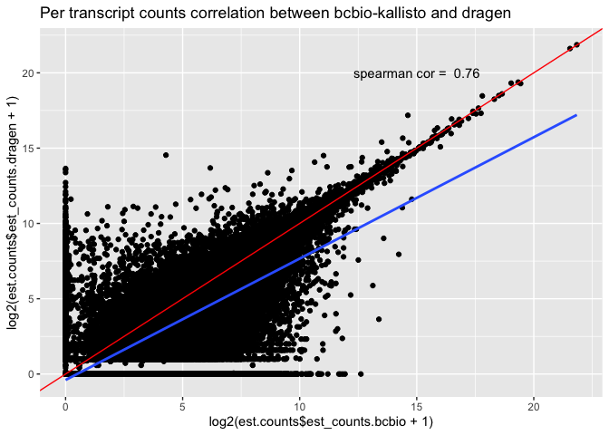
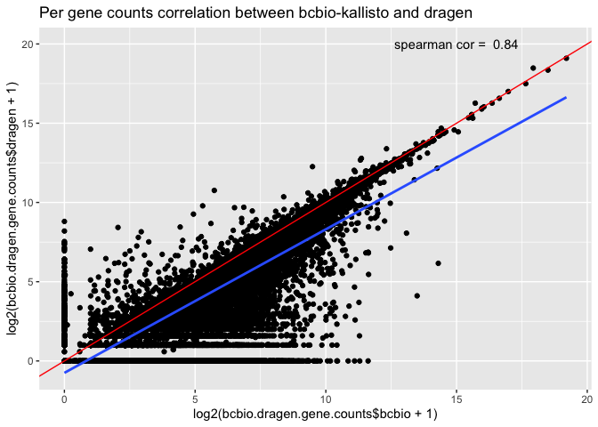

# Description

<style>
div.blue { background-color:#e6f0ff; border-radius: 5px; padding: 20px;}
</style>
<div class = "blue">

**SAMPLE: SBJ02097**

For each WTS workflow output type (abundance and fusions for now), the document currently reports:

- File names in the input (parms) directories
- The number and comparison of calls
- The key difference between both outputs (i.e. bcbio VS Dragen) in a tabular format

</div>


```r
### Define functions.
###list files in a directory
lf <- function(...) {
  data.frame(fname = list.files(...)) %>% 
    knitr::kable(row.names = TRUE)
}

###generate scatter and violin plot for tpm values across both runs
scatterPlot <- function(icombined_tpm, main_title, plot_mode = "static") {
  plotly::plot_ly(icombined_tpm, x = ~log2(tpm_bcbio+0.5), y = ~log2(tpm_dragen+0.5), type = 'scattergl', 
                       text = icombined_tpm$target_id, width = 00, height = 400,
                               marker = list(size = 10,
                       color = 'rgba(255, 182, 193, .5)',
                       #opacity = 0.5, https://plot.ly/~alex/455/four-ways-to-change-opacity-of-scatter-markers.embed
                       line = list(color = 'rgba(152, 0, 0, .8)',
                                   width = 2))) %>%
    plotly::layout(title = main_title)
}

###VIOLIN plot https://plot.ly/r/violin/
violinPlot <- function(icombined_tpm, main_title, plot_mode = "static") {
  #overall data distribution
  p1 <- plotly::plot_ly(icombined_tpm, type = 'violin') %>%
    add_trace(y = ~log2(tpm_bcbio+1), box = list(visible = T),  meanline = list(visible = F),
                       x = 'bcbio', legendgroup = 'run1', text = icombined_tpm$target_id, name = 'bcbio', color = 'orange') %>%
    add_trace(y = ~log2(tpm_dragen+1), box = list(visible = T),  meanline = list(visible = F),
                       x = 'dragen', legendgroup = 'run2', text = icombined_tpm$target_id, name = 'dragen', color = 'green') %>%
    layout(yaxis = list(title = "log2 tpm", zeroline = F))
  
  #zoom into data to highlight data spread
  p2 <- plotly::plot_ly(icombined_tpm, type = 'violin') %>%
    add_trace(y = c(~log2(quantile(tpm_bcbio+1)[1]), ~log2(quantile(tpm_bcbio+1)[4])), box = list(visible = T),  meanline = list(visible = F),
                       x = 'bcbio', legendgroup = 'run1', text = icombined_tpm$target_id, name = 'bcbio', color = 'orange') %>%
    add_trace(y = c(~log2(quantile(tpm_dragen+1)[1]), ~log2(quantile(tpm_dragen+1)[4])), box = list(visible = T),  meanline = list(visible = F),
              x = 'dragen', legendgroup = 'run2', text = icombined_tpm$target_id, name = 'dragen', color = 'green') %>%
    layout(yaxis = list(title = "log2 tpm", zeroline = F))
  
  #combine both box plots
  subplot(p1, p2, shareX = FALSE, shareY = FALSE, titleY = TRUE, margin = 0.06) %>%
    hide_legend()
}
```


```r
### Required packages.
library(tools)
library(here)
library(DT)
library(dplyr)
library(ggplot2)
library(plotly)
library(gridExtra)
library(tximport)
library(package="EnsDb.Hsapiens.v75", character.only = TRUE)
```

***

# List files

This section lists the file names for outputs in the run directories being compared in this report.  


```r
###Read input. 
###The script expects two input directories, each containing 'final' results as produced by bcbio. The results in these two input directories will be compared.
run_1 <-file.path(params$run_1)
#list files in the first run directory
list.files(run_1)
## [1] "fusions.tsv"              "PRJ221038.quant.genes.sf"
## [3] "PRJ221038.quant.sf"

run_2 <- file.path(params$run_2)
#list files in the second run directory
list.files(run_2)
## [1] "abundance.tsv" "fusions.tsv"
```

***

# Counts

This section summarizes two key factors:

- a summary of the total number of counts in the compared files and 
- a table outlining difference between both runs.


```r
###Start with the simple line count in the files i.e. the number of entries in the output from both runs is same.
#compare the count files first (from both runs)
counts.dragen <- read.table(here("../../data/projects/WTS_comparison/SBJ02097/dragen/PRJ221038.quant.sf"), sep="\t", as.is=TRUE, header=TRUE)
counts.bcbio <-  read.table(here("../../data/projects/WTS_comparison/SBJ02097/bcbio/abundance.tsv"), sep="\t", as.is=TRUE, header=TRUE)

#read in the tximport data
dir <- here("../../data/projects/WTS_comparison")
tx2ensembl <- read.csv(file.path(dir, "tx2gene.ensembl.v95.csv"), header = FALSE)
colnames(tx2ensembl) <- c("tx_name", "gene_id")

#read in UMCCR cancer gene list
umccr.cancer.genes <- read.table(file = file.path(dir, "umccr_cancer_genes.latest.tsv"), sep = '\t', header = TRUE)
```

### Total counts


```r
###calculating number of lines in count files from both runs
lines.count <- data.frame(c("dragen", "bcbio"), c(nrow(counts.dragen), nrow(counts.bcbio)))
colnames(lines.count) <- c("file", "lines_count")
datatable(lines.count, rownames = TRUE, options = list(sDom  = '<"top">lrt<"bottom">ip'))
```

```{=html}
<div id="htmlwidget-5fcd23613323af05c001" style="width:100%;height:auto;" class="datatables html-widget"></div>
<script type="application/json" data-for="htmlwidget-5fcd23613323af05c001">{"x":{"filter":"none","data":[["1","2"],["dragen","bcbio"],[203838,206601]],"container":"<table class=\"display\">\n  <thead>\n    <tr>\n      <th> <\/th>\n      <th>file<\/th>\n      <th>lines_count<\/th>\n    <\/tr>\n  <\/thead>\n<\/table>","options":{"sDom":"<\"top\">lrt<\"bottom\">ip","columnDefs":[{"className":"dt-right","targets":2},{"orderable":false,"targets":0}],"order":[],"autoWidth":false,"orderClasses":false}},"evals":[],"jsHooks":[]}</script>
```

### Diff counts

<!-- --><!-- -->
```{=html}
<div id="htmlwidget-99f06e39a38041c0792b" style="width:100%;height:auto;" class="datatables html-widget"></div>
<script type="application/json" data-for="htmlwidget-99f06e39a38041c0792b">{"x":{"filter":"top","filterHTML":"<tr>\n  <td data-type=\"character\" style=\"vertical-align: top;\">\n    <div class=\"form-group has-feedback\" style=\"margin-bottom: auto;\">\n      <input type=\"search\" placeholder=\"All\" class=\"form-control\" style=\"width: 100%;\"/>\n      <span class=\"glyphicon glyphicon-remove-circle form-control-feedback\"><\/span>\n    <\/div>\n  <\/td>\n  <td data-type=\"character\" style=\"vertical-align: top;\">\n    <div class=\"form-group has-feedback\" style=\"margin-bottom: auto;\">\n      <input type=\"search\" placeholder=\"All\" class=\"form-control\" style=\"width: 100%;\"/>\n      <span class=\"glyphicon glyphicon-remove-circle form-control-feedback\"><\/span>\n    <\/div>\n  <\/td>\n  <td data-type=\"number\" style=\"vertical-align: top;\">\n    <div class=\"form-group has-feedback\" style=\"margin-bottom: auto;\">\n      <input type=\"search\" placeholder=\"All\" class=\"form-control\" style=\"width: 100%;\"/>\n      <span class=\"glyphicon glyphicon-remove-circle form-control-feedback\"><\/span>\n    <\/div>\n    <div style=\"display: none; position: absolute; width: 200px;\">\n      <div data-min=\"0\" data-max=\"79085.53\" data-scale=\"2\"><\/div>\n      <span style=\"float: left;\"><\/span>\n      <span style=\"float: right;\"><\/span>\n    <\/div>\n  <\/td>\n  <td data-type=\"number\" style=\"vertical-align: top;\">\n    <div class=\"form-group has-feedback\" style=\"margin-bottom: auto;\">\n      <input type=\"search\" placeholder=\"All\" class=\"form-control\" style=\"width: 100%;\"/>\n      <span class=\"glyphicon glyphicon-remove-circle form-control-feedback\"><\/span>\n    <\/div>\n    <div style=\"display: none; position: absolute; width: 200px;\">\n      <div data-min=\"0\" data-max=\"23244.27\" data-scale=\"2\"><\/div>\n      <span style=\"float: left;\"><\/span>\n      <span style=\"float: right;\"><\/span>\n    <\/div>\n  <\/td>\n  <td data-type=\"number\" style=\"vertical-align: top;\">\n    <div class=\"form-group has-feedback\" style=\"margin-bottom: auto;\">\n      <input type=\"search\" placeholder=\"All\" class=\"form-control\" style=\"width: 100%;\"/>\n      <span class=\"glyphicon glyphicon-remove-circle form-control-feedback\"><\/span>\n    <\/div>\n    <div style=\"display: none; position: absolute; width: 200px;\">\n      <div data-min=\"64.4\" data-max=\"100\" data-scale=\"2\"><\/div>\n      <span style=\"float: left;\"><\/span>\n      <span style=\"float: right;\"><\/span>\n    <\/div>\n  <\/td>\n<\/tr>","caption":"<caption>Filtered gene counts (values above third quantile)<\/caption>","data":[["TNMD","CFTR","MYH16","WNT16","MTMR7","ARX","SLC4A1","MEOX1","PON1","DLX6","LGALS14","MYH13","NOX1","GABRA3","KDM5D","SLC7A14","ISL1","CLCA1","CLCA4","MAGIX","CYP24A1","CCT8L1P","CYP3A43","SPAST","GABRA1","MUSK","MYOC","C2orf83","NNAT","SPO11","STYK1","ARSF","GSC2","ZNF275","POU1F1","COL17A1","CTNNA2","ACSM2B","ZFY","TRPC7","SPP2","TRPC5","CYP2W1","FNDC8","ABCB11","CD5L","NMRK2","TYR","FKBP6","CDH17","SCTR","PIH1D3","CFHR2","CDH7","SLC13A1","COL19A1","OPRK1","C4orf6","AC000111","SLCO1A2","AQP6","HBQ1","PHACTR3","F11","LHX5","RPH3A","NOS1","APOH","PDE6C","NCR2","MLN","PCDH11Y","PRKY","SERPIND1","SLC7A4","SEC14L3","CRYBB3","PLA2G3","DEPDC5","C22orf31","CABP7","PNPLA5","C14orf105","C14orf166B","SLC10A1","BDKRB1","GSS","VSX1","R3HDML","HNF4A","ADNP","SEL1L2","SLC52A3","HAO1","PDYN","PAK7","BPI","SLC32A1","CST4","EPPIN","H2BFM","ATP1B4","PAGE4","GLRA2","F9","RS1","BRS3","TAF7L","MLNR","CCL17","ZP2","PRSS33","AQP8","SLC6A2","TGM5","CALB1","DKK4","GML","CGB","FCER2","CLEC4M","KIR3DX1","CRX","SULT2A1","SYNGR4","CABP5","ATP4A","GAPDHS","TCEB1P28","TFPI2","NHP2P1","HOXA1","HOXA13","GHRHR","SPAM1","MOGAT3","MYL10","POU6F2","MYL7","GALNTL5","GATA3","FGF8","PITX3","CRYBA1","CSF3","PNPO","ZNF29P","HSD17B1P1","AC016292","MYH1","GABRA4","GNRHR","SULT1E1","UCP1","ANXA10","DDX25","DBX1","CCKBR","APOA5","SLC1A2","CALCA","DAO","SYT10","MYF5","MYL2","KCNA1","GSG1","ART4","IL26","RFX4","TULP1","SLC26A8","IL17A","GLP1R","TSPO2","HDGFL1","COL9A1","B3GAT2","NR2E1","IMPG1","WISP3","CLIC5","MEP1A","CDH9","COL4A3BP","IL12B","IL4","IL5","CDX1","RBP2","USP9Y","ROPN1B","UPK1B","ABHD14A-ACY1","GCG","TACR1","CCDC88A","ACADL","PRKAG3","SLC5A7","RP11-153K16","NPHS2","PRG4","PDC","PRAMEF1","CFHR3","TBCE","KCNQ4","CD160","MPL","A4GNT","CA14","ADGB","TCF21","OLFM3","VSX2","NKX2-3","PRLHR","SFRP5","INSL6","INSL4","MLANA","TTLL2","ARR3","SPG20OS","MYOT","CHRNA2","NPPB","PRB2","IAPP","RGSL1","DPPA4","GHSR","SLITRK3","LINC00544","MYOG","PLG","KIAA0087","SPINK4","KIAA1045","AKR1D1","SFTPA1","ARL4P","NECAB1","PLP1","MAGEA9B","C4BPA","DAW1","MOGAT1","GCNT7","CTCFL","KCNS1","MATN4","GDAP1L1","MAGEA10","RP11-663P9","IRGC","PSG8","CEACAM8","NDP","TCP11","APOBEC2","CRISP1","GCM2","TRIM51","RP11-467L20","WNT1","PIWIL1","SLC10A2","SOX21","AMELX","MYH2","BARHL1","KIR2DL1","LINC00029","C20orf195","IL37","HTR5BP","GRIA3","NKX2-4","CSTL1","GFRA4","LRRN4","OTOR","BPIFB9P","FAM83C","BPIFB1","PROZ","KIRREL2","FFAR1","HTN1","DACH2","PRDM7","TSPAN8","SGCE","RFPL1","C22orf24","IGLL1","OPN1SW","EIF2S2P4","QRICH2","ART1","INS-IGF2","TSPAN16","C19orf80","ZSCAN10","SLC7A10","FBP2","TXLNG2P","TTTY9B","BPIFA3","TEX101","CCL25","SLC6A6","G6PC","RHOXF2","KRT33B","USP29","NR0B2","ABHD12B","UBE2L2","LINC00470","HHLA1","ENAM","ACY3","ANGPTL3","PDE6A","RNF17","MYH8","RXFP2","GNG5P2","SEC14L4","SFTPD","DYDC2","TEX15","VRTN","TRPM1","CDC73","CRB1","CFHR5","ERN2","SLCO1B1","DSG3","DSC1","GIF","TCN1","CLDN10","ACRV1","FAM189A2","HNF1A","MRAP2","LACRT","CHRND","PAX3","SLC19A3","EDAR","GPR45","LECT1","EDNRB","MMD2","NKX2-8","CHAD","SCN7A","IL36RN","IL36B","GAD2","OR1J1","ALDOB","BAAT","OR1L4","DMRT1","GCM1","CLPS","MMP20","UNC13C","SLC28A2","BRDT","DNASE2B","ABCG5","TRIM54","CYP2C9","BTBD16","GPR87","PLA2G12B","OIT3","MYPN","CCDC54","PCDH10","C4orf17","TTLL8","PLCZ1","TPH2","PTPRQ","PDX1","CELA1","METTL21C","MDGA2","SYT16","ADAM21","KCNH5","SERPINA10","SLC25A47","DUOXA2","CYP1A2","RLBP1","RPL3L","CDRT15P1","OR4D1","SPACA3","C17orf64","MAPK4","ARL5C","ZIM3","CTD-3222D19","DNMT3L","IL19","CBLC","SLC6A3","GPR32","KLK3","CTD-2545M3","CELA2A","PADI1","DMRTA2","KCNA10","XCL2","MAEL","SYT14","NUP210L","FLG","C1QL2","GPR17","PHOSPHO2","CPO","GADL1","RP11-977G19","FAM86B2","AC062028","AHSG","EPHA5","FABP2","CCNA2","GLRA3","LECT2","SLC25A48","GABRA6","SPINK7","GLRA1","FAM217A","TRIM50","ASB15","ASB10","RAB41","GPR174","AWAT2","GPR119","CHRNB3","STAR","SNTG1","CRH","PRDM14","PSKH2","RSPO2","FAM135B","IFNK","OR5C1","IDI2","A1CF","LRIT1","RGR","PLEKHS1","CYP17A1","NKX6-2","HTR3B","GGTLC1","SLC22A8","TMC2","MS4A3","MS4A2","OCSTAMP","SPINT4","CDH22","SLC22A9","KLRF1","FXYD4","PCDH15","MIA2","SPATA4","PPP1R1C","ALLC","MSGN1","ATP6V1G3","ANO4","AKR1C6P","ITIH2","SLC35F4","CCDC175","RP11-775A3","MCHR2","TUBA3E","G6PC2","PTH","ZSCAN1","GRIA4","MEPE","CAPSL","BMP3","PART1","IFLTD1","ACMSD","FEZF2","FRMD1","FAM81B","SPACA7","TMPRSS11D","KCNJ16","CLCA3P","TDH","ASZ1","GPR26","C10orf90","TMPRSS15","WNT7A","CA10","CNTNAP5","UNC93B2","ODF1","PDZD9","CYLC2","TRIM42","ADCY8","NAT2","MAGEA8","UGT2B4","NAA11","KCNS2","HKDC1","UNC5D","IGKV1OR-2","COX6A2","GPR112","ZIC3","FAM92A1P1","SYN2","C1orf158","CACNA2D3","DYRK1A","CIB4","HPD","WASF2","PLA2G2F","NPM2","VWA5B1","WFDC8","PRAC1","HOXB13","GJD2","ACTC1","PLA2G4D","PADI4","TCHH","PGLYRP3","FAM115D","TFF2","CRYAA","COX6B2","TMEM190","LRRC71","CYP3A4","CYP3A7","CYP11B1","XXbac-B444P24","DCD","CD300LG","IZUMO2","AQP5","KRT84","C16orf11","GNG3","SLC1A7","FAM151A","LRRC38","CCDC27","IL23R","C1orf87","AKNAD1","KCNJ9","MT2P1","PM20D1","AC007364","LRRTM1","NEUROD1","ANKRD30BL","TEKT4","XIRP2","TMOD4","C1orf189","ALPP","ALPPL2","LENEP","DCST1","C3orf30","PDCL2","RETNLB","DPPA2","SLC2A2","CTLA4","SYNPR","C3orf49","CLRN1","DNASE1L3","FANCD2OS","PLSCR2","TCF23","DNAJC5G","RTP3","CCDC37","C3orf65","ZDHHC19","MFSD8","ETNPPL","NDST3","ADAD1","C4orf45","HHIP","PRDM9","SCGB3A2","CDC20B","SPZ1","SLC6A18","IL3","FABP7","RAET1E","FAM183B","BMPER","SMAD5-AS1","SP8","SUN3","C7orf57","HNF4G","EN2","KCNV1","TMEM74","SPAG11B","GBX1","PRSS37","C8orf34","C7orf34","CXorf58","ASB11","OR1K1","NLGN4Y","AQP7","SLC7A3","GPR101","PHOX2A","MBL2","HEPACAM","MAGEC3","NGB","CDX2","SSX5","OXGR1","CLEC1B","RNASE7","PPP1R36","PRAP1","FAM194B","SERPINA12","TMCO5A","TBATA","CCDC182","WDR88","OR10A5","WDR72","CLEC3A","A2ML1","SLC38A8","CPLX4","CDH16","WDR16","LDHAL6A","GLYATL1","C18orf54","GPR182","CACNG2","TAC3","CHP2","MIR202HG","MS4A6E","TGM6","C15orf43","BPIFB6","LINC00483","TBC1D21","UGT1A6","C16orf92","AC104389","OR51Q1","GNG8","CA4","LINC00905","AQP2","ATCAY","KLK1","KLK2","KLK11","KLK13","ACER1","NDUFA7","C3P1","CYP7A1","GSDMA","KRT24","C11orf85","ZNF355P","OR2B2","HIST3H3","KCNV2","KCNG4","SFTPC","HFE2","ADAM29","ADAM18","SPINT5P","WFDC12","CA7","OR13J1","CTRB2","TM4SF20","PMCHL1","NTSR2","KLK7","BRD7P3","ARMC4","GOT1L1","IL13","PDILT","OR4K15","MUC15","CT55","VPREB1","GKN1","BCRP6","DRD5","MUC17","MUC3A","S100G","HSFY2","SERPINA9","AC018720","MRAP","C7orf33","CNGB3","LGALS9B","SEMA3E","CTA-313A17","VSTM2A","KRT75","KISS1","SLC26A5","OR10A4","SDR16C5","OR10A2","FSHR","CELP","PSG6","LILRP2","TRH","TEX13B","CEACAM3","OR4D5","PATE1","C8orf74","GRIK1","CSN3","CLDN20","SOSTDC1","KRT9","XAGE5","KRT20","GLOD5","OR1L6","NLRP5","SPACA5","NEUROD2","DNAI2","SHANK2-AS3","PAH","NXNL1","PCDHB1","C11orf40","LDHAL6B","TEX37","SLC9C1","GPR22","GOLGA2P3Y","OR9I1","DNAJB7","FUT9","HSFY1","ACOT12","SNTG2","MS4A10","OR10W1","FADS6","AP002387","COX6B1P3","ADH6","FRG2C","UNC93B3","ARPP21","DEC1","C10orf131","C10orf129","LIPM","GPR151","CST9","SFT2D3","TLR9","IQCF1","GLIPR1L1","RNASE8","AGR3","UGT2A1","APOBEC4","TAS1R1","SPDYE2B","C1orf100","CCDC13-AS1","RP11-18M17","RAX2","SPERT","C9orf131","ARL13A","C20orf166-AS1","TRHR","ABRA","GOLGA6L2","VWC2L","SLC26A9","C4orf26","C3orf55","AC026271","CA5A","RAG2","WFDC5","ABO","NPPA","GAL3ST3","APOF","OR52W1","DPP10","TSGA10IP","GPR152","RP11-276H1","TEX26","GOLGA8EP","LINC00521","RBMXL3","RWDD4P2","NR2F1","OR52B3P","CALCB","TSPEAR","ASCL3","AL445665","MC5R","GPX2","FOXG1","CIDEA","OR11H4","LRRTM4","OR51B6","HMGB4","IDSP1","FOXR1","RPL37AP8","AC110781","PFN1P10","CNBD1","DMBT1P1","MAP3K19","FOXC2","OR4F17","BDNF","TTTY14","LINC00303","ZNF285B","MAGEB18","MIR7-3HG","GJA1P1","OR51T1","C8G","TRIM60","ZDHHC22","MRVI1-AS1","FAM9B","SPACA4","C10orf85","ENSAP3","GJD4","C10orf71","RP11-551L14","RP1-62O9","UBE2U","RP4-597J3","C8orf47","ST8SIA3","RP11-56N19","RP5-1051J4","AL355390","MBOAT4","C2orf57","MAGEB10","RP11-16K12","AC105206","TMEM78","RP11-606P2","CENPBD1","ODF3","LCN15","SPATA31E1","ZNRF3-AS1","C2orf73","PRSS42","RP1-232L22__B","AMER3","RP4-682C21","AP000345","PRM3","TNP2","SPAG11A","OR2D3","CALML3","RP11-567M16","LINC00314","OR6B3","GAPDHP29","PSAPL1","DYNAP","RP11-169K16","C13orf45","GDPD4","RIIAD1","ADORA2A-AS1","H1FOO","FOXE1","RP11-363G10","LL0XNC01-131B10","AP001885","ZFP42","LINC00670","MTUS2-AS1","RPS2P28","PXT1","SIGLECL1","CDH4","RP11-429E11","SMCO3","OR13C6P","RP5-1027G4","RP11-380B22","ZBTB18","SLC17A8","AP003471","RNF151","NLRP8","FAM216B","MRGPRX4","MRGPRX3","NLRP11","SPDYE7P","RP11-756P10","AC079741","WFDC11","CSNK1A1L","HMGB1P14","FAM71C","SLC9A4","PRNT","CCDC129","CYP8B1","OR6K6","SERTM1","ZSCAN4","ZBTB12P1","RPL21P8","VN1R3","EXOC5P1","PIPSL","RP11-467D10","CSNK1G2-AS1","C12orf36","C11orf42","OR56B3P","OR56B4","OR52N2","C1orf105","OR56B2P","CHRM2","ADIPOQ","FER1L6-AS1","TMEM132E","NME9","SPEM1","OFCC1","CCDC108","RPL24P4","MAB21L2","EDDM3A","OR52D1","FDX1P1","CELF2-AS1","ADIG","OR52A1","RP11-69E11","ZNF716","ASB18","KCNA4","MBD3L3","RP11-39K24","OTOL1","KCNK4","LHFPL1","TBPL2","CAV3","RNASE10","CLEC4G","RP3-341D10","VCX","EPGN","HS3ST4","RP11-123C21","CCDC172","SEPHS1P1","RP11-114H20","GALNT9","C21orf90","NPM1P14","SOX1","PCP4","FREM3","CSMD1","PTGDR2","CYorf17","ANKRD20A2","POM121L1P","GABRR3","ABHD16B","CCDC60","AC140481","FAM9A","SPDYE4","C15orf60","OVCH2","TTTY8","OR56A4","TMEM89","ZBTB8OSP1","TFDP3","SH2D7","COL18A1-AS1","FOLR4","AC131971","BPIFA4P","TNFAIP8L3","GKN2","GOLGA8G","C11orf88","MARCH11","PSG9","LINC00518","ACSM2A","FOXL2","CTA-833B7","UTY","RPL21P132","HTR7P1","PP2D1","CTD-2372A4","RP11-366I13","CNTN2","OR1D2","DGAT2L6","DEFB108B","SIX6","OR51J1","IQCF2","LRRC19","BPIFC","C1QTNF8","GAST","NUTM1","C6orf58","DHRS7C","PIWIL3","RPL7P26","AC004166","PRSS55","RALYL","DDX53","RP11-480I12","TUSC5","PRR23B","CYCSP45","LINC00308","TCEAL2","AC129778","CHRM5","SLC22A10","NT5C1B","AC004980","EFCAB10","FAM169B","MC2R","MAGEA11","KLHL33","SPPL2C","C12orf56","FGF7P2","DLK1","CTD-2287O16","SMIM23","LYG2","C6orf201","TTTY8B","C11orf87","CLDN24","NLRP9","NPAP1","RP4-592A1","RP1-46F2","TMPRSS11B","NXF2B","ATP4B","HTR3E","ZPBP2","RP11-887P2","KRT18P14","HTR3D","ARGFX","CYP4F2","BPIFB4","CYP4F12","FAM86MP","RP11-1079K10","PABPC1L2A","OR10T2","RP11-140K17","TMEM212","SLC36A3","SLC36A2","KIAA1024L","LINC00643","AQP7P1","MYT1L","OR9Q1","CROCCP5","SPDYE9P","PRG2","TPI1P3","ZNF732","SELV","ACTL7A","RHD","PNLIPRP1","SAMD7","SPATA21","ANGPTL5","H1FNT","CTD-2600O9","NPSR1","FAM9C","HSD3BP1","SERPINA13P","PLEKHG7","C4orf40","CTC-471F3","POTEM","DPPA3","COX8C","TMEM247","TMEM8C","TMSB4XP8","C5orf52","KBTBD12","OR52B6","C9orf153","SSX7","ADH1A","OR2B7P","LIN28B","FAM205CP","TMEM202","RP11-24M17","C2orf78","GFRAL","C1orf168","CXXC1P1","SHISA7","HS6ST1P1","C17orf99","OR7D2","CTSL3P","PLA2G4E","FAM25A","EYS","OTOG","OR7A5","IGFL1","LRRIQ4","AC018892","PPP3R2","CLEC2A","IGHV1OR15-9","MAGEB5","SRP72P2","ACTBP11","SLC24A5","LCTL","CC2D2B","RNASE9","OR13D3P","DUPD1","OSTN","TBC1D3P2","TMSB4XP2","PLET1","PLA2G2E","SNTN","RP11-159F24","TMC3","POTEA","GJB3","NYX","DHFRP1","SLC15A5","FAM25B","PRSS48","FSCB","ZAR1L","LINC00994","AC069277","LINC00943","TRIM64B","AL450307","FAM150B","ANKRD62P1-PARP4P3","RP11-797H7","C6orf222","RP11-113D6","OR7E12P","OTUD6A","SPATA41","GJB4","MIR494","MYBPC1","OR6M1","VN1R2","C8orf86","CTSE","SULT1C3","LINC00615","AC090519","GRM7","CPNE4","C9orf163","THEM5","RP3-499B10","HBG2","RP11-57C13","PFN3","ANKRD20A19P","UGT2B15","AC087392","CXorf24","OR52K1","CTB-134H23","CHRNG","ZNF709","KRT39","TOMM20L","ZNF705A","NXF4","OR51A6P","KRT35","NPSR1-AS1","OR4C4P","MAGEA6","GPR123","SSXP1","SLC2A7","C6orf141","AC060834","LYPD2","OR8S1","CYP2B6","CYP2F1","AC005276","ADAM3A","FAM177B","PRAMENP","RP11-460N11","GPX1P1","KCNMB2","AC107218","MYH6","VN1R5","AC106870","RP4-724E16","C14orf178","LHFPL5","C9orf173","OR5B17","IGKV7-3","AC122129","CYP2A13","PRB3","SLC22A6","HRNR","AADACL2","CLEC9A","DLGAP2","RP11-432N13","POTEH","CYP2A7","ADH4","ZNF849P","CLEC4C","FKBP1C","CTC-490E21","BMS1P9","TMEM239","RP11-544M22","F8A2","CCT8L2","B3GNT6","RP11-208N14","RP11-598D12","RD3","AKR1C4","PPIAP22","FAM3D","RP11-168J19","OR5BS1P","EIF1AY","EPS8L3","MAGEB3","GRM3","RYR3","HSD3BP5","MIR4461","POU3F3","RP11-290L1","MIR375","MIR30E","MIRLET7A2","MIR429","MIR380","MIR345","MIR16-2","MIR340","MIR370","MIR412","MIR377","MIR381","MIR339","MIR103A2","MIRLET7C","MIR425","MIR219-1","MIR210","MIR378A","MIR361","MIR324","MIR135B","MIR101-2","MIR323A","MIRLET7F1","MIR26A1","MIR342","MIR148A","MIR379","MIR326","MIR30C2","MIR302C","MIR409","MIR411","MIR26B","MIR148B","MIR365A","MIRLET7D","MIR101-1","MIR302D","MIRLET7G","MIR337","MIR30D","MIR126","MIRLET7A1","MIR374A","MIR331","MIRLET7I","MIR365B","RNA5SP289","RNU105C","RNU6-500P","RNU6-50P","RNU6-834P","RNU6-28P","RNU6-874P","RNA5S12","RNA5SP26","SNORA21","RNU6-208P","RNU6-858P","RNU4-82P","RNA5SP52","RN7SKP25","RNU6-230P","RNA5S11","RNU6-204P","RNA5S3","RNU5E-1","RNU6-766P","RNA5S1","RNU6-1115P","U3","RNU5F-1","RNU6-79P","RNA5SP93","RNA5S5","RNY4P19","RNA5SP301","SNORD62","SNORD9","RNU4-35P","RNU6-1216P","SNORA64","SNORA31","RNU1-70P","RNU1-94P","RNA5SP477","RNU6-212P","RNA5SP226","RNA5SP295","RNA5SP305","RNU6-315P","RNU6-545P","RNU6-37P","RNU6-228P","SNORA22","SNORD114-1","RNA5SP321","SNORD114-14","RNU6-1301P","RNU6-859P","RNY4P24","RNU6-1010P","RNA5SP319","RNU6-1272P","RNU6-1266P","RNU4-21P","RNU6-862P","RNU6-1128P","RNU6-446P","RNU4-23P","SNORD115-2","RN7SKP74","RNU6-1079P","RNA5SP307","RNU6-552P","SNORA42","RNY3P2","RNU6-836P","SNORD114-5","RNU6-1159P","RNA5SP491","RNU6-199P","RNA5SP71","RNU1-72P","RNU5F-6P","RNU6-490P","RNU6-942P","RN7SKP149","RNU1-120P","RN7SKP90","RNU6-249P","RNU5B-2P","RNA5S10","SNORD114-16","SNORD114-19","RNU6-653P","SNORD1B","RNU6-605P","SNORD115-3","RN7SKP243","SNORA73","RNU6-486P","RNA5SP448","RNU6-642P","RNU6-403P","SNORD45","SNORA30","RNY4P9","RNU4-80P","RNU6-433P","SNORD114-31","RN7SKP163","RNU6-181P","RNU6-252P","RNU6-251P","RNU6-1249P","SNORA51","RNA5SP123","RNU6-1021P","RNU6-216P","RNU6-23P","RNU5D-1","RNU6-1309P","RNU1-19P","RNU6-238P","RNU1-20P","RNU1-22P","RNU6-745P","RNU6-697P","RNU6-626P","RNA5SP197","SNORA70","RN7SKP79","RNU6-254P","RNU6-1147P","RNU6-97P","SNORD35A","RNA5SP199","SNORD114-10","SNORA18","SNORA36","RNU6-527P","RNA5SP483","RNA5S8","RNU6-485P","RNU6-1285P","SNORA72","RNA5S17","RNU5B-4P","RNA5S4","SNORD114-23","RNA5SP74","RNU6-1112P","SNORD118","RNA5SP403","RNU6-1205P","RNA5SP378","RNU6-1214P","RNU6-957P","RNU6-1209P","RNY4P6","RNU6-137P","RNU6-525P","RNU6-103P","RNU6-288P","RNU6-640P","RNU6-1284P","RNA5SP514","RNU6-824P","RNU1-87P","SNORD114-11","SNORD114-25","RNA5SP447","SNORA7","RNU6-1059P","RNA5S6","SNORD113-7","RNU5F-3P","RNU6-226P","RNU6-1188P","RNU6-912P","SNORD18","RNU6-674P","RN7SKP93","RN7SKP103","RNA5SP260","RNU1-124P","RNU6-194P","SNORD8","RNA5SP234","RNU6-770P","RNU6-595P","RNU6-1091P","RN7SKP134","SNORD114-4","RNU6-82P","RN7SKP36","RNU6-810P","SNORD14E","RNU6-681P","RNA5SP99","RNU6-854P","SNORD46","RNU6-553P","RNU6-1048P","RNU6-960P","RNU6-501P","SNORD115-32","RN7SKP87","RNU5A-8P","RNU4-87P","RNA5SP493","RNU1-85P","RN7SKP224","RNU6-151P","RNU6-268P","RNU4-84P","RNU4-51P","RNU6-188P","RN7SKP214","RNU6-11P","RNA5SP245","RNU6-647P","RNU6-353P","RN7SKP128","RNA5SP42","RNU1-24P","SNORA62","RNU4-36P","RNU6-853P","RNU6-1322P","RNU6-115P","RNU6-670P","RNVU1-12","RNU4-33P","RNU6-879P","RNA5SP139","RNU4-40P","RNU6-1305P","RNU4-50P","SNORD114-6","SNORD73","RN7SKP76","RNU6-1019P","RNU4-41P","RNA5SP130","SNORA65","RNU6-512P","RNU4-59P","SNORD114-30","RNA5S9","SNORD115-22","RNU4-38P","RNU105B","RNA5S14","RNA5SP500","RN7SKP193","RN7SKP37","RNU6-522P","RNU6-1251P","SNORA32","SNORA68","RNU6-1141P","RNA5SP141","RNU6-1277P","RNU6-335P","RNU4-24P","RNA5SP515","RNU6-1082P","RNU4-4P","SNORA16","RNA5SP379","RNY4P7","RNU4-75P","RNA5SP78","RN7SKP275","RN7SKP217","RNU6-645P","RNU6-450P","RNA5SP194","SNORA16B","RNU4-85P","RNU6-726P","SNORD114-17","RNU1-93P","RNU6-343P","RN7SKP191","RNU6-593P","RNA5S2","RNA5SP517","RNA5SP132","RNU4-16P","RN7SKP15","RNU1-91P","SNORA67","RNU6-621P","RNU6-923P","RNU4-91P","RNU6-7","RNU12-2P","RNU6-60P","RNY1P2","SNORD113-3","RNU6-1303P","RNA5SP160","RNU6-828P","RNU6-534P","RN7SKP55","SNORD117","RN7SKP130","RNU5E-4P","RNA5SP488","RNU6-915P","RNY4P17","RNU4-9P","SNORD114-3","SNORD31","RNU6-702P","RNA5SP331","RNA5SP298","RN7SKP153","SNORD114-24","RN7SKP48","RNU1-140P","RNA5S15","SNORD113-9","RNU6-673P","RNY3P1","RN7SKP22","RNA5SP428","RNU1-36P","RNU6-619P","RNU6-806P","RNU6-934P","RNU6-580P","RNU6-399P","RNA5SP324","SNORD114-20","RNA5SP152","RNA5SP79","RNU4-66P","RNU6-1280P","RNU6-1306P","RNU6-234P","RNU6-302P","RNU1-100P","SNORD114-18","RNU6-407P","RNU6-742P","RNU6-1327P","RNU6-1283P","RNA5SP355","SNORD113-1","RNU1-115P","RNU6-1034P","RNA5SP240","RNU6-282P","RNU6-1138P","RNU6-53P","RNU6-396P","RNU6-737P","RNA5S16","RNU6-1318P","RN7SKP69","SNORD114-12","RNU6-117P","RNA5SP37","RNU6-487P","SNORD6","RNA5SP131","RNU6-1051P","RNU1-16P","RNA5SP277","RNU6-652P","RN7SKP249","RN7SKP1","SNORD82","RNU1-122P","RNU4-48P","RNA5SP88","RNY4P10","RNU6-669P","RNA5SP283","RNU6-597P","RNA5SP151","RN7SKP230","RNU6-805P","VTRNA1-3","RNA5S7","RNA5S13","MIR539","MIR421","MIR146B","RP11-47J17","RP5-961K14","RP11-560A15","RP11-498P14","RP11-375H19","RP11-197P3","RP11-277A4","AC006019","RP3-337H4","AC012454","AC074019","AC015969","RP11-217O12","RP13-36G14","RP11-571E6","AC090519","FAM32B","RP11-163F15","AC109925","RP11-820K3","RP11-814E24","RP11-77K12","RP11-556O15","RBMS3-AS2","RP11-697H9","Z99756","AC016712","RP13-259N13","AC090519","IGBP1-AS1","RP5-1096D14","AC116351","LINC00970","RP11-335E6","AC012456","LINC00501","TCP10","TEDDM1","GJE1","TMEM244","PRR9","FAM24A","HIST2H2AA4","FAM72C","HIST2H2BC","RP11-744H18","HSD3BP4","HSD3B1","HSD3B2","SMIM9","CHIAP2","OOEP","KHDC3L","C1orf146","RP11-188C12","RHOXF2B","C1orf185","GLT6D1","COL5A1-AS1","LIPJ","LINC00951","RP1-153P14","BMP2KL","RP4-640H8","LINC00474","CXorf65","LRRC37A5P","GDF5OS","RPL12P1","AWAT1","LINC00587","HNRNPCP2","FLJ45079","C6orf10","TMEM225","AP002348","ERICH2","CD300LD","BTBD17","C9orf129","C10orf126","RP11-552E4","XAGE1A","XAGE1B","RP11-410N8","CASP12","LY6G6C","TRIM64","AC079586","C1orf195","PRAMEF17","PRAMEF14","PRAMEF7","MCCD1","PSORS1C3","ZSCAN5C","PSORS1C2","MUC21","DEFB122","C10orf115","KRTAP5-11","AC096670","LRCOL1","RP11-638F5","ASPDH","IGKV1OR2-3","OR11A1","UBTFL5","CTC-281M20","CBWD6","AC104135","RP11-160N1","IGFL4","KRT40","KRT25","SPINK9","LRRC3C","PRR20B","PRR20A","CD177","FAM83A-AS1","BLACE","PCDHA7","RP5-842K16","AC139712","RP11-863P13","LGALS7","FAM205A","ACCSL","AC015818","TTLL10-AS1","AL353997","DGAT2L7P","CTXN3","RP11-1112C15","AC022596","GCNT6","AC005863","GOLGA2P1","MT1DP","HNRNPA1P20","RP11-401P9","AL592528","RP11-812E19","OR52J3","RP11-89H19","AF064858","RP11-15G8","VCX3B","CTD-2375G15","HTN3","ACOT6","TECRL","MBD3L4","SLCO1B7","CRLF2","GAGE1","AC002511","TPTE2P6","OR7E91P","C22orf42","NANOGNB","KRTAP5-2","KRTAP5-1","DEFB135","CEMP1","C21orf62","HSP90AB2P","HSP90AA5P","AC074389","RP11-404K5","DEFB109","IFITM5","SMIM21","DEFB109P1B","RP13-212L9","SERPINB5","RP11-400K9","GYG2P1","TCEB3B","RP11-1084I9","ANKUB1","CTD-2308N23","RP11-93O17","TXNRD3NB","CD200R1L","RNU6-1292P","RNU6-354P","RNU6-47P","RNU6-877P","RNU6-431P","RNU6-425P","SNORD116-11","SNORA2A","RNU6-338P","RNU6-979P","RNU6-969P","RNU1-63P","SNORA80B","RNU6-1062P","RNU6-672P","SNORA70G","RNU6-608P","RNU6-32P","RNU6-157P","RNU6-1189P","RNU1-73P","RNU6-723P","RNU1-11P","RNU6-128P","RNU6-26P","RNU6-444P","RNU6-1056P","SNORD116-9","RNU6-936P","RNU6-484P","RNU6-620P","RNU6-142P","RNU6-245P","SNORD101","RNU6-418P","RNU6-116P","RNU6-44P","SNORD37","RNU6-213P","SNORA15","RNU6-701P","RNU1-129P","RNU6-811P","RNU6-815P","RNU6-483P","RNU6-260P","RNU1-138P","RNVU1-5","RNU6V","RNU6-206P","RNU6-209P","RNU6-890P","RNU6-767P","RNU5A-6P","RNU6-187P","SNORA70F","RNU6-761P","RNU6-1310P","RNU6-190P","RNU6-1008P","RNU6-48P","RNU6-42P","RNU6-36P","RNU6-1013P","RNU1-136P","RNU1-52P","RNU6-481P","RNU6-432P","RNU6-689P","RNU6-1024P","RNU6-514P","RNU4-52P","SNORA70B","RNU4-31P","RNU6-708P","SNORA36A","SNORA50","RNU6-1201P","RNU6-74P","RNU6-1316P","RNU6-17P","RNU6-1145P","SNORA8","RNU6-198P","SNORD63","RNU6-610P","RNU6-524P","SNORD116-2","SNORA5","RNU6-611P","RNU6-301P","RNU6-1295P","SNORD116-3","SNORA36C","RNU6-975P","RNU6-43P","SNORD59A","RNU6-339P","RNU6-196P","RNU6-1226P","RNU6-532P","RNU6-378P","RNU6-937P","SNORD116-1","RNU6-463P","RNU6-616P","RNU6-171P","SNORD116-8","RNU6-434P","RNU6-16P","RNU6-31P","RNA5SP187","SNORD116-7","RNU6-106P","SNORD116-13","RNU6-1297P","RNU6-185P","RNU6-933P","RNU1-46P","RNU6-505P","RNU6-1289P","RNU6-549P","RNU6-24P","RNU6-1215P","SNORD116-15","RNU1-67P","RNU6-1157P","RNA5SP122","SNORD116-5","RNU6-1026P","SNORD116-12","RNU6-1195P","RNU1-148P","RNU6-800P","RNVU1-15","RNU6-790P","RNU6-125P","SNORD116-29","RNU6-1005P","RNU6-342P","RNU6-18P","RNU6-35P","SNORD116-16","RNU6-831P","SNORD116-24","SNORD20","RNU6-30P","RNU6-851P","RNU6-140P","SNORD7","RNU6-83P","RNU6-1152P","RNU6-1127P","SNORA2B","RNY1P4","RNU6-883P","RNU6-1263P","RNU6-680P","RNU6-12P","RNU6-658P","RNU6-296P","RNVU1-10","RNU6-1222P","RNU6-306P","RNU6-540P","RNU6-1257P","RNU6-925P","RNU6-178P","RNU6-422P","RNU6-665P","RNU6-748P","RNU6-310P","RNU6-136P","RNU6-1011P","RNU6-455P","RNU6-768P","RNU6-541P","SNORD116-6","SNORD56B","RNU6-520P","RNU6-291P","RNU6-606P","RNU6-535P","RNU6-331P","RNU6-476P","SNORA19","RNU6-987P","SNORA46","RNU6-1105P","RNU6-9","RNU6-1237P","RNU6-59P","SNORA66","MIR548C","MIR25","MIR99B","MIR647","MIR578","MIR635","MIR23B","MIR203","MIR615","MIR550A2","MIR661","MIR199B","MIR30B","MIR606","MIR181D","MIR544A","MIR593","MIR215","MIR181A2","MIR598","MIR191","MIR554","MIR200A","MIR491","MIR149","MIR604","MIR181C","MIR193A","MIR619","MIR194-1","MIR562","MIR581","MIR651","MIR641","MIR505","MIR499A","MIR595","MIR99A","MIR193B","MIR571","MIR655","MIR153-1","MIR570","MIR28","MIR621","MIR558","MIR128-1","MIR548AA2","MIR592","MIR602","MIR659","MIR573","MIR32","MIR597","MIR548D1","MIR141","MIR200C","MIR623","MIR186","MIR455","MIR200B","MIR218-1","MIR657","MIR181B2","MIR590","MIR382","MIR495","MIR10B","MIR575","MIR553","MIR199A1","MIR487B","MIR93","MIR532","MIR181A1","MIR329-2","MIR617","MIR626","MIR550A1","MIR548A1","MIR15B","MIR648","MIR150","MIR26A2","MIR646","MIR599","MIR483","MIR95","MIR605","MIR105-2","MIR545","MIR640","MIR30A","MIR33B","MIR27B","MIR221","MIR559","MIR196A2","MIR135A1","MIR603","MIR33A","MIR511-2","MIR574","MIR152","MIR561","MIR624","MIR219-2","MIR579","MIR656","MIR153-2","MIR496","MIR30C1","MIR569","MIR628","MIR629","MIR620","MIR125B1","MIR638","MIR589","MIR181B1","MIR154","MIR548B","MIR613","MIR576","MIR182","MIR601","MIR301A","MIR644A","MIR643","MIR503","MIR130A","MIRLET7F2","MIR652","MIR140","MIR645","MIR618","MIR185","MIR591","MIR616","MIR548A3","MIR609","MIR106B","MIR320A","SNORA40","SNORD96B","SNORD12C","MT-TL1","SNORD83A","SNORD105","SNORD41","MT-TI","MT-TQ","MT-TW","MT-TA","MT-TN","MT-TC","MT-TY","MT-TS1","MT-TD","MT-TK","MT-TG","MT-TH","RNU6ATAC4P","MT-TS2","MT-TL2","MT-TE","MT-TT","MT-TP","RNU6ATAC26P","MIR320D1","MIR454","MIR718","MIR501","MIR338","MIR760","MIR766","MIR769","MIR765","IGKJ5","IGKJ4","IGKJ3","IGKJ2","IGKJ1","IGLV4-60","IGLJ1","IGLJ2","IGLJ3","TRGV11","TRGV5","TRGV4","TRGV3","TRGV1","TRBV6-5","TRBV5-5","TRBV5-7","TRBJ2-1","TRBJ2-2","TRBJ2-2P","TRBJ2-3","TRBJ2-4","TRBJ2-5","TRBJ2-6","TRBJ2-7","TRAV8-1","TRAV10","TRAV8-2","TRAV8-3","TRAV18","TRAV24","TRAV35","TRAV38-1","TRAV39","TRDV2","TRAJ56","TRAJ53","TRAJ52","TRAJ48","TRAJ47","TRAJ46","TRAJ45","TRAJ44","TRAJ43","TRAJ42","TRAJ41","TRAJ40","TRAJ39","TRAJ38","TRAJ35","TRAJ34","TRAJ33","TRAJ32","TRAJ31","TRAJ30","TRAJ29","TRAJ28","TRAJ27","TRAJ26","TRAJ25","TRAJ24","TRAJ23","TRAJ22","TRAJ21","TRAJ20","TRAJ19","TRAJ18","TRAJ17","TRAJ16","TRAJ14","TRAJ13","TRAJ12","TRAJ11","TRAJ10","TRAJ9","TRAJ8","TRAJ7","TRAJ6","TRAJ5","TRAJ4","TRAJ3","TRAJ2","TRAJ1","IGHE","IGHD2-15","IGHD3-10","IGHD3-9","IGHD2-8","IGHD3-3","IGHD2-2","IGHV3-16","IGHV3-35","IGHV7-81","MIR708","MIR548U","MIR374B","MIR320C2","RNA5SP372","RNU6-1319P","SNORD66","SNORD64","RNU1-77P","RNA5SP86","SNORA12","RNU6-258P","SNORA26","RNA5SP91","RNU6-1321P","RNU6-220P","RNU6-907P","RNU6-747P","RNA5SP18","RNU6-930P","RNA5SP219","RNU6-360P","RNU6-750P","RNU6-1176P","RNU6-308P","RNU6-724P","RNA5SP185","RNA5SP256","RNU6-578P","RNA5SP339","SNORD72","RNU6-1009P","RNU6-1154P","SNORD70","RNU6-882P","RNU6-316P","RNA5SP297","RNU6-780P","RNA5SP210","RNU6-739P","RNU6-823P","RNU6-700P","RNU6-1300P","RNU6-482P","RNU6-269P","SNORD113-2","RNU6-817P","RNU6-1275P","RNU6-932P","SNORD115","RNU11-3P","RNU6-1111P","RNU11-6P","SNORD90","RNU6-241P","RNU11-4P","SNORD69","RNU6-644P","RNU6-460P","SNORA17","RNU6-952P","RNU1-101P","RNU6-1197P","SNORD19","RNU6-1093P","RNA5SP465","RNU6-1250P","RNA5SP212","RNU6-466P","RNU6-808P","RNU6-510P","RNU6-337P","RNA5SP354","SNORD91B","RNU6-1254P","RNU6-903P","RNU6-876P","RNA5SP53","RNU1-56P","SNORA45","SNORD58","RNA5SP397","RNA5SP241","KRTAP9-6","RP1-122K4","RP11-592N21","RP11-134K1","CTAGE1","ST13P5","RPL15P3","TTTY2","TTTY2B","KRTAP3-2","KRTAP3-1","RP11-414H23","RP1-29C18","HNRNPA1P40","BTF3P12","PTTG3P","VN2R17P","AL590762","KLK9","COX20P1","RP11-108F13","CGB8","NDUFA3P3","RP11-383G10","RP11-532L16","EEF1A1P32","TPM3P1","RPL5P5","AC064852","KRT8P40","RPL31P11","RP11-312J18","AC012362","AHCYP5","RP11-55K22","AL590867","AC092642","YWHAZP4","PPP1R14BP5","RP11-346C16","RP11-259P15","GAPDHP36","AL591516","RP11-81B10","LINGO4","RPL13P6","RPL36AP48","C6orf165","NCLP1","RP11-355O1","CSH2","AC093724","TCL1B","NPM1P32","AC093106","AL365331","NIP7P2","TSGA13","IFITM9P","MARCKSL1P1","RP11-212P7","RP11-680L20","CTD-2666L21","CTC-398G3","CTC-398G3","RPL18P11","RPL7AP34","CTD-3035D6","RP11-281O15","GAPDHP44","CNN2P8","AC092933","RP4-778K6","FTH1P12","LINC00671","EIF4E2P1","RP4-747G18","CISD1P1","ANXA2P1","CTB-47B8","RBMX2P2","KRT222","RP11-301G23","VTI1BP2","ATP6V0CP3","YBX2P1","H2AFZP1","RPL18AP3","AKR1B1P2","HMGB1P37","CFL1P2","NDUFAF4P2","EIF4A1P8","RP13-147D17","TPT1P13","RP11-428P16","AC132008","RP11-383B24","SETP8","RP11-432F4","YBX1P6","RARRES2P2","RP11-386I14","RP11-646D13","AP000662","AC111200","AKR1B10P1","FAM220CP","RPSAP54","RPL7AP4","RP11-760D2","CTD-2158P22","OLA1P2","AC002056","LDHBP2","RP11-513D4","SETP22","RAB5CP1","RPS10P14","RP11-342F17","UGT2B11","RP11-385J23","RP11-452G18","PSMC1P2","OLA1P1","CNN2P4","AC104306","CNN2P6","RPL21P75","CTD-2270N23","XX-C2158C12","YBX1P10","TAF9BP1","AC092798","RP11-678D18","RPL3P6","CEACAM16","RPL5P8","NPM1P33","CCL27","HBE1","AC092610","RP11-314A20","RP1-102E24","DNAJB1P1","CHCHD4P4","RP11-264F23","RP3-522P13","AC007277","AC078899","RP11-414H17","RP11-169L17","RP11-474D1","PGAM1P4","RPL7P17","WEE2","TMEM213","RP11-420O16","XPOTP1","UBE2V1P2","HNRNPA1P43","RP11-208P4","AC004980","SNURF","CTD-2228K2","KRT8P14","RP11-85F14","PDCL3P3","RPL39P5","MRPS21P6","SPDYE3","RP11-91K8","AP001024","AP001024","CBX1P2","OR4F13P","CTB-180A7","OR1X5P","AC133644","RPL18P10","EFCAB9","AC009967","LINC00488","RP11-121L10","RP11-221J22","TRIM77","AS3MT","SPINK13","HIGD1C","KRT42P","AC130709","RPS15AP1","GTF2IRD2P1","SDHCP2","COPS8P2","RP11-323J4","RBBP4P4","GAPDHP15","RP11-65N13","CTBP2P5","RPS19P1","SLC6A10P","RP11-392M9","RP11-83B20","RP11-477J21","RPL6P12","AC104654","NPAP1P2","C12orf71","RPL5P35","CTD-2509G16","RPL21P1","HNRNPA1P15","RP11-174G6","RP11-1036E20","RP11-37N22","RP5-1053E7","CDRT15L2","UPF3AP2","ZFYVE9P2","RP11-115L11","SRSF9P1","SMTNL1","RP11-574M7","XXyac-YM21GA2","RPS9P1","DUTP8","RPL23AP3","RP11-53I6","AC003102","AC113167","CHCHD3P3","PPIAP29","AKAP17BP","AC006465","CHCHD2P2","ACSM4","AC114730","FDPSP5","PRDX2P1","HNRNPCP10","RPS5P3","RP11-244K5","RP11-790I12","CXorf49B","CXorf49","AL590763","RP3-420J14","C16orf90","LINC00269","RP11-182N22","KRT18P60","RP11-308K19","LINC01020","KCNU1","AC025750","LA16c-60H5","GAGE10","C14orf164","HMGB3P24","TMCO5B","RP11-98L4","ASS1P10","GPX1P2","SLC25A5P1","FAM90A24P","TMED11P","DEFB108P2","AC090625","SCRT2","LL22NC01-81G9","RP11-748L13","PSMA6P1","RP5-827A12","RP5-890O15","RPL27AP","RCN1P1","CALM2P3","AP005901","BCORP1","RP5-836E8","ZNF962P","RSC1A1","CELA2B","RP1-21O18","GOLGA6L18","TAF9BP2","RP11-551G24","BTNL10","ZNF847P","SDHAP2","RP11-466F5","RP11-800A3","RP6-74O6","KRT18P57","RP11-364B6","RP11-65D24","ZNF859P","RP4-635E8","RP11-439L8","MIR942","MIR921","MIR300","MIR933","MIR874","MIR298","MIR938","MIR875","MIR889","MIR941-2","AC009234","MIR920","MIR941-3","KRT19P2","RP3-382I10","HIST1H1PS1","RP11-360O19","RP1-182O16","RP3-393E18","RP11-317M22","RP3-406A7","LINC00955","RPL7P25","RP3-355L5","RP11-278J20","MTND4P13","NUDT19P3","RP1-190J20","RP1-152L7","TUBB2BP1","BX005214","RPL17P26","LY86-AS1","RPS2P55","AC114776","AL022393","AC131097","RP3-329A5","RP11-428J1","RP11-346C16","RP11-448N11","AC007401","RP1-13D10","RP1-245M18","HMGB3P19","PPIAP31","RP1-76C18","ANKRD18EP","RP11-9G10","RP11-360O19","RP11-277I20","RP1-319M7","RP3-340H11","RP1-182O16","AC007249","POM121L4P","SSXP10","RP11-528A10","ISCA1P1","HMGB1P17","RP11-474L11","RP1-95L4","PTGES3P2","RP4-803A2","RP11-63K6","RP11-415D17","RPS10P3","AC064847","RP1-303A1","HSPE1P8","CICP18","RP3-407E4","RP1-261G23","KRT8P43","POM121L14P","NEPNP","HIST1H2APS3","RP11-393I2","LL22NC03-75H12","RPS27P15","RP11-93K7","H2AFZP3","RP11-420A21","HNRNPA1P37","GAPDHP63","RP3-395C13","AC008060","BRD7P4","ST13P16","RP1-34L19","KRT18P44","RP3-453I5","RP5-1046G13","DBIP1","RP3-340B19","RPL18AP8","RP3-472M2","FAM8A6P","RP3-382I10","RP11-361F19","RP1-209B5","RP11-249L21","TUBB8P2","PTMAP3","RP11-528A10","FTH1P15","CELA3B","RP3-359N14","HNRNPA3P12","RP11-203F10","RP11-129H15","RP11-214N16","RP11-569A2","AC011298","CACYBPP3","AMZ2P2","RP1-217P22","PIP5K1P1","RP1-273P12","RP11-397G5","RPL31P52","RP11-250B2","RP11-69L16","RP11-491H9","ATF1P1","RP1-265C24","RP11-524C21","RP11-3B12","RP11-365H23","TPT1P8","FTH1P8","RP3-323K23","RPL17P25","RP11-374I15","ZNF259P1","RP11-291C6","RP11-191A15","RP11-262H14","PTCHD3P3","RPL26P20","RP11-560O20","RPL21P67","GAPDHP42","RP11-394A14","RP11-40C6","RP11-378G13","LAP3P1","RP1-72A23","RP3-354N19","RPS24P12","AC093802","RP1-152L7","TUBB3P1","RP3-520B18","PGAM1P10","HTR5A-AS1","VN1R12P","RP11-480N24","KRASP1","RP3-391O22","RP3-406A7","RP1-121G13","RP1-32I10","RP11-277I20","RP1-101K10","RP3-322L4","RP3-334F4","RPL21P119","RP11-572P18","RPS18P9","DNAJC19P6","MESTP1","RP11-127B16","RP1-92C4","RP3-525L6","IGBP1-AS2","HNRNPA1P41","MIR1250","MIR1193","RNU6ATAC7P","MIR1286","CPEB3_ribozyme","RNU6ATAC38P","RNU6ATAC6P","MIR1296","SNORD111","SNORA77","MIR1302-5","SNORA11B","SNORD23","MIR1207","MIR1254-1","MIR548E","MIR1305","MIR548L","MIR1285-2","SNORD88A","MIR548P","MIR1284","MIR1255A","MIR1302-8","MIR663B","MIR548T","MIR1200","MIR548Q","MIR548K","RNU6ATAC18P","MIR548F5","MIR1288","RNU6ATAC23P","MIR1295A","MIR320B2","MIR1227","MIR1287","SNORA81","MIR1294","MIR548F3","RNU4ATAC16P","RNU6ATAC31P","MIR548F4","MIR1301","MIR1271","MIR548AJ2","MIR1827","MIR320C1","SNORD100","MIR1245A","MIR548O","SNORD111B","RNU6ATAC16P","MIR1285-1","MIR1185-1","MIR548H1","SNORD99","MIR1180","MIR1255B2","MIR1303","RNU6ATAC10P","RNU6ATAC33P","MIR548F1","MIR1249","MIR1293","SNORD88","MIR1185-2","MIR548H4","MIR1179","MIR1276","MIR1268A","MIR1267","MIR1290","MIR548N","RNU6ATAC","MIR1278","MIR1275","MIR548I1","SNORD93","MIR1197","MIR1273A","MIR548J","MIR1205","MIR548F2","MIR1183","MIR1252","MIR548H2","RNU6ATAC34P","MIR1256","PSG3","C2orf16","RP11-404E6","KRTAP10-10","MAGEA3","PSG7","KRTAP1-3","FAM45B","TAS2R40","TMEM14E","OR2A1","TTC4P1","MYBPHL","OR2A2","C7orf71","AC064874","AC011997","C21orf140","AC004945","AC007131","POTEG","AC079305","RNU6-1165P","RNU4-62P","RNU4-86P","RN7SKP285","MIR1915","RNU2-3P","RN7SKP110","RNU6-908P","RNU2-65P","RNA5SP317","RN7SKP148","RNU6-648P","RNA5SP390","RNA5SP36","RNU4-30P","RNA5SP181","RN7SKP26","RNA5SP156","RNU6-588P","RNU6-447P","RNA5SP201","RNU6-262P","RNA5SP95","RNU6-101P","RN7SKP114","RNU6-892P","RNU6-1043P","RNU6-1156P","RNA5SP371","RNA5SP198","RNU6-1118P","RNA5SP118","RNU6-855P","RNU6-1076P","RNU6-613P","RNA5SP237","RNU2-29P","RNU6-355P","RNU4-34P","SNORD12B","SNORA36B","RNA5SP44","RNA5SP203","RN7SKP158","RNU2-28P","RNU6-791P","RN7SKP125","RNU2-59P","RNU2-50P","RNA5SP338","RNU6-141P","RN7SKP56","RN7SKP150","RN7SKP143","RN7SKP59","RNA5SP296","RN7SKP271","RNU2-5P","RNU2-23P","RNU6-285P","RNA5SP475","RNU4-25P","RNU2-39P","RNU6-1025P","RNU2-47P","RNU2-66P","RN7SKP222","RNA5SP494","RN7SKP235","RNU6-628P","RNU6-402P","RNU6-1100P","RNU2-42P","RNU6-1203P","RNU2-51P","RNU2-16P","RNU2-70P","RN7SKP213","RNU6-1267P","RNA5SP38","RNU4-72P","RNU6-733P","RN7SKP39","RNU2-7P","RNU6-1190P","RN7SKP166","RNU6-684P","RNU6-233P","RNA5SP144","RN7SKP91","RNU6-860P","RNU2-62P","RNU4-47P","RNU2-68P","MIR1537","RNU6-321P","RNU6-920P","RNU6-565P","RNU4-78P","RNU6-564P","RNA5SP104","RNU2-41P","RNU6-172P","MIR1913","RNU6-272P","RN7SKP8","RNU2-25P","RN7SKP228","RN7SKP94","RNU2-14P","RNU5A-5P","RNU4-22P","RN7SKP259","RNU6-55P","RN7SKP247","RN7SKP144","RNU6-130P","RNU2-55P","RNA5SP155","RNA5SP115","RNU2-72P","SNORA74","RNA5SP247","RN7SKP296","RN7SKP181","RNU2-32P","RN7SKP112","RNU4-88P","RNU2-18P","RNY1P3","RNA5SP39","RNU6-177P","RNU2-22P","RNA5SP221","RNU6-1217P","SNORD71","RNU6-1054P","RNA5SP294","RNU6-785P","RNA5SP492","RNU6-387P","RNU6-57P","RNU6-195P","RNU6-954P","RN7SKP108","RN7SKP101","RNU6-722P","RNU6-516P","RN7SKP273","RNU6-603P","RN7SKP3","HIST2H2BA","EHHADH-AS1","AC108066","AC005104","RP11-224O19","RP11-655H13","RP1-65J11","RP11-91A18","TRBV29OR9-2","RPL17P17","RP4-800M22","AC011243","MTND6P21","AC011625","TMSB4XP3","RP1-171K16","AC004041","USP17L2","RP11-52I18","AC004471","RP11-285G1","RP11-490O24","RP11-310H4","CHCHD2P5","RP11-15M15","RP11-763B22","AC083862","RP11-29H23","RP11-397P13","CDRT15","ATP6V0E1P2","AFF2-IT1","AC010723","CSNK1A1P1","AC093690","AC079613","RP11-223P11","EEF1A1P8","AC008069","RP5-919F19","RP1-283K11","TCEAL4P1","AC005838","MTND5P28","SMPD4P1","RP11-543B16","AP001601","TNRC18P2","RP11-275I14","RP11-61K9","RP4-662A9","RP5-884C9","FNDC3CP","CTD-2296D1","RP1-292B18","AC125634","RP11-289I10","RP3-425P12","RP1-125I3","LINC01044","RP4-613A2","RP11-108M9","AC002463","AL133249","IGHV3-64","UHRF2P1","RP5-1121H13","HMGB3P10","AC012314","SAMSN1-AS1","RP5-890O3","EEF1A1P24","RP11-86H7","RPL34P26","RP11-311H10","AL138935","RPS24P14","AC068044","DIP2A-IT1","RP4-633O19__A","AF230666","RAET1E-AS1","AC027612","RP11-71G7","AC093107","RP5-1024N4","RP11-467L13","RAD17P2","AC026188","RP11-145E17","RP1-127B20","RP11-644K8","RP11-149B9","AC116609","AC008073","MIR1255B1","AC092162","RP11-554D15","LINC00114","RP11-562M8","RP11-85L21","KRT8P28","RP11-437J19","RP11-197K6","RP3-347M6","RP11-505P4","DAZAP2P1","BANF1P4","RP1-56J10","RP11-548K12","RP11-135J2","EFCAB6-AS1","AC007403","NPM1P19","RPS27P1","AC005517","LINC01078","AC019048","RP11-251G23","AC008171","CCNJP2","RP11-335E14","AC068657","AC009480","RP11-353H3","RP13-461N9","RP11-458I7","RP11-533O20","AL133244","RP4-710M16","ZNF587P1","AC002456","AC068491","RP11-561N12","AP001048","HNRNPRP1","RP11-528A4","RP3-471M13","RP11-270F18","AC019070","RP5-1010E17","AC063976","AP000470","TCEAL3-AS1","RP11-445P17","AC091493","RP11-98L5","RP11-30O15","GAPDHP55","EGFR-AS1","HSPA8P16","RP11-75A9","LINC00691","AC091729","UBTFL8","AC018804","RP11-443B9","RPS24P8","AC108051","AC064834","AP001630","ELMO1-AS1","LINC00633","RP11-343H5","PTPN2P2","ATG12P2","UBE2SP2","AC107057","DPPA2P2","AC112715","AC000123","AL109763","RP11-700P18","HCG14","HMGB1P9","RP3-522D1","AC007422","LINC00570","RP11-574K11","RPS23P10","PHEX-AS1","RP11-10L12","AL590762","LINC00466","RP11-371A19","RP11-359D14","RP11-262I2","AC069394","MINOS1P3","AC090044","AC090283","RP11-533K9","RP11-78A18","RP11-499O7","CTA-292E10","VWC2L-IT1","RP1-272L16","AP000697","AC114730","ENSAP1","AP000345","CTD-2290C23","AC013437","IFIT6P","MRPL49P1","AC007282","RP11-144G16","RP1-13P20","ANKRD30BP2","AC012317","RP11-40H20","MCCD1P2","RP3-378P9","DPRXP1","THAP5P1","MDC1-AS1","GAPDHP20","RP11-301M17","RP11-496H15","AC007879","KNOP1P3","RP11-462G2","MTND2P5","AC011239","RP11-289H16","RP11-252P18","RP11-814E24","RP11-235G24","LINC00703","RP3-395M20","BACE2-IT1","GPC6-AS2","RPL7P57","RP11-48F14","RP11-114B7","RP11-351O1","ATP5J2LP","SLC31A1P1","LINC00422","AC063976","RP4-816N1","HIST1H1PS2","GS1-259H13","RP11-439L18","C4BPAP1","AC009313","RP11-181K3","AL355490","RPL36P16","RP1-81D8","RP11-13P5","RP11-495P10","RP11-548K12","RP11-492A12","TTC21B-AS1","RPL36P4","RP11-328K22","AC010884","AC109309","LINC00620","RP11-5K23","RP11-561I11","AP001439","SNRPGP15","AC008264","EIF4BP3","RP11-370B11","HMGB3P21","LPP-AS1","RP1-148H17","FAM96AP2","AC096669","RP11-430H12","COL18A1-AS2","AC012314","RP11-365D23","AC073626","RPS5P2","AC008069","RP11-470E16","RP11-265P11","AC007919","RP11-153F1","AC096921","MEF2AP1","RP11-276H7","TUBB8P6","AC106053","RP5-1142J19","RP11-51O6","AC019129","AC106900","RP11-16L21","RP11-397D12","AF124730","AC018737","RP11-631F7","AC010907","RP1-50J22","AC013470","RP11-335O13","AC007272","EIF3EP2","PDIA3P2","GAPDHP46","SOCS5P2","RPL36AP29","UBE2D3P3","GS1-174L6","RP11-697E14","RPS17P13","E2F3-IT1","RP11-179K3","CITF22-49D8","RP11-576D8","RP11-222A5","AC007182","PRNCR1","CEP57L1P1","FCF1P7","AC009892","RP1-86D1","AC016735","TEX26-AS1","AP001065","SHMT1P1","VN1R21P","RP11-508N22","RP11-54O15","RP11-361A21","AP000704","KRT18P39","RP11-314A5","AP003039","RP11-57C19","RP11-445O16","RP11-235D19","LINC00853","DUX4L9","RP11-538D16","AC114812","RP11-307E17","RP11-190J1","COL4A2-AS2","RP11-171A24","AC019109","AC107079","RP1-90J20","RP1-104O17","MTND5P24","C9orf53","OPA1-AS1","RP11-344P13","RP5-1109J22","AC009518","XX-FW81066F1","AC068279","CTA-250D10","AC034187","AC007899","SIGLEC30P","RP11-3B12","RP11-448G4","RP1-102E24","LINC00320","NDUFA5P10","AC152010","AC107399","LINC00184","CASC6","AC007312","RP11-161N3","RP1-278O22","TBC1D3P6","RP1-35C21","LARGE-AS1","RP11-160H22","RP13-228J13","RP11-409K20","RPL29P12","RP5-991C6","AC010082","RP11-6F6","RP11-483G21","AC000067","LINC00328-2P","AP004289","RP11-330M19","RP4-784A16","EIF4BP7","RP11-414B7","EIF1AX-AS1","LINC01058","RPL18AP2","RP11-204C23","MTND5P27","RP11-383G10","RP1-272E8","OR7E116P","RP11-426L16","WWC3-AS1","RP11-123N4","PFN1P4","DAP3P1","GRTP1-AS1","AL450226","RP4-660H19","RP11-479O17","RP11-295P9","RP11-477L16","AC023271","RP4-549F15","RP4-614C15","MORF4L1P4","AC073957","AC012354","LINC00618","BRI3P1","RP5-828K20","RP11-16L9","LINC00457","AATK-AS1","RP11-388K2","RP4-758J24","RP11-481K9","RP11-338E21","SSXP3","TBC1D4-AS1","RP11-107I14","AC079790","AC007362","AP001628","CHCHD4P5","AC007250","RP11-554K11","TRAPPC12-AS1","DDX26B-AS1","RP1-127D3","RP11-403F21","LA16c-83F12","RP5-937E21","LINC00705","CICP12","RP11-466F5","MTND1P18","RP11-536C5","AC018693","AC005105","RP11-57H14","OSTCP2","RP4-612C19","LINC00113","RP11-512N4","RP1-91J24","RP11-415J8","RP11-293P20","RP11-479J7","AC019100","RP11-325F22","HMGB3P1","RP11-384C4","AC079630","FREM2-AS1","RP11-540K16","RP11-149F8","CT62","ATP6V0E1P1","TDGF1P3","AC009506","AC011515","CICP8","RP11-490D19","AC099754","RP11-55K22","RP11-69A21","RP11-395L14","RP11-1114A5","CTD-2384B11","RP11-207C16","AP000345","RP5-1178H5","AKR1C5P","AC019330","AC108479","MPRIP-AS1","RP5-1121H13","RP13-93L13","ATP13A4-AS1","LINC01107","AC104651","RP11-180I22","RPL15P4","GAPDHP16","RP11-330C7","AC069282","MTND1P34","RP11-203F10","XX-C2158C6","PAWRP1","AC002480","ZNF385D-AS1","RP11-545I10","RP11-19J3","NAALADL2-AS1","RP11-527D7","UBE2D3P2","AC083867","FAM197Y8","RP11-341A22","CCT4P2","DOCK4-AS1","RPL35P5","NCBP2-AS1","EDNRB-AS1","AC096669","RP11-339D23","MTOR-AS1","AC005281","AC007679","RP11-70C1","AGBL4-IT1","C9orf135-AS1","RP5-997D24","HNRNPA3P15","PGAM1P2","RP5-1022P6","EIF2S2P5","RP11-143M1","RP5-858B6","RP5-843L14","TAF13P2","SAR1P3","CTA-134P22","IPO7P2","RP4-784A16","AP000619","AL163953","TSPY5P","RP1-30E17","TREML5P","HNRNPA1P35","AC005522","RP11-345I18","RP11-325E14","RP11-3P22","RP4-742C19","RP11-269F19","MTND6P15","RP11-71C5","RP6-191P20","RP3-365O12","AP001627","NRG3-AS1","NPM1P18","AC017002","PLAC4","RP11-242O24","AC087501","RP1-45I4","RP11-267N12","LINC00431","RP11-511I2","LEPREL1-AS1","RP5-850O15","AC092933","PROSER2-AS1","RP4-603I14","OR6V1","RP11-2L8","AC004540","AC073321","RP11-395G17","MTND4P23","AC025918","RP11-1036E20","CTD-2313N18","RP11-44M6","RP11-547I7","AC009299","RPS18P1","RP3-348I23","RP11-80H5","TRMT2B-AS1","AC010970","NIPA2P1","RP11-452K12","PCNPP2","RP11-1018N14","LINC00368","RP11-495P10","AC024067","AC004603","RP3-495K2","AC009365","RP11-288L9","FRG2B","RP1-144F13","MORF4L1P7","RP4-758J18","XXbac-BPG154L12","RIMKLBP2","RP11-57G10","CACYBPP1","AC000036","AC026150","RP4-566D2","RP11-501J20","PCA3","RP4-575N6","RP11-554I8","ODF2-AS1","RP11-69E9","RP11-360A18","RP3-526F5","RP11-192N10","AC102953","RP11-538D16","RP5-1119D9","RP11-731I19","TRGVA","RP11-312J18","RP11-10J5","RP11-464C19","PFN1P12","FGF13-AS1","RP11-338C15","AP000705","TLK2P1","ZNF503-AS1","RP5-1070A16","PHF2P2","AC092570","ZBTB45P2","RP11-552E20","SLC39A12-AS1","RP11-180O5","AC099342","AC007461","SEPT7P3","AC111200","AC018705","RP1-228P16","RPS27AP3","SLC25A39P1","RP3-389A20","AC124944","RP11-478K7","RP11-167P22","AP4B1-AS1","RP4-712E4","RANP7","TCEB1P21","RP11-438H8","RP11-328D5","RP4-760C5","AC007790","RP11-99H8","TRGV6","CICP22","AC022431","LEMD1-AS1","LINC00381","RPL37AP1","ZNF32-AS1","AC005034","RP11-307P5","LINC00408","RP11-15I11","AC064836","RP11-61N20","ARHGAP26-AS1","AC093382","AC105393","RP1-80N2","ARPC3P1","AC091813","OR52I2","AC091729","RAD23BLP","PDCL3P1","NPY6R","RP4-813D12","SMARCE1P2","LINC00351","AC018359","RP11-115M14","AC005682","RP11-739N20","RPS26P56","AC105402","AC083822","RP11-145A3","RP11-523H24","RP11-65J3","RPS6P20","TERF1P5","AC102948","ST7-AS2","DCAF8L1","RP13-614K11","RP3-395P12","AC093375","RP11-358D14","RP4-736H5","IFNA20P","CTD-2269E23","RP11-735G4","OR8T1P","RP11-375A20","TPI1P1","AC093642","RP11-348J12","RP11-174J11","RP11-111F5","USP17L7","RP11-416N2","RP11-420K8","RP11-621K7","PLCL2-AS1","AC006037","RP3-512E2","RP11-430L17","RP11-551L14","RP11-776H12","RP5-964H19","RP11-87M18","LINC01035","RP11-524O24","RP5-882O7","RP11-196G18","AC005588","AC004744","AC074375","BTBD9-AS1","AC012512","GAPDHP73","RP11-795J1","AC114814","MYL6P1","RP4-633I8","AC016722","SCDP1","RP5-1092L12","AC018735","CYP4F26P","FTH1P20","RP11-445F6","RP11-523O18","UBE2V1P10","AC017060","RP11-136K14","RP11-239E10","PAPPA-AS2","AC007098","FTLP3","RP11-276E15","LINC00343","AC083855","AC092155","CTA-351J1","SHANK2-AS1","LINC00974","RP11-21J7","ACTG1P12","RP11-358H9","RP11-128M1","AP006216","RP11-336A10","AC019118","PSMD10P2","AC096732","AC005037","RP5-1139I1","MTND4P10","HSPA9P1","RP11-526D8","RP11-509J21","IGBP1P1","AC020595","PWWP2AP1","RP3-418C23","CT47A12","ANKRD20A10P","RP11-122K13","MTND4P25","RP11-570G20","SDCBPP1","RP11-426A6","RP11-719J20","FGF12-AS3","RP11-87N24","RP11-493K23","TMEM256P2","RPL35AP30","CTA-929C8","AC079781","SMCR5","AC007966","AC007365","DISC1-IT1","DAB1-AS1","AC010145","RP11-328P23","AC000124","AP001136","CTA-747E2","RP11-654E17","NAALADL2-AS2","RP11-706D8","TLK1P1","AC110926","LINC00371","AC015923","RP11-289F5","RP4-675G8","MROH5","RP11-45H22","AC114813","SUGT1P","NPM1P11","RP5-945F2","RP11-148B18","RP11-166N17","EEF1GP3","LINC00348","AC004112","AC093901","RP11-122M14","LHFPL3-AS1","AC002472","AC005154","RP11-36N20","RP11-575L7","GSTM3P2","RP4-782L23","LA16c-395F10","RP11-298J20","RP11-561O23","TTTY4","ISCA2P1","RP11-328M4","AC010423","LINC00161","CEP164P1","AC062021","RP1-120G22","RPS4XP2","RP4-714D9","AC010890","AC104306","RP4-533D7","RAC1P6","AC078883","RHEBP2","AC006987","ABHD17AP6","CENPCP1","AP000235","RP4-591B8","RP11-142G7","RP11-544A12","RP11-543F8","AC112229","AC012593","LINC00658","AP000477","HSPD1P14","RP5-956O18","AC105253","RP3-417G15","FUNDC2P4","AC007285","RP11-548K12","RP11-262K1","AC007036","IL6STP1","SLC8A1-AS1","AC105461","RP11-3N2","RP6-1O2","RP11-98D18","RP11-460I13","AC009961","RPL6P2","ANHX","LINC00629","AC079779","RP3-363L9","RP11-12A16","CNN2P2","RP11-191G24","RP11-4E23","SDHDP2","AP000472","AC107983","AP000402","RP5-1028L10","RP11-565P22","AC096574","CRIP1P3","RP11-460N20","BTF3P13","RPL12P44","IL21-AS1","RP11-473E2","PRR20D","RP11-165F24","AC068535","DDX11L16","RP1-65P5","AC092755","RP5-1198O20","WDR11-AS1","RP11-570H19","AC011290","AC092641","RP11-77G23","RP5-1104E15","RP11-439A17","MIR663A","AC009518","RP5-1100E15","PFN1P7","SPATA13-AS1","RP11-445L13__B","RP11-69I8","AC017101","RP11-261C10","CICP17","SPANXB2","RP11-365D9","AL672294","NBPF13P","SLAMF6P1","RP11-136C24","AC000374","RP11-166N17","RP11-330M2","AC116035","RP11-96L7","RP4-544H6","AC016994","RP4-718J7","RP11-384P7","GS1-256O22","RP11-95I16","AC140076","RP11-309N24","MTND4P15","RP11-258C19","AP000998","IGHJ1P","RP11-195B3","RPL15P1","HAUS6P1","HNRNPKP2","MTND5P25","NANOGP6","ARHGEF7-AS1","RP11-162D16","LINC00866","AC018685","RP11-3L10","RP11-160H22","DLG1-AS1","RP11-112J3","HPN-AS1","RP6-127F18","RP11-118F2","AC012501","RPL37P1","ZMYM4-AS1","STK33P1","RP5-1042K10","RP11-397P13","RP1-49C23","AC019185","RP1-155G6","AC053503","AC069213","ATP5G1P4","RP11-158D2","RP11-397C12","AC073415","TSSK5P1","RP11-295P9","CCDC148-AS1","RP11-89N17","XX-C283C717","PABPC1P6","AC018359","RP11-196P2","RP11-413M3","RP5-973N23","CTA-342B11","RPS20P15","RP11-223A3","DIAPH3-AS1","AC002542","RP11-809N15","AC018647","RP11-444D13","RP11-406A20","RP11-796I2","RNF11B","LINC00376","RP5-1166A24","RPS3AP53","RP11-162A23","CNTN4-AS2","RP5-1092A11","AC019100","AC005392","AC018804","RP11-431K24","HNRNPA1P14","RP11-522L3","AC005160","CLYBL-AS2","RP11-243J18","LINC00355","RP11-73O6","CROCCP4","MED28P3","DNMBP-AS1","AP001619","RP11-301M17","LINC00111","RP1-266L20","RP11-15M15","RP11-301G19","SDAD1P3","RP11-118D22","RP11-418J17","MTND6P18","AP000459","RP11-578F21","AC016730","AC006042","CTA-31J9","RP11-49L2","CYCSP5","AC007163","CALR4P","AC098826","RP11-497D6","VTI1BP4","GUSBP8","RP11-162O12","AKR1D1P1","ZNF965P","AC012363","AC015922","AC007365","AC092796","RP11-239H6","RP1-180M12","AC122136","AP003385","CARM1P1","MTND5P31","RP11-184B22","RP11-156G14","MTND5P18","C1orf234","RP11-807H17","LINC00948","PRKRIRP6","OR5P4P","LINC00352","AC062032","SNAP25-AS1","RP11-102C16","RP11-69C17","KRT8P44","RP11-130C19","RP11-191N8","MACROD2-IT1","SRGAP3-AS3","AC009508","RP11-331F9","RP11-423F24","RP6-102O10","RP11-103C16","AC003989","RP11-312B8","RP3-323P13","AC098592","AC004014","PRKRIRP3","PIN4P1","MTND5P1","RPL7AP65","AC020743","AC011933","RAPGEF4-AS1","RP11-166O4","RP11-383C5","RP1-251M9","AC069257","AC019084","HMGN2P21","RP3-395M20","DNAJA1P6","RP11-325E14","RP11-151F5","CFL1P3","SEC63P1","RP11-69E11","Z83001","RP11-61J19","RP11-100G15","RP11-255A11","AC133106","RP11-475E11","RP5-837M10","AC092839","AC112220","AC003991","AP001631","RP1-122O8","RP11-516A11","RP11-12L8","AC073128","GS1-421I3","RP11-23I7","TLE1P1","AP001465","AC097713","RP1-40E16","RP1-317E23","RP11-244N9","RP4-656G21","RP11-363H12","RP13-60M5","RP11-104D3","PTPN2P1","RP4-724E13","OFD1P17","RP11-541F9","RP11-367F23","NPM1P30","AC074363","NACAP1","AC016908","AC074019","GAPDHP1","TXNP5","EFCAB14-AS1","RP11-85G21","UBBP2","RP11-111E2","AC136604","AC073218","RP11-350G8","RP11-132M7","RP11-220I1","TTTY4C","RP11-186N15","RP11-255G21","GS1-204I12","RP11-235C23","AP001610","SPATA2P1","AC008753","AC097495","AC024028","CTB-20D2","RP11-1148L6","EFCAB14P1","RPS26P4","RP11-148G20","AC018832","RP11-537H15","RP11-184A2","AC113617","RP11-503C24","RP11-18B3","AC106873","TXNDC12-AS1","RP11-520B13","AC016697","FAM197Y7","AC007040","RP5-1125A11","RP11-343J18","RP11-563N6","RP4-800M22","RP1-111D6","AC024937","AC010733","RP11-549L6","RP4-735C1","LINC00687","RP5-859M6","RP11-15B24","RP11-400N13","RP5-859I17","RPS15AP9","AC018865","U51244","RP11-106M7","GRK5-IT1","RP13-225O21","RPL21P50","RAB11FIP1P1","TMSB10P1","RPL15P18","RP4-586O15","AC006460","RP11-281A20","AC023271","RP11-236F9","RP5-1087E8","RP3-510D11","RP11-179B15","AC068057","RP11-392O17","RP11-526K17","GS1-519E5","ITPKB-AS1","RP11-391J2","AC004837","RP11-550P17","RP11-170M17","AC006461","AC073133","RP11-279N8","AC010731","AC005042","AP000459","PAICSP2","MACC1-AS1","RPL7P52","POLR2CP","RP5-872K7","HK2P1","AC093166","RP11-66N11","AC012462","RP1-302D9","RP11-1B20","AC092295","RP4-534N18","RP5-1051H14","FCF1P2","AC079779","PHKG1P2","RP11-568A7","AC008940","AC096558","RP11-170J3","AC090587","PSMD10P1","RP11-129O7","TRGV5P","NANOGP2","AC006482","TTC3-AS1","RP4-676J13","AC004692","AC008072","RP11-31E13","RP11-492I21","RP3-335N17","RP5-826L7","RP11-155G14","RP11-284G10","AF013593","RP5-1119A7","AC016909","SRGAP3-AS2","MTND2P12","RP11-316K19","RP11-335E6","AC008781","RP11-242F24","AC004022","EIF4BP2","RP11-534L6","AC010095","ABCF2P2","AC007327","RP11-282C5","LINC00266-4P","RP11-354K1","RP11-253D19","AC073641","RP11-211G3","MRPS18CP6","RP4-705D16","PABPC1P11","AK3P5","RP11-567G24","RP11-344P13","AC005077","RP4-781K5","RP11-249L21","RP4-784A16","PCDH9-AS2","RP11-57H12","RPL23AP12","AC096664","AC012307","RP11-473E2","RP11-439E19","CICP9","RP4-764O22","HMGN2P36","OR7E128P","AC097381","RP13-210D15","AC016722","AC002069","RP11-159C21","AC005539","AC023137","AC006026","RP11-452J6","RP11-23J9","OR2A9P","AP000282","RP11-286B14","AC006483","SUMO2P8","RP11-702L6","RP11-364L4","RP11-107G24","RP13-228J13","RP4-677H15","MTND1P9","RP1-186E20","AC068490","HNF4A-AS1","TMPRSS11GP","RP5-979D14","LINC01038","RP11-265D19","RP11-224O19","AKR7A2P1","RP11-553N16","AP001595","RP11-408A13","RP11-666G4","RP11-91A18","RP1-232N11","RP11-266K22","HMGN1P2","DUTP1","AC074338","MTND1P10","ANKRD20A8P","RP1-232L22__A","HSPA8P8","IGHV3-47","RP11-360P21","RP11-264C15","ABHD17AP4","AC006355","MED4-AS1","RP11-417B4","AC068491","CTB-63M22","CYCSP4","AGBL5-IT1","EIF4A1P10","CCDC26","SNX18P5","SMPD4P2","RP11-348F1","KCNQ5-AS1","RP11-250H24","AC009229","RP11-84D1","RP11-247I13","AC073065","AC108059","RP11-390B4","AC009495","RP11-397O4","SERPINH1P1","AC073987","CYCSP11","RP11-47A17","RP11-38L15","AC022201","MT1P3","RP11-8L18","RP11-223J15","LINC00710","AC098973","RP11-542K23","RP11-521J24","LINC00446","HNRNPA1P8","RP11-229P13","LRRC37A12P","AC004691","RP11-498J9","RP4-580N22","RP5-1044H5","RP11-540H22","TUBB8P1","RP5-905H7","RP11-431K24","RP11-475I24","RP3-425P12","RP11-175B12","RP5-1091N2","AC069154","RP11-135A24","AC006947","RP1-241P17","RP11-193I22","RP11-504E21","HYI-AS1","ACTG1P9","CYCSP51","PPP1R2P5","RP13-225O21","AC092635","LINC00452","CICP3","AC006041","AC147651","BX322557","HLA-DRB6","RP3-395M20","RP11-378J18","RP11-3L21","AL162151","LINC00858","RP11-12M5","RP11-494O16","AC018638","SFTA3","RP11-35J23","AC133141","RP1-92O14","RP11-329B9","AC017048","AC073850","LINC00433","RP11-184I16","AC005162","RPS10P18","RLIMP1","AC006227","RP11-202D18","LYST-AS1","RP11-56I23","AC097635","LINC00362","ALG13-AS1","RP11-342D14","AC005189","AC105053","RP11-52J3","AC092155","RP4-682E18","RP11-392E22","RP11-347D21","RP5-1066H13","RP11-62C3","RP1-102G20","AC003986","NKX1-2","LINC00379","SACS-AS1","RP11-245M24","AC108056","RP4-717I23","RP11-423C15","MSX2P1","SUCLA2P3","PRDX3P1","LINC00411","AL590762","AC004014","MTATP8P2","RP11-492M23","GOLGA2P4","RP11-390F4","RP11-555F9","AC011288","AC018742","RP11-44N12","RP11-368M16","RP11-124O11","RP4-713B5","RP11-330A16","RP11-107I14","RP1-60O19","RP5-1142J19","RP11-536K7","PRR20C","RP11-317F20","RP11-184A2","AC007327","ISPD-AS1","MTCO2P1","RP11-305L7","AC011242","KARSP1","RP11-374M1","RP1-140J1","RP1-274L7","LINC01054","AC013460","RP5-1189B24","RP11-295K2","U91324","RP11-365O16","LINC01159","AC096649","RP11-142M10","RPL31P20","RP4-738P11","RPS20P1","RP4-644L1","AC018866","UBE2Q1-AS1","AC118754","SNRPFP2","LINC00388","RP11-385E5","LINC00399","RPS21P1","CCNB1IP1P1","RP5-1174J21","KHSRPP1","AC018462","RP5-837O21","ARSD-AS1","RP5-1049G16","RP11-524G24","PGA3","RP11-505P4","RP11-157F20","RP11-363N22","RP11-507K13","OGFR-AS1","RP11-130C19","CASC20","RP11-479G22","AC084290","RP11-399E6","RP11-206L10","AC128709","RP11-378I13","RP11-404O13","DOCK9-AS1","KIF25-AS1","RP11-240M16","FAM90A26","RP11-504P24","MYO16-AS2","AC004797","AC092431","AC104695","RP5-998H6","RP11-278H7","AP000221","RP11-135A1","RP11-118H4","RP3-393P12","RP11-96C23","AC007128","IQCF3","U82670","RP11-215N21","RP11-15I11","RP11-574K11","RP5-1042K10","AC006455","SNAP47-AS1","RP4-568F9","RP11-217B7","RP11-481H12","NHS-AS1","RP5-857K21","FNTAP2","RP11-10N16","RP11-505C13","POTEB2","RP11-174G17","LINC00364","AC110754","BIRC6-AS1","MTND3P2","RP11-402G3","AC010974","FAM197Y3","HSPE1P28","AC104389","RP11-34C15","RP11-344N17","TUBB3P2","AC018712","RP11-275N1","AC115283","RP11-56H7","AC091177","TPRG1-AS2","ECEL1P3","DLEC1P1","EEF1A1P39","RP5-1100I6","AC016738","AF003626","AC018463","ATP5G1P1","AC004854","RP11-97N5","RP5-997D16","CTB-1144G6","RP11-526K21","RPL30P16","AC090957","RP4-779E11","OR4F3","RP11-405L18","AC073387","AC000081","RP11-160E2","ATP6V0CP1","RP11-632C17__A","EIF2B5-AS1","RP11-173G21","ATXN8OS","RP4-697K14","RP11-90J7","FMO7P","RP11-241I20","RP11-38O23","RP11-475I24","SPATA31C1","RP1-128O3","MTND2P4","NFE4","XXYLT1-AS2","AC087163","HNRNPA1P59","RPS12P24","RP11-290M5","AC013472","RP11-305E17","ARMC2-AS1","RP11-244J10","NAALADL2-AS3","MTND3P4","RP11-213G2","CICP6","RP3-390M24","ELOVL2-AS1","CTD-3105H18","RP3-323N1","LINC00159","RP11-385F5","HMGN1P33","MTND4P19","RP13-455A7","RPL35AP3","RP11-23D5","AC005007","MEMO1P4","AP000146","RP4-655J12","RP5-1139I1","RP11-692P14","RBBP8P1","AC090505","AC007163","XX-C2158C6","ERVMER61-1","RP11-313A24","RP1-196A12","RP1-20B11","RP11-102J14","RP13-329D4","CTF2P","AC012457","BMS1P14","RP11-741G21","PROX1-AS1","VENTXP4","GS1-115G20","LA16c-2F2","RP1-28O17","ATP6V1G1P7","AC093142","ATP5G2P3","AC124057","VAV3-AS1","RP13-228J13","RP4-753D10","RP11-432A8","AC108463","RP11-360I20","AC092580","RP11-555J4","RP3-437I16","AC091133","RP11-379C10","RP3-428A13","LINC00102","USP17L1P","AC073264","CEACAMP2","AC114763","AC027612","RP11-369F10","AC093609","RP3-331H24","RP11-402G3","TSEN15P2","HMGB1P27","AC004237","HM13-AS1","RP11-469A15","RP4-781K5","RPS23P8","RP11-359N11","RPL36P1","CTA-246H3","RP11-486B10","AC016682","RP3-406P24","AC024084","RGPD4-AS1","PRB4","YY1P1","FAM224B","CEACAM22P","XXyac-YR29IB3","RP11-65J3","DDTP1","RP11-409K20","AC067945","RP5-1114G22","RP11-62F24","AC012462","AP000354","RP11-272L13","RP11-14C22","RP11-240D10","AC092171","RP11-413E1","RP1-149A16","AC106870","SC22CB-1D7","MEIS1-AS2","RP4-553F4","SNAP23P","AC079807","RP11-318C24","RP11-508N12","RP11-368M16","AC007279","RP11-243J16","RP11-343N15","RP11-309P22","RP11-690C23","RP4-601K24","MTND2P16","RP11-417B4","RP11-492I2","CTD-2186M15","AC007349","RPL31P2","RP5-968J1","RP5-915N17","RP11-195E2","RP11-379C10","RP5-936J12","CTA-342B11","RP11-462B18","AC092338","LINC00486","RP11-486B10","LINC00692","RP11-67K19","FAM204CP","AC023115","PPIHP1","RP11-10B2","RP11-395C3","RPS3P1","RP11-32B11","AC026202","RP11-394O9","HNRNPA1P68","RP4-631H13","RP11-113E21","RP11-107I14","HHATL-AS1","AC005703","DSTNP1","DDX3YP2","RP11-661D19","RPL12P15","RAB42P1","RP11-14C22","RPL7P32","AC013275","AC092431","AC008271","RP11-445P17","RP13-26D14","RP1-290I10","RP11-122M14","AC006994","BX842568","RP11-316M1","AC105402","RP11-342H21","RP4-760C5","AC011747","CTA-253N17","FDPSP7","AC012513","AC008154","RP11-298J23","RP11-354M20","RP11-389K14","RP11-390F4","MTHFD2P3","AC078842","RP4-569M23","FAM25E","RP11-40C11","TCF7L1-IT1","RBM22P5","RP11-391M7","RP11-347J14","EEF1A1P40","HMGB1P7","AC002429","AC093702","RP5-1007G16","RPL7P56","EEF1B2P1","AC002451","LINC01098","AC007099","AC116609","RP11-463J7","RP11-34D15","AC013448","FARP1-AS1","MTND5P19","AF127577","HNRNPA1P25","RP4-583P15","RP11-111F5","RP11-1M18","RP11-85O21","AP001422","RP11-548K12","OR6K1P","LINC00349","RP11-436K8","PCED1CP","RP11-73B2","RP11-445O3","IGKV1OR2-108","RP4-797C5","RP1-39G22","LINC00704","RPL36P2","TBL1XR1-AS1","AC107613","RPL13AP17","OOEP-AS1","AC104781","AC017006","ACTG1P10","RP11-564C4","AP000302","AC006028","RP11-715I4","RP11-148B18","RP1-40G4P","RP11-466A17","HMGN2P16","NDUFAF4P4","NBPF21P","FGF12-AS1","AC007919","AC007395","SNX18P8","RP11-331F9","AC124914","RP11-375N9","RP11-83J16","RP11-80K21","LINC00396","RP11-343N15","RP11-88H9","RP11-472M19","LARP1BP1","AC024937","RP11-321L2","AC024937","RP11-542K23","RP5-1170K4","PRDX3P2","HMGB3P2","AC074389","FCF1P9","RP4-535B20","RP1-251M9","PTMAP4","RP11-134P9","RP11-574F11","RP11-542C10","AC006003","RP11-327L3","AC007285","RP11-244N9","RP11-374M1","RP11-187A9","AC022311","FBXO36-IT1","LINC00278","AC123886","TAB3-AS1","USMG5P1","CEACAMP5","RP11-508N12","RP11-245P10","EIF4A1P11","RP5-1158E12","RP11-162K11","SNORD62B","RP11-50E11","AC007557","RP11-277B15","RP11-344F13","AC009501","AP006216","RP11-522M21","RP11-575L7","AC013264","RP3-355L5","ATP5BP1","AGBL5-AS1","SPATA31B1","RFESDP1","DLG3-AS1","AC010731","RPS6KA2-AS1","AC011742","RP11-157N3","LINC00410","AP003774","AC097713","RP1-27K12","RP1-203P18","LINC01090","RP11-203F10","AC020550","BMS1P13","AC004895","PABPC1P1","RP11-476H20","RP11-382E9","RP11-573D15","VN1R110P","HMGN2P38","LL0XNC01-116E7","AC010976","TSPAN19","GAPDHP59","AC079922","NANOGP10","CHODL-AS1","RP11-183I6","AC092652","RP11-354K4","DLX6-AS1","RP1-154K9","AC090960","AC079896","LINC00575","DOC2GP","AC009542","ITCH-IT1","RP13-93L13","RP11-317B17","RP11-143M1","AC005326","LINC00210","RP11-189B4","AC019097","RP11-216N14","XX-FW83128A1","MTHFD1P1","AC073055","RP11-527F13","HMGB3P14","UBE2V2P4","AC104655","RP11-327P2","AC067945","AC007875","OR5K2","AP001625","RP1-202O8","KRT17P3","RP11-761N21","AC009158","RP11-177F15","F10-AS1","AC019185","AC012594","RP11-281A20","SETP10","RP11-541M12","RP11-363E7","GAMTP2","SALL4P5","AC007682","AL138479","PSG1","AC102953","CTA-125H2","RP4-610C12","RP11-329E24","HNRNPA1P36","RP11-395L14","PHKA1-AS1","MTND2P24","HS1BP3-IT1","RP4-591L5","AC004837","RP4-706G24","AC007383","GNAI2P2","RP5-967N21","RP11-493K23","RP11-67C2","AF131215","RP11-12M5","RP11-12D24","RP11-557H15","LINC00202-2","RP5-963E22","AC011899","RP11-573D15","RP11-82L20","AP000474","RP5-898J17","PPP1R2P3","RP1-85F18","AC093642","CAP1P2","RP11-275F13","AC007391","RP5-991C6","AC079781","RP11-87N24","RP11-26H16","RP4-530I15","AC007392","AC009784","RP11-173A6","RP11-255N24","MRPL35P2","RPS6KA2-IT1","RPL31P7","LINC01104","RP11-261C10","AC079781","RP11-152L7","AC108059","MTCO3P2","RP11-360D2","BACH1-AS1","NCOA7-AS1","IMPDH1P10","DUXAP7","LINC00867","AC073257","RP11-307I2","FERP1","RP11-252O2","USP12-AS1","RPLP1P13","CTB-164L20","RP11-146N23","RP11-370K11","RP11-134D3","RP11-62I21","RP1-313L4","SLC25A6P2","FTLP8","RP1-149A16","LINC01047","TPM4P1","LL0XNC01-37G1","CSF2RBP1","RP11-4C20","XXyac-YX155B6","OR52I1","FTH1P1","AC104651","RP11-240L7","GNG12-AS1","TCEB2P3","RP11-80K6","SLC6A1-AS1","RP1-292B18","ALDH7A1P2","RP4-715N11","RP11-10N16","CLCP1","DAOA-AS1","RP1-249I4","RP1-124C6","AC008440","AC011286","RPS27AP2","RP11-46O21","SC22CB-1E7","YBX1P7","SEMA3B-AS1","RP11-655G22","VIPR1-AS1","RP11-263F14","AC104777","RP1-102D24","RP5-882O7","GPR79","AC016910","RP11-308D16","OR52U1P","SKA2P1","RP11-134K13","RP3-399L15","RP1-76B20","TMPRSS11CP","RAD17P1","LINC00112","AC009495","BPESC1","RP11-678B3","RP11-103C3","RPL18AP7","AC016768","RP4-794H19","LARS2-AS1","SLC16A6P1","AC005029","BMPR1APS2","RP11-644C3","RP11-195C7","CTA-125H2","TMA16P2","RP11-313D6","RP11-224O19","RP4-654C18","OSBPL10-AS1","RP4-756H11","RPL12P11","7SK","AC074366","RP11-29H23","AC012507","RP1-102K2","RP11-63K6","LINC00945","RPL36P19","DPYD-IT1","RP11-458F8","AC010744","RSU1P2","AC104088","RP11-4M23","KCND3-IT1","GS1-124K5","RP4-591N18","RPL3P4","CTC-303L1","CTD-3105H18","AC079742","RP1-161N10","AC010967","TIMM9P2","CTD-2012J19","RP11-439L18","C4BPAP2","PRPS1P2","MTND2P23","RP1-266L20","AC008073","RP11-344N10","RP5-834N19","FAM136BP","AC092638","AC004862","RP4-706L14","RP4-718D20","RP11-388P9","ATP11A-AS1","RPL12P9","AP001596","AC017006","BDH2P1","RP3-437C15","RP4-777D9","AC016831","RP11-13J8","MROH4P","AC013399","U52111","AC083884","RP11-25G10","RP11-767C1","RP11-177A2","RP11-296O14","RP5-837O21","RP1-85F18","RP4-784A16","AC098614","RP11-201O14","AP000525","MRPL51P2","RPL23AP50","FTH1P25","DNAJC19P8","HNRNPDP1","SLC7A15P","RP11-93B14","VDAC1P10","RP11-96K19","RP11-459K23","COL4A2-AS1","RP11-73B2","AC003986","TXNP1","RP11-401A10","RP5-896L10","RP11-211N8","RP11-144C15","AC098592","SNX18P2","CICP4","SMG7-AS1","RP11-179D22","HMGN2P35","DPYD-AS1","RP11-544M22","GPC5-AS2","RPS11P5","RP11-267N12","AC019068","MRPS31P2","RP11-410K21","RP11-191L9","RP3-510O8","RP5-1115A15","RP11-429H9","HMGN2P27","AC004112","DDX3YP1","AC083864","RP11-406O23","RP4-717M23","AC002480","RP11-332H17","HMGN2P20","RP11-543E8","AP001062","POLHP1","RP11-146N23","RP11-117O7","RP11-296L22","RP11-179A7","AC005324","AC067959","AF241726","TBC1D3P7","RP11-490E15","CASK-AS1","AC009237","MTND5P30","RP1-137K2","AC097523","RP11-24P14","RP11-398B16","ERVH48-1","AC016700","RP3-380B8","RP1-140K8","RP5-930J4","RP11-440G5","FTH1P6","XXyac-YX65C7_A","RP11-375O18","RP11-375A5","AC103563","RPL12P3","RP4-533D7","FAM90A11P","CTAGE7P","ACTBP12","AC007317","AC009960","USP17L11","RP11-38O23","AC009492","RP11-537A6","SYF2P2","RP11-259F16","VN1R34P","RP11-536P6","RP11-307I14","RPL12P29","AC006372","AC005324","GS1-304P7","TMEM256P1","AC108479","GRPEL2P1","AC002511","AP000472","RP11-414C16","MROH3P","RP11-216N14","CNOT7P1","HNRNPA1P49","RP11-415J8","MTND6P9","RP3-339A18","AC019181","RP11-445K13","RP11-219F10","RPSAP63","LINC00264","RP11-380F14","RP11-558F24","AC009238","MTND3P10","RPL7AP61","RP11-410N8","EIF4A1P1","XXYLT1-AS1","RP13-614K11","AC009960","HMGA1P5","MIPEPP3","RP1-12G14","UBE2FP3","AC018878","RP11-25C19","LINC00333","RP1-69D17","LINC00028","RP1-209A6","RP11-202K23","AC006019","RP4-655C5","RP11-307L3","AC092664","RP11-318G21","AK4P3","RP11-324F21","RP11-100E13","RP11-3N2","RP11-342D11","AC104809","AP000688","LINC00841","TARDBPP1","LINC01046","RP11-296A18","FANK1-AS1","RP11-104L21","AC002127","RP11-175I6","EIF3FP3","RP1-212P9","RP11-63N8","RP11-344P13","RP1-296G17","BTBD18","RP13-580B18","AC109829","AC013262","PMS2P9","RPL35AP31","KRT18P62","AC017074","RP11-74B21","RP3-467K16","AC010091","AC009963","OR5B1P","RP1-128O3","AL022344","RP11-177F11","FAM224A","PHBP5","MKNK2P1","RP1-122K4","RP11-867G2","AC017104","AC016831","OR52E7P","RP11-500B12","RP11-778D9","RP5-1022P6","RP4-635A23","CYP51A1P2","RP4-694A7","RP11-153K11","JTBP1","AC068610","DCUN1D2-AS","RP11-565J7","AC037445","RP11-491H19","RP11-716O23","SPIN4-AS1","RP11-523O18","RP11-571F15","AC083899","CEACAMP1","OR6L1P","RP11-123O1","AC007365","PRR23C","RP11-342M1","LINC00284","AC016909","H2AFZP6","RP11-573M3","RPL36AP13","RP4-799D16","AC007969","Z95114","AC098617","CICP5","ZNF90P3","AP001442","RP13-314C10","CDC27P1","UFL1-AS1","AC139887","RP11-295G24","ENOX1-AS1","RP3-443C4","RP11-135A24","AC008394","RP1-92C4","PCDH9-AS4","KCNQ5-IT1","AC093732","AC104113","RP3-348I23","LATS2-AS1","AC005304","POU6F2-AS2","TTTY15","AC009302","RP11-182I10","XXyac-YM21GA2","AC009960","AC007131","RPL17P35","LONRF2P2","RP11-315I14","GTF2F2P2","CTC-575D19","POTEB","RP11-154D17","MT1XP1","RP11-404H14","AC004012","RP11-336N8","FTLP15","AC009970","ATP8A2P3","UBE2SP1","RP11-354E11","AC092159","RP4-598G3","RP11-288L9","AC002553","RPSAP14","RP11-401E9","RP11-379J5","GDI2P2","AC013439","AP000475","SETP5","CTD-3105H18","RP11-125M16","GNG10P1","RP11-214N15","RP11-236P24","RP11-75C9","RP11-257K9","TMEM97P1","AP000959","TXNP6","NDUFA5P7","RP11-254B13","RP11-345I18","RP11-452D2","LL0XNC01-237H1","AP001607","RP11-247A12","AC016906","MTND4P26","SPATA17-AS1","AJ006995","RP11-1217F2","RP11-353M9","RPS15AP11","MTND4P11","KRT19P4","RP11-288E14","RP11-115A15","RP11-364P22","AC008163","RP11-261C10","RP11-259P20","RPL13AP6","RPL23AP83","AC055764","AC009473","RP11-276E17","COX6CP13","NAP1L4P3","RP11-109M17","RP11-77G23","RP11-30P6","RP11-64P14","RBPMSLP","AC009505","TCEB2P4","RP11-257I14","AC016683","RP11-730A19","HSPA8P1","RP11-182N22","RP11-118K6","RP5-887A10","RP5-1132H15","C16orf82","RP11-433J22","AC097461","ETV5-AS1","RP11-330C7","RP1-67A8","CTA-256D12","RP11-315I20","RP4-704D21","RPL7L1P1","ZFX-AS1","RP11-353N4","KCNH1-IT1","BOK-AS1","RP4-775C13","RP11-100E13","RP11-799O21","AC012370","RP3-325F22","RP4-694A7","RP11-157E14","RPL36P20","RP1-138B7","RPL30P2","AC073071","COX7BP2","PRR20E","AC007970","GAPDHP49","AC006026","RP11-761N21","BACH1-IT3","RP13-16H11","CLYBL-AS1","AC093381","RP11-432J24","ST13P18","RPL9P2","BCAS2P2","JAZF1-AS1","RP11-797H7","AP000705","hsa-mir-490","AC009945","RP11-52J3","PFN1P3","TATDN1P1","SNX18P7","RNF219-AS1","RCC2P1","OR7E162P","RP11-340I6","RP11-211N11","RBMY1A1","RPL5P7","AC019118","RP11-666F17","AC105342","AC008984","RP1-206D15","FGF14-AS1","AC005534","RP11-211N8","AC006960","AC002064","COX6CP12","RP11-266I3","RP11-501J20","RP11-275I14","AP1B1P1","RP1-55C23","ALDH7A1P4","GS1-124K5","KB-1592A4","RP11-274B18","C5orf58","RP3-495K2","RP11-572P18","NDUFB1P2","RP11-37L2","RP11-100G15","RP3-448I9","RP11-78H24","AC022431","LINC00701","RP1-164F3","API5P1","TPMTP2","RP1-283K11","ZFRP1","SYNE1-AS1","RP4-784A16","AC009305","RP4-704D23","AC010096","RP1-206D15","RP11-5P18","RPL7P11","LL22NC03-2H8","NECAP1P2","AC003664","AC053503","RP11-264E18","RP11-503C24","AL162151","PCCA-AS1","LINC00440","RP11-242F11","RP11-337A23","RP11-465N4","AC110620","AC010971","RP4-530I15","AC002076","RP11-112L6","RP11-3N2","PRUNEP1","RP11-745C15","AC009965","CTB-107G13","TMEM212-AS1","AC007161","ATP5A1P8","AC125421","AC073236","AL022237","FAM170B-AS1","RP11-272P10","AC144530","CTD-2666L21","AP002381","RP11-428L9","AC034228","RP11-56H2","RP11-503C24","GULOP","C11orf94","LINC01103","TPT1P9","RP11-182I10","LINC00458","RP11-483H20","AC114730","RFTN1P1","RPS3AP6","FAM197Y2","AC090505","RP11-9E13","LINC01135","RP11-146D12","AC092687","AC003084","RP11-526A4","RP11-399D6","AC007163","CTD-3105H18","LINC00676","RP11-547C13","AL022344","LINC01032","LINC00163","PIGFP2","CTA-407F11","RP13-130D24","HNRNPDLP2","Z82214","RP1-278O22","AC007879","RP5-994D16","AC064834","RP11-85O21","RP11-254B13","HMGN1P18","CDC42P1","RP11-101O6","AC012668","AC023128","AC092839","AC109828","RP11-124N14","LINC00700","FABP5P7","AC074389","CITF22-24E5","RP11-280O24","AC068538","AC013429","RP11-344B5","RP11-140A10","RP4-726F1","RP11-109I13","RP11-439E19","AC097468","MNX1-AS2","RP5-1099D15","TECRP1","RPL7P8","AC016751","MLIP-AS1","RP4-609E1","AC008175","VDAC1P4","UBE2V1P7","AC009303","AC073842","SUMO1P3","AC091153","RP4-620E11","RP11-83A16","LINC00330","RP1-23E21","RP11-80H5","HSPE1P27","RP11-229P13","RP11-9M16","BSN-AS1","AC128709","AC068286","RP5-1092A11","HSP90AB6P","RP11-135D11","COX6CP17","RP1-65J11","RP11-45I20","RP5-865N13","TMEM30C","AC087430","LINC00601","RP11-348H3","RP4-537K23","NUCB1-AS1","AC006987","RP1-3E10","CTA-109P11","RP11-121A14","TUBBP6","OR6E1P","RP11-145M4","AC092638","LINC00401","RP11-236P24","RP13-131K19","RP1-151B14","RP11-108M9","AC010982","RP1-5O6","OR13C1P","RP11-384B12","AC010240","AC115115","KDM4E","AL162759","RP1-90L6","AF127577","SNORD62A","SMIM2-IT1","AP000925","RP11-70C1","RP4-796I8","RPL7AP25","FAUP1","RP11-575L7","MRPL53P1","AC090627","RP1-79C4","RP11-82K18","AC005037","AC007556","AC006946","AC016723","AC114765","RP1-37M3","AF196972","AC114730","CTA-276O3","AC016292","RPEL1","MRPS10P1","RP11-134K1","CTD-2651B20","EPN2-AS1","RP11-204P2","RP11-397C18","TTTY4B","KRT18P63","AC005808","RP3-339A18","AC010149","RPL29P30","RP11-667F9","KATNBL1P3","SUMO2P10","RP11-342M3","AC006159","AC083875","ZSWIM5P1","AC009960","ESRRAP2","RP11-3L8","RP11-142A5","IQCF5-AS1","RP11-513D4","RP11-225H22","EIF4A1P7","RP11-122G18","RP11-363D14","RP11-133O22","GYG2-AS1","JARID2-AS1","AC012506","AC009505","RP11-63P12","RP11-343J3","RP5-1028L10","NDUFB11P1","AC073551","RPL6P27","SUMO1P4","RP11-1198D22","RP11-555H7","RP4-800F24","AC007283","RP11-448G4","AC011247","RBMS3-AS1","LINC01102","POU5F1P3","NKX1-1","AC013448","RP1-158P9","AJ239322","SNRPFP4","AC016644","RP11-457D2","RP1-69M21","AC010095","RP11-242G20","MTND1P2","MXRA5P1","H3F3AP4","RP11-374M1","LINC00345","LINC00298","AC004593","RP11-109P14","AC008746","PPIAP20","CUBNP3","RP11-395P16","CYCSP52","RP5-1097F14","ANKRD34C","MFRP","RP11-340I6","AC013268","AC009299","AC007349","AC124997","RP3-522P13","HMGN1P36","RPL7AP72","RP11-436I24","CTBP2P2","RP11-634B7","MAGI2-IT1","SNRPGP5","BRD7P5","AP001625","AC023347","DPYD-AS2","AC079779","HNRNPA1P29","AL109767","RP11-73M7","HCFC1-AS1","RP4-646N3","RP11-308B5","RP1-125N5","PRELID1P3","RP5-1022P6","LINC00837","TUBB8P9","TBCAP2","SRGAP3-AS4","AC073333","HSP90AB7P","AC012363","RMDN2-AS1","AC005237","RP1-102G20","ARHGEF7-AS2","FAR1P1","RP11-59O6","AC114776","AC023115","RP11-763B22","AF064858","RP11-626E13","RBMS3-AS3","RP4-580O19","APOA1-AS","AC019055","MACROD2-AS1","ZNRF2P3","C10orf40","RP11-250H24","RP5-1185H19","AC008280","RP11-123B3","MTND1P21","AC002543","AC061961","CICP20","UBOX5-AS1","COX5BP3","AC079112","RP11-472G23","VN2R19P","RP1-106C24","AC018816","AC004448","GPC5-AS1","RP11-143H17","RP3-470B24","RP11-97N19","AC007050","RP4-800M22","AC105921","AC011290","RP4-814D15","RP11-160E2","RP11-483H20","PATE3","RP11-269F20","RP11-90O23","COX6CP18","FABP5P2","RP3-467K16","AC013470","AC104777","MYCBP2-AS1","LINC01067","HSPB1P1","RP6-191P20","RP1-117O3","RP11-389O22","RP11-487E1","AC095067","RP11-217L21","RP3-473B4","LINC00545","RP11-148B18","AC010127","RP11-62C3","AP000688","HMGN2P23","USP17L4","CTA-440B3","ADORA2BP","RP11-89F3","AC079988","PRADC1P1","RP3-523C21","hsa-mir-7515","RP1-182D15","RP11-297K7","PRKX-AS1","AC002429","RP11-264I13","AC104135","RP11-645N11","AC017048","AC091132","RP11-744O11","MYO16-AS1","RP11-15J10","AC017083","RP11-368M16","SHANK2-AS2","RP11-263K19","RPL26P30","RP3-467L1","RP11-170N11","Z82214","RP4-728D4","NDP-AS1","PEBP1P3","AC114737","AC013463","AC007563","RP11-340I6","AP001189","RP11-126L15","RP11-33G16","RP11-316M21","RP11-348H3","CTD-2033D24","RP3-403L10","RP11-759F5","AP001605","TRHDE-AS1","RP4-591L5","RP3-430A16","FMR1-IT1","POM121L13P","AC000099","RP11-346D19","PSMC1P10","SUCLG2P2","EI24P1","OR51B8P","RP11-525G13","RP5-865N13","RP11-15K3","RP11-394G3","VENTXP7","LINC00854","RP11-114M1","ITCH-AS1","RP1-287H17","RP11-25B7","AC092573","RP11-229P13","TAS2R39","NRADDP","AC004535","CHCHD3P1","RP11-79M19","RP11-107M16","KRT8P29","AC009237","RP11-296A18","AP001891","LINC00608","CT47B1","AC018890","AC067956","AC123023","AC003092","AC130689","SNX2P2","LINC00427","RP11-443A13","RP11-104D3","AF127577","AC002401","KRT43P","AC012513","PKMP1","AC002331","CTD-3105H18","RRM2P2","RP11-537I16","RP13-565O16","EIF2S2P3","RP11-89N17","RP11-66A2","AC107081","AC079305","SIX3-AS1","RP1-63P18","RPL21P133","AC011284","RP11-707P20","KLF2P4","GPC6-AS1","NPAP1P4","NPM1P40","RP5-945F2","AC006547","VN2R9P","MED28P7","AP001619","AC079807","RPL13AP5","AC115115","RP11-443O13","RP11-243J16","YWHAQP5","RP6-29D12","AC006369","SNRPGP14","RP11-95P9","AP004290","RP11-162J8","RPS27AP14","AC023115","RP11-93H12","AP000343","BAK1P2","MTND5P17","RP11-252P19","RP11-175D17","AC005235","RP11-108L7","AC011998","AC114808","POTEH-AS1","RP11-85O21","PRKG1-AS1","RP11-69I8","AP000688","LINC00347","RP11-296P7","HMGA1P1","BZW1P1","RP11-323H21","MYB-AS1","AC108448","RP11-63B19","RP5-1024G6","RP11-252M18","AC094019","RP11-203L2","YRDCP2","RP11-157D23","CTAGE9","RP11-168P8","RP11-551G24","RPL21P23","RP11-430C7","AC078941","BCRP8","AC006004","RP11-462B18","RP11-383C6","RP11-534L6","GAPDHP2","BTF3P8","RP11-978I15","RP11-137J7","AC139712","AC090617","RP11-3P22","RP11-399K21","AC018892","RP11-401L13","RP11-151D14","AL121656","RP11-503K16","CTA-992D9","RPL39P29","AC006378","RPL23AP23","AL157902","RP3-522J7","RP11-944L7","RP11-291L19","TMSB4XP1","AC012363","C5orf27","AC007563","XXbac-B476C20","RP11-128B16","RP11-535C21","TIMM9P1","RP11-348H3","RP11-78B10","AC092661","RP11-439A17","AP003774","RP3-329E20","C8orf56","RP11-6B6","RP11-154H17","RP5-1051D14","AC007359","RP11-451O13","RP1-261G23","LINC01141","OR52N3P","GGT8P","GAPDHP51","C3orf84","RP11-544A12","RP11-402K9","AC142119","EDRF1-AS1","GAPDHP21","MLIP-IT1","RP11-203L2","ATP2B2-IT1","WASF3-AS1","RP4-612C19","GLIS3-AS1","RP11-98G13","AC010987","CTA-984G1","AC013410","USP9YP3","RP1-315G1","RP11-328P23","RP11-16C18","AC018738","AC007679","FUCA1P1","AC015922","RP11-956J14","RP11-308N19","RP4-550H1","RPL5P2","AC005550","RP11-168K11","RP11-6J21","RP5-836J3","COX5BP6","RP11-73E6","PCNPP4","AC018890","FABP5P15","IGHJ3P","RP1-131F15","CYP2F2P","MTND2P11","AC073254","MRPS6P2","AC020594","C4orf51","DNAJC19P1","RP11-472F14","CNTFR-AS1","RP11-443F16","AC128709","RPS7P15","RP11-415D17","NME1P1","AC019080","AC007392","ZBTB40-IT1","RP11-24B13","RP11-13E5","RP11-569G13","RPL23AP22","AC008074","PPEF1-AS1","SULT1C2P1","RP11-109A6","RP1-142L7","AC022173","RP1-102G20","RP11-193H5","AC072061","TRBV30","RP4-568F9","AC233263","MAPK6PS3","RP11-402P6","RP11-181F12","RP11-575C20","RLIMP2","RP4-631H13","AC021016","RP11-316I3","AC004906","RP11-540K16","EIF4BP9","RP11-522L3","HSPE1P22","SRRM1P3","RP4-809F4","RP1-136J15","RPL7L1P10","AC009892","RP11-439H8","AP000563","RAI1-AS1","RP11-201O14","XIAP-AS1","RP11-230L22","FTCD-AS1","RP11-98L5","SYP-AS1","RP3-448I9","AC004461","CDC42P6","CTD-2522E6","PATE4","RP11-334N17","AC010907","RP13-152O15","RP11-316P17","AC007680","RPL21P121","CTA-407F11","RP11-402L1","RP11-139I14","AC006960","AC107070","RP3-471C18","AP001092","PRSS56","RP11-183M13","RP11-321L2","RP11-465K1","AC069257","RP11-347D21","RPSAP2","ZIK1P1","RP1-159A19","ASS1P12","AP001342","RHEBP3","RP11-67L3","RP11-154D3","TUBB4BP3","RP11-280O1","DCLRE1CP1","RP11-324C10","RP5-926E3","RP5-947P14","RP11-423E7","VN1R48P","RP11-753B14","RP11-816B4","RPSAP15","AC012668","AF241725","RP11-439K3","RP11-309M23","GS1-594A7","IGHJ2P","AC096775","RP5-862K6","KCND3-AS1","AC004562","RP3-359N14","AC073284","AC079776","LINC00407","RP11-383J24","RP11-317B3","RP13-143G15","RP11-343H5","AL353898","FAM138A","AC013410","GCNT1P5","NIFKP9","XX-2136C48","ANKRD26P3","RP11-690I21","RP11-462G2","RP11-521A24","AP003025","RP5-968D22","GRM7-AS2","AC108868","KRR1P1","TEX36-AS1","VDAC1P11","RP3-514P16","AC007064","AP004289","AC008937","RP5-1018K9","AC006000","P4HA2-AS1","AC009095","RP1-179N16","AF064858","RP3-453P22","AC002075","RP11-298E2","AP000473","DCTN1-AS1","RNF216-IT1","NPAP1P3","RP11-624M8","UQCRBP1","RP11-521C10","RP11-77M5","BANF1P3","RP11-344N10","AC092620","RP11-129B9","GFOD1-AS1","AC009499","AC010894","FAM197Y6","FAUP2","RPL21P109","RP5-974N19","RP11-432N13","RP11-110J1","AC092684","RP5-940F7","RP11-216M21","RP11-739N20","RP11-483E23","RP1-67K17","RP5-833A20","AC062020","EEF1A1P31","AC097533","POU5F1P4","AC087650","RP4-739H11","SRP68P3","RP11-77C3","RP11-537E18","PARP4P1","RP11-350G8","AC004543","RP11-467D18","AP000770","RP11-288I21","AC097523","KCNQ1DN","AC013267","RP11-14O19","AC008746","RP11-1281K21","RP11-151G12","RP11-231N9","RP11-385J1","AC007389","RP11-338C15","RP11-815I22","CELF2-AS2","RP11-159M11","RP1-146A15","AC024619","COX6CP10","AC093110","RP11-732M18","HTR3E-AS1","AC090505","ATP6V0E1P3","RP11-699L21","AP005019","RP11-432J22","HSPE1P21","SPATA3-AS1","RP11-305M3","AC087431","MRPL48P1","RP11-295M18","RP11-72I2","RP3-469D22","RP11-495P10","RP11-350E12","AC066692","RP3-347M6","AP004372","SLC25A24P2","CTA-941F9","RP3-410C9","RP11-806J6","RP11-253A20","RP11-346M5","AC104978","MLLT10P1","OR7E140P","CTA-714B7","USP9YP4","RP11-415D17","RP11-420L9","AC116366","OR7E117P","RP11-686G8","AC068196","RPS2P35","RP11-322I2","RP11-431J24","RP11-656D10","RP5-875H3","ENOX1-AS2","CTA-503F6","RP11-31F15","UBE2V2P3","AC002465","MPC1L","AC009312","RP13-210D15","AC005863","AC093590","RP11-69L16","RP11-522M21","RP4-534P7","RP11-575A19","HMGN2P17","RP11-172F4","CTC-431G16","MTND5P20","RP11-342D11","LINC00317","RP11-241K18","RP11-229P13","RP3-436N22","AC012360","RP11-245J24","ALG1L6P","BX470102","AC027269","MRPL50P2","RP11-100G15","SNORD121B","RNU7-50P","SNORD11","SNORD126","RP5-1121E10","SNORA13","RNU7-140P","RNU7-57P","RNU7-103P","RNU7-180P","RNU7-48P","RNA5SP233","RNA5SP311","RNU7-171P","RNU6-437P","SNORD42B","RNU7-136P","RNU6-893P","RNU7-38P","RNU7-134P","RNU7-169P","RNU6-1208P","RNU7-107P","SNORD105B","RNU7-54P","RNU7-26P","RNU6-625P","ACA64","RNU7-97P","RNY4P25","RNU7-96P","RNU7-194P","MIR1972-1","RNU7-90P","RP11-23D24","RNU7-141P","RNU7-80P","SNORD124","RNU7-45P","RP11-646E18","SNORD5","RNU7-59P","RNU7-85P","SNORD121A","RNU7-34P","RNU7-19P","SNORD112","RNU7-95P","SNORD127","RNU7-55P","RNU7-23P","RNU7-185P","RNU7-73P","RNU7-67P","MIR1972-2","RNU7-119P","SNORA59A","RNU7-195P","RNA5SP310","RPL5P22","RPL21P6","RN7SL499P","RP11-747D18","RN7SL563P","RPL6P7","RPL27P12","RP4-712E4","RN7SL442P","RN7SL578P","RP11-464D20","RN7SL589P","RN7SL271P","RP11-365F18","CLRN1-AS1","RPSAP4","RN7SL184P","OR9P1P","RP11-400L8","RP11-615J4","RP11-449H3","RN7SL854P","NPM1P29","RP11-407P2","RP4-584D14","RP11-4B14","RN7SL87P","CTD-2301A4","RN7SL342P","CYP4F62P","RP11-278L15","RN7SL752P","RP11-332E19","RP11-260O18","SIDT1-AS1","RP11-508O18","RP11-330L19","RN7SL221P","RP11-514P8","RPS3AP41","RP11-90K6","RPS15AP16","RP11-163E9","MARK2P8","RN7SL583P","PLCH1-AS1","FLYWCH1P1","CADM2-AS1","RPL32P34","CTB-118N6","RP11-9D8","RN7SL822P","HOXB-AS2","RN7SL841P","RP11-168J18","RN7SL479P","COX6CP14","RN7SL325P","RP11-477J21","AP000797","RP11-449H3","HMGN1P7","RP11-543D10","RP11-52L11","RN7SL62P","MTND1P3","MYADML","RP4-803A2","CTD-3193K9","PDZRN3-AS1","RN7SL193P","RP11-665C16","RPL17P46","RN7SL668P","CTD-2156G10","RP11-397J20","RN7SL568P","RP11-6F2","HLTF-AS1","RP4-800G7","RN7SL825P","RP11-373E16","RN7SL672P","RN7SL790P","RP5-1050K3","RN7SL653P","ITIH4-AS1","RP11-755B10","RN7SL255P","WI2-3308P17","RN7SL513P","RN7SL549P","RP11-767L7","RN7SL225P","RN7SL34P","RP11-420J11","RN7SL792P","ZNF736P9Y","RPL39P36","RPS10P16","SNRPGP3","RP11-71N10","RPL29P22","PRDX3P4","AP001625","RP11-246A10","TRBV8-2","RP11-34P13","ZBTB20-AS3","RN7SL273P","ENPP7P2","RN7SL748P","IGKV1D-33","OR2A15P","RP11-79E3","RP11-460N20","RPL31P60","FCF1P3","YBX1P3","SLC9A9-AS1","RN7SL254P","TEX35","RP11-12K11","RP11-587D21","AC096579","RP11-451G4","DDX50P2","RP11-349J5","RP11-225N10","RPL9P30","RP11-657O9","RP11-254B13","AC093627","RP11-88H10","RP11-85G20","RP11-641C17","RN7SL303P","KRT18P43","EEF1GP4","RP4-753P9","RP11-16N2","RN7SL263P","RP11-745A24","RN7SL771P","MAGI1-AS1","RN7SL621P","ARHGEF3-AS1","RN7SL520P","RN7SL567P","RN7SL865P","RP11-204K16","RN7SL794P","CTD-2182N23","RP11-314M24","RN7SL541P","B4GALT4-AS1","RP11-298O21","RN7SL187P","RN7SL717P","RP11-1072C15","RN7SL100P","RN7SL764P","RPL36AP45","SEC62-AS1","RN7SL503P","RP11-36C20","RPL5P23","RP11-142L1","CTD-2013N17","RP11-95I19","RN7SL91P","RP4-584D14","RP11-567P17","RPL39P26","RN7SL346P","RPL29P2","RN7SL38P","RP11-386M24","RN7SL277P","RP5-1101C3","RN7SL837P","RPL34P18","RP11-680B3","RPL7AP10","RPL34P17","CTD-2313F11","RN7SL492P","THOC7-AS1","RP1-184J9","RP11-775D22","RN7SL445P","TRBV22-1","RP11-20L24","RP11-403P13","RN7SL564P","RN7SL98P","OR2AO1P","RN7SL150P","RN7SL666P","RN7SL580P","RP11-174O3","RN7SL310P","MME-AS1","RP11-555K12","RP11-286H14","RP11-521D12","RN7SL538P","RPS2P39","KLF7P1","RP11-64C1","RN7SL382P","RN7SL502P","RP11-69M1","RP11-553D4","RP11-588D3","RPL31P56","PLCXD2-AS1","C21orf91-OT1","RN7SL776P","RP11-170N16","RP11-58O15","RP11-615J4","AC073934","RP11-100G15","RP11-418B12","RN7SL231P","RP11-963H4","RPL9P25","MTND3P7","RPL21P4","RN7SL77P","RP11-62G11","RPS15P9","RN7SL497P","RP11-572F4","RPL19P14","RPS29P22","CTD-2515H24","RP11-174O3","RP13-635I23","RP11-65E22","RP11-572C15","RP11-119D18","RN7SL798P","RN7SL856P","RPL15P2","RP11-400K9","LSAMP-AS1","RPS20P31","RP11-925D8","RN7SL591P","RN7SL415P","RP11-518L10","RN7SL681P","RPL23AP64","CTD-2024I7","RN7SL283P","RP11-79D8","RN7SL459P","RP11-708H21","RN7SL183P","RP11-119H12","SEPT7P6","CTD-2036J7","RN7SL709P","RN7SL335P","RP11-145M4","RP11-173D9","RP5-1002M8","RN7SL110P","RPL17P40","RP4-714D9","RN7SL813P","RN7SL259P","CYP51A1P1","PRICKLE2-AS2","CEACAMP10","AC008280","RP11-508N22","OR14A2","LINC00881","PAICSP6","RN7SL728P","RPL7P41","RP11-308D16","ARHGAP31-AS1","RN7SL582P","ADAMTS9-AS1","RN7SL617P","RP11-10O22","RP4-752I6","RN7SL70P","RN7SL570P","RN7SL494P","CTB-2L9","RP11-106J23","RPL21P122","TDGF1","RN7SL191P","RP11-333A23","IQCJ-SCHIP1-AS1","RP11-446H18","RP11-572M11","RN7SL836P","RN7SL553P","RP5-916O11","RN7SL443P","RP11-275H4","KRTAP4-16P","RN7SL629P","IGKV1D-16","RN7SL302P","RN7SL727P","RPL29P25","ZBTB20-AS2","RP11-674E16","RP11-47K11","RPL35AP33","RP11-379B18","RN7SL466P","PPP1R2P4","RP11-758P17","RP11-758I14","CT64","HNF1A-AS1","RN7SL234P","RN7SL205P","RP11-764I5","RN7SL515P","AC064852","EEF1A1P25","RP11-17A4","TDGF1P6","RP11-666A20","RP11-545G3","RP4-555L14","RPL7P19","RN7SL182P","RPL39P38","LINC00635","RP11-259P15","RP4-781K5","RP11-641D5","RP11-553L6","RP11-274B21","RP11-85G20","RPS15AP24","RN7SL632P","RP11-624D20","RP11-740N7","RN7SL369P","RP11-6F2","RP11-767L7","RN7SL41P","RN7SL58P","RPL7P5","IGKV2D-24","RN7SL338P","RP11-372E1","PRICKLE2-AS1","RP11-523O18","RP11-434O22","RP11-520D19","KRTAP5-4","RP11-34P13","RN7SL340P","RP13-585F24","GOLGA2P6","RARRES2P1","RN7SL18P","RN7SL316P","RP11-71H9","RP11-59H7","CADM2-AS2","RP11-214O14","RN7SL253P","RN7SL418P","RP11-576M8","RP11-80H8","RPL31P49","RN7SL704P","RP11-420J11","RP4-735C1","RP11-113A11","ZNF90P1","CTD-2290C23","RPL7AP30","RN7SL83P","RN7SL714P","RP11-159A18","RN7SL504P","RN7SL817P","RN7SL319P","RPS15AP34","RP11-1000B6","RP11-277J24","RPL21P54","RN7SL149P","KALP","RN7SL401P","RN7SL363P","KLF3P2","RP11-637O11","RP11-85I21","RPL13P4","RPS20P4","RP5-1154E9","RP11-278L15","RPL32P26","RPS20P20","RN7SL188P","RP11-496B10","RP1-149A16","RN7SL135P","AF224669","RPL7AP2","RP11-95I19","RN7SL831P","RPL38P1","RN7SL323P","RN7SL26P","RP11-1396O13","RP11-690C23","MARK2P6","RN7SL291P","RP11-738B7","RN7SL318P","RPL7AP31","RPL36AP41","RP11-64D22","RPL9P32","RN7SL152P","LINC01100","RP11-86L19","RN7SL201P","RN7SL267P","RP11-734K21","RPL11P5","SERBP1P3","RP11-639F1","RP4-778K6","RN7SL361P","RN7SL222P","RP11-142L1","RP11-588L15","CTD-2235C13","RP11-71H17","RN7SL215P","HOXB-AS4","MTND3P6","PSG2","RN7SL594P","RN7SL306P","PVRL3-AS1","ATP5G1P3","RP11-62J1","SKINTL","RP11-368I23","RPL5P3","RP11-659G9","RN7SL159P","RP11-197K3","DEFB109P1","RPS26P52","RN7SL685P","RP11-875H7","RPL23AP40","RP4-576H24","RPS12P31","RP11-59H1","RP11-735B13","RN7SL561P","KCNAB1-AS1","RBMY1E","RP4-631H13","RPS20P23","RP11-267J23","RN7SL313P","RP11-147N17","RN7SL274P","RP11-731J8","RN7SL789P","RP11-501O2","GTF2A1L","RPL7AP11","RN7SL392P","RN7SL293P","RP11-270M14","RP3-477O4","RN7SL156P","NDUFB4P1","KLHL6-AS1","RP11-299J3","RN7SL169P","RN7SL797P","RP11-469J4","IGKV1D-43","RP11-648L3","CTD-2339M3","RP11-398A8","RP11-174O3","AC009228","RPS24P16","RPL21P129","RN7SL294P","RP11-302F12","RN7SL862P","RN7SL132P","RN7SL581P","RP11-271C24","RP11-745A24","RN7SL317P","RP11-232M24","RN7SL167P","RN7SL304P","RN7SL40P","RPL5P12","RN7SL516P","CCT4P1","CTD-2015H6","RN7SL806P","UQCRHP4","RP11-20B7","RPL23AP81","TRNAQ41P","RP11-716O23","RHOT1P3","RN7SL824P","ZBTB20-AS4","RP11-556G22","RN7SL432P","RP11-180K7","RP11-47P18","RN7SL299P","RP11-3K16","GLYCTK-AS1","RPL26P31","RN7SL846P","ALDOAP1","RN7SL496P","VN1R105P","RN7SL677P","RN7SL244P","RBMY1B","AC006335","RPL5P11","RP11-436M15","RN7SL413P","RPL7P16","RP11-454C18","RP11-298O21","PLCH1-AS2","RN7SL868P","CTD-2325P2","EPS15P1","ERVW-1","RP11-507E23","RP11-187O7","RP11-803B1","RP11-662B19","RN7SL177P","RP4-545C24","CABYRP1","RN7SL50P","RN7SL332P","FTH1P4","RP11-697H10","RP11-504P24","RP11-556N21","RN7SL266P","RN7SL737P","RP5-1070G24","RPL7P39","RP11-221E20","UBA52P3","RN7SL354P","RN7SL810P","RP11-58E21","RBMY2FP","FTH1P18","RN7SL33P","RPL31P58","GK-AS1","ABCC13","RN7SL842P","RP11-613M5","RN7SL519P","RP11-231E6","RPL3P10","RN7SL643P","RN7SL807P","RP11-377D9","PSG11","RN7SL22P","PSG4","RP11-757G14","RP11-79M21","RN7SL861P","CCDC39-AS1","CTA-360L10","AC006159","RN7SL55P","RP1-214M20","AC073130","RPS6P16","RN7SL350P","RP11-567P17","RP11-1149O23","RN7SL571P","VSIG8","CTGLF8P","CTD-2185K10","RP11-779P15","RP11-268I9","RP11-362A9","RP11-239L20","RP11-397E7","RN7SL285P","RN7SL174P","RN7SL307P","RN7SL738P","RP11-458K10","RP11-445N18","RN7SL8P","RP11-667M19","RN7SL815P","RN7SL278P","RN7SL60P","MCCC1-AS1","RN7SL72P","RN7SL89P","RP11-475O23","RP11-454H13","RP11-473O4","RPL35AP32","RP11-274H2","RN7SL734P","RP11-413E6","RP5-837J1","RN7SL107P","RN7SL454P","RP11-148K1","RN7SL370P","COX7BP1","RPS18P13","AMY2A","RP11-572M11","MIR1302-10","RP11-217E22","RP11-521D12","UBA52P5","RPS6P21","RP11-364B6","RP11-257K9","RPS23P1","RN7SL240P","RN7SL111P","RP11-639F1","IGLVIVOR22-2","RN7SL19P","CTC-458A3","RN7SL649P","WFDC6","RN7SL108P","HNRNPKP4","RN7SL705P","AC004967","RP11-181G12","RN7SL838P","RP4-669B10","RN7SL282P","RP11-152P17","RPL35AP26","RP11-216N14","RP11-649A16","AC003989","AP000322","RN7SL542P","RP11-281P11","RP11-164O23","OR13C7P","RP11-846F4","MTND5P16","RP11-4K3__A","RPS4XP14","RPL37P23","RP11-432B6","RP11-463O9","RN7SL598P","RN7SL638P","WDR65","CACNA2D3-AS1","RP11-472I20","RN7SL181P","AC006547","OSTCP1","RN7SL78P","PEX5L-AS1","RN7SL461P","RP11-678L1","RN7SL189P","RP11-372E1","RP11-2G17","RP11-434O22","RP11-307F22","CTB-33G10","RPL17P33","RN7SL610P","WDR52-AS1","RN7SL551P","RPL5P17","RN7SL236P","RN7SL487P","RN7SL464P","RN7SL419P","RP11-278L15","RP11-575C1","OR2A7","RP11-600F24","TUBA4B","RP11-167H9","RP11-439C8","RN7SL647P","RN7SL684P","RP11-552M11","NBPF5P","RN7SL402P","VTI1BP1","RN7SL523P","RP11-347C18","RN7SL702P","RP11-368M16","RP1-300I2","RN7SL799P","RP11-227J5","RN7SL424P","RP11-306G20","IL12A-AS1","RP11-266K4","RPL5P24","RPS2P41","RP11-389C8","RP11-221E20","RN7SL148P","RPS4XP6","RP11-431I8","HMGB1P30","RN7SL483P","HMGN1P10","RN7SL659P","RN7SL250P","RN7SL508P","RP11-468H14","UGT1A7","ATP1B3-AS1","RP11-85M11","RPS12P20","RP11-757F18","RP11-1070A24","RP4-733B9","RN7SL120P","RP11-314A20","RN7SL766P","FOXP1-AS1","RP11-88I21","RPS4XP10","ILF2P1","RP11-298O21","RPL26P35","RN7SL604P","RP11-441M10","AP000797","RP11-521D12","RN7SL597P","RP11-112N23","RP11-529G21","PGBD4P1","AP000235","ECEL1P2","ITGB5-AS1","RN7SL740P","RN7SL168P","RN7SL465P","AOX3P","PEX5L-AS2","RN7SL395P","RN7SL762P","RN7SL252P","RN7SL814P","RN7SL845P","RN7SL687P","AJ239322","LINC00698","RP11-88H10","RPL7P23","PFN1P8","RN7SL423P","RP11-475O23","RPS6P22","RN7SL330P","RBMY1D","RP11-466H18","RN7SL251P","RPS4XP12","RN7SL216P","RPL38P3","RN7SL268P","RPL39P28","RPL34P21","RP11-201E8","RP11-78J21","SCARF2","RWDD4P1","SLC9A9-AS2","RP11-278L15","RN7SL28P","RN7SL125P","RN7SL700P","RN7SL380P","RN7SL211P","RP1-181J22","RP11-416A17","RP11-167H9","RP5-905H7","ODCP","RP11-14D22","RN7SL654P","RPL30P11","RPL21P120","WNT5A-AS1","RP11-713H12","RN7SL756P","RN7SL334P","RP11-241J12","RN7SL863P","RP11-501O2","UBFD1P1","RP11-103G8","RPS3AP15","RN7SL706P","RP11-600F24","RP11-298O21","RN7SL47P","RP11-20O24","RP11-402J7","RP13-1056D16","RP11-373E16","CRYBB2","RPL15P21","RP11-45A16","RP11-65D17","CTB-36O1","ALKBH3-AS1","RP11-529F4","RP11-744N12","IGFBP7-AS1","RP11-867G23","RP11-286E11","RP11-165P7","AC004053","RP11-387D10","RP11-847H18","RP11-277P12","RP5-940J5","NADK2-AS1","RP11-179A16","CTC-467M3","LINC00682","RP11-1C1","RP11-561P12","RP11-875O11","RP11-632K5","RP11-260E18","RP11-613D13","RP11-325L7","RP11-386I8","CTD-2024I7","RP13-578N3","RP11-894P9","AF131216","RP11-159H10","RP11-363G15","AC093162","LINC00535","CTD-2382E5","AC004051","RP11-379P15","RP11-252E2","RP11-366H4","RP11-588G21","CSTF3-AS1","RP11-431M7","RP11-13G14","CTC-441N14","RP11-266N13","CTD-2235C13","CTD-2340E1","RP11-629G13","CARS-AS1","LRP4-AS1","CTB-127C13","RP11-447H19","CTD-2530H12","SPCS2P3","HMGN1P12","RP3-510L9","RP11-967K21","CTD-2383M3","CTD-2313F11","RP11-422N16","RP11-709A23","RP11-78C3","AC114812","RP11-752D24","MINOS1P4","CTB-73N10","RP11-777B9","CT49","RP11-302F12","RP11-468D11","RP11-446J8","RP11-357F12","RP1-167G20","RP11-650J17","WI2-89927D4","HSPA8P11","RP11-294O2","RP11-44F21","RP11-1094H24","RP11-148L24","GAPDHP60","PES1P1","ATG10-AS1","RP11-476C8","RP11-115A14","RP11-455B3","RP11-24I21","CICP16","RP11-722M1","RP11-648M2","CTB-174D11","SLIT2-IT1","CTD-2108O9","RP11-159F24","RP11-556I14","CTB-49A3","AC092597","OCIAD1-AS1","RP11-402C9","CTC-499J9","PGAM1P1","CTD-2218G20","RP11-158J3","CTD-2194F4","CTC-555I19","RP11-74M11","LINC00616","RP11-3N2","RP11-713M15","PRKRIRP9","RP11-102N12","RP11-432M8","RP11-472K22","RP11-717H13","RP11-293A21","RP11-1134I14","CTC-470E21","RP11-557J10","AE000658","TRAJ51","CTB-129O4","RP11-62N21","RP11-556I14","RP11-501M7","RP11-5N11","RP11-313E19","CTD-2010I22","CTD-2015A6","RP11-503N18","RP11-576N17","CTD-3105H18","RP11-452C8","GAPDHP61","RP11-1191J2","RP11-235P11","RP11-553P9","RP11-284A20","RP11-324H7","RP11-553P9","RP11-93K22","CTD-2207A17","RP11-826N14","RP11-479O16","RP11-3G20","CTC-276P9","RP1-137K24","CTD-2007H13","AC005351","RP11-319E12","RP11-145G20","CTC-338M12","RP11-386B13","CTC-458G6","RP11-2O17","RP11-241F15","CTD-2201E9","CTD-2194L12","OTX2-AS1","RP11-287F9","RP11-390G14","RP11-478C6","EGFLAM-AS2","RP11-834C11","RP11-90P5","CTC-458G6","GLDCP1","RP11-844P9","RP11-259O2","RP11-302J23","RP11-310I9","CTD-2306M5","RP11-158I23","RP11-5N11","RP11-154F14","CTC-573M9","HNRNPA1P56","HMGA1P2","RP11-485M7","CTD-2023M8","AC011406","MTND4P2","AC114812","RFPL4AP5","AK3P4","EGFLAM-AS4","RP11-328K4","RP11-362I1","ACTN3","RP11-586L23","MTND5P9","RP11-114J13","CTD-2193G5","CTD-2215E18","RP11-31K23","RP11-974F13","RP11-294O2","AC006499","RP11-311D14","RP11-53O19","RP11-308B16","RP11-666A20","RP11-173E2","RP11-664D7","RP11-184M15","LINC01095","RP11-18D7","RP11-673E1","CTB-179I1","RP11-412P11","RP11-357G3","CTD-2016O11","RP11-100L22","RP11-321E2","RP11-138I17","CTD-2015A6","TNFSF12-TNFSF13","RP11-344G13","RP11-5N11","NARG2P1","CTC-366B18","CTC-537E7","RP11-950K24","FAM138E","CTD-2135J3","AP000867","RP11-730N24","NUP210P3","RP11-777B9","CTC-250P20","RP11-72K17","CTD-2254N19","RP11-395F4","RP11-661C8","CTB-174D11","RP11-241J12","CTD-2256P15","CTD-2113L7","RP11-445O3","CTD-2251F13","RP11-395I6","LAMTOR3P2","AC004054","RP11-774O3","RP11-960D24","XXbac-BPG181M17","RP11-766N7","CTD-2012I17","FAM90A4P","RP11-487E13","RP11-731D1","HMGN2P4","RP11-58B2","RP11-539G18","CTC-505O3","RP11-285C1","RP5-951N9","CTB-113P19","RP11-625I7","COX6B1P5","RP11-763F8","RP11-598F7","PCNAP1","CTC-287O8","LINC01033","EGFLAM-AS3","RP11-478C1","RP11-1281K21","CTC-276P9","RP11-376O6","AIG1P1","RP11-733C7","RP1-7G5","RP11-39E3","RP11-351N6","CTD-2066L21","RP11-1026M7","RP11-43D2","RP11-381N20","RP11-2N5","CTB-35F21","AC006445","RP11-480D4","CTD-3028N15","RP11-1C1","CTB-118N6","CTC-529L17","RP11-1J11","RP11-767N15","LINC01093","RP11-124N3","CTC-484P3","MTND4P29","CTC-506B8","RP11-423H2","ENPP7P1","HSPD1P5","RP11-669N7","RP11-772C9","RP11-290O12","CTD-3080P12","RP11-473L15","GAPDHP38","RP11-227F19","RP13-560N11","RP11-769N22","CDH12P2","RP11-452J21","CTD-2227I18","RP11-557J10","RP11-665G4","PGAM1P9","PARP4P3","EEF1A1P9","MTHFD2P6","LINC00939","HNRNPA1P44","RP11-364P22","CTC-436P18","ACTR3BP4","SLC25A15P5","RP11-68L1","CTC-575I10","RP11-241G9","FTH1P24","RP11-26P13","RP11-153M7","APOBEC3B-AS1","CTC-493P15","AC010468","RP11-206P5","RP1-251I12","CTC-340D7","SNX18P25","RP11-317M11","CTC-384G19","RP11-434D9","FABP5P12","ATP6V1G1P6","RP11-650J17","CASC11","RP1-27K12","LINC00500","RP11-340A13","RP11-1018N14","RP11-627H22","RP11-725D20","CASC9","RP11-1C1","HMGB3P17","IL20RB-AS1","RP11-501E14","CTC-563A5","RP11-438D8","RP11-497K21","CTD-2050E21","CTB-161J7","HMGN1P14","RP11-94H6","RP11-94C24","RP13-497K6","MLLT10P2","RP11-492O8","RP11-1267H10","CTB-49A3","USP17L14P","CTD-2249K22","AC091969","RP11-97O12","GAPDHP70","CTD-2333M24","EGFLAM-AS1","ANKRD20A18P","RP11-1079K10","ZEB2P1","CTD-2266L18","CTD-2201E18","MIR302B","RP11-83C7","MRPS36P2","CTC-558O19","RP11-438N16","RP11-2N5","RCC2P4","RP11-586E1","RP11-478P10","RP4-539M6","CTB-46B19","CTB-27N1","RP11-98D18","RP11-635L1","CTC-441N14","RP11-703G6","CTD-2194F12","RP11-422J15","HMGN1P13","CTD-2544H17","RP11-610J23","AP000295","RP11-496H1","RP11-312A15","RP11-281P23","CTB-138E5","RP11-565A3","RP11-552M14","OR7E94P","CTC-349C3","MRPS33P2","RP11-310P5","RP11-1018N14","CTD-2227C6","RP11-213G21","RP11-217C7","RP11-619J20","KRT19P3","RP11-423H2","RP11-1336O20","RP11-445J14","RP11-598F7","RP11-627H22","RP11-89B16","CTD-2236F14","RP11-44F21","RP11-273B19","RP11-259O2","RP11-83M16","RP11-217E13","RP11-60A8","RP11-254I22","RP11-308K2","ECSCR","RP11-415I12","CTD-2278B20","RP11-802H3","ENPP7P10","HSPE1P10","RP11-133F8","TRMT112P2","RP11-447H19","RP11-352E6","CTD-2143L24","RP11-346J10","CTC-428G20","RP11-1072N2","HSD3BP3","RP11-114H21","RP11-223C24","CTD-2199O4","RP11-269F21","RP11-503I22","RP11-1281K21","CTC-422A18","PGBD4P3","CTD-2331D11","RP11-45H22","RP11-212F11","CTD-2503O16","RP11-115J23","RP11-481C4","RP11-457P14","RP11-525J21","RP11-434D9","CTD-2175A23","RP5-1029K10","TRBV26","CTD-2280E9","FABP5P6","XXbac-B444P24","RP11-27G13","UQCRBP3","RP11-466G12","RP11-454P21","AC142293","CTB-161J7","GBA3","RP11-554D13","RP11-6E9","CDC42P4","RP11-580P21","YWHAQP6","RP11-669M16","CTD-2383I20","RP11-141E13","RP11-814P5","CTC-339F2","SNX18P23","RP11-484L7","RP11-811I15","CTC-359M8","RP11-646E20","RP11-563E2","RP11-584P21","RP11-114M5","CTD-2194L12","RP11-180C1","RP11-17E2","AC006499","CBX3P3","RP11-148B6","RP11-576N17","RP11-541P9","RP11-778J15","RP11-576C12","AC006499","RP11-577G20","CTD-2116N20","RP11-556G22","RP11-22A3","RP11-1252I4","RP11-314N14","RP11-380D23","CTD-3074O7","ANKRD33B-AS1","CACNA1G-AS1","AC107982","AK3P2","CTD-2013M15","CTC-261N6","RP13-884E18","CTD-2117L12","RP11-265F19","RP11-380P13","CTD-2517O10","CTD-2285G11","MORF4L2P1","CTC-498M16","RP11-254I22","RP11-5N11","RP11-268P4","MYLK-AS2","RP11-1079K10","RP11-300M6","RP11-371F15","RP11-143A12","RP13-488H8","LTV1P1","RP11-397D21","USP17L16P","RP11-9G1","RP11-120A1","CTD-2350J17","RP11-342A1","RP11-267A15","CTC-431G16","AC007050","RP11-122A21","PSMC1P5","RP5-875H18","GIMD1","RP11-752D24","RP5-1029K10","CTB-51E13","MRPL22P1","IGBP1P4","CTC-210G5","CTC-422A18","RP11-4O3","LINC01021","RP11-395I6","RP11-747H12","RP11-647P12","RP11-780M14","AC005740","RP11-466P24","RP11-731D1","RP11-76G10","RP11-159K7","GYPB","MARK2P4","RP11-119J18","RP11-23P13","CTD-2197I11","UBE2CP3","RP11-338H14","RP11-15B17","RP13-539F13","CTB-99A3","CTB-3M24","CTC-461F20","RP11-83M16","RP11-484L7","FTLP10","CTD-3179P9","RP11-366M4","RP11-834C11","RP11-116A1","RP11-47F1","CCT5P1","CTD-2081C10","RP11-19O2","CTD-2134P3","AC006552","DUTP7","ENPP7P9","PPM1AP1","RP11-6C14","RP11-640N11","ABT1P1","AC007126","RP11-98O2","AC008984","RP11-380D23","LDHAL6CP","RP11-756P10","RP11-92A5","RP11-58H15","RP11-302F12","RP11-8L2","PPBPP1","CCDC34P1","OR7E59P","RP11-215P8","AC006499","CTD-2297D10","SMAD1-AS2","CTD-2233C11","RP11-39E3","ROPN1L-AS1","RP11-517I3","CTC-228N24","RP11-158C21","RP11-136I13","AC007078","CTC-564N23","CTD-2215L10","RP11-91J3","RP11-317B7","RP11-93M12","RP11-756P10","RP11-341G5","CTD-3224K15","RP11-7O20","RP11-93K22","RP11-530I17","ST3GAL1P1","RP11-864I4","RP11-775H9","RP11-463J17","CTD-2296D1","RP11-83M16","AC004063","RP11-798K23","RP11-576N17","CTB-161M19","LINC00491","KB-1042C11","RP11-486L19","TRAJ55","CTD-2066L21","RP11-392B6","AP000892","RP11-18H21","CTD-2201E18","RP11-511B7","RP11-959I15","RP11-710F7","RP11-39C10","RP11-230G5","RP11-451H23","RP11-613C6","RP11-241F15","RP11-386B13","RP11-711G10","RP11-241F15","RP11-236P13","RP13-884E18","AC004980","RP11-63A11","HMGN1P17","RP11-55L3","ALG1L12P","RP11-723O4","RP11-91H12","CTC-441N14","CTC-293G12","SERF1AP1","RP11-576E20","CTD-2141G3","LSM3P4","CTC-806A22","RP11-297B17","RP11-269F21","CTD-2265D6","RP11-663P9","RP11-780O17","CTD-2297D10","CTC-459M5","OR7E85P","CTD-2046J7","RP11-229C3","RP11-1365D11","RP11-588L15","RNPS1P1","CTC-338M12","RP11-632F7","RP11-703C10","RP11-843P14","AC097467","RP4-785G19","RP11-548K12","CTB-161M19","LNX1-AS1","RP11-810P8","RP11-1079K10","AC008592","RP11-402J6","RP11-364L4","RP11-696F12","RP11-94C24","RP11-357D18","RP11-656G20","RP11-529H22","RP11-91K8","AC073635","AC005355","RP11-502M1","AC008592","CTD-2193P3","RP13-494C23","RP11-6L6","RP11-402L6","SLC25A30-AS1","RP11-80G7","RP11-751A18","CTC-254B4","CTC-321K16","RP11-608B3","CTD-2215E18","ANKRD20A17P","RP11-100N20","RP11-789C1","CTC-534B23","RP11-434D11","HTT-AS","RP11-526F3","RP11-415C15","RP11-325B23","RP11-115D19","CTBP2P4","YBX1P5","FCF1P8","RP11-119H12","WWC2-AS1","RP11-734I18","CTD-2035E11","AC008565","RP11-701P16","CTD-2532K18","RP11-701P16","RP11-478C1","MTND5P5","AC006153","F11-AS1","CTD-2072I24","AC005355","RP11-729M20","RP11-327O17","RP11-45L9","RP11-97E7","RP11-401E5","RP11-617I14","RP11-542G1","RP11-689P11","CTC-459M5","RP11-478C6","CTD-2196P11","RP11-14I17","RP11-168E17","RP11-161D15","RFPL4AP3","CTC-325J23","CNOT10-AS1","RP11-469N6","RP11-503N18","PSMA2P2","RP11-156N15","CTB-22K21","RP13-487K5","RP11-223C24","RP11-73G16","CTD-2263F21","WDFY3-AS1","RP11-231L11","RP11-549K20","MAGI2-AS1","AC006499","CTD-2066L21","RP11-171N4","RP11-147K6","RP11-10L12","RP11-380P13","CTC-552D5","RP11-116O11","AC006499","RP11-54P19","CTD-2003D5","NDUFB4P2","RP11-506H20","RP11-498M5","RP11-706F1","RP11-249M12","CTC-327F10","PCAT4","RP11-521E5","CTD-2283N19","RP11-177C12","AC006499","RP11-506N2","RP11-461G12","RP11-328N19","RP11-697N18","RAB5CP2","RP11-129M6","CTD-2201E9","LINC00499","CTD-2313F11","AC096582","RP11-542G1","CTB-35F21","RP11-427M20","RP11-305P14","RP1-240K6","FAM90A25P","AC006296","RP11-843P14","CTC-369A16","RP11-315A17","RP11-113I22","RP11-483A20","CTC-459I6","GS1-124K5","HAUS1P1","RP11-319E12","RP11-1258F18","RP11-501C14","RP11-369K16","RP11-166D18","RP5-1065J22","RP11-124N3","PPIAP11","RP11-197N18","LINC01099","RP11-46A10","RP11-724M22","RP11-51P8","RP11-468N14","RP11-572C21","MTND5P12","RP11-501C14","COQ10BP2","CTC-463N11","RP11-745L13","RP11-118M9","HNRNPKP3","RP11-775H9","TRBV21-1","RP11-39E3","RP11-440I14","CTD-2299E8","TET2-AS1","MSNP1","HADHAP1","RP11-789C2","RP11-673E1","RP11-164P12","RP11-79P5","SETP12","CTC-347C20","HSPA8P19","STPG2-AS1","UNC93B7","RP11-774D14","RP11-241F15","RP11-714L20","RP11-192H6","PRB1","CTC-458I2","RP11-614F17","CTC-575N7","RP11-181K12","RP11-752L20","RP11-478C6","RN7SKP24","RNU6-998P","RNU7-61P","RNU6-632P","RNU5E-3P","RNU7-175P","RNU7-41P","SCARNA8","RNU6-1053P","RNU7-124P","RNU4ATAC11P","RNU4-29P","RNU6-999P","RNA5SP217","RNU6-377P","ACA59","RNU6-1170P","RNA5SP20","RNU7-47P","RNU6-237P","RNU6-863P","SCARNA21","RNU6-202P","RNU6-322P","RNU6-583P","RNU6-319P","RNU6ATAC32P","snoMe28S-Am2634","RNA5SP96","MIR1343","RNU6-518P","RNU7-71P","SCARNA23","RNU2-69P","RNU5F-2P","RNU2-45P","SNORD79","RNU7-75P","RNA5SP288","RN7SKP190","RNU4-49P","RNU7-79P","RNU7-84P","SNORA14","RNU6-189P","RNU6-1143P","RN7SKP179","RNU6-1278P","RNU6-693P","RNU6-1333P","RNU6-123P","RNU6-436P","RNU4ATAC18P","RNA5SP180","RNU7-49P","RNA5SP227","RNU7-154P","RNU2-30P","RNU6ATAC9P","RNU6-1262P","RNU6ATAC14P","RN7SKP52","RNU6-150P","RNU6-415P","RNU6-469P","RNA5SP320","RNU6-277P","RNU6-547P","RNU6-1146P","RNU6-917P","RNU1-143P","RNU6ATAC39P","RNU6-970P","SNORA76","RNU6-313P","RNU6-1045P","RNU6-795P","RNVU1-2","RNA5SP315","MIR2278","RNU6-479P","RNA5SP282","RNU6-720P","RNU7-18P","RNU6-948P","RNU2-10P","snoZ6","RNA5SP473","RNU2-58P","RNU6-542P","RNU6-977P","RNU7-13P","RNU6-1049P","RNU4-54P","RNU7-115P","RNU7-3P","RNA5SP92","RNU2-35P","RNU6-659P","RNU4ATAC12P","SCARNA24","SNORD116-30","RNU6-1089P","Vault","RNA5SP24","RNU6-589P","RNU6-875P","RNU1-103P","RNA5SP281","RNY4","RNU6-964P","RNU6-1337P","RNU6-1061P","RNU2-34P","RNU6-1256P","RNU6ATAC12P","RN7SKP287","RNU6-358P","RNA5SP395","RNU6-504P","RNU6-314P","RNU6-1018P","RNU6-638P","RNU6-1004P","RN7SKP195","RNU6-1087P","RNU6-100P","RNU7-179P","RNU6-344P","RNA5SP168","RNU6-107P","RNA5SP434","RNU7-160P","RNU6-551P","RNU6-539P","RNA5SP309","RNU6-719P","RNU6-126P","RNA5SP33","RNU6-1016P","RNU6-63P","RNU6-531P","RNU7-81P","RNA5SP462","RNU6-919P","SNORD36C","RNU6-1282P","RNA5SP466","RNU6-759P","RNU6-307P","RNA5SP73","RNU6-861P","RNU6-567P","RNU7-28P","RNU6-1153P","RNU6-135P","RNU6-807P","RNU6ATAC24P","RNU6-1308P","RNU6-122P","RN7SKP282","RN7SKP219","RNU6-826P","RNA5SP268","RNU2-24P","RNU6-678P","RNU6-1136P","RNU6-557P","RN7SKP88","RNU6-786P","RNU6-1088P","RNU6-782P","RNA5SP449","RNU6-1234P","RNU6-579P","MIR2276","RNU7-110P","RNU11-2P","SCARNA14","RNU6-677P","RNU7-151P","RNA5SP364","RNU7-70P","RNU6-143P","RNU6-703P","RNU6-577P","RNU2-31P","RNU6-1092P","RNU6-250P","RNU6-856P","RNU7-4P","RNU6-341P","RNU7-11P","RN7SKP272","RNU6-958P","RNU6-345P","RNU6-410P","RNU6-388P","RN7SKP11","RNU6-419P","RNU2-46P","RNU6-375P","RNU6-570P","RNU6-448P","RNA5SP278","RNA5SP312","RNU6-430P","RNU6-548P","RNU6-1096P","RNA5SP330","RNU6-1003P","RNU6-789P","RNU6-218P","RNU7-172P","RNA5SP290","RNU6-897P","RNA5SP165","RNA5SP159","RNA5SP70","RNU7-35P","RNU6-844P","RNU6-667P","RN7SKP105","RN7SKP283","MIR2355","RN7SKP64","RN7SKP40","RNU6-1238P","RNU2-12P","MIR2116","RNU7-181P","RNU4-60P","RNU7-77P","RNA5SP437","RNU6-711P","RN7SKP295","NRON","RNU4ATAC17P","RNU6-537P","RNA5SP179","RNU2-60P","RP11-946L20","RP11-619L12","RP11-136O12","CTD-2373N4","RP11-648L3","HNRNPA3P7","RP11-238I10","IGHV3-62","RP11-360L9","CTC-436K13","LINC00967","RP11-87E22","Metazoa_SRP","RP11-281O15","RGS21","IGHVII-31-1","KB-1562D12","CTA-392E5","RP11-563N12","CTD-2309H9","RP11-585F1","KIAA0196-AS1","RP11-326L2","CTB-118P15","CTC-209H22","RP11-152C15","RP11-267M23","RP11-13N12","RP11-706C16","CTD-3239E11","RP11-643N23","RP11-421P23","CTD-3046C4","RP11-738G5","KB-1991G8","KRT18P41","NRG1-IT2","PGAM5P1","RP11-383J24","HIGD1AP6","IGHV3-36","IGHV3-76","RP11-10A14","CTB-11I22","MTND4P7","PCAT2","CTB-37A13","RP11-1105O14","RP11-99A14","IGKV2-10","FAM183CP","KB-1410C5","RP11-146E23","RP11-281N10","RP11-238K6","RP11-298P6","AC008703","RP11-108E14","STAU2-AS1","SERPINE3","LINC00293","CTB-11I22","IGHV7-34-1","SUMO2P19","CTC-207P7","RP11-497H16","RP13-923O23","RP11-420B22","CTD-3023L14","MIR4454","COX6B1P6","RP11-127H5","KB-1047C11","KB-1460A1","RP11-90P5","GS1-251I9","RP11-962G15","RP11-731F5","RP11-589F5","RP11-44D19","RP11-566H8","RP11-1102P16","RP11-116B19","CTD-2547L16","KB-1254G8","RP11-930P14","CTC-756D1","RANP9","LINC00534","RP11-15G16","RP11-775B15","AC012613","TRBV7-4","RP11-539E17","RP11-48D4","RP11-109J4","RP11-642D21","CTB-47B8","HSPA8P13","CTB-43E15","KB-1090H4","RP11-442A17","RP11-90P5","CDC42P5","CTB-79E8","RP11-619L12","CTC-436K13","RP11-473J6","NDUFA5P2","RP11-770E5","CTD-2363C16","SMIM18","RP11-697B24","RP11-10H3","RP11-110G21","RP11-744J10","IGKV1OR22-1","CTC-756D1","RP11-583M2","CDH12P3","RP11-13N12","AF121898","RP11-653B10","CTA-398F10","CTD-2501M5","RP1-170O19","RP5-991O23","RP11-417F21","XRCC6P4","AC106801","RP11-1112C15","RP11-152P17","RP11-347C18","TRBV6-8","RP11-1174L13","SDR16C6P","RP11-89K10","RP11-705O24","RP11-115C21","RP11-26M5","RP11-586K2","RP11-32K4","KB-1639H6","CTD-2340D6","RP11-181B11","RNF5P1","RP11-107N7","RP11-351C8","RP11-284H18","GS1-5L10","RP11-100L22","IGKV1-22","SUMO2P16","CTD-2272D18","RP11-573J24","CTD-2374C24","KB-1184D12","RP11-723D22","CTC-265N9","RP11-489E7","RP11-557C18","WBP1LP3","RP11-513O17","GRPEL2-AS1","RP11-369K17","RP11-654G14","RP11-346I3","KB-1107E3","RP11-317N12","CTD-2544N14","CTD-2270F17","PRSS51","SOD1P3","CTC-248O19","IGJP1","RP11-1114I9","RP11-359E19","KB-1615E4","RP11-30L15","RP11-463C14","CTC-436K13","TAGLN2P1","RP11-981G7","KB-1410C5","RP11-700E23","RP11-567J20","RP11-380I10","KBTBD11-OT1","RP11-1259L22","CTD-3118D11","RP11-567J20","RP11-51J9","RP11-697M17","CTC-264O10","RP11-706C16","RP11-473O4","LZTS1-AS1","RP11-579E24","KB-1460A1","IGHV3-60","RP11-35G22","RP11-192P9","IGHV3-6","RP11-439C15","RP11-804N13","CTB-33O18","HMGB1P23","RP11-34P1","CTD-3023L14","RP11-758M4","ZNF317P1","CTC-308K20","RP11-404L6","CTC-436K13","RP11-1084E5","AC008694","LINC01030","CTD-2363C16","LINC01151","KB-173C10","RP11-723D22","RP11-44K6","RP11-431D12","KB-173C10","RP11-10N23","RP11-759A9","CTB-140J7","GS1-57L11","CTB-147C13","RP11-157I4","IGHVIII-47-1","RP11-756K15","RP11-90D11","RP11-16P20","RP11-946L20","RP11-379I19","RP11-124B13","ARF1P3","RP11-521M14","IGLVI-38","RP11-203E8","RP11-613H2","RP11-122C21","RP11-252I14","KB-1205A7","RP11-402L5","MAPRE1P1","AC226119","CTB-113P19","RP11-1023P17","CTB-178M22","RP11-909N17","RP11-10C8","MRPL49P2","NATP","RP11-44K6","KB-1410C5","CTB-77H17","RP11-447G11","HIGD1AP18","HMGN1P38","CTB-33O18","IGHV3-22","CTB-43E15","RP11-363L24","IGLV3-2","RP11-333A23","CTB-32H22","MTND2P7","CDC42P3","RP11-4K16","RP11-467K18","NRG1-IT1","RP11-577N1","RP11-443C10","CTB-4E7","CTC-756D1","KB-1562D12","RP11-451O18","RP11-91P17","CTB-167B5","RP11-1D12","RP11-281H11","LINC00051","RP11-10J21","RP11-100L22","RP11-119N19","RP11-369E15","RP11-431M3","RP11-662B19","RP11-304F15","CTC-436K13","RP11-156K13","IGHV3-71","RP3-388N13","RP11-172E10","CTD-2530N21","RP11-697N18","CTB-181F24","CTD-3145H4","RP11-730G20","CTD-3025N20","CTD-2024D23","RP11-452N4","MTND2P32","RP11-566H8","AC005740","RP11-675F6","RP11-30J20","VENTXP6","RP11-150O12","KB-1205A7","RP11-705O24","RP11-99H20","IGLCOR22-1","CTD-2647L4","CTB-7E3","RP11-1007J8","RP11-152K4","RP11-84E24","NIPA2P4","RP11-48B3","CTC-340I23","IGHVIII-51-1","RP11-67M9","RNU5A-3P","IGHV3-75","RP11-1149M10","AB015752","SLC25A51P3","CTB-78F1","RP11-585F1","RP1-273G13","RP11-10J21","RP11-598P20","AC008691","RPL7AP33","RP11-120I21","RP11-400K9","RP11-92K15","CTB-43E15","GS1-251I9","RP11-787D18","RP11-419K12","KB-1043D8","RP11-622O11","FAM90A12P","RP11-582J16","RP11-242J7","RP11-115J16","KB-1639H6","RP11-115J16","RP11-300E4","RP11-1080G15","CTB-120L21","RP11-662G23","RPL7P20","RP11-17A4","RP11-18A15","RP11-473O4","CTD-2281E23","TDGF1P5","RP11-89M16","RP11-1144P22","RP11-278I4","RP11-44K6","RP11-10J21","LINC01111","RP11-431M3","RP11-398G24","KB-1608C10","RP11-26M5","RP11-267M23","RP11-473O4","MIR151A","IGHV7-27","CTC-308K20","IGHVII-60-1","CTC-367J11","CDH12P1","RP11-865I6","RP11-267L5","RP11-1134I14","RP11-578O24","RP11-14I17","KB-1615E4","RP11-181B11","RP11-343P9","DUTP2","CTD-2371O3","RP11-578F21","RP11-613D13","RP11-347E10","ANO1-AS2","RP11-21L19","RP11-452H21","RP11-351I21","RP11-110I1","CTD-2562J17","RP11-550A5","RP11-33I11","RP11-677I18","RP11-718B12","RP11-304C12","RP11-290F24","HSPB2-C11orf52","SF3A3P2","RP11-560G2","RP11-867G23","RP11-755F10","RP11-634B22","RP11-885L14","OR4A49P","OR2AT1P","PTP4A2P2","RP11-23J9","RP13-631K18","RP11-65G9","OR5M7P","KB-1073A2","AP000487","CTD-2560E9","AC002056","AP003068","RP11-646J21","RP11-472I20","RP11-347H15","RP11-113K21","ENPP7P12","RP11-728F11","AF186192","RP11-463D19","RP4-791M13","NAV2-AS3","PCNAP4","RP11-84A19","RP11-429J17","OMP","RP11-727A23","RP1-27O5","RP11-673F18","RP11-514F3","RP11-664I21","RP11-60I3","RP11-429J17","RP11-484D2","RP11-407P18","PSMA2P1","RP1-17K7","RP11-360K13","RP11-1007G5","RP5-1173A5","OR7E126P","CTD-3074O7","RP11-115E19","AP000487","RP11-115C10","RP11-676M6","RP11-700F16","NAV2-AS4","RP11-702H23","RP11-21L23","OR4A18P","RP11-356J5","RP11-5A11","RP11-452H21","RP11-702F3","AC068858","RTL1","RP11-262A12","RP11-872D17","CTD-2560E9","RP11-152H18","AP000783","STT3A-AS1","RP5-916O11","RP11-598P20","RP11-7I15","OSBPL9P2","RP11-162D9","RP11-47J17","RP11-91P24","RP11-58K22","RP11-50B3","RP11-396O20","RP11-659G9","CTD-2651C21","RP11-675M1","CTD-2216M2","RP11-801G16","RP11-691N7","RP11-317J19","CTD-3138F19","RP11-334E6","RP11-661A12","OR10V3P","RP11-958J22","OR5BD1P","CASP1P2","RP11-867G23","NAP1L1P1","RP11-867G23","CTD-2140G10","RP11-50B3","RP11-793I11","GVINP2","RP11-81M19","CTD-2537O9","RP11-680F20","SLC25A47P1","RP11-167J8","RP11-535A19","RP11-529A4","CTD-2019O4","OR9G2P","RP11-7I15","RP11-50B3","RNF185-AS1","RP11-574M7","RP11-648O15","RP11-203M5","RP11-51B23","RP11-109L13","RP11-659P15","RP11-867G23","NDUFA3P2","RP11-113D6","RP11-159H22","RP11-748C4","DEFB109P3","RP11-91I20","RP13-870H17","RP11-770J1","RP11-676F20","RP11-142C4","CTD-3096P4","AC103828","RP11-802F5","OPCML-IT1","RP11-513D5","RP11-152H18","RP11-701I24","RP11-484D2","RP11-110I1","RP4-791M13","RP11-263C24","RP11-1236K1","RP11-684B2","RP11-687M24","RP11-619A14","LINC00678","RP11-677M14","RP11-664I21","RP11-531H8","GNG5P3","SLC2A13P1","RP11-179A10","INMT-FAM188B","KIRREL3-AS2","TUBB4BP4","RP11-831H9","RP11-113K21","RP11-65M17","RP11-313I2","RP11-167J8","OR8B7P","RP11-573E11","FTLP6","RP11-563P16","CTD-2547H18","RP11-469N6","RP11-108O10","RP13-631K18","RP11-347H15","CYCSP28","RP1-68D18","RP11-90K17","AP000442","RP11-716H6","AF131216","RP11-536I6","RP11-665E10","CTD-3012A18","OR8B5P","RP11-45A12","SDHCP4","RP11-677N16","NAV2-AS5","RP11-677M14","BCAS2P1","FAM66D","RP1-317E23","RP11-567M21","RP11-145O15","SAA2-SAA4","ZFP91-CNTF","RP11-140L24","CTD-2023J5","GRM5-AS1","RP11-843A23","RP11-168K9","RP11-495O11","RP11-58K22","RP11-406D1","OR1D4","RP11-21L23","RP11-412B14","RP11-164N3","RP11-5A11","RP11-91P24","RP5-1027O15","RP11-703H8","OVOL1-AS1","RP11-303G3","MTND5P21","OR9L1P","RP11-63C8","CTD-2562J17","HNRNPA1P76","RP11-589N15","RP11-60I3","RP11-659P15","RP4-791M13","RP11-535N6","KLHL22-IT1","CTD-2313N18","RP11-754B17","RP11-318C2","RP5-1047A19","RP11-375D13","RP11-481A20","RP11-686G23","RP11-514F3","GLYATL1P1","RP11-227P3","RP11-350N15","OR7E2P","RP11-403D15","RP11-344L21","RP11-1195F20","NPM1P35","DDX18P5","CARD17","CTD-2655K5","RP13-317D12","CTD-2507G9","RP11-583F24","RP11-179A16","CTD-2523D13","CTD-2005H7","PRR23D1","PPP1R1AP1","AC025016","RP11-430H10","RP11-702F3","NAV2-IT1","TMPRSS4-AS1","RRM1-AS1","RP11-375D13","RP11-72M10","RP11-708L7","SNRPGP16","RP11-91I20","RP11-757C15","RP11-624G17","RP5-901A4","RP11-428C19","RP11-160H12","RP11-1082L8","RP11-702F3","RP11-688I9","RP11-755F10","RP11-91I20","RP11-96B2","RP11-326C3","H2AFZP4","RP11-201M22","RP11-708L7","RP11-358H18","RP11-315O6","RP11-484D2","RP11-299M14","RP11-567I13","RP11-382M14","RP11-148O21","CCDC179","RP11-619A14","RP11-740D6","OPCML-IT2","CTD-3064C13","RP1-65P5","DUXAP5","PRR23D2","CYCSP29","CTD-2028E8","C8orf49","CTD-2562J17","RP13-631K18","RP11-15D14","RSF1-IT1","RP11-732A19","OR10AF1P","RP11-266A24","CTD-2011F17","RP11-794P6","RP11-643G5","OR5B19P","CTD-2530H12","RP1-68D18","RP11-573M3","CTD-2531D15","CTD-2210P24","RP11-46P12","CTD-2517M22","RP11-52B19","RP11-483L5","RP11-998D10","RP11-234B24","RP11-687M24","RP11-1H15","RP11-63D14","RP4-710M3","RP11-65M17","CTC-830E23","CTD-2381F24","RP11-726G23","RP11-788M5","AP005135","AC005363","RP11-390K5","RP11-780O24","CTD-2026G22","AP000708","OR10V2P","CTA-797E19","RP11-617B3","ENPP7P6","RP11-810P12","RP11-351I21","RP11-770G2","CTC-497E21","RP11-6B19","RP11-114F3","RP1-267D11","AP000462","RP11-188C12","AP000997","RP3-377H17","RP11-357K6","RP11-313F23","RP11-59N23","RP11-361I14","RP11-502N13","RP11-313F23","RERG-AS1","RP11-212D19","RP11-867G2","RP11-885B4","RP11-45F15","JRKL-AS1","RP11-732A19","RP11-136I14","RP1-127H14","RP11-46H11","RP11-529H2","XXbac-BPG299F13","RP11-508P1","HNRNPABP1","RP11-625L16","RP11-22B23","RP11-749H20","GS1-410F4","RP11-1029F8","RP11-809N8","RP11-711K1","RP11-561P12","PTP4A1P2","RP11-196H14","MTRNR2L8","RP5-1154L15","AP000593","RP11-167N4","AC061975","RP11-87C12","RP11-612B6","CTD-2102P23","RP11-290C10","RP11-196H14","RP11-459D22","CCND2-AS2","RP11-456I15","RP11-867G2","RP11-286N22","RP11-495K9","RP11-351O2","RP11-173P15","RP11-855O10","RP11-967K21","RP11-804A23","RP11-408I18","RP11-438L7","RP11-513G19","RP11-43N5","RP11-592H6","CYP2A6","NXPE2P1","MT1JP","PSMC1P9","RP11-407A16","RP11-575F12","RP11-728G15","RP11-392P7","RP5-1154L15","TCEB1P31","CACNA1C-AS4","RP11-190A12","RP11-364C11","PAPPA-AS1","RP11-959F10","RP11-324E6","MTRNR2L10","RP11-709A23","RP11-465L8","RP11-335I12","RP11-335O4","RP11-318G8","RP11-134N1","RP11-627G1","RP11-691F15","RP13-672B3","RP11-319E16","RP11-778H2","LINC01152","RP11-674J14","RP11-127B1","RP11-809N8","RP11-885B4","RP11-463O12","RP11-277P12","RP11-820K3","SMLR1","GCSHP4","RP11-473M14","RP11-627K11","AP000438","RP11-612B6","LINC00507","RP11-439H13","MTRNR2L3","RP11-582E3","RP11-283G6","RP11-434C1","RPL7AP3","RP11-123O10","RP11-324E6","RP11-989F5","RP11-443N24","RP11-71J4","RP11-466C23","RP11-504G3","RP11-277P12","RP11-474D1","NDUFA5P6","RP13-977J11","RP11-338E21","AP000462","RP11-662M24","RP1-7G5","NTAN1P3","RP11-707G14","RP11-955H22","RP11-1060J15","RP11-993B23","RP11-500M8","RP11-606D9","ASIC5","RP11-274J7","RP11-673D15","RP11-7N14","RP11-886D15","RP11-495K9","RP11-443N24","RP11-809N8","RP11-667M19","RP11-363J17","RP11-116G8","SALL3","RP11-856F16","RP11-437F6","RP11-185H22","RP11-21A7A","RP11-955H22","RP11-1060J15","RP11-977P2","AP003419","RP11-113C12","RP11-1060J15","RP11-256L11","NANOGNBP2","RP4-734P14","RP11-800A3","RP11-283I3","ENPP7P5","TRDV3","RP11-667M19","RP11-64B16","RP11-59N23","RP11-6B19","RP13-672B3","RP11-666F17","LINC00273","RERG-IT1","A2ML1-AS1","LIMS3L","RP11-218M22","RP11-599J14","RP11-611O2","RP11-443N24","CTD-2017C7","RP5-1096D14","RP11-444B24","AL139812","PGA5","RP11-73M14","RP11-436I9","RP11-881M11","RBBP4P5","RP11-45F15","RP11-17G12","RP11-234B24","RP11-871F6","CACNA1C-AS3","RP11-503G7","RP11-697H9","RP11-7M8","RP11-804A23","AC138744","RP11-214K3","CACNA1C-IT1","RP11-282K24","RP11-959F10","RP11-503G7","RP11-284H19","RP11-64B16","RP13-81N3","RP11-17G12","RP11-707G14","A2ML1-AS2","RP11-474D1","RP11-221N13","RP11-817J15","RP11-749H20","RP11-6B19","AP000462","RP11-551L14","RP11-428G5","RP11-871F6","RP11-685B13","SLC25A39P2","RP11-729I10","RP11-351O2","RP11-476M19","Z98941","RP11-864I4","RP11-266O8","AP000797","RP11-667M19","RPL29P33","RP11-123O10","RP11-274M17","OR11H12","CTD-2503I6","RP11-129B9","RP11-966I7","CLLU1","C12orf80","PGAM1P5","CTD-2213F21","RP11-13A1","RP11-25I15","RP11-754I20","RP11-509E10","RP11-274M17","RP11-390N6","RP11-818F20","HNRNPA1P50","FAM205B","RP11-512N21","RP11-136F16","RP11-554E23","CTD-2252P21","RP11-413B19","RP11-630C16","RP11-611E13","RP11-210L7","RP3-405J10","RP11-767I20","RP11-776A13","RP1-74B13","RP11-521B24","KIRREL3-AS1","RP11-164H13","RP11-434H14","RP11-231I16","RP11-1K3","RP11-1060G2","RP11-190J23","RP11-611O2","RP11-316A16","RP11-496I2","RP11-290L1","RP11-571M6","RP11-511B23","RP11-386G11","RP11-780K2","RP11-547C5","RP11-469H8","RP11-644F5","RP11-56G10","RP11-153F5","MIR3180-4","RP11-554D14","RP11-597A11","RP11-554D14","RP11-1028N23","RP11-645C24","RP11-603J24","RP11-626I20","RP11-554D14","RP11-263K4","RP11-81K13","RP11-114F10","RP11-150C16","RP1-71H24","RP11-310I24","RP11-473C19","RP11-161H23","RP11-121G22","RP11-397H6","RP11-159D23","RP11-359M6","LINC01154","MRPL2P1","RP5-1057I20","RP3-521E19","RP11-641A6","RP11-474P2","RP11-1016B18","CYB5AP5","RP11-536C10","RP11-231C14","RP11-956E11","RP11-609L23","RP11-498M15","RP4-601P9","RP11-116D17","RP11-562L8","RP11-20E24","KRT8P19","RP11-843B15","RP3-405J10","RP11-321F8","RP11-144F15","RP11-793H13","RP11-603J24","MIR3180-3","RP11-863H1","GSTP1P1","RP11-128P10","RP11-718L23","RP11-167N24","RP11-968A15","OVCH1-AS1","RP11-359M6","RP11-116N8","RP1-128M12","RP11-1103G16","RP11-570L15","RP11-474B16","RP11-278C7","RP11-804F13","RP11-701H24","RP11-497G19","RP11-352M15","RP3-521E19","RP11-579D7","EIF4A1P12","RSL24D1P5","CBX3P5","RP3-416H24","RP11-536C10","RP11-110L15","RP11-175P13","RP11-482D24","RP11-256L6","RP11-396F22","RP11-654D12","RP11-116D17","RP11-818F20","RP11-370I10","RP11-341G23","RP11-139E19","RP11-977G19","RP11-202G11","RP11-966I7","RP11-650K20","RP11-186F10","OR5BK1P","RP11-1143G9","RP11-162P23","CTB-193M12","ST13P3","RP11-25J3","GLYCAM1","RP11-110L15","RP11-1136G11","OR5BJ1P","MRS2P2","RP11-1136G11","RP11-560G2","RP11-845M18","RP11-596D21","RP1-97G4","HNRNPA3P10","MTND1P24","RP11-46I1","RP11-616L12","RP11-256L6","RP11-769N19","RP11-497G19","RP11-61E11","CTD-2311B13","RP11-587P21","RP11-210N13","RP11-269C4","RP3-432I18","RP11-461F16","GLULP5","RP11-482D24","RP11-541G9","RP11-493L12","RP11-248E9","RP11-46I1","RP11-554D14","RP11-620J15","RP11-359M6","QRSL1P3","RP11-133N21","SNRPGP18","RP1-228P16","LINC00935","RP11-632B21","RP11-756H6","RP11-350G24","RP11-603K19","RP11-1100L3","OR5BT1P","RP11-543H12","RP11-597A11","RP11-148E17","RP11-350G24","RP11-493P1","RP11-74K11","RP11-406H4","RP11-530C5","RP11-698F20","CTD-2021H9","RP11-293I14","ARL2BPP2","ARHGAP42P4","RP11-384J4","OR9A4","RP11-754N21","RP11-753H16","RP11-734E19","RP11-474P2","HIGD1AP9","RP11-89M22","RP11-804F13","KRT128P","RP11-722P11","RP11-314D7","RP11-1041F24","RP11-956A19","RP11-864J10","RP11-753H16","RP11-315E17","RP11-115F18","LINC00485","RP11-263K4","RP11-1105G2","RP11-412H8","RP11-394J1","RP11-18J9","RP11-493L12","RP11-753N8","RP1-228P16","RP11-624G19","RP11-654D12","RP11-136F16","RP11-362K2","ARHGAP42P5","RP11-370I10","RP1-46F2","RP11-114H23","RP11-219B4","RP11-693J15","RP11-570L15","RP11-510I5","RP11-1028N23","RP11-386G11","POLR2KP1","RP11-103B5","RP11-554E23","RP11-690J15","CTD-2314B22","RP11-274M17","RP1-267L14","RP11-118A3","RP11-711C17","RP11-87P13","RP11-536G4","RP11-968A15","RP11-603J24","RP11-536C10","SLC25A3P2","RP11-517O13","RP11-204N11","RP11-33N16","RP11-629F19","RP11-557C9","RP11-831F12","RP11-516J2","RP11-355I22","RP11-88E18","RP11-300J18","NT5CP2","RP11-665C16","RP11-356O9","RP11-32B5","RP11-588P7","RP11-403B2","RP11-486O13","OR7E105P","RP11-471B22","CTD-2207P18","RP11-452D21","RP11-1085N6","RP11-982M15","RP11-711D18","RP11-661G16","RP11-173A8","RP11-1033H12","RP11-474N8","RP3-414A15","RP11-109N23","RP11-713N11","RP11-903H12","RP11-665C16","CTD-2292M16","RP11-831F12","RP11-76E17","RP11-662J14","AC144835","SRMP2","RP11-862P13","ZFP64P1","CTD-2062F14","RP11-783L4","RP11-638I2","RP11-493G17","RP11-796G6","RP11-203M5","RP11-185P18","RP6-91H8","RP11-363J20","RP11-638I2","NT5CP1","ASB9P1","BANF1P1","CTD-2134A5","RP11-280K24","FRMD6-AS2","RP11-750I4","RP11-661P17","RP11-16B13","SPECC1L-ADORA2A","CTD-2376I20","CTD-2313J17","RP11-99E15","RP11-452K20","PTTG4P","RP11-14J7","CTD-2644I21","RP11-638I2","RP11-44L9","RP11-112J1","RP5-1021I20","TRIM6-TRIM34","RP11-108M12","RP11-260M19","RP3-414A15","AL161668","RP11-299L17","DNAJC19P9","RP11-725G5","RPL21P9","RP11-134E15","CTD-2325P2","RP11-492D6","RP11-354B3","RP11-857B24","RP11-242P2","RP11-219E7","SYNJ2BP-COX16","HSPE1P2","RP11-950C14","CTD-2142D14","HSBP1P1","RP11-509A17","RP11-517O13","RP4-693M11","RP11-588P7","RP11-1042B17","RP11-386M24","RP11-1078H9","RP11-11K13","BMS1P16","RP11-218E20","RP6-65G23","RP11-81F13","RP11-436M15","CTD-2058B24","RP11-589M4","RP11-356K23","LINC00871","RP11-661G16","RP11-998D10","RP11-332E19","DKFZP434O1614","ITPK1-AS1","SUB1P2","RP11-862G15","RP11-218E20","RP11-454K7","RP11-163M18","CTD-2223O18","RP11-688G15","RP11-356K23","RP11-794A8","CTD-3049M7","RP11-841O20","RP11-613G13","RP11-1012A1","CTD-2509G16","CTD-2320B12","RP11-1042B17","RP11-692C24","DIO2-AS1","RAP1AP","RP11-84C10","RP11-804M7","RP11-140I24","RP11-507K2","LINC00520","RP11-944C7","RP11-404P21","CTD-2560C21","RP11-467L19","RP11-895M11","RP11-624J12","RP11-322L20","RP11-1152H15","RP11-255G12","RP11-219E7","TRAV33","RP11-408B11","RP11-293M10","AC005041","RP11-300J18","RP11-537P22","CTD-2243E23","RP11-123K3","TRAV28","RP11-349A22","RP11-286O18","RP11-259K15","RP11-945F5","EEF1A1P33","CTD-2014B16","RP11-894P9","CTD-2325K12","RP11-247L20","MIR381HG","RP11-816J8","RP11-204N11","EIF4EBP1P1","RP3-514A23","DUXA","RP11-344B23","HIGD1AP17","RP11-388E23","RP11-326A13","EGLN3-AS1","TRAV32","CTD-2552B11","RP11-164C12","RP11-19E11","RP11-1079H9","CTD-2134A5","SPATA31E2P","ZMYND19P1","RP11-644F5","CTD-2320B12","RP11-47I22","RP11-463J10","RP5-1163L11","RP11-1078H9","RP11-255G12","RP11-696D21","KRT8P1","RP11-857B24","KRT18P7","RP11-692C24","RP11-1017G21","RP11-747H7","RP11-903H12","RP5-1163L11","RP11-829H16","RP11-305B6","RP11-326A13","NDUFB8P1","RP11-934B9","RP11-799P8","HIF1AP1","EIF1AXP2","COX5AP2","RP11-507K2","RP11-368P15","RP11-131H24","RP11-125H8","RP11-47I22","MPPE1P1","DUX4L19","RP11-368P15","RP11-26L16","RP11-671J11","AE000662","RP11-932A10","CTD-2320B12","RP11-1017G21","RP11-109N23","RP11-561B11","RP11-305B6","RP11-529H20","LINC00524","RP11-907D1","RP11-325D8","CTD-2062F14","ENSAP2","RP11-666E17","RP11-404P21","RP11-614O9","RP11-409I10","AE000661","BRD7P1","RP11-16O13","CTD-2058B24","RP11-589M4","HNRNPUP1","RP11-1140I5","RP11-386M24","RP11-371E8","CTD-3051D23","TRAV37","FOXN3-AS2","RP11-973N13","PTBP1P","RP1-261D10","RP11-158I13","RP11-488C13","RP11-1070N10","RP11-134E15","RP11-356O9","RP11-173D9","TRAV30","RP11-77A13","FAM35CP","RP11-270M14","PTCSC3","RP11-242P2","CTD-3098H1","RP11-280K24","RP11-406H23","RP11-973N13","RP11-840I19","RP11-1127D7","SMIM6","RP11-545M17","TVP23BP1","RP11-187O7","RP11-545N8","LINC00648","RP11-219E7","RP11-1085N6","RP11-950C14","RP1-261D10","RP11-100M12","DUX4L17","CHEK2P2","CTD-2017C7","RP11-203M5","RP11-100M12","RP11-154B12","RP11-420M1","RP11-463I20","RP11-424I19","CTD-2647E9","RP11-253M7","RP11-108K3","RP11-158M2","HMBOX1-IT1","RP11-133K1","RP11-718O11","RP11-56B16","RP11-342M21","RP11-394B5","RP5-991G20","RP11-64K12","CTD-3065B20","CTD-2071N1","RP11-227D13","LINC00928","CTD-3076O17","CTD-2050N2","RP11-82L7","SLC35G6","RP11-64K10","HNRNPA1P62","CTD-2555C10","RP11-605F22","CTD-2611K5","RP11-209E8","RP11-521C20","RP11-50C13","AC011648","CTD-2339L15","RP11-627D16","IGHV4OR15-8","RP11-624L4","RP13-126C7","CTD-2632K10","CTD-2330J20","RP11-798K3","RP11-687M24","RP11-355N15","CTA-339C12","RP11-313P18","RP11-562A8","PLCB2-AS1","RP11-382A20","RP11-522B15","CTD-3065B20","RP11-183E24","CTD-2184D3","RP11-57P19","HNRNPMP1","TGIF1P1","RP11-20G13","RP11-63A23","RP11-111E14","RP11-90E5","RP11-327J17","RP11-142J21","LINC00927","RP11-64K12","RP11-424I19","RP11-815J21","RP11-346D14","RP11-192M23","H3F3AP1","RP11-313H3","RP11-475A13","RP11-323I15","RP11-34F13","HNRNPA1P45","HERC2P7","RP11-109D20","CTA-150C2","RP11-593F23","RP11-265N7","RP11-566K19","RP11-168G16","RP11-798K3","CTD-2650P22","RP11-89K21","NPM1P43","RP11-462P6","RP5-914P20","RP11-279F6","RP11-625H11","RP11-128A17","ANP32BP3","RP11-540O11","RP11-14C10","RP11-1084A12","RP11-227D13","RP11-96C21","RP11-650L12","RP11-654A16","RP11-753A21","RP11-39M21","RP11-219B17","RP11-930O11","CTD-2147F2","KRT18P47","RP11-19J5","RP11-616K22","KRT8P24","RP11-74D7","RP11-661D19","UBE2Q2L","CYCSP38","RP11-685G9","ANP32AP1","RP11-519G16","RP11-540O11","RP11-272D12","RP11-259A24","RP11-138H8","RP11-111A22","RP11-526I2","RP11-778O17","RP11-522B15","CTD-2034I4","RP11-158M2","RP11-325E5","CYCSP2","RP11-182J1","RP11-335K5","RP11-56B16","RP11-648K4","RP11-300G22","CTD-2329K10","RP11-16B9","KRT8P23","RP11-97O12","RP11-39M21","RP11-521C20","RP11-463I20","RP11-552E10","RP11-20G13","RP11-554D20","RP11-516C1","RP11-275I4","RP11-568G20","RP11-138E16","RP11-316E14","CTD-2647L4","RP11-342A23","CTD-2544M6","RP11-429B14","RP11-540O11","RP11-562A8","RP11-390M11","RP11-654A16","RP11-244F12","RP11-56B16","RP11-184D12","AC140725","RP11-351M8","RP11-272D12","CTD-2330J20","RP11-245C17","RP11-325E5","PIGHP1","AC068831","CTD-2147F2","RP11-707P17","RP11-643A5","RP11-485O10","RP11-69G7","RP11-356M20","RP11-343B18","RP11-493E3","RP11-707P17","RP11-812E19","RP11-96O20","RP11-182J1","RP11-120K9","CTD-2315E11","HNRNPA1P71","RP11-139F4","CTD-3118D7","FKBP1AP2","RP13-262C2","RP11-299H22","HMGB1P8","RP11-108K3","LINC00593","RP11-762H8","CTD-2184D3","RP11-150L8","CTD-3032H12","CTD-2184D3","LINC00677","RP11-930O11","RP11-94P14","RP5-823G15","CTD-3032H12","RP11-326N17","RP11-59H7","RP11-182L7","RP11-475A13","RP11-142J21","RP11-275I4","RP11-356M20","RP11-625H11","RP11-20G13","RP11-327J17","RP11-299G20","RP11-507J18","RP11-544D21","RP11-231E4","RP11-1006G14","CTD-2118P12","RP11-1078H9","RP11-114H24","RP11-355I22","RP11-96D1","RP11-23E19","RP11-19N8","RP11-382A20","CTD-2196E14","RP11-565N2","RP11-169E6","RP11-63E9","LINC00567","CYP4A26P","RP11-23E19","RP11-488I20","RP11-429P3","RP11-467L24","AC097374","VENTXP1","RP11-211G23","RP11-753A21","RP11-481E4","CTD-3037G24","RP11-830F9","RP11-1100L3","RP11-923I11","RP11-1H8","CTD-3037G24","RP11-343C2","RP11-602M11","PWRN1","RP6-91H8","RP11-1006G14","RP11-616M22","RP11-298D21","NDUFA5P11","RP11-322D14","RP11-218M11","CTA-481E9","CTD-2323K18","RP11-77H9","CTD-2012K14","RP11-170L3","RP11-673C5","RP11-428C6","AC099668","LINC00261","RP11-553L6","AL121578","RP11-335G20","RP11-382A20","CTD-2522B17","CTD-2555A7","CTD-2336H13","RP11-753D20","AC027601","RP11-732A21","RP11-65J21","RP13-20L14","RP11-329J18","RP11-510M2","RP11-1035H13","LA16c-306A4","RP11-401P9","CTC-527H23","CTD-2524L6","RP11-989E6","RP3-404K8","LA16c-390E6","ABCB10P4","RP11-7O14","RP11-299H22","CTD-2587M23","RP11-182J23","CTD-2313J23","RP11-615I2","LINC00564","DNM1P33","RP11-883G10","CTC-543D15","RP11-177B4","RP11-923I11","RP11-326A19","AGBL1-AS1","RP11-14N9","LINC00556","LA16c-312E8","RP11-258F22","RP11-764E7","RP11-322D14","CTD-2258A20","RP11-748L13","RP11-394B2","RP11-67H24","RP11-863P13","RP11-863P13","RP11-96O20","RP11-95H11","RP11-2I17","CTD-3126B10","RP4-536B24","RP11-109P11","RP11-432I5","RP11-481J2","CTA-331P3","RP11-756H20","RP11-357N13","RP11-424G14","RP11-143N13","RP3-333B15","CTD-2026K11","CTD-2522B17","RP11-325O24","RP11-105C20","CTA-481E9","AC000032","RP11-384M15","RP4-676L2","AP000997","AP001063","RP11-467J12","RP11-44F21","LINC00919","RP1-45N11","RP11-20I23","RP11-101E7","AC137932","EIF4EBP2P2","CTD-2033A16","NTRK3-AS1","RP11-812E19","COX6CP1","RP11-339A11","RP11-467J12","RP11-386M24","RP11-124K4","RP11-254F19","LINC01043","MOCS1P1","RP11-382A20","CTD-2288F12","DNM1P34","RP11-256I9","RP11-343C2","AQP4-AS1","RP11-646E18","CTD-2583P5","RP11-429P3","RP11-540B6","RP11-450H6","WBP11P1","RP11-1129I3","RP11-297L17","RP11-616M22","RP11-420N3","RP11-438B23","RP11-231C14","RP11-1437A8","LA16c-444G7","RP11-202D1","RP11-405F3","RP11-96D1","CTD-3057O21","RP11-304L19","RP11-367F23","CASC14","RP11-284F21","RP11-63M22","RP4-536B24","RP11-405F3","RP11-8P11","RP11-553E24","RP11-151H2","RP11-297C4","RP11-166B2","RP11-265N6","RP11-161M6","RP11-410C4","RP11-426C22","BMS1P8","RP11-510M2","CYP3A52P","RP11-558A11","LA16c-381G6","RP11-1006G14","RP5-1085F17","LA16c-429E7","RP13-379O24","CTB-134F13","RP11-457I16","PWRN2","RP11-728K20","RP11-403N16","RP11-669I1","RP11-801I18","RP11-56L13","RP11-142A12","TPST2P1","RP11-1166P10","CTA-363E6","CTD-2055G21","RP11-109D24","HMGN2P40","RP11-382A20","RP11-989E6","RP11-352B15","RP11-432I5","RP11-327F22","RP11-23N2","RP11-883G14","RP11-413H22","RP11-24D15","RP11-23E10","RP11-21M24","RP11-602M11","RP11-315D16","RP11-69H7","RP11-152L20","AC004158","RP11-278A23","RP4-529N6","CTD-2576D5","RP11-510D19","RP11-546O6","CTA-363E6","CTD-2076M15","RP11-326L17","HNRNPA3P11","RP11-556H2","RP11-449J10","LINC00543","AC005307","RP11-264L1","RP11-18F14","LINC00554","RP11-329J18","RP11-609N14","RP11-677O4","PWRN3","RP11-445O3","RP1-39J2","RP11-352G18","ARHGAP23P1","CASC17","RP11-112L7","RP11-298D21","CTD-2336H13","RP11-354M1","Z84812","CTD-2007L18","RP11-107F6","RP11-382N13","RP11-249C24","HMGB3P32","CTD-3253I12","RP11-256I9","RP11-531A24","RP11-60H5","RP11-578F21","RP11-586K12","RP11-17M15","RP11-403P17","RP11-264B17","RP11-558A11","RP11-254F19","RP11-615I2","RP11-626K17","RP11-459F6","RP11-345M22","RP11-211G23","RP11-483I13","RP11-10K17","AC009120","RP11-96D1","CTD-2026K11","RP11-314O13","RP11-105C19","CTB-134H23","RP11-93O14","RP11-196G11","RP11-243E13","RP11-989E6","RP11-538I12","RP11-459F6","RP11-483P21","CTA-363E6","RP11-916L7","RP11-426C22","LA16c-425C2","RP11-30L15","RP11-299H22","RP11-350A1","RP11-297L17","RP11-190D6","RP11-105C19","RP11-586K12","RP11-142G1","RP11-73C9","RP11-77H9","RP11-315A16","LA16c-395F10","RP11-616M22","RP11-521L9","RP11-546B15","RP11-382N13","RP11-96C23","RP11-116D2","RP11-744K17","GS1-279B7","AC012322","CTD-2588J6","RP11-151E14","RP1-149C7","RP11-357N13","RP11-252E2","RP11-538I12","RP11-74C13","RP11-483K5","RP11-554A11","RP11-243A14","RP11-481J2","RP1-166H4","RP11-345M22","RP11-435I10","RP11-20G6","RP11-899L11","LINC00563","ATP5J2P6","RP11-298D21","RP11-734K21","RP11-333O1","AC135050","RP11-17M15","RP11-361D14","RP11-303E16","RP11-215E13","CTD-2583P5","RP11-775H9","RP11-252A24","RP11-356C4","RP11-844G16","CTD-2015G9","RP11-805I24","RP11-196O2","RP11-16L14","RP11-863P13","RP11-443K8","CLEC19A","RP11-510C10","RP11-166B2","RP11-523L20","ABCD1P3","RP11-304L19","RP11-517C16","RP11-114H24","RP11-120K18","GOLGA8T","AC009120","RP11-545A16","RP11-19N8","CTD-2520I13","RP11-297L17","CTD-2196E14","RP11-44I10","LA16c-444G7","RP11-760D2","RP11-554A11","RP11-481E4","RP11-20I23","RP11-276H1","RP11-616M22","RP11-299H22","RP11-160C18","RP11-354I13","AC002550","RP11-2C15","RP11-359E8","RP11-297D21","CTD-2049O4","EIF4BP5","CTD-2568A17","RP11-297C4","RP11-626G11","RP11-59E19","RP11-96B5","RP11-474B12","RP11-632K20","RP11-525K10","RP11-461L18","RP11-473I1","RP11-165M1","LA16c-329F2","AC011525","RP11-378I6","RP11-114H24","RP11-23E10","RP11-543N12","RP11-268G13","RP11-529J17","RP11-57A19","ATP5F1P7","AC144833","CTD-2349B8","RP4-616B8","RP11-354I13","CTD-2050B12","RP11-709D24","RP11-80F22","RP11-109D9","RP11-565N2","AC002519","CTA-254O6","RP11-626G11","RP11-23E10","RP11-61F12","RP11-467I17","CTD-2515H24","DNM1P31","LINC00566","RP11-63B13","LA16c-358B7","RP11-527L4","DLGAP1-AS5","RP11-82O18","RP11-343C2","AC002400","RP11-304L19","RP11-626K17","RP11-665J16","CTD-2291D10","RP11-1H8","RP11-616M22","RP11-680G10","RP11-586K12","RP11-744I24","RP11-553K8","ENPP7P13","RP11-923I11","AC002310","RP11-178L8","RP11-426L16","CTD-2033A16","CTD-2636A23","GAN","CTD-2291D10","HMGN2P41","RP11-580I1","RP11-189E14","RP11-540B6","RP5-842K16","RP11-357N13","RP11-390D11","RP11-405F3","RP11-700H13","LA16c-390E6","RP11-309H21","DISC1FP1","RP11-489G11","IMPDH1P11","GOLGA6L7P","RP11-899L11","RP11-21L1","TUBA8P2","LINC00560","CTD-2515A14","RP11-146F11","RP11-19N8","RP11-265N6","HPR","RP11-327F22","IGHV1OR16-1","RP11-61A14","AP001505","RP11-264M12","DNM1P32","CTD-2562G15","RP11-653G8","RP11-161M6","RP11-679B19","CTD-2196E14","RP11-307O13","AC002551","GOLGA8S","CTD-2014E2","RP11-305A4","RP11-244B22","RP11-103J17","RP11-650L12","RP11-442N1","RP11-498D10","RP11-10O17","RP11-358L22","RP5-1173P7","CTD-2354A18","RP11-43P5","RP11-709D24","AC005606","RP11-90P13","RP1-118J21","RP11-434E6","RP11-382N13","TUBB8P7","RP11-151H2","RP11-863P13","RP11-502H18","RP11-351A20","RP11-48G14","RP11-691G17","RP11-533E19","RP11-58C22","IGHV3OR16-15","RP11-429P3","RP11-303E16","RP13-638C3","CTD-2135D7","RP11-141J13","RP11-67A1","RP11-104O19","RP5-867C24","RP11-63A1","RP11-314A20","AC009133","CTD-2529O21","CTC-281F24","RP11-676J12","RP11-700H6","RP11-510M2","RP11-66H6","RP11-63A1","RP11-81K2","RP11-763E3","RP11-515O17","IL9RP4","CTD-2135D7","CTD-2561B21","CTC-524C5","BCAR4","RP11-433P17","RP11-676J12","CTC-479C5","RP13-638C3","RP11-876N24","CTA-972D3","RP11-683L23","RP11-124N19","RP11-876N24","RP11-1055B8","RP11-960B9","RP11-235E17","RP11-815I9","RP5-867C24","U95743","RP11-1260E13","RP11-55L4","RP5-1107A17","RP1-4G17","LA16c-390H2","CTD-2561B21","RP11-433P17","RP11-1197K16","RP11-353N14","AP005530","CTD-3195I5","RP11-191A15","RP11-670E13","RP11-498C9","RP5-1050D4","CTD-2545H1","SAMD11P1","LA16c-321D4","RP11-1099M24","RP11-46I8","RP11-95J11","CTA-276F8","RP11-667K14","RP3-422G23","CTD-2522B17","CTC-786C10","RP5-1107A17","OR1D5","RP11-156P1","CTD-2561B21","AJ003147","RP11-64J4","RP11-311F12","AC005356","CTD-3195I5","RP11-485G7","RP11-411G7","CTD-2135D7","MRPS21P9","RP11-1113L8","RP11-818O24","RP11-214O1","U91319","RP11-565F19","RP11-28G8","RP11-304F15","RP11-517A5","CYCSP40","CTD-2561B21","RP11-669E14","RP11-462G12","RP11-424M24","RP5-1029F21","LA16c-321D4","KARSP3","RP11-457I16","CTD-3088G3","RP11-356I18","RP11-517A5","RP11-28B23","RP11-565F19","CTD-2034I21","RP11-166P13","RP11-515O17","RP11-567O16","RP11-95P2","RP11-1113L8","RP11-189E14","RP11-1055B8","RP11-462G12","RP11-333E1","RP11-149I9","RP11-893F2","RP11-433P17","RP11-618P13","CTD-2318B16","CTC-479C5","KYNUP3","RP11-26L20","RYKP1","ATP5A1P3","CTD-2135D7","RP11-109M19","RP11-290H9","AP005530","RP11-530N7","RP11-388C12","LA16c-325D7","RP11-266L9","CTC-508F8","AKR1B10P2","RN7SL134P","MIR378H","RP11-68I3","CTC-297N7","MIR3973","MIR3119-1","RP11-53I6","MIR4673","MIR4660","MIR4747","RN7SL460P","GTSCR1","MIR5189","RP1-56K13","RP11-338L22","RN7SL509P","RN7SL155P","AC004702","RP11-118E18","RP11-269G24","RP11-78F17","RP11-963H4","MIR4497","MIR5699","MIR378G","MIR4526","RN7SL122P","RN7SL387P","RP11-1O2","MIR5187","RP11-78F17","RN7SL383P","RN7SL716P","UBBP4","RP11-805L22","CTC-304I17","MIR5683","MIR4665","MIR548X2","MIR4522","MIR4480","RP11-498C9","RN7SL296P","RP11-595B24","MIR3936","RN7SL353P","RP11-1109M24","AF186192","RP11-321A17","MIR4306","RP11-45M22","RP11-692N5","MIR3155A","MIR5586","RP11-805F19","MIR4777","MIR4802","MIR3135B","RN7SL270P","MIR548AX","RP11-25L3","RP11-82O19","SNORA70D","RN7SL470P","RN7SL750P","RP11-443G13","MIR5581","MIR4632","RP11-57A1","MIR3197","AC011591","MIR3161","RP11-85B7","RP11-321A17","RP11-169F17","MIR4639","RP11-285E9","SNORD39","RP11-746M1","MIR3664","RP11-161I6","MIR3133","RP11-746B8","RP11-549B18","RN7SL467P","RP11-321A17","MIR3182","RP11-456D7","MIR4473","MIR3115","RN7SL457P","RP11-146G7","MIR5684","MIR3679","RN7SL426P","RN7SL478P","MIR378E","MIR4635","MIR4698","RN7SL44P","CIAPIN1P","RP11-143J12","MIR4744","MIR4729","MIR4769","RP11-498C9","RP11-218M11","RP11-107K17","RP11-334E6","MIR4436B1","RN7SL774P","RP11-51L5","CTD-3010D24","MIR3925","MIR4669","MIR4793","RP11-344B2","RN7SL555P","MIR5000","MIR3670-1","RP11-571L19","RP11-210K20","RN7SL186P","RP11-674N23","RN7SL275P","RN7SL32P","RN7SL435P","MIR548Y","RP11-513M1","RN7SL850P","RP11-676J15","RN7SL121P","MIR4499","MIR4672","RP11-504I13","RN7SL147P","CTC-542B22","RN7SL386P","RN7SL786P","RP11-286N3","RP11-627G18","RP11-176N18","CTC-297N7","AL901608","RN7SL744P","CTD-2008P7","RN7SL66P","RN7SL198P","MIR4472-2","RP11-29O13","RN7SL670P","RN7SL455P","MIR4737","MIR5685","MIR4316","FGF7P1","MIR3687","MIR451B","RP11-401O9","MIR3943","RN7SL531P","MIR4783","RP11-73M7","CTD-2015H3","RN7SL474P","MIR4803","MIR4689","MIR4688","RP11-638L3","MIR3688-1","RP11-848P1","RP11-354P11","RN7SL713P","MIR3689D2","RP11-20B24","RP11-268I9","RP11-715F3","MIR3127","MIR4762","MIR3689B","RP11-640N20","RP1-253P7","RN7SL665P","MIR4305","MIR3175","MIR3189","MAGOH2","RP1-37N7","RP11-737O24","RP11-171G2","MIR4701","MIR4442","RP11-757O6","RP11-6N17","RN7SL835P","RN7SL819P","RP11-94B19","RP11-671P2","RP11-14P20","MIR4322","MIR4767","RP11-15F12","RP11-474I11","RN7SL488P","CTD-2514K5","CTD-2145A24","RN7SL753P","MIR4786","RN7SL322P","MIR2467","RP11-116K4","RP11-640N20","RP11-527H14","RP11-20B24","MIR4694","RN7SL644P","MIR548AT","RN7SL154P","RN7SL802P","RP11-287D1","RP11-231E4","MIR4258","RN7SL602P","MIR4648","RN7SL607P","RP11-621L6","MIR3125","RP11-227G15","MIR4513","RN7SL208P","MIR3193","MIR3180-5","MIR4736","RN7SL491P","MIR548AL","MIR548AP","MIR4470","MIR548AC","RP11-401F2","MYH4","MIR4653","MIR3183","RP11-720L2","CTD-2006O16","RP11-433M22","RP11-220C2","MIR3648","RP11-110H1","MIR4520A","MIR4794","RP11-861L17","RP11-76K13","MIR4714","MIR5008","RP11-349A8","MIR4298","RN7SL731P","MIR4534","RP11-556O9","RP11-720L2","CTC-525D6","RN7SL596P","RP4-777O23","RN7SL25P","MIR378B","MIR5706","MIR548AR","RN7SL405P","RP11-145E5","MIR4257","RP11-138C9","MIR3162","MIR4296","RN7SL15P","AC010761","RP11-360L9","MIR5692B","RN7SL326P","MIR4487","MIR4449","RP11-784B15","RP11-94B19","MIR3173","MIR4685","MIR5588","RN7SL592P","MIR4755","RN7SL732P","RP11-642M2","MIR4796","RN7SL769P","RP11-4F22","MIR5194","CTD-2006K23","RP11-381P6","MIR3200","RP11-92B11","MIR4285","RN7SL204P","MIR3140","RP11-421N8","RP11-6N17","MIR4752","RN7SL217P","MIR4504","MIR3117","MIR3670-2","MIR3129","RP11-219A15","MIR4505","RP11-277J6","MIR4295","RP11-92B11","RN7SL237P","RP11-498C9","MIR4420","hsa-mir-4537","RP11-26N15","MIR4637","MIR4771-1","MIR5009","MIR4294","MIR5191","MIR4441","RP11-1109M24","MIR1273C","MIR3154","RP11-627G18","RP11-474I11","RN7SL468P","MIR1273F","RP11-856M7","RP11-465I4","RP11-75N4","RP11-143K11","RN7SL45P","MIR3613","RP11-526H11","RP11-138E9","RN7SL690P","RP11-805F19","MIR1273D","MIR3921","SLMO2P3","RN7SL525P","RP11-107K17","RP11-343K8","MIR3138","RN7SL190P","MIR4265","AC100830","RN7SL197P","hsa-mir-3181","RN7SL639P","RP11-214C8","RP11-1109M24","ALOX12P1","MIR4730","RN7SL440P","MIR5094","MIR4789","MIR4436B2","RP11-434D2","RP11-449L23","MIR5092","SNORD92","MIR5089","MIR548W","RP11-53I6","RP11-661C3","RP11-454P7","PMM2P1","RN7SL556P","RN7SL622P","RN7SL321P","MIR548S","PPY2","MIR4419B","RP11-781P6","AC010761","MIR3691","MIR4761","MIR4655","RP11-835E18","MIR4484","RP11-178F10","FTLP12","C1QTNF1-AS1","RBM22P1","MIR3942","MIR4731","MIR3153","CTD-2370N5","RP11-31I22","RP11-15F12","MIR5687","RP13-638C3","MIR3192","RP11-227G15","RN7SL451P","MIR1-2","MIR548AM","SNORD53","MIR151B","MIR5003","RN7SL667P","MIR4262","CTD-2124B20","MIR4728","RP11-672L10","RP11-835E18","RP11-70L8","MIR4312","MIR4677","RP11-403A21","AC010761","MIR4486","MIR3684","MIR4269","RP11-775G23","RP11-927P21","MIR548AI","MIR3142","RP11-663N22","MIR4288","MIR3132","MIR4446","RP11-21J18","MIR4686","RN7SL74P","RP11-135L13","RN7SL693P","MIR3935","AC104984","MIR4710","ARGFXP2","MIR548AD","CTD-2510F5","RP11-567L7","RP11-286N3","RN7SL847P","MIR4263","MIR3118-6","RN7SL411P","MIR4524B","MIR3137","OR4K7P","RP11-16C1","MIR5188","RP11-723G8","MIR3136","RP11-17M24","MIR4682","RP11-57J16","RP11-126K15","RN7SL391P","MIR4252","RP11-1148O4","MIR3944","RP11-138I1","MIR4324","RP11-361L15","CTD-2510F5","MIR4261","MIR4459","MIR4652","MIR4308","MIR3121","RN7SL811P","MIR3941","CTD-2349P21","MIR4502","RP11-204L24","MIR3682","MIR3672","RP11-690G19","MIR3680-1","MIR4768","POLR3KP2","MIR548AQ","RP11-47G4","RP11-793A3","RP11-1090M7","RP11-806L2","MIR1539","MIR3156-2","MIR1269B","RP11-524F11","RP11-92G19","CTD-3157E16","MIR548V","MIR4304","MIR3164","RP11-958F21","RP11-638L3","MIR3143","RN7SL605P","RP11-1109M24","MIR3978","MIR4756","MIR5010","hsa-mir-4539","MIR3139","BNIP3P3","RP11-465I4","RN7SL279P","MIR548AK","RP11-13N13","MIR3151","MIR3690","MIR548AJ1","RN7SL708P","RP11-1376P16","MIR4460","RP11-815I9","MIR4774","MIR548AE2","SNORD53_SNORD92","RP11-94B19","MIR4284","RP11-883A18","RP11-1157N2__B","RP11-354P11","RN7SL339P","RP11-848P1","MIR4427","RN7SL375P","RP11-849F2","RP11-296E23","RP11-595B24","hsa-mir-3670-2","RN7SL624P","RP11-384E22","RP11-19P22","MIR3118-4","RP11-387H17","MIR4292","MIR3907","RN7SL300P","RN7SL376P","MIR1273G","MIR3177","RN7SL739P","MIR3939","AC010761","RP11-751H17","RP11-20B24","MIR4514","RP11-805L22","MIR4516","MIR3174","MIR3689A","MIR4289","MIR4748","RN7SL73P","RN7SL783P","RP11-408H20","RN7SL357P","RN7SL96P","RP11-737O24","RP11-20B24","RP11-583F2","MIR3685","LINC00668","RP11-277J6","C18orf64","MIR4319","MIR4266","AC100830","RP11-269G24","CTB-41I6","MIR4725","CTD-2515C13","MIR544B","RP11-927P21","RP11-699A5","MIR4735","ESRG","MIR3671","AC018506","RP11-567L7","MIR4488","MIR4764","AC009779","MIR4477A","MIR3609","MIR4659B","MIR4469","RP11-703M24","RP11-822E23","MIR4500","MIR4771-2","CTD-2124B20","MIR5693","MIR5192","RP11-118E18","MIR4326","MIR4525","MIR4440","RP11-963H4","RP11-354P11","MIR5587","RP11-209D14","RN7SL366P","MIR4759","MIR5190","RP11-789C17","MIR4711","RP11-927P21","RN7SL785P","RN7SL612P","RP11-769O8","MIR4666A","RN7SL804P","RN7SL480P","MIR3186","RN7SL163P","RN7SL371P","MIR3167","RP11-433M22","MIR4323","MIR3611","MIR3178","MIR3176","RP11-25D3","MIR3605","MIR5091","GRAMD4P7","MIR4644","CTC-525D6","RP11-640I15","MIR4428","RP11-172F10","RP11-849F2","UBL5P2","RP11-627G18","ARIH2P1","MIR744","RP11-484N16","MIR4518","MIR5093","AC007952","RP11-111H3","RP11-173M1","RN7SL703P","MIR5692A2","MIR3909","MIR4293","RN7SL733P","MIR4663","RP11-101O21","RP11-344E13","MIR3657","RP11-640N20","RP11-737O24","RP11-874J12","MIR3157","MIR4451","MIR3163","RN7SL493P","RP13-991F5","MIR3713","RP11-856M7","RP11-995C19","RP11-798G7","RP11-629E24","MIR4479","RP11-650P15","RP11-805F19","MIR4650-1","RP11-138P22","MIR4706","MIR3619","CTD-2510F5","RP11-881L2","MIR5572","RN7SL356P","MIR3145","MIR5579","RP1-71H19","CTD-2382H12","MIR4512","MIR4766","RP11-583F2","RP11-466A19","RP11-6N17","RP11-94B19","MIR4742","MIR4642","MIR4754","MIR3677","MIR3126","RP11-138I1","RP11-1376P16","MIR3908","RP11-160E2","RP11-849N15","MIR5692C2","MIR4274","OR4K8P","RP11-30L3","MIR4437","RP11-661O13","RN7SL48P","hsa-mir-3149","RP11-466A19","RN7SL14P","MIR5695","MIR3135A","MIR3661","MIR3680-2","MIR3194","RP11-678G15","RN7SL619P","RP1-66C13","RN7SL7P","RP11-521L9","MIR4419A","RP11-744K17","RP11-599B13","RN7SL712P","RP11-793A3","RP11-370A5","MIR4482-1","ITM2BP1","RP11-557B23","RN7SL123P","RP1-41C23","RP11-744K17","MIR4634","RP11-692N5","AC005616","RP11-567M16","CTC-548K16","CTD-2085J24","CTD-3234P18","CTC-215O4","AC104532","AC005262","CTD-2623N2","AD000091","RP11-618P17","RP11-701H16","RP11-820I16","RP11-49K24","RP11-973H7","AC005625","RP11-773H22","CTD-3162L10","CTC-425F1","AC079466","CTC-459F4","RP11-1072C15","RP11-552F3","CTC-232P5","CTD-2329C7","RP11-354P11","RP11-749H17","AC004528","RP11-703I16","RP11-27G24","CTC-448F2","CTD-2081K17","RP11-800A18","RP11-75C10","LRRC37A16P","RP11-92C4","AC011524","RP11-619L19","CTB-50L17","RP11-807E13","CTD-2562J15","RP11-1094M14","AC005559","RP11-58G13","AC005757","RP11-1094M14","AC002398","RP11-486P11","RP11-760L24","AC006130","RP11-64C12","RP11-10K17","CCDC58P3","CTC-510F12","RP11-15J10","CTC-499B15","AC005789","CTD-2319I12","RP11-325K19","RP11-846C15","RP11-839G9","AF038458","CTB-129P6","AC010525","CTB-31O20","RNF157-AS1","RP11-332H18","RP11-146N18","RP11-53B2","AC005954","CTB-31O20","RP11-677O4","RP11-383D22","CTC-550B14","MIR2117","AC005391","RP11-78A19","RP11-527L4","RP11-397A16","CTC-512J12","RP11-756J15","CTC-512J12","RP11-15A1","AC006116","RP11-116O18","MIR212","RP11-813F20","SNRPGP4","AC011518","AC005954","RP11-264B14","RP11-693L9","CTC-265F19","AC005336","CTC-260E6","AC005786","HNRNPA3P16","CTB-184G21","RP11-794M8","AC011524","AC005307","CTB-31O20","CTD-2085J24","RP11-118B18","AC139100","CTB-50L17","RP11-1151B14","CTD-2132N18","CTC-232P5","RP11-2N1","RP11-686D22","CTC-543D15","CTD-2562J15","CTD-2319I12","CTB-66B24","RPL23AP77","CTD-3113P16","AC004510","RP11-879F14","RP11-178C3","AC005780","SLC25A1P5","AC002398","CTD-2596O15","CTB-60B18","RP11-640A1","CTC-499B15","CTB-39G8","CTD-2293H3","RP11-686D22","CTD-2162K18","RP11-749H17","RP11-53B2","RP11-1094M14","CTD-2231E14","CTB-186G2","ATP5LP6","AF038458","CTC-459F4","RP11-1151B14","RP11-691H4","CTB-175E5","RP11-396N11","RP11-619L19","CTD-2189E23","CTB-50L17","RP11-636O21","CTC-503J8","CTC-239J10","RP11-527L4","AC005616","CTD-2265O21","RP11-559N14","AC005786","CTC-454I21","AC002398","CTC-501O10","AC010641","SMUG1P1","CTB-39G8","AC010649","RP11-78A19","RP11-49I11","RP11-120M18","RP11-866E20","AC011525","RP11-13K12","APOC4","AC005944","CTD-2538C1","RP11-126O1","RP11-815J4","CTD-2373H9","NFE2L3P1","RP11-108P20","RP11-53B2","CTC-296K1","CTD-2587H24","CTC-325H20","ADAD1P2","RP11-861E21","RP11-794C22","MIR24-2","RP11-373L24","RP11-87G24","CTD-2621I17","CTD-2537I9","AC011524","RP11-53B2","RP11-666A8","AC005264","CTC-379B2","RP11-383M4","RP11-173A16","RP5-1052I5","CTC-503J8","CTD-2538C1","RP11-126O1","CTD-2540B15","RP11-115P21","CTC-232P5","NDUFA3P1","RP11-689E3","CTC-507E2","RP11-108P20","RP11-242D8","LINC01028","AC006116","AC007787","CTC-461H2","CTD-3116E22","RP11-552F3","AC007795","AC022153","RP11-219G17","RP11-1094M14","RP11-905K4","CGB1","CTB-5E10","RP11-619I22","RP11-546M21","RP11-258B16","CTD-2008P7","RP11-95O2","RP1-193H18","RP11-807E13","AC007796","RP11-136H19","CTB-55O6","RP11-813F20","THA1P","RP11-27G24","LDLRAD4-AS1","SHC1P2","TAF9P3","CTC-559E9","RP11-691H4","RP11-1030E3","CTD-2013N17","AC024592","AC006116","RP11-815J4","CTD-2540B15","AC010761","RP11-64C12","CTD-2265O21","HMGB2P1","FAM60CP","RP11-718I15","RP11-392O1","RP11-411B10","C19orf83","RP11-358B23","CTC-565M22","CTD-2130O13","RP11-426J5","RP11-299P2","RP11-15E18","CTC-439O9","SLC25A36P1","CTB-55O6","AF038458","CTD-2526M8","NRBF2P1","RP11-49K24","AC018755","RP11-727F15","DKFZP434A062","CTB-133G6","PRED58","RP11-157B13","CTD-2639E6","CTD-2616J11","ZSCAN5D","SNX6P1","AC007193","RP11-255H23","CTD-2525I3","CTB-176F20","CTD-2620I22","CTD-2207O23","MIR3188","AC130469","CTB-189B5","CTD-2525I3","AC011516","AC018766","RP11-247A12","CTC-344H19","AC067969","CTD-3032J10","CTD-2017D11","TOP1P1","AC006539","RP11-157B13","CTC-429P9","AC022154","CTC-429C10","VN1R84P","CTD-3193O13","AC005176","AC010524","CTC-513N18","AC073188","AC002985","CTD-3137H5","RP11-379K17","RP11-678G14","AC003005","RP11-434D12","CTD-2623H2","CTD-2619J13","AC006272","CTD-3187F8","CTD-3030D20","CTC-492K19","CTD-2568A17","CTC-518B2","RP11-241F15","AC008443","AC006115","RP11-420K14","CTD-2607J13","HAVCR1P1","RP11-359H18","CTC-471J1","CTC-273B12","RP11-15H20","DNAH17-AS1","CTB-102L5","CTD-2332E11","AC003956","AC005339","RP11-687D19","AC007228","SIGLEC18P","CTC-453G23","AC115522","CTD-2207O23","RP11-65J3","AC092316","AC006262","DKFZP434E1119","AC006486","LETM1P2","WBP1LP6","CTD-2553L13","CTB-31C7","CTD-2561J22","CTC-444N24","RP11-1281K21","CTC-518B2","CTD-2571L23","AC104534","CTC-450M9","VN1R87P","RP11-542M13","AC025811","SIGLEC31P","CTD-2545M3","CTB-167G5","AC020915","RP11-138H11","CTD-3099C6","CTD-2616J11","DKFZP434H0512","AC005387","CTC-457E21","CTD-2528A14","CTB-175P5","SLC6A21P","AC016629","CTC-523E23","CTD-2626G11","CTC-360G5","CTD-2521M24","CALR3","CTD-2528A14","CTD-3187F8","CTD-2620I22","CTD-2126E3","AC010646","CTD-2525I3","AC002472","CTD-2619J13","RP11-15H20","CTC-513N18","RP11-98F14","AC007192","AC092301","AC006539","CTD-3131K8","CTC-218B8","L34079","AC005387","RP11-345P4","CTD-3214H19","CTD-2561J22","RP11-325D15","AC005614","CTD-2529P6","AC010522","CTC-457E21","CTC-453G23","CTC-457E21","CTD-2278I10","AC092071","RP11-380M21","CTD-2542C24","CTB-175P5","CTD-2265M8","CTC-429P9","CTB-175P5","CTD-3148I10","CTD-3032J10","CTD-2521M24","Z69720","AC006272","CTB-174O21","AC003973","AC110792","ERVV-1","CTC-453G23","CTD-2525I3","CTD-2126E3","CTD-2291D10","U62631","AC008753","GPR32P1","AP001350","CTD-3222D19","L34079","TDGF1P7","AC003973","RP11-98D18","AC004257","CTD-2331H12","BX842679","CTD-2195B23","CTD-2571L23","RP11-255H23","CTD-3187F8","AC006262","RP11-345P4","CTB-135N1","AC006262","AC005614","CTD-3149D2","CTD-2245F17","CTD-2542C24","CTB-60E11","AC006115","AC010642","AC011516","CTD-2538G9","CTD-3001H11","RP11-158I3","CTD-3032J10","CTD-3233P19","MIR519A2","CTC-490E21","RP11-420K14","RP11-1281K21","RP11-266J6","RP11-3P17","RP11-568J23","RP11-178L8","RP11-571M6","MAP2K4P1","RP11-330M2","AP006621","RP11-442H21","RP11-727A23","AP000962","RP11-324I22","MKNK1-AS1","RP5-940J5","RP11-498E2","RP3-426I6","RP11-130L8","RP11-338N10","RP11-276H19","RP11-93H12","RP11-298P3","CTD-2576F9","RP3-426I6","RP4-769N13","WI2-80269A6","RP11-88H12","AP001172","RP11-399K21","RP11-362K14","RP11-130L8","RNU11","RP11-245P10","RP11-326C3","RP5-1139B12","RP11-742D12","RP11-57A19","VTRNA2-1","RP11-118F19","CTC-303L1","AP001172","RP11-646I6","RP11-568J23","RP1-256G22","RP11-494H4","RP11-568J23","MTRNR2L11","RP11-157B13","RP11-550A18","RP11-157E16","CTD-2540B15","RP11-325L12","RP13-36G14","RP11-475J5","RP11-453E17","RP11-575N15","SNORD109A","RP11-420B22","RP11-17P16","NDUFB8P2","RP1-164L12","RP11-697H9","CTC-559E9","RP11-242C24","RP5-1115A15","RP11-1029M24","RP11-59H1","PHACTR2P1","RP11-461L13","RP11-597G23","COX6CP16","GS1-165B14","C10orf32-ASMT","AC004004","RP11-2L8","RP11-180P8","RP11-642D6","IGHV1OR15-4","RP11-384L8","RP11-290D2","RP11-315D13","RP11-470B22","AC000095","MTRNR2L13","CTC-412M14","RP11-35P15","RP11-208G20","RP11-44D5","RP11-351O1","AL133247","RP11-361A21","RP11-1348G14","NRBF2P5","KNOP1P2","RP11-42L13","RP11-124D2","CTB-95D12","RP1-223H12","IGKV2OR2-7D","RP11-342K6","RP11-411B10","RP11-601H16","RP11-369G6","RP11-57B24","RP3-399J4","RP11-230C9","MKI67P1","RP11-511B23","RP11-777F6","RP5-1136G2","RP11-210K20","RP11-168P13","RP11-674I16","RP11-169K17","RP11-3B7","CTC-523E23","RP11-293K19","RP11-15E18","RP11-225N10","RP11-1394O16","RP1-85D24","RP11-21M7","RP11-811P12","RP11-568G11","RP11-51F16","RP11-73M18","RP11-455J15","RP11-324O2","RP11-713H12","CTC-325H20","RP1-134O19","RP11-340C20","DPRXP5","RP11-544H14","XXbac-BPGBPG34I8","RP11-248C1","CTC-512J12","KB-1907C4","RP11-477G9","RP11-507D14","RP11-349G13","RP1-21P18","RP11-381K20","RP11-107F6","RP11-736N17","CTD-2301A4","RP11-568G11","RP11-46A10","RP11-378I6","MINOS1P2","RP11-134N8","RP11-401N16","RP11-383H17","RP11-51E20","RP4-657E11","RP11-231P20","RP11-719K4","RP11-608O8","RP11-565F4","IGKV2OR2-1","RP11-461L13","AD001527","RP11-332H21","AP000436","RP11-17G11","RP11-501C14","PDLIM1P1","RP11-103J8","RP5-1173I20","RP11-416H1","RP11-451F14","CHCHD2P11","RP11-393K12","TMEM261P1","RP11-730B22","RP1-168P16","CTC-571O20","RP11-57B24","RP11-674I16","RP11-757G14","KB-1589B1","IGHV3OR16-6","GS1-531I17","RP11-420K10","RP11-255E6","RP11-609L3","RP3-468K18","AC006077","RP11-311B14","NUDT19P4","HNRNPA3P9","CTC-224D3","RP11-475J5","RP11-24B13","RP11-272L13","RP11-27M5","RP11-27I1","RP11-379K22","CICP23","RP11-812E19","RP11-551L14","GRAMD4P8","RP11-346C16","RP5-879K22","RP5-966M1","RP1-309F20","RP11-62H7","RP11-324L3","RP11-626A5","RP11-550I24","RP11-490D19","RP11-123C21","RP11-293B7","RP11-342K6","RP11-159L8","CTC-539A10","RP11-717A5","IGKV2OR2-7","RP11-60E8","RP11-142I2","HSPE1P19","RP11-111A24","RP11-849F2","CTD-2527I21","RP11-963H1","RP11-255M6","RP11-138I18","CTD-2342N23","CTD-2553L13","RP11-479I16","RP11-747H12","RP11-607P23","RP11-465O11","RP11-457M11","RP11-1007O24","RP11-465K4","AC003973","SUMO2P14","RP5-1125K23","RP11-809N15","RP11-697H9","KATNBL1P5","RP11-409K15","RP11-159H10","RP11-123C5","RP5-966M1","YWHAQP7","RP11-479F13","RP11-642C5","GS1-200K5","IGHV3OR16-13","CTA-221G9","RP5-855F16","RP13-216E22","RP11-430G17","RP11-9M16","RP11-180M15","RP3-523E19","RP11-1072C15","CTC-336P14","SUMO2P15","RP4-761I2","RP11-286B14","RP11-558F24","RP11-29H23","RP11-317P15","TCEB1P33","RP11-465O11","RP11-736G13","RP11-435O5","AP000654","RP11-157D6","RP11-797J4","NDE1P2","CTD-2384B9","RP11-138I18","RP3-468B3","RP11-81A1","RP1-85D24","AC002128","RP11-10E6","RP11-350D17","RP11-253I19","RP11-295P22","RP11-33I11","CTD-2284O10","RP11-108M11","RP11-697E2","RP5-1092A3","RP11-171I2","RP11-506H20","AP000892","RP11-305E17","RP11-582E3","CYCSP1","RP11-647O20","RP4-718P11","RP1-224A6","RPL17P51","RP11-803A13","RP11-295B17","RP11-541E12","RP11-290L7","RP11-14N4","CTB-152G17","RP11-384A12","RP11-132J14","CTC-559E9","RP11-288K12","RP11-712C19","RP11-307A17","RP11-7G12","RP11-426K3","RP11-365F18","RP11-692M12","RP11-561N12","RP4-665N4","CTD-3214K23","RP11-692M12","HIRAP1","RP13-444H2","IGKV1OR2-6","RP11-116D17","RP11-536L3","RP11-52M17","RP11-130N24","RP11-407N8","RP11-85D18","RP4-813F11","RP11-175G14","RP11-60E8","RP11-435I10","RP11-651K21","RP11-3K24","RP11-68E19","RP11-289A15","RP11-66E20","KRT8P47","LINC00904","RP11-114N19","RP11-270B14","RP4-800G7","RP11-95I16","RP11-1E1","RP11-564A8","MTND5P10","RP11-812E19","RP11-1012A1","RPL17P3","RP11-297J22","RP11-312P12","RP11-392O18","CTD-2256P15","RP11-169K17","CTD-3020H12","CTC-359M8","RP11-532F6","RP11-787I22","RP5-1182A14","RP11-85G21","RP1-202O8","RP11-386M24","RP11-1250I15","RP4-678D15","RP11-87N3","RP5-892K4","RP11-426L16","RP5-894D12","AC009014","RP11-337N6","RP1-93I3","RP11-16D22","RP11-436D23","CTD-2024P10","RP11-493E12","OR10AE1P","CTD-2228A4","RP11-762E8","MIR4466","RP11-266E6","CTC-498M16","RP11-884K10","RP11-269G24","RP11-63L7","RP11-589C21","RP11-354K4","RP11-439M11","RP11-302M6","RP11-245G13","RP11-444A22","RP11-617D20","CTD-2140B24","RP11-572O6","RP11-927P21","AC226119","CTD-2256P15","RP11-42O15","RP11-337N6","RP11-583F2","AC008592","RP11-546K22","RP11-529E15","SNORD14A","RP11-480D4","RP4-665J23","RP11-155O18","RP4-555D20","CTD-2366F13","KB-1836B5","RP11-360I2","AC005754","RP11-707M3","RP11-180P8","RP11-53A1","RP11-387M24","RP4-657D16","RP11-340F16","RP11-110I1","RP11-157F20","AC004775","RP3-500L14","RP11-63G10","MIR3666","CTB-108O6","RP5-855D21","RP3-406P24","RP11-531A24","CTD-3224K15","CTD-2287O16","RP11-386M24","RP11-394A14","RP11-894J14","AL022345","KB-1517D11","CTD-2154B17","RP4-594A5","RP11-65L19","AC002044","RP13-539J13","SNORD114-21","RP4-781K5","RP11-573G6","RP11-446N19","RP11-25O10","RP11-441F2","RP11-556O9","AL022345","CTC-490G23","RP1-30M3","RP11-185E12","CTD-2081C10","RP11-363E6","RP13-131K19","RP11-444E17","RP1-225E12","RP11-689C9","SNORD113-5","RP11-301G7","RP11-284J1","RP4-680D5","RP11-573G6","GS1-166A23","XXbac-BPGBPG55C20","RP11-459I19","RP11-548P2","MUSTN1","ZSWIM8-AS1","RP11-446H18","AC007308","REXO1L3P","RP11-362F19","GS1-114I9","RP11-219D15","RP11-145M9","RP4-548D19","AC004471","OR9I3P","RP13-270P17","RP1-63G5","RP11-2E11","RP11-534C12","CTD-2026G6","CTB-161C1","RP1-288H2","RP11-799N11","RP5-1007H16","RP11-318E3","RP11-433A10","RP11-286H15","AP002884","RP11-474N24","RP11-91K8","OR10AE3P","RP11-513M16","RP11-347I19","RP11-710E1","RP11-332H14","RP11-814H16","RP11-12D24","CTC-487M23","RP5-1103G7","RP11-98C1","RP11-392E22","RP11-74E22","RP11-329B9","RP11-1191J2","RP11-700J17","RP11-514P8","CMP21-97G8","RP11-686O6","RP11-399J13","RP11-314C9","RP11-728K20","CTD-2002J20","RP4-569D19","RP11-834C11","CTA-714B7","RP11-109E12","RP11-130C6","RP11-532L16","RP11-488L1","AP000569","RP11-25K21","AC079610","RP11-236B18","RP11-350J20","RP11-290D2","DGCR10","RP3-510H16","RP11-5C23","RP11-98C1","RP4-549L20","RP13-131K19","AC000068","RP11-644N4","RP5-1180E21","RP11-713D19","RP11-394I13","RP11-18I14","RP11-131L23","RP11-353K11","RP11-338K13","RP11-761B3","AP000254","RP11-445N20","RP11-1084J3","AP000350","RP11-58E21","RP11-496H1","RBAKDN","OR6L2P","RP11-141M3","XXbac-BPG300A18","OR7M1P","RP11-386I14","KB-1440D3","CTA-268H5","KB-67B5","RP11-466F5","RP11-479O17","RP5-1098D14","RP11-255E6","RP11-326I19","RP11-329B9","RP11-757A13","RP11-480C22","OR13I1P","RP1-170O19","RP5-1147A1","RP11-76P2","RP11-398A8","RP11-126K1","OR6R2P","DKFZP779J2370","HNRNPUL2","GPX1","RP11-466L17","COL4A1","KDR","RP11-1023L17","PRR26","TCEB3C","SPDYE2","TPP1","RPS17P2","AF178030","KLF2P1","RP11-82L2","AC005523","RP5-1069C8","RP11-823P9","HNRNPA1P54","RP11-434D2","AC072062","FGF23","RP11-281P23","RP11-138A9","RP11-24J23","RP11-10O17","GRIN1","STARD4-AS1","CTB-96E2","AC079610","RP11-473M20","RP11-57H12","GSN-AS1","LINC00652","AC073130","AKR1B15","RP11-453N18","STK33","SLC1A6","TATDN2P2","LINC00276","VAC14-AS1","RP4-617C6","CTD-2561J22","RP6-91H8","STARD13-AS","RP11-119D9","RP11-161H23","RP11-72I8","TPO","CICP27","FLNB-AS1","RP11-296A18","XIST","RPL7AP6","RP11-624L4","C12orf50","RP11-290L1","OMG","RP11-848P1","SLC22A25","SULT1B1","WARS2-IT1","GLB1L3","RP11-234K24","RP11-719K4","NUTM2G","CTD-2311M21","SLC25A38","C4BPB","RP11-386I23","AL035610","RP3-468B3","PBOV1","RP11-982M15","MEGF11","RP11-493K19","TLR4","RP11-218E20","RSBN1","RP11-887P2","ITGAM","RP11-147I3","AC108676","RP11-266L9","CHD4","AC079354","RP11-131K5","CTD-2561B21","CYP4F8","PIGCP1","RP13-297E16","AC004941","RP4-742J24","TUBG1P","RAC1P2","CTD-2509G16","ALOX12","AC068580","RP4-734G22","USP6","RP11-381O7","RP11-731K22","KB-1208A12","RP11-989E6","RP11-106M3","PRICKLE2-AS3","RP4-755D9","KLB","RP11-3J10","SEZ6","RP11-212D3","RP11-806L2","TPRXL","DPY19L2P1","AC005594","RP11-98J23","CTC-499B15","SLC13A5","AC092669","RP11-544A12","RP11-1096D5","RP11-506O24","EIF4HP1","ZBTB8B","ANKRD11","CTD-2231E14","AC000367","AC011294","TPSP2","RN7SL718P","KCTD19","RP11-91I20","ERVFRD-1","NBPF2P","RP11-73M18","RP11-169D4","HP","RP11-739N10","RP11-815J21","RP11-338I21","PROS1","XKR4","BAGE2","KIF28P","RP1-225E12","RP11-244F12","TF","KDM5B","AC003051","ANKRD18B","POM121L7","RP11-484O2","AC137932","ASB4","TAC4","SNORA5C","SMURF2P1","AL133493","RP5-1021I20","TSIX","FAM186A","RP11-129B22","UNC80","RP11-184J23","CFLAR-AS1","CTC-340A15","RP11-20D14","AC109631","RP11-374P20","ARAP1-AS2","RNF103-CHMP3","FAT2","GFAP","RP11-113I24","SLC2A3P4","RP11-19N8","RP5-1142A6","DLK2","RP11-320G24","TPSG1","UBA52P8","RP11-410D17","MIRLET7DHG","AC009133","KCNJ13","C12orf77","AL022476","SHISA9","MRPL23-AS1","HECW2","UTS2B","RP11-214J9","AACSP1","RP11-44F14","AC137932","RP11-243A14","RGL4","CLVS1","AC006509","RP11-430C1","AGAP11","CACNA1C-IT3","ANGPTL7","RP11-417F21","RP11-879F14","AC005253","SEC13P1","RPS4XP5","CTA-398F10","SCRG1","C5orf66","RP11-530C5","RP11-58E21","CLDN18","CYP3A5","SLC13A4","TRAPPC3L","AP006222","RP11-697N18","RP11-404O13","MIR1302-9","AL122127","RP5-1024G6","RP11-108B14","AL591806","RP11-90L20","RP11-54A4","SPDYE1","ZACN","RP5-1185I7","CTD-2010I16","LINC00907","AC007750","LINC00958","KCNA7","XXbac-B562F10","SPATA6L","FSIP2","CCDC50","RP11-809C18","RP11-421L10","RP11-7F17","NR1I3","AC005537","TTYH1","RP11-433J20","BX322557","CTD-2653D5","RP11-613M10","AMN","AC104820","RP11-347P5","LINC01087","RN7SL784P","RP11-296E23","RP11-1399P15","XG","CTD-2201G3","AC007743","UBE2CP1","AC114730","ASLP1","TNR","C1orf147","RP11-536I6","AC007228","AC159540","RP11-1042B17","OPRM1","SNORD104","ONECUT3","RPL3P1","DDX18P1","EFCAB5","HLA-DQB1-AS1","AC010886","MRPS18AP1","CTC-457L16","CDHR5","TCL6","RPLP0P6","OSTN-AS1","RP11-90D4","RP13-39P12","AC007389","RP11-367J11","RP13-104F24","CTB-12O2","RNF222","GCSAML","RP11-519M16","TMPRSS9","DYNC1H1","ETF1P2","CTD-2013N24","LA16c-361A3","Z69666","RP11-667K14","RP11-131L23","RP11-365O16","EAF1-AS1","RP4-569D19","RP11-449L23","HSD17B2","FAM153B","RP11-64D24","RP11-861L17","LINC00319","MIR205HG","RP11-203J24","RP11-467I20","RP11-810M2","CCDC38","RP11-23J18","RP11-1069G10","RP11-259K5","SAG","RP11-624C23","RP11-616M22","RP11-33A14","IGKV3D-15","CTA-221G9","RP11-331F4","RP11-196E1","RP11-521O16","IGHJ5","SRD5A3-AS1","RP11-815J21","RP1-140K8","RP11-231P20","UGT1A8","LNX1-AS2","ARG1","CRB2","ZNF295-AS1","RP11-752G15","CTA-268H5","HLA-V","AC092171","AC003101","AC098828","MIR4313","AC009227","ADIPOQ-AS1","ACSBG2","GPR110","ZBTB20-AS1","RP11-450K4","TBC1D29","ATP8A2P2","RP11-495P10","RP11-566K11","AIRN","AC005197","PPEF2","AC091878","RP3-340N1","CTD-2036P10","AC004076","STMN4","CYP19A1","RP5-1039K5","RP1-232P20","DCDC2B","RP11-727A23","GATA1","CYP4F3","RP11-211A18","RP11-219B4","RP11-701H24","PKD2L2","SERPINB10","RP11-362F19","RP11-156L14","FENDRR","TREH","RP11-267C16","MTHFD2P1","RP11-1078H9","GAPDHP39","AC004637","AGRP","DGKZP1","CCR3","RP11-161I2","MUC19","RP11-231E19","RP11-861A13","MYH7B","CD9","CTD-2626G11","LRRC18","MDS2","ABCC5-AS1","CTD-2341M24","RP3-402G11","RP11-757G1","RP11-467J12","BZW1P2","AC005540","PCMT1","RNU1-106P","RP3-476K8","RP11-603B24","CTD-2349P21","SNORA28","TLDC2","PDZK1P2","RP11-384P7","RP4-669H2","RP6-109B7","RP11-792A8","RP4-701O16","NSG1","RP11-838N2","CUBN","MYO1H","AC004490","RP11-374A4","RAD21-AS1","AC016629","LINC00315","RP11-127L20","KB-1047C11","CTD-3252C9","FAM53B-AS1","AC018464","SEPT14","RBFOX3","ANKS4B","RP1-5O6","LINC00116","FAR2P2","AC016999","RP11-25I15","AC068831","RP11-13K12","AC002472","LDLRAD1","CERS6-AS1","C9orf147","ZFR2","ABHD17AP2","CSNK2A3","RP11-75L1","MRPS17P1","RP11-453E17","RP11-335O4","KCNT1","DCP1A","CTD-2008L17","RP11-373N22","CTD-2184C24","RP11-760N9","MLK7-AS1","SUCLG2P4","SIAH2-AS1","C12orf40","LINC00511","HGF","CISD2","AC008277","LINC01055","PPIAL4G","RP11-379K22","MPP4","FAM66E","LINC01088","PNLDC1","RP5-1142A6","AC121251","EEF1A1P4","RP11-456O19","LINC00868","GSG1L","CTB-151G24","FAM129C","RP11-13N13","RP13-270P17","PROX2","BEST3","RP11-490H24","RP5-1029F21","CTD-2583A14","RN7SL546P","FAM196A","RP11-758M4","RP4-604K5","KCTD4","RP11-993B23","RP11-557L19","AFAP1-AS1","C2orf91","CTD-2325M2","RN7SL288P","CTC-573N18","RP11-96H17","GP6","CCDC169","IGKV2D-18","ABHD1","AC015971","PHBP12","AC000078","RP11-1079K10","CNGB1","RNF32","B3GALT2","TSPYL6","RPL7P1","RP11-651P23","RN7SL359P","RP11-482M8","CTB-92J24","AC098823","RP1-283E3","IFNW1","BEND2","SPATA32","MTND5P11","RP11-24M17","RN7SL351P","RP11-96K19","GPM6A","NBPF18P","CTD-3105H18","AP001597","RP11-760D2","RP11-561O23","NUS1P1","AC091814","AP000640","RP11-102N12","CNDP1","RP11-157P1","CTD-3064M3","LDHAP2","RP5-940J5","EEF1A1P5","RP11-205M3","LA16c-366D3","SLC14A2","HEPHL1","CTD-2337I7","AC022182","RP11-449P15","TUBA3D","FGF14","NOTO","PMCHL2","AC010969","RP5-1033H22","AC025165","AHCTF1P1","RP11-420G6","C1orf110","RP11-346L1","GALR1","NUTM2HP","SLC16A8","TMEM236","TMPRSS12","AP000688","AC007040","AP001469","RP11-382J12","RP11-173D3","AC104699","Z83851","VCAN-AS1","MAPT-AS1","RP11-2B6","PLCXD3","CTD-2298J14","CTC-559E9","CTD-3099C6","FSD2","RP11-350J20","RP11-114G22","TBC1D3P5","STAB2","SCNN1G","RP1-167A14","RP11-142A23","RP11-875O11","RP11-982M15","RP11-708J19","STEAP3-AS1","RP11-770J1","CTD-2012J19","C10orf2","RP11-44N11","GJB7","FLG-AS1","RP11-386G11","RP1-310O13","USH2A","MAS1","HPDL","AC138430","HRG","REV3L-IT1","AC073043","RP4-613B23","RP11-573D15","ZRANB2-AS1","RP11-619F23","AC010761","NANOGP1","C11orf72","KCNIP4","RP11-583F2","RP11-807H22","FAM230B","RP11-104N10","CMA1","RP11-458F8","RP11-1038A11","RP11-162A12","CTB-50L17","RP11-203B9","AC016735","RP11-69C13","ZNF32-AS2","CERKL","C9orf84","AF146191","CTD-2382E5","AC073316","ZDHHC4P1","RP11-707G14","HSD17B13","RP11-120K18","RP5-1184F4","DNAJB13","SCG3","RP11-117D22","RP11-166O4","CRHR2","STX19","RP3-495K2","RP11-425L10","RP11-557C9","RP11-505E24","LINC00941","DNAJC9-AS1","RP11-666A8","MED13L","RP11-1018N14","CTC-444N24","CTD-2035E11","SYCP1","CNTD1","LDB3","GPR113","C5orf64","SRPK3","EPX","STXBP5L","RP6-109B7","AC093388","CTD-2026D20","RP3-333A15","RP11-332J15","GJA9","SFTPB","PDZK1","RP11-525K10","RN7SL498P","RN7SL37P","RP11-454K7","KCNH6","RP11-506B6","CA15P1","CTB-109A12","ASXL3","TMEM262","RP11-51M18","DDX3Y","TNNI1","RP11-397A16","ASPA","CTD-2554C21","RP11-421F16","RP11-253M7","AC006014","AC006369","RP11-411B10","PTP4A1","PPP1R42","AC007952","RP1-20N2","CDH12","RP11-548H18","UGDH-AS1","FBXW12","SH3RF3-AS1","RP11-731J8","RP11-269M20","SLC52A1","LINC00337","RP11-16E12","RP11-54D18","CYP2AB1P","CTC-436K13","RP11-447M4","C19orf67","LINC00484","HIN1L","LINC00954","LPAR6","RP11-415C15","RP11-178C3","RP11-72M17","RP11-379B18","ABHD5","TLX1","VIL1","RP11-262H14","AL031666","RP5-998N21","RP3-402G11","CCDC65","RP11-218L14","RP11-84A19","RP11-41O4","ANKRD61","GAD1","SLC30A10","AC091801","UBXN7-AS1","RP11-462D18","RP11-6N13","RP11-21A7A","GPR111","PPP1R27","LINC00617","SHOX","RP13-726E6","FAM181B","CYP4A22-AS1","CTC-498J12","RP11-362K14","GOLGA8J","SLC25A21","AC003003","EEF1A1P6","LINC00933","SLC51A","DDX3X","MARCKSL1P2","RP11-416O18","RP11-267A15","SLC22A31","FAM153C","TMLHE-AS1","RP11-685N3","AC116366","CRYZP1","RP3-388E23","AC010883","DACT3-AS1","RP11-110H1","CTD-2085J24","RPL5","C10orf53","RP11-848G14","RP11-552C15","AC093620","SMAD1-AS1","CASK","ACBD7","C1orf194","RP11-286E11","RP11-660M5","PTPN5","RP11-659E9","RP11-192H23","RP11-311P8","LINC00838","RP11-529E10","RPL14P1","C1QTNF9","LRRC4B","C22orf15","MUC12","RP11-403H13","DNAJC19P5","AC103564","HOXB-AS3","GUSBP4","SLC7A11-AS1","RP11-352D13","DIAPH2-AS1","RP11-685M7","NRG4","CTD-2213F21","AC023590","RP11-398E10","RP11-391L3","RP11-686D22","AC025442","RP11-356C4","ZNF728","DENND5B-AS1","RP4-800J21","RIMKLBP1","RPL21P135","OGFOD1P1","PRMT5-AS1","FAM184B","PKDREJ","WFDC13","SNORA5A","AF064860","RP11-410N8","RP5-1073F15","AP006621","RP11-700J17","AICDA","CTC-308K20","RP11-66D17","FBXO15","RP11-434I12","CTC-523E23","RP11-96D1","NAALAD2","LGSN","CTC-338M12","RP11-710F7","SLCO4C1","LRRC10","OLA1P3","RP11-474O21","PRR7-AS1","NXNL2","RP11-316M21","RP11-486O13","CTC-360G5","IGFL3","AC002066","CACNA1C-AS1","RP11-881M11","CDK13","RP4-761J14","SMEK2","RNF113B","CYP4A11","GUSBP6","AC012370","RP11-460E7","RPS11P6","KRT18P34","RP11-17M16","RAP2CP1","OR7E13P","RP11-300M24","SLC30A3","RN7SL477P","AC092159","CTD-2527I21","C14orf23","RP1-187B23","CTD-2609K8","SRSF12","MATN1","RPS3AP46","RP11-662I13","HIF1A-AS2","RP11-331G2","AC007318","CTB-35F21","WDR38","RP1-45C12","C10orf67","IRGM","PLD5","REXO1L1P","RP11-43F13","AC006372","RPL7P9","TMEM95","CBY3","MARK2P9","RPS26P49","RP11-20I20","RP11-758N13","RP11-527H14","C1orf180","CCNI2","SNX18P3","RP11-649G15","ZBTB32","RP11-74M13","RP11-473M20","EYA1","C17orf104","IDO2","EIF4BP6","AC145676","RP11-76I14","AL139147","IL24","MAP1LC3C","C19orf71","RP11-544M22","AC004466","TRPM8","AP000350","CTC-338M12","LINC00299","RP11-395I14","ISX","RP11-4C20","RP11-714G18","RN7SL577P","RP11-678G14","RP5-1042K10","OR10AB1P","AC011753","RP11-413E6","RN7SL507P","ENO1","CHRM3-AS2","CTB-111H14","TMCC1-AS1","CTC-241F20","ACPT","CTD-2528L19","P2RX3","RP11-66D17","FCRL1","RP1-29C18","RP11-192P3","TP53TG5","KLHL7-AS1","FAM179A","RP11-96L14","SLC3A1","NOTCH1","SSR4P1","CTD-2380F24","SLC29A3","RP11-641D5","RP11-460N20","NUTM2E","PZP","CCR9","SNORA60","RN7SL390P","AC004066","RP11-219O3","JMJD1C-AS1","FLRT1","IGHV1-69","RP11-506K6","RPS6KL1","CTD-2008P7","RP11-262H14","FER1L5","RP11-927P21","RSPH9","RP11-577B7","RP11-395B7","RPS6KA3","AC092162","CTC-428G20","FAM87B","RP11-417L19","RP11-556N4","RP11-6N17","OLAH","RBBP4P2","CTD-2555A7","RP11-385D13","AC072062","RP11-627G23","AC024940","SEC14L6","AF121898","FKSG62","RP11-383G6","HCCAT3","FGF12-AS2","AC016907","CTD-3236F5","RP11-14I17","RP11-1D12","RP11-1082L8","CTD-2659N19","RP11-54O7","RP11-169K17","RP11-180P8","RP11-1C8","CTD-3064H18","PPAN-P2RY11","LINC00923","AIPL1","CYP4F11","NANOG","RP11-455G16","RP11-425A23","RPL12P38","RP11-629N8","RP11-661A12","C17orf105","TRIM17","GABRP","FBXO24","AC002519","ZNF556","GCSAM","RP3-467K16","RP11-661A12","BEST2","CTD-2154I11","RP11-219G17","RP11-298I3","ARIH2OS","IDI2-AS1","SMARCA5-AS1","ACTL6B","NAT8","CCDC158","DUTP6","STARD13-IT1","RP11-384C4","LINC00645","RP11-676J12","JADE3","RP11-543P15","SH2D6","AP001626","RP11-494M8","LINC00621","LRRC7","GHRL","GP1BA","RP11-854K16","RP11-490O6","AC079807","RP11-510H23","RN7SL801P","CTD-2024P10","AL035610","DGCR5","RP11-611O2","HIF3A","RP11-867G23","RP11-674N23","SERHL2","TRHDE","NEK3","NPFFR1","DNAH3","RN7SL472P","IGKV1-39","AC024592","CHRNA3","ACSBG1","BCMO1","RP11-430K21","AC015987","AC009950","PAICSP1","AP001631","CLSTN2-AS1","CTD-2516F10","AJ003147","AC139099","AC011513","RP11-647K16","RP11-416N2","KRT8P3","AC068499","RP5-884M6","AC073283","CTD-2310F14","LINC00571","CTC-512J14","PCDP1","PSG5","RP11-805J14","CTD-3065J16","AC002306","DGUOK-AS1","RP11-680E19","LINC01133","RP1-286D6","RP11-507B12","TWF1P1","YBX1P1","RP11-506M13","CTD-3162L10","CDHR2","RAB12","AC017002","RP11-368I7","RP13-20L14","LINC00971","TTPA","SLC4A10","RP11-47J17","WNT9B","IGSF22","RP11-649E7","ITPR1","AIRE","SLC38A11","AC083949","GUCY2C","BTNL8","PKHD1","DDI1","PRSS30P","OR10AD1","TMPRSS11A","AP000318","RP11-54O7","RP11-217B7","MAST4-AS1","RPL36AP15","RPL24P8","RP11-312B8","RN7SL646P","RP11-402L5","AC006126","RP1-63M2","RP11-564D11","RP5-1021I20","HNRNPA1P7","RN7SL635P","GRIA1","XXbac-BPG308K3","AL589743","UPK1A-AS1","LINC01160","RN7SL239P","RP11-845C23","BAIAP2L2","AC074091","AC005481","RP11-1334A24","RP11-104E19","RN7SL220P","LINC00846","RP11-867O8","RP11-425A6","COL4A2","RABGAP1L-IT1","RP4-682C21","LINC01004","SLC15A1","KMT2A","SLC5A12","MASP2","TACR2","RP11-313P13","FAR2P4","CTC-347C20","RP11-936I5","CDKN1C","AC104134","XXyac-YX65C7_A","HSPA12A","RP11-556E13","RP11-138H8","CYP46A1","C15orf26","ZNF492","RP11-310E22","RP5-1050D4","RP11-62F24","NPM1P26","RP11-654C22","MTND4P12","RP11-554A11","RP11-21B21","LINC00840","CTD-2616J11","RP11-455F5","AC009245","DOCK3","C2orf80","AKR7L","RP11-380O24","TUBA3FP","SYNPO2L","RP11-432I5","RN7SL105P","RP11-146F11","CDC14A","TMEM105","RP11-70F11","NAV2-AS2","RP4-610C12","KB-1460A1","RP11-588H23","RP11-2E17","KB-1471A8","RP11-231D20","TPTE2P2","AC068831","AP000344","UPP2","CFL1P1","RP1-32B1","RN7SL403P","hsa-mir-335","LINC00960","SLC47A2","RP11-113K21","LINC00559","ASIP","GLTPD2","RP11-46A10","RN7SL559P","RP11-231L11","CTD-2083E4","RP11-1081M5","RP11-420A6","XXbac-BPGBPG55C20","CTD-2260A17","SLC5A10","RP11-169E6","TSEN15","RP11-767N6","RNF224","RP11-618K13","ANKRD19P","AL359878","FAM230C","C20orf144","AC079602","RP11-297C4","CYP4F23P","CDH20","AC005785","SPAG5-AS1","RP11-860B13","H2BFS","RN7SL623P","RP11-490K7","RN7SL76P","RP11-481J13","AC174470","CTC-499B15","CPSF4L","VKORC1L1","RP11-1149O23","RP11-28H5","AC084082","RP11-1391J7","UNGP1","RP11-455F5","MTRNR2L4","RP11-90P5","CCDC181","SUMO2P17","HOGA1","RP11-613D13","MASP1","DNM1P46","RP11-47I22","AP000295","SERBP1P6","SPTLC3","RP1-37C10","RP11-8H2","RP11-849H4","HCRTR1","C1orf177","MIR31HG","CEND1","SLC51B","HMGN2P30","AC007000","RP3-466I7","RP11-383C5","RP11-10L7","RP11-46H11","RP11-715J22","RP11-432I5","RNU4ATAC","RP11-861E21","CTD-2540B15","RP6-99M1","AC004410","ARGFXP1","BMS1P10","RP11-81H3","RP11-726G1","RP11-96B5","RP11-690P14","FBXO40","RP11-439A17","RP11-630D6","ADRB3","TMEM72-AS1","POT1-AS1","RP3-402G11","RP11-304L19","CHST4","FAM159A","FAM3B","AC004160","RP11-74C13","RP11-91P24","RP11-405A12","INGX","C1orf141","RP5-1071N3","RP11-679C8","AMER2","KLHL10","KY","CTD-2284J15","PYY","LHCGR","RP11-61A14","RP11-1070N10","RP11-416I2","RP11-138E2","AC079753","RP11-177B4","CTC-524C5","TRIM72","FAM90A2P","RP4-771M4","RP11-385D13","CTA-373H7","RN7SL543P","ACTA2-AS1","RNF39","PLCB1-IT1","AC009502","RUVBL1-AS1","RP11-114F10","AC016745","RP11-340B18","RP11-365N19","C12orf61","RP11-830F9","RP11-383G6","AC017076","AC006116","AC006273","RP4-601P9","SPATA3","RP11-53O19","RP11-407G23","C9orf50","FCRL6","RP3-415N12","RP11-382D8","RP11-9L18","RN7SL116P","RP11-317J10","RP11-328C8","RP11-375I20","AC004158","CTD-2515H24","RP11-358B23","RP11-589N15","CTD-2342N23","C14orf64","RBPMS-AS1","DDX11L9","RP11-563N4","SSBP3-AS1","CTC-558O2","RP11-210M15","RP11-219A15","RP11-21M24","ADAM32","RP11-121A14","YEATS2-AS1","PRODH","RPL41P2","RP11-229P13","RSPH10B2","CKMT2","FAM153A","RN7SL124P","UPB1","RP11-712L6","RASA3-IT1","RP11-49K24","LPAR3","MAB21L3","LINC00477","AC010136","XXbac-BPG252P9","FUT2","RP11-290L1","C7orf65","CTD-2235C13","ROPN1","AC011737","RP11-656D10","MYADML2","DYNC1I2P1","RP11-328M4","RP11-90B9","C1orf200","RP11-677M14","RP11-20B24","RP4-655J12","RP11-88I18","CTD-2651B20","RN7SL510P","TM4SF18","AC010148","LRRN3","RP11-324O2","LSMEM2","RPL13P12","RP3-455J7","EIF5AL1","RP11-152P23","RP5-951N9","ACSM3","RNU2-37P","AC005237","RP11-383B4","HAR1B","RP11-57H12","AC074212","RN7SL165P","RN7SL791P","CTD-2091N23","SLC25A1P1","RP11-705C15","RP11-362L22","CTD-2012K14","LA16c-390E6","RP11-515E23","RN7SL689P","RP11-131K5","CTD-2553C6","AC025811","RP11-269G24","RP11-415F23","PLK1S1","FANCC","RN7SL131P","ST13P4","AC009299","RN7SL68P","RP13-452N2","RP11-617J18","AC005042","RP11-181C21","RP11-1379J22","CPEB2-AS1","RP11-401P9","RP13-753N3","DLL4","C9orf169","MYRIP","AC013472","LINC00517","RP11-638I2","RP11-159D12","CLDN2","RP11-367B6","C8orf46","SLC7A9","LRRC37A15P","AC114730","RP11-332J15","MYLK3","FAM181A-AS1","EPB42","CTA-126B4","TSPAN9-IT1","TCTE1","RP11-863K10","RP11-244K5","RP11-680C21","RP4-756H11","RP11-404E16","RP11-383I23","SLC22A11","ABCC4","AL360004","LINC00243","RP11-206L10","SLC34A3","CCDC67","RP11-136K14","RN7SL233P","RP5-821D11","RP11-489O18","RP11-712L6","WNT4","AP001432","GUSBP2","CTD-2031P19","CTD-2319I12","RP11-423P10","KCNK10","CTB-131K11","ENPP6","RP11-692D12","RP11-594N15","GLP2R","SLC26A3","FOLR1","CLDND2","SDR42E2","SNORA33","ISM1-AS1","RP11-290D2","MYCBP2-AS2","RP11-432J24","RP3-453C12","SCARNA1","RP11-767C6","RP11-757G1","RN7SL630P","RP11-682N22","RP11-15I20","FAM92B","hsa-mir-6723","B3GALT1","NOS2P3","C15orf62","PPP1R26P1","DNAH9","RP11-195F19","FAM222A-AS1","RP11-274J7","RP4-541C22","RP11-498C9","EMILIN3","RP11-118B18","SCN3B","CARNS1","TRIML2","LHFPL4","RP11-192H23","CTD-2162K18","AC007386","VNN3","PLEKHG4B","RP11-177H13","CTD-2349P21","KIF6","AC004985","USP17L9P","RP11-43A14","RP13-46H24","CTD-2566J3","RP11-505K9","SEC14L5","EREG","GPR18","HMGB1P10","Z83844","MIOX","RP11-30K9","AC097724","PCYT1B","FAM228B","AANAT","RPS2P46","MIR194-2","RP11-348J24","EFCAB1","ACKR2","LINC00596","MAP1LC3B2","LINC00605","RP11-304L19","RP11-890B15","RP1-153G14","GS1-122H1","AP000356","RN7SL679P","SLC22A2","CERS3","FOXE3","MEIG1","AC073343","AC091167","AOAH-IT1","AC090952","RP11-1281K21","RP11-834C11","CTA-797E19","RP11-688I9","AC139103","RP11-543G18","RN7SL178P","RP11-403A21","RP3-508I15","AHCTF1","CYP4B1","HDAC8","RP11-180C16","INPP5F","CTD-3006G17","CTC-548K16","SLC5A2","HERC2P8","RP3-508I15","RP11-303E16","LINC00685","RP3-460G2","GRIN2C","RN7SL775P","RGMB-AS1","RN7SL143P","RP11-54O7","RNU6-3P","IL10RB-AS1","KCNRG","LINC01016","RP11-345M22","BHMT","RP5-1063M23","AC093585","AC004854","UBQLN4P1","RN7SL408P","CTD-2194D22","NTN3","ATP2A1","TBX1","TCTEX1D4","SUCLA2-AS1","BANF1P2","FAR2P3","CTD-2555K7","RP11-571I18","LL22NC03-63E9","RP11-755B10","RP11-298H24","RP11-144G7","CTD-3126B10","AP000679","RP11-326C3","ASAH2B","CACNA1C-AS2","CNGA1","RP11-481G8","ATP8A2P1","APOB","RP3-399L15","RP11-195C7","RP11-745O10","RP11-496D24","RP11-396C23","RP5-1057J7","RP11-225B17","IGKV1-13","RP11-112L6","CTC-436P18","LDHC","CNR2","RP3-406P24","AC004893","RP11-44F14","FAM180B","PGLYRP1","AC012358","RP11-307E17","CTB-161M19","AC104532","SLC34A2","LEAP2","C9orf96","AC099684","CTD-2145A24","CATSPERD","PYY2","SPATA24","U82695","LINC00211","RP11-468E2","RP1-8B1","RP11-265O12","RP11-466C23","C20orf173","DMP1","MMP21","STARD6","PRSS1","TMEM88B","AP002530","RN7SKP154","RP3-441A12","FTOP1","AF015720","RP4-700A9","RN7SL636P","RP11-279O9","RP11-10J21","HSPA8P14","DIO3OS","RP11-253M7","RP11-702L15","RP11-480G7","RP11-356O24","RP3-465N24","BCAP31","PDE11A","RP11-166A12","RP11-227G15","CTD-2538G9","RP11-461A8","TMEM92","RBMS1P1","TLR5","NUTM2B","RP11-109P14","RP11-603J24","RP11-247C2","SV2C","RP11-902B17","GDF5","RP11-408O19","TECTA","SF3A3P1","OR7E47P","CABP1","LRRC37A17P","RP11-303E16","RN7SL398P","RN7SL118P","RP3-508I15","RP11-274H24","HCN1","RN7SL834P","RP11-398H6","ENPP7P8","TMEM5-AS1","RP11-473N11","KIF25","LDLRAD2","LL22NC03-86G7","C17orf51","AC005086","PTPRZ1","THRB-AS1","DKFZP547L112","RN7SL743P","RP11-92G12","RP11-861E21","CTB-13F3","C12orf65","FAM83C-AS1","RP11-874G11","RP11-215P8","RP11-22P6","RP11-379F4","ADAR","RP11-87E22","RP13-43E11","RP11-325N19","HTR2B","KCNG2","C5orf60","RP11-77K12","AL773604","C12orf60","RP11-26J3","RP13-20L14","RP11-703I16","LRRTM2","RP3-400N23","RP11-530N7","RP11-360F5","RP11-1006G14","RN7SL202P","RP11-41O4","TMPRSS4","PRRT3-AS1","RN7SL615P","GRIN3B","CHODL","RP11-182J1","SLC5A9","GPR64","CES1P1","NRIP2","RP11-400N9","IZUMO1","CYP4Z1","RP11-211C9","CTD-2576D5","SNX32","AC069513","CTB-129P6","SPATA1","HAPLN4","AC079354","GK-IT1","RP11-196G11","AC084117","MTND4P30","CTB-179K24","RP11-930P14","RP11-492E3","USP44","NPM1P24","MIR1289-1","AC096559","LINC00240","AC078942","RP11-162J8","RP11-466F5","AC006042","AC012074","AC019118","ASB14","LA16c-380A1","RP11-27M24","RP11-3M1","RP11-455O6","RP11-720L2","AC004221","NAMA","XXbac-BPG170G13","CTA-390C10","RP11-241F15","RN7SL200P","FAM41C","SYCP3","RP4-751H13","AC010226","RP11-154J22","GPR83","KRT17","RP11-681L8","CTD-2616J11","SYT2","LLNLR-246C6","ORC6","TRPM6","USP26","RP5-977B1","TDRD6","CTSW","CTC-444N24","CALM2P2","RN7SL265P","ENO4","HCG9","SYT15","GPR82","PDCD4-AS1","ASPG","NODAL","RP11-431K24","ALG1L2","RP11-309M7","RP11-840I19","PTPLA","RP11-558F24","RP11-547D24","ARHGEF26-AS1","RP11-1100L3","CNTNAP3","TFAP2A-AS1","RP11-159F24","AC005022","ZNF571-AS1","SPIB","RP11-449H11","XXbac-BPG248L24","ABHD17AP3","U1","RP11-15E18","CLDN6","ADAM1B","SMYD3-IT1","IGHV4-31","RP5-940J5","RP11-329J18","RP11-799B12","RP11-778D9","LINC00336","RP11-387H17","RP11-429J17","RP11-649A18","RN7SL381P","AC022182","RP5-916O11","RN7SKP97","RP11-803B1","LINC00989","RP11-248J23","RP11-464F9","RP11-977G19","BCDIN3D-AS1","BCL11A","RPL7P21","POTEI","CTD-2616J11","OLIG2","RP3-333A15","RP11-370B11","ADH1B","RP11-761I4","MOBP","RP1-179N16","RP11-468E2","DLEU7-AS1","RP11-424C20","SRCRB4D","AC006946","MAP3K15","GCKR","RP11-426L16","RN7SL4P","RP11-514P8","RP11-408H1","KLK14","RP11-30K9","AC009133","TMEM253","RN7SL180P","AC005330","LRTM1","AC092594","LRAT","LA16c-4G1","THPO","VPREB3","FAM71F1","CPA5","C9orf171","SNORA38","PABPN1L","KRT8P41","RP11-8L18","RP1-229K20","RP11-210H10__A","LINC01108","AC108463","RP11-73M7","PHBP9","RP11-67L3","DSCAM-IT1","CTB-114C7","AC009495","AC097499","RP11-323C15","RP11-733O18","NDUFAF4P3","RP11-509J21","AKR1B1P4","RP4-668G5","SCARNA18","CTD-2227C6","PABPC1P7","RP11-659E9","RP11-17A4","CTD-2552K11","RP11-37O16","HSPE1P18","AF213884","RP11-1348G14","RNF126P1","RP5-933K21","RP4-539M6","ADAMTS7P4","CTD-2193P3","STXBP5-AS1","RP3-412A9","ASXL1","UNC45B","TNK2-AS1","RP11-258F22","RP11-485G7","SYN3","PROC","CNOT6L","LINC00537","RP11-290F20","MUC4","RP4-669P10","RP11-763B22","RP11-2E17","RP11-513O17","AC074212","KB-318B8","LA16c-380H5","TBX4","IGHG3","TTLL7-IT1","RN7SL618P","RP11-263K19","RGS20","P2RX5-TAX1BP3","SLC26A1","RP3-337D23","CYP21A1P","CTA-85E5","RP11-440L14","TNNI3K","MMP24","RP11-1319K7","RP11-430B1","RP11-91K9","RP11-763B22","RP11-694I15","RP11-573D15","RP5-1011O1","RP11-124N2","RP11-394O4","RP11-309N17","CCDC122","RP11-611D20","RN7SL284P","CTD-2054N24","RP11-592N21","C11orf65","LINC00504","RN7SL166P","RP11-422P24","SLC4A9","AP001469","RP11-775D22","RP11-94C24","RP11-408H20","RP11-20I20","RP11-10N23","TEX40","FAM92A1P2","DDX43","FTH1P2","SHC4","RP11-1124B17","RP11-834C11","SLC6A4","RP11-360L9","KB-7G2","AC096574","RP11-758P17","CYP4A22","RPL7AP26","RP11-54A9","CCDC173","ZNF833P","RP3-476K8","RP11-79E3","CTD-2002H8","RP11-242D8","IGFL1P1","CPHL1P","FAM90A1","RP11-328J2","RP11-531F16","ANKRD18CP","RP11-7F17","BRD2-IT1","RP11-74E24","RP11-285F7","RP11-338N10","SIGLEC15","RP11-479O9","ELL2P1","RP11-380G5","ENPP7P4","RN7SL36P","LINC00964","AC007405","MT-ND6","GDA","LINC00856","LINC00426","RP11-7F17","CYP1B1","CCDC83","IL5RA","RP11-597K23","RP1-1J6","AC133785","RP11-435O5","ENDOU","ZAR1","RN7SKP180","SNORA55","AC004386","RN7SKP58","AC005077","RP3-410B11","HNRNPA3P2","RP11-730A19","RP11-49O14","RPS15AP12","RP1-315G1","ARHGEF7-IT1","BRWD1-AS1","RPS27P25","RP11-115N4","RPL5P30","RN7SL396P","RP11-610P16","CTD-2339F6","RP11-424M22","RP11-328C8","RP11-643M14","RP11-762H8","RP11-95M5","RP4-713A8","RP11-9N20","KIAA1456","RP4-605O3","PKD1L2","RP11-461O7","C2orf48","RP11-1000B6","RP6-91H8","MEG8","CPT2","C1orf50","RP11-304F15","RN7SL711P","AC098820","RN7SL12P","RP11-473P24","SULT1C2","LINC00106","ZDHHC15","TRPM3","TMEM221","RP11-429G19","CALN1","RPL12L3","RP11-379F4","SAMD12","DAND5","TSSC2","RGS17","CCDC153","RP11-430C7","RP11-519C12","CTC-527H23","AC002553","AP000662","INHBA-AS1","RN7SL130P","AP000442","RPL29P11","RP11-500M8","RP11-475C16","RP11-539G18","RP11-509J21","RN7SL448P","RP11-296K13","AC073343","ZFAT-AS1","RP11-177G23","RP5-1039K5","PAEP","ASMT","LA16c-380H5","CTD-3035D6","TRIM67","CLPSL1","RP11-287J9","HOXC-AS2","RP11-452H21","RP11-739L10","CTB-50L17","RP1-59D14","SCN9A","CIRBP-AS1","RP11-20F24","AC026150","XXbac-BPG252P9","AC138655","RP11-44N22","RP11-245J9","ACTL10","ANXA2P2","AC138517","CTC-325J23","RP11-579O24","DPY19L1","AL022341","INSL3","LINC00880","RP11-798G7","ANXA13","RP11-152P17","RP11-227H15","RP5-1050D4","DOK7","RP11-1L12","INCA1","RP11-677M14","RP13-279N23","ELAVL3","MIA","AP000692","ZNF385B","HMGN2P5","HLA-J","RP11-84C10","RP11-255C15","RP11-524F11","GPR12","NBPF8","RP11-239L20","ALG1L13P","RP3-337O18","AC006547","RP11-538P18","AC068533","RN7SL606P","KB-431C1","LRRC9","RP11-45K10","CTD-2616J11","RP11-303E16","C4orf22","AP000320","RP11-1105G2","RP11-453A12","LRP2BP","CASP14","CCDC74B","AC093642","RPS27","SLC22A16","WDR66","LRRC2","LINC00910","AC010980","CTC-559E9","AC011551","RP11-339B21","TRABD2A","RP11-732A19","APOM","ATE1-AS1","KRT37","MMAA","FTCD","PLAC8L1","TMEM215","GJB5","RP4-765C7","RP11-941H19","HSPA8P15","AC104809","RP11-336K24","AC026954","RP3-508I15","RP5-1077I2","CNN2P1","RP4-533D7","GEMIN8P4","RP11-439K3","LINC00242","RP11-359G22","OR51A10P","SLC26A4-AS1","RP11-124O11","RP5-1063M23","RN7SL481P","RP11-93K22","RP11-319G6","CTD-2218K11","RP11-283G6","RP11-369C8","RP11-556H2","RP11-21B23","RP11-143I21","RP11-342L8","RP11-68I3","RP11-269G24","RP11-127I20","RP11-282O18","RP13-685P2","RP11-168F9","RP5-899E9","SLC2A1","RP11-279F6","GRIN2B","RNF212","RP1-257A7","SLC6A20","CTD-2047H16","AC007319","PCDHGA8","RP11-536C5","HMGB1P39","PSMC1P1","RP11-10K16","RP11-527H14","WDR86-AS1","CTB-47B11","IYD","LINC00271","RN7SL414P","ATP10B","FBXW10","CTD-3193K9","GAS5-AS1","RP11-256I23","RP11-268G12","AP000476","AC007566","CR2","AMDHD1","EDNRA","AC110619","RP5-827C21","UPK1A","RP11-252K23","SBSPON","ZBED3-AS1","RP11-20I23","SGSM1","AC115618","RP11-93B14","AL163953","RP11-493E12","ANKRD53","C10orf55","COL6A6","RP5-1042I8","RP11-474G23","CTD-2258A20","SYCE1","GPR62","AC008937","AC007405","RN7SL141P","RP11-38M8","BNIPL","GS1-259H13","RP11-359K18","COX5BP2","RAB4B-EGLN2","RP5-884C9","C10orf105","CCDC135","HOXD-AS1","hsa-mir-8072","SPAG4","CTRC","RP11-344E13","ZNF197-AS1","KLRC4-KLRK1","ZNF471","HYAL4","MYO15A","AC005562","AC010504","RP11-705O24","RP11-1074O12","RP11-367N14","RN7SL81P","DNAH17","RASAL2-AS1","RP11-1348G14","TMEM35","RP11-578F21","WDR64","IL12A","AC005077","AC068610","RP11-176D17","RP5-971N18","CBX5P1","AC011526","RP11-376P6","RP11-78I14","LAMTOR5-AS1","METTL21EP","RP11-417O11","RP4-633I8","RP11-545I5","LGALS2","MAPK10","IGHJ4","MROH9","TSSK4","AC009499","RP11-539E19","RP11-444D3","RP11-34P13","IL17D","RP11-442N24__B","INTS6-AS1","RP11-271K11","LETM2","RP11-141M1","CHRNB2","RP11-142I20","HNRNPA3P6","ITIH1","RP11-480C16","PROB1","AMMECR1-IT1","RN7SL526P","LINC00519","DDX6","AC100830","PPP1R14D","GPR37L1","AC011747","RP11-701P16","C2orf62","AL365202","RP11-411K7","RP3-475N16","AC007386","RP11-20I23","NDST4","TMEM72","AP000266","RN7SL809P","LINC00346","RP11-1415C14","GATAD1","NKPD1","LINC00514","CDKL3","CTD-2020K17","GPD1","CTD-2619J13","GDF7","RP11-458D21","SRGAP2B","ACVR2B-AS1","ST8SIA5","C1QL3","RP11-798M19","KLK10","LINC00313","MIS18A-AS1","IGSF5","UBE2L4","BCL2L14","RP13-726E6","RP11-484L8","RP11-10A14","AC004453","LINC00843","RP11-403I13","CREG2","COX7CP1","RP11-115H18","TEPP","RP11-798L4","FAM90A3P","RP11-307B6","RP11-295H24","C7orf63","PCNPP5","ADAMTS7P3","CACNG3","CKM","PPP1R17","GPRC5D","SERPINC1","SOHLH2","GPHA2","LYPD6B","KCNJ1","INSM2","C7orf61","LINC00272","C19orf69","SNORD116-23","RPS27P16","RPL26P9","RP1-18D14","ANKRD18DP","RP11-109A6","RP13-476E20","AC008269","PTCHD3P2","AC005300","HLCS-IT1","RP11-515C16","RN7SL751P","BFSP2-AS1","SCARNA3","RN7SKP57","RP11-541G9","RP11-361H10","RP11-404P21","RP4-687K1","CTD-2501E16","RP11-177N22","RP11-165M1","AC004449","CTD-2083E4","RP11-466A19","RN7SL444P","RP11-401F2","AC007204","FMR1-AS1","CTB-191K22","RP4-761J14","RP11-29B11","LINC01050","RP11-27N21","RP11-666A8","RP11-725P16","RP11-370A5","FAM133DP","RP11-496B10","SLC24A4","CHRNB4","RP11-223I10","CTD-2192J16","AC007952","CTD-2554C21","IPO9-AS1","RP11-215G15","RP11-820L6","AC005329","CTD-2201E18","CHST5","RP11-531A21","C9orf24","HIATL2","AMIGO3","FAM166A","POU5F1","SMIM5","NPHP3-AS1","FGF13","ZNF582-AS1","TAF1L","KB-1980E6","RP11-216B9","LINC00402","C2orf61","RP11-893F2","GS1-393G12","MYO1F","BMPR1APS1","CTD-2353F22","AC007040","KB-1980E6","TGFBR3L","RP5-1000K24","RP11-584P21","RP11-5L12","ANKRD1","MIPOL1","AC145110","ATP6C","HECW1-IT1","RP11-21A7A","RP13-650J16","C16orf71","RN7SL144P","RP11-48B14","MKRN3","RP11-700H6","RIBC2","LINC00610","CTD-2248H3","KCNN1","RGS13","RP11-669C19","NBPF12","OXT","FMO5","RP11-374M1","AC105053","RP1-288H2","RP11-761I4","ATP6V1C2","C17orf47","RP11-17J14","AP000230","AC068580","POTED","RP11-245J9","RP11-235E17","RIMBP2","RP11-428J1","AC074391","SNX31","PHKG1","AC159540","CTD-3193K9","CTC1","RP11-181G12","RP11-452L6","RP11-87F15","RP11-299G20","RP11-293M10","RP3-473L9","RP11-527H14","DNAI1","C2orf50","RP11-361D15","RP1-244F24","DLEC1","RP11-613F22","C11orf44","RHOQP3","AC003075","CATSPER2","DGCR6","LINC00449","ROBO2","RXFP4","COLEC10","SMCO1","NDUFS5P1","LINC00365","AC083900","HMGA1P4","RP11-720N19","RP11-395N3","RP11-201K10","NOX5","PPT2-EGFL8","TP53TG3D","PITRM1-AS1","CTD-2639E6","FRMPD1","RP11-54O7","PTENP1","RN7SL724P","IGKV1D-27","TRIM36-IT1","CPLX1","RN7SL333P","RP11-497H16","CTD-3018O17","CFP","RP11-542B15","CTD-2001C12","RP11-115H15","CTD-2270L9","TCF24","SRRM4","CTB-55O6","C1orf204","RP4-635E18","SLC39A5","RP11-387D10","RN7SL535P","CTD-2547L16","ZNF233","GRK7","DPY19L1P2","NPM1P27","ARHGEF33","RP11-764K9","ALG9-IT1","CTD-2523D13","PRC1-AS1","RP11-270M14","RP11-349G13","CTD-2517M22","TMEM210","SBF2-AS1","OPHN1","CDKN2B-AS1","RP11-626H12","GPI","CYP2D8P","KLRC1","RP11-500C11","FTH1P10","RP11-314N13","RP11-346D6","RP11-308N19","AC007292","CTA-989H11","RP11-259K5","RP11-102L12","RUNDC3A","RP11-724N1","MIR181A2HG","AC006160","URAHP","SEC1P","SLC35E2","MYBPC3","RP11-70J12","RP11-393I2","AC114788","B3GAT1","RP11-379K17","RP1-69D17","RP11-430C7","CSPG4P12","TGIF2-C20orf24","APC2","PATE2","RP11-96K19","RN7SL262P","AC090044","PRPH","DLEU1","RP11-157P1","AC022210","CCDC148","C4orf50","FAM85B","LRRC4","RPS26P31","AVPR2","GLIPR1L2","LINC01121","CTD-2267D19","RP11-356N1","PHOSPHO1","FAM221B","SIAH3","SIK1","CTB-133G6","C1orf222","RN7SL558P","USP2-AS1","CTD-2269F5","RN7SL574P","CTB-152G17","KLF15","RP11-327F22","CTC-429L19","AC006967","RP11-644F5","LINC00906","CETP","CTD-2083E4","RP11-396B14","ST13P10","LHX4","C12orf45","VSIG2","ACTN2","CALY","REG4","HRH4","CMTM2","SPATA9","KCNE2","CCDC116","GABRB3","CCDC68","FABP4","ODF3L1","NPW","CTB-111F10","OR51B3P","RP11-430G17","AC104058","FABP7P1","RP11-513G11","RP5-1073O3","RP11-462B18","RPL34P6","AC008174","RP11-863K10","AC004231","AC004016","AC006946","AC007278","AC024560","RP11-46F15","RN7SL688P","RN7SL788P","RN7SL416P","RN7SL833P","ARHGAP22-IT1","RP11-254I22","CTD-2281M20","AC078852","CTC-535M15","RP1-305G21","RMST","RP11-117N2","RP11-404P21","RP11-219E7","RP11-831F12","RP11-37C7","RP11-179B15","RP3-507I15","RP5-914M6","RP4-806M20","RP1-134E15","RP11-44N11","SEPT7P9","RP1-101K10","RP11-130F10","HTRA4","RP11-34P13","RP11-322E11","LMOD3","RP11-57H14","CTA-384D8","C15orf27","ANKRD44-IT1","CDHR3","RP11-136K14","ARMC3","C2orf88","RP11-182L21","ATP5L2","RP11-219B17","C12orf76","ZNF663P","VTN","RP11-99J16__A","DNAH10","RP11-317G6","AP000654","C10orf11","CPNE9","RP11-492E3","RP11-336K24","SPTY2D1-AS1","FBXL13","RP11-651P23","AF196970","RP3-477O4","AP000487","UCHL1-AS1","AP006621","RP11-285A1","RP11-136K7","GS1-293C5","PGM5","FAM186B","CTD-2311M21","FAM196B","SMCO2","FAM115C","RP11-266K4","RP11-15B17","SLC17A7","LINC00568","ULK4P2","PRH2","RP11-27I1","HSPE1P26","RN7SKP95","SLC9A3","SPRN","TREML1","RN7SKP16","FGF14-IT1","NNT-AS1","YBX1P4","RP11-385F5","RP11-366M4","SVOP","AP5Z1","POF1B","PPP1R11P2","AC092168","RN7SL851P","RP11-96P7","RP11-471L13","RP11-791G15","IL21R-AS1","KNOP1P5","CTD-2017C7","RP11-533E19","HSD17B1","ZNF670","ADCY10P1","RIPPLY3","RP5-991G20","NUDT4P1","FCF1P5","RP11-545E17","RP11-89K11","ANKRD20A4","RP11-59D5__B","IGHV3-19","AQP11","ZDHHC20-IT1","AGAP4","RP1-290I10","MIR4500HG","CTC-297N7","CTC-250I14","RP3-425P12","ADPGK-AS1","SRP9P1","AC007383","NMD3P1","PRSS3","ST6GALNAC1","BTN1A1","KHDC1","RDH12","LINC00158","TREML4","RAET1G","SNORA37","TRGV9","SNRPEP9","LINC00475","KCNIP2-AS1","AC004549","RP5-855F14","RP11-370B6","LINC01063","RP11-613M10","RP11-123K19","MID1IP1-AS1","RP11-18H21","LINC00992","RP11-402J6","RP11-486M23","CTD-2589M5","RP11-1082L8","RP11-839D17","RP11-589P10","RN7SL5P","RP11-295P9","PLCL2","RP11-34P13","CLNK","SDCBP2-AS1","RP11-580I16","WWTR1-IT1","RP11-796E2","RP11-266L9","PLAC8","RP11-110H1","RP5-1120P11","CTD-2006C1","RP11-273B20","FAM227B","CTRB1","CCDC42B","C4orf36","RN7SL16P","SLC30A2","CMSS1","RP11-197P3","AC032027","AC004076","RP11-886P16","RP11-431K24","RN7SL173P","MIR3654","FAM95B1","HOXA-AS3","RPL9P29","RP1-111C20","ANGPTL1","CLEC18B","RP11-525A16","SPG7","AC142381","CACNA1A","RP1-313I6","RP1L1","MPV17L","LYNX1","CYP4F31P","RP11-227G15","SIX3","RP11-519G16","RP11-384C4","CTD-2555K7","ESPN","RP11-123K19","RP11-477G18","PTCHD1","RP5-1096J16","OAZ3","RP11-363J20","AC009961","RP11-356I2","XXbac-BPG308K3","TRGV2","RP1-100J12","FAM90A20P","RP11-29H23","DIO1","RP11-1060G2","NDUFA6","MYOM3","AC084125","RN7SL823P","RN7SKP245","AC112721","RP11-276H7","RP11-114M1","CTC-236F12","RP11-1C8","PCDHA2","RP11-89K10","MCF2L2","GAPT","LMCD1-AS1","LINC01122","RP11-545A16","CACNB2","AP001626","SEC23B","AP001062","C1orf170","AC005532","RP11-47L3","RP5-1092A3","C19orf45","RP11-815M8","RP3-468K18","ALDH1L1","CTD-2246P4","BLCAP","OR6K3","RNU6-5P","RP6-206I17","AC016629","NAPSA","C1orf186","HAL","RP11-111A21","CTA-363E6","SRMS","RBP5","RP11-84A14","AC000068","TMED6","SCGB2B2","MIR503HG","RP11-1033A18","RP11-785H5","LINC00937","RP5-983L19","GS1-44D20","AC012358","IDH1-AS1","RP11-122K13","SRP72","PTPN20A","SPATC1","RP11-762I7","RP11-404F10","RP5-1142A6","KAT6A","LPAL2","RP11-465B22","RP11-119B16","AD000684","ZIM2","CTD-2323K18","RP6-24A23","DPY19L2P2","RP11-798G7","CA1","RAB3C","GOLGA6C","DPY19L2P4","PRPF40A","MORF4L1P1","C9orf117","NKAIN3","LHX9","APOA2","NPIPA8","AC010733","TPTEP1","METTL24","GHRH","CBLN2","GPR6","TUBBP5","HIPK4","LRRC53","TGM4","CSF2","TBX10","BNC1","PYDC1","PTCRA","C20orf201","MYLPF","SLC25A41","C21orf128","AC092653","CCDC144NL","IGLV5-48","IGLV4-3","TRBV5-6","SNORD67","RPS15AP36","RP4-612B18","KRT8P26","RAD51AP2","RP11-465B22","SMCR2","AC003088","L29074","RP11-307P5","PABPC1P8","RP11-282I1","LINC01048","AC090804","AC144449","RP11-132G19","RP11-367H5","RP11-111I12","RP11-184I16","AC074389","IMPDH1P4","LINC01071","RNU2-11P","RPS12P27","RN7SL20P","RN7SL452P","AL109761","LINC01096","AC008592","RP11-448G15","RN7SKP248","ZFHX4-AS1","RP11-359B20","RP11-318K15","CTD-3076O17","RP11-417L19","RP11-625L16","RP11-598F7","RP11-317N8","RP11-680A11","RP11-653J6","RN7SL378P","CTD-2623N2","RP11-770J1","RP11-546J1","CTB-152G17","RP11-589M4","RP11-1293J14","RP11-19C24","RP11-468N14","RP11-188P17","LL21NC02-1C16","RP11-6J24","RP11-797D24","GRID2IP","RP11-730G20","MYRF","AP000253","SLITRK5","IMPDH1P6","KLF17","AC007000","HBA2","RP11-574F21","RP11-578F21","IGF1","CCDC79","CTB-92J24","ALS2CR11","RP3-486I3","RP11-43D4","KAT6B","RP6-109B7","CTD-2278I10","SMIM1","CPB2-AS1","RP11-2I17","RP11-154D6","AC012309","RP11-109G23","RDH16","AC009133","RN7SL229P","CTD-3222D19","ANGPT4","RN7SL128P","PRPS1","RP11-305L7","SLC27A5","DPP6","RP11-229P13","RP11-163N6","AC004156","CTD-2330K9","RP11-671J11","RP11-326G21","XXbac-B135H6","SYCE2","ST3GAL3","LIX1","LUZP2","RP13-395E19","RAMP2-AS1","AC002310","KCNK12","RP11-1020A11","GPLD1","WDR17","RP5-903G2","ANKRD2","XXbac-B476C20","RP11-538P18","CTD-2541M15","CTD-2035E11","RP11-434H6","RBAK-RBAKDN","RP11-77K12","RP11-355B11","TCF7","RP11-23P13","IGLV1-50","RP11-301L8","KLRG1","CTD-3051D23","ADCYAP1","PCP2","SOCS2-AS1","SAMD13","RN7SL587P","RN7SL473P","MPPED2","RP11-439E19","IGKV1D-8","HAMP","RP11-573D15","PCDH11X","AKR1C2","C3orf83","RN7SKP71","USP17L6P","RP11-996F15","COLCA1","RP4-669L17","CPNE6","BBOX1","RRH","NUTM2A","FAM86B1","AC012442","AC092580","LINC00494","RN7SL521P","TFP1","RP11-434C1","CCDC166","RP11-407N17","RP11-38G5","CTB-60B18","AC007292","RP11-145M9","RP5-827C21","ZEB2-AS1","CTD-2521M24","KIF12","RP11-366M4","INO80C","L3MBTL1","RP11-329A14","CTD-2514K5","RP11-168O16","DPY19L1P1","DAPK1-IT1","RP11-85K15","BACH1-IT1","ADCY2","RN7SL749P","LINC01024","RP11-298I3","LINC01091","RP11-386G11","SH3GL1P2","LDHBP1","MANSC4","AC087491","AC109333","AC074011","HM13-IT1","RP11-211A18","RP11-548L20","RP11-428K3","RP3-496C20","RP11-617D20","RP11-326K13","NPB","AC008982","RP5-1109J22","PGAM1P11","CTD-2240E14","RP11-378J18","CTA-223H9","PAK3","CELF4","RP11-214O1","RBMS2P1","RP11-47I22","STXBP1","ADCY10","BCRP7","RAP2C-AS1","ANO7P1","RP11-158M2","CTD-2127H9","AC006116","RP11-253I19","PRSS12","PRICKLE3","LINC00482","RP11-758M4","CTD-3128G10","PAX1","AC137934","SEPT12","TCL1A","RPS10L","GABRR2","GALR3","LRRC46","C3orf22","MAP7D2","KPNA7","RP11-333E13","RP11-70P17","RP1-309F20","AP001271","RP3-428L16","RP11-225H22","EGOT","RP11-511B23","CASC18","NBEAP1","RP11-435O5","PCK1","BEND6","TLL2","RBKS","MAMDC4","AC006129","U91328","RP11-838N2","RN7SL344P","CYP2D6","RP11-544I20","RP11-680F20","SLC22A20","RP11-332H18","CPN2","B3GNT4","ROCK1P1","RN7SL162P","LINC00582","RP11-540A21","CCDC152","UPF3AP1","AC018766","NUTM2D","COL28A1","MYO3B","RP11-251G23","C1QTNF7","ASH1L-IT1","CTC-228N24","DGKB","RPA3-AS1","NALCN-AS1","GPR63","PPP2R2B","KCNK7","RP11-373D23","MGAM","POC1B-GALNT4","AC005546","NTF4","AC004019","RP11-687F6","RP11-712B9","RP11-421M1","RSF1-IT2","GPER1","C2orf81","EFHB","SPIN2A","RP3-449O17","RP11-173B14","NT5C3A","AC138035","RP11-1277A3","RP4-635E18","RP11-108K3","SPTB","RN7SL230P","PTGES3L","TCEA1P2","LA16c-385E7","AL121761","NXPE1","RCVRN","TEX29","C11orf16","LARP1P1","OACYLP","HSPE1P13","PPIAP2","RP11-445N18","RP1-290I10","RP11-399E6","RPL35P1","AC020947","RN7SKP253","RP11-212I21","CTD-2015H3","AC123768","RP11-350G8","AC009133","RP11-164P12","RP11-433J8","AC012074","RB1","KCNK3","SNORA71C","FKBP9L","LIMD1-AS1","LIPE","AP001053","RP4-680D5","RP11-197M22","APOC1P1","C5orf17","WDR89","LRTOMT","CTD-2547L24","MAK","CTC-260F20","RP11-1021N1","AC097382","NIM1K","MYH9","MAMDC2","CYP4F30P","MIR940","TTC9B","SPINK8","RP11-379F4","CTD-2529O21","RP5-1029F21","RN7SL336P","RP11-97C16","NMUR1","ALK","RP11-514O12","CACNA1F","RP1-20C7","C6orf25","HAS2-AS1","RP1-130L23","AC005077","CTD-2514C3","DDX11L10","SYNE4","TUG1","STK31","GGN","IL27","Z83851","CTD-3060P21","SLC44A5","ZNF559-ZNF177","RP11-410L14","RP11-720N19","CTD-2619J13","RNVU1-9","RN7SL826P","RP11-723O4","RP11-431N15","MORC2-AS1","UNC5B-AS1","GJD3","NOXA1","NEK5","AC007216","CTD-2517M14","RP4-781K5","NTNG1","RP11-730K11","CTD-2324F15","RP11-35G9","CTD-2651B20","RP11-26J3","GPR98","CAPS2","AC022182","AMT","AGBL3","RP5-1091N2","MED14-AS1","DPY19L2P3","LL09NC01-251B2","CDAN1","TMEM232","RBM24","RAB40A","AC074286","C8orf31","RP3-497J21","CTC-344H19","RP5-1112D6","SCT","LRRC14B","RP11-960L18","CTD-2536I1","AC105760","TTLL6","HEATR4","HNRNPA1P48","RN7SL127P","RP11-727F15","RP11-742B18","SPATA17","SCN2B","AC136289","RP11-443B7","RP13-616I3","FAM47E","CTB-32O4","TP63","CTA-228A9","RN7SL199P","RN7SL656P","MGST1","SRRM5","RP11-923I11","MFSD2B","FURIN","RP11-24F11","RP11-628J14","RP5-1172A22","SAA2","IGSF1","FAM111B","RP11-92C4","ARFRP1","CCDC39","AP1S1","RP11-764K9","RP11-637A17","TPRG1-AS1","AC098820","SGCG","PKD2L1","GNG13","NPAS1","LGALS12","SLC22A7","CLEC4F","SVOPL","SLC5A11","RHO","SLC7A13","PHYHIPL","WDR87","GRIK1-AS1","RP11-121M22","C19orf18","C10orf91","ODF3L2","A3GALT2","TTC24","PRSS29P","RNU6-414P","RNVU1-6","IFIT1B","NXPE2","KLRC2","P2RX6P","TRDC","FXYD7","RN7SKP151","RP11-274J16","AC124944","UBE2E1-AS1","RP11-344H11","MEIS1-AS3","HMGN1P24","CTD-2021A8","AC073621","FCF1P1","AC013444","RP11-334J6","RP11-297A16","RP13-228J13","GCNT1P3","RP1-140A9","AC015726","AC016700","RP11-268G12","XXbac-BPG181B23","RP11-528G1","AC005041","LINC00412","RP1-150O5","SMAD9-AS1","RP11-390F4","RP11-554F20","AC073115","RP11-472N13","NTM-IT","RN7SL11P","RN7SL505P","RP11-425I13","CTD-2042D5","RP11-159F24","RP11-495K9","HMGN1P15","RP11-798K23","CTD-2571E19","RP11-246K15","RP11-107P7","FAR1-IT1","AP001257","AF186192","A2MP1","RP11-845M18","SPESP1","ENO1P2","RP11-62C7","RP11-16O9","DNM1P42","RP11-95H3","RP11-220I1","RP11-46I8","RP11-806L2","RP11-120K24","RP11-256I23","RP11-365H22","RP11-15L13","RP11-307C18","C4orf32","MIR137HG","RN7SL795P","RP11-274B21","PPP5D1","C2orf54","DTHD1","RN7SL683P","RASA2-IT1","RP11-347C12","RP11-429B14","TREML2","RP11-258C19","BMS1P1","LINC00996","KHDRBS2","TESPA1","DMC1","RP11-848P1","LRRC69","RP3-508I15","RP11-353N14","DCDC2","GPT","RP11-680F8","AC020571","FAM182A","CFHR1","RP11-946L16","LINC00908","RP1-249H1","RP11-318C24","CTD-2349P21","NCCRP1","KIAA1210","CTC-558O2","INTU","MORN2","CTD-2270L9","RP11-428G5","CTC-471J1","PODNL1","C19orf33","C14orf180","SRL","RP11-307C19","RP11-475O6","AC069368","SLC6A16","RP11-167N5","GGT2","LPAR4","AC004988","RP11-864N7","UBE2Q2P3","DPF1","RP1-78O14","TSC2","NIP7P3","CDHR4","S100A1","RP11-356M20","RP11-17A1","RP11-523H20","RP11-320N21","MLLT11","SLC4A1AP","RP11-85L21","RP11-247I13","C11orf91","RP11-290F5","RP5-1043L13","RP11-77P16","AC093415","BFSP2","RP11-848G14","RP1-102E24","RP11-347C18","PFKFB1","CXorf31","CTB-180A7","B4GALNT2","RP11-489E7","AC074289","ADAM17","DICER1-AS1","ANKRD62","RP11-170N16","PDE8B","ORM2","CNNM1","ITIH3","TPTE2P5","HSPE1P11","RP11-337A23","RP11-326F20","RP11-731D1","REN","CTD-2555O16","FAM132B","TUBB1","RN7SL145P","CREB3L1","CTD-2337A12","HRC","TMPRSS5","RP11-3P17","RP11-608O21","CTA-363E19","RP11-181C3","PMFBP1","KIF1A","ALS2CR12","CTC-277H1","HMGN2P28","ABCA17P","PIEZO1","AC105020","RP11-973H7","KLRD1","HAS1","RN7SL388P","RP11-181D18","CCER2","AC006129","RP3-449M8","MAP2K6","MOV10L1","LINC00238","EFCC1","RP11-76N22","C15orf37","RECQL4","CELF6","RP11-429J17","LINC00189","RP11-96H19","SDCBP2","FMO6P","GALNT8","ZNF826P","NME8","RP13-33H18","AP3B2","LINC00310","CTD-2206N4","ARRDC5","RP5-1120P11","RP11-760H22","RP11-689B22","HNRNPA1L2","NBPF9","PINLYP","CTD-2291D10","KRT121P","SLC34A1","DISP2","CRHBP","PLIN1","TEX38","RP1-13D10","AC016700","AC079145","RN7SL146P","RN7SL153P","DPH6-AS1","XKR7","RP11-571M6","CTD-2619J13","RP13-1039J1","SPACA6P-AS","CTD-2651B20","RPAP2","TMEM151B","RP4-740C4","SLC52A2","RP11-806H10","ENKUR","RP11-467H10","WI2-85898F10","AC108142","C4orf47","AC004951","RP11-141C7","IGHV4-55","SLC35G5","RP11-324I22","KATNAL2","TEX21P","ESR2","RP11-775C24","MYCBPAP","AP001347","RP11-378A13","RP11-165J3","TM4SF19-AS1","NEDD4","GK3P","A4GALT","RP11-342M1","SYT8","KIAA0101","C19orf35","ANKRD18A","HES2","RHCG","ST8SIA6","ZNF714","TDRD10","PFN4","XXbac-BPG299F13","C4orf19","RP11-3J1","RP1-122P22","ALAS2","RNU6-6P","AF165138","RPL36A-HNRNPH2","VNN1","RP11-326C3","LA16c-349E10","RP11-622O11","PCSK2","RP11-977G19","RP3-322G13","RP11-770J1","RP11-359J14","NIFKP4","SCHIP1","LINC00324","RP11-715J22","AC003002","RN7SL397P","UBE2F-SCLY","RP11-1017G21","RP1-86C11","TMEM220","SAA1","STAG3L1","NPM1P39","AC005624","AC007246","RP11-798G7","TVP23A","HYAL1","FAM86B3P","CATSPERB","HMGN1P8","RP11-304L19","RP11-258F1","RP1-317E23","KNG1","AF129075","RP11-85B7","RP11-297K8","NKAIN4","C9","OPN4","ZIC1","hsa-mir-7162","VWA3A","VIT","COX6CP15","AC073326","AC046143","AC078883","SLC25A6P3","AC003986","IMP3P2","RP11-446H18","CTC-209L16","RP11-77I22","RP11-357G3","RP11-680H20","RP11-27G22","SENCR","RP11-655C2","AP000439","RP11-611O2","RP11-977B10","MED28P6","RP11-454L9","RP11-643G16","RP6-33F8","RP5-1142A6","KRT8P34","RP11-932O9","RP11-574K11","RP11-89C3","RP11-129K12","RP11-362J17","RP11-77E14","RPS6KA6","SLFNL1","SGOL1-AS1","CTD-2619J13","ULK4P1","AC109642","AC019221","LINC01013","IGKV2D-30","IL1RL1","ZC2HC1B","SLA2","AC027612","COA6","SLC9B1","GOLGA2P5","RP11-10A14","CATSPER3","C1orf101","RFPL1S","PRPH2","RP11-403I13","SOX10","ZNF750","RP11-345J4","BCAN","ZNF814","CTD-2201I18","RP11-415F23","AC019117","CTPS1","AC026150","RP11-419I17","VIPR2","RPL34-AS1","CTD-2152M20","CTD-2619J13","RP11-296E7","CEACAM19","RP4-621B10","RP11-81H14","THEG","RHBG","RP11-1007O24","ECT2L","RP11-271C24","TP53AIP1","MFSD4","SYNJ2-IT1","CCDC81","RP3-326I13","RP11-340I6","DLGAP1-AS3","RP4-539M6","RP1-59D14","AC021860","CTD-2313N18","PARVA","CAND2","KITLG","RP11-18H7","COL20A1","ABCA9","FAM183A","RN7SL431P","SATB2-AS1","RP11-572M11","RP5-981O7","RN7SL698P","EFCAB8","LINC00869","INMT","ENTPD1-AS1","BLK","RP11-24C3","TRPM5","KB-1507C5","TFAP2E","SETP20","MIR1302-11","FZD10-AS1","RN7SL219P","ANKRD55","FOXB1","SELP","OR52P1P","SLC9A6","C10orf62","RSBN1L-AS1","LINC00612","RP11-778D9","RP11-487I5","RPL23AP67","CTC-327F10","RP11-1080G15","CBX3P4","CTC-457E21","RN7SL246P","RP11-476K15","RP11-424N24","CCDC73","CIITA","RP11-252K23","HIST1H2AJ","LINC00862","RPS24","PTPRVP","RP4-794H19","LIMS3","CTC-250I14","RP13-735L24","RP11-34P13","C10orf82","DNAJC27-AS1","CTC-327F10","RP11-680F8","RP11-321G12","AC104451","RP11-452K12","GNAS-AS1","ARL5B-AS1","IBA57-AS1","EBAG9P1","CTB-113I20","RP11-121A8","RP11-329B9","FAM211A","PRKCB","RP11-680G24","CXADR","AC006942","FTCDNL1","H3F3AP6","CTC-454I21","TTN","RP4-756G23","AC092295","SLC9A7","TMEM240","WHAMMP2","CHRNA5","NDUFB2-AS1","WWTR1-AS1","RP11-375N15","FXN","LIPC","EFTUD1P1","ACSM1","HLA-G","AC007879","AP001044","MCF2L-AS1","MYL6P2","RP11-46H11","OR52H2P","ARHGEF38-IT1","RP11-320P7","LA16c-OS12","PHKA2-AS1","FAM65C","TPH1","STPG1","PTPRG-AS1","MCM3AP-AS1","LINC00266-1","RN7SL160P","ENTPD8","MS4A4E","CORT","TRIM7","RP11-783K16","HEMGN","AC025811","SNRPEP4","AC005062","SAP30L-AS1","ZNF888","RP5-1007M22","EIF5AP3","RP11-387A1","LINC00338","LCAT","SEPT1","RP5-908M14","FAM83E","RP11-3J10","FRMD5","RPSAP56","GFI1B","LINC00311","RP11-1149M10","PLEKHD1","RP5-864K19","GPR85","MAB21L1","KCNJ6","BGLAP","RP11-121E16","CHIA","RP4-564M11","RP11-1094H24","STX18-IT1","RP11-667K14","CDKL1","GPR21","MYH11","DCHS2","TP73","ST13P6","RN7SL308P","RP11-15A1","SYCP2L","C11orf49","RP11-391L3","C21orf88","TVP23C-CDRT4","SLC19A2","RN7SL655P","AC004067","RPL36A","AC006129","CD81-AS1","BCL2L2-PABPN1","ULBP1","FLG2","RP1-191J18","IKBKG","RAD9B","NUDT16P1","STK4-AS1","RP5-1074L1","MKRN9P","RP11-799B12","CDH8","FAM166B","COX4I1P2","RP11-328C8","RP11-173B14","RP11-38L15","RP11-338N10","RP11-356J5","ARL17B","KIAA1328","TAS1R3","C6orf3","RN7SL364P","PHGDH","IDNK","FAM87A","RP11-1012A1","RN7SL172P","RP11-6N17","RP11-274H2","LBH","CCDC141","QSER1","SSTR5-AS1","SLC5A4","CDC25C","CTB-131B5","SNAI3","C2orf15","RP11-711M9","RP4-657D16","POM121C","KPNA5","SGCA","AC112721","RP11-155G15","RNU6-1","RNU6-4P","RN7SL399P","IL17B","RP5-890O3","EFHC1","MANBA","RP11-486A14","WISP1","MROH7","RP11-660L16","TCERG1L","RP11-809O17","SV2B","RP11-94H18","LINC00461","RP11-146F11","ACPP","ART3","CHKB-AS1","RP11-77K12","RP11-307N16","SOX6","RP11-177N22","DLG4","LINC00924","CDH23","ZG16","DEPDC4","LINC00327","RP11-60L3","RP11-791G16","OXER1","RP11-54D18","CLDN16","POTEJ","CTD-3148I10","CC2D2A","PCSK6","ACSL6","RN7SL385P","RPL21P3","LCLAT1","RP11-111F5","RP11-1166P10","AC008132","RP11-550F7","UNC93B6","RP11-390F4","P2RX2","UTS2","CREB3L3","CPA1","RTDR1","NOL4","MTNR1B","C6orf52","KRT71","ADAD2","SLC10A4","ZAN","LPPR1","ITLN2","HFM1","FCAMR","SP7","SDR9C7","OR52P2P","XKR3","INHBC","C1orf227","FOXI2","TMPRSS6","ANKDD1B","S100A5","RN7SKP160","RN7SKP237","METTL11B","AC021218","C16orf96","RP3-431P23","RP11-613M5","AC108039","OR2W2P","KRT18P22","RPL7P28","RNU2-63P","RN7SKP268","LINC00397","RSL24D1P6","PPIAP10","RP11-449J1","RP1-300G12","PTP4A1P3","RP11-7G12","KIRREL-IT1","RP11-569A11","RP11-787B4","AC073115","RP13-766D20","KARSP2","ARHGAP26-IT1","AC009236","RNF2P1","IRX1P1","RP11-568A7","AP000281","RP3-322G13","DNM3-IT1","PABPC5-AS1","AP000226","RP11-400N13","RP5-827C21","RP5-1195D24","EEF1A1P30","ST6GAL2-IT1","RN7SL569P","RN7SL368P","RPS3AP32","RP11-80H5","RP11-732A19","RPS15AP18","AC012363","RP11-550I24","RP11-34F13","RP11-158I9","GAPDHP40","RP11-263I1","TRGV7","RP11-359P5","AC091962","CTD-2207L17","RP11-261C10","IGLV3-6","RP11-527N22","KB-1930G5","MTND2P26","CTD-2530H12","RP11-94A24","RP11-766N7","RP11-268P4","RP1-170O19","RP11-511B23","RP11-651L5","RP13-582L3","RP11-557C18","RP11-138H10","AC002310","CTB-113P19","RP11-524O1","RP11-723O4","RP11-90K18","RP1-168P16","RP11-529J17","CTD-3096M3","RP11-115N12","RP11-686D22","CTD-3030D20","AC007228","RP11-131L12","RP11-622C24","RP11-230C9","RP11-11N5","RP11-307L14","RP11-347C18","RP11-563K23","RP11-295M18","RP5-857K21","SERTAD4-AS1","CTB-50E14","CEACAM5","RP11-264B17","LINC00664","FAM163A","RP3-508I15","PCSK5","PLCE1-AS1","ATRNL1","CYB5R4","AC114803","TRPA1","ARPC1B","EPHX4","ZNF90","AC007292","ZMAT4","RP11-2J18","NUDT13","RP11-33B1","C2ORF15","KIAA0825","RP11-247A12","RPH3AL","AC016734","EPHB1","ZNF807","AKR1C1","HOXD-AS2","RP11-661A12","RP11-136K7","RSPH4A","LY6K","PAPL","RP11-178L8","RP4-782L23","STAC2","RP11-27K13","AK7","RN7SL192P","GSTO2","WFDC1","BEND3P3","RAD51L3-RFFL","KB-1572G7","AP000347","SYCE1L","EIF4HP2","CES3","CTD-2260A17","UNC79","RP4-816N1","RP11-434B12","RP11-390K5","CTC-265F19","HUNK","FGF7","LINC00959","SUZ12P","RP11-637O19","BIVM-ERCC5","TRIM61","CTC-244M17","AC005592","RP11-933H2","ELMOD1","LINC01118","C11orf35","CPA4","CACTIN-AS1","METTL8","THRB","LINC00882","MORN3","ADAMTS18","C15orf41","RP11-295M3","TMEM40","HMGA2","PAXBP1-AS1","CACNG8","CYP26C1","CCDC13","RP11-366L20","RP11-86H7","EXD1","IL9RP3","RP11-586D19","CTB-131B5","ZNF92P3","CTC-251D13","FRY-AS1","RP11-108K14","CYP2E1","LRP2","RP11-888D10","EPS8","FAM71D","RP11-392P7","GYPE","COL5A2","CHGB","CTD-2033A16","AC104024","RP11-768B22","CTD-2369P2","C10orf113","RP11-141M1","RP11-293A21","RN7SL614P","RN7SL430P","RP11-133N21","LINC01136","RAB43P1","ATG10-IT1","CTD-2547E10","RP4-562J12","AP001055","TBC1D26","SOX15","FCRL3","IGKV3-7","PPIL6","C1orf220","DBIL5P","GPR61","ERCC6L","RP11-81N13","TRGC2","FAM27C","GNRH2","RP11-126K1","RP11-142C4","IP6K3","RP3-470L22","GSR","FAM156B","RP11-802E16","ZNF154","ANKRD10-IT1","IGKV1-6","USHBP1","GCNT3","LINC00173","HOXC4","RP11-1275H24","BACH1-IT2","CLDN14","TTC34","AC005730","GS1-124K5","ASCL5","RP13-297E16","RP4-803J11","RP11-379B18","AC093627","HOXC-AS1","STH","ACTN1-AS1","CTD-2034I4","ZBTB16","RP11-686D22","AC104667","HMGN2P46","FRRS1","DFNA5","RN7SL67P","RP11-737O24","GNAZ","GRAMD1B","TBC1D8B","RP11-486O12","ATP8B5P","PCGF5","RP11-968O1","LRRC39","AL590762","RP1-90L6","RP11-181E10","EPM2A","RHCE","OSGEPL1-AS1","ST7-AS1","TAS2R43","CTD-3088G3","ICAM4","AC002117","RP11-1H15","RP11-169K16","XXbac-B476C20","RP11-45M22","C12orf55","RP1-93H18","CCDC171","TEX9","RP11-517P14","ATP8B1","LINC01059","RP11-430B1","FGF22","RP11-1E4","AC093677","TMEM182","SLC6A7","TBC1D27","RP11-445H22","SERP2","RP5-1061H20","ACTBP7","C1orf53","RP5-1172N10","UBE2FP1","LINC00693","ARHGAP42P2","AC087163","SDHCP3","AC034228","RP11-3K24","RN7SL65P","RP11-2C24","RP3-511B24","RP11-449G16","RP1-77H15","RP11-504P24","PLIN4","GTF2IRD1P1","DBF4P1","ABI3BP","LINC00987","GOT1","LRRC34","RP11-44M6","CCDC30","RP11-252P19","F2RL2","RP11-1038A11","RP11-439E19","AP001469","SULT1C4","CTD-2303H24","NEK10","KB-1592A4","DLG5-AS1","CYP1B1-AS1","RHBDL2","TMEM88","RP11-1008C21","CTD-3216D2","AP4S1","FAM228A","LINC00649","RP11-138I1","RP11-178L8","SSTR2","RP11-486A14","RP11-445H22","KLHL30","FAM65B","CTD-2342J14","RAPSN","AC144521","BZRAP1-AS1","CPOX","CTD-2012K14","RP11-120M18","BTD","TNNC2","GLI1","SAMD3","GALNTL6","AC011738","KMT2E-AS1","RPS2P25","RP11-323I15","RP3-467L1","KB-1410C5","RP1-43E13","VSIG1","AC099850","ZNF667","AC078852","RP11-266L9","CCDC155","IL33","CCR4","CLEC17A","C6orf223","CCBE1","PHEX","RP11-893F2","RP1-130H16","ACOXL","LINC01031","AC022816","MAP3K14-AS1","MMS22L","RP11-809M12","RP1-117B12","TSACC","RP11-131J3","ACAP1","RNU6-33P","GCGR","AF127936","AC007038","LPPR3","NAT16","LINC00342","CTD-2619J13","RP11-103G8","LINC01143","CLN5","PLK5","AC034220","INSC","RP1-257I20","LINC01125","RP3-330M21","LGALS17A","RNU2-6P","RP11-273G15","AC074117","RBM20","C3orf27","AC006273","M1AP","AGK","TBR1","POU3F2","RP1-90G24","NT5DC4","TCTEX1D1","FIGF","HOXD12","FAM132A","SH2D5","RN7SKP173","RN7SKP269","ARSH","IGHJ1","ESRRAP1","RP11-80I15","RP1-90G24","AC012462","AC002064","RP11-57C13","AC004383","RP4-669P10","RP11-202G18","AC009955","MORF4L2-AS1","AC072052","RP11-220I1","MRPS10P2","FNDC1-IT1","RP11-359I18","RP11-337C18","SETP11","RN7SL164P","RN7SL242P","RP11-91H12","RP11-1057B8","AC034243","RP11-21C4","RP3-400B16","RP4-607I7","RP11-493L12","RP11-114H23","RP11-534L20","RN7SL678P","CTD-3187F8","CTC-360J11","RP11-214K3","KB-1958F4","RP5-1021I20","RP11-461L13","CTA-384D8","CTA-246H3","RP11-1057B6","RP11-282O18","AC012442","CTB-161K23","FAM151B","BMS1P4","C1orf145","C1orf167","MEMO1P1","RP11-456K23","PCDHGB1","RP11-457M11","HARS2","EXOC3L1","RPL35A","GLYATL2","CTC-435M10","CXCR5","WFDC3","COX20","TFPI","DYX1C1","WBSCR27","U73169","SLC26A4","AKR1B10","FNDC5","PMS2P5","SKIDA1","AC012314","ENTPD3-AS1","PARP15","SKA3","CCDC125","FAM92A1","RPGRIP1","RP11-325F22","AC003665","RNU6-2","SPCS2P4","RUSC1-AS1","RN7SL482P","FBXL2","NPIPB4","FEZF1","EPB41L4A","CTD-2192J16","GAL3ST1","SLC23A1","RP11-452F19","AC023481","AK4P1","CYP27C1","RP11-22P4","C1orf228","HERC2P3","RP1-111C20","NAPA-AS1","CTD-2369P2","AC073133","CTD-2194D22","RAET1K","AC093391","CTD-2517M22","AGBL4","ZRANB2-AS2","RP11-981G7","C3orf20","PGLYRP2","SOX2","RP4-593M8","RP11-715J22","GPR146","AC004538","GAS6-AS1","AC005775","RP11-615I2","ADRA1A","ESYT3","NIPAL4","RP11-695J4","RASAL1","CDH26","SLITRK2","SLC4A5","MYO1C","SLC5A5","ARSG","CTD-3222D19","CTC-329H14","XRCC2","AGMO","POLE2","RP11-350N15","RP13-582O9","RP11-466F5","NBPF15","PAX8","TESK1","EIF2S3L","RP4-723E3","RN7SL441P","AP001434","CTD-3203P2","CTD-2340D6","RP11-159G9","NLRP7","NKRF","WIPF3","TAF9B","RP13-941N14","RP11-70O5","WNT2B","HNRNPA1P3","KCNAB3","GBP6","AC084219","NOXRED1","LINC00607","ADAP1","LSM12P1","TNIP3","RP5-857K21","RN7SL43P","AC005754","NXF5","LMOD2","CLCF1","KLHL38","LGALS7B","C14orf39","RP11-360D2","RP1-45I4","AP000344","RP5-888M10","AC009410","RP11-77O7","RP11-761E20","CTD-2506J14","LINC01060","AC226118","RP11-168A11","AC083843","RP11-142C4","RP11-713N11","COX7A2P1","RP11-80A15","AC005779","SMIM17","RP11-685B14","RP11-111M22","RP11-344P13","AP000240","RP11-65J3","RP11-342K6","RP11-370F5","GTF2H2B","CTB-60B18","CNKSR3","FBXL22","RASSF8-AS1","ALG10B","ANKFN1","RP11-536K7","RP11-480A16","NQO2","KDM4A-AS1","RP11-407B7","DENND2C","REEP1","IL17REL","TMCO2","NPAS3","RP11-320M2","LCA5L","RP11-727A23","ANKLE1","CTD-3203P2","FGF9","KLRB1","AC017104","ITPR1-AS1","RP11-250B2","RP11-261P9","RP11-214K3","CTD-2541M15","RP11-1023L17","GLB1L2","LOXHD1","RP11-658F2","ABCA8","AP003068","P2RX6","SULT1A2","RNASEH2B-AS1","ATP1A3","OVCH1","GRIN2A","MYCBP","RP11-474N24","SMARCA4","RP11-22P6","FRMPD2","NKAIN2","LINC00857","PTCH2","CD99","CTD-2201E18","STX16-NPEPL1","PLCD4","RP13-516M14","RP11-216L13","TEX14","CDH15","GPR75-ASB3","FCRL4","AQPEP","IL3RA","CROCCP2","RN7SKP240","MTND5P2","RP11-480I12","RP11-421L21","RP11-98G7","RP11-22C11","RPS23P6","HPYR1","LINC00944","RP11-27M24","RP1-136B1","VEGFC","AC110619","LINC00672","CCDC144B","TRPV3","SERAC1","ABCB6","XXbac-B476C20","RP11-259N19","PRKAR2A-AS1","CTD-3138B18","RP11-34A14","RP11-260M19","ATP2B2","RP11-350J20","CTD-2540M10","DNAH11","C3orf72","RP11-184E9","LEP","GS1-124K5","SLC9C2","ZNF969P","AC079135","ACTG1P4","XRCC3","HNRNPU-AS1","RP11-408P14","RP5-1121A15","RP11-981P6","RP11-235E17","RP11-182I10","ACAP2-IT1","MIR155HG","NPPA-AS1","CTD-2020K17","RP11-713P17","SUPT3H","RP11-148K1","LRRC55","UPK2","LYPD6","RP11-98I9","LINC00659","AC005592","RP11-981G7","RP11-642D21","RP11-109N23","RP11-353N14","LONRF2P1","RP11-715F3","RP11-554D15","RP4-686C3","RP11-3D4","AC139099","A1BG","RP1-239B22","SLC25A34","AMN1","LBX2","RP11-531F16","OR2A1-AS1","ESCO2","AL590708","RP11-879F14","OR4F21","PDE10A","DDC8","RP11-158M2","COCH","LIPH","AP001476","CECR7","LHB","ACOT11","TTC7B","RP13-216E22","CTD-3154N5","DMRTC2","ZNF790","RP11-736K20","RP11-874J12","RP11-84C13","RP11-44N21","LRRC37A","TCTE3","LINC00993","RP11-386O9","L1TD1","MYLK-AS1","TMEM223","RP11-344N10","RP3-414A15","CTD-2526A2","RGPD1","TTC16","AL132709","UBE3D","KCTD1","C20orf112","KANSL1-AS1","RP1-199J3","ZC3H12B","PLA2G10","C17orf67","CAPN9","KCNJ15","PIGA","RNASE2","SRRM3","IGHJ3","DND1","RP11-11C20","IGHA2","RP3-329A5","RP11-222A11","ZNF480","MIR1307","METTL21A","B9D2","PAQR6","CLUL1","AC097662","RP11-362F19","RP11-527J8","RP11-783K16","MATN2","RP11-229P13","L2HGDH","NCAM1","MLIP","RP6-109B7","PI4K2B","RP1-257A7","RP11-6O2","RP11-290F5","PLN","DENND1C","ATP1A1OS","SEC24B-AS1","SLC22A14","LINC00384","RP11-443C10","MAL2","EPHA1-AS1","AC105760","RP11-667K14","AL391421","CTC-479C5","GOLGA6L4","SMARCE1","RBM22P2","RP11-85A1","BBIP1","C15orf40","PRSS16","RC3H1-IT1","NWD1","RP11-473C18","RHOT1P1","PSTK","RP11-137L10","RP11-91P24","AP001065","COMMD10","C16orf89","LRRK1","CHCHD4P3","CTD-3135A9","CTSV","PBLD","RPS26P21","DRAXIN","SLC12A3","SNORD3B-1","PPP1R9B","ZNF843","RN7SL269P","RP4-728D4","CYP4Z2P","SLC38A9","CTD-2547L24","RP11-436D10","DNM1P49","HAVCR1","BAALC","C17orf61-PLSCR3","SMPD3","RP11-398K22","MOK","SPDYA","SZT2","RHBDL1","PRDM5","VCX3A","CTRL","RN7SL600P","THRB-IT1","RFX8","MLLT4-AS1","PDIA3P1","RP11-66B24","LINC00339","CTD-2313J17","SIGLEC5","WDR93","PTMAP2","TRIOBP","PCDHGA4","RP4-673D20","RP11-162A12","TLCD1","PTCHD4","HERC2P10","EPG5","SKA1","FAM201A","ELAVL2","TNNT2","MED15P9","CNOT6LP1","CPEB1","HMGN2P15","APITD1-CORT","RP11-308D16","MAMDC2-AS1","CTD-3131K8","RBM8B","NOSTRIN","LRRC8B","RP5-884G6","RP11-554A11","RP11-104G3","ZC3H8","RP11-38H17","RP11-510M2","RP11-98D18","LUZPP1","NME6","CTA-212D2","BLOC1S6","BCAS4","ZNF114","RP11-157J24","TNXB","BEGAIN","RP11-356J5","RP13-270P17","MPO","TFAP2B","CHRDL2","ATP12A","TPSD1","UPK3A","MCF2","TSNAXIP1","NEFM","MORC1","ARHGAP40","GRPR","GUCY2D","ADAMTS8","EGR4","NXPE4","FOXN4","DPEP3","TAGLN3","VWDE","NXF3","FABP1","RPL10L","OR2D2","YPEL4","SOAT2","TEKT1","MYO7B","RP11-89N17","IL20RB","RP11-395L14","ZNF645","TMPRSS7","CYCSP34","HTR1A","ATOH7","F2","PENK","EDDM3B","RP11-651P23","RXFP3","CECR5-AS1","OR9I2P","CATSPER4","SNORA14A","LIPK","TRPC5OS","PKHD1L1","SNORA54","MT-TM","TRAV27","RP11-346D6","RPLP2P1","RP13-487C10","AC091633","RP11-183E9","LINC01142","AC019181","KCNC4-AS1","RP11-120J1","AP000320","AC064875","RP13-379L11","RPS12P5","RP11-564A8","AC009238","SMIM2-AS1","AC017074","AP001471","AC012368","RP11-522L3","ITPKB-IT1","HNRNPCP7","AC090954","LINC01165","LRRC3-AS1","HMGB1P16","RPL17P1","MTND2P2","AC009234","RP11-1060J15","RP11-310H4","AP000696","RP11-422P24","RP11-452K12","LARGE-IT1","AC093627","NPM1P13","RP11-390F4","HSPA8P18","AC009362","RP11-359D14","RP11-308N19","AC007880","AC019186","RP1-149A16","RP11-195M16","CHCHD2P8","CTA-150C2","AC074117","RPL36AP33","AC009237","RP3-332B22","SLFN14","OR51R1P","RP11-547I7","RP11-445O16","RNGTTP1","RP11-3B12","LINC00398","RP1-128O3","RN7SL754P","RNF7P1","RPL26P3","RP11-553L6","RN7SL69P","RN7SL258P","RPL17P19","RPL6P9","RP11-451N19","RPS3AP34","RPS3AP43","RPL31P61","KIR2DL3","RPL9P33","RP11-640B6","CTC-329D1","RP11-5N11","AC007016","CTB-179I1","RP11-1082L8","RP11-122C5","RP11-531A21","CTD-2187J20","RP11-381N20","RP11-213G21","RP11-6D1","RP11-705O24","CTC-425K20","KB-1562D12","CTD-2073O6","MTND1P6","RP11-481A20","RP11-867G23","RP1-276E15","PTP4A1P6","RP11-989F5","C12orf79","RP11-474L23","RP11-554E23","RP5-892G5","RP11-545M17","RP11-299L17","RP11-547D23","CTD-2509G16","AE000662","NMNAT1P1","CTD-2647L4","CTD-2308G16","RP11-129I19","RP11-178D12","RP11-407G23","TPRKBP2","RP11-556H2","RP11-146F11","RP11-432I5","DOCK9-AS2","RP11-209D14","AC140912","ABCB10P3","RP11-573G6","RP11-109M19","RP11-353N14","RP11-212E8","RP11-154H12","CTD-3064H18","AC008992","RP11-95O2","RP11-456O19","AC003682","VN1R107P","CTD-2537I9","RP11-218C14","RP11-373D23","RP11-145P16","RP5-1147A1","RP11-395N6","IGLVIVOR22-1","CTC-412M14","RP11-356B19","RP3-355L5","RP11-477N3","RP11-222K16","RP11-140I16","RP11-359I18","RP11-497D6","RP11-342I1","RP11-305K5","RP11-165A20","RP5-855D21","AC097721","AC005795","SLC22A13","SH3BP1","RP11-522I20","ANKH","LINC00263","ENTPD3","FAM175A","LINC01006","VPS45","CTD-2313J17","PTPRC","RGN","SCN2A","RP11-23J9","PIGB","RP4-565E6","LRRC29","PAK6","BCAM","RP11-488L18","FAM110D","AC003102","RNF175","RPS26P3","CLIC3","RP11-84G21","ZNF282","SLC22A1","ADAMTSL4-AS1","PPP1R32","ZNF93","SUSD5","WASF4P","NEGR1","ITK","ORC4","GNAL","RP11-299J3","CUZD1","AC012487","LRRC63","RP11-783K16","RP11-635N19","AMBP","LSAMP","GS1-179L18","DMBX1","GPR137C","CACNA2D4","CTA-211A9","ONECUT1","RUNDC3B","AC104809","RP11-268G12","C21orf67","CORIN","ST13P19","RP11-617F23","RP11-209M4","AP003774","FSBP","FSD1","RP11-93B14","RP11-51F16","RP5-886K2","RP11-263C24","CTC-366B18","RP11-415F23","MSL3","CTA-714B7","DDC","LINC00630","NBPF3","RP11-158M2","RP11-750H9","SH3TC2","AC144450","ZNF486","AC006538","HEXIM2","FANK1","AC010524","RP11-497H17","IGHV4-28","RP11-404P21","RP11-567M16","DNAH2","RP11-333E1","CAP2","ALMS1P","RP11-531A24","RP11-37O16","RP11-91P24","KLRAP1","XXbac-B444P24","FAM221A","RP11-693N9","RP11-426C22","SLC12A5","VWC2","MIR4519","NME7","KLHL14","RP1-197B17","TSPAN7","SLC16A4","EFCAB2","PRSS41","AC026202","C17orf77","ST7-OT4","RN7SL648P","DHRS3","RN7SL832P","GS1-600G8","AC124890","RP11-16E12","RP4-798A10","RP11-751K21","RP11-151N17","RP11-367J11","RP11-498B4","RP11-44F14","ERC2","LINC00478","TMEM185A","PCDHA8","PSME2","NCMAP","TSNAX-DISC1","KYNU","ZCWPW1","ARID1B","AJ271736","WASH4P","DLGAP1-AS2","RP11-1020A11","RP11-401O9","CTD-2516F10","PRRG3","CHAC1","ITGB1P1","RTEL1-TNFRSF6B","RP11-403I13","RP11-68I3","GREB1L","ZNF546","AGAP1-IT1","IGKV2D-28","RP11-22H5","RP5-1107A17","WDPCP","AKAP5","CCT6P1","GPR133","C22orf23","ASB16","MYL5","C19orf48","NOS1AP","AF127936","ASGR2","AQP12B","ZNF396","LINC01167","BSN-AS2","XXbac-B135H6","RP11-264E20","CTC-378H22","C15orf65","RP11-245J9","SHANK1","ASCC1","ZNF578","RP5-837I24","RP11-96C23","RBFADN","RP11-690D19","NAGS","RN7SL57P","MNS1","CTC-550B14","LY9","SCN5A","PAX5","RAB6C-AS1","RP11-79N23","RP1-178F10","PON2","RP11-513I15","PPT1","ZNF99","RP11-473M20","GPR25","DZANK1","AC093673","KCNK9","RP11-322E11","RSPO1","C14orf182","LA16c-316G12","CAMK1D"],["ENSG00000000005","ENSG00000001626","ENSG00000002079","ENSG00000002745","ENSG00000003987","ENSG00000004848","ENSG00000004939","ENSG00000005102","ENSG00000005421","ENSG00000006377","ENSG00000006659","ENSG00000006788","ENSG00000007952","ENSG00000011677","ENSG00000012817","ENSG00000013293","ENSG00000016082","ENSG00000016490","ENSG00000016602","ENSG00000017621","ENSG00000019186","ENSG00000020219","ENSG00000021461","ENSG00000021574","ENSG00000022355","ENSG00000030304","ENSG00000034971","ENSG00000042304","ENSG00000053438","ENSG00000054796","ENSG00000060140","ENSG00000062096","ENSG00000063515","ENSG00000063587","ENSG00000064835","ENSG00000065618","ENSG00000066032","ENSG00000066813","ENSG00000067646","ENSG00000069018","ENSG00000072080","ENSG00000072315","ENSG00000073067","ENSG00000073598","ENSG00000073734","ENSG00000073754","ENSG00000077009","ENSG00000077498","ENSG00000077800","ENSG00000079112","ENSG00000080293","ENSG00000080572","ENSG00000080910","ENSG00000081138","ENSG00000081800","ENSG00000082293","ENSG00000082556","ENSG00000082929","ENSG00000083622","ENSG00000084453","ENSG00000086159","ENSG00000086506","ENSG00000087495","ENSG00000088926","ENSG00000089116","ENSG00000089169","ENSG00000089250","ENSG00000091583","ENSG00000095464","ENSG00000096264","ENSG00000096395","ENSG00000099715","ENSG00000099725","ENSG00000099937","ENSG00000099960","ENSG00000100012","ENSG00000100053","ENSG00000100078","ENSG00000100150","ENSG00000100249","ENSG00000100314","ENSG00000100341","ENSG00000100557","ENSG00000100565","ENSG00000100652","ENSG00000100739","ENSG00000100983","ENSG00000100987","ENSG00000101074","ENSG00000101076","ENSG00000101126","ENSG00000101251","ENSG00000101276","ENSG00000101323","ENSG00000101327","ENSG00000101349","ENSG00000101425","ENSG00000101438","ENSG00000101441","ENSG00000101448","ENSG00000101812","ENSG00000101892","ENSG00000101951","ENSG00000101958","ENSG00000101981","ENSG00000102104","ENSG00000102239","ENSG00000102387","ENSG00000102539","ENSG00000102970","ENSG00000103310","ENSG00000103355","ENSG00000103375","ENSG00000103546","ENSG00000104055","ENSG00000104327","ENSG00000104371","ENSG00000104499","ENSG00000104827","ENSG00000104921","ENSG00000104938","ENSG00000104970","ENSG00000105392","ENSG00000105398","ENSG00000105467","ENSG00000105507","ENSG00000105675","ENSG00000105679","ENSG00000105694","ENSG00000105825","ENSG00000105988","ENSG00000105991","ENSG00000106031","ENSG00000106128","ENSG00000106304","ENSG00000106384","ENSG00000106436","ENSG00000106536","ENSG00000106631","ENSG00000106648","ENSG00000107485","ENSG00000107831","ENSG00000107859","ENSG00000108255","ENSG00000108342","ENSG00000108439","ENSG00000108452","ENSG00000108785","ENSG00000108958","ENSG00000109061","ENSG00000109158","ENSG00000109163","ENSG00000109193","ENSG00000109424","ENSG00000109511","ENSG00000109832","ENSG00000109851","ENSG00000110148","ENSG00000110243","ENSG00000110436","ENSG00000110680","ENSG00000110887","ENSG00000110975","ENSG00000111049","ENSG00000111245","ENSG00000111262","ENSG00000111305","ENSG00000111339","ENSG00000111536","ENSG00000111783","ENSG00000112041","ENSG00000112053","ENSG00000112115","ENSG00000112164","ENSG00000112212","ENSG00000112273","ENSG00000112280","ENSG00000112309","ENSG00000112333","ENSG00000112706","ENSG00000112761","ENSG00000112782","ENSG00000112818","ENSG00000113100","ENSG00000113163","ENSG00000113302","ENSG00000113520","ENSG00000113525","ENSG00000113722","ENSG00000114113","ENSG00000114374","ENSG00000114547","ENSG00000114638","ENSG00000114786","ENSG00000115263","ENSG00000115353","ENSG00000115355","ENSG00000115361","ENSG00000115592","ENSG00000115665","ENSG00000115934","ENSG00000116218","ENSG00000116690","ENSG00000116703","ENSG00000116721","ENSG00000116785","ENSG00000116957","ENSG00000117013","ENSG00000117281","ENSG00000117400","ENSG00000118017","ENSG00000118298","ENSG00000118492","ENSG00000118526","ENSG00000118733","ENSG00000119614","ENSG00000119919","ENSG00000119973","ENSG00000120057","ENSG00000120210","ENSG00000120211","ENSG00000120215","ENSG00000120440","ENSG00000120500","ENSG00000120664","ENSG00000120729","ENSG00000120903","ENSG00000120937","ENSG00000121335","ENSG00000121351","ENSG00000121446","ENSG00000121570","ENSG00000121853","ENSG00000121871","ENSG00000122043","ENSG00000122180","ENSG00000122194","ENSG00000122548","ENSG00000122711","ENSG00000122733","ENSG00000122787","ENSG00000122852","ENSG00000122872","ENSG00000123119","ENSG00000123560","ENSG00000123584","ENSG00000123838","ENSG00000123977","ENSG00000124003","ENSG00000124091","ENSG00000124092","ENSG00000124134","ENSG00000124159","ENSG00000124194","ENSG00000124260","ENSG00000124399","ENSG00000124449","ENSG00000124467","ENSG00000124469","ENSG00000124479","ENSG00000124678","ENSG00000124701","ENSG00000124812","ENSG00000124827","ENSG00000124900","ENSG00000124915","ENSG00000125084","ENSG00000125207","ENSG00000125255","ENSG00000125285","ENSG00000125363","ENSG00000125414","ENSG00000125492","ENSG00000125498","ENSG00000125514","ENSG00000125531","ENSG00000125571","ENSG00000125631","ENSG00000125675","ENSG00000125816","ENSG00000125823","ENSG00000125861","ENSG00000125872","ENSG00000125879","ENSG00000125997","ENSG00000125998","ENSG00000125999","ENSG00000126231","ENSG00000126259","ENSG00000126266","ENSG00000126550","ENSG00000126733","ENSG00000126856","ENSG00000127324","ENSG00000127990","ENSG00000128250","ENSG00000128254","ENSG00000128322","ENSG00000128617","ENSG00000128692","ENSG00000129646","ENSG00000129744","ENSG00000129965","ENSG00000130167","ENSG00000130173","ENSG00000130182","ENSG00000130876","ENSG00000130957","ENSG00000131002","ENSG00000131007","ENSG00000131059","ENSG00000131126","ENSG00000131142","ENSG00000131389","ENSG00000131482","ENSG00000131721","ENSG00000131738","ENSG00000131864","ENSG00000131910","ENSG00000131969","ENSG00000131982","ENSG00000132204","ENSG00000132297","ENSG00000132464","ENSG00000132744","ENSG00000132855","ENSG00000132915","ENSG00000132972","ENSG00000133020","ENSG00000133105","ENSG00000133136","ENSG00000133488","ENSG00000133661","ENSG00000133665","ENSG00000133863","ENSG00000133980","ENSG00000134160","ENSG00000134371","ENSG00000134376","ENSG00000134389","ENSG00000134398","ENSG00000134538","ENSG00000134757","ENSG00000134765","ENSG00000134812","ENSG00000134827","ENSG00000134873","ENSG00000134940","ENSG00000135063","ENSG00000135100","ENSG00000135324","ENSG00000135413","ENSG00000135902","ENSG00000135903","ENSG00000135917","ENSG00000135960","ENSG00000135973","ENSG00000136110","ENSG00000136160","ENSG00000136297","ENSG00000136327","ENSG00000136457","ENSG00000136546","ENSG00000136695","ENSG00000136696","ENSG00000136750","ENSG00000136834","ENSG00000136872","ENSG00000136881","ENSG00000136939","ENSG00000137090","ENSG00000137270","ENSG00000137392","ENSG00000137674","ENSG00000137766","ENSG00000137860","ENSG00000137948","ENSG00000137976","ENSG00000138075","ENSG00000138100","ENSG00000138109","ENSG00000138152","ENSG00000138271","ENSG00000138308","ENSG00000138315","ENSG00000138347","ENSG00000138483","ENSG00000138650","ENSG00000138813","ENSG00000138892","ENSG00000139151","ENSG00000139287","ENSG00000139304","ENSG00000139515","ENSG00000139610","ENSG00000139780","ENSG00000139915","ENSG00000139973","ENSG00000139985","ENSG00000140015","ENSG00000140093","ENSG00000140107","ENSG00000140274","ENSG00000140505","ENSG00000140522","ENSG00000140986","ENSG00000141028","ENSG00000141194","ENSG00000141316","ENSG00000141371","ENSG00000141639","ENSG00000141748","ENSG00000141946","ENSG00000141979","ENSG00000142182","ENSG00000142224","ENSG00000142273","ENSG00000142319","ENSG00000142511","ENSG00000142515","ENSG00000142539","ENSG00000142615","ENSG00000142623","ENSG00000142700","ENSG00000143105","ENSG00000143185","ENSG00000143194","ENSG00000143469","ENSG00000143552","ENSG00000143631","ENSG00000144119","ENSG00000144230","ENSG00000144362","ENSG00000144410","ENSG00000144644","ENSG00000144785","ENSG00000145002","ENSG00000145063","ENSG00000145192","ENSG00000145242","ENSG00000145384","ENSG00000145386","ENSG00000145451","ENSG00000145826","ENSG00000145832","ENSG00000145863","ENSG00000145879","ENSG00000145888","ENSG00000145975","ENSG00000146755","ENSG00000146809","ENSG00000146926","ENSG00000147127","ENSG00000147138","ENSG00000147160","ENSG00000147262","ENSG00000147432","ENSG00000147465","ENSG00000147481","ENSG00000147571","ENSG00000147596","ENSG00000147613","ENSG00000147655","ENSG00000147724","ENSG00000147896","ENSG00000148215","ENSG00000148377","ENSG00000148584","ENSG00000148602","ENSG00000148604","ENSG00000148735","ENSG00000148795","ENSG00000148826","ENSG00000149305","ENSG00000149435","ENSG00000149452","ENSG00000149488","ENSG00000149516","ENSG00000149534","ENSG00000149635","ENSG00000149651","ENSG00000149654","ENSG00000149742","ENSG00000150045","ENSG00000150201","ENSG00000150275","ENSG00000150526","ENSG00000150628","ENSG00000150722","ENSG00000151360","ENSG00000151379","ENSG00000151418","ENSG00000151572","ENSG00000151631","ENSG00000151655","ENSG00000151812","ENSG00000151838","ENSG00000151963","ENSG00000152034","ENSG00000152086","ENSG00000152254","ENSG00000152266","ENSG00000152467","ENSG00000152578","ENSG00000152595","ENSG00000152611","ENSG00000152785","ENSG00000152931","ENSG00000152936","ENSG00000153086","ENSG00000153266","ENSG00000153303","ENSG00000153347","ENSG00000153498","ENSG00000153802","ENSG00000153822","ENSG00000153923","ENSG00000154316","ENSG00000154438","ENSG00000154478","ENSG00000154493","ENSG00000154646","ENSG00000154764","ENSG00000154975","ENSG00000155052","ENSG00000155070","ENSG00000155087","ENSG00000155714","ENSG00000155833","ENSG00000155890","ENSG00000155897","ENSG00000156006","ENSG00000156009","ENSG00000156096","ENSG00000156269","ENSG00000156486","ENSG00000156510","ENSG00000156687","ENSG00000156755","ENSG00000156885","ENSG00000156920","ENSG00000156925","ENSG00000157021","ENSG00000157152","ENSG00000157330","ENSG00000157445","ENSG00000157540","ENSG00000157884","ENSG00000158104","ENSG00000158195","ENSG00000158786","ENSG00000158806","ENSG00000158816","ENSG00000158901","ENSG00000159182","ENSG00000159184","ENSG00000159248","ENSG00000159251","ENSG00000159337","ENSG00000159339","ENSG00000159450","ENSG00000159527","ENSG00000159860","ENSG00000160181","ENSG00000160202","ENSG00000160471","ENSG00000160472","ENSG00000160838","ENSG00000160868","ENSG00000160870","ENSG00000160882","ENSG00000161132","ENSG00000161634","ENSG00000161649","ENSG00000161652","ENSG00000161798","ENSG00000161849","ENSG00000161992","ENSG00000162188","ENSG00000162383","ENSG00000162391","ENSG00000162494","ENSG00000162592","ENSG00000162594","ENSG00000162598","ENSG00000162641","ENSG00000162728","ENSG00000162840","ENSG00000162877","ENSG00000162947","ENSG00000162951","ENSG00000162992","ENSG00000163046","ENSG00000163060","ENSG00000163092","ENSG00000163157","ENSG00000163263","ENSG00000163283","ENSG00000163286","ENSG00000163352","ENSG00000163357","ENSG00000163424","ENSG00000163440","ENSG00000163515","ENSG00000163530","ENSG00000163581","ENSG00000163599","ENSG00000163630","ENSG00000163632","ENSG00000163646","ENSG00000163687","ENSG00000163705","ENSG00000163746","ENSG00000163792","ENSG00000163793","ENSG00000163825","ENSG00000163885","ENSG00000163915","ENSG00000163958","ENSG00000164073","ENSG00000164089","ENSG00000164100","ENSG00000164113","ENSG00000164123","ENSG00000164161","ENSG00000164256","ENSG00000164265","ENSG00000164287","ENSG00000164299","ENSG00000164363","ENSG00000164399","ENSG00000164434","ENSG00000164520","ENSG00000164556","ENSG00000164619","ENSG00000164621","ENSG00000164651","ENSG00000164744","ENSG00000164746","ENSG00000164749","ENSG00000164778","ENSG00000164794","ENSG00000164841","ENSG00000164871","ENSG00000164900","ENSG00000165076","ENSG00000165084","ENSG00000165131","ENSG00000165182","ENSG00000165192","ENSG00000165204","ENSG00000165246","ENSG00000165269","ENSG00000165349","ENSG00000165370","ENSG00000165462","ENSG00000165471","ENSG00000165478","ENSG00000165509","ENSG00000165553","ENSG00000165556","ENSG00000165583","ENSG00000165621","ENSG00000165682","ENSG00000165799","ENSG00000165807","ENSG00000165828","ENSG00000165837","ENSG00000165953","ENSG00000166069","ENSG00000166220","ENSG00000166329","ENSG00000166359","ENSG00000166363","ENSG00000166415","ENSG00000166509","ENSG00000166535","ENSG00000166558","ENSG00000166569","ENSG00000166589","ENSG00000166596","ENSG00000166800","ENSG00000166840","ENSG00000166845","ENSG00000166856","ENSG00000166862","ENSG00000166863","ENSG00000166869","ENSG00000166917","ENSG00000166926","ENSG00000166948","ENSG00000167014","ENSG00000167104","ENSG00000167117","ENSG00000167139","ENSG00000167165","ENSG00000167194","ENSG00000167355","ENSG00000167360","ENSG00000167414","ENSG00000167434","ENSG00000167459","ENSG00000167580","ENSG00000167654","ENSG00000167748","ENSG00000167751","ENSG00000167757","ENSG00000167759","ENSG00000167769","ENSG00000167774","ENSG00000167798","ENSG00000167910","ENSG00000167914","ENSG00000167916","ENSG00000168070","ENSG00000168122","ENSG00000168131","ENSG00000168148","ENSG00000168263","ENSG00000168418","ENSG00000168484","ENSG00000168509","ENSG00000168594","ENSG00000168619","ENSG00000168630","ENSG00000168703","ENSG00000168748","ENSG00000168828","ENSG00000168928","ENSG00000168955","ENSG00000168967","ENSG00000169006","ENSG00000169035","ENSG00000169075","ENSG00000169126","ENSG00000169154","ENSG00000169194","ENSG00000169340","ENSG00000169488","ENSG00000169550","ENSG00000169551","ENSG00000169575","ENSG00000169605","ENSG00000169662","ENSG00000169676","ENSG00000169876","ENSG00000169894","ENSG00000169906","ENSG00000169953","ENSG00000170054","ENSG00000170092","ENSG00000170262","ENSG00000170279","ENSG00000170289","ENSG00000170298","ENSG00000170381","ENSG00000170409","ENSG00000170419","ENSG00000170454","ENSG00000170498","ENSG00000170615","ENSG00000170782","ENSG00000170786","ENSG00000170790","ENSG00000170820","ENSG00000170827","ENSG00000170848","ENSG00000170858","ENSG00000170893","ENSG00000170925","ENSG00000170956","ENSG00000171014","ENSG00000171053","ENSG00000171060","ENSG00000171189","ENSG00000171209","ENSG00000171217","ENSG00000171243","ENSG00000171403","ENSG00000171405","ENSG00000171431","ENSG00000171433","ENSG00000171459","ENSG00000171487","ENSG00000171489","ENSG00000171532","ENSG00000171595","ENSG00000171671","ENSG00000171759","ENSG00000171773","ENSG00000171815","ENSG00000171987","ENSG00000171989","ENSG00000172073","ENSG00000172139","ENSG00000172209","ENSG00000172297","ENSG00000172377","ENSG00000172404","ENSG00000172461","ENSG00000172468","ENSG00000172497","ENSG00000172554","ENSG00000172689","ENSG00000172772","ENSG00000172782","ENSG00000172900","ENSG00000172912","ENSG00000172955","ENSG00000172969","ENSG00000172971","ENSG00000172995","ENSG00000173077","ENSG00000173088","ENSG00000173124","ENSG00000173239","ENSG00000173250","ENSG00000173335","ENSG00000173349","ENSG00000173366","ENSG00000173389","ENSG00000173401","ENSG00000173431","ENSG00000173467","ENSG00000173610","ENSG00000173627","ENSG00000173662","ENSG00000173678","ENSG00000173728","ENSG00000173811","ENSG00000173966","ENSG00000173976","ENSG00000174015","ENSG00000174038","ENSG00000174225","ENSG00000174403","ENSG00000174417","ENSG00000174429","ENSG00000174450","ENSG00000174453","ENSG00000174502","ENSG00000174792","ENSG00000174899","ENSG00000174977","ENSG00000174990","ENSG00000175097","ENSG00000175121","ENSG00000175164","ENSG00000175206","ENSG00000175229","ENSG00000175336","ENSG00000175485","ENSG00000175497","ENSG00000175513","ENSG00000175514","ENSG00000175604","ENSG00000175664","ENSG00000175676","ENSG00000175699","ENSG00000175718","ENSG00000175741","ENSG00000175745","ENSG00000175800","ENSG00000175868","ENSG00000175894","ENSG00000176009","ENSG00000176134","ENSG00000176136","ENSG00000176153","ENSG00000176165","ENSG00000176194","ENSG00000176198","ENSG00000176204","ENSG00000176239","ENSG00000176256","ENSG00000176289","ENSG00000176302","ENSG00000176343","ENSG00000176349","ENSG00000176378","ENSG00000176571","ENSG00000176584","ENSG00000176601","ENSG00000176692","ENSG00000176695","ENSG00000176697","ENSG00000176728","ENSG00000176754","ENSG00000176761","ENSG00000176774","ENSG00000176840","ENSG00000176857","ENSG00000176900","ENSG00000176919","ENSG00000176979","ENSG00000177108","ENSG00000177112","ENSG00000177138","ENSG00000177202","ENSG00000177234","ENSG00000177261","ENSG00000177291","ENSG00000177354","ENSG00000177359","ENSG00000177369","ENSG00000177414","ENSG00000177452","ENSG00000177459","ENSG00000177511","ENSG00000177553","ENSG00000177590","ENSG00000177596","ENSG00000177669","ENSG00000177673","ENSG00000177689","ENSG00000177699","ENSG00000177725","ENSG00000177800","ENSG00000177803","ENSG00000177946","ENSG00000177947","ENSG00000177984","ENSG00000177992","ENSG00000177993","ENSG00000177994","ENSG00000178055","ENSG00000178146","ENSG00000178171","ENSG00000178193","ENSG00000178248","ENSG00000178257","ENSG00000178279","ENSG00000178287","ENSG00000178358","ENSG00000178363","ENSG00000178412","ENSG00000178457","ENSG00000178586","ENSG00000178596","ENSG00000178597","ENSG00000178690","ENSG00000178715","ENSG00000178734","ENSG00000178795","ENSG00000178796","ENSG00000178803","ENSG00000178804","ENSG00000178919","ENSG00000179028","ENSG00000179031","ENSG00000179038","ENSG00000179059","ENSG00000179136","ENSG00000179141","ENSG00000179157","ENSG00000179165","ENSG00000179213","ENSG00000179242","ENSG00000179253","ENSG00000179256","ENSG00000179443","ENSG00000179447","ENSG00000179452","ENSG00000179456","ENSG00000179520","ENSG00000179577","ENSG00000179580","ENSG00000179709","ENSG00000179813","ENSG00000179817","ENSG00000179826","ENSG00000179873","ENSG00000179994","ENSG00000180015","ENSG00000180019","ENSG00000180083","ENSG00000180138","ENSG00000180189","ENSG00000180219","ENSG00000180251","ENSG00000180259","ENSG00000180347","ENSG00000180432","ENSG00000180433","ENSG00000180440","ENSG00000180532","ENSG00000180610","ENSG00000180662","ENSG00000180663","ENSG00000180673","ENSG00000180764","ENSG00000180803","ENSG00000180846","ENSG00000180861","ENSG00000180878","ENSG00000180913","ENSG00000180919","ENSG00000180988","ENSG00000180999","ENSG00000181017","ENSG00000181072","ENSG00000181092","ENSG00000181171","ENSG00000181291","ENSG00000181322","ENSG00000181323","ENSG00000181355","ENSG00000181378","ENSG00000181524","ENSG00000181541","ENSG00000181562","ENSG00000181609","ENSG00000181741","ENSG00000181800","ENSG00000182035","ENSG00000182070","ENSG00000182109","ENSG00000182111","ENSG00000182177","ENSG00000182255","ENSG00000182315","ENSG00000182347","ENSG00000182447","ENSG00000182450","ENSG00000182508","ENSG00000182521","ENSG00000182533","ENSG00000182545","ENSG00000182566","ENSG00000182574","ENSG00000182583","ENSG00000182585","ENSG00000182601","ENSG00000182625","ENSG00000182645","ENSG00000182722","ENSG00000182776","ENSG00000182870","ENSG00000182912","ENSG00000182965","ENSG00000182968","ENSG00000183036","ENSG00000183090","ENSG00000183117","ENSG00000183134","ENSG00000183146","ENSG00000183148","ENSG00000183169","ENSG00000183185","ENSG00000183260","ENSG00000183273","ENSG00000183292","ENSG00000183304","ENSG00000183318","ENSG00000183324","ENSG00000183378","ENSG00000183385","ENSG00000183389","ENSG00000183396","ENSG00000183432","ENSG00000183434","ENSG00000183476","ENSG00000183535","ENSG00000183560","ENSG00000183562","ENSG00000183566","ENSG00000183578","ENSG00000183607","ENSG00000183629","ENSG00000183644","ENSG00000183654","ENSG00000183668","ENSG00000183674","ENSG00000183747","ENSG00000183770","ENSG00000183822","ENSG00000183878","ENSG00000183911","ENSG00000183935","ENSG00000183977","ENSG00000184084","ENSG00000184111","ENSG00000184144","ENSG00000184166","ENSG00000184210","ENSG00000184276","ENSG00000184302","ENSG00000184321","ENSG00000184345","ENSG00000184434","ENSG00000184459","ENSG00000184471","ENSG00000184502","ENSG00000184507","ENSG00000184530","ENSG00000184544","ENSG00000184571","ENSG00000184612","ENSG00000184616","ENSG00000184647","ENSG00000184672","ENSG00000184735","ENSG00000184774","ENSG00000184811","ENSG00000184814","ENSG00000184844","ENSG00000184856","ENSG00000184905","ENSG00000184906","ENSG00000184984","ENSG00000184999","ENSG00000185013","ENSG00000185040","ENSG00000185055","ENSG00000185087","ENSG00000185231","ENSG00000185247","ENSG00000185271","ENSG00000185294","ENSG00000185306","ENSG00000185390","ENSG00000185559","ENSG00000185641","ENSG00000185662","ENSG00000185674","ENSG00000185689","ENSG00000185700","ENSG00000185742","ENSG00000185758","ENSG00000185792","ENSG00000185823","ENSG00000185839","ENSG00000185847","ENSG00000185873","ENSG00000185945","ENSG00000186009","ENSG00000186038","ENSG00000186075","ENSG00000186076","ENSG00000186082","ENSG00000186090","ENSG00000186103","ENSG00000186115","ENSG00000186191","ENSG00000186204","ENSG00000186234","ENSG00000186244","ENSG00000186288","ENSG00000186306","ENSG00000186328","ENSG00000186329","ENSG00000186334","ENSG00000186335","ENSG00000186367","ENSG00000186369","ENSG00000186466","ENSG00000186487","ENSG00000186509","ENSG00000186543","ENSG00000186645","ENSG00000186652","ENSG00000186743","ENSG00000186777","ENSG00000186838","ENSG00000187003","ENSG00000187010","ENSG00000187021","ENSG00000187033","ENSG00000187144","ENSG00000187151","ENSG00000187166","ENSG00000187185","ENSG00000187258","ENSG00000187268","ENSG00000187481","ENSG00000187483","ENSG00000187510","ENSG00000187533","ENSG00000187534","ENSG00000187537","ENSG00000187569","ENSG00000187581","ENSG00000187600","ENSG00000187616","ENSG00000187653","ENSG00000187658","ENSG00000187715","ENSG00000187747","ENSG00000187753","ENSG00000187754","ENSG00000187758","ENSG00000187763","ENSG00000187772","ENSG00000187791","ENSG00000187806","ENSG00000187812","ENSG00000187833","ENSG00000187871","ENSG00000187889","ENSG00000187893","ENSG00000187902","ENSG00000187952","ENSG00000187997","ENSG00000188000","ENSG00000188029","ENSG00000188089","ENSG00000188100","ENSG00000188107","ENSG00000188162","ENSG00000188269","ENSG00000188293","ENSG00000188306","ENSG00000188383","ENSG00000188386","ENSG00000188393","ENSG00000188403","ENSG00000188408","ENSG00000188451","ENSG00000188460","ENSG00000188467","ENSG00000188501","ENSG00000188649","ENSG00000188655","ENSG00000188712","ENSG00000188716","ENSG00000188729","ENSG00000188755","ENSG00000188765","ENSG00000188771","ENSG00000188784","ENSG00000188817","ENSG00000188850","ENSG00000188869","ENSG00000188877","ENSG00000188910","ENSG00000188937","ENSG00000188985","ENSG00000188991","ENSG00000189090","ENSG00000189099","ENSG00000189139","ENSG00000189167","ENSG00000189196","ENSG00000189229","ENSG00000189238","ENSG00000189253","ENSG00000189275","ENSG00000189292","ENSG00000189295","ENSG00000189316","ENSG00000189325","ENSG00000189332","ENSG00000189398","ENSG00000189401","ENSG00000189419","ENSG00000189433","ENSG00000194717","ENSG00000196091","ENSG00000196099","ENSG00000196131","ENSG00000196166","ENSG00000196188","ENSG00000196228","ENSG00000196243","ENSG00000196274","ENSG00000196277","ENSG00000196353","ENSG00000196366","ENSG00000196407","ENSG00000196564","ENSG00000196565","ENSG00000196566","ENSG00000196570","ENSG00000196593","ENSG00000196620","ENSG00000196737","ENSG00000196741","ENSG00000196778","ENSG00000196796","ENSG00000196811","ENSG00000196826","ENSG00000196859","ENSG00000196860","ENSG00000196946","ENSG00000196970","ENSG00000197023","ENSG00000197079","ENSG00000197085","ENSG00000197161","ENSG00000197172","ENSG00000197177","ENSG00000197185","ENSG00000197241","ENSG00000197261","ENSG00000197320","ENSG00000197353","ENSG00000197376","ENSG00000197408","ENSG00000197446","ENSG00000197462","ENSG00000197475","ENSG00000197520","ENSG00000197549","ENSG00000197550","ENSG00000197582","ENSG00000197584","ENSG00000197585","ENSG00000197616","ENSG00000197617","ENSG00000197644","ENSG00000197670","ENSG00000197734","ENSG00000197753","ENSG00000197768","ENSG00000197786","ENSG00000197794","ENSG00000197815","ENSG00000197838","ENSG00000197870","ENSG00000197901","ENSG00000197915","ENSG00000197953","ENSG00000197992","ENSG00000198010","ENSG00000198022","ENSG00000198062","ENSG00000198077","ENSG00000198099","ENSG00000198153","ENSG00000198178","ENSG00000198225","ENSG00000198251","ENSG00000198312","ENSG00000198326","ENSG00000198358","ENSG00000198444","ENSG00000198445","ENSG00000198488","ENSG00000198491","ENSG00000198555","ENSG00000198570","ENSG00000198610","ENSG00000198618","ENSG00000198643","ENSG00000198671","ENSG00000198678","ENSG00000198692","ENSG00000198758","ENSG00000198798","ENSG00000198822","ENSG00000198838","ENSG00000198857","ENSG00000198868","ENSG00000198914","ENSG00000198923","ENSG00000198973","ENSG00000198974","ENSG00000198975","ENSG00000198976","ENSG00000198982","ENSG00000198984","ENSG00000198987","ENSG00000198995","ENSG00000199005","ENSG00000199012","ENSG00000199015","ENSG00000199020","ENSG00000199023","ENSG00000199024","ENSG00000199030","ENSG00000199032","ENSG00000199036","ENSG00000199038","ENSG00000199047","ENSG00000199051","ENSG00000199053","ENSG00000199059","ENSG00000199065","ENSG00000199069","ENSG00000199072","ENSG00000199075","ENSG00000199082","ENSG00000199085","ENSG00000199088","ENSG00000199090","ENSG00000199094","ENSG00000199102","ENSG00000199107","ENSG00000199109","ENSG00000199121","ENSG00000199122","ENSG00000199130","ENSG00000199133","ENSG00000199135","ENSG00000199145","ENSG00000199150","ENSG00000199151","ENSG00000199153","ENSG00000199161","ENSG00000199165","ENSG00000199168","ENSG00000199172","ENSG00000199179","ENSG00000199187","ENSG00000199202","ENSG00000199212","ENSG00000199219","ENSG00000199226","ENSG00000199237","ENSG00000199248","ENSG00000199260","ENSG00000199270","ENSG00000199276","ENSG00000199293","ENSG00000199301","ENSG00000199306","ENSG00000199313","ENSG00000199318","ENSG00000199319","ENSG00000199327","ENSG00000199334","ENSG00000199335","ENSG00000199337","ENSG00000199347","ENSG00000199348","ENSG00000199352","ENSG00000199360","ENSG00000199370","ENSG00000199377","ENSG00000199381","ENSG00000199395","ENSG00000199396","ENSG00000199400","ENSG00000199407","ENSG00000199411","ENSG00000199436","ENSG00000199458","ENSG00000199460","ENSG00000199470","ENSG00000199477","ENSG00000199488","ENSG00000199497","ENSG00000199509","ENSG00000199512","ENSG00000199523","ENSG00000199525","ENSG00000199535","ENSG00000199536","ENSG00000199551","ENSG00000199562","ENSG00000199570","ENSG00000199571","ENSG00000199575","ENSG00000199592","ENSG00000199593","ENSG00000199594","ENSG00000199598","ENSG00000199605","ENSG00000199627","ENSG00000199638","ENSG00000199646","ENSG00000199664","ENSG00000199672","ENSG00000199674","ENSG00000199695","ENSG00000199697","ENSG00000199709","ENSG00000199712","ENSG00000199719","ENSG00000199731","ENSG00000199733","ENSG00000199739","ENSG00000199787","ENSG00000199788","ENSG00000199790","ENSG00000199798","ENSG00000199803","ENSG00000199806","ENSG00000199824","ENSG00000199837","ENSG00000199846","ENSG00000199849","ENSG00000199855","ENSG00000199872","ENSG00000199878","ENSG00000199879","ENSG00000199883","ENSG00000199886","ENSG00000199906","ENSG00000199910","ENSG00000199914","ENSG00000199942","ENSG00000199944","ENSG00000199961","ENSG00000199963","ENSG00000199970","ENSG00000199975","ENSG00000199977","ENSG00000199986","ENSG00000200021","ENSG00000200029","ENSG00000200033","ENSG00000200051","ENSG00000200063","ENSG00000200064","ENSG00000200070","ENSG00000200086","ENSG00000200089","ENSG00000200091","ENSG00000200095","ENSG00000200102","ENSG00000200105","ENSG00000200107","ENSG00000200113","ENSG00000200114","ENSG00000200132","ENSG00000200152","ENSG00000200153","ENSG00000200169","ENSG00000200175","ENSG00000200176","ENSG00000200183","ENSG00000200184","ENSG00000200204","ENSG00000200216","ENSG00000200218","ENSG00000200224","ENSG00000200227","ENSG00000200237","ENSG00000200243","ENSG00000200247","ENSG00000200250","ENSG00000200257","ENSG00000200259","ENSG00000200275","ENSG00000200279","ENSG00000200288","ENSG00000200294","ENSG00000200295","ENSG00000200301","ENSG00000200343","ENSG00000200345","ENSG00000200350","ENSG00000200355","ENSG00000200370","ENSG00000200378","ENSG00000200381","ENSG00000200406","ENSG00000200408","ENSG00000200455","ENSG00000200463","ENSG00000200468","ENSG00000200495","ENSG00000200516","ENSG00000200520","ENSG00000200522","ENSG00000200525","ENSG00000200537","ENSG00000200550","ENSG00000200555","ENSG00000200556","ENSG00000200560","ENSG00000200563","ENSG00000200571","ENSG00000200587","ENSG00000200594","ENSG00000200597","ENSG00000200608","ENSG00000200612","ENSG00000200619","ENSG00000200620","ENSG00000200622","ENSG00000200624","ENSG00000200632","ENSG00000200637","ENSG00000200648","ENSG00000200665","ENSG00000200670","ENSG00000200677","ENSG00000200701","ENSG00000200708","ENSG00000200718","ENSG00000200719","ENSG00000200731","ENSG00000200732","ENSG00000200785","ENSG00000200786","ENSG00000200799","ENSG00000200814","ENSG00000200815","ENSG00000200830","ENSG00000200832","ENSG00000200840","ENSG00000200867","ENSG00000200871","ENSG00000200879","ENSG00000200882","ENSG00000200890","ENSG00000200906","ENSG00000200913","ENSG00000200917","ENSG00000200924","ENSG00000200926","ENSG00000200942","ENSG00000200949","ENSG00000200966","ENSG00000200972","ENSG00000200974","ENSG00000200985","ENSG00000200997","ENSG00000201010","ENSG00000201028","ENSG00000201044","ENSG00000201070","ENSG00000201076","ENSG00000201077","ENSG00000201078","ENSG00000201104","ENSG00000201109","ENSG00000201113","ENSG00000201136","ENSG00000201140","ENSG00000201148","ENSG00000201155","ENSG00000201157","ENSG00000201164","ENSG00000201176","ENSG00000201179","ENSG00000201180","ENSG00000201182","ENSG00000201183","ENSG00000201186","ENSG00000201198","ENSG00000201210","ENSG00000201221","ENSG00000201223","ENSG00000201231","ENSG00000201263","ENSG00000201264","ENSG00000201289","ENSG00000201294","ENSG00000201296","ENSG00000201301","ENSG00000201302","ENSG00000201308","ENSG00000201317","ENSG00000201318","ENSG00000201321","ENSG00000201326","ENSG00000201342","ENSG00000201348","ENSG00000201355","ENSG00000201356","ENSG00000201358","ENSG00000201364","ENSG00000201367","ENSG00000201372","ENSG00000201384","ENSG00000201388","ENSG00000201390","ENSG00000201413","ENSG00000201431","ENSG00000201433","ENSG00000201435","ENSG00000201440","ENSG00000201444","ENSG00000201458","ENSG00000201467","ENSG00000201469","ENSG00000201470","ENSG00000201491","ENSG00000201492","ENSG00000201496","ENSG00000201510","ENSG00000201519","ENSG00000201524","ENSG00000201532","ENSG00000201544","ENSG00000201545","ENSG00000201550","ENSG00000201569","ENSG00000201574","ENSG00000201579","ENSG00000201583","ENSG00000201586","ENSG00000201588","ENSG00000201594","ENSG00000201595","ENSG00000201607","ENSG00000201612","ENSG00000201616","ENSG00000201619","ENSG00000201622","ENSG00000201623","ENSG00000201648","ENSG00000201654","ENSG00000201659","ENSG00000201662","ENSG00000201690","ENSG00000201700","ENSG00000201711","ENSG00000201736","ENSG00000201746","ENSG00000201747","ENSG00000201758","ENSG00000201785","ENSG00000201794","ENSG00000201801","ENSG00000201812","ENSG00000201813","ENSG00000201818","ENSG00000201821","ENSG00000201839","ENSG00000201847","ENSG00000201852","ENSG00000201856","ENSG00000201861","ENSG00000201896","ENSG00000201899","ENSG00000201901","ENSG00000201910","ENSG00000201925","ENSG00000201950","ENSG00000201954","ENSG00000201955","ENSG00000201967","ENSG00000201999","ENSG00000202000","ENSG00000202016","ENSG00000202017","ENSG00000202024","ENSG00000202029","ENSG00000202034","ENSG00000202047","ENSG00000202048","ENSG00000202054","ENSG00000202063","ENSG00000202069","ENSG00000202081","ENSG00000202089","ENSG00000202099","ENSG00000202119","ENSG00000202125","ENSG00000202142","ENSG00000202150","ENSG00000202159","ENSG00000202172","ENSG00000202184","ENSG00000202187","ENSG00000202191","ENSG00000202199","ENSG00000202205","ENSG00000202225","ENSG00000202227","ENSG00000202229","ENSG00000202237","ENSG00000202239","ENSG00000202240","ENSG00000202257","ENSG00000202259","ENSG00000202260","ENSG00000202270","ENSG00000202285","ENSG00000202290","ENSG00000202300","ENSG00000202314","ENSG00000202322","ENSG00000202341","ENSG00000202347","ENSG00000202356","ENSG00000202358","ENSG00000202360","ENSG00000202395","ENSG00000202400","ENSG00000202408","ENSG00000202429","ENSG00000202430","ENSG00000202441","ENSG00000202445","ENSG00000202474","ENSG00000202490","ENSG00000202502","ENSG00000202512","ENSG00000202513","ENSG00000202515","ENSG00000202521","ENSG00000202526","ENSG00000202560","ENSG00000202566","ENSG00000202569","ENSG00000203258","ENSG00000203262","ENSG00000203266","ENSG00000203279","ENSG00000203307","ENSG00000203321","ENSG00000203325","ENSG00000203335","ENSG00000203362","ENSG00000203363","ENSG00000203387","ENSG00000203395","ENSG00000203396","ENSG00000203397","ENSG00000203402","ENSG00000203411","ENSG00000203416","ENSG00000203434","ENSG00000203436","ENSG00000203437","ENSG00000203462","ENSG00000203472","ENSG00000203498","ENSG00000203506","ENSG00000203520","ENSG00000203527","ENSG00000203531","ENSG00000203565","ENSG00000203573","ENSG00000203588","ENSG00000203593","ENSG00000203594","ENSG00000203601","ENSG00000203605","ENSG00000203643","ENSG00000203645","ENSG00000203690","ENSG00000203730","ENSG00000203733","ENSG00000203756","ENSG00000203783","ENSG00000203795","ENSG00000203812","ENSG00000203817","ENSG00000203819","ENSG00000203825","ENSG00000203855","ENSG00000203857","ENSG00000203859","ENSG00000203870","ENSG00000203878","ENSG00000203907","ENSG00000203908","ENSG00000203910","ENSG00000203987","ENSG00000203989","ENSG00000204006","ENSG00000204007","ENSG00000204011","ENSG00000204022","ENSG00000204092","ENSG00000204110","ENSG00000204113","ENSG00000204117","ENSG00000204148","ENSG00000204165","ENSG00000204173","ENSG00000204183","ENSG00000204194","ENSG00000204195","ENSG00000204250","ENSG00000204253","ENSG00000204283","ENSG00000204296","ENSG00000204300","ENSG00000204306","ENSG00000204334","ENSG00000204345","ENSG00000204347","ENSG00000204352","ENSG00000204365","ENSG00000204368","ENSG00000204379","ENSG00000204382","ENSG00000204393","ENSG00000204403","ENSG00000204421","ENSG00000204450","ENSG00000204460","ENSG00000204464","ENSG00000204479","ENSG00000204481","ENSG00000204510","ENSG00000204511","ENSG00000204528","ENSG00000204532","ENSG00000204538","ENSG00000204544","ENSG00000204547","ENSG00000204566","ENSG00000204571","ENSG00000204581","ENSG00000204583","ENSG00000204603","ENSG00000204653","ENSG00000204670","ENSG00000204694","ENSG00000204705","ENSG00000204754","ENSG00000204790","ENSG00000204792","ENSG00000204814","ENSG00000204869","ENSG00000204889","ENSG00000204897","ENSG00000204909","ENSG00000204913","ENSG00000204918","ENSG00000204919","ENSG00000204936","ENSG00000204949","ENSG00000204960","ENSG00000204963","ENSG00000204990","ENSG00000204993","ENSG00000205037","ENSG00000205076","ENSG00000205108","ENSG00000205126","ENSG00000205215","ENSG00000205231","ENSG00000205266","ENSG00000205267","ENSG00000205279","ENSG00000205293","ENSG00000205312","ENSG00000205318","ENSG00000205325","ENSG00000205333","ENSG00000205361","ENSG00000205412","ENSG00000205414","ENSG00000205424","ENSG00000205452","ENSG00000205495","ENSG00000205537","ENSG00000205622","ENSG00000205625","ENSG00000205642","ENSG00000205644","ENSG00000205649","ENSG00000205669","ENSG00000205678","ENSG00000205718","ENSG00000205754","ENSG00000205755","ENSG00000205777","ENSG00000205786","ENSG00000205822","ENSG00000205847","ENSG00000205856","ENSG00000205857","ENSG00000205867","ENSG00000205869","ENSG00000205883","ENSG00000205923","ENSG00000205929","ENSG00000205940","ENSG00000205955","ENSG00000205971","ENSG00000205976","ENSG00000205989","ENSG00000206013","ENSG00000206026","ENSG00000206034","ENSG00000206062","ENSG00000206075","ENSG00000206144","ENSG00000206159","ENSG00000206181","ENSG00000206187","ENSG00000206199","ENSG00000206249","ENSG00000206356","ENSG00000206483","ENSG00000206531","ENSG00000206583","ENSG00000206589","ENSG00000206593","ENSG00000206595","ENSG00000206601","ENSG00000206604","ENSG00000206609","ENSG00000206612","ENSG00000206615","ENSG00000206623","ENSG00000206627","ENSG00000206629","ENSG00000206633","ENSG00000206635","ENSG00000206638","ENSG00000206650","ENSG00000206654","ENSG00000206675","ENSG00000206684","ENSG00000206685","ENSG00000206698","ENSG00000206700","ENSG00000206702","ENSG00000206703","ENSG00000206712","ENSG00000206715","ENSG00000206723","ENSG00000206727","ENSG00000206732","ENSG00000206743","ENSG00000206744","ENSG00000206746","ENSG00000206747","ENSG00000206754","ENSG00000206762","ENSG00000206769","ENSG00000206772","ENSG00000206775","ENSG00000206778","ENSG00000206785","ENSG00000206786","ENSG00000206791","ENSG00000206796","ENSG00000206807","ENSG00000206815","ENSG00000206819","ENSG00000206820","ENSG00000206828","ENSG00000206832","ENSG00000206843","ENSG00000206845","ENSG00000206848","ENSG00000206859","ENSG00000206863","ENSG00000206866","ENSG00000206869","ENSG00000206875","ENSG00000206880","ENSG00000206881","ENSG00000206887","ENSG00000206888","ENSG00000206892","ENSG00000206899","ENSG00000206907","ENSG00000206908","ENSG00000206917","ENSG00000206921","ENSG00000206923","ENSG00000206924","ENSG00000206926","ENSG00000206935","ENSG00000206936","ENSG00000206937","ENSG00000206938","ENSG00000206944","ENSG00000206948","ENSG00000206952","ENSG00000206954","ENSG00000206962","ENSG00000206969","ENSG00000206972","ENSG00000206973","ENSG00000206977","ENSG00000206985","ENSG00000206989","ENSG00000206991","ENSG00000206997","ENSG00000207001","ENSG00000207002","ENSG00000207003","ENSG00000207004","ENSG00000207010","ENSG00000207014","ENSG00000207016","ENSG00000207023","ENSG00000207029","ENSG00000207031","ENSG00000207037","ENSG00000207042","ENSG00000207044","ENSG00000207045","ENSG00000207052","ENSG00000207053","ENSG00000207063","ENSG00000207068","ENSG00000207081","ENSG00000207082","ENSG00000207093","ENSG00000207104","ENSG00000207113","ENSG00000207116","ENSG00000207129","ENSG00000207133","ENSG00000207134","ENSG00000207137","ENSG00000207144","ENSG00000207150","ENSG00000207153","ENSG00000207154","ENSG00000207156","ENSG00000207160","ENSG00000207162","ENSG00000207169","ENSG00000207170","ENSG00000207174","ENSG00000207175","ENSG00000207185","ENSG00000207186","ENSG00000207191","ENSG00000207194","ENSG00000207197","ENSG00000207198","ENSG00000207201","ENSG00000207202","ENSG00000207205","ENSG00000207208","ENSG00000207234","ENSG00000207245","ENSG00000207248","ENSG00000207251","ENSG00000207257","ENSG00000207260","ENSG00000207263","ENSG00000207278","ENSG00000207279","ENSG00000207280","ENSG00000207291","ENSG00000207295","ENSG00000207296","ENSG00000207297","ENSG00000207298","ENSG00000207306","ENSG00000207310","ENSG00000207313","ENSG00000207325","ENSG00000207327","ENSG00000207331","ENSG00000207333","ENSG00000207334","ENSG00000207336","ENSG00000207338","ENSG00000207340","ENSG00000207345","ENSG00000207347","ENSG00000207352","ENSG00000207355","ENSG00000207359","ENSG00000207361","ENSG00000207362","ENSG00000207369","ENSG00000207378","ENSG00000207385","ENSG00000207393","ENSG00000207399","ENSG00000207412","ENSG00000207414","ENSG00000207440","ENSG00000207442","ENSG00000207444","ENSG00000207448","ENSG00000207451","ENSG00000207452","ENSG00000207453","ENSG00000207455","ENSG00000207457","ENSG00000207468","ENSG00000207490","ENSG00000207493","ENSG00000207505","ENSG00000207507","ENSG00000207508","ENSG00000207518","ENSG00000207523","ENSG00000207546","ENSG00000207547","ENSG00000207550","ENSG00000207554","ENSG00000207559","ENSG00000207561","ENSG00000207563","ENSG00000207568","ENSG00000207571","ENSG00000207573","ENSG00000207574","ENSG00000207581","ENSG00000207582","ENSG00000207583","ENSG00000207585","ENSG00000207587","ENSG00000207588","ENSG00000207590","ENSG00000207595","ENSG00000207600","ENSG00000207605","ENSG00000207606","ENSG00000207607","ENSG00000207609","ENSG00000207611","ENSG00000207612","ENSG00000207613","ENSG00000207614","ENSG00000207622","ENSG00000207624","ENSG00000207626","ENSG00000207627","ENSG00000207628","ENSG00000207631","ENSG00000207633","ENSG00000207635","ENSG00000207637","ENSG00000207638","ENSG00000207639","ENSG00000207642","ENSG00000207646","ENSG00000207647","ENSG00000207650","ENSG00000207651","ENSG00000207652","ENSG00000207653","ENSG00000207654","ENSG00000207688","ENSG00000207692","ENSG00000207693","ENSG00000207696","ENSG00000207697","ENSG00000207698","ENSG00000207701","ENSG00000207704","ENSG00000207708","ENSG00000207713","ENSG00000207719","ENSG00000207721","ENSG00000207726","ENSG00000207730","ENSG00000207732","ENSG00000207736","ENSG00000207737","ENSG00000207741","ENSG00000207742","ENSG00000207743","ENSG00000207744","ENSG00000207746","ENSG00000207750","ENSG00000207752","ENSG00000207754","ENSG00000207757","ENSG00000207758","ENSG00000207759","ENSG00000207762","ENSG00000207763","ENSG00000207766","ENSG00000207771","ENSG00000207775","ENSG00000207779","ENSG00000207780","ENSG00000207782","ENSG00000207789","ENSG00000207802","ENSG00000207804","ENSG00000207805","ENSG00000207807","ENSG00000207813","ENSG00000207818","ENSG00000207820","ENSG00000207821","ENSG00000207827","ENSG00000207839","ENSG00000207864","ENSG00000207870","ENSG00000207923","ENSG00000207924","ENSG00000207926","ENSG00000207930","ENSG00000207932","ENSG00000207938","ENSG00000207944","ENSG00000207947","ENSG00000207951","ENSG00000207952","ENSG00000207955","ENSG00000207956","ENSG00000207959","ENSG00000207960","ENSG00000207961","ENSG00000207962","ENSG00000207963","ENSG00000207964","ENSG00000207965","ENSG00000207967","ENSG00000207971","ENSG00000207972","ENSG00000207973","ENSG00000207975","ENSG00000207978","ENSG00000207982","ENSG00000207983","ENSG00000207988","ENSG00000207990","ENSG00000207991","ENSG00000207996","ENSG00000207997","ENSG00000208002","ENSG00000208005","ENSG00000208009","ENSG00000208012","ENSG00000208013","ENSG00000208017","ENSG00000208018","ENSG00000208022","ENSG00000208023","ENSG00000208025","ENSG00000208028","ENSG00000208032","ENSG00000208033","ENSG00000208036","ENSG00000208037","ENSG00000208308","ENSG00000208883","ENSG00000209042","ENSG00000209082","ENSG00000209482","ENSG00000209645","ENSG00000209702","ENSG00000210100","ENSG00000210107","ENSG00000210117","ENSG00000210127","ENSG00000210135","ENSG00000210140","ENSG00000210144","ENSG00000210151","ENSG00000210154","ENSG00000210156","ENSG00000210164","ENSG00000210176","ENSG00000210181","ENSG00000210184","ENSG00000210191","ENSG00000210194","ENSG00000210195","ENSG00000210196","ENSG00000210841","ENSG00000211491","ENSG00000211514","ENSG00000211524","ENSG00000211538","ENSG00000211563","ENSG00000211575","ENSG00000211578","ENSG00000211580","ENSG00000211581","ENSG00000211593","ENSG00000211594","ENSG00000211595","ENSG00000211596","ENSG00000211597","ENSG00000211639","ENSG00000211674","ENSG00000211676","ENSG00000211678","ENSG00000211693","ENSG00000211697","ENSG00000211698","ENSG00000211699","ENSG00000211701","ENSG00000211721","ENSG00000211725","ENSG00000211731","ENSG00000211764","ENSG00000211765","ENSG00000211766","ENSG00000211767","ENSG00000211768","ENSG00000211769","ENSG00000211770","ENSG00000211771","ENSG00000211782","ENSG00000211784","ENSG00000211786","ENSG00000211787","ENSG00000211798","ENSG00000211805","ENSG00000211814","ENSG00000211816","ENSG00000211818","ENSG00000211821","ENSG00000211835","ENSG00000211837","ENSG00000211838","ENSG00000211841","ENSG00000211842","ENSG00000211843","ENSG00000211844","ENSG00000211845","ENSG00000211846","ENSG00000211847","ENSG00000211848","ENSG00000211849","ENSG00000211850","ENSG00000211851","ENSG00000211854","ENSG00000211855","ENSG00000211856","ENSG00000211857","ENSG00000211858","ENSG00000211859","ENSG00000211860","ENSG00000211861","ENSG00000211862","ENSG00000211863","ENSG00000211864","ENSG00000211865","ENSG00000211866","ENSG00000211867","ENSG00000211868","ENSG00000211869","ENSG00000211870","ENSG00000211871","ENSG00000211872","ENSG00000211873","ENSG00000211875","ENSG00000211876","ENSG00000211877","ENSG00000211878","ENSG00000211879","ENSG00000211880","ENSG00000211881","ENSG00000211882","ENSG00000211883","ENSG00000211884","ENSG00000211885","ENSG00000211886","ENSG00000211887","ENSG00000211888","ENSG00000211891","ENSG00000211918","ENSG00000211923","ENSG00000211924","ENSG00000211925","ENSG00000211930","ENSG00000211931","ENSG00000211944","ENSG00000211957","ENSG00000211979","ENSG00000211997","ENSG00000212017","ENSG00000212027","ENSG00000212051","ENSG00000212138","ENSG00000212157","ENSG00000212158","ENSG00000212161","ENSG00000212170","ENSG00000212171","ENSG00000212175","ENSG00000212186","ENSG00000212187","ENSG00000212204","ENSG00000212207","ENSG00000212221","ENSG00000212226","ENSG00000212230","ENSG00000212237","ENSG00000212240","ENSG00000212242","ENSG00000212246","ENSG00000212248","ENSG00000212257","ENSG00000212259","ENSG00000212260","ENSG00000212265","ENSG00000212280","ENSG00000212282","ENSG00000212289","ENSG00000212296","ENSG00000212298","ENSG00000212303","ENSG00000212309","ENSG00000212327","ENSG00000212329","ENSG00000212331","ENSG00000212332","ENSG00000212336","ENSG00000212340","ENSG00000212344","ENSG00000212345","ENSG00000212348","ENSG00000212370","ENSG00000212379","ENSG00000212384","ENSG00000212385","ENSG00000212389","ENSG00000212410","ENSG00000212411","ENSG00000212413","ENSG00000212420","ENSG00000212429","ENSG00000212447","ENSG00000212450","ENSG00000212451","ENSG00000212452","ENSG00000212457","ENSG00000212460","ENSG00000212461","ENSG00000212466","ENSG00000212473","ENSG00000212485","ENSG00000212493","ENSG00000212496","ENSG00000212497","ENSG00000212520","ENSG00000212525","ENSG00000212526","ENSG00000212535","ENSG00000212541","ENSG00000212545","ENSG00000212549","ENSG00000212552","ENSG00000212568","ENSG00000212572","ENSG00000212597","ENSG00000212601","ENSG00000212605","ENSG00000212607","ENSG00000212615","ENSG00000212625","ENSG00000212628","ENSG00000212659","ENSG00000212663","ENSG00000212664","ENSG00000212695","ENSG00000212710","ENSG00000212789","ENSG00000212802","ENSG00000212855","ENSG00000212856","ENSG00000212900","ENSG00000212901","ENSG00000212930","ENSG00000212939","ENSG00000212961","ENSG00000213003","ENSG00000213005","ENSG00000213014","ENSG00000213018","ENSG00000213022","ENSG00000213025","ENSG00000213028","ENSG00000213030","ENSG00000213032","ENSG00000213041","ENSG00000213045","ENSG00000213046","ENSG00000213050","ENSG00000213051","ENSG00000213055","ENSG00000213069","ENSG00000213075","ENSG00000213080","ENSG00000213081","ENSG00000213107","ENSG00000213109","ENSG00000213121","ENSG00000213126","ENSG00000213131","ENSG00000213133","ENSG00000213150","ENSG00000213157","ENSG00000213158","ENSG00000213167","ENSG00000213170","ENSG00000213171","ENSG00000213176","ENSG00000213180","ENSG00000213204","ENSG00000213212","ENSG00000213216","ENSG00000213218","ENSG00000213222","ENSG00000213231","ENSG00000213239","ENSG00000213261","ENSG00000213262","ENSG00000213264","ENSG00000213265","ENSG00000213275","ENSG00000213277","ENSG00000213280","ENSG00000213287","ENSG00000213293","ENSG00000213303","ENSG00000213304","ENSG00000213307","ENSG00000213312","ENSG00000213315","ENSG00000213328","ENSG00000213352","ENSG00000213355","ENSG00000213358","ENSG00000213361","ENSG00000213362","ENSG00000213373","ENSG00000213384","ENSG00000213394","ENSG00000213403","ENSG00000213406","ENSG00000213414","ENSG00000213423","ENSG00000213424","ENSG00000213431","ENSG00000213434","ENSG00000213435","ENSG00000213438","ENSG00000213440","ENSG00000213442","ENSG00000213452","ENSG00000213467","ENSG00000213478","ENSG00000213483","ENSG00000213484","ENSG00000213489","ENSG00000213498","ENSG00000213514","ENSG00000213519","ENSG00000213525","ENSG00000213526","ENSG00000213529","ENSG00000213539","ENSG00000213543","ENSG00000213560","ENSG00000213587","ENSG00000213592","ENSG00000213605","ENSG00000213606","ENSG00000213612","ENSG00000213621","ENSG00000213641","ENSG00000213650","ENSG00000213663","ENSG00000213671","ENSG00000213683","ENSG00000213684","ENSG00000213690","ENSG00000213701","ENSG00000213731","ENSG00000213744","ENSG00000213755","ENSG00000213759","ENSG00000213772","ENSG00000213779","ENSG00000213781","ENSG00000213790","ENSG00000213816","ENSG00000213849","ENSG00000213854","ENSG00000213860","ENSG00000213862","ENSG00000213863","ENSG00000213866","ENSG00000213871","ENSG00000213872","ENSG00000213873","ENSG00000213891","ENSG00000213892","ENSG00000213917","ENSG00000213925","ENSG00000213927","ENSG00000213931","ENSG00000213935","ENSG00000213939","ENSG00000213942","ENSG00000213946","ENSG00000213964","ENSG00000213970","ENSG00000213972","ENSG00000213981","ENSG00000213985","ENSG00000213994","ENSG00000214031","ENSG00000214039","ENSG00000214041","ENSG00000214062","ENSG00000214102","ENSG00000214128","ENSG00000214132","ENSG00000214185","ENSG00000214192","ENSG00000214204","ENSG00000214210","ENSG00000214243","ENSG00000214265","ENSG00000214278","ENSG00000214282","ENSG00000214283","ENSG00000214286","ENSG00000214289","ENSG00000214298","ENSG00000214300","ENSG00000214301","ENSG00000214305","ENSG00000214306","ENSG00000214322","ENSG00000214344","ENSG00000214347","ENSG00000214351","ENSG00000214354","ENSG00000214359","ENSG00000214360","ENSG00000214369","ENSG00000214381","ENSG00000214391","ENSG00000214407","ENSG00000214414","ENSG00000214435","ENSG00000214510","ENSG00000214511","ENSG00000214514","ENSG00000214525","ENSG00000214535","ENSG00000214544","ENSG00000214549","ENSG00000214552","ENSG00000214559","ENSG00000214561","ENSG00000214563","ENSG00000214593","ENSG00000214602","ENSG00000214612","ENSG00000214617","ENSG00000214628","ENSG00000214650","ENSG00000214651","ENSG00000214671","ENSG00000214691","ENSG00000214695","ENSG00000214700","ENSG00000214727","ENSG00000214759","ENSG00000214760","ENSG00000214761","ENSG00000214772","ENSG00000214797","ENSG00000214803","ENSG00000214812","ENSG00000214819","ENSG00000214832","ENSG00000214843","ENSG00000214846","ENSG00000214867","ENSG00000214872","ENSG00000214883","ENSG00000214888","ENSG00000214889","ENSG00000214904","ENSG00000214914","ENSG00000214917","ENSG00000214921","ENSG00000214942","ENSG00000214973","ENSG00000214975","ENSG00000214992","ENSG00000214998","ENSG00000215006","ENSG00000215009","ENSG00000215023","ENSG00000215035","ENSG00000215049","ENSG00000215054","ENSG00000215088","ENSG00000215094","ENSG00000215110","ENSG00000215113","ENSG00000215115","ENSG00000215120","ENSG00000215124","ENSG00000215131","ENSG00000215162","ENSG00000215198","ENSG00000215208","ENSG00000215227","ENSG00000215231","ENSG00000215262","ENSG00000215263","ENSG00000215270","ENSG00000215274","ENSG00000215277","ENSG00000215283","ENSG00000215296","ENSG00000215319","ENSG00000215325","ENSG00000215326","ENSG00000215347","ENSG00000215354","ENSG00000215367","ENSG00000215371","ENSG00000215380","ENSG00000215397","ENSG00000215403","ENSG00000215409","ENSG00000215414","ENSG00000215444","ENSG00000215450","ENSG00000215467","ENSG00000215477","ENSG00000215482","ENSG00000215512","ENSG00000215580","ENSG00000215586","ENSG00000215604","ENSG00000215695","ENSG00000215704","ENSG00000215720","ENSG00000215749","ENSG00000215760","ENSG00000215796","ENSG00000215811","ENSG00000215812","ENSG00000215837","ENSG00000215838","ENSG00000215841","ENSG00000215859","ENSG00000215867","ENSG00000215869","ENSG00000215881","ENSG00000215887","ENSG00000215893","ENSG00000215899","ENSG00000215930","ENSG00000215952","ENSG00000215957","ENSG00000215973","ENSG00000216009","ENSG00000216031","ENSG00000216035","ENSG00000216069","ENSG00000216099","ENSG00000216141","ENSG00000216191","ENSG00000216192","ENSG00000216195","ENSG00000216306","ENSG00000216324","ENSG00000216331","ENSG00000216359","ENSG00000216360","ENSG00000216480","ENSG00000216516","ENSG00000216519","ENSG00000216560","ENSG00000216636","ENSG00000216639","ENSG00000216687","ENSG00000216713","ENSG00000216723","ENSG00000216754","ENSG00000216775","ENSG00000216819","ENSG00000216829","ENSG00000216854","ENSG00000216863","ENSG00000216866","ENSG00000216867","ENSG00000216901","ENSG00000216921","ENSG00000217004","ENSG00000217030","ENSG00000217041","ENSG00000217067","ENSG00000217075","ENSG00000217078","ENSG00000217083","ENSG00000217085","ENSG00000217094","ENSG00000217120","ENSG00000217165","ENSG00000217178","ENSG00000217181","ENSG00000217195","ENSG00000217227","ENSG00000217231","ENSG00000217239","ENSG00000217258","ENSG00000217261","ENSG00000217330","ENSG00000217414","ENSG00000217416","ENSG00000217482","ENSG00000217488","ENSG00000217495","ENSG00000217643","ENSG00000217644","ENSG00000217653","ENSG00000217680","ENSG00000217716","ENSG00000217718","ENSG00000217746","ENSG00000217897","ENSG00000217929","ENSG00000218048","ENSG00000218107","ENSG00000218186","ENSG00000218189","ENSG00000218233","ENSG00000218281","ENSG00000218313","ENSG00000218357","ENSG00000218459","ENSG00000218475","ENSG00000218502","ENSG00000218521","ENSG00000218574","ENSG00000218582","ENSG00000218631","ENSG00000218672","ENSG00000218676","ENSG00000218698","ENSG00000218713","ENSG00000218728","ENSG00000218730","ENSG00000218732","ENSG00000218748","ENSG00000218749","ENSG00000218754","ENSG00000218757","ENSG00000218772","ENSG00000218793","ENSG00000218834","ENSG00000218857","ENSG00000218872","ENSG00000218896","ENSG00000218902","ENSG00000218976","ENSG00000218980","ENSG00000219073","ENSG00000219088","ENSG00000219102","ENSG00000219133","ENSG00000219135","ENSG00000219149","ENSG00000219150","ENSG00000219159","ENSG00000219188","ENSG00000219249","ENSG00000219273","ENSG00000219294","ENSG00000219314","ENSG00000219329","ENSG00000219355","ENSG00000219361","ENSG00000219375","ENSG00000219384","ENSG00000219387","ENSG00000219392","ENSG00000219404","ENSG00000219445","ENSG00000219487","ENSG00000219491","ENSG00000219507","ENSG00000219532","ENSG00000219547","ENSG00000219549","ENSG00000219565","ENSG00000219622","ENSG00000219681","ENSG00000219693","ENSG00000219700","ENSG00000219722","ENSG00000219736","ENSG00000219776","ENSG00000219881","ENSG00000219926","ENSG00000219928","ENSG00000219951","ENSG00000220091","ENSG00000220130","ENSG00000220139","ENSG00000220237","ENSG00000220256","ENSG00000220377","ENSG00000220418","ENSG00000220446","ENSG00000220515","ENSG00000220575","ENSG00000220581","ENSG00000220614","ENSG00000220635","ENSG00000220643","ENSG00000220660","ENSG00000220695","ENSG00000220702","ENSG00000220739","ENSG00000220745","ENSG00000220771","ENSG00000220773","ENSG00000220793","ENSG00000220842","ENSG00000220848","ENSG00000220871","ENSG00000220884","ENSG00000220908","ENSG00000220918","ENSG00000220920","ENSG00000220925","ENSG00000220937","ENSG00000221025","ENSG00000221036","ENSG00000221038","ENSG00000221039","ENSG00000221042","ENSG00000221046","ENSG00000221059","ENSG00000221063","ENSG00000221066","ENSG00000221083","ENSG00000221091","ENSG00000221102","ENSG00000221139","ENSG00000221176","ENSG00000221184","ENSG00000221214","ENSG00000221227","ENSG00000221230","ENSG00000221238","ENSG00000221241","ENSG00000221263","ENSG00000221264","ENSG00000221265","ENSG00000221269","ENSG00000221288","ENSG00000221296","ENSG00000221325","ENSG00000221331","ENSG00000221333","ENSG00000221340","ENSG00000221348","ENSG00000221355","ENSG00000221375","ENSG00000221390","ENSG00000221406","ENSG00000221411","ENSG00000221419","ENSG00000221420","ENSG00000221430","ENSG00000221436","ENSG00000221439","ENSG00000221440","ENSG00000221442","ENSG00000221445","ENSG00000221464","ENSG00000221466","ENSG00000221476","ENSG00000221493","ENSG00000221500","ENSG00000221502","ENSG00000221510","ENSG00000221514","ENSG00000221518","ENSG00000221520","ENSG00000221525","ENSG00000221537","ENSG00000221539","ENSG00000221540","ENSG00000221545","ENSG00000221552","ENSG00000221562","ENSG00000221574","ENSG00000221594","ENSG00000221598","ENSG00000221604","ENSG00000221611","ENSG00000221614","ENSG00000221616","ENSG00000221630","ENSG00000221634","ENSG00000221641","ENSG00000221650","ENSG00000221662","ENSG00000221669","ENSG00000221676","ENSG00000221680","ENSG00000221697","ENSG00000221737","ENSG00000221740","ENSG00000221745","ENSG00000221753","ENSG00000221760","ENSG00000221771","ENSG00000221782","ENSG00000221783","ENSG00000221788","ENSG00000221801","ENSG00000221806","ENSG00000221808","ENSG00000221826","ENSG00000221843","ENSG00000221844","ENSG00000221859","ENSG00000221867","ENSG00000221878","ENSG00000221880","ENSG00000221930","ENSG00000221937","ENSG00000221962","ENSG00000221970","ENSG00000221971","ENSG00000221986","ENSG00000221989","ENSG00000222004","ENSG00000222007","ENSG00000222017","ENSG00000222018","ENSG00000222024","ENSG00000222030","ENSG00000222036","ENSG00000222043","ENSG00000222051","ENSG00000222057","ENSG00000222067","ENSG00000222069","ENSG00000222071","ENSG00000222076","ENSG00000222078","ENSG00000222092","ENSG00000222094","ENSG00000222108","ENSG00000222111","ENSG00000222122","ENSG00000222123","ENSG00000222129","ENSG00000222177","ENSG00000222178","ENSG00000222179","ENSG00000222182","ENSG00000222213","ENSG00000222225","ENSG00000222248","ENSG00000222249","ENSG00000222251","ENSG00000222255","ENSG00000222259","ENSG00000222267","ENSG00000222287","ENSG00000222297","ENSG00000222302","ENSG00000222308","ENSG00000222314","ENSG00000222317","ENSG00000222327","ENSG00000222329","ENSG00000222344","ENSG00000222346","ENSG00000222355","ENSG00000222359","ENSG00000222363","ENSG00000222365","ENSG00000222370","ENSG00000222378","ENSG00000222383","ENSG00000222385","ENSG00000222389","ENSG00000222399","ENSG00000222413","ENSG00000222414","ENSG00000222426","ENSG00000222427","ENSG00000222431","ENSG00000222445","ENSG00000222448","ENSG00000222451","ENSG00000222452","ENSG00000222455","ENSG00000222460","ENSG00000222465","ENSG00000222477","ENSG00000222488","ENSG00000222500","ENSG00000222501","ENSG00000222536","ENSG00000222561","ENSG00000222581","ENSG00000222582","ENSG00000222583","ENSG00000222585","ENSG00000222594","ENSG00000222607","ENSG00000222610","ENSG00000222623","ENSG00000222629","ENSG00000222635","ENSG00000222640","ENSG00000222644","ENSG00000222650","ENSG00000222678","ENSG00000222679","ENSG00000222682","ENSG00000222686","ENSG00000222691","ENSG00000222705","ENSG00000222726","ENSG00000222743","ENSG00000222744","ENSG00000222761","ENSG00000222777","ENSG00000222778","ENSG00000222784","ENSG00000222792","ENSG00000222800","ENSG00000222808","ENSG00000222810","ENSG00000222831","ENSG00000222844","ENSG00000222858","ENSG00000222869","ENSG00000222872","ENSG00000222915","ENSG00000222921","ENSG00000222923","ENSG00000222932","ENSG00000222958","ENSG00000222960","ENSG00000222969","ENSG00000222973","ENSG00000222974","ENSG00000222976","ENSG00000222985","ENSG00000222986","ENSG00000222990","ENSG00000222998","ENSG00000223024","ENSG00000223026","ENSG00000223040","ENSG00000223044","ENSG00000223078","ENSG00000223086","ENSG00000223092","ENSG00000223107","ENSG00000223111","ENSG00000223113","ENSG00000223117","ENSG00000223120","ENSG00000223125","ENSG00000223145","ENSG00000223152","ENSG00000223156","ENSG00000223158","ENSG00000223177","ENSG00000223189","ENSG00000223198","ENSG00000223203","ENSG00000223208","ENSG00000223224","ENSG00000223225","ENSG00000223238","ENSG00000223256","ENSG00000223262","ENSG00000223263","ENSG00000223280","ENSG00000223284","ENSG00000223287","ENSG00000223299","ENSG00000223308","ENSG00000223309","ENSG00000223313","ENSG00000223324","ENSG00000223335","ENSG00000223341","ENSG00000223345","ENSG00000223358","ENSG00000223373","ENSG00000223374","ENSG00000223375","ENSG00000223381","ENSG00000223382","ENSG00000223390","ENSG00000223394","ENSG00000223409","ENSG00000223429","ENSG00000223430","ENSG00000223431","ENSG00000223436","ENSG00000223437","ENSG00000223438","ENSG00000223442","ENSG00000223443","ENSG00000223450","ENSG00000223461","ENSG00000223462","ENSG00000223470","ENSG00000223475","ENSG00000223490","ENSG00000223492","ENSG00000223495","ENSG00000223500","ENSG00000223503","ENSG00000223505","ENSG00000223510","ENSG00000223513","ENSG00000223516","ENSG00000223517","ENSG00000223518","ENSG00000223522","ENSG00000223523","ENSG00000223528","ENSG00000223529","ENSG00000223536","ENSG00000223537","ENSG00000223542","ENSG00000223543","ENSG00000223544","ENSG00000223549","ENSG00000223553","ENSG00000223562","ENSG00000223563","ENSG00000223566","ENSG00000223570","ENSG00000223576","ENSG00000223586","ENSG00000223589","ENSG00000223592","ENSG00000223597","ENSG00000223598","ENSG00000223602","ENSG00000223612","ENSG00000223623","ENSG00000223624","ENSG00000223626","ENSG00000223635","ENSG00000223643","ENSG00000223646","ENSG00000223647","ENSG00000223648","ENSG00000223650","ENSG00000223651","ENSG00000223656","ENSG00000223660","ENSG00000223662","ENSG00000223663","ENSG00000223668","ENSG00000223675","ENSG00000223676","ENSG00000223678","ENSG00000223683","ENSG00000223688","ENSG00000223691","ENSG00000223692","ENSG00000223695","ENSG00000223697","ENSG00000223701","ENSG00000223703","ENSG00000223715","ENSG00000223718","ENSG00000223720","ENSG00000223722","ENSG00000223724","ENSG00000223727","ENSG00000223729","ENSG00000223730","ENSG00000223734","ENSG00000223742","ENSG00000223751","ENSG00000223754","ENSG00000223770","ENSG00000223777","ENSG00000223786","ENSG00000223806","ENSG00000223807","ENSG00000223809","ENSG00000223810","ENSG00000223811","ENSG00000223812","ENSG00000223819","ENSG00000223821","ENSG00000223825","ENSG00000223828","ENSG00000223831","ENSG00000223836","ENSG00000223842","ENSG00000223843","ENSG00000223859","ENSG00000223864","ENSG00000223876","ENSG00000223878","ENSG00000223880","ENSG00000223884","ENSG00000223886","ENSG00000223890","ENSG00000223896","ENSG00000223905","ENSG00000223908","ENSG00000223911","ENSG00000223916","ENSG00000223918","ENSG00000223945","ENSG00000223946","ENSG00000223951","ENSG00000223956","ENSG00000223965","ENSG00000223969","ENSG00000223973","ENSG00000223974","ENSG00000223975","ENSG00000223984","ENSG00000223986","ENSG00000224000","ENSG00000224001","ENSG00000224007","ENSG00000224008","ENSG00000224015","ENSG00000224018","ENSG00000224031","ENSG00000224034","ENSG00000224039","ENSG00000224045","ENSG00000224049","ENSG00000224055","ENSG00000224057","ENSG00000224059","ENSG00000224072","ENSG00000224074","ENSG00000224079","ENSG00000224082","ENSG00000224087","ENSG00000224092","ENSG00000224094","ENSG00000224095","ENSG00000224099","ENSG00000224100","ENSG00000224101","ENSG00000224107","ENSG00000224114","ENSG00000224117","ENSG00000224121","ENSG00000224126","ENSG00000224128","ENSG00000224129","ENSG00000224132","ENSG00000224138","ENSG00000224141","ENSG00000224155","ENSG00000224157","ENSG00000224159","ENSG00000224167","ENSG00000224173","ENSG00000224177","ENSG00000224195","ENSG00000224203","ENSG00000224204","ENSG00000224207","ENSG00000224208","ENSG00000224209","ENSG00000224215","ENSG00000224218","ENSG00000224222","ENSG00000224231","ENSG00000224237","ENSG00000224239","ENSG00000224244","ENSG00000224245","ENSG00000224250","ENSG00000224251","ENSG00000224256","ENSG00000224257","ENSG00000224260","ENSG00000224269","ENSG00000224272","ENSG00000224274","ENSG00000224277","ENSG00000224282","ENSG00000224288","ENSG00000224289","ENSG00000224296","ENSG00000224299","ENSG00000224301","ENSG00000224308","ENSG00000224309","ENSG00000224310","ENSG00000224311","ENSG00000224312","ENSG00000224314","ENSG00000224323","ENSG00000224324","ENSG00000224328","ENSG00000224333","ENSG00000224335","ENSG00000224340","ENSG00000224342","ENSG00000224344","ENSG00000224349","ENSG00000224354","ENSG00000224361","ENSG00000224363","ENSG00000224365","ENSG00000224370","ENSG00000224371","ENSG00000224382","ENSG00000224387","ENSG00000224388","ENSG00000224394","ENSG00000224401","ENSG00000224406","ENSG00000224409","ENSG00000224412","ENSG00000224421","ENSG00000224426","ENSG00000224429","ENSG00000224431","ENSG00000224438","ENSG00000224447","ENSG00000224448","ENSG00000224460","ENSG00000224462","ENSG00000224467","ENSG00000224468","ENSG00000224474","ENSG00000224476","ENSG00000224477","ENSG00000224478","ENSG00000224481","ENSG00000224484","ENSG00000224488","ENSG00000224490","ENSG00000224497","ENSG00000224500","ENSG00000224509","ENSG00000224513","ENSG00000224514","ENSG00000224515","ENSG00000224525","ENSG00000224541","ENSG00000224543","ENSG00000224545","ENSG00000224546","ENSG00000224549","ENSG00000224551","ENSG00000224563","ENSG00000224565","ENSG00000224566","ENSG00000224568","ENSG00000224570","ENSG00000224574","ENSG00000224579","ENSG00000224584","ENSG00000224595","ENSG00000224598","ENSG00000224604","ENSG00000224609","ENSG00000224610","ENSG00000224611","ENSG00000224613","ENSG00000224618","ENSG00000224620","ENSG00000224621","ENSG00000224625","ENSG00000224626","ENSG00000224629","ENSG00000224631","ENSG00000224637","ENSG00000224638","ENSG00000224644","ENSG00000224648","ENSG00000224649","ENSG00000224655","ENSG00000224658","ENSG00000224661","ENSG00000224666","ENSG00000224667","ENSG00000224671","ENSG00000224672","ENSG00000224674","ENSG00000224677","ENSG00000224678","ENSG00000224682","ENSG00000224683","ENSG00000224690","ENSG00000224691","ENSG00000224700","ENSG00000224706","ENSG00000224707","ENSG00000224714","ENSG00000224715","ENSG00000224717","ENSG00000224718","ENSG00000224721","ENSG00000224722","ENSG00000224725","ENSG00000224727","ENSG00000224730","ENSG00000224733","ENSG00000224739","ENSG00000224743","ENSG00000224747","ENSG00000224751","ENSG00000224752","ENSG00000224761","ENSG00000224764","ENSG00000224776","ENSG00000224790","ENSG00000224791","ENSG00000224792","ENSG00000224795","ENSG00000224797","ENSG00000224799","ENSG00000224800","ENSG00000224805","ENSG00000224807","ENSG00000224810","ENSG00000224814","ENSG00000224815","ENSG00000224817","ENSG00000224821","ENSG00000224825","ENSG00000224826","ENSG00000224844","ENSG00000224846","ENSG00000224849","ENSG00000224852","ENSG00000224854","ENSG00000224855","ENSG00000224857","ENSG00000224863","ENSG00000224865","ENSG00000224871","ENSG00000224881","ENSG00000224883","ENSG00000224884","ENSG00000224891","ENSG00000224896","ENSG00000224899","ENSG00000224901","ENSG00000224906","ENSG00000224924","ENSG00000224927","ENSG00000224931","ENSG00000224932","ENSG00000224939","ENSG00000224944","ENSG00000224946","ENSG00000224949","ENSG00000224961","ENSG00000224966","ENSG00000224968","ENSG00000224973","ENSG00000224977","ENSG00000224978","ENSG00000224988","ENSG00000224993","ENSG00000224995","ENSG00000225000","ENSG00000225002","ENSG00000225005","ENSG00000225007","ENSG00000225016","ENSG00000225017","ENSG00000225028","ENSG00000225030","ENSG00000225031","ENSG00000225036","ENSG00000225037","ENSG00000225039","ENSG00000225043","ENSG00000225044","ENSG00000225045","ENSG00000225063","ENSG00000225066","ENSG00000225072","ENSG00000225075","ENSG00000225076","ENSG00000225078","ENSG00000225080","ENSG00000225082","ENSG00000225083","ENSG00000225084","ENSG00000225087","ENSG00000225100","ENSG00000225112","ENSG00000225118","ENSG00000225124","ENSG00000225126","ENSG00000225129","ENSG00000225133","ENSG00000225146","ENSG00000225156","ENSG00000225163","ENSG00000225169","ENSG00000225170","ENSG00000225172","ENSG00000225179","ENSG00000225180","ENSG00000225181","ENSG00000225183","ENSG00000225185","ENSG00000225195","ENSG00000225198","ENSG00000225203","ENSG00000225208","ENSG00000225214","ENSG00000225216","ENSG00000225218","ENSG00000225222","ENSG00000225226","ENSG00000225233","ENSG00000225234","ENSG00000225235","ENSG00000225243","ENSG00000225254","ENSG00000225255","ENSG00000225261","ENSG00000225269","ENSG00000225270","ENSG00000225272","ENSG00000225276","ENSG00000225279","ENSG00000225284","ENSG00000225286","ENSG00000225292","ENSG00000225294","ENSG00000225297","ENSG00000225298","ENSG00000225303","ENSG00000225311","ENSG00000225313","ENSG00000225315","ENSG00000225325","ENSG00000225328","ENSG00000225329","ENSG00000225336","ENSG00000225338","ENSG00000225342","ENSG00000225350","ENSG00000225359","ENSG00000225360","ENSG00000225362","ENSG00000225364","ENSG00000225366","ENSG00000225369","ENSG00000225370","ENSG00000225371","ENSG00000225376","ENSG00000225386","ENSG00000225391","ENSG00000225396","ENSG00000225398","ENSG00000225400","ENSG00000225407","ENSG00000225408","ENSG00000225413","ENSG00000225417","ENSG00000225418","ENSG00000225421","ENSG00000225428","ENSG00000225442","ENSG00000225458","ENSG00000225460","ENSG00000225473","ENSG00000225493","ENSG00000225496","ENSG00000225497","ENSG00000225499","ENSG00000225502","ENSG00000225505","ENSG00000225507","ENSG00000225514","ENSG00000225522","ENSG00000225532","ENSG00000225533","ENSG00000225541","ENSG00000225542","ENSG00000225545","ENSG00000225551","ENSG00000225552","ENSG00000225554","ENSG00000225558","ENSG00000225559","ENSG00000225560","ENSG00000225564","ENSG00000225569","ENSG00000225572","ENSG00000225573","ENSG00000225578","ENSG00000225579","ENSG00000225588","ENSG00000225598","ENSG00000225602","ENSG00000225606","ENSG00000225610","ENSG00000225611","ENSG00000225623","ENSG00000225626","ENSG00000225632","ENSG00000225636","ENSG00000225639","ENSG00000225640","ENSG00000225650","ENSG00000225655","ENSG00000225656","ENSG00000225657","ENSG00000225658","ENSG00000225665","ENSG00000225670","ENSG00000225674","ENSG00000225675","ENSG00000225678","ENSG00000225680","ENSG00000225685","ENSG00000225689","ENSG00000225690","ENSG00000225695","ENSG00000225703","ENSG00000225711","ENSG00000225715","ENSG00000225718","ENSG00000225720","ENSG00000225721","ENSG00000225723","ENSG00000225727","ENSG00000225728","ENSG00000225730","ENSG00000225731","ENSG00000225738","ENSG00000225739","ENSG00000225744","ENSG00000225745","ENSG00000225750","ENSG00000225751","ENSG00000225752","ENSG00000225755","ENSG00000225760","ENSG00000225762","ENSG00000225764","ENSG00000225767","ENSG00000225770","ENSG00000225778","ENSG00000225779","ENSG00000225781","ENSG00000225790","ENSG00000225792","ENSG00000225794","ENSG00000225795","ENSG00000225796","ENSG00000225798","ENSG00000225802","ENSG00000225805","ENSG00000225807","ENSG00000225811","ENSG00000225813","ENSG00000225831","ENSG00000225832","ENSG00000225836","ENSG00000225839","ENSG00000225840","ENSG00000225843","ENSG00000225850","ENSG00000225856","ENSG00000225860","ENSG00000225870","ENSG00000225871","ENSG00000225876","ENSG00000225877","ENSG00000225879","ENSG00000225881","ENSG00000225886","ENSG00000225899","ENSG00000225903","ENSG00000225904","ENSG00000225905","ENSG00000225914","ENSG00000225920","ENSG00000225922","ENSG00000225928","ENSG00000225929","ENSG00000225930","ENSG00000225934","ENSG00000225936","ENSG00000225937","ENSG00000225938","ENSG00000225948","ENSG00000225951","ENSG00000225952","ENSG00000225960","ENSG00000225970","ENSG00000225976","ENSG00000225981","ENSG00000225982","ENSG00000225988","ENSG00000225991","ENSG00000225992","ENSG00000226003","ENSG00000226004","ENSG00000226005","ENSG00000226028","ENSG00000226031","ENSG00000226036","ENSG00000226043","ENSG00000226049","ENSG00000226051","ENSG00000226053","ENSG00000226057","ENSG00000226058","ENSG00000226065","ENSG00000226070","ENSG00000226083","ENSG00000226088","ENSG00000226097","ENSG00000226101","ENSG00000226102","ENSG00000226114","ENSG00000226122","ENSG00000226138","ENSG00000226144","ENSG00000226148","ENSG00000226153","ENSG00000226155","ENSG00000226159","ENSG00000226163","ENSG00000226167","ENSG00000226172","ENSG00000226183","ENSG00000226186","ENSG00000226191","ENSG00000226202","ENSG00000226203","ENSG00000226205","ENSG00000226208","ENSG00000226212","ENSG00000226220","ENSG00000226221","ENSG00000226235","ENSG00000226240","ENSG00000226243","ENSG00000226245","ENSG00000226247","ENSG00000226249","ENSG00000226250","ENSG00000226251","ENSG00000226261","ENSG00000226268","ENSG00000226272","ENSG00000226276","ENSG00000226277","ENSG00000226281","ENSG00000226284","ENSG00000226285","ENSG00000226288","ENSG00000226291","ENSG00000226298","ENSG00000226301","ENSG00000226306","ENSG00000226308","ENSG00000226309","ENSG00000226317","ENSG00000226320","ENSG00000226324","ENSG00000226329","ENSG00000226330","ENSG00000226339","ENSG00000226340","ENSG00000226345","ENSG00000226349","ENSG00000226352","ENSG00000226355","ENSG00000226356","ENSG00000226361","ENSG00000226364","ENSG00000226367","ENSG00000226372","ENSG00000226374","ENSG00000226375","ENSG00000226383","ENSG00000226390","ENSG00000226392","ENSG00000226393","ENSG00000226400","ENSG00000226409","ENSG00000226413","ENSG00000226414","ENSG00000226415","ENSG00000226423","ENSG00000226425","ENSG00000226426","ENSG00000226429","ENSG00000226430","ENSG00000226431","ENSG00000226438","ENSG00000226439","ENSG00000226441","ENSG00000226442","ENSG00000226455","ENSG00000226457","ENSG00000226472","ENSG00000226476","ENSG00000226483","ENSG00000226484","ENSG00000226486","ENSG00000226493","ENSG00000226499","ENSG00000226500","ENSG00000226509","ENSG00000226522","ENSG00000226523","ENSG00000226533","ENSG00000226539","ENSG00000226540","ENSG00000226541","ENSG00000226542","ENSG00000226543","ENSG00000226545","ENSG00000226548","ENSG00000226549","ENSG00000226552","ENSG00000226553","ENSG00000226562","ENSG00000226564","ENSG00000226571","ENSG00000226576","ENSG00000226590","ENSG00000226598","ENSG00000226599","ENSG00000226601","ENSG00000226604","ENSG00000226605","ENSG00000226608","ENSG00000226609","ENSG00000226620","ENSG00000226621","ENSG00000226622","ENSG00000226624","ENSG00000226627","ENSG00000226629","ENSG00000226640","ENSG00000226642","ENSG00000226643","ENSG00000226644","ENSG00000226645","ENSG00000226647","ENSG00000226649","ENSG00000226652","ENSG00000226655","ENSG00000226658","ENSG00000226661","ENSG00000226663","ENSG00000226666","ENSG00000226668","ENSG00000226669","ENSG00000226677","ENSG00000226681","ENSG00000226683","ENSG00000226684","ENSG00000226685","ENSG00000226695","ENSG00000226699","ENSG00000226700","ENSG00000226701","ENSG00000226705","ENSG00000226706","ENSG00000226707","ENSG00000226709","ENSG00000226717","ENSG00000226725","ENSG00000226726","ENSG00000226729","ENSG00000226741","ENSG00000226744","ENSG00000226746","ENSG00000226747","ENSG00000226756","ENSG00000226758","ENSG00000226759","ENSG00000226764","ENSG00000226767","ENSG00000226770","ENSG00000226771","ENSG00000226772","ENSG00000226774","ENSG00000226779","ENSG00000226782","ENSG00000226783","ENSG00000226789","ENSG00000226792","ENSG00000226797","ENSG00000226798","ENSG00000226804","ENSG00000226807","ENSG00000226810","ENSG00000226813","ENSG00000226823","ENSG00000226827","ENSG00000226829","ENSG00000226835","ENSG00000226842","ENSG00000226845","ENSG00000226846","ENSG00000226851","ENSG00000226856","ENSG00000226868","ENSG00000226869","ENSG00000226872","ENSG00000226874","ENSG00000226876","ENSG00000226877","ENSG00000226878","ENSG00000226883","ENSG00000226890","ENSG00000226899","ENSG00000226904","ENSG00000226906","ENSG00000226912","ENSG00000226917","ENSG00000226926","ENSG00000226935","ENSG00000226937","ENSG00000226939","ENSG00000226944","ENSG00000226948","ENSG00000226952","ENSG00000226953","ENSG00000226955","ENSG00000226957","ENSG00000226962","ENSG00000226963","ENSG00000226964","ENSG00000226975","ENSG00000226981","ENSG00000226982","ENSG00000226983","ENSG00000226984","ENSG00000226985","ENSG00000226987","ENSG00000226990","ENSG00000226991","ENSG00000226994","ENSG00000226995","ENSG00000226996","ENSG00000227000","ENSG00000227006","ENSG00000227007","ENSG00000227008","ENSG00000227009","ENSG00000227014","ENSG00000227015","ENSG00000227016","ENSG00000227017","ENSG00000227018","ENSG00000227028","ENSG00000227033","ENSG00000227035","ENSG00000227042","ENSG00000227045","ENSG00000227050","ENSG00000227055","ENSG00000227056","ENSG00000227059","ENSG00000227060","ENSG00000227061","ENSG00000227064","ENSG00000227068","ENSG00000227069","ENSG00000227070","ENSG00000227071","ENSG00000227073","ENSG00000227075","ENSG00000227077","ENSG00000227090","ENSG00000227091","ENSG00000227094","ENSG00000227107","ENSG00000227109","ENSG00000227113","ENSG00000227118","ENSG00000227123","ENSG00000227145","ENSG00000227150","ENSG00000227151","ENSG00000227155","ENSG00000227157","ENSG00000227159","ENSG00000227160","ENSG00000227161","ENSG00000227163","ENSG00000227165","ENSG00000227167","ENSG00000227172","ENSG00000227176","ENSG00000227186","ENSG00000227188","ENSG00000227193","ENSG00000227195","ENSG00000227197","ENSG00000227211","ENSG00000227212","ENSG00000227213","ENSG00000227215","ENSG00000227220","ENSG00000227227","ENSG00000227230","ENSG00000227233","ENSG00000227234","ENSG00000227236","ENSG00000227237","ENSG00000227242","ENSG00000227243","ENSG00000227245","ENSG00000227249","ENSG00000227253","ENSG00000227257","ENSG00000227260","ENSG00000227269","ENSG00000227290","ENSG00000227294","ENSG00000227297","ENSG00000227301","ENSG00000227303","ENSG00000227307","ENSG00000227309","ENSG00000227313","ENSG00000227321","ENSG00000227329","ENSG00000227330","ENSG00000227335","ENSG00000227338","ENSG00000227343","ENSG00000227344","ENSG00000227347","ENSG00000227348","ENSG00000227351","ENSG00000227352","ENSG00000227355","ENSG00000227356","ENSG00000227364","ENSG00000227371","ENSG00000227373","ENSG00000227375","ENSG00000227388","ENSG00000227392","ENSG00000227393","ENSG00000227399","ENSG00000227400","ENSG00000227401","ENSG00000227409","ENSG00000227412","ENSG00000227413","ENSG00000227417","ENSG00000227427","ENSG00000227430","ENSG00000227431","ENSG00000227432","ENSG00000227433","ENSG00000227440","ENSG00000227463","ENSG00000227466","ENSG00000227470","ENSG00000227473","ENSG00000227474","ENSG00000227480","ENSG00000227481","ENSG00000227484","ENSG00000227497","ENSG00000227498","ENSG00000227510","ENSG00000227512","ENSG00000227516","ENSG00000227519","ENSG00000227523","ENSG00000227527","ENSG00000227528","ENSG00000227532","ENSG00000227535","ENSG00000227544","ENSG00000227554","ENSG00000227555","ENSG00000227562","ENSG00000227563","ENSG00000227564","ENSG00000227573","ENSG00000227578","ENSG00000227586","ENSG00000227588","ENSG00000227589","ENSG00000227597","ENSG00000227606","ENSG00000227632","ENSG00000227634","ENSG00000227638","ENSG00000227649","ENSG00000227658","ENSG00000227659","ENSG00000227673","ENSG00000227674","ENSG00000227678","ENSG00000227684","ENSG00000227692","ENSG00000227695","ENSG00000227698","ENSG00000227700","ENSG00000227702","ENSG00000227704","ENSG00000227705","ENSG00000227706","ENSG00000227707","ENSG00000227709","ENSG00000227712","ENSG00000227714","ENSG00000227716","ENSG00000227717","ENSG00000227718","ENSG00000227719","ENSG00000227723","ENSG00000227734","ENSG00000227735","ENSG00000227736","ENSG00000227742","ENSG00000227745","ENSG00000227748","ENSG00000227759","ENSG00000227762","ENSG00000227765","ENSG00000227776","ENSG00000227784","ENSG00000227788","ENSG00000227790","ENSG00000227791","ENSG00000227795","ENSG00000227803","ENSG00000227813","ENSG00000227824","ENSG00000227834","ENSG00000227835","ENSG00000227841","ENSG00000227845","ENSG00000227852","ENSG00000227860","ENSG00000227868","ENSG00000227869","ENSG00000227877","ENSG00000227882","ENSG00000227892","ENSG00000227893","ENSG00000227902","ENSG00000227906","ENSG00000227907","ENSG00000227912","ENSG00000227913","ENSG00000227914","ENSG00000227925","ENSG00000227927","ENSG00000227929","ENSG00000227930","ENSG00000227933","ENSG00000227934","ENSG00000227935","ENSG00000227945","ENSG00000227948","ENSG00000227950","ENSG00000227954","ENSG00000227965","ENSG00000227968","ENSG00000227972","ENSG00000227973","ENSG00000227999","ENSG00000228000","ENSG00000228005","ENSG00000228007","ENSG00000228016","ENSG00000228019","ENSG00000228021","ENSG00000228027","ENSG00000228028","ENSG00000228030","ENSG00000228034","ENSG00000228037","ENSG00000228045","ENSG00000228051","ENSG00000228053","ENSG00000228056","ENSG00000228057","ENSG00000228060","ENSG00000228061","ENSG00000228067","ENSG00000228069","ENSG00000228072","ENSG00000228073","ENSG00000228076","ENSG00000228086","ENSG00000228108","ENSG00000228112","ENSG00000228113","ENSG00000228120","ENSG00000228124","ENSG00000228125","ENSG00000228127","ENSG00000228135","ENSG00000228139","ENSG00000228153","ENSG00000228158","ENSG00000228159","ENSG00000228162","ENSG00000228170","ENSG00000228172","ENSG00000228174","ENSG00000228176","ENSG00000228187","ENSG00000228189","ENSG00000228190","ENSG00000228196","ENSG00000228204","ENSG00000228212","ENSG00000228215","ENSG00000228216","ENSG00000228219","ENSG00000228222","ENSG00000228224","ENSG00000228225","ENSG00000228226","ENSG00000228232","ENSG00000228236","ENSG00000228237","ENSG00000228239","ENSG00000228247","ENSG00000228248","ENSG00000228259","ENSG00000228262","ENSG00000228264","ENSG00000228290","ENSG00000228292","ENSG00000228296","ENSG00000228302","ENSG00000228308","ENSG00000228309","ENSG00000228317","ENSG00000228318","ENSG00000228319","ENSG00000228323","ENSG00000228329","ENSG00000228334","ENSG00000228341","ENSG00000228343","ENSG00000228348","ENSG00000228349","ENSG00000228350","ENSG00000228351","ENSG00000228352","ENSG00000228353","ENSG00000228358","ENSG00000228361","ENSG00000228366","ENSG00000228368","ENSG00000228369","ENSG00000228376","ENSG00000228380","ENSG00000228383","ENSG00000228384","ENSG00000228386","ENSG00000228392","ENSG00000228403","ENSG00000228407","ENSG00000228408","ENSG00000228413","ENSG00000228414","ENSG00000228417","ENSG00000228420","ENSG00000228422","ENSG00000228429","ENSG00000228430","ENSG00000228437","ENSG00000228438","ENSG00000228453","ENSG00000228471","ENSG00000228481","ENSG00000228484","ENSG00000228485","ENSG00000228487","ENSG00000228489","ENSG00000228492","ENSG00000228499","ENSG00000228501","ENSG00000228504","ENSG00000228509","ENSG00000228512","ENSG00000228513","ENSG00000228522","ENSG00000228525","ENSG00000228526","ENSG00000228527","ENSG00000228528","ENSG00000228536","ENSG00000228539","ENSG00000228543","ENSG00000228548","ENSG00000228553","ENSG00000228554","ENSG00000228560","ENSG00000228566","ENSG00000228568","ENSG00000228569","ENSG00000228573","ENSG00000228577","ENSG00000228586","ENSG00000228592","ENSG00000228595","ENSG00000228598","ENSG00000228599","ENSG00000228600","ENSG00000228604","ENSG00000228612","ENSG00000228615","ENSG00000228616","ENSG00000228618","ENSG00000228622","ENSG00000228625","ENSG00000228629","ENSG00000228634","ENSG00000228636","ENSG00000228638","ENSG00000228643","ENSG00000228645","ENSG00000228648","ENSG00000228650","ENSG00000228655","ENSG00000228657","ENSG00000228661","ENSG00000228663","ENSG00000228667","ENSG00000228668","ENSG00000228670","ENSG00000228675","ENSG00000228677","ENSG00000228679","ENSG00000228680","ENSG00000228681","ENSG00000228683","ENSG00000228686","ENSG00000228689","ENSG00000228692","ENSG00000228700","ENSG00000228714","ENSG00000228717","ENSG00000228719","ENSG00000228721","ENSG00000228723","ENSG00000228725","ENSG00000228728","ENSG00000228734","ENSG00000228737","ENSG00000228750","ENSG00000228751","ENSG00000228753","ENSG00000228754","ENSG00000228763","ENSG00000228769","ENSG00000228770","ENSG00000228777","ENSG00000228786","ENSG00000228792","ENSG00000228800","ENSG00000228802","ENSG00000228804","ENSG00000228807","ENSG00000228809","ENSG00000228810","ENSG00000228816","ENSG00000228818","ENSG00000228826","ENSG00000228829","ENSG00000228830","ENSG00000228834","ENSG00000228838","ENSG00000228842","ENSG00000228852","ENSG00000228861","ENSG00000228872","ENSG00000228873","ENSG00000228877","ENSG00000228879","ENSG00000228882","ENSG00000228888","ENSG00000228901","ENSG00000228915","ENSG00000228919","ENSG00000228922","ENSG00000228925","ENSG00000228928","ENSG00000228929","ENSG00000228937","ENSG00000228950","ENSG00000228953","ENSG00000228955","ENSG00000228957","ENSG00000228960","ENSG00000228961","ENSG00000228971","ENSG00000228974","ENSG00000228976","ENSG00000228980","ENSG00000228981","ENSG00000228982","ENSG00000228986","ENSG00000228988","ENSG00000228995","ENSG00000228997","ENSG00000228999","ENSG00000229005","ENSG00000229009","ENSG00000229010","ENSG00000229011","ENSG00000229015","ENSG00000229016","ENSG00000229020","ENSG00000229022","ENSG00000229025","ENSG00000229029","ENSG00000229031","ENSG00000229032","ENSG00000229042","ENSG00000229044","ENSG00000229046","ENSG00000229048","ENSG00000229054","ENSG00000229088","ENSG00000229089","ENSG00000229090","ENSG00000229091","ENSG00000229092","ENSG00000229102","ENSG00000229105","ENSG00000229107","ENSG00000229110","ENSG00000229111","ENSG00000229115","ENSG00000229118","ENSG00000229119","ENSG00000229120","ENSG00000229122","ENSG00000229132","ENSG00000229140","ENSG00000229146","ENSG00000229147","ENSG00000229151","ENSG00000229154","ENSG00000229156","ENSG00000229160","ENSG00000229162","ENSG00000229169","ENSG00000229172","ENSG00000229173","ENSG00000229190","ENSG00000229195","ENSG00000229206","ENSG00000229207","ENSG00000229209","ENSG00000229217","ENSG00000229220","ENSG00000229227","ENSG00000229229","ENSG00000229230","ENSG00000229235","ENSG00000229239","ENSG00000229240","ENSG00000229243","ENSG00000229245","ENSG00000229246","ENSG00000229249","ENSG00000229251","ENSG00000229257","ENSG00000229259","ENSG00000229263","ENSG00000229272","ENSG00000229291","ENSG00000229294","ENSG00000229297","ENSG00000229298","ENSG00000229301","ENSG00000229305","ENSG00000229311","ENSG00000229313","ENSG00000229323","ENSG00000229324","ENSG00000229326","ENSG00000229327","ENSG00000229330","ENSG00000229335","ENSG00000229339","ENSG00000229347","ENSG00000229348","ENSG00000229349","ENSG00000229357","ENSG00000229360","ENSG00000229369","ENSG00000229370","ENSG00000229373","ENSG00000229376","ENSG00000229379","ENSG00000229380","ENSG00000229382","ENSG00000229391","ENSG00000229393","ENSG00000229399","ENSG00000229400","ENSG00000229402","ENSG00000229404","ENSG00000229407","ENSG00000229409","ENSG00000229413","ENSG00000229415","ENSG00000229418","ENSG00000229421","ENSG00000229431","ENSG00000229433","ENSG00000229434","ENSG00000229436","ENSG00000229443","ENSG00000229444","ENSG00000229452","ENSG00000229455","ENSG00000229456","ENSG00000229457","ENSG00000229458","ENSG00000229463","ENSG00000229466","ENSG00000229468","ENSG00000229483","ENSG00000229487","ENSG00000229491","ENSG00000229497","ENSG00000229498","ENSG00000229502","ENSG00000229503","ENSG00000229505","ENSG00000229511","ENSG00000229522","ENSG00000229528","ENSG00000229530","ENSG00000229531","ENSG00000229533","ENSG00000229544","ENSG00000229557","ENSG00000229558","ENSG00000229563","ENSG00000229565","ENSG00000229567","ENSG00000229582","ENSG00000229590","ENSG00000229593","ENSG00000229598","ENSG00000229599","ENSG00000229601","ENSG00000229603","ENSG00000229604","ENSG00000229605","ENSG00000229608","ENSG00000229611","ENSG00000229613","ENSG00000229618","ENSG00000229621","ENSG00000229625","ENSG00000229627","ENSG00000229630","ENSG00000229635","ENSG00000229646","ENSG00000229649","ENSG00000229654","ENSG00000229660","ENSG00000229664","ENSG00000229665","ENSG00000229668","ENSG00000229672","ENSG00000229679","ENSG00000229688","ENSG00000229690","ENSG00000229694","ENSG00000229695","ENSG00000229696","ENSG00000229697","ENSG00000229699","ENSG00000229702","ENSG00000229723","ENSG00000229727","ENSG00000229733","ENSG00000229739","ENSG00000229740","ENSG00000229742","ENSG00000229743","ENSG00000229750","ENSG00000229751","ENSG00000229756","ENSG00000229757","ENSG00000229761","ENSG00000229771","ENSG00000229774","ENSG00000229780","ENSG00000229782","ENSG00000229786","ENSG00000229788","ENSG00000229791","ENSG00000229792","ENSG00000229795","ENSG00000229815","ENSG00000229822","ENSG00000229835","ENSG00000229839","ENSG00000229842","ENSG00000229851","ENSG00000229853","ENSG00000229854","ENSG00000229859","ENSG00000229862","ENSG00000229863","ENSG00000229869","ENSG00000229870","ENSG00000229873","ENSG00000229875","ENSG00000229876","ENSG00000229878","ENSG00000229899","ENSG00000229901","ENSG00000229905","ENSG00000229912","ENSG00000229913","ENSG00000229914","ENSG00000229918","ENSG00000229921","ENSG00000229922","ENSG00000229924","ENSG00000229930","ENSG00000229938","ENSG00000229944","ENSG00000229948","ENSG00000229951","ENSG00000229957","ENSG00000229960","ENSG00000229962","ENSG00000229964","ENSG00000229965","ENSG00000229968","ENSG00000229969","ENSG00000229970","ENSG00000229972","ENSG00000229979","ENSG00000229981","ENSG00000229983","ENSG00000229990","ENSG00000229999","ENSG00000230000","ENSG00000230005","ENSG00000230010","ENSG00000230013","ENSG00000230018","ENSG00000230020","ENSG00000230021","ENSG00000230022","ENSG00000230023","ENSG00000230030","ENSG00000230031","ENSG00000230035","ENSG00000230040","ENSG00000230044","ENSG00000230046","ENSG00000230052","ENSG00000230054","ENSG00000230065","ENSG00000230066","ENSG00000230081","ENSG00000230087","ENSG00000230096","ENSG00000230100","ENSG00000230101","ENSG00000230104","ENSG00000230109","ENSG00000230111","ENSG00000230112","ENSG00000230113","ENSG00000230115","ENSG00000230122","ENSG00000230123","ENSG00000230125","ENSG00000230133","ENSG00000230140","ENSG00000230153","ENSG00000230154","ENSG00000230157","ENSG00000230160","ENSG00000230162","ENSG00000230163","ENSG00000230165","ENSG00000230166","ENSG00000230169","ENSG00000230172","ENSG00000230176","ENSG00000230178","ENSG00000230188","ENSG00000230192","ENSG00000230194","ENSG00000230197","ENSG00000230201","ENSG00000230202","ENSG00000230215","ENSG00000230221","ENSG00000230223","ENSG00000230226","ENSG00000230229","ENSG00000230231","ENSG00000230240","ENSG00000230241","ENSG00000230245","ENSG00000230246","ENSG00000230248","ENSG00000230252","ENSG00000230257","ENSG00000230266","ENSG00000230273","ENSG00000230280","ENSG00000230283","ENSG00000230285","ENSG00000230286","ENSG00000230287","ENSG00000230290","ENSG00000230291","ENSG00000230292","ENSG00000230302","ENSG00000230303","ENSG00000230304","ENSG00000230309","ENSG00000230314","ENSG00000230321","ENSG00000230322","ENSG00000230323","ENSG00000230325","ENSG00000230326","ENSG00000230338","ENSG00000230345","ENSG00000230350","ENSG00000230365","ENSG00000230370","ENSG00000230376","ENSG00000230379","ENSG00000230381","ENSG00000230392","ENSG00000230394","ENSG00000230399","ENSG00000230401","ENSG00000230408","ENSG00000230423","ENSG00000230426","ENSG00000230427","ENSG00000230428","ENSG00000230433","ENSG00000230437","ENSG00000230440","ENSG00000230447","ENSG00000230452","ENSG00000230455","ENSG00000230459","ENSG00000230461","ENSG00000230465","ENSG00000230470","ENSG00000230471","ENSG00000230472","ENSG00000230474","ENSG00000230480","ENSG00000230482","ENSG00000230483","ENSG00000230489","ENSG00000230491","ENSG00000230492","ENSG00000230497","ENSG00000230499","ENSG00000230500","ENSG00000230515","ENSG00000230516","ENSG00000230523","ENSG00000230532","ENSG00000230536","ENSG00000230538","ENSG00000230542","ENSG00000230549","ENSG00000230556","ENSG00000230558","ENSG00000230569","ENSG00000230572","ENSG00000230575","ENSG00000230587","ENSG00000230597","ENSG00000230601","ENSG00000230604","ENSG00000230611","ENSG00000230612","ENSG00000230613","ENSG00000230623","ENSG00000230628","ENSG00000230629","ENSG00000230631","ENSG00000230636","ENSG00000230637","ENSG00000230638","ENSG00000230645","ENSG00000230648","ENSG00000230649","ENSG00000230651","ENSG00000230657","ENSG00000230661","ENSG00000230663","ENSG00000230666","ENSG00000230668","ENSG00000230676","ENSG00000230683","ENSG00000230684","ENSG00000230686","ENSG00000230687","ENSG00000230694","ENSG00000230695","ENSG00000230712","ENSG00000230718","ENSG00000230720","ENSG00000230728","ENSG00000230733","ENSG00000230735","ENSG00000230736","ENSG00000230737","ENSG00000230741","ENSG00000230749","ENSG00000230753","ENSG00000230758","ENSG00000230773","ENSG00000230777","ENSG00000230782","ENSG00000230796","ENSG00000230799","ENSG00000230801","ENSG00000230806","ENSG00000230809","ENSG00000230813","ENSG00000230817","ENSG00000230818","ENSG00000230826","ENSG00000230828","ENSG00000230829","ENSG00000230831","ENSG00000230837","ENSG00000230839","ENSG00000230841","ENSG00000230847","ENSG00000230848","ENSG00000230864","ENSG00000230866","ENSG00000230867","ENSG00000230872","ENSG00000230876","ENSG00000230881","ENSG00000230891","ENSG00000230894","ENSG00000230902","ENSG00000230906","ENSG00000230911","ENSG00000230916","ENSG00000230929","ENSG00000230935","ENSG00000230940","ENSG00000230944","ENSG00000230945","ENSG00000230946","ENSG00000230953","ENSG00000230962","ENSG00000230967","ENSG00000230970","ENSG00000230971","ENSG00000230982","ENSG00000230986","ENSG00000230988","ENSG00000230993","ENSG00000230997","ENSG00000230998","ENSG00000231006","ENSG00000231013","ENSG00000231024","ENSG00000231031","ENSG00000231039","ENSG00000231053","ENSG00000231056","ENSG00000231057","ENSG00000231063","ENSG00000231069","ENSG00000231073","ENSG00000231079","ENSG00000231080","ENSG00000231081","ENSG00000231083","ENSG00000231084","ENSG00000231087","ENSG00000231092","ENSG00000231098","ENSG00000231102","ENSG00000231104","ENSG00000231107","ENSG00000231108","ENSG00000231112","ENSG00000231114","ENSG00000231119","ENSG00000231122","ENSG00000231132","ENSG00000231134","ENSG00000231137","ENSG00000231138","ENSG00000231140","ENSG00000231144","ENSG00000231148","ENSG00000231153","ENSG00000231156","ENSG00000231163","ENSG00000231164","ENSG00000231169","ENSG00000231170","ENSG00000231171","ENSG00000231172","ENSG00000231173","ENSG00000231175","ENSG00000231188","ENSG00000231189","ENSG00000231194","ENSG00000231199","ENSG00000231201","ENSG00000231206","ENSG00000231208","ENSG00000231212","ENSG00000231217","ENSG00000231227","ENSG00000231231","ENSG00000231232","ENSG00000231237","ENSG00000231238","ENSG00000231252","ENSG00000231254","ENSG00000231264","ENSG00000231291","ENSG00000231292","ENSG00000231295","ENSG00000231296","ENSG00000231298","ENSG00000231302","ENSG00000231310","ENSG00000231315","ENSG00000231322","ENSG00000231332","ENSG00000231334","ENSG00000231336","ENSG00000231340","ENSG00000231345","ENSG00000231355","ENSG00000231357","ENSG00000231362","ENSG00000231363","ENSG00000231369","ENSG00000231373","ENSG00000231376","ENSG00000231378","ENSG00000231382","ENSG00000231383","ENSG00000231384","ENSG00000231386","ENSG00000231390","ENSG00000231393","ENSG00000231395","ENSG00000231398","ENSG00000231409","ENSG00000231422","ENSG00000231428","ENSG00000231429","ENSG00000231437","ENSG00000231441","ENSG00000231442","ENSG00000231443","ENSG00000231460","ENSG00000231464","ENSG00000231465","ENSG00000231467","ENSG00000231468","ENSG00000231470","ENSG00000231476","ENSG00000231478","ENSG00000231485","ENSG00000231496","ENSG00000231503","ENSG00000231507","ENSG00000231509","ENSG00000231510","ENSG00000231515","ENSG00000231518","ENSG00000231519","ENSG00000231521","ENSG00000231527","ENSG00000231530","ENSG00000231532","ENSG00000231534","ENSG00000231535","ENSG00000231536","ENSG00000231542","ENSG00000231549","ENSG00000231561","ENSG00000231562","ENSG00000231563","ENSG00000231564","ENSG00000231566","ENSG00000231575","ENSG00000231587","ENSG00000231588","ENSG00000231597","ENSG00000231605","ENSG00000231606","ENSG00000231609","ENSG00000231611","ENSG00000231612","ENSG00000231616","ENSG00000231621","ENSG00000231628","ENSG00000231635","ENSG00000231636","ENSG00000231649","ENSG00000231650","ENSG00000231651","ENSG00000231653","ENSG00000231654","ENSG00000231655","ENSG00000231671","ENSG00000231674","ENSG00000231680","ENSG00000231682","ENSG00000231683","ENSG00000231686","ENSG00000231689","ENSG00000231691","ENSG00000231699","ENSG00000231701","ENSG00000231704","ENSG00000231707","ENSG00000231714","ENSG00000231718","ENSG00000231724","ENSG00000231725","ENSG00000231726","ENSG00000231728","ENSG00000231731","ENSG00000231738","ENSG00000231739","ENSG00000231747","ENSG00000231750","ENSG00000231755","ENSG00000231756","ENSG00000231758","ENSG00000231762","ENSG00000231764","ENSG00000231772","ENSG00000231780","ENSG00000231781","ENSG00000231782","ENSG00000231793","ENSG00000231794","ENSG00000231795","ENSG00000231799","ENSG00000231804","ENSG00000231808","ENSG00000231812","ENSG00000231814","ENSG00000231817","ENSG00000231822","ENSG00000231827","ENSG00000231830","ENSG00000231831","ENSG00000231839","ENSG00000231842","ENSG00000231845","ENSG00000231849","ENSG00000231851","ENSG00000231856","ENSG00000231858","ENSG00000231859","ENSG00000231861","ENSG00000231867","ENSG00000231868","ENSG00000231870","ENSG00000231873","ENSG00000231876","ENSG00000231877","ENSG00000231882","ENSG00000231896","ENSG00000231898","ENSG00000231901","ENSG00000231905","ENSG00000231906","ENSG00000231909","ENSG00000231910","ENSG00000231915","ENSG00000231918","ENSG00000231922","ENSG00000231924","ENSG00000231927","ENSG00000231933","ENSG00000231934","ENSG00000231937","ENSG00000231942","ENSG00000231943","ENSG00000231944","ENSG00000231947","ENSG00000231948","ENSG00000231949","ENSG00000231951","ENSG00000231953","ENSG00000231955","ENSG00000231957","ENSG00000231961","ENSG00000231963","ENSG00000231964","ENSG00000231965","ENSG00000231966","ENSG00000231967","ENSG00000231971","ENSG00000231976","ENSG00000231977","ENSG00000231980","ENSG00000231982","ENSG00000231985","ENSG00000231986","ENSG00000231987","ENSG00000231989","ENSG00000231993","ENSG00000232002","ENSG00000232004","ENSG00000232027","ENSG00000232028","ENSG00000232031","ENSG00000232032","ENSG00000232035","ENSG00000232037","ENSG00000232043","ENSG00000232046","ENSG00000232053","ENSG00000232059","ENSG00000232060","ENSG00000232075","ENSG00000232082","ENSG00000232083","ENSG00000232084","ENSG00000232085","ENSG00000232097","ENSG00000232100","ENSG00000232101","ENSG00000232102","ENSG00000232113","ENSG00000232118","ENSG00000232131","ENSG00000232133","ENSG00000232136","ENSG00000232139","ENSG00000232140","ENSG00000232145","ENSG00000232149","ENSG00000232158","ENSG00000232162","ENSG00000232163","ENSG00000232174","ENSG00000232176","ENSG00000232184","ENSG00000232190","ENSG00000232192","ENSG00000232194","ENSG00000232203","ENSG00000232217","ENSG00000232218","ENSG00000232225","ENSG00000232230","ENSG00000232249","ENSG00000232254","ENSG00000232259","ENSG00000232265","ENSG00000232268","ENSG00000232273","ENSG00000232277","ENSG00000232283","ENSG00000232284","ENSG00000232285","ENSG00000232286","ENSG00000232287","ENSG00000232290","ENSG00000232292","ENSG00000232294","ENSG00000232298","ENSG00000232305","ENSG00000232307","ENSG00000232311","ENSG00000232316","ENSG00000232324","ENSG00000232328","ENSG00000232333","ENSG00000232342","ENSG00000232346","ENSG00000232349","ENSG00000232352","ENSG00000232353","ENSG00000232354","ENSG00000232355","ENSG00000232359","ENSG00000232363","ENSG00000232369","ENSG00000232374","ENSG00000232377","ENSG00000232379","ENSG00000232381","ENSG00000232387","ENSG00000232389","ENSG00000232395","ENSG00000232396","ENSG00000232398","ENSG00000232400","ENSG00000232401","ENSG00000232411","ENSG00000232416","ENSG00000232418","ENSG00000232436","ENSG00000232439","ENSG00000232451","ENSG00000232453","ENSG00000232455","ENSG00000232457","ENSG00000232458","ENSG00000232460","ENSG00000232461","ENSG00000232463","ENSG00000232464","ENSG00000232467","ENSG00000232470","ENSG00000232480","ENSG00000232482","ENSG00000232490","ENSG00000232491","ENSG00000232493","ENSG00000232512","ENSG00000232518","ENSG00000232519","ENSG00000232520","ENSG00000232530","ENSG00000232532","ENSG00000232539","ENSG00000232540","ENSG00000232542","ENSG00000232546","ENSG00000232548","ENSG00000232554","ENSG00000232555","ENSG00000232557","ENSG00000232558","ENSG00000232559","ENSG00000232564","ENSG00000232573","ENSG00000232578","ENSG00000232579","ENSG00000232581","ENSG00000232599","ENSG00000232604","ENSG00000232608","ENSG00000232615","ENSG00000232618","ENSG00000232621","ENSG00000232630","ENSG00000232631","ENSG00000232640","ENSG00000232642","ENSG00000232646","ENSG00000232650","ENSG00000232654","ENSG00000232658","ENSG00000232667","ENSG00000232672","ENSG00000232675","ENSG00000232682","ENSG00000232684","ENSG00000232687","ENSG00000232692","ENSG00000232696","ENSG00000232699","ENSG00000232702","ENSG00000232712","ENSG00000232716","ENSG00000232719","ENSG00000232722","ENSG00000232723","ENSG00000232725","ENSG00000232729","ENSG00000232739","ENSG00000232746","ENSG00000232750","ENSG00000232751","ENSG00000232752","ENSG00000232754","ENSG00000232762","ENSG00000232766","ENSG00000232768","ENSG00000232775","ENSG00000232777","ENSG00000232778","ENSG00000232792","ENSG00000232793","ENSG00000232794","ENSG00000232800","ENSG00000232803","ENSG00000232809","ENSG00000232811","ENSG00000232812","ENSG00000232814","ENSG00000232817","ENSG00000232821","ENSG00000232823","ENSG00000232824","ENSG00000232825","ENSG00000232827","ENSG00000232830","ENSG00000232841","ENSG00000232843","ENSG00000232852","ENSG00000232860","ENSG00000232867","ENSG00000232875","ENSG00000232878","ENSG00000232879","ENSG00000232885","ENSG00000232888","ENSG00000232892","ENSG00000232893","ENSG00000232894","ENSG00000232896","ENSG00000232897","ENSG00000232909","ENSG00000232912","ENSG00000232913","ENSG00000232916","ENSG00000232922","ENSG00000232928","ENSG00000232930","ENSG00000232939","ENSG00000232943","ENSG00000232949","ENSG00000232959","ENSG00000232963","ENSG00000232964","ENSG00000232969","ENSG00000232970","ENSG00000232978","ENSG00000232981","ENSG00000232983","ENSG00000232986","ENSG00000233002","ENSG00000233005","ENSG00000233007","ENSG00000233014","ENSG00000233021","ENSG00000233033","ENSG00000233037","ENSG00000233039","ENSG00000233044","ENSG00000233045","ENSG00000233047","ENSG00000233052","ENSG00000233056","ENSG00000233060","ENSG00000233064","ENSG00000233068","ENSG00000233069","ENSG00000233081","ENSG00000233083","ENSG00000233085","ENSG00000233086","ENSG00000233099","ENSG00000233105","ENSG00000233106","ENSG00000233114","ENSG00000233115","ENSG00000233122","ENSG00000233125","ENSG00000233128","ENSG00000233134","ENSG00000233136","ENSG00000233139","ENSG00000233143","ENSG00000233144","ENSG00000233148","ENSG00000233163","ENSG00000233173","ENSG00000233179","ENSG00000233186","ENSG00000233189","ENSG00000233191","ENSG00000233193","ENSG00000233196","ENSG00000233197","ENSG00000233205","ENSG00000233211","ENSG00000233214","ENSG00000233215","ENSG00000233216","ENSG00000233217","ENSG00000233222","ENSG00000233229","ENSG00000233231","ENSG00000233246","ENSG00000233248","ENSG00000233250","ENSG00000233255","ENSG00000233256","ENSG00000233258","ENSG00000233260","ENSG00000233261","ENSG00000233262","ENSG00000233268","ENSG00000233275","ENSG00000233286","ENSG00000233291","ENSG00000233293","ENSG00000233300","ENSG00000233303","ENSG00000233304","ENSG00000233311","ENSG00000233313","ENSG00000233325","ENSG00000233330","ENSG00000233337","ENSG00000233339","ENSG00000233340","ENSG00000233349","ENSG00000233351","ENSG00000233354","ENSG00000233358","ENSG00000233359","ENSG00000233363","ENSG00000233365","ENSG00000233367","ENSG00000233370","ENSG00000233379","ENSG00000233381","ENSG00000233383","ENSG00000233384","ENSG00000233385","ENSG00000233387","ENSG00000233392","ENSG00000233393","ENSG00000233395","ENSG00000233402","ENSG00000233405","ENSG00000233406","ENSG00000233409","ENSG00000233411","ENSG00000233420","ENSG00000233424","ENSG00000233426","ENSG00000233427","ENSG00000233431","ENSG00000233432","ENSG00000233433","ENSG00000233436","ENSG00000233437","ENSG00000233438","ENSG00000233444","ENSG00000233448","ENSG00000233460","ENSG00000233471","ENSG00000233479","ENSG00000233484","ENSG00000233485","ENSG00000233491","ENSG00000233494","ENSG00000233499","ENSG00000233511","ENSG00000233515","ENSG00000233519","ENSG00000233522","ENSG00000233523","ENSG00000233533","ENSG00000233535","ENSG00000233536","ENSG00000233538","ENSG00000233559","ENSG00000233563","ENSG00000233569","ENSG00000233576","ENSG00000233578","ENSG00000233583","ENSG00000233588","ENSG00000233589","ENSG00000233590","ENSG00000233603","ENSG00000233607","ENSG00000233613","ENSG00000233626","ENSG00000233635","ENSG00000233643","ENSG00000233656","ENSG00000233661","ENSG00000233665","ENSG00000233668","ENSG00000233671","ENSG00000233681","ENSG00000233685","ENSG00000233689","ENSG00000233694","ENSG00000233701","ENSG00000233708","ENSG00000233725","ENSG00000233729","ENSG00000233733","ENSG00000233737","ENSG00000233747","ENSG00000233755","ENSG00000233762","ENSG00000233764","ENSG00000233766","ENSG00000233771","ENSG00000233782","ENSG00000233783","ENSG00000233785","ENSG00000233786","ENSG00000233797","ENSG00000233799","ENSG00000233800","ENSG00000233821","ENSG00000233823","ENSG00000233825","ENSG00000233828","ENSG00000233835","ENSG00000233840","ENSG00000233844","ENSG00000233845","ENSG00000233847","ENSG00000233848","ENSG00000233851","ENSG00000233852","ENSG00000233854","ENSG00000233864","ENSG00000233868","ENSG00000233877","ENSG00000233884","ENSG00000233888","ENSG00000233891","ENSG00000233900","ENSG00000233905","ENSG00000233906","ENSG00000233910","ENSG00000233913","ENSG00000233917","ENSG00000233926","ENSG00000233929","ENSG00000233941","ENSG00000233942","ENSG00000233947","ENSG00000233952","ENSG00000233953","ENSG00000233963","ENSG00000233966","ENSG00000233968","ENSG00000233970","ENSG00000233973","ENSG00000233975","ENSG00000233979","ENSG00000233984","ENSG00000233990","ENSG00000233993","ENSG00000233994","ENSG00000233996","ENSG00000233997","ENSG00000233998","ENSG00000234003","ENSG00000234015","ENSG00000234016","ENSG00000234017","ENSG00000234019","ENSG00000234021","ENSG00000234025","ENSG00000234030","ENSG00000234034","ENSG00000234036","ENSG00000234039","ENSG00000234040","ENSG00000234041","ENSG00000234042","ENSG00000234050","ENSG00000234052","ENSG00000234055","ENSG00000234060","ENSG00000234065","ENSG00000234070","ENSG00000234083","ENSG00000234089","ENSG00000234091","ENSG00000234093","ENSG00000234099","ENSG00000234102","ENSG00000234106","ENSG00000234108","ENSG00000234111","ENSG00000234113","ENSG00000234116","ENSG00000234117","ENSG00000234118","ENSG00000234135","ENSG00000234136","ENSG00000234141","ENSG00000234142","ENSG00000234144","ENSG00000234145","ENSG00000234146","ENSG00000234149","ENSG00000234155","ENSG00000234156","ENSG00000234159","ENSG00000234162","ENSG00000234167","ENSG00000234173","ENSG00000234174","ENSG00000234175","ENSG00000234176","ENSG00000234181","ENSG00000234182","ENSG00000234184","ENSG00000234185","ENSG00000234186","ENSG00000234190","ENSG00000234193","ENSG00000234197","ENSG00000234202","ENSG00000234206","ENSG00000234208","ENSG00000234222","ENSG00000234225","ENSG00000234227","ENSG00000234230","ENSG00000234232","ENSG00000234233","ENSG00000234235","ENSG00000234241","ENSG00000234247","ENSG00000234248","ENSG00000234255","ENSG00000234263","ENSG00000234264","ENSG00000234265","ENSG00000234270","ENSG00000234271","ENSG00000234272","ENSG00000234273","ENSG00000234274","ENSG00000234278","ENSG00000234281","ENSG00000234285","ENSG00000234286","ENSG00000234287","ENSG00000234293","ENSG00000234296","ENSG00000234303","ENSG00000234308","ENSG00000234311","ENSG00000234322","ENSG00000234324","ENSG00000234332","ENSG00000234336","ENSG00000234338","ENSG00000234340","ENSG00000234352","ENSG00000234356","ENSG00000234361","ENSG00000234367","ENSG00000234369","ENSG00000234373","ENSG00000234377","ENSG00000234385","ENSG00000234386","ENSG00000234387","ENSG00000234393","ENSG00000234414","ENSG00000234415","ENSG00000234423","ENSG00000234428","ENSG00000234429","ENSG00000234436","ENSG00000234437","ENSG00000234445","ENSG00000234450","ENSG00000234451","ENSG00000234457","ENSG00000234459","ENSG00000234463","ENSG00000234466","ENSG00000234474","ENSG00000234478","ENSG00000234479","ENSG00000234484","ENSG00000234489","ENSG00000234500","ENSG00000234503","ENSG00000234506","ENSG00000234511","ENSG00000234519","ENSG00000234522","ENSG00000234523","ENSG00000234535","ENSG00000234537","ENSG00000234540","ENSG00000234548","ENSG00000234553","ENSG00000234556","ENSG00000234557","ENSG00000234558","ENSG00000234562","ENSG00000234567","ENSG00000234570","ENSG00000234577","ENSG00000234578","ENSG00000234579","ENSG00000234593","ENSG00000234597","ENSG00000234604","ENSG00000234607","ENSG00000234619","ENSG00000234630","ENSG00000234632","ENSG00000234634","ENSG00000234638","ENSG00000234640","ENSG00000234647","ENSG00000234648","ENSG00000234650","ENSG00000234660","ENSG00000234675","ENSG00000234676","ENSG00000234678","ENSG00000234682","ENSG00000234686","ENSG00000234693","ENSG00000234695","ENSG00000234698","ENSG00000234700","ENSG00000234706","ENSG00000234707","ENSG00000234714","ENSG00000234715","ENSG00000234717","ENSG00000234718","ENSG00000234720","ENSG00000234721","ENSG00000234722","ENSG00000234735","ENSG00000234736","ENSG00000234740","ENSG00000234742","ENSG00000234750","ENSG00000234751","ENSG00000234752","ENSG00000234758","ENSG00000234766","ENSG00000234768","ENSG00000234770","ENSG00000234776","ENSG00000234781","ENSG00000234782","ENSG00000234784","ENSG00000234787","ENSG00000234789","ENSG00000234793","ENSG00000234795","ENSG00000234797","ENSG00000234803","ENSG00000234805","ENSG00000234806","ENSG00000234807","ENSG00000234812","ENSG00000234818","ENSG00000234826","ENSG00000234828","ENSG00000234840","ENSG00000234842","ENSG00000234848","ENSG00000234854","ENSG00000234860","ENSG00000234864","ENSG00000234871","ENSG00000234880","ENSG00000234881","ENSG00000234884","ENSG00000234889","ENSG00000234890","ENSG00000234892","ENSG00000234900","ENSG00000234902","ENSG00000234917","ENSG00000234919","ENSG00000234921","ENSG00000234925","ENSG00000234927","ENSG00000234933","ENSG00000234937","ENSG00000234938","ENSG00000234940","ENSG00000234943","ENSG00000234945","ENSG00000234961","ENSG00000234962","ENSG00000234964","ENSG00000234977","ENSG00000234979","ENSG00000234982","ENSG00000234988","ENSG00000234995","ENSG00000235007","ENSG00000235010","ENSG00000235011","ENSG00000235020","ENSG00000235021","ENSG00000235024","ENSG00000235029","ENSG00000235036","ENSG00000235043","ENSG00000235045","ENSG00000235047","ENSG00000235050","ENSG00000235055","ENSG00000235059","ENSG00000235060","ENSG00000235061","ENSG00000235066","ENSG00000235077","ENSG00000235082","ENSG00000235085","ENSG00000235088","ENSG00000235096","ENSG00000235097","ENSG00000235099","ENSG00000235100","ENSG00000235112","ENSG00000235117","ENSG00000235119","ENSG00000235120","ENSG00000235126","ENSG00000235127","ENSG00000235131","ENSG00000235137","ENSG00000235140","ENSG00000235141","ENSG00000235143","ENSG00000235149","ENSG00000235152","ENSG00000235156","ENSG00000235158","ENSG00000235180","ENSG00000235182","ENSG00000235189","ENSG00000235191","ENSG00000235193","ENSG00000235196","ENSG00000235198","ENSG00000235204","ENSG00000235207","ENSG00000235213","ENSG00000235215","ENSG00000235218","ENSG00000235221","ENSG00000235224","ENSG00000235236","ENSG00000235237","ENSG00000235241","ENSG00000235242","ENSG00000235246","ENSG00000235248","ENSG00000235251","ENSG00000235253","ENSG00000235258","ENSG00000235268","ENSG00000235269","ENSG00000235271","ENSG00000235277","ENSG00000235284","ENSG00000235285","ENSG00000235286","ENSG00000235288","ENSG00000235292","ENSG00000235294","ENSG00000235297","ENSG00000235298","ENSG00000235299","ENSG00000235300","ENSG00000235303","ENSG00000235308","ENSG00000235318","ENSG00000235321","ENSG00000235328","ENSG00000235335","ENSG00000235337","ENSG00000235347","ENSG00000235350","ENSG00000235351","ENSG00000235354","ENSG00000235361","ENSG00000235376","ENSG00000235378","ENSG00000235389","ENSG00000235390","ENSG00000235397","ENSG00000235399","ENSG00000235410","ENSG00000235412","ENSG00000235413","ENSG00000235415","ENSG00000235416","ENSG00000235419","ENSG00000235420","ENSG00000235421","ENSG00000235422","ENSG00000235424","ENSG00000235426","ENSG00000235427","ENSG00000235429","ENSG00000235430","ENSG00000235433","ENSG00000235438","ENSG00000235448","ENSG00000235450","ENSG00000235455","ENSG00000235467","ENSG00000235470","ENSG00000235472","ENSG00000235477","ENSG00000235480","ENSG00000235481","ENSG00000235483","ENSG00000235488","ENSG00000235497","ENSG00000235522","ENSG00000235523","ENSG00000235524","ENSG00000235526","ENSG00000235547","ENSG00000235548","ENSG00000235552","ENSG00000235555","ENSG00000235558","ENSG00000235572","ENSG00000235575","ENSG00000235579","ENSG00000235582","ENSG00000235586","ENSG00000235593","ENSG00000235597","ENSG00000235602","ENSG00000235608","ENSG00000235610","ENSG00000235612","ENSG00000235615","ENSG00000235627","ENSG00000235635","ENSG00000235637","ENSG00000235643","ENSG00000235644","ENSG00000235645","ENSG00000235646","ENSG00000235649","ENSG00000235655","ENSG00000235659","ENSG00000235660","ENSG00000235665","ENSG00000235669","ENSG00000235673","ENSG00000235681","ENSG00000235686","ENSG00000235690","ENSG00000235695","ENSG00000235700","ENSG00000235710","ENSG00000235711","ENSG00000235718","ENSG00000235720","ENSG00000235721","ENSG00000235724","ENSG00000235728","ENSG00000235731","ENSG00000235733","ENSG00000235734","ENSG00000235735","ENSG00000235740","ENSG00000235746","ENSG00000235749","ENSG00000235751","ENSG00000235763","ENSG00000235768","ENSG00000235772","ENSG00000235774","ENSG00000235777","ENSG00000235779","ENSG00000235784","ENSG00000235785","ENSG00000235790","ENSG00000235802","ENSG00000235806","ENSG00000235813","ENSG00000235815","ENSG00000235816","ENSG00000235820","ENSG00000235824","ENSG00000235827","ENSG00000235829","ENSG00000235830","ENSG00000235837","ENSG00000235838","ENSG00000235840","ENSG00000235848","ENSG00000235861","ENSG00000235869","ENSG00000235875","ENSG00000235879","ENSG00000235880","ENSG00000235881","ENSG00000235885","ENSG00000235887","ENSG00000235888","ENSG00000235902","ENSG00000235904","ENSG00000235907","ENSG00000235910","ENSG00000235911","ENSG00000235914","ENSG00000235924","ENSG00000235931","ENSG00000235932","ENSG00000235933","ENSG00000235937","ENSG00000235939","ENSG00000235940","ENSG00000235945","ENSG00000235949","ENSG00000235955","ENSG00000235958","ENSG00000235967","ENSG00000235968","ENSG00000235972","ENSG00000235974","ENSG00000235975","ENSG00000235978","ENSG00000235979","ENSG00000235984","ENSG00000235991","ENSG00000235994","ENSG00000235996","ENSG00000236003","ENSG00000236004","ENSG00000236007","ENSG00000236015","ENSG00000236018","ENSG00000236022","ENSG00000236024","ENSG00000236027","ENSG00000236031","ENSG00000236035","ENSG00000236041","ENSG00000236044","ENSG00000236045","ENSG00000236048","ENSG00000236049","ENSG00000236051","ENSG00000236053","ENSG00000236060","ENSG00000236064","ENSG00000236065","ENSG00000236066","ENSG00000236073","ENSG00000236078","ENSG00000236082","ENSG00000236091","ENSG00000236094","ENSG00000236098","ENSG00000236107","ENSG00000236115","ENSG00000236119","ENSG00000236124","ENSG00000236125","ENSG00000236132","ENSG00000236136","ENSG00000236140","ENSG00000236145","ENSG00000236165","ENSG00000236166","ENSG00000236172","ENSG00000236173","ENSG00000236182","ENSG00000236188","ENSG00000236197","ENSG00000236199","ENSG00000236209","ENSG00000236226","ENSG00000236231","ENSG00000236234","ENSG00000236241","ENSG00000236242","ENSG00000236252","ENSG00000236259","ENSG00000236261","ENSG00000236262","ENSG00000236263","ENSG00000236264","ENSG00000236266","ENSG00000236268","ENSG00000236272","ENSG00000236274","ENSG00000236276","ENSG00000236278","ENSG00000236280","ENSG00000236283","ENSG00000236295","ENSG00000236299","ENSG00000236304","ENSG00000236305","ENSG00000236306","ENSG00000236308","ENSG00000236317","ENSG00000236319","ENSG00000236324","ENSG00000236327","ENSG00000236332","ENSG00000236333","ENSG00000236335","ENSG00000236336","ENSG00000236337","ENSG00000236339","ENSG00000236340","ENSG00000236347","ENSG00000236348","ENSG00000236349","ENSG00000236357","ENSG00000236359","ENSG00000236364","ENSG00000236372","ENSG00000236373","ENSG00000236378","ENSG00000236380","ENSG00000236383","ENSG00000236385","ENSG00000236388","ENSG00000236389","ENSG00000236390","ENSG00000236391","ENSG00000236394","ENSG00000236398","ENSG00000236409","ENSG00000236414","ENSG00000236420","ENSG00000236426","ENSG00000236427","ENSG00000236430","ENSG00000236431","ENSG00000236434","ENSG00000236437","ENSG00000236445","ENSG00000236446","ENSG00000236449","ENSG00000236451","ENSG00000236452","ENSG00000236453","ENSG00000236457","ENSG00000236460","ENSG00000236463","ENSG00000236467","ENSG00000236468","ENSG00000236471","ENSG00000236472","ENSG00000236473","ENSG00000236478","ENSG00000236480","ENSG00000236481","ENSG00000236483","ENSG00000236484","ENSG00000236489","ENSG00000236491","ENSG00000236493","ENSG00000236494","ENSG00000236497","ENSG00000236498","ENSG00000236501","ENSG00000236502","ENSG00000236505","ENSG00000236509","ENSG00000236510","ENSG00000236513","ENSG00000236516","ENSG00000236520","ENSG00000236521","ENSG00000236523","ENSG00000236531","ENSG00000236540","ENSG00000236541","ENSG00000236542","ENSG00000236545","ENSG00000236549","ENSG00000236552","ENSG00000236555","ENSG00000236556","ENSG00000236559","ENSG00000236564","ENSG00000236571","ENSG00000236572","ENSG00000236577","ENSG00000236580","ENSG00000236583","ENSG00000236591","ENSG00000236594","ENSG00000236605","ENSG00000236606","ENSG00000236611","ENSG00000236616","ENSG00000236626","ENSG00000236627","ENSG00000236643","ENSG00000236653","ENSG00000236662","ENSG00000236664","ENSG00000236665","ENSG00000236666","ENSG00000236668","ENSG00000236671","ENSG00000236673","ENSG00000236677","ENSG00000236678","ENSG00000236680","ENSG00000236683","ENSG00000236686","ENSG00000236687","ENSG00000236703","ENSG00000236710","ENSG00000236720","ENSG00000236723","ENSG00000236724","ENSG00000236732","ENSG00000236733","ENSG00000236745","ENSG00000236747","ENSG00000236761","ENSG00000236769","ENSG00000236775","ENSG00000236776","ENSG00000236779","ENSG00000236780","ENSG00000236794","ENSG00000236795","ENSG00000236796","ENSG00000236799","ENSG00000236800","ENSG00000236811","ENSG00000236813","ENSG00000236817","ENSG00000236822","ENSG00000236837","ENSG00000236838","ENSG00000236839","ENSG00000236842","ENSG00000236847","ENSG00000236848","ENSG00000236849","ENSG00000236854","ENSG00000236857","ENSG00000236858","ENSG00000236860","ENSG00000236861","ENSG00000236863","ENSG00000236866","ENSG00000236867","ENSG00000236869","ENSG00000236872","ENSG00000236876","ENSG00000236878","ENSG00000236882","ENSG00000236886","ENSG00000236890","ENSG00000236894","ENSG00000236896","ENSG00000236900","ENSG00000236905","ENSG00000236911","ENSG00000236922","ENSG00000236933","ENSG00000236935","ENSG00000236936","ENSG00000236939","ENSG00000236942","ENSG00000236948","ENSG00000236950","ENSG00000236951","ENSG00000236957","ENSG00000236961","ENSG00000236963","ENSG00000236965","ENSG00000236969","ENSG00000236973","ENSG00000236980","ENSG00000236986","ENSG00000236988","ENSG00000236989","ENSG00000236991","ENSG00000236993","ENSG00000236996","ENSG00000236998","ENSG00000236999","ENSG00000237001","ENSG00000237003","ENSG00000237009","ENSG00000237011","ENSG00000237013","ENSG00000237015","ENSG00000237016","ENSG00000237023","ENSG00000237025","ENSG00000237026","ENSG00000237027","ENSG00000237039","ENSG00000237041","ENSG00000237053","ENSG00000237057","ENSG00000237061","ENSG00000237062","ENSG00000237063","ENSG00000237068","ENSG00000237070","ENSG00000237073","ENSG00000237074","ENSG00000237076","ENSG00000237082","ENSG00000237088","ENSG00000237089","ENSG00000237104","ENSG00000237106","ENSG00000237111","ENSG00000237115","ENSG00000237118","ENSG00000237124","ENSG00000237126","ENSG00000237130","ENSG00000237133","ENSG00000237136","ENSG00000237141","ENSG00000237158","ENSG00000237159","ENSG00000237162","ENSG00000237167","ENSG00000237170","ENSG00000237174","ENSG00000237175","ENSG00000237178","ENSG00000237179","ENSG00000237200","ENSG00000237207","ENSG00000237208","ENSG00000237212","ENSG00000237213","ENSG00000237217","ENSG00000237221","ENSG00000237223","ENSG00000237224","ENSG00000237234","ENSG00000237243","ENSG00000237249","ENSG00000237250","ENSG00000237251","ENSG00000237254","ENSG00000237259","ENSG00000237261","ENSG00000237263","ENSG00000237265","ENSG00000237267","ENSG00000237274","ENSG00000237278","ENSG00000237279","ENSG00000237281","ENSG00000237283","ENSG00000237286","ENSG00000237292","ENSG00000237294","ENSG00000237300","ENSG00000237306","ENSG00000237307","ENSG00000237317","ENSG00000237319","ENSG00000237322","ENSG00000237323","ENSG00000237324","ENSG00000237325","ENSG00000237328","ENSG00000237329","ENSG00000237331","ENSG00000237336","ENSG00000237338","ENSG00000237339","ENSG00000237341","ENSG00000237346","ENSG00000237347","ENSG00000237350","ENSG00000237351","ENSG00000237353","ENSG00000237365","ENSG00000237370","ENSG00000237371","ENSG00000237372","ENSG00000237374","ENSG00000237382","ENSG00000237387","ENSG00000237389","ENSG00000237390","ENSG00000237400","ENSG00000237401","ENSG00000237404","ENSG00000237410","ENSG00000237412","ENSG00000237413","ENSG00000237414","ENSG00000237416","ENSG00000237418","ENSG00000237423","ENSG00000237425","ENSG00000237426","ENSG00000237429","ENSG00000237437","ENSG00000237444","ENSG00000237446","ENSG00000237453","ENSG00000237456","ENSG00000237458","ENSG00000237463","ENSG00000237470","ENSG00000237473","ENSG00000237478","ENSG00000237480","ENSG00000237483","ENSG00000237487","ENSG00000237494","ENSG00000237501","ENSG00000237506","ENSG00000237525","ENSG00000237527","ENSG00000237529","ENSG00000237531","ENSG00000237539","ENSG00000237547","ENSG00000237551","ENSG00000237555","ENSG00000237556","ENSG00000237560","ENSG00000237567","ENSG00000237571","ENSG00000237574","ENSG00000237585","ENSG00000237586","ENSG00000237593","ENSG00000237596","ENSG00000237605","ENSG00000237611","ENSG00000237613","ENSG00000237617","ENSG00000237620","ENSG00000237630","ENSG00000237635","ENSG00000237636","ENSG00000237641","ENSG00000237643","ENSG00000237645","ENSG00000237654","ENSG00000237658","ENSG00000237665","ENSG00000237666","ENSG00000237672","ENSG00000237675","ENSG00000237679","ENSG00000237682","ENSG00000237689","ENSG00000237704","ENSG00000237705","ENSG00000237707","ENSG00000237713","ENSG00000237714","ENSG00000237718","ENSG00000237719","ENSG00000237721","ENSG00000237728","ENSG00000237729","ENSG00000237734","ENSG00000237735","ENSG00000237737","ENSG00000237738","ENSG00000237740","ENSG00000237742","ENSG00000237748","ENSG00000237754","ENSG00000237756","ENSG00000237758","ENSG00000237768","ENSG00000237772","ENSG00000237774","ENSG00000237786","ENSG00000237790","ENSG00000237798","ENSG00000237802","ENSG00000237806","ENSG00000237816","ENSG00000237832","ENSG00000237833","ENSG00000237842","ENSG00000237844","ENSG00000237845","ENSG00000237846","ENSG00000237848","ENSG00000237850","ENSG00000237851","ENSG00000237853","ENSG00000237856","ENSG00000237859","ENSG00000237868","ENSG00000237872","ENSG00000237888","ENSG00000237899","ENSG00000237911","ENSG00000237914","ENSG00000237916","ENSG00000237917","ENSG00000237920","ENSG00000237921","ENSG00000237934","ENSG00000237937","ENSG00000237938","ENSG00000237939","ENSG00000237941","ENSG00000237953","ENSG00000237954","ENSG00000237955","ENSG00000237961","ENSG00000237963","ENSG00000237971","ENSG00000237978","ENSG00000237979","ENSG00000237980","ENSG00000237982","ENSG00000237986","ENSG00000237993","ENSG00000237994","ENSG00000238007","ENSG00000238008","ENSG00000238018","ENSG00000238019","ENSG00000238020","ENSG00000238031","ENSG00000238038","ENSG00000238043","ENSG00000238048","ENSG00000238058","ENSG00000238059","ENSG00000238062","ENSG00000238072","ENSG00000238075","ENSG00000238076","ENSG00000238078","ENSG00000238079","ENSG00000238084","ENSG00000238107","ENSG00000238110","ENSG00000238111","ENSG00000238116","ENSG00000238117","ENSG00000238118","ENSG00000238120","ENSG00000238129","ENSG00000238131","ENSG00000238140","ENSG00000238145","ENSG00000238149","ENSG00000238151","ENSG00000238152","ENSG00000238153","ENSG00000238154","ENSG00000238156","ENSG00000238158","ENSG00000238160","ENSG00000238161","ENSG00000238168","ENSG00000238171","ENSG00000238172","ENSG00000238176","ENSG00000238178","ENSG00000238186","ENSG00000238188","ENSG00000238189","ENSG00000238195","ENSG00000238198","ENSG00000238199","ENSG00000238202","ENSG00000238205","ENSG00000238207","ENSG00000238210","ENSG00000238212","ENSG00000238217","ENSG00000238221","ENSG00000238224","ENSG00000238236","ENSG00000238246","ENSG00000238249","ENSG00000238251","ENSG00000238254","ENSG00000238256","ENSG00000238258","ENSG00000238265","ENSG00000238267","ENSG00000238268","ENSG00000238272","ENSG00000238273","ENSG00000238276","ENSG00000238278","ENSG00000238279","ENSG00000238284","ENSG00000238285","ENSG00000238288","ENSG00000238300","ENSG00000238304","ENSG00000238317","ENSG00000238344","ENSG00000238358","ENSG00000238363","ENSG00000238364","ENSG00000238365","ENSG00000238370","ENSG00000238374","ENSG00000238386","ENSG00000238391","ENSG00000238405","ENSG00000238406","ENSG00000238420","ENSG00000238423","ENSG00000238427","ENSG00000238444","ENSG00000238446","ENSG00000238447","ENSG00000238457","ENSG00000238482","ENSG00000238523","ENSG00000238531","ENSG00000238590","ENSG00000238610","ENSG00000238658","ENSG00000238685","ENSG00000238704","ENSG00000238711","ENSG00000238719","ENSG00000238721","ENSG00000238728","ENSG00000238731","ENSG00000238755","ENSG00000238777","ENSG00000238778","ENSG00000238793","ENSG00000238829","ENSG00000238837","ENSG00000238854","ENSG00000238880","ENSG00000238884","ENSG00000238886","ENSG00000238904","ENSG00000238959","ENSG00000238966","ENSG00000239007","ENSG00000239043","ENSG00000239078","ENSG00000239099","ENSG00000239102","ENSG00000239105","ENSG00000239115","ENSG00000239118","ENSG00000239119","ENSG00000239149","ENSG00000239151","ENSG00000239152","ENSG00000239198","ENSG00000239199","ENSG00000239202","ENSG00000239205","ENSG00000239211","ENSG00000239212","ENSG00000239215","ENSG00000239216","ENSG00000239221","ENSG00000239228","ENSG00000239246","ENSG00000239247","ENSG00000239250","ENSG00000239254","ENSG00000239265","ENSG00000239269","ENSG00000239279","ENSG00000239293","ENSG00000239300","ENSG00000239311","ENSG00000239317","ENSG00000239319","ENSG00000239351","ENSG00000239374","ENSG00000239377","ENSG00000239381","ENSG00000239390","ENSG00000239393","ENSG00000239398","ENSG00000239402","ENSG00000239408","ENSG00000239437","ENSG00000239438","ENSG00000239440","ENSG00000239453","ENSG00000239454","ENSG00000239465","ENSG00000239472","ENSG00000239480","ENSG00000239481","ENSG00000239482","ENSG00000239483","ENSG00000239486","ENSG00000239503","ENSG00000239504","ENSG00000239508","ENSG00000239516","ENSG00000239519","ENSG00000239524","ENSG00000239528","ENSG00000239532","ENSG00000239545","ENSG00000239552","ENSG00000239555","ENSG00000239557","ENSG00000239560","ENSG00000239576","ENSG00000239579","ENSG00000239593","ENSG00000239600","ENSG00000239602","ENSG00000239614","ENSG00000239628","ENSG00000239632","ENSG00000239640","ENSG00000239648","ENSG00000239649","ENSG00000239670","ENSG00000239671","ENSG00000239677","ENSG00000239679","ENSG00000239686","ENSG00000239689","ENSG00000239690","ENSG00000239694","ENSG00000239696","ENSG00000239703","ENSG00000239706","ENSG00000239718","ENSG00000239719","ENSG00000239731","ENSG00000239739","ENSG00000239742","ENSG00000239745","ENSG00000239783","ENSG00000239794","ENSG00000239799","ENSG00000239801","ENSG00000239808","ENSG00000239810","ENSG00000239821","ENSG00000239825","ENSG00000239835","ENSG00000239856","ENSG00000239868","ENSG00000239880","ENSG00000239888","ENSG00000239893","ENSG00000239912","ENSG00000239917","ENSG00000239919","ENSG00000239922","ENSG00000239924","ENSG00000239926","ENSG00000239930","ENSG00000239941","ENSG00000239944","ENSG00000239945","ENSG00000239946","ENSG00000239953","ENSG00000239959","ENSG00000239964","ENSG00000239975","ENSG00000239981","ENSG00000239983","ENSG00000239985","ENSG00000239988","ENSG00000239997","ENSG00000240002","ENSG00000240012","ENSG00000240014","ENSG00000240021","ENSG00000240033","ENSG00000240036","ENSG00000240040","ENSG00000240045","ENSG00000240048","ENSG00000240056","ENSG00000240063","ENSG00000240074","ENSG00000240086","ENSG00000240087","ENSG00000240093","ENSG00000240095","ENSG00000240096","ENSG00000240097","ENSG00000240116","ENSG00000240128","ENSG00000240138","ENSG00000240143","ENSG00000240152","ENSG00000240160","ENSG00000240163","ENSG00000240173","ENSG00000240175","ENSG00000240189","ENSG00000240198","ENSG00000240199","ENSG00000240203","ENSG00000240205","ENSG00000240210","ENSG00000240235","ENSG00000240237","ENSG00000240241","ENSG00000240250","ENSG00000240254","ENSG00000240292","ENSG00000240299","ENSG00000240302","ENSG00000240305","ENSG00000240306","ENSG00000240317","ENSG00000240366","ENSG00000240373","ENSG00000240374","ENSG00000240376","ENSG00000240395","ENSG00000240404","ENSG00000240418","ENSG00000240436","ENSG00000240439","ENSG00000240449","ENSG00000240452","ENSG00000240454","ENSG00000240470","ENSG00000240480","ENSG00000240481","ENSG00000240484","ENSG00000240490","ENSG00000240499","ENSG00000240502","ENSG00000240509","ENSG00000240521","ENSG00000240522","ENSG00000240534","ENSG00000240535","ENSG00000240545","ENSG00000240549","ENSG00000240553","ENSG00000240571","ENSG00000240577","ENSG00000240578","ENSG00000240579","ENSG00000240590","ENSG00000240606","ENSG00000240613","ENSG00000240621","ENSG00000240626","ENSG00000240639","ENSG00000240641","ENSG00000240661","ENSG00000240663","ENSG00000240666","ENSG00000240669","ENSG00000240685","ENSG00000240687","ENSG00000240692","ENSG00000240698","ENSG00000240704","ENSG00000240708","ENSG00000240723","ENSG00000240733","ENSG00000240739","ENSG00000240751","ENSG00000240752","ENSG00000240760","ENSG00000240766","ENSG00000240770","ENSG00000240772","ENSG00000240775","ENSG00000240777","ENSG00000240787","ENSG00000240790","ENSG00000240791","ENSG00000240792","ENSG00000240803","ENSG00000240813","ENSG00000240821","ENSG00000240824","ENSG00000240828","ENSG00000240837","ENSG00000240842","ENSG00000240846","ENSG00000240847","ENSG00000240861","ENSG00000240870","ENSG00000240873","ENSG00000240874","ENSG00000240882","ENSG00000240888","ENSG00000240890","ENSG00000240893","ENSG00000240895","ENSG00000240905","ENSG00000240913","ENSG00000240914","ENSG00000240919","ENSG00000240922","ENSG00000240925","ENSG00000240934","ENSG00000240940","ENSG00000240961","ENSG00000240963","ENSG00000240966","ENSG00000240970","ENSG00000240974","ENSG00000240977","ENSG00000240979","ENSG00000240993","ENSG00000240995","ENSG00000240997","ENSG00000241002","ENSG00000241007","ENSG00000241026","ENSG00000241032","ENSG00000241037","ENSG00000241042","ENSG00000241052","ENSG00000241054","ENSG00000241064","ENSG00000241067","ENSG00000241073","ENSG00000241074","ENSG00000241082","ENSG00000241095","ENSG00000241101","ENSG00000241104","ENSG00000241114","ENSG00000241125","ENSG00000241128","ENSG00000241135","ENSG00000241136","ENSG00000241144","ENSG00000241146","ENSG00000241150","ENSG00000241155","ENSG00000241156","ENSG00000241158","ENSG00000241162","ENSG00000241168","ENSG00000241169","ENSG00000241172","ENSG00000241174","ENSG00000241175","ENSG00000241179","ENSG00000241183","ENSG00000241185","ENSG00000241186","ENSG00000241198","ENSG00000241204","ENSG00000241211","ENSG00000241218","ENSG00000241219","ENSG00000241226","ENSG00000241227","ENSG00000241228","ENSG00000241229","ENSG00000241231","ENSG00000241241","ENSG00000241243","ENSG00000241244","ENSG00000241246","ENSG00000241248","ENSG00000241286","ENSG00000241295","ENSG00000241307","ENSG00000241318","ENSG00000241334","ENSG00000241346","ENSG00000241347","ENSG00000241353","ENSG00000241357","ENSG00000241358","ENSG00000241369","ENSG00000241388","ENSG00000241391","ENSG00000241392","ENSG00000241400","ENSG00000241406","ENSG00000241409","ENSG00000241429","ENSG00000241431","ENSG00000241438","ENSG00000241439","ENSG00000241449","ENSG00000241456","ENSG00000241458","ENSG00000241461","ENSG00000241464","ENSG00000241469","ENSG00000241473","ENSG00000241475","ENSG00000241479","ENSG00000241490","ENSG00000241493","ENSG00000241499","ENSG00000241511","ENSG00000241524","ENSG00000241537","ENSG00000241539","ENSG00000241542","ENSG00000241544","ENSG00000241546","ENSG00000241550","ENSG00000241552","ENSG00000241562","ENSG00000241566","ENSG00000241568","ENSG00000241570","ENSG00000241572","ENSG00000241577","ENSG00000241582","ENSG00000241593","ENSG00000241598","ENSG00000241599","ENSG00000241604","ENSG00000241612","ENSG00000241621","ENSG00000241622","ENSG00000241625","ENSG00000241631","ENSG00000241636","ENSG00000241640","ENSG00000241648","ENSG00000241651","ENSG00000241652","ENSG00000241665","ENSG00000241669","ENSG00000241679","ENSG00000241680","ENSG00000241693","ENSG00000241696","ENSG00000241720","ENSG00000241723","ENSG00000241738","ENSG00000241739","ENSG00000241741","ENSG00000241756","ENSG00000241757","ENSG00000241765","ENSG00000241789","ENSG00000241791","ENSG00000241807","ENSG00000241808","ENSG00000241818","ENSG00000241828","ENSG00000241829","ENSG00000241834","ENSG00000241859","ENSG00000241866","ENSG00000241869","ENSG00000241879","ENSG00000241882","ENSG00000241884","ENSG00000241890","ENSG00000241907","ENSG00000241926","ENSG00000241929","ENSG00000241941","ENSG00000241942","ENSG00000241943","ENSG00000241946","ENSG00000241954","ENSG00000241964","ENSG00000241981","ENSG00000241984","ENSG00000241991","ENSG00000241992","ENSG00000241993","ENSG00000241997","ENSG00000242014","ENSG00000242034","ENSG00000242042","ENSG00000242062","ENSG00000242065","ENSG00000242078","ENSG00000242079","ENSG00000242083","ENSG00000242087","ENSG00000242097","ENSG00000242100","ENSG00000242102","ENSG00000242107","ENSG00000242111","ENSG00000242118","ENSG00000242121","ENSG00000242136","ENSG00000242137","ENSG00000242142","ENSG00000242152","ENSG00000242154","ENSG00000242158","ENSG00000242165","ENSG00000242190","ENSG00000242197","ENSG00000242198","ENSG00000242199","ENSG00000242201","ENSG00000242207","ENSG00000242214","ENSG00000242221","ENSG00000242236","ENSG00000242241","ENSG00000242242","ENSG00000242244","ENSG00000242261","ENSG00000242267","ENSG00000242268","ENSG00000242276","ENSG00000242279","ENSG00000242281","ENSG00000242290","ENSG00000242296","ENSG00000242307","ENSG00000242315","ENSG00000242317","ENSG00000242321","ENSG00000242324","ENSG00000242325","ENSG00000242329","ENSG00000242339","ENSG00000242348","ENSG00000242370","ENSG00000242389","ENSG00000242391","ENSG00000242399","ENSG00000242405","ENSG00000242421","ENSG00000242428","ENSG00000242430","ENSG00000242431","ENSG00000242436","ENSG00000242440","ENSG00000242441","ENSG00000242445","ENSG00000242482","ENSG00000242483","ENSG00000242488","ENSG00000242507","ENSG00000242509","ENSG00000242510","ENSG00000242522","ENSG00000242531","ENSG00000242547","ENSG00000242560","ENSG00000242578","ENSG00000242580","ENSG00000242595","ENSG00000242602","ENSG00000242609","ENSG00000242613","ENSG00000242628","ENSG00000242634","ENSG00000242636","ENSG00000242638","ENSG00000242640","ENSG00000242651","ENSG00000242653","ENSG00000242657","ENSG00000242659","ENSG00000242667","ENSG00000242668","ENSG00000242671","ENSG00000242673","ENSG00000242688","ENSG00000242696","ENSG00000242697","ENSG00000242699","ENSG00000242703","ENSG00000242706","ENSG00000242719","ENSG00000242728","ENSG00000242741","ENSG00000242748","ENSG00000242752","ENSG00000242753","ENSG00000242756","ENSG00000242764","ENSG00000242767","ENSG00000242768","ENSG00000242769","ENSG00000242770","ENSG00000242781","ENSG00000242794","ENSG00000242795","ENSG00000242797","ENSG00000242807","ENSG00000242818","ENSG00000242849","ENSG00000242855","ENSG00000242856","ENSG00000242863","ENSG00000242865","ENSG00000242875","ENSG00000242879","ENSG00000242882","ENSG00000242888","ENSG00000242893","ENSG00000242899","ENSG00000242908","ENSG00000242924","ENSG00000242925","ENSG00000242928","ENSG00000242941","ENSG00000242948","ENSG00000242950","ENSG00000242951","ENSG00000242952","ENSG00000242953","ENSG00000242958","ENSG00000242976","ENSG00000242978","ENSG00000242983","ENSG00000242985","ENSG00000242989","ENSG00000242992","ENSG00000242993","ENSG00000243000","ENSG00000243008","ENSG00000243011","ENSG00000243015","ENSG00000243018","ENSG00000243020","ENSG00000243022","ENSG00000243023","ENSG00000243027","ENSG00000243035","ENSG00000243038","ENSG00000243040","ENSG00000243048","ENSG00000243049","ENSG00000243053","ENSG00000243055","ENSG00000243064","ENSG00000243066","ENSG00000243071","ENSG00000243075","ENSG00000243081","ENSG00000243095","ENSG00000243124","ENSG00000243125","ENSG00000243129","ENSG00000243130","ENSG00000243136","ENSG00000243137","ENSG00000243141","ENSG00000243165","ENSG00000243173","ENSG00000243187","ENSG00000243193","ENSG00000243220","ENSG00000243227","ENSG00000243236","ENSG00000243243","ENSG00000243250","ENSG00000243254","ENSG00000243257","ENSG00000243265","ENSG00000243274","ENSG00000243284","ENSG00000243289","ENSG00000243295","ENSG00000243296","ENSG00000243303","ENSG00000243305","ENSG00000243307","ENSG00000243312","ENSG00000243313","ENSG00000243333","ENSG00000243338","ENSG00000243339","ENSG00000243345","ENSG00000243349","ENSG00000243352","ENSG00000243353","ENSG00000243359","ENSG00000243365","ENSG00000243366","ENSG00000243368","ENSG00000243374","ENSG00000243383","ENSG00000243384","ENSG00000243396","ENSG00000243402","ENSG00000243404","ENSG00000243415","ENSG00000243420","ENSG00000243422","ENSG00000243423","ENSG00000243424","ENSG00000243426","ENSG00000243433","ENSG00000243437","ENSG00000243453","ENSG00000243455","ENSG00000243480","ENSG00000243483","ENSG00000243485","ENSG00000243486","ENSG00000243491","ENSG00000243498","ENSG00000243499","ENSG00000243500","ENSG00000243501","ENSG00000243504","ENSG00000243505","ENSG00000243510","ENSG00000243518","ENSG00000243519","ENSG00000243532","ENSG00000243537","ENSG00000243539","ENSG00000243543","ENSG00000243546","ENSG00000243547","ENSG00000243549","ENSG00000243554","ENSG00000243558","ENSG00000243562","ENSG00000243583","ENSG00000243591","ENSG00000243601","ENSG00000243607","ENSG00000243613","ENSG00000243620","ENSG00000243621","ENSG00000243627","ENSG00000243633","ENSG00000243635","ENSG00000243636","ENSG00000243641","ENSG00000243655","ENSG00000243658","ENSG00000243659","ENSG00000243663","ENSG00000243680","ENSG00000243687","ENSG00000243697","ENSG00000243700","ENSG00000243702","ENSG00000243710","ENSG00000243715","ENSG00000243721","ENSG00000243738","ENSG00000243762","ENSG00000243775","ENSG00000243782","ENSG00000243799","ENSG00000243801","ENSG00000243813","ENSG00000243817","ENSG00000243818","ENSG00000243822","ENSG00000243824","ENSG00000243828","ENSG00000243829","ENSG00000243844","ENSG00000243847","ENSG00000243849","ENSG00000243856","ENSG00000243859","ENSG00000243870","ENSG00000243871","ENSG00000243872","ENSG00000243883","ENSG00000243885","ENSG00000243886","ENSG00000243896","ENSG00000243904","ENSG00000243910","ENSG00000243944","ENSG00000243953","ENSG00000243957","ENSG00000243959","ENSG00000243960","ENSG00000243967","ENSG00000243968","ENSG00000243974","ENSG00000243976","ENSG00000243979","ENSG00000243980","ENSG00000243981","ENSG00000243995","ENSG00000244006","ENSG00000244009","ENSG00000244034","ENSG00000244036","ENSG00000244040","ENSG00000244050","ENSG00000244052","ENSG00000244060","ENSG00000244061","ENSG00000244065","ENSG00000244066","ENSG00000244073","ENSG00000244078","ENSG00000244089","ENSG00000244091","ENSG00000244101","ENSG00000244104","ENSG00000244107","ENSG00000244112","ENSG00000244113","ENSG00000244122","ENSG00000244124","ENSG00000244128","ENSG00000244134","ENSG00000244144","ENSG00000244159","ENSG00000244167","ENSG00000244169","ENSG00000244184","ENSG00000244197","ENSG00000244203","ENSG00000244215","ENSG00000244217","ENSG00000244226","ENSG00000244227","ENSG00000244229","ENSG00000244236","ENSG00000244249","ENSG00000244259","ENSG00000244260","ENSG00000244264","ENSG00000244266","ENSG00000244268","ENSG00000244273","ENSG00000244278","ENSG00000244280","ENSG00000244286","ENSG00000244294","ENSG00000244296","ENSG00000244297","ENSG00000244301","ENSG00000244302","ENSG00000244307","ENSG00000244308","ENSG00000244318","ENSG00000244326","ENSG00000244328","ENSG00000244335","ENSG00000244337","ENSG00000244342","ENSG00000244358","ENSG00000244363","ENSG00000244371","ENSG00000244372","ENSG00000244383","ENSG00000244390","ENSG00000244391","ENSG00000244395","ENSG00000244398","ENSG00000244399","ENSG00000244400","ENSG00000244404","ENSG00000244422","ENSG00000244425","ENSG00000244432","ENSG00000244451","ENSG00000244464","ENSG00000244471","ENSG00000244486","ENSG00000244490","ENSG00000244493","ENSG00000244503","ENSG00000244512","ENSG00000244514","ENSG00000244521","ENSG00000244532","ENSG00000244534","ENSG00000244535","ENSG00000244540","ENSG00000244541","ENSG00000244550","ENSG00000244556","ENSG00000244564","ENSG00000244568","ENSG00000244573","ENSG00000244582","ENSG00000244586","ENSG00000244604","ENSG00000244610","ENSG00000244618","ENSG00000244630","ENSG00000244632","ENSG00000244650","ENSG00000244653","ENSG00000244668","ENSG00000244674","ENSG00000244677","ENSG00000244691","ENSG00000244706","ENSG00000244710","ENSG00000244716","ENSG00000244720","ENSG00000244730","ENSG00000244738","ENSG00000244752","ENSG00000244753","ENSG00000244757","ENSG00000244791","ENSG00000244921","ENSG00000244926","ENSG00000244932","ENSG00000245008","ENSG00000245067","ENSG00000245156","ENSG00000245293","ENSG00000245311","ENSG00000245384","ENSG00000245479","ENSG00000245482","ENSG00000245648","ENSG00000245667","ENSG00000245711","ENSG00000245832","ENSG00000245864","ENSG00000245870","ENSG00000246016","ENSG00000246115","ENSG00000246130","ENSG00000246211","ENSG00000246214","ENSG00000246250","ENSG00000246323","ENSG00000246394","ENSG00000246422","ENSG00000246448","ENSG00000246451","ENSG00000246477","ENSG00000246528","ENSG00000246541","ENSG00000246575","ENSG00000246662","ENSG00000246740","ENSG00000246774","ENSG00000246820","ENSG00000247033","ENSG00000247130","ENSG00000247131","ENSG00000247151","ENSG00000247193","ENSG00000247213","ENSG00000247311","ENSG00000247345","ENSG00000247372","ENSG00000247402","ENSG00000247416","ENSG00000247473","ENSG00000247675","ENSG00000247699","ENSG00000247763","ENSG00000247867","ENSG00000247872","ENSG00000247911","ENSG00000247925","ENSG00000247934","ENSG00000248027","ENSG00000248029","ENSG00000248050","ENSG00000248100","ENSG00000248112","ENSG00000248114","ENSG00000248115","ENSG00000248117","ENSG00000248125","ENSG00000248128","ENSG00000248131","ENSG00000248133","ENSG00000248137","ENSG00000248138","ENSG00000248148","ENSG00000248150","ENSG00000248152","ENSG00000248155","ENSG00000248159","ENSG00000248162","ENSG00000248165","ENSG00000248172","ENSG00000248174","ENSG00000248180","ENSG00000248191","ENSG00000248192","ENSG00000248196","ENSG00000248200","ENSG00000248202","ENSG00000248210","ENSG00000248213","ENSG00000248215","ENSG00000248216","ENSG00000248222","ENSG00000248228","ENSG00000248234","ENSG00000248240","ENSG00000248242","ENSG00000248245","ENSG00000248254","ENSG00000248256","ENSG00000248266","ENSG00000248268","ENSG00000248271","ENSG00000248279","ENSG00000248285","ENSG00000248288","ENSG00000248295","ENSG00000248300","ENSG00000248307","ENSG00000248315","ENSG00000248318","ENSG00000248320","ENSG00000248335","ENSG00000248337","ENSG00000248338","ENSG00000248339","ENSG00000248340","ENSG00000248347","ENSG00000248350","ENSG00000248356","ENSG00000248358","ENSG00000248366","ENSG00000248367","ENSG00000248369","ENSG00000248373","ENSG00000248374","ENSG00000248378","ENSG00000248388","ENSG00000248391","ENSG00000248393","ENSG00000248399","ENSG00000248401","ENSG00000248406","ENSG00000248408","ENSG00000248415","ENSG00000248416","ENSG00000248423","ENSG00000248434","ENSG00000248443","ENSG00000248452","ENSG00000248456","ENSG00000248459","ENSG00000248461","ENSG00000248469","ENSG00000248475","ENSG00000248478","ENSG00000248482","ENSG00000248486","ENSG00000248489","ENSG00000248493","ENSG00000248505","ENSG00000248510","ENSG00000248514","ENSG00000248517","ENSG00000248528","ENSG00000248529","ENSG00000248532","ENSG00000248537","ENSG00000248539","ENSG00000248550","ENSG00000248551","ENSG00000248557","ENSG00000248564","ENSG00000248572","ENSG00000248576","ENSG00000248585","ENSG00000248588","ENSG00000248590","ENSG00000248596","ENSG00000248597","ENSG00000248599","ENSG00000248601","ENSG00000248605","ENSG00000248607","ENSG00000248624","ENSG00000248629","ENSG00000248634","ENSG00000248640","ENSG00000248641","ENSG00000248648","ENSG00000248693","ENSG00000248696","ENSG00000248704","ENSG00000248705","ENSG00000248720","ENSG00000248722","ENSG00000248730","ENSG00000248740","ENSG00000248744","ENSG00000248746","ENSG00000248747","ENSG00000248748","ENSG00000248752","ENSG00000248757","ENSG00000248758","ENSG00000248762","ENSG00000248769","ENSG00000248771","ENSG00000248777","ENSG00000248778","ENSG00000248779","ENSG00000248783","ENSG00000248787","ENSG00000248795","ENSG00000248801","ENSG00000248802","ENSG00000248809","ENSG00000248816","ENSG00000248828","ENSG00000248831","ENSG00000248837","ENSG00000248843","ENSG00000248846","ENSG00000248858","ENSG00000248861","ENSG00000248869","ENSG00000248870","ENSG00000248871","ENSG00000248872","ENSG00000248878","ENSG00000248880","ENSG00000248881","ENSG00000248884","ENSG00000248885","ENSG00000248893","ENSG00000248896","ENSG00000248903","ENSG00000248908","ENSG00000248916","ENSG00000248926","ENSG00000248930","ENSG00000248931","ENSG00000248935","ENSG00000248939","ENSG00000248949","ENSG00000248965","ENSG00000248967","ENSG00000248968","ENSG00000248969","ENSG00000248973","ENSG00000248975","ENSG00000248977","ENSG00000248979","ENSG00000248984","ENSG00000248986","ENSG00000248990","ENSG00000248993","ENSG00000248995","ENSG00000249000","ENSG00000249005","ENSG00000249008","ENSG00000249012","ENSG00000249014","ENSG00000249017","ENSG00000249019","ENSG00000249021","ENSG00000249022","ENSG00000249028","ENSG00000249035","ENSG00000249036","ENSG00000249047","ENSG00000249049","ENSG00000249054","ENSG00000249065","ENSG00000249068","ENSG00000249069","ENSG00000249071","ENSG00000249077","ENSG00000249079","ENSG00000249082","ENSG00000249084","ENSG00000249089","ENSG00000249091","ENSG00000249094","ENSG00000249098","ENSG00000249099","ENSG00000249102","ENSG00000249109","ENSG00000249112","ENSG00000249125","ENSG00000249128","ENSG00000249131","ENSG00000249148","ENSG00000249159","ENSG00000249163","ENSG00000249166","ENSG00000249167","ENSG00000249169","ENSG00000249170","ENSG00000249171","ENSG00000249173","ENSG00000249174","ENSG00000249175","ENSG00000249177","ENSG00000249180","ENSG00000249186","ENSG00000249188","ENSG00000249193","ENSG00000249196","ENSG00000249198","ENSG00000249200","ENSG00000249201","ENSG00000249203","ENSG00000249210","ENSG00000249216","ENSG00000249219","ENSG00000249228","ENSG00000249230","ENSG00000249234","ENSG00000249236","ENSG00000249245","ENSG00000249252","ENSG00000249255","ENSG00000249263","ENSG00000249264","ENSG00000249266","ENSG00000249267","ENSG00000249271","ENSG00000249275","ENSG00000249279","ENSG00000249283","ENSG00000249288","ENSG00000249290","ENSG00000249293","ENSG00000249295","ENSG00000249302","ENSG00000249304","ENSG00000249309","ENSG00000249310","ENSG00000249316","ENSG00000249318","ENSG00000249320","ENSG00000249332","ENSG00000249335","ENSG00000249337","ENSG00000249341","ENSG00000249349","ENSG00000249364","ENSG00000249367","ENSG00000249372","ENSG00000249373","ENSG00000249375","ENSG00000249379","ENSG00000249381","ENSG00000249382","ENSG00000249383","ENSG00000249386","ENSG00000249392","ENSG00000249395","ENSG00000249396","ENSG00000249400","ENSG00000249407","ENSG00000249409","ENSG00000249412","ENSG00000249417","ENSG00000249419","ENSG00000249429","ENSG00000249433","ENSG00000249439","ENSG00000249441","ENSG00000249451","ENSG00000249453","ENSG00000249462","ENSG00000249467","ENSG00000249472","ENSG00000249478","ENSG00000249482","ENSG00000249483","ENSG00000249484","ENSG00000249487","ENSG00000249489","ENSG00000249490","ENSG00000249491","ENSG00000249493","ENSG00000249497","ENSG00000249506","ENSG00000249514","ENSG00000249516","ENSG00000249532","ENSG00000249534","ENSG00000249539","ENSG00000249545","ENSG00000249550","ENSG00000249551","ENSG00000249558","ENSG00000249579","ENSG00000249584","ENSG00000249590","ENSG00000249593","ENSG00000249601","ENSG00000249602","ENSG00000249609","ENSG00000249610","ENSG00000249614","ENSG00000249616","ENSG00000249618","ENSG00000249619","ENSG00000249621","ENSG00000249623","ENSG00000249624","ENSG00000249626","ENSG00000249627","ENSG00000249631","ENSG00000249639","ENSG00000249642","ENSG00000249645","ENSG00000249646","ENSG00000249647","ENSG00000249649","ENSG00000249650","ENSG00000249658","ENSG00000249664","ENSG00000249667","ENSG00000249675","ENSG00000249678","ENSG00000249681","ENSG00000249684","ENSG00000249690","ENSG00000249691","ENSG00000249695","ENSG00000249698","ENSG00000249706","ENSG00000249713","ENSG00000249717","ENSG00000249727","ENSG00000249731","ENSG00000249736","ENSG00000249742","ENSG00000249743","ENSG00000249746","ENSG00000249747","ENSG00000249751","ENSG00000249753","ENSG00000249761","ENSG00000249766","ENSG00000249767","ENSG00000249768","ENSG00000249776","ENSG00000249778","ENSG00000249779","ENSG00000249780","ENSG00000249781","ENSG00000249787","ENSG00000249791","ENSG00000249792","ENSG00000249798","ENSG00000249803","ENSG00000249806","ENSG00000249807","ENSG00000249815","ENSG00000249820","ENSG00000249828","ENSG00000249829","ENSG00000249834","ENSG00000249842","ENSG00000249843","ENSG00000249848","ENSG00000249856","ENSG00000249867","ENSG00000249870","ENSG00000249887","ENSG00000249892","ENSG00000249894","ENSG00000249899","ENSG00000249906","ENSG00000249912","ENSG00000249916","ENSG00000249919","ENSG00000249923","ENSG00000249924","ENSG00000249928","ENSG00000249934","ENSG00000249937","ENSG00000249942","ENSG00000249944","ENSG00000249948","ENSG00000249951","ENSG00000249955","ENSG00000249965","ENSG00000249976","ENSG00000249986","ENSG00000249988","ENSG00000249994","ENSG00000249998","ENSG00000250007","ENSG00000250015","ENSG00000250016","ENSG00000250017","ENSG00000250020","ENSG00000250025","ENSG00000250026","ENSG00000250027","ENSG00000250030","ENSG00000250031","ENSG00000250032","ENSG00000250038","ENSG00000250039","ENSG00000250040","ENSG00000250045","ENSG00000250046","ENSG00000250057","ENSG00000250061","ENSG00000250062","ENSG00000250068","ENSG00000250074","ENSG00000250078","ENSG00000250081","ENSG00000250092","ENSG00000250098","ENSG00000250101","ENSG00000250102","ENSG00000250103","ENSG00000250105","ENSG00000250106","ENSG00000250107","ENSG00000250111","ENSG00000250115","ENSG00000250122","ENSG00000250124","ENSG00000250126","ENSG00000250127","ENSG00000250129","ENSG00000250137","ENSG00000250140","ENSG00000250145","ENSG00000250147","ENSG00000250156","ENSG00000250158","ENSG00000250164","ENSG00000250166","ENSG00000250174","ENSG00000250186","ENSG00000250192","ENSG00000250195","ENSG00000250198","ENSG00000250214","ENSG00000250219","ENSG00000250229","ENSG00000250231","ENSG00000250241","ENSG00000250243","ENSG00000250250","ENSG00000250252","ENSG00000250256","ENSG00000250258","ENSG00000250261","ENSG00000250267","ENSG00000250273","ENSG00000250282","ENSG00000250298","ENSG00000250302","ENSG00000250310","ENSG00000250322","ENSG00000250324","ENSG00000250325","ENSG00000250328","ENSG00000250330","ENSG00000250333","ENSG00000250337","ENSG00000250338","ENSG00000250342","ENSG00000250344","ENSG00000250345","ENSG00000250347","ENSG00000250348","ENSG00000250350","ENSG00000250354","ENSG00000250358","ENSG00000250361","ENSG00000250372","ENSG00000250378","ENSG00000250379","ENSG00000250383","ENSG00000250384","ENSG00000250390","ENSG00000250403","ENSG00000250406","ENSG00000250407","ENSG00000250409","ENSG00000250415","ENSG00000250421","ENSG00000250422","ENSG00000250426","ENSG00000250427","ENSG00000250430","ENSG00000250432","ENSG00000250437","ENSG00000250441","ENSG00000250444","ENSG00000250447","ENSG00000250448","ENSG00000250453","ENSG00000250456","ENSG00000250473","ENSG00000250476","ENSG00000250483","ENSG00000250488","ENSG00000250493","ENSG00000250496","ENSG00000250497","ENSG00000250501","ENSG00000250507","ENSG00000250511","ENSG00000250517","ENSG00000250523","ENSG00000250538","ENSG00000250540","ENSG00000250541","ENSG00000250546","ENSG00000250550","ENSG00000250556","ENSG00000250561","ENSG00000250564","ENSG00000250573","ENSG00000250579","ENSG00000250582","ENSG00000250583","ENSG00000250592","ENSG00000250600","ENSG00000250602","ENSG00000250603","ENSG00000250609","ENSG00000250613","ENSG00000250614","ENSG00000250615","ENSG00000250619","ENSG00000250620","ENSG00000250623","ENSG00000250624","ENSG00000250626","ENSG00000250634","ENSG00000250635","ENSG00000250640","ENSG00000250643","ENSG00000250646","ENSG00000250656","ENSG00000250659","ENSG00000250665","ENSG00000250666","ENSG00000250668","ENSG00000250669","ENSG00000250670","ENSG00000250674","ENSG00000250677","ENSG00000250678","ENSG00000250682","ENSG00000250684","ENSG00000250685","ENSG00000250688","ENSG00000250697","ENSG00000250698","ENSG00000250699","ENSG00000250706","ENSG00000250711","ENSG00000250725","ENSG00000250727","ENSG00000250740","ENSG00000250746","ENSG00000250748","ENSG00000250749","ENSG00000250751","ENSG00000250753","ENSG00000250754","ENSG00000250761","ENSG00000250769","ENSG00000250772","ENSG00000250777","ENSG00000250778","ENSG00000250781","ENSG00000250787","ENSG00000250791","ENSG00000250794","ENSG00000250796","ENSG00000250801","ENSG00000250803","ENSG00000250806","ENSG00000250813","ENSG00000250819","ENSG00000250827","ENSG00000250835","ENSG00000250842","ENSG00000250850","ENSG00000250855","ENSG00000250860","ENSG00000250863","ENSG00000250865","ENSG00000250866","ENSG00000250882","ENSG00000250884","ENSG00000250886","ENSG00000250889","ENSG00000250892","ENSG00000250893","ENSG00000250896","ENSG00000250900","ENSG00000250906","ENSG00000250908","ENSG00000250909","ENSG00000250910","ENSG00000250917","ENSG00000250923","ENSG00000250928","ENSG00000250930","ENSG00000250945","ENSG00000250948","ENSG00000250955","ENSG00000250966","ENSG00000250969","ENSG00000250971","ENSG00000250976","ENSG00000250978","ENSG00000250979","ENSG00000250980","ENSG00000250983","ENSG00000250990","ENSG00000250994","ENSG00000250997","ENSG00000251000","ENSG00000251001","ENSG00000251009","ENSG00000251010","ENSG00000251011","ENSG00000251015","ENSG00000251018","ENSG00000251025","ENSG00000251027","ENSG00000251045","ENSG00000251048","ENSG00000251054","ENSG00000251056","ENSG00000251059","ENSG00000251061","ENSG00000251066","ENSG00000251072","ENSG00000251075","ENSG00000251076","ENSG00000251080","ENSG00000251088","ENSG00000251095","ENSG00000251102","ENSG00000251108","ENSG00000251111","ENSG00000251126","ENSG00000251128","ENSG00000251129","ENSG00000251131","ENSG00000251135","ENSG00000251139","ENSG00000251144","ENSG00000251147","ENSG00000251148","ENSG00000251149","ENSG00000251154","ENSG00000251165","ENSG00000251168","ENSG00000251169","ENSG00000251170","ENSG00000251171","ENSG00000251175","ENSG00000251176","ENSG00000251177","ENSG00000251182","ENSG00000251185","ENSG00000251186","ENSG00000251187","ENSG00000251188","ENSG00000251189","ENSG00000251203","ENSG00000251210","ENSG00000251216","ENSG00000251220","ENSG00000251221","ENSG00000251224","ENSG00000251226","ENSG00000251229","ENSG00000251234","ENSG00000251235","ENSG00000251239","ENSG00000251244","ENSG00000251248","ENSG00000251249","ENSG00000251257","ENSG00000251260","ENSG00000251270","ENSG00000251273","ENSG00000251276","ENSG00000251278","ENSG00000251281","ENSG00000251283","ENSG00000251285","ENSG00000251288","ENSG00000251292","ENSG00000251293","ENSG00000251294","ENSG00000251296","ENSG00000251300","ENSG00000251303","ENSG00000251306","ENSG00000251307","ENSG00000251309","ENSG00000251310","ENSG00000251311","ENSG00000251320","ENSG00000251321","ENSG00000251326","ENSG00000251330","ENSG00000251332","ENSG00000251338","ENSG00000251339","ENSG00000251340","ENSG00000251350","ENSG00000251354","ENSG00000251356","ENSG00000251363","ENSG00000251370","ENSG00000251372","ENSG00000251376","ENSG00000251378","ENSG00000251383","ENSG00000251387","ENSG00000251388","ENSG00000251391","ENSG00000251393","ENSG00000251402","ENSG00000251412","ENSG00000251414","ENSG00000251421","ENSG00000251434","ENSG00000251443","ENSG00000251445","ENSG00000251450","ENSG00000251451","ENSG00000251453","ENSG00000251459","ENSG00000251460","ENSG00000251461","ENSG00000251468","ENSG00000251471","ENSG00000251484","ENSG00000251487","ENSG00000251495","ENSG00000251497","ENSG00000251504","ENSG00000251520","ENSG00000251523","ENSG00000251527","ENSG00000251529","ENSG00000251536","ENSG00000251544","ENSG00000251550","ENSG00000251552","ENSG00000251553","ENSG00000251555","ENSG00000251556","ENSG00000251557","ENSG00000251567","ENSG00000251578","ENSG00000251579","ENSG00000251584","ENSG00000251585","ENSG00000251586","ENSG00000251593","ENSG00000251596","ENSG00000251598","ENSG00000251600","ENSG00000251603","ENSG00000251604","ENSG00000251609","ENSG00000251613","ENSG00000251614","ENSG00000251620","ENSG00000251624","ENSG00000251629","ENSG00000251630","ENSG00000251632","ENSG00000251654","ENSG00000251655","ENSG00000251675","ENSG00000251676","ENSG00000251680","ENSG00000251687","ENSG00000251688","ENSG00000251689","ENSG00000251697","ENSG00000251703","ENSG00000251706","ENSG00000251711","ENSG00000251722","ENSG00000251724","ENSG00000251726","ENSG00000251733","ENSG00000251739","ENSG00000251745","ENSG00000251748","ENSG00000251752","ENSG00000251754","ENSG00000251768","ENSG00000251774","ENSG00000251775","ENSG00000251783","ENSG00000251785","ENSG00000251787","ENSG00000251794","ENSG00000251798","ENSG00000251805","ENSG00000251807","ENSG00000251819","ENSG00000251821","ENSG00000251834","ENSG00000251835","ENSG00000251844","ENSG00000251850","ENSG00000251862","ENSG00000251865","ENSG00000251868","ENSG00000251869","ENSG00000251870","ENSG00000251875","ENSG00000251877","ENSG00000251878","ENSG00000251880","ENSG00000251884","ENSG00000251888","ENSG00000251889","ENSG00000251891","ENSG00000251892","ENSG00000251922","ENSG00000251929","ENSG00000251934","ENSG00000251935","ENSG00000251939","ENSG00000251943","ENSG00000251971","ENSG00000251972","ENSG00000251980","ENSG00000251988","ENSG00000251990","ENSG00000251991","ENSG00000251993","ENSG00000252003","ENSG00000252018","ENSG00000252019","ENSG00000252026","ENSG00000252027","ENSG00000252028","ENSG00000252046","ENSG00000252061","ENSG00000252062","ENSG00000252072","ENSG00000252081","ENSG00000252082","ENSG00000252091","ENSG00000252103","ENSG00000252105","ENSG00000252118","ENSG00000252121","ENSG00000252122","ENSG00000252126","ENSG00000252130","ENSG00000252132","ENSG00000252135","ENSG00000252149","ENSG00000252153","ENSG00000252157","ENSG00000252164","ENSG00000252172","ENSG00000252174","ENSG00000252183","ENSG00000252184","ENSG00000252200","ENSG00000252211","ENSG00000252212","ENSG00000252214","ENSG00000252220","ENSG00000252222","ENSG00000252223","ENSG00000252237","ENSG00000252242","ENSG00000252244","ENSG00000252246","ENSG00000252255","ENSG00000252263","ENSG00000252269","ENSG00000252274","ENSG00000252277","ENSG00000252282","ENSG00000252283","ENSG00000252287","ENSG00000252294","ENSG00000252297","ENSG00000252311","ENSG00000252313","ENSG00000252316","ENSG00000252333","ENSG00000252334","ENSG00000252339","ENSG00000252343","ENSG00000252348","ENSG00000252351","ENSG00000252355","ENSG00000252373","ENSG00000252376","ENSG00000252377","ENSG00000252383","ENSG00000252386","ENSG00000252391","ENSG00000252393","ENSG00000252396","ENSG00000252411","ENSG00000252414","ENSG00000252417","ENSG00000252444","ENSG00000252451","ENSG00000252452","ENSG00000252456","ENSG00000252469","ENSG00000252470","ENSG00000252474","ENSG00000252479","ENSG00000252480","ENSG00000252494","ENSG00000252496","ENSG00000252498","ENSG00000252499","ENSG00000252503","ENSG00000252507","ENSG00000252539","ENSG00000252540","ENSG00000252542","ENSG00000252544","ENSG00000252546","ENSG00000252549","ENSG00000252552","ENSG00000252553","ENSG00000252554","ENSG00000252555","ENSG00000252568","ENSG00000252569","ENSG00000252578","ENSG00000252614","ENSG00000252620","ENSG00000252626","ENSG00000252627","ENSG00000252633","ENSG00000252634","ENSG00000252636","ENSG00000252637","ENSG00000252639","ENSG00000252641","ENSG00000252643","ENSG00000252651","ENSG00000252656","ENSG00000252658","ENSG00000252659","ENSG00000252661","ENSG00000252680","ENSG00000252686","ENSG00000252688","ENSG00000252695","ENSG00000252700","ENSG00000252707","ENSG00000252712","ENSG00000252723","ENSG00000252739","ENSG00000252747","ENSG00000252750","ENSG00000252751","ENSG00000252755","ENSG00000252756","ENSG00000252763","ENSG00000252764","ENSG00000252767","ENSG00000252768","ENSG00000252770","ENSG00000252782","ENSG00000252796","ENSG00000252797","ENSG00000252804","ENSG00000252810","ENSG00000252815","ENSG00000252821","ENSG00000252827","ENSG00000252839","ENSG00000252847","ENSG00000252859","ENSG00000252860","ENSG00000252861","ENSG00000252864","ENSG00000252877","ENSG00000252887","ENSG00000252892","ENSG00000252898","ENSG00000252905","ENSG00000252908","ENSG00000252914","ENSG00000252929","ENSG00000252934","ENSG00000252942","ENSG00000252944","ENSG00000252951","ENSG00000252970","ENSG00000252977","ENSG00000252983","ENSG00000252984","ENSG00000252995","ENSG00000253001","ENSG00000253006","ENSG00000253008","ENSG00000253015","ENSG00000253020","ENSG00000253024","ENSG00000253025","ENSG00000253030","ENSG00000253043","ENSG00000253048","ENSG00000253054","ENSG00000253058","ENSG00000253064","ENSG00000253073","ENSG00000253079","ENSG00000253081","ENSG00000253086","ENSG00000253093","ENSG00000253099","ENSG00000253103","ENSG00000253109","ENSG00000253111","ENSG00000253112","ENSG00000253116","ENSG00000253119","ENSG00000253122","ENSG00000253132","ENSG00000253133","ENSG00000253134","ENSG00000253138","ENSG00000253142","ENSG00000253143","ENSG00000253144","ENSG00000253148","ENSG00000253149","ENSG00000253153","ENSG00000253154","ENSG00000253164","ENSG00000253165","ENSG00000253166","ENSG00000253167","ENSG00000253168","ENSG00000253171","ENSG00000253172","ENSG00000253173","ENSG00000253175","ENSG00000253184","ENSG00000253196","ENSG00000253197","ENSG00000253198","ENSG00000253199","ENSG00000253205","ENSG00000253206","ENSG00000253217","ENSG00000253219","ENSG00000253222","ENSG00000253224","ENSG00000253227","ENSG00000253229","ENSG00000253240","ENSG00000253247","ENSG00000253252","ENSG00000253256","ENSG00000253257","ENSG00000253264","ENSG00000253269","ENSG00000253270","ENSG00000253273","ENSG00000253278","ENSG00000253279","ENSG00000253282","ENSG00000253283","ENSG00000253287","ENSG00000253288","ENSG00000253292","ENSG00000253298","ENSG00000253300","ENSG00000253302","ENSG00000253309","ENSG00000253314","ENSG00000253315","ENSG00000253325","ENSG00000253328","ENSG00000253331","ENSG00000253333","ENSG00000253334","ENSG00000253335","ENSG00000253343","ENSG00000253348","ENSG00000253349","ENSG00000253350","ENSG00000253351","ENSG00000253355","ENSG00000253356","ENSG00000253358","ENSG00000253363","ENSG00000253364","ENSG00000253366","ENSG00000253376","ENSG00000253377","ENSG00000253379","ENSG00000253383","ENSG00000253384","ENSG00000253385","ENSG00000253389","ENSG00000253390","ENSG00000253393","ENSG00000253394","ENSG00000253396","ENSG00000253398","ENSG00000253406","ENSG00000253409","ENSG00000253410","ENSG00000253416","ENSG00000253417","ENSG00000253420","ENSG00000253422","ENSG00000253425","ENSG00000253428","ENSG00000253429","ENSG00000253431","ENSG00000253437","ENSG00000253439","ENSG00000253445","ENSG00000253447","ENSG00000253449","ENSG00000253452","ENSG00000253454","ENSG00000253455","ENSG00000253456","ENSG00000253457","ENSG00000253470","ENSG00000253474","ENSG00000253475","ENSG00000253479","ENSG00000253481","ENSG00000253483","ENSG00000253488","ENSG00000253492","ENSG00000253496","ENSG00000253500","ENSG00000253503","ENSG00000253505","ENSG00000253507","ENSG00000253508","ENSG00000253510","ENSG00000253515","ENSG00000253517","ENSG00000253519","ENSG00000253523","ENSG00000253526","ENSG00000253528","ENSG00000253534","ENSG00000253536","ENSG00000253542","ENSG00000253543","ENSG00000253544","ENSG00000253550","ENSG00000253551","ENSG00000253553","ENSG00000253554","ENSG00000253556","ENSG00000253562","ENSG00000253567","ENSG00000253570","ENSG00000253572","ENSG00000253573","ENSG00000253574","ENSG00000253576","ENSG00000253577","ENSG00000253578","ENSG00000253579","ENSG00000253581","ENSG00000253583","ENSG00000253584","ENSG00000253585","ENSG00000253586","ENSG00000253591","ENSG00000253604","ENSG00000253607","ENSG00000253612","ENSG00000253614","ENSG00000253618","ENSG00000253619","ENSG00000253622","ENSG00000253623","ENSG00000253629","ENSG00000253642","ENSG00000253645","ENSG00000253647","ENSG00000253649","ENSG00000253651","ENSG00000253653","ENSG00000253655","ENSG00000253659","ENSG00000253665","ENSG00000253666","ENSG00000253667","ENSG00000253668","ENSG00000253673","ENSG00000253676","ENSG00000253678","ENSG00000253679","ENSG00000253682","ENSG00000253688","ENSG00000253690","ENSG00000253696","ENSG00000253698","ENSG00000253699","ENSG00000253702","ENSG00000253708","ENSG00000253712","ENSG00000253713","ENSG00000253715","ENSG00000253720","ENSG00000253733","ENSG00000253734","ENSG00000253737","ENSG00000253742","ENSG00000253754","ENSG00000253756","ENSG00000253763","ENSG00000253764","ENSG00000253766","ENSG00000253768","ENSG00000253770","ENSG00000253772","ENSG00000253774","ENSG00000253777","ENSG00000253781","ENSG00000253785","ENSG00000253787","ENSG00000253792","ENSG00000253796","ENSG00000253798","ENSG00000253799","ENSG00000253811","ENSG00000253819","ENSG00000253824","ENSG00000253829","ENSG00000253838","ENSG00000253839","ENSG00000253842","ENSG00000253848","ENSG00000253849","ENSG00000253852","ENSG00000253853","ENSG00000253858","ENSG00000253859","ENSG00000253862","ENSG00000253871","ENSG00000253872","ENSG00000253875","ENSG00000253877","ENSG00000253879","ENSG00000253880","ENSG00000253885","ENSG00000253888","ENSG00000253889","ENSG00000253891","ENSG00000253899","ENSG00000253901","ENSG00000253908","ENSG00000253911","ENSG00000253912","ENSG00000253915","ENSG00000253917","ENSG00000253921","ENSG00000253924","ENSG00000253925","ENSG00000253931","ENSG00000253932","ENSG00000253934","ENSG00000253937","ENSG00000253939","ENSG00000253942","ENSG00000253947","ENSG00000253951","ENSG00000253952","ENSG00000253954","ENSG00000253955","ENSG00000253957","ENSG00000253959","ENSG00000253961","ENSG00000253963","ENSG00000253967","ENSG00000253968","ENSG00000253970","ENSG00000253971","ENSG00000253972","ENSG00000253973","ENSG00000253974","ENSG00000253975","ENSG00000253979","ENSG00000253980","ENSG00000253986","ENSG00000253991","ENSG00000253993","ENSG00000254001","ENSG00000254003","ENSG00000254006","ENSG00000254007","ENSG00000254008","ENSG00000254019","ENSG00000254020","ENSG00000254025","ENSG00000254026","ENSG00000254033","ENSG00000254034","ENSG00000254039","ENSG00000254047","ENSG00000254054","ENSG00000254056","ENSG00000254057","ENSG00000254060","ENSG00000254064","ENSG00000254065","ENSG00000254066","ENSG00000254076","ENSG00000254080","ENSG00000254081","ENSG00000254082","ENSG00000254083","ENSG00000254090","ENSG00000254095","ENSG00000254099","ENSG00000254100","ENSG00000254101","ENSG00000254105","ENSG00000254111","ENSG00000254112","ENSG00000254120","ENSG00000254123","ENSG00000254127","ENSG00000254129","ENSG00000254130","ENSG00000254131","ENSG00000254138","ENSG00000254148","ENSG00000254151","ENSG00000254162","ENSG00000254163","ENSG00000254167","ENSG00000254171","ENSG00000254172","ENSG00000254176","ENSG00000254177","ENSG00000254180","ENSG00000254181","ENSG00000254187","ENSG00000254193","ENSG00000254194","ENSG00000254197","ENSG00000254198","ENSG00000254199","ENSG00000254200","ENSG00000254202","ENSG00000254204","ENSG00000254205","ENSG00000254211","ENSG00000254219","ENSG00000254222","ENSG00000254223","ENSG00000254224","ENSG00000254227","ENSG00000254229","ENSG00000254230","ENSG00000254233","ENSG00000254235","ENSG00000254236","ENSG00000254237","ENSG00000254238","ENSG00000254242","ENSG00000254246","ENSG00000254251","ENSG00000254252","ENSG00000254254","ENSG00000254261","ENSG00000254263","ENSG00000254269","ENSG00000254274","ENSG00000254275","ENSG00000254277","ENSG00000254278","ENSG00000254287","ENSG00000254291","ENSG00000254300","ENSG00000254302","ENSG00000254303","ENSG00000254307","ENSG00000254314","ENSG00000254315","ENSG00000254317","ENSG00000254324","ENSG00000254326","ENSG00000254328","ENSG00000254329","ENSG00000254333","ENSG00000254335","ENSG00000254337","ENSG00000254339","ENSG00000254348","ENSG00000254352","ENSG00000254362","ENSG00000254364","ENSG00000254370","ENSG00000254372","ENSG00000254388","ENSG00000254397","ENSG00000254398","ENSG00000254409","ENSG00000254416","ENSG00000254417","ENSG00000254418","ENSG00000254420","ENSG00000254423","ENSG00000254428","ENSG00000254429","ENSG00000254431","ENSG00000254432","ENSG00000254433","ENSG00000254441","ENSG00000254443","ENSG00000254444","ENSG00000254445","ENSG00000254449","ENSG00000254451","ENSG00000254458","ENSG00000254461","ENSG00000254467","ENSG00000254471","ENSG00000254472","ENSG00000254475","ENSG00000254481","ENSG00000254483","ENSG00000254486","ENSG00000254488","ENSG00000254490","ENSG00000254492","ENSG00000254495","ENSG00000254497","ENSG00000254499","ENSG00000254501","ENSG00000254508","ENSG00000254512","ENSG00000254518","ENSG00000254522","ENSG00000254527","ENSG00000254528","ENSG00000254533","ENSG00000254538","ENSG00000254539","ENSG00000254542","ENSG00000254544","ENSG00000254545","ENSG00000254548","ENSG00000254550","ENSG00000254551","ENSG00000254553","ENSG00000254563","ENSG00000254566","ENSG00000254568","ENSG00000254571","ENSG00000254574","ENSG00000254577","ENSG00000254579","ENSG00000254582","ENSG00000254584","ENSG00000254587","ENSG00000254588","ENSG00000254592","ENSG00000254593","ENSG00000254596","ENSG00000254599","ENSG00000254604","ENSG00000254607","ENSG00000254612","ENSG00000254616","ENSG00000254622","ENSG00000254631","ENSG00000254632","ENSG00000254637","ENSG00000254638","ENSG00000254644","ENSG00000254649","ENSG00000254653","ENSG00000254654","ENSG00000254656","ENSG00000254659","ENSG00000254662","ENSG00000254664","ENSG00000254665","ENSG00000254667","ENSG00000254671","ENSG00000254672","ENSG00000254673","ENSG00000254675","ENSG00000254677","ENSG00000254687","ENSG00000254688","ENSG00000254691","ENSG00000254693","ENSG00000254694","ENSG00000254695","ENSG00000254698","ENSG00000254702","ENSG00000254705","ENSG00000254710","ENSG00000254730","ENSG00000254732","ENSG00000254733","ENSG00000254734","ENSG00000254740","ENSG00000254741","ENSG00000254743","ENSG00000254746","ENSG00000254749","ENSG00000254750","ENSG00000254756","ENSG00000254759","ENSG00000254762","ENSG00000254768","ENSG00000254771","ENSG00000254780","ENSG00000254781","ENSG00000254785","ENSG00000254787","ENSG00000254790","ENSG00000254799","ENSG00000254805","ENSG00000254814","ENSG00000254818","ENSG00000254820","ENSG00000254825","ENSG00000254829","ENSG00000254833","ENSG00000254835","ENSG00000254840","ENSG00000254843","ENSG00000254846","ENSG00000254847","ENSG00000254851","ENSG00000254853","ENSG00000254855","ENSG00000254856","ENSG00000254857","ENSG00000254862","ENSG00000254865","ENSG00000254866","ENSG00000254869","ENSG00000254872","ENSG00000254873","ENSG00000254874","ENSG00000254877","ENSG00000254878","ENSG00000254879","ENSG00000254885","ENSG00000254896","ENSG00000254898","ENSG00000254900","ENSG00000254906","ENSG00000254907","ENSG00000254909","ENSG00000254913","ENSG00000254915","ENSG00000254923","ENSG00000254924","ENSG00000254932","ENSG00000254933","ENSG00000254934","ENSG00000254941","ENSG00000254943","ENSG00000254946","ENSG00000254949","ENSG00000254954","ENSG00000254957","ENSG00000254959","ENSG00000254960","ENSG00000254961","ENSG00000254964","ENSG00000254965","ENSG00000254968","ENSG00000254971","ENSG00000254972","ENSG00000254976","ENSG00000254983","ENSG00000254984","ENSG00000254987","ENSG00000254988","ENSG00000254989","ENSG00000254990","ENSG00000254991","ENSG00000255001","ENSG00000255003","ENSG00000255004","ENSG00000255005","ENSG00000255008","ENSG00000255015","ENSG00000255020","ENSG00000255021","ENSG00000255022","ENSG00000255029","ENSG00000255030","ENSG00000255032","ENSG00000255035","ENSG00000255040","ENSG00000255043","ENSG00000255045","ENSG00000255051","ENSG00000255052","ENSG00000255054","ENSG00000255057","ENSG00000255069","ENSG00000255071","ENSG00000255073","ENSG00000255074","ENSG00000255076","ENSG00000255082","ENSG00000255084","ENSG00000255087","ENSG00000255091","ENSG00000255092","ENSG00000255094","ENSG00000255095","ENSG00000255100","ENSG00000255101","ENSG00000255102","ENSG00000255105","ENSG00000255115","ENSG00000255117","ENSG00000255118","ENSG00000255120","ENSG00000255122","ENSG00000255123","ENSG00000255131","ENSG00000255132","ENSG00000255136","ENSG00000255141","ENSG00000255144","ENSG00000255145","ENSG00000255146","ENSG00000255148","ENSG00000255155","ENSG00000255156","ENSG00000255157","ENSG00000255158","ENSG00000255159","ENSG00000255164","ENSG00000255171","ENSG00000255174","ENSG00000255178","ENSG00000255186","ENSG00000255189","ENSG00000255199","ENSG00000255201","ENSG00000255203","ENSG00000255206","ENSG00000255210","ENSG00000255211","ENSG00000255213","ENSG00000255220","ENSG00000255221","ENSG00000255236","ENSG00000255237","ENSG00000255243","ENSG00000255244","ENSG00000255246","ENSG00000255247","ENSG00000255250","ENSG00000255251","ENSG00000255255","ENSG00000255257","ENSG00000255267","ENSG00000255269","ENSG00000255270","ENSG00000255274","ENSG00000255276","ENSG00000255279","ENSG00000255283","ENSG00000255286","ENSG00000255287","ENSG00000255289","ENSG00000255296","ENSG00000255301","ENSG00000255306","ENSG00000255308","ENSG00000255311","ENSG00000255313","ENSG00000255314","ENSG00000255317","ENSG00000255320","ENSG00000255321","ENSG00000255325","ENSG00000255328","ENSG00000255329","ENSG00000255332","ENSG00000255334","ENSG00000255335","ENSG00000255337","ENSG00000255340","ENSG00000255343","ENSG00000255351","ENSG00000255353","ENSG00000255354","ENSG00000255359","ENSG00000255362","ENSG00000255369","ENSG00000255371","ENSG00000255372","ENSG00000255375","ENSG00000255377","ENSG00000255378","ENSG00000255379","ENSG00000255391","ENSG00000255394","ENSG00000255395","ENSG00000255400","ENSG00000255401","ENSG00000255409","ENSG00000255410","ENSG00000255416","ENSG00000255418","ENSG00000255421","ENSG00000255428","ENSG00000255429","ENSG00000255431","ENSG00000255434","ENSG00000255443","ENSG00000255445","ENSG00000255446","ENSG00000255447","ENSG00000255454","ENSG00000255456","ENSG00000255459","ENSG00000255462","ENSG00000255472","ENSG00000255474","ENSG00000255475","ENSG00000255476","ENSG00000255477","ENSG00000255480","ENSG00000255484","ENSG00000255489","ENSG00000255492","ENSG00000255497","ENSG00000255504","ENSG00000255512","ENSG00000255513","ENSG00000255520","ENSG00000255523","ENSG00000255532","ENSG00000255537","ENSG00000255538","ENSG00000255539","ENSG00000255548","ENSG00000255549","ENSG00000255553","ENSG00000255556","ENSG00000255557","ENSG00000255558","ENSG00000255565","ENSG00000255566","ENSG00000255575","ENSG00000255580","ENSG00000255585","ENSG00000255599","ENSG00000255608","ENSG00000255618","ENSG00000255628","ENSG00000255644","ENSG00000255648","ENSG00000255649","ENSG00000255652","ENSG00000255660","ENSG00000255663","ENSG00000255666","ENSG00000255669","ENSG00000255672","ENSG00000255679","ENSG00000255680","ENSG00000255689","ENSG00000255692","ENSG00000255703","ENSG00000255723","ENSG00000255726","ENSG00000255727","ENSG00000255734","ENSG00000255745","ENSG00000255753","ENSG00000255757","ENSG00000255772","ENSG00000255780","ENSG00000255786","ENSG00000255790","ENSG00000255801","ENSG00000255807","ENSG00000255817","ENSG00000255823","ENSG00000255825","ENSG00000255843","ENSG00000255847","ENSG00000255851","ENSG00000255856","ENSG00000255858","ENSG00000255875","ENSG00000255882","ENSG00000255886","ENSG00000255892","ENSG00000255920","ENSG00000255928","ENSG00000255929","ENSG00000255931","ENSG00000255933","ENSG00000255945","ENSG00000255946","ENSG00000255947","ENSG00000255951","ENSG00000255959","ENSG00000255965","ENSG00000255967","ENSG00000255968","ENSG00000255970","ENSG00000255973","ENSG00000255974","ENSG00000255982","ENSG00000255986","ENSG00000255993","ENSG00000255998","ENSG00000256001","ENSG00000256008","ENSG00000256011","ENSG00000256020","ENSG00000256021","ENSG00000256025","ENSG00000256029","ENSG00000256031","ENSG00000256040","ENSG00000256041","ENSG00000256044","ENSG00000256045","ENSG00000256056","ENSG00000256071","ENSG00000256072","ENSG00000256077","ENSG00000256079","ENSG00000256084","ENSG00000256091","ENSG00000256098","ENSG00000256108","ENSG00000256115","ENSG00000256120","ENSG00000256124","ENSG00000256134","ENSG00000256138","ENSG00000256148","ENSG00000256150","ENSG00000256152","ENSG00000256155","ENSG00000256159","ENSG00000256162","ENSG00000256171","ENSG00000256172","ENSG00000256176","ENSG00000256181","ENSG00000256185","ENSG00000256193","ENSG00000256199","ENSG00000256222","ENSG00000256226","ENSG00000256234","ENSG00000256237","ENSG00000256243","ENSG00000256248","ENSG00000256249","ENSG00000256250","ENSG00000256256","ENSG00000256273","ENSG00000256280","ENSG00000256282","ENSG00000256288","ENSG00000256298","ENSG00000256310","ENSG00000256312","ENSG00000256314","ENSG00000256315","ENSG00000256343","ENSG00000256351","ENSG00000256355","ENSG00000256360","ENSG00000256362","ENSG00000256377","ENSG00000256378","ENSG00000256381","ENSG00000256389","ENSG00000256394","ENSG00000256399","ENSG00000256400","ENSG00000256403","ENSG00000256422","ENSG00000256424","ENSG00000256440","ENSG00000256448","ENSG00000256452","ENSG00000256458","ENSG00000256462","ENSG00000256463","ENSG00000256469","ENSG00000256473","ENSG00000256480","ENSG00000256481","ENSG00000256496","ENSG00000256504","ENSG00000256513","ENSG00000256514","ENSG00000256552","ENSG00000256557","ENSG00000256560","ENSG00000256563","ENSG00000256566","ENSG00000256568","ENSG00000256577","ENSG00000256589","ENSG00000256590","ENSG00000256603","ENSG00000256609","ENSG00000256615","ENSG00000256627","ENSG00000256632","ENSG00000256640","ENSG00000256642","ENSG00000256650","ENSG00000256661","ENSG00000256671","ENSG00000256672","ENSG00000256673","ENSG00000256678","ENSG00000256686","ENSG00000256705","ENSG00000256706","ENSG00000256708","ENSG00000256709","ENSG00000256713","ENSG00000256714","ENSG00000256720","ENSG00000256733","ENSG00000256737","ENSG00000256739","ENSG00000256746","ENSG00000256748","ENSG00000256756","ENSG00000256769","ENSG00000256783","ENSG00000256789","ENSG00000256811","ENSG00000256813","ENSG00000256826","ENSG00000256827","ENSG00000256837","ENSG00000256844","ENSG00000256863","ENSG00000256875","ENSG00000256879","ENSG00000256884","ENSG00000256888","ENSG00000256897","ENSG00000256898","ENSG00000256904","ENSG00000256906","ENSG00000256915","ENSG00000256916","ENSG00000256922","ENSG00000256953","ENSG00000256972","ENSG00000256984","ENSG00000256987","ENSG00000256994","ENSG00000257009","ENSG00000257016","ENSG00000257022","ENSG00000257035","ENSG00000257048","ENSG00000257053","ENSG00000257058","ENSG00000257060","ENSG00000257067","ENSG00000257070","ENSG00000257074","ENSG00000257083","ENSG00000257113","ENSG00000257115","ENSG00000257120","ENSG00000257121","ENSG00000257126","ENSG00000257127","ENSG00000257137","ENSG00000257150","ENSG00000257155","ENSG00000257156","ENSG00000257164","ENSG00000257171","ENSG00000257180","ENSG00000257183","ENSG00000257191","ENSG00000257193","ENSG00000257195","ENSG00000257198","ENSG00000257202","ENSG00000257220","ENSG00000257222","ENSG00000257226","ENSG00000257228","ENSG00000257239","ENSG00000257241","ENSG00000257254","ENSG00000257256","ENSG00000257259","ENSG00000257262","ENSG00000257268","ENSG00000257270","ENSG00000257271","ENSG00000257275","ENSG00000257277","ENSG00000257279","ENSG00000257281","ENSG00000257283","ENSG00000257284","ENSG00000257289","ENSG00000257294","ENSG00000257310","ENSG00000257329","ENSG00000257342","ENSG00000257345","ENSG00000257346","ENSG00000257359","ENSG00000257373","ENSG00000257378","ENSG00000257384","ENSG00000257386","ENSG00000257389","ENSG00000257391","ENSG00000257392","ENSG00000257395","ENSG00000257398","ENSG00000257407","ENSG00000257408","ENSG00000257411","ENSG00000257415","ENSG00000257426","ENSG00000257431","ENSG00000257434","ENSG00000257438","ENSG00000257443","ENSG00000257452","ENSG00000257456","ENSG00000257458","ENSG00000257464","ENSG00000257467","ENSG00000257470","ENSG00000257472","ENSG00000257474","ENSG00000257477","ENSG00000257480","ENSG00000257488","ENSG00000257494","ENSG00000257495","ENSG00000257496","ENSG00000257501","ENSG00000257503","ENSG00000257504","ENSG00000257506","ENSG00000257507","ENSG00000257510","ENSG00000257515","ENSG00000257517","ENSG00000257519","ENSG00000257522","ENSG00000257526","ENSG00000257528","ENSG00000257530","ENSG00000257531","ENSG00000257543","ENSG00000257545","ENSG00000257550","ENSG00000257553","ENSG00000257563","ENSG00000257568","ENSG00000257569","ENSG00000257579","ENSG00000257580","ENSG00000257583","ENSG00000257596","ENSG00000257599","ENSG00000257604","ENSG00000257614","ENSG00000257624","ENSG00000257636","ENSG00000257640","ENSG00000257642","ENSG00000257643","ENSG00000257645","ENSG00000257647","ENSG00000257654","ENSG00000257657","ENSG00000257658","ENSG00000257660","ENSG00000257662","ENSG00000257664","ENSG00000257666","ENSG00000257671","ENSG00000257672","ENSG00000257683","ENSG00000257696","ENSG00000257711","ENSG00000257715","ENSG00000257718","ENSG00000257725","ENSG00000257726","ENSG00000257732","ENSG00000257735","ENSG00000257737","ENSG00000257738","ENSG00000257740","ENSG00000257746","ENSG00000257748","ENSG00000257754","ENSG00000257761","ENSG00000257763","ENSG00000257764","ENSG00000257767","ENSG00000257769","ENSG00000257773","ENSG00000257777","ENSG00000257780","ENSG00000257781","ENSG00000257790","ENSG00000257792","ENSG00000257802","ENSG00000257808","ENSG00000257823","ENSG00000257830","ENSG00000257831","ENSG00000257835","ENSG00000257851","ENSG00000257858","ENSG00000257864","ENSG00000257870","ENSG00000257878","ENSG00000257880","ENSG00000257883","ENSG00000257886","ENSG00000257891","ENSG00000257893","ENSG00000257896","ENSG00000257904","ENSG00000257905","ENSG00000257910","ENSG00000257915","ENSG00000257918","ENSG00000257920","ENSG00000257925","ENSG00000257940","ENSG00000257947","ENSG00000257951","ENSG00000257953","ENSG00000257956","ENSG00000257957","ENSG00000257964","ENSG00000257979","ENSG00000257985","ENSG00000257987","ENSG00000257995","ENSG00000258001","ENSG00000258007","ENSG00000258012","ENSG00000258021","ENSG00000258024","ENSG00000258026","ENSG00000258027","ENSG00000258028","ENSG00000258033","ENSG00000258034","ENSG00000258035","ENSG00000258039","ENSG00000258048","ENSG00000258050","ENSG00000258053","ENSG00000258064","ENSG00000258071","ENSG00000258080","ENSG00000258081","ENSG00000258083","ENSG00000258084","ENSG00000258086","ENSG00000258090","ENSG00000258096","ENSG00000258104","ENSG00000258115","ENSG00000258119","ENSG00000258120","ENSG00000258121","ENSG00000258123","ENSG00000258125","ENSG00000258134","ENSG00000258136","ENSG00000258137","ENSG00000258162","ENSG00000258167","ENSG00000258169","ENSG00000258170","ENSG00000258172","ENSG00000258175","ENSG00000258177","ENSG00000258178","ENSG00000258181","ENSG00000258183","ENSG00000258203","ENSG00000258212","ENSG00000258216","ENSG00000258225","ENSG00000258231","ENSG00000258233","ENSG00000258234","ENSG00000258240","ENSG00000258245","ENSG00000258256","ENSG00000258262","ENSG00000258268","ENSG00000258272","ENSG00000258280","ENSG00000258283","ENSG00000258284","ENSG00000258285","ENSG00000258308","ENSG00000258312","ENSG00000258314","ENSG00000258320","ENSG00000258323","ENSG00000258331","ENSG00000258332","ENSG00000258338","ENSG00000258343","ENSG00000258344","ENSG00000258345","ENSG00000258367","ENSG00000258373","ENSG00000258378","ENSG00000258379","ENSG00000258380","ENSG00000258385","ENSG00000258387","ENSG00000258400","ENSG00000258402","ENSG00000258403","ENSG00000258406","ENSG00000258407","ENSG00000258408","ENSG00000258413","ENSG00000258414","ENSG00000258415","ENSG00000258419","ENSG00000258420","ENSG00000258422","ENSG00000258423","ENSG00000258424","ENSG00000258425","ENSG00000258426","ENSG00000258428","ENSG00000258430","ENSG00000258435","ENSG00000258437","ENSG00000258439","ENSG00000258440","ENSG00000258442","ENSG00000258443","ENSG00000258448","ENSG00000258449","ENSG00000258451","ENSG00000258455","ENSG00000258459","ENSG00000258462","ENSG00000258476","ENSG00000258480","ENSG00000258483","ENSG00000258485","ENSG00000258490","ENSG00000258491","ENSG00000258500","ENSG00000258502","ENSG00000258504","ENSG00000258510","ENSG00000258512","ENSG00000258515","ENSG00000258516","ENSG00000258517","ENSG00000258520","ENSG00000258521","ENSG00000258524","ENSG00000258527","ENSG00000258531","ENSG00000258534","ENSG00000258535","ENSG00000258537","ENSG00000258544","ENSG00000258551","ENSG00000258553","ENSG00000258555","ENSG00000258560","ENSG00000258562","ENSG00000258569","ENSG00000258570","ENSG00000258571","ENSG00000258573","ENSG00000258576","ENSG00000258581","ENSG00000258582","ENSG00000258583","ENSG00000258586","ENSG00000258588","ENSG00000258592","ENSG00000258598","ENSG00000258603","ENSG00000258604","ENSG00000258605","ENSG00000258608","ENSG00000258615","ENSG00000258618","ENSG00000258619","ENSG00000258623","ENSG00000258628","ENSG00000258632","ENSG00000258633","ENSG00000258637","ENSG00000258642","ENSG00000258644","ENSG00000258645","ENSG00000258646","ENSG00000258649","ENSG00000258650","ENSG00000258654","ENSG00000258658","ENSG00000258660","ENSG00000258662","ENSG00000258670","ENSG00000258676","ENSG00000258678","ENSG00000258683","ENSG00000258684","ENSG00000258687","ENSG00000258689","ENSG00000258690","ENSG00000258693","ENSG00000258696","ENSG00000258698","ENSG00000258699","ENSG00000258700","ENSG00000258716","ENSG00000258722","ENSG00000258723","ENSG00000258729","ENSG00000258730","ENSG00000258737","ENSG00000258742","ENSG00000258745","ENSG00000258746","ENSG00000258747","ENSG00000258748","ENSG00000258749","ENSG00000258752","ENSG00000258753","ENSG00000258754","ENSG00000258757","ENSG00000258758","ENSG00000258759","ENSG00000258760","ENSG00000258762","ENSG00000258764","ENSG00000258765","ENSG00000258766","ENSG00000258769","ENSG00000258772","ENSG00000258778","ENSG00000258779","ENSG00000258789","ENSG00000258791","ENSG00000258792","ENSG00000258793","ENSG00000258796","ENSG00000258797","ENSG00000258798","ENSG00000258803","ENSG00000258804","ENSG00000258807","ENSG00000258808","ENSG00000258810","ENSG00000258812","ENSG00000258815","ENSG00000258820","ENSG00000258821","ENSG00000258826","ENSG00000258827","ENSG00000258829","ENSG00000258830","ENSG00000258835","ENSG00000258836","ENSG00000258843","ENSG00000258844","ENSG00000258845","ENSG00000258846","ENSG00000258847","ENSG00000258851","ENSG00000258856","ENSG00000258857","ENSG00000258861","ENSG00000258868","ENSG00000258869","ENSG00000258870","ENSG00000258871","ENSG00000258873","ENSG00000258885","ENSG00000258886","ENSG00000258887","ENSG00000258888","ENSG00000258897","ENSG00000258905","ENSG00000258906","ENSG00000258909","ENSG00000258910","ENSG00000258912","ENSG00000258914","ENSG00000258916","ENSG00000258917","ENSG00000258921","ENSG00000258923","ENSG00000258926","ENSG00000258928","ENSG00000258930","ENSG00000258935","ENSG00000258942","ENSG00000258943","ENSG00000258948","ENSG00000258949","ENSG00000258951","ENSG00000258954","ENSG00000258959","ENSG00000258962","ENSG00000258963","ENSG00000258966","ENSG00000258968","ENSG00000258969","ENSG00000258971","ENSG00000258972","ENSG00000258973","ENSG00000258977","ENSG00000258978","ENSG00000258980","ENSG00000258981","ENSG00000258983","ENSG00000258985","ENSG00000258987","ENSG00000258988","ENSG00000258989","ENSG00000258990","ENSG00000258991","ENSG00000258993","ENSG00000258994","ENSG00000259002","ENSG00000259003","ENSG00000259008","ENSG00000259012","ENSG00000259013","ENSG00000259015","ENSG00000259017","ENSG00000259019","ENSG00000259020","ENSG00000259023","ENSG00000259026","ENSG00000259028","ENSG00000259031","ENSG00000259032","ENSG00000259035","ENSG00000259036","ENSG00000259037","ENSG00000259039","ENSG00000259042","ENSG00000259043","ENSG00000259047","ENSG00000259048","ENSG00000259049","ENSG00000259051","ENSG00000259055","ENSG00000259064","ENSG00000259066","ENSG00000259067","ENSG00000259068","ENSG00000259073","ENSG00000259076","ENSG00000259078","ENSG00000259079","ENSG00000259080","ENSG00000259081","ENSG00000259084","ENSG00000259086","ENSG00000259087","ENSG00000259090","ENSG00000259092","ENSG00000259094","ENSG00000259096","ENSG00000259103","ENSG00000259104","ENSG00000259106","ENSG00000259108","ENSG00000259111","ENSG00000259113","ENSG00000259116","ENSG00000259118","ENSG00000259119","ENSG00000259120","ENSG00000259121","ENSG00000259122","ENSG00000259124","ENSG00000259125","ENSG00000259129","ENSG00000259130","ENSG00000259133","ENSG00000259138","ENSG00000259146","ENSG00000259152","ENSG00000259154","ENSG00000259156","ENSG00000259161","ENSG00000259162","ENSG00000259168","ENSG00000259177","ENSG00000259180","ENSG00000259181","ENSG00000259182","ENSG00000259188","ENSG00000259191","ENSG00000259194","ENSG00000259195","ENSG00000259196","ENSG00000259198","ENSG00000259200","ENSG00000259201","ENSG00000259202","ENSG00000259204","ENSG00000259209","ENSG00000259211","ENSG00000259212","ENSG00000259213","ENSG00000259216","ENSG00000259218","ENSG00000259219","ENSG00000259221","ENSG00000259223","ENSG00000259224","ENSG00000259227","ENSG00000259228","ENSG00000259230","ENSG00000259235","ENSG00000259236","ENSG00000259237","ENSG00000259239","ENSG00000259250","ENSG00000259252","ENSG00000259254","ENSG00000259255","ENSG00000259261","ENSG00000259269","ENSG00000259277","ENSG00000259281","ENSG00000259285","ENSG00000259289","ENSG00000259290","ENSG00000259293","ENSG00000259294","ENSG00000259296","ENSG00000259298","ENSG00000259307","ENSG00000259308","ENSG00000259312","ENSG00000259314","ENSG00000259320","ENSG00000259327","ENSG00000259331","ENSG00000259335","ENSG00000259339","ENSG00000259341","ENSG00000259350","ENSG00000259351","ENSG00000259356","ENSG00000259359","ENSG00000259360","ENSG00000259361","ENSG00000259364","ENSG00000259365","ENSG00000259375","ENSG00000259380","ENSG00000259381","ENSG00000259389","ENSG00000259393","ENSG00000259395","ENSG00000259397","ENSG00000259410","ENSG00000259411","ENSG00000259414","ENSG00000259418","ENSG00000259421","ENSG00000259422","ENSG00000259423","ENSG00000259425","ENSG00000259430","ENSG00000259437","ENSG00000259438","ENSG00000259439","ENSG00000259440","ENSG00000259447","ENSG00000259456","ENSG00000259457","ENSG00000259458","ENSG00000259460","ENSG00000259461","ENSG00000259463","ENSG00000259464","ENSG00000259468","ENSG00000259469","ENSG00000259473","ENSG00000259474","ENSG00000259475","ENSG00000259478","ENSG00000259481","ENSG00000259482","ENSG00000259483","ENSG00000259485","ENSG00000259489","ENSG00000259496","ENSG00000259499","ENSG00000259500","ENSG00000259505","ENSG00000259508","ENSG00000259511","ENSG00000259513","ENSG00000259514","ENSG00000259516","ENSG00000259519","ENSG00000259521","ENSG00000259528","ENSG00000259530","ENSG00000259532","ENSG00000259536","ENSG00000259540","ENSG00000259541","ENSG00000259542","ENSG00000259543","ENSG00000259544","ENSG00000259545","ENSG00000259547","ENSG00000259551","ENSG00000259555","ENSG00000259556","ENSG00000259560","ENSG00000259561","ENSG00000259563","ENSG00000259564","ENSG00000259565","ENSG00000259569","ENSG00000259575","ENSG00000259584","ENSG00000259587","ENSG00000259588","ENSG00000259590","ENSG00000259591","ENSG00000259595","ENSG00000259598","ENSG00000259601","ENSG00000259602","ENSG00000259606","ENSG00000259607","ENSG00000259609","ENSG00000259611","ENSG00000259615","ENSG00000259617","ENSG00000259618","ENSG00000259619","ENSG00000259621","ENSG00000259627","ENSG00000259632","ENSG00000259639","ENSG00000259646","ENSG00000259649","ENSG00000259650","ENSG00000259651","ENSG00000259654","ENSG00000259656","ENSG00000259657","ENSG00000259661","ENSG00000259664","ENSG00000259668","ENSG00000259669","ENSG00000259670","ENSG00000259672","ENSG00000259674","ENSG00000259676","ENSG00000259677","ENSG00000259678","ENSG00000259680","ENSG00000259681","ENSG00000259683","ENSG00000259684","ENSG00000259685","ENSG00000259686","ENSG00000259688","ENSG00000259690","ENSG00000259691","ENSG00000259694","ENSG00000259697","ENSG00000259699","ENSG00000259701","ENSG00000259703","ENSG00000259708","ENSG00000259709","ENSG00000259710","ENSG00000259711","ENSG00000259712","ENSG00000259717","ENSG00000259719","ENSG00000259722","ENSG00000259723","ENSG00000259725","ENSG00000259731","ENSG00000259732","ENSG00000259734","ENSG00000259737","ENSG00000259740","ENSG00000259747","ENSG00000259750","ENSG00000259756","ENSG00000259760","ENSG00000259763","ENSG00000259764","ENSG00000259773","ENSG00000259776","ENSG00000259779","ENSG00000259783","ENSG00000259786","ENSG00000259789","ENSG00000259792","ENSG00000259796","ENSG00000259797","ENSG00000259798","ENSG00000259800","ENSG00000259805","ENSG00000259806","ENSG00000259815","ENSG00000259821","ENSG00000259828","ENSG00000259831","ENSG00000259832","ENSG00000259833","ENSG00000259841","ENSG00000259843","ENSG00000259846","ENSG00000259848","ENSG00000259849","ENSG00000259854","ENSG00000259870","ENSG00000259873","ENSG00000259876","ENSG00000259881","ENSG00000259884","ENSG00000259887","ENSG00000259892","ENSG00000259899","ENSG00000259900","ENSG00000259904","ENSG00000259905","ENSG00000259907","ENSG00000259909","ENSG00000259910","ENSG00000259914","ENSG00000259918","ENSG00000259922","ENSG00000259928","ENSG00000259929","ENSG00000259931","ENSG00000259939","ENSG00000259945","ENSG00000259950","ENSG00000259964","ENSG00000259968","ENSG00000259970","ENSG00000259974","ENSG00000259976","ENSG00000259977","ENSG00000259984","ENSG00000259986","ENSG00000259987","ENSG00000259989","ENSG00000259995","ENSG00000259998","ENSG00000260005","ENSG00000260008","ENSG00000260009","ENSG00000260011","ENSG00000260012","ENSG00000260015","ENSG00000260017","ENSG00000260022","ENSG00000260029","ENSG00000260033","ENSG00000260037","ENSG00000260047","ENSG00000260049","ENSG00000260051","ENSG00000260053","ENSG00000260057","ENSG00000260062","ENSG00000260066","ENSG00000260070","ENSG00000260072","ENSG00000260084","ENSG00000260094","ENSG00000260096","ENSG00000260109","ENSG00000260112","ENSG00000260120","ENSG00000260122","ENSG00000260123","ENSG00000260125","ENSG00000260126","ENSG00000260131","ENSG00000260132","ENSG00000260137","ENSG00000260142","ENSG00000260145","ENSG00000260146","ENSG00000260151","ENSG00000260156","ENSG00000260158","ENSG00000260162","ENSG00000260166","ENSG00000260170","ENSG00000260171","ENSG00000260173","ENSG00000260176","ENSG00000260177","ENSG00000260183","ENSG00000260185","ENSG00000260186","ENSG00000260188","ENSG00000260192","ENSG00000260194","ENSG00000260197","ENSG00000260201","ENSG00000260202","ENSG00000260206","ENSG00000260207","ENSG00000260212","ENSG00000260240","ENSG00000260242","ENSG00000260246","ENSG00000260252","ENSG00000260253","ENSG00000260254","ENSG00000260256","ENSG00000260258","ENSG00000260265","ENSG00000260268","ENSG00000260271","ENSG00000260272","ENSG00000260277","ENSG00000260279","ENSG00000260282","ENSG00000260290","ENSG00000260305","ENSG00000260312","ENSG00000260318","ENSG00000260322","ENSG00000260326","ENSG00000260337","ENSG00000260338","ENSG00000260340","ENSG00000260343","ENSG00000260347","ENSG00000260351","ENSG00000260352","ENSG00000260357","ENSG00000260364","ENSG00000260371","ENSG00000260372","ENSG00000260377","ENSG00000260378","ENSG00000260381","ENSG00000260382","ENSG00000260385","ENSG00000260389","ENSG00000260392","ENSG00000260393","ENSG00000260403","ENSG00000260411","ENSG00000260412","ENSG00000260413","ENSG00000260419","ENSG00000260420","ENSG00000260433","ENSG00000260438","ENSG00000260441","ENSG00000260443","ENSG00000260447","ENSG00000260454","ENSG00000260455","ENSG00000260460","ENSG00000260465","ENSG00000260466","ENSG00000260467","ENSG00000260469","ENSG00000260477","ENSG00000260483","ENSG00000260487","ENSG00000260488","ENSG00000260490","ENSG00000260496","ENSG00000260505","ENSG00000260517","ENSG00000260518","ENSG00000260520","ENSG00000260524","ENSG00000260530","ENSG00000260532","ENSG00000260534","ENSG00000260536","ENSG00000260541","ENSG00000260542","ENSG00000260545","ENSG00000260550","ENSG00000260551","ENSG00000260555","ENSG00000260564","ENSG00000260569","ENSG00000260574","ENSG00000260575","ENSG00000260580","ENSG00000260582","ENSG00000260584","ENSG00000260592","ENSG00000260594","ENSG00000260600","ENSG00000260602","ENSG00000260608","ENSG00000260610","ENSG00000260611","ENSG00000260612","ENSG00000260616","ENSG00000260618","ENSG00000260620","ENSG00000260621","ENSG00000260624","ENSG00000260626","ENSG00000260635","ENSG00000260639","ENSG00000260657","ENSG00000260660","ENSG00000260661","ENSG00000260664","ENSG00000260671","ENSG00000260673","ENSG00000260675","ENSG00000260676","ENSG00000260677","ENSG00000260681","ENSG00000260683","ENSG00000260685","ENSG00000260689","ENSG00000260694","ENSG00000260701","ENSG00000260704","ENSG00000260725","ENSG00000260733","ENSG00000260737","ENSG00000260738","ENSG00000260744","ENSG00000260756","ENSG00000260759","ENSG00000260760","ENSG00000260763","ENSG00000260771","ENSG00000260773","ENSG00000260781","ENSG00000260785","ENSG00000260786","ENSG00000260788","ENSG00000260797","ENSG00000260798","ENSG00000260803","ENSG00000260808","ENSG00000260814","ENSG00000260817","ENSG00000260823","ENSG00000260828","ENSG00000260832","ENSG00000260834","ENSG00000260838","ENSG00000260840","ENSG00000260844","ENSG00000260845","ENSG00000260847","ENSG00000260851","ENSG00000260853","ENSG00000260858","ENSG00000260859","ENSG00000260860","ENSG00000260866","ENSG00000260867","ENSG00000260876","ENSG00000260877","ENSG00000260879","ENSG00000260882","ENSG00000260884","ENSG00000260891","ENSG00000260892","ENSG00000260896","ENSG00000260905","ENSG00000260908","ENSG00000260909","ENSG00000260911","ENSG00000260913","ENSG00000260921","ENSG00000260922","ENSG00000260927","ENSG00000260932","ENSG00000260934","ENSG00000260945","ENSG00000260953","ENSG00000260954","ENSG00000260955","ENSG00000260957","ENSG00000260959","ENSG00000260963","ENSG00000260969","ENSG00000260973","ENSG00000260974","ENSG00000260975","ENSG00000260978","ENSG00000260979","ENSG00000260981","ENSG00000260989","ENSG00000260991","ENSG00000260999","ENSG00000261002","ENSG00000261007","ENSG00000261011","ENSG00000261012","ENSG00000261020","ENSG00000261024","ENSG00000261028","ENSG00000261029","ENSG00000261035","ENSG00000261038","ENSG00000261049","ENSG00000261058","ENSG00000261063","ENSG00000261065","ENSG00000261066","ENSG00000261070","ENSG00000261075","ENSG00000261078","ENSG00000261080","ENSG00000261082","ENSG00000261089","ENSG00000261090","ENSG00000261095","ENSG00000261097","ENSG00000261102","ENSG00000261103","ENSG00000261104","ENSG00000261117","ENSG00000261124","ENSG00000261127","ENSG00000261129","ENSG00000261141","ENSG00000261156","ENSG00000261158","ENSG00000261166","ENSG00000261170","ENSG00000261172","ENSG00000261174","ENSG00000261175","ENSG00000261177","ENSG00000261184","ENSG00000261191","ENSG00000261193","ENSG00000261209","ENSG00000261210","ENSG00000261213","ENSG00000261216","ENSG00000261231","ENSG00000261233","ENSG00000261240","ENSG00000261243","ENSG00000261244","ENSG00000261245","ENSG00000261247","ENSG00000261248","ENSG00000261250","ENSG00000261259","ENSG00000261260","ENSG00000261261","ENSG00000261266","ENSG00000261267","ENSG00000261273","ENSG00000261275","ENSG00000261276","ENSG00000261285","ENSG00000261288","ENSG00000261293","ENSG00000261294","ENSG00000261296","ENSG00000261303","ENSG00000261310","ENSG00000261312","ENSG00000261313","ENSG00000261314","ENSG00000261320","ENSG00000261329","ENSG00000261336","ENSG00000261341","ENSG00000261346","ENSG00000261357","ENSG00000261364","ENSG00000261368","ENSG00000261369","ENSG00000261375","ENSG00000261376","ENSG00000261382","ENSG00000261392","ENSG00000261394","ENSG00000261399","ENSG00000261400","ENSG00000261402","ENSG00000261403","ENSG00000261405","ENSG00000261410","ENSG00000261411","ENSG00000261418","ENSG00000261419","ENSG00000261424","ENSG00000261426","ENSG00000261427","ENSG00000261431","ENSG00000261436","ENSG00000261439","ENSG00000261442","ENSG00000261445","ENSG00000261447","ENSG00000261453","ENSG00000261457","ENSG00000261462","ENSG00000261465","ENSG00000261466","ENSG00000261471","ENSG00000261472","ENSG00000261489","ENSG00000261491","ENSG00000261498","ENSG00000261501","ENSG00000261505","ENSG00000261514","ENSG00000261520","ENSG00000261523","ENSG00000261527","ENSG00000261528","ENSG00000261532","ENSG00000261541","ENSG00000261543","ENSG00000261558","ENSG00000261559","ENSG00000261564","ENSG00000261567","ENSG00000261569","ENSG00000261570","ENSG00000261573","ENSG00000261580","ENSG00000261586","ENSG00000261588","ENSG00000261592","ENSG00000261595","ENSG00000261602","ENSG00000261604","ENSG00000261609","ENSG00000261615","ENSG00000261620","ENSG00000261621","ENSG00000261623","ENSG00000261628","ENSG00000261629","ENSG00000261630","ENSG00000261632","ENSG00000261633","ENSG00000261638","ENSG00000261641","ENSG00000261642","ENSG00000261645","ENSG00000261646","ENSG00000261647","ENSG00000261649","ENSG00000261651","ENSG00000261653","ENSG00000261665","ENSG00000261666","ENSG00000261669","ENSG00000261680","ENSG00000261682","ENSG00000261684","ENSG00000261701","ENSG00000261703","ENSG00000261704","ENSG00000261705","ENSG00000261706","ENSG00000261707","ENSG00000261708","ENSG00000261714","ENSG00000261715","ENSG00000261720","ENSG00000261722","ENSG00000261723","ENSG00000261728","ENSG00000261736","ENSG00000261739","ENSG00000261741","ENSG00000261751","ENSG00000261752","ENSG00000261761","ENSG00000261762","ENSG00000261763","ENSG00000261765","ENSG00000261775","ENSG00000261776","ENSG00000261778","ENSG00000261780","ENSG00000261782","ENSG00000261789","ENSG00000261790","ENSG00000261795","ENSG00000261798","ENSG00000261803","ENSG00000261811","ENSG00000261812","ENSG00000261813","ENSG00000261816","ENSG00000261817","ENSG00000261818","ENSG00000261823","ENSG00000261826","ENSG00000261831","ENSG00000261833","ENSG00000261834","ENSG00000261835","ENSG00000261838","ENSG00000261845","ENSG00000261856","ENSG00000261863","ENSG00000261864","ENSG00000261868","ENSG00000261872","ENSG00000261886","ENSG00000261898","ENSG00000261962","ENSG00000261978","ENSG00000261996","ENSG00000262003","ENSG00000262006","ENSG00000262008","ENSG00000262020","ENSG00000262031","ENSG00000262039","ENSG00000262052","ENSG00000262079","ENSG00000262081","ENSG00000262097","ENSG00000262098","ENSG00000262099","ENSG00000262117","ENSG00000262118","ENSG00000262133","ENSG00000262141","ENSG00000262147","ENSG00000262151","ENSG00000262171","ENSG00000262181","ENSG00000262198","ENSG00000262222","ENSG00000262223","ENSG00000262231","ENSG00000262248","ENSG00000262262","ENSG00000262265","ENSG00000262267","ENSG00000262294","ENSG00000262296","ENSG00000262298","ENSG00000262302","ENSG00000262312","ENSG00000262313","ENSG00000262316","ENSG00000262339","ENSG00000262343","ENSG00000262352","ENSG00000262358","ENSG00000262400","ENSG00000262408","ENSG00000262413","ENSG00000262429","ENSG00000262445","ENSG00000262480","ENSG00000262482","ENSG00000262492","ENSG00000262495","ENSG00000262516","ENSG00000262529","ENSG00000262533","ENSG00000262543","ENSG00000262561","ENSG00000262601","ENSG00000262623","ENSG00000262628","ENSG00000262633","ENSG00000262662","ENSG00000262668","ENSG00000262670","ENSG00000262681","ENSG00000262686","ENSG00000262692","ENSG00000262703","ENSG00000262708","ENSG00000262732","ENSG00000262759","ENSG00000262769","ENSG00000262777","ENSG00000262786","ENSG00000262801","ENSG00000262815","ENSG00000262833","ENSG00000262837","ENSG00000262848","ENSG00000262870","ENSG00000262873","ENSG00000262881","ENSG00000262888","ENSG00000262890","ENSG00000262905","ENSG00000262959","ENSG00000262962","ENSG00000262974","ENSG00000262999","ENSG00000263017","ENSG00000263029","ENSG00000263045","ENSG00000263051","ENSG00000263082","ENSG00000263089","ENSG00000263096","ENSG00000263098","ENSG00000263105","ENSG00000263107","ENSG00000263110","ENSG00000263154","ENSG00000263159","ENSG00000263164","ENSG00000263167","ENSG00000263176","ENSG00000263177","ENSG00000263189","ENSG00000263196","ENSG00000263201","ENSG00000263206","ENSG00000263207","ENSG00000263219","ENSG00000263232","ENSG00000263234","ENSG00000263279","ENSG00000263293","ENSG00000263305","ENSG00000263316","ENSG00000263321","ENSG00000263325","ENSG00000263326","ENSG00000263331","ENSG00000263355","ENSG00000263360","ENSG00000263361","ENSG00000263370","ENSG00000263388","ENSG00000263389","ENSG00000263390","ENSG00000263393","ENSG00000263403","ENSG00000263407","ENSG00000263409","ENSG00000263410","ENSG00000263417","ENSG00000263456","ENSG00000263466","ENSG00000263477","ENSG00000263479","ENSG00000263490","ENSG00000263494","ENSG00000263499","ENSG00000263501","ENSG00000263505","ENSG00000263508","ENSG00000263510","ENSG00000263511","ENSG00000263526","ENSG00000263527","ENSG00000263529","ENSG00000263537","ENSG00000263547","ENSG00000263548","ENSG00000263551","ENSG00000263556","ENSG00000263558","ENSG00000263563","ENSG00000263567","ENSG00000263571","ENSG00000263572","ENSG00000263575","ENSG00000263581","ENSG00000263583","ENSG00000263584","ENSG00000263585","ENSG00000263587","ENSG00000263588","ENSG00000263597","ENSG00000263608","ENSG00000263609","ENSG00000263612","ENSG00000263613","ENSG00000263615","ENSG00000263624","ENSG00000263627","ENSG00000263628","ENSG00000263629","ENSG00000263635","ENSG00000263641","ENSG00000263642","ENSG00000263649","ENSG00000263650","ENSG00000263652","ENSG00000263655","ENSG00000263657","ENSG00000263666","ENSG00000263669","ENSG00000263672","ENSG00000263674","ENSG00000263675","ENSG00000263676","ENSG00000263680","ENSG00000263681","ENSG00000263690","ENSG00000263693","ENSG00000263708","ENSG00000263709","ENSG00000263711","ENSG00000263712","ENSG00000263718","ENSG00000263723","ENSG00000263729","ENSG00000263744","ENSG00000263745","ENSG00000263752","ENSG00000263765","ENSG00000263772","ENSG00000263779","ENSG00000263781","ENSG00000263785","ENSG00000263787","ENSG00000263790","ENSG00000263793","ENSG00000263794","ENSG00000263797","ENSG00000263800","ENSG00000263813","ENSG00000263815","ENSG00000263819","ENSG00000263831","ENSG00000263834","ENSG00000263838","ENSG00000263841","ENSG00000263846","ENSG00000263847","ENSG00000263849","ENSG00000263857","ENSG00000263858","ENSG00000263859","ENSG00000263860","ENSG00000263862","ENSG00000263873","ENSG00000263881","ENSG00000263882","ENSG00000263887","ENSG00000263893","ENSG00000263894","ENSG00000263897","ENSG00000263898","ENSG00000263904","ENSG00000263905","ENSG00000263909","ENSG00000263918","ENSG00000263923","ENSG00000263924","ENSG00000263929","ENSG00000263935","ENSG00000263940","ENSG00000263941","ENSG00000263944","ENSG00000263945","ENSG00000263952","ENSG00000263955","ENSG00000263958","ENSG00000263974","ENSG00000263978","ENSG00000263979","ENSG00000263982","ENSG00000263988","ENSG00000263990","ENSG00000263991","ENSG00000263993","ENSG00000264000","ENSG00000264012","ENSG00000264015","ENSG00000264016","ENSG00000264024","ENSG00000264028","ENSG00000264029","ENSG00000264030","ENSG00000264036","ENSG00000264037","ENSG00000264040","ENSG00000264041","ENSG00000264047","ENSG00000264049","ENSG00000264056","ENSG00000264060","ENSG00000264061","ENSG00000264063","ENSG00000264066","ENSG00000264067","ENSG00000264069","ENSG00000264071","ENSG00000264075","ENSG00000264078","ENSG00000264080","ENSG00000264092","ENSG00000264099","ENSG00000264101","ENSG00000264102","ENSG00000264104","ENSG00000264105","ENSG00000264107","ENSG00000264125","ENSG00000264128","ENSG00000264136","ENSG00000264138","ENSG00000264149","ENSG00000264150","ENSG00000264157","ENSG00000264160","ENSG00000264163","ENSG00000264164","ENSG00000264167","ENSG00000264169","ENSG00000264171","ENSG00000264173","ENSG00000264175","ENSG00000264176","ENSG00000264177","ENSG00000264186","ENSG00000264196","ENSG00000264201","ENSG00000264219","ENSG00000264222","ENSG00000264243","ENSG00000264250","ENSG00000264251","ENSG00000264260","ENSG00000264263","ENSG00000264265","ENSG00000264266","ENSG00000264268","ENSG00000264269","ENSG00000264270","ENSG00000264271","ENSG00000264272","ENSG00000264273","ENSG00000264275","ENSG00000264279","ENSG00000264280","ENSG00000264292","ENSG00000264296","ENSG00000264300","ENSG00000264301","ENSG00000264304","ENSG00000264309","ENSG00000264313","ENSG00000264314","ENSG00000264317","ENSG00000264318","ENSG00000264324","ENSG00000264340","ENSG00000264349","ENSG00000264352","ENSG00000264357","ENSG00000264361","ENSG00000264365","ENSG00000264370","ENSG00000264373","ENSG00000264386","ENSG00000264391","ENSG00000264395","ENSG00000264397","ENSG00000264399","ENSG00000264400","ENSG00000264402","ENSG00000264406","ENSG00000264408","ENSG00000264419","ENSG00000264421","ENSG00000264424","ENSG00000264425","ENSG00000264429","ENSG00000264433","ENSG00000264434","ENSG00000264451","ENSG00000264458","ENSG00000264462","ENSG00000264464","ENSG00000264468","ENSG00000264470","ENSG00000264472","ENSG00000264475","ENSG00000264480","ENSG00000264483","ENSG00000264491","ENSG00000264493","ENSG00000264501","ENSG00000264505","ENSG00000264513","ENSG00000264514","ENSG00000264515","ENSG00000264519","ENSG00000264520","ENSG00000264530","ENSG00000264534","ENSG00000264536","ENSG00000264539","ENSG00000264540","ENSG00000264545","ENSG00000264553","ENSG00000264558","ENSG00000264559","ENSG00000264572","ENSG00000264573","ENSG00000264577","ENSG00000264578","ENSG00000264580","ENSG00000264582","ENSG00000264583","ENSG00000264585","ENSG00000264587","ENSG00000264595","ENSG00000264607","ENSG00000264610","ENSG00000264614","ENSG00000264615","ENSG00000264616","ENSG00000264618","ENSG00000264622","ENSG00000264623","ENSG00000264626","ENSG00000264630","ENSG00000264653","ENSG00000264659","ENSG00000264660","ENSG00000264661","ENSG00000264673","ENSG00000264675","ENSG00000264676","ENSG00000264678","ENSG00000264699","ENSG00000264701","ENSG00000264703","ENSG00000264706","ENSG00000264712","ENSG00000264720","ENSG00000264722","ENSG00000264725","ENSG00000264729","ENSG00000264741","ENSG00000264750","ENSG00000264763","ENSG00000264765","ENSG00000264767","ENSG00000264769","ENSG00000264773","ENSG00000264781","ENSG00000264790","ENSG00000264792","ENSG00000264793","ENSG00000264796","ENSG00000264800","ENSG00000264802","ENSG00000264810","ENSG00000264811","ENSG00000264814","ENSG00000264823","ENSG00000264825","ENSG00000264829","ENSG00000264833","ENSG00000264834","ENSG00000264843","ENSG00000264845","ENSG00000264859","ENSG00000264860","ENSG00000264862","ENSG00000264864","ENSG00000264869","ENSG00000264876","ENSG00000264879","ENSG00000264880","ENSG00000264881","ENSG00000264897","ENSG00000264907","ENSG00000264910","ENSG00000264911","ENSG00000264914","ENSG00000264931","ENSG00000264933","ENSG00000264934","ENSG00000264937","ENSG00000264946","ENSG00000264947","ENSG00000264948","ENSG00000264954","ENSG00000264956","ENSG00000264958","ENSG00000264961","ENSG00000264963","ENSG00000264966","ENSG00000264974","ENSG00000264979","ENSG00000264981","ENSG00000264985","ENSG00000264986","ENSG00000264994","ENSG00000264999","ENSG00000265005","ENSG00000265008","ENSG00000265010","ENSG00000265015","ENSG00000265038","ENSG00000265040","ENSG00000265052","ENSG00000265053","ENSG00000265056","ENSG00000265060","ENSG00000265061","ENSG00000265069","ENSG00000265073","ENSG00000265083","ENSG00000265087","ENSG00000265089","ENSG00000265091","ENSG00000265092","ENSG00000265094","ENSG00000265095","ENSG00000265096","ENSG00000265097","ENSG00000265102","ENSG00000265110","ENSG00000265112","ENSG00000265118","ENSG00000265125","ENSG00000265128","ENSG00000265135","ENSG00000265136","ENSG00000265137","ENSG00000265139","ENSG00000265141","ENSG00000265142","ENSG00000265144","ENSG00000265145","ENSG00000265154","ENSG00000265160","ENSG00000265170","ENSG00000265172","ENSG00000265174","ENSG00000265178","ENSG00000265179","ENSG00000265188","ENSG00000265194","ENSG00000265195","ENSG00000265201","ENSG00000265204","ENSG00000265205","ENSG00000265210","ENSG00000265213","ENSG00000265215","ENSG00000265217","ENSG00000265218","ENSG00000265226","ENSG00000265237","ENSG00000265246","ENSG00000265251","ENSG00000265252","ENSG00000265253","ENSG00000265257","ENSG00000265258","ENSG00000265260","ENSG00000265263","ENSG00000265272","ENSG00000265281","ENSG00000265289","ENSG00000265291","ENSG00000265293","ENSG00000265301","ENSG00000265303","ENSG00000265313","ENSG00000265316","ENSG00000265319","ENSG00000265321","ENSG00000265322","ENSG00000265327","ENSG00000265331","ENSG00000265333","ENSG00000265340","ENSG00000265342","ENSG00000265345","ENSG00000265352","ENSG00000265355","ENSG00000265356","ENSG00000265370","ENSG00000265374","ENSG00000265380","ENSG00000265388","ENSG00000265392","ENSG00000265394","ENSG00000265395","ENSG00000265401","ENSG00000265407","ENSG00000265408","ENSG00000265415","ENSG00000265418","ENSG00000265421","ENSG00000265423","ENSG00000265432","ENSG00000265435","ENSG00000265439","ENSG00000265442","ENSG00000265443","ENSG00000265450","ENSG00000265451","ENSG00000265452","ENSG00000265456","ENSG00000265460","ENSG00000265462","ENSG00000265465","ENSG00000265469","ENSG00000265470","ENSG00000265484","ENSG00000265487","ENSG00000265489","ENSG00000265490","ENSG00000265496","ENSG00000265499","ENSG00000265503","ENSG00000265511","ENSG00000265514","ENSG00000265519","ENSG00000265520","ENSG00000265526","ENSG00000265539","ENSG00000265552","ENSG00000265555","ENSG00000265565","ENSG00000265566","ENSG00000265567","ENSG00000265584","ENSG00000265595","ENSG00000265611","ENSG00000265612","ENSG00000265623","ENSG00000265631","ENSG00000265643","ENSG00000265648","ENSG00000265653","ENSG00000265656","ENSG00000265657","ENSG00000265658","ENSG00000265669","ENSG00000265675","ENSG00000265678","ENSG00000265691","ENSG00000265693","ENSG00000265694","ENSG00000265699","ENSG00000265706","ENSG00000265717","ENSG00000265724","ENSG00000265728","ENSG00000265737","ENSG00000265739","ENSG00000265740","ENSG00000265743","ENSG00000265744","ENSG00000265745","ENSG00000265749","ENSG00000265751","ENSG00000265758","ENSG00000265776","ENSG00000265777","ENSG00000265781","ENSG00000265788","ENSG00000265793","ENSG00000265799","ENSG00000265806","ENSG00000265810","ENSG00000265813","ENSG00000265814","ENSG00000265815","ENSG00000265820","ENSG00000265821","ENSG00000265828","ENSG00000265840","ENSG00000265844","ENSG00000265845","ENSG00000265855","ENSG00000265863","ENSG00000265867","ENSG00000265871","ENSG00000265872","ENSG00000265873","ENSG00000265879","ENSG00000265882","ENSG00000265885","ENSG00000265888","ENSG00000265894","ENSG00000265905","ENSG00000265907","ENSG00000265908","ENSG00000265912","ENSG00000265917","ENSG00000265933","ENSG00000265935","ENSG00000265944","ENSG00000265957","ENSG00000265965","ENSG00000265967","ENSG00000265971","ENSG00000265975","ENSG00000265976","ENSG00000265980","ENSG00000265981","ENSG00000265982","ENSG00000265984","ENSG00000265986","ENSG00000265992","ENSG00000265996","ENSG00000266001","ENSG00000266002","ENSG00000266006","ENSG00000266012","ENSG00000266016","ENSG00000266017","ENSG00000266019","ENSG00000266038","ENSG00000266044","ENSG00000266049","ENSG00000266050","ENSG00000266052","ENSG00000266063","ENSG00000266065","ENSG00000266072","ENSG00000266097","ENSG00000266100","ENSG00000266104","ENSG00000266107","ENSG00000266109","ENSG00000266114","ENSG00000266120","ENSG00000266124","ENSG00000266126","ENSG00000266128","ENSG00000266133","ENSG00000266146","ENSG00000266149","ENSG00000266150","ENSG00000266155","ENSG00000266158","ENSG00000266160","ENSG00000266171","ENSG00000266174","ENSG00000266185","ENSG00000266187","ENSG00000266189","ENSG00000266195","ENSG00000266210","ENSG00000266215","ENSG00000266222","ENSG00000266226","ENSG00000266228","ENSG00000266232","ENSG00000266235","ENSG00000266237","ENSG00000266239","ENSG00000266240","ENSG00000266242","ENSG00000266245","ENSG00000266248","ENSG00000266261","ENSG00000266262","ENSG00000266268","ENSG00000266279","ENSG00000266282","ENSG00000266283","ENSG00000266296","ENSG00000266297","ENSG00000266304","ENSG00000266305","ENSG00000266307","ENSG00000266311","ENSG00000266312","ENSG00000266313","ENSG00000266317","ENSG00000266318","ENSG00000266320","ENSG00000266321","ENSG00000266323","ENSG00000266324","ENSG00000266357","ENSG00000266369","ENSG00000266370","ENSG00000266379","ENSG00000266397","ENSG00000266401","ENSG00000266407","ENSG00000266421","ENSG00000266423","ENSG00000266439","ENSG00000266445","ENSG00000266449","ENSG00000266470","ENSG00000266497","ENSG00000266504","ENSG00000266505","ENSG00000266507","ENSG00000266521","ENSG00000266522","ENSG00000266525","ENSG00000266527","ENSG00000266531","ENSG00000266533","ENSG00000266537","ENSG00000266541","ENSG00000266542","ENSG00000266553","ENSG00000266555","ENSG00000266570","ENSG00000266579","ENSG00000266586","ENSG00000266589","ENSG00000266594","ENSG00000266598","ENSG00000266599","ENSG00000266601","ENSG00000266614","ENSG00000266618","ENSG00000266619","ENSG00000266640","ENSG00000266643","ENSG00000266649","ENSG00000266651","ENSG00000266654","ENSG00000266655","ENSG00000266664","ENSG00000266667","ENSG00000266668","ENSG00000266690","ENSG00000266693","ENSG00000266696","ENSG00000266705","ENSG00000266708","ENSG00000266710","ENSG00000266712","ENSG00000266718","ENSG00000266720","ENSG00000266721","ENSG00000266745","ENSG00000266751","ENSG00000266758","ENSG00000266761","ENSG00000266767","ENSG00000266770","ENSG00000266786","ENSG00000266794","ENSG00000266801","ENSG00000266802","ENSG00000266806","ENSG00000266824","ENSG00000266828","ENSG00000266846","ENSG00000266850","ENSG00000266852","ENSG00000266853","ENSG00000266858","ENSG00000266863","ENSG00000266877","ENSG00000266885","ENSG00000266890","ENSG00000266891","ENSG00000266893","ENSG00000266901","ENSG00000266913","ENSG00000266930","ENSG00000266935","ENSG00000266936","ENSG00000266941","ENSG00000266944","ENSG00000266950","ENSG00000266951","ENSG00000266953","ENSG00000266954","ENSG00000266955","ENSG00000266957","ENSG00000266961","ENSG00000266963","ENSG00000266969","ENSG00000266973","ENSG00000266975","ENSG00000266976","ENSG00000266977","ENSG00000266979","ENSG00000266980","ENSG00000266983","ENSG00000266985","ENSG00000266987","ENSG00000266988","ENSG00000266990","ENSG00000266995","ENSG00000267000","ENSG00000267006","ENSG00000267014","ENSG00000267015","ENSG00000267016","ENSG00000267023","ENSG00000267026","ENSG00000267027","ENSG00000267028","ENSG00000267030","ENSG00000267032","ENSG00000267033","ENSG00000267035","ENSG00000267036","ENSG00000267039","ENSG00000267044","ENSG00000267046","ENSG00000267049","ENSG00000267055","ENSG00000267061","ENSG00000267063","ENSG00000267069","ENSG00000267070","ENSG00000267076","ENSG00000267082","ENSG00000267085","ENSG00000267089","ENSG00000267090","ENSG00000267095","ENSG00000267098","ENSG00000267101","ENSG00000267112","ENSG00000267113","ENSG00000267114","ENSG00000267117","ENSG00000267125","ENSG00000267128","ENSG00000267131","ENSG00000267134","ENSG00000267136","ENSG00000267138","ENSG00000267141","ENSG00000267143","ENSG00000267146","ENSG00000267149","ENSG00000267151","ENSG00000267159","ENSG00000267165","ENSG00000267166","ENSG00000267172","ENSG00000267173","ENSG00000267177","ENSG00000267188","ENSG00000267191","ENSG00000267192","ENSG00000267193","ENSG00000267195","ENSG00000267196","ENSG00000267203","ENSG00000267204","ENSG00000267205","ENSG00000267207","ENSG00000267209","ENSG00000267214","ENSG00000267218","ENSG00000267220","ENSG00000267231","ENSG00000267233","ENSG00000267234","ENSG00000267239","ENSG00000267240","ENSG00000267243","ENSG00000267244","ENSG00000267245","ENSG00000267250","ENSG00000267251","ENSG00000267255","ENSG00000267257","ENSG00000267261","ENSG00000267262","ENSG00000267269","ENSG00000267271","ENSG00000267273","ENSG00000267275","ENSG00000267295","ENSG00000267299","ENSG00000267301","ENSG00000267305","ENSG00000267308","ENSG00000267316","ENSG00000267318","ENSG00000267320","ENSG00000267323","ENSG00000267328","ENSG00000267332","ENSG00000267335","ENSG00000267341","ENSG00000267343","ENSG00000267344","ENSG00000267345","ENSG00000267349","ENSG00000267353","ENSG00000267354","ENSG00000267366","ENSG00000267369","ENSG00000267373","ENSG00000267375","ENSG00000267376","ENSG00000267388","ENSG00000267389","ENSG00000267391","ENSG00000267393","ENSG00000267394","ENSG00000267401","ENSG00000267402","ENSG00000267406","ENSG00000267408","ENSG00000267413","ENSG00000267415","ENSG00000267417","ENSG00000267420","ENSG00000267423","ENSG00000267424","ENSG00000267432","ENSG00000267436","ENSG00000267437","ENSG00000267439","ENSG00000267440","ENSG00000267443","ENSG00000267444","ENSG00000267446","ENSG00000267448","ENSG00000267455","ENSG00000267456","ENSG00000267461","ENSG00000267462","ENSG00000267465","ENSG00000267466","ENSG00000267467","ENSG00000267469","ENSG00000267475","ENSG00000267476","ENSG00000267478","ENSG00000267491","ENSG00000267497","ENSG00000267501","ENSG00000267503","ENSG00000267505","ENSG00000267507","ENSG00000267510","ENSG00000267511","ENSG00000267515","ENSG00000267518","ENSG00000267519","ENSG00000267520","ENSG00000267521","ENSG00000267522","ENSG00000267523","ENSG00000267528","ENSG00000267529","ENSG00000267543","ENSG00000267551","ENSG00000267557","ENSG00000267559","ENSG00000267560","ENSG00000267561","ENSG00000267563","ENSG00000267567","ENSG00000267579","ENSG00000267580","ENSG00000267585","ENSG00000267589","ENSG00000267590","ENSG00000267591","ENSG00000267592","ENSG00000267593","ENSG00000267595","ENSG00000267603","ENSG00000267606","ENSG00000267610","ENSG00000267611","ENSG00000267612","ENSG00000267615","ENSG00000267617","ENSG00000267623","ENSG00000267624","ENSG00000267625","ENSG00000267627","ENSG00000267631","ENSG00000267633","ENSG00000267637","ENSG00000267638","ENSG00000267642","ENSG00000267644","ENSG00000267651","ENSG00000267653","ENSG00000267656","ENSG00000267662","ENSG00000267667","ENSG00000267670","ENSG00000267674","ENSG00000267676","ENSG00000267677","ENSG00000267690","ENSG00000267691","ENSG00000267692","ENSG00000267693","ENSG00000267694","ENSG00000267695","ENSG00000267703","ENSG00000267709","ENSG00000267710","ENSG00000267722","ENSG00000267727","ENSG00000267729","ENSG00000267733","ENSG00000267735","ENSG00000267736","ENSG00000267742","ENSG00000267743","ENSG00000267747","ENSG00000267756","ENSG00000267757","ENSG00000267758","ENSG00000267760","ENSG00000267761","ENSG00000267762","ENSG00000267766","ENSG00000267772","ENSG00000267777","ENSG00000267781","ENSG00000267783","ENSG00000267786","ENSG00000267789","ENSG00000267797","ENSG00000267800","ENSG00000267808","ENSG00000267811","ENSG00000267845","ENSG00000267852","ENSG00000267857","ENSG00000267872","ENSG00000267898","ENSG00000267905","ENSG00000267908","ENSG00000267920","ENSG00000267922","ENSG00000267924","ENSG00000267927","ENSG00000267934","ENSG00000267943","ENSG00000267952","ENSG00000267959","ENSG00000267986","ENSG00000267992","ENSG00000268015","ENSG00000268038","ENSG00000268047","ENSG00000268050","ENSG00000268053","ENSG00000268055","ENSG00000268056","ENSG00000268058","ENSG00000268062","ENSG00000268070","ENSG00000268079","ENSG00000268087","ENSG00000268093","ENSG00000268095","ENSG00000268117","ENSG00000268149","ENSG00000268153","ENSG00000268157","ENSG00000268174","ENSG00000268181","ENSG00000268193","ENSG00000268199","ENSG00000268220","ENSG00000268240","ENSG00000268266","ENSG00000268279","ENSG00000268293","ENSG00000268307","ENSG00000268316","ENSG00000268318","ENSG00000268322","ENSG00000268366","ENSG00000268375","ENSG00000268390","ENSG00000268391","ENSG00000268397","ENSG00000268407","ENSG00000268433","ENSG00000268438","ENSG00000268442","ENSG00000268455","ENSG00000268458","ENSG00000268465","ENSG00000268469","ENSG00000268470","ENSG00000268499","ENSG00000268560","ENSG00000268564","ENSG00000268565","ENSG00000268566","ENSG00000268568","ENSG00000268581","ENSG00000268583","ENSG00000268601","ENSG00000268614","ENSG00000268615","ENSG00000268618","ENSG00000268621","ENSG00000268635","ENSG00000268643","ENSG00000268660","ENSG00000268663","ENSG00000268683","ENSG00000268685","ENSG00000268705","ENSG00000268723","ENSG00000268736","ENSG00000268739","ENSG00000268746","ENSG00000268756","ENSG00000268764","ENSG00000268789","ENSG00000268804","ENSG00000268830","ENSG00000268847","ENSG00000268854","ENSG00000268864","ENSG00000268866","ENSG00000268873","ENSG00000268886","ENSG00000268889","ENSG00000268926","ENSG00000268938","ENSG00000268981","ENSG00000268985","ENSG00000268992","ENSG00000269009","ENSG00000269032","ENSG00000269037","ENSG00000269040","ENSG00000269050","ENSG00000269053","ENSG00000269058","ENSG00000269066","ENSG00000269072","ENSG00000269082","ENSG00000269091","ENSG00000269095","ENSG00000269102","ENSG00000269103","ENSG00000269106","ENSG00000269107","ENSG00000269110","ENSG00000269125","ENSG00000269145","ENSG00000269148","ENSG00000269154","ENSG00000269161","ENSG00000269172","ENSG00000269177","ENSG00000269191","ENSG00000269227","ENSG00000269228","ENSG00000269237","ENSG00000269256","ENSG00000269296","ENSG00000269300","ENSG00000269304","ENSG00000269316","ENSG00000269321","ENSG00000269332","ENSG00000269350","ENSG00000269353","ENSG00000269365","ENSG00000269373","ENSG00000269416","ENSG00000269420","ENSG00000269427","ENSG00000269431","ENSG00000269469","ENSG00000269480","ENSG00000269481","ENSG00000269482","ENSG00000269483","ENSG00000269487","ENSG00000269504","ENSG00000269506","ENSG00000269526","ENSG00000269534","ENSG00000269535","ENSG00000269540","ENSG00000269543","ENSG00000269553","ENSG00000269564","ENSG00000269565","ENSG00000269570","ENSG00000269578","ENSG00000269583","ENSG00000269584","ENSG00000269615","ENSG00000269621","ENSG00000269635","ENSG00000269646","ENSG00000269647","ENSG00000269652","ENSG00000269656","ENSG00000269662","ENSG00000269681","ENSG00000269729","ENSG00000269737","ENSG00000269742","ENSG00000269745","ENSG00000269749","ENSG00000269752","ENSG00000269758","ENSG00000269779","ENSG00000269792","ENSG00000269793","ENSG00000269794","ENSG00000269796","ENSG00000269799","ENSG00000269806","ENSG00000269826","ENSG00000269836","ENSG00000269839","ENSG00000269842","ENSG00000269843","ENSG00000269845","ENSG00000269848","ENSG00000269886","ENSG00000269888","ENSG00000269898","ENSG00000269901","ENSG00000269903","ENSG00000269904","ENSG00000269907","ENSG00000269915","ENSG00000269926","ENSG00000269939","ENSG00000269950","ENSG00000269952","ENSG00000269956","ENSG00000269968","ENSG00000269970","ENSG00000269971","ENSG00000269976","ENSG00000269978","ENSG00000269994","ENSG00000270002","ENSG00000270008","ENSG00000270017","ENSG00000270031","ENSG00000270050","ENSG00000270052","ENSG00000270059","ENSG00000270071","ENSG00000270087","ENSG00000270096","ENSG00000270100","ENSG00000270103","ENSG00000270104","ENSG00000270105","ENSG00000270110","ENSG00000270112","ENSG00000270118","ENSG00000270123","ENSG00000270124","ENSG00000270133","ENSG00000270139","ENSG00000270147","ENSG00000270159","ENSG00000270174","ENSG00000270178","ENSG00000270184","ENSG00000270188","ENSG00000270191","ENSG00000270196","ENSG00000270207","ENSG00000270212","ENSG00000270218","ENSG00000270223","ENSG00000270225","ENSG00000270228","ENSG00000270234","ENSG00000270246","ENSG00000270255","ENSG00000270257","ENSG00000270264","ENSG00000270268","ENSG00000270269","ENSG00000270270","ENSG00000270273","ENSG00000270282","ENSG00000270285","ENSG00000270296","ENSG00000270300","ENSG00000270302","ENSG00000270304","ENSG00000270313","ENSG00000270314","ENSG00000270316","ENSG00000270317","ENSG00000270321","ENSG00000270324","ENSG00000270335","ENSG00000270356","ENSG00000270377","ENSG00000270381","ENSG00000270387","ENSG00000270390","ENSG00000270393","ENSG00000270394","ENSG00000270402","ENSG00000270403","ENSG00000270405","ENSG00000270409","ENSG00000270421","ENSG00000270422","ENSG00000270423","ENSG00000270424","ENSG00000270427","ENSG00000270429","ENSG00000270430","ENSG00000270433","ENSG00000270442","ENSG00000270443","ENSG00000270450","ENSG00000270462","ENSG00000270469","ENSG00000270470","ENSG00000270479","ENSG00000270480","ENSG00000270484","ENSG00000270487","ENSG00000270499","ENSG00000270506","ENSG00000270510","ENSG00000270512","ENSG00000270518","ENSG00000270522","ENSG00000270528","ENSG00000270531","ENSG00000270538","ENSG00000270544","ENSG00000270549","ENSG00000270553","ENSG00000270554","ENSG00000270555","ENSG00000270570","ENSG00000270575","ENSG00000270581","ENSG00000270585","ENSG00000270587","ENSG00000270591","ENSG00000270593","ENSG00000270599","ENSG00000270606","ENSG00000270614","ENSG00000270620","ENSG00000270632","ENSG00000270652","ENSG00000270664","ENSG00000270666","ENSG00000270670","ENSG00000270679","ENSG00000270682","ENSG00000270683","ENSG00000270688","ENSG00000270690","ENSG00000270695","ENSG00000270697","ENSG00000270702","ENSG00000270705","ENSG00000270706","ENSG00000270708","ENSG00000270711","ENSG00000270712","ENSG00000270714","ENSG00000270719","ENSG00000270723","ENSG00000270725","ENSG00000270727","ENSG00000270728","ENSG00000270733","ENSG00000270734","ENSG00000270739","ENSG00000270741","ENSG00000270748","ENSG00000270751","ENSG00000270760","ENSG00000270772","ENSG00000270775","ENSG00000270776","ENSG00000270781","ENSG00000270788","ENSG00000270792","ENSG00000270797","ENSG00000270798","ENSG00000270799","ENSG00000270809","ENSG00000270811","ENSG00000270814","ENSG00000270822","ENSG00000270832","ENSG00000270839","ENSG00000270842","ENSG00000270846","ENSG00000270857","ENSG00000270861","ENSG00000270864","ENSG00000270870","ENSG00000270874","ENSG00000270880","ENSG00000270889","ENSG00000270890","ENSG00000270892","ENSG00000270893","ENSG00000270900","ENSG00000270903","ENSG00000270904","ENSG00000270906","ENSG00000270909","ENSG00000270911","ENSG00000270915","ENSG00000270917","ENSG00000270919","ENSG00000270921","ENSG00000270924","ENSG00000270926","ENSG00000270930","ENSG00000270934","ENSG00000270936","ENSG00000270941","ENSG00000270951","ENSG00000270966","ENSG00000270973","ENSG00000270980","ENSG00000270981","ENSG00000270982","ENSG00000270986","ENSG00000270994","ENSG00000270996","ENSG00000271005","ENSG00000271010","ENSG00000271014","ENSG00000271015","ENSG00000271018","ENSG00000271022","ENSG00000271024","ENSG00000271028","ENSG00000271029","ENSG00000271032","ENSG00000271034","ENSG00000271044","ENSG00000271046","ENSG00000271048","ENSG00000271049","ENSG00000271052","ENSG00000271057","ENSG00000271065","ENSG00000271070","ENSG00000271071","ENSG00000271072","ENSG00000271081","ENSG00000271095","ENSG00000271096","ENSG00000271098","ENSG00000271099","ENSG00000271100","ENSG00000271108","ENSG00000271111","ENSG00000271113","ENSG00000271129","ENSG00000271137","ENSG00000271142","ENSG00000271146","ENSG00000271156","ENSG00000271159","ENSG00000271178","ENSG00000271181","ENSG00000271185","ENSG00000271199","ENSG00000271200","ENSG00000271214","ENSG00000271215","ENSG00000271218","ENSG00000271222","ENSG00000271228","ENSG00000271236","ENSG00000271245","ENSG00000271252","ENSG00000271264","ENSG00000271267","ENSG00000271269","ENSG00000271278","ENSG00000271284","ENSG00000271313","ENSG00000271314","ENSG00000271318","ENSG00000271328","ENSG00000271332","ENSG00000271337","ENSG00000271350","ENSG00000271360","ENSG00000271362","ENSG00000271364","ENSG00000271365","ENSG00000271366","ENSG00000271368","ENSG00000271369","ENSG00000271370","ENSG00000271375","ENSG00000271377","ENSG00000271378","ENSG00000271385","ENSG00000271396","ENSG00000271398","ENSG00000271401","ENSG00000271410","ENSG00000271412","ENSG00000271415","ENSG00000271418","ENSG00000271423","ENSG00000271424","ENSG00000271426","ENSG00000271428","ENSG00000271429","ENSG00000271435","ENSG00000271437","ENSG00000271443","ENSG00000271454","ENSG00000271468","ENSG00000271482","ENSG00000271483","ENSG00000271484","ENSG00000271499","ENSG00000271500","ENSG00000271511","ENSG00000271519","ENSG00000271527","ENSG00000271532","ENSG00000271537","ENSG00000271543","ENSG00000271550","ENSG00000271554","ENSG00000271555","ENSG00000271557","ENSG00000271563","ENSG00000271564","ENSG00000271569","ENSG00000271579","ENSG00000271580","ENSG00000271586","ENSG00000271589","ENSG00000271596","ENSG00000271597","ENSG00000271611","ENSG00000271618","ENSG00000271621","ENSG00000271623","ENSG00000271624","ENSG00000271626","ENSG00000271635","ENSG00000271639","ENSG00000271642","ENSG00000271647","ENSG00000271649","ENSG00000271656","ENSG00000271657","ENSG00000271664","ENSG00000271670","ENSG00000271676","ENSG00000271680","ENSG00000271687","ENSG00000271691","ENSG00000271697","ENSG00000271705","ENSG00000271709","ENSG00000271710","ENSG00000271711","ENSG00000271715","ENSG00000271716","ENSG00000271717","ENSG00000271724","ENSG00000271727","ENSG00000271730","ENSG00000271732","ENSG00000271736","ENSG00000271746","ENSG00000271763","ENSG00000271771","ENSG00000271774","ENSG00000271779","ENSG00000271806","ENSG00000271810","ENSG00000271820","ENSG00000271824","ENSG00000271825","ENSG00000271826","ENSG00000271850","ENSG00000271860","ENSG00000271874","ENSG00000271889","ENSG00000271890","ENSG00000271892","ENSG00000271893","ENSG00000271899","ENSG00000271901","ENSG00000271904","ENSG00000271916","ENSG00000271919","ENSG00000271931","ENSG00000271938","ENSG00000271945","ENSG00000271947","ENSG00000271949","ENSG00000271952","ENSG00000271955","ENSG00000271958","ENSG00000271963","ENSG00000271973","ENSG00000271974","ENSG00000271977","ENSG00000271980","ENSG00000271992","ENSG00000271996","ENSG00000272006","ENSG00000272021","ENSG00000272024","ENSG00000272027","ENSG00000272034","ENSG00000272049","ENSG00000272094","ENSG00000272100","ENSG00000272121","ENSG00000272123","ENSG00000272128","ENSG00000272130","ENSG00000272154","ENSG00000272155","ENSG00000272164","ENSG00000272167","ENSG00000272170","ENSG00000272175","ENSG00000272177","ENSG00000272186","ENSG00000272202","ENSG00000272203","ENSG00000272209","ENSG00000272226","ENSG00000272230","ENSG00000272239","ENSG00000272240","ENSG00000272248","ENSG00000272254","ENSG00000272255","ENSG00000272265","ENSG00000272298","ENSG00000272299","ENSG00000272305","ENSG00000272319","ENSG00000272321","ENSG00000272324","ENSG00000272328","ENSG00000272329","ENSG00000272330","ENSG00000272342","ENSG00000272344","ENSG00000272362","ENSG00000272366","ENSG00000272369","ENSG00000272371","ENSG00000272372","ENSG00000272383","ENSG00000272387","ENSG00000272396","ENSG00000272402","ENSG00000272406","ENSG00000272416","ENSG00000272425","ENSG00000272434","ENSG00000272442","ENSG00000272446","ENSG00000272461","ENSG00000272474","ENSG00000272479","ENSG00000272485","ENSG00000272510","ENSG00000272516","ENSG00000272537","ENSG00000272541","ENSG00000272555","ENSG00000272564","ENSG00000272573","ENSG00000272589","ENSG00000272597","ENSG00000272600","ENSG00000272628","ENSG00000272632","ENSG00000272638","ENSG00000272656","ENSG00000272660","ENSG00000272661","ENSG00000272682","ENSG00000272685","ENSG00000272688","ENSG00000272694","ENSG00000272701","ENSG00000272707","ENSG00000272710","ENSG00000272719","ENSG00000272724","ENSG00000272736","ENSG00000272745","ENSG00000272764","ENSG00000272774","ENSG00000272789","ENSG00000272790","ENSG00000272799","ENSG00000272832","ENSG00000272837","ENSG00000272842","ENSG00000272849","ENSG00000272856","ENSG00000272861","ENSG00000272862","ENSG00000272866","ENSG00000272869","ENSG00000272874","ENSG00000272895","ENSG00000272904","ENSG00000272911","ENSG00000272922","ENSG00000272927","ENSG00000272936","ENSG00000272949","ENSG00000272958","ENSG00000272966","ENSG00000273003","ENSG00000273006","ENSG00000273011","ENSG00000273013","ENSG00000273044","ENSG00000273049","ENSG00000273068","ENSG00000273073","ENSG00000273077","ENSG00000273093","ENSG00000273098","ENSG00000273102","ENSG00000273112","ENSG00000273118","ENSG00000273124","ENSG00000273132","ENSG00000273149","ENSG00000273164","ENSG00000273176","ENSG00000273183","ENSG00000273185","ENSG00000273204","ENSG00000273211","ENSG00000273212","ENSG00000273219","ENSG00000273221","ENSG00000273233","ENSG00000273258","ENSG00000273262","ENSG00000273264","ENSG00000273265","ENSG00000273267","ENSG00000273269","ENSG00000273271","ENSG00000273293","ENSG00000273294","ENSG00000273295","ENSG00000273307","ENSG00000273308","ENSG00000273313","ENSG00000273327","ENSG00000273328","ENSG00000273333","ENSG00000273336","ENSG00000273338","ENSG00000273342","ENSG00000273353","ENSG00000273362","ENSG00000273365","ENSG00000273372","ENSG00000273384","ENSG00000273394","ENSG00000273396","ENSG00000273403","ENSG00000273407","ENSG00000273409","ENSG00000273423","ENSG00000273433","ENSG00000273444","ENSG00000273450","ENSG00000273461","ENSG00000273481","ENSG00000273484","ENSG00000214397","ENSG00000214753","ENSG00000233276","ENSG00000234810","ENSG00000187498","ENSG00000128052","ENSG00000215156","ENSG00000180525","ENSG00000183791","ENSG00000205238","ENSG00000166340","ENSG00000197575","ENSG00000227170","ENSG00000231240","ENSG00000270332","ENSG00000269604","ENSG00000233048","ENSG00000233974","ENSG00000236539","ENSG00000267075","ENSG00000229267","ENSG00000118972","ENSG00000251152","ENSG00000273319","ENSG00000223949","ENSG00000260103","ENSG00000176884","ENSG00000246859","ENSG00000265618","ENSG00000196096","ENSG00000205890","ENSG00000226026","ENSG00000235865","ENSG00000179935","ENSG00000237870","ENSG00000227471","ENSG00000250869","ENSG00000130413","ENSG00000105143","ENSG00000218226","ENSG00000230448","ENSG00000214353","ENSG00000233907","ENSG00000268119","ENSG00000269945","ENSG00000236581","ENSG00000251637","ENSG00000258232","ENSG00000260735","ENSG00000115705","ENSG00000233750","ENSG00000244161","ENSG00000203356","ENSG00000229807","ENSG00000242071","ENSG00000259345","ENSG00000165805","ENSG00000257453","ENSG00000126861","ENSG00000266340","ENSG00000196600","ENSG00000173597","ENSG00000224238","ENSG00000166105","ENSG00000232406","ENSG00000261695","ENSG00000188152","ENSG00000260266","ENSG00000144659","ENSG00000123843","ENSG00000229052","ENSG00000232079","ENSG00000233183","ENSG00000254440","ENSG00000258858","ENSG00000157890","ENSG00000235016","ENSG00000136869","ENSG00000258711","ENSG00000081019","ENSG00000258274","ENSG00000169896","ENSG00000241170","ENSG00000244675","ENSG00000260034","ENSG00000111642","ENSG00000182329","ENSG00000265494","ENSG00000261924","ENSG00000186526","ENSG00000213713","ENSG00000223511","ENSG00000228151","ENSG00000236526","ENSG00000237972","ENSG00000249936","ENSG00000255002","ENSG00000108839","ENSG00000235027","ENSG00000272078","ENSG00000129204","ENSG00000182021","ENSG00000261467","ENSG00000245970","ENSG00000261200","ENSG00000261460","ENSG00000226017","ENSG00000258545","ENSG00000134962","ENSG00000213839","ENSG00000063015","ENSG00000226854","ENSG00000266456","ENSG00000180438","ENSG00000189212","ENSG00000205790","ENSG00000251158","ENSG00000267646","ENSG00000141485","ENSG00000232164","ENSG00000246851","ENSG00000260440","ENSG00000233693","ENSG00000233830","ENSG00000273274","ENSG00000167522","ENSG00000269243","ENSG00000224981","ENSG00000233539","ENSG00000260284","ENSG00000264423","ENSG00000168676","ENSG00000228862","ENSG00000244476","ENSG00000227001","ENSG00000269910","ENSG00000227467","ENSG00000257017","ENSG00000264151","ENSG00000259367","ENSG00000271933","ENSG00000184500","ENSG00000206579","ENSG00000187172","ENSG00000223519","ENSG00000231329","ENSG00000259498","ENSG00000091513","ENSG00000117139","ENSG00000227517","ENSG00000230453","ENSG00000239511","ENSG00000251379","ENSG00000268218","ENSG00000005981","ENSG00000176358","ENSG00000201772","ENSG00000248121","ENSG00000233922","ENSG00000258891","ENSG00000270641","ENSG00000185958","ENSG00000241111","ENSG00000144406","ENSG00000225154","ENSG00000226312","ENSG00000241956","ENSG00000249790","ENSG00000259192","ENSG00000235138","ENSG00000245148","ENSG00000249884","ENSG00000086570","ENSG00000131095","ENSG00000230987","ENSG00000254088","ENSG00000260141","ENSG00000182376","ENSG00000171462","ENSG00000236393","ENSG00000116176","ENSG00000240793","ENSG00000245768","ENSG00000230262","ENSG00000260719","ENSG00000115474","ENSG00000226397","ENSG00000230319","ENSG00000237515","ENSG00000226416","ENSG00000138411","ENSG00000188958","ENSG00000235440","ENSG00000250420","ENSG00000260078","ENSG00000261253","ENSG00000261617","ENSG00000159496","ENSG00000177182","ENSG00000224058","ENSG00000261807","ENSG00000151303","ENSG00000256721","ENSG00000171819","ENSG00000250116","ENSG00000267175","ENSG00000268030","ENSG00000223899","ENSG00000229920","ENSG00000254153","ENSG00000164106","ENSG00000224186","ENSG00000258044","ENSG00000258946","ENSG00000066405","ENSG00000106258","ENSG00000164707","ENSG00000173626","ENSG00000228463","ENSG00000253330","ENSG00000176320","ENSG00000227518","ENSG00000244620","ENSG00000259818","ENSG00000260205","ENSG00000268154","ENSG00000235121","ENSG00000237781","ENSG00000136206","ENSG00000186919","ENSG00000232756","ENSG00000254595","ENSG00000267586","ENSG00000236841","ENSG00000251381","ENSG00000104848","ENSG00000215493","ENSG00000106686","ENSG00000188738","ENSG00000152492","ENSG00000225140","ENSG00000234754","ENSG00000246548","ENSG00000143257","ENSG00000232006","ENSG00000167614","ENSG00000236990","ENSG00000215447","ENSG00000255438","ENSG00000255872","ENSG00000166126","ENSG00000234663","ENSG00000272211","ENSG00000224559","ENSG00000264113","ENSG00000265948","ENSG00000273445","ENSG00000124343","ENSG00000232633","ENSG00000233251","ENSG00000258648","ENSG00000215692","ENSG00000244723","ENSG00000116147","ENSG00000162888","ENSG00000251576","ENSG00000268352","ENSG00000235833","ENSG00000258952","ENSG00000112038","ENSG00000199753","ENSG00000205922","ENSG00000228149","ENSG00000259165","ENSG00000176927","ENSG00000223534","ENSG00000224414","ENSG00000229759","ENSG00000262319","ENSG00000099834","ENSG00000187621","ENSG00000213553","ENSG00000233308","ENSG00000256101","ENSG00000228748","ENSG00000235725","ENSG00000245748","ENSG00000265298","ENSG00000254226","ENSG00000189051","ENSG00000169224","ENSG00000246876","ENSG00000178297","ENSG00000197102","ENSG00000240132","ENSG00000244513","ENSG00000261207","ENSG00000228779","ENSG00000262810","ENSG00000223653","ENSG00000232628","ENSG00000249786","ENSG00000233388","ENSG00000265780","ENSG00000086696","ENSG00000182230","ENSG00000256195","ENSG00000264236","ENSG00000188660","ENSG00000230937","ENSG00000227218","ENSG00000231440","ENSG00000263165","ENSG00000165972","ENSG00000258352","ENSG00000259370","ENSG00000271653","ENSG00000130561","ENSG00000253535","ENSG00000260710","ENSG00000223930","ENSG00000224041","ENSG00000203280","ENSG00000240338","ENSG00000254561","ENSG00000260163","ENSG00000242472","ENSG00000249700","ENSG00000259276","ENSG00000260604","ENSG00000236155","ENSG00000241635","ENSG00000248494","ENSG00000118520","ENSG00000148204","ENSG00000237232","ENSG00000259442","ENSG00000273287","ENSG00000181126","ENSG00000188365","ENSG00000228768","ENSG00000234378","ENSG00000261043","ENSG00000224675","ENSG00000226482","ENSG00000130377","ENSG00000153292","ENSG00000241560","ENSG00000257097","ENSG00000266733","ENSG00000229800","ENSG00000231551","ENSG00000267048","ENSG00000268257","ENSG00000269694","ENSG00000156194","ENSG00000215196","ENSG00000227066","ENSG00000246283","ENSG00000268533","ENSG00000015592","ENSG00000137869","ENSG00000222044","ENSG00000269985","ENSG00000222046","ENSG00000255234","ENSG00000102145","ENSG00000186529","ENSG00000228729","ENSG00000254208","ENSG00000271347","ENSG00000078795","ENSG00000242550","ENSG00000248810","ENSG00000265702","ENSG00000268388","ENSG00000118094","ENSG00000227115","ENSG00000244681","ENSG00000259163","ENSG00000239207","ENSG00000267304","ENSG00000159723","ENSG00000179611","ENSG00000183625","ENSG00000187229","ENSG00000205592","ENSG00000260059","ENSG00000271856","ENSG00000078814","ENSG00000010278","ENSG00000268416","ENSG00000165383","ENSG00000197880","ENSG00000223882","ENSG00000258733","ENSG00000272836","ENSG00000250508","ENSG00000261550","ENSG00000198406","ENSG00000235852","ENSG00000120265","ENSG00000207110","ENSG00000225891","ENSG00000259098","ENSG00000265334","ENSG00000272533","ENSG00000101342","ENSG00000244211","ENSG00000260947","ENSG00000231703","ENSG00000235159","ENSG00000271064","ENSG00000253183","ENSG00000168824","ENSG00000266835","ENSG00000107611","ENSG00000174527","ENSG00000267122","ENSG00000249359","ENSG00000253327","ENSG00000269600","ENSG00000184274","ENSG00000228261","ENSG00000253773","ENSG00000267582","ENSG00000233334","ENSG00000234520","ENSG00000154997","ENSG00000167281","ENSG00000175311","ENSG00000229955","ENSG00000175701","ENSG00000178162","ENSG00000229915","ENSG00000257114","ENSG00000258384","ENSG00000267665","ENSG00000187905","ENSG00000203985","ENSG00000227617","ENSG00000230185","ENSG00000105278","ENSG00000198658","ENSG00000254598","ENSG00000256582","ENSG00000268949","ENSG00000270292","ENSG00000235872","ENSG00000107147","ENSG00000162290","ENSG00000206129","ENSG00000247199","ENSG00000254718","ENSG00000264707","ENSG00000238133","ENSG00000249226","ENSG00000244265","ENSG00000180116","ENSG00000227036","ENSG00000019991","ENSG00000145354","ENSG00000223642","ENSG00000235366","ENSG00000236334","ENSG00000259175","ENSG00000082126","ENSG00000225725","ENSG00000249307","ENSG00000146453","ENSG00000224888","ENSG00000228171","ENSG00000245205","ENSG00000267057","ENSG00000267535","ENSG00000169181","ENSG00000267696","ENSG00000167483","ENSG00000264188","ENSG00000265399","ENSG00000119608","ENSG00000127325","ENSG00000216285","ENSG00000263300","ENSG00000269867","ENSG00000239224","ENSG00000188916","ENSG00000253706","ENSG00000267734","ENSG00000180332","ENSG00000257042","ENSG00000272002","ENSG00000272620","ENSG00000205086","ENSG00000267939","ENSG00000240767","ENSG00000250509","ENSG00000261502","ENSG00000088053","ENSG00000242715","ENSG00000254220","ENSG00000143994","ENSG00000228363","ENSG00000230585","ENSG00000232926","ENSG00000248714","ENSG00000070729","ENSG00000105982","ENSG00000162630","ENSG00000178021","ENSG00000214485","ENSG00000242791","ENSG00000244384","ENSG00000260750","ENSG00000269289","ENSG00000226125","ENSG00000227775","ENSG00000177047","ENSG00000177324","ENSG00000184361","ENSG00000248923","ENSG00000260288","ENSG00000240098","ENSG00000261654","ENSG00000150625","ENSG00000229021","ENSG00000269755","ENSG00000197934","ENSG00000233288","ENSG00000234394","ENSG00000235636","ENSG00000231560","ENSG00000255355","ENSG00000273472","ENSG00000150656","ENSG00000228812","ENSG00000244998","ENSG00000235674","ENSG00000247853","ENSG00000196205","ENSG00000248319","ENSG00000260439","ENSG00000132874","ENSG00000181333","ENSG00000255345","ENSG00000255397","ENSG00000273151","ENSG00000075886","ENSG00000102466","ENSG00000214513","ENSG00000169040","ENSG00000188525","ENSG00000224093","ENSG00000224713","ENSG00000226121","ENSG00000230438","ENSG00000185860","ENSG00000253344","ENSG00000166573","ENSG00000232706","ENSG00000100156","ENSG00000148483","ENSG00000186452","ENSG00000230212","ENSG00000258881","ENSG00000223901","ENSG00000246366","ENSG00000258410","ENSG00000224220","ENSG00000233903","ENSG00000249835","ENSG00000264589","ENSG00000269946","ENSG00000182836","ENSG00000258636","ENSG00000267565","ENSG00000268970","ENSG00000186628","ENSG00000231760","ENSG00000256995","ENSG00000266433","ENSG00000136011","ENSG00000166828","ENSG00000227598","ENSG00000253317","ENSG00000253616","ENSG00000258736","ENSG00000271161","ENSG00000229867","ENSG00000255384","ENSG00000271119","ENSG00000107815","ENSG00000253372","ENSG00000164411","ENSG00000237975","ENSG00000258017","ENSG00000226239","ENSG00000042781","ENSG00000130368","ENSG00000186603","ENSG00000267629","ENSG00000113905","ENSG00000229276","ENSG00000232732","ENSG00000230084","ENSG00000232233","ENSG00000235079","ENSG00000225652","ENSG00000265474","ENSG00000176654","ENSG00000184224","ENSG00000185774","ENSG00000264057","ENSG00000204971","ENSG00000215498","ENSG00000261118","ENSG00000092009","ENSG00000230295","ENSG00000256218","ENSG00000265261","ENSG00000267769","ENSG00000226803","ENSG00000231826","ENSG00000255871","ENSG00000230565","ENSG00000188452","ENSG00000165181","ENSG00000245685","ENSG00000259883","ENSG00000236708","ENSG00000238025","ENSG00000256034","ENSG00000170509","ENSG00000260757","ENSG00000236772","ENSG00000187726","ENSG00000104112","ENSG00000230138","ENSG00000230358","ENSG00000106113","ENSG00000178750","ENSG00000229720","ENSG00000244313","ENSG00000258894","ENSG00000259376","ENSG00000235884","ENSG00000236756","ENSG00000267078","ENSG00000123066","ENSG00000267452","ENSG00000267871","ENSG00000272382","ENSG00000198765","ENSG00000176563","ENSG00000122367","ENSG00000173567","ENSG00000178722","ENSG00000184343","ENSG00000121053","ENSG00000145087","ENSG00000231010","ENSG00000233654","ENSG00000253347","ENSG00000269933","ENSG00000272071","ENSG00000131233","ENSG00000168878","ENSG00000174827","ENSG00000259867","ENSG00000263755","ENSG00000242493","ENSG00000257900","ENSG00000173826","ENSG00000226440","ENSG00000241527","ENSG00000251405","ENSG00000141431","ENSG00000187066","ENSG00000253898","ENSG00000067048","ENSG00000159173","ENSG00000267284","ENSG00000108381","ENSG00000267640","ENSG00000247903","ENSG00000259215","ENSG00000146722","ENSG00000236213","ENSG00000267150","ENSG00000112245","ENSG00000178125","ENSG00000228157","ENSG00000229036","ENSG00000154162","ENSG00000249244","ENSG00000249348","ENSG00000164049","ENSG00000259863","ENSG00000260918","ENSG00000271752","ENSG00000132517","ENSG00000225077","ENSG00000259448","ENSG00000232000","ENSG00000233441","ENSG00000253424","ENSG00000260670","ENSG00000188032","ENSG00000235641","ENSG00000118976","ENSG00000228784","ENSG00000139679","ENSG00000249699","ENSG00000267302","ENSG00000258561","ENSG00000272840","ENSG00000011198","ENSG00000107807","ENSG00000127831","ENSG00000238113","ENSG00000267882","ENSG00000234571","ENSG00000273188","ENSG00000139537","ENSG00000225393","ENSG00000203620","ENSG00000266278","ENSG00000157999","ENSG00000128683","ENSG00000196660","ENSG00000217455","ENSG00000225822","ENSG00000230495","ENSG00000251574","ENSG00000256824","ENSG00000164393","ENSG00000182676","ENSG00000250366","ENSG00000185960","ENSG00000254757","ENSG00000182103","ENSG00000225506","ENSG00000248664","ENSG00000269984","ENSG00000179938","ENSG00000183032","ENSG00000188477","ENSG00000233476","ENSG00000259728","ENSG00000163959","ENSG00000215301","ENSG00000215878","ENSG00000242512","ENSG00000249306","ENSG00000259803","ENSG00000204677","ENSG00000224533","ENSG00000228325","ENSG00000234290","ENSG00000233025","ENSG00000234084","ENSG00000234936","ENSG00000245598","ENSG00000263895","ENSG00000267555","ENSG00000122406","ENSG00000178645","ENSG00000250138","ENSG00000260601","ENSG00000241269","ENSG00000250902","ENSG00000147044","ENSG00000176244","ENSG00000179902","ENSG00000249604","ENSG00000271172","ENSG00000110786","ENSG00000240915","ENSG00000264044","ENSG00000232186","ENSG00000261683","ENSG00000270090","ENSG00000139239","ENSG00000240654","ENSG00000131409","ENSG00000169314","ENSG00000205277","ENSG00000224972","ENSG00000225808","ENSG00000229203","ENSG00000233101","ENSG00000239650","ENSG00000250033","ENSG00000259504","ENSG00000236256","ENSG00000246308","ENSG00000169752","ENSG00000250365","ENSG00000225885","ENSG00000258998","ENSG00000260229","ENSG00000267711","ENSG00000253744","ENSG00000260507","ENSG00000269067","ENSG00000255867","ENSG00000218018","ENSG00000189089","ENSG00000235482","ENSG00000231665","ENSG00000237054","ENSG00000047662","ENSG00000130943","ENSG00000168634","ENSG00000206838","ENSG00000225330","ENSG00000228156","ENSG00000241913","ENSG00000255142","ENSG00000273369","ENSG00000111732","ENSG00000204758","ENSG00000223356","ENSG00000141665","ENSG00000250295","ENSG00000269086","ENSG00000261469","ENSG00000077616","ENSG00000146166","ENSG00000248103","ENSG00000249635","ENSG00000173930","ENSG00000198812","ENSG00000257966","ENSG00000272482","ENSG00000246334","ENSG00000130045","ENSG00000227492","ENSG00000257759","ENSG00000269486","ENSG00000188624","ENSG00000237813","ENSG00000246627","ENSG00000256196","ENSG00000065883","ENSG00000269892","ENSG00000138041","ENSG00000139797","ENSG00000187048","ENSG00000224458","ENSG00000232693","ENSG00000235893","ENSG00000243024","ENSG00000244515","ENSG00000265778","ENSG00000270938","ENSG00000197882","ENSG00000227455","ENSG00000115194","ENSG00000239367","ENSG00000233296","ENSG00000269303","ENSG00000186960","ENSG00000233478","ENSG00000255165","ENSG00000154548","ENSG00000162510","ENSG00000226132","ENSG00000255921","ENSG00000258667","ENSG00000270367","ENSG00000172974","ENSG00000249526","ENSG00000136918","ENSG00000231424","ENSG00000179133","ENSG00000237693","ENSG00000180287","ENSG00000205176","ENSG00000215246","ENSG00000223872","ENSG00000137970","ENSG00000182896","ENSG00000204659","ENSG00000232709","ENSG00000239365","ENSG00000251652","ENSG00000259721","ENSG00000265786","ENSG00000180869","ENSG00000205089","ENSG00000225345","ENSG00000253582","ENSG00000011590","ENSG00000258679","ENSG00000263011","ENSG00000104313","ENSG00000180336","ENSG00000188676","ENSG00000197258","ENSG00000249852","ENSG00000256637","ENSG00000248458","ENSG00000162892","ENSG00000197769","ENSG00000183397","ENSG00000228917","ENSG00000268069","ENSG00000144481","ENSG00000218537","ENSG00000250222","ENSG00000236790","ENSG00000253476","ENSG00000175329","ENSG00000227076","ENSG00000250410","ENSG00000265942","ENSG00000268081","ENSG00000272834","ENSG00000176716","ENSG00000230696","ENSG00000236138","ENSG00000239702","ENSG00000074800","ENSG00000233355","ENSG00000243797","ENSG00000271270","ENSG00000268186","ENSG00000142513","ENSG00000267552","ENSG00000109991","ENSG00000237588","ENSG00000163534","ENSG00000213279","ENSG00000272381","ENSG00000124251","ENSG00000230658","ENSG00000189350","ENSG00000236782","ENSG00000138079","ENSG00000148400","ENSG00000235374","ENSG00000261195","ENSG00000198246","ENSG00000213178","ENSG00000226002","ENSG00000228570","ENSG00000126838","ENSG00000173585","ENSG00000199266","ENSG00000241785","ENSG00000250522","ENSG00000255060","ENSG00000272767","ENSG00000126500","ENSG00000211973","ENSG00000272320","ENSG00000198208","ENSG00000260777","ENSG00000227582","ENSG00000249715","ENSG00000266644","ENSG00000172426","ENSG00000250577","ENSG00000227053","ENSG00000177189","ENSG00000230552","ENSG00000271797","ENSG00000177757","ENSG00000256955","ENSG00000229717","ENSG00000266821","ENSG00000152463","ENSG00000242457","ENSG00000261546","ENSG00000266538","ENSG00000227769","ENSG00000255545","ENSG00000177340","ENSG00000214491","ENSG00000251563","ENSG00000259752","ENSG00000242479","ENSG00000269235","ENSG00000230126","ENSG00000233862","ENSG00000240808","ENSG00000253430","ENSG00000254330","ENSG00000255491","ENSG00000267212","ENSG00000272438","ENSG00000272483","ENSG00000266411","ENSG00000261670","ENSG00000180458","ENSG00000243207","ENSG00000251209","ENSG00000129221","ENSG00000171903","ENSG00000111704","ENSG00000178636","ENSG00000251298","ENSG00000213228","ENSG00000215159","ENSG00000255050","ENSG00000231256","ENSG00000162931","ENSG00000094755","ENSG00000106336","ENSG00000259810","ENSG00000172000","ENSG00000174500","ENSG00000228140","ENSG00000254859","ENSG00000039987","ENSG00000250240","ENSG00000204277","ENSG00000257285","ENSG00000221883","ENSG00000232656","ENSG00000245112","ENSG00000077080","ENSG00000144035","ENSG00000163749","ENSG00000225171","ENSG00000230300","ENSG00000234915","ENSG00000258548","ENSG00000262434","ENSG00000102221","ENSG00000227081","ENSG00000152292","ENSG00000225431","ENSG00000254951","ENSG00000262619","ENSG00000033122","ENSG00000157017","ENSG00000185245","ENSG00000260986","ENSG00000262420","ENSG00000233230","ENSG00000236548","ENSG00000241230","ENSG00000250234","ENSG00000236532","ENSG00000237517","ENSG00000257181","ENSG00000124440","ENSG00000255468","ENSG00000265962","ENSG00000183569","ENSG00000072657","ENSG00000136098","ENSG00000148734","ENSG00000158486","ENSG00000240457","ENSG00000242371","ENSG00000267740","ENSG00000080644","ENSG00000103740","ENSG00000135697","ENSG00000224067","ENSG00000224746","ENSG00000225963","ENSG00000226055","ENSG00000236663","ENSG00000250433","ENSG00000254864","ENSG00000262521","ENSG00000262898","ENSG00000268833","ENSG00000272979","ENSG00000273108","ENSG00000254285","ENSG00000268650","ENSG00000228742","ENSG00000234690","ENSG00000271828","ENSG00000223685","ENSG00000248569","ENSG00000163075","ENSG00000204941","ENSG00000255143","ENSG00000204791","ENSG00000259242","ENSG00000237883","ENSG00000254811","ENSG00000224259","ENSG00000272153","ENSG00000259616","ENSG00000178082","ENSG00000224861","ENSG00000244733","ENSG00000267053","ENSG00000074276","ENSG00000206418","ENSG00000240350","ENSG00000260259","ENSG00000264812","ENSG00000242641","ENSG00000137561","ENSG00000144290","ENSG00000255067","ENSG00000158955","ENSG00000179057","ENSG00000258450","ENSG00000150995","ENSG00000160224","ENSG00000169507","ENSG00000224875","ENSG00000070019","ENSG00000113303","ENSG00000170927","ENSG00000170967","ENSG00000172460","ENSG00000172640","ENSG00000187054","ENSG00000214955","ENSG00000224969","ENSG00000226334","ENSG00000229666","ENSG00000235369","ENSG00000236801","ENSG00000237436","ENSG00000242341","ENSG00000253539","ENSG00000266958","ENSG00000271803","ENSG00000255624","ENSG00000258653","ENSG00000215492","ENSG00000243029","ENSG00000155511","ENSG00000225595","ENSG00000225210","ENSG00000226510","ENSG00000231346","ENSG00000242999","ENSG00000267504","ENSG00000128298","ENSG00000205334","ENSG00000222012","ENSG00000248996","ENSG00000258657","ENSG00000266467","ENSG00000186842","ENSG00000255478","ENSG00000273312","ENSG00000134871","ENSG00000223525","ENSG00000181227","ENSG00000228393","ENSG00000088386","ENSG00000118058","ENSG00000148942","ENSG00000009724","ENSG00000075073","ENSG00000272843","ENSG00000231431","ENSG00000248371","ENSG00000266998","ENSG00000129757","ENSG00000225420","ENSG00000226445","ENSG00000165868","ENSG00000228651","ENSG00000259744","ENSG00000036530","ENSG00000156206","ENSG00000229676","ENSG00000231829","ENSG00000234203","ENSG00000234779","ENSG00000235677","ENSG00000244345","ENSG00000247627","ENSG00000260895","ENSG00000261744","ENSG00000226808","ENSG00000255441","ENSG00000261367","ENSG00000230383","ENSG00000088538","ENSG00000188674","ENSG00000211454","ENSG00000254485","ENSG00000161149","ENSG00000166317","ENSG00000261513","ENSG00000243704","ENSG00000260167","ENSG00000079335","ENSG00000185332","ENSG00000257771","ENSG00000254453","ENSG00000205611","ENSG00000253395","ENSG00000258168","ENSG00000259417","ENSG00000245330","ENSG00000253408","ENSG00000272281","ENSG00000214432","ENSG00000234928","ENSG00000007001","ENSG00000223820","ENSG00000224374","ENSG00000240625","ENSG00000270823","ENSG00000242516","ENSG00000180638","ENSG00000255503","ENSG00000261446","ENSG00000101440","ENSG00000182327","ENSG00000225857","ENSG00000240750","ENSG00000248773","ENSG00000248925","ENSG00000260484","ENSG00000263220","ENSG00000271761","ENSG00000272109","ENSG00000154025","ENSG00000261173","ENSG00000198860","ENSG00000230896","ENSG00000233198","ENSG00000255498","ENSG00000187984","ENSG00000205740","ENSG00000206142","ENSG00000149609","ENSG00000272214","ENSG00000261332","ENSG00000269516","ENSG00000101542","ENSG00000268189","ENSG00000227543","ENSG00000256747","ENSG00000234289","ENSG00000244501","ENSG00000229447","ENSG00000241959","ENSG00000272180","ENSG00000215621","ENSG00000266922","ENSG00000187959","ENSG00000196715","ENSG00000253930","ENSG00000271983","ENSG00000253190","ENSG00000250397","ENSG00000260818","ENSG00000261416","ENSG00000232196","ENSG00000240015","ENSG00000117477","ENSG00000248278","ENSG00000241935","ENSG00000244953","ENSG00000127241","ENSG00000182397","ENSG00000232774","ENSG00000272659","ENSG00000248873","ENSG00000172296","ENSG00000226526","ENSG00000267293","ENSG00000251143","ENSG00000121764","ENSG00000162398","ENSG00000171889","ENSG00000184524","ENSG00000186198","ENSG00000213721","ENSG00000225726","ENSG00000227072","ENSG00000234134","ENSG00000246375","ENSG00000250790","ENSG00000260095","ENSG00000260593","ENSG00000264229","ENSG00000267108","ENSG00000267130","ENSG00000269902","ENSG00000273309","ENSG00000240058","ENSG00000237238","ENSG00000251138","ENSG00000214776","ENSG00000223502","ENSG00000269920","ENSG00000163833","ENSG00000233029","ENSG00000245928","ENSG00000188778","ENSG00000224812","ENSG00000224897","ENSG00000273137","ENSG00000261663","ENSG00000140835","ENSG00000182183","ENSG00000183844","ENSG00000230435","ENSG00000230550","ENSG00000254459","ENSG00000255910","ENSG00000243468","ENSG00000203963","ENSG00000231105","ENSG00000250938","ENSG00000165566","ENSG00000161594","ENSG00000174611","ENSG00000254231","ENSG00000131096","ENSG00000138039","ENSG00000246777","ENSG00000258390","ENSG00000260328","ENSG00000270755","ENSG00000180152","ENSG00000248375","ENSG00000263272","ENSG00000177238","ENSG00000205879","ENSG00000234318","ENSG00000251537","ENSG00000206028","ENSG00000265918","ENSG00000180139","ENSG00000204618","ENSG00000225479","ENSG00000227308","ENSG00000239608","ENSG00000257890","ENSG00000234997","ENSG00000249500","ENSG00000259515","ENSG00000221949","ENSG00000205018","ENSG00000244327","ENSG00000225964","ENSG00000267429","ENSG00000272473","ENSG00000257817","ENSG00000173699","ENSG00000251141","ENSG00000260038","ENSG00000179058","ENSG00000181036","ENSG00000220506","ENSG00000227962","ENSG00000230898","ENSG00000240474","ENSG00000253549","ENSG00000257376","ENSG00000260633","ENSG00000261008","ENSG00000261265","ENSG00000267658","ENSG00000269899","ENSG00000272456","ENSG00000246223","ENSG00000254109","ENSG00000248472","ENSG00000272716","ENSG00000198711","ENSG00000254042","ENSG00000258010","ENSG00000266302","ENSG00000260790","ENSG00000197140","ENSG00000227200","ENSG00000233885","ENSG00000100033","ENSG00000256338","ENSG00000260190","ENSG00000169402","ENSG00000131730","ENSG00000170074","ENSG00000242113","ENSG00000100024","ENSG00000255062","ENSG00000232487","ENSG00000267724","ENSG00000171517","ENSG00000173212","ENSG00000197503","ENSG00000223923","ENSG00000272540","ENSG00000176920","ENSG00000257941","ENSG00000221845","ENSG00000271815","ENSG00000065371","ENSG00000204196","ENSG00000238287","ENSG00000185105","ENSG00000225137","ENSG00000234753","ENSG00000259767","ENSG00000179840","ENSG00000250073","ENSG00000266642","ENSG00000233154","ENSG00000233178","ENSG00000259520","ENSG00000266308","ENSG00000163762","ENSG00000235726","ENSG00000173114","ENSG00000232934","ENSG00000179564","ENSG00000215030","ENSG00000241666","ENSG00000253626","ENSG00000260350","ENSG00000267285","ENSG00000005187","ENSG00000222627","ENSG00000225521","ENSG00000225527","ENSG00000231133","ENSG00000231992","ENSG00000237452","ENSG00000241188","ENSG00000241291","ENSG00000251361","ENSG00000254479","ENSG00000256442","ENSG00000258620","ENSG00000261396","ENSG00000261430","ENSG00000261873","ENSG00000263432","ENSG00000266744","ENSG00000267650","ENSG00000268717","ENSG00000271749","ENSG00000272529","ENSG00000088970","ENSG00000158169","ENSG00000264592","ENSG00000232150","ENSG00000232320","ENSG00000242020","ENSG00000242048","ENSG00000258375","ENSG00000204380","ENSG00000219201","ENSG00000244945","ENSG00000247624","ENSG00000260249","ENSG00000263531","ENSG00000128917","ENSG00000197191","ENSG00000170011","ENSG00000205500","ENSG00000259091","ENSG00000258904","ENSG00000266290","ENSG00000165376","ENSG00000228280","ENSG00000169085","ENSG00000021488","ENSG00000230069","ENSG00000235151","ENSG00000251365","ENSG00000140795","ENSG00000258584","ENSG00000166947","ENSG00000230107","ENSG00000256197","ENSG00000146221","ENSG00000183154","ENSG00000268592","ENSG00000264727","ENSG00000226824","ENSG00000250734","ENSG00000273374","ENSG00000168065","ENSG00000125257","ENSG00000196979","ENSG00000214894","ENSG00000237491","ENSG00000198569","ENSG00000165325","ENSG00000232891","ENSG00000242971","ENSG00000184068","ENSG00000253988","ENSG00000254905","ENSG00000162552","ENSG00000242553","ENSG00000241549","ENSG00000227908","ENSG00000267416","ENSG00000272054","ENSG00000100433","ENSG00000266469","ENSG00000164303","ENSG00000250220","ENSG00000254266","ENSG00000065325","ENSG00000091138","ENSG00000110195","ENSG00000160318","ENSG00000183921","ENSG00000200534","ENSG00000226263","ENSG00000228886","ENSG00000229521","ENSG00000231705","ENSG00000232880","ENSG00000252947","ENSG00000253840","ENSG00000255741","ENSG00000264978","ENSG00000272377","ENSG00000272814","ENSG00000153789","ENSG00000237973","ENSG00000172318","ENSG00000230528","ENSG00000188277","ENSG00000238086","ENSG00000007174","ENSG00000230074","ENSG00000255650","ENSG00000256571","ENSG00000255202","ENSG00000264735","ENSG00000183798","ENSG00000267659","ENSG00000166257","ENSG00000172508","ENSG00000179046","ENSG00000156959","ENSG00000265287","ENSG00000267260","ENSG00000237638","ENSG00000093134","ENSG00000153404","ENSG00000253837","ENSG00000265791","ENSG00000164627","ENSG00000241057","ENSG00000251694","ENSG00000254207","ENSG00000254739","ENSG00000258837","ENSG00000260410","ENSG00000103184","ENSG00000124882","ENSG00000125245","ENSG00000213707","ENSG00000233360","ENSG00000100253","ENSG00000259402","ENSG00000226833","ENSG00000102230","ENSG00000219626","ENSG00000129673","ENSG00000189343","ENSG00000229719","ENSG00000250049","ENSG00000034239","ENSG00000144648","ENSG00000259334","ENSG00000171471","ENSG00000251533","ENSG00000259933","ENSG00000254842","ENSG00000271755","ENSG00000228918","ENSG00000230947","ENSG00000243905","ENSG00000112499","ENSG00000154227","ENSG00000186790","ENSG00000197889","ENSG00000198580","ENSG00000214433","ENSG00000230539","ENSG00000235629","ENSG00000248946","ENSG00000250654","ENSG00000254484","ENSG00000254938","ENSG00000255000","ENSG00000259503","ENSG00000263616","ENSG00000264745","ENSG00000273096","ENSG00000153207","ENSG00000142973","ENSG00000147099","ENSG00000273489","ENSG00000198825","ENSG00000258932","ENSG00000267147","ENSG00000140675","ENSG00000261599","ENSG00000244491","ENSG00000260213","ENSG00000226179","ENSG00000234147","ENSG00000161509","ENSG00000243370","ENSG00000246763","ENSG00000244003","ENSG00000273443","ENSG00000207041","ENSG00000223799","ENSG00000198553","ENSG00000249346","ENSG00000261390","ENSG00000145692","ENSG00000250770","ENSG00000229996","ENSG00000234183","ENSG00000241627","ENSG00000266875","ENSG00000249326","ENSG00000162068","ENSG00000196296","ENSG00000184058","ENSG00000188396","ENSG00000227848","ENSG00000230306","ENSG00000240253","ENSG00000258823","ENSG00000272650","ENSG00000220891","ENSG00000241933","ENSG00000229775","ENSG00000255467","ENSG00000261093","ENSG00000176984","ENSG00000251661","ENSG00000204147","ENSG00000256271","ENSG00000198515","ENSG00000229569","ENSG00000240800","ENSG00000084674","ENSG00000228624","ENSG00000236021","ENSG00000239335","ENSG00000261121","ENSG00000272562","ENSG00000271420","ENSG00000273014","ENSG00000253497","ENSG00000231742","ENSG00000251279","ENSG00000166796","ENSG00000188822","ENSG00000216657","ENSG00000238109","ENSG00000261804","ENSG00000196666","ENSG00000008438","ENSG00000227799","ENSG00000232063","ENSG00000249494","ENSG00000267571","ENSG00000157765","ENSG00000164406","ENSG00000198870","ENSG00000228133","ENSG00000265478","ENSG00000174898","ENSG00000237575","ENSG00000170469","ENSG00000224963","ENSG00000237803","ENSG00000259321","ENSG00000231769","ENSG00000248516","ENSG00000255651","ENSG00000125975","ENSG00000152592","ENSG00000154485","ENSG00000174448","ENSG00000204983","ENSG00000205116","ENSG00000218536","ENSG00000222068","ENSG00000225945","ENSG00000226491","ENSG00000230794","ENSG00000231622","ENSG00000244376","ENSG00000249679","ENSG00000253307","ENSG00000257539","ENSG00000258498","ENSG00000259645","ENSG00000259682","ENSG00000260782","ENSG00000261234","ENSG00000272432","ENSG00000185825","ENSG00000128655","ENSG00000251538","ENSG00000264083","ENSG00000268743","ENSG00000263235","ENSG00000167105","ENSG00000225422","ENSG00000187554","ENSG00000188199","ENSG00000230955","ENSG00000258317","ENSG00000248540","ENSG00000122012","ENSG00000247287","ENSG00000125965","ENSG00000271631","ENSG00000109927","ENSG00000230568","ENSG00000257542","ENSG00000157782","ENSG00000263142","ENSG00000260643","ENSG00000244356","ENSG00000266420","ENSG00000230149","ENSG00000260239","ENSG00000164588","ENSG00000243650","ENSG00000254258","ENSG00000255319","ENSG00000255850","ENSG00000256238","ENSG00000125337","ENSG00000187942","ENSG00000224086","ENSG00000212719","ENSG00000230110","ENSG00000106278","ENSG00000228791","ENSG00000268531","ENSG00000243954","ENSG00000260088","ENSG00000267199","ENSG00000273055","ENSG00000130921","ENSG00000235214","ENSG00000244712","ENSG00000248559","ENSG00000261766","ENSG00000272087","ENSG00000160710","ENSG00000248738","ENSG00000226679","ENSG00000246863","ENSG00000135914","ENSG00000178342","ENSG00000204661","ENSG00000260092","ENSG00000236519","ENSG00000182993","ENSG00000249328","ENSG00000265458","ENSG00000267480","ENSG00000146006","ENSG00000228839","ENSG00000262503","ENSG00000249207","ENSG00000260672","ENSG00000266627","ENSG00000266258","ENSG00000137648","ENSG00000230082","ENSG00000263989","ENSG00000116032","ENSG00000154645","ENSG00000256278","ENSG00000117834","ENSG00000173698","ENSG00000228695","ENSG00000053702","ENSG00000259793","ENSG00000182264","ENSG00000186160","ENSG00000254367","ENSG00000261448","ENSG00000172803","ENSG00000229178","ENSG00000267282","ENSG00000122432","ENSG00000187664","ENSG00000222035","ENSG00000229331","ENSG00000255439","ENSG00000256006","ENSG00000227454","ENSG00000267348","ENSG00000260588","ENSG00000227619","ENSG00000136014","ENSG00000215086","ENSG00000221763","ENSG00000224184","ENSG00000224843","ENSG00000225365","ENSG00000227660","ENSG00000230175","ENSG00000233108","ENSG00000235072","ENSG00000236760","ENSG00000239388","ENSG00000259840","ENSG00000260310","ENSG00000261538","ENSG00000262115","ENSG00000265477","ENSG00000267778","ENSG00000271086","ENSG00000272236","ENSG00000272798","ENSG00000248583","ENSG00000265123","ENSG00000230368","ENSG00000139351","ENSG00000273419","ENSG00000249249","ENSG00000259488","ENSG00000123901","ENSG00000128422","ENSG00000254044","ENSG00000268520","ENSG00000143858","ENSG00000273218","ENSG00000091651","ENSG00000119121","ENSG00000134588","ENSG00000232907","ENSG00000180113","ENSG00000172543","ENSG00000268678","ENSG00000229097","ENSG00000241709","ENSG00000188316","ENSG00000204625","ENSG00000204176","ENSG00000171657","ENSG00000203497","ENSG00000166183","ENSG00000156574","ENSG00000238290","ENSG00000251287","ENSG00000261298","ENSG00000272158","ENSG00000165996","ENSG00000231789","ENSG00000233542","ENSG00000243069","ENSG00000257663","ENSG00000106714","ENSG00000229950","ENSG00000248554","ENSG00000224017","ENSG00000267470","ENSG00000269404","ENSG00000260448","ENSG00000271581","ENSG00000250536","ENSG00000228549","ENSG00000259349","ENSG00000184697","ENSG00000226469","ENSG00000230184","ENSG00000231475","ENSG00000255966","ENSG00000260281","ENSG00000264924","ENSG00000272721","ENSG00000197251","ENSG00000264968","ENSG00000254973","ENSG00000265800","ENSG00000263968","ENSG00000254802","ENSG00000255256","ENSG00000222898","ENSG00000272690","ENSG00000250334","ENSG00000269948","ENSG00000271848","ENSG00000257303","ENSG00000258057","ENSG00000119866","ENSG00000231579","ENSG00000196834","ENSG00000269403","ENSG00000205927","ENSG00000235782","ENSG00000236739","ENSG00000196616","ENSG00000259343","ENSG00000168314","ENSG00000246982","ENSG00000225766","ENSG00000237152","ENSG00000256663","ENSG00000146700","ENSG00000273203","ENSG00000180815","ENSG00000084734","ENSG00000215866","ENSG00000263740","ENSG00000205236","ENSG00000223387","ENSG00000129437","ENSG00000245975","ENSG00000261690","ENSG00000232070","ENSG00000242860","ENSG00000267372","ENSG00000144771","ENSG00000236204","ENSG00000121207","ENSG00000233866","ENSG00000090534","ENSG00000128218","ENSG00000135248","ENSG00000158525","ENSG00000188523","ENSG00000200816","ENSG00000205022","ENSG00000213538","ENSG00000215184","ENSG00000218809","ENSG00000225549","ENSG00000226673","ENSG00000227992","ENSG00000229167","ENSG00000230224","ENSG00000233203","ENSG00000233756","ENSG00000235172","ENSG00000235192","ENSG00000235491","ENSG00000236028","ENSG00000236120","ENSG00000236411","ENSG00000237359","ENSG00000237876","ENSG00000237928","ENSG00000238835","ENSG00000249857","ENSG00000250651","ENSG00000253121","ENSG00000253139","ENSG00000253286","ENSG00000254895","ENSG00000255163","ENSG00000260651","ENSG00000260796","ENSG00000261192","ENSG00000271040","ENSG00000273350","ENSG00000218052","ENSG00000249772","ENSG00000233452","ENSG00000273387","ENSG00000171456","ENSG00000141161","ENSG00000224614","ENSG00000226578","ENSG00000263080","ENSG00000185666","ENSG00000115718","ENSG00000138767","ENSG00000232815","ENSG00000233077","ENSG00000145113","ENSG00000232710","ENSG00000237343","ENSG00000259967","ENSG00000253301","ENSG00000267395","ENSG00000232545","ENSG00000262362","ENSG00000121075","ENSG00000211897","ENSG00000233061","ENSG00000241613","ENSG00000231064","ENSG00000147509","ENSG00000257950","ENSG00000145217","ENSG00000196634","ENSG00000204338","ENSG00000227117","ENSG00000272588","ENSG00000116783","ENSG00000125966","ENSG00000179978","ENSG00000259577","ENSG00000231574","ENSG00000233586","ENSG00000270441","ENSG00000263826","ENSG00000236069","ENSG00000250012","ENSG00000253865","ENSG00000263586","ENSG00000151773","ENSG00000237886","ENSG00000243446","ENSG00000259363","ENSG00000260586","ENSG00000166323","ENSG00000248360","ENSG00000265624","ENSG00000273026","ENSG00000113073","ENSG00000228137","ENSG00000229196","ENSG00000250286","ENSG00000263698","ENSG00000273179","ENSG00000253854","ENSG00000219435","ENSG00000230219","ENSG00000080007","ENSG00000234975","ENSG00000185634","ENSG00000264026","ENSG00000248265","ENSG00000108576","ENSG00000253174","ENSG00000267338","ENSG00000225057","ENSG00000240211","ENSG00000162365","ENSG00000214988","ENSG00000257219","ENSG00000154479","ENSG00000197332","ENSG00000223583","ENSG00000250954","ENSG00000258682","ENSG00000267002","ENSG00000268879","ENSG00000240216","ENSG00000171847","ENSG00000225546","ENSG00000273261","ENSG00000159712","ENSG00000258819","ENSG00000223837","ENSG00000214558","ENSG00000242861","ENSG00000270035","ENSG00000197046","ENSG00000224316","ENSG00000227295","ENSG00000224745","ENSG00000241278","ENSG00000244314","ENSG00000249816","ENSG00000234350","ENSG00000198695","ENSG00000119125","ENSG00000230417","ENSG00000238121","ENSG00000258602","ENSG00000138061","ENSG00000150676","ENSG00000091181","ENSG00000259518","ENSG00000226648","ENSG00000233221","ENSG00000271155","ENSG00000111405","ENSG00000182223","ENSG00000200783","ENSG00000201457","ENSG00000213269","ENSG00000222942","ENSG00000224273","ENSG00000225882","ENSG00000227688","ENSG00000228330","ENSG00000230815","ENSG00000232134","ENSG00000232412","ENSG00000233644","ENSG00000238141","ENSG00000239881","ENSG00000243144","ENSG00000243431","ENSG00000244642","ENSG00000251611","ENSG00000254139","ENSG00000256564","ENSG00000258068","ENSG00000259251","ENSG00000259322","ENSG00000260902","ENSG00000272161","ENSG00000273123","ENSG00000250305","ENSG00000272368","ENSG00000166473","ENSG00000246379","ENSG00000163009","ENSG00000244952","ENSG00000269927","ENSG00000258399","ENSG00000157184","ENSG00000164008","ENSG00000248954","ENSG00000263654","ENSG00000232485","ENSG00000239553","ENSG00000243977","ENSG00000198203","ENSG00000236871","ENSG00000102383","ENSG00000083067","ENSG00000188051","ENSG00000240527","ENSG00000183166","ENSG00000236992","ENSG00000272440","ENSG00000177570","ENSG00000179284","ENSG00000223756","ENSG00000091844","ENSG00000248712","ENSG00000240710","ENSG00000259935","ENSG00000260052","ENSG00000227782","ENSG00000254602","ENSG00000224116","ENSG00000244256","ENSG00000255139","ENSG00000224858","ENSG00000272921","ENSG00000218426","ENSG00000255458","ENSG00000232104","ENSG00000264322","ENSG00000266111","ENSG00000228010","ENSG00000248492","ENSG00000272137","ENSG00000272582","ENSG00000122133","ENSG00000196433","ENSG00000270168","ENSG00000258884","ENSG00000119283","ENSG00000204140","ENSG00000248803","ENSG00000250133","ENSG00000251323","ENSG00000265943","ENSG00000267011","ENSG00000263345","ENSG00000169432","ENSG00000267493","ENSG00000234918","ENSG00000260784","ENSG00000272273","ENSG00000235760","ENSG00000272702","ENSG00000271843","ENSG00000182584","ENSG00000231991","ENSG00000249215","ENSG00000249655","ENSG00000263938","ENSG00000173852","ENSG00000228201","ENSG00000248099","ENSG00000243629","ENSG00000266918","ENSG00000104537","ENSG00000251003","ENSG00000229261","ENSG00000262678","ENSG00000175920","ENSG00000254560","ENSG00000196388","ENSG00000245498","ENSG00000255275","ENSG00000196361","ENSG00000261857","ENSG00000273199","ENSG00000144331","ENSG00000234664","ENSG00000204622","ENSG00000258471","ENSG00000260743","ENSG00000264666","ENSG00000132975","ENSG00000162825","ENSG00000272312","ENSG00000253981","ENSG00000271984","ENSG00000234409","ENSG00000243150","ENSG00000249319","ENSG00000239932","ENSG00000272037","ENSG00000131951","ENSG00000253894","ENSG00000254760","ENSG00000245059","ENSG00000197826","ENSG00000272657","ENSG00000258365","ENSG00000265000","ENSG00000109771","ENSG00000105141","ENSG00000152076","ENSG00000237940","ENSG00000177954","ENSG00000004809","ENSG00000158023","ENSG00000163827","ENSG00000188825","ENSG00000237732","ENSG00000267581","ENSG00000268423","ENSG00000272696","ENSG00000186854","ENSG00000254400","ENSG00000204444","ENSG00000226864","ENSG00000108417","ENSG00000151611","ENSG00000160282","ENSG00000173261","ENSG00000188133","ENSG00000189280","ENSG00000213058","ENSG00000213791","ENSG00000219395","ENSG00000223991","ENSG00000224276","ENSG00000224647","ENSG00000225450","ENSG00000225956","ENSG00000227201","ENSG00000227857","ENSG00000228175","ENSG00000229109","ENSG00000229214","ENSG00000230400","ENSG00000230484","ENSG00000233705","ENSG00000234944","ENSG00000236908","ENSG00000240322","ENSG00000248243","ENSG00000248790","ENSG00000249100","ENSG00000256894","ENSG00000258616","ENSG00000260511","ENSG00000261393","ENSG00000261842","ENSG00000261970","ENSG00000264647","ENSG00000265282","ENSG00000266994","ENSG00000269980","ENSG00000270773","ENSG00000272088","ENSG00000273341","ENSG00000117394","ENSG00000259641","ENSG00000273079","ENSG00000178222","ENSG00000272379","ENSG00000163817","ENSG00000263069","ENSG00000224063","ENSG00000253767","ENSG00000227741","ENSG00000203489","ENSG00000241506","ENSG00000245213","ENSG00000266554","ENSG00000243836","ENSG00000248544","ENSG00000009765","ENSG00000231028","ENSG00000239396","ENSG00000118322","ENSG00000171931","ENSG00000267765","ENSG00000270084","ENSG00000269068","ENSG00000242021","ENSG00000237484","ENSG00000244055","ENSG00000117322","ENSG00000139344","ENSG00000151617","ENSG00000218416","ENSG00000231663","ENSG00000105668","ENSG00000259999","ENSG00000164764","ENSG00000250802","ENSG00000260436","ENSG00000167037","ENSG00000204620","ENSG00000223669","ENSG00000237356","ENSG00000273302","ENSG00000144031","ENSG00000222047","ENSG00000206384","ENSG00000261662","ENSG00000273398","ENSG00000261656","ENSG00000171772","ENSG00000180929","ENSG00000225230","ENSG00000239467","ENSG00000243398","ENSG00000273297","ENSG00000163141","ENSG00000244219","ENSG00000272574","ENSG00000213111","ENSG00000171570","ENSG00000224592","ENSG00000214688","ENSG00000159625","ENSG00000224189","ENSG00000256092","ENSG00000061656","ENSG00000162438","ENSG00000233098","ENSG00000233509","ENSG00000255819","ENSG00000196263","ENSG00000106302","ENSG00000091536","ENSG00000214719","ENSG00000267219","ENSG00000254119","ENSG00000259100","ENSG00000232648","ENSG00000244218","ENSG00000187775","ENSG00000224687","ENSG00000251417","ENSG00000126950","ENSG00000261377","ENSG00000162843","ENSG00000168811","ENSG00000213549","ENSG00000225535","ENSG00000228470","ENSG00000229766","ENSG00000241535","ENSG00000267107","ENSG00000273368","ENSG00000273090","ENSG00000224699","ENSG00000250878","ENSG00000225761","ENSG00000228423","ENSG00000235652","ENSG00000100079","ENSG00000109339","ENSG00000240041","ENSG00000117501","ENSG00000139908","ENSG00000203386","ENSG00000235279","ENSG00000255864","ENSG00000268903","ENSG00000172458","ENSG00000229388","ENSG00000236778","ENSG00000265798","ENSG00000165046","ENSG00000227911","ENSG00000160716","ENSG00000267313","ENSG00000213300","ENSG00000055957","ENSG00000272563","ENSG00000228672","ENSG00000224142","ENSG00000243642","ENSG00000258955","ENSG00000110367","ENSG00000259635","ENSG00000166143","ENSG00000170075","ENSG00000236008","ENSG00000251230","ENSG00000158428","ENSG00000203286","ENSG00000236740","ENSG00000231113","ENSG00000232613","ENSG00000261140","ENSG00000138653","ENSG00000187783","ENSG00000232623","ENSG00000241217","ENSG00000255874","ENSG00000253816","ENSG00000157259","ENSG00000179846","ENSG00000262152","ENSG00000006837","ENSG00000233175","ENSG00000167588","ENSG00000268543","ENSG00000143869","ENSG00000233396","ENSG00000196369","ENSG00000229589","ENSG00000101638","ENSG00000165985","ENSG00000248774","ENSG00000129451","ENSG00000185186","ENSG00000227256","ENSG00000183067","ENSG00000267741","ENSG00000121380","ENSG00000255367","ENSG00000267764","ENSG00000254340","ENSG00000146677","ENSG00000178440","ENSG00000232721","ENSG00000175874","ENSG00000235957","ENSG00000273125","ENSG00000159648","ENSG00000205682","ENSG00000233132","ENSG00000223774","ENSG00000259531","ENSG00000105792","ENSG00000177197","ENSG00000261143","ENSG00000006116","ENSG00000104879","ENSG00000106341","ENSG00000111291","ENSG00000117601","ENSG00000120669","ENSG00000149735","ENSG00000150556","ENSG00000151704","ENSG00000168348","ENSG00000185955","ENSG00000203729","ENSG00000204978","ENSG00000207375","ENSG00000225907","ENSG00000226128","ENSG00000226252","ENSG00000226435","ENSG00000227374","ENSG00000228614","ENSG00000229321","ENSG00000231550","ENSG00000236325","ENSG00000237646","ENSG00000240518","ENSG00000240964","ENSG00000249993","ENSG00000252906","ENSG00000253057","ENSG00000258131","ENSG00000258454","ENSG00000258788","ENSG00000259109","ENSG00000259274","ENSG00000259866","ENSG00000260723","ENSG00000261204","ENSG00000261434","ENSG00000263717","ENSG00000265753","ENSG00000266473","ENSG00000267268","ENSG00000268066","ENSG00000269392","ENSG00000270068","ENSG00000270995","ENSG00000271216","ENSG00000272138","ENSG00000272386","ENSG00000272769","ENSG00000273232","ENSG00000230562","ENSG00000239774","ENSG00000140090","ENSG00000117971","ENSG00000261829","ENSG00000269560","ENSG00000197665","ENSG00000229481","ENSG00000231871","ENSG00000251548","ENSG00000255090","ENSG00000248015","ENSG00000271788","ENSG00000135702","ENSG00000251476","ENSG00000164972","ENSG00000196312","ENSG00000176020","ENSG00000188163","ENSG00000204531","ENSG00000204323","ENSG00000248724","ENSG00000129682","ENSG00000267454","ENSG00000122728","ENSG00000253923","ENSG00000228395","ENSG00000235532","ENSG00000239605","ENSG00000251179","ENSG00000272115","ENSG00000142347","ENSG00000219642","ENSG00000250155","ENSG00000239322","ENSG00000253633","ENSG00000260001","ENSG00000248503","ENSG00000250075","ENSG00000255097","ENSG00000148677","ENSG00000151338","ENSG00000253490","ENSG00000259784","ENSG00000181211","ENSG00000256341","ENSG00000264569","ENSG00000166246","ENSG00000242559","ENSG00000240898","ENSG00000179455","ENSG00000251665","ENSG00000128408","ENSG00000196559","ENSG00000248794","ENSG00000105642","ENSG00000127074","ENSG00000261734","ENSG00000186275","ENSG00000101405","ENSG00000131781","ENSG00000223379","ENSG00000232504","ENSG00000257989","ENSG00000271725","ENSG00000143882","ENSG00000181013","ENSG00000266495","ENSG00000273492","ENSG00000229512","ENSG00000166351","ENSG00000243410","ENSG00000263338","ENSG00000060709","ENSG00000271978","ENSG00000204929","ENSG00000174226","ENSG00000164776","ENSG00000230606","ENSG00000267042","ENSG00000178971","ENSG00000182873","ENSG00000261474","ENSG00000248980","ENSG00000259172","ENSG00000259687","ENSG00000257595","ENSG00000263618","ENSG00000122735","ENSG00000150873","ENSG00000259238","ENSG00000271857","ENSG00000008226","ENSG00000256588","ENSG00000175728","ENSG00000230756","ENSG00000237773","ENSG00000166762","ENSG00000183628","ENSG00000203441","ENSG00000185008","ENSG00000173080","ENSG00000184374","ENSG00000214097","ENSG00000218424","ENSG00000224511","ENSG00000225111","ENSG00000234705","ENSG00000263368","ENSG00000272622","ENSG00000273088","ENSG00000255346","ENSG00000258388","ENSG00000205456","ENSG00000237399","ENSG00000260366","ENSG00000070601","ENSG00000241180","ENSG00000237984","ENSG00000244692","ENSG00000224607","ENSG00000250472","ENSG00000168993","ENSG00000239494","ENSG00000250687","ENSG00000269834","ENSG00000126759","ENSG00000203585","ENSG00000247877","ENSG00000258337","ENSG00000259782","ENSG00000261787","ENSG00000139767","ENSG00000267169","ENSG00000188004","ENSG00000226849","ENSG00000139540","ENSG00000259736","ENSG00000239419","ENSG00000245281","ENSG00000159915","ENSG00000114124","ENSG00000231952","ENSG00000249353","ENSG00000214694","ENSG00000225411","ENSG00000254450","ENSG00000254854","ENSG00000258725","ENSG00000258876","ENSG00000259232","ENSG00000255182","ENSG00000185863","ENSG00000246273","ENSG00000079482","ENSG00000240498","ENSG00000254605","ENSG00000105220","ENSG00000226450","ENSG00000134545","ENSG00000272269","ENSG00000223361","ENSG00000229728","ENSG00000231131","ENSG00000234323","ENSG00000267980","ENSG00000273366","ENSG00000270194","ENSG00000259326","ENSG00000108309","ENSG00000272912","ENSG00000224020","ENSG00000249502","ENSG00000222019","ENSG00000232871","ENSG00000215790","ENSG00000134571","ENSG00000230001","ENSG00000272008","ENSG00000227744","ENSG00000109956","ENSG00000239219","ENSG00000226149","ENSG00000240219","ENSG00000259295","ENSG00000259399","ENSG00000115266","ENSG00000196844","ENSG00000273010","ENSG00000265033","ENSG00000224957","ENSG00000135406","ENSG00000176124","ENSG00000226332","ENSG00000213399","ENSG00000153237","ENSG00000181215","ENSG00000253893","ENSG00000128594","ENSG00000235459","ENSG00000126895","ENSG00000180481","ENSG00000205054","ENSG00000265666","ENSG00000226822","ENSG00000173868","ENSG00000204930","ENSG00000215475","ENSG00000142178","ENSG00000263264","ENSG00000142609","ENSG00000243260","ENSG00000245248","ENSG00000250320","ENSG00000266075","ENSG00000272918","ENSG00000163884","ENSG00000260929","ENSG00000267197","ENSG00000269446","ENSG00000258311","ENSG00000267339","ENSG00000087237","ENSG00000250848","ENSG00000263033","ENSG00000213234","ENSG00000121454","ENSG00000151131","ENSG00000019102","ENSG00000077522","ENSG00000130643","ENSG00000134193","ENSG00000134489","ENSG00000140932","ENSG00000145757","ENSG00000159197","ENSG00000161180","ENSG00000166206","ENSG00000166510","ENSG00000170323","ENSG00000182950","ENSG00000183971","ENSG00000223665","ENSG00000223735","ENSG00000223920","ENSG00000226410","ENSG00000226766","ENSG00000228271","ENSG00000231128","ENSG00000231193","ENSG00000231333","ENSG00000231646","ENSG00000233170","ENSG00000234477","ENSG00000234999","ENSG00000235478","ENSG00000236525","ENSG00000236833","ENSG00000238260","ENSG00000239726","ENSG00000241745","ENSG00000242101","ENSG00000244080","ENSG00000248682","ENSG00000250551","ENSG00000250891","ENSG00000253399","ENSG00000253693","ENSG00000255207","ENSG00000255794","ENSG00000257169","ENSG00000258412","ENSG00000258918","ENSG00000259155","ENSG00000259432","ENSG00000261076","ENSG00000261212","ENSG00000261624","ENSG00000268333","ENSG00000269919","ENSG00000272043","ENSG00000120555","ENSG00000227627","ENSG00000250131","ENSG00000169495","ENSG00000239906","ENSG00000267140","ENSG00000163380","ENSG00000233547","ENSG00000272821","ENSG00000169758","ENSG00000236977","ENSG00000128536","ENSG00000224029","ENSG00000165309","ENSG00000187699","ENSG00000272489","ENSG00000249222","ENSG00000245534","ENSG00000174456","ENSG00000215452","ENSG00000109072","ENSG00000244137","ENSG00000197653","ENSG00000259589","ENSG00000269895","ENSG00000148655","ENSG00000144550","ENSG00000239353","ENSG00000273002","ENSG00000247595","ENSG00000161040","ENSG00000224831","ENSG00000232828","ENSG00000230155","ENSG00000246889","ENSG00000251173","ENSG00000255108","ENSG00000260988","ENSG00000253985","ENSG00000273138","ENSG00000154330","ENSG00000135436","ENSG00000261821","ENSG00000204767","ENSG00000165935","ENSG00000170379","ENSG00000215241","ENSG00000245322","ENSG00000104888","ENSG00000228126","ENSG00000260128","ENSG00000134551","ENSG00000214654","ENSG00000220867","ENSG00000199730","ENSG00000066230","ENSG00000203772","ENSG00000161911","ENSG00000222112","ENSG00000243319","ENSG00000248092","ENSG00000213188","ENSG00000273058","ENSG00000248329","ENSG00000166111","ENSG00000242802","ENSG00000124429","ENSG00000231765","ENSG00000232034","ENSG00000240718","ENSG00000250514","ENSG00000263648","ENSG00000272275","ENSG00000259954","ENSG00000250563","ENSG00000259088","ENSG00000260360","ENSG00000108786","ENSG00000135747","ENSG00000161912","ENSG00000183145","ENSG00000259768","ENSG00000177144","ENSG00000220392","ENSG00000223478","ENSG00000259658","ENSG00000172014","ENSG00000236345","ENSG00000253883","ENSG00000178301","ENSG00000236953","ENSG00000188234","ENSG00000229401","ENSG00000228824","ENSG00000263400","ENSG00000267598","ENSG00000219682","ENSG00000260898","ENSG00000180581","ENSG00000227946","ENSG00000226342","ENSG00000010438","ENSG00000070526","ENSG00000124557","ENSG00000135314","ENSG00000139988","ENSG00000185433","ENSG00000188056","ENSG00000203722","ENSG00000207233","ENSG00000211695","ENSG00000214124","ENSG00000225511","ENSG00000226009","ENSG00000229893","ENSG00000231768","ENSG00000231787","ENSG00000232065","ENSG00000234160","ENSG00000238010","ENSG00000238123","ENSG00000245954","ENSG00000248663","ENSG00000249509","ENSG00000253182","ENSG00000254639","ENSG00000255080","ENSG00000255129","ENSG00000262089","ENSG00000265735","ENSG00000273474","ENSG00000154822","ENSG00000238009","ENSG00000109684","ENSG00000234684","ENSG00000263766","ENSG00000241985","ENSG00000245904","ENSG00000262587","ENSG00000145287","ENSG00000263916","ENSG00000237686","ENSG00000219665","ENSG00000256967","ENSG00000166262","ENSG00000168925","ENSG00000186710","ENSG00000163633","ENSG00000243005","ENSG00000158014","ENSG00000184220","ENSG00000229587","ENSG00000197334","ENSG00000268163","ENSG00000268931","ENSG00000233645","ENSG00000243373","ENSG00000255508","ENSG00000223839","ENSG00000254369","ENSG00000267355","ENSG00000271913","ENSG00000116194","ENSG00000140839","ENSG00000273143","ENSG00000197912","ENSG00000223931","ENSG00000141837","ENSG00000272009","ENSG00000183638","ENSG00000156968","ENSG00000180155","ENSG00000178206","ENSG00000266385","ENSG00000138083","ENSG00000259342","ENSG00000229832","ENSG00000258458","ENSG00000187017","ENSG00000224842","ENSG00000243280","ENSG00000165186","ENSG00000243810","ENSG00000143450","ENSG00000258957","ENSG00000226266","ENSG00000237499","ENSG00000225173","ENSG00000233306","ENSG00000273254","ENSG00000233295","ENSG00000246203","ENSG00000211452","ENSG00000271382","ENSG00000184983","ENSG00000142661","ENSG00000232600","ENSG00000263595","ENSG00000200895","ENSG00000222032","ENSG00000227959","ENSG00000228561","ENSG00000248727","ENSG00000253477","ENSG00000204969","ENSG00000254286","ENSG00000053524","ENSG00000175857","ENSG00000227110","ENSG00000233723","ENSG00000261060","ENSG00000165995","ENSG00000235023","ENSG00000101310","ENSG00000241728","ENSG00000187642","ENSG00000230825","ENSG00000267364","ENSG00000270605","ENSG00000198723","ENSG00000238042","ENSG00000257065","ENSG00000144908","ENSG00000267065","ENSG00000166619","ENSG00000203757","ENSG00000206965","ENSG00000223804","ENSG00000267858","ENSG00000131400","ENSG00000196533","ENSG00000084110","ENSG00000258526","ENSG00000259925","ENSG00000125508","ENSG00000139194","ENSG00000228150","ENSG00000273300","ENSG00000157315","ENSG00000205209","ENSG00000223749","ENSG00000224411","ENSG00000256712","ENSG00000226091","ENSG00000226954","ENSG00000254332","ENSG00000203327","ENSG00000231908","ENSG00000235245","ENSG00000174780","ENSG00000204179","ENSG00000186583","ENSG00000257390","ENSG00000228863","ENSG00000260121","ENSG00000083168","ENSG00000213071","ENSG00000217801","ENSG00000229539","ENSG00000268947","ENSG00000269699","ENSG00000260269","ENSG00000261409","ENSG00000170629","ENSG00000131484","ENSG00000133742","ENSG00000152932","ENSG00000167195","ENSG00000235436","ENSG00000196504","ENSG00000218283","ENSG00000160401","ENSG00000185942","ENSG00000143355","ENSG00000158874","ENSG00000214940","ENSG00000232713","ENSG00000100181","ENSG00000053328","ENSG00000118702","ENSG00000141668","ENSG00000146360","ENSG00000159247","ENSG00000160396","ENSG00000162621","ENSG00000163810","ENSG00000164400","ENSG00000167800","ENSG00000169594","ENSG00000169900","ENSG00000171611","ENSG00000171695","ENSG00000180209","ENSG00000181240","ENSG00000184385","ENSG00000204872","ENSG00000205212","ENSG00000211647","ENSG00000211672","ENSG00000211728","ENSG00000212135","ENSG00000213013","ENSG00000213060","ENSG00000214659","ENSG00000214842","ENSG00000223823","ENSG00000223979","ENSG00000226965","ENSG00000227083","ENSG00000227681","ENSG00000228755","ENSG00000230131","ENSG00000230390","ENSG00000230593","ENSG00000231969","ENSG00000231978","ENSG00000232142","ENSG00000233399","ENSG00000233674","ENSG00000236081","ENSG00000237206","ENSG00000237361","ENSG00000239122","ENSG00000240435","ENSG00000242251","ENSG00000243103","ENSG00000244676","ENSG00000246095","ENSG00000250362","ENSG00000250413","ENSG00000252087","ENSG00000253661","ENSG00000254061","ENSG00000254325","ENSG00000254744","ENSG00000255992","ENSG00000256482","ENSG00000256948","ENSG00000257272","ENSG00000257605","ENSG00000261318","ENSG00000265684","ENSG00000267289","ENSG00000269944","ENSG00000270557","ENSG00000270764","ENSG00000271075","ENSG00000271868","ENSG00000272304","ENSG00000272626","ENSG00000272646","ENSG00000273027","ENSG00000273061","ENSG00000273454","ENSG00000215045","ENSG00000253341","ENSG00000124920","ENSG00000234509","ENSG00000165300","ENSG00000254294","ENSG00000171872","ENSG00000205482","ENSG00000188536","ENSG00000228606","ENSG00000261480","ENSG00000017427","ENSG00000249961","ENSG00000269397","ENSG00000155754","ENSG00000233558","ENSG00000258111","ENSG00000156650","ENSG00000241990","ENSG00000269815","ENSG00000235169","ENSG00000235903","ENSG00000243568","ENSG00000232295","ENSG00000226686","ENSG00000260278","ENSG00000139547","ENSG00000259952","ENSG00000242811","ENSG00000268309","ENSG00000101280","ENSG00000240869","ENSG00000147224","ENSG00000230537","ENSG00000083807","ENSG00000130226","ENSG00000231864","ENSG00000251396","ENSG00000267666","ENSG00000228008","ENSG00000259135","ENSG00000272755","ENSG00000272829","ENSG00000161860","ENSG00000126091","ENSG00000145721","ENSG00000187398","ENSG00000215304","ENSG00000197291","ENSG00000235560","ENSG00000184261","ENSG00000269982","ENSG00000112293","ENSG00000150627","ENSG00000254610","ENSG00000165887","ENSG00000235445","ENSG00000243314","ENSG00000249898","ENSG00000272144","ENSG00000273174","ENSG00000272968","ENSG00000262583","ENSG00000270820","ENSG00000081059","ENSG00000174171","ENSG00000211645","ENSG00000233110","ENSG00000139187","ENSG00000258811","ENSG00000141433","ENSG00000174788","ENSG00000246985","ENSG00000203943","ENSG00000240233","ENSG00000264508","ENSG00000066382","ENSG00000225300","ENSG00000239819","ENSG00000105697","ENSG00000197099","ENSG00000102290","ENSG00000151632","ENSG00000225526","ENSG00000201428","ENSG00000205946","ENSG00000257176","ENSG00000196167","ENSG00000237094","ENSG00000100884","ENSG00000129151","ENSG00000180245","ENSG00000184923","ENSG00000186523","ENSG00000228251","ENSG00000235576","ENSG00000235621","ENSG00000240877","ENSG00000242337","ENSG00000247157","ENSG00000255181","ENSG00000259083","ENSG00000259548","ENSG00000268287","ENSG00000269425","ENSG00000272699","ENSG00000273367","ENSG00000238057","ENSG00000254503","ENSG00000136883","ENSG00000248632","ENSG00000153391","ENSG00000185513","ENSG00000235105","ENSG00000246731","ENSG00000229191","ENSG00000229358","ENSG00000236709","ENSG00000258704","ENSG00000248476","ENSG00000078295","ENSG00000242853","ENSG00000245146","ENSG00000258457","ENSG00000249464","ENSG00000257913","ENSG00000264943","ENSG00000232662","ENSG00000205693","ENSG00000214546","ENSG00000227495","ENSG00000230730","ENSG00000235313","ENSG00000236636","ENSG00000248685","ENSG00000273062","ENSG00000261202","ENSG00000231160","ENSG00000263823","ENSG00000183979","ENSG00000269688","ENSG00000232022","ENSG00000233623","ENSG00000267387","ENSG00000272750","ENSG00000273424","ENSG00000077264","ENSG00000101489","ENSG00000266378","ENSG00000213250","ENSG00000250548","ENSG00000136854","ENSG00000143199","ENSG00000215544","ENSG00000232160","ENSG00000237276","ENSG00000259416","ENSG00000249740","ENSG00000267776","ENSG00000255670","ENSG00000164099","ENSG00000012211","ENSG00000185168","ENSG00000254349","ENSG00000269680","ENSG00000125813","ENSG00000260923","ENSG00000140623","ENSG00000100721","ENSG00000101278","ENSG00000111886","ENSG00000128310","ENSG00000141294","ENSG00000180697","ENSG00000184368","ENSG00000185467","ENSG00000205794","ENSG00000225643","ENSG00000225806","ENSG00000227726","ENSG00000231863","ENSG00000234699","ENSG00000235947","ENSG00000257322","ENSG00000257859","ENSG00000258590","ENSG00000271659","ENSG00000124253","ENSG00000151917","ENSG00000095587","ENSG00000171174","ENSG00000177943","ENSG00000270164","ENSG00000272462","ENSG00000266578","ENSG00000241395","ENSG00000100197","ENSG00000214770","ENSG00000260209","ENSG00000197847","ENSG00000267280","ENSG00000178772","ENSG00000176383","ENSG00000263006","ENSG00000266503","ENSG00000229228","ENSG00000245522","ENSG00000198865","ENSG00000226478","ENSG00000267896","ENSG00000214562","ENSG00000215018","ENSG00000071909","ENSG00000272604","ENSG00000163145","ENSG00000227773","ENSG00000230561","ENSG00000136267","ENSG00000219545","ENSG00000233009","ENSG00000112218","ENSG00000156475","ENSG00000173338","ENSG00000270640","ENSG00000257335","ENSG00000259075","ENSG00000266897","ENSG00000225950","ENSG00000236754","ENSG00000267587","ENSG00000245552","ENSG00000272097","ENSG00000254985","ENSG00000164850","ENSG00000159239","ENSG00000163576","ENSG00000147059","ENSG00000244627","ENSG00000261105","ENSG00000122643","ENSG00000250765","ENSG00000247679","ENSG00000230337","ENSG00000259240","ENSG00000070182","ENSG00000264916","ENSG00000267060","ENSG00000230409","ENSG00000260646","ENSG00000268628","ENSG00000095110","ENSG00000109047","ENSG00000153495","ENSG00000176029","ENSG00000217159","ENSG00000224367","ENSG00000225900","ENSG00000227379","ENSG00000227683","ENSG00000228478","ENSG00000235358","ENSG00000237991","ENSG00000249840","ENSG00000252233","ENSG00000260135","ENSG00000266450","ENSG00000234038","ENSG00000228013","ENSG00000238045","ENSG00000251455","ENSG00000258702","ENSG00000179061","ENSG00000139687","ENSG00000171303","ENSG00000201512","ENSG00000176826","ENSG00000230530","ENSG00000079435","ENSG00000215458","ENSG00000237301","ENSG00000225213","ENSG00000214855","ENSG00000248874","ENSG00000140006","ENSG00000184154","ENSG00000260810","ENSG00000111837","ENSG00000258674","ENSG00000261130","ENSG00000187904","ENSG00000177453","ENSG00000100345","ENSG00000165072","ENSG00000214081","ENSG00000260778","ENSG00000174521","ENSG00000229453","ENSG00000243675","ENSG00000262172","ENSG00000263015","ENSG00000264017","ENSG00000271870","ENSG00000171596","ENSG00000171094","ENSG00000249141","ENSG00000102001","ENSG00000272223","ENSG00000204420","ENSG00000248690","ENSG00000254537","ENSG00000227038","ENSG00000204556","ENSG00000233614","ENSG00000181392","ENSG00000253352","ENSG00000196335","ENSG00000179168","ENSG00000197272","ENSG00000182057","ENSG00000262884","ENSG00000137968","ENSG00000270011","ENSG00000253948","ENSG00000265801","ENSG00000268230","ENSG00000206585","ENSG00000240151","ENSG00000187695","ENSG00000230105","ENSG00000235989","ENSG00000237512","ENSG00000183153","ENSG00000188747","ENSG00000197168","ENSG00000269121","ENSG00000261139","ENSG00000228044","ENSG00000162631","ENSG00000246790","ENSG00000250490","ENSG00000267787","ENSG00000259433","ENSG00000272518","ENSG00000164199","ENSG00000180881","ENSG00000254777","ENSG00000145020","ENSG00000146856","ENSG00000228427","ENSG00000234636","ENSG00000227855","ENSG00000273249","ENSG00000140326","ENSG00000186952","ENSG00000112183","ENSG00000172476","ENSG00000213963","ENSG00000177335","ENSG00000235008","ENSG00000268401","ENSG00000230177","ENSG00000070031","ENSG00000185028","ENSG00000261218","ENSG00000248441","ENSG00000227252","ENSG00000170703","ENSG00000187105","ENSG00000224578","ENSG00000242175","ENSG00000256690","ENSG00000249001","ENSG00000162814","ENSG00000149575","ENSG00000224479","ENSG00000238005","ENSG00000272989","ENSG00000189157","ENSG00000267498","ENSG00000073282","ENSG00000272720","ENSG00000265315","ENSG00000265411","ENSG00000008394","ENSG00000226763","ENSG00000260473","ENSG00000205639","ENSG00000140564","ENSG00000223552","ENSG00000240107","ENSG00000233521","ENSG00000134339","ENSG00000147255","ENSG00000189057","ENSG00000270412","ENSG00000101246","ENSG00000145075","ENSG00000106367","ENSG00000215548","ENSG00000247363","ENSG00000234076","ENSG00000241520","ENSG00000102683","ENSG00000107593","ENSG00000127588","ENSG00000130751","ENSG00000133317","ENSG00000137204","ENSG00000152672","ENSG00000157703","ENSG00000158865","ENSG00000163914","ENSG00000164893","ENSG00000165443","ENSG00000171804","ENSG00000174680","ENSG00000175773","ENSG00000177025","ENSG00000180066","ENSG00000181781","ENSG00000184389","ENSG00000187862","ENSG00000196364","ENSG00000200575","ENSG00000201558","ENSG00000204010","ENSG00000204361","ENSG00000205809","ENSG00000206145","ENSG00000211829","ENSG00000221946","ENSG00000222162","ENSG00000223446","ENSG00000223783","ENSG00000223791","ENSG00000224064","ENSG00000226819","ENSG00000226977","ENSG00000227080","ENSG00000227158","ENSG00000227436","ENSG00000229781","ENSG00000230289","ENSG00000230534","ENSG00000230578","ENSG00000231047","ENSG00000231050","ENSG00000231096","ENSG00000231327","ENSG00000233807","ENSG00000233902","ENSG00000234425","ENSG00000234521","ENSG00000234772","ENSG00000235052","ENSG00000236711","ENSG00000236924","ENSG00000237461","ENSG00000237471","ENSG00000237797","ENSG00000238262","ENSG00000239316","ENSG00000241420","ENSG00000241923","ENSG00000248462","ENSG00000249492","ENSG00000249926","ENSG00000250197","ENSG00000253520","ENSG00000253789","ENSG00000253821","ENSG00000254567","ENSG00000254791","ENSG00000254952","ENSG00000255085","ENSG00000256069","ENSG00000257829","ENSG00000258484","ENSG00000258739","ENSG00000259278","ENSG00000259396","ENSG00000259637","ENSG00000259847","ENSG00000260100","ENSG00000262693","ENSG00000263727","ENSG00000267868","ENSG00000267919","ENSG00000272576","ENSG00000272910","ENSG00000272950","ENSG00000174749","ENSG00000225206","ENSG00000239748","ENSG00000242588","ENSG00000230510","ENSG00000172478","ENSG00000197057","ENSG00000242330","ENSG00000250170","ENSG00000258130","ENSG00000259713","ENSG00000112195","ENSG00000270189","ENSG00000204177","ENSG00000242258","ENSG00000112232","ENSG00000135426","ENSG00000100206","ENSG00000266865","ENSG00000214954","ENSG00000228274","ENSG00000262188","ENSG00000146038","ENSG00000167701","ENSG00000259523","ENSG00000229056","ENSG00000125804","ENSG00000244414","ENSG00000257258","ENSG00000263812","ENSG00000227502","ENSG00000227740","ENSG00000266490","ENSG00000188505","ENSG00000250423","ENSG00000254192","ENSG00000164066","ENSG00000188010","ENSG00000260136","ENSG00000255760","ENSG00000260160","ENSG00000132000","ENSG00000167644","ENSG00000184601","ENSG00000185739","ENSG00000259666","ENSG00000233008","ENSG00000249240","ENSG00000063127","ENSG00000267834","ENSG00000133475","ENSG00000147145","ENSG00000203446","ENSG00000227615","ENSG00000259429","ENSG00000011332","ENSG00000257894","ENSG00000103197","ENSG00000218428","ENSG00000187492","ENSG00000160678","ENSG00000259735","ENSG00000246225","ENSG00000272183","ENSG00000254248","ENSG00000213190","ENSG00000163798","ENSG00000228372","ENSG00000240591","ENSG00000205177","ENSG00000249096","ENSG00000228340","ENSG00000249846","ENSG00000235257","ENSG00000170819","ENSG00000248477","ENSG00000256433","ENSG00000253878","ENSG00000158571","ENSG00000204904","ENSG00000269444","ENSG00000167080","ENSG00000272256","ENSG00000225889","ENSG00000151694","ENSG00000235706","ENSG00000181626","ENSG00000273007","ENSG00000113231","ENSG00000228278","ENSG00000119946","ENSG00000162267","ENSG00000168852","ENSG00000187762","ENSG00000232466","ENSG00000233554","ENSG00000270265","ENSG00000143839","ENSG00000272909","ENSG00000178752","ENSG00000101162","ENSG00000244357","ENSG00000157613","ENSG00000251314","ENSG00000130528","ENSG00000166682","ENSG00000240567","ENSG00000248515","ENSG00000272072","ENSG00000245017","ENSG00000118557","ENSG00000130294","ENSG00000155749","ENSG00000262691","ENSG00000236086","ENSG00000238098","ENSG00000103335","ENSG00000203392","ENSG00000267249","ENSG00000134539","ENSG00000105509","ENSG00000239577","ENSG00000254273","ENSG00000262484","ENSG00000268355","ENSG00000270000","ENSG00000108984","ENSG00000073146","ENSG00000196553","ENSG00000114654","ENSG00000237505","ENSG00000259642","ENSG00000160957","ENSG00000140488","ENSG00000214733","ENSG00000215533","ENSG00000257261","ENSG00000125775","ENSG00000117507","ENSG00000130035","ENSG00000231205","ENSG00000086288","ENSG00000234969","ENSG00000103723","ENSG00000227456","ENSG00000263818","ENSG00000205784","ENSG00000231881","ENSG00000254343","ENSG00000257221","ENSG00000139675","ENSG00000168614","ENSG00000234465","ENSG00000267886","ENSG00000135477","ENSG00000131183","ENSG00000140323","ENSG00000145708","ENSG00000166819","ENSG00000186118","ENSG00000218073","ENSG00000226505","ENSG00000227210","ENSG00000240106","ENSG00000244748","ENSG00000248079","ENSG00000260903","ENSG00000270039","ENSG00000268912","ENSG00000184115","ENSG00000269959","ENSG00000260035","ENSG00000122484","ENSG00000178233","ENSG00000272420","ENSG00000185803","ENSG00000266970","ENSG00000151023","ENSG00000213542","ENSG00000235091","ENSG00000177822","ENSG00000205129","ENSG00000228434","ENSG00000271662","ENSG00000254395","ENSG00000177710","ENSG00000271335","ENSG00000167216","ENSG00000234911","ENSG00000140009","ENSG00000260619","ENSG00000136449","ENSG00000224905","ENSG00000273361","ENSG00000227603","ENSG00000235897","ENSG00000069869","ENSG00000229894","ENSG00000128274","ENSG00000228192","ENSG00000149043","ENSG00000166803","ENSG00000188305","ENSG00000180071","ENSG00000069812","ENSG00000140519","ENSG00000148488","ENSG00000160352","ENSG00000163239","ENSG00000176732","ENSG00000272501","ENSG00000154274","ENSG00000248238","ENSG00000233895","ENSG00000158578","ENSG00000272055","ENSG00000243440","ENSG00000257529","ENSG00000112299","ENSG00000254910","ENSG00000262528","ENSG00000253841","ENSG00000125851","ENSG00000258199","ENSG00000234832","ENSG00000255435","ENSG00000256973","ENSG00000261205","ENSG00000151967","ENSG00000178977","ENSG00000260874","ENSG00000269533","ENSG00000244139","ENSG00000258984","ENSG00000272444","ENSG00000272468","ENSG00000187824","ENSG00000173432","ENSG00000205583","ENSG00000225159","ENSG00000267201","ENSG00000231312","ENSG00000267198","ENSG00000166676","ENSG00000114378","ENSG00000173295","ENSG00000133962","ENSG00000241120","ENSG00000261123","ENSG00000266677","ENSG00000272478","ENSG00000113889","ENSG00000231125","ENSG00000262966","ENSG00000224985","ENSG00000101198","ENSG00000113600","ENSG00000122375","ENSG00000152977","ENSG00000166104","ENSG00000175267","ENSG00000205221","ENSG00000228092","ENSG00000228540","ENSG00000229334","ENSG00000232788","ENSG00000232846","ENSG00000236536","ENSG00000239722","ENSG00000239828","ENSG00000241187","ENSG00000246331","ENSG00000248840","ENSG00000250519","ENSG00000254626","ENSG00000254703","ENSG00000255299","ENSG00000255980","ENSG00000256325","ENSG00000258101","ENSG00000259183","ENSG00000259318","ENSG00000259502","ENSG00000259640","ENSG00000260617","ENSG00000264663","ENSG00000269974","ENSG00000270808","ENSG00000271584","ENSG00000272334","ENSG00000272995","ENSG00000273056","ENSG00000072133","ENSG00000171790","ENSG00000237485","ENSG00000269473","ENSG00000261279","ENSG00000235997","ENSG00000243637","ENSG00000228495","ENSG00000239571","ENSG00000115602","ENSG00000118491","ENSG00000101082","ENSG00000143429","ENSG00000168275","ENSG00000164037","ENSG00000238105","ENSG00000253426","ENSG00000152705","ENSG00000179397","ENSG00000225465","ENSG00000112619","ENSG00000223779","ENSG00000100146","ENSG00000141579","ENSG00000258150","ENSG00000132692","ENSG00000204514","ENSG00000249825","ENSG00000272498","ENSG00000236039","ENSG00000171793","ENSG00000260693","ENSG00000270154","ENSG00000106018","ENSG00000234492","ENSG00000250764","ENSG00000269054","ENSG00000218418","ENSG00000186567","ENSG00000273487","ENSG00000251301","ENSG00000105549","ENSG00000132677","ENSG00000261423","ENSG00000203734","ENSG00000239280","ENSG00000120471","ENSG00000174514","ENSG00000233496","ENSG00000149201","ENSG00000224294","ENSG00000226581","ENSG00000263724","ENSG00000272689","ENSG00000262456","ENSG00000196355","ENSG00000248671","ENSG00000197702","ENSG00000144712","ENSG00000049130","ENSG00000242622","ENSG00000101203","ENSG00000154258","ENSG00000186973","ENSG00000264384","ENSG00000225953","ENSG00000240057","ENSG00000229591","ENSG00000244232","ENSG00000215529","ENSG00000226067","ENSG00000241644","ENSG00000226688","ENSG00000136573","ENSG00000244380","ENSG00000070985","ENSG00000254281","ENSG00000116819","ENSG00000225094","ENSG00000259553","ENSG00000250208","ENSG00000265386","ENSG00000164512","ENSG00000171956","ENSG00000174175","ENSG00000181109","ENSG00000198689","ENSG00000203942","ENSG00000214293","ENSG00000214851","ENSG00000228205","ENSG00000232437","ENSG00000240991","ENSG00000248362","ENSG00000253557","ENSG00000256030","ENSG00000260599","ENSG00000265093","ENSG00000266602","ENSG00000271937","ENSG00000186714","ENSG00000179583","ENSG00000261783","ENSG00000182611","ENSG00000203721","ENSG00000138326","ENSG00000243323","ENSG00000230812","ENSG00000256977","ENSG00000267512","ENSG00000260423","ENSG00000241860","ENSG00000165863","ENSG00000224165","ENSG00000249518","ENSG00000256802","ENSG00000259459","ENSG00000233133","ENSG00000231970","ENSG00000235590","ENSG00000152487","ENSG00000203684","ENSG00000233690","ENSG00000271737","ENSG00000272908","ENSG00000272970","ENSG00000181350","ENSG00000166501","ENSG00000261819","ENSG00000154639","ENSG00000269194","ENSG00000226124","ENSG00000178458","ENSG00000267360","ENSG00000155657","ENSG00000235513","ENSG00000233527","ENSG00000065923","ENSG00000205090","ENSG00000248334","ENSG00000169684","ENSG00000240889","ENSG00000241313","ENSG00000272267","ENSG00000165060","ENSG00000166035","ENSG00000259404","ENSG00000166743","ENSG00000204632","ENSG00000223725","ENSG00000234035","ENSG00000235280","ENSG00000235808","ENSG00000236617","ENSG00000248553","ENSG00000249885","ENSG00000257613","ENSG00000268836","ENSG00000237836","ENSG00000042062","ENSG00000129167","ENSG00000001460","ENSG00000241472","ENSG00000215424","ENSG00000149656","ENSG00000241159","ENSG00000188833","ENSG00000214787","ENSG00000241563","ENSG00000146054","ENSG00000256940","ENSG00000136929","ENSG00000270947","ENSG00000233270","ENSG00000243004","ENSG00000245275","ENSG00000213793","ENSG00000231999","ENSG00000267346","ENSG00000272729","ENSG00000234912","ENSG00000213398","ENSG00000180096","ENSG00000233017","ENSG00000105523","ENSG00000232454","ENSG00000171877","ENSG00000225178","ENSG00000165702","ENSG00000179219","ENSG00000253214","ENSG00000175985","ENSG00000228436","ENSG00000164604","ENSG00000180660","ENSG00000157542","ENSG00000242252","ENSG00000258100","ENSG00000134216","ENSG00000230498","ENSG00000246640","ENSG00000248221","ENSG00000263050","ENSG00000100490","ENSG00000188394","ENSG00000133392","ENSG00000197410","ENSG00000078900","ENSG00000225259","ENSG00000243951","ENSG00000266921","ENSG00000153157","ENSG00000149179","ENSG00000272923","ENSG00000184809","ENSG00000259024","ENSG00000117479","ENSG00000241963","ENSG00000273447","ENSG00000241343","ENSG00000268027","ENSG00000238184","ENSG00000258643","ENSG00000111981","ENSG00000143520","ENSG00000272476","ENSG00000073009","ENSG00000151164","ENSG00000246082","ENSG00000227477","ENSG00000227963","ENSG00000258128","ENSG00000265750","ENSG00000150394","ENSG00000215187","ENSG00000228869","ENSG00000257225","ENSG00000228444","ENSG00000231187","ENSG00000270171","ENSG00000214264","ENSG00000228696","ENSG00000150477","ENSG00000169962","ENSG00000255389","ENSG00000243560","ENSG00000092621","ENSG00000148057","ENSG00000182366","ENSG00000258466","ENSG00000243544","ENSG00000264920","ENSG00000240032","ENSG00000213626","ENSG00000163492","ENSG00000060749","ENSG00000261713","ENSG00000100191","ENSG00000158402","ENSG00000250069","ENSG00000185669","ENSG00000241962","ENSG00000255989","ENSG00000266993","ENSG00000135213","ENSG00000196911","ENSG00000108823","ENSG00000222022","ENSG00000251513","ENSG00000206625","ENSG00000206932","ENSG00000239542","ENSG00000127743","ENSG00000240731","ENSG00000096093","ENSG00000109323","ENSG00000257252","ENSG00000104415","ENSG00000184313","ENSG00000254682","ENSG00000176769","ENSG00000253210","ENSG00000185518","ENSG00000248964","ENSG00000245526","ENSG00000261840","ENSG00000014257","ENSG00000156219","ENSG00000205559","ENSG00000261717","ENSG00000273167","ENSG00000110693","ENSG00000262038","ENSG00000132535","ENSG00000259134","ENSG00000107736","ENSG00000174992","ENSG00000166153","ENSG00000232977","ENSG00000259264","ENSG00000227304","ENSG00000162881","ENSG00000215237","ENSG00000113946","ENSG00000222038","ENSG00000273189","ENSG00000048342","ENSG00000140479","ENSG00000164398","ENSG00000241333","ENSG00000225419","ENSG00000172954","ENSG00000227449","ENSG00000260628","ENSG00000161103","ENSG00000240809","ENSG00000255562","ENSG00000225489","ENSG00000187848","ENSG00000049247","ENSG00000060566","ENSG00000091704","ENSG00000100218","ENSG00000101746","ENSG00000134640","ENSG00000137434","ENSG00000139648","ENSG00000140955","ENSG00000145248","ENSG00000146839","ENSG00000148123","ENSG00000158764","ENSG00000162669","ENSG00000162897","ENSG00000170374","ENSG00000170426","ENSG00000171999","ENSG00000172967","ENSG00000175189","ENSG00000185523","ENSG00000186766","ENSG00000187045","ENSG00000189045","ENSG00000196420","ENSG00000200674","ENSG00000201533","ENSG00000203740","ENSG00000204876","ENSG00000205832","ENSG00000213065","ENSG00000213272","ENSG00000213486","ENSG00000217315","ENSG00000218153","ENSG00000218632","ENSG00000222724","ENSG00000223039","ENSG00000223404","ENSG00000224452","ENSG00000224530","ENSG00000225334","ENSG00000226089","ENSG00000226254","ENSG00000226292","ENSG00000226520","ENSG00000226862","ENSG00000228707","ENSG00000229628","ENSG00000229848","ENSG00000230371","ENSG00000230789","ENSG00000231054","ENSG00000231381","ENSG00000231417","ENSG00000231720","ENSG00000232360","ENSG00000232645","ENSG00000233540","ENSG00000234161","ENSG00000235514","ENSG00000236230","ENSG00000236358","ENSG00000236985","ENSG00000237757","ENSG00000238250","ENSG00000239468","ENSG00000239948","ENSG00000240047","ENSG00000240996","ENSG00000241678","ENSG00000242979","ENSG00000243104","ENSG00000243176","ENSG00000245719","ENSG00000245869","ENSG00000248626","ENSG00000248659","ENSG00000249978","ENSG00000249996","ENSG00000251183","ENSG00000251237","ENSG00000253326","ENSG00000253448","ENSG00000253746","ENSG00000254084","ENSG00000254565","ENSG00000254826","ENSG00000255364","ENSG00000255693","ENSG00000257023","ENSG00000257184","ENSG00000258171","ENSG00000258355","ENSG00000258507","ENSG00000259631","ENSG00000259761","ENSG00000260494","ENSG00000260581","ENSG00000260830","ENSG00000261159","ENSG00000261178","ENSG00000261692","ENSG00000265639","ENSG00000266288","ENSG00000267088","ENSG00000267554","ENSG00000268747","ENSG00000269696","ENSG00000270482","ENSG00000270490","ENSG00000271265","ENSG00000272218","ENSG00000272370","ENSG00000272509","ENSG00000272619","ENSG00000272823","ENSG00000198744","ENSG00000203706","ENSG00000269374","ENSG00000105388","ENSG00000260367","ENSG00000268658","ENSG00000143340","ENSG00000273076","ENSG00000099139","ENSG00000268894","ENSG00000107518","ENSG00000065615","ENSG00000230432","ENSG00000104321","ENSG00000130429","ENSG00000172031","ENSG00000213988","ENSG00000269807","ENSG00000165061","ENSG00000218596","ENSG00000166321","ENSG00000250950","ENSG00000273045","ENSG00000185261","ENSG00000204055","ENSG00000181031","ENSG00000228305","ENSG00000154928","ENSG00000248830","ENSG00000187134","ENSG00000237380","ENSG00000254812","ENSG00000250387","ENSG00000111834","ENSG00000160886","ENSG00000183760","ENSG00000270006","ENSG00000231816","ENSG00000141750","ENSG00000236137","ENSG00000140057","ENSG00000266352","ENSG00000065621","ENSG00000103175","ENSG00000224886","ENSG00000267618","ENSG00000211683","ENSG00000234353","ENSG00000205078","ENSG00000237977","ENSG00000172828","ENSG00000248734","ENSG00000133958","ENSG00000258325","ENSG00000260837","ENSG00000270060","ENSG00000267412","ENSG00000142149","ENSG00000140285","ENSG00000237489","ENSG00000264538","ENSG00000235051","ENSG00000270181","ENSG00000183439","ENSG00000268051","ENSG00000231185","ENSG00000250608","ENSG00000110675","ENSG00000222005","ENSG00000185522","ENSG00000128510","ENSG00000226800","ENSG00000123600","ENSG00000151090","ENSG00000242759","ENSG00000139714","ENSG00000140873","ENSG00000186073","ENSG00000261291","ENSG00000088726","ENSG00000149948","ENSG00000238197","ENSG00000142408","ENSG00000187553","ENSG00000244607","ENSG00000197301","ENSG00000235565","ENSG00000178997","ENSG00000226942","ENSG00000249896","ENSG00000254363","ENSG00000269421","ENSG00000271795","ENSG00000237637","ENSG00000254536","ENSG00000130649","ENSG00000081479","ENSG00000264964","ENSG00000151491","ENSG00000172717","ENSG00000247498","ENSG00000197465","ENSG00000204262","ENSG00000089199","ENSG00000262136","ENSG00000230709","ENSG00000248571","ENSG00000266978","ENSG00000204683","ENSG00000230490","ENSG00000240005","ENSG00000243267","ENSG00000243911","ENSG00000257243","ENSG00000233791","ENSG00000259856","ENSG00000236447","ENSG00000257403","ENSG00000203650","ENSG00000225331","ENSG00000214946","ENSG00000129194","ENSG00000160856","ENSG00000243063","ENSG00000185250","ENSG00000213057","ENSG00000231784","ENSG00000156097","ENSG00000186871","ENSG00000241316","ENSG00000227191","ENSG00000154537","ENSG00000125787","ENSG00000232671","ENSG00000254786","ENSG00000161896","ENSG00000224532","ENSG00000104687","ENSG00000179304","ENSG00000255031","ENSG00000179909","ENSG00000229152","ENSG00000239855","ENSG00000130307","ENSG00000140297","ENSG00000196668","ENSG00000198353","ENSG00000234432","ENSG00000228817","ENSG00000159261","ENSG00000215912","ENSG00000225681","ENSG00000230189","ENSG00000232237","ENSG00000234622","ENSG00000237481","ENSG00000241288","ENSG00000242474","ENSG00000250451","ENSG00000256762","ENSG00000259062","ENSG00000259594","ENSG00000109906","ENSG00000267547","ENSG00000234949","ENSG00000179362","ENSG00000156869","ENSG00000105928","ENSG00000243854","ENSG00000272625","ENSG00000128266","ENSG00000023171","ENSG00000133138","ENSG00000247373","ENSG00000179766","ENSG00000180628","ENSG00000256139","ENSG00000122477","ENSG00000213706","ENSG00000223704","ENSG00000271590","ENSG00000112425","ENSG00000188672","ENSG00000253559","ENSG00000227199","ENSG00000255374","ENSG00000188897","ENSG00000105371","ENSG00000224505","ENSG00000254765","ENSG00000233954","ENSG00000225335","ENSG00000264187","ENSG00000188596","ENSG00000240050","ENSG00000164989","ENSG00000151575","ENSG00000230555","ENSG00000081923","ENSG00000255414","ENSG00000259398","ENSG00000070388","ENSG00000260093","ENSG00000269559","ENSG00000170417","ENSG00000011083","ENSG00000128438","ENSG00000132832","ENSG00000151778","ENSG00000177788","ENSG00000185607","ENSG00000203724","ENSG00000223714","ENSG00000224080","ENSG00000228214","ENSG00000231147","ENSG00000232344","ENSG00000234946","ENSG00000239642","ENSG00000241157","ENSG00000243770","ENSG00000260082","ENSG00000272407","ENSG00000273035","ENSG00000266803","ENSG00000272645","ENSG00000167676","ENSG00000230583","ENSG00000235489","ENSG00000154175","ENSG00000237248","ENSG00000120053","ENSG00000171757","ENSG00000184414","ENSG00000186409","ENSG00000223942","ENSG00000164220","ENSG00000255983","ENSG00000260698","ENSG00000239415","ENSG00000198075","ENSG00000273018","ENSG00000163491","ENSG00000197210","ENSG00000233871","ENSG00000232973","ENSG00000158315","ENSG00000167874","ENSG00000259225","ENSG00000272945","ENSG00000100478","ENSG00000186453","ENSG00000237945","ENSG00000264739","ENSG00000131152","ENSG00000180616","ENSG00000257512","ENSG00000244558","ENSG00000168427","ENSG00000111913","ENSG00000267277","ENSG00000165917","ENSG00000228956","ENSG00000265148","ENSG00000080819","ENSG00000261386","ENSG00000267009","ENSG00000169814","ENSG00000101470","ENSG00000111087","ENSG00000164483","ENSG00000174473","ENSG00000231638","ENSG00000239569","ENSG00000241965","ENSG00000259336","ENSG00000269925","ENSG00000271882","ENSG00000230424","ENSG00000101842","ENSG00000224738","ENSG00000198046","ENSG00000254094","ENSG00000262155","ENSG00000161609","ENSG00000137033","ENSG00000183813","ENSG00000187912","ENSG00000181577","ENSG00000183287","ENSG00000102174","ENSG00000249406","ENSG00000248751","ENSG00000153093","ENSG00000232077","ENSG00000230647","ENSG00000267278","ENSG00000146263","ENSG00000237233","ENSG00000253102","ENSG00000163467","ENSG00000224698","ENSG00000072818","ENSG00000207524","ENSG00000215644","ENSG00000226751","ENSG00000229127","ENSG00000129951","ENSG00000167011","ENSG00000232931","ENSG00000268049","ENSG00000240137","ENSG00000237751","ENSG00000102805","ENSG00000185988","ENSG00000233006","ENSG00000188487","ENSG00000270083","ENSG00000228486","ENSG00000245261","ENSG00000226025","ENSG00000223336","ENSG00000247317","ENSG00000234072","ENSG00000203867","ENSG00000198685","ENSG00000267530","ENSG00000159374","ENSG00000006530","ENSG00000136535","ENSG00000184486","ENSG00000242082","ENSG00000144130","ENSG00000152760","ENSG00000165197","ENSG00000170178","ENSG00000184163","ENSG00000189410","ENSG00000199691","ENSG00000202415","ENSG00000205667","ENSG00000211905","ENSG00000215572","ENSG00000223849","ENSG00000224050","ENSG00000225166","ENSG00000225498","ENSG00000225913","ENSG00000226107","ENSG00000227370","ENSG00000227531","ENSG00000228973","ENSG00000231154","ENSG00000231359","ENSG00000233242","ENSG00000234325","ENSG00000235086","ENSG00000236722","ENSG00000236806","ENSG00000239570","ENSG00000242614","ENSG00000244389","ENSG00000250820","ENSG00000251218","ENSG00000253404","ENSG00000254102","ENSG00000254821","ENSG00000255521","ENSG00000257924","ENSG00000258088","ENSG00000261000","ENSG00000263969","ENSG00000267990","ENSG00000268379","ENSG00000270048","ENSG00000270077","ENSG00000270140","ENSG00000270883","ENSG00000272940","ENSG00000272942","ENSG00000273165","ENSG00000235423","ENSG00000243389","ENSG00000188693","ENSG00000152380","ENSG00000242338","ENSG00000162913","ENSG00000215910","ENSG00000226054","ENSG00000267414","ENSG00000254221","ENSG00000261584","ENSG00000112855","ENSG00000179044","ENSG00000182899","ENSG00000156689","ENSG00000268987","ENSG00000160683","ENSG00000124116","ENSG00000203667","ENSG00000003436","ENSG00000256061","ENSG00000165171","ENSG00000213600","ENSG00000091137","ENSG00000198074","ENSG00000160097","ENSG00000123965","ENSG00000180592","ENSG00000237017","ENSG00000223797","ENSG00000173200","ENSG00000165480","ENSG00000183323","ENSG00000188343","ENSG00000092200","ENSG00000237513","ENSG00000234494","ENSG00000207357","ENSG00000228589","ENSG00000225855","ENSG00000241587","ENSG00000153558","ENSG00000185864","ENSG00000128610","ENSG00000129595","ENSG00000268945","ENSG00000128242","ENSG00000170482","ENSG00000228106","ENSG00000231401","ENSG00000263535","ENSG00000186684","ENSG00000255322","ENSG00000198520","ENSG00000180229","ENSG00000226032","ENSG00000268061","ENSG00000167807","ENSG00000233878","ENSG00000249116","ENSG00000218358","ENSG00000231890","ENSG00000265393","ENSG00000186094","ENSG00000229956","ENSG00000261451","ENSG00000131379","ENSG00000161031","ENSG00000181449","ENSG00000223787","ENSG00000243445","ENSG00000164849","ENSG00000230333","ENSG00000233695","ENSG00000266933","ENSG00000260577","ENSG00000120907","ENSG00000158220","ENSG00000172548","ENSG00000256751","ENSG00000111344","ENSG00000124215","ENSG00000185985","ENSG00000188687","ENSG00000197879","ENSG00000105641","ENSG00000141337","ENSG00000269399","ENSG00000249921","ENSG00000196584","ENSG00000187546","ENSG00000100479","ENSG00000254981","ENSG00000272172","ENSG00000224358","ENSG00000243452","ENSG00000125618","ENSG00000107140","ENSG00000180574","ENSG00000234948","ENSG00000241413","ENSG00000226012","ENSG00000245888","ENSG00000253532","ENSG00000229729","ENSG00000167634","ENSG00000186416","ENSG00000122574","ENSG00000187325","ENSG00000256742","ENSG00000265113","ENSG00000134245","ENSG00000226188","ENSG00000170049","ENSG00000183347","ENSG00000186019","ENSG00000165555","ENSG00000235770","ENSG00000105963","ENSG00000232024","ENSG00000050730","ENSG00000229344","ENSG00000264761","ENSG00000272108","ENSG00000126952","ENSG00000170807","ENSG00000175505","ENSG00000175946","ENSG00000178934","ENSG00000179008","ENSG00000225591","ENSG00000227192","ENSG00000227755","ENSG00000229484","ENSG00000232023","ENSG00000232228","ENSG00000235244","ENSG00000246084","ENSG00000249378","ENSG00000249574","ENSG00000251050","ENSG00000253433","ENSG00000255240","ENSG00000258546","ENSG00000258626","ENSG00000258744","ENSG00000267545","ENSG00000268182","ENSG00000271654","ENSG00000272301","ENSG00000272583","ENSG00000273017","ENSG00000233901","ENSG00000271452","ENSG00000203364","ENSG00000226259","ENSG00000268655","ENSG00000153721","ENSG00000197361","ENSG00000246695","ENSG00000175548","ENSG00000153930","ENSG00000232807","ENSG00000260261","ENSG00000124588","ENSG00000236200","ENSG00000230102","ENSG00000175984","ENSG00000068615","ENSG00000188263","ENSG00000188800","ENSG00000151322","ENSG00000257135","ENSG00000157578","ENSG00000254676","ENSG00000160117","ENSG00000259940","ENSG00000102678","ENSG00000111796","ENSG00000224376","ENSG00000231249","ENSG00000233967","ENSG00000254419","ENSG00000270095","ENSG00000271743","ENSG00000215158","ENSG00000149328","ENSG00000167210","ENSG00000213409","ENSG00000141338","ENSG00000255200","ENSG00000099957","ENSG00000197165","ENSG00000233672","ENSG00000105409","ENSG00000187950","ENSG00000183454","ENSG00000214114","ENSG00000266127","ENSG00000127616","ENSG00000260442","ENSG00000170324","ENSG00000188580","ENSG00000237523","ENSG00000117425","ENSG00000002586","ENSG00000177738","ENSG00000254995","ENSG00000115556","ENSG00000264548","ENSG00000272896","ENSG00000121101","ENSG00000129910","ENSG00000115239","ENSG00000163518","ENSG00000172901","ENSG00000185291","ENSG00000215908","ENSG00000222515","ENSG00000229622","ENSG00000235449","ENSG00000235795","ENSG00000236947","ENSG00000241003","ENSG00000241641","ENSG00000253521","ENSG00000256128","ENSG00000260468","ENSG00000272465","ENSG00000150630","ENSG00000255735","ENSG00000263874","ENSG00000154874","ENSG00000167723","ENSG00000122335","ENSG00000115657","ENSG00000235295","ENSG00000272711","ENSG00000224424","ENSG00000268516","ENSG00000230928","ENSG00000258913","ENSG00000157087","ENSG00000219433","ENSG00000259888","ENSG00000105877","ENSG00000206262","ENSG00000245662","ENSG00000174697","ENSG00000223473","ENSG00000162753","ENSG00000251046","ENSG00000233611","ENSG00000236085","ENSG00000126215","ENSG00000188206","ENSG00000243199","ENSG00000230033","ENSG00000258302","ENSG00000262903","ENSG00000226891","ENSG00000229325","ENSG00000234883","ENSG00000242349","ENSG00000233483","ENSG00000254648","ENSG00000196284","ENSG00000244151","ENSG00000183908","ENSG00000110375","ENSG00000187123","ENSG00000228506","ENSG00000228705","ENSG00000236714","ENSG00000253641","ENSG00000254141","ENSG00000258813","ENSG00000262585","ENSG00000266605","ENSG00000266783","ENSG00000272243","ENSG00000228293","ENSG00000259408","ENSG00000262094","ENSG00000121410","ENSG00000260196","ENSG00000162461","ENSG00000151743","ENSG00000179528","ENSG00000244346","ENSG00000244479","ENSG00000171320","ENSG00000232850","ENSG00000267279","ENSG00000176269","ENSG00000112541","ENSG00000178404","ENSG00000259407","ENSG00000100473","ENSG00000163898","ENSG00000224413","ENSG00000237438","ENSG00000104826","ENSG00000162390","ENSG00000165914","ENSG00000228906","ENSG00000260919","ENSG00000142025","ENSG00000197863","ENSG00000255471","ENSG00000266513","ENSG00000270720","ENSG00000257556","ENSG00000176681","ENSG00000184786","ENSG00000235687","ENSG00000237726","ENSG00000240563","ENSG00000239523","ENSG00000168569","ENSG00000272630","ENSG00000258695","ENSG00000260369","ENSG00000187627","ENSG00000167094","ENSG00000225746","ENSG00000118420","ENSG00000134504","ENSG00000197183","ENSG00000214401","ENSG00000272017","ENSG00000102053","ENSG00000069764","ENSG00000214226","ENSG00000135773","ENSG00000157551","ENSG00000165195","ENSG00000169385","ENSG00000177679","ENSG00000242887","ENSG00000256453","ENSG00000272076","ENSG00000211890","ENSG00000272374","ENSG00000228065","ENSG00000198464","ENSG00000221767","ENSG00000144401","ENSG00000123810","ENSG00000160781","ENSG00000079101","ENSG00000236432","ENSG00000250189","ENSG00000273306","ENSG00000257086","ENSG00000132561","ENSG00000213590","ENSG00000087299","ENSG00000149294","ENSG00000146147","ENSG00000273289","ENSG00000038210","ENSG00000215022","ENSG00000261616","ENSG00000180712","ENSG00000198523","ENSG00000205744","ENSG00000203865","ENSG00000247950","ENSG00000144671","ENSG00000232117","ENSG00000253163","ENSG00000147676","ENSG00000229153","ENSG00000124835","ENSG00000262402","ENSG00000204049","ENSG00000261884","ENSG00000184206","ENSG00000073584","ENSG00000213411","ENSG00000260475","ENSG00000214413","ENSG00000169609","ENSG00000112812","ENSG00000236535","ENSG00000188039","ENSG00000261687","ENSG00000266145","ENSG00000179988","ENSG00000221817","ENSG00000241782","ENSG00000230061","ENSG00000145781","ENSG00000153446","ENSG00000154237","ENSG00000236156","ENSG00000253602","ENSG00000136943","ENSG00000108187","ENSG00000242829","ENSG00000162490","ENSG00000070915","ENSG00000265185","ENSG00000108819","ENSG00000176723","ENSG00000243051","ENSG00000239636","ENSG00000154198","ENSG00000177058","ENSG00000258875","ENSG00000238280","ENSG00000261820","ENSG00000113249","ENSG00000164929","ENSG00000262481","ENSG00000103056","ENSG00000229852","ENSG00000080823","ENSG00000163806","ENSG00000198198","ENSG00000103269","ENSG00000138738","ENSG00000169059","ENSG00000141086","ENSG00000264584","ENSG00000224822","ENSG00000196460","ENSG00000198221","ENSG00000180867","ENSG00000232386","ENSG00000218510","ENSG00000260361","ENSG00000105501","ENSG00000140527","ENSG00000197744","ENSG00000100106","ENSG00000262576","ENSG00000232528","ENSG00000264278","ENSG00000160606","ENSG00000244694","ENSG00000259845","ENSG00000152223","ENSG00000154839","ENSG00000204860","ENSG00000107105","ENSG00000118194","ENSG00000223760","ENSG00000230183","ENSG00000214575","ENSG00000214578","ENSG00000251503","ENSG00000234062","ENSG00000204706","ENSG00000269439","ENSG00000258427","ENSG00000163072","ENSG00000197147","ENSG00000228084","ENSG00000256508","ENSG00000229273","ENSG00000144161","ENSG00000254366","ENSG00000247324","ENSG00000203288","ENSG00000268324","ENSG00000172113","ENSG00000232876","ENSG00000104164","ENSG00000124243","ENSG00000178150","ENSG00000218027","ENSG00000168477","ENSG00000183092","ENSG00000250303","ENSG00000264235","ENSG00000005381","ENSG00000008196","ENSG00000054938","ENSG00000075673","ENSG00000095917","ENSG00000100373","ENSG00000101977","ENSG00000102904","ENSG00000104722","ENSG00000114487","ENSG00000124143","ENSG00000126010","ENSG00000132518","ENSG00000134917","ENSG00000135625","ENSG00000137634","ENSG00000139445","ENSG00000141096","ENSG00000144834","ENSG00000146530","ENSG00000147206","ENSG00000163586","ENSG00000165496","ENSG00000166368","ENSG00000166793","ENSG00000167780","ENSG00000167858","ENSG00000169994","ENSG00000173862","ENSG00000174564","ENSG00000175509","ENSG00000175809","ENSG00000176040","ENSG00000176268","ENSG00000178394","ENSG00000179774","ENSG00000180210","ENSG00000181195","ENSG00000181552","ENSG00000182000","ENSG00000182631","ENSG00000185837","ENSG00000186508","ENSG00000188782","ENSG00000201643","ENSG00000204021","ENSG00000204025","ENSG00000205038","ENSG00000207008","ENSG00000210112","ENSG00000211809","ENSG00000213657","ENSG00000214374","ENSG00000215174","ENSG00000223711","ENSG00000223928","ENSG00000224286","ENSG00000224331","ENSG00000224965","ENSG00000225472","ENSG00000225555","ENSG00000225649","ENSG00000225708","ENSG00000226216","ENSG00000226945","ENSG00000227120","ENSG00000227258","ENSG00000227359","ENSG00000227438","ENSG00000228079","ENSG00000228316","ENSG00000228382","ENSG00000228653","ENSG00000228874","ENSG00000229081","ENSG00000229356","ENSG00000229384","ENSG00000229500","ENSG00000229954","ENSG00000230327","ENSG00000230519","ENSG00000231317","ENSG00000231324","ENSG00000231416","ENSG00000231508","ENSG00000232081","ENSG00000232325","ENSG00000232492","ENSG00000232946","ENSG00000232953","ENSG00000233287","ENSG00000233860","ENSG00000234229","ENSG00000234572","ENSG00000234584","ENSG00000234626","ENSG00000235005","ENSG00000235115","ENSG00000235209","ENSG00000235267","ENSG00000235619","ENSG00000235959","ENSG00000236013","ENSG00000236320","ENSG00000237272","ENSG00000237457","ENSG00000237708","ENSG00000237731","ENSG00000237764","ENSG00000237879","ENSG00000238055","ENSG00000239822","ENSG00000239831","ENSG00000240179","ENSG00000240487","ENSG00000240533","ENSG00000240589","ENSG00000241261","ENSG00000242390","ENSG00000242423","ENSG00000242607","ENSG00000242661","ENSG00000243297","ENSG00000243772","ENSG00000244071","ENSG00000248466","ENSG00000249637","ENSG00000249688","ENSG00000249930","ENSG00000250006","ENSG00000250428","ENSG00000250629","ENSG00000250808","ENSG00000251206","ENSG00000251526","ENSG00000251635","ENSG00000253513","ENSG00000253834","ENSG00000253946","ENSG00000254024","ENSG00000254170","ENSG00000254346","ENSG00000254507","ENSG00000254510","ENSG00000254686","ENSG00000254727","ENSG00000256299","ENSG00000257242","ENSG00000257752","ENSG00000258288","ENSG00000258513","ENSG00000258591","ENSG00000258675","ENSG00000258731","ENSG00000258878","ENSG00000259054","ENSG00000259167","ENSG00000259366","ENSG00000259377","ENSG00000259757","ENSG00000260036","ENSG00000260148","ENSG00000260452","ENSG00000260479","ENSG00000260678","ENSG00000260886","ENSG00000260992","ENSG00000261033","ENSG00000261227","ENSG00000261524","ENSG00000261671","ENSG00000262322","ENSG00000262768","ENSG00000264174","ENSG00000266924","ENSG00000267115","ENSG00000267636","ENSG00000267707","ENSG00000267712","ENSG00000268392","ENSG00000268545","ENSG00000269859","ENSG00000270001","ENSG00000270210","ENSG00000270523","ENSG00000270577","ENSG00000270850","ENSG00000271138","ENSG00000271283","ENSG00000271833","ENSG00000272102","ENSG00000272156","ENSG00000272282","ENSG00000272343","ENSG00000272360","ENSG00000272397","ENSG00000272717","ENSG00000272990","ENSG00000273107","ENSG00000273402","ENSG00000228043","ENSG00000268034","ENSG00000172940","ENSG00000100092","ENSG00000254473","ENSG00000154122","ENSG00000235823","ENSG00000168032","ENSG00000163322","ENSG00000182648","ENSG00000136631","ENSG00000258922","ENSG00000081237","ENSG00000130988","ENSG00000136531","ENSG00000255036","ENSG00000069943","ENSG00000227733","ENSG00000125122","ENSG00000137843","ENSG00000187244","ENSG00000232347","ENSG00000197245","ENSG00000267750","ENSG00000145428","ENSG00000212829","ENSG00000169583","ENSG00000257557","ENSG00000170265","ENSG00000175003","ENSG00000203804","ENSG00000162148","ENSG00000184635","ENSG00000173705","ENSG00000188459","ENSG00000172260","ENSG00000113263","ENSG00000115947","ENSG00000141404","ENSG00000272758","ENSG00000138161","ENSG00000214184","ENSG00000173988","ENSG00000256116","ENSG00000267390","ENSG00000106927","ENSG00000185565","ENSG00000205628","ENSG00000197587","ENSG00000180998","ENSG00000151062","ENSG00000244625","ENSG00000169856","ENSG00000105784","ENSG00000226321","ENSG00000228933","ENSG00000183250","ENSG00000145244","ENSG00000228110","ENSG00000259291","ENSG00000267253","ENSG00000181908","ENSG00000265817","ENSG00000105255","ENSG00000167046","ENSG00000263883","ENSG00000236810","ENSG00000255081","ENSG00000272040","ENSG00000271964","ENSG00000005302","ENSG00000233080","ENSG00000132437","ENSG00000223546","ENSG00000142794","ENSG00000259762","ENSG00000270072","ENSG00000169247","ENSG00000228613","ENSG00000256229","ENSG00000261342","ENSG00000168517","ENSG00000203780","ENSG00000268686","ENSG00000262663","ENSG00000211952","ENSG00000258691","ENSG00000267287","ENSG00000183914","ENSG00000261879","ENSG00000112186","ENSG00000163016","ENSG00000253636","ENSG00000254931","ENSG00000255449","ENSG00000256667","ENSG00000273139","ENSG00000188732","ENSG00000235505","ENSG00000259807","ENSG00000124140","ENSG00000188730","ENSG00000260083","ENSG00000143156","ENSG00000197705","ENSG00000257433","ENSG00000156298","ENSG00000168679","ENSG00000203666","ENSG00000215148","ENSG00000233912","ENSG00000182352","ENSG00000214188","ENSG00000265727","ENSG00000162496","ENSG00000243819","ENSG00000235385","ENSG00000251695","ENSG00000259772","ENSG00000261135","ENSG00000271414","ENSG00000259659","ENSG00000245468","ENSG00000232767","ENSG00000259926","ENSG00000187672","ENSG00000215386","ENSG00000155984","ENSG00000204962","ENSG00000100911","ENSG00000184454","ENSG00000270106","ENSG00000115919","ENSG00000078487","ENSG00000049618","ENSG00000270726","ENSG00000234769","ENSG00000262001","ENSG00000269894","ENSG00000273388","ENSG00000251364","ENSG00000130032","ENSG00000128965","ENSG00000269378","ENSG00000026036","ENSG00000233430","ENSG00000265625","ENSG00000141449","ENSG00000187187","ENSG00000235529","ENSG00000242534","ENSG00000260862","ENSG00000263120","ENSG00000143951","ENSG00000179841","ENSG00000228409","ENSG00000111452","ENSG00000128346","ENSG00000161664","ENSG00000215375","ENSG00000167747","ENSG00000198929","ENSG00000232884","ENSG00000161944","ENSG00000185176","ENSG00000186496","ENSG00000224758","ENSG00000226913","ENSG00000237476","ENSG00000255465","ENSG00000259436","ENSG00000261652","ENSG00000272181","ENSG00000161681","ENSG00000138303","ENSG00000258405","ENSG00000227288","ENSG00000271880","ENSG00000261126","ENSG00000260966","ENSG00000161653","ENSG00000242256","ENSG00000138587","ENSG00000267265","ENSG00000122224","ENSG00000183873","ENSG00000196092","ENSG00000225449","ENSG00000227885","ENSG00000260647","ENSG00000105854","ENSG00000225339","ENSG00000131238","ENSG00000213973","ENSG00000261889","ENSG00000170128","ENSG00000089091","ENSG00000232533","ENSG00000169427","ENSG00000267583","ENSG00000169218","ENSG00000214900","ENSG00000260425","ENSG00000183049"],[1,38.35,70,10,103.86,12.23,70.91,2,13.34,13.49,32.28,0,8,21.88,37.08,149.11,1.01,5,4,0.58,6,2,30.47,364.74,0,12.65,3.58,32.86,232.65,2,50,14.46,2,84.38,16,101.2,13.34,271.87,2,24,93.49,12,118.44,3.46,2.99,1,4,21.14,24,90.94,43,6.11,15.87,55.88,5.04,72.94,8.17,11.82,5,37.16,10.04,7,498.96,2,2,60.56,132.7,3.31,119,1,9,5.09,105.4,115,2,40.59,35,13,279.44,5,27.94,35.24,41.34,27,91,21.02,652.25,20.14,9,48.87,4319.43,5,278.09,38,4,1,13.82,1,1,128.68,11,34.39,5,27.2,1,8,6,10.79,6,4.27,5.27,6,2,10,13.65,81.65,10,1,9.39,4,10.05,0,43.12,23.76,2,5,18,17,4,1.85,2.02,7.51,0.2,3,6,170.17,22.65,25.35,1,1.06,2458.92,18.03,1,40,4,32.63,21,50,1,18.45,14.07,163,23.46,2,14,53.05,7,1,1,524.58,1,3,5.49,1,2,7,128.53,29.05,3,39.07,57.26,41.21,1,7.02,14,1,3.12,32.69,4,13.84,41.01,142,0,51.54,183.97,31.37,3,2,3.71,130,13.01,26.65,9.05,7.2,2,38,669.64,9.78,13,1,5.17,14,11.35,25,9.3,0,132.47,24.37,41.36,12.63,3,62.46,135.33,10.83,1,1,1,7.04,28,53.33,34,129.34,22.13,53.76,7,22,50.47,1,15.43,6.53,56.57,59.85,3,2.02,2,15.02,110.73,9.46,3,24,15.24,2,22,65.39,17.9,1.31,4.01,7.78,3,129,297.89,85,3,157.75,38,6,3,3.21,50.51,38.06,1,20,1,23,1,2,21,2.03,17,1,12,17.38,41,1,1,18.04,1,34,45.55,1,5.56,1,77,7,94,26.05,13.88,26,17,12.98,185.79,16.39,76.13,4,30.67,1.22,14.77,1,103,0,104.9,9,2,43,22.21,2,10,54.38,4.62,1,9,4.25,3,57.18,44.44,50.55,1,15.1,5,111.89,1,16.39,133.53,43.37,3,71,21.17,7,13,1,1,19.9,12,0,7.4,15.75,9.14,346.26,34.03,1,86.07,3,10.2,2.03,5,5,15.43,12,12,7.44,25,1,26,20,10.3,10,19,11,4.48,1,1,110,31.1,4,2,44,34.11,7.91,13,8,54.1,23.81,3.9,1,113.15,142.82,24.98,4,21.94,22.44,40,14,3.66,5,8.44,20.53,3,21.05,104.04,7,8,494.26,2,2,1,7,21.49,0,63,2.02,337.05,2,22.64,128.43,6,116.53,22,0,14,6,2,4.06,35.87,20.12,21.68,14,0,2,1,1,3.82,23.79,21,1,2,1,14.5,69.14,67,88.48,1,110,94.43,5,387.81,40.06,0,17.35,1,6,145.06,0,29.74,161.5,22.1,7.23,10,33.16,18,4.18,9,2,27,0,1,1,4.21,40.46,20.57,2,40.78,2,2,20.35,73,12,6.92,46.22,1,120.31,39.09,8.66,62.1,83.92,1.05,3,212.03,3,5.29,1,9,11,13.13,1,1,39.27,35.06,24,15.05,4,1,3,11,30,27,113,4,1,3.03,5.54,13.11,1,11,55.99,1,2,8.93,72.9,48.16,27,14,10.44,15,13.98,90,35.24,4,2,40.69,5,4,2.27,1.01,3,13.12,4,1,67.62,2.11,2,1,2,4,5.29,15,67,3,2,5.01,17,13,10,0,1.59,32,9.41,125.94,8,39,144.43,3,2.16,62.22,3.09,5,30.53,2,1.2,81.25,34.23,0,3,64.99,1.79,0.25,62.11,3,39,17.39,21.05,2,6,25,8.08,27.17,1,2,1,51,22.17,25.97,37,11,19.04,6.92,46.96,62,0,288,7,1,6.01,24.7,75.82,0,21.79,12,7.09,1,32,116.71,3,1,2,4,19,78.12,37,51.14,14.05,50.76,12.77,143.2,69.87,3.01,1,85.6,45,1,107.96,4.39,114.8,1,19,90.93,421,290.39,78.75,2,2,6,41.03,69.25,90,13,52.86,1,3.12,2,13.2,1,274.3,2,9.93,21,31,177.42,6,1,19.43,16,82.8,39.95,2,6,6,2,11.06,2,1,1,18.22,10,25,2,6,117.2,23.3,2,4,5,1,46,7,12.97,24.35,122.4,1,19.67,5,12.62,84.22,15,17.62,66.04,29,1,152.09,38.66,1,1,13.41,2,34.88,3,1,1,24.86,13,3,3,4,0,29.76,2,44.98,58.64,2,12.58,17.27,2,7.04,37.57,6,5,1,37,72,65,136.28,5,8,48.34,7,7,64.95,15,1,11.56,47.11,11.84,16,16.61,76,15.24,1,1,1.05,8.5,2.61,5.16,1,1,2.24,2,8.62,7.67,9,0,3,108.79,10.33,2,41,12.67,7.78,17.29,10.01,1,7,7,8,1,1.55,13,5.08,11,1.01,12,3,26,1,2,7.3,89,2,123,7,2,6.18,10,9,6,2,50,24.7,2,99.42,12,16.55,256.3,12,31,6,89,131,5.05,3.03,76.64,21.21,9,6,7,36.92,3,35.5,55.2,2,19,30.51,0,7,450.58,57.67,165.64,5,19,0,0,38.24,6,86,6,2,13.14,9,10,191.34,9,12.57,3,56.81,28,554.28,38,28.66,4,45.33,1,19,46,1.16,2,0,275.56,9,9,266.39,7,1,34.49,21,17,12,2.67,101.57,0,0,13.53,14,0,8.95,2,89,2.84,5,23.27,26.11,57.39,11.01,1,0.64,32.86,4,13,12.31,9,1,187.31,0.54,10,26.58,39,3.59,1.23,40.37,16.25,1,4,2,10.15,41.28,2,8.38,11.02,11.02,20,70.11,9,0,1,42.43,2.09,22.41,21.67,1,8,1,3.07,39.88,1,107,27,10,35.04,43.63,27.6,77.46,9,554.83,64,138.53,1,59.63,3,10,0,19.75,72.86,3,1,2,0.07,5,15,3,53.01,2,1,26.1,52.9,1,5,13.33,7,134.3,7,25,3.03,6,71.18,82.35,525.02,5,32,3.81,2,8.43,39.91,20,2,83,1,91.77,2,18.81,19,18.34,77.36,2,1,16.38,0,0,3,117.54,2,43,192,62.68,1,56.14,22.91,1,2,15.16,126,37,5,0,15.89,5,158.06,16.04,80,1,5,26,24,10.47,13.15,49.26,1,23,157.05,1,5.08,37,11.07,224.03,3,10,10.62,96,11,229.51,64.54,56.02,60.76,1,0.5,57,1,7.92,1,4.31,4,72.36,2.01,4,2,1,2,5,7,44.08,3.03,5,6.2,2.55,12,1,14,41.95,12,13.04,16.32,4.55,18,34.79,31.27,20.72,7,1,19,21,9.4,0,31,12,72,8.44,361,3,215,8,49.3,1,9.06,25.24,2,8.12,4,233.28,56,5.38,4.11,2,0,86,2,6,87.84,0,1,10,50,5,13,112.02,1,1.93,2,13,8,2,21.42,24,258.43,4.03,4,17.42,51.41,1,1,1.01,12,13,12.92,159.71,5.4,62,15,101.84,56.37,44.66,1,0,4,6.15,9,1,0,3,30,29.11,9.4,1,8,2,174.54,0,4,77.06,4,16,14,68,0,0,1,7,5,1,17.05,77.37,1,5.11,1,1,542.25,5.12,68.17,31.1,16.44,9.17,11.38,13.37,11,181.07,1.73,25,0,11.37,8,63.77,47.13,1,73.2,5,1,39.98,2,63.52,1,1,2.19,13.21,0,6.48,17,1,4,1,0,1,112.59,38,48.18,34.71,14,7,3.65,1,2,58.56,5,9.29,95.03,6,23,0,35.24,160.41,2,19.22,1,189.96,3.05,143.06,2,2,3.59,2,3,0,2,257.41,3,8.88,27.93,28.69,1,14,2,3,2.5,3,32.99,4,44.68,9,168.9,3.01,36,3,0,5,1,40,1,7,1,16.82,21,0.73,18,27,4,17.59,14,271.67,6,27.29,33.43,6.36,5,2,10,7.86,30.64,6.22,1,11,26.48,19.25,10,0,42,22.79,72.85,43.8,3,304.15,15.64,9.76,0,0,2.27,193,64.28,15,11.08,3.55,1,4,1,95,2,0,1,1,5,21.96,0,4,41.19,44.38,10,53.41,43.45,3,5,49.27,0,12.22,4.32,1,11.63,4.25,390.06,52.2,158.85,66.16,2,2,223.6,1,33,3,471,3.56,1,4.48,1,18.06,9.99,5.63,2,8.22,0,1,6.67,18.21,151.48,42.22,3,0.8,1,30.04,19.94,18,0,5,8.51,1,66.88,36,2,8.04,3,56,3,33,2,1,4,3,37,1,3,3,10,2,7,4,1,13,11,6,14,5,20,5,1,1,2,2,5,10,6,3,5,3,9,3,2,1,3,11,9,13,24,1,2,22,1,2,16,15,8,4,18,1,8,1,2,2.03,6,2,25,7.96,1,1.71,2,2,8,2,7,1,7.96,1,7.96,0,3,7.96,1,2,1,3,3,7.96,1,12,1,7,2,5.23,4,3,4,6,1,11,2.13,9,4,6,4,1.81,3,2,4,20,1,1,3,2,10,3,1,5,12,2,3,4,3,2,32,6,6,2,4,4,2,2,1,11,14,0.64,2,17,3,5,17,2,15,2,3,7.96,4,1,6,10,1,2,15,13,1,6,1,5,6,8,1,7,7,1,23,9,1,4.55,1,6,15,8,6.79,2,2,3,2,1.07,8,2,1,3,3,12,4,10.61,8.87,6,17,0,1.03,3,1,8,3,1,7.96,2,3,8,7.96,10,7.96,2,5,2,2.73,1,3,2.71,5,6,5,3.21,12,2,2,8,3,11,4,10,13,1,3,1,5,1,7.96,1,3,2,18,1.08,2,14,1,2,7,9,3,0.27,1,4,24,1,5,6,25,26,2.1,15,12,2.07,1,31,16.35,6,4,5.48,1,2,1,5,10,1,7.86,7,2,2,14,5,9,1.81,3,3,1,6,1,4,3,1,20,2,7,1,6,4,4,1,20,9,1,1,9,1,10,1,0,27,1,4,8,1.77,3,6,3,7.96,3,26.35,31,29,7,2,5,13,2.36,18,1,10,3,3,7.02,4,1,23,1,17,7,2,2,1,1,16,5,7,7,2,9,1,5,7.96,2,6,3,1,21,16,2,1,1,1.28,4,5,1,1,1,17,2,1,0,15,8,7,6,4,12,4,2,1,1,1,15.72,1,1,1,2,7.96,2,1,2.42,1,18.18,1,2,1,1,8,1,7,14,4,7,1,12,6,1,9,11,1,2,11.79,2,30,1,11,20,7,1,3,1,1,3,5,7.96,9,28,2,1,10.31,3,6,4,4,7,4,11.17,0,1,2,1,14,5,15.32,4,17,3,1.36,18,3,2,7.96,7.96,4,83,2,6,28.39,9.99,19.11,46.55,59.07,72.3,121.48,154.75,20.5,5.51,49.26,3.69,20,26.38,32.13,14.24,19.41,18.44,35.91,6.83,31.52,1,61.27,18.81,13.44,69.84,52.26,18.72,60.95,46.33,2.65,120.81,66.28,3.17,6.49,5,48.07,3,3,156,1,0,0,0,1.01,10,13,17,4,14.73,4.22,1,17.59,78.08,10.45,5.87,0.12,29,1,1,8,177,22.47,1,6.13,28.72,19.19,8,17,21,0,3,3,1,3.97,5,27.74,1,2.25,56.06,1.29,0.5,0.5,6,2,2,0.27,7,22.3,2,0.04,1,51,8,1,2,23.94,11,2.07,12,14,3,13,62,0,57.63,1,18,0,3.17,9,372.15,21,1,45.66,12,0.33,0.33,11.1,13,80.87,0,13,2.02,282,1,12.64,3,31.4,204.69,16.6,3,1,11.51,0,4,53.19,4,1,4,20.57,12,9,1,68,2,92.47,1.82,54,70.76,0.83,138.94,0.5,8,8.06,27.67,138.97,28.4,0,4.18,10.03,18.19,140,1,0,25,80.02,13,14,1,1,4,1,1,113.08,2.03,6.04,67.92,78.04,8,118.97,6.52,37.13,0,8,3,5.5,1.16,5,5.72,4,1,9,5.24,2,2,5,1,4,6,26,2,0.93,7,2,3,11,6,3,3,4,1,3.42,4,7,11,7,2,22,4,2,4.58,3,2,3.32,6,4,2,1,4,4,2,1,2.32,1,1,2.1,7,3,1.05,3,4,6,7,10,9.07,5.35,0,2,3,3,16,7,1,1,2,2,2,6,1,0,0,4,3.21,1.27,6.25,1.27,3,14,2,5.5,1.65,5.99,2,3,1,1,3.42,2,6,3.89,7,1,7,19,1.4,4,12,6,1.02,1,20,3.7,2,6.14,1.16,26,3.23,3,14,2,1,2,3,1,1,2,2,1,2,8,4,2,3.23,3,1,2,3,1,3,1,4,3,7,3,6.25,4.19,1,7.6,4,3,8.01,1,2,1,8,1,6,2,12,1.02,1,5,0.93,4.2,1,8,1,5,7,3,4,2,6,7,10.76,7,1,4.06,5,1,5,6.01,2,1,5,11,2,16.59,8.12,13,6,13,2,13.77,8,2,10,61.81,13,7,26,3,45,15,1,14,1.64,54,17,4,17,12,3,26,5,5,1,7,6,16,3,22,19,3,17,26.66,6,5,2,2,6,8,12,3,2,9,10,1,1,64,6,26,2,3,28.75,2,5,6,31,7,2,13.29,11,17,8,9,5,17,5,9,7,30,3,1,3,2,4,6,3,4,1,6,1,5,2,4.36,26,2,4,1,4,9,8,1,7,14,1,9,17,1,5,35,4,1,2,16,8,2,2,9,4,1,4,69,5,3,1,1,1,7,1,4,8,3,4,44,22,4,6,3,9,2,4,2,12,5,1,5,1,1,3,20,3,7,7,19,1,1,3,5,0,2,28,59,11,1,1,5,6,8,34,132,170,98,147,5,9,19,9,2,3,96,23,8,558,4,5,5,9,3,6,11,1,1,9,83,152,78,67.72,55,1,14.64,19.1,15.9,1,1,2.69,4,13,1,0,1,3,1,2,2,1,2,1,11,0,1,0,1,3,2,0,1,2,6,4,3,8,2,3,4,5,9,4,5,2,1,7,5,8,4,7,6,5,1,6,8,7,11,6,4,7,2,8,8,4,12,3,10,8,5,13,9,9,8,3,5,8,13,16,4,4,5,3,6,1,3,6,21,21,0,0,1,11,9,50,1,2,0.54,2,1,3,1,27,5,6,1,5,2,4.62,0.54,1,6,8,3,4,6,5,7,1,8,1,1,5,2,6,3,2,3,8,31,4,1,5,2,2,3,1,4,2,10,2,5,2,4,12,3,0.54,2,7,2,1,14,1,2,3,13,1,3,3,7,1,5,5,1,4,2,2,4,2,9,5,3,6,8,4,3.15,8.88,4.28,1,3,3.01,0,2,2,6,4.1,10.06,111.38,22.64,15.04,11,10,37,1,0,3,2.32,4,16,3.02,25,16.1,2,20,3,3,0,5,3,88,537.84,3,4,15.05,39,1,3,48.81,53,6,65,3,78.71,111,37,3,364.61,8.8,2,0,8,2,12.02,2,31,13.83,18,31,15.03,11,2,1,5,9,10,0,4.72,17,1,31.67,2,2,1,7,1,3,17.35,1,14,5,7,25,0,1,2,3,1,9,1,6,44.2,1,2,0.75,18,4,19,0,2,28.02,25.21,2,5,0,6,0,9,22.21,0,1,1,2.25,63,11,31,1,1,14,2,15.11,0.97,3.01,5,0,27,5.14,0,87.39,36,1,130.01,5,1,1.41,2.02,1,0,0,7.01,1,3,5,2,7.08,0,16,126.29,14.43,11,19,12,169.56,0,1,0,1,9.18,16.34,8.16,2,1,54,3,2,2,325.81,1,78.87,36.53,9.18,2.15,3.8,1,13.14,76,3,18.18,22.92,0,70.36,1,139.55,1,11.71,6.12,15.1,4,0,5,0,25.74,3.01,17,14,2,1,51.02,1,82.85,12,12,4,19.79,34,1,3,4.07,21,74.39,33.75,24.74,1.04,2,0,4,8,14,141,4,85.99,25.64,1,5.83,2,0,38.12,0,1.01,1,27,1,8,37.3,6,9,1,6,1,1,0.72,0.72,4.1,57.38,4,21.9,0,7,22,1,1,1,70.79,1.23,18.2,7,3.02,3,6.01,1,117.77,5.01,20,1,6,2,19.93,1,0,22,13,2,1,4,76.83,27.86,14,3,0,14,51,11,2,22,4,7,0,1.01,1.35,93.05,98,5.25,2.02,15,15,1,2,7,1,14,1,6,16,8,3,16.63,7.08,2,16.63,13,2,40.33,1.39,3,2,2,6,2,14,49,3,1,3,3,133.05,5.69,1.05,5,36.45,0,2,1,41,3,1,21,0,22.9,4,2,2,0,27.28,145,1,6,7,31,6,2,4,5.91,34,1,0,3,61,10,11,5,27,4,0,8,1.04,5,0,4,3,2,44.18,7,6,99,6,6,63,17,48,6,0,10,2.25,60.49,3,11.35,1,2.02,2,1,8,1,63,1,5,1,16,5,4,1,1,1,36.82,29,1.01,0,2,9,4,1,61,14,45.87,19,21,5.02,5,5,1,13,4,14,3,404.48,1.01,0,0,4.04,6,3,34,4,2,1.12,18,1,4,27.02,32,26.3,9.02,33,2,1,1,8,22.63,8,5,3,1,53.5,1,7,1,4,11,16.33,11,5,1,8,1,0,0,30.74,2,16.2,244,4,9,9.12,1,16,3,9,2,1,1.1,1,26,16,1,1,9,1,27,32,8,6,7,7,3,2,11,1,2,5,9,4,10,19,5,1,1,2,2,23,3,3,8.58,1,1,15,1,1,16,5,80.73,23,1,33,10,12,3,6,44.78,2,5,12,6,41,9,7.49,5,17,30,1,2,2,39.47,1,17,1,37.55,8,12,1.41,1,1,72,7,2,53.89,9,30,12,3,10,1.11,1,14,2,43.69,1,1,2,3,1,0,19,2.21,0.01,1.01,5,2,17.77,64,2.08,0.69,25,3.12,10.48,59.22,3,1,15.32,7,13,5,1,4,25.61,5.5,2,2,3,1,4,0,6,2,1,1.66,22,5,2,1,2,3,42,3,1,1,1.66,2,1,1.66,9,14,7,1.66,2,31,1,18,14,20,13.79,1.66,2,20.01,1,19,6,12,14.86,3,18,9,79,4,2,2,1,33.02,3,3,5.26,7,21,8,24,3,3,1.66,10,1,11,49.97,2,17.46,2,4,20.9,1,2,3,13,18,1.15,16,2,1,1.66,2,16,4,11,1,6,4,11,2,2,26,1,8,5,6.1,4,1,6,5,7,5,4,0.5,8.73,1,5,22.59,26,1,2,3.75,1,5,103.38,2.83,6,7,4.74,3,11,2.75,5.29,5,1.66,31,6.18,2,1.66,4,10,13,1,0.5,1.14,1,1,4,4,2,24.42,0,2,1,31,5,4,4.02,50.18,4,38,6,7,1,1,5,1,42.22,70.74,56,55,21,6.32,4,1,8,4,3,33,26,16,2,3,12.19,6,100,20,59,1,5,2,2,1,0,53,16.23,34,7,6,6,44.13,23,2,6,39.37,12,4.18,0,121,1,1.08,4,17.68,2,7,0,153,3,7,3.01,7,1,22,6,2,3,1,1,1,16,2,153.58,1.01,1.01,1,3,129.24,8,61,45.01,1,13,1,1,3,14,835.31,1,8,80.18,1,9.01,2,4,23.86,1,1.22,0,10.04,8.04,1,82,33.85,7.35,14,6,86,5,9.97,1,12,38,1,11.26,25,8,5,26,14,6.06,5,29,18,34.86,64.58,19,65.36,1,2,6.03,33,9.33,2,1,13,13.31,6.22,1,2,2,94.76,1,96,117.65,72,2,17.6,2,1,1,1.29,9.33,25,4.77,79,12,35,8.37,1,11,7,49,51.03,0,8,2,7,3,63,4.17,14,6,12,1.03,3.13,3,1,1,7,1,6,1,23,1,1,4,3,8.13,12,63,2,3,5,1,4,1,1,5,1,28.09,92.58,13.56,30,1,23,4,15.01,4,4,5,4,1,7,23,4,79.21,1.68,25.87,9,42.35,15,0,10,36.06,9,9.96,9,6,1,66,138.59,1.17,5,12,1.04,6.04,5,6,5.47,2,28,1.45,10.83,35,15,35.4,2.3,16,20,1,23.19,14,10.35,91,9.3,5,0,5,4,31,4,11,22.22,5,118,15,4,1,34,1,2,4,4,2,77,1.02,15,1,6,13,0,2,8,3,1,2,3,2,1,4,5,4,0,20.3,4,15,37,7,22,19.55,80,11,38,18.61,37.03,69.52,8,10.87,0,1.01,46.5,3.43,33.09,11,123.3,6,28,1,1,23.34,4,4.83,1,1,6,12,289.13,1,4,10.29,648.69,18.08,4.22,1,48,13.59,10.18,48,4.57,1.21,3,8,18.83,13,3,11.35,29.09,14.22,15,47.6,33.78,4,4,17,1,20,1,2,1,3,61.88,9,4,4,2,2,118,1,3,3,15.29,3,13,1,15.69,1,4.22,161,3,4,0,272.03,18,1,20,7,18,4,19,1.52,4,26,11,48.57,5,20,45,5.15,13,15,10,8,3,4.85,12,36,2,4,11,1,7.02,19,92,6,3,0,6.53,6.79,6,3,7,72.11,35,45,41.5,1,61,1,18,3,23.15,11.02,3,3,11,1,44.84,7,15,20.31,4,1,75,6,15.08,14.52,46,25,1,25.26,1,34,16.47,1,1,0.35,49,35,27.76,0,11,1,2,1,30.63,1.19,0,25.31,11,10,1,1,2,1,0,43.11,4,4,2.03,55,15,23,1,7,22,85,1,1,72,27,16.79,4,5,6,2,8,11.1,3,2.59,73.37,2,61,3,32.23,5,33,21.13,29.74,3.06,28.74,18.43,3,1.07,17,15.01,2,2,18,15.91,24,54,2,1,0.03,5.04,35,2,2,26,1,6,9.06,38.82,37,10,7,1,18.61,2,7.81,7,13,28.96,1,1,5,78.21,26,43,15,5,73.08,26,56.78,20,2,53.4,1,10,1,5,1,4,19,5,1,5,64.87,11.38,462,5,14,2,27.29,1885,2,3,1,18.67,40.03,24.67,11,2,11,2,108,10.28,4,2,3,101.62,113.54,2,33,17.01,19.78,19,1,19.8,6,1,18.24,14,1,4,4.84,12,4,5.05,0,1,1,4,4.05,1,18.21,1,8.36,0,10.7,303.31,0,1,49.55,14,321.41,8,6,33,2.06,1,5,18,2,127,16,13.18,2,13,70.75,2,1,6,3,1.11,51.3,31,28.11,7,42,0,65.4,61.78,0,9.63,15,5.87,201,6,18,0,7,10,1,2,20,2,0.52,42,3,1,55.01,7.21,1,6,2,3,10,27,3,1.19,8,22,7,17.7,8.77,1.01,3,74,1,2,64.31,21.86,22,2,12,0,0,3,1,0,191,10,2,21,57.73,3,7.3,1,4,8,5.14,11,101.18,5.12,1,72.23,14.78,6,3,1,2,8,17,67,3,5,12,12,3,6,33.62,0,10,4.01,2,0,51.2,4,1,5,27,37,8,1.04,0,12,5,7,2,14,222.28,15,3,10,5,2,2.46,110.12,16,1,6,12,21.33,8,2,31.93,2,24,13,2,12,6,4,42,1,12,20.01,20.04,16.31,23,16.26,0.5,7,3,41,2,212.58,3,34,168.5,4,3.04,5,7,18,11.82,2,3,6.65,1.01,30.57,1.06,49,50.33,3.02,48.3,1,1,9.38,41,12,4.28,9.39,1,12.48,2,9,1,39,11.43,31.69,111,14.66,9,10,60.35,62.31,14.39,2.67,1,18,6,88,89.5,2.01,21,2,5,19,2,6,1,22.59,0,54,1.01,8.17,9,14,43.97,5.4,5.46,1,1.12,23.22,86.22,3,47,28.94,0,1,217.46,7.22,2,22,1,207.59,6,5,1.09,2,2,2,24,1,2,1,1,130.47,0,50,24,18,3.92,1.02,1,3.25,9.61,20,5,50.32,1,9,4.3,2,0.33,145.46,2,10.65,1,1,106.02,64.12,1,3,19,18.89,7,23,126.2,32,23,79.01,17,7,12.08,68.9,27.54,1,4,5,8,1.04,1,15,2,10.87,9.78,11.24,4,14,12,5,2,1,3,28,2.03,29,3,3,2,2.09,1,0,1,11,3,2,3,1,1,3,95.51,13.39,6,45.26,2,2,17,32,20.97,4.21,31,44,3,7,21.97,7,21,5,129.41,38,3,205,11.3,2,5,14,1,2,9,135,25.45,2,28,6,1,7,8.91,26,3,22,1,3,1,81,4,19.04,20,26,9,47,5.5,0.14,127.71,3,19,2,5,70.32,10.13,8.05,19,88.26,33,19,1,19,12,39,2,1,5,2,110.84,0,1,7,3,5,3,1,2.68,4.9,3,4,2.19,3,1,4,15,4,7,3,7,5,1,1,3.88,7,2,3,3,1,3.03,23.32,1,4,30.74,1,57.59,1,6.47,12,6.6,41,3,23,1,6,5,3,60,62,16,10.54,1,1,6,3,16,36,18.2,18.21,76,22,8.99,5,62,2,1,24,3,1,6.06,10,28.44,29.61,42.4,1,32,9.12,32,24,7.45,11,1,29.61,2.5,5,6,5.78,25.92,3,18,0,54,2,0,2.07,3,1,9.17,3,1,28.06,4,71.36,50.33,2,5,2,25.56,1,23,3,2,18,40.12,2,1,2,6.47,32,9.31,33,2.67,128.05,9.03,1,56,55.26,9.22,58.24,2,1,15,76,1.01,9,29,15.39,33,1,89.41,2,5,39,21,6,10,3,19,64,13.08,15,1,6.27,1,19,8,6,16.8,15.47,38.99,47.48,4,6,7,25,44.94,26,22,1,445.29,1,10,1,104.16,1.49,23,7.58,9,21.63,1,1,11.24,47,16.2,28.46,11.31,48,29.47,8,10,11,75.89,4,1,88.91,3,5,11,13,21.68,0,6,1,2,1,32.94,5,64.99,4,0,14.89,1,1,1,27,11,10,203,2,1,9,1,55.18,2,5,156.86,3,36.72,80.18,25.47,1,28.38,1.01,4,1,25.83,14.28,27,15.46,7,24.07,20,15.02,5,18,2,1,2,41,6.14,2,2.05,12.17,2,32.03,58.64,73,1.01,2,3,0,5,25.44,1,1,1,1,2,2,17,8,2,2,43,135.29,5,122.23,1,6,1,6,2,8,2,37.28,4,15.15,3,54,90.23,65.01,2,5.05,9,30,5,8.37,34,6,51,1,10,8,19,2,61.2,29,2.5,2,2,4,15,24,6,15.29,143.45,1,2.47,3.01,2.22,83,0,5,11.68,5,189,0,3,23,0,2.07,35.97,3,2,19,223.67,11.86,23,9,127.06,20,25,2,8,12,7.17,1,10,123.72,51,1.06,5,1,13.12,1,4.08,45.67,2,0,20.43,13,4,20,16.07,4,3,25,6.65,1,68.97,3,19,3,1,20,35.13,1,20,1,2,47.66,3,1,5,7.72,4,72.76,1,24,1,177.63,25,14,6,3,2.01,1,3,295.95,1,2,1,32,17.99,1,1,7,76.72,12,32,75,12,3,88.79,2,1,1,65.45,24.19,4,66.46,114.21,4.06,2,2,8,1,7,23,0,2,27.64,2,28.09,8,1,0,0,4,26.05,1,27.87,5,3,0,21,4,1,11.84,2,11.62,1,2,4,1,31.85,2,15,8,0.33,3,4,2,45.4,1,5,12,27,8.22,1,51.71,1.02,1,1,9,1,13,1,13.35,74,16,1,2,14,10,10,10,1,8.81,17.76,5,3.74,12,11,1,54,3,0,28,8,7.67,9.01,4,4,12,36.22,1,19,2,2,8.26,52.74,7,6,1,11,29.59,20,1.07,1,1,0,21,66.75,2,14,2,1,2,5.16,0.62,1.07,204.27,1,31.61,12.06,20,112.79,2.06,49,174.82,1,10,24,10.36,10,15.18,14,0.54,1,23,5,14,4.99,34,2,1.79,13,1,15,4.94,1,13,11.25,1,1,26.56,19.25,12,3,2,28.26,4,3,23.13,1,1,9,103,2,7,1,2,6,1.2,5.09,6,3,0,29,0,36.6,50,42.97,8,7,1,1,7,8,28.35,28.65,2,1.3,34,1,31,1,4,2,10,5,1,3,3,4,7.73,1,2.03,5,46,4,22.53,2,14.52,18.4,4,15,28,3,1,4,107.07,11,14,8.36,3,0,92.4,16,1,32,6,3,2,11.26,4.99,8,173.81,26.02,3,36.21,2,10,2,30,1.84,26,3,38.76,24,17,32.26,1,239.35,6,0,34,1,32.04,4.64,3,1,78.03,19.15,12,3,1,10.7,18,1,2,22.99,0,37,0,4,1,5.27,76,1,10,7,132.21,3.37,8,12.11,43.13,2,1,27,32,7.06,3,29,6,17,14,19,4.2,505.25,22,15,4,10,12.89,17.14,6,84.49,3,17,1.66,52,14,100.29,2,3,118.31,1,72,9,1,2,6.01,2,2,0,18.97,24,19.54,18,46,12,7,9.47,451.47,16,21.97,18,0,5,12,4.38,3,2,53,12.14,1,4,1,1,55,6,15,4,4,15,0,7,60.46,18,20,2,2,106.39,43,4,46,95,1,90,28.87,4,109,49.47,2,34,79.85,11,1,3,9,576,3,52,14,1,3,18.27,1,18,1,2,13,2,24.02,15.54,28.25,143.04,1,16.17,7,150.03,1,17.01,51,3,104.4,6,26.81,1,10,30.66,3.12,5,28.37,4,5,6.19,10.12,1,13,1.03,1,21.43,2.09,18,2.52,3,15.97,162.9,80.43,10,11,1,8.75,8.01,8,2,21,2,5,23,3,24.63,100.56,15,3,3.01,8.45,1,9.48,5.01,17,3,90.11,2,8.26,13,2,7.02,5,2,1,6,10,0,1,44,26.61,2,50.76,17,19,7.2,50.36,16.84,6,3,18.04,24.68,1.01,5,7,51,2,8,3,17.5,15.54,5,30.22,3,32,6.71,11,84.46,17,99,4,9,1.02,1,29,7,31,13,25,59.75,51.53,6,219.59,0,11.14,26,6,3.86,12.6,49.04,40.86,26.94,2.03,1,10,1.81,45.49,148.3,4,2,3,2,40,25,14.2,123.95,35,2,2.27,49,2,39.61,25,56.64,10,4,4.37,86,3,11.87,56,2,161.28,8,41,25,9,20,0,5,71,1,1,25.82,1,9.16,13.12,18.22,17.51,6.76,28.99,4,38,12,7,12,6,28.51,50.16,17.12,8,12,23,25.25,23,15.91,4,2,11,1,3.86,14.89,10.99,1,2,0.5,6,21,10,6,6,6.1,5,34,10,4,6,39.2,0,15,4,0,22,2,31,3,45.37,8,269.08,19.25,18.28,9,0,6,71,6.01,53.51,6,0,108.61,5.62,8,1,10,41,0,40.43,7,188.24,15,41.61,1,38,4,1,0,19,33.73,142,7.17,1.01,10,7,15.37,16.15,4,1,29,1,75.85,9,9,0.43,56,1,6,8,19.07,4,16,5,19,5,5,2,42.08,1,2,134.11,1,5,42,15.05,28.6,1,20,2,7,55,4,4,10,1.09,0,1,1,22,1,3,9,7.02,2,166.91,41,4,6.93,34,47.74,21,0,2,7,65.89,13,12,23,4,111.87,56,48,4,16.19,13,44,30.8,4,29,5,25.2,12,1,12.09,1.03,4,2,0,212.47,0,12.2,1,0,4,1,49,20.54,4,6,68,2,58,27.6,28,14,1,1,1,2,10.05,25.23,66.25,6,19,11.39,0,0,33.21,1,103.88,2,3.87,88.77,241.42,6,1,8,6,7.38,6,55,1,13,180.98,0,19,9,17,1,1,33.28,4,112.05,4,3,6.65,83,2,42,4,57.05,30,1,356.33,33.49,35.57,1,17,23,1,1,106.13,15,2,7,1.2,18,8.03,38,7,8,7,97.23,29.39,12.04,2,3,4,11,49,1,16,6,2,2,10,8.08,1,16.67,1,3,13.72,8,1,29,7.01,8.81,3,164.08,2,4,7,10,1,1,14,76.99,2,10,0,2,6.7,106,2,16,2,113.86,15.17,4,7.09,22,6,2,2.42,23,20,62.02,2,2,2,0,2,25,69.44,6,2.65,12.58,1,56,27,1,20.96,42.82,5,18,8,5,1,4,1,1,1,130,0,12,7,2,4,46,20.44,19,7,106,1,12.89,2,46,68,15.1,2,32,9,24.13,0,15,10,1,3,14.05,396.76,2,1,10,61.01,2,5,50,16.16,0,8.93,40,2,34.26,161,16.2,103.31,5,13.04,33,17,1,1,14.24,2,2.94,3,8,2.59,3.36,23.64,141.41,10,1,17.45,58.14,342.38,18,2,2,51,7,9.27,4,1,23,2.13,31,3,39,2,11,3,389.16,54,70.62,2,17.49,7,5,5.38,4,3,35,9,1,3,11,0,1,7.05,7.46,18.08,277.66,21.25,4.41,6.09,113,95.52,54.58,13,44.6,1229.41,2,2,21,28,2,27,13,4,1.01,146.74,0,8,3,1,1,5,0,0.67,1,0,35.18,46.62,3,20.66,2,1,5,1,17,24.62,32.88,28.01,3.02,3,9,3,32,75,10.22,10,16,89,5,10.39,1,8,19,1.05,2,1,10.21,15.12,1,28,16,383.42,6.45,1,2,20,41,3.15,25.28,3,40,1,4,8,9,4,168,1,2,2.21,92.01,8,60,15,3,4,2,1,1,5,4,14,1,8,6.24,51,10,17,1,4.3,2.03,92,10,1,10,24,1,17,1.28,73.5,3,2,17,10.69,1,12.12,0,6,10,32.38,47,5,1,3,11,14,1,8.07,0.33,51.83,21,5,0,18,1,8,12.95,1,0,4,10,32.4,355,13.1,186,1,95,44.67,12.03,3,1,3,6.6,3,26,0.25,4,45,124.44,2,2,8.52,5,9,1,4,14,3,11.44,19.61,69.17,7,1.13,16,161,21,1,29,2,1,1,5,5,3,11,91.81,53.08,1,0,12,7,1,11.83,8.74,4,14,3.02,17,22,27,21.8,11,9.4,14.71,2.83,9.95,0,58,1.01,1,4,278,1,17.46,17,21,2.33,6,2,7,17.11,14.12,9,82.67,0,2,777.86,1,2,33,22,111,13,63,1,2.03,10,7,9,3,0,7,108.33,47.71,6,10.79,0,8.12,2,9,17.31,1,14,2,85.03,208.19,1,63,3,1,244.53,3.54,14,21,5,22.22,2,5.63,2,7,3,16.38,24,64,1.02,18,37,1.05,1,41.1,56.71,28.31,16.31,0,1,1,20,3,12,5,4,15,2,3,9.91,62,52.87,0,1,16,13.46,1,0.5,24,2,30.37,4.26,6.57,1,18,53,25.35,5.89,130,20,23.87,2,35.34,8,33.36,2,2,20.73,15,43.54,4,4,1,34.98,16,1.89,15,5,147,6,2,140,1,23.34,7,3.01,7.82,11,6,26.36,10,1,12,0.72,8,52,11,3,7,14.22,36.47,17.5,1,44,3.11,6,9,1,100.45,19,15,75.87,3,8,1,26,1,1,39,2.21,47.63,24.8,10,2.01,10,7,18.51,99.28,8,1,2.67,35.02,48.34,7,24,1,0,2,9,15.95,16,15,5,2,10.09,3,2,1,3,2,1,28.13,2,50,2,177,7.79,29,13.1,3,15.52,6,5.17,0,1,0,1,3,20,3.29,42,11,65.83,26.89,2,1,2,33.47,3,13,3,71.68,1,4,2,0,0,2.46,2.53,93,47,4,31,1,2,27,19,1,33,6.22,0,0,10,3,22,6.31,13.05,1,149,3,15.58,6,4,3.01,25,7.09,35,10,28,6,21.98,38,5,81.5,2,63,19.69,20,6,15,3,47,21.97,1,4,1,4,2,1,20,71.7,4.37,0,12,12,4,4,9,3,57,2,47.46,1.08,4,12,1,16,81,69,13,91.03,20,1,9,10,23,29.93,81.85,1,2,24,7,55.78,4,3,31,52.6,2,29,8,13,11,1,2,15,1.01,13,3.53,24.77,0,81.63,42.23,7,3,50.95,6.88,2,1,18.22,134.37,23,14,3,7.59,4,2,5.31,15.4,24,5,12.23,3,9,29,171.35,12.35,9.25,6,1,76.92,13,4,84.16,4,12.6,37,0,69.04,27.9,32.13,5,32,18.72,27,0,1,3,16.72,54,28,27.7,14.09,2,1.01,25,18,3,116.01,1,3,20.52,1,27.41,3.03,6,0,1,2,46.01,11.97,1,3,4,209.79,34.74,16.71,1,71,1,36,33,16.09,4,10,21,2,19,24,15.75,2,37.03,1,92,1,13.16,15,5,2,4,417.79,5,2,17,2,51,2,3,2,8,19,1,0,25.17,20.36,24.35,40,2,1,15,30,6,16.17,20,1,14.47,17.35,168.12,1,41,16,29,0,4.29,3,105,194.21,2,34.97,13,6,120,1,1,1,3,18,26,1,21.68,2,137.38,5,1,1,126.92,2,94.7,375.22,5,33,5,10.18,2,23.64,22,1,1,0,10,7,3,21.84,2,7.04,0.56,4,13,51,3,2,8.35,9,8,1,50,1,2,2,23.97,32.39,41,5,5.17,5,19,4,2,8,2,23.01,45,1,76,17,4,0,20,7.74,31.48,21,5.25,66,9,5,1.11,37.88,19.3,26,34,2,22,6,6,0.5,9,18,66.82,18,3,27,16,195.13,62.31,16.32,46.72,1,1,13,3,96.49,5,25.92,1,1,19.56,36,14.03,55,6,8.08,1.02,19,3,4.77,2,4,15.69,1,55,38,2,34.79,3,18.65,9,69,2,197,128,4.43,6,59.97,14,4,8,9,1,32,4,1,34,15.53,2,5,3,12,1,1.01,126.84,1,13,1,74.49,9.43,78.77,63,8,1,1,2,4.09,4.13,55.35,2.56,7.61,2,0,2,17,47,6.63,39.66,2,4,3,116.07,11,1,61.07,3,1,11,132,24,58.2,49,9,8.3,1,3,27,0,119,105.65,3,13.5,33,3.2,1,11,20,2,115,6,1,1,2,1,123.42,38.76,22.03,5,3,1,26.94,2,60,1,3,5,5,1,19,2,65.61,5,0.7,13,11,4,5,0,9,2,29.38,8,2,3,1,2,3,4.83,14,6.91,65.43,2,60,2,3.48,3,38.48,140.06,4,16,1,0.17,1,33.29,4,1,195.58,72.79,1.53,5.39,60,5,12.01,2.03,28,78,73.27,3,149.02,19.3,51.65,25,8,2,3,19,10.16,75.04,27,11.65,3.09,21,6,46,12.28,10,6,14,20.41,43,19.21,2.59,17,13,10,4,3.07,23.86,1,1362.86,5,1.97,81.69,32.3,4,12,0,40.41,2,1,7,19.08,26,1,2,50,42,1,34.08,8,3,5,33.46,2,4.04,1.01,5,27.01,5,4,8,21.22,10,5,1,9,22.25,40,41.65,1,5,1,8,19,1,18,0,1,3,4,3,2.52,2.21,12.02,22,1,3,23.06,10,6,18.21,10,169.72,7,16,2,11,8.06,15,4.63,66,3,86,5.01,6,4,1,2.26,11,4,2,163.35,2,1,5,6.71,3.23,3,13,36,8,2.14,31,7.02,7,6,3,36.86,1,5,1,1.19,108.86,14,6.1,7,91.22,3.12,4,3,7,20,5,14.39,6,1,9.52,3,3,2,7,5.5,8,2,1,1,2,3,3,1,10,4,7,1,1.06,1,21,2,17,7,1,2.5,1,27.45,19,2.12,11,7,1.17,2,1,1,3,2,10,15,2,2,1,4,2,3,1.06,2.5,5,7.59,2,1,3,2,7.6,22.8,5.6,45,7,5,17,3.66,3.21,15.14,12,52.02,13.79,1,3,4,45,22,5,23,33,1,39,6,1.11,11,16.91,56.55,1,28.86,2,19.35,47.54,24.67,18.3,1,42.26,0,24.23,25,37.71,255,3.06,43,2,80.67,19,9,3,3,68,21.93,0,1,5,8,40.09,2,3,14,7.89,1,0,7,4,2,1,39.13,1,35,1,3,2,6,2,6,10.33,1,20.54,23,6,19.61,1,24,6,16,25.26,1,3.12,1,57,21.01,4,14.04,30.19,11.14,6,14,2.92,3.09,2,47,11,26.82,2,0,30,5.06,8,9,0,2,1,20.12,7,2,18,5,17.29,177.16,23,1.01,3.21,15.4,1,1,34.57,12,1.77,0,6,1,19,1,1.25,1,1,16,10.07,16,18,1,112,0,20,13,3,27,19,2,3,73.62,11.48,6,0.64,7.29,4,5,30,36.29,4,44.29,13.64,0,35.01,8,71,20,17.47,9,3,4,9,8,10.48,3,25,33.88,3.21,19,42.84,59,7,78.67,18.82,52,39.35,23.15,11.34,1,31,4.07,2,25,4,1.05,12.71,3.05,25,3,36.16,1,9.08,15.73,8.53,8,67,13,17,4.35,2,31,2,2,3,4,14.4,2,17.57,8,4,2,13,16.36,2,0,0.01,2,0.43,1,2,3,38.75,8,3,3,2,6,16.22,39.54,1,26,2.35,1,4,21.05,17,2,8.6,8,1,12,19,11,16.64,2.58,28,10,13,15.13,23,15,21,1,4,24,4,24.73,11,5,21.78,1.11,1,12,5.62,8.21,25,4,71.26,17,10.08,8.44,41.51,56,13.81,86.56,21.49,198.41,36.2,4.15,7,3.02,6,1.25,36.34,46.95,9.31,1,46,3,32.21,1.14,15.66,10,1,31,9.15,41,0,21,3,21.61,11.06,12,5.01,2,4,4,0,12.19,3,62.67,34.01,5.3,2.46,12,33.09,34.48,50.01,18.02,51,4,41,9,0,21,2,84.89,1,38,3,28.41,5,1,6,1,19.05,8.28,7,7.36,37,10,24.92,2,0,71.27,63.97,3.32,12,1,27.12,2.02,131.26,2,1,1,9,33.72,24.85,1,4,32,29,6.3,47.8,15,3,1,5,5,21.63,28,85.63,1,0,1,16.06,1,18.01,19.84,1,1,5,1,1,20,1.04,7.97,7.84,1,28.36,23,40,21.01,16,4,5,8,18,2,8,18,10,24,12,1,2,3.13,10,3,9.18,8,20.73,29.62,6.4,19.02,9,41.15,68.01,16.04,15,1,1.75,2,2,1,4,7,49,10,1,6,15,2.87,15,4,1,2,19.26,15,9,9,1,2.18,7.72,4.1,2,0,20,8,2,9,2.13,3,8,10,11,6,91,14.02,4,0.25,4,1,6,18.36,19,34.82,5,11.31,23,3.78,8.04,18,17,40.52,13,9.41,13,120.61,10,4,10.3,10,1,34,30,3,6,5,6,0,27,1,18.75,61.16,13,43.71,1,78.16,2,2,11,12.2,3,3.38,2,9,21.39,2,3,12.67,4,8.02,0,9,61.92,2,2,1,1,2.41,6,23.09,1,5,4,3,3.08,6.18,1.48,0.25,4.72,43,55,11,5,4.92,7.82,3,7.27,3,32,2925.46,9,0,1,11,2,4,1,21.64,8.03,79,3,26,12.29,9,22.59,8,6,8,5,5,1.73,69.37,28.09,1,25.65,39,15.32,77.22,8.17,0,24.8,136.19,6,0,1,1,1,9,6,10.04,1,19,8,47.48,2,11,2,28.69,8.17,10,2,5,13,2.03,6.53,12.17,2,15,5.47,12.15,1,55.74,34,8,5,28,83.98,1.67,6.2,12.7,6.55,24.7,135,50,14,2,13,43,11,143.69,6,0.85,10,2.1,2.81,9.78,21.28,1.01,4,1.07,9,0,8,2,2,1,0,1.85,1,5,19,1,4,18.79,2,1,1,6.58,0,3.06,16.15,1,1,64.56,4,10,8,1,2.39,34,4.5,4.37,44,4.96,1,4,10,6,29,2,4,8,1,2,34.15,1,0,16.18,0,55.59,6,1,16.6,29,2,8.06,297,1,2,6,1,21.46,19,1,1,15.95,12.09,3.01,3,342.64,5,9.9,1,7.09,3,4,11.96,3,24.98,51.95,9.67,9,12.11,9,0,21.38,4,14.34,4.03,24.65,34.25,72.16,2,15,26,4,14,11.04,26,9.1,2,27.34,10.05,1,16,1,4,77.29,25,47.68,27,18.38,4,1,1,1,7.88,78.03,3.82,11,58,1.15,31,25.32,15,4,3,16.7,2,16.94,3,67,3,77,22.4,14,54.76,6,1,29,5,2,35.89,7.04,18.4,1.37,2.08,4,0,121.77,2.05,4.02,1,59,0.25,0,4,1,8,8,31.19,3,13,3,16.66,2.84,55.47,7,2,9.16,8.21,2.3,12,3,5,5,4,2,85.23,3,1,2.74,2,125,5.01,14,14,12,43,28,1,3,1,13.53,38,5,70,0,4,26,35,1.02,5,6,71.09,16,89,49.26,85.08,25,297.42,64.49,17,15.35,45.71,4.49,44.62,39.51,45,56.39,7.26,16.54,8.7,3,20,23.8,14.31,82.53,8.05,7.59,90,47.36,345.35,235.46,15,1,165.58,24.17,29.75,3,8,0,23.42,45,36.09,28,27,115.1,3,4.03,3.55,6.75,97,9.32,42.79,1,24.15,5,36,30,20.01,38.87,29.92,2,191,18,16,71,1,15,1,13.17,1,4,10,13.35,12.04,83.77,16,1,60.93,5,18,63.71,40,2,27,8,7,27.36,4,77.99,12.86,13,69,14,1,12,1,9.28,12.11,21.74,6,6.45,3,4,21,7,1,3.8,1,1,69,15.02,32,1,23,22.12,38,5.22,1,18,27.66,8,22,1,1,5,3,15,55,4,10,15,0,108.81,113,92,9,20.93,1.06,10,1,4,37,3.59,3.45,12.73,1,2,21,3.02,1,45.12,1,1,15.88,2,29.07,8,10.07,110.17,30.11,11,94.79,5,14,7,6.23,3.12,42.69,2,2,13,73.91,16,7,25.33,5.27,1,49.13,5,7,7,2,12,2,6,8.1,1,16.17,19,34.64,1,2,1,4,4,1062.91,83.35,7,0,10,8.21,40.62,5.04,167.71,13.44,2,1,4,2,32.02,6,7,7,2,9,23,0,22,3,1,27.83,2,14,6.06,14,1,1,5,2,20,5,1,5.95,4,3,20,19,10,21.16,294.93,1,9.27,9,1.06,1,16.12,1,1,30.92,12,21,1,3,45,25.48,3,65,249.1,49,13,25,14.51,2,24,2,1,14,5,5,12,12,1,19.17,28,2.06,11,1.41,16,3.07,2,8,3,5,1,2,10.9,22,3,12,5,4.1,41,1,6,1,42.6,3,7.18,22.12,1,16.25,5,7,11,1,159.13,21.28,24,1,27,51.53,4,4,9,2,249.33,1,88.32,68.88,4,2,3,16.98,6,28,14,12,24.68,51,9,2,4,12.87,36.99,13.01,9.74,1,1,13,4,32,16,8,11,63.21,2,27.15,58.61,1,1,23,12.89,8,8,2.05,31.84,4,11,7,4,5,3,2,11,17,6.83,3,17.91,54.33,2,15,1,10.68,29,11.05,3,3,12.15,1,3,3,108.36,19.67,44,17,152.92,34.42,104.79,11.14,2,106,2,721.65,25.89,11,1,4,8,4.35,148.02,32,5,7,7,10,49.27,17,5,3,5,2,5.38,1.02,8,2,31.06,168,42,18.84,15,23.1,11,24,1,502.18,1.22,2,5.45,21,5.01,17.45,23.93,4,3,49.95,7.69,7.8,1,2,1,63,6,3,8.4,1,1.41,7,31.6,23,7,29.68,3,5.34,1.33,1,2,1,174.05,4,1,15.13,5.41,31.17,2,2,6.49,2,9.63,9,1,1,17.16,11.39,1,4.09,3.51,7,1,7,34,15,92.17,62,26.8,23,13,480.68,1,1,19.12,21,10,109,97,62.42,51,6,8,7.01,16,29.41,11,12,4,1.01,5,5,2.03,1,6.83,26,1,8.81,13,0,1,13.39,1,6,63.34,30.38,29.28,2,11,4,3,4,1,3.98,16,0,1,1,144.17,2,7,1,4.2,15.14,2,11,1,18,77.07,13,78,1.38,5,2,3,2,3,1,2,22.98,14,49.37,10.21,36,7.63,3,4,1,3,1,1,17,2,15,0,12.76,21,44,1.01,2,9,139,3,2,1,188.12,12.19,4.02,1.01,11.62,1,7,20.02,2,28.87,13,84.01,15,6,1,5,88.11,24,581.68,48.63,1,28,113.48,10,2,1,17.67,100.15,2,1,6,8,5,5,38,4,27,1,52.6,9,1,1,16.18,0,7.63,3,3,7,15.86,8,98,1,4,4,52,44.76,9.08,40,2,1,20.82,9,3,4,4.31,1,60.64,1,7.14,89,63,16.61,1,4.06,1,29,20.08,10.58,38,12,41,27.19,2,98,1,5,8.04,3.4,1,16,8,6,32,13,3.54,1,1,15.36,2,2,8.69,52.47,22,2,13.2,1,12,2,36,13,12.92,28,0,18.46,27,15,13.07,278.12,15.27,6,3,20,120,7,13,1.02,1,1,1,1,28.51,54,1.26,18,1,2,3,14,3,2,52,2,6,8.87,4.01,3,109.25,12,11.67,13,21.09,4.01,3,2,19,39,1,51.21,5.03,1,7,1,12,11.75,18.87,24,53,8,2,22,1,2,4.29,1,25.97,1,113,22,2.22,1.03,2,7.18,44,23.17,7,1,18,2.03,23,1,2,11,4,80.95,46,1,2,7,1,24.55,7,1.44,27,2.52,4,3,1,1,2,54.77,10.56,126,2,12,2,2,7,18.76,2,12.77,13.11,93,1,8,45.38,30,3,63.44,10,78.61,44,2,1,41,53.83,76.02,9,19,2,4,1,4.17,56.98,3,56.73,35,12.84,1,4,6,11.2,7,11.1,4,4,6,109.83,39,5.15,16,21,23.8,131.51,31,2.02,4,60.82,21,3,20,1,76,14,1,228.63,1,31,2,1,46.53,0,28.02,18,16.16,11,2,1,9,28,7,0,6,12,8.5,3,13.05,40.07,8,6,30.15,15.37,7,1,8,9.54,3,1,2,6,2,1,24,23,1,3,6,10,8,4,20,3,7,1,9,32,1,1,1,2,1,1,7,1,6,0,10,6,5,5,8,1,1,7,5,9,1,1,2,5,1,1,2,6,3,20,1,3,3,1,5.42,13,28.67,3,2,3,33,8,5,2,2,1,1,4.75,2,1,1,3,7,3,1,9,34,3,7,11,9.48,1.08,14,1,5.61,4.41,1,1,1.14,7,7,2,3,1,2,10,9,15,6,2,16,10,12.66,2.15,10,8,25.3,5,1,1,3,1,6,15,1,2,5,12,2,20,1,7,1,13,3.94,15,3,29,11,3,2,4,7,1.08,2,3,36,1,24,1,20,2,5,2,1,36,5,2,4,2,3.17,10,1,3,15,3,6,5,38,2,18,22.36,3,5,2,1.33,3,1,2,2,1,1,7,9,15,3,5,3,3,6,1,11,3,1,1,3,10,3,17,13.73,2,4,2,1,1,4,1,5,3,6,8,9,9,16,29,19,3,5,4,2,1,6,6,13,11,2,1.06,2,1,2,1,12,17,3,1,6.67,8,12,10,4,4,1,15,7,5,2.9,5,23.77,135.47,2,5,58,96.13,33,13,2.03,23.04,3,106.43,2,3,0,1,0,7,3,12,30,14,55.7,147.6,2.03,6,2,5,8,5,39.01,1,1,3,3.02,15,4,2.07,3,13,2,6,0,1,1,2,8,9,6,90.93,3,54,115.57,4,3.02,15.12,10,3.51,35,79.38,70.92,4,4.01,2,12,5.3,0,8.63,5,1,29.9,9,36.35,2,2,4.16,2.04,14.27,123,0,80.8,2,9.85,7,21.26,49,16.98,24.33,2,10.02,6,3.05,81,3,1,2,22,37,2,1,4,2,8.86,7,3,4.04,1,22.3,23.3,5,2,88,21,1,3.39,13.49,9,7,2,9.78,76.86,14.56,129.59,14,515.62,10.96,7,23,11,5,34.72,70.6,1,21,2,22,9.06,30,11,3,4,22.3,44.63,1,51,4,0,5.51,12,28,2,34,0,1,7,3,22,19,8,1,122.65,30,1,32.21,11,4.04,6,34.11,0,122.31,0,19.12,8.41,7.01,41,1,5,5,7,103,1,16,45.07,8.18,2.18,5,8.79,5.2,4,2,6,7,27.81,2.56,7,12.74,93,21,20.4,5.01,11.03,26,16,2,16,26.2,1,15,23.45,3.2,3,1,0,2,1,12,2,4.18,38.39,5,2,27.42,1,1,7,2.1,16,5,7.29,2,78.52,1,4.17,30.03,24.44,1.13,55,9.7,2,1,1,4,1,12.1,7,22.72,19,10.03,1.04,10,13,1.03,23,73.32,9,1,42.81,1,3,2,10,0,28,0,2,48,4,177.28,7,1,1,118.16,5,1,2,7,7,5,39,1,49.98,28,7.01,10,42.45,41,1,2,2.04,1.01,5.97,5,1,3,0,263.2,7,26,16,15,1,28.67,66.49,8,2,1,12,18.43,15,6,26,2,21,9,4,6,3.08,8,41,5,14,3,245.06,4,0,4,4,9,35,6,1,11.65,22.72,15.4,63,72,1,2,52.81,3.54,150,38.85,1,4.05,5,7,10.13,5.61,3.3,26,55.5,12,61,2,7.75,3,13.65,2,274.15,48,61.81,1,51,18.39,23.66,1,27.12,11,1,64,81.51,0,7.16,10,14,30,0,2.05,1,6,76.86,27.11,4.51,2,15,18.13,2,3,4,20,6.18,11.46,18,10.19,8,2,2,5,101.38,5.22,139.54,21,38.05,3.01,2,2.02,23.34,3,8,2,25.05,55.62,2,4,1,3,1,130.6,88.96,1,2,21.16,5,1,14.14,4,46,23.55,2,36.83,85.22,1,143,16.2,22,2,2,26,1,7,81.15,3,4,0,4.17,1,44.5,1.94,7,21.16,2.05,12,1,31.32,1,10,53.73,2,0,13,8,5,1,2,9,23,25.28,39.77,3,0,1,1.06,5,0,2.19,27.07,96,0,44.71,1,4.3,31,45.65,5.97,5,3,14.94,3,14,41,14,133.4,3.19,1,3.98,0,7.18,74.98,4,1,14.28,1,3.75,23.67,1,3,10,0,3,23.49,4,4,1.28,4,16,1,4.87,8,6.43,31,65.58,22,5,1.25,6,14,42,1,26.13,37,2,2,24.08,11.67,1,3,2,42,6.68,12,7.08,33,2,98.09,24,10,6,16.94,2,5,2,41.66,6,2.4,4.76,3,1,5,7.86,14,3,2,2,45,26.52,3.09,1,37.39,20.12,36,156,26.04,127.64,56.4,8,8,4,1,4.22,16.22,65.24,13.63,1,1,5,12,1,2,51,2,3,16.14,0,17.12,78.75,2.24,196.25,1,7,0,88,74,2,47.13,9,2,8,2,2,27,15,1,16.39,19,5,1,2,1.29,3,15,1,108.65,111.45,49,10,11,10,33.66,61,17.11,7.66,5,19,24,7,9.59,78.71,17,3,9.02,1.06,2,28.14,0.5,12,26.33,32.49,1,4,22,1,0.5,8,1,29.84,2.75,3,2,16.49,2.32,4,3,1,54,4,0,20,5,2,1,37.8,6,52,36.35,2.15,84.52,54,79,4.27,6,2,7,1,3.87,2,6,3,11,1,1,17.33,9.43,1,0.5,3,6,98.4,10.73,7,1,20.24,6,1,16,14.12,18.07,1,3,4,226,19,2,2,1,48,44.74,19,2.75,42.03,2,22,5.36,1,1,3,31,42,56.58,12,2.99,26,28,4.05,264.14,6,10,4,1.26,11,33,9,13,75,8,5,32,89.65,2.06,16,12,16,4.37,13,11,27.51,4,15.23,8.1,11.69,16,10.35,3,11.93,4,4,4.07,1,19.09,3,3,36.74,201.56,1,2,8,43,1,2,11,35,14,10,1,4.36,9.13,1,25,9.33,8,9,1,1.35,0,3,57,29.63,7,3,2,7.03,23,9.01,41,16.18,2,33.01,1,7.02,0,1,33,60.77,1,11,8,116,7.23,16.5,0,1,2,7.29,94,1,3,5,2,17,1,1,26,38,29,6.01,30,3,9,2.18,0,27,21,18,4,14,9,1,4,46.97,2,43.71,27,16,3,14,38.12,16.93,16,16,3,4,102,23,3.59,1,2,65.01,24,8.08,4,12,5.26,1,100.9,1,85.79,3.02,5,39,19,13,38.14,2,20,10,17.08,24,0,6.1,14.97,8,1,88,2,65.69,3,0.1,21,20,17.19,4,2.6,17,3,10,1,2,6,2.01,2,6.09,29,22,3,1,0,11,36,3,5.82,62.81,2,1,0,3.33,2,1,13,1,11,62,1,1,16,16,23,2,0,18,17,1,2,5,7,28.99,1,1,45.98,8,2.18,23.73,2,4.33,3.64,0.41,17,28.06,58.43,16,6,3,12.61,2,2,6,30,61.76,3,12,2.01,43.42,3.02,0.5,27.49,15,26.55,57.79,2,64.12,2,2,11.02,4,125.37,4,4.02,1,21.01,6.36,13,2,2,10,11.35,34.2,5,3,5,4.56,18.54,22.11,67.87,3,52.73,422.12,162.87,1,24,13,1,14.58,13.81,2,0,14.04,6,12,59.02,1,25,63.5,1,167.61,1,4,75.67,20.2,2,0,3,6,47.03,11.02,108,3,32.64,19,33,7,77.05,8,7,38.03,1,1,2,12,36.48,15,14.07,1,4,15.97,13,15,7,21.88,130,9.16,23.19,1,40.44,1,7,18,23.24,23.34,21.53,52,5,4,1,23,39,16.06,3,43.97,4,97.84,41.59,32.37,7,3,32,1,3,12,3,1,1,13,189.58,0,29.21,15.57,1,27.06,6,1,10,3,16.68,1,10,15.13,14.28,23.25,9,1,28,0,0,17,2.01,2,2,34.79,4.01,1,37,6.14,5,1,13.44,6,0,2,5,69.52,6.37,1,3,9.19,22,21,45,4,2,4,14,3,9,19,7.56,14.61,7,99,6,35,40,23,22.77,15,2,5.12,3.45,44.1,1,5,10,4.05,7.12,7.01,10.5,6,16,144.81,22.63,9.27,23.99,3,44.25,9.61,2,4.06,25,6,31,3,7.12,2.07,1,1,116.89,1,33,59.29,3,9.53,2,34.43,11.03,31,3,55.33,49.88,105,7.51,4.06,36,8,2.5,35.79,2.94,26.64,35.6,3,11.31,5,20,1,99,15.25,10,7,8,16.83,20.85,1,48.76,3,33.18,2,4,22.04,2,47.08,10,72,6,40,14.97,6,33.46,20.01,1,11,6.96,1,25,2,0,3,1,98.04,1,17,30.37,9,15,0,8.47,13,23,1,0.96,14.08,5,3,24.67,22,2.02,3,1,13.69,1,96,11,2,22,2,0,7,5,11.17,11,56,13,33,3,27,34,43.6,305.97,3,3,43.84,5,39.16,123.76,11,12,1,20,40,1,2.12,70.14,8.55,91,33.81,17.63,5,6,14.15,1,0,15,1,20,4,9.59,2,49,3,7,7.82,3.11,16.16,12.05,5,22.76,12,0,2,493.85,3,1,8,9.71,1,21.8,1,19,9,31.23,18,52.01,17,2,3,0.3,143.21,2,106,4,4,62.84,2,0,24.88,24,387.43,2.04,1,8.08,18.15,1,5,31.47,4.05,5.04,2,11.18,75.71,37,2.91,18.86,1,2,1,7,45,52.55,201.24,4,17,1,3.55,126.33,21,13,9,1,46.2,1,1,8,19.91,8,1,21.1,46.91,3,4,11,2,10,56,1,11.6,1,20,2,23.63,10,1,1,188.5,13,17,1,1,32,21.14,3.99,7,7,19,19,2,12,7,11,59,1,1,18,4,27,51,1,3,1,1.55,2,1,7,2,17,238.96,5,2.74,15.33,1,5,5,27,42.8,8,2,3,14,8,98.97,2,1,3,3,11,3,3.36,1,11,0,12.42,8.92,10,2,53.54,0,2,13.01,22,9.03,4,2,41,1,25,12,80.2,36,10.12,0,5.08,18,1,84.54,11.09,18,255.71,15.45,5.06,6,20,40.32,79.97,7.12,87,14,2,43.47,51.06,38.27,12.32,6.22,13,28.12,10.6,1,69,15,6,6,28,2,18.17,34,1,14,8,9,11.35,20.4,37,8.14,13,5,2.43,9.48,65,6,1,4,51.97,85.13,82.45,40.34,4,11,1,7.51,2.08,1,1,8,1,39.72,10,0,3,12,6,4.86,16.71,10,28.42,39,1,29.17,3.04,6,1,38,15,2.91,10.06,32,18,1,3,25,12.44,7,1,14.22,40,14,0,1416.39,24,2,4,50.38,12,1,13,3.59,15,1,11,9.9,1,2,6,9.02,33.12,15,20.31,32.49,2,11,2.46,1,27.32,1,7,5,3,4,20,13.45,94,12,10,27.28,1,3,22,10,17,32.3,3.18,5,5,17.09,10.56,18.13,15,1,12.86,33.17,19,17,20.44,7,13.37,12,8,6.5,62.23,65,2,7,31.34,6,1,3,84,6.68,1,7,4,47,14.37,18.08,2,1,30.03,0,1,8.04,32.15,21,8,29.89,7,0,36,6.49,1,90.47,3,5,62.63,14,17.14,0,4.09,78,2.06,3,1.01,1,9,23,3.02,0,53.94,8,2.5,121.93,9,1,8.59,11,6.5,22.71,20.46,3,19.59,28.98,9,8,16,11,28,6,12,15.11,48,13,12,1,80.19,9,1,4,116.48,5,4.56,24.86,12.55,41.41,96.47,1.46,26.53,1.54,19.42,99.53,7.69,16.59,1,152.59,36.04,4,34.32,23,2,1,6,25,2.18,12,1349.66,5,17.88,11,1,41,101.58,1.84,10,21,15,1.43,10,64.55,4,1,114,2,4,35,25.09,162.68,7,0,0,29,43.87,70.42,3.09,20.74,106.11,2,10.33,36.28,1,1,3,28,109.19,34.01,2,20.89,46,4,11.55,76,23,38,12.49,0,8.66,79.96,0,7,1,1,239.95,255.88,24.24,8.18,1,4,12.07,73,0,3,3.07,306.51,21.13,7,10,4,36,4,1,44,4.59,11.46,26,45.87,5,3,0,16.64,2,2.76,40.75,46,1,108,20,2,1,35.29,3,10.66,2.06,21.2,1.43,11.94,30,16,6,4,1,1,8.75,0,9.89,406,1,0,35,0.43,3,110.86,6,1,9,3.77,1,2.01,1.69,3.27,43,5.93,0,37.21,10.15,13,19,10.02,23,3.01,18,1,202,53.81,20.13,1.91,0.67,10,2,1,5,1,131.59,7,82,15.5,0,29.63,2,1,4,1,76.26,20,10,7,413,94.58,27.99,1,1,1,6.07,8.94,93,14.88,6,13,2,2,80.9,7,15.23,1,0.67,51.86,13,2,20.68,38,3,6,44,16,15,24,7,37.15,129.73,19.02,1,40.77,23.12,16,8.4,3.94,5.1,1.22,139,4.34,2,46.1,105.19,36.35,45.49,2,12,5,1,5,14.08,36,2,2.42,57.24,102.43,1,1,49.37,4,17.03,3,8,64.02,14.27,1,21.59,11.53,21.83,27.08,2,4,1,9,28.88,25.34,32,1,0.67,0.67,14.76,49.71,6,5,6,1.07,20,1,7,0,17.72,88,30,0,20.26,3.61,88.01,7,97.31,55.13,7.57,4,12,65,0,9.8,55,10,25.65,1,12,1,13,6.25,0.67,145.59,46.66,32,25.11,62,5,1,45,1,0,11,53,8.43,9.22,12,8,10.01,45,24.45,20.65,0,26,6,1,39.58,55.4,11.68,7,24.87,5,1,14,7,77.79,10,24.41,19.09,1,16.25,3,19,8.38,25.29,104.79,11,53.67,12.99,11,11,3.42,1,8,2.16,23.11,69.39,1,242.24,17,3,11,0,26.39,27.07,11.67,1,5,5.72,106,23,3,4.6,15.16,0,7,25,111,14.46,1.59,7.5,1,1,4,24.15,68.11,69.58,3.7,65.71,16.67,8,96,18.55,1,1,46.88,20,31,14.13,5,60.6,3.08,5,16.12,3.78,3.2,5,1.23,44.15,3,54,28.55,175,6,2,2,1,44.04,2.3,12,45,8,12,1,25.09,927.97,712.44,37,92,235.5,17,30,0,29.53,1,42,2,7,17.52,1.62,14,38,1,0,12.01,93.01,1,0,19.43,1581.55,60.53,3,10,38.44,2.94,9,115.61,47.2,99.3,1,0,121.28,11.77,84.45,2,22.36,1,9.38,1,1,44.67,2,0.67,2.26,17.98,5,2.02,43.2,2,0,1,17,4,0.38,1,18.13,199,53.17,9.66,3,64.13,9,1.27,16.35,99.41,31.64,30,90.95,9,31.3,19,93,0,3.43,1,37,1,1.03,5,40,7,3,9,1227.19,3,1,1.03,6,19,0,75,12.05,11.64,45,64.75,10,4.45,45.75,22,22,84.43,4,1,25,4.06,9.44,4,8.63,1,2,7,3,1.01,34,21,2,27.78,25.14,46,5,20.61,11.97,31.75,10.53,13.59,1,1.9,4,5,3,127.73,34.23,26.98,11,10,20,1,32.39,10.7,11,3,0,0,21.79,60.74,14,1,5,48,16,0,4,16,16.35,3,6,21.68,8,2,2,62,49,32.49,28,40,85.8,1,2,32.43,3.01,17,34.57,189.65,19.74,18,16,12,20,18.32,11,16,15,13,1,54.71,59,2,5,1.32,4,258.7,86.96,36,33,2,11,4.27,2.19,44.83,32,1.02,36,2,1,3,3.33,2,61.12,1,3.44,2,6,3.46,34,27,45,20,2,11.01,15.21,3,5,1,9,1,11,1,1,3,11.73,20,5,49.39,18.19,4,28.01,11.98,96,49,1,2.19,4,2,3,7,11.68,14.43,7.15,3,49.44,3,25.67,3.01,11.98,1,3,1,16,2,11,0,3.66,4.87,22,20.42,10,43,2,4,70,3,3,1,3,4,19,3,14.23,3,9,31.08,7,12.79,12.45,5,13,6,3,9,28.75,9,6,56,58.12,9,24,4,0,4,18,2,25,3.15,3.44,1,1,33.6,1,1,4.76,6,1,18,33.51,10.19,5,21,5,1,6.09,69.83,5,3,5,0,4,1,965.3,0.5,58.55,0,4,1,44,9,5.64,3.16,1,0.5,3,2.97,2.62,2,109.59,44.74,11,2,7,19.15,6.31,16.88,3,1,11,31.11,42.95,2.62,6.33,2,6,2.39,4,3,33.86,1,28.03,47.28,5,23,31.66,35.46,79,1,6,2,23.5,55.79,35.44,1,45.39,2,15.04,7,64.78,8,2,2,2,1,40.23,23.7,5.22,1,3,4,1,3,5,11,11,0,5.08,6,29,9,3,122.81,29,90,3,21,72.73,30.31,35.38,7.34,1,1.95,1,3,28,9,97,45.8,16.58,3,12,8,6,20,2,10,2,40.15,7,17.73,10,4.7,4,82.03,1,4,36.34,11,11,34.74,27,1,19,5,1,1,3,18.51,9,1,4,3,10,21.17,16,29,3.29,18,11.52,16,136,46.09,3,1,24,1,7,1,36,10,6.14,3,97,2.64,160.5,36.89,28,39.02,1,18,1,88.19,0,11,5.1,5,32,20,107.92,6.09,7,13.48,2,21,11.15,1,12,5,2,48.59,24,6,5,1,16.02,35,29,1,19.9,4,18.97,3,43.54,9,1,9.29,3,13.01,5,17,0.5,2,1.2,18,2,1,1,2.77,88.53,4,146,7.65,8,2.5,8,2,4,42,3.19,2,1,8.34,28,24,4.01,1.81,2,1,4.3,27.39,1,1,2,9.02,2,24.64,2,1,34.01,2,64,16,7.48,9,15,1,10,3.1,72.42,226.25,19,6,64.42,3,1,0.5,119,109.46,3,5,1,25,2.23,15.88,7,0,17.42,54.02,33,4,38.9,1,14.7,0,1,15,9,1.14,10,4.91,2,24,1,1,8,2,28.97,2.14,12,10,43,10,5.42,7.77,149,5,3,32,1,117.02,1,1,7,29,4.75,122.42,21,15,27,57.9,2,2,9,2,151.66,5,6,7.58,5,4,2,32.83,3,1,0,28.54,2,3,19,119.26,5,2.62,13.3,23,7.9,13,3.33,25.76,3,6,81.74,19,4,1,1,0,4,31,4,25.05,1,24,5,5.88,3,8.51,11.28,2,5,1,5,2,28.76,6,121,12,20.48,3,1,21.3,14,15,2,12,26,1,23.43,6.63,27,3,2,16,3.06,6,4,3,1,3,15.12,7,14.34,2.99,7,2,7,28,12,1,30.91,26.82,1,9,2,3,5,1.1,95.98,2,4,2,6,7,4,12,38.71,142.15,50.65,34.96,70.49,11,16,81.48,2,12,0.5,21.26,6,21.26,3.33,10.21,46,3,30.66,21.11,51.89,9,12.23,31,0,22.37,65.79,1,26.84,96,37,2,1,3,30.21,2,8,1.25,24.42,46.08,75,49.34,5,112.18,10,1,5,1,0,2,6,9,15.11,2,3,1,1,508.01,2,1.64,4,2,6,61.81,5,2,6,11,56.68,557.64,1,2.5,3,8,39,35,19,13,28,1,10,33,25.35,6,1,4,11,2,8,65.38,13.52,154.53,1,30.7,0,16,14.57,35.64,3,11,2,8,25,21,52.63,7,5,301.45,16,1,7.95,1,15.54,1,12,12.38,1,11,34,1,2,2,1,60.61,5.12,15,15,1,15.81,4,23,3,1,1.3,35,58,8,1,4,6.19,39.22,2,3,14.67,14.67,72,27,17,3,3,23.4,5,37,9,62.8,6,20.73,4,14,12,1,3,9,67,12,26,2,1,1,7,13,14,33.49,59.8,12,3,5,13,1,127,21,2,24.07,154.2,11,41.02,11.15,2,19,4,14,6,21,48.59,0,6.88,46,2,3,6,13.83,10,50,11,15,8,12.39,11.69,10,1,30,1,22,60,35.57,24.39,33,16,2,2,13.11,11.84,7.11,56.39,6,4.24,7,8,17,28,136.92,3,45.56,52.24,20,102.36,17,3.02,35.38,3,10.24,29,5,9,96.88,406.92,6,2,23,0,3,31.48,1,16,28,29.21,28,10.72,4,9,8.71,1,9,3.25,43.08,4,7,0,1,1,2.14,3.91,1,34.93,23.01,25.8,9,9,12.1,335.72,8,52,13.57,8,170.87,3.23,27,0,16.55,13,8.89,51.65,2.71,11,46.08,2,7,5,9,2.14,3.59,5,4,33,6.06,3.02,19.61,1,69.19,83.15,9,13.11,335.93,22,49.56,70.14,11,28.73,46.55,14,19.47,2,30,40.92,26.04,8,2,11.05,9.61,19,0,6,35.72,0,4,1.81,6,3.95,48,19,4.15,19.96,5,58,107,21.53,43,2,3.23,6,147.66,21,25,46.5,10,1,1,3.3,1.8,8,6,24.55,3.19,4.31,0,6,20.27,65.8,20,1,2,4.72,1,7,22,205.52,3.09,42,16.37,133.31,7,14.51,1,79.16,11.11,12,75,3.96,8,69.49,4,6,4.01,4684.49,649.37,5,60,53,1,2.51,79.31,30.17,21,142.84,36,34.22,49,61,5,19.57,93,6,24,9,69,7,1,8,19,5,5,4.78,3.51,3,1,2,58.17,1.21,1.81,26.25,2,32,25.32,41,14,12,5,26,47.28,1,1,11,6,64,21.74,4,9,72,2,10.4,71.88,172.02,6,0,17.78,18.43,12.56,2,0,12,26,0,0,22,4.1,3,54,15,3,1,10,2,9,7,3,11,11.42,3,9.26,15.28,42,12.55,29,9.08,14,20,26,220,15.08,294.98,19.67,26.53,8,5,16.14,32.1,52,17,0,52,1,17.35,52,4,24,26,35.97,64.07,8,15,0,3.34,6,1.17,7.94,24.47,10.77,0,45.62,11.44,28.57,8,10,17,5.02,65,43,2.24,21,7.5,0,1,3.32,40,70,1,4.35,5.74,12,19.93,13.84,128,24,0,1,5,21,23.64,15.26,0,36,16.66,98.15,76.34,53.16,14.02,7,11.9,1,28,5.12,17.5,13.56,42.67,50.51,45,6,6.22,51,4,4.23,21.9,1,6,0.7,3,6,5,25,12.58,67,5,0.67,1,14.56,3.09,0,5,63.48,1.1,23.95,7.59,47.82,16,67.26,0,1.39,99.87,5,0,17.76,9,11.21,38,2,19,27.43,8,16.26,1,65.08,6.51,22,1,7,3,2,5.75,39,6,329.22,12.06,99.25,18,5.4,9.16,24.66,0,2.8,37.78,11.57,70,1,19.07,103.71,7,18,27.26,8,2,32,0,4,2,14.31,5.45,27.21,1.04,26.77,30,21,53,1,157,150.17,17.42,2,19.41,17.06,41.17,24.8,21.82,350.12,27,4,17.17,49,1,3,2,28.82,5,174.75,5,1.02,3.86,21.5,49.42,14,40.34,13,8,0,0,7.03,4,79.05,0,32,28,3,2,0,9.14,0,1,2,9.19,4,6,8.09,23.08,0,0,54,1,95,44,10.47,110.36,5,354,13,7,6,27,46,1,54.07,1,1,9,3,20,15,3.16,3,99.57,8,0,9,37,18,2,2,43,1,14,10,3,35.49,1,20.29,4,36,0,1,1,54,8,9.5,21,3,32,15,0,5,45,1,26,77.86,25,1,2,26.19,55,55,1,84.39,1,21.72,0.5,7,8,1,50.66,4,16,48,4,1,15,4,15.94,3,3,20,1,4,23,17,12,1,1,48,2,70,8,10.9,1,13.41,15,70,11,5,12,4,1,1.35,11.77,10,1,3,2,2,1,15,11,79.85,2,90,1,3,2,2,1,1,19,5,7,20,3,2,9.39,40.58,24,1,13,0,3,3,12.13,2,21,4,1,2,6,54,6,2,32,3.02,1,0,1,22,8,1,81,2,10,2,49,5,16,12.25,22,6,9,37,1.15,6,35.31,6,5,1,13,3,5,1,31,12,1,41,4,3.9,2,18.87,2,0.5,3,4,1,2,1,50.16,1,4,18.35,2,45,8,1,26,3,11,12,2,84.6,2,11,12.62,13,1,1,1,3,15,1,12,6,1,0,2.03,5,18.96,6,5,4,21.62,1,7,4,1,78,10,39,1,20.94,3,1,7,4,5,35,18.09,2,16.95,2,1,21.4,47,1,1,2,3.01,2,2,11,6,1,2,57,10,4,2,2,29,2,22,1,3,42,1,20.46,1,11,23,7,30,83,4,200.65,8,7,10,2,89,35,9,4,1,44.23,1,7.5,70,8,1,5,11,2,1,3,3.81,7,22,1,60,10,8.74,5.68,2,3,88,18.5,2.02,3,3,1,6.49,5,5,10,17.09,1,22,19.61,1.19,4.02,22.64,3,1,0,19,49.68,10.18,10,133.61,16.49,2,24,80.23,71.73,15,4.11,2,31,6,11.37,10.61,12,1,3,11,30,1,1,29,16.37,3.87,2,1,6.49,6,15,94.72,1,39.47,4.54,13.18,4,7.34,14,22.93,17,4.43,84.57,13.62,1,6,1,9,11.78,30,9,3,4,11.41,5,2,7,2,42,9,2,4,39.45,23,15,8,11,2,4,32.66,6,15,38,12.28,5.07,6.72,14,4,3,24,16,4,6,46,2,1,24,32,2,2,7,60.12,5.03,26.32,6,43,5,4.42,3,3,4.43,3,3,37.37,37.89,1,17.9,3,1,0,12,23.9,0,3.06,10,0,18.7,119.9,12,2.72,2,12,4,1,10,2,41.4,1.54,75.45,1,2,5,82.79,3,4,1,3,596.22,25.53,26,3264.94,16,1,2,0,51.79,11.36,9,18,2,12.47,4,1,8.73,6,2.04,2,1,2,1,5.13,5,1,33.48,0,8,2,35,19.78,0,0,11,0,0,11,4,0,11,16,3,4.38,9,10,109.9,14,2.74,171,10.15,43.51,16.71,8.2,2,3,1,7,1.58,38.87,808.04,1,1,2,2,1,32.16,7.22,10.98,9,1,2.05,5,7,0,1948.82,3514.29,1708.42,30802.95,1132.58,3618.88,801,919.34,884.16,5948.48,0,660,670.3,638.86,1180.6,1036.87,1091.81,1041.28,530.48,491.83,481.04,469.75,484.57,449.77,463.09,879,442.26,0,410.52,414.33,411.68,834.14,782.66,385,359.73,361.29,1048.76,329.59,662,677.45,321.78,651.86,326.12,322.39,309.64,308.38,317.09,1254.18,303.75,605.86,307.59,585.71,20607.73,1.33,593.98,563.17,276.1,268,1068.59,263.5,507.44,749.07,244.56,241.57,235.5,508.58,467.3,720.74,222.94,223.46,219.16,219.07,219.46,218,418,208.24,1424.09,204.09,428.19,197.91,2715.6,192.2,194.12,574.39,4093.93,187.45,567.06,186.62,181.28,181.2,181.57,181.87,180.25,183,2.2,178.33,174.42,527.54,175.64,515.2,172.98,173.32,167.39,335.64,166.3,165.27,162.91,157.51,159.13,313.07,314.37,156.18,154.05,153.39,154.22,8932.33,150.81,149.23,600.78,149.25,150.18,146,1.32,439.8,5016.66,288.54,286.65,143.65,570,142.45,140.89,141.62,281.4,2216.73,138.53,136.18,137.81,137,134.82,135.53,134.74,133.72,132.6,264.79,132.39,1309.7,1942.17,1995.32,130.39,129.63,1158.46,651.5,519.75,258.02,128.49,255,160.96,626.99,404.12,4632.18,246.72,123.36,726.59,359.28,241.98,118.58,2155.04,119.47,234,117.29,224,116.3,233.04,115.85,116.47,116.46,230.68,342.71,113.11,225.45,112,112.51,110.4,330.38,218.34,109.12,108.11,488.58,107,732.96,320.54,106,105.98,213.62,106,211.68,418.28,104.33,103.9,103.98,175.97,103,102,102,102.26,203.57,101.39,203,100.68,399.01,100.07,100.45,199.79,198.25,495.48,593.87,497.09,588.84,198.28,295.23,549.93,98,590.02,96.78,96.65,96,96,219.7,190.71,95.15,95,189.71,94.63,94.12,93.7,93.31,463.83,920.09,2007.33,91,179.88,90.02,89.46,89.15,442.87,88.66,1037.69,175.89,134.81,86.33,171.85,172.35,428.12,85.74,85.39,256,170.14,84.94,765.9,85,83.73,84.78,83.43,83,83.5,83.51,165,165.03,163.79,82,82.14,82,82,162.67,81.26,81.08,81.2,161.57,320,240.93,1.19,78.72,78.88,156.31,78.43,156.36,78.26,77.67,77.06,153.19,76.16,244.08,4053.49,151.97,224.95,75,74.58,74.55,148,73.19,72.94,72.56,72.52,432.78,144.31,72.11,72,71.37,71.44,141.94,71.06,70.53,69.81,70,420.27,70,208.86,69.31,278,69,6.11,68.66,68.37,68.54,137.02,1635.83,271.66,68,68.19,67.8,225.05,135.38,66,132.01,66,131.69,329,129.87,259,65,129.76,130.06,64.38,64.38,64,192.55,64,63.74,382.52,63.18,63.4,127.28,190,63.2,62.71,125.49,62.95,62.33,148.51,62,62,62,62,123.77,614.15,61,61.12,61,61,61,60.57,60.49,121.34,60.43,60.56,120.24,60.28,60.34,60.16,60,119,59,1.32,59,59,59.29,59.06,118.29,500.26,2978.52,1109.08,58,58.07,58,58,58,173,57.71,2.51,803.32,1082.61,57,57,171,57.16,57,113.02,102.95,56.65,167.18,112,56,55.21,110.17,329.01,109.18,54.56,109.53,54.21,381.18,54.45,54,54,54,54,107.31,53.7,160.12,107.19,53.4,53.5,57.47,528,53,52.79,105.97,52.9,211.07,52.66,52.76,209.02,52.08,53.06,7.03,52,104.01,52,103.41,102.9,172.22,51.6,51.66,51.64,1290.34,102.83,51.41,51,50.81,164.92,219.6,161.91,50.48,252.12,151.88,151.3,200.55,53.21,150.64,100,500.97,50,50.01,50,50,99.36,68.7,246.56,49.35,148,98,98.03,4.03,48.95,49.01,48.67,194.09,48.53,48.66,48,144.28,48,289.14,95.68,47.89,47.53,47.54,143.1,237.34,758.52,94.62,94,235.22,47,47,47,93.67,186.69,139.51,93,4.54,46.52,46.57,93,46.56,46.31,138.6,46,46.04,46.18,46.01,92.2,45.9,2614.8,45.6,274.45,85.17,544.95,45.55,45.44,2.1,317.38,135.78,680.03,89.89,135,90.12,44.62,178,46.63,132.47,177,132.22,44,44.06,44.31,1014.58,43.46,348.12,43.36,43.16,43.12,172.73,86.35,4.03,215.4,43,43,213.59,43.24,425,254.84,42.52,42.5,259.66,42.26,295.57,168.88,42,42,84,42,84,124.6,83,41.44,82.78,205.36,164.57,82.19,123.46,41,41,82,245.42,41,81.99,41,122.07,40.68,122,231.25,404.48,40.25,362.45,604.76,40.17,120,119.92,40,108.53,39.88,79.58,79.73,79.26,198.17,39.66,79,39.47,39.36,286.33,118,39.42,39.25,78.57,78.28,39,39,39.02,78,39,272.55,77.53,77.64,77.09,384.31,345,230,76.42,38,76,38.08,37.8,75.44,187.68,37.48,74.57,37.36,37.36,37,37,37,10.26,37,37,36.86,73.83,110.84,2081.59,218.81,73,73,36.36,36.29,163.91,144.52,72.21,568.68,36,36,144,36,36,71.88,72,41.16,107.18,185.33,35.7,35.76,35.59,213.63,35.48,35.42,35.47,71,35,140.02,34.96,34.77,34.66,34.65,654.55,226.75,170.47,34.08,102,102.19,34,1046.58,33.91,135.54,169.5,33.8,100.94,2152.6,301.78,234.88,33.5,33.53,100.19,42.65,200.28,33.06,66.26,33.06,66.3,99,33,66.29,98.84,518.76,32.81,70.99,32.67,32.72,149.85,97.7,97.83,804.67,424.09,105.7,65.04,162,97,32.25,64.5,161,64,32,32,32,32,32,32.09,31.93,95.98,31.93,63.69,31.86,63.3,158.23,31.62,189.76,64.18,94.7,157.71,14.27,94.7,156.66,1100.98,62.58,37.01,31.27,120,31.03,70.59,1.77,248.23,62,62,31,31,31,62,3663.75,30.81,5810.52,30.82,275,61.23,3396.33,91.41,61,60.93,61,30.43,30.44,60.81,30.22,30.24,30.21,1.23,30.09,60,30,90,30,60,30,120,705.87,120.24,30,89.74,89.18,89.1,89,88.65,118.37,59,59,29.38,29.38,147,58.65,87.77,29.2,29.15,29.05,58.06,145.04,29,29,87,29,29,29,29,29,57.66,57.64,28.85,2273.14,28.74,57.52,86,57.12,85.82,114.33,143,114,28.49,171.12,57,142,283.23,28.34,28.34,340.29,113,28.22,56.54,28.21,3437.85,56.37,59.31,84,112.15,56,84,28,56,28,28,28,27.82,111.14,55.44,27.69,165.67,27.63,55.12,55.11,27.54,109.84,54.89,27.47,27.47,165,27.5,8.52,54.85,27.35,82,180.82,27.26,54.19,54.19,676.84,244,7.15,27,81.12,27,27,27,108,243,26.9,26.88,322.47,53.7,161,80.48,26.78,26.71,160.62,53.45,1.07,80,26.63,186.37,26.47,26.49,446.84,105,78.83,78.48,182.61,26.09,26.02,78.1,26,52,26,26,52,26,0.04,25.9,51.73,25.83,19957.95,28.02,25.77,360.7,25.72,77,33.99,25.56,128.04,127.44,790.57,76.59,126.9,584.22,379.24,50.45,86.27,5270.54,63.44,25.17,31.05,21.93,50.26,91.97,75,25,25,25,25,25,450.5,448.62,13.61,149,346.31,123.87,49.34,246.84,98.69,246.3,24.66,98.32,73.5,49,48.99,59.73,48.9,97.48,292.63,24.33,49.23,194,145.47,24.23,24.13,96.43,144.5,24.07,192.36,24.01,120.11,48,239.79,24,71.91,24,24,24,24,48,95.71,143.28,142.91,327.14,47.61,23.72,71.26,145.95,71.14,47.37,23.65,23.66,118.17,94.23,636,94,140.88,187.65,304.46,164,140.66,70.07,46.59,69.96,46.5,46.4,95.08,23.17,276.5,23,23,45.99,23,23,23,46,46,34.28,1.05,136.14,113.44,22.61,45.27,45,180,112.69,45,112.73,134.47,156.92,67.28,22.41,514.14,872.7,67.19,223.21,83.61,67,303.69,22.18,38.56,198.54,88.23,22.07,264.94,27.13,22,175.88,22,22,22,65.99,44,22,22,22,22,22,22,44,175.83,153.75,21.91,123.77,393.52,109.31,43.64,1.13,152.62,21.8,21.77,43.4,43.37,65,43.29,43.18,64.79,64.45,1.36,2.45,213.59,310.13,128,429.19,203.3,63.96,42.6,21.26,63.72,85,42.45,42.26,190.16,21.15,3147.19,42.16,21.04,105.34,42,21,42,42,21,42,21,20.99,21,63,42,21,42,21,21,42,21,21,42.76,235.59,20.69,20.92,62.6,62.64,49.4,20.78,187.25,62.43,83.13,145,41.38,62,62,41.31,62,59.6,20.6,23.83,30541.03,226.01,41,204.98,40.78,5156.89,122.25,81.28,101.61,61,205.52,20.24,444.9,278,40.42,101,104.67,40.32,20.12,981.7,20,103.95,20,20,60,20.01,20,40,20,200,39.91,19.98,19.98,22.11,139,19.85,138.81,82.92,98.6,78.81,59,19.63,117.9,279.18,48.13,19.59,19.53,78,39,311.88,58.51,77.59,58,96.8,96.59,77,19.24,269.3,19.2,38.32,76.52,668.35,19.05,19.06,19.05,57,56.99,19,19,19,19,19,19,19,19,37.92,113.84,235.25,37.84,170,56.68,37.71,75.51,18.87,376.74,18.82,18.74,580,56,149.34,315.7,92.9,75.14,18.53,37,37,18.49,54.11,55.35,92,1020.43,36.81,18.41,147,110.08,18.36,55.08,73.26,54.99,36.48,18.26,109.28,18.21,72.75,72.72,417.33,18.16,18.13,1064.96,18.06,18.04,540.27,18,18,18,54,18,18,54,18,18,18,215.99,18,18,18,18,18,18,18,17.94,1.08,107.23,67.21,35.64,81.77,71.18,58.84,53.36,17.77,142.03,354.59,124.22,177.1,53,247.53,53.03,53,53,17.67,17.66,35.26,35.19,88,87.98,87.9,35.06,35.07,298.34,35,35.03,122.68,35,35.02,17.5,17.49,87.42,174.07,346.27,17.38,17.39,72.52,121.51,17.36,151.07,52,104,121.4,52,52,34.61,17.29,34.58,188.46,86,51.57,34.29,34.29,51.43,17.13,17.09,307.9,85.15,33.99,68,34,34,51.02,17,17,17,17,287.8,17,34,68,34,101.82,67.6,42.45,16.83,84,50.39,134.18,192.21,50.29,2089.93,117,167.11,120.61,1,50,58.25,282,16.6,16.58,82.83,16.54,33,82.54,32.87,65.68,16.42,16.41,114.96,180.29,16.39,16.37,49.1,16.35,1.28,16.3,32.52,1.06,130,16.26,81,48.66,16.22,48.58,226.63,64.7,16.18,3020.01,145.25,177,32.14,32.12,1.01,32.08,64.51,16.02,16.03,143.95,16,48,16,16,16,16,32,16,16,16,16,48,32,16,47.97,32,16,16,16,16,16,16.73,786.2,15.95,1.03,15.23,15.93,63.71,31.86,79.38,17.07,95.27,95.22,31.77,95.21,519.12,110.76,110.36,94.69,63,204.38,78.61,15.68,47,15.62,46.77,54.26,31.13,31.14,762,46.57,31,62,31,15.47,61.89,526.03,61.86,231.55,15.44,509.02,30.84,215.32,61.55,107.69,781.5,476,30.68,46,15.29,152.7,45.8,15.27,167.79,61,1126.66,30.38,136.54,953.91,45.42,227,75.48,166,15.06,15,15,15,30,30,15,15,15,15,15,15,15,15,15,15,15,15,131.68,38.96,59.68,44.84,223.32,134,29.73,29.71,29.72,74.33,44.45,14.82,44.36,132.93,88.3,382.16,58.73,44,73.18,102.54,102.18,72.9,73.92,291.37,14.57,188.86,160.85,59.72,29,29,29,29,115.57,72.24,159,15.21,72.21,43.26,57.64,28.66,14.31,1431.57,57.04,1.01,256.94,14.24,85.12,141.84,70.8,4.63,28.27,56.5,56.44,169.15,42.18,28.11,14.04,56,14,14,28,14,14,14,14,14,42,28,14,14,28,14,14,14,440.91,83.66,236.85,139.54,365.22,27.85,55.65,333.11,142.98,41.61,32.71,110.83,41.56,179.83,55.35,69.08,13.79,69,13.77,261.82,143.27,82.57,41.28,41.13,68.55,41,13.66,3.59,13.61,27.14,515,202.67,109.53,81,27,27,13.49,27,27,53.93,67.29,53.78,13.42,160.98,40.2,140.28,86.46,40.14,40.09,106.77,1971.07,80.01,160,40,26.66,119.98,40,159.89,66.46,13.27,13.27,53.04,39.75,66.24,13.24,53,224.43,52.79,79,158,262.94,78.69,39.39,91.77,104.83,209.77,39.32,118,13.08,170,209,13.05,52.24,39.11,13.02,52.06,14.29,13,52,13,13,13,13,13,13,13,13,13,13,13.01,13,39,13,26,13,26,13,13,13,4536.39,64.81,25.94,103.7,64.81,38.88,129.29,38.86,212.83,735.53,25.82,90.42,12.88,25.74,180.16,12.86,12.83,82,38.41,64,63.93,355.26,30.96,88.97,38.1,25.38,12.7,63.35,38,25.36,88.68,12.67,50.88,25.25,151.45,1401.41,376.04,25.18,50.33,100.6,50.31,37.7,12.55,602.18,50.15,2801.37,25,25,25,74.97,50,6709.54,99.64,12.44,74.65,186.1,161,12.4,2,74.15,123.44,49.38,74.1,12.34,308.38,37,37,12.31,246,24.59,134.9,103.38,24.5,49,330,61,24.38,60.79,194.63,12.16,498.2,109.29,133.56,129.94,24.26,24.28,290.52,157.44,12.11,108.81,1.45,84.67,12.09,9.46,12.08,12.07,48.2,60.17,48.06,12,12.01,12,12,120.08,12,12,12,36,12,12,60,12,12,60,24,12,12,12,12,12,47.88,35.92,35.9,107.49,107.41,95.3,25.2,131.01,311.95,11.9,23.8,95.07,166.39,1814.66,23.71,23.71,201.73,154,70.99,23.68,23.68,23.6,58.96,35.27,507.63,386.67,128.91,128.78,11.7,140.13,140.07,35.01,35,93.15,81.46,23.25,232.5,34.87,11.62,382.82,34.8,23.14,127.28,173.59,57.79,23.13,23.16,11.5,23.01,23,57.48,57.5,365.2,46,23,23,23,57.37,34.44,378.53,57.31,148.99,45.76,80.12,102.9,148.41,91.19,55.21,11.4,45.56,193.67,19,24.37,3757.19,13.67,102,34,3.21,15.08,67.97,45.2,203.18,57.65,90.17,7.14,314.85,168.82,33.63,56,33.58,2075.09,482.34,123,11.18,89.28,189.21,11.13,66.73,11.11,11.09,33.27,44.29,66.14,2,11,11,11,11,11,11,22,22,11,11,44,22,22,44,11,11,11,11,11,11,33,11,11,11,11,11,11,11,11,11,11,11,11,11,54.99,11,11,66,21.97,10.99,274.21,131,2279.25,32.67,250.5,87.14,32.68,174.09,87,1490.52,174,43.49,76,141.18,21.69,43.36,292.38,54.07,162,43.19,10.79,1592.78,280.36,10.79,150.84,43,309.68,996.85,10.71,14.13,8.84,75,10.71,342.65,1104.16,21.35,64,32,64,138,21.18,21.19,21.16,127.01,1046.55,74,52.83,51.65,24.76,95,1624.35,52.74,21.08,21,21,21,21,20.98,115,167.06,12.61,10.42,20.81,1.03,114.38,52,155.73,62.26,10.38,41.5,41.46,10.36,62.14,10.35,20.71,31,453.08,31,10.33,31,858.54,31,216.4,102.97,10.29,10.29,10.27,30.8,65.69,10.27,51,102,234.24,40.74,10.19,61,30.47,10.14,263.4,70.75,21369,50.44,40.3,211.24,10.06,50.12,40.2,40.1,30.06,40.04,10.01,90.11,20,10,20,10,10,10,10,10,10,39.99,50,10,10,10,10,10,10,30,10,20,10,30,10,30,10,10,10,10,239.71,149.82,289.28,99.61,76.91,36.11,118.77,71.6,42.76,331.43,19.75,9.87,138,19.71,19.71,137.79,186.57,441.61,78.41,49.01,49,19.59,19.58,9.79,1584.7,29.33,302.77,380.4,68.32,39,39,39,68.09,175.13,58.27,19.39,29,49.04,32.73,3.26,201.94,47.11,9.58,38.33,76.56,9.56,19.09,114.63,19.04,19.04,313.88,19.01,19,19,38,95,171,19,18.99,66.38,113.31,218,691,9.45,18.88,9.43,245.39,112.94,301,8.46,9.39,74.95,28.08,45.04,84,28,46.64,475.22,65.1,37.22,18.57,65.02,125.41,55.67,222.25,416.57,44.28,9.25,55.53,37,88,6.9,55.36,18.45,83,36.91,9.22,51.66,46,18.38,9.19,45.91,9.18,90.12,18.35,55,18.32,9.16,9.15,18.29,27.38,10.83,63.67,27.27,308.9,45.38,367.05,680.43,2293.24,54.33,482.61,108.47,795.52,63.28,33.13,18.06,18.05,261.43,9.02,54.04,18.02,9,157.65,72,18,9,9,9,9,108,18,18,9,27,9,9,9,18,9,54,54,9,18,9,36,36,18,27,9,108,18,9,9,9,9,9,54,18,9,18,9,18,1687.76,53.81,44.81,62.69,26.85,151.99,545.65,26.78,10.15,178.24,17.82,51.3,285.05,44.52,89,71.14,141.89,186,26.58,203.53,31.73,17.67,53,52.97,44.1,255.56,70.46,44,52.81,691.99,82.13,44,8.79,43.92,122.85,168.99,17.51,26.25,61.24,35,122.41,69.95,96,148.35,148,191.54,16.01,26.04,52,52,8.66,26,26,25.96,36.02,23.2,60.53,17.27,23.55,17.24,17.22,17.21,46.67,103.23,3240.93,42.99,163.39,25.79,14.14,1287.3,34.3,198.16,410.25,34.22,171,17.13,34.12,51.13,289.64,161.86,136.26,42.54,158.8,17,17,17,17,17,17,68,102.04,17,8.49,193.66,50.9,25.39,33.82,816.59,76,98.08,1036.17,59,177,8.43,59,75.86,35.45,84.13,33.64,317.84,34.42,201.61,42,185.16,8.4,8.35,25.13,301.53,996,33.41,8.35,25.04,4987.41,41.69,25,166.61,424.19,16.61,124.47,41.36,8.51,214.74,33.02,165.15,8.25,33,33,33,1020.35,947.26,1314.98,131.45,270.84,155.25,82.06,41,41,98,10.09,20.84,219.98,146.56,10.64,8.14,32.5,93.86,8.12,97.39,8.12,56.75,105.14,81,56.64,24.23,49.78,112.99,104.83,8.06,8.06,8.06,32.2,8.05,8.05,8.04,963.69,8.03,32.74,8,16,8,24,8,48,16,8,8,32,16,8,8,8,8,8,8,8,48,24,8,8,8,56,8,8,48,16,8,8,8,8,8,16,40,8,8,16,16,40,48,8,64,8,8,8,24,24,8,8,8,2.1,47.98,159.69,79.79,31.86,127.44,7.95,329.24,39.7,1.13,111.18,55.47,15.84,120.75,7.9,79,65.74,190.06,55.16,78.8,298.83,31.46,1661.9,172.8,31.37,47.08,70.47,39.15,93.96,47,94,1014.24,1.05,39,42,15.58,93.49,104.84,31.12,31.13,15.56,2066.31,139.86,62.44,31,1.29,15.49,170.2,46.37,15.45,439.53,23.13,8.37,100.12,23.07,43.26,46.13,123,76.15,23,222.72,23,23,23,23,99.58,38.32,7.66,191.53,153,44.43,38.18,15.28,6.41,76.31,22.88,15.24,243.56,601.9,3.15,1286.36,76,76,1.58,197.23,15.15,15.12,325,143.38,37.75,30.22,68,158.39,15.08,15.07,2.31,45.23,592.04,150.79,7.52,45.08,15,30,15,15,15,15,15,15,15,49.12,149.95,127,14.98,119.82,29.91,22.4,41.17,6.44,7.45,10.66,37.16,542,51.98,393.95,548.22,215.02,37.01,37,37,133.26,37,44.38,605.84,29.85,96,44.26,73.71,51.54,51.52,294.12,51.42,15.23,48.3,36.67,14.29,22,22,29.32,22,22,375.1,43.92,291.29,1125.76,163.97,131.45,7893.99,175.13,51.01,379.06,3.01,51,7.29,34.18,138.35,51,428.79,138,130.65,14.51,29,58,216.76,57.76,302.72,57.65,36,72,7.18,122,21.5,114.58,71.6,1129.56,129.33,1313.98,57.16,57.14,14.27,28.51,14.24,690.55,121,7.11,56.88,146.88,35.52,625,7.17,66.84,63.86,14.19,290.95,22.89,170,49.57,14.16,71.2,70.75,160.16,56.54,21.2,84.63,7.05,310.12,373,112.6,28.14,28.13,185.03,7.02,98.28,21.08,7.02,7.02,497.12,5477.9,28,14,84,7,48.99,14,7,7,21,7,28,7,7,28,14,7,7,21,14,14,7,7,7,14,21,7,14,14,7,21,28,14,14,7,14,14,7,7,56,21,7,7,42,14,7,14,7,7,7,14,7,7,14,28.24,73.46,97.53,278.32,1.29,7.41,41.65,69.46,277.8,159.54,159.45,76.22,41.57,145.47,263.18,187,69.22,76,599.99,11,269,52.39,103.31,13.75,68.73,207.49,13.72,14.27,240.08,71.55,185,14.06,40.98,47.79,163.76,54.56,13.62,47.65,34,6.79,236.77,128.46,27.05,277,27,787.56,215.76,20.18,248.69,40.33,30.15,90.49,161.18,47,46.98,20.12,489.61,67,67,20.09,1935.59,87,87,93.67,6,810.99,80,20,40,20,20,20,20,86.52,6.63,53,33.1,382.98,610.42,343.51,33.03,818.9,29.96,33,33,20.55,74.78,19.79,6.58,92,46,134.15,19.68,39.34,19.67,1.68,13.27,176.27,19.19,136.81,13.02,13,26,13,143.01,13,13,26,13,39,13,13,26,26,13,13,13,13,39,39,26,52,26,26,26,26,13,13,26,205.03,13,132.7,204.74,38.91,674.1,38.88,51.83,64.78,14.7,84.11,25.87,64.66,703.5,129,238.48,6.44,19.31,244.14,45,134.88,1521.79,64.22,44.91,18.84,12.82,6.4,64.06,501.42,217.71,70.41,32,146,192,18.01,32,1482.08,6.83,148.64,19.16,70.16,1329.05,6.37,81.28,57.26,19.07,19.06,44.4,128.66,113.6,126.84,19.01,132.97,19,70.41,37.95,221.21,170.54,6.31,6.31,44.13,6.3,111.24,44,62.7,261.14,256.73,12.51,12.51,25,50,25,25,50,143.38,20,71.24,330.32,37.4,249.4,34.49,31.18,214.75,37.37,1377.32,7.65,62,31,31,179.62,160.87,111.36,14.46,129.83,197.52,765.53,37.02,13.77,59.84,221.8,80,26.43,43,43,43,448,141,18.39,42.89,36.75,110.25,49,1,91.74,611.71,24.44,1.02,79.35,18.31,195.4,1731.19,79.25,79.21,25.68,24.36,328.18,3374.75,30.33,260.91,84.95,66.75,9.01,57.19,12.13,327.28,34.16,24.22,6.05,1.41,6.31,1309.76,38.35,410.55,30.2,6.03,18.08,110.46,18.05,1064.35,6,6,72,6,3,12,6,24,6,6,24,6,6,18,18,24,6,18,6,6,6,6,6,12,6,42,12,6,12,12,6,6,6,6,12,6,24,6,6,18,6,12,24,6,6,12,18,6,6,12,6,24,6,6,6,54,6,12,12,6,6,47.99,6,60,6,6,132,12,30,6,12,6,12,12,6,30,317,1.01,167,89.47,303.82,5.95,23.77,67.01,4846.24,29.63,11.85,58.26,64.98,165.25,59,23.59,118,543.48,164.63,52.9,47,11.75,29.38,52.85,86.01,46.92,251.7,6.32,76,5.85,81.71,70.01,479.93,23.27,610.63,87.22,3.27,127.73,243.76,29,29,29,29,40.55,280.01,40.51,11.57,15.62,121.33,345.75,121,230.48,184.1,51.79,11.51,23,23,23,74.77,46,23,26.41,104.35,310.02,750.71,57.26,17.17,11.45,80.08,469,11.44,97.19,308.79,40,40,40,125.66,405.41,36.33,142.37,17.08,17.08,58.94,68.24,32.35,27.78,221.52,1.76,524.02,34,34,17,665.59,344.27,17,17,17,17,51,62.32,17,17,17,17,17,17,17,28.31,84.88,27.04,150.59,960.52,942.77,12.24,107.24,11.28,129.66,67.65,45.08,61.94,264.41,11.25,202.48,45,163.03,78.64,45.26,28.06,28,28,28,28,33.59,28,28,106.41,22.38,301.2,184.54,4.65,106.03,22.28,39,39,117,39,83.52,38.98,116.87,11.77,50.07,80.94,50,1.08,183.34,50,50,132.87,11.07,11.06,94,254.25,93.9,33.16,55.18,23.89,265.75,16.51,22,22,55,11,99,11,11,11,71.51,11,11,11,11,22,88,33,11,33,11,22,395.54,126.31,291,1170,153.75,280.05,32.94,54.79,446.97,90.52,93,138.57,60,98.12,108.96,112.09,16.34,49,48.98,114.27,2.82,65.28,906.03,163.09,32.6,179.14,130.16,16.27,16.27,43.32,223.13,10.82,135.19,140.44,27,27,33.27,84.55,32.31,16.15,129.16,59.19,48.41,86,48.37,478,400.78,48.31,415.64,305.49,134,408.56,1.26,160.62,16.05,10.69,165.65,42.73,106.75,95.86,26.68,10.67,16,16,48,16,32,32,32,3,16,16,16,16,16,16,32,32,57.88,21.3,165.02,85.09,21.28,53.07,1082.65,116.59,106,109.32,79.43,428.49,254,52.88,37,15.84,337.41,362.91,259.02,21.11,537.8,167.45,23.43,47.41,68.44,79085.53,110.42,290.65,105.02,21,21,21,84,5.25,21,21,73.47,20.83,7.42,26.21,20.96,31.42,15.69,26.13,256.03,57.45,19.16,229.51,501.53,109.5,271,52.12,125,52.09,26.01,348.64,52,26,126.41,66.83,83,112.79,20.72,51.78,145,155.3,730,144.91,5.18,588.59,62.03,31.01,56.85,36.18,129.09,20.66,227.14,107.3,706.85,72.25,369.01,98,36.09,30.92,211.08,46.35,680.34,97.79,72,113.48,221.05,66.79,1.17,46.11,112.64,87,46,37.49,67.53,142.86,5.1,158.12,36.09,61.03,30.53,61,335.44,45.69,30.45,55.83,40.6,531.73,5.07,10.12,167.02,15.18,15.18,133.69,85.84,5.05,70.6,74.92,20.15,5.03,40.24,42.67,35.11,511.44,25.07,219.64,640.93,644.74,55.38,40.05,25.02,20.01,10,15,25,50,5,20,10,15,30,5,10,5,5,5,10,35,10,50,10,5,25,5,5,10,5,5,5,5,10,10,5,5,10,5,5,10,5,5,10,20,5,1,5.34,5,50,5,20,15,5,10,5,10,10,5,5,10,10,5,15,5,30,10,5,50,5,10,5,10,5,5,30,5,5,20,5,55,5,5,5,5,5,5,5,5,10,5,10,15,10,2164.45,5,24.97,1286.87,269.31,29.91,12.29,49.86,29.91,168.38,29.88,44.77,1003.76,27.06,59.58,14.87,153.64,59.43,103.9,163.14,261.99,44.43,19.7,709,19.68,59,78.62,5.12,54,44.17,181.53,29.45,34.34,49.01,19.61,9.8,3891.05,72.33,156.74,19.57,44.04,780.2,27.21,88,53.79,44,107.44,167.86,82.96,43.9,56.38,30.77,112.12,2.07,107.27,43.85,292.09,3019.85,73,9.72,165.22,19.44,38.86,34,145.57,543.14,407.49,14.54,19.38,14.53,24.22,72.58,331.16,373.88,29,220.22,58,140,53.05,4.82,19.3,1170.49,24.07,110.69,1018.99,634.8,28.83,38.45,163.29,5.38,28.8,24,24,24,24,24,19.19,19.18,91.08,76.64,129.28,81.38,66.42,43.03,43.01,43,43.01,38.23,43,23.88,42.96,1111.9,104.89,95.33,19.05,233.46,9674.25,123.61,76.09,812.89,38,19,38,19,19,19,297.62,52.21,18.98,455,18.95,326.88,397.31,62.9,527.71,56.74,78.61,358.52,37.78,50.29,118,33,48.49,789.3,258.93,155.13,47,47,37.6,47,103.96,231.93,229.43,135.61,49.71,28,340.62,14,84,14,14,14,14,14,14,28,14,14,79.3,2.33,195.73,27.93,3970.17,23.27,37.22,2277.28,37.22,4.65,51.09,63.24,111.54,79,2308.17,9.28,826.56,37.11,185.55,333.84,10.19,199.24,46.29,143.44,78.68,60.14,30.53,101.6,3070.01,24.51,264.66,41.54,23.05,238.97,156.76,109.85,50.67,42.01,246.5,207.46,23,23,197.83,105.73,9.19,151.57,82,13.77,4.59,15.48,105.38,11.6,41.2,0.44,41.14,27.43,32,32,32,4.57,227.3,201,18.27,20.63,18.24,48.08,18.22,63.76,91.02,2.53,270.01,4.55,18.16,172.43,58.99,125.27,81.6,259.74,172.09,77,40.77,49.77,9.04,9.04,18.08,45.07,13.51,9,9,9,18,27,9,9,9,36,27,18,18,9,9,18,9,9,18,9,36,72,9,9,18,27,18,18,9,9,9,9,18,9,9,9,9,9,1.25,202.27,13.48,188.68,20.73,85.24,65.67,26.91,4.91,53.76,18.97,259.49,187.04,58.18,53.65,1127.6,4.47,31.26,67,120.57,125,105.83,116,669.07,5.3,173.84,2095.51,49,49,35.57,660.94,89.16,71,26.61,84.15,93,31,13.57,106.21,26.54,128.19,274,28.34,587.67,242.9,53,13.24,88.15,26.43,74.82,88,22,44,22,13.18,315.87,166.84,2219.67,70.14,347.56,503.92,157.61,293.27,35,56.87,4.37,52.4,39.27,39.27,354.9,48.02,130.68,944.79,82.7,52.22,52.16,8.68,28.38,13.02,5.92,138.77,13,13,13,13,13,8.06,13,307.61,52,13,13,13,65,13,39,52,26,13,13,60.63,3659.43,103.89,150.65,20.34,3581.5,173.72,12.96,25.89,8.63,30.17,1590.05,64.57,249.35,43,43,43,30.08,4.29,81.56,66.4,30,30,30,30,30,406.99,12.85,298.31,290.95,25.66,63.93,9.73,36.91,2684.67,85.36,145.04,189.32,72.49,227.29,63.93,80.97,68.2,8.52,316.53,80.97,13.02,17,4,17,17,17,17,17,17,17,34,51,29.73,513.53,84.88,377.4,127.09,326.03,5.61,4.23,131,54.94,13.95,96.99,29.53,21.07,59,1.2,21.01,121.83,21.49,42,21,21,363.22,323.26,658.77,12.56,62.76,8.37,83.62,50.65,20.89,54.34,33.43,208.85,58.48,167.02,96,634.93,68.82,4.17,4.17,25,25,25,25,179.07,73.09,736.04,419.74,216,18.51,45.68,24.92,74.69,915.76,17.13,165.77,62.29,311.43,29,29,2545.46,41.38,91,79,86.74,8.26,194.14,175.55,94.92,169,37.08,41.2,4.12,25.4,94.65,107,8.23,44.4,37,148,36.99,4.11,337.33,1351.15,312,78,16.39,260.37,290.85,44.34,8.5,20.47,327.44,135,2528.01,200.3,2144.41,20.42,49,28.58,114.34,232.62,23.94,39.82,32.64,321.76,1486.61,16.29,57,8.14,13.77,13.77,20.35,4.07,61,912.16,552.13,16.24,1266,157.38,69,4.06,77,72.92,4.05,12.14,327.62,52.56,60.66,64.7,13.48,69.05,117.2,24.24,508.45,16.15,330.72,32.23,40.27,12.08,43.69,12.08,169,4.02,12.07,1.11,20.72,923.38,763.08,96.41,8.04,4.01,1342.97,261.64,12.03,148.54,8.01,4,92.48,52.02,4,4,8,12,4,4,32,4,4,4,40,4,4,4,4,4,4,4,4,4,4,4,136,40,4,12,4,8,4,20,12,4,4,4,4,16,4,4,8,8,4,4,4,16,4,20,4,4,8,116,4,8,4,4,8,4,4,16,8,8,4,4,12,8,24,8,20,12,4,12,4,4,4,32,8,8,4,4,8,16,4,4,4,4,8,4,16,8,4,4,8,4,4,16,4,4,4,8,12,12,20,4,44,4,4,8,20,16,112,8,4,4,8,8,8,4,4,1,87.94,13.09,59.8,59.66,238.45,23.82,23.81,1955.28,7.93,43.6,1402.44,7.92,237.19,2608.64,31.57,197.35,11.84,67,67,232.42,70.57,7.88,680.76,62.96,257.64,1.03,204.31,1.02,215.98,66.71,70.6,262.58,47,27.42,148.86,47,17.81,50.88,11.74,66.52,43,1729,105.38,11.53,24.86,31.43,156.48,35,35,194.39,38.87,38.84,46.6,367.87,12.21,116.44,213.34,1203.1,99.8,1094.52,27.11,144.07,72.44,30.96,58,116,19.33,35.54,139.11,167.05,54.07,448.55,291.8,138.95,204.46,27,248.21,27,88.65,100.21,184.72,192.33,16.87,122.56,107.62,14.05,23.04,58.7,98.28,253.29,19.18,107.42,65.1,68.86,80.3,13.7,19.08,1185.66,15.27,61.01,11.44,1532.08,11.42,34.26,30.44,38.04,3.8,34.2,11.4,19,19,19,19,30.37,49.57,53.07,7.58,6.63,72,18.94,53,117.32,5.14,203.98,173.79,34,63,185,79.23,11.31,41.43,64,22.59,7.53,9.65,11.28,888.78,88.81,63.91,451,139,257.83,210.25,150.2,15.02,76.28,255.19,93.72,90,641.1,15,106.1,15,15,30,436.72,45,15,15,15,15,127.31,22.46,37.39,97.16,110.28,519.85,41,41,23.25,50.01,1131.78,628.58,11.15,117.31,26,18.57,11.13,241.16,218.92,18.44,40.78,18.54,129.71,16.21,173.83,73.93,22.18,6.29,99.86,72.42,141.37,701.9,48.09,419.37,779.47,66.17,89.68,36.73,11.02,44.05,55.04,18.35,302.01,22,47.66,22,11,22,11,11,11,22,11,11,11,11,11,11,11,11,18.33,22,7.33,312.62,109.92,15.96,1.09,553.11,76.92,457.77,106.12,18.29,848.14,7.32,106.08,58.49,36.55,270.45,120.38,870.74,178.6,59.83,12.71,54.59,145.49,40,40,32.73,654.86,18.17,323.19,94.42,63.31,381.04,21.76,58,25.35,309.65,148.12,65,18.06,209.46,418.73,166,35.7,267.4,18,36,168.79,18,18,172.76,18,18,18,18,21.57,21.57,64.67,323.28,61,154.27,25.06,47.48,178.72,17.86,25,223.43,39.24,10.7,17.95,106.85,7.12,7.12,149.2,863,21.31,7.1,24.83,111.24,1102.12,10.63,46,46,307.65,477,53,731.2,84.79,24.73,42.38,1373.16,169.32,174.49,28.2,24.67,231.93,11.94,28.12,14.05,182.65,865.93,45.62,7.01,7.01,35.04,366.27,14.01,7,27.88,7,7,7,7,56,7,14,14,7,7,4,14,7,7,7,7,7,21,14,7,35,7,7,7,21,14,14,7,21,7,14,7,7,7,14,14,7,7,14,7,7,7,14,7,14,7,21,28,42,185.77,11.43,17.47,188.53,211.1,66.28,17.44,12.84,66.19,25.62,24.37,302.78,393,3362.27,3.47,10.42,48.61,97.16,1117.13,1699.21,61.04,104,97,7.64,6.93,44.96,203.3,172.89,152.16,110.62,331.77,114,2197.25,777.07,41.36,24.11,175.57,13.77,127.24,337.03,17.19,1096.47,2185.65,10.3,363.25,30.88,24,96,72,24,24.53,123.37,9.77,85.65,441.46,6.98,146.94,171.01,34.13,58,20.47,148.63,27.28,54.49,54.46,173.51,17,17,51,17,17,370.52,149.58,496.22,57.78,54.36,54.33,240.99,78.06,54.28,61.06,50.86,47.47,203.44,6893.52,50.8,962.85,179.4,44,514.17,37.15,108.02,3.38,27,236.02,148.25,313.43,297.87,9.34,228.77,40.38,37,191.74,20.17,253.51,10.06,393.24,73.68,582.61,30.13,23.41,310.69,30.07,140.27,50.11,70.14,76.77,63.41,1240.2,43.78,53.34,3.01,3.33,70.03,10,10,149.99,10,10,30,10,20,10,10,10,10,279.96,10,90,10,10,10,10,10,10,30,10,30,10,10,10,20,196.63,29.99,6.66,425.65,16.65,701.93,166.22,309.17,901.37,12.08,315.62,1876.87,1115.14,53.08,69.66,245.24,53,106,13.23,217.82,42.89,177.81,26.34,263.29,32.91,13.15,46,23,23,46,69,23,23,3919.62,22.96,47.95,52.47,137.64,108.03,39.26,94.91,9.81,38.97,94.82,49,491.86,49,3511.42,16.33,16.33,16.32,75.09,62,6231.75,254.16,408.11,318.98,110.66,16.8,152.92,55.28,862.65,13,13,338,467.78,13,26,13,13,26,39,13,13,13,13,26,14.47,50.87,116.84,208.24,167.79,494.28,462.86,25.92,84.18,223.32,407.55,16.16,3.23,19.08,42,3.23,487.74,180.82,3.23,22.6,378.77,25.81,90.31,6.45,5.88,680.29,515.45,5.05,29,29,116,138.4,45,106,29.22,22.47,51.35,253.48,41.7,32.02,16,16,304,16,16,16,32,28.8,16,16,35.2,32,12.8,25.59,25.55,435.42,63.84,118.07,357.22,73.37,12.76,67.55,159.26,54.14,12.74,1.2,390.74,434.96,41.3,274.52,63.48,9.52,203.05,12.68,627.75,1961.81,50.72,19.01,19,395.67,38,19,19,22.16,216.51,3.92,1807.84,6.33,50.58,79,195.76,164.18,9.45,104,29.35,125.99,82.93,273.88,1633.81,1427.95,50.34,119.57,147.66,9.43,478,44,437.5,36.43,22,3.14,88,6.63,22,113.38,207.26,400.26,916.31,2.78,913.54,194.42,547.86,25.07,47.01,15.67,47,106.47,222.12,78.22,422.08,47.57,46.8,75,2309.81,146.46,77.88,37.37,165,660,115.17,56.02,28,28,28,308.14,139.88,31.07,40.38,180,655.81,118.73,2352.68,58.9,31,784.02,2217.81,65,71.19,207.3,6.19,39.53,247.37,219.51,18.55,68,346.27,74.16,4567.6,10.79,3.09,163.74,589.48,37,150.99,24.64,53.23,48.12,184.66,30.78,40,1022.06,815.18,70.66,64.49,43,33.77,132,52.1,594.89,485.44,852.11,138.94,2648.13,150,538.45,9.18,44.38,55,128.25,59.23,128.1,59.09,32.21,215.96,100.44,44.4,51.72,9.12,3606.16,331.19,21.28,85.1,154.92,60.75,55.25,1824.11,272.8,48.5,21.19,121.12,184.69,12.22,33.63,9.1,11.63,453.16,150.99,138.89,3.02,135.74,100.8,27.13,6.03,13.63,388.49,3.01,63.19,60.16,3.01,895.66,30.08,3647.88,622.02,66.1,3,123.32,39.03,96.05,24.01,3,3,18,3,2,9,6,81,1,3,3,3,30,21,18,3,3,3,6,9,3,3,3,6,156,3,3,96,24,57,3,3,3,3,3,3,3,6,9,12,6,39,3,3,3,3,3,9,24,6,3,3,6,6,9,3,3,6,3,3,6,12,9,9,3,1.5,9,15,9,3,3,15,45,3,3,9,3,3,6,3,6,3,3,3,6,12,3,3,3,3,3,6,6,6,45,6,3,3,3,3,45,1.5,15,3,3,3,15,18,3,9,21,15,6,12,3,3,27,3,3,3,27,3,9,3,6,9,6,3,3,3,6,3,3,3,18,6,6,6,3,3,9,3,18,6,3,3,3,18,9,3,3,3,3,18,3,3,3,90,9,9,3,9,6,6,9,3,12,3,3,1,3,3,21,3,3,9,3,6,3,3,3,3,6,15,6,3,3,3,6,24,3,9,3,3,3,3,15,6,6,3,152.9,2.01,39.32,1116.15,104.66,4811.21,546.48,29.88,394.09,88.19,536.62,29.8,3753.7,47.64,1.34,107.82,294.56,103.92,188.42,26.52,3256.76,3.05,118.91,416.2,190,1.02,89,41.51,151.65,157,5.46,65.05,822.04,94.43,1.02,984.11,565.39,1159.29,285.26,220.59,56.84,47,29.36,55.76,23.48,88,202.42,132,23.46,360.64,460,276.14,82,40.96,432.95,204.7,228,341.86,2.05,26.89,17.53,29.21,146.91,70,35,35,128.3,29.12,37.85,32,370.89,29.04,2.75,333.64,780.81,34.79,31.89,92.76,171,408.61,292.59,419.83,191.06,95.54,246,20.56,25.94,43.39,240.01,198.33,613,52,346.61,26,26,78,78,354.93,80.82,522.28,171.04,20.19,147.1,443.96,49,43.25,559,420.74,302.41,72,51.84,141.09,204.29,469,157.29,43.14,23,23,46,53.36,23,31.61,143.64,2.87,28.71,20.07,38.48,105.65,82.65,456.32,88.82,116.99,2392.13,237.61,2335.29,3.28,13.2,254.29,20,19.99,110.18,171.13,38.97,351,2652.79,2.85,37.03,413,466.77,185,957.34,48.37,96.63,1173.33,258.44,195.85,252.63,28.39,212.7,873.32,540.65,48.33,31.18,34,17,141.67,34,79.34,51,17,17,17,17,252.11,1194.89,73.62,1.11,24.41,389.21,214.81,178,33.89,90.35,135.52,205.98,31,36.64,33.82,31,31,285.37,180.34,2007.8,78.84,174.53,76,433.29,121,5.04,45,22.79,143.38,33.73,150.11],[0,0,0,0,0,0,0,0,0,0,0,0,0,0,0,0,0,0,0,0,0,0,0,0,2,0,0,0,0,0,0,0,0,0,0,0,0,0,0,0,0,0,0,0,0,0,0,0,0,0,0,0,0,0,0,0,0,0,0,0,0,0,0,0,0,0,0,0,0,0,0,0,0,0,0,0,0,0,0,0,0,0,0,0,0,0,0,0,0,0,0,0,0,0,0,0,0,0,0,0,0,0,0,0,0,0,0,0,0,0,0,0,0,0,0,0,0,0,0,0,0,2.99,0,0,0,0,0,0,0,0,0,0,0,0,0,0,0,0,0,0,0,0,0,0,0,0,0,0,0,0,0,0,0,0,0,0,0,0,0,0,0,0,0,0,0,0,0,0,0,0,0,0,0,0,0,0,0,0,0,0,0,0,5,0,0,0,0,0,0,0,0,0,0,0,0,0,0,0,0,0,0,0,0,0,0,1,0,0,0,0,0,0,0,0,0,0,0,0,0,0,0,0,0,0,0,0,0,0,0,0,0,0,0,0,0,0,0,0,0,0,0,0,0,0,0,0,0,0,0,0,0,0,0,0,0,0,0,0,0,0,0,0,0,0,0,0,0,0,0,0,0,0,0,0,0,0,0,0,0,0,0,0,0,0,0,0,0,0,0,0,0,0,0,0,0,0,0,0,0,161.47,0,0,0,0,0,0,0,0,0,0,0,0,0,0,0,0,0,0,0,0,0,0,0,0,0,0,0,0,0,0,0,0,0,0,0,0,0,0,0,0,0,0,0,0,0,0,0,0,0,0,0,0,0,0,0,0,0,0,0,0,0,0,0,0,0,0,0,0,0,0,0,0,0,0,0,0,0,0,0,0,0,0,0,0,0,0,0,0,0,0,0,0,0,0,0,0,0,1,0,0,0,0,0,0,0,0,0,1,0,0,0,0,0,0,0,0,0,0,0,0,0,0,0,0,0,0,0,0,0,0,0,0,0,0,0,0,19.2,0,0,0,0,102.15,0,0,0,0,0,0,0,0,0,0,0,10.33,0,0,0,0,0,0,0,0,0,0,0,0,0,0,0,0,0,0,0,0,0,0,0,0,0,0,0,0,0,0,0,0,0,0,0,0,0,0,0,0,0,0,0,0,0,0,0,0,0,0,0,0,0,0,0,0,0,0,0,0,0,0,0,0,0,0,0,0,0,0,0,0,0,0,0,0,0,0,0,0,0,0,0,0,0,0,0,0,2,0,0,0,0,0,0,0,0,0,0,0,0,0,0,0,0,0,0,0,0,0,0,0,0,0,0,0,0,0,0,0,0,0,0,0,0,0,0,0,0,0,0,0,0,1,0,0,0,0,0,0,0,0,0,0,0,0,0,0,0,0,0,0,0,0,0,0,0,0,0,0,0,0,0,0,0,0,0,0,0,0,0,0,0,0,0,0,0,0,0,0,0,0,0,0,0,0,0,0,0,0,0,0,0,0,0,0,0,0,0,0,0,0,0,0,0,0,0,0,0,0,0,0,0,0,0,0,0,0,0,0,0,0,0,0,0,0,0,0,0,0,0,0,0,0,0,0,0,0,0,0,0,0,0,0,0,0,0,0,1,0,0,0,0,0,0,0,0,0,0,0,0,0,0,0,0,0,0,0,0,0,0,0,0,0,0,0,0,0,0,0,0,0,0,0,0,0,0,0,0,0,0,0,0,0,0,0,0,0,0,0,0,0,0,0,0,0,0,0,0,0,0,0,0,0,0,0,0,0,0,0,0,0,0,0,0,0,0,0,0,0,0,0,0,0,0,0,0,0,0,0,0,0,0,0,0,0,0,0,0,0,0,0,0,0,0,0,1,0,0,0,0,0,0,1,317,0,0,0,0,0,0,0,0,0,0,0,0,0,0,0,0,0,0,0,0,0,0,0,0,33.14,0,0,0,0,0,0,0,0,0,0,0,0,2,1,0,0,4,0,0,0,0,0,0,0,0,0,0,0,0,0,0,0,0,0,0,0,0,0,0,0,0,0,0,0,0,0,0,0,0,0,0,0,0,0,0,0,0,0,0,0,0,0,0,0,0,0,0,0,0,0,0,0,0,0,0,0,0,0,0,0,0,0,67.26,0,0,0,0,0,0,0,0,0,0,0,0,0,0,0,0,0,0,0,0,0,0,0,0,0,0,0,0,0,0,0,0,0,0,0,0,0,0,0,0,0,0,0,0,0,7.7,3.31,0,0,0,0,0,0,0,0,0,0,0,0,0,0,0,1,0,0,0,0,0,0,0,0,0,0,0,0,0,0,0,0,0,0,0,0,0,0,0,0,0,0,0,0,0,0,0,0,0,0,0,0,0,0,0,0,0,0,0,0,0,0,0,0,0,0,0,0,0,0,0,0,0,0,0,0,0,0,0,0,0,0,0,0.5,0,0,0,0,0,0,0,0,0,0,0,0,0,0,0,0,0,0,0,0,0,0,0,0,0,2,0,0,0,0,0,0,0,0,0,0,0,0,0,0,0,0,0,0,0,0,0,0,0,0,0,0,0,0,0,0,0,0,0,1.84,0,0,0,0,10.96,0,0,0,0,0,0,0,0,62.5,0,0,0,0,0,0,659,1,0,0,0,0,0,0,0,0,0,0,0,0,0,0,0,0,0,0,0,0,0,0,0,0,0,0,0,0,0,0,0,0,0,0,0,0,0,0,4.85,0,0,0,0,0,0.5,0,0,0,0,0,0,0,0,0,0,0,0,0,0,0,0,60.21,0,0,0,0,0,0,0,0,0,0,0,0,0,0,0,0,0,0,0,0,0,0,0,0,0,0,0,0,0,0,0,0,0,0,51.96,0,0,0,0,0,0,0,0,0,0,0,0,0,0,0,0,0,0,0,0,0,0,0,0,0,0,0,0,0,0,76.42,0,0,0,0,0,0,0,0,0,4,0,0,0,0,0,0,0,0,0,0,0,0,0,0,0,0,2.15,0,0,0,0,0,0,0,0,0,9.03,0,0,0,0,0,0,0,0,0,0,0,0,0,0,0,0,0,0,0,0,0,0,0,0,0,7.08,0,0,0,0,0,0,0,0,0,0,0,125.02,0,0,0,0,0,0,0,0,0,0,0,0,0,0,0,0,0,0,0,0,0,0,0,0,0,0,0,0,0,0,0,0,0,0,0,0,0,0,0,0,0,0,0,0,0,0,0,0,0,0,0,0,0,0,0,0,0,0,0,0,0,0,0,0,0,0,0,0,0,0,0,0,0,0,0,0,0,0,0,0,1.7,0,0,0,0,0,0,0,0,0,0,0,0,0,0,0,0,0,0,0,0,0,0,0,0,0,0,0,0,0,0,0,0,0,0,0,0,0,0,0,0,0,0,0,0,0,0,0,0,0,0,0,0,0,0,0,0,0,0,0,0,0,0,0,0,0,0,0,0,0,0,0,0,0,0,0,0,0,0,0,0,0,0,0,0,0,0,0,0,0,0,0,0,0,0,0,0,0,0,0,0,0,0,0,0,0,0,0,0,0,0,0,0,0,0,0,0,0,0,0,0,0,0,0,0,0,0,0,0,0,0,0,0,0,0,0,0,0,0,0,0,0,0,0,0,0,0,0,0,0,0,0,0,0,0,0,0,0,0,0,0,0,0,0,0,0,0,0,0,0,0,0,0,0,0,0,0,0,0,0,0,0,0,0,0,0,0,0,0,0,0,0,0,0,0,0,0,0,0,0,0,0,0,0,0,0,0,0,0,0,0,0,0,0,0,0,0,0,0,1,0,0,0,0,0,0,0,0,0,0,0,0,0,0,0,0,0,0,0,0,0,0,0,0,0,0,0,0,0,0,0,0,0,0,0,0,0,0,0,0,0,0,0,0,0,0,0,0,0,0,0,0,0,0,0,0,0,0,0,0,0,1,0,0,0,0,0,0,0,0,0,0,0,0,0,0,0,0,0,0,0,0,0,0,0,0,0,0,0,0,0,0,0,0,0,0,0,0,0,0,0,0,0,0,0,0,0,0,0,0,0,0,0,0,0,0,0,0,0,0,0,0,0,0,0,0,0,0,1,0,0,0,0,0,0,0,0,0,0,0,0,0,0,0,0,0,0,0,0,0,0,0,0,0,0,0,0,0,0,0,0,0,0,0,0,0,0,0,0,0,0,0,0,0,0,0,0,0,0,0,0,0,0,0,0,0,0,0,0,980.45,8.57,71.37,0,0,0,0,0,0,0,0,0,0,0,0,0,0,0,0,0,0,0,0,0,0,0,0,0,0,9.21,0,0,0,0,0,0,0,0,0,0,0,0,0,0,0,0,0,0,0,0,0,0,0,0,0,0,0,0,0,0,0,0,0,514.03,0,0,0,6.35,0,0,0,0,0,0,0,0,0,0,0,0,11.19,0,0,0,0,0,0,0,0,0,0,0,0,0,0,0,0,0,0,0,0,0,0,0,0,0,0,0,0,0,0,0,0,0,0,0,0,11,0,0,0,0,0,19,0,0,0,0,0,0,0,0,0,0,0,0,0,0,0,0,0,0,4.62,0,0,0,0,0,0,0,0,0,0,0,0,0,0,0,0,0,0,0,0,0,0,0,0,0,0,0,0,0,0,0,0,0,0,0,0,0,0,0,0,0,0,0,0,0,0,0,0,0,0,0,0,0,0,0,0,0,0,0,0,0,0,0,2,0,0,0,0,0,0,0,0,0,0,0,0,3,2,0,0,0,0,0,0,0,0,0,0,0,0,0,0,0,0,0,0,0,0,0,0,0,0,0,0,0,0,0,0,0,0,0,0,0,0,0,0,0,0,0,0,0,0,0,0,0,0,0,0,0,0,0,0,0,0,0,0,0,0,0,0,0,0,0,0,0,0,0,0,0,0,0,0,0,0,0,0,0,0,0,0,0,0,0,0,0,0,0,0,0,0,0,0,0,0,0,0,0,0,0,0,0,0,0,0,0,0,0,0,0,0,0,0,0,0,0,0,0,0,0,0,0,0,0,0,0,0,0,0,0,0,0,0,0,0,0,0,0,0,0,0,0,0,0,0,0,0,0,0,0,0,0,0,0,0,0,0,0,0,0,0,0,0,0,0,0,0,0,0,0,0,0,0,0,0,0,0,0,0,0,0,0,0,0,0,0,0,0,0,0,0,0,0,0,0,0,0,0,0,0,0,0,0,0,0,0,0,0,0,0,0,0,0,0,0,0,0,0,0,0,0,0,0,0,0,0,0,0,0,0,0,0,0,0,0,0,0,0,0,0,0,0,0,0,0,0,0,0,0,0,0,0,0,0,0,0,0,0,1,0,0,0,0,0,0,0,0,0,0,0,0,0,0,0,0,0,0,0,0,0,0,0,0,0,0,0,0,0,0,0,0,0,0,0,0,0,0,0,0,0,0,0,0,0,0,0,0,0,1,0,0,0,0,0,0,0,0,0,4,0,1,0,0,0,2,0,0,0,0,0,0,0,0,0,0,0,0,0,0,0,0,0,0,0,0,0,0,0,0,0,0,0,0,0,0,0,0,0,0,0,0,0,0,0,0,0,0,0,0,0,0,0,0,0,0,0,0,0,0,0,0,0,0,2,1,0,0,0,0,0,0,0,0,0,0,0,0,0,0,0,0,0,0,0,0,0,0,0,0,0,0,0,0,0,0,0,0,0,0,0,0,0,0,0,0,0,0,0,0,0,0,0,0,0,0,0,0,0,0,0,0,0,0,0,0,0,0,0,0,0,0,0,0,0,0,0,0,0,0,0,0,0,0,0,0,0,0,0,0,0,0,0,0,0,0,114.12,0,0,0,0,0,0,0,0,0,0,0,0,1,0,0,0,0,0,0,0,0,0,0,0,6.02,0,0,0,0,0,0,0,0,0,0,0,0,0,0,0,0,0,0,0,0,0,0,3.07,0,0,0,0,0,0,0,0,0,0,0,0,0,0,0,0,0,0,0,0,0,0,0,0,0,0,0,0,0,0,0,0,239.84,0,0,0,0,0,0,0,0,0,0,0,0,0,0,1,0,0,0,0,0,3.04,0,1,0,0,1.01,0,0,0,0,0,0,0,0,0,0,0,0,0,0,13.57,0,0,7.11,0,0,0,0,0,0,0,0,0,1,1,0,0,0,0,0,0,4,0,0,0,0,0,0,0,1,0,3.04,0,0,0,0,0,0,0,0,0,0,0,0,0,0,0,0,0,0,0,0,0,0,0,4.05,0,0,0,0,0,0,0,0,1.51,0,4,0,0,0,0,0,0,0,0,0,0,0,0,0,0,0,0,0,0,0,0,0,0,0,4.28,0,0,0,0,0,0,0,0,0,0,32,0,3,0,0,0,0,0,0,0,0,0,0,0,0,0,0,0,0,0,0,1,0,0,0,0,0,0,0,0,0,0,0,0,0,0,0,0,0,0,0,0,0,2,0,0,0,0,0,0,0,0,0,0,0,0,0,0,0,0,0,57.97,0,0,0,0,0,0,0,0,0,0,0,0,0,0,0,0,0,0,0,0,0,0,0,0,0,0,0,0,0,0,0,0,0,0,0,0,0,0,0,0,0,0,2.3,0,0,0,0,0,0,1,0,0,0,0,1,0,0,0,0,0,0,0,0,0,0,0,0,33.69,0,0,0,0,0,0,0,2.04,0,0,0,51.14,0,0,0,0,0,0,0,0,0,0,0,0,0,1,0,0,0,0,0,0,0,0,0,0,0,0,0,0,0,0,0,0,0,0,0,0,0,0,3.02,0,0,0,0,0,0,0,0,0,0,0,0,0,0,0,0,0,0,0,1,4.57,0,0,0,0,0,0,0,0,0,0,0,0,0,0,0,0,0,0,0,0,0,0,0,0,0,0,0,0,0,0,0,0,0,0,0,0,15.52,626.3,0,0,0,0,0,0,0,0,0,0,0,0,0,0,0,0,0,0,0,0,0,0,0,0,0,0,0,0,0,0,0,0,0,0,0,0,0,0,0,0,0,0,0,0,0,0,0,0,0,0,0,0,0,0,0,0,0,0,0,0,0,0,0,0,0,0,0,0,0,0,0,0,0,0,0,0,0,0,0,0,0,0,0,0,0,0,0,0,0,0,0,0,0,0,0,0,0,0,0,0,0,0,0,0,74.55,0,0,0,0,0,0,0,0,0,0,0,0,0,0,0,0,0,0,0,0,0,0,0,0,0,0,0,0,0,2,0,0,0,0,0,0,0,0,0,0,0,0,0,0,0,0,0,0,0,0,0,0,0,0,0,0,0,0,0,0,0,0,0,0,0,0,0,0,0,0,0,0,0,0,0,0,0,0,0,0,0,0,0,0,0,0,0,0,0,0,0,0,0,0,0,0,0,0,0,0,0,0,0,0,0,0,0,0,0,0,0,0,0,0,0,0,0,0,0,0,0,0,0,0,0,0,0,0,0,0,0,0,0,0,0,0,0,0,0,0,0,0,0,0,0,0,0,0,0,0,0,0,0,0,0,0,0,0,0,0,0,0,0,0,0,3.12,0,0,0,0,0,0,0,0,0,0,0,0,0,0,0,0,0,0,0,0,0,0,0,0,0,0,0,0,0,0,0,0,0,0,0,0,0,0,0,0,0,1,0,0,0,0,0,0,0,0,0,0,0,0,0,74.82,0,0,0,0,0,0,0,6,0,0,0,0,0,0,0,0,0,0,0,0,0,0,0,0,0,0,0,0,0,0,0,0,0,0,0,0,0,0,0,0,0,0,0,0,0,0,0,0,0,2,0,0,0,0,0,0,0,0,0,0,0,0,0,0,0,0,0,0,0,0,0,0,0,0,0,0,0,0,0,0,0,0,0,0,0,0,0,0,0,0,0,0,0,0,0,0,0,0,0,0,0,0,0,0,0,0,0,0,0,0,0,0,0,0,0,5,0,0,0,0,0,0,0,0,0,0,0,0,0,0,0,0,0,0,0,0,0,0,0,0,0,0,0,0,0,0,0,0,0,0,0,0,0,0,0,0,0,0,0,0,0,0,0,0,0,0,0,0,0,0,0,0,0,1,0,0,0,0,0,0,0,0,0,0,0,0,0,0,0,0,0,0,0,0,0,0,0,0,0,0,0,0,0,0,0,0,0,0,9.57,0,0,0,0,0,0,0,0,0,0,0,0,0,0,0,0,0,0,0,0,0,0,0,4,0,0,0,0,0,0,0,0,0,0,0,5,0,0,0,0,0,0,0,0,0,0,0,0,0,0,0,9.44,0,0,0,0,0,0,0,0,0,0,0,0,0,0,0,0,0,0,0,0,0,0,0,0,0,0,0,0,0,0,0,0,0,0,0,0,0,0,0,0,0,0,0,0,0,0,0,0,0,0,0,0,0,0,0,0,0,0,0,0,0,0,0,0,0,0,0,0,0,0,0,6.44,0,0,0,0,0,0,0,0,0,0,0,0,0,0,0,0,0,0,0,0,0,0,0,0,0,0,0,0,0,0,0,0,0,0,1,0,0,0,0,0,0,0,0,0,0,0,0,0,0,0,0,0,0,0,0,0,0,0,0,0,0,0,0,0,0,0,0,0,0,0,0,0,0,0,0,0,0,0,9.96,0,0,0,0,0,0,5,0,0,0,0,0,0,0,0,0,0,0,0,0,0,0,0,0,0,0,0,0,0,0,0,0,0,0,0,0,0,0,0,0,0,0,0,0,0,0,0,0,0,0,0,0,0,0,0,0,0,0,0,0,0,0,0,0,0,0,0,0,0,0,0,0,0,0,0,0,0,0,0,0,0,0,0,0,0,0,0,0,0,0,0,0,0,0,0,0,0,0,0,0,0,0,0,0,0,0,0,0,0,0,0,0,0,0,0,0,0,0,0,0,0,0,0,0,0,0,0,0,0,0,0,0,0,0,0,0,0,0,0,0,0,0,0,0,0,0,0,0,0,7,0,0,0,0,0,0,0,0,84.55,0,0,1,0,0,0,0,0,0,0,0,0,0,0,0,0,0,0,0,0,0,0,0,0,0,0,0,0,0,0,0,15.54,0,0,1,0,0,0,0,0,0,15.38,0,0,0,0,0,0,0,0,0,0,0,0,0,0,0,0,0,0,0,0,0,0,0,0,0,0,0,0,0,0,0,0,0,0,0,1,1,0,0,45.96,0,0,0,0,0,0,0,0,0,0,0,0,0,0,0,0,0,0,0,0,0,0,0,0,0,0,0,0,0,0,0,2,0,0,0,8.15,0,0,0,0,0,0,0,0,13,0,0,0,0,0,0,0,0,0,0,0,0,0,0,0,0,0,0,0,0,0,0,0,0,0,0,0,0,0,0,0,0,0,0,0,0,0,0,0,0,0,0,0,0,0,0,0,0,0,0,0,0,0,0,0,0,0,0,0,0,0,0,0,0,0,0,0,0,0,0,0,0,0,0,0,0,0,0,0,0,0,0,0,0,0,0,0,0,0,0,0,0,0,0,0,0,0,0,2.08,0,0,0,0,0,0,0,0,0,0,0,0,0,0,0,6.05,0,0,0,0,0,0,0,0,0,0,0,0,0,0,0,0,0,0,0,0,0,0,0,0,0,0,0,0,0,0,0,0,0,0,0,0,0,0,0,0,0,0,0,0,0,0,0,0,0,0,0,0,0,0,0,0,0,0,0,0,0,0,0,0,0,0,0,0,0,0,0,0,0,0,0,0,0,0,0,0,0,0,0,0,2.06,0,0,0,0,0,0,0,0,0,0,0,0,0,0,0,0,0,0,0,0,0,0,0,0,0,0,0,0,0,0,0,0,0,0,0,0,0,0,0,0,0,0,0,0,0,0,0,0,0,0,0,0,0,0,0,0,0,0,0,0,0,0,0,0,0,0,0,0,0,0,0,0,0,0,0,0,0,0,0,0,0,1,0,0,0,0,0,0,0,0,0,0,0,0,0,0,0,0,0,0,0,0,0,0,0,0,0,0,0,0,0,0,0,0,0,0,0,0,0,0,0,0,0,0,0,0,0,0,0,0,0,0,0,0,0,0,0,0,0,0,0,0,0,0,0,0,0,0,0,0,0,0,0,0,0,0,0,0,0,0,0,0,0,0,0,0,0,0,0,0,0,2.04,0,0,1,0,0,0,0,0,0,0,0,0,0,0,0,0,0,0,0,0,0,0,0,0,0,0,0,0,0,0,0,0,0,0,0,0,0,0,0,0,0,0,0,0,0,0,0,0,0,0,0,0,0,0,0,0,0,0,0,0,0,0,0,0,0,0,0,0,0,0,0,0,0,0,0,0,0,0,0,0,0,0,0,0,0,0,0,0,0,0,0,0,0,0,0,0,0,0,0,0,0,0,0,0,0,0,0,0,0,3.01,0,0,0,0,0,0,0,0,32,0,0,0,0,0,0,0,0,0,0,0,0,0,0,0,0,0,0,0,0,0,0,0,0,0,0,0,0,0,0,0,0,0,0,0,0,0,0,0,0,0,0,0,0,0,0,0,0,0,0,1,0,0,0,0,0,0,0,0,0,0,0,0,0,0,0,0,0,0,0,0,0,0,0,0,0,0,0,0,0,0,0,0,0,0,0,0,0,0,0,0,0,0,0,0,0,0,0,0,0,0,0,0,0,0,0,0,0,0,0,0,1.02,0,0,0,0,4.32,0,0,2.01,0,0,0,0,0,0,0,0,0,0,0,0,0,0,0,0,0,0,0,0,0,0,0,0,0,0,0,0,1,0,0,0,0,0,0,0,0,0,0,0,0,0,0,0,0,0,0,0,0,0,0,0,0,0,0,0,0,0,0,0,0,0,0,0,0,0,0,0,0,0,0,0,0,0,0,0,0,0,0,0,0,0,0,0,0,0,0,0,0,0,0,0,0,0,0,0,0,0,0,1,0,0,0,0,0,0,0,2,0,0,0,0,0,0,1.03,0,0,0,0,0,0,0,0,0,0,0,0,0,0,0,0,0,0,0,0,0,0,0,0,0,0,0,0,0,0,0,0,0,0,0,0,0,0,0,0,0,0,0,0,0,0,0,0,0,0,0,0,3,0,0,0,0,0,0,0,0,0,0,0,0,0,0,0,0,0,0,0,0,0,0,0,72.4,0,0,0,0,0,0,0,0,0,0,0,0,0,0,0,0,0,0,0,0,0,0,0,0,0,0,0,0,0,0,0,0,0,0,0,0,0,0,0,0,0,0,0,0,0,0,0,0,0,0,0,0,0,0,0,0,0,0,0,0,0,0,0,0,0,0,2,0,47.55,0,0,0,0,0,0,0,0,0,0,0,0,0,0,0,0,0,0,0,0,0,0,0,0,0,0,0,0,0,0,0,0,0,0,0,0,0,0,0,0,0,0,0,0,0,0,2,0,0,0,0,0,0,0,0,0,0,0,0,0,0,0,0,0,0,0,0,0,0,0,0,0,0,0,0,1,0,0,0,0,0,0,0,0,0,0,0,0,0,0,0,0,1,0,2.73,0,0,0,0,0,0,0,0,0,0,0,0,0,0,0,0,0,0,0,0,0,0,0,0,0,0,0,0,0,0,0,0,0,0,0,0,0,0,0,0,0,0,0,0,0,0,0,0,0,0,3.34,0,0,0,0,0,0,0,0,0,0,0,0,1,0,0,0,0,0,0,0,0,0,0,0,0,0,0,0,0,0,1.01,0,0,0,0,0,0,0,0,0,0,0,0,0,0,0,0,0,0,0,0,0,0,0,0,0,0,0,0,0,0,0,0,0,0,0,0,0,0,0,0,0,0,0,0,0,0,0,0,0,0,0,0,0,0,0,0,0,0,0,0,0,0,0,0,0,0,0,0,0,0,0,0,0,0,0,0,0,0,0,0,0,0,0,0,0,0,0,0,0,0,0,0,0,0,0,0,0,0,0,0,0,0,0,0,0,0,0,0,1,0,0,0,0,0,0,0,0,0,0,0,0,0,0,0,0,0,0,0,0,0,0,0,0,0,0,0,0,0,0,0,0,0,0,0,0,0,0,0,0,0,0,0,0,0,9.6,0,0,0,0,0,0,0,0,0,0,0,0,0,0,0,0,0,0,0,0,0,0,0,0,0,0,0,0,0,0,0,0,0,0,0,0,0,0,0,0,0,0,0,0,2.63,0,0,0,0,0,0,0,0,0,0,0,0,0,0,0,0,0,0,0,0,0,0,0,0,0,0,0,0,0,0,0,0,0,0,0,0,0,0,0,0,0,0,0,0,0,0,0,0,0,1.03,0,0,3,0,0,0,0,0,0,0,0,0,0,1,0,0,0,0,0,10,0,0,0,0,0,0,1,0,0,0,0,0,0,0,0,0,1,0,0,0,0,0,0,0,0,0,0,0,0,0,0,0,0,0,0,0,0,0,0,0,0,0,0,0,0,0,0,0,0,0,0,0,0,0,0,0,0,0,0,0,0,0,0,0,1,0,0,0,0,0,0,0,0,0,0,0,0,0,0,0,15.58,0,0,0,0,0,0,0,0,0,0,0,0,0,0,0,0,0,0,0,0,0,0,0,0,0,4.01,0,238.46,0,0,2,0,0,0,0,0,0,0,0,0,0,0,0,0,0,0,0,0,0,0,0,0,0,4,36.71,0,0,0,0,0,0,0,0,0,0,0,0,0,0,0,0,0,0,0,0,0,0,0,0,0,0,0,0,0,0,0,0,0,0,0,0,0,0,0,0,0,0,0,0,0,0,0,0,0,0,0,0,0,0,0,0,0,0,0,0,0,0,0,0,0,0,0,0,0,0,0,0,0,0,0,0,0,0,0,0,0,0,0,0,0,0,0,0,0,0,0,0,1,0,0,0,0,0,0,0,0,0,0,0,0,0,0,0,0,0,0,0,0,1,0,0,0,0,0,0,0,0,0,0,0,0,0,0,0,0,0,0,0,0,0,0,6,0,0,0,0,0,0,0,0,0,0,0,0,0,0,0,0,0,0,0,1.06,0,0,0,0,0,0,0,0,0,0,0,0,0,0,134.33,0,0,0,0,0,0,0,0,0,0,0,0,0,0,0,0,0,0,0,0,0,0,0,0,0,0,0,0,0,0,0,0,0,0,0,0,0,0,0,0,0,0,0,0,0,0,0,0,0,0,0,0,0,0,0,0,0,0,7.89,0,0,0,0,0,0,0,0,0,0,0,0,0,0,0,0,0,0,0,0,0,0,0,0,9.66,0,0,0,0,0,3,0,0,1.17,0,0,0,0,0,0,0,0,0,0,0,0,0,0,0,0,0,0,0,0,0,0,0,0,0,0,0,0,0,0,0,0,0,0,0,0,0,0,0,0,0,0,0,0,0,0,0,0,0,0,0,0,0,0,0,0,0,0,0,0,0,0,0,0,0,0,0,0,0,0,0,0,0,0,0,0,0,0,0,0,0,0,0,0,0,0,0,0,0,0,2.02,0,0,0,0,0,0,0,0,0,0,0,0,0,0,0,18.93,0,0,0,0,0,1,0,0,0,0,0,0,0,0,0,0,0,0,0,0,0,0,0,0,0,0,0,0,0,0,0,0,0,0,0,0,0,0,0,0,0,0,0,0,0,0,0,0,0,0,0,0,0,0,0,5.01,0,0,0,0,0,0,0,0,0,0,0,0,0,0,0,0,0,1.15,0,0,0,0,0,0,0,0,0,0,0,0,0,0,0,0,0,0,0,0,0,0,0,0,0,0,0,0,0,0,0,0,0,1,0,0,0,0,0,188.96,0,0,0,0,0,0,0,0,0,0,0,0,0,0,0,0,0,0,0,0,0,0,0,0,0,0,0,0,0,0,0,0,0,0,0,0,5.23,0,0,0,0,0,0,0,0,0,0,0,0,0,104.21,0,0,0,0,0,0,0,0,0,0,0,0,0,0,0,0,0,0,0,0,0,0,0,0,0,0,0,0,0,0,0,0,0,0,0,0,0,0,0,0,0,0,0,0,0,0,0,0,0,0,0,0,0,0,0,0,0,0,0,0,0,0,0,0,0,0,0,0,0,0,0,0,0,0,0,0,0,0,0,0,0,0,0,0,0,0,0,0,0,0,0,0,0,2.93,0,0,0,0,0,0,0,0,0,0,0,0,0,0,0,0,0,0,0,0,0,0,0,0,0,0,68.47,0,334.14,0,0,0,0,0,0,0,0,0,0,0,0,0,0,0,0,0,0,0,2,1056.39,0,0,0,0,0,0,0,0,0,0,0,0,0,70.39,4.72,0,0,0,0,0,0,0,0,0,0,0,0,0,0,0,0,0,0,0,0,0,0,0,0,0,0,0,0,0,0,0,0,0,0,0,0,0,0,0,0,1,0,0,0,0,0,0,0,0,0,0,0,0,0,0,0,0,0,0,0,0,0,0,0,0,0,0,0,0,0,0,0,0,0,0,0,0,0,0,0,0,0,0,0,0,0,0,2.05,0,0,0,0,0,0,0,0,0,0,0,0,0,0,0,0,0,0,0,0,0,0,0,0,0,0,0,0,0,0,0,0,0,0,0,0,19,0,0,0,0,0,0,0,2,0,0,0,0,0,0,0,0,0,0,0,0,0,0,0,0,0,0,0,0,3,0,0,0,0,0,0,0,0,0,0,0,0,0,0,0,0,0,0,0,0,0,0,0,0,0,0,0,0,0,0,0,0,0,0,0,0,0,0,0,0,0,0,0,0,0,1,0,0,0,0,0,0,0,0,0,0,0,0,0,0,0,0,0,0,0,157.76,0,0,0,0,0,0,0,0,0,0,0,0,0,0,0,0,0,0,0,0,0,0,0,0,0,0,0,0,0,0,0,0,0,0,0,5,0,0,0,0,0,0,0,0,0,0,0,0,0,0,0,0,0,0,0,0,0,0,0,0,0,0,0,0,0,0,0,0,0,0,0,0,0,0.5,0,0,0,0,0,0,0,0,0,0,0,0,0,0,0,0,0,0,0,0,0,0,0,0,0,0,0,0,0,0,0,0,0,0,0,0,0,0,0,0,0,0,0,0,0,0,0,0,0,0,0,0,0,0,0,0,0,0,0,0,0,0,0,0,0,0,0,0,0,0,0,0,0,0,0,0,0,0,0,0,0,0,0,0,0,0,0,0,0,0,0,0,0,0,0,0,0,0,0,0,17,0,0,0,0,0,0,0,0,0,0,0,0,0,0,0,0,0,0,0,0,0,0,0,0,25.2,0,0,0,0,0,0,0,0,0,0,0,0,0,0,0,0,0,0,0,0,0,0,0,0,0,0,0,0,0,0,0,0,0,0,0,0,0,0,0,1.02,0,0,0,0,0,0,0,0,0,0,0,0,0,0,0,0,0,0,0,0,0,0,0,0,0,0,0,0,0,0,0,0,0,0,0,0,0,0,0,0,0,0,0,0,0,0,0,0,0,0,0,0,0,0,0,0,0,0,0,0,0,0,0,0,0,0,0,0,0,0,0,0,0,0,0,0,0,0,5.34,0,0,0,0,0,0,0,0,0,0,0,0,0,0,0,0,0,0,0,0,0,0,0,0,0,0,0,0,0,0,0,0,0,0,0,0,0,0,0,3.43,0,0,0,0,0,0,0,0,0,0,0,0,0,0,0,0,0,0,0,0,0,0,0,0,0,0,0,0,0,0,0,0,0,0,0,0,0,0,0,0,0,0,0,0,0,0,0,0,0,0,0,0,0,0,0,0,0,0,0,0,0,0,0,0,0,0,0,0,0,0,0,0,0,0,0,0,0,0,0,0,0,0,0,0,0,0,0,0,0,0,0,0,0,0,0,0,0,0,0,0,0,0,0,0,0,0,0,0,0,0,0,0,0,0,0,0,0,0,0,0,0,0,0,0,0,0,0,0,0,0,0,0,0,0,0,0,0,0,0,0,0,0,0,0,0,0,0,0,0,0,0,0,0,0,0,0,0,0,0,0,1,0,0,0,0,0,0,0,0,0,0,0,0,0,0,3,0,0,0,0,0,0,0,0,0,1,0,0,0,0,0,0,0,0,0,0,0,0,0,0,0,0,0,0,0,0,0,0,0,0,0,0,0,0,0,0,0,0,0,0,0,0,0,0,0,0,0,0,11.66,0,0,0,0,77.41,0,0,0,0,0,0,0,0,0,0,0,0,0,0,0,0,0,0,17.21,0,0,0,0,0,0,0,0,0,0,0,0,0,1,0,0,0,0,0,0,0,0,0,0,0,0,0,0,0,0,0,0,0,2,0,0,0,0,0,0,0,0,0,0,0,0,0,0,0,0,0,0,0,0,0,0,0,0,0,0,0,0,0,0,0,0,0,0,0,0,0,0,0,0,0,0,0,0,0,0,0,0,0,0,0,0,0,0,0,0,0,0,0,0,0,2,0,0,0,0,0,0,0,0,0,0,0,0,0,0,0,0,0,0,0,0,0,0,0,0,0,0,0,0,0,0,0,0,0,0,0,0,0,0,0,0,0,0,0,0,0,0,0,0,0,0,0,0,0,0,0,0,0,0,0,0,0,0,0,0,0,0,0,0,0,0,0,0,0,0,0,0,0,0,0,0,0,0,5.1,0,0,0,0,0,0,0,0,0,2.54,0,0,0,0,0,0,0,0,0,0,0,0,0,0,0,1,0,0,0,0,0,0,0,0,0,0,0,0,0,0,0,0,0,0,0,2.02,0,0,0,0,0,0,0,0,0,0,0,0,0,0,0,0,0,0,0,0,0,0,0,0,0,0,0,0,0,3.01,0,0,0,0,0,0,0,0,0,0,0,0,0,0,0,0,0,0,0,0,0,0,0,0,0,0,0,0,0,0,0,0,0,0,0,0,0,0,0,0,0,0,0,0,0,0,0,0,0,0,0,0,0,0,0,0,0,0,0,0,0,0,0,0,0,0,0,0,0,0,0,0,1,0,0,0,0,0,0,0,0,0,0,0,0,0,0,0,0,0,0,0,0,0,0,0,0,0,0,0,0,0,0,0,0,0,0,0,0,0,0,0,0,0,0,0,0,0,0,0,0,0,0,0,0,0,0,0,0,0,0,0,0,0,0,0,0,0,0,2,0,0,0,0,0,0,0,0,0,0,0,0,0,0,0,0,0,0,0,0,0,0,0,0,0,0,0,0,0,0,5,0,0,0,0,0,0,0,0,0,0,0,0,0,0,0,0,0,0,0,0,0,0,0,0,0,0,0,2,0,0,0,1,0,0,0,0,0,0,0,0,0,0,0,0,0,0,0,0,0,0,0,0,0,0,0,0,0,0,0,0,0,0,0,0,0,0,0,0,0,0,0,0,0,0,0,0,0,0,0,0,0,0,0,0,0,0,0,0,0,2,0,0,0,0,1,0,0,0,0,0,0,0,0,0,0,0,2,0,0,0,0,0,0,0,0,0,0,0,0,0,0,0,0,0,0,0,0,0,0,0,0,0,0,0,0,0,1,0,0,0,0,0,0,0,0,0,0,0,0,0,0,0,0,0,0,0,0,0,0,0,0,0,0,0,0,0,0,0,0,0,0,0,1,0,0,0,0,0,0,0,0,0,0,0,0,0,0,0,0,0,0,0,0,0,0,0,0,0,0,0,0,0,0,0,0,0,0,0,0,0,0,0,0,0,0,0,0,0,0,0,0,0,0,0,0,0,0,0,0,0,0,0,0,0,0,0,1.01,0,0,0,0,0,0,1083.7,0,0,0,0,0,0,0,0,0,0,0,0,0,0,0,0,0,0,0,0,0,0,0,0,0,0,0,0,0,0,0,0,0,0,0,0,0,0,0,0,0,43.86,0,0,0,0,0,0,0,0,0,0,0,0,0,0,0,0,0,0,0,0,0,0,0,0,0,0,0,0,0,0,0,0,0,0,0,0,0,0,0,0,0,0,0,12,0,0,0,0,0,0,0,0,0,0,0,0,0,0,0,0,0,0,0,0,0,0,0,0,0,0,0,0,0,0,0,0,0,0,0,0,0,0,0,0,0,0,0,0,0,0,0,0,0,0,0,0,0,0,0,0,0,0,0,0,0,0,0,0,0,0,0,0,0,0,0,0,0,0,0,0,0,0,0,0,0,0,0,0,0,0,0,0,0,0,0,0,20.21,0,0,0,0,0,0,0,0,0,0,0,0,0,0,0,0,0,0,0,0,0,0,0,0,0,0,0,0,0,0,0,0,0,0,0,0,0,0,0,0,0,0,0,0,0,0,0,0,0,0,0,0,0,0,0,0,0,0,0,0,0,0,0,0,0,0,3,0,0,0,0,0,0,0,0,0,0,0,0,0,0,0,0,0,0,0,0,0,0,0,0,0,0,0,0,0,0,0,0,0,0,0,0,0,0,0,0,0,0,0,0,0,0,0,0,0,0,0,0,0,0,0,0,0,0,0,0,0,0,0,0,0,0,0,0,0,0,0,0,0,0,0,0,0,0,0,0,0,0,0,0,0,0,0,0,0,0,0,0,0,0,0,0,0,0,0,0,0,0,0,0,0,0,0,0,0,0,0,0,0,0,0,0,0,0,0,0,0,0,0,0,0,0,0,0,0,0,0,0,0,0,0,0,0,0,0,0,0,0,0,0,0,0,0,0,0,0,0,0,0,0,0,0,0,0,0,0,0,0,0,0,0,0,0,0,0,0,0,0,0,0,0,0,0,0,0,0,0,0,0,0,0,0,0,0,0,0,0,0,0,0,0,0,0,0,0,0,0,0,0,0,0,0,0,0,0,0,0,0,0,0,0,0,0,0,0,0,0,0,0,0,0,0,0,0,0,0,0,0,0,0,0,0,0,0,0,0,0,0,0,0,0,0,0,0,0,0,0,0,0,0,0,0,0,0,0,0,0,0,0,0,0,0,0,0,0,0,0,0,0,0,0,0,0,0,0,0,0,0,0,0,0,0,0,0,0,0,0,0,0,0,0,0,0,0,0,0,0,0,0,0,0,0,0,0,0,0,0,0,0,0,0,27.48,0,0,0,0,0,0,0,0,0,0,0,0,0,0,0,1,0,0,0,0,0,0,0,0,0,0,0,0,0,0,0,0,0,0,0,0,0,0,0,0,0,0,0,0,0,0,0,0,0,0,0,0,0,0,0.8,0,0,0,0,0,0,0,0,0,0,0,0,0,0,0,0,0,0,0,0,0,0,0,0,0,0,0,0,0,0,0,0,0,0,0,0,0,0,0,0,0,0,0,0,0,0,0,0,0,0,0,0,0,2,0,0,0,0,0,0,0,0,0,0,0,0,0,0,0,0,0,0,0,0,0,0,0,0,0,0,0,0,0,0,0,0,0,0,0,0,0,0,0,0,0,0,0,0,0,0,0,0,0,0,0,0,0,0,0,0,0,0,0,0,0,0,0,0,0,0,0,0,5.08,0,0,0,0,0,0,0,0,0,0,0,0,0,0,0,0,0,0,0,0,0,0,0,0,0,0,0,0,0,0,0,0,0,0,0,0,0,0,0,0,0,0,0,0,0,0,0,0,0,0,0,0,0,0,0,0,0,0,0,0,0,0,0,0,0,0,0,0,0,0,0,0,0,0,0,0,0,0,0,0,0,0,0,0,0,0,0,0,0,0,0,0,0,0,0,0,0,0,0,0,0,0,0,0,0,0,0,0,0,0,0,0,0,0,0,0,0,0,0,0,0,0,0,0,0,0,0,0,0,0,0,0,0,0,0,0,0,0,0,0,0,0,0,0,0,0,0,0,0,0,0,0,0,0,0,0,0,0,0,0,0,0,0,0,0,0,0,5,0,0,0,0,0,0,0,0,0,1,0,0,0,0,0,0,0,0,0,0,0,0,0,0,0,0,0,0,0,0,0,0,0,0,0,0,0,0,0,0,0,0,0,0,0,0,0,0,0,0,0,0,0,1,0,0,0,0,0,0,0,0,0,0,0,0,0,0,0,0,0,0,0,0,0,0,0,0,0,0,0,0,0,0,0,0,0,0,0,0,0,0,0,0,0,0,0,0,0,0,0,0,0,0,0,0,0,0,0,0,0,0,0,0,0,0,0,0,0,0,0,0,0,0,0,0,0,0,0,0,0,0,0,0,0,0,0,0,0,0,0,0,0,0,0,0,0,0,0,0,0,0,0,0,0,0,0,0,0,0,0,0,0,0,0,0,0,0,0,0,0,0,0,0,0,0,0,0,0,0,0,0,0,0,0,0,0,0,0,0,0,0,0,0,0,0,0,0,0,0,0,0,0,0,0,0,0,0,0,0,0,0,0,0,0,0,0,0,0,0,0,0,0,0,0,0,0,0,0,0,0,0,0,0,0,0,0,0,0,0,0,0,0,0,0,0,0,0,0,0,0,0,0,0,0,0,0,0,0,0,0,0,0,0,0,0,0,0,0,0,0,0,0,0,0,1,0,2,0,0,0,0,0,0,0,0,0,0,0,0,0,0,0,0,0,0,0,0,0,0,0,0,0,1,0,0,0,0,0,0,0,0,0,0,0,0,0,0,0,0,0,0,0,0,0,0,0,4.12,0,0,0,0,0,0,0,0,0,0,0,0,72.96,0,0,0,0,0,0,0,0,0,0,0,0,0,0,0,0,0,0,0,0,0,0,0,0,0,0,0,0,0,0,0,0,0,0,0,0,0,0,0,0,0,0,0,0,0,0,0,0,0,0,0,0,0,0,0,0,0,0,0,0,0,0,0,0,0,0,7.36,0,0,0,0,0,0,0,0,0,0,0,0,0,0,0,0,0,0,0,0,0,2,0,1,0,0,0,0,0,0,0,0,0,0,0,0,0,0,0,0,0,0,0,0,0,0,0,0,0,0,0,0,0,0,0,0,0,0,0,0,0,0,0,0,0,2,0,0,0,0,0,0,0,0,0,0,0,0,0,0,0,0,0,0,0,0,0,0,0,0,0,0,0,0,0,0,0,0,0,0,0,0,0,0,0,0,0,0,0,0,0,0,0,0,1,0,1,0,0,0,0,0,0,0,0,0,0,0,0,0,0,0,0,0,0,0,0,0,0,0,0,0,0,0,0,0,0,3,0,0,0,0,0,0,0,0,0,0,0,0,0,0,0,0,0,0,0,0,0,0,0,0,0,0,0,0,0,1,0,0,0,0,0,0,0,0,0,0,0,0,0,0,0,0,0,0,0,0,0,0,0,0,0,0,0,0,0,0,0,0,0,0,0,0,0,0,0,0,0,0,0,0,0,0,1,0,0,0,0,3,0,0,0,0,0,0,0,0,0,0,0,0,0,0,0,0,0,0,0,0,0,0,0,0,0,0,0,0,0,0,0,0,0,0,0,0,0,0,0,0,0,0,0,0,0,0,0,0,0,0,0,0,0,0,0,0,0,0,0,0,0,0,0,0,0,0,3,0,0,0,0,0,0,0,0,0,0,0,0,0,0,65.12,0,0,0,0,0,0,0,0,0,0,2,0,0,0,7,0,0,0,47.53,0,0,0,0,0,0,0,0,0,0,0,0,0,0,0,0,0,1.47,0,0,0,0,0,0,0,0,0,0,0,2,0,0,0,0,0,0,0,0,0,0,0,0,0,0,0,0,0,0,0,0,0,0,0,0,0,0,0,0,0,0,0,0,0,0,0,0,0,0,0,0,0,0,0,0,0,0,0,0,0,0,0,0,0,0,0,0,0,0,0,0,0,0,0,0,0,0,0,0,0,0,0,0,0,0,0,0,0,0,0,0,0,0,0,0,1.41,0,0,0,0,0,0,1,0,0,0,0,0,0,0,0,0,0,0,0,0,0,0,0,0,0,0,0,0,0,0,0,0,0,0,0,0,0,0,0,0,0,0,0,0,0,0,0,0,0,0,0,0,0,0,0,0,0,0,0,0,0,0,0,0,0,0,0,0,0,0,0,0,3,0,0,0,0,0,0,0,0,0,0,0,0,0,0,0,0,0,0,0,0,0,0,0,0,0,0,0,0,0,0,0,0,0,0,0,0,0,0,0,0,0,0,0,0,0,0,0,0,0,0,0,0,0,0,0,0,0,0,0,0,0,0,0,0,0,0,0,0,0,0,0,0,0,0,0,0,0,0,0,0,0,0,0,0,0,0,0,0,0,0,0,0,0,0,0,0,0,0,0,0,0,0,0,0,0,0,0,0,0,0,0,0,0,0,0,0,0,0,0,0,0,0,0,0,0,0,1,0,0,0,0,0,0,0,0,0,0,0,0,0,0,0,1,0,0,0,0,0,0,0,0,0,43,0,0,0,0,0,0,0,0,0,0,0,0,0,0,0,0,0,0,0,1,0,0,0,0,0,0,0,0,0,0,0,0,0,0,0,0,0,0,0,0,0,0,0,0,0,0,0,0,0,0,0,0,0,0,0,0,0,0,0,0,0,0,0,0,0,0,0,2,0,0,0,0,0,0,0,0,0,0,0,0,0,0,0,0,0,0,0,0,0,0,0,0,0,0,0,3.03,0,0,0,0,0,0,0,2,0,0,0,0,0,0,0,0,0,0,0,0,0,1,0,0,0,0,0,0,0,0,0,0,0,0,0,0,0,0,0,0,0,0,0,0,0,0,0,0,0,0,0,0,0,0,0,0,0,0,0,0,0,0,0,0,0,0,0,0,0,0,0,0,0,0,0,0,0,0,0,0,0,0,0,0,0,0,0,0,0,0,0,0,0,0,0,0,0,2,0,0,0,0,0,0,0,0,0,0,0,0,0,0,32.47,0,0,0,0,0,0,0,0,0,0,0,0,0,0,0,0,0,0,0,0,0,0,0,0,0,0,0,0,0,0,0,0,0,0,0,0,0,0,0,0,0,0,0,0,0,0,0,0,0,0,0,0,0,0,0,0,0,0,0,0,0,0,0,2,0,0,0,0,0,0,0,0,0,0,0,0,0,0,0,0,0,21,0,0,0,0,0,0,0,0,0,0,0,0,0,0,1,0,0,0,0,0,0,0,0,0,0,0,0,0,0,0,0,0,0,0,0,0,0,0,0,0,0,0,0,0,0,0,0,0,0,0,0,0,0,0,0,0,0,0,0,0,0,0,0,0,0,0,0,0,0,0,0,0,0,0,0,0,0,0,0,0,0,0,0,0,0,0,0,0,0,0,0,0,0,0,0,0,0,0,0,0,0,0,0,0,0,0,0,0,0,0,0,0,0,0,0,0,0,0,0,0,0,0,0,0,0,0,0,0,0,0,0,0,0,0,0,0,0,0,0,7,0,0,0,0,0,0,0,0,0,0,0,0,0,0,0,0,0,0,0,0,2,0,0,0,0,0,0,0,0,0,0,0,0,0,0,0,0,0,0,0,0,0,0,0,0,0,0,0,0,0,0,0,0,0,0,1,0,0,0,0,0,0,0,0,0,0,0,0,0,0,0,0,2,0,0,0,0,0,0,0,0,0,0,0,0,0,0,0,0,0,0,0,0,0,0,0,0,0,4,0,0,0,0,0,0,0,0,0,0,0,0,0,0,0,0,0,0,0,0,0,0,0,0,0,0,0,0,0,0,0,0,0,0,0,0,0,0,0,0,0,0,0,0,0,0,0,0,0,0,0,0,0,0,0,0,0,0,0,0,0,0,0,0,0,0,0,0,0,0,0,0,0,0,0,0,0,0,0,0,0,0,0,0,0,0,0,0,0,0,0,0,0,0,0,0,0,0,0,0,0,0,0,0,0,0,0,0,0,0,0,0,0,0,3,0,0,0,0,0,7,0,0,0,0,0,0,0,0,0,0,0,0,0,5.94,0,0,0,0,0,0,0,0,0,0,0,0,0,0,0,0,0,0,0,0,0,0,0,0,0,0,0,0,0,0,0,0,0,0,0,0,0,0,0,0,0,0,0,0,0,0,0,0,0,0,0,0,0,0,0,0,0,0,0,0,0,0,0,0,0,2.22,0,0,0,0,0,0,0,0,0,0,0,0,0,0,0,0,0,0,0,0,0,0,0,0,0,0,0,0,6,0,0,0,0,0,0,0,0,0,0,0,0,0,0,0,0,0,0,0,0,0,0,0,0,0,0,0,0,0,0,0,0,0,0,0,0,0,0,0,0,0,0,0,0,0,0,0,0,0,0,0,0,0,0,0,0,0,0,0,0,0,0,0,0,0,0,0,0,0,0,0,0,0,0,0,0,0,0,0,0,1,0,0,0,0,0,0,0,1,0,0,0,0,0,0,0,0,0,4,0,0,0,0,0,0,0,0,0,1,0,0,0,0,0,0,0,0,0,0,0,0,0,0,0,0,0,0,0,0,0,0,0,0,0,0,0,0,0,0,0,0,0,0,0,0,0,0,0,0,0,0,0,0,0,0,0,0,0,0,0,0,0,0,0,0,0,0,0,0,0,0,0,0,0,0,0,0,0,0,0,0,0,0,0,0,0,0,0,19,6,0,0,0,0,0,0,0,0,0,0,0,0,0,0,0,0,0,0,0,0,0,0,0,0,2,0,0,0,0,0,0,0,0,0,0,0,0,0,0,1,0,0,0,0,0,0,0,0,0,0,0,0,0,0,0,0,0,6.5,0,0,0,0,0,0,0,0,0,0,0,0,0,0,0,0,0,0,0,0,0,0,0,0,28.01,0,0,0,3.02,0,0,0,0,0,0,0,0,0,0,0,0,0,0,0,0,0,0,0,0,0,0,0,0,0,0,0,0,0,0,0,0,0,0,0,0,0,0,5,0,0,0,0,0,0,0,0,0,0,0,0,0,0,0,0,0,0,0,0,0,0,0,0,0,0,0,0,0,0,0,0,0,0,0,0,0,0,0,0,0,0,0,0,0,0,0,0,0,0,0,0,0,0,0,0,0,0,0,0,0,0,0,0,0,0,0,0,0,0,0,0,0,0,0,0,0,0,0,0,0,0,0,0,0,0,0,0,0,0,0,0,0,0,0,0,0,0,0,0,0,0,45.15,0,0,0,8,0,0,0,0,0,0,0,0,0,0,8,0,0,0,0,0,0,0,0,0,0,0,0,0,0,0,0,0,0,0,5.98,0,0,0,0,0,0,0,0,0,0,5,0,0,0,0,0,0,0,0,0,0,0,0,0,0,0,0,0,0,0,0,0,0,0,0,0,0,0,0,0,0,0,0,0,0,0,0,0,0,0,2.8,0,0,0,0,0,0,0,0,0,0,0,6.5,0,0,0,0,0,0,0,0,0,0,0,0,0,0,0,0,0,0,0,0,0,0,0,0,0,0,0,0,0,0,0,0,0,0,0,0,0,0,0,0,0,0,0,0,0,0,0,0,0,0,0,0,0,0,0,0,0,8,0,0,0,0,0,0,0,0,0,0,17,0,0,0,1,0,0,0,0,0,0,0,0,0,0,0,0,7,0,0,0,0,0,0,0,0,0,0,0,0,0,0,0,0,0,0,1,0,0,0,0,0,0,0,0,0,0,0,0,0,0,0,0,0,0,0,0,0,0,6,0,0,0,0,0,0,0,0,0,0,0,0,0,0,0,0,34,0,0,0,0,0,0,0,0,0,0,0,0,0,0,0,0,0,0,0,0,0,0,0,0,0,0,0,0,0,0,0,0,0,0,0,0,0,0,0,0,0,0,0,0,0,0,0,0,0,0,0,32,2,0,0,0,0,0,0,0,1,0,0,0,0,0,0,0,0,0,0,0,0,0,0,0,0,0,0,0,0,0,0,0,0,0,0,0,0,0,0,0,0,0,0,0,0,0,0,0,0,0,0,0,0,0,0,0,0,0,0,0,0,0,0,0,0,0,0,0,0,0,0,0,0,0,0,0,0,0,0,0,0,0,0,0,0,0,0,0,0,0,0,0,0,0,0,0,0,0,0,0,0,0,0,0,0,0,0,0,0,0,0,0,0,0,0,0,0,0,7,0,0,0,0,0,0,0,0,0,0,0,0,0,0,0,0,0,0,0,0,0,0,0,0,0,0,0,0,0,0,0,0,0,0,0,0,0,0,0,0,0,0,0,0,0,0,0,0,0,0,0,0,0,0,0,0,0,0,0,0,0,0,0,2,0,0,0,0,0,1.13,0,0,0,0,0,0,0,0,0,0,0,0,0,0,0,0,0,0,0,0,0,0,0,0,0,0,0,0,0,0,0,0,0,0,0,0,0,0,0,0,0,0,0,0,0,0,0,0,0,0,0,0,0,0,0,0,0,0,0,0,0,0,0,0,0,0,0,0,0,1,0,0,0,0,0,0,0,0,0,0,0,0,0,0,0,0,0,0,0,0,0,0,0,0,0,0,0,0,0,0,0,0,0,0,0,0,0,0,0,0,0,0,0,0,0,0,0,0,0,0,0,0,0,0,0,0,0,0,0,0,0,0,0,0,0,0,0,0,0,0,0,0,0,0,0,0,0,0,0,0,0,0,0,0,0,0,10.21,0,0,0,0,0,0,0,0,0,0,0,0,0,0,0,0,0,0,0,0,0,0,0,0,0,0,0,0,0,0,0,0,0,0,0,0,0,0,0,0,0,0,0,0,0,0,0,0,0,0,0,0,0,0,0,0,0,0,0,0,0,0,0,0,0,0,0,0,0,0,0,0,0,0,0,0,0,0,0,0,0,0,0,0,0,0,0,0,0,0,0,0,0,0,0,0,0,0,0,0,0,0,1,0,0,0,0,0,0,0,8,0,0,0,0,0,0,0,0,0,0,0,0,0,0,0,0,0,0,0,0,0,0,0,0,0,0,0,0,0,0,0,0,0,0,0,0,0,0,0,0,0,0,0,0,0,0,0,0,0,0,4,0,0,0,0,0,0,0,0,0,0,0,0,0,0,0,0,0,0,0,0,1,0,0,0,0,0,0,0,0,0,0,0,0,0,0,0,0,0,0,0,0,0,0,0,0,0,0,0,0,0,0,0,0,0,0,0,0,0,0,0,0,0,0,0,0,0,0,0,0,0,0,0,0,0,0,0,0,0,0,0,0,0,0,0,0,0,0,0,0,0,0,0,0,0,0,0,0,0,0,0,0,0,0,0,0,0,0,0,0,0,0,0,0,2,0,0,0,0,0,0,0,0,0,0,0,0,0,0,0,0,0,0,0,0,0,0,0,3,0,0,0,0,0,0,0,0,0,0,0,0,0,0,0,0,0,0,0,0,0,0,0,0,0,0,0,0,0,0,0,0,0,0,0,0,0,0,0,0,0,0,0,0,0,1,0,0,0,0,0,0,0,0,0,0,0,0,0,0,0,0,0,0,0,0,0,0,0,0,0,0,0,0,0,0,0,0,0,0,0,0,0,0,0,0,0,0,0,0,0,0,0,0,0,0,0,0,0,0,0,0,0,0,0,0,0,0,0,0,0,0,0,0,0,0,0,0,0,0,0,0,0,0,0,0,0,0,0,0,0,0,0,0,0,0,0,0,0,0,0,0,0,0,0,1.03,0,0,0,0,0,0,0,0,0,0,0,0,0,0,0,0,0,0,0,0,0,0,0,0,0,0,0,0,0,0,0,0,0,0,0,0,0,0,0,0,0,0,0,0,0,0,0,0,0,0,0,0,0,0,2,0,0,0,0,0,0,0,0,0,0,0,0,0,0,0,0,0,5,0,0,0,0,0,0,0,0,0,0,0,0,0,0,0,0,0,0,0,1,0,0,0,0,0,0,0,0,0,0,0,0,0,0,0,0,0,0,0,0,0,0,0,0,0,0,0,0,0,0,0,0,0,0,0,0,0,0,0,0,0,0,1.93,0,0,7,0,0,0,0,0,0,0,0,0,0,0,0,0,0,0,0,0,0,0,0,0,0,0,0,0,0,0,0,0,0,24,0,0,0,0,0,0,0,0,0,0,0,0,0,0,0,0,0,0,0,0,0,0,0,0,0,0,0,0,0,0,0,0,0,0,0,0,0,0,0,0,0,0,0,0,0,0,0,0,0,0,0,0,0,0,0,0,0,0,0,0,0,0,0,0,0,0,0,0,0,0,0,0,0,0,0,0,0,0,0,0,0,0,0,0,0,0,0,0,1,0,0,0,0,1,0,0,7.78,3,0,0,0,0,0,0,0,0,0,0,0,0,0,0,0,0,0,0,0,0,0,0,0,0,0,0,0,0,0,0,0,0,0,0,0,2,0,0,0,0,0,0,0,0,0,0,0,2,0,0,0,0,0,0,24,0,0,0,0,0,0,0,0,0,0,0,0,33.47,0,0,0,0,0,0,0,0,0,0,0,0,2,0,0,0,0,0,35.98,0,0,0,0,0,0,0,0,0,0,0,0,0,0,0,0,0,0,0,0,0,0,0,0,0,0,0,0,0,0,0,0,0,0,0,0,10,0,0,0,0,0,0,0,0,2,0,0,0,1,0,0,0,0,0,0,0,0,0,0,0,0,0,0,0,0,0,0,0,0,0,0,0,0,0,0,0,3,0,0,0,0,0,0,0,0,0,0,0,0,0,32,0,0,0,0,0,0,0,0,0,0,0,0,0,0,0,0,0,0,0,0,0,0,0,0,0,0,0,0,0,0,0,0,0,0,0,0,0,0,0,0,3,27,0,0,0,5,0,0,0,0,2,0,0,0,0,0,0,0,0,0,5,4,0,0,0,0,0,0,0,0,0,0,0,0,0,0,0,0,0,0,0,0,0,0,0,0,0,13.62,0,0,0,0,0,0,0,0,0,0,0,0,0,0,0,60.66,0,0,0,0,0,0,0,0,0,19,0,0,0,0,0,0,0,0,0,0,0,0,0,0,0,0,0,0,0,0,0,0,0,0,0,0,0,0,0,0,0,0,0,0,0,0,0,0,0,0,0,0,0,0,0,0,0,0,0,0,0,0,0,0,0,0,0,0,0,0,0,0,0,0,0,0,0,0,0,0,0,0,0,0,0,0,0,0,0,0,0,0,1,0,0,0,0,0,0,0,0,0,0,0,0,0,0,0,1,0,0,0,0,0,0,0,0,0,0,0,0,0,0,0,0,0,0,0,0,0,0,0,0,0,0,0,0,0,0,0,0,0,0,0,0,0,0,0,0,0,0,0,0,0,0,0,0,0,0,0,0,0,0,0,0,0,0,0,0,0,0,0,0,0,0,0,0,1.01,0,0,0,0,0,0,0,0,0,0,0,0,0,0,0,0,0,0,0,0,0,0,0,0,0,0,0,0,0,0,0,0,0,0,0,0,0,0,0,0,0,0,0,0,0,0,0,0,0,0,0,0,0,0,0,0,0,0,0,0,0,0,0,0,0,0,0,0,0,0,0,0,0,0,0,0,0,0,0,0,0,0,0,0,0,0,0,0,0,0,0,0,0,0,0,0,0,0,0,0,0,0,0,0,0,0,0,0,0,30,0,0,0,0,0,0,0,0,0,0,0,0,0,0,0,0,0,0,0,0,0,0,0,0,0,0,0,0,0,0,0,0,0,0,0,0,0,0,0,0,0,0,0,0,0,0,0,0,0,0,0,0,0,0,0,0,0,0,0,0,0,0,0,0,0,0,0,0,0,0,0,0,0,0,0,0,0,0,0,0,0,0,0,0,0,0,0,0,0,0,0,0,0,0,0,0,0,0,0,0,0,0,0,0,0,0,0,0,0,0,27,0,0,13,0,0,30,0,0,0,0,0,0,0,0,0,0,0,0,0,0,0,0,0,0,0,0,0,0,0,0,0,0,0,0,4,0,0,0,0,0,0,0,0,0,0,0,0,0,0,0,0,0,0,0,6,0,0,0,0,4,7,0,2,9,0,0,3,0,0,0,0,0,0,0,0,0,0,0,0,0,0,0,0,0,0,0,0,0,0,0,0,0,0,0,0,0,0,0,0,0,0,27,1.03,1.59,1,27.67,1.16,4.16,1,1.08,1.07,7.89,3,1,1,1,2,2,2.08,2,1,1,1,1,1,1,1,2,1,2,1,1,1,2,2,1,1,1,3,1,2,2,1,2,1,1,1,1,1,4,1,2,1,2,69.46,392.15,2,2,1,1,4,1,2,3,1,1,1,2.17,2,3.18,1,1,1,1,1,1,2,1,7,1,2.17,1,14.15,1,1,3,21.75,1,3,1,1,1,1,1,1,1,395.88,1,1,3,1,3.01,1,1,1,2,1,1,1,1,1,2,2,1,1,1,1,57.66,1,1,4,1,1,1,194.68,3,34.66,2,2,1,4,1,1,1,2,15.86,1,1,1,1,1,1,1.01,1,1.01,2,1,10,15,15.4,1,1,8.94,5,4,2,1,2,1.26,5,3.23,37,2,1,6,3,2,1,18,1,2,1,1.91,1,2,1,1,1,2,3,1,2,1,1,1,3,2,1,1,4.48,1,6.88,3,1,1,2,1,2,4,1,1,1,1.7,1,1,1,1,2,1,2,1,4,1,1,2,2,5,6,5,5.95,2,3,5.63,1,6,1,1,1,1,2.3,2,1,1,2,1,1,1,1,5,10,22,1,2,1,1,1,5,1,11.87,2,1.54,1,2,2,5,1,1,3,2,1,9,1,1,1.01,1,1,1,1,2,2,2,1,1,1,1,2,1,1,1,2,4,3,93.61,1,1,2,1,2,1,1,1,2,1,3.23,53.55,2,3,1,1,1,2,1,1,1,1,6,2,1,1,1,1,2,1,1,1,1,6,1,3,1,4,1,421.62,1,1,1,2,24,4,1,1,1,3.33,2,1,2,1,2,5,2,4,1,2,2,1,1,1,3,1,1,6,1,1,2.01,3,1,1,2,1,1,2.37,1,1,1,1,2,10,1,1,1,1,1,1,1,2,1,1,2,1,1,1,1,2,1,78.48,1,1,1,1,2,8.52,51,19,1,1,1,1,1,3,1,144.17,14,18.9,1,1,3,1,1,2,1.82,1,3,2,1,1,2,6,2,1,2,1,7,1,1,1,1,1,2,1,3,2,1,1,1.08,10,1,1,2,1,4,1,1,4,1,1.02,366.32,1,2,1,2,2,3.35,1,1,1,25,2,1,1,1,3.25,4.35,3.21,1,5,3,3,4,1.06,3,2,10,1,1,1,1,2,1.38,5,1,3,2,2,197.54,1,1,1,4,1,1,1,3,1,6,2,1,1,1,3,5,16,2,2,5,1,1,1,2,4,3,2,210.88,1,1,2,1,1,3,1,1,1,1,2,1,57,1,6,1.87,12,1,1,95.71,7,3,15,2,3,2,1,4,2061.87,3,4,3,1,1,1.01,23,1,8,1,1,1,4,2,173.72,5,1,1,5,1.01,10,6,1,1,6.09,1,7,4,1,1,2,1,2,3,2,1,2,5,4,2,3,1,1,2,6,1,2,1,3,1,3,5.71,10,1,9,15,1,3,3,1,2.71,1,2,2,2,5,1,2,1,1,7.28,3,1,1,2,2,1,1,1,2,1,7,2,2,2,10,9,6,2,1,2,1,1,2,5,1,2,1,1,1,1,1,380.36,1,1,1,2,3,56.76,6,2,2,1,1,4.54,4,2,15.73,1,1,4,1,1,2,2,1.15,3,5.18,1,1,1,6,1,1,1,2,1,4,1,1,1,1,19,6.62,5,1,3,3,1,30.86,1,4,5,1,3,64,9,7,1,1,3,1.28,6,1,2,1,2,3,1,2.02,3,15.81,1,2.16,1,1,4.59,3,3,24.74,13,3.26,2,5,3,1,2,5,2,1,1,1,1,1,1,1,3,1,2,1,2,5,1,6,2.03,3,5,450.65,3,5,35.11,2,1.19,1,3.84,1,2.27,55.09,8,2,2,1,1,1,2,118.74,1,189.09,1,9,2,111.35,3,2,2,2,1,1,2,1,1,1,37.16,1,2,1,3,1,2,1,4,23.5,4,1,3,3,3,3,3,4,2,2,1,1,5,2,3,1,1,1,2,5,1,1,3,1,1,1,1,1,2,2,1,79,1,2,3,2,3,4,5,4,1,6,2,5,10,1,1,12,4,1,2,1,121.88,2,2.11,3,4,2,3,1,2,1,1,1,1,4,2,1,6,1,2,2,1,4,2,1,1,6,1,233.58,2,1,3,6.63,1,2,2,25,9,193.21,1,3,1,1,1,4,9,1,1,12,2,6,3,1,1,6,2,28.6,3,1,7,1,1,17,4,3,3,7,1,1,3,1,2,1,1,2,1,1,1,2,1,774.29,1.09,1,14,1,3,1.32,1,5,5,31,3,5,23,15,2,3.42,209,2.52,1,1.24,550.65,2,3.67,3,1,1,1,1,1,18,18,338.03,6,14,5,2,10,4,10,1,4,3,2,2,2.44,2,4,12,1,2.03,8,6,1,1,4,6,1,7.99,1,5,2,10,1,3,1,1,1,1,2,4,6,6,13.75,2,1,3,6.16,3,2,1,1,5,4,27,4,6,8,13,7,6,3,2,3,2,2,4.11,1,12,1,1,2,1,1,1,2,2,1.5,23.94,6,5,1,2,2,8,5,2,5,6,7,3,1,23,39,3,10,3.74,3,13.63,1,1.74,9,4,1,5847.23,1.23,1,8,1,1,1,3,2,1,1,1,1,1,1,2,8,7.01,1,5.66,18,5,2,24.66,7,1,1,2,2,3,2,2,3,3,29.23,52.33,10,14.5,6,20.12,9.53,3,2,1,3,4,2,2,9,1,149.13,2,1,5,2,1,2,2,1,2,1,1,1,3,2,1,2,1,1,2,1,1,2.04,11.23,432.9,1,3,3,2.37,1,9,3,4,7,2,3,3,2,3,2.89,1,1.16,1485.86,11,2,10,2,253.23,6,4,5,3,10.14,1,22,13.76,2,5,5.19,2,1,49,1,5.2,1,1,3,1,1,2,1,10,2,1,1,1.11,7,1,7,4.18,5,4,3,1,6,14.27,2.46,1,1,4,2,16,3,4,3,5,5,4,1,14,1,2,4,35,1,1,1,3,3,1,1,1,1,1,1,1,1,2,6,12.44,2,9,3,2,4,1,20,1,1,31,3,8,17,5,4.05,1,2,2,1,2.93,3,5,55.46,2,1,8,6,1,3,4,3,2,1,6,1,4,4,23,1,1,59,1,1,30,1,1,1,3,1,1,3,1,1,1,12,1,1,1,1,1,1,1,1,19.28,6,3.77,2,4.59,4,3.31,3,1,8,20,7,10,3,14,3,3,3,1,1,2,2,5,5,5,2,2,17,2,2,7,2,2,1,1,5,10,19.9,1,1,4.17,7,1,8.72,3,6,7,3,3,2,1,2,10.94,5,3,2,2,3,1,1,18,5,2,4,2,2,3,1,1,1,1,16.93,1,2,4,2,6,4,2.52,1,5,3,8,11.46,3,125,7,10,7.22,16.75,3,3.5,17,1,1,5,1,2,5,2,4,1,1,7,11,1,1,3,1,20.79,1,2,17.26,8,1,5,3,1,3,14,4,1,187,9,11,2,2,16.18,2,4.02,1,1,9,1,3,1,1,1,1,2,1,1,1,1,3,2,1,3,2,1,1,1,1,1,1.05,49.18,1,16.37,242.53,1,4,2,5,271.15,6,6,2,6,32.8,7,7,6,4,13,5,1,3,1,3,3.49,2,2,49,3,2,4,2,1,4,34,4,15,1,33,2,14,4,7,50.79,31,2,3,1,10,3,1,11,4,74.01,2,9,63,3,15,5,11,1,1,1,1,2,2,1,1,1,1,1,1,1,1,1,1,1,1,8.8,582.82,4,3.01,15,9,2,2,2,5,3,1,3,9,6,26,4,3,5,7,7,5,5.07,20,1,13,11.07,4.11,2,2,2,2,8,5,11,1.05,5,3,4,2,1,100,4,14.48,18,1,6,10,5,65.39,2,4,4,12,3,2,1,4,1,1,2,1,1,1,1,1,3,2,1,1,2,1,1,1,31.52,6,16.99,10,26.22,2,4,24,10.3,3,2.36,8,3,13,4,5,1,5,1,19,10.42,6,3,3,5,3,1,49.05,1,2,38,15,8.11,6,2,2,1,2,2,4,5,4,1,12,3,10.47,6.46,3,3,8,147.62,6,12,3,2,9,3,12,5,1,1,4,3,5,1,4,17,4,6,12,20,6,3,7,8,16,3,9,1,13,16,1,4,3,1,4,1.1,1,4,1,1,1,1,1,1,1,1,1,1,1,1,3,1,2,1,2,1,1,1,349.29,5,2,8,5,3,10,3,16.48,56.89,2,7,1,2,14,1,1,6.4,3,5,5,27.79,2.43,7,3,2,1,5,3,2,7,1,4.01,2,12,111,29.84,2,4,8,4,3,1,48,4,224,2,2,2,6,4,538.86,8,1,6,15,13,1,24.8,6,10,4,6,1,25,3,3,1,20,2,11,8.44,2,4,27,5,2,5,16,1,41,9,11,10.7,2,2,24,13,1,9,17.52,7,1,114.46,1,1,4,5,4,1,1,1,1,10,1,1,1,3,1,1,5,1,1,5,2,1,1,1,1,1,4,3,3,9,9,8,2.12,11,26.2,1,2,8,14,153,2,2,17,13,6,2,2,2,5,3,43.26,33,11,11,1,12,12,3,3,8,7,2,20,3,1,33,3,2,11,15,5,2,2.01,1,2,2,5,5,4199.4,4,2,2,2,5,3,33,5,13,4,7,9,13,8,4.84,1,4,17,1.67,2.15,330.92,1.2,9,3,36.36,1.33,6,4,18,5.12,8,80.38,28,15,3,5,3,23244.27,43.12,11,1,8,17,1,6,1,1,3,4,6,22,1,1,1,1,1,1,2,2,1,1,4,2,2,4,1,1,1,1,1,1,3,1,1,1,1,1,1,1,1,1,1,1,1,1,5,1,1,6,2,1,25,12,209.03,3,23,8,3,16,8,137.19,16,4,7,13,2,4,27,5,15,4,1,17184.12,26,1,14,4,28.87,93,1,1.32,0.82,7,1,32,103.37,2,6,3,6,13,2,2,2,12,99,7,5,4.89,2.34,9,154,5,2,2,2,2,2,2,11,16,1.21,1,2,10.7,11,5,15,6,1,4,4,1,6,1,2,3,43.85,3,1,3,83.13,3,21,10,1,1,1,3,6.42,1,5,10,23,4,1,6,3,1,26,7,2115,5,4,21,1,4.99,4,4,3,4,1,9,2,1,2,1,1,1,1,1,1,4,5,1,1,1,1,1,1,3,1,2,1,3,1,3,1,1,1,1,24,15,29,10,7.75,3.65,12,7.24,4.33,33.53,2,1,14,2,2,14,19,45,8,5,5,2,2,1,162.12,3,31,39,7,4,4,4,7,18,6,2,3,5.08,3.4,31.36,21,4.9,1,4,8,1,2,12,2,2,33,2,2,2,4,10,18,2,2,7,11.95,23,73,1,2,1,26,12,32,79.49,1,8,3,4.82,9,3,5,51,7,4,2,7,13.53,6,24,45,4.78,1,6,4,9.52,63.75,6,2,9,4,1,475.35,5,2,1,5,1,9.82,2,6,2,1,1,2,3,1.19,7,3,34,5,40.43,75,253.03,6,53.34,12,88,7,3.66,2,2,29,1,6,2,1,17.52,8,2,1,1,1,1,12,2,2,1,3,1,1,1,2,1,6,6,1,2,1,4,4,2,3,1,12,2,1,1,1,1,1,6,2,1,2,1,2,187.66,6,5,7,3,17,61,3,90.57,20,2,457.01,32,5,10,8,16,21,3,23,3.59,2,6,6,5,29,8,5,6,78.61,9.33,5,1,5,14,19.27,2,3,7,4,14,8,11,17,17,22,1.84,3,6,6,1,3,3,3,4.17,2.68,7,2,2.73,2,2,2,5.42,12,377,5,19,3,1.64,150,4,23.12,47.87,4,20,2,4,6,34,19,16,5,18.66,2,2,2,2,2,2,8,12,2,1,22.84,6,3,4,96.6,9,11.61,122.65,7,21,1,7,9,4.21,10,4,37.78,4.09,24,5,22.04,1,70.05,3,36,119,4,1,3,597.89,5,3,20,51,2,15,5,1.03,26,4,20,1,4,4,4,124,115.22,159.99,16,33,18.92,10,5,5,12,1.24,2.56,27,18,1.31,1,4,11.56,1,12,1,7,12.99,10,7,3,6.17,14,13,1,1,1,4,1,1,1,120,1,4.09,1,2,1,3,1,6,2,1,1,4,2,1,1,1,1,1,1,1,6,3,1,1,1,7,1,1,6,2,1,1,1,1,1,2,5,1,1,2,2,5,6,1,8,1,1,1,3,3,1,1,1,16.81,6,20,10,4,16,1,41.38,5,9,14,7,2,15.27,1,10,8.33,24.1,7,10,38,4,211.56,22,4,6,9,5,12,6,12,129.67,8.23,5,5.39,2,12,13.47,4,4,2,266,18,8.04,4,10,2,22,6,2,57,3,1.09,13,3,5.63,6,16,9.92,3,29.04,3,3,3,3,13,5,1,25,20,5.82,5,2,0.84,10,3,2,32,79.09,24,169.11,10,10,12,26,2,2,43,18.98,5,4,9,21,2,2,17.44,6,78.62,20.05,1,6,2,4,2,2,2,2,2,2,2,6.55,20,16.94,2,16,4,3,5.52,48,1,79.24,5,73,7,53.14,74,29.05,5,5,5,18,5,6,82,4.04,13,6,10,7,7,40,7,2.08,354.64,5,1.95,3,3,4,3,3,51.22,6,39.8,154,22.43,18,1081.46,24,7,52,21.93,7,1,4.69,19,7,59,19,18,2,4,8,30,8,41.94,8,5,10,1,17,3,16,10,157.79,18.09,184,8,8,2,4,2,97,17,1,8,20.66,5,88,1.01,9.42,9,2,41,3.23,24,7,2,10.06,10,22.66,8,3,12,1,44,53,16,4,4,26.33,1,14,3,1,1,71,782.24,4,2,12,1,7,2,1,1,3,1,4,1,1,4,2,1,1,3,2,2,1,1,1,2,3,1,2,2,1,3,4,2,2,1,2,2,1,1,8,3,1,1,6,2,1,2,1,1,1,2,1,1,2,4.05,10.54,14,40,9,1.06,6,10,40,23,23,11,6,21,38,27,10,11,86.87,1.59,39,7.6,15,2,10,30.2,2,2.08,35,10.44,27,96.3,6,7,24,8,2,7,5,1,35,19,4,41,4,116.77,32,3,37,6,4.49,13.47,24,7,7,3,73,10,10,3,289,13,13,14,0.9,121.58,12,3,6,3,3,3,3,13,1,8,5,58,92.44,52,5,124,197.84,5,5,3.11,11.34,3,1,14,7,20.43,3,6,3,11,2.03,27,125.13,21,2,2,4,2,22,2,2,4,2,6,2,2,4,4,2,2,2,2,6,6,4,8,4,4,4,4,2,2,4,1332.84,2,20.42,31.5,6,104,6,8,10,2.27,13,4,10,109,20,37,1,3,38,7,21,237,10,7,2.94,2,1,10,78.27,34,11,5,22.8,30,2.82,5,231.77,1.07,23.28,3,11,208.55,1,12.78,9,3,3,7,20.27,17.91,20,3,21,3,11.13,6,35,27,1,1,7,1,17.67,7,10,41.67,41,2,2,4,8,4,4,8,22.94,3.2,11.42,53,6,40,5.53,5,34.48,6,221.43,1.23,10,5,5,29,26,18,2.34,21,32,124.12,6,2.23,9.71,36,13,4.3,7,7,7,73,23,3,7,6,18,8,6.13,15,100.08,4,6.23,13,3,32,283.93,13,13,4.21,4,54,555.68,5,43,14,11,1.49,9.43,2,54,5.64,4,1,8.54,1.04,216.64,231.88,68,5,1,3,18.32,3,177,1,1,12,1,18,2,1,4,1,1,4,1,1,3,3,4,1,3,1,1,1,1,1,2,1,7,2,1,2,2,1,1,1,1,2,1,4,1,1,3,1,2,4,1,1,2,3,1,1,2,1,4,1,1,1,9,1,2,2,1,1,8,1,10,1,1,22,2,5,1,2,1,2,2,1,5,53,6.01,28,15,51,1,4,11.29,817.49,5,2,344.71,11,28,10,4,20,92.29,28,9,8,2,5,9,14.66,8,43,37,13,1,14,12,82.36,4,105,15,19,22,42,5,5,5,5,7,48.35,7,2,2.7,21,60,21,40,32,9,2,4,4,4,13,8,4,4.59,18.17,54,131,10,3,2,14,82,2,17,54,7,7,7,22,71,6.37,25,3,3,10.36,12,183.89,4.89,39,9.99,92.36,6,6,3,117.48,60.77,3,3,3,3,9,11,3,3,3,3,3,3,3,5,15,4.78,26.62,169.94,166.8,2.17,19,2,23,12,8,11,47,2,36,8,29,14,8.06,5,5,5,5,5,6,5,5,19,4,53.84,33,26,19,4,7,7,21,7,15,7,21,65.45,9,449.67,9,6,33,9,9,24,2,2,17,46.02,17,6,10,4.33,48.23,3,4,4,10,2,18,2,2,2,13,2,2,2,2,4,16,6,2,6,2,4,72,23,53,213,28,51,6,10,81.6,16.55,17,25.39,11,18,20,20.58,3,9,9,21,15.35,12,166.63,30,6,33,24,3,3,8,41.21,2,25,26,5,5,6.17,15.7,6,3,24,11,9,16,9,89,74.68,9,77.48,57,25,76.28,6.74,30,3,2,31,8,19.99,511.5,5,2,3,3,9,3,6,6,6,16,3,3,3,3,3,3,6,6,10.86,4,31,16,4,10,204.21,22,20,20.64,15,81,48,10,7,3,63.89,68.77,49.09,4,102,31.77,4.45,9,13,15036,21,55.28,20,4,4,4,16,1,4,4,14,3.97,1.42,5,4,6,3,5,49,11,3.67,43.99,96.14,21,52,10,24,10,5,67.01,10,5,24.3,347.1,16,21.77,4,10,28,30,141,28,1,113.78,12,6,11,7,24.98,4,44,20.79,137,14,71.53,19,7,6,41,9,132.16,19,14,22.06,43,13,6,9,22,17,9,7.34,13.23,28,1,31,184,12,6,12,66,9,6,11,8,104.88,1,2,33,3,3,26.47,17,1,14,14.87,4,1,8,8.51,7,102,5,43.85,128,128.82,11.06,8,5,4,2,3,5,10,1,4,2,3,6,1,2,1,1,1,2,7,2,10,2,1,5,1,1,2,1,1,1,1,2,2,1,1,2,1,1,2,1,1,2,4,1,5,1.07,1,10,1,4,3,1,2,1,2,2,1,1,2,2,1,3,1,6,2,1,10,1,2,1,2,1,1,6,1,1,4,1,11,1,1,1,1,1,1,1,1,2,1,2,3,2,433,1,5,257.66,54,6,2.47,10,6,33.81,6,9,202,5.45,12,3,31,12,21,33,53,9,4,144,4,12,16,1.04,11,9,37,6,7,10,4,2,794,14.77,32,4,9,159.56,5.56,18,11,9,22,34.37,17,9,11.57,6.31,23,10.07,22,9,60,620.58,15,2,34,4,8,7,30,112,84.06,3,4,3,5,15,68.46,77.33,6,45.57,12,29,11,1,4,243,5,23,211.8,132,6,8,34,1.12,6,5,5,5,5,5,4,4,19,16,27,17,13.89,9,9,9,9,8,9,5,9,232.97,22,20,4,49,2034,26,16,171,8,4,8,4,4,4,62.68,11,4,96,4,69,83.93,13.29,111.5,12,16.62,75.85,8,10.65,25,7,10.29,167.63,55,33,10,10,8,10,22.16,49.44,49,29,10.64,6,73,3,18,3,3,3,3,3,3,6,3,3,17,0.5,42,6,853,5,8,489.62,8,1,10.99,13.6,24,17,497,2,178.11,8,40,72,2.2,43.03,10,31,17,13,6.61,22,665,5.31,57.36,9,5,51.83,34,23.84,11,9.12,53.58,45.11,5,5,43,23,2,33,17.87,3,1,71,23,2.53,9,2,9,6,7,7,7,1,49.77,44,4,4.52,4,10.56,4,14,20,11.49,59.34,1,4,38,13,27.62,18,57.3,38,17,9,11,2,2,4,10,3,2,2,2,4,6,2,2,2,8,6,4,4,2,2,4,2,2,4,2,8,16,2,2,4,6,4,4,2,2,2,2,4,2,2,2,2,2,5.63,45,3,42,4.62,19,14.64,6,22,12,4.24,58,41.82,13.01,12,252.34,1,7,15,27,28,23.71,26,150,1.19,39,470.47,11,11,8,148.68,20.07,16,6,19,21,7,3.06,24,6,29,62,6.41,133,55,12,3,20,6,17,20,5,10,5,3,71.95,38,505.81,16,79.31,115,36,67,8,13,1,12,9,9,81.4,11.02,30,217,19,12,12,2,6.54,3,1.36,32,3,3,3,3,3,34.93,3,71,12,3,3,3,15,3,9,12,6,3,3,14,845.33,24,34.81,4.71,829.23,40.22,3,6,2,7,369.2,15,58,10,10,10,7,1,19,15.48,7,7,7,7,7,95,3,69.64,68,6,14.95,2.28,8.63,628.89,20,34,44.39,17,53.29,15,19,16,2,74.28,19,3.06,4,17,4,4,4,4,4,4,4,8,12,7,121,20,89,30,77,23.74,1,31,13,3.31,23,7,5,14,5.06,5,29,5.12,10,5,5,86.6,77.12,157.26,3,15,2,20,211.73,5,13,8,50,14,40,23,152.16,16.5,1,1,6,6,6,6,43,17.57,177,101,52,76.86,11,6,18,220.75,71,40,258.14,75.18,7,7,615.16,10,22,19.12,21,2,47,42.55,23,41,9,10,1,6.17,23,26,2,10.8,9,36,9,1,82.1,329,76,19,4,63.56,71,10.82,2.08,5,80,33,618,49,524.97,5,12,7,28,57,5.87,9.76,8,78.95,365,4,14,2,3.38,3.38,5,1,15,224.35,135.96,4,312,38.78,17,1,19,18,1,3,81,13,15,16,3.33,17.07,29,6,125.95,4,82.03,8,10,3,10.85,3,42,1,3,4.47,5.15,229.73,189.96,24,2,1,335,65.25,3,37.05,2,1,23.1,13,1,1,2,3,1,1,8,1,1,1,10,1,1,1,1,1,1,1,1,1,1,1,34,10,1,3,1,2,1,5,3,1,1,1,1,4,1,1,2,2,1,1,1,4,1,5,1,1,2,29,1,2,1,1,2,1,1,4,2,2,1,1,3,2,6,2,5,3,1,3,1,1,1,8,2,2,1,1,2,4,1,1,1,1,2,1,4,2,1,1,2,1,1,4,1,1,1,2,3,3,5,1,11,1,1,2,5,4,28,2,1,1,2,2,2,1,1,4.01,22,3.28,15,15,60,6,6,493,2,11,354,2,60,660.92,8,50,3,17,17,59,17.92,2,173,16,65.54,4.04,52.01,4,55,17,18,67,12,7,38,12,4.55,13,3,17,11,443,27,45,6.38,8.07,40.2,9,9,50,10,10,12,94.73,3.14,30,55,310.43,25.75,282.51,7,557.82,18.72,8,15,30,5,9.2,36,43.25,14,116.16,75.59,36,53,7,64.36,7,23,26,48,50,4.39,31.88,28,3.66,6,15.29,25.6,66,5,28,17,17.99,21,3.59,5,310.88,4,16,3,402.37,3,9,8,10,1,9,3,5,5,5,5,8,188.19,14,2,1.75,19,5,14,31,19.45,54,46,9,16.68,49,21,3,11,17,6,2,2.56,3,236.42,333.89,17,120,37,968.66,56,40,4,20.32,68,24.99,24,171,4,28.3,4,4,8,116.5,12,4,4,4,4,34,6,10,26,29.58,139.48,11,11,6.24,186.17,304,169,3,435.95,7,5,3,65,59,68.36,11,5,35,60,47,20,6,23.25,27.06,19.63,38.34,190.61,13.06,114,212,18,24.41,10,3,12,15,5,82.32,6,13,6,3,6,3,3,3,6,3,3,3,3,3,3,3,3,5,6,2,85.27,30,4.36,4,151,21,125,29,5,231.79,2,29,16,10,74.05,33,238.87,49,16.43,3.49,15,40,11,11,9,180.14,5,89,26,17.44,105,6,16,7,85.66,41,18,5,58,116.04,46,9.9,74.17,5,10,46.89,5,5,48,5,5,5,5,6,6,18,90,17,43,7,13.27,50,5,7,62.6,11,3,5.03,30,2,2,42,243,6,2,7,31.37,311,3,13,13,87,135,15,206.96,24,7,12,388.96,48,49.48,8,7,65.89,42,8,4,52,246.61,13,2,2,10,104.58,4,2,7.96,2,2,2,2,16,2,4,4,2,2,14,4,2,2,2,2,2,6,4,2,10,2,2,2,6,4,4,2,6,2,4,2,2,2,4,4,2,2,4,2,2,2,4,2,4,2,6,8,12,53.1,3.27,5,54,60.47,19,5,44.76,19,7.36,7,87.02,113,966.85,1,3,14,28,322,490,17.6,30,28,2.21,2,13,58.8,50,44,32,96,33,636,225,12,7,51,4,437.69,98,5,319,635.81,3,105.9,9,7,28,21,7,84.09,36,2.85,25,128.96,2.04,43,50.08,10,17,6,43.59,8,16,16,51,5,5,15,5,5,109,44,145.98,17,16,16,71,23,16,18,15,14,60,2032.63,15,284.35,53,13,152,11,32,1,8,70,499.89,93,1003.64,31.44,68,12,11,57,6,75.51,3,117.3,22,174,9,7,93,9,42,15,21,23,19,371.73,146,16,10.03,1,21,3,3,45,3,3,9,3,6,3,3,3,3,84,3,27,3,3,3,3,3,3,9,3,9,3,3,3,6,59,9,2,127.81,5,211,49.97,93,271.27,3.64,95,564.94,336,16,21,74,16,32,4,66,13,54,8,80,10,4,14,7,7,14,21,7,7,1193.73,7,14.62,16,42,33,12,29,3,11.92,29,15,150.54,15,1075.26,5,5,5,23,19,1911.04,78,125.23,98,34,5.16,47,17,265.4,4,4,104,143.95,4,8,4,4,8,12,4,4,4,4,8,4.46,15.67,36,675.23,51.75,152.5,142.86,8,26,69,126,5,1,5.91,13,1,151,56,1,7,117.36,8,28,2,18.95,211,1661.47,16.28,9,9,36,43,14,33,9.1,7,16,79,13,10,5,5,95,5,5,5,10,9,5,5,11,10,4,8,8,136.37,20,37,112,23,4,21.2,50,17,4,3.8,123,136.94,13,86.45,20,3,64,4,198,619,16,6,6,124.95,12,6,6,7,68.43,1.24,571.38,2,16,25,62,52,3,33,92.47,40,26.33,87,519,453.65,16,38,46.94,3,152,14,139.22,114.52,7,1,28,20.82,7,356.09,66,127.51,292,0.89,291.26,62,174.74,8,15,5,15,34,71,25,135,15.21,14.97,24,740,47,25,12,53,212,37,18,9,9,9,99.13,45,10,13,58,211.42,38.3,759,19,10,253,716,21,23,67,2,12.78,80,71,6,22,112.04,24,1478,3.49,1,53,191,12,49,8,163.91,15.63,60,10,13,332.3,265,23,21,14,11,43,16.99,194,158.29,278,45.37,864.79,49,176,3,14.52,18,42,19.4,42,179.86,10.58,70.97,33,135.06,17,3,1185.89,108.91,7,28,51,20,18.21,601.25,90,16,7,40,61,4.04,11.12,3.01,3.84,150,50,46,1,45,304,9,2,41.07,129,1,21,20,1,297.84,10,1214,207,22,1,41.07,13,32,8,1,1,6,1,6,3,2,27,3,1,1,1,10,7,6,1,1,1,2,3,1,1,1,2,52,1,1,32,8,19,1,1,1,1,1,1,1,2,3,4,2,13,1,1,1,1,1,3,8,2,1,1,2,2,3,1,1,2,1,1,2,4,3,3,1,0.5,3,5,3,1,1,5,15,1,1,3,1,1,2,1,2,1,1,1,2,4,1,1,1,1,1,2,2,2,15,2,1,1,1,1,15,0.5,5,1,1,1,5,6,1,3,7,5,2,4,1,1,9,1,1,1,9,1,3,1,2,3,2,1,1,1,2,1,1,1,6,2,2,2,1,1,3,1,6,2,1,1,1,6,3,1,1,1,1,6,1,1,1,30,3,3,1,3,2,2,3,1,4,1,1,3,1,1,7,1,1,3,1,2,1,1,1,1,2,5,2,1,1,1,2,8,1,3,1,1,1,1,5,2,2,1,51,6.02,13.12,372.94,35,1609.3,182.81,10,132,29.56,179.92,10,1260,16,4,36.22,99,34.92,63.35,8.92,1095,1.02,40,140,64,3.03,30,14,51.19,53,16.18,22,278,32,3.01,334,192,394,97,75,19.34,16,10,19,8,30,69,45,8,123,157,94.26,28,14,148,70,78,117,6,78.58,6,10,50.34,24,12,12,44,10,13,11,127.63,10,8,115,269.22,12,11,32,59,141,101,145,66,33,85,59.48,8.97,15,83,68.6,212.24,18,120,9,9,27,27,123,28,181,59.3,7,51,154,17,15,194,146,105,25,18,49,71,163,54.68,15,8,8,16,18.56,8,11,50,1,10,7,13.42,36.86,28.84,1307.6,31,40.82,835,83,816.06,1.15,37.73,89,7,7,38.59,60,13.67,1000.43,931.11,1,13,145,164,65,2724.12,17,34,413,91,68.97,89,10,75,308,190.72,17.05,11,12,6,50,12,28,18,6,6,6,6,89,422,26,3.14,8.63,137.66,76,63,12,32,48,73,11,13,12,11,11,101.29,64,713.13,28,62,27,154,43,1.79,16,8.11,51,12,53.44],[100,100,100,100,100,100,100,100,100,100,100,100,100,100,100,100,100,100,100,100,100,100,100,100,100,100,100,100,100,100,100,100,100,100,100,100,100,100,100,100,100,100,100,100,100,100,100,100,100,100,100,100,100,100,100,100,100,100,100,100,100,100,100,100,100,100,100,100,100,100,100,100,100,100,100,100,100,100,100,100,100,100,100,100,100,100,100,100,100,100,100,100,100,100,100,100,100,100,100,100,100,100,100,100,100,100,100,100,100,100,100,100,100,100,100,100,100,100,100,100,100,100,100,100,100,100,100,100,100,100,100,100,100,100,100,100,100,100,100,100,100,100,100,100,100,100,100,100,100,100,100,100,100,100,100,100,100,100,100,100,100,100,100,100,100,100,100,100,100,100,100,100,100,100,100,100,100,100,100,100,100,100,100,100,100,100,100,100,100,100,100,100,100,100,100,100,100,100,100,100,100,100,100,100,100,100,100,100,100,100,100,100,100,100,100,100,100,100,100,100,100,100,100,100,100,100,100,100,100,100,100,100,100,100,100,100,100,100,100,100,100,100,100,100,100,100,100,100,100,100,100,100,100,100,100,100,100,100,100,100,100,100,100,100,100,100,100,100,100,100,100,100,100,100,100,100,100,100,100,100,100,100,100,100,100,100,100,100,100,100,100,100,100,100,100,100,100,100,100,100,100,100,100,100,100,100,100,100,100,100,100,100,100,100,100,100,100,100,100,100,100,100,100,100,100,100,100,100,100,100,100,100,100,100,100,100,100,100,100,100,100,100,100,100,100,100,100,100,100,100,100,100,100,100,100,100,100,100,100,100,100,100,100,100,100,100,100,100,100,100,100,100,100,100,100,100,100,100,100,100,100,100,100,100,100,100,100,100,100,100,100,100,100,100,100,100,100,100,100,100,100,100,100,100,100,100,100,100,100,100,100,100,100,100,100,100,100,100,100,100,100,100,100,100,100,100,100,100,100,100,100,100,100,100,100,100,100,100,100,100,100,100,100,100,100,100,100,100,100,100,100,100,100,100,100,100,100,100,100,100,100,100,100,100,100,100,100,100,100,100,100,100,100,100,100,100,100,100,100,100,100,100,100,100,100,100,100,100,100,100,100,100,100,100,100,100,100,100,100,100,100,100,100,100,100,100,100,100,100,100,100,100,100,100,100,100,100,100,100,100,100,100,100,100,100,100,100,100,100,100,100,100,100,100,100,100,100,100,100,100,100,100,100,100,100,100,100,100,100,100,100,100,100,100,100,100,100,100,100,100,100,100,100,100,100,100,100,100,100,100,100,100,100,100,100,100,100,100,100,100,100,100,100,100,100,100,100,100,100,100,100,100,100,100,100,100,100,100,100,100,100,100,100,100,100,100,100,100,100,100,100,100,100,100,100,100,100,100,100,100,100,100,100,100,100,100,100,100,100,100,100,100,100,100,100,100,100,100,100,100,100,100,100,100,100,100,100,100,100,100,100,100,100,100,100,100,100,100,100,100,100,100,100,100,100,100,100,100,100,100,100,100,100,100,100,100,100,100,100,100,100,100,100,100,100,100,100,100,100,100,100,100,100,100,100,100,100,100,100,100,100,100,100,100,100,100,100,100,100,100,100,100,100,100,100,100,100,100,100,100,100,100,100,100,100,100,100,100,100,100,100,100,100,100,100,100,100,100,100,100,100,100,100,100,100,100,100,100,100,100,100,100,100,100,100,100,100,100,100,100,100,100,100,100,100,100,100,100,100,100,100,100,100,100,100,100,100,100,100,100,100,100,100,100,100,100,100,100,100,100,100,100,100,100,100,100,100,100,100,100,100,100,100,100,100,100,100,100,100,100,100,100,100,100,100,100,100,100,100,100,100,100,100,100,100,100,100,100,100,100,100,100,100,100,100,100,100,100,100,100,100,100,100,100,100,100,100,100,100,100,100,100,100,100,100,100,100,100,100,100,100,100,100,100,100,100,100,100,100,100,100,100,100,100,100,100,100,100,100,100,100,100,100,100,100,100,100,100,100,100,100,100,100,100,100,100,100,100,100,100,100,100,100,100,100,100,100,100,100,100,100,100,100,100,100,100,100,100,100,100,100,100,100,100,100,100,100,100,100,100,100,100,100,100,100,100,100,100,100,100,100,100,100,100,100,100,100,100,100,100,100,100,100,100,100,100,100,100,100,100,100,100,100,100,100,100,100,100,100,100,100,100,100,100,100,100,100,100,100,100,100,100,100,100,100,100,100,100,100,100,100,100,100,100,100,100,100,100,100,100,100,100,100,100,100,100,100,100,100,100,100,100,100,100,100,100,100,100,100,100,100,100,100,100,100,100,100,100,100,100,100,100,100,100,100,100,100,100,100,100,100,100,100,100,100,100,100,100,100,100,100,100,100,100,100,100,100,100,100,100,100,100,100,100,100,100,100,100,100,100,100,100,100,100,100,100,100,100,100,100,100,100,100,100,100,100,100,100,100,100,100,100,100,100,100,100,100,100,100,100,100,100,100,100,100,100,100,100,100,100,100,100,100,100,100,100,100,100,100,100,100,100,100,100,100,100,100,100,100,100,100,100,100,100,100,100,100,100,100,100,100,100,100,100,100,100,100,100,100,100,100,100,100,100,100,100,100,100,100,100,100,100,100,100,100,100,100,100,100,100,100,100,100,100,100,100,100,100,100,100,100,100,100,100,100,100,100,100,100,100,100,100,100,100,100,100,100,100,100,100,100,100,100,100,100,100,100,100,100,100,100,100,100,100,100,100,100,100,100,100,100,100,100,100,100,100,100,100,100,100,100,100,100,100,100,100,100,100,100,100,100,100,100,100,100,100,100,100,100,100,100,100,100,100,100,100,100,100,100,100,100,100,100,100,100,100,100,100,100,100,100,100,100,100,100,100,100,100,100,100,100,100,100,100,100,100,100,100,100,100,100,100,100,100,100,100,100,100,100,100,100,100,100,100,100,100,100,100,100,100,100,100,100,100,100,100,100,100,100,100,100,100,100,100,100,100,100,100,100,100,100,100,100,100,100,100,100,100,100,100,100,100,100,100,100,100,100,100,100,100,100,100,100,100,100,100,100,100,100,100,100,100,100,100,100,100,100,100,100,100,100,100,100,100,100,100,100,100,100,100,100,100,100,100,100,100,100,100,100,100,100,100,100,100,100,100,100,100,100,100,100,100,100,100,100,100,100,100,100,100,100,100,100,100,100,100,100,100,100,100,100,100,100,100,100,100,100,100,100,100,100,100,100,100,100,100,100,100,100,100,100,100,100,100,100,100,100,100,100,100,100,100,100,100,100,100,100,100,100,100,100,100,100,100,100,100,100,100,100,100,100,100,100,100,100,100,100,100,100,100,100,100,100,100,100,100,100,100,100,100,100,100,100,100,100,100,100,100,100,100,100,100,100,100,100,100,100,100,100,100,100,100,100,100,100,100,100,100,100,100,100,100,100,100,100,100,100,100,100,100,100,100,100,100,100,100,100,100,100,100,100,100,100,100,100,100,100,100,100,100,100,100,100,100,100,100,100,100,100,100,100,100,100,100,100,100,100,100,100,100,100,100,100,100,100,100,100,100,100,100,100,100,100,100,100,100,100,100,100,100,100,100,100,100,100,100,100,100,100,100,100,100,100,100,100,100,100,100,100,100,100,100,100,100,100,100,100,100,100,100,100,100,100,100,100,100,100,100,100,100,100,100,100,100,100,100,100,100,100,100,100,100,100,100,100,100,100,100,100,100,100,100,100,100,100,100,100,100,100,100,100,100,100,100,100,100,100,100,100,100,100,100,100,100,100,100,100,100,100,100,100,100,100,100,100,100,100,100,100,100,100,100,100,100,100,100,100,100,100,100,100,100,100,100,100,100,100,100,100,100,100,100,100,100,100,100,100,100,100,100,100,100,100,100,100,100,100,100,100,100,100,100,100,100,100,100,100,100,100,100,100,100,100,100,100,100,100,100,100,100,100,100,100,100,100,100,100,100,100,100,100,100,100,100,100,100,100,100,100,100,100,100,100,100,100,100,100,100,100,100,100,100,100,100,100,100,100,100,100,100,100,100,100,100,100,100,100,100,100,100,100,100,100,100,100,100,100,100,100,100,100,100,100,100,100,100,100,100,100,100,100,100,100,100,100,100,100,100,100,100,100,100,100,100,100,100,100,100,100,100,100,100,100,100,100,100,100,100,100,100,100,100,100,100,100,100,100,100,100,100,100,100,100,100,100,100,100,100,100,100,100,100,100,100,100,100,100,100,100,100,100,100,100,100,100,100,100,100,100,100,100,100,100,100,100,100,100,100,100,100,100,100,100,100,100,100,100,100,100,100,100,100,100,100,100,100,100,100,100,100,100,100,100,100,100,100,100,100,100,100,100,100,100,100,100,100,100,100,100,100,100,100,100,100,100,100,100,100,100,100,100,100,100,100,100,100,100,100,100,100,100,100,100,100,100,100,100,100,100,100,100,100,100,100,100,100,100,100,100,100,100,100,100,100,100,100,100,100,100,100,100,100,100,100,100,100,100,100,100,100,100,100,100,100,100,100,100,100,100,100,100,100,100,100,100,100,100,100,100,100,100,100,100,100,100,100,100,100,100,100,100,100,100,100,100,100,100,100,100,100,100,100,100,100,100,100,100,100,100,100,100,100,100,100,100,100,100,100,100,100,100,100,100,100,100,100,100,100,100,100,100,100,100,100,100,100,100,100,100,100,100,100,100,100,100,100,100,100,100,100,100,100,100,100,100,100,100,100,100,100,100,100,100,100,100,100,100,100,100,100,100,100,100,100,100,100,100,100,100,100,100,100,100,100,100,100,100,100,100,100,100,100,100,100,100,100,100,100,100,100,100,100,100,100,100,100,100,100,100,100,100,100,100,100,100,100,100,100,100,100,100,100,100,100,100,100,100,100,100,100,100,100,100,100,100,100,100,100,100,100,100,100,100,100,100,100,100,100,100,100,100,100,100,100,100,100,100,100,100,100,100,100,100,100,100,100,100,100,100,100,100,100,100,100,100,100,100,100,100,100,100,100,100,100,100,100,100,100,100,100,100,100,100,100,100,100,100,100,100,100,100,100,100,100,100,100,100,100,100,100,100,100,100,100,100,100,100,100,100,100,100,100,100,100,100,100,100,100,100,100,100,100,100,100,100,100,100,100,100,100,100,100,100,100,100,100,100,100,100,100,100,100,100,100,100,100,100,100,100,100,100,100,100,100,100,100,100,100,100,100,100,100,100,100,100,100,100,100,100,100,100,100,100,100,100,100,100,100,100,100,100,100,100,100,100,100,100,100,100,100,100,100,100,100,100,100,100,100,100,100,100,100,100,100,100,100,100,100,100,100,100,100,100,100,100,100,100,100,100,100,100,100,100,100,100,100,100,100,100,100,100,100,100,100,100,100,100,100,100,100,100,100,100,100,100,100,100,100,100,100,100,100,100,100,100,100,100,100,100,100,100,100,100,100,100,100,100,100,100,100,100,100,100,100,100,100,100,100,100,100,100,100,100,100,100,100,100,100,100,100,100,100,100,100,100,100,100,100,100,100,100,100,100,100,100,100,100,100,100,100,100,100,100,100,100,100,100,100,100,100,100,100,100,100,100,100,100,100,100,100,100,100,100,100,100,100,100,100,100,100,100,100,100,100,100,100,100,100,100,100,100,100,100,100,100,100,100,100,100,100,100,100,100,100,100,100,100,100,100,100,100,100,100,100,100,100,100,100,100,100,100,100,100,100,100,100,100,100,100,100,100,100,100,100,100,100,100,100,100,100,100,100,100,100,100,100,100,100,100,100,100,100,100,100,100,100,100,100,100,100,100,100,100,100,100,100,100,100,100,100,100,100,100,100,100,100,100,100,100,100,100,100,100,100,100,100,100,100,100,100,100,100,100,100,100,100,100,100,100,100,100,100,100,100,100,100,100,100,100,100,100,100,100,100,100,100,100,100,100,100,100,100,100,100,100,100,100,100,100,100,100,100,100,100,100,100,100,100,100,100,100,100,100,100,100,100,100,100,100,100,100,100,100,100,100,100,100,100,100,100,100,100,100,100,100,100,100,100,100,100,100,100,100,100,100,100,100,100,100,100,100,100,100,100,100,100,100,100,100,100,100,100,100,100,100,100,100,100,100,100,100,100,100,100,100,100,100,100,100,100,100,100,100,100,100,100,100,100,100,100,100,100,100,100,100,100,100,100,100,100,100,100,100,100,100,100,100,100,100,100,100,100,100,100,100,100,100,100,100,100,100,100,100,100,100,100,100,100,100,100,100,100,100,100,100,100,100,100,100,100,100,100,100,100,100,100,100,100,100,100,100,100,100,100,100,100,100,100,100,100,100,100,100,100,100,100,100,100,100,100,100,100,100,100,100,100,100,100,100,100,100,100,100,100,100,100,100,100,100,100,100,100,100,100,100,100,100,100,100,100,100,100,100,100,100,100,100,100,100,100,100,100,100,100,100,100,100,100,100,100,100,100,100,100,100,100,100,100,100,100,100,100,100,100,100,100,100,100,100,100,100,100,100,100,100,100,100,100,100,100,100,100,100,100,100,100,100,100,100,100,100,100,100,100,100,100,100,100,100,100,100,100,100,100,100,100,100,100,100,100,100,100,100,100,100,100,100,100,100,100,100,100,100,100,100,100,100,100,100,100,100,100,100,100,100,100,100,100,100,100,100,100,100,100,100,100,100,100,100,100,100,100,100,100,100,100,100,100,100,100,100,100,100,100,100,100,100,100,100,100,100,100,100,100,100,100,100,100,100,100,100,100,100,100,100,100,100,100,100,100,100,100,100,100,100,100,100,100,100,100,100,100,100,100,100,100,100,100,100,100,100,100,100,100,100,100,100,100,100,100,100,100,100,100,100,100,100,100,100,100,100,100,100,100,100,100,100,100,100,100,100,100,100,100,100,100,100,100,100,100,100,100,100,100,100,100,100,100,100,100,100,100,100,100,100,100,100,100,100,100,100,100,100,100,100,100,100,100,100,100,100,100,100,100,100,100,100,100,100,100,100,100,100,100,100,100,100,100,100,100,100,100,100,100,100,100,100,100,100,100,100,100,100,100,100,100,100,100,100,100,100,100,100,100,100,100,100,100,100,100,100,100,100,100,100,100,100,100,100,100,100,100,100,100,100,100,100,100,100,100,100,100,100,100,100,100,100,100,100,100,100,100,100,100,100,100,100,100,100,100,100,100,100,100,100,100,100,100,100,100,100,100,100,100,100,100,100,100,100,100,100,100,100,100,100,100,100,100,100,100,100,100,100,100,100,100,100,100,100,100,100,100,100,100,100,100,100,100,100,100,100,100,100,100,100,100,100,100,100,100,100,100,100,100,100,100,100,100,100,100,100,100,100,100,100,100,100,100,100,100,100,100,100,100,100,100,100,100,100,100,100,100,100,100,100,100,100,100,100,100,100,100,100,100,100,100,100,100,100,100,100,100,100,100,100,100,100,100,100,100,100,100,100,100,100,100,100,100,100,100,100,100,100,100,100,100,100,100,100,100,100,100,100,100,100,100,100,100,100,100,100,100,100,100,100,100,100,100,100,100,100,100,100,100,100,100,100,100,100,100,100,100,100,100,100,100,100,100,100,100,100,100,100,100,100,100,100,100,100,100,100,100,100,100,100,100,100,100,100,100,100,100,100,100,100,100,100,100,100,100,100,100,100,100,100,100,100,100,100,100,100,100,100,100,100,100,100,100,100,100,100,100,100,100,100,100,100,100,100,100,100,100,100,100,100,100,100,100,100,100,100,100,100,100,100,100,100,100,100,100,100,100,100,100,100,100,100,100,100,100,100,100,100,100,100,100,100,100,100,100,100,100,100,100,100,100,100,100,100,100,100,100,100,100,100,100,100,100,100,100,100,100,100,100,100,100,100,100,100,100,100,100,100,100,100,100,100,100,100,100,100,100,100,100,100,100,100,100,100,100,100,100,100,100,100,100,100,100,100,100,100,100,100,100,100,100,100,100,100,100,100,100,100,100,100,100,100,100,100,100,100,100,100,100,100,100,100,100,100,100,100,100,100,100,100,100,100,100,100,100,100,100,100,100,100,100,100,100,100,100,100,100,100,100,100,100,100,100,100,100,100,100,100,100,100,100,100,100,100,100,100,100,100,100,100,100,100,100,100,100,100,100,100,100,100,100,100,100,100,100,100,100,100,100,100,100,100,100,100,100,100,100,100,100,100,100,100,100,100,100,100,100,100,100,100,100,100,100,100,100,100,100,100,100,100,100,100,100,100,100,100,100,100,100,100,100,100,100,100,100,100,100,100,100,100,100,100,100,100,100,100,100,100,100,100,100,100,100,100,100,100,100,100,100,100,100,100,100,100,100,100,100,100,100,100,100,100,100,100,100,100,100,100,100,100,100,100,100,100,100,100,100,100,100,100,100,100,100,100,100,100,100,100,100,100,100,100,100,100,100,100,100,100,100,100,100,100,100,100,100,100,100,100,100,100,100,100,100,100,100,100,100,100,100,100,100,100,100,100,100,100,100,100,100,100,100,100,100,100,100,100,100,100,100,100,100,100,100,100,100,100,100,100,100,100,100,100,100,100,100,100,100,100,100,100,100,100,100,100,100,100,100,100,100,100,100,100,100,100,100,100,100,100,100,100,100,100,100,100,100,100,100,100,100,100,100,100,100,100,100,100,100,100,100,100,100,100,100,100,100,100,100,100,100,100,100,100,100,100,100,100,100,100,100,100,100,100,100,100,100,100,100,100,100,100,100,100,100,100,100,100,100,100,100,100,100,100,100,100,100,100,100,100,100,100,100,100,100,100,100,100,100,100,100,100,100,100,100,100,100,100,100,100,100,100,100,100,100,100,100,100,100,100,100,100,100,100,100,100,100,100,100,100,100,100,100,100,100,100,100,100,100,100,100,100,100,100,100,100,100,100,100,100,100,100,100,100,100,100,100,100,100,100,100,100,100,100,100,100,100,100,100,100,100,100,100,100,100,100,100,100,100,100,100,100,100,100,100,100,100,100,100,100,100,100,100,100,100,100,100,100,100,100,100,100,100,100,100,100,100,100,100,100,100,100,100,100,100,100,100,100,100,100,100,100,100,100,100,100,100,100,100,100,100,100,100,100,100,100,100,100,100,100,100,100,100,100,100,100,100,100,100,100,100,100,100,100,100,100,100,100,100,100,100,100,100,100,100,100,100,100,100,100,100,100,100,100,100,100,100,100,100,100,100,100,100,100,100,100,100,100,100,100,100,100,100,100,100,100,100,100,100,100,100,100,100,100,100,100,100,100,100,100,100,100,100,100,100,100,100,100,100,100,100,100,100,100,100,100,100,100,100,100,100,100,100,100,100,100,100,100,100,100,100,100,100,100,100,100,100,100,100,100,100,100,100,100,100,100,100,100,100,100,100,100,100,100,100,100,100,100,100,100,100,100,100,100,100,100,100,100,100,100,100,100,100,100,100,100,100,100,100,100,100,100,100,100,100,100,100,100,100,100,100,100,100,100,100,100,100,100,100,100,100,100,100,100,100,100,100,100,100,100,100,100,100,100,100,100,100,100,100,100,100,100,100,100,100,100,100,100,100,100,100,100,100,100,100,100,100,100,100,100,100,100,100,100,100,100,100,100,100,100,100,100,100,100,100,100,100,100,100,100,100,100,100,100,100,100,100,100,100,100,100,100,100,100,100,100,100,100,100,100,100,100,100,100,100,100,100,100,100,100,100,100,100,100,100,100,100,100,100,100,100,100,100,100,100,100,100,100,100,100,100,100,100,100,100,100,100,100,100,100,100,100,100,100,100,100,100,100,100,100,100,100,100,100,100,100,100,100,100,100,100,100,100,100,100,100,100,100,100,100,100,100,100,100,100,100,100,100,100,100,100,100,100,100,100,100,100,100,100,100,100,100,100,100,100,100,100,100,100,100,100,100,100,100,100,100,100,100,100,100,100,100,100,100,100,100,100,100,100,100,100,100,100,100,100,100,100,100,100,100,100,100,100,100,100,100,100,100,100,100,100,100,100,100,100,100,100,100,100,100,100,100,100,100,100,100,100,100,100,100,100,100,100,100,100,100,100,100,100,100,100,100,100,100,100,100,100,100,100,100,100,100,100,100,100,100,100,100,100,100,100,100,100,100,100,100,100,100,100,100,100,100,100,100,100,100,100,100,100,100,100,100,100,100,100,100,100,100,100,100,100,100,100,100,100,100,100,100,100,100,100,100,100,100,100,100,100,100,100,100,100,100,100,100,100,100,100,100,100,100,100,100,100,100,100,100,100,100,100,100,100,100,100,100,100,100,100,100,100,100,100,100,100,100,100,100,100,100,100,100,100,100,100,100,100,100,100,100,100,100,100,100,100,100,100,100,100,100,100,100,100,100,100,100,100,100,100,100,100,100,100,100,100,100,100,100,100,100,100,100,100,100,100,100,100,100,100,100,100,100,100,100,100,100,100,100,100,100,100,100,100,100,100,100,100,100,100,100,100,100,100,100,100,100,100,100,100,100,100,100,100,100,100,100,100,100,100,100,100,100,100,100,100,100,100,100,100,100,100,100,100,100,100,100,100,100,100,100,100,100,100,100,100,100,100,100,100,100,100,100,100,100,100,100,100,100,100,100,100,100,100,100,100,100,100,100,100,100,100,100,100,100,100,100,100,100,100,100,100,100,100,100,100,100,100,100,100,100,100,100,100,100,100,100,100,100,100,100,100,100,100,100,100,100,100,100,100,100,100,100,100,100,100,100,100,100,100,100,100,100,100,100,100,100,100,100,100,100,100,100,100,100,100,100,100,100,100,100,100,100,100,100,100,100,100,100,100,100,100,100,100,100,100,100,100,100,100,100,100,100,100,100,100,100,100,100,100,100,100,100,100,100,100,100,100,100,100,100,100,100,100,100,100,100,100,100,100,100,100,100,100,100,100,100,100,100,100,100,100,100,100,100,100,100,100,100,100,100,100,100,100,100,100,100,100,100,100,100,100,100,100,100,100,100,100,100,100,100,100,100,100,100,100,100,100,100,100,100,100,100,100,100,100,100,100,100,100,100,100,100,100,100,100,100,100,100,100,100,100,100,100,100,100,100,100,100,100,100,100,100,100,100,100,100,100,100,100,100,100,100,100,100,100,100,100,100,100,100,100,100,100,100,100,100,100,100,100,100,100,100,100,100,100,100,100,100,100,100,100,100,100,100,100,100,100,100,100,100,100,100,100,100,100,100,100,100,100,100,100,100,100,100,100,100,100,100,100,100,100,100,100,100,100,100,100,100,100,100,100,100,100,100,100,100,100,100,100,100,100,100,100,100,100,100,100,100,100,100,100,100,100,100,100,100,100,100,100,100,100,100,100,100,100,100,100,100,100,100,100,100,100,100,100,100,100,100,100,100,100,100,100,100,100,100,100,100,100,100,100,100,100,100,100,100,100,100,100,100,100,100,100,100,100,100,100,100,100,100,100,100,100,100,100,100,100,100,100,100,100,100,100,100,100,100,100,100,100,100,100,100,100,100,100,100,100,100,100,100,100,100,100,100,100,100,100,100,100,100,100,100,100,100,100,100,100,100,100,100,100,100,100,100,100,100,100,100,100,100,100,100,100,100,100,100,100,100,100,100,100,100,100,100,100,100,100,100,100,100,100,100,100,100,100,100,100,100,100,100,100,100,100,100,100,100,100,100,100,100,100,100,100,100,100,100,100,100,100,100,100,100,100,100,100,100,100,100,100,100,100,100,100,100,100,100,100,100,100,100,100,100,100,100,100,100,100,100,100,100,100,100,100,100,100,100,100,100,100,100,100,100,100,100,100,100,100,100,100,100,100,100,100,100,100,100,100,100,100,100,100,100,100,100,100,100,100,100,100,100,100,100,100,100,100,100,100,100,100,100,100,100,100,100,100,100,100,100,100,100,100,100,100,100,100,100,100,100,100,100,100,100,100,100,100,100,100,100,100,100,100,100,100,100,100,100,100,100,100,100,100,100,100,100,100,100,100,100,100,100,100,100,100,100,100,100,100,100,100,100,100,100,100,100,100,100,100,100,100,100,100,100,100,100,100,100,100,100,100,100,100,100,100,100,100,100,100,100,100,100,100,100,100,100,100,100,100,100,100,100,100,100,100,100,100,100,100,100,100,100,100,100,100,100,100,100,100,100,100,100,100,100,100,100,100,100,100,100,100,100,100,100,100,100,100,100,100,100,100,100,100,100,100,100,100,100,100,100,100,100,100,100,100,100,100,100,100,100,100,100,100,100,100,100,100,100,100,100,100,100,100,100,100,100,100,100,100,100,100,100,100,100,100,100,100,100,100,100,100,100,100,100,100,100,100,100,100,100,100,100,100,100,100,100,100,100,100,100,100,100,100,100,100,100,100,100,100,100,100,100,100,100,100,100,100,100,100,100,100,100,100,100,100,100,100,100,100,100,100,100,100,100,100,100,100,100,100,100,100,100,100,100,100,100,100,100,100,100,100,100,100,100,100,100,100,100,100,100,100,100,100,100,100,100,100,100,100,100,100,100,100,100,100,100,100,100,100,100,100,100,100,100,100,100,100,100,100,100,100,100,100,100,100,100,100,100,100,100,100,100,100,100,100,100,100,100,100,100,100,100,100,100,100,100,100,100,100,100,100,100,100,100,100,100,100,100,100,100,100,100,100,100,100,100,100,100,100,100,100,100,100,100,100,100,100,100,100,100,100,100,100,100,100,100,100,100,100,100,100,100,100,100,100,100,100,100,100,100,100,100,100,100,100,100,100,100,100,100,100,100,100,100,100,100,100,100,100,100,100,100,100,100,100,100,100,100,100,100,100,100,100,100,100,100,100,100,100,100,100,100,100,100,100,100,100,100,100,100,100,100,100,100,100,100,100,100,100,100,100,100,100,100,100,100,100,100,100,100,100,100,100,100,100,100,100,100,100,100,100,100,100,100,100,100,100,100,100,100,100,100,100,100,100,100,100,100,100,100,100,100,100,100,100,100,100,100,100,100,100,100,100,100,100,100,100,100,100,100,100,100,100,100,100,100,100,100,100,100,100,100,100,100,100,100,100,100,100,100,100,100,100,100,100,100,100,100,100,100,100,100,100,100,100,100,100,100,100,100,100,100,100,100,100,100,100,100,100,100,100,100,100,100,100,100,100,100,100,100,100,100,100,100,100,100,100,100,100,100,100,100,100,100,100,100,100,100,100,100,100,100,100,100,100,100,100,100,100,100,100,100,100,100,100,100,100,100,100,100,100,100,100,100,100,100,100,100,100,100,100,100,100,100,100,100,100,100,100,100,100,100,100,100,100,100,100,100,100,100,100,100,100,100,100,100,100,100,100,100,100,100,100,100,100,100,100,100,100,100,100,100,100,100,100,100,100,100,100,100,100,100,100,100,100,100,100,100,100,100,100,100,100,100,100,100,100,100,100,100,100,100,100,100,100,100,100,100,100,100,100,100,100,100,100,100,100,100,100,100,100,100,100,100,100,100,100,100,100,100,100,100,100,100,100,100,100,100,100,100,100,100,100,100,100,100,100,100,100,100,100,100,100,100,100,100,100,100,100,100,100,100,100,100,100,100,100,100,100,100,100,100,100,100,100,100,100,100,100,100,100,100,100,100,100,100,100,100,100,100,100,100,100,100,100,100,100,100,100,100,100,100,100,100,100,100,100,100,100,100,100,100,100,100,100,100,100,100,100,100,100,100,100,100,100,100,100,100,100,100,100,100,100,100,100,100,100,100,100,100,100,100,100,100,100,100,100,100,100,100,100,100,100,100,100,100,100,100,100,100,100,100,100,100,100,100,100,100,100,100,100,100,100,100,100,100,100,100,100,100,100,100,100,100,100,100,100,100,100,100,100,100,100,100,100,100,100,100,100,100,100,100,100,100,100,100,100,100,100,100,100,100,100,100,100,100,100,100,100,100,100,100,100,100,100,100,100,100,100,100,100,100,100,100,100,100,100,100,100,100,100,100,100,100,100,100,100,100,100,100,100,100,100,100,100,100,100,100,100,100,100,100,100,100,100,100,100,100,100,100,100,100,100,100,100,100,100,100,100,100,100,100,100,100,100,100,100,100,100,100,100,100,100,100,100,100,100,100,100,100,100,100,100,100,100,100,100,100,100,100,100,100,100,100,100,100,100,100,100,100,100,100,100,100,100,100,100,100,100,100,100,100,100,100,100,100,100,100,100,100,100,100,100,100,100,100,100,100,100,100,100,100,100,100,100,100,100,100,100,100,100,100,100,100,100,100,100,100,100,100,100,100,100,100,100,100,100,100,100,100,100,100,100,100,100,100,100,100,100,100,100,100,100,100,100,100,100,100,100,100,100,100,100,100,100,100,100,100,100,100,100,100,100,100,100,100,100,100,100,100,100,100,100,100,100,100,100,100,100,100,100,100,100,100,100,100,100,100,100,100,100,100,100,100,100,100,100,100,100,100,100,100,100,100,100,100,100,100,100,100,100,100,100,100,100,100,100,100,100,100,100,100,100,100,100,100,100,100,100,100,100,100,100,100,100,100,100,100,100,100,100,100,100,100,100,100,100,100,100,100,100,100,100,100,100,100,100,100,100,100,100,100,100,100,100,100,100,100,100,100,100,100,100,100,100,100,100,100,100,100,100,100,100,100,100,100,100,100,100,100,100,100,100,100,100,100,100,100,100,100,100,100,100,100,100,100,100,100,100,100,100,100,100,100,100,100,100,100,100,100,100,100,100,100,100,100,100,100,100,100,100,100,100,100,100,100,100,100,100,100,100,100,100,100,100,100,100,100,100,100,100,100,100,100,100,100,100,100,100,100,100,100,100,100,100,100,100,100,100,100,100,100,100,100,100,100,100,100,100,100,100,100,100,100,100,100,100,100,100,100,100,100,100,100,100,100,100,100,100,100,100,100,100,100,100,100,100,100,100,100,100,100,100,100,100,100,100,100,100,100,100,100,100,100,100,100,100,100,100,100,100,100,100,100,100,100,100,100,100,100,100,100,100,100,100,100,100,100,100,100,100,100,100,100,100,100,100,100,100,100,100,100,100,100,100,100,100,100,100,100,100,100,100,100,100,100,100,100,100,100,100,100,100,100,100,100,100,100,100,100,100,100,100,100,100,100,100,100,100,100,100,100,100,100,100,100,100,100,100,100,100,100,100,100,100,100,100,100,100,100,100,100,100,100,100,100,100,100,100,100,100,100,100,100,100,100,100,100,100,100,100,100,100,100,100,100,100,100,100,100,100,100,100,100,100,100,100,100,100,100,100,100,100,100,100,100,100,100,100,100,100,100,100,100,100,100,100,100,100,100,100,100,100,100,100,100,100,100,100,100,100,100,100,100,100,100,100,100,100,100,100,100,100,100,100,100,100,100,100,100,100,100,100,100,100,100,100,100,100,100,100,100,100,100,100,100,100,100,100,100,100,100,100,100,100,100,100,100,100,100,100,100,100,100,100,100,100,100,100,100,100,100,100,100,100,100,100,100,100,100,100,100,100,100,100,100,100,100,100,100,100,100,100,100,100,100,100,100,100,100,100,100,100,100,100,100,100,100,100,100,100,100,100,100,100,100,100,100,100,100,100,100,100,100,100,100,100,100,100,100,100,100,100,100,100,100,100,100,100,100,100,100,100,100,100,100,100,100,100,100,100,100,100,100,100,100,100,100,100,100,100,100,100,100,100,100,100,100,100,100,100,100,100,100,100,100,100,100,100,100,100,100,100,100,100,100,100,100,100,100,100,100,100,100,100,100,100,100,100,100,100,100,100,100,100,100,100,100,100,100,100,100,100,100,100,100,100,100,100,100,100,100,100,100,100,100,100,100,100,100,100,100,100,100,100,100,100,100,100,100,100,100,100,100,100,100,100,100,100,100,100,100,100,100,100,100,100,100,100,100,100,100,100,100,100,100,100,100,100,100,100,100,100,100,100,100,100,100,100,100,100,100,100,100,100,100,100,100,100,100,100,100,100,100,100,100,100,100,100,100,100,100,100,100,100,100,100,100,100,100,100,100,100,100,100,100,100,100,100,100,100,100,100,100,100,100,100,100,100,100,100,100,100,100,100,100,100,100,100,100,100,100,100,100,100,100,100,100,100,100,100,100,100,100,100,100,100,100,100,100,100,100,100,100,100,100,100,100,100,100,100,100,100,100,100,100,100,100,100,100,100,100,100,100,100,100,100,100,100,100,100,100,100,100,100,100,100,100,100,100,100,100,100,100,100,100,100,100,100,100,100,100,100,100,100,100,100,100,100,100,100,100,100,100,100,100,100,100,100,100,100,100,100,100,100,100,100,100,100,100,100,100,100,100,100,100,100,100,100,100,100,100,100,100,100,100,100,100,100,100,100,100,100,100,100,100,100,100,100,100,100,100,100,100,100,100,100,100,100,100,100,100,100,100,100,100,100,100,100,100,100,100,100,100,100,100,100,100,100,100,100,100,100,100,100,100,100,100,100,100,100,100,100,100,100,100,100,100,100,100,100,100,100,100,100,100,100,100,100,100,100,100,100,100,100,100,100,100,100,100,100,100,100,100,100,100,100,100,100,100,100,100,100,100,100,100,100,100,100,100,100,100,100,100,100,100,100,100,100,100,100,100,100,100,100,100,100,100,100,100,100,100,100,100,100,100,100,100,100,100,100,100,100,100,100,100,100,100,100,100,100,100,100,100,100,100,100,100,100,100,100,100,100,100,100,100,100,100,100,100,100,100,100,100,100,100,100,100,100,100,100,100,100,100,100,100,100,100,100,100,100,100,100,100,100,100,100,100,100,100,100,100,100,100,100,100,100,100,100,100,100,100,100,100,100,100,100,100,100,100,100,100,100,100,100,100,100,100,100,100,100,100,100,100,100,100,100,100,100,100,100,100,100,100,100,100,100,100,100,100,100,100,100,100,100,100,100,100,100,100,100,100,100,100,100,100,100,100,100,100,100,100,100,100,100,100,100,100,100,100,100,100,100,100,100,100,100,100,100,100,100,100,100,100,100,100,100,100,100,100,100,100,100,100,100,100,100,100,100,100,100,100,100,100,100,100,100,100,100,100,100,100,100,100,100,100,100,100,100,100,100,100,100,100,100,100,100,100,100,100,100,100,100,100,100,100,100,100,100,100,100,100,100,100,100,100,100,100,100,100,100,100,100,100,100,100,100,100,100,100,100,100,100,100,100,100,100,100,100,100,100,100,100,100,100,100,100,100,100,100,100,100,100,100,100,100,100,100,100,100,100,100,100,100,100,100,100,100,100,100,100,100,100,100,100,100,100,100,100,100,100,100,100,100,100,100,100,100,100,100,100,100,100,100,100,100,100,100,100,100,100,100,100,100,100,100,100,100,100,100,100,100,100,100,100,100,100,100,100,100,100,100,100,100,100,100,100,100,100,100,100,100,100,100,100,100,100,100,100,100,100,100,100,100,100,100,100,100,100,100,100,100,100,100,100,100,100,100,100,100,100,100,100,100,100,100,100,100,100,100,100,100,100,100,100,100,100,100,100,100,100,100,100,100,100,100,100,100,100,100,100,100,100,100,100,100,100,100,100,100,100,100,100,100,100,100,100,100,100,100,100,100,100,100,100,100,100,100,100,100,100,100,100,100,100,100,100,100,100,100,100,100,100,100,100,100,100,100,100,100,100,100,100,100,100,100,100,100,100,100,100,100,100,100,100,100,100,100,100,100,100,100,100,100,100,100,100,100,100,100,100,100,100,100,100,100,100,100,100,100,100,100,100,100,100,100,100,100,100,100,100,100,100,100,100,100,100,100,100,100,100,100,100,100,100,100,100,100,100,100,100,100,100,100,100,100,100,100,100,100,100,100,100,100,100,100,100,100,100,100,100,100,100,100,100,100,100,100,100,100,100,100,100,100,100,100,100,100,100,100,100,100,100,100,100,100,100,100,100,100,100,100,100,100,100,100,100,100,100,100,100,100,100,100,100,100,100,100,100,100,100,100,100,100,100,100,100,100,100,100,100,100,100,100,100,100,100,100,100,100,100,100,100,100,100,100,100,100,100,100,100,100,100,100,100,100,100,100,100,100,100,100,100,100,100,100,100,100,100,100,100,100,100,100,100,100,100,100,100,100,100,100,100,100,100,100,100,100,100,100,100,100,100,100,100,100,100,100,100,100,100,100,100,100,100,100,100,100,100,100,100,100,100,100,100,100,100,100,100,100,100,100,100,100,100,100,100,100,100,100,100,100,100,100,100,100,100,100,100,100,100,100,100,100,100,100,100,100,100,100,100,100,100,100,100,100,100,100,100,100,100,100,100,100,100,100,100,100,100,100,100,100,100,100,100,100,100,100,100,100,100,100,100,100,100,100,100,100,100,100,100,100,100,100,100,100,100,100,100,100,100,100,100,100,100,100,100,100,100,100,100,100,100,100,100,100,100,100,100,100,100,100,100,100,100,100,100,100,100,100,100,100,100,100,100,100,100,100,100,100,100,100,100,100,100,100,100,100,100,100,100,100,100,100,100,100,100,100,100,100,100,100,100,100,100,100,100,100,100,100,100,100,100,100,100,100,100,100,100,100,100,100,100,100,100,100,100,100,100,100,100,100,100,100,100,100,100,100,100,100,100,100,100,100,100,100,100,100,100,100,100,100,100,100,100,100,100,100,100,100,100,100,100,100,100,100,100,100,100,100,100,100,100,100,100,100,100,100,100,100,100,100,100,100,100,100,100,100,100,100,100,100,100,100,100,100,100,100,100,100,100,100,100,100,100,100,100,100,100,100,100,100,100,100,100,100,100,100,100,100,100,100,100,100,100,100,100,100,100,100,100,100,100,100,100,100,100,100,100,100,100,100,100,100,100,100,100,100,100,100,100,100,100,100,100,100,100,100,100,100,100,100,100,100,100,100,100,100,100,100,100,100,100,100,100,100,100,100,100,100,100,100,100,100,100,100,100,100,100,100,100,100,100,100,100,100,100,100,100,100,100,100,100,100,100,100,100,100,100,100,100,100,100,100,100,100,100,100,100,100,100,100,100,100,100,100,100,100,100,100,100,100,100,100,100,100,100,100,100,100,100,100,100,100,100,100,100,100,100,100,100,100,100,100,100,100,100,100,100,100,100,100,100,100,100,100,100,100,100,100,100,100,100,100,100,100,100,100,100,100,100,100,100,100,100,100,100,100,100,100,100,100,100,100,100,100,100,100,100,100,100,100,100,100,100,100,100,100,100,100,100,100,100,100,100,100,100,100,100,100,100,100,100,100,100,100,100,100,100,100,100,100,100,100,100,100,100,100,100,100,100,100,100,100,100,100,100,100,100,100,100,100,100,100,100,100,100,100,100,100,100,100,100,100,100,100,100,100,100,100,100,100,100,100,100,100,100,100,100,100,100,100,100,100,100,100,100,100,100,100,100,100,100,100,100,100,100,100,100,100,100,100,100,100,100,100,100,100,100,100,100,100,100,100,100,100,100,100,100,100,100,100,100,100,100,100,100,100,100,100,100,100,100,100,100,100,100,100,100,100,100,100,100,100,100,100,100,100,100,100,100,100,100,100,100,100,100,100,100,100,100,100,100,100,100,100,100,100,100,100,100,100,100,100,100,100,100,100,100,100,100,100,100,100,100,100,100,100,100,100,100,100,100,100,100,100,100,100,100,100,100,100,100,100,100,100,100,100,100,100,100,100,100,100,100,100,100,100,100,100,100,100,100,100,100,100,100,100,100,100,100,100,100,100,100,100,100,100,100,100,100,100,100,100,100,100,100,100,100,100,100,100,100,100,100,100,100,100,100,100,100,100,100,100,100,100,100,100,100,100,100,100,100,100,100,100,100,100,100,100,100,100,100,100,100,100,100,100,100,100,100,100,100,100,100,100,100,100,100,100,100,100,100,100,100,100,100,100,100,100,100,100,100,100,100,100,100,100,100,100,100,100,100,100,100,100,100,100,100,100,100,100,100,100,100,100,100,100,100,100,100,100,100,100,100,100,100,100,100,100,100,100,100,100,100,100,100,100,100,100,100,100,100,100,100,100,100,100,100,100,100,100,100,100,100,100,100,100,100,100,100,100,100,100,100,100,100,100,100,100,100,100,100,100,100,100,100,100,100,100,100,100,100,100,100,100,100,100,100,100,100,100,100,100,100,100,100,100,100,100,100,100,100,100,100,100,100,100,100,100,100,100,100,100,100,100,100,100,100,100,100,100,100,100,100,100,100,100,100,100,100,100,100,100,100,100,100,100,100,100,100,100,100,100,100,100,100,100,100,100,100,100,100,100,100,100,100,100,100,100,100,100,100,100,100,100,100,100,100,100,100,100,100,100,100,100,100,100,100,100,100,100,100,100,100,100,100,100,100,100,100,100,100,100,100,100,100,100,100,100,100,100,100,100,100,100,100,100,100,100,100,100,100,100,100,100,100,100,100,100,100,100,100,100,100,100,100,100,100,100,100,100,100,100,100,100,100,100,100,100,100,100,100,100,100,100,100,100,100,100,100,100,100,100,100,100,100,100,100,100,100,100,100,100,100,100,100,100,100,100,100,100,100,100,100,100,100,100,100,100,100,100,100,100,100,100,100,100,100,100,100,100,100,100,100,100,100,100,100,100,100,100,100,100,100,100,100,100,100,100,100,100,100,100,100,100,100,100,100,100,100,100,100,100,100,100,100,100,100,100,100,100,100,100,100,100,100,100,100,100,100,100,100,100,100,100,100,100,100,100,100,100,100,100,100,100,100,100,100,100,100,100,100,100,100,100,100,100,100,100,100,100,100,100,100,100,100,100,100,100,100,100,100,100,100,100,100,100,100,100,100,100,100,100,100,100,100,100,100,100,100,100,100,100,100,100,100,100,100,100,100,100,100,100,100,100,100,100,100,100,100,100,100,100,100,100,100,100,100,100,100,100,100,100,100,100,100,100,100,100,100,100,100,100,100,100,100,100,100,100,100,100,100,100,100,100,100,100,100,100,100,100,100,100,100,100,100,100,100,100,100,100,100,100,100,100,100,100,100,100,100,100,100,100,100,100,100,100,100,100,100,100,100,100,100,100,100,100,100,100,100,100,100,100,100,100,100,100,100,100,100,100,100,100,100,100,100,100,100,100,100,100,100,100,100,100,100,100,100,100,100,100,100,100,100,100,100,100,100,100,100,100,100,100,100,100,100,100,100,100,100,100,100,100,100,100,100,100,100,100,100,100,100,100,100,100,100,100,100,100,100,100,100,100,100,100,100,100,100,100,100,100,100,100,100,100,100,100,100,100,100,100,100,100,100,100,100,100,100,100,100,100,100,100,100,100,100,100,100,100,100,100,100,100,100,100,100,100,100,100,100,100,100,100,100,100,100,100,100,100,100,100,100,100,100,100,100,100,100,100,100,100,100,100,100,100,100,100,100,100,100,100,100,100,100,100,100,100,100,100,100,100,100,100,100,100,100,100,100,100,100,100,100,100,100,100,100,100,100,100,100,100,100,100,100,100,100,100,100,100,100,100,100,100,100,100,100,100,100,100,100,100,100,100,100,100,100,100,100,100,100,100,100,100,100,100,100,100,100,100,100,100,100,100,100,100,100,100,100,100,100,100,100,100,100,100,100,100,100,100,100,100,100,100,100,100,100,100,100,100,100,100,100,100,100,100,100,100,100,100,100,100,100,100,100,100,100,100,100,100,100,100,100,100,100,100,100,100,100,100,100,100,100,100,100,100,100,100,100,100,100,100,100,100,100,100,100,100,100,100,100,100,100,100,100,100,100,100,100,100,100,100,100,100,100,100,100,100,100,100,100,100,100,100,100,100,100,100,100,100,100,100,100,100,100,100,100,100,100,100,100,100,100,100,100,100,100,100,100,100,100,100,100,100,100,100,100,100,100,100,100,100,100,100,100,100,100,100,100,100,100,100,100,100,100,100,100,100,100,100,100,100,100,100,100,100,100,100,100,100,100,100,100,100,100,100,100,100,100,100,100,100,100,100,100,100,100,100,100,100,100,100,100,100,100,100,100,100,100,100,100,100,100,100,100,100,100,100,100,100,100,100,100,100,100,100,100,100,100,100,100,100,100,100,100,100,100,100,100,100,100,100,100,100,100,100,100,100,100,100,100,100,100,100,100,100,100,100,100,100,100,100,100,100,100,100,100,100,100,100,100,100,100,100,100,100,100,100,100,100,100,100,100,100,100,100,100,100,100,100,100,100,100,100,100,100,100,100,100,100,100,100,100,100,100,100,100,100,100,100,100,100,100,100,100,100,100,100,100,100,100,100,100,100,100,100,100,100,100,100,100,100,100,100,100,100,100,100,100,100,100,100,100,100,100,100,100,100,100,100,100,100,100,100,100,100,100,100,100,100,100,100,100,100,100,100,100,100,100,100,100,100,100,100,100,100,100,100,100,100,100,100,100,100,100,100,100,100,100,100,100,100,100,100,100,100,100,100,100,100,100,100,100,100,100,100,100,100,100,100,100,100,100,100,100,100,100,100,100,100,100,100,100,100,100,100,100,100,100,100,100,100,100,100,100,100,100,100,100,100,100,100,100,100,100,100,100,100,100,100,100,100,100,100,100,100,100,100,100,100,100,100,100,100,100,100,100,100,100,100,100,100,100,100,100,100,100,100,100,100,100,100,100,100,100,100,100,100,100,100,100,100,100,100,100,100,100,100,100,100,100,100,100,100,100,100,100,100,100,100,100,100,100,100,100,100,100,100,100,100,100,100,100,100,100,100,100,100,100,100,100,100,100,100,100,100,100,100,100,100,100,100,100,100,100,100,100,100,100,100,100,100,100,100,100,100,100,100,100,100,100,100,100,100,100,100,100,100,100,100,100,100,100,100,100,100,100,100,100,100,100,100,100,100,100,100,100,100,100,100,100,100,100,100,100,100,100,100,100,100,100,100,100,100,100,100,100,100,100,100,100,100,100,100,100,100,100,100,100,100,100,100,100,100,100,100,100,100,100,100,100,100,100,100,100,100,100,100,100,100,100,100,100,100,100,100,100,100,100,100,100,100,100,100,100,100,100,100,100,100,100,100,100,100,100,100,100,100,100,100,100,100,100,100,100,100,100,100,100,100,100,100,100,100,100,100,100,100,100,100,100,100,100,100,100,100,100,100,100,100,100,100,100,100,100,100,100,100,100,100,100,100,100,100,100,100,100,100,100,100,100,100,100,100,100,100,100,100,100,100,100,100,100,100,100,100,100,100,100,100,100,100,100,100,100,100,100,100,100,100,100,100,100,100,100,100,100,100,100,100,100,100,100,100,100,100,100,100,100,100,100,100,100,100,100,100,100,100,100,100,100,100,100,100,100,100,100,100,100,100,100,100,100,100,100,100,100,100,100,100,100,100,100,100,100,100,100,100,100,100,100,100,100,100,100,100,100,100,100,100,100,100,100,100,100,100,100,100,100,100,100,100,100,100,100,100,100,100,100,100,100,100,100,100,100,100,100,100,100,100,100,100,100,100,100,100,100,100,100,100,100,100,100,100,100,100,100,100,100,100,100,100,100,100,100,100,100,100,100,100,100,100,100,100,100,100,100,100,100,100,100,100,100,100,100,100,100,100,100,100,100,100,100,100,100,100,100,100,100,100,100,100,100,100,100,100,100,100,100,100,100,100,100,100,100,100,100,100,100,100,100,100,100,100,100,100,100,100,100,100,100,100,100,100,100,100,100,100,100,100,100,100,100,100,100,100,100,100,100,100,100,100,100,100,100,100,100,100,100,100,100,100,100,100,100,100,100,100,100,100,100,100,100,100,100,100,100,100,100,100,100,100,100,100,100,100,100,100,100,100,100,100,100,100,100,100,100,100,100,100,100,100,100,100,100,100,100,100,100,100,100,100,100,100,100,100,100,100,100,100,100,100,100,100,100,100,100,100,100,100,100,100,100,100,100,100,100,100,100,100,100,100,100,100,100,100,100,100,100,100,100,100,100,100,100,100,100,100,100,100,100,100,100,100,100,100,100,100,100,100,100,100,100,100,100,100,100,100,100,100,100,100,100,100,100,100,100,100,100,100,100,100,100,100,100,100,100,100,100,100,100,100,100,100,100,100,100,100,100,100,100,100,100,100,100,100,100,100,100,100,100,100,100,100,100,100,100,100,100,100,100,100,100,100,100,100,100,100,100,100,100,100,100,100,100,100,100,100,100,100,100,100,100,100,100,100,100,100,100,100,100,100,100,100,100,100,100,100,100,100,100,100,100,100,100,100,100,100,100,100,100,100,100,100,100,100,100,100,100,100,100,100,100,100,100,100,100,100,100,100,100,100,100,100,100,100,100,100,100,100,100,100,100,100,100,100,100,100,100,100,100,100,100,100,100,100,100,100,100,100,100,100,100,100,100,100,100,100,100,100,100,100,100,100,100,100,100,100,100,100,100,100,100,100,100,100,100,100,100,100,100,100,100,100,100,100,100,100,100,100,100,100,100,100,100,100,100,100,100,100,100,100,100,100,100,100,100,100,100,100,100,100,100,100,100,100,100,100,100,100,100,100,100,100,100,100,100,100,100,100,100,100,100,100,100,100,100,100,100,100,100,100,100,100,100,100,100,100,100,100,100,100,100,100,100,100,100,100,100,100,100,100,100,100,100,100,100,100,100,100,100,100,100,100,100,100,100,100,100,100,100,100,100,100,100,100,100,100,100,100,100,100,100,100,100,100,100,100,100,100,100,100,100,100,100,100,100,100,100,100,100,100,100,100,100,100,100,100,100,100,100,100,100,100,100,100,100,100,100,100,100,100,100,100,100,100,100,100,100,100,100,100,100,100,100,100,100,100,100,100,100,100,100,100,100,100,100,100,100,100,100,100,100,100,100,100,100,100,100,100,100,100,100,100,100,100,100,100,100,100,100,100,100,100,100,100,100,100,100,100,100,100,100,100,100,100,100,100,100,100,100,100,100,100,100,100,100,100,100,100,100,100,100,100,100,100,100,100,100,100,100,100,100,100,100,100,100,100,100,100,100,100,100,100,100,100,100,100,100,100,100,100,100,100,100,100,100,100,100,100,100,100,100,100,100,100,100,100,100,100,100,100,100,100,100,100,100,100,100,100,100,100,100,100,100,100,100,100,100,100,100,100,100,100,100,100,100,100,100,100,100,100,100,100,100,100,100,100,100,100,100,100,100,100,100,100,100,100,100,100,100,100,100,100,100,100,100,100,100,100,100,100,100,100,100,100,100,100,100,100,100,100,100,100,100,100,100,100,100,100,100,100,100,100,100,100,100,100,100,100,100,100,100,100,100,100,100,100,100,100,100,100,100,100,100,100,100,100,100,100,100,100,100,100,100,100,100,100,100,100,100,100,100,100,100,100,100,100,100,100,100,100,100,100,100,100,100,100,100,100,100,100,100,100,100,100,100,100,100,100,100,100,100,100,100,100,100,100,100,100,100,100,100,100,100,100,100,100,100,100,100,100,100,100,100,100,100,100,100,100,100,100,100,100,100,100,100,100,100,100,100,100,100,100,100,100,100,100,100,100,100,100,100,100,100,100,100,100,100,100,100,100,100,100,100,100,100,100,100,100,100,100,100,100,100,100,100,100,100,100,100,100,100,100,100,100,100,100,100,100,100,100,100,100,100,100,100,100,100,100,100,100,100,100,100,100,100,100,100,100,100,100,100,100,100,100,100,100,100,100,100,100,100,100,100,100,100,100,100,100,100,100,100,100,100,100,100,100,100,100,100,100,100,100,100,100,100,100,100,100,100,100,100,100,100,100,100,100,100,100,100,100,100,100,100,100,100,100,100,100,100,100,100,100,100,100,100,100,100,100,100,100,100,100,100,100,100,100,100,100,100,100,100,100,100,100,100,100,100,100,100,100,100,100,100,100,100,100,100,100,100,100,100,100,100,100,100,100,100,100,100,100,100,100,100,100,100,100,100,100,100,100,100,100,100,100,100,100,100,100,100,100,100,100,100,100,100,100,100,100,100,100,100,100,100,100,100,100,100,100,100,100,100,100,100,100,100,100,100,100,100,100,100,100,100,100,100,100,100,100,100,100,100,100,100,100,100,100,100,100,100,100,100,100,100,100,100,100,100,100,100,100,100,100,100,100,100,100,100,100,100,100,100,100,100,100,100,100,100,100,100,100,100,100,100,100,100,100,100,100,100,100,100,100,100,100,100,100,100,100,100,100,100,100,100,100,100,100,100,100,100,100,100,100,100,100,100,100,100,100,100,100,100,100,100,100,100,100,100,100,100,100,100,100,100,100,100,100,100,100,100,100,100,100,100,100,100,100,100,100,100,100,100,100,100,100,100,100,100,100,100,100,100,100,100,100,100,100,100,100,100,100,100,100,100,100,100,100,100,100,100,100,100,100,100,100,100,100,100,100,100,100,100,100,100,100,100,100,100,100,100,100,100,100,100,100,100,100,100,100,100,100,100,100,100,100,100,100,100,100,100,100,100,100,100,100,100,100,100,100,100,100,100,100,100,100,100,100,100,100,100,100,100,100,100,100,100,100,100,100,100,100,100,100,100,100,100,100,100,100,100,100,100,100,100,100,100,100,100,100,100,100,100,100,100,100,100,100,100,100,100,100,100,100,100,100,100,100,100,100,100,100,100,100,100,100,100,100,100,100,100,100,100,100,100,100,100,100,100,100,100,100,100,100,100,100,100,100,100,100,100,100,100,100,100,100,100,100,100,100,100,100,100,100,100,100,100,100,100,100,100,100,100,100,100,100,100,100,100,100,100,100,100,100,100,100,100,100,100,100,100,100,100,100,100,100,100,100,100,100,100,100,100,100,100,100,100,100,100,100,100,100,100,100,100,100,100,100,100,100,100,100,100,100,100,100,100,100,100,100,100,100,100,100,100,100,100,100,100,100,100,100,100,100,100,100,100,100,100,100,100,100,100,100,100,100,100,100,100,100,100,100,100,100,100,100,100,100,100,100,100,100,100,100,100,100,100,100,100,100,100,100,100,100,100,100,100,100,100,100,100,100,100,100,100,100,100,100,100,100,100,100,100,100,100,100,100,100,100,100,100,100,100,100,100,100,100,100,100,100,100,100,100,100,100,100,100,100,100,100,100,100,100,100,100,100,100,100,100,100,100,100,100,100,100,100,100,100,100,100,100,100,100,100,100,100,100,100,100,100,100,100,100,100,100,100,100,100,100,100,100,100,100,100,100,100,100,100,100,100,100,100,100,100,100,100,100,100,100,100,100,100,100,100,100,100,100,100,100,100,100,100,100,100,100,100,100,100,100,100,100,100,100,100,100,100,100,100,100,100,100,100,100,100,100,100,100,100,100,100,100,100,100,100,100,100,100,100,100,100,100,100,100,100,100,100,100,100,100,100,100,100,100,100,100,100,100,100,100,100,100,100,100,100,100,100,100,100,100,100,100,100,100,100,100,100,100,100,100,100,100,100,100,100,100,100,100,100,100,100,100,100,100,100,100,100,100,100,100,100,100,100,100,100,100,100,100,100,100,100,100,100,100,100,100,100,100,100,100,100,100,100,100,100,100,100,100,100,100,100,100,100,100,100,100,100,100,100,100,100,100,100,100,100,100,100,100,100,100,100,100,100,100,100,100,100,100,100,100,100,100,100,100,100,100,100,100,100,100,100,100,100,100,100,100,100,100,100,100,100,100,100,100,100,100,100,100,100,100,100,100,100,100,100,100,100,100,100,100,100,100,100,100,100,100,100,100,100,100,100,100,100,100,100,100,100,100,100,100,100,100,100,100,100,100,100,100,100,100,100,100,100,100,100,100,100,100,100,100,100,100,100,100,100,100,100,100,100,100,100,100,100,100,100,100,100,100,100,100,100,100,100,100,100,100,100,100,100,100,100,100,100,100,100,100,100,100,100,100,100,100,100,100,100,100,100,100,100,100,100,100,100,100,100,100,100,100,100,100,100,100,100,100,100,100,100,100,100,100,100,100,100,100,100,100,100,100,100,100,100,100,100,100,100,100,100,100,100,100,100,100,100,100,100,100,100,100,100,100,100,100,100,100,100,100,100,100,100,100,100,100,100,100,100,100,100,100,100,100,100,100,100,100,100,100,100,100,100,100,100,100,100,100,100,100,100,100,100,100,100,100,100,100,100,100,100,100,100,100,100,100,100,100,100,100,100,100,100,100,100,100,100,100,100,100,100,100,100,100,100,100,100,100,100,100,100,100,100,100,100,100,100,100,100,100,100,100,100,100,100,100,100,100,100,100,100,100,100,100,100,100,100,100,100,100,100,100,100,100,100,100,100,100,100,100,100,100,100,100,100,100,100,100,100,100,100,100,100,100,100,100,100,100,100,100,100,100,100,100,100,100,100,100,100,100,100,100,100,100,100,100,100,100,100,100,100,100,100,100,100,100,100,100,100,100,100,100,100,100,100,100,100,100,100,100,100,100,100,100,100,100,100,100,100,100,100,100,100,100,100,100,100,100,100,100,100,100,100,100,100,100,100,100,100,100,100,100,100,100,100,100,100,100,100,100,100,100,100,100,100,100,100,100,100,100,100,100,100,100,100,100,100,100,100,100,100,100,100,100,100,100,100,100,100,100,100,100,100,100,100,100,100,100,100,100,100,100,100,100,100,100,100,100,100,100,100,100,100,100,100,100,100,100,100,100,100,100,100,100,100,100,100,100,100,100,100,100,100,100,100,100,100,100,100,100,100,100,100,100,100,100,100,100,100,100,100,100,100,100,100,100,100,100,100,100,100,100,100,100,100,100,100,100,100,100,100,100,100,100,100,100,100,100,100,100,100,100,100,100,100,100,100,100,100,100,100,100,100,100,100,100,100,100,100,100,100,100,100,100,100,100,100,100,100,100,100,100,100,100,100,100,100,100,100,100,100,100,100,100,100,100,100,100,100,100,100,100,100,100,100,100,100,100,100,100,100,100,100,100,100,100,100,100,100,100,100,100,100,100,100,100,100,100,100,100,100,100,100,100,100,100,100,100,100,100,100,100,100,100,100,100,100,100,100,100,100,100,100,100,100,100,100,100,100,100,100,100,100,100,100,100,100,100,100,100,100,100,100,100,100,100,100,100,100,100,100,100,100,100,100,100,100,100,100,100,100,100,100,100,100,100,100,100,100,100,100,100,100,100,100,100,100,100,100,100,100,100,100,100,100,100,100,100,100,100,100,100,100,100,100,100,100,100,100,100,100,100,100,100,100,100,100,100,100,100,100,100,100,100,100,100,100,100,100,100,100,100,100,100,100,100,100,100,100,100,100,100,100,100,100,100,100,100,100,100,100,100,100,100,100,100,100,100,100,100,100,100,100,100,100,100,100,100,100,100,100,100,100,100,100,100,100,100,100,100,100,100,100,100,100,100,100,100,100,100,100,100,100,100,100,100,100,100,100,100,100,100,100,100,100,100,100,100,100,100,100,100,100,100,100,100,100,100,100,100,100,99.99,99.95,99.95,99.94,99.91,99.9,99.89,99.88,99.88,99.88,99.87,99.86,99.85,99.85,99.84,99.83,99.81,99.81,99.81,99.81,99.8,99.79,99.79,99.79,99.78,99.78,99.77,99.77,99.77,99.76,99.76,99.76,99.76,99.74,99.74,99.72,99.72,99.71,99.7,99.7,99.7,99.69,99.69,99.69,99.69,99.68,99.68,99.68,99.68,99.67,99.67,99.67,99.66,99.66,99.66,99.66,99.64,99.64,99.63,99.63,99.62,99.61,99.6,99.59,99.59,99.58,99.57,99.57,99.56,99.55,99.55,99.54,99.54,99.54,99.54,99.52,99.52,99.51,99.51,99.49,99.49,99.48,99.48,99.48,99.48,99.47,99.47,99.47,99.46,99.45,99.45,99.45,99.45,99.45,99.45,99.44,99.44,99.43,99.43,99.43,99.42,99.42,99.42,99.4,99.4,99.4,99.39,99.39,99.37,99.37,99.36,99.36,99.36,99.35,99.35,99.35,99.35,99.34,99.33,99.33,99.33,99.33,99.32,99.32,99.32,99.31,99.31,99.3,99.3,99.3,99.3,99.29,99.29,99.29,99.28,99.28,99.27,99.27,99.27,99.26,99.26,99.25,99.25,99.24,99.24,99.24,99.24,99.23,99.23,99.23,99.23,99.23,99.23,99.23,99.22,99.22,99.22,99.22,99.2,99.2,99.2,99.19,99.19,99.17,99.17,99.17,99.16,99.16,99.16,99.15,99.15,99.15,99.14,99.14,99.14,99.14,99.14,99.13,99.12,99.12,99.11,99.11,99.11,99.09,99.09,99.08,99.08,99.08,99.08,99.07,99.06,99.06,99.06,99.06,99.06,99.06,99.06,99.04,99.04,99.04,99.04,99.03,99.03,99.02,99.02,99.02,99.02,99.01,99.01,99.01,99,99,99,99,98.99,98.99,98.99,98.99,98.99,98.99,98.98,98.98,98.98,98.98,98.97,98.97,98.96,98.96,98.95,98.95,98.95,98.95,98.95,98.94,98.94,98.93,98.93,98.92,98.91,98.9,98.9,98.89,98.89,98.88,98.88,98.87,98.87,98.86,98.86,98.86,98.84,98.84,98.84,98.83,98.83,98.83,98.83,98.82,98.82,98.82,98.82,98.81,98.81,98.8,98.8,98.8,98.8,98.79,98.79,98.78,98.78,98.78,98.78,98.78,98.77,98.77,98.77,98.77,98.76,98.75,98.75,98.73,98.73,98.73,98.72,98.72,98.72,98.72,98.71,98.7,98.69,98.69,98.68,98.68,98.68,98.67,98.67,98.66,98.66,98.65,98.63,98.63,98.62,98.62,98.61,98.61,98.61,98.61,98.6,98.6,98.59,98.59,98.58,98.57,98.57,98.57,98.57,98.56,98.56,98.56,98.55,98.55,98.54,98.54,98.54,98.54,98.53,98.53,98.53,98.53,98.52,98.52,98.52,98.48,98.48,98.48,98.48,98.48,98.46,98.46,98.46,98.46,98.46,98.45,98.45,98.44,98.44,98.44,98.43,98.43,98.42,98.42,98.42,98.42,98.42,98.41,98.41,98.41,98.4,98.4,98.39,98.39,98.39,98.39,98.38,98.37,98.36,98.36,98.36,98.36,98.36,98.35,98.35,98.35,98.35,98.35,98.34,98.34,98.34,98.34,98.33,98.32,98.31,98.31,98.31,98.31,98.31,98.31,98.31,98.3,98.29,98.29,98.28,98.28,98.28,98.28,98.28,98.27,98.27,98.26,98.26,98.25,98.25,98.25,98.25,98.25,98.25,98.23,98.23,98.23,98.21,98.21,98.21,98.19,98.18,98.18,98.17,98.17,98.17,98.16,98.16,98.16,98.15,98.15,98.15,98.15,98.14,98.14,98.13,98.13,98.13,98.13,98.11,98.11,98.11,98.11,98.11,98.11,98.1,98.1,98.1,98.09,98.08,98.08,98.08,98.08,98.08,98.08,98.07,98.06,98.06,98.06,98.06,98.06,98.06,98.05,98.05,98.04,98.03,98.03,98.02,98.02,98.02,98.02,98.02,98.02,98.01,98.01,98.01,98,98,98,98,98,98,97.99,97.99,97.97,97.97,97.97,97.96,97.96,97.96,97.96,97.96,97.95,97.94,97.94,97.94,97.92,97.92,97.92,97.92,97.91,97.91,97.9,97.9,97.9,97.89,97.89,97.89,97.87,97.87,97.87,97.87,97.87,97.86,97.86,97.85,97.85,97.85,97.85,97.85,97.85,97.85,97.84,97.84,97.83,97.83,97.83,97.83,97.83,97.82,97.82,97.81,97.81,97.81,97.8,97.8,97.8,97.8,97.79,97.79,97.79,97.78,97.78,97.78,97.76,97.75,97.74,97.74,97.74,97.73,97.73,97.73,97.73,97.73,97.7,97.7,97.69,97.68,97.68,97.68,97.68,97.68,97.68,97.67,97.67,97.66,97.66,97.65,97.65,97.65,97.65,97.65,97.63,97.63,97.63,97.62,97.62,97.62,97.62,97.62,97.59,97.59,97.59,97.58,97.57,97.57,97.57,97.57,97.56,97.56,97.56,97.56,97.56,97.56,97.56,97.54,97.54,97.54,97.53,97.53,97.52,97.52,97.52,97.51,97.5,97.5,97.5,97.5,97.49,97.49,97.49,97.48,97.48,97.48,97.47,97.47,97.46,97.46,97.46,97.46,97.45,97.45,97.45,97.44,97.44,97.44,97.44,97.44,97.43,97.42,97.42,97.41,97.4,97.39,97.39,97.38,97.37,97.37,97.37,97.35,97.35,97.34,97.33,97.32,97.32,97.32,97.3,97.3,97.3,97.3,97.3,97.3,97.29,97.29,97.29,97.27,97.26,97.26,97.26,97.25,97.24,97.23,97.23,97.23,97.23,97.22,97.22,97.22,97.22,97.22,97.22,97.22,97.21,97.2,97.2,97.2,97.2,97.19,97.19,97.18,97.18,97.18,97.18,97.14,97.14,97.14,97.12,97.11,97.11,97.1,97.08,97.07,97.07,97.06,97.06,97.06,97.05,97.05,97.05,97.05,97.04,97.03,97.03,97.02,97.02,97.02,97.02,97.01,97,97,96.98,96.98,96.98,96.98,96.97,96.97,96.96,96.96,96.95,96.95,96.95,96.94,96.94,96.93,96.93,96.93,96.93,96.93,96.92,96.92,96.91,96.91,96.9,96.9,96.89,96.88,96.88,96.88,96.88,96.88,96.88,96.88,96.87,96.87,96.87,96.86,96.86,96.84,96.84,96.84,96.84,96.83,96.83,96.83,96.83,96.83,96.81,96.81,96.8,96.8,96.8,96.8,96.78,96.78,96.78,96.78,96.77,96.77,96.77,96.77,96.77,96.77,96.76,96.75,96.75,96.75,96.73,96.73,96.72,96.72,96.72,96.72,96.72,96.71,96.71,96.71,96.69,96.69,96.69,96.68,96.68,96.67,96.67,96.67,96.67,96.67,96.67,96.67,96.67,96.67,96.67,96.66,96.64,96.63,96.63,96.62,96.62,96.61,96.61,96.6,96.6,96.6,96.59,96.58,96.57,96.57,96.56,96.56,96.55,96.55,96.55,96.55,96.55,96.55,96.55,96.55,96.55,96.53,96.53,96.53,96.52,96.52,96.52,96.51,96.5,96.5,96.5,96.5,96.49,96.49,96.49,96.49,96.48,96.47,96.47,96.47,96.47,96.46,96.46,96.46,96.46,96.45,96.45,96.44,96.43,96.43,96.43,96.43,96.43,96.43,96.43,96.43,96.43,96.4,96.4,96.39,96.39,96.38,96.38,96.37,96.37,96.37,96.36,96.36,96.36,96.36,96.36,96.36,96.35,96.35,96.34,96.34,96.33,96.33,96.31,96.31,96.31,96.31,96.3,96.3,96.3,96.3,96.3,96.3,96.3,96.3,96.28,96.28,96.28,96.28,96.27,96.27,96.27,96.26,96.26,96.26,96.25,96.25,96.25,96.24,96.22,96.22,96.2,96.19,96.19,96.18,96.17,96.17,96.16,96.16,96.15,96.15,96.15,96.15,96.15,96.15,96.14,96.14,96.13,96.13,96.12,96.12,96.12,96.12,96.11,96.1,96.1,96.09,96.09,96.08,96.08,96.08,96.06,96.06,96.04,96.04,96.03,96.03,96.03,96.03,96.02,96.02,96.02,96.01,96,96,96,96,96,96,96,95.99,95.97,95.97,95.96,95.96,95.95,95.95,95.95,95.94,95.94,95.93,95.92,95.92,95.92,95.91,95.91,95.9,95.9,95.89,95.88,95.88,95.88,95.87,95.86,95.85,95.85,95.85,95.85,95.84,95.84,95.83,95.83,95.83,95.83,95.83,95.83,95.83,95.83,95.83,95.82,95.81,95.8,95.8,95.8,95.79,95.79,95.78,95.78,95.78,95.77,95.77,95.77,95.76,95.75,95.74,95.74,95.74,95.73,95.73,95.73,95.72,95.71,95.71,95.7,95.69,95.68,95.68,95.66,95.65,95.65,95.65,95.65,95.65,95.65,95.65,95.65,95.64,95.63,95.59,95.59,95.58,95.58,95.56,95.56,95.56,95.56,95.56,95.54,95.54,95.54,95.54,95.53,95.53,95.53,95.52,95.52,95.52,95.51,95.49,95.49,95.47,95.47,95.47,95.47,95.47,95.45,95.45,95.45,95.45,95.45,95.45,95.45,95.45,95.45,95.45,95.45,95.45,95.45,95.45,95.45,95.44,95.44,95.43,95.43,95.43,95.42,95.42,95.41,95.41,95.41,95.39,95.39,95.38,95.38,95.37,95.37,95.35,95.34,95.32,95.32,95.32,95.31,95.31,95.31,95.31,95.31,95.3,95.29,95.29,95.29,95.27,95.27,95.27,95.26,95.26,95.25,95.25,95.24,95.24,95.24,95.24,95.24,95.24,95.24,95.24,95.24,95.24,95.24,95.24,95.24,95.24,95.24,95.24,95.24,95.24,95.23,95.23,95.22,95.22,95.21,95.21,95.2,95.19,95.19,95.19,95.19,95.17,95.17,95.16,95.16,95.16,95.16,95.15,95.14,95.14,95.13,95.13,95.12,95.12,95.1,95.09,95.09,95.08,95.08,95.08,95.06,95.06,95.06,95.05,95.05,95.05,95.04,95.04,95.03,95.01,95,95,95,95,95,95,95,95,95,95,94.99,94.99,94.99,94.98,94.96,94.96,94.96,94.96,94.93,94.92,94.92,94.91,94.91,94.89,94.89,94.89,94.88,94.87,94.87,94.87,94.87,94.84,94.83,94.83,94.82,94.81,94.8,94.8,94.79,94.78,94.77,94.76,94.75,94.75,94.75,94.74,94.74,94.74,94.74,94.74,94.74,94.74,94.74,94.74,94.74,94.73,94.73,94.71,94.71,94.71,94.71,94.7,94.7,94.7,94.69,94.69,94.66,94.66,94.64,94.64,94.62,94.62,94.6,94.6,94.59,94.59,94.59,94.58,94.58,94.57,94.57,94.57,94.57,94.56,94.55,94.55,94.55,94.54,94.54,94.52,94.52,94.51,94.51,94.5,94.5,94.49,94.49,94.48,94.46,94.46,94.46,94.45,94.44,94.44,94.44,94.44,94.44,94.44,94.44,94.44,94.44,94.44,94.44,94.44,94.44,94.44,94.44,94.44,94.44,94.44,94.43,94.4,94.4,94.39,94.39,94.39,94.38,94.38,94.38,94.37,94.37,94.36,94.36,94.35,94.34,94.34,94.34,94.34,94.34,94.34,94.34,94.33,94.32,94.32,94.32,94.31,94.3,94.3,94.3,94.29,94.29,94.29,94.29,94.29,94.29,94.28,94.28,94.26,94.25,94.25,94.25,94.25,94.24,94.24,94.23,94.23,94.23,94.23,94.23,94.23,94.22,94.22,94.22,94.2,94.19,94.18,94.17,94.17,94.17,94.16,94.15,94.15,94.13,94.12,94.12,94.12,94.12,94.12,94.12,94.12,94.12,94.12,94.12,94.12,94.12,94.12,94.12,94.11,94.08,94.07,94.06,94.05,94.05,94.04,94.04,94.03,94.02,94.02,94.02,94.01,94.01,94,93.99,93.97,93.97,93.97,93.96,93.95,93.94,93.94,93.92,93.91,93.91,93.91,93.91,93.9,93.9,93.89,93.89,93.88,93.86,93.86,93.85,93.85,93.85,93.85,93.83,93.83,93.83,93.82,93.82,93.82,93.82,93.81,93.8,93.79,93.78,93.77,93.77,93.77,93.77,93.76,93.76,93.75,93.75,93.75,93.75,93.75,93.75,93.75,93.75,93.75,93.75,93.75,93.75,93.75,93.75,93.75,93.75,93.75,93.75,93.75,93.75,93.75,93.75,93.74,93.74,93.73,93.72,93.72,93.72,93.72,93.72,93.7,93.7,93.7,93.7,93.7,93.7,93.68,93.68,93.66,93.66,93.65,93.64,93.64,93.62,93.62,93.6,93.59,93.58,93.58,93.58,93.57,93.56,93.55,93.55,93.55,93.54,93.54,93.54,93.53,93.52,93.52,93.52,93.51,93.5,93.5,93.5,93.5,93.49,93.48,93.48,93.46,93.45,93.45,93.45,93.44,93.44,93.43,93.42,93.41,93.4,93.39,93.39,93.38,93.37,93.36,93.33,93.33,93.33,93.33,93.33,93.33,93.33,93.33,93.33,93.33,93.33,93.33,93.33,93.33,93.33,93.33,93.33,93.32,93.32,93.3,93.3,93.28,93.28,93.27,93.27,93.27,93.27,93.25,93.25,93.24,93.23,93.2,93.2,93.19,93.18,93.17,93.17,93.15,93.14,93.14,93.14,93.14,93.12,93.12,93.12,93.1,93.1,93.1,93.1,93.08,93.08,93.08,93.08,93.08,93.07,93.06,93.02,93.01,93.01,92.99,92.99,92.99,92.98,92.95,92.95,92.94,92.92,92.92,92.92,92.91,92.91,92.89,92.89,92.88,92.86,92.86,92.86,92.86,92.86,92.86,92.86,92.86,92.86,92.86,92.86,92.86,92.86,92.86,92.86,92.86,92.86,92.85,92.83,92.83,92.83,92.82,92.82,92.81,92.8,92.8,92.79,92.79,92.78,92.78,92.77,92.77,92.76,92.75,92.75,92.74,92.74,92.73,92.73,92.73,92.71,92.71,92.68,92.68,92.68,92.65,92.63,92.62,92.6,92.59,92.59,92.59,92.59,92.59,92.59,92.59,92.58,92.57,92.56,92.55,92.55,92.54,92.54,92.53,92.53,92.52,92.51,92.51,92.5,92.5,92.5,92.5,92.5,92.5,92.49,92.48,92.47,92.46,92.46,92.45,92.45,92.45,92.45,92.43,92.42,92.41,92.41,92.39,92.38,92.38,92.37,92.37,92.37,92.37,92.37,92.36,92.35,92.34,92.34,92.34,92.33,92.32,92.32,92.32,92.31,92.31,92.31,92.31,92.31,92.31,92.31,92.31,92.31,92.31,92.31,92.31,92.31,92.31,92.31,92.31,92.31,92.31,92.31,92.31,92.31,92.31,92.3,92.29,92.29,92.29,92.29,92.28,92.27,92.27,92.26,92.26,92.26,92.26,92.24,92.23,92.23,92.22,92.21,92.2,92.19,92.19,92.18,92.18,92.15,92.13,92.13,92.12,92.12,92.11,92.11,92.11,92.11,92.11,92.11,92.08,92.08,92.08,92.07,92.06,92.05,92.05,92.05,92.04,92.03,92.03,92.02,92,92,92,92,92,92,91.97,91.97,91.96,91.96,91.94,91.93,91.93,91.92,91.91,91.9,91.9,91.9,91.9,91.89,91.89,91.89,91.87,91.87,91.87,91.85,91.84,91.84,91.84,91.82,91.8,91.8,91.78,91.78,91.78,91.77,91.77,91.76,91.76,91.76,91.76,91.74,91.74,91.74,91.73,91.73,91.73,91.73,91.73,91.72,91.71,91.7,91.69,91.68,91.67,91.67,91.67,91.67,91.67,91.67,91.67,91.67,91.67,91.67,91.67,91.67,91.67,91.67,91.67,91.67,91.67,91.67,91.67,91.67,91.67,91.65,91.65,91.64,91.63,91.62,91.61,91.61,91.6,91.6,91.6,91.6,91.59,91.59,91.57,91.57,91.57,91.57,91.56,91.55,91.55,91.54,91.53,91.52,91.49,91.48,91.47,91.47,91.46,91.45,91.44,91.43,91.43,91.43,91.41,91.41,91.4,91.4,91.4,91.39,91.38,91.38,91.36,91.36,91.36,91.35,91.35,91.32,91.31,91.31,91.3,91.3,91.3,91.3,91.3,91.3,91.3,91.3,91.29,91.29,91.28,91.28,91.27,91.26,91.26,91.25,91.24,91.23,91.23,91.23,91.22,91.22,91.2,91.2,91.19,91.19,91.18,91.18,91.18,91.17,91.17,91.15,91.14,91.13,91.13,91.12,91.11,91.11,91.08,91.07,91.07,91.07,91.06,91.06,91.05,91.04,91.02,91.01,91.01,91,90.98,90.98,90.97,90.93,90.91,90.91,90.91,90.91,90.91,90.91,90.91,90.91,90.91,90.91,90.91,90.91,90.91,90.91,90.91,90.91,90.91,90.91,90.91,90.91,90.91,90.91,90.91,90.91,90.91,90.91,90.91,90.91,90.91,90.91,90.91,90.91,90.91,90.91,90.91,90.91,90.91,90.91,90.91,90.9,90.9,90.88,90.84,90.83,90.82,90.82,90.82,90.82,90.81,90.8,90.8,90.8,90.8,90.79,90.79,90.78,90.78,90.77,90.75,90.74,90.74,90.73,90.73,90.73,90.73,90.72,90.7,90.68,90.67,90.67,90.67,90.67,90.67,90.66,90.66,90.64,90.63,90.62,90.62,90.62,90.58,90.56,90.56,90.55,90.55,90.54,90.54,90.54,90.54,90.54,90.53,90.52,90.52,90.51,90.48,90.48,90.48,90.48,90.47,90.43,90.42,90.4,90.4,90.39,90.39,90.38,90.38,90.37,90.36,90.36,90.36,90.35,90.35,90.34,90.34,90.34,90.32,90.32,90.32,90.32,90.32,90.32,90.32,90.3,90.29,90.28,90.28,90.26,90.26,90.23,90.22,90.2,90.2,90.18,90.18,90.18,90.16,90.15,90.13,90.13,90.11,90.1,90.09,90.07,90.06,90.06,90.05,90.05,90.03,90.02,90.01,90.01,90.01,90,90,90,90,90,90,90,90,90,90,90,90,90,90,90,90,90,90,90,90,90,90,90,90,90,90,90,90,89.99,89.99,89.98,89.96,89.92,89.9,89.9,89.89,89.88,89.88,89.87,89.87,89.86,89.85,89.85,89.84,89.82,89.81,89.8,89.8,89.8,89.79,89.79,89.78,89.77,89.77,89.76,89.75,89.75,89.74,89.74,89.74,89.72,89.72,89.7,89.68,89.66,89.65,89.62,89.61,89.6,89.59,89.57,89.56,89.55,89.53,89.53,89.53,89.5,89.5,89.49,89.48,89.47,89.47,89.47,89.47,89.47,89.47,89.47,89.46,89.45,89.45,89.44,89.41,89.41,89.4,89.4,89.38,89.37,89.36,89.35,89.33,89.32,89.3,89.29,89.29,89.28,89.27,89.25,89.25,89.23,89.23,89.22,89.22,89.2,89.2,89.2,89.19,89.19,89.19,89.18,89.17,89.16,89.16,89.16,89.16,89.15,89.13,89.13,89.12,89.12,89.11,89.11,89.11,89.1,89.09,89.08,89.08,89.08,89.07,89.04,89.02,89.01,89,88.99,88.98,88.98,88.98,88.97,88.96,88.95,88.94,88.94,88.94,88.94,88.93,88.92,88.91,88.91,88.9,88.9,88.89,88.89,88.89,88.89,88.89,88.89,88.89,88.89,88.89,88.89,88.89,88.89,88.89,88.89,88.89,88.89,88.89,88.89,88.89,88.89,88.89,88.89,88.89,88.89,88.89,88.89,88.89,88.89,88.89,88.89,88.89,88.89,88.89,88.89,88.89,88.89,88.89,88.89,88.89,88.89,88.89,88.88,88.85,88.84,88.83,88.83,88.82,88.82,88.8,88.8,88.78,88.77,88.77,88.77,88.77,88.76,88.75,88.72,88.71,88.71,88.7,88.68,88.68,88.68,88.67,88.66,88.65,88.65,88.64,88.64,88.64,88.64,88.64,88.62,88.62,88.6,88.59,88.58,88.57,88.57,88.57,88.56,88.56,88.54,88.54,88.51,88.51,88.5,88.48,88.46,88.46,88.46,88.46,88.46,88.44,88.43,88.43,88.43,88.42,88.4,88.4,88.39,88.38,88.38,88.38,88.37,88.37,88.37,88.37,88.36,88.35,88.34,88.33,88.33,88.31,88.3,88.3,88.28,88.27,88.26,88.26,88.26,88.25,88.25,88.24,88.24,88.24,88.24,88.24,88.24,88.24,88.24,88.24,88.23,88.21,88.21,88.18,88.17,88.17,88.16,88.16,88.16,88.14,88.14,88.14,88.14,88.14,88.14,88.11,88.11,88.11,88.11,88.1,88.1,88.09,88.09,88.07,88.06,88.06,88.05,88.03,88.02,88.02,88.01,88.01,88,88,87.98,87.96,87.95,87.91,87.9,87.89,87.89,87.89,87.88,87.88,87.88,87.88,87.85,87.84,87.83,87.83,87.82,87.81,87.81,87.8,87.8,87.76,87.75,87.73,87.73,87.72,87.71,87.71,87.69,87.69,87.69,87.68,87.68,87.66,87.65,87.65,87.64,87.62,87.61,87.61,87.6,87.6,87.6,87.59,87.58,87.58,87.57,87.56,87.55,87.55,87.52,87.5,87.5,87.5,87.5,87.5,87.5,87.5,87.5,87.5,87.5,87.5,87.5,87.5,87.5,87.5,87.5,87.5,87.5,87.5,87.5,87.5,87.5,87.5,87.5,87.5,87.5,87.5,87.5,87.5,87.5,87.5,87.5,87.5,87.5,87.5,87.5,87.5,87.5,87.5,87.5,87.5,87.5,87.5,87.5,87.5,87.5,87.5,87.5,87.5,87.5,87.5,87.49,87.49,87.48,87.47,87.45,87.45,87.43,87.43,87.41,87.41,87.41,87.38,87.37,87.35,87.35,87.34,87.33,87.32,87.31,87.31,87.28,87.28,87.27,87.27,87.25,87.25,87.23,87.23,87.23,87.23,87.23,87.21,87.21,87.18,87.17,87.16,87.16,87.15,87.15,87.15,87.14,87.13,87.13,87.12,87.1,87.09,87.09,87.07,87.06,87.05,87.03,87.03,87.02,87.02,87,86.99,86.99,86.99,86.98,86.96,86.96,86.96,86.96,86.96,86.96,86.95,86.95,86.95,86.95,86.93,86.91,86.91,86.91,86.9,86.9,86.89,86.88,86.86,86.86,86.86,86.85,86.84,86.84,86.83,86.82,86.8,86.77,86.77,86.76,86.76,86.76,86.76,86.74,86.74,86.73,86.73,86.73,86.72,86.7,86.7,86.69,86.67,86.67,86.67,86.67,86.67,86.67,86.67,86.67,86.67,86.67,86.66,86.66,86.65,86.65,86.63,86.61,86.6,86.59,86.57,86.55,86.54,86.53,86.53,86.51,86.5,86.49,86.49,86.49,86.49,86.49,86.49,86.48,86.47,86.46,86.46,86.44,86.43,86.42,86.41,86.4,86.39,86.38,86.38,86.37,86.36,86.36,86.36,86.36,86.36,86.36,86.35,86.34,86.34,86.32,86.32,86.31,86.3,86.3,86.28,86.28,86.27,86.27,86.27,86.27,86.27,86.27,86.24,86.23,86.22,86.22,86.21,86.21,86.16,86.15,86.14,86.12,86.11,86.11,86.08,86.07,86.05,86.04,86.03,86.03,86.01,86,86,86,85.99,85.97,85.96,85.95,85.95,85.94,85.93,85.93,85.93,85.92,85.92,85.91,85.91,85.91,85.91,85.89,85.88,85.88,85.88,85.87,85.87,85.85,85.85,85.85,85.82,85.82,85.81,85.79,85.79,85.78,85.78,85.77,85.76,85.75,85.75,85.75,85.74,85.72,85.72,85.71,85.71,85.71,85.71,85.71,85.71,85.71,85.71,85.71,85.71,85.71,85.71,85.71,85.71,85.71,85.71,85.71,85.71,85.71,85.71,85.71,85.71,85.71,85.71,85.71,85.71,85.71,85.71,85.71,85.71,85.71,85.71,85.71,85.71,85.71,85.71,85.71,85.71,85.71,85.71,85.71,85.71,85.71,85.71,85.71,85.71,85.71,85.71,85.71,85.71,85.71,85.71,85.71,85.67,85.65,85.65,85.63,85.63,85.62,85.6,85.6,85.6,85.58,85.58,85.57,85.57,85.56,85.56,85.56,85.55,85.53,85.52,85.51,85.5,85.49,85.48,85.46,85.45,85.44,85.43,85.43,85.42,85.41,85.4,85.4,85.36,85.35,85.34,85.34,85.31,85.31,85.29,85.26,85.22,85.21,85.21,85.2,85.19,85.17,85.17,85.13,85.12,85.12,85.12,85.11,85.11,85.11,85.1,85.09,85.09,85.07,85.07,85.07,85.07,85.06,85.06,85.05,85.02,85.01,85,85,85,85,85,85,85,84.97,84.92,84.91,84.89,84.86,84.86,84.86,84.86,84.86,84.85,84.85,84.85,84.85,84.84,84.84,84.79,84.78,84.78,84.77,84.76,84.75,84.74,84.72,84.71,84.68,84.66,84.65,84.64,84.62,84.62,84.62,84.62,84.62,84.62,84.62,84.62,84.62,84.62,84.62,84.62,84.62,84.62,84.62,84.62,84.62,84.62,84.62,84.62,84.62,84.62,84.62,84.62,84.62,84.62,84.62,84.62,84.62,84.62,84.61,84.61,84.58,84.57,84.57,84.56,84.56,84.55,84.54,84.54,84.53,84.51,84.5,84.49,84.47,84.46,84.44,84.44,84.43,84.43,84.43,84.41,84.4,84.4,84.39,84.39,84.39,84.38,84.38,84.38,84.38,84.37,84.37,84.37,84.36,84.36,84.34,84.34,84.32,84.31,84.31,84.28,84.28,84.27,84.26,84.24,84.24,84.23,84.23,84.22,84.21,84.21,84.19,84.19,84.18,84.17,84.16,84.16,84.14,84.12,84.12,84.09,84.05,84.04,84.03,84.01,84.01,84,84,84,84,84,84,83.99,83.97,83.96,83.96,83.96,83.96,83.96,83.94,83.94,83.92,83.91,83.87,83.87,83.87,83.86,83.84,83.84,83.84,83.82,83.8,83.79,83.79,83.79,83.78,83.77,83.75,83.73,83.72,83.72,83.72,83.71,83.69,83.68,83.68,83.67,83.67,83.67,83.66,83.65,83.64,83.64,83.64,83.62,83.62,83.62,83.6,83.6,83.59,83.59,83.58,83.55,83.53,83.52,83.52,83.52,83.52,83.52,83.51,83.51,83.5,83.48,83.48,83.47,83.47,83.47,83.46,83.46,83.44,83.44,83.42,83.41,83.41,83.38,83.37,83.33,83.33,83.33,83.33,83.33,83.33,83.33,83.33,83.33,83.33,83.33,83.33,83.33,83.33,83.33,83.33,83.33,83.33,83.33,83.33,83.33,83.33,83.33,83.33,83.33,83.33,83.33,83.33,83.33,83.33,83.33,83.33,83.33,83.33,83.33,83.33,83.33,83.33,83.33,83.33,83.33,83.33,83.33,83.33,83.33,83.33,83.33,83.33,83.33,83.33,83.33,83.33,83.33,83.33,83.33,83.33,83.33,83.33,83.33,83.33,83.33,83.33,83.33,83.33,83.33,83.33,83.33,83.33,83.33,83.33,83.33,83.33,83.33,83.33,83.33,83.33,83.28,83.25,83.23,83.23,83.21,83.19,83.17,83.15,83.13,83.13,83.12,83.1,83.07,83.06,83.05,83.05,83.05,83.02,82.99,82.99,82.98,82.98,82.98,82.97,82.96,82.95,82.92,82.92,82.89,82.89,82.87,82.86,82.84,82.81,82.8,82.8,82.8,82.78,82.77,82.76,82.76,82.76,82.76,82.74,82.73,82.72,82.72,82.7,82.69,82.65,82.64,82.64,82.62,82.62,82.62,82.61,82.61,82.61,82.61,82.61,82.61,82.6,82.59,82.58,82.55,82.54,82.53,82.53,82.52,82.52,82.51,82.51,82.51,82.5,82.5,82.5,82.49,82.49,82.48,82.44,82.44,82.43,82.42,82.42,82.41,82.39,82.39,82.38,82.38,82.35,82.35,82.35,82.35,82.35,82.35,82.35,82.35,82.35,82.35,82.35,82.35,82.35,82.35,82.35,82.35,82.35,82.35,82.34,82.33,82.32,82.32,82.31,82.31,82.3,82.28,82.27,82.26,82.26,82.25,82.24,82.22,82.22,82.22,82.22,82.21,82.2,82.19,82.18,82.14,82.14,82.14,82.14,82.14,82.14,82.14,82.14,82.13,82.12,82.12,82.11,82.08,82.05,82.05,82.05,82.05,82.05,82.04,82.04,82.03,82.02,82.02,82,82,82,82,82,82,81.94,81.94,81.92,81.91,81.9,81.9,81.9,81.88,81.86,81.85,81.83,81.82,81.82,81.82,81.82,81.82,81.82,81.82,81.82,81.82,81.82,81.82,81.82,81.82,81.82,81.82,81.82,81.82,81.82,81.82,81.81,81.8,81.79,81.79,81.79,81.79,81.79,81.78,81.75,81.74,81.72,81.72,81.68,81.67,81.65,81.64,81.64,81.64,81.63,81.63,81.62,81.62,81.62,81.61,81.61,81.6,81.58,81.56,81.56,81.56,81.53,81.53,81.52,81.51,81.49,81.48,81.48,81.45,81.44,81.43,81.42,81.42,81.42,81.41,81.4,81.39,81.38,81.37,81.37,81.36,81.34,81.34,81.33,81.33,81.32,81.31,81.3,81.29,81.28,81.27,81.26,81.26,81.26,81.25,81.25,81.25,81.25,81.25,81.25,81.25,81.25,81.25,81.25,81.25,81.25,81.25,81.25,81.25,81.25,81.23,81.22,81.21,81.2,81.2,81.16,81.14,81.13,81.13,81.12,81.12,81.1,81.1,81.09,81.08,81.06,81.06,81.05,81.05,81.05,81.03,81.03,81.03,81.02,81,80.99,80.98,80.98,80.96,80.95,80.95,80.95,80.95,80.95,80.95,80.95,80.94,80.93,80.93,80.92,80.92,80.91,80.88,80.87,80.86,80.85,80.84,80.83,80.83,80.82,80.81,80.81,80.8,80.8,80.78,80.78,80.77,80.77,80.77,80.75,80.72,80.7,80.7,80.69,80.69,80.68,80.68,80.68,80.68,80.67,80.66,80.65,80.65,80.65,80.65,80.63,80.63,80.62,80.62,80.62,80.61,80.61,80.6,80.6,80.58,80.58,80.57,80.57,80.56,80.56,80.55,80.54,80.48,80.48,80.47,80.46,80.43,80.42,80.41,80.4,80.39,80.39,80.39,80.34,80.34,80.33,80.32,80.3,80.3,80.3,80.3,80.28,80.27,80.24,80.24,80.23,80.23,80.2,80.2,80.2,80.17,80.15,80.15,80.13,80.12,80.07,80.06,80.06,80.05,80.04,80.03,80.02,80.02,80.02,80.01,80.01,80,80,80,80,80,80,80,80,80,80,80,80,80,80,80,80,80,80,80,80,80,80,80,80,80,80,80,80,80,80,80,80,80,80,80,80,80,80,80,80,80,80,80,80,80,80,80,80,80,80,80,80,80,80,80,80,80,80,80,80,80,80,80,80,80,80,80,80,80,80,80,80,80,80,80,80,80,80,80,80,80,80,80,80,80,80,80,80,80,79.99,79.99,79.98,79.98,79.95,79.94,79.94,79.94,79.94,79.92,79.92,79.9,79.88,79.87,79.86,79.83,79.82,79.81,79.79,79.77,79.77,79.75,79.69,79.69,79.68,79.66,79.65,79.64,79.63,79.63,79.62,79.62,79.61,79.6,79.6,79.6,79.59,79.58,79.58,79.56,79.56,79.55,79.55,79.55,79.55,79.55,79.52,79.52,79.51,79.5,79.49,79.49,79.49,79.49,79.49,79.48,79.46,79.45,79.45,79.43,79.42,79.42,79.41,79.41,79.39,79.38,79.37,79.36,79.36,79.35,79.35,79.33,79.33,79.32,79.31,79.31,79.31,79.29,79.27,79.27,79.27,79.24,79.23,79.22,79.21,79.21,79.19,79.19,79.18,79.18,79.17,79.17,79.17,79.17,79.17,79.17,79.16,79.15,79.14,79.12,79.11,79.11,79.09,79.09,79.08,79.07,79.07,79.07,79.07,79.06,79.05,79.05,79.03,79.02,79.01,79.01,78.98,78.97,78.97,78.96,78.95,78.95,78.95,78.95,78.95,78.95,78.94,78.93,78.93,78.9,78.89,78.89,78.88,78.87,78.87,78.85,78.85,78.84,78.83,78.82,78.81,78.79,78.79,78.76,78.76,78.73,78.72,78.72,78.72,78.72,78.68,78.68,78.64,78.62,78.59,78.57,78.57,78.57,78.57,78.57,78.57,78.57,78.57,78.57,78.57,78.57,78.57,78.57,78.56,78.54,78.54,78.52,78.51,78.51,78.51,78.5,78.5,78.49,78.49,78.49,78.48,78.48,78.47,78.46,78.45,78.44,78.44,78.43,78.41,78.4,78.4,78.39,78.39,78.38,78.36,78.35,78.34,78.34,78.33,78.33,78.31,78.31,78.31,78.3,78.29,78.29,78.26,78.26,78.26,78.26,78.26,78.25,78.24,78.23,78.21,78.21,78.2,78.19,78.18,78.18,78.16,78.15,78.13,78.13,78.12,78.12,78.12,78.12,78.11,78.11,78.11,78.1,78.07,78.04,78.04,78.04,78.03,78.02,78.02,77.97,77.97,77.96,77.96,77.95,77.94,77.94,77.92,77.92,77.92,77.9,77.88,77.87,77.87,77.81,77.8,77.78,77.78,77.78,77.78,77.78,77.78,77.78,77.78,77.78,77.78,77.78,77.78,77.78,77.78,77.78,77.78,77.78,77.78,77.78,77.78,77.78,77.78,77.78,77.78,77.78,77.78,77.78,77.78,77.78,77.78,77.78,77.78,77.78,77.78,77.78,77.78,77.78,77.76,77.75,77.75,77.74,77.72,77.71,77.71,77.7,77.7,77.68,77.68,77.65,77.64,77.64,77.63,77.62,77.62,77.61,77.61,77.61,77.6,77.6,77.59,77.58,77.58,77.57,77.55,77.55,77.55,77.51,77.5,77.49,77.46,77.45,77.42,77.42,77.42,77.41,77.4,77.39,77.38,77.37,77.37,77.37,77.36,77.36,77.34,77.31,77.3,77.28,77.27,77.27,77.27,77.27,77.24,77.22,77.22,77.21,77.19,77.18,77.18,77.16,77.15,77.14,77.14,77.11,77.1,77.08,77.08,77.06,77.04,77.04,77.03,77.02,77.02,76.99,76.97,76.95,76.95,76.95,76.94,76.93,76.92,76.92,76.92,76.92,76.92,76.92,76.92,76.92,76.92,76.92,76.92,76.92,76.92,76.92,76.92,76.92,76.92,76.92,76.91,76.9,76.9,76.89,76.86,76.85,76.85,76.84,76.82,76.81,76.8,76.78,76.77,76.74,76.74,76.74,76.74,76.73,76.71,76.71,76.68,76.67,76.67,76.67,76.67,76.67,76.66,76.65,76.65,76.63,76.62,76.61,76.6,76.6,76.57,76.57,76.56,76.55,76.55,76.55,76.54,76.54,76.54,76.54,76.53,76.53,76.5,76.47,76.47,76.47,76.47,76.47,76.47,76.47,76.47,76.47,76.47,76.47,76.46,76.44,76.44,76.42,76.39,76.38,76.36,76.36,76.34,76.34,76.31,76.29,76.29,76.27,76.27,76.23,76.2,76.2,76.19,76.19,76.19,76.19,76.16,76.14,76.13,76.12,76.1,76.1,76.08,76.08,76.07,76.07,76.07,76.06,76.06,76.05,76.04,76.03,76.03,76.03,76,76,76,76,76,75.99,75.96,75.95,75.94,75.93,75.92,75.92,75.92,75.9,75.89,75.88,75.87,75.87,75.86,75.86,75.86,75.83,75.83,75.82,75.8,75.79,75.79,75.79,75.77,75.77,75.74,75.73,75.73,75.73,75.72,75.7,75.7,75.69,75.69,75.68,75.68,75.67,75.66,75.66,75.65,75.64,75.64,75.6,75.59,75.59,75.59,75.59,75.57,75.57,75.56,75.55,75.54,75.52,75.52,75.51,75.51,75.51,75.5,75.5,75.49,75.49,75.46,75.45,75.44,75.44,75.44,75.42,75.42,75.42,75.41,75.41,75.4,75.37,75.37,75.36,75.36,75.36,75.35,75.32,75.31,75.3,75.28,75.28,75.27,75.27,75.27,75.27,75.27,75.25,75.25,75.23,75.23,75.2,75.18,75.17,75.17,75.17,75.16,75.15,75.15,75.14,75.13,75.13,75.12,75.11,75.11,75.11,75.07,75.06,75.06,75.06,75.05,75.03,75.03,75.02,75.01,75,75,75,75,75,75,75,75,75,75,75,75,75,75,75,75,75,75,75,75,75,75,75,75,75,75,75,75,75,75,75,75,75,75,75,75,75,75,75,75,75,75,75,75,75,75,75,75,75,75,75,75,75,75,75,75,75,75,75,75,75,75,75,75,75,75,75,75,75,75,75,75,75,75,75,75,75,75,75,75,75,75,75,75,75,75,75,75,75,75,75,75,75,75,75,75,75,75,75,75,75,75,75,75,75,75,75,75,75,75,75,75,75,75,75,75,75,74.98,74.98,74.95,74.92,74.86,74.84,74.82,74.8,74.79,74.79,74.78,74.76,74.74,74.7,74.66,74.66,74.66,74.66,74.63,74.63,74.61,74.61,74.6,74.59,74.59,74.56,74.55,74.54,74.54,74.53,74.52,74.5,74.48,74.47,74.47,74.47,74.47,74.46,74.45,74.45,74.44,74.42,74.38,74.38,74.38,74.34,74.33,74.31,74.29,74.29,74.28,74.27,74.25,74.25,74.25,74.25,74.23,74.22,74.2,74.19,74.19,74.18,74.17,74.16,74.16,74.14,74.14,74.13,74.13,74.12,74.11,74.11,74.1,74.1,74.09,74.08,74.07,74.07,74.07,74.05,74.05,74.01,74,74,73.99,73.98,73.98,73.95,73.95,73.95,73.94,73.93,73.93,73.89,73.88,73.85,73.8,73.8,73.78,73.78,73.78,73.77,73.74,73.73,73.73,73.72,73.72,73.7,73.69,73.68,73.68,73.68,73.68,73.68,73.66,73.66,73.62,73.62,73.61,73.61,73.6,73.58,73.58,73.55,73.53,73.53,73.53,73.52,73.51,73.5,73.48,73.45,73.44,73.44,73.43,73.42,73.41,73.4,73.4,73.4,73.39,73.38,73.38,73.37,73.37,73.37,73.36,73.35,73.34,73.33,73.33,73.33,73.33,73.33,73.33,73.33,73.33,73.33,73.33,73.33,73.33,73.33,73.29,73.28,73.25,73.24,73.18,73.17,73.17,73.17,73.16,73.14,73.14,73.11,73.1,73.09,73.08,73.07,73.06,73.05,73.05,73.03,73.03,73.03,73.02,72.98,72.96,72.95,72.95,72.93,72.91,72.9,72.88,72.84,72.84,72.82,72.8,72.8,72.79,72.77,72.77,72.76,72.75,72.75,72.74,72.73,72.73,72.73,72.73,72.73,72.73,72.73,72.73,72.73,72.73,72.73,72.73,72.73,72.73,72.73,72.73,72.73,72.73,72.73,72.72,72.72,72.71,72.71,72.71,72.7,72.7,72.69,72.67,72.67,72.67,72.67,72.66,72.64,72.64,72.62,72.59,72.57,72.56,72.55,72.53,72.52,72.51,72.5,72.5,72.5,72.49,72.48,72.46,72.46,72.45,72.44,72.43,72.41,72.39,72.34,72.32,72.31,72.31,72.31,72.29,72.29,72.28,72.26,72.22,72.22,72.22,72.22,72.22,72.22,72.22,72.22,72.22,72.22,72.19,72.18,72.17,72.16,72.13,72.13,72.07,72.05,72.02,72.01,72,71.98,71.97,71.97,71.96,71.92,71.92,71.9,71.85,71.84,71.84,71.83,71.8,71.8,71.78,71.77,71.74,71.74,71.72,71.7,71.7,71.7,71.7,71.69,71.68,71.67,71.65,71.64,71.63,71.63,71.59,71.57,71.55,71.53,71.53,71.52,71.5,71.48,71.47,71.46,71.45,71.44,71.44,71.44,71.43,71.43,71.43,71.43,71.43,71.43,71.43,71.43,71.43,71.43,71.43,71.43,71.43,71.43,71.43,71.43,71.43,71.43,71.43,71.43,71.43,71.43,71.43,71.43,71.43,71.43,71.43,71.43,71.43,71.43,71.43,71.43,71.43,71.43,71.43,71.43,71.43,71.43,71.43,71.43,71.43,71.43,71.43,71.43,71.43,71.43,71.43,71.43,71.43,71.42,71.41,71.38,71.36,71.35,71.33,71.33,71.31,71.3,71.27,71.27,71.26,71.25,71.24,71.21,71.21,71.2,71.18,71.18,71.16,71.16,71.15,71.13,71.12,71.12,71.09,71.08,71.08,71.08,71.07,71.06,71.05,71.05,71.04,70.99,70.97,70.95,70.94,70.93,70.92,70.92,70.91,70.91,70.87,70.85,70.85,70.83,70.83,70.83,70.83,70.83,70.82,70.82,70.81,70.79,70.75,70.74,70.72,70.7,70.69,70.68,70.67,70.67,70.64,70.62,70.61,70.59,70.59,70.59,70.59,70.59,70.58,70.58,70.58,70.58,70.57,70.55,70.54,70.53,70.53,70.52,70.51,70.51,70.51,70.51,70.47,70.47,70.46,70.45,70.44,70.39,70.38,70.38,70.37,70.34,70.34,70.33,70.32,70.28,70.28,70.28,70.27,70.27,70.25,70.21,70.17,70.17,70.14,70.13,70.13,70.1,70.07,70.07,70.06,70.06,70.06,70.04,70.04,70.03,70.02,70.01,70.01,70.01,70.01,70,70,70,70,70,70,70,70,70,70,70,70,70,70,70,70,70,70,70,70,70,70,70,70,70,70,70,70,69.99,69.99,69.97,69.97,69.97,69.94,69.94,69.92,69.91,69.9,69.9,69.9,69.87,69.86,69.85,69.82,69.81,69.81,69.77,69.7,69.69,69.63,69.63,69.62,69.62,69.57,69.57,69.57,69.57,69.57,69.57,69.57,69.57,69.54,69.51,69.5,69.5,69.49,69.45,69.44,69.44,69.43,69.42,69.42,69.39,69.39,69.39,69.38,69.38,69.37,69.37,69.37,69.35,69.33,69.31,69.31,69.28,69.28,69.28,69.27,69.25,69.23,69.23,69.23,69.23,69.23,69.23,69.23,69.23,69.23,69.23,69.23,69.23,69.23,69.23,69.23,69.23,69.22,69.19,69.19,69.16,69.16,69.15,69.14,69.13,69.11,69.1,69.08,69.07,69.06,69.05,69.05,69.05,69.04,69.03,69.03,69.02,69.01,69,69,68.99,68.99,68.98,68.98,68.98,68.97,68.97,68.97,68.93,68.89,68.87,68.86,68.85,68.84,68.83,68.82,68.77,68.75,68.75,68.75,68.75,68.75,68.75,68.75,68.75,68.75,68.75,68.75,68.75,68.74,68.74,68.69,68.68,68.67,68.66,68.65,68.65,68.64,68.61,68.6,68.6,68.6,68.56,68.52,68.52,68.52,68.51,68.49,68.48,68.48,68.47,68.46,68.45,68.45,68.44,68.42,68.42,68.42,68.42,68.42,68.41,68.39,68.39,68.39,68.38,68.37,68.35,68.33,68.33,68.27,68.27,68.26,68.25,68.25,68.23,68.23,68.23,68.22,68.22,68.21,68.2,68.2,68.18,68.18,68.18,68.18,68.18,68.18,68.18,68.18,68.16,68.16,68.14,68.13,68.13,68.12,68.11,68.11,68.09,68.09,68.09,68.09,68.07,68.04,68.04,68.02,68.02,68.01,68,67.96,67.91,67.9,67.89,67.88,67.88,67.87,67.87,67.86,67.86,67.86,67.83,67.83,67.82,67.81,67.78,67.76,67.75,67.74,67.74,67.74,67.73,67.72,67.69,67.69,67.68,67.68,67.68,67.66,67.66,67.66,67.65,67.64,67.64,67.64,67.64,67.64,67.63,67.6,67.57,67.55,67.53,67.53,67.52,67.51,67.51,67.5,67.49,67.49,67.45,67.44,67.44,67.43,67.42,67.4,67.39,67.39,67.38,67.34,67.34,67.33,67.31,67.3,67.29,67.27,67.25,67.24,67.21,67.15,67.15,67.14,67.14,67.13,67.13,67.12,67.11,67.11,67.1,67.1,67.08,67.08,67.05,67.04,67.01,67.01,66.97,66.97,66.97,66.97,66.95,66.95,66.95,66.9,66.89,66.88,66.87,66.85,66.84,66.83,66.82,66.81,66.79,66.78,66.77,66.76,66.76,66.75,66.75,66.72,66.72,66.72,66.72,66.69,66.69,66.68,66.68,66.67,66.67,66.67,66.67,66.67,66.67,66.67,66.67,66.67,66.67,66.67,66.67,66.67,66.67,66.67,66.67,66.67,66.67,66.67,66.67,66.67,66.67,66.67,66.67,66.67,66.67,66.67,66.67,66.67,66.67,66.67,66.67,66.67,66.67,66.67,66.67,66.67,66.67,66.67,66.67,66.67,66.67,66.67,66.67,66.67,66.67,66.67,66.67,66.67,66.67,66.67,66.67,66.67,66.67,66.67,66.67,66.67,66.67,66.67,66.67,66.67,66.67,66.67,66.67,66.67,66.67,66.67,66.67,66.67,66.67,66.67,66.67,66.67,66.67,66.67,66.67,66.67,66.67,66.67,66.67,66.67,66.67,66.67,66.67,66.67,66.67,66.67,66.67,66.67,66.67,66.67,66.67,66.67,66.67,66.67,66.67,66.67,66.67,66.67,66.67,66.67,66.67,66.67,66.67,66.67,66.67,66.67,66.67,66.67,66.67,66.67,66.67,66.67,66.67,66.67,66.67,66.67,66.67,66.67,66.67,66.67,66.67,66.67,66.67,66.67,66.67,66.67,66.67,66.67,66.67,66.67,66.67,66.67,66.67,66.67,66.67,66.67,66.67,66.67,66.67,66.67,66.67,66.67,66.67,66.67,66.67,66.67,66.67,66.67,66.67,66.67,66.67,66.67,66.67,66.67,66.67,66.67,66.67,66.67,66.67,66.67,66.67,66.67,66.67,66.67,66.67,66.67,66.67,66.67,66.67,66.67,66.67,66.67,66.67,66.67,66.67,66.67,66.67,66.67,66.67,66.67,66.67,66.67,66.67,66.67,66.67,66.67,66.67,66.67,66.67,66.67,66.67,66.67,66.67,66.67,66.67,66.67,66.67,66.67,66.67,66.64,66.64,66.63,66.59,66.56,66.55,66.55,66.53,66.51,66.48,66.47,66.45,66.43,66.42,66.42,66.41,66.39,66.39,66.38,66.38,66.38,66.38,66.36,66.36,66.32,66.3,66.29,66.27,66.24,66.24,66.22,66.18,66.18,66.11,66.1,66.06,66.04,66.01,66,66,65.97,65.96,65.94,65.93,65.93,65.91,65.91,65.91,65.9,65.89,65.87,65.87,65.85,65.82,65.82,65.8,65.79,65.78,65.77,65.77,65.77,65.76,65.73,65.72,65.71,65.71,65.7,65.66,65.65,65.62,65.59,65.57,65.56,65.53,65.52,65.51,65.51,65.5,65.5,65.49,65.48,65.46,65.46,65.46,65.45,65.43,65.43,65.43,65.42,65.41,65.38,65.38,65.38,65.38,65.38,65.38,65.38,65.35,65.35,65.34,65.33,65.33,65.33,65.31,65.31,65.31,65.3,65.3,65.28,65.28,65.28,65.27,65.25,65.25,65.24,65.23,65.22,65.22,65.22,65.22,65.22,65.2,65.19,65.18,65.16,65.12,65.12,65.11,65.11,65.1,65.1,65.1,65.09,65.07,65.06,65.05,65.03,65,65,64.99,64.98,64.94,64.91,64.91,64.9,64.9,64.9,64.89,64.86,64.86,64.86,64.86,64.81,64.8,64.79,64.78,64.77,64.77,64.74,64.73,64.72,64.72,64.72,64.71,64.71,64.71,64.71,64.71,64.71,64.71,64.71,64.71,64.71,64.7,64.68,64.68,64.67,64.64,64.63,64.62,64.61,64.59,64.58,64.58,64.56,64.52,64.52,64.52,64.52,64.52,64.51,64.51,64.48,64.48,64.48,64.47,64.46,64.46,64.45,64.44,64.43,64.43,64.42,64.4]],"container":"<table class=\"display\">\n  <thead>\n    <tr>\n      <th>geneName<\/th>\n      <th>gene<\/th>\n      <th>bcbio<\/th>\n      <th>dragen<\/th>\n      <th>percentageDiff<\/th>\n    <\/tr>\n  <\/thead>\n<\/table>","options":{"pageLength":5,"scrollX":true,"columnDefs":[{"className":"dt-right","targets":[2,3,4]}],"order":[],"autoWidth":false,"orderClasses":false,"orderCellsTop":true,"lengthMenu":[5,10,25,50,100]}},"evals":[],"jsHooks":[]}</script>
```

```{=html}
<div id="htmlwidget-7d3c6d1e772c8871a689" style="width:672px;height:480px;" class="plotly html-widget"></div>
<script type="application/json" data-for="htmlwidget-7d3c6d1e772c8871a689">{"x":{"visdat":{"17f957694660":["function () ","plotlyVisDat"]},"cur_data":"17f957694660","attrs":{"17f957694660":{"x":{},"y":{},"mode":"markers","text":{},"hoverinfo":"text","color":{},"alpha_stroke":1,"sizes":[10,100],"spans":[1,20],"type":"scatter"}},"layout":{"margin":{"b":40,"l":60,"t":25,"r":10},"title":"Density plot for filtered counts - %age difference above third quantile","xaxis":{"domain":[0,1],"automargin":true,"title":"log2(bcbio + 1)"},"yaxis":{"domain":[0,1],"automargin":true,"title":"log2(dragen + 1)"},"hovermode":"closest","showlegend":false,"legend":{"yanchor":"top","y":0.5}},"source":"A","config":{"showSendToCloud":false},"data":[{"x":[1,5.29829173062012,6.14974711950468,3.4594316186373,6.71232064074163,3.72574115650395,6.16812050459556,1.58496250072116,3.84197311892718,3.8569856897822,5.05658352836637,0,3.16992500144231,4.51601514700366,5.25096157353322,7.22987627912408,1.0071955014042,2.58496250072116,2.32192809488736,0.659924558402378,2.8073549220576,1.58496250072116,4.9759052735237,8.51467460875875,0,3.77082904603249,2.19534759832222,5.08151006812092,7.86820522697744,1.58496250072116,5.6724253419715,3.95046841415012,1.58496250072116,6.41582625747291,4.08746284125034,6.67525138605026,3.84197311892718,8.09206997965852,1.58496250072116,4.64385618977472,6.56208975000104,3.70043971814109,6.90014226035982,2.15704371014558,1.99638874644762,1,2.32192809488736,4.46858331700683,4.64385618977472,6.52262076104208,5.4594316186373,2.82984955984469,4.07638806851284,5.82984955984469,2.59454854955035,6.20828313841252,3.19692173382033,3.68032435684402,2.58496250072116,5.25398926623079,3.46466826700344,3,8.96566886444194,1.58496250072116,1.58496250072116,5.94392132655349,7.06285565520599,2.10768786931437,6.90689059560852,1,3.32192809488736,2.60644222813161,6.73335434061383,6.85798099512757,1.58496250072116,5.37816477987163,5.16992500144231,3.8073549220576,8.13154832972926,2.58496250072116,4.854993016757,5.17951105027151,5.40394936423287,4.8073549220576,6.52356195605701,4.46074256378964,9.35149140932002,4.40190347160796,3.32192809488736,5.64010029789039,12.0769591914942,2.58496250072116,8.12458662228021,5.28540221886225,2.32192809488736,1,3.88947354253111,1,1,7.01881218574282,3.58496250072116,5.14526985665051,2.58496250072116,4.81762325751143,1,3.16992500144231,2.8073549220576,3.55949181320504,2.8073549220576,2.39780296186249,2.64846544302731,2.8073549220576,1.58496250072116,3.4594316186373,3.87282875953489,6.36894291440495,3.4594316186373,1,3.37712374912949,2.32192809488736,3.46597446450407,0,5.46336088581666,4.62993940943954,1.58496250072116,2.58496250072116,4.24792751344359,4.16992500144231,2.32192809488736,1.51096191927738,1.59454854955035,3.08915913191124,0.263034405833794,2,2.8073549220576,7.41928606065046,4.56376827845203,4.71973105674985,1,1.04264433740849,11.2643956825518,4.2502036564993,1,5.35755200461808,2.32192809488736,5.07167687375186,4.4594316186373,5.6724253419715,1,4.28169825009883,3.9136075118231,7.35755200461808,4.61235249875266,1.58496250072116,3.90689059560852,5.75622271284729,3,1,1,9.0377665673189,1,2,2.69821847822441,1,1.58496250072116,3,7.01714246404775,4.90929308582382,2,5.32445060465607,5.86443379636562,5.39951292418296,1,3.0036022366802,3.90689059560852,1,2.04264433740849,5.07424852334703,2.32192809488736,3.89141918684608,5.39266088071179,7.15987133677839,0,5.71534429535891,7.53114749099813,5.01658546043445,2,1.58496250072116,2.23572705983806,7.03342300153745,3.80838505065609,4.78920757534734,3.32912359629157,3.03562390973072,1.58496250072116,5.28540221886225,9.38939472432399,3.43028527297778,3.8073549220576,1,2.62527048937469,3.90689059560852,3.62643913669732,4.70043971814109,3.36457243229586,0,7.06037169412222,4.66505161428921,5.40463068421761,3.76871365703048,2,5.98777561614291,7.09095925807199,3.56437816856506,1,1,1,3.0071955014042,4.85798099512757,5.7636771418966,5.12928301694497,7.02613608984167,4.53169336086147,5.77505054148317,3,4.52356195605701,5.68565987743181,1,4.03826057517535,2.9126498648972,5.84724530714181,5.92718535782637,2,1.59454854955035,1.58496250072116,4.00180224263399,6.80387279762063,3.38681094647222,2,4.64385618977472,4.02147972741045,1.58496250072116,4.52356195605701,6.05289404674744,4.24031432933371,1.20789285164133,2.32481060342048,3.13422093976063,2,7.02236781302845,8.2234708191703,6.4262647547021,2,7.31061278165953,5.28540221886225,2.8073549220576,2,2.07382023329167,5.68678063494857,5.28762004411207,1,4.39231742277876,1,4.58496250072116,1,1.58496250072116,4.4594316186373,1.59931779369823,4.16992500144231,1,3.70043971814109,4.20006486151431,5.39231742277876,1,1,4.25096157353322,1,5.12928301694497,5.54070926267143,1,2.71369581484336,1,6.28540221886225,3,6.56985560833095,4.75755668893945,3.89530262133331,4.75488750216347,4.16992500144231,3.80529245560071,7.54527341068642,4.12018602753186,6.26922020578009,2.32192809488736,4.98504496225347,1.15055967657538,3.97911075501579,1,6.70043971814109,0,6.72655877910497,3.32192809488736,1.58496250072116,5.4594316186373,4.53667461756976,1.58496250072116,3.4594316186373,5.79129314859221,2.4905701304462,1,3.32192809488736,2.39231742277876,2,5.86245139132558,5.50589092972996,5.68790052248075,1,4.00898878322726,2.58496250072116,6.81877388501431,1,4.12018602753186,7.07178411738996,5.4715126480455,2,6.16992500144231,4.47053686509258,3,3.8073549220576,1,1,4.38543103719352,3.70043971814109,0,3.0703893278914,4.06608919045777,3.34198574722862,8.43987242967666,5.13051908302734,1,6.4441038182283,2,3.48542682717024,1.59931779369823,2.58496250072116,2.58496250072116,4.03826057517535,3.70043971814109,3.70043971814109,3.07724299893246,4.70043971814109,1,4.75488750216347,4.39231742277876,3.49825086752783,3.4594316186373,4.32192809488736,3.58496250072116,2.4541758931858,1,1,6.79441586635011,5.00450139223494,2.32192809488736,1.58496250072116,5.49185309632967,5.13381009110603,3.1554254317472,3.8073549220576,3.16992500144231,5.7839804136838,4.63284983011771,2.29278174922785,1,6.83478704933734,7.16812050459556,4.69932952567316,2.32192809488736,4.5197934862411,4.55090066464752,5.35755200461808,3.90689059560852,2.22032995487956,2.58496250072116,3.23878685958712,4.42827641439251,2,4.46270675067016,6.71479501111816,3,3.16992500144231,8.95204229523731,1.58496250072116,1.58496250072116,1,3,4.49121175600309,0,6,1.59454854955035,8.40109283692467,1.58496250072116,4.56315813040281,7.01602824168708,2.8073549220576,6.87688524721991,4.52356195605701,0,3.90689059560852,2.8073549220576,1.58496250072116,2.33913738491959,5.20437551131909,4.40053792958373,4.5033487351675,3.90689059560852,0,1.58496250072116,1,1,2.26903314645524,4.631686366312,4.4594316186373,1,1.58496250072116,1,3.95419631038688,6.13216552547809,6.08746284125034,6.48349335128439,1,6.79441586635011,6.57637096748594,2.58496250072116,8.60292151459517,5.35966172233388,0,4.19770815795585,1,2.8073549220576,7.19041732545997,0,4.94204525991605,7.34429590791582,4.5298209465287,3.0408924306469,3.4594316186373,5.09423606984577,4.24792751344359,2.37295209791183,3.32192809488736,1.58496250072116,4.8073549220576,0,1,1,2.38128337250378,5.37364821133469,4.43095427138573,1.58496250072116,5.38474058729238,1.58496250072116,1.58496250072116,4.41616416473313,6.20945336562895,3.70043971814109,2.98550043030489,5.56132613645392,1,6.92255467144305,5.32517051237605,3.27202318906105,5.97956810009519,6.40803246613065,1.03562390973072,2,7.7349128024022,2,2.65306001710456,1,3.32192809488736,3.58496250072116,3.82068956055921,1,1,5.33163356717103,5.17232749165762,4.64385618977472,4.00450139223494,2.32192809488736,1,2,3.58496250072116,4.95419631038687,4.8073549220576,6.83289001416474,2.32192809488736,1,2.01077983875324,2.70929063572336,3.81864608282254,1,3.58496250072116,5.83263688756687,1,1.58496250072116,3.31179371775365,6.20750245925879,5.61941301059794,4.8073549220576,3.90689059560852,3.51601514700366,4,3.90496571868403,6.5077946401987,5.17951105027151,2.32192809488736,1.58496250072116,5.38162946703366,2.58496250072116,2.32192809488736,1.70929063572336,1.0071955014042,2,3.81966818349646,2.32192809488736,1,6.10055722078293,1.63691458035588,1.58496250072116,1,1.58496250072116,2.32192809488736,2.65306001710456,4,6.08746284125034,2,1.58496250072116,2.58736499093646,4.16992500144231,3.8073549220576,3.4594316186373,0,1.37295209791183,5.04439411935845,3.37989816352469,6.98800293750806,3.16992500144231,5.32192809488736,7.18418109580547,2,1.65992455840238,5.98230913012977,2.03210084316702,2.58496250072116,4.97865326490861,1.58496250072116,1.13750352374994,6.36194377373524,5.13873256972024,0,2,6.04417551263921,1.48026512205446,0.321928094887362,5.9797967182782,2,5.32192809488736,4.20084957463721,4.46270675067016,1.58496250072116,2.8073549220576,4.70043971814109,3.18269229751619,4.81608765860021,1,1.58496250072116,1,5.70043971814109,4.5341861390901,4.75328361646088,5.24792751344359,3.58496250072116,4.32481060342048,2.98550043030489,5.5837597536395,5.97727992349992,0,8.17492568250068,3,1,2.8094144442359,4.68369645430652,6.26341005875634,0,4.51032901949057,3.70043971814109,3.01613970265525,1,5.04439411935845,6.87909307886454,2,1,1.58496250072116,2.32192809488736,4.32192809488736,6.30597052098439,5.24792751344359,5.70431867776083,3.91169158187234,5.69376571221778,3.78345665436024,7.17192735435346,6.1471031439241,2.0036022366802,1,6.43629511983936,5.52356195605701,1,6.76765479823735,2.43028527297778,6.85549144310187,1,4.32192809488736,6.52246383549226,8.72109918870719,8.18680755723219,6.31741261376487,1.58496250072116,1.58496250072116,2.8073549220576,5.39334755137725,6.13442632022093,6.5077946401987,3.8073549220576,5.75114232472695,1,2.04264433740849,1.58496250072116,3.82781902461732,1,8.1048607997082,1.58496250072116,3.45022149589718,4.4594316186373,5,7.47913353307985,2.8073549220576,1,4.3526172989585,4.08746284125034,6.38887833881199,5.35579154675365,1.58496250072116,2.8073549220576,2.8073549220576,1.58496250072116,3.59215800212536,1.58496250072116,1,1,4.26453643099903,3.4594316186373,4.70043971814109,1.58496250072116,2.8073549220576,6.88508622529017,4.60288440871842,1.58496250072116,2.32192809488736,2.58496250072116,1,5.55458885167764,3,3.80426011563474,4.66391384211598,6.94719858426206,1,4.36946648365072,2.58496250072116,3.76765479823735,6.41312014640349,4,4.21878116778407,6.06695024392463,4.90689059560852,1,7.25823623733097,5.30961277245412,1,1,3.84899843040002,1.58496250072116,5.16510798514454,2,1,1,4.69265037003553,3.8073549220576,2,2,2.32192809488736,0,4.9429835981871,1.58496250072116,5.52293456094346,5.89820835250872,1.58496250072116,3.76341157447001,4.19140472885276,1.58496250072116,3.0071955014042,5.26940724085404,2.8073549220576,2.58496250072116,1,5.24792751344359,6.18982455888002,6.04439411935845,7.10097764772482,2.58496250072116,3.16992500144231,5.6246858105254,3,3,6.04330075436418,4,1,3.6507645591169,5.5882648943075,3.68257329734758,4.08746284125034,4.13832300405648,6.2667865406949,4.02147972741045,1,1,1.03562390973072,3.24792751344359,1.85199883711245,2.62293035092018,1,1,1.6959938131099,1.58496250072116,3.26603689399532,3.11603199344711,3.32192809488736,0,2,6.77860284514321,3.50207595604579,1.58496250072116,5.39231742277876,3.77294133783134,3.13422093976063,4.19298316997399,3.46074256378964,1,3,3,3.16992500144231,1,1.35049724708413,3.8073549220576,2.60407132366886,3.58496250072116,1.0071955014042,3.70043971814109,2,4.75488750216347,1,1.58496250072116,3.05311133645956,6.49185309632967,1.58496250072116,6.95419631038687,3,1.58496250072116,2.84398384404833,3.4594316186373,3.32192809488736,2.8073549220576,1.58496250072116,5.6724253419715,4.68369645430652,1.58496250072116,6.64990281989314,3.70043971814109,4.1333991254172,8.00730764684644,3.70043971814109,5,2.8073549220576,6.49185309632967,7.04439411935845,2.59693514238723,2.01077983875324,6.27872821293894,4.47313748777226,3.32192809488736,2.8073549220576,3,5.24488705912353,2,5.18982455888002,5.81249822533356,1.58496250072116,4.32192809488736,4.97773784924282,0,3,8.81883778186491,5.87455108689664,7.38059093426592,2.58496250072116,4.32192809488736,0,0,5.29425313644451,2.8073549220576,6.44294349584873,2.8073549220576,1.58496250072116,3.82171021503467,3.32192809488736,3.4594316186373,7.58751501381819,3.32192809488736,3.76234881564413,2,5.85324716724215,4.85798099512757,9.11707162384512,5.28540221886225,4.89044669267991,2.32192809488736,5.53387477725855,1,4.32192809488736,5.55458885167764,1.11103131238874,1.58496250072116,0,8.11144869848767,3.32192809488736,3.32192809488736,8.062801701503,3,1,5.14934066928622,4.4594316186373,4.16992500144231,3.70043971814109,1.87578006306849,6.68046501837983,0,0,3.86096279785812,3.90689059560852,0,3.31469652565629,1.58496250072116,6.49185309632967,1.94110631094643,2.58496250072116,4.60110220337641,4.76075320806299,5.86764940601776,3.58616424593091,1,0.713695814843359,5.08151006812092,2.32192809488736,3.8073549220576,3.73443866613717,3.32192809488736,1,7.55696580452951,0.622930350920177,3.4594316186373,4.78555055173926,5.32192809488736,2.19849415363908,1.15704371014558,5.37051305246041,4.10852445677817,1,2.32192809488736,1.58496250072116,3.47897180503294,5.40190347160796,1.58496250072116,3.22958792274065,3.58736499093646,3.58736499093646,4.39231742277876,6.15198055115892,3.32192809488736,0,1,5.44062004767917,1.62760683812965,4.54905302933729,4.50271248596606,1,3.16992500144231,1,2.02502879449152,5.3533232911629,1,6.75488750216347,4.8073549220576,3.4594316186373,5.17152710603881,5.47994190147713,4.83794324189103,6.29388543030237,3.32192809488736,9.11849989348053,6.02236781302845,7.12443153547104,1,5.92195991732617,2,3.4594316186373,0,4.37503943134692,6.20672135743089,2,1,1.58496250072116,0.0976107966264223,2.58496250072116,4,2,5.75515464317727,1.58496250072116,1,4.76022094646651,5.75221336786514,1,2.58496250072116,3.84096670448742,3,7.08001802908917,3,4.70043971814109,2.01077983875324,2.8073549220576,6.17352723812251,6.38111029409905,9.0389738435742,2.58496250072116,5.04439411935845,2.26603689399532,1.58496250072116,3.23725777090037,5.35438163211332,4.39231742277876,1.58496250072116,6.39231742277876,1,6.53558643635484,1.58496250072116,4.30815697511476,4.32192809488736,4.27351588970212,6.29204549249286,1.58496250072116,1,4.11935617703968,0,0,2,6.88923015239289,1.58496250072116,5.4594316186373,7.59245703726808,5.99276843076892,1,5.83642913116165,4.5795422249369,1,1.58496250072116,4.01435529297707,6.98868468677217,5.24792751344359,2.58496250072116,0,4.07809742302666,2.58496250072116,7.31342726581369,4.09085343045111,6.33985000288462,1,2.58496250072116,4.75488750216347,4.64385618977472,3.5197934862411,3.82273014794452,5.65133876610593,1,4.58496250072116,7.30423722501714,1,2.60407132366886,5.24792751344359,3.5933537709803,7.81397353773301,2,3.4594316186373,3.5385381636298,6.59991284218713,3.58496250072116,7.84868552887823,6.03430376776804,5.83339613416323,5.94860084749336,1,0.584962500721156,5.85798099512757,1,3.15704371014558,1,2.40871186102943,2.32192809488736,6.19692173382033,1.58976348698498,2.32192809488736,1.58496250072116,1,1.58496250072116,2.58496250072116,3,5.4944156103975,2.01077983875324,2.58496250072116,2.84799690655495,1.82781902461732,3.70043971814109,1,3.90689059560852,5.4245862262511,3.70043971814109,3.81147103052984,4.114367024952,2.47248777146274,4.24792751344359,5.16148463864166,5.01212167271222,4.44095219802964,3,1,4.32192809488736,4.4594316186373,3.37851162325373,0,5,3.70043971814109,6.18982455888002,3.23878685958712,8.49984588708321,2,7.75488750216347,3.16992500144231,5.65248649491816,1,3.3305584000308,4.71369581484336,1.58496250072116,3.18903382439002,2.32192809488736,7.87208998933479,5.83289001416474,2.67355642399014,2.3533232911629,1.58496250072116,0,6.44294349584873,1.58496250072116,2.8073549220576,6.47313748777226,0,1,3.4594316186373,5.6724253419715,2.58496250072116,3.8073549220576,6.82043428407604,1,1.55090066464752,1.58496250072116,3.8073549220576,3.16992500144231,1.58496250072116,4.4867143730307,4.64385618977472,8.01920150956739,2.3305584000308,2.32192809488736,4.20320115631661,5.71177020386319,1,1,1.0071955014042,3.70043971814109,3.8073549220576,3.799087306074,7.32831589166607,2.67807190511264,5.97727992349992,4,6.68425770505893,5.84222461287724,5.51285895444998,1,0,2.32192809488736,2.83794324189103,3.32192809488736,1,0,2,4.95419631038687,4.91217080294995,3.37851162325373,1,3.16992500144231,1.58496250072116,7.4556560022205,0,2.32192809488736,6.28651155766423,2.32192809488736,4.08746284125034,3.90689059560852,6.10852445677817,0,0,1,3,2.58496250072116,1,4.17392693199981,6.29222959190495,1,2.611172380044,1,1,9.08547245918128,2.61353165291793,6.11207455130967,5.00450139223494,4.1243281350022,3.34624777408278,3.62993940943954,3.84498815668261,3.58496250072116,7.50834941622587,1.44890095114513,4.70043971814109,0,3.62877359520165,3.16992500144231,6.01725383896894,5.58886451819015,1,6.21334728173344,2.58496250072116,1,5.35684807923652,1.58496250072116,6.01167453338092,1,1,1.67355642399014,3.82883464946806,0,2.90303827011291,4.16992500144231,1,2.32192809488736,1,0,1,6.8276920212244,5.28540221886225,5.61999982982136,5.15825622881134,3.90689059560852,3,2.21723071622067,1,1.58496250072116,5.89627184880738,2.58496250072116,3.36317107711924,6.58541327249201,2.8073549220576,4.58496250072116,0,5.17951105027151,7.33458615193128,1.58496250072116,4.33771109212829,1,7.57712666130705,2.01792190799726,7.17052599917685,1.58496250072116,1.58496250072116,2.19849415363908,1.58496250072116,2,0,1.58496250072116,8.01351809057768,2,3.30451104180995,4.85449441815488,4.89190518821193,1,3.90689059560852,1.58496250072116,2,1.8073549220576,2,5.08703845676695,2.32192809488736,5.51349074558812,3.32192809488736,7.40854204229686,2.0036022366802,5.20945336562895,2,0,2.58496250072116,1,5.35755200461808,1,3,1,4.1554254317472,4.4594316186373,0.790772037862,4.24792751344359,4.8073549220576,2.32192809488736,4.21645486514476,3.90689059560852,8.09101216897148,2.8073549220576,4.82222027162153,5.10559427579519,2.87970576628229,2.58496250072116,1.58496250072116,3.4594316186373,3.14730669878029,4.98367769469807,2.85199883711245,1,3.58496250072116,4.78031009904338,4.33985000288462,3.4594316186373,0,5.4262647547021,4.57228336665041,6.20652601587743,5.48542682717024,2,8.25337478018603,4.05658352836637,3.4276061727819,0,0,1.70929063572336,7.59991284218713,6.02856915219677,4,3.59454854955035,2.18586654531133,1,2.32192809488736,1,6.58496250072116,1.58496250072116,0,1,1,2.58496250072116,4.52105073690096,0,2.32192809488736,5.39882918244463,5.50398470389761,3.4594316186373,5.76579992328513,5.47411151394241,2,2.58496250072116,5.65162578392064,0,3.72465027173297,2.41142624572647,1,3.65878273401283,2.39231742277876,8.61124616575126,5.73335434061383,7.32057493389316,6.06953032516231,1.58496250072116,1.58496250072116,7.81121411751324,1,5.08746284125034,2,8.88264304936184,2.18903382439002,1,2.4541758931858,1,4.25247621413522,3.45811948117451,2.72900887033786,1.58496250072116,3.20476675065461,0,1,2.93922657772821,4.2637856138908,7.25247621413522,5.43362716708478,2,0.84799690655495,1,4.9560566524124,4.38818953715608,4.24792751344359,0,2.58496250072116,3.24944534108584,1,6.08491465976794,5.20945336562895,1.58496250072116,3.17632277264046,2,5.83289001416474,2,5.08746284125034,1.58496250072116,1,2.32192809488736,2,5.24792751344359,1,2,2,3.4594316186373,1.58496250072116,3,2.32192809488736,1,3.8073549220576,3.58496250072116,2.8073549220576,3.90689059560852,2.58496250072116,4.39231742277876,2.58496250072116,1,1,1.58496250072116,1.58496250072116,2.58496250072116,3.4594316186373,2.8073549220576,2,2.58496250072116,2,3.32192809488736,2,1.58496250072116,1,2,3.58496250072116,3.32192809488736,3.8073549220576,4.64385618977472,1,1.58496250072116,4.52356195605701,1,1.58496250072116,4.08746284125034,4,3.16992500144231,2.32192809488736,4.24792751344359,1,3.16992500144231,1,1.58496250072116,1.59931779369823,2.8073549220576,1.58496250072116,4.70043971814109,3.16349873228288,1,1.43829285157915,1.58496250072116,1.58496250072116,3.16992500144231,1.58496250072116,3,1,3.16349873228288,1,3.16349873228288,0,2,3.16349873228288,1,1.58496250072116,1,2,2,3.16349873228288,1,3.70043971814109,1,3,1.58496250072116,2.63923216324928,2.32192809488736,2,2.32192809488736,2.8073549220576,1,3.58496250072116,1.64616265715789,3.32192809488736,2.32192809488736,2.8073549220576,2.32192809488736,1.4905701304462,2,1.58496250072116,2.32192809488736,4.39231742277876,1,1,2,1.58496250072116,3.4594316186373,2,1,2.58496250072116,3.70043971814109,1.58496250072116,2,2.32192809488736,2,1.58496250072116,5.04439411935845,2.8073549220576,2.8073549220576,1.58496250072116,2.32192809488736,2.32192809488736,1.58496250072116,1.58496250072116,1,3.58496250072116,3.90689059560852,0.713695814843359,1.58496250072116,4.16992500144231,2,2.58496250072116,4.16992500144231,1.58496250072116,4,1.58496250072116,2,3.16349873228288,2.32192809488736,1,2.8073549220576,3.4594316186373,1,1.58496250072116,4,3.8073549220576,1,2.8073549220576,1,2.58496250072116,2.8073549220576,3.16992500144231,1,3,3,1,4.58496250072116,3.32192809488736,1,2.47248777146274,1,2.8073549220576,4,3.16992500144231,2.96162332828694,1.58496250072116,1.58496250072116,2,1.58496250072116,1.0496307677246,3.16992500144231,1.58496250072116,1,2,2,3.70043971814109,2.32192809488736,3.53729606709084,3.30305008468167,2.8073549220576,4.16992500144231,0,1.02147972741045,2,1,3.16992500144231,2,1,3.16349873228288,1.58496250072116,2,3.16992500144231,3.16349873228288,3.4594316186373,3.16349873228288,1.58496250072116,2.58496250072116,1.58496250072116,1.89917563048051,1,2,1.89141918684608,2.58496250072116,2.8073549220576,2.58496250072116,2.07382023329167,3.70043971814109,1.58496250072116,1.58496250072116,3.16992500144231,2,3.58496250072116,2.32192809488736,3.4594316186373,3.8073549220576,1,2,1,2.58496250072116,1,3.16349873228288,1,2,1.58496250072116,4.24792751344359,1.05658352836637,1.58496250072116,3.90689059560852,1,1.58496250072116,3,3.32192809488736,2,0.344828496997441,1,2.32192809488736,4.64385618977472,1,2.58496250072116,2.8073549220576,4.70043971814109,4.75488750216347,1.63226821549951,4,3.70043971814109,1.61823865559545,1,5,4.1168637576909,2.8073549220576,2.32192809488736,2.6959938131099,1,1.58496250072116,1,2.58496250072116,3.4594316186373,1,3.14730669878029,3,1.58496250072116,1.58496250072116,3.90689059560852,2.58496250072116,3.32192809488736,1.4905701304462,2,2,1,2.8073549220576,1,2.32192809488736,2,1,4.39231742277876,1.58496250072116,3,1,2.8073549220576,2.32192809488736,2.32192809488736,1,4.39231742277876,3.32192809488736,1,1,3.32192809488736,1,3.4594316186373,1,0,4.8073549220576,1,2.32192809488736,3.16992500144231,1.46988597627446,2,2.8073549220576,2,3.16349873228288,2,4.77346892790519,5,4.90689059560852,3,1.58496250072116,2.58496250072116,3.8073549220576,1.74846123300404,4.24792751344359,1,3.4594316186373,2,2,3.0036022366802,2.32192809488736,1,4.58496250072116,1,4.16992500144231,3,1.58496250072116,1.58496250072116,1,1,4.08746284125034,2.58496250072116,3,3,1.58496250072116,3.32192809488736,1,2.58496250072116,3.16349873228288,1.58496250072116,2.8073549220576,2,1,4.4594316186373,4.08746284125034,1.58496250072116,1,1,1.18903382439002,2.32192809488736,2.58496250072116,1,1,1,4.16992500144231,1.58496250072116,1,0,4,3.16992500144231,3,2.8073549220576,2.32192809488736,3.70043971814109,2.32192809488736,1.58496250072116,1,1,1,4.06350294230616,1,1,1,1.58496250072116,3.16349873228288,1.58496250072116,1,1.77399632511117,1,4.26153081524341,1,1.58496250072116,1,1,3.16992500144231,1,3,3.90689059560852,2.32192809488736,3,1,3.70043971814109,2.8073549220576,1,3.32192809488736,3.58496250072116,1,1.58496250072116,3.67694435910691,1.58496250072116,4.95419631038687,1,3.58496250072116,4.39231742277876,3,1,2,1,1,2,2.58496250072116,3.16349873228288,3.32192809488736,4.85798099512757,1.58496250072116,1,3.4995270242151,2,2.8073549220576,2.32192809488736,2.32192809488736,3,2.32192809488736,3.605257262939,0,1,1.58496250072116,1,3.90689059560852,2.58496250072116,4.02856915219677,2.32192809488736,4.16992500144231,2,1.23878685958712,4.24792751344359,2,1.58496250072116,3.16349873228288,3.16349873228288,2.32192809488736,6.39231742277876,1.58496250072116,2.8073549220576,4.87725345387661,3.45811948117451,4.32984117653063,5.5713734359732,5.90857275875175,6.19574129324645,6.93640237772506,7.283088353024,4.4262647547021,2.70265754339091,5.65133876610593,2.22958792274065,4.39231742277876,4.77505054148317,5.05006629830629,3.9297909977186,4.35120427725799,4.28095631383106,5.20593983247088,2.96901230751632,5.0232553523003,1,5.96046537410255,4.30815697511476,3.85199883711245,6.14649230697719,5.73498052343589,4.30158764660319,5.95303237725324,5.56468301696364,1.86789646399265,6.92848876602555,6.07210580048042,2.06004738366994,2.90496571868403,2.58496250072116,5.6167693662935,2,2,7.29462074889163,1,0,0,0,1.0071955014042,3.4594316186373,3.8073549220576,4.16992500144231,2.32192809488736,3.97544676564096,2.38404980679516,1,4.21645486514476,6.30524096595448,3.51727569320958,2.78031009904338,0.16349873228288,4.90689059560852,1,1,3.16992500144231,7.4757334309664,4.55274593674845,1,2.83390207666916,4.89336221076387,4.33556900555675,3.16992500144231,4.16992500144231,4.4594316186373,0,2,2,1,2.31324585178756,2.58496250072116,4.84498815668261,1,1.70043971814109,5.834407841807,1.19534759832222,0.584962500721156,0.584962500721156,2.8073549220576,1.58496250072116,1.58496250072116,0.344828496997441,3,4.54225804976692,1.58496250072116,0.0565835283663675,1,5.70043971814109,3.16992500144231,1,1.58496250072116,4.64038956005495,3.58496250072116,1.61823865559545,3.70043971814109,3.90689059560852,2,3.8073549220576,5.97727992349992,0,5.87356715162175,1,4.24792751344359,0,2.06004738366994,3.32192809488736,8.54361187589834,4.4594316186373,1,5.54411440220947,3.70043971814109,0.411426245726465,0.411426245726465,3.59693514238723,3.8073549220576,6.35526299022057,0,3.8073549220576,1.59454854955035,8.14465824283188,1,3.76977173924945,2,5.01792190799726,7.68432784605323,4.13750352374993,2,1,3.64500988439109,0,2.32192809488736,5.7599547420113,2.32192809488736,1,2.32192809488736,4.43095427138573,3.70043971814109,3.32192809488736,1,6.10852445677817,1.58496250072116,6.54643148880567,1.49569516262407,5.78135971352466,6.16510798514454,0.871843648509318,7.12866458654003,0.584962500721156,3.16992500144231,3.17951105027151,4.8414699994658,7.1289738348798,4.877744249949,0,2.37295209791183,3.46336088581666,4.26228280642066,7.13955135239879,1,0,4.70043971814109,6.34020617991171,3.8073549220576,3.90689059560852,1,1,2.32192809488736,1,1,6.83390207666916,1.59931779369823,2.81557542886257,6.10685079645022,6.30451104180995,3.16992500144231,6.90652987675656,2.91073266190291,5.25285462595139,0,3.16992500144231,2,2.70043971814109,1.11103131238874,2.58496250072116,2.74846123300404,2.32192809488736,1,3.32192809488736,2.64154602908752,1.58496250072116,1.58496250072116,2.58496250072116,1,2.32192809488736,2.8073549220576,4.75488750216347,1.58496250072116,0.948600847493356,3,1.58496250072116,2,3.58496250072116,2.8073549220576,2,2,2.32192809488736,1,2.14404636961671,2.32192809488736,3,3.58496250072116,3,1.58496250072116,4.52356195605701,2.32192809488736,1.58496250072116,2.48026512205446,2,1.58496250072116,2.11103131238874,2.8073549220576,2.32192809488736,1.58496250072116,1,2.32192809488736,2.32192809488736,1.58496250072116,1,1.7311832415722,1,1,1.63226821549951,3,2,1.03562390973072,2,2.32192809488736,2.8073549220576,3,3.4594316186373,3.33199177823206,2.6667565918848,0,1.58496250072116,2,2,4.08746284125034,3,1,1,1.58496250072116,1.58496250072116,1.58496250072116,2.8073549220576,1,0,0,2.32192809488736,2.07382023329167,1.18269229751619,2.85798099512757,1.18269229751619,2,3.90689059560852,1.58496250072116,2.70043971814109,1.40599235967584,2.80529245560071,1.58496250072116,2,1,1,2.14404636961671,1.58496250072116,2.8073549220576,2.28983446517751,3,1,3,4.32192809488736,1.26303440583379,2.32192809488736,3.70043971814109,2.8073549220576,1.01435529297707,1,4.39231742277876,2.23266075679027,1.58496250072116,2.83592407425437,1.11103131238874,4.75488750216347,2.08065766334523,2,3.90689059560852,1.58496250072116,1,1.58496250072116,2,1,1,1.58496250072116,1.58496250072116,1,1.58496250072116,3.16992500144231,2.32192809488736,1.58496250072116,2.08065766334523,2,1,1.58496250072116,2,1,2,1,2.32192809488736,2,3,2,2.85798099512757,2.37573453858316,1,3.10433665981474,2.32192809488736,2,3.17152710603881,1,1.58496250072116,1,3.16992500144231,1,2.8073549220576,1.58496250072116,3.70043971814109,1.01435529297707,1,2.58496250072116,0.948600847493356,2.37851162325373,1,3.16992500144231,1,2.58496250072116,3,2,2.32192809488736,1.58496250072116,2.8073549220576,3,3.55581615506164,3,1,2.33913738491959,2.58496250072116,1,2.58496250072116,2.8094144442359,1.58496250072116,1,2.58496250072116,3.58496250072116,1.58496250072116,4.13668357769724,3.18903382439002,3.8073549220576,2.8073549220576,3.8073549220576,1.58496250072116,3.88459792099006,3.16992500144231,1.58496250072116,3.4594316186373,5.97292236422542,3.8073549220576,3,4.75488750216347,2,5.52356195605701,4,1,3.90689059560852,1.40053792958373,5.78135971352466,4.16992500144231,2.32192809488736,4.16992500144231,3.70043971814109,2,4.75488750216347,2.58496250072116,2.58496250072116,1,3,2.8073549220576,4.08746284125034,2,4.52356195605701,4.32192809488736,2,4.16992500144231,4.78972925137577,2.8073549220576,2.58496250072116,1.58496250072116,1.58496250072116,2.8073549220576,3.16992500144231,3.70043971814109,2,1.58496250072116,3.32192809488736,3.4594316186373,1,1,6.02236781302845,2.8073549220576,4.75488750216347,1.58496250072116,2,4.89481776330794,1.58496250072116,2.58496250072116,2.8073549220576,5,3,1.58496250072116,3.83693401132109,3.58496250072116,4.16992500144231,3.16992500144231,3.32192809488736,2.58496250072116,4.16992500144231,2.58496250072116,3.32192809488736,3,4.95419631038687,2,1,2,1.58496250072116,2.32192809488736,2.8073549220576,2,2.32192809488736,1,2.8073549220576,1,2.58496250072116,1.58496250072116,2.42223300068305,4.75488750216347,1.58496250072116,2.32192809488736,1,2.32192809488736,3.32192809488736,3.16992500144231,1,3,3.90689059560852,1,3.32192809488736,4.16992500144231,1,2.58496250072116,5.16992500144231,2.32192809488736,1,1.58496250072116,4.08746284125034,3.16992500144231,1.58496250072116,1.58496250072116,3.32192809488736,2.32192809488736,1,2.32192809488736,6.12928301694497,2.58496250072116,2,1,1,1,3,1,2.32192809488736,3.16992500144231,2,2.32192809488736,5.49185309632967,4.52356195605701,2.32192809488736,2.8073549220576,2,3.32192809488736,1.58496250072116,2.32192809488736,1.58496250072116,3.70043971814109,2.58496250072116,1,2.58496250072116,1,1,2,4.39231742277876,2,3,3,4.32192809488736,1,1,2,2.58496250072116,0,1.58496250072116,4.85798099512757,5.90689059560852,3.58496250072116,1,1,2.58496250072116,2.8073549220576,3.16992500144231,5.12928301694497,7.05528243550119,7.4178525148859,6.62935662007961,7.20945336562895,2.58496250072116,3.32192809488736,4.32192809488736,3.32192809488736,1.58496250072116,2,6.59991284218713,4.58496250072116,3.16992500144231,9.12670447284319,2.32192809488736,2.58496250072116,2.58496250072116,3.32192809488736,2,2.8073549220576,3.58496250072116,1,1,3.32192809488736,6.39231742277876,7.25738784269265,6.3037807481771,6.10265813136374,5.8073549220576,1,3.96716860753263,4.32912359629157,4.07895134139482,1,1,1.88362081628567,2.32192809488736,3.8073549220576,1,0,1,2,1,1.58496250072116,1.58496250072116,1,1.58496250072116,1,3.58496250072116,0,1,0,1,2,1.58496250072116,0,1,1.58496250072116,2.8073549220576,2.32192809488736,2,3.16992500144231,1.58496250072116,2,2.32192809488736,2.58496250072116,3.32192809488736,2.32192809488736,2.58496250072116,1.58496250072116,1,3,2.58496250072116,3.16992500144231,2.32192809488736,3,2.8073549220576,2.58496250072116,1,2.8073549220576,3.16992500144231,3,3.58496250072116,2.8073549220576,2.32192809488736,3,1.58496250072116,3.16992500144231,3.16992500144231,2.32192809488736,3.70043971814109,2,3.4594316186373,3.16992500144231,2.58496250072116,3.8073549220576,3.32192809488736,3.32192809488736,3.16992500144231,2,2.58496250072116,3.16992500144231,3.8073549220576,4.08746284125034,2.32192809488736,2.32192809488736,2.58496250072116,2,2.8073549220576,1,2,2.8073549220576,4.4594316186373,4.4594316186373,0,0,1,3.58496250072116,3.32192809488736,5.6724253419715,1,1.58496250072116,0.622930350920177,1.58496250072116,1,2,1,4.8073549220576,2.58496250072116,2.8073549220576,1,2.58496250072116,1.58496250072116,2.4905701304462,0.622930350920177,1,2.8073549220576,3.16992500144231,2,2.32192809488736,2.8073549220576,2.58496250072116,3,1,3.16992500144231,1,1,2.58496250072116,1.58496250072116,2.8073549220576,2,1.58496250072116,2,3.16992500144231,5,2.32192809488736,1,2.58496250072116,1.58496250072116,1.58496250072116,2,1,2.32192809488736,1.58496250072116,3.4594316186373,1.58496250072116,2.58496250072116,1.58496250072116,2.32192809488736,3.70043971814109,2,0.622930350920177,1.58496250072116,3,1.58496250072116,1,3.90689059560852,1,1.58496250072116,2,3.8073549220576,1,2,2,3,1,2.58496250072116,2.58496250072116,1,2.32192809488736,1.58496250072116,1.58496250072116,2.32192809488736,1.58496250072116,3.32192809488736,2.58496250072116,2,2.8073549220576,3.16992500144231,2.32192809488736,2.05311133645956,3.30451104180995,2.40053792958373,1,2,2.0036022366802,0,1.58496250072116,1.58496250072116,2.8073549220576,2.35049724708413,3.46727948045998,6.81224149518948,4.56315813040281,4.0036022366802,3.58496250072116,3.4594316186373,5.24792751344359,1,0,2,1.7311832415722,2.32192809488736,4.08746284125034,2.0071955014042,4.70043971814109,4.09592441999854,1.58496250072116,4.39231742277876,2,2,0,2.58496250072116,2,6.4757334309664,9.07371314090838,2,2.32192809488736,4.00450139223494,5.32192809488736,1,2,5.63836350589786,5.75488750216347,2.8073549220576,6.04439411935845,2,6.31668882343694,6.8073549220576,5.24792751344359,2,8.51416172065514,3.29278174922785,1.58496250072116,0,3.16992500144231,1.58496250072116,3.70265754339091,1.58496250072116,5,3.89044669267991,4.24792751344359,5,4.00270252037982,3.58496250072116,1.58496250072116,1,2.58496250072116,3.32192809488736,3.4594316186373,0,2.51601514700366,4.16992500144231,1,5.02989454966334,1.58496250072116,1.58496250072116,1,3,1,2,4.19770815795585,1,3.90689059560852,2.58496250072116,3,4.70043971814109,0,1,1.58496250072116,2,1,3.32192809488736,1,2.8073549220576,5.49825086752783,1,1.58496250072116,0.807354922057604,4.24792751344359,2.32192809488736,4.32192809488736,0,1.58496250072116,4.85897561429202,4.71204544855369,1.58496250072116,2.58496250072116,0,2.8073549220576,0,3.32192809488736,4.53667461756976,0,1,1,1.70043971814109,6,3.58496250072116,5,1,1,3.90689059560852,1.58496250072116,4.00988458893184,0.978195629681652,2.0036022366802,2.58496250072116,0,4.8073549220576,2.61823865559545,0,6.46581125447608,5.20945336562895,1,7.03353312672669,2.58496250072116,1,1.26903314645524,1.59454854955035,1,0,0,3.00180224263399,1,2,2.58496250072116,1.58496250072116,3.01435529297707,0,4.08746284125034,6.99197527423717,3.94766615679601,3.58496250072116,4.32192809488736,3.70043971814109,7.41413553298445,0,1,0,1,3.34766565630097,4.11603199344711,3.19534759832222,1.58496250072116,1,5.78135971352466,2,1.58496250072116,1.58496250072116,8.35230831869799,1,6.31958180857156,5.22997238511225,3.34766565630097,1.65535182861255,2.26303440583379,1,3.82171021503467,6.2667865406949,2,4.26153081524341,4.58014548442338,0,6.15704371014558,1,7.13493964349298,1,3.66789212523023,2.83187724119167,4.00898878322726,2.32192809488736,0,2.58496250072116,0,4.74092756031863,2.0036022366802,4.16992500144231,3.90689059560852,1.58496250072116,1,5.70099449416827,1,6.38973887867698,3.70043971814109,3.70043971814109,2.32192809488736,4.37781785308364,5.12928301694497,1,2,2.34198574722862,4.4594316186373,6.23630126682709,5.11894107272351,4.68594014844598,1.02856915219677,1.58496250072116,0,2.32192809488736,3.16992500144231,3.90689059560852,7.14974711950468,2.32192809488736,6.44277765930152,4.73552217729654,1,2.77188557851537,1.58496250072116,0,5.28983446517751,0,1.0071955014042,1,4.8073549220576,1,3.16992500144231,5.25927248703759,2.8073549220576,3.32192809488736,1,2.8073549220576,1,1,0.782408564927373,0.782408564927373,2.35049724708413,5.86740230572754,2.32192809488736,4.51727569320958,0,3,4.52356195605701,1,1,1,6.16571099248493,1.15704371014558,4.26303440583379,3,2.0071955014042,2,2.8094144442359,1,6.89202666297653,2.58736499093646,4.39231742277876,1,2.8073549220576,1.58496250072116,4.38750040648098,1,0,4.52356195605701,3.8073549220576,1.58496250072116,1,2.32192809488736,6.28225445201058,4.85099939471647,3.90689059560852,2,0,3.90689059560852,5.70043971814109,3.58496250072116,1.58496250072116,4.52356195605701,2.32192809488736,3,0,1.0071955014042,1.23266075679027,6.55535603863583,6.62935662007961,2.64385618977472,1.59454854955035,4,4,1,1.58496250072116,3,1,3.90689059560852,1,2.8073549220576,4.08746284125034,3.16992500144231,2,4.13996056954546,3.01435529297707,1.58496250072116,4.13996056954546,3.8073549220576,1.58496250072116,5.36911745859982,1.25701061820602,2,1.58496250072116,1.58496250072116,2.8073549220576,1.58496250072116,3.90689059560852,5.64385618977472,2,1,2,2,7.0666274090952,2.74200621086674,1.03562390973072,2.58496250072116,5.22689381357139,0,1.58496250072116,1,5.39231742277876,2,1,4.4594316186373,0,4.57893871309339,2.32192809488736,1.58496250072116,1.58496250072116,0,4.82171021503467,7.18982455888002,1,2.8073549220576,3,5,2.8073549220576,1.58496250072116,2.32192809488736,2.78868571061353,5.12928301694497,1,0,2,5.95419631038687,3.4594316186373,3.58496250072116,2.58496250072116,4.8073549220576,2.32192809488736,0,3.16992500144231,1.02856915219677,2.58496250072116,0,2.32192809488736,2,1.58496250072116,5.49761236561836,3,2.8073549220576,6.64385618977472,2.8073549220576,2.8073549220576,6,4.16992500144231,5.61470984411521,2.8073549220576,0,3.4594316186373,1.70043971814109,5.94227990170576,2,3.62643913669732,1,1.59454854955035,1.58496250072116,1,3.16992500144231,1,6,1,2.58496250072116,1,4.08746284125034,2.58496250072116,2.32192809488736,1,1,1,5.24107745817504,4.90689059560852,1.0071955014042,0,1.58496250072116,3.32192809488736,2.32192809488736,1,5.95419631038687,3.90689059560852,5.5505928897043,4.32192809488736,4.4594316186373,2.58976348698498,2.58496250072116,2.58496250072116,1,3.8073549220576,2.32192809488736,3.90689059560852,2,8.66348694611023,1.0071955014042,0,0,2.33342373372519,2.8073549220576,2,5.12928301694497,2.32192809488736,1.58496250072116,1.08406426478847,4.24792751344359,1,2.32192809488736,4.80838505065609,5.04439411935845,4.77082904603249,3.32481060342048,5.08746284125034,1.58496250072116,1,1,3.16992500144231,4.56254772419912,3.16992500144231,2.58496250072116,2,1,5.76818432477693,1,3,1,2.32192809488736,3.58496250072116,4.11519974938544,3.58496250072116,2.58496250072116,1,3.16992500144231,1,0,0,4.98823022306046,1.58496250072116,4.10433665981474,7.93663793900257,2.32192809488736,3.32192809488736,3.33913738491959,1,4.08746284125034,2,3.32192809488736,1.58496250072116,1,1.0703893278914,1,4.75488750216347,4.08746284125034,1,1,3.32192809488736,1,4.8073549220576,5.04439411935845,3.16992500144231,2.8073549220576,3,3,2,1.58496250072116,3.58496250072116,1,1.58496250072116,2.58496250072116,3.32192809488736,2.32192809488736,3.4594316186373,4.32192809488736,2.58496250072116,1,1,1.58496250072116,1.58496250072116,4.58496250072116,2,2,3.26002565596146,1,1,4,1,1,4.08746284125034,2.58496250072116,6.35279382940117,4.58496250072116,1,5.08746284125034,3.4594316186373,3.70043971814109,2,2.8073549220576,5.51664555778096,1.58496250072116,2.58496250072116,3.70043971814109,2.8073549220576,5.39231742277876,3.32192809488736,3.08576455377831,2.58496250072116,4.16992500144231,4.95419631038687,1,1.58496250072116,1.58496250072116,5.3387809438947,1,4.16992500144231,1,5.26865895502767,3.16992500144231,3.70043971814109,1.26903314645524,1,1,6.18982455888002,3,1.58496250072116,5.77847143419983,3.32192809488736,4.95419631038687,3.70043971814109,2,3.4594316186373,1.07724299893246,1,3.90689059560852,1.58496250072116,5.48188013962029,1,1,1.58496250072116,2,1,0,4.32192809488736,1.68257329734758,0.0143552929770701,1.0071955014042,2.58496250072116,1.58496250072116,4.23035674505615,6.02236781302845,1.62293035092018,0.75702324650746,4.70043971814109,2.04264433740849,3.52105073690096,5.91217080294995,2,1,4.02856915219677,3,3.8073549220576,2.58496250072116,1,2.32192809488736,4.7338966052475,2.70043971814109,1.58496250072116,1.58496250072116,2,1,2.32192809488736,0,2.8073549220576,1.58496250072116,1,1.41142624572647,4.52356195605701,2.58496250072116,1.58496250072116,1,1.58496250072116,2,5.4262647547021,2,1,1,1.41142624572647,1.58496250072116,1,1.41142624572647,3.32192809488736,3.90689059560852,3,1.41142624572647,1.58496250072116,5,1,4.24792751344359,3.90689059560852,4.39231742277876,3.88655014732434,1.41142624572647,1.58496250072116,4.39300425689832,1,4.32192809488736,2.8073549220576,3.70043971814109,3.98732086592925,2,4.24792751344359,3.32192809488736,6.32192809488736,2.32192809488736,1.58496250072116,1.58496250072116,1,5.08831123588866,2,2,2.64616265715789,3,4.4594316186373,3.16992500144231,4.64385618977472,2,2,1.41142624572647,3.4594316186373,1,3.58496250072116,5.67157644813065,1.58496250072116,4.20633064787105,1.58496250072116,2.32192809488736,4.45285896471381,1,1.58496250072116,2,3.8073549220576,4.24792751344359,1.10433665981474,4.08746284125034,1.58496250072116,1,1.41142624572647,1.58496250072116,4.08746284125034,2.32192809488736,3.58496250072116,1,2.8073549220576,2.32192809488736,3.58496250072116,1.58496250072116,1.58496250072116,4.75488750216347,1,3.16992500144231,2.58496250072116,2.82781902461732,2.32192809488736,1,2.8073549220576,2.58496250072116,3,2.58496250072116,2.32192809488736,0.584962500721156,3.28243980500639,1,2.58496250072116,4.56010351346474,4.75488750216347,1,1.58496250072116,2.24792751344359,1,2.58496250072116,6.70570149684579,1.93734439215023,2.8073549220576,3,2.52105073690096,2,3.58496250072116,1.90689059560852,2.65306001710456,2.58496250072116,1.41142624572647,5,2.84398384404833,1.58496250072116,1.41142624572647,2.32192809488736,3.4594316186373,3.8073549220576,1,0.584962500721156,1.09761079662642,1,1,2.32192809488736,2.32192809488736,1.58496250072116,4.66789212523023,0,1.58496250072116,1,5,2.58496250072116,2.32192809488736,2.32768736417605,5.67750824226472,2.32192809488736,5.28540221886225,2.8073549220576,3,1,1,2.58496250072116,1,5.43362716708478,6.1647058401828,5.83289001416474,5.8073549220576,4.4594316186373,2.87184364850932,2.32192809488736,1,3.16992500144231,2.32192809488736,2,5.08746284125034,4.75488750216347,4.08746284125034,1.58496250072116,2,3.72137265947682,2.8073549220576,6.65821148275179,4.39231742277876,5.90689059560852,1,2.58496250072116,1.58496250072116,1.58496250072116,1,0,5.75488750216347,4.10685079645022,5.12928301694497,3,2.8073549220576,2.8073549220576,5.49601487343776,4.58496250072116,1.58496250072116,2.8073549220576,5.33521168170579,3.70043971814109,2.37295209791183,0,6.93073733756289,1,1.05658352836637,2.32192809488736,4.22342254993494,1.58496250072116,3,0,7.2667865406949,2,3,2.0036022366802,3,1,4.52356195605701,2.8073549220576,1.58496250072116,2,1,1,1,4.08746284125034,1.58496250072116,7.27220986112457,1.0071955014042,1.0071955014042,1,2,7.02502879449152,3.16992500144231,5.95419631038687,5.52387555132852,1,3.8073549220576,1,1,2,3.90689059560852,9.70789400356739,1,3.16992500144231,6.34305243492297,1,3.32337006906127,1.58496250072116,2.32192809488736,4.63575439127776,1,1.15055967657538,0,3.46466826700344,3.17632277264046,1,6.37503943134692,5.12308675098106,3.06177619758669,3.90689059560852,2.8073549220576,6.44294349584873,2.58496250072116,3.45549162062847,1,3.70043971814109,5.28540221886225,1,3.61588707391606,4.70043971814109,3.16992500144231,2.58496250072116,4.75488750216347,3.90689059560852,2.81966818349646,2.58496250072116,4.90689059560852,4.24792751344359,5.16430358309365,6.03518399661834,4.32192809488736,6.05224198118114,1,1.58496250072116,2.81352468929781,5.08746284125034,3.36876834909033,1.58496250072116,1,3.8073549220576,3.83895176695194,2.85199883711245,1,1.58496250072116,1.58496250072116,6.58135124716878,1,6.59991284218713,6.89056829030659,6.18982455888002,1.58496250072116,4.21723071622067,1.58496250072116,1,1,1.19534759832222,3.36876834909033,4.70043971814109,2.52857131887076,6.32192809488736,3.70043971814109,5.16992500144231,3.22804904788446,1,3.58496250072116,3,5.64385618977472,5.70127180220197,0,3.16992500144231,1.58496250072116,3,2,6,2.37016428054021,3.90689059560852,2.8073549220576,3.70043971814109,1.02147972741045,2.04614178164472,2,1,1,3,1,2.8073549220576,1,4.58496250072116,1,1,2.32192809488736,2,3.1906148602095,3.70043971814109,6,1.58496250072116,2,2.58496250072116,1,2.32192809488736,1,1,2.58496250072116,1,4.86245139132558,6.54812832358559,3.86393845042397,4.95419631038687,1,4.58496250072116,2.32192809488736,4.00090140274153,2.32192809488736,2.32192809488736,2.58496250072116,2.32192809488736,1,3,4.58496250072116,2.32192809488736,6.32571020751578,1.42223300068305,4.74792441623844,3.32192809488736,5.43796008833447,4,0,3.4594316186373,5.21179097625254,3.32192809488736,3.4541758931858,3.32192809488736,2.8073549220576,1,6.06608919045777,7.12505178270368,1.11769504266975,2.58496250072116,3.70043971814109,1.02856915219677,2.81557542886257,2.58496250072116,2.8073549220576,2.69376571221778,1.58496250072116,4.85798099512757,1.29278174922785,3.56437816856506,5.16992500144231,4,5.18586654531133,1.72246602447109,4.08746284125034,4.39231742277876,1,4.5963388642052,3.90689059560852,3.50462039240355,6.52356195605701,3.36457243229586,2.58496250072116,0,2.58496250072116,2.32192809488736,5,2.32192809488736,3.58496250072116,4.53729606709084,2.58496250072116,6.89481776330794,4,2.32192809488736,1,5.12928301694497,1,1.58496250072116,2.32192809488736,2.32192809488736,1.58496250072116,6.28540221886225,1.01435529297707,4,1,2.8073549220576,3.8073549220576,0,1.58496250072116,3.16992500144231,2,1,1.58496250072116,2,1.58496250072116,1,2.32192809488736,2.58496250072116,2.32192809488736,0,4.41278152533848,2.32192809488736,4,5.24792751344359,3,4.52356195605701,4.36106648879432,6.33985000288462,3.58496250072116,5.28540221886225,4.29351763041742,5.24906603385587,6.13996056954546,3.16992500144231,3.56924802986718,0,1.0071955014042,5.56985560833095,2.14730669878029,5.09127669436522,3.58496250072116,6.95768248616512,2.8073549220576,4.85798099512757,1,1,4.605257262939,2.32192809488736,2.54349588342577,1,1,2.8073549220576,3.70043971814109,8.18055567046571,1,2.32192809488736,3.49697358099828,9.34360768923112,4.25398926623079,2.38404980679516,1,5.61470984411521,3.86690797814317,3.48284828306847,5.61470984411521,2.47767732756531,1.14404636961671,2,3.16992500144231,4.30961277245412,3.8073549220576,2,3.62643913669732,4.91121220155861,3.92789645372882,4,5.60288440871842,5.12018602753186,2.32192809488736,2.32192809488736,4.16992500144231,1,4.39231742277876,1,1.58496250072116,1,2,5.97452931248388,3.32192809488736,2.32192809488736,2.32192809488736,1.58496250072116,1.58496250072116,6.89481776330794,1,2,2,4.02591469875079,2,3.8073549220576,1,4.06091204958787,1,2.38404980679516,7.33985000288462,2,2.32192809488736,0,8.0929156701262,4.24792751344359,1,4.39231742277876,3,4.24792751344359,2.32192809488736,4.32192809488736,1.33342373372519,2.32192809488736,4.75488750216347,3.58496250072116,5.6313953536956,2.58496250072116,4.39231742277876,5.52356195605701,2.62058641045188,3.8073549220576,4,3.4594316186373,3.16992500144231,2,2.54843662469604,3.70043971814109,5.20945336562895,1.58496250072116,2.32192809488736,3.58496250072116,1,3.0036022366802,4.32192809488736,6.53915881110803,2.8073549220576,2,0,2.9126498648972,2.96162332828694,2.8073549220576,2,3,6.19199684666977,5.16992500144231,5.52356195605701,5.4093909361377,1,5.95419631038687,1,4.24792751344359,2,4.59395128394841,3.58736499093646,2,2,3.58496250072116,1,5.51853513898218,3,4,4.41345868800798,2.32192809488736,1,6.24792751344359,2.8073549220576,4.0071955014042,3.9560566524124,5.55458885167764,4.70043971814109,1,4.71479501111816,1,5.12928301694497,4.12680770314203,1,1,0.432959407276106,5.64385618977472,5.16992500144231,4.84599177066457,0,3.58496250072116,1,1.58496250072116,1,4.98322165074267,1.13093086982645,0,4.71753934339116,3.58496250072116,3.4594316186373,1,1,1.58496250072116,1,0,5.46303385531749,2.32192809488736,2.32192809488736,1.59931779369823,5.8073549220576,4,4.58496250072116,1,3,4.52356195605701,6.4262647547021,1,1,6.18982455888002,4.8073549220576,4.15299460549244,2.32192809488736,2.58496250072116,2.8073549220576,1.58496250072116,3.16992500144231,3.59693514238723,2,1.84398384404833,6.21664886703315,1.58496250072116,5.95419631038687,2,5.05441438791731,2.58496250072116,5.08746284125034,4.46793154602629,4.94204525991605,2.02147972741045,4.89433274227769,4.28021399581062,2,1.0496307677246,4.16992500144231,4.00090140274153,1.58496250072116,1.58496250072116,4.24792751344359,4.07980475463526,4.64385618977472,5.78135971352466,1.58496250072116,1,0.0426443374084937,2.59454854955035,5.16992500144231,1.58496250072116,1.58496250072116,4.75488750216347,1,2.8073549220576,3.3305584000308,5.31542131594578,5.24792751344359,3.4594316186373,3,1,4.29351763041742,1.58496250072116,3.13914201914569,3,3.8073549220576,4.90496571868403,1,1,2.58496250072116,6.30761067215807,4.75488750216347,5.4594316186373,4,2.58496250072116,6.21101219348551,4.75488750216347,5.85249829878989,4.39231742277876,1.58496250072116,5.76553474636298,1,3.4594316186373,1,2.58496250072116,1,2.32192809488736,4.32192809488736,2.58496250072116,1,2.58496250072116,6.04154964501142,3.62993940943954,8.85486838326024,2.58496250072116,3.90689059560852,1.58496250072116,4.82222027162153,10.8811139606751,1.58496250072116,2,1,4.29792505250381,5.35860724911781,4.68201139080069,3.58496250072116,1.58496250072116,3.58496250072116,1.58496250072116,6.76818432477693,3.49569516262407,2.32192809488736,1.58496250072116,2,6.68116812041669,6.83970769835037,1.58496250072116,5.08746284125034,4.17072627613155,4.37712374912949,4.32192809488736,1,4.37851162325373,2.8073549220576,1,4.26603689399532,3.90689059560852,1,2.32192809488736,2.54596836910529,3.70043971814109,2.32192809488736,2.59693514238723,0,1,1,2.32192809488736,2.33628338786443,1,4.2637856138908,1,3.22650852980868,0,3.54843662469604,8.24939793313549,0,1,5.65963918701565,3.90689059560852,8.33275268155211,3.16992500144231,2.8073549220576,5.08746284125034,1.61353165291793,1,2.58496250072116,4.24792751344359,1.58496250072116,7,4.08746284125034,3.82578562746479,1.58496250072116,3.8073549220576,6.16490692667569,1.58496250072116,1,2.8073549220576,2,1.07724299893246,5.70873904135958,5,4.86344293434804,3,5.4262647547021,0,6.05311133645956,5.97223312380739,0,3.41006969175638,4,2.78031009904338,7.65821148275179,2.8073549220576,4.24792751344359,0,3,3.4594316186373,1,1.58496250072116,4.39231742277876,1.58496250072116,0.604071323668861,5.4262647547021,2,1,5.80761252317263,3.03738222200308,1,2.8073549220576,1.58496250072116,2,3.4594316186373,4.8073549220576,2,1.13093086982645,3.16992500144231,4.52356195605701,3,4.22496636500027,3.28835856219366,1.0071955014042,2,6.22881869049588,1,1.58496250072116,6.02923200313464,4.51475349843975,4.52356195605701,1.58496250072116,3.70043971814109,0,0,2,1,0,7.58496250072116,3.4594316186373,1.58496250072116,4.4594316186373,5.8760257327227,2,3.05311133645956,1,2.32192809488736,3.16992500144231,2.61823865559545,3.58496250072116,6.67496903062497,2.61353165291793,1,6.19436289072759,3.98002530023873,2.8073549220576,2,1,1.58496250072116,3.16992500144231,4.16992500144231,6.08746284125034,2,2.58496250072116,3.70043971814109,3.70043971814109,2,2.8073549220576,5.11353381959191,0,3.4594316186373,2.32481060342048,1.58496250072116,0,5.70597790168252,2.32192809488736,1,2.58496250072116,4.8073549220576,5.24792751344359,3.16992500144231,1.02856915219677,0,3.70043971814109,2.58496250072116,3,1.58496250072116,3.90689059560852,7.80271021929134,4,2,3.4594316186373,2.58496250072116,1.58496250072116,1.790772037862,6.79597469420667,4.08746284125034,1,2.8073549220576,3.70043971814109,4.48091134604775,3.16992500144231,1.58496250072116,5.04133060682062,1.58496250072116,4.64385618977472,3.8073549220576,1.58496250072116,3.70043971814109,2.8073549220576,2.32192809488736,5.4262647547021,1,3.70043971814109,4.39300425689832,4.39506279951758,4.11353381959191,4.58496250072116,4.10936055940423,0.584962500721156,3,2,5.39231742277876,1.58496250072116,7.73863274667032,2,5.12928301694497,7.40514146313634,2.32192809488736,2.01435529297707,2.58496250072116,3,4.24792751344359,3.68032435684402,1.58496250072116,2,2.93545974780529,1.0071955014042,4.98048235553826,1.04264433740849,5.64385618977472,5.68173035543585,2.0071955014042,5.62351574149055,1,1,3.37573453858316,5.39231742277876,3.70043971814109,2.40053792958373,3.37712374912949,1,3.75274859140713,1.58496250072116,3.32192809488736,1,5.32192809488736,3.63575439127776,5.03077747199254,6.8073549220576,3.96901230751632,3.32192809488736,3.4594316186373,5.93899143877554,5.98436149044871,3.94392132655349,1.87578006306849,1,4.24792751344359,2.8073549220576,6.4757334309664,6.49984588708321,1.58976348698498,4.4594316186373,1.58496250072116,2.58496250072116,4.32192809488736,1.58496250072116,2.8073549220576,1,4.56010351346474,0,5.78135971352466,1.0071955014042,3.19692173382033,3.32192809488736,3.90689059560852,5.49089097889429,2.67807190511264,2.6915341649192,1,1.08406426478847,4.5981269599196,6.44658708530688,2,5.58496250072116,4.90400231628369,0,1,7.77122533639095,3.03913839390696,1.58496250072116,4.52356195605701,1,7.70452618513852,2.8073549220576,2.58496250072116,1.06350294230616,1.58496250072116,1.58496250072116,1.58496250072116,4.64385618977472,1,1.58496250072116,1,1,7.03858981979453,0,5.6724253419715,4.64385618977472,4.24792751344359,2.29865831556452,1.01435529297707,1,2.08746284125034,3.40735275114004,4.39231742277876,2.58496250072116,5.68144926531496,1,3.32192809488736,2.40599235967584,1.58496250072116,0.411426245726465,7.19436289072759,1.58496250072116,3.54225804976692,1,1,6.74173662382664,6.02502879449152,1,2,4.32192809488736,4.31397137105902,3,4.58496250072116,6.99095486039699,5.04439411935845,4.58496250072116,6.32210842049736,4.16992500144231,3,3.70929063572336,6.12722055048807,4.83491342970104,1,2.32192809488736,2.58496250072116,3.16992500144231,1.02856915219677,1,4,1.58496250072116,3.56924802986718,3.43028527297778,3.61353165291793,2.32192809488736,3.90689059560852,3.70043971814109,2.58496250072116,1.58496250072116,1,2,4.85798099512757,1.59931779369823,4.90689059560852,2,2,1.58496250072116,1.62760683812965,1,0,1,3.58496250072116,2,1.58496250072116,2,1,1,2,6.59260653159917,3.84699468696557,2.8073549220576,5.53169336086147,1.58496250072116,1.58496250072116,4.16992500144231,5.04439411935845,4.45746296464855,2.38128337250378,5,5.49185309632967,2,3,4.5216789516032,3,4.4594316186373,2.58496250072116,7.02691069122452,5.28540221886225,2,7.68650052718322,3.62058641045188,1.58496250072116,2.58496250072116,3.90689059560852,1,1.58496250072116,3.32192809488736,7.08746284125034,4.72519581722666,1.58496250072116,4.85798099512757,2.8073549220576,1,3,3.30888505741176,4.75488750216347,2,4.52356195605701,1,2,1,6.35755200461808,2.32192809488736,4.32481060342048,4.39231742277876,4.75488750216347,3.32192809488736,5.58496250072116,2.70043971814109,0.189033824390017,7.00798033649535,2,4.32192809488736,1.58496250072116,2.58496250072116,6.15623479785027,3.47638168756724,3.17791779219584,4.32192809488736,6.47994190147713,5.08746284125034,4.32192809488736,1,4.32192809488736,3.70043971814109,5.32192809488736,1.58496250072116,1,2.58496250072116,1.58496250072116,6.80529245560071,0,1,3,2,2.58496250072116,2,1,1.87970576628229,2.56071495447448,2,2.32192809488736,1.67355642399014,2,1,2.32192809488736,4,2.32192809488736,3,2,3,2.58496250072116,1,1,2.28688114778816,3,1.58496250072116,2,2,1,2.01077983875324,4.60407132366886,1,2.32192809488736,4.98823022306046,1,5.87258254483322,1,2.90110824301451,3.70043971814109,2.92599941855622,5.39231742277876,2,4.58496250072116,1,2.8073549220576,2.58496250072116,2,5.93073733756289,5.97727992349992,4.08746284125034,3.52857131887076,1,1,2.8073549220576,2,4.08746284125034,5.20945336562895,4.26303440583379,4.2637856138908,6.2667865406949,4.52356195605701,3.32048467801769,2.58496250072116,5.97727992349992,1.58496250072116,1,4.64385618977472,2,1,2.81966818349646,3.4594316186373,4.87970576628229,4.93593113975227,5.43962313755712,1,5.04439411935845,3.33913738491959,5.04439411935845,4.64385618977472,3.07895134139482,3.58496250072116,1,4.93593113975227,1.8073549220576,2.58496250072116,2.8073549220576,2.76128527336162,4.75060650483559,2,4.24792751344359,0,5.78135971352466,1.58496250072116,0,1.61823865559545,2,1,3.34624777408278,2,1,4.86096279785812,2.32192809488736,6.17712050284652,5.68173035543585,1.58496250072116,2.58496250072116,1.58496250072116,4.7311832415722,1,4.58496250072116,2,1.58496250072116,4.24792751344359,5.36176835941915,1.58496250072116,1,1.58496250072116,2.90110824301451,5.04439411935845,3.36597242759338,5.08746284125034,1.87578006306849,7.01178633120661,3.32624970083746,1,5.83289001416474,5.81403764753998,3.3533232911629,5.88849973551412,1.58496250072116,1,4,6.2667865406949,1.0071955014042,3.32192809488736,4.90689059560852,4.03474394932473,5.08746284125034,1,6.49841044886098,1.58496250072116,2.58496250072116,5.32192809488736,4.4594316186373,2.8073549220576,3.4594316186373,2,4.32192809488736,6.02236781302845,3.81557542886257,4,1,2.86195536414487,1,4.32192809488736,3.16992500144231,2.8073549220576,4.15380533607904,4.04176864995163,5.3215673760354,5.59931779369823,2.32192809488736,2.8073549220576,3,4.70043971814109,5.5216789516032,4.75488750216347,4.52356195605701,1,8.80183767032362,1,3.4594316186373,1,6.71644223684332,1.31614574229336,4.58496250072116,3.10097764772482,3.32192809488736,4.50016467949217,1,1,3.61353165291793,5.58496250072116,4.10433665981474,4.88068552526112,3.62175885670973,5.61470984411521,4.92931759491176,3.16992500144231,3.4594316186373,3.58496250072116,6.26472407423801,2.32192809488736,1,6.49040967946001,2,2.58496250072116,3.58496250072116,3.8073549220576,4.5033487351675,0,2.8073549220576,1,1.58496250072116,1,5.08491465976794,2.58496250072116,6.04417551263921,2.32192809488736,0,3.99004721957379,1,1,1,4.8073549220576,3.58496250072116,3.4594316186373,7.6724253419715,1.58496250072116,1,3.32192809488736,1,5.81198471935167,1.58496250072116,2.58496250072116,7.30250184411232,2,5.23725777090037,6.34305243492297,4.72628628972067,1,4.87676249078156,1.0071955014042,2.32192809488736,1,4.7457751494858,3.93357263826102,4.8073549220576,4.0408924306469,3,4.64789009105921,4.39231742277876,4.00180224263399,2.58496250072116,4.24792751344359,1.58496250072116,1,1.58496250072116,5.39231742277876,2.83592407425437,1.58496250072116,1.60880924267552,3.71918344048179,1.58496250072116,5.0457050645108,5.89820835250872,6.20945336562895,1.0071955014042,1.58496250072116,2,0,2.58496250072116,4.72465027173297,1,1,1,1,1.58496250072116,1.58496250072116,4.16992500144231,3.16992500144231,1.58496250072116,1.58496250072116,5.4594316186373,7.09053590100317,2.58496250072116,6.94520970865249,1,2.8073549220576,1,2.8073549220576,1.58496250072116,3.16992500144231,1.58496250072116,5.2585189247113,2.32192809488736,4.01346225980656,2,5.78135971352466,6.51143641197723,6.04461269295798,1.58496250072116,2.59693514238723,3.32192809488736,4.95419631038687,2.58496250072116,3.22804904788446,5.12928301694497,2.8073549220576,5.70043971814109,1,3.4594316186373,3.16992500144231,4.32192809488736,1.58496250072116,5.95884267524324,4.90689059560852,1.8073549220576,1.58496250072116,1.58496250072116,2.32192809488736,4,4.64385618977472,2.8073549220576,4.02591469875079,7.17442639367725,1,1.79493566280354,2.0036022366802,1.68706068833989,6.39231742277876,0,2.58496250072116,3.66448284036468,2.58496250072116,7.56985560833095,0,2,4.58496250072116,0,1.61823865559545,5.20828313841252,2,1.58496250072116,4.32192809488736,7.81166368527285,3.68481873755322,4.58496250072116,3.32192809488736,7.00067610485072,4.39231742277876,4.70043971814109,1.58496250072116,3.16992500144231,3.70043971814109,3.03033607837096,1,3.4594316186373,6.96254902292306,5.70043971814109,1.04264433740849,2.58496250072116,1,3.81966818349646,1,2.34482849699744,5.54442356218942,1.58496250072116,0,4.42155994490182,3.8073549220576,2.32192809488736,4.39231742277876,4.09339115325301,2.32192809488736,2,4.70043971814109,2.93545974780529,1,6.12866458654003,2,4.32192809488736,2,1,4.39231742277876,5.17512534965772,1,4.39231742277876,1,1.58496250072116,5.6046644151637,2,1,2.58496250072116,3.1243281350022,2.32192809488736,6.20476675065461,1,4.64385618977472,1,7.48083058387677,4.70043971814109,3.90689059560852,2.8073549220576,2,1.58976348698498,1,2,8.21407622240119,1,1.58496250072116,1,5.04439411935845,4.24716800037477,1,1,3,6.28021399581062,3.70043971814109,5.04439411935845,6.24792751344359,3.70043971814109,2,6.48848287444453,1.58496250072116,1,1,6.05419729438881,4.65477921695952,2.32192809488736,6.0759604132434,6.84812213506429,2.33913738491959,1.58496250072116,1.58496250072116,3.16992500144231,1,3,4.58496250072116,0,1.58496250072116,4.83995958748953,1.58496250072116,4.86245139132558,3.16992500144231,1,0,0,2.32192809488736,4.75755668893945,1,4.85149920246126,2.58496250072116,2,0,4.4594316186373,2.32192809488736,1,3.68257329734758,1.58496250072116,3.65764000520782,1,1.58496250072116,2.32192809488736,1,5.03782146543497,1.58496250072116,4,3.16992500144231,0.411426245726465,2,2.32192809488736,1.58496250072116,5.53605290024021,1,2.58496250072116,3.70043971814109,4.8073549220576,3.20476675065461,1,5.72000478695481,1.01435529297707,1,1,3.32192809488736,1,3.8073549220576,1,3.84297883178833,6.22881869049588,4.08746284125034,1,1.58496250072116,3.90689059560852,3.4594316186373,3.4594316186373,3.4594316186373,1,3.29425313644451,4.22958792274065,2.58496250072116,2.24488705912353,3.70043971814109,3.58496250072116,1,5.78135971352466,2,0,4.85798099512757,3.16992500144231,3.11603199344711,3.32337006906127,2.32192809488736,2.32192809488736,3.70043971814109,5.21800615028443,1,4.32192809488736,1.58496250072116,1.58496250072116,3.21101219348551,5.74792441623844,3,2.8073549220576,1,3.58496250072116,4.93498820178348,4.39231742277876,1.0496307677246,1,1,0,4.4594316186373,6.08214904135387,1.58496250072116,3.90689059560852,1.58496250072116,1,1.58496250072116,2.62293035092018,0.6959938131099,1.0496307677246,7.6813789842266,1,5.02724253597374,3.70708299177171,4.39231742277876,6.83022996724067,1.61353165291793,5.64385618977472,7.45795538004928,1,3.4594316186373,4.64385618977472,3.50589092972996,3.4594316186373,4.01613970265525,3.90689059560852,0.622930350920177,1,4.58496250072116,2.58496250072116,3.90689059560852,2.58255600301406,5.12928301694497,1.58496250072116,1.48026512205446,3.8073549220576,1,4,2.57046293102604,1,3.8073549220576,3.61470984411521,1,1,4.78450398292957,4.33985000288462,3.70043971814109,2,1.58496250072116,4.87085786436376,2.32192809488736,2,4.59275601044103,1,1,3.32192809488736,6.70043971814109,1.58496250072116,3,1,1.58496250072116,2.8073549220576,1.13750352374994,2.60644222813161,2.8073549220576,2,0,4.90689059560852,0,5.23266075679027,5.6724253419715,5.45844762743792,3.16992500144231,3,1,1,3,3.16992500144231,4.87528859822269,4.88996019965864,1.58496250072116,1.20163386116965,5.12928301694497,1,5,1,2.32192809488736,1.58496250072116,3.4594316186373,2.58496250072116,1,2,2,2.32192809488736,3.12598165385472,1,1.59931779369823,2.58496250072116,5.55458885167764,2.32192809488736,4.55642941544957,1.58496250072116,3.9560566524124,4.27798474729977,2.32192809488736,4,4.85798099512757,2,1,2.32192809488736,6.75582227937822,3.58496250072116,3.90689059560852,3.22650852980868,2,0,6.5453506448223,4.08746284125034,1,5.04439411935845,2.8073549220576,2,1.58496250072116,3.61588707391606,2.58255600301406,3.16992500144231,7.44964390629375,4.75595576955096,2,5.21761848535105,1.58496250072116,3.4594316186373,1.58496250072116,4.95419631038687,1.50589092972996,4.75488750216347,2,5.31324585178756,4.64385618977472,4.16992500144231,5.05571626351254,1,7.90899299325053,2.8073549220576,0,5.12928301694497,1,5.04614178164472,2.49569516262407,2,1,6.30432850305588,4.3327079336406,3.70043971814109,2,1,3.54843662469604,4.24792751344359,1,1.58496250072116,4.58436125251871,0,5.24792751344359,0,2.32192809488736,1,2.64846544302731,6.2667865406949,1,3.4594316186373,3,7.0575585785569,2.12763327972587,3.16992500144231,3.71259578044703,5.46368784220126,1.58496250072116,1,4.8073549220576,5.04439411935845,3.01077983875324,2,4.90689059560852,2.8073549220576,4.16992500144231,3.90689059560852,4.32192809488736,2.37851162325373,8.98370619265935,4.52356195605701,4,2.32192809488736,3.4594316186373,3.79597469420667,4.1811025507538,2.8073549220576,6.41768376875542,2,4.16992500144231,1.41142624572647,5.7279204545632,3.90689059560852,6.6623479388146,1.58496250072116,2,6.89857115775164,1,6.18982455888002,3.32192809488736,1,1.58496250072116,2.8094144442359,1.58496250072116,1.58496250072116,0,4.31976242766925,4.64385618977472,4.36036427654347,4.24792751344359,5.55458885167764,3.70043971814109,3,3.38818953715608,8.82167833050976,4.08746284125034,4.5216789516032,4.24792751344359,0,2.58496250072116,3.70043971814109,2.4276061727819,2,1.58496250072116,5.75488750216347,3.7158933705476,1,2.32192809488736,1,1,5.8073549220576,2.8073549220576,4,2.32192809488736,2.32192809488736,4,0,3,5.94157586181824,4.24792751344359,4.39231742277876,1.58496250072116,1.58496250072116,6.74671584769678,5.4594316186373,2.32192809488736,5.55458885167764,6.58496250072116,1,6.5077946401987,4.90062533253607,2.32192809488736,6.78135971352466,5.6573541815237,1.58496250072116,5.12928301694497,6.3371758685863,3.58496250072116,1,2,3.32192809488736,9.17242750864548,2,5.7279204545632,3.90689059560852,1,2,4.268284666521,1,4.24792751344359,1,1.58496250072116,3.8073549220576,1.58496250072116,4.6450098843911,4.04788732939655,4.8703647195834,7.17032569441556,1,4.10181813422741,3,7.23869133900967,1,4.17072627613155,5.70043971814109,2,6.71973105674985,2.8073549220576,4.79753183957196,1,3.4594316186373,4.98458935036246,2.04264433740849,2.58496250072116,4.87627136055013,2.32192809488736,2.58496250072116,2.84599177066457,3.47508488294878,1,3.8073549220576,1.02147972741045,1,4.48735771531155,1.62760683812965,4.24792751344359,1.81557542886257,2,4.08491465976794,7.3566720442121,6.34748849721179,3.4594316186373,3.58496250072116,1,3.28540221886225,3.17152710603881,3.16992500144231,1.58496250072116,4.4594316186373,1.58496250072116,2.58496250072116,4.58496250072116,2,4.67976157351685,6.66618848987278,4,2,2.0036022366802,3.24031432933371,1,3.38956681176273,2.58736499093646,4.16992500144231,2,6.50953750411389,1.58496250072116,3.21101219348551,3.8073549220576,1.58496250072116,3.0036022366802,2.58496250072116,1.58496250072116,1,2.8073549220576,3.4594316186373,0,1,5.49185309632967,4.78711898281334,1.58496250072116,5.69376571221778,4.16992500144231,4.32192809488736,3.03562390973072,5.68257329734758,4.15704371014558,2.8073549220576,2,4.25096157353322,4.68257329734758,1.0071955014042,2.58496250072116,3,5.70043971814109,1.58496250072116,3.16992500144231,2,4.20945336562895,4.04788732939655,2.58496250072116,4.96439863220318,2,5.04439411935845,2.94673086014031,3.58496250072116,6.41717741190639,4.16992500144231,6.64385618977472,2.32192809488736,3.32192809488736,1.01435529297707,1,4.90689059560852,3,5,3.8073549220576,4.70043971814109,5.92481250360578,5.71506967937999,2.8073549220576,7.78522358053443,0,3.60169651648096,4.75488750216347,2.8073549220576,2.28095631383106,3.76553474636298,5.6450098843911,5.38750040648098,4.80426011563474,1.59931779369823,1,3.4594316186373,1.4905701304462,5.53884852074424,7.22207035524718,2.32192809488736,1.58496250072116,2,1.58496250072116,5.35755200461808,4.70043971814109,3.92599941855622,6.96520709119934,5.16992500144231,1.58496250072116,1.70929063572336,5.64385618977472,1.58496250072116,5.3437631221496,4.70043971814109,5.84899843040002,3.4594316186373,2.32192809488736,2.42492208821069,6.44294349584873,2,3.68594014844598,5.83289001416474,1.58496250072116,7.34234139743155,3.16992500144231,5.39231742277876,4.70043971814109,3.32192809488736,4.39231742277876,0,2.58496250072116,6.16992500144231,1,1,4.74523733212975,1,3.34482849699744,3.81966818349646,4.26453643099903,4.21023299009585,2.9560566524124,4.90640961709402,2.32192809488736,5.28540221886225,3.70043971814109,3,3.70043971814109,2.8073549220576,4.88313201565728,5.67694435910691,4.17951105027151,3.16992500144231,3.70043971814109,4.58496250072116,4.71424551766612,4.58496250072116,4.07980475463526,2.32192809488736,1.58496250072116,3.58496250072116,1,2.28095631383106,3.99004721957379,3.5837597536395,1,1.58496250072116,0.584962500721156,2.8073549220576,4.4594316186373,3.4594316186373,2.8073549220576,2.8073549220576,2.82781902461732,2.58496250072116,5.12928301694497,3.4594316186373,2.32192809488736,2.8073549220576,5.32912359629157,0,4,2.32192809488736,0,4.52356195605701,1.58496250072116,5,2,5.5351198215998,3.16992500144231,8.07724299893246,4.33985000288462,4.26903314645524,3.32192809488736,0,2.8073549220576,6.16992500144231,2.8094144442359,5.76844901518055,2.8073549220576,0,6.77623561482759,2.72683121703249,3.16992500144231,1,3.4594316186373,5.39231742277876,0,5.37260391520448,3,7.56407325573694,4,5.41312014640349,1,5.28540221886225,2.32192809488736,1,0,4.32192809488736,5.11811050560737,7.15987133677839,3.03033607837096,1.0071955014042,3.4594316186373,3,4.03298241669943,4.10013667128545,2.32192809488736,1,4.90689059560852,1,6.26397335480341,3.32192809488736,3.32192809488736,0.516015147003665,5.83289001416474,1,2.8073549220576,3.16992500144231,4.32696871158789,2.32192809488736,4.08746284125034,2.58496250072116,4.32192809488736,2.58496250072116,2.58496250072116,1.58496250072116,5.42894634476948,1,1.58496250072116,7.07799064768406,1,2.58496250072116,5.4262647547021,4.00450139223494,4.88752527074159,1,4.39231742277876,1.58496250072116,3,5.8073549220576,2.32192809488736,2.32192809488736,3.4594316186373,1.06350294230616,0,1,1,4.52356195605701,1,2,3.32192809488736,3.0036022366802,1.58496250072116,7.39154434334208,5.39231742277876,2.32192809488736,2.98732086592925,5.12928301694497,5.60703434594862,4.4594316186373,0,1.58496250072116,3,6.06371864015225,3.8073549220576,3.70043971814109,4.58496250072116,2.32192809488736,6.81851826930831,5.83289001416474,5.61470984411521,2.32192809488736,4.10349763970334,3.8073549220576,5.49185309632967,4.99095486039699,2.32192809488736,4.90689059560852,2.58496250072116,4.71149490665009,3.70043971814109,1,3.71039319217052,1.02147972741045,2.32192809488736,1.58496250072116,0,7.73788952476184,0,3.72246602447109,1,0,2.32192809488736,1,5.64385618977472,4.42894634476948,2.32192809488736,2.8073549220576,6.10852445677817,1.58496250072116,5.88264304936184,4.83794324189103,4.85798099512757,3.90689059560852,1,1,1,1.58496250072116,3.46597446450407,4.71314590249026,6.07146236255662,2.8073549220576,4.32192809488736,3.63110428236588,0,0,5.09634619899318,1,6.71259578044703,1.58496250072116,2.28392177230762,6.48816148993866,7.9213649179195,2.8073549220576,1,3.16992500144231,2.8073549220576,3.06695024392463,2.8073549220576,5.8073549220576,1,3.8073549220576,7.5076360935706,0,4.32192809488736,3.32192809488736,4.16992500144231,1,1,5.09929520433777,2.32192809488736,6.82081718186417,2.32192809488736,2,2.93545974780529,6.39231742277876,1.58496250072116,5.4262647547021,2.32192809488736,5.8592241619782,4.95419631038687,1,8.48111323169772,5.10810622368613,5.19258872156664,1,4.16992500144231,4.58496250072116,1,1,6.7432187295325,4,1.58496250072116,3,1.13750352374994,4.24792751344359,3.17472598770613,5.28540221886225,3,3.16992500144231,3,6.6180917939838,4.92552476974757,3.70487196445635,1.58496250072116,2,2.32192809488736,3.58496250072116,5.64385618977472,1,4.08746284125034,2.8073549220576,1.58496250072116,1.58496250072116,3.4594316186373,3.18269229751619,1,4.14323013477689,1,2,3.87970576628229,3.16992500144231,1,4.90689059560852,3.00180224263399,3.29425313644451,2,7.36702153323231,1.58496250072116,2.32192809488736,3,3.4594316186373,1,1,3.90689059560852,6.28521724610209,1.58496250072116,3.4594316186373,0,1.58496250072116,2.94485844580754,6.74146698640115,1.58496250072116,4.08746284125034,1.58496250072116,6.84373265661131,4.01524777369894,2.32192809488736,3.01613970265525,4.52356195605701,2.8073549220576,1.58496250072116,1.77399632511117,4.58496250072116,4.39231742277876,5.97773784924282,1.58496250072116,1.58496250072116,1.58496250072116,0,1.58496250072116,4.70043971814109,6.13832300405648,2.8073549220576,1.86789646399265,3.76341157447001,1,5.83289001416474,4.8073549220576,1,4.45680614923047,5.4535175792155,2.58496250072116,4.24792751344359,3.16992500144231,2.58496250072116,1,2.32192809488736,1,1,1,7.03342300153745,0,3.70043971814109,3,1.58496250072116,2.32192809488736,5.55458885167764,4.42223300068305,4.32192809488736,3,6.74146698640115,1,3.79597469420667,1.58496250072116,5.55458885167764,6.10852445677817,4.00898878322726,1.58496250072116,5.04439411935845,3.32192809488736,4.65133876610593,0,4,3.4594316186373,1,2,3.91169158187234,8.63575439127776,1.58496250072116,1,3.4594316186373,5.95442898437188,1.58496250072116,2.58496250072116,5.6724253419715,4.10097764772482,0,3.31179371775365,5.35755200461808,1.58496250072116,5.13996056954546,7.33985000288462,4.10433665981474,6.70473366267406,2.58496250072116,3.81147103052984,5.08746284125034,4.16992500144231,1,1,3.9297909977186,1.58496250072116,1.97819562968165,2,3.16992500144231,1.84398384404833,2.1243281350022,4.62293035092018,7.15390664537586,3.4594316186373,1,4.20554891117303,5.8860623383456,8.4236622024954,4.24792751344359,1.58496250072116,1.58496250072116,5.70043971814109,3,3.36036427654347,2.32192809488736,1,4.58496250072116,1.64616265715789,5,2,5.32192809488736,1.58496250072116,3.58496250072116,2,8.60792206726114,5.78135971352466,6.1622906135458,1.58496250072116,4.20867331962947,3,2.58496250072116,2.67355642399014,2.32192809488736,2,5.16992500144231,3.32192809488736,1,2,3.58496250072116,0,1,3.00898878322725,3.08065766334523,4.25398926623079,8.12236211671144,4.4757334309664,2.43562859405209,2.82578562746479,6.83289001416474,6.59275601044103,5.79649392942584,3.8073549220576,5.51096191927738,10.2649234184416,1.58496250072116,1.58496250072116,4.4594316186373,4.85798099512757,1.58496250072116,4.8073549220576,3.8073549220576,2.32192809488736,1.0071955014042,7.2069166725386,0,3.16992500144231,2,1,1,2.58496250072116,0,0.739848102699327,1,0,5.17712050284652,5.57349571549561,2,4.4369613378336,1.58496250072116,1,2.58496250072116,1,4.16992500144231,4.67919857056692,5.08236196955747,4.85847839042327,2.0071955014042,2,3.32192809488736,2,5.04439411935845,6.24792751344359,3.48800077083407,3.4594316186373,4.08746284125034,6.49185309632967,2.58496250072116,3.50969584193339,1,3.16992500144231,4.32192809488736,1.03562390973072,1.58496250072116,1,3.4867143730307,4.01077983875324,1,4.85798099512757,4.08746284125034,8.58653958611069,2.8972404255748,1,1.58496250072116,4.39231742277876,5.39231742277876,2.05311133645956,4.71589337054761,2,5.35755200461808,1,2.32192809488736,3.16992500144231,3.32192809488736,2.32192809488736,7.40087943628218,1,1.58496250072116,1.68257329734758,6.53931393126741,3.16992500144231,5.93073733756289,4,2,2.32192809488736,1.58496250072116,1,1,2.58496250072116,2.32192809488736,3.90689059560852,1,3.16992500144231,2.85598969730848,5.70043971814109,3.4594316186373,4.16992500144231,1,2.40599235967584,1.59931779369823,6.53915881110803,3.4594316186373,1,3.4594316186373,4.64385618977472,1,4.16992500144231,1.18903382439002,6.21916852046216,2,1.58496250072116,4.16992500144231,3.54720302475693,1,3.71369581484336,0,2.8073549220576,3.4594316186373,5.06091204958787,5.58496250072116,2.58496250072116,1,2,3.58496250072116,3.90689059560852,1,3.1811025507538,0.411426245726465,5.72328550477764,4.4594316186373,2.58496250072116,0,4.24792751344359,1,3.16992500144231,3.80219321694183,1,0,2.32192809488736,3.4594316186373,5.06177619758669,8.4757334309664,3.81762325751143,7.54689445988764,1,6.58496250072116,5.51317488460363,3.70376517879341,2,1,2,2.92599941855622,2,4.75488750216347,0.321928094887362,2.32192809488736,5.52356195605701,6.97085365434048,1.58496250072116,1.58496250072116,3.25096157353322,2.58496250072116,3.32192809488736,1,2.32192809488736,3.90689059560852,2,3.63691458035588,4.36527259976453,6.13278245729886,3,1.09085343045111,4.08746284125034,7.33985000288462,4.4594316186373,1,4.90689059560852,1.58496250072116,1,1,2.58496250072116,2.58496250072116,2,3.58496250072116,6.53620835469226,5.75702324650746,1,0,3.70043971814109,3,1,3.68144926531496,3.28392177230762,2.32192809488736,3.90689059560852,2.0071955014042,4.16992500144231,4.52356195605701,4.8073549220576,4.51096191927738,3.58496250072116,3.37851162325373,3.97361127551947,1.93734439215023,3.45285896471381,0,5.88264304936184,1.0071955014042,1,2.32192809488736,8.12412131182919,1,4.20633064787105,4.16992500144231,4.4594316186373,1.73552217729654,2.8073549220576,1.58496250072116,3,4.17871464117544,3.91838623444635,3.32192809488736,6.38663852997474,0,1.58496250072116,9.60522021708948,1,1.58496250072116,5.08746284125034,4.52356195605701,6.8073549220576,3.8073549220576,6,1,1.59931779369823,3.4594316186373,3,3.32192809488736,2,0,3,6.77254551862151,5.60614607806572,2.8073549220576,3.55949181320504,0,3.18903382439002,1.58496250072116,3.32192809488736,4.19455988602261,1,3.90689059560852,1.58496250072116,6.42676793265554,7.70867007723323,1,6,2,1,7.93975550029022,2.18269229751619,3.90689059560852,4.4594316186373,2.58496250072116,4.53729606709084,1.58496250072116,2.72900887033786,1.58496250072116,3,2,4.11935617703968,4.64385618977472,6.02236781302845,1.01435529297707,4.24792751344359,5.24792751344359,1.03562390973072,1,5.39574832817903,5.8507494258965,4.87332106291482,4.11353381959191,0,1,1,4.39231742277876,2,3.70043971814109,2.58496250072116,2.32192809488736,4,1.58496250072116,2,3.44757919654888,5.97727992349992,5.75141016006437,0,1,4.08746284125034,3.85399564717639,1,0.584962500721156,4.64385618977472,1.58496250072116,4.97131362406888,2.39506279951758,2.92029330021101,1,4.24792751344359,5.75488750216347,4.71973105674985,2.78450398292957,7.03342300153745,4.39231742277876,4.63633460244218,1.58496250072116,5.18348651445939,3.16992500144231,5.10265813136374,1.58496250072116,1.58496250072116,4.44161626940656,4,5.47702965301306,2.32192809488736,2.32192809488736,1,5.16912328147676,4.08746284125034,1.53106949272595,4,2.58496250072116,7.20945336562895,2.8073549220576,1.58496250072116,7.13955135239879,1,4.605257262939,3,2.0036022366802,3.1407786557828,3.58496250072116,2.8073549220576,4.77399632511117,3.4594316186373,1,3.70043971814109,0.782408564927373,3.16992500144231,5.7279204545632,3.58496250072116,2,3,3.92789645372882,5.22766407255439,4.20945336562895,1,5.49185309632967,2.03913839390696,2.8073549220576,3.32192809488736,1,6.6646250548693,4.32192809488736,4,6.26434876335117,2,3.16992500144231,1,4.75488750216347,1,1,5.32192809488736,1.68257329734758,5.60377468646397,4.68929916053589,3.4594316186373,1.58976348698498,3.4594316186373,3,4.2861418728343,6.64789009105921,3.16992500144231,1,1.87578006306849,5.17072627613155,5.6246858105254,3,4.64385618977472,1,0,1.58496250072116,3.32192809488736,4.08321336824898,4.08746284125034,4,2.58496250072116,1.58496250072116,3.47118746038699,2,1.58496250072116,1,2,1.58496250072116,1,4.86443379636562,1.58496250072116,5.6724253419715,1.58496250072116,7.4757334309664,3.13586316536868,4.90689059560852,3.81762325751143,2,4.04614178164472,2.8073549220576,2.62527048937469,0,1,0,1,2,4.39231742277876,2.10097764772482,5.4262647547021,3.58496250072116,6.06242396907444,4.80167602925359,1.58496250072116,1,1.58496250072116,5.10726939359254,2,3.8073549220576,2,6.18348651445939,1,2.32192809488736,1.58496250072116,0,0,1.790772037862,1.81966818349646,6.55458885167764,5.58496250072116,2.32192809488736,5,1,1.58496250072116,4.8073549220576,4.32192809488736,1,5.08746284125034,2.85199883711245,0,0,3.4594316186373,2,4.52356195605701,2.86987140617771,3.81249822533356,1,7.22881869049588,2,4.05137210172103,2.8073549220576,2.32192809488736,2.0036022366802,4.70043971814109,3.01613970265525,5.16992500144231,3.4594316186373,4.85798099512757,2.8073549220576,4.52230689287139,5.28540221886225,2.58496250072116,6.36632221424582,1.58496250072116,6,4.37086174008529,4.39231742277876,2.8073549220576,4,2,5.58496250072116,4.5216789516032,1,2.32192809488736,1,2.32192809488736,1.58496250072116,1,4.39231742277876,6.18388345903223,2.42492208821069,0,3.70043971814109,3.70043971814109,2.32192809488736,2.32192809488736,3.32192809488736,2,5.85798099512757,1.58496250072116,5.59872249967662,1.05658352836637,2.32192809488736,3.70043971814109,1,4.08746284125034,6.35755200461808,6.12928301694497,3.8073549220576,6.52403232340592,4.39231742277876,1,3.32192809488736,3.4594316186373,4.58496250072116,4.95093492831454,6.37242979233409,1,1.58496250072116,4.64385618977472,3,5.82731094394967,2.32192809488736,2,5,5.74416109557041,1.58496250072116,4.90689059560852,3.16992500144231,3.8073549220576,3.58496250072116,1,1.58496250072116,4,1.0071955014042,3.8073549220576,2.17951105027151,4.6876206320849,0,6.36859376265085,5.43396093112118,3,2,5.69905184401685,2.97819562968165,1.58496250072116,1,4.26453643099903,7.08076424148888,4.58496250072116,3.90689059560852,2,3.10265813136374,2.32192809488736,1.58496250072116,2.65764000520782,4.03562390973072,4.64385618977472,2.58496250072116,3.72574115650395,2,3.32192809488736,4.90689059560852,7.42919748847991,3.73876783680019,3.35755200461808,2.8073549220576,1,6.28392177230762,3.8073549220576,2.32192809488736,6.41210404467757,2.32192809488736,3.76553474636298,5.24792751344359,0,6.13010717865883,4.85299758761332,5.05006629830629,2.58496250072116,5.04439411935845,4.30158764660319,4.8073549220576,0,1,2,4.14730669878029,5.78135971352466,4.85798099512757,4.84297883178833,3.91552090075196,1.58496250072116,1.0071955014042,4.70043971814109,4.24792751344359,2,6.87048802158262,1,2,4.4276061727819,1,4.82832692641482,2.01077983875324,2.8073549220576,0,1,1.58496250072116,5.55489577541901,3.69710657447697,1,2,2.32192809488736,7.7196626160828,5.15946772926677,4.14649230697719,1,6.16992500144231,1,5.20945336562895,5.08746284125034,4.09508049190141,2.32192809488736,3.4594316186373,4.4594316186373,1.58496250072116,4.32192809488736,4.64385618977472,4.06608919045777,1.58496250072116,5.24906603385587,1,6.53915881110803,1,3.82374936030827,4,2.58496250072116,1.58496250072116,2.32192809488736,8.71008318332651,2.58496250072116,1.58496250072116,4.16992500144231,1.58496250072116,5.70043971814109,1.58496250072116,2,1.58496250072116,3.16992500144231,4.32192809488736,1,0,4.70984201927331,4.41683974191283,4.66391384211598,5.35755200461808,1.58496250072116,1,4,4.95419631038687,2.8073549220576,4.10181813422741,4.39231742277876,1,3.95140129167431,4.19770815795585,7.40190347160796,1,5.39231742277876,4.08746284125034,4.90689059560852,0,2.4032677223393,2,6.7279204545632,7.60888314933986,1.58496250072116,5.16872225436066,3.8073549220576,2.8073549220576,6.91886323727459,1,1,1,2,4.24792751344359,4.75488750216347,1,4.5033487351675,1.58496250072116,7.11249163574186,2.58496250072116,1,1,6.99909803370561,1.58496250072116,6.58044701959866,8.55543273489809,2.58496250072116,5.08746284125034,2.58496250072116,3.48284828306847,1.58496250072116,4.62293035092018,4.52356195605701,1,1,0,3.4594316186373,3,2,4.51349074558812,1.58496250072116,3.0071955014042,0.641546029087524,2.32192809488736,3.8073549220576,5.70043971814109,2,1.58496250072116,3.22496636500027,3.32192809488736,3.16992500144231,1,5.6724253419715,1,1.58496250072116,1.58496250072116,4.64212391615349,5.06134418828839,5.39231742277876,2.58496250072116,2.62527048937469,2.58496250072116,4.32192809488736,2.32192809488736,1.58496250072116,3.16992500144231,1.58496250072116,4.58556349845569,5.52356195605701,1,6.2667865406949,4.16992500144231,2.32192809488736,0,4.39231742277876,3.12763327972587,5.02147972741045,4.4594316186373,2.64385618977472,6.06608919045777,3.32192809488736,2.58496250072116,1.07724299893246,5.28095631383106,4.34340782229781,4.75488750216347,5.12928301694497,1.58496250072116,4.52356195605701,2.8073549220576,2.8073549220576,0.584962500721156,3.32192809488736,4.24792751344359,6.08363887925071,4.24792751344359,2,4.8073549220576,4.08746284125034,7.61566641648757,5.98436149044871,4.114367024952,5.5765221379205,1,1,3.8073549220576,2,6.60718233743881,2.58496250072116,4.75060650483559,1,1,4.36176835941915,5.20945336562895,3.90977310414164,5.8073549220576,2.8073549220576,3.18269229751619,1.01435529297707,4.32192809488736,2,2.52857131887076,1.58496250072116,2.32192809488736,4.06091204958787,1,5.8073549220576,5.28540221886225,1.58496250072116,5.16148463864166,2,4.29645740737124,3.32192809488736,6.12928301694497,1.58496250072116,7.62935662007961,7.01122725542325,2.44095219802964,2.8073549220576,5.93002764088174,3.90689059560852,2.32192809488736,3.16992500144231,3.32192809488736,1,5.04439411935845,2.32192809488736,1,5.12928301694497,4.04701481951759,1.58496250072116,2.58496250072116,2,3.70043971814109,1,1.0071955014042,6.99819550315325,1,3.8073549220576,1,6.23821364123342,3.38266725274504,6.3177743728041,6,3.16992500144231,1,1,1.58496250072116,2.34766565630097,2.35895882583233,5.81634370528486,1.83187724119167,3.10601323762212,1.58496250072116,0,1.58496250072116,4.16992500144231,5.58496250072116,2.93168305705981,5.34553831007001,1.58496250072116,2.32192809488736,2,6.87122761235798,3.58496250072116,1,5.95582424080644,2,1,3.58496250072116,7.05528243550119,4.64385618977472,5.88752527074159,5.64385618977472,3.32192809488736,3.21723071622067,1,2,4.8073549220576,0,6.90689059560852,6.73674015545321,2,3.85798099512757,5.08746284125034,2.0703893278914,1,3.58496250072116,4.39231742277876,1.58496250072116,6.85798099512757,2.8073549220576,1,1,1.58496250072116,1,6.95907460114051,5.31324585178756,4.52544250601812,2.58496250072116,2,1,4.80426011563474,1.58496250072116,5.93073733756289,1,2,2.58496250072116,2.58496250072116,1,4.32192809488736,1.58496250072116,6.05766687679971,2.58496250072116,0.765534746362977,3.8073549220576,3.58496250072116,2.32192809488736,2.58496250072116,0,3.32192809488736,1.58496250072116,4.92504996472736,3.16992500144231,1.58496250072116,2,1,1.58496250072116,2,2.54349588342577,3.90689059560852,2.98367769469807,6.05376300930399,1.58496250072116,5.93073733756289,1.58496250072116,2.16349873228288,2,5.30305008468167,7.14016513459945,2.32192809488736,4.08746284125034,1,0.22650852980868,1,5.09971599916091,2.32192809488736,1,7.61897273948698,6.20535341079454,1.33913738491959,2.67581593117227,5.93073733756289,2.58496250072116,3.70154905694307,1.59931779369823,4.85798099512757,6.3037807481771,6.21470767319764,2,7.22901103701185,4.34340782229781,5.71836162613835,4.70043971814109,3.16992500144231,1.58496250072116,2,4.32192809488736,3.48026512205446,6.24868662687383,4.8073549220576,3.66106547980695,2.03210084316702,4.4594316186373,2.8073549220576,5.55458885167764,3.7311832415722,3.4594316186373,2.8073549220576,3.90689059560852,4.42021289061078,5.4594316186373,4.33699741660501,1.84398384404833,4.16992500144231,3.8073549220576,3.4594316186373,2.32192809488736,2.02502879449152,4.63575439127776,1,10.4134798442208,2.58496250072116,1.57046293102604,6.36964096451698,5.0574502721839,2.32192809488736,3.70043971814109,0,5.37190729759515,1.58496250072116,1,3,4.32768736417605,4.75488750216347,1,1.58496250072116,5.6724253419715,5.4262647547021,1,5.13257684267001,3.16992500144231,2,2.58496250072116,5.10685079645022,1.58496250072116,2.33342373372519,1.0071955014042,2.58496250072116,4.80787007829978,2.58496250072116,2.32192809488736,3.16992500144231,4.47378691161437,3.4594316186373,2.58496250072116,1,3.32192809488736,4.53915881110803,5.35755200461808,5.41447383643093,1,2.58496250072116,1,3.16992500144231,4.32192809488736,1,4.24792751344359,0,1,2,2.32192809488736,2,1.81557542886257,1.68257329734758,3.70265754339091,4.52356195605701,1,2,4.58856473740135,3.4594316186373,2.8073549220576,4.2637856138908,3.4594316186373,7.4154882710497,3,4.08746284125034,1.58496250072116,3.58496250072116,3.17951105027151,4,2.4931349223055,6.06608919045777,2,6.44294349584873,2.58736499093646,2.8073549220576,2.32192809488736,1,1.70487196445635,3.58496250072116,2.32192809488736,1.58496250072116,7.36062764619295,1.58496250072116,1,2.58496250072116,2.94673086014031,2.08065766334523,2,3.8073549220576,5.20945336562895,3.16992500144231,1.6507645591169,5,3.0036022366802,3,2.8073549220576,2,5.24260250592898,1,2.58496250072116,1,1.13093086982645,6.77952238674377,3.90689059560852,2.82781902461732,3,6.5270077606372,2.04264433740849,2.32192809488736,2,3,4.39231742277876,2.58496250072116,3.94392132655349,2.8073549220576,1,3.39506279951758,2,2,1.58496250072116,3,2.70043971814109,3.16992500144231,1.58496250072116,1,1,1.58496250072116,2,2,1,3.4594316186373,2.32192809488736,3,1,1.04264433740849,1,4.4594316186373,1.58496250072116,4.16992500144231,3,1,1.8073549220576,1,4.83035674741922,4.32192809488736,1.64154602908752,3.58496250072116,3,1.11769504266975,1.58496250072116,1,1,2,1.58496250072116,3.4594316186373,4,1.58496250072116,1.58496250072116,1,2.32192809488736,1.58496250072116,2,1.04264433740849,1.8073549220576,2.58496250072116,3.10265813136374,1.58496250072116,1,2,1.58496250072116,3.10433665981474,4.57288966842058,2.72246602447109,5.52356195605701,3,2.58496250072116,4.16992500144231,2.22032995487956,2.07382023329167,4.01256867350306,3.70043971814109,5.72846476509253,3.88655014732434,1,2,2.32192809488736,5.52356195605701,4.52356195605701,2.58496250072116,4.58496250072116,5.08746284125034,1,5.32192809488736,2.8073549220576,1.07724299893246,3.58496250072116,4.16269343221124,5.84674402324487,1,4.90014226035982,1.58496250072116,4.34695688937888,5.60110220337641,4.68201139080069,4.27052894238072,1,5.43496176018725,0,4.65706830120158,4.70043971814109,5.27463440251759,8,2.02147972741045,5.4594316186373,1.58496250072116,6.35173432259158,4.32192809488736,3.32192809488736,2,2,6.10852445677817,4.51916444980607,0,1,2.58496250072116,3.16992500144231,5.36071542539293,1.58496250072116,2,3.90689059560852,3.15218341905505,1,0,3,2.32192809488736,1.58496250072116,1,5.32660925100527,1,5.16992500144231,1,2,1.58496250072116,2.8073549220576,1.58496250072116,2.8073549220576,3.50207595604579,1,4.42894634476948,4.58496250072116,2.8073549220576,4.36527259976453,1,4.64385618977472,2.8073549220576,4.08746284125034,4.71479501111816,1,2.04264433740849,1,5.85798099512757,4.46008724011683,2.32192809488736,3.91073266190291,4.96301164759943,3.60169651648096,2.8073549220576,3.90689059560852,1.97085365434048,2.03210084316702,1.58496250072116,5.58496250072116,3.58496250072116,4.79805051476751,1.58496250072116,0,4.95419631038687,2.59931779369823,3.16992500144231,3.32192809488736,0,1.58496250072116,1,4.40053792958373,3,1.58496250072116,4.24792751344359,2.58496250072116,4.19298316997399,7.47702965301306,4.58496250072116,1.0071955014042,2.07382023329167,4.03562390973072,1,1,5.15258906928713,3.70043971814109,1.46988597627446,0,2.8073549220576,1,4.32192809488736,1,1.16992500144231,1,1,4.08746284125034,3.46858331700683,4.08746284125034,4.24792751344359,1,6.82017896241519,0,4.39231742277876,3.8073549220576,2,4.8073549220576,4.32192809488736,1.58496250072116,2,6.22149045504206,3.64154602908752,2.8073549220576,0.713695814843359,3.05137210172103,2.32192809488736,2.58496250072116,4.95419631038687,5.22071689199892,2.32192809488736,5.50112063427539,3.87184364850932,0,5.17032569441556,3.16992500144231,6.16992500144231,4.39231742277876,4.20711196120771,3.32192809488736,2,2.32192809488736,3.32192809488736,3.16992500144231,3.52105073690096,2,4.70043971814109,5.1243281350022,2.07382023329167,4.32192809488736,5.4541758931858,5.90689059560852,3,6.31596466980603,4.30888505741176,5.7279204545632,5.33449676839042,4.59395128394841,3.62527048937469,1,5,2.34198574722862,1.58496250072116,4.70043971814109,2.32192809488736,1.03562390973072,3.7771566660045,2.01792190799726,4.70043971814109,2,5.21567859660793,1,3.33342373372519,4.06436554026363,3.25247621413522,3.16992500144231,6.08746284125034,3.8073549220576,4.16992500144231,2.41953889151378,1.58496250072116,5,1.58496250072116,1.58496250072116,2,2.32192809488736,3.94485844580754,1.58496250072116,4.2149019101607,3.16992500144231,2.32192809488736,1.58496250072116,3.8073549220576,4.11769504266975,1.58496250072116,0,0.0143552929770701,1.58496250072116,0.516015147003665,1,1.58496250072116,2,5.31288295528436,3.16992500144231,2,2,1.58496250072116,2.8073549220576,4.10601323762212,5.34127418369217,1,4.75488750216347,1.74416109557041,1,2.32192809488736,4.46270675067016,4.16992500144231,1.58496250072116,3.26303440583379,3.16992500144231,1,3.70043971814109,4.32192809488736,3.58496250072116,4.1407786557828,1.83995958748953,4.85798099512757,3.4594316186373,3.8073549220576,4.01167453338092,4.58496250072116,4,4.4594316186373,1,2.32192809488736,4.64385618977472,2.32192809488736,4.68537955195908,3.58496250072116,2.58496250072116,4.50969584193339,1.07724299893246,1,3.70043971814109,2.72683121703249,3.20320115631661,4.70043971814109,2.32192809488736,6.17512534965772,4.16992500144231,3.46988597627446,3.23878685958712,5.40973035386445,5.83289001416474,3.88849973551412,6.45220004940622,4.49121175600309,7.63959394950412,5.21723071622067,2.36457243229586,3,2.0071955014042,2.8073549220576,1.16992500144231,5.22265002245148,5.58345891013077,3.36597242759338,1,5.55458885167764,2,5.05354581772798,1.09761079662642,4.05831649559082,3.4594316186373,1,5,3.34340782229781,5.39231742277876,0,4.4594316186373,2,4.4988890869768,3.59215800212536,3.70043971814109,2.58736499093646,1.58496250072116,2.32192809488736,2.32192809488736,0,3.72137265947682,2,5.99254185910911,5.12969515665378,2.65535182861255,1.790772037862,3.70043971814109,5.09127669436522,5.14893410452634,5.67270819562222,4.24944534108584,5.70043971814109,2.32192809488736,5.39231742277876,3.32192809488736,0,4.4594316186373,1.58496250072116,6.42441826594578,1,5.28540221886225,2,4.87823487911234,2.58496250072116,1,2.8073549220576,1,4.32553033156756,3.21412480535285,3,3.06350294230616,5.24792751344359,3.4594316186373,4.6959938131099,1.58496250072116,0,6.1753249891849,6.02170180007169,2.11103131238874,3.70043971814109,1,4.81352468929781,1.59454854955035,7.04723299646181,1.58496250072116,1,1,3.32192809488736,5.11769504266975,4.69209237542757,1,2.32192809488736,5.04439411935845,4.90689059560852,2.86789646399265,5.60880924267552,4,2,1,2.58496250072116,2.58496250072116,4.50016467949217,4.85798099512757,6.43679481217509,1,0,1,4.09254574154357,1,4.24868662687383,4.38128337250378,1,1,2.58496250072116,1,1,4.39231742277876,1.02856915219677,3.16510798514454,3.14404636961671,1,4.87578006306849,4.58496250072116,5.35755200461808,4.46008724011683,4.08746284125034,2.32192809488736,2.58496250072116,3.16992500144231,4.24792751344359,1.58496250072116,3.16992500144231,4.24792751344359,3.4594316186373,4.64385618977472,3.70043971814109,1,1.58496250072116,2.04614178164472,3.4594316186373,2,3.34766565630097,3.16992500144231,4.44161626940656,4.93640237772506,2.88752527074159,4.32337006906127,3.32192809488736,5.39746072605472,6.10873352786627,4.09085343045111,4,1,1.4594316186373,1.58496250072116,1.58496250072116,1,2.32192809488736,3,5.64385618977472,3.4594316186373,1,2.8073549220576,4,1.95233356636969,4,2.32192809488736,1,1.58496250072116,4.34056226902641,4,3.32192809488736,3.32192809488736,1,1.66902676550963,3.1243281350022,2.35049724708413,1.58496250072116,0,4.39231742277876,3.16992500144231,1.58496250072116,3.32192809488736,1.64616265715789,2,3.16992500144231,3.4594316186373,3.58496250072116,2.8073549220576,6.52356195605701,3.90881290773955,2.32192809488736,0.321928094887362,2.32192809488736,1,2.8073549220576,4.27500704749987,4.32192809488736,5.16269343221124,2.58496250072116,3.62175885670973,4.58496250072116,2.25701061820602,3.17632277264046,4.24792751344359,4.16992500144231,5.37573453858316,3.8073549220576,3.37989816352469,3.8073549220576,6.92611805636237,3.4594316186373,2.32192809488736,3.49825086752783,3.4594316186373,1,5.12928301694497,4.95419631038687,2,2.8073549220576,2.58496250072116,2.8073549220576,0,4.8073549220576,1,4.3037807481771,5.95791459863299,3.8073549220576,5.48252564076792,1,6.30669970727279,1.58496250072116,1.58496250072116,3.58496250072116,3.72246602447109,2,2.13093086982645,1.58496250072116,3.32192809488736,4.48478262307787,1.58496250072116,2,3.77294133783134,2.32192809488736,3.17312743348066,0,3.32192809488736,5.97544676564096,1.58496250072116,1.58496250072116,1,1,1.76977173924945,2.8073549220576,4.59036248846375,1,2.58496250072116,2.32192809488736,2,2.02856915219677,2.84398384404833,1.31034012061215,0.321928094887362,2.51601514700366,5.4594316186373,5.8073549220576,3.58496250072116,2.58496250072116,2.56559717585422,3.1407786557828,2,3.04788732939655,2,5.04439411935845,11.5149408441448,3.32192809488736,0,1,3.58496250072116,1.58496250072116,2.32192809488736,1,4.50080205305716,3.17472598770613,6.32192809488736,2,4.75488750216347,3.73226919950145,3.32192809488736,4.56010351346474,3.16992500144231,2.8073549220576,3.16992500144231,2.58496250072116,2.58496250072116,1.44890095114513,6.13688860790307,4.86245139132558,1,4.73606362787181,5.32192809488736,4.02856915219677,6.28946563095822,3.19692173382033,0,4.68929916053589,7.1000315147534,2.8073549220576,0,1,1,1,3.32192809488736,2.8073549220576,3.46466826700344,1,4.32192809488736,3.16992500144231,5.59931779369823,1.58496250072116,3.58496250072116,1.58496250072116,4.89190518821193,3.19692173382033,3.4594316186373,1.58496250072116,2.58496250072116,3.8073549220576,1.59931779369823,2.9126498648972,3.71918344048179,1.58496250072116,4,2.69376571221778,3.71699089440494,1,5.82629424549963,5.12928301694497,3.16992500144231,2.58496250072116,4.85798099512757,6.40905143853856,1.41683974191283,2.84799690655495,3.77610398807316,2.91647664443772,4.68369645430652,7.08746284125034,5.6724253419715,3.90689059560852,1.58496250072116,3.8073549220576,5.4594316186373,3.58496250072116,7.17682140570833,2.8073549220576,0.887525270741587,3.4594316186373,1.63226821549951,1.9297909977186,3.43028527297778,4.47767732756531,1.0071955014042,2.32192809488736,1.0496307677246,3.32192809488736,0,3.16992500144231,1.58496250072116,1.58496250072116,1,0,1.51096191927738,1,2.58496250072116,4.32192809488736,1,2.32192809488736,4.30669970727279,1.58496250072116,1,1,2.92219784839637,0,2.02147972741045,4.10013667128545,1,1,6.03474394932473,2.32192809488736,3.4594316186373,3.16992500144231,1,1.76128527336162,5.12928301694497,2.4594316186373,2.42492208821069,5.49185309632967,2.57531233068744,1,2.32192809488736,3.4594316186373,2.8073549220576,4.90689059560852,1.58496250072116,2.32192809488736,3.16992500144231,1,1.58496250072116,5.13545278418517,1,0,4.10265813136374,0,5.82247523230804,2.8073549220576,1,4.13750352374993,4.90689059560852,1.58496250072116,3.17951105027151,8.21916852046216,1,1.58496250072116,2.8073549220576,1,4.48928602262588,4.32192809488736,1,1,4.08321336824898,3.71039319217052,2.0036022366802,2,8.42475416700455,2.58496250072116,3.44625622988956,1,3.01613970265525,2,2.32192809488736,3.6959938131099,2,4.69932952567316,5.72655877910497,3.4154882710497,3.32192809488736,3.71259578044703,3.32192809488736,0,4.48413813120167,2.32192809488736,3.93922657772821,2.3305584000308,4.68088692071969,5.13955135239879,6.19298316997399,1.58496250072116,4,4.75488750216347,2.32192809488736,3.90689059560852,3.58976348698498,4.75488750216347,3.33628338786443,1.58496250072116,4.82476785314329,3.46597446450407,1,4.08746284125034,1,2.32192809488736,6.29075613839667,4.70043971814109,5.605257262939,4.8073549220576,4.27649666564036,2.32192809488736,1,1,1,3.15055967657538,6.30432850305588,2.26903314645524,3.58496250072116,5.88264304936184,1.10433665981474,5,4.71808758396052,4,2.32192809488736,2,4.14567745519564,1.58496250072116,4.16510798514454,2,6.08746284125034,2,6.28540221886225,4.54843662469604,3.90689059560852,5.8011586560937,2.8073549220576,1,4.90689059560852,2.58496250072116,1.58496250072116,5.20515788392009,3.0071955014042,4.27798474729977,1.24488705912353,1.62293035092018,2.32192809488736,0,6.93981425749555,1.60880924267552,2.32768736417605,1,5.90689059560852,0.321928094887362,0,2.32192809488736,1,3.16992500144231,3.16992500144231,5.00854067170295,2,3.8073549220576,2,4.14241343787374,1.94110631094643,5.81941272620656,3,1.58496250072116,3.34482849699744,3.20320115631661,1.72246602447109,3.70043971814109,2,2.58496250072116,2.58496250072116,2.32192809488736,1.58496250072116,6.43011797489203,2,1,1.90303827011291,1.58496250072116,6.97727992349992,2.58736499093646,3.90689059560852,3.90689059560852,3.70043971814109,5.4594316186373,4.85798099512757,1,2,1,3.86096279785812,5.28540221886225,2.58496250072116,6.14974711950468,0,2.32192809488736,4.75488750216347,5.16992500144231,1.01435529297707,2.58496250072116,2.8073549220576,6.1717272440763,4.08746284125034,6.49185309632967,5.65133876610593,6.4276061727819,4.70043971814109,8.22120041750564,6.03320272593722,4.16992500144231,4.03121873061072,5.54565954002547,2.45680614923047,5.51159454153741,5.34020617991171,5.52356195605701,5.84272746929254,3.04614178164472,4.13257684267001,3.27798474729977,2,4.39231742277876,4.63226821549951,3.93640237772506,6.38422253293016,3.17791779219584,3.10265813136374,6.5077946401987,5.5957423394744,8.43608686360791,7.88545234508427,4,1,7.38007138739965,4.65363331138625,4.94251450533924,2,3.16992500144231,0,4.60999129521268,5.52356195605701,5.21295836272829,4.85798099512757,4.8073549220576,6.8592241619782,2,2.3305584000308,2.18586654531133,2.95419631038688,6.61470984411521,3.36737106564853,5.45252954467793,1,4.65248649491816,2.58496250072116,5.20945336562895,4.95419631038687,4.39300425689832,5.31723170022261,4.95046841415012,1.58496250072116,7.58496250072116,4.24792751344359,4.08746284125034,6.16992500144231,1,4,1,3.82476785314329,1,2.32192809488736,3.4594316186373,3.84297883178833,3.70487196445635,6.40548188197721,4.08746284125034,1,5.9525665409428,2.58496250072116,4.24792751344359,6.01591677210689,5.35755200461808,1.58496250072116,4.8073549220576,3.16992500144231,3,4.82578562746479,2.32192809488736,6.30359811699249,3.79285535236249,3.8073549220576,6.12928301694497,3.90689059560852,1,3.70043971814109,1,3.36176835941915,3.71259578044703,4.50716034911752,2.8073549220576,2.8972404255748,2,2.32192809488736,4.4594316186373,3,1,2.26303440583379,1,1,6.12928301694497,4.00180224263399,5.04439411935845,1,4.58496250072116,4.53106949272595,5.28540221886225,2.63691458035588,1,4.24792751344359,4.84096670448742,3.16992500144231,4.52356195605701,1,1,2.58496250072116,2,4,5.8073549220576,2.32192809488736,3.4594316186373,4,0,6.77886563112589,6.83289001416474,6.53915881110803,3.32192809488736,4.45483390689887,1.04264433740849,3.4594316186373,1,2.32192809488736,5.24792751344359,2.19849415363908,2.15380533607904,3.77925972037238,1,1.58496250072116,4.4594316186373,2.0071955014042,1,5.52732060787705,1,1,4.07724299893246,1.58496250072116,4.91025296279928,3.16992500144231,3.46858331700683,6.79662370903649,4.95930648975966,3.58496250072116,6.58180314851653,2.58496250072116,3.90689059560852,3,2.85399564717639,2.04264433740849,5.44923120066949,1.58496250072116,1.58496250072116,3.8073549220576,6.22708641687464,4.08746284125034,3,4.71863561627134,2.64846544302731,1,5.64760232900762,2.58496250072116,3,3,1.58496250072116,3.70043971814109,1.58496250072116,2.8073549220576,3.18586654531133,1,4.10181813422741,4.32192809488736,5.1554254317472,1,1.58496250072116,1,2.32192809488736,2.32192809488736,10.0551603978645,6.3983161634002,3,0,3.4594316186373,3.20320115631661,5.37920505996061,2.59454854955035,7.39840167924391,3.85199883711245,1.58496250072116,1,2.32192809488736,1.58496250072116,5.04526821513853,2.8073549220576,3,3,1.58496250072116,3.32192809488736,4.58496250072116,0,4.52356195605701,2,1,4.84949893172018,1.58496250072116,3.90689059560852,2.81966818349646,3.90689059560852,1,1,2.58496250072116,1.58496250072116,4.39231742277876,2.58496250072116,1,2.79701297783614,2.32192809488736,2,4.39231742277876,4.32192809488736,3.4594316186373,4.46988597627446,8.20911214739932,1,3.36036427654347,3.32192809488736,1.04264433740849,1,4.09761079662642,1,1,4.99638874644762,3.70043971814109,4.4594316186373,1,2,5.52356195605701,4.72683121703249,2,6.04439411935845,7.96636124729361,5.64385618977472,3.8073549220576,4.70043971814109,3.95512678126137,1.58496250072116,4.64385618977472,1.58496250072116,1,3.90689059560852,2.58496250072116,2.58496250072116,3.70043971814109,3.70043971814109,1,4.33413917883824,4.85798099512757,1.61353165291793,3.58496250072116,1.26903314645524,4.08746284125034,2.02502879449152,1.58496250072116,3.16992500144231,2,2.58496250072116,1,1.58496250072116,3.57288966842058,4.52356195605701,2,3.70043971814109,2.58496250072116,2.35049724708413,5.39231742277876,1,2.8073549220576,1,5.44625622988956,2,3.03210084316702,4.53106949272595,1,4.10852445677817,2.58496250072116,3,3.58496250072116,1,7.3230998086638,4.47767732756531,4.64385618977472,1,4.8073549220576,5.71506967937999,2.32192809488736,2.32192809488736,3.32192809488736,1.58496250072116,7.9676873863451,1,6.48091134604775,6.12680770314203,2.32192809488736,1.58496250072116,2,4.16832111573972,2.8073549220576,4.85798099512757,3.90689059560852,3.70043971814109,4.68257329734758,5.70043971814109,3.32192809488736,1.58496250072116,2.32192809488736,3.79389588254888,5.2475478068903,3.80838505065609,3.42492208821069,1,1,3.8073549220576,2.32192809488736,5.04439411935845,4.08746284125034,3.16992500144231,3.58496250072116,6.00472609358901,1.58496250072116,4.81506301719287,5.8974824681961,1,1,4.58496250072116,3.79597469420667,3.16992500144231,3.16992500144231,1.60880924267552,5.03738222200308,2.32192809488736,3.58496250072116,3,2.32192809488736,2.58496250072116,2,1.58496250072116,3.58496250072116,4.16992500144231,2.96901230751632,2,4.24107745817504,5.7899900186681,1.58496250072116,4,1,3.54596836910529,4.90689059560852,3.5909612413426,2,2,3.71699089440494,1,2,2,6.77294133783134,4.36946648365072,5.49185309632967,4.16992500144231,7.26603689399532,5.14649230697719,6.72505945019212,3.60169651648096,1.58496250072116,6.74146698640115,1.58496250072116,9.49715326776193,4.74899785009815,3.58496250072116,1,2.32192809488736,3.16992500144231,2.41953889151378,7.21936215780772,5.04439411935845,2.58496250072116,3,3,3.4594316186373,5.65162578392064,4.16992500144231,2.58496250072116,2,2.58496250072116,1.58496250072116,2.67355642399014,1.01435529297707,3.16992500144231,1.58496250072116,5.00270252037982,7.40087943628218,5.4262647547021,4.31034012061215,4,4.5909612413426,3.58496250072116,4.64385618977472,1,8.97493077003199,1.15055967657538,1.58496250072116,2.68929916053589,4.4594316186373,2.58736499093646,4.20554891117303,4.63981097771678,2.32192809488736,2,5.67101024127845,3.11935617703968,3.13750352374994,1,1.58496250072116,1,6,2.8073549220576,2,3.23266075679027,1,1.26903314645524,3,5.02680005934372,4.58496250072116,3,4.93922657772821,2,2.66448284036468,1.22032995487956,1,1.58496250072116,1,7.45162325154114,2.32192809488736,1,4.01167453338092,2.68032435684402,5.00764403087801,1.58496250072116,1.58496250072116,2.90496571868403,1.58496250072116,3.41006969175638,3.32192809488736,1,1,4.18269229751619,3.63110428236588,1,2.34766565630097,2.17312743348066,3,1,3,5.12928301694497,4,6.54179358819477,5.97727992349992,4.79701297783614,4.58496250072116,3.8073549220576,8.91193121230905,1,1,4.3305584000308,4.4594316186373,3.4594316186373,6.78135971352466,6.61470984411521,5.98686597232911,5.70043971814109,2.8073549220576,3.16992500144231,3.00180224263399,4.08746284125034,4.92647391125607,3.58496250072116,3.70043971814109,2.32192809488736,1.0071955014042,2.58496250072116,2.58496250072116,1.59931779369823,1,2.96901230751632,4.75488750216347,1,3.29425313644451,3.8073549220576,0,1,3.84699468696557,1,2.8073549220576,6.00764403087801,4.97177344719337,4.92029330021101,1.58496250072116,3.58496250072116,2.32192809488736,2,2.32192809488736,1,2.31614574229336,4.08746284125034,0,1,1,7.18159953482323,1.58496250072116,3,1,2.37851162325373,4.01256867350306,1.58496250072116,3.58496250072116,1,4.24792751344359,6.28669636456141,3.8073549220576,6.3037807481771,1.25096157353322,2.58496250072116,1.58496250072116,2,1.58496250072116,2,1,1.58496250072116,4.5837597536395,3.90689059560852,5.65449282588346,3.4867143730307,5.20945336562895,3.10936055940423,2,2.32192809488736,1,2,1,1,4.16992500144231,1.58496250072116,4,0,3.78240856492737,4.4594316186373,5.49185309632967,1.0071955014042,1.58496250072116,3.32192809488736,7.12928301694497,2,1.58496250072116,1,7.56315813040281,3.72137265947682,2.32768736417605,1.0071955014042,3.65764000520782,1,3,4.39369076418745,1.58496250072116,4.90062533253607,3.8073549220576,6.40956065498278,4,2.8073549220576,1,2.58496250072116,6.47751543618424,4.64385618977472,9.18655998201821,5.6331405495224,1,4.85798099512757,6.83895176695194,3.4594316186373,1.58496250072116,1,4.22265002245148,6.66035250967092,1.58496250072116,1,2.8073549220576,3.16992500144231,2.58496250072116,2.58496250072116,5.28540221886225,2.32192809488736,4.8073549220576,1,5.74416109557041,3.32192809488736,1,1,4.10265813136374,0,3.10936055940423,2,2,3,4.07553263116736,3.16992500144231,6.62935662007961,1,2.32192809488736,2.32192809488736,5.7279204545632,5.51601514700366,3.33342373372519,5.35755200461808,1.58496250072116,1,4.44757919654888,3.32192809488736,2,2.32192809488736,2.40871186102943,1,5.94579495674006,1,3.02502879449152,6.49185309632967,6,4.13832300405648,1,2.33913738491959,1,4.90689059560852,4.39780296186249,3.53356334821451,5.28540221886225,3.70043971814109,5.39231742277876,4.8171115727957,1.58496250072116,6.62935662007961,1,2.58496250072116,3.17632277264046,2.13750352374994,1,4.08746284125034,3.16992500144231,2.8073549220576,5.04439411935845,3.8073549220576,2.18269229751619,1,1,4.03210084316702,1.58496250072116,1.58496250072116,3.27649666564036,5.74065777162389,4.52356195605701,1.58496250072116,3.82781902461732,1,3.70043971814109,1.58496250072116,5.20945336562895,3.8073549220576,3.799087306074,4.85798099512757,0,4.28243980500639,4.8073549220576,4,3.81455042346181,8.12474169241965,4.0241423458978,2.8073549220576,2,4.39231742277876,6.91886323727459,3,3.8073549220576,1.01435529297707,1,1,1,1,4.88313201565728,5.78135971352466,1.17632277264046,4.24792751344359,1,1.58496250072116,2,3.90689059560852,2,1.58496250072116,5.7279204545632,1.58496250072116,2.8073549220576,3.30305008468167,2.32481060342048,2,6.78463484555752,3.70043971814109,3.66334461936608,3.8073549220576,4.46532151358055,2.32481060342048,2,1.58496250072116,4.32192809488736,5.32192809488736,1,5.7062542535732,2.59215800212536,1,3,1,3.70043971814109,3.6724253419715,4.31251996747495,4.64385618977472,5.75488750216347,3.16992500144231,1.58496250072116,4.52356195605701,1,1.58496250072116,2.4032677223393,1,4.75328361646088,1,6.83289001416474,4.52356195605701,1.68706068833989,1.02147972741045,1.58496250072116,3.03210084316702,5.49185309632967,4.59514556799086,3,1,4.24792751344359,1.59931779369823,4.58496250072116,1,1.58496250072116,3.58496250072116,2.32192809488736,6.3566720442121,5.55458885167764,1,1.58496250072116,3,1,4.67525138605026,3,1.28688114778816,4.8073549220576,1.81557542886257,2.32192809488736,2,1,1,1.58496250072116,5.80141736586591,3.53106949272595,6.98868468677217,1.58496250072116,3.70043971814109,1.58496250072116,1.58496250072116,3,4.30451104180995,1.58496250072116,3.78345665436024,3.81864608282254,6.55458885167764,1,3.16992500144231,5.53543091487128,4.95419631038687,2,6.00988458893184,3.4594316186373,6.31487775736821,5.49185309632967,1.58496250072116,1,5.39231742277876,5.77689356852207,6.26716121802226,3.32192809488736,4.32192809488736,1.58496250072116,2.32192809488736,1,2.37016428054021,5.85748342828667,2,5.85124932023306,5.16992500144231,3.790772037862,1,2.32192809488736,2.8073549220576,3.60880924267552,3,3.59693514238723,2.32192809488736,2.32192809488736,2.8073549220576,6.79220463969037,5.32192809488736,2.62058641045188,4.08746284125034,4.4594316186373,4.63226821549951,7.04995742798658,5,1.59454854955035,2.32192809488736,5.9500017490835,4.4594316186373,2,4.39231742277876,1,6.2667865406949,3.90689059560852,1,7.84316732492374,1,5,1.58496250072116,1,5.57076649652761,0,4.85897561429202,4.24792751344359,4.10097764772482,3.58496250072116,1.58496250072116,1,3.32192809488736,4.85798099512757,3,0,2.8073549220576,3.70043971814109,3.24792751344359,2,3.81249822533356,5.36001304220433,3.16992500144231,2.8073549220576,4.96116025813664,4.03298241669943,3,1,3.16992500144231,3.39780296186249,2,1,1.58496250072116,2.8073549220576,1.58496250072116,1,4.64385618977472,4.58496250072116,1,2,2.8073549220576,3.4594316186373,3.16992500144231,2.32192809488736,4.39231742277876,2,3,1,3.32192809488736,5.04439411935845,1,1,1,1.58496250072116,1,1,3,1,2.8073549220576,0,3.4594316186373,2.8073549220576,2.58496250072116,2.58496250072116,3.16992500144231,1,1,3,2.58496250072116,3.32192809488736,1,1,1.58496250072116,2.58496250072116,1,1,1.58496250072116,2.8073549220576,2,4.39231742277876,1,2,2,1,2.68257329734758,3.8073549220576,4.89093302170554,2,1.58496250072116,2,5.08746284125034,3.16992500144231,2.58496250072116,1.58496250072116,1.58496250072116,1,1,2.52356195605701,1.58496250072116,1,1,2,3,2,1,3.32192809488736,5.12928301694497,2,3,3.58496250072116,3.38956681176273,1.05658352836637,3.90689059560852,1,2.72465027173297,2.43562859405209,1,1,1.09761079662642,3,3,1.58496250072116,2,1,1.58496250072116,3.4594316186373,3.32192809488736,4,2.8073549220576,1.58496250072116,4.08746284125034,3.4594316186373,3.77188557851537,1.65535182861255,3.4594316186373,3.16992500144231,4.71699089440494,2.58496250072116,1,1,2,1,2.8073549220576,4,1,1.58496250072116,2.58496250072116,3.70043971814109,1.58496250072116,4.39231742277876,1,3,1,3.8073549220576,2.30451104180995,4,2,4.90689059560852,3.58496250072116,2,1.58496250072116,2.32192809488736,3,1.05658352836637,1.58496250072116,2,5.20945336562895,1,4.64385618977472,1,4.39231742277876,1.58496250072116,2.58496250072116,1.58496250072116,1,5.20945336562895,2.58496250072116,1.58496250072116,2.32192809488736,1.58496250072116,2.06004738366994,3.4594316186373,1,2,4,2,2.8073549220576,2.58496250072116,5.28540221886225,1.58496250072116,4.24792751344359,4.54596836910529,2,2.58496250072116,1.58496250072116,1.22032995487956,2,1,1.58496250072116,1.58496250072116,1,1,3,3.32192809488736,4,2,2.58496250072116,2,2,2.8073549220576,1,3.58496250072116,2,1,1,2,3.4594316186373,2,4.16992500144231,3.88068552526112,1.58496250072116,2.32192809488736,1.58496250072116,1,1,2.32192809488736,1,2.58496250072116,2,2.8073549220576,3.16992500144231,3.32192809488736,3.32192809488736,4.08746284125034,4.90689059560852,4.32192809488736,2,2.58496250072116,2.32192809488736,1.58496250072116,1,2.8073549220576,2.8073549220576,3.8073549220576,3.58496250072116,1.58496250072116,1.04264433740849,1.58496250072116,1,1.58496250072116,1,3.70043971814109,4.16992500144231,2,1,2.93922657772821,3.16992500144231,3.70043971814109,3.4594316186373,2.32192809488736,2.32192809488736,1,4,3,2.58496250072116,1.96347412397489,2.58496250072116,4.63052196347164,7.09244003023809,1.58496250072116,2.58496250072116,5.88264304936184,6.60184505651104,5.08746284125034,3.8073549220576,1.59931779369823,4.58736499093646,2,6.74725311426696,1.58496250072116,2,0,1,0,3,2,3.70043971814109,4.95419631038687,3.90689059560852,5.82527683005487,7.21529030565123,1.59931779369823,2.8073549220576,1.58496250072116,2.58496250072116,3.16992500144231,2.58496250072116,5.32228872357088,1,1,2,2.0071955014042,4,2.32192809488736,1.61823865559545,2,3.8073549220576,1.58496250072116,2.8073549220576,0,1,1,1.58496250072116,3.16992500144231,3.32192809488736,2.8073549220576,6.52246383549226,2,5.78135971352466,6.86505273971927,2.32192809488736,2.0071955014042,4.01077983875324,3.4594316186373,2.17312743348066,5.16992500144231,6.32876467228402,6.16832111573972,2.32192809488736,2.32481060342048,1.58496250072116,3.70043971814109,2.65535182861255,0,3.26753579806873,2.58496250072116,1,4.94953493301701,3.32192809488736,5.22303633790187,1.58496250072116,1.58496250072116,2.36737106564853,1.60407132366886,3.93262815702213,6.95419631038687,0,6.35402893805439,1.58496250072116,3.43962313755712,3,4.47638168756724,5.64385618977472,4.16832111573972,4.66277517193778,1.58496250072116,3.46205231879643,2.8073549220576,2.01792190799726,6.35755200461808,2,1,1.58496250072116,4.52356195605701,5.24792751344359,1.58496250072116,1,2.32192809488736,1.58496250072116,3.30158764660319,3,2,2.33342373372519,1,4.54225804976692,4.60288440871842,2.58496250072116,1.58496250072116,6.4757334309664,4.4594316186373,1,2.13422093976063,3.8569856897822,3.32192809488736,3,1.58496250072116,3.43028527297778,6.28281043957256,3.95977015521147,7.02890061573433,3.90689059560852,9.01295968561604,3.58014548442338,3,4.58496250072116,3.58496250072116,2.58496250072116,5.1586601753465,6.16188768237689,1,4.4594316186373,1.58496250072116,4.52356195605701,3.3305584000308,4.95419631038687,3.58496250072116,2,2.32192809488736,4.54225804976692,5.51191074867093,1,5.70043971814109,2.32192809488736,0,2.70265754339091,3.70043971814109,4.85798099512757,1.58496250072116,5.12928301694497,0,1,3,2,4.52356195605701,4.32192809488736,3.16992500144231,1,6.95011842950258,4.95419631038687,1,5.05354581772798,3.58496250072116,2.33342373372519,2.8073549220576,5.13381009110603,0,6.946145991668,0,4.3305584000308,3.23419472295381,3.00180224263399,5.39231742277876,1,2.58496250072116,2.58496250072116,3,6.70043971814109,1,4.08746284125034,5.52575569282949,3.19849415363908,1.66902676550963,2.58496250072116,3.29130885982897,2.63226821549951,2.32192809488736,1.58496250072116,2.8073549220576,3,4.84849775538515,1.83187724119167,3,3.78031009904338,6.55458885167764,4.4594316186373,4.41953889151378,2.58736499093646,3.58856473740135,4.75488750216347,4.08746284125034,1.58496250072116,4.08746284125034,4.76553474636298,1,4,4.61176256006487,2.0703893278914,2,1,0,1.58496250072116,1,3.70043971814109,1.58496250072116,2.37295209791183,5.29975751183932,2.58496250072116,1.58496250072116,4.82883464946806,1,1,3,1.63226821549951,4.08746284125034,2.58496250072116,3.05137210172103,1.58496250072116,6.31324585178756,1,2.37016428054021,4.95559179175399,4.66902676550963,1.09085343045111,5.8073549220576,3.41953889151378,1.58496250072116,1,1,2.32192809488736,1,3.71149490665009,3,4.56803210477128,4.32192809488736,3.46336088581666,1.02856915219677,3.4594316186373,3.8073549220576,1.02147972741045,4.58496250072116,6.21567859660793,3.32192809488736,1,5.45318830954823,1,2,1.58496250072116,3.4594316186373,0,4.85798099512757,0,1.58496250072116,5.61470984411521,2.32192809488736,7.47800105583793,3,1,1,6.89675621847481,2.58496250072116,1,1.58496250072116,3,3,2.58496250072116,5.32192809488736,1,5.67185946824748,4.85798099512757,3.00180224263399,3.4594316186373,5.44128427192704,5.39231742277876,1,1.58496250072116,1.60407132366886,1.0071955014042,2.8011586560937,2.58496250072116,1,2,0,8.04548665635946,3,4.75488750216347,4.08746284125034,4,1,4.89093302170554,6.07660184861857,3.16992500144231,1.58496250072116,1,3.70043971814109,4.28021399581062,4,2.8073549220576,4.75488750216347,1.58496250072116,4.4594316186373,3.32192809488736,2.32192809488736,2.8073549220576,2.02856915219677,3.16992500144231,5.39231742277876,2.58496250072116,3.90689059560852,2,7.94286633927365,2.32192809488736,0,2.32192809488736,2.32192809488736,3.32192809488736,5.16992500144231,2.8073549220576,1,3.66106547980695,4.56803210477128,4.03562390973072,6,6.18982455888002,1,1.58496250072116,5.74980240168005,2.18269229751619,7.23840473932508,5.31650781910311,1,2.33628338786443,2.58496250072116,3,3.47638168756724,2.72465027173297,2.10433665981474,4.75488750216347,5.82017896241519,3.70043971814109,5.95419631038687,1.58496250072116,3.12928301694497,2,3.87282875953489,1.58496250072116,8.104074518442,5.61470984411521,5.97292236422542,1,5.70043971814109,4.27724089833207,4.62410089462811,1,4.81352468929781,3.58496250072116,1,6.02236781302845,6.36649707577453,0,3.02856915219677,3.4594316186373,3.90689059560852,4.95419631038687,0,1.60880924267552,1,2.8073549220576,6.28281043957256,4.81301154860562,2.46205231879643,1.58496250072116,4,4.25776496857139,1.58496250072116,2,2.32192809488736,4.39231742277876,2.84398384404833,3.63923216324928,4.24792751344359,3.48413813120167,3.16992500144231,1.58496250072116,1.58496250072116,2.58496250072116,6.67779010121666,2.63691458035588,7.13483699344912,4.4594316186373,5.28725064325462,2.0036022366802,1.58496250072116,1.59454854955035,4.605257262939,2,3.16992500144231,1.58496250072116,4.70321146739115,5.82323984413102,1.58496250072116,2.32192809488736,1,2,1,7.04001567884788,6.49121175600309,1,1.58496250072116,4.46988597627446,2.58496250072116,1,3.92029330021101,2.32192809488736,5.55458885167764,4.61765111942733,1.58496250072116,5.24145887127465,6.42995065740377,1,7.16992500144231,4.10433665981474,4.52356195605701,1.58496250072116,1.58496250072116,4.75488750216347,1,3,6.36018867006271,2,2.32192809488736,0,2.37016428054021,1,5.5077946401987,1.55581615506164,3,4.46988597627446,1.60880924267552,3.70043971814109,1,5.01435529297707,1,3.4594316186373,5.77425995143276,1.58496250072116,0,3.8073549220576,3.16992500144231,2.58496250072116,1,1.58496250072116,3.32192809488736,4.58496250072116,4.71589337054761,5.34943605171382,2,0,1,1.04264433740849,2.58496250072116,0,1.67355642399014,4.8109571587378,6.59991284218713,0,5.51443791382931,1,2.40599235967584,5,5.5438051759644,2.8011586560937,2.58496250072116,2,3.99457972421575,2,3.90689059560852,5.39231742277876,3.90689059560852,7.0703893278914,2.06695024392463,1,2.31614574229336,0,3.03210084316702,6.2475478068903,2.32192809488736,1,3.93357263826102,1,2.24792751344359,4.6246858105254,1,2,3.4594316186373,0,2,4.61412086878925,2.32192809488736,2.32192809488736,1.18903382439002,2.32192809488736,4.08746284125034,1,2.55336050333533,3.16992500144231,2.89336221076387,5,6.05701696536554,4.52356195605701,2.58496250072116,1.16992500144231,2.8073549220576,3.90689059560852,5.4262647547021,1,4.76181714250714,5.24792751344359,1.58496250072116,1.58496250072116,4.64846544302731,3.66334461936608,1,2,1.58496250072116,5.4262647547021,2.94110631094643,3.70043971814109,3.01435529297707,5.08746284125034,1.58496250072116,6.63066756523196,4.64385618977472,3.4594316186373,2.8073549220576,4.16510798514454,1.58496250072116,2.58496250072116,1.58496250072116,5.41481206056585,2.8073549220576,1.76553474636298,2.52606881166759,2,1,2.58496250072116,3.14730669878029,3.90689059560852,2,1.58496250072116,1.58496250072116,5.52356195605701,4.78240856492737,2.03210084316702,1,5.26265865507222,4.40053792958373,5.20945336562895,7.29462074889163,4.75702324650746,7.0071955014042,5.84297883178833,3.16992500144231,3.16992500144231,2.32192809488736,1,2.38404980679516,4.10601323762212,6.0496307677246,3.87085786436376,1,1,2.58496250072116,3.70043971814109,1,1.58496250072116,5.70043971814109,1.58496250072116,2,4.09929520433777,0,4.17951105027151,6.31741261376487,1.6959938131099,7.62388149001346,1,3,0,6.4757334309664,6.22881869049588,1.58496250072116,5.58886451819015,3.32192809488736,1.58496250072116,3.16992500144231,1.58496250072116,1.58496250072116,4.8073549220576,4,1,4.12018602753186,4.32192809488736,2.58496250072116,1,1.58496250072116,1.19534759832222,2,4,1,6.77676200178623,6.81313985089045,5.64385618977472,3.4594316186373,3.58496250072116,3.4594316186373,5.11519974938544,5.95419631038687,4.17871464117544,3.114367024952,2.58496250072116,4.32192809488736,4.64385618977472,3,3.40463068421761,6.31668882343694,4.16992500144231,2,3.32481060342048,1.04264433740849,1.58496250072116,4.86492897228979,0.584962500721156,3.70043971814109,4.77241355474848,5.06565847093199,1,2.32192809488736,4.52356195605701,1,0.584962500721156,3.16992500144231,1,4.94673086014031,1.90689059560852,2,1.58496250072116,4.12845838414693,1.7311832415722,2.32192809488736,2,1,5.78135971352466,2.32192809488736,0,4.39231742277876,2.58496250072116,1.58496250072116,1,5.27798474729977,2.8073549220576,5.7279204545632,5.22303633790187,1.65535182861255,6.41818994794577,5.78135971352466,6.32192809488736,2.39780296186249,2.8073549220576,1.58496250072116,3,1,2.28392177230762,1.58496250072116,2.8073549220576,2,3.58496250072116,1,1,4.19613488076516,3.38266725274504,1,0.584962500721156,2,2.8073549220576,6.63517394667492,3.55213110825378,3,1,4.40871186102943,2.8073549220576,1,4.08746284125034,3.91838623444635,4.25323293853803,1,2,2.32192809488736,7.82654848729092,4.32192809488736,1.58496250072116,1.58496250072116,1,5.61470984411521,5.51538446063695,4.32192809488736,1.90689059560852,5.42727093517358,1.58496250072116,4.52356195605701,2.66902676550963,1,1,2,5,5.4262647547021,5.84749588378871,3.70043971814109,1.99638874644762,4.75488750216347,4.85798099512757,2.33628338786443,8.05061052670344,2.8073549220576,3.4594316186373,2.32192809488736,1.17632277264046,3.58496250072116,5.08746284125034,3.32192809488736,3.8073549220576,6.24792751344359,3.16992500144231,2.58496250072116,5.04439411935845,6.5022351148568,1.61353165291793,4.08746284125034,3.70043971814109,4.08746284125034,2.42492208821069,3.8073549220576,3.58496250072116,4.83339613416323,2.32192809488736,4.02059109477325,3.18586654531133,3.66562016406638,4.08746284125034,3.50462039240355,2,3.69265037003553,2.32192809488736,2.32192809488736,2.34198574722862,1,4.32840565895857,2,2,5.23802251782572,7.66220549965362,1,1.58496250072116,3.16992500144231,5.4594316186373,1,1.58496250072116,3.58496250072116,5.16992500144231,3.90689059560852,3.4594316186373,1,2.42223300068305,3.34056226902641,1,4.70043971814109,3.36876834909033,3.16992500144231,3.32192809488736,1,1.23266075679027,0,2,5.85798099512757,4.93687346182423,3,2,1.58496250072116,3.00539998774259,4.58496250072116,3.32337006906127,5.39231742277876,4.10265813136374,1.58496250072116,5.08788710093312,1,3.0036022366802,0,1,5.08746284125034,5.94883442557869,1,3.58496250072116,3.16992500144231,6.8703647195834,3.0408924306469,4.12928301694497,0,1,1.58496250072116,3.05137210172103,6.56985560833095,1,2,2.58496250072116,1.58496250072116,4.16992500144231,1,1,4.75488750216347,5.28540221886225,4.90689059560852,2.8094144442359,4.95419631038687,2,3.32192809488736,1.66902676550963,0,4.8073549220576,4.4594316186373,4.24792751344359,2.32192809488736,3.90689059560852,3.32192809488736,1,2.32192809488736,5.58406053442676,1.58496250072116,5.48252564076792,4.8073549220576,4.08746284125034,2,3.90689059560852,5.28983446517751,4.16430358309365,4.08746284125034,4.08746284125034,2,2.32192809488736,6.68650052718322,4.58496250072116,2.19849415363908,1,1.58496250072116,6.04461269295798,4.64385618977472,3.18269229751619,2.32192809488736,3.70043971814109,2.64616265715789,1,6.67101024127845,1,6.43945691887603,2.0071955014042,2.58496250072116,5.32192809488736,4.32192809488736,3.8073549220576,5.29057185085208,1.58496250072116,4.39231742277876,3.4594316186373,4.17632277264046,4.64385618977472,0,2.82781902461732,3.99729240763651,3.16992500144231,1,6.4757334309664,1.58496250072116,6.05939854397342,2,0.137503523749935,4.4594316186373,4.39231742277876,4.18507363787676,2.32192809488736,1.84799690655495,4.16992500144231,2,3.4594316186373,1,1.58496250072116,2.8073549220576,1.58976348698498,1.58496250072116,2.82578562746479,4.90689059560852,4.52356195605701,2,1,0,3.58496250072116,5.20945336562895,2,2.76977173924945,5.9957106289071,1.58496250072116,1,0,2.114367024952,1.58496250072116,1,3.8073549220576,1,3.58496250072116,5.97727992349992,1,1,4.08746284125034,4.08746284125034,4.58496250072116,1.58496250072116,0,4.24792751344359,4.16992500144231,1,1.58496250072116,2.58496250072116,3,4.90640961709402,1,1,5.55397480823747,3.16992500144231,1.66902676550963,4.62819033461521,1.58496250072116,2.41413553298445,2.21412480535285,0.495695162624069,4.16992500144231,4.86096279785812,5.89311947583592,4.08746284125034,2.8073549220576,2,3.76659516172927,1.58496250072116,1.58496250072116,2.8073549220576,4.95419631038687,5.97177344719337,2,3.70043971814109,1.58976348698498,5.47313748777226,2.0071955014042,0.584962500721156,4.83238371654913,4,4.7839804136838,5.87749887278353,1.58496250072116,6.02502879449152,1.58496250072116,1.58496250072116,3.58736499093646,2.32192809488736,6.98151020085132,2.32192809488736,2.32768736417605,1,4.46008724011683,2.87970576628229,3.8073549220576,1.58496250072116,1.58496250072116,3.4594316186373,3.62643913669732,5.13750352374993,2.58496250072116,2,2.58496250072116,2.47508488294878,4.28835856219366,4.53044535469291,6.10580377191708,2,5.74765593293239,8.72492307026661,7.35640795139489,1,4.64385618977472,3.8073549220576,1,3.96162332828694,3.88849973551412,1.58496250072116,0,3.91073266190291,2.8073549220576,3.70043971814109,5.90737141382356,1,4.70043971814109,6.01122725542325,1,7.39754629261807,1,2.32192809488736,6.260590274731,4.40599235967584,1.58496250072116,0,2,2.8073549220576,5.58586390346269,3.58736499093646,6.76818432477693,2,5.07210580048042,4.32192809488736,5.08746284125034,3,6.28632672709055,3.16992500144231,3,5.28651155766423,1,1,1.58496250072116,3.70043971814109,5.22804904788446,4,3.9136075118231,1,2.32192809488736,4.08491465976794,3.8073549220576,4,3,4.51601514700366,7.03342300153745,3.34482849699744,4.5963388642052,1,5.37295209791183,1,3,4.24792751344359,4.59931779369823,4.605257262939,4.4937754084607,5.7279204545632,2.58496250072116,2.32192809488736,1,4.58496250072116,5.32192809488736,4.09254574154357,2,5.49089097889429,2.32192809488736,6.62702310555406,5.41244282477561,5.06047978140759,3,2,5.04439411935845,1,2,3.70043971814109,2,1,1,3.8073549220576,7.57425291650018,0,4.91695427895322,4.05050169744673,1,4.81044310384517,2.8073549220576,1,3.4594316186373,2,4.14404636961671,1,3.4594316186373,4.01167453338092,3.93357263826102,4.59991284218713,3.32192809488736,1,4.85798099512757,0,0,4.16992500144231,1.58976348698498,1.58496250072116,1.58496250072116,5.16148463864166,2.32481060342048,1,5.24792751344359,2.83592407425437,2.58496250072116,1,3.85199883711245,2.8073549220576,0,1.58496250072116,2.58496250072116,6.13996056954546,2.88166461932035,1,2,3.34908214639109,4.52356195605701,4.4594316186373,5.52356195605701,2.32192809488736,1.58496250072116,2.32192809488736,3.90689059560852,2,3.32192809488736,4.32192809488736,3.09761079662642,3.96439863220318,3,6.64385618977472,2.8073549220576,5.16992500144231,5.35755200461808,4.58496250072116,4.57106999816771,4,1.58496250072116,2.61353165291793,2.15380533607904,5.49505552836802,1,2.58496250072116,3.4594316186373,2.33628338786443,3.02147972741045,3.00180224263399,3.52356195605701,2.8073549220576,4.08746284125034,7.18794585632353,4.56254772419912,3.36036427654347,4.64327899631198,2,5.49984588708321,3.40735275114004,1.58496250072116,2.33913738491959,4.70043971814109,2.8073549220576,5,2,3.02147972741045,1.61823865559545,1,1,6.88129753691112,1,5.08746284125034,5.91384682426304,2,3.39643353125099,1.58496250072116,5.14689956034359,3.58856473740135,5,2,5.81583156646482,5.66902676550963,6.7279204545632,3.08915913191124,2.33913738491959,5.20945336562895,3.16992500144231,1.8073549220576,5.20124177119825,1.97819562968165,4.78868571061353,5.19377174339668,2,3.62175885670973,2.58496250072116,4.39231742277876,1,6.64385618977472,4.02236781302845,3.4594316186373,3,3.16992500144231,4.15623479785027,4.44956137461324,1,5.63691458035588,2,5.09508049190141,1.58496250072116,2.32192809488736,4.52606881166759,1.58496250072116,5.58736499093646,3.4594316186373,6.18982455888002,2.8073549220576,5.35755200461808,3.99729240763651,2.8073549220576,5.10685079645022,4.39300425689832,1,3.58496250072116,2.99276843076892,1,4.70043971814109,1.58496250072116,0,2,1,6.62993940943954,1,4.16992500144231,4.97131362406888,3.32192809488736,4,0,3.24336442569366,3.8073549220576,4.58496250072116,1,0.970853654340484,3.91456452349394,2.58496250072116,2,4.68201139080069,4.52356195605701,1.59454854955035,2,1,3.87676249078156,1,6.59991284218713,3.58496250072116,1.58496250072116,4.52356195605701,1.58496250072116,0,3,2.58496250072116,3.605257262939,3.58496250072116,5.83289001416474,3.8073549220576,5.08746284125034,2,4.8073549220576,5.12928301694497,5.47897180503294,8.26195385851004,2,2,5.4867143730307,2.58496250072116,5.32768736417605,6.96301164759943,3.58496250072116,3.70043971814109,1,4.39231742277876,5.35755200461808,1,1.64154602908752,6.15258906928713,3.25550073314839,6.52356195605701,5.12142990894896,4.21955576916691,2.58496250072116,2.8073549220576,3.92124588858559,1,0,4,1,4.39231742277876,2.32192809488736,3.40463068421761,1.58496250072116,5.64385618977472,2,3,3.1407786557828,2.03913839390696,4.10097764772482,3.70597790168252,2.58496250072116,4.57046293102604,3.70043971814109,0,1.58496250072116,8.95084746839872,2,1,3.16992500144231,3.42088657497553,1,4.51096191927738,1,4.32192809488736,3.32192809488736,5.01033228328482,4.24792751344359,5.72819263549805,4.16992500144231,1.58496250072116,2,0.37851162325373,7.17202739908433,1.58496250072116,6.74146698640115,2.32192809488736,2.32192809488736,5.99638874644762,1.58496250072116,0,4.69376571221778,4.64385618977472,8.60151081993401,1.60407132366886,1,3.18269229751619,4.25927248703759,1,2.58496250072116,5.02103547951136,2.33628338786443,2.59454854955035,1.58496250072116,3.60644222813161,6.26134275618808,5.24792751344359,1.96716860753263,4.31179371775365,1,1.58496250072116,1,3,5.52356195605701,5.74281466986289,7.65992455840238,2.32192809488736,4.16992500144231,1,2.18586654531133,6.99242855993437,4.4594316186373,3.8073549220576,3.32192809488736,1,5.56071495447448,1,1,3.16992500144231,4.38612115681485,3.16992500144231,1,4.46597446450407,5.58225490835766,2,2.32192809488736,3.58496250072116,1.58496250072116,3.4594316186373,5.83289001416474,1,3.65535182861255,1,4.39231742277876,1.58496250072116,4.62234472272424,3.4594316186373,1,1,7.56605403817109,3.8073549220576,4.16992500144231,1,1,5.04439411935845,4.46858331700683,2.31903981556254,3,3,4.32192809488736,4.32192809488736,1.58496250072116,3.70043971814109,3,3.58496250072116,5.90689059560852,1,1,4.24792751344359,2.32192809488736,4.8073549220576,5.70043971814109,1,2,1,1.35049724708413,1.58496250072116,1,3,1.58496250072116,4.16992500144231,7.90665012639538,2.58496250072116,1.90303827011291,4.02945288578697,1,2.58496250072116,2.58496250072116,4.8073549220576,5.45285896471381,3.16992500144231,1.58496250072116,2,3.90689059560852,3.16992500144231,6.64342331632819,1.58496250072116,1,2,2,3.58496250072116,2,2.1243281350022,1,3.58496250072116,0,3.74631276642546,3.31034012061215,3.4594316186373,1.58496250072116,5.76924279514054,0,1.58496250072116,3.80838505065609,4.52356195605701,3.32624970083746,2.32192809488736,1.58496250072116,5.39231742277876,1,4.70043971814109,3.70043971814109,6.34340782229781,5.20945336562895,3.47508488294878,0,2.60407132366886,4.24792751344359,1,6.41852730210161,3.5957423394744,4.24792751344359,8.00399568619218,4.04001567884788,2.59931779369823,2.8073549220576,4.39231742277876,5.36876834909033,6.33931557241328,3.02147972741045,6.4594316186373,3.90689059560852,1.58496250072116,5.47476049957678,5.70210340662939,5.29535569289167,3.73552217729654,2.85199883711245,3.8073549220576,4.86393845042397,3.53605290024021,1,6.12928301694497,4,2.8073549220576,2.8073549220576,4.85798099512757,1.58496250072116,4.26077843189343,5.12928301694497,1,3.90689059560852,3.16992500144231,3.32192809488736,3.62643913669732,4.41953889151378,5.24792751344359,3.19219416528334,3.8073549220576,2.58496250072116,1.77820857639809,3.38956681176273,6.04439411935845,2.8073549220576,1,2.32192809488736,5.72710360352266,6.42844392615361,6.38284014447524,5.36946648365072,2.32192809488736,3.58496250072116,1,3.08915913191124,1.62293035092018,1,1,3.16992500144231,1,5.34766565630097,3.4594316186373,0,2,3.70043971814109,2.8073549220576,2.55090066464752,4.14649230697719,3.4594316186373,4.87872534148011,5.32192809488736,1,4.91504279137198,2.01435529297707,2.8073549220576,1,5.28540221886225,4,1.96716860753263,3.46727948045998,5.04439411935845,4.24792751344359,1,2,4.70043971814109,3.74846123300404,3,1,3.92789645372882,5.35755200461808,3.90689059560852,0,10.4690210603147,4.64385618977472,1.58496250072116,2.32192809488736,5.68313498512609,3.70043971814109,1,3.8073549220576,2.19849415363908,4,1,3.58496250072116,3.44625622988956,1,1.58496250072116,2.8073549220576,3.32481060342048,5.09254574154357,4,4.41345868800798,5.06565847093199,1.58496250072116,3.58496250072116,1.790772037862,1,4.82374936030827,1,3,2.58496250072116,2,2.32192809488736,4.39231742277876,3.85299758761332,6.56985560833095,3.70043971814109,3.4594316186373,4.82171021503467,1,2,4.52356195605701,3.4594316186373,4.16992500144231,5.0574502721839,2.06350294230616,2.58496250072116,2.58496250072116,4.17712050284652,3.53106949272595,4.25776496857139,4,1,3.79285535236249,5.09465834265454,4.32192809488736,4.16992500144231,4.42223300068305,3,3.84498815668261,3.70043971814109,3.16992500144231,2.90689059560852,5.98253731439927,6.04439411935845,1.58496250072116,3,5.01524777369894,2.8073549220576,1,2,6.4093909361377,2.94110631094643,1,3,2.32192809488736,5.58496250072116,3.94204525991605,4.25398926623079,1.58496250072116,1,4.95559179175399,0,1,3.17632277264046,5.05093696522523,4.4594316186373,3.16992500144231,4.94906796585291,3,0,5.20945336562895,2.90496571868403,1,6.51522674595618,2,2.58496250072116,5.99163521647699,3.90689059560852,4.1811025507538,0,2.34766565630097,6.3037807481771,1.61353165291793,2,1.0071955014042,1,3.32192809488736,4.58496250072116,2.0071955014042,0,5.77978500530113,3.16992500144231,1.8073549220576,6.94169322566137,3.32192809488736,1,3.26153081524341,3.58496250072116,2.90689059560852,4.56742375770728,4.4235781709818,2,4.36387192485753,4.90592847817314,3.32192809488736,3.16992500144231,4.08746284125034,3.58496250072116,4.85798099512757,2.8073549220576,3.70043971814109,4.00988458893184,5.61470984411521,3.8073549220576,3.70043971814109,1,6.34323013955347,3.32192809488736,1,2.32192809488736,6.87627136055013,2.58496250072116,2.47508488294878,4.69265037003553,3.76022094646651,5.40633257782171,6.60688633927592,1.29865831556452,4.78293270482084,1.34482849699744,4.35191096110308,6.6514822821509,3.11935617703968,4.13668357769724,1,7.2629404773178,5.21101219348551,2.32192809488736,5.14241343787374,4.58496250072116,1.58496250072116,1,2.8073549220576,4.70043971814109,1.66902676550963,3.70043971814109,10.3994488371589,2.58496250072116,4.23878685958712,3.58496250072116,1,5.39231742277876,6.68060566620259,1.50589092972996,3.4594316186373,4.4594316186373,4,1.28095631383106,3.4594316186373,6.03452387533439,2.32192809488736,1,6.84549005094437,1.58496250072116,2.32192809488736,5.16992500144231,4.70542503904273,7.3547342399706,3,0,0,4.90689059560852,5.48767927890162,6.15825622881134,2.03210084316702,4.44228003525258,6.74294936899383,1.58496250072116,3.50207595604579,5.22032995487956,1,1,2,4.85798099512757,6.78384949167809,5.12969515665378,1.58496250072116,4.45220004940622,5.55458885167764,2.32192809488736,3.64961545906341,6.2667865406949,4.58496250072116,5.28540221886225,3.75381844317354,0,3.27202318906105,6.33913738491959,0,3,1,1,7.91258999085263,8.00495075995105,4.65764000520782,3.19849415363908,1,2.32192809488736,3.70818723602071,6.20945336562895,0,2,2.02502879449152,8.26448951637564,4.46793154602629,3,3.4594316186373,2.32192809488736,5.20945336562895,2.32192809488736,1,5.49185309632967,2.48284828306847,3.63923216324928,4.75488750216347,5.5505928897043,2.58496250072116,2,0,4.1407786557828,1.58496250072116,1.91073266190291,5.38370429247405,5.55458885167764,1,6.76818432477693,4.39231742277876,1.58496250072116,1,5.18150015170461,2,3.54349588342577,1.61353165291793,4.47248777146274,1.28095631383106,3.69376571221778,4.95419631038687,4.08746284125034,2.8073549220576,2.32192809488736,1,1,3.28540221886225,0,3.44493204894218,8.66888498426625,1,0,5.16992500144231,0.516015147003665,2,6.80555042521086,2.8073549220576,1,3.32192809488736,2.25398926623079,1,1.58976348698498,1.4276061727819,2.09423606984577,5.4594316186373,2.79285535236249,0,5.25587835258279,3.47897180503294,3.8073549220576,4.32192809488736,3.46205231879643,4.58496250072116,2.0036022366802,4.24792751344359,1,7.66533591718518,5.77636722957392,4.40122086216022,1.54101915313356,0.739848102699327,3.4594316186373,1.58496250072116,1,2.58496250072116,1,7.05082816059145,3,6.37503943134692,4.04439411935845,0,4.93687346182423,1.58496250072116,1,2.32192809488736,1,6.27164977245721,4.39231742277876,3.4594316186373,3,8.69348695749933,6.57863686247174,4.85748342828667,1,1,1,2.82171021503467,3.31324585178756,6.55458885167764,3.98913900736823,2.8073549220576,3.8073549220576,1.58496250072116,1.58496250072116,6.35579154675365,3,4.02059109477325,1,0.739848102699327,5.72410451986685,3.8073549220576,1.58496250072116,4.43829285157915,5.28540221886225,2,2.8073549220576,5.49185309632967,4.08746284125034,4,4.64385618977472,3,5.25361115194717,7.03044643943744,4.32337006906127,1,5.38439523838807,4.59215800212536,4.08746284125034,3.23266075679027,2.30451104180995,2.60880924267552,1.15055967657538,7.12928301694497,2.41683974191283,1.58496250072116,5.55765515472542,6.73050410252991,5.22303633790187,5.53884852074424,1.58496250072116,3.70043971814109,2.58496250072116,1,2.58496250072116,3.91456452349394,5.20945336562895,1.58496250072116,1.77399632511117,5.86393845042397,6.69251089161507,1,1,5.65449282588346,2.32192809488736,4.17232749165762,2,3.16992500144231,6.02281165091563,3.93262815702213,1,4.49761236561836,3.64731450954714,4.51285895444998,4.81147103052984,1.58496250072116,2.32192809488736,1,3.32192809488736,4.90110824301451,4.71918344048179,5.04439411935845,1,0.739848102699327,0.739848102699327,3.97819562968165,5.66419836929191,2.8073549220576,2.58496250072116,2.8073549220576,1.0496307677246,4.39231742277876,1,3,0,4.22650852980868,6.4757334309664,4.95419631038687,0,4.41006969175638,2.20476675065461,6.4758955224267,3,6.61926626848919,5.81070015418722,3.09929520433778,2.32192809488736,3.70043971814109,6.04439411935845,0,3.43295940727611,5.8073549220576,3.4594316186373,4.73606362787181,1,3.70043971814109,1,3.8073549220576,2.85798099512757,0.739848102699327,7.19564287958695,5.57470704641555,5.04439411935845,4.70653055253812,5.97727992349992,2.58496250072116,1,5.52356195605701,1,0,3.58496250072116,5.75488750216347,3.23725777090037,3.3533232911629,3.70043971814109,3.16992500144231,3.46074256378964,5.52356195605701,4.66959375118833,4.43629511983936,0,4.75488750216347,2.8073549220576,1,5.34269695998193,5.81762325751143,3.66448284036468,3,4.69320814891002,2.58496250072116,1,3.90689059560852,3,6.29994062982407,3.4594316186373,4.66732447027863,4.32840565895857,1,4.10852445677817,2,4.32192809488736,3.22958792274065,4.71644223684332,6.72505945019212,3.58496250072116,5.77267747042486,3.80632405739003,3.58496250072116,3.58496250072116,2.14404636961671,1,3.16992500144231,1.65992455840238,4.5915597458278,6.13729858092114,1,7.92623668441333,4.16992500144231,2,3.58496250072116,0,4.77557736093065,4.8109571587378,3.66334461936608,1,2.58496250072116,2.74846123300404,6.74146698640115,4.58496250072116,2,2.48542682717024,4.01435529297707,0,3,4.70043971814109,6.8073549220576,3.95046841415012,1.37295209791183,3.08746284125034,1,1,2.32192809488736,4.65248649491816,6.1108225740478,6.141187525005,2.23266075679027,6.05983113619282,4.14323013477689,3.16992500144231,6.59991284218713,4.28909670241999,1,1,5.58135124716878,4.39231742277876,5,3.91934008244201,2.58496250072116,5.94485844580754,2.02856915219677,2.58496250072116,4.09761079662642,2.25701061820602,2.0703893278914,2.58496250072116,1.15704371014558,5.4966540825935,2,5.78135971352466,4.88508622529017,7.4594316186373,2.8073549220576,1.58496250072116,1.58496250072116,1,5.49313492230551,1.72246602447109,3.70043971814109,5.52356195605701,3.16992500144231,3.70043971814109,1,4.70542503904273,9.85948819698537,9.47864829453918,5.24792751344359,6.53915881110803,7.8856963733394,4.16992500144231,4.95419631038687,0,4.93215568443206,1,5.4262647547021,1.58496250072116,3,4.21101219348551,1.38956681176273,3.90689059560852,5.28540221886225,1,0,3.70154905694307,6.55474232171032,1,0,4.3526172989585,10.6280353663773,5.94321808742628,2,3.4594316186373,5.30158764660319,1.97819562968165,3.32192809488736,6.86554770328563,5.5909612413426,6.64817779572482,1,0,6.93404464711225,3.674686619928,6.41700858678878,1.58496250072116,4.54596836910529,1,3.37573453858316,1,1,5.51317488460363,1.58496250072116,0.739848102699327,1.70487196445635,4.24640808724638,2.58496250072116,1.59454854955035,5.46597446450407,1.58496250072116,0,1,4.16992500144231,2.32192809488736,0.464668267003444,1,4.25776496857139,7.64385618977472,5.75942218569633,3.41413553298445,2,6.02525032156158,3.32192809488736,1.18269229751619,4.1168637576909,6.64975914663296,5.02856915219677,4.95419631038687,6.52277766952458,3.32192809488736,5.01346225980656,4.32192809488736,6.55458885167764,0,2.14730669878029,1,5.24792751344359,1,1.02147972741045,2.58496250072116,5.35755200461808,3,2,3.32192809488736,10.2623180463915,2,1,1.02147972741045,2.8073549220576,4.32192809488736,0,6.24792751344359,3.70597790168252,3.65992455840238,5.52356195605701,6.0389189892923,3.4594316186373,2.44625622988956,5.54689445988764,4.52356195605701,4.52356195605701,6.41667087727392,2.32192809488736,1,4.70043971814109,2.33913738491959,3.38404980679516,2.32192809488736,3.26753579806873,1,1.58496250072116,3,2,1.0071955014042,5.12928301694497,4.4594316186373,1.58496250072116,4.84699468696557,4.70818723602071,5.55458885167764,2.58496250072116,4.43362716708478,3.69710657447697,5.03342300153745,3.52732060787705,3.86690797814317,1,1.53605290024021,2.32192809488736,2.58496250072116,2,7.00820449669482,5.13873256972024,4.80632405739003,3.58496250072116,3.4594316186373,4.39231742277876,1,5.06134418828839,3.54843662469604,3.58496250072116,2,0,0,4.51032901949057,5.9481335778404,3.90689059560852,1,2.58496250072116,5.61470984411521,4.08746284125034,0,2.32192809488736,4.08746284125034,4.1168637576909,2,2.8073549220576,4.5033487351675,3.16992500144231,1.58496250072116,1.58496250072116,5.97727992349992,5.64385618977472,5.06565847093199,4.85798099512757,5.35755200461808,6.43962313755712,1,1.58496250072116,5.06307144984268,2.0036022366802,4.16992500144231,5.15258906928713,7.57478272083875,4.3743439890385,4.24792751344359,4.08746284125034,3.70043971814109,4.39231742277876,4.27202318906105,3.58496250072116,4.08746284125034,4,3.8073549220576,1,5.79986441088185,5.90689059560852,1.58496250072116,2.58496250072116,1.21412480535285,2.32192809488736,8.02070220379104,6.45877569908024,5.20945336562895,5.08746284125034,1.58496250072116,3.58496250072116,2.39780296186249,1.67355642399014,5.51822038059959,5.04439411935845,1.01435529297707,5.20945336562895,1.58496250072116,1,2,2.114367024952,1.58496250072116,5.95698592461258,1,2.15055967657538,1.58496250072116,2.8073549220576,2.15704371014558,5.12928301694497,4.8073549220576,5.52356195605701,4.39231742277876,1.58496250072116,3.58616424593091,4.01881218574282,2,2.58496250072116,1,3.32192809488736,1,3.58496250072116,1,1,2,3.67016051412663,4.39231742277876,2.58496250072116,5.65506555119503,4.26228280642066,2.32192809488736,4.85847839042327,3.69821847822441,6.59991284218713,5.64385618977472,1,1.67355642399014,2.32192809488736,1.58496250072116,2,3,3.66448284036468,3.94766615679601,3.02680005934372,2,5.6564963705535,2,4.7371459197762,2.0036022366802,3.69821847822441,1,2,1,4.08746284125034,1.58496250072116,3.58496250072116,0,2.22032995487956,2.55336050333533,4.52356195605701,4.42088657497553,3.4594316186373,5.4594316186373,1.58496250072116,2.32192809488736,6.14974711950468,2,2,1,2,2.32192809488736,4.32192809488736,2,3.92884403671257,2,3.32192809488736,5.0036022366802,3,3.78555055173926,3.74953426766926,2.58496250072116,3.8073549220576,2.8073549220576,2,3.32192809488736,4.89481776330794,3.32192809488736,2.8073549220576,5.83289001416474,5.88557436437143,3.32192809488736,4.64385618977472,2.32192809488736,0,2.32192809488736,4.24792751344359,1.58496250072116,4.70043971814109,2.05311133645956,2.15055967657538,1,1,5.11270013274936,1,1,2.52606881166759,2.8073549220576,1,4.24792751344359,5.10894256866079,3.48413813120167,2.58496250072116,4.4594316186373,2.58496250072116,1,2.82578562746479,6.14628863717507,2.58496250072116,2,2.58496250072116,0,2.32192809488736,1,9.91632735121661,0.584962500721156,5.89602960297675,0,2.32192809488736,1,5.49185309632967,3.32192809488736,2.7311832415722,2.05658352836637,1,0.584962500721156,2,1.98913900736823,1.85598969730848,1.58496250072116,6.78907712686035,5.51538446063695,3.58496250072116,1.58496250072116,3,4.3327079336406,2.86987140617771,4.16027483140859,2,1,3.58496250072116,5.00495075995105,5.45779126025604,1.85598969730848,2.87381319835909,1.58496250072116,2.8073549220576,1.76128527336162,2.32192809488736,2,5.12350066435096,1,4.85947266685194,5.5933537709803,2.58496250072116,4.58496250072116,5.02945288578697,5.18824265626441,6.32192809488736,1,2.8073549220576,1.58496250072116,4.61470984411521,5.82756500665014,5.18745105402733,1,5.53574194107511,1.58496250072116,4.0036022366802,3,6.03957710306068,3.16992500144231,1.58496250072116,1.58496250072116,1.58496250072116,1,5.36562255611334,4.62643913669732,2.63691458035588,1,2,2.32192809488736,1,2,2.58496250072116,3.58496250072116,3.58496250072116,0,2.60407132366886,2.8073549220576,4.90689059560852,3.32192809488736,2,6.95198403395347,4.90689059560852,6.5077946401987,2,4.4594316186373,6.20417985185709,4.96855160336395,5.18507363787676,3.06004738366994,1,1.56071495447448,1,2,4.85798099512757,3.32192809488736,6.61470984411521,5.54843662469604,4.13586316536868,2,3.70043971814109,3.16992500144231,2.8073549220576,4.39231742277876,1.58496250072116,3.4594316186373,1.58496250072116,5.36282052553426,3,4.22727899446832,3.4594316186373,2.51096191927738,2.32192809488736,6.37556079316946,1,2.32192809488736,5.22265002245148,3.58496250072116,3.58496250072116,5.15946772926677,4.8073549220576,1,4.32192809488736,2.58496250072116,1,1,2,4.2861418728343,3.32192809488736,1,2.32192809488736,2,3.4594316186373,4.47053686509258,4.08746284125034,4.90689059560852,2.10097764772482,4.24792751344359,3.64616265715789,4.08746284125034,7.09803208296053,5.5573488175248,2,1,4.64385618977472,1,3,1,5.20945336562895,3.4594316186373,2.83592407425437,2,6.61470984411521,1.86393845042397,7.33539035469393,5.24374523473398,4.85798099512757,5.32264926213102,1,4.24792751344359,1,6.47881005885408,0,3.58496250072116,2.60880924267552,2.58496250072116,5.04439411935845,4.39231742277876,6.76712507726907,2.82578562746479,3,3.85598969730848,1.58496250072116,4.4594316186373,3.60288440871842,1,3.70043971814109,2.58496250072116,1.58496250072116,5.63197732023875,4.64385618977472,2.8073549220576,2.58496250072116,1,4.08915913191124,5.16992500144231,4.90689059560852,1,4.38543103719352,2.32192809488736,4.31976242766925,2,5.47702965301306,3.32192809488736,1,3.36317107711924,2,3.80838505065609,2.58496250072116,4.16992500144231,0.584962500721156,1.58496250072116,1.13750352374994,4.24792751344359,1.58496250072116,1,1,1.91456452349394,6.48429928116452,2.32192809488736,7.19967234483636,3.11270013274936,3.16992500144231,1.8073549220576,3.16992500144231,1.58496250072116,2.32192809488736,5.4262647547021,2.06695024392463,1.58496250072116,1,3.22342254993494,4.85798099512757,4.64385618977472,2.32481060342048,1.4905701304462,1.58496250072116,1,2.40599235967584,4.82731094394967,1,1,1.58496250072116,3.32481060342048,1.58496250072116,4.68032435684402,1.58496250072116,1,5.12969515665378,1.58496250072116,6.02236781302845,4.08746284125034,3.08406426478847,3.32192809488736,4,1,3.4594316186373,2.03562390973072,6.19810120932482,7.82813648419411,4.32192809488736,2.8073549220576,6.03165985430805,2,1,0.584962500721156,6.90689059560852,6.78738022229634,2,2.58496250072116,1,4.70043971814109,1.6915341649192,4.07724299893246,3,0,4.20320115631661,5.78188423454149,5.08746284125034,2.32192809488736,5.31831684133498,1,3.97269265400426,0,1,4,3.32192809488736,1.09761079662642,3.4594316186373,2.56315813040281,1.58496250072116,4.64385618977472,1,1,3.16992500144231,1.58496250072116,4.90544717873885,1.6507645591169,3.70043971814109,3.4594316186373,5.4594316186373,3.4594316186373,2.68257329734758,3.13257684267001,7.22881869049588,2.58496250072116,2,5.04439411935845,1,6.88288755322496,1,1,3,4.90689059560852,2.52356195605701,6.94743238947137,4.4594316186373,4,4.8073549220576,5.8801957289431,1.58496250072116,1.58496250072116,3.32192809488736,1.58496250072116,7.25417828621676,2.58496250072116,2.8073549220576,3.10097764772482,2.58496250072116,2.32192809488736,1.58496250072116,5.08023127201926,2,1,0,4.88459792099006,1.58496250072116,2,4.32192809488736,6.91001305342134,2.58496250072116,1.85598969730848,3.83794324189103,4.58496250072116,3.15380533607904,3.8073549220576,2.114367024952,4.74200621086674,2,2.8073549220576,6.37051305246041,4.32192809488736,2.32192809488736,1,1,0,2.32192809488736,5,2.32192809488736,4.70321146739115,1,4.64385618977472,2.58496250072116,2.78240856492737,2,3.24944534108584,3.61823865559545,1.58496250072116,2.58496250072116,1,2.58496250072116,1.58496250072116,4.89530262133331,2.8073549220576,6.93073733756289,3.70043971814109,4.42492208821069,2,1,4.47897180503294,3.90689059560852,4,1.58496250072116,3.70043971814109,4.75488750216347,1,4.61058195849253,2.93168305705981,4.8073549220576,2,1.58496250072116,4.08746284125034,2.02147972741045,2.8073549220576,2.32192809488736,2,1,2,4.01077983875324,3,3.93922657772821,1.99638874644762,3,1.58496250072116,3,4.85798099512757,3.70043971814109,1,4.99593670350459,4.79805051476751,1,3.32192809488736,1.58496250072116,2,2.58496250072116,1.0703893278914,6.59961534862161,1.58496250072116,2.32192809488736,1.58496250072116,2.8073549220576,3,2.32192809488736,3.70043971814109,5.31143045574974,7.16138386011199,5.6906964439777,5.16832111573972,6.1596695471367,3.58496250072116,4.08746284125034,6.36597242759338,1.58496250072116,3.70043971814109,0.584962500721156,4.47638168756724,2.8073549220576,4.47638168756724,2.114367024952,3.4867143730307,5.55458885167764,2,4.98458935036246,4.4666271200415,5.72492307026661,3.32192809488736,3.72574115650395,5,0,4.5465858290081,6.06156020910797,1,4.799087306074,6.59991284218713,5.24792751344359,1.58496250072116,1,2,4.96393645214449,1.58496250072116,3.16992500144231,1.16992500144231,4.66789212523023,5.55704241526372,6.24792751344359,5.65363331138625,2.58496250072116,6.82247523230804,3.4594316186373,1,2.58496250072116,1,0,1.58496250072116,2.8073549220576,3.32192809488736,4.00988458893184,1.58496250072116,2,1,1,8.99155018951124,1.58496250072116,1.40053792958373,2.32192809488736,1.58496250072116,2.8073549220576,5.97292236422542,2.58496250072116,1.58496250072116,2.8073549220576,3.58496250072116,5.8499992594661,9.12577506760952,1,1.8073549220576,2,3.16992500144231,5.32192809488736,5.16992500144231,4.32192809488736,3.8073549220576,4.85798099512757,1,3.4594316186373,5.08746284125034,4.71973105674985,2.8073549220576,1,2.32192809488736,3.58496250072116,1.58496250072116,3.16992500144231,6.05267672430358,3.85996954822103,7.28104907673357,1,4.98641093525204,0,4.08746284125034,3.96069703930431,5.19534759832222,2,3.58496250072116,1.58496250072116,3.16992500144231,4.70043971814109,4.4594316186373,5.74496834824888,3,2.58496250072116,8.24055285046195,4.08746284125034,1,3.16188768237689,1,4.04788732939655,1,3.70043971814109,3.74200621086674,1,3.58496250072116,5.12928301694497,1,1.58496250072116,1.58496250072116,1,5.94509263053996,2.61353165291793,4,4,1,4.07124781946144,2.32192809488736,4.58496250072116,2,1,1.20163386116965,5.16992500144231,5.88264304936184,3.16992500144231,1,2.32192809488736,2.84599177066457,5.32984117653063,1.58496250072116,2,3.96993327469786,3.96993327469786,6.18982455888002,4.8073549220576,4.16992500144231,2,2,4.60880924267552,2.58496250072116,5.24792751344359,3.32192809488736,5.99548451887751,2.8073549220576,4.44161626940656,2.32192809488736,3.90689059560852,3.70043971814109,1,2,3.32192809488736,6.08746284125034,3.70043971814109,4.75488750216347,1.58496250072116,1,1,3,3.8073549220576,3.90689059560852,5.10810622368613,5.92599941855622,3.70043971814109,2,2.58496250072116,3.8073549220576,1,7,4.4594316186373,1.58496250072116,4.64789009105921,7.27798474729977,3.58496250072116,5.39300425689832,3.60288440871842,1.58496250072116,4.32192809488736,2.32192809488736,3.90689059560852,2.8073549220576,4.4594316186373,5.63197732023875,0,2.97819562968165,5.55458885167764,1.58496250072116,2,2.8073549220576,3.89044669267991,3.4594316186373,5.6724253419715,3.58496250072116,4,3.16992500144231,3.74308405554959,3.66562016406638,3.4594316186373,1,4.95419631038687,1,4.52356195605701,5.93073733756289,5.19258872156664,4.66618848987278,5.08746284125034,4.08746284125034,1.58496250072116,1.58496250072116,3.81864608282254,3.68257329734758,3.01970191444255,5.84272746929254,2.8073549220576,2.38956681176273,3,3.16992500144231,4.16992500144231,4.85798099512757,7.10768786931437,2,5.54101915313356,5.73443866613717,4.39231742277876,6.6915341649192,4.16992500144231,2.0071955014042,5.18507363787676,2,3.4905701304462,4.90689059560852,2.58496250072116,3.32192809488736,6.61294219630467,8.67214243285384,2.8073549220576,1.58496250072116,4.58496250072116,0,2,5.02147972741045,1,4.08746284125034,4.85798099512757,4.91695427895322,4.85798099512757,3.55090066464752,2.32192809488736,3.32192809488736,3.27947129564447,1,3.32192809488736,2.08746284125034,5.46205231879643,2.32192809488736,3,0,1,1,1.6507645591169,2.29572302453997,1,5.16711703022744,4.58556349845569,4.74416109557041,3.32192809488736,3.32192809488736,3.71149490665009,8.39540560456633,3.16992500144231,5.7279204545632,3.86492897228979,3.16992500144231,7.42517393337863,2.08065766334523,4.8073549220576,0,4.1333991254172,3.8073549220576,3.30597052098439,5.71836162613835,1.89141918684608,3.58496250072116,5.55704241526372,1.58496250072116,3,2.58496250072116,3.32192809488736,1.6507645591169,2.19849415363908,2.58496250072116,2.32192809488736,5.08746284125034,2.81966818349646,2.0071955014042,4.36527259976453,1,6.13319359866411,6.39489136644259,3.32192809488736,3.81864608282254,8.39630508046153,4.52356195605701,5.65992455840238,6.15258906928713,3.58496250072116,4.89384755813292,5.5713734359732,3.90689059560852,4.35543919724869,1.58496250072116,4.95419631038687,5.38956681176273,4.75702324650746,3.16992500144231,1.58496250072116,3.5909612413426,3.40735275114004,4.32192809488736,0,2.8073549220576,5.19849415363908,0,2.32192809488736,1.4905701304462,2.8073549220576,2.30742852519225,5.61470984411521,4.32192809488736,2.36457243229586,4.38956681176273,2.58496250072116,5.88264304936184,6.75488750216347,4.4937754084607,5.4594316186373,1.58496250072116,2.08065766334523,2.8073549220576,7.21587270290367,4.4594316186373,4.70043971814109,5.56985560833095,3.4594316186373,1,1,2.10433665981474,1.48542682717024,3.16992500144231,2.8073549220576,4.67525138605026,2.06695024392463,2.40871186102943,0,2.8073549220576,4.41074812818595,6.06177619758669,4.39231742277876,1,1.58496250072116,2.51601514700366,1,3,4.52356195605701,7.69013769298664,2.03210084316702,5.4262647547021,4.11852584893567,7.06942291384998,3,3.95512678126137,1,6.32481060342048,3.5981269599196,3.70043971814109,6.24792751344359,2.31034012061215,3.16992500144231,6.13934670028966,2.32192809488736,2.8073549220576,2.32481060342048,12.1939842148527,9.3451169006787,2.58496250072116,5.93073733756289,5.75488750216347,1,1.81147103052984,6.32750773458721,4.96208624985064,4.4594316186373,7.16832111573972,5.20945336562895,5.13832300405648,5.64385618977472,5.95419631038687,2.58496250072116,4.36246988875021,6.55458885167764,2.8073549220576,4.64385618977472,3.32192809488736,6.12928301694497,3,1,3.16992500144231,4.32192809488736,2.58496250072116,2.58496250072116,2.53106949272595,2.17312743348066,2,1,1.58496250072116,5.88679398997529,1.14404636961671,1.4905701304462,4.76818432477693,1.58496250072116,5.04439411935845,4.71808758396052,5.39231742277876,3.90689059560852,3.70043971814109,2.58496250072116,4.75488750216347,5.5933537709803,1,1,3.58496250072116,2.8073549220576,6.02236781302845,4.50716034911752,2.32192809488736,3.32192809488736,6.18982455888002,1.58496250072116,3.51096191927738,6.18745105402733,7.43479500355054,2.8073549220576,0,4.23112515787905,4.28021399581062,3.76128527336162,1.58496250072116,0,3.70043971814109,4.75488750216347,0,0,4.52356195605701,2.35049724708413,2,5.78135971352466,4,2,1,3.4594316186373,1.58496250072116,3.32192809488736,3,2,3.58496250072116,3.63459326844576,2,3.35895882583233,4.02502879449152,5.4262647547021,3.76022094646651,4.90689059560852,3.33342373372519,3.90689059560852,4.39231742277876,4.75488750216347,7.78790255939143,4.0071955014042,8.20935588294092,4.36946648365072,4.78293270482084,3.16992500144231,2.58496250072116,4.09929520433777,5.04875931191986,5.7279204545632,4.16992500144231,0,5.7279204545632,1,4.19770815795585,5.7279204545632,2.32192809488736,4.64385618977472,4.75488750216347,5.20828313841252,6.0239206486187,3.16992500144231,4,0,2.11769504266975,2.8073549220576,1.11769504266975,3.16027483140859,4.67072705449947,3.55704241526372,0,5.54287709935414,3.63691458035588,4.8860623383456,3.16992500144231,3.4594316186373,4.16992500144231,2.58976348698498,6.04439411935845,5.4594316186373,1.6959938131099,4.4594316186373,3.08746284125034,0,1,2.11103131238874,5.35755200461808,6.14974711950468,1,2.41953889151378,2.75274859140713,3.70043971814109,4.38750040648098,3.89141918684608,7.01122725542325,4.64385618977472,0,1,2.58496250072116,4.4594316186373,4.62293035092018,4.0232553523003,0,5.20945336562895,4.14241343787374,6.63154086734149,6.27314285930808,5.75915583380027,3.90881290773955,3,3.68929916053589,1,4.85798099512757,2.61353165291793,4.20945336562895,3.86393845042397,5.44857062600553,5.68678063494857,5.52356195605701,2.8073549220576,2.85199883711245,5.70043971814109,2.32192809488736,2.38681094647222,4.51727569320958,1,2.8073549220576,0.765534746362977,2,2.8073549220576,2.58496250072116,4.70043971814109,3.76341157447001,6.08746284125034,2.58496250072116,0.739848102699327,1,3.95977015521147,2.03210084316702,0,2.58496250072116,6.01077983875324,1.0703893278914,4.6409679104499,3.10265813136374,5.60940039000643,4.08746284125034,6.09296850932414,0,1.25701061820602,6.65635335245763,2.58496250072116,0,4.22958792274065,3.32192809488736,3.60999129521268,5.28540221886225,1.58496250072116,4.32192809488736,4.8293421939028,3.16992500144231,4.10936055940423,1,6.04614178164472,2.90881290773955,4.52356195605701,1,3,2,1.58496250072116,2.75488750216347,5.32192809488736,2.8073549220576,8.36728369048326,3.70708299177171,6.64745842645492,4.24792751344359,2.67807190511264,3.34482849699744,4.68144926531496,0,1.92599941855622,5.27724089833207,3.65191274464578,6.14974711950468,1,4.32696871158789,6.71025541868611,3,4.24792751344359,4.82068956055921,3.16992500144231,1.58496250072116,5.04439411935845,0,2.32192809488736,1.58496250072116,3.93640237772506,2.68929916053589,4.81813476081085,1.02856915219677,4.79545527204412,4.95419631038687,4.4594316186373,5.75488750216347,1,7.3037807481771,7.24002805191618,4.20320115631661,1.58496250072116,4.35120427725799,4.17472598770613,5.39814511650441,4.68929916053589,4.51222688651396,8.45582036508492,4.8073549220576,2.32192809488736,4.18348651445939,5.64385618977472,1,2,1.58496250072116,4.89820835250872,2.58496250072116,7.45738087907254,2.58496250072116,1.01435529297707,2.28095631383106,4.49185309632967,5.65592421308382,3.90689059560852,5.36946648365072,3.8073549220576,3.16992500144231,0,0,3.00539998774259,2.32192809488736,6.32282949762889,0,5.04439411935845,4.85798099512757,2,1.58496250072116,0,3.34198574722862,0,1,1.58496250072116,3.34908214639109,2.32192809488736,2.8073549220576,3.18428029441938,4.58976348698498,0,0,5.78135971352466,1,6.58496250072116,5.49185309632967,3.5197934862411,6.799087306074,2.58496250072116,8.47167521439204,3.8073549220576,3,2.8073549220576,4.8073549220576,5.55458885167764,1,5.78319470337615,1,1,3.32192809488736,2,4.39231742277876,4,2.05658352836637,2,6.65205620360686,3.16992500144231,0,3.32192809488736,5.24792751344359,4.24792751344359,1.58496250072116,1.58496250072116,5.4594316186373,1,3.90689059560852,3.4594316186373,2,5.18942924580976,1,4.41210404467757,2.32192809488736,5.20945336562895,0,1,1,5.78135971352466,3.16992500144231,3.39231742277876,4.4594316186373,2,5.04439411935845,4,0,2.58496250072116,5.52356195605701,1,4.75488750216347,6.30122180533309,4.70043971814109,1,1.58496250072116,4.76500424625004,5.8073549220576,5.8073549220576,1,6.41599522099608,1,4.50589092972996,0.584962500721156,3,3.16992500144231,1,5.69097573834328,2.32192809488736,4.08746284125034,5.61470984411521,2.32192809488736,1,4,2.32192809488736,4.08236196955747,2,2,4.39231742277876,1,2.32192809488736,4.58496250072116,4.16992500144231,3.70043971814109,1,1,5.61470984411521,1.58496250072116,6.14974711950468,3.16992500144231,3.57288966842058,1,3.84899843040002,4,6.14974711950468,3.58496250072116,2.58496250072116,3.70043971814109,2.32192809488736,1,1.23266075679027,3.674686619928,3.4594316186373,1,2,1.58496250072116,1.58496250072116,1,4,3.58496250072116,6.3371758685863,1.58496250072116,6.5077946401987,1,2,1.58496250072116,1.58496250072116,1,1,4.32192809488736,2.58496250072116,3,4.39231742277876,2,1.58496250072116,3.37712374912949,5.37781785308364,4.64385618977472,1,3.8073549220576,0,2,2,3.71479501111816,1.58496250072116,4.4594316186373,2.32192809488736,1,1.58496250072116,2.8073549220576,5.78135971352466,2.8073549220576,1.58496250072116,5.04439411935845,2.0071955014042,1,0,1,4.52356195605701,3.16992500144231,1,6.35755200461808,1.58496250072116,3.4594316186373,1.58496250072116,5.64385618977472,2.58496250072116,4.08746284125034,3.7279204545632,4.52356195605701,2.8073549220576,3.32192809488736,5.24792751344359,1.10433665981474,2.8073549220576,5.18229502502548,2.8073549220576,2.58496250072116,1,3.8073549220576,2,2.58496250072116,1,5,3.70043971814109,1,5.39231742277876,2.32192809488736,2.29278174922785,1.58496250072116,4.31251996747495,1.58496250072116,0.584962500721156,2,2.32192809488736,1,1.58496250072116,1,5.67694435910691,1,2.32192809488736,4.27426166125705,1.58496250072116,5.52356195605701,3.16992500144231,1,4.75488750216347,2,3.58496250072116,3.70043971814109,1.58496250072116,6.41953889151378,1.58496250072116,3.58496250072116,3.76765479823735,3.8073549220576,1,1,1,2,4,1,3.70043971814109,2.8073549220576,1,0,1.59931779369823,2.58496250072116,4.31903981556254,2.8073549220576,2.58496250072116,2.32192809488736,4.4995270242151,1,3,2.32192809488736,1,6.3037807481771,3.4594316186373,5.32192809488736,1,4.45549162062847,2,1,3,2.32192809488736,2.58496250072116,5.16992500144231,4.25474519762921,1.58496250072116,4.16591193893569,1.58496250072116,1,4.48542682717024,5.58496250072116,1,1,1.58496250072116,2.0036022366802,1.58496250072116,1.58496250072116,3.58496250072116,2.8073549220576,1,1.58496250072116,5.85798099512757,3.4594316186373,2.32192809488736,1.58496250072116,1.58496250072116,4.90689059560852,1.58496250072116,4.52356195605701,1,2,5.4262647547021,1,4.4235781709818,1,3.58496250072116,4.58496250072116,3,4.95419631038687,6.39231742277876,2.32192809488736,7.65570959551851,3.16992500144231,3,3.4594316186373,1.58496250072116,6.49185309632967,5.16992500144231,3.32192809488736,2.32192809488736,1,5.49920809085669,1,3.08746284125034,6.14974711950468,3.16992500144231,1,2.58496250072116,3.58496250072116,1.58496250072116,1,2,2.26603689399532,3,4.52356195605701,1,5.93073733756289,3.4594316186373,3.28392177230762,2.73984810269933,1.58496250072116,2,6.4757334309664,4.28540221886225,1.59454854955035,2,2,1,2.90496571868403,2.58496250072116,2.58496250072116,3.4594316186373,4.17712050284652,1,4.52356195605701,4.36527259976453,1.13093086982645,2.32768736417605,4.56315813040281,2,1,0,4.32192809488736,5.66334461936609,3.48284828306847,3.4594316186373,7.07264177962278,4.12845838414693,1.58496250072116,4.64385618977472,6.34394073926782,6.18447867118709,4,2.3533232911629,1.58496250072116,5,2.8073549220576,3.62877359520165,3.53729606709084,3.70043971814109,1,2,3.58496250072116,4.95419631038687,1,1,4.90689059560852,4.11852584893567,2.28392177230762,1.58496250072116,1,2.90496571868403,2.8073549220576,4,6.58074849176377,1,5.3387809438947,2.46988597627446,3.82578562746479,2.32192809488736,3.06004738366994,3.90689059560852,4.58074849176377,4.16992500144231,2.44095219802964,6.41903318547102,3.86987140617771,1,2.8073549220576,1,3.32192809488736,3.67581593117227,4.95419631038687,3.32192809488736,2,2.32192809488736,3.63343121035563,2.58496250072116,1.58496250072116,3,1.58496250072116,5.4262647547021,3.32192809488736,1.58496250072116,2.32192809488736,5.33806779754262,4.58496250072116,4,3.16992500144231,3.58496250072116,1.58496250072116,2.32192809488736,5.07296327155522,2.8073549220576,4,5.28540221886225,3.7311832415722,2.60169651648096,2.94860084749336,3.90689059560852,2.32192809488736,2,4.64385618977472,4.08746284125034,2.32192809488736,2.8073549220576,5.55458885167764,1.58496250072116,1,4.64385618977472,5.04439411935845,1.58496250072116,1.58496250072116,3,5.93357263826102,2.59215800212536,4.77188557851537,2.8073549220576,5.4594316186373,2.58496250072116,2.43829285157915,2,2,2.44095219802964,2,2,5.26190685982807,5.28132732965948,1,4.24031432933371,2,1,0,3.70043971814109,4.63807383718072,0,2.02147972741045,3.4594316186373,0,4.30012372456901,6.91767043436176,3.70043971814109,1.89530262133331,1.58496250072116,3.70043971814109,2.32192809488736,1,3.4594316186373,1.58496250072116,5.40599235967584,1.34482849699744,6.25644459647344,1,1.58496250072116,2.58496250072116,6.38870616922638,2,2.32192809488736,1,2,9.22211866974429,4.72955277045397,4.75488750216347,11.6732825714289,4.08746284125034,1,1.58496250072116,0,5.7221927608959,3.62760683812965,3.32192809488736,4.24792751344359,1.58496250072116,3.75167794568758,2.32192809488736,1,3.28243980500639,2.8073549220576,1.60407132366886,1.58496250072116,1,1.58496250072116,1,2.61588707391606,2.58496250072116,1,5.10768786931437,0,3.16992500144231,1.58496250072116,5.16992500144231,4.37712374912949,0,0,3.58496250072116,0,0,3.58496250072116,2.32192809488736,0,3.58496250072116,4.08746284125034,2,2.4276061727819,3.32192809488736,3.4594316186373,6.79311555527435,3.90689059560852,1.90303827011291,7.4262647547021,3.47897180503294,5.47605759567754,4.14649230697719,3.20163386116965,1.58496250072116,2,1,3,1.36737106564853,5.31723170022261,9.66006722293064,1,1,1.58496250072116,1.58496250072116,1,5.05137210172103,3.03913839390696,3.58255600301406,3.32192809488736,1,1.60880924267552,2.58496250072116,3,0,10.9291252306403,11.7794279965214,10.7392911916078,14.9108277395614,10.1466704944709,11.8217261570329,9.64745842645492,9.84602312235453,9.78979444761777,12.5385478633003,0,9.36850646150769,9.39081383218837,9.32161247082453,10.2065260158774,10.0194100326924,10.0938268751637,10.0255271825732,9.05387159283175,8.94494626953701,8.9130090569919,8.87881728461423,8.92353548000874,8.81624769310335,8.85826080108192,9.78135971352466,8.79200936864301,0,8.68481873755322,8.6981142736445,8.68887971147322,9.70587425607445,9.61408404984656,8.59245703726808,8.49477559918093,8.50100117456257,10.0358438159945,8.36889927505647,9.37286506011259,9.4060986864652,8.33440737931137,9.35062984163787,8.35367615775164,8.33713125766031,8.27909980213375,8.27323612594941,8.31329120743278,10.2936785544049,8.25148241062021,9.24521992108009,8.26954750124863,9.19650377157003,14.3309679819931,1.22032995487956,9.21669736342931,9.13998614176353,8.11426290059405,8.07146236255662,10.0628421669694,8.04712391211403,8.98993372431032,9.55088143063704,7.93993176472761,7.92225732503319,7.8856963733394,8.99316484557333,8.8712892278117,9.49533540325038,7.80696843412185,7.81031456149726,7.78240856492737,7.78181867984235,7.78437310843037,7.77478705960117,8.71080643369935,7.70901486490327,10.4768373186437,7.6801133388225,8.74547265189321,7.6359719978104,11.407586439291,7.59395128394841,7.60821785302146,9.16839633772753,11.9996230748639,7.55803798477699,9.14989950881957,7.55166981487147,7.51001246544851,7.50937914891469,7.51230591015163,7.51467460875876,7.5018371849023,7.52356195605701,1.67807190511264,7.48647304569329,7.45466943160474,9.0458688489284,7.46466826700344,9.01178633120661,7.44277765930152,7.44559429134118,7.39566265490837,8.39506279951758,7.38629363515099,7.377384077248,7.35676006440924,7.30843004903732,7.3230998086638,8.29494233296117,8.3009016181031,7.29627384670672,7.27658971572526,7.27043550055673,7.27817064963117,13.1249823411922,7.24612301659684,7.2310291286554,9.23309234965254,7.23122118071119,7.24012348403402,7.19967234483636,1.21412480535285,8.78398041368379,12.2927990007395,8.17761886032181,8.16817065999688,7.17642251304224,9.15734693536284,7.1644041578813,7.14862910574978,7.15603249888887,8.14159627838382,11.1148680183439,7.12443153547104,7.09992635055603,7.11696769451173,7.10852445677817,7.08555212720929,7.09307418191462,7.08470210801199,7.07382023329167,7.06177619758669,8.05414301590197,7.05950670418946,10.356121796278,10.9241964065984,10.9631272805928,7.03771166711375,7.02934244868806,10.1792373342303,9.34983409145725,9.02444712404065,8.01691968840789,7.01669687836252,8,7.33949373790173,9.29459777585775,8.66220549965362,12.1777870171224,7.9525665409428,6.95837871156634,9.50698190449371,8.492974756328,7.9246937583865,6.90183230578549,11.074168228646,6.91253011432308,7.876516946565,6.88618430605425,7.81378119121704,6.87405920314115,7.87061131304455,6.86851392389546,6.87614855186387,6.8760257327227,7.85598969730848,8.4250480162901,6.834281417144,7.82304872916275,6.82017896241519,6.82667559138693,6.79960542245267,8.37234272301749,7.77702512326077,6.78293270482084,6.76963952140205,8.9354008129806,6.75488750216347,9.51955762971772,8.32885441165772,6.74146698640115,6.74119729857143,7.74564071394166,6.74146698640115,7.73254056130812,8.71177020386319,6.71877259182719,6.71287086768991,6.71397069243605,7.46736100477503,6.70043971814109,6.68650052718322,6.68650052718322,6.69013769298664,7.67645078048544,6.6779310100453,7.6724253419715,6.66789212523023,8.64389225669991,6.65921102406819,6.6646250548693,7.64954360991173,7.63843591399047,8.95559179175399,9.21643061307431,8.9602626365306,9.20417985185709,7.63865311646611,8.21057394336424,9.10572521443632,6.62935662007961,9.20706314151866,6.61146750023341,6.60954813899943,6.59991284218713,6.59991284218713,7.78594281939225,7.58278178277522,6.58721495245253,6.58496250072116,7.57523668403976,6.57939137064274,6.57167680997093,6.56529252058102,6.55933884760654,8.86055937266202,9.84719831917493,10.971780630767,6.52356195605701,7.4988890869768,6.50811168119346,6.49920809085669,6.49425558654498,8.79399339378846,6.48639259427596,10.0205494266854,7.46670868122765,7.08544590219427,6.4484054350692,7.43337679337504,7.43754402631547,8.74523733212975,6.43862553808838,6.43279241901955,8.00562454919388,7.41903318547102,6.42525787199921,9.58289465940685,6.4262647547021,6.40480096395117,6.42256941086083,6.39968380899701,6.39231742277876,6.40087943628218,6.40105015932136,7.37503943134692,7.37530013580944,7.36448488746492,6.37503943134692,6.37747084284965,6.37503943134692,6.37503943134692,7.35464609608538,6.36211916672566,6.35895882583233,6.36106648879432,7.34491724273246,8.3264294871223,7.91844586842552,1.13093086982645,6.31686980506433,6.31976242766925,7.29746657376321,6.3116120981851,7.29792505250381,6.30852106219326,6.29774167849137,6.28651155766423,7.26856539200414,6.26978123827438,7.9371089462026,11.9853047389951,7.25710493357499,7.81985974678364,6.24792751344359,6.23993261348524,6.23935985027747,7.21916852046216,6.21315283533637,6.20828313841252,6.20084957463721,6.20006486151431,8.76081972695738,7.1829901801094,6.19199684666977,6.18982455888002,6.17731986649513,6.17871464117544,7.15926588316068,6.17112674665207,6.16047653641289,6.14588121129242,6.14974711950468,8.71860137035024,6.14974711950468,7.71328340023074,6.13565798936878,8.12412131182919,6.12928301694497,2.82984955984469,6.122258567812,6.11623997946937,6.1197711619529,7.10873352786627,10.6766887769734,8.09095925807198,6.10852445677817,6.11249163574186,6.10433665981474,7.82049810743162,7.09148827976428,6.06608919045777,7.05539090473479,6.06608919045777,7.05191583784509,8.36632221424582,7.03199060858887,8.02236781302845,6.04439411935845,7.03077747199254,7.03408362661542,6.03077747199254,6.03077747199254,6.02236781302845,7.59656249740495,6.02236781302845,6.01658546043445,8.58315800387441,6.00405188450708,6.00898878322726,7.00315244866692,7.57742882803575,6.00450139223494,5.99344793233148,6.98287952314748,5.99887245399427,5.98481717429359,7.22409817231131,5.97727992349992,5.97727992349992,5.97727992349992,5.97727992349992,6.96312728059279,9.26479443416101,5.95419631038687,5.95698592461258,5.95419631038687,5.95419631038687,5.95419631038687,5.94415566344036,5.94227990170576,6.93475237096303,5.9408714781892,5.94392132655349,6.9217219470096,5.93734439215023,5.9387562614923,5.93451650158608,5.93073733756289,6.90689059560852,5.90689059560852,1.21412480535285,5.90689059560852,5.90689059560852,5.91384682426304,5.90833256978243,6.89832929772746,8.96941530300114,11.540864216223,10.1164479355117,5.88264304936184,5.88435370684799,5.88264304936184,5.88264304936184,5.88264304936184,7.44294349584873,5.87553435157324,1.81147103052984,9.65162578392064,10.0816298971609,5.85798099512757,5.85798099512757,7.4262647547021,5.86195536414487,5.85798099512757,6.83314309635834,6.69974594797101,5.84924870276441,7.39386233997893,6.82017896241519,5.83289001416474,5.81275490980019,6.79662370903649,8.36636593161498,6.78371855779037,5.79597469420667,6.78829418814312,5.78685769601721,8.57810847186878,5.79311555527435,5.78135971352466,5.78135971352466,5.78135971352466,5.78135971352466,6.75902263940966,5.77346892790519,7.33199177823206,6.7574233468218,5.76553474636298,5.76818432477693,5.86962468620432,9.04712391211403,5.75488750216347,5.74926608381481,6.74106243574909,5.75221336786514,7.72839673750601,5.7457751494858,5.74846123300404,7.71438291065141,5.73009646559547,5.75648960675997,3.00539998774259,5.7279204545632,6.71438291065141,5.7279204545632,6.70611608424485,6.69905184401685,7.43646170318241,5.71699089440494,5.71863561627134,5.71808758396052,10.3346531859529,6.69807953711188,5.71177020386319,5.70043971814109,5.69515867847536,7.3743439890385,7.78528898070402,7.34793135415142,5.68594014844598,7.98367769469807,7.25625587320273,7.25077213159993,7.65499397296372,5.76048710181103,7.24450655139592,6.65821148275179,8.97145733453936,5.6724253419715,5.67270819562222,5.6724253419715,5.6724253419715,6.64904056563445,6.12308675098106,7.95163441683292,5.65391987311942,7.21916852046216,6.62935662007961,6.62979373416897,2.3305584000308,5.64241277290506,5.64414469993285,5.63430284166251,7.60799601938669,5.63023071585969,5.63401235640212,5.61470984411521,7.18269229751619,5.61470984411521,8.18060539542275,6.59514556799086,5.61146750023341,5.60080495498947,5.60110220337641,7.17092652528738,7.89687728548624,9.56894414465471,6.57924050057297,6.56985560833095,7.88398730810547,5.58496250072116,5.58496250072116,5.58496250072116,6.56483541701035,7.55220797614633,7.13452899948796,6.55458885167764,2.46988597627446,5.57046293102604,5.57198012018773,6.55458885167764,5.57167680997093,5.56407325573694,7.12515513132229,5.55458885167764,5.55581615506164,5.56010351346474,5.55489577541901,6.54225804976692,5.55151601762801,11.3530365234956,5.54225804976692,8.10564665267773,6.42911377876734,9.09262501993978,5.54070926267143,5.53729606709084,1.63226821549951,8.31460590126222,7.09571348425126,9.41157454145984,6.50604966825032,7.08746284125034,6.50969584193339,5.51159454153741,7.48381577726426,5.5737986435893,7.06037169412222,7.4757334309664,7.05766687679971,5.49185309632967,5.4937754084607,5.50175758573866,9.98808817378641,5.47443604325227,8.44757919654888,5.47118746038699,5.46466826700344,5.46336088581666,7.44070309243619,6.4487357980294,2.3305584000308,7.75755668893945,5.4594316186373,5.4594316186373,7.74543903713405,5.46727948045998,8.73470962022584,7.99909803370561,5.44360665147561,5.44294349584873,8.02602539854297,5.43496176018725,8.21222885688546,7.40837220357268,5.4262647547021,5.4262647547021,6.4093909361377,5.4262647547021,6.4093909361377,6.97269265400426,6.39231742277876,5.40735275114004,6.3885339790918,7.68901954137795,7.37129748113813,6.37833821198591,6.95953834111265,5.39231742277876,5.39231742277876,6.37503943134692,7.94497554292549,5.39231742277876,6.37486560219545,5.39231742277876,6.94333531775511,5.38128337250378,6.94251450533924,7.85953478638265,8.66348694611023,5.36632221424582,8.50561309528514,9.24260250592898,5.36352154354655,6.91886323727459,6.91790907385298,5.35755200461808,6.77518226438132,5.3533232911629,6.33234990037387,6.33503298658685,6.32660925100527,7.6378565474686,5.34553831007001,6.32192809488736,5.3387809438947,5.33485426933163,8.16656482166946,6.89481776330794,5.33699741660501,5.33091687811462,6.31415269388222,6.30888505741176,5.32192809488736,5.32192809488736,5.32264926213102,6.3037807481771,5.32192809488736,8.09566074549522,6.29517199198853,6.29719141656586,6.28706590735054,8.58987581870807,8.43462822763673,7.85174904141606,6.27463440251759,5.28540221886225,6.2667865406949,5.28835856219366,5.27798474729977,6.25625587320273,7.55979769575487,5.26603689399532,6.23974171768067,5.26153081524341,5.26153081524341,5.24792751344359,5.24792751344359,5.24792751344359,3.4931349223055,5.24792751344359,5.24792751344359,5.24260250592898,6.22554487000337,6.80529245560071,11.0241631282712,7.78011321128587,6.20945336562895,6.20945336562895,5.22342254993494,5.22071689199892,7.36553507498419,7.18507363787676,6.19396881942197,9.15400794755902,5.20945336562895,5.20945336562895,7.17990909001493,5.20945336562895,5.20945336562895,6.18745105402733,6.18982455888002,5.39780296186249,6.75728999237877,7.54171616339314,5.19770815795585,5.20006486151431,5.19337751056436,7.74570793327963,5.18903382439002,5.18665901720211,5.18863829456139,6.16992500144231,5.16992500144231,7.13975597548131,5.16832111573972,5.1606782132205,5.15623479785027,5.15583017155653,9.35656201141329,7.83130724380205,7.42181237761791,5.13257684267001,6.68650052718322,6.6891593577313,5.12928301694497,10.0328447063397,5.12556845177803,7.0931798467655,7.41362792902417,5.12101540096137,6.67157644813065,11.072534599723,8.24212610165794,7.88190928904719,5.10852445677817,5.10977842907866,6.66092291396456,5.44790974874208,7.65306001710456,5.09000652990382,6.07167687375186,5.09000652990382,6.07253459972295,6.64385618977472,5.08746284125034,6.0723202160327,6.64154602908752,9.02170180007169,5.07937811111865,6.16972461321491,5.07339181605292,5.07553263116736,7.23697088625934,6.62497817956904,6.6268771354987,9.65404522598136,8.73162451057232,6.73741636593706,6.04526821513853,7.34872815423108,6.61470984411521,5.05528243550119,6.03342300153745,7.33985000288462,6.02236781302845,5.04439411935845,5.04439411935845,5.04439411935845,5.04439411935845,5.04439411935845,5.04832338653781,5.04133060682062,6.59961534862161,5.04133060682062,6.01547080763938,5.03826057517535,6.00674683244058,7.3149683646875,5.02768487693716,7.57561487761963,6.02635744696384,6.58044701959866,7.31024922214374,3.93262815702213,6.58044701959866,7.30067286942404,10.1058823251205,5.99050111136325,5.24830712008724,5.01212167271222,6.91886323727459,5.00135189299996,6.161686174584,1.46988597627446,7.96133392686155,5.97727992349992,5.97727992349992,5,5,5,5.97727992349992,11.8394990693617,4.99140846676479,12.5046998337758,4.99186193055632,8.10852445677817,5.95953834111265,11.7301856460173,6.52997707390733,5.95419631038687,5.9525665409428,5.95419631038687,4.97407036702403,4.97452931248388,5.94976835993135,4.96439863220318,4.96532254836725,4.96393645214449,1.15704371014558,4.95837871156634,5.93073733756289,4.95419631038687,6.5077946401987,4.95419631038687,5.93073733756289,4.95419631038687,6.91886323727459,9.46530110410163,6.9217219470096,4.95419631038687,6.50366675457602,6.4947356048628,6.49345520092618,6.49185309632967,6.48623167798101,6.89929649464017,5.90689059560852,5.90689059560852,4.92504996472736,4.92504996472736,7.20945336562895,5.89845023280787,6.47200029214035,4.91647664443772,4.91408609701272,4.90929308582382,5.88410945135923,7.19021976366016,4.90689059560852,4.90689059560852,6.4594316186373,4.90689059560852,4.90689059560852,4.90689059560852,4.90689059560852,4.90689059560852,5.87430516598223,5.87381319835909,4.89965902637744,11.1511053564334,4.89433274227769,5.87085786436376,6.44294349584873,5.86096279785812,6.43995551747816,6.84962402992454,7.16992500144231,6.84549005094437,4.88215391728701,7.42727093517358,5.85798099512757,7.15987133677839,8.15091502643507,4.87479696589866,4.87479696589866,8.41485433300797,6.83289001416474,4.86888427302877,5.84649331596456,4.86839045305445,11.7477104726478,5.84222461287724,5.9143253300853,6.4093909361377,6.82209277437953,5.83289001416474,6.4093909361377,4.85798099512757,5.83289001416474,4.85798099512757,4.85798099512757,4.85798099512757,4.84899843040002,6.80915716469159,5.81864608282254,4.84247606299394,7.38085063755321,4.83945576522463,5.81044310384517,5.81018600769536,4.83491342970104,6.79233480570669,5.80451826988807,4.83137058796754,4.83137058796754,7.37503943134692,4.83289001416474,3.25096157353322,5.80348537559595,4.82527683005487,6.37503943134692,7.50636709290306,4.82068956055921,5.78633498041697,5.78633498041697,9.40480096395117,7.93663793900257,3.02680005934372,4.8073549220576,6.35966172233388,4.8073549220576,4.8073549220576,4.8073549220576,6.76818432477693,7.93073733756289,4.80219321694183,4.8011586560937,8.33748810644941,5.77346892790519,7.33985000288462,6.34837407519116,4.79597469420667,4.79233480570669,7.33646192818282,5.76686014382955,1.0496307677246,6.33985000288462,4.78816365703777,7.54974616990143,4.77978500530113,4.78083500173823,8.80683958179819,6.7279204545632,6.31885910596865,6.31251996747495,7.52050082454786,4.75968848842729,4.75595576955096,6.30560578958543,4.75488750216347,5.7279204545632,4.75488750216347,4.75488750216347,5.7279204545632,4.75488750216347,0.0565835283663675,4.74953426766926,5.72055209160511,4.7457751494858,14.2847482049522,4.85897561429202,4.74254523386605,8.49864978776841,4.73984810269933,6.28540221886225,5.12887075946512,4.7311832415722,7.01167453338092,7.00495075995105,9.62857312597095,6.27779882101033,6.99887245399427,9.19283526445921,8.57076649652761,5.68509917200661,6.44741389204674,12.3640087694479,6.00988458893184,4.70984201927331,5.00225245173138,4.51916444980607,5.67976157351685,6.53869335053265,6.24792751344359,4.70043971814109,4.70043971814109,4.70043971814109,4.70043971814109,4.70043971814109,8.81858217748086,8.81256240073185,3.86888427302877,7.22881869049588,8.44008014020884,6.96428310106872,5.65363331138625,7.95326523901484,6.63937688863846,7.95011842950258,4.68144926531496,6.63401235640212,6.21916852046216,5.64385618977472,5.6435676219088,5.92433746407535,5.6409679104499,6.62175885670973,8.19785556476839,4.66277517193778,5.6504773698971,7.60733031374961,7.19446139173748,4.65706830120158,4.65133876610593,6.60629416069771,7.18487534290828,4.64789009105921,7.59514556799086,4.64443315240625,6.92017418242694,5.61470984411521,7.91163166804352,4.64385618977472,6.1880447964217,4.64385618977472,4.64385618977472,4.64385618977472,4.64385618977472,5.61470984411521,6.59559316974456,7.17272751801285,7.16902303514792,8.35816765770672,5.60318122901386,4.62760683812965,6.17512534965772,7.19918154876397,6.17272751801285,5.59604063267114,4.62351574149055,4.62410089462811,6.89687728548624,6.57334422759282,9.3151495622563,6.56985560833095,7.14852742516046,7.55956828992275,8.25483966121025,7.36632221424582,7.14628863717507,6.15116879418666,5.57258654938577,6.14893410452634,5.56985560833095,5.5668151540109,6.58616424593091,4.59514556799086,8.11634396123747,4.58496250072116,4.58496250072116,5.55428186262639,4.58496250072116,4.58496250072116,4.58496250072116,5.55458885167764,5.55458885167764,5.1407786557828,1.03562390973072,7.09950561709114,6.83844759254846,4.56132613645392,5.53200519379057,5.52356195605701,7.49984588708321,6.82896155231732,5.52356195605701,6.82946905211708,7.08182959011275,7.30305008468167,6.09339115325301,4.54905302933729,9.00882075771616,9.77099418024441,6.09148827976428,7.80870681505756,6.40275627948341,6.08746284125034,8.25119834097354,4.53480866123175,5.30597052098439,7.64053416939109,6.47945693479402,4.52794609890826,8.05495697886014,4.81403764753998,4.52356195605701,7.4666271200415,4.52356195605701,4.52356195605701,4.52356195605701,6.0658738467689,5.49185309632967,4.52356195605701,4.52356195605701,4.52356195605701,4.52356195605701,4.52356195605701,4.52356195605701,5.49185309632967,7.46621924493181,7.27379559921426,4.51790555352995,6.96312728059279,8.62395462859252,6.78541977214973,5.48026512205446,1.09085343045111,7.26322224452176,4.51096191927738,4.5090623863619,5.47248777146274,5.4715126480455,6.04439411935845,5.46890909211059,5.46532151358055,6.03979640762002,6.03232128705788,1.23878685958712,1.78659636189081,7.74543903713405,8.28137369992999,7.01122725542325,8.74883017869635,7.67454539384587,6.02147972741045,5.44625622988956,4.47638168756724,6.01613970265525,6.4262647547021,5.44128427192704,5.43496176018725,7.57863686247174,4.46923479366766,11.6203068978664,5.43162295971329,4.46205231879643,6.73254056130812,5.4262647547021,4.4594316186373,5.4262647547021,5.4262647547021,4.4594316186373,5.4262647547021,4.4594316186373,4.45877569908024,4.4594316186373,6,5.4262647547021,4.4594316186373,5.4262647547021,4.4594316186373,4.4594316186373,5.4262647547021,4.4594316186373,4.4594316186373,5.45154083301783,7.88624528604204,4.43895814789755,4.4541758931858,5.99095486039699,5.99186193055632,5.65535182861255,4.44493204894218,7.55650605467193,5.98709343705815,6.39454843916717,7.18982455888002,5.40531168259745,5.97727992349992,5.97727992349992,5.40292678058163,5.97727992349992,5.92124588858559,4.43295940727611,4.63401235640212,14.8985083347295,7.82661204073869,5.39231742277876,7.68636045290369,5.38474058729238,12.3325652904091,6.94544383637791,6.36246988875021,6.68102752741937,5.95419631038687,7.69013769298664,4.40871186102943,8.80057638942654,8.12412131182919,5.37225564844579,6.6724253419715,6.723422039585,5.36876834909033,4.40053792958373,9.94060724563892,4.39231742277876,6.71355835640479,4.39231742277876,4.39231742277876,5.93073733756289,4.39300425689832,4.39231742277876,5.35755200461808,4.39231742277876,7.65105169117893,5.35438163211332,4.39094277280254,4.39094277280254,4.53044535469291,7.12928301694497,4.3819754785573,7.12732374386753,6.39094277280254,6.63807383718072,6.31849761886055,5.90689059560852,4.36667191611176,6.89360490485829,8.13021016577676,5.61853233397629,4.36387192485753,4.35966172233388,6.3037807481771,5.32192809488736,8.28946563095822,5.89506021268939,6.29627384670672,5.88264304936184,6.61176256006487,6.60866141798756,6.28540221886225,4.33913738491959,8.07841770164733,4.33628338786443,5.29719141656586,6.27649666564036,9.38661697646366,4.32553033156756,4.32624970083746,4.32553033156756,5.85798099512757,5.85773223315767,4.32192809488736,4.32192809488736,4.32192809488736,4.32192809488736,4.32192809488736,4.32192809488736,4.32192809488736,4.32192809488736,5.28243980500639,6.84348142543246,7.88417051910843,5.27947129564447,7.4178525148859,5.8499992594661,5.27463440251759,6.25757641795478,4.31251996747495,8.56124975286471,4.30888505741176,4.30305008468167,9.18239435340453,5.83289001416474,7.23208509872283,8.30697305714083,6.55305325276641,6.25058266478754,4.28762004411207,5.24792751344359,5.24792751344359,4.28466218548316,5.78424222205778,5.81634370528486,6.53915881110803,9.9963746222494,5.24069594421251,4.27872821293894,7.20945336562895,6.79545527204412,4.27500704749987,5.8094144442359,6.21451341008002,5.80709727493827,5.22804904788446,4.26753579806874,6.78502736223547,4.2637856138908,6.2045711442492,6.20398416585599,8.70849765249316,4.26002565596146,4.25776496857139,10.0579375868451,4.25247621413522,4.25096157353322,9.08020461837664,4.24792751344359,4.24792751344359,4.24792751344359,5.78135971352466,4.24792751344359,4.24792751344359,5.78135971352466,4.24792751344359,4.24792751344359,4.24792751344359,7.76148474727011,4.24792751344359,4.24792751344359,4.24792751344359,4.24792751344359,4.24792751344359,4.24792751344359,4.24792751344359,4.24336442569366,1.05658352836637,6.75795664136291,6.09191135749191,5.19534759832222,6.3710360522997,6.17352723812251,5.90303827011291,5.76447355099267,4.23035674505615,7.16017396833022,8.47407094264526,6.96832119610627,7.47654370621426,5.75488750216347,7.95727619946535,5.75568877685271,5.75488750216347,5.75488750216347,4.22265002245148,4.22187708107703,5.18030701996943,5.17751920259781,6.4757334309664,6.47540919340106,6.47411151394241,5.17232749165762,5.17272751801285,8.22564126495486,5.16992500144231,5.17112674665207,6.95046841415012,5.16992500144231,5.17072627613155,4.20945336562895,4.20867331962947,6.46630082917934,7.45178807446385,8.43991397417556,4.20006486151431,4.20084957463721,6.20006486151431,6.9367557052196,4.19849415363908,7.24859175953591,5.7279204545632,6.71424551766612,6.93545974780529,5.7279204545632,5.7279204545632,5.15421053058834,4.19298316997399,5.15299460549244,7.56574947936884,6.44294349584873,5.71616782979715,5.141187525005,5.141187525005,5.71232064074163,4.18030701996943,4.17712050284652,8.27099606074028,6.42877889133759,5.12887075946512,6.10852445677817,5.12928301694497,5.12928301694497,5.70099449416827,4.16992500144231,4.16992500144231,4.16992500144231,4.16992500144231,8.17392693199981,4.16992500144231,5.12928301694497,6.10852445677817,5.12928301694497,6.6839771069756,6.10013667128545,5.44128427192704,4.15623479785027,6.4093909361377,5.68341574703043,7.07873790918186,7.59402595567229,5.68060566620259,11.0299290489601,6.88264304936184,7.39326173541548,6.92611805636237,1,5.6724253419715,5.88874324889826,8.14465824283188,4.13750352374993,4.13586316536868,6.38939472432399,4.13257684267001,5.08746284125034,6.38439523838807,5.08193608171943,6.05918219921169,4.12267271882414,4.12184429787638,6.85748342828667,7.5021555376461,4.12018602753186,4.11852584893567,5.64673869830785,4.1168637576909,1.18903382439002,4.11270013274936,5.06695024392463,1.04264433740849,7.03342300153745,4.10936055940423,6.35755200461808,5.63401235640212,4.10601323762212,5.631686366312,7.83054689679992,6.03782146543497,4.10265813136374,11.5608152442746,7.19229281447077,7.4757334309664,5.05050169744673,5.0496307677246,1.0071955014042,5.04788732939655,6.03364324351038,4.08915913191124,4.09000652990382,7.17941152317403,4.08746284125034,5.61470984411521,4.08746284125034,4.08746284125034,4.08746284125034,4.08746284125034,5.04439411935845,4.08746284125034,4.08746284125034,4.08746284125034,4.08746284125034,5.61470984411521,5.04439411935845,4.08746284125034,5.61382629093404,5.04439411935845,4.08746284125034,4.08746284125034,4.08746284125034,4.08746284125034,4.08746284125034,4.14812063112396,9.62058641045188,4.08321336824898,1.02147972741045,4.02059109477325,4.08151006812092,6.01591677210689,5.03826057517535,6.32876467228402,4.17552460108987,6.58901438522824,6.5882648943075,5.03430376776804,6.58811494938808,9.02270070424423,6.80426011563474,6.799087306074,6.58029625988894,6,7.68215188795627,6.31487775736821,4.06004738366994,5.58496250072116,4.05484847699562,5.57803297169654,5.78816365703777,5.00584907569669,5.00629802390037,9.57553924683453,5.57198012018773,5,5.97727992349992,5,4.04176864995163,5.97475873047608,9.04174127615215,5.97407036702403,7.86139712963725,4.03913839390696,8.99441001202566,4.99276843076892,7.75702324650746,5.96693797927846,6.76407540139972,9.61194694181998,8.89784545600551,4.98550043030489,5.55458885167764,4.02591469875079,7.26397335480341,5.54843662469604,4.0241423458978,7.3990856235724,5.95419631038687,10.1391164319608,4.97177344719337,7.10370744048039,9.89922095572699,5.53667461756976,7.83289001416474,6.25701061820602,7.38370429247405,4.00539998774259,4,4,4,4.95419631038687,4.95419631038687,4,4,4,4,4,4,4,4,4,4,4,4,7.0518071070133,5.32048467801769,5.92314918047231,5.51853513898218,7.8094144442359,7.07681559705083,4.94157586181824,4.94063660720115,4.94110631094643,6.23515262421793,5.50620838930675,3.98367769469807,5.5033487351675,7.06533534687803,6.48058827023386,8.58180314851653,5.90038381666693,5.49185309632967,6.21295836272829,6.6940444130862,6.68901954137795,6.20750245925879,6.22727899446832,8.19165147414418,3.96069703930431,7.56879217804153,7.33851355532181,5.92409988564074,4.90689059560852,4.90689059560852,4.90689059560852,4.90689059560852,6.86505273971927,6.19455988602261,7.32192809488736,4.01881218574282,6.19396881942197,5.46793154602629,5.87381319835909,4.89044669267991,3.93640237772506,10.4843899201088,5.85897561429202,1.0071955014042,8.01089170592973,3.9297909977186,6.42827641439251,7.15825622881134,6.16591193893569,2.4931349223055,4.87135084063403,5.84549005094437,5.84398384404833,7.41066334107765,5.43229133824778,4.86344293434804,3.91073266190291,5.83289001416474,3.90689059560852,3.90689059560852,4.85798099512757,3.90689059560852,3.90689059560852,3.90689059560852,3.90689059560852,3.90689059560852,5.4262647547021,4.85798099512757,3.90689059560852,3.90689059560852,4.85798099512757,3.90689059560852,3.90689059560852,3.90689059560852,8.78760876804587,6.4036085835437,7.89390821507509,7.13483699344912,8.51656677149687,4.85049941375812,5.82400405093315,8.38417935333508,7.16972461321491,5.41312014640349,5.07510472220949,6.80516345349566,5.41142624572646,7.49849023290861,5.81634370528486,6.13093086982645,3.88655014732434,6.12928301694497,3.88459792099006,8.03793125540046,7.17262752182214,6.38491323074869,5.40190347160796,5.39677601078753,6.11997860965488,5.39231742277876,3.87381319835909,2.19849415363908,3.86888427302877,4.81455042346181,9.01122725542325,7.67008968093448,6.78829418814312,6.35755200461808,4.8073549220576,4.8073549220576,3.8569856897822,4.8073549220576,4.8073549220576,5.77952238674377,6.09360242879573,5.77557736093065,3.8499992594661,7.33967188139037,5.36457243229586,7.14241343787374,6.45055144330648,5.36246988875021,5.36071542539293,6.75181181986212,10.9454950467534,6.34002810238993,7.33091687811462,5.35755200461808,4.78972925137577,6.91862475557459,5.35755200461808,7.32993084897003,6.0759604132434,3.83491342970104,3.83491342970104,5.75595576955096,5.34872815423108,6.07124781946144,3.83187724119167,5.75488750216347,7.81653571048101,5.74926608381481,6.32192809488736,7.31288295528436,8.04406619685655,6.31632679205715,5.33592624092836,6.53558643635484,6.72560484100889,7.71952572500756,5.33342373372519,6.89481776330794,3.81557542886257,7.4178525148859,7.71424551766612,3.81249822533356,5.73443866613717,5.32589006103978,3.8094144442359,5.72955277045397,3.93451650158608,3.8073549220576,5.7279204545632,3.8073549220576,3.8073549220576,3.8073549220576,3.8073549220576,3.8073549220576,3.8073549220576,3.8073549220576,3.8073549220576,3.8073549220576,3.8073549220576,3.80838505065609,3.8073549220576,5.32192809488736,3.8073549220576,4.75488750216347,3.8073549220576,4.75488750216347,3.8073549220576,3.8073549220576,3.8073549220576,12.1476469529213,6.04023491675437,4.75167794568758,6.71011763204345,6.04023491675437,5.31759350462347,7.02558254840032,5.31686980506433,7.74032046479276,9.52460047942114,4.74523733212975,6.51443791382931,3.79493566280354,4.74092756031863,7.50112063427539,3.79285535236249,3.78972925137577,6.37503943134692,5.30048984436311,6.02236781302845,6.02081330425245,8.476786700074,4.99819550315325,6.49137211781517,5.28909670241999,4.72137265947682,3.77610398807316,6.00786824333334,5.28540221886225,4.72027846523333,6.4867143730307,3.77294133783134,5.69710657447698,4.71424551766612,7.25219234012239,10.4536924731647,8.55857377624063,4.71039319217052,5.68173035543585,6.6667565918848,5.68116812041669,5.27426166125705,3.76022094646651,9.23644478287206,5.67666233485797,11.4524317336231,4.70043971814109,4.70043971814109,4.70043971814109,6.2473579161311,5.6724253419715,12.7122131500407,6.65306001710456,3.74846123300404,6.24126817732937,7.54766574835342,7.33985000288462,3.74416109557041,1.58496250072116,6.231701199029,6.95930648975966,5.65477921695952,6.23074100262691,3.73768676140986,8.27323612594941,5.24792751344359,5.24792751344359,3.73443866613717,7.94836723158468,4.67750824226472,7.08640164588003,6.70570149684579,4.6724253419715,5.64385618977472,8.37068740680722,5.95419631038687,4.66562016406638,5.94930146832828,7.61198381534341,3.71808758396052,8.96347412397489,6.78515817739998,7.07210580048042,7.03276207381379,4.65878273401283,4.65992455840238,8.18745105402733,7.30779279612989,3.71259578044703,6.77886563112589,1.29278174922785,6.42071818337442,3.71039319217052,3.38681094647222,3.70929063572336,3.70818723602071,5.62058641045188,5.93475237096303,5.61647532878288,3.70043971814109,3.70154905694307,3.70043971814109,3.70043971814109,6.91981677005279,3.70043971814109,3.70043971814109,3.70043971814109,5.20945336562895,3.70043971814109,3.70043971814109,5.93073733756289,3.70043971814109,3.70043971814109,5.93073733756289,4.64385618977472,3.70043971814109,3.70043971814109,3.70043971814109,3.70043971814109,3.70043971814109,5.611172380044,5.20633064787105,5.20554891117303,6.7614182590317,6.76035403027647,6.5894638929561,4.71149490665009,7.04450341029755,8.28978836605652,3.68929916053589,4.63226821549951,6.58601408251252,7.38706953258927,10.8262783538999,4.62702310555406,4.62702310555406,7.66341578449329,7.27612440527424,6.16972461321491,4.62527048937469,4.62527048937469,4.62058641045188,5.90592847817314,5.18070484019556,8.99047274730964,8.59868528564319,7.02136867825973,7.01992426090841,3.6667565918848,7.14088088395225,7.14026740625022,5.17032569441556,5.16992500144231,6.55688918972687,6.36562255611334,4.59991284218713,7.86727873970966,5.1647058401828,3.65764000520782,8.58428607887198,5.16188768237689,4.5933537709803,7.00315244866692,7.44782711779381,5.87749887278353,4.59275601044103,4.59454854955035,3.64385618977472,4.58556349845569,4.58496250072116,5.86987140617771,5.8703647195834,8.51648798090998,5.55458885167764,4.58496250072116,4.58496250072116,4.58496250072116,5.86715516310751,5.14730669878029,8.56807011794672,5.86567141764843,7.22872250762036,5.54720302475693,6.34198574722862,6.69905184401685,7.22313290060335,6.52653836253939,5.81275490980019,3.63226821549951,5.54101915313356,7.60488676162957,4.32192809488736,4.66505161428921,11.8758222905176,3.87479696589867,6.68650052718322,5.12928301694497,2.07382023329167,4.0071955014042,6.10789706166461,5.5298209465287,7.67369774691144,5.87405920314115,6.51048727046873,3.02502879449152,8.30309576199304,7.40786256740339,5.1139504824225,5.83289001416474,5.11186596386756,11.0196532715849,8.91689458328585,6.95419631038687,3.60644222813161,6.49633451341711,7.57144928545356,3.60050764534579,6.08172309064488,3.5981269599196,3.5957423394744,5.09887428674445,5.50112063427539,6.06910063192283,1.58496250072116,3.58496250072116,3.58496250072116,3.58496250072116,3.58496250072116,3.58496250072116,3.58496250072116,4.52356195605701,4.52356195605701,3.58496250072116,3.58496250072116,5.49185309632967,4.52356195605701,4.52356195605701,5.49185309632967,3.58496250072116,3.58496250072116,3.58496250072116,3.58496250072116,3.58496250072116,3.58496250072116,5.08746284125034,3.58496250072116,3.58496250072116,3.58496250072116,3.58496250072116,3.58496250072116,3.58496250072116,3.58496250072116,3.58496250072116,3.58496250072116,3.58496250072116,3.58496250072116,3.58496250072116,3.58496250072116,5.80709727493827,3.58496250072116,3.58496250072116,6.06608919045777,4.5216789516032,3.5837597536395,8.10438908237396,7.04439411935845,11.1549762906257,5.07339181605292,7.97441458980553,6.46172499150271,5.07382023329167,7.45195287855826,6.4594316186373,10.5425676077642,7.45121111183233,5.47540919340106,6.2667865406949,7.15157472976641,4.50398470389761,5.47118746038699,8.19662671421379,5.78319470337615,7.34872815423108,5.46564802598228,3.55949181320504,10.6382367829905,8.13627342985058,3.55949181320504,7.24640808724638,5.4594316186373,8.27928556084654,9.96267915110819,3.54966917072649,3.91934008244201,3.29865831556452,6.24792751344359,3.54966917072649,8.42479614913847,10.110039536176,4.48220292629596,6.02236781302845,5.04439411935845,6.02236781302845,7.11894107272351,4.47118746038699,4.47183776242229,4.46988597627446,7.00011270614754,10.0328033906683,6.22881869049588,5.75033852024471,5.71836162613835,4.68706068833989,6.58496250072116,10.6665347036608,5.74792441623844,4.46466826700344,4.4594316186373,4.4594316186373,4.4594316186373,4.4594316186373,4.45811948117451,6.85798099512757,7.39283257902094,3.76659516172927,3.51349074558812,4.44691786486603,1.02147972741045,6.85024935828633,5.7279204545632,7.29213754513548,5.98322165074267,3.50842865253186,5.4093909361377,5.40803246613065,3.50589092972996,5.98048235553826,3.50462039240355,4.44028782084042,5,8.82680268428583,5,3.50207595604579,5,9.74742096904625,5,7.76420813013995,6.70002349607515,3.49697358099828,3.49697358099828,3.4944156103975,4.99095486039699,6.05939854397342,3.4944156103975,5.70043971814109,6.68650052718322,7.87798958538721,5.38335869538511,3.48413813120167,5.95419631038687,4.9759052735237,3.47767732756531,8.04657836662033,6.16490692667569,14.3832992875472,5.68481873755322,5.36806987653208,7.72955277045397,3.46727948045998,5.67581593117227,5.36457243229586,5.36106648879432,4.95698592461258,5.35895882583233,3.46074256378964,6.50953750411389,4.39231742277876,3.4594316186373,4.39231742277876,3.4594316186373,3.4594316186373,3.4594316186373,3.4594316186373,3.4594316186373,3.4594316186373,5.35720008486005,5.6724253419715,3.4594316186373,3.4594316186373,3.4594316186373,3.4594316186373,3.4594316186373,3.4594316186373,4.95419631038687,3.4594316186373,4.39231742277876,3.4594316186373,4.95419631038687,3.4594316186373,4.95419631038687,3.4594316186373,3.4594316186373,3.4594316186373,3.4594316186373,7.91115226781784,7.23668394455901,8.18130136492636,6.65262989684074,6.28373660962484,5.2137360959228,6.90412277677229,6.18189764310839,5.45154083301783,8.37690677314122,4.37503943134692,3.44228003525258,7.11894107272351,4.37225564844579,4.37225564844579,7.11675981338156,7.55128529101704,8.78989223645688,6.31124879044183,5.64414469993285,5.64385618977472,4.36387192485753,4.36317107711924,3.43162295971329,10.6309041367561,4.92267359284945,8.24683558763203,8.57516103342539,6.11519974938544,5.32192809488736,5.32192809488736,5.32192809488736,6.11040500673928,7.46049685229439,5.88923015239289,4.34978987024187,4.90689059560852,5.6450098843911,5.0759604132434,2.09085343045111,7.6649094418288,5.5882648943075,3.4032677223393,5.29755828116819,6.27724089833207,3.40053792958373,4.32840565895857,6.85337194086739,4.32481060342048,4.32481060342048,8.29865831556451,4.32264926213102,4.32192809488736,4.32192809488736,5.28540221886225,6.58496250072116,7.4262647547021,4.32192809488736,4.3212065669699,6.07424852334703,6.83680780784457,7.77478705960117,9.43462822763673,3.38543103719352,4.31324585178756,3.38266725274504,7.94479989368428,6.83213050109593,8.23840473932508,3.24184018356467,3.37712374912949,6.24697805961472,4.86195536414487,5.52481592835751,6.4093909361377,4.85798099512757,5.57410150808939,8.89548440109048,6.04657836662033,5.25625587320273,4.29057185085208,6.04483123344781,6.98196678604095,5.8245132973348,7.80251636512122,8.70587425607445,5.50080205305716,3.35755200461808,5.82094479188069,5.24792751344359,6.4757334309664,2.98185265328974,5.81659970653491,4.28169825009883,6.39231742277876,5.24450655139592,3.3533232911629,5.71863561627134,5.55458885167764,4.27649666564036,3.34908214639109,5.55182359572126,3.34766565630097,6.50969584193339,4.27426166125705,5.8073549220576,4.27202318906105,3.34482849699744,3.34340782229781,4.26978123827438,4.82680268428583,3.56437816856506,6.01502470527315,4.82119997805645,8.27565894469885,5.53543091487128,8.5237579610897,9.41242165335001,11.1638006039577,5.7899900186681,8.91770026645698,6.77439174653091,9.63756677693468,6.00629802390037,5.09296850932414,4.25247621413522,4.25171909260596,8.03578884257097,3.32481060342048,5.78240856492737,4.24944534108584,3.32192809488736,7.30970371103028,6.18982455888002,4.24792751344359,3.32192809488736,3.32192809488736,3.32192809488736,3.32192809488736,6.76818432477693,4.24792751344359,4.24792751344359,3.32192809488736,4.8073549220576,3.32192809488736,3.32192809488736,3.32192809488736,4.24792751344359,3.32192809488736,5.78135971352466,5.78135971352466,3.32192809488736,4.24792751344359,3.32192809488736,5.20945336562895,5.20945336562895,4.24792751344359,4.8073549220576,3.32192809488736,6.76818432477693,4.24792751344359,3.32192809488736,3.32192809488736,3.32192809488736,3.32192809488736,3.32192809488736,5.78135971352466,4.24792751344359,3.32192809488736,4.24792751344359,3.32192809488736,4.24792751344359,10.7217485971636,5.77636722957392,5.51759065774328,5.99299496685181,4.79960542245267,7.2572935458175,9.09447361350887,4.79597469420667,3.47897180503294,7.48574882137778,4.23419472295381,5.70873904135958,8.16012353414655,5.50842865253186,6.49185309632967,6.17272751801285,7.15876114431045,7.54689445988764,4.78555055173926,7.67616865972367,5.03254169727004,4.22265002245148,5.75488750216347,5.75408578219791,5.49505552836802,8.00315244866692,6.15906400881055,5.49185309632967,5.74980240168005,9.43669072387675,6.37729730642785,5.49185309632967,3.29130885982897,5.48928602262588,6.952450058359,7.40930606922742,4.21023299009585,4.76818432477693,5.95977015521147,5.16992500144231,6.94731549160306,6.14873077917319,6.59991284218713,7.22255342742343,7.21916852046216,7.58901438522824,4.08831123588866,4.75702324650746,5.7279204545632,5.7279204545632,3.27202318906105,4.75488750216347,4.75488750216347,4.75274859140713,5.21023299009585,4.59693514238723,5.94321808742628,4.19140472885276,4.61765111942733,4.18903382439002,4.18745105402733,4.18665901720211,5.57500972029495,6.70362677086498,11.6626372250724,5.4591036961354,7.36097873095246,4.74362267606765,3.92029330021101,10.3312528704402,5.14159627838382,7.63778411029132,8.6838718686226,5.13832300405648,7.4262647547021,4.18030701996943,5.13422093976063,5.70404195482129,8.18308946064076,7.34748849721179,7.10076744956886,5.44426950241348,7.32012359804061,4.16992500144231,4.16992500144231,4.16992500144231,4.16992500144231,4.16992500144231,4.16992500144231,6.10852445677817,6.68706068833989,4.16992500144231,3.24640808724638,7.60481264994841,5.69766263347052,4.72191944555154,5.12184429787638,9.67523374045506,6.2667865406949,6.63052196347164,10.0184366668132,5.90689059560852,7.4757334309664,3.23725777090037,5.90689059560852,6.26416107128808,5.18784690943957,6.4115957253203,5.114367024952,8.31668882343694,5.14649230697719,7.66256157119105,5.4262647547021,7.54039930563062,3.23266075679027,3.22496636500027,4.7076352195453,8.24093440226183,9.9614496943982,5.10475598696226,3.22496636500027,4.70265754339091,12.284364330555,5.41582625747291,4.70043971814109,7.38896441590046,8.73196385644605,4.13832300405648,6.97119864538455,5.40463068421761,3.24944534108584,7.75314987879766,5.08831123588866,7.37634248280467,3.20945336562895,5.08746284125034,5.08746284125034,5.08746284125034,9.99626162368536,9.88913887050393,10.3619218481121,7.04930403348226,8.0866139474095,7.28771237954945,6.37608196665007,5.39231742277876,5.39231742277876,6.62935662007961,3.47118746038699,4.44890095114513,7.78777199284617,7.20515788392009,3.54101915313356,3.19219416528334,5.06608919045777,6.5677279633048,3.18903382439002,6.62043978765172,3.18903382439002,5.85174904141606,6.72982464363689,6.35755200461808,5.84899843040002,4.65706830120158,5.66618848987278,6.83276345641731,6.72560484100889,3.17951105027151,3.17951105027151,3.17951105027151,5.05311133645956,3.17791779219584,3.17791779219584,3.17632277264046,9.9139216012603,3.17472598770613,5.07638806851284,3.16992500144231,4.08746284125034,3.16992500144231,4.64385618977472,3.16992500144231,5.61470984411521,4.08746284125034,3.16992500144231,3.16992500144231,5.04439411935845,4.08746284125034,3.16992500144231,3.16992500144231,3.16992500144231,3.16992500144231,3.16992500144231,3.16992500144231,3.16992500144231,5.61470984411521,4.64385618977472,3.16992500144231,3.16992500144231,3.16992500144231,5.83289001416474,3.16992500144231,3.16992500144231,5.61470984411521,4.08746284125034,3.16992500144231,3.16992500144231,3.16992500144231,3.16992500144231,3.16992500144231,4.08746284125034,5.35755200461808,3.16992500144231,3.16992500144231,4.08746284125034,4.08746284125034,5.35755200461808,5.61470984411521,3.16992500144231,6.02236781302845,3.16992500144231,3.16992500144231,3.16992500144231,4.64385618977472,4.64385618977472,3.16992500144231,3.16992500144231,3.16992500144231,1.63226821549951,5.61412086878925,7.32813634032285,6.3361048254481,5.03826057517535,7.00495075995105,3.16188768237689,8.36737106564853,5.34695688937888,1.09085343045111,6.80967167790706,5.81941272620656,4.07382023329167,6.92777796208234,3.15380533607904,6.32192809488736,6.06047978140759,7.57788195949764,5.81147103052984,6.31831684133498,8.2280009315858,5.02059109477325,10.6994856981208,7.44128427192704,5.01658546043445,5.58736499093646,6.15926588316068,5.32732808262995,6.56924802986718,5.58496250072116,6.56985560833095,9.98760510161016,1.03562390973072,5.32192809488736,5.4262647547021,4.05137210172103,6.56208975000104,6.72574115650395,5.00539998774259,5.00584907569669,4.0496307677246,11.0135390265598,7.13811817761461,5.98732086592925,5,1.19534759832222,4.04351949366274,7.41953889151378,5.56590176680667,4.04001567884788,8.78309645949359,4.59275601044103,3.22804904788446,6.65992455840238,4.58916423669977,5.46793154602629,5.55857377624063,6.95419631038687,6.26959425168337,4.58496250072116,7.80555042521086,4.58496250072116,4.58496250072116,4.58496250072116,4.58496250072116,6.65219964830406,5.29719141656586,3.114367024952,7.58893945365522,7.2667865406949,5.50557340028202,5.29204549249286,4.02502879449152,2.88947354253111,6.27258313280605,4.57773093149008,4.02147972741045,7.93404464711225,9.2357749191504,2.05311133645956,10.3301998328509,6.2667865406949,6.2667865406949,1.36737106564853,7.63103150535671,4.01346225980656,4.01077983875324,8.34872815423108,7.17372709890289,5.27612440527424,4.96439863220318,6.10852445677817,7.3164173084195,4.0071955014042,4.00629802390037,1.72683121703249,5.53075745746122,9.21198560627522,7.24593293819855,3.09085343045111,5.52606881166759,4,4.95419631038687,4,4,4,4,4,4,4,5.64731450954714,7.23792694662626,7,3.99819550315325,6.91671548146183,4.9500017490835,4.54843662469604,5.39814511650441,2.89530262133331,3.07895134139482,3.54349588342577,5.25398926623079,9.08480838780436,5.7273759385949,8.62552621187986,9.10124035235997,7.75502107885361,5.24830712008724,5.24792751344359,5.24792751344359,7.06888573730101,5.24792751344359,5.50398470389761,9.24517237407372,4.94719858426206,6.59991284218713,5.50016467949217,6.22322945684211,5.71534429535891,5.71479501111816,8.20515788392009,5.71204544855369,4.02059109477325,5.62351574149055,5.23534412817267,3.93451650158608,4.52356195605701,4.52356195605701,4.92219784839637,4.52356195605701,4.52356195605701,8.55497249615294,5.48928602262588,8.19125666141887,10.1379645386971,7.36605988220747,7.04930403348226,12.9467217233936,7.46049685229439,5.70071713282148,8.57008338430293,2.0036022366802,5.70043971814109,3.05137210172103,5.13668357769724,7.12256919221645,5.70043971814109,8.74748810549006,7.11894107272351,7.0405637111587,3.95512678126137,4.90689059560852,5.88264304936184,7.76659516172927,5.87676249078156,8.24659810305712,5.87405920314115,5.20945336562895,6.18982455888002,3.03210084316702,6.94251450533924,4.49185309632967,6.85274796480088,6.18189764310839,10.1428218441159,7.02602539854297,10.3608251418829,5.86195536414487,5.86145916636151,3.93262815702213,4.88313201565728,3.9297909977186,9.43368975372354,6.93073733756289,3.01970191444255,5.854993016757,7.20828313841252,5.1906148602095,9.29001884693262,3.03033607837096,6.08406426478847,6.01925711868108,3.92504996472736,8.18957750090512,4.57833494868161,7.4178525148859,5.66020987335256,3.92219784839637,6.17392693199981,6.16490692667569,7.33234990037387,5.84649331596456,4.47248777146274,6.42004442035417,3.00898878322725,8.28132732965948,8.54689445988764,6.82781902461732,4.86492897228979,4.86443379636562,7.53939148509304,3.0036022366802,6.63343121035563,4.46466826700344,3.0036022366802,3.0036022366802,8.96034952755004,12.4196705567088,4.85798099512757,3.90689059560852,6.4093909361377,3,5.6435676219088,3.90689059560852,3,3,4.4594316186373,3,4.85798099512757,3,3,4.85798099512757,3.90689059560852,3,3,4.4594316186373,3.90689059560852,3.90689059560852,3,3,3,3.90689059560852,4.4594316186373,3,3.90689059560852,3.90689059560852,3,4.4594316186373,4.85798099512757,3.90689059560852,3.90689059560852,3,3.90689059560852,3.90689059560852,3,3,5.83289001416474,4.4594316186373,3,3,5.4262647547021,3.90689059560852,3,3.90689059560852,3,3,3,3.90689059560852,3,3,3.90689059560852,4.86987140617771,6.21839371107679,6.62249115206117,8.12577506760952,1.19534759832222,3.07210580048042,5.41447383643093,6.13873256972024,8.12308675098106,7.32678899249194,7.32597997939444,6.27090264916713,5.41176518500698,7.19446139173748,8.04537743988332,7.55458885167764,6.13381009110603,6.2667865406949,9.23119717560231,3.58496250072116,8.07681559705083,5.73849764388979,6.70473366267406,3.88264304936184,6.12370757651207,7.70383437777852,3.87970576628229,3.93262815702213,7.91336815967972,6.18090370917938,7.53915881110803,3.9126498648972,5.39163026151743,5.6085135781513,7.36422222109353,5.79597469420667,3.86987140617771,5.60436789989375,5.12928301694497,2.96162332828694,7.89342288811508,7.01636259876089,4.80992886572143,8.11894107272351,4.8073549220576,9.62307672083263,7.7599547420113,4.40463068421761,7.96399423274969,5.36911745859982,4.96116025813664,6.51554215807831,7.34145210748113,5.58496250072116,5.58436125251871,4.40053792958373,8.93843283011822,6.08746284125034,6.08746284125034,4.39848719001897,10.9193028345884,6.4594316186373,6.4594316186373,6.56483541701035,2.8073549220576,9.66531814989547,6.33985000288462,4.39231742277876,5.35755200461808,4.39231742277876,4.39231742277876,4.39231742277876,4.39231742277876,6.45154083301783,2.93168305705981,5.75488750216347,5.09169983413681,8.58488735839759,9.25601993439231,8.42840205003673,5.08873524619028,9.679304150357,4.95233356636969,5.08746284125034,5.08746284125034,4.42961596420174,6.24374523473398,4.37781785308364,2.92219784839637,6.53915881110803,5.55458885167764,7.07841770164733,4.37016428054021,5.33413917883824,4.36946648365072,1.42223300068305,3.83491342970104,7.46980459452062,4.33556900555675,7.10653676886889,3.8094144442359,3.8073549220576,4.75488750216347,3.8073549220576,7.17002518511937,3.8073549220576,3.8073549220576,4.75488750216347,3.8073549220576,5.32192809488736,3.8073549220576,3.8073549220576,4.75488750216347,4.75488750216347,3.8073549220576,3.8073549220576,3.8073549220576,3.8073549220576,5.32192809488736,5.32192809488736,4.75488750216347,5.7279204545632,4.75488750216347,4.75488750216347,4.75488750216347,4.75488750216347,3.8073549220576,3.8073549220576,4.75488750216347,7.68671061310562,3.8073549220576,7.06285565520599,7.68467849988207,5.31867837373655,9.39895740870636,5.31759350462347,5.72328550477764,6.03957710306068,3.97269265400426,6.41125674622079,4.74792441623844,6.03694284479826,9.46045589630964,7.02236781302845,7.90376136512808,2.89530262133331,4.34411833452143,7.93746210071644,5.52356195605701,7.08618931310448,10.5725012856811,6.02724253597374,5.52073652693764,4.31034012061215,3.78868571061353,2.88752527074159,6.02369891726641,8.97275008498856,7.77287537550405,6.15805421312231,5.04439411935845,7.19967234483636,7.59245703726808,4.24868662687383,5.04439411935845,10.5343807061164,2.96901230751632,7.2253520607761,4.33342373372519,6.15299460549244,10.3772647660248,2.88166461932035,6.36246988875021,5.86443379636562,4.32696871158789,4.32624970083746,5.50462039240355,7.01858966780594,6.84046323386954,6.99819550315325,4.32264926213102,7.06576616286955,4.32192809488736,6.15805421312231,5.28355142317431,7.79577993281037,7.42240121557753,2.86987140617771,2.86987140617771,5.49601487343776,2.86789646399265,6.81044310384517,5.49185309632967,5.99322146736894,8.03419370139065,8.00971666772571,3.75595576955096,3.75595576955096,4.70043971814109,5.6724253419715,4.70043971814109,4.70043971814109,5.6724253419715,7.17372709890289,4.39231742277876,6.17472598770613,8.3720814835345,5.26303440583379,7.96809075204526,5.14934066928622,5.00809242094872,7.75321674917896,5.26190685982807,10.4286951573325,3.11270013274936,5.97727992349992,5,5,7.49681384064038,7.3386918198767,6.81198471935167,3.95046841415012,7.03154958602804,7.6331405495224,9.58219844611314,5.24868662687383,3.88459792099006,5.92694824794977,7.79960542245267,6.33985000288462,4.77768271707355,5.4594316186373,5.4594316186373,5.4594316186373,8.81057163474115,7.14974711950468,4.27724089833207,5.45582036508492,5.23840473932508,6.79766152585376,5.64385618977472,1,6.5351198215998,9.25906058741391,4.66902676550963,1.01435529297707,6.32822611878773,4.27127625917593,7.61765111942733,10.7583814693594,6.3264294871223,6.32571020751578,4.73768676140986,4.66448284036468,8.36273287432728,11.7209923501067,4.96947286459633,8.03292733413291,6.4254257345907,6.08214904135387,3.32337006906127,5.8626993409766,3.71479501111816,8.35878304818473,5.13586316536868,4.6564963705535,2.81762325751143,1.26903314645524,2.86987140617771,10.3561878371121,5.29829173062012,8.68492390686141,4.96347412397489,2.81352468929781,4.25398926623079,6.80038224830338,4.25171909260596,10.0571117623532,2.8073549220576,2.8073549220576,6.18982455888002,2.8073549220576,2,3.70043971814109,2.8073549220576,4.64385618977472,2.8073549220576,2.8073549220576,4.64385618977472,2.8073549220576,2.8073549220576,4.24792751344359,4.24792751344359,4.64385618977472,2.8073549220576,4.24792751344359,2.8073549220576,2.8073549220576,2.8073549220576,2.8073549220576,2.8073549220576,3.70043971814109,2.8073549220576,5.4262647547021,3.70043971814109,2.8073549220576,3.70043971814109,3.70043971814109,2.8073549220576,2.8073549220576,2.8073549220576,2.8073549220576,3.70043971814109,2.8073549220576,4.64385618977472,2.8073549220576,2.8073549220576,4.24792751344359,2.8073549220576,3.70043971814109,4.64385618977472,2.8073549220576,2.8073549220576,3.70043971814109,4.24792751344359,2.8073549220576,2.8073549220576,3.70043971814109,2.8073549220576,4.64385618977472,2.8073549220576,2.8073549220576,2.8073549220576,5.78135971352466,2.8073549220576,3.70043971814109,3.70043971814109,2.8073549220576,2.8073549220576,5.61441538650813,2.8073549220576,5.93073733756289,2.8073549220576,2.8073549220576,7.05528243550119,3.70043971814109,4.95419631038687,2.8073549220576,3.70043971814109,2.8073549220576,3.70043971814109,3.70043971814109,2.8073549220576,4.95419631038687,8.31288295528435,1.0071955014042,7.39231742277876,6.49936756634913,8.25181375452922,2.79701297783614,4.63052196347164,6.08767498668722,12.2429478006795,4.93687346182423,3.68369645430652,5.88898672118656,6.04395687279021,7.37721053038855,5.90689059560852,4.61999982982136,6.89481776330794,9.08873524619028,7.37182019673837,5.75221336786514,5.58496250072116,3.6724253419715,4.92504996472736,5.75087443965685,6.44310931333536,5.58255600301406,7.98128185405741,2.87184364850932,6.2667865406949,2.77610398807316,6.36998986295662,6.14995030168105,8.90968311287187,4.60110220337641,9.25651536133571,6.46303385531749,2.09423606984577,7.00820449669482,7.93522399406003,4.90689059560852,4.90689059560852,4.90689059560852,4.90689059560852,5.37677657188298,8.13447766076793,5.37538702682888,3.65191274464578,4.05484847699562,6.9346344410949,8.4377520723236,6.93073733756289,7.85474373899554,7.53216108498321,5.7221927608959,3.64500988439109,4.58496250072116,4.58496250072116,4.58496250072116,6.24355484277846,5.55458885167764,4.58496250072116,4.77663042305105,6.71904650392994,8.28086354496365,9.55403238591357,5.86443379636562,4.18348651445939,3.63807383718072,6.34127418369217,8.876516946565,3.63691458035588,6.6175041979912,8.27514676455664,5.35755200461808,5.35755200461808,5.35755200461808,6.98481717429359,8.6667920908339,5.22226360352835,7.1635993631929,4.17632277264046,4.17632277264046,5.90544717873885,6.11353381959191,5.05961485629722,4.84699468696557,7.79779120047889,1.46466826700344,9.03622857131774,5.12928301694497,5.12928301694497,4.16992500144231,9.38065586447068,8.43158117577177,4.16992500144231,4.16992500144231,4.16992500144231,4.16992500144231,5.70043971814109,5.98458935036246,4.16992500144231,4.16992500144231,4.16992500144231,4.16992500144231,4.16992500144231,4.16992500144231,4.16992500144231,4.87332106291482,6.42425028608405,4.8094144442359,7.24403077556438,9.90917305628501,9.88229150244559,3.72683121703249,6.75808993420181,3.61823865559545,7.02967373462642,6.10118781525974,5.52606881166759,5.9759052735237,8.05207891872933,3.61470984411521,7.6687431890879,5.52356195605701,7.35781588811257,6.31542131594578,5.53169336086147,4.86096279785812,4.85798099512757,4.85798099512757,4.85798099512757,4.85798099512757,5.1122831085982,4.85798099512757,4.85798099512757,6.74698450599195,4.54720302475693,8.23935985027747,7.53558643635484,2.49825086752783,6.74187142364368,4.54101915313356,5.32192809488736,5.32192809488736,6.88264304936184,5.32192809488736,6.40122086216022,5.3212065669699,6.88105276340512,3.674686619928,5.67440415393769,6.35649598770558,5.6724253419715,1.05658352836637,7.52622534560588,5.6724253419715,5.6724253419715,7.0646888815763,3.5933537709803,3.59215800212536,6.56985560833095,7.9957671508778,6.56833618213375,5.09423606984577,5.81198471935167,4.63749432520631,8.05934446082443,4.13010717865883,4.52356195605701,4.52356195605701,5.8073549220576,3.58496250072116,6.64385618977472,3.58496250072116,3.58496250072116,3.58496250072116,6.18010806871201,3.58496250072116,3.58496250072116,3.58496250072116,3.58496250072116,4.52356195605701,6.4757334309664,5.08746284125034,3.58496250072116,5.08746284125034,3.58496250072116,4.52356195605701,8.63132259136847,6.99220193488821,8.18982455888002,10.1935253605012,7.27379559921426,8.13468300468756,5.08491465976794,5.80193464627335,8.80725830977986,6.51601514700366,6.55458885167764,7.12484506325342,5.93073733756289,6.63110428236588,6.78083500173823,6.82132755421968,4.11603199344711,5.64385618977472,5.64327899631198,6.84887327793489,1.93357263826102,6.05050169744673,9.8250064584287,7.35834351034479,5.0703893278914,7.492974756328,7.03518399661834,4.1101961777542,4.1101961777542,5.46988597627446,7.80819195756327,3.56315813040281,7.08947696448992,7.14404636961671,4.8073549220576,4.8073549220576,5.09887428674445,6.41869594960205,5.05788344889963,4.10013667128545,7.0241423458978,5.9114519116266,5.62673115067279,6.44294349584873,5.62556273996637,8.90388184573618,8.65026194045878,5.62380834772639,8.70265754339091,8.25969619293788,7.07681559705083,8.6779310100453,1.17632277264046,7.33646192818282,4.09169983413681,3.54720302475693,7.38067750722289,5.45055144330648,6.7515440590891,6.5978290978269,4.790772037862,3.54473265593262,4.08746284125034,4.08746284125034,5.61470984411521,4.08746284125034,5.04439411935845,5.04439411935845,5.04439411935845,2,4.08746284125034,4.08746284125034,4.08746284125034,4.08746284125034,4.08746284125034,4.08746284125034,5.04439411935845,5.04439411935845,5.87970576628229,4.47897180503294,7.37521323955639,6.42777376237852,4.47767732756531,5.75675645130727,10.0816831513175,6.87762156658306,6.74146698640115,6.78555055173926,6.32966181492899,8.74648073064169,7.99435343685886,5.75167794568758,5.24792751344359,4.07382023329167,8.40262839043486,8.50743788578032,8.02247878530195,4.4666271200415,9.07360604057494,7.39617661823439,4.61058195849253,5.59723318908613,6.11769504266975,16.2711443756757,6.79986441088185,8.1880942639264,6.72819263549805,4.4594316186373,4.4594316186373,4.4594316186373,6.4093909361377,2.64385618977472,4.4594316186373,4.4594316186373,6.21858745243757,4.44824022521607,3.07382023329167,4.76606505147495,4.45680614923047,5.01881218574282,4.06091204958787,4.76181714250714,8.00579294734681,5.86913111964429,4.33342373372519,7.84868552887823,8.97306591454253,6.78790255939143,8.08746284125034,5.7311832415722,6.97727992349992,5.73036823634901,4.75542173473424,8.44972643325318,5.7279204545632,4.75488750216347,6.99333470429383,6.08385158769796,6.39231742277876,6.83022996724067,4.44095219802964,5.72191944555154,7.18982455888002,7.2881739681123,9.51372759595244,7.18893495209851,2.62760683812965,9.2035682449527,5.97796675761948,5.00045077177086,5.85424505422013,5.21645486514476,7.02336625632779,4.4369613378336,7.8337756076758,6.75888943272096,9.46729986197064,6.19475685442225,8.53142045174727,6.62935662007961,5.21295836272829,4.99638874644762,7.72846476509253,5.56529252058102,9.41223109653724,6.62629310754178,6.18982455888002,6.83895176695194,7.79474076107975,6.083000565676,1.11769504266975,5.5579614268932,6.82832692641482,6.4594316186373,5.55458885167764,5.26641176603611,6.09866378188657,7.16852169899217,2.60880924267552,7.31397137105902,5.21295836272829,5.95489421979703,4.97865326490861,5.95419631038687,8.39420543035888,5.54504168346746,4.97498811199193,5.8285808102766,5.37851162325373,9.0572607164642,2.60169651648096,3.47508488294878,7.39248916196602,4.01613970265525,4.01613970265525,7.07349893229018,6.44028782084042,2.59693514238723,6.16188768237689,6.24640808724638,4.40258575823259,2.59215800212536,5.36597242759338,5.44857062600553,5.17432651517391,9.00123928362232,4.70431867776083,7.78555055173926,9.32627217534836,9.33480958655839,5.8171115727957,5.35931031689044,4.70154905694307,4.39300425689832,3.4594316186373,4,4.70043971814109,5.6724253419715,2.58496250072116,4.39231742277876,3.4594316186373,4,4.95419631038687,2.58496250072116,3.4594316186373,2.58496250072116,2.58496250072116,2.58496250072116,3.4594316186373,5.16992500144231,3.4594316186373,5.6724253419715,3.4594316186373,2.58496250072116,4.70043971814109,2.58496250072116,2.58496250072116,3.4594316186373,2.58496250072116,2.58496250072116,2.58496250072116,2.58496250072116,3.4594316186373,3.4594316186373,2.58496250072116,2.58496250072116,3.4594316186373,2.58496250072116,2.58496250072116,3.4594316186373,2.58496250072116,2.58496250072116,3.4594316186373,4.39231742277876,2.58496250072116,1,2.66448284036468,2.58496250072116,5.6724253419715,2.58496250072116,4.39231742277876,4,2.58496250072116,3.4594316186373,2.58496250072116,3.4594316186373,3.4594316186373,2.58496250072116,2.58496250072116,3.4594316186373,3.4594316186373,2.58496250072116,4,2.58496250072116,4.95419631038687,3.4594316186373,2.58496250072116,5.6724253419715,2.58496250072116,3.4594316186373,2.58496250072116,3.4594316186373,2.58496250072116,2.58496250072116,4.95419631038687,2.58496250072116,2.58496250072116,4.39231742277876,2.58496250072116,5.8073549220576,2.58496250072116,2.58496250072116,2.58496250072116,2.58496250072116,2.58496250072116,2.58496250072116,2.58496250072116,2.58496250072116,3.4594316186373,2.58496250072116,3.4594316186373,4,3.4594316186373,11.0804511457839,2.58496250072116,4.69877410890368,10.3307712571357,8.07847107450544,4.9500017490835,3.73226919950145,5.66845955691538,4.9500017490835,7.40411972439612,4.94860084749336,5.51633038682594,9.97263522073366,4.81044310384517,5.92076967302065,3.98823022306046,7.27276973243651,5.91719303692495,6.71287086768991,7.35878304818473,8.03886413292465,5.50557340028202,4.37155886261196,9.47167521439204,4.37016428054021,5.90689059560852,6.31505896631662,2.61353165291793,5.78135971352466,5.49729300866279,7.51198978962648,4.92837032301897,5.14323013477689,5.64414469993285,4.36527259976453,3.43295940727611,11.926314528771,6.19633163426576,7.30140473756448,4.36246988875021,5.49313492230551,9.60954813899943,4.81813476081085,6.4757334309664,5.77584069853125,5.49185309632967,6.76075320806299,7.39968380899701,6.39163026151743,5.48864353985378,5.84247606299394,4.98959318493877,6.82171021503467,1.61823865559545,6.75848973884366,5.4870360800319,8.19519993502318,11.5607388336307,6.20945336562895,3.42223300068305,7.37695017094954,4.3533232911629,5.31686980506433,5.12928301694497,7.19544603212575,9.08783407529529,8.67415695082133,3.95791459863299,4.34908214639109,3.95698592461258,4.6564963705535,6.20124177119825,8.37573453858316,8.55028504908841,4.90689059560852,7.78933801204025,5.88264304936184,7.13955135239879,5.75622271284729,2.54101915313356,4.34340782229781,10.1941289238721,4.64789009105921,6.80335621179794,9.9943392927205,9.31242920625061,4.89869207256049,5.3019533951261,7.36010085880605,2.67355642399014,4.8972404255748,4.64385618977472,4.64385618977472,4.64385618977472,4.64385618977472,4.64385618977472,4.33556900555675,4.33485426933163,6.52481592835751,6.27872821293894,7.02547181462118,6.36422222109353,6.07510472220949,5.46041493916217,5.45975946661982,5.4594316186373,5.45975946661982,5.29388543030237,5.4594316186373,4.63691458035588,5.45811948117451,10.1201082493226,6.72642254084614,6.5899132606722,4.32553033156756,7.87319800281828,13.2400832243791,6.96127603960943,6.26847182291237,9.66869001230286,5.28540221886225,4.32192809488736,5.28540221886225,4.32192809488736,4.32192809488736,4.32192809488736,8.22216698262345,5.73362549840823,4.32048467801769,8.83289001416474,4.31831684133498,8.35702409278409,8.63774789033875,5.99774402605963,9.0463328038285,5.85149920246126,6.31487775736821,8.48992821940518,5.27724089833207,5.68060566620259,6.89481776330794,5.08746284125034,5.62906513709228,9.62625659794324,8.02197934283642,7.286603964072,5.58496250072116,5.58496250072116,5.27052894238072,5.58496250072116,6.71369581484336,7.86375265183938,7.84818474524292,7.09391928410816,5.66419836929191,4.85798099512757,8.41624862918331,3.90689059560852,6.4093909361377,3.90689059560852,3.90689059560852,3.90689059560852,3.90689059560852,3.90689059560852,3.90689059560852,4.85798099512757,3.90689059560852,3.90689059560852,6.32732808262995,1.73552217729654,7.62007316544424,4.85449441815488,11.9553484065185,4.60110220337641,5.25625587320273,11.1537293494375,5.25625587320273,2.49825086752783,5.70293453197598,6.00539998774259,6.81429405828283,6.32192809488736,11.1731586722084,3.36176835941915,9.69272010418934,5.25209770303744,7.54341854992942,8.38732807236612,3.48413813120167,7.64558638591361,5.56346323668308,7.17432651517391,6.31614574229336,5.93404464711225,4.97865326490861,6.68088692071969,11.5844974947704,4.67299099382775,8.05343720967728,5.41074812818595,4.58796498888268,7.90671024745641,7.30158764660319,6.79246495997994,5.69125497865014,5.42660022616993,7.95128471496697,7.70362677086498,4.58496250072116,4.58496250072116,7.63539164076898,6.73782194014417,3.34908214639109,7.25332750118617,6.37503943134692,3.88459792099006,2.48284828306847,4.04264433740849,6.73308313184512,3.65535182861255,5.39917109381982,0.526068811667588,5.39711840904258,4.8293421939028,5.04439411935845,5.04439411935845,5.04439411935845,2.47767732756531,7.83478704933734,7.65821148275179,4.268284666521,4.43496176018725,4.26603689399532,5.61706334388818,4.26453643099903,6.01703108052784,6.52387555132852,1.81966818349646,8.08220227635105,2.47248777146274,4.26002565596146,7.43820966796331,5.90665012639538,6.98036810528749,6.36806987653208,8.02646811278991,7.43537856747091,6.28540221886225,5.38439523838807,5.6659043549549,3.32768736417605,3.32768736417605,4.25398926623079,5.52575569282949,3.85897561429202,3.32192809488736,3.32192809488736,3.32192809488736,4.24792751344359,4.8073549220576,3.32192809488736,3.32192809488736,3.32192809488736,5.20945336562895,4.8073549220576,4.24792751344359,4.24792751344359,3.32192809488736,3.32192809488736,4.24792751344359,3.32192809488736,3.32192809488736,4.24792751344359,3.32192809488736,5.20945336562895,6.18982455888002,3.32192809488736,3.32192809488736,4.24792751344359,4.8073549220576,4.24792751344359,4.24792751344359,3.32192809488736,3.32192809488736,3.32192809488736,3.32192809488736,4.24792751344359,3.32192809488736,3.32192809488736,3.32192809488736,3.32192809488736,3.32192809488736,1.16992500144231,7.66725349770251,3.85598969730848,7.56742375770728,4.44161626940656,6.43028527297778,6.0589658220023,4.80271021929134,2.56315813040281,5.77505054148317,4.31976242766925,8.02508417944809,7.55489577541901,5.8870377914192,5.77214959078454,10.140318539357,2.45154083301783,5.01167453338092,6.08746284125034,6.92564344659055,6.97727992349992,6.73917303130949,6.8703647195834,9.38816800680439,2.65535182861255,7.44989147301094,11.0337739962754,5.64385618977472,5.64385618977472,5.19258872156664,9.37055664302259,6.4944156103975,6.16992500144231,4.78711898281334,6.41193462479118,6.55458885167764,5,3.86492897228979,6.74429566905504,4.78345665436024,7.01335059178213,8.10328780841202,4.87479696589866,9.20131529618527,7.93014594790882,5.75488750216347,3.83187724119167,6.47816289273763,4.77768271707355,6.24450655139592,6.4757334309664,4.52356195605701,5.49185309632967,4.52356195605701,3.82578562746479,8.30774726729231,7.39094277280254,11.11677930351,6.15258906928713,8.44526320814044,8.97991101378556,7.30933992232737,8.20099666084225,5.16992500144231,5.85474373899554,2.42492208821069,5.73876783680019,5.33163356717103,5.33163356717103,8.47532812262242,5.61529857909211,7.0408924306469,9.8853760777888,6.38715571766298,5.7338966052475,5.73226919950145,3.27500704749987,4.87676249078156,3.8094144442359,2.790772037862,7.12691092605489,3.8073549220576,3.8073549220576,3.8073549220576,3.8073549220576,3.8073549220576,3.17951105027151,3.8073549220576,8.26964100060322,5.7279204545632,3.8073549220576,3.8073549220576,3.8073549220576,6.04439411935845,3.8073549220576,5.32192809488736,5.7279204545632,4.75488750216347,3.8073549220576,3.8073549220576,5.94556088599388,11.8377974201738,6.71273333062503,7.24460168773681,4.4154882710497,11.8067509891495,7.44890095114513,3.80322703643493,4.74899785009815,3.26753579806873,4.96208624985064,10.635763458872,6.0349639897493,7.96780264519639,5.4594316186373,5.4594316186373,5.4594316186373,4.95791459863299,2.4032677223393,6.36737106564853,6.0746766862945,4.95419631038687,4.95419631038687,4.95419631038687,4.95419631038687,4.95419631038687,8.67238998136558,3.79181407116183,8.22549667011225,8.18957750090512,4.73660487531425,6.02081330425245,3.4235781709818,5.24450655139592,11.3910663300783,6.43229133824778,7.19021976366016,7.57228336665041,6.19947604644285,7.83472385500364,6.02081330425245,6.35702409278409,6.11270013274936,3.25096157353322,8.31074909286139,6.35702409278409,3.8094144442359,4.16992500144231,2.32192809488736,4.16992500144231,4.16992500144231,4.16992500144231,4.16992500144231,4.16992500144231,4.16992500144231,4.16992500144231,5.12928301694497,5.70043971814109,4.94157586181824,9.00711138660134,6.42425028608405,8.56376827845203,7.00101403849448,8.35327917677022,2.72465027173297,2.38681094647222,7.04439411935845,5.80580834870147,3.90207357931074,6.61456262282411,4.93215568443206,4.46401472450489,5.90689059560852,1.13750352374994,4.46008724011683,6.94051915736668,4.49121175600309,5.4262647547021,4.4594316186373,4.4594316186373,8.50866633534206,8.34100725685909,9.36581936926106,3.76128527336162,5.99457972421575,3.22804904788446,6.40292678058163,5.6906964439777,4.45220004940622,5.79025073883523,5.10559427579519,7.71321465299855,5.89433274227769,7.39248916196602,6.59991284218713,9.31272415935539,6.12556845177803,2.37016428054021,2.37016428054021,4.70043971814109,4.70043971814109,4.70043971814109,4.70043971814109,7.49241403533673,6.2112069285929,9.52559910792231,8.71678517227028,7.76155123244448,4.2861418728343,5.54473265593262,4.6959938131099,6.24203080192273,9.84040028768655,4.18030701996943,7.38171597769485,5.98390566262789,8.28738917966055,4.90689059560852,4.90689059560852,11.3142773401049,5.40531168259745,6.52356195605701,6.32192809488736,6.45516280124451,3.21101219348551,7.60836572316364,7.46393301087224,6.5837597536395,7.4093909361377,5.25096157353322,5.39917109381982,2.35614381022528,4.72246602447109,6.57969306345875,6.75488750216347,3.20633064787105,5.50462039240355,5.24792751344359,7.21916852046216,5.2475478068903,2.3533232911629,8.40228729753712,10.4010394897233,8.29001884693262,6.3037807481771,4.12018602753186,8.02994974814214,8.18908325799488,5.50271248596606,3.24792751344359,4.42425028608405,8.35948603031139,7.08746284125034,11.3043570262587,7.65320336203398,11.0670376659269,4.42088657497553,5.64385618977472,4.88655014732434,6.8497491172824,7.86801997711639,4.64038956005495,5.35120427725799,5.07210580048042,8.33431798469344,10.5387806358302,4.11186596386756,5.85798099512757,3.19219416528334,3.88459792099006,3.88459792099006,4.41616416473313,2.34198574722862,5.95419631038687,9.83472385500364,9.11147478110988,4.10768786931437,10.3072008091408,7.30724635522662,6.12928301694497,2.33913738491959,6.28540221886225,6.20789285164133,2.33628338786443,3.7158933705476,8.36027647597497,5.74308405554959,5.94626298433245,6.03782146543497,3.85598969730848,6.13031314554346,6.88508622529017,4.65764000520782,8.99279674972467,4.10013667128545,8.37382218722165,5.05441438791731,5.36702153323231,3.70929063572336,5.48188013962029,3.70929063572336,7.4093909361377,2.32768736417605,3.70818723602071,1.07724299893246,4.44095219802964,9.85234223558962,9.57757988767055,6.60599798023252,3.17632277264046,2.32481060342048,10.392285219405,8.03694284479826,3.70376517879341,7.22438762792991,3.17152710603881,2.32192809488736,6.5465858290081,5.72846476509253,2.32192809488736,2.32192809488736,3.16992500144231,3.70043971814109,2.32192809488736,2.32192809488736,5.04439411935845,2.32192809488736,2.32192809488736,2.32192809488736,5.35755200461808,2.32192809488736,2.32192809488736,2.32192809488736,2.32192809488736,2.32192809488736,2.32192809488736,2.32192809488736,2.32192809488736,2.32192809488736,2.32192809488736,2.32192809488736,7.09803208296053,5.35755200461808,2.32192809488736,3.70043971814109,2.32192809488736,3.16992500144231,2.32192809488736,4.39231742277876,3.70043971814109,2.32192809488736,2.32192809488736,2.32192809488736,2.32192809488736,4.08746284125034,2.32192809488736,2.32192809488736,3.16992500144231,3.16992500144231,2.32192809488736,2.32192809488736,2.32192809488736,4.08746284125034,2.32192809488736,4.39231742277876,2.32192809488736,2.32192809488736,3.16992500144231,6.8703647195834,2.32192809488736,3.16992500144231,2.32192809488736,2.32192809488736,3.16992500144231,2.32192809488736,2.32192809488736,4.08746284125034,3.16992500144231,3.16992500144231,2.32192809488736,2.32192809488736,3.70043971814109,3.16992500144231,4.64385618977472,3.16992500144231,4.39231742277876,3.70043971814109,2.32192809488736,3.70043971814109,2.32192809488736,2.32192809488736,2.32192809488736,5.04439411935845,3.16992500144231,3.16992500144231,2.32192809488736,2.32192809488736,3.16992500144231,4.08746284125034,2.32192809488736,2.32192809488736,2.32192809488736,2.32192809488736,3.16992500144231,2.32192809488736,4.08746284125034,3.16992500144231,2.32192809488736,2.32192809488736,3.16992500144231,2.32192809488736,2.32192809488736,4.08746284125034,2.32192809488736,2.32192809488736,2.32192809488736,3.16992500144231,3.70043971814109,3.70043971814109,4.39231742277876,2.32192809488736,5.49185309632967,2.32192809488736,2.32192809488736,3.16992500144231,4.39231742277876,4.08746284125034,6.82017896241519,3.16992500144231,2.32192809488736,2.32192809488736,3.16992500144231,3.16992500144231,3.16992500144231,2.32192809488736,2.32192809488736,1,6.47476049957678,3.81659970653491,5.92599941855622,5.92267359284945,7.90358062534864,4.63343121035563,4.63284983011771,10.9338971609345,3.1586601753465,5.47897180503294,10.4547516715957,3.15704371014558,7.89596903516294,11.3496350853129,5.02547181462118,7.63190458725792,3.68257329734758,6.08746284125034,6.08746284125034,7.86678436977734,6.16128307454201,3.15055967657538,9.41312014640349,5.99909803370561,8.01480160235136,1.02147972741045,7.68166008803983,1.01435529297707,7.7614182590317,6.08129701413827,6.16188768237689,8.04209709503919,5.58496250072116,4.82883464946806,7.22747154635928,5.58496250072116,4.23342794374847,5.69710657447698,3.67129337248158,6.07724299893246,5.4594316186373,10.7565563225241,6.73308313184512,3.64731450954714,4.69265037003553,5.01925711868108,7.29902480738432,5.16992500144231,5.16992500144231,7.61021282228273,5.31723170022261,5.31614574229336,5.57288966842058,8.52696864996174,3.7235585614721,6.87578006306849,7.74375729978267,10.2337394969534,6.65535182861255,10.0974001073174,4.81301154860562,7.18060539542275,6.19849415363908,4.99819550315325,5.88264304936184,6.8703647195834,4.34553831007001,5.19140472885276,7.13041611795996,7.39274673242064,5.78319470337615,8.81233777434737,8.19377174339668,7.12876767668555,7.68271373979509,4.8073549220576,7.96121815003452,4.8073549220576,6.48623167798101,6.6612080315625,7.53698537579194,7.59492171502692,4.15946772926677,6.94906796585291,6.76314595814948,3.91169158187234,4.58736499093646,5.89965902637744,6.63343121035563,7.99033091867621,4.33485426933163,6.76048710181103,6.04657836662033,6.12639473762014,6.34518344718767,3.877744249949,4.32768736417605,10.2126909200815,4.0241423458978,5.95442898437188,3.63691458035588,10.5822172671068,3.63459326844576,5.13996056954546,4.97452931248388,5.28688114778816,2.26303440583379,5.13750352374993,3.63226821549951,4.32192809488736,4.32192809488736,4.32192809488736,4.32192809488736,4.97131362406888,5.66020987335256,5.75675645130727,3.10097764772482,2.93168305705981,6.18982455888002,4.31759350462347,5.75488750216347,6.88655014732434,2.61823865559545,7.67933934190341,7.44947883821109,5.12928301694497,6,7.53915881110803,6.32606989214514,3.62175885670973,5.40701277351601,6.02236781302845,4.56010351346474,3.09254574154357,3.41278152533848,3.61823865559545,9.79730486052365,6.48880418737256,6.0203688510632,8.82017896241519,7.12928301694497,8.01586103408687,7.72280753116955,7.24031432933371,4.00180224263399,6.27202318906105,8.00107035307344,6.56559717585422,6.5077946401987,9.32665418847637,4,6.74281466986289,4,4,4.95419631038687,8.77386449388333,5.52356195605701,4,4,4,4,7.00348980282276,4.55213110825378,5.26265865507222,6.61706334388818,6.79805051476751,9.02472413921832,5.39231742277876,5.39231742277876,4.59991284218713,5.67270819562222,10.14565198366,9.2982459009519,3.60288440871842,6.88642821054188,4.75488750216347,4.29057185085208,3.60050764534579,7.91981677005279,7.78083500173823,4.28095631383106,5.38474058729238,4.28835856219366,7.0302257088616,4.10517519226548,7.44980895549207,6.22747154635928,4.53480866123175,2.86591881455221,6.6562103201826,6.19810120932482,7.15350136549655,9.45717564469693,5.61735726159132,8.71551590380466,9.60819936818798,6.06974512379903,6.50271248596606,5.23764019503539,3.58736499093646,5.49345520092618,5.80838505065609,4.27426166125705,8.24322159638498,4.52356195605701,5.6046644151637,4.52356195605701,3.58496250072116,4.52356195605701,3.58496250072116,3.58496250072116,3.58496250072116,4.52356195605701,3.58496250072116,3.58496250072116,3.58496250072116,3.58496250072116,3.58496250072116,3.58496250072116,3.58496250072116,3.58496250072116,4.27276973243651,4.52356195605701,3.05831649559082,8.29287375490632,6.79337571126475,4.08406426478847,1.06350294230616,9.11402859330825,6.28392177230762,8.84162724314609,6.74308405554959,4.26978123827438,9.72985862418265,3.05658352836637,6.74254523386605,5.89457527317528,5.23074100262691,8.08454267364192,6.92338691550471,9.76775409926921,7.48864353985378,5.92671109909728,3.7771566660045,5.7967534769737,7.19465837358389,5.35755200461808,5.35755200461808,5.0759604132434,9.35724407952472,4.26077843189343,8.34069577978837,6.57621978120958,6.00697118436404,8.57757988767055,4.50842865253186,5.88264304936184,4.71973105674985,8.27914624405431,7.22032995487956,6.04439411935845,4.25247621413522,7.71740225068988,8.7133177726184,7.38370429247405,5.19770815795585,8.06824086131282,4.24792751344359,5.20945336562895,7.40760768179143,4.24792751344359,4.24792751344359,7.44095219802964,4.24792751344359,4.24792751344359,4.24792751344359,4.24792751344359,4.49633451341711,4.49633451341711,6.03716255012738,8.34109623795764,5.95419631038687,7.27863530068382,4.70376517879341,5.59931779369823,7.48960715674871,4.23725777090037,4.70043971814109,7.81012172649852,5.3305584000308,3.54843662469604,4.24412594328373,6.75288236627309,3.02147972741045,3.02147972741045,7.23074100262691,9.75488750216347,4.47961860846942,3.01792190799726,4.69097573834328,6.81044310384517,10.1073740239034,3.53977919169849,5.55458885167764,5.55458885167764,8.26982798113563,8.90086680798075,5.75488750216347,9.51609396341718,6.42273758653753,4.68537955195908,5.43895814789755,10.4243342784598,7.41210404467757,7.45524501311682,4.86789646399265,4.68201139080069,7.86375265183938,3.69376571221778,4.86393845042397,3.91169158187234,7.5208150858443,9.7597716979509,5.54287709935414,3.00180224263399,3.00180224263399,5.17152710603881,8.5206972458801,3.90785207184596,3,4.85199883711245,3,3,3,3,5.83289001416474,3,3.90689059560852,3.90689059560852,3,3,2.32192809488736,3.90689059560852,3,3,3,3,3,4.4594316186373,3.90689059560852,3,5.16992500144231,3,3,3,4.4594316186373,3.90689059560852,3.90689059560852,3,4.4594316186373,3,3.90689059560852,3,3,3,3.90689059560852,3.90689059560852,3,3,3.90689059560852,3,3,3,3.90689059560852,3,3.90689059560852,3,4.4594316186373,4.85798099512757,5.4262647547021,7.54511893000944,3.63575439127776,4.20711196120771,7.56628241508752,7.72860081064319,6.07210580048042,4.20476675065461,3.790772037862,6.07017462515406,4.73443866613717,4.66505161428921,8.24688307985624,8.62205181945638,11.7156488863114,2.16027483140859,3.51349074558812,5.63255905211795,6.61706334388818,10.126872218328,10.7314972352883,5.95512678126137,6.71424551766612,6.61470984411521,3.11103131238874,2.98732086592925,5.52230689287139,7.67454539384587,7.44203115884688,7.25889575507544,6.80245174127562,8.37838156675702,6.84549005094437,11.1021397534107,9.60375614461337,5.40463068421761,4.65019012349677,7.46409643350958,3.88459792099006,7.00270252037982,8.40100748045553,4.18507363787676,10.0999657880284,11.0945066025912,3.49825086752783,8.50878516206451,4.99457972421575,4.64385618977472,6.59991284218713,6.18982455888002,4.64385618977472,4.67412163263239,6.95849471647461,3.42894634476948,6.43712784427281,8.78940322596459,2.99638874644762,7.20886837067295,7.42634862988255,5.13463167144765,5.88264304936184,4.42425028608405,7.2252556464986,4.82171021503467,5.79415589787641,5.79337571126475,7.44716589977438,4.16992500144231,4.16992500144231,5.70043971814109,4.16992500144231,4.16992500144231,8.53729606709084,7.23438635409455,8.9577405177832,5.87725345387661,5.790772037862,5.7899900186681,7.91880362054528,6.30487605004489,5.78868571061353,5.95559179175399,5.69655030107857,5.59902017739168,7.67553368622549,12.7512343987328,5.69488019279919,9.9126648330201,7.49505552836802,5.49185309632967,9.00890477291787,5.25361115194717,6.76844901518055,2.13093086982645,4.8073549220576,7.88886499017852,7.2215871212648,8.29659506254437,8.22337427908455,3.37016428054021,7.84404663407471,5.37086174008529,5.24792751344359,7.59051219998164,4.40394936423287,7.99157853238995,3.46727948045998,8.62293035092018,6.22265002245148,9.18886079343287,4.96023367169445,4.60940039000643,8.28396805926532,4.95745033634712,7.14231131824596,5.67553368622549,6.15258906928713,6.28114183367197,6.0092127868052,10.2775198866414,5.48478262307787,5.76394266044725,2.0036022366802,2.114367024952,6.15035658020834,3.4594316186373,3.4594316186373,7.23830919344333,3.4594316186373,3.4594316186373,4.95419631038687,3.4594316186373,4.39231742277876,3.4594316186373,3.4594316186373,3.4594316186373,3.4594316186373,8.13422093976063,3.4594316186373,6.5077946401987,3.4594316186373,3.4594316186373,3.4594316186373,3.4594316186373,3.4594316186373,3.4594316186373,4.95419631038687,3.4594316186373,4.95419631038687,3.4594316186373,3.4594316186373,3.4594316186373,4.39231742277876,7.62665815271993,4.95373084981149,2.93734439215023,8.73690923779045,4.14159627838382,9.45723721807527,7.38560359805024,8.27691534376883,9.81757529477797,3.70929063572336,8.30660857913955,10.8748814771282,10.124302283727,5.75702324650746,6.14282184411593,7.94392132655349,5.75488750216347,6.74146698640115,3.83086375675176,7.77360079528254,5.45582036508492,7.48228361168178,4.77294133783134,8.0459780282111,5.08363887925071,3.82273014794452,5.55458885167764,4.58496250072116,4.58496250072116,5.55458885167764,6.12928301694497,4.58496250072116,4.58496250072116,11.936866102318,4.58255600301406,5.61323695471633,5.74065777162389,7.11519974938544,6.76858134217361,5.33127526714661,6.58360933972695,3.43429461795993,5.32084566764572,6.58225490835766,5.64385618977472,8.94503408792056,5.64385618977472,11.7782496510867,4.11519974938544,4.11519974938544,4.114367024952,6.24963495731019,5.97727992349992,12.6056531310554,7.99525837340469,8.67634499166479,8.32183792362943,6.80296865100558,4.15380533607904,7.26603689399532,5.81455042346181,9.75430295868392,3.8073549220576,3.8073549220576,8.40514146313634,8.87276720979871,3.8073549220576,4.75488750216347,3.8073549220576,3.8073549220576,4.75488750216347,5.32192809488736,3.8073549220576,3.8073549220576,3.8073549220576,3.8073549220576,4.75488750216347,3.95140129167431,5.69682846458871,6.88068552526112,7.70901486490327,7.3990856235724,8.95210055416844,8.85754563352721,4.75060650483559,6.41244282477561,7.8094144442359,8.67436884180001,4.10097764772482,2.08065766334523,4.32768736417605,5.4262647547021,2.08065766334523,8.93292337383563,7.50636709290306,2.08065766334523,4.56071495447448,8.56898213380697,4.74469931420784,6.51270096342525,2.8972404255748,2.78240856492737,9.41212522076454,9.01248487140371,2.59693514238723,4.90689059560852,4.90689059560852,6.8703647195834,7.12308675098106,5.52356195605701,6.74146698640115,4.9174317553901,4.55274593674845,5.71011763204345,7.99140846676479,5.41616416473313,5.04526821513853,4.08746284125034,4.08746284125034,8.25266543245025,4.08746284125034,4.08746284125034,4.08746284125034,5.04439411935845,4.8972404255748,4.08746284125034,4.08746284125034,5.17791779219584,5.04439411935845,3.78659636189081,4.73281187208294,4.73063995591679,8.76957340793409,6.01881218574282,6.89566615794626,8.4847020773368,6.21664886703315,3.78240856492737,6.09908476089186,7.32427057158154,5.78502736223547,3.78031009904338,1.13750352374994,8.61375263707106,8.76805196136192,5.40258575823259,8.10601323762212,6.01077983875324,3.39506279951758,7.67277890037074,3.77399632511117,9.29634268469289,10.9387048113509,5.69265037003553,4.32264926213102,4.32192809488736,8.63179548091095,5.28540221886225,4.32192809488736,4.32192809488736,4.53356334821451,7.76493792001777,2.29865831556452,10.8208490854265,2.87381319835909,5.68873986801449,6.32192809488736,7.6202931499486,7.36789520554199,3.38543103719352,6.71424551766612,4.92362461136832,6.98857108426485,6.3911146756971,8.10265813136374,10.6749072580087,10.48073972103,5.68201139080069,6.91372717300518,7.21587270290367,3.38266725274504,8.90388184573618,5.49185309632967,8.77643303244473,5.22612314312524,4.52356195605701,2.0496307677246,6.4757334309664,2.93168305705981,4.52356195605701,6.83769100042856,7.70224196077508,8.64839353657823,9.84126555705607,1.91838623444635,9.83690246148694,7.61043431534234,9.10029439171352,4.70431867776083,5.58526303088387,4.05918219921169,5.58496250072116,6.74779018083096,7.80167602925359,6.30779279612989,8.72478667744771,5.601993581249,5.57893871309339,6.24792751344359,11.1741829277102,7.20417985185709,6.30158764660319,5.26190685982807,7.37503943134692,9.36850646150769,6.86009374182855,5.83339613416323,4.85798099512757,4.85798099512757,4.85798099512757,8.27211652811202,7.13832300405648,5.00315244866692,5.37086174008529,7.49984588708321,9.35933228223847,6.9036408744577,11.2007024734349,5.90448409790142,5,9.61658559987231,11.1155704173643,6.04439411935845,6.17372709890289,7.70251902915328,2.84599177066457,5.34091827027212,7.95634711427911,7.78470027242046,4.28909670241999,6.10852445677817,8.43991397417556,6.23189316164533,12.1575364187649,3.55949181320504,2.03210084316702,7.36404708360732,9.20574438506276,5.24792751344359,7.24783259617385,4.68032435684402,5.76101926524048,5.61823865559545,7.53651921335343,4.99004721957379,5.35755200461808,9.99867504280895,9.67274354842962,6.16309613843601,6.03320272593722,5.4594316186373,5.1197711619529,7.05528243550119,5.73063995591679,9.21890222666836,8.92611805636237,9.73658796440492,7.12866458654003,11.3713029270685,7.23840473932508,9.07534543661514,3.34766565630097,5.50398470389761,5.8073549220576,7.01402047031493,5.91241035380827,7.01234519041983,5.90905301675914,5.05354581772798,7.76128527336162,6.66448284036468,5.50462039240355,5.72027846523333,3.33913738491959,11.8166477017125,8.3758648339132,4.47767732756531,6.42794133250948,7.28466218548316,5.94836723158468,5.81378119121704,10.8337677029956,8.09697863637054,5.62935662007961,4.47183776242229,6.93215568443206,7.53675231340094,3.72465027173297,5.1139504824225,3.33628338786443,3.65878273401283,8.82705683650015,7.24783259617385,7.12814902528633,2.0071955014042,7.09529152021173,6.66959375118833,4.81403764753998,2.81352468929781,3.87085786436376,8.6054424779189,2.0036022366802,6.00427665587793,5.93451650158608,2.0036022366802,9.80841723032577,4.95791459863299,11.8332379907361,9.28313466672815,6.06824086131282,2,6.95791459863299,5.32300971061281,6.6006563078263,4.64443315240625,2,2,4.24792751344359,2,1.58496250072116,3.32192809488736,2.8073549220576,6.35755200461808,1,2,2,2,4.95419631038687,4.4594316186373,4.24792751344359,2,2,2,2.8073549220576,3.32192809488736,2,2,2,2.8073549220576,7.29462074889163,2,2,6.59991284218713,4.64385618977472,5.85798099512757,2,2,2,2,2,2,2,2.8073549220576,3.32192809488736,3.70043971814109,2.8073549220576,5.32192809488736,2,2,2,2,2,3.32192809488736,4.64385618977472,2.8073549220576,2,2,2.8073549220576,2.8073549220576,3.32192809488736,2,2,2.8073549220576,2,2,2.8073549220576,3.70043971814109,3.32192809488736,3.32192809488736,2,1.32192809488736,3.32192809488736,4,3.32192809488736,2,2,4,5.52356195605701,2,2,3.32192809488736,2,2,2.8073549220576,2,2.8073549220576,2,2,2,2.8073549220576,3.70043971814109,2,2,2,2,2,2.8073549220576,2.8073549220576,2.8073549220576,5.52356195605701,2.8073549220576,2,2,2,2,5.52356195605701,1.32192809488736,4,2,2,2,4,4.24792751344359,2,3.32192809488736,4.4594316186373,4,2.8073549220576,3.70043971814109,2,2,4.8073549220576,2,2,2,4.8073549220576,2,3.32192809488736,2,2.8073549220576,3.32192809488736,2.8073549220576,2,2,2,2.8073549220576,2,2,2,4.24792751344359,2.8073549220576,2.8073549220576,2.8073549220576,2,2,3.32192809488736,2,4.24792751344359,2.8073549220576,2,2,2,4.24792751344359,3.32192809488736,2,2,2,2,4.24792751344359,2,2,2,6.5077946401987,3.32192809488736,3.32192809488736,2,3.32192809488736,2.8073549220576,2.8073549220576,3.32192809488736,2,3.70043971814109,2,2,1,2,2,4.4594316186373,2,2,3.32192809488736,2,2.8073549220576,2,2,2,2,2.8073549220576,4,2.8073549220576,2,2,2,2.8073549220576,4.64385618977472,2,3.32192809488736,2,2,2,2,4,2.8073549220576,2.8073549220576,2,7.26584942144085,1.58976348698498,5.33342373372519,10.1256071945005,6.72328550477764,12.2324838863091,9.09666245233723,4.94860084749336,8.62603752094734,6.47881005885408,9.07044299858357,4.94485844580754,11.8744819258763,5.60407132366886,1.22650852980868,6.76579992328513,8.20730722344539,6.71314590249026,7.56544485625942,4.78240856492737,11.6696646087331,2.01792190799726,6.90580816836688,8.7045953476324,7.57742882803575,1.01435529297707,6.49185309632967,5.40973035386445,7.25408377931942,7.3037807481771,2.6915341649192,6.04548665635946,9.68481873755322,6.57637096748594,1.01435529297707,9.94414101850002,9.14565198366003,10.1802697186984,8.16118228193074,7.79174896612601,5.85399564717639,5.58496250072116,4.92409988564074,5.82680268428583,4.61353165291793,6.4757334309664,7.66831771991572,7.05528243550119,4.61235249875266,8.49841044886098,8.84862294042934,8.11447114179547,6.37503943134692,5.39094277280254,8.76138501376339,7.68439798363757,7.83920378809694,8.42147579084686,1.60880924267552,4.80167602925359,4.21179097625254,4.91695427895322,7.20857578421782,6.14974711950468,5.16992500144231,5.16992500144231,7.01457846492289,4.9126498648972,5.27984269352035,5.04439411935845,8.53873214465021,4.90881290773955,1.90689059560852,8.38646609286931,9.61067422778916,5.16148463864166,5.03957710306068,6.55090066464752,7.4262647547021,8.67810712672958,8.19765901900454,8.71709374447265,7.58541327249201,6.59305492166988,7.94836723158468,4.43028527297778,4.75167794568758,5.47216280355037,7.91294919785279,7.6390150479401,9.26209484537018,5.7279204545632,8.44132577579036,4.75488750216347,4.75488750216347,6.3037807481771,6.3037807481771,8.47544972708206,6.35438163211332,9.03143930931934,7.42660022616993,4.40531168259745,7.21042783040149,8.79753183957196,5.64385618977472,5.467605550083,9.12928301694497,8.72021005053072,8.24512482550028,6.18982455888002,5.7235585614721,7.15066121403827,7.68151954297972,8.876516946565,7.30642630560287,5.46401472450489,4.58496250072116,4.58496250072116,5.55458885167764,5.76447355099267,4.58496250072116,5.02724253597374,7.17632277264046,1.95233356636969,4.89287670006069,4.39711840904258,5.30305008468167,6.73674015545321,6.38629363515099,8.8370602037586,6.48896481700485,6.88252078188934,11.2246830539836,7.89851069654673,11.1900036494598,2.09761079662642,3.82781902461732,7.99599321661899,4.39231742277876,4.39163026151743,6.7967534769737,7.42735475187896,5.32084566764572,8.4594316186373,11.3738384963855,1.94485844580754,5.24906603385587,8.69348695749933,8.86965552850849,7.53915881110803,9.90439377610245,5.62556273996637,6.60925262588064,10.1976221636927,8.01925711868108,7.62095290227168,7.98658159097539,4.87725345387661,7.73944309777245,9.77201759068921,9.08121711078243,5.62439338221977,5.00809242094872,5.12928301694497,4.16992500144231,7.15653819311427,5.12928301694497,6.32804655627074,5.70043971814109,4.16992500144231,4.16992500144231,4.16992500144231,4.16992500144231,7.98362069708666,10.2238689787526,6.22149045504206,1.07724299893246,4.66732447027863,8.60810694046781,7.75361790639005,7.48381577726426,5.12474169241965,6.51333282374013,7.09296850932414,7.69334755993983,5,5.23419472295381,5.12184429787638,5,5,8.16173655417093,7.50255337981306,10.9721182183841,6.31903981556254,7.4555738137657,6.2667865406949,8.76251492332521,6.93073733756289,2.59454854955035,5.52356195605701,4.57228336665041,7.17372709890289,5.11811050560737,7.23945532660462],"y":[0,0,0,0,0,0,0,0,0,0,0,0,0,0,0,0,0,0,0,0,0,0,0,0,1.58496250072116,0,0,0,0,0,0,0,0,0,0,0,0,0,0,0,0,0,0,0,0,0,0,0,0,0,0,0,0,0,0,0,0,0,0,0,0,0,0,0,0,0,0,0,0,0,0,0,0,0,0,0,0,0,0,0,0,0,0,0,0,0,0,0,0,0,0,0,0,0,0,0,0,0,0,0,0,0,0,0,0,0,0,0,0,0,0,0,0,0,0,0,0,0,0,0,0,1.99638874644762,0,0,0,0,0,0,0,0,0,0,0,0,0,0,0,0,0,0,0,0,0,0,0,0,0,0,0,0,0,0,0,0,0,0,0,0,0,0,0,0,0,0,0,0,0,0,0,0,0,0,0,0,0,0,0,0,0,0,0,0,2.58496250072116,0,0,0,0,0,0,0,0,0,0,0,0,0,0,0,0,0,0,0,0,0,0,1,0,0,0,0,0,0,0,0,0,0,0,0,0,0,0,0,0,0,0,0,0,0,0,0,0,0,0,0,0,0,0,0,0,0,0,0,0,0,0,0,0,0,0,0,0,0,0,0,0,0,0,0,0,0,0,0,0,0,0,0,0,0,0,0,0,0,0,0,0,0,0,0,0,0,0,0,0,0,0,0,0,0,0,0,0,0,0,0,0,0,0,0,0,7.34402953962736,0,0,0,0,0,0,0,0,0,0,0,0,0,0,0,0,0,0,0,0,0,0,0,0,0,0,0,0,0,0,0,0,0,0,0,0,0,0,0,0,0,0,0,0,0,0,0,0,0,0,0,0,0,0,0,0,0,0,0,0,0,0,0,0,0,0,0,0,0,0,0,0,0,0,0,0,0,0,0,0,0,0,0,0,0,0,0,0,0,0,0,0,0,0,0,0,0,1,0,0,0,0,0,0,0,0,0,1,0,0,0,0,0,0,0,0,0,0,0,0,0,0,0,0,0,0,0,0,0,0,0,0,0,0,0,0,4.33628338786443,0,0,0,0,6.68860001099912,0,0,0,0,0,0,0,0,0,0,0,3.50207595604579,0,0,0,0,0,0,0,0,0,0,0,0,0,0,0,0,0,0,0,0,0,0,0,0,0,0,0,0,0,0,0,0,0,0,0,0,0,0,0,0,0,0,0,0,0,0,0,0,0,0,0,0,0,0,0,0,0,0,0,0,0,0,0,0,0,0,0,0,0,0,0,0,0,0,0,0,0,0,0,0,0,0,0,0,0,0,0,0,1.58496250072116,0,0,0,0,0,0,0,0,0,0,0,0,0,0,0,0,0,0,0,0,0,0,0,0,0,0,0,0,0,0,0,0,0,0,0,0,0,0,0,0,0,0,0,0,1,0,0,0,0,0,0,0,0,0,0,0,0,0,0,0,0,0,0,0,0,0,0,0,0,0,0,0,0,0,0,0,0,0,0,0,0,0,0,0,0,0,0,0,0,0,0,0,0,0,0,0,0,0,0,0,0,0,0,0,0,0,0,0,0,0,0,0,0,0,0,0,0,0,0,0,0,0,0,0,0,0,0,0,0,0,0,0,0,0,0,0,0,0,0,0,0,0,0,0,0,0,0,0,0,0,0,0,0,0,0,0,0,0,0,1,0,0,0,0,0,0,0,0,0,0,0,0,0,0,0,0,0,0,0,0,0,0,0,0,0,0,0,0,0,0,0,0,0,0,0,0,0,0,0,0,0,0,0,0,0,0,0,0,0,0,0,0,0,0,0,0,0,0,0,0,0,0,0,0,0,0,0,0,0,0,0,0,0,0,0,0,0,0,0,0,0,0,0,0,0,0,0,0,0,0,0,0,0,0,0,0,0,0,0,0,0,0,0,0,0,0,0,1,0,0,0,0,0,0,1,8.31288295528435,0,0,0,0,0,0,0,0,0,0,0,0,0,0,0,0,0,0,0,0,0,0,0,0,5.09339115325301,0,0,0,0,0,0,0,0,0,0,0,0,1.58496250072116,1,0,0,2.32192809488736,0,0,0,0,0,0,0,0,0,0,0,0,0,0,0,0,0,0,0,0,0,0,0,0,0,0,0,0,0,0,0,0,0,0,0,0,0,0,0,0,0,0,0,0,0,0,0,0,0,0,0,0,0,0,0,0,0,0,0,0,0,0,0,0,0,6.09296850932414,0,0,0,0,0,0,0,0,0,0,0,0,0,0,0,0,0,0,0,0,0,0,0,0,0,0,0,0,0,0,0,0,0,0,0,0,0,0,0,0,0,0,0,0,0,3.12101540096137,2.10768786931437,0,0,0,0,0,0,0,0,0,0,0,0,0,0,0,1,0,0,0,0,0,0,0,0,0,0,0,0,0,0,0,0,0,0,0,0,0,0,0,0,0,0,0,0,0,0,0,0,0,0,0,0,0,0,0,0,0,0,0,0,0,0,0,0,0,0,0,0,0,0,0,0,0,0,0,0,0,0,0,0,0,0,0,0.584962500721156,0,0,0,0,0,0,0,0,0,0,0,0,0,0,0,0,0,0,0,0,0,0,0,0,0,1.58496250072116,0,0,0,0,0,0,0,0,0,0,0,0,0,0,0,0,0,0,0,0,0,0,0,0,0,0,0,0,0,0,0,0,0,1.50589092972996,0,0,0,0,3.58014548442338,0,0,0,0,0,0,0,0,5.98868468677217,0,0,0,0,0,0,9.36632221424582,1,0,0,0,0,0,0,0,0,0,0,0,0,0,0,0,0,0,0,0,0,0,0,0,0,0,0,0,0,0,0,0,0,0,0,0,0,0,0,2.54843662469604,0,0,0,0,0,0.584962500721156,0,0,0,0,0,0,0,0,0,0,0,0,0,0,0,0,5.93569546303184,0,0,0,0,0,0,0,0,0,0,0,0,0,0,0,0,0,0,0,0,0,0,0,0,0,0,0,0,0,0,0,0,0,0,5.72683121703249,0,0,0,0,0,0,0,0,0,0,0,0,0,0,0,0,0,0,0,0,0,0,0,0,0,0,0,0,0,0,6.27463440251759,0,0,0,0,0,0,0,0,0,2.32192809488736,0,0,0,0,0,0,0,0,0,0,0,0,0,0,0,0,1.65535182861255,0,0,0,0,0,0,0,0,0,3.32624970083746,0,0,0,0,0,0,0,0,0,0,0,0,0,0,0,0,0,0,0,0,0,0,0,0,0,3.01435529297707,0,0,0,0,0,0,0,0,0,0,0,6.97750890454014,0,0,0,0,0,0,0,0,0,0,0,0,0,0,0,0,0,0,0,0,0,0,0,0,0,0,0,0,0,0,0,0,0,0,0,0,0,0,0,0,0,0,0,0,0,0,0,0,0,0,0,0,0,0,0,0,0,0,0,0,0,0,0,0,0,0,0,0,0,0,0,0,0,0,0,0,0,0,0,0,1.43295940727611,0,0,0,0,0,0,0,0,0,0,0,0,0,0,0,0,0,0,0,0,0,0,0,0,0,0,0,0,0,0,0,0,0,0,0,0,0,0,0,0,0,0,0,0,0,0,0,0,0,0,0,0,0,0,0,0,0,0,0,0,0,0,0,0,0,0,0,0,0,0,0,0,0,0,0,0,0,0,0,0,0,0,0,0,0,0,0,0,0,0,0,0,0,0,0,0,0,0,0,0,0,0,0,0,0,0,0,0,0,0,0,0,0,0,0,0,0,0,0,0,0,0,0,0,0,0,0,0,0,0,0,0,0,0,0,0,0,0,0,0,0,0,0,0,0,0,0,0,0,0,0,0,0,0,0,0,0,0,0,0,0,0,0,0,0,0,0,0,0,0,0,0,0,0,0,0,0,0,0,0,0,0,0,0,0,0,0,0,0,0,0,0,0,0,0,0,0,0,0,0,0,0,0,0,0,0,0,0,0,0,0,0,0,0,0,0,0,0,1,0,0,0,0,0,0,0,0,0,0,0,0,0,0,0,0,0,0,0,0,0,0,0,0,0,0,0,0,0,0,0,0,0,0,0,0,0,0,0,0,0,0,0,0,0,0,0,0,0,0,0,0,0,0,0,0,0,0,0,0,0,1,0,0,0,0,0,0,0,0,0,0,0,0,0,0,0,0,0,0,0,0,0,0,0,0,0,0,0,0,0,0,0,0,0,0,0,0,0,0,0,0,0,0,0,0,0,0,0,0,0,0,0,0,0,0,0,0,0,0,0,0,0,0,0,0,0,0,1,0,0,0,0,0,0,0,0,0,0,0,0,0,0,0,0,0,0,0,0,0,0,0,0,0,0,0,0,0,0,0,0,0,0,0,0,0,0,0,0,0,0,0,0,0,0,0,0,0,0,0,0,0,0,0,0,0,0,0,0,9.9387709611957,3.2585189247113,6.17731986649513,0,0,0,0,0,0,0,0,0,0,0,0,0,0,0,0,0,0,0,0,0,0,0,0,0,0,3.35191096110308,0,0,0,0,0,0,0,0,0,0,0,0,0,0,0,0,0,0,0,0,0,0,0,0,0,0,0,0,0,0,0,0,0,9.00851266011071,0,0,0,2.877744249949,0,0,0,0,0,0,0,0,0,0,0,0,3.60762622084549,0,0,0,0,0,0,0,0,0,0,0,0,0,0,0,0,0,0,0,0,0,0,0,0,0,0,0,0,0,0,0,0,0,0,0,0,3.58496250072116,0,0,0,0,0,4.32192809488736,0,0,0,0,0,0,0,0,0,0,0,0,0,0,0,0,0,0,2.4905701304462,0,0,0,0,0,0,0,0,0,0,0,0,0,0,0,0,0,0,0,0,0,0,0,0,0,0,0,0,0,0,0,0,0,0,0,0,0,0,0,0,0,0,0,0,0,0,0,0,0,0,0,0,0,0,0,0,0,0,0,0,0,0,0,1.58496250072116,0,0,0,0,0,0,0,0,0,0,0,0,2,1.58496250072116,0,0,0,0,0,0,0,0,0,0,0,0,0,0,0,0,0,0,0,0,0,0,0,0,0,0,0,0,0,0,0,0,0,0,0,0,0,0,0,0,0,0,0,0,0,0,0,0,0,0,0,0,0,0,0,0,0,0,0,0,0,0,0,0,0,0,0,0,0,0,0,0,0,0,0,0,0,0,0,0,0,0,0,0,0,0,0,0,0,0,0,0,0,0,0,0,0,0,0,0,0,0,0,0,0,0,0,0,0,0,0,0,0,0,0,0,0,0,0,0,0,0,0,0,0,0,0,0,0,0,0,0,0,0,0,0,0,0,0,0,0,0,0,0,0,0,0,0,0,0,0,0,0,0,0,0,0,0,0,0,0,0,0,0,0,0,0,0,0,0,0,0,0,0,0,0,0,0,0,0,0,0,0,0,0,0,0,0,0,0,0,0,0,0,0,0,0,0,0,0,0,0,0,0,0,0,0,0,0,0,0,0,0,0,0,0,0,0,0,0,0,0,0,0,0,0,0,0,0,0,0,0,0,0,0,0,0,0,0,0,0,0,0,0,0,0,0,0,0,0,0,0,0,0,0,0,0,0,0,1,0,0,0,0,0,0,0,0,0,0,0,0,0,0,0,0,0,0,0,0,0,0,0,0,0,0,0,0,0,0,0,0,0,0,0,0,0,0,0,0,0,0,0,0,0,0,0,0,0,1,0,0,0,0,0,0,0,0,0,2.32192809488736,0,1,0,0,0,1.58496250072116,0,0,0,0,0,0,0,0,0,0,0,0,0,0,0,0,0,0,0,0,0,0,0,0,0,0,0,0,0,0,0,0,0,0,0,0,0,0,0,0,0,0,0,0,0,0,0,0,0,0,0,0,0,0,0,0,0,0,1.58496250072116,1,0,0,0,0,0,0,0,0,0,0,0,0,0,0,0,0,0,0,0,0,0,0,0,0,0,0,0,0,0,0,0,0,0,0,0,0,0,0,0,0,0,0,0,0,0,0,0,0,0,0,0,0,0,0,0,0,0,0,0,0,0,0,0,0,0,0,0,0,0,0,0,0,0,0,0,0,0,0,0,0,0,0,0,0,0,0,0,0,0,0,6.84699468696557,0,0,0,0,0,0,0,0,0,0,0,0,1,0,0,0,0,0,0,0,0,0,0,0,2.81147103052984,0,0,0,0,0,0,0,0,0,0,0,0,0,0,0,0,0,0,0,0,0,0,2.02502879449152,0,0,0,0,0,0,0,0,0,0,0,0,0,0,0,0,0,0,0,0,0,0,0,0,0,0,0,0,0,0,0,0,7.91193121230905,0,0,0,0,0,0,0,0,0,0,0,0,0,0,1,0,0,0,0,0,2.01435529297707,0,1,0,0,1.0071955014042,0,0,0,0,0,0,0,0,0,0,0,0,0,0,3.86492897228979,0,0,3.01970191444255,0,0,0,0,0,0,0,0,0,1,1,0,0,0,0,0,0,2.32192809488736,0,0,0,0,0,0,0,1,0,2.01435529297707,0,0,0,0,0,0,0,0,0,0,0,0,0,0,0,0,0,0,0,0,0,0,0,2.33628338786443,0,0,0,0,0,0,0,0,1.32768736417605,0,2.32192809488736,0,0,0,0,0,0,0,0,0,0,0,0,0,0,0,0,0,0,0,0,0,0,0,2.40053792958373,0,0,0,0,0,0,0,0,0,0,5.04439411935845,0,2,0,0,0,0,0,0,0,0,0,0,0,0,0,0,0,0,0,0,1,0,0,0,0,0,0,0,0,0,0,0,0,0,0,0,0,0,0,0,0,0,1.58496250072116,0,0,0,0,0,0,0,0,0,0,0,0,0,0,0,0,0,5.88190928904719,0,0,0,0,0,0,0,0,0,0,0,0,0,0,0,0,0,0,0,0,0,0,0,0,0,0,0,0,0,0,0,0,0,0,0,0,0,0,0,0,0,0,1.72246602447109,0,0,0,0,0,0,1,0,0,0,0,1,0,0,0,0,0,0,0,0,0,0,0,0,5.11644793551166,0,0,0,0,0,0,0,1.60407132366886,0,0,0,5.70431867776083,0,0,0,0,0,0,0,0,0,0,0,0,0,1,0,0,0,0,0,0,0,0,0,0,0,0,0,0,0,0,0,0,0,0,0,0,0,0,2.0071955014042,0,0,0,0,0,0,0,0,0,0,0,0,0,0,0,0,0,0,0,1,2.47767732756531,0,0,0,0,0,0,0,0,0,0,0,0,0,0,0,0,0,0,0,0,0,0,0,0,0,0,0,0,0,0,0,0,0,0,0,0,4.04614178164472,9.29301175242337,0,0,0,0,0,0,0,0,0,0,0,0,0,0,0,0,0,0,0,0,0,0,0,0,0,0,0,0,0,0,0,0,0,0,0,0,0,0,0,0,0,0,0,0,0,0,0,0,0,0,0,0,0,0,0,0,0,0,0,0,0,0,0,0,0,0,0,0,0,0,0,0,0,0,0,0,0,0,0,0,0,0,0,0,0,0,0,0,0,0,0,0,0,0,0,0,0,0,0,0,0,0,0,0,6.23935985027747,0,0,0,0,0,0,0,0,0,0,0,0,0,0,0,0,0,0,0,0,0,0,0,0,0,0,0,0,0,1.58496250072116,0,0,0,0,0,0,0,0,0,0,0,0,0,0,0,0,0,0,0,0,0,0,0,0,0,0,0,0,0,0,0,0,0,0,0,0,0,0,0,0,0,0,0,0,0,0,0,0,0,0,0,0,0,0,0,0,0,0,0,0,0,0,0,0,0,0,0,0,0,0,0,0,0,0,0,0,0,0,0,0,0,0,0,0,0,0,0,0,0,0,0,0,0,0,0,0,0,0,0,0,0,0,0,0,0,0,0,0,0,0,0,0,0,0,0,0,0,0,0,0,0,0,0,0,0,0,0,0,0,0,0,0,0,0,0,2.04264433740849,0,0,0,0,0,0,0,0,0,0,0,0,0,0,0,0,0,0,0,0,0,0,0,0,0,0,0,0,0,0,0,0,0,0,0,0,0,0,0,0,0,1,0,0,0,0,0,0,0,0,0,0,0,0,0,6.24450655139592,0,0,0,0,0,0,0,2.8073549220576,0,0,0,0,0,0,0,0,0,0,0,0,0,0,0,0,0,0,0,0,0,0,0,0,0,0,0,0,0,0,0,0,0,0,0,0,0,0,0,0,0,1.58496250072116,0,0,0,0,0,0,0,0,0,0,0,0,0,0,0,0,0,0,0,0,0,0,0,0,0,0,0,0,0,0,0,0,0,0,0,0,0,0,0,0,0,0,0,0,0,0,0,0,0,0,0,0,0,0,0,0,0,0,0,0,0,0,0,0,0,2.58496250072116,0,0,0,0,0,0,0,0,0,0,0,0,0,0,0,0,0,0,0,0,0,0,0,0,0,0,0,0,0,0,0,0,0,0,0,0,0,0,0,0,0,0,0,0,0,0,0,0,0,0,0,0,0,0,0,0,0,1,0,0,0,0,0,0,0,0,0,0,0,0,0,0,0,0,0,0,0,0,0,0,0,0,0,0,0,0,0,0,0,0,0,0,3.40190347160796,0,0,0,0,0,0,0,0,0,0,0,0,0,0,0,0,0,0,0,0,0,0,0,2.32192809488736,0,0,0,0,0,0,0,0,0,0,0,2.58496250072116,0,0,0,0,0,0,0,0,0,0,0,0,0,0,0,3.38404980679516,0,0,0,0,0,0,0,0,0,0,0,0,0,0,0,0,0,0,0,0,0,0,0,0,0,0,0,0,0,0,0,0,0,0,0,0,0,0,0,0,0,0,0,0,0,0,0,0,0,0,0,0,0,0,0,0,0,0,0,0,0,0,0,0,0,0,0,0,0,0,0,2.89530262133331,0,0,0,0,0,0,0,0,0,0,0,0,0,0,0,0,0,0,0,0,0,0,0,0,0,0,0,0,0,0,0,0,0,0,1,0,0,0,0,0,0,0,0,0,0,0,0,0,0,0,0,0,0,0,0,0,0,0,0,0,0,0,0,0,0,0,0,0,0,0,0,0,0,0,0,0,0,0,3.4541758931858,0,0,0,0,0,0,2.58496250072116,0,0,0,0,0,0,0,0,0,0,0,0,0,0,0,0,0,0,0,0,0,0,0,0,0,0,0,0,0,0,0,0,0,0,0,0,0,0,0,0,0,0,0,0,0,0,0,0,0,0,0,0,0,0,0,0,0,0,0,0,0,0,0,0,0,0,0,0,0,0,0,0,0,0,0,0,0,0,0,0,0,0,0,0,0,0,0,0,0,0,0,0,0,0,0,0,0,0,0,0,0,0,0,0,0,0,0,0,0,0,0,0,0,0,0,0,0,0,0,0,0,0,0,0,0,0,0,0,0,0,0,0,0,0,0,0,0,0,0,0,0,0,3,0,0,0,0,0,0,0,0,6.41869594960205,0,0,1,0,0,0,0,0,0,0,0,0,0,0,0,0,0,0,0,0,0,0,0,0,0,0,0,0,0,0,0,4.04788732939655,0,0,1,0,0,0,0,0,0,4.03386345186628,0,0,0,0,0,0,0,0,0,0,0,0,0,0,0,0,0,0,0,0,0,0,0,0,0,0,0,0,0,0,0,0,0,0,0,1,1,0,0,5.55336050333533,0,0,0,0,0,0,0,0,0,0,0,0,0,0,0,0,0,0,0,0,0,0,0,0,0,0,0,0,0,0,0,1.58496250072116,0,0,0,3.19377174339668,0,0,0,0,0,0,0,0,3.8073549220576,0,0,0,0,0,0,0,0,0,0,0,0,0,0,0,0,0,0,0,0,0,0,0,0,0,0,0,0,0,0,0,0,0,0,0,0,0,0,0,0,0,0,0,0,0,0,0,0,0,0,0,0,0,0,0,0,0,0,0,0,0,0,0,0,0,0,0,0,0,0,0,0,0,0,0,0,0,0,0,0,0,0,0,0,0,0,0,0,0,0,0,0,0,0,0,0,0,0,1.62293035092018,0,0,0,0,0,0,0,0,0,0,0,0,0,0,0,2.81762325751143,0,0,0,0,0,0,0,0,0,0,0,0,0,0,0,0,0,0,0,0,0,0,0,0,0,0,0,0,0,0,0,0,0,0,0,0,0,0,0,0,0,0,0,0,0,0,0,0,0,0,0,0,0,0,0,0,0,0,0,0,0,0,0,0,0,0,0,0,0,0,0,0,0,0,0,0,0,0,0,0,0,0,0,0,1.61353165291793,0,0,0,0,0,0,0,0,0,0,0,0,0,0,0,0,0,0,0,0,0,0,0,0,0,0,0,0,0,0,0,0,0,0,0,0,0,0,0,0,0,0,0,0,0,0,0,0,0,0,0,0,0,0,0,0,0,0,0,0,0,0,0,0,0,0,0,0,0,0,0,0,0,0,0,0,0,0,0,0,0,1,0,0,0,0,0,0,0,0,0,0,0,0,0,0,0,0,0,0,0,0,0,0,0,0,0,0,0,0,0,0,0,0,0,0,0,0,0,0,0,0,0,0,0,0,0,0,0,0,0,0,0,0,0,0,0,0,0,0,0,0,0,0,0,0,0,0,0,0,0,0,0,0,0,0,0,0,0,0,0,0,0,0,0,0,0,0,0,0,0,1.60407132366886,0,0,1,0,0,0,0,0,0,0,0,0,0,0,0,0,0,0,0,0,0,0,0,0,0,0,0,0,0,0,0,0,0,0,0,0,0,0,0,0,0,0,0,0,0,0,0,0,0,0,0,0,0,0,0,0,0,0,0,0,0,0,0,0,0,0,0,0,0,0,0,0,0,0,0,0,0,0,0,0,0,0,0,0,0,0,0,0,0,0,0,0,0,0,0,0,0,0,0,0,0,0,0,0,0,0,0,0,0,2.0036022366802,0,0,0,0,0,0,0,0,5.04439411935845,0,0,0,0,0,0,0,0,0,0,0,0,0,0,0,0,0,0,0,0,0,0,0,0,0,0,0,0,0,0,0,0,0,0,0,0,0,0,0,0,0,0,0,0,0,0,0,0,0,0,1,0,0,0,0,0,0,0,0,0,0,0,0,0,0,0,0,0,0,0,0,0,0,0,0,0,0,0,0,0,0,0,0,0,0,0,0,0,0,0,0,0,0,0,0,0,0,0,0,0,0,0,0,0,0,0,0,0,0,0,0,1.01435529297707,0,0,0,0,2.41142624572647,0,0,1.58976348698498,0,0,0,0,0,0,0,0,0,0,0,0,0,0,0,0,0,0,0,0,0,0,0,0,0,0,0,0,1,0,0,0,0,0,0,0,0,0,0,0,0,0,0,0,0,0,0,0,0,0,0,0,0,0,0,0,0,0,0,0,0,0,0,0,0,0,0,0,0,0,0,0,0,0,0,0,0,0,0,0,0,0,0,0,0,0,0,0,0,0,0,0,0,0,0,0,0,0,0,1,0,0,0,0,0,0,0,1.58496250072116,0,0,0,0,0,0,1.02147972741045,0,0,0,0,0,0,0,0,0,0,0,0,0,0,0,0,0,0,0,0,0,0,0,0,0,0,0,0,0,0,0,0,0,0,0,0,0,0,0,0,0,0,0,0,0,0,0,0,0,0,0,0,2,0,0,0,0,0,0,0,0,0,0,0,0,0,0,0,0,0,0,0,0,0,0,0,6.19770815795585,0,0,0,0,0,0,0,0,0,0,0,0,0,0,0,0,0,0,0,0,0,0,0,0,0,0,0,0,0,0,0,0,0,0,0,0,0,0,0,0,0,0,0,0,0,0,0,0,0,0,0,0,0,0,0,0,0,0,0,0,0,0,0,0,0,0,1.58496250072116,0,5.60139939053183,0,0,0,0,0,0,0,0,0,0,0,0,0,0,0,0,0,0,0,0,0,0,0,0,0,0,0,0,0,0,0,0,0,0,0,0,0,0,0,0,0,0,0,0,0,0,1.58496250072116,0,0,0,0,0,0,0,0,0,0,0,0,0,0,0,0,0,0,0,0,0,0,0,0,0,0,0,0,1,0,0,0,0,0,0,0,0,0,0,0,0,0,0,0,0,1,0,1.89917563048051,0,0,0,0,0,0,0,0,0,0,0,0,0,0,0,0,0,0,0,0,0,0,0,0,0,0,0,0,0,0,0,0,0,0,0,0,0,0,0,0,0,0,0,0,0,0,0,0,0,0,2.11769504266975,0,0,0,0,0,0,0,0,0,0,0,0,1,0,0,0,0,0,0,0,0,0,0,0,0,0,0,0,0,0,1.0071955014042,0,0,0,0,0,0,0,0,0,0,0,0,0,0,0,0,0,0,0,0,0,0,0,0,0,0,0,0,0,0,0,0,0,0,0,0,0,0,0,0,0,0,0,0,0,0,0,0,0,0,0,0,0,0,0,0,0,0,0,0,0,0,0,0,0,0,0,0,0,0,0,0,0,0,0,0,0,0,0,0,0,0,0,0,0,0,0,0,0,0,0,0,0,0,0,0,0,0,0,0,0,0,0,0,0,0,0,0,1,0,0,0,0,0,0,0,0,0,0,0,0,0,0,0,0,0,0,0,0,0,0,0,0,0,0,0,0,0,0,0,0,0,0,0,0,0,0,0,0,0,0,0,0,0,3.40599235967584,0,0,0,0,0,0,0,0,0,0,0,0,0,0,0,0,0,0,0,0,0,0,0,0,0,0,0,0,0,0,0,0,0,0,0,0,0,0,0,0,0,0,0,0,1.85996954822103,0,0,0,0,0,0,0,0,0,0,0,0,0,0,0,0,0,0,0,0,0,0,0,0,0,0,0,0,0,0,0,0,0,0,0,0,0,0,0,0,0,0,0,0,0,0,0,0,0,1.02147972741045,0,0,2,0,0,0,0,0,0,0,0,0,0,1,0,0,0,0,0,3.4594316186373,0,0,0,0,0,0,1,0,0,0,0,0,0,0,0,0,1,0,0,0,0,0,0,0,0,0,0,0,0,0,0,0,0,0,0,0,0,0,0,0,0,0,0,0,0,0,0,0,0,0,0,0,0,0,0,0,0,0,0,0,0,0,0,0,1,0,0,0,0,0,0,0,0,0,0,0,0,0,0,0,4.05137210172103,0,0,0,0,0,0,0,0,0,0,0,0,0,0,0,0,0,0,0,0,0,0,0,0,0,2.32481060342048,0,7.9036408744577,0,0,1.58496250072116,0,0,0,0,0,0,0,0,0,0,0,0,0,0,0,0,0,0,0,0,0,0,2.32192809488736,5.23687524536694,0,0,0,0,0,0,0,0,0,0,0,0,0,0,0,0,0,0,0,0,0,0,0,0,0,0,0,0,0,0,0,0,0,0,0,0,0,0,0,0,0,0,0,0,0,0,0,0,0,0,0,0,0,0,0,0,0,0,0,0,0,0,0,0,0,0,0,0,0,0,0,0,0,0,0,0,0,0,0,0,0,0,0,0,0,0,0,0,0,0,0,0,1,0,0,0,0,0,0,0,0,0,0,0,0,0,0,0,0,0,0,0,0,1,0,0,0,0,0,0,0,0,0,0,0,0,0,0,0,0,0,0,0,0,0,0,2.8073549220576,0,0,0,0,0,0,0,0,0,0,0,0,0,0,0,0,0,0,0,1.04264433740849,0,0,0,0,0,0,0,0,0,0,0,0,0,0,7.08033788166578,0,0,0,0,0,0,0,0,0,0,0,0,0,0,0,0,0,0,0,0,0,0,0,0,0,0,0,0,0,0,0,0,0,0,0,0,0,0,0,0,0,0,0,0,0,0,0,0,0,0,0,0,0,0,0,0,0,0,3.15218341905505,0,0,0,0,0,0,0,0,0,0,0,0,0,0,0,0,0,0,0,0,0,0,0,0,3.41413553298445,0,0,0,0,0,2,0,0,1.11769504266975,0,0,0,0,0,0,0,0,0,0,0,0,0,0,0,0,0,0,0,0,0,0,0,0,0,0,0,0,0,0,0,0,0,0,0,0,0,0,0,0,0,0,0,0,0,0,0,0,0,0,0,0,0,0,0,0,0,0,0,0,0,0,0,0,0,0,0,0,0,0,0,0,0,0,0,0,0,0,0,0,0,0,0,0,0,0,0,0,0,0,1.59454854955035,0,0,0,0,0,0,0,0,0,0,0,0,0,0,0,4.31686980506433,0,0,0,0,0,1,0,0,0,0,0,0,0,0,0,0,0,0,0,0,0,0,0,0,0,0,0,0,0,0,0,0,0,0,0,0,0,0,0,0,0,0,0,0,0,0,0,0,0,0,0,0,0,0,0,2.58736499093646,0,0,0,0,0,0,0,0,0,0,0,0,0,0,0,0,0,1.10433665981474,0,0,0,0,0,0,0,0,0,0,0,0,0,0,0,0,0,0,0,0,0,0,0,0,0,0,0,0,0,0,0,0,0,1,0,0,0,0,0,7.56955185108361,0,0,0,0,0,0,0,0,0,0,0,0,0,0,0,0,0,0,0,0,0,0,0,0,0,0,0,0,0,0,0,0,0,0,0,0,2.63923216324928,0,0,0,0,0,0,0,0,0,0,0,0,0,6.71712802619924,0,0,0,0,0,0,0,0,0,0,0,0,0,0,0,0,0,0,0,0,0,0,0,0,0,0,0,0,0,0,0,0,0,0,0,0,0,0,0,0,0,0,0,0,0,0,0,0,0,0,0,0,0,0,0,0,0,0,0,0,0,0,0,0,0,0,0,0,0,0,0,0,0,0,0,0,0,0,0,0,0,0,0,0,0,0,0,0,0,0,0,0,0,1.97452931248388,0,0,0,0,0,0,0,0,0,0,0,0,0,0,0,0,0,0,0,0,0,0,0,0,0,0,6.11831819221838,0,8.38862007672802,0,0,0,0,0,0,0,0,0,0,0,0,0,0,0,0,0,0,0,1.58496250072116,10.0462918726326,0,0,0,0,0,0,0,0,0,0,0,0,0,6.15765009686171,2.51601514700366,0,0,0,0,0,0,0,0,0,0,0,0,0,0,0,0,0,0,0,0,0,0,0,0,0,0,0,0,0,0,0,0,0,0,0,0,0,0,0,0,1,0,0,0,0,0,0,0,0,0,0,0,0,0,0,0,0,0,0,0,0,0,0,0,0,0,0,0,0,0,0,0,0,0,0,0,0,0,0,0,0,0,0,0,0,0,0,1.60880924267552,0,0,0,0,0,0,0,0,0,0,0,0,0,0,0,0,0,0,0,0,0,0,0,0,0,0,0,0,0,0,0,0,0,0,0,0,4.32192809488736,0,0,0,0,0,0,0,1.58496250072116,0,0,0,0,0,0,0,0,0,0,0,0,0,0,0,0,0,0,0,0,2,0,0,0,0,0,0,0,0,0,0,0,0,0,0,0,0,0,0,0,0,0,0,0,0,0,0,0,0,0,0,0,0,0,0,0,0,0,0,0,0,0,0,0,0,0,1,0,0,0,0,0,0,0,0,0,0,0,0,0,0,0,0,0,0,0,7.31070365722511,0,0,0,0,0,0,0,0,0,0,0,0,0,0,0,0,0,0,0,0,0,0,0,0,0,0,0,0,0,0,0,0,0,0,0,2.58496250072116,0,0,0,0,0,0,0,0,0,0,0,0,0,0,0,0,0,0,0,0,0,0,0,0,0,0,0,0,0,0,0,0,0,0,0,0,0,0.584962500721156,0,0,0,0,0,0,0,0,0,0,0,0,0,0,0,0,0,0,0,0,0,0,0,0,0,0,0,0,0,0,0,0,0,0,0,0,0,0,0,0,0,0,0,0,0,0,0,0,0,0,0,0,0,0,0,0,0,0,0,0,0,0,0,0,0,0,0,0,0,0,0,0,0,0,0,0,0,0,0,0,0,0,0,0,0,0,0,0,0,0,0,0,0,0,0,0,0,0,0,0,4.16992500144231,0,0,0,0,0,0,0,0,0,0,0,0,0,0,0,0,0,0,0,0,0,0,0,0,4.71149490665009,0,0,0,0,0,0,0,0,0,0,0,0,0,0,0,0,0,0,0,0,0,0,0,0,0,0,0,0,0,0,0,0,0,0,0,0,0,0,0,1.01435529297707,0,0,0,0,0,0,0,0,0,0,0,0,0,0,0,0,0,0,0,0,0,0,0,0,0,0,0,0,0,0,0,0,0,0,0,0,0,0,0,0,0,0,0,0,0,0,0,0,0,0,0,0,0,0,0,0,0,0,0,0,0,0,0,0,0,0,0,0,0,0,0,0,0,0,0,0,0,0,2.66448284036468,0,0,0,0,0,0,0,0,0,0,0,0,0,0,0,0,0,0,0,0,0,0,0,0,0,0,0,0,0,0,0,0,0,0,0,0,0,0,0,2.14730669878029,0,0,0,0,0,0,0,0,0,0,0,0,0,0,0,0,0,0,0,0,0,0,0,0,0,0,0,0,0,0,0,0,0,0,0,0,0,0,0,0,0,0,0,0,0,0,0,0,0,0,0,0,0,0,0,0,0,0,0,0,0,0,0,0,0,0,0,0,0,0,0,0,0,0,0,0,0,0,0,0,0,0,0,0,0,0,0,0,0,0,0,0,0,0,0,0,0,0,0,0,0,0,0,0,0,0,0,0,0,0,0,0,0,0,0,0,0,0,0,0,0,0,0,0,0,0,0,0,0,0,0,0,0,0,0,0,0,0,0,0,0,0,0,0,0,0,0,0,0,0,0,0,0,0,0,0,0,0,0,0,1,0,0,0,0,0,0,0,0,0,0,0,0,0,0,2,0,0,0,0,0,0,0,0,0,1,0,0,0,0,0,0,0,0,0,0,0,0,0,0,0,0,0,0,0,0,0,0,0,0,0,0,0,0,0,0,0,0,0,0,0,0,0,0,0,0,0,0,3.66220549965362,0,0,0,0,6.29296575471765,0,0,0,0,0,0,0,0,0,0,0,0,0,0,0,0,0,0,4.18665901720211,0,0,0,0,0,0,0,0,0,0,0,0,0,1,0,0,0,0,0,0,0,0,0,0,0,0,0,0,0,0,0,0,0,1.58496250072116,0,0,0,0,0,0,0,0,0,0,0,0,0,0,0,0,0,0,0,0,0,0,0,0,0,0,0,0,0,0,0,0,0,0,0,0,0,0,0,0,0,0,0,0,0,0,0,0,0,0,0,0,0,0,0,0,0,0,0,0,0,1.58496250072116,0,0,0,0,0,0,0,0,0,0,0,0,0,0,0,0,0,0,0,0,0,0,0,0,0,0,0,0,0,0,0,0,0,0,0,0,0,0,0,0,0,0,0,0,0,0,0,0,0,0,0,0,0,0,0,0,0,0,0,0,0,0,0,0,0,0,0,0,0,0,0,0,0,0,0,0,0,0,0,0,0,0,2.60880924267552,0,0,0,0,0,0,0,0,0,1.82374936030827,0,0,0,0,0,0,0,0,0,0,0,0,0,0,0,1,0,0,0,0,0,0,0,0,0,0,0,0,0,0,0,0,0,0,0,1.59454854955035,0,0,0,0,0,0,0,0,0,0,0,0,0,0,0,0,0,0,0,0,0,0,0,0,0,0,0,0,0,2.0036022366802,0,0,0,0,0,0,0,0,0,0,0,0,0,0,0,0,0,0,0,0,0,0,0,0,0,0,0,0,0,0,0,0,0,0,0,0,0,0,0,0,0,0,0,0,0,0,0,0,0,0,0,0,0,0,0,0,0,0,0,0,0,0,0,0,0,0,0,0,0,0,0,0,1,0,0,0,0,0,0,0,0,0,0,0,0,0,0,0,0,0,0,0,0,0,0,0,0,0,0,0,0,0,0,0,0,0,0,0,0,0,0,0,0,0,0,0,0,0,0,0,0,0,0,0,0,0,0,0,0,0,0,0,0,0,0,0,0,0,0,1.58496250072116,0,0,0,0,0,0,0,0,0,0,0,0,0,0,0,0,0,0,0,0,0,0,0,0,0,0,0,0,0,0,2.58496250072116,0,0,0,0,0,0,0,0,0,0,0,0,0,0,0,0,0,0,0,0,0,0,0,0,0,0,0,1.58496250072116,0,0,0,1,0,0,0,0,0,0,0,0,0,0,0,0,0,0,0,0,0,0,0,0,0,0,0,0,0,0,0,0,0,0,0,0,0,0,0,0,0,0,0,0,0,0,0,0,0,0,0,0,0,0,0,0,0,0,0,0,0,1.58496250072116,0,0,0,0,1,0,0,0,0,0,0,0,0,0,0,0,1.58496250072116,0,0,0,0,0,0,0,0,0,0,0,0,0,0,0,0,0,0,0,0,0,0,0,0,0,0,0,0,0,1,0,0,0,0,0,0,0,0,0,0,0,0,0,0,0,0,0,0,0,0,0,0,0,0,0,0,0,0,0,0,0,0,0,0,0,1,0,0,0,0,0,0,0,0,0,0,0,0,0,0,0,0,0,0,0,0,0,0,0,0,0,0,0,0,0,0,0,0,0,0,0,0,0,0,0,0,0,0,0,0,0,0,0,0,0,0,0,0,0,0,0,0,0,0,0,0,0,0,0,1.0071955014042,0,0,0,0,0,0,10.0830803703193,0,0,0,0,0,0,0,0,0,0,0,0,0,0,0,0,0,0,0,0,0,0,0,0,0,0,0,0,0,0,0,0,0,0,0,0,0,0,0,0,0,5.48735771531155,0,0,0,0,0,0,0,0,0,0,0,0,0,0,0,0,0,0,0,0,0,0,0,0,0,0,0,0,0,0,0,0,0,0,0,0,0,0,0,0,0,0,0,3.70043971814109,0,0,0,0,0,0,0,0,0,0,0,0,0,0,0,0,0,0,0,0,0,0,0,0,0,0,0,0,0,0,0,0,0,0,0,0,0,0,0,0,0,0,0,0,0,0,0,0,0,0,0,0,0,0,0,0,0,0,0,0,0,0,0,0,0,0,0,0,0,0,0,0,0,0,0,0,0,0,0,0,0,0,0,0,0,0,0,0,0,0,0,0,4.40667271575583,0,0,0,0,0,0,0,0,0,0,0,0,0,0,0,0,0,0,0,0,0,0,0,0,0,0,0,0,0,0,0,0,0,0,0,0,0,0,0,0,0,0,0,0,0,0,0,0,0,0,0,0,0,0,0,0,0,0,0,0,0,0,0,0,0,0,2,0,0,0,0,0,0,0,0,0,0,0,0,0,0,0,0,0,0,0,0,0,0,0,0,0,0,0,0,0,0,0,0,0,0,0,0,0,0,0,0,0,0,0,0,0,0,0,0,0,0,0,0,0,0,0,0,0,0,0,0,0,0,0,0,0,0,0,0,0,0,0,0,0,0,0,0,0,0,0,0,0,0,0,0,0,0,0,0,0,0,0,0,0,0,0,0,0,0,0,0,0,0,0,0,0,0,0,0,0,0,0,0,0,0,0,0,0,0,0,0,0,0,0,0,0,0,0,0,0,0,0,0,0,0,0,0,0,0,0,0,0,0,0,0,0,0,0,0,0,0,0,0,0,0,0,0,0,0,0,0,0,0,0,0,0,0,0,0,0,0,0,0,0,0,0,0,0,0,0,0,0,0,0,0,0,0,0,0,0,0,0,0,0,0,0,0,0,0,0,0,0,0,0,0,0,0,0,0,0,0,0,0,0,0,0,0,0,0,0,0,0,0,0,0,0,0,0,0,0,0,0,0,0,0,0,0,0,0,0,0,0,0,0,0,0,0,0,0,0,0,0,0,0,0,0,0,0,0,0,0,0,0,0,0,0,0,0,0,0,0,0,0,0,0,0,0,0,0,0,0,0,0,0,0,0,0,0,0,0,0,0,0,0,0,0,0,0,0,0,0,0,0,0,0,0,0,0,0,0,0,0,0,0,0,0,4.83187724119167,0,0,0,0,0,0,0,0,0,0,0,0,0,0,0,1,0,0,0,0,0,0,0,0,0,0,0,0,0,0,0,0,0,0,0,0,0,0,0,0,0,0,0,0,0,0,0,0,0,0,0,0,0,0,0.84799690655495,0,0,0,0,0,0,0,0,0,0,0,0,0,0,0,0,0,0,0,0,0,0,0,0,0,0,0,0,0,0,0,0,0,0,0,0,0,0,0,0,0,0,0,0,0,0,0,0,0,0,0,0,0,1.58496250072116,0,0,0,0,0,0,0,0,0,0,0,0,0,0,0,0,0,0,0,0,0,0,0,0,0,0,0,0,0,0,0,0,0,0,0,0,0,0,0,0,0,0,0,0,0,0,0,0,0,0,0,0,0,0,0,0,0,0,0,0,0,0,0,0,0,0,0,0,2.60407132366886,0,0,0,0,0,0,0,0,0,0,0,0,0,0,0,0,0,0,0,0,0,0,0,0,0,0,0,0,0,0,0,0,0,0,0,0,0,0,0,0,0,0,0,0,0,0,0,0,0,0,0,0,0,0,0,0,0,0,0,0,0,0,0,0,0,0,0,0,0,0,0,0,0,0,0,0,0,0,0,0,0,0,0,0,0,0,0,0,0,0,0,0,0,0,0,0,0,0,0,0,0,0,0,0,0,0,0,0,0,0,0,0,0,0,0,0,0,0,0,0,0,0,0,0,0,0,0,0,0,0,0,0,0,0,0,0,0,0,0,0,0,0,0,0,0,0,0,0,0,0,0,0,0,0,0,0,0,0,0,0,0,0,0,0,0,0,0,2.58496250072116,0,0,0,0,0,0,0,0,0,1,0,0,0,0,0,0,0,0,0,0,0,0,0,0,0,0,0,0,0,0,0,0,0,0,0,0,0,0,0,0,0,0,0,0,0,0,0,0,0,0,0,0,0,1,0,0,0,0,0,0,0,0,0,0,0,0,0,0,0,0,0,0,0,0,0,0,0,0,0,0,0,0,0,0,0,0,0,0,0,0,0,0,0,0,0,0,0,0,0,0,0,0,0,0,0,0,0,0,0,0,0,0,0,0,0,0,0,0,0,0,0,0,0,0,0,0,0,0,0,0,0,0,0,0,0,0,0,0,0,0,0,0,0,0,0,0,0,0,0,0,0,0,0,0,0,0,0,0,0,0,0,0,0,0,0,0,0,0,0,0,0,0,0,0,0,0,0,0,0,0,0,0,0,0,0,0,0,0,0,0,0,0,0,0,0,0,0,0,0,0,0,0,0,0,0,0,0,0,0,0,0,0,0,0,0,0,0,0,0,0,0,0,0,0,0,0,0,0,0,0,0,0,0,0,0,0,0,0,0,0,0,0,0,0,0,0,0,0,0,0,0,0,0,0,0,0,0,0,0,0,0,0,0,0,0,0,0,0,0,0,0,0,0,0,0,1,0,1.58496250072116,0,0,0,0,0,0,0,0,0,0,0,0,0,0,0,0,0,0,0,0,0,0,0,0,0,1,0,0,0,0,0,0,0,0,0,0,0,0,0,0,0,0,0,0,0,0,0,0,0,2.35614381022528,0,0,0,0,0,0,0,0,0,0,0,0,6.20867331962947,0,0,0,0,0,0,0,0,0,0,0,0,0,0,0,0,0,0,0,0,0,0,0,0,0,0,0,0,0,0,0,0,0,0,0,0,0,0,0,0,0,0,0,0,0,0,0,0,0,0,0,0,0,0,0,0,0,0,0,0,0,0,0,0,0,0,3.06350294230616,0,0,0,0,0,0,0,0,0,0,0,0,0,0,0,0,0,0,0,0,0,1.58496250072116,0,1,0,0,0,0,0,0,0,0,0,0,0,0,0,0,0,0,0,0,0,0,0,0,0,0,0,0,0,0,0,0,0,0,0,0,0,0,0,0,0,0,0,1.58496250072116,0,0,0,0,0,0,0,0,0,0,0,0,0,0,0,0,0,0,0,0,0,0,0,0,0,0,0,0,0,0,0,0,0,0,0,0,0,0,0,0,0,0,0,0,0,0,0,0,1,0,1,0,0,0,0,0,0,0,0,0,0,0,0,0,0,0,0,0,0,0,0,0,0,0,0,0,0,0,0,0,0,2,0,0,0,0,0,0,0,0,0,0,0,0,0,0,0,0,0,0,0,0,0,0,0,0,0,0,0,0,0,1,0,0,0,0,0,0,0,0,0,0,0,0,0,0,0,0,0,0,0,0,0,0,0,0,0,0,0,0,0,0,0,0,0,0,0,0,0,0,0,0,0,0,0,0,0,0,1,0,0,0,0,2,0,0,0,0,0,0,0,0,0,0,0,0,0,0,0,0,0,0,0,0,0,0,0,0,0,0,0,0,0,0,0,0,0,0,0,0,0,0,0,0,0,0,0,0,0,0,0,0,0,0,0,0,0,0,0,0,0,0,0,0,0,0,0,0,0,0,2,0,0,0,0,0,0,0,0,0,0,0,0,0,0,6.04701481951759,0,0,0,0,0,0,0,0,0,0,1.58496250072116,0,0,0,3,0,0,0,5.60080495498947,0,0,0,0,0,0,0,0,0,0,0,0,0,0,0,0,0,1.30451104180995,0,0,0,0,0,0,0,0,0,0,0,1.58496250072116,0,0,0,0,0,0,0,0,0,0,0,0,0,0,0,0,0,0,0,0,0,0,0,0,0,0,0,0,0,0,0,0,0,0,0,0,0,0,0,0,0,0,0,0,0,0,0,0,0,0,0,0,0,0,0,0,0,0,0,0,0,0,0,0,0,0,0,0,0,0,0,0,0,0,0,0,0,0,0,0,0,0,0,0,1.26903314645524,0,0,0,0,0,0,1,0,0,0,0,0,0,0,0,0,0,0,0,0,0,0,0,0,0,0,0,0,0,0,0,0,0,0,0,0,0,0,0,0,0,0,0,0,0,0,0,0,0,0,0,0,0,0,0,0,0,0,0,0,0,0,0,0,0,0,0,0,0,0,0,0,2,0,0,0,0,0,0,0,0,0,0,0,0,0,0,0,0,0,0,0,0,0,0,0,0,0,0,0,0,0,0,0,0,0,0,0,0,0,0,0,0,0,0,0,0,0,0,0,0,0,0,0,0,0,0,0,0,0,0,0,0,0,0,0,0,0,0,0,0,0,0,0,0,0,0,0,0,0,0,0,0,0,0,0,0,0,0,0,0,0,0,0,0,0,0,0,0,0,0,0,0,0,0,0,0,0,0,0,0,0,0,0,0,0,0,0,0,0,0,0,0,0,0,0,0,0,0,1,0,0,0,0,0,0,0,0,0,0,0,0,0,0,0,1,0,0,0,0,0,0,0,0,0,5.4594316186373,0,0,0,0,0,0,0,0,0,0,0,0,0,0,0,0,0,0,0,1,0,0,0,0,0,0,0,0,0,0,0,0,0,0,0,0,0,0,0,0,0,0,0,0,0,0,0,0,0,0,0,0,0,0,0,0,0,0,0,0,0,0,0,0,0,0,0,1.58496250072116,0,0,0,0,0,0,0,0,0,0,0,0,0,0,0,0,0,0,0,0,0,0,0,0,0,0,0,2.01077983875324,0,0,0,0,0,0,0,1.58496250072116,0,0,0,0,0,0,0,0,0,0,0,0,0,1,0,0,0,0,0,0,0,0,0,0,0,0,0,0,0,0,0,0,0,0,0,0,0,0,0,0,0,0,0,0,0,0,0,0,0,0,0,0,0,0,0,0,0,0,0,0,0,0,0,0,0,0,0,0,0,0,0,0,0,0,0,0,0,0,0,0,0,0,0,0,0,0,0,0,0,1.58496250072116,0,0,0,0,0,0,0,0,0,0,0,0,0,0,5.06479664591181,0,0,0,0,0,0,0,0,0,0,0,0,0,0,0,0,0,0,0,0,0,0,0,0,0,0,0,0,0,0,0,0,0,0,0,0,0,0,0,0,0,0,0,0,0,0,0,0,0,0,0,0,0,0,0,0,0,0,0,0,0,0,0,1.58496250072116,0,0,0,0,0,0,0,0,0,0,0,0,0,0,0,0,0,4.4594316186373,0,0,0,0,0,0,0,0,0,0,0,0,0,0,1,0,0,0,0,0,0,0,0,0,0,0,0,0,0,0,0,0,0,0,0,0,0,0,0,0,0,0,0,0,0,0,0,0,0,0,0,0,0,0,0,0,0,0,0,0,0,0,0,0,0,0,0,0,0,0,0,0,0,0,0,0,0,0,0,0,0,0,0,0,0,0,0,0,0,0,0,0,0,0,0,0,0,0,0,0,0,0,0,0,0,0,0,0,0,0,0,0,0,0,0,0,0,0,0,0,0,0,0,0,0,0,0,0,0,0,0,0,0,0,0,0,0,0,0,3,0,0,0,0,0,0,0,0,0,0,0,0,0,0,0,0,0,0,0,0,1.58496250072116,0,0,0,0,0,0,0,0,0,0,0,0,0,0,0,0,0,0,0,0,0,0,0,0,0,0,0,0,0,0,0,0,0,0,1,0,0,0,0,0,0,0,0,0,0,0,0,0,0,0,0,1.58496250072116,0,0,0,0,0,0,0,0,0,0,0,0,0,0,0,0,0,0,0,0,0,0,0,0,0,2.32192809488736,0,0,0,0,0,0,0,0,0,0,0,0,0,0,0,0,0,0,0,0,0,0,0,0,0,0,0,0,0,0,0,0,0,0,0,0,0,0,0,0,0,0,0,0,0,0,0,0,0,0,0,0,0,0,0,0,0,0,0,0,0,0,0,0,0,0,0,0,0,0,0,0,0,0,0,0,0,0,0,0,0,0,0,0,0,0,0,0,0,0,0,0,0,0,0,0,0,0,0,0,0,0,0,0,0,0,0,0,0,0,0,0,0,0,2,0,0,0,0,0,3,0,0,0,0,0,0,0,0,0,0,0,0,0,2.79493566280354,0,0,0,0,0,0,0,0,0,0,0,0,0,0,0,0,0,0,0,0,0,0,0,0,0,0,0,0,0,0,0,0,0,0,0,0,0,0,0,0,0,0,0,0,0,0,0,0,0,0,0,0,0,0,0,0,0,0,0,0,0,0,0,0,0,1.68706068833989,0,0,0,0,0,0,0,0,0,0,0,0,0,0,0,0,0,0,0,0,0,0,0,0,0,0,0,0,2.8073549220576,0,0,0,0,0,0,0,0,0,0,0,0,0,0,0,0,0,0,0,0,0,0,0,0,0,0,0,0,0,0,0,0,0,0,0,0,0,0,0,0,0,0,0,0,0,0,0,0,0,0,0,0,0,0,0,0,0,0,0,0,0,0,0,0,0,0,0,0,0,0,0,0,0,0,0,0,0,0,0,0,1,0,0,0,0,0,0,0,1,0,0,0,0,0,0,0,0,0,2.32192809488736,0,0,0,0,0,0,0,0,0,1,0,0,0,0,0,0,0,0,0,0,0,0,0,0,0,0,0,0,0,0,0,0,0,0,0,0,0,0,0,0,0,0,0,0,0,0,0,0,0,0,0,0,0,0,0,0,0,0,0,0,0,0,0,0,0,0,0,0,0,0,0,0,0,0,0,0,0,0,0,0,0,0,0,0,0,0,0,0,0,4.32192809488736,2.8073549220576,0,0,0,0,0,0,0,0,0,0,0,0,0,0,0,0,0,0,0,0,0,0,0,0,1.58496250072116,0,0,0,0,0,0,0,0,0,0,0,0,0,0,1,0,0,0,0,0,0,0,0,0,0,0,0,0,0,0,0,0,2.90689059560852,0,0,0,0,0,0,0,0,0,0,0,0,0,0,0,0,0,0,0,0,0,0,0,0,4.85847839042327,0,0,0,2.0071955014042,0,0,0,0,0,0,0,0,0,0,0,0,0,0,0,0,0,0,0,0,0,0,0,0,0,0,0,0,0,0,0,0,0,0,0,0,0,0,2.58496250072116,0,0,0,0,0,0,0,0,0,0,0,0,0,0,0,0,0,0,0,0,0,0,0,0,0,0,0,0,0,0,0,0,0,0,0,0,0,0,0,0,0,0,0,0,0,0,0,0,0,0,0,0,0,0,0,0,0,0,0,0,0,0,0,0,0,0,0,0,0,0,0,0,0,0,0,0,0,0,0,0,0,0,0,0,0,0,0,0,0,0,0,0,0,0,0,0,0,0,0,0,0,0,5.52825874275841,0,0,0,3.16992500144231,0,0,0,0,0,0,0,0,0,0,3.16992500144231,0,0,0,0,0,0,0,0,0,0,0,0,0,0,0,0,0,0,0,2.80322703643493,0,0,0,0,0,0,0,0,0,0,2.58496250072116,0,0,0,0,0,0,0,0,0,0,0,0,0,0,0,0,0,0,0,0,0,0,0,0,0,0,0,0,0,0,0,0,0,0,0,0,0,0,0,1.92599941855622,0,0,0,0,0,0,0,0,0,0,0,2.90689059560852,0,0,0,0,0,0,0,0,0,0,0,0,0,0,0,0,0,0,0,0,0,0,0,0,0,0,0,0,0,0,0,0,0,0,0,0,0,0,0,0,0,0,0,0,0,0,0,0,0,0,0,0,0,0,0,0,0,3.16992500144231,0,0,0,0,0,0,0,0,0,0,4.16992500144231,0,0,0,1,0,0,0,0,0,0,0,0,0,0,0,0,3,0,0,0,0,0,0,0,0,0,0,0,0,0,0,0,0,0,0,1,0,0,0,0,0,0,0,0,0,0,0,0,0,0,0,0,0,0,0,0,0,0,2.8073549220576,0,0,0,0,0,0,0,0,0,0,0,0,0,0,0,0,5.12928301694497,0,0,0,0,0,0,0,0,0,0,0,0,0,0,0,0,0,0,0,0,0,0,0,0,0,0,0,0,0,0,0,0,0,0,0,0,0,0,0,0,0,0,0,0,0,0,0,0,0,0,0,5.04439411935845,1.58496250072116,0,0,0,0,0,0,0,1,0,0,0,0,0,0,0,0,0,0,0,0,0,0,0,0,0,0,0,0,0,0,0,0,0,0,0,0,0,0,0,0,0,0,0,0,0,0,0,0,0,0,0,0,0,0,0,0,0,0,0,0,0,0,0,0,0,0,0,0,0,0,0,0,0,0,0,0,0,0,0,0,0,0,0,0,0,0,0,0,0,0,0,0,0,0,0,0,0,0,0,0,0,0,0,0,0,0,0,0,0,0,0,0,0,0,0,0,0,3,0,0,0,0,0,0,0,0,0,0,0,0,0,0,0,0,0,0,0,0,0,0,0,0,0,0,0,0,0,0,0,0,0,0,0,0,0,0,0,0,0,0,0,0,0,0,0,0,0,0,0,0,0,0,0,0,0,0,0,0,0,0,0,1.58496250072116,0,0,0,0,0,1.09085343045111,0,0,0,0,0,0,0,0,0,0,0,0,0,0,0,0,0,0,0,0,0,0,0,0,0,0,0,0,0,0,0,0,0,0,0,0,0,0,0,0,0,0,0,0,0,0,0,0,0,0,0,0,0,0,0,0,0,0,0,0,0,0,0,0,0,0,0,0,0,1,0,0,0,0,0,0,0,0,0,0,0,0,0,0,0,0,0,0,0,0,0,0,0,0,0,0,0,0,0,0,0,0,0,0,0,0,0,0,0,0,0,0,0,0,0,0,0,0,0,0,0,0,0,0,0,0,0,0,0,0,0,0,0,0,0,0,0,0,0,0,0,0,0,0,0,0,0,0,0,0,0,0,0,0,0,0,3.4867143730307,0,0,0,0,0,0,0,0,0,0,0,0,0,0,0,0,0,0,0,0,0,0,0,0,0,0,0,0,0,0,0,0,0,0,0,0,0,0,0,0,0,0,0,0,0,0,0,0,0,0,0,0,0,0,0,0,0,0,0,0,0,0,0,0,0,0,0,0,0,0,0,0,0,0,0,0,0,0,0,0,0,0,0,0,0,0,0,0,0,0,0,0,0,0,0,0,0,0,0,0,0,0,1,0,0,0,0,0,0,0,3.16992500144231,0,0,0,0,0,0,0,0,0,0,0,0,0,0,0,0,0,0,0,0,0,0,0,0,0,0,0,0,0,0,0,0,0,0,0,0,0,0,0,0,0,0,0,0,0,0,0,0,0,0,2.32192809488736,0,0,0,0,0,0,0,0,0,0,0,0,0,0,0,0,0,0,0,0,1,0,0,0,0,0,0,0,0,0,0,0,0,0,0,0,0,0,0,0,0,0,0,0,0,0,0,0,0,0,0,0,0,0,0,0,0,0,0,0,0,0,0,0,0,0,0,0,0,0,0,0,0,0,0,0,0,0,0,0,0,0,0,0,0,0,0,0,0,0,0,0,0,0,0,0,0,0,0,0,0,0,0,0,0,0,0,0,0,0,0,0,0,1.58496250072116,0,0,0,0,0,0,0,0,0,0,0,0,0,0,0,0,0,0,0,0,0,0,0,2,0,0,0,0,0,0,0,0,0,0,0,0,0,0,0,0,0,0,0,0,0,0,0,0,0,0,0,0,0,0,0,0,0,0,0,0,0,0,0,0,0,0,0,0,0,1,0,0,0,0,0,0,0,0,0,0,0,0,0,0,0,0,0,0,0,0,0,0,0,0,0,0,0,0,0,0,0,0,0,0,0,0,0,0,0,0,0,0,0,0,0,0,0,0,0,0,0,0,0,0,0,0,0,0,0,0,0,0,0,0,0,0,0,0,0,0,0,0,0,0,0,0,0,0,0,0,0,0,0,0,0,0,0,0,0,0,0,0,0,0,0,0,0,0,0,1.02147972741045,0,0,0,0,0,0,0,0,0,0,0,0,0,0,0,0,0,0,0,0,0,0,0,0,0,0,0,0,0,0,0,0,0,0,0,0,0,0,0,0,0,0,0,0,0,0,0,0,0,0,0,0,0,0,1.58496250072116,0,0,0,0,0,0,0,0,0,0,0,0,0,0,0,0,0,2.58496250072116,0,0,0,0,0,0,0,0,0,0,0,0,0,0,0,0,0,0,0,1,0,0,0,0,0,0,0,0,0,0,0,0,0,0,0,0,0,0,0,0,0,0,0,0,0,0,0,0,0,0,0,0,0,0,0,0,0,0,0,0,0,0,1.55090066464752,0,0,3,0,0,0,0,0,0,0,0,0,0,0,0,0,0,0,0,0,0,0,0,0,0,0,0,0,0,0,0,0,0,4.64385618977472,0,0,0,0,0,0,0,0,0,0,0,0,0,0,0,0,0,0,0,0,0,0,0,0,0,0,0,0,0,0,0,0,0,0,0,0,0,0,0,0,0,0,0,0,0,0,0,0,0,0,0,0,0,0,0,0,0,0,0,0,0,0,0,0,0,0,0,0,0,0,0,0,0,0,0,0,0,0,0,0,0,0,0,0,0,0,0,0,1,0,0,0,0,1,0,0,3.13422093976063,2,0,0,0,0,0,0,0,0,0,0,0,0,0,0,0,0,0,0,0,0,0,0,0,0,0,0,0,0,0,0,0,0,0,0,0,1.58496250072116,0,0,0,0,0,0,0,0,0,0,0,1.58496250072116,0,0,0,0,0,0,4.64385618977472,0,0,0,0,0,0,0,0,0,0,0,0,5.10726939359254,0,0,0,0,0,0,0,0,0,0,0,0,1.58496250072116,0,0,0,0,0,5.20867331962947,0,0,0,0,0,0,0,0,0,0,0,0,0,0,0,0,0,0,0,0,0,0,0,0,0,0,0,0,0,0,0,0,0,0,0,0,3.4594316186373,0,0,0,0,0,0,0,0,1.58496250072116,0,0,0,1,0,0,0,0,0,0,0,0,0,0,0,0,0,0,0,0,0,0,0,0,0,0,0,0,0,0,0,2,0,0,0,0,0,0,0,0,0,0,0,0,0,5.04439411935845,0,0,0,0,0,0,0,0,0,0,0,0,0,0,0,0,0,0,0,0,0,0,0,0,0,0,0,0,0,0,0,0,0,0,0,0,0,0,0,0,2,4.8073549220576,0,0,0,2.58496250072116,0,0,0,0,1.58496250072116,0,0,0,0,0,0,0,0,0,2.58496250072116,2.32192809488736,0,0,0,0,0,0,0,0,0,0,0,0,0,0,0,0,0,0,0,0,0,0,0,0,0,3.86987140617771,0,0,0,0,0,0,0,0,0,0,0,0,0,0,0,5.94626298433245,0,0,0,0,0,0,0,0,0,4.32192809488736,0,0,0,0,0,0,0,0,0,0,0,0,0,0,0,0,0,0,0,0,0,0,0,0,0,0,0,0,0,0,0,0,0,0,0,0,0,0,0,0,0,0,0,0,0,0,0,0,0,0,0,0,0,0,0,0,0,0,0,0,0,0,0,0,0,0,0,0,0,0,0,0,0,0,0,0,0,0,0,0,0,0,1,0,0,0,0,0,0,0,0,0,0,0,0,0,0,0,1,0,0,0,0,0,0,0,0,0,0,0,0,0,0,0,0,0,0,0,0,0,0,0,0,0,0,0,0,0,0,0,0,0,0,0,0,0,0,0,0,0,0,0,0,0,0,0,0,0,0,0,0,0,0,0,0,0,0,0,0,0,0,0,0,0,0,0,0,1.0071955014042,0,0,0,0,0,0,0,0,0,0,0,0,0,0,0,0,0,0,0,0,0,0,0,0,0,0,0,0,0,0,0,0,0,0,0,0,0,0,0,0,0,0,0,0,0,0,0,0,0,0,0,0,0,0,0,0,0,0,0,0,0,0,0,0,0,0,0,0,0,0,0,0,0,0,0,0,0,0,0,0,0,0,0,0,0,0,0,0,0,0,0,0,0,0,0,0,0,0,0,0,0,0,0,0,0,0,0,0,0,4.95419631038687,0,0,0,0,0,0,0,0,0,0,0,0,0,0,0,0,0,0,0,0,0,0,0,0,0,0,0,0,0,0,0,0,0,0,0,0,0,0,0,0,0,0,0,0,0,0,0,0,0,0,0,0,0,0,0,0,0,0,0,0,0,0,0,0,0,0,0,0,0,0,0,0,0,0,0,0,0,0,0,0,0,0,0,0,0,0,0,0,0,0,0,0,0,0,0,0,0,0,0,0,0,0,0,0,0,0,0,0,0,0,4.8073549220576,0,0,3.8073549220576,0,0,4.95419631038687,0,0,0,0,0,0,0,0,0,0,0,0,0,0,0,0,0,0,0,0,0,0,0,0,0,0,0,0,2.32192809488736,0,0,0,0,0,0,0,0,0,0,0,0,0,0,0,0,0,0,0,2.8073549220576,0,0,0,0,2.32192809488736,3,0,1.58496250072116,3.32192809488736,0,0,2,0,0,0,0,0,0,0,0,0,0,0,0,0,0,0,0,0,0,0,0,0,0,0,0,0,0,0,0,0,0,0,0,0,0,4.8073549220576,1.02147972741045,1.37295209791183,1,4.8414699994658,1.11103131238874,2.36737106564853,1,1.05658352836637,1.0496307677246,3.15218341905505,2,1,1,1,1.58496250072116,1.58496250072116,1.62293035092018,1.58496250072116,1,1,1,1,1,1,1,1.58496250072116,1,1.58496250072116,1,1,1,1.58496250072116,1.58496250072116,1,1,1,2,1,1.58496250072116,1.58496250072116,1,1.58496250072116,1,1,1,1,1,2.32192809488736,1,1.58496250072116,1,1.58496250072116,6.13873256972024,8.61893604416221,1.58496250072116,1.58496250072116,1,1,2.32192809488736,1,1.58496250072116,2,1,1,1,1.66448284036468,1.58496250072116,2.06350294230616,1,1,1,1,1,1,1.58496250072116,1,3,1,1.66448284036468,1,3.92124588858559,1,1,2,4.5077946401987,1,2,1,1,1,1,1,1,1,8.63255905211795,1,1,2,1,2.0036022366802,1,1,1,1.58496250072116,1,1,1,1,1,1.58496250072116,1.58496250072116,1,1,1,1,5.87430516598223,1,1,2.32192809488736,1,1,1,7.61235249875266,2,5.15623479785027,1.58496250072116,1.58496250072116,1,2.32192809488736,1,1,1,1.58496250072116,4.07553263116736,1,1,1,1,1,1,1.0071955014042,1,1.0071955014042,1.58496250072116,1,3.4594316186373,4,4.03562390973072,1,1,3.31324585178756,2.58496250072116,2.32192809488736,1.58496250072116,1,1.58496250072116,1.17632277264046,2.58496250072116,2.08065766334523,5.24792751344359,1.58496250072116,1,2.8073549220576,2,1.58496250072116,1,4.24792751344359,1,1.58496250072116,1,1.54101915313356,1,1.58496250072116,1,1,1,1.58496250072116,2,1,1.58496250072116,1,1,1,2,1.58496250072116,1,1,2.4541758931858,1,2.97819562968165,2,1,1,1.58496250072116,1,1.58496250072116,2.32192809488736,1,1,1,1.43295940727611,1,1,1,1,1.58496250072116,1,1.58496250072116,1,2.32192809488736,1,1,1.58496250072116,1.58496250072116,2.58496250072116,2.8073549220576,2.58496250072116,2.79701297783614,1.58496250072116,2,2.72900887033786,1,2.8073549220576,1,1,1,1,1.72246602447109,1.58496250072116,1,1,1.58496250072116,1,1,1,1,2.58496250072116,3.4594316186373,4.52356195605701,1,1.58496250072116,1,1,1,2.58496250072116,1,3.68594014844598,1.58496250072116,1.34482849699744,1,1.58496250072116,1.58496250072116,2.58496250072116,1,1,2,1.58496250072116,1,3.32192809488736,1,1,1.0071955014042,1,1,1,1,1.58496250072116,1.58496250072116,1.58496250072116,1,1,1,1,1.58496250072116,1,1,1,1.58496250072116,2.32192809488736,2,6.56392077515329,1,1,1.58496250072116,1,1.58496250072116,1,1,1,1.58496250072116,1,2.08065766334523,5.76950729143624,1.58496250072116,2,1,1,1,1.58496250072116,1,1,1,1,2.8073549220576,1.58496250072116,1,1,1,1,1.58496250072116,1,1,1,1,2.8073549220576,1,2,1,2.32192809488736,1,8.7232172325281,1,1,1,1.58496250072116,4.64385618977472,2.32192809488736,1,1,1,2.114367024952,1.58496250072116,1,1.58496250072116,1,1.58496250072116,2.58496250072116,1.58496250072116,2.32192809488736,1,1.58496250072116,1.58496250072116,1,1,1,2,1,1,2.8073549220576,1,1,1.58976348698498,2,1,1,1.58496250072116,1,1,1.75274859140713,1,1,1,1,1.58496250072116,3.4594316186373,1,1,1,1,1,1,1,1.58496250072116,1,1,1.58496250072116,1,1,1,1,1.58496250072116,1,6.31251996747495,1,1,1,1,1.58496250072116,3.25096157353322,5.70043971814109,4.32192809488736,1,1,1,1,1,2,1,7.18159953482323,3.90689059560852,4.31469652565629,1,1,2,1,1,1.58496250072116,1.49569516262407,1,2,1.58496250072116,1,1,1.58496250072116,2.8073549220576,1.58496250072116,1,1.58496250072116,1,3,1,1,1,1,1,1.58496250072116,1,2,1.58496250072116,1,1,1.05658352836637,3.4594316186373,1,1,1.58496250072116,1,2.32192809488736,1,1,2.32192809488736,1,1.01435529297707,8.52089364047342,1,1.58496250072116,1,1.58496250072116,1.58496250072116,2.12101540096137,1,1,1,4.70043971814109,1.58496250072116,1,1,1,2.08746284125034,2.41953889151378,2.07382023329167,1,2.58496250072116,2,2,2.32192809488736,1.04264433740849,2,1.58496250072116,3.4594316186373,1,1,1,1,1.58496250072116,1.25096157353322,2.58496250072116,1,2,1.58496250072116,1.58496250072116,7.63328588725897,1,1,1,2.32192809488736,1,1,1,2,1,2.8073549220576,1.58496250072116,1,1,1,2,2.58496250072116,4.08746284125034,1.58496250072116,1.58496250072116,2.58496250072116,1,1,1,1.58496250072116,2.32192809488736,2,1.58496250072116,7.72710360352266,1,1,1.58496250072116,1,1,2,1,1,1,1,1.58496250072116,1,5.85798099512757,1,2.8073549220576,1.52105073690096,3.70043971814109,1,1,6.59559316974456,3,2,4,1.58496250072116,2,1.58496250072116,1,2.32192809488736,11.0104371915555,2,2.32192809488736,2,1,1,1.0071955014042,4.58496250072116,1,3.16992500144231,1,1,1,2.32192809488736,1.58496250072116,7.44890095114513,2.58496250072116,1,1,2.58496250072116,1.0071955014042,3.4594316186373,2.8073549220576,1,1,2.82578562746479,1,3,2.32192809488736,1,1,1.58496250072116,1,1.58496250072116,2,1.58496250072116,1,1.58496250072116,2.58496250072116,2.32192809488736,1.58496250072116,2,1,1,1.58496250072116,2.8073549220576,1,1.58496250072116,1,2,1,2,2.74631276642546,3.4594316186373,1,3.32192809488736,4,1,2,2,1,1.89141918684608,1,1.58496250072116,1.58496250072116,1.58496250072116,2.58496250072116,1,1.58496250072116,1,1,3.0496307677246,2,1,1,1.58496250072116,1.58496250072116,1,1,1,1.58496250072116,1,3,1.58496250072116,1.58496250072116,1.58496250072116,3.4594316186373,3.32192809488736,2.8073549220576,1.58496250072116,1,1.58496250072116,1,1,1.58496250072116,2.58496250072116,1,1.58496250072116,1,1,1,1,1,8.57500972029495,1,1,1,1.58496250072116,2,5.85199883711245,2.8073549220576,1.58496250072116,1.58496250072116,1,1,2.46988597627446,2.32192809488736,1.58496250072116,4.06436554026363,1,1,2.32192809488736,1,1,1.58496250072116,1.58496250072116,1.10433665981474,2,2.62760683812965,1,1,1,2.8073549220576,1,1,1,1.58496250072116,1,2.32192809488736,1,1,1,1,4.32192809488736,2.9297909977186,2.58496250072116,1,2,2,1,4.99367436175059,1,2.32192809488736,2.58496250072116,1,2,6.02236781302845,3.32192809488736,3,1,1,2,1.18903382439002,2.8073549220576,1,1.58496250072116,1,1.58496250072116,2,1,1.59454854955035,2,4.07124781946144,1,1.65992455840238,1,1,2.48284828306847,2,2,4.68594014844598,3.8073549220576,2.09085343045111,1.58496250072116,2.58496250072116,2,1,1.58496250072116,2.58496250072116,1.58496250072116,1,1,1,1,1,1,1,2,1,1.58496250072116,1,1.58496250072116,2.58496250072116,1,2.8073549220576,1.59931779369823,2,2.58496250072116,8.81906139855847,2,2.58496250072116,5.17432651517391,1.58496250072116,1.13093086982645,1,2.27500704749987,1,1.70929063572336,5.80967167790706,3.16992500144231,1.58496250072116,1.58496250072116,1,1,1,1.58496250072116,6.90376136512808,1,7.57053882838992,1,3.32192809488736,1.58496250072116,6.81185631429254,2,1.58496250072116,1.58496250072116,1.58496250072116,1,1,1.58496250072116,1,1,1,5.25398926623079,1,1.58496250072116,1,2,1,1.58496250072116,1,2.32192809488736,4.61470984411521,2.32192809488736,1,2,2,2,2,2,2.32192809488736,1.58496250072116,1.58496250072116,1,1,2.58496250072116,1.58496250072116,2,1,1,1,1.58496250072116,2.58496250072116,1,1,2,1,1,1,1,1,1.58496250072116,1.58496250072116,1,6.32192809488736,1,1.58496250072116,2,1.58496250072116,2,2.32192809488736,2.58496250072116,2.32192809488736,1,2.8073549220576,1.58496250072116,2.58496250072116,3.4594316186373,1,1,3.70043971814109,2.32192809488736,1,1.58496250072116,1,6.94110631094643,1.58496250072116,1.63691458035588,2,2.32192809488736,1.58496250072116,2,1,1.58496250072116,1,1,1,1,2.32192809488736,1.58496250072116,1,2.8073549220576,1,1.58496250072116,1.58496250072116,1,2.32192809488736,1.58496250072116,1,1,2.8073549220576,1,7.87393620599363,1.58496250072116,1,2,2.93168305705981,1,1.58496250072116,1.58496250072116,4.70043971814109,3.32192809488736,7.60147367775622,1,2,1,1,1,2.32192809488736,3.32192809488736,1,1,3.70043971814109,1.58496250072116,2.8073549220576,2,1,1,2.8073549220576,1.58496250072116,4.88752527074159,2,1,3,1,1,4.16992500144231,2.32192809488736,2,2,3,1,1,2,1,1.58496250072116,1,1,1.58496250072116,1,1,1,1.58496250072116,1,9.59859224635971,1.06350294230616,1,3.90689059560852,1,2,1.21412480535285,1,2.58496250072116,2.58496250072116,5,2,2.58496250072116,4.58496250072116,4,1.58496250072116,2.14404636961671,7.71424551766612,1.81557542886257,1,1.16349873228288,9.10760941436212,1.58496250072116,2.22342254993494,2,1,1,1,1,1,4.24792751344359,4.24792751344359,8.40526912961498,2.8073549220576,3.90689059560852,2.58496250072116,1.58496250072116,3.4594316186373,2.32192809488736,3.4594316186373,1,2.32192809488736,2,1.58496250072116,1.58496250072116,1.78240856492737,1.58496250072116,2.32192809488736,3.70043971814109,1,1.59931779369823,3.16992500144231,2.8073549220576,1,1,2.32192809488736,2.8073549220576,1,3.16832111573972,1,2.58496250072116,1.58496250072116,3.4594316186373,1,2,1,1,1,1,1.58496250072116,2.32192809488736,2.8073549220576,2.8073549220576,3.88264304936184,1.58496250072116,1,2,2.83995958748953,2,1.58496250072116,1,1,2.58496250072116,2.32192809488736,4.8073549220576,2.32192809488736,2.8073549220576,3.16992500144231,3.8073549220576,3,2.8073549220576,2,1.58496250072116,2,1.58496250072116,1.58496250072116,2.3533232911629,1,3.70043971814109,1,1,1.58496250072116,1,1,1,1.58496250072116,1.58496250072116,1.32192809488736,4.64038956005495,2.8073549220576,2.58496250072116,1,1.58496250072116,1.58496250072116,3.16992500144231,2.58496250072116,1.58496250072116,2.58496250072116,2.8073549220576,3,2,1,4.58496250072116,5.32192809488736,2,3.4594316186373,2.24488705912353,2,3.87085786436376,1,1.4541758931858,3.32192809488736,2.32192809488736,1,12.5137843355787,1.15704371014558,1,3.16992500144231,1,1,1,2,1.58496250072116,1,1,1,1,1,1,1.58496250072116,3.16992500144231,3.00180224263399,1,2.73552217729654,4.24792751344359,2.58496250072116,1.58496250072116,4.68144926531496,3,1,1,1.58496250072116,1.58496250072116,2,1.58496250072116,1.58496250072116,2,2,4.91790907385298,5.73687542290827,3.4594316186373,3.95419631038688,2.8073549220576,4.40053792958373,3.39643353125099,2,1.58496250072116,1,2,2.32192809488736,1.58496250072116,1.58496250072116,3.32192809488736,1,7.23006848469869,1.58496250072116,1,2.58496250072116,1.58496250072116,1,1.58496250072116,1.58496250072116,1,1.58496250072116,1,1,1,2,1.58496250072116,1,1.58496250072116,1,1,1.58496250072116,1,1,1.60407132366886,3.61235249875266,8.76121877592938,1,2,2,1.75274859140713,1,3.32192809488736,2,2.32192809488736,3,1.58496250072116,2,2,1.58496250072116,2,1.95977015521147,1,1.11103131238874,10.5380530969385,3.58496250072116,1.58496250072116,3.4594316186373,1.58496250072116,7.98999047305813,2.8073549220576,2.32192809488736,2.58496250072116,2,3.47767732756531,1,4.52356195605701,3.88362081628567,1.58496250072116,2.58496250072116,2.62993940943954,1.58496250072116,1,5.64385618977472,1,2.63226821549951,1,1,2,1,1,1.58496250072116,1,3.4594316186373,1.58496250072116,1,1,1.07724299893246,3,1,3,2.37295209791183,2.58496250072116,2.32192809488736,2,1,2.8073549220576,3.93262815702213,1.790772037862,1,1,2.32192809488736,1.58496250072116,4.08746284125034,2,2.32192809488736,2,2.58496250072116,2.58496250072116,2.32192809488736,1,3.90689059560852,1,1.58496250072116,2.32192809488736,5.16992500144231,1,1,1,2,2,1,1,1,1,1,1,1,1,1.58496250072116,2.8073549220576,3.74846123300404,1.58496250072116,3.32192809488736,2,1.58496250072116,2.32192809488736,1,4.39231742277876,1,1,5,2,3.16992500144231,4.16992500144231,2.58496250072116,2.33628338786443,1,1.58496250072116,1.58496250072116,1,1.97452931248388,2,2.58496250072116,5.81915722367497,1.58496250072116,1,3.16992500144231,2.8073549220576,1,2,2.32192809488736,2,1.58496250072116,1,2.8073549220576,1,2.32192809488736,2.32192809488736,4.58496250072116,1,1,5.90689059560852,1,1,4.95419631038687,1,1,1,2,1,1,2,1,1,1,3.70043971814109,1,1,1,1,1,1,1,1,4.34198574722862,2.8073549220576,2.25398926623079,1.58496250072116,2.48284828306847,2.32192809488736,2.10768786931437,2,1,3.16992500144231,4.39231742277876,3,3.4594316186373,2,3.90689059560852,2,2,2,1,1,1.58496250072116,1.58496250072116,2.58496250072116,2.58496250072116,2.58496250072116,1.58496250072116,1.58496250072116,4.16992500144231,1.58496250072116,1.58496250072116,3,1.58496250072116,1.58496250072116,1,1,2.58496250072116,3.4594316186373,4.38543103719352,1,1,2.37016428054021,3,1,3.28095631383106,2,2.8073549220576,3,2,2,1.58496250072116,1,1.58496250072116,3.57773093149008,2.58496250072116,2,1.58496250072116,1.58496250072116,2,1,1,4.24792751344359,2.58496250072116,1.58496250072116,2.32192809488736,1.58496250072116,1.58496250072116,2,1,1,1,1,4.16430358309365,1,1.58496250072116,2.32192809488736,1.58496250072116,2.8073549220576,2.32192809488736,1.81557542886257,1,2.58496250072116,2,3.16992500144231,3.63923216324928,2,6.97727992349992,3,3.4594316186373,3.03913839390696,4.14974711950468,2,2.16992500144231,4.16992500144231,1,1,2.58496250072116,1,1.58496250072116,2.58496250072116,1.58496250072116,2.32192809488736,1,1,3,3.58496250072116,1,1,2,1,4.44559429134118,1,1.58496250072116,4.1906148602095,3.16992500144231,1,2.58496250072116,2,1,2,3.90689059560852,2.32192809488736,1,7.55458885167764,3.32192809488736,3.58496250072116,1.58496250072116,1.58496250072116,4.10265813136374,1.58496250072116,2.32768736417605,1,1,3.32192809488736,1,2,1,1,1,1,1.58496250072116,1,1,1,1,2,1.58496250072116,1,2,1.58496250072116,1,1,1,1,1,1.03562390973072,5.64904056563445,1,4.11852584893567,7.92795569590277,1,2.32192809488736,1.58496250072116,2.58496250072116,8.08825822583773,2.8073549220576,2.8073549220576,1.58496250072116,2.8073549220576,5.07895134139482,3,3,2.8073549220576,2.32192809488736,3.8073549220576,2.58496250072116,1,2,1,2,2.16671544496642,1.58496250072116,1.58496250072116,5.64385618977472,2,1.58496250072116,2.32192809488736,1.58496250072116,1,2.32192809488736,5.12928301694497,2.32192809488736,4,1,5.08746284125034,1.58496250072116,3.90689059560852,2.32192809488736,3,5.69460165335612,5,1.58496250072116,2,1,3.4594316186373,2,1,3.58496250072116,2.32192809488736,6.22901103701185,1.58496250072116,3.32192809488736,6,2,4,2.58496250072116,3.58496250072116,1,1,1,1,1.58496250072116,1.58496250072116,1,1,1,1,1,1,1,1,1,1,1,1,3.29278174922785,9.18937982405887,2.32192809488736,2.0036022366802,4,3.32192809488736,1.58496250072116,1.58496250072116,1.58496250072116,2.58496250072116,2,1,2,3.32192809488736,2.8073549220576,4.75488750216347,2.32192809488736,2,2.58496250072116,3,3,2.58496250072116,2.60169651648096,4.39231742277876,1,3.8073549220576,3.5933537709803,2.3533232911629,1.58496250072116,1.58496250072116,1.58496250072116,1.58496250072116,3.16992500144231,2.58496250072116,3.58496250072116,1.03562390973072,2.58496250072116,2,2.32192809488736,1.58496250072116,1,6.65821148275179,2.32192809488736,3.95233356636969,4.24792751344359,1,2.8073549220576,3.4594316186373,2.58496250072116,6.05289404674744,1.58496250072116,2.32192809488736,2.32192809488736,3.70043971814109,2,1.58496250072116,1,2.32192809488736,1,1,1.58496250072116,1,1,1,1,1,2,1.58496250072116,1,1,1.58496250072116,1,1,1,5.0232553523003,2.8073549220576,4.16912328147676,3.4594316186373,4.76659516172927,1.58496250072116,2.32192809488736,4.64385618977472,3.49825086752783,2,1.74846123300404,3.16992500144231,2,3.8073549220576,2.32192809488736,2.58496250072116,1,2.58496250072116,1,4.32192809488736,3.51349074558812,2.8073549220576,2,2,2.58496250072116,2,1,5.64529816394863,1,1.58496250072116,5.28540221886225,4,3.18745105402733,2.8073549220576,1.58496250072116,1.58496250072116,1,1.58496250072116,1.58496250072116,2.32192809488736,2.58496250072116,2.32192809488736,1,3.70043971814109,2,3.5197934862411,2.89917563048051,2,2,3.16992500144231,7.21548446419279,2.8073549220576,3.70043971814109,2,1.58496250072116,3.32192809488736,2,3.70043971814109,2.58496250072116,1,1,2.32192809488736,2,2.58496250072116,1,2.32192809488736,4.16992500144231,2.32192809488736,2.8073549220576,3.70043971814109,4.39231742277876,2.8073549220576,2,3,3.16992500144231,4.08746284125034,2,3.32192809488736,1,3.8073549220576,4.08746284125034,1,2.32192809488736,2,1,2.32192809488736,1.0703893278914,1,2.32192809488736,1,1,1,1,1,1,1,1,1,1,1,1,2,1,1.58496250072116,1,1.58496250072116,1,1,1,8.45240599276958,2.58496250072116,1.58496250072116,3.16992500144231,2.58496250072116,2,3.4594316186373,2,4.12763327972587,5.85524225145415,1.58496250072116,3,1,1.58496250072116,3.90689059560852,1,1,2.88752527074159,2,2.58496250072116,2.58496250072116,4.84749588378871,1.77820857639809,3,2,1.58496250072116,1,2.58496250072116,2,1.58496250072116,3,1,2.32481060342048,1.58496250072116,3.70043971814109,6.8073549220576,4.94673086014031,1.58496250072116,2.32192809488736,3.16992500144231,2.32192809488736,2,1,5.61470984411521,2.32192809488736,7.81378119121704,1.58496250072116,1.58496250072116,1.58496250072116,2.8073549220576,2.32192809488736,9.07644151650918,3.16992500144231,1,2.8073549220576,4,3.8073549220576,1,4.68929916053589,2.8073549220576,3.4594316186373,2.32192809488736,2.8073549220576,1,4.70043971814109,2,2,1,4.39231742277876,1.58496250072116,3.58496250072116,3.23878685958712,1.58496250072116,2.32192809488736,4.8073549220576,2.58496250072116,1.58496250072116,2.58496250072116,4.08746284125034,1,5.39231742277876,3.32192809488736,3.58496250072116,3.54843662469604,1.58496250072116,1.58496250072116,4.64385618977472,3.8073549220576,1,3.32192809488736,4.21101219348551,3,1,6.85124932023306,1,1,2.32192809488736,2.58496250072116,2.32192809488736,1,1,1,1,3.4594316186373,1,1,1,2,1,1,2.58496250072116,1,1,2.58496250072116,1.58496250072116,1,1,1,1,1,2.32192809488736,2,2,3.32192809488736,3.32192809488736,3.16992500144231,1.64154602908752,3.58496250072116,4.76553474636298,1,1.58496250072116,3.16992500144231,3.90689059560852,7.2667865406949,1.58496250072116,1.58496250072116,4.16992500144231,3.8073549220576,2.8073549220576,1.58496250072116,1.58496250072116,1.58496250072116,2.58496250072116,2,5.46793154602629,5.08746284125034,3.58496250072116,3.58496250072116,1,3.70043971814109,3.70043971814109,2,2,3.16992500144231,3,1.58496250072116,4.39231742277876,2,1,5.08746284125034,2,1.58496250072116,3.58496250072116,4,2.58496250072116,1.58496250072116,1.58976348698498,1,1.58496250072116,1.58496250072116,2.58496250072116,2.58496250072116,12.0363110055388,2.32192809488736,1.58496250072116,1.58496250072116,1.58496250072116,2.58496250072116,2,5.08746284125034,2.58496250072116,3.8073549220576,2.32192809488736,3,3.32192809488736,3.8073549220576,3.16992500144231,2.54596836910529,1,2.32192809488736,4.16992500144231,1.41683974191283,1.65535182861255,8.37469175209693,1.13750352374994,3.32192809488736,2,5.22342254993494,1.22032995487956,2.8073549220576,2.32192809488736,4.24792751344359,2.61353165291793,3.16992500144231,6.34660237529899,4.85798099512757,4,2,2.58496250072116,2,14.5046495627907,5.46336088581666,3.58496250072116,1,3.16992500144231,4.16992500144231,1,2.8073549220576,1,1,2,2.32192809488736,2.8073549220576,4.52356195605701,1,1,1,1,1,1,1.58496250072116,1.58496250072116,1,1,2.32192809488736,1.58496250072116,1.58496250072116,2.32192809488736,1,1,1,1,1,1,2,1,1,1,1,1,1,1,1,1,1,1,1,1,2.58496250072116,1,1,2.8073549220576,1.58496250072116,1,4.70043971814109,3.70043971814109,7.7144516022377,2,4.58496250072116,3.16992500144231,2,4.08746284125034,3.16992500144231,7.11050940989747,4.08746284125034,2.32192809488736,3,3.8073549220576,1.58496250072116,2.32192809488736,4.8073549220576,2.58496250072116,4,2.32192809488736,1,14.0688723053243,4.75488750216347,1,3.90689059560852,2.32192809488736,4.90062533253607,6.55458885167764,1,1.21412480535285,0.863938450423971,3,1,5.04439411935845,6.70556327456632,1.58496250072116,2.8073549220576,2,2.8073549220576,3.8073549220576,1.58496250072116,1.58496250072116,1.58496250072116,3.70043971814109,6.64385618977472,3,2.58496250072116,2.55826763405574,1.73984810269933,3.32192809488736,7.27612440527424,2.58496250072116,1.58496250072116,1.58496250072116,1.58496250072116,1.58496250072116,1.58496250072116,1.58496250072116,3.58496250072116,4.08746284125034,1.14404636961671,1,1.58496250072116,3.54843662469604,3.58496250072116,2.58496250072116,4,2.8073549220576,1,2.32192809488736,2.32192809488736,1,2.8073549220576,1,1.58496250072116,2,5.4870360800319,2,1,2,6.39454843916717,2,4.4594316186373,3.4594316186373,1,1,1,2,2.89141918684608,1,2.58496250072116,3.4594316186373,4.58496250072116,2.32192809488736,1,2.8073549220576,2,1,4.75488750216347,3,11.047123912114,2.58496250072116,2.32192809488736,4.4594316186373,1,2.58255600301406,2.32192809488736,2.32192809488736,2,2.32192809488736,1,3.32192809488736,1.58496250072116,1,1.58496250072116,1,1,1,1,1,1,2.32192809488736,2.58496250072116,1,1,1,1,1,1,2,1,1.58496250072116,1,2,1,2,1,1,1,1,4.64385618977472,4,4.90689059560852,3.4594316186373,3.12928301694497,2.21723071622067,3.70043971814109,3.04264433740849,2.41413553298445,5.10977842907866,1.58496250072116,1,3.90689059560852,1.58496250072116,1.58496250072116,3.90689059560852,4.32192809488736,5.52356195605701,3.16992500144231,2.58496250072116,2.58496250072116,1.58496250072116,1.58496250072116,1,7.34978987024187,2,5,5.32192809488736,3,2.32192809488736,2.32192809488736,2.32192809488736,3,4.24792751344359,2.8073549220576,1.58496250072116,2,2.60407132366886,2.13750352374994,5.01613970265525,4.4594316186373,2.56071495447448,1,2.32192809488736,3.16992500144231,1,1.58496250072116,3.70043971814109,1.58496250072116,1.58496250072116,5.08746284125034,1.58496250072116,1.58496250072116,1.58496250072116,2.32192809488736,3.4594316186373,4.24792751344359,1.58496250072116,1.58496250072116,3,3.69488019279919,4.58496250072116,6.20945336562895,1,1.58496250072116,1,4.75488750216347,3.70043971814109,5.04439411935845,6.33073765020695,1,3.16992500144231,2,2.54101915313356,3.32192809488736,2,2.58496250072116,5.70043971814109,3,2.32192809488736,1.58496250072116,3,3.86096279785812,2.8073549220576,4.64385618977472,5.52356195605701,2.53106949272595,1,2.8073549220576,2.32192809488736,3.39506279951758,6.01680828768655,2.8073549220576,1.58496250072116,3.32192809488736,2.32192809488736,1,8.89587817867424,2.58496250072116,1.58496250072116,1,2.58496250072116,1,3.43562859405209,1.58496250072116,2.8073549220576,1.58496250072116,1,1,1.58496250072116,2,1.13093086982645,3,2,5.12928301694497,2.58496250072116,5.37260391520448,6.24792751344359,7.98885507376221,2.8073549220576,5.76394266044725,3.70043971814109,6.4757334309664,3,2.22032995487956,1.58496250072116,1.58496250072116,4.90689059560852,1,2.8073549220576,1.58496250072116,1,4.21101219348551,3.16992500144231,1.58496250072116,1,1,1,1,3.70043971814109,1.58496250072116,1.58496250072116,1,2,1,1,1,1.58496250072116,1,2.8073549220576,2.8073549220576,1,1.58496250072116,1,2.32192809488736,2.32192809488736,1.58496250072116,2,1,3.70043971814109,1.58496250072116,1,1,1,1,1,2.8073549220576,1.58496250072116,1,1.58496250072116,1,1.58496250072116,7.55964476258667,2.8073549220576,2.58496250072116,3,2,4.16992500144231,5.95419631038687,2,6.51680311744266,4.39231742277876,1.58496250072116,8.83923528764479,5.04439411935845,2.58496250072116,3.4594316186373,3.16992500144231,4.08746284125034,4.4594316186373,2,4.58496250072116,2.19849415363908,1.58496250072116,2.8073549220576,2.8073549220576,2.58496250072116,4.90689059560852,3.16992500144231,2.58496250072116,2.8073549220576,6.31487775736821,3.36876834909033,2.58496250072116,1,2.58496250072116,3.90689059560852,4.34127418369217,1.58496250072116,2,3,2.32192809488736,3.90689059560852,3.16992500144231,3.58496250072116,4.16992500144231,4.16992500144231,4.52356195605701,1.50589092972996,2,2.8073549220576,2.8073549220576,1,2,2,2,2.37016428054021,1.87970576628229,3,1.58496250072116,1.89917563048051,1.58496250072116,1.58496250072116,1.58496250072116,2.68257329734758,3.70043971814109,8.56224242422107,2.58496250072116,4.32192809488736,2,1.40053792958373,7.23840473932508,2.32192809488736,4.59215800212536,5.61087719947195,2.32192809488736,4.39231742277876,1.58496250072116,2.32192809488736,2.8073549220576,5.12928301694497,4.32192809488736,4.08746284125034,2.58496250072116,4.29719141656586,1.58496250072116,1.58496250072116,1.58496250072116,1.58496250072116,1.58496250072116,1.58496250072116,3.16992500144231,3.70043971814109,1.58496250072116,1,4.57531233068744,2.8073549220576,2,2.32192809488736,6.60880924267552,3.32192809488736,3.6564963705535,6.95011842950258,3,4.4594316186373,1,3,3.32192809488736,2.38128337250378,3.4594316186373,2.32192809488736,5.27724089833207,2.34766565630097,4.64385618977472,2.58496250072116,4.52606881166759,1,6.15076274435542,2,5.20945336562895,6.90689059560852,2.32192809488736,1,2,9.22614723280925,2.58496250072116,2,4.39231742277876,5.70043971814109,1.58496250072116,4,2.58496250072116,1.02147972741045,4.75488750216347,2.32192809488736,4.39231742277876,1,2.32192809488736,2.32192809488736,2.32192809488736,6.96578428466209,6.86071454954969,7.330827266944,4.08746284125034,5.08746284125034,4.31614574229336,3.4594316186373,2.58496250072116,2.58496250072116,3.70043971814109,1.16349873228288,1.83187724119167,4.8073549220576,4.24792751344359,1.20789285164133,1,2.32192809488736,3.6507645591169,1,3.70043971814109,1,3,3.80632405739003,3.4594316186373,3,2,2.84197311892718,3.90689059560852,3.8073549220576,1,1,1,2.32192809488736,1,1,1,6.91886323727459,1,2.34766565630097,1,1.58496250072116,1,2,1,2.8073549220576,1.58496250072116,1,1,2.32192809488736,1.58496250072116,1,1,1,1,1,1,1,2.8073549220576,2,1,1,1,3,1,1,2.8073549220576,1.58496250072116,1,1,1,1,1,1.58496250072116,2.58496250072116,1,1,1.58496250072116,1.58496250072116,2.58496250072116,2.8073549220576,1,3.16992500144231,1,1,1,2,2,1,1,1,4.15461561132689,2.8073549220576,4.39231742277876,3.4594316186373,2.32192809488736,4.08746284125034,1,5.40531168259745,2.58496250072116,3.32192809488736,3.90689059560852,3,1.58496250072116,4.0241423458978,1,3.4594316186373,3.22187708107703,4.64961545906341,3,3.4594316186373,5.28540221886225,2.32192809488736,7.73172632271578,4.52356195605701,2.32192809488736,2.8073549220576,3.32192809488736,2.58496250072116,3.70043971814109,2.8073549220576,3.70043971814109,7.02978414636955,3.20633064787105,2.58496250072116,2.67581593117227,1.58496250072116,3.70043971814109,3.854993016757,2.32192809488736,2.32192809488736,1.58496250072116,8.06069593168755,4.24792751344359,3.17632277264046,2.32192809488736,3.4594316186373,1.58496250072116,4.52356195605701,2.8073549220576,1.58496250072116,5.85798099512757,2,1.06350294230616,3.8073549220576,2,2.72900887033786,2.8073549220576,4.08746284125034,3.44890095114513,2,4.90881290773955,2,2,2,2,3.8073549220576,2.58496250072116,1,4.70043971814109,4.39231742277876,2.76977173924945,2.58496250072116,1.58496250072116,0.879705766282288,3.4594316186373,2,1.58496250072116,5.04439411935845,6.32355021453705,4.64385618977472,7.41032414280632,3.4594316186373,3.4594316186373,3.70043971814109,4.75488750216347,1.58496250072116,1.58496250072116,5.4594316186373,4.32048467801769,2.58496250072116,2.32192809488736,3.32192809488736,4.4594316186373,1.58496250072116,1.58496250072116,4.20476675065461,2.8073549220576,6.31505896631662,4.39574832817903,1,2.8073549220576,1.58496250072116,2.32192809488736,1.58496250072116,1.58496250072116,1.58496250072116,1.58496250072116,1.58496250072116,1.58496250072116,1.58496250072116,2.91647664443772,4.39231742277876,4.16510798514454,1.58496250072116,4.08746284125034,2.32192809488736,2,2.70487196445635,5.61470984411521,1,6.32624970083746,2.58496250072116,6.20945336562895,3,5.75862298244024,6.22881869049588,4.90929308582382,2.58496250072116,2.58496250072116,2.58496250072116,4.24792751344359,2.58496250072116,2.8073549220576,6.37503943134692,2.33342373372519,3.8073549220576,2.8073549220576,3.4594316186373,3,3,5.35755200461808,3,1.62293035092018,8.47427378772256,2.58496250072116,1.56071495447448,2,2,2.32192809488736,2,2,5.70653055253812,2.8073549220576,5.35049724708413,7.27612440527424,4.55028504908841,4.24792751344359,10.0800979988817,4.64385618977472,3,5.7279204545632,4.51916444980607,3,1,2.50842865253186,4.32192809488736,3,5.90689059560852,4.32192809488736,4.24792751344359,1.58496250072116,2.32192809488736,3.16992500144231,4.95419631038687,3.16992500144231,5.42425028608405,3.16992500144231,2.58496250072116,3.4594316186373,1,4.16992500144231,2,4.08746284125034,3.4594316186373,7.31097624958131,4.25474519762921,7.53138146051631,3.16992500144231,3.16992500144231,1.58496250072116,2.32192809488736,1.58496250072116,6.61470984411521,4.16992500144231,1,3.16992500144231,4.4369613378336,2.58496250072116,6.4757334309664,1.0071955014042,3.38128337250378,3.32192809488736,1.58496250072116,5.39231742277876,2.08065766334523,4.64385618977472,3,1.58496250072116,3.46727948045998,3.4594316186373,4.56437816856506,3.16992500144231,2,3.70043971814109,1,5.49185309632967,5.75488750216347,4.08746284125034,2.32192809488736,2.32192809488736,4.77241355474848,1,3.90689059560852,2,1,1,6.16992500144231,9.61331063491046,2.32192809488736,1.58496250072116,3.70043971814109,1,3,1.58496250072116,1,1,2,1,2.32192809488736,1,1,2.32192809488736,1.58496250072116,1,1,2,1.58496250072116,1.58496250072116,1,1,1,1.58496250072116,2,1,1.58496250072116,1.58496250072116,1,2,2.32192809488736,1.58496250072116,1.58496250072116,1,1.58496250072116,1.58496250072116,1,1,3.16992500144231,2,1,1,2.8073549220576,1.58496250072116,1,1.58496250072116,1,1,1,1.58496250072116,1,1,1.58496250072116,2.33628338786443,3.52857131887076,3.90689059560852,5.35755200461808,3.32192809488736,1.04264433740849,2.8073549220576,3.4594316186373,5.35755200461808,4.58496250072116,4.58496250072116,3.58496250072116,2.8073549220576,4.4594316186373,5.28540221886225,4.8073549220576,3.4594316186373,3.58496250072116,6.4572987888258,1.37295209791183,5.32192809488736,3.10433665981474,4,1.58496250072116,3.4594316186373,4.96347412397489,1.58496250072116,1.62293035092018,5.16992500144231,3.51601514700366,4.8073549220576,6.60436789989375,2.8073549220576,3,4.64385618977472,3.16992500144231,1.58496250072116,3,2.58496250072116,1,5.16992500144231,4.32192809488736,2.32192809488736,5.39231742277876,2.32192809488736,6.87982827254831,5.04439411935845,2,5.24792751344359,2.8073549220576,2.45680614923047,3.854993016757,4.64385618977472,3,3,2,6.20945336562895,3.4594316186373,3.4594316186373,2,8.17990909001493,3.8073549220576,3.8073549220576,3.90689059560852,0.925999418556223,6.93757979967966,3.70043971814109,2,2.8073549220576,2,2,2,2,3.8073549220576,1,3.16992500144231,2.58496250072116,5.88264304936184,6.54596836910529,5.7279204545632,2.58496250072116,6.96578428466209,7.63546419816788,2.58496250072116,2.58496250072116,2.03913839390696,3.62527048937469,2,1,3.90689059560852,3,4.42155994490182,2,2.8073549220576,2,3.58496250072116,1.59931779369823,4.8073549220576,6.97876765103679,4.4594316186373,1.58496250072116,1.58496250072116,2.32192809488736,1.58496250072116,4.52356195605701,1.58496250072116,1.58496250072116,2.32192809488736,1.58496250072116,2.8073549220576,1.58496250072116,1.58496250072116,2.32192809488736,2.32192809488736,1.58496250072116,1.58496250072116,1.58496250072116,1.58496250072116,2.8073549220576,2.8073549220576,2.32192809488736,3.16992500144231,2.32192809488736,2.32192809488736,2.32192809488736,2.32192809488736,1.58496250072116,1.58496250072116,2.32192809488736,10.3813699039203,1.58496250072116,4.42088657497553,5.02236781302845,2.8073549220576,6.71424551766612,2.8073549220576,3.16992500144231,3.4594316186373,1.70929063572336,3.8073549220576,2.32192809488736,3.4594316186373,6.78135971352466,4.39231742277876,5.24792751344359,1,2,5.28540221886225,3,4.4594316186373,7.89481776330794,3.4594316186373,3,1.97819562968165,1.58496250072116,1,3.4594316186373,6.30870307128211,5.12928301694497,3.58496250072116,2.58496250072116,4.57288966842058,4.95419631038687,1.93357263826102,2.58496250072116,7.86276132173148,1.0496307677246,4.60169651648096,2,3.58496250072116,7.71115071124326,1,3.78450398292957,3.32192809488736,2,2,3,4.41074812818595,4.24107745817504,4.39231742277876,2,4.4594316186373,2,3.60050764534579,2.8073549220576,5.16992500144231,4.8073549220576,1,1,3,1,4.22265002245148,3,3.4594316186373,5.41515020542639,5.39231742277876,1.58496250072116,1.58496250072116,2.32192809488736,3.16992500144231,2.32192809488736,2.32192809488736,3.16992500144231,4.58135124716878,2.0703893278914,3.63459326844576,5.75488750216347,2.8073549220576,5.35755200461808,2.70708299177171,2.58496250072116,5.14893410452634,2.8073549220576,7.79720757285578,1.15704371014558,3.4594316186373,2.58496250072116,2.58496250072116,4.90689059560852,4.75488750216347,4.24792751344359,1.73984810269933,4.4594316186373,5.04439411935845,6.96716860753263,2.8073549220576,1.6915341649192,3.42088657497553,5.20945336562895,3.8073549220576,2.40599235967584,3,3,3,6.20945336562895,4.58496250072116,2,3,2.8073549220576,4.24792751344359,3.16992500144231,2.83390207666916,4,6.65935375917005,2.32192809488736,2.85399564717639,3.8073549220576,2,5.04439411935845,8.15446371937839,3.8073549220576,3.8073549220576,2.38128337250378,2.32192809488736,5.78135971352466,9.12070444179627,2.58496250072116,5.4594316186373,3.90689059560852,3.58496250072116,1.31614574229336,3.38266725274504,1.58496250072116,5.78135971352466,2.7311832415722,2.32192809488736,1,3.25398926623079,1.02856915219677,7.76579992328513,7.86344293434804,6.10852445677817,2.58496250072116,1,2,4.27202318906105,2,7.4757334309664,1,1,3.70043971814109,1,4.24792751344359,1.58496250072116,1,2.32192809488736,1,1,2.32192809488736,1,1,2,2,2.32192809488736,1,2,1,1,1,1,1,1.58496250072116,1,3,1.58496250072116,1,1.58496250072116,1.58496250072116,1,1,1,1,1.58496250072116,1,2.32192809488736,1,1,2,1,1.58496250072116,2.32192809488736,1,1,1.58496250072116,2,1,1,1.58496250072116,1,2.32192809488736,1,1,1,3.32192809488736,1,1.58496250072116,1.58496250072116,1,1,3.16992500144231,1,3.4594316186373,1,1,4.52356195605701,1.58496250072116,2.58496250072116,1,1.58496250072116,1,1.58496250072116,1.58496250072116,1,2.58496250072116,5.75488750216347,2.8094144442359,4.85798099512757,4,5.70043971814109,1,2.32192809488736,3.61941301059794,9.67682098028168,2.58496250072116,1.58496250072116,8.43341852534423,3.58496250072116,4.85798099512757,3.4594316186373,2.32192809488736,4.39231742277876,6.54365053798355,4.85798099512757,3.32192809488736,3.16992500144231,1.58496250072116,2.58496250072116,3.32192809488736,3.96901230751632,3.16992500144231,5.4594316186373,5.24792751344359,3.8073549220576,1,3.90689059560852,3.70043971814109,6.38128337250378,2.32192809488736,6.7279204545632,4,4.32192809488736,4.52356195605701,5.4262647547021,2.58496250072116,2.58496250072116,2.58496250072116,2.58496250072116,3,5.62497817956904,3,1.58496250072116,1.88752527074159,4.4594316186373,5.93073733756289,4.4594316186373,5.35755200461808,5.04439411935845,3.32192809488736,1.58496250072116,2.32192809488736,2.32192809488736,2.32192809488736,3.8073549220576,3.16992500144231,2.32192809488736,2.48284828306847,4.26077843189343,5.78135971352466,7.04439411935845,3.4594316186373,2,1.58496250072116,3.90689059560852,6.37503943134692,1.58496250072116,4.16992500144231,5.78135971352466,3,3,3,4.52356195605701,6.16992500144231,2.88166461932035,4.70043971814109,2,2,3.50589092972996,3.70043971814109,7.53052338671504,2.55826763405574,5.32192809488736,3.45811948117451,6.54473265593262,2.8073549220576,2.8073549220576,2,6.88849973551412,5.94883442557869,2,2,2,2,3.32192809488736,3.58496250072116,2,2,2,2,2,2,2,2.58496250072116,4,2.53106949272595,4.78764141448333,7.41734621727028,7.39059890555246,1.66448284036468,4.32192809488736,1.58496250072116,4.58496250072116,3.70043971814109,3.16992500144231,3.58496250072116,5.58496250072116,1.58496250072116,5.20945336562895,3.16992500144231,4.90689059560852,3.90689059560852,3.17951105027151,2.58496250072116,2.58496250072116,2.58496250072116,2.58496250072116,2.58496250072116,2.8073549220576,2.58496250072116,2.58496250072116,4.32192809488736,2.32192809488736,5.7771566660045,5.08746284125034,4.75488750216347,4.32192809488736,2.32192809488736,3,3,4.4594316186373,3,4,3,4.4594316186373,6.05419729438881,3.32192809488736,8.81592760634287,3.32192809488736,2.8073549220576,5.08746284125034,3.32192809488736,3.32192809488736,4.64385618977472,1.58496250072116,1.58496250072116,4.16992500144231,5.5552026338783,4.16992500144231,2.8073549220576,3.4594316186373,2.41413553298445,5.62146583446014,2,2.32192809488736,2.32192809488736,3.4594316186373,1.58496250072116,4.24792751344359,1.58496250072116,1.58496250072116,1.58496250072116,3.8073549220576,1.58496250072116,1.58496250072116,1.58496250072116,1.58496250072116,2.32192809488736,4.08746284125034,2.8073549220576,1.58496250072116,2.8073549220576,1.58496250072116,2.32192809488736,6.18982455888002,4.58496250072116,5.75488750216347,7.74146698640115,4.85798099512757,5.70043971814109,2.8073549220576,3.4594316186373,6.36806987653208,4.1333991254172,4.16992500144231,4.72191944555154,3.58496250072116,4.24792751344359,4.39231742277876,4.43162295971329,2,3.32192809488736,3.32192809488736,4.4594316186373,4.03121873061072,3.70043971814109,7.3891365546718,4.95419631038687,2.8073549220576,5.08746284125034,4.64385618977472,2,2,3.16992500144231,5.39951292418296,1.58496250072116,4.70043971814109,4.75488750216347,2.58496250072116,2.58496250072116,2.84197311892718,4.06177619758669,2.8073549220576,2,4.64385618977472,3.58496250072116,3.32192809488736,4.08746284125034,3.32192809488736,6.49185309632967,6.24184018356467,3.32192809488736,6.29425313644451,5.85798099512757,4.70043971814109,6.27202318906105,2.95233356636969,4.95419631038687,2,1.58496250072116,5,3.16992500144231,4.39163026151743,9.00140819439281,2.58496250072116,1.58496250072116,2,2,3.32192809488736,2,2.8073549220576,2.8073549220576,2.8073549220576,4.08746284125034,2,2,2,2,2,2,2.8073549220576,2.8073549220576,3.56803210477128,2.32192809488736,5,4.08746284125034,2.32192809488736,3.4594316186373,7.68095722578249,4.52356195605701,4.39231742277876,4.43562859405209,4,6.35755200461808,5.61470984411521,3.4594316186373,3,2,6.01992426090841,6.12453492852952,5.64645070648318,2.32192809488736,6.68650052718322,5.03430376776804,2.44625622988956,3.32192809488736,3.8073549220576,13.8762291462434,4.4594316186373,5.81455042346181,4.39231742277876,2.32192809488736,2.32192809488736,2.32192809488736,4.08746284125034,1,2.32192809488736,2.32192809488736,3.90689059560852,2.31324585178756,1.27500704749987,2.58496250072116,2.32192809488736,2.8073549220576,2,2.58496250072116,5.64385618977472,3.58496250072116,2.22342254993494,5.49153246180432,6.601993581249,4.4594316186373,5.7279204545632,3.4594316186373,4.64385618977472,3.4594316186373,2.58496250072116,6.08767498668722,3.4594316186373,2.58496250072116,4.66106547980695,8.44335800383632,4.08746284125034,4.5090623863619,2.32192809488736,3.4594316186373,4.85798099512757,4.95419631038687,7.14974711950468,4.85798099512757,1,6.84272746929254,3.70043971814109,2.8073549220576,3.58496250072116,3,4.69932952567316,2.32192809488736,5.49185309632967,4.44559429134118,7.10852445677817,3.90689059560852,6.18050594379476,4.32192809488736,3,2.8073549220576,5.39231742277876,3.32192809488736,7.05701696536554,4.32192809488736,3.90689059560852,4.52732060787705,5.4594316186373,3.8073549220576,2.8073549220576,3.32192809488736,4.52356195605701,4.16992500144231,3.32192809488736,3.06004738366994,3.83086375675176,4.85798099512757,1,5,7.53138146051631,3.70043971814109,2.8073549220576,3.70043971814109,6.06608919045777,3.32192809488736,2.8073549220576,3.58496250072116,3.16992500144231,6.72628628972067,1,1.58496250072116,5.08746284125034,2,2,4.77978500530113,4.16992500144231,1,3.90689059560852,3.98823022306046,2.32192809488736,1,3.16992500144231,3.24944534108584,3,6.68650052718322,2.58496250072116,5.4870360800319,7.01122725542325,7.0203688510632,3.59215800212536,3.16992500144231,2.58496250072116,2.32192809488736,1.58496250072116,2,2.58496250072116,3.4594316186373,1,2.32192809488736,1.58496250072116,2,2.8073549220576,1,1.58496250072116,1,1,1,1.58496250072116,3,1.58496250072116,3.4594316186373,1.58496250072116,1,2.58496250072116,1,1,1.58496250072116,1,1,1,1,1.58496250072116,1.58496250072116,1,1,1.58496250072116,1,1,1.58496250072116,1,1,1.58496250072116,2.32192809488736,1,2.58496250072116,1.0496307677246,1,3.4594316186373,1,2.32192809488736,2,1,1.58496250072116,1,1.58496250072116,1.58496250072116,1,1,1.58496250072116,1.58496250072116,1,2,1,2.8073549220576,1.58496250072116,1,3.4594316186373,1,1.58496250072116,1,1.58496250072116,1,1,2.8073549220576,1,1,2.32192809488736,1,3.58496250072116,1,1,1,1,1,1,1,1,1.58496250072116,1,1.58496250072116,2,1.58496250072116,8.76155123244448,1,2.58496250072116,8.01491315812492,5.78135971352466,2.8073549220576,1.79493566280354,3.4594316186373,2.8073549220576,5.12142990894896,2.8073549220576,3.32192809488736,7.66533591718518,2.68929916053589,3.70043971814109,2,5,3.70043971814109,4.4594316186373,5.08746284125034,5.75488750216347,3.32192809488736,2.32192809488736,7.17990909001493,2.32192809488736,3.70043971814109,4.08746284125034,1.02856915219677,3.58496250072116,3.32192809488736,5.24792751344359,2.8073549220576,3,3.4594316186373,2.32192809488736,1.58496250072116,9.63481105017172,3.97911075501579,5.04439411935845,2.32192809488736,3.32192809488736,7.32696871158789,2.71369581484336,4.24792751344359,3.58496250072116,3.32192809488736,4.52356195605701,5.14445431392619,4.16992500144231,3.32192809488736,3.65191274464578,2.86987140617771,4.58496250072116,3.46858331700683,4.52356195605701,3.32192809488736,5.93073733756289,9.27979627401421,4,1.58496250072116,5.12928301694497,2.32192809488736,3.16992500144231,3,4.95419631038687,6.82017896241519,6.41040894985104,2,2.32192809488736,2,2.58496250072116,4,6.11811050560737,6.29149305325927,2.8073549220576,5.5413289770456,3.70043971814109,4.90689059560852,3.58496250072116,1,2.32192809488736,7.93073733756289,2.58496250072116,4.58496250072116,7.73335434061383,7.05528243550119,2.8073549220576,3.16992500144231,5.12928301694497,1.08406426478847,2.8073549220576,2.58496250072116,2.58496250072116,2.58496250072116,2.58496250072116,2.58496250072116,2.32192809488736,2.32192809488736,4.32192809488736,4.08746284125034,4.8073549220576,4.16992500144231,3.89627184880738,3.32192809488736,3.32192809488736,3.32192809488736,3.32192809488736,3.16992500144231,3.32192809488736,2.58496250072116,3.32192809488736,7.87017974682325,4.52356195605701,4.39231742277876,2.32192809488736,5.64385618977472,10.9908130791536,4.75488750216347,4.08746284125034,7.4262647547021,3.16992500144231,2.32192809488736,3.16992500144231,2.32192809488736,2.32192809488736,2.32192809488736,5.99276843076892,3.58496250072116,2.32192809488736,6.59991284218713,2.32192809488736,6.12928301694497,6.40820234485218,3.83693401132109,6.81378119121704,3.70043971814109,4.13914201914569,6.26397335480341,3.16992500144231,3.54225804976692,4.70043971814109,3,3.49697358099828,7.39771741052135,5.8073549220576,5.08746284125034,3.4594316186373,3.4594316186373,3.16992500144231,3.4594316186373,4.53356334821451,5.6564963705535,5.64385618977472,4.90689059560852,3.54101915313356,2.8073549220576,6.20945336562895,2,4.24792751344359,2,2,2,2,2,2,2.8073549220576,2,2,4.16992500144231,0.584962500721156,5.4262647547021,2.8073549220576,9.73809225962049,2.58496250072116,3.16992500144231,8.93846223596681,3.16992500144231,1,3.5837597536395,3.86789646399265,4.64385618977472,4.16992500144231,8.96000193206808,1.58496250072116,7.4847020773368,3.16992500144231,5.35755200461808,6.18982455888002,1.67807190511264,5.46041493916217,3.4594316186373,5,4.16992500144231,3.8073549220576,2.92789645372882,4.52356195605701,9.37937836707126,2.65764000520782,5.86690797814317,3.32192809488736,2.58496250072116,5.72328550477764,5.12928301694497,4.63459326844576,3.58496250072116,3.33913738491959,5.77030048949942,5.5270077606372,2.58496250072116,2.58496250072116,5.4594316186373,4.58496250072116,1.58496250072116,5.08746284125034,4.23802251782572,2,1,6.16992500144231,4.58496250072116,1.81966818349646,3.32192809488736,1.58496250072116,3.32192809488736,2.8073549220576,3,3,3,1,5.6659043549549,5.49185309632967,2.32192809488736,2.46466826700344,2.32192809488736,3.53106949272595,2.32192809488736,3.90689059560852,4.39231742277876,3.64270157183323,5.91504279137198,1,2.32192809488736,5.28540221886225,3.8073549220576,4.83895176695194,4.24792751344359,5.86542397831313,5.28540221886225,4.16992500144231,3.32192809488736,3.58496250072116,1.58496250072116,1.58496250072116,2.32192809488736,3.4594316186373,2,1.58496250072116,1.58496250072116,1.58496250072116,2.32192809488736,2.8073549220576,1.58496250072116,1.58496250072116,1.58496250072116,3.16992500144231,2.8073549220576,2.32192809488736,2.32192809488736,1.58496250072116,1.58496250072116,2.32192809488736,1.58496250072116,1.58496250072116,2.32192809488736,1.58496250072116,3.16992500144231,4.08746284125034,1.58496250072116,1.58496250072116,2.32192809488736,2.8073549220576,2.32192809488736,2.32192809488736,1.58496250072116,1.58496250072116,1.58496250072116,1.58496250072116,2.32192809488736,1.58496250072116,1.58496250072116,1.58496250072116,1.58496250072116,1.58496250072116,2.72900887033786,5.52356195605701,2,5.4262647547021,2.4905701304462,4.32192809488736,3.96716860753263,2.8073549220576,4.52356195605701,3.70043971814109,2.38956681176273,5.88264304936184,5.42021289061078,3.80838505065609,3.70043971814109,7.98493107276922,1,3,4,4.8073549220576,4.85798099512757,4.62702310555406,4.75488750216347,7.23840473932508,1.13093086982645,5.32192809488736,8.88102216379663,3.58496250072116,3.58496250072116,3.16992500144231,7.22573765346606,4.39711840904258,4.08746284125034,2.8073549220576,4.32192809488736,4.4594316186373,3,2.02147972741045,4.64385618977472,2.8073549220576,4.90689059560852,5.97727992349992,2.88947354253111,7.06608919045777,5.8073549220576,3.70043971814109,2,4.39231742277876,2.8073549220576,4.16992500144231,4.39231742277876,2.58496250072116,3.4594316186373,2.58496250072116,2,6.18883607303053,5.28540221886225,8.98530118072558,4.08746284125034,6.32750773458721,6.85798099512757,5.20945336562895,6.08746284125034,3.16992500144231,3.8073549220576,1,3.70043971814109,3.32192809488736,3.32192809488736,6.36457243229586,3.58736499093646,4.95419631038687,7.76818432477693,4.32192809488736,3.70043971814109,3.70043971814109,1.58496250072116,2.91456452349394,2,1.23878685958712,5.04439411935845,2,2,2,2,2,5.16711703022744,2,6.16992500144231,3.70043971814109,2,2,2,4,2,3.32192809488736,3.70043971814109,2.8073549220576,2,2,3.90689059560852,9.72507649677636,4.64385618977472,5.1622906135458,2.51349074558812,9.69736725381604,5.36527259976453,2,2.8073549220576,1.58496250072116,3,8.53216108498321,4,5.88264304936184,3.4594316186373,3.4594316186373,3.4594316186373,3,1,4.32192809488736,4.04264433740849,3,3,3,3,3,6.58496250072116,2,6.14241343787374,6.10852445677817,2.8073549220576,3.99548451887751,1.71369581484336,3.26753579806873,9.2989560972594,4.39231742277876,5.12928301694497,5.50430258316317,4.16992500144231,5.76261457875456,4,4.32192809488736,4.08746284125034,1.58496250072116,6.23419472295381,4.32192809488736,2.02147972741045,2.32192809488736,4.16992500144231,2.32192809488736,2.32192809488736,2.32192809488736,2.32192809488736,2.32192809488736,2.32192809488736,2.32192809488736,3.16992500144231,3.70043971814109,3,6.93073733756289,4.39231742277876,6.49185309632967,4.95419631038687,6.28540221886225,4.62877359520165,1,5,3.8073549220576,2.10768786931437,4.58496250072116,3,2.58496250072116,3.90689059560852,2.59931779369823,2.58496250072116,4.90689059560852,2.61353165291793,3.4594316186373,2.58496250072116,2.58496250072116,6.45285896471381,6.28762004411207,7.30615285211144,2,4,1.58496250072116,4.39231742277876,7.73287969180517,2.58496250072116,3.8073549220576,3.16992500144231,5.6724253419715,3.90689059560852,5.35755200461808,4.58496250072116,7.25889575507544,4.12928301694497,1,1,2.8073549220576,2.8073549220576,2.8073549220576,2.8073549220576,5.4594316186373,4.2149019101607,7.4757334309664,6.6724253419715,5.7279204545632,6.28281043957256,3.58496250072116,2.8073549220576,4.24792751344359,7.79279029430106,6.16992500144231,5.35755200461808,8.01758791215345,6.25134038278862,3,3,9.26716121802226,3.4594316186373,4.52356195605701,4.3305584000308,4.4594316186373,1.58496250072116,5.58496250072116,5.4446008137115,4.58496250072116,5.39231742277876,3.32192809488736,3.4594316186373,1,2.84197311892718,4.58496250072116,4.75488750216347,1.58496250072116,3.56071495447448,3.32192809488736,5.20945336562895,3.32192809488736,1,6.37677657188298,8.36632221424582,6.2667865406949,4.32192809488736,2.32192809488736,6.01256867350306,6.16992500144231,3.56315813040281,1.62293035092018,2.58496250072116,6.33985000288462,5.08746284125034,9.27379559921426,5.64385618977472,9.03883670395862,2.58496250072116,3.70043971814109,3,4.85798099512757,5.85798099512757,2.78031009904338,3.4276061727819,3.16992500144231,6.32102612859297,8.51569983828404,2.32192809488736,3.90689059560852,1.58496250072116,2.13093086982645,2.13093086982645,2.58496250072116,1,4,7.816023639828,7.09761079662642,2.32192809488736,8.29001884693262,5.31397137105902,4.16992500144231,1,4.32192809488736,4.24792751344359,1,2,6.35755200461808,3.8073549220576,4,4.08746284125034,2.114367024952,4.17552460108987,4.90689059560852,2.8073549220576,6.98811658476014,2.32192809488736,6.37556079316946,3.16992500144231,3.4594316186373,2,3.5668151540109,2,5.4262647547021,1,2,2.45154083301783,2.62058641045188,7.85006178823589,7.57712666130705,4.64385618977472,1.58496250072116,1,8.39231742277876,6.04984854945056,2,5.24982454861618,1.58496250072116,1,4.5909612413426,3.8073549220576,1,1,1.58496250072116,2,1,1,3.16992500144231,1,1,1,3.4594316186373,1,1,1,1,1,1,1,1,1,1,1,5.12928301694497,3.4594316186373,1,2,1,1.58496250072116,1,2.58496250072116,2,1,1,1,1,2.32192809488736,1,1,1.58496250072116,1.58496250072116,1,1,1,2.32192809488736,1,2.58496250072116,1,1,1.58496250072116,4.90689059560852,1,1.58496250072116,1,1,1.58496250072116,1,1,2.32192809488736,1.58496250072116,1.58496250072116,1,1,2,1.58496250072116,2.8073549220576,1.58496250072116,2.58496250072116,2,1,2,1,1,1,3.16992500144231,1.58496250072116,1.58496250072116,1,1,1.58496250072116,2.32192809488736,1,1,1,1,1.58496250072116,1,2.32192809488736,1.58496250072116,1,1,1.58496250072116,1,1,2.32192809488736,1,1,1,1.58496250072116,2,2,2.58496250072116,1,3.58496250072116,1,1,1.58496250072116,2.58496250072116,2.32192809488736,4.85798099512757,1.58496250072116,1,1,1.58496250072116,1.58496250072116,1.58496250072116,1,1,2.32481060342048,4.52356195605701,2.09761079662642,4,4,5.93073733756289,2.8073549220576,2.8073549220576,8.94836723158468,1.58496250072116,3.58496250072116,8.47167521439204,1.58496250072116,5.93073733756289,9.37051305246041,3.16992500144231,5.6724253419715,2,4.16992500144231,4.16992500144231,5.90689059560852,4.24184018356467,1.58496250072116,7.44294349584873,4.08746284125034,6.05614996110814,2.33342373372519,5.72819263549805,2.32192809488736,5.8073549220576,4.16992500144231,4.24792751344359,6.08746284125034,3.70043971814109,3,5.28540221886225,3.70043971814109,2.47248777146274,3.8073549220576,2,4.16992500144231,3.58496250072116,8.79441586635011,4.8073549220576,5.52356195605701,2.88362081628567,3.1811025507538,5.36457243229586,3.32192809488736,3.32192809488736,5.6724253419715,3.4594316186373,3.4594316186373,3.70043971814109,6.58089920422574,2.0496307677246,4.95419631038687,5.8073549220576,8.28276411545867,4.74146698640115,8.14725581275871,3,9.12623984506841,4.30158764660319,3.16992500144231,4,4.95419631038687,2.58496250072116,3.35049724708413,5.20945336562895,5.467605550083,3.90689059560852,6.87233628810464,6.25908413335355,5.20945336562895,5.75488750216347,3,6.03033607837096,3,4.58496250072116,4.75488750216347,5.61470984411521,5.6724253419715,2.43028527297778,5.03913839390696,4.85798099512757,2.22032995487956,2.8073549220576,4.02591469875079,4.73335434061383,6.06608919045777,2.58496250072116,4.85798099512757,4.16992500144231,4.24716800037477,4.4594316186373,2.19849415363908,2.58496250072116,8.28484722941863,2.32192809488736,4.08746284125034,2,8.65595997957424,2,3.32192809488736,3.16992500144231,3.4594316186373,1,3.32192809488736,2,2.58496250072116,2.58496250072116,2.58496250072116,2.58496250072116,3.16992500144231,7.56369202405624,3.90689059560852,1.58496250072116,1.4594316186373,4.32192809488736,2.58496250072116,3.90689059560852,5,4.35402893805439,5.78135971352466,5.55458885167764,3.32192809488736,4.14404636961671,5.64385618977472,4.4594316186373,2,3.58496250072116,4.16992500144231,2.8073549220576,1.58496250072116,1.83187724119167,2,7.89129766091913,8.38754348679336,4.16992500144231,6.91886323727459,5.24792751344359,9.92133516150668,5.83289001416474,5.35755200461808,2.32192809488736,4.41413553298445,6.10852445677817,4.69988472869748,4.64385618977472,7.4262647547021,2.32192809488736,4.87282875953489,2.32192809488736,2.32192809488736,3.16992500144231,6.876516946565,3.70043971814109,2.32192809488736,2.32192809488736,2.32192809488736,2.32192809488736,5.12928301694497,2.8073549220576,3.4594316186373,4.75488750216347,4.93451650158608,7.13422093976063,3.58496250072116,3.58496250072116,2.85598969730848,7.54820540503998,8.25266543245025,7.4093909361377,2,8.77132439197414,3,2.58496250072116,2,6.04439411935845,5.90689059560852,6.11603199344711,3.58496250072116,2.58496250072116,5.16992500144231,5.93073733756289,5.58496250072116,4.39231742277876,2.8073549220576,4.59991284218713,4.81044310384517,4.36667191611176,5.29792505250381,7.58202904611988,3.81352468929781,6.84549005094437,7.73470962022584,4.24792751344359,4.66732447027863,3.4594316186373,2,3.70043971814109,4,2.58496250072116,6.38059093426592,2.8073549220576,3.8073549220576,2.8073549220576,2,2.8073549220576,2,2,2,2.8073549220576,2,2,2,2,2,2,2,2,2.58496250072116,2.8073549220576,1.58496250072116,6.43078705086501,4.95419631038687,2.42223300068305,2.32192809488736,7.24792751344359,4.4594316186373,6.97727992349992,4.90689059560852,2.58496250072116,7.86288527525342,1.58496250072116,4.90689059560852,4.08746284125034,3.4594316186373,6.22978016673333,5.08746284125034,7.90610892407288,5.64385618977472,4.12350066435096,2.16671544496642,4,5.35755200461808,3.58496250072116,3.58496250072116,3.32192809488736,7.50096135246006,2.58496250072116,6.49185309632967,4.75488750216347,4.20476675065461,6.7279204545632,2.8073549220576,4.08746284125034,3,6.43729433149714,5.39231742277876,4.24792751344359,2.58496250072116,5.88264304936184,6.87085786436376,5.55458885167764,3.44625622988956,6.23208509872283,2.58496250072116,3.4594316186373,5.58165253046128,2.58496250072116,2.58496250072116,5.61470984411521,2.58496250072116,2.58496250072116,2.58496250072116,2.58496250072116,2.8073549220576,2.8073549220576,4.24792751344359,6.5077946401987,4.16992500144231,5.4594316186373,3,3.83491342970104,5.6724253419715,2.58496250072116,3,5.99095486039699,3.58496250072116,2,2.59215800212536,4.95419631038687,1.58496250072116,1.58496250072116,5.4262647547021,7.93073733756289,2.8073549220576,1.58496250072116,3,5.01658546043445,8.28540221886225,2,3.8073549220576,3.8073549220576,6.4594316186373,7.08746284125034,4,7.7001622501066,4.64385618977472,3,3.70043971814109,8.60718233743881,5.61470984411521,5.65764000520782,3.16992500144231,3,6.06371864015225,5.4262647547021,3.16992500144231,2.32192809488736,5.7279204545632,7.95192577031673,3.8073549220576,1.58496250072116,1.58496250072116,3.4594316186373,6.7221927608959,2.32192809488736,1.58496250072116,3.16349873228288,1.58496250072116,1.58496250072116,1.58496250072116,1.58496250072116,4.08746284125034,1.58496250072116,2.32192809488736,2.32192809488736,1.58496250072116,1.58496250072116,3.90689059560852,2.32192809488736,1.58496250072116,1.58496250072116,1.58496250072116,1.58496250072116,1.58496250072116,2.8073549220576,2.32192809488736,1.58496250072116,3.4594316186373,1.58496250072116,1.58496250072116,1.58496250072116,2.8073549220576,2.32192809488736,2.32192809488736,1.58496250072116,2.8073549220576,1.58496250072116,2.32192809488736,1.58496250072116,1.58496250072116,1.58496250072116,2.32192809488736,2.32192809488736,1.58496250072116,1.58496250072116,2.32192809488736,1.58496250072116,1.58496250072116,1.58496250072116,2.32192809488736,1.58496250072116,2.32192809488736,1.58496250072116,2.8073549220576,3.16992500144231,3.70043971814109,5.75755668893945,2.09423606984577,2.58496250072116,5.78135971352466,5.94181057995768,4.32192809488736,2.58496250072116,5.51601514700366,4.32192809488736,3.06350294230616,3,6.45975946661982,6.83289001416474,9.91863966183583,1,2,3.90689059560852,4.85798099512757,8.33539035469392,8.93957921431469,4.21723071622067,4.95419631038687,4.85798099512757,1.68257329734758,1.58496250072116,3.8073549220576,5.90207357931074,5.6724253419715,5.49185309632967,5.04439411935845,6.59991284218713,5.08746284125034,9.3151495622563,7.82017896241519,3.70043971814109,3,5.70043971814109,2.32192809488736,8.77705801007114,6.62935662007961,2.58496250072116,8.32192809488736,9.31471918086535,2,6.74011804283313,3.32192809488736,3,4.85798099512757,4.4594316186373,3,6.41091768745521,5.20945336562895,1.94485844580754,4.70043971814109,7.02192383855476,1.60407132366886,5.4594316186373,5.674686619928,3.4594316186373,4.16992500144231,2.8073549220576,5.47864829453918,3.16992500144231,4.08746284125034,4.08746284125034,5.70043971814109,2.58496250072116,2.58496250072116,4,2.58496250072116,2.58496250072116,6.78135971352466,5.49185309632967,7.19947604644285,4.16992500144231,4.08746284125034,4.08746284125034,6.16992500144231,4.58496250072116,4.08746284125034,4.24792751344359,4,3.90689059560852,5.93073733756289,10.989841502834,4,8.15658875278909,5.75488750216347,3.8073549220576,7.25738784269265,3.58496250072116,5.04439411935845,1,3.16992500144231,6.14974711950468,8.96834999902592,6.55458885167764,9.97246290720214,5.01970191444255,6.10852445677817,3.70043971814109,3.58496250072116,5.85798099512757,2.8073549220576,6.25757641795478,2,6.88630626345243,4.52356195605701,7.45121111183233,3.32192809488736,3,6.55458885167764,3.32192809488736,5.4262647547021,4,4.4594316186373,4.58496250072116,4.32192809488736,8.54198713202207,7.19967234483636,4.08746284125034,3.46336088581666,1,4.4594316186373,2,2,5.52356195605701,2,2,3.32192809488736,2,2.8073549220576,2,2,2,2,6.4093909361377,2,4.8073549220576,2,2,2,2,2,2,3.32192809488736,2,3.32192809488736,2,2,2,2.8073549220576,5.90689059560852,3.32192809488736,1.58496250072116,7.00910078936379,2.58496250072116,7.7279204545632,5.67157644813065,6.55458885167764,8.08889421793101,2.21412480535285,6.58496250072116,9.14450529885511,8.39660478118186,4.08746284125034,4.4594316186373,6.22881869049588,4.08746284125034,5.04439411935845,2.32192809488736,6.06608919045777,3.8073549220576,5.78135971352466,3.16992500144231,6.33985000288462,3.4594316186373,2.32192809488736,3.90689059560852,3,3,3.90689059560852,4.4594316186373,3,3,10.2224689014682,3,3.96532254836725,4.08746284125034,5.4262647547021,5.08746284125034,3.70043971814109,4.90689059560852,2,3.6915341649192,4.90689059560852,4,7.24355484277846,4,10.0718109270539,2.58496250072116,2.58496250072116,2.58496250072116,4.58496250072116,4.32192809488736,10.9008969895697,6.3037807481771,6.97991101378556,6.62935662007961,5.12928301694497,2.62293035092018,5.58496250072116,4.16992500144231,8.0574502721839,2.32192809488736,2.32192809488736,6.71424551766612,7.17941152317403,2.32192809488736,3.16992500144231,2.32192809488736,2.32192809488736,3.16992500144231,3.70043971814109,2.32192809488736,2.32192809488736,2.32192809488736,2.32192809488736,3.16992500144231,2.44890095114513,4.05918219921169,5.20945336562895,9.40137021057739,5.72109918870718,7.26209484537018,7.16852169899217,3.16992500144231,4.75488750216347,6.12928301694497,6.98868468677217,2.58496250072116,1,2.78868571061353,3.8073549220576,1,7.24792751344359,5.83289001416474,1,3,6.8870377914192,3.16992500144231,4.85798099512757,1.58496250072116,4.31831684133498,7.7279204545632,10.6991125914463,4.11103131238874,3.32192809488736,3.32192809488736,5.20945336562895,5.4594316186373,3.90689059560852,5.08746284125034,3.33628338786443,3,4.08746284125034,6.32192809488736,3.8073549220576,3.4594316186373,2.58496250072116,2.58496250072116,6.58496250072116,2.58496250072116,2.58496250072116,2.58496250072116,3.4594316186373,3.32192809488736,2.58496250072116,2.58496250072116,3.58496250072116,3.4594316186373,2.32192809488736,3.16992500144231,3.16992500144231,7.10192316061998,4.39231742277876,5.24792751344359,6.82017896241519,4.58496250072116,2.32192809488736,4.47248777146274,5.6724253419715,4.16992500144231,2.32192809488736,2.26303440583379,6.95419631038687,7.10789706166461,3.8073549220576,6.45038647903429,4.39231742277876,2,6.02236781302845,2.32192809488736,7.63662462054365,9.27612440527424,4.08746284125034,2.8073549220576,2.8073549220576,6.97670731184688,3.70043971814109,2.8073549220576,2.8073549220576,3,6.11748726632592,1.16349873228288,9.16082945232687,1.58496250072116,4.08746284125034,4.70043971814109,5.97727992349992,5.7279204545632,2,5.08746284125034,6.54643148880567,5.35755200461808,4.77241355474848,6.4594316186373,9.02236781302845,8.82861254261812,4.08746284125034,5.28540221886225,5.58315800387441,2,7.25738784269265,3.90689059560852,7.13154832972926,6.85199883711245,3,1,4.85798099512757,4.44757919654888,3,8.48014392282384,6.06608919045777,7.00573681681316,8.19475685442225,0.918386234446348,8.19110857878688,5.97727992349992,7.4572987888258,3.16992500144231,4,2.58496250072116,4,5.12928301694497,6.16992500144231,4.70043971814109,7.08746284125034,4.01881218574282,3.99729240763651,4.64385618977472,9.53332973230583,5.58496250072116,4.70043971814109,3.70043971814109,5.75488750216347,7.73470962022584,5.24792751344359,4.24792751344359,3.32192809488736,3.32192809488736,3.32192809488736,6.64573047530608,5.52356195605701,3.4594316186373,3.8073549220576,5.88264304936184,7.73077579651205,5.29645740737124,9.56985560833095,4.32192809488736,3.4594316186373,7.98868468677217,9.4858293087019,4.4594316186373,4.58496250072116,6.08746284125034,1.58496250072116,3.78450398292957,6.33985000288462,6.16992500144231,2.8073549220576,4.52356195605701,6.82068956055921,4.64385618977472,10.5304063370991,2.16671544496642,1,5.75488750216347,7.58496250072116,3.70043971814109,5.64385618977472,3.16992500144231,7.36553507498419,4.05571626351254,5.93073733756289,3.4594316186373,3.8073549220576,8.38067750722289,8.05528243550119,4.58496250072116,4.4594316186373,3.90689059560852,3.58496250072116,5.4594316186373,4.16912328147676,7.60733031374961,7.3155118891348,8.12412131182919,5.5351198215998,9.75787332708438,5.64385618977472,7.467605550083,2,3.9560566524124,4.24792751344359,5.4262647547021,4.35049724708413,5.4262647547021,7.49872955858156,3.53356334821451,6.16932375323987,5.08746284125034,7.08809918399721,4.16992500144231,2,10.2129705180343,6.78017884352394,3,4.85798099512757,5.70043971814109,4.39231742277876,4.2637856138908,9.23421867823847,6.5077946401987,4.08746284125034,3,5.35755200461808,5.95419631038687,2.33342373372519,3.59931779369823,2.0036022366802,2.27500704749987,7.23840473932508,5.6724253419715,5.55458885167764,1,5.52356195605701,8.25266543245025,3.32192809488736,1.58496250072116,5.39471991299406,7.02236781302845,1,4.4594316186373,4.39231742277876,1,8.22322945684211,3.4594316186373,10.2467405984931,7.70043971814109,4.52356195605701,1,5.39471991299406,3.8073549220576,5.04439411935845,3.16992500144231,1,1,2.8073549220576,1,2.8073549220576,2,1.58496250072116,4.8073549220576,2,1,1,1,3.4594316186373,3,2.8073549220576,1,1,1,1.58496250072116,2,1,1,1,1.58496250072116,5.7279204545632,1,1,5.04439411935845,3.16992500144231,4.32192809488736,1,1,1,1,1,1,1,1.58496250072116,2,2.32192809488736,1.58496250072116,3.8073549220576,1,1,1,1,1,2,3.16992500144231,1.58496250072116,1,1,1.58496250072116,1.58496250072116,2,1,1,1.58496250072116,1,1,1.58496250072116,2.32192809488736,2,2,1,0.584962500721156,2,2.58496250072116,2,1,1,2.58496250072116,4,1,1,2,1,1,1.58496250072116,1,1.58496250072116,1,1,1,1.58496250072116,2.32192809488736,1,1,1,1,1,1.58496250072116,1.58496250072116,1.58496250072116,4,1.58496250072116,1,1,1,1,4,0.584962500721156,2.58496250072116,1,1,1,2.58496250072116,2.8073549220576,1,2,3,2.58496250072116,1.58496250072116,2.32192809488736,1,1,3.32192809488736,1,1,1,3.32192809488736,1,2,1,1.58496250072116,2,1.58496250072116,1,1,1,1.58496250072116,1,1,1,2.8073549220576,1.58496250072116,1.58496250072116,1.58496250072116,1,1,2,1,2.8073549220576,1.58496250072116,1,1,1,2.8073549220576,2,1,1,1,1,2.8073549220576,1,1,1,4.95419631038687,2,2,1,2,1.58496250072116,1.58496250072116,2,1,2.32192809488736,1,1,2,1,1,3,1,1,2,1,1.58496250072116,1,1,1,1,1.58496250072116,2.58496250072116,1.58496250072116,1,1,1,1.58496250072116,3.16992500144231,1,2,1,1,1,1,2.58496250072116,1.58496250072116,1.58496250072116,1,5.70043971814109,2.81147103052984,3.81966818349646,8.54666299291799,5.16992500144231,10.6531137731222,7.52207144692376,3.4594316186373,7.05528243550119,4.93357263826102,7.49920809085669,3.4594316186373,10.3003525603282,4.08746284125034,2.32192809488736,5.21800615028443,6.64385618977472,5.16671544496642,6.00786824333334,3.31034012061215,10.0980320829605,1.01435529297707,5.35755200461808,7.13955135239879,6.02236781302845,2.01077983875324,4.95419631038687,3.90689059560852,5.70570149684579,5.75488750216347,4.10265813136374,4.52356195605701,8.12412131182919,5.04439411935845,2.0036022366802,8.38801728534514,7.59245703726808,8.62570884306447,6.61470984411521,6.24792751344359,4.34624777408278,4.08746284125034,3.4594316186373,4.32192809488736,3.16992500144231,4.95419631038687,6.12928301694497,5.52356195605701,3.16992500144231,6.95419631038687,7.3037807481771,6.5737986435893,4.85798099512757,3.90689059560852,7.21916852046216,6.14974711950468,6.3037807481771,6.88264304936184,2.8073549220576,6.31433399391901,2.8073549220576,3.4594316186373,5.68201139080069,4.64385618977472,3.70043971814109,3.70043971814109,5.49185309632967,3.4594316186373,3.8073549220576,3.58496250072116,7.00708334724386,3.4594316186373,3.16992500144231,6.85798099512757,8.07799064768406,3.70043971814109,3.58496250072116,5.04439411935845,5.90689059560852,7.14974711950468,6.6724253419715,7.18982455888002,6.06608919045777,5.08746284125034,6.4262647547021,5.91838623444635,3.31759350462347,4,6.39231742277876,6.12101540096137,7.73633427697511,4.24792751344359,6.91886323727459,3.32192809488736,3.32192809488736,4.8073549220576,4.8073549220576,6.95419631038687,4.85798099512757,7.5077946401987,5.91408609701272,3,5.70043971814109,7.27612440527424,4.16992500144231,4,7.60733031374961,7.19967234483636,6.7279204545632,4.70043971814109,4.24792751344359,5.64385618977472,6.16992500144231,7.35755200461808,5.799087306074,4,3.16992500144231,3.16992500144231,4.08746284125034,4.28983446517751,3.16992500144231,3.58496250072116,5.6724253419715,1,3.4594316186373,3,3.8499992594661,5.24260250592898,4.89917563048051,10.3538084604745,5,5.38612115681485,9.70735913208088,6.39231742277876,9.67429821493159,1.10433665981474,5.27537959625362,6.49185309632967,3,3,5.30706416225537,5.93073733756289,3.87479696589867,9.96784586489175,9.86435640977241,1,3.8073549220576,7.18982455888002,7.36632221424582,6.04439411935845,11.4121040446776,4.16992500144231,5.12928301694497,8.69348695749933,6.52356195605701,6.12866458654003,6.49185309632967,3.4594316186373,6.24792751344359,8.27146302790437,7.58285703484424,4.17392693199981,3.58496250072116,3.70043971814109,2.8073549220576,5.6724253419715,3.70043971814109,4.85798099512757,4.24792751344359,2.8073549220576,2.8073549220576,2.8073549220576,2.8073549220576,6.49185309632967,8.72451385311995,4.75488750216347,2.0496307677246,3.26753579806873,7.11540785541406,6.2667865406949,6,3.70043971814109,5.04439411935845,5.61470984411521,6.20945336562895,3.58496250072116,3.8073549220576,3.70043971814109,3.58496250072116,3.58496250072116,6.67652130205656,6.02236781302845,9.48004291568663,4.85798099512757,5.97727992349992,4.8073549220576,7.27612440527424,5.4594316186373,1.48026512205446,4.08746284125034,3.18745105402733,5.70043971814109,3.70043971814109,5.76659516172927],"mode":"markers","text":["geneName: TNMD <br /> bcbioCounts:  1 <br /> dragenCounts:  0","geneName: CFTR <br /> bcbioCounts:  38.35 <br /> dragenCounts:  0","geneName: MYH16 <br /> bcbioCounts:  70 <br /> dragenCounts:  0","geneName: WNT16 <br /> bcbioCounts:  10 <br /> dragenCounts:  0","geneName: MTMR7 <br /> bcbioCounts:  103.86 <br /> dragenCounts:  0","geneName: ARX <br /> bcbioCounts:  12.23 <br /> dragenCounts:  0","geneName: SLC4A1 <br /> bcbioCounts:  70.91 <br /> dragenCounts:  0","geneName: MEOX1 <br /> bcbioCounts:  2 <br /> dragenCounts:  0","geneName: PON1 <br /> bcbioCounts:  13.34 <br /> dragenCounts:  0","geneName: DLX6 <br /> bcbioCounts:  13.49 <br /> dragenCounts:  0","geneName: LGALS14 <br /> bcbioCounts:  32.28 <br /> dragenCounts:  0","geneName: MYH13 <br /> bcbioCounts:  0 <br /> dragenCounts:  0","geneName: NOX1 <br /> bcbioCounts:  8 <br /> dragenCounts:  0","geneName: GABRA3 <br /> bcbioCounts:  21.88 <br /> dragenCounts:  0","geneName: KDM5D <br /> bcbioCounts:  37.08 <br /> dragenCounts:  0","geneName: SLC7A14 <br /> bcbioCounts:  149.11 <br /> dragenCounts:  0","geneName: ISL1 <br /> bcbioCounts:  1.01 <br /> dragenCounts:  0","geneName: CLCA1 <br /> bcbioCounts:  5 <br /> dragenCounts:  0","geneName: CLCA4 <br /> bcbioCounts:  4 <br /> dragenCounts:  0","geneName: MAGIX <br /> bcbioCounts:  0.58 <br /> dragenCounts:  0","geneName: CYP24A1 <br /> bcbioCounts:  6 <br /> dragenCounts:  0","geneName: CCT8L1P <br /> bcbioCounts:  2 <br /> dragenCounts:  0","geneName: CYP3A43 <br /> bcbioCounts:  30.47 <br /> dragenCounts:  0","geneName: SPAST <br /> bcbioCounts:  364.74 <br /> dragenCounts:  0","geneName: GABRA1 <br /> bcbioCounts:  0 <br /> dragenCounts:  2","geneName: MUSK <br /> bcbioCounts:  12.65 <br /> dragenCounts:  0","geneName: MYOC <br /> bcbioCounts:  3.58 <br /> dragenCounts:  0","geneName: C2orf83 <br /> bcbioCounts:  32.86 <br /> dragenCounts:  0","geneName: NNAT <br /> bcbioCounts:  232.65 <br /> dragenCounts:  0","geneName: SPO11 <br /> bcbioCounts:  2 <br /> dragenCounts:  0","geneName: STYK1 <br /> bcbioCounts:  50 <br /> dragenCounts:  0","geneName: ARSF <br /> bcbioCounts:  14.46 <br /> dragenCounts:  0","geneName: GSC2 <br /> bcbioCounts:  2 <br /> dragenCounts:  0","geneName: ZNF275 <br /> bcbioCounts:  84.38 <br /> dragenCounts:  0","geneName: POU1F1 <br /> bcbioCounts:  16 <br /> dragenCounts:  0","geneName: COL17A1 <br /> bcbioCounts:  101.2 <br /> dragenCounts:  0","geneName: CTNNA2 <br /> bcbioCounts:  13.34 <br /> dragenCounts:  0","geneName: ACSM2B <br /> bcbioCounts:  271.87 <br /> dragenCounts:  0","geneName: ZFY <br /> bcbioCounts:  2 <br /> dragenCounts:  0","geneName: TRPC7 <br /> bcbioCounts:  24 <br /> dragenCounts:  0","geneName: SPP2 <br /> bcbioCounts:  93.49 <br /> dragenCounts:  0","geneName: TRPC5 <br /> bcbioCounts:  12 <br /> dragenCounts:  0","geneName: CYP2W1 <br /> bcbioCounts:  118.44 <br /> dragenCounts:  0","geneName: FNDC8 <br /> bcbioCounts:  3.46 <br /> dragenCounts:  0","geneName: ABCB11 <br /> bcbioCounts:  2.99 <br /> dragenCounts:  0","geneName: CD5L <br /> bcbioCounts:  1 <br /> dragenCounts:  0","geneName: NMRK2 <br /> bcbioCounts:  4 <br /> dragenCounts:  0","geneName: TYR <br /> bcbioCounts:  21.14 <br /> dragenCounts:  0","geneName: FKBP6 <br /> bcbioCounts:  24 <br /> dragenCounts:  0","geneName: CDH17 <br /> bcbioCounts:  90.94 <br /> dragenCounts:  0","geneName: SCTR <br /> bcbioCounts:  43 <br /> dragenCounts:  0","geneName: PIH1D3 <br /> bcbioCounts:  6.11 <br /> dragenCounts:  0","geneName: CFHR2 <br /> bcbioCounts:  15.87 <br /> dragenCounts:  0","geneName: CDH7 <br /> bcbioCounts:  55.88 <br /> dragenCounts:  0","geneName: SLC13A1 <br /> bcbioCounts:  5.04 <br /> dragenCounts:  0","geneName: COL19A1 <br /> bcbioCounts:  72.94 <br /> dragenCounts:  0","geneName: OPRK1 <br /> bcbioCounts:  8.17 <br /> dragenCounts:  0","geneName: C4orf6 <br /> bcbioCounts:  11.82 <br /> dragenCounts:  0","geneName: AC000111 <br /> bcbioCounts:  5 <br /> dragenCounts:  0","geneName: SLCO1A2 <br /> bcbioCounts:  37.16 <br /> dragenCounts:  0","geneName: AQP6 <br /> bcbioCounts:  10.04 <br /> dragenCounts:  0","geneName: HBQ1 <br /> bcbioCounts:  7 <br /> dragenCounts:  0","geneName: PHACTR3 <br /> bcbioCounts:  498.96 <br /> dragenCounts:  0","geneName: F11 <br /> bcbioCounts:  2 <br /> dragenCounts:  0","geneName: LHX5 <br /> bcbioCounts:  2 <br /> dragenCounts:  0","geneName: RPH3A <br /> bcbioCounts:  60.56 <br /> dragenCounts:  0","geneName: NOS1 <br /> bcbioCounts:  132.7 <br /> dragenCounts:  0","geneName: APOH <br /> bcbioCounts:  3.31 <br /> dragenCounts:  0","geneName: PDE6C <br /> bcbioCounts:  119 <br /> dragenCounts:  0","geneName: NCR2 <br /> bcbioCounts:  1 <br /> dragenCounts:  0","geneName: MLN <br /> bcbioCounts:  9 <br /> dragenCounts:  0","geneName: PCDH11Y <br /> bcbioCounts:  5.09 <br /> dragenCounts:  0","geneName: PRKY <br /> bcbioCounts:  105.4 <br /> dragenCounts:  0","geneName: SERPIND1 <br /> bcbioCounts:  115 <br /> dragenCounts:  0","geneName: SLC7A4 <br /> bcbioCounts:  2 <br /> dragenCounts:  0","geneName: SEC14L3 <br /> bcbioCounts:  40.59 <br /> dragenCounts:  0","geneName: CRYBB3 <br /> bcbioCounts:  35 <br /> dragenCounts:  0","geneName: PLA2G3 <br /> bcbioCounts:  13 <br /> dragenCounts:  0","geneName: DEPDC5 <br /> bcbioCounts:  279.44 <br /> dragenCounts:  0","geneName: C22orf31 <br /> bcbioCounts:  5 <br /> dragenCounts:  0","geneName: CABP7 <br /> bcbioCounts:  27.94 <br /> dragenCounts:  0","geneName: PNPLA5 <br /> bcbioCounts:  35.24 <br /> dragenCounts:  0","geneName: C14orf105 <br /> bcbioCounts:  41.34 <br /> dragenCounts:  0","geneName: C14orf166B <br /> bcbioCounts:  27 <br /> dragenCounts:  0","geneName: SLC10A1 <br /> bcbioCounts:  91 <br /> dragenCounts:  0","geneName: BDKRB1 <br /> bcbioCounts:  21.02 <br /> dragenCounts:  0","geneName: GSS <br /> bcbioCounts:  652.25 <br /> dragenCounts:  0","geneName: VSX1 <br /> bcbioCounts:  20.14 <br /> dragenCounts:  0","geneName: R3HDML <br /> bcbioCounts:  9 <br /> dragenCounts:  0","geneName: HNF4A <br /> bcbioCounts:  48.87 <br /> dragenCounts:  0","geneName: ADNP <br /> bcbioCounts:  4319.43 <br /> dragenCounts:  0","geneName: SEL1L2 <br /> bcbioCounts:  5 <br /> dragenCounts:  0","geneName: SLC52A3 <br /> bcbioCounts:  278.09 <br /> dragenCounts:  0","geneName: HAO1 <br /> bcbioCounts:  38 <br /> dragenCounts:  0","geneName: PDYN <br /> bcbioCounts:  4 <br /> dragenCounts:  0","geneName: PAK7 <br /> bcbioCounts:  1 <br /> dragenCounts:  0","geneName: BPI <br /> bcbioCounts:  13.82 <br /> dragenCounts:  0","geneName: SLC32A1 <br /> bcbioCounts:  1 <br /> dragenCounts:  0","geneName: CST4 <br /> bcbioCounts:  1 <br /> dragenCounts:  0","geneName: EPPIN <br /> bcbioCounts:  128.68 <br /> dragenCounts:  0","geneName: H2BFM <br /> bcbioCounts:  11 <br /> dragenCounts:  0","geneName: ATP1B4 <br /> bcbioCounts:  34.39 <br /> dragenCounts:  0","geneName: PAGE4 <br /> bcbioCounts:  5 <br /> dragenCounts:  0","geneName: GLRA2 <br /> bcbioCounts:  27.2 <br /> dragenCounts:  0","geneName: F9 <br /> bcbioCounts:  1 <br /> dragenCounts:  0","geneName: RS1 <br /> bcbioCounts:  8 <br /> dragenCounts:  0","geneName: BRS3 <br /> bcbioCounts:  6 <br /> dragenCounts:  0","geneName: TAF7L <br /> bcbioCounts:  10.79 <br /> dragenCounts:  0","geneName: MLNR <br /> bcbioCounts:  6 <br /> dragenCounts:  0","geneName: CCL17 <br /> bcbioCounts:  4.27 <br /> dragenCounts:  0","geneName: ZP2 <br /> bcbioCounts:  5.27 <br /> dragenCounts:  0","geneName: PRSS33 <br /> bcbioCounts:  6 <br /> dragenCounts:  0","geneName: AQP8 <br /> bcbioCounts:  2 <br /> dragenCounts:  0","geneName: SLC6A2 <br /> bcbioCounts:  10 <br /> dragenCounts:  0","geneName: TGM5 <br /> bcbioCounts:  13.65 <br /> dragenCounts:  0","geneName: CALB1 <br /> bcbioCounts:  81.65 <br /> dragenCounts:  0","geneName: DKK4 <br /> bcbioCounts:  10 <br /> dragenCounts:  0","geneName: GML <br /> bcbioCounts:  1 <br /> dragenCounts:  0","geneName: CGB <br /> bcbioCounts:  9.39 <br /> dragenCounts:  0","geneName: FCER2 <br /> bcbioCounts:  4 <br /> dragenCounts:  0","geneName: CLEC4M <br /> bcbioCounts:  10.05 <br /> dragenCounts:  0","geneName: KIR3DX1 <br /> bcbioCounts:  0 <br /> dragenCounts:  2.99","geneName: CRX <br /> bcbioCounts:  43.12 <br /> dragenCounts:  0","geneName: SULT2A1 <br /> bcbioCounts:  23.76 <br /> dragenCounts:  0","geneName: SYNGR4 <br /> bcbioCounts:  2 <br /> dragenCounts:  0","geneName: CABP5 <br /> bcbioCounts:  5 <br /> dragenCounts:  0","geneName: ATP4A <br /> bcbioCounts:  18 <br /> dragenCounts:  0","geneName: GAPDHS <br /> bcbioCounts:  17 <br /> dragenCounts:  0","geneName: TCEB1P28 <br /> bcbioCounts:  4 <br /> dragenCounts:  0","geneName: TFPI2 <br /> bcbioCounts:  1.85 <br /> dragenCounts:  0","geneName: NHP2P1 <br /> bcbioCounts:  2.02 <br /> dragenCounts:  0","geneName: HOXA1 <br /> bcbioCounts:  7.51 <br /> dragenCounts:  0","geneName: HOXA13 <br /> bcbioCounts:  0.2 <br /> dragenCounts:  0","geneName: GHRHR <br /> bcbioCounts:  3 <br /> dragenCounts:  0","geneName: SPAM1 <br /> bcbioCounts:  6 <br /> dragenCounts:  0","geneName: MOGAT3 <br /> bcbioCounts:  170.17 <br /> dragenCounts:  0","geneName: MYL10 <br /> bcbioCounts:  22.65 <br /> dragenCounts:  0","geneName: POU6F2 <br /> bcbioCounts:  25.35 <br /> dragenCounts:  0","geneName: MYL7 <br /> bcbioCounts:  1 <br /> dragenCounts:  0","geneName: GALNTL5 <br /> bcbioCounts:  1.06 <br /> dragenCounts:  0","geneName: GATA3 <br /> bcbioCounts:  2458.92 <br /> dragenCounts:  0","geneName: FGF8 <br /> bcbioCounts:  18.03 <br /> dragenCounts:  0","geneName: PITX3 <br /> bcbioCounts:  1 <br /> dragenCounts:  0","geneName: CRYBA1 <br /> bcbioCounts:  40 <br /> dragenCounts:  0","geneName: CSF3 <br /> bcbioCounts:  4 <br /> dragenCounts:  0","geneName: PNPO <br /> bcbioCounts:  32.63 <br /> dragenCounts:  0","geneName: ZNF29P <br /> bcbioCounts:  21 <br /> dragenCounts:  0","geneName: HSD17B1P1 <br /> bcbioCounts:  50 <br /> dragenCounts:  0","geneName: AC016292 <br /> bcbioCounts:  1 <br /> dragenCounts:  0","geneName: MYH1 <br /> bcbioCounts:  18.45 <br /> dragenCounts:  0","geneName: GABRA4 <br /> bcbioCounts:  14.07 <br /> dragenCounts:  0","geneName: GNRHR <br /> bcbioCounts:  163 <br /> dragenCounts:  0","geneName: SULT1E1 <br /> bcbioCounts:  23.46 <br /> dragenCounts:  0","geneName: UCP1 <br /> bcbioCounts:  2 <br /> dragenCounts:  0","geneName: ANXA10 <br /> bcbioCounts:  14 <br /> dragenCounts:  0","geneName: DDX25 <br /> bcbioCounts:  53.05 <br /> dragenCounts:  0","geneName: DBX1 <br /> bcbioCounts:  7 <br /> dragenCounts:  0","geneName: CCKBR <br /> bcbioCounts:  1 <br /> dragenCounts:  0","geneName: APOA5 <br /> bcbioCounts:  1 <br /> dragenCounts:  0","geneName: SLC1A2 <br /> bcbioCounts:  524.58 <br /> dragenCounts:  0","geneName: CALCA <br /> bcbioCounts:  1 <br /> dragenCounts:  0","geneName: DAO <br /> bcbioCounts:  3 <br /> dragenCounts:  0","geneName: SYT10 <br /> bcbioCounts:  5.49 <br /> dragenCounts:  0","geneName: MYF5 <br /> bcbioCounts:  1 <br /> dragenCounts:  0","geneName: MYL2 <br /> bcbioCounts:  2 <br /> dragenCounts:  0","geneName: KCNA1 <br /> bcbioCounts:  7 <br /> dragenCounts:  0","geneName: GSG1 <br /> bcbioCounts:  128.53 <br /> dragenCounts:  0","geneName: ART4 <br /> bcbioCounts:  29.05 <br /> dragenCounts:  0","geneName: IL26 <br /> bcbioCounts:  3 <br /> dragenCounts:  0","geneName: RFX4 <br /> bcbioCounts:  39.07 <br /> dragenCounts:  0","geneName: TULP1 <br /> bcbioCounts:  57.26 <br /> dragenCounts:  0","geneName: SLC26A8 <br /> bcbioCounts:  41.21 <br /> dragenCounts:  0","geneName: IL17A <br /> bcbioCounts:  1 <br /> dragenCounts:  0","geneName: GLP1R <br /> bcbioCounts:  7.02 <br /> dragenCounts:  0","geneName: TSPO2 <br /> bcbioCounts:  14 <br /> dragenCounts:  0","geneName: HDGFL1 <br /> bcbioCounts:  1 <br /> dragenCounts:  0","geneName: COL9A1 <br /> bcbioCounts:  3.12 <br /> dragenCounts:  0","geneName: B3GAT2 <br /> bcbioCounts:  32.69 <br /> dragenCounts:  0","geneName: NR2E1 <br /> bcbioCounts:  4 <br /> dragenCounts:  0","geneName: IMPG1 <br /> bcbioCounts:  13.84 <br /> dragenCounts:  0","geneName: WISP3 <br /> bcbioCounts:  41.01 <br /> dragenCounts:  0","geneName: CLIC5 <br /> bcbioCounts:  142 <br /> dragenCounts:  0","geneName: MEP1A <br /> bcbioCounts:  0 <br /> dragenCounts:  5","geneName: CDH9 <br /> bcbioCounts:  51.54 <br /> dragenCounts:  0","geneName: COL4A3BP <br /> bcbioCounts:  183.97 <br /> dragenCounts:  0","geneName: IL12B <br /> bcbioCounts:  31.37 <br /> dragenCounts:  0","geneName: IL4 <br /> bcbioCounts:  3 <br /> dragenCounts:  0","geneName: IL5 <br /> bcbioCounts:  2 <br /> dragenCounts:  0","geneName: CDX1 <br /> bcbioCounts:  3.71 <br /> dragenCounts:  0","geneName: RBP2 <br /> bcbioCounts:  130 <br /> dragenCounts:  0","geneName: USP9Y <br /> bcbioCounts:  13.01 <br /> dragenCounts:  0","geneName: ROPN1B <br /> bcbioCounts:  26.65 <br /> dragenCounts:  0","geneName: UPK1B <br /> bcbioCounts:  9.05 <br /> dragenCounts:  0","geneName: ABHD14A-ACY1 <br /> bcbioCounts:  7.2 <br /> dragenCounts:  0","geneName: GCG <br /> bcbioCounts:  2 <br /> dragenCounts:  0","geneName: TACR1 <br /> bcbioCounts:  38 <br /> dragenCounts:  0","geneName: CCDC88A <br /> bcbioCounts:  669.64 <br /> dragenCounts:  0","geneName: ACADL <br /> bcbioCounts:  9.78 <br /> dragenCounts:  0","geneName: PRKAG3 <br /> bcbioCounts:  13 <br /> dragenCounts:  0","geneName: SLC5A7 <br /> bcbioCounts:  1 <br /> dragenCounts:  0","geneName: RP11-153K16 <br /> bcbioCounts:  5.17 <br /> dragenCounts:  0","geneName: NPHS2 <br /> bcbioCounts:  14 <br /> dragenCounts:  0","geneName: PRG4 <br /> bcbioCounts:  11.35 <br /> dragenCounts:  0","geneName: PDC <br /> bcbioCounts:  25 <br /> dragenCounts:  0","geneName: PRAMEF1 <br /> bcbioCounts:  9.3 <br /> dragenCounts:  0","geneName: CFHR3 <br /> bcbioCounts:  0 <br /> dragenCounts:  1","geneName: TBCE <br /> bcbioCounts:  132.47 <br /> dragenCounts:  0","geneName: KCNQ4 <br /> bcbioCounts:  24.37 <br /> dragenCounts:  0","geneName: CD160 <br /> bcbioCounts:  41.36 <br /> dragenCounts:  0","geneName: MPL <br /> bcbioCounts:  12.63 <br /> dragenCounts:  0","geneName: A4GNT <br /> bcbioCounts:  3 <br /> dragenCounts:  0","geneName: CA14 <br /> bcbioCounts:  62.46 <br /> dragenCounts:  0","geneName: ADGB <br /> bcbioCounts:  135.33 <br /> dragenCounts:  0","geneName: TCF21 <br /> bcbioCounts:  10.83 <br /> dragenCounts:  0","geneName: OLFM3 <br /> bcbioCounts:  1 <br /> dragenCounts:  0","geneName: VSX2 <br /> bcbioCounts:  1 <br /> dragenCounts:  0","geneName: NKX2-3 <br /> bcbioCounts:  1 <br /> dragenCounts:  0","geneName: PRLHR <br /> bcbioCounts:  7.04 <br /> dragenCounts:  0","geneName: SFRP5 <br /> bcbioCounts:  28 <br /> dragenCounts:  0","geneName: INSL6 <br /> bcbioCounts:  53.33 <br /> dragenCounts:  0","geneName: INSL4 <br /> bcbioCounts:  34 <br /> dragenCounts:  0","geneName: MLANA <br /> bcbioCounts:  129.34 <br /> dragenCounts:  0","geneName: TTLL2 <br /> bcbioCounts:  22.13 <br /> dragenCounts:  0","geneName: ARR3 <br /> bcbioCounts:  53.76 <br /> dragenCounts:  0","geneName: SPG20OS <br /> bcbioCounts:  7 <br /> dragenCounts:  0","geneName: MYOT <br /> bcbioCounts:  22 <br /> dragenCounts:  0","geneName: CHRNA2 <br /> bcbioCounts:  50.47 <br /> dragenCounts:  0","geneName: NPPB <br /> bcbioCounts:  1 <br /> dragenCounts:  0","geneName: PRB2 <br /> bcbioCounts:  15.43 <br /> dragenCounts:  0","geneName: IAPP <br /> bcbioCounts:  6.53 <br /> dragenCounts:  0","geneName: RGSL1 <br /> bcbioCounts:  56.57 <br /> dragenCounts:  0","geneName: DPPA4 <br /> bcbioCounts:  59.85 <br /> dragenCounts:  0","geneName: GHSR <br /> bcbioCounts:  3 <br /> dragenCounts:  0","geneName: SLITRK3 <br /> bcbioCounts:  2.02 <br /> dragenCounts:  0","geneName: LINC00544 <br /> bcbioCounts:  2 <br /> dragenCounts:  0","geneName: MYOG <br /> bcbioCounts:  15.02 <br /> dragenCounts:  0","geneName: PLG <br /> bcbioCounts:  110.73 <br /> dragenCounts:  0","geneName: KIAA0087 <br /> bcbioCounts:  9.46 <br /> dragenCounts:  0","geneName: SPINK4 <br /> bcbioCounts:  3 <br /> dragenCounts:  0","geneName: KIAA1045 <br /> bcbioCounts:  24 <br /> dragenCounts:  0","geneName: AKR1D1 <br /> bcbioCounts:  15.24 <br /> dragenCounts:  0","geneName: SFTPA1 <br /> bcbioCounts:  2 <br /> dragenCounts:  0","geneName: ARL4P <br /> bcbioCounts:  22 <br /> dragenCounts:  0","geneName: NECAB1 <br /> bcbioCounts:  65.39 <br /> dragenCounts:  0","geneName: PLP1 <br /> bcbioCounts:  17.9 <br /> dragenCounts:  0","geneName: MAGEA9B <br /> bcbioCounts:  1.31 <br /> dragenCounts:  0","geneName: C4BPA <br /> bcbioCounts:  4.01 <br /> dragenCounts:  0","geneName: DAW1 <br /> bcbioCounts:  7.78 <br /> dragenCounts:  0","geneName: MOGAT1 <br /> bcbioCounts:  3 <br /> dragenCounts:  0","geneName: GCNT7 <br /> bcbioCounts:  129 <br /> dragenCounts:  0","geneName: CTCFL <br /> bcbioCounts:  297.89 <br /> dragenCounts:  0","geneName: KCNS1 <br /> bcbioCounts:  85 <br /> dragenCounts:  0","geneName: MATN4 <br /> bcbioCounts:  3 <br /> dragenCounts:  0","geneName: GDAP1L1 <br /> bcbioCounts:  157.75 <br /> dragenCounts:  0","geneName: MAGEA10 <br /> bcbioCounts:  38 <br /> dragenCounts:  0","geneName: RP11-663P9 <br /> bcbioCounts:  6 <br /> dragenCounts:  0","geneName: IRGC <br /> bcbioCounts:  3 <br /> dragenCounts:  0","geneName: PSG8 <br /> bcbioCounts:  3.21 <br /> dragenCounts:  0","geneName: CEACAM8 <br /> bcbioCounts:  50.51 <br /> dragenCounts:  0","geneName: NDP <br /> bcbioCounts:  38.06 <br /> dragenCounts:  0","geneName: TCP11 <br /> bcbioCounts:  1 <br /> dragenCounts:  0","geneName: APOBEC2 <br /> bcbioCounts:  20 <br /> dragenCounts:  0","geneName: CRISP1 <br /> bcbioCounts:  1 <br /> dragenCounts:  0","geneName: GCM2 <br /> bcbioCounts:  23 <br /> dragenCounts:  0","geneName: TRIM51 <br /> bcbioCounts:  1 <br /> dragenCounts:  0","geneName: RP11-467L20 <br /> bcbioCounts:  2 <br /> dragenCounts:  0","geneName: WNT1 <br /> bcbioCounts:  21 <br /> dragenCounts:  0","geneName: PIWIL1 <br /> bcbioCounts:  2.03 <br /> dragenCounts:  0","geneName: SLC10A2 <br /> bcbioCounts:  17 <br /> dragenCounts:  0","geneName: SOX21 <br /> bcbioCounts:  1 <br /> dragenCounts:  0","geneName: AMELX <br /> bcbioCounts:  12 <br /> dragenCounts:  0","geneName: MYH2 <br /> bcbioCounts:  17.38 <br /> dragenCounts:  0","geneName: BARHL1 <br /> bcbioCounts:  41 <br /> dragenCounts:  0","geneName: KIR2DL1 <br /> bcbioCounts:  1 <br /> dragenCounts:  0","geneName: LINC00029 <br /> bcbioCounts:  1 <br /> dragenCounts:  0","geneName: C20orf195 <br /> bcbioCounts:  18.04 <br /> dragenCounts:  0","geneName: IL37 <br /> bcbioCounts:  1 <br /> dragenCounts:  0","geneName: HTR5BP <br /> bcbioCounts:  34 <br /> dragenCounts:  0","geneName: GRIA3 <br /> bcbioCounts:  45.55 <br /> dragenCounts:  0","geneName: NKX2-4 <br /> bcbioCounts:  1 <br /> dragenCounts:  0","geneName: CSTL1 <br /> bcbioCounts:  5.56 <br /> dragenCounts:  0","geneName: GFRA4 <br /> bcbioCounts:  1 <br /> dragenCounts:  0","geneName: LRRN4 <br /> bcbioCounts:  77 <br /> dragenCounts:  0","geneName: OTOR <br /> bcbioCounts:  7 <br /> dragenCounts:  0","geneName: BPIFB9P <br /> bcbioCounts:  94 <br /> dragenCounts:  0","geneName: FAM83C <br /> bcbioCounts:  26.05 <br /> dragenCounts:  0","geneName: BPIFB1 <br /> bcbioCounts:  13.88 <br /> dragenCounts:  0","geneName: PROZ <br /> bcbioCounts:  26 <br /> dragenCounts:  0","geneName: KIRREL2 <br /> bcbioCounts:  17 <br /> dragenCounts:  0","geneName: FFAR1 <br /> bcbioCounts:  12.98 <br /> dragenCounts:  0","geneName: HTN1 <br /> bcbioCounts:  185.79 <br /> dragenCounts:  0","geneName: DACH2 <br /> bcbioCounts:  16.39 <br /> dragenCounts:  0","geneName: PRDM7 <br /> bcbioCounts:  76.13 <br /> dragenCounts:  0","geneName: TSPAN8 <br /> bcbioCounts:  4 <br /> dragenCounts:  0","geneName: SGCE <br /> bcbioCounts:  30.67 <br /> dragenCounts:  0","geneName: RFPL1 <br /> bcbioCounts:  1.22 <br /> dragenCounts:  0","geneName: C22orf24 <br /> bcbioCounts:  14.77 <br /> dragenCounts:  0","geneName: IGLL1 <br /> bcbioCounts:  1 <br /> dragenCounts:  0","geneName: OPN1SW <br /> bcbioCounts:  103 <br /> dragenCounts:  0","geneName: EIF2S2P4 <br /> bcbioCounts:  0 <br /> dragenCounts:  161.47","geneName: QRICH2 <br /> bcbioCounts:  104.9 <br /> dragenCounts:  0","geneName: ART1 <br /> bcbioCounts:  9 <br /> dragenCounts:  0","geneName: INS-IGF2 <br /> bcbioCounts:  2 <br /> dragenCounts:  0","geneName: TSPAN16 <br /> bcbioCounts:  43 <br /> dragenCounts:  0","geneName: C19orf80 <br /> bcbioCounts:  22.21 <br /> dragenCounts:  0","geneName: ZSCAN10 <br /> bcbioCounts:  2 <br /> dragenCounts:  0","geneName: SLC7A10 <br /> bcbioCounts:  10 <br /> dragenCounts:  0","geneName: FBP2 <br /> bcbioCounts:  54.38 <br /> dragenCounts:  0","geneName: TXLNG2P <br /> bcbioCounts:  4.62 <br /> dragenCounts:  0","geneName: TTTY9B <br /> bcbioCounts:  1 <br /> dragenCounts:  0","geneName: BPIFA3 <br /> bcbioCounts:  9 <br /> dragenCounts:  0","geneName: TEX101 <br /> bcbioCounts:  4.25 <br /> dragenCounts:  0","geneName: CCL25 <br /> bcbioCounts:  3 <br /> dragenCounts:  0","geneName: SLC6A6 <br /> bcbioCounts:  57.18 <br /> dragenCounts:  0","geneName: G6PC <br /> bcbioCounts:  44.44 <br /> dragenCounts:  0","geneName: RHOXF2 <br /> bcbioCounts:  50.55 <br /> dragenCounts:  0","geneName: KRT33B <br /> bcbioCounts:  1 <br /> dragenCounts:  0","geneName: USP29 <br /> bcbioCounts:  15.1 <br /> dragenCounts:  0","geneName: NR0B2 <br /> bcbioCounts:  5 <br /> dragenCounts:  0","geneName: ABHD12B <br /> bcbioCounts:  111.89 <br /> dragenCounts:  0","geneName: UBE2L2 <br /> bcbioCounts:  1 <br /> dragenCounts:  0","geneName: LINC00470 <br /> bcbioCounts:  16.39 <br /> dragenCounts:  0","geneName: HHLA1 <br /> bcbioCounts:  133.53 <br /> dragenCounts:  0","geneName: ENAM <br /> bcbioCounts:  43.37 <br /> dragenCounts:  0","geneName: ACY3 <br /> bcbioCounts:  3 <br /> dragenCounts:  0","geneName: ANGPTL3 <br /> bcbioCounts:  71 <br /> dragenCounts:  0","geneName: PDE6A <br /> bcbioCounts:  21.17 <br /> dragenCounts:  0","geneName: RNF17 <br /> bcbioCounts:  7 <br /> dragenCounts:  0","geneName: MYH8 <br /> bcbioCounts:  13 <br /> dragenCounts:  0","geneName: RXFP2 <br /> bcbioCounts:  1 <br /> dragenCounts:  0","geneName: GNG5P2 <br /> bcbioCounts:  1 <br /> dragenCounts:  0","geneName: SEC14L4 <br /> bcbioCounts:  19.9 <br /> dragenCounts:  0","geneName: SFTPD <br /> bcbioCounts:  12 <br /> dragenCounts:  0","geneName: DYDC2 <br /> bcbioCounts:  0 <br /> dragenCounts:  0","geneName: TEX15 <br /> bcbioCounts:  7.4 <br /> dragenCounts:  0","geneName: VRTN <br /> bcbioCounts:  15.75 <br /> dragenCounts:  0","geneName: TRPM1 <br /> bcbioCounts:  9.14 <br /> dragenCounts:  0","geneName: CDC73 <br /> bcbioCounts:  346.26 <br /> dragenCounts:  0","geneName: CRB1 <br /> bcbioCounts:  34.03 <br /> dragenCounts:  0","geneName: CFHR5 <br /> bcbioCounts:  1 <br /> dragenCounts:  0","geneName: ERN2 <br /> bcbioCounts:  86.07 <br /> dragenCounts:  0","geneName: SLCO1B1 <br /> bcbioCounts:  3 <br /> dragenCounts:  0","geneName: DSG3 <br /> bcbioCounts:  10.2 <br /> dragenCounts:  0","geneName: DSC1 <br /> bcbioCounts:  2.03 <br /> dragenCounts:  0","geneName: GIF <br /> bcbioCounts:  5 <br /> dragenCounts:  0","geneName: TCN1 <br /> bcbioCounts:  5 <br /> dragenCounts:  0","geneName: CLDN10 <br /> bcbioCounts:  15.43 <br /> dragenCounts:  0","geneName: ACRV1 <br /> bcbioCounts:  12 <br /> dragenCounts:  0","geneName: FAM189A2 <br /> bcbioCounts:  12 <br /> dragenCounts:  0","geneName: HNF1A <br /> bcbioCounts:  7.44 <br /> dragenCounts:  0","geneName: MRAP2 <br /> bcbioCounts:  25 <br /> dragenCounts:  0","geneName: LACRT <br /> bcbioCounts:  1 <br /> dragenCounts:  0","geneName: CHRND <br /> bcbioCounts:  26 <br /> dragenCounts:  0","geneName: PAX3 <br /> bcbioCounts:  20 <br /> dragenCounts:  0","geneName: SLC19A3 <br /> bcbioCounts:  10.3 <br /> dragenCounts:  0","geneName: EDAR <br /> bcbioCounts:  10 <br /> dragenCounts:  0","geneName: GPR45 <br /> bcbioCounts:  19 <br /> dragenCounts:  0","geneName: LECT1 <br /> bcbioCounts:  11 <br /> dragenCounts:  0","geneName: EDNRB <br /> bcbioCounts:  4.48 <br /> dragenCounts:  0","geneName: MMD2 <br /> bcbioCounts:  1 <br /> dragenCounts:  0","geneName: NKX2-8 <br /> bcbioCounts:  1 <br /> dragenCounts:  0","geneName: CHAD <br /> bcbioCounts:  110 <br /> dragenCounts:  0","geneName: SCN7A <br /> bcbioCounts:  31.1 <br /> dragenCounts:  0","geneName: IL36RN <br /> bcbioCounts:  4 <br /> dragenCounts:  0","geneName: IL36B <br /> bcbioCounts:  2 <br /> dragenCounts:  0","geneName: GAD2 <br /> bcbioCounts:  44 <br /> dragenCounts:  0","geneName: OR1J1 <br /> bcbioCounts:  34.11 <br /> dragenCounts:  0","geneName: ALDOB <br /> bcbioCounts:  7.91 <br /> dragenCounts:  0","geneName: BAAT <br /> bcbioCounts:  13 <br /> dragenCounts:  0","geneName: OR1L4 <br /> bcbioCounts:  8 <br /> dragenCounts:  0","geneName: DMRT1 <br /> bcbioCounts:  54.1 <br /> dragenCounts:  0","geneName: GCM1 <br /> bcbioCounts:  23.81 <br /> dragenCounts:  0","geneName: CLPS <br /> bcbioCounts:  3.9 <br /> dragenCounts:  0","geneName: MMP20 <br /> bcbioCounts:  1 <br /> dragenCounts:  0","geneName: UNC13C <br /> bcbioCounts:  113.15 <br /> dragenCounts:  0","geneName: SLC28A2 <br /> bcbioCounts:  142.82 <br /> dragenCounts:  0","geneName: BRDT <br /> bcbioCounts:  24.98 <br /> dragenCounts:  0","geneName: DNASE2B <br /> bcbioCounts:  4 <br /> dragenCounts:  0","geneName: ABCG5 <br /> bcbioCounts:  21.94 <br /> dragenCounts:  0","geneName: TRIM54 <br /> bcbioCounts:  22.44 <br /> dragenCounts:  0","geneName: CYP2C9 <br /> bcbioCounts:  40 <br /> dragenCounts:  0","geneName: BTBD16 <br /> bcbioCounts:  14 <br /> dragenCounts:  0","geneName: GPR87 <br /> bcbioCounts:  3.66 <br /> dragenCounts:  0","geneName: PLA2G12B <br /> bcbioCounts:  5 <br /> dragenCounts:  0","geneName: OIT3 <br /> bcbioCounts:  8.44 <br /> dragenCounts:  0","geneName: MYPN <br /> bcbioCounts:  20.53 <br /> dragenCounts:  0","geneName: CCDC54 <br /> bcbioCounts:  3 <br /> dragenCounts:  0","geneName: PCDH10 <br /> bcbioCounts:  21.05 <br /> dragenCounts:  0","geneName: C4orf17 <br /> bcbioCounts:  104.04 <br /> dragenCounts:  0","geneName: TTLL8 <br /> bcbioCounts:  7 <br /> dragenCounts:  0","geneName: PLCZ1 <br /> bcbioCounts:  8 <br /> dragenCounts:  0","geneName: TPH2 <br /> bcbioCounts:  494.26 <br /> dragenCounts:  0","geneName: PTPRQ <br /> bcbioCounts:  2 <br /> dragenCounts:  0","geneName: PDX1 <br /> bcbioCounts:  2 <br /> dragenCounts:  0","geneName: CELA1 <br /> bcbioCounts:  1 <br /> dragenCounts:  0","geneName: METTL21C <br /> bcbioCounts:  7 <br /> dragenCounts:  0","geneName: MDGA2 <br /> bcbioCounts:  21.49 <br /> dragenCounts:  0","geneName: SYT16 <br /> bcbioCounts:  0 <br /> dragenCounts:  1","geneName: ADAM21 <br /> bcbioCounts:  63 <br /> dragenCounts:  0","geneName: KCNH5 <br /> bcbioCounts:  2.02 <br /> dragenCounts:  0","geneName: SERPINA10 <br /> bcbioCounts:  337.05 <br /> dragenCounts:  0","geneName: SLC25A47 <br /> bcbioCounts:  2 <br /> dragenCounts:  0","geneName: DUOXA2 <br /> bcbioCounts:  22.64 <br /> dragenCounts:  0","geneName: CYP1A2 <br /> bcbioCounts:  128.43 <br /> dragenCounts:  0","geneName: RLBP1 <br /> bcbioCounts:  6 <br /> dragenCounts:  0","geneName: RPL3L <br /> bcbioCounts:  116.53 <br /> dragenCounts:  0","geneName: CDRT15P1 <br /> bcbioCounts:  22 <br /> dragenCounts:  0","geneName: OR4D1 <br /> bcbioCounts:  0 <br /> dragenCounts:  1","geneName: SPACA3 <br /> bcbioCounts:  14 <br /> dragenCounts:  0","geneName: C17orf64 <br /> bcbioCounts:  6 <br /> dragenCounts:  0","geneName: MAPK4 <br /> bcbioCounts:  2 <br /> dragenCounts:  0","geneName: ARL5C <br /> bcbioCounts:  4.06 <br /> dragenCounts:  0","geneName: ZIM3 <br /> bcbioCounts:  35.87 <br /> dragenCounts:  0","geneName: CTD-3222D19 <br /> bcbioCounts:  20.12 <br /> dragenCounts:  0","geneName: DNMT3L <br /> bcbioCounts:  21.68 <br /> dragenCounts:  0","geneName: IL19 <br /> bcbioCounts:  14 <br /> dragenCounts:  0","geneName: CBLC <br /> bcbioCounts:  0 <br /> dragenCounts:  0","geneName: SLC6A3 <br /> bcbioCounts:  2 <br /> dragenCounts:  0","geneName: GPR32 <br /> bcbioCounts:  1 <br /> dragenCounts:  0","geneName: KLK3 <br /> bcbioCounts:  1 <br /> dragenCounts:  0","geneName: CTD-2545M3 <br /> bcbioCounts:  3.82 <br /> dragenCounts:  0","geneName: CELA2A <br /> bcbioCounts:  23.79 <br /> dragenCounts:  0","geneName: PADI1 <br /> bcbioCounts:  21 <br /> dragenCounts:  0","geneName: DMRTA2 <br /> bcbioCounts:  1 <br /> dragenCounts:  0","geneName: KCNA10 <br /> bcbioCounts:  2 <br /> dragenCounts:  0","geneName: XCL2 <br /> bcbioCounts:  1 <br /> dragenCounts:  0","geneName: MAEL <br /> bcbioCounts:  14.5 <br /> dragenCounts:  0","geneName: SYT14 <br /> bcbioCounts:  69.14 <br /> dragenCounts:  0","geneName: NUP210L <br /> bcbioCounts:  67 <br /> dragenCounts:  0","geneName: FLG <br /> bcbioCounts:  88.48 <br /> dragenCounts:  0","geneName: C1QL2 <br /> bcbioCounts:  1 <br /> dragenCounts:  0","geneName: GPR17 <br /> bcbioCounts:  110 <br /> dragenCounts:  0","geneName: PHOSPHO2 <br /> bcbioCounts:  94.43 <br /> dragenCounts:  0","geneName: CPO <br /> bcbioCounts:  5 <br /> dragenCounts:  0","geneName: GADL1 <br /> bcbioCounts:  387.81 <br /> dragenCounts:  0","geneName: RP11-977G19 <br /> bcbioCounts:  40.06 <br /> dragenCounts:  0","geneName: FAM86B2 <br /> bcbioCounts:  0 <br /> dragenCounts:  19.2","geneName: AC062028 <br /> bcbioCounts:  17.35 <br /> dragenCounts:  0","geneName: AHSG <br /> bcbioCounts:  1 <br /> dragenCounts:  0","geneName: EPHA5 <br /> bcbioCounts:  6 <br /> dragenCounts:  0","geneName: FABP2 <br /> bcbioCounts:  145.06 <br /> dragenCounts:  0","geneName: CCNA2 <br /> bcbioCounts:  0 <br /> dragenCounts:  102.15","geneName: GLRA3 <br /> bcbioCounts:  29.74 <br /> dragenCounts:  0","geneName: LECT2 <br /> bcbioCounts:  161.5 <br /> dragenCounts:  0","geneName: SLC25A48 <br /> bcbioCounts:  22.1 <br /> dragenCounts:  0","geneName: GABRA6 <br /> bcbioCounts:  7.23 <br /> dragenCounts:  0","geneName: SPINK7 <br /> bcbioCounts:  10 <br /> dragenCounts:  0","geneName: GLRA1 <br /> bcbioCounts:  33.16 <br /> dragenCounts:  0","geneName: FAM217A <br /> bcbioCounts:  18 <br /> dragenCounts:  0","geneName: TRIM50 <br /> bcbioCounts:  4.18 <br /> dragenCounts:  0","geneName: ASB15 <br /> bcbioCounts:  9 <br /> dragenCounts:  0","geneName: ASB10 <br /> bcbioCounts:  2 <br /> dragenCounts:  0","geneName: RAB41 <br /> bcbioCounts:  27 <br /> dragenCounts:  0","geneName: GPR174 <br /> bcbioCounts:  0 <br /> dragenCounts:  10.33","geneName: AWAT2 <br /> bcbioCounts:  1 <br /> dragenCounts:  0","geneName: GPR119 <br /> bcbioCounts:  1 <br /> dragenCounts:  0","geneName: CHRNB3 <br /> bcbioCounts:  4.21 <br /> dragenCounts:  0","geneName: STAR <br /> bcbioCounts:  40.46 <br /> dragenCounts:  0","geneName: SNTG1 <br /> bcbioCounts:  20.57 <br /> dragenCounts:  0","geneName: CRH <br /> bcbioCounts:  2 <br /> dragenCounts:  0","geneName: PRDM14 <br /> bcbioCounts:  40.78 <br /> dragenCounts:  0","geneName: PSKH2 <br /> bcbioCounts:  2 <br /> dragenCounts:  0","geneName: RSPO2 <br /> bcbioCounts:  2 <br /> dragenCounts:  0","geneName: FAM135B <br /> bcbioCounts:  20.35 <br /> dragenCounts:  0","geneName: IFNK <br /> bcbioCounts:  73 <br /> dragenCounts:  0","geneName: OR5C1 <br /> bcbioCounts:  12 <br /> dragenCounts:  0","geneName: IDI2 <br /> bcbioCounts:  6.92 <br /> dragenCounts:  0","geneName: A1CF <br /> bcbioCounts:  46.22 <br /> dragenCounts:  0","geneName: LRIT1 <br /> bcbioCounts:  1 <br /> dragenCounts:  0","geneName: RGR <br /> bcbioCounts:  120.31 <br /> dragenCounts:  0","geneName: PLEKHS1 <br /> bcbioCounts:  39.09 <br /> dragenCounts:  0","geneName: CYP17A1 <br /> bcbioCounts:  8.66 <br /> dragenCounts:  0","geneName: NKX6-2 <br /> bcbioCounts:  62.1 <br /> dragenCounts:  0","geneName: HTR3B <br /> bcbioCounts:  83.92 <br /> dragenCounts:  0","geneName: GGTLC1 <br /> bcbioCounts:  1.05 <br /> dragenCounts:  0","geneName: SLC22A8 <br /> bcbioCounts:  3 <br /> dragenCounts:  0","geneName: TMC2 <br /> bcbioCounts:  212.03 <br /> dragenCounts:  0","geneName: MS4A3 <br /> bcbioCounts:  3 <br /> dragenCounts:  0","geneName: MS4A2 <br /> bcbioCounts:  5.29 <br /> dragenCounts:  0","geneName: OCSTAMP <br /> bcbioCounts:  1 <br /> dragenCounts:  0","geneName: SPINT4 <br /> bcbioCounts:  9 <br /> dragenCounts:  0","geneName: CDH22 <br /> bcbioCounts:  11 <br /> dragenCounts:  0","geneName: SLC22A9 <br /> bcbioCounts:  13.13 <br /> dragenCounts:  0","geneName: KLRF1 <br /> bcbioCounts:  1 <br /> dragenCounts:  0","geneName: FXYD4 <br /> bcbioCounts:  1 <br /> dragenCounts:  0","geneName: PCDH15 <br /> bcbioCounts:  39.27 <br /> dragenCounts:  0","geneName: MIA2 <br /> bcbioCounts:  35.06 <br /> dragenCounts:  0","geneName: SPATA4 <br /> bcbioCounts:  24 <br /> dragenCounts:  0","geneName: PPP1R1C <br /> bcbioCounts:  15.05 <br /> dragenCounts:  0","geneName: ALLC <br /> bcbioCounts:  4 <br /> dragenCounts:  0","geneName: MSGN1 <br /> bcbioCounts:  1 <br /> dragenCounts:  0","geneName: ATP6V1G3 <br /> bcbioCounts:  3 <br /> dragenCounts:  0","geneName: ANO4 <br /> bcbioCounts:  11 <br /> dragenCounts:  0","geneName: AKR1C6P <br /> bcbioCounts:  30 <br /> dragenCounts:  0","geneName: ITIH2 <br /> bcbioCounts:  27 <br /> dragenCounts:  0","geneName: SLC35F4 <br /> bcbioCounts:  113 <br /> dragenCounts:  0","geneName: CCDC175 <br /> bcbioCounts:  4 <br /> dragenCounts:  0","geneName: RP11-775A3 <br /> bcbioCounts:  1 <br /> dragenCounts:  0","geneName: MCHR2 <br /> bcbioCounts:  3.03 <br /> dragenCounts:  0","geneName: TUBA3E <br /> bcbioCounts:  5.54 <br /> dragenCounts:  0","geneName: G6PC2 <br /> bcbioCounts:  13.11 <br /> dragenCounts:  0","geneName: PTH <br /> bcbioCounts:  1 <br /> dragenCounts:  0","geneName: ZSCAN1 <br /> bcbioCounts:  11 <br /> dragenCounts:  0","geneName: GRIA4 <br /> bcbioCounts:  55.99 <br /> dragenCounts:  0","geneName: MEPE <br /> bcbioCounts:  1 <br /> dragenCounts:  0","geneName: CAPSL <br /> bcbioCounts:  2 <br /> dragenCounts:  0","geneName: BMP3 <br /> bcbioCounts:  8.93 <br /> dragenCounts:  0","geneName: PART1 <br /> bcbioCounts:  72.9 <br /> dragenCounts:  0","geneName: IFLTD1 <br /> bcbioCounts:  48.16 <br /> dragenCounts:  0","geneName: ACMSD <br /> bcbioCounts:  27 <br /> dragenCounts:  0","geneName: FEZF2 <br /> bcbioCounts:  14 <br /> dragenCounts:  0","geneName: FRMD1 <br /> bcbioCounts:  10.44 <br /> dragenCounts:  0","geneName: FAM81B <br /> bcbioCounts:  15 <br /> dragenCounts:  0","geneName: SPACA7 <br /> bcbioCounts:  13.98 <br /> dragenCounts:  0","geneName: TMPRSS11D <br /> bcbioCounts:  90 <br /> dragenCounts:  0","geneName: KCNJ16 <br /> bcbioCounts:  35.24 <br /> dragenCounts:  0","geneName: CLCA3P <br /> bcbioCounts:  4 <br /> dragenCounts:  0","geneName: TDH <br /> bcbioCounts:  2 <br /> dragenCounts:  0","geneName: ASZ1 <br /> bcbioCounts:  40.69 <br /> dragenCounts:  0","geneName: GPR26 <br /> bcbioCounts:  5 <br /> dragenCounts:  0","geneName: C10orf90 <br /> bcbioCounts:  4 <br /> dragenCounts:  0","geneName: TMPRSS15 <br /> bcbioCounts:  2.27 <br /> dragenCounts:  0","geneName: WNT7A <br /> bcbioCounts:  1.01 <br /> dragenCounts:  0","geneName: CA10 <br /> bcbioCounts:  3 <br /> dragenCounts:  0","geneName: CNTNAP5 <br /> bcbioCounts:  13.12 <br /> dragenCounts:  0","geneName: UNC93B2 <br /> bcbioCounts:  4 <br /> dragenCounts:  0","geneName: ODF1 <br /> bcbioCounts:  1 <br /> dragenCounts:  0","geneName: PDZD9 <br /> bcbioCounts:  67.62 <br /> dragenCounts:  0","geneName: CYLC2 <br /> bcbioCounts:  2.11 <br /> dragenCounts:  0","geneName: TRIM42 <br /> bcbioCounts:  2 <br /> dragenCounts:  0","geneName: ADCY8 <br /> bcbioCounts:  1 <br /> dragenCounts:  0","geneName: NAT2 <br /> bcbioCounts:  2 <br /> dragenCounts:  0","geneName: MAGEA8 <br /> bcbioCounts:  4 <br /> dragenCounts:  0","geneName: UGT2B4 <br /> bcbioCounts:  5.29 <br /> dragenCounts:  0","geneName: NAA11 <br /> bcbioCounts:  15 <br /> dragenCounts:  0","geneName: KCNS2 <br /> bcbioCounts:  67 <br /> dragenCounts:  0","geneName: HKDC1 <br /> bcbioCounts:  3 <br /> dragenCounts:  0","geneName: UNC5D <br /> bcbioCounts:  2 <br /> dragenCounts:  0","geneName: IGKV1OR-2 <br /> bcbioCounts:  5.01 <br /> dragenCounts:  0","geneName: COX6A2 <br /> bcbioCounts:  17 <br /> dragenCounts:  0","geneName: GPR112 <br /> bcbioCounts:  13 <br /> dragenCounts:  0","geneName: ZIC3 <br /> bcbioCounts:  10 <br /> dragenCounts:  0","geneName: FAM92A1P1 <br /> bcbioCounts:  0 <br /> dragenCounts:  2","geneName: SYN2 <br /> bcbioCounts:  1.59 <br /> dragenCounts:  0","geneName: C1orf158 <br /> bcbioCounts:  32 <br /> dragenCounts:  0","geneName: CACNA2D3 <br /> bcbioCounts:  9.41 <br /> dragenCounts:  0","geneName: DYRK1A <br /> bcbioCounts:  125.94 <br /> dragenCounts:  0","geneName: CIB4 <br /> bcbioCounts:  8 <br /> dragenCounts:  0","geneName: HPD <br /> bcbioCounts:  39 <br /> dragenCounts:  0","geneName: WASF2 <br /> bcbioCounts:  144.43 <br /> dragenCounts:  0","geneName: PLA2G2F <br /> bcbioCounts:  3 <br /> dragenCounts:  0","geneName: NPM2 <br /> bcbioCounts:  2.16 <br /> dragenCounts:  0","geneName: VWA5B1 <br /> bcbioCounts:  62.22 <br /> dragenCounts:  0","geneName: WFDC8 <br /> bcbioCounts:  3.09 <br /> dragenCounts:  0","geneName: PRAC1 <br /> bcbioCounts:  5 <br /> dragenCounts:  0","geneName: HOXB13 <br /> bcbioCounts:  30.53 <br /> dragenCounts:  0","geneName: GJD2 <br /> bcbioCounts:  2 <br /> dragenCounts:  0","geneName: ACTC1 <br /> bcbioCounts:  1.2 <br /> dragenCounts:  0","geneName: PLA2G4D <br /> bcbioCounts:  81.25 <br /> dragenCounts:  0","geneName: PADI4 <br /> bcbioCounts:  34.23 <br /> dragenCounts:  0","geneName: TCHH <br /> bcbioCounts:  0 <br /> dragenCounts:  0","geneName: PGLYRP3 <br /> bcbioCounts:  3 <br /> dragenCounts:  0","geneName: FAM115D <br /> bcbioCounts:  64.99 <br /> dragenCounts:  0","geneName: TFF2 <br /> bcbioCounts:  1.79 <br /> dragenCounts:  0","geneName: CRYAA <br /> bcbioCounts:  0.25 <br /> dragenCounts:  0","geneName: COX6B2 <br /> bcbioCounts:  62.11 <br /> dragenCounts:  0","geneName: TMEM190 <br /> bcbioCounts:  3 <br /> dragenCounts:  0","geneName: LRRC71 <br /> bcbioCounts:  39 <br /> dragenCounts:  0","geneName: CYP3A4 <br /> bcbioCounts:  17.39 <br /> dragenCounts:  0","geneName: CYP3A7 <br /> bcbioCounts:  21.05 <br /> dragenCounts:  0","geneName: CYP11B1 <br /> bcbioCounts:  2 <br /> dragenCounts:  0","geneName: XXbac-B444P24 <br /> bcbioCounts:  6 <br /> dragenCounts:  0","geneName: DCD <br /> bcbioCounts:  25 <br /> dragenCounts:  0","geneName: CD300LG <br /> bcbioCounts:  8.08 <br /> dragenCounts:  0","geneName: IZUMO2 <br /> bcbioCounts:  27.17 <br /> dragenCounts:  0","geneName: AQP5 <br /> bcbioCounts:  1 <br /> dragenCounts:  0","geneName: KRT84 <br /> bcbioCounts:  2 <br /> dragenCounts:  0","geneName: C16orf11 <br /> bcbioCounts:  1 <br /> dragenCounts:  0","geneName: GNG3 <br /> bcbioCounts:  51 <br /> dragenCounts:  0","geneName: SLC1A7 <br /> bcbioCounts:  22.17 <br /> dragenCounts:  0","geneName: FAM151A <br /> bcbioCounts:  25.97 <br /> dragenCounts:  0","geneName: LRRC38 <br /> bcbioCounts:  37 <br /> dragenCounts:  0","geneName: CCDC27 <br /> bcbioCounts:  11 <br /> dragenCounts:  0","geneName: IL23R <br /> bcbioCounts:  19.04 <br /> dragenCounts:  0","geneName: C1orf87 <br /> bcbioCounts:  6.92 <br /> dragenCounts:  0","geneName: AKNAD1 <br /> bcbioCounts:  46.96 <br /> dragenCounts:  0","geneName: KCNJ9 <br /> bcbioCounts:  62 <br /> dragenCounts:  0","geneName: MT2P1 <br /> bcbioCounts:  0 <br /> dragenCounts:  1","geneName: PM20D1 <br /> bcbioCounts:  288 <br /> dragenCounts:  0","geneName: AC007364 <br /> bcbioCounts:  7 <br /> dragenCounts:  0","geneName: LRRTM1 <br /> bcbioCounts:  1 <br /> dragenCounts:  0","geneName: NEUROD1 <br /> bcbioCounts:  6.01 <br /> dragenCounts:  0","geneName: ANKRD30BL <br /> bcbioCounts:  24.7 <br /> dragenCounts:  0","geneName: TEKT4 <br /> bcbioCounts:  75.82 <br /> dragenCounts:  0","geneName: XIRP2 <br /> bcbioCounts:  0 <br /> dragenCounts:  0","geneName: TMOD4 <br /> bcbioCounts:  21.79 <br /> dragenCounts:  0","geneName: C1orf189 <br /> bcbioCounts:  12 <br /> dragenCounts:  0","geneName: ALPP <br /> bcbioCounts:  7.09 <br /> dragenCounts:  0","geneName: ALPPL2 <br /> bcbioCounts:  1 <br /> dragenCounts:  0","geneName: LENEP <br /> bcbioCounts:  32 <br /> dragenCounts:  0","geneName: DCST1 <br /> bcbioCounts:  116.71 <br /> dragenCounts:  0","geneName: C3orf30 <br /> bcbioCounts:  3 <br /> dragenCounts:  0","geneName: PDCL2 <br /> bcbioCounts:  1 <br /> dragenCounts:  0","geneName: RETNLB <br /> bcbioCounts:  2 <br /> dragenCounts:  0","geneName: DPPA2 <br /> bcbioCounts:  4 <br /> dragenCounts:  0","geneName: SLC2A2 <br /> bcbioCounts:  19 <br /> dragenCounts:  0","geneName: CTLA4 <br /> bcbioCounts:  78.12 <br /> dragenCounts:  0","geneName: SYNPR <br /> bcbioCounts:  37 <br /> dragenCounts:  0","geneName: C3orf49 <br /> bcbioCounts:  51.14 <br /> dragenCounts:  0","geneName: CLRN1 <br /> bcbioCounts:  14.05 <br /> dragenCounts:  0","geneName: DNASE1L3 <br /> bcbioCounts:  50.76 <br /> dragenCounts:  0","geneName: FANCD2OS <br /> bcbioCounts:  12.77 <br /> dragenCounts:  0","geneName: PLSCR2 <br /> bcbioCounts:  143.2 <br /> dragenCounts:  0","geneName: TCF23 <br /> bcbioCounts:  69.87 <br /> dragenCounts:  0","geneName: DNAJC5G <br /> bcbioCounts:  3.01 <br /> dragenCounts:  0","geneName: RTP3 <br /> bcbioCounts:  1 <br /> dragenCounts:  0","geneName: CCDC37 <br /> bcbioCounts:  85.6 <br /> dragenCounts:  0","geneName: C3orf65 <br /> bcbioCounts:  45 <br /> dragenCounts:  0","geneName: ZDHHC19 <br /> bcbioCounts:  1 <br /> dragenCounts:  0","geneName: MFSD8 <br /> bcbioCounts:  107.96 <br /> dragenCounts:  0","geneName: ETNPPL <br /> bcbioCounts:  4.39 <br /> dragenCounts:  0","geneName: NDST3 <br /> bcbioCounts:  114.8 <br /> dragenCounts:  0","geneName: ADAD1 <br /> bcbioCounts:  1 <br /> dragenCounts:  0","geneName: C4orf45 <br /> bcbioCounts:  19 <br /> dragenCounts:  0","geneName: HHIP <br /> bcbioCounts:  90.93 <br /> dragenCounts:  0","geneName: PRDM9 <br /> bcbioCounts:  421 <br /> dragenCounts:  0","geneName: SCGB3A2 <br /> bcbioCounts:  290.39 <br /> dragenCounts:  0","geneName: CDC20B <br /> bcbioCounts:  78.75 <br /> dragenCounts:  0","geneName: SPZ1 <br /> bcbioCounts:  2 <br /> dragenCounts:  0","geneName: SLC6A18 <br /> bcbioCounts:  2 <br /> dragenCounts:  0","geneName: IL3 <br /> bcbioCounts:  6 <br /> dragenCounts:  0","geneName: FABP7 <br /> bcbioCounts:  41.03 <br /> dragenCounts:  0","geneName: RAET1E <br /> bcbioCounts:  69.25 <br /> dragenCounts:  0","geneName: FAM183B <br /> bcbioCounts:  90 <br /> dragenCounts:  0","geneName: BMPER <br /> bcbioCounts:  13 <br /> dragenCounts:  0","geneName: SMAD5-AS1 <br /> bcbioCounts:  52.86 <br /> dragenCounts:  0","geneName: SP8 <br /> bcbioCounts:  1 <br /> dragenCounts:  0","geneName: SUN3 <br /> bcbioCounts:  3.12 <br /> dragenCounts:  0","geneName: C7orf57 <br /> bcbioCounts:  2 <br /> dragenCounts:  0","geneName: HNF4G <br /> bcbioCounts:  13.2 <br /> dragenCounts:  0","geneName: EN2 <br /> bcbioCounts:  1 <br /> dragenCounts:  0","geneName: KCNV1 <br /> bcbioCounts:  274.3 <br /> dragenCounts:  0","geneName: TMEM74 <br /> bcbioCounts:  2 <br /> dragenCounts:  0","geneName: SPAG11B <br /> bcbioCounts:  9.93 <br /> dragenCounts:  0","geneName: GBX1 <br /> bcbioCounts:  21 <br /> dragenCounts:  0","geneName: PRSS37 <br /> bcbioCounts:  31 <br /> dragenCounts:  0","geneName: C8orf34 <br /> bcbioCounts:  177.42 <br /> dragenCounts:  0","geneName: C7orf34 <br /> bcbioCounts:  6 <br /> dragenCounts:  0","geneName: CXorf58 <br /> bcbioCounts:  1 <br /> dragenCounts:  0","geneName: ASB11 <br /> bcbioCounts:  19.43 <br /> dragenCounts:  0","geneName: OR1K1 <br /> bcbioCounts:  16 <br /> dragenCounts:  0","geneName: NLGN4Y <br /> bcbioCounts:  82.8 <br /> dragenCounts:  0","geneName: AQP7 <br /> bcbioCounts:  39.95 <br /> dragenCounts:  0","geneName: SLC7A3 <br /> bcbioCounts:  2 <br /> dragenCounts:  0","geneName: GPR101 <br /> bcbioCounts:  6 <br /> dragenCounts:  0","geneName: PHOX2A <br /> bcbioCounts:  6 <br /> dragenCounts:  0","geneName: MBL2 <br /> bcbioCounts:  2 <br /> dragenCounts:  0","geneName: HEPACAM <br /> bcbioCounts:  11.06 <br /> dragenCounts:  0","geneName: MAGEC3 <br /> bcbioCounts:  2 <br /> dragenCounts:  0","geneName: NGB <br /> bcbioCounts:  1 <br /> dragenCounts:  0","geneName: CDX2 <br /> bcbioCounts:  1 <br /> dragenCounts:  0","geneName: SSX5 <br /> bcbioCounts:  18.22 <br /> dragenCounts:  0","geneName: OXGR1 <br /> bcbioCounts:  10 <br /> dragenCounts:  0","geneName: CLEC1B <br /> bcbioCounts:  25 <br /> dragenCounts:  0","geneName: RNASE7 <br /> bcbioCounts:  2 <br /> dragenCounts:  0","geneName: PPP1R36 <br /> bcbioCounts:  6 <br /> dragenCounts:  0","geneName: PRAP1 <br /> bcbioCounts:  117.2 <br /> dragenCounts:  0","geneName: FAM194B <br /> bcbioCounts:  23.3 <br /> dragenCounts:  0","geneName: SERPINA12 <br /> bcbioCounts:  2 <br /> dragenCounts:  0","geneName: TMCO5A <br /> bcbioCounts:  4 <br /> dragenCounts:  0","geneName: TBATA <br /> bcbioCounts:  5 <br /> dragenCounts:  0","geneName: CCDC182 <br /> bcbioCounts:  1 <br /> dragenCounts:  0","geneName: WDR88 <br /> bcbioCounts:  46 <br /> dragenCounts:  0","geneName: OR10A5 <br /> bcbioCounts:  7 <br /> dragenCounts:  0","geneName: WDR72 <br /> bcbioCounts:  12.97 <br /> dragenCounts:  0","geneName: CLEC3A <br /> bcbioCounts:  24.35 <br /> dragenCounts:  0","geneName: A2ML1 <br /> bcbioCounts:  122.4 <br /> dragenCounts:  0","geneName: SLC38A8 <br /> bcbioCounts:  1 <br /> dragenCounts:  0","geneName: CPLX4 <br /> bcbioCounts:  19.67 <br /> dragenCounts:  0","geneName: CDH16 <br /> bcbioCounts:  5 <br /> dragenCounts:  0","geneName: WDR16 <br /> bcbioCounts:  12.62 <br /> dragenCounts:  0","geneName: LDHAL6A <br /> bcbioCounts:  84.22 <br /> dragenCounts:  0","geneName: GLYATL1 <br /> bcbioCounts:  15 <br /> dragenCounts:  0","geneName: C18orf54 <br /> bcbioCounts:  17.62 <br /> dragenCounts:  0","geneName: GPR182 <br /> bcbioCounts:  66.04 <br /> dragenCounts:  0","geneName: CACNG2 <br /> bcbioCounts:  29 <br /> dragenCounts:  0","geneName: TAC3 <br /> bcbioCounts:  1 <br /> dragenCounts:  0","geneName: CHP2 <br /> bcbioCounts:  152.09 <br /> dragenCounts:  0","geneName: MIR202HG <br /> bcbioCounts:  38.66 <br /> dragenCounts:  0","geneName: MS4A6E <br /> bcbioCounts:  1 <br /> dragenCounts:  0","geneName: TGM6 <br /> bcbioCounts:  1 <br /> dragenCounts:  0","geneName: C15orf43 <br /> bcbioCounts:  13.41 <br /> dragenCounts:  0","geneName: BPIFB6 <br /> bcbioCounts:  2 <br /> dragenCounts:  0","geneName: LINC00483 <br /> bcbioCounts:  34.88 <br /> dragenCounts:  0","geneName: TBC1D21 <br /> bcbioCounts:  3 <br /> dragenCounts:  0","geneName: UGT1A6 <br /> bcbioCounts:  1 <br /> dragenCounts:  0","geneName: C16orf92 <br /> bcbioCounts:  1 <br /> dragenCounts:  0","geneName: AC104389 <br /> bcbioCounts:  24.86 <br /> dragenCounts:  0","geneName: OR51Q1 <br /> bcbioCounts:  13 <br /> dragenCounts:  0","geneName: GNG8 <br /> bcbioCounts:  3 <br /> dragenCounts:  0","geneName: CA4 <br /> bcbioCounts:  3 <br /> dragenCounts:  0","geneName: LINC00905 <br /> bcbioCounts:  4 <br /> dragenCounts:  0","geneName: AQP2 <br /> bcbioCounts:  0 <br /> dragenCounts:  1","geneName: ATCAY <br /> bcbioCounts:  29.76 <br /> dragenCounts:  0","geneName: KLK1 <br /> bcbioCounts:  2 <br /> dragenCounts:  0","geneName: KLK2 <br /> bcbioCounts:  44.98 <br /> dragenCounts:  0","geneName: KLK11 <br /> bcbioCounts:  58.64 <br /> dragenCounts:  0","geneName: KLK13 <br /> bcbioCounts:  2 <br /> dragenCounts:  0","geneName: ACER1 <br /> bcbioCounts:  12.58 <br /> dragenCounts:  0","geneName: NDUFA7 <br /> bcbioCounts:  17.27 <br /> dragenCounts:  0","geneName: C3P1 <br /> bcbioCounts:  2 <br /> dragenCounts:  0","geneName: CYP7A1 <br /> bcbioCounts:  7.04 <br /> dragenCounts:  0","geneName: GSDMA <br /> bcbioCounts:  37.57 <br /> dragenCounts:  0","geneName: KRT24 <br /> bcbioCounts:  6 <br /> dragenCounts:  0","geneName: C11orf85 <br /> bcbioCounts:  5 <br /> dragenCounts:  0","geneName: ZNF355P <br /> bcbioCounts:  1 <br /> dragenCounts:  0","geneName: OR2B2 <br /> bcbioCounts:  37 <br /> dragenCounts:  0","geneName: HIST3H3 <br /> bcbioCounts:  72 <br /> dragenCounts:  0","geneName: KCNV2 <br /> bcbioCounts:  65 <br /> dragenCounts:  0","geneName: KCNG4 <br /> bcbioCounts:  136.28 <br /> dragenCounts:  0","geneName: SFTPC <br /> bcbioCounts:  5 <br /> dragenCounts:  0","geneName: HFE2 <br /> bcbioCounts:  8 <br /> dragenCounts:  0","geneName: ADAM29 <br /> bcbioCounts:  48.34 <br /> dragenCounts:  0","geneName: ADAM18 <br /> bcbioCounts:  7 <br /> dragenCounts:  0","geneName: SPINT5P <br /> bcbioCounts:  7 <br /> dragenCounts:  0","geneName: WFDC12 <br /> bcbioCounts:  64.95 <br /> dragenCounts:  0","geneName: CA7 <br /> bcbioCounts:  15 <br /> dragenCounts:  0","geneName: OR13J1 <br /> bcbioCounts:  1 <br /> dragenCounts:  0","geneName: CTRB2 <br /> bcbioCounts:  11.56 <br /> dragenCounts:  0","geneName: TM4SF20 <br /> bcbioCounts:  47.11 <br /> dragenCounts:  0","geneName: PMCHL1 <br /> bcbioCounts:  11.84 <br /> dragenCounts:  0","geneName: NTSR2 <br /> bcbioCounts:  16 <br /> dragenCounts:  0","geneName: KLK7 <br /> bcbioCounts:  16.61 <br /> dragenCounts:  0","geneName: BRD7P3 <br /> bcbioCounts:  76 <br /> dragenCounts:  0","geneName: ARMC4 <br /> bcbioCounts:  15.24 <br /> dragenCounts:  0","geneName: GOT1L1 <br /> bcbioCounts:  1 <br /> dragenCounts:  0","geneName: IL13 <br /> bcbioCounts:  1 <br /> dragenCounts:  0","geneName: PDILT <br /> bcbioCounts:  1.05 <br /> dragenCounts:  0","geneName: OR4K15 <br /> bcbioCounts:  8.5 <br /> dragenCounts:  0","geneName: MUC15 <br /> bcbioCounts:  2.61 <br /> dragenCounts:  0","geneName: CT55 <br /> bcbioCounts:  5.16 <br /> dragenCounts:  0","geneName: VPREB1 <br /> bcbioCounts:  1 <br /> dragenCounts:  0","geneName: GKN1 <br /> bcbioCounts:  1 <br /> dragenCounts:  0","geneName: BCRP6 <br /> bcbioCounts:  2.24 <br /> dragenCounts:  0","geneName: DRD5 <br /> bcbioCounts:  2 <br /> dragenCounts:  0","geneName: MUC17 <br /> bcbioCounts:  8.62 <br /> dragenCounts:  0","geneName: MUC3A <br /> bcbioCounts:  7.67 <br /> dragenCounts:  0","geneName: S100G <br /> bcbioCounts:  9 <br /> dragenCounts:  0","geneName: HSFY2 <br /> bcbioCounts:  0 <br /> dragenCounts:  0","geneName: SERPINA9 <br /> bcbioCounts:  3 <br /> dragenCounts:  0","geneName: AC018720 <br /> bcbioCounts:  108.79 <br /> dragenCounts:  0","geneName: MRAP <br /> bcbioCounts:  10.33 <br /> dragenCounts:  0","geneName: C7orf33 <br /> bcbioCounts:  2 <br /> dragenCounts:  0","geneName: CNGB3 <br /> bcbioCounts:  41 <br /> dragenCounts:  0","geneName: LGALS9B <br /> bcbioCounts:  12.67 <br /> dragenCounts:  0","geneName: SEMA3E <br /> bcbioCounts:  7.78 <br /> dragenCounts:  0","geneName: CTA-313A17 <br /> bcbioCounts:  17.29 <br /> dragenCounts:  0","geneName: VSTM2A <br /> bcbioCounts:  10.01 <br /> dragenCounts:  0","geneName: KRT75 <br /> bcbioCounts:  1 <br /> dragenCounts:  0","geneName: KISS1 <br /> bcbioCounts:  7 <br /> dragenCounts:  0","geneName: SLC26A5 <br /> bcbioCounts:  7 <br /> dragenCounts:  0","geneName: OR10A4 <br /> bcbioCounts:  8 <br /> dragenCounts:  0","geneName: SDR16C5 <br /> bcbioCounts:  1 <br /> dragenCounts:  0","geneName: OR10A2 <br /> bcbioCounts:  1.55 <br /> dragenCounts:  0","geneName: FSHR <br /> bcbioCounts:  13 <br /> dragenCounts:  0","geneName: CELP <br /> bcbioCounts:  5.08 <br /> dragenCounts:  0","geneName: PSG6 <br /> bcbioCounts:  11 <br /> dragenCounts:  0","geneName: LILRP2 <br /> bcbioCounts:  1.01 <br /> dragenCounts:  0","geneName: TRH <br /> bcbioCounts:  12 <br /> dragenCounts:  0","geneName: TEX13B <br /> bcbioCounts:  3 <br /> dragenCounts:  0","geneName: CEACAM3 <br /> bcbioCounts:  26 <br /> dragenCounts:  0","geneName: OR4D5 <br /> bcbioCounts:  1 <br /> dragenCounts:  0","geneName: PATE1 <br /> bcbioCounts:  2 <br /> dragenCounts:  0","geneName: C8orf74 <br /> bcbioCounts:  7.3 <br /> dragenCounts:  0","geneName: GRIK1 <br /> bcbioCounts:  89 <br /> dragenCounts:  0","geneName: CSN3 <br /> bcbioCounts:  2 <br /> dragenCounts:  0","geneName: CLDN20 <br /> bcbioCounts:  123 <br /> dragenCounts:  0","geneName: SOSTDC1 <br /> bcbioCounts:  7 <br /> dragenCounts:  0","geneName: KRT9 <br /> bcbioCounts:  2 <br /> dragenCounts:  0","geneName: XAGE5 <br /> bcbioCounts:  6.18 <br /> dragenCounts:  0","geneName: KRT20 <br /> bcbioCounts:  10 <br /> dragenCounts:  0","geneName: GLOD5 <br /> bcbioCounts:  9 <br /> dragenCounts:  0","geneName: OR1L6 <br /> bcbioCounts:  6 <br /> dragenCounts:  0","geneName: NLRP5 <br /> bcbioCounts:  2 <br /> dragenCounts:  0","geneName: SPACA5 <br /> bcbioCounts:  50 <br /> dragenCounts:  0","geneName: NEUROD2 <br /> bcbioCounts:  24.7 <br /> dragenCounts:  0","geneName: DNAI2 <br /> bcbioCounts:  2 <br /> dragenCounts:  0","geneName: SHANK2-AS3 <br /> bcbioCounts:  99.42 <br /> dragenCounts:  0","geneName: PAH <br /> bcbioCounts:  12 <br /> dragenCounts:  0","geneName: NXNL1 <br /> bcbioCounts:  16.55 <br /> dragenCounts:  0","geneName: PCDHB1 <br /> bcbioCounts:  256.3 <br /> dragenCounts:  0","geneName: C11orf40 <br /> bcbioCounts:  12 <br /> dragenCounts:  0","geneName: LDHAL6B <br /> bcbioCounts:  31 <br /> dragenCounts:  0","geneName: TEX37 <br /> bcbioCounts:  6 <br /> dragenCounts:  0","geneName: SLC9C1 <br /> bcbioCounts:  89 <br /> dragenCounts:  0","geneName: GPR22 <br /> bcbioCounts:  131 <br /> dragenCounts:  0","geneName: GOLGA2P3Y <br /> bcbioCounts:  5.05 <br /> dragenCounts:  0","geneName: OR9I1 <br /> bcbioCounts:  3.03 <br /> dragenCounts:  0","geneName: DNAJB7 <br /> bcbioCounts:  76.64 <br /> dragenCounts:  0","geneName: FUT9 <br /> bcbioCounts:  21.21 <br /> dragenCounts:  0","geneName: HSFY1 <br /> bcbioCounts:  9 <br /> dragenCounts:  0","geneName: ACOT12 <br /> bcbioCounts:  6 <br /> dragenCounts:  0","geneName: SNTG2 <br /> bcbioCounts:  7 <br /> dragenCounts:  0","geneName: MS4A10 <br /> bcbioCounts:  36.92 <br /> dragenCounts:  0","geneName: OR10W1 <br /> bcbioCounts:  3 <br /> dragenCounts:  0","geneName: FADS6 <br /> bcbioCounts:  35.5 <br /> dragenCounts:  0","geneName: AP002387 <br /> bcbioCounts:  55.2 <br /> dragenCounts:  0","geneName: COX6B1P3 <br /> bcbioCounts:  2 <br /> dragenCounts:  0","geneName: ADH6 <br /> bcbioCounts:  19 <br /> dragenCounts:  0","geneName: FRG2C <br /> bcbioCounts:  30.51 <br /> dragenCounts:  0","geneName: UNC93B3 <br /> bcbioCounts:  0 <br /> dragenCounts:  1","geneName: ARPP21 <br /> bcbioCounts:  7 <br /> dragenCounts:  0","geneName: DEC1 <br /> bcbioCounts:  450.58 <br /> dragenCounts:  0","geneName: C10orf131 <br /> bcbioCounts:  57.67 <br /> dragenCounts:  0","geneName: C10orf129 <br /> bcbioCounts:  165.64 <br /> dragenCounts:  0","geneName: LIPM <br /> bcbioCounts:  5 <br /> dragenCounts:  0","geneName: GPR151 <br /> bcbioCounts:  19 <br /> dragenCounts:  0","geneName: CST9 <br /> bcbioCounts:  0 <br /> dragenCounts:  1","geneName: SFT2D3 <br /> bcbioCounts:  0 <br /> dragenCounts:  317","geneName: TLR9 <br /> bcbioCounts:  38.24 <br /> dragenCounts:  0","geneName: IQCF1 <br /> bcbioCounts:  6 <br /> dragenCounts:  0","geneName: GLIPR1L1 <br /> bcbioCounts:  86 <br /> dragenCounts:  0","geneName: RNASE8 <br /> bcbioCounts:  6 <br /> dragenCounts:  0","geneName: AGR3 <br /> bcbioCounts:  2 <br /> dragenCounts:  0","geneName: UGT2A1 <br /> bcbioCounts:  13.14 <br /> dragenCounts:  0","geneName: APOBEC4 <br /> bcbioCounts:  9 <br /> dragenCounts:  0","geneName: TAS1R1 <br /> bcbioCounts:  10 <br /> dragenCounts:  0","geneName: SPDYE2B <br /> bcbioCounts:  191.34 <br /> dragenCounts:  0","geneName: C1orf100 <br /> bcbioCounts:  9 <br /> dragenCounts:  0","geneName: CCDC13-AS1 <br /> bcbioCounts:  12.57 <br /> dragenCounts:  0","geneName: RP11-18M17 <br /> bcbioCounts:  3 <br /> dragenCounts:  0","geneName: RAX2 <br /> bcbioCounts:  56.81 <br /> dragenCounts:  0","geneName: SPERT <br /> bcbioCounts:  28 <br /> dragenCounts:  0","geneName: C9orf131 <br /> bcbioCounts:  554.28 <br /> dragenCounts:  0","geneName: ARL13A <br /> bcbioCounts:  38 <br /> dragenCounts:  0","geneName: C20orf166-AS1 <br /> bcbioCounts:  28.66 <br /> dragenCounts:  0","geneName: TRHR <br /> bcbioCounts:  4 <br /> dragenCounts:  0","geneName: ABRA <br /> bcbioCounts:  45.33 <br /> dragenCounts:  0","geneName: GOLGA6L2 <br /> bcbioCounts:  1 <br /> dragenCounts:  0","geneName: VWC2L <br /> bcbioCounts:  19 <br /> dragenCounts:  0","geneName: SLC26A9 <br /> bcbioCounts:  46 <br /> dragenCounts:  0","geneName: C4orf26 <br /> bcbioCounts:  1.16 <br /> dragenCounts:  0","geneName: C3orf55 <br /> bcbioCounts:  2 <br /> dragenCounts:  0","geneName: AC026271 <br /> bcbioCounts:  0 <br /> dragenCounts:  33.14","geneName: CA5A <br /> bcbioCounts:  275.56 <br /> dragenCounts:  0","geneName: RAG2 <br /> bcbioCounts:  9 <br /> dragenCounts:  0","geneName: WFDC5 <br /> bcbioCounts:  9 <br /> dragenCounts:  0","geneName: ABO <br /> bcbioCounts:  266.39 <br /> dragenCounts:  0","geneName: NPPA <br /> bcbioCounts:  7 <br /> dragenCounts:  0","geneName: GAL3ST3 <br /> bcbioCounts:  1 <br /> dragenCounts:  0","geneName: APOF <br /> bcbioCounts:  34.49 <br /> dragenCounts:  0","geneName: OR52W1 <br /> bcbioCounts:  21 <br /> dragenCounts:  0","geneName: DPP10 <br /> bcbioCounts:  17 <br /> dragenCounts:  0","geneName: TSGA10IP <br /> bcbioCounts:  12 <br /> dragenCounts:  0","geneName: GPR152 <br /> bcbioCounts:  2.67 <br /> dragenCounts:  0","geneName: RP11-276H1 <br /> bcbioCounts:  101.57 <br /> dragenCounts:  0","geneName: TEX26 <br /> bcbioCounts:  0 <br /> dragenCounts:  2","geneName: GOLGA8EP <br /> bcbioCounts:  0 <br /> dragenCounts:  1","geneName: LINC00521 <br /> bcbioCounts:  13.53 <br /> dragenCounts:  0","geneName: RBMXL3 <br /> bcbioCounts:  14 <br /> dragenCounts:  0","geneName: RWDD4P2 <br /> bcbioCounts:  0 <br /> dragenCounts:  4","geneName: NR2F1 <br /> bcbioCounts:  8.95 <br /> dragenCounts:  0","geneName: OR52B3P <br /> bcbioCounts:  2 <br /> dragenCounts:  0","geneName: CALCB <br /> bcbioCounts:  89 <br /> dragenCounts:  0","geneName: TSPEAR <br /> bcbioCounts:  2.84 <br /> dragenCounts:  0","geneName: ASCL3 <br /> bcbioCounts:  5 <br /> dragenCounts:  0","geneName: AL445665 <br /> bcbioCounts:  23.27 <br /> dragenCounts:  0","geneName: MC5R <br /> bcbioCounts:  26.11 <br /> dragenCounts:  0","geneName: GPX2 <br /> bcbioCounts:  57.39 <br /> dragenCounts:  0","geneName: FOXG1 <br /> bcbioCounts:  11.01 <br /> dragenCounts:  0","geneName: CIDEA <br /> bcbioCounts:  1 <br /> dragenCounts:  0","geneName: OR11H4 <br /> bcbioCounts:  0.64 <br /> dragenCounts:  0","geneName: LRRTM4 <br /> bcbioCounts:  32.86 <br /> dragenCounts:  0","geneName: OR51B6 <br /> bcbioCounts:  4 <br /> dragenCounts:  0","geneName: HMGB4 <br /> bcbioCounts:  13 <br /> dragenCounts:  0","geneName: IDSP1 <br /> bcbioCounts:  12.31 <br /> dragenCounts:  0","geneName: FOXR1 <br /> bcbioCounts:  9 <br /> dragenCounts:  0","geneName: RPL37AP8 <br /> bcbioCounts:  1 <br /> dragenCounts:  0","geneName: AC110781 <br /> bcbioCounts:  187.31 <br /> dragenCounts:  0","geneName: PFN1P10 <br /> bcbioCounts:  0.54 <br /> dragenCounts:  0","geneName: CNBD1 <br /> bcbioCounts:  10 <br /> dragenCounts:  0","geneName: DMBT1P1 <br /> bcbioCounts:  26.58 <br /> dragenCounts:  0","geneName: MAP3K19 <br /> bcbioCounts:  39 <br /> dragenCounts:  0","geneName: FOXC2 <br /> bcbioCounts:  3.59 <br /> dragenCounts:  0","geneName: OR4F17 <br /> bcbioCounts:  1.23 <br /> dragenCounts:  0","geneName: BDNF <br /> bcbioCounts:  40.37 <br /> dragenCounts:  0","geneName: TTTY14 <br /> bcbioCounts:  16.25 <br /> dragenCounts:  0","geneName: LINC00303 <br /> bcbioCounts:  1 <br /> dragenCounts:  0","geneName: ZNF285B <br /> bcbioCounts:  4 <br /> dragenCounts:  0","geneName: MAGEB18 <br /> bcbioCounts:  2 <br /> dragenCounts:  0","geneName: MIR7-3HG <br /> bcbioCounts:  10.15 <br /> dragenCounts:  0","geneName: GJA1P1 <br /> bcbioCounts:  41.28 <br /> dragenCounts:  0","geneName: OR51T1 <br /> bcbioCounts:  2 <br /> dragenCounts:  0","geneName: C8G <br /> bcbioCounts:  8.38 <br /> dragenCounts:  0","geneName: TRIM60 <br /> bcbioCounts:  11.02 <br /> dragenCounts:  0","geneName: ZDHHC22 <br /> bcbioCounts:  11.02 <br /> dragenCounts:  0","geneName: MRVI1-AS1 <br /> bcbioCounts:  20 <br /> dragenCounts:  0","geneName: FAM9B <br /> bcbioCounts:  70.11 <br /> dragenCounts:  0","geneName: SPACA4 <br /> bcbioCounts:  9 <br /> dragenCounts:  0","geneName: C10orf85 <br /> bcbioCounts:  0 <br /> dragenCounts:  0","geneName: ENSAP3 <br /> bcbioCounts:  1 <br /> dragenCounts:  0","geneName: GJD4 <br /> bcbioCounts:  42.43 <br /> dragenCounts:  0","geneName: C10orf71 <br /> bcbioCounts:  2.09 <br /> dragenCounts:  0","geneName: RP11-551L14 <br /> bcbioCounts:  22.41 <br /> dragenCounts:  0","geneName: RP1-62O9 <br /> bcbioCounts:  21.67 <br /> dragenCounts:  0","geneName: UBE2U <br /> bcbioCounts:  1 <br /> dragenCounts:  0","geneName: RP4-597J3 <br /> bcbioCounts:  8 <br /> dragenCounts:  0","geneName: C8orf47 <br /> bcbioCounts:  1 <br /> dragenCounts:  0","geneName: ST8SIA3 <br /> bcbioCounts:  3.07 <br /> dragenCounts:  0","geneName: RP11-56N19 <br /> bcbioCounts:  39.88 <br /> dragenCounts:  0","geneName: RP5-1051J4 <br /> bcbioCounts:  1 <br /> dragenCounts:  0","geneName: AL355390 <br /> bcbioCounts:  107 <br /> dragenCounts:  0","geneName: MBOAT4 <br /> bcbioCounts:  27 <br /> dragenCounts:  0","geneName: C2orf57 <br /> bcbioCounts:  10 <br /> dragenCounts:  0","geneName: MAGEB10 <br /> bcbioCounts:  35.04 <br /> dragenCounts:  0","geneName: RP11-16K12 <br /> bcbioCounts:  43.63 <br /> dragenCounts:  0","geneName: AC105206 <br /> bcbioCounts:  27.6 <br /> dragenCounts:  0","geneName: TMEM78 <br /> bcbioCounts:  77.46 <br /> dragenCounts:  0","geneName: RP11-606P2 <br /> bcbioCounts:  9 <br /> dragenCounts:  0","geneName: CENPBD1 <br /> bcbioCounts:  554.83 <br /> dragenCounts:  0","geneName: ODF3 <br /> bcbioCounts:  64 <br /> dragenCounts:  0","geneName: LCN15 <br /> bcbioCounts:  138.53 <br /> dragenCounts:  0","geneName: SPATA31E1 <br /> bcbioCounts:  1 <br /> dragenCounts:  0","geneName: ZNRF3-AS1 <br /> bcbioCounts:  59.63 <br /> dragenCounts:  0","geneName: C2orf73 <br /> bcbioCounts:  3 <br /> dragenCounts:  0","geneName: PRSS42 <br /> bcbioCounts:  10 <br /> dragenCounts:  0","geneName: RP1-232L22__B <br /> bcbioCounts:  0 <br /> dragenCounts:  67.26","geneName: AMER3 <br /> bcbioCounts:  19.75 <br /> dragenCounts:  0","geneName: RP4-682C21 <br /> bcbioCounts:  72.86 <br /> dragenCounts:  0","geneName: AP000345 <br /> bcbioCounts:  3 <br /> dragenCounts:  0","geneName: PRM3 <br /> bcbioCounts:  1 <br /> dragenCounts:  0","geneName: TNP2 <br /> bcbioCounts:  2 <br /> dragenCounts:  0","geneName: SPAG11A <br /> bcbioCounts:  0.07 <br /> dragenCounts:  0","geneName: OR2D3 <br /> bcbioCounts:  5 <br /> dragenCounts:  0","geneName: CALML3 <br /> bcbioCounts:  15 <br /> dragenCounts:  0","geneName: RP11-567M16 <br /> bcbioCounts:  3 <br /> dragenCounts:  0","geneName: LINC00314 <br /> bcbioCounts:  53.01 <br /> dragenCounts:  0","geneName: OR6B3 <br /> bcbioCounts:  2 <br /> dragenCounts:  0","geneName: GAPDHP29 <br /> bcbioCounts:  1 <br /> dragenCounts:  0","geneName: PSAPL1 <br /> bcbioCounts:  26.1 <br /> dragenCounts:  0","geneName: DYNAP <br /> bcbioCounts:  52.9 <br /> dragenCounts:  0","geneName: RP11-169K16 <br /> bcbioCounts:  1 <br /> dragenCounts:  0","geneName: C13orf45 <br /> bcbioCounts:  5 <br /> dragenCounts:  0","geneName: GDPD4 <br /> bcbioCounts:  13.33 <br /> dragenCounts:  0","geneName: RIIAD1 <br /> bcbioCounts:  7 <br /> dragenCounts:  0","geneName: ADORA2A-AS1 <br /> bcbioCounts:  134.3 <br /> dragenCounts:  0","geneName: H1FOO <br /> bcbioCounts:  7 <br /> dragenCounts:  0","geneName: FOXE1 <br /> bcbioCounts:  25 <br /> dragenCounts:  0","geneName: RP11-363G10 <br /> bcbioCounts:  3.03 <br /> dragenCounts:  0","geneName: LL0XNC01-131B10 <br /> bcbioCounts:  6 <br /> dragenCounts:  0","geneName: AP001885 <br /> bcbioCounts:  71.18 <br /> dragenCounts:  0","geneName: ZFP42 <br /> bcbioCounts:  82.35 <br /> dragenCounts:  0","geneName: LINC00670 <br /> bcbioCounts:  525.02 <br /> dragenCounts:  0","geneName: MTUS2-AS1 <br /> bcbioCounts:  5 <br /> dragenCounts:  0","geneName: RPS2P28 <br /> bcbioCounts:  32 <br /> dragenCounts:  0","geneName: PXT1 <br /> bcbioCounts:  3.81 <br /> dragenCounts:  0","geneName: SIGLECL1 <br /> bcbioCounts:  2 <br /> dragenCounts:  0","geneName: CDH4 <br /> bcbioCounts:  8.43 <br /> dragenCounts:  0","geneName: RP11-429E11 <br /> bcbioCounts:  39.91 <br /> dragenCounts:  0","geneName: SMCO3 <br /> bcbioCounts:  20 <br /> dragenCounts:  0","geneName: OR13C6P <br /> bcbioCounts:  2 <br /> dragenCounts:  0","geneName: RP5-1027G4 <br /> bcbioCounts:  83 <br /> dragenCounts:  0","geneName: RP11-380B22 <br /> bcbioCounts:  1 <br /> dragenCounts:  0","geneName: ZBTB18 <br /> bcbioCounts:  91.77 <br /> dragenCounts:  0","geneName: SLC17A8 <br /> bcbioCounts:  2 <br /> dragenCounts:  0","geneName: AP003471 <br /> bcbioCounts:  18.81 <br /> dragenCounts:  0","geneName: RNF151 <br /> bcbioCounts:  19 <br /> dragenCounts:  0","geneName: NLRP8 <br /> bcbioCounts:  18.34 <br /> dragenCounts:  0","geneName: FAM216B <br /> bcbioCounts:  77.36 <br /> dragenCounts:  0","geneName: MRGPRX4 <br /> bcbioCounts:  2 <br /> dragenCounts:  0","geneName: MRGPRX3 <br /> bcbioCounts:  1 <br /> dragenCounts:  0","geneName: NLRP11 <br /> bcbioCounts:  16.38 <br /> dragenCounts:  0","geneName: SPDYE7P <br /> bcbioCounts:  0 <br /> dragenCounts:  7.7","geneName: RP11-756P10 <br /> bcbioCounts:  0 <br /> dragenCounts:  3.31","geneName: AC079741 <br /> bcbioCounts:  3 <br /> dragenCounts:  0","geneName: WFDC11 <br /> bcbioCounts:  117.54 <br /> dragenCounts:  0","geneName: CSNK1A1L <br /> bcbioCounts:  2 <br /> dragenCounts:  0","geneName: HMGB1P14 <br /> bcbioCounts:  43 <br /> dragenCounts:  0","geneName: FAM71C <br /> bcbioCounts:  192 <br /> dragenCounts:  0","geneName: SLC9A4 <br /> bcbioCounts:  62.68 <br /> dragenCounts:  0","geneName: PRNT <br /> bcbioCounts:  1 <br /> dragenCounts:  0","geneName: CCDC129 <br /> bcbioCounts:  56.14 <br /> dragenCounts:  0","geneName: CYP8B1 <br /> bcbioCounts:  22.91 <br /> dragenCounts:  0","geneName: OR6K6 <br /> bcbioCounts:  1 <br /> dragenCounts:  0","geneName: SERTM1 <br /> bcbioCounts:  2 <br /> dragenCounts:  0","geneName: ZSCAN4 <br /> bcbioCounts:  15.16 <br /> dragenCounts:  0","geneName: ZBTB12P1 <br /> bcbioCounts:  126 <br /> dragenCounts:  0","geneName: RPL21P8 <br /> bcbioCounts:  37 <br /> dragenCounts:  0","geneName: VN1R3 <br /> bcbioCounts:  5 <br /> dragenCounts:  0","geneName: EXOC5P1 <br /> bcbioCounts:  0 <br /> dragenCounts:  1","geneName: PIPSL <br /> bcbioCounts:  15.89 <br /> dragenCounts:  0","geneName: RP11-467D10 <br /> bcbioCounts:  5 <br /> dragenCounts:  0","geneName: CSNK1G2-AS1 <br /> bcbioCounts:  158.06 <br /> dragenCounts:  0","geneName: C12orf36 <br /> bcbioCounts:  16.04 <br /> dragenCounts:  0","geneName: C11orf42 <br /> bcbioCounts:  80 <br /> dragenCounts:  0","geneName: OR56B3P <br /> bcbioCounts:  1 <br /> dragenCounts:  0","geneName: OR56B4 <br /> bcbioCounts:  5 <br /> dragenCounts:  0","geneName: OR52N2 <br /> bcbioCounts:  26 <br /> dragenCounts:  0","geneName: C1orf105 <br /> bcbioCounts:  24 <br /> dragenCounts:  0","geneName: OR56B2P <br /> bcbioCounts:  10.47 <br /> dragenCounts:  0","geneName: CHRM2 <br /> bcbioCounts:  13.15 <br /> dragenCounts:  0","geneName: ADIPOQ <br /> bcbioCounts:  49.26 <br /> dragenCounts:  0","geneName: FER1L6-AS1 <br /> bcbioCounts:  1 <br /> dragenCounts:  0","geneName: TMEM132E <br /> bcbioCounts:  23 <br /> dragenCounts:  0","geneName: NME9 <br /> bcbioCounts:  157.05 <br /> dragenCounts:  0","geneName: SPEM1 <br /> bcbioCounts:  1 <br /> dragenCounts:  0","geneName: OFCC1 <br /> bcbioCounts:  5.08 <br /> dragenCounts:  0","geneName: CCDC108 <br /> bcbioCounts:  37 <br /> dragenCounts:  0","geneName: RPL24P4 <br /> bcbioCounts:  11.07 <br /> dragenCounts:  0","geneName: MAB21L2 <br /> bcbioCounts:  224.03 <br /> dragenCounts:  0","geneName: EDDM3A <br /> bcbioCounts:  3 <br /> dragenCounts:  0","geneName: OR52D1 <br /> bcbioCounts:  10 <br /> dragenCounts:  0","geneName: FDX1P1 <br /> bcbioCounts:  10.62 <br /> dragenCounts:  0","geneName: CELF2-AS1 <br /> bcbioCounts:  96 <br /> dragenCounts:  0","geneName: ADIG <br /> bcbioCounts:  11 <br /> dragenCounts:  0","geneName: OR52A1 <br /> bcbioCounts:  229.51 <br /> dragenCounts:  0","geneName: RP11-69E11 <br /> bcbioCounts:  64.54 <br /> dragenCounts:  0","geneName: ZNF716 <br /> bcbioCounts:  56.02 <br /> dragenCounts:  0","geneName: ASB18 <br /> bcbioCounts:  60.76 <br /> dragenCounts:  0","geneName: KCNA4 <br /> bcbioCounts:  1 <br /> dragenCounts:  0","geneName: MBD3L3 <br /> bcbioCounts:  0.5 <br /> dragenCounts:  0","geneName: RP11-39K24 <br /> bcbioCounts:  57 <br /> dragenCounts:  0","geneName: OTOL1 <br /> bcbioCounts:  1 <br /> dragenCounts:  0","geneName: KCNK4 <br /> bcbioCounts:  7.92 <br /> dragenCounts:  0","geneName: LHFPL1 <br /> bcbioCounts:  1 <br /> dragenCounts:  0","geneName: TBPL2 <br /> bcbioCounts:  4.31 <br /> dragenCounts:  0","geneName: CAV3 <br /> bcbioCounts:  4 <br /> dragenCounts:  0","geneName: RNASE10 <br /> bcbioCounts:  72.36 <br /> dragenCounts:  0","geneName: CLEC4G <br /> bcbioCounts:  2.01 <br /> dragenCounts:  0","geneName: RP3-341D10 <br /> bcbioCounts:  4 <br /> dragenCounts:  0","geneName: VCX <br /> bcbioCounts:  2 <br /> dragenCounts:  0","geneName: EPGN <br /> bcbioCounts:  1 <br /> dragenCounts:  0","geneName: HS3ST4 <br /> bcbioCounts:  2 <br /> dragenCounts:  0","geneName: RP11-123C21 <br /> bcbioCounts:  5 <br /> dragenCounts:  0","geneName: CCDC172 <br /> bcbioCounts:  7 <br /> dragenCounts:  0","geneName: SEPHS1P1 <br /> bcbioCounts:  44.08 <br /> dragenCounts:  0","geneName: RP11-114H20 <br /> bcbioCounts:  3.03 <br /> dragenCounts:  0","geneName: GALNT9 <br /> bcbioCounts:  5 <br /> dragenCounts:  0","geneName: C21orf90 <br /> bcbioCounts:  6.2 <br /> dragenCounts:  0","geneName: NPM1P14 <br /> bcbioCounts:  2.55 <br /> dragenCounts:  0","geneName: SOX1 <br /> bcbioCounts:  12 <br /> dragenCounts:  0","geneName: PCP4 <br /> bcbioCounts:  1 <br /> dragenCounts:  0","geneName: FREM3 <br /> bcbioCounts:  14 <br /> dragenCounts:  0","geneName: CSMD1 <br /> bcbioCounts:  41.95 <br /> dragenCounts:  0","geneName: PTGDR2 <br /> bcbioCounts:  12 <br /> dragenCounts:  0","geneName: CYorf17 <br /> bcbioCounts:  13.04 <br /> dragenCounts:  0","geneName: ANKRD20A2 <br /> bcbioCounts:  16.32 <br /> dragenCounts:  0","geneName: POM121L1P <br /> bcbioCounts:  4.55 <br /> dragenCounts:  0","geneName: GABRR3 <br /> bcbioCounts:  18 <br /> dragenCounts:  0","geneName: ABHD16B <br /> bcbioCounts:  34.79 <br /> dragenCounts:  0","geneName: CCDC60 <br /> bcbioCounts:  31.27 <br /> dragenCounts:  0","geneName: AC140481 <br /> bcbioCounts:  20.72 <br /> dragenCounts:  0","geneName: FAM9A <br /> bcbioCounts:  7 <br /> dragenCounts:  0","geneName: SPDYE4 <br /> bcbioCounts:  1 <br /> dragenCounts:  0","geneName: C15orf60 <br /> bcbioCounts:  19 <br /> dragenCounts:  0","geneName: OVCH2 <br /> bcbioCounts:  21 <br /> dragenCounts:  0","geneName: TTTY8 <br /> bcbioCounts:  9.4 <br /> dragenCounts:  0","geneName: OR56A4 <br /> bcbioCounts:  0 <br /> dragenCounts:  0.5","geneName: TMEM89 <br /> bcbioCounts:  31 <br /> dragenCounts:  0","geneName: ZBTB8OSP1 <br /> bcbioCounts:  12 <br /> dragenCounts:  0","geneName: TFDP3 <br /> bcbioCounts:  72 <br /> dragenCounts:  0","geneName: SH2D7 <br /> bcbioCounts:  8.44 <br /> dragenCounts:  0","geneName: COL18A1-AS1 <br /> bcbioCounts:  361 <br /> dragenCounts:  0","geneName: FOLR4 <br /> bcbioCounts:  3 <br /> dragenCounts:  0","geneName: AC131971 <br /> bcbioCounts:  215 <br /> dragenCounts:  0","geneName: BPIFA4P <br /> bcbioCounts:  8 <br /> dragenCounts:  0","geneName: TNFAIP8L3 <br /> bcbioCounts:  49.3 <br /> dragenCounts:  0","geneName: GKN2 <br /> bcbioCounts:  1 <br /> dragenCounts:  0","geneName: GOLGA8G <br /> bcbioCounts:  9.06 <br /> dragenCounts:  0","geneName: C11orf88 <br /> bcbioCounts:  25.24 <br /> dragenCounts:  0","geneName: MARCH11 <br /> bcbioCounts:  2 <br /> dragenCounts:  0","geneName: PSG9 <br /> bcbioCounts:  8.12 <br /> dragenCounts:  0","geneName: LINC00518 <br /> bcbioCounts:  4 <br /> dragenCounts:  0","geneName: ACSM2A <br /> bcbioCounts:  233.28 <br /> dragenCounts:  0","geneName: FOXL2 <br /> bcbioCounts:  56 <br /> dragenCounts:  0","geneName: CTA-833B7 <br /> bcbioCounts:  5.38 <br /> dragenCounts:  0","geneName: UTY <br /> bcbioCounts:  4.11 <br /> dragenCounts:  0","geneName: RPL21P132 <br /> bcbioCounts:  2 <br /> dragenCounts:  0","geneName: HTR7P1 <br /> bcbioCounts:  0 <br /> dragenCounts:  0","geneName: PP2D1 <br /> bcbioCounts:  86 <br /> dragenCounts:  0","geneName: CTD-2372A4 <br /> bcbioCounts:  2 <br /> dragenCounts:  0","geneName: RP11-366I13 <br /> bcbioCounts:  6 <br /> dragenCounts:  0","geneName: CNTN2 <br /> bcbioCounts:  87.84 <br /> dragenCounts:  0","geneName: OR1D2 <br /> bcbioCounts:  0 <br /> dragenCounts:  2","geneName: DGAT2L6 <br /> bcbioCounts:  1 <br /> dragenCounts:  0","geneName: DEFB108B <br /> bcbioCounts:  10 <br /> dragenCounts:  0","geneName: SIX6 <br /> bcbioCounts:  50 <br /> dragenCounts:  0","geneName: OR51J1 <br /> bcbioCounts:  5 <br /> dragenCounts:  0","geneName: IQCF2 <br /> bcbioCounts:  13 <br /> dragenCounts:  0","geneName: LRRC19 <br /> bcbioCounts:  112.02 <br /> dragenCounts:  0","geneName: BPIFC <br /> bcbioCounts:  1 <br /> dragenCounts:  0","geneName: C1QTNF8 <br /> bcbioCounts:  1.93 <br /> dragenCounts:  0","geneName: GAST <br /> bcbioCounts:  2 <br /> dragenCounts:  0","geneName: NUTM1 <br /> bcbioCounts:  13 <br /> dragenCounts:  0","geneName: C6orf58 <br /> bcbioCounts:  8 <br /> dragenCounts:  0","geneName: DHRS7C <br /> bcbioCounts:  2 <br /> dragenCounts:  0","geneName: PIWIL3 <br /> bcbioCounts:  21.42 <br /> dragenCounts:  0","geneName: RPL7P26 <br /> bcbioCounts:  24 <br /> dragenCounts:  0","geneName: AC004166 <br /> bcbioCounts:  258.43 <br /> dragenCounts:  0","geneName: PRSS55 <br /> bcbioCounts:  4.03 <br /> dragenCounts:  0","geneName: RALYL <br /> bcbioCounts:  4 <br /> dragenCounts:  0","geneName: DDX53 <br /> bcbioCounts:  17.42 <br /> dragenCounts:  0","geneName: RP11-480I12 <br /> bcbioCounts:  51.41 <br /> dragenCounts:  0","geneName: TUSC5 <br /> bcbioCounts:  1 <br /> dragenCounts:  0","geneName: PRR23B <br /> bcbioCounts:  1 <br /> dragenCounts:  0","geneName: CYCSP45 <br /> bcbioCounts:  1.01 <br /> dragenCounts:  0","geneName: LINC00308 <br /> bcbioCounts:  12 <br /> dragenCounts:  0","geneName: TCEAL2 <br /> bcbioCounts:  13 <br /> dragenCounts:  0","geneName: AC129778 <br /> bcbioCounts:  12.92 <br /> dragenCounts:  0","geneName: CHRM5 <br /> bcbioCounts:  159.71 <br /> dragenCounts:  0","geneName: SLC22A10 <br /> bcbioCounts:  5.4 <br /> dragenCounts:  0","geneName: NT5C1B <br /> bcbioCounts:  62 <br /> dragenCounts:  0","geneName: AC004980 <br /> bcbioCounts:  15 <br /> dragenCounts:  0","geneName: EFCAB10 <br /> bcbioCounts:  101.84 <br /> dragenCounts:  0","geneName: FAM169B <br /> bcbioCounts:  56.37 <br /> dragenCounts:  0","geneName: MC2R <br /> bcbioCounts:  44.66 <br /> dragenCounts:  0","geneName: MAGEA11 <br /> bcbioCounts:  1 <br /> dragenCounts:  0","geneName: KLHL33 <br /> bcbioCounts:  0 <br /> dragenCounts:  1.84","geneName: SPPL2C <br /> bcbioCounts:  4 <br /> dragenCounts:  0","geneName: C12orf56 <br /> bcbioCounts:  6.15 <br /> dragenCounts:  0","geneName: FGF7P2 <br /> bcbioCounts:  9 <br /> dragenCounts:  0","geneName: DLK1 <br /> bcbioCounts:  1 <br /> dragenCounts:  0","geneName: CTD-2287O16 <br /> bcbioCounts:  0 <br /> dragenCounts:  10.96","geneName: SMIM23 <br /> bcbioCounts:  3 <br /> dragenCounts:  0","geneName: LYG2 <br /> bcbioCounts:  30 <br /> dragenCounts:  0","geneName: C6orf201 <br /> bcbioCounts:  29.11 <br /> dragenCounts:  0","geneName: TTTY8B <br /> bcbioCounts:  9.4 <br /> dragenCounts:  0","geneName: C11orf87 <br /> bcbioCounts:  1 <br /> dragenCounts:  0","geneName: CLDN24 <br /> bcbioCounts:  8 <br /> dragenCounts:  0","geneName: NLRP9 <br /> bcbioCounts:  2 <br /> dragenCounts:  0","geneName: NPAP1 <br /> bcbioCounts:  174.54 <br /> dragenCounts:  0","geneName: RP4-592A1 <br /> bcbioCounts:  0 <br /> dragenCounts:  62.5","geneName: RP1-46F2 <br /> bcbioCounts:  4 <br /> dragenCounts:  0","geneName: TMPRSS11B <br /> bcbioCounts:  77.06 <br /> dragenCounts:  0","geneName: NXF2B <br /> bcbioCounts:  4 <br /> dragenCounts:  0","geneName: ATP4B <br /> bcbioCounts:  16 <br /> dragenCounts:  0","geneName: HTR3E <br /> bcbioCounts:  14 <br /> dragenCounts:  0","geneName: ZPBP2 <br /> bcbioCounts:  68 <br /> dragenCounts:  0","geneName: RP11-887P2 <br /> bcbioCounts:  0 <br /> dragenCounts:  659","geneName: KRT18P14 <br /> bcbioCounts:  0 <br /> dragenCounts:  1","geneName: HTR3D <br /> bcbioCounts:  1 <br /> dragenCounts:  0","geneName: ARGFX <br /> bcbioCounts:  7 <br /> dragenCounts:  0","geneName: CYP4F2 <br /> bcbioCounts:  5 <br /> dragenCounts:  0","geneName: BPIFB4 <br /> bcbioCounts:  1 <br /> dragenCounts:  0","geneName: CYP4F12 <br /> bcbioCounts:  17.05 <br /> dragenCounts:  0","geneName: FAM86MP <br /> bcbioCounts:  77.37 <br /> dragenCounts:  0","geneName: RP11-1079K10 <br /> bcbioCounts:  1 <br /> dragenCounts:  0","geneName: PABPC1L2A <br /> bcbioCounts:  5.11 <br /> dragenCounts:  0","geneName: OR10T2 <br /> bcbioCounts:  1 <br /> dragenCounts:  0","geneName: RP11-140K17 <br /> bcbioCounts:  1 <br /> dragenCounts:  0","geneName: TMEM212 <br /> bcbioCounts:  542.25 <br /> dragenCounts:  0","geneName: SLC36A3 <br /> bcbioCounts:  5.12 <br /> dragenCounts:  0","geneName: SLC36A2 <br /> bcbioCounts:  68.17 <br /> dragenCounts:  0","geneName: KIAA1024L <br /> bcbioCounts:  31.1 <br /> dragenCounts:  0","geneName: LINC00643 <br /> bcbioCounts:  16.44 <br /> dragenCounts:  0","geneName: AQP7P1 <br /> bcbioCounts:  9.17 <br /> dragenCounts:  0","geneName: MYT1L <br /> bcbioCounts:  11.38 <br /> dragenCounts:  0","geneName: OR9Q1 <br /> bcbioCounts:  13.37 <br /> dragenCounts:  0","geneName: CROCCP5 <br /> bcbioCounts:  11 <br /> dragenCounts:  0","geneName: SPDYE9P <br /> bcbioCounts:  181.07 <br /> dragenCounts:  0","geneName: PRG2 <br /> bcbioCounts:  1.73 <br /> dragenCounts:  0","geneName: TPI1P3 <br /> bcbioCounts:  25 <br /> dragenCounts:  0","geneName: ZNF732 <br /> bcbioCounts:  0 <br /> dragenCounts:  0","geneName: SELV <br /> bcbioCounts:  11.37 <br /> dragenCounts:  0","geneName: ACTL7A <br /> bcbioCounts:  8 <br /> dragenCounts:  0","geneName: RHD <br /> bcbioCounts:  63.77 <br /> dragenCounts:  0","geneName: PNLIPRP1 <br /> bcbioCounts:  47.13 <br /> dragenCounts:  0","geneName: SAMD7 <br /> bcbioCounts:  1 <br /> dragenCounts:  0","geneName: SPATA21 <br /> bcbioCounts:  73.2 <br /> dragenCounts:  0","geneName: ANGPTL5 <br /> bcbioCounts:  5 <br /> dragenCounts:  0","geneName: H1FNT <br /> bcbioCounts:  1 <br /> dragenCounts:  0","geneName: CTD-2600O9 <br /> bcbioCounts:  39.98 <br /> dragenCounts:  0","geneName: NPSR1 <br /> bcbioCounts:  2 <br /> dragenCounts:  0","geneName: FAM9C <br /> bcbioCounts:  63.52 <br /> dragenCounts:  0","geneName: HSD3BP1 <br /> bcbioCounts:  1 <br /> dragenCounts:  0","geneName: SERPINA13P <br /> bcbioCounts:  1 <br /> dragenCounts:  0","geneName: PLEKHG7 <br /> bcbioCounts:  2.19 <br /> dragenCounts:  0","geneName: C4orf40 <br /> bcbioCounts:  13.21 <br /> dragenCounts:  0","geneName: CTC-471F3 <br /> bcbioCounts:  0 <br /> dragenCounts:  4.85","geneName: POTEM <br /> bcbioCounts:  6.48 <br /> dragenCounts:  0","geneName: DPPA3 <br /> bcbioCounts:  17 <br /> dragenCounts:  0","geneName: COX8C <br /> bcbioCounts:  1 <br /> dragenCounts:  0","geneName: TMEM247 <br /> bcbioCounts:  4 <br /> dragenCounts:  0","geneName: TMEM8C <br /> bcbioCounts:  1 <br /> dragenCounts:  0","geneName: TMSB4XP8 <br /> bcbioCounts:  0 <br /> dragenCounts:  0.5","geneName: C5orf52 <br /> bcbioCounts:  1 <br /> dragenCounts:  0","geneName: KBTBD12 <br /> bcbioCounts:  112.59 <br /> dragenCounts:  0","geneName: OR52B6 <br /> bcbioCounts:  38 <br /> dragenCounts:  0","geneName: C9orf153 <br /> bcbioCounts:  48.18 <br /> dragenCounts:  0","geneName: SSX7 <br /> bcbioCounts:  34.71 <br /> dragenCounts:  0","geneName: ADH1A <br /> bcbioCounts:  14 <br /> dragenCounts:  0","geneName: OR2B7P <br /> bcbioCounts:  7 <br /> dragenCounts:  0","geneName: LIN28B <br /> bcbioCounts:  3.65 <br /> dragenCounts:  0","geneName: FAM205CP <br /> bcbioCounts:  1 <br /> dragenCounts:  0","geneName: TMEM202 <br /> bcbioCounts:  2 <br /> dragenCounts:  0","geneName: RP11-24M17 <br /> bcbioCounts:  58.56 <br /> dragenCounts:  0","geneName: C2orf78 <br /> bcbioCounts:  5 <br /> dragenCounts:  0","geneName: GFRAL <br /> bcbioCounts:  9.29 <br /> dragenCounts:  0","geneName: C1orf168 <br /> bcbioCounts:  95.03 <br /> dragenCounts:  0","geneName: CXXC1P1 <br /> bcbioCounts:  6 <br /> dragenCounts:  0","geneName: SHISA7 <br /> bcbioCounts:  23 <br /> dragenCounts:  0","geneName: HS6ST1P1 <br /> bcbioCounts:  0 <br /> dragenCounts:  60.21","geneName: C17orf99 <br /> bcbioCounts:  35.24 <br /> dragenCounts:  0","geneName: OR7D2 <br /> bcbioCounts:  160.41 <br /> dragenCounts:  0","geneName: CTSL3P <br /> bcbioCounts:  2 <br /> dragenCounts:  0","geneName: PLA2G4E <br /> bcbioCounts:  19.22 <br /> dragenCounts:  0","geneName: FAM25A <br /> bcbioCounts:  1 <br /> dragenCounts:  0","geneName: EYS <br /> bcbioCounts:  189.96 <br /> dragenCounts:  0","geneName: OTOG <br /> bcbioCounts:  3.05 <br /> dragenCounts:  0","geneName: OR7A5 <br /> bcbioCounts:  143.06 <br /> dragenCounts:  0","geneName: IGFL1 <br /> bcbioCounts:  2 <br /> dragenCounts:  0","geneName: LRRIQ4 <br /> bcbioCounts:  2 <br /> dragenCounts:  0","geneName: AC018892 <br /> bcbioCounts:  3.59 <br /> dragenCounts:  0","geneName: PPP3R2 <br /> bcbioCounts:  2 <br /> dragenCounts:  0","geneName: CLEC2A <br /> bcbioCounts:  3 <br /> dragenCounts:  0","geneName: IGHV1OR15-9 <br /> bcbioCounts:  0 <br /> dragenCounts:  0","geneName: MAGEB5 <br /> bcbioCounts:  2 <br /> dragenCounts:  0","geneName: SRP72P2 <br /> bcbioCounts:  257.41 <br /> dragenCounts:  0","geneName: ACTBP11 <br /> bcbioCounts:  3 <br /> dragenCounts:  0","geneName: SLC24A5 <br /> bcbioCounts:  8.88 <br /> dragenCounts:  0","geneName: LCTL <br /> bcbioCounts:  27.93 <br /> dragenCounts:  0","geneName: CC2D2B <br /> bcbioCounts:  28.69 <br /> dragenCounts:  0","geneName: RNASE9 <br /> bcbioCounts:  1 <br /> dragenCounts:  0","geneName: OR13D3P <br /> bcbioCounts:  14 <br /> dragenCounts:  0","geneName: DUPD1 <br /> bcbioCounts:  2 <br /> dragenCounts:  0","geneName: OSTN <br /> bcbioCounts:  3 <br /> dragenCounts:  0","geneName: TBC1D3P2 <br /> bcbioCounts:  2.5 <br /> dragenCounts:  0","geneName: TMSB4XP2 <br /> bcbioCounts:  3 <br /> dragenCounts:  0","geneName: PLET1 <br /> bcbioCounts:  32.99 <br /> dragenCounts:  0","geneName: PLA2G2E <br /> bcbioCounts:  4 <br /> dragenCounts:  0","geneName: SNTN <br /> bcbioCounts:  44.68 <br /> dragenCounts:  0","geneName: RP11-159F24 <br /> bcbioCounts:  9 <br /> dragenCounts:  0","geneName: TMC3 <br /> bcbioCounts:  168.9 <br /> dragenCounts:  0","geneName: POTEA <br /> bcbioCounts:  3.01 <br /> dragenCounts:  0","geneName: GJB3 <br /> bcbioCounts:  36 <br /> dragenCounts:  0","geneName: NYX <br /> bcbioCounts:  3 <br /> dragenCounts:  0","geneName: DHFRP1 <br /> bcbioCounts:  0 <br /> dragenCounts:  51.96","geneName: SLC15A5 <br /> bcbioCounts:  5 <br /> dragenCounts:  0","geneName: FAM25B <br /> bcbioCounts:  1 <br /> dragenCounts:  0","geneName: PRSS48 <br /> bcbioCounts:  40 <br /> dragenCounts:  0","geneName: FSCB <br /> bcbioCounts:  1 <br /> dragenCounts:  0","geneName: ZAR1L <br /> bcbioCounts:  7 <br /> dragenCounts:  0","geneName: LINC00994 <br /> bcbioCounts:  1 <br /> dragenCounts:  0","geneName: AC069277 <br /> bcbioCounts:  16.82 <br /> dragenCounts:  0","geneName: LINC00943 <br /> bcbioCounts:  21 <br /> dragenCounts:  0","geneName: TRIM64B <br /> bcbioCounts:  0.73 <br /> dragenCounts:  0","geneName: AL450307 <br /> bcbioCounts:  18 <br /> dragenCounts:  0","geneName: FAM150B <br /> bcbioCounts:  27 <br /> dragenCounts:  0","geneName: ANKRD62P1-PARP4P3 <br /> bcbioCounts:  4 <br /> dragenCounts:  0","geneName: RP11-797H7 <br /> bcbioCounts:  17.59 <br /> dragenCounts:  0","geneName: C6orf222 <br /> bcbioCounts:  14 <br /> dragenCounts:  0","geneName: RP11-113D6 <br /> bcbioCounts:  271.67 <br /> dragenCounts:  0","geneName: OR7E12P <br /> bcbioCounts:  6 <br /> dragenCounts:  0","geneName: OTUD6A <br /> bcbioCounts:  27.29 <br /> dragenCounts:  0","geneName: SPATA41 <br /> bcbioCounts:  33.43 <br /> dragenCounts:  0","geneName: GJB4 <br /> bcbioCounts:  6.36 <br /> dragenCounts:  0","geneName: MIR494 <br /> bcbioCounts:  5 <br /> dragenCounts:  0","geneName: MYBPC1 <br /> bcbioCounts:  2 <br /> dragenCounts:  0","geneName: OR6M1 <br /> bcbioCounts:  10 <br /> dragenCounts:  0","geneName: VN1R2 <br /> bcbioCounts:  7.86 <br /> dragenCounts:  0","geneName: C8orf86 <br /> bcbioCounts:  30.64 <br /> dragenCounts:  0","geneName: CTSE <br /> bcbioCounts:  6.22 <br /> dragenCounts:  0","geneName: SULT1C3 <br /> bcbioCounts:  1 <br /> dragenCounts:  0","geneName: LINC00615 <br /> bcbioCounts:  11 <br /> dragenCounts:  0","geneName: AC090519 <br /> bcbioCounts:  26.48 <br /> dragenCounts:  0","geneName: GRM7 <br /> bcbioCounts:  19.25 <br /> dragenCounts:  0","geneName: CPNE4 <br /> bcbioCounts:  10 <br /> dragenCounts:  0","geneName: C9orf163 <br /> bcbioCounts:  0 <br /> dragenCounts:  76.42","geneName: THEM5 <br /> bcbioCounts:  42 <br /> dragenCounts:  0","geneName: RP3-499B10 <br /> bcbioCounts:  22.79 <br /> dragenCounts:  0","geneName: HBG2 <br /> bcbioCounts:  72.85 <br /> dragenCounts:  0","geneName: RP11-57C13 <br /> bcbioCounts:  43.8 <br /> dragenCounts:  0","geneName: PFN3 <br /> bcbioCounts:  3 <br /> dragenCounts:  0","geneName: ANKRD20A19P <br /> bcbioCounts:  304.15 <br /> dragenCounts:  0","geneName: UGT2B15 <br /> bcbioCounts:  15.64 <br /> dragenCounts:  0","geneName: AC087392 <br /> bcbioCounts:  9.76 <br /> dragenCounts:  0","geneName: CXorf24 <br /> bcbioCounts:  0 <br /> dragenCounts:  0","geneName: OR52K1 <br /> bcbioCounts:  0 <br /> dragenCounts:  4","geneName: CTB-134H23 <br /> bcbioCounts:  2.27 <br /> dragenCounts:  0","geneName: CHRNG <br /> bcbioCounts:  193 <br /> dragenCounts:  0","geneName: ZNF709 <br /> bcbioCounts:  64.28 <br /> dragenCounts:  0","geneName: KRT39 <br /> bcbioCounts:  15 <br /> dragenCounts:  0","geneName: TOMM20L <br /> bcbioCounts:  11.08 <br /> dragenCounts:  0","geneName: ZNF705A <br /> bcbioCounts:  3.55 <br /> dragenCounts:  0","geneName: NXF4 <br /> bcbioCounts:  1 <br /> dragenCounts:  0","geneName: OR51A6P <br /> bcbioCounts:  4 <br /> dragenCounts:  0","geneName: KRT35 <br /> bcbioCounts:  1 <br /> dragenCounts:  0","geneName: NPSR1-AS1 <br /> bcbioCounts:  95 <br /> dragenCounts:  0","geneName: OR4C4P <br /> bcbioCounts:  2 <br /> dragenCounts:  0","geneName: MAGEA6 <br /> bcbioCounts:  0 <br /> dragenCounts:  0","geneName: GPR123 <br /> bcbioCounts:  1 <br /> dragenCounts:  0","geneName: SSXP1 <br /> bcbioCounts:  1 <br /> dragenCounts:  0","geneName: SLC2A7 <br /> bcbioCounts:  5 <br /> dragenCounts:  0","geneName: C6orf141 <br /> bcbioCounts:  21.96 <br /> dragenCounts:  0","geneName: AC060834 <br /> bcbioCounts:  0 <br /> dragenCounts:  2.15","geneName: LYPD2 <br /> bcbioCounts:  4 <br /> dragenCounts:  0","geneName: OR8S1 <br /> bcbioCounts:  41.19 <br /> dragenCounts:  0","geneName: CYP2B6 <br /> bcbioCounts:  44.38 <br /> dragenCounts:  0","geneName: CYP2F1 <br /> bcbioCounts:  10 <br /> dragenCounts:  0","geneName: AC005276 <br /> bcbioCounts:  53.41 <br /> dragenCounts:  0","geneName: ADAM3A <br /> bcbioCounts:  43.45 <br /> dragenCounts:  0","geneName: FAM177B <br /> bcbioCounts:  3 <br /> dragenCounts:  0","geneName: PRAMENP <br /> bcbioCounts:  5 <br /> dragenCounts:  0","geneName: RP11-460N11 <br /> bcbioCounts:  49.27 <br /> dragenCounts:  0","geneName: GPX1P1 <br /> bcbioCounts:  0 <br /> dragenCounts:  9.03","geneName: KCNMB2 <br /> bcbioCounts:  12.22 <br /> dragenCounts:  0","geneName: AC107218 <br /> bcbioCounts:  4.32 <br /> dragenCounts:  0","geneName: MYH6 <br /> bcbioCounts:  1 <br /> dragenCounts:  0","geneName: VN1R5 <br /> bcbioCounts:  11.63 <br /> dragenCounts:  0","geneName: AC106870 <br /> bcbioCounts:  4.25 <br /> dragenCounts:  0","geneName: RP4-724E16 <br /> bcbioCounts:  390.06 <br /> dragenCounts:  0","geneName: C14orf178 <br /> bcbioCounts:  52.2 <br /> dragenCounts:  0","geneName: LHFPL5 <br /> bcbioCounts:  158.85 <br /> dragenCounts:  0","geneName: C9orf173 <br /> bcbioCounts:  66.16 <br /> dragenCounts:  0","geneName: OR5B17 <br /> bcbioCounts:  2 <br /> dragenCounts:  0","geneName: IGKV7-3 <br /> bcbioCounts:  2 <br /> dragenCounts:  0","geneName: AC122129 <br /> bcbioCounts:  223.6 <br /> dragenCounts:  0","geneName: CYP2A13 <br /> bcbioCounts:  1 <br /> dragenCounts:  0","geneName: PRB3 <br /> bcbioCounts:  33 <br /> dragenCounts:  0","geneName: SLC22A6 <br /> bcbioCounts:  3 <br /> dragenCounts:  0","geneName: HRNR <br /> bcbioCounts:  471 <br /> dragenCounts:  0","geneName: AADACL2 <br /> bcbioCounts:  3.56 <br /> dragenCounts:  0","geneName: CLEC9A <br /> bcbioCounts:  1 <br /> dragenCounts:  0","geneName: DLGAP2 <br /> bcbioCounts:  4.48 <br /> dragenCounts:  0","geneName: RP11-432N13 <br /> bcbioCounts:  1 <br /> dragenCounts:  0","geneName: POTEH <br /> bcbioCounts:  18.06 <br /> dragenCounts:  0","geneName: CYP2A7 <br /> bcbioCounts:  9.99 <br /> dragenCounts:  0","geneName: ADH4 <br /> bcbioCounts:  5.63 <br /> dragenCounts:  0","geneName: ZNF849P <br /> bcbioCounts:  2 <br /> dragenCounts:  0","geneName: CLEC4C <br /> bcbioCounts:  8.22 <br /> dragenCounts:  0","geneName: FKBP1C <br /> bcbioCounts:  0 <br /> dragenCounts:  7.08","geneName: CTC-490E21 <br /> bcbioCounts:  1 <br /> dragenCounts:  0","geneName: BMS1P9 <br /> bcbioCounts:  6.67 <br /> dragenCounts:  0","geneName: TMEM239 <br /> bcbioCounts:  18.21 <br /> dragenCounts:  0","geneName: RP11-544M22 <br /> bcbioCounts:  151.48 <br /> dragenCounts:  0","geneName: F8A2 <br /> bcbioCounts:  42.22 <br /> dragenCounts:  0","geneName: CCT8L2 <br /> bcbioCounts:  3 <br /> dragenCounts:  0","geneName: B3GNT6 <br /> bcbioCounts:  0.8 <br /> dragenCounts:  0","geneName: RP11-208N14 <br /> bcbioCounts:  1 <br /> dragenCounts:  0","geneName: RP11-598D12 <br /> bcbioCounts:  30.04 <br /> dragenCounts:  0","geneName: RD3 <br /> bcbioCounts:  19.94 <br /> dragenCounts:  0","geneName: AKR1C4 <br /> bcbioCounts:  18 <br /> dragenCounts:  0","geneName: PPIAP22 <br /> bcbioCounts:  0 <br /> dragenCounts:  125.02","geneName: FAM3D <br /> bcbioCounts:  5 <br /> dragenCounts:  0","geneName: RP11-168J19 <br /> bcbioCounts:  8.51 <br /> dragenCounts:  0","geneName: OR5BS1P <br /> bcbioCounts:  1 <br /> dragenCounts:  0","geneName: EIF1AY <br /> bcbioCounts:  66.88 <br /> dragenCounts:  0","geneName: EPS8L3 <br /> bcbioCounts:  36 <br /> dragenCounts:  0","geneName: MAGEB3 <br /> bcbioCounts:  2 <br /> dragenCounts:  0","geneName: GRM3 <br /> bcbioCounts:  8.04 <br /> dragenCounts:  0","geneName: RYR3 <br /> bcbioCounts:  3 <br /> dragenCounts:  0","geneName: HSD3BP5 <br /> bcbioCounts:  56 <br /> dragenCounts:  0","geneName: MIR4461 <br /> bcbioCounts:  3 <br /> dragenCounts:  0","geneName: POU3F3 <br /> bcbioCounts:  33 <br /> dragenCounts:  0","geneName: RP11-290L1 <br /> bcbioCounts:  2 <br /> dragenCounts:  0","geneName: MIR375 <br /> bcbioCounts:  1 <br /> dragenCounts:  0","geneName: MIR30E <br /> bcbioCounts:  4 <br /> dragenCounts:  0","geneName: MIRLET7A2 <br /> bcbioCounts:  3 <br /> dragenCounts:  0","geneName: MIR429 <br /> bcbioCounts:  37 <br /> dragenCounts:  0","geneName: MIR380 <br /> bcbioCounts:  1 <br /> dragenCounts:  0","geneName: MIR345 <br /> bcbioCounts:  3 <br /> dragenCounts:  0","geneName: MIR16-2 <br /> bcbioCounts:  3 <br /> dragenCounts:  0","geneName: MIR340 <br /> bcbioCounts:  10 <br /> dragenCounts:  0","geneName: MIR370 <br /> bcbioCounts:  2 <br /> dragenCounts:  0","geneName: MIR412 <br /> bcbioCounts:  7 <br /> dragenCounts:  0","geneName: MIR377 <br /> bcbioCounts:  4 <br /> dragenCounts:  0","geneName: MIR381 <br /> bcbioCounts:  1 <br /> dragenCounts:  0","geneName: MIR339 <br /> bcbioCounts:  13 <br /> dragenCounts:  0","geneName: MIR103A2 <br /> bcbioCounts:  11 <br /> dragenCounts:  0","geneName: MIRLET7C <br /> bcbioCounts:  6 <br /> dragenCounts:  0","geneName: MIR425 <br /> bcbioCounts:  14 <br /> dragenCounts:  0","geneName: MIR219-1 <br /> bcbioCounts:  5 <br /> dragenCounts:  0","geneName: MIR210 <br /> bcbioCounts:  20 <br /> dragenCounts:  0","geneName: MIR378A <br /> bcbioCounts:  5 <br /> dragenCounts:  0","geneName: MIR361 <br /> bcbioCounts:  1 <br /> dragenCounts:  0","geneName: MIR324 <br /> bcbioCounts:  1 <br /> dragenCounts:  0","geneName: MIR135B <br /> bcbioCounts:  2 <br /> dragenCounts:  0","geneName: MIR101-2 <br /> bcbioCounts:  2 <br /> dragenCounts:  0","geneName: MIR323A <br /> bcbioCounts:  5 <br /> dragenCounts:  0","geneName: MIRLET7F1 <br /> bcbioCounts:  10 <br /> dragenCounts:  0","geneName: MIR26A1 <br /> bcbioCounts:  6 <br /> dragenCounts:  0","geneName: MIR342 <br /> bcbioCounts:  3 <br /> dragenCounts:  0","geneName: MIR148A <br /> bcbioCounts:  5 <br /> dragenCounts:  0","geneName: MIR379 <br /> bcbioCounts:  3 <br /> dragenCounts:  0","geneName: MIR326 <br /> bcbioCounts:  9 <br /> dragenCounts:  0","geneName: MIR30C2 <br /> bcbioCounts:  3 <br /> dragenCounts:  0","geneName: MIR302C <br /> bcbioCounts:  2 <br /> dragenCounts:  0","geneName: MIR409 <br /> bcbioCounts:  1 <br /> dragenCounts:  0","geneName: MIR411 <br /> bcbioCounts:  3 <br /> dragenCounts:  0","geneName: MIR26B <br /> bcbioCounts:  11 <br /> dragenCounts:  0","geneName: MIR148B <br /> bcbioCounts:  9 <br /> dragenCounts:  0","geneName: MIR365A <br /> bcbioCounts:  13 <br /> dragenCounts:  0","geneName: MIRLET7D <br /> bcbioCounts:  24 <br /> dragenCounts:  0","geneName: MIR101-1 <br /> bcbioCounts:  1 <br /> dragenCounts:  0","geneName: MIR302D <br /> bcbioCounts:  2 <br /> dragenCounts:  0","geneName: MIRLET7G <br /> bcbioCounts:  22 <br /> dragenCounts:  0","geneName: MIR337 <br /> bcbioCounts:  1 <br /> dragenCounts:  0","geneName: MIR30D <br /> bcbioCounts:  2 <br /> dragenCounts:  0","geneName: MIR126 <br /> bcbioCounts:  16 <br /> dragenCounts:  0","geneName: MIRLET7A1 <br /> bcbioCounts:  15 <br /> dragenCounts:  0","geneName: MIR374A <br /> bcbioCounts:  8 <br /> dragenCounts:  0","geneName: MIR331 <br /> bcbioCounts:  4 <br /> dragenCounts:  0","geneName: MIRLET7I <br /> bcbioCounts:  18 <br /> dragenCounts:  0","geneName: MIR365B <br /> bcbioCounts:  1 <br /> dragenCounts:  0","geneName: RNA5SP289 <br /> bcbioCounts:  8 <br /> dragenCounts:  0","geneName: RNU105C <br /> bcbioCounts:  1 <br /> dragenCounts:  0","geneName: RNU6-500P <br /> bcbioCounts:  2 <br /> dragenCounts:  0","geneName: RNU6-50P <br /> bcbioCounts:  2.03 <br /> dragenCounts:  0","geneName: RNU6-834P <br /> bcbioCounts:  6 <br /> dragenCounts:  0","geneName: RNU6-28P <br /> bcbioCounts:  2 <br /> dragenCounts:  0","geneName: RNU6-874P <br /> bcbioCounts:  25 <br /> dragenCounts:  0","geneName: RNA5S12 <br /> bcbioCounts:  7.96 <br /> dragenCounts:  0","geneName: RNA5SP26 <br /> bcbioCounts:  1 <br /> dragenCounts:  0","geneName: SNORA21 <br /> bcbioCounts:  1.71 <br /> dragenCounts:  0","geneName: RNU6-208P <br /> bcbioCounts:  2 <br /> dragenCounts:  0","geneName: RNU6-858P <br /> bcbioCounts:  2 <br /> dragenCounts:  0","geneName: RNU4-82P <br /> bcbioCounts:  8 <br /> dragenCounts:  0","geneName: RNA5SP52 <br /> bcbioCounts:  2 <br /> dragenCounts:  0","geneName: RN7SKP25 <br /> bcbioCounts:  7 <br /> dragenCounts:  0","geneName: RNU6-230P <br /> bcbioCounts:  1 <br /> dragenCounts:  0","geneName: RNA5S11 <br /> bcbioCounts:  7.96 <br /> dragenCounts:  0","geneName: RNU6-204P <br /> bcbioCounts:  1 <br /> dragenCounts:  0","geneName: RNA5S3 <br /> bcbioCounts:  7.96 <br /> dragenCounts:  0","geneName: RNU5E-1 <br /> bcbioCounts:  0 <br /> dragenCounts:  1.7","geneName: RNU6-766P <br /> bcbioCounts:  3 <br /> dragenCounts:  0","geneName: RNA5S1 <br /> bcbioCounts:  7.96 <br /> dragenCounts:  0","geneName: RNU6-1115P <br /> bcbioCounts:  1 <br /> dragenCounts:  0","geneName: U3 <br /> bcbioCounts:  2 <br /> dragenCounts:  0","geneName: RNU5F-1 <br /> bcbioCounts:  1 <br /> dragenCounts:  0","geneName: RNU6-79P <br /> bcbioCounts:  3 <br /> dragenCounts:  0","geneName: RNA5SP93 <br /> bcbioCounts:  3 <br /> dragenCounts:  0","geneName: RNA5S5 <br /> bcbioCounts:  7.96 <br /> dragenCounts:  0","geneName: RNY4P19 <br /> bcbioCounts:  1 <br /> dragenCounts:  0","geneName: RNA5SP301 <br /> bcbioCounts:  12 <br /> dragenCounts:  0","geneName: SNORD62 <br /> bcbioCounts:  1 <br /> dragenCounts:  0","geneName: SNORD9 <br /> bcbioCounts:  7 <br /> dragenCounts:  0","geneName: RNU4-35P <br /> bcbioCounts:  2 <br /> dragenCounts:  0","geneName: RNU6-1216P <br /> bcbioCounts:  5.23 <br /> dragenCounts:  0","geneName: SNORA64 <br /> bcbioCounts:  4 <br /> dragenCounts:  0","geneName: SNORA31 <br /> bcbioCounts:  3 <br /> dragenCounts:  0","geneName: RNU1-70P <br /> bcbioCounts:  4 <br /> dragenCounts:  0","geneName: RNU1-94P <br /> bcbioCounts:  6 <br /> dragenCounts:  0","geneName: RNA5SP477 <br /> bcbioCounts:  1 <br /> dragenCounts:  0","geneName: RNU6-212P <br /> bcbioCounts:  11 <br /> dragenCounts:  0","geneName: RNA5SP226 <br /> bcbioCounts:  2.13 <br /> dragenCounts:  0","geneName: RNA5SP295 <br /> bcbioCounts:  9 <br /> dragenCounts:  0","geneName: RNA5SP305 <br /> bcbioCounts:  4 <br /> dragenCounts:  0","geneName: RNU6-315P <br /> bcbioCounts:  6 <br /> dragenCounts:  0","geneName: RNU6-545P <br /> bcbioCounts:  4 <br /> dragenCounts:  0","geneName: RNU6-37P <br /> bcbioCounts:  1.81 <br /> dragenCounts:  0","geneName: RNU6-228P <br /> bcbioCounts:  3 <br /> dragenCounts:  0","geneName: SNORA22 <br /> bcbioCounts:  2 <br /> dragenCounts:  0","geneName: SNORD114-1 <br /> bcbioCounts:  4 <br /> dragenCounts:  0","geneName: RNA5SP321 <br /> bcbioCounts:  20 <br /> dragenCounts:  0","geneName: SNORD114-14 <br /> bcbioCounts:  1 <br /> dragenCounts:  0","geneName: RNU6-1301P <br /> bcbioCounts:  1 <br /> dragenCounts:  0","geneName: RNU6-859P <br /> bcbioCounts:  3 <br /> dragenCounts:  0","geneName: RNY4P24 <br /> bcbioCounts:  2 <br /> dragenCounts:  0","geneName: RNU6-1010P <br /> bcbioCounts:  10 <br /> dragenCounts:  0","geneName: RNA5SP319 <br /> bcbioCounts:  3 <br /> dragenCounts:  0","geneName: RNU6-1272P <br /> bcbioCounts:  1 <br /> dragenCounts:  0","geneName: RNU6-1266P <br /> bcbioCounts:  5 <br /> dragenCounts:  0","geneName: RNU4-21P <br /> bcbioCounts:  12 <br /> dragenCounts:  0","geneName: RNU6-862P <br /> bcbioCounts:  2 <br /> dragenCounts:  0","geneName: RNU6-1128P <br /> bcbioCounts:  3 <br /> dragenCounts:  0","geneName: RNU6-446P <br /> bcbioCounts:  4 <br /> dragenCounts:  0","geneName: RNU4-23P <br /> bcbioCounts:  3 <br /> dragenCounts:  0","geneName: SNORD115-2 <br /> bcbioCounts:  2 <br /> dragenCounts:  0","geneName: RN7SKP74 <br /> bcbioCounts:  32 <br /> dragenCounts:  0","geneName: RNU6-1079P <br /> bcbioCounts:  6 <br /> dragenCounts:  0","geneName: RNA5SP307 <br /> bcbioCounts:  6 <br /> dragenCounts:  0","geneName: RNU6-552P <br /> bcbioCounts:  2 <br /> dragenCounts:  0","geneName: SNORA42 <br /> bcbioCounts:  4 <br /> dragenCounts:  0","geneName: RNY3P2 <br /> bcbioCounts:  4 <br /> dragenCounts:  0","geneName: RNU6-836P <br /> bcbioCounts:  2 <br /> dragenCounts:  0","geneName: SNORD114-5 <br /> bcbioCounts:  2 <br /> dragenCounts:  0","geneName: RNU6-1159P <br /> bcbioCounts:  1 <br /> dragenCounts:  0","geneName: RNA5SP491 <br /> bcbioCounts:  11 <br /> dragenCounts:  0","geneName: RNU6-199P <br /> bcbioCounts:  14 <br /> dragenCounts:  0","geneName: RNA5SP71 <br /> bcbioCounts:  0.64 <br /> dragenCounts:  0","geneName: RNU1-72P <br /> bcbioCounts:  2 <br /> dragenCounts:  0","geneName: RNU5F-6P <br /> bcbioCounts:  17 <br /> dragenCounts:  0","geneName: RNU6-490P <br /> bcbioCounts:  3 <br /> dragenCounts:  0","geneName: RNU6-942P <br /> bcbioCounts:  5 <br /> dragenCounts:  0","geneName: RN7SKP149 <br /> bcbioCounts:  17 <br /> dragenCounts:  0","geneName: RNU1-120P <br /> bcbioCounts:  2 <br /> dragenCounts:  0","geneName: RN7SKP90 <br /> bcbioCounts:  15 <br /> dragenCounts:  0","geneName: RNU6-249P <br /> bcbioCounts:  2 <br /> dragenCounts:  0","geneName: RNU5B-2P <br /> bcbioCounts:  3 <br /> dragenCounts:  0","geneName: RNA5S10 <br /> bcbioCounts:  7.96 <br /> dragenCounts:  0","geneName: SNORD114-16 <br /> bcbioCounts:  4 <br /> dragenCounts:  0","geneName: SNORD114-19 <br /> bcbioCounts:  1 <br /> dragenCounts:  0","geneName: RNU6-653P <br /> bcbioCounts:  6 <br /> dragenCounts:  0","geneName: SNORD1B <br /> bcbioCounts:  10 <br /> dragenCounts:  0","geneName: RNU6-605P <br /> bcbioCounts:  1 <br /> dragenCounts:  0","geneName: SNORD115-3 <br /> bcbioCounts:  2 <br /> dragenCounts:  0","geneName: RN7SKP243 <br /> bcbioCounts:  15 <br /> dragenCounts:  0","geneName: SNORA73 <br /> bcbioCounts:  13 <br /> dragenCounts:  0","geneName: RNU6-486P <br /> bcbioCounts:  1 <br /> dragenCounts:  0","geneName: RNA5SP448 <br /> bcbioCounts:  6 <br /> dragenCounts:  0","geneName: RNU6-642P <br /> bcbioCounts:  1 <br /> dragenCounts:  0","geneName: RNU6-403P <br /> bcbioCounts:  5 <br /> dragenCounts:  0","geneName: SNORD45 <br /> bcbioCounts:  6 <br /> dragenCounts:  0","geneName: SNORA30 <br /> bcbioCounts:  8 <br /> dragenCounts:  0","geneName: RNY4P9 <br /> bcbioCounts:  1 <br /> dragenCounts:  0","geneName: RNU4-80P <br /> bcbioCounts:  7 <br /> dragenCounts:  0","geneName: RNU6-433P <br /> bcbioCounts:  7 <br /> dragenCounts:  0","geneName: SNORD114-31 <br /> bcbioCounts:  1 <br /> dragenCounts:  0","geneName: RN7SKP163 <br /> bcbioCounts:  23 <br /> dragenCounts:  0","geneName: RNU6-181P <br /> bcbioCounts:  9 <br /> dragenCounts:  0","geneName: RNU6-252P <br /> bcbioCounts:  1 <br /> dragenCounts:  0","geneName: RNU6-251P <br /> bcbioCounts:  4.55 <br /> dragenCounts:  0","geneName: RNU6-1249P <br /> bcbioCounts:  1 <br /> dragenCounts:  0","geneName: SNORA51 <br /> bcbioCounts:  6 <br /> dragenCounts:  0","geneName: RNA5SP123 <br /> bcbioCounts:  15 <br /> dragenCounts:  0","geneName: RNU6-1021P <br /> bcbioCounts:  8 <br /> dragenCounts:  0","geneName: RNU6-216P <br /> bcbioCounts:  6.79 <br /> dragenCounts:  0","geneName: RNU6-23P <br /> bcbioCounts:  2 <br /> dragenCounts:  0","geneName: RNU5D-1 <br /> bcbioCounts:  2 <br /> dragenCounts:  0","geneName: RNU6-1309P <br /> bcbioCounts:  3 <br /> dragenCounts:  0","geneName: RNU1-19P <br /> bcbioCounts:  2 <br /> dragenCounts:  0","geneName: RNU6-238P <br /> bcbioCounts:  1.07 <br /> dragenCounts:  0","geneName: RNU1-20P <br /> bcbioCounts:  8 <br /> dragenCounts:  0","geneName: RNU1-22P <br /> bcbioCounts:  2 <br /> dragenCounts:  0","geneName: RNU6-745P <br /> bcbioCounts:  1 <br /> dragenCounts:  0","geneName: RNU6-697P <br /> bcbioCounts:  3 <br /> dragenCounts:  0","geneName: RNU6-626P <br /> bcbioCounts:  3 <br /> dragenCounts:  0","geneName: RNA5SP197 <br /> bcbioCounts:  12 <br /> dragenCounts:  0","geneName: SNORA70 <br /> bcbioCounts:  4 <br /> dragenCounts:  0","geneName: RN7SKP79 <br /> bcbioCounts:  10.61 <br /> dragenCounts:  0","geneName: RNU6-254P <br /> bcbioCounts:  8.87 <br /> dragenCounts:  0","geneName: RNU6-1147P <br /> bcbioCounts:  6 <br /> dragenCounts:  0","geneName: RNU6-97P <br /> bcbioCounts:  17 <br /> dragenCounts:  0","geneName: SNORD35A <br /> bcbioCounts:  0 <br /> dragenCounts:  0","geneName: RNA5SP199 <br /> bcbioCounts:  1.03 <br /> dragenCounts:  0","geneName: SNORD114-10 <br /> bcbioCounts:  3 <br /> dragenCounts:  0","geneName: SNORA18 <br /> bcbioCounts:  1 <br /> dragenCounts:  0","geneName: SNORA36 <br /> bcbioCounts:  8 <br /> dragenCounts:  0","geneName: RNU6-527P <br /> bcbioCounts:  3 <br /> dragenCounts:  0","geneName: RNA5SP483 <br /> bcbioCounts:  1 <br /> dragenCounts:  0","geneName: RNA5S8 <br /> bcbioCounts:  7.96 <br /> dragenCounts:  0","geneName: RNU6-485P <br /> bcbioCounts:  2 <br /> dragenCounts:  0","geneName: RNU6-1285P <br /> bcbioCounts:  3 <br /> dragenCounts:  0","geneName: SNORA72 <br /> bcbioCounts:  8 <br /> dragenCounts:  0","geneName: RNA5S17 <br /> bcbioCounts:  7.96 <br /> dragenCounts:  0","geneName: RNU5B-4P <br /> bcbioCounts:  10 <br /> dragenCounts:  0","geneName: RNA5S4 <br /> bcbioCounts:  7.96 <br /> dragenCounts:  0","geneName: SNORD114-23 <br /> bcbioCounts:  2 <br /> dragenCounts:  0","geneName: RNA5SP74 <br /> bcbioCounts:  5 <br /> dragenCounts:  0","geneName: RNU6-1112P <br /> bcbioCounts:  2 <br /> dragenCounts:  0","geneName: SNORD118 <br /> bcbioCounts:  2.73 <br /> dragenCounts:  0","geneName: RNA5SP403 <br /> bcbioCounts:  1 <br /> dragenCounts:  0","geneName: RNU6-1205P <br /> bcbioCounts:  3 <br /> dragenCounts:  0","geneName: RNA5SP378 <br /> bcbioCounts:  2.71 <br /> dragenCounts:  0","geneName: RNU6-1214P <br /> bcbioCounts:  5 <br /> dragenCounts:  0","geneName: RNU6-957P <br /> bcbioCounts:  6 <br /> dragenCounts:  0","geneName: RNU6-1209P <br /> bcbioCounts:  5 <br /> dragenCounts:  0","geneName: RNY4P6 <br /> bcbioCounts:  3.21 <br /> dragenCounts:  0","geneName: RNU6-137P <br /> bcbioCounts:  12 <br /> dragenCounts:  0","geneName: RNU6-525P <br /> bcbioCounts:  2 <br /> dragenCounts:  0","geneName: RNU6-103P <br /> bcbioCounts:  2 <br /> dragenCounts:  0","geneName: RNU6-288P <br /> bcbioCounts:  8 <br /> dragenCounts:  0","geneName: RNU6-640P <br /> bcbioCounts:  3 <br /> dragenCounts:  0","geneName: RNU6-1284P <br /> bcbioCounts:  11 <br /> dragenCounts:  0","geneName: RNA5SP514 <br /> bcbioCounts:  4 <br /> dragenCounts:  0","geneName: RNU6-824P <br /> bcbioCounts:  10 <br /> dragenCounts:  0","geneName: RNU1-87P <br /> bcbioCounts:  13 <br /> dragenCounts:  0","geneName: SNORD114-11 <br /> bcbioCounts:  1 <br /> dragenCounts:  0","geneName: SNORD114-25 <br /> bcbioCounts:  3 <br /> dragenCounts:  0","geneName: RNA5SP447 <br /> bcbioCounts:  1 <br /> dragenCounts:  0","geneName: SNORA7 <br /> bcbioCounts:  5 <br /> dragenCounts:  0","geneName: RNU6-1059P <br /> bcbioCounts:  1 <br /> dragenCounts:  0","geneName: RNA5S6 <br /> bcbioCounts:  7.96 <br /> dragenCounts:  0","geneName: SNORD113-7 <br /> bcbioCounts:  1 <br /> dragenCounts:  0","geneName: RNU5F-3P <br /> bcbioCounts:  3 <br /> dragenCounts:  0","geneName: RNU6-226P <br /> bcbioCounts:  2 <br /> dragenCounts:  0","geneName: RNU6-1188P <br /> bcbioCounts:  18 <br /> dragenCounts:  0","geneName: RNU6-912P <br /> bcbioCounts:  1.08 <br /> dragenCounts:  0","geneName: SNORD18 <br /> bcbioCounts:  2 <br /> dragenCounts:  0","geneName: RNU6-674P <br /> bcbioCounts:  14 <br /> dragenCounts:  0","geneName: RN7SKP93 <br /> bcbioCounts:  1 <br /> dragenCounts:  0","geneName: RN7SKP103 <br /> bcbioCounts:  2 <br /> dragenCounts:  0","geneName: RNA5SP260 <br /> bcbioCounts:  7 <br /> dragenCounts:  0","geneName: RNU1-124P <br /> bcbioCounts:  9 <br /> dragenCounts:  0","geneName: RNU6-194P <br /> bcbioCounts:  3 <br /> dragenCounts:  0","geneName: SNORD8 <br /> bcbioCounts:  0.27 <br /> dragenCounts:  0","geneName: RNA5SP234 <br /> bcbioCounts:  1 <br /> dragenCounts:  0","geneName: RNU6-770P <br /> bcbioCounts:  4 <br /> dragenCounts:  0","geneName: RNU6-595P <br /> bcbioCounts:  24 <br /> dragenCounts:  0","geneName: RNU6-1091P <br /> bcbioCounts:  1 <br /> dragenCounts:  0","geneName: RN7SKP134 <br /> bcbioCounts:  5 <br /> dragenCounts:  0","geneName: SNORD114-4 <br /> bcbioCounts:  6 <br /> dragenCounts:  0","geneName: RNU6-82P <br /> bcbioCounts:  25 <br /> dragenCounts:  0","geneName: RN7SKP36 <br /> bcbioCounts:  26 <br /> dragenCounts:  0","geneName: RNU6-810P <br /> bcbioCounts:  2.1 <br /> dragenCounts:  0","geneName: SNORD14E <br /> bcbioCounts:  15 <br /> dragenCounts:  0","geneName: RNU6-681P <br /> bcbioCounts:  12 <br /> dragenCounts:  0","geneName: RNA5SP99 <br /> bcbioCounts:  2.07 <br /> dragenCounts:  0","geneName: RNU6-854P <br /> bcbioCounts:  1 <br /> dragenCounts:  0","geneName: SNORD46 <br /> bcbioCounts:  31 <br /> dragenCounts:  0","geneName: RNU6-553P <br /> bcbioCounts:  16.35 <br /> dragenCounts:  0","geneName: RNU6-1048P <br /> bcbioCounts:  6 <br /> dragenCounts:  0","geneName: RNU6-960P <br /> bcbioCounts:  4 <br /> dragenCounts:  0","geneName: RNU6-501P <br /> bcbioCounts:  5.48 <br /> dragenCounts:  0","geneName: SNORD115-32 <br /> bcbioCounts:  1 <br /> dragenCounts:  0","geneName: RN7SKP87 <br /> bcbioCounts:  2 <br /> dragenCounts:  0","geneName: RNU5A-8P <br /> bcbioCounts:  1 <br /> dragenCounts:  0","geneName: RNU4-87P <br /> bcbioCounts:  5 <br /> dragenCounts:  0","geneName: RNA5SP493 <br /> bcbioCounts:  10 <br /> dragenCounts:  0","geneName: RNU1-85P <br /> bcbioCounts:  1 <br /> dragenCounts:  0","geneName: RN7SKP224 <br /> bcbioCounts:  7.86 <br /> dragenCounts:  0","geneName: RNU6-151P <br /> bcbioCounts:  7 <br /> dragenCounts:  0","geneName: RNU6-268P <br /> bcbioCounts:  2 <br /> dragenCounts:  0","geneName: RNU4-84P <br /> bcbioCounts:  2 <br /> dragenCounts:  0","geneName: RNU4-51P <br /> bcbioCounts:  14 <br /> dragenCounts:  0","geneName: RNU6-188P <br /> bcbioCounts:  5 <br /> dragenCounts:  0","geneName: RN7SKP214 <br /> bcbioCounts:  9 <br /> dragenCounts:  0","geneName: RNU6-11P <br /> bcbioCounts:  1.81 <br /> dragenCounts:  0","geneName: RNA5SP245 <br /> bcbioCounts:  3 <br /> dragenCounts:  0","geneName: RNU6-647P <br /> bcbioCounts:  3 <br /> dragenCounts:  0","geneName: RNU6-353P <br /> bcbioCounts:  1 <br /> dragenCounts:  0","geneName: RN7SKP128 <br /> bcbioCounts:  6 <br /> dragenCounts:  0","geneName: RNA5SP42 <br /> bcbioCounts:  1 <br /> dragenCounts:  0","geneName: RNU1-24P <br /> bcbioCounts:  4 <br /> dragenCounts:  0","geneName: SNORA62 <br /> bcbioCounts:  3 <br /> dragenCounts:  0","geneName: RNU4-36P <br /> bcbioCounts:  1 <br /> dragenCounts:  0","geneName: RNU6-853P <br /> bcbioCounts:  20 <br /> dragenCounts:  0","geneName: RNU6-1322P <br /> bcbioCounts:  2 <br /> dragenCounts:  0","geneName: RNU6-115P <br /> bcbioCounts:  7 <br /> dragenCounts:  0","geneName: RNU6-670P <br /> bcbioCounts:  1 <br /> dragenCounts:  0","geneName: RNVU1-12 <br /> bcbioCounts:  6 <br /> dragenCounts:  0","geneName: RNU4-33P <br /> bcbioCounts:  4 <br /> dragenCounts:  0","geneName: RNU6-879P <br /> bcbioCounts:  4 <br /> dragenCounts:  0","geneName: RNA5SP139 <br /> bcbioCounts:  1 <br /> dragenCounts:  0","geneName: RNU4-40P <br /> bcbioCounts:  20 <br /> dragenCounts:  0","geneName: RNU6-1305P <br /> bcbioCounts:  9 <br /> dragenCounts:  0","geneName: RNU4-50P <br /> bcbioCounts:  1 <br /> dragenCounts:  0","geneName: SNORD114-6 <br /> bcbioCounts:  1 <br /> dragenCounts:  0","geneName: SNORD73 <br /> bcbioCounts:  9 <br /> dragenCounts:  0","geneName: RN7SKP76 <br /> bcbioCounts:  1 <br /> dragenCounts:  0","geneName: RNU6-1019P <br /> bcbioCounts:  10 <br /> dragenCounts:  0","geneName: RNU4-41P <br /> bcbioCounts:  1 <br /> dragenCounts:  0","geneName: RNA5SP130 <br /> bcbioCounts:  0 <br /> dragenCounts:  1","geneName: SNORA65 <br /> bcbioCounts:  27 <br /> dragenCounts:  0","geneName: RNU6-512P <br /> bcbioCounts:  1 <br /> dragenCounts:  0","geneName: RNU4-59P <br /> bcbioCounts:  4 <br /> dragenCounts:  0","geneName: SNORD114-30 <br /> bcbioCounts:  8 <br /> dragenCounts:  0","geneName: RNA5S9 <br /> bcbioCounts:  1.77 <br /> dragenCounts:  0","geneName: SNORD115-22 <br /> bcbioCounts:  3 <br /> dragenCounts:  0","geneName: RNU4-38P <br /> bcbioCounts:  6 <br /> dragenCounts:  0","geneName: RNU105B <br /> bcbioCounts:  3 <br /> dragenCounts:  0","geneName: RNA5S14 <br /> bcbioCounts:  7.96 <br /> dragenCounts:  0","geneName: RNA5SP500 <br /> bcbioCounts:  3 <br /> dragenCounts:  0","geneName: RN7SKP193 <br /> bcbioCounts:  26.35 <br /> dragenCounts:  0","geneName: RN7SKP37 <br /> bcbioCounts:  31 <br /> dragenCounts:  0","geneName: RNU6-522P <br /> bcbioCounts:  29 <br /> dragenCounts:  0","geneName: RNU6-1251P <br /> bcbioCounts:  7 <br /> dragenCounts:  0","geneName: SNORA32 <br /> bcbioCounts:  2 <br /> dragenCounts:  0","geneName: SNORA68 <br /> bcbioCounts:  5 <br /> dragenCounts:  0","geneName: RNU6-1141P <br /> bcbioCounts:  13 <br /> dragenCounts:  0","geneName: RNA5SP141 <br /> bcbioCounts:  2.36 <br /> dragenCounts:  0","geneName: RNU6-1277P <br /> bcbioCounts:  18 <br /> dragenCounts:  0","geneName: RNU6-335P <br /> bcbioCounts:  1 <br /> dragenCounts:  0","geneName: RNU4-24P <br /> bcbioCounts:  10 <br /> dragenCounts:  0","geneName: RNA5SP515 <br /> bcbioCounts:  3 <br /> dragenCounts:  0","geneName: RNU6-1082P <br /> bcbioCounts:  3 <br /> dragenCounts:  0","geneName: RNU4-4P <br /> bcbioCounts:  7.02 <br /> dragenCounts:  0","geneName: SNORA16 <br /> bcbioCounts:  4 <br /> dragenCounts:  0","geneName: RNA5SP379 <br /> bcbioCounts:  1 <br /> dragenCounts:  0","geneName: RNY4P7 <br /> bcbioCounts:  23 <br /> dragenCounts:  0","geneName: RNU4-75P <br /> bcbioCounts:  1 <br /> dragenCounts:  0","geneName: RNA5SP78 <br /> bcbioCounts:  17 <br /> dragenCounts:  0","geneName: RN7SKP275 <br /> bcbioCounts:  7 <br /> dragenCounts:  0","geneName: RN7SKP217 <br /> bcbioCounts:  2 <br /> dragenCounts:  0","geneName: RNU6-645P <br /> bcbioCounts:  2 <br /> dragenCounts:  0","geneName: RNU6-450P <br /> bcbioCounts:  1 <br /> dragenCounts:  0","geneName: RNA5SP194 <br /> bcbioCounts:  1 <br /> dragenCounts:  0","geneName: SNORA16B <br /> bcbioCounts:  16 <br /> dragenCounts:  0","geneName: RNU4-85P <br /> bcbioCounts:  5 <br /> dragenCounts:  0","geneName: RNU6-726P <br /> bcbioCounts:  7 <br /> dragenCounts:  0","geneName: SNORD114-17 <br /> bcbioCounts:  7 <br /> dragenCounts:  0","geneName: RNU1-93P <br /> bcbioCounts:  2 <br /> dragenCounts:  0","geneName: RNU6-343P <br /> bcbioCounts:  9 <br /> dragenCounts:  0","geneName: RN7SKP191 <br /> bcbioCounts:  1 <br /> dragenCounts:  0","geneName: RNU6-593P <br /> bcbioCounts:  5 <br /> dragenCounts:  0","geneName: RNA5S2 <br /> bcbioCounts:  7.96 <br /> dragenCounts:  0","geneName: RNA5SP517 <br /> bcbioCounts:  2 <br /> dragenCounts:  0","geneName: RNA5SP132 <br /> bcbioCounts:  6 <br /> dragenCounts:  0","geneName: RNU4-16P <br /> bcbioCounts:  3 <br /> dragenCounts:  0","geneName: RN7SKP15 <br /> bcbioCounts:  1 <br /> dragenCounts:  0","geneName: RNU1-91P <br /> bcbioCounts:  21 <br /> dragenCounts:  0","geneName: SNORA67 <br /> bcbioCounts:  16 <br /> dragenCounts:  0","geneName: RNU6-621P <br /> bcbioCounts:  2 <br /> dragenCounts:  0","geneName: RNU6-923P <br /> bcbioCounts:  1 <br /> dragenCounts:  0","geneName: RNU4-91P <br /> bcbioCounts:  1 <br /> dragenCounts:  0","geneName: RNU6-7 <br /> bcbioCounts:  1.28 <br /> dragenCounts:  0","geneName: RNU12-2P <br /> bcbioCounts:  4 <br /> dragenCounts:  0","geneName: RNU6-60P <br /> bcbioCounts:  5 <br /> dragenCounts:  0","geneName: RNY1P2 <br /> bcbioCounts:  1 <br /> dragenCounts:  0","geneName: SNORD113-3 <br /> bcbioCounts:  1 <br /> dragenCounts:  0","geneName: RNU6-1303P <br /> bcbioCounts:  1 <br /> dragenCounts:  0","geneName: RNA5SP160 <br /> bcbioCounts:  17 <br /> dragenCounts:  0","geneName: RNU6-828P <br /> bcbioCounts:  2 <br /> dragenCounts:  0","geneName: RNU6-534P <br /> bcbioCounts:  1 <br /> dragenCounts:  0","geneName: RN7SKP55 <br /> bcbioCounts:  0 <br /> dragenCounts:  1","geneName: SNORD117 <br /> bcbioCounts:  15 <br /> dragenCounts:  0","geneName: RN7SKP130 <br /> bcbioCounts:  8 <br /> dragenCounts:  0","geneName: RNU5E-4P <br /> bcbioCounts:  7 <br /> dragenCounts:  0","geneName: RNA5SP488 <br /> bcbioCounts:  6 <br /> dragenCounts:  0","geneName: RNU6-915P <br /> bcbioCounts:  4 <br /> dragenCounts:  0","geneName: RNY4P17 <br /> bcbioCounts:  12 <br /> dragenCounts:  0","geneName: RNU4-9P <br /> bcbioCounts:  4 <br /> dragenCounts:  0","geneName: SNORD114-3 <br /> bcbioCounts:  2 <br /> dragenCounts:  0","geneName: SNORD31 <br /> bcbioCounts:  1 <br /> dragenCounts:  0","geneName: RNU6-702P <br /> bcbioCounts:  1 <br /> dragenCounts:  0","geneName: RNA5SP331 <br /> bcbioCounts:  1 <br /> dragenCounts:  0","geneName: RNA5SP298 <br /> bcbioCounts:  15.72 <br /> dragenCounts:  0","geneName: RN7SKP153 <br /> bcbioCounts:  1 <br /> dragenCounts:  0","geneName: SNORD114-24 <br /> bcbioCounts:  1 <br /> dragenCounts:  0","geneName: RN7SKP48 <br /> bcbioCounts:  1 <br /> dragenCounts:  0","geneName: RNU1-140P <br /> bcbioCounts:  2 <br /> dragenCounts:  0","geneName: RNA5S15 <br /> bcbioCounts:  7.96 <br /> dragenCounts:  0","geneName: SNORD113-9 <br /> bcbioCounts:  2 <br /> dragenCounts:  0","geneName: RNU6-673P <br /> bcbioCounts:  1 <br /> dragenCounts:  0","geneName: RNY3P1 <br /> bcbioCounts:  2.42 <br /> dragenCounts:  0","geneName: RN7SKP22 <br /> bcbioCounts:  1 <br /> dragenCounts:  0","geneName: RNA5SP428 <br /> bcbioCounts:  18.18 <br /> dragenCounts:  0","geneName: RNU1-36P <br /> bcbioCounts:  1 <br /> dragenCounts:  0","geneName: RNU6-619P <br /> bcbioCounts:  2 <br /> dragenCounts:  0","geneName: RNU6-806P <br /> bcbioCounts:  1 <br /> dragenCounts:  0","geneName: RNU6-934P <br /> bcbioCounts:  1 <br /> dragenCounts:  0","geneName: RNU6-580P <br /> bcbioCounts:  8 <br /> dragenCounts:  0","geneName: RNU6-399P <br /> bcbioCounts:  1 <br /> dragenCounts:  0","geneName: RNA5SP324 <br /> bcbioCounts:  7 <br /> dragenCounts:  0","geneName: SNORD114-20 <br /> bcbioCounts:  14 <br /> dragenCounts:  0","geneName: RNA5SP152 <br /> bcbioCounts:  4 <br /> dragenCounts:  0","geneName: RNA5SP79 <br /> bcbioCounts:  7 <br /> dragenCounts:  0","geneName: RNU4-66P <br /> bcbioCounts:  1 <br /> dragenCounts:  0","geneName: RNU6-1280P <br /> bcbioCounts:  12 <br /> dragenCounts:  0","geneName: RNU6-1306P <br /> bcbioCounts:  6 <br /> dragenCounts:  0","geneName: RNU6-234P <br /> bcbioCounts:  1 <br /> dragenCounts:  0","geneName: RNU6-302P <br /> bcbioCounts:  9 <br /> dragenCounts:  0","geneName: RNU1-100P <br /> bcbioCounts:  11 <br /> dragenCounts:  0","geneName: SNORD114-18 <br /> bcbioCounts:  1 <br /> dragenCounts:  0","geneName: RNU6-407P <br /> bcbioCounts:  2 <br /> dragenCounts:  0","geneName: RNU6-742P <br /> bcbioCounts:  11.79 <br /> dragenCounts:  0","geneName: RNU6-1327P <br /> bcbioCounts:  2 <br /> dragenCounts:  0","geneName: RNU6-1283P <br /> bcbioCounts:  30 <br /> dragenCounts:  0","geneName: RNA5SP355 <br /> bcbioCounts:  1 <br /> dragenCounts:  0","geneName: SNORD113-1 <br /> bcbioCounts:  11 <br /> dragenCounts:  0","geneName: RNU1-115P <br /> bcbioCounts:  20 <br /> dragenCounts:  0","geneName: RNU6-1034P <br /> bcbioCounts:  7 <br /> dragenCounts:  0","geneName: RNA5SP240 <br /> bcbioCounts:  1 <br /> dragenCounts:  0","geneName: RNU6-282P <br /> bcbioCounts:  3 <br /> dragenCounts:  0","geneName: RNU6-1138P <br /> bcbioCounts:  1 <br /> dragenCounts:  0","geneName: RNU6-53P <br /> bcbioCounts:  1 <br /> dragenCounts:  0","geneName: RNU6-396P <br /> bcbioCounts:  3 <br /> dragenCounts:  0","geneName: RNU6-737P <br /> bcbioCounts:  5 <br /> dragenCounts:  0","geneName: RNA5S16 <br /> bcbioCounts:  7.96 <br /> dragenCounts:  0","geneName: RNU6-1318P <br /> bcbioCounts:  9 <br /> dragenCounts:  0","geneName: RN7SKP69 <br /> bcbioCounts:  28 <br /> dragenCounts:  0","geneName: SNORD114-12 <br /> bcbioCounts:  2 <br /> dragenCounts:  0","geneName: RNU6-117P <br /> bcbioCounts:  1 <br /> dragenCounts:  0","geneName: RNA5SP37 <br /> bcbioCounts:  10.31 <br /> dragenCounts:  0","geneName: RNU6-487P <br /> bcbioCounts:  3 <br /> dragenCounts:  0","geneName: SNORD6 <br /> bcbioCounts:  6 <br /> dragenCounts:  0","geneName: RNA5SP131 <br /> bcbioCounts:  4 <br /> dragenCounts:  0","geneName: RNU6-1051P <br /> bcbioCounts:  4 <br /> dragenCounts:  0","geneName: RNU1-16P <br /> bcbioCounts:  7 <br /> dragenCounts:  0","geneName: RNA5SP277 <br /> bcbioCounts:  4 <br /> dragenCounts:  0","geneName: RNU6-652P <br /> bcbioCounts:  11.17 <br /> dragenCounts:  0","geneName: RN7SKP249 <br /> bcbioCounts:  0 <br /> dragenCounts:  1","geneName: RN7SKP1 <br /> bcbioCounts:  1 <br /> dragenCounts:  0","geneName: SNORD82 <br /> bcbioCounts:  2 <br /> dragenCounts:  0","geneName: RNU1-122P <br /> bcbioCounts:  1 <br /> dragenCounts:  0","geneName: RNU4-48P <br /> bcbioCounts:  14 <br /> dragenCounts:  0","geneName: RNA5SP88 <br /> bcbioCounts:  5 <br /> dragenCounts:  0","geneName: RNY4P10 <br /> bcbioCounts:  15.32 <br /> dragenCounts:  0","geneName: RNU6-669P <br /> bcbioCounts:  4 <br /> dragenCounts:  0","geneName: RNA5SP283 <br /> bcbioCounts:  17 <br /> dragenCounts:  0","geneName: RNU6-597P <br /> bcbioCounts:  3 <br /> dragenCounts:  0","geneName: RNA5SP151 <br /> bcbioCounts:  1.36 <br /> dragenCounts:  0","geneName: RN7SKP230 <br /> bcbioCounts:  18 <br /> dragenCounts:  0","geneName: RNU6-805P <br /> bcbioCounts:  3 <br /> dragenCounts:  0","geneName: VTRNA1-3 <br /> bcbioCounts:  2 <br /> dragenCounts:  0","geneName: RNA5S7 <br /> bcbioCounts:  7.96 <br /> dragenCounts:  0","geneName: RNA5S13 <br /> bcbioCounts:  7.96 <br /> dragenCounts:  0","geneName: MIR539 <br /> bcbioCounts:  4 <br /> dragenCounts:  0","geneName: MIR421 <br /> bcbioCounts:  83 <br /> dragenCounts:  0","geneName: MIR146B <br /> bcbioCounts:  2 <br /> dragenCounts:  0","geneName: RP11-47J17 <br /> bcbioCounts:  6 <br /> dragenCounts:  0","geneName: RP5-961K14 <br /> bcbioCounts:  28.39 <br /> dragenCounts:  0","geneName: RP11-560A15 <br /> bcbioCounts:  9.99 <br /> dragenCounts:  0","geneName: RP11-498P14 <br /> bcbioCounts:  19.11 <br /> dragenCounts:  0","geneName: RP11-375H19 <br /> bcbioCounts:  46.55 <br /> dragenCounts:  0","geneName: RP11-197P3 <br /> bcbioCounts:  59.07 <br /> dragenCounts:  0","geneName: RP11-277A4 <br /> bcbioCounts:  72.3 <br /> dragenCounts:  0","geneName: AC006019 <br /> bcbioCounts:  121.48 <br /> dragenCounts:  0","geneName: RP3-337H4 <br /> bcbioCounts:  154.75 <br /> dragenCounts:  0","geneName: AC012454 <br /> bcbioCounts:  20.5 <br /> dragenCounts:  0","geneName: AC074019 <br /> bcbioCounts:  5.51 <br /> dragenCounts:  0","geneName: AC015969 <br /> bcbioCounts:  49.26 <br /> dragenCounts:  0","geneName: RP11-217O12 <br /> bcbioCounts:  3.69 <br /> dragenCounts:  0","geneName: RP13-36G14 <br /> bcbioCounts:  20 <br /> dragenCounts:  0","geneName: RP11-571E6 <br /> bcbioCounts:  26.38 <br /> dragenCounts:  0","geneName: AC090519 <br /> bcbioCounts:  32.13 <br /> dragenCounts:  0","geneName: FAM32B <br /> bcbioCounts:  14.24 <br /> dragenCounts:  0","geneName: RP11-163F15 <br /> bcbioCounts:  19.41 <br /> dragenCounts:  0","geneName: AC109925 <br /> bcbioCounts:  18.44 <br /> dragenCounts:  0","geneName: RP11-820K3 <br /> bcbioCounts:  35.91 <br /> dragenCounts:  0","geneName: RP11-814E24 <br /> bcbioCounts:  6.83 <br /> dragenCounts:  0","geneName: RP11-77K12 <br /> bcbioCounts:  31.52 <br /> dragenCounts:  0","geneName: RP11-556O15 <br /> bcbioCounts:  1 <br /> dragenCounts:  0","geneName: RBMS3-AS2 <br /> bcbioCounts:  61.27 <br /> dragenCounts:  0","geneName: RP11-697H9 <br /> bcbioCounts:  18.81 <br /> dragenCounts:  0","geneName: Z99756 <br /> bcbioCounts:  13.44 <br /> dragenCounts:  0","geneName: AC016712 <br /> bcbioCounts:  69.84 <br /> dragenCounts:  0","geneName: RP13-259N13 <br /> bcbioCounts:  52.26 <br /> dragenCounts:  0","geneName: AC090519 <br /> bcbioCounts:  18.72 <br /> dragenCounts:  0","geneName: IGBP1-AS1 <br /> bcbioCounts:  60.95 <br /> dragenCounts:  0","geneName: RP5-1096D14 <br /> bcbioCounts:  46.33 <br /> dragenCounts:  0","geneName: AC116351 <br /> bcbioCounts:  2.65 <br /> dragenCounts:  0","geneName: LINC00970 <br /> bcbioCounts:  120.81 <br /> dragenCounts:  0","geneName: RP11-335E6 <br /> bcbioCounts:  66.28 <br /> dragenCounts:  0","geneName: AC012456 <br /> bcbioCounts:  3.17 <br /> dragenCounts:  0","geneName: LINC00501 <br /> bcbioCounts:  6.49 <br /> dragenCounts:  0","geneName: TCP10 <br /> bcbioCounts:  5 <br /> dragenCounts:  0","geneName: TEDDM1 <br /> bcbioCounts:  48.07 <br /> dragenCounts:  0","geneName: GJE1 <br /> bcbioCounts:  3 <br /> dragenCounts:  0","geneName: TMEM244 <br /> bcbioCounts:  3 <br /> dragenCounts:  0","geneName: PRR9 <br /> bcbioCounts:  156 <br /> dragenCounts:  0","geneName: FAM24A <br /> bcbioCounts:  1 <br /> dragenCounts:  0","geneName: HIST2H2AA4 <br /> bcbioCounts:  0 <br /> dragenCounts:  980.45","geneName: FAM72C <br /> bcbioCounts:  0 <br /> dragenCounts:  8.57","geneName: HIST2H2BC <br /> bcbioCounts:  0 <br /> dragenCounts:  71.37","geneName: RP11-744H18 <br /> bcbioCounts:  1.01 <br /> dragenCounts:  0","geneName: HSD3BP4 <br /> bcbioCounts:  10 <br /> dragenCounts:  0","geneName: HSD3B1 <br /> bcbioCounts:  13 <br /> dragenCounts:  0","geneName: HSD3B2 <br /> bcbioCounts:  17 <br /> dragenCounts:  0","geneName: SMIM9 <br /> bcbioCounts:  4 <br /> dragenCounts:  0","geneName: CHIAP2 <br /> bcbioCounts:  14.73 <br /> dragenCounts:  0","geneName: OOEP <br /> bcbioCounts:  4.22 <br /> dragenCounts:  0","geneName: KHDC3L <br /> bcbioCounts:  1 <br /> dragenCounts:  0","geneName: C1orf146 <br /> bcbioCounts:  17.59 <br /> dragenCounts:  0","geneName: RP11-188C12 <br /> bcbioCounts:  78.08 <br /> dragenCounts:  0","geneName: RHOXF2B <br /> bcbioCounts:  10.45 <br /> dragenCounts:  0","geneName: C1orf185 <br /> bcbioCounts:  5.87 <br /> dragenCounts:  0","geneName: GLT6D1 <br /> bcbioCounts:  0.12 <br /> dragenCounts:  0","geneName: COL5A1-AS1 <br /> bcbioCounts:  29 <br /> dragenCounts:  0","geneName: LIPJ <br /> bcbioCounts:  1 <br /> dragenCounts:  0","geneName: LINC00951 <br /> bcbioCounts:  1 <br /> dragenCounts:  0","geneName: RP1-153P14 <br /> bcbioCounts:  8 <br /> dragenCounts:  0","geneName: BMP2KL <br /> bcbioCounts:  177 <br /> dragenCounts:  0","geneName: RP4-640H8 <br /> bcbioCounts:  22.47 <br /> dragenCounts:  0","geneName: LINC00474 <br /> bcbioCounts:  1 <br /> dragenCounts:  0","geneName: CXorf65 <br /> bcbioCounts:  6.13 <br /> dragenCounts:  0","geneName: LRRC37A5P <br /> bcbioCounts:  28.72 <br /> dragenCounts:  0","geneName: GDF5OS <br /> bcbioCounts:  19.19 <br /> dragenCounts:  0","geneName: RPL12P1 <br /> bcbioCounts:  8 <br /> dragenCounts:  0","geneName: AWAT1 <br /> bcbioCounts:  17 <br /> dragenCounts:  0","geneName: LINC00587 <br /> bcbioCounts:  21 <br /> dragenCounts:  0","geneName: HNRNPCP2 <br /> bcbioCounts:  0 <br /> dragenCounts:  9.21","geneName: FLJ45079 <br /> bcbioCounts:  3 <br /> dragenCounts:  0","geneName: C6orf10 <br /> bcbioCounts:  3 <br /> dragenCounts:  0","geneName: TMEM225 <br /> bcbioCounts:  1 <br /> dragenCounts:  0","geneName: AP002348 <br /> bcbioCounts:  3.97 <br /> dragenCounts:  0","geneName: ERICH2 <br /> bcbioCounts:  5 <br /> dragenCounts:  0","geneName: CD300LD <br /> bcbioCounts:  27.74 <br /> dragenCounts:  0","geneName: BTBD17 <br /> bcbioCounts:  1 <br /> dragenCounts:  0","geneName: C9orf129 <br /> bcbioCounts:  2.25 <br /> dragenCounts:  0","geneName: C10orf126 <br /> bcbioCounts:  56.06 <br /> dragenCounts:  0","geneName: RP11-552E4 <br /> bcbioCounts:  1.29 <br /> dragenCounts:  0","geneName: XAGE1A <br /> bcbioCounts:  0.5 <br /> dragenCounts:  0","geneName: XAGE1B <br /> bcbioCounts:  0.5 <br /> dragenCounts:  0","geneName: RP11-410N8 <br /> bcbioCounts:  6 <br /> dragenCounts:  0","geneName: CASP12 <br /> bcbioCounts:  2 <br /> dragenCounts:  0","geneName: LY6G6C <br /> bcbioCounts:  2 <br /> dragenCounts:  0","geneName: TRIM64 <br /> bcbioCounts:  0.27 <br /> dragenCounts:  0","geneName: AC079586 <br /> bcbioCounts:  7 <br /> dragenCounts:  0","geneName: C1orf195 <br /> bcbioCounts:  22.3 <br /> dragenCounts:  0","geneName: PRAMEF17 <br /> bcbioCounts:  2 <br /> dragenCounts:  0","geneName: PRAMEF14 <br /> bcbioCounts:  0.04 <br /> dragenCounts:  0","geneName: PRAMEF7 <br /> bcbioCounts:  1 <br /> dragenCounts:  0","geneName: MCCD1 <br /> bcbioCounts:  51 <br /> dragenCounts:  0","geneName: PSORS1C3 <br /> bcbioCounts:  8 <br /> dragenCounts:  0","geneName: ZSCAN5C <br /> bcbioCounts:  1 <br /> dragenCounts:  0","geneName: PSORS1C2 <br /> bcbioCounts:  2 <br /> dragenCounts:  0","geneName: MUC21 <br /> bcbioCounts:  23.94 <br /> dragenCounts:  0","geneName: DEFB122 <br /> bcbioCounts:  11 <br /> dragenCounts:  0","geneName: C10orf115 <br /> bcbioCounts:  2.07 <br /> dragenCounts:  0","geneName: KRTAP5-11 <br /> bcbioCounts:  12 <br /> dragenCounts:  0","geneName: AC096670 <br /> bcbioCounts:  14 <br /> dragenCounts:  0","geneName: LRCOL1 <br /> bcbioCounts:  3 <br /> dragenCounts:  0","geneName: RP11-638F5 <br /> bcbioCounts:  13 <br /> dragenCounts:  0","geneName: ASPDH <br /> bcbioCounts:  62 <br /> dragenCounts:  0","geneName: IGKV1OR2-3 <br /> bcbioCounts:  0 <br /> dragenCounts:  514.03","geneName: OR11A1 <br /> bcbioCounts:  57.63 <br /> dragenCounts:  0","geneName: UBTFL5 <br /> bcbioCounts:  1 <br /> dragenCounts:  0","geneName: CTC-281M20 <br /> bcbioCounts:  18 <br /> dragenCounts:  0","geneName: CBWD6 <br /> bcbioCounts:  0 <br /> dragenCounts:  6.35","geneName: AC104135 <br /> bcbioCounts:  3.17 <br /> dragenCounts:  0","geneName: RP11-160N1 <br /> bcbioCounts:  9 <br /> dragenCounts:  0","geneName: IGFL4 <br /> bcbioCounts:  372.15 <br /> dragenCounts:  0","geneName: KRT40 <br /> bcbioCounts:  21 <br /> dragenCounts:  0","geneName: KRT25 <br /> bcbioCounts:  1 <br /> dragenCounts:  0","geneName: SPINK9 <br /> bcbioCounts:  45.66 <br /> dragenCounts:  0","geneName: LRRC3C <br /> bcbioCounts:  12 <br /> dragenCounts:  0","geneName: PRR20B <br /> bcbioCounts:  0.33 <br /> dragenCounts:  0","geneName: PRR20A <br /> bcbioCounts:  0.33 <br /> dragenCounts:  0","geneName: CD177 <br /> bcbioCounts:  11.1 <br /> dragenCounts:  0","geneName: FAM83A-AS1 <br /> bcbioCounts:  13 <br /> dragenCounts:  0","geneName: BLACE <br /> bcbioCounts:  80.87 <br /> dragenCounts:  0","geneName: PCDHA7 <br /> bcbioCounts:  0 <br /> dragenCounts:  11.19","geneName: RP5-842K16 <br /> bcbioCounts:  13 <br /> dragenCounts:  0","geneName: AC139712 <br /> bcbioCounts:  2.02 <br /> dragenCounts:  0","geneName: RP11-863P13 <br /> bcbioCounts:  282 <br /> dragenCounts:  0","geneName: LGALS7 <br /> bcbioCounts:  1 <br /> dragenCounts:  0","geneName: FAM205A <br /> bcbioCounts:  12.64 <br /> dragenCounts:  0","geneName: ACCSL <br /> bcbioCounts:  3 <br /> dragenCounts:  0","geneName: AC015818 <br /> bcbioCounts:  31.4 <br /> dragenCounts:  0","geneName: TTLL10-AS1 <br /> bcbioCounts:  204.69 <br /> dragenCounts:  0","geneName: AL353997 <br /> bcbioCounts:  16.6 <br /> dragenCounts:  0","geneName: DGAT2L7P <br /> bcbioCounts:  3 <br /> dragenCounts:  0","geneName: CTXN3 <br /> bcbioCounts:  1 <br /> dragenCounts:  0","geneName: RP11-1112C15 <br /> bcbioCounts:  11.51 <br /> dragenCounts:  0","geneName: AC022596 <br /> bcbioCounts:  0 <br /> dragenCounts:  0","geneName: GCNT6 <br /> bcbioCounts:  4 <br /> dragenCounts:  0","geneName: AC005863 <br /> bcbioCounts:  53.19 <br /> dragenCounts:  0","geneName: GOLGA2P1 <br /> bcbioCounts:  4 <br /> dragenCounts:  0","geneName: MT1DP <br /> bcbioCounts:  1 <br /> dragenCounts:  0","geneName: HNRNPA1P20 <br /> bcbioCounts:  4 <br /> dragenCounts:  0","geneName: RP11-401P9 <br /> bcbioCounts:  20.57 <br /> dragenCounts:  0","geneName: AL592528 <br /> bcbioCounts:  12 <br /> dragenCounts:  0","geneName: RP11-812E19 <br /> bcbioCounts:  9 <br /> dragenCounts:  0","geneName: OR52J3 <br /> bcbioCounts:  1 <br /> dragenCounts:  0","geneName: RP11-89H19 <br /> bcbioCounts:  68 <br /> dragenCounts:  0","geneName: AF064858 <br /> bcbioCounts:  2 <br /> dragenCounts:  0","geneName: RP11-15G8 <br /> bcbioCounts:  92.47 <br /> dragenCounts:  0","geneName: VCX3B <br /> bcbioCounts:  1.82 <br /> dragenCounts:  0","geneName: CTD-2375G15 <br /> bcbioCounts:  54 <br /> dragenCounts:  0","geneName: HTN3 <br /> bcbioCounts:  70.76 <br /> dragenCounts:  0","geneName: ACOT6 <br /> bcbioCounts:  0.83 <br /> dragenCounts:  0","geneName: TECRL <br /> bcbioCounts:  138.94 <br /> dragenCounts:  0","geneName: MBD3L4 <br /> bcbioCounts:  0.5 <br /> dragenCounts:  0","geneName: SLCO1B7 <br /> bcbioCounts:  8 <br /> dragenCounts:  0","geneName: CRLF2 <br /> bcbioCounts:  8.06 <br /> dragenCounts:  0","geneName: GAGE1 <br /> bcbioCounts:  27.67 <br /> dragenCounts:  0","geneName: AC002511 <br /> bcbioCounts:  138.97 <br /> dragenCounts:  0","geneName: TPTE2P6 <br /> bcbioCounts:  28.4 <br /> dragenCounts:  0","geneName: OR7E91P <br /> bcbioCounts:  0 <br /> dragenCounts:  11","geneName: C22orf42 <br /> bcbioCounts:  4.18 <br /> dragenCounts:  0","geneName: NANOGNB <br /> bcbioCounts:  10.03 <br /> dragenCounts:  0","geneName: KRTAP5-2 <br /> bcbioCounts:  18.19 <br /> dragenCounts:  0","geneName: KRTAP5-1 <br /> bcbioCounts:  140 <br /> dragenCounts:  0","geneName: DEFB135 <br /> bcbioCounts:  1 <br /> dragenCounts:  0","geneName: CEMP1 <br /> bcbioCounts:  0 <br /> dragenCounts:  19","geneName: C21orf62 <br /> bcbioCounts:  25 <br /> dragenCounts:  0","geneName: HSP90AB2P <br /> bcbioCounts:  80.02 <br /> dragenCounts:  0","geneName: HSP90AA5P <br /> bcbioCounts:  13 <br /> dragenCounts:  0","geneName: AC074389 <br /> bcbioCounts:  14 <br /> dragenCounts:  0","geneName: RP11-404K5 <br /> bcbioCounts:  1 <br /> dragenCounts:  0","geneName: DEFB109 <br /> bcbioCounts:  1 <br /> dragenCounts:  0","geneName: IFITM5 <br /> bcbioCounts:  4 <br /> dragenCounts:  0","geneName: SMIM21 <br /> bcbioCounts:  1 <br /> dragenCounts:  0","geneName: DEFB109P1B <br /> bcbioCounts:  1 <br /> dragenCounts:  0","geneName: RP13-212L9 <br /> bcbioCounts:  113.08 <br /> dragenCounts:  0","geneName: SERPINB5 <br /> bcbioCounts:  2.03 <br /> dragenCounts:  0","geneName: RP11-400K9 <br /> bcbioCounts:  6.04 <br /> dragenCounts:  0","geneName: GYG2P1 <br /> bcbioCounts:  67.92 <br /> dragenCounts:  0","geneName: TCEB3B <br /> bcbioCounts:  78.04 <br /> dragenCounts:  0","geneName: RP11-1084I9 <br /> bcbioCounts:  8 <br /> dragenCounts:  0","geneName: ANKUB1 <br /> bcbioCounts:  118.97 <br /> dragenCounts:  0","geneName: CTD-2308N23 <br /> bcbioCounts:  6.52 <br /> dragenCounts:  0","geneName: RP11-93O17 <br /> bcbioCounts:  37.13 <br /> dragenCounts:  0","geneName: TXNRD3NB <br /> bcbioCounts:  0 <br /> dragenCounts:  4.62","geneName: CD200R1L <br /> bcbioCounts:  8 <br /> dragenCounts:  0","geneName: RNU6-1292P <br /> bcbioCounts:  3 <br /> dragenCounts:  0","geneName: RNU6-354P <br /> bcbioCounts:  5.5 <br /> dragenCounts:  0","geneName: RNU6-47P <br /> bcbioCounts:  1.16 <br /> dragenCounts:  0","geneName: RNU6-877P <br /> bcbioCounts:  5 <br /> dragenCounts:  0","geneName: RNU6-431P <br /> bcbioCounts:  5.72 <br /> dragenCounts:  0","geneName: RNU6-425P <br /> bcbioCounts:  4 <br /> dragenCounts:  0","geneName: SNORD116-11 <br /> bcbioCounts:  1 <br /> dragenCounts:  0","geneName: SNORA2A <br /> bcbioCounts:  9 <br /> dragenCounts:  0","geneName: RNU6-338P <br /> bcbioCounts:  5.24 <br /> dragenCounts:  0","geneName: RNU6-979P <br /> bcbioCounts:  2 <br /> dragenCounts:  0","geneName: RNU6-969P <br /> bcbioCounts:  2 <br /> dragenCounts:  0","geneName: RNU1-63P <br /> bcbioCounts:  5 <br /> dragenCounts:  0","geneName: SNORA80B <br /> bcbioCounts:  1 <br /> dragenCounts:  0","geneName: RNU6-1062P <br /> bcbioCounts:  4 <br /> dragenCounts:  0","geneName: RNU6-672P <br /> bcbioCounts:  6 <br /> dragenCounts:  0","geneName: SNORA70G <br /> bcbioCounts:  26 <br /> dragenCounts:  0","geneName: RNU6-608P <br /> bcbioCounts:  2 <br /> dragenCounts:  0","geneName: RNU6-32P <br /> bcbioCounts:  0.93 <br /> dragenCounts:  0","geneName: RNU6-157P <br /> bcbioCounts:  7 <br /> dragenCounts:  0","geneName: RNU6-1189P <br /> bcbioCounts:  2 <br /> dragenCounts:  0","geneName: RNU1-73P <br /> bcbioCounts:  3 <br /> dragenCounts:  0","geneName: RNU6-723P <br /> bcbioCounts:  11 <br /> dragenCounts:  0","geneName: RNU1-11P <br /> bcbioCounts:  6 <br /> dragenCounts:  0","geneName: RNU6-128P <br /> bcbioCounts:  3 <br /> dragenCounts:  0","geneName: RNU6-26P <br /> bcbioCounts:  3 <br /> dragenCounts:  0","geneName: RNU6-444P <br /> bcbioCounts:  4 <br /> dragenCounts:  0","geneName: RNU6-1056P <br /> bcbioCounts:  1 <br /> dragenCounts:  0","geneName: SNORD116-9 <br /> bcbioCounts:  3.42 <br /> dragenCounts:  0","geneName: RNU6-936P <br /> bcbioCounts:  4 <br /> dragenCounts:  0","geneName: RNU6-484P <br /> bcbioCounts:  7 <br /> dragenCounts:  0","geneName: RNU6-620P <br /> bcbioCounts:  11 <br /> dragenCounts:  0","geneName: RNU6-142P <br /> bcbioCounts:  7 <br /> dragenCounts:  0","geneName: RNU6-245P <br /> bcbioCounts:  2 <br /> dragenCounts:  0","geneName: SNORD101 <br /> bcbioCounts:  22 <br /> dragenCounts:  0","geneName: RNU6-418P <br /> bcbioCounts:  4 <br /> dragenCounts:  0","geneName: RNU6-116P <br /> bcbioCounts:  2 <br /> dragenCounts:  0","geneName: RNU6-44P <br /> bcbioCounts:  4.58 <br /> dragenCounts:  0","geneName: SNORD37 <br /> bcbioCounts:  3 <br /> dragenCounts:  0","geneName: RNU6-213P <br /> bcbioCounts:  2 <br /> dragenCounts:  0","geneName: SNORA15 <br /> bcbioCounts:  3.32 <br /> dragenCounts:  0","geneName: RNU6-701P <br /> bcbioCounts:  6 <br /> dragenCounts:  0","geneName: RNU1-129P <br /> bcbioCounts:  4 <br /> dragenCounts:  0","geneName: RNU6-811P <br /> bcbioCounts:  2 <br /> dragenCounts:  0","geneName: RNU6-815P <br /> bcbioCounts:  1 <br /> dragenCounts:  0","geneName: RNU6-483P <br /> bcbioCounts:  4 <br /> dragenCounts:  0","geneName: RNU6-260P <br /> bcbioCounts:  4 <br /> dragenCounts:  0","geneName: RNU1-138P <br /> bcbioCounts:  2 <br /> dragenCounts:  0","geneName: RNVU1-5 <br /> bcbioCounts:  1 <br /> dragenCounts:  0","geneName: RNU6V <br /> bcbioCounts:  2.32 <br /> dragenCounts:  0","geneName: RNU6-206P <br /> bcbioCounts:  1 <br /> dragenCounts:  0","geneName: RNU6-209P <br /> bcbioCounts:  1 <br /> dragenCounts:  0","geneName: RNU6-890P <br /> bcbioCounts:  2.1 <br /> dragenCounts:  0","geneName: RNU6-767P <br /> bcbioCounts:  7 <br /> dragenCounts:  0","geneName: RNU5A-6P <br /> bcbioCounts:  3 <br /> dragenCounts:  0","geneName: RNU6-187P <br /> bcbioCounts:  1.05 <br /> dragenCounts:  0","geneName: SNORA70F <br /> bcbioCounts:  3 <br /> dragenCounts:  0","geneName: RNU6-761P <br /> bcbioCounts:  4 <br /> dragenCounts:  0","geneName: RNU6-1310P <br /> bcbioCounts:  6 <br /> dragenCounts:  0","geneName: RNU6-190P <br /> bcbioCounts:  7 <br /> dragenCounts:  0","geneName: RNU6-1008P <br /> bcbioCounts:  10 <br /> dragenCounts:  0","geneName: RNU6-48P <br /> bcbioCounts:  9.07 <br /> dragenCounts:  0","geneName: RNU6-42P <br /> bcbioCounts:  5.35 <br /> dragenCounts:  0","geneName: RNU6-36P <br /> bcbioCounts:  0 <br /> dragenCounts:  2","geneName: RNU6-1013P <br /> bcbioCounts:  2 <br /> dragenCounts:  0","geneName: RNU1-136P <br /> bcbioCounts:  3 <br /> dragenCounts:  0","geneName: RNU1-52P <br /> bcbioCounts:  3 <br /> dragenCounts:  0","geneName: RNU6-481P <br /> bcbioCounts:  16 <br /> dragenCounts:  0","geneName: RNU6-432P <br /> bcbioCounts:  7 <br /> dragenCounts:  0","geneName: RNU6-689P <br /> bcbioCounts:  1 <br /> dragenCounts:  0","geneName: RNU6-1024P <br /> bcbioCounts:  1 <br /> dragenCounts:  0","geneName: RNU6-514P <br /> bcbioCounts:  2 <br /> dragenCounts:  0","geneName: RNU4-52P <br /> bcbioCounts:  2 <br /> dragenCounts:  0","geneName: SNORA70B <br /> bcbioCounts:  2 <br /> dragenCounts:  0","geneName: RNU4-31P <br /> bcbioCounts:  6 <br /> dragenCounts:  0","geneName: RNU6-708P <br /> bcbioCounts:  1 <br /> dragenCounts:  0","geneName: SNORA36A <br /> bcbioCounts:  0 <br /> dragenCounts:  3","geneName: SNORA50 <br /> bcbioCounts:  0 <br /> dragenCounts:  2","geneName: RNU6-1201P <br /> bcbioCounts:  4 <br /> dragenCounts:  0","geneName: RNU6-74P <br /> bcbioCounts:  3.21 <br /> dragenCounts:  0","geneName: RNU6-1316P <br /> bcbioCounts:  1.27 <br /> dragenCounts:  0","geneName: RNU6-17P <br /> bcbioCounts:  6.25 <br /> dragenCounts:  0","geneName: RNU6-1145P <br /> bcbioCounts:  1.27 <br /> dragenCounts:  0","geneName: SNORA8 <br /> bcbioCounts:  3 <br /> dragenCounts:  0","geneName: RNU6-198P <br /> bcbioCounts:  14 <br /> dragenCounts:  0","geneName: SNORD63 <br /> bcbioCounts:  2 <br /> dragenCounts:  0","geneName: RNU6-610P <br /> bcbioCounts:  5.5 <br /> dragenCounts:  0","geneName: RNU6-524P <br /> bcbioCounts:  1.65 <br /> dragenCounts:  0","geneName: SNORD116-2 <br /> bcbioCounts:  5.99 <br /> dragenCounts:  0","geneName: SNORA5 <br /> bcbioCounts:  2 <br /> dragenCounts:  0","geneName: RNU6-611P <br /> bcbioCounts:  3 <br /> dragenCounts:  0","geneName: RNU6-301P <br /> bcbioCounts:  1 <br /> dragenCounts:  0","geneName: RNU6-1295P <br /> bcbioCounts:  1 <br /> dragenCounts:  0","geneName: SNORD116-3 <br /> bcbioCounts:  3.42 <br /> dragenCounts:  0","geneName: SNORA36C <br /> bcbioCounts:  2 <br /> dragenCounts:  0","geneName: RNU6-975P <br /> bcbioCounts:  6 <br /> dragenCounts:  0","geneName: RNU6-43P <br /> bcbioCounts:  3.89 <br /> dragenCounts:  0","geneName: SNORD59A <br /> bcbioCounts:  7 <br /> dragenCounts:  0","geneName: RNU6-339P <br /> bcbioCounts:  1 <br /> dragenCounts:  0","geneName: RNU6-196P <br /> bcbioCounts:  7 <br /> dragenCounts:  0","geneName: RNU6-1226P <br /> bcbioCounts:  19 <br /> dragenCounts:  0","geneName: RNU6-532P <br /> bcbioCounts:  1.4 <br /> dragenCounts:  0","geneName: RNU6-378P <br /> bcbioCounts:  4 <br /> dragenCounts:  0","geneName: RNU6-937P <br /> bcbioCounts:  12 <br /> dragenCounts:  0","geneName: SNORD116-1 <br /> bcbioCounts:  6 <br /> dragenCounts:  0","geneName: RNU6-463P <br /> bcbioCounts:  1.02 <br /> dragenCounts:  0","geneName: RNU6-616P <br /> bcbioCounts:  1 <br /> dragenCounts:  0","geneName: RNU6-171P <br /> bcbioCounts:  20 <br /> dragenCounts:  0","geneName: SNORD116-8 <br /> bcbioCounts:  3.7 <br /> dragenCounts:  0","geneName: RNU6-434P <br /> bcbioCounts:  2 <br /> dragenCounts:  0","geneName: RNU6-16P <br /> bcbioCounts:  6.14 <br /> dragenCounts:  0","geneName: RNU6-31P <br /> bcbioCounts:  1.16 <br /> dragenCounts:  0","geneName: RNA5SP187 <br /> bcbioCounts:  26 <br /> dragenCounts:  0","geneName: SNORD116-7 <br /> bcbioCounts:  3.23 <br /> dragenCounts:  0","geneName: RNU6-106P <br /> bcbioCounts:  3 <br /> dragenCounts:  0","geneName: SNORD116-13 <br /> bcbioCounts:  14 <br /> dragenCounts:  0","geneName: RNU6-1297P <br /> bcbioCounts:  2 <br /> dragenCounts:  0","geneName: RNU6-185P <br /> bcbioCounts:  1 <br /> dragenCounts:  0","geneName: RNU6-933P <br /> bcbioCounts:  2 <br /> dragenCounts:  0","geneName: RNU1-46P <br /> bcbioCounts:  3 <br /> dragenCounts:  0","geneName: RNU6-505P <br /> bcbioCounts:  1 <br /> dragenCounts:  0","geneName: RNU6-1289P <br /> bcbioCounts:  1 <br /> dragenCounts:  0","geneName: RNU6-549P <br /> bcbioCounts:  2 <br /> dragenCounts:  0","geneName: RNU6-24P <br /> bcbioCounts:  2 <br /> dragenCounts:  0","geneName: RNU6-1215P <br /> bcbioCounts:  1 <br /> dragenCounts:  0","geneName: SNORD116-15 <br /> bcbioCounts:  2 <br /> dragenCounts:  0","geneName: RNU1-67P <br /> bcbioCounts:  8 <br /> dragenCounts:  0","geneName: RNU6-1157P <br /> bcbioCounts:  4 <br /> dragenCounts:  0","geneName: RNA5SP122 <br /> bcbioCounts:  2 <br /> dragenCounts:  0","geneName: SNORD116-5 <br /> bcbioCounts:  3.23 <br /> dragenCounts:  0","geneName: RNU6-1026P <br /> bcbioCounts:  3 <br /> dragenCounts:  0","geneName: SNORD116-12 <br /> bcbioCounts:  1 <br /> dragenCounts:  0","geneName: RNU6-1195P <br /> bcbioCounts:  2 <br /> dragenCounts:  0","geneName: RNU1-148P <br /> bcbioCounts:  3 <br /> dragenCounts:  0","geneName: RNU6-800P <br /> bcbioCounts:  1 <br /> dragenCounts:  0","geneName: RNVU1-15 <br /> bcbioCounts:  3 <br /> dragenCounts:  0","geneName: RNU6-790P <br /> bcbioCounts:  1 <br /> dragenCounts:  0","geneName: RNU6-125P <br /> bcbioCounts:  4 <br /> dragenCounts:  0","geneName: SNORD116-29 <br /> bcbioCounts:  3 <br /> dragenCounts:  0","geneName: RNU6-1005P <br /> bcbioCounts:  7 <br /> dragenCounts:  0","geneName: RNU6-342P <br /> bcbioCounts:  3 <br /> dragenCounts:  0","geneName: RNU6-18P <br /> bcbioCounts:  6.25 <br /> dragenCounts:  0","geneName: RNU6-35P <br /> bcbioCounts:  4.19 <br /> dragenCounts:  0","geneName: SNORD116-16 <br /> bcbioCounts:  1 <br /> dragenCounts:  0","geneName: RNU6-831P <br /> bcbioCounts:  7.6 <br /> dragenCounts:  0","geneName: SNORD116-24 <br /> bcbioCounts:  4 <br /> dragenCounts:  0","geneName: SNORD20 <br /> bcbioCounts:  3 <br /> dragenCounts:  0","geneName: RNU6-30P <br /> bcbioCounts:  8.01 <br /> dragenCounts:  0","geneName: RNU6-851P <br /> bcbioCounts:  1 <br /> dragenCounts:  0","geneName: RNU6-140P <br /> bcbioCounts:  2 <br /> dragenCounts:  0","geneName: SNORD7 <br /> bcbioCounts:  1 <br /> dragenCounts:  0","geneName: RNU6-83P <br /> bcbioCounts:  8 <br /> dragenCounts:  0","geneName: RNU6-1152P <br /> bcbioCounts:  1 <br /> dragenCounts:  0","geneName: RNU6-1127P <br /> bcbioCounts:  6 <br /> dragenCounts:  0","geneName: SNORA2B <br /> bcbioCounts:  2 <br /> dragenCounts:  0","geneName: RNY1P4 <br /> bcbioCounts:  12 <br /> dragenCounts:  0","geneName: RNU6-883P <br /> bcbioCounts:  1.02 <br /> dragenCounts:  0","geneName: RNU6-1263P <br /> bcbioCounts:  1 <br /> dragenCounts:  0","geneName: RNU6-680P <br /> bcbioCounts:  5 <br /> dragenCounts:  0","geneName: RNU6-12P <br /> bcbioCounts:  0.93 <br /> dragenCounts:  0","geneName: RNU6-658P <br /> bcbioCounts:  4.2 <br /> dragenCounts:  0","geneName: RNU6-296P <br /> bcbioCounts:  1 <br /> dragenCounts:  0","geneName: RNVU1-10 <br /> bcbioCounts:  8 <br /> dragenCounts:  0","geneName: RNU6-1222P <br /> bcbioCounts:  1 <br /> dragenCounts:  0","geneName: RNU6-306P <br /> bcbioCounts:  5 <br /> dragenCounts:  0","geneName: RNU6-540P <br /> bcbioCounts:  7 <br /> dragenCounts:  0","geneName: RNU6-1257P <br /> bcbioCounts:  3 <br /> dragenCounts:  0","geneName: RNU6-925P <br /> bcbioCounts:  4 <br /> dragenCounts:  0","geneName: RNU6-178P <br /> bcbioCounts:  2 <br /> dragenCounts:  0","geneName: RNU6-422P <br /> bcbioCounts:  6 <br /> dragenCounts:  0","geneName: RNU6-665P <br /> bcbioCounts:  7 <br /> dragenCounts:  0","geneName: RNU6-748P <br /> bcbioCounts:  10.76 <br /> dragenCounts:  0","geneName: RNU6-310P <br /> bcbioCounts:  7 <br /> dragenCounts:  0","geneName: RNU6-136P <br /> bcbioCounts:  1 <br /> dragenCounts:  0","geneName: RNU6-1011P <br /> bcbioCounts:  4.06 <br /> dragenCounts:  0","geneName: RNU6-455P <br /> bcbioCounts:  5 <br /> dragenCounts:  0","geneName: RNU6-768P <br /> bcbioCounts:  1 <br /> dragenCounts:  0","geneName: RNU6-541P <br /> bcbioCounts:  5 <br /> dragenCounts:  0","geneName: SNORD116-6 <br /> bcbioCounts:  6.01 <br /> dragenCounts:  0","geneName: SNORD56B <br /> bcbioCounts:  2 <br /> dragenCounts:  0","geneName: RNU6-520P <br /> bcbioCounts:  1 <br /> dragenCounts:  0","geneName: RNU6-291P <br /> bcbioCounts:  5 <br /> dragenCounts:  0","geneName: RNU6-606P <br /> bcbioCounts:  11 <br /> dragenCounts:  0","geneName: RNU6-535P <br /> bcbioCounts:  2 <br /> dragenCounts:  0","geneName: RNU6-331P <br /> bcbioCounts:  16.59 <br /> dragenCounts:  0","geneName: RNU6-476P <br /> bcbioCounts:  8.12 <br /> dragenCounts:  0","geneName: SNORA19 <br /> bcbioCounts:  13 <br /> dragenCounts:  0","geneName: RNU6-987P <br /> bcbioCounts:  6 <br /> dragenCounts:  0","geneName: SNORA46 <br /> bcbioCounts:  13 <br /> dragenCounts:  0","geneName: RNU6-1105P <br /> bcbioCounts:  2 <br /> dragenCounts:  0","geneName: RNU6-9 <br /> bcbioCounts:  13.77 <br /> dragenCounts:  0","geneName: RNU6-1237P <br /> bcbioCounts:  8 <br /> dragenCounts:  0","geneName: RNU6-59P <br /> bcbioCounts:  2 <br /> dragenCounts:  0","geneName: SNORA66 <br /> bcbioCounts:  10 <br /> dragenCounts:  0","geneName: MIR548C <br /> bcbioCounts:  61.81 <br /> dragenCounts:  0","geneName: MIR25 <br /> bcbioCounts:  13 <br /> dragenCounts:  0","geneName: MIR99B <br /> bcbioCounts:  7 <br /> dragenCounts:  0","geneName: MIR647 <br /> bcbioCounts:  26 <br /> dragenCounts:  0","geneName: MIR578 <br /> bcbioCounts:  3 <br /> dragenCounts:  0","geneName: MIR635 <br /> bcbioCounts:  45 <br /> dragenCounts:  0","geneName: MIR23B <br /> bcbioCounts:  15 <br /> dragenCounts:  0","geneName: MIR203 <br /> bcbioCounts:  1 <br /> dragenCounts:  0","geneName: MIR615 <br /> bcbioCounts:  14 <br /> dragenCounts:  0","geneName: MIR550A2 <br /> bcbioCounts:  1.64 <br /> dragenCounts:  0","geneName: MIR661 <br /> bcbioCounts:  54 <br /> dragenCounts:  0","geneName: MIR199B <br /> bcbioCounts:  17 <br /> dragenCounts:  0","geneName: MIR30B <br /> bcbioCounts:  4 <br /> dragenCounts:  0","geneName: MIR606 <br /> bcbioCounts:  17 <br /> dragenCounts:  0","geneName: MIR181D <br /> bcbioCounts:  12 <br /> dragenCounts:  0","geneName: MIR544A <br /> bcbioCounts:  3 <br /> dragenCounts:  0","geneName: MIR593 <br /> bcbioCounts:  26 <br /> dragenCounts:  0","geneName: MIR215 <br /> bcbioCounts:  5 <br /> dragenCounts:  0","geneName: MIR181A2 <br /> bcbioCounts:  5 <br /> dragenCounts:  0","geneName: MIR598 <br /> bcbioCounts:  1 <br /> dragenCounts:  0","geneName: MIR191 <br /> bcbioCounts:  7 <br /> dragenCounts:  0","geneName: MIR554 <br /> bcbioCounts:  6 <br /> dragenCounts:  0","geneName: MIR200A <br /> bcbioCounts:  16 <br /> dragenCounts:  0","geneName: MIR491 <br /> bcbioCounts:  3 <br /> dragenCounts:  0","geneName: MIR149 <br /> bcbioCounts:  22 <br /> dragenCounts:  0","geneName: MIR604 <br /> bcbioCounts:  19 <br /> dragenCounts:  0","geneName: MIR181C <br /> bcbioCounts:  3 <br /> dragenCounts:  0","geneName: MIR193A <br /> bcbioCounts:  17 <br /> dragenCounts:  0","geneName: MIR619 <br /> bcbioCounts:  26.66 <br /> dragenCounts:  0","geneName: MIR194-1 <br /> bcbioCounts:  6 <br /> dragenCounts:  0","geneName: MIR562 <br /> bcbioCounts:  5 <br /> dragenCounts:  0","geneName: MIR581 <br /> bcbioCounts:  2 <br /> dragenCounts:  0","geneName: MIR651 <br /> bcbioCounts:  2 <br /> dragenCounts:  0","geneName: MIR641 <br /> bcbioCounts:  6 <br /> dragenCounts:  0","geneName: MIR505 <br /> bcbioCounts:  8 <br /> dragenCounts:  0","geneName: MIR499A <br /> bcbioCounts:  12 <br /> dragenCounts:  0","geneName: MIR595 <br /> bcbioCounts:  3 <br /> dragenCounts:  0","geneName: MIR99A <br /> bcbioCounts:  2 <br /> dragenCounts:  0","geneName: MIR193B <br /> bcbioCounts:  9 <br /> dragenCounts:  0","geneName: MIR571 <br /> bcbioCounts:  10 <br /> dragenCounts:  0","geneName: MIR655 <br /> bcbioCounts:  1 <br /> dragenCounts:  0","geneName: MIR153-1 <br /> bcbioCounts:  1 <br /> dragenCounts:  0","geneName: MIR570 <br /> bcbioCounts:  64 <br /> dragenCounts:  0","geneName: MIR28 <br /> bcbioCounts:  6 <br /> dragenCounts:  0","geneName: MIR621 <br /> bcbioCounts:  26 <br /> dragenCounts:  0","geneName: MIR558 <br /> bcbioCounts:  2 <br /> dragenCounts:  0","geneName: MIR128-1 <br /> bcbioCounts:  3 <br /> dragenCounts:  0","geneName: MIR548AA2 <br /> bcbioCounts:  28.75 <br /> dragenCounts:  0","geneName: MIR592 <br /> bcbioCounts:  2 <br /> dragenCounts:  0","geneName: MIR602 <br /> bcbioCounts:  5 <br /> dragenCounts:  0","geneName: MIR659 <br /> bcbioCounts:  6 <br /> dragenCounts:  0","geneName: MIR573 <br /> bcbioCounts:  31 <br /> dragenCounts:  0","geneName: MIR32 <br /> bcbioCounts:  7 <br /> dragenCounts:  0","geneName: MIR597 <br /> bcbioCounts:  2 <br /> dragenCounts:  0","geneName: MIR548D1 <br /> bcbioCounts:  13.29 <br /> dragenCounts:  0","geneName: MIR141 <br /> bcbioCounts:  11 <br /> dragenCounts:  0","geneName: MIR200C <br /> bcbioCounts:  17 <br /> dragenCounts:  0","geneName: MIR623 <br /> bcbioCounts:  8 <br /> dragenCounts:  0","geneName: MIR186 <br /> bcbioCounts:  9 <br /> dragenCounts:  0","geneName: MIR455 <br /> bcbioCounts:  5 <br /> dragenCounts:  0","geneName: MIR200B <br /> bcbioCounts:  17 <br /> dragenCounts:  0","geneName: MIR218-1 <br /> bcbioCounts:  5 <br /> dragenCounts:  0","geneName: MIR657 <br /> bcbioCounts:  9 <br /> dragenCounts:  0","geneName: MIR181B2 <br /> bcbioCounts:  7 <br /> dragenCounts:  0","geneName: MIR590 <br /> bcbioCounts:  30 <br /> dragenCounts:  0","geneName: MIR382 <br /> bcbioCounts:  3 <br /> dragenCounts:  0","geneName: MIR495 <br /> bcbioCounts:  1 <br /> dragenCounts:  0","geneName: MIR10B <br /> bcbioCounts:  3 <br /> dragenCounts:  0","geneName: MIR575 <br /> bcbioCounts:  2 <br /> dragenCounts:  0","geneName: MIR553 <br /> bcbioCounts:  4 <br /> dragenCounts:  0","geneName: MIR199A1 <br /> bcbioCounts:  6 <br /> dragenCounts:  0","geneName: MIR487B <br /> bcbioCounts:  3 <br /> dragenCounts:  0","geneName: MIR93 <br /> bcbioCounts:  4 <br /> dragenCounts:  0","geneName: MIR532 <br /> bcbioCounts:  1 <br /> dragenCounts:  0","geneName: MIR181A1 <br /> bcbioCounts:  6 <br /> dragenCounts:  0","geneName: MIR329-2 <br /> bcbioCounts:  1 <br /> dragenCounts:  0","geneName: MIR617 <br /> bcbioCounts:  5 <br /> dragenCounts:  0","geneName: MIR626 <br /> bcbioCounts:  2 <br /> dragenCounts:  0","geneName: MIR550A1 <br /> bcbioCounts:  4.36 <br /> dragenCounts:  0","geneName: MIR548A1 <br /> bcbioCounts:  26 <br /> dragenCounts:  0","geneName: MIR15B <br /> bcbioCounts:  2 <br /> dragenCounts:  0","geneName: MIR648 <br /> bcbioCounts:  4 <br /> dragenCounts:  0","geneName: MIR150 <br /> bcbioCounts:  1 <br /> dragenCounts:  0","geneName: MIR26A2 <br /> bcbioCounts:  4 <br /> dragenCounts:  0","geneName: MIR646 <br /> bcbioCounts:  9 <br /> dragenCounts:  0","geneName: MIR599 <br /> bcbioCounts:  8 <br /> dragenCounts:  0","geneName: MIR483 <br /> bcbioCounts:  1 <br /> dragenCounts:  0","geneName: MIR95 <br /> bcbioCounts:  7 <br /> dragenCounts:  0","geneName: MIR605 <br /> bcbioCounts:  14 <br /> dragenCounts:  0","geneName: MIR105-2 <br /> bcbioCounts:  1 <br /> dragenCounts:  0","geneName: MIR545 <br /> bcbioCounts:  9 <br /> dragenCounts:  0","geneName: MIR640 <br /> bcbioCounts:  17 <br /> dragenCounts:  0","geneName: MIR30A <br /> bcbioCounts:  1 <br /> dragenCounts:  0","geneName: MIR33B <br /> bcbioCounts:  5 <br /> dragenCounts:  0","geneName: MIR27B <br /> bcbioCounts:  35 <br /> dragenCounts:  0","geneName: MIR221 <br /> bcbioCounts:  4 <br /> dragenCounts:  0","geneName: MIR559 <br /> bcbioCounts:  1 <br /> dragenCounts:  0","geneName: MIR196A2 <br /> bcbioCounts:  2 <br /> dragenCounts:  0","geneName: MIR135A1 <br /> bcbioCounts:  16 <br /> dragenCounts:  0","geneName: MIR603 <br /> bcbioCounts:  8 <br /> dragenCounts:  0","geneName: MIR33A <br /> bcbioCounts:  2 <br /> dragenCounts:  0","geneName: MIR511-2 <br /> bcbioCounts:  2 <br /> dragenCounts:  0","geneName: MIR574 <br /> bcbioCounts:  9 <br /> dragenCounts:  0","geneName: MIR152 <br /> bcbioCounts:  4 <br /> dragenCounts:  0","geneName: MIR561 <br /> bcbioCounts:  1 <br /> dragenCounts:  0","geneName: MIR624 <br /> bcbioCounts:  4 <br /> dragenCounts:  0","geneName: MIR219-2 <br /> bcbioCounts:  69 <br /> dragenCounts:  0","geneName: MIR579 <br /> bcbioCounts:  5 <br /> dragenCounts:  0","geneName: MIR656 <br /> bcbioCounts:  3 <br /> dragenCounts:  0","geneName: MIR153-2 <br /> bcbioCounts:  1 <br /> dragenCounts:  0","geneName: MIR496 <br /> bcbioCounts:  1 <br /> dragenCounts:  0","geneName: MIR30C1 <br /> bcbioCounts:  1 <br /> dragenCounts:  0","geneName: MIR569 <br /> bcbioCounts:  7 <br /> dragenCounts:  0","geneName: MIR628 <br /> bcbioCounts:  1 <br /> dragenCounts:  0","geneName: MIR629 <br /> bcbioCounts:  4 <br /> dragenCounts:  0","geneName: MIR620 <br /> bcbioCounts:  8 <br /> dragenCounts:  0","geneName: MIR125B1 <br /> bcbioCounts:  3 <br /> dragenCounts:  0","geneName: MIR638 <br /> bcbioCounts:  4 <br /> dragenCounts:  0","geneName: MIR589 <br /> bcbioCounts:  44 <br /> dragenCounts:  0","geneName: MIR181B1 <br /> bcbioCounts:  22 <br /> dragenCounts:  0","geneName: MIR154 <br /> bcbioCounts:  4 <br /> dragenCounts:  0","geneName: MIR548B <br /> bcbioCounts:  6 <br /> dragenCounts:  0","geneName: MIR613 <br /> bcbioCounts:  3 <br /> dragenCounts:  0","geneName: MIR576 <br /> bcbioCounts:  9 <br /> dragenCounts:  0","geneName: MIR182 <br /> bcbioCounts:  2 <br /> dragenCounts:  0","geneName: MIR601 <br /> bcbioCounts:  4 <br /> dragenCounts:  0","geneName: MIR301A <br /> bcbioCounts:  2 <br /> dragenCounts:  0","geneName: MIR644A <br /> bcbioCounts:  12 <br /> dragenCounts:  0","geneName: MIR643 <br /> bcbioCounts:  5 <br /> dragenCounts:  0","geneName: MIR503 <br /> bcbioCounts:  1 <br /> dragenCounts:  0","geneName: MIR130A <br /> bcbioCounts:  5 <br /> dragenCounts:  0","geneName: MIRLET7F2 <br /> bcbioCounts:  1 <br /> dragenCounts:  0","geneName: MIR652 <br /> bcbioCounts:  1 <br /> dragenCounts:  0","geneName: MIR140 <br /> bcbioCounts:  3 <br /> dragenCounts:  0","geneName: MIR645 <br /> bcbioCounts:  20 <br /> dragenCounts:  0","geneName: MIR618 <br /> bcbioCounts:  3 <br /> dragenCounts:  0","geneName: MIR185 <br /> bcbioCounts:  7 <br /> dragenCounts:  0","geneName: MIR591 <br /> bcbioCounts:  7 <br /> dragenCounts:  0","geneName: MIR616 <br /> bcbioCounts:  19 <br /> dragenCounts:  0","geneName: MIR548A3 <br /> bcbioCounts:  1 <br /> dragenCounts:  0","geneName: MIR609 <br /> bcbioCounts:  1 <br /> dragenCounts:  0","geneName: MIR106B <br /> bcbioCounts:  3 <br /> dragenCounts:  0","geneName: MIR320A <br /> bcbioCounts:  5 <br /> dragenCounts:  0","geneName: SNORA40 <br /> bcbioCounts:  0 <br /> dragenCounts:  1","geneName: SNORD96B <br /> bcbioCounts:  2 <br /> dragenCounts:  0","geneName: SNORD12C <br /> bcbioCounts:  28 <br /> dragenCounts:  0","geneName: MT-TL1 <br /> bcbioCounts:  59 <br /> dragenCounts:  0","geneName: SNORD83A <br /> bcbioCounts:  11 <br /> dragenCounts:  0","geneName: SNORD105 <br /> bcbioCounts:  1 <br /> dragenCounts:  0","geneName: SNORD41 <br /> bcbioCounts:  1 <br /> dragenCounts:  0","geneName: MT-TI <br /> bcbioCounts:  5 <br /> dragenCounts:  0","geneName: MT-TQ <br /> bcbioCounts:  6 <br /> dragenCounts:  0","geneName: MT-TW <br /> bcbioCounts:  8 <br /> dragenCounts:  0","geneName: MT-TA <br /> bcbioCounts:  34 <br /> dragenCounts:  0","geneName: MT-TN <br /> bcbioCounts:  132 <br /> dragenCounts:  0","geneName: MT-TC <br /> bcbioCounts:  170 <br /> dragenCounts:  0","geneName: MT-TY <br /> bcbioCounts:  98 <br /> dragenCounts:  0","geneName: MT-TS1 <br /> bcbioCounts:  147 <br /> dragenCounts:  0","geneName: MT-TD <br /> bcbioCounts:  5 <br /> dragenCounts:  0","geneName: MT-TK <br /> bcbioCounts:  9 <br /> dragenCounts:  0","geneName: MT-TG <br /> bcbioCounts:  19 <br /> dragenCounts:  0","geneName: MT-TH <br /> bcbioCounts:  9 <br /> dragenCounts:  0","geneName: RNU6ATAC4P <br /> bcbioCounts:  2 <br /> dragenCounts:  0","geneName: MT-TS2 <br /> bcbioCounts:  3 <br /> dragenCounts:  0","geneName: MT-TL2 <br /> bcbioCounts:  96 <br /> dragenCounts:  0","geneName: MT-TE <br /> bcbioCounts:  23 <br /> dragenCounts:  0","geneName: MT-TT <br /> bcbioCounts:  8 <br /> dragenCounts:  0","geneName: MT-TP <br /> bcbioCounts:  558 <br /> dragenCounts:  0","geneName: RNU6ATAC26P <br /> bcbioCounts:  4 <br /> dragenCounts:  0","geneName: MIR320D1 <br /> bcbioCounts:  5 <br /> dragenCounts:  0","geneName: MIR454 <br /> bcbioCounts:  5 <br /> dragenCounts:  0","geneName: MIR718 <br /> bcbioCounts:  9 <br /> dragenCounts:  0","geneName: MIR501 <br /> bcbioCounts:  3 <br /> dragenCounts:  0","geneName: MIR338 <br /> bcbioCounts:  6 <br /> dragenCounts:  0","geneName: MIR760 <br /> bcbioCounts:  11 <br /> dragenCounts:  0","geneName: MIR766 <br /> bcbioCounts:  1 <br /> dragenCounts:  0","geneName: MIR769 <br /> bcbioCounts:  1 <br /> dragenCounts:  0","geneName: MIR765 <br /> bcbioCounts:  9 <br /> dragenCounts:  0","geneName: IGKJ5 <br /> bcbioCounts:  83 <br /> dragenCounts:  0","geneName: IGKJ4 <br /> bcbioCounts:  152 <br /> dragenCounts:  0","geneName: IGKJ3 <br /> bcbioCounts:  78 <br /> dragenCounts:  0","geneName: IGKJ2 <br /> bcbioCounts:  67.72 <br /> dragenCounts:  0","geneName: IGKJ1 <br /> bcbioCounts:  55 <br /> dragenCounts:  0","geneName: IGLV4-60 <br /> bcbioCounts:  1 <br /> dragenCounts:  0","geneName: IGLJ1 <br /> bcbioCounts:  14.64 <br /> dragenCounts:  0","geneName: IGLJ2 <br /> bcbioCounts:  19.1 <br /> dragenCounts:  0","geneName: IGLJ3 <br /> bcbioCounts:  15.9 <br /> dragenCounts:  0","geneName: TRGV11 <br /> bcbioCounts:  1 <br /> dragenCounts:  0","geneName: TRGV5 <br /> bcbioCounts:  1 <br /> dragenCounts:  0","geneName: TRGV4 <br /> bcbioCounts:  2.69 <br /> dragenCounts:  0","geneName: TRGV3 <br /> bcbioCounts:  4 <br /> dragenCounts:  0","geneName: TRGV1 <br /> bcbioCounts:  13 <br /> dragenCounts:  0","geneName: TRBV6-5 <br /> bcbioCounts:  1 <br /> dragenCounts:  0","geneName: TRBV5-5 <br /> bcbioCounts:  0 <br /> dragenCounts:  1","geneName: TRBV5-7 <br /> bcbioCounts:  1 <br /> dragenCounts:  0","geneName: TRBJ2-1 <br /> bcbioCounts:  3 <br /> dragenCounts:  0","geneName: TRBJ2-2 <br /> bcbioCounts:  1 <br /> dragenCounts:  0","geneName: TRBJ2-2P <br /> bcbioCounts:  2 <br /> dragenCounts:  0","geneName: TRBJ2-3 <br /> bcbioCounts:  2 <br /> dragenCounts:  0","geneName: TRBJ2-4 <br /> bcbioCounts:  1 <br /> dragenCounts:  0","geneName: TRBJ2-5 <br /> bcbioCounts:  2 <br /> dragenCounts:  0","geneName: TRBJ2-6 <br /> bcbioCounts:  1 <br /> dragenCounts:  0","geneName: TRBJ2-7 <br /> bcbioCounts:  11 <br /> dragenCounts:  0","geneName: TRAV8-1 <br /> bcbioCounts:  0 <br /> dragenCounts:  4","geneName: TRAV10 <br /> bcbioCounts:  1 <br /> dragenCounts:  0","geneName: TRAV8-2 <br /> bcbioCounts:  0 <br /> dragenCounts:  1","geneName: TRAV8-3 <br /> bcbioCounts:  1 <br /> dragenCounts:  0","geneName: TRAV18 <br /> bcbioCounts:  3 <br /> dragenCounts:  0","geneName: TRAV24 <br /> bcbioCounts:  2 <br /> dragenCounts:  0","geneName: TRAV35 <br /> bcbioCounts:  0 <br /> dragenCounts:  2","geneName: TRAV38-1 <br /> bcbioCounts:  1 <br /> dragenCounts:  0","geneName: TRAV39 <br /> bcbioCounts:  2 <br /> dragenCounts:  0","geneName: TRDV2 <br /> bcbioCounts:  6 <br /> dragenCounts:  0","geneName: TRAJ56 <br /> bcbioCounts:  4 <br /> dragenCounts:  0","geneName: TRAJ53 <br /> bcbioCounts:  3 <br /> dragenCounts:  0","geneName: TRAJ52 <br /> bcbioCounts:  8 <br /> dragenCounts:  0","geneName: TRAJ48 <br /> bcbioCounts:  2 <br /> dragenCounts:  0","geneName: TRAJ47 <br /> bcbioCounts:  3 <br /> dragenCounts:  0","geneName: TRAJ46 <br /> bcbioCounts:  4 <br /> dragenCounts:  0","geneName: TRAJ45 <br /> bcbioCounts:  5 <br /> dragenCounts:  0","geneName: TRAJ44 <br /> bcbioCounts:  9 <br /> dragenCounts:  0","geneName: TRAJ43 <br /> bcbioCounts:  4 <br /> dragenCounts:  0","geneName: TRAJ42 <br /> bcbioCounts:  5 <br /> dragenCounts:  0","geneName: TRAJ41 <br /> bcbioCounts:  2 <br /> dragenCounts:  0","geneName: TRAJ40 <br /> bcbioCounts:  1 <br /> dragenCounts:  0","geneName: TRAJ39 <br /> bcbioCounts:  7 <br /> dragenCounts:  0","geneName: TRAJ38 <br /> bcbioCounts:  5 <br /> dragenCounts:  0","geneName: TRAJ35 <br /> bcbioCounts:  8 <br /> dragenCounts:  0","geneName: TRAJ34 <br /> bcbioCounts:  4 <br /> dragenCounts:  0","geneName: TRAJ33 <br /> bcbioCounts:  7 <br /> dragenCounts:  0","geneName: TRAJ32 <br /> bcbioCounts:  6 <br /> dragenCounts:  0","geneName: TRAJ31 <br /> bcbioCounts:  5 <br /> dragenCounts:  0","geneName: TRAJ30 <br /> bcbioCounts:  1 <br /> dragenCounts:  0","geneName: TRAJ29 <br /> bcbioCounts:  6 <br /> dragenCounts:  0","geneName: TRAJ28 <br /> bcbioCounts:  8 <br /> dragenCounts:  0","geneName: TRAJ27 <br /> bcbioCounts:  7 <br /> dragenCounts:  0","geneName: TRAJ26 <br /> bcbioCounts:  11 <br /> dragenCounts:  0","geneName: TRAJ25 <br /> bcbioCounts:  6 <br /> dragenCounts:  0","geneName: TRAJ24 <br /> bcbioCounts:  4 <br /> dragenCounts:  0","geneName: TRAJ23 <br /> bcbioCounts:  7 <br /> dragenCounts:  0","geneName: TRAJ22 <br /> bcbioCounts:  2 <br /> dragenCounts:  0","geneName: TRAJ21 <br /> bcbioCounts:  8 <br /> dragenCounts:  0","geneName: TRAJ20 <br /> bcbioCounts:  8 <br /> dragenCounts:  0","geneName: TRAJ19 <br /> bcbioCounts:  4 <br /> dragenCounts:  0","geneName: TRAJ18 <br /> bcbioCounts:  12 <br /> dragenCounts:  0","geneName: TRAJ17 <br /> bcbioCounts:  3 <br /> dragenCounts:  0","geneName: TRAJ16 <br /> bcbioCounts:  10 <br /> dragenCounts:  0","geneName: TRAJ14 <br /> bcbioCounts:  8 <br /> dragenCounts:  0","geneName: TRAJ13 <br /> bcbioCounts:  5 <br /> dragenCounts:  0","geneName: TRAJ12 <br /> bcbioCounts:  13 <br /> dragenCounts:  0","geneName: TRAJ11 <br /> bcbioCounts:  9 <br /> dragenCounts:  0","geneName: TRAJ10 <br /> bcbioCounts:  9 <br /> dragenCounts:  0","geneName: TRAJ9 <br /> bcbioCounts:  8 <br /> dragenCounts:  0","geneName: TRAJ8 <br /> bcbioCounts:  3 <br /> dragenCounts:  0","geneName: TRAJ7 <br /> bcbioCounts:  5 <br /> dragenCounts:  0","geneName: TRAJ6 <br /> bcbioCounts:  8 <br /> dragenCounts:  0","geneName: TRAJ5 <br /> bcbioCounts:  13 <br /> dragenCounts:  0","geneName: TRAJ4 <br /> bcbioCounts:  16 <br /> dragenCounts:  0","geneName: TRAJ3 <br /> bcbioCounts:  4 <br /> dragenCounts:  0","geneName: TRAJ2 <br /> bcbioCounts:  4 <br /> dragenCounts:  0","geneName: TRAJ1 <br /> bcbioCounts:  5 <br /> dragenCounts:  0","geneName: IGHE <br /> bcbioCounts:  3 <br /> dragenCounts:  0","geneName: IGHD2-15 <br /> bcbioCounts:  6 <br /> dragenCounts:  0","geneName: IGHD3-10 <br /> bcbioCounts:  1 <br /> dragenCounts:  0","geneName: IGHD3-9 <br /> bcbioCounts:  3 <br /> dragenCounts:  0","geneName: IGHD2-8 <br /> bcbioCounts:  6 <br /> dragenCounts:  0","geneName: IGHD3-3 <br /> bcbioCounts:  21 <br /> dragenCounts:  0","geneName: IGHD2-2 <br /> bcbioCounts:  21 <br /> dragenCounts:  0","geneName: IGHV3-16 <br /> bcbioCounts:  0 <br /> dragenCounts:  2","geneName: IGHV3-35 <br /> bcbioCounts:  0 <br /> dragenCounts:  1","geneName: IGHV7-81 <br /> bcbioCounts:  1 <br /> dragenCounts:  0","geneName: MIR708 <br /> bcbioCounts:  11 <br /> dragenCounts:  0","geneName: MIR548U <br /> bcbioCounts:  9 <br /> dragenCounts:  0","geneName: MIR374B <br /> bcbioCounts:  50 <br /> dragenCounts:  0","geneName: MIR320C2 <br /> bcbioCounts:  1 <br /> dragenCounts:  0","geneName: RNA5SP372 <br /> bcbioCounts:  2 <br /> dragenCounts:  0","geneName: RNU6-1319P <br /> bcbioCounts:  0.54 <br /> dragenCounts:  0","geneName: SNORD66 <br /> bcbioCounts:  2 <br /> dragenCounts:  0","geneName: SNORD64 <br /> bcbioCounts:  1 <br /> dragenCounts:  0","geneName: RNU1-77P <br /> bcbioCounts:  3 <br /> dragenCounts:  0","geneName: RNA5SP86 <br /> bcbioCounts:  1 <br /> dragenCounts:  0","geneName: SNORA12 <br /> bcbioCounts:  27 <br /> dragenCounts:  0","geneName: RNU6-258P <br /> bcbioCounts:  5 <br /> dragenCounts:  0","geneName: SNORA26 <br /> bcbioCounts:  6 <br /> dragenCounts:  0","geneName: RNA5SP91 <br /> bcbioCounts:  1 <br /> dragenCounts:  0","geneName: RNU6-1321P <br /> bcbioCounts:  5 <br /> dragenCounts:  0","geneName: RNU6-220P <br /> bcbioCounts:  2 <br /> dragenCounts:  0","geneName: RNU6-907P <br /> bcbioCounts:  4.62 <br /> dragenCounts:  0","geneName: RNU6-747P <br /> bcbioCounts:  0.54 <br /> dragenCounts:  0","geneName: RNA5SP18 <br /> bcbioCounts:  1 <br /> dragenCounts:  0","geneName: RNU6-930P <br /> bcbioCounts:  6 <br /> dragenCounts:  0","geneName: RNA5SP219 <br /> bcbioCounts:  8 <br /> dragenCounts:  0","geneName: RNU6-360P <br /> bcbioCounts:  3 <br /> dragenCounts:  0","geneName: RNU6-750P <br /> bcbioCounts:  4 <br /> dragenCounts:  0","geneName: RNU6-1176P <br /> bcbioCounts:  6 <br /> dragenCounts:  0","geneName: RNU6-308P <br /> bcbioCounts:  5 <br /> dragenCounts:  0","geneName: RNU6-724P <br /> bcbioCounts:  7 <br /> dragenCounts:  0","geneName: RNA5SP185 <br /> bcbioCounts:  1 <br /> dragenCounts:  0","geneName: RNA5SP256 <br /> bcbioCounts:  8 <br /> dragenCounts:  0","geneName: RNU6-578P <br /> bcbioCounts:  1 <br /> dragenCounts:  0","geneName: RNA5SP339 <br /> bcbioCounts:  1 <br /> dragenCounts:  0","geneName: SNORD72 <br /> bcbioCounts:  5 <br /> dragenCounts:  0","geneName: RNU6-1009P <br /> bcbioCounts:  2 <br /> dragenCounts:  0","geneName: RNU6-1154P <br /> bcbioCounts:  6 <br /> dragenCounts:  0","geneName: SNORD70 <br /> bcbioCounts:  3 <br /> dragenCounts:  0","geneName: RNU6-882P <br /> bcbioCounts:  2 <br /> dragenCounts:  0","geneName: RNU6-316P <br /> bcbioCounts:  3 <br /> dragenCounts:  0","geneName: RNA5SP297 <br /> bcbioCounts:  8 <br /> dragenCounts:  0","geneName: RNU6-780P <br /> bcbioCounts:  31 <br /> dragenCounts:  0","geneName: RNA5SP210 <br /> bcbioCounts:  4 <br /> dragenCounts:  0","geneName: RNU6-739P <br /> bcbioCounts:  1 <br /> dragenCounts:  0","geneName: RNU6-823P <br /> bcbioCounts:  5 <br /> dragenCounts:  0","geneName: RNU6-700P <br /> bcbioCounts:  2 <br /> dragenCounts:  0","geneName: RNU6-1300P <br /> bcbioCounts:  2 <br /> dragenCounts:  0","geneName: RNU6-482P <br /> bcbioCounts:  3 <br /> dragenCounts:  0","geneName: RNU6-269P <br /> bcbioCounts:  1 <br /> dragenCounts:  0","geneName: SNORD113-2 <br /> bcbioCounts:  4 <br /> dragenCounts:  0","geneName: RNU6-817P <br /> bcbioCounts:  2 <br /> dragenCounts:  0","geneName: RNU6-1275P <br /> bcbioCounts:  10 <br /> dragenCounts:  0","geneName: RNU6-932P <br /> bcbioCounts:  2 <br /> dragenCounts:  0","geneName: SNORD115 <br /> bcbioCounts:  5 <br /> dragenCounts:  0","geneName: RNU11-3P <br /> bcbioCounts:  2 <br /> dragenCounts:  0","geneName: RNU6-1111P <br /> bcbioCounts:  4 <br /> dragenCounts:  0","geneName: RNU11-6P <br /> bcbioCounts:  12 <br /> dragenCounts:  0","geneName: SNORD90 <br /> bcbioCounts:  3 <br /> dragenCounts:  0","geneName: RNU6-241P <br /> bcbioCounts:  0.54 <br /> dragenCounts:  0","geneName: RNU11-4P <br /> bcbioCounts:  2 <br /> dragenCounts:  0","geneName: SNORD69 <br /> bcbioCounts:  7 <br /> dragenCounts:  0","geneName: RNU6-644P <br /> bcbioCounts:  2 <br /> dragenCounts:  0","geneName: RNU6-460P <br /> bcbioCounts:  1 <br /> dragenCounts:  0","geneName: SNORA17 <br /> bcbioCounts:  14 <br /> dragenCounts:  0","geneName: RNU6-952P <br /> bcbioCounts:  1 <br /> dragenCounts:  0","geneName: RNU1-101P <br /> bcbioCounts:  2 <br /> dragenCounts:  0","geneName: RNU6-1197P <br /> bcbioCounts:  3 <br /> dragenCounts:  0","geneName: SNORD19 <br /> bcbioCounts:  13 <br /> dragenCounts:  0","geneName: RNU6-1093P <br /> bcbioCounts:  1 <br /> dragenCounts:  0","geneName: RNA5SP465 <br /> bcbioCounts:  3 <br /> dragenCounts:  0","geneName: RNU6-1250P <br /> bcbioCounts:  3 <br /> dragenCounts:  0","geneName: RNA5SP212 <br /> bcbioCounts:  7 <br /> dragenCounts:  0","geneName: RNU6-466P <br /> bcbioCounts:  1 <br /> dragenCounts:  0","geneName: RNU6-808P <br /> bcbioCounts:  5 <br /> dragenCounts:  0","geneName: RNU6-510P <br /> bcbioCounts:  5 <br /> dragenCounts:  0","geneName: RNU6-337P <br /> bcbioCounts:  1 <br /> dragenCounts:  0","geneName: RNA5SP354 <br /> bcbioCounts:  4 <br /> dragenCounts:  0","geneName: SNORD91B <br /> bcbioCounts:  2 <br /> dragenCounts:  0","geneName: RNU6-1254P <br /> bcbioCounts:  2 <br /> dragenCounts:  0","geneName: RNU6-903P <br /> bcbioCounts:  4 <br /> dragenCounts:  0","geneName: RNU6-876P <br /> bcbioCounts:  2 <br /> dragenCounts:  0","geneName: RNA5SP53 <br /> bcbioCounts:  9 <br /> dragenCounts:  0","geneName: RNU1-56P <br /> bcbioCounts:  5 <br /> dragenCounts:  0","geneName: SNORA45 <br /> bcbioCounts:  3 <br /> dragenCounts:  0","geneName: SNORD58 <br /> bcbioCounts:  6 <br /> dragenCounts:  0","geneName: RNA5SP397 <br /> bcbioCounts:  8 <br /> dragenCounts:  0","geneName: RNA5SP241 <br /> bcbioCounts:  4 <br /> dragenCounts:  0","geneName: KRTAP9-6 <br /> bcbioCounts:  3.15 <br /> dragenCounts:  0","geneName: RP1-122K4 <br /> bcbioCounts:  8.88 <br /> dragenCounts:  0","geneName: RP11-592N21 <br /> bcbioCounts:  4.28 <br /> dragenCounts:  0","geneName: RP11-134K1 <br /> bcbioCounts:  1 <br /> dragenCounts:  0","geneName: CTAGE1 <br /> bcbioCounts:  3 <br /> dragenCounts:  0","geneName: ST13P5 <br /> bcbioCounts:  3.01 <br /> dragenCounts:  0","geneName: RPL15P3 <br /> bcbioCounts:  0 <br /> dragenCounts:  114.12","geneName: TTTY2 <br /> bcbioCounts:  2 <br /> dragenCounts:  0","geneName: TTTY2B <br /> bcbioCounts:  2 <br /> dragenCounts:  0","geneName: KRTAP3-2 <br /> bcbioCounts:  6 <br /> dragenCounts:  0","geneName: KRTAP3-1 <br /> bcbioCounts:  4.1 <br /> dragenCounts:  0","geneName: RP11-414H23 <br /> bcbioCounts:  10.06 <br /> dragenCounts:  0","geneName: RP1-29C18 <br /> bcbioCounts:  111.38 <br /> dragenCounts:  0","geneName: HNRNPA1P40 <br /> bcbioCounts:  22.64 <br /> dragenCounts:  0","geneName: BTF3P12 <br /> bcbioCounts:  15.04 <br /> dragenCounts:  0","geneName: PTTG3P <br /> bcbioCounts:  11 <br /> dragenCounts:  0","geneName: VN2R17P <br /> bcbioCounts:  10 <br /> dragenCounts:  0","geneName: AL590762 <br /> bcbioCounts:  37 <br /> dragenCounts:  0","geneName: KLK9 <br /> bcbioCounts:  1 <br /> dragenCounts:  0","geneName: COX20P1 <br /> bcbioCounts:  0 <br /> dragenCounts:  1","geneName: RP11-108F13 <br /> bcbioCounts:  3 <br /> dragenCounts:  0","geneName: CGB8 <br /> bcbioCounts:  2.32 <br /> dragenCounts:  0","geneName: NDUFA3P3 <br /> bcbioCounts:  4 <br /> dragenCounts:  0","geneName: RP11-383G10 <br /> bcbioCounts:  16 <br /> dragenCounts:  0","geneName: RP11-532L16 <br /> bcbioCounts:  3.02 <br /> dragenCounts:  0","geneName: EEF1A1P32 <br /> bcbioCounts:  25 <br /> dragenCounts:  0","geneName: TPM3P1 <br /> bcbioCounts:  16.1 <br /> dragenCounts:  0","geneName: RPL5P5 <br /> bcbioCounts:  2 <br /> dragenCounts:  0","geneName: AC064852 <br /> bcbioCounts:  20 <br /> dragenCounts:  0","geneName: KRT8P40 <br /> bcbioCounts:  3 <br /> dragenCounts:  0","geneName: RPL31P11 <br /> bcbioCounts:  3 <br /> dragenCounts:  0","geneName: RP11-312J18 <br /> bcbioCounts:  0 <br /> dragenCounts:  6.02","geneName: AC012362 <br /> bcbioCounts:  5 <br /> dragenCounts:  0","geneName: AHCYP5 <br /> bcbioCounts:  3 <br /> dragenCounts:  0","geneName: RP11-55K22 <br /> bcbioCounts:  88 <br /> dragenCounts:  0","geneName: AL590867 <br /> bcbioCounts:  537.84 <br /> dragenCounts:  0","geneName: AC092642 <br /> bcbioCounts:  3 <br /> dragenCounts:  0","geneName: YWHAZP4 <br /> bcbioCounts:  4 <br /> dragenCounts:  0","geneName: PPP1R14BP5 <br /> bcbioCounts:  15.05 <br /> dragenCounts:  0","geneName: RP11-346C16 <br /> bcbioCounts:  39 <br /> dragenCounts:  0","geneName: RP11-259P15 <br /> bcbioCounts:  1 <br /> dragenCounts:  0","geneName: GAPDHP36 <br /> bcbioCounts:  3 <br /> dragenCounts:  0","geneName: AL591516 <br /> bcbioCounts:  48.81 <br /> dragenCounts:  0","geneName: RP11-81B10 <br /> bcbioCounts:  53 <br /> dragenCounts:  0","geneName: LINGO4 <br /> bcbioCounts:  6 <br /> dragenCounts:  0","geneName: RPL13P6 <br /> bcbioCounts:  65 <br /> dragenCounts:  0","geneName: RPL36AP48 <br /> bcbioCounts:  3 <br /> dragenCounts:  0","geneName: C6orf165 <br /> bcbioCounts:  78.71 <br /> dragenCounts:  0","geneName: NCLP1 <br /> bcbioCounts:  111 <br /> dragenCounts:  0","geneName: RP11-355O1 <br /> bcbioCounts:  37 <br /> dragenCounts:  0","geneName: CSH2 <br /> bcbioCounts:  3 <br /> dragenCounts:  0","geneName: AC093724 <br /> bcbioCounts:  364.61 <br /> dragenCounts:  0","geneName: TCL1B <br /> bcbioCounts:  8.8 <br /> dragenCounts:  0","geneName: NPM1P32 <br /> bcbioCounts:  2 <br /> dragenCounts:  0","geneName: AC093106 <br /> bcbioCounts:  0 <br /> dragenCounts:  3.07","geneName: AL365331 <br /> bcbioCounts:  8 <br /> dragenCounts:  0","geneName: NIP7P2 <br /> bcbioCounts:  2 <br /> dragenCounts:  0","geneName: TSGA13 <br /> bcbioCounts:  12.02 <br /> dragenCounts:  0","geneName: IFITM9P <br /> bcbioCounts:  2 <br /> dragenCounts:  0","geneName: MARCKSL1P1 <br /> bcbioCounts:  31 <br /> dragenCounts:  0","geneName: RP11-212P7 <br /> bcbioCounts:  13.83 <br /> dragenCounts:  0","geneName: RP11-680L20 <br /> bcbioCounts:  18 <br /> dragenCounts:  0","geneName: CTD-2666L21 <br /> bcbioCounts:  31 <br /> dragenCounts:  0","geneName: CTC-398G3 <br /> bcbioCounts:  15.03 <br /> dragenCounts:  0","geneName: CTC-398G3 <br /> bcbioCounts:  11 <br /> dragenCounts:  0","geneName: RPL18P11 <br /> bcbioCounts:  2 <br /> dragenCounts:  0","geneName: RPL7AP34 <br /> bcbioCounts:  1 <br /> dragenCounts:  0","geneName: CTD-3035D6 <br /> bcbioCounts:  5 <br /> dragenCounts:  0","geneName: RP11-281O15 <br /> bcbioCounts:  9 <br /> dragenCounts:  0","geneName: GAPDHP44 <br /> bcbioCounts:  10 <br /> dragenCounts:  0","geneName: CNN2P8 <br /> bcbioCounts:  0 <br /> dragenCounts:  0","geneName: AC092933 <br /> bcbioCounts:  4.72 <br /> dragenCounts:  0","geneName: RP4-778K6 <br /> bcbioCounts:  17 <br /> dragenCounts:  0","geneName: FTH1P12 <br /> bcbioCounts:  1 <br /> dragenCounts:  0","geneName: LINC00671 <br /> bcbioCounts:  31.67 <br /> dragenCounts:  0","geneName: EIF4E2P1 <br /> bcbioCounts:  2 <br /> dragenCounts:  0","geneName: RP4-747G18 <br /> bcbioCounts:  2 <br /> dragenCounts:  0","geneName: CISD1P1 <br /> bcbioCounts:  1 <br /> dragenCounts:  0","geneName: ANXA2P1 <br /> bcbioCounts:  7 <br /> dragenCounts:  0","geneName: CTB-47B8 <br /> bcbioCounts:  1 <br /> dragenCounts:  0","geneName: RBMX2P2 <br /> bcbioCounts:  3 <br /> dragenCounts:  0","geneName: KRT222 <br /> bcbioCounts:  17.35 <br /> dragenCounts:  0","geneName: RP11-301G23 <br /> bcbioCounts:  1 <br /> dragenCounts:  0","geneName: VTI1BP2 <br /> bcbioCounts:  14 <br /> dragenCounts:  0","geneName: ATP6V0CP3 <br /> bcbioCounts:  5 <br /> dragenCounts:  0","geneName: YBX2P1 <br /> bcbioCounts:  7 <br /> dragenCounts:  0","geneName: H2AFZP1 <br /> bcbioCounts:  25 <br /> dragenCounts:  0","geneName: RPL18AP3 <br /> bcbioCounts:  0 <br /> dragenCounts:  239.84","geneName: AKR1B1P2 <br /> bcbioCounts:  1 <br /> dragenCounts:  0","geneName: HMGB1P37 <br /> bcbioCounts:  2 <br /> dragenCounts:  0","geneName: CFL1P2 <br /> bcbioCounts:  3 <br /> dragenCounts:  0","geneName: NDUFAF4P2 <br /> bcbioCounts:  1 <br /> dragenCounts:  0","geneName: EIF4A1P8 <br /> bcbioCounts:  9 <br /> dragenCounts:  0","geneName: RP13-147D17 <br /> bcbioCounts:  1 <br /> dragenCounts:  0","geneName: TPT1P13 <br /> bcbioCounts:  6 <br /> dragenCounts:  0","geneName: RP11-428P16 <br /> bcbioCounts:  44.2 <br /> dragenCounts:  0","geneName: AC132008 <br /> bcbioCounts:  1 <br /> dragenCounts:  0","geneName: RP11-383B24 <br /> bcbioCounts:  2 <br /> dragenCounts:  0","geneName: SETP8 <br /> bcbioCounts:  0.75 <br /> dragenCounts:  0","geneName: RP11-432F4 <br /> bcbioCounts:  18 <br /> dragenCounts:  0","geneName: YBX1P6 <br /> bcbioCounts:  4 <br /> dragenCounts:  0","geneName: RARRES2P2 <br /> bcbioCounts:  19 <br /> dragenCounts:  0","geneName: RP11-386I14 <br /> bcbioCounts:  0 <br /> dragenCounts:  1","geneName: RP11-646D13 <br /> bcbioCounts:  2 <br /> dragenCounts:  0","geneName: AP000662 <br /> bcbioCounts:  28.02 <br /> dragenCounts:  0","geneName: AC111200 <br /> bcbioCounts:  25.21 <br /> dragenCounts:  0","geneName: AKR1B10P1 <br /> bcbioCounts:  2 <br /> dragenCounts:  0","geneName: FAM220CP <br /> bcbioCounts:  5 <br /> dragenCounts:  0","geneName: RPSAP54 <br /> bcbioCounts:  0 <br /> dragenCounts:  3.04","geneName: RPL7AP4 <br /> bcbioCounts:  6 <br /> dragenCounts:  0","geneName: RP11-760D2 <br /> bcbioCounts:  0 <br /> dragenCounts:  1","geneName: CTD-2158P22 <br /> bcbioCounts:  9 <br /> dragenCounts:  0","geneName: OLA1P2 <br /> bcbioCounts:  22.21 <br /> dragenCounts:  0","geneName: AC002056 <br /> bcbioCounts:  0 <br /> dragenCounts:  1.01","geneName: LDHBP2 <br /> bcbioCounts:  1 <br /> dragenCounts:  0","geneName: RP11-513D4 <br /> bcbioCounts:  1 <br /> dragenCounts:  0","geneName: SETP22 <br /> bcbioCounts:  2.25 <br /> dragenCounts:  0","geneName: RAB5CP1 <br /> bcbioCounts:  63 <br /> dragenCounts:  0","geneName: RPS10P14 <br /> bcbioCounts:  11 <br /> dragenCounts:  0","geneName: RP11-342F17 <br /> bcbioCounts:  31 <br /> dragenCounts:  0","geneName: UGT2B11 <br /> bcbioCounts:  1 <br /> dragenCounts:  0","geneName: RP11-385J23 <br /> bcbioCounts:  1 <br /> dragenCounts:  0","geneName: RP11-452G18 <br /> bcbioCounts:  14 <br /> dragenCounts:  0","geneName: PSMC1P2 <br /> bcbioCounts:  2 <br /> dragenCounts:  0","geneName: OLA1P1 <br /> bcbioCounts:  15.11 <br /> dragenCounts:  0","geneName: CNN2P4 <br /> bcbioCounts:  0.97 <br /> dragenCounts:  0","geneName: AC104306 <br /> bcbioCounts:  3.01 <br /> dragenCounts:  0","geneName: CNN2P6 <br /> bcbioCounts:  5 <br /> dragenCounts:  0","geneName: RPL21P75 <br /> bcbioCounts:  0 <br /> dragenCounts:  13.57","geneName: CTD-2270N23 <br /> bcbioCounts:  27 <br /> dragenCounts:  0","geneName: XX-C2158C12 <br /> bcbioCounts:  5.14 <br /> dragenCounts:  0","geneName: YBX1P10 <br /> bcbioCounts:  0 <br /> dragenCounts:  7.11","geneName: TAF9BP1 <br /> bcbioCounts:  87.39 <br /> dragenCounts:  0","geneName: AC092798 <br /> bcbioCounts:  36 <br /> dragenCounts:  0","geneName: RP11-678D18 <br /> bcbioCounts:  1 <br /> dragenCounts:  0","geneName: RPL3P6 <br /> bcbioCounts:  130.01 <br /> dragenCounts:  0","geneName: CEACAM16 <br /> bcbioCounts:  5 <br /> dragenCounts:  0","geneName: RPL5P8 <br /> bcbioCounts:  1 <br /> dragenCounts:  0","geneName: NPM1P33 <br /> bcbioCounts:  1.41 <br /> dragenCounts:  0","geneName: CCL27 <br /> bcbioCounts:  2.02 <br /> dragenCounts:  0","geneName: HBE1 <br /> bcbioCounts:  1 <br /> dragenCounts:  0","geneName: AC092610 <br /> bcbioCounts:  0 <br /> dragenCounts:  1","geneName: RP11-314A20 <br /> bcbioCounts:  0 <br /> dragenCounts:  1","geneName: RP1-102E24 <br /> bcbioCounts:  7.01 <br /> dragenCounts:  0","geneName: DNAJB1P1 <br /> bcbioCounts:  1 <br /> dragenCounts:  0","geneName: CHCHD4P4 <br /> bcbioCounts:  3 <br /> dragenCounts:  0","geneName: RP11-264F23 <br /> bcbioCounts:  5 <br /> dragenCounts:  0","geneName: RP3-522P13 <br /> bcbioCounts:  2 <br /> dragenCounts:  0","geneName: AC007277 <br /> bcbioCounts:  7.08 <br /> dragenCounts:  0","geneName: AC078899 <br /> bcbioCounts:  0 <br /> dragenCounts:  4","geneName: RP11-414H17 <br /> bcbioCounts:  16 <br /> dragenCounts:  0","geneName: RP11-169L17 <br /> bcbioCounts:  126.29 <br /> dragenCounts:  0","geneName: RP11-474D1 <br /> bcbioCounts:  14.43 <br /> dragenCounts:  0","geneName: PGAM1P4 <br /> bcbioCounts:  11 <br /> dragenCounts:  0","geneName: RPL7P17 <br /> bcbioCounts:  19 <br /> dragenCounts:  0","geneName: WEE2 <br /> bcbioCounts:  12 <br /> dragenCounts:  0","geneName: TMEM213 <br /> bcbioCounts:  169.56 <br /> dragenCounts:  0","geneName: RP11-420O16 <br /> bcbioCounts:  0 <br /> dragenCounts:  1","geneName: XPOTP1 <br /> bcbioCounts:  1 <br /> dragenCounts:  0","geneName: UBE2V1P2 <br /> bcbioCounts:  0 <br /> dragenCounts:  3.04","geneName: HNRNPA1P43 <br /> bcbioCounts:  1 <br /> dragenCounts:  0","geneName: RP11-208P4 <br /> bcbioCounts:  9.18 <br /> dragenCounts:  0","geneName: AC004980 <br /> bcbioCounts:  16.34 <br /> dragenCounts:  0","geneName: SNURF <br /> bcbioCounts:  8.16 <br /> dragenCounts:  0","geneName: CTD-2228K2 <br /> bcbioCounts:  2 <br /> dragenCounts:  0","geneName: KRT8P14 <br /> bcbioCounts:  1 <br /> dragenCounts:  0","geneName: RP11-85F14 <br /> bcbioCounts:  54 <br /> dragenCounts:  0","geneName: PDCL3P3 <br /> bcbioCounts:  3 <br /> dragenCounts:  0","geneName: RPL39P5 <br /> bcbioCounts:  2 <br /> dragenCounts:  0","geneName: MRPS21P6 <br /> bcbioCounts:  2 <br /> dragenCounts:  0","geneName: SPDYE3 <br /> bcbioCounts:  325.81 <br /> dragenCounts:  0","geneName: RP11-91K8 <br /> bcbioCounts:  1 <br /> dragenCounts:  0","geneName: AP001024 <br /> bcbioCounts:  78.87 <br /> dragenCounts:  0","geneName: AP001024 <br /> bcbioCounts:  36.53 <br /> dragenCounts:  0","geneName: CBX1P2 <br /> bcbioCounts:  9.18 <br /> dragenCounts:  0","geneName: OR4F13P <br /> bcbioCounts:  2.15 <br /> dragenCounts:  0","geneName: CTB-180A7 <br /> bcbioCounts:  3.8 <br /> dragenCounts:  0","geneName: OR1X5P <br /> bcbioCounts:  1 <br /> dragenCounts:  0","geneName: AC133644 <br /> bcbioCounts:  13.14 <br /> dragenCounts:  0","geneName: RPL18P10 <br /> bcbioCounts:  76 <br /> dragenCounts:  0","geneName: EFCAB9 <br /> bcbioCounts:  3 <br /> dragenCounts:  0","geneName: AC009967 <br /> bcbioCounts:  18.18 <br /> dragenCounts:  0","geneName: LINC00488 <br /> bcbioCounts:  22.92 <br /> dragenCounts:  0","geneName: RP11-121L10 <br /> bcbioCounts:  0 <br /> dragenCounts:  4.05","geneName: RP11-221J22 <br /> bcbioCounts:  70.36 <br /> dragenCounts:  0","geneName: TRIM77 <br /> bcbioCounts:  1 <br /> dragenCounts:  0","geneName: AS3MT <br /> bcbioCounts:  139.55 <br /> dragenCounts:  0","geneName: SPINK13 <br /> bcbioCounts:  1 <br /> dragenCounts:  0","geneName: HIGD1C <br /> bcbioCounts:  11.71 <br /> dragenCounts:  0","geneName: KRT42P <br /> bcbioCounts:  6.12 <br /> dragenCounts:  0","geneName: AC130709 <br /> bcbioCounts:  15.1 <br /> dragenCounts:  0","geneName: RPS15AP1 <br /> bcbioCounts:  4 <br /> dragenCounts:  0","geneName: GTF2IRD2P1 <br /> bcbioCounts:  0 <br /> dragenCounts:  1.51","geneName: SDHCP2 <br /> bcbioCounts:  5 <br /> dragenCounts:  0","geneName: COPS8P2 <br /> bcbioCounts:  0 <br /> dragenCounts:  4","geneName: RP11-323J4 <br /> bcbioCounts:  25.74 <br /> dragenCounts:  0","geneName: RBBP4P4 <br /> bcbioCounts:  3.01 <br /> dragenCounts:  0","geneName: GAPDHP15 <br /> bcbioCounts:  17 <br /> dragenCounts:  0","geneName: RP11-65N13 <br /> bcbioCounts:  14 <br /> dragenCounts:  0","geneName: CTBP2P5 <br /> bcbioCounts:  2 <br /> dragenCounts:  0","geneName: RPS19P1 <br /> bcbioCounts:  1 <br /> dragenCounts:  0","geneName: SLC6A10P <br /> bcbioCounts:  51.02 <br /> dragenCounts:  0","geneName: RP11-392M9 <br /> bcbioCounts:  1 <br /> dragenCounts:  0","geneName: RP11-83B20 <br /> bcbioCounts:  82.85 <br /> dragenCounts:  0","geneName: RP11-477J21 <br /> bcbioCounts:  12 <br /> dragenCounts:  0","geneName: RPL6P12 <br /> bcbioCounts:  12 <br /> dragenCounts:  0","geneName: AC104654 <br /> bcbioCounts:  4 <br /> dragenCounts:  0","geneName: NPAP1P2 <br /> bcbioCounts:  19.79 <br /> dragenCounts:  0","geneName: C12orf71 <br /> bcbioCounts:  34 <br /> dragenCounts:  0","geneName: RPL5P35 <br /> bcbioCounts:  1 <br /> dragenCounts:  0","geneName: CTD-2509G16 <br /> bcbioCounts:  3 <br /> dragenCounts:  0","geneName: RPL21P1 <br /> bcbioCounts:  4.07 <br /> dragenCounts:  0","geneName: HNRNPA1P15 <br /> bcbioCounts:  21 <br /> dragenCounts:  0","geneName: RP11-174G6 <br /> bcbioCounts:  74.39 <br /> dragenCounts:  0","geneName: RP11-1036E20 <br /> bcbioCounts:  33.75 <br /> dragenCounts:  0","geneName: RP11-37N22 <br /> bcbioCounts:  24.74 <br /> dragenCounts:  0","geneName: RP5-1053E7 <br /> bcbioCounts:  1.04 <br /> dragenCounts:  0","geneName: CDRT15L2 <br /> bcbioCounts:  2 <br /> dragenCounts:  0","geneName: UPF3AP2 <br /> bcbioCounts:  0 <br /> dragenCounts:  4.28","geneName: ZFYVE9P2 <br /> bcbioCounts:  4 <br /> dragenCounts:  0","geneName: RP11-115L11 <br /> bcbioCounts:  8 <br /> dragenCounts:  0","geneName: SRSF9P1 <br /> bcbioCounts:  14 <br /> dragenCounts:  0","geneName: SMTNL1 <br /> bcbioCounts:  141 <br /> dragenCounts:  0","geneName: RP11-574M7 <br /> bcbioCounts:  4 <br /> dragenCounts:  0","geneName: XXyac-YM21GA2 <br /> bcbioCounts:  85.99 <br /> dragenCounts:  0","geneName: RPS9P1 <br /> bcbioCounts:  25.64 <br /> dragenCounts:  0","geneName: DUTP8 <br /> bcbioCounts:  1 <br /> dragenCounts:  0","geneName: RPL23AP3 <br /> bcbioCounts:  5.83 <br /> dragenCounts:  0","geneName: RP11-53I6 <br /> bcbioCounts:  2 <br /> dragenCounts:  0","geneName: AC003102 <br /> bcbioCounts:  0 <br /> dragenCounts:  32","geneName: AC113167 <br /> bcbioCounts:  38.12 <br /> dragenCounts:  0","geneName: CHCHD3P3 <br /> bcbioCounts:  0 <br /> dragenCounts:  3","geneName: PPIAP29 <br /> bcbioCounts:  1.01 <br /> dragenCounts:  0","geneName: AKAP17BP <br /> bcbioCounts:  1 <br /> dragenCounts:  0","geneName: AC006465 <br /> bcbioCounts:  27 <br /> dragenCounts:  0","geneName: CHCHD2P2 <br /> bcbioCounts:  1 <br /> dragenCounts:  0","geneName: ACSM4 <br /> bcbioCounts:  8 <br /> dragenCounts:  0","geneName: AC114730 <br /> bcbioCounts:  37.3 <br /> dragenCounts:  0","geneName: FDPSP5 <br /> bcbioCounts:  6 <br /> dragenCounts:  0","geneName: PRDX2P1 <br /> bcbioCounts:  9 <br /> dragenCounts:  0","geneName: HNRNPCP10 <br /> bcbioCounts:  1 <br /> dragenCounts:  0","geneName: RPS5P3 <br /> bcbioCounts:  6 <br /> dragenCounts:  0","geneName: RP11-244K5 <br /> bcbioCounts:  1 <br /> dragenCounts:  0","geneName: RP11-790I12 <br /> bcbioCounts:  1 <br /> dragenCounts:  0","geneName: CXorf49B <br /> bcbioCounts:  0.72 <br /> dragenCounts:  0","geneName: CXorf49 <br /> bcbioCounts:  0.72 <br /> dragenCounts:  0","geneName: AL590763 <br /> bcbioCounts:  4.1 <br /> dragenCounts:  0","geneName: RP3-420J14 <br /> bcbioCounts:  57.38 <br /> dragenCounts:  0","geneName: C16orf90 <br /> bcbioCounts:  4 <br /> dragenCounts:  0","geneName: LINC00269 <br /> bcbioCounts:  21.9 <br /> dragenCounts:  0","geneName: RP11-182N22 <br /> bcbioCounts:  0 <br /> dragenCounts:  1","geneName: KRT18P60 <br /> bcbioCounts:  7 <br /> dragenCounts:  0","geneName: RP11-308K19 <br /> bcbioCounts:  22 <br /> dragenCounts:  0","geneName: LINC01020 <br /> bcbioCounts:  1 <br /> dragenCounts:  0","geneName: KCNU1 <br /> bcbioCounts:  1 <br /> dragenCounts:  0","geneName: AC025750 <br /> bcbioCounts:  1 <br /> dragenCounts:  0","geneName: LA16c-60H5 <br /> bcbioCounts:  70.79 <br /> dragenCounts:  0","geneName: GAGE10 <br /> bcbioCounts:  1.23 <br /> dragenCounts:  0","geneName: C14orf164 <br /> bcbioCounts:  18.2 <br /> dragenCounts:  0","geneName: HMGB3P24 <br /> bcbioCounts:  7 <br /> dragenCounts:  0","geneName: TMCO5B <br /> bcbioCounts:  3.02 <br /> dragenCounts:  0","geneName: RP11-98L4 <br /> bcbioCounts:  3 <br /> dragenCounts:  0","geneName: ASS1P10 <br /> bcbioCounts:  6.01 <br /> dragenCounts:  0","geneName: GPX1P2 <br /> bcbioCounts:  1 <br /> dragenCounts:  0","geneName: SLC25A5P1 <br /> bcbioCounts:  117.77 <br /> dragenCounts:  0","geneName: FAM90A24P <br /> bcbioCounts:  5.01 <br /> dragenCounts:  0","geneName: TMED11P <br /> bcbioCounts:  20 <br /> dragenCounts:  0","geneName: DEFB108P2 <br /> bcbioCounts:  1 <br /> dragenCounts:  0","geneName: AC090625 <br /> bcbioCounts:  6 <br /> dragenCounts:  0","geneName: SCRT2 <br /> bcbioCounts:  2 <br /> dragenCounts:  0","geneName: LL22NC01-81G9 <br /> bcbioCounts:  19.93 <br /> dragenCounts:  0","geneName: RP11-748L13 <br /> bcbioCounts:  1 <br /> dragenCounts:  0","geneName: PSMA6P1 <br /> bcbioCounts:  0 <br /> dragenCounts:  2","geneName: RP5-827A12 <br /> bcbioCounts:  22 <br /> dragenCounts:  0","geneName: RP5-890O15 <br /> bcbioCounts:  13 <br /> dragenCounts:  0","geneName: RPL27AP <br /> bcbioCounts:  2 <br /> dragenCounts:  0","geneName: RCN1P1 <br /> bcbioCounts:  1 <br /> dragenCounts:  0","geneName: CALM2P3 <br /> bcbioCounts:  4 <br /> dragenCounts:  0","geneName: AP005901 <br /> bcbioCounts:  76.83 <br /> dragenCounts:  0","geneName: BCORP1 <br /> bcbioCounts:  27.86 <br /> dragenCounts:  0","geneName: RP5-836E8 <br /> bcbioCounts:  14 <br /> dragenCounts:  0","geneName: ZNF962P <br /> bcbioCounts:  3 <br /> dragenCounts:  0","geneName: RSC1A1 <br /> bcbioCounts:  0 <br /> dragenCounts:  0","geneName: CELA2B <br /> bcbioCounts:  14 <br /> dragenCounts:  0","geneName: RP1-21O18 <br /> bcbioCounts:  51 <br /> dragenCounts:  0","geneName: GOLGA6L18 <br /> bcbioCounts:  11 <br /> dragenCounts:  0","geneName: TAF9BP2 <br /> bcbioCounts:  2 <br /> dragenCounts:  0","geneName: RP11-551G24 <br /> bcbioCounts:  22 <br /> dragenCounts:  0","geneName: BTNL10 <br /> bcbioCounts:  4 <br /> dragenCounts:  0","geneName: ZNF847P <br /> bcbioCounts:  7 <br /> dragenCounts:  0","geneName: SDHAP2 <br /> bcbioCounts:  0 <br /> dragenCounts:  57.97","geneName: RP11-466F5 <br /> bcbioCounts:  1.01 <br /> dragenCounts:  0","geneName: RP11-800A3 <br /> bcbioCounts:  1.35 <br /> dragenCounts:  0","geneName: RP6-74O6 <br /> bcbioCounts:  93.05 <br /> dragenCounts:  0","geneName: KRT18P57 <br /> bcbioCounts:  98 <br /> dragenCounts:  0","geneName: RP11-364B6 <br /> bcbioCounts:  5.25 <br /> dragenCounts:  0","geneName: RP11-65D24 <br /> bcbioCounts:  2.02 <br /> dragenCounts:  0","geneName: ZNF859P <br /> bcbioCounts:  15 <br /> dragenCounts:  0","geneName: RP4-635E8 <br /> bcbioCounts:  15 <br /> dragenCounts:  0","geneName: RP11-439L8 <br /> bcbioCounts:  1 <br /> dragenCounts:  0","geneName: MIR942 <br /> bcbioCounts:  2 <br /> dragenCounts:  0","geneName: MIR921 <br /> bcbioCounts:  7 <br /> dragenCounts:  0","geneName: MIR300 <br /> bcbioCounts:  1 <br /> dragenCounts:  0","geneName: MIR933 <br /> bcbioCounts:  14 <br /> dragenCounts:  0","geneName: MIR874 <br /> bcbioCounts:  1 <br /> dragenCounts:  0","geneName: MIR298 <br /> bcbioCounts:  6 <br /> dragenCounts:  0","geneName: MIR938 <br /> bcbioCounts:  16 <br /> dragenCounts:  0","geneName: MIR875 <br /> bcbioCounts:  8 <br /> dragenCounts:  0","geneName: MIR889 <br /> bcbioCounts:  3 <br /> dragenCounts:  0","geneName: MIR941-2 <br /> bcbioCounts:  16.63 <br /> dragenCounts:  0","geneName: AC009234 <br /> bcbioCounts:  7.08 <br /> dragenCounts:  0","geneName: MIR920 <br /> bcbioCounts:  2 <br /> dragenCounts:  0","geneName: MIR941-3 <br /> bcbioCounts:  16.63 <br /> dragenCounts:  0","geneName: KRT19P2 <br /> bcbioCounts:  13 <br /> dragenCounts:  0","geneName: RP3-382I10 <br /> bcbioCounts:  2 <br /> dragenCounts:  0","geneName: HIST1H1PS1 <br /> bcbioCounts:  40.33 <br /> dragenCounts:  0","geneName: RP11-360O19 <br /> bcbioCounts:  1.39 <br /> dragenCounts:  0","geneName: RP1-182O16 <br /> bcbioCounts:  3 <br /> dragenCounts:  0","geneName: RP3-393E18 <br /> bcbioCounts:  2 <br /> dragenCounts:  0","geneName: RP11-317M22 <br /> bcbioCounts:  2 <br /> dragenCounts:  0","geneName: RP3-406A7 <br /> bcbioCounts:  6 <br /> dragenCounts:  0","geneName: LINC00955 <br /> bcbioCounts:  2 <br /> dragenCounts:  0","geneName: RPL7P25 <br /> bcbioCounts:  14 <br /> dragenCounts:  0","geneName: RP3-355L5 <br /> bcbioCounts:  49 <br /> dragenCounts:  0","geneName: RP11-278J20 <br /> bcbioCounts:  3 <br /> dragenCounts:  0","geneName: MTND4P13 <br /> bcbioCounts:  1 <br /> dragenCounts:  0","geneName: NUDT19P3 <br /> bcbioCounts:  3 <br /> dragenCounts:  0","geneName: RP1-190J20 <br /> bcbioCounts:  3 <br /> dragenCounts:  0","geneName: RP1-152L7 <br /> bcbioCounts:  133.05 <br /> dragenCounts:  0","geneName: TUBB2BP1 <br /> bcbioCounts:  5.69 <br /> dragenCounts:  0","geneName: BX005214 <br /> bcbioCounts:  1.05 <br /> dragenCounts:  0","geneName: RPL17P26 <br /> bcbioCounts:  5 <br /> dragenCounts:  0","geneName: LY86-AS1 <br /> bcbioCounts:  36.45 <br /> dragenCounts:  0","geneName: RPS2P55 <br /> bcbioCounts:  0 <br /> dragenCounts:  2.3","geneName: AC114776 <br /> bcbioCounts:  2 <br /> dragenCounts:  0","geneName: AL022393 <br /> bcbioCounts:  1 <br /> dragenCounts:  0","geneName: AC131097 <br /> bcbioCounts:  41 <br /> dragenCounts:  0","geneName: RP3-329A5 <br /> bcbioCounts:  3 <br /> dragenCounts:  0","geneName: RP11-428J1 <br /> bcbioCounts:  1 <br /> dragenCounts:  0","geneName: RP11-346C16 <br /> bcbioCounts:  21 <br /> dragenCounts:  0","geneName: RP11-448N11 <br /> bcbioCounts:  0 <br /> dragenCounts:  1","geneName: AC007401 <br /> bcbioCounts:  22.9 <br /> dragenCounts:  0","geneName: RP1-13D10 <br /> bcbioCounts:  4 <br /> dragenCounts:  0","geneName: RP1-245M18 <br /> bcbioCounts:  2 <br /> dragenCounts:  0","geneName: HMGB3P19 <br /> bcbioCounts:  2 <br /> dragenCounts:  0","geneName: PPIAP31 <br /> bcbioCounts:  0 <br /> dragenCounts:  1","geneName: RP1-76C18 <br /> bcbioCounts:  27.28 <br /> dragenCounts:  0","geneName: ANKRD18EP <br /> bcbioCounts:  145 <br /> dragenCounts:  0","geneName: RP11-9G10 <br /> bcbioCounts:  1 <br /> dragenCounts:  0","geneName: RP11-360O19 <br /> bcbioCounts:  6 <br /> dragenCounts:  0","geneName: RP11-277I20 <br /> bcbioCounts:  7 <br /> dragenCounts:  0","geneName: RP1-319M7 <br /> bcbioCounts:  31 <br /> dragenCounts:  0","geneName: RP3-340H11 <br /> bcbioCounts:  6 <br /> dragenCounts:  0","geneName: RP1-182O16 <br /> bcbioCounts:  2 <br /> dragenCounts:  0","geneName: AC007249 <br /> bcbioCounts:  4 <br /> dragenCounts:  0","geneName: POM121L4P <br /> bcbioCounts:  5.91 <br /> dragenCounts:  0","geneName: SSXP10 <br /> bcbioCounts:  34 <br /> dragenCounts:  0","geneName: RP11-528A10 <br /> bcbioCounts:  1 <br /> dragenCounts:  0","geneName: ISCA1P1 <br /> bcbioCounts:  0 <br /> dragenCounts:  33.69","geneName: HMGB1P17 <br /> bcbioCounts:  3 <br /> dragenCounts:  0","geneName: RP11-474L11 <br /> bcbioCounts:  61 <br /> dragenCounts:  0","geneName: RP1-95L4 <br /> bcbioCounts:  10 <br /> dragenCounts:  0","geneName: PTGES3P2 <br /> bcbioCounts:  11 <br /> dragenCounts:  0","geneName: RP4-803A2 <br /> bcbioCounts:  5 <br /> dragenCounts:  0","geneName: RP11-63K6 <br /> bcbioCounts:  27 <br /> dragenCounts:  0","geneName: RP11-415D17 <br /> bcbioCounts:  4 <br /> dragenCounts:  0","geneName: RPS10P3 <br /> bcbioCounts:  0 <br /> dragenCounts:  2.04","geneName: AC064847 <br /> bcbioCounts:  8 <br /> dragenCounts:  0","geneName: RP1-303A1 <br /> bcbioCounts:  1.04 <br /> dragenCounts:  0","geneName: HSPE1P8 <br /> bcbioCounts:  5 <br /> dragenCounts:  0","geneName: CICP18 <br /> bcbioCounts:  0 <br /> dragenCounts:  51.14","geneName: RP3-407E4 <br /> bcbioCounts:  4 <br /> dragenCounts:  0","geneName: RP1-261G23 <br /> bcbioCounts:  3 <br /> dragenCounts:  0","geneName: KRT8P43 <br /> bcbioCounts:  2 <br /> dragenCounts:  0","geneName: POM121L14P <br /> bcbioCounts:  44.18 <br /> dragenCounts:  0","geneName: NEPNP <br /> bcbioCounts:  7 <br /> dragenCounts:  0","geneName: HIST1H2APS3 <br /> bcbioCounts:  6 <br /> dragenCounts:  0","geneName: RP11-393I2 <br /> bcbioCounts:  99 <br /> dragenCounts:  0","geneName: LL22NC03-75H12 <br /> bcbioCounts:  6 <br /> dragenCounts:  0","geneName: RPS27P15 <br /> bcbioCounts:  6 <br /> dragenCounts:  0","geneName: RP11-93K7 <br /> bcbioCounts:  63 <br /> dragenCounts:  0","geneName: H2AFZP3 <br /> bcbioCounts:  17 <br /> dragenCounts:  0","geneName: RP11-420A21 <br /> bcbioCounts:  48 <br /> dragenCounts:  0","geneName: HNRNPA1P37 <br /> bcbioCounts:  6 <br /> dragenCounts:  0","geneName: GAPDHP63 <br /> bcbioCounts:  0 <br /> dragenCounts:  1","geneName: RP3-395C13 <br /> bcbioCounts:  10 <br /> dragenCounts:  0","geneName: AC008060 <br /> bcbioCounts:  2.25 <br /> dragenCounts:  0","geneName: BRD7P4 <br /> bcbioCounts:  60.49 <br /> dragenCounts:  0","geneName: ST13P16 <br /> bcbioCounts:  3 <br /> dragenCounts:  0","geneName: RP1-34L19 <br /> bcbioCounts:  11.35 <br /> dragenCounts:  0","geneName: KRT18P44 <br /> bcbioCounts:  1 <br /> dragenCounts:  0","geneName: RP3-453I5 <br /> bcbioCounts:  2.02 <br /> dragenCounts:  0","geneName: RP5-1046G13 <br /> bcbioCounts:  2 <br /> dragenCounts:  0","geneName: DBIP1 <br /> bcbioCounts:  1 <br /> dragenCounts:  0","geneName: RP3-340B19 <br /> bcbioCounts:  8 <br /> dragenCounts:  0","geneName: RPL18AP8 <br /> bcbioCounts:  1 <br /> dragenCounts:  0","geneName: RP3-472M2 <br /> bcbioCounts:  63 <br /> dragenCounts:  0","geneName: FAM8A6P <br /> bcbioCounts:  1 <br /> dragenCounts:  0","geneName: RP3-382I10 <br /> bcbioCounts:  5 <br /> dragenCounts:  0","geneName: RP11-361F19 <br /> bcbioCounts:  1 <br /> dragenCounts:  0","geneName: RP1-209B5 <br /> bcbioCounts:  16 <br /> dragenCounts:  0","geneName: RP11-249L21 <br /> bcbioCounts:  5 <br /> dragenCounts:  0","geneName: TUBB8P2 <br /> bcbioCounts:  4 <br /> dragenCounts:  0","geneName: PTMAP3 <br /> bcbioCounts:  1 <br /> dragenCounts:  0","geneName: RP11-528A10 <br /> bcbioCounts:  1 <br /> dragenCounts:  0","geneName: FTH1P15 <br /> bcbioCounts:  1 <br /> dragenCounts:  0","geneName: CELA3B <br /> bcbioCounts:  36.82 <br /> dragenCounts:  0","geneName: RP3-359N14 <br /> bcbioCounts:  29 <br /> dragenCounts:  0","geneName: HNRNPA3P12 <br /> bcbioCounts:  1.01 <br /> dragenCounts:  0","geneName: RP11-203F10 <br /> bcbioCounts:  0 <br /> dragenCounts:  3.02","geneName: RP11-129H15 <br /> bcbioCounts:  2 <br /> dragenCounts:  0","geneName: RP11-214N16 <br /> bcbioCounts:  9 <br /> dragenCounts:  0","geneName: RP11-569A2 <br /> bcbioCounts:  4 <br /> dragenCounts:  0","geneName: AC011298 <br /> bcbioCounts:  1 <br /> dragenCounts:  0","geneName: CACYBPP3 <br /> bcbioCounts:  61 <br /> dragenCounts:  0","geneName: AMZ2P2 <br /> bcbioCounts:  14 <br /> dragenCounts:  0","geneName: RP1-217P22 <br /> bcbioCounts:  45.87 <br /> dragenCounts:  0","geneName: PIP5K1P1 <br /> bcbioCounts:  19 <br /> dragenCounts:  0","geneName: RP1-273P12 <br /> bcbioCounts:  21 <br /> dragenCounts:  0","geneName: RP11-397G5 <br /> bcbioCounts:  5.02 <br /> dragenCounts:  0","geneName: RPL31P52 <br /> bcbioCounts:  5 <br /> dragenCounts:  0","geneName: RP11-250B2 <br /> bcbioCounts:  5 <br /> dragenCounts:  0","geneName: RP11-69L16 <br /> bcbioCounts:  1 <br /> dragenCounts:  0","geneName: RP11-491H9 <br /> bcbioCounts:  13 <br /> dragenCounts:  0","geneName: ATF1P1 <br /> bcbioCounts:  4 <br /> dragenCounts:  0","geneName: RP1-265C24 <br /> bcbioCounts:  14 <br /> dragenCounts:  0","geneName: RP11-524C21 <br /> bcbioCounts:  3 <br /> dragenCounts:  0","geneName: RP11-3B12 <br /> bcbioCounts:  404.48 <br /> dragenCounts:  0","geneName: RP11-365H23 <br /> bcbioCounts:  1.01 <br /> dragenCounts:  0","geneName: TPT1P8 <br /> bcbioCounts:  0 <br /> dragenCounts:  1","geneName: FTH1P8 <br /> bcbioCounts:  0 <br /> dragenCounts:  4.57","geneName: RP3-323K23 <br /> bcbioCounts:  4.04 <br /> dragenCounts:  0","geneName: RPL17P25 <br /> bcbioCounts:  6 <br /> dragenCounts:  0","geneName: RP11-374I15 <br /> bcbioCounts:  3 <br /> dragenCounts:  0","geneName: ZNF259P1 <br /> bcbioCounts:  34 <br /> dragenCounts:  0","geneName: RP11-291C6 <br /> bcbioCounts:  4 <br /> dragenCounts:  0","geneName: RP11-191A15 <br /> bcbioCounts:  2 <br /> dragenCounts:  0","geneName: RP11-262H14 <br /> bcbioCounts:  1.12 <br /> dragenCounts:  0","geneName: PTCHD3P3 <br /> bcbioCounts:  18 <br /> dragenCounts:  0","geneName: RPL26P20 <br /> bcbioCounts:  1 <br /> dragenCounts:  0","geneName: RP11-560O20 <br /> bcbioCounts:  4 <br /> dragenCounts:  0","geneName: RPL21P67 <br /> bcbioCounts:  27.02 <br /> dragenCounts:  0","geneName: GAPDHP42 <br /> bcbioCounts:  32 <br /> dragenCounts:  0","geneName: RP11-394A14 <br /> bcbioCounts:  26.3 <br /> dragenCounts:  0","geneName: RP11-40C6 <br /> bcbioCounts:  9.02 <br /> dragenCounts:  0","geneName: RP11-378G13 <br /> bcbioCounts:  33 <br /> dragenCounts:  0","geneName: LAP3P1 <br /> bcbioCounts:  2 <br /> dragenCounts:  0","geneName: RP1-72A23 <br /> bcbioCounts:  1 <br /> dragenCounts:  0","geneName: RP3-354N19 <br /> bcbioCounts:  1 <br /> dragenCounts:  0","geneName: RPS24P12 <br /> bcbioCounts:  8 <br /> dragenCounts:  0","geneName: AC093802 <br /> bcbioCounts:  22.63 <br /> dragenCounts:  0","geneName: RP1-152L7 <br /> bcbioCounts:  8 <br /> dragenCounts:  0","geneName: TUBB3P1 <br /> bcbioCounts:  5 <br /> dragenCounts:  0","geneName: RP3-520B18 <br /> bcbioCounts:  3 <br /> dragenCounts:  0","geneName: PGAM1P10 <br /> bcbioCounts:  1 <br /> dragenCounts:  0","geneName: HTR5A-AS1 <br /> bcbioCounts:  53.5 <br /> dragenCounts:  0","geneName: VN1R12P <br /> bcbioCounts:  1 <br /> dragenCounts:  0","geneName: RP11-480N24 <br /> bcbioCounts:  7 <br /> dragenCounts:  0","geneName: KRASP1 <br /> bcbioCounts:  1 <br /> dragenCounts:  0","geneName: RP3-391O22 <br /> bcbioCounts:  4 <br /> dragenCounts:  0","geneName: RP3-406A7 <br /> bcbioCounts:  11 <br /> dragenCounts:  0","geneName: RP1-121G13 <br /> bcbioCounts:  16.33 <br /> dragenCounts:  0","geneName: RP1-32I10 <br /> bcbioCounts:  11 <br /> dragenCounts:  0","geneName: RP11-277I20 <br /> bcbioCounts:  5 <br /> dragenCounts:  0","geneName: RP1-101K10 <br /> bcbioCounts:  1 <br /> dragenCounts:  0","geneName: RP3-322L4 <br /> bcbioCounts:  8 <br /> dragenCounts:  0","geneName: RP3-334F4 <br /> bcbioCounts:  1 <br /> dragenCounts:  0","geneName: RPL21P119 <br /> bcbioCounts:  0 <br /> dragenCounts:  15.52","geneName: RP11-572P18 <br /> bcbioCounts:  0 <br /> dragenCounts:  626.3","geneName: RPS18P9 <br /> bcbioCounts:  30.74 <br /> dragenCounts:  0","geneName: DNAJC19P6 <br /> bcbioCounts:  2 <br /> dragenCounts:  0","geneName: MESTP1 <br /> bcbioCounts:  16.2 <br /> dragenCounts:  0","geneName: RP11-127B16 <br /> bcbioCounts:  244 <br /> dragenCounts:  0","geneName: RP1-92C4 <br /> bcbioCounts:  4 <br /> dragenCounts:  0","geneName: RP3-525L6 <br /> bcbioCounts:  9 <br /> dragenCounts:  0","geneName: IGBP1-AS2 <br /> bcbioCounts:  9.12 <br /> dragenCounts:  0","geneName: HNRNPA1P41 <br /> bcbioCounts:  1 <br /> dragenCounts:  0","geneName: MIR1250 <br /> bcbioCounts:  16 <br /> dragenCounts:  0","geneName: MIR1193 <br /> bcbioCounts:  3 <br /> dragenCounts:  0","geneName: RNU6ATAC7P <br /> bcbioCounts:  9 <br /> dragenCounts:  0","geneName: MIR1286 <br /> bcbioCounts:  2 <br /> dragenCounts:  0","geneName: CPEB3_ribozyme <br /> bcbioCounts:  1 <br /> dragenCounts:  0","geneName: RNU6ATAC38P <br /> bcbioCounts:  1.1 <br /> dragenCounts:  0","geneName: RNU6ATAC6P <br /> bcbioCounts:  1 <br /> dragenCounts:  0","geneName: MIR1296 <br /> bcbioCounts:  26 <br /> dragenCounts:  0","geneName: SNORD111 <br /> bcbioCounts:  16 <br /> dragenCounts:  0","geneName: SNORA77 <br /> bcbioCounts:  1 <br /> dragenCounts:  0","geneName: MIR1302-5 <br /> bcbioCounts:  1 <br /> dragenCounts:  0","geneName: SNORA11B <br /> bcbioCounts:  9 <br /> dragenCounts:  0","geneName: SNORD23 <br /> bcbioCounts:  1 <br /> dragenCounts:  0","geneName: MIR1207 <br /> bcbioCounts:  27 <br /> dragenCounts:  0","geneName: MIR1254-1 <br /> bcbioCounts:  32 <br /> dragenCounts:  0","geneName: MIR548E <br /> bcbioCounts:  8 <br /> dragenCounts:  0","geneName: MIR1305 <br /> bcbioCounts:  6 <br /> dragenCounts:  0","geneName: MIR548L <br /> bcbioCounts:  7 <br /> dragenCounts:  0","geneName: MIR1285-2 <br /> bcbioCounts:  7 <br /> dragenCounts:  0","geneName: SNORD88A <br /> bcbioCounts:  3 <br /> dragenCounts:  0","geneName: MIR548P <br /> bcbioCounts:  2 <br /> dragenCounts:  0","geneName: MIR1284 <br /> bcbioCounts:  11 <br /> dragenCounts:  0","geneName: MIR1255A <br /> bcbioCounts:  1 <br /> dragenCounts:  0","geneName: MIR1302-8 <br /> bcbioCounts:  2 <br /> dragenCounts:  0","geneName: MIR663B <br /> bcbioCounts:  5 <br /> dragenCounts:  0","geneName: MIR548T <br /> bcbioCounts:  9 <br /> dragenCounts:  0","geneName: MIR1200 <br /> bcbioCounts:  4 <br /> dragenCounts:  0","geneName: MIR548Q <br /> bcbioCounts:  10 <br /> dragenCounts:  0","geneName: MIR548K <br /> bcbioCounts:  19 <br /> dragenCounts:  0","geneName: RNU6ATAC18P <br /> bcbioCounts:  5 <br /> dragenCounts:  0","geneName: MIR548F5 <br /> bcbioCounts:  1 <br /> dragenCounts:  0","geneName: MIR1288 <br /> bcbioCounts:  1 <br /> dragenCounts:  0","geneName: RNU6ATAC23P <br /> bcbioCounts:  2 <br /> dragenCounts:  0","geneName: MIR1295A <br /> bcbioCounts:  2 <br /> dragenCounts:  0","geneName: MIR320B2 <br /> bcbioCounts:  23 <br /> dragenCounts:  0","geneName: MIR1227 <br /> bcbioCounts:  3 <br /> dragenCounts:  0","geneName: MIR1287 <br /> bcbioCounts:  3 <br /> dragenCounts:  0","geneName: SNORA81 <br /> bcbioCounts:  8.58 <br /> dragenCounts:  0","geneName: MIR1294 <br /> bcbioCounts:  1 <br /> dragenCounts:  0","geneName: MIR548F3 <br /> bcbioCounts:  1 <br /> dragenCounts:  0","geneName: RNU4ATAC16P <br /> bcbioCounts:  15 <br /> dragenCounts:  0","geneName: RNU6ATAC31P <br /> bcbioCounts:  1 <br /> dragenCounts:  0","geneName: MIR548F4 <br /> bcbioCounts:  1 <br /> dragenCounts:  0","geneName: MIR1301 <br /> bcbioCounts:  16 <br /> dragenCounts:  0","geneName: MIR1271 <br /> bcbioCounts:  5 <br /> dragenCounts:  0","geneName: MIR548AJ2 <br /> bcbioCounts:  80.73 <br /> dragenCounts:  0","geneName: MIR1827 <br /> bcbioCounts:  23 <br /> dragenCounts:  0","geneName: MIR320C1 <br /> bcbioCounts:  1 <br /> dragenCounts:  0","geneName: SNORD100 <br /> bcbioCounts:  33 <br /> dragenCounts:  0","geneName: MIR1245A <br /> bcbioCounts:  10 <br /> dragenCounts:  0","geneName: MIR548O <br /> bcbioCounts:  12 <br /> dragenCounts:  0","geneName: SNORD111B <br /> bcbioCounts:  3 <br /> dragenCounts:  0","geneName: RNU6ATAC16P <br /> bcbioCounts:  6 <br /> dragenCounts:  0","geneName: MIR1285-1 <br /> bcbioCounts:  44.78 <br /> dragenCounts:  0","geneName: MIR1185-1 <br /> bcbioCounts:  2 <br /> dragenCounts:  0","geneName: MIR548H1 <br /> bcbioCounts:  5 <br /> dragenCounts:  0","geneName: SNORD99 <br /> bcbioCounts:  12 <br /> dragenCounts:  0","geneName: MIR1180 <br /> bcbioCounts:  6 <br /> dragenCounts:  0","geneName: MIR1255B2 <br /> bcbioCounts:  41 <br /> dragenCounts:  0","geneName: MIR1303 <br /> bcbioCounts:  9 <br /> dragenCounts:  0","geneName: RNU6ATAC10P <br /> bcbioCounts:  7.49 <br /> dragenCounts:  0","geneName: RNU6ATAC33P <br /> bcbioCounts:  5 <br /> dragenCounts:  0","geneName: MIR548F1 <br /> bcbioCounts:  17 <br /> dragenCounts:  0","geneName: MIR1249 <br /> bcbioCounts:  30 <br /> dragenCounts:  0","geneName: MIR1293 <br /> bcbioCounts:  1 <br /> dragenCounts:  0","geneName: SNORD88 <br /> bcbioCounts:  2 <br /> dragenCounts:  0","geneName: MIR1185-2 <br /> bcbioCounts:  2 <br /> dragenCounts:  0","geneName: MIR548H4 <br /> bcbioCounts:  39.47 <br /> dragenCounts:  0","geneName: MIR1179 <br /> bcbioCounts:  1 <br /> dragenCounts:  0","geneName: MIR1276 <br /> bcbioCounts:  17 <br /> dragenCounts:  0","geneName: MIR1268A <br /> bcbioCounts:  1 <br /> dragenCounts:  0","geneName: MIR1267 <br /> bcbioCounts:  37.55 <br /> dragenCounts:  0","geneName: MIR1290 <br /> bcbioCounts:  8 <br /> dragenCounts:  0","geneName: MIR548N <br /> bcbioCounts:  12 <br /> dragenCounts:  0","geneName: RNU6ATAC <br /> bcbioCounts:  1.41 <br /> dragenCounts:  0","geneName: MIR1278 <br /> bcbioCounts:  1 <br /> dragenCounts:  0","geneName: MIR1275 <br /> bcbioCounts:  1 <br /> dragenCounts:  0","geneName: MIR548I1 <br /> bcbioCounts:  72 <br /> dragenCounts:  0","geneName: SNORD93 <br /> bcbioCounts:  7 <br /> dragenCounts:  0","geneName: MIR1197 <br /> bcbioCounts:  2 <br /> dragenCounts:  0","geneName: MIR1273A <br /> bcbioCounts:  53.89 <br /> dragenCounts:  0","geneName: MIR548J <br /> bcbioCounts:  9 <br /> dragenCounts:  0","geneName: MIR1205 <br /> bcbioCounts:  30 <br /> dragenCounts:  0","geneName: MIR548F2 <br /> bcbioCounts:  12 <br /> dragenCounts:  0","geneName: MIR1183 <br /> bcbioCounts:  3 <br /> dragenCounts:  0","geneName: MIR1252 <br /> bcbioCounts:  10 <br /> dragenCounts:  0","geneName: MIR548H2 <br /> bcbioCounts:  1.11 <br /> dragenCounts:  0","geneName: RNU6ATAC34P <br /> bcbioCounts:  1 <br /> dragenCounts:  0","geneName: MIR1256 <br /> bcbioCounts:  14 <br /> dragenCounts:  0","geneName: PSG3 <br /> bcbioCounts:  2 <br /> dragenCounts:  0","geneName: C2orf16 <br /> bcbioCounts:  43.69 <br /> dragenCounts:  0","geneName: RP11-404E6 <br /> bcbioCounts:  1 <br /> dragenCounts:  0","geneName: KRTAP10-10 <br /> bcbioCounts:  1 <br /> dragenCounts:  0","geneName: MAGEA3 <br /> bcbioCounts:  2 <br /> dragenCounts:  0","geneName: PSG7 <br /> bcbioCounts:  3 <br /> dragenCounts:  0","geneName: KRTAP1-3 <br /> bcbioCounts:  1 <br /> dragenCounts:  0","geneName: FAM45B <br /> bcbioCounts:  0 <br /> dragenCounts:  74.55","geneName: TAS2R40 <br /> bcbioCounts:  19 <br /> dragenCounts:  0","geneName: TMEM14E <br /> bcbioCounts:  2.21 <br /> dragenCounts:  0","geneName: OR2A1 <br /> bcbioCounts:  0.01 <br /> dragenCounts:  0","geneName: TTC4P1 <br /> bcbioCounts:  1.01 <br /> dragenCounts:  0","geneName: MYBPHL <br /> bcbioCounts:  5 <br /> dragenCounts:  0","geneName: OR2A2 <br /> bcbioCounts:  2 <br /> dragenCounts:  0","geneName: C7orf71 <br /> bcbioCounts:  17.77 <br /> dragenCounts:  0","geneName: AC064874 <br /> bcbioCounts:  64 <br /> dragenCounts:  0","geneName: AC011997 <br /> bcbioCounts:  2.08 <br /> dragenCounts:  0","geneName: C21orf140 <br /> bcbioCounts:  0.69 <br /> dragenCounts:  0","geneName: AC004945 <br /> bcbioCounts:  25 <br /> dragenCounts:  0","geneName: AC007131 <br /> bcbioCounts:  3.12 <br /> dragenCounts:  0","geneName: POTEG <br /> bcbioCounts:  10.48 <br /> dragenCounts:  0","geneName: AC079305 <br /> bcbioCounts:  59.22 <br /> dragenCounts:  0","geneName: RNU6-1165P <br /> bcbioCounts:  3 <br /> dragenCounts:  0","geneName: RNU4-62P <br /> bcbioCounts:  1 <br /> dragenCounts:  0","geneName: RNU4-86P <br /> bcbioCounts:  15.32 <br /> dragenCounts:  0","geneName: RN7SKP285 <br /> bcbioCounts:  7 <br /> dragenCounts:  0","geneName: MIR1915 <br /> bcbioCounts:  13 <br /> dragenCounts:  0","geneName: RNU2-3P <br /> bcbioCounts:  5 <br /> dragenCounts:  0","geneName: RN7SKP110 <br /> bcbioCounts:  1 <br /> dragenCounts:  0","geneName: RNU6-908P <br /> bcbioCounts:  4 <br /> dragenCounts:  0","geneName: RNU2-65P <br /> bcbioCounts:  25.61 <br /> dragenCounts:  0","geneName: RNA5SP317 <br /> bcbioCounts:  5.5 <br /> dragenCounts:  0","geneName: RN7SKP148 <br /> bcbioCounts:  2 <br /> dragenCounts:  0","geneName: RNU6-648P <br /> bcbioCounts:  2 <br /> dragenCounts:  0","geneName: RNA5SP390 <br /> bcbioCounts:  3 <br /> dragenCounts:  0","geneName: RNA5SP36 <br /> bcbioCounts:  1 <br /> dragenCounts:  0","geneName: RNU4-30P <br /> bcbioCounts:  4 <br /> dragenCounts:  0","geneName: RNA5SP181 <br /> bcbioCounts:  0 <br /> dragenCounts:  2","geneName: RN7SKP26 <br /> bcbioCounts:  6 <br /> dragenCounts:  0","geneName: RNA5SP156 <br /> bcbioCounts:  2 <br /> dragenCounts:  0","geneName: RNU6-588P <br /> bcbioCounts:  1 <br /> dragenCounts:  0","geneName: RNU6-447P <br /> bcbioCounts:  1.66 <br /> dragenCounts:  0","geneName: RNA5SP201 <br /> bcbioCounts:  22 <br /> dragenCounts:  0","geneName: RNU6-262P <br /> bcbioCounts:  5 <br /> dragenCounts:  0","geneName: RNA5SP95 <br /> bcbioCounts:  2 <br /> dragenCounts:  0","geneName: RNU6-101P <br /> bcbioCounts:  1 <br /> dragenCounts:  0","geneName: RN7SKP114 <br /> bcbioCounts:  2 <br /> dragenCounts:  0","geneName: RNU6-892P <br /> bcbioCounts:  3 <br /> dragenCounts:  0","geneName: RNU6-1043P <br /> bcbioCounts:  42 <br /> dragenCounts:  0","geneName: RNU6-1156P <br /> bcbioCounts:  3 <br /> dragenCounts:  0","geneName: RNA5SP371 <br /> bcbioCounts:  1 <br /> dragenCounts:  0","geneName: RNA5SP198 <br /> bcbioCounts:  1 <br /> dragenCounts:  0","geneName: RNU6-1118P <br /> bcbioCounts:  1.66 <br /> dragenCounts:  0","geneName: RNA5SP118 <br /> bcbioCounts:  2 <br /> dragenCounts:  0","geneName: RNU6-855P <br /> bcbioCounts:  1 <br /> dragenCounts:  0","geneName: RNU6-1076P <br /> bcbioCounts:  1.66 <br /> dragenCounts:  0","geneName: RNU6-613P <br /> bcbioCounts:  9 <br /> dragenCounts:  0","geneName: RNA5SP237 <br /> bcbioCounts:  14 <br /> dragenCounts:  0","geneName: RNU2-29P <br /> bcbioCounts:  7 <br /> dragenCounts:  0","geneName: RNU6-355P <br /> bcbioCounts:  1.66 <br /> dragenCounts:  0","geneName: RNU4-34P <br /> bcbioCounts:  2 <br /> dragenCounts:  0","geneName: SNORD12B <br /> bcbioCounts:  31 <br /> dragenCounts:  0","geneName: SNORA36B <br /> bcbioCounts:  1 <br /> dragenCounts:  0","geneName: RNA5SP44 <br /> bcbioCounts:  18 <br /> dragenCounts:  0","geneName: RNA5SP203 <br /> bcbioCounts:  14 <br /> dragenCounts:  0","geneName: RN7SKP158 <br /> bcbioCounts:  20 <br /> dragenCounts:  0","geneName: RNU2-28P <br /> bcbioCounts:  13.79 <br /> dragenCounts:  0","geneName: RNU6-791P <br /> bcbioCounts:  1.66 <br /> dragenCounts:  0","geneName: RN7SKP125 <br /> bcbioCounts:  2 <br /> dragenCounts:  0","geneName: RNU2-59P <br /> bcbioCounts:  20.01 <br /> dragenCounts:  0","geneName: RNU2-50P <br /> bcbioCounts:  1 <br /> dragenCounts:  0","geneName: RNA5SP338 <br /> bcbioCounts:  19 <br /> dragenCounts:  0","geneName: RNU6-141P <br /> bcbioCounts:  6 <br /> dragenCounts:  0","geneName: RN7SKP56 <br /> bcbioCounts:  12 <br /> dragenCounts:  0","geneName: RN7SKP150 <br /> bcbioCounts:  14.86 <br /> dragenCounts:  0","geneName: RN7SKP143 <br /> bcbioCounts:  3 <br /> dragenCounts:  0","geneName: RN7SKP59 <br /> bcbioCounts:  18 <br /> dragenCounts:  0","geneName: RNA5SP296 <br /> bcbioCounts:  9 <br /> dragenCounts:  0","geneName: RN7SKP271 <br /> bcbioCounts:  79 <br /> dragenCounts:  0","geneName: RNU2-5P <br /> bcbioCounts:  4 <br /> dragenCounts:  0","geneName: RNU2-23P <br /> bcbioCounts:  2 <br /> dragenCounts:  0","geneName: RNU6-285P <br /> bcbioCounts:  2 <br /> dragenCounts:  0","geneName: RNA5SP475 <br /> bcbioCounts:  1 <br /> dragenCounts:  0","geneName: RNU4-25P <br /> bcbioCounts:  33.02 <br /> dragenCounts:  0","geneName: RNU2-39P <br /> bcbioCounts:  3 <br /> dragenCounts:  0","geneName: RNU6-1025P <br /> bcbioCounts:  3 <br /> dragenCounts:  0","geneName: RNU2-47P <br /> bcbioCounts:  5.26 <br /> dragenCounts:  0","geneName: RNU2-66P <br /> bcbioCounts:  7 <br /> dragenCounts:  0","geneName: RN7SKP222 <br /> bcbioCounts:  21 <br /> dragenCounts:  0","geneName: RNA5SP494 <br /> bcbioCounts:  8 <br /> dragenCounts:  0","geneName: RN7SKP235 <br /> bcbioCounts:  24 <br /> dragenCounts:  0","geneName: RNU6-628P <br /> bcbioCounts:  3 <br /> dragenCounts:  0","geneName: RNU6-402P <br /> bcbioCounts:  3 <br /> dragenCounts:  0","geneName: RNU6-1100P <br /> bcbioCounts:  1.66 <br /> dragenCounts:  0","geneName: RNU2-42P <br /> bcbioCounts:  10 <br /> dragenCounts:  0","geneName: RNU6-1203P <br /> bcbioCounts:  1 <br /> dragenCounts:  0","geneName: RNU2-51P <br /> bcbioCounts:  11 <br /> dragenCounts:  0","geneName: RNU2-16P <br /> bcbioCounts:  49.97 <br /> dragenCounts:  0","geneName: RNU2-70P <br /> bcbioCounts:  2 <br /> dragenCounts:  0","geneName: RN7SKP213 <br /> bcbioCounts:  17.46 <br /> dragenCounts:  0","geneName: RNU6-1267P <br /> bcbioCounts:  2 <br /> dragenCounts:  0","geneName: RNA5SP38 <br /> bcbioCounts:  4 <br /> dragenCounts:  0","geneName: RNU4-72P <br /> bcbioCounts:  20.9 <br /> dragenCounts:  0","geneName: RNU6-733P <br /> bcbioCounts:  1 <br /> dragenCounts:  0","geneName: RN7SKP39 <br /> bcbioCounts:  2 <br /> dragenCounts:  0","geneName: RNU2-7P <br /> bcbioCounts:  3 <br /> dragenCounts:  0","geneName: RNU6-1190P <br /> bcbioCounts:  13 <br /> dragenCounts:  0","geneName: RN7SKP166 <br /> bcbioCounts:  18 <br /> dragenCounts:  0","geneName: RNU6-684P <br /> bcbioCounts:  1.15 <br /> dragenCounts:  0","geneName: RNU6-233P <br /> bcbioCounts:  16 <br /> dragenCounts:  0","geneName: RNA5SP144 <br /> bcbioCounts:  2 <br /> dragenCounts:  0","geneName: RN7SKP91 <br /> bcbioCounts:  1 <br /> dragenCounts:  0","geneName: RNU6-860P <br /> bcbioCounts:  1.66 <br /> dragenCounts:  0","geneName: RNU2-62P <br /> bcbioCounts:  2 <br /> dragenCounts:  0","geneName: RNU4-47P <br /> bcbioCounts:  16 <br /> dragenCounts:  0","geneName: RNU2-68P <br /> bcbioCounts:  4 <br /> dragenCounts:  0","geneName: MIR1537 <br /> bcbioCounts:  11 <br /> dragenCounts:  0","geneName: RNU6-321P <br /> bcbioCounts:  1 <br /> dragenCounts:  0","geneName: RNU6-920P <br /> bcbioCounts:  6 <br /> dragenCounts:  0","geneName: RNU6-565P <br /> bcbioCounts:  4 <br /> dragenCounts:  0","geneName: RNU4-78P <br /> bcbioCounts:  11 <br /> dragenCounts:  0","geneName: RNU6-564P <br /> bcbioCounts:  2 <br /> dragenCounts:  0","geneName: RNA5SP104 <br /> bcbioCounts:  2 <br /> dragenCounts:  0","geneName: RNU2-41P <br /> bcbioCounts:  26 <br /> dragenCounts:  0","geneName: RNU6-172P <br /> bcbioCounts:  1 <br /> dragenCounts:  0","geneName: MIR1913 <br /> bcbioCounts:  8 <br /> dragenCounts:  0","geneName: RNU6-272P <br /> bcbioCounts:  5 <br /> dragenCounts:  0","geneName: RN7SKP8 <br /> bcbioCounts:  6.1 <br /> dragenCounts:  0","geneName: RNU2-25P <br /> bcbioCounts:  4 <br /> dragenCounts:  0","geneName: RN7SKP228 <br /> bcbioCounts:  1 <br /> dragenCounts:  0","geneName: RN7SKP94 <br /> bcbioCounts:  6 <br /> dragenCounts:  0","geneName: RNU2-14P <br /> bcbioCounts:  5 <br /> dragenCounts:  0","geneName: RNU5A-5P <br /> bcbioCounts:  7 <br /> dragenCounts:  0","geneName: RNU4-22P <br /> bcbioCounts:  5 <br /> dragenCounts:  0","geneName: RN7SKP259 <br /> bcbioCounts:  4 <br /> dragenCounts:  0","geneName: RNU6-55P <br /> bcbioCounts:  0.5 <br /> dragenCounts:  0","geneName: RN7SKP247 <br /> bcbioCounts:  8.73 <br /> dragenCounts:  0","geneName: RN7SKP144 <br /> bcbioCounts:  1 <br /> dragenCounts:  0","geneName: RNU6-130P <br /> bcbioCounts:  5 <br /> dragenCounts:  0","geneName: RNU2-55P <br /> bcbioCounts:  22.59 <br /> dragenCounts:  0","geneName: RNA5SP155 <br /> bcbioCounts:  26 <br /> dragenCounts:  0","geneName: RNA5SP115 <br /> bcbioCounts:  1 <br /> dragenCounts:  0","geneName: RNU2-72P <br /> bcbioCounts:  2 <br /> dragenCounts:  0","geneName: SNORA74 <br /> bcbioCounts:  3.75 <br /> dragenCounts:  0","geneName: RNA5SP247 <br /> bcbioCounts:  1 <br /> dragenCounts:  0","geneName: RN7SKP296 <br /> bcbioCounts:  5 <br /> dragenCounts:  0","geneName: RN7SKP181 <br /> bcbioCounts:  103.38 <br /> dragenCounts:  0","geneName: RNU2-32P <br /> bcbioCounts:  2.83 <br /> dragenCounts:  0","geneName: RN7SKP112 <br /> bcbioCounts:  6 <br /> dragenCounts:  0","geneName: RNU4-88P <br /> bcbioCounts:  7 <br /> dragenCounts:  0","geneName: RNU2-18P <br /> bcbioCounts:  4.74 <br /> dragenCounts:  0","geneName: RNY1P3 <br /> bcbioCounts:  3 <br /> dragenCounts:  0","geneName: RNA5SP39 <br /> bcbioCounts:  11 <br /> dragenCounts:  0","geneName: RNU6-177P <br /> bcbioCounts:  2.75 <br /> dragenCounts:  0","geneName: RNU2-22P <br /> bcbioCounts:  5.29 <br /> dragenCounts:  0","geneName: RNA5SP221 <br /> bcbioCounts:  5 <br /> dragenCounts:  0","geneName: RNU6-1217P <br /> bcbioCounts:  1.66 <br /> dragenCounts:  0","geneName: SNORD71 <br /> bcbioCounts:  31 <br /> dragenCounts:  0","geneName: RNU6-1054P <br /> bcbioCounts:  6.18 <br /> dragenCounts:  0","geneName: RNA5SP294 <br /> bcbioCounts:  2 <br /> dragenCounts:  0","geneName: RNU6-785P <br /> bcbioCounts:  1.66 <br /> dragenCounts:  0","geneName: RNA5SP492 <br /> bcbioCounts:  4 <br /> dragenCounts:  0","geneName: RNU6-387P <br /> bcbioCounts:  10 <br /> dragenCounts:  0","geneName: RNU6-57P <br /> bcbioCounts:  13 <br /> dragenCounts:  0","geneName: RNU6-195P <br /> bcbioCounts:  1 <br /> dragenCounts:  0","geneName: RNU6-954P <br /> bcbioCounts:  0.5 <br /> dragenCounts:  0","geneName: RN7SKP108 <br /> bcbioCounts:  1.14 <br /> dragenCounts:  0","geneName: RN7SKP101 <br /> bcbioCounts:  1 <br /> dragenCounts:  0","geneName: RNU6-722P <br /> bcbioCounts:  1 <br /> dragenCounts:  0","geneName: RNU6-516P <br /> bcbioCounts:  4 <br /> dragenCounts:  0","geneName: RN7SKP273 <br /> bcbioCounts:  4 <br /> dragenCounts:  0","geneName: RNU6-603P <br /> bcbioCounts:  2 <br /> dragenCounts:  0","geneName: RN7SKP3 <br /> bcbioCounts:  24.42 <br /> dragenCounts:  0","geneName: HIST2H2BA <br /> bcbioCounts:  0 <br /> dragenCounts:  3.12","geneName: EHHADH-AS1 <br /> bcbioCounts:  2 <br /> dragenCounts:  0","geneName: AC108066 <br /> bcbioCounts:  1 <br /> dragenCounts:  0","geneName: AC005104 <br /> bcbioCounts:  31 <br /> dragenCounts:  0","geneName: RP11-224O19 <br /> bcbioCounts:  5 <br /> dragenCounts:  0","geneName: RP11-655H13 <br /> bcbioCounts:  4 <br /> dragenCounts:  0","geneName: RP1-65J11 <br /> bcbioCounts:  4.02 <br /> dragenCounts:  0","geneName: RP11-91A18 <br /> bcbioCounts:  50.18 <br /> dragenCounts:  0","geneName: TRBV29OR9-2 <br /> bcbioCounts:  4 <br /> dragenCounts:  0","geneName: RPL17P17 <br /> bcbioCounts:  38 <br /> dragenCounts:  0","geneName: RP4-800M22 <br /> bcbioCounts:  6 <br /> dragenCounts:  0","geneName: AC011243 <br /> bcbioCounts:  7 <br /> dragenCounts:  0","geneName: MTND6P21 <br /> bcbioCounts:  1 <br /> dragenCounts:  0","geneName: AC011625 <br /> bcbioCounts:  1 <br /> dragenCounts:  0","geneName: TMSB4XP3 <br /> bcbioCounts:  5 <br /> dragenCounts:  0","geneName: RP1-171K16 <br /> bcbioCounts:  1 <br /> dragenCounts:  0","geneName: AC004041 <br /> bcbioCounts:  42.22 <br /> dragenCounts:  0","geneName: USP17L2 <br /> bcbioCounts:  70.74 <br /> dragenCounts:  0","geneName: RP11-52I18 <br /> bcbioCounts:  56 <br /> dragenCounts:  0","geneName: AC004471 <br /> bcbioCounts:  55 <br /> dragenCounts:  0","geneName: RP11-285G1 <br /> bcbioCounts:  21 <br /> dragenCounts:  0","geneName: RP11-490O24 <br /> bcbioCounts:  6.32 <br /> dragenCounts:  0","geneName: RP11-310H4 <br /> bcbioCounts:  4 <br /> dragenCounts:  0","geneName: CHCHD2P5 <br /> bcbioCounts:  1 <br /> dragenCounts:  0","geneName: RP11-15M15 <br /> bcbioCounts:  8 <br /> dragenCounts:  0","geneName: RP11-763B22 <br /> bcbioCounts:  4 <br /> dragenCounts:  0","geneName: AC083862 <br /> bcbioCounts:  3 <br /> dragenCounts:  0","geneName: RP11-29H23 <br /> bcbioCounts:  33 <br /> dragenCounts:  0","geneName: RP11-397P13 <br /> bcbioCounts:  26 <br /> dragenCounts:  0","geneName: CDRT15 <br /> bcbioCounts:  16 <br /> dragenCounts:  0","geneName: ATP6V0E1P2 <br /> bcbioCounts:  2 <br /> dragenCounts:  0","geneName: AFF2-IT1 <br /> bcbioCounts:  3 <br /> dragenCounts:  0","geneName: AC010723 <br /> bcbioCounts:  12.19 <br /> dragenCounts:  0","geneName: CSNK1A1P1 <br /> bcbioCounts:  6 <br /> dragenCounts:  0","geneName: AC093690 <br /> bcbioCounts:  100 <br /> dragenCounts:  0","geneName: AC079613 <br /> bcbioCounts:  20 <br /> dragenCounts:  0","geneName: RP11-223P11 <br /> bcbioCounts:  59 <br /> dragenCounts:  0","geneName: EEF1A1P8 <br /> bcbioCounts:  1 <br /> dragenCounts:  0","geneName: AC008069 <br /> bcbioCounts:  5 <br /> dragenCounts:  0","geneName: RP5-919F19 <br /> bcbioCounts:  2 <br /> dragenCounts:  0","geneName: RP1-283K11 <br /> bcbioCounts:  2 <br /> dragenCounts:  0","geneName: TCEAL4P1 <br /> bcbioCounts:  1 <br /> dragenCounts:  0","geneName: AC005838 <br /> bcbioCounts:  0 <br /> dragenCounts:  1","geneName: MTND5P28 <br /> bcbioCounts:  53 <br /> dragenCounts:  0","geneName: SMPD4P1 <br /> bcbioCounts:  16.23 <br /> dragenCounts:  0","geneName: RP11-543B16 <br /> bcbioCounts:  34 <br /> dragenCounts:  0","geneName: AP001601 <br /> bcbioCounts:  7 <br /> dragenCounts:  0","geneName: TNRC18P2 <br /> bcbioCounts:  6 <br /> dragenCounts:  0","geneName: RP11-275I14 <br /> bcbioCounts:  6 <br /> dragenCounts:  0","geneName: RP11-61K9 <br /> bcbioCounts:  44.13 <br /> dragenCounts:  0","geneName: RP4-662A9 <br /> bcbioCounts:  23 <br /> dragenCounts:  0","geneName: RP5-884C9 <br /> bcbioCounts:  2 <br /> dragenCounts:  0","geneName: FNDC3CP <br /> bcbioCounts:  6 <br /> dragenCounts:  0","geneName: CTD-2296D1 <br /> bcbioCounts:  39.37 <br /> dragenCounts:  0","geneName: RP1-292B18 <br /> bcbioCounts:  12 <br /> dragenCounts:  0","geneName: AC125634 <br /> bcbioCounts:  4.18 <br /> dragenCounts:  0","geneName: RP11-289I10 <br /> bcbioCounts:  0 <br /> dragenCounts:  74.82","geneName: RP3-425P12 <br /> bcbioCounts:  121 <br /> dragenCounts:  0","geneName: RP1-125I3 <br /> bcbioCounts:  1 <br /> dragenCounts:  0","geneName: LINC01044 <br /> bcbioCounts:  1.08 <br /> dragenCounts:  0","geneName: RP4-613A2 <br /> bcbioCounts:  4 <br /> dragenCounts:  0","geneName: RP11-108M9 <br /> bcbioCounts:  17.68 <br /> dragenCounts:  0","geneName: AC002463 <br /> bcbioCounts:  2 <br /> dragenCounts:  0","geneName: AL133249 <br /> bcbioCounts:  7 <br /> dragenCounts:  0","geneName: IGHV3-64 <br /> bcbioCounts:  0 <br /> dragenCounts:  6","geneName: UHRF2P1 <br /> bcbioCounts:  153 <br /> dragenCounts:  0","geneName: RP5-1121H13 <br /> bcbioCounts:  3 <br /> dragenCounts:  0","geneName: HMGB3P10 <br /> bcbioCounts:  7 <br /> dragenCounts:  0","geneName: AC012314 <br /> bcbioCounts:  3.01 <br /> dragenCounts:  0","geneName: SAMSN1-AS1 <br /> bcbioCounts:  7 <br /> dragenCounts:  0","geneName: RP5-890O3 <br /> bcbioCounts:  1 <br /> dragenCounts:  0","geneName: EEF1A1P24 <br /> bcbioCounts:  22 <br /> dragenCounts:  0","geneName: RP11-86H7 <br /> bcbioCounts:  6 <br /> dragenCounts:  0","geneName: RPL34P26 <br /> bcbioCounts:  2 <br /> dragenCounts:  0","geneName: RP11-311H10 <br /> bcbioCounts:  3 <br /> dragenCounts:  0","geneName: AL138935 <br /> bcbioCounts:  1 <br /> dragenCounts:  0","geneName: RPS24P14 <br /> bcbioCounts:  1 <br /> dragenCounts:  0","geneName: AC068044 <br /> bcbioCounts:  1 <br /> dragenCounts:  0","geneName: DIP2A-IT1 <br /> bcbioCounts:  16 <br /> dragenCounts:  0","geneName: RP4-633O19__A <br /> bcbioCounts:  2 <br /> dragenCounts:  0","geneName: AF230666 <br /> bcbioCounts:  153.58 <br /> dragenCounts:  0","geneName: RAET1E-AS1 <br /> bcbioCounts:  1.01 <br /> dragenCounts:  0","geneName: AC027612 <br /> bcbioCounts:  1.01 <br /> dragenCounts:  0","geneName: RP11-71G7 <br /> bcbioCounts:  1 <br /> dragenCounts:  0","geneName: AC093107 <br /> bcbioCounts:  3 <br /> dragenCounts:  0","geneName: RP5-1024N4 <br /> bcbioCounts:  129.24 <br /> dragenCounts:  0","geneName: RP11-467L13 <br /> bcbioCounts:  8 <br /> dragenCounts:  0","geneName: RAD17P2 <br /> bcbioCounts:  61 <br /> dragenCounts:  0","geneName: AC026188 <br /> bcbioCounts:  45.01 <br /> dragenCounts:  0","geneName: RP11-145E17 <br /> bcbioCounts:  1 <br /> dragenCounts:  0","geneName: RP1-127B20 <br /> bcbioCounts:  13 <br /> dragenCounts:  0","geneName: RP11-644K8 <br /> bcbioCounts:  1 <br /> dragenCounts:  0","geneName: RP11-149B9 <br /> bcbioCounts:  1 <br /> dragenCounts:  0","geneName: AC116609 <br /> bcbioCounts:  3 <br /> dragenCounts:  0","geneName: AC008073 <br /> bcbioCounts:  14 <br /> dragenCounts:  0","geneName: MIR1255B1 <br /> bcbioCounts:  835.31 <br /> dragenCounts:  0","geneName: AC092162 <br /> bcbioCounts:  1 <br /> dragenCounts:  0","geneName: RP11-554D15 <br /> bcbioCounts:  8 <br /> dragenCounts:  0","geneName: LINC00114 <br /> bcbioCounts:  80.18 <br /> dragenCounts:  0","geneName: RP11-562M8 <br /> bcbioCounts:  1 <br /> dragenCounts:  0","geneName: RP11-85L21 <br /> bcbioCounts:  9.01 <br /> dragenCounts:  0","geneName: KRT8P28 <br /> bcbioCounts:  2 <br /> dragenCounts:  0","geneName: RP11-437J19 <br /> bcbioCounts:  4 <br /> dragenCounts:  0","geneName: RP11-197K6 <br /> bcbioCounts:  23.86 <br /> dragenCounts:  0","geneName: RP3-347M6 <br /> bcbioCounts:  1 <br /> dragenCounts:  0","geneName: RP11-505P4 <br /> bcbioCounts:  1.22 <br /> dragenCounts:  0","geneName: DAZAP2P1 <br /> bcbioCounts:  0 <br /> dragenCounts:  2","geneName: BANF1P4 <br /> bcbioCounts:  10.04 <br /> dragenCounts:  0","geneName: RP1-56J10 <br /> bcbioCounts:  8.04 <br /> dragenCounts:  0","geneName: RP11-548K12 <br /> bcbioCounts:  1 <br /> dragenCounts:  0","geneName: RP11-135J2 <br /> bcbioCounts:  82 <br /> dragenCounts:  0","geneName: EFCAB6-AS1 <br /> bcbioCounts:  33.85 <br /> dragenCounts:  0","geneName: AC007403 <br /> bcbioCounts:  7.35 <br /> dragenCounts:  0","geneName: NPM1P19 <br /> bcbioCounts:  14 <br /> dragenCounts:  0","geneName: RPS27P1 <br /> bcbioCounts:  6 <br /> dragenCounts:  0","geneName: AC005517 <br /> bcbioCounts:  86 <br /> dragenCounts:  0","geneName: LINC01078 <br /> bcbioCounts:  5 <br /> dragenCounts:  0","geneName: AC019048 <br /> bcbioCounts:  9.97 <br /> dragenCounts:  0","geneName: RP11-251G23 <br /> bcbioCounts:  1 <br /> dragenCounts:  0","geneName: AC008171 <br /> bcbioCounts:  12 <br /> dragenCounts:  0","geneName: CCNJP2 <br /> bcbioCounts:  38 <br /> dragenCounts:  0","geneName: RP11-335E14 <br /> bcbioCounts:  1 <br /> dragenCounts:  0","geneName: AC068657 <br /> bcbioCounts:  11.26 <br /> dragenCounts:  0","geneName: AC009480 <br /> bcbioCounts:  25 <br /> dragenCounts:  0","geneName: RP11-353H3 <br /> bcbioCounts:  8 <br /> dragenCounts:  0","geneName: RP13-461N9 <br /> bcbioCounts:  5 <br /> dragenCounts:  0","geneName: RP11-458I7 <br /> bcbioCounts:  26 <br /> dragenCounts:  0","geneName: RP11-533O20 <br /> bcbioCounts:  14 <br /> dragenCounts:  0","geneName: AL133244 <br /> bcbioCounts:  6.06 <br /> dragenCounts:  0","geneName: RP4-710M16 <br /> bcbioCounts:  5 <br /> dragenCounts:  0","geneName: ZNF587P1 <br /> bcbioCounts:  29 <br /> dragenCounts:  0","geneName: AC002456 <br /> bcbioCounts:  18 <br /> dragenCounts:  0","geneName: AC068491 <br /> bcbioCounts:  34.86 <br /> dragenCounts:  0","geneName: RP11-561N12 <br /> bcbioCounts:  64.58 <br /> dragenCounts:  0","geneName: AP001048 <br /> bcbioCounts:  19 <br /> dragenCounts:  0","geneName: HNRNPRP1 <br /> bcbioCounts:  65.36 <br /> dragenCounts:  0","geneName: RP11-528A4 <br /> bcbioCounts:  1 <br /> dragenCounts:  0","geneName: RP3-471M13 <br /> bcbioCounts:  2 <br /> dragenCounts:  0","geneName: RP11-270F18 <br /> bcbioCounts:  6.03 <br /> dragenCounts:  0","geneName: AC019070 <br /> bcbioCounts:  33 <br /> dragenCounts:  0","geneName: RP5-1010E17 <br /> bcbioCounts:  9.33 <br /> dragenCounts:  0","geneName: AC063976 <br /> bcbioCounts:  2 <br /> dragenCounts:  0","geneName: AP000470 <br /> bcbioCounts:  1 <br /> dragenCounts:  0","geneName: TCEAL3-AS1 <br /> bcbioCounts:  13 <br /> dragenCounts:  0","geneName: RP11-445P17 <br /> bcbioCounts:  13.31 <br /> dragenCounts:  0","geneName: AC091493 <br /> bcbioCounts:  6.22 <br /> dragenCounts:  0","geneName: RP11-98L5 <br /> bcbioCounts:  1 <br /> dragenCounts:  0","geneName: RP11-30O15 <br /> bcbioCounts:  2 <br /> dragenCounts:  0","geneName: GAPDHP55 <br /> bcbioCounts:  2 <br /> dragenCounts:  0","geneName: EGFR-AS1 <br /> bcbioCounts:  94.76 <br /> dragenCounts:  0","geneName: HSPA8P16 <br /> bcbioCounts:  1 <br /> dragenCounts:  0","geneName: RP11-75A9 <br /> bcbioCounts:  96 <br /> dragenCounts:  0","geneName: LINC00691 <br /> bcbioCounts:  117.65 <br /> dragenCounts:  0","geneName: AC091729 <br /> bcbioCounts:  72 <br /> dragenCounts:  0","geneName: UBTFL8 <br /> bcbioCounts:  2 <br /> dragenCounts:  0","geneName: AC018804 <br /> bcbioCounts:  17.6 <br /> dragenCounts:  0","geneName: RP11-443B9 <br /> bcbioCounts:  2 <br /> dragenCounts:  0","geneName: RPS24P8 <br /> bcbioCounts:  1 <br /> dragenCounts:  0","geneName: AC108051 <br /> bcbioCounts:  1 <br /> dragenCounts:  0","geneName: AC064834 <br /> bcbioCounts:  1.29 <br /> dragenCounts:  0","geneName: AP001630 <br /> bcbioCounts:  9.33 <br /> dragenCounts:  0","geneName: ELMO1-AS1 <br /> bcbioCounts:  25 <br /> dragenCounts:  0","geneName: LINC00633 <br /> bcbioCounts:  4.77 <br /> dragenCounts:  0","geneName: RP11-343H5 <br /> bcbioCounts:  79 <br /> dragenCounts:  0","geneName: PTPN2P2 <br /> bcbioCounts:  12 <br /> dragenCounts:  0","geneName: ATG12P2 <br /> bcbioCounts:  35 <br /> dragenCounts:  0","geneName: UBE2SP2 <br /> bcbioCounts:  8.37 <br /> dragenCounts:  0","geneName: AC107057 <br /> bcbioCounts:  1 <br /> dragenCounts:  0","geneName: DPPA2P2 <br /> bcbioCounts:  11 <br /> dragenCounts:  0","geneName: AC112715 <br /> bcbioCounts:  7 <br /> dragenCounts:  0","geneName: AC000123 <br /> bcbioCounts:  49 <br /> dragenCounts:  0","geneName: AL109763 <br /> bcbioCounts:  51.03 <br /> dragenCounts:  0","geneName: RP11-700P18 <br /> bcbioCounts:  0 <br /> dragenCounts:  5","geneName: HCG14 <br /> bcbioCounts:  8 <br /> dragenCounts:  0","geneName: HMGB1P9 <br /> bcbioCounts:  2 <br /> dragenCounts:  0","geneName: RP3-522D1 <br /> bcbioCounts:  7 <br /> dragenCounts:  0","geneName: AC007422 <br /> bcbioCounts:  3 <br /> dragenCounts:  0","geneName: LINC00570 <br /> bcbioCounts:  63 <br /> dragenCounts:  0","geneName: RP11-574K11 <br /> bcbioCounts:  4.17 <br /> dragenCounts:  0","geneName: RPS23P10 <br /> bcbioCounts:  14 <br /> dragenCounts:  0","geneName: PHEX-AS1 <br /> bcbioCounts:  6 <br /> dragenCounts:  0","geneName: RP11-10L12 <br /> bcbioCounts:  12 <br /> dragenCounts:  0","geneName: AL590762 <br /> bcbioCounts:  1.03 <br /> dragenCounts:  0","geneName: LINC00466 <br /> bcbioCounts:  3.13 <br /> dragenCounts:  0","geneName: RP11-371A19 <br /> bcbioCounts:  3 <br /> dragenCounts:  0","geneName: RP11-359D14 <br /> bcbioCounts:  1 <br /> dragenCounts:  0","geneName: RP11-262I2 <br /> bcbioCounts:  1 <br /> dragenCounts:  0","geneName: AC069394 <br /> bcbioCounts:  7 <br /> dragenCounts:  0","geneName: MINOS1P3 <br /> bcbioCounts:  1 <br /> dragenCounts:  0","geneName: AC090044 <br /> bcbioCounts:  6 <br /> dragenCounts:  0","geneName: AC090283 <br /> bcbioCounts:  1 <br /> dragenCounts:  0","geneName: RP11-533K9 <br /> bcbioCounts:  23 <br /> dragenCounts:  0","geneName: RP11-78A18 <br /> bcbioCounts:  1 <br /> dragenCounts:  0","geneName: RP11-499O7 <br /> bcbioCounts:  1 <br /> dragenCounts:  0","geneName: CTA-292E10 <br /> bcbioCounts:  4 <br /> dragenCounts:  0","geneName: VWC2L-IT1 <br /> bcbioCounts:  3 <br /> dragenCounts:  0","geneName: RP1-272L16 <br /> bcbioCounts:  8.13 <br /> dragenCounts:  0","geneName: AP000697 <br /> bcbioCounts:  12 <br /> dragenCounts:  0","geneName: AC114730 <br /> bcbioCounts:  63 <br /> dragenCounts:  0","geneName: ENSAP1 <br /> bcbioCounts:  2 <br /> dragenCounts:  0","geneName: AP000345 <br /> bcbioCounts:  3 <br /> dragenCounts:  0","geneName: CTD-2290C23 <br /> bcbioCounts:  5 <br /> dragenCounts:  0","geneName: AC013437 <br /> bcbioCounts:  1 <br /> dragenCounts:  0","geneName: IFIT6P <br /> bcbioCounts:  4 <br /> dragenCounts:  0","geneName: MRPL49P1 <br /> bcbioCounts:  1 <br /> dragenCounts:  0","geneName: AC007282 <br /> bcbioCounts:  1 <br /> dragenCounts:  0","geneName: RP11-144G16 <br /> bcbioCounts:  5 <br /> dragenCounts:  0","geneName: RP1-13P20 <br /> bcbioCounts:  1 <br /> dragenCounts:  0","geneName: ANKRD30BP2 <br /> bcbioCounts:  28.09 <br /> dragenCounts:  0","geneName: AC012317 <br /> bcbioCounts:  92.58 <br /> dragenCounts:  0","geneName: RP11-40H20 <br /> bcbioCounts:  13.56 <br /> dragenCounts:  0","geneName: MCCD1P2 <br /> bcbioCounts:  30 <br /> dragenCounts:  0","geneName: RP3-378P9 <br /> bcbioCounts:  1 <br /> dragenCounts:  0","geneName: DPRXP1 <br /> bcbioCounts:  23 <br /> dragenCounts:  0","geneName: THAP5P1 <br /> bcbioCounts:  4 <br /> dragenCounts:  0","geneName: MDC1-AS1 <br /> bcbioCounts:  15.01 <br /> dragenCounts:  0","geneName: GAPDHP20 <br /> bcbioCounts:  4 <br /> dragenCounts:  0","geneName: RP11-301M17 <br /> bcbioCounts:  4 <br /> dragenCounts:  0","geneName: RP11-496H15 <br /> bcbioCounts:  5 <br /> dragenCounts:  0","geneName: AC007879 <br /> bcbioCounts:  4 <br /> dragenCounts:  0","geneName: KNOP1P3 <br /> bcbioCounts:  1 <br /> dragenCounts:  0","geneName: RP11-462G2 <br /> bcbioCounts:  7 <br /> dragenCounts:  0","geneName: MTND2P5 <br /> bcbioCounts:  23 <br /> dragenCounts:  0","geneName: AC011239 <br /> bcbioCounts:  4 <br /> dragenCounts:  0","geneName: RP11-289H16 <br /> bcbioCounts:  79.21 <br /> dragenCounts:  0","geneName: RP11-252P18 <br /> bcbioCounts:  1.68 <br /> dragenCounts:  0","geneName: RP11-814E24 <br /> bcbioCounts:  25.87 <br /> dragenCounts:  0","geneName: RP11-235G24 <br /> bcbioCounts:  9 <br /> dragenCounts:  0","geneName: LINC00703 <br /> bcbioCounts:  42.35 <br /> dragenCounts:  0","geneName: RP3-395M20 <br /> bcbioCounts:  15 <br /> dragenCounts:  0","geneName: BACE2-IT1 <br /> bcbioCounts:  0 <br /> dragenCounts:  1","geneName: GPC6-AS2 <br /> bcbioCounts:  10 <br /> dragenCounts:  0","geneName: RPL7P57 <br /> bcbioCounts:  36.06 <br /> dragenCounts:  0","geneName: RP11-48F14 <br /> bcbioCounts:  9 <br /> dragenCounts:  0","geneName: RP11-114B7 <br /> bcbioCounts:  9.96 <br /> dragenCounts:  0","geneName: RP11-351O1 <br /> bcbioCounts:  9 <br /> dragenCounts:  0","geneName: ATP5J2LP <br /> bcbioCounts:  6 <br /> dragenCounts:  0","geneName: SLC31A1P1 <br /> bcbioCounts:  1 <br /> dragenCounts:  0","geneName: LINC00422 <br /> bcbioCounts:  66 <br /> dragenCounts:  0","geneName: AC063976 <br /> bcbioCounts:  138.59 <br /> dragenCounts:  0","geneName: RP4-816N1 <br /> bcbioCounts:  1.17 <br /> dragenCounts:  0","geneName: HIST1H1PS2 <br /> bcbioCounts:  5 <br /> dragenCounts:  0","geneName: GS1-259H13 <br /> bcbioCounts:  12 <br /> dragenCounts:  0","geneName: RP11-439L18 <br /> bcbioCounts:  1.04 <br /> dragenCounts:  0","geneName: C4BPAP1 <br /> bcbioCounts:  6.04 <br /> dragenCounts:  0","geneName: AC009313 <br /> bcbioCounts:  5 <br /> dragenCounts:  0","geneName: RP11-181K3 <br /> bcbioCounts:  6 <br /> dragenCounts:  0","geneName: AL355490 <br /> bcbioCounts:  5.47 <br /> dragenCounts:  0","geneName: RPL36P16 <br /> bcbioCounts:  2 <br /> dragenCounts:  0","geneName: RP1-81D8 <br /> bcbioCounts:  28 <br /> dragenCounts:  0","geneName: RP11-13P5 <br /> bcbioCounts:  1.45 <br /> dragenCounts:  0","geneName: RP11-495P10 <br /> bcbioCounts:  10.83 <br /> dragenCounts:  0","geneName: RP11-548K12 <br /> bcbioCounts:  35 <br /> dragenCounts:  0","geneName: RP11-492A12 <br /> bcbioCounts:  15 <br /> dragenCounts:  0","geneName: TTC21B-AS1 <br /> bcbioCounts:  35.4 <br /> dragenCounts:  0","geneName: RPL36P4 <br /> bcbioCounts:  2.3 <br /> dragenCounts:  0","geneName: RP11-328K22 <br /> bcbioCounts:  16 <br /> dragenCounts:  0","geneName: AC010884 <br /> bcbioCounts:  20 <br /> dragenCounts:  0","geneName: AC109309 <br /> bcbioCounts:  1 <br /> dragenCounts:  0","geneName: LINC00620 <br /> bcbioCounts:  23.19 <br /> dragenCounts:  0","geneName: RP11-5K23 <br /> bcbioCounts:  14 <br /> dragenCounts:  0","geneName: RP11-561I11 <br /> bcbioCounts:  10.35 <br /> dragenCounts:  0","geneName: AP001439 <br /> bcbioCounts:  91 <br /> dragenCounts:  0","geneName: SNRPGP15 <br /> bcbioCounts:  9.3 <br /> dragenCounts:  0","geneName: AC008264 <br /> bcbioCounts:  5 <br /> dragenCounts:  0","geneName: EIF4BP3 <br /> bcbioCounts:  0 <br /> dragenCounts:  9.57","geneName: RP11-370B11 <br /> bcbioCounts:  5 <br /> dragenCounts:  0","geneName: HMGB3P21 <br /> bcbioCounts:  4 <br /> dragenCounts:  0","geneName: LPP-AS1 <br /> bcbioCounts:  31 <br /> dragenCounts:  0","geneName: RP1-148H17 <br /> bcbioCounts:  4 <br /> dragenCounts:  0","geneName: FAM96AP2 <br /> bcbioCounts:  11 <br /> dragenCounts:  0","geneName: AC096669 <br /> bcbioCounts:  22.22 <br /> dragenCounts:  0","geneName: RP11-430H12 <br /> bcbioCounts:  5 <br /> dragenCounts:  0","geneName: COL18A1-AS2 <br /> bcbioCounts:  118 <br /> dragenCounts:  0","geneName: AC012314 <br /> bcbioCounts:  15 <br /> dragenCounts:  0","geneName: RP11-365D23 <br /> bcbioCounts:  4 <br /> dragenCounts:  0","geneName: AC073626 <br /> bcbioCounts:  1 <br /> dragenCounts:  0","geneName: RPS5P2 <br /> bcbioCounts:  34 <br /> dragenCounts:  0","geneName: AC008069 <br /> bcbioCounts:  1 <br /> dragenCounts:  0","geneName: RP11-470E16 <br /> bcbioCounts:  2 <br /> dragenCounts:  0","geneName: RP11-265P11 <br /> bcbioCounts:  4 <br /> dragenCounts:  0","geneName: AC007919 <br /> bcbioCounts:  4 <br /> dragenCounts:  0","geneName: RP11-153F1 <br /> bcbioCounts:  2 <br /> dragenCounts:  0","geneName: AC096921 <br /> bcbioCounts:  77 <br /> dragenCounts:  0","geneName: MEF2AP1 <br /> bcbioCounts:  1.02 <br /> dragenCounts:  0","geneName: RP11-276H7 <br /> bcbioCounts:  15 <br /> dragenCounts:  0","geneName: TUBB8P6 <br /> bcbioCounts:  1 <br /> dragenCounts:  0","geneName: AC106053 <br /> bcbioCounts:  6 <br /> dragenCounts:  0","geneName: RP5-1142J19 <br /> bcbioCounts:  13 <br /> dragenCounts:  0","geneName: RP11-51O6 <br /> bcbioCounts:  0 <br /> dragenCounts:  4","geneName: AC019129 <br /> bcbioCounts:  2 <br /> dragenCounts:  0","geneName: AC106900 <br /> bcbioCounts:  8 <br /> dragenCounts:  0","geneName: RP11-16L21 <br /> bcbioCounts:  3 <br /> dragenCounts:  0","geneName: RP11-397D12 <br /> bcbioCounts:  1 <br /> dragenCounts:  0","geneName: AF124730 <br /> bcbioCounts:  2 <br /> dragenCounts:  0","geneName: AC018737 <br /> bcbioCounts:  3 <br /> dragenCounts:  0","geneName: RP11-631F7 <br /> bcbioCounts:  2 <br /> dragenCounts:  0","geneName: AC010907 <br /> bcbioCounts:  1 <br /> dragenCounts:  0","geneName: RP1-50J22 <br /> bcbioCounts:  4 <br /> dragenCounts:  0","geneName: AC013470 <br /> bcbioCounts:  5 <br /> dragenCounts:  0","geneName: RP11-335O13 <br /> bcbioCounts:  4 <br /> dragenCounts:  0","geneName: AC007272 <br /> bcbioCounts:  0 <br /> dragenCounts:  5","geneName: EIF3EP2 <br /> bcbioCounts:  20.3 <br /> dragenCounts:  0","geneName: PDIA3P2 <br /> bcbioCounts:  4 <br /> dragenCounts:  0","geneName: GAPDHP46 <br /> bcbioCounts:  15 <br /> dragenCounts:  0","geneName: SOCS5P2 <br /> bcbioCounts:  37 <br /> dragenCounts:  0","geneName: RPL36AP29 <br /> bcbioCounts:  7 <br /> dragenCounts:  0","geneName: UBE2D3P3 <br /> bcbioCounts:  22 <br /> dragenCounts:  0","geneName: GS1-174L6 <br /> bcbioCounts:  19.55 <br /> dragenCounts:  0","geneName: RP11-697E14 <br /> bcbioCounts:  80 <br /> dragenCounts:  0","geneName: RPS17P13 <br /> bcbioCounts:  11 <br /> dragenCounts:  0","geneName: E2F3-IT1 <br /> bcbioCounts:  38 <br /> dragenCounts:  0","geneName: RP11-179K3 <br /> bcbioCounts:  18.61 <br /> dragenCounts:  0","geneName: CITF22-49D8 <br /> bcbioCounts:  37.03 <br /> dragenCounts:  0","geneName: RP11-576D8 <br /> bcbioCounts:  69.52 <br /> dragenCounts:  0","geneName: RP11-222A5 <br /> bcbioCounts:  8 <br /> dragenCounts:  0","geneName: AC007182 <br /> bcbioCounts:  10.87 <br /> dragenCounts:  0","geneName: PRNCR1 <br /> bcbioCounts:  0 <br /> dragenCounts:  9.44","geneName: CEP57L1P1 <br /> bcbioCounts:  1.01 <br /> dragenCounts:  0","geneName: FCF1P7 <br /> bcbioCounts:  46.5 <br /> dragenCounts:  0","geneName: AC009892 <br /> bcbioCounts:  3.43 <br /> dragenCounts:  0","geneName: RP1-86D1 <br /> bcbioCounts:  33.09 <br /> dragenCounts:  0","geneName: AC016735 <br /> bcbioCounts:  11 <br /> dragenCounts:  0","geneName: TEX26-AS1 <br /> bcbioCounts:  123.3 <br /> dragenCounts:  0","geneName: AP001065 <br /> bcbioCounts:  6 <br /> dragenCounts:  0","geneName: SHMT1P1 <br /> bcbioCounts:  28 <br /> dragenCounts:  0","geneName: VN1R21P <br /> bcbioCounts:  1 <br /> dragenCounts:  0","geneName: RP11-508N22 <br /> bcbioCounts:  1 <br /> dragenCounts:  0","geneName: RP11-54O15 <br /> bcbioCounts:  23.34 <br /> dragenCounts:  0","geneName: RP11-361A21 <br /> bcbioCounts:  4 <br /> dragenCounts:  0","geneName: AP000704 <br /> bcbioCounts:  4.83 <br /> dragenCounts:  0","geneName: KRT18P39 <br /> bcbioCounts:  1 <br /> dragenCounts:  0","geneName: RP11-314A5 <br /> bcbioCounts:  1 <br /> dragenCounts:  0","geneName: AP003039 <br /> bcbioCounts:  6 <br /> dragenCounts:  0","geneName: RP11-57C19 <br /> bcbioCounts:  12 <br /> dragenCounts:  0","geneName: RP11-445O16 <br /> bcbioCounts:  289.13 <br /> dragenCounts:  0","geneName: RP11-235D19 <br /> bcbioCounts:  1 <br /> dragenCounts:  0","geneName: LINC00853 <br /> bcbioCounts:  4 <br /> dragenCounts:  0","geneName: DUX4L9 <br /> bcbioCounts:  10.29 <br /> dragenCounts:  0","geneName: RP11-538D16 <br /> bcbioCounts:  648.69 <br /> dragenCounts:  0","geneName: AC114812 <br /> bcbioCounts:  18.08 <br /> dragenCounts:  0","geneName: RP11-307E17 <br /> bcbioCounts:  4.22 <br /> dragenCounts:  0","geneName: RP11-190J1 <br /> bcbioCounts:  1 <br /> dragenCounts:  0","geneName: COL4A2-AS2 <br /> bcbioCounts:  48 <br /> dragenCounts:  0","geneName: RP11-171A24 <br /> bcbioCounts:  13.59 <br /> dragenCounts:  0","geneName: AC019109 <br /> bcbioCounts:  10.18 <br /> dragenCounts:  0","geneName: AC107079 <br /> bcbioCounts:  48 <br /> dragenCounts:  0","geneName: RP1-90J20 <br /> bcbioCounts:  4.57 <br /> dragenCounts:  0","geneName: RP1-104O17 <br /> bcbioCounts:  1.21 <br /> dragenCounts:  0","geneName: MTND5P24 <br /> bcbioCounts:  3 <br /> dragenCounts:  0","geneName: C9orf53 <br /> bcbioCounts:  8 <br /> dragenCounts:  0","geneName: OPA1-AS1 <br /> bcbioCounts:  18.83 <br /> dragenCounts:  0","geneName: RP11-344P13 <br /> bcbioCounts:  13 <br /> dragenCounts:  0","geneName: RP5-1109J22 <br /> bcbioCounts:  3 <br /> dragenCounts:  0","geneName: AC009518 <br /> bcbioCounts:  11.35 <br /> dragenCounts:  0","geneName: XX-FW81066F1 <br /> bcbioCounts:  29.09 <br /> dragenCounts:  0","geneName: AC068279 <br /> bcbioCounts:  14.22 <br /> dragenCounts:  0","geneName: CTA-250D10 <br /> bcbioCounts:  15 <br /> dragenCounts:  0","geneName: AC034187 <br /> bcbioCounts:  47.6 <br /> dragenCounts:  0","geneName: AC007899 <br /> bcbioCounts:  33.78 <br /> dragenCounts:  0","geneName: SIGLEC30P <br /> bcbioCounts:  4 <br /> dragenCounts:  0","geneName: RP11-3B12 <br /> bcbioCounts:  4 <br /> dragenCounts:  0","geneName: RP11-448G4 <br /> bcbioCounts:  17 <br /> dragenCounts:  0","geneName: RP1-102E24 <br /> bcbioCounts:  1 <br /> dragenCounts:  0","geneName: LINC00320 <br /> bcbioCounts:  20 <br /> dragenCounts:  0","geneName: NDUFA5P10 <br /> bcbioCounts:  1 <br /> dragenCounts:  0","geneName: AC152010 <br /> bcbioCounts:  2 <br /> dragenCounts:  0","geneName: AC107399 <br /> bcbioCounts:  1 <br /> dragenCounts:  0","geneName: LINC00184 <br /> bcbioCounts:  3 <br /> dragenCounts:  0","geneName: CASC6 <br /> bcbioCounts:  61.88 <br /> dragenCounts:  0","geneName: AC007312 <br /> bcbioCounts:  9 <br /> dragenCounts:  0","geneName: RP11-161N3 <br /> bcbioCounts:  4 <br /> dragenCounts:  0","geneName: RP1-278O22 <br /> bcbioCounts:  4 <br /> dragenCounts:  0","geneName: TBC1D3P6 <br /> bcbioCounts:  2 <br /> dragenCounts:  0","geneName: RP1-35C21 <br /> bcbioCounts:  2 <br /> dragenCounts:  0","geneName: LARGE-AS1 <br /> bcbioCounts:  118 <br /> dragenCounts:  0","geneName: RP11-160H22 <br /> bcbioCounts:  1 <br /> dragenCounts:  0","geneName: RP13-228J13 <br /> bcbioCounts:  3 <br /> dragenCounts:  0","geneName: RP11-409K20 <br /> bcbioCounts:  3 <br /> dragenCounts:  0","geneName: RPL29P12 <br /> bcbioCounts:  15.29 <br /> dragenCounts:  0","geneName: RP5-991C6 <br /> bcbioCounts:  3 <br /> dragenCounts:  0","geneName: AC010082 <br /> bcbioCounts:  13 <br /> dragenCounts:  0","geneName: RP11-6F6 <br /> bcbioCounts:  1 <br /> dragenCounts:  0","geneName: RP11-483G21 <br /> bcbioCounts:  15.69 <br /> dragenCounts:  0","geneName: AC000067 <br /> bcbioCounts:  1 <br /> dragenCounts:  0","geneName: LINC00328-2P <br /> bcbioCounts:  4.22 <br /> dragenCounts:  0","geneName: AP004289 <br /> bcbioCounts:  161 <br /> dragenCounts:  0","geneName: RP11-330M19 <br /> bcbioCounts:  3 <br /> dragenCounts:  0","geneName: RP4-784A16 <br /> bcbioCounts:  4 <br /> dragenCounts:  0","geneName: EIF4BP7 <br /> bcbioCounts:  0 <br /> dragenCounts:  6.44","geneName: RP11-414B7 <br /> bcbioCounts:  272.03 <br /> dragenCounts:  0","geneName: EIF1AX-AS1 <br /> bcbioCounts:  18 <br /> dragenCounts:  0","geneName: LINC01058 <br /> bcbioCounts:  1 <br /> dragenCounts:  0","geneName: RPL18AP2 <br /> bcbioCounts:  20 <br /> dragenCounts:  0","geneName: RP11-204C23 <br /> bcbioCounts:  7 <br /> dragenCounts:  0","geneName: MTND5P27 <br /> bcbioCounts:  18 <br /> dragenCounts:  0","geneName: RP11-383G10 <br /> bcbioCounts:  4 <br /> dragenCounts:  0","geneName: RP1-272E8 <br /> bcbioCounts:  19 <br /> dragenCounts:  0","geneName: OR7E116P <br /> bcbioCounts:  1.52 <br /> dragenCounts:  0","geneName: RP11-426L16 <br /> bcbioCounts:  4 <br /> dragenCounts:  0","geneName: WWC3-AS1 <br /> bcbioCounts:  26 <br /> dragenCounts:  0","geneName: RP11-123N4 <br /> bcbioCounts:  11 <br /> dragenCounts:  0","geneName: PFN1P4 <br /> bcbioCounts:  48.57 <br /> dragenCounts:  0","geneName: DAP3P1 <br /> bcbioCounts:  5 <br /> dragenCounts:  0","geneName: GRTP1-AS1 <br /> bcbioCounts:  20 <br /> dragenCounts:  0","geneName: AL450226 <br /> bcbioCounts:  45 <br /> dragenCounts:  0","geneName: RP4-660H19 <br /> bcbioCounts:  5.15 <br /> dragenCounts:  0","geneName: RP11-479O17 <br /> bcbioCounts:  13 <br /> dragenCounts:  0","geneName: RP11-295P9 <br /> bcbioCounts:  15 <br /> dragenCounts:  0","geneName: RP11-477L16 <br /> bcbioCounts:  10 <br /> dragenCounts:  0","geneName: AC023271 <br /> bcbioCounts:  8 <br /> dragenCounts:  0","geneName: RP4-549F15 <br /> bcbioCounts:  3 <br /> dragenCounts:  0","geneName: RP4-614C15 <br /> bcbioCounts:  4.85 <br /> dragenCounts:  0","geneName: MORF4L1P4 <br /> bcbioCounts:  12 <br /> dragenCounts:  0","geneName: AC073957 <br /> bcbioCounts:  36 <br /> dragenCounts:  0","geneName: AC012354 <br /> bcbioCounts:  2 <br /> dragenCounts:  0","geneName: LINC00618 <br /> bcbioCounts:  4 <br /> dragenCounts:  0","geneName: BRI3P1 <br /> bcbioCounts:  11 <br /> dragenCounts:  0","geneName: RP5-828K20 <br /> bcbioCounts:  1 <br /> dragenCounts:  0","geneName: RP11-16L9 <br /> bcbioCounts:  7.02 <br /> dragenCounts:  0","geneName: LINC00457 <br /> bcbioCounts:  19 <br /> dragenCounts:  0","geneName: AATK-AS1 <br /> bcbioCounts:  92 <br /> dragenCounts:  0","geneName: RP11-388K2 <br /> bcbioCounts:  6 <br /> dragenCounts:  0","geneName: RP4-758J24 <br /> bcbioCounts:  3 <br /> dragenCounts:  0","geneName: RP11-481K9 <br /> bcbioCounts:  0 <br /> dragenCounts:  1","geneName: RP11-338E21 <br /> bcbioCounts:  6.53 <br /> dragenCounts:  0","geneName: SSXP3 <br /> bcbioCounts:  6.79 <br /> dragenCounts:  0","geneName: TBC1D4-AS1 <br /> bcbioCounts:  6 <br /> dragenCounts:  0","geneName: RP11-107I14 <br /> bcbioCounts:  3 <br /> dragenCounts:  0","geneName: AC079790 <br /> bcbioCounts:  7 <br /> dragenCounts:  0","geneName: AC007362 <br /> bcbioCounts:  72.11 <br /> dragenCounts:  0","geneName: AP001628 <br /> bcbioCounts:  35 <br /> dragenCounts:  0","geneName: CHCHD4P5 <br /> bcbioCounts:  45 <br /> dragenCounts:  0","geneName: AC007250 <br /> bcbioCounts:  41.5 <br /> dragenCounts:  0","geneName: RP11-554K11 <br /> bcbioCounts:  1 <br /> dragenCounts:  0","geneName: TRAPPC12-AS1 <br /> bcbioCounts:  61 <br /> dragenCounts:  0","geneName: DDX26B-AS1 <br /> bcbioCounts:  1 <br /> dragenCounts:  0","geneName: RP1-127D3 <br /> bcbioCounts:  18 <br /> dragenCounts:  0","geneName: RP11-403F21 <br /> bcbioCounts:  3 <br /> dragenCounts:  0","geneName: LA16c-83F12 <br /> bcbioCounts:  23.15 <br /> dragenCounts:  0","geneName: RP5-937E21 <br /> bcbioCounts:  11.02 <br /> dragenCounts:  0","geneName: LINC00705 <br /> bcbioCounts:  3 <br /> dragenCounts:  0","geneName: CICP12 <br /> bcbioCounts:  3 <br /> dragenCounts:  0","geneName: RP11-466F5 <br /> bcbioCounts:  11 <br /> dragenCounts:  0","geneName: MTND1P18 <br /> bcbioCounts:  1 <br /> dragenCounts:  0","geneName: RP11-536C5 <br /> bcbioCounts:  44.84 <br /> dragenCounts:  0","geneName: AC018693 <br /> bcbioCounts:  7 <br /> dragenCounts:  0","geneName: AC005105 <br /> bcbioCounts:  15 <br /> dragenCounts:  0","geneName: RP11-57H14 <br /> bcbioCounts:  20.31 <br /> dragenCounts:  0","geneName: OSTCP2 <br /> bcbioCounts:  4 <br /> dragenCounts:  0","geneName: RP4-612C19 <br /> bcbioCounts:  1 <br /> dragenCounts:  0","geneName: LINC00113 <br /> bcbioCounts:  75 <br /> dragenCounts:  0","geneName: RP11-512N4 <br /> bcbioCounts:  6 <br /> dragenCounts:  0","geneName: RP1-91J24 <br /> bcbioCounts:  15.08 <br /> dragenCounts:  0","geneName: RP11-415J8 <br /> bcbioCounts:  14.52 <br /> dragenCounts:  0","geneName: RP11-293P20 <br /> bcbioCounts:  46 <br /> dragenCounts:  0","geneName: RP11-479J7 <br /> bcbioCounts:  25 <br /> dragenCounts:  0","geneName: AC019100 <br /> bcbioCounts:  1 <br /> dragenCounts:  0","geneName: RP11-325F22 <br /> bcbioCounts:  25.26 <br /> dragenCounts:  0","geneName: HMGB3P1 <br /> bcbioCounts:  1 <br /> dragenCounts:  0","geneName: RP11-384C4 <br /> bcbioCounts:  34 <br /> dragenCounts:  0","geneName: AC079630 <br /> bcbioCounts:  16.47 <br /> dragenCounts:  0","geneName: FREM2-AS1 <br /> bcbioCounts:  1 <br /> dragenCounts:  0","geneName: RP11-540K16 <br /> bcbioCounts:  1 <br /> dragenCounts:  0","geneName: RP11-149F8 <br /> bcbioCounts:  0.35 <br /> dragenCounts:  0","geneName: CT62 <br /> bcbioCounts:  49 <br /> dragenCounts:  0","geneName: ATP6V0E1P1 <br /> bcbioCounts:  35 <br /> dragenCounts:  0","geneName: TDGF1P3 <br /> bcbioCounts:  27.76 <br /> dragenCounts:  0","geneName: AC009506 <br /> bcbioCounts:  0 <br /> dragenCounts:  9.96","geneName: AC011515 <br /> bcbioCounts:  11 <br /> dragenCounts:  0","geneName: CICP8 <br /> bcbioCounts:  1 <br /> dragenCounts:  0","geneName: RP11-490D19 <br /> bcbioCounts:  2 <br /> dragenCounts:  0","geneName: AC099754 <br /> bcbioCounts:  1 <br /> dragenCounts:  0","geneName: RP11-55K22 <br /> bcbioCounts:  30.63 <br /> dragenCounts:  0","geneName: RP11-69A21 <br /> bcbioCounts:  1.19 <br /> dragenCounts:  0","geneName: RP11-395L14 <br /> bcbioCounts:  0 <br /> dragenCounts:  5","geneName: RP11-1114A5 <br /> bcbioCounts:  25.31 <br /> dragenCounts:  0","geneName: CTD-2384B11 <br /> bcbioCounts:  11 <br /> dragenCounts:  0","geneName: RP11-207C16 <br /> bcbioCounts:  10 <br /> dragenCounts:  0","geneName: AP000345 <br /> bcbioCounts:  1 <br /> dragenCounts:  0","geneName: RP5-1178H5 <br /> bcbioCounts:  1 <br /> dragenCounts:  0","geneName: AKR1C5P <br /> bcbioCounts:  2 <br /> dragenCounts:  0","geneName: AC019330 <br /> bcbioCounts:  1 <br /> dragenCounts:  0","geneName: AC108479 <br /> bcbioCounts:  0 <br /> dragenCounts:  0","geneName: MPRIP-AS1 <br /> bcbioCounts:  43.11 <br /> dragenCounts:  0","geneName: RP5-1121H13 <br /> bcbioCounts:  4 <br /> dragenCounts:  0","geneName: RP13-93L13 <br /> bcbioCounts:  4 <br /> dragenCounts:  0","geneName: ATP13A4-AS1 <br /> bcbioCounts:  2.03 <br /> dragenCounts:  0","geneName: LINC01107 <br /> bcbioCounts:  55 <br /> dragenCounts:  0","geneName: AC104651 <br /> bcbioCounts:  15 <br /> dragenCounts:  0","geneName: RP11-180I22 <br /> bcbioCounts:  23 <br /> dragenCounts:  0","geneName: RPL15P4 <br /> bcbioCounts:  1 <br /> dragenCounts:  0","geneName: GAPDHP16 <br /> bcbioCounts:  7 <br /> dragenCounts:  0","geneName: RP11-330C7 <br /> bcbioCounts:  22 <br /> dragenCounts:  0","geneName: AC069282 <br /> bcbioCounts:  85 <br /> dragenCounts:  0","geneName: MTND1P34 <br /> bcbioCounts:  1 <br /> dragenCounts:  0","geneName: RP11-203F10 <br /> bcbioCounts:  1 <br /> dragenCounts:  0","geneName: XX-C2158C6 <br /> bcbioCounts:  72 <br /> dragenCounts:  0","geneName: PAWRP1 <br /> bcbioCounts:  27 <br /> dragenCounts:  0","geneName: AC002480 <br /> bcbioCounts:  16.79 <br /> dragenCounts:  0","geneName: ZNF385D-AS1 <br /> bcbioCounts:  4 <br /> dragenCounts:  0","geneName: RP11-545I10 <br /> bcbioCounts:  5 <br /> dragenCounts:  0","geneName: RP11-19J3 <br /> bcbioCounts:  6 <br /> dragenCounts:  0","geneName: NAALADL2-AS1 <br /> bcbioCounts:  2 <br /> dragenCounts:  0","geneName: RP11-527D7 <br /> bcbioCounts:  8 <br /> dragenCounts:  0","geneName: UBE2D3P2 <br /> bcbioCounts:  11.1 <br /> dragenCounts:  0","geneName: AC083867 <br /> bcbioCounts:  3 <br /> dragenCounts:  0","geneName: FAM197Y8 <br /> bcbioCounts:  2.59 <br /> dragenCounts:  0","geneName: RP11-341A22 <br /> bcbioCounts:  73.37 <br /> dragenCounts:  0","geneName: CCT4P2 <br /> bcbioCounts:  2 <br /> dragenCounts:  0","geneName: DOCK4-AS1 <br /> bcbioCounts:  61 <br /> dragenCounts:  0","geneName: RPL35P5 <br /> bcbioCounts:  3 <br /> dragenCounts:  0","geneName: NCBP2-AS1 <br /> bcbioCounts:  32.23 <br /> dragenCounts:  0","geneName: EDNRB-AS1 <br /> bcbioCounts:  5 <br /> dragenCounts:  0","geneName: AC096669 <br /> bcbioCounts:  33 <br /> dragenCounts:  0","geneName: RP11-339D23 <br /> bcbioCounts:  21.13 <br /> dragenCounts:  0","geneName: MTOR-AS1 <br /> bcbioCounts:  29.74 <br /> dragenCounts:  0","geneName: AC005281 <br /> bcbioCounts:  3.06 <br /> dragenCounts:  0","geneName: AC007679 <br /> bcbioCounts:  28.74 <br /> dragenCounts:  0","geneName: RP11-70C1 <br /> bcbioCounts:  18.43 <br /> dragenCounts:  0","geneName: AGBL4-IT1 <br /> bcbioCounts:  3 <br /> dragenCounts:  0","geneName: C9orf135-AS1 <br /> bcbioCounts:  1.07 <br /> dragenCounts:  0","geneName: RP5-997D24 <br /> bcbioCounts:  17 <br /> dragenCounts:  0","geneName: HNRNPA3P15 <br /> bcbioCounts:  15.01 <br /> dragenCounts:  0","geneName: PGAM1P2 <br /> bcbioCounts:  2 <br /> dragenCounts:  0","geneName: RP5-1022P6 <br /> bcbioCounts:  2 <br /> dragenCounts:  0","geneName: EIF2S2P5 <br /> bcbioCounts:  18 <br /> dragenCounts:  0","geneName: RP11-143M1 <br /> bcbioCounts:  15.91 <br /> dragenCounts:  0","geneName: RP5-858B6 <br /> bcbioCounts:  24 <br /> dragenCounts:  0","geneName: RP5-843L14 <br /> bcbioCounts:  54 <br /> dragenCounts:  0","geneName: TAF13P2 <br /> bcbioCounts:  2 <br /> dragenCounts:  0","geneName: SAR1P3 <br /> bcbioCounts:  1 <br /> dragenCounts:  0","geneName: CTA-134P22 <br /> bcbioCounts:  0.03 <br /> dragenCounts:  0","geneName: IPO7P2 <br /> bcbioCounts:  5.04 <br /> dragenCounts:  0","geneName: RP4-784A16 <br /> bcbioCounts:  35 <br /> dragenCounts:  0","geneName: AP000619 <br /> bcbioCounts:  2 <br /> dragenCounts:  0","geneName: AL163953 <br /> bcbioCounts:  2 <br /> dragenCounts:  0","geneName: TSPY5P <br /> bcbioCounts:  26 <br /> dragenCounts:  0","geneName: RP1-30E17 <br /> bcbioCounts:  1 <br /> dragenCounts:  0","geneName: TREML5P <br /> bcbioCounts:  6 <br /> dragenCounts:  0","geneName: HNRNPA1P35 <br /> bcbioCounts:  9.06 <br /> dragenCounts:  0","geneName: AC005522 <br /> bcbioCounts:  38.82 <br /> dragenCounts:  0","geneName: RP11-345I18 <br /> bcbioCounts:  37 <br /> dragenCounts:  0","geneName: RP11-325E14 <br /> bcbioCounts:  10 <br /> dragenCounts:  0","geneName: RP11-3P22 <br /> bcbioCounts:  7 <br /> dragenCounts:  0","geneName: RP4-742C19 <br /> bcbioCounts:  1 <br /> dragenCounts:  0","geneName: RP11-269F19 <br /> bcbioCounts:  18.61 <br /> dragenCounts:  0","geneName: MTND6P15 <br /> bcbioCounts:  2 <br /> dragenCounts:  0","geneName: RP11-71C5 <br /> bcbioCounts:  7.81 <br /> dragenCounts:  0","geneName: RP6-191P20 <br /> bcbioCounts:  7 <br /> dragenCounts:  0","geneName: RP3-365O12 <br /> bcbioCounts:  13 <br /> dragenCounts:  0","geneName: AP001627 <br /> bcbioCounts:  28.96 <br /> dragenCounts:  0","geneName: NRG3-AS1 <br /> bcbioCounts:  1 <br /> dragenCounts:  0","geneName: NPM1P18 <br /> bcbioCounts:  1 <br /> dragenCounts:  0","geneName: AC017002 <br /> bcbioCounts:  5 <br /> dragenCounts:  0","geneName: PLAC4 <br /> bcbioCounts:  78.21 <br /> dragenCounts:  0","geneName: RP11-242O24 <br /> bcbioCounts:  26 <br /> dragenCounts:  0","geneName: AC087501 <br /> bcbioCounts:  43 <br /> dragenCounts:  0","geneName: RP1-45I4 <br /> bcbioCounts:  15 <br /> dragenCounts:  0","geneName: RP11-267N12 <br /> bcbioCounts:  5 <br /> dragenCounts:  0","geneName: LINC00431 <br /> bcbioCounts:  73.08 <br /> dragenCounts:  0","geneName: RP11-511I2 <br /> bcbioCounts:  26 <br /> dragenCounts:  0","geneName: LEPREL1-AS1 <br /> bcbioCounts:  56.78 <br /> dragenCounts:  0","geneName: RP5-850O15 <br /> bcbioCounts:  20 <br /> dragenCounts:  0","geneName: AC092933 <br /> bcbioCounts:  2 <br /> dragenCounts:  0","geneName: PROSER2-AS1 <br /> bcbioCounts:  53.4 <br /> dragenCounts:  0","geneName: RP4-603I14 <br /> bcbioCounts:  1 <br /> dragenCounts:  0","geneName: OR6V1 <br /> bcbioCounts:  10 <br /> dragenCounts:  0","geneName: RP11-2L8 <br /> bcbioCounts:  1 <br /> dragenCounts:  0","geneName: AC004540 <br /> bcbioCounts:  5 <br /> dragenCounts:  0","geneName: AC073321 <br /> bcbioCounts:  1 <br /> dragenCounts:  0","geneName: RP11-395G17 <br /> bcbioCounts:  4 <br /> dragenCounts:  0","geneName: MTND4P23 <br /> bcbioCounts:  19 <br /> dragenCounts:  0","geneName: AC025918 <br /> bcbioCounts:  5 <br /> dragenCounts:  0","geneName: RP11-1036E20 <br /> bcbioCounts:  1 <br /> dragenCounts:  0","geneName: CTD-2313N18 <br /> bcbioCounts:  5 <br /> dragenCounts:  0","geneName: RP11-44M6 <br /> bcbioCounts:  64.87 <br /> dragenCounts:  0","geneName: RP11-547I7 <br /> bcbioCounts:  11.38 <br /> dragenCounts:  0","geneName: AC009299 <br /> bcbioCounts:  462 <br /> dragenCounts:  0","geneName: RPS18P1 <br /> bcbioCounts:  5 <br /> dragenCounts:  0","geneName: RP3-348I23 <br /> bcbioCounts:  14 <br /> dragenCounts:  0","geneName: RP11-80H5 <br /> bcbioCounts:  2 <br /> dragenCounts:  0","geneName: TRMT2B-AS1 <br /> bcbioCounts:  27.29 <br /> dragenCounts:  0","geneName: AC010970 <br /> bcbioCounts:  1885 <br /> dragenCounts:  0","geneName: NIPA2P1 <br /> bcbioCounts:  2 <br /> dragenCounts:  0","geneName: RP11-452K12 <br /> bcbioCounts:  3 <br /> dragenCounts:  0","geneName: PCNPP2 <br /> bcbioCounts:  1 <br /> dragenCounts:  0","geneName: RP11-1018N14 <br /> bcbioCounts:  18.67 <br /> dragenCounts:  0","geneName: LINC00368 <br /> bcbioCounts:  40.03 <br /> dragenCounts:  0","geneName: RP11-495P10 <br /> bcbioCounts:  24.67 <br /> dragenCounts:  0","geneName: AC024067 <br /> bcbioCounts:  11 <br /> dragenCounts:  0","geneName: AC004603 <br /> bcbioCounts:  2 <br /> dragenCounts:  0","geneName: RP3-495K2 <br /> bcbioCounts:  11 <br /> dragenCounts:  0","geneName: AC009365 <br /> bcbioCounts:  2 <br /> dragenCounts:  0","geneName: RP11-288L9 <br /> bcbioCounts:  108 <br /> dragenCounts:  0","geneName: FRG2B <br /> bcbioCounts:  10.28 <br /> dragenCounts:  0","geneName: RP1-144F13 <br /> bcbioCounts:  4 <br /> dragenCounts:  0","geneName: MORF4L1P7 <br /> bcbioCounts:  2 <br /> dragenCounts:  0","geneName: RP4-758J18 <br /> bcbioCounts:  3 <br /> dragenCounts:  0","geneName: XXbac-BPG154L12 <br /> bcbioCounts:  101.62 <br /> dragenCounts:  0","geneName: RIMKLBP2 <br /> bcbioCounts:  113.54 <br /> dragenCounts:  0","geneName: RP11-57G10 <br /> bcbioCounts:  2 <br /> dragenCounts:  0","geneName: CACYBPP1 <br /> bcbioCounts:  33 <br /> dragenCounts:  0","geneName: AC000036 <br /> bcbioCounts:  17.01 <br /> dragenCounts:  0","geneName: AC026150 <br /> bcbioCounts:  19.78 <br /> dragenCounts:  0","geneName: RP4-566D2 <br /> bcbioCounts:  19 <br /> dragenCounts:  0","geneName: RP11-501J20 <br /> bcbioCounts:  1 <br /> dragenCounts:  0","geneName: PCA3 <br /> bcbioCounts:  19.8 <br /> dragenCounts:  0","geneName: RP4-575N6 <br /> bcbioCounts:  6 <br /> dragenCounts:  0","geneName: RP11-554I8 <br /> bcbioCounts:  1 <br /> dragenCounts:  0","geneName: ODF2-AS1 <br /> bcbioCounts:  18.24 <br /> dragenCounts:  0","geneName: RP11-69E9 <br /> bcbioCounts:  14 <br /> dragenCounts:  0","geneName: RP11-360A18 <br /> bcbioCounts:  1 <br /> dragenCounts:  0","geneName: RP3-526F5 <br /> bcbioCounts:  4 <br /> dragenCounts:  0","geneName: RP11-192N10 <br /> bcbioCounts:  4.84 <br /> dragenCounts:  0","geneName: AC102953 <br /> bcbioCounts:  12 <br /> dragenCounts:  0","geneName: RP11-538D16 <br /> bcbioCounts:  4 <br /> dragenCounts:  0","geneName: RP5-1119D9 <br /> bcbioCounts:  5.05 <br /> dragenCounts:  0","geneName: RP11-731I19 <br /> bcbioCounts:  0 <br /> dragenCounts:  7","geneName: TRGVA <br /> bcbioCounts:  1 <br /> dragenCounts:  0","geneName: RP11-312J18 <br /> bcbioCounts:  1 <br /> dragenCounts:  0","geneName: RP11-10J5 <br /> bcbioCounts:  4 <br /> dragenCounts:  0","geneName: RP11-464C19 <br /> bcbioCounts:  4.05 <br /> dragenCounts:  0","geneName: PFN1P12 <br /> bcbioCounts:  1 <br /> dragenCounts:  0","geneName: FGF13-AS1 <br /> bcbioCounts:  18.21 <br /> dragenCounts:  0","geneName: RP11-338C15 <br /> bcbioCounts:  1 <br /> dragenCounts:  0","geneName: AP000705 <br /> bcbioCounts:  8.36 <br /> dragenCounts:  0","geneName: TLK2P1 <br /> bcbioCounts:  0 <br /> dragenCounts:  84.55","geneName: ZNF503-AS1 <br /> bcbioCounts:  10.7 <br /> dragenCounts:  0","geneName: RP5-1070A16 <br /> bcbioCounts:  303.31 <br /> dragenCounts:  0","geneName: PHF2P2 <br /> bcbioCounts:  0 <br /> dragenCounts:  1","geneName: AC092570 <br /> bcbioCounts:  1 <br /> dragenCounts:  0","geneName: ZBTB45P2 <br /> bcbioCounts:  49.55 <br /> dragenCounts:  0","geneName: RP11-552E20 <br /> bcbioCounts:  14 <br /> dragenCounts:  0","geneName: SLC39A12-AS1 <br /> bcbioCounts:  321.41 <br /> dragenCounts:  0","geneName: RP11-180O5 <br /> bcbioCounts:  8 <br /> dragenCounts:  0","geneName: AC099342 <br /> bcbioCounts:  6 <br /> dragenCounts:  0","geneName: AC007461 <br /> bcbioCounts:  33 <br /> dragenCounts:  0","geneName: SEPT7P3 <br /> bcbioCounts:  2.06 <br /> dragenCounts:  0","geneName: AC111200 <br /> bcbioCounts:  1 <br /> dragenCounts:  0","geneName: AC018705 <br /> bcbioCounts:  5 <br /> dragenCounts:  0","geneName: RP1-228P16 <br /> bcbioCounts:  18 <br /> dragenCounts:  0","geneName: RPS27AP3 <br /> bcbioCounts:  2 <br /> dragenCounts:  0","geneName: SLC25A39P1 <br /> bcbioCounts:  127 <br /> dragenCounts:  0","geneName: RP3-389A20 <br /> bcbioCounts:  16 <br /> dragenCounts:  0","geneName: AC124944 <br /> bcbioCounts:  13.18 <br /> dragenCounts:  0","geneName: RP11-478K7 <br /> bcbioCounts:  2 <br /> dragenCounts:  0","geneName: RP11-167P22 <br /> bcbioCounts:  13 <br /> dragenCounts:  0","geneName: AP4B1-AS1 <br /> bcbioCounts:  70.75 <br /> dragenCounts:  0","geneName: RP4-712E4 <br /> bcbioCounts:  2 <br /> dragenCounts:  0","geneName: RANP7 <br /> bcbioCounts:  1 <br /> dragenCounts:  0","geneName: TCEB1P21 <br /> bcbioCounts:  6 <br /> dragenCounts:  0","geneName: RP11-438H8 <br /> bcbioCounts:  3 <br /> dragenCounts:  0","geneName: RP11-328D5 <br /> bcbioCounts:  1.11 <br /> dragenCounts:  0","geneName: RP4-760C5 <br /> bcbioCounts:  51.3 <br /> dragenCounts:  0","geneName: AC007790 <br /> bcbioCounts:  31 <br /> dragenCounts:  0","geneName: RP11-99H8 <br /> bcbioCounts:  28.11 <br /> dragenCounts:  0","geneName: TRGV6 <br /> bcbioCounts:  7 <br /> dragenCounts:  0","geneName: CICP22 <br /> bcbioCounts:  42 <br /> dragenCounts:  0","geneName: AC022431 <br /> bcbioCounts:  0 <br /> dragenCounts:  15.54","geneName: LEMD1-AS1 <br /> bcbioCounts:  65.4 <br /> dragenCounts:  0","geneName: LINC00381 <br /> bcbioCounts:  61.78 <br /> dragenCounts:  0","geneName: RPL37AP1 <br /> bcbioCounts:  0 <br /> dragenCounts:  1","geneName: ZNF32-AS1 <br /> bcbioCounts:  9.63 <br /> dragenCounts:  0","geneName: AC005034 <br /> bcbioCounts:  15 <br /> dragenCounts:  0","geneName: RP11-307P5 <br /> bcbioCounts:  5.87 <br /> dragenCounts:  0","geneName: LINC00408 <br /> bcbioCounts:  201 <br /> dragenCounts:  0","geneName: RP11-15I11 <br /> bcbioCounts:  6 <br /> dragenCounts:  0","geneName: AC064836 <br /> bcbioCounts:  18 <br /> dragenCounts:  0","geneName: RP11-61N20 <br /> bcbioCounts:  0 <br /> dragenCounts:  15.38","geneName: ARHGAP26-AS1 <br /> bcbioCounts:  7 <br /> dragenCounts:  0","geneName: AC093382 <br /> bcbioCounts:  10 <br /> dragenCounts:  0","geneName: AC105393 <br /> bcbioCounts:  1 <br /> dragenCounts:  0","geneName: RP1-80N2 <br /> bcbioCounts:  2 <br /> dragenCounts:  0","geneName: ARPC3P1 <br /> bcbioCounts:  20 <br /> dragenCounts:  0","geneName: AC091813 <br /> bcbioCounts:  2 <br /> dragenCounts:  0","geneName: OR52I2 <br /> bcbioCounts:  0.52 <br /> dragenCounts:  0","geneName: AC091729 <br /> bcbioCounts:  42 <br /> dragenCounts:  0","geneName: RAD23BLP <br /> bcbioCounts:  3 <br /> dragenCounts:  0","geneName: PDCL3P1 <br /> bcbioCounts:  1 <br /> dragenCounts:  0","geneName: NPY6R <br /> bcbioCounts:  55.01 <br /> dragenCounts:  0","geneName: RP4-813D12 <br /> bcbioCounts:  7.21 <br /> dragenCounts:  0","geneName: SMARCE1P2 <br /> bcbioCounts:  1 <br /> dragenCounts:  0","geneName: LINC00351 <br /> bcbioCounts:  6 <br /> dragenCounts:  0","geneName: AC018359 <br /> bcbioCounts:  2 <br /> dragenCounts:  0","geneName: RP11-115M14 <br /> bcbioCounts:  3 <br /> dragenCounts:  0","geneName: AC005682 <br /> bcbioCounts:  10 <br /> dragenCounts:  0","geneName: RP11-739N20 <br /> bcbioCounts:  27 <br /> dragenCounts:  0","geneName: RPS26P56 <br /> bcbioCounts:  3 <br /> dragenCounts:  0","geneName: AC105402 <br /> bcbioCounts:  1.19 <br /> dragenCounts:  0","geneName: AC083822 <br /> bcbioCounts:  8 <br /> dragenCounts:  0","geneName: RP11-145A3 <br /> bcbioCounts:  22 <br /> dragenCounts:  0","geneName: RP11-523H24 <br /> bcbioCounts:  7 <br /> dragenCounts:  0","geneName: RP11-65J3 <br /> bcbioCounts:  17.7 <br /> dragenCounts:  0","geneName: RPS6P20 <br /> bcbioCounts:  8.77 <br /> dragenCounts:  0","geneName: TERF1P5 <br /> bcbioCounts:  1.01 <br /> dragenCounts:  0","geneName: AC102948 <br /> bcbioCounts:  3 <br /> dragenCounts:  0","geneName: ST7-AS2 <br /> bcbioCounts:  74 <br /> dragenCounts:  0","geneName: DCAF8L1 <br /> bcbioCounts:  1 <br /> dragenCounts:  0","geneName: RP13-614K11 <br /> bcbioCounts:  2 <br /> dragenCounts:  0","geneName: RP3-395P12 <br /> bcbioCounts:  64.31 <br /> dragenCounts:  0","geneName: AC093375 <br /> bcbioCounts:  21.86 <br /> dragenCounts:  0","geneName: RP11-358D14 <br /> bcbioCounts:  22 <br /> dragenCounts:  0","geneName: RP4-736H5 <br /> bcbioCounts:  2 <br /> dragenCounts:  0","geneName: IFNA20P <br /> bcbioCounts:  12 <br /> dragenCounts:  0","geneName: CTD-2269E23 <br /> bcbioCounts:  0 <br /> dragenCounts:  1","geneName: RP11-735G4 <br /> bcbioCounts:  0 <br /> dragenCounts:  1","geneName: OR8T1P <br /> bcbioCounts:  3 <br /> dragenCounts:  0","geneName: RP11-375A20 <br /> bcbioCounts:  1 <br /> dragenCounts:  0","geneName: TPI1P1 <br /> bcbioCounts:  0 <br /> dragenCounts:  45.96","geneName: AC093642 <br /> bcbioCounts:  191 <br /> dragenCounts:  0","geneName: RP11-348J12 <br /> bcbioCounts:  10 <br /> dragenCounts:  0","geneName: RP11-174J11 <br /> bcbioCounts:  2 <br /> dragenCounts:  0","geneName: RP11-111F5 <br /> bcbioCounts:  21 <br /> dragenCounts:  0","geneName: USP17L7 <br /> bcbioCounts:  57.73 <br /> dragenCounts:  0","geneName: RP11-416N2 <br /> bcbioCounts:  3 <br /> dragenCounts:  0","geneName: RP11-420K8 <br /> bcbioCounts:  7.3 <br /> dragenCounts:  0","geneName: RP11-621K7 <br /> bcbioCounts:  1 <br /> dragenCounts:  0","geneName: PLCL2-AS1 <br /> bcbioCounts:  4 <br /> dragenCounts:  0","geneName: AC006037 <br /> bcbioCounts:  8 <br /> dragenCounts:  0","geneName: RP3-512E2 <br /> bcbioCounts:  5.14 <br /> dragenCounts:  0","geneName: RP11-430L17 <br /> bcbioCounts:  11 <br /> dragenCounts:  0","geneName: RP11-551L14 <br /> bcbioCounts:  101.18 <br /> dragenCounts:  0","geneName: RP11-776H12 <br /> bcbioCounts:  5.12 <br /> dragenCounts:  0","geneName: RP5-964H19 <br /> bcbioCounts:  1 <br /> dragenCounts:  0","geneName: RP11-87M18 <br /> bcbioCounts:  72.23 <br /> dragenCounts:  0","geneName: LINC01035 <br /> bcbioCounts:  14.78 <br /> dragenCounts:  0","geneName: RP11-524O24 <br /> bcbioCounts:  6 <br /> dragenCounts:  0","geneName: RP5-882O7 <br /> bcbioCounts:  3 <br /> dragenCounts:  0","geneName: RP11-196G18 <br /> bcbioCounts:  1 <br /> dragenCounts:  0","geneName: AC005588 <br /> bcbioCounts:  2 <br /> dragenCounts:  0","geneName: AC004744 <br /> bcbioCounts:  8 <br /> dragenCounts:  0","geneName: AC074375 <br /> bcbioCounts:  17 <br /> dragenCounts:  0","geneName: BTBD9-AS1 <br /> bcbioCounts:  67 <br /> dragenCounts:  0","geneName: AC012512 <br /> bcbioCounts:  3 <br /> dragenCounts:  0","geneName: GAPDHP73 <br /> bcbioCounts:  5 <br /> dragenCounts:  0","geneName: RP11-795J1 <br /> bcbioCounts:  12 <br /> dragenCounts:  0","geneName: AC114814 <br /> bcbioCounts:  12 <br /> dragenCounts:  0","geneName: MYL6P1 <br /> bcbioCounts:  3 <br /> dragenCounts:  0","geneName: RP4-633I8 <br /> bcbioCounts:  6 <br /> dragenCounts:  0","geneName: AC016722 <br /> bcbioCounts:  33.62 <br /> dragenCounts:  0","geneName: SCDP1 <br /> bcbioCounts:  0 <br /> dragenCounts:  2","geneName: RP5-1092L12 <br /> bcbioCounts:  10 <br /> dragenCounts:  0","geneName: AC018735 <br /> bcbioCounts:  4.01 <br /> dragenCounts:  0","geneName: CYP4F26P <br /> bcbioCounts:  2 <br /> dragenCounts:  0","geneName: FTH1P20 <br /> bcbioCounts:  0 <br /> dragenCounts:  8.15","geneName: RP11-445F6 <br /> bcbioCounts:  51.2 <br /> dragenCounts:  0","geneName: RP11-523O18 <br /> bcbioCounts:  4 <br /> dragenCounts:  0","geneName: UBE2V1P10 <br /> bcbioCounts:  1 <br /> dragenCounts:  0","geneName: AC017060 <br /> bcbioCounts:  5 <br /> dragenCounts:  0","geneName: RP11-136K14 <br /> bcbioCounts:  27 <br /> dragenCounts:  0","geneName: RP11-239E10 <br /> bcbioCounts:  37 <br /> dragenCounts:  0","geneName: PAPPA-AS2 <br /> bcbioCounts:  8 <br /> dragenCounts:  0","geneName: AC007098 <br /> bcbioCounts:  1.04 <br /> dragenCounts:  0","geneName: FTLP3 <br /> bcbioCounts:  0 <br /> dragenCounts:  13","geneName: RP11-276E15 <br /> bcbioCounts:  12 <br /> dragenCounts:  0","geneName: LINC00343 <br /> bcbioCounts:  5 <br /> dragenCounts:  0","geneName: AC083855 <br /> bcbioCounts:  7 <br /> dragenCounts:  0","geneName: AC092155 <br /> bcbioCounts:  2 <br /> dragenCounts:  0","geneName: CTA-351J1 <br /> bcbioCounts:  14 <br /> dragenCounts:  0","geneName: SHANK2-AS1 <br /> bcbioCounts:  222.28 <br /> dragenCounts:  0","geneName: LINC00974 <br /> bcbioCounts:  15 <br /> dragenCounts:  0","geneName: RP11-21J7 <br /> bcbioCounts:  3 <br /> dragenCounts:  0","geneName: ACTG1P12 <br /> bcbioCounts:  10 <br /> dragenCounts:  0","geneName: RP11-358H9 <br /> bcbioCounts:  5 <br /> dragenCounts:  0","geneName: RP11-128M1 <br /> bcbioCounts:  2 <br /> dragenCounts:  0","geneName: AP006216 <br /> bcbioCounts:  2.46 <br /> dragenCounts:  0","geneName: RP11-336A10 <br /> bcbioCounts:  110.12 <br /> dragenCounts:  0","geneName: AC019118 <br /> bcbioCounts:  16 <br /> dragenCounts:  0","geneName: PSMD10P2 <br /> bcbioCounts:  1 <br /> dragenCounts:  0","geneName: AC096732 <br /> bcbioCounts:  6 <br /> dragenCounts:  0","geneName: AC005037 <br /> bcbioCounts:  12 <br /> dragenCounts:  0","geneName: RP5-1139I1 <br /> bcbioCounts:  21.33 <br /> dragenCounts:  0","geneName: MTND4P10 <br /> bcbioCounts:  8 <br /> dragenCounts:  0","geneName: HSPA9P1 <br /> bcbioCounts:  2 <br /> dragenCounts:  0","geneName: RP11-526D8 <br /> bcbioCounts:  31.93 <br /> dragenCounts:  0","geneName: RP11-509J21 <br /> bcbioCounts:  2 <br /> dragenCounts:  0","geneName: IGBP1P1 <br /> bcbioCounts:  24 <br /> dragenCounts:  0","geneName: AC020595 <br /> bcbioCounts:  13 <br /> dragenCounts:  0","geneName: PWWP2AP1 <br /> bcbioCounts:  2 <br /> dragenCounts:  0","geneName: RP3-418C23 <br /> bcbioCounts:  12 <br /> dragenCounts:  0","geneName: CT47A12 <br /> bcbioCounts:  6 <br /> dragenCounts:  0","geneName: ANKRD20A10P <br /> bcbioCounts:  4 <br /> dragenCounts:  0","geneName: RP11-122K13 <br /> bcbioCounts:  42 <br /> dragenCounts:  0","geneName: MTND4P25 <br /> bcbioCounts:  1 <br /> dragenCounts:  0","geneName: RP11-570G20 <br /> bcbioCounts:  12 <br /> dragenCounts:  0","geneName: SDCBPP1 <br /> bcbioCounts:  20.01 <br /> dragenCounts:  0","geneName: RP11-426A6 <br /> bcbioCounts:  20.04 <br /> dragenCounts:  0","geneName: RP11-719J20 <br /> bcbioCounts:  16.31 <br /> dragenCounts:  0","geneName: FGF12-AS3 <br /> bcbioCounts:  23 <br /> dragenCounts:  0","geneName: RP11-87N24 <br /> bcbioCounts:  16.26 <br /> dragenCounts:  0","geneName: RP11-493K23 <br /> bcbioCounts:  0.5 <br /> dragenCounts:  0","geneName: TMEM256P2 <br /> bcbioCounts:  7 <br /> dragenCounts:  0","geneName: RPL35AP30 <br /> bcbioCounts:  3 <br /> dragenCounts:  0","geneName: CTA-929C8 <br /> bcbioCounts:  41 <br /> dragenCounts:  0","geneName: AC079781 <br /> bcbioCounts:  2 <br /> dragenCounts:  0","geneName: SMCR5 <br /> bcbioCounts:  212.58 <br /> dragenCounts:  0","geneName: AC007966 <br /> bcbioCounts:  3 <br /> dragenCounts:  0","geneName: AC007365 <br /> bcbioCounts:  34 <br /> dragenCounts:  0","geneName: DISC1-IT1 <br /> bcbioCounts:  168.5 <br /> dragenCounts:  0","geneName: DAB1-AS1 <br /> bcbioCounts:  4 <br /> dragenCounts:  0","geneName: AC010145 <br /> bcbioCounts:  3.04 <br /> dragenCounts:  0","geneName: RP11-328P23 <br /> bcbioCounts:  5 <br /> dragenCounts:  0","geneName: AC000124 <br /> bcbioCounts:  7 <br /> dragenCounts:  0","geneName: AP001136 <br /> bcbioCounts:  18 <br /> dragenCounts:  0","geneName: CTA-747E2 <br /> bcbioCounts:  11.82 <br /> dragenCounts:  0","geneName: RP11-654E17 <br /> bcbioCounts:  2 <br /> dragenCounts:  0","geneName: NAALADL2-AS2 <br /> bcbioCounts:  3 <br /> dragenCounts:  0","geneName: RP11-706D8 <br /> bcbioCounts:  6.65 <br /> dragenCounts:  0","geneName: TLK1P1 <br /> bcbioCounts:  1.01 <br /> dragenCounts:  0","geneName: AC110926 <br /> bcbioCounts:  30.57 <br /> dragenCounts:  0","geneName: LINC00371 <br /> bcbioCounts:  1.06 <br /> dragenCounts:  0","geneName: AC015923 <br /> bcbioCounts:  49 <br /> dragenCounts:  0","geneName: RP11-289F5 <br /> bcbioCounts:  50.33 <br /> dragenCounts:  0","geneName: RP4-675G8 <br /> bcbioCounts:  3.02 <br /> dragenCounts:  0","geneName: MROH5 <br /> bcbioCounts:  48.3 <br /> dragenCounts:  0","geneName: RP11-45H22 <br /> bcbioCounts:  1 <br /> dragenCounts:  0","geneName: AC114813 <br /> bcbioCounts:  1 <br /> dragenCounts:  0","geneName: SUGT1P <br /> bcbioCounts:  9.38 <br /> dragenCounts:  0","geneName: NPM1P11 <br /> bcbioCounts:  41 <br /> dragenCounts:  0","geneName: RP5-945F2 <br /> bcbioCounts:  12 <br /> dragenCounts:  0","geneName: RP11-148B18 <br /> bcbioCounts:  4.28 <br /> dragenCounts:  0","geneName: RP11-166N17 <br /> bcbioCounts:  9.39 <br /> dragenCounts:  0","geneName: EEF1GP3 <br /> bcbioCounts:  1 <br /> dragenCounts:  0","geneName: LINC00348 <br /> bcbioCounts:  12.48 <br /> dragenCounts:  0","geneName: AC004112 <br /> bcbioCounts:  2 <br /> dragenCounts:  0","geneName: AC093901 <br /> bcbioCounts:  9 <br /> dragenCounts:  0","geneName: RP11-122M14 <br /> bcbioCounts:  1 <br /> dragenCounts:  0","geneName: LHFPL3-AS1 <br /> bcbioCounts:  39 <br /> dragenCounts:  0","geneName: AC002472 <br /> bcbioCounts:  11.43 <br /> dragenCounts:  0","geneName: AC005154 <br /> bcbioCounts:  31.69 <br /> dragenCounts:  0","geneName: RP11-36N20 <br /> bcbioCounts:  111 <br /> dragenCounts:  0","geneName: RP11-575L7 <br /> bcbioCounts:  14.66 <br /> dragenCounts:  0","geneName: GSTM3P2 <br /> bcbioCounts:  9 <br /> dragenCounts:  0","geneName: RP4-782L23 <br /> bcbioCounts:  10 <br /> dragenCounts:  0","geneName: LA16c-395F10 <br /> bcbioCounts:  60.35 <br /> dragenCounts:  0","geneName: RP11-298J20 <br /> bcbioCounts:  62.31 <br /> dragenCounts:  0","geneName: RP11-561O23 <br /> bcbioCounts:  14.39 <br /> dragenCounts:  0","geneName: TTTY4 <br /> bcbioCounts:  2.67 <br /> dragenCounts:  0","geneName: ISCA2P1 <br /> bcbioCounts:  1 <br /> dragenCounts:  0","geneName: RP11-328M4 <br /> bcbioCounts:  18 <br /> dragenCounts:  0","geneName: AC010423 <br /> bcbioCounts:  6 <br /> dragenCounts:  0","geneName: LINC00161 <br /> bcbioCounts:  88 <br /> dragenCounts:  0","geneName: CEP164P1 <br /> bcbioCounts:  89.5 <br /> dragenCounts:  0","geneName: AC062021 <br /> bcbioCounts:  2.01 <br /> dragenCounts:  0","geneName: RP1-120G22 <br /> bcbioCounts:  21 <br /> dragenCounts:  0","geneName: RPS4XP2 <br /> bcbioCounts:  2 <br /> dragenCounts:  0","geneName: RP4-714D9 <br /> bcbioCounts:  5 <br /> dragenCounts:  0","geneName: AC010890 <br /> bcbioCounts:  19 <br /> dragenCounts:  0","geneName: AC104306 <br /> bcbioCounts:  2 <br /> dragenCounts:  0","geneName: RP4-533D7 <br /> bcbioCounts:  6 <br /> dragenCounts:  0","geneName: RAC1P6 <br /> bcbioCounts:  1 <br /> dragenCounts:  0","geneName: AC078883 <br /> bcbioCounts:  22.59 <br /> dragenCounts:  0","geneName: RHEBP2 <br /> bcbioCounts:  0 <br /> dragenCounts:  2.08","geneName: AC006987 <br /> bcbioCounts:  54 <br /> dragenCounts:  0","geneName: ABHD17AP6 <br /> bcbioCounts:  1.01 <br /> dragenCounts:  0","geneName: CENPCP1 <br /> bcbioCounts:  8.17 <br /> dragenCounts:  0","geneName: AP000235 <br /> bcbioCounts:  9 <br /> dragenCounts:  0","geneName: RP4-591B8 <br /> bcbioCounts:  14 <br /> dragenCounts:  0","geneName: RP11-142G7 <br /> bcbioCounts:  43.97 <br /> dragenCounts:  0","geneName: RP11-544A12 <br /> bcbioCounts:  5.4 <br /> dragenCounts:  0","geneName: RP11-543F8 <br /> bcbioCounts:  5.46 <br /> dragenCounts:  0","geneName: AC112229 <br /> bcbioCounts:  1 <br /> dragenCounts:  0","geneName: AC012593 <br /> bcbioCounts:  1.12 <br /> dragenCounts:  0","geneName: LINC00658 <br /> bcbioCounts:  23.22 <br /> dragenCounts:  0","geneName: AP000477 <br /> bcbioCounts:  86.22 <br /> dragenCounts:  0","geneName: HSPD1P14 <br /> bcbioCounts:  3 <br /> dragenCounts:  0","geneName: RP5-956O18 <br /> bcbioCounts:  47 <br /> dragenCounts:  0","geneName: AC105253 <br /> bcbioCounts:  28.94 <br /> dragenCounts:  0","geneName: RP3-417G15 <br /> bcbioCounts:  0 <br /> dragenCounts:  6.05","geneName: FUNDC2P4 <br /> bcbioCounts:  1 <br /> dragenCounts:  0","geneName: AC007285 <br /> bcbioCounts:  217.46 <br /> dragenCounts:  0","geneName: RP11-548K12 <br /> bcbioCounts:  7.22 <br /> dragenCounts:  0","geneName: RP11-262K1 <br /> bcbioCounts:  2 <br /> dragenCounts:  0","geneName: AC007036 <br /> bcbioCounts:  22 <br /> dragenCounts:  0","geneName: IL6STP1 <br /> bcbioCounts:  1 <br /> dragenCounts:  0","geneName: SLC8A1-AS1 <br /> bcbioCounts:  207.59 <br /> dragenCounts:  0","geneName: AC105461 <br /> bcbioCounts:  6 <br /> dragenCounts:  0","geneName: RP11-3N2 <br /> bcbioCounts:  5 <br /> dragenCounts:  0","geneName: RP6-1O2 <br /> bcbioCounts:  1.09 <br /> dragenCounts:  0","geneName: RP11-98D18 <br /> bcbioCounts:  2 <br /> dragenCounts:  0","geneName: RP11-460I13 <br /> bcbioCounts:  2 <br /> dragenCounts:  0","geneName: AC009961 <br /> bcbioCounts:  2 <br /> dragenCounts:  0","geneName: RPL6P2 <br /> bcbioCounts:  24 <br /> dragenCounts:  0","geneName: ANHX <br /> bcbioCounts:  1 <br /> dragenCounts:  0","geneName: LINC00629 <br /> bcbioCounts:  2 <br /> dragenCounts:  0","geneName: AC079779 <br /> bcbioCounts:  1 <br /> dragenCounts:  0","geneName: RP3-363L9 <br /> bcbioCounts:  1 <br /> dragenCounts:  0","geneName: RP11-12A16 <br /> bcbioCounts:  130.47 <br /> dragenCounts:  0","geneName: CNN2P2 <br /> bcbioCounts:  0 <br /> dragenCounts:  0","geneName: RP11-191G24 <br /> bcbioCounts:  50 <br /> dragenCounts:  0","geneName: RP11-4E23 <br /> bcbioCounts:  24 <br /> dragenCounts:  0","geneName: SDHDP2 <br /> bcbioCounts:  18 <br /> dragenCounts:  0","geneName: AP000472 <br /> bcbioCounts:  3.92 <br /> dragenCounts:  0","geneName: AC107983 <br /> bcbioCounts:  1.02 <br /> dragenCounts:  0","geneName: AP000402 <br /> bcbioCounts:  1 <br /> dragenCounts:  0","geneName: RP5-1028L10 <br /> bcbioCounts:  3.25 <br /> dragenCounts:  0","geneName: RP11-565P22 <br /> bcbioCounts:  9.61 <br /> dragenCounts:  0","geneName: AC096574 <br /> bcbioCounts:  20 <br /> dragenCounts:  0","geneName: CRIP1P3 <br /> bcbioCounts:  5 <br /> dragenCounts:  0","geneName: RP11-460N20 <br /> bcbioCounts:  50.32 <br /> dragenCounts:  0","geneName: BTF3P13 <br /> bcbioCounts:  1 <br /> dragenCounts:  0","geneName: RPL12P44 <br /> bcbioCounts:  9 <br /> dragenCounts:  0","geneName: IL21-AS1 <br /> bcbioCounts:  4.3 <br /> dragenCounts:  0","geneName: RP11-473E2 <br /> bcbioCounts:  2 <br /> dragenCounts:  0","geneName: PRR20D <br /> bcbioCounts:  0.33 <br /> dragenCounts:  0","geneName: RP11-165F24 <br /> bcbioCounts:  145.46 <br /> dragenCounts:  0","geneName: AC068535 <br /> bcbioCounts:  2 <br /> dragenCounts:  0","geneName: DDX11L16 <br /> bcbioCounts:  10.65 <br /> dragenCounts:  0","geneName: RP1-65P5 <br /> bcbioCounts:  1 <br /> dragenCounts:  0","geneName: AC092755 <br /> bcbioCounts:  1 <br /> dragenCounts:  0","geneName: RP5-1198O20 <br /> bcbioCounts:  106.02 <br /> dragenCounts:  0","geneName: WDR11-AS1 <br /> bcbioCounts:  64.12 <br /> dragenCounts:  0","geneName: RP11-570H19 <br /> bcbioCounts:  1 <br /> dragenCounts:  0","geneName: AC011290 <br /> bcbioCounts:  3 <br /> dragenCounts:  0","geneName: AC092641 <br /> bcbioCounts:  19 <br /> dragenCounts:  0","geneName: RP11-77G23 <br /> bcbioCounts:  18.89 <br /> dragenCounts:  0","geneName: RP5-1104E15 <br /> bcbioCounts:  7 <br /> dragenCounts:  0","geneName: RP11-439A17 <br /> bcbioCounts:  23 <br /> dragenCounts:  0","geneName: MIR663A <br /> bcbioCounts:  126.2 <br /> dragenCounts:  0","geneName: AC009518 <br /> bcbioCounts:  32 <br /> dragenCounts:  0","geneName: RP5-1100E15 <br /> bcbioCounts:  23 <br /> dragenCounts:  0","geneName: PFN1P7 <br /> bcbioCounts:  79.01 <br /> dragenCounts:  0","geneName: SPATA13-AS1 <br /> bcbioCounts:  17 <br /> dragenCounts:  0","geneName: RP11-445L13__B <br /> bcbioCounts:  7 <br /> dragenCounts:  0","geneName: RP11-69I8 <br /> bcbioCounts:  12.08 <br /> dragenCounts:  0","geneName: AC017101 <br /> bcbioCounts:  68.9 <br /> dragenCounts:  0","geneName: RP11-261C10 <br /> bcbioCounts:  27.54 <br /> dragenCounts:  0","geneName: CICP17 <br /> bcbioCounts:  1 <br /> dragenCounts:  0","geneName: SPANXB2 <br /> bcbioCounts:  4 <br /> dragenCounts:  0","geneName: RP11-365D9 <br /> bcbioCounts:  5 <br /> dragenCounts:  0","geneName: AL672294 <br /> bcbioCounts:  8 <br /> dragenCounts:  0","geneName: NBPF13P <br /> bcbioCounts:  1.04 <br /> dragenCounts:  0","geneName: SLAMF6P1 <br /> bcbioCounts:  1 <br /> dragenCounts:  0","geneName: RP11-136C24 <br /> bcbioCounts:  15 <br /> dragenCounts:  0","geneName: AC000374 <br /> bcbioCounts:  2 <br /> dragenCounts:  0","geneName: RP11-166N17 <br /> bcbioCounts:  10.87 <br /> dragenCounts:  0","geneName: RP11-330M2 <br /> bcbioCounts:  9.78 <br /> dragenCounts:  0","geneName: AC116035 <br /> bcbioCounts:  11.24 <br /> dragenCounts:  0","geneName: RP11-96L7 <br /> bcbioCounts:  4 <br /> dragenCounts:  0","geneName: RP4-544H6 <br /> bcbioCounts:  14 <br /> dragenCounts:  0","geneName: AC016994 <br /> bcbioCounts:  12 <br /> dragenCounts:  0","geneName: RP4-718J7 <br /> bcbioCounts:  5 <br /> dragenCounts:  0","geneName: RP11-384P7 <br /> bcbioCounts:  2 <br /> dragenCounts:  0","geneName: GS1-256O22 <br /> bcbioCounts:  1 <br /> dragenCounts:  0","geneName: RP11-95I16 <br /> bcbioCounts:  3 <br /> dragenCounts:  0","geneName: AC140076 <br /> bcbioCounts:  28 <br /> dragenCounts:  0","geneName: RP11-309N24 <br /> bcbioCounts:  2.03 <br /> dragenCounts:  0","geneName: MTND4P15 <br /> bcbioCounts:  29 <br /> dragenCounts:  0","geneName: RP11-258C19 <br /> bcbioCounts:  3 <br /> dragenCounts:  0","geneName: AP000998 <br /> bcbioCounts:  3 <br /> dragenCounts:  0","geneName: IGHJ1P <br /> bcbioCounts:  2 <br /> dragenCounts:  0","geneName: RP11-195B3 <br /> bcbioCounts:  2.09 <br /> dragenCounts:  0","geneName: RPL15P1 <br /> bcbioCounts:  1 <br /> dragenCounts:  0","geneName: HAUS6P1 <br /> bcbioCounts:  0 <br /> dragenCounts:  2.06","geneName: HNRNPKP2 <br /> bcbioCounts:  1 <br /> dragenCounts:  0","geneName: MTND5P25 <br /> bcbioCounts:  11 <br /> dragenCounts:  0","geneName: NANOGP6 <br /> bcbioCounts:  3 <br /> dragenCounts:  0","geneName: ARHGEF7-AS1 <br /> bcbioCounts:  2 <br /> dragenCounts:  0","geneName: RP11-162D16 <br /> bcbioCounts:  3 <br /> dragenCounts:  0","geneName: LINC00866 <br /> bcbioCounts:  1 <br /> dragenCounts:  0","geneName: AC018685 <br /> bcbioCounts:  1 <br /> dragenCounts:  0","geneName: RP11-3L10 <br /> bcbioCounts:  3 <br /> dragenCounts:  0","geneName: RP11-160H22 <br /> bcbioCounts:  95.51 <br /> dragenCounts:  0","geneName: DLG1-AS1 <br /> bcbioCounts:  13.39 <br /> dragenCounts:  0","geneName: RP11-112J3 <br /> bcbioCounts:  6 <br /> dragenCounts:  0","geneName: HPN-AS1 <br /> bcbioCounts:  45.26 <br /> dragenCounts:  0","geneName: RP6-127F18 <br /> bcbioCounts:  2 <br /> dragenCounts:  0","geneName: RP11-118F2 <br /> bcbioCounts:  2 <br /> dragenCounts:  0","geneName: AC012501 <br /> bcbioCounts:  17 <br /> dragenCounts:  0","geneName: RPL37P1 <br /> bcbioCounts:  32 <br /> dragenCounts:  0","geneName: ZMYM4-AS1 <br /> bcbioCounts:  20.97 <br /> dragenCounts:  0","geneName: STK33P1 <br /> bcbioCounts:  4.21 <br /> dragenCounts:  0","geneName: RP5-1042K10 <br /> bcbioCounts:  31 <br /> dragenCounts:  0","geneName: RP11-397P13 <br /> bcbioCounts:  44 <br /> dragenCounts:  0","geneName: RP1-49C23 <br /> bcbioCounts:  3 <br /> dragenCounts:  0","geneName: AC019185 <br /> bcbioCounts:  7 <br /> dragenCounts:  0","geneName: RP1-155G6 <br /> bcbioCounts:  21.97 <br /> dragenCounts:  0","geneName: AC053503 <br /> bcbioCounts:  7 <br /> dragenCounts:  0","geneName: AC069213 <br /> bcbioCounts:  21 <br /> dragenCounts:  0","geneName: ATP5G1P4 <br /> bcbioCounts:  5 <br /> dragenCounts:  0","geneName: RP11-158D2 <br /> bcbioCounts:  129.41 <br /> dragenCounts:  0","geneName: RP11-397C12 <br /> bcbioCounts:  38 <br /> dragenCounts:  0","geneName: AC073415 <br /> bcbioCounts:  3 <br /> dragenCounts:  0","geneName: TSSK5P1 <br /> bcbioCounts:  205 <br /> dragenCounts:  0","geneName: RP11-295P9 <br /> bcbioCounts:  11.3 <br /> dragenCounts:  0","geneName: CCDC148-AS1 <br /> bcbioCounts:  2 <br /> dragenCounts:  0","geneName: RP11-89N17 <br /> bcbioCounts:  5 <br /> dragenCounts:  0","geneName: XX-C283C717 <br /> bcbioCounts:  14 <br /> dragenCounts:  0","geneName: PABPC1P6 <br /> bcbioCounts:  1 <br /> dragenCounts:  0","geneName: AC018359 <br /> bcbioCounts:  2 <br /> dragenCounts:  0","geneName: RP11-196P2 <br /> bcbioCounts:  9 <br /> dragenCounts:  0","geneName: RP11-413M3 <br /> bcbioCounts:  135 <br /> dragenCounts:  0","geneName: RP5-973N23 <br /> bcbioCounts:  25.45 <br /> dragenCounts:  0","geneName: CTA-342B11 <br /> bcbioCounts:  2 <br /> dragenCounts:  0","geneName: RPS20P15 <br /> bcbioCounts:  28 <br /> dragenCounts:  0","geneName: RP11-223A3 <br /> bcbioCounts:  6 <br /> dragenCounts:  0","geneName: DIAPH3-AS1 <br /> bcbioCounts:  1 <br /> dragenCounts:  0","geneName: AC002542 <br /> bcbioCounts:  7 <br /> dragenCounts:  0","geneName: RP11-809N15 <br /> bcbioCounts:  8.91 <br /> dragenCounts:  0","geneName: AC018647 <br /> bcbioCounts:  26 <br /> dragenCounts:  0","geneName: RP11-444D13 <br /> bcbioCounts:  3 <br /> dragenCounts:  0","geneName: RP11-406A20 <br /> bcbioCounts:  22 <br /> dragenCounts:  0","geneName: RP11-796I2 <br /> bcbioCounts:  1 <br /> dragenCounts:  0","geneName: RNF11B <br /> bcbioCounts:  3 <br /> dragenCounts:  0","geneName: LINC00376 <br /> bcbioCounts:  1 <br /> dragenCounts:  0","geneName: RP5-1166A24 <br /> bcbioCounts:  81 <br /> dragenCounts:  0","geneName: RPS3AP53 <br /> bcbioCounts:  4 <br /> dragenCounts:  0","geneName: RP11-162A23 <br /> bcbioCounts:  19.04 <br /> dragenCounts:  0","geneName: CNTN4-AS2 <br /> bcbioCounts:  20 <br /> dragenCounts:  0","geneName: RP5-1092A11 <br /> bcbioCounts:  26 <br /> dragenCounts:  0","geneName: AC019100 <br /> bcbioCounts:  9 <br /> dragenCounts:  0","geneName: AC005392 <br /> bcbioCounts:  47 <br /> dragenCounts:  0","geneName: AC018804 <br /> bcbioCounts:  5.5 <br /> dragenCounts:  0","geneName: RP11-431K24 <br /> bcbioCounts:  0.14 <br /> dragenCounts:  0","geneName: HNRNPA1P14 <br /> bcbioCounts:  127.71 <br /> dragenCounts:  0","geneName: RP11-522L3 <br /> bcbioCounts:  3 <br /> dragenCounts:  0","geneName: AC005160 <br /> bcbioCounts:  19 <br /> dragenCounts:  0","geneName: CLYBL-AS2 <br /> bcbioCounts:  2 <br /> dragenCounts:  0","geneName: RP11-243J18 <br /> bcbioCounts:  5 <br /> dragenCounts:  0","geneName: LINC00355 <br /> bcbioCounts:  70.32 <br /> dragenCounts:  0","geneName: RP11-73O6 <br /> bcbioCounts:  10.13 <br /> dragenCounts:  0","geneName: CROCCP4 <br /> bcbioCounts:  8.05 <br /> dragenCounts:  0","geneName: MED28P3 <br /> bcbioCounts:  19 <br /> dragenCounts:  0","geneName: DNMBP-AS1 <br /> bcbioCounts:  88.26 <br /> dragenCounts:  0","geneName: AP001619 <br /> bcbioCounts:  33 <br /> dragenCounts:  0","geneName: RP11-301M17 <br /> bcbioCounts:  19 <br /> dragenCounts:  0","geneName: LINC00111 <br /> bcbioCounts:  1 <br /> dragenCounts:  0","geneName: RP1-266L20 <br /> bcbioCounts:  19 <br /> dragenCounts:  0","geneName: RP11-15M15 <br /> bcbioCounts:  12 <br /> dragenCounts:  0","geneName: RP11-301G19 <br /> bcbioCounts:  39 <br /> dragenCounts:  0","geneName: SDAD1P3 <br /> bcbioCounts:  2 <br /> dragenCounts:  0","geneName: RP11-118D22 <br /> bcbioCounts:  1 <br /> dragenCounts:  0","geneName: RP11-418J17 <br /> bcbioCounts:  5 <br /> dragenCounts:  0","geneName: MTND6P18 <br /> bcbioCounts:  2 <br /> dragenCounts:  0","geneName: AP000459 <br /> bcbioCounts:  110.84 <br /> dragenCounts:  0","geneName: RP11-578F21 <br /> bcbioCounts:  0 <br /> dragenCounts:  1","geneName: AC016730 <br /> bcbioCounts:  1 <br /> dragenCounts:  0","geneName: AC006042 <br /> bcbioCounts:  7 <br /> dragenCounts:  0","geneName: CTA-31J9 <br /> bcbioCounts:  3 <br /> dragenCounts:  0","geneName: RP11-49L2 <br /> bcbioCounts:  5 <br /> dragenCounts:  0","geneName: CYCSP5 <br /> bcbioCounts:  3 <br /> dragenCounts:  0","geneName: AC007163 <br /> bcbioCounts:  1 <br /> dragenCounts:  0","geneName: CALR4P <br /> bcbioCounts:  2.68 <br /> dragenCounts:  0","geneName: AC098826 <br /> bcbioCounts:  4.9 <br /> dragenCounts:  0","geneName: RP11-497D6 <br /> bcbioCounts:  3 <br /> dragenCounts:  0","geneName: VTI1BP4 <br /> bcbioCounts:  4 <br /> dragenCounts:  0","geneName: GUSBP8 <br /> bcbioCounts:  2.19 <br /> dragenCounts:  0","geneName: RP11-162O12 <br /> bcbioCounts:  3 <br /> dragenCounts:  0","geneName: AKR1D1P1 <br /> bcbioCounts:  1 <br /> dragenCounts:  0","geneName: ZNF965P <br /> bcbioCounts:  4 <br /> dragenCounts:  0","geneName: AC012363 <br /> bcbioCounts:  15 <br /> dragenCounts:  0","geneName: AC015922 <br /> bcbioCounts:  4 <br /> dragenCounts:  0","geneName: AC007365 <br /> bcbioCounts:  7 <br /> dragenCounts:  0","geneName: AC092796 <br /> bcbioCounts:  3 <br /> dragenCounts:  0","geneName: RP11-239H6 <br /> bcbioCounts:  7 <br /> dragenCounts:  0","geneName: RP1-180M12 <br /> bcbioCounts:  5 <br /> dragenCounts:  0","geneName: AC122136 <br /> bcbioCounts:  1 <br /> dragenCounts:  0","geneName: AP003385 <br /> bcbioCounts:  1 <br /> dragenCounts:  0","geneName: CARM1P1 <br /> bcbioCounts:  3.88 <br /> dragenCounts:  0","geneName: MTND5P31 <br /> bcbioCounts:  7 <br /> dragenCounts:  0","geneName: RP11-184B22 <br /> bcbioCounts:  2 <br /> dragenCounts:  0","geneName: RP11-156G14 <br /> bcbioCounts:  3 <br /> dragenCounts:  0","geneName: MTND5P18 <br /> bcbioCounts:  3 <br /> dragenCounts:  0","geneName: C1orf234 <br /> bcbioCounts:  1 <br /> dragenCounts:  0","geneName: RP11-807H17 <br /> bcbioCounts:  3.03 <br /> dragenCounts:  0","geneName: LINC00948 <br /> bcbioCounts:  23.32 <br /> dragenCounts:  0","geneName: PRKRIRP6 <br /> bcbioCounts:  1 <br /> dragenCounts:  0","geneName: OR5P4P <br /> bcbioCounts:  4 <br /> dragenCounts:  0","geneName: LINC00352 <br /> bcbioCounts:  30.74 <br /> dragenCounts:  0","geneName: AC062032 <br /> bcbioCounts:  1 <br /> dragenCounts:  0","geneName: SNAP25-AS1 <br /> bcbioCounts:  57.59 <br /> dragenCounts:  0","geneName: RP11-102C16 <br /> bcbioCounts:  1 <br /> dragenCounts:  0","geneName: RP11-69C17 <br /> bcbioCounts:  6.47 <br /> dragenCounts:  0","geneName: KRT8P44 <br /> bcbioCounts:  12 <br /> dragenCounts:  0","geneName: RP11-130C19 <br /> bcbioCounts:  6.6 <br /> dragenCounts:  0","geneName: RP11-191N8 <br /> bcbioCounts:  41 <br /> dragenCounts:  0","geneName: MACROD2-IT1 <br /> bcbioCounts:  3 <br /> dragenCounts:  0","geneName: SRGAP3-AS3 <br /> bcbioCounts:  23 <br /> dragenCounts:  0","geneName: AC009508 <br /> bcbioCounts:  1 <br /> dragenCounts:  0","geneName: RP11-331F9 <br /> bcbioCounts:  6 <br /> dragenCounts:  0","geneName: RP11-423F24 <br /> bcbioCounts:  5 <br /> dragenCounts:  0","geneName: RP6-102O10 <br /> bcbioCounts:  3 <br /> dragenCounts:  0","geneName: RP11-103C16 <br /> bcbioCounts:  60 <br /> dragenCounts:  0","geneName: AC003989 <br /> bcbioCounts:  62 <br /> dragenCounts:  0","geneName: RP11-312B8 <br /> bcbioCounts:  16 <br /> dragenCounts:  0","geneName: RP3-323P13 <br /> bcbioCounts:  10.54 <br /> dragenCounts:  0","geneName: AC098592 <br /> bcbioCounts:  1 <br /> dragenCounts:  0","geneName: AC004014 <br /> bcbioCounts:  1 <br /> dragenCounts:  0","geneName: PRKRIRP3 <br /> bcbioCounts:  6 <br /> dragenCounts:  0","geneName: PIN4P1 <br /> bcbioCounts:  3 <br /> dragenCounts:  0","geneName: MTND5P1 <br /> bcbioCounts:  16 <br /> dragenCounts:  0","geneName: RPL7AP65 <br /> bcbioCounts:  36 <br /> dragenCounts:  0","geneName: AC020743 <br /> bcbioCounts:  18.2 <br /> dragenCounts:  0","geneName: AC011933 <br /> bcbioCounts:  18.21 <br /> dragenCounts:  0","geneName: RAPGEF4-AS1 <br /> bcbioCounts:  76 <br /> dragenCounts:  0","geneName: RP11-166O4 <br /> bcbioCounts:  22 <br /> dragenCounts:  0","geneName: RP11-383C5 <br /> bcbioCounts:  8.99 <br /> dragenCounts:  0","geneName: RP1-251M9 <br /> bcbioCounts:  5 <br /> dragenCounts:  0","geneName: AC069257 <br /> bcbioCounts:  62 <br /> dragenCounts:  0","geneName: AC019084 <br /> bcbioCounts:  2 <br /> dragenCounts:  0","geneName: HMGN2P21 <br /> bcbioCounts:  1 <br /> dragenCounts:  0","geneName: RP3-395M20 <br /> bcbioCounts:  24 <br /> dragenCounts:  0","geneName: DNAJA1P6 <br /> bcbioCounts:  3 <br /> dragenCounts:  0","geneName: RP11-325E14 <br /> bcbioCounts:  1 <br /> dragenCounts:  0","geneName: RP11-151F5 <br /> bcbioCounts:  6.06 <br /> dragenCounts:  0","geneName: CFL1P3 <br /> bcbioCounts:  10 <br /> dragenCounts:  0","geneName: SEC63P1 <br /> bcbioCounts:  28.44 <br /> dragenCounts:  0","geneName: RP11-69E11 <br /> bcbioCounts:  29.61 <br /> dragenCounts:  0","geneName: Z83001 <br /> bcbioCounts:  42.4 <br /> dragenCounts:  0","geneName: RP11-61J19 <br /> bcbioCounts:  1 <br /> dragenCounts:  0","geneName: RP11-100G15 <br /> bcbioCounts:  32 <br /> dragenCounts:  0","geneName: RP11-255A11 <br /> bcbioCounts:  9.12 <br /> dragenCounts:  0","geneName: AC133106 <br /> bcbioCounts:  32 <br /> dragenCounts:  0","geneName: RP11-475E11 <br /> bcbioCounts:  24 <br /> dragenCounts:  0","geneName: RP5-837M10 <br /> bcbioCounts:  7.45 <br /> dragenCounts:  0","geneName: AC092839 <br /> bcbioCounts:  11 <br /> dragenCounts:  0","geneName: AC112220 <br /> bcbioCounts:  1 <br /> dragenCounts:  0","geneName: AC003991 <br /> bcbioCounts:  29.61 <br /> dragenCounts:  0","geneName: AP001631 <br /> bcbioCounts:  2.5 <br /> dragenCounts:  0","geneName: RP1-122O8 <br /> bcbioCounts:  5 <br /> dragenCounts:  0","geneName: RP11-516A11 <br /> bcbioCounts:  6 <br /> dragenCounts:  0","geneName: RP11-12L8 <br /> bcbioCounts:  5.78 <br /> dragenCounts:  0","geneName: AC073128 <br /> bcbioCounts:  25.92 <br /> dragenCounts:  0","geneName: GS1-421I3 <br /> bcbioCounts:  3 <br /> dragenCounts:  0","geneName: RP11-23I7 <br /> bcbioCounts:  18 <br /> dragenCounts:  0","geneName: TLE1P1 <br /> bcbioCounts:  0 <br /> dragenCounts:  2.04","geneName: AP001465 <br /> bcbioCounts:  54 <br /> dragenCounts:  0","geneName: AC097713 <br /> bcbioCounts:  2 <br /> dragenCounts:  0","geneName: RP1-40E16 <br /> bcbioCounts:  0 <br /> dragenCounts:  1","geneName: RP1-317E23 <br /> bcbioCounts:  2.07 <br /> dragenCounts:  0","geneName: RP11-244N9 <br /> bcbioCounts:  3 <br /> dragenCounts:  0","geneName: RP4-656G21 <br /> bcbioCounts:  1 <br /> dragenCounts:  0","geneName: RP11-363H12 <br /> bcbioCounts:  9.17 <br /> dragenCounts:  0","geneName: RP13-60M5 <br /> bcbioCounts:  3 <br /> dragenCounts:  0","geneName: RP11-104D3 <br /> bcbioCounts:  1 <br /> dragenCounts:  0","geneName: PTPN2P1 <br /> bcbioCounts:  28.06 <br /> dragenCounts:  0","geneName: RP4-724E13 <br /> bcbioCounts:  4 <br /> dragenCounts:  0","geneName: OFD1P17 <br /> bcbioCounts:  71.36 <br /> dragenCounts:  0","geneName: RP11-541F9 <br /> bcbioCounts:  50.33 <br /> dragenCounts:  0","geneName: RP11-367F23 <br /> bcbioCounts:  2 <br /> dragenCounts:  0","geneName: NPM1P30 <br /> bcbioCounts:  5 <br /> dragenCounts:  0","geneName: AC074363 <br /> bcbioCounts:  2 <br /> dragenCounts:  0","geneName: NACAP1 <br /> bcbioCounts:  25.56 <br /> dragenCounts:  0","geneName: AC016908 <br /> bcbioCounts:  1 <br /> dragenCounts:  0","geneName: AC074019 <br /> bcbioCounts:  23 <br /> dragenCounts:  0","geneName: GAPDHP1 <br /> bcbioCounts:  3 <br /> dragenCounts:  0","geneName: TXNP5 <br /> bcbioCounts:  2 <br /> dragenCounts:  0","geneName: EFCAB14-AS1 <br /> bcbioCounts:  18 <br /> dragenCounts:  0","geneName: RP11-85G21 <br /> bcbioCounts:  40.12 <br /> dragenCounts:  0","geneName: UBBP2 <br /> bcbioCounts:  2 <br /> dragenCounts:  0","geneName: RP11-111E2 <br /> bcbioCounts:  1 <br /> dragenCounts:  0","geneName: AC136604 <br /> bcbioCounts:  2 <br /> dragenCounts:  0","geneName: AC073218 <br /> bcbioCounts:  6.47 <br /> dragenCounts:  0","geneName: RP11-350G8 <br /> bcbioCounts:  32 <br /> dragenCounts:  0","geneName: RP11-132M7 <br /> bcbioCounts:  9.31 <br /> dragenCounts:  0","geneName: RP11-220I1 <br /> bcbioCounts:  33 <br /> dragenCounts:  0","geneName: TTTY4C <br /> bcbioCounts:  2.67 <br /> dragenCounts:  0","geneName: RP11-186N15 <br /> bcbioCounts:  128.05 <br /> dragenCounts:  0","geneName: RP11-255G21 <br /> bcbioCounts:  9.03 <br /> dragenCounts:  0","geneName: GS1-204I12 <br /> bcbioCounts:  1 <br /> dragenCounts:  0","geneName: RP11-235C23 <br /> bcbioCounts:  56 <br /> dragenCounts:  0","geneName: AP001610 <br /> bcbioCounts:  55.26 <br /> dragenCounts:  0","geneName: SPATA2P1 <br /> bcbioCounts:  9.22 <br /> dragenCounts:  0","geneName: AC008753 <br /> bcbioCounts:  58.24 <br /> dragenCounts:  0","geneName: AC097495 <br /> bcbioCounts:  2 <br /> dragenCounts:  0","geneName: AC024028 <br /> bcbioCounts:  1 <br /> dragenCounts:  0","geneName: CTB-20D2 <br /> bcbioCounts:  15 <br /> dragenCounts:  0","geneName: RP11-1148L6 <br /> bcbioCounts:  76 <br /> dragenCounts:  0","geneName: EFCAB14P1 <br /> bcbioCounts:  1.01 <br /> dragenCounts:  0","geneName: RPS26P4 <br /> bcbioCounts:  9 <br /> dragenCounts:  0","geneName: RP11-148G20 <br /> bcbioCounts:  29 <br /> dragenCounts:  0","geneName: AC018832 <br /> bcbioCounts:  15.39 <br /> dragenCounts:  0","geneName: RP11-537H15 <br /> bcbioCounts:  33 <br /> dragenCounts:  0","geneName: RP11-184A2 <br /> bcbioCounts:  1 <br /> dragenCounts:  0","geneName: AC113617 <br /> bcbioCounts:  89.41 <br /> dragenCounts:  0","geneName: RP11-503C24 <br /> bcbioCounts:  2 <br /> dragenCounts:  0","geneName: RP11-18B3 <br /> bcbioCounts:  5 <br /> dragenCounts:  0","geneName: AC106873 <br /> bcbioCounts:  39 <br /> dragenCounts:  0","geneName: TXNDC12-AS1 <br /> bcbioCounts:  21 <br /> dragenCounts:  0","geneName: RP11-520B13 <br /> bcbioCounts:  6 <br /> dragenCounts:  0","geneName: AC016697 <br /> bcbioCounts:  10 <br /> dragenCounts:  0","geneName: FAM197Y7 <br /> bcbioCounts:  3 <br /> dragenCounts:  0","geneName: AC007040 <br /> bcbioCounts:  19 <br /> dragenCounts:  0","geneName: RP5-1125A11 <br /> bcbioCounts:  64 <br /> dragenCounts:  0","geneName: RP11-343J18 <br /> bcbioCounts:  13.08 <br /> dragenCounts:  0","geneName: RP11-563N6 <br /> bcbioCounts:  15 <br /> dragenCounts:  0","geneName: RP4-800M22 <br /> bcbioCounts:  1 <br /> dragenCounts:  0","geneName: RP1-111D6 <br /> bcbioCounts:  6.27 <br /> dragenCounts:  0","geneName: AC024937 <br /> bcbioCounts:  1 <br /> dragenCounts:  0","geneName: AC010733 <br /> bcbioCounts:  19 <br /> dragenCounts:  0","geneName: RP11-549L6 <br /> bcbioCounts:  8 <br /> dragenCounts:  0","geneName: RP4-735C1 <br /> bcbioCounts:  6 <br /> dragenCounts:  0","geneName: LINC00687 <br /> bcbioCounts:  16.8 <br /> dragenCounts:  0","geneName: RP5-859M6 <br /> bcbioCounts:  15.47 <br /> dragenCounts:  0","geneName: RP11-15B24 <br /> bcbioCounts:  38.99 <br /> dragenCounts:  0","geneName: RP11-400N13 <br /> bcbioCounts:  47.48 <br /> dragenCounts:  0","geneName: RP5-859I17 <br /> bcbioCounts:  4 <br /> dragenCounts:  0","geneName: RPS15AP9 <br /> bcbioCounts:  6 <br /> dragenCounts:  0","geneName: AC018865 <br /> bcbioCounts:  7 <br /> dragenCounts:  0","geneName: U51244 <br /> bcbioCounts:  25 <br /> dragenCounts:  0","geneName: RP11-106M7 <br /> bcbioCounts:  44.94 <br /> dragenCounts:  0","geneName: GRK5-IT1 <br /> bcbioCounts:  26 <br /> dragenCounts:  0","geneName: RP13-225O21 <br /> bcbioCounts:  22 <br /> dragenCounts:  0","geneName: RPL21P50 <br /> bcbioCounts:  1 <br /> dragenCounts:  0","geneName: RAB11FIP1P1 <br /> bcbioCounts:  445.29 <br /> dragenCounts:  0","geneName: TMSB10P1 <br /> bcbioCounts:  1 <br /> dragenCounts:  0","geneName: RPL15P18 <br /> bcbioCounts:  10 <br /> dragenCounts:  0","geneName: RP4-586O15 <br /> bcbioCounts:  1 <br /> dragenCounts:  0","geneName: AC006460 <br /> bcbioCounts:  104.16 <br /> dragenCounts:  0","geneName: RP11-281A20 <br /> bcbioCounts:  1.49 <br /> dragenCounts:  0","geneName: AC023271 <br /> bcbioCounts:  23 <br /> dragenCounts:  0","geneName: RP11-236F9 <br /> bcbioCounts:  7.58 <br /> dragenCounts:  0","geneName: RP5-1087E8 <br /> bcbioCounts:  9 <br /> dragenCounts:  0","geneName: RP3-510D11 <br /> bcbioCounts:  21.63 <br /> dragenCounts:  0","geneName: RP11-179B15 <br /> bcbioCounts:  1 <br /> dragenCounts:  0","geneName: AC068057 <br /> bcbioCounts:  1 <br /> dragenCounts:  0","geneName: RP11-392O17 <br /> bcbioCounts:  11.24 <br /> dragenCounts:  0","geneName: RP11-526K17 <br /> bcbioCounts:  47 <br /> dragenCounts:  0","geneName: GS1-519E5 <br /> bcbioCounts:  16.2 <br /> dragenCounts:  0","geneName: ITPKB-AS1 <br /> bcbioCounts:  28.46 <br /> dragenCounts:  0","geneName: RP11-391J2 <br /> bcbioCounts:  11.31 <br /> dragenCounts:  0","geneName: AC004837 <br /> bcbioCounts:  48 <br /> dragenCounts:  0","geneName: RP11-550P17 <br /> bcbioCounts:  29.47 <br /> dragenCounts:  0","geneName: RP11-170M17 <br /> bcbioCounts:  8 <br /> dragenCounts:  0","geneName: AC006461 <br /> bcbioCounts:  10 <br /> dragenCounts:  0","geneName: AC073133 <br /> bcbioCounts:  11 <br /> dragenCounts:  0","geneName: RP11-279N8 <br /> bcbioCounts:  75.89 <br /> dragenCounts:  0","geneName: AC010731 <br /> bcbioCounts:  4 <br /> dragenCounts:  0","geneName: AC005042 <br /> bcbioCounts:  1 <br /> dragenCounts:  0","geneName: AP000459 <br /> bcbioCounts:  88.91 <br /> dragenCounts:  0","geneName: PAICSP2 <br /> bcbioCounts:  3 <br /> dragenCounts:  0","geneName: MACC1-AS1 <br /> bcbioCounts:  5 <br /> dragenCounts:  0","geneName: RPL7P52 <br /> bcbioCounts:  11 <br /> dragenCounts:  0","geneName: POLR2CP <br /> bcbioCounts:  13 <br /> dragenCounts:  0","geneName: RP5-872K7 <br /> bcbioCounts:  21.68 <br /> dragenCounts:  0","geneName: HK2P1 <br /> bcbioCounts:  0 <br /> dragenCounts:  3.01","geneName: AC093166 <br /> bcbioCounts:  6 <br /> dragenCounts:  0","geneName: RP11-66N11 <br /> bcbioCounts:  1 <br /> dragenCounts:  0","geneName: AC012462 <br /> bcbioCounts:  2 <br /> dragenCounts:  0","geneName: RP1-302D9 <br /> bcbioCounts:  1 <br /> dragenCounts:  0","geneName: RP11-1B20 <br /> bcbioCounts:  32.94 <br /> dragenCounts:  0","geneName: AC092295 <br /> bcbioCounts:  5 <br /> dragenCounts:  0","geneName: RP4-534N18 <br /> bcbioCounts:  64.99 <br /> dragenCounts:  0","geneName: RP5-1051H14 <br /> bcbioCounts:  4 <br /> dragenCounts:  0","geneName: FCF1P2 <br /> bcbioCounts:  0 <br /> dragenCounts:  32","geneName: AC079779 <br /> bcbioCounts:  14.89 <br /> dragenCounts:  0","geneName: PHKG1P2 <br /> bcbioCounts:  1 <br /> dragenCounts:  0","geneName: RP11-568A7 <br /> bcbioCounts:  1 <br /> dragenCounts:  0","geneName: AC008940 <br /> bcbioCounts:  1 <br /> dragenCounts:  0","geneName: AC096558 <br /> bcbioCounts:  27 <br /> dragenCounts:  0","geneName: RP11-170J3 <br /> bcbioCounts:  11 <br /> dragenCounts:  0","geneName: AC090587 <br /> bcbioCounts:  10 <br /> dragenCounts:  0","geneName: PSMD10P1 <br /> bcbioCounts:  203 <br /> dragenCounts:  0","geneName: RP11-129O7 <br /> bcbioCounts:  2 <br /> dragenCounts:  0","geneName: TRGV5P <br /> bcbioCounts:  1 <br /> dragenCounts:  0","geneName: NANOGP2 <br /> bcbioCounts:  9 <br /> dragenCounts:  0","geneName: AC006482 <br /> bcbioCounts:  1 <br /> dragenCounts:  0","geneName: TTC3-AS1 <br /> bcbioCounts:  55.18 <br /> dragenCounts:  0","geneName: RP4-676J13 <br /> bcbioCounts:  2 <br /> dragenCounts:  0","geneName: AC004692 <br /> bcbioCounts:  5 <br /> dragenCounts:  0","geneName: AC008072 <br /> bcbioCounts:  156.86 <br /> dragenCounts:  0","geneName: RP11-31E13 <br /> bcbioCounts:  3 <br /> dragenCounts:  0","geneName: RP11-492I21 <br /> bcbioCounts:  36.72 <br /> dragenCounts:  0","geneName: RP3-335N17 <br /> bcbioCounts:  80.18 <br /> dragenCounts:  0","geneName: RP5-826L7 <br /> bcbioCounts:  25.47 <br /> dragenCounts:  0","geneName: RP11-155G14 <br /> bcbioCounts:  1 <br /> dragenCounts:  0","geneName: RP11-284G10 <br /> bcbioCounts:  28.38 <br /> dragenCounts:  0","geneName: AF013593 <br /> bcbioCounts:  1.01 <br /> dragenCounts:  0","geneName: RP5-1119A7 <br /> bcbioCounts:  4 <br /> dragenCounts:  0","geneName: AC016909 <br /> bcbioCounts:  1 <br /> dragenCounts:  0","geneName: SRGAP3-AS2 <br /> bcbioCounts:  25.83 <br /> dragenCounts:  0","geneName: MTND2P12 <br /> bcbioCounts:  14.28 <br /> dragenCounts:  0","geneName: RP11-316K19 <br /> bcbioCounts:  27 <br /> dragenCounts:  0","geneName: RP11-335E6 <br /> bcbioCounts:  15.46 <br /> dragenCounts:  0","geneName: AC008781 <br /> bcbioCounts:  7 <br /> dragenCounts:  0","geneName: RP11-242F24 <br /> bcbioCounts:  24.07 <br /> dragenCounts:  0","geneName: AC004022 <br /> bcbioCounts:  20 <br /> dragenCounts:  0","geneName: EIF4BP2 <br /> bcbioCounts:  15.02 <br /> dragenCounts:  0","geneName: RP11-534L6 <br /> bcbioCounts:  5 <br /> dragenCounts:  0","geneName: AC010095 <br /> bcbioCounts:  18 <br /> dragenCounts:  0","geneName: ABCF2P2 <br /> bcbioCounts:  2 <br /> dragenCounts:  0","geneName: AC007327 <br /> bcbioCounts:  1 <br /> dragenCounts:  0","geneName: RP11-282C5 <br /> bcbioCounts:  2 <br /> dragenCounts:  0","geneName: LINC00266-4P <br /> bcbioCounts:  41 <br /> dragenCounts:  0","geneName: RP11-354K1 <br /> bcbioCounts:  6.14 <br /> dragenCounts:  0","geneName: RP11-253D19 <br /> bcbioCounts:  2 <br /> dragenCounts:  0","geneName: AC073641 <br /> bcbioCounts:  2.05 <br /> dragenCounts:  0","geneName: RP11-211G3 <br /> bcbioCounts:  12.17 <br /> dragenCounts:  0","geneName: MRPS18CP6 <br /> bcbioCounts:  2 <br /> dragenCounts:  0","geneName: RP4-705D16 <br /> bcbioCounts:  32.03 <br /> dragenCounts:  0","geneName: PABPC1P11 <br /> bcbioCounts:  58.64 <br /> dragenCounts:  0","geneName: AK3P5 <br /> bcbioCounts:  73 <br /> dragenCounts:  0","geneName: RP11-567G24 <br /> bcbioCounts:  1.01 <br /> dragenCounts:  0","geneName: RP11-344P13 <br /> bcbioCounts:  2 <br /> dragenCounts:  0","geneName: AC005077 <br /> bcbioCounts:  3 <br /> dragenCounts:  0","geneName: RP4-781K5 <br /> bcbioCounts:  0 <br /> dragenCounts:  1","geneName: RP11-249L21 <br /> bcbioCounts:  5 <br /> dragenCounts:  0","geneName: RP4-784A16 <br /> bcbioCounts:  25.44 <br /> dragenCounts:  0","geneName: PCDH9-AS2 <br /> bcbioCounts:  1 <br /> dragenCounts:  0","geneName: RP11-57H12 <br /> bcbioCounts:  1 <br /> dragenCounts:  0","geneName: RPL23AP12 <br /> bcbioCounts:  1 <br /> dragenCounts:  0","geneName: AC096664 <br /> bcbioCounts:  1 <br /> dragenCounts:  0","geneName: AC012307 <br /> bcbioCounts:  2 <br /> dragenCounts:  0","geneName: RP11-473E2 <br /> bcbioCounts:  2 <br /> dragenCounts:  0","geneName: RP11-439E19 <br /> bcbioCounts:  17 <br /> dragenCounts:  0","geneName: CICP9 <br /> bcbioCounts:  8 <br /> dragenCounts:  0","geneName: RP4-764O22 <br /> bcbioCounts:  2 <br /> dragenCounts:  0","geneName: HMGN2P36 <br /> bcbioCounts:  2 <br /> dragenCounts:  0","geneName: OR7E128P <br /> bcbioCounts:  43 <br /> dragenCounts:  0","geneName: AC097381 <br /> bcbioCounts:  135.29 <br /> dragenCounts:  0","geneName: RP13-210D15 <br /> bcbioCounts:  5 <br /> dragenCounts:  0","geneName: AC016722 <br /> bcbioCounts:  122.23 <br /> dragenCounts:  0","geneName: AC002069 <br /> bcbioCounts:  1 <br /> dragenCounts:  0","geneName: RP11-159C21 <br /> bcbioCounts:  6 <br /> dragenCounts:  0","geneName: AC005539 <br /> bcbioCounts:  1 <br /> dragenCounts:  0","geneName: AC023137 <br /> bcbioCounts:  6 <br /> dragenCounts:  0","geneName: AC006026 <br /> bcbioCounts:  2 <br /> dragenCounts:  0","geneName: RP11-452J6 <br /> bcbioCounts:  8 <br /> dragenCounts:  0","geneName: RP11-23J9 <br /> bcbioCounts:  2 <br /> dragenCounts:  0","geneName: OR2A9P <br /> bcbioCounts:  37.28 <br /> dragenCounts:  0","geneName: AP000282 <br /> bcbioCounts:  4 <br /> dragenCounts:  0","geneName: RP11-286B14 <br /> bcbioCounts:  15.15 <br /> dragenCounts:  0","geneName: AC006483 <br /> bcbioCounts:  3 <br /> dragenCounts:  0","geneName: SUMO2P8 <br /> bcbioCounts:  54 <br /> dragenCounts:  0","geneName: RP11-702L6 <br /> bcbioCounts:  90.23 <br /> dragenCounts:  0","geneName: RP11-364L4 <br /> bcbioCounts:  65.01 <br /> dragenCounts:  0","geneName: RP11-107G24 <br /> bcbioCounts:  2 <br /> dragenCounts:  0","geneName: RP13-228J13 <br /> bcbioCounts:  5.05 <br /> dragenCounts:  0","geneName: RP4-677H15 <br /> bcbioCounts:  9 <br /> dragenCounts:  0","geneName: MTND1P9 <br /> bcbioCounts:  30 <br /> dragenCounts:  0","geneName: RP1-186E20 <br /> bcbioCounts:  5 <br /> dragenCounts:  0","geneName: AC068490 <br /> bcbioCounts:  8.37 <br /> dragenCounts:  0","geneName: HNF4A-AS1 <br /> bcbioCounts:  34 <br /> dragenCounts:  0","geneName: TMPRSS11GP <br /> bcbioCounts:  6 <br /> dragenCounts:  0","geneName: RP5-979D14 <br /> bcbioCounts:  51 <br /> dragenCounts:  0","geneName: LINC01038 <br /> bcbioCounts:  1 <br /> dragenCounts:  0","geneName: RP11-265D19 <br /> bcbioCounts:  10 <br /> dragenCounts:  0","geneName: RP11-224O19 <br /> bcbioCounts:  8 <br /> dragenCounts:  0","geneName: AKR7A2P1 <br /> bcbioCounts:  19 <br /> dragenCounts:  0","geneName: RP11-553N16 <br /> bcbioCounts:  2 <br /> dragenCounts:  0","geneName: AP001595 <br /> bcbioCounts:  61.2 <br /> dragenCounts:  0","geneName: RP11-408A13 <br /> bcbioCounts:  29 <br /> dragenCounts:  0","geneName: RP11-666G4 <br /> bcbioCounts:  2.5 <br /> dragenCounts:  0","geneName: RP11-91A18 <br /> bcbioCounts:  2 <br /> dragenCounts:  0","geneName: RP1-232N11 <br /> bcbioCounts:  2 <br /> dragenCounts:  0","geneName: RP11-266K22 <br /> bcbioCounts:  4 <br /> dragenCounts:  0","geneName: HMGN1P2 <br /> bcbioCounts:  15 <br /> dragenCounts:  0","geneName: DUTP1 <br /> bcbioCounts:  24 <br /> dragenCounts:  0","geneName: AC074338 <br /> bcbioCounts:  6 <br /> dragenCounts:  0","geneName: MTND1P10 <br /> bcbioCounts:  15.29 <br /> dragenCounts:  0","geneName: ANKRD20A8P <br /> bcbioCounts:  143.45 <br /> dragenCounts:  0","geneName: RP1-232L22__A <br /> bcbioCounts:  1 <br /> dragenCounts:  0","geneName: HSPA8P8 <br /> bcbioCounts:  2.47 <br /> dragenCounts:  0","geneName: IGHV3-47 <br /> bcbioCounts:  3.01 <br /> dragenCounts:  0","geneName: RP11-360P21 <br /> bcbioCounts:  2.22 <br /> dragenCounts:  0","geneName: RP11-264C15 <br /> bcbioCounts:  83 <br /> dragenCounts:  0","geneName: ABHD17AP4 <br /> bcbioCounts:  0 <br /> dragenCounts:  1.02","geneName: AC006355 <br /> bcbioCounts:  5 <br /> dragenCounts:  0","geneName: MED4-AS1 <br /> bcbioCounts:  11.68 <br /> dragenCounts:  0","geneName: RP11-417B4 <br /> bcbioCounts:  5 <br /> dragenCounts:  0","geneName: AC068491 <br /> bcbioCounts:  189 <br /> dragenCounts:  0","geneName: CTB-63M22 <br /> bcbioCounts:  0 <br /> dragenCounts:  4.32","geneName: CYCSP4 <br /> bcbioCounts:  3 <br /> dragenCounts:  0","geneName: AGBL5-IT1 <br /> bcbioCounts:  23 <br /> dragenCounts:  0","geneName: EIF4A1P10 <br /> bcbioCounts:  0 <br /> dragenCounts:  2.01","geneName: CCDC26 <br /> bcbioCounts:  2.07 <br /> dragenCounts:  0","geneName: SNX18P5 <br /> bcbioCounts:  35.97 <br /> dragenCounts:  0","geneName: SMPD4P2 <br /> bcbioCounts:  3 <br /> dragenCounts:  0","geneName: RP11-348F1 <br /> bcbioCounts:  2 <br /> dragenCounts:  0","geneName: KCNQ5-AS1 <br /> bcbioCounts:  19 <br /> dragenCounts:  0","geneName: RP11-250H24 <br /> bcbioCounts:  223.67 <br /> dragenCounts:  0","geneName: AC009229 <br /> bcbioCounts:  11.86 <br /> dragenCounts:  0","geneName: RP11-84D1 <br /> bcbioCounts:  23 <br /> dragenCounts:  0","geneName: RP11-247I13 <br /> bcbioCounts:  9 <br /> dragenCounts:  0","geneName: AC073065 <br /> bcbioCounts:  127.06 <br /> dragenCounts:  0","geneName: AC108059 <br /> bcbioCounts:  20 <br /> dragenCounts:  0","geneName: RP11-390B4 <br /> bcbioCounts:  25 <br /> dragenCounts:  0","geneName: AC009495 <br /> bcbioCounts:  2 <br /> dragenCounts:  0","geneName: RP11-397O4 <br /> bcbioCounts:  8 <br /> dragenCounts:  0","geneName: SERPINH1P1 <br /> bcbioCounts:  12 <br /> dragenCounts:  0","geneName: AC073987 <br /> bcbioCounts:  7.17 <br /> dragenCounts:  0","geneName: CYCSP11 <br /> bcbioCounts:  1 <br /> dragenCounts:  0","geneName: RP11-47A17 <br /> bcbioCounts:  10 <br /> dragenCounts:  0","geneName: RP11-38L15 <br /> bcbioCounts:  123.72 <br /> dragenCounts:  0","geneName: AC022201 <br /> bcbioCounts:  51 <br /> dragenCounts:  0","geneName: MT1P3 <br /> bcbioCounts:  1.06 <br /> dragenCounts:  0","geneName: RP11-8L18 <br /> bcbioCounts:  5 <br /> dragenCounts:  0","geneName: RP11-223J15 <br /> bcbioCounts:  1 <br /> dragenCounts:  0","geneName: LINC00710 <br /> bcbioCounts:  13.12 <br /> dragenCounts:  0","geneName: AC098973 <br /> bcbioCounts:  1 <br /> dragenCounts:  0","geneName: RP11-542K23 <br /> bcbioCounts:  4.08 <br /> dragenCounts:  0","geneName: RP11-521J24 <br /> bcbioCounts:  45.67 <br /> dragenCounts:  0","geneName: LINC00446 <br /> bcbioCounts:  2 <br /> dragenCounts:  0","geneName: HNRNPA1P8 <br /> bcbioCounts:  0 <br /> dragenCounts:  1","geneName: RP11-229P13 <br /> bcbioCounts:  20.43 <br /> dragenCounts:  0","geneName: LRRC37A12P <br /> bcbioCounts:  13 <br /> dragenCounts:  0","geneName: AC004691 <br /> bcbioCounts:  4 <br /> dragenCounts:  0","geneName: RP11-498J9 <br /> bcbioCounts:  20 <br /> dragenCounts:  0","geneName: RP4-580N22 <br /> bcbioCounts:  16.07 <br /> dragenCounts:  0","geneName: RP5-1044H5 <br /> bcbioCounts:  4 <br /> dragenCounts:  0","geneName: RP11-540H22 <br /> bcbioCounts:  3 <br /> dragenCounts:  0","geneName: TUBB8P1 <br /> bcbioCounts:  25 <br /> dragenCounts:  0","geneName: RP5-905H7 <br /> bcbioCounts:  6.65 <br /> dragenCounts:  0","geneName: RP11-431K24 <br /> bcbioCounts:  1 <br /> dragenCounts:  0","geneName: RP11-475I24 <br /> bcbioCounts:  68.97 <br /> dragenCounts:  0","geneName: RP3-425P12 <br /> bcbioCounts:  3 <br /> dragenCounts:  0","geneName: RP11-175B12 <br /> bcbioCounts:  19 <br /> dragenCounts:  0","geneName: RP5-1091N2 <br /> bcbioCounts:  3 <br /> dragenCounts:  0","geneName: AC069154 <br /> bcbioCounts:  1 <br /> dragenCounts:  0","geneName: RP11-135A24 <br /> bcbioCounts:  20 <br /> dragenCounts:  0","geneName: AC006947 <br /> bcbioCounts:  35.13 <br /> dragenCounts:  0","geneName: RP1-241P17 <br /> bcbioCounts:  1 <br /> dragenCounts:  0","geneName: RP11-193I22 <br /> bcbioCounts:  20 <br /> dragenCounts:  0","geneName: RP11-504E21 <br /> bcbioCounts:  1 <br /> dragenCounts:  0","geneName: HYI-AS1 <br /> bcbioCounts:  2 <br /> dragenCounts:  0","geneName: ACTG1P9 <br /> bcbioCounts:  47.66 <br /> dragenCounts:  0","geneName: CYCSP51 <br /> bcbioCounts:  3 <br /> dragenCounts:  0","geneName: PPP1R2P5 <br /> bcbioCounts:  1 <br /> dragenCounts:  0","geneName: RP13-225O21 <br /> bcbioCounts:  5 <br /> dragenCounts:  0","geneName: AC092635 <br /> bcbioCounts:  7.72 <br /> dragenCounts:  0","geneName: LINC00452 <br /> bcbioCounts:  4 <br /> dragenCounts:  0","geneName: CICP3 <br /> bcbioCounts:  72.76 <br /> dragenCounts:  0","geneName: AC006041 <br /> bcbioCounts:  1 <br /> dragenCounts:  0","geneName: AC147651 <br /> bcbioCounts:  24 <br /> dragenCounts:  0","geneName: BX322557 <br /> bcbioCounts:  1 <br /> dragenCounts:  0","geneName: HLA-DRB6 <br /> bcbioCounts:  177.63 <br /> dragenCounts:  0","geneName: RP3-395M20 <br /> bcbioCounts:  25 <br /> dragenCounts:  0","geneName: RP11-378J18 <br /> bcbioCounts:  14 <br /> dragenCounts:  0","geneName: RP11-3L21 <br /> bcbioCounts:  6 <br /> dragenCounts:  0","geneName: AL162151 <br /> bcbioCounts:  3 <br /> dragenCounts:  0","geneName: LINC00858 <br /> bcbioCounts:  2.01 <br /> dragenCounts:  0","geneName: RP11-12M5 <br /> bcbioCounts:  1 <br /> dragenCounts:  0","geneName: RP11-494O16 <br /> bcbioCounts:  3 <br /> dragenCounts:  0","geneName: AC018638 <br /> bcbioCounts:  295.95 <br /> dragenCounts:  0","geneName: SFTA3 <br /> bcbioCounts:  1 <br /> dragenCounts:  0","geneName: RP11-35J23 <br /> bcbioCounts:  2 <br /> dragenCounts:  0","geneName: AC133141 <br /> bcbioCounts:  1 <br /> dragenCounts:  0","geneName: RP1-92O14 <br /> bcbioCounts:  32 <br /> dragenCounts:  0","geneName: RP11-329B9 <br /> bcbioCounts:  17.99 <br /> dragenCounts:  0","geneName: AC017048 <br /> bcbioCounts:  1 <br /> dragenCounts:  0","geneName: AC073850 <br /> bcbioCounts:  1 <br /> dragenCounts:  0","geneName: LINC00433 <br /> bcbioCounts:  7 <br /> dragenCounts:  0","geneName: RP11-184I16 <br /> bcbioCounts:  76.72 <br /> dragenCounts:  0","geneName: AC005162 <br /> bcbioCounts:  12 <br /> dragenCounts:  0","geneName: RPS10P18 <br /> bcbioCounts:  32 <br /> dragenCounts:  0","geneName: RLIMP1 <br /> bcbioCounts:  75 <br /> dragenCounts:  0","geneName: AC006227 <br /> bcbioCounts:  12 <br /> dragenCounts:  0","geneName: RP11-202D18 <br /> bcbioCounts:  3 <br /> dragenCounts:  0","geneName: LYST-AS1 <br /> bcbioCounts:  88.79 <br /> dragenCounts:  0","geneName: RP11-56I23 <br /> bcbioCounts:  2 <br /> dragenCounts:  0","geneName: AC097635 <br /> bcbioCounts:  1 <br /> dragenCounts:  0","geneName: LINC00362 <br /> bcbioCounts:  1 <br /> dragenCounts:  0","geneName: ALG13-AS1 <br /> bcbioCounts:  65.45 <br /> dragenCounts:  0","geneName: RP11-342D14 <br /> bcbioCounts:  24.19 <br /> dragenCounts:  0","geneName: AC005189 <br /> bcbioCounts:  4 <br /> dragenCounts:  0","geneName: AC105053 <br /> bcbioCounts:  66.46 <br /> dragenCounts:  0","geneName: RP11-52J3 <br /> bcbioCounts:  114.21 <br /> dragenCounts:  0","geneName: AC092155 <br /> bcbioCounts:  4.06 <br /> dragenCounts:  0","geneName: RP4-682E18 <br /> bcbioCounts:  2 <br /> dragenCounts:  0","geneName: RP11-392E22 <br /> bcbioCounts:  2 <br /> dragenCounts:  0","geneName: RP11-347D21 <br /> bcbioCounts:  8 <br /> dragenCounts:  0","geneName: RP5-1066H13 <br /> bcbioCounts:  1 <br /> dragenCounts:  0","geneName: RP11-62C3 <br /> bcbioCounts:  7 <br /> dragenCounts:  0","geneName: RP1-102G20 <br /> bcbioCounts:  23 <br /> dragenCounts:  0","geneName: AC003986 <br /> bcbioCounts:  0 <br /> dragenCounts:  1","geneName: NKX1-2 <br /> bcbioCounts:  2 <br /> dragenCounts:  0","geneName: LINC00379 <br /> bcbioCounts:  27.64 <br /> dragenCounts:  0","geneName: SACS-AS1 <br /> bcbioCounts:  2 <br /> dragenCounts:  0","geneName: RP11-245M24 <br /> bcbioCounts:  28.09 <br /> dragenCounts:  0","geneName: AC108056 <br /> bcbioCounts:  8 <br /> dragenCounts:  0","geneName: RP4-717I23 <br /> bcbioCounts:  1 <br /> dragenCounts:  0","geneName: RP11-423C15 <br /> bcbioCounts:  0 <br /> dragenCounts:  0","geneName: MSX2P1 <br /> bcbioCounts:  0 <br /> dragenCounts:  2","geneName: SUCLA2P3 <br /> bcbioCounts:  4 <br /> dragenCounts:  0","geneName: PRDX3P1 <br /> bcbioCounts:  26.05 <br /> dragenCounts:  0","geneName: LINC00411 <br /> bcbioCounts:  1 <br /> dragenCounts:  0","geneName: AL590762 <br /> bcbioCounts:  27.87 <br /> dragenCounts:  0","geneName: AC004014 <br /> bcbioCounts:  5 <br /> dragenCounts:  0","geneName: MTATP8P2 <br /> bcbioCounts:  3 <br /> dragenCounts:  0","geneName: RP11-492M23 <br /> bcbioCounts:  0 <br /> dragenCounts:  1.03","geneName: GOLGA2P4 <br /> bcbioCounts:  21 <br /> dragenCounts:  0","geneName: RP11-390F4 <br /> bcbioCounts:  4 <br /> dragenCounts:  0","geneName: RP11-555F9 <br /> bcbioCounts:  1 <br /> dragenCounts:  0","geneName: AC011288 <br /> bcbioCounts:  11.84 <br /> dragenCounts:  0","geneName: AC018742 <br /> bcbioCounts:  2 <br /> dragenCounts:  0","geneName: RP11-44N12 <br /> bcbioCounts:  11.62 <br /> dragenCounts:  0","geneName: RP11-368M16 <br /> bcbioCounts:  1 <br /> dragenCounts:  0","geneName: RP11-124O11 <br /> bcbioCounts:  2 <br /> dragenCounts:  0","geneName: RP4-713B5 <br /> bcbioCounts:  4 <br /> dragenCounts:  0","geneName: RP11-330A16 <br /> bcbioCounts:  1 <br /> dragenCounts:  0","geneName: RP11-107I14 <br /> bcbioCounts:  31.85 <br /> dragenCounts:  0","geneName: RP1-60O19 <br /> bcbioCounts:  2 <br /> dragenCounts:  0","geneName: RP5-1142J19 <br /> bcbioCounts:  15 <br /> dragenCounts:  0","geneName: RP11-536K7 <br /> bcbioCounts:  8 <br /> dragenCounts:  0","geneName: PRR20C <br /> bcbioCounts:  0.33 <br /> dragenCounts:  0","geneName: RP11-317F20 <br /> bcbioCounts:  3 <br /> dragenCounts:  0","geneName: RP11-184A2 <br /> bcbioCounts:  4 <br /> dragenCounts:  0","geneName: AC007327 <br /> bcbioCounts:  2 <br /> dragenCounts:  0","geneName: ISPD-AS1 <br /> bcbioCounts:  45.4 <br /> dragenCounts:  0","geneName: MTCO2P1 <br /> bcbioCounts:  1 <br /> dragenCounts:  0","geneName: RP11-305L7 <br /> bcbioCounts:  5 <br /> dragenCounts:  0","geneName: AC011242 <br /> bcbioCounts:  12 <br /> dragenCounts:  0","geneName: KARSP1 <br /> bcbioCounts:  27 <br /> dragenCounts:  0","geneName: RP11-374M1 <br /> bcbioCounts:  8.22 <br /> dragenCounts:  0","geneName: RP1-140J1 <br /> bcbioCounts:  1 <br /> dragenCounts:  0","geneName: RP1-274L7 <br /> bcbioCounts:  51.71 <br /> dragenCounts:  0","geneName: LINC01054 <br /> bcbioCounts:  1.02 <br /> dragenCounts:  0","geneName: AC013460 <br /> bcbioCounts:  1 <br /> dragenCounts:  0","geneName: RP5-1189B24 <br /> bcbioCounts:  1 <br /> dragenCounts:  0","geneName: RP11-295K2 <br /> bcbioCounts:  9 <br /> dragenCounts:  0","geneName: U91324 <br /> bcbioCounts:  1 <br /> dragenCounts:  0","geneName: RP11-365O16 <br /> bcbioCounts:  13 <br /> dragenCounts:  0","geneName: LINC01159 <br /> bcbioCounts:  1 <br /> dragenCounts:  0","geneName: AC096649 <br /> bcbioCounts:  13.35 <br /> dragenCounts:  0","geneName: RP11-142M10 <br /> bcbioCounts:  74 <br /> dragenCounts:  0","geneName: RPL31P20 <br /> bcbioCounts:  16 <br /> dragenCounts:  0","geneName: RP4-738P11 <br /> bcbioCounts:  1 <br /> dragenCounts:  0","geneName: RPS20P1 <br /> bcbioCounts:  2 <br /> dragenCounts:  0","geneName: RP4-644L1 <br /> bcbioCounts:  14 <br /> dragenCounts:  0","geneName: AC018866 <br /> bcbioCounts:  10 <br /> dragenCounts:  0","geneName: UBE2Q1-AS1 <br /> bcbioCounts:  10 <br /> dragenCounts:  0","geneName: AC118754 <br /> bcbioCounts:  10 <br /> dragenCounts:  0","geneName: SNRPFP2 <br /> bcbioCounts:  1 <br /> dragenCounts:  0","geneName: LINC00388 <br /> bcbioCounts:  8.81 <br /> dragenCounts:  0","geneName: RP11-385E5 <br /> bcbioCounts:  17.76 <br /> dragenCounts:  0","geneName: LINC00399 <br /> bcbioCounts:  5 <br /> dragenCounts:  0","geneName: RPS21P1 <br /> bcbioCounts:  3.74 <br /> dragenCounts:  0","geneName: CCNB1IP1P1 <br /> bcbioCounts:  12 <br /> dragenCounts:  0","geneName: RP5-1174J21 <br /> bcbioCounts:  11 <br /> dragenCounts:  0","geneName: KHSRPP1 <br /> bcbioCounts:  1 <br /> dragenCounts:  0","geneName: AC018462 <br /> bcbioCounts:  54 <br /> dragenCounts:  0","geneName: RP5-837O21 <br /> bcbioCounts:  3 <br /> dragenCounts:  0","geneName: ARSD-AS1 <br /> bcbioCounts:  0 <br /> dragenCounts:  3","geneName: RP5-1049G16 <br /> bcbioCounts:  28 <br /> dragenCounts:  0","geneName: RP11-524G24 <br /> bcbioCounts:  8 <br /> dragenCounts:  0","geneName: PGA3 <br /> bcbioCounts:  7.67 <br /> dragenCounts:  0","geneName: RP11-505P4 <br /> bcbioCounts:  9.01 <br /> dragenCounts:  0","geneName: RP11-157F20 <br /> bcbioCounts:  4 <br /> dragenCounts:  0","geneName: RP11-363N22 <br /> bcbioCounts:  4 <br /> dragenCounts:  0","geneName: RP11-507K13 <br /> bcbioCounts:  12 <br /> dragenCounts:  0","geneName: OGFR-AS1 <br /> bcbioCounts:  36.22 <br /> dragenCounts:  0","geneName: RP11-130C19 <br /> bcbioCounts:  1 <br /> dragenCounts:  0","geneName: CASC20 <br /> bcbioCounts:  19 <br /> dragenCounts:  0","geneName: RP11-479G22 <br /> bcbioCounts:  2 <br /> dragenCounts:  0","geneName: AC084290 <br /> bcbioCounts:  2 <br /> dragenCounts:  0","geneName: RP11-399E6 <br /> bcbioCounts:  8.26 <br /> dragenCounts:  0","geneName: RP11-206L10 <br /> bcbioCounts:  52.74 <br /> dragenCounts:  0","geneName: AC128709 <br /> bcbioCounts:  7 <br /> dragenCounts:  0","geneName: RP11-378I13 <br /> bcbioCounts:  6 <br /> dragenCounts:  0","geneName: RP11-404O13 <br /> bcbioCounts:  1 <br /> dragenCounts:  0","geneName: DOCK9-AS1 <br /> bcbioCounts:  11 <br /> dragenCounts:  0","geneName: KIF25-AS1 <br /> bcbioCounts:  29.59 <br /> dragenCounts:  0","geneName: RP11-240M16 <br /> bcbioCounts:  20 <br /> dragenCounts:  0","geneName: FAM90A26 <br /> bcbioCounts:  1.07 <br /> dragenCounts:  0","geneName: RP11-504P24 <br /> bcbioCounts:  1 <br /> dragenCounts:  0","geneName: MYO16-AS2 <br /> bcbioCounts:  1 <br /> dragenCounts:  0","geneName: AC004797 <br /> bcbioCounts:  0 <br /> dragenCounts:  72.4","geneName: AC092431 <br /> bcbioCounts:  21 <br /> dragenCounts:  0","geneName: AC104695 <br /> bcbioCounts:  66.75 <br /> dragenCounts:  0","geneName: RP5-998H6 <br /> bcbioCounts:  2 <br /> dragenCounts:  0","geneName: RP11-278H7 <br /> bcbioCounts:  14 <br /> dragenCounts:  0","geneName: AP000221 <br /> bcbioCounts:  2 <br /> dragenCounts:  0","geneName: RP11-135A1 <br /> bcbioCounts:  1 <br /> dragenCounts:  0","geneName: RP11-118H4 <br /> bcbioCounts:  2 <br /> dragenCounts:  0","geneName: RP3-393P12 <br /> bcbioCounts:  5.16 <br /> dragenCounts:  0","geneName: RP11-96C23 <br /> bcbioCounts:  0.62 <br /> dragenCounts:  0","geneName: AC007128 <br /> bcbioCounts:  1.07 <br /> dragenCounts:  0","geneName: IQCF3 <br /> bcbioCounts:  204.27 <br /> dragenCounts:  0","geneName: U82670 <br /> bcbioCounts:  1 <br /> dragenCounts:  0","geneName: RP11-215N21 <br /> bcbioCounts:  31.61 <br /> dragenCounts:  0","geneName: RP11-15I11 <br /> bcbioCounts:  12.06 <br /> dragenCounts:  0","geneName: RP11-574K11 <br /> bcbioCounts:  20 <br /> dragenCounts:  0","geneName: RP5-1042K10 <br /> bcbioCounts:  112.79 <br /> dragenCounts:  0","geneName: AC006455 <br /> bcbioCounts:  2.06 <br /> dragenCounts:  0","geneName: SNAP47-AS1 <br /> bcbioCounts:  49 <br /> dragenCounts:  0","geneName: RP4-568F9 <br /> bcbioCounts:  174.82 <br /> dragenCounts:  0","geneName: RP11-217B7 <br /> bcbioCounts:  1 <br /> dragenCounts:  0","geneName: RP11-481H12 <br /> bcbioCounts:  10 <br /> dragenCounts:  0","geneName: NHS-AS1 <br /> bcbioCounts:  24 <br /> dragenCounts:  0","geneName: RP5-857K21 <br /> bcbioCounts:  10.36 <br /> dragenCounts:  0","geneName: FNTAP2 <br /> bcbioCounts:  10 <br /> dragenCounts:  0","geneName: RP11-10N16 <br /> bcbioCounts:  15.18 <br /> dragenCounts:  0","geneName: RP11-505C13 <br /> bcbioCounts:  14 <br /> dragenCounts:  0","geneName: POTEB2 <br /> bcbioCounts:  0.54 <br /> dragenCounts:  0","geneName: RP11-174G17 <br /> bcbioCounts:  1 <br /> dragenCounts:  0","geneName: LINC00364 <br /> bcbioCounts:  23 <br /> dragenCounts:  0","geneName: AC110754 <br /> bcbioCounts:  5 <br /> dragenCounts:  0","geneName: BIRC6-AS1 <br /> bcbioCounts:  14 <br /> dragenCounts:  0","geneName: MTND3P2 <br /> bcbioCounts:  4.99 <br /> dragenCounts:  0","geneName: RP11-402G3 <br /> bcbioCounts:  34 <br /> dragenCounts:  0","geneName: AC010974 <br /> bcbioCounts:  2 <br /> dragenCounts:  0","geneName: FAM197Y3 <br /> bcbioCounts:  1.79 <br /> dragenCounts:  0","geneName: HSPE1P28 <br /> bcbioCounts:  13 <br /> dragenCounts:  0","geneName: AC104389 <br /> bcbioCounts:  1 <br /> dragenCounts:  0","geneName: RP11-34C15 <br /> bcbioCounts:  15 <br /> dragenCounts:  0","geneName: RP11-344N17 <br /> bcbioCounts:  4.94 <br /> dragenCounts:  0","geneName: TUBB3P2 <br /> bcbioCounts:  1 <br /> dragenCounts:  0","geneName: AC018712 <br /> bcbioCounts:  13 <br /> dragenCounts:  0","geneName: RP11-275N1 <br /> bcbioCounts:  11.25 <br /> dragenCounts:  0","geneName: AC115283 <br /> bcbioCounts:  1 <br /> dragenCounts:  0","geneName: RP11-56H7 <br /> bcbioCounts:  1 <br /> dragenCounts:  0","geneName: AC091177 <br /> bcbioCounts:  26.56 <br /> dragenCounts:  0","geneName: TPRG1-AS2 <br /> bcbioCounts:  19.25 <br /> dragenCounts:  0","geneName: ECEL1P3 <br /> bcbioCounts:  12 <br /> dragenCounts:  0","geneName: DLEC1P1 <br /> bcbioCounts:  3 <br /> dragenCounts:  0","geneName: EEF1A1P39 <br /> bcbioCounts:  2 <br /> dragenCounts:  0","geneName: RP5-1100I6 <br /> bcbioCounts:  28.26 <br /> dragenCounts:  0","geneName: AC016738 <br /> bcbioCounts:  4 <br /> dragenCounts:  0","geneName: AF003626 <br /> bcbioCounts:  3 <br /> dragenCounts:  0","geneName: AC018463 <br /> bcbioCounts:  23.13 <br /> dragenCounts:  0","geneName: ATP5G1P1 <br /> bcbioCounts:  1 <br /> dragenCounts:  0","geneName: AC004854 <br /> bcbioCounts:  1 <br /> dragenCounts:  0","geneName: RP11-97N5 <br /> bcbioCounts:  9 <br /> dragenCounts:  0","geneName: RP5-997D16 <br /> bcbioCounts:  103 <br /> dragenCounts:  0","geneName: CTB-1144G6 <br /> bcbioCounts:  2 <br /> dragenCounts:  0","geneName: RP11-526K21 <br /> bcbioCounts:  7 <br /> dragenCounts:  0","geneName: RPL30P16 <br /> bcbioCounts:  1 <br /> dragenCounts:  0","geneName: AC090957 <br /> bcbioCounts:  2 <br /> dragenCounts:  0","geneName: RP4-779E11 <br /> bcbioCounts:  6 <br /> dragenCounts:  0","geneName: OR4F3 <br /> bcbioCounts:  1.2 <br /> dragenCounts:  0","geneName: RP11-405L18 <br /> bcbioCounts:  5.09 <br /> dragenCounts:  0","geneName: AC073387 <br /> bcbioCounts:  6 <br /> dragenCounts:  0","geneName: AC000081 <br /> bcbioCounts:  3 <br /> dragenCounts:  0","geneName: RP11-160E2 <br /> bcbioCounts:  0 <br /> dragenCounts:  2","geneName: ATP6V0CP1 <br /> bcbioCounts:  29 <br /> dragenCounts:  0","geneName: RP11-632C17__A <br /> bcbioCounts:  0 <br /> dragenCounts:  47.55","geneName: EIF2B5-AS1 <br /> bcbioCounts:  36.6 <br /> dragenCounts:  0","geneName: RP11-173G21 <br /> bcbioCounts:  50 <br /> dragenCounts:  0","geneName: ATXN8OS <br /> bcbioCounts:  42.97 <br /> dragenCounts:  0","geneName: RP4-697K14 <br /> bcbioCounts:  8 <br /> dragenCounts:  0","geneName: RP11-90J7 <br /> bcbioCounts:  7 <br /> dragenCounts:  0","geneName: FMO7P <br /> bcbioCounts:  1 <br /> dragenCounts:  0","geneName: RP11-241I20 <br /> bcbioCounts:  1 <br /> dragenCounts:  0","geneName: RP11-38O23 <br /> bcbioCounts:  7 <br /> dragenCounts:  0","geneName: RP11-475I24 <br /> bcbioCounts:  8 <br /> dragenCounts:  0","geneName: SPATA31C1 <br /> bcbioCounts:  28.35 <br /> dragenCounts:  0","geneName: RP1-128O3 <br /> bcbioCounts:  28.65 <br /> dragenCounts:  0","geneName: MTND2P4 <br /> bcbioCounts:  2 <br /> dragenCounts:  0","geneName: NFE4 <br /> bcbioCounts:  1.3 <br /> dragenCounts:  0","geneName: XXYLT1-AS2 <br /> bcbioCounts:  34 <br /> dragenCounts:  0","geneName: AC087163 <br /> bcbioCounts:  1 <br /> dragenCounts:  0","geneName: HNRNPA1P59 <br /> bcbioCounts:  31 <br /> dragenCounts:  0","geneName: RPS12P24 <br /> bcbioCounts:  1 <br /> dragenCounts:  0","geneName: RP11-290M5 <br /> bcbioCounts:  4 <br /> dragenCounts:  0","geneName: AC013472 <br /> bcbioCounts:  2 <br /> dragenCounts:  0","geneName: RP11-305E17 <br /> bcbioCounts:  10 <br /> dragenCounts:  0","geneName: ARMC2-AS1 <br /> bcbioCounts:  5 <br /> dragenCounts:  0","geneName: RP11-244J10 <br /> bcbioCounts:  1 <br /> dragenCounts:  0","geneName: NAALADL2-AS3 <br /> bcbioCounts:  3 <br /> dragenCounts:  0","geneName: MTND3P4 <br /> bcbioCounts:  3 <br /> dragenCounts:  0","geneName: RP11-213G2 <br /> bcbioCounts:  4 <br /> dragenCounts:  0","geneName: CICP6 <br /> bcbioCounts:  7.73 <br /> dragenCounts:  0","geneName: RP3-390M24 <br /> bcbioCounts:  1 <br /> dragenCounts:  0","geneName: ELOVL2-AS1 <br /> bcbioCounts:  2.03 <br /> dragenCounts:  0","geneName: CTD-3105H18 <br /> bcbioCounts:  5 <br /> dragenCounts:  0","geneName: RP3-323N1 <br /> bcbioCounts:  46 <br /> dragenCounts:  0","geneName: LINC00159 <br /> bcbioCounts:  4 <br /> dragenCounts:  0","geneName: RP11-385F5 <br /> bcbioCounts:  22.53 <br /> dragenCounts:  0","geneName: HMGN1P33 <br /> bcbioCounts:  2 <br /> dragenCounts:  0","geneName: MTND4P19 <br /> bcbioCounts:  14.52 <br /> dragenCounts:  0","geneName: RP13-455A7 <br /> bcbioCounts:  18.4 <br /> dragenCounts:  0","geneName: RPL35AP3 <br /> bcbioCounts:  4 <br /> dragenCounts:  0","geneName: RP11-23D5 <br /> bcbioCounts:  15 <br /> dragenCounts:  0","geneName: AC005007 <br /> bcbioCounts:  28 <br /> dragenCounts:  0","geneName: MEMO1P4 <br /> bcbioCounts:  3 <br /> dragenCounts:  0","geneName: AP000146 <br /> bcbioCounts:  1 <br /> dragenCounts:  0","geneName: RP4-655J12 <br /> bcbioCounts:  4 <br /> dragenCounts:  0","geneName: RP5-1139I1 <br /> bcbioCounts:  107.07 <br /> dragenCounts:  0","geneName: RP11-692P14 <br /> bcbioCounts:  11 <br /> dragenCounts:  0","geneName: RBBP8P1 <br /> bcbioCounts:  14 <br /> dragenCounts:  0","geneName: AC090505 <br /> bcbioCounts:  8.36 <br /> dragenCounts:  0","geneName: AC007163 <br /> bcbioCounts:  3 <br /> dragenCounts:  0","geneName: XX-C2158C6 <br /> bcbioCounts:  0 <br /> dragenCounts:  2","geneName: ERVMER61-1 <br /> bcbioCounts:  92.4 <br /> dragenCounts:  0","geneName: RP11-313A24 <br /> bcbioCounts:  16 <br /> dragenCounts:  0","geneName: RP1-196A12 <br /> bcbioCounts:  1 <br /> dragenCounts:  0","geneName: RP1-20B11 <br /> bcbioCounts:  32 <br /> dragenCounts:  0","geneName: RP11-102J14 <br /> bcbioCounts:  6 <br /> dragenCounts:  0","geneName: RP13-329D4 <br /> bcbioCounts:  3 <br /> dragenCounts:  0","geneName: CTF2P <br /> bcbioCounts:  2 <br /> dragenCounts:  0","geneName: AC012457 <br /> bcbioCounts:  11.26 <br /> dragenCounts:  0","geneName: BMS1P14 <br /> bcbioCounts:  4.99 <br /> dragenCounts:  0","geneName: RP11-741G21 <br /> bcbioCounts:  8 <br /> dragenCounts:  0","geneName: PROX1-AS1 <br /> bcbioCounts:  173.81 <br /> dragenCounts:  0","geneName: VENTXP4 <br /> bcbioCounts:  26.02 <br /> dragenCounts:  0","geneName: GS1-115G20 <br /> bcbioCounts:  3 <br /> dragenCounts:  0","geneName: LA16c-2F2 <br /> bcbioCounts:  36.21 <br /> dragenCounts:  0","geneName: RP1-28O17 <br /> bcbioCounts:  2 <br /> dragenCounts:  0","geneName: ATP6V1G1P7 <br /> bcbioCounts:  10 <br /> dragenCounts:  0","geneName: AC093142 <br /> bcbioCounts:  2 <br /> dragenCounts:  0","geneName: ATP5G2P3 <br /> bcbioCounts:  30 <br /> dragenCounts:  0","geneName: AC124057 <br /> bcbioCounts:  1.84 <br /> dragenCounts:  0","geneName: VAV3-AS1 <br /> bcbioCounts:  26 <br /> dragenCounts:  0","geneName: RP13-228J13 <br /> bcbioCounts:  3 <br /> dragenCounts:  0","geneName: RP4-753D10 <br /> bcbioCounts:  38.76 <br /> dragenCounts:  0","geneName: RP11-432A8 <br /> bcbioCounts:  24 <br /> dragenCounts:  0","geneName: AC108463 <br /> bcbioCounts:  17 <br /> dragenCounts:  0","geneName: RP11-360I20 <br /> bcbioCounts:  32.26 <br /> dragenCounts:  0","geneName: AC092580 <br /> bcbioCounts:  1 <br /> dragenCounts:  0","geneName: RP11-555J4 <br /> bcbioCounts:  239.35 <br /> dragenCounts:  0","geneName: RP3-437I16 <br /> bcbioCounts:  6 <br /> dragenCounts:  0","geneName: AC091133 <br /> bcbioCounts:  0 <br /> dragenCounts:  1","geneName: RP11-379C10 <br /> bcbioCounts:  34 <br /> dragenCounts:  0","geneName: RP3-428A13 <br /> bcbioCounts:  1 <br /> dragenCounts:  0","geneName: LINC00102 <br /> bcbioCounts:  32.04 <br /> dragenCounts:  0","geneName: USP17L1P <br /> bcbioCounts:  4.64 <br /> dragenCounts:  0","geneName: AC073264 <br /> bcbioCounts:  3 <br /> dragenCounts:  0","geneName: CEACAMP2 <br /> bcbioCounts:  1 <br /> dragenCounts:  0","geneName: AC114763 <br /> bcbioCounts:  78.03 <br /> dragenCounts:  0","geneName: AC027612 <br /> bcbioCounts:  19.15 <br /> dragenCounts:  0","geneName: RP11-369F10 <br /> bcbioCounts:  12 <br /> dragenCounts:  0","geneName: AC093609 <br /> bcbioCounts:  3 <br /> dragenCounts:  0","geneName: RP3-331H24 <br /> bcbioCounts:  1 <br /> dragenCounts:  0","geneName: RP11-402G3 <br /> bcbioCounts:  10.7 <br /> dragenCounts:  0","geneName: TSEN15P2 <br /> bcbioCounts:  18 <br /> dragenCounts:  0","geneName: HMGB1P27 <br /> bcbioCounts:  1 <br /> dragenCounts:  0","geneName: AC004237 <br /> bcbioCounts:  2 <br /> dragenCounts:  0","geneName: HM13-AS1 <br /> bcbioCounts:  22.99 <br /> dragenCounts:  0","geneName: RP11-469A15 <br /> bcbioCounts:  0 <br /> dragenCounts:  1","geneName: RP4-781K5 <br /> bcbioCounts:  37 <br /> dragenCounts:  0","geneName: RPS23P8 <br /> bcbioCounts:  0 <br /> dragenCounts:  2.73","geneName: RP11-359N11 <br /> bcbioCounts:  4 <br /> dragenCounts:  0","geneName: RPL36P1 <br /> bcbioCounts:  1 <br /> dragenCounts:  0","geneName: CTA-246H3 <br /> bcbioCounts:  5.27 <br /> dragenCounts:  0","geneName: RP11-486B10 <br /> bcbioCounts:  76 <br /> dragenCounts:  0","geneName: AC016682 <br /> bcbioCounts:  1 <br /> dragenCounts:  0","geneName: RP3-406P24 <br /> bcbioCounts:  10 <br /> dragenCounts:  0","geneName: AC024084 <br /> bcbioCounts:  7 <br /> dragenCounts:  0","geneName: RGPD4-AS1 <br /> bcbioCounts:  132.21 <br /> dragenCounts:  0","geneName: PRB4 <br /> bcbioCounts:  3.37 <br /> dragenCounts:  0","geneName: YY1P1 <br /> bcbioCounts:  8 <br /> dragenCounts:  0","geneName: FAM224B <br /> bcbioCounts:  12.11 <br /> dragenCounts:  0","geneName: CEACAM22P <br /> bcbioCounts:  43.13 <br /> dragenCounts:  0","geneName: XXyac-YR29IB3 <br /> bcbioCounts:  2 <br /> dragenCounts:  0","geneName: RP11-65J3 <br /> bcbioCounts:  1 <br /> dragenCounts:  0","geneName: DDTP1 <br /> bcbioCounts:  27 <br /> dragenCounts:  0","geneName: RP11-409K20 <br /> bcbioCounts:  32 <br /> dragenCounts:  0","geneName: AC067945 <br /> bcbioCounts:  7.06 <br /> dragenCounts:  0","geneName: RP5-1114G22 <br /> bcbioCounts:  3 <br /> dragenCounts:  0","geneName: RP11-62F24 <br /> bcbioCounts:  29 <br /> dragenCounts:  0","geneName: AC012462 <br /> bcbioCounts:  6 <br /> dragenCounts:  0","geneName: AP000354 <br /> bcbioCounts:  17 <br /> dragenCounts:  0","geneName: RP11-272L13 <br /> bcbioCounts:  14 <br /> dragenCounts:  0","geneName: RP11-14C22 <br /> bcbioCounts:  19 <br /> dragenCounts:  0","geneName: RP11-240D10 <br /> bcbioCounts:  4.2 <br /> dragenCounts:  0","geneName: AC092171 <br /> bcbioCounts:  505.25 <br /> dragenCounts:  0","geneName: RP11-413E1 <br /> bcbioCounts:  22 <br /> dragenCounts:  0","geneName: RP1-149A16 <br /> bcbioCounts:  15 <br /> dragenCounts:  0","geneName: AC106870 <br /> bcbioCounts:  4 <br /> dragenCounts:  0","geneName: SC22CB-1D7 <br /> bcbioCounts:  10 <br /> dragenCounts:  0","geneName: MEIS1-AS2 <br /> bcbioCounts:  12.89 <br /> dragenCounts:  0","geneName: RP4-553F4 <br /> bcbioCounts:  17.14 <br /> dragenCounts:  0","geneName: SNAP23P <br /> bcbioCounts:  6 <br /> dragenCounts:  0","geneName: AC079807 <br /> bcbioCounts:  84.49 <br /> dragenCounts:  0","geneName: RP11-318C24 <br /> bcbioCounts:  3 <br /> dragenCounts:  0","geneName: RP11-508N12 <br /> bcbioCounts:  17 <br /> dragenCounts:  0","geneName: RP11-368M16 <br /> bcbioCounts:  1.66 <br /> dragenCounts:  0","geneName: AC007279 <br /> bcbioCounts:  52 <br /> dragenCounts:  0","geneName: RP11-243J16 <br /> bcbioCounts:  14 <br /> dragenCounts:  0","geneName: RP11-343N15 <br /> bcbioCounts:  100.29 <br /> dragenCounts:  0","geneName: RP11-309P22 <br /> bcbioCounts:  2 <br /> dragenCounts:  0","geneName: RP11-690C23 <br /> bcbioCounts:  3 <br /> dragenCounts:  0","geneName: RP4-601K24 <br /> bcbioCounts:  118.31 <br /> dragenCounts:  0","geneName: MTND2P16 <br /> bcbioCounts:  1 <br /> dragenCounts:  0","geneName: RP11-417B4 <br /> bcbioCounts:  72 <br /> dragenCounts:  0","geneName: RP11-492I2 <br /> bcbioCounts:  9 <br /> dragenCounts:  0","geneName: CTD-2186M15 <br /> bcbioCounts:  1 <br /> dragenCounts:  0","geneName: AC007349 <br /> bcbioCounts:  2 <br /> dragenCounts:  0","geneName: RPL31P2 <br /> bcbioCounts:  6.01 <br /> dragenCounts:  0","geneName: RP5-968J1 <br /> bcbioCounts:  2 <br /> dragenCounts:  0","geneName: RP5-915N17 <br /> bcbioCounts:  2 <br /> dragenCounts:  0","geneName: RP11-195E2 <br /> bcbioCounts:  0 <br /> dragenCounts:  3.34","geneName: RP11-379C10 <br /> bcbioCounts:  18.97 <br /> dragenCounts:  0","geneName: RP5-936J12 <br /> bcbioCounts:  24 <br /> dragenCounts:  0","geneName: CTA-342B11 <br /> bcbioCounts:  19.54 <br /> dragenCounts:  0","geneName: RP11-462B18 <br /> bcbioCounts:  18 <br /> dragenCounts:  0","geneName: AC092338 <br /> bcbioCounts:  46 <br /> dragenCounts:  0","geneName: LINC00486 <br /> bcbioCounts:  12 <br /> dragenCounts:  0","geneName: RP11-486B10 <br /> bcbioCounts:  7 <br /> dragenCounts:  0","geneName: LINC00692 <br /> bcbioCounts:  9.47 <br /> dragenCounts:  0","geneName: RP11-67K19 <br /> bcbioCounts:  451.47 <br /> dragenCounts:  0","geneName: FAM204CP <br /> bcbioCounts:  16 <br /> dragenCounts:  0","geneName: AC023115 <br /> bcbioCounts:  21.97 <br /> dragenCounts:  0","geneName: PPIHP1 <br /> bcbioCounts:  18 <br /> dragenCounts:  0","geneName: RP11-10B2 <br /> bcbioCounts:  0 <br /> dragenCounts:  1","geneName: RP11-395C3 <br /> bcbioCounts:  5 <br /> dragenCounts:  0","geneName: RPS3P1 <br /> bcbioCounts:  12 <br /> dragenCounts:  0","geneName: RP11-32B11 <br /> bcbioCounts:  4.38 <br /> dragenCounts:  0","geneName: AC026202 <br /> bcbioCounts:  3 <br /> dragenCounts:  0","geneName: RP11-394O9 <br /> bcbioCounts:  2 <br /> dragenCounts:  0","geneName: HNRNPA1P68 <br /> bcbioCounts:  53 <br /> dragenCounts:  0","geneName: RP4-631H13 <br /> bcbioCounts:  12.14 <br /> dragenCounts:  0","geneName: RP11-113E21 <br /> bcbioCounts:  1 <br /> dragenCounts:  0","geneName: RP11-107I14 <br /> bcbioCounts:  4 <br /> dragenCounts:  0","geneName: HHATL-AS1 <br /> bcbioCounts:  1 <br /> dragenCounts:  0","geneName: AC005703 <br /> bcbioCounts:  1 <br /> dragenCounts:  0","geneName: DSTNP1 <br /> bcbioCounts:  55 <br /> dragenCounts:  0","geneName: DDX3YP2 <br /> bcbioCounts:  6 <br /> dragenCounts:  0","geneName: RP11-661D19 <br /> bcbioCounts:  15 <br /> dragenCounts:  0","geneName: RPL12P15 <br /> bcbioCounts:  4 <br /> dragenCounts:  0","geneName: RAB42P1 <br /> bcbioCounts:  4 <br /> dragenCounts:  0","geneName: RP11-14C22 <br /> bcbioCounts:  15 <br /> dragenCounts:  0","geneName: RPL7P32 <br /> bcbioCounts:  0 <br /> dragenCounts:  1.01","geneName: AC013275 <br /> bcbioCounts:  7 <br /> dragenCounts:  0","geneName: AC092431 <br /> bcbioCounts:  60.46 <br /> dragenCounts:  0","geneName: AC008271 <br /> bcbioCounts:  18 <br /> dragenCounts:  0","geneName: RP11-445P17 <br /> bcbioCounts:  20 <br /> dragenCounts:  0","geneName: RP13-26D14 <br /> bcbioCounts:  2 <br /> dragenCounts:  0","geneName: RP1-290I10 <br /> bcbioCounts:  2 <br /> dragenCounts:  0","geneName: RP11-122M14 <br /> bcbioCounts:  106.39 <br /> dragenCounts:  0","geneName: AC006994 <br /> bcbioCounts:  43 <br /> dragenCounts:  0","geneName: BX842568 <br /> bcbioCounts:  4 <br /> dragenCounts:  0","geneName: RP11-316M1 <br /> bcbioCounts:  46 <br /> dragenCounts:  0","geneName: AC105402 <br /> bcbioCounts:  95 <br /> dragenCounts:  0","geneName: RP11-342H21 <br /> bcbioCounts:  1 <br /> dragenCounts:  0","geneName: RP4-760C5 <br /> bcbioCounts:  90 <br /> dragenCounts:  0","geneName: AC011747 <br /> bcbioCounts:  28.87 <br /> dragenCounts:  0","geneName: CTA-253N17 <br /> bcbioCounts:  4 <br /> dragenCounts:  0","geneName: FDPSP7 <br /> bcbioCounts:  109 <br /> dragenCounts:  0","geneName: AC012513 <br /> bcbioCounts:  49.47 <br /> dragenCounts:  0","geneName: AC008154 <br /> bcbioCounts:  2 <br /> dragenCounts:  0","geneName: RP11-298J23 <br /> bcbioCounts:  34 <br /> dragenCounts:  0","geneName: RP11-354M20 <br /> bcbioCounts:  79.85 <br /> dragenCounts:  0","geneName: RP11-389K14 <br /> bcbioCounts:  11 <br /> dragenCounts:  0","geneName: RP11-390F4 <br /> bcbioCounts:  1 <br /> dragenCounts:  0","geneName: MTHFD2P3 <br /> bcbioCounts:  3 <br /> dragenCounts:  0","geneName: AC078842 <br /> bcbioCounts:  9 <br /> dragenCounts:  0","geneName: RP4-569M23 <br /> bcbioCounts:  576 <br /> dragenCounts:  0","geneName: FAM25E <br /> bcbioCounts:  3 <br /> dragenCounts:  0","geneName: RP11-40C11 <br /> bcbioCounts:  52 <br /> dragenCounts:  0","geneName: TCF7L1-IT1 <br /> bcbioCounts:  14 <br /> dragenCounts:  0","geneName: RBM22P5 <br /> bcbioCounts:  1 <br /> dragenCounts:  0","geneName: RP11-391M7 <br /> bcbioCounts:  3 <br /> dragenCounts:  0","geneName: RP11-347J14 <br /> bcbioCounts:  18.27 <br /> dragenCounts:  0","geneName: EEF1A1P40 <br /> bcbioCounts:  1 <br /> dragenCounts:  0","geneName: HMGB1P7 <br /> bcbioCounts:  18 <br /> dragenCounts:  0","geneName: AC002429 <br /> bcbioCounts:  1 <br /> dragenCounts:  0","geneName: AC093702 <br /> bcbioCounts:  2 <br /> dragenCounts:  0","geneName: RP5-1007G16 <br /> bcbioCounts:  13 <br /> dragenCounts:  0","geneName: RPL7P56 <br /> bcbioCounts:  2 <br /> dragenCounts:  0","geneName: EEF1B2P1 <br /> bcbioCounts:  24.02 <br /> dragenCounts:  0","geneName: AC002451 <br /> bcbioCounts:  15.54 <br /> dragenCounts:  0","geneName: LINC01098 <br /> bcbioCounts:  28.25 <br /> dragenCounts:  0","geneName: AC007099 <br /> bcbioCounts:  143.04 <br /> dragenCounts:  0","geneName: AC116609 <br /> bcbioCounts:  1 <br /> dragenCounts:  0","geneName: RP11-463J7 <br /> bcbioCounts:  16.17 <br /> dragenCounts:  0","geneName: RP11-34D15 <br /> bcbioCounts:  7 <br /> dragenCounts:  0","geneName: AC013448 <br /> bcbioCounts:  150.03 <br /> dragenCounts:  0","geneName: FARP1-AS1 <br /> bcbioCounts:  1 <br /> dragenCounts:  0","geneName: MTND5P19 <br /> bcbioCounts:  17.01 <br /> dragenCounts:  0","geneName: AF127577 <br /> bcbioCounts:  51 <br /> dragenCounts:  0","geneName: HNRNPA1P25 <br /> bcbioCounts:  3 <br /> dragenCounts:  0","geneName: RP4-583P15 <br /> bcbioCounts:  104.4 <br /> dragenCounts:  0","geneName: RP11-111F5 <br /> bcbioCounts:  6 <br /> dragenCounts:  0","geneName: RP11-1M18 <br /> bcbioCounts:  26.81 <br /> dragenCounts:  0","geneName: RP11-85O21 <br /> bcbioCounts:  1 <br /> dragenCounts:  0","geneName: AP001422 <br /> bcbioCounts:  10 <br /> dragenCounts:  0","geneName: RP11-548K12 <br /> bcbioCounts:  30.66 <br /> dragenCounts:  0","geneName: OR6K1P <br /> bcbioCounts:  3.12 <br /> dragenCounts:  0","geneName: LINC00349 <br /> bcbioCounts:  5 <br /> dragenCounts:  0","geneName: RP11-436K8 <br /> bcbioCounts:  28.37 <br /> dragenCounts:  0","geneName: PCED1CP <br /> bcbioCounts:  4 <br /> dragenCounts:  0","geneName: RP11-73B2 <br /> bcbioCounts:  5 <br /> dragenCounts:  0","geneName: RP11-445O3 <br /> bcbioCounts:  6.19 <br /> dragenCounts:  0","geneName: IGKV1OR2-108 <br /> bcbioCounts:  10.12 <br /> dragenCounts:  0","geneName: RP4-797C5 <br /> bcbioCounts:  1 <br /> dragenCounts:  0","geneName: RP1-39G22 <br /> bcbioCounts:  13 <br /> dragenCounts:  0","geneName: LINC00704 <br /> bcbioCounts:  1.03 <br /> dragenCounts:  0","geneName: RPL36P2 <br /> bcbioCounts:  1 <br /> dragenCounts:  0","geneName: TBL1XR1-AS1 <br /> bcbioCounts:  21.43 <br /> dragenCounts:  0","geneName: AC107613 <br /> bcbioCounts:  2.09 <br /> dragenCounts:  0","geneName: RPL13AP17 <br /> bcbioCounts:  18 <br /> dragenCounts:  0","geneName: OOEP-AS1 <br /> bcbioCounts:  2.52 <br /> dragenCounts:  0","geneName: AC104781 <br /> bcbioCounts:  3 <br /> dragenCounts:  0","geneName: AC017006 <br /> bcbioCounts:  15.97 <br /> dragenCounts:  0","geneName: ACTG1P10 <br /> bcbioCounts:  162.9 <br /> dragenCounts:  0","geneName: RP11-564C4 <br /> bcbioCounts:  80.43 <br /> dragenCounts:  0","geneName: AP000302 <br /> bcbioCounts:  10 <br /> dragenCounts:  0","geneName: AC006028 <br /> bcbioCounts:  11 <br /> dragenCounts:  0","geneName: RP11-715I4 <br /> bcbioCounts:  1 <br /> dragenCounts:  0","geneName: RP11-148B18 <br /> bcbioCounts:  8.75 <br /> dragenCounts:  0","geneName: RP1-40G4P <br /> bcbioCounts:  8.01 <br /> dragenCounts:  0","geneName: RP11-466A17 <br /> bcbioCounts:  8 <br /> dragenCounts:  0","geneName: HMGN2P16 <br /> bcbioCounts:  2 <br /> dragenCounts:  0","geneName: NDUFAF4P4 <br /> bcbioCounts:  21 <br /> dragenCounts:  0","geneName: NBPF21P <br /> bcbioCounts:  2 <br /> dragenCounts:  0","geneName: FGF12-AS1 <br /> bcbioCounts:  5 <br /> dragenCounts:  0","geneName: AC007919 <br /> bcbioCounts:  23 <br /> dragenCounts:  0","geneName: AC007395 <br /> bcbioCounts:  3 <br /> dragenCounts:  0","geneName: SNX18P8 <br /> bcbioCounts:  24.63 <br /> dragenCounts:  0","geneName: RP11-331F9 <br /> bcbioCounts:  100.56 <br /> dragenCounts:  0","geneName: AC124914 <br /> bcbioCounts:  15 <br /> dragenCounts:  0","geneName: RP11-375N9 <br /> bcbioCounts:  3 <br /> dragenCounts:  0","geneName: RP11-83J16 <br /> bcbioCounts:  3.01 <br /> dragenCounts:  0","geneName: RP11-80K21 <br /> bcbioCounts:  8.45 <br /> dragenCounts:  0","geneName: LINC00396 <br /> bcbioCounts:  1 <br /> dragenCounts:  0","geneName: RP11-343N15 <br /> bcbioCounts:  9.48 <br /> dragenCounts:  0","geneName: RP11-88H9 <br /> bcbioCounts:  5.01 <br /> dragenCounts:  0","geneName: RP11-472M19 <br /> bcbioCounts:  17 <br /> dragenCounts:  0","geneName: LARP1BP1 <br /> bcbioCounts:  3 <br /> dragenCounts:  0","geneName: AC024937 <br /> bcbioCounts:  90.11 <br /> dragenCounts:  0","geneName: RP11-321L2 <br /> bcbioCounts:  2 <br /> dragenCounts:  0","geneName: AC024937 <br /> bcbioCounts:  8.26 <br /> dragenCounts:  0","geneName: RP11-542K23 <br /> bcbioCounts:  13 <br /> dragenCounts:  0","geneName: RP5-1170K4 <br /> bcbioCounts:  2 <br /> dragenCounts:  0","geneName: PRDX3P2 <br /> bcbioCounts:  7.02 <br /> dragenCounts:  0","geneName: HMGB3P2 <br /> bcbioCounts:  5 <br /> dragenCounts:  0","geneName: AC074389 <br /> bcbioCounts:  2 <br /> dragenCounts:  0","geneName: FCF1P9 <br /> bcbioCounts:  1 <br /> dragenCounts:  0","geneName: RP4-535B20 <br /> bcbioCounts:  6 <br /> dragenCounts:  0","geneName: RP1-251M9 <br /> bcbioCounts:  10 <br /> dragenCounts:  0","geneName: PTMAP4 <br /> bcbioCounts:  0 <br /> dragenCounts:  1","geneName: RP11-134P9 <br /> bcbioCounts:  1 <br /> dragenCounts:  0","geneName: RP11-574F11 <br /> bcbioCounts:  44 <br /> dragenCounts:  0","geneName: RP11-542C10 <br /> bcbioCounts:  26.61 <br /> dragenCounts:  0","geneName: AC006003 <br /> bcbioCounts:  2 <br /> dragenCounts:  0","geneName: RP11-327L3 <br /> bcbioCounts:  50.76 <br /> dragenCounts:  0","geneName: AC007285 <br /> bcbioCounts:  17 <br /> dragenCounts:  0","geneName: RP11-244N9 <br /> bcbioCounts:  19 <br /> dragenCounts:  0","geneName: RP11-374M1 <br /> bcbioCounts:  7.2 <br /> dragenCounts:  0","geneName: RP11-187A9 <br /> bcbioCounts:  50.36 <br /> dragenCounts:  0","geneName: AC022311 <br /> bcbioCounts:  16.84 <br /> dragenCounts:  0","geneName: FBXO36-IT1 <br /> bcbioCounts:  6 <br /> dragenCounts:  0","geneName: LINC00278 <br /> bcbioCounts:  3 <br /> dragenCounts:  0","geneName: AC123886 <br /> bcbioCounts:  18.04 <br /> dragenCounts:  0","geneName: TAB3-AS1 <br /> bcbioCounts:  24.68 <br /> dragenCounts:  0","geneName: USMG5P1 <br /> bcbioCounts:  1.01 <br /> dragenCounts:  0","geneName: CEACAMP5 <br /> bcbioCounts:  5 <br /> dragenCounts:  0","geneName: RP11-508N12 <br /> bcbioCounts:  7 <br /> dragenCounts:  0","geneName: RP11-245P10 <br /> bcbioCounts:  51 <br /> dragenCounts:  0","geneName: EIF4A1P11 <br /> bcbioCounts:  2 <br /> dragenCounts:  0","geneName: RP5-1158E12 <br /> bcbioCounts:  8 <br /> dragenCounts:  0","geneName: RP11-162K11 <br /> bcbioCounts:  3 <br /> dragenCounts:  0","geneName: SNORD62B <br /> bcbioCounts:  17.5 <br /> dragenCounts:  0","geneName: RP11-50E11 <br /> bcbioCounts:  15.54 <br /> dragenCounts:  0","geneName: AC007557 <br /> bcbioCounts:  5 <br /> dragenCounts:  0","geneName: RP11-277B15 <br /> bcbioCounts:  30.22 <br /> dragenCounts:  0","geneName: RP11-344F13 <br /> bcbioCounts:  3 <br /> dragenCounts:  0","geneName: AC009501 <br /> bcbioCounts:  32 <br /> dragenCounts:  0","geneName: AP006216 <br /> bcbioCounts:  6.71 <br /> dragenCounts:  0","geneName: RP11-522M21 <br /> bcbioCounts:  11 <br /> dragenCounts:  0","geneName: RP11-575L7 <br /> bcbioCounts:  84.46 <br /> dragenCounts:  0","geneName: AC013264 <br /> bcbioCounts:  17 <br /> dragenCounts:  0","geneName: RP3-355L5 <br /> bcbioCounts:  99 <br /> dragenCounts:  0","geneName: ATP5BP1 <br /> bcbioCounts:  4 <br /> dragenCounts:  0","geneName: AGBL5-AS1 <br /> bcbioCounts:  9 <br /> dragenCounts:  0","geneName: SPATA31B1 <br /> bcbioCounts:  1.02 <br /> dragenCounts:  0","geneName: RFESDP1 <br /> bcbioCounts:  1 <br /> dragenCounts:  0","geneName: DLG3-AS1 <br /> bcbioCounts:  29 <br /> dragenCounts:  0","geneName: AC010731 <br /> bcbioCounts:  7 <br /> dragenCounts:  0","geneName: RPS6KA2-AS1 <br /> bcbioCounts:  31 <br /> dragenCounts:  0","geneName: AC011742 <br /> bcbioCounts:  13 <br /> dragenCounts:  0","geneName: RP11-157N3 <br /> bcbioCounts:  25 <br /> dragenCounts:  0","geneName: LINC00410 <br /> bcbioCounts:  59.75 <br /> dragenCounts:  0","geneName: AP003774 <br /> bcbioCounts:  51.53 <br /> dragenCounts:  0","geneName: AC097713 <br /> bcbioCounts:  6 <br /> dragenCounts:  0","geneName: RP1-27K12 <br /> bcbioCounts:  219.59 <br /> dragenCounts:  0","geneName: RP1-203P18 <br /> bcbioCounts:  0 <br /> dragenCounts:  9.6","geneName: LINC01090 <br /> bcbioCounts:  11.14 <br /> dragenCounts:  0","geneName: RP11-203F10 <br /> bcbioCounts:  26 <br /> dragenCounts:  0","geneName: AC020550 <br /> bcbioCounts:  6 <br /> dragenCounts:  0","geneName: BMS1P13 <br /> bcbioCounts:  3.86 <br /> dragenCounts:  0","geneName: AC004895 <br /> bcbioCounts:  12.6 <br /> dragenCounts:  0","geneName: PABPC1P1 <br /> bcbioCounts:  49.04 <br /> dragenCounts:  0","geneName: RP11-476H20 <br /> bcbioCounts:  40.86 <br /> dragenCounts:  0","geneName: RP11-382E9 <br /> bcbioCounts:  26.94 <br /> dragenCounts:  0","geneName: RP11-573D15 <br /> bcbioCounts:  2.03 <br /> dragenCounts:  0","geneName: VN1R110P <br /> bcbioCounts:  1 <br /> dragenCounts:  0","geneName: HMGN2P38 <br /> bcbioCounts:  10 <br /> dragenCounts:  0","geneName: LL0XNC01-116E7 <br /> bcbioCounts:  1.81 <br /> dragenCounts:  0","geneName: AC010976 <br /> bcbioCounts:  45.49 <br /> dragenCounts:  0","geneName: TSPAN19 <br /> bcbioCounts:  148.3 <br /> dragenCounts:  0","geneName: GAPDHP59 <br /> bcbioCounts:  4 <br /> dragenCounts:  0","geneName: AC079922 <br /> bcbioCounts:  2 <br /> dragenCounts:  0","geneName: NANOGP10 <br /> bcbioCounts:  3 <br /> dragenCounts:  0","geneName: CHODL-AS1 <br /> bcbioCounts:  2 <br /> dragenCounts:  0","geneName: RP11-183I6 <br /> bcbioCounts:  40 <br /> dragenCounts:  0","geneName: AC092652 <br /> bcbioCounts:  25 <br /> dragenCounts:  0","geneName: RP11-354K4 <br /> bcbioCounts:  14.2 <br /> dragenCounts:  0","geneName: DLX6-AS1 <br /> bcbioCounts:  123.95 <br /> dragenCounts:  0","geneName: RP1-154K9 <br /> bcbioCounts:  35 <br /> dragenCounts:  0","geneName: AC090960 <br /> bcbioCounts:  2 <br /> dragenCounts:  0","geneName: AC079896 <br /> bcbioCounts:  2.27 <br /> dragenCounts:  0","geneName: LINC00575 <br /> bcbioCounts:  49 <br /> dragenCounts:  0","geneName: DOC2GP <br /> bcbioCounts:  2 <br /> dragenCounts:  0","geneName: AC009542 <br /> bcbioCounts:  39.61 <br /> dragenCounts:  0","geneName: ITCH-IT1 <br /> bcbioCounts:  25 <br /> dragenCounts:  0","geneName: RP13-93L13 <br /> bcbioCounts:  56.64 <br /> dragenCounts:  0","geneName: RP11-317B17 <br /> bcbioCounts:  10 <br /> dragenCounts:  0","geneName: RP11-143M1 <br /> bcbioCounts:  4 <br /> dragenCounts:  0","geneName: AC005326 <br /> bcbioCounts:  4.37 <br /> dragenCounts:  0","geneName: LINC00210 <br /> bcbioCounts:  86 <br /> dragenCounts:  0","geneName: RP11-189B4 <br /> bcbioCounts:  3 <br /> dragenCounts:  0","geneName: AC019097 <br /> bcbioCounts:  11.87 <br /> dragenCounts:  0","geneName: RP11-216N14 <br /> bcbioCounts:  56 <br /> dragenCounts:  0","geneName: XX-FW83128A1 <br /> bcbioCounts:  2 <br /> dragenCounts:  0","geneName: MTHFD1P1 <br /> bcbioCounts:  161.28 <br /> dragenCounts:  0","geneName: AC073055 <br /> bcbioCounts:  8 <br /> dragenCounts:  0","geneName: RP11-527F13 <br /> bcbioCounts:  41 <br /> dragenCounts:  0","geneName: HMGB3P14 <br /> bcbioCounts:  25 <br /> dragenCounts:  0","geneName: UBE2V2P4 <br /> bcbioCounts:  9 <br /> dragenCounts:  0","geneName: AC104655 <br /> bcbioCounts:  20 <br /> dragenCounts:  0","geneName: RP11-327P2 <br /> bcbioCounts:  0 <br /> dragenCounts:  2.63","geneName: AC067945 <br /> bcbioCounts:  5 <br /> dragenCounts:  0","geneName: AC007875 <br /> bcbioCounts:  71 <br /> dragenCounts:  0","geneName: OR5K2 <br /> bcbioCounts:  1 <br /> dragenCounts:  0","geneName: AP001625 <br /> bcbioCounts:  1 <br /> dragenCounts:  0","geneName: RP1-202O8 <br /> bcbioCounts:  25.82 <br /> dragenCounts:  0","geneName: KRT17P3 <br /> bcbioCounts:  1 <br /> dragenCounts:  0","geneName: RP11-761N21 <br /> bcbioCounts:  9.16 <br /> dragenCounts:  0","geneName: AC009158 <br /> bcbioCounts:  13.12 <br /> dragenCounts:  0","geneName: RP11-177F15 <br /> bcbioCounts:  18.22 <br /> dragenCounts:  0","geneName: F10-AS1 <br /> bcbioCounts:  17.51 <br /> dragenCounts:  0","geneName: AC019185 <br /> bcbioCounts:  6.76 <br /> dragenCounts:  0","geneName: AC012594 <br /> bcbioCounts:  28.99 <br /> dragenCounts:  0","geneName: RP11-281A20 <br /> bcbioCounts:  4 <br /> dragenCounts:  0","geneName: SETP10 <br /> bcbioCounts:  38 <br /> dragenCounts:  0","geneName: RP11-541M12 <br /> bcbioCounts:  12 <br /> dragenCounts:  0","geneName: RP11-363E7 <br /> bcbioCounts:  7 <br /> dragenCounts:  0","geneName: GAMTP2 <br /> bcbioCounts:  12 <br /> dragenCounts:  0","geneName: SALL4P5 <br /> bcbioCounts:  6 <br /> dragenCounts:  0","geneName: AC007682 <br /> bcbioCounts:  28.51 <br /> dragenCounts:  0","geneName: AL138479 <br /> bcbioCounts:  50.16 <br /> dragenCounts:  0","geneName: PSG1 <br /> bcbioCounts:  17.12 <br /> dragenCounts:  0","geneName: AC102953 <br /> bcbioCounts:  8 <br /> dragenCounts:  0","geneName: CTA-125H2 <br /> bcbioCounts:  12 <br /> dragenCounts:  0","geneName: RP4-610C12 <br /> bcbioCounts:  23 <br /> dragenCounts:  0","geneName: RP11-329E24 <br /> bcbioCounts:  25.25 <br /> dragenCounts:  0","geneName: HNRNPA1P36 <br /> bcbioCounts:  23 <br /> dragenCounts:  0","geneName: RP11-395L14 <br /> bcbioCounts:  15.91 <br /> dragenCounts:  0","geneName: PHKA1-AS1 <br /> bcbioCounts:  4 <br /> dragenCounts:  0","geneName: MTND2P24 <br /> bcbioCounts:  2 <br /> dragenCounts:  0","geneName: HS1BP3-IT1 <br /> bcbioCounts:  11 <br /> dragenCounts:  0","geneName: RP4-591L5 <br /> bcbioCounts:  1 <br /> dragenCounts:  0","geneName: AC004837 <br /> bcbioCounts:  3.86 <br /> dragenCounts:  0","geneName: RP4-706G24 <br /> bcbioCounts:  14.89 <br /> dragenCounts:  0","geneName: AC007383 <br /> bcbioCounts:  10.99 <br /> dragenCounts:  0","geneName: GNAI2P2 <br /> bcbioCounts:  1 <br /> dragenCounts:  0","geneName: RP5-967N21 <br /> bcbioCounts:  2 <br /> dragenCounts:  0","geneName: RP11-493K23 <br /> bcbioCounts:  0.5 <br /> dragenCounts:  0","geneName: RP11-67C2 <br /> bcbioCounts:  6 <br /> dragenCounts:  0","geneName: AF131215 <br /> bcbioCounts:  21 <br /> dragenCounts:  0","geneName: RP11-12M5 <br /> bcbioCounts:  10 <br /> dragenCounts:  0","geneName: RP11-12D24 <br /> bcbioCounts:  6 <br /> dragenCounts:  0","geneName: RP11-557H15 <br /> bcbioCounts:  6 <br /> dragenCounts:  0","geneName: LINC00202-2 <br /> bcbioCounts:  6.1 <br /> dragenCounts:  0","geneName: RP5-963E22 <br /> bcbioCounts:  5 <br /> dragenCounts:  0","geneName: AC011899 <br /> bcbioCounts:  34 <br /> dragenCounts:  0","geneName: RP11-573D15 <br /> bcbioCounts:  10 <br /> dragenCounts:  0","geneName: RP11-82L20 <br /> bcbioCounts:  4 <br /> dragenCounts:  0","geneName: AP000474 <br /> bcbioCounts:  6 <br /> dragenCounts:  0","geneName: RP5-898J17 <br /> bcbioCounts:  39.2 <br /> dragenCounts:  0","geneName: PPP1R2P3 <br /> bcbioCounts:  0 <br /> dragenCounts:  1.03","geneName: RP1-85F18 <br /> bcbioCounts:  15 <br /> dragenCounts:  0","geneName: AC093642 <br /> bcbioCounts:  4 <br /> dragenCounts:  0","geneName: CAP1P2 <br /> bcbioCounts:  0 <br /> dragenCounts:  3","geneName: RP11-275F13 <br /> bcbioCounts:  22 <br /> dragenCounts:  0","geneName: AC007391 <br /> bcbioCounts:  2 <br /> dragenCounts:  0","geneName: RP5-991C6 <br /> bcbioCounts:  31 <br /> dragenCounts:  0","geneName: AC079781 <br /> bcbioCounts:  3 <br /> dragenCounts:  0","geneName: RP11-87N24 <br /> bcbioCounts:  45.37 <br /> dragenCounts:  0","geneName: RP11-26H16 <br /> bcbioCounts:  8 <br /> dragenCounts:  0","geneName: RP4-530I15 <br /> bcbioCounts:  269.08 <br /> dragenCounts:  0","geneName: AC007392 <br /> bcbioCounts:  19.25 <br /> dragenCounts:  0","geneName: AC009784 <br /> bcbioCounts:  18.28 <br /> dragenCounts:  0","geneName: RP11-173A6 <br /> bcbioCounts:  9 <br /> dragenCounts:  0","geneName: RP11-255N24 <br /> bcbioCounts:  0 <br /> dragenCounts:  1","geneName: MRPL35P2 <br /> bcbioCounts:  6 <br /> dragenCounts:  0","geneName: RPS6KA2-IT1 <br /> bcbioCounts:  71 <br /> dragenCounts:  0","geneName: RPL31P7 <br /> bcbioCounts:  6.01 <br /> dragenCounts:  0","geneName: LINC01104 <br /> bcbioCounts:  53.51 <br /> dragenCounts:  0","geneName: RP11-261C10 <br /> bcbioCounts:  6 <br /> dragenCounts:  0","geneName: AC079781 <br /> bcbioCounts:  0 <br /> dragenCounts:  10","geneName: RP11-152L7 <br /> bcbioCounts:  108.61 <br /> dragenCounts:  0","geneName: AC108059 <br /> bcbioCounts:  5.62 <br /> dragenCounts:  0","geneName: MTCO3P2 <br /> bcbioCounts:  8 <br /> dragenCounts:  0","geneName: RP11-360D2 <br /> bcbioCounts:  1 <br /> dragenCounts:  0","geneName: BACH1-AS1 <br /> bcbioCounts:  10 <br /> dragenCounts:  0","geneName: NCOA7-AS1 <br /> bcbioCounts:  41 <br /> dragenCounts:  0","geneName: IMPDH1P10 <br /> bcbioCounts:  0 <br /> dragenCounts:  1","geneName: DUXAP7 <br /> bcbioCounts:  40.43 <br /> dragenCounts:  0","geneName: LINC00867 <br /> bcbioCounts:  7 <br /> dragenCounts:  0","geneName: AC073257 <br /> bcbioCounts:  188.24 <br /> dragenCounts:  0","geneName: RP11-307I2 <br /> bcbioCounts:  15 <br /> dragenCounts:  0","geneName: FERP1 <br /> bcbioCounts:  41.61 <br /> dragenCounts:  0","geneName: RP11-252O2 <br /> bcbioCounts:  1 <br /> dragenCounts:  0","geneName: USP12-AS1 <br /> bcbioCounts:  38 <br /> dragenCounts:  0","geneName: RPLP1P13 <br /> bcbioCounts:  4 <br /> dragenCounts:  0","geneName: CTB-164L20 <br /> bcbioCounts:  1 <br /> dragenCounts:  0","geneName: RP11-146N23 <br /> bcbioCounts:  0 <br /> dragenCounts:  1","geneName: RP11-370K11 <br /> bcbioCounts:  19 <br /> dragenCounts:  0","geneName: RP11-134D3 <br /> bcbioCounts:  33.73 <br /> dragenCounts:  0","geneName: RP11-62I21 <br /> bcbioCounts:  142 <br /> dragenCounts:  0","geneName: RP1-313L4 <br /> bcbioCounts:  7.17 <br /> dragenCounts:  0","geneName: SLC25A6P2 <br /> bcbioCounts:  1.01 <br /> dragenCounts:  0","geneName: FTLP8 <br /> bcbioCounts:  10 <br /> dragenCounts:  0","geneName: RP1-149A16 <br /> bcbioCounts:  7 <br /> dragenCounts:  0","geneName: LINC01047 <br /> bcbioCounts:  15.37 <br /> dragenCounts:  0","geneName: TPM4P1 <br /> bcbioCounts:  16.15 <br /> dragenCounts:  0","geneName: LL0XNC01-37G1 <br /> bcbioCounts:  4 <br /> dragenCounts:  0","geneName: CSF2RBP1 <br /> bcbioCounts:  1 <br /> dragenCounts:  0","geneName: RP11-4C20 <br /> bcbioCounts:  29 <br /> dragenCounts:  0","geneName: XXyac-YX155B6 <br /> bcbioCounts:  1 <br /> dragenCounts:  0","geneName: OR52I1 <br /> bcbioCounts:  75.85 <br /> dragenCounts:  0","geneName: FTH1P1 <br /> bcbioCounts:  9 <br /> dragenCounts:  0","geneName: AC104651 <br /> bcbioCounts:  9 <br /> dragenCounts:  0","geneName: RP11-240L7 <br /> bcbioCounts:  0.43 <br /> dragenCounts:  0","geneName: GNG12-AS1 <br /> bcbioCounts:  56 <br /> dragenCounts:  0","geneName: TCEB2P3 <br /> bcbioCounts:  1 <br /> dragenCounts:  0","geneName: RP11-80K6 <br /> bcbioCounts:  6 <br /> dragenCounts:  0","geneName: SLC6A1-AS1 <br /> bcbioCounts:  8 <br /> dragenCounts:  0","geneName: RP1-292B18 <br /> bcbioCounts:  19.07 <br /> dragenCounts:  0","geneName: ALDH7A1P2 <br /> bcbioCounts:  4 <br /> dragenCounts:  0","geneName: RP4-715N11 <br /> bcbioCounts:  16 <br /> dragenCounts:  0","geneName: RP11-10N16 <br /> bcbioCounts:  5 <br /> dragenCounts:  0","geneName: CLCP1 <br /> bcbioCounts:  19 <br /> dragenCounts:  0","geneName: DAOA-AS1 <br /> bcbioCounts:  5 <br /> dragenCounts:  0","geneName: RP1-249I4 <br /> bcbioCounts:  5 <br /> dragenCounts:  0","geneName: RP1-124C6 <br /> bcbioCounts:  2 <br /> dragenCounts:  0","geneName: AC008440 <br /> bcbioCounts:  42.08 <br /> dragenCounts:  0","geneName: AC011286 <br /> bcbioCounts:  1 <br /> dragenCounts:  0","geneName: RPS27AP2 <br /> bcbioCounts:  2 <br /> dragenCounts:  0","geneName: RP11-46O21 <br /> bcbioCounts:  134.11 <br /> dragenCounts:  0","geneName: SC22CB-1E7 <br /> bcbioCounts:  1 <br /> dragenCounts:  0","geneName: YBX1P7 <br /> bcbioCounts:  5 <br /> dragenCounts:  0","geneName: SEMA3B-AS1 <br /> bcbioCounts:  42 <br /> dragenCounts:  0","geneName: RP11-655G22 <br /> bcbioCounts:  15.05 <br /> dragenCounts:  0","geneName: VIPR1-AS1 <br /> bcbioCounts:  28.6 <br /> dragenCounts:  0","geneName: RP11-263F14 <br /> bcbioCounts:  1 <br /> dragenCounts:  0","geneName: AC104777 <br /> bcbioCounts:  20 <br /> dragenCounts:  0","geneName: RP1-102D24 <br /> bcbioCounts:  2 <br /> dragenCounts:  0","geneName: RP5-882O7 <br /> bcbioCounts:  7 <br /> dragenCounts:  0","geneName: GPR79 <br /> bcbioCounts:  55 <br /> dragenCounts:  0","geneName: AC016910 <br /> bcbioCounts:  4 <br /> dragenCounts:  0","geneName: RP11-308D16 <br /> bcbioCounts:  4 <br /> dragenCounts:  0","geneName: OR52U1P <br /> bcbioCounts:  10 <br /> dragenCounts:  0","geneName: SKA2P1 <br /> bcbioCounts:  1.09 <br /> dragenCounts:  0","geneName: RP11-134K13 <br /> bcbioCounts:  0 <br /> dragenCounts:  1","geneName: RP3-399L15 <br /> bcbioCounts:  1 <br /> dragenCounts:  0","geneName: RP1-76B20 <br /> bcbioCounts:  1 <br /> dragenCounts:  0","geneName: TMPRSS11CP <br /> bcbioCounts:  22 <br /> dragenCounts:  0","geneName: RAD17P1 <br /> bcbioCounts:  1 <br /> dragenCounts:  0","geneName: LINC00112 <br /> bcbioCounts:  3 <br /> dragenCounts:  0","geneName: AC009495 <br /> bcbioCounts:  9 <br /> dragenCounts:  0","geneName: BPESC1 <br /> bcbioCounts:  7.02 <br /> dragenCounts:  0","geneName: RP11-678B3 <br /> bcbioCounts:  2 <br /> dragenCounts:  0","geneName: RP11-103C3 <br /> bcbioCounts:  166.91 <br /> dragenCounts:  0","geneName: RPL18AP7 <br /> bcbioCounts:  41 <br /> dragenCounts:  0","geneName: AC016768 <br /> bcbioCounts:  4 <br /> dragenCounts:  0","geneName: RP4-794H19 <br /> bcbioCounts:  6.93 <br /> dragenCounts:  0","geneName: LARS2-AS1 <br /> bcbioCounts:  34 <br /> dragenCounts:  0","geneName: SLC16A6P1 <br /> bcbioCounts:  47.74 <br /> dragenCounts:  0","geneName: AC005029 <br /> bcbioCounts:  21 <br /> dragenCounts:  0","geneName: BMPR1APS2 <br /> bcbioCounts:  0 <br /> dragenCounts:  15.58","geneName: RP11-644C3 <br /> bcbioCounts:  2 <br /> dragenCounts:  0","geneName: RP11-195C7 <br /> bcbioCounts:  7 <br /> dragenCounts:  0","geneName: CTA-125H2 <br /> bcbioCounts:  65.89 <br /> dragenCounts:  0","geneName: TMA16P2 <br /> bcbioCounts:  13 <br /> dragenCounts:  0","geneName: RP11-313D6 <br /> bcbioCounts:  12 <br /> dragenCounts:  0","geneName: RP11-224O19 <br /> bcbioCounts:  23 <br /> dragenCounts:  0","geneName: RP4-654C18 <br /> bcbioCounts:  4 <br /> dragenCounts:  0","geneName: OSBPL10-AS1 <br /> bcbioCounts:  111.87 <br /> dragenCounts:  0","geneName: RP4-756H11 <br /> bcbioCounts:  56 <br /> dragenCounts:  0","geneName: RPL12P11 <br /> bcbioCounts:  48 <br /> dragenCounts:  0","geneName: 7SK <br /> bcbioCounts:  4 <br /> dragenCounts:  0","geneName: AC074366 <br /> bcbioCounts:  16.19 <br /> dragenCounts:  0","geneName: RP11-29H23 <br /> bcbioCounts:  13 <br /> dragenCounts:  0","geneName: AC012507 <br /> bcbioCounts:  44 <br /> dragenCounts:  0","geneName: RP1-102K2 <br /> bcbioCounts:  30.8 <br /> dragenCounts:  0","geneName: RP11-63K6 <br /> bcbioCounts:  4 <br /> dragenCounts:  0","geneName: LINC00945 <br /> bcbioCounts:  29 <br /> dragenCounts:  0","geneName: RPL36P19 <br /> bcbioCounts:  5 <br /> dragenCounts:  0","geneName: DPYD-IT1 <br /> bcbioCounts:  25.2 <br /> dragenCounts:  0","geneName: RP11-458F8 <br /> bcbioCounts:  12 <br /> dragenCounts:  0","geneName: AC010744 <br /> bcbioCounts:  1 <br /> dragenCounts:  0","geneName: RSU1P2 <br /> bcbioCounts:  12.09 <br /> dragenCounts:  0","geneName: AC104088 <br /> bcbioCounts:  1.03 <br /> dragenCounts:  0","geneName: RP11-4M23 <br /> bcbioCounts:  4 <br /> dragenCounts:  0","geneName: KCND3-IT1 <br /> bcbioCounts:  2 <br /> dragenCounts:  0","geneName: GS1-124K5 <br /> bcbioCounts:  0 <br /> dragenCounts:  4.01","geneName: RP4-591N18 <br /> bcbioCounts:  212.47 <br /> dragenCounts:  0","geneName: RPL3P4 <br /> bcbioCounts:  0 <br /> dragenCounts:  238.46","geneName: CTC-303L1 <br /> bcbioCounts:  12.2 <br /> dragenCounts:  0","geneName: CTD-3105H18 <br /> bcbioCounts:  1 <br /> dragenCounts:  0","geneName: AC079742 <br /> bcbioCounts:  0 <br /> dragenCounts:  2","geneName: RP1-161N10 <br /> bcbioCounts:  4 <br /> dragenCounts:  0","geneName: AC010967 <br /> bcbioCounts:  1 <br /> dragenCounts:  0","geneName: TIMM9P2 <br /> bcbioCounts:  49 <br /> dragenCounts:  0","geneName: CTD-2012J19 <br /> bcbioCounts:  20.54 <br /> dragenCounts:  0","geneName: RP11-439L18 <br /> bcbioCounts:  4 <br /> dragenCounts:  0","geneName: C4BPAP2 <br /> bcbioCounts:  6 <br /> dragenCounts:  0","geneName: PRPS1P2 <br /> bcbioCounts:  68 <br /> dragenCounts:  0","geneName: MTND2P23 <br /> bcbioCounts:  2 <br /> dragenCounts:  0","geneName: RP1-266L20 <br /> bcbioCounts:  58 <br /> dragenCounts:  0","geneName: AC008073 <br /> bcbioCounts:  27.6 <br /> dragenCounts:  0","geneName: RP11-344N10 <br /> bcbioCounts:  28 <br /> dragenCounts:  0","geneName: RP5-834N19 <br /> bcbioCounts:  14 <br /> dragenCounts:  0","geneName: FAM136BP <br /> bcbioCounts:  1 <br /> dragenCounts:  0","geneName: AC092638 <br /> bcbioCounts:  1 <br /> dragenCounts:  0","geneName: AC004862 <br /> bcbioCounts:  1 <br /> dragenCounts:  0","geneName: RP4-706L14 <br /> bcbioCounts:  2 <br /> dragenCounts:  0","geneName: RP4-718D20 <br /> bcbioCounts:  10.05 <br /> dragenCounts:  0","geneName: RP11-388P9 <br /> bcbioCounts:  25.23 <br /> dragenCounts:  0","geneName: ATP11A-AS1 <br /> bcbioCounts:  66.25 <br /> dragenCounts:  0","geneName: RPL12P9 <br /> bcbioCounts:  6 <br /> dragenCounts:  0","geneName: AP001596 <br /> bcbioCounts:  19 <br /> dragenCounts:  0","geneName: AC017006 <br /> bcbioCounts:  11.39 <br /> dragenCounts:  0","geneName: BDH2P1 <br /> bcbioCounts:  0 <br /> dragenCounts:  4","geneName: RP3-437C15 <br /> bcbioCounts:  0 <br /> dragenCounts:  36.71","geneName: RP4-777D9 <br /> bcbioCounts:  33.21 <br /> dragenCounts:  0","geneName: AC016831 <br /> bcbioCounts:  1 <br /> dragenCounts:  0","geneName: RP11-13J8 <br /> bcbioCounts:  103.88 <br /> dragenCounts:  0","geneName: MROH4P <br /> bcbioCounts:  2 <br /> dragenCounts:  0","geneName: AC013399 <br /> bcbioCounts:  3.87 <br /> dragenCounts:  0","geneName: U52111 <br /> bcbioCounts:  88.77 <br /> dragenCounts:  0","geneName: AC083884 <br /> bcbioCounts:  241.42 <br /> dragenCounts:  0","geneName: RP11-25G10 <br /> bcbioCounts:  6 <br /> dragenCounts:  0","geneName: RP11-767C1 <br /> bcbioCounts:  1 <br /> dragenCounts:  0","geneName: RP11-177A2 <br /> bcbioCounts:  8 <br /> dragenCounts:  0","geneName: RP11-296O14 <br /> bcbioCounts:  6 <br /> dragenCounts:  0","geneName: RP5-837O21 <br /> bcbioCounts:  7.38 <br /> dragenCounts:  0","geneName: RP1-85F18 <br /> bcbioCounts:  6 <br /> dragenCounts:  0","geneName: RP4-784A16 <br /> bcbioCounts:  55 <br /> dragenCounts:  0","geneName: AC098614 <br /> bcbioCounts:  1 <br /> dragenCounts:  0","geneName: RP11-201O14 <br /> bcbioCounts:  13 <br /> dragenCounts:  0","geneName: AP000525 <br /> bcbioCounts:  180.98 <br /> dragenCounts:  0","geneName: MRPL51P2 <br /> bcbioCounts:  0 <br /> dragenCounts:  0","geneName: RPL23AP50 <br /> bcbioCounts:  19 <br /> dragenCounts:  0","geneName: FTH1P25 <br /> bcbioCounts:  9 <br /> dragenCounts:  0","geneName: DNAJC19P8 <br /> bcbioCounts:  17 <br /> dragenCounts:  0","geneName: HNRNPDP1 <br /> bcbioCounts:  1 <br /> dragenCounts:  0","geneName: SLC7A15P <br /> bcbioCounts:  1 <br /> dragenCounts:  0","geneName: RP11-93B14 <br /> bcbioCounts:  33.28 <br /> dragenCounts:  0","geneName: VDAC1P10 <br /> bcbioCounts:  4 <br /> dragenCounts:  0","geneName: RP11-96K19 <br /> bcbioCounts:  112.05 <br /> dragenCounts:  0","geneName: RP11-459K23 <br /> bcbioCounts:  4 <br /> dragenCounts:  0","geneName: COL4A2-AS1 <br /> bcbioCounts:  3 <br /> dragenCounts:  0","geneName: RP11-73B2 <br /> bcbioCounts:  6.65 <br /> dragenCounts:  0","geneName: AC003986 <br /> bcbioCounts:  83 <br /> dragenCounts:  0","geneName: TXNP1 <br /> bcbioCounts:  2 <br /> dragenCounts:  0","geneName: RP11-401A10 <br /> bcbioCounts:  42 <br /> dragenCounts:  0","geneName: RP5-896L10 <br /> bcbioCounts:  4 <br /> dragenCounts:  0","geneName: RP11-211N8 <br /> bcbioCounts:  57.05 <br /> dragenCounts:  0","geneName: RP11-144C15 <br /> bcbioCounts:  30 <br /> dragenCounts:  0","geneName: AC098592 <br /> bcbioCounts:  1 <br /> dragenCounts:  0","geneName: SNX18P2 <br /> bcbioCounts:  356.33 <br /> dragenCounts:  0","geneName: CICP4 <br /> bcbioCounts:  33.49 <br /> dragenCounts:  0","geneName: SMG7-AS1 <br /> bcbioCounts:  35.57 <br /> dragenCounts:  0","geneName: RP11-179D22 <br /> bcbioCounts:  1 <br /> dragenCounts:  0","geneName: HMGN2P35 <br /> bcbioCounts:  17 <br /> dragenCounts:  0","geneName: DPYD-AS1 <br /> bcbioCounts:  23 <br /> dragenCounts:  0","geneName: RP11-544M22 <br /> bcbioCounts:  1 <br /> dragenCounts:  0","geneName: GPC5-AS2 <br /> bcbioCounts:  1 <br /> dragenCounts:  0","geneName: RPS11P5 <br /> bcbioCounts:  106.13 <br /> dragenCounts:  0","geneName: RP11-267N12 <br /> bcbioCounts:  15 <br /> dragenCounts:  0","geneName: AC019068 <br /> bcbioCounts:  2 <br /> dragenCounts:  0","geneName: MRPS31P2 <br /> bcbioCounts:  7 <br /> dragenCounts:  0","geneName: RP11-410K21 <br /> bcbioCounts:  1.2 <br /> dragenCounts:  0","geneName: RP11-191L9 <br /> bcbioCounts:  18 <br /> dragenCounts:  0","geneName: RP3-510O8 <br /> bcbioCounts:  8.03 <br /> dragenCounts:  0","geneName: RP5-1115A15 <br /> bcbioCounts:  38 <br /> dragenCounts:  0","geneName: RP11-429H9 <br /> bcbioCounts:  7 <br /> dragenCounts:  0","geneName: HMGN2P27 <br /> bcbioCounts:  8 <br /> dragenCounts:  0","geneName: AC004112 <br /> bcbioCounts:  7 <br /> dragenCounts:  0","geneName: DDX3YP1 <br /> bcbioCounts:  97.23 <br /> dragenCounts:  0","geneName: AC083864 <br /> bcbioCounts:  29.39 <br /> dragenCounts:  0","geneName: RP11-406O23 <br /> bcbioCounts:  12.04 <br /> dragenCounts:  0","geneName: RP4-717M23 <br /> bcbioCounts:  2 <br /> dragenCounts:  0","geneName: AC002480 <br /> bcbioCounts:  3 <br /> dragenCounts:  0","geneName: RP11-332H17 <br /> bcbioCounts:  4 <br /> dragenCounts:  0","geneName: HMGN2P20 <br /> bcbioCounts:  11 <br /> dragenCounts:  0","geneName: RP11-543E8 <br /> bcbioCounts:  49 <br /> dragenCounts:  0","geneName: AP001062 <br /> bcbioCounts:  1 <br /> dragenCounts:  0","geneName: POLHP1 <br /> bcbioCounts:  16 <br /> dragenCounts:  0","geneName: RP11-146N23 <br /> bcbioCounts:  6 <br /> dragenCounts:  0","geneName: RP11-117O7 <br /> bcbioCounts:  2 <br /> dragenCounts:  0","geneName: RP11-296L22 <br /> bcbioCounts:  2 <br /> dragenCounts:  0","geneName: RP11-179A7 <br /> bcbioCounts:  10 <br /> dragenCounts:  0","geneName: AC005324 <br /> bcbioCounts:  8.08 <br /> dragenCounts:  0","geneName: AC067959 <br /> bcbioCounts:  1 <br /> dragenCounts:  0","geneName: AF241726 <br /> bcbioCounts:  16.67 <br /> dragenCounts:  0","geneName: TBC1D3P7 <br /> bcbioCounts:  1 <br /> dragenCounts:  0","geneName: RP11-490E15 <br /> bcbioCounts:  3 <br /> dragenCounts:  0","geneName: CASK-AS1 <br /> bcbioCounts:  13.72 <br /> dragenCounts:  0","geneName: AC009237 <br /> bcbioCounts:  8 <br /> dragenCounts:  0","geneName: MTND5P30 <br /> bcbioCounts:  1 <br /> dragenCounts:  0","geneName: RP1-137K2 <br /> bcbioCounts:  29 <br /> dragenCounts:  0","geneName: AC097523 <br /> bcbioCounts:  7.01 <br /> dragenCounts:  0","geneName: RP11-24P14 <br /> bcbioCounts:  8.81 <br /> dragenCounts:  0","geneName: RP11-398B16 <br /> bcbioCounts:  3 <br /> dragenCounts:  0","geneName: ERVH48-1 <br /> bcbioCounts:  164.08 <br /> dragenCounts:  0","geneName: AC016700 <br /> bcbioCounts:  2 <br /> dragenCounts:  0","geneName: RP3-380B8 <br /> bcbioCounts:  4 <br /> dragenCounts:  0","geneName: RP1-140K8 <br /> bcbioCounts:  7 <br /> dragenCounts:  0","geneName: RP5-930J4 <br /> bcbioCounts:  10 <br /> dragenCounts:  0","geneName: RP11-440G5 <br /> bcbioCounts:  1 <br /> dragenCounts:  0","geneName: FTH1P6 <br /> bcbioCounts:  1 <br /> dragenCounts:  0","geneName: XXyac-YX65C7_A <br /> bcbioCounts:  14 <br /> dragenCounts:  0","geneName: RP11-375O18 <br /> bcbioCounts:  76.99 <br /> dragenCounts:  0","geneName: RP11-375A5 <br /> bcbioCounts:  2 <br /> dragenCounts:  0","geneName: AC103563 <br /> bcbioCounts:  10 <br /> dragenCounts:  0","geneName: RPL12P3 <br /> bcbioCounts:  0 <br /> dragenCounts:  1","geneName: RP4-533D7 <br /> bcbioCounts:  2 <br /> dragenCounts:  0","geneName: FAM90A11P <br /> bcbioCounts:  6.7 <br /> dragenCounts:  0","geneName: CTAGE7P <br /> bcbioCounts:  106 <br /> dragenCounts:  0","geneName: ACTBP12 <br /> bcbioCounts:  2 <br /> dragenCounts:  0","geneName: AC007317 <br /> bcbioCounts:  16 <br /> dragenCounts:  0","geneName: AC009960 <br /> bcbioCounts:  2 <br /> dragenCounts:  0","geneName: USP17L11 <br /> bcbioCounts:  113.86 <br /> dragenCounts:  0","geneName: RP11-38O23 <br /> bcbioCounts:  15.17 <br /> dragenCounts:  0","geneName: AC009492 <br /> bcbioCounts:  4 <br /> dragenCounts:  0","geneName: RP11-537A6 <br /> bcbioCounts:  7.09 <br /> dragenCounts:  0","geneName: SYF2P2 <br /> bcbioCounts:  22 <br /> dragenCounts:  0","geneName: RP11-259F16 <br /> bcbioCounts:  6 <br /> dragenCounts:  0","geneName: VN1R34P <br /> bcbioCounts:  2 <br /> dragenCounts:  0","geneName: RP11-536P6 <br /> bcbioCounts:  2.42 <br /> dragenCounts:  0","geneName: RP11-307I14 <br /> bcbioCounts:  23 <br /> dragenCounts:  0","geneName: RPL12P29 <br /> bcbioCounts:  20 <br /> dragenCounts:  0","geneName: AC006372 <br /> bcbioCounts:  62.02 <br /> dragenCounts:  0","geneName: AC005324 <br /> bcbioCounts:  2 <br /> dragenCounts:  0","geneName: GS1-304P7 <br /> bcbioCounts:  2 <br /> dragenCounts:  0","geneName: TMEM256P1 <br /> bcbioCounts:  2 <br /> dragenCounts:  0","geneName: AC108479 <br /> bcbioCounts:  0 <br /> dragenCounts:  1","geneName: GRPEL2P1 <br /> bcbioCounts:  2 <br /> dragenCounts:  0","geneName: AC002511 <br /> bcbioCounts:  25 <br /> dragenCounts:  0","geneName: AP000472 <br /> bcbioCounts:  69.44 <br /> dragenCounts:  0","geneName: RP11-414C16 <br /> bcbioCounts:  6 <br /> dragenCounts:  0","geneName: MROH3P <br /> bcbioCounts:  2.65 <br /> dragenCounts:  0","geneName: RP11-216N14 <br /> bcbioCounts:  12.58 <br /> dragenCounts:  0","geneName: CNOT7P1 <br /> bcbioCounts:  1 <br /> dragenCounts:  0","geneName: HNRNPA1P49 <br /> bcbioCounts:  56 <br /> dragenCounts:  0","geneName: RP11-415J8 <br /> bcbioCounts:  27 <br /> dragenCounts:  0","geneName: MTND6P9 <br /> bcbioCounts:  1 <br /> dragenCounts:  0","geneName: RP3-339A18 <br /> bcbioCounts:  20.96 <br /> dragenCounts:  0","geneName: AC019181 <br /> bcbioCounts:  42.82 <br /> dragenCounts:  0","geneName: RP11-445K13 <br /> bcbioCounts:  5 <br /> dragenCounts:  0","geneName: RP11-219F10 <br /> bcbioCounts:  18 <br /> dragenCounts:  0","geneName: RPSAP63 <br /> bcbioCounts:  8 <br /> dragenCounts:  0","geneName: LINC00264 <br /> bcbioCounts:  5 <br /> dragenCounts:  0","geneName: RP11-380F14 <br /> bcbioCounts:  1 <br /> dragenCounts:  0","geneName: RP11-558F24 <br /> bcbioCounts:  4 <br /> dragenCounts:  0","geneName: AC009238 <br /> bcbioCounts:  1 <br /> dragenCounts:  0","geneName: MTND3P10 <br /> bcbioCounts:  1 <br /> dragenCounts:  0","geneName: RPL7AP61 <br /> bcbioCounts:  1 <br /> dragenCounts:  0","geneName: RP11-410N8 <br /> bcbioCounts:  130 <br /> dragenCounts:  0","geneName: EIF4A1P1 <br /> bcbioCounts:  0 <br /> dragenCounts:  6","geneName: XXYLT1-AS1 <br /> bcbioCounts:  12 <br /> dragenCounts:  0","geneName: RP13-614K11 <br /> bcbioCounts:  7 <br /> dragenCounts:  0","geneName: AC009960 <br /> bcbioCounts:  2 <br /> dragenCounts:  0","geneName: HMGA1P5 <br /> bcbioCounts:  4 <br /> dragenCounts:  0","geneName: MIPEPP3 <br /> bcbioCounts:  46 <br /> dragenCounts:  0","geneName: RP1-12G14 <br /> bcbioCounts:  20.44 <br /> dragenCounts:  0","geneName: UBE2FP3 <br /> bcbioCounts:  19 <br /> dragenCounts:  0","geneName: AC018878 <br /> bcbioCounts:  7 <br /> dragenCounts:  0","geneName: RP11-25C19 <br /> bcbioCounts:  106 <br /> dragenCounts:  0","geneName: LINC00333 <br /> bcbioCounts:  1 <br /> dragenCounts:  0","geneName: RP1-69D17 <br /> bcbioCounts:  12.89 <br /> dragenCounts:  0","geneName: LINC00028 <br /> bcbioCounts:  2 <br /> dragenCounts:  0","geneName: RP1-209A6 <br /> bcbioCounts:  46 <br /> dragenCounts:  0","geneName: RP11-202K23 <br /> bcbioCounts:  68 <br /> dragenCounts:  0","geneName: AC006019 <br /> bcbioCounts:  15.1 <br /> dragenCounts:  0","geneName: RP4-655C5 <br /> bcbioCounts:  2 <br /> dragenCounts:  0","geneName: RP11-307L3 <br /> bcbioCounts:  32 <br /> dragenCounts:  0","geneName: AC092664 <br /> bcbioCounts:  9 <br /> dragenCounts:  0","geneName: RP11-318G21 <br /> bcbioCounts:  24.13 <br /> dragenCounts:  0","geneName: AK4P3 <br /> bcbioCounts:  0 <br /> dragenCounts:  1.06","geneName: RP11-324F21 <br /> bcbioCounts:  15 <br /> dragenCounts:  0","geneName: RP11-100E13 <br /> bcbioCounts:  10 <br /> dragenCounts:  0","geneName: RP11-3N2 <br /> bcbioCounts:  1 <br /> dragenCounts:  0","geneName: RP11-342D11 <br /> bcbioCounts:  3 <br /> dragenCounts:  0","geneName: AC104809 <br /> bcbioCounts:  14.05 <br /> dragenCounts:  0","geneName: AP000688 <br /> bcbioCounts:  396.76 <br /> dragenCounts:  0","geneName: LINC00841 <br /> bcbioCounts:  2 <br /> dragenCounts:  0","geneName: TARDBPP1 <br /> bcbioCounts:  1 <br /> dragenCounts:  0","geneName: LINC01046 <br /> bcbioCounts:  10 <br /> dragenCounts:  0","geneName: RP11-296A18 <br /> bcbioCounts:  61.01 <br /> dragenCounts:  0","geneName: FANK1-AS1 <br /> bcbioCounts:  2 <br /> dragenCounts:  0","geneName: RP11-104L21 <br /> bcbioCounts:  5 <br /> dragenCounts:  0","geneName: AC002127 <br /> bcbioCounts:  50 <br /> dragenCounts:  0","geneName: RP11-175I6 <br /> bcbioCounts:  16.16 <br /> dragenCounts:  0","geneName: EIF3FP3 <br /> bcbioCounts:  0 <br /> dragenCounts:  134.33","geneName: RP1-212P9 <br /> bcbioCounts:  8.93 <br /> dragenCounts:  0","geneName: RP11-63N8 <br /> bcbioCounts:  40 <br /> dragenCounts:  0","geneName: RP11-344P13 <br /> bcbioCounts:  2 <br /> dragenCounts:  0","geneName: RP1-296G17 <br /> bcbioCounts:  34.26 <br /> dragenCounts:  0","geneName: BTBD18 <br /> bcbioCounts:  161 <br /> dragenCounts:  0","geneName: RP13-580B18 <br /> bcbioCounts:  16.2 <br /> dragenCounts:  0","geneName: AC109829 <br /> bcbioCounts:  103.31 <br /> dragenCounts:  0","geneName: AC013262 <br /> bcbioCounts:  5 <br /> dragenCounts:  0","geneName: PMS2P9 <br /> bcbioCounts:  13.04 <br /> dragenCounts:  0","geneName: RPL35AP31 <br /> bcbioCounts:  33 <br /> dragenCounts:  0","geneName: KRT18P62 <br /> bcbioCounts:  17 <br /> dragenCounts:  0","geneName: AC017074 <br /> bcbioCounts:  1 <br /> dragenCounts:  0","geneName: RP11-74B21 <br /> bcbioCounts:  1 <br /> dragenCounts:  0","geneName: RP3-467K16 <br /> bcbioCounts:  14.24 <br /> dragenCounts:  0","geneName: AC010091 <br /> bcbioCounts:  2 <br /> dragenCounts:  0","geneName: AC009963 <br /> bcbioCounts:  2.94 <br /> dragenCounts:  0","geneName: OR5B1P <br /> bcbioCounts:  3 <br /> dragenCounts:  0","geneName: RP1-128O3 <br /> bcbioCounts:  8 <br /> dragenCounts:  0","geneName: AL022344 <br /> bcbioCounts:  2.59 <br /> dragenCounts:  0","geneName: RP11-177F11 <br /> bcbioCounts:  3.36 <br /> dragenCounts:  0","geneName: FAM224A <br /> bcbioCounts:  23.64 <br /> dragenCounts:  0","geneName: PHBP5 <br /> bcbioCounts:  141.41 <br /> dragenCounts:  0","geneName: MKNK2P1 <br /> bcbioCounts:  10 <br /> dragenCounts:  0","geneName: RP1-122K4 <br /> bcbioCounts:  1 <br /> dragenCounts:  0","geneName: RP11-867G2 <br /> bcbioCounts:  17.45 <br /> dragenCounts:  0","geneName: AC017104 <br /> bcbioCounts:  58.14 <br /> dragenCounts:  0","geneName: AC016831 <br /> bcbioCounts:  342.38 <br /> dragenCounts:  0","geneName: OR52E7P <br /> bcbioCounts:  18 <br /> dragenCounts:  0","geneName: RP11-500B12 <br /> bcbioCounts:  2 <br /> dragenCounts:  0","geneName: RP11-778D9 <br /> bcbioCounts:  2 <br /> dragenCounts:  0","geneName: RP5-1022P6 <br /> bcbioCounts:  51 <br /> dragenCounts:  0","geneName: RP4-635A23 <br /> bcbioCounts:  7 <br /> dragenCounts:  0","geneName: CYP51A1P2 <br /> bcbioCounts:  9.27 <br /> dragenCounts:  0","geneName: RP4-694A7 <br /> bcbioCounts:  4 <br /> dragenCounts:  0","geneName: RP11-153K11 <br /> bcbioCounts:  1 <br /> dragenCounts:  0","geneName: JTBP1 <br /> bcbioCounts:  23 <br /> dragenCounts:  0","geneName: AC068610 <br /> bcbioCounts:  2.13 <br /> dragenCounts:  0","geneName: DCUN1D2-AS <br /> bcbioCounts:  31 <br /> dragenCounts:  0","geneName: RP11-565J7 <br /> bcbioCounts:  3 <br /> dragenCounts:  0","geneName: AC037445 <br /> bcbioCounts:  39 <br /> dragenCounts:  0","geneName: RP11-491H19 <br /> bcbioCounts:  2 <br /> dragenCounts:  0","geneName: RP11-716O23 <br /> bcbioCounts:  11 <br /> dragenCounts:  0","geneName: SPIN4-AS1 <br /> bcbioCounts:  3 <br /> dragenCounts:  0","geneName: RP11-523O18 <br /> bcbioCounts:  389.16 <br /> dragenCounts:  0","geneName: RP11-571F15 <br /> bcbioCounts:  54 <br /> dragenCounts:  0","geneName: AC083899 <br /> bcbioCounts:  70.62 <br /> dragenCounts:  0","geneName: CEACAMP1 <br /> bcbioCounts:  2 <br /> dragenCounts:  0","geneName: OR6L1P <br /> bcbioCounts:  17.49 <br /> dragenCounts:  0","geneName: RP11-123O1 <br /> bcbioCounts:  7 <br /> dragenCounts:  0","geneName: AC007365 <br /> bcbioCounts:  5 <br /> dragenCounts:  0","geneName: PRR23C <br /> bcbioCounts:  5.38 <br /> dragenCounts:  0","geneName: RP11-342M1 <br /> bcbioCounts:  4 <br /> dragenCounts:  0","geneName: LINC00284 <br /> bcbioCounts:  3 <br /> dragenCounts:  0","geneName: AC016909 <br /> bcbioCounts:  35 <br /> dragenCounts:  0","geneName: H2AFZP6 <br /> bcbioCounts:  9 <br /> dragenCounts:  0","geneName: RP11-573M3 <br /> bcbioCounts:  1 <br /> dragenCounts:  0","geneName: RPL36AP13 <br /> bcbioCounts:  3 <br /> dragenCounts:  0","geneName: RP4-799D16 <br /> bcbioCounts:  11 <br /> dragenCounts:  0","geneName: AC007969 <br /> bcbioCounts:  0 <br /> dragenCounts:  7.89","geneName: Z95114 <br /> bcbioCounts:  1 <br /> dragenCounts:  0","geneName: AC098617 <br /> bcbioCounts:  7.05 <br /> dragenCounts:  0","geneName: CICP5 <br /> bcbioCounts:  7.46 <br /> dragenCounts:  0","geneName: ZNF90P3 <br /> bcbioCounts:  18.08 <br /> dragenCounts:  0","geneName: AP001442 <br /> bcbioCounts:  277.66 <br /> dragenCounts:  0","geneName: RP13-314C10 <br /> bcbioCounts:  21.25 <br /> dragenCounts:  0","geneName: CDC27P1 <br /> bcbioCounts:  4.41 <br /> dragenCounts:  0","geneName: UFL1-AS1 <br /> bcbioCounts:  6.09 <br /> dragenCounts:  0","geneName: AC139887 <br /> bcbioCounts:  113 <br /> dragenCounts:  0","geneName: RP11-295G24 <br /> bcbioCounts:  95.52 <br /> dragenCounts:  0","geneName: ENOX1-AS1 <br /> bcbioCounts:  54.58 <br /> dragenCounts:  0","geneName: RP3-443C4 <br /> bcbioCounts:  13 <br /> dragenCounts:  0","geneName: RP11-135A24 <br /> bcbioCounts:  44.6 <br /> dragenCounts:  0","geneName: AC008394 <br /> bcbioCounts:  1229.41 <br /> dragenCounts:  0","geneName: RP1-92C4 <br /> bcbioCounts:  2 <br /> dragenCounts:  0","geneName: PCDH9-AS4 <br /> bcbioCounts:  2 <br /> dragenCounts:  0","geneName: KCNQ5-IT1 <br /> bcbioCounts:  21 <br /> dragenCounts:  0","geneName: AC093732 <br /> bcbioCounts:  28 <br /> dragenCounts:  0","geneName: AC104113 <br /> bcbioCounts:  2 <br /> dragenCounts:  0","geneName: RP3-348I23 <br /> bcbioCounts:  27 <br /> dragenCounts:  0","geneName: LATS2-AS1 <br /> bcbioCounts:  13 <br /> dragenCounts:  0","geneName: AC005304 <br /> bcbioCounts:  4 <br /> dragenCounts:  0","geneName: POU6F2-AS2 <br /> bcbioCounts:  1.01 <br /> dragenCounts:  0","geneName: TTTY15 <br /> bcbioCounts:  146.74 <br /> dragenCounts:  0","geneName: AC009302 <br /> bcbioCounts:  0 <br /> dragenCounts:  9.66","geneName: RP11-182I10 <br /> bcbioCounts:  8 <br /> dragenCounts:  0","geneName: XXyac-YM21GA2 <br /> bcbioCounts:  3 <br /> dragenCounts:  0","geneName: AC009960 <br /> bcbioCounts:  1 <br /> dragenCounts:  0","geneName: AC007131 <br /> bcbioCounts:  1 <br /> dragenCounts:  0","geneName: RPL17P35 <br /> bcbioCounts:  5 <br /> dragenCounts:  0","geneName: LONRF2P2 <br /> bcbioCounts:  0 <br /> dragenCounts:  3","geneName: RP11-315I14 <br /> bcbioCounts:  0.67 <br /> dragenCounts:  0","geneName: GTF2F2P2 <br /> bcbioCounts:  1 <br /> dragenCounts:  0","geneName: CTC-575D19 <br /> bcbioCounts:  0 <br /> dragenCounts:  1.17","geneName: POTEB <br /> bcbioCounts:  35.18 <br /> dragenCounts:  0","geneName: RP11-154D17 <br /> bcbioCounts:  46.62 <br /> dragenCounts:  0","geneName: MT1XP1 <br /> bcbioCounts:  3 <br /> dragenCounts:  0","geneName: RP11-404H14 <br /> bcbioCounts:  20.66 <br /> dragenCounts:  0","geneName: AC004012 <br /> bcbioCounts:  2 <br /> dragenCounts:  0","geneName: RP11-336N8 <br /> bcbioCounts:  1 <br /> dragenCounts:  0","geneName: FTLP15 <br /> bcbioCounts:  5 <br /> dragenCounts:  0","geneName: AC009970 <br /> bcbioCounts:  1 <br /> dragenCounts:  0","geneName: ATP8A2P3 <br /> bcbioCounts:  17 <br /> dragenCounts:  0","geneName: UBE2SP1 <br /> bcbioCounts:  24.62 <br /> dragenCounts:  0","geneName: RP11-354E11 <br /> bcbioCounts:  32.88 <br /> dragenCounts:  0","geneName: AC092159 <br /> bcbioCounts:  28.01 <br /> dragenCounts:  0","geneName: RP4-598G3 <br /> bcbioCounts:  3.02 <br /> dragenCounts:  0","geneName: RP11-288L9 <br /> bcbioCounts:  3 <br /> dragenCounts:  0","geneName: AC002553 <br /> bcbioCounts:  9 <br /> dragenCounts:  0","geneName: RPSAP14 <br /> bcbioCounts:  3 <br /> dragenCounts:  0","geneName: RP11-401E9 <br /> bcbioCounts:  32 <br /> dragenCounts:  0","geneName: RP11-379J5 <br /> bcbioCounts:  75 <br /> dragenCounts:  0","geneName: GDI2P2 <br /> bcbioCounts:  10.22 <br /> dragenCounts:  0","geneName: AC013439 <br /> bcbioCounts:  10 <br /> dragenCounts:  0","geneName: AP000475 <br /> bcbioCounts:  16 <br /> dragenCounts:  0","geneName: SETP5 <br /> bcbioCounts:  89 <br /> dragenCounts:  0","geneName: CTD-3105H18 <br /> bcbioCounts:  5 <br /> dragenCounts:  0","geneName: RP11-125M16 <br /> bcbioCounts:  10.39 <br /> dragenCounts:  0","geneName: GNG10P1 <br /> bcbioCounts:  1 <br /> dragenCounts:  0","geneName: RP11-214N15 <br /> bcbioCounts:  8 <br /> dragenCounts:  0","geneName: RP11-236P24 <br /> bcbioCounts:  19 <br /> dragenCounts:  0","geneName: RP11-75C9 <br /> bcbioCounts:  1.05 <br /> dragenCounts:  0","geneName: RP11-257K9 <br /> bcbioCounts:  2 <br /> dragenCounts:  0","geneName: TMEM97P1 <br /> bcbioCounts:  1 <br /> dragenCounts:  0","geneName: AP000959 <br /> bcbioCounts:  10.21 <br /> dragenCounts:  0","geneName: TXNP6 <br /> bcbioCounts:  15.12 <br /> dragenCounts:  0","geneName: NDUFA5P7 <br /> bcbioCounts:  1 <br /> dragenCounts:  0","geneName: RP11-254B13 <br /> bcbioCounts:  28 <br /> dragenCounts:  0","geneName: RP11-345I18 <br /> bcbioCounts:  16 <br /> dragenCounts:  0","geneName: RP11-452D2 <br /> bcbioCounts:  383.42 <br /> dragenCounts:  0","geneName: LL0XNC01-237H1 <br /> bcbioCounts:  6.45 <br /> dragenCounts:  0","geneName: AP001607 <br /> bcbioCounts:  1 <br /> dragenCounts:  0","geneName: RP11-247A12 <br /> bcbioCounts:  2 <br /> dragenCounts:  0","geneName: AC016906 <br /> bcbioCounts:  20 <br /> dragenCounts:  0","geneName: MTND4P26 <br /> bcbioCounts:  41 <br /> dragenCounts:  0","geneName: SPATA17-AS1 <br /> bcbioCounts:  3.15 <br /> dragenCounts:  0","geneName: AJ006995 <br /> bcbioCounts:  25.28 <br /> dragenCounts:  0","geneName: RP11-1217F2 <br /> bcbioCounts:  3 <br /> dragenCounts:  0","geneName: RP11-353M9 <br /> bcbioCounts:  40 <br /> dragenCounts:  0","geneName: RPS15AP11 <br /> bcbioCounts:  1 <br /> dragenCounts:  0","geneName: MTND4P11 <br /> bcbioCounts:  4 <br /> dragenCounts:  0","geneName: KRT19P4 <br /> bcbioCounts:  8 <br /> dragenCounts:  0","geneName: RP11-288E14 <br /> bcbioCounts:  9 <br /> dragenCounts:  0","geneName: RP11-115A15 <br /> bcbioCounts:  4 <br /> dragenCounts:  0","geneName: RP11-364P22 <br /> bcbioCounts:  168 <br /> dragenCounts:  0","geneName: AC008163 <br /> bcbioCounts:  1 <br /> dragenCounts:  0","geneName: RP11-261C10 <br /> bcbioCounts:  2 <br /> dragenCounts:  0","geneName: RP11-259P20 <br /> bcbioCounts:  2.21 <br /> dragenCounts:  0","geneName: RPL13AP6 <br /> bcbioCounts:  92.01 <br /> dragenCounts:  0","geneName: RPL23AP83 <br /> bcbioCounts:  8 <br /> dragenCounts:  0","geneName: AC055764 <br /> bcbioCounts:  60 <br /> dragenCounts:  0","geneName: AC009473 <br /> bcbioCounts:  15 <br /> dragenCounts:  0","geneName: RP11-276E17 <br /> bcbioCounts:  3 <br /> dragenCounts:  0","geneName: COX6CP13 <br /> bcbioCounts:  4 <br /> dragenCounts:  0","geneName: NAP1L4P3 <br /> bcbioCounts:  2 <br /> dragenCounts:  0","geneName: RP11-109M17 <br /> bcbioCounts:  1 <br /> dragenCounts:  0","geneName: RP11-77G23 <br /> bcbioCounts:  1 <br /> dragenCounts:  0","geneName: RP11-30P6 <br /> bcbioCounts:  5 <br /> dragenCounts:  0","geneName: RP11-64P14 <br /> bcbioCounts:  4 <br /> dragenCounts:  0","geneName: RBPMSLP <br /> bcbioCounts:  14 <br /> dragenCounts:  0","geneName: AC009505 <br /> bcbioCounts:  1 <br /> dragenCounts:  0","geneName: TCEB2P4 <br /> bcbioCounts:  8 <br /> dragenCounts:  0","geneName: RP11-257I14 <br /> bcbioCounts:  6.24 <br /> dragenCounts:  0","geneName: AC016683 <br /> bcbioCounts:  51 <br /> dragenCounts:  0","geneName: RP11-730A19 <br /> bcbioCounts:  10 <br /> dragenCounts:  0","geneName: HSPA8P1 <br /> bcbioCounts:  17 <br /> dragenCounts:  0","geneName: RP11-182N22 <br /> bcbioCounts:  1 <br /> dragenCounts:  0","geneName: RP11-118K6 <br /> bcbioCounts:  4.3 <br /> dragenCounts:  0","geneName: RP5-887A10 <br /> bcbioCounts:  2.03 <br /> dragenCounts:  0","geneName: RP5-1132H15 <br /> bcbioCounts:  92 <br /> dragenCounts:  0","geneName: C16orf82 <br /> bcbioCounts:  10 <br /> dragenCounts:  0","geneName: RP11-433J22 <br /> bcbioCounts:  1 <br /> dragenCounts:  0","geneName: AC097461 <br /> bcbioCounts:  10 <br /> dragenCounts:  0","geneName: ETV5-AS1 <br /> bcbioCounts:  24 <br /> dragenCounts:  0","geneName: RP11-330C7 <br /> bcbioCounts:  1 <br /> dragenCounts:  0","geneName: RP1-67A8 <br /> bcbioCounts:  17 <br /> dragenCounts:  0","geneName: CTA-256D12 <br /> bcbioCounts:  1.28 <br /> dragenCounts:  0","geneName: RP11-315I20 <br /> bcbioCounts:  73.5 <br /> dragenCounts:  0","geneName: RP4-704D21 <br /> bcbioCounts:  3 <br /> dragenCounts:  0","geneName: RPL7L1P1 <br /> bcbioCounts:  2 <br /> dragenCounts:  0","geneName: ZFX-AS1 <br /> bcbioCounts:  17 <br /> dragenCounts:  0","geneName: RP11-353N4 <br /> bcbioCounts:  10.69 <br /> dragenCounts:  0","geneName: KCNH1-IT1 <br /> bcbioCounts:  1 <br /> dragenCounts:  0","geneName: BOK-AS1 <br /> bcbioCounts:  12.12 <br /> dragenCounts:  0","geneName: RP4-775C13 <br /> bcbioCounts:  0 <br /> dragenCounts:  2.02","geneName: RP11-100E13 <br /> bcbioCounts:  6 <br /> dragenCounts:  0","geneName: RP11-799O21 <br /> bcbioCounts:  10 <br /> dragenCounts:  0","geneName: AC012370 <br /> bcbioCounts:  32.38 <br /> dragenCounts:  0","geneName: RP3-325F22 <br /> bcbioCounts:  47 <br /> dragenCounts:  0","geneName: RP4-694A7 <br /> bcbioCounts:  5 <br /> dragenCounts:  0","geneName: RP11-157E14 <br /> bcbioCounts:  1 <br /> dragenCounts:  0","geneName: RPL36P20 <br /> bcbioCounts:  3 <br /> dragenCounts:  0","geneName: RP1-138B7 <br /> bcbioCounts:  11 <br /> dragenCounts:  0","geneName: RPL30P2 <br /> bcbioCounts:  14 <br /> dragenCounts:  0","geneName: AC073071 <br /> bcbioCounts:  1 <br /> dragenCounts:  0","geneName: COX7BP2 <br /> bcbioCounts:  8.07 <br /> dragenCounts:  0","geneName: PRR20E <br /> bcbioCounts:  0.33 <br /> dragenCounts:  0","geneName: AC007970 <br /> bcbioCounts:  51.83 <br /> dragenCounts:  0","geneName: GAPDHP49 <br /> bcbioCounts:  21 <br /> dragenCounts:  0","geneName: AC006026 <br /> bcbioCounts:  5 <br /> dragenCounts:  0","geneName: RP11-761N21 <br /> bcbioCounts:  0 <br /> dragenCounts:  18.93","geneName: BACH1-IT3 <br /> bcbioCounts:  18 <br /> dragenCounts:  0","geneName: RP13-16H11 <br /> bcbioCounts:  1 <br /> dragenCounts:  0","geneName: CLYBL-AS1 <br /> bcbioCounts:  8 <br /> dragenCounts:  0","geneName: AC093381 <br /> bcbioCounts:  12.95 <br /> dragenCounts:  0","geneName: RP11-432J24 <br /> bcbioCounts:  1 <br /> dragenCounts:  0","geneName: ST13P18 <br /> bcbioCounts:  0 <br /> dragenCounts:  1","geneName: RPL9P2 <br /> bcbioCounts:  4 <br /> dragenCounts:  0","geneName: BCAS2P2 <br /> bcbioCounts:  10 <br /> dragenCounts:  0","geneName: JAZF1-AS1 <br /> bcbioCounts:  32.4 <br /> dragenCounts:  0","geneName: RP11-797H7 <br /> bcbioCounts:  355 <br /> dragenCounts:  0","geneName: AP000705 <br /> bcbioCounts:  13.1 <br /> dragenCounts:  0","geneName: hsa-mir-490 <br /> bcbioCounts:  186 <br /> dragenCounts:  0","geneName: AC009945 <br /> bcbioCounts:  1 <br /> dragenCounts:  0","geneName: RP11-52J3 <br /> bcbioCounts:  95 <br /> dragenCounts:  0","geneName: PFN1P3 <br /> bcbioCounts:  44.67 <br /> dragenCounts:  0","geneName: TATDN1P1 <br /> bcbioCounts:  12.03 <br /> dragenCounts:  0","geneName: SNX18P7 <br /> bcbioCounts:  3 <br /> dragenCounts:  0","geneName: RNF219-AS1 <br /> bcbioCounts:  1 <br /> dragenCounts:  0","geneName: RCC2P1 <br /> bcbioCounts:  3 <br /> dragenCounts:  0","geneName: OR7E162P <br /> bcbioCounts:  6.6 <br /> dragenCounts:  0","geneName: RP11-340I6 <br /> bcbioCounts:  3 <br /> dragenCounts:  0","geneName: RP11-211N11 <br /> bcbioCounts:  26 <br /> dragenCounts:  0","geneName: RBMY1A1 <br /> bcbioCounts:  0.25 <br /> dragenCounts:  0","geneName: RPL5P7 <br /> bcbioCounts:  4 <br /> dragenCounts:  0","geneName: AC019118 <br /> bcbioCounts:  45 <br /> dragenCounts:  0","geneName: RP11-666F17 <br /> bcbioCounts:  124.44 <br /> dragenCounts:  0","geneName: AC105342 <br /> bcbioCounts:  2 <br /> dragenCounts:  0","geneName: AC008984 <br /> bcbioCounts:  2 <br /> dragenCounts:  0","geneName: RP1-206D15 <br /> bcbioCounts:  8.52 <br /> dragenCounts:  0","geneName: FGF14-AS1 <br /> bcbioCounts:  5 <br /> dragenCounts:  0","geneName: AC005534 <br /> bcbioCounts:  9 <br /> dragenCounts:  0","geneName: RP11-211N8 <br /> bcbioCounts:  1 <br /> dragenCounts:  0","geneName: AC006960 <br /> bcbioCounts:  4 <br /> dragenCounts:  0","geneName: AC002064 <br /> bcbioCounts:  14 <br /> dragenCounts:  0","geneName: COX6CP12 <br /> bcbioCounts:  3 <br /> dragenCounts:  0","geneName: RP11-266I3 <br /> bcbioCounts:  11.44 <br /> dragenCounts:  0","geneName: RP11-501J20 <br /> bcbioCounts:  19.61 <br /> dragenCounts:  0","geneName: RP11-275I14 <br /> bcbioCounts:  69.17 <br /> dragenCounts:  0","geneName: AP1B1P1 <br /> bcbioCounts:  7 <br /> dragenCounts:  0","geneName: RP1-55C23 <br /> bcbioCounts:  1.13 <br /> dragenCounts:  0","geneName: ALDH7A1P4 <br /> bcbioCounts:  16 <br /> dragenCounts:  0","geneName: GS1-124K5 <br /> bcbioCounts:  161 <br /> dragenCounts:  0","geneName: KB-1592A4 <br /> bcbioCounts:  21 <br /> dragenCounts:  0","geneName: RP11-274B18 <br /> bcbioCounts:  1 <br /> dragenCounts:  0","geneName: C5orf58 <br /> bcbioCounts:  29 <br /> dragenCounts:  0","geneName: RP3-495K2 <br /> bcbioCounts:  2 <br /> dragenCounts:  0","geneName: RP11-572P18 <br /> bcbioCounts:  1 <br /> dragenCounts:  0","geneName: NDUFB1P2 <br /> bcbioCounts:  1 <br /> dragenCounts:  0","geneName: RP11-37L2 <br /> bcbioCounts:  5 <br /> dragenCounts:  0","geneName: RP11-100G15 <br /> bcbioCounts:  5 <br /> dragenCounts:  0","geneName: RP3-448I9 <br /> bcbioCounts:  3 <br /> dragenCounts:  0","geneName: RP11-78H24 <br /> bcbioCounts:  11 <br /> dragenCounts:  0","geneName: AC022431 <br /> bcbioCounts:  91.81 <br /> dragenCounts:  0","geneName: LINC00701 <br /> bcbioCounts:  53.08 <br /> dragenCounts:  0","geneName: RP1-164F3 <br /> bcbioCounts:  1 <br /> dragenCounts:  0","geneName: API5P1 <br /> bcbioCounts:  0 <br /> dragenCounts:  5.01","geneName: TPMTP2 <br /> bcbioCounts:  12 <br /> dragenCounts:  0","geneName: RP1-283K11 <br /> bcbioCounts:  7 <br /> dragenCounts:  0","geneName: ZFRP1 <br /> bcbioCounts:  1 <br /> dragenCounts:  0","geneName: SYNE1-AS1 <br /> bcbioCounts:  11.83 <br /> dragenCounts:  0","geneName: RP4-784A16 <br /> bcbioCounts:  8.74 <br /> dragenCounts:  0","geneName: AC009305 <br /> bcbioCounts:  4 <br /> dragenCounts:  0","geneName: RP4-704D23 <br /> bcbioCounts:  14 <br /> dragenCounts:  0","geneName: AC010096 <br /> bcbioCounts:  3.02 <br /> dragenCounts:  0","geneName: RP1-206D15 <br /> bcbioCounts:  17 <br /> dragenCounts:  0","geneName: RP11-5P18 <br /> bcbioCounts:  22 <br /> dragenCounts:  0","geneName: RPL7P11 <br /> bcbioCounts:  27 <br /> dragenCounts:  0","geneName: LL22NC03-2H8 <br /> bcbioCounts:  21.8 <br /> dragenCounts:  0","geneName: NECAP1P2 <br /> bcbioCounts:  11 <br /> dragenCounts:  0","geneName: AC003664 <br /> bcbioCounts:  9.4 <br /> dragenCounts:  0","geneName: AC053503 <br /> bcbioCounts:  14.71 <br /> dragenCounts:  0","geneName: RP11-264E18 <br /> bcbioCounts:  2.83 <br /> dragenCounts:  0","geneName: RP11-503C24 <br /> bcbioCounts:  9.95 <br /> dragenCounts:  0","geneName: AL162151 <br /> bcbioCounts:  0 <br /> dragenCounts:  1.15","geneName: PCCA-AS1 <br /> bcbioCounts:  58 <br /> dragenCounts:  0","geneName: LINC00440 <br /> bcbioCounts:  1.01 <br /> dragenCounts:  0","geneName: RP11-242F11 <br /> bcbioCounts:  1 <br /> dragenCounts:  0","geneName: RP11-337A23 <br /> bcbioCounts:  4 <br /> dragenCounts:  0","geneName: RP11-465N4 <br /> bcbioCounts:  278 <br /> dragenCounts:  0","geneName: AC110620 <br /> bcbioCounts:  1 <br /> dragenCounts:  0","geneName: AC010971 <br /> bcbioCounts:  17.46 <br /> dragenCounts:  0","geneName: RP4-530I15 <br /> bcbioCounts:  17 <br /> dragenCounts:  0","geneName: AC002076 <br /> bcbioCounts:  21 <br /> dragenCounts:  0","geneName: RP11-112L6 <br /> bcbioCounts:  2.33 <br /> dragenCounts:  0","geneName: RP11-3N2 <br /> bcbioCounts:  6 <br /> dragenCounts:  0","geneName: PRUNEP1 <br /> bcbioCounts:  2 <br /> dragenCounts:  0","geneName: RP11-745C15 <br /> bcbioCounts:  7 <br /> dragenCounts:  0","geneName: AC009965 <br /> bcbioCounts:  17.11 <br /> dragenCounts:  0","geneName: CTB-107G13 <br /> bcbioCounts:  14.12 <br /> dragenCounts:  0","geneName: TMEM212-AS1 <br /> bcbioCounts:  9 <br /> dragenCounts:  0","geneName: AC007161 <br /> bcbioCounts:  82.67 <br /> dragenCounts:  0","geneName: ATP5A1P8 <br /> bcbioCounts:  0 <br /> dragenCounts:  0","geneName: AC125421 <br /> bcbioCounts:  2 <br /> dragenCounts:  0","geneName: AC073236 <br /> bcbioCounts:  777.86 <br /> dragenCounts:  0","geneName: AL022237 <br /> bcbioCounts:  1 <br /> dragenCounts:  0","geneName: FAM170B-AS1 <br /> bcbioCounts:  2 <br /> dragenCounts:  0","geneName: RP11-272P10 <br /> bcbioCounts:  33 <br /> dragenCounts:  0","geneName: AC144530 <br /> bcbioCounts:  22 <br /> dragenCounts:  0","geneName: CTD-2666L21 <br /> bcbioCounts:  111 <br /> dragenCounts:  0","geneName: AP002381 <br /> bcbioCounts:  13 <br /> dragenCounts:  0","geneName: RP11-428L9 <br /> bcbioCounts:  63 <br /> dragenCounts:  0","geneName: AC034228 <br /> bcbioCounts:  1 <br /> dragenCounts:  0","geneName: RP11-56H2 <br /> bcbioCounts:  2.03 <br /> dragenCounts:  0","geneName: RP11-503C24 <br /> bcbioCounts:  10 <br /> dragenCounts:  0","geneName: GULOP <br /> bcbioCounts:  7 <br /> dragenCounts:  0","geneName: C11orf94 <br /> bcbioCounts:  9 <br /> dragenCounts:  0","geneName: LINC01103 <br /> bcbioCounts:  3 <br /> dragenCounts:  0","geneName: TPT1P9 <br /> bcbioCounts:  0 <br /> dragenCounts:  1","geneName: RP11-182I10 <br /> bcbioCounts:  7 <br /> dragenCounts:  0","geneName: LINC00458 <br /> bcbioCounts:  108.33 <br /> dragenCounts:  0","geneName: RP11-483H20 <br /> bcbioCounts:  47.71 <br /> dragenCounts:  0","geneName: AC114730 <br /> bcbioCounts:  6 <br /> dragenCounts:  0","geneName: RFTN1P1 <br /> bcbioCounts:  10.79 <br /> dragenCounts:  0","geneName: RPS3AP6 <br /> bcbioCounts:  0 <br /> dragenCounts:  188.96","geneName: FAM197Y2 <br /> bcbioCounts:  8.12 <br /> dragenCounts:  0","geneName: AC090505 <br /> bcbioCounts:  2 <br /> dragenCounts:  0","geneName: RP11-9E13 <br /> bcbioCounts:  9 <br /> dragenCounts:  0","geneName: LINC01135 <br /> bcbioCounts:  17.31 <br /> dragenCounts:  0","geneName: RP11-146D12 <br /> bcbioCounts:  1 <br /> dragenCounts:  0","geneName: AC092687 <br /> bcbioCounts:  14 <br /> dragenCounts:  0","geneName: AC003084 <br /> bcbioCounts:  2 <br /> dragenCounts:  0","geneName: RP11-526A4 <br /> bcbioCounts:  85.03 <br /> dragenCounts:  0","geneName: RP11-399D6 <br /> bcbioCounts:  208.19 <br /> dragenCounts:  0","geneName: AC007163 <br /> bcbioCounts:  1 <br /> dragenCounts:  0","geneName: CTD-3105H18 <br /> bcbioCounts:  63 <br /> dragenCounts:  0","geneName: LINC00676 <br /> bcbioCounts:  3 <br /> dragenCounts:  0","geneName: RP11-547C13 <br /> bcbioCounts:  1 <br /> dragenCounts:  0","geneName: AL022344 <br /> bcbioCounts:  244.53 <br /> dragenCounts:  0","geneName: LINC01032 <br /> bcbioCounts:  3.54 <br /> dragenCounts:  0","geneName: LINC00163 <br /> bcbioCounts:  14 <br /> dragenCounts:  0","geneName: PIGFP2 <br /> bcbioCounts:  21 <br /> dragenCounts:  0","geneName: CTA-407F11 <br /> bcbioCounts:  5 <br /> dragenCounts:  0","geneName: RP13-130D24 <br /> bcbioCounts:  22.22 <br /> dragenCounts:  0","geneName: HNRNPDLP2 <br /> bcbioCounts:  2 <br /> dragenCounts:  0","geneName: Z82214 <br /> bcbioCounts:  5.63 <br /> dragenCounts:  0","geneName: RP1-278O22 <br /> bcbioCounts:  2 <br /> dragenCounts:  0","geneName: AC007879 <br /> bcbioCounts:  7 <br /> dragenCounts:  0","geneName: RP5-994D16 <br /> bcbioCounts:  3 <br /> dragenCounts:  0","geneName: AC064834 <br /> bcbioCounts:  16.38 <br /> dragenCounts:  0","geneName: RP11-85O21 <br /> bcbioCounts:  24 <br /> dragenCounts:  0","geneName: RP11-254B13 <br /> bcbioCounts:  64 <br /> dragenCounts:  0","geneName: HMGN1P18 <br /> bcbioCounts:  1.02 <br /> dragenCounts:  0","geneName: CDC42P1 <br /> bcbioCounts:  18 <br /> dragenCounts:  0","geneName: RP11-101O6 <br /> bcbioCounts:  37 <br /> dragenCounts:  0","geneName: AC012668 <br /> bcbioCounts:  1.05 <br /> dragenCounts:  0","geneName: AC023128 <br /> bcbioCounts:  1 <br /> dragenCounts:  0","geneName: AC092839 <br /> bcbioCounts:  41.1 <br /> dragenCounts:  0","geneName: AC109828 <br /> bcbioCounts:  56.71 <br /> dragenCounts:  0","geneName: RP11-124N14 <br /> bcbioCounts:  28.31 <br /> dragenCounts:  0","geneName: LINC00700 <br /> bcbioCounts:  16.31 <br /> dragenCounts:  0","geneName: FABP5P7 <br /> bcbioCounts:  0 <br /> dragenCounts:  5.23","geneName: AC074389 <br /> bcbioCounts:  1 <br /> dragenCounts:  0","geneName: CITF22-24E5 <br /> bcbioCounts:  1 <br /> dragenCounts:  0","geneName: RP11-280O24 <br /> bcbioCounts:  20 <br /> dragenCounts:  0","geneName: AC068538 <br /> bcbioCounts:  3 <br /> dragenCounts:  0","geneName: AC013429 <br /> bcbioCounts:  12 <br /> dragenCounts:  0","geneName: RP11-344B5 <br /> bcbioCounts:  5 <br /> dragenCounts:  0","geneName: RP11-140A10 <br /> bcbioCounts:  4 <br /> dragenCounts:  0","geneName: RP4-726F1 <br /> bcbioCounts:  15 <br /> dragenCounts:  0","geneName: RP11-109I13 <br /> bcbioCounts:  2 <br /> dragenCounts:  0","geneName: RP11-439E19 <br /> bcbioCounts:  3 <br /> dragenCounts:  0","geneName: AC097468 <br /> bcbioCounts:  9.91 <br /> dragenCounts:  0","geneName: MNX1-AS2 <br /> bcbioCounts:  62 <br /> dragenCounts:  0","geneName: RP5-1099D15 <br /> bcbioCounts:  52.87 <br /> dragenCounts:  0","geneName: TECRP1 <br /> bcbioCounts:  0 <br /> dragenCounts:  104.21","geneName: RPL7P8 <br /> bcbioCounts:  1 <br /> dragenCounts:  0","geneName: AC016751 <br /> bcbioCounts:  16 <br /> dragenCounts:  0","geneName: MLIP-AS1 <br /> bcbioCounts:  13.46 <br /> dragenCounts:  0","geneName: RP4-609E1 <br /> bcbioCounts:  1 <br /> dragenCounts:  0","geneName: AC008175 <br /> bcbioCounts:  0.5 <br /> dragenCounts:  0","geneName: VDAC1P4 <br /> bcbioCounts:  24 <br /> dragenCounts:  0","geneName: UBE2V1P7 <br /> bcbioCounts:  2 <br /> dragenCounts:  0","geneName: AC009303 <br /> bcbioCounts:  30.37 <br /> dragenCounts:  0","geneName: AC073842 <br /> bcbioCounts:  4.26 <br /> dragenCounts:  0","geneName: SUMO1P3 <br /> bcbioCounts:  6.57 <br /> dragenCounts:  0","geneName: AC091153 <br /> bcbioCounts:  1 <br /> dragenCounts:  0","geneName: RP4-620E11 <br /> bcbioCounts:  18 <br /> dragenCounts:  0","geneName: RP11-83A16 <br /> bcbioCounts:  53 <br /> dragenCounts:  0","geneName: LINC00330 <br /> bcbioCounts:  25.35 <br /> dragenCounts:  0","geneName: RP1-23E21 <br /> bcbioCounts:  5.89 <br /> dragenCounts:  0","geneName: RP11-80H5 <br /> bcbioCounts:  130 <br /> dragenCounts:  0","geneName: HSPE1P27 <br /> bcbioCounts:  20 <br /> dragenCounts:  0","geneName: RP11-229P13 <br /> bcbioCounts:  23.87 <br /> dragenCounts:  0","geneName: RP11-9M16 <br /> bcbioCounts:  2 <br /> dragenCounts:  0","geneName: BSN-AS1 <br /> bcbioCounts:  35.34 <br /> dragenCounts:  0","geneName: AC128709 <br /> bcbioCounts:  8 <br /> dragenCounts:  0","geneName: AC068286 <br /> bcbioCounts:  33.36 <br /> dragenCounts:  0","geneName: RP5-1092A11 <br /> bcbioCounts:  2 <br /> dragenCounts:  0","geneName: HSP90AB6P <br /> bcbioCounts:  2 <br /> dragenCounts:  0","geneName: RP11-135D11 <br /> bcbioCounts:  20.73 <br /> dragenCounts:  0","geneName: COX6CP17 <br /> bcbioCounts:  15 <br /> dragenCounts:  0","geneName: RP1-65J11 <br /> bcbioCounts:  43.54 <br /> dragenCounts:  0","geneName: RP11-45I20 <br /> bcbioCounts:  4 <br /> dragenCounts:  0","geneName: RP5-865N13 <br /> bcbioCounts:  4 <br /> dragenCounts:  0","geneName: TMEM30C <br /> bcbioCounts:  1 <br /> dragenCounts:  0","geneName: AC087430 <br /> bcbioCounts:  34.98 <br /> dragenCounts:  0","geneName: LINC00601 <br /> bcbioCounts:  16 <br /> dragenCounts:  0","geneName: RP11-348H3 <br /> bcbioCounts:  1.89 <br /> dragenCounts:  0","geneName: RP4-537K23 <br /> bcbioCounts:  15 <br /> dragenCounts:  0","geneName: NUCB1-AS1 <br /> bcbioCounts:  5 <br /> dragenCounts:  0","geneName: AC006987 <br /> bcbioCounts:  147 <br /> dragenCounts:  0","geneName: RP1-3E10 <br /> bcbioCounts:  6 <br /> dragenCounts:  0","geneName: CTA-109P11 <br /> bcbioCounts:  2 <br /> dragenCounts:  0","geneName: RP11-121A14 <br /> bcbioCounts:  140 <br /> dragenCounts:  0","geneName: TUBBP6 <br /> bcbioCounts:  1 <br /> dragenCounts:  0","geneName: OR6E1P <br /> bcbioCounts:  23.34 <br /> dragenCounts:  0","geneName: RP11-145M4 <br /> bcbioCounts:  7 <br /> dragenCounts:  0","geneName: AC092638 <br /> bcbioCounts:  3.01 <br /> dragenCounts:  0","geneName: LINC00401 <br /> bcbioCounts:  7.82 <br /> dragenCounts:  0","geneName: RP11-236P24 <br /> bcbioCounts:  11 <br /> dragenCounts:  0","geneName: RP13-131K19 <br /> bcbioCounts:  6 <br /> dragenCounts:  0","geneName: RP1-151B14 <br /> bcbioCounts:  26.36 <br /> dragenCounts:  0","geneName: RP11-108M9 <br /> bcbioCounts:  10 <br /> dragenCounts:  0","geneName: AC010982 <br /> bcbioCounts:  1 <br /> dragenCounts:  0","geneName: RP1-5O6 <br /> bcbioCounts:  12 <br /> dragenCounts:  0","geneName: OR13C1P <br /> bcbioCounts:  0.72 <br /> dragenCounts:  0","geneName: RP11-384B12 <br /> bcbioCounts:  8 <br /> dragenCounts:  0","geneName: AC010240 <br /> bcbioCounts:  52 <br /> dragenCounts:  0","geneName: AC115115 <br /> bcbioCounts:  11 <br /> dragenCounts:  0","geneName: KDM4E <br /> bcbioCounts:  3 <br /> dragenCounts:  0","geneName: AL162759 <br /> bcbioCounts:  7 <br /> dragenCounts:  0","geneName: RP1-90L6 <br /> bcbioCounts:  14.22 <br /> dragenCounts:  0","geneName: AF127577 <br /> bcbioCounts:  36.47 <br /> dragenCounts:  0","geneName: SNORD62A <br /> bcbioCounts:  17.5 <br /> dragenCounts:  0","geneName: SMIM2-IT1 <br /> bcbioCounts:  1 <br /> dragenCounts:  0","geneName: AP000925 <br /> bcbioCounts:  44 <br /> dragenCounts:  0","geneName: RP11-70C1 <br /> bcbioCounts:  3.11 <br /> dragenCounts:  0","geneName: RP4-796I8 <br /> bcbioCounts:  6 <br /> dragenCounts:  0","geneName: RPL7AP25 <br /> bcbioCounts:  9 <br /> dragenCounts:  0","geneName: FAUP1 <br /> bcbioCounts:  1 <br /> dragenCounts:  0","geneName: RP11-575L7 <br /> bcbioCounts:  100.45 <br /> dragenCounts:  0","geneName: MRPL53P1 <br /> bcbioCounts:  19 <br /> dragenCounts:  0","geneName: AC090627 <br /> bcbioCounts:  15 <br /> dragenCounts:  0","geneName: RP1-79C4 <br /> bcbioCounts:  75.87 <br /> dragenCounts:  0","geneName: RP11-82K18 <br /> bcbioCounts:  3 <br /> dragenCounts:  0","geneName: AC005037 <br /> bcbioCounts:  8 <br /> dragenCounts:  0","geneName: AC007556 <br /> bcbioCounts:  1 <br /> dragenCounts:  0","geneName: AC006946 <br /> bcbioCounts:  26 <br /> dragenCounts:  0","geneName: AC016723 <br /> bcbioCounts:  1 <br /> dragenCounts:  0","geneName: AC114765 <br /> bcbioCounts:  1 <br /> dragenCounts:  0","geneName: RP1-37M3 <br /> bcbioCounts:  39 <br /> dragenCounts:  0","geneName: AF196972 <br /> bcbioCounts:  2.21 <br /> dragenCounts:  0","geneName: AC114730 <br /> bcbioCounts:  47.63 <br /> dragenCounts:  0","geneName: CTA-276O3 <br /> bcbioCounts:  24.8 <br /> dragenCounts:  0","geneName: AC016292 <br /> bcbioCounts:  10 <br /> dragenCounts:  0","geneName: RPEL1 <br /> bcbioCounts:  2.01 <br /> dragenCounts:  0","geneName: MRPS10P1 <br /> bcbioCounts:  10 <br /> dragenCounts:  0","geneName: RP11-134K1 <br /> bcbioCounts:  7 <br /> dragenCounts:  0","geneName: CTD-2651B20 <br /> bcbioCounts:  18.51 <br /> dragenCounts:  0","geneName: EPN2-AS1 <br /> bcbioCounts:  99.28 <br /> dragenCounts:  0","geneName: RP11-204P2 <br /> bcbioCounts:  8 <br /> dragenCounts:  0","geneName: RP11-397C18 <br /> bcbioCounts:  1 <br /> dragenCounts:  0","geneName: TTTY4B <br /> bcbioCounts:  2.67 <br /> dragenCounts:  0","geneName: KRT18P63 <br /> bcbioCounts:  35.02 <br /> dragenCounts:  0","geneName: AC005808 <br /> bcbioCounts:  48.34 <br /> dragenCounts:  0","geneName: RP3-339A18 <br /> bcbioCounts:  7 <br /> dragenCounts:  0","geneName: AC010149 <br /> bcbioCounts:  24 <br /> dragenCounts:  0","geneName: RPL29P30 <br /> bcbioCounts:  1 <br /> dragenCounts:  0","geneName: RP11-667F9 <br /> bcbioCounts:  0 <br /> dragenCounts:  2.93","geneName: KATNBL1P3 <br /> bcbioCounts:  2 <br /> dragenCounts:  0","geneName: SUMO2P10 <br /> bcbioCounts:  9 <br /> dragenCounts:  0","geneName: RP11-342M3 <br /> bcbioCounts:  15.95 <br /> dragenCounts:  0","geneName: AC006159 <br /> bcbioCounts:  16 <br /> dragenCounts:  0","geneName: AC083875 <br /> bcbioCounts:  15 <br /> dragenCounts:  0","geneName: ZSWIM5P1 <br /> bcbioCounts:  5 <br /> dragenCounts:  0","geneName: AC009960 <br /> bcbioCounts:  2 <br /> dragenCounts:  0","geneName: ESRRAP2 <br /> bcbioCounts:  10.09 <br /> dragenCounts:  0","geneName: RP11-3L8 <br /> bcbioCounts:  3 <br /> dragenCounts:  0","geneName: RP11-142A5 <br /> bcbioCounts:  2 <br /> dragenCounts:  0","geneName: IQCF5-AS1 <br /> bcbioCounts:  1 <br /> dragenCounts:  0","geneName: RP11-513D4 <br /> bcbioCounts:  3 <br /> dragenCounts:  0","geneName: RP11-225H22 <br /> bcbioCounts:  2 <br /> dragenCounts:  0","geneName: EIF4A1P7 <br /> bcbioCounts:  1 <br /> dragenCounts:  0","geneName: RP11-122G18 <br /> bcbioCounts:  28.13 <br /> dragenCounts:  0","geneName: RP11-363D14 <br /> bcbioCounts:  2 <br /> dragenCounts:  0","geneName: RP11-133O22 <br /> bcbioCounts:  50 <br /> dragenCounts:  0","geneName: GYG2-AS1 <br /> bcbioCounts:  2 <br /> dragenCounts:  0","geneName: JARID2-AS1 <br /> bcbioCounts:  177 <br /> dragenCounts:  0","geneName: AC012506 <br /> bcbioCounts:  7.79 <br /> dragenCounts:  0","geneName: AC009505 <br /> bcbioCounts:  29 <br /> dragenCounts:  0","geneName: RP11-63P12 <br /> bcbioCounts:  13.1 <br /> dragenCounts:  0","geneName: RP11-343J3 <br /> bcbioCounts:  3 <br /> dragenCounts:  0","geneName: RP5-1028L10 <br /> bcbioCounts:  15.52 <br /> dragenCounts:  0","geneName: NDUFB11P1 <br /> bcbioCounts:  6 <br /> dragenCounts:  0","geneName: AC073551 <br /> bcbioCounts:  5.17 <br /> dragenCounts:  0","geneName: RPL6P27 <br /> bcbioCounts:  0 <br /> dragenCounts:  68.47","geneName: SUMO1P4 <br /> bcbioCounts:  1 <br /> dragenCounts:  0","geneName: RP11-1198D22 <br /> bcbioCounts:  0 <br /> dragenCounts:  334.14","geneName: RP11-555H7 <br /> bcbioCounts:  1 <br /> dragenCounts:  0","geneName: RP4-800F24 <br /> bcbioCounts:  3 <br /> dragenCounts:  0","geneName: AC007283 <br /> bcbioCounts:  20 <br /> dragenCounts:  0","geneName: RP11-448G4 <br /> bcbioCounts:  3.29 <br /> dragenCounts:  0","geneName: AC011247 <br /> bcbioCounts:  42 <br /> dragenCounts:  0","geneName: RBMS3-AS1 <br /> bcbioCounts:  11 <br /> dragenCounts:  0","geneName: LINC01102 <br /> bcbioCounts:  65.83 <br /> dragenCounts:  0","geneName: POU5F1P3 <br /> bcbioCounts:  26.89 <br /> dragenCounts:  0","geneName: NKX1-1 <br /> bcbioCounts:  2 <br /> dragenCounts:  0","geneName: AC013448 <br /> bcbioCounts:  1 <br /> dragenCounts:  0","geneName: RP1-158P9 <br /> bcbioCounts:  2 <br /> dragenCounts:  0","geneName: AJ239322 <br /> bcbioCounts:  33.47 <br /> dragenCounts:  0","geneName: SNRPFP4 <br /> bcbioCounts:  3 <br /> dragenCounts:  0","geneName: AC016644 <br /> bcbioCounts:  13 <br /> dragenCounts:  0","geneName: RP11-457D2 <br /> bcbioCounts:  3 <br /> dragenCounts:  0","geneName: RP1-69M21 <br /> bcbioCounts:  71.68 <br /> dragenCounts:  0","geneName: AC010095 <br /> bcbioCounts:  1 <br /> dragenCounts:  0","geneName: RP11-242G20 <br /> bcbioCounts:  4 <br /> dragenCounts:  0","geneName: MTND1P2 <br /> bcbioCounts:  2 <br /> dragenCounts:  0","geneName: MXRA5P1 <br /> bcbioCounts:  0 <br /> dragenCounts:  2","geneName: H3F3AP4 <br /> bcbioCounts:  0 <br /> dragenCounts:  1056.39","geneName: RP11-374M1 <br /> bcbioCounts:  2.46 <br /> dragenCounts:  0","geneName: LINC00345 <br /> bcbioCounts:  2.53 <br /> dragenCounts:  0","geneName: LINC00298 <br /> bcbioCounts:  93 <br /> dragenCounts:  0","geneName: AC004593 <br /> bcbioCounts:  47 <br /> dragenCounts:  0","geneName: RP11-109P14 <br /> bcbioCounts:  4 <br /> dragenCounts:  0","geneName: AC008746 <br /> bcbioCounts:  31 <br /> dragenCounts:  0","geneName: PPIAP20 <br /> bcbioCounts:  1 <br /> dragenCounts:  0","geneName: CUBNP3 <br /> bcbioCounts:  2 <br /> dragenCounts:  0","geneName: RP11-395P16 <br /> bcbioCounts:  27 <br /> dragenCounts:  0","geneName: CYCSP52 <br /> bcbioCounts:  19 <br /> dragenCounts:  0","geneName: RP5-1097F14 <br /> bcbioCounts:  1 <br /> dragenCounts:  0","geneName: ANKRD34C <br /> bcbioCounts:  33 <br /> dragenCounts:  0","geneName: MFRP <br /> bcbioCounts:  6.22 <br /> dragenCounts:  0","geneName: RP11-340I6 <br /> bcbioCounts:  0 <br /> dragenCounts:  70.39","geneName: AC013268 <br /> bcbioCounts:  0 <br /> dragenCounts:  4.72","geneName: AC009299 <br /> bcbioCounts:  10 <br /> dragenCounts:  0","geneName: AC007349 <br /> bcbioCounts:  3 <br /> dragenCounts:  0","geneName: AC124997 <br /> bcbioCounts:  22 <br /> dragenCounts:  0","geneName: RP3-522P13 <br /> bcbioCounts:  6.31 <br /> dragenCounts:  0","geneName: HMGN1P36 <br /> bcbioCounts:  13.05 <br /> dragenCounts:  0","geneName: RPL7AP72 <br /> bcbioCounts:  1 <br /> dragenCounts:  0","geneName: RP11-436I24 <br /> bcbioCounts:  149 <br /> dragenCounts:  0","geneName: CTBP2P2 <br /> bcbioCounts:  3 <br /> dragenCounts:  0","geneName: RP11-634B7 <br /> bcbioCounts:  15.58 <br /> dragenCounts:  0","geneName: MAGI2-IT1 <br /> bcbioCounts:  6 <br /> dragenCounts:  0","geneName: SNRPGP5 <br /> bcbioCounts:  4 <br /> dragenCounts:  0","geneName: BRD7P5 <br /> bcbioCounts:  3.01 <br /> dragenCounts:  0","geneName: AP001625 <br /> bcbioCounts:  25 <br /> dragenCounts:  0","geneName: AC023347 <br /> bcbioCounts:  7.09 <br /> dragenCounts:  0","geneName: DPYD-AS2 <br /> bcbioCounts:  35 <br /> dragenCounts:  0","geneName: AC079779 <br /> bcbioCounts:  10 <br /> dragenCounts:  0","geneName: HNRNPA1P29 <br /> bcbioCounts:  28 <br /> dragenCounts:  0","geneName: AL109767 <br /> bcbioCounts:  6 <br /> dragenCounts:  0","geneName: RP11-73M7 <br /> bcbioCounts:  21.98 <br /> dragenCounts:  0","geneName: HCFC1-AS1 <br /> bcbioCounts:  38 <br /> dragenCounts:  0","geneName: RP4-646N3 <br /> bcbioCounts:  5 <br /> dragenCounts:  0","geneName: RP11-308B5 <br /> bcbioCounts:  81.5 <br /> dragenCounts:  0","geneName: RP1-125N5 <br /> bcbioCounts:  2 <br /> dragenCounts:  0","geneName: PRELID1P3 <br /> bcbioCounts:  63 <br /> dragenCounts:  0","geneName: RP5-1022P6 <br /> bcbioCounts:  19.69 <br /> dragenCounts:  0","geneName: LINC00837 <br /> bcbioCounts:  20 <br /> dragenCounts:  0","geneName: TUBB8P9 <br /> bcbioCounts:  6 <br /> dragenCounts:  0","geneName: TBCAP2 <br /> bcbioCounts:  15 <br /> dragenCounts:  0","geneName: SRGAP3-AS4 <br /> bcbioCounts:  3 <br /> dragenCounts:  0","geneName: AC073333 <br /> bcbioCounts:  47 <br /> dragenCounts:  0","geneName: HSP90AB7P <br /> bcbioCounts:  21.97 <br /> dragenCounts:  0","geneName: AC012363 <br /> bcbioCounts:  1 <br /> dragenCounts:  0","geneName: RMDN2-AS1 <br /> bcbioCounts:  4 <br /> dragenCounts:  0","geneName: AC005237 <br /> bcbioCounts:  1 <br /> dragenCounts:  0","geneName: RP1-102G20 <br /> bcbioCounts:  4 <br /> dragenCounts:  0","geneName: ARHGEF7-AS2 <br /> bcbioCounts:  2 <br /> dragenCounts:  0","geneName: FAR1P1 <br /> bcbioCounts:  1 <br /> dragenCounts:  0","geneName: RP11-59O6 <br /> bcbioCounts:  20 <br /> dragenCounts:  0","geneName: AC114776 <br /> bcbioCounts:  71.7 <br /> dragenCounts:  0","geneName: AC023115 <br /> bcbioCounts:  4.37 <br /> dragenCounts:  0","geneName: RP11-763B22 <br /> bcbioCounts:  0 <br /> dragenCounts:  1","geneName: AF064858 <br /> bcbioCounts:  12 <br /> dragenCounts:  0","geneName: RP11-626E13 <br /> bcbioCounts:  12 <br /> dragenCounts:  0","geneName: RBMS3-AS3 <br /> bcbioCounts:  4 <br /> dragenCounts:  0","geneName: RP4-580O19 <br /> bcbioCounts:  4 <br /> dragenCounts:  0","geneName: APOA1-AS <br /> bcbioCounts:  9 <br /> dragenCounts:  0","geneName: AC019055 <br /> bcbioCounts:  3 <br /> dragenCounts:  0","geneName: MACROD2-AS1 <br /> bcbioCounts:  57 <br /> dragenCounts:  0","geneName: ZNRF2P3 <br /> bcbioCounts:  2 <br /> dragenCounts:  0","geneName: C10orf40 <br /> bcbioCounts:  47.46 <br /> dragenCounts:  0","geneName: RP11-250H24 <br /> bcbioCounts:  1.08 <br /> dragenCounts:  0","geneName: RP5-1185H19 <br /> bcbioCounts:  4 <br /> dragenCounts:  0","geneName: AC008280 <br /> bcbioCounts:  12 <br /> dragenCounts:  0","geneName: RP11-123B3 <br /> bcbioCounts:  1 <br /> dragenCounts:  0","geneName: MTND1P21 <br /> bcbioCounts:  16 <br /> dragenCounts:  0","geneName: AC002543 <br /> bcbioCounts:  81 <br /> dragenCounts:  0","geneName: AC061961 <br /> bcbioCounts:  69 <br /> dragenCounts:  0","geneName: CICP20 <br /> bcbioCounts:  13 <br /> dragenCounts:  0","geneName: UBOX5-AS1 <br /> bcbioCounts:  91.03 <br /> dragenCounts:  0","geneName: COX5BP3 <br /> bcbioCounts:  20 <br /> dragenCounts:  0","geneName: AC079112 <br /> bcbioCounts:  1 <br /> dragenCounts:  0","geneName: RP11-472G23 <br /> bcbioCounts:  9 <br /> dragenCounts:  0","geneName: VN2R19P <br /> bcbioCounts:  10 <br /> dragenCounts:  0","geneName: RP1-106C24 <br /> bcbioCounts:  23 <br /> dragenCounts:  0","geneName: AC018816 <br /> bcbioCounts:  29.93 <br /> dragenCounts:  0","geneName: AC004448 <br /> bcbioCounts:  81.85 <br /> dragenCounts:  0","geneName: GPC5-AS1 <br /> bcbioCounts:  1 <br /> dragenCounts:  0","geneName: RP11-143H17 <br /> bcbioCounts:  2 <br /> dragenCounts:  0","geneName: RP3-470B24 <br /> bcbioCounts:  24 <br /> dragenCounts:  0","geneName: RP11-97N19 <br /> bcbioCounts:  7 <br /> dragenCounts:  0","geneName: AC007050 <br /> bcbioCounts:  55.78 <br /> dragenCounts:  0","geneName: RP4-800M22 <br /> bcbioCounts:  4 <br /> dragenCounts:  0","geneName: AC105921 <br /> bcbioCounts:  3 <br /> dragenCounts:  0","geneName: AC011290 <br /> bcbioCounts:  31 <br /> dragenCounts:  0","geneName: RP4-814D15 <br /> bcbioCounts:  52.6 <br /> dragenCounts:  0","geneName: RP11-160E2 <br /> bcbioCounts:  2 <br /> dragenCounts:  0","geneName: RP11-483H20 <br /> bcbioCounts:  29 <br /> dragenCounts:  0","geneName: PATE3 <br /> bcbioCounts:  8 <br /> dragenCounts:  0","geneName: RP11-269F20 <br /> bcbioCounts:  13 <br /> dragenCounts:  0","geneName: RP11-90O23 <br /> bcbioCounts:  11 <br /> dragenCounts:  0","geneName: COX6CP18 <br /> bcbioCounts:  1 <br /> dragenCounts:  0","geneName: FABP5P2 <br /> bcbioCounts:  2 <br /> dragenCounts:  0","geneName: RP3-467K16 <br /> bcbioCounts:  15 <br /> dragenCounts:  0","geneName: AC013470 <br /> bcbioCounts:  1.01 <br /> dragenCounts:  0","geneName: AC104777 <br /> bcbioCounts:  13 <br /> dragenCounts:  0","geneName: MYCBP2-AS1 <br /> bcbioCounts:  3.53 <br /> dragenCounts:  0","geneName: LINC01067 <br /> bcbioCounts:  24.77 <br /> dragenCounts:  0","geneName: HSPB1P1 <br /> bcbioCounts:  0 <br /> dragenCounts:  2.05","geneName: RP6-191P20 <br /> bcbioCounts:  81.63 <br /> dragenCounts:  0","geneName: RP1-117O3 <br /> bcbioCounts:  42.23 <br /> dragenCounts:  0","geneName: RP11-389O22 <br /> bcbioCounts:  7 <br /> dragenCounts:  0","geneName: RP11-487E1 <br /> bcbioCounts:  3 <br /> dragenCounts:  0","geneName: AC095067 <br /> bcbioCounts:  50.95 <br /> dragenCounts:  0","geneName: RP11-217L21 <br /> bcbioCounts:  6.88 <br /> dragenCounts:  0","geneName: RP3-473B4 <br /> bcbioCounts:  2 <br /> dragenCounts:  0","geneName: LINC00545 <br /> bcbioCounts:  1 <br /> dragenCounts:  0","geneName: RP11-148B18 <br /> bcbioCounts:  18.22 <br /> dragenCounts:  0","geneName: AC010127 <br /> bcbioCounts:  134.37 <br /> dragenCounts:  0","geneName: RP11-62C3 <br /> bcbioCounts:  23 <br /> dragenCounts:  0","geneName: AP000688 <br /> bcbioCounts:  14 <br /> dragenCounts:  0","geneName: HMGN2P23 <br /> bcbioCounts:  3 <br /> dragenCounts:  0","geneName: USP17L4 <br /> bcbioCounts:  7.59 <br /> dragenCounts:  0","geneName: CTA-440B3 <br /> bcbioCounts:  4 <br /> dragenCounts:  0","geneName: ADORA2BP <br /> bcbioCounts:  2 <br /> dragenCounts:  0","geneName: RP11-89F3 <br /> bcbioCounts:  5.31 <br /> dragenCounts:  0","geneName: AC079988 <br /> bcbioCounts:  15.4 <br /> dragenCounts:  0","geneName: PRADC1P1 <br /> bcbioCounts:  24 <br /> dragenCounts:  0","geneName: RP3-523C21 <br /> bcbioCounts:  5 <br /> dragenCounts:  0","geneName: hsa-mir-7515 <br /> bcbioCounts:  12.23 <br /> dragenCounts:  0","geneName: RP1-182D15 <br /> bcbioCounts:  3 <br /> dragenCounts:  0","geneName: RP11-297K7 <br /> bcbioCounts:  9 <br /> dragenCounts:  0","geneName: PRKX-AS1 <br /> bcbioCounts:  29 <br /> dragenCounts:  0","geneName: AC002429 <br /> bcbioCounts:  171.35 <br /> dragenCounts:  0","geneName: RP11-264I13 <br /> bcbioCounts:  12.35 <br /> dragenCounts:  0","geneName: AC104135 <br /> bcbioCounts:  9.25 <br /> dragenCounts:  0","geneName: RP11-645N11 <br /> bcbioCounts:  6 <br /> dragenCounts:  0","geneName: AC017048 <br /> bcbioCounts:  1 <br /> dragenCounts:  0","geneName: AC091132 <br /> bcbioCounts:  76.92 <br /> dragenCounts:  0","geneName: RP11-744O11 <br /> bcbioCounts:  13 <br /> dragenCounts:  0","geneName: MYO16-AS1 <br /> bcbioCounts:  4 <br /> dragenCounts:  0","geneName: RP11-15J10 <br /> bcbioCounts:  84.16 <br /> dragenCounts:  0","geneName: AC017083 <br /> bcbioCounts:  4 <br /> dragenCounts:  0","geneName: RP11-368M16 <br /> bcbioCounts:  12.6 <br /> dragenCounts:  0","geneName: SHANK2-AS2 <br /> bcbioCounts:  37 <br /> dragenCounts:  0","geneName: RP11-263K19 <br /> bcbioCounts:  0 <br /> dragenCounts:  19","geneName: RPL26P30 <br /> bcbioCounts:  69.04 <br /> dragenCounts:  0","geneName: RP3-467L1 <br /> bcbioCounts:  27.9 <br /> dragenCounts:  0","geneName: RP11-170N11 <br /> bcbioCounts:  32.13 <br /> dragenCounts:  0","geneName: Z82214 <br /> bcbioCounts:  5 <br /> dragenCounts:  0","geneName: RP4-728D4 <br /> bcbioCounts:  32 <br /> dragenCounts:  0","geneName: NDP-AS1 <br /> bcbioCounts:  18.72 <br /> dragenCounts:  0","geneName: PEBP1P3 <br /> bcbioCounts:  27 <br /> dragenCounts:  0","geneName: AC114737 <br /> bcbioCounts:  0 <br /> dragenCounts:  2","geneName: AC013463 <br /> bcbioCounts:  1 <br /> dragenCounts:  0","geneName: AC007563 <br /> bcbioCounts:  3 <br /> dragenCounts:  0","geneName: RP11-340I6 <br /> bcbioCounts:  16.72 <br /> dragenCounts:  0","geneName: AP001189 <br /> bcbioCounts:  54 <br /> dragenCounts:  0","geneName: RP11-126L15 <br /> bcbioCounts:  28 <br /> dragenCounts:  0","geneName: RP11-33G16 <br /> bcbioCounts:  27.7 <br /> dragenCounts:  0","geneName: RP11-316M21 <br /> bcbioCounts:  14.09 <br /> dragenCounts:  0","geneName: RP11-348H3 <br /> bcbioCounts:  2 <br /> dragenCounts:  0","geneName: CTD-2033D24 <br /> bcbioCounts:  1.01 <br /> dragenCounts:  0","geneName: RP3-403L10 <br /> bcbioCounts:  25 <br /> dragenCounts:  0","geneName: RP11-759F5 <br /> bcbioCounts:  18 <br /> dragenCounts:  0","geneName: AP001605 <br /> bcbioCounts:  3 <br /> dragenCounts:  0","geneName: TRHDE-AS1 <br /> bcbioCounts:  116.01 <br /> dragenCounts:  0","geneName: RP4-591L5 <br /> bcbioCounts:  1 <br /> dragenCounts:  0","geneName: RP3-430A16 <br /> bcbioCounts:  3 <br /> dragenCounts:  0","geneName: FMR1-IT1 <br /> bcbioCounts:  20.52 <br /> dragenCounts:  0","geneName: POM121L13P <br /> bcbioCounts:  1 <br /> dragenCounts:  0","geneName: AC000099 <br /> bcbioCounts:  27.41 <br /> dragenCounts:  0","geneName: RP11-346D19 <br /> bcbioCounts:  3.03 <br /> dragenCounts:  0","geneName: PSMC1P10 <br /> bcbioCounts:  6 <br /> dragenCounts:  0","geneName: SUCLG2P2 <br /> bcbioCounts:  0 <br /> dragenCounts:  3","geneName: EI24P1 <br /> bcbioCounts:  1 <br /> dragenCounts:  0","geneName: OR51B8P <br /> bcbioCounts:  2 <br /> dragenCounts:  0","geneName: RP11-525G13 <br /> bcbioCounts:  46.01 <br /> dragenCounts:  0","geneName: RP5-865N13 <br /> bcbioCounts:  11.97 <br /> dragenCounts:  0","geneName: RP11-15K3 <br /> bcbioCounts:  1 <br /> dragenCounts:  0","geneName: RP11-394G3 <br /> bcbioCounts:  3 <br /> dragenCounts:  0","geneName: VENTXP7 <br /> bcbioCounts:  4 <br /> dragenCounts:  0","geneName: LINC00854 <br /> bcbioCounts:  209.79 <br /> dragenCounts:  0","geneName: RP11-114M1 <br /> bcbioCounts:  34.74 <br /> dragenCounts:  0","geneName: ITCH-AS1 <br /> bcbioCounts:  16.71 <br /> dragenCounts:  0","geneName: RP1-287H17 <br /> bcbioCounts:  1 <br /> dragenCounts:  0","geneName: RP11-25B7 <br /> bcbioCounts:  71 <br /> dragenCounts:  0","geneName: AC092573 <br /> bcbioCounts:  1 <br /> dragenCounts:  0","geneName: RP11-229P13 <br /> bcbioCounts:  36 <br /> dragenCounts:  0","geneName: TAS2R39 <br /> bcbioCounts:  33 <br /> dragenCounts:  0","geneName: NRADDP <br /> bcbioCounts:  16.09 <br /> dragenCounts:  0","geneName: AC004535 <br /> bcbioCounts:  4 <br /> dragenCounts:  0","geneName: CHCHD3P1 <br /> bcbioCounts:  10 <br /> dragenCounts:  0","geneName: RP11-79M19 <br /> bcbioCounts:  21 <br /> dragenCounts:  0","geneName: RP11-107M16 <br /> bcbioCounts:  2 <br /> dragenCounts:  0","geneName: KRT8P29 <br /> bcbioCounts:  19 <br /> dragenCounts:  0","geneName: AC009237 <br /> bcbioCounts:  24 <br /> dragenCounts:  0","geneName: RP11-296A18 <br /> bcbioCounts:  15.75 <br /> dragenCounts:  0","geneName: AP001891 <br /> bcbioCounts:  2 <br /> dragenCounts:  0","geneName: LINC00608 <br /> bcbioCounts:  37.03 <br /> dragenCounts:  0","geneName: CT47B1 <br /> bcbioCounts:  1 <br /> dragenCounts:  0","geneName: AC018890 <br /> bcbioCounts:  92 <br /> dragenCounts:  0","geneName: AC067956 <br /> bcbioCounts:  1 <br /> dragenCounts:  0","geneName: AC123023 <br /> bcbioCounts:  13.16 <br /> dragenCounts:  0","geneName: AC003092 <br /> bcbioCounts:  15 <br /> dragenCounts:  0","geneName: AC130689 <br /> bcbioCounts:  5 <br /> dragenCounts:  0","geneName: SNX2P2 <br /> bcbioCounts:  2 <br /> dragenCounts:  0","geneName: LINC00427 <br /> bcbioCounts:  4 <br /> dragenCounts:  0","geneName: RP11-443A13 <br /> bcbioCounts:  417.79 <br /> dragenCounts:  0","geneName: RP11-104D3 <br /> bcbioCounts:  5 <br /> dragenCounts:  0","geneName: AF127577 <br /> bcbioCounts:  2 <br /> dragenCounts:  0","geneName: AC002401 <br /> bcbioCounts:  17 <br /> dragenCounts:  0","geneName: KRT43P <br /> bcbioCounts:  2 <br /> dragenCounts:  0","geneName: AC012513 <br /> bcbioCounts:  51 <br /> dragenCounts:  0","geneName: PKMP1 <br /> bcbioCounts:  2 <br /> dragenCounts:  0","geneName: AC002331 <br /> bcbioCounts:  3 <br /> dragenCounts:  0","geneName: CTD-3105H18 <br /> bcbioCounts:  2 <br /> dragenCounts:  0","geneName: RRM2P2 <br /> bcbioCounts:  8 <br /> dragenCounts:  0","geneName: RP11-537I16 <br /> bcbioCounts:  19 <br /> dragenCounts:  0","geneName: RP13-565O16 <br /> bcbioCounts:  1 <br /> dragenCounts:  0","geneName: EIF2S2P3 <br /> bcbioCounts:  0 <br /> dragenCounts:  1","geneName: RP11-89N17 <br /> bcbioCounts:  25.17 <br /> dragenCounts:  0","geneName: RP11-66A2 <br /> bcbioCounts:  20.36 <br /> dragenCounts:  0","geneName: AC107081 <br /> bcbioCounts:  24.35 <br /> dragenCounts:  0","geneName: AC079305 <br /> bcbioCounts:  40 <br /> dragenCounts:  0","geneName: SIX3-AS1 <br /> bcbioCounts:  2 <br /> dragenCounts:  0","geneName: RP1-63P18 <br /> bcbioCounts:  1 <br /> dragenCounts:  0","geneName: RPL21P133 <br /> bcbioCounts:  15 <br /> dragenCounts:  0","geneName: AC011284 <br /> bcbioCounts:  30 <br /> dragenCounts:  0","geneName: RP11-707P20 <br /> bcbioCounts:  6 <br /> dragenCounts:  0","geneName: KLF2P4 <br /> bcbioCounts:  16.17 <br /> dragenCounts:  0","geneName: GPC6-AS1 <br /> bcbioCounts:  20 <br /> dragenCounts:  0","geneName: NPAP1P4 <br /> bcbioCounts:  1 <br /> dragenCounts:  0","geneName: NPM1P40 <br /> bcbioCounts:  14.47 <br /> dragenCounts:  0","geneName: RP5-945F2 <br /> bcbioCounts:  17.35 <br /> dragenCounts:  0","geneName: AC006547 <br /> bcbioCounts:  168.12 <br /> dragenCounts:  0","geneName: VN2R9P <br /> bcbioCounts:  1 <br /> dragenCounts:  0","geneName: MED28P7 <br /> bcbioCounts:  41 <br /> dragenCounts:  0","geneName: AP001619 <br /> bcbioCounts:  16 <br /> dragenCounts:  0","geneName: AC079807 <br /> bcbioCounts:  29 <br /> dragenCounts:  0","geneName: RPL13AP5 <br /> bcbioCounts:  0 <br /> dragenCounts:  157.76","geneName: AC115115 <br /> bcbioCounts:  4.29 <br /> dragenCounts:  0","geneName: RP11-443O13 <br /> bcbioCounts:  3 <br /> dragenCounts:  0","geneName: RP11-243J16 <br /> bcbioCounts:  105 <br /> dragenCounts:  0","geneName: YWHAQP5 <br /> bcbioCounts:  194.21 <br /> dragenCounts:  0","geneName: RP6-29D12 <br /> bcbioCounts:  2 <br /> dragenCounts:  0","geneName: AC006369 <br /> bcbioCounts:  34.97 <br /> dragenCounts:  0","geneName: SNRPGP14 <br /> bcbioCounts:  13 <br /> dragenCounts:  0","geneName: RP11-95P9 <br /> bcbioCounts:  6 <br /> dragenCounts:  0","geneName: AP004290 <br /> bcbioCounts:  120 <br /> dragenCounts:  0","geneName: RP11-162J8 <br /> bcbioCounts:  1 <br /> dragenCounts:  0","geneName: RPS27AP14 <br /> bcbioCounts:  1 <br /> dragenCounts:  0","geneName: AC023115 <br /> bcbioCounts:  1 <br /> dragenCounts:  0","geneName: RP11-93H12 <br /> bcbioCounts:  3 <br /> dragenCounts:  0","geneName: AP000343 <br /> bcbioCounts:  18 <br /> dragenCounts:  0","geneName: BAK1P2 <br /> bcbioCounts:  26 <br /> dragenCounts:  0","geneName: MTND5P17 <br /> bcbioCounts:  1 <br /> dragenCounts:  0","geneName: RP11-252P19 <br /> bcbioCounts:  21.68 <br /> dragenCounts:  0","geneName: RP11-175D17 <br /> bcbioCounts:  2 <br /> dragenCounts:  0","geneName: AC005235 <br /> bcbioCounts:  137.38 <br /> dragenCounts:  0","geneName: RP11-108L7 <br /> bcbioCounts:  5 <br /> dragenCounts:  0","geneName: AC011998 <br /> bcbioCounts:  1 <br /> dragenCounts:  0","geneName: AC114808 <br /> bcbioCounts:  1 <br /> dragenCounts:  0","geneName: POTEH-AS1 <br /> bcbioCounts:  126.92 <br /> dragenCounts:  0","geneName: RP11-85O21 <br /> bcbioCounts:  2 <br /> dragenCounts:  0","geneName: PRKG1-AS1 <br /> bcbioCounts:  94.7 <br /> dragenCounts:  0","geneName: RP11-69I8 <br /> bcbioCounts:  375.22 <br /> dragenCounts:  0","geneName: AP000688 <br /> bcbioCounts:  5 <br /> dragenCounts:  0","geneName: LINC00347 <br /> bcbioCounts:  33 <br /> dragenCounts:  0","geneName: RP11-296P7 <br /> bcbioCounts:  5 <br /> dragenCounts:  0","geneName: HMGA1P1 <br /> bcbioCounts:  10.18 <br /> dragenCounts:  0","geneName: BZW1P1 <br /> bcbioCounts:  2 <br /> dragenCounts:  0","geneName: RP11-323H21 <br /> bcbioCounts:  23.64 <br /> dragenCounts:  0","geneName: MYB-AS1 <br /> bcbioCounts:  22 <br /> dragenCounts:  0","geneName: AC108448 <br /> bcbioCounts:  1 <br /> dragenCounts:  0","geneName: RP11-63B19 <br /> bcbioCounts:  1 <br /> dragenCounts:  0","geneName: RP5-1024G6 <br /> bcbioCounts:  0 <br /> dragenCounts:  5","geneName: RP11-252M18 <br /> bcbioCounts:  10 <br /> dragenCounts:  0","geneName: AC094019 <br /> bcbioCounts:  7 <br /> dragenCounts:  0","geneName: RP11-203L2 <br /> bcbioCounts:  3 <br /> dragenCounts:  0","geneName: YRDCP2 <br /> bcbioCounts:  21.84 <br /> dragenCounts:  0","geneName: RP11-157D23 <br /> bcbioCounts:  2 <br /> dragenCounts:  0","geneName: CTAGE9 <br /> bcbioCounts:  7.04 <br /> dragenCounts:  0","geneName: RP11-168P8 <br /> bcbioCounts:  0.56 <br /> dragenCounts:  0","geneName: RP11-551G24 <br /> bcbioCounts:  4 <br /> dragenCounts:  0","geneName: RPL21P23 <br /> bcbioCounts:  13 <br /> dragenCounts:  0","geneName: RP11-430C7 <br /> bcbioCounts:  51 <br /> dragenCounts:  0","geneName: AC078941 <br /> bcbioCounts:  3 <br /> dragenCounts:  0","geneName: BCRP8 <br /> bcbioCounts:  2 <br /> dragenCounts:  0","geneName: AC006004 <br /> bcbioCounts:  8.35 <br /> dragenCounts:  0","geneName: RP11-462B18 <br /> bcbioCounts:  9 <br /> dragenCounts:  0","geneName: RP11-383C6 <br /> bcbioCounts:  8 <br /> dragenCounts:  0","geneName: RP11-534L6 <br /> bcbioCounts:  1 <br /> dragenCounts:  0","geneName: GAPDHP2 <br /> bcbioCounts:  50 <br /> dragenCounts:  0","geneName: BTF3P8 <br /> bcbioCounts:  1 <br /> dragenCounts:  0","geneName: RP11-978I15 <br /> bcbioCounts:  2 <br /> dragenCounts:  0","geneName: RP11-137J7 <br /> bcbioCounts:  2 <br /> dragenCounts:  0","geneName: AC139712 <br /> bcbioCounts:  23.97 <br /> dragenCounts:  0","geneName: AC090617 <br /> bcbioCounts:  32.39 <br /> dragenCounts:  0","geneName: RP11-3P22 <br /> bcbioCounts:  41 <br /> dragenCounts:  0","geneName: RP11-399K21 <br /> bcbioCounts:  5 <br /> dragenCounts:  0","geneName: AC018892 <br /> bcbioCounts:  5.17 <br /> dragenCounts:  0","geneName: RP11-401L13 <br /> bcbioCounts:  5 <br /> dragenCounts:  0","geneName: RP11-151D14 <br /> bcbioCounts:  19 <br /> dragenCounts:  0","geneName: AL121656 <br /> bcbioCounts:  4 <br /> dragenCounts:  0","geneName: RP11-503K16 <br /> bcbioCounts:  2 <br /> dragenCounts:  0","geneName: CTA-992D9 <br /> bcbioCounts:  8 <br /> dragenCounts:  0","geneName: RPL39P29 <br /> bcbioCounts:  2 <br /> dragenCounts:  0","geneName: AC006378 <br /> bcbioCounts:  23.01 <br /> dragenCounts:  0","geneName: RPL23AP23 <br /> bcbioCounts:  45 <br /> dragenCounts:  0","geneName: AL157902 <br /> bcbioCounts:  1 <br /> dragenCounts:  0","geneName: RP3-522J7 <br /> bcbioCounts:  76 <br /> dragenCounts:  0","geneName: RP11-944L7 <br /> bcbioCounts:  17 <br /> dragenCounts:  0","geneName: RP11-291L19 <br /> bcbioCounts:  4 <br /> dragenCounts:  0","geneName: TMSB4XP1 <br /> bcbioCounts:  0 <br /> dragenCounts:  0.5","geneName: AC012363 <br /> bcbioCounts:  20 <br /> dragenCounts:  0","geneName: C5orf27 <br /> bcbioCounts:  7.74 <br /> dragenCounts:  0","geneName: AC007563 <br /> bcbioCounts:  31.48 <br /> dragenCounts:  0","geneName: XXbac-B476C20 <br /> bcbioCounts:  21 <br /> dragenCounts:  0","geneName: RP11-128B16 <br /> bcbioCounts:  5.25 <br /> dragenCounts:  0","geneName: RP11-535C21 <br /> bcbioCounts:  66 <br /> dragenCounts:  0","geneName: TIMM9P1 <br /> bcbioCounts:  9 <br /> dragenCounts:  0","geneName: RP11-348H3 <br /> bcbioCounts:  5 <br /> dragenCounts:  0","geneName: RP11-78B10 <br /> bcbioCounts:  1.11 <br /> dragenCounts:  0","geneName: AC092661 <br /> bcbioCounts:  37.88 <br /> dragenCounts:  0","geneName: RP11-439A17 <br /> bcbioCounts:  19.3 <br /> dragenCounts:  0","geneName: AP003774 <br /> bcbioCounts:  26 <br /> dragenCounts:  0","geneName: RP3-329E20 <br /> bcbioCounts:  34 <br /> dragenCounts:  0","geneName: C8orf56 <br /> bcbioCounts:  2 <br /> dragenCounts:  0","geneName: RP11-6B6 <br /> bcbioCounts:  22 <br /> dragenCounts:  0","geneName: RP11-154H17 <br /> bcbioCounts:  6 <br /> dragenCounts:  0","geneName: RP5-1051D14 <br /> bcbioCounts:  6 <br /> dragenCounts:  0","geneName: AC007359 <br /> bcbioCounts:  0.5 <br /> dragenCounts:  0","geneName: RP11-451O13 <br /> bcbioCounts:  9 <br /> dragenCounts:  0","geneName: RP1-261G23 <br /> bcbioCounts:  18 <br /> dragenCounts:  0","geneName: LINC01141 <br /> bcbioCounts:  66.82 <br /> dragenCounts:  0","geneName: OR52N3P <br /> bcbioCounts:  18 <br /> dragenCounts:  0","geneName: GGT8P <br /> bcbioCounts:  3 <br /> dragenCounts:  0","geneName: GAPDHP51 <br /> bcbioCounts:  27 <br /> dragenCounts:  0","geneName: C3orf84 <br /> bcbioCounts:  16 <br /> dragenCounts:  0","geneName: RP11-544A12 <br /> bcbioCounts:  195.13 <br /> dragenCounts:  0","geneName: RP11-402K9 <br /> bcbioCounts:  62.31 <br /> dragenCounts:  0","geneName: AC142119 <br /> bcbioCounts:  16.32 <br /> dragenCounts:  0","geneName: EDRF1-AS1 <br /> bcbioCounts:  46.72 <br /> dragenCounts:  0","geneName: GAPDHP21 <br /> bcbioCounts:  1 <br /> dragenCounts:  0","geneName: MLIP-IT1 <br /> bcbioCounts:  1 <br /> dragenCounts:  0","geneName: RP11-203L2 <br /> bcbioCounts:  13 <br /> dragenCounts:  0","geneName: ATP2B2-IT1 <br /> bcbioCounts:  3 <br /> dragenCounts:  0","geneName: WASF3-AS1 <br /> bcbioCounts:  96.49 <br /> dragenCounts:  0","geneName: RP4-612C19 <br /> bcbioCounts:  5 <br /> dragenCounts:  0","geneName: GLIS3-AS1 <br /> bcbioCounts:  25.92 <br /> dragenCounts:  0","geneName: RP11-98G13 <br /> bcbioCounts:  1 <br /> dragenCounts:  0","geneName: AC010987 <br /> bcbioCounts:  1 <br /> dragenCounts:  0","geneName: CTA-984G1 <br /> bcbioCounts:  19.56 <br /> dragenCounts:  0","geneName: AC013410 <br /> bcbioCounts:  36 <br /> dragenCounts:  0","geneName: USP9YP3 <br /> bcbioCounts:  14.03 <br /> dragenCounts:  0","geneName: RP1-315G1 <br /> bcbioCounts:  55 <br /> dragenCounts:  0","geneName: RP11-328P23 <br /> bcbioCounts:  6 <br /> dragenCounts:  0","geneName: RP11-16C18 <br /> bcbioCounts:  8.08 <br /> dragenCounts:  0","geneName: AC018738 <br /> bcbioCounts:  1.02 <br /> dragenCounts:  0","geneName: AC007679 <br /> bcbioCounts:  19 <br /> dragenCounts:  0","geneName: FUCA1P1 <br /> bcbioCounts:  3 <br /> dragenCounts:  0","geneName: AC015922 <br /> bcbioCounts:  4.77 <br /> dragenCounts:  0","geneName: RP11-956J14 <br /> bcbioCounts:  2 <br /> dragenCounts:  0","geneName: RP11-308N19 <br /> bcbioCounts:  4 <br /> dragenCounts:  0","geneName: RP4-550H1 <br /> bcbioCounts:  15.69 <br /> dragenCounts:  0","geneName: RPL5P2 <br /> bcbioCounts:  1 <br /> dragenCounts:  0","geneName: AC005550 <br /> bcbioCounts:  55 <br /> dragenCounts:  0","geneName: RP11-168K11 <br /> bcbioCounts:  38 <br /> dragenCounts:  0","geneName: RP11-6J21 <br /> bcbioCounts:  2 <br /> dragenCounts:  0","geneName: RP5-836J3 <br /> bcbioCounts:  34.79 <br /> dragenCounts:  0","geneName: COX5BP6 <br /> bcbioCounts:  3 <br /> dragenCounts:  0","geneName: RP11-73E6 <br /> bcbioCounts:  18.65 <br /> dragenCounts:  0","geneName: PCNPP4 <br /> bcbioCounts:  9 <br /> dragenCounts:  0","geneName: AC018890 <br /> bcbioCounts:  69 <br /> dragenCounts:  0","geneName: FABP5P15 <br /> bcbioCounts:  2 <br /> dragenCounts:  0","geneName: IGHJ3P <br /> bcbioCounts:  197 <br /> dragenCounts:  0","geneName: RP1-131F15 <br /> bcbioCounts:  128 <br /> dragenCounts:  0","geneName: CYP2F2P <br /> bcbioCounts:  4.43 <br /> dragenCounts:  0","geneName: MTND2P11 <br /> bcbioCounts:  6 <br /> dragenCounts:  0","geneName: AC073254 <br /> bcbioCounts:  59.97 <br /> dragenCounts:  0","geneName: MRPS6P2 <br /> bcbioCounts:  14 <br /> dragenCounts:  0","geneName: AC020594 <br /> bcbioCounts:  4 <br /> dragenCounts:  0","geneName: C4orf51 <br /> bcbioCounts:  8 <br /> dragenCounts:  0","geneName: DNAJC19P1 <br /> bcbioCounts:  9 <br /> dragenCounts:  0","geneName: RP11-472F14 <br /> bcbioCounts:  1 <br /> dragenCounts:  0","geneName: CNTFR-AS1 <br /> bcbioCounts:  32 <br /> dragenCounts:  0","geneName: RP11-443F16 <br /> bcbioCounts:  4 <br /> dragenCounts:  0","geneName: AC128709 <br /> bcbioCounts:  1 <br /> dragenCounts:  0","geneName: RPS7P15 <br /> bcbioCounts:  34 <br /> dragenCounts:  0","geneName: RP11-415D17 <br /> bcbioCounts:  15.53 <br /> dragenCounts:  0","geneName: NME1P1 <br /> bcbioCounts:  2 <br /> dragenCounts:  0","geneName: AC019080 <br /> bcbioCounts:  5 <br /> dragenCounts:  0","geneName: AC007392 <br /> bcbioCounts:  3 <br /> dragenCounts:  0","geneName: ZBTB40-IT1 <br /> bcbioCounts:  12 <br /> dragenCounts:  0","geneName: RP11-24B13 <br /> bcbioCounts:  1 <br /> dragenCounts:  0","geneName: RP11-13E5 <br /> bcbioCounts:  1.01 <br /> dragenCounts:  0","geneName: RP11-569G13 <br /> bcbioCounts:  126.84 <br /> dragenCounts:  0","geneName: RPL23AP22 <br /> bcbioCounts:  1 <br /> dragenCounts:  0","geneName: AC008074 <br /> bcbioCounts:  13 <br /> dragenCounts:  0","geneName: PPEF1-AS1 <br /> bcbioCounts:  1 <br /> dragenCounts:  0","geneName: SULT1C2P1 <br /> bcbioCounts:  74.49 <br /> dragenCounts:  0","geneName: RP11-109A6 <br /> bcbioCounts:  9.43 <br /> dragenCounts:  0","geneName: RP1-142L7 <br /> bcbioCounts:  78.77 <br /> dragenCounts:  0","geneName: AC022173 <br /> bcbioCounts:  63 <br /> dragenCounts:  0","geneName: RP1-102G20 <br /> bcbioCounts:  8 <br /> dragenCounts:  0","geneName: RP11-193H5 <br /> bcbioCounts:  1 <br /> dragenCounts:  0","geneName: AC072061 <br /> bcbioCounts:  1 <br /> dragenCounts:  0","geneName: TRBV30 <br /> bcbioCounts:  2 <br /> dragenCounts:  0","geneName: RP4-568F9 <br /> bcbioCounts:  4.09 <br /> dragenCounts:  0","geneName: AC233263 <br /> bcbioCounts:  4.13 <br /> dragenCounts:  0","geneName: MAPK6PS3 <br /> bcbioCounts:  55.35 <br /> dragenCounts:  0","geneName: RP11-402P6 <br /> bcbioCounts:  2.56 <br /> dragenCounts:  0","geneName: RP11-181F12 <br /> bcbioCounts:  7.61 <br /> dragenCounts:  0","geneName: RP11-575C20 <br /> bcbioCounts:  2 <br /> dragenCounts:  0","geneName: RLIMP2 <br /> bcbioCounts:  0 <br /> dragenCounts:  17","geneName: RP4-631H13 <br /> bcbioCounts:  2 <br /> dragenCounts:  0","geneName: AC021016 <br /> bcbioCounts:  17 <br /> dragenCounts:  0","geneName: RP11-316I3 <br /> bcbioCounts:  47 <br /> dragenCounts:  0","geneName: AC004906 <br /> bcbioCounts:  6.63 <br /> dragenCounts:  0","geneName: RP11-540K16 <br /> bcbioCounts:  39.66 <br /> dragenCounts:  0","geneName: EIF4BP9 <br /> bcbioCounts:  2 <br /> dragenCounts:  0","geneName: RP11-522L3 <br /> bcbioCounts:  4 <br /> dragenCounts:  0","geneName: HSPE1P22 <br /> bcbioCounts:  3 <br /> dragenCounts:  0","geneName: SRRM1P3 <br /> bcbioCounts:  116.07 <br /> dragenCounts:  0","geneName: RP4-809F4 <br /> bcbioCounts:  11 <br /> dragenCounts:  0","geneName: RP1-136J15 <br /> bcbioCounts:  1 <br /> dragenCounts:  0","geneName: RPL7L1P10 <br /> bcbioCounts:  61.07 <br /> dragenCounts:  0","geneName: AC009892 <br /> bcbioCounts:  3 <br /> dragenCounts:  0","geneName: RP11-439H8 <br /> bcbioCounts:  1 <br /> dragenCounts:  0","geneName: AP000563 <br /> bcbioCounts:  11 <br /> dragenCounts:  0","geneName: RAI1-AS1 <br /> bcbioCounts:  132 <br /> dragenCounts:  0","geneName: RP11-201O14 <br /> bcbioCounts:  24 <br /> dragenCounts:  0","geneName: XIAP-AS1 <br /> bcbioCounts:  58.2 <br /> dragenCounts:  0","geneName: RP11-230L22 <br /> bcbioCounts:  49 <br /> dragenCounts:  0","geneName: FTCD-AS1 <br /> bcbioCounts:  9 <br /> dragenCounts:  0","geneName: RP11-98L5 <br /> bcbioCounts:  8.3 <br /> dragenCounts:  0","geneName: SYP-AS1 <br /> bcbioCounts:  1 <br /> dragenCounts:  0","geneName: RP3-448I9 <br /> bcbioCounts:  3 <br /> dragenCounts:  0","geneName: AC004461 <br /> bcbioCounts:  27 <br /> dragenCounts:  0","geneName: CDC42P6 <br /> bcbioCounts:  0 <br /> dragenCounts:  25.2","geneName: CTD-2522E6 <br /> bcbioCounts:  119 <br /> dragenCounts:  0","geneName: PATE4 <br /> bcbioCounts:  105.65 <br /> dragenCounts:  0","geneName: RP11-334N17 <br /> bcbioCounts:  3 <br /> dragenCounts:  0","geneName: AC010907 <br /> bcbioCounts:  13.5 <br /> dragenCounts:  0","geneName: RP13-152O15 <br /> bcbioCounts:  33 <br /> dragenCounts:  0","geneName: RP11-316P17 <br /> bcbioCounts:  3.2 <br /> dragenCounts:  0","geneName: AC007680 <br /> bcbioCounts:  1 <br /> dragenCounts:  0","geneName: RPL21P121 <br /> bcbioCounts:  11 <br /> dragenCounts:  0","geneName: CTA-407F11 <br /> bcbioCounts:  20 <br /> dragenCounts:  0","geneName: RP11-402L1 <br /> bcbioCounts:  2 <br /> dragenCounts:  0","geneName: RP11-139I14 <br /> bcbioCounts:  115 <br /> dragenCounts:  0","geneName: AC006960 <br /> bcbioCounts:  6 <br /> dragenCounts:  0","geneName: AC107070 <br /> bcbioCounts:  1 <br /> dragenCounts:  0","geneName: RP3-471C18 <br /> bcbioCounts:  1 <br /> dragenCounts:  0","geneName: AP001092 <br /> bcbioCounts:  2 <br /> dragenCounts:  0","geneName: PRSS56 <br /> bcbioCounts:  1 <br /> dragenCounts:  0","geneName: RP11-183M13 <br /> bcbioCounts:  123.42 <br /> dragenCounts:  0","geneName: RP11-321L2 <br /> bcbioCounts:  38.76 <br /> dragenCounts:  0","geneName: RP11-465K1 <br /> bcbioCounts:  22.03 <br /> dragenCounts:  0","geneName: AC069257 <br /> bcbioCounts:  5 <br /> dragenCounts:  0","geneName: RP11-347D21 <br /> bcbioCounts:  3 <br /> dragenCounts:  0","geneName: RPSAP2 <br /> bcbioCounts:  1 <br /> dragenCounts:  0","geneName: ZIK1P1 <br /> bcbioCounts:  26.94 <br /> dragenCounts:  0","geneName: RP1-159A19 <br /> bcbioCounts:  2 <br /> dragenCounts:  0","geneName: ASS1P12 <br /> bcbioCounts:  60 <br /> dragenCounts:  0","geneName: AP001342 <br /> bcbioCounts:  1 <br /> dragenCounts:  0","geneName: RHEBP3 <br /> bcbioCounts:  3 <br /> dragenCounts:  0","geneName: RP11-67L3 <br /> bcbioCounts:  5 <br /> dragenCounts:  0","geneName: RP11-154D3 <br /> bcbioCounts:  5 <br /> dragenCounts:  0","geneName: TUBB4BP3 <br /> bcbioCounts:  1 <br /> dragenCounts:  0","geneName: RP11-280O1 <br /> bcbioCounts:  19 <br /> dragenCounts:  0","geneName: DCLRE1CP1 <br /> bcbioCounts:  2 <br /> dragenCounts:  0","geneName: RP11-324C10 <br /> bcbioCounts:  65.61 <br /> dragenCounts:  0","geneName: RP5-926E3 <br /> bcbioCounts:  5 <br /> dragenCounts:  0","geneName: RP5-947P14 <br /> bcbioCounts:  0.7 <br /> dragenCounts:  0","geneName: RP11-423E7 <br /> bcbioCounts:  13 <br /> dragenCounts:  0","geneName: VN1R48P <br /> bcbioCounts:  11 <br /> dragenCounts:  0","geneName: RP11-753B14 <br /> bcbioCounts:  4 <br /> dragenCounts:  0","geneName: RP11-816B4 <br /> bcbioCounts:  5 <br /> dragenCounts:  0","geneName: RPSAP15 <br /> bcbioCounts:  0 <br /> dragenCounts:  1.02","geneName: AC012668 <br /> bcbioCounts:  9 <br /> dragenCounts:  0","geneName: AF241725 <br /> bcbioCounts:  2 <br /> dragenCounts:  0","geneName: RP11-439K3 <br /> bcbioCounts:  29.38 <br /> dragenCounts:  0","geneName: RP11-309M23 <br /> bcbioCounts:  8 <br /> dragenCounts:  0","geneName: GS1-594A7 <br /> bcbioCounts:  2 <br /> dragenCounts:  0","geneName: IGHJ2P <br /> bcbioCounts:  3 <br /> dragenCounts:  0","geneName: AC096775 <br /> bcbioCounts:  1 <br /> dragenCounts:  0","geneName: RP5-862K6 <br /> bcbioCounts:  2 <br /> dragenCounts:  0","geneName: KCND3-AS1 <br /> bcbioCounts:  3 <br /> dragenCounts:  0","geneName: AC004562 <br /> bcbioCounts:  4.83 <br /> dragenCounts:  0","geneName: RP3-359N14 <br /> bcbioCounts:  14 <br /> dragenCounts:  0","geneName: AC073284 <br /> bcbioCounts:  6.91 <br /> dragenCounts:  0","geneName: AC079776 <br /> bcbioCounts:  65.43 <br /> dragenCounts:  0","geneName: LINC00407 <br /> bcbioCounts:  2 <br /> dragenCounts:  0","geneName: RP11-383J24 <br /> bcbioCounts:  60 <br /> dragenCounts:  0","geneName: RP11-317B3 <br /> bcbioCounts:  2 <br /> dragenCounts:  0","geneName: RP13-143G15 <br /> bcbioCounts:  3.48 <br /> dragenCounts:  0","geneName: RP11-343H5 <br /> bcbioCounts:  3 <br /> dragenCounts:  0","geneName: AL353898 <br /> bcbioCounts:  38.48 <br /> dragenCounts:  0","geneName: FAM138A <br /> bcbioCounts:  140.06 <br /> dragenCounts:  0","geneName: AC013410 <br /> bcbioCounts:  4 <br /> dragenCounts:  0","geneName: GCNT1P5 <br /> bcbioCounts:  16 <br /> dragenCounts:  0","geneName: NIFKP9 <br /> bcbioCounts:  1 <br /> dragenCounts:  0","geneName: XX-2136C48 <br /> bcbioCounts:  0.17 <br /> dragenCounts:  0","geneName: ANKRD26P3 <br /> bcbioCounts:  1 <br /> dragenCounts:  0","geneName: RP11-690I21 <br /> bcbioCounts:  33.29 <br /> dragenCounts:  0","geneName: RP11-462G2 <br /> bcbioCounts:  4 <br /> dragenCounts:  0","geneName: RP11-521A24 <br /> bcbioCounts:  1 <br /> dragenCounts:  0","geneName: AP003025 <br /> bcbioCounts:  195.58 <br /> dragenCounts:  0","geneName: RP5-968D22 <br /> bcbioCounts:  72.79 <br /> dragenCounts:  0","geneName: GRM7-AS2 <br /> bcbioCounts:  1.53 <br /> dragenCounts:  0","geneName: AC108868 <br /> bcbioCounts:  5.39 <br /> dragenCounts:  0","geneName: KRR1P1 <br /> bcbioCounts:  60 <br /> dragenCounts:  0","geneName: TEX36-AS1 <br /> bcbioCounts:  5 <br /> dragenCounts:  0","geneName: VDAC1P11 <br /> bcbioCounts:  12.01 <br /> dragenCounts:  0","geneName: RP3-514P16 <br /> bcbioCounts:  2.03 <br /> dragenCounts:  0","geneName: AC007064 <br /> bcbioCounts:  28 <br /> dragenCounts:  0","geneName: AP004289 <br /> bcbioCounts:  78 <br /> dragenCounts:  0","geneName: AC008937 <br /> bcbioCounts:  73.27 <br /> dragenCounts:  0","geneName: RP5-1018K9 <br /> bcbioCounts:  3 <br /> dragenCounts:  0","geneName: AC006000 <br /> bcbioCounts:  149.02 <br /> dragenCounts:  0","geneName: P4HA2-AS1 <br /> bcbioCounts:  19.3 <br /> dragenCounts:  0","geneName: AC009095 <br /> bcbioCounts:  51.65 <br /> dragenCounts:  0","geneName: RP1-179N16 <br /> bcbioCounts:  25 <br /> dragenCounts:  0","geneName: AF064858 <br /> bcbioCounts:  8 <br /> dragenCounts:  0","geneName: RP3-453P22 <br /> bcbioCounts:  2 <br /> dragenCounts:  0","geneName: AC002075 <br /> bcbioCounts:  3 <br /> dragenCounts:  0","geneName: RP11-298E2 <br /> bcbioCounts:  19 <br /> dragenCounts:  0","geneName: AP000473 <br /> bcbioCounts:  10.16 <br /> dragenCounts:  0","geneName: DCTN1-AS1 <br /> bcbioCounts:  75.04 <br /> dragenCounts:  0","geneName: RNF216-IT1 <br /> bcbioCounts:  27 <br /> dragenCounts:  0","geneName: NPAP1P3 <br /> bcbioCounts:  11.65 <br /> dragenCounts:  0","geneName: RP11-624M8 <br /> bcbioCounts:  3.09 <br /> dragenCounts:  0","geneName: UQCRBP1 <br /> bcbioCounts:  21 <br /> dragenCounts:  0","geneName: RP11-521C10 <br /> bcbioCounts:  6 <br /> dragenCounts:  0","geneName: RP11-77M5 <br /> bcbioCounts:  46 <br /> dragenCounts:  0","geneName: BANF1P3 <br /> bcbioCounts:  12.28 <br /> dragenCounts:  0","geneName: RP11-344N10 <br /> bcbioCounts:  10 <br /> dragenCounts:  0","geneName: AC092620 <br /> bcbioCounts:  6 <br /> dragenCounts:  0","geneName: RP11-129B9 <br /> bcbioCounts:  14 <br /> dragenCounts:  0","geneName: GFOD1-AS1 <br /> bcbioCounts:  20.41 <br /> dragenCounts:  0","geneName: AC009499 <br /> bcbioCounts:  43 <br /> dragenCounts:  0","geneName: AC010894 <br /> bcbioCounts:  19.21 <br /> dragenCounts:  0","geneName: FAM197Y6 <br /> bcbioCounts:  2.59 <br /> dragenCounts:  0","geneName: FAUP2 <br /> bcbioCounts:  17 <br /> dragenCounts:  0","geneName: RPL21P109 <br /> bcbioCounts:  13 <br /> dragenCounts:  0","geneName: RP5-974N19 <br /> bcbioCounts:  10 <br /> dragenCounts:  0","geneName: RP11-432N13 <br /> bcbioCounts:  4 <br /> dragenCounts:  0","geneName: RP11-110J1 <br /> bcbioCounts:  3.07 <br /> dragenCounts:  0","geneName: AC092684 <br /> bcbioCounts:  23.86 <br /> dragenCounts:  0","geneName: RP5-940F7 <br /> bcbioCounts:  1 <br /> dragenCounts:  0","geneName: RP11-216M21 <br /> bcbioCounts:  1362.86 <br /> dragenCounts:  0","geneName: RP11-739N20 <br /> bcbioCounts:  5 <br /> dragenCounts:  0","geneName: RP11-483E23 <br /> bcbioCounts:  1.97 <br /> dragenCounts:  0","geneName: RP1-67K17 <br /> bcbioCounts:  81.69 <br /> dragenCounts:  0","geneName: RP5-833A20 <br /> bcbioCounts:  32.3 <br /> dragenCounts:  0","geneName: AC062020 <br /> bcbioCounts:  4 <br /> dragenCounts:  0","geneName: EEF1A1P31 <br /> bcbioCounts:  12 <br /> dragenCounts:  0","geneName: AC097533 <br /> bcbioCounts:  0 <br /> dragenCounts:  5.34","geneName: POU5F1P4 <br /> bcbioCounts:  40.41 <br /> dragenCounts:  0","geneName: AC087650 <br /> bcbioCounts:  2 <br /> dragenCounts:  0","geneName: RP4-739H11 <br /> bcbioCounts:  1 <br /> dragenCounts:  0","geneName: SRP68P3 <br /> bcbioCounts:  7 <br /> dragenCounts:  0","geneName: RP11-77C3 <br /> bcbioCounts:  19.08 <br /> dragenCounts:  0","geneName: RP11-537E18 <br /> bcbioCounts:  26 <br /> dragenCounts:  0","geneName: PARP4P1 <br /> bcbioCounts:  1 <br /> dragenCounts:  0","geneName: RP11-350G8 <br /> bcbioCounts:  2 <br /> dragenCounts:  0","geneName: AC004543 <br /> bcbioCounts:  50 <br /> dragenCounts:  0","geneName: RP11-467D18 <br /> bcbioCounts:  42 <br /> dragenCounts:  0","geneName: AP000770 <br /> bcbioCounts:  1 <br /> dragenCounts:  0","geneName: RP11-288I21 <br /> bcbioCounts:  34.08 <br /> dragenCounts:  0","geneName: AC097523 <br /> bcbioCounts:  8 <br /> dragenCounts:  0","geneName: KCNQ1DN <br /> bcbioCounts:  3 <br /> dragenCounts:  0","geneName: AC013267 <br /> bcbioCounts:  5 <br /> dragenCounts:  0","geneName: RP11-14O19 <br /> bcbioCounts:  33.46 <br /> dragenCounts:  0","geneName: AC008746 <br /> bcbioCounts:  2 <br /> dragenCounts:  0","geneName: RP11-1281K21 <br /> bcbioCounts:  4.04 <br /> dragenCounts:  0","geneName: RP11-151G12 <br /> bcbioCounts:  1.01 <br /> dragenCounts:  0","geneName: RP11-231N9 <br /> bcbioCounts:  5 <br /> dragenCounts:  0","geneName: RP11-385J1 <br /> bcbioCounts:  27.01 <br /> dragenCounts:  0","geneName: AC007389 <br /> bcbioCounts:  5 <br /> dragenCounts:  0","geneName: RP11-338C15 <br /> bcbioCounts:  4 <br /> dragenCounts:  0","geneName: RP11-815I22 <br /> bcbioCounts:  8 <br /> dragenCounts:  0","geneName: CELF2-AS2 <br /> bcbioCounts:  21.22 <br /> dragenCounts:  0","geneName: RP11-159M11 <br /> bcbioCounts:  10 <br /> dragenCounts:  0","geneName: RP1-146A15 <br /> bcbioCounts:  5 <br /> dragenCounts:  0","geneName: AC024619 <br /> bcbioCounts:  1 <br /> dragenCounts:  0","geneName: COX6CP10 <br /> bcbioCounts:  9 <br /> dragenCounts:  0","geneName: AC093110 <br /> bcbioCounts:  22.25 <br /> dragenCounts:  0","geneName: RP11-732M18 <br /> bcbioCounts:  40 <br /> dragenCounts:  0","geneName: HTR3E-AS1 <br /> bcbioCounts:  41.65 <br /> dragenCounts:  0","geneName: AC090505 <br /> bcbioCounts:  1 <br /> dragenCounts:  0","geneName: ATP6V0E1P3 <br /> bcbioCounts:  5 <br /> dragenCounts:  0","geneName: RP11-699L21 <br /> bcbioCounts:  1 <br /> dragenCounts:  0","geneName: AP005019 <br /> bcbioCounts:  8 <br /> dragenCounts:  0","geneName: RP11-432J22 <br /> bcbioCounts:  19 <br /> dragenCounts:  0","geneName: HSPE1P21 <br /> bcbioCounts:  1 <br /> dragenCounts:  0","geneName: SPATA3-AS1 <br /> bcbioCounts:  18 <br /> dragenCounts:  0","geneName: RP11-305M3 <br /> bcbioCounts:  0 <br /> dragenCounts:  3.43","geneName: AC087431 <br /> bcbioCounts:  1 <br /> dragenCounts:  0","geneName: MRPL48P1 <br /> bcbioCounts:  3 <br /> dragenCounts:  0","geneName: RP11-295M18 <br /> bcbioCounts:  4 <br /> dragenCounts:  0","geneName: RP11-72I2 <br /> bcbioCounts:  3 <br /> dragenCounts:  0","geneName: RP3-469D22 <br /> bcbioCounts:  2.52 <br /> dragenCounts:  0","geneName: RP11-495P10 <br /> bcbioCounts:  2.21 <br /> dragenCounts:  0","geneName: RP11-350E12 <br /> bcbioCounts:  12.02 <br /> dragenCounts:  0","geneName: AC066692 <br /> bcbioCounts:  22 <br /> dragenCounts:  0","geneName: RP3-347M6 <br /> bcbioCounts:  1 <br /> dragenCounts:  0","geneName: AP004372 <br /> bcbioCounts:  3 <br /> dragenCounts:  0","geneName: SLC25A24P2 <br /> bcbioCounts:  23.06 <br /> dragenCounts:  0","geneName: CTA-941F9 <br /> bcbioCounts:  10 <br /> dragenCounts:  0","geneName: RP3-410C9 <br /> bcbioCounts:  6 <br /> dragenCounts:  0","geneName: RP11-806J6 <br /> bcbioCounts:  18.21 <br /> dragenCounts:  0","geneName: RP11-253A20 <br /> bcbioCounts:  10 <br /> dragenCounts:  0","geneName: RP11-346M5 <br /> bcbioCounts:  169.72 <br /> dragenCounts:  0","geneName: AC104978 <br /> bcbioCounts:  7 <br /> dragenCounts:  0","geneName: MLLT10P1 <br /> bcbioCounts:  16 <br /> dragenCounts:  0","geneName: OR7E140P <br /> bcbioCounts:  2 <br /> dragenCounts:  0","geneName: CTA-714B7 <br /> bcbioCounts:  11 <br /> dragenCounts:  0","geneName: USP9YP4 <br /> bcbioCounts:  8.06 <br /> dragenCounts:  0","geneName: RP11-415D17 <br /> bcbioCounts:  15 <br /> dragenCounts:  0","geneName: RP11-420L9 <br /> bcbioCounts:  4.63 <br /> dragenCounts:  0","geneName: AC116366 <br /> bcbioCounts:  66 <br /> dragenCounts:  0","geneName: OR7E117P <br /> bcbioCounts:  3 <br /> dragenCounts:  0","geneName: RP11-686G8 <br /> bcbioCounts:  86 <br /> dragenCounts:  0","geneName: AC068196 <br /> bcbioCounts:  5.01 <br /> dragenCounts:  0","geneName: RPS2P35 <br /> bcbioCounts:  6 <br /> dragenCounts:  0","geneName: RP11-322I2 <br /> bcbioCounts:  4 <br /> dragenCounts:  0","geneName: RP11-431J24 <br /> bcbioCounts:  1 <br /> dragenCounts:  0","geneName: RP11-656D10 <br /> bcbioCounts:  2.26 <br /> dragenCounts:  0","geneName: RP5-875H3 <br /> bcbioCounts:  11 <br /> dragenCounts:  0","geneName: ENOX1-AS2 <br /> bcbioCounts:  4 <br /> dragenCounts:  0","geneName: CTA-503F6 <br /> bcbioCounts:  2 <br /> dragenCounts:  0","geneName: RP11-31F15 <br /> bcbioCounts:  163.35 <br /> dragenCounts:  0","geneName: UBE2V2P3 <br /> bcbioCounts:  2 <br /> dragenCounts:  0","geneName: AC002465 <br /> bcbioCounts:  1 <br /> dragenCounts:  0","geneName: MPC1L <br /> bcbioCounts:  5 <br /> dragenCounts:  0","geneName: AC009312 <br /> bcbioCounts:  6.71 <br /> dragenCounts:  0","geneName: RP13-210D15 <br /> bcbioCounts:  3.23 <br /> dragenCounts:  0","geneName: AC005863 <br /> bcbioCounts:  3 <br /> dragenCounts:  0","geneName: AC093590 <br /> bcbioCounts:  13 <br /> dragenCounts:  0","geneName: RP11-69L16 <br /> bcbioCounts:  36 <br /> dragenCounts:  0","geneName: RP11-522M21 <br /> bcbioCounts:  8 <br /> dragenCounts:  0","geneName: RP4-534P7 <br /> bcbioCounts:  2.14 <br /> dragenCounts:  0","geneName: RP11-575A19 <br /> bcbioCounts:  31 <br /> dragenCounts:  0","geneName: HMGN2P17 <br /> bcbioCounts:  7.02 <br /> dragenCounts:  0","geneName: RP11-172F4 <br /> bcbioCounts:  7 <br /> dragenCounts:  0","geneName: CTC-431G16 <br /> bcbioCounts:  6 <br /> dragenCounts:  0","geneName: MTND5P20 <br /> bcbioCounts:  3 <br /> dragenCounts:  0","geneName: RP11-342D11 <br /> bcbioCounts:  36.86 <br /> dragenCounts:  0","geneName: LINC00317 <br /> bcbioCounts:  1 <br /> dragenCounts:  0","geneName: RP11-241K18 <br /> bcbioCounts:  5 <br /> dragenCounts:  0","geneName: RP11-229P13 <br /> bcbioCounts:  1 <br /> dragenCounts:  0","geneName: RP3-436N22 <br /> bcbioCounts:  1.19 <br /> dragenCounts:  0","geneName: AC012360 <br /> bcbioCounts:  108.86 <br /> dragenCounts:  0","geneName: RP11-245J24 <br /> bcbioCounts:  14 <br /> dragenCounts:  0","geneName: ALG1L6P <br /> bcbioCounts:  6.1 <br /> dragenCounts:  0","geneName: BX470102 <br /> bcbioCounts:  7 <br /> dragenCounts:  0","geneName: AC027269 <br /> bcbioCounts:  91.22 <br /> dragenCounts:  0","geneName: MRPL50P2 <br /> bcbioCounts:  3.12 <br /> dragenCounts:  0","geneName: RP11-100G15 <br /> bcbioCounts:  4 <br /> dragenCounts:  0","geneName: SNORD121B <br /> bcbioCounts:  3 <br /> dragenCounts:  0","geneName: RNU7-50P <br /> bcbioCounts:  7 <br /> dragenCounts:  0","geneName: SNORD11 <br /> bcbioCounts:  20 <br /> dragenCounts:  0","geneName: SNORD126 <br /> bcbioCounts:  5 <br /> dragenCounts:  0","geneName: RP5-1121E10 <br /> bcbioCounts:  14.39 <br /> dragenCounts:  0","geneName: SNORA13 <br /> bcbioCounts:  6 <br /> dragenCounts:  0","geneName: RNU7-140P <br /> bcbioCounts:  1 <br /> dragenCounts:  0","geneName: RNU7-57P <br /> bcbioCounts:  9.52 <br /> dragenCounts:  0","geneName: RNU7-103P <br /> bcbioCounts:  3 <br /> dragenCounts:  0","geneName: RNU7-180P <br /> bcbioCounts:  3 <br /> dragenCounts:  0","geneName: RNU7-48P <br /> bcbioCounts:  2 <br /> dragenCounts:  0","geneName: RNA5SP233 <br /> bcbioCounts:  7 <br /> dragenCounts:  0","geneName: RNA5SP311 <br /> bcbioCounts:  5.5 <br /> dragenCounts:  0","geneName: RNU7-171P <br /> bcbioCounts:  8 <br /> dragenCounts:  0","geneName: RNU6-437P <br /> bcbioCounts:  2 <br /> dragenCounts:  0","geneName: SNORD42B <br /> bcbioCounts:  1 <br /> dragenCounts:  0","geneName: RNU7-136P <br /> bcbioCounts:  1 <br /> dragenCounts:  0","geneName: RNU6-893P <br /> bcbioCounts:  2 <br /> dragenCounts:  0","geneName: RNU7-38P <br /> bcbioCounts:  3 <br /> dragenCounts:  0","geneName: RNU7-134P <br /> bcbioCounts:  3 <br /> dragenCounts:  0","geneName: RNU7-169P <br /> bcbioCounts:  1 <br /> dragenCounts:  0","geneName: RNU6-1208P <br /> bcbioCounts:  10 <br /> dragenCounts:  0","geneName: RNU7-107P <br /> bcbioCounts:  4 <br /> dragenCounts:  0","geneName: SNORD105B <br /> bcbioCounts:  7 <br /> dragenCounts:  0","geneName: RNU7-54P <br /> bcbioCounts:  1 <br /> dragenCounts:  0","geneName: RNU7-26P <br /> bcbioCounts:  1.06 <br /> dragenCounts:  0","geneName: RNU6-625P <br /> bcbioCounts:  1 <br /> dragenCounts:  0","geneName: ACA64 <br /> bcbioCounts:  21 <br /> dragenCounts:  0","geneName: RNU7-97P <br /> bcbioCounts:  2 <br /> dragenCounts:  0","geneName: RNY4P25 <br /> bcbioCounts:  17 <br /> dragenCounts:  0","geneName: RNU7-96P <br /> bcbioCounts:  7 <br /> dragenCounts:  0","geneName: RNU7-194P <br /> bcbioCounts:  1 <br /> dragenCounts:  0","geneName: MIR1972-1 <br /> bcbioCounts:  2.5 <br /> dragenCounts:  0","geneName: RNU7-90P <br /> bcbioCounts:  1 <br /> dragenCounts:  0","geneName: RP11-23D24 <br /> bcbioCounts:  27.45 <br /> dragenCounts:  0","geneName: RNU7-141P <br /> bcbioCounts:  19 <br /> dragenCounts:  0","geneName: RNU7-80P <br /> bcbioCounts:  2.12 <br /> dragenCounts:  0","geneName: SNORD124 <br /> bcbioCounts:  11 <br /> dragenCounts:  0","geneName: RNU7-45P <br /> bcbioCounts:  7 <br /> dragenCounts:  0","geneName: RP11-646E18 <br /> bcbioCounts:  1.17 <br /> dragenCounts:  0","geneName: SNORD5 <br /> bcbioCounts:  2 <br /> dragenCounts:  0","geneName: RNU7-59P <br /> bcbioCounts:  1 <br /> dragenCounts:  0","geneName: RNU7-85P <br /> bcbioCounts:  1 <br /> dragenCounts:  0","geneName: SNORD121A <br /> bcbioCounts:  3 <br /> dragenCounts:  0","geneName: RNU7-34P <br /> bcbioCounts:  2 <br /> dragenCounts:  0","geneName: RNU7-19P <br /> bcbioCounts:  10 <br /> dragenCounts:  0","geneName: SNORD112 <br /> bcbioCounts:  15 <br /> dragenCounts:  0","geneName: RNU7-95P <br /> bcbioCounts:  2 <br /> dragenCounts:  0","geneName: SNORD127 <br /> bcbioCounts:  2 <br /> dragenCounts:  0","geneName: RNU7-55P <br /> bcbioCounts:  1 <br /> dragenCounts:  0","geneName: RNU7-23P <br /> bcbioCounts:  4 <br /> dragenCounts:  0","geneName: RNU7-185P <br /> bcbioCounts:  2 <br /> dragenCounts:  0","geneName: RNU7-73P <br /> bcbioCounts:  3 <br /> dragenCounts:  0","geneName: RNU7-67P <br /> bcbioCounts:  1.06 <br /> dragenCounts:  0","geneName: MIR1972-2 <br /> bcbioCounts:  2.5 <br /> dragenCounts:  0","geneName: RNU7-119P <br /> bcbioCounts:  5 <br /> dragenCounts:  0","geneName: SNORA59A <br /> bcbioCounts:  7.59 <br /> dragenCounts:  0","geneName: RNU7-195P <br /> bcbioCounts:  2 <br /> dragenCounts:  0","geneName: RNA5SP310 <br /> bcbioCounts:  1 <br /> dragenCounts:  0","geneName: RPL5P22 <br /> bcbioCounts:  3 <br /> dragenCounts:  0","geneName: RPL21P6 <br /> bcbioCounts:  2 <br /> dragenCounts:  0","geneName: RN7SL499P <br /> bcbioCounts:  7.6 <br /> dragenCounts:  0","geneName: RP11-747D18 <br /> bcbioCounts:  22.8 <br /> dragenCounts:  0","geneName: RN7SL563P <br /> bcbioCounts:  5.6 <br /> dragenCounts:  0","geneName: RPL6P7 <br /> bcbioCounts:  45 <br /> dragenCounts:  0","geneName: RPL27P12 <br /> bcbioCounts:  7 <br /> dragenCounts:  0","geneName: RP4-712E4 <br /> bcbioCounts:  5 <br /> dragenCounts:  0","geneName: RN7SL442P <br /> bcbioCounts:  17 <br /> dragenCounts:  0","geneName: RN7SL578P <br /> bcbioCounts:  3.66 <br /> dragenCounts:  0","geneName: RP11-464D20 <br /> bcbioCounts:  3.21 <br /> dragenCounts:  0","geneName: RN7SL589P <br /> bcbioCounts:  15.14 <br /> dragenCounts:  0","geneName: RN7SL271P <br /> bcbioCounts:  12 <br /> dragenCounts:  0","geneName: RP11-365F18 <br /> bcbioCounts:  52.02 <br /> dragenCounts:  0","geneName: CLRN1-AS1 <br /> bcbioCounts:  13.79 <br /> dragenCounts:  0","geneName: RPSAP4 <br /> bcbioCounts:  1 <br /> dragenCounts:  0","geneName: RN7SL184P <br /> bcbioCounts:  3 <br /> dragenCounts:  0","geneName: OR9P1P <br /> bcbioCounts:  4 <br /> dragenCounts:  0","geneName: RP11-400L8 <br /> bcbioCounts:  45 <br /> dragenCounts:  0","geneName: RP11-615J4 <br /> bcbioCounts:  22 <br /> dragenCounts:  0","geneName: RP11-449H3 <br /> bcbioCounts:  5 <br /> dragenCounts:  0","geneName: RN7SL854P <br /> bcbioCounts:  23 <br /> dragenCounts:  0","geneName: NPM1P29 <br /> bcbioCounts:  33 <br /> dragenCounts:  0","geneName: RP11-407P2 <br /> bcbioCounts:  1 <br /> dragenCounts:  0","geneName: RP4-584D14 <br /> bcbioCounts:  39 <br /> dragenCounts:  0","geneName: RP11-4B14 <br /> bcbioCounts:  6 <br /> dragenCounts:  0","geneName: RN7SL87P <br /> bcbioCounts:  1.11 <br /> dragenCounts:  0","geneName: CTD-2301A4 <br /> bcbioCounts:  11 <br /> dragenCounts:  0","geneName: RN7SL342P <br /> bcbioCounts:  16.91 <br /> dragenCounts:  0","geneName: CYP4F62P <br /> bcbioCounts:  56.55 <br /> dragenCounts:  0","geneName: RP11-278L15 <br /> bcbioCounts:  1 <br /> dragenCounts:  0","geneName: RN7SL752P <br /> bcbioCounts:  28.86 <br /> dragenCounts:  0","geneName: RP11-332E19 <br /> bcbioCounts:  2 <br /> dragenCounts:  0","geneName: RP11-260O18 <br /> bcbioCounts:  19.35 <br /> dragenCounts:  0","geneName: SIDT1-AS1 <br /> bcbioCounts:  47.54 <br /> dragenCounts:  0","geneName: RP11-508O18 <br /> bcbioCounts:  24.67 <br /> dragenCounts:  0","geneName: RP11-330L19 <br /> bcbioCounts:  18.3 <br /> dragenCounts:  0","geneName: RN7SL221P <br /> bcbioCounts:  1 <br /> dragenCounts:  0","geneName: RP11-514P8 <br /> bcbioCounts:  42.26 <br /> dragenCounts:  0","geneName: RPS3AP41 <br /> bcbioCounts:  0 <br /> dragenCounts:  1","geneName: RP11-90K6 <br /> bcbioCounts:  24.23 <br /> dragenCounts:  0","geneName: RPS15AP16 <br /> bcbioCounts:  25 <br /> dragenCounts:  0","geneName: RP11-163E9 <br /> bcbioCounts:  37.71 <br /> dragenCounts:  0","geneName: MARK2P8 <br /> bcbioCounts:  255 <br /> dragenCounts:  0","geneName: RN7SL583P <br /> bcbioCounts:  3.06 <br /> dragenCounts:  0","geneName: PLCH1-AS1 <br /> bcbioCounts:  43 <br /> dragenCounts:  0","geneName: FLYWCH1P1 <br /> bcbioCounts:  2 <br /> dragenCounts:  0","geneName: CADM2-AS1 <br /> bcbioCounts:  80.67 <br /> dragenCounts:  0","geneName: RPL32P34 <br /> bcbioCounts:  19 <br /> dragenCounts:  0","geneName: CTB-118N6 <br /> bcbioCounts:  9 <br /> dragenCounts:  0","geneName: RP11-9D8 <br /> bcbioCounts:  3 <br /> dragenCounts:  0","geneName: RN7SL822P <br /> bcbioCounts:  3 <br /> dragenCounts:  0","geneName: HOXB-AS2 <br /> bcbioCounts:  68 <br /> dragenCounts:  0","geneName: RN7SL841P <br /> bcbioCounts:  21.93 <br /> dragenCounts:  0","geneName: RP11-168J18 <br /> bcbioCounts:  0 <br /> dragenCounts:  3","geneName: RN7SL479P <br /> bcbioCounts:  1 <br /> dragenCounts:  0","geneName: COX6CP14 <br /> bcbioCounts:  5 <br /> dragenCounts:  0","geneName: RN7SL325P <br /> bcbioCounts:  8 <br /> dragenCounts:  0","geneName: RP11-477J21 <br /> bcbioCounts:  40.09 <br /> dragenCounts:  0","geneName: AP000797 <br /> bcbioCounts:  2 <br /> dragenCounts:  0","geneName: RP11-449H3 <br /> bcbioCounts:  3 <br /> dragenCounts:  0","geneName: HMGN1P7 <br /> bcbioCounts:  14 <br /> dragenCounts:  0","geneName: RP11-543D10 <br /> bcbioCounts:  7.89 <br /> dragenCounts:  0","geneName: RP11-52L11 <br /> bcbioCounts:  1 <br /> dragenCounts:  0","geneName: RN7SL62P <br /> bcbioCounts:  0 <br /> dragenCounts:  1","geneName: MTND1P3 <br /> bcbioCounts:  7 <br /> dragenCounts:  0","geneName: MYADML <br /> bcbioCounts:  4 <br /> dragenCounts:  0","geneName: RP4-803A2 <br /> bcbioCounts:  2 <br /> dragenCounts:  0","geneName: CTD-3193K9 <br /> bcbioCounts:  1 <br /> dragenCounts:  0","geneName: PDZRN3-AS1 <br /> bcbioCounts:  39.13 <br /> dragenCounts:  0","geneName: RN7SL193P <br /> bcbioCounts:  1 <br /> dragenCounts:  0","geneName: RP11-665C16 <br /> bcbioCounts:  35 <br /> dragenCounts:  0","geneName: RPL17P46 <br /> bcbioCounts:  1 <br /> dragenCounts:  0","geneName: RN7SL668P <br /> bcbioCounts:  3 <br /> dragenCounts:  0","geneName: CTD-2156G10 <br /> bcbioCounts:  2 <br /> dragenCounts:  0","geneName: RP11-397J20 <br /> bcbioCounts:  6 <br /> dragenCounts:  0","geneName: RN7SL568P <br /> bcbioCounts:  2 <br /> dragenCounts:  0","geneName: RP11-6F2 <br /> bcbioCounts:  6 <br /> dragenCounts:  0","geneName: HLTF-AS1 <br /> bcbioCounts:  10.33 <br /> dragenCounts:  0","geneName: RP4-800G7 <br /> bcbioCounts:  1 <br /> dragenCounts:  0","geneName: RN7SL825P <br /> bcbioCounts:  20.54 <br /> dragenCounts:  0","geneName: RP11-373E16 <br /> bcbioCounts:  23 <br /> dragenCounts:  0","geneName: RN7SL672P <br /> bcbioCounts:  6 <br /> dragenCounts:  0","geneName: RN7SL790P <br /> bcbioCounts:  19.61 <br /> dragenCounts:  0","geneName: RP5-1050K3 <br /> bcbioCounts:  1 <br /> dragenCounts:  0","geneName: RN7SL653P <br /> bcbioCounts:  24 <br /> dragenCounts:  0","geneName: ITIH4-AS1 <br /> bcbioCounts:  6 <br /> dragenCounts:  0","geneName: RP11-755B10 <br /> bcbioCounts:  16 <br /> dragenCounts:  0","geneName: RN7SL255P <br /> bcbioCounts:  25.26 <br /> dragenCounts:  0","geneName: WI2-3308P17 <br /> bcbioCounts:  1 <br /> dragenCounts:  0","geneName: RN7SL513P <br /> bcbioCounts:  3.12 <br /> dragenCounts:  0","geneName: RN7SL549P <br /> bcbioCounts:  1 <br /> dragenCounts:  0","geneName: RP11-767L7 <br /> bcbioCounts:  57 <br /> dragenCounts:  0","geneName: RN7SL225P <br /> bcbioCounts:  21.01 <br /> dragenCounts:  0","geneName: RN7SL34P <br /> bcbioCounts:  4 <br /> dragenCounts:  0","geneName: RP11-420J11 <br /> bcbioCounts:  14.04 <br /> dragenCounts:  0","geneName: RN7SL792P <br /> bcbioCounts:  30.19 <br /> dragenCounts:  0","geneName: ZNF736P9Y <br /> bcbioCounts:  11.14 <br /> dragenCounts:  0","geneName: RPL39P36 <br /> bcbioCounts:  6 <br /> dragenCounts:  0","geneName: RPS10P16 <br /> bcbioCounts:  14 <br /> dragenCounts:  0","geneName: SNRPGP3 <br /> bcbioCounts:  2.92 <br /> dragenCounts:  0","geneName: RP11-71N10 <br /> bcbioCounts:  3.09 <br /> dragenCounts:  0","geneName: RPL29P22 <br /> bcbioCounts:  2 <br /> dragenCounts:  0","geneName: PRDX3P4 <br /> bcbioCounts:  47 <br /> dragenCounts:  0","geneName: AP001625 <br /> bcbioCounts:  11 <br /> dragenCounts:  0","geneName: RP11-246A10 <br /> bcbioCounts:  26.82 <br /> dragenCounts:  0","geneName: TRBV8-2 <br /> bcbioCounts:  2 <br /> dragenCounts:  0","geneName: RP11-34P13 <br /> bcbioCounts:  0 <br /> dragenCounts:  11.66","geneName: ZBTB20-AS3 <br /> bcbioCounts:  30 <br /> dragenCounts:  0","geneName: RN7SL273P <br /> bcbioCounts:  5.06 <br /> dragenCounts:  0","geneName: ENPP7P2 <br /> bcbioCounts:  8 <br /> dragenCounts:  0","geneName: RN7SL748P <br /> bcbioCounts:  9 <br /> dragenCounts:  0","geneName: IGKV1D-33 <br /> bcbioCounts:  0 <br /> dragenCounts:  77.41","geneName: OR2A15P <br /> bcbioCounts:  2 <br /> dragenCounts:  0","geneName: RP11-79E3 <br /> bcbioCounts:  1 <br /> dragenCounts:  0","geneName: RP11-460N20 <br /> bcbioCounts:  20.12 <br /> dragenCounts:  0","geneName: RPL31P60 <br /> bcbioCounts:  7 <br /> dragenCounts:  0","geneName: FCF1P3 <br /> bcbioCounts:  2 <br /> dragenCounts:  0","geneName: YBX1P3 <br /> bcbioCounts:  18 <br /> dragenCounts:  0","geneName: SLC9A9-AS1 <br /> bcbioCounts:  5 <br /> dragenCounts:  0","geneName: RN7SL254P <br /> bcbioCounts:  17.29 <br /> dragenCounts:  0","geneName: TEX35 <br /> bcbioCounts:  177.16 <br /> dragenCounts:  0","geneName: RP11-12K11 <br /> bcbioCounts:  23 <br /> dragenCounts:  0","geneName: RP11-587D21 <br /> bcbioCounts:  1.01 <br /> dragenCounts:  0","geneName: AC096579 <br /> bcbioCounts:  3.21 <br /> dragenCounts:  0","geneName: RP11-451G4 <br /> bcbioCounts:  15.4 <br /> dragenCounts:  0","geneName: DDX50P2 <br /> bcbioCounts:  1 <br /> dragenCounts:  0","geneName: RP11-349J5 <br /> bcbioCounts:  1 <br /> dragenCounts:  0","geneName: RP11-225N10 <br /> bcbioCounts:  34.57 <br /> dragenCounts:  0","geneName: RPL9P30 <br /> bcbioCounts:  12 <br /> dragenCounts:  0","geneName: RP11-657O9 <br /> bcbioCounts:  1.77 <br /> dragenCounts:  0","geneName: RP11-254B13 <br /> bcbioCounts:  0 <br /> dragenCounts:  17.21","geneName: AC093627 <br /> bcbioCounts:  6 <br /> dragenCounts:  0","geneName: RP11-88H10 <br /> bcbioCounts:  1 <br /> dragenCounts:  0","geneName: RP11-85G20 <br /> bcbioCounts:  19 <br /> dragenCounts:  0","geneName: RP11-641C17 <br /> bcbioCounts:  1 <br /> dragenCounts:  0","geneName: RN7SL303P <br /> bcbioCounts:  1.25 <br /> dragenCounts:  0","geneName: KRT18P43 <br /> bcbioCounts:  1 <br /> dragenCounts:  0","geneName: EEF1GP4 <br /> bcbioCounts:  1 <br /> dragenCounts:  0","geneName: RP4-753P9 <br /> bcbioCounts:  16 <br /> dragenCounts:  0","geneName: RP11-16N2 <br /> bcbioCounts:  10.07 <br /> dragenCounts:  0","geneName: RN7SL263P <br /> bcbioCounts:  16 <br /> dragenCounts:  0","geneName: RP11-745A24 <br /> bcbioCounts:  18 <br /> dragenCounts:  0","geneName: RN7SL771P <br /> bcbioCounts:  1 <br /> dragenCounts:  0","geneName: MAGI1-AS1 <br /> bcbioCounts:  112 <br /> dragenCounts:  0","geneName: RN7SL621P <br /> bcbioCounts:  0 <br /> dragenCounts:  1","geneName: ARHGEF3-AS1 <br /> bcbioCounts:  20 <br /> dragenCounts:  0","geneName: RN7SL520P <br /> bcbioCounts:  13 <br /> dragenCounts:  0","geneName: RN7SL567P <br /> bcbioCounts:  3 <br /> dragenCounts:  0","geneName: RN7SL865P <br /> bcbioCounts:  27 <br /> dragenCounts:  0","geneName: RP11-204K16 <br /> bcbioCounts:  19 <br /> dragenCounts:  0","geneName: RN7SL794P <br /> bcbioCounts:  2 <br /> dragenCounts:  0","geneName: CTD-2182N23 <br /> bcbioCounts:  3 <br /> dragenCounts:  0","geneName: RP11-314M24 <br /> bcbioCounts:  73.62 <br /> dragenCounts:  0","geneName: RN7SL541P <br /> bcbioCounts:  11.48 <br /> dragenCounts:  0","geneName: B4GALT4-AS1 <br /> bcbioCounts:  6 <br /> dragenCounts:  0","geneName: RP11-298O21 <br /> bcbioCounts:  0.64 <br /> dragenCounts:  0","geneName: RN7SL187P <br /> bcbioCounts:  7.29 <br /> dragenCounts:  0","geneName: RN7SL717P <br /> bcbioCounts:  4 <br /> dragenCounts:  0","geneName: RP11-1072C15 <br /> bcbioCounts:  5 <br /> dragenCounts:  0","geneName: RN7SL100P <br /> bcbioCounts:  30 <br /> dragenCounts:  0","geneName: RN7SL764P <br /> bcbioCounts:  36.29 <br /> dragenCounts:  0","geneName: RPL36AP45 <br /> bcbioCounts:  4 <br /> dragenCounts:  0","geneName: SEC62-AS1 <br /> bcbioCounts:  44.29 <br /> dragenCounts:  0","geneName: RN7SL503P <br /> bcbioCounts:  13.64 <br /> dragenCounts:  0","geneName: RP11-36C20 <br /> bcbioCounts:  0 <br /> dragenCounts:  2","geneName: RPL5P23 <br /> bcbioCounts:  35.01 <br /> dragenCounts:  0","geneName: RP11-142L1 <br /> bcbioCounts:  8 <br /> dragenCounts:  0","geneName: CTD-2013N17 <br /> bcbioCounts:  71 <br /> dragenCounts:  0","geneName: RP11-95I19 <br /> bcbioCounts:  20 <br /> dragenCounts:  0","geneName: RN7SL91P <br /> bcbioCounts:  17.47 <br /> dragenCounts:  0","geneName: RP4-584D14 <br /> bcbioCounts:  9 <br /> dragenCounts:  0","geneName: RP11-567P17 <br /> bcbioCounts:  3 <br /> dragenCounts:  0","geneName: RPL39P26 <br /> bcbioCounts:  4 <br /> dragenCounts:  0","geneName: RN7SL346P <br /> bcbioCounts:  9 <br /> dragenCounts:  0","geneName: RPL29P2 <br /> bcbioCounts:  8 <br /> dragenCounts:  0","geneName: RN7SL38P <br /> bcbioCounts:  10.48 <br /> dragenCounts:  0","geneName: RP11-386M24 <br /> bcbioCounts:  3 <br /> dragenCounts:  0","geneName: RN7SL277P <br /> bcbioCounts:  25 <br /> dragenCounts:  0","geneName: RP5-1101C3 <br /> bcbioCounts:  33.88 <br /> dragenCounts:  0","geneName: RN7SL837P <br /> bcbioCounts:  3.21 <br /> dragenCounts:  0","geneName: RPL34P18 <br /> bcbioCounts:  19 <br /> dragenCounts:  0","geneName: RP11-680B3 <br /> bcbioCounts:  42.84 <br /> dragenCounts:  0","geneName: RPL7AP10 <br /> bcbioCounts:  59 <br /> dragenCounts:  0","geneName: RPL34P17 <br /> bcbioCounts:  7 <br /> dragenCounts:  0","geneName: CTD-2313F11 <br /> bcbioCounts:  78.67 <br /> dragenCounts:  0","geneName: RN7SL492P <br /> bcbioCounts:  18.82 <br /> dragenCounts:  0","geneName: THOC7-AS1 <br /> bcbioCounts:  52 <br /> dragenCounts:  0","geneName: RP1-184J9 <br /> bcbioCounts:  39.35 <br /> dragenCounts:  0","geneName: RP11-775D22 <br /> bcbioCounts:  23.15 <br /> dragenCounts:  0","geneName: RN7SL445P <br /> bcbioCounts:  11.34 <br /> dragenCounts:  0","geneName: TRBV22-1 <br /> bcbioCounts:  1 <br /> dragenCounts:  0","geneName: RP11-20L24 <br /> bcbioCounts:  31 <br /> dragenCounts:  0","geneName: RP11-403P13 <br /> bcbioCounts:  4.07 <br /> dragenCounts:  0","geneName: RN7SL564P <br /> bcbioCounts:  2 <br /> dragenCounts:  0","geneName: RN7SL98P <br /> bcbioCounts:  25 <br /> dragenCounts:  0","geneName: OR2AO1P <br /> bcbioCounts:  4 <br /> dragenCounts:  0","geneName: RN7SL150P <br /> bcbioCounts:  1.05 <br /> dragenCounts:  0","geneName: RN7SL666P <br /> bcbioCounts:  12.71 <br /> dragenCounts:  0","geneName: RN7SL580P <br /> bcbioCounts:  3.05 <br /> dragenCounts:  0","geneName: RP11-174O3 <br /> bcbioCounts:  25 <br /> dragenCounts:  0","geneName: RN7SL310P <br /> bcbioCounts:  3 <br /> dragenCounts:  0","geneName: MME-AS1 <br /> bcbioCounts:  36.16 <br /> dragenCounts:  0","geneName: RP11-555K12 <br /> bcbioCounts:  1 <br /> dragenCounts:  0","geneName: RP11-286H14 <br /> bcbioCounts:  9.08 <br /> dragenCounts:  0","geneName: RP11-521D12 <br /> bcbioCounts:  15.73 <br /> dragenCounts:  0","geneName: RN7SL538P <br /> bcbioCounts:  8.53 <br /> dragenCounts:  0","geneName: RPS2P39 <br /> bcbioCounts:  8 <br /> dragenCounts:  0","geneName: KLF7P1 <br /> bcbioCounts:  67 <br /> dragenCounts:  0","geneName: RP11-64C1 <br /> bcbioCounts:  13 <br /> dragenCounts:  0","geneName: RN7SL382P <br /> bcbioCounts:  17 <br /> dragenCounts:  0","geneName: RN7SL502P <br /> bcbioCounts:  4.35 <br /> dragenCounts:  0","geneName: RP11-69M1 <br /> bcbioCounts:  2 <br /> dragenCounts:  0","geneName: RP11-553D4 <br /> bcbioCounts:  31 <br /> dragenCounts:  0","geneName: RP11-588D3 <br /> bcbioCounts:  2 <br /> dragenCounts:  0","geneName: RPL31P56 <br /> bcbioCounts:  2 <br /> dragenCounts:  0","geneName: PLCXD2-AS1 <br /> bcbioCounts:  3 <br /> dragenCounts:  0","geneName: C21orf91-OT1 <br /> bcbioCounts:  4 <br /> dragenCounts:  0","geneName: RN7SL776P <br /> bcbioCounts:  14.4 <br /> dragenCounts:  0","geneName: RP11-170N16 <br /> bcbioCounts:  2 <br /> dragenCounts:  0","geneName: RP11-58O15 <br /> bcbioCounts:  17.57 <br /> dragenCounts:  0","geneName: RP11-615J4 <br /> bcbioCounts:  8 <br /> dragenCounts:  0","geneName: AC073934 <br /> bcbioCounts:  4 <br /> dragenCounts:  0","geneName: RP11-100G15 <br /> bcbioCounts:  2 <br /> dragenCounts:  0","geneName: RP11-418B12 <br /> bcbioCounts:  13 <br /> dragenCounts:  0","geneName: RN7SL231P <br /> bcbioCounts:  16.36 <br /> dragenCounts:  0","geneName: RP11-963H4 <br /> bcbioCounts:  2 <br /> dragenCounts:  0","geneName: RPL9P25 <br /> bcbioCounts:  0 <br /> dragenCounts:  2","geneName: MTND3P7 <br /> bcbioCounts:  0.01 <br /> dragenCounts:  0","geneName: RPL21P4 <br /> bcbioCounts:  2 <br /> dragenCounts:  0","geneName: RN7SL77P <br /> bcbioCounts:  0.43 <br /> dragenCounts:  0","geneName: RP11-62G11 <br /> bcbioCounts:  1 <br /> dragenCounts:  0","geneName: RPS15P9 <br /> bcbioCounts:  2 <br /> dragenCounts:  0","geneName: RN7SL497P <br /> bcbioCounts:  3 <br /> dragenCounts:  0","geneName: RP11-572F4 <br /> bcbioCounts:  38.75 <br /> dragenCounts:  0","geneName: RPL19P14 <br /> bcbioCounts:  8 <br /> dragenCounts:  0","geneName: RPS29P22 <br /> bcbioCounts:  3 <br /> dragenCounts:  0","geneName: CTD-2515H24 <br /> bcbioCounts:  3 <br /> dragenCounts:  0","geneName: RP11-174O3 <br /> bcbioCounts:  2 <br /> dragenCounts:  0","geneName: RP13-635I23 <br /> bcbioCounts:  6 <br /> dragenCounts:  0","geneName: RP11-65E22 <br /> bcbioCounts:  16.22 <br /> dragenCounts:  0","geneName: RP11-572C15 <br /> bcbioCounts:  39.54 <br /> dragenCounts:  0","geneName: RP11-119D18 <br /> bcbioCounts:  1 <br /> dragenCounts:  0","geneName: RN7SL798P <br /> bcbioCounts:  26 <br /> dragenCounts:  0","geneName: RN7SL856P <br /> bcbioCounts:  2.35 <br /> dragenCounts:  0","geneName: RPL15P2 <br /> bcbioCounts:  1 <br /> dragenCounts:  0","geneName: RP11-400K9 <br /> bcbioCounts:  4 <br /> dragenCounts:  0","geneName: LSAMP-AS1 <br /> bcbioCounts:  21.05 <br /> dragenCounts:  0","geneName: RPS20P31 <br /> bcbioCounts:  17 <br /> dragenCounts:  0","geneName: RP11-925D8 <br /> bcbioCounts:  2 <br /> dragenCounts:  0","geneName: RN7SL591P <br /> bcbioCounts:  8.6 <br /> dragenCounts:  0","geneName: RN7SL415P <br /> bcbioCounts:  8 <br /> dragenCounts:  0","geneName: RP11-518L10 <br /> bcbioCounts:  1 <br /> dragenCounts:  0","geneName: RN7SL681P <br /> bcbioCounts:  12 <br /> dragenCounts:  0","geneName: RPL23AP64 <br /> bcbioCounts:  19 <br /> dragenCounts:  0","geneName: CTD-2024I7 <br /> bcbioCounts:  11 <br /> dragenCounts:  0","geneName: RN7SL283P <br /> bcbioCounts:  16.64 <br /> dragenCounts:  0","geneName: RP11-79D8 <br /> bcbioCounts:  2.58 <br /> dragenCounts:  0","geneName: RN7SL459P <br /> bcbioCounts:  28 <br /> dragenCounts:  0","geneName: RP11-708H21 <br /> bcbioCounts:  10 <br /> dragenCounts:  0","geneName: RN7SL183P <br /> bcbioCounts:  13 <br /> dragenCounts:  0","geneName: RP11-119H12 <br /> bcbioCounts:  15.13 <br /> dragenCounts:  0","geneName: SEPT7P6 <br /> bcbioCounts:  23 <br /> dragenCounts:  0","geneName: CTD-2036J7 <br /> bcbioCounts:  15 <br /> dragenCounts:  0","geneName: RN7SL709P <br /> bcbioCounts:  21 <br /> dragenCounts:  0","geneName: RN7SL335P <br /> bcbioCounts:  1 <br /> dragenCounts:  0","geneName: RP11-145M4 <br /> bcbioCounts:  4 <br /> dragenCounts:  0","geneName: RP11-173D9 <br /> bcbioCounts:  24 <br /> dragenCounts:  0","geneName: RP5-1002M8 <br /> bcbioCounts:  4 <br /> dragenCounts:  0","geneName: RN7SL110P <br /> bcbioCounts:  24.73 <br /> dragenCounts:  0","geneName: RPL17P40 <br /> bcbioCounts:  11 <br /> dragenCounts:  0","geneName: RP4-714D9 <br /> bcbioCounts:  5 <br /> dragenCounts:  0","geneName: RN7SL813P <br /> bcbioCounts:  21.78 <br /> dragenCounts:  0","geneName: RN7SL259P <br /> bcbioCounts:  1.11 <br /> dragenCounts:  0","geneName: CYP51A1P1 <br /> bcbioCounts:  1 <br /> dragenCounts:  0","geneName: PRICKLE2-AS2 <br /> bcbioCounts:  12 <br /> dragenCounts:  0","geneName: CEACAMP10 <br /> bcbioCounts:  5.62 <br /> dragenCounts:  0","geneName: AC008280 <br /> bcbioCounts:  8.21 <br /> dragenCounts:  0","geneName: RP11-508N22 <br /> bcbioCounts:  25 <br /> dragenCounts:  0","geneName: OR14A2 <br /> bcbioCounts:  4 <br /> dragenCounts:  0","geneName: LINC00881 <br /> bcbioCounts:  71.26 <br /> dragenCounts:  0","geneName: PAICSP6 <br /> bcbioCounts:  17 <br /> dragenCounts:  0","geneName: RN7SL728P <br /> bcbioCounts:  10.08 <br /> dragenCounts:  0","geneName: RPL7P41 <br /> bcbioCounts:  8.44 <br /> dragenCounts:  0","geneName: RP11-308D16 <br /> bcbioCounts:  41.51 <br /> dragenCounts:  0","geneName: ARHGAP31-AS1 <br /> bcbioCounts:  56 <br /> dragenCounts:  0","geneName: RN7SL582P <br /> bcbioCounts:  13.81 <br /> dragenCounts:  0","geneName: ADAMTS9-AS1 <br /> bcbioCounts:  86.56 <br /> dragenCounts:  0","geneName: RN7SL617P <br /> bcbioCounts:  21.49 <br /> dragenCounts:  0","geneName: RP11-10O22 <br /> bcbioCounts:  198.41 <br /> dragenCounts:  0","geneName: RP4-752I6 <br /> bcbioCounts:  36.2 <br /> dragenCounts:  0","geneName: RN7SL70P <br /> bcbioCounts:  4.15 <br /> dragenCounts:  0","geneName: RN7SL570P <br /> bcbioCounts:  7 <br /> dragenCounts:  0","geneName: RN7SL494P <br /> bcbioCounts:  3.02 <br /> dragenCounts:  0","geneName: CTB-2L9 <br /> bcbioCounts:  6 <br /> dragenCounts:  0","geneName: RP11-106J23 <br /> bcbioCounts:  1.25 <br /> dragenCounts:  0","geneName: RPL21P122 <br /> bcbioCounts:  36.34 <br /> dragenCounts:  0","geneName: TDGF1 <br /> bcbioCounts:  46.95 <br /> dragenCounts:  0","geneName: RN7SL191P <br /> bcbioCounts:  9.31 <br /> dragenCounts:  0","geneName: RP11-333A23 <br /> bcbioCounts:  1 <br /> dragenCounts:  0","geneName: IQCJ-SCHIP1-AS1 <br /> bcbioCounts:  46 <br /> dragenCounts:  0","geneName: RP11-446H18 <br /> bcbioCounts:  3 <br /> dragenCounts:  0","geneName: RP11-572M11 <br /> bcbioCounts:  32.21 <br /> dragenCounts:  0","geneName: RN7SL836P <br /> bcbioCounts:  1.14 <br /> dragenCounts:  0","geneName: RN7SL553P <br /> bcbioCounts:  15.66 <br /> dragenCounts:  0","geneName: RP5-916O11 <br /> bcbioCounts:  10 <br /> dragenCounts:  0","geneName: RN7SL443P <br /> bcbioCounts:  1 <br /> dragenCounts:  0","geneName: RP11-275H4 <br /> bcbioCounts:  31 <br /> dragenCounts:  0","geneName: KRTAP4-16P <br /> bcbioCounts:  9.15 <br /> dragenCounts:  0","geneName: RN7SL629P <br /> bcbioCounts:  41 <br /> dragenCounts:  0","geneName: IGKV1D-16 <br /> bcbioCounts:  0 <br /> dragenCounts:  5.1","geneName: RN7SL302P <br /> bcbioCounts:  21 <br /> dragenCounts:  0","geneName: RN7SL727P <br /> bcbioCounts:  3 <br /> dragenCounts:  0","geneName: RPL29P25 <br /> bcbioCounts:  21.61 <br /> dragenCounts:  0","geneName: ZBTB20-AS2 <br /> bcbioCounts:  11.06 <br /> dragenCounts:  0","geneName: RP11-674E16 <br /> bcbioCounts:  12 <br /> dragenCounts:  0","geneName: RP11-47K11 <br /> bcbioCounts:  5.01 <br /> dragenCounts:  0","geneName: RPL35AP33 <br /> bcbioCounts:  2 <br /> dragenCounts:  0","geneName: RP11-379B18 <br /> bcbioCounts:  4 <br /> dragenCounts:  0","geneName: RN7SL466P <br /> bcbioCounts:  4 <br /> dragenCounts:  0","geneName: PPP1R2P4 <br /> bcbioCounts:  0 <br /> dragenCounts:  2.54","geneName: RP11-758P17 <br /> bcbioCounts:  12.19 <br /> dragenCounts:  0","geneName: RP11-758I14 <br /> bcbioCounts:  3 <br /> dragenCounts:  0","geneName: CT64 <br /> bcbioCounts:  62.67 <br /> dragenCounts:  0","geneName: HNF1A-AS1 <br /> bcbioCounts:  34.01 <br /> dragenCounts:  0","geneName: RN7SL234P <br /> bcbioCounts:  5.3 <br /> dragenCounts:  0","geneName: RN7SL205P <br /> bcbioCounts:  2.46 <br /> dragenCounts:  0","geneName: RP11-764I5 <br /> bcbioCounts:  12 <br /> dragenCounts:  0","geneName: RN7SL515P <br /> bcbioCounts:  33.09 <br /> dragenCounts:  0","geneName: AC064852 <br /> bcbioCounts:  34.48 <br /> dragenCounts:  0","geneName: EEF1A1P25 <br /> bcbioCounts:  50.01 <br /> dragenCounts:  0","geneName: RP11-17A4 <br /> bcbioCounts:  18.02 <br /> dragenCounts:  0","geneName: TDGF1P6 <br /> bcbioCounts:  51 <br /> dragenCounts:  0","geneName: RP11-666A20 <br /> bcbioCounts:  4 <br /> dragenCounts:  0","geneName: RP11-545G3 <br /> bcbioCounts:  41 <br /> dragenCounts:  0","geneName: RP4-555L14 <br /> bcbioCounts:  9 <br /> dragenCounts:  0","geneName: RPL7P19 <br /> bcbioCounts:  0 <br /> dragenCounts:  1","geneName: RN7SL182P <br /> bcbioCounts:  21 <br /> dragenCounts:  0","geneName: RPL39P38 <br /> bcbioCounts:  2 <br /> dragenCounts:  0","geneName: LINC00635 <br /> bcbioCounts:  84.89 <br /> dragenCounts:  0","geneName: RP11-259P15 <br /> bcbioCounts:  1 <br /> dragenCounts:  0","geneName: RP4-781K5 <br /> bcbioCounts:  38 <br /> dragenCounts:  0","geneName: RP11-641D5 <br /> bcbioCounts:  3 <br /> dragenCounts:  0","geneName: RP11-553L6 <br /> bcbioCounts:  28.41 <br /> dragenCounts:  0","geneName: RP11-274B21 <br /> bcbioCounts:  5 <br /> dragenCounts:  0","geneName: RP11-85G20 <br /> bcbioCounts:  1 <br /> dragenCounts:  0","geneName: RPS15AP24 <br /> bcbioCounts:  6 <br /> dragenCounts:  0","geneName: RN7SL632P <br /> bcbioCounts:  1 <br /> dragenCounts:  0","geneName: RP11-624D20 <br /> bcbioCounts:  19.05 <br /> dragenCounts:  0","geneName: RP11-740N7 <br /> bcbioCounts:  8.28 <br /> dragenCounts:  0","geneName: RN7SL369P <br /> bcbioCounts:  7 <br /> dragenCounts:  0","geneName: RP11-6F2 <br /> bcbioCounts:  7.36 <br /> dragenCounts:  0","geneName: RP11-767L7 <br /> bcbioCounts:  37 <br /> dragenCounts:  0","geneName: RN7SL41P <br /> bcbioCounts:  10 <br /> dragenCounts:  0","geneName: RN7SL58P <br /> bcbioCounts:  24.92 <br /> dragenCounts:  0","geneName: RPL7P5 <br /> bcbioCounts:  2 <br /> dragenCounts:  0","geneName: IGKV2D-24 <br /> bcbioCounts:  0 <br /> dragenCounts:  2.02","geneName: RN7SL338P <br /> bcbioCounts:  71.27 <br /> dragenCounts:  0","geneName: RP11-372E1 <br /> bcbioCounts:  63.97 <br /> dragenCounts:  0","geneName: PRICKLE2-AS1 <br /> bcbioCounts:  3.32 <br /> dragenCounts:  0","geneName: RP11-523O18 <br /> bcbioCounts:  12 <br /> dragenCounts:  0","geneName: RP11-434O22 <br /> bcbioCounts:  1 <br /> dragenCounts:  0","geneName: RP11-520D19 <br /> bcbioCounts:  27.12 <br /> dragenCounts:  0","geneName: KRTAP5-4 <br /> bcbioCounts:  2.02 <br /> dragenCounts:  0","geneName: RP11-34P13 <br /> bcbioCounts:  131.26 <br /> dragenCounts:  0","geneName: RN7SL340P <br /> bcbioCounts:  2 <br /> dragenCounts:  0","geneName: RP13-585F24 <br /> bcbioCounts:  1 <br /> dragenCounts:  0","geneName: GOLGA2P6 <br /> bcbioCounts:  1 <br /> dragenCounts:  0","geneName: RARRES2P1 <br /> bcbioCounts:  9 <br /> dragenCounts:  0","geneName: RN7SL18P <br /> bcbioCounts:  33.72 <br /> dragenCounts:  0","geneName: RN7SL316P <br /> bcbioCounts:  24.85 <br /> dragenCounts:  0","geneName: RP11-71H9 <br /> bcbioCounts:  1 <br /> dragenCounts:  0","geneName: RP11-59H7 <br /> bcbioCounts:  4 <br /> dragenCounts:  0","geneName: CADM2-AS2 <br /> bcbioCounts:  32 <br /> dragenCounts:  0","geneName: RP11-214O14 <br /> bcbioCounts:  29 <br /> dragenCounts:  0","geneName: RN7SL253P <br /> bcbioCounts:  6.3 <br /> dragenCounts:  0","geneName: RN7SL418P <br /> bcbioCounts:  47.8 <br /> dragenCounts:  0","geneName: RP11-576M8 <br /> bcbioCounts:  15 <br /> dragenCounts:  0","geneName: RP11-80H8 <br /> bcbioCounts:  3 <br /> dragenCounts:  0","geneName: RPL31P49 <br /> bcbioCounts:  1 <br /> dragenCounts:  0","geneName: RN7SL704P <br /> bcbioCounts:  5 <br /> dragenCounts:  0","geneName: RP11-420J11 <br /> bcbioCounts:  5 <br /> dragenCounts:  0","geneName: RP4-735C1 <br /> bcbioCounts:  21.63 <br /> dragenCounts:  0","geneName: RP11-113A11 <br /> bcbioCounts:  28 <br /> dragenCounts:  0","geneName: ZNF90P1 <br /> bcbioCounts:  85.63 <br /> dragenCounts:  0","geneName: CTD-2290C23 <br /> bcbioCounts:  1 <br /> dragenCounts:  0","geneName: RPL7AP30 <br /> bcbioCounts:  0 <br /> dragenCounts:  3.01","geneName: RN7SL83P <br /> bcbioCounts:  1 <br /> dragenCounts:  0","geneName: RN7SL714P <br /> bcbioCounts:  16.06 <br /> dragenCounts:  0","geneName: RP11-159A18 <br /> bcbioCounts:  1 <br /> dragenCounts:  0","geneName: RN7SL504P <br /> bcbioCounts:  18.01 <br /> dragenCounts:  0","geneName: RN7SL817P <br /> bcbioCounts:  19.84 <br /> dragenCounts:  0","geneName: RN7SL319P <br /> bcbioCounts:  1 <br /> dragenCounts:  0","geneName: RPS15AP34 <br /> bcbioCounts:  1 <br /> dragenCounts:  0","geneName: RP11-1000B6 <br /> bcbioCounts:  5 <br /> dragenCounts:  0","geneName: RP11-277J24 <br /> bcbioCounts:  1 <br /> dragenCounts:  0","geneName: RPL21P54 <br /> bcbioCounts:  1 <br /> dragenCounts:  0","geneName: RN7SL149P <br /> bcbioCounts:  20 <br /> dragenCounts:  0","geneName: KALP <br /> bcbioCounts:  1.04 <br /> dragenCounts:  0","geneName: RN7SL401P <br /> bcbioCounts:  7.97 <br /> dragenCounts:  0","geneName: RN7SL363P <br /> bcbioCounts:  7.84 <br /> dragenCounts:  0","geneName: KLF3P2 <br /> bcbioCounts:  1 <br /> dragenCounts:  0","geneName: RP11-637O11 <br /> bcbioCounts:  28.36 <br /> dragenCounts:  0","geneName: RP11-85I21 <br /> bcbioCounts:  23 <br /> dragenCounts:  0","geneName: RPL13P4 <br /> bcbioCounts:  40 <br /> dragenCounts:  0","geneName: RPS20P4 <br /> bcbioCounts:  21.01 <br /> dragenCounts:  0","geneName: RP5-1154E9 <br /> bcbioCounts:  16 <br /> dragenCounts:  0","geneName: RP11-278L15 <br /> bcbioCounts:  4 <br /> dragenCounts:  0","geneName: RPL32P26 <br /> bcbioCounts:  5 <br /> dragenCounts:  0","geneName: RPS20P20 <br /> bcbioCounts:  8 <br /> dragenCounts:  0","geneName: RN7SL188P <br /> bcbioCounts:  18 <br /> dragenCounts:  0","geneName: RP11-496B10 <br /> bcbioCounts:  2 <br /> dragenCounts:  0","geneName: RP1-149A16 <br /> bcbioCounts:  8 <br /> dragenCounts:  0","geneName: RN7SL135P <br /> bcbioCounts:  18 <br /> dragenCounts:  0","geneName: AF224669 <br /> bcbioCounts:  10 <br /> dragenCounts:  0","geneName: RPL7AP2 <br /> bcbioCounts:  24 <br /> dragenCounts:  0","geneName: RP11-95I19 <br /> bcbioCounts:  12 <br /> dragenCounts:  0","geneName: RN7SL831P <br /> bcbioCounts:  1 <br /> dragenCounts:  0","geneName: RPL38P1 <br /> bcbioCounts:  2 <br /> dragenCounts:  0","geneName: RN7SL323P <br /> bcbioCounts:  3.13 <br /> dragenCounts:  0","geneName: RN7SL26P <br /> bcbioCounts:  10 <br /> dragenCounts:  0","geneName: RP11-1396O13 <br /> bcbioCounts:  3 <br /> dragenCounts:  0","geneName: RP11-690C23 <br /> bcbioCounts:  9.18 <br /> dragenCounts:  0","geneName: MARK2P6 <br /> bcbioCounts:  8 <br /> dragenCounts:  0","geneName: RN7SL291P <br /> bcbioCounts:  20.73 <br /> dragenCounts:  0","geneName: RP11-738B7 <br /> bcbioCounts:  29.62 <br /> dragenCounts:  0","geneName: RN7SL318P <br /> bcbioCounts:  6.4 <br /> dragenCounts:  0","geneName: RPL7AP31 <br /> bcbioCounts:  19.02 <br /> dragenCounts:  0","geneName: RPL36AP41 <br /> bcbioCounts:  9 <br /> dragenCounts:  0","geneName: RP11-64D22 <br /> bcbioCounts:  41.15 <br /> dragenCounts:  0","geneName: RPL9P32 <br /> bcbioCounts:  68.01 <br /> dragenCounts:  0","geneName: RN7SL152P <br /> bcbioCounts:  16.04 <br /> dragenCounts:  0","geneName: LINC01100 <br /> bcbioCounts:  15 <br /> dragenCounts:  0","geneName: RP11-86L19 <br /> bcbioCounts:  1 <br /> dragenCounts:  0","geneName: RN7SL201P <br /> bcbioCounts:  1.75 <br /> dragenCounts:  0","geneName: RN7SL267P <br /> bcbioCounts:  2 <br /> dragenCounts:  0","geneName: RP11-734K21 <br /> bcbioCounts:  2 <br /> dragenCounts:  0","geneName: RPL11P5 <br /> bcbioCounts:  1 <br /> dragenCounts:  0","geneName: SERBP1P3 <br /> bcbioCounts:  4 <br /> dragenCounts:  0","geneName: RP11-639F1 <br /> bcbioCounts:  7 <br /> dragenCounts:  0","geneName: RP4-778K6 <br /> bcbioCounts:  49 <br /> dragenCounts:  0","geneName: RN7SL361P <br /> bcbioCounts:  10 <br /> dragenCounts:  0","geneName: RN7SL222P <br /> bcbioCounts:  1 <br /> dragenCounts:  0","geneName: RP11-142L1 <br /> bcbioCounts:  6 <br /> dragenCounts:  0","geneName: RP11-588L15 <br /> bcbioCounts:  15 <br /> dragenCounts:  0","geneName: CTD-2235C13 <br /> bcbioCounts:  2.87 <br /> dragenCounts:  0","geneName: RP11-71H17 <br /> bcbioCounts:  15 <br /> dragenCounts:  0","geneName: RN7SL215P <br /> bcbioCounts:  4 <br /> dragenCounts:  0","geneName: HOXB-AS4 <br /> bcbioCounts:  1 <br /> dragenCounts:  0","geneName: MTND3P6 <br /> bcbioCounts:  2 <br /> dragenCounts:  0","geneName: PSG2 <br /> bcbioCounts:  19.26 <br /> dragenCounts:  0","geneName: RN7SL594P <br /> bcbioCounts:  15 <br /> dragenCounts:  0","geneName: RN7SL306P <br /> bcbioCounts:  9 <br /> dragenCounts:  0","geneName: PVRL3-AS1 <br /> bcbioCounts:  9 <br /> dragenCounts:  0","geneName: ATP5G1P3 <br /> bcbioCounts:  1 <br /> dragenCounts:  0","geneName: RP11-62J1 <br /> bcbioCounts:  2.18 <br /> dragenCounts:  0","geneName: SKINTL <br /> bcbioCounts:  7.72 <br /> dragenCounts:  0","geneName: RP11-368I23 <br /> bcbioCounts:  4.1 <br /> dragenCounts:  0","geneName: RPL5P3 <br /> bcbioCounts:  2 <br /> dragenCounts:  0","geneName: RP11-659G9 <br /> bcbioCounts:  0 <br /> dragenCounts:  1","geneName: RN7SL159P <br /> bcbioCounts:  20 <br /> dragenCounts:  0","geneName: RP11-197K3 <br /> bcbioCounts:  8 <br /> dragenCounts:  0","geneName: DEFB109P1 <br /> bcbioCounts:  2 <br /> dragenCounts:  0","geneName: RPS26P52 <br /> bcbioCounts:  9 <br /> dragenCounts:  0","geneName: RN7SL685P <br /> bcbioCounts:  2.13 <br /> dragenCounts:  0","geneName: RP11-875H7 <br /> bcbioCounts:  3 <br /> dragenCounts:  0","geneName: RPL23AP40 <br /> bcbioCounts:  8 <br /> dragenCounts:  0","geneName: RP4-576H24 <br /> bcbioCounts:  10 <br /> dragenCounts:  0","geneName: RPS12P31 <br /> bcbioCounts:  11 <br /> dragenCounts:  0","geneName: RP11-59H1 <br /> bcbioCounts:  6 <br /> dragenCounts:  0","geneName: RP11-735B13 <br /> bcbioCounts:  91 <br /> dragenCounts:  0","geneName: RN7SL561P <br /> bcbioCounts:  14.02 <br /> dragenCounts:  0","geneName: KCNAB1-AS1 <br /> bcbioCounts:  4 <br /> dragenCounts:  0","geneName: RBMY1E <br /> bcbioCounts:  0.25 <br /> dragenCounts:  0","geneName: RP4-631H13 <br /> bcbioCounts:  4 <br /> dragenCounts:  0","geneName: RPS20P23 <br /> bcbioCounts:  1 <br /> dragenCounts:  0","geneName: RP11-267J23 <br /> bcbioCounts:  6 <br /> dragenCounts:  0","geneName: RN7SL313P <br /> bcbioCounts:  18.36 <br /> dragenCounts:  0","geneName: RP11-147N17 <br /> bcbioCounts:  19 <br /> dragenCounts:  0","geneName: RN7SL274P <br /> bcbioCounts:  34.82 <br /> dragenCounts:  0","geneName: RP11-731J8 <br /> bcbioCounts:  5 <br /> dragenCounts:  0","geneName: RN7SL789P <br /> bcbioCounts:  11.31 <br /> dragenCounts:  0","geneName: RP11-501O2 <br /> bcbioCounts:  23 <br /> dragenCounts:  0","geneName: GTF2A1L <br /> bcbioCounts:  3.78 <br /> dragenCounts:  0","geneName: RPL7AP11 <br /> bcbioCounts:  8.04 <br /> dragenCounts:  0","geneName: RN7SL392P <br /> bcbioCounts:  18 <br /> dragenCounts:  0","geneName: RN7SL293P <br /> bcbioCounts:  17 <br /> dragenCounts:  0","geneName: RP11-270M14 <br /> bcbioCounts:  40.52 <br /> dragenCounts:  0","geneName: RP3-477O4 <br /> bcbioCounts:  13 <br /> dragenCounts:  0","geneName: RN7SL156P <br /> bcbioCounts:  9.41 <br /> dragenCounts:  0","geneName: NDUFB4P1 <br /> bcbioCounts:  13 <br /> dragenCounts:  0","geneName: KLHL6-AS1 <br /> bcbioCounts:  120.61 <br /> dragenCounts:  0","geneName: RP11-299J3 <br /> bcbioCounts:  10 <br /> dragenCounts:  0","geneName: RN7SL169P <br /> bcbioCounts:  4 <br /> dragenCounts:  0","geneName: RN7SL797P <br /> bcbioCounts:  10.3 <br /> dragenCounts:  0","geneName: RP11-469J4 <br /> bcbioCounts:  10 <br /> dragenCounts:  0","geneName: IGKV1D-43 <br /> bcbioCounts:  1 <br /> dragenCounts:  0","geneName: RP11-648L3 <br /> bcbioCounts:  34 <br /> dragenCounts:  0","geneName: CTD-2339M3 <br /> bcbioCounts:  30 <br /> dragenCounts:  0","geneName: RP11-398A8 <br /> bcbioCounts:  3 <br /> dragenCounts:  0","geneName: RP11-174O3 <br /> bcbioCounts:  6 <br /> dragenCounts:  0","geneName: AC009228 <br /> bcbioCounts:  5 <br /> dragenCounts:  0","geneName: RPS24P16 <br /> bcbioCounts:  6 <br /> dragenCounts:  0","geneName: RPL21P129 <br /> bcbioCounts:  0 <br /> dragenCounts:  0","geneName: RN7SL294P <br /> bcbioCounts:  27 <br /> dragenCounts:  0","geneName: RP11-302F12 <br /> bcbioCounts:  1 <br /> dragenCounts:  0","geneName: RN7SL862P <br /> bcbioCounts:  18.75 <br /> dragenCounts:  0","geneName: RN7SL132P <br /> bcbioCounts:  61.16 <br /> dragenCounts:  0","geneName: RN7SL581P <br /> bcbioCounts:  13 <br /> dragenCounts:  0","geneName: RP11-271C24 <br /> bcbioCounts:  43.71 <br /> dragenCounts:  0","geneName: RP11-745A24 <br /> bcbioCounts:  1 <br /> dragenCounts:  0","geneName: RN7SL317P <br /> bcbioCounts:  78.16 <br /> dragenCounts:  0","geneName: RP11-232M24 <br /> bcbioCounts:  2 <br /> dragenCounts:  0","geneName: RN7SL167P <br /> bcbioCounts:  2 <br /> dragenCounts:  0","geneName: RN7SL304P <br /> bcbioCounts:  11 <br /> dragenCounts:  0","geneName: RN7SL40P <br /> bcbioCounts:  12.2 <br /> dragenCounts:  0","geneName: RPL5P12 <br /> bcbioCounts:  3 <br /> dragenCounts:  0","geneName: RN7SL516P <br /> bcbioCounts:  3.38 <br /> dragenCounts:  0","geneName: CCT4P1 <br /> bcbioCounts:  2 <br /> dragenCounts:  0","geneName: CTD-2015H6 <br /> bcbioCounts:  9 <br /> dragenCounts:  0","geneName: RN7SL806P <br /> bcbioCounts:  21.39 <br /> dragenCounts:  0","geneName: UQCRHP4 <br /> bcbioCounts:  2 <br /> dragenCounts:  0","geneName: RP11-20B7 <br /> bcbioCounts:  3 <br /> dragenCounts:  0","geneName: RPL23AP81 <br /> bcbioCounts:  12.67 <br /> dragenCounts:  0","geneName: TRNAQ41P <br /> bcbioCounts:  4 <br /> dragenCounts:  0","geneName: RP11-716O23 <br /> bcbioCounts:  8.02 <br /> dragenCounts:  0","geneName: RHOT1P3 <br /> bcbioCounts:  0 <br /> dragenCounts:  2","geneName: RN7SL824P <br /> bcbioCounts:  9 <br /> dragenCounts:  0","geneName: ZBTB20-AS4 <br /> bcbioCounts:  61.92 <br /> dragenCounts:  0","geneName: RP11-556G22 <br /> bcbioCounts:  2 <br /> dragenCounts:  0","geneName: RN7SL432P <br /> bcbioCounts:  2 <br /> dragenCounts:  0","geneName: RP11-180K7 <br /> bcbioCounts:  1 <br /> dragenCounts:  0","geneName: RP11-47P18 <br /> bcbioCounts:  1 <br /> dragenCounts:  0","geneName: RN7SL299P <br /> bcbioCounts:  2.41 <br /> dragenCounts:  0","geneName: RP11-3K16 <br /> bcbioCounts:  6 <br /> dragenCounts:  0","geneName: GLYCTK-AS1 <br /> bcbioCounts:  23.09 <br /> dragenCounts:  0","geneName: RPL26P31 <br /> bcbioCounts:  1 <br /> dragenCounts:  0","geneName: RN7SL846P <br /> bcbioCounts:  5 <br /> dragenCounts:  0","geneName: ALDOAP1 <br /> bcbioCounts:  4 <br /> dragenCounts:  0","geneName: RN7SL496P <br /> bcbioCounts:  3 <br /> dragenCounts:  0","geneName: VN1R105P <br /> bcbioCounts:  3.08 <br /> dragenCounts:  0","geneName: RN7SL677P <br /> bcbioCounts:  6.18 <br /> dragenCounts:  0","geneName: RN7SL244P <br /> bcbioCounts:  1.48 <br /> dragenCounts:  0","geneName: RBMY1B <br /> bcbioCounts:  0.25 <br /> dragenCounts:  0","geneName: AC006335 <br /> bcbioCounts:  4.72 <br /> dragenCounts:  0","geneName: RPL5P11 <br /> bcbioCounts:  43 <br /> dragenCounts:  0","geneName: RP11-436M15 <br /> bcbioCounts:  55 <br /> dragenCounts:  0","geneName: RN7SL413P <br /> bcbioCounts:  11 <br /> dragenCounts:  0","geneName: RPL7P16 <br /> bcbioCounts:  5 <br /> dragenCounts:  0","geneName: RP11-454C18 <br /> bcbioCounts:  4.92 <br /> dragenCounts:  0","geneName: RP11-298O21 <br /> bcbioCounts:  7.82 <br /> dragenCounts:  0","geneName: PLCH1-AS2 <br /> bcbioCounts:  3 <br /> dragenCounts:  0","geneName: RN7SL868P <br /> bcbioCounts:  7.27 <br /> dragenCounts:  0","geneName: CTD-2325P2 <br /> bcbioCounts:  3 <br /> dragenCounts:  0","geneName: EPS15P1 <br /> bcbioCounts:  32 <br /> dragenCounts:  0","geneName: ERVW-1 <br /> bcbioCounts:  2925.46 <br /> dragenCounts:  0","geneName: RP11-507E23 <br /> bcbioCounts:  9 <br /> dragenCounts:  0","geneName: RP11-187O7 <br /> bcbioCounts:  0 <br /> dragenCounts:  5","geneName: RP11-803B1 <br /> bcbioCounts:  1 <br /> dragenCounts:  0","geneName: RP11-662B19 <br /> bcbioCounts:  11 <br /> dragenCounts:  0","geneName: RN7SL177P <br /> bcbioCounts:  2 <br /> dragenCounts:  0","geneName: RP4-545C24 <br /> bcbioCounts:  4 <br /> dragenCounts:  0","geneName: CABYRP1 <br /> bcbioCounts:  1 <br /> dragenCounts:  0","geneName: RN7SL50P <br /> bcbioCounts:  21.64 <br /> dragenCounts:  0","geneName: RN7SL332P <br /> bcbioCounts:  8.03 <br /> dragenCounts:  0","geneName: FTH1P4 <br /> bcbioCounts:  79 <br /> dragenCounts:  0","geneName: RP11-697H10 <br /> bcbioCounts:  3 <br /> dragenCounts:  0","geneName: RP11-504P24 <br /> bcbioCounts:  26 <br /> dragenCounts:  0","geneName: RP11-556N21 <br /> bcbioCounts:  12.29 <br /> dragenCounts:  0","geneName: RN7SL266P <br /> bcbioCounts:  9 <br /> dragenCounts:  0","geneName: RN7SL737P <br /> bcbioCounts:  22.59 <br /> dragenCounts:  0","geneName: RP5-1070G24 <br /> bcbioCounts:  8 <br /> dragenCounts:  0","geneName: RPL7P39 <br /> bcbioCounts:  6 <br /> dragenCounts:  0","geneName: RP11-221E20 <br /> bcbioCounts:  8 <br /> dragenCounts:  0","geneName: UBA52P3 <br /> bcbioCounts:  5 <br /> dragenCounts:  0","geneName: RN7SL354P <br /> bcbioCounts:  5 <br /> dragenCounts:  0","geneName: RN7SL810P <br /> bcbioCounts:  1.73 <br /> dragenCounts:  0","geneName: RP11-58E21 <br /> bcbioCounts:  69.37 <br /> dragenCounts:  0","geneName: RBMY2FP <br /> bcbioCounts:  28.09 <br /> dragenCounts:  0","geneName: FTH1P18 <br /> bcbioCounts:  1 <br /> dragenCounts:  0","geneName: RN7SL33P <br /> bcbioCounts:  25.65 <br /> dragenCounts:  0","geneName: RPL31P58 <br /> bcbioCounts:  39 <br /> dragenCounts:  0","geneName: GK-AS1 <br /> bcbioCounts:  15.32 <br /> dragenCounts:  0","geneName: ABCC13 <br /> bcbioCounts:  77.22 <br /> dragenCounts:  0","geneName: RN7SL842P <br /> bcbioCounts:  8.17 <br /> dragenCounts:  0","geneName: RP11-613M5 <br /> bcbioCounts:  0 <br /> dragenCounts:  2","geneName: RN7SL519P <br /> bcbioCounts:  24.8 <br /> dragenCounts:  0","geneName: RP11-231E6 <br /> bcbioCounts:  136.19 <br /> dragenCounts:  0","geneName: RPL3P10 <br /> bcbioCounts:  6 <br /> dragenCounts:  0","geneName: RN7SL643P <br /> bcbioCounts:  0 <br /> dragenCounts:  1","geneName: RN7SL807P <br /> bcbioCounts:  1 <br /> dragenCounts:  0","geneName: RP11-377D9 <br /> bcbioCounts:  1 <br /> dragenCounts:  0","geneName: PSG11 <br /> bcbioCounts:  1 <br /> dragenCounts:  0","geneName: RN7SL22P <br /> bcbioCounts:  9 <br /> dragenCounts:  0","geneName: PSG4 <br /> bcbioCounts:  6 <br /> dragenCounts:  0","geneName: RP11-757G14 <br /> bcbioCounts:  10.04 <br /> dragenCounts:  0","geneName: RP11-79M21 <br /> bcbioCounts:  1 <br /> dragenCounts:  0","geneName: RN7SL861P <br /> bcbioCounts:  19 <br /> dragenCounts:  0","geneName: CCDC39-AS1 <br /> bcbioCounts:  8 <br /> dragenCounts:  0","geneName: CTA-360L10 <br /> bcbioCounts:  47.48 <br /> dragenCounts:  0","geneName: AC006159 <br /> bcbioCounts:  2 <br /> dragenCounts:  0","geneName: RN7SL55P <br /> bcbioCounts:  11 <br /> dragenCounts:  0","geneName: RP1-214M20 <br /> bcbioCounts:  2 <br /> dragenCounts:  0","geneName: AC073130 <br /> bcbioCounts:  28.69 <br /> dragenCounts:  0","geneName: RPS6P16 <br /> bcbioCounts:  8.17 <br /> dragenCounts:  0","geneName: RN7SL350P <br /> bcbioCounts:  10 <br /> dragenCounts:  0","geneName: RP11-567P17 <br /> bcbioCounts:  2 <br /> dragenCounts:  0","geneName: RP11-1149O23 <br /> bcbioCounts:  5 <br /> dragenCounts:  0","geneName: RN7SL571P <br /> bcbioCounts:  13 <br /> dragenCounts:  0","geneName: VSIG8 <br /> bcbioCounts:  2.03 <br /> dragenCounts:  0","geneName: CTGLF8P <br /> bcbioCounts:  6.53 <br /> dragenCounts:  0","geneName: CTD-2185K10 <br /> bcbioCounts:  12.17 <br /> dragenCounts:  0","geneName: RP11-779P15 <br /> bcbioCounts:  2 <br /> dragenCounts:  0","geneName: RP11-268I9 <br /> bcbioCounts:  15 <br /> dragenCounts:  0","geneName: RP11-362A9 <br /> bcbioCounts:  5.47 <br /> dragenCounts:  0","geneName: RP11-239L20 <br /> bcbioCounts:  12.15 <br /> dragenCounts:  0","geneName: RP11-397E7 <br /> bcbioCounts:  1 <br /> dragenCounts:  0","geneName: RN7SL285P <br /> bcbioCounts:  55.74 <br /> dragenCounts:  0","geneName: RN7SL174P <br /> bcbioCounts:  34 <br /> dragenCounts:  0","geneName: RN7SL307P <br /> bcbioCounts:  8 <br /> dragenCounts:  0","geneName: RN7SL738P <br /> bcbioCounts:  5 <br /> dragenCounts:  0","geneName: RP11-458K10 <br /> bcbioCounts:  28 <br /> dragenCounts:  0","geneName: RP11-445N18 <br /> bcbioCounts:  83.98 <br /> dragenCounts:  0","geneName: RN7SL8P <br /> bcbioCounts:  1.67 <br /> dragenCounts:  0","geneName: RP11-667M19 <br /> bcbioCounts:  6.2 <br /> dragenCounts:  0","geneName: RN7SL815P <br /> bcbioCounts:  12.7 <br /> dragenCounts:  0","geneName: RN7SL278P <br /> bcbioCounts:  6.55 <br /> dragenCounts:  0","geneName: RN7SL60P <br /> bcbioCounts:  24.7 <br /> dragenCounts:  0","geneName: MCCC1-AS1 <br /> bcbioCounts:  135 <br /> dragenCounts:  0","geneName: RN7SL72P <br /> bcbioCounts:  50 <br /> dragenCounts:  0","geneName: RN7SL89P <br /> bcbioCounts:  14 <br /> dragenCounts:  0","geneName: RP11-475O23 <br /> bcbioCounts:  2 <br /> dragenCounts:  0","geneName: RP11-454H13 <br /> bcbioCounts:  13 <br /> dragenCounts:  0","geneName: RP11-473O4 <br /> bcbioCounts:  43 <br /> dragenCounts:  0","geneName: RPL35AP32 <br /> bcbioCounts:  11 <br /> dragenCounts:  0","geneName: RP11-274H2 <br /> bcbioCounts:  143.69 <br /> dragenCounts:  0","geneName: RN7SL734P <br /> bcbioCounts:  6 <br /> dragenCounts:  0","geneName: RP11-413E6 <br /> bcbioCounts:  0.85 <br /> dragenCounts:  0","geneName: RP5-837J1 <br /> bcbioCounts:  10 <br /> dragenCounts:  0","geneName: RN7SL107P <br /> bcbioCounts:  2.1 <br /> dragenCounts:  0","geneName: RN7SL454P <br /> bcbioCounts:  2.81 <br /> dragenCounts:  0","geneName: RP11-148K1 <br /> bcbioCounts:  9.78 <br /> dragenCounts:  0","geneName: RN7SL370P <br /> bcbioCounts:  21.28 <br /> dragenCounts:  0","geneName: COX7BP1 <br /> bcbioCounts:  1.01 <br /> dragenCounts:  0","geneName: RPS18P13 <br /> bcbioCounts:  4 <br /> dragenCounts:  0","geneName: AMY2A <br /> bcbioCounts:  1.07 <br /> dragenCounts:  0","geneName: RP11-572M11 <br /> bcbioCounts:  9 <br /> dragenCounts:  0","geneName: MIR1302-10 <br /> bcbioCounts:  0 <br /> dragenCounts:  2","geneName: RP11-217E22 <br /> bcbioCounts:  8 <br /> dragenCounts:  0","geneName: RP11-521D12 <br /> bcbioCounts:  2 <br /> dragenCounts:  0","geneName: UBA52P5 <br /> bcbioCounts:  2 <br /> dragenCounts:  0","geneName: RPS6P21 <br /> bcbioCounts:  1 <br /> dragenCounts:  0","geneName: RP11-364B6 <br /> bcbioCounts:  0 <br /> dragenCounts:  1","geneName: RP11-257K9 <br /> bcbioCounts:  1.85 <br /> dragenCounts:  0","geneName: RPS23P1 <br /> bcbioCounts:  1 <br /> dragenCounts:  0","geneName: RN7SL240P <br /> bcbioCounts:  5 <br /> dragenCounts:  0","geneName: RN7SL111P <br /> bcbioCounts:  19 <br /> dragenCounts:  0","geneName: RP11-639F1 <br /> bcbioCounts:  1 <br /> dragenCounts:  0","geneName: IGLVIVOR22-2 <br /> bcbioCounts:  4 <br /> dragenCounts:  0","geneName: RN7SL19P <br /> bcbioCounts:  18.79 <br /> dragenCounts:  0","geneName: CTC-458A3 <br /> bcbioCounts:  2 <br /> dragenCounts:  0","geneName: RN7SL649P <br /> bcbioCounts:  1 <br /> dragenCounts:  0","geneName: WFDC6 <br /> bcbioCounts:  1 <br /> dragenCounts:  0","geneName: RN7SL108P <br /> bcbioCounts:  6.58 <br /> dragenCounts:  0","geneName: HNRNPKP4 <br /> bcbioCounts:  0 <br /> dragenCounts:  2","geneName: RN7SL705P <br /> bcbioCounts:  3.06 <br /> dragenCounts:  0","geneName: AC004967 <br /> bcbioCounts:  16.15 <br /> dragenCounts:  0","geneName: RP11-181G12 <br /> bcbioCounts:  1 <br /> dragenCounts:  0","geneName: RN7SL838P <br /> bcbioCounts:  1 <br /> dragenCounts:  0","geneName: RP4-669B10 <br /> bcbioCounts:  64.56 <br /> dragenCounts:  0","geneName: RN7SL282P <br /> bcbioCounts:  4 <br /> dragenCounts:  0","geneName: RP11-152P17 <br /> bcbioCounts:  10 <br /> dragenCounts:  0","geneName: RPL35AP26 <br /> bcbioCounts:  8 <br /> dragenCounts:  0","geneName: RP11-216N14 <br /> bcbioCounts:  1 <br /> dragenCounts:  0","geneName: RP11-649A16 <br /> bcbioCounts:  2.39 <br /> dragenCounts:  0","geneName: AC003989 <br /> bcbioCounts:  34 <br /> dragenCounts:  0","geneName: AP000322 <br /> bcbioCounts:  4.5 <br /> dragenCounts:  0","geneName: RN7SL542P <br /> bcbioCounts:  4.37 <br /> dragenCounts:  0","geneName: RP11-281P11 <br /> bcbioCounts:  44 <br /> dragenCounts:  0","geneName: RP11-164O23 <br /> bcbioCounts:  4.96 <br /> dragenCounts:  0","geneName: OR13C7P <br /> bcbioCounts:  1 <br /> dragenCounts:  0","geneName: RP11-846F4 <br /> bcbioCounts:  4 <br /> dragenCounts:  0","geneName: MTND5P16 <br /> bcbioCounts:  10 <br /> dragenCounts:  0","geneName: RP11-4K3__A <br /> bcbioCounts:  6 <br /> dragenCounts:  0","geneName: RPS4XP14 <br /> bcbioCounts:  29 <br /> dragenCounts:  0","geneName: RPL37P23 <br /> bcbioCounts:  2 <br /> dragenCounts:  0","geneName: RP11-432B6 <br /> bcbioCounts:  4 <br /> dragenCounts:  0","geneName: RP11-463O9 <br /> bcbioCounts:  8 <br /> dragenCounts:  0","geneName: RN7SL598P <br /> bcbioCounts:  1 <br /> dragenCounts:  0","geneName: RN7SL638P <br /> bcbioCounts:  2 <br /> dragenCounts:  0","geneName: WDR65 <br /> bcbioCounts:  34.15 <br /> dragenCounts:  0","geneName: CACNA2D3-AS1 <br /> bcbioCounts:  1 <br /> dragenCounts:  0","geneName: RP11-472I20 <br /> bcbioCounts:  0 <br /> dragenCounts:  0","geneName: RN7SL181P <br /> bcbioCounts:  16.18 <br /> dragenCounts:  0","geneName: AC006547 <br /> bcbioCounts:  0 <br /> dragenCounts:  1","geneName: OSTCP1 <br /> bcbioCounts:  55.59 <br /> dragenCounts:  0","geneName: RN7SL78P <br /> bcbioCounts:  6 <br /> dragenCounts:  0","geneName: PEX5L-AS1 <br /> bcbioCounts:  1 <br /> dragenCounts:  0","geneName: RN7SL461P <br /> bcbioCounts:  16.6 <br /> dragenCounts:  0","geneName: RP11-678L1 <br /> bcbioCounts:  29 <br /> dragenCounts:  0","geneName: RN7SL189P <br /> bcbioCounts:  2 <br /> dragenCounts:  0","geneName: RP11-372E1 <br /> bcbioCounts:  8.06 <br /> dragenCounts:  0","geneName: RP11-2G17 <br /> bcbioCounts:  297 <br /> dragenCounts:  0","geneName: RP11-434O22 <br /> bcbioCounts:  1 <br /> dragenCounts:  0","geneName: RP11-307F22 <br /> bcbioCounts:  2 <br /> dragenCounts:  0","geneName: CTB-33G10 <br /> bcbioCounts:  6 <br /> dragenCounts:  0","geneName: RPL17P33 <br /> bcbioCounts:  1 <br /> dragenCounts:  0","geneName: RN7SL610P <br /> bcbioCounts:  21.46 <br /> dragenCounts:  0","geneName: WDR52-AS1 <br /> bcbioCounts:  19 <br /> dragenCounts:  0","geneName: RN7SL551P <br /> bcbioCounts:  1 <br /> dragenCounts:  0","geneName: RPL5P17 <br /> bcbioCounts:  1 <br /> dragenCounts:  0","geneName: RN7SL236P <br /> bcbioCounts:  15.95 <br /> dragenCounts:  0","geneName: RN7SL487P <br /> bcbioCounts:  12.09 <br /> dragenCounts:  0","geneName: RN7SL464P <br /> bcbioCounts:  3.01 <br /> dragenCounts:  0","geneName: RN7SL419P <br /> bcbioCounts:  3 <br /> dragenCounts:  0","geneName: RP11-278L15 <br /> bcbioCounts:  342.64 <br /> dragenCounts:  0","geneName: RP11-575C1 <br /> bcbioCounts:  5 <br /> dragenCounts:  0","geneName: OR2A7 <br /> bcbioCounts:  9.9 <br /> dragenCounts:  0","geneName: RP11-600F24 <br /> bcbioCounts:  1 <br /> dragenCounts:  0","geneName: TUBA4B <br /> bcbioCounts:  7.09 <br /> dragenCounts:  0","geneName: RP11-167H9 <br /> bcbioCounts:  3 <br /> dragenCounts:  0","geneName: RP11-439C8 <br /> bcbioCounts:  4 <br /> dragenCounts:  0","geneName: RN7SL647P <br /> bcbioCounts:  11.96 <br /> dragenCounts:  0","geneName: RN7SL684P <br /> bcbioCounts:  3 <br /> dragenCounts:  0","geneName: RP11-552M11 <br /> bcbioCounts:  24.98 <br /> dragenCounts:  0","geneName: NBPF5P <br /> bcbioCounts:  51.95 <br /> dragenCounts:  0","geneName: RN7SL402P <br /> bcbioCounts:  9.67 <br /> dragenCounts:  0","geneName: VTI1BP1 <br /> bcbioCounts:  9 <br /> dragenCounts:  0","geneName: RN7SL523P <br /> bcbioCounts:  12.11 <br /> dragenCounts:  0","geneName: RP11-347C18 <br /> bcbioCounts:  9 <br /> dragenCounts:  0","geneName: RN7SL702P <br /> bcbioCounts:  0 <br /> dragenCounts:  1","geneName: RP11-368M16 <br /> bcbioCounts:  21.38 <br /> dragenCounts:  0","geneName: RP1-300I2 <br /> bcbioCounts:  4 <br /> dragenCounts:  0","geneName: RN7SL799P <br /> bcbioCounts:  14.34 <br /> dragenCounts:  0","geneName: RP11-227J5 <br /> bcbioCounts:  4.03 <br /> dragenCounts:  0","geneName: RN7SL424P <br /> bcbioCounts:  24.65 <br /> dragenCounts:  0","geneName: RP11-306G20 <br /> bcbioCounts:  34.25 <br /> dragenCounts:  0","geneName: IL12A-AS1 <br /> bcbioCounts:  72.16 <br /> dragenCounts:  0","geneName: RP11-266K4 <br /> bcbioCounts:  2 <br /> dragenCounts:  0","geneName: RPL5P24 <br /> bcbioCounts:  15 <br /> dragenCounts:  0","geneName: RPS2P41 <br /> bcbioCounts:  26 <br /> dragenCounts:  0","geneName: RP11-389C8 <br /> bcbioCounts:  4 <br /> dragenCounts:  0","geneName: RP11-221E20 <br /> bcbioCounts:  14 <br /> dragenCounts:  0","geneName: RN7SL148P <br /> bcbioCounts:  11.04 <br /> dragenCounts:  0","geneName: RPS4XP6 <br /> bcbioCounts:  26 <br /> dragenCounts:  0","geneName: RP11-431I8 <br /> bcbioCounts:  9.1 <br /> dragenCounts:  0","geneName: HMGB1P30 <br /> bcbioCounts:  2 <br /> dragenCounts:  0","geneName: RN7SL483P <br /> bcbioCounts:  27.34 <br /> dragenCounts:  0","geneName: HMGN1P10 <br /> bcbioCounts:  10.05 <br /> dragenCounts:  0","geneName: RN7SL659P <br /> bcbioCounts:  1 <br /> dragenCounts:  0","geneName: RN7SL250P <br /> bcbioCounts:  16 <br /> dragenCounts:  0","geneName: RN7SL508P <br /> bcbioCounts:  1 <br /> dragenCounts:  0","geneName: RP11-468H14 <br /> bcbioCounts:  4 <br /> dragenCounts:  0","geneName: UGT1A7 <br /> bcbioCounts:  77.29 <br /> dragenCounts:  0","geneName: ATP1B3-AS1 <br /> bcbioCounts:  25 <br /> dragenCounts:  0","geneName: RP11-85M11 <br /> bcbioCounts:  47.68 <br /> dragenCounts:  0","geneName: RPS12P20 <br /> bcbioCounts:  27 <br /> dragenCounts:  0","geneName: RP11-757F18 <br /> bcbioCounts:  18.38 <br /> dragenCounts:  0","geneName: RP11-1070A24 <br /> bcbioCounts:  4 <br /> dragenCounts:  0","geneName: RP4-733B9 <br /> bcbioCounts:  1 <br /> dragenCounts:  0","geneName: RN7SL120P <br /> bcbioCounts:  1 <br /> dragenCounts:  0","geneName: RP11-314A20 <br /> bcbioCounts:  1 <br /> dragenCounts:  0","geneName: RN7SL766P <br /> bcbioCounts:  7.88 <br /> dragenCounts:  0","geneName: FOXP1-AS1 <br /> bcbioCounts:  78.03 <br /> dragenCounts:  0","geneName: RP11-88I21 <br /> bcbioCounts:  3.82 <br /> dragenCounts:  0","geneName: RPS4XP10 <br /> bcbioCounts:  11 <br /> dragenCounts:  0","geneName: ILF2P1 <br /> bcbioCounts:  58 <br /> dragenCounts:  0","geneName: RP11-298O21 <br /> bcbioCounts:  1.15 <br /> dragenCounts:  0","geneName: RPL26P35 <br /> bcbioCounts:  31 <br /> dragenCounts:  0","geneName: RN7SL604P <br /> bcbioCounts:  25.32 <br /> dragenCounts:  0","geneName: RP11-441M10 <br /> bcbioCounts:  15 <br /> dragenCounts:  0","geneName: AP000797 <br /> bcbioCounts:  4 <br /> dragenCounts:  0","geneName: RP11-521D12 <br /> bcbioCounts:  3 <br /> dragenCounts:  0","geneName: RN7SL597P <br /> bcbioCounts:  16.7 <br /> dragenCounts:  0","geneName: RP11-112N23 <br /> bcbioCounts:  2 <br /> dragenCounts:  0","geneName: RP11-529G21 <br /> bcbioCounts:  16.94 <br /> dragenCounts:  0","geneName: PGBD4P1 <br /> bcbioCounts:  3 <br /> dragenCounts:  0","geneName: AP000235 <br /> bcbioCounts:  67 <br /> dragenCounts:  0","geneName: ECEL1P2 <br /> bcbioCounts:  3 <br /> dragenCounts:  0","geneName: ITGB5-AS1 <br /> bcbioCounts:  77 <br /> dragenCounts:  0","geneName: RN7SL740P <br /> bcbioCounts:  22.4 <br /> dragenCounts:  0","geneName: RN7SL168P <br /> bcbioCounts:  14 <br /> dragenCounts:  0","geneName: RN7SL465P <br /> bcbioCounts:  54.76 <br /> dragenCounts:  0","geneName: AOX3P <br /> bcbioCounts:  6 <br /> dragenCounts:  0","geneName: PEX5L-AS2 <br /> bcbioCounts:  1 <br /> dragenCounts:  0","geneName: RN7SL395P <br /> bcbioCounts:  29 <br /> dragenCounts:  0","geneName: RN7SL762P <br /> bcbioCounts:  5 <br /> dragenCounts:  0","geneName: RN7SL252P <br /> bcbioCounts:  2 <br /> dragenCounts:  0","geneName: RN7SL814P <br /> bcbioCounts:  35.89 <br /> dragenCounts:  0","geneName: RN7SL845P <br /> bcbioCounts:  7.04 <br /> dragenCounts:  0","geneName: RN7SL687P <br /> bcbioCounts:  18.4 <br /> dragenCounts:  0","geneName: AJ239322 <br /> bcbioCounts:  1.37 <br /> dragenCounts:  0","geneName: LINC00698 <br /> bcbioCounts:  2.08 <br /> dragenCounts:  0","geneName: RP11-88H10 <br /> bcbioCounts:  4 <br /> dragenCounts:  0","geneName: RPL7P23 <br /> bcbioCounts:  0 <br /> dragenCounts:  1.01","geneName: PFN1P8 <br /> bcbioCounts:  121.77 <br /> dragenCounts:  0","geneName: RN7SL423P <br /> bcbioCounts:  2.05 <br /> dragenCounts:  0","geneName: RP11-475O23 <br /> bcbioCounts:  4.02 <br /> dragenCounts:  0","geneName: RPS6P22 <br /> bcbioCounts:  1 <br /> dragenCounts:  0","geneName: RN7SL330P <br /> bcbioCounts:  59 <br /> dragenCounts:  0","geneName: RBMY1D <br /> bcbioCounts:  0.25 <br /> dragenCounts:  0","geneName: RP11-466H18 <br /> bcbioCounts:  0 <br /> dragenCounts:  1083.7","geneName: RN7SL251P <br /> bcbioCounts:  4 <br /> dragenCounts:  0","geneName: RPS4XP12 <br /> bcbioCounts:  1 <br /> dragenCounts:  0","geneName: RN7SL216P <br /> bcbioCounts:  8 <br /> dragenCounts:  0","geneName: RPL38P3 <br /> bcbioCounts:  8 <br /> dragenCounts:  0","geneName: RN7SL268P <br /> bcbioCounts:  31.19 <br /> dragenCounts:  0","geneName: RPL39P28 <br /> bcbioCounts:  3 <br /> dragenCounts:  0","geneName: RPL34P21 <br /> bcbioCounts:  13 <br /> dragenCounts:  0","geneName: RP11-201E8 <br /> bcbioCounts:  3 <br /> dragenCounts:  0","geneName: RP11-78J21 <br /> bcbioCounts:  16.66 <br /> dragenCounts:  0","geneName: SCARF2 <br /> bcbioCounts:  2.84 <br /> dragenCounts:  0","geneName: RWDD4P1 <br /> bcbioCounts:  55.47 <br /> dragenCounts:  0","geneName: SLC9A9-AS2 <br /> bcbioCounts:  7 <br /> dragenCounts:  0","geneName: RP11-278L15 <br /> bcbioCounts:  2 <br /> dragenCounts:  0","geneName: RN7SL28P <br /> bcbioCounts:  9.16 <br /> dragenCounts:  0","geneName: RN7SL125P <br /> bcbioCounts:  8.21 <br /> dragenCounts:  0","geneName: RN7SL700P <br /> bcbioCounts:  2.3 <br /> dragenCounts:  0","geneName: RN7SL380P <br /> bcbioCounts:  12 <br /> dragenCounts:  0","geneName: RN7SL211P <br /> bcbioCounts:  3 <br /> dragenCounts:  0","geneName: RP1-181J22 <br /> bcbioCounts:  5 <br /> dragenCounts:  0","geneName: RP11-416A17 <br /> bcbioCounts:  5 <br /> dragenCounts:  0","geneName: RP11-167H9 <br /> bcbioCounts:  4 <br /> dragenCounts:  0","geneName: RP5-905H7 <br /> bcbioCounts:  2 <br /> dragenCounts:  0","geneName: ODCP <br /> bcbioCounts:  85.23 <br /> dragenCounts:  0","geneName: RP11-14D22 <br /> bcbioCounts:  3 <br /> dragenCounts:  0","geneName: RN7SL654P <br /> bcbioCounts:  1 <br /> dragenCounts:  0","geneName: RPL30P11 <br /> bcbioCounts:  2.74 <br /> dragenCounts:  0","geneName: RPL21P120 <br /> bcbioCounts:  2 <br /> dragenCounts:  0","geneName: WNT5A-AS1 <br /> bcbioCounts:  125 <br /> dragenCounts:  0","geneName: RP11-713H12 <br /> bcbioCounts:  5.01 <br /> dragenCounts:  0","geneName: RN7SL756P <br /> bcbioCounts:  14 <br /> dragenCounts:  0","geneName: RN7SL334P <br /> bcbioCounts:  14 <br /> dragenCounts:  0","geneName: RP11-241J12 <br /> bcbioCounts:  12 <br /> dragenCounts:  0","geneName: RN7SL863P <br /> bcbioCounts:  43 <br /> dragenCounts:  0","geneName: RP11-501O2 <br /> bcbioCounts:  28 <br /> dragenCounts:  0","geneName: UBFD1P1 <br /> bcbioCounts:  1 <br /> dragenCounts:  0","geneName: RP11-103G8 <br /> bcbioCounts:  3 <br /> dragenCounts:  0","geneName: RPS3AP15 <br /> bcbioCounts:  1 <br /> dragenCounts:  0","geneName: RN7SL706P <br /> bcbioCounts:  13.53 <br /> dragenCounts:  0","geneName: RP11-600F24 <br /> bcbioCounts:  38 <br /> dragenCounts:  0","geneName: RP11-298O21 <br /> bcbioCounts:  5 <br /> dragenCounts:  0","geneName: RN7SL47P <br /> bcbioCounts:  70 <br /> dragenCounts:  0","geneName: RP11-20O24 <br /> bcbioCounts:  0 <br /> dragenCounts:  43.86","geneName: RP11-402J7 <br /> bcbioCounts:  4 <br /> dragenCounts:  0","geneName: RP13-1056D16 <br /> bcbioCounts:  26 <br /> dragenCounts:  0","geneName: RP11-373E16 <br /> bcbioCounts:  35 <br /> dragenCounts:  0","geneName: CRYBB2 <br /> bcbioCounts:  1.02 <br /> dragenCounts:  0","geneName: RPL15P21 <br /> bcbioCounts:  5 <br /> dragenCounts:  0","geneName: RP11-45A16 <br /> bcbioCounts:  6 <br /> dragenCounts:  0","geneName: RP11-65D17 <br /> bcbioCounts:  71.09 <br /> dragenCounts:  0","geneName: CTB-36O1 <br /> bcbioCounts:  16 <br /> dragenCounts:  0","geneName: ALKBH3-AS1 <br /> bcbioCounts:  89 <br /> dragenCounts:  0","geneName: RP11-529F4 <br /> bcbioCounts:  49.26 <br /> dragenCounts:  0","geneName: RP11-744N12 <br /> bcbioCounts:  85.08 <br /> dragenCounts:  0","geneName: IGFBP7-AS1 <br /> bcbioCounts:  25 <br /> dragenCounts:  0","geneName: RP11-867G23 <br /> bcbioCounts:  297.42 <br /> dragenCounts:  0","geneName: RP11-286E11 <br /> bcbioCounts:  64.49 <br /> dragenCounts:  0","geneName: RP11-165P7 <br /> bcbioCounts:  17 <br /> dragenCounts:  0","geneName: AC004053 <br /> bcbioCounts:  15.35 <br /> dragenCounts:  0","geneName: RP11-387D10 <br /> bcbioCounts:  45.71 <br /> dragenCounts:  0","geneName: RP11-847H18 <br /> bcbioCounts:  4.49 <br /> dragenCounts:  0","geneName: RP11-277P12 <br /> bcbioCounts:  44.62 <br /> dragenCounts:  0","geneName: RP5-940J5 <br /> bcbioCounts:  39.51 <br /> dragenCounts:  0","geneName: NADK2-AS1 <br /> bcbioCounts:  45 <br /> dragenCounts:  0","geneName: RP11-179A16 <br /> bcbioCounts:  56.39 <br /> dragenCounts:  0","geneName: CTC-467M3 <br /> bcbioCounts:  7.26 <br /> dragenCounts:  0","geneName: LINC00682 <br /> bcbioCounts:  16.54 <br /> dragenCounts:  0","geneName: RP11-1C1 <br /> bcbioCounts:  8.7 <br /> dragenCounts:  0","geneName: RP11-561P12 <br /> bcbioCounts:  3 <br /> dragenCounts:  0","geneName: RP11-875O11 <br /> bcbioCounts:  20 <br /> dragenCounts:  0","geneName: RP11-632K5 <br /> bcbioCounts:  23.8 <br /> dragenCounts:  0","geneName: RP11-260E18 <br /> bcbioCounts:  14.31 <br /> dragenCounts:  0","geneName: RP11-613D13 <br /> bcbioCounts:  82.53 <br /> dragenCounts:  0","geneName: RP11-325L7 <br /> bcbioCounts:  8.05 <br /> dragenCounts:  0","geneName: RP11-386I8 <br /> bcbioCounts:  7.59 <br /> dragenCounts:  0","geneName: CTD-2024I7 <br /> bcbioCounts:  90 <br /> dragenCounts:  0","geneName: RP13-578N3 <br /> bcbioCounts:  47.36 <br /> dragenCounts:  0","geneName: RP11-894P9 <br /> bcbioCounts:  345.35 <br /> dragenCounts:  0","geneName: AF131216 <br /> bcbioCounts:  235.46 <br /> dragenCounts:  0","geneName: RP11-159H10 <br /> bcbioCounts:  15 <br /> dragenCounts:  0","geneName: RP11-363G15 <br /> bcbioCounts:  1 <br /> dragenCounts:  0","geneName: AC093162 <br /> bcbioCounts:  165.58 <br /> dragenCounts:  0","geneName: LINC00535 <br /> bcbioCounts:  24.17 <br /> dragenCounts:  0","geneName: CTD-2382E5 <br /> bcbioCounts:  29.75 <br /> dragenCounts:  0","geneName: AC004051 <br /> bcbioCounts:  3 <br /> dragenCounts:  0","geneName: RP11-379P15 <br /> bcbioCounts:  8 <br /> dragenCounts:  0","geneName: RP11-252E2 <br /> bcbioCounts:  0 <br /> dragenCounts:  12","geneName: RP11-366H4 <br /> bcbioCounts:  23.42 <br /> dragenCounts:  0","geneName: RP11-588G21 <br /> bcbioCounts:  45 <br /> dragenCounts:  0","geneName: CSTF3-AS1 <br /> bcbioCounts:  36.09 <br /> dragenCounts:  0","geneName: RP11-431M7 <br /> bcbioCounts:  28 <br /> dragenCounts:  0","geneName: RP11-13G14 <br /> bcbioCounts:  27 <br /> dragenCounts:  0","geneName: CTC-441N14 <br /> bcbioCounts:  115.1 <br /> dragenCounts:  0","geneName: RP11-266N13 <br /> bcbioCounts:  3 <br /> dragenCounts:  0","geneName: CTD-2235C13 <br /> bcbioCounts:  4.03 <br /> dragenCounts:  0","geneName: CTD-2340E1 <br /> bcbioCounts:  3.55 <br /> dragenCounts:  0","geneName: RP11-629G13 <br /> bcbioCounts:  6.75 <br /> dragenCounts:  0","geneName: CARS-AS1 <br /> bcbioCounts:  97 <br /> dragenCounts:  0","geneName: LRP4-AS1 <br /> bcbioCounts:  9.32 <br /> dragenCounts:  0","geneName: CTB-127C13 <br /> bcbioCounts:  42.79 <br /> dragenCounts:  0","geneName: RP11-447H19 <br /> bcbioCounts:  1 <br /> dragenCounts:  0","geneName: CTD-2530H12 <br /> bcbioCounts:  24.15 <br /> dragenCounts:  0","geneName: SPCS2P3 <br /> bcbioCounts:  5 <br /> dragenCounts:  0","geneName: HMGN1P12 <br /> bcbioCounts:  36 <br /> dragenCounts:  0","geneName: RP3-510L9 <br /> bcbioCounts:  30 <br /> dragenCounts:  0","geneName: RP11-967K21 <br /> bcbioCounts:  20.01 <br /> dragenCounts:  0","geneName: CTD-2383M3 <br /> bcbioCounts:  38.87 <br /> dragenCounts:  0","geneName: CTD-2313F11 <br /> bcbioCounts:  29.92 <br /> dragenCounts:  0","geneName: RP11-422N16 <br /> bcbioCounts:  2 <br /> dragenCounts:  0","geneName: RP11-709A23 <br /> bcbioCounts:  191 <br /> dragenCounts:  0","geneName: RP11-78C3 <br /> bcbioCounts:  18 <br /> dragenCounts:  0","geneName: AC114812 <br /> bcbioCounts:  16 <br /> dragenCounts:  0","geneName: RP11-752D24 <br /> bcbioCounts:  71 <br /> dragenCounts:  0","geneName: MINOS1P4 <br /> bcbioCounts:  1 <br /> dragenCounts:  0","geneName: CTB-73N10 <br /> bcbioCounts:  15 <br /> dragenCounts:  0","geneName: RP11-777B9 <br /> bcbioCounts:  1 <br /> dragenCounts:  0","geneName: CT49 <br /> bcbioCounts:  13.17 <br /> dragenCounts:  0","geneName: RP11-302F12 <br /> bcbioCounts:  1 <br /> dragenCounts:  0","geneName: RP11-468D11 <br /> bcbioCounts:  4 <br /> dragenCounts:  0","geneName: RP11-446J8 <br /> bcbioCounts:  10 <br /> dragenCounts:  0","geneName: RP11-357F12 <br /> bcbioCounts:  13.35 <br /> dragenCounts:  0","geneName: RP1-167G20 <br /> bcbioCounts:  12.04 <br /> dragenCounts:  0","geneName: RP11-650J17 <br /> bcbioCounts:  83.77 <br /> dragenCounts:  0","geneName: WI2-89927D4 <br /> bcbioCounts:  16 <br /> dragenCounts:  0","geneName: HSPA8P11 <br /> bcbioCounts:  1 <br /> dragenCounts:  0","geneName: RP11-294O2 <br /> bcbioCounts:  60.93 <br /> dragenCounts:  0","geneName: RP11-44F21 <br /> bcbioCounts:  5 <br /> dragenCounts:  0","geneName: RP11-1094H24 <br /> bcbioCounts:  18 <br /> dragenCounts:  0","geneName: RP11-148L24 <br /> bcbioCounts:  63.71 <br /> dragenCounts:  0","geneName: GAPDHP60 <br /> bcbioCounts:  40 <br /> dragenCounts:  0","geneName: PES1P1 <br /> bcbioCounts:  2 <br /> dragenCounts:  0","geneName: ATG10-AS1 <br /> bcbioCounts:  27 <br /> dragenCounts:  0","geneName: RP11-476C8 <br /> bcbioCounts:  8 <br /> dragenCounts:  0","geneName: RP11-115A14 <br /> bcbioCounts:  7 <br /> dragenCounts:  0","geneName: RP11-455B3 <br /> bcbioCounts:  27.36 <br /> dragenCounts:  0","geneName: RP11-24I21 <br /> bcbioCounts:  4 <br /> dragenCounts:  0","geneName: CICP16 <br /> bcbioCounts:  77.99 <br /> dragenCounts:  0","geneName: RP11-722M1 <br /> bcbioCounts:  12.86 <br /> dragenCounts:  0","geneName: RP11-648M2 <br /> bcbioCounts:  13 <br /> dragenCounts:  0","geneName: CTB-174D11 <br /> bcbioCounts:  69 <br /> dragenCounts:  0","geneName: SLIT2-IT1 <br /> bcbioCounts:  14 <br /> dragenCounts:  0","geneName: CTD-2108O9 <br /> bcbioCounts:  1 <br /> dragenCounts:  0","geneName: RP11-159F24 <br /> bcbioCounts:  12 <br /> dragenCounts:  0","geneName: RP11-556I14 <br /> bcbioCounts:  1 <br /> dragenCounts:  0","geneName: CTB-49A3 <br /> bcbioCounts:  9.28 <br /> dragenCounts:  0","geneName: AC092597 <br /> bcbioCounts:  12.11 <br /> dragenCounts:  0","geneName: OCIAD1-AS1 <br /> bcbioCounts:  21.74 <br /> dragenCounts:  0","geneName: RP11-402C9 <br /> bcbioCounts:  6 <br /> dragenCounts:  0","geneName: CTC-499J9 <br /> bcbioCounts:  6.45 <br /> dragenCounts:  0","geneName: PGAM1P1 <br /> bcbioCounts:  3 <br /> dragenCounts:  0","geneName: CTD-2218G20 <br /> bcbioCounts:  4 <br /> dragenCounts:  0","geneName: RP11-158J3 <br /> bcbioCounts:  21 <br /> dragenCounts:  0","geneName: CTD-2194F4 <br /> bcbioCounts:  7 <br /> dragenCounts:  0","geneName: CTC-555I19 <br /> bcbioCounts:  1 <br /> dragenCounts:  0","geneName: RP11-74M11 <br /> bcbioCounts:  3.8 <br /> dragenCounts:  0","geneName: LINC00616 <br /> bcbioCounts:  1 <br /> dragenCounts:  0","geneName: RP11-3N2 <br /> bcbioCounts:  1 <br /> dragenCounts:  0","geneName: RP11-713M15 <br /> bcbioCounts:  69 <br /> dragenCounts:  0","geneName: PRKRIRP9 <br /> bcbioCounts:  15.02 <br /> dragenCounts:  0","geneName: RP11-102N12 <br /> bcbioCounts:  32 <br /> dragenCounts:  0","geneName: RP11-432M8 <br /> bcbioCounts:  1 <br /> dragenCounts:  0","geneName: RP11-472K22 <br /> bcbioCounts:  23 <br /> dragenCounts:  0","geneName: RP11-717H13 <br /> bcbioCounts:  22.12 <br /> dragenCounts:  0","geneName: RP11-293A21 <br /> bcbioCounts:  38 <br /> dragenCounts:  0","geneName: RP11-1134I14 <br /> bcbioCounts:  5.22 <br /> dragenCounts:  0","geneName: CTC-470E21 <br /> bcbioCounts:  1 <br /> dragenCounts:  0","geneName: RP11-557J10 <br /> bcbioCounts:  18 <br /> dragenCounts:  0","geneName: AE000658 <br /> bcbioCounts:  27.66 <br /> dragenCounts:  0","geneName: TRAJ51 <br /> bcbioCounts:  8 <br /> dragenCounts:  0","geneName: CTB-129O4 <br /> bcbioCounts:  22 <br /> dragenCounts:  0","geneName: RP11-62N21 <br /> bcbioCounts:  1 <br /> dragenCounts:  0","geneName: RP11-556I14 <br /> bcbioCounts:  1 <br /> dragenCounts:  0","geneName: RP11-501M7 <br /> bcbioCounts:  5 <br /> dragenCounts:  0","geneName: RP11-5N11 <br /> bcbioCounts:  3 <br /> dragenCounts:  0","geneName: RP11-313E19 <br /> bcbioCounts:  15 <br /> dragenCounts:  0","geneName: CTD-2010I22 <br /> bcbioCounts:  55 <br /> dragenCounts:  0","geneName: CTD-2015A6 <br /> bcbioCounts:  4 <br /> dragenCounts:  0","geneName: RP11-503N18 <br /> bcbioCounts:  10 <br /> dragenCounts:  0","geneName: RP11-576N17 <br /> bcbioCounts:  15 <br /> dragenCounts:  0","geneName: CTD-3105H18 <br /> bcbioCounts:  0 <br /> dragenCounts:  20.21","geneName: RP11-452C8 <br /> bcbioCounts:  108.81 <br /> dragenCounts:  0","geneName: GAPDHP61 <br /> bcbioCounts:  113 <br /> dragenCounts:  0","geneName: RP11-1191J2 <br /> bcbioCounts:  92 <br /> dragenCounts:  0","geneName: RP11-235P11 <br /> bcbioCounts:  9 <br /> dragenCounts:  0","geneName: RP11-553P9 <br /> bcbioCounts:  20.93 <br /> dragenCounts:  0","geneName: RP11-284A20 <br /> bcbioCounts:  1.06 <br /> dragenCounts:  0","geneName: RP11-324H7 <br /> bcbioCounts:  10 <br /> dragenCounts:  0","geneName: RP11-553P9 <br /> bcbioCounts:  1 <br /> dragenCounts:  0","geneName: RP11-93K22 <br /> bcbioCounts:  4 <br /> dragenCounts:  0","geneName: CTD-2207A17 <br /> bcbioCounts:  37 <br /> dragenCounts:  0","geneName: RP11-826N14 <br /> bcbioCounts:  3.59 <br /> dragenCounts:  0","geneName: RP11-479O16 <br /> bcbioCounts:  3.45 <br /> dragenCounts:  0","geneName: RP11-3G20 <br /> bcbioCounts:  12.73 <br /> dragenCounts:  0","geneName: CTC-276P9 <br /> bcbioCounts:  1 <br /> dragenCounts:  0","geneName: RP1-137K24 <br /> bcbioCounts:  2 <br /> dragenCounts:  0","geneName: CTD-2007H13 <br /> bcbioCounts:  21 <br /> dragenCounts:  0","geneName: AC005351 <br /> bcbioCounts:  3.02 <br /> dragenCounts:  0","geneName: RP11-319E12 <br /> bcbioCounts:  1 <br /> dragenCounts:  0","geneName: RP11-145G20 <br /> bcbioCounts:  45.12 <br /> dragenCounts:  0","geneName: CTC-338M12 <br /> bcbioCounts:  1 <br /> dragenCounts:  0","geneName: RP11-386B13 <br /> bcbioCounts:  1 <br /> dragenCounts:  0","geneName: CTC-458G6 <br /> bcbioCounts:  15.88 <br /> dragenCounts:  0","geneName: RP11-2O17 <br /> bcbioCounts:  2 <br /> dragenCounts:  0","geneName: RP11-241F15 <br /> bcbioCounts:  29.07 <br /> dragenCounts:  0","geneName: CTD-2201E9 <br /> bcbioCounts:  8 <br /> dragenCounts:  0","geneName: CTD-2194L12 <br /> bcbioCounts:  10.07 <br /> dragenCounts:  0","geneName: OTX2-AS1 <br /> bcbioCounts:  110.17 <br /> dragenCounts:  0","geneName: RP11-287F9 <br /> bcbioCounts:  30.11 <br /> dragenCounts:  0","geneName: RP11-390G14 <br /> bcbioCounts:  11 <br /> dragenCounts:  0","geneName: RP11-478C6 <br /> bcbioCounts:  94.79 <br /> dragenCounts:  0","geneName: EGFLAM-AS2 <br /> bcbioCounts:  5 <br /> dragenCounts:  0","geneName: RP11-834C11 <br /> bcbioCounts:  14 <br /> dragenCounts:  0","geneName: RP11-90P5 <br /> bcbioCounts:  7 <br /> dragenCounts:  0","geneName: CTC-458G6 <br /> bcbioCounts:  6.23 <br /> dragenCounts:  0","geneName: GLDCP1 <br /> bcbioCounts:  3.12 <br /> dragenCounts:  0","geneName: RP11-844P9 <br /> bcbioCounts:  42.69 <br /> dragenCounts:  0","geneName: RP11-259O2 <br /> bcbioCounts:  2 <br /> dragenCounts:  0","geneName: RP11-302J23 <br /> bcbioCounts:  2 <br /> dragenCounts:  0","geneName: RP11-310I9 <br /> bcbioCounts:  13 <br /> dragenCounts:  0","geneName: CTD-2306M5 <br /> bcbioCounts:  73.91 <br /> dragenCounts:  0","geneName: RP11-158I23 <br /> bcbioCounts:  16 <br /> dragenCounts:  0","geneName: RP11-5N11 <br /> bcbioCounts:  7 <br /> dragenCounts:  0","geneName: RP11-154F14 <br /> bcbioCounts:  25.33 <br /> dragenCounts:  0","geneName: CTC-573M9 <br /> bcbioCounts:  5.27 <br /> dragenCounts:  0","geneName: HNRNPA1P56 <br /> bcbioCounts:  1 <br /> dragenCounts:  0","geneName: HMGA1P2 <br /> bcbioCounts:  49.13 <br /> dragenCounts:  0","geneName: RP11-485M7 <br /> bcbioCounts:  5 <br /> dragenCounts:  0","geneName: CTD-2023M8 <br /> bcbioCounts:  7 <br /> dragenCounts:  0","geneName: AC011406 <br /> bcbioCounts:  7 <br /> dragenCounts:  0","geneName: MTND4P2 <br /> bcbioCounts:  2 <br /> dragenCounts:  0","geneName: AC114812 <br /> bcbioCounts:  12 <br /> dragenCounts:  0","geneName: RFPL4AP5 <br /> bcbioCounts:  2 <br /> dragenCounts:  0","geneName: AK3P4 <br /> bcbioCounts:  6 <br /> dragenCounts:  0","geneName: EGFLAM-AS4 <br /> bcbioCounts:  8.1 <br /> dragenCounts:  0","geneName: RP11-328K4 <br /> bcbioCounts:  1 <br /> dragenCounts:  0","geneName: RP11-362I1 <br /> bcbioCounts:  16.17 <br /> dragenCounts:  0","geneName: ACTN3 <br /> bcbioCounts:  19 <br /> dragenCounts:  0","geneName: RP11-586L23 <br /> bcbioCounts:  34.64 <br /> dragenCounts:  0","geneName: MTND5P9 <br /> bcbioCounts:  1 <br /> dragenCounts:  0","geneName: RP11-114J13 <br /> bcbioCounts:  2 <br /> dragenCounts:  0","geneName: CTD-2193G5 <br /> bcbioCounts:  1 <br /> dragenCounts:  0","geneName: CTD-2215E18 <br /> bcbioCounts:  4 <br /> dragenCounts:  0","geneName: RP11-31K23 <br /> bcbioCounts:  4 <br /> dragenCounts:  0","geneName: RP11-974F13 <br /> bcbioCounts:  1062.91 <br /> dragenCounts:  0","geneName: RP11-294O2 <br /> bcbioCounts:  83.35 <br /> dragenCounts:  0","geneName: AC006499 <br /> bcbioCounts:  7 <br /> dragenCounts:  0","geneName: RP11-311D14 <br /> bcbioCounts:  0 <br /> dragenCounts:  3","geneName: RP11-53O19 <br /> bcbioCounts:  10 <br /> dragenCounts:  0","geneName: RP11-308B16 <br /> bcbioCounts:  8.21 <br /> dragenCounts:  0","geneName: RP11-666A20 <br /> bcbioCounts:  40.62 <br /> dragenCounts:  0","geneName: RP11-173E2 <br /> bcbioCounts:  5.04 <br /> dragenCounts:  0","geneName: RP11-664D7 <br /> bcbioCounts:  167.71 <br /> dragenCounts:  0","geneName: RP11-184M15 <br /> bcbioCounts:  13.44 <br /> dragenCounts:  0","geneName: LINC01095 <br /> bcbioCounts:  2 <br /> dragenCounts:  0","geneName: RP11-18D7 <br /> bcbioCounts:  1 <br /> dragenCounts:  0","geneName: RP11-673E1 <br /> bcbioCounts:  4 <br /> dragenCounts:  0","geneName: CTB-179I1 <br /> bcbioCounts:  2 <br /> dragenCounts:  0","geneName: RP11-412P11 <br /> bcbioCounts:  32.02 <br /> dragenCounts:  0","geneName: RP11-357G3 <br /> bcbioCounts:  6 <br /> dragenCounts:  0","geneName: CTD-2016O11 <br /> bcbioCounts:  7 <br /> dragenCounts:  0","geneName: RP11-100L22 <br /> bcbioCounts:  7 <br /> dragenCounts:  0","geneName: RP11-321E2 <br /> bcbioCounts:  2 <br /> dragenCounts:  0","geneName: RP11-138I17 <br /> bcbioCounts:  9 <br /> dragenCounts:  0","geneName: CTD-2015A6 <br /> bcbioCounts:  23 <br /> dragenCounts:  0","geneName: TNFSF12-TNFSF13 <br /> bcbioCounts:  0 <br /> dragenCounts:  0","geneName: RP11-344G13 <br /> bcbioCounts:  22 <br /> dragenCounts:  0","geneName: RP11-5N11 <br /> bcbioCounts:  3 <br /> dragenCounts:  0","geneName: NARG2P1 <br /> bcbioCounts:  1 <br /> dragenCounts:  0","geneName: CTC-366B18 <br /> bcbioCounts:  27.83 <br /> dragenCounts:  0","geneName: CTC-537E7 <br /> bcbioCounts:  2 <br /> dragenCounts:  0","geneName: RP11-950K24 <br /> bcbioCounts:  14 <br /> dragenCounts:  0","geneName: FAM138E <br /> bcbioCounts:  6.06 <br /> dragenCounts:  0","geneName: CTD-2135J3 <br /> bcbioCounts:  14 <br /> dragenCounts:  0","geneName: AP000867 <br /> bcbioCounts:  1 <br /> dragenCounts:  0","geneName: RP11-730N24 <br /> bcbioCounts:  1 <br /> dragenCounts:  0","geneName: NUP210P3 <br /> bcbioCounts:  5 <br /> dragenCounts:  0","geneName: RP11-777B9 <br /> bcbioCounts:  2 <br /> dragenCounts:  0","geneName: CTC-250P20 <br /> bcbioCounts:  20 <br /> dragenCounts:  0","geneName: RP11-72K17 <br /> bcbioCounts:  5 <br /> dragenCounts:  0","geneName: CTD-2254N19 <br /> bcbioCounts:  1 <br /> dragenCounts:  0","geneName: RP11-395F4 <br /> bcbioCounts:  5.95 <br /> dragenCounts:  0","geneName: RP11-661C8 <br /> bcbioCounts:  4 <br /> dragenCounts:  0","geneName: CTB-174D11 <br /> bcbioCounts:  3 <br /> dragenCounts:  0","geneName: RP11-241J12 <br /> bcbioCounts:  20 <br /> dragenCounts:  0","geneName: CTD-2256P15 <br /> bcbioCounts:  19 <br /> dragenCounts:  0","geneName: CTD-2113L7 <br /> bcbioCounts:  10 <br /> dragenCounts:  0","geneName: RP11-445O3 <br /> bcbioCounts:  21.16 <br /> dragenCounts:  0","geneName: CTD-2251F13 <br /> bcbioCounts:  294.93 <br /> dragenCounts:  0","geneName: RP11-395I6 <br /> bcbioCounts:  1 <br /> dragenCounts:  0","geneName: LAMTOR3P2 <br /> bcbioCounts:  9.27 <br /> dragenCounts:  0","geneName: AC004054 <br /> bcbioCounts:  9 <br /> dragenCounts:  0","geneName: RP11-774O3 <br /> bcbioCounts:  1.06 <br /> dragenCounts:  0","geneName: RP11-960D24 <br /> bcbioCounts:  1 <br /> dragenCounts:  0","geneName: XXbac-BPG181M17 <br /> bcbioCounts:  16.12 <br /> dragenCounts:  0","geneName: RP11-766N7 <br /> bcbioCounts:  1 <br /> dragenCounts:  0","geneName: CTD-2012I17 <br /> bcbioCounts:  1 <br /> dragenCounts:  0","geneName: FAM90A4P <br /> bcbioCounts:  30.92 <br /> dragenCounts:  0","geneName: RP11-487E13 <br /> bcbioCounts:  12 <br /> dragenCounts:  0","geneName: RP11-731D1 <br /> bcbioCounts:  21 <br /> dragenCounts:  0","geneName: HMGN2P4 <br /> bcbioCounts:  1 <br /> dragenCounts:  0","geneName: RP11-58B2 <br /> bcbioCounts:  3 <br /> dragenCounts:  0","geneName: RP11-539G18 <br /> bcbioCounts:  45 <br /> dragenCounts:  0","geneName: CTC-505O3 <br /> bcbioCounts:  25.48 <br /> dragenCounts:  0","geneName: RP11-285C1 <br /> bcbioCounts:  3 <br /> dragenCounts:  0","geneName: RP5-951N9 <br /> bcbioCounts:  65 <br /> dragenCounts:  0","geneName: CTB-113P19 <br /> bcbioCounts:  249.1 <br /> dragenCounts:  0","geneName: RP11-625I7 <br /> bcbioCounts:  49 <br /> dragenCounts:  0","geneName: COX6B1P5 <br /> bcbioCounts:  13 <br /> dragenCounts:  0","geneName: RP11-763F8 <br /> bcbioCounts:  25 <br /> dragenCounts:  0","geneName: RP11-598F7 <br /> bcbioCounts:  14.51 <br /> dragenCounts:  0","geneName: PCNAP1 <br /> bcbioCounts:  2 <br /> dragenCounts:  0","geneName: CTC-287O8 <br /> bcbioCounts:  24 <br /> dragenCounts:  0","geneName: LINC01033 <br /> bcbioCounts:  2 <br /> dragenCounts:  0","geneName: EGFLAM-AS3 <br /> bcbioCounts:  1 <br /> dragenCounts:  0","geneName: RP11-478C1 <br /> bcbioCounts:  14 <br /> dragenCounts:  0","geneName: RP11-1281K21 <br /> bcbioCounts:  5 <br /> dragenCounts:  0","geneName: CTC-276P9 <br /> bcbioCounts:  5 <br /> dragenCounts:  0","geneName: RP11-376O6 <br /> bcbioCounts:  12 <br /> dragenCounts:  0","geneName: AIG1P1 <br /> bcbioCounts:  12 <br /> dragenCounts:  0","geneName: RP11-733C7 <br /> bcbioCounts:  1 <br /> dragenCounts:  0","geneName: RP1-7G5 <br /> bcbioCounts:  19.17 <br /> dragenCounts:  0","geneName: RP11-39E3 <br /> bcbioCounts:  28 <br /> dragenCounts:  0","geneName: RP11-351N6 <br /> bcbioCounts:  2.06 <br /> dragenCounts:  0","geneName: CTD-2066L21 <br /> bcbioCounts:  11 <br /> dragenCounts:  0","geneName: RP11-1026M7 <br /> bcbioCounts:  1.41 <br /> dragenCounts:  0","geneName: RP11-43D2 <br /> bcbioCounts:  16 <br /> dragenCounts:  0","geneName: RP11-381N20 <br /> bcbioCounts:  3.07 <br /> dragenCounts:  0","geneName: RP11-2N5 <br /> bcbioCounts:  2 <br /> dragenCounts:  0","geneName: CTB-35F21 <br /> bcbioCounts:  8 <br /> dragenCounts:  0","geneName: AC006445 <br /> bcbioCounts:  3 <br /> dragenCounts:  0","geneName: RP11-480D4 <br /> bcbioCounts:  5 <br /> dragenCounts:  0","geneName: CTD-3028N15 <br /> bcbioCounts:  1 <br /> dragenCounts:  0","geneName: RP11-1C1 <br /> bcbioCounts:  2 <br /> dragenCounts:  0","geneName: CTB-118N6 <br /> bcbioCounts:  10.9 <br /> dragenCounts:  0","geneName: CTC-529L17 <br /> bcbioCounts:  22 <br /> dragenCounts:  0","geneName: RP11-1J11 <br /> bcbioCounts:  3 <br /> dragenCounts:  0","geneName: RP11-767N15 <br /> bcbioCounts:  12 <br /> dragenCounts:  0","geneName: LINC01093 <br /> bcbioCounts:  5 <br /> dragenCounts:  0","geneName: RP11-124N3 <br /> bcbioCounts:  4.1 <br /> dragenCounts:  0","geneName: CTC-484P3 <br /> bcbioCounts:  41 <br /> dragenCounts:  0","geneName: MTND4P29 <br /> bcbioCounts:  1 <br /> dragenCounts:  0","geneName: CTC-506B8 <br /> bcbioCounts:  6 <br /> dragenCounts:  0","geneName: RP11-423H2 <br /> bcbioCounts:  1 <br /> dragenCounts:  0","geneName: ENPP7P1 <br /> bcbioCounts:  42.6 <br /> dragenCounts:  0","geneName: HSPD1P5 <br /> bcbioCounts:  3 <br /> dragenCounts:  0","geneName: RP11-669N7 <br /> bcbioCounts:  7.18 <br /> dragenCounts:  0","geneName: RP11-772C9 <br /> bcbioCounts:  22.12 <br /> dragenCounts:  0","geneName: RP11-290O12 <br /> bcbioCounts:  1 <br /> dragenCounts:  0","geneName: CTD-3080P12 <br /> bcbioCounts:  16.25 <br /> dragenCounts:  0","geneName: RP11-473L15 <br /> bcbioCounts:  5 <br /> dragenCounts:  0","geneName: GAPDHP38 <br /> bcbioCounts:  7 <br /> dragenCounts:  0","geneName: RP11-227F19 <br /> bcbioCounts:  11 <br /> dragenCounts:  0","geneName: RP13-560N11 <br /> bcbioCounts:  1 <br /> dragenCounts:  0","geneName: RP11-769N22 <br /> bcbioCounts:  159.13 <br /> dragenCounts:  0","geneName: CDH12P2 <br /> bcbioCounts:  21.28 <br /> dragenCounts:  0","geneName: RP11-452J21 <br /> bcbioCounts:  24 <br /> dragenCounts:  0","geneName: CTD-2227I18 <br /> bcbioCounts:  1 <br /> dragenCounts:  0","geneName: RP11-557J10 <br /> bcbioCounts:  27 <br /> dragenCounts:  0","geneName: RP11-665G4 <br /> bcbioCounts:  51.53 <br /> dragenCounts:  0","geneName: PGAM1P9 <br /> bcbioCounts:  4 <br /> dragenCounts:  0","geneName: PARP4P3 <br /> bcbioCounts:  4 <br /> dragenCounts:  0","geneName: EEF1A1P9 <br /> bcbioCounts:  9 <br /> dragenCounts:  0","geneName: MTHFD2P6 <br /> bcbioCounts:  2 <br /> dragenCounts:  0","geneName: LINC00939 <br /> bcbioCounts:  249.33 <br /> dragenCounts:  0","geneName: HNRNPA1P44 <br /> bcbioCounts:  1 <br /> dragenCounts:  0","geneName: RP11-364P22 <br /> bcbioCounts:  88.32 <br /> dragenCounts:  0","geneName: CTC-436P18 <br /> bcbioCounts:  68.88 <br /> dragenCounts:  0","geneName: ACTR3BP4 <br /> bcbioCounts:  4 <br /> dragenCounts:  0","geneName: SLC25A15P5 <br /> bcbioCounts:  2 <br /> dragenCounts:  0","geneName: RP11-68L1 <br /> bcbioCounts:  3 <br /> dragenCounts:  0","geneName: CTC-575I10 <br /> bcbioCounts:  16.98 <br /> dragenCounts:  0","geneName: RP11-241G9 <br /> bcbioCounts:  6 <br /> dragenCounts:  0","geneName: FTH1P24 <br /> bcbioCounts:  28 <br /> dragenCounts:  0","geneName: RP11-26P13 <br /> bcbioCounts:  14 <br /> dragenCounts:  0","geneName: RP11-153M7 <br /> bcbioCounts:  12 <br /> dragenCounts:  0","geneName: APOBEC3B-AS1 <br /> bcbioCounts:  24.68 <br /> dragenCounts:  0","geneName: CTC-493P15 <br /> bcbioCounts:  51 <br /> dragenCounts:  0","geneName: AC010468 <br /> bcbioCounts:  9 <br /> dragenCounts:  0","geneName: RP11-206P5 <br /> bcbioCounts:  2 <br /> dragenCounts:  0","geneName: RP1-251I12 <br /> bcbioCounts:  4 <br /> dragenCounts:  0","geneName: CTC-340D7 <br /> bcbioCounts:  12.87 <br /> dragenCounts:  0","geneName: SNX18P25 <br /> bcbioCounts:  36.99 <br /> dragenCounts:  0","geneName: RP11-317M11 <br /> bcbioCounts:  13.01 <br /> dragenCounts:  0","geneName: CTC-384G19 <br /> bcbioCounts:  9.74 <br /> dragenCounts:  0","geneName: RP11-434D9 <br /> bcbioCounts:  1 <br /> dragenCounts:  0","geneName: FABP5P12 <br /> bcbioCounts:  1 <br /> dragenCounts:  0","geneName: ATP6V1G1P6 <br /> bcbioCounts:  13 <br /> dragenCounts:  0","geneName: RP11-650J17 <br /> bcbioCounts:  4 <br /> dragenCounts:  0","geneName: CASC11 <br /> bcbioCounts:  32 <br /> dragenCounts:  0","geneName: RP1-27K12 <br /> bcbioCounts:  16 <br /> dragenCounts:  0","geneName: LINC00500 <br /> bcbioCounts:  8 <br /> dragenCounts:  0","geneName: RP11-340A13 <br /> bcbioCounts:  11 <br /> dragenCounts:  0","geneName: RP11-1018N14 <br /> bcbioCounts:  63.21 <br /> dragenCounts:  0","geneName: RP11-627H22 <br /> bcbioCounts:  2 <br /> dragenCounts:  0","geneName: RP11-725D20 <br /> bcbioCounts:  27.15 <br /> dragenCounts:  0","geneName: CASC9 <br /> bcbioCounts:  58.61 <br /> dragenCounts:  0","geneName: RP11-1C1 <br /> bcbioCounts:  1 <br /> dragenCounts:  0","geneName: HMGB3P17 <br /> bcbioCounts:  1 <br /> dragenCounts:  0","geneName: IL20RB-AS1 <br /> bcbioCounts:  23 <br /> dragenCounts:  0","geneName: RP11-501E14 <br /> bcbioCounts:  12.89 <br /> dragenCounts:  0","geneName: CTC-563A5 <br /> bcbioCounts:  8 <br /> dragenCounts:  0","geneName: RP11-438D8 <br /> bcbioCounts:  8 <br /> dragenCounts:  0","geneName: RP11-497K21 <br /> bcbioCounts:  2.05 <br /> dragenCounts:  0","geneName: CTD-2050E21 <br /> bcbioCounts:  31.84 <br /> dragenCounts:  0","geneName: CTB-161J7 <br /> bcbioCounts:  4 <br /> dragenCounts:  0","geneName: HMGN1P14 <br /> bcbioCounts:  11 <br /> dragenCounts:  0","geneName: RP11-94H6 <br /> bcbioCounts:  7 <br /> dragenCounts:  0","geneName: RP11-94C24 <br /> bcbioCounts:  4 <br /> dragenCounts:  0","geneName: RP13-497K6 <br /> bcbioCounts:  5 <br /> dragenCounts:  0","geneName: MLLT10P2 <br /> bcbioCounts:  3 <br /> dragenCounts:  0","geneName: RP11-492O8 <br /> bcbioCounts:  2 <br /> dragenCounts:  0","geneName: RP11-1267H10 <br /> bcbioCounts:  11 <br /> dragenCounts:  0","geneName: CTB-49A3 <br /> bcbioCounts:  17 <br /> dragenCounts:  0","geneName: USP17L14P <br /> bcbioCounts:  6.83 <br /> dragenCounts:  0","geneName: CTD-2249K22 <br /> bcbioCounts:  3 <br /> dragenCounts:  0","geneName: AC091969 <br /> bcbioCounts:  17.91 <br /> dragenCounts:  0","geneName: RP11-97O12 <br /> bcbioCounts:  54.33 <br /> dragenCounts:  0","geneName: GAPDHP70 <br /> bcbioCounts:  2 <br /> dragenCounts:  0","geneName: CTD-2333M24 <br /> bcbioCounts:  15 <br /> dragenCounts:  0","geneName: EGFLAM-AS1 <br /> bcbioCounts:  1 <br /> dragenCounts:  0","geneName: ANKRD20A18P <br /> bcbioCounts:  10.68 <br /> dragenCounts:  0","geneName: RP11-1079K10 <br /> bcbioCounts:  29 <br /> dragenCounts:  0","geneName: ZEB2P1 <br /> bcbioCounts:  11.05 <br /> dragenCounts:  0","geneName: CTD-2266L18 <br /> bcbioCounts:  3 <br /> dragenCounts:  0","geneName: CTD-2201E18 <br /> bcbioCounts:  3 <br /> dragenCounts:  0","geneName: MIR302B <br /> bcbioCounts:  12.15 <br /> dragenCounts:  0","geneName: RP11-83C7 <br /> bcbioCounts:  1 <br /> dragenCounts:  0","geneName: MRPS36P2 <br /> bcbioCounts:  3 <br /> dragenCounts:  0","geneName: CTC-558O19 <br /> bcbioCounts:  3 <br /> dragenCounts:  0","geneName: RP11-438N16 <br /> bcbioCounts:  108.36 <br /> dragenCounts:  0","geneName: RP11-2N5 <br /> bcbioCounts:  19.67 <br /> dragenCounts:  0","geneName: RCC2P4 <br /> bcbioCounts:  44 <br /> dragenCounts:  0","geneName: RP11-586E1 <br /> bcbioCounts:  17 <br /> dragenCounts:  0","geneName: RP11-478P10 <br /> bcbioCounts:  152.92 <br /> dragenCounts:  0","geneName: RP4-539M6 <br /> bcbioCounts:  34.42 <br /> dragenCounts:  0","geneName: CTB-46B19 <br /> bcbioCounts:  104.79 <br /> dragenCounts:  0","geneName: CTB-27N1 <br /> bcbioCounts:  11.14 <br /> dragenCounts:  0","geneName: RP11-98D18 <br /> bcbioCounts:  2 <br /> dragenCounts:  0","geneName: RP11-635L1 <br /> bcbioCounts:  106 <br /> dragenCounts:  0","geneName: CTC-441N14 <br /> bcbioCounts:  2 <br /> dragenCounts:  0","geneName: RP11-703G6 <br /> bcbioCounts:  721.65 <br /> dragenCounts:  0","geneName: CTD-2194F12 <br /> bcbioCounts:  25.89 <br /> dragenCounts:  0","geneName: RP11-422J15 <br /> bcbioCounts:  11 <br /> dragenCounts:  0","geneName: HMGN1P13 <br /> bcbioCounts:  1 <br /> dragenCounts:  0","geneName: CTD-2544H17 <br /> bcbioCounts:  4 <br /> dragenCounts:  0","geneName: RP11-610J23 <br /> bcbioCounts:  8 <br /> dragenCounts:  0","geneName: AP000295 <br /> bcbioCounts:  4.35 <br /> dragenCounts:  0","geneName: RP11-496H1 <br /> bcbioCounts:  148.02 <br /> dragenCounts:  0","geneName: RP11-312A15 <br /> bcbioCounts:  32 <br /> dragenCounts:  0","geneName: RP11-281P23 <br /> bcbioCounts:  5 <br /> dragenCounts:  0","geneName: CTB-138E5 <br /> bcbioCounts:  7 <br /> dragenCounts:  0","geneName: RP11-565A3 <br /> bcbioCounts:  7 <br /> dragenCounts:  0","geneName: RP11-552M14 <br /> bcbioCounts:  10 <br /> dragenCounts:  0","geneName: OR7E94P <br /> bcbioCounts:  49.27 <br /> dragenCounts:  0","geneName: CTC-349C3 <br /> bcbioCounts:  17 <br /> dragenCounts:  0","geneName: MRPS33P2 <br /> bcbioCounts:  5 <br /> dragenCounts:  0","geneName: RP11-310P5 <br /> bcbioCounts:  3 <br /> dragenCounts:  0","geneName: RP11-1018N14 <br /> bcbioCounts:  5 <br /> dragenCounts:  0","geneName: CTD-2227C6 <br /> bcbioCounts:  2 <br /> dragenCounts:  0","geneName: RP11-213G21 <br /> bcbioCounts:  5.38 <br /> dragenCounts:  0","geneName: RP11-217C7 <br /> bcbioCounts:  1.02 <br /> dragenCounts:  0","geneName: RP11-619J20 <br /> bcbioCounts:  8 <br /> dragenCounts:  0","geneName: KRT19P3 <br /> bcbioCounts:  2 <br /> dragenCounts:  0","geneName: RP11-423H2 <br /> bcbioCounts:  31.06 <br /> dragenCounts:  0","geneName: RP11-1336O20 <br /> bcbioCounts:  168 <br /> dragenCounts:  0","geneName: RP11-445J14 <br /> bcbioCounts:  42 <br /> dragenCounts:  0","geneName: RP11-598F7 <br /> bcbioCounts:  18.84 <br /> dragenCounts:  0","geneName: RP11-627H22 <br /> bcbioCounts:  15 <br /> dragenCounts:  0","geneName: RP11-89B16 <br /> bcbioCounts:  23.1 <br /> dragenCounts:  0","geneName: CTD-2236F14 <br /> bcbioCounts:  11 <br /> dragenCounts:  0","geneName: RP11-44F21 <br /> bcbioCounts:  24 <br /> dragenCounts:  0","geneName: RP11-273B19 <br /> bcbioCounts:  1 <br /> dragenCounts:  0","geneName: RP11-259O2 <br /> bcbioCounts:  502.18 <br /> dragenCounts:  0","geneName: RP11-83M16 <br /> bcbioCounts:  1.22 <br /> dragenCounts:  0","geneName: RP11-217E13 <br /> bcbioCounts:  2 <br /> dragenCounts:  0","geneName: RP11-60A8 <br /> bcbioCounts:  5.45 <br /> dragenCounts:  0","geneName: RP11-254I22 <br /> bcbioCounts:  21 <br /> dragenCounts:  0","geneName: RP11-308K2 <br /> bcbioCounts:  5.01 <br /> dragenCounts:  0","geneName: ECSCR <br /> bcbioCounts:  17.45 <br /> dragenCounts:  0","geneName: RP11-415I12 <br /> bcbioCounts:  23.93 <br /> dragenCounts:  0","geneName: CTD-2278B20 <br /> bcbioCounts:  4 <br /> dragenCounts:  0","geneName: RP11-802H3 <br /> bcbioCounts:  3 <br /> dragenCounts:  0","geneName: ENPP7P10 <br /> bcbioCounts:  49.95 <br /> dragenCounts:  0","geneName: HSPE1P10 <br /> bcbioCounts:  7.69 <br /> dragenCounts:  0","geneName: RP11-133F8 <br /> bcbioCounts:  7.8 <br /> dragenCounts:  0","geneName: TRMT112P2 <br /> bcbioCounts:  1 <br /> dragenCounts:  0","geneName: RP11-447H19 <br /> bcbioCounts:  2 <br /> dragenCounts:  0","geneName: RP11-352E6 <br /> bcbioCounts:  1 <br /> dragenCounts:  0","geneName: CTD-2143L24 <br /> bcbioCounts:  63 <br /> dragenCounts:  0","geneName: RP11-346J10 <br /> bcbioCounts:  6 <br /> dragenCounts:  0","geneName: CTC-428G20 <br /> bcbioCounts:  3 <br /> dragenCounts:  0","geneName: RP11-1072N2 <br /> bcbioCounts:  8.4 <br /> dragenCounts:  0","geneName: HSD3BP3 <br /> bcbioCounts:  1 <br /> dragenCounts:  0","geneName: RP11-114H21 <br /> bcbioCounts:  1.41 <br /> dragenCounts:  0","geneName: RP11-223C24 <br /> bcbioCounts:  7 <br /> dragenCounts:  0","geneName: CTD-2199O4 <br /> bcbioCounts:  31.6 <br /> dragenCounts:  0","geneName: RP11-269F21 <br /> bcbioCounts:  23 <br /> dragenCounts:  0","geneName: RP11-503I22 <br /> bcbioCounts:  7 <br /> dragenCounts:  0","geneName: RP11-1281K21 <br /> bcbioCounts:  29.68 <br /> dragenCounts:  0","geneName: CTC-422A18 <br /> bcbioCounts:  3 <br /> dragenCounts:  0","geneName: PGBD4P3 <br /> bcbioCounts:  5.34 <br /> dragenCounts:  0","geneName: CTD-2331D11 <br /> bcbioCounts:  1.33 <br /> dragenCounts:  0","geneName: RP11-45H22 <br /> bcbioCounts:  1 <br /> dragenCounts:  0","geneName: RP11-212F11 <br /> bcbioCounts:  2 <br /> dragenCounts:  0","geneName: CTD-2503O16 <br /> bcbioCounts:  1 <br /> dragenCounts:  0","geneName: RP11-115J23 <br /> bcbioCounts:  174.05 <br /> dragenCounts:  0","geneName: RP11-481C4 <br /> bcbioCounts:  4 <br /> dragenCounts:  0","geneName: RP11-457P14 <br /> bcbioCounts:  1 <br /> dragenCounts:  0","geneName: RP11-525J21 <br /> bcbioCounts:  15.13 <br /> dragenCounts:  0","geneName: RP11-434D9 <br /> bcbioCounts:  5.41 <br /> dragenCounts:  0","geneName: CTD-2175A23 <br /> bcbioCounts:  31.17 <br /> dragenCounts:  0","geneName: RP5-1029K10 <br /> bcbioCounts:  2 <br /> dragenCounts:  0","geneName: TRBV26 <br /> bcbioCounts:  2 <br /> dragenCounts:  0","geneName: CTD-2280E9 <br /> bcbioCounts:  6.49 <br /> dragenCounts:  0","geneName: FABP5P6 <br /> bcbioCounts:  2 <br /> dragenCounts:  0","geneName: XXbac-B444P24 <br /> bcbioCounts:  9.63 <br /> dragenCounts:  0","geneName: RP11-27G13 <br /> bcbioCounts:  9 <br /> dragenCounts:  0","geneName: UQCRBP3 <br /> bcbioCounts:  1 <br /> dragenCounts:  0","geneName: RP11-466G12 <br /> bcbioCounts:  1 <br /> dragenCounts:  0","geneName: RP11-454P21 <br /> bcbioCounts:  17.16 <br /> dragenCounts:  0","geneName: AC142293 <br /> bcbioCounts:  11.39 <br /> dragenCounts:  0","geneName: CTB-161J7 <br /> bcbioCounts:  1 <br /> dragenCounts:  0","geneName: GBA3 <br /> bcbioCounts:  4.09 <br /> dragenCounts:  0","geneName: RP11-554D13 <br /> bcbioCounts:  3.51 <br /> dragenCounts:  0","geneName: RP11-6E9 <br /> bcbioCounts:  7 <br /> dragenCounts:  0","geneName: CDC42P4 <br /> bcbioCounts:  1 <br /> dragenCounts:  0","geneName: RP11-580P21 <br /> bcbioCounts:  7 <br /> dragenCounts:  0","geneName: YWHAQP6 <br /> bcbioCounts:  34 <br /> dragenCounts:  0","geneName: RP11-669M16 <br /> bcbioCounts:  15 <br /> dragenCounts:  0","geneName: CTD-2383I20 <br /> bcbioCounts:  92.17 <br /> dragenCounts:  0","geneName: RP11-141E13 <br /> bcbioCounts:  62 <br /> dragenCounts:  0","geneName: RP11-814P5 <br /> bcbioCounts:  26.8 <br /> dragenCounts:  0","geneName: CTC-339F2 <br /> bcbioCounts:  23 <br /> dragenCounts:  0","geneName: SNX18P23 <br /> bcbioCounts:  13 <br /> dragenCounts:  0","geneName: RP11-484L7 <br /> bcbioCounts:  480.68 <br /> dragenCounts:  0","geneName: RP11-811I15 <br /> bcbioCounts:  1 <br /> dragenCounts:  0","geneName: CTC-359M8 <br /> bcbioCounts:  1 <br /> dragenCounts:  0","geneName: RP11-646E20 <br /> bcbioCounts:  19.12 <br /> dragenCounts:  0","geneName: RP11-563E2 <br /> bcbioCounts:  21 <br /> dragenCounts:  0","geneName: RP11-584P21 <br /> bcbioCounts:  10 <br /> dragenCounts:  0","geneName: RP11-114M5 <br /> bcbioCounts:  109 <br /> dragenCounts:  0","geneName: CTD-2194L12 <br /> bcbioCounts:  97 <br /> dragenCounts:  0","geneName: RP11-180C1 <br /> bcbioCounts:  62.42 <br /> dragenCounts:  0","geneName: RP11-17E2 <br /> bcbioCounts:  51 <br /> dragenCounts:  0","geneName: AC006499 <br /> bcbioCounts:  6 <br /> dragenCounts:  0","geneName: CBX3P3 <br /> bcbioCounts:  8 <br /> dragenCounts:  0","geneName: RP11-148B6 <br /> bcbioCounts:  7.01 <br /> dragenCounts:  0","geneName: RP11-576N17 <br /> bcbioCounts:  16 <br /> dragenCounts:  0","geneName: RP11-541P9 <br /> bcbioCounts:  29.41 <br /> dragenCounts:  0","geneName: RP11-778J15 <br /> bcbioCounts:  11 <br /> dragenCounts:  0","geneName: RP11-576C12 <br /> bcbioCounts:  12 <br /> dragenCounts:  0","geneName: AC006499 <br /> bcbioCounts:  4 <br /> dragenCounts:  0","geneName: RP11-577G20 <br /> bcbioCounts:  1.01 <br /> dragenCounts:  0","geneName: CTD-2116N20 <br /> bcbioCounts:  5 <br /> dragenCounts:  0","geneName: RP11-556G22 <br /> bcbioCounts:  5 <br /> dragenCounts:  0","geneName: RP11-22A3 <br /> bcbioCounts:  2.03 <br /> dragenCounts:  0","geneName: RP11-1252I4 <br /> bcbioCounts:  1 <br /> dragenCounts:  0","geneName: RP11-314N14 <br /> bcbioCounts:  6.83 <br /> dragenCounts:  0","geneName: RP11-380D23 <br /> bcbioCounts:  26 <br /> dragenCounts:  0","geneName: CTD-3074O7 <br /> bcbioCounts:  1 <br /> dragenCounts:  0","geneName: ANKRD33B-AS1 <br /> bcbioCounts:  8.81 <br /> dragenCounts:  0","geneName: CACNA1G-AS1 <br /> bcbioCounts:  13 <br /> dragenCounts:  0","geneName: AC107982 <br /> bcbioCounts:  0 <br /> dragenCounts:  27.48","geneName: AK3P2 <br /> bcbioCounts:  1 <br /> dragenCounts:  0","geneName: CTD-2013M15 <br /> bcbioCounts:  13.39 <br /> dragenCounts:  0","geneName: CTC-261N6 <br /> bcbioCounts:  1 <br /> dragenCounts:  0","geneName: RP13-884E18 <br /> bcbioCounts:  6 <br /> dragenCounts:  0","geneName: CTD-2117L12 <br /> bcbioCounts:  63.34 <br /> dragenCounts:  0","geneName: RP11-265F19 <br /> bcbioCounts:  30.38 <br /> dragenCounts:  0","geneName: RP11-380P13 <br /> bcbioCounts:  29.28 <br /> dragenCounts:  0","geneName: CTD-2517O10 <br /> bcbioCounts:  2 <br /> dragenCounts:  0","geneName: CTD-2285G11 <br /> bcbioCounts:  11 <br /> dragenCounts:  0","geneName: MORF4L2P1 <br /> bcbioCounts:  4 <br /> dragenCounts:  0","geneName: CTC-498M16 <br /> bcbioCounts:  3 <br /> dragenCounts:  0","geneName: RP11-254I22 <br /> bcbioCounts:  4 <br /> dragenCounts:  0","geneName: RP11-5N11 <br /> bcbioCounts:  1 <br /> dragenCounts:  0","geneName: RP11-268P4 <br /> bcbioCounts:  3.98 <br /> dragenCounts:  0","geneName: MYLK-AS2 <br /> bcbioCounts:  16 <br /> dragenCounts:  0","geneName: RP11-1079K10 <br /> bcbioCounts:  0 <br /> dragenCounts:  1","geneName: RP11-300M6 <br /> bcbioCounts:  1 <br /> dragenCounts:  0","geneName: RP11-371F15 <br /> bcbioCounts:  1 <br /> dragenCounts:  0","geneName: RP11-143A12 <br /> bcbioCounts:  144.17 <br /> dragenCounts:  0","geneName: RP13-488H8 <br /> bcbioCounts:  2 <br /> dragenCounts:  0","geneName: LTV1P1 <br /> bcbioCounts:  7 <br /> dragenCounts:  0","geneName: RP11-397D21 <br /> bcbioCounts:  1 <br /> dragenCounts:  0","geneName: USP17L16P <br /> bcbioCounts:  4.2 <br /> dragenCounts:  0","geneName: RP11-9G1 <br /> bcbioCounts:  15.14 <br /> dragenCounts:  0","geneName: RP11-120A1 <br /> bcbioCounts:  2 <br /> dragenCounts:  0","geneName: CTD-2350J17 <br /> bcbioCounts:  11 <br /> dragenCounts:  0","geneName: RP11-342A1 <br /> bcbioCounts:  1 <br /> dragenCounts:  0","geneName: RP11-267A15 <br /> bcbioCounts:  18 <br /> dragenCounts:  0","geneName: CTC-431G16 <br /> bcbioCounts:  77.07 <br /> dragenCounts:  0","geneName: AC007050 <br /> bcbioCounts:  13 <br /> dragenCounts:  0","geneName: RP11-122A21 <br /> bcbioCounts:  78 <br /> dragenCounts:  0","geneName: PSMC1P5 <br /> bcbioCounts:  1.38 <br /> dragenCounts:  0","geneName: RP5-875H18 <br /> bcbioCounts:  5 <br /> dragenCounts:  0","geneName: GIMD1 <br /> bcbioCounts:  2 <br /> dragenCounts:  0","geneName: RP11-752D24 <br /> bcbioCounts:  3 <br /> dragenCounts:  0","geneName: RP5-1029K10 <br /> bcbioCounts:  2 <br /> dragenCounts:  0","geneName: CTB-51E13 <br /> bcbioCounts:  3 <br /> dragenCounts:  0","geneName: MRPL22P1 <br /> bcbioCounts:  1 <br /> dragenCounts:  0","geneName: IGBP1P4 <br /> bcbioCounts:  2 <br /> dragenCounts:  0","geneName: CTC-210G5 <br /> bcbioCounts:  22.98 <br /> dragenCounts:  0","geneName: CTC-422A18 <br /> bcbioCounts:  14 <br /> dragenCounts:  0","geneName: RP11-4O3 <br /> bcbioCounts:  49.37 <br /> dragenCounts:  0","geneName: LINC01021 <br /> bcbioCounts:  10.21 <br /> dragenCounts:  0","geneName: RP11-395I6 <br /> bcbioCounts:  36 <br /> dragenCounts:  0","geneName: RP11-747H12 <br /> bcbioCounts:  7.63 <br /> dragenCounts:  0","geneName: RP11-647P12 <br /> bcbioCounts:  3 <br /> dragenCounts:  0","geneName: RP11-780M14 <br /> bcbioCounts:  4 <br /> dragenCounts:  0","geneName: AC005740 <br /> bcbioCounts:  1 <br /> dragenCounts:  0","geneName: RP11-466P24 <br /> bcbioCounts:  3 <br /> dragenCounts:  0","geneName: RP11-731D1 <br /> bcbioCounts:  1 <br /> dragenCounts:  0","geneName: RP11-76G10 <br /> bcbioCounts:  1 <br /> dragenCounts:  0","geneName: RP11-159K7 <br /> bcbioCounts:  17 <br /> dragenCounts:  0","geneName: GYPB <br /> bcbioCounts:  2 <br /> dragenCounts:  0","geneName: MARK2P4 <br /> bcbioCounts:  15 <br /> dragenCounts:  0","geneName: RP11-119J18 <br /> bcbioCounts:  0 <br /> dragenCounts:  0.8","geneName: RP11-23P13 <br /> bcbioCounts:  12.76 <br /> dragenCounts:  0","geneName: CTD-2197I11 <br /> bcbioCounts:  21 <br /> dragenCounts:  0","geneName: UBE2CP3 <br /> bcbioCounts:  44 <br /> dragenCounts:  0","geneName: RP11-338H14 <br /> bcbioCounts:  1.01 <br /> dragenCounts:  0","geneName: RP11-15B17 <br /> bcbioCounts:  2 <br /> dragenCounts:  0","geneName: RP13-539F13 <br /> bcbioCounts:  9 <br /> dragenCounts:  0","geneName: CTB-99A3 <br /> bcbioCounts:  139 <br /> dragenCounts:  0","geneName: CTB-3M24 <br /> bcbioCounts:  3 <br /> dragenCounts:  0","geneName: CTC-461F20 <br /> bcbioCounts:  2 <br /> dragenCounts:  0","geneName: RP11-83M16 <br /> bcbioCounts:  1 <br /> dragenCounts:  0","geneName: RP11-484L7 <br /> bcbioCounts:  188.12 <br /> dragenCounts:  0","geneName: FTLP10 <br /> bcbioCounts:  12.19 <br /> dragenCounts:  0","geneName: CTD-3179P9 <br /> bcbioCounts:  4.02 <br /> dragenCounts:  0","geneName: RP11-366M4 <br /> bcbioCounts:  1.01 <br /> dragenCounts:  0","geneName: RP11-834C11 <br /> bcbioCounts:  11.62 <br /> dragenCounts:  0","geneName: RP11-116A1 <br /> bcbioCounts:  1 <br /> dragenCounts:  0","geneName: RP11-47F1 <br /> bcbioCounts:  7 <br /> dragenCounts:  0","geneName: CCT5P1 <br /> bcbioCounts:  20.02 <br /> dragenCounts:  0","geneName: CTD-2081C10 <br /> bcbioCounts:  2 <br /> dragenCounts:  0","geneName: RP11-19O2 <br /> bcbioCounts:  28.87 <br /> dragenCounts:  0","geneName: CTD-2134P3 <br /> bcbioCounts:  13 <br /> dragenCounts:  0","geneName: AC006552 <br /> bcbioCounts:  84.01 <br /> dragenCounts:  0","geneName: DUTP7 <br /> bcbioCounts:  15 <br /> dragenCounts:  0","geneName: ENPP7P9 <br /> bcbioCounts:  6 <br /> dragenCounts:  0","geneName: PPM1AP1 <br /> bcbioCounts:  1 <br /> dragenCounts:  0","geneName: RP11-6C14 <br /> bcbioCounts:  5 <br /> dragenCounts:  0","geneName: RP11-640N11 <br /> bcbioCounts:  88.11 <br /> dragenCounts:  0","geneName: ABT1P1 <br /> bcbioCounts:  24 <br /> dragenCounts:  0","geneName: AC007126 <br /> bcbioCounts:  581.68 <br /> dragenCounts:  0","geneName: RP11-98O2 <br /> bcbioCounts:  48.63 <br /> dragenCounts:  0","geneName: AC008984 <br /> bcbioCounts:  1 <br /> dragenCounts:  0","geneName: RP11-380D23 <br /> bcbioCounts:  28 <br /> dragenCounts:  0","geneName: LDHAL6CP <br /> bcbioCounts:  113.48 <br /> dragenCounts:  0","geneName: RP11-756P10 <br /> bcbioCounts:  10 <br /> dragenCounts:  0","geneName: RP11-92A5 <br /> bcbioCounts:  2 <br /> dragenCounts:  0","geneName: RP11-58H15 <br /> bcbioCounts:  1 <br /> dragenCounts:  0","geneName: RP11-302F12 <br /> bcbioCounts:  17.67 <br /> dragenCounts:  0","geneName: RP11-8L2 <br /> bcbioCounts:  100.15 <br /> dragenCounts:  0","geneName: PPBPP1 <br /> bcbioCounts:  2 <br /> dragenCounts:  0","geneName: CCDC34P1 <br /> bcbioCounts:  1 <br /> dragenCounts:  0","geneName: OR7E59P <br /> bcbioCounts:  6 <br /> dragenCounts:  0","geneName: RP11-215P8 <br /> bcbioCounts:  8 <br /> dragenCounts:  0","geneName: AC006499 <br /> bcbioCounts:  5 <br /> dragenCounts:  0","geneName: CTD-2297D10 <br /> bcbioCounts:  5 <br /> dragenCounts:  0","geneName: SMAD1-AS2 <br /> bcbioCounts:  38 <br /> dragenCounts:  0","geneName: CTD-2233C11 <br /> bcbioCounts:  4 <br /> dragenCounts:  0","geneName: RP11-39E3 <br /> bcbioCounts:  27 <br /> dragenCounts:  0","geneName: ROPN1L-AS1 <br /> bcbioCounts:  1 <br /> dragenCounts:  0","geneName: RP11-517I3 <br /> bcbioCounts:  52.6 <br /> dragenCounts:  0","geneName: CTC-228N24 <br /> bcbioCounts:  9 <br /> dragenCounts:  0","geneName: RP11-158C21 <br /> bcbioCounts:  1 <br /> dragenCounts:  0","geneName: RP11-136I13 <br /> bcbioCounts:  1 <br /> dragenCounts:  0","geneName: AC007078 <br /> bcbioCounts:  16.18 <br /> dragenCounts:  0","geneName: CTC-564N23 <br /> bcbioCounts:  0 <br /> dragenCounts:  2","geneName: CTD-2215L10 <br /> bcbioCounts:  7.63 <br /> dragenCounts:  0","geneName: RP11-91J3 <br /> bcbioCounts:  3 <br /> dragenCounts:  0","geneName: RP11-317B7 <br /> bcbioCounts:  3 <br /> dragenCounts:  0","geneName: RP11-93M12 <br /> bcbioCounts:  7 <br /> dragenCounts:  0","geneName: RP11-756P10 <br /> bcbioCounts:  15.86 <br /> dragenCounts:  0","geneName: RP11-341G5 <br /> bcbioCounts:  8 <br /> dragenCounts:  0","geneName: CTD-3224K15 <br /> bcbioCounts:  98 <br /> dragenCounts:  0","geneName: RP11-7O20 <br /> bcbioCounts:  1 <br /> dragenCounts:  0","geneName: RP11-93K22 <br /> bcbioCounts:  4 <br /> dragenCounts:  0","geneName: RP11-530I17 <br /> bcbioCounts:  4 <br /> dragenCounts:  0","geneName: ST3GAL1P1 <br /> bcbioCounts:  52 <br /> dragenCounts:  0","geneName: RP11-864I4 <br /> bcbioCounts:  44.76 <br /> dragenCounts:  0","geneName: RP11-775H9 <br /> bcbioCounts:  9.08 <br /> dragenCounts:  0","geneName: RP11-463J17 <br /> bcbioCounts:  40 <br /> dragenCounts:  0","geneName: CTD-2296D1 <br /> bcbioCounts:  2 <br /> dragenCounts:  0","geneName: RP11-83M16 <br /> bcbioCounts:  1 <br /> dragenCounts:  0","geneName: AC004063 <br /> bcbioCounts:  20.82 <br /> dragenCounts:  0","geneName: RP11-798K23 <br /> bcbioCounts:  9 <br /> dragenCounts:  0","geneName: RP11-576N17 <br /> bcbioCounts:  3 <br /> dragenCounts:  0","geneName: CTB-161M19 <br /> bcbioCounts:  4 <br /> dragenCounts:  0","geneName: LINC00491 <br /> bcbioCounts:  4.31 <br /> dragenCounts:  0","geneName: KB-1042C11 <br /> bcbioCounts:  1 <br /> dragenCounts:  0","geneName: RP11-486L19 <br /> bcbioCounts:  60.64 <br /> dragenCounts:  0","geneName: TRAJ55 <br /> bcbioCounts:  1 <br /> dragenCounts:  0","geneName: CTD-2066L21 <br /> bcbioCounts:  7.14 <br /> dragenCounts:  0","geneName: RP11-392B6 <br /> bcbioCounts:  89 <br /> dragenCounts:  0","geneName: AP000892 <br /> bcbioCounts:  63 <br /> dragenCounts:  0","geneName: RP11-18H21 <br /> bcbioCounts:  16.61 <br /> dragenCounts:  0","geneName: CTD-2201E18 <br /> bcbioCounts:  1 <br /> dragenCounts:  0","geneName: RP11-511B7 <br /> bcbioCounts:  4.06 <br /> dragenCounts:  0","geneName: RP11-959I15 <br /> bcbioCounts:  1 <br /> dragenCounts:  0","geneName: RP11-710F7 <br /> bcbioCounts:  29 <br /> dragenCounts:  0","geneName: RP11-39C10 <br /> bcbioCounts:  20.08 <br /> dragenCounts:  0","geneName: RP11-230G5 <br /> bcbioCounts:  10.58 <br /> dragenCounts:  0","geneName: RP11-451H23 <br /> bcbioCounts:  38 <br /> dragenCounts:  0","geneName: RP11-613C6 <br /> bcbioCounts:  12 <br /> dragenCounts:  0","geneName: RP11-241F15 <br /> bcbioCounts:  41 <br /> dragenCounts:  0","geneName: RP11-386B13 <br /> bcbioCounts:  27.19 <br /> dragenCounts:  0","geneName: RP11-711G10 <br /> bcbioCounts:  2 <br /> dragenCounts:  0","geneName: RP11-241F15 <br /> bcbioCounts:  98 <br /> dragenCounts:  0","geneName: RP11-236P13 <br /> bcbioCounts:  1 <br /> dragenCounts:  0","geneName: RP13-884E18 <br /> bcbioCounts:  5 <br /> dragenCounts:  0","geneName: AC004980 <br /> bcbioCounts:  8.04 <br /> dragenCounts:  0","geneName: RP11-63A11 <br /> bcbioCounts:  3.4 <br /> dragenCounts:  0","geneName: HMGN1P17 <br /> bcbioCounts:  1 <br /> dragenCounts:  0","geneName: RP11-55L3 <br /> bcbioCounts:  16 <br /> dragenCounts:  0","geneName: ALG1L12P <br /> bcbioCounts:  8 <br /> dragenCounts:  0","geneName: RP11-723O4 <br /> bcbioCounts:  6 <br /> dragenCounts:  0","geneName: RP11-91H12 <br /> bcbioCounts:  32 <br /> dragenCounts:  0","geneName: CTC-441N14 <br /> bcbioCounts:  13 <br /> dragenCounts:  0","geneName: CTC-293G12 <br /> bcbioCounts:  3.54 <br /> dragenCounts:  0","geneName: SERF1AP1 <br /> bcbioCounts:  1 <br /> dragenCounts:  0","geneName: RP11-576E20 <br /> bcbioCounts:  1 <br /> dragenCounts:  0","geneName: CTD-2141G3 <br /> bcbioCounts:  15.36 <br /> dragenCounts:  0","geneName: LSM3P4 <br /> bcbioCounts:  2 <br /> dragenCounts:  0","geneName: CTC-806A22 <br /> bcbioCounts:  2 <br /> dragenCounts:  0","geneName: RP11-297B17 <br /> bcbioCounts:  8.69 <br /> dragenCounts:  0","geneName: RP11-269F21 <br /> bcbioCounts:  52.47 <br /> dragenCounts:  0","geneName: CTD-2265D6 <br /> bcbioCounts:  22 <br /> dragenCounts:  0","geneName: RP11-663P9 <br /> bcbioCounts:  2 <br /> dragenCounts:  0","geneName: RP11-780O17 <br /> bcbioCounts:  13.2 <br /> dragenCounts:  0","geneName: CTD-2297D10 <br /> bcbioCounts:  1 <br /> dragenCounts:  0","geneName: CTC-459M5 <br /> bcbioCounts:  12 <br /> dragenCounts:  0","geneName: OR7E85P <br /> bcbioCounts:  2 <br /> dragenCounts:  0","geneName: CTD-2046J7 <br /> bcbioCounts:  36 <br /> dragenCounts:  0","geneName: RP11-229C3 <br /> bcbioCounts:  13 <br /> dragenCounts:  0","geneName: RP11-1365D11 <br /> bcbioCounts:  12.92 <br /> dragenCounts:  0","geneName: RP11-588L15 <br /> bcbioCounts:  28 <br /> dragenCounts:  0","geneName: RNPS1P1 <br /> bcbioCounts:  0 <br /> dragenCounts:  5.08","geneName: CTC-338M12 <br /> bcbioCounts:  18.46 <br /> dragenCounts:  0","geneName: RP11-632F7 <br /> bcbioCounts:  27 <br /> dragenCounts:  0","geneName: RP11-703C10 <br /> bcbioCounts:  15 <br /> dragenCounts:  0","geneName: RP11-843P14 <br /> bcbioCounts:  13.07 <br /> dragenCounts:  0","geneName: AC097467 <br /> bcbioCounts:  278.12 <br /> dragenCounts:  0","geneName: RP4-785G19 <br /> bcbioCounts:  15.27 <br /> dragenCounts:  0","geneName: RP11-548K12 <br /> bcbioCounts:  6 <br /> dragenCounts:  0","geneName: CTB-161M19 <br /> bcbioCounts:  3 <br /> dragenCounts:  0","geneName: LNX1-AS1 <br /> bcbioCounts:  20 <br /> dragenCounts:  0","geneName: RP11-810P8 <br /> bcbioCounts:  120 <br /> dragenCounts:  0","geneName: RP11-1079K10 <br /> bcbioCounts:  7 <br /> dragenCounts:  0","geneName: AC008592 <br /> bcbioCounts:  13 <br /> dragenCounts:  0","geneName: RP11-402J6 <br /> bcbioCounts:  1.02 <br /> dragenCounts:  0","geneName: RP11-364L4 <br /> bcbioCounts:  1 <br /> dragenCounts:  0","geneName: RP11-696F12 <br /> bcbioCounts:  1 <br /> dragenCounts:  0","geneName: RP11-94C24 <br /> bcbioCounts:  1 <br /> dragenCounts:  0","geneName: RP11-357D18 <br /> bcbioCounts:  1 <br /> dragenCounts:  0","geneName: RP11-656G20 <br /> bcbioCounts:  28.51 <br /> dragenCounts:  0","geneName: RP11-529H22 <br /> bcbioCounts:  54 <br /> dragenCounts:  0","geneName: RP11-91K8 <br /> bcbioCounts:  1.26 <br /> dragenCounts:  0","geneName: AC073635 <br /> bcbioCounts:  18 <br /> dragenCounts:  0","geneName: AC005355 <br /> bcbioCounts:  1 <br /> dragenCounts:  0","geneName: RP11-502M1 <br /> bcbioCounts:  2 <br /> dragenCounts:  0","geneName: AC008592 <br /> bcbioCounts:  3 <br /> dragenCounts:  0","geneName: CTD-2193P3 <br /> bcbioCounts:  14 <br /> dragenCounts:  0","geneName: RP13-494C23 <br /> bcbioCounts:  3 <br /> dragenCounts:  0","geneName: RP11-6L6 <br /> bcbioCounts:  2 <br /> dragenCounts:  0","geneName: RP11-402L6 <br /> bcbioCounts:  52 <br /> dragenCounts:  0","geneName: SLC25A30-AS1 <br /> bcbioCounts:  2 <br /> dragenCounts:  0","geneName: RP11-80G7 <br /> bcbioCounts:  6 <br /> dragenCounts:  0","geneName: RP11-751A18 <br /> bcbioCounts:  8.87 <br /> dragenCounts:  0","geneName: CTC-254B4 <br /> bcbioCounts:  4.01 <br /> dragenCounts:  0","geneName: CTC-321K16 <br /> bcbioCounts:  3 <br /> dragenCounts:  0","geneName: RP11-608B3 <br /> bcbioCounts:  109.25 <br /> dragenCounts:  0","geneName: CTD-2215E18 <br /> bcbioCounts:  12 <br /> dragenCounts:  0","geneName: ANKRD20A17P <br /> bcbioCounts:  11.67 <br /> dragenCounts:  0","geneName: RP11-100N20 <br /> bcbioCounts:  13 <br /> dragenCounts:  0","geneName: RP11-789C1 <br /> bcbioCounts:  21.09 <br /> dragenCounts:  0","geneName: CTC-534B23 <br /> bcbioCounts:  4.01 <br /> dragenCounts:  0","geneName: RP11-434D11 <br /> bcbioCounts:  3 <br /> dragenCounts:  0","geneName: HTT-AS <br /> bcbioCounts:  2 <br /> dragenCounts:  0","geneName: RP11-526F3 <br /> bcbioCounts:  19 <br /> dragenCounts:  0","geneName: RP11-415C15 <br /> bcbioCounts:  39 <br /> dragenCounts:  0","geneName: RP11-325B23 <br /> bcbioCounts:  1 <br /> dragenCounts:  0","geneName: RP11-115D19 <br /> bcbioCounts:  51.21 <br /> dragenCounts:  0","geneName: CTBP2P4 <br /> bcbioCounts:  5.03 <br /> dragenCounts:  0","geneName: YBX1P5 <br /> bcbioCounts:  1 <br /> dragenCounts:  0","geneName: FCF1P8 <br /> bcbioCounts:  7 <br /> dragenCounts:  0","geneName: RP11-119H12 <br /> bcbioCounts:  1 <br /> dragenCounts:  0","geneName: WWC2-AS1 <br /> bcbioCounts:  12 <br /> dragenCounts:  0","geneName: RP11-734I18 <br /> bcbioCounts:  11.75 <br /> dragenCounts:  0","geneName: CTD-2035E11 <br /> bcbioCounts:  18.87 <br /> dragenCounts:  0","geneName: AC008565 <br /> bcbioCounts:  24 <br /> dragenCounts:  0","geneName: RP11-701P16 <br /> bcbioCounts:  53 <br /> dragenCounts:  0","geneName: CTD-2532K18 <br /> bcbioCounts:  8 <br /> dragenCounts:  0","geneName: RP11-701P16 <br /> bcbioCounts:  2 <br /> dragenCounts:  0","geneName: RP11-478C1 <br /> bcbioCounts:  22 <br /> dragenCounts:  0","geneName: MTND5P5 <br /> bcbioCounts:  1 <br /> dragenCounts:  0","geneName: AC006153 <br /> bcbioCounts:  2 <br /> dragenCounts:  0","geneName: F11-AS1 <br /> bcbioCounts:  4.29 <br /> dragenCounts:  0","geneName: CTD-2072I24 <br /> bcbioCounts:  1 <br /> dragenCounts:  0","geneName: AC005355 <br /> bcbioCounts:  25.97 <br /> dragenCounts:  0","geneName: RP11-729M20 <br /> bcbioCounts:  1 <br /> dragenCounts:  0","geneName: RP11-327O17 <br /> bcbioCounts:  113 <br /> dragenCounts:  0","geneName: RP11-45L9 <br /> bcbioCounts:  22 <br /> dragenCounts:  0","geneName: RP11-97E7 <br /> bcbioCounts:  2.22 <br /> dragenCounts:  0","geneName: RP11-401E5 <br /> bcbioCounts:  1.03 <br /> dragenCounts:  0","geneName: RP11-617I14 <br /> bcbioCounts:  2 <br /> dragenCounts:  0","geneName: RP11-542G1 <br /> bcbioCounts:  7.18 <br /> dragenCounts:  0","geneName: RP11-689P11 <br /> bcbioCounts:  44 <br /> dragenCounts:  0","geneName: CTC-459M5 <br /> bcbioCounts:  23.17 <br /> dragenCounts:  0","geneName: RP11-478C6 <br /> bcbioCounts:  7 <br /> dragenCounts:  0","geneName: CTD-2196P11 <br /> bcbioCounts:  1 <br /> dragenCounts:  0","geneName: RP11-14I17 <br /> bcbioCounts:  18 <br /> dragenCounts:  0","geneName: RP11-168E17 <br /> bcbioCounts:  2.03 <br /> dragenCounts:  0","geneName: RP11-161D15 <br /> bcbioCounts:  23 <br /> dragenCounts:  0","geneName: RFPL4AP3 <br /> bcbioCounts:  1 <br /> dragenCounts:  0","geneName: CTC-325J23 <br /> bcbioCounts:  2 <br /> dragenCounts:  0","geneName: CNOT10-AS1 <br /> bcbioCounts:  11 <br /> dragenCounts:  0","geneName: RP11-469N6 <br /> bcbioCounts:  4 <br /> dragenCounts:  0","geneName: RP11-503N18 <br /> bcbioCounts:  80.95 <br /> dragenCounts:  0","geneName: PSMA2P2 <br /> bcbioCounts:  46 <br /> dragenCounts:  0","geneName: RP11-156N15 <br /> bcbioCounts:  1 <br /> dragenCounts:  0","geneName: CTB-22K21 <br /> bcbioCounts:  2 <br /> dragenCounts:  0","geneName: RP13-487K5 <br /> bcbioCounts:  7 <br /> dragenCounts:  0","geneName: RP11-223C24 <br /> bcbioCounts:  1 <br /> dragenCounts:  0","geneName: RP11-73G16 <br /> bcbioCounts:  24.55 <br /> dragenCounts:  0","geneName: CTD-2263F21 <br /> bcbioCounts:  7 <br /> dragenCounts:  0","geneName: WDFY3-AS1 <br /> bcbioCounts:  1.44 <br /> dragenCounts:  0","geneName: RP11-231L11 <br /> bcbioCounts:  27 <br /> dragenCounts:  0","geneName: RP11-549K20 <br /> bcbioCounts:  2.52 <br /> dragenCounts:  0","geneName: MAGI2-AS1 <br /> bcbioCounts:  4 <br /> dragenCounts:  0","geneName: AC006499 <br /> bcbioCounts:  3 <br /> dragenCounts:  0","geneName: CTD-2066L21 <br /> bcbioCounts:  1 <br /> dragenCounts:  0","geneName: RP11-171N4 <br /> bcbioCounts:  1 <br /> dragenCounts:  0","geneName: RP11-147K6 <br /> bcbioCounts:  2 <br /> dragenCounts:  0","geneName: RP11-10L12 <br /> bcbioCounts:  54.77 <br /> dragenCounts:  0","geneName: RP11-380P13 <br /> bcbioCounts:  10.56 <br /> dragenCounts:  0","geneName: CTC-552D5 <br /> bcbioCounts:  126 <br /> dragenCounts:  0","geneName: RP11-116O11 <br /> bcbioCounts:  2 <br /> dragenCounts:  0","geneName: AC006499 <br /> bcbioCounts:  12 <br /> dragenCounts:  0","geneName: RP11-54P19 <br /> bcbioCounts:  2 <br /> dragenCounts:  0","geneName: CTD-2003D5 <br /> bcbioCounts:  2 <br /> dragenCounts:  0","geneName: NDUFB4P2 <br /> bcbioCounts:  7 <br /> dragenCounts:  0","geneName: RP11-506H20 <br /> bcbioCounts:  18.76 <br /> dragenCounts:  0","geneName: RP11-498M5 <br /> bcbioCounts:  2 <br /> dragenCounts:  0","geneName: RP11-706F1 <br /> bcbioCounts:  12.77 <br /> dragenCounts:  0","geneName: RP11-249M12 <br /> bcbioCounts:  13.11 <br /> dragenCounts:  0","geneName: CTC-327F10 <br /> bcbioCounts:  93 <br /> dragenCounts:  0","geneName: PCAT4 <br /> bcbioCounts:  1 <br /> dragenCounts:  0","geneName: RP11-521E5 <br /> bcbioCounts:  8 <br /> dragenCounts:  0","geneName: CTD-2283N19 <br /> bcbioCounts:  45.38 <br /> dragenCounts:  0","geneName: RP11-177C12 <br /> bcbioCounts:  30 <br /> dragenCounts:  0","geneName: AC006499 <br /> bcbioCounts:  3 <br /> dragenCounts:  0","geneName: RP11-506N2 <br /> bcbioCounts:  63.44 <br /> dragenCounts:  0","geneName: RP11-461G12 <br /> bcbioCounts:  10 <br /> dragenCounts:  0","geneName: RP11-328N19 <br /> bcbioCounts:  78.61 <br /> dragenCounts:  0","geneName: RP11-697N18 <br /> bcbioCounts:  44 <br /> dragenCounts:  0","geneName: RAB5CP2 <br /> bcbioCounts:  2 <br /> dragenCounts:  0","geneName: RP11-129M6 <br /> bcbioCounts:  1 <br /> dragenCounts:  0","geneName: CTD-2201E9 <br /> bcbioCounts:  41 <br /> dragenCounts:  0","geneName: LINC00499 <br /> bcbioCounts:  53.83 <br /> dragenCounts:  0","geneName: CTD-2313F11 <br /> bcbioCounts:  76.02 <br /> dragenCounts:  0","geneName: AC096582 <br /> bcbioCounts:  9 <br /> dragenCounts:  0","geneName: RP11-542G1 <br /> bcbioCounts:  19 <br /> dragenCounts:  0","geneName: CTB-35F21 <br /> bcbioCounts:  2 <br /> dragenCounts:  0","geneName: RP11-427M20 <br /> bcbioCounts:  4 <br /> dragenCounts:  0","geneName: RP11-305P14 <br /> bcbioCounts:  1 <br /> dragenCounts:  0","geneName: RP1-240K6 <br /> bcbioCounts:  4.17 <br /> dragenCounts:  0","geneName: FAM90A25P <br /> bcbioCounts:  56.98 <br /> dragenCounts:  0","geneName: AC006296 <br /> bcbioCounts:  3 <br /> dragenCounts:  0","geneName: RP11-843P14 <br /> bcbioCounts:  56.73 <br /> dragenCounts:  0","geneName: CTC-369A16 <br /> bcbioCounts:  35 <br /> dragenCounts:  0","geneName: RP11-315A17 <br /> bcbioCounts:  12.84 <br /> dragenCounts:  0","geneName: RP11-113I22 <br /> bcbioCounts:  1 <br /> dragenCounts:  0","geneName: RP11-483A20 <br /> bcbioCounts:  4 <br /> dragenCounts:  0","geneName: CTC-459I6 <br /> bcbioCounts:  6 <br /> dragenCounts:  0","geneName: GS1-124K5 <br /> bcbioCounts:  11.2 <br /> dragenCounts:  0","geneName: HAUS1P1 <br /> bcbioCounts:  7 <br /> dragenCounts:  0","geneName: RP11-319E12 <br /> bcbioCounts:  11.1 <br /> dragenCounts:  0","geneName: RP11-1258F18 <br /> bcbioCounts:  4 <br /> dragenCounts:  0","geneName: RP11-501C14 <br /> bcbioCounts:  4 <br /> dragenCounts:  0","geneName: RP11-369K16 <br /> bcbioCounts:  6 <br /> dragenCounts:  0","geneName: RP11-166D18 <br /> bcbioCounts:  109.83 <br /> dragenCounts:  0","geneName: RP5-1065J22 <br /> bcbioCounts:  39 <br /> dragenCounts:  0","geneName: RP11-124N3 <br /> bcbioCounts:  5.15 <br /> dragenCounts:  0","geneName: PPIAP11 <br /> bcbioCounts:  16 <br /> dragenCounts:  0","geneName: RP11-197N18 <br /> bcbioCounts:  21 <br /> dragenCounts:  0","geneName: LINC01099 <br /> bcbioCounts:  23.8 <br /> dragenCounts:  0","geneName: RP11-46A10 <br /> bcbioCounts:  131.51 <br /> dragenCounts:  0","geneName: RP11-724M22 <br /> bcbioCounts:  31 <br /> dragenCounts:  0","geneName: RP11-51P8 <br /> bcbioCounts:  2.02 <br /> dragenCounts:  0","geneName: RP11-468N14 <br /> bcbioCounts:  4 <br /> dragenCounts:  0","geneName: RP11-572C21 <br /> bcbioCounts:  60.82 <br /> dragenCounts:  0","geneName: MTND5P12 <br /> bcbioCounts:  21 <br /> dragenCounts:  0","geneName: RP11-501C14 <br /> bcbioCounts:  3 <br /> dragenCounts:  0","geneName: COQ10BP2 <br /> bcbioCounts:  20 <br /> dragenCounts:  0","geneName: CTC-463N11 <br /> bcbioCounts:  1 <br /> dragenCounts:  0","geneName: RP11-745L13 <br /> bcbioCounts:  76 <br /> dragenCounts:  0","geneName: RP11-118M9 <br /> bcbioCounts:  14 <br /> dragenCounts:  0","geneName: HNRNPKP3 <br /> bcbioCounts:  1 <br /> dragenCounts:  0","geneName: RP11-775H9 <br /> bcbioCounts:  228.63 <br /> dragenCounts:  0","geneName: TRBV21-1 <br /> bcbioCounts:  1 <br /> dragenCounts:  0","geneName: RP11-39E3 <br /> bcbioCounts:  31 <br /> dragenCounts:  0","geneName: RP11-440I14 <br /> bcbioCounts:  2 <br /> dragenCounts:  0","geneName: CTD-2299E8 <br /> bcbioCounts:  1 <br /> dragenCounts:  0","geneName: TET2-AS1 <br /> bcbioCounts:  46.53 <br /> dragenCounts:  0","geneName: MSNP1 <br /> bcbioCounts:  0 <br /> dragenCounts:  5","geneName: HADHAP1 <br /> bcbioCounts:  28.02 <br /> dragenCounts:  0","geneName: RP11-789C2 <br /> bcbioCounts:  18 <br /> dragenCounts:  0","geneName: RP11-673E1 <br /> bcbioCounts:  16.16 <br /> dragenCounts:  0","geneName: RP11-164P12 <br /> bcbioCounts:  11 <br /> dragenCounts:  0","geneName: RP11-79P5 <br /> bcbioCounts:  2 <br /> dragenCounts:  0","geneName: SETP12 <br /> bcbioCounts:  1 <br /> dragenCounts:  0","geneName: CTC-347C20 <br /> bcbioCounts:  9 <br /> dragenCounts:  0","geneName: HSPA8P19 <br /> bcbioCounts:  28 <br /> dragenCounts:  0","geneName: STPG2-AS1 <br /> bcbioCounts:  7 <br /> dragenCounts:  0","geneName: UNC93B7 <br /> bcbioCounts:  0 <br /> dragenCounts:  1","geneName: RP11-774D14 <br /> bcbioCounts:  6 <br /> dragenCounts:  0","geneName: RP11-241F15 <br /> bcbioCounts:  12 <br /> dragenCounts:  0","geneName: RP11-714L20 <br /> bcbioCounts:  8.5 <br /> dragenCounts:  0","geneName: RP11-192H6 <br /> bcbioCounts:  3 <br /> dragenCounts:  0","geneName: PRB1 <br /> bcbioCounts:  13.05 <br /> dragenCounts:  0","geneName: CTC-458I2 <br /> bcbioCounts:  40.07 <br /> dragenCounts:  0","geneName: RP11-614F17 <br /> bcbioCounts:  8 <br /> dragenCounts:  0","geneName: CTC-575N7 <br /> bcbioCounts:  6 <br /> dragenCounts:  0","geneName: RP11-181K12 <br /> bcbioCounts:  30.15 <br /> dragenCounts:  0","geneName: RP11-752L20 <br /> bcbioCounts:  15.37 <br /> dragenCounts:  0","geneName: RP11-478C6 <br /> bcbioCounts:  7 <br /> dragenCounts:  0","geneName: RN7SKP24 <br /> bcbioCounts:  1 <br /> dragenCounts:  0","geneName: RNU6-998P <br /> bcbioCounts:  8 <br /> dragenCounts:  0","geneName: RNU7-61P <br /> bcbioCounts:  9.54 <br /> dragenCounts:  0","geneName: RNU6-632P <br /> bcbioCounts:  3 <br /> dragenCounts:  0","geneName: RNU5E-3P <br /> bcbioCounts:  1 <br /> dragenCounts:  0","geneName: RNU7-175P <br /> bcbioCounts:  2 <br /> dragenCounts:  0","geneName: RNU7-41P <br /> bcbioCounts:  6 <br /> dragenCounts:  0","geneName: SCARNA8 <br /> bcbioCounts:  2 <br /> dragenCounts:  0","geneName: RNU6-1053P <br /> bcbioCounts:  1 <br /> dragenCounts:  0","geneName: RNU7-124P <br /> bcbioCounts:  24 <br /> dragenCounts:  0","geneName: RNU4ATAC11P <br /> bcbioCounts:  23 <br /> dragenCounts:  0","geneName: RNU4-29P <br /> bcbioCounts:  1 <br /> dragenCounts:  0","geneName: RNU6-999P <br /> bcbioCounts:  3 <br /> dragenCounts:  0","geneName: RNA5SP217 <br /> bcbioCounts:  6 <br /> dragenCounts:  0","geneName: RNU6-377P <br /> bcbioCounts:  10 <br /> dragenCounts:  0","geneName: ACA59 <br /> bcbioCounts:  8 <br /> dragenCounts:  0","geneName: RNU6-1170P <br /> bcbioCounts:  4 <br /> dragenCounts:  0","geneName: RNA5SP20 <br /> bcbioCounts:  20 <br /> dragenCounts:  0","geneName: RNU7-47P <br /> bcbioCounts:  3 <br /> dragenCounts:  0","geneName: RNU6-237P <br /> bcbioCounts:  7 <br /> dragenCounts:  0","geneName: RNU6-863P <br /> bcbioCounts:  1 <br /> dragenCounts:  0","geneName: SCARNA21 <br /> bcbioCounts:  9 <br /> dragenCounts:  0","geneName: RNU6-202P <br /> bcbioCounts:  32 <br /> dragenCounts:  0","geneName: RNU6-322P <br /> bcbioCounts:  1 <br /> dragenCounts:  0","geneName: RNU6-583P <br /> bcbioCounts:  1 <br /> dragenCounts:  0","geneName: RNU6-319P <br /> bcbioCounts:  1 <br /> dragenCounts:  0","geneName: RNU6ATAC32P <br /> bcbioCounts:  2 <br /> dragenCounts:  0","geneName: snoMe28S-Am2634 <br /> bcbioCounts:  1 <br /> dragenCounts:  0","geneName: RNA5SP96 <br /> bcbioCounts:  1 <br /> dragenCounts:  0","geneName: MIR1343 <br /> bcbioCounts:  7 <br /> dragenCounts:  0","geneName: RNU6-518P <br /> bcbioCounts:  1 <br /> dragenCounts:  0","geneName: RNU7-71P <br /> bcbioCounts:  6 <br /> dragenCounts:  0","geneName: SCARNA23 <br /> bcbioCounts:  0 <br /> dragenCounts:  1","geneName: RNU2-69P <br /> bcbioCounts:  10 <br /> dragenCounts:  0","geneName: RNU5F-2P <br /> bcbioCounts:  6 <br /> dragenCounts:  0","geneName: RNU2-45P <br /> bcbioCounts:  5 <br /> dragenCounts:  0","geneName: SNORD79 <br /> bcbioCounts:  5 <br /> dragenCounts:  0","geneName: RNU7-75P <br /> bcbioCounts:  8 <br /> dragenCounts:  0","geneName: RNA5SP288 <br /> bcbioCounts:  1 <br /> dragenCounts:  0","geneName: RN7SKP190 <br /> bcbioCounts:  1 <br /> dragenCounts:  0","geneName: RNU4-49P <br /> bcbioCounts:  7 <br /> dragenCounts:  0","geneName: RNU7-79P <br /> bcbioCounts:  5 <br /> dragenCounts:  0","geneName: RNU7-84P <br /> bcbioCounts:  9 <br /> dragenCounts:  0","geneName: SNORA14 <br /> bcbioCounts:  1 <br /> dragenCounts:  0","geneName: RNU6-189P <br /> bcbioCounts:  1 <br /> dragenCounts:  0","geneName: RNU6-1143P <br /> bcbioCounts:  2 <br /> dragenCounts:  0","geneName: RN7SKP179 <br /> bcbioCounts:  5 <br /> dragenCounts:  0","geneName: RNU6-1278P <br /> bcbioCounts:  1 <br /> dragenCounts:  0","geneName: RNU6-693P <br /> bcbioCounts:  1 <br /> dragenCounts:  0","geneName: RNU6-1333P <br /> bcbioCounts:  2 <br /> dragenCounts:  0","geneName: RNU6-123P <br /> bcbioCounts:  6 <br /> dragenCounts:  0","geneName: RNU6-436P <br /> bcbioCounts:  3 <br /> dragenCounts:  0","geneName: RNU4ATAC18P <br /> bcbioCounts:  20 <br /> dragenCounts:  0","geneName: RNA5SP180 <br /> bcbioCounts:  1 <br /> dragenCounts:  0","geneName: RNU7-49P <br /> bcbioCounts:  3 <br /> dragenCounts:  0","geneName: RNA5SP227 <br /> bcbioCounts:  3 <br /> dragenCounts:  0","geneName: RNU7-154P <br /> bcbioCounts:  1 <br /> dragenCounts:  0","geneName: RNU2-30P <br /> bcbioCounts:  5.42 <br /> dragenCounts:  0","geneName: RNU6ATAC9P <br /> bcbioCounts:  13 <br /> dragenCounts:  0","geneName: RNU6-1262P <br /> bcbioCounts:  28.67 <br /> dragenCounts:  0","geneName: RNU6ATAC14P <br /> bcbioCounts:  3 <br /> dragenCounts:  0","geneName: RN7SKP52 <br /> bcbioCounts:  2 <br /> dragenCounts:  0","geneName: RNU6-150P <br /> bcbioCounts:  3 <br /> dragenCounts:  0","geneName: RNU6-415P <br /> bcbioCounts:  33 <br /> dragenCounts:  0","geneName: RNU6-469P <br /> bcbioCounts:  8 <br /> dragenCounts:  0","geneName: RNA5SP320 <br /> bcbioCounts:  5 <br /> dragenCounts:  0","geneName: RNU6-277P <br /> bcbioCounts:  2 <br /> dragenCounts:  0","geneName: RNU6-547P <br /> bcbioCounts:  2 <br /> dragenCounts:  0","geneName: RNU6-1146P <br /> bcbioCounts:  1 <br /> dragenCounts:  0","geneName: RNU6-917P <br /> bcbioCounts:  1 <br /> dragenCounts:  0","geneName: RNU1-143P <br /> bcbioCounts:  4.75 <br /> dragenCounts:  0","geneName: RNU6ATAC39P <br /> bcbioCounts:  2 <br /> dragenCounts:  0","geneName: RNU6-970P <br /> bcbioCounts:  1 <br /> dragenCounts:  0","geneName: SNORA76 <br /> bcbioCounts:  1 <br /> dragenCounts:  0","geneName: RNU6-313P <br /> bcbioCounts:  3 <br /> dragenCounts:  0","geneName: RNU6-1045P <br /> bcbioCounts:  7 <br /> dragenCounts:  0","geneName: RNU6-795P <br /> bcbioCounts:  3 <br /> dragenCounts:  0","geneName: RNVU1-2 <br /> bcbioCounts:  1 <br /> dragenCounts:  0","geneName: RNA5SP315 <br /> bcbioCounts:  9 <br /> dragenCounts:  0","geneName: MIR2278 <br /> bcbioCounts:  34 <br /> dragenCounts:  0","geneName: RNU6-479P <br /> bcbioCounts:  3 <br /> dragenCounts:  0","geneName: RNA5SP282 <br /> bcbioCounts:  7 <br /> dragenCounts:  0","geneName: RNU6-720P <br /> bcbioCounts:  11 <br /> dragenCounts:  0","geneName: RNU7-18P <br /> bcbioCounts:  9.48 <br /> dragenCounts:  0","geneName: RNU6-948P <br /> bcbioCounts:  1.08 <br /> dragenCounts:  0","geneName: RNU2-10P <br /> bcbioCounts:  14 <br /> dragenCounts:  0","geneName: snoZ6 <br /> bcbioCounts:  1 <br /> dragenCounts:  0","geneName: RNA5SP473 <br /> bcbioCounts:  5.61 <br /> dragenCounts:  0","geneName: RNU2-58P <br /> bcbioCounts:  4.41 <br /> dragenCounts:  0","geneName: RNU6-542P <br /> bcbioCounts:  1 <br /> dragenCounts:  0","geneName: RNU6-977P <br /> bcbioCounts:  1 <br /> dragenCounts:  0","geneName: RNU7-13P <br /> bcbioCounts:  1.14 <br /> dragenCounts:  0","geneName: RNU6-1049P <br /> bcbioCounts:  7 <br /> dragenCounts:  0","geneName: RNU4-54P <br /> bcbioCounts:  7 <br /> dragenCounts:  0","geneName: RNU7-115P <br /> bcbioCounts:  2 <br /> dragenCounts:  0","geneName: RNU7-3P <br /> bcbioCounts:  3 <br /> dragenCounts:  0","geneName: RNA5SP92 <br /> bcbioCounts:  1 <br /> dragenCounts:  0","geneName: RNU2-35P <br /> bcbioCounts:  2 <br /> dragenCounts:  0","geneName: RNU6-659P <br /> bcbioCounts:  10 <br /> dragenCounts:  0","geneName: RNU4ATAC12P <br /> bcbioCounts:  9 <br /> dragenCounts:  0","geneName: SCARNA24 <br /> bcbioCounts:  15 <br /> dragenCounts:  0","geneName: SNORD116-30 <br /> bcbioCounts:  6 <br /> dragenCounts:  0","geneName: RNU6-1089P <br /> bcbioCounts:  2 <br /> dragenCounts:  0","geneName: Vault <br /> bcbioCounts:  16 <br /> dragenCounts:  0","geneName: RNA5SP24 <br /> bcbioCounts:  10 <br /> dragenCounts:  0","geneName: RNU6-589P <br /> bcbioCounts:  12.66 <br /> dragenCounts:  0","geneName: RNU6-875P <br /> bcbioCounts:  2.15 <br /> dragenCounts:  0","geneName: RNU1-103P <br /> bcbioCounts:  10 <br /> dragenCounts:  0","geneName: RNA5SP281 <br /> bcbioCounts:  8 <br /> dragenCounts:  0","geneName: RNY4 <br /> bcbioCounts:  25.3 <br /> dragenCounts:  0","geneName: RNU6-964P <br /> bcbioCounts:  5 <br /> dragenCounts:  0","geneName: RNU6-1337P <br /> bcbioCounts:  1 <br /> dragenCounts:  0","geneName: RNU6-1061P <br /> bcbioCounts:  1 <br /> dragenCounts:  0","geneName: RNU2-34P <br /> bcbioCounts:  3 <br /> dragenCounts:  0","geneName: RNU6-1256P <br /> bcbioCounts:  1 <br /> dragenCounts:  0","geneName: RNU6ATAC12P <br /> bcbioCounts:  6 <br /> dragenCounts:  0","geneName: RN7SKP287 <br /> bcbioCounts:  15 <br /> dragenCounts:  0","geneName: RNU6-358P <br /> bcbioCounts:  1 <br /> dragenCounts:  0","geneName: RNA5SP395 <br /> bcbioCounts:  2 <br /> dragenCounts:  0","geneName: RNU6-504P <br /> bcbioCounts:  5 <br /> dragenCounts:  0","geneName: RNU6-314P <br /> bcbioCounts:  12 <br /> dragenCounts:  0","geneName: RNU6-1018P <br /> bcbioCounts:  2 <br /> dragenCounts:  0","geneName: RNU6-638P <br /> bcbioCounts:  20 <br /> dragenCounts:  0","geneName: RNU6-1004P <br /> bcbioCounts:  1 <br /> dragenCounts:  0","geneName: RN7SKP195 <br /> bcbioCounts:  7 <br /> dragenCounts:  0","geneName: RNU6-1087P <br /> bcbioCounts:  1 <br /> dragenCounts:  0","geneName: RNU6-100P <br /> bcbioCounts:  13 <br /> dragenCounts:  0","geneName: RNU7-179P <br /> bcbioCounts:  3.94 <br /> dragenCounts:  0","geneName: RNU6-344P <br /> bcbioCounts:  15 <br /> dragenCounts:  0","geneName: RNA5SP168 <br /> bcbioCounts:  3 <br /> dragenCounts:  0","geneName: RNU6-107P <br /> bcbioCounts:  29 <br /> dragenCounts:  0","geneName: RNA5SP434 <br /> bcbioCounts:  11 <br /> dragenCounts:  0","geneName: RNU7-160P <br /> bcbioCounts:  3 <br /> dragenCounts:  0","geneName: RNU6-551P <br /> bcbioCounts:  2 <br /> dragenCounts:  0","geneName: RNU6-539P <br /> bcbioCounts:  4 <br /> dragenCounts:  0","geneName: RNA5SP309 <br /> bcbioCounts:  7 <br /> dragenCounts:  0","geneName: RNU6-719P <br /> bcbioCounts:  1.08 <br /> dragenCounts:  0","geneName: RNU6-126P <br /> bcbioCounts:  2 <br /> dragenCounts:  0","geneName: RNA5SP33 <br /> bcbioCounts:  3 <br /> dragenCounts:  0","geneName: RNU6-1016P <br /> bcbioCounts:  36 <br /> dragenCounts:  0","geneName: RNU6-63P <br /> bcbioCounts:  1 <br /> dragenCounts:  0","geneName: RNU6-531P <br /> bcbioCounts:  24 <br /> dragenCounts:  0","geneName: RNU7-81P <br /> bcbioCounts:  1 <br /> dragenCounts:  0","geneName: RNA5SP462 <br /> bcbioCounts:  20 <br /> dragenCounts:  0","geneName: RNU6-919P <br /> bcbioCounts:  2 <br /> dragenCounts:  0","geneName: SNORD36C <br /> bcbioCounts:  5 <br /> dragenCounts:  0","geneName: RNU6-1282P <br /> bcbioCounts:  2 <br /> dragenCounts:  0","geneName: RNA5SP466 <br /> bcbioCounts:  1 <br /> dragenCounts:  0","geneName: RNU6-759P <br /> bcbioCounts:  36 <br /> dragenCounts:  0","geneName: RNU6-307P <br /> bcbioCounts:  5 <br /> dragenCounts:  0","geneName: RNA5SP73 <br /> bcbioCounts:  2 <br /> dragenCounts:  0","geneName: RNU6-861P <br /> bcbioCounts:  4 <br /> dragenCounts:  0","geneName: RNU6-567P <br /> bcbioCounts:  2 <br /> dragenCounts:  0","geneName: RNU7-28P <br /> bcbioCounts:  3.17 <br /> dragenCounts:  0","geneName: RNU6-1153P <br /> bcbioCounts:  10 <br /> dragenCounts:  0","geneName: RNU6-135P <br /> bcbioCounts:  1 <br /> dragenCounts:  0","geneName: RNU6-807P <br /> bcbioCounts:  3 <br /> dragenCounts:  0","geneName: RNU6ATAC24P <br /> bcbioCounts:  15 <br /> dragenCounts:  0","geneName: RNU6-1308P <br /> bcbioCounts:  3 <br /> dragenCounts:  0","geneName: RNU6-122P <br /> bcbioCounts:  6 <br /> dragenCounts:  0","geneName: RN7SKP282 <br /> bcbioCounts:  5 <br /> dragenCounts:  0","geneName: RN7SKP219 <br /> bcbioCounts:  38 <br /> dragenCounts:  0","geneName: RNU6-826P <br /> bcbioCounts:  2 <br /> dragenCounts:  0","geneName: RNA5SP268 <br /> bcbioCounts:  18 <br /> dragenCounts:  0","geneName: RNU2-24P <br /> bcbioCounts:  22.36 <br /> dragenCounts:  0","geneName: RNU6-678P <br /> bcbioCounts:  3 <br /> dragenCounts:  0","geneName: RNU6-1136P <br /> bcbioCounts:  5 <br /> dragenCounts:  0","geneName: RNU6-557P <br /> bcbioCounts:  2 <br /> dragenCounts:  0","geneName: RN7SKP88 <br /> bcbioCounts:  1.33 <br /> dragenCounts:  0","geneName: RNU6-786P <br /> bcbioCounts:  3 <br /> dragenCounts:  0","geneName: RNU6-1088P <br /> bcbioCounts:  1 <br /> dragenCounts:  0","geneName: RNU6-782P <br /> bcbioCounts:  2 <br /> dragenCounts:  0","geneName: RNA5SP449 <br /> bcbioCounts:  2 <br /> dragenCounts:  0","geneName: RNU6-1234P <br /> bcbioCounts:  1 <br /> dragenCounts:  0","geneName: RNU6-579P <br /> bcbioCounts:  1 <br /> dragenCounts:  0","geneName: MIR2276 <br /> bcbioCounts:  7 <br /> dragenCounts:  0","geneName: RNU7-110P <br /> bcbioCounts:  9 <br /> dragenCounts:  0","geneName: RNU11-2P <br /> bcbioCounts:  15 <br /> dragenCounts:  0","geneName: SCARNA14 <br /> bcbioCounts:  3 <br /> dragenCounts:  0","geneName: RNU6-677P <br /> bcbioCounts:  5 <br /> dragenCounts:  0","geneName: RNU7-151P <br /> bcbioCounts:  3 <br /> dragenCounts:  0","geneName: RNA5SP364 <br /> bcbioCounts:  3 <br /> dragenCounts:  0","geneName: RNU7-70P <br /> bcbioCounts:  6 <br /> dragenCounts:  0","geneName: RNU6-143P <br /> bcbioCounts:  1 <br /> dragenCounts:  0","geneName: RNU6-703P <br /> bcbioCounts:  11 <br /> dragenCounts:  0","geneName: RNU6-577P <br /> bcbioCounts:  3 <br /> dragenCounts:  0","geneName: RNU2-31P <br /> bcbioCounts:  1 <br /> dragenCounts:  0","geneName: RNU6-1092P <br /> bcbioCounts:  1 <br /> dragenCounts:  0","geneName: RNU6-250P <br /> bcbioCounts:  3 <br /> dragenCounts:  0","geneName: RNU6-856P <br /> bcbioCounts:  10 <br /> dragenCounts:  0","geneName: RNU7-4P <br /> bcbioCounts:  3 <br /> dragenCounts:  0","geneName: RNU6-341P <br /> bcbioCounts:  17 <br /> dragenCounts:  0","geneName: RNU7-11P <br /> bcbioCounts:  13.73 <br /> dragenCounts:  0","geneName: RN7SKP272 <br /> bcbioCounts:  2 <br /> dragenCounts:  0","geneName: RNU6-958P <br /> bcbioCounts:  4 <br /> dragenCounts:  0","geneName: RNU6-345P <br /> bcbioCounts:  2 <br /> dragenCounts:  0","geneName: RNU6-410P <br /> bcbioCounts:  1 <br /> dragenCounts:  0","geneName: RNU6-388P <br /> bcbioCounts:  1 <br /> dragenCounts:  0","geneName: RN7SKP11 <br /> bcbioCounts:  4 <br /> dragenCounts:  0","geneName: RNU6-419P <br /> bcbioCounts:  1 <br /> dragenCounts:  0","geneName: RNU2-46P <br /> bcbioCounts:  5 <br /> dragenCounts:  0","geneName: RNU6-375P <br /> bcbioCounts:  3 <br /> dragenCounts:  0","geneName: RNU6-570P <br /> bcbioCounts:  6 <br /> dragenCounts:  0","geneName: RNU6-448P <br /> bcbioCounts:  8 <br /> dragenCounts:  0","geneName: RNA5SP278 <br /> bcbioCounts:  9 <br /> dragenCounts:  0","geneName: RNA5SP312 <br /> bcbioCounts:  9 <br /> dragenCounts:  0","geneName: RNU6-430P <br /> bcbioCounts:  16 <br /> dragenCounts:  0","geneName: RNU6-548P <br /> bcbioCounts:  29 <br /> dragenCounts:  0","geneName: RNU6-1096P <br /> bcbioCounts:  19 <br /> dragenCounts:  0","geneName: RNA5SP330 <br /> bcbioCounts:  3 <br /> dragenCounts:  0","geneName: RNU6-1003P <br /> bcbioCounts:  5 <br /> dragenCounts:  0","geneName: RNU6-789P <br /> bcbioCounts:  4 <br /> dragenCounts:  0","geneName: RNU6-218P <br /> bcbioCounts:  2 <br /> dragenCounts:  0","geneName: RNU7-172P <br /> bcbioCounts:  1 <br /> dragenCounts:  0","geneName: RNA5SP290 <br /> bcbioCounts:  6 <br /> dragenCounts:  0","geneName: RNU6-897P <br /> bcbioCounts:  6 <br /> dragenCounts:  0","geneName: RNA5SP165 <br /> bcbioCounts:  13 <br /> dragenCounts:  0","geneName: RNA5SP159 <br /> bcbioCounts:  11 <br /> dragenCounts:  0","geneName: RNA5SP70 <br /> bcbioCounts:  2 <br /> dragenCounts:  0","geneName: RNU7-35P <br /> bcbioCounts:  1.06 <br /> dragenCounts:  0","geneName: RNU6-844P <br /> bcbioCounts:  2 <br /> dragenCounts:  0","geneName: RNU6-667P <br /> bcbioCounts:  1 <br /> dragenCounts:  0","geneName: RN7SKP105 <br /> bcbioCounts:  2 <br /> dragenCounts:  0","geneName: RN7SKP283 <br /> bcbioCounts:  1 <br /> dragenCounts:  0","geneName: MIR2355 <br /> bcbioCounts:  12 <br /> dragenCounts:  0","geneName: RN7SKP64 <br /> bcbioCounts:  17 <br /> dragenCounts:  0","geneName: RN7SKP40 <br /> bcbioCounts:  3 <br /> dragenCounts:  0","geneName: RNU6-1238P <br /> bcbioCounts:  1 <br /> dragenCounts:  0","geneName: RNU2-12P <br /> bcbioCounts:  6.67 <br /> dragenCounts:  0","geneName: MIR2116 <br /> bcbioCounts:  8 <br /> dragenCounts:  0","geneName: RNU7-181P <br /> bcbioCounts:  12 <br /> dragenCounts:  0","geneName: RNU4-60P <br /> bcbioCounts:  10 <br /> dragenCounts:  0","geneName: RNU7-77P <br /> bcbioCounts:  4 <br /> dragenCounts:  0","geneName: RNA5SP437 <br /> bcbioCounts:  4 <br /> dragenCounts:  0","geneName: RNU6-711P <br /> bcbioCounts:  1 <br /> dragenCounts:  0","geneName: RN7SKP295 <br /> bcbioCounts:  15 <br /> dragenCounts:  0","geneName: NRON <br /> bcbioCounts:  7 <br /> dragenCounts:  0","geneName: RNU4ATAC17P <br /> bcbioCounts:  5 <br /> dragenCounts:  0","geneName: RNU6-537P <br /> bcbioCounts:  2.9 <br /> dragenCounts:  0","geneName: RNA5SP179 <br /> bcbioCounts:  5 <br /> dragenCounts:  0","geneName: RNU2-60P <br /> bcbioCounts:  23.77 <br /> dragenCounts:  0","geneName: RP11-946L20 <br /> bcbioCounts:  135.47 <br /> dragenCounts:  0","geneName: RP11-619L12 <br /> bcbioCounts:  2 <br /> dragenCounts:  0","geneName: RP11-136O12 <br /> bcbioCounts:  5 <br /> dragenCounts:  0","geneName: CTD-2373N4 <br /> bcbioCounts:  58 <br /> dragenCounts:  0","geneName: RP11-648L3 <br /> bcbioCounts:  96.13 <br /> dragenCounts:  0","geneName: HNRNPA3P7 <br /> bcbioCounts:  33 <br /> dragenCounts:  0","geneName: RP11-238I10 <br /> bcbioCounts:  13 <br /> dragenCounts:  0","geneName: IGHV3-62 <br /> bcbioCounts:  2.03 <br /> dragenCounts:  0","geneName: RP11-360L9 <br /> bcbioCounts:  23.04 <br /> dragenCounts:  0","geneName: CTC-436K13 <br /> bcbioCounts:  3 <br /> dragenCounts:  0","geneName: LINC00967 <br /> bcbioCounts:  106.43 <br /> dragenCounts:  0","geneName: RP11-87E22 <br /> bcbioCounts:  2 <br /> dragenCounts:  0","geneName: Metazoa_SRP <br /> bcbioCounts:  3 <br /> dragenCounts:  0","geneName: RP11-281O15 <br /> bcbioCounts:  0 <br /> dragenCounts:  1","geneName: RGS21 <br /> bcbioCounts:  1 <br /> dragenCounts:  0","geneName: IGHVII-31-1 <br /> bcbioCounts:  0 <br /> dragenCounts:  2","geneName: KB-1562D12 <br /> bcbioCounts:  7 <br /> dragenCounts:  0","geneName: CTA-392E5 <br /> bcbioCounts:  3 <br /> dragenCounts:  0","geneName: RP11-563N12 <br /> bcbioCounts:  12 <br /> dragenCounts:  0","geneName: CTD-2309H9 <br /> bcbioCounts:  30 <br /> dragenCounts:  0","geneName: RP11-585F1 <br /> bcbioCounts:  14 <br /> dragenCounts:  0","geneName: KIAA0196-AS1 <br /> bcbioCounts:  55.7 <br /> dragenCounts:  0","geneName: RP11-326L2 <br /> bcbioCounts:  147.6 <br /> dragenCounts:  0","geneName: CTB-118P15 <br /> bcbioCounts:  2.03 <br /> dragenCounts:  0","geneName: CTC-209H22 <br /> bcbioCounts:  6 <br /> dragenCounts:  0","geneName: RP11-152C15 <br /> bcbioCounts:  2 <br /> dragenCounts:  0","geneName: RP11-267M23 <br /> bcbioCounts:  5 <br /> dragenCounts:  0","geneName: RP11-13N12 <br /> bcbioCounts:  8 <br /> dragenCounts:  0","geneName: RP11-706C16 <br /> bcbioCounts:  5 <br /> dragenCounts:  0","geneName: CTD-3239E11 <br /> bcbioCounts:  39.01 <br /> dragenCounts:  0","geneName: RP11-643N23 <br /> bcbioCounts:  1 <br /> dragenCounts:  0","geneName: RP11-421P23 <br /> bcbioCounts:  1 <br /> dragenCounts:  0","geneName: CTD-3046C4 <br /> bcbioCounts:  3 <br /> dragenCounts:  0","geneName: RP11-738G5 <br /> bcbioCounts:  3.02 <br /> dragenCounts:  0","geneName: KB-1991G8 <br /> bcbioCounts:  15 <br /> dragenCounts:  0","geneName: KRT18P41 <br /> bcbioCounts:  4 <br /> dragenCounts:  0","geneName: NRG1-IT2 <br /> bcbioCounts:  2.07 <br /> dragenCounts:  0","geneName: PGAM5P1 <br /> bcbioCounts:  3 <br /> dragenCounts:  0","geneName: RP11-383J24 <br /> bcbioCounts:  13 <br /> dragenCounts:  0","geneName: HIGD1AP6 <br /> bcbioCounts:  2 <br /> dragenCounts:  0","geneName: IGHV3-36 <br /> bcbioCounts:  6 <br /> dragenCounts:  0","geneName: IGHV3-76 <br /> bcbioCounts:  0 <br /> dragenCounts:  1","geneName: RP11-10A14 <br /> bcbioCounts:  1 <br /> dragenCounts:  0","geneName: CTB-11I22 <br /> bcbioCounts:  1 <br /> dragenCounts:  0","geneName: MTND4P7 <br /> bcbioCounts:  2 <br /> dragenCounts:  0","geneName: PCAT2 <br /> bcbioCounts:  8 <br /> dragenCounts:  0","geneName: CTB-37A13 <br /> bcbioCounts:  9 <br /> dragenCounts:  0","geneName: RP11-1105O14 <br /> bcbioCounts:  6 <br /> dragenCounts:  0","geneName: RP11-99A14 <br /> bcbioCounts:  90.93 <br /> dragenCounts:  0","geneName: IGKV2-10 <br /> bcbioCounts:  3 <br /> dragenCounts:  0","geneName: FAM183CP <br /> bcbioCounts:  54 <br /> dragenCounts:  0","geneName: KB-1410C5 <br /> bcbioCounts:  115.57 <br /> dragenCounts:  0","geneName: RP11-146E23 <br /> bcbioCounts:  4 <br /> dragenCounts:  0","geneName: RP11-281N10 <br /> bcbioCounts:  3.02 <br /> dragenCounts:  0","geneName: RP11-238K6 <br /> bcbioCounts:  15.12 <br /> dragenCounts:  0","geneName: RP11-298P6 <br /> bcbioCounts:  10 <br /> dragenCounts:  0","geneName: AC008703 <br /> bcbioCounts:  3.51 <br /> dragenCounts:  0","geneName: RP11-108E14 <br /> bcbioCounts:  35 <br /> dragenCounts:  0","geneName: STAU2-AS1 <br /> bcbioCounts:  79.38 <br /> dragenCounts:  0","geneName: SERPINE3 <br /> bcbioCounts:  70.92 <br /> dragenCounts:  0","geneName: LINC00293 <br /> bcbioCounts:  4 <br /> dragenCounts:  0","geneName: CTB-11I22 <br /> bcbioCounts:  4.01 <br /> dragenCounts:  0","geneName: IGHV7-34-1 <br /> bcbioCounts:  2 <br /> dragenCounts:  0","geneName: SUMO2P19 <br /> bcbioCounts:  12 <br /> dragenCounts:  0","geneName: CTC-207P7 <br /> bcbioCounts:  5.3 <br /> dragenCounts:  0","geneName: RP11-497H16 <br /> bcbioCounts:  0 <br /> dragenCounts:  4.12","geneName: RP13-923O23 <br /> bcbioCounts:  8.63 <br /> dragenCounts:  0","geneName: RP11-420B22 <br /> bcbioCounts:  5 <br /> dragenCounts:  0","geneName: CTD-3023L14 <br /> bcbioCounts:  1 <br /> dragenCounts:  0","geneName: MIR4454 <br /> bcbioCounts:  29.9 <br /> dragenCounts:  0","geneName: COX6B1P6 <br /> bcbioCounts:  9 <br /> dragenCounts:  0","geneName: RP11-127H5 <br /> bcbioCounts:  36.35 <br /> dragenCounts:  0","geneName: KB-1047C11 <br /> bcbioCounts:  2 <br /> dragenCounts:  0","geneName: KB-1460A1 <br /> bcbioCounts:  2 <br /> dragenCounts:  0","geneName: RP11-90P5 <br /> bcbioCounts:  4.16 <br /> dragenCounts:  0","geneName: GS1-251I9 <br /> bcbioCounts:  2.04 <br /> dragenCounts:  0","geneName: RP11-962G15 <br /> bcbioCounts:  14.27 <br /> dragenCounts:  0","geneName: RP11-731F5 <br /> bcbioCounts:  123 <br /> dragenCounts:  0","geneName: RP11-589F5 <br /> bcbioCounts:  0 <br /> dragenCounts:  72.96","geneName: RP11-44D19 <br /> bcbioCounts:  80.8 <br /> dragenCounts:  0","geneName: RP11-566H8 <br /> bcbioCounts:  2 <br /> dragenCounts:  0","geneName: RP11-1102P16 <br /> bcbioCounts:  9.85 <br /> dragenCounts:  0","geneName: RP11-116B19 <br /> bcbioCounts:  7 <br /> dragenCounts:  0","geneName: CTD-2547L16 <br /> bcbioCounts:  21.26 <br /> dragenCounts:  0","geneName: KB-1254G8 <br /> bcbioCounts:  49 <br /> dragenCounts:  0","geneName: RP11-930P14 <br /> bcbioCounts:  16.98 <br /> dragenCounts:  0","geneName: CTC-756D1 <br /> bcbioCounts:  24.33 <br /> dragenCounts:  0","geneName: RANP9 <br /> bcbioCounts:  2 <br /> dragenCounts:  0","geneName: LINC00534 <br /> bcbioCounts:  10.02 <br /> dragenCounts:  0","geneName: RP11-15G16 <br /> bcbioCounts:  6 <br /> dragenCounts:  0","geneName: RP11-775B15 <br /> bcbioCounts:  3.05 <br /> dragenCounts:  0","geneName: AC012613 <br /> bcbioCounts:  81 <br /> dragenCounts:  0","geneName: TRBV7-4 <br /> bcbioCounts:  3 <br /> dragenCounts:  0","geneName: RP11-539E17 <br /> bcbioCounts:  1 <br /> dragenCounts:  0","geneName: RP11-48D4 <br /> bcbioCounts:  2 <br /> dragenCounts:  0","geneName: RP11-109J4 <br /> bcbioCounts:  22 <br /> dragenCounts:  0","geneName: RP11-642D21 <br /> bcbioCounts:  37 <br /> dragenCounts:  0","geneName: CTB-47B8 <br /> bcbioCounts:  2 <br /> dragenCounts:  0","geneName: HSPA8P13 <br /> bcbioCounts:  1 <br /> dragenCounts:  0","geneName: CTB-43E15 <br /> bcbioCounts:  4 <br /> dragenCounts:  0","geneName: KB-1090H4 <br /> bcbioCounts:  2 <br /> dragenCounts:  0","geneName: RP11-442A17 <br /> bcbioCounts:  8.86 <br /> dragenCounts:  0","geneName: RP11-90P5 <br /> bcbioCounts:  7 <br /> dragenCounts:  0","geneName: CDC42P5 <br /> bcbioCounts:  3 <br /> dragenCounts:  0","geneName: CTB-79E8 <br /> bcbioCounts:  4.04 <br /> dragenCounts:  0","geneName: RP11-619L12 <br /> bcbioCounts:  1 <br /> dragenCounts:  0","geneName: CTC-436K13 <br /> bcbioCounts:  22.3 <br /> dragenCounts:  0","geneName: RP11-473J6 <br /> bcbioCounts:  23.3 <br /> dragenCounts:  0","geneName: NDUFA5P2 <br /> bcbioCounts:  5 <br /> dragenCounts:  0","geneName: RP11-770E5 <br /> bcbioCounts:  2 <br /> dragenCounts:  0","geneName: CTD-2363C16 <br /> bcbioCounts:  88 <br /> dragenCounts:  0","geneName: SMIM18 <br /> bcbioCounts:  21 <br /> dragenCounts:  0","geneName: RP11-697B24 <br /> bcbioCounts:  1 <br /> dragenCounts:  0","geneName: RP11-10H3 <br /> bcbioCounts:  3.39 <br /> dragenCounts:  0","geneName: RP11-110G21 <br /> bcbioCounts:  13.49 <br /> dragenCounts:  0","geneName: RP11-744J10 <br /> bcbioCounts:  9 <br /> dragenCounts:  0","geneName: IGKV1OR22-1 <br /> bcbioCounts:  7 <br /> dragenCounts:  0","geneName: CTC-756D1 <br /> bcbioCounts:  2 <br /> dragenCounts:  0","geneName: RP11-583M2 <br /> bcbioCounts:  9.78 <br /> dragenCounts:  0","geneName: CDH12P3 <br /> bcbioCounts:  76.86 <br /> dragenCounts:  0","geneName: RP11-13N12 <br /> bcbioCounts:  14.56 <br /> dragenCounts:  0","geneName: AF121898 <br /> bcbioCounts:  129.59 <br /> dragenCounts:  0","geneName: RP11-653B10 <br /> bcbioCounts:  14 <br /> dragenCounts:  0","geneName: CTA-398F10 <br /> bcbioCounts:  515.62 <br /> dragenCounts:  0","geneName: CTD-2501M5 <br /> bcbioCounts:  10.96 <br /> dragenCounts:  0","geneName: RP1-170O19 <br /> bcbioCounts:  7 <br /> dragenCounts:  0","geneName: RP5-991O23 <br /> bcbioCounts:  23 <br /> dragenCounts:  0","geneName: RP11-417F21 <br /> bcbioCounts:  11 <br /> dragenCounts:  0","geneName: XRCC6P4 <br /> bcbioCounts:  5 <br /> dragenCounts:  0","geneName: AC106801 <br /> bcbioCounts:  34.72 <br /> dragenCounts:  0","geneName: RP11-1112C15 <br /> bcbioCounts:  70.6 <br /> dragenCounts:  0","geneName: RP11-152P17 <br /> bcbioCounts:  1 <br /> dragenCounts:  0","geneName: RP11-347C18 <br /> bcbioCounts:  21 <br /> dragenCounts:  0","geneName: TRBV6-8 <br /> bcbioCounts:  2 <br /> dragenCounts:  0","geneName: RP11-1174L13 <br /> bcbioCounts:  22 <br /> dragenCounts:  0","geneName: SDR16C6P <br /> bcbioCounts:  9.06 <br /> dragenCounts:  0","geneName: RP11-89K10 <br /> bcbioCounts:  30 <br /> dragenCounts:  0","geneName: RP11-705O24 <br /> bcbioCounts:  11 <br /> dragenCounts:  0","geneName: RP11-115C21 <br /> bcbioCounts:  3 <br /> dragenCounts:  0","geneName: RP11-26M5 <br /> bcbioCounts:  4 <br /> dragenCounts:  0","geneName: RP11-586K2 <br /> bcbioCounts:  22.3 <br /> dragenCounts:  0","geneName: RP11-32K4 <br /> bcbioCounts:  44.63 <br /> dragenCounts:  0","geneName: KB-1639H6 <br /> bcbioCounts:  1 <br /> dragenCounts:  0","geneName: CTD-2340D6 <br /> bcbioCounts:  51 <br /> dragenCounts:  0","geneName: RP11-181B11 <br /> bcbioCounts:  4 <br /> dragenCounts:  0","geneName: RNF5P1 <br /> bcbioCounts:  0 <br /> dragenCounts:  7.36","geneName: RP11-107N7 <br /> bcbioCounts:  5.51 <br /> dragenCounts:  0","geneName: RP11-351C8 <br /> bcbioCounts:  12 <br /> dragenCounts:  0","geneName: RP11-284H18 <br /> bcbioCounts:  28 <br /> dragenCounts:  0","geneName: GS1-5L10 <br /> bcbioCounts:  2 <br /> dragenCounts:  0","geneName: RP11-100L22 <br /> bcbioCounts:  34 <br /> dragenCounts:  0","geneName: IGKV1-22 <br /> bcbioCounts:  0 <br /> dragenCounts:  0","geneName: SUMO2P16 <br /> bcbioCounts:  1 <br /> dragenCounts:  0","geneName: CTD-2272D18 <br /> bcbioCounts:  7 <br /> dragenCounts:  0","geneName: RP11-573J24 <br /> bcbioCounts:  3 <br /> dragenCounts:  0","geneName: CTD-2374C24 <br /> bcbioCounts:  22 <br /> dragenCounts:  0","geneName: KB-1184D12 <br /> bcbioCounts:  19 <br /> dragenCounts:  0","geneName: RP11-723D22 <br /> bcbioCounts:  8 <br /> dragenCounts:  0","geneName: CTC-265N9 <br /> bcbioCounts:  1 <br /> dragenCounts:  0","geneName: RP11-489E7 <br /> bcbioCounts:  122.65 <br /> dragenCounts:  0","geneName: RP11-557C18 <br /> bcbioCounts:  30 <br /> dragenCounts:  0","geneName: WBP1LP3 <br /> bcbioCounts:  1 <br /> dragenCounts:  0","geneName: RP11-513O17 <br /> bcbioCounts:  32.21 <br /> dragenCounts:  0","geneName: GRPEL2-AS1 <br /> bcbioCounts:  11 <br /> dragenCounts:  0","geneName: RP11-369K17 <br /> bcbioCounts:  4.04 <br /> dragenCounts:  0","geneName: RP11-654G14 <br /> bcbioCounts:  6 <br /> dragenCounts:  0","geneName: RP11-346I3 <br /> bcbioCounts:  34.11 <br /> dragenCounts:  0","geneName: KB-1107E3 <br /> bcbioCounts:  0 <br /> dragenCounts:  2","geneName: RP11-317N12 <br /> bcbioCounts:  122.31 <br /> dragenCounts:  0","geneName: CTD-2544N14 <br /> bcbioCounts:  0 <br /> dragenCounts:  1","geneName: CTD-2270F17 <br /> bcbioCounts:  19.12 <br /> dragenCounts:  0","geneName: PRSS51 <br /> bcbioCounts:  8.41 <br /> dragenCounts:  0","geneName: SOD1P3 <br /> bcbioCounts:  7.01 <br /> dragenCounts:  0","geneName: CTC-248O19 <br /> bcbioCounts:  41 <br /> dragenCounts:  0","geneName: IGJP1 <br /> bcbioCounts:  1 <br /> dragenCounts:  0","geneName: RP11-1114I9 <br /> bcbioCounts:  5 <br /> dragenCounts:  0","geneName: RP11-359E19 <br /> bcbioCounts:  5 <br /> dragenCounts:  0","geneName: KB-1615E4 <br /> bcbioCounts:  7 <br /> dragenCounts:  0","geneName: RP11-30L15 <br /> bcbioCounts:  103 <br /> dragenCounts:  0","geneName: RP11-463C14 <br /> bcbioCounts:  1 <br /> dragenCounts:  0","geneName: CTC-436K13 <br /> bcbioCounts:  16 <br /> dragenCounts:  0","geneName: TAGLN2P1 <br /> bcbioCounts:  45.07 <br /> dragenCounts:  0","geneName: RP11-981G7 <br /> bcbioCounts:  8.18 <br /> dragenCounts:  0","geneName: KB-1410C5 <br /> bcbioCounts:  2.18 <br /> dragenCounts:  0","geneName: RP11-700E23 <br /> bcbioCounts:  5 <br /> dragenCounts:  0","geneName: RP11-567J20 <br /> bcbioCounts:  8.79 <br /> dragenCounts:  0","geneName: RP11-380I10 <br /> bcbioCounts:  5.2 <br /> dragenCounts:  0","geneName: KBTBD11-OT1 <br /> bcbioCounts:  4 <br /> dragenCounts:  0","geneName: RP11-1259L22 <br /> bcbioCounts:  2 <br /> dragenCounts:  0","geneName: CTD-3118D11 <br /> bcbioCounts:  6 <br /> dragenCounts:  0","geneName: RP11-567J20 <br /> bcbioCounts:  7 <br /> dragenCounts:  0","geneName: RP11-51J9 <br /> bcbioCounts:  27.81 <br /> dragenCounts:  0","geneName: RP11-697M17 <br /> bcbioCounts:  2.56 <br /> dragenCounts:  0","geneName: CTC-264O10 <br /> bcbioCounts:  7 <br /> dragenCounts:  0","geneName: RP11-706C16 <br /> bcbioCounts:  12.74 <br /> dragenCounts:  0","geneName: RP11-473O4 <br /> bcbioCounts:  93 <br /> dragenCounts:  0","geneName: LZTS1-AS1 <br /> bcbioCounts:  21 <br /> dragenCounts:  0","geneName: RP11-579E24 <br /> bcbioCounts:  20.4 <br /> dragenCounts:  0","geneName: KB-1460A1 <br /> bcbioCounts:  5.01 <br /> dragenCounts:  0","geneName: IGHV3-60 <br /> bcbioCounts:  11.03 <br /> dragenCounts:  0","geneName: RP11-35G22 <br /> bcbioCounts:  26 <br /> dragenCounts:  0","geneName: RP11-192P9 <br /> bcbioCounts:  16 <br /> dragenCounts:  0","geneName: IGHV3-6 <br /> bcbioCounts:  2 <br /> dragenCounts:  0","geneName: RP11-439C15 <br /> bcbioCounts:  16 <br /> dragenCounts:  0","geneName: RP11-804N13 <br /> bcbioCounts:  26.2 <br /> dragenCounts:  0","geneName: CTB-33O18 <br /> bcbioCounts:  1 <br /> dragenCounts:  0","geneName: HMGB1P23 <br /> bcbioCounts:  15 <br /> dragenCounts:  0","geneName: RP11-34P1 <br /> bcbioCounts:  23.45 <br /> dragenCounts:  0","geneName: CTD-3023L14 <br /> bcbioCounts:  3.2 <br /> dragenCounts:  0","geneName: RP11-758M4 <br /> bcbioCounts:  3 <br /> dragenCounts:  0","geneName: ZNF317P1 <br /> bcbioCounts:  1 <br /> dragenCounts:  0","geneName: CTC-308K20 <br /> bcbioCounts:  0 <br /> dragenCounts:  2","geneName: RP11-404L6 <br /> bcbioCounts:  2 <br /> dragenCounts:  0","geneName: CTC-436K13 <br /> bcbioCounts:  1 <br /> dragenCounts:  0","geneName: RP11-1084E5 <br /> bcbioCounts:  12 <br /> dragenCounts:  0","geneName: AC008694 <br /> bcbioCounts:  2 <br /> dragenCounts:  0","geneName: LINC01030 <br /> bcbioCounts:  4.18 <br /> dragenCounts:  0","geneName: CTD-2363C16 <br /> bcbioCounts:  38.39 <br /> dragenCounts:  0","geneName: LINC01151 <br /> bcbioCounts:  5 <br /> dragenCounts:  0","geneName: KB-173C10 <br /> bcbioCounts:  2 <br /> dragenCounts:  0","geneName: RP11-723D22 <br /> bcbioCounts:  27.42 <br /> dragenCounts:  0","geneName: RP11-44K6 <br /> bcbioCounts:  1 <br /> dragenCounts:  0","geneName: RP11-431D12 <br /> bcbioCounts:  1 <br /> dragenCounts:  0","geneName: KB-173C10 <br /> bcbioCounts:  7 <br /> dragenCounts:  0","geneName: RP11-10N23 <br /> bcbioCounts:  2.1 <br /> dragenCounts:  0","geneName: RP11-759A9 <br /> bcbioCounts:  16 <br /> dragenCounts:  0","geneName: CTB-140J7 <br /> bcbioCounts:  5 <br /> dragenCounts:  0","geneName: GS1-57L11 <br /> bcbioCounts:  7.29 <br /> dragenCounts:  0","geneName: CTB-147C13 <br /> bcbioCounts:  2 <br /> dragenCounts:  0","geneName: RP11-157I4 <br /> bcbioCounts:  78.52 <br /> dragenCounts:  0","geneName: IGHVIII-47-1 <br /> bcbioCounts:  1 <br /> dragenCounts:  0","geneName: RP11-756K15 <br /> bcbioCounts:  4.17 <br /> dragenCounts:  0","geneName: RP11-90D11 <br /> bcbioCounts:  30.03 <br /> dragenCounts:  0","geneName: RP11-16P20 <br /> bcbioCounts:  24.44 <br /> dragenCounts:  0","geneName: RP11-946L20 <br /> bcbioCounts:  1.13 <br /> dragenCounts:  0","geneName: RP11-379I19 <br /> bcbioCounts:  55 <br /> dragenCounts:  0","geneName: RP11-124B13 <br /> bcbioCounts:  9.7 <br /> dragenCounts:  0","geneName: ARF1P3 <br /> bcbioCounts:  2 <br /> dragenCounts:  0","geneName: RP11-521M14 <br /> bcbioCounts:  1 <br /> dragenCounts:  0","geneName: IGLVI-38 <br /> bcbioCounts:  1 <br /> dragenCounts:  0","geneName: RP11-203E8 <br /> bcbioCounts:  4 <br /> dragenCounts:  0","geneName: RP11-613H2 <br /> bcbioCounts:  1 <br /> dragenCounts:  0","geneName: RP11-122C21 <br /> bcbioCounts:  12.1 <br /> dragenCounts:  0","geneName: RP11-252I14 <br /> bcbioCounts:  7 <br /> dragenCounts:  0","geneName: KB-1205A7 <br /> bcbioCounts:  22.72 <br /> dragenCounts:  0","geneName: RP11-402L5 <br /> bcbioCounts:  19 <br /> dragenCounts:  0","geneName: MAPRE1P1 <br /> bcbioCounts:  10.03 <br /> dragenCounts:  0","geneName: AC226119 <br /> bcbioCounts:  1.04 <br /> dragenCounts:  0","geneName: CTB-113P19 <br /> bcbioCounts:  10 <br /> dragenCounts:  0","geneName: RP11-1023P17 <br /> bcbioCounts:  13 <br /> dragenCounts:  0","geneName: CTB-178M22 <br /> bcbioCounts:  1.03 <br /> dragenCounts:  0","geneName: RP11-909N17 <br /> bcbioCounts:  23 <br /> dragenCounts:  0","geneName: RP11-10C8 <br /> bcbioCounts:  73.32 <br /> dragenCounts:  0","geneName: MRPL49P2 <br /> bcbioCounts:  9 <br /> dragenCounts:  0","geneName: NATP <br /> bcbioCounts:  1 <br /> dragenCounts:  0","geneName: RP11-44K6 <br /> bcbioCounts:  42.81 <br /> dragenCounts:  0","geneName: KB-1410C5 <br /> bcbioCounts:  1 <br /> dragenCounts:  0","geneName: CTB-77H17 <br /> bcbioCounts:  3 <br /> dragenCounts:  0","geneName: RP11-447G11 <br /> bcbioCounts:  2 <br /> dragenCounts:  0","geneName: HIGD1AP18 <br /> bcbioCounts:  10 <br /> dragenCounts:  0","geneName: HMGN1P38 <br /> bcbioCounts:  0 <br /> dragenCounts:  1","geneName: CTB-33O18 <br /> bcbioCounts:  28 <br /> dragenCounts:  0","geneName: IGHV3-22 <br /> bcbioCounts:  0 <br /> dragenCounts:  1","geneName: CTB-43E15 <br /> bcbioCounts:  2 <br /> dragenCounts:  0","geneName: RP11-363L24 <br /> bcbioCounts:  48 <br /> dragenCounts:  0","geneName: IGLV3-2 <br /> bcbioCounts:  4 <br /> dragenCounts:  0","geneName: RP11-333A23 <br /> bcbioCounts:  177.28 <br /> dragenCounts:  0","geneName: CTB-32H22 <br /> bcbioCounts:  7 <br /> dragenCounts:  0","geneName: MTND2P7 <br /> bcbioCounts:  1 <br /> dragenCounts:  0","geneName: CDC42P3 <br /> bcbioCounts:  1 <br /> dragenCounts:  0","geneName: RP11-4K16 <br /> bcbioCounts:  118.16 <br /> dragenCounts:  0","geneName: RP11-467K18 <br /> bcbioCounts:  5 <br /> dragenCounts:  0","geneName: NRG1-IT1 <br /> bcbioCounts:  1 <br /> dragenCounts:  0","geneName: RP11-577N1 <br /> bcbioCounts:  2 <br /> dragenCounts:  0","geneName: RP11-443C10 <br /> bcbioCounts:  7 <br /> dragenCounts:  0","geneName: CTB-4E7 <br /> bcbioCounts:  7 <br /> dragenCounts:  0","geneName: CTC-756D1 <br /> bcbioCounts:  5 <br /> dragenCounts:  0","geneName: KB-1562D12 <br /> bcbioCounts:  39 <br /> dragenCounts:  0","geneName: RP11-451O18 <br /> bcbioCounts:  1 <br /> dragenCounts:  0","geneName: RP11-91P17 <br /> bcbioCounts:  49.98 <br /> dragenCounts:  0","geneName: CTB-167B5 <br /> bcbioCounts:  28 <br /> dragenCounts:  0","geneName: RP11-1D12 <br /> bcbioCounts:  7.01 <br /> dragenCounts:  0","geneName: RP11-281H11 <br /> bcbioCounts:  10 <br /> dragenCounts:  0","geneName: LINC00051 <br /> bcbioCounts:  42.45 <br /> dragenCounts:  0","geneName: RP11-10J21 <br /> bcbioCounts:  41 <br /> dragenCounts:  0","geneName: RP11-100L22 <br /> bcbioCounts:  1 <br /> dragenCounts:  0","geneName: RP11-119N19 <br /> bcbioCounts:  2 <br /> dragenCounts:  0","geneName: RP11-369E15 <br /> bcbioCounts:  2.04 <br /> dragenCounts:  0","geneName: RP11-431M3 <br /> bcbioCounts:  1.01 <br /> dragenCounts:  0","geneName: RP11-662B19 <br /> bcbioCounts:  5.97 <br /> dragenCounts:  0","geneName: RP11-304F15 <br /> bcbioCounts:  5 <br /> dragenCounts:  0","geneName: CTC-436K13 <br /> bcbioCounts:  1 <br /> dragenCounts:  0","geneName: RP11-156K13 <br /> bcbioCounts:  3 <br /> dragenCounts:  0","geneName: IGHV3-71 <br /> bcbioCounts:  0 <br /> dragenCounts:  3","geneName: RP3-388N13 <br /> bcbioCounts:  263.2 <br /> dragenCounts:  0","geneName: RP11-172E10 <br /> bcbioCounts:  7 <br /> dragenCounts:  0","geneName: CTD-2530N21 <br /> bcbioCounts:  26 <br /> dragenCounts:  0","geneName: RP11-697N18 <br /> bcbioCounts:  16 <br /> dragenCounts:  0","geneName: CTB-181F24 <br /> bcbioCounts:  15 <br /> dragenCounts:  0","geneName: CTD-3145H4 <br /> bcbioCounts:  1 <br /> dragenCounts:  0","geneName: RP11-730G20 <br /> bcbioCounts:  28.67 <br /> dragenCounts:  0","geneName: CTD-3025N20 <br /> bcbioCounts:  66.49 <br /> dragenCounts:  0","geneName: CTD-2024D23 <br /> bcbioCounts:  8 <br /> dragenCounts:  0","geneName: RP11-452N4 <br /> bcbioCounts:  2 <br /> dragenCounts:  0","geneName: MTND2P32 <br /> bcbioCounts:  1 <br /> dragenCounts:  0","geneName: RP11-566H8 <br /> bcbioCounts:  12 <br /> dragenCounts:  0","geneName: AC005740 <br /> bcbioCounts:  18.43 <br /> dragenCounts:  0","geneName: RP11-675F6 <br /> bcbioCounts:  15 <br /> dragenCounts:  0","geneName: RP11-30J20 <br /> bcbioCounts:  6 <br /> dragenCounts:  0","geneName: VENTXP6 <br /> bcbioCounts:  26 <br /> dragenCounts:  0","geneName: RP11-150O12 <br /> bcbioCounts:  2 <br /> dragenCounts:  0","geneName: KB-1205A7 <br /> bcbioCounts:  21 <br /> dragenCounts:  0","geneName: RP11-705O24 <br /> bcbioCounts:  9 <br /> dragenCounts:  0","geneName: RP11-99H20 <br /> bcbioCounts:  4 <br /> dragenCounts:  0","geneName: IGLCOR22-1 <br /> bcbioCounts:  6 <br /> dragenCounts:  0","geneName: CTD-2647L4 <br /> bcbioCounts:  3.08 <br /> dragenCounts:  0","geneName: CTB-7E3 <br /> bcbioCounts:  8 <br /> dragenCounts:  0","geneName: RP11-1007J8 <br /> bcbioCounts:  41 <br /> dragenCounts:  0","geneName: RP11-152K4 <br /> bcbioCounts:  5 <br /> dragenCounts:  0","geneName: RP11-84E24 <br /> bcbioCounts:  14 <br /> dragenCounts:  0","geneName: NIPA2P4 <br /> bcbioCounts:  3 <br /> dragenCounts:  0","geneName: RP11-48B3 <br /> bcbioCounts:  245.06 <br /> dragenCounts:  0","geneName: CTC-340I23 <br /> bcbioCounts:  4 <br /> dragenCounts:  0","geneName: IGHVIII-51-1 <br /> bcbioCounts:  0 <br /> dragenCounts:  1","geneName: RP11-67M9 <br /> bcbioCounts:  4 <br /> dragenCounts:  0","geneName: RNU5A-3P <br /> bcbioCounts:  4 <br /> dragenCounts:  0","geneName: IGHV3-75 <br /> bcbioCounts:  9 <br /> dragenCounts:  0","geneName: RP11-1149M10 <br /> bcbioCounts:  35 <br /> dragenCounts:  0","geneName: AB015752 <br /> bcbioCounts:  6 <br /> dragenCounts:  0","geneName: SLC25A51P3 <br /> bcbioCounts:  1 <br /> dragenCounts:  0","geneName: CTB-78F1 <br /> bcbioCounts:  11.65 <br /> dragenCounts:  0","geneName: RP11-585F1 <br /> bcbioCounts:  22.72 <br /> dragenCounts:  0","geneName: RP1-273G13 <br /> bcbioCounts:  15.4 <br /> dragenCounts:  0","geneName: RP11-10J21 <br /> bcbioCounts:  63 <br /> dragenCounts:  0","geneName: RP11-598P20 <br /> bcbioCounts:  72 <br /> dragenCounts:  0","geneName: AC008691 <br /> bcbioCounts:  1 <br /> dragenCounts:  0","geneName: RPL7AP33 <br /> bcbioCounts:  2 <br /> dragenCounts:  0","geneName: RP11-120I21 <br /> bcbioCounts:  52.81 <br /> dragenCounts:  0","geneName: RP11-400K9 <br /> bcbioCounts:  3.54 <br /> dragenCounts:  0","geneName: RP11-92K15 <br /> bcbioCounts:  150 <br /> dragenCounts:  0","geneName: CTB-43E15 <br /> bcbioCounts:  38.85 <br /> dragenCounts:  0","geneName: GS1-251I9 <br /> bcbioCounts:  1 <br /> dragenCounts:  0","geneName: RP11-787D18 <br /> bcbioCounts:  4.05 <br /> dragenCounts:  0","geneName: RP11-419K12 <br /> bcbioCounts:  5 <br /> dragenCounts:  0","geneName: KB-1043D8 <br /> bcbioCounts:  7 <br /> dragenCounts:  0","geneName: RP11-622O11 <br /> bcbioCounts:  10.13 <br /> dragenCounts:  0","geneName: FAM90A12P <br /> bcbioCounts:  5.61 <br /> dragenCounts:  0","geneName: RP11-582J16 <br /> bcbioCounts:  3.3 <br /> dragenCounts:  0","geneName: RP11-242J7 <br /> bcbioCounts:  26 <br /> dragenCounts:  0","geneName: RP11-115J16 <br /> bcbioCounts:  55.5 <br /> dragenCounts:  0","geneName: KB-1639H6 <br /> bcbioCounts:  12 <br /> dragenCounts:  0","geneName: RP11-115J16 <br /> bcbioCounts:  61 <br /> dragenCounts:  0","geneName: RP11-300E4 <br /> bcbioCounts:  2 <br /> dragenCounts:  0","geneName: RP11-1080G15 <br /> bcbioCounts:  7.75 <br /> dragenCounts:  0","geneName: CTB-120L21 <br /> bcbioCounts:  3 <br /> dragenCounts:  0","geneName: RP11-662G23 <br /> bcbioCounts:  13.65 <br /> dragenCounts:  0","geneName: RPL7P20 <br /> bcbioCounts:  2 <br /> dragenCounts:  0","geneName: RP11-17A4 <br /> bcbioCounts:  274.15 <br /> dragenCounts:  0","geneName: RP11-18A15 <br /> bcbioCounts:  48 <br /> dragenCounts:  0","geneName: RP11-473O4 <br /> bcbioCounts:  61.81 <br /> dragenCounts:  0","geneName: CTD-2281E23 <br /> bcbioCounts:  1 <br /> dragenCounts:  0","geneName: TDGF1P5 <br /> bcbioCounts:  51 <br /> dragenCounts:  0","geneName: RP11-89M16 <br /> bcbioCounts:  18.39 <br /> dragenCounts:  0","geneName: RP11-1144P22 <br /> bcbioCounts:  23.66 <br /> dragenCounts:  0","geneName: RP11-278I4 <br /> bcbioCounts:  1 <br /> dragenCounts:  0","geneName: RP11-44K6 <br /> bcbioCounts:  27.12 <br /> dragenCounts:  0","geneName: RP11-10J21 <br /> bcbioCounts:  11 <br /> dragenCounts:  0","geneName: LINC01111 <br /> bcbioCounts:  1 <br /> dragenCounts:  0","geneName: RP11-431M3 <br /> bcbioCounts:  64 <br /> dragenCounts:  0","geneName: RP11-398G24 <br /> bcbioCounts:  81.51 <br /> dragenCounts:  0","geneName: KB-1608C10 <br /> bcbioCounts:  0 <br /> dragenCounts:  1","geneName: RP11-26M5 <br /> bcbioCounts:  7.16 <br /> dragenCounts:  0","geneName: RP11-267M23 <br /> bcbioCounts:  10 <br /> dragenCounts:  0","geneName: RP11-473O4 <br /> bcbioCounts:  14 <br /> dragenCounts:  0","geneName: MIR151A <br /> bcbioCounts:  30 <br /> dragenCounts:  0","geneName: IGHV7-27 <br /> bcbioCounts:  0 <br /> dragenCounts:  3","geneName: CTC-308K20 <br /> bcbioCounts:  2.05 <br /> dragenCounts:  0","geneName: IGHVII-60-1 <br /> bcbioCounts:  1 <br /> dragenCounts:  0","geneName: CTC-367J11 <br /> bcbioCounts:  6 <br /> dragenCounts:  0","geneName: CDH12P1 <br /> bcbioCounts:  76.86 <br /> dragenCounts:  0","geneName: RP11-865I6 <br /> bcbioCounts:  27.11 <br /> dragenCounts:  0","geneName: RP11-267L5 <br /> bcbioCounts:  4.51 <br /> dragenCounts:  0","geneName: RP11-1134I14 <br /> bcbioCounts:  2 <br /> dragenCounts:  0","geneName: RP11-578O24 <br /> bcbioCounts:  15 <br /> dragenCounts:  0","geneName: RP11-14I17 <br /> bcbioCounts:  18.13 <br /> dragenCounts:  0","geneName: KB-1615E4 <br /> bcbioCounts:  2 <br /> dragenCounts:  0","geneName: RP11-181B11 <br /> bcbioCounts:  3 <br /> dragenCounts:  0","geneName: RP11-343P9 <br /> bcbioCounts:  4 <br /> dragenCounts:  0","geneName: DUTP2 <br /> bcbioCounts:  20 <br /> dragenCounts:  0","geneName: CTD-2371O3 <br /> bcbioCounts:  6.18 <br /> dragenCounts:  0","geneName: RP11-578F21 <br /> bcbioCounts:  11.46 <br /> dragenCounts:  0","geneName: RP11-613D13 <br /> bcbioCounts:  18 <br /> dragenCounts:  0","geneName: RP11-347E10 <br /> bcbioCounts:  10.19 <br /> dragenCounts:  0","geneName: ANO1-AS2 <br /> bcbioCounts:  8 <br /> dragenCounts:  0","geneName: RP11-21L19 <br /> bcbioCounts:  2 <br /> dragenCounts:  0","geneName: RP11-452H21 <br /> bcbioCounts:  2 <br /> dragenCounts:  0","geneName: RP11-351I21 <br /> bcbioCounts:  5 <br /> dragenCounts:  0","geneName: RP11-110I1 <br /> bcbioCounts:  101.38 <br /> dragenCounts:  0","geneName: CTD-2562J17 <br /> bcbioCounts:  5.22 <br /> dragenCounts:  0","geneName: RP11-550A5 <br /> bcbioCounts:  139.54 <br /> dragenCounts:  0","geneName: RP11-33I11 <br /> bcbioCounts:  21 <br /> dragenCounts:  0","geneName: RP11-677I18 <br /> bcbioCounts:  38.05 <br /> dragenCounts:  0","geneName: RP11-718B12 <br /> bcbioCounts:  3.01 <br /> dragenCounts:  0","geneName: RP11-304C12 <br /> bcbioCounts:  2 <br /> dragenCounts:  0","geneName: RP11-290F24 <br /> bcbioCounts:  2.02 <br /> dragenCounts:  0","geneName: HSPB2-C11orf52 <br /> bcbioCounts:  23.34 <br /> dragenCounts:  0","geneName: SF3A3P2 <br /> bcbioCounts:  3 <br /> dragenCounts:  0","geneName: RP11-560G2 <br /> bcbioCounts:  8 <br /> dragenCounts:  0","geneName: RP11-867G23 <br /> bcbioCounts:  2 <br /> dragenCounts:  0","geneName: RP11-755F10 <br /> bcbioCounts:  25.05 <br /> dragenCounts:  0","geneName: RP11-634B22 <br /> bcbioCounts:  55.62 <br /> dragenCounts:  0","geneName: RP11-885L14 <br /> bcbioCounts:  2 <br /> dragenCounts:  0","geneName: OR4A49P <br /> bcbioCounts:  4 <br /> dragenCounts:  0","geneName: OR2AT1P <br /> bcbioCounts:  1 <br /> dragenCounts:  0","geneName: PTP4A2P2 <br /> bcbioCounts:  3 <br /> dragenCounts:  0","geneName: RP11-23J9 <br /> bcbioCounts:  1 <br /> dragenCounts:  0","geneName: RP13-631K18 <br /> bcbioCounts:  130.6 <br /> dragenCounts:  0","geneName: RP11-65G9 <br /> bcbioCounts:  88.96 <br /> dragenCounts:  0","geneName: OR5M7P <br /> bcbioCounts:  1 <br /> dragenCounts:  0","geneName: KB-1073A2 <br /> bcbioCounts:  2 <br /> dragenCounts:  0","geneName: AP000487 <br /> bcbioCounts:  21.16 <br /> dragenCounts:  0","geneName: CTD-2560E9 <br /> bcbioCounts:  5 <br /> dragenCounts:  0","geneName: AC002056 <br /> bcbioCounts:  1 <br /> dragenCounts:  0","geneName: AP003068 <br /> bcbioCounts:  14.14 <br /> dragenCounts:  0","geneName: RP11-646J21 <br /> bcbioCounts:  4 <br /> dragenCounts:  0","geneName: RP11-472I20 <br /> bcbioCounts:  46 <br /> dragenCounts:  0","geneName: RP11-347H15 <br /> bcbioCounts:  23.55 <br /> dragenCounts:  0","geneName: RP11-113K21 <br /> bcbioCounts:  2 <br /> dragenCounts:  0","geneName: ENPP7P12 <br /> bcbioCounts:  36.83 <br /> dragenCounts:  0","geneName: RP11-728F11 <br /> bcbioCounts:  85.22 <br /> dragenCounts:  0","geneName: AF186192 <br /> bcbioCounts:  1 <br /> dragenCounts:  0","geneName: RP11-463D19 <br /> bcbioCounts:  143 <br /> dragenCounts:  0","geneName: RP4-791M13 <br /> bcbioCounts:  16.2 <br /> dragenCounts:  0","geneName: NAV2-AS3 <br /> bcbioCounts:  22 <br /> dragenCounts:  0","geneName: PCNAP4 <br /> bcbioCounts:  2 <br /> dragenCounts:  0","geneName: RP11-84A19 <br /> bcbioCounts:  2 <br /> dragenCounts:  0","geneName: RP11-429J17 <br /> bcbioCounts:  26 <br /> dragenCounts:  0","geneName: OMP <br /> bcbioCounts:  1 <br /> dragenCounts:  0","geneName: RP11-727A23 <br /> bcbioCounts:  7 <br /> dragenCounts:  0","geneName: RP1-27O5 <br /> bcbioCounts:  81.15 <br /> dragenCounts:  0","geneName: RP11-673F18 <br /> bcbioCounts:  3 <br /> dragenCounts:  0","geneName: RP11-514F3 <br /> bcbioCounts:  4 <br /> dragenCounts:  0","geneName: RP11-664I21 <br /> bcbioCounts:  0 <br /> dragenCounts:  3","geneName: RP11-60I3 <br /> bcbioCounts:  4.17 <br /> dragenCounts:  0","geneName: RP11-429J17 <br /> bcbioCounts:  1 <br /> dragenCounts:  0","geneName: RP11-484D2 <br /> bcbioCounts:  44.5 <br /> dragenCounts:  0","geneName: RP11-407P18 <br /> bcbioCounts:  1.94 <br /> dragenCounts:  0","geneName: PSMA2P1 <br /> bcbioCounts:  7 <br /> dragenCounts:  0","geneName: RP1-17K7 <br /> bcbioCounts:  21.16 <br /> dragenCounts:  0","geneName: RP11-360K13 <br /> bcbioCounts:  2.05 <br /> dragenCounts:  0","geneName: RP11-1007G5 <br /> bcbioCounts:  12 <br /> dragenCounts:  0","geneName: RP5-1173A5 <br /> bcbioCounts:  1 <br /> dragenCounts:  0","geneName: OR7E126P <br /> bcbioCounts:  31.32 <br /> dragenCounts:  0","geneName: CTD-3074O7 <br /> bcbioCounts:  1 <br /> dragenCounts:  0","geneName: RP11-115E19 <br /> bcbioCounts:  10 <br /> dragenCounts:  0","geneName: AP000487 <br /> bcbioCounts:  53.73 <br /> dragenCounts:  0","geneName: RP11-115C10 <br /> bcbioCounts:  2 <br /> dragenCounts:  0","geneName: RP11-676M6 <br /> bcbioCounts:  0 <br /> dragenCounts:  65.12","geneName: RP11-700F16 <br /> bcbioCounts:  13 <br /> dragenCounts:  0","geneName: NAV2-AS4 <br /> bcbioCounts:  8 <br /> dragenCounts:  0","geneName: RP11-702H23 <br /> bcbioCounts:  5 <br /> dragenCounts:  0","geneName: RP11-21L23 <br /> bcbioCounts:  1 <br /> dragenCounts:  0","geneName: OR4A18P <br /> bcbioCounts:  2 <br /> dragenCounts:  0","geneName: RP11-356J5 <br /> bcbioCounts:  9 <br /> dragenCounts:  0","geneName: RP11-5A11 <br /> bcbioCounts:  23 <br /> dragenCounts:  0","geneName: RP11-452H21 <br /> bcbioCounts:  25.28 <br /> dragenCounts:  0","geneName: RP11-702F3 <br /> bcbioCounts:  39.77 <br /> dragenCounts:  0","geneName: AC068858 <br /> bcbioCounts:  3 <br /> dragenCounts:  0","geneName: RTL1 <br /> bcbioCounts:  0 <br /> dragenCounts:  2","geneName: RP11-262A12 <br /> bcbioCounts:  1 <br /> dragenCounts:  0","geneName: RP11-872D17 <br /> bcbioCounts:  1.06 <br /> dragenCounts:  0","geneName: CTD-2560E9 <br /> bcbioCounts:  5 <br /> dragenCounts:  0","geneName: RP11-152H18 <br /> bcbioCounts:  0 <br /> dragenCounts:  7","geneName: AP000783 <br /> bcbioCounts:  2.19 <br /> dragenCounts:  0","geneName: STT3A-AS1 <br /> bcbioCounts:  27.07 <br /> dragenCounts:  0","geneName: RP5-916O11 <br /> bcbioCounts:  96 <br /> dragenCounts:  0","geneName: RP11-598P20 <br /> bcbioCounts:  0 <br /> dragenCounts:  47.53","geneName: RP11-7I15 <br /> bcbioCounts:  44.71 <br /> dragenCounts:  0","geneName: OSBPL9P2 <br /> bcbioCounts:  1 <br /> dragenCounts:  0","geneName: RP11-162D9 <br /> bcbioCounts:  4.3 <br /> dragenCounts:  0","geneName: RP11-47J17 <br /> bcbioCounts:  31 <br /> dragenCounts:  0","geneName: RP11-91P24 <br /> bcbioCounts:  45.65 <br /> dragenCounts:  0","geneName: RP11-58K22 <br /> bcbioCounts:  5.97 <br /> dragenCounts:  0","geneName: RP11-50B3 <br /> bcbioCounts:  5 <br /> dragenCounts:  0","geneName: RP11-396O20 <br /> bcbioCounts:  3 <br /> dragenCounts:  0","geneName: RP11-659G9 <br /> bcbioCounts:  14.94 <br /> dragenCounts:  0","geneName: CTD-2651C21 <br /> bcbioCounts:  3 <br /> dragenCounts:  0","geneName: RP11-675M1 <br /> bcbioCounts:  14 <br /> dragenCounts:  0","geneName: CTD-2216M2 <br /> bcbioCounts:  41 <br /> dragenCounts:  0","geneName: RP11-801G16 <br /> bcbioCounts:  14 <br /> dragenCounts:  0","geneName: RP11-691N7 <br /> bcbioCounts:  133.4 <br /> dragenCounts:  0","geneName: RP11-317J19 <br /> bcbioCounts:  3.19 <br /> dragenCounts:  0","geneName: CTD-3138F19 <br /> bcbioCounts:  1 <br /> dragenCounts:  0","geneName: RP11-334E6 <br /> bcbioCounts:  3.98 <br /> dragenCounts:  0","geneName: RP11-661A12 <br /> bcbioCounts:  0 <br /> dragenCounts:  1.47","geneName: OR10V3P <br /> bcbioCounts:  7.18 <br /> dragenCounts:  0","geneName: RP11-958J22 <br /> bcbioCounts:  74.98 <br /> dragenCounts:  0","geneName: OR5BD1P <br /> bcbioCounts:  4 <br /> dragenCounts:  0","geneName: CASP1P2 <br /> bcbioCounts:  1 <br /> dragenCounts:  0","geneName: RP11-867G23 <br /> bcbioCounts:  14.28 <br /> dragenCounts:  0","geneName: NAP1L1P1 <br /> bcbioCounts:  1 <br /> dragenCounts:  0","geneName: RP11-867G23 <br /> bcbioCounts:  3.75 <br /> dragenCounts:  0","geneName: CTD-2140G10 <br /> bcbioCounts:  23.67 <br /> dragenCounts:  0","geneName: RP11-50B3 <br /> bcbioCounts:  1 <br /> dragenCounts:  0","geneName: RP11-793I11 <br /> bcbioCounts:  3 <br /> dragenCounts:  0","geneName: GVINP2 <br /> bcbioCounts:  10 <br /> dragenCounts:  0","geneName: RP11-81M19 <br /> bcbioCounts:  0 <br /> dragenCounts:  2","geneName: CTD-2537O9 <br /> bcbioCounts:  3 <br /> dragenCounts:  0","geneName: RP11-680F20 <br /> bcbioCounts:  23.49 <br /> dragenCounts:  0","geneName: SLC25A47P1 <br /> bcbioCounts:  4 <br /> dragenCounts:  0","geneName: RP11-167J8 <br /> bcbioCounts:  4 <br /> dragenCounts:  0","geneName: RP11-535A19 <br /> bcbioCounts:  1.28 <br /> dragenCounts:  0","geneName: RP11-529A4 <br /> bcbioCounts:  4 <br /> dragenCounts:  0","geneName: CTD-2019O4 <br /> bcbioCounts:  16 <br /> dragenCounts:  0","geneName: OR9G2P <br /> bcbioCounts:  1 <br /> dragenCounts:  0","geneName: RP11-7I15 <br /> bcbioCounts:  4.87 <br /> dragenCounts:  0","geneName: RP11-50B3 <br /> bcbioCounts:  8 <br /> dragenCounts:  0","geneName: RNF185-AS1 <br /> bcbioCounts:  6.43 <br /> dragenCounts:  0","geneName: RP11-574M7 <br /> bcbioCounts:  31 <br /> dragenCounts:  0","geneName: RP11-648O15 <br /> bcbioCounts:  65.58 <br /> dragenCounts:  0","geneName: RP11-203M5 <br /> bcbioCounts:  22 <br /> dragenCounts:  0","geneName: RP11-51B23 <br /> bcbioCounts:  5 <br /> dragenCounts:  0","geneName: RP11-109L13 <br /> bcbioCounts:  1.25 <br /> dragenCounts:  0","geneName: RP11-659P15 <br /> bcbioCounts:  6 <br /> dragenCounts:  0","geneName: RP11-867G23 <br /> bcbioCounts:  14 <br /> dragenCounts:  0","geneName: NDUFA3P2 <br /> bcbioCounts:  42 <br /> dragenCounts:  0","geneName: RP11-113D6 <br /> bcbioCounts:  1 <br /> dragenCounts:  0","geneName: RP11-159H22 <br /> bcbioCounts:  26.13 <br /> dragenCounts:  0","geneName: RP11-748C4 <br /> bcbioCounts:  37 <br /> dragenCounts:  0","geneName: DEFB109P3 <br /> bcbioCounts:  2 <br /> dragenCounts:  0","geneName: RP11-91I20 <br /> bcbioCounts:  2 <br /> dragenCounts:  0","geneName: RP13-870H17 <br /> bcbioCounts:  24.08 <br /> dragenCounts:  0","geneName: RP11-770J1 <br /> bcbioCounts:  11.67 <br /> dragenCounts:  0","geneName: RP11-676F20 <br /> bcbioCounts:  1 <br /> dragenCounts:  0","geneName: RP11-142C4 <br /> bcbioCounts:  3 <br /> dragenCounts:  0","geneName: CTD-3096P4 <br /> bcbioCounts:  2 <br /> dragenCounts:  0","geneName: AC103828 <br /> bcbioCounts:  42 <br /> dragenCounts:  0","geneName: RP11-802F5 <br /> bcbioCounts:  6.68 <br /> dragenCounts:  0","geneName: OPCML-IT1 <br /> bcbioCounts:  12 <br /> dragenCounts:  0","geneName: RP11-513D5 <br /> bcbioCounts:  7.08 <br /> dragenCounts:  0","geneName: RP11-152H18 <br /> bcbioCounts:  33 <br /> dragenCounts:  0","geneName: RP11-701I24 <br /> bcbioCounts:  2 <br /> dragenCounts:  0","geneName: RP11-484D2 <br /> bcbioCounts:  98.09 <br /> dragenCounts:  0","geneName: RP11-110I1 <br /> bcbioCounts:  24 <br /> dragenCounts:  0","geneName: RP4-791M13 <br /> bcbioCounts:  10 <br /> dragenCounts:  0","geneName: RP11-263C24 <br /> bcbioCounts:  6 <br /> dragenCounts:  0","geneName: RP11-1236K1 <br /> bcbioCounts:  16.94 <br /> dragenCounts:  0","geneName: RP11-684B2 <br /> bcbioCounts:  2 <br /> dragenCounts:  0","geneName: RP11-687M24 <br /> bcbioCounts:  5 <br /> dragenCounts:  0","geneName: RP11-619A14 <br /> bcbioCounts:  2 <br /> dragenCounts:  0","geneName: LINC00678 <br /> bcbioCounts:  41.66 <br /> dragenCounts:  0","geneName: RP11-677M14 <br /> bcbioCounts:  6 <br /> dragenCounts:  0","geneName: RP11-664I21 <br /> bcbioCounts:  2.4 <br /> dragenCounts:  0","geneName: RP11-531H8 <br /> bcbioCounts:  4.76 <br /> dragenCounts:  0","geneName: GNG5P3 <br /> bcbioCounts:  3 <br /> dragenCounts:  0","geneName: SLC2A13P1 <br /> bcbioCounts:  1 <br /> dragenCounts:  0","geneName: RP11-179A10 <br /> bcbioCounts:  5 <br /> dragenCounts:  0","geneName: INMT-FAM188B <br /> bcbioCounts:  7.86 <br /> dragenCounts:  0","geneName: KIRREL3-AS2 <br /> bcbioCounts:  14 <br /> dragenCounts:  0","geneName: TUBB4BP4 <br /> bcbioCounts:  3 <br /> dragenCounts:  0","geneName: RP11-831H9 <br /> bcbioCounts:  2 <br /> dragenCounts:  0","geneName: RP11-113K21 <br /> bcbioCounts:  2 <br /> dragenCounts:  0","geneName: RP11-65M17 <br /> bcbioCounts:  45 <br /> dragenCounts:  0","geneName: RP11-313I2 <br /> bcbioCounts:  26.52 <br /> dragenCounts:  0","geneName: RP11-167J8 <br /> bcbioCounts:  3.09 <br /> dragenCounts:  0","geneName: OR8B7P <br /> bcbioCounts:  1 <br /> dragenCounts:  0","geneName: RP11-573E11 <br /> bcbioCounts:  37.39 <br /> dragenCounts:  0","geneName: FTLP6 <br /> bcbioCounts:  20.12 <br /> dragenCounts:  0","geneName: RP11-563P16 <br /> bcbioCounts:  36 <br /> dragenCounts:  0","geneName: CTD-2547H18 <br /> bcbioCounts:  156 <br /> dragenCounts:  0","geneName: RP11-469N6 <br /> bcbioCounts:  26.04 <br /> dragenCounts:  0","geneName: RP11-108O10 <br /> bcbioCounts:  127.64 <br /> dragenCounts:  0","geneName: RP13-631K18 <br /> bcbioCounts:  56.4 <br /> dragenCounts:  0","geneName: RP11-347H15 <br /> bcbioCounts:  8 <br /> dragenCounts:  0","geneName: CYCSP28 <br /> bcbioCounts:  8 <br /> dragenCounts:  0","geneName: RP1-68D18 <br /> bcbioCounts:  4 <br /> dragenCounts:  0","geneName: RP11-90K17 <br /> bcbioCounts:  1 <br /> dragenCounts:  0","geneName: AP000442 <br /> bcbioCounts:  4.22 <br /> dragenCounts:  0","geneName: RP11-716H6 <br /> bcbioCounts:  16.22 <br /> dragenCounts:  0","geneName: AF131216 <br /> bcbioCounts:  65.24 <br /> dragenCounts:  0","geneName: RP11-536I6 <br /> bcbioCounts:  13.63 <br /> dragenCounts:  0","geneName: RP11-665E10 <br /> bcbioCounts:  1 <br /> dragenCounts:  0","geneName: CTD-3012A18 <br /> bcbioCounts:  1 <br /> dragenCounts:  0","geneName: OR8B5P <br /> bcbioCounts:  5 <br /> dragenCounts:  0","geneName: RP11-45A12 <br /> bcbioCounts:  12 <br /> dragenCounts:  0","geneName: SDHCP4 <br /> bcbioCounts:  1 <br /> dragenCounts:  0","geneName: RP11-677N16 <br /> bcbioCounts:  2 <br /> dragenCounts:  0","geneName: NAV2-AS5 <br /> bcbioCounts:  51 <br /> dragenCounts:  0","geneName: RP11-677M14 <br /> bcbioCounts:  2 <br /> dragenCounts:  0","geneName: BCAS2P1 <br /> bcbioCounts:  3 <br /> dragenCounts:  0","geneName: FAM66D <br /> bcbioCounts:  16.14 <br /> dragenCounts:  0","geneName: RP1-317E23 <br /> bcbioCounts:  0 <br /> dragenCounts:  1.41","geneName: RP11-567M21 <br /> bcbioCounts:  17.12 <br /> dragenCounts:  0","geneName: RP11-145O15 <br /> bcbioCounts:  78.75 <br /> dragenCounts:  0","geneName: SAA2-SAA4 <br /> bcbioCounts:  2.24 <br /> dragenCounts:  0","geneName: ZFP91-CNTF <br /> bcbioCounts:  196.25 <br /> dragenCounts:  0","geneName: RP11-140L24 <br /> bcbioCounts:  1 <br /> dragenCounts:  0","geneName: CTD-2023J5 <br /> bcbioCounts:  7 <br /> dragenCounts:  0","geneName: GRM5-AS1 <br /> bcbioCounts:  0 <br /> dragenCounts:  1","geneName: RP11-843A23 <br /> bcbioCounts:  88 <br /> dragenCounts:  0","geneName: RP11-168K9 <br /> bcbioCounts:  74 <br /> dragenCounts:  0","geneName: RP11-495O11 <br /> bcbioCounts:  2 <br /> dragenCounts:  0","geneName: RP11-58K22 <br /> bcbioCounts:  47.13 <br /> dragenCounts:  0","geneName: RP11-406D1 <br /> bcbioCounts:  9 <br /> dragenCounts:  0","geneName: OR1D4 <br /> bcbioCounts:  2 <br /> dragenCounts:  0","geneName: RP11-21L23 <br /> bcbioCounts:  8 <br /> dragenCounts:  0","geneName: RP11-412B14 <br /> bcbioCounts:  2 <br /> dragenCounts:  0","geneName: RP11-164N3 <br /> bcbioCounts:  2 <br /> dragenCounts:  0","geneName: RP11-5A11 <br /> bcbioCounts:  27 <br /> dragenCounts:  0","geneName: RP11-91P24 <br /> bcbioCounts:  15 <br /> dragenCounts:  0","geneName: RP5-1027O15 <br /> bcbioCounts:  1 <br /> dragenCounts:  0","geneName: RP11-703H8 <br /> bcbioCounts:  16.39 <br /> dragenCounts:  0","geneName: OVOL1-AS1 <br /> bcbioCounts:  19 <br /> dragenCounts:  0","geneName: RP11-303G3 <br /> bcbioCounts:  5 <br /> dragenCounts:  0","geneName: MTND5P21 <br /> bcbioCounts:  1 <br /> dragenCounts:  0","geneName: OR9L1P <br /> bcbioCounts:  2 <br /> dragenCounts:  0","geneName: RP11-63C8 <br /> bcbioCounts:  1.29 <br /> dragenCounts:  0","geneName: CTD-2562J17 <br /> bcbioCounts:  3 <br /> dragenCounts:  0","geneName: HNRNPA1P76 <br /> bcbioCounts:  15 <br /> dragenCounts:  0","geneName: RP11-589N15 <br /> bcbioCounts:  1 <br /> dragenCounts:  0","geneName: RP11-60I3 <br /> bcbioCounts:  108.65 <br /> dragenCounts:  0","geneName: RP11-659P15 <br /> bcbioCounts:  111.45 <br /> dragenCounts:  0","geneName: RP4-791M13 <br /> bcbioCounts:  49 <br /> dragenCounts:  0","geneName: RP11-535N6 <br /> bcbioCounts:  10 <br /> dragenCounts:  0","geneName: KLHL22-IT1 <br /> bcbioCounts:  11 <br /> dragenCounts:  0","geneName: CTD-2313N18 <br /> bcbioCounts:  10 <br /> dragenCounts:  0","geneName: RP11-754B17 <br /> bcbioCounts:  33.66 <br /> dragenCounts:  0","geneName: RP11-318C2 <br /> bcbioCounts:  61 <br /> dragenCounts:  0","geneName: RP5-1047A19 <br /> bcbioCounts:  17.11 <br /> dragenCounts:  0","geneName: RP11-375D13 <br /> bcbioCounts:  7.66 <br /> dragenCounts:  0","geneName: RP11-481A20 <br /> bcbioCounts:  5 <br /> dragenCounts:  0","geneName: RP11-686G23 <br /> bcbioCounts:  19 <br /> dragenCounts:  0","geneName: RP11-514F3 <br /> bcbioCounts:  24 <br /> dragenCounts:  0","geneName: GLYATL1P1 <br /> bcbioCounts:  7 <br /> dragenCounts:  0","geneName: RP11-227P3 <br /> bcbioCounts:  9.59 <br /> dragenCounts:  0","geneName: RP11-350N15 <br /> bcbioCounts:  78.71 <br /> dragenCounts:  0","geneName: OR7E2P <br /> bcbioCounts:  17 <br /> dragenCounts:  0","geneName: RP11-403D15 <br /> bcbioCounts:  3 <br /> dragenCounts:  0","geneName: RP11-344L21 <br /> bcbioCounts:  9.02 <br /> dragenCounts:  0","geneName: RP11-1195F20 <br /> bcbioCounts:  1.06 <br /> dragenCounts:  0","geneName: NPM1P35 <br /> bcbioCounts:  2 <br /> dragenCounts:  0","geneName: DDX18P5 <br /> bcbioCounts:  28.14 <br /> dragenCounts:  0","geneName: CARD17 <br /> bcbioCounts:  0.5 <br /> dragenCounts:  0","geneName: CTD-2655K5 <br /> bcbioCounts:  12 <br /> dragenCounts:  0","geneName: RP13-317D12 <br /> bcbioCounts:  26.33 <br /> dragenCounts:  0","geneName: CTD-2507G9 <br /> bcbioCounts:  32.49 <br /> dragenCounts:  0","geneName: RP11-583F24 <br /> bcbioCounts:  1 <br /> dragenCounts:  0","geneName: RP11-179A16 <br /> bcbioCounts:  4 <br /> dragenCounts:  0","geneName: CTD-2523D13 <br /> bcbioCounts:  22 <br /> dragenCounts:  0","geneName: CTD-2005H7 <br /> bcbioCounts:  1 <br /> dragenCounts:  0","geneName: PRR23D1 <br /> bcbioCounts:  0.5 <br /> dragenCounts:  0","geneName: PPP1R1AP1 <br /> bcbioCounts:  8 <br /> dragenCounts:  0","geneName: AC025016 <br /> bcbioCounts:  1 <br /> dragenCounts:  0","geneName: RP11-430H10 <br /> bcbioCounts:  29.84 <br /> dragenCounts:  0","geneName: RP11-702F3 <br /> bcbioCounts:  2.75 <br /> dragenCounts:  0","geneName: NAV2-IT1 <br /> bcbioCounts:  3 <br /> dragenCounts:  0","geneName: TMPRSS4-AS1 <br /> bcbioCounts:  2 <br /> dragenCounts:  0","geneName: RRM1-AS1 <br /> bcbioCounts:  16.49 <br /> dragenCounts:  0","geneName: RP11-375D13 <br /> bcbioCounts:  2.32 <br /> dragenCounts:  0","geneName: RP11-72M10 <br /> bcbioCounts:  4 <br /> dragenCounts:  0","geneName: RP11-708L7 <br /> bcbioCounts:  3 <br /> dragenCounts:  0","geneName: SNRPGP16 <br /> bcbioCounts:  1 <br /> dragenCounts:  0","geneName: RP11-91I20 <br /> bcbioCounts:  54 <br /> dragenCounts:  0","geneName: RP11-757C15 <br /> bcbioCounts:  4 <br /> dragenCounts:  0","geneName: RP11-624G17 <br /> bcbioCounts:  0 <br /> dragenCounts:  3","geneName: RP5-901A4 <br /> bcbioCounts:  20 <br /> dragenCounts:  0","geneName: RP11-428C19 <br /> bcbioCounts:  5 <br /> dragenCounts:  0","geneName: RP11-160H12 <br /> bcbioCounts:  2 <br /> dragenCounts:  0","geneName: RP11-1082L8 <br /> bcbioCounts:  1 <br /> dragenCounts:  0","geneName: RP11-702F3 <br /> bcbioCounts:  37.8 <br /> dragenCounts:  0","geneName: RP11-688I9 <br /> bcbioCounts:  6 <br /> dragenCounts:  0","geneName: RP11-755F10 <br /> bcbioCounts:  52 <br /> dragenCounts:  0","geneName: RP11-91I20 <br /> bcbioCounts:  36.35 <br /> dragenCounts:  0","geneName: RP11-96B2 <br /> bcbioCounts:  2.15 <br /> dragenCounts:  0","geneName: RP11-326C3 <br /> bcbioCounts:  84.52 <br /> dragenCounts:  0","geneName: H2AFZP4 <br /> bcbioCounts:  54 <br /> dragenCounts:  0","geneName: RP11-201M22 <br /> bcbioCounts:  79 <br /> dragenCounts:  0","geneName: RP11-708L7 <br /> bcbioCounts:  4.27 <br /> dragenCounts:  0","geneName: RP11-358H18 <br /> bcbioCounts:  6 <br /> dragenCounts:  0","geneName: RP11-315O6 <br /> bcbioCounts:  2 <br /> dragenCounts:  0","geneName: RP11-484D2 <br /> bcbioCounts:  7 <br /> dragenCounts:  0","geneName: RP11-299M14 <br /> bcbioCounts:  1 <br /> dragenCounts:  0","geneName: RP11-567I13 <br /> bcbioCounts:  3.87 <br /> dragenCounts:  0","geneName: RP11-382M14 <br /> bcbioCounts:  2 <br /> dragenCounts:  0","geneName: RP11-148O21 <br /> bcbioCounts:  6 <br /> dragenCounts:  0","geneName: CCDC179 <br /> bcbioCounts:  3 <br /> dragenCounts:  0","geneName: RP11-619A14 <br /> bcbioCounts:  11 <br /> dragenCounts:  0","geneName: RP11-740D6 <br /> bcbioCounts:  1 <br /> dragenCounts:  0","geneName: OPCML-IT2 <br /> bcbioCounts:  1 <br /> dragenCounts:  0","geneName: CTD-3064C13 <br /> bcbioCounts:  17.33 <br /> dragenCounts:  0","geneName: RP1-65P5 <br /> bcbioCounts:  9.43 <br /> dragenCounts:  0","geneName: DUXAP5 <br /> bcbioCounts:  1 <br /> dragenCounts:  0","geneName: PRR23D2 <br /> bcbioCounts:  0.5 <br /> dragenCounts:  0","geneName: CYCSP29 <br /> bcbioCounts:  3 <br /> dragenCounts:  0","geneName: CTD-2028E8 <br /> bcbioCounts:  6 <br /> dragenCounts:  0","geneName: C8orf49 <br /> bcbioCounts:  98.4 <br /> dragenCounts:  0","geneName: CTD-2562J17 <br /> bcbioCounts:  10.73 <br /> dragenCounts:  0","geneName: RP13-631K18 <br /> bcbioCounts:  7 <br /> dragenCounts:  0","geneName: RP11-15D14 <br /> bcbioCounts:  1 <br /> dragenCounts:  0","geneName: RSF1-IT1 <br /> bcbioCounts:  20.24 <br /> dragenCounts:  0","geneName: RP11-732A19 <br /> bcbioCounts:  6 <br /> dragenCounts:  0","geneName: OR10AF1P <br /> bcbioCounts:  1 <br /> dragenCounts:  0","geneName: RP11-266A24 <br /> bcbioCounts:  16 <br /> dragenCounts:  0","geneName: CTD-2011F17 <br /> bcbioCounts:  14.12 <br /> dragenCounts:  0","geneName: RP11-794P6 <br /> bcbioCounts:  18.07 <br /> dragenCounts:  0","geneName: RP11-643G5 <br /> bcbioCounts:  1 <br /> dragenCounts:  0","geneName: OR5B19P <br /> bcbioCounts:  3 <br /> dragenCounts:  0","geneName: CTD-2530H12 <br /> bcbioCounts:  4 <br /> dragenCounts:  0","geneName: RP1-68D18 <br /> bcbioCounts:  226 <br /> dragenCounts:  0","geneName: RP11-573M3 <br /> bcbioCounts:  19 <br /> dragenCounts:  0","geneName: CTD-2531D15 <br /> bcbioCounts:  2 <br /> dragenCounts:  0","geneName: CTD-2210P24 <br /> bcbioCounts:  2 <br /> dragenCounts:  0","geneName: RP11-46P12 <br /> bcbioCounts:  1 <br /> dragenCounts:  0","geneName: CTD-2517M22 <br /> bcbioCounts:  48 <br /> dragenCounts:  0","geneName: RP11-52B19 <br /> bcbioCounts:  44.74 <br /> dragenCounts:  0","geneName: RP11-483L5 <br /> bcbioCounts:  19 <br /> dragenCounts:  0","geneName: RP11-998D10 <br /> bcbioCounts:  2.75 <br /> dragenCounts:  0","geneName: RP11-234B24 <br /> bcbioCounts:  42.03 <br /> dragenCounts:  0","geneName: RP11-687M24 <br /> bcbioCounts:  2 <br /> dragenCounts:  0","geneName: RP11-1H15 <br /> bcbioCounts:  22 <br /> dragenCounts:  0","geneName: RP11-63D14 <br /> bcbioCounts:  5.36 <br /> dragenCounts:  0","geneName: RP4-710M3 <br /> bcbioCounts:  1 <br /> dragenCounts:  0","geneName: RP11-65M17 <br /> bcbioCounts:  1 <br /> dragenCounts:  0","geneName: CTC-830E23 <br /> bcbioCounts:  3 <br /> dragenCounts:  0","geneName: CTD-2381F24 <br /> bcbioCounts:  31 <br /> dragenCounts:  0","geneName: RP11-726G23 <br /> bcbioCounts:  42 <br /> dragenCounts:  0","geneName: RP11-788M5 <br /> bcbioCounts:  56.58 <br /> dragenCounts:  0","geneName: AP005135 <br /> bcbioCounts:  12 <br /> dragenCounts:  0","geneName: AC005363 <br /> bcbioCounts:  2.99 <br /> dragenCounts:  0","geneName: RP11-390K5 <br /> bcbioCounts:  26 <br /> dragenCounts:  0","geneName: RP11-780O24 <br /> bcbioCounts:  28 <br /> dragenCounts:  0","geneName: CTD-2026G22 <br /> bcbioCounts:  4.05 <br /> dragenCounts:  0","geneName: AP000708 <br /> bcbioCounts:  264.14 <br /> dragenCounts:  0","geneName: OR10V2P <br /> bcbioCounts:  6 <br /> dragenCounts:  0","geneName: CTA-797E19 <br /> bcbioCounts:  10 <br /> dragenCounts:  0","geneName: RP11-617B3 <br /> bcbioCounts:  4 <br /> dragenCounts:  0","geneName: ENPP7P6 <br /> bcbioCounts:  1.26 <br /> dragenCounts:  0","geneName: RP11-810P12 <br /> bcbioCounts:  11 <br /> dragenCounts:  0","geneName: RP11-351I21 <br /> bcbioCounts:  33 <br /> dragenCounts:  0","geneName: RP11-770G2 <br /> bcbioCounts:  9 <br /> dragenCounts:  0","geneName: CTC-497E21 <br /> bcbioCounts:  13 <br /> dragenCounts:  0","geneName: RP11-6B19 <br /> bcbioCounts:  75 <br /> dragenCounts:  0","geneName: RP11-114F3 <br /> bcbioCounts:  8 <br /> dragenCounts:  0","geneName: RP1-267D11 <br /> bcbioCounts:  5 <br /> dragenCounts:  0","geneName: AP000462 <br /> bcbioCounts:  32 <br /> dragenCounts:  0","geneName: RP11-188C12 <br /> bcbioCounts:  89.65 <br /> dragenCounts:  0","geneName: AP000997 <br /> bcbioCounts:  2.06 <br /> dragenCounts:  0","geneName: RP3-377H17 <br /> bcbioCounts:  16 <br /> dragenCounts:  0","geneName: RP11-357K6 <br /> bcbioCounts:  12 <br /> dragenCounts:  0","geneName: RP11-313F23 <br /> bcbioCounts:  16 <br /> dragenCounts:  0","geneName: RP11-59N23 <br /> bcbioCounts:  4.37 <br /> dragenCounts:  0","geneName: RP11-361I14 <br /> bcbioCounts:  13 <br /> dragenCounts:  0","geneName: RP11-502N13 <br /> bcbioCounts:  11 <br /> dragenCounts:  0","geneName: RP11-313F23 <br /> bcbioCounts:  27.51 <br /> dragenCounts:  0","geneName: RERG-AS1 <br /> bcbioCounts:  4 <br /> dragenCounts:  0","geneName: RP11-212D19 <br /> bcbioCounts:  15.23 <br /> dragenCounts:  0","geneName: RP11-867G2 <br /> bcbioCounts:  8.1 <br /> dragenCounts:  0","geneName: RP11-885B4 <br /> bcbioCounts:  11.69 <br /> dragenCounts:  0","geneName: RP11-45F15 <br /> bcbioCounts:  16 <br /> dragenCounts:  0","geneName: JRKL-AS1 <br /> bcbioCounts:  10.35 <br /> dragenCounts:  0","geneName: RP11-732A19 <br /> bcbioCounts:  3 <br /> dragenCounts:  0","geneName: RP11-136I14 <br /> bcbioCounts:  11.93 <br /> dragenCounts:  0","geneName: RP1-127H14 <br /> bcbioCounts:  4 <br /> dragenCounts:  0","geneName: RP11-46H11 <br /> bcbioCounts:  4 <br /> dragenCounts:  0","geneName: RP11-529H2 <br /> bcbioCounts:  4.07 <br /> dragenCounts:  0","geneName: XXbac-BPG299F13 <br /> bcbioCounts:  1 <br /> dragenCounts:  0","geneName: RP11-508P1 <br /> bcbioCounts:  19.09 <br /> dragenCounts:  0","geneName: HNRNPABP1 <br /> bcbioCounts:  3 <br /> dragenCounts:  0","geneName: RP11-625L16 <br /> bcbioCounts:  3 <br /> dragenCounts:  0","geneName: RP11-22B23 <br /> bcbioCounts:  36.74 <br /> dragenCounts:  0","geneName: RP11-749H20 <br /> bcbioCounts:  201.56 <br /> dragenCounts:  0","geneName: GS1-410F4 <br /> bcbioCounts:  1 <br /> dragenCounts:  0","geneName: RP11-1029F8 <br /> bcbioCounts:  2 <br /> dragenCounts:  0","geneName: RP11-809N8 <br /> bcbioCounts:  8 <br /> dragenCounts:  0","geneName: RP11-711K1 <br /> bcbioCounts:  43 <br /> dragenCounts:  0","geneName: RP11-561P12 <br /> bcbioCounts:  1 <br /> dragenCounts:  0","geneName: PTP4A1P2 <br /> bcbioCounts:  2 <br /> dragenCounts:  0","geneName: RP11-196H14 <br /> bcbioCounts:  11 <br /> dragenCounts:  0","geneName: MTRNR2L8 <br /> bcbioCounts:  35 <br /> dragenCounts:  0","geneName: RP5-1154L15 <br /> bcbioCounts:  14 <br /> dragenCounts:  0","geneName: AP000593 <br /> bcbioCounts:  10 <br /> dragenCounts:  0","geneName: RP11-167N4 <br /> bcbioCounts:  1 <br /> dragenCounts:  0","geneName: AC061975 <br /> bcbioCounts:  4.36 <br /> dragenCounts:  0","geneName: RP11-87C12 <br /> bcbioCounts:  9.13 <br /> dragenCounts:  0","geneName: RP11-612B6 <br /> bcbioCounts:  1 <br /> dragenCounts:  0","geneName: CTD-2102P23 <br /> bcbioCounts:  25 <br /> dragenCounts:  0","geneName: RP11-290C10 <br /> bcbioCounts:  9.33 <br /> dragenCounts:  0","geneName: RP11-196H14 <br /> bcbioCounts:  8 <br /> dragenCounts:  0","geneName: RP11-459D22 <br /> bcbioCounts:  9 <br /> dragenCounts:  0","geneName: CCND2-AS2 <br /> bcbioCounts:  1 <br /> dragenCounts:  0","geneName: RP11-456I15 <br /> bcbioCounts:  1.35 <br /> dragenCounts:  0","geneName: RP11-867G2 <br /> bcbioCounts:  0 <br /> dragenCounts:  1","geneName: RP11-286N22 <br /> bcbioCounts:  3 <br /> dragenCounts:  0","geneName: RP11-495K9 <br /> bcbioCounts:  57 <br /> dragenCounts:  0","geneName: RP11-351O2 <br /> bcbioCounts:  29.63 <br /> dragenCounts:  0","geneName: RP11-173P15 <br /> bcbioCounts:  7 <br /> dragenCounts:  0","geneName: RP11-855O10 <br /> bcbioCounts:  3 <br /> dragenCounts:  0","geneName: RP11-967K21 <br /> bcbioCounts:  2 <br /> dragenCounts:  0","geneName: RP11-804A23 <br /> bcbioCounts:  7.03 <br /> dragenCounts:  0","geneName: RP11-408I18 <br /> bcbioCounts:  23 <br /> dragenCounts:  0","geneName: RP11-438L7 <br /> bcbioCounts:  9.01 <br /> dragenCounts:  0","geneName: RP11-513G19 <br /> bcbioCounts:  41 <br /> dragenCounts:  0","geneName: RP11-43N5 <br /> bcbioCounts:  16.18 <br /> dragenCounts:  0","geneName: RP11-592H6 <br /> bcbioCounts:  2 <br /> dragenCounts:  0","geneName: CYP2A6 <br /> bcbioCounts:  33.01 <br /> dragenCounts:  0","geneName: NXPE2P1 <br /> bcbioCounts:  1 <br /> dragenCounts:  0","geneName: MT1JP <br /> bcbioCounts:  7.02 <br /> dragenCounts:  0","geneName: PSMC1P9 <br /> bcbioCounts:  0 <br /> dragenCounts:  1","geneName: RP11-407A16 <br /> bcbioCounts:  1 <br /> dragenCounts:  0","geneName: RP11-575F12 <br /> bcbioCounts:  33 <br /> dragenCounts:  0","geneName: RP11-728G15 <br /> bcbioCounts:  60.77 <br /> dragenCounts:  0","geneName: RP11-392P7 <br /> bcbioCounts:  1 <br /> dragenCounts:  0","geneName: RP5-1154L15 <br /> bcbioCounts:  11 <br /> dragenCounts:  0","geneName: TCEB1P31 <br /> bcbioCounts:  8 <br /> dragenCounts:  0","geneName: CACNA1C-AS4 <br /> bcbioCounts:  116 <br /> dragenCounts:  0","geneName: RP11-190A12 <br /> bcbioCounts:  7.23 <br /> dragenCounts:  0","geneName: RP11-364C11 <br /> bcbioCounts:  16.5 <br /> dragenCounts:  0","geneName: PAPPA-AS1 <br /> bcbioCounts:  0 <br /> dragenCounts:  43","geneName: RP11-959F10 <br /> bcbioCounts:  1 <br /> dragenCounts:  0","geneName: RP11-324E6 <br /> bcbioCounts:  2 <br /> dragenCounts:  0","geneName: MTRNR2L10 <br /> bcbioCounts:  7.29 <br /> dragenCounts:  0","geneName: RP11-709A23 <br /> bcbioCounts:  94 <br /> dragenCounts:  0","geneName: RP11-465L8 <br /> bcbioCounts:  1 <br /> dragenCounts:  0","geneName: RP11-335I12 <br /> bcbioCounts:  3 <br /> dragenCounts:  0","geneName: RP11-335O4 <br /> bcbioCounts:  5 <br /> dragenCounts:  0","geneName: RP11-318G8 <br /> bcbioCounts:  2 <br /> dragenCounts:  0","geneName: RP11-134N1 <br /> bcbioCounts:  17 <br /> dragenCounts:  0","geneName: RP11-627G1 <br /> bcbioCounts:  1 <br /> dragenCounts:  0","geneName: RP11-691F15 <br /> bcbioCounts:  1 <br /> dragenCounts:  0","geneName: RP13-672B3 <br /> bcbioCounts:  26 <br /> dragenCounts:  0","geneName: RP11-319E16 <br /> bcbioCounts:  38 <br /> dragenCounts:  0","geneName: RP11-778H2 <br /> bcbioCounts:  29 <br /> dragenCounts:  0","geneName: LINC01152 <br /> bcbioCounts:  6.01 <br /> dragenCounts:  0","geneName: RP11-674J14 <br /> bcbioCounts:  30 <br /> dragenCounts:  0","geneName: RP11-127B1 <br /> bcbioCounts:  3 <br /> dragenCounts:  0","geneName: RP11-809N8 <br /> bcbioCounts:  9 <br /> dragenCounts:  0","geneName: RP11-885B4 <br /> bcbioCounts:  2.18 <br /> dragenCounts:  0","geneName: RP11-463O12 <br /> bcbioCounts:  0 <br /> dragenCounts:  1","geneName: RP11-277P12 <br /> bcbioCounts:  27 <br /> dragenCounts:  0","geneName: RP11-820K3 <br /> bcbioCounts:  21 <br /> dragenCounts:  0","geneName: SMLR1 <br /> bcbioCounts:  18 <br /> dragenCounts:  0","geneName: GCSHP4 <br /> bcbioCounts:  4 <br /> dragenCounts:  0","geneName: RP11-473M14 <br /> bcbioCounts:  14 <br /> dragenCounts:  0","geneName: RP11-627K11 <br /> bcbioCounts:  9 <br /> dragenCounts:  0","geneName: AP000438 <br /> bcbioCounts:  1 <br /> dragenCounts:  0","geneName: RP11-612B6 <br /> bcbioCounts:  4 <br /> dragenCounts:  0","geneName: LINC00507 <br /> bcbioCounts:  46.97 <br /> dragenCounts:  0","geneName: RP11-439H13 <br /> bcbioCounts:  2 <br /> dragenCounts:  0","geneName: MTRNR2L3 <br /> bcbioCounts:  43.71 <br /> dragenCounts:  0","geneName: RP11-582E3 <br /> bcbioCounts:  27 <br /> dragenCounts:  0","geneName: RP11-283G6 <br /> bcbioCounts:  16 <br /> dragenCounts:  0","geneName: RP11-434C1 <br /> bcbioCounts:  3 <br /> dragenCounts:  0","geneName: RPL7AP3 <br /> bcbioCounts:  14 <br /> dragenCounts:  0","geneName: RP11-123O10 <br /> bcbioCounts:  38.12 <br /> dragenCounts:  0","geneName: RP11-324E6 <br /> bcbioCounts:  16.93 <br /> dragenCounts:  0","geneName: RP11-989F5 <br /> bcbioCounts:  16 <br /> dragenCounts:  0","geneName: RP11-443N24 <br /> bcbioCounts:  16 <br /> dragenCounts:  0","geneName: RP11-71J4 <br /> bcbioCounts:  3 <br /> dragenCounts:  0","geneName: RP11-466C23 <br /> bcbioCounts:  4 <br /> dragenCounts:  0","geneName: RP11-504G3 <br /> bcbioCounts:  102 <br /> dragenCounts:  0","geneName: RP11-277P12 <br /> bcbioCounts:  23 <br /> dragenCounts:  0","geneName: RP11-474D1 <br /> bcbioCounts:  3.59 <br /> dragenCounts:  0","geneName: NDUFA5P6 <br /> bcbioCounts:  1 <br /> dragenCounts:  0","geneName: RP13-977J11 <br /> bcbioCounts:  2 <br /> dragenCounts:  0","geneName: RP11-338E21 <br /> bcbioCounts:  65.01 <br /> dragenCounts:  0","geneName: AP000462 <br /> bcbioCounts:  24 <br /> dragenCounts:  0","geneName: RP11-662M24 <br /> bcbioCounts:  8.08 <br /> dragenCounts:  0","geneName: RP1-7G5 <br /> bcbioCounts:  4 <br /> dragenCounts:  0","geneName: NTAN1P3 <br /> bcbioCounts:  12 <br /> dragenCounts:  0","geneName: RP11-707G14 <br /> bcbioCounts:  5.26 <br /> dragenCounts:  0","geneName: RP11-955H22 <br /> bcbioCounts:  1 <br /> dragenCounts:  0","geneName: RP11-1060J15 <br /> bcbioCounts:  100.9 <br /> dragenCounts:  0","geneName: RP11-993B23 <br /> bcbioCounts:  1 <br /> dragenCounts:  0","geneName: RP11-500M8 <br /> bcbioCounts:  85.79 <br /> dragenCounts:  0","geneName: RP11-606D9 <br /> bcbioCounts:  3.02 <br /> dragenCounts:  0","geneName: ASIC5 <br /> bcbioCounts:  5 <br /> dragenCounts:  0","geneName: RP11-274J7 <br /> bcbioCounts:  39 <br /> dragenCounts:  0","geneName: RP11-673D15 <br /> bcbioCounts:  19 <br /> dragenCounts:  0","geneName: RP11-7N14 <br /> bcbioCounts:  13 <br /> dragenCounts:  0","geneName: RP11-886D15 <br /> bcbioCounts:  38.14 <br /> dragenCounts:  0","geneName: RP11-495K9 <br /> bcbioCounts:  2 <br /> dragenCounts:  0","geneName: RP11-443N24 <br /> bcbioCounts:  20 <br /> dragenCounts:  0","geneName: RP11-809N8 <br /> bcbioCounts:  10 <br /> dragenCounts:  0","geneName: RP11-667M19 <br /> bcbioCounts:  17.08 <br /> dragenCounts:  0","geneName: RP11-363J17 <br /> bcbioCounts:  24 <br /> dragenCounts:  0","geneName: RP11-116G8 <br /> bcbioCounts:  0 <br /> dragenCounts:  2","geneName: SALL3 <br /> bcbioCounts:  6.1 <br /> dragenCounts:  0","geneName: RP11-856F16 <br /> bcbioCounts:  14.97 <br /> dragenCounts:  0","geneName: RP11-437F6 <br /> bcbioCounts:  8 <br /> dragenCounts:  0","geneName: RP11-185H22 <br /> bcbioCounts:  1 <br /> dragenCounts:  0","geneName: RP11-21A7A <br /> bcbioCounts:  88 <br /> dragenCounts:  0","geneName: RP11-955H22 <br /> bcbioCounts:  2 <br /> dragenCounts:  0","geneName: RP11-1060J15 <br /> bcbioCounts:  65.69 <br /> dragenCounts:  0","geneName: RP11-977P2 <br /> bcbioCounts:  3 <br /> dragenCounts:  0","geneName: AP003419 <br /> bcbioCounts:  0.1 <br /> dragenCounts:  0","geneName: RP11-113C12 <br /> bcbioCounts:  21 <br /> dragenCounts:  0","geneName: RP11-1060J15 <br /> bcbioCounts:  20 <br /> dragenCounts:  0","geneName: RP11-256L11 <br /> bcbioCounts:  17.19 <br /> dragenCounts:  0","geneName: NANOGNBP2 <br /> bcbioCounts:  4 <br /> dragenCounts:  0","geneName: RP4-734P14 <br /> bcbioCounts:  2.6 <br /> dragenCounts:  0","geneName: RP11-800A3 <br /> bcbioCounts:  17 <br /> dragenCounts:  0","geneName: RP11-283I3 <br /> bcbioCounts:  3 <br /> dragenCounts:  0","geneName: ENPP7P5 <br /> bcbioCounts:  10 <br /> dragenCounts:  0","geneName: TRDV3 <br /> bcbioCounts:  1 <br /> dragenCounts:  0","geneName: RP11-667M19 <br /> bcbioCounts:  2 <br /> dragenCounts:  0","geneName: RP11-64B16 <br /> bcbioCounts:  6 <br /> dragenCounts:  0","geneName: RP11-59N23 <br /> bcbioCounts:  2.01 <br /> dragenCounts:  0","geneName: RP11-6B19 <br /> bcbioCounts:  2 <br /> dragenCounts:  0","geneName: RP13-672B3 <br /> bcbioCounts:  6.09 <br /> dragenCounts:  0","geneName: RP11-666F17 <br /> bcbioCounts:  29 <br /> dragenCounts:  0","geneName: LINC00273 <br /> bcbioCounts:  22 <br /> dragenCounts:  0","geneName: RERG-IT1 <br /> bcbioCounts:  3 <br /> dragenCounts:  0","geneName: A2ML1-AS1 <br /> bcbioCounts:  1 <br /> dragenCounts:  0","geneName: LIMS3L <br /> bcbioCounts:  0 <br /> dragenCounts:  3.03","geneName: RP11-218M22 <br /> bcbioCounts:  11 <br /> dragenCounts:  0","geneName: RP11-599J14 <br /> bcbioCounts:  36 <br /> dragenCounts:  0","geneName: RP11-611O2 <br /> bcbioCounts:  3 <br /> dragenCounts:  0","geneName: RP11-443N24 <br /> bcbioCounts:  5.82 <br /> dragenCounts:  0","geneName: CTD-2017C7 <br /> bcbioCounts:  62.81 <br /> dragenCounts:  0","geneName: RP5-1096D14 <br /> bcbioCounts:  2 <br /> dragenCounts:  0","geneName: RP11-444B24 <br /> bcbioCounts:  1 <br /> dragenCounts:  0","geneName: AL139812 <br /> bcbioCounts:  0 <br /> dragenCounts:  2","geneName: PGA5 <br /> bcbioCounts:  3.33 <br /> dragenCounts:  0","geneName: RP11-73M14 <br /> bcbioCounts:  2 <br /> dragenCounts:  0","geneName: RP11-436I9 <br /> bcbioCounts:  1 <br /> dragenCounts:  0","geneName: RP11-881M11 <br /> bcbioCounts:  13 <br /> dragenCounts:  0","geneName: RBBP4P5 <br /> bcbioCounts:  1 <br /> dragenCounts:  0","geneName: RP11-45F15 <br /> bcbioCounts:  11 <br /> dragenCounts:  0","geneName: RP11-17G12 <br /> bcbioCounts:  62 <br /> dragenCounts:  0","geneName: RP11-234B24 <br /> bcbioCounts:  1 <br /> dragenCounts:  0","geneName: RP11-871F6 <br /> bcbioCounts:  1 <br /> dragenCounts:  0","geneName: CACNA1C-AS3 <br /> bcbioCounts:  16 <br /> dragenCounts:  0","geneName: RP11-503G7 <br /> bcbioCounts:  16 <br /> dragenCounts:  0","geneName: RP11-697H9 <br /> bcbioCounts:  23 <br /> dragenCounts:  0","geneName: RP11-7M8 <br /> bcbioCounts:  2 <br /> dragenCounts:  0","geneName: RP11-804A23 <br /> bcbioCounts:  0 <br /> dragenCounts:  1","geneName: AC138744 <br /> bcbioCounts:  18 <br /> dragenCounts:  0","geneName: RP11-214K3 <br /> bcbioCounts:  17 <br /> dragenCounts:  0","geneName: CACNA1C-IT1 <br /> bcbioCounts:  1 <br /> dragenCounts:  0","geneName: RP11-282K24 <br /> bcbioCounts:  2 <br /> dragenCounts:  0","geneName: RP11-959F10 <br /> bcbioCounts:  5 <br /> dragenCounts:  0","geneName: RP11-503G7 <br /> bcbioCounts:  7 <br /> dragenCounts:  0","geneName: RP11-284H19 <br /> bcbioCounts:  28.99 <br /> dragenCounts:  0","geneName: RP11-64B16 <br /> bcbioCounts:  1 <br /> dragenCounts:  0","geneName: RP13-81N3 <br /> bcbioCounts:  1 <br /> dragenCounts:  0","geneName: RP11-17G12 <br /> bcbioCounts:  45.98 <br /> dragenCounts:  0","geneName: RP11-707G14 <br /> bcbioCounts:  8 <br /> dragenCounts:  0","geneName: A2ML1-AS2 <br /> bcbioCounts:  2.18 <br /> dragenCounts:  0","geneName: RP11-474D1 <br /> bcbioCounts:  23.73 <br /> dragenCounts:  0","geneName: RP11-221N13 <br /> bcbioCounts:  2 <br /> dragenCounts:  0","geneName: RP11-817J15 <br /> bcbioCounts:  4.33 <br /> dragenCounts:  0","geneName: RP11-749H20 <br /> bcbioCounts:  3.64 <br /> dragenCounts:  0","geneName: RP11-6B19 <br /> bcbioCounts:  0.41 <br /> dragenCounts:  0","geneName: AP000462 <br /> bcbioCounts:  17 <br /> dragenCounts:  0","geneName: RP11-551L14 <br /> bcbioCounts:  28.06 <br /> dragenCounts:  0","geneName: RP11-428G5 <br /> bcbioCounts:  58.43 <br /> dragenCounts:  0","geneName: RP11-871F6 <br /> bcbioCounts:  16 <br /> dragenCounts:  0","geneName: RP11-685B13 <br /> bcbioCounts:  6 <br /> dragenCounts:  0","geneName: SLC25A39P2 <br /> bcbioCounts:  3 <br /> dragenCounts:  0","geneName: RP11-729I10 <br /> bcbioCounts:  12.61 <br /> dragenCounts:  0","geneName: RP11-351O2 <br /> bcbioCounts:  2 <br /> dragenCounts:  0","geneName: RP11-476M19 <br /> bcbioCounts:  2 <br /> dragenCounts:  0","geneName: Z98941 <br /> bcbioCounts:  6 <br /> dragenCounts:  0","geneName: RP11-864I4 <br /> bcbioCounts:  30 <br /> dragenCounts:  0","geneName: RP11-266O8 <br /> bcbioCounts:  61.76 <br /> dragenCounts:  0","geneName: AP000797 <br /> bcbioCounts:  3 <br /> dragenCounts:  0","geneName: RP11-667M19 <br /> bcbioCounts:  12 <br /> dragenCounts:  0","geneName: RPL29P33 <br /> bcbioCounts:  2.01 <br /> dragenCounts:  0","geneName: RP11-123O10 <br /> bcbioCounts:  43.42 <br /> dragenCounts:  0","geneName: RP11-274M17 <br /> bcbioCounts:  3.02 <br /> dragenCounts:  0","geneName: OR11H12 <br /> bcbioCounts:  0.5 <br /> dragenCounts:  0","geneName: CTD-2503I6 <br /> bcbioCounts:  27.49 <br /> dragenCounts:  0","geneName: RP11-129B9 <br /> bcbioCounts:  15 <br /> dragenCounts:  0","geneName: RP11-966I7 <br /> bcbioCounts:  26.55 <br /> dragenCounts:  0","geneName: CLLU1 <br /> bcbioCounts:  57.79 <br /> dragenCounts:  0","geneName: C12orf80 <br /> bcbioCounts:  2 <br /> dragenCounts:  0","geneName: PGAM1P5 <br /> bcbioCounts:  64.12 <br /> dragenCounts:  0","geneName: CTD-2213F21 <br /> bcbioCounts:  2 <br /> dragenCounts:  0","geneName: RP11-13A1 <br /> bcbioCounts:  2 <br /> dragenCounts:  0","geneName: RP11-25I15 <br /> bcbioCounts:  11.02 <br /> dragenCounts:  0","geneName: RP11-754I20 <br /> bcbioCounts:  4 <br /> dragenCounts:  0","geneName: RP11-509E10 <br /> bcbioCounts:  125.37 <br /> dragenCounts:  0","geneName: RP11-274M17 <br /> bcbioCounts:  4 <br /> dragenCounts:  0","geneName: RP11-390N6 <br /> bcbioCounts:  4.02 <br /> dragenCounts:  0","geneName: RP11-818F20 <br /> bcbioCounts:  1 <br /> dragenCounts:  0","geneName: HNRNPA1P50 <br /> bcbioCounts:  21.01 <br /> dragenCounts:  0","geneName: FAM205B <br /> bcbioCounts:  6.36 <br /> dragenCounts:  0","geneName: RP11-512N21 <br /> bcbioCounts:  13 <br /> dragenCounts:  0","geneName: RP11-136F16 <br /> bcbioCounts:  2 <br /> dragenCounts:  0","geneName: RP11-554E23 <br /> bcbioCounts:  2 <br /> dragenCounts:  0","geneName: CTD-2252P21 <br /> bcbioCounts:  10 <br /> dragenCounts:  0","geneName: RP11-413B19 <br /> bcbioCounts:  11.35 <br /> dragenCounts:  0","geneName: RP11-630C16 <br /> bcbioCounts:  34.2 <br /> dragenCounts:  0","geneName: RP11-611E13 <br /> bcbioCounts:  5 <br /> dragenCounts:  0","geneName: RP11-210L7 <br /> bcbioCounts:  3 <br /> dragenCounts:  0","geneName: RP3-405J10 <br /> bcbioCounts:  5 <br /> dragenCounts:  0","geneName: RP11-767I20 <br /> bcbioCounts:  4.56 <br /> dragenCounts:  0","geneName: RP11-776A13 <br /> bcbioCounts:  18.54 <br /> dragenCounts:  0","geneName: RP1-74B13 <br /> bcbioCounts:  22.11 <br /> dragenCounts:  0","geneName: RP11-521B24 <br /> bcbioCounts:  67.87 <br /> dragenCounts:  0","geneName: KIRREL3-AS1 <br /> bcbioCounts:  3 <br /> dragenCounts:  0","geneName: RP11-164H13 <br /> bcbioCounts:  52.73 <br /> dragenCounts:  0","geneName: RP11-434H14 <br /> bcbioCounts:  422.12 <br /> dragenCounts:  0","geneName: RP11-231I16 <br /> bcbioCounts:  162.87 <br /> dragenCounts:  0","geneName: RP11-1K3 <br /> bcbioCounts:  1 <br /> dragenCounts:  0","geneName: RP11-1060G2 <br /> bcbioCounts:  24 <br /> dragenCounts:  0","geneName: RP11-190J23 <br /> bcbioCounts:  13 <br /> dragenCounts:  0","geneName: RP11-611O2 <br /> bcbioCounts:  1 <br /> dragenCounts:  0","geneName: RP11-316A16 <br /> bcbioCounts:  14.58 <br /> dragenCounts:  0","geneName: RP11-496I2 <br /> bcbioCounts:  13.81 <br /> dragenCounts:  0","geneName: RP11-290L1 <br /> bcbioCounts:  2 <br /> dragenCounts:  0","geneName: RP11-571M6 <br /> bcbioCounts:  0 <br /> dragenCounts:  2","geneName: RP11-511B23 <br /> bcbioCounts:  14.04 <br /> dragenCounts:  0","geneName: RP11-386G11 <br /> bcbioCounts:  6 <br /> dragenCounts:  0","geneName: RP11-780K2 <br /> bcbioCounts:  12 <br /> dragenCounts:  0","geneName: RP11-547C5 <br /> bcbioCounts:  59.02 <br /> dragenCounts:  0","geneName: RP11-469H8 <br /> bcbioCounts:  1 <br /> dragenCounts:  0","geneName: RP11-644F5 <br /> bcbioCounts:  25 <br /> dragenCounts:  0","geneName: RP11-56G10 <br /> bcbioCounts:  63.5 <br /> dragenCounts:  0","geneName: RP11-153F5 <br /> bcbioCounts:  1 <br /> dragenCounts:  0","geneName: MIR3180-4 <br /> bcbioCounts:  167.61 <br /> dragenCounts:  0","geneName: RP11-554D14 <br /> bcbioCounts:  1 <br /> dragenCounts:  0","geneName: RP11-597A11 <br /> bcbioCounts:  4 <br /> dragenCounts:  0","geneName: RP11-554D14 <br /> bcbioCounts:  75.67 <br /> dragenCounts:  0","geneName: RP11-1028N23 <br /> bcbioCounts:  20.2 <br /> dragenCounts:  0","geneName: RP11-645C24 <br /> bcbioCounts:  2 <br /> dragenCounts:  0","geneName: RP11-603J24 <br /> bcbioCounts:  0 <br /> dragenCounts:  32.47","geneName: RP11-626I20 <br /> bcbioCounts:  3 <br /> dragenCounts:  0","geneName: RP11-554D14 <br /> bcbioCounts:  6 <br /> dragenCounts:  0","geneName: RP11-263K4 <br /> bcbioCounts:  47.03 <br /> dragenCounts:  0","geneName: RP11-81K13 <br /> bcbioCounts:  11.02 <br /> dragenCounts:  0","geneName: RP11-114F10 <br /> bcbioCounts:  108 <br /> dragenCounts:  0","geneName: RP11-150C16 <br /> bcbioCounts:  3 <br /> dragenCounts:  0","geneName: RP1-71H24 <br /> bcbioCounts:  32.64 <br /> dragenCounts:  0","geneName: RP11-310I24 <br /> bcbioCounts:  19 <br /> dragenCounts:  0","geneName: RP11-473C19 <br /> bcbioCounts:  33 <br /> dragenCounts:  0","geneName: RP11-161H23 <br /> bcbioCounts:  7 <br /> dragenCounts:  0","geneName: RP11-121G22 <br /> bcbioCounts:  77.05 <br /> dragenCounts:  0","geneName: RP11-397H6 <br /> bcbioCounts:  8 <br /> dragenCounts:  0","geneName: RP11-159D23 <br /> bcbioCounts:  7 <br /> dragenCounts:  0","geneName: RP11-359M6 <br /> bcbioCounts:  38.03 <br /> dragenCounts:  0","geneName: LINC01154 <br /> bcbioCounts:  1 <br /> dragenCounts:  0","geneName: MRPL2P1 <br /> bcbioCounts:  1 <br /> dragenCounts:  0","geneName: RP5-1057I20 <br /> bcbioCounts:  2 <br /> dragenCounts:  0","geneName: RP3-521E19 <br /> bcbioCounts:  12 <br /> dragenCounts:  0","geneName: RP11-641A6 <br /> bcbioCounts:  36.48 <br /> dragenCounts:  0","geneName: RP11-474P2 <br /> bcbioCounts:  15 <br /> dragenCounts:  0","geneName: RP11-1016B18 <br /> bcbioCounts:  14.07 <br /> dragenCounts:  0","geneName: CYB5AP5 <br /> bcbioCounts:  1 <br /> dragenCounts:  0","geneName: RP11-536C10 <br /> bcbioCounts:  4 <br /> dragenCounts:  0","geneName: RP11-231C14 <br /> bcbioCounts:  15.97 <br /> dragenCounts:  0","geneName: RP11-956E11 <br /> bcbioCounts:  13 <br /> dragenCounts:  0","geneName: RP11-609L23 <br /> bcbioCounts:  15 <br /> dragenCounts:  0","geneName: RP11-498M15 <br /> bcbioCounts:  7 <br /> dragenCounts:  0","geneName: RP4-601P9 <br /> bcbioCounts:  21.88 <br /> dragenCounts:  0","geneName: RP11-116D17 <br /> bcbioCounts:  130 <br /> dragenCounts:  0","geneName: RP11-562L8 <br /> bcbioCounts:  9.16 <br /> dragenCounts:  0","geneName: RP11-20E24 <br /> bcbioCounts:  23.19 <br /> dragenCounts:  0","geneName: KRT8P19 <br /> bcbioCounts:  1 <br /> dragenCounts:  0","geneName: RP11-843B15 <br /> bcbioCounts:  40.44 <br /> dragenCounts:  0","geneName: RP3-405J10 <br /> bcbioCounts:  1 <br /> dragenCounts:  0","geneName: RP11-321F8 <br /> bcbioCounts:  7 <br /> dragenCounts:  0","geneName: RP11-144F15 <br /> bcbioCounts:  18 <br /> dragenCounts:  0","geneName: RP11-793H13 <br /> bcbioCounts:  23.24 <br /> dragenCounts:  0","geneName: RP11-603J24 <br /> bcbioCounts:  23.34 <br /> dragenCounts:  0","geneName: MIR3180-3 <br /> bcbioCounts:  21.53 <br /> dragenCounts:  0","geneName: RP11-863H1 <br /> bcbioCounts:  52 <br /> dragenCounts:  0","geneName: GSTP1P1 <br /> bcbioCounts:  5 <br /> dragenCounts:  0","geneName: RP11-128P10 <br /> bcbioCounts:  4 <br /> dragenCounts:  0","geneName: RP11-718L23 <br /> bcbioCounts:  1 <br /> dragenCounts:  0","geneName: RP11-167N24 <br /> bcbioCounts:  23 <br /> dragenCounts:  0","geneName: RP11-968A15 <br /> bcbioCounts:  39 <br /> dragenCounts:  0","geneName: OVCH1-AS1 <br /> bcbioCounts:  16.06 <br /> dragenCounts:  0","geneName: RP11-359M6 <br /> bcbioCounts:  3 <br /> dragenCounts:  0","geneName: RP11-116N8 <br /> bcbioCounts:  43.97 <br /> dragenCounts:  0","geneName: RP1-128M12 <br /> bcbioCounts:  4 <br /> dragenCounts:  0","geneName: RP11-1103G16 <br /> bcbioCounts:  97.84 <br /> dragenCounts:  0","geneName: RP11-570L15 <br /> bcbioCounts:  41.59 <br /> dragenCounts:  0","geneName: RP11-474B16 <br /> bcbioCounts:  32.37 <br /> dragenCounts:  0","geneName: RP11-278C7 <br /> bcbioCounts:  7 <br /> dragenCounts:  0","geneName: RP11-804F13 <br /> bcbioCounts:  3 <br /> dragenCounts:  0","geneName: RP11-701H24 <br /> bcbioCounts:  32 <br /> dragenCounts:  0","geneName: RP11-497G19 <br /> bcbioCounts:  1 <br /> dragenCounts:  0","geneName: RP11-352M15 <br /> bcbioCounts:  3 <br /> dragenCounts:  0","geneName: RP3-521E19 <br /> bcbioCounts:  12 <br /> dragenCounts:  0","geneName: RP11-579D7 <br /> bcbioCounts:  3 <br /> dragenCounts:  0","geneName: EIF4A1P12 <br /> bcbioCounts:  1 <br /> dragenCounts:  0","geneName: RSL24D1P5 <br /> bcbioCounts:  1 <br /> dragenCounts:  0","geneName: CBX3P5 <br /> bcbioCounts:  13 <br /> dragenCounts:  0","geneName: RP3-416H24 <br /> bcbioCounts:  189.58 <br /> dragenCounts:  0","geneName: RP11-536C10 <br /> bcbioCounts:  0 <br /> dragenCounts:  2","geneName: RP11-110L15 <br /> bcbioCounts:  29.21 <br /> dragenCounts:  0","geneName: RP11-175P13 <br /> bcbioCounts:  15.57 <br /> dragenCounts:  0","geneName: RP11-482D24 <br /> bcbioCounts:  1 <br /> dragenCounts:  0","geneName: RP11-256L6 <br /> bcbioCounts:  27.06 <br /> dragenCounts:  0","geneName: RP11-396F22 <br /> bcbioCounts:  6 <br /> dragenCounts:  0","geneName: RP11-654D12 <br /> bcbioCounts:  1 <br /> dragenCounts:  0","geneName: RP11-116D17 <br /> bcbioCounts:  10 <br /> dragenCounts:  0","geneName: RP11-818F20 <br /> bcbioCounts:  3 <br /> dragenCounts:  0","geneName: RP11-370I10 <br /> bcbioCounts:  16.68 <br /> dragenCounts:  0","geneName: RP11-341G23 <br /> bcbioCounts:  1 <br /> dragenCounts:  0","geneName: RP11-139E19 <br /> bcbioCounts:  10 <br /> dragenCounts:  0","geneName: RP11-977G19 <br /> bcbioCounts:  15.13 <br /> dragenCounts:  0","geneName: RP11-202G11 <br /> bcbioCounts:  14.28 <br /> dragenCounts:  0","geneName: RP11-966I7 <br /> bcbioCounts:  23.25 <br /> dragenCounts:  0","geneName: RP11-650K20 <br /> bcbioCounts:  9 <br /> dragenCounts:  0","geneName: RP11-186F10 <br /> bcbioCounts:  1 <br /> dragenCounts:  0","geneName: OR5BK1P <br /> bcbioCounts:  28 <br /> dragenCounts:  0","geneName: RP11-1143G9 <br /> bcbioCounts:  0 <br /> dragenCounts:  21","geneName: RP11-162P23 <br /> bcbioCounts:  0 <br /> dragenCounts:  0","geneName: CTB-193M12 <br /> bcbioCounts:  17 <br /> dragenCounts:  0","geneName: ST13P3 <br /> bcbioCounts:  2.01 <br /> dragenCounts:  0","geneName: RP11-25J3 <br /> bcbioCounts:  2 <br /> dragenCounts:  0","geneName: GLYCAM1 <br /> bcbioCounts:  2 <br /> dragenCounts:  0","geneName: RP11-110L15 <br /> bcbioCounts:  34.79 <br /> dragenCounts:  0","geneName: RP11-1136G11 <br /> bcbioCounts:  4.01 <br /> dragenCounts:  0","geneName: OR5BJ1P <br /> bcbioCounts:  1 <br /> dragenCounts:  0","geneName: MRS2P2 <br /> bcbioCounts:  37 <br /> dragenCounts:  0","geneName: RP11-1136G11 <br /> bcbioCounts:  6.14 <br /> dragenCounts:  0","geneName: RP11-560G2 <br /> bcbioCounts:  5 <br /> dragenCounts:  0","geneName: RP11-845M18 <br /> bcbioCounts:  1 <br /> dragenCounts:  0","geneName: RP11-596D21 <br /> bcbioCounts:  13.44 <br /> dragenCounts:  0","geneName: RP1-97G4 <br /> bcbioCounts:  6 <br /> dragenCounts:  0","geneName: HNRNPA3P10 <br /> bcbioCounts:  0 <br /> dragenCounts:  1","geneName: MTND1P24 <br /> bcbioCounts:  2 <br /> dragenCounts:  0","geneName: RP11-46I1 <br /> bcbioCounts:  5 <br /> dragenCounts:  0","geneName: RP11-616L12 <br /> bcbioCounts:  69.52 <br /> dragenCounts:  0","geneName: RP11-256L6 <br /> bcbioCounts:  6.37 <br /> dragenCounts:  0","geneName: RP11-769N19 <br /> bcbioCounts:  1 <br /> dragenCounts:  0","geneName: RP11-497G19 <br /> bcbioCounts:  3 <br /> dragenCounts:  0","geneName: RP11-61E11 <br /> bcbioCounts:  9.19 <br /> dragenCounts:  0","geneName: CTD-2311B13 <br /> bcbioCounts:  22 <br /> dragenCounts:  0","geneName: RP11-587P21 <br /> bcbioCounts:  21 <br /> dragenCounts:  0","geneName: RP11-210N13 <br /> bcbioCounts:  45 <br /> dragenCounts:  0","geneName: RP11-269C4 <br /> bcbioCounts:  4 <br /> dragenCounts:  0","geneName: RP3-432I18 <br /> bcbioCounts:  2 <br /> dragenCounts:  0","geneName: RP11-461F16 <br /> bcbioCounts:  4 <br /> dragenCounts:  0","geneName: GLULP5 <br /> bcbioCounts:  14 <br /> dragenCounts:  0","geneName: RP11-482D24 <br /> bcbioCounts:  3 <br /> dragenCounts:  0","geneName: RP11-541G9 <br /> bcbioCounts:  9 <br /> dragenCounts:  0","geneName: RP11-493L12 <br /> bcbioCounts:  19 <br /> dragenCounts:  0","geneName: RP11-248E9 <br /> bcbioCounts:  7.56 <br /> dragenCounts:  0","geneName: RP11-46I1 <br /> bcbioCounts:  14.61 <br /> dragenCounts:  0","geneName: RP11-554D14 <br /> bcbioCounts:  7 <br /> dragenCounts:  0","geneName: RP11-620J15 <br /> bcbioCounts:  99 <br /> dragenCounts:  0","geneName: RP11-359M6 <br /> bcbioCounts:  6 <br /> dragenCounts:  0","geneName: QRSL1P3 <br /> bcbioCounts:  35 <br /> dragenCounts:  0","geneName: RP11-133N21 <br /> bcbioCounts:  40 <br /> dragenCounts:  0","geneName: SNRPGP18 <br /> bcbioCounts:  23 <br /> dragenCounts:  0","geneName: RP1-228P16 <br /> bcbioCounts:  22.77 <br /> dragenCounts:  0","geneName: LINC00935 <br /> bcbioCounts:  15 <br /> dragenCounts:  0","geneName: RP11-632B21 <br /> bcbioCounts:  2 <br /> dragenCounts:  0","geneName: RP11-756H6 <br /> bcbioCounts:  5.12 <br /> dragenCounts:  0","geneName: RP11-350G24 <br /> bcbioCounts:  3.45 <br /> dragenCounts:  0","geneName: RP11-603K19 <br /> bcbioCounts:  44.1 <br /> dragenCounts:  0","geneName: RP11-1100L3 <br /> bcbioCounts:  1 <br /> dragenCounts:  0","geneName: OR5BT1P <br /> bcbioCounts:  5 <br /> dragenCounts:  0","geneName: RP11-543H12 <br /> bcbioCounts:  10 <br /> dragenCounts:  0","geneName: RP11-597A11 <br /> bcbioCounts:  4.05 <br /> dragenCounts:  0","geneName: RP11-148E17 <br /> bcbioCounts:  7.12 <br /> dragenCounts:  0","geneName: RP11-350G24 <br /> bcbioCounts:  7.01 <br /> dragenCounts:  0","geneName: RP11-493P1 <br /> bcbioCounts:  10.5 <br /> dragenCounts:  0","geneName: RP11-74K11 <br /> bcbioCounts:  6 <br /> dragenCounts:  0","geneName: RP11-406H4 <br /> bcbioCounts:  16 <br /> dragenCounts:  0","geneName: RP11-530C5 <br /> bcbioCounts:  144.81 <br /> dragenCounts:  0","geneName: RP11-698F20 <br /> bcbioCounts:  22.63 <br /> dragenCounts:  0","geneName: CTD-2021H9 <br /> bcbioCounts:  9.27 <br /> dragenCounts:  0","geneName: RP11-293I14 <br /> bcbioCounts:  23.99 <br /> dragenCounts:  0","geneName: ARL2BPP2 <br /> bcbioCounts:  3 <br /> dragenCounts:  0","geneName: ARHGAP42P4 <br /> bcbioCounts:  44.25 <br /> dragenCounts:  0","geneName: RP11-384J4 <br /> bcbioCounts:  9.61 <br /> dragenCounts:  0","geneName: OR9A4 <br /> bcbioCounts:  2 <br /> dragenCounts:  0","geneName: RP11-754N21 <br /> bcbioCounts:  4.06 <br /> dragenCounts:  0","geneName: RP11-753H16 <br /> bcbioCounts:  25 <br /> dragenCounts:  0","geneName: RP11-734E19 <br /> bcbioCounts:  6 <br /> dragenCounts:  0","geneName: RP11-474P2 <br /> bcbioCounts:  31 <br /> dragenCounts:  0","geneName: HIGD1AP9 <br /> bcbioCounts:  3 <br /> dragenCounts:  0","geneName: RP11-89M22 <br /> bcbioCounts:  7.12 <br /> dragenCounts:  0","geneName: RP11-804F13 <br /> bcbioCounts:  2.07 <br /> dragenCounts:  0","geneName: KRT128P <br /> bcbioCounts:  1 <br /> dragenCounts:  0","geneName: RP11-722P11 <br /> bcbioCounts:  1 <br /> dragenCounts:  0","geneName: RP11-314D7 <br /> bcbioCounts:  116.89 <br /> dragenCounts:  0","geneName: RP11-1041F24 <br /> bcbioCounts:  1 <br /> dragenCounts:  0","geneName: RP11-956A19 <br /> bcbioCounts:  33 <br /> dragenCounts:  0","geneName: RP11-864J10 <br /> bcbioCounts:  59.29 <br /> dragenCounts:  0","geneName: RP11-753H16 <br /> bcbioCounts:  3 <br /> dragenCounts:  0","geneName: RP11-315E17 <br /> bcbioCounts:  9.53 <br /> dragenCounts:  0","geneName: RP11-115F18 <br /> bcbioCounts:  2 <br /> dragenCounts:  0","geneName: LINC00485 <br /> bcbioCounts:  34.43 <br /> dragenCounts:  0","geneName: RP11-263K4 <br /> bcbioCounts:  11.03 <br /> dragenCounts:  0","geneName: RP11-1105G2 <br /> bcbioCounts:  31 <br /> dragenCounts:  0","geneName: RP11-412H8 <br /> bcbioCounts:  3 <br /> dragenCounts:  0","geneName: RP11-394J1 <br /> bcbioCounts:  55.33 <br /> dragenCounts:  0","geneName: RP11-18J9 <br /> bcbioCounts:  49.88 <br /> dragenCounts:  0","geneName: RP11-493L12 <br /> bcbioCounts:  105 <br /> dragenCounts:  0","geneName: RP11-753N8 <br /> bcbioCounts:  7.51 <br /> dragenCounts:  0","geneName: RP1-228P16 <br /> bcbioCounts:  4.06 <br /> dragenCounts:  0","geneName: RP11-624G19 <br /> bcbioCounts:  36 <br /> dragenCounts:  0","geneName: RP11-654D12 <br /> bcbioCounts:  8 <br /> dragenCounts:  0","geneName: RP11-136F16 <br /> bcbioCounts:  2.5 <br /> dragenCounts:  0","geneName: RP11-362K2 <br /> bcbioCounts:  35.79 <br /> dragenCounts:  0","geneName: ARHGAP42P5 <br /> bcbioCounts:  2.94 <br /> dragenCounts:  0","geneName: RP11-370I10 <br /> bcbioCounts:  26.64 <br /> dragenCounts:  0","geneName: RP1-46F2 <br /> bcbioCounts:  35.6 <br /> dragenCounts:  0","geneName: RP11-114H23 <br /> bcbioCounts:  3 <br /> dragenCounts:  0","geneName: RP11-219B4 <br /> bcbioCounts:  11.31 <br /> dragenCounts:  0","geneName: RP11-693J15 <br /> bcbioCounts:  5 <br /> dragenCounts:  0","geneName: RP11-570L15 <br /> bcbioCounts:  20 <br /> dragenCounts:  0","geneName: RP11-510I5 <br /> bcbioCounts:  1 <br /> dragenCounts:  0","geneName: RP11-1028N23 <br /> bcbioCounts:  99 <br /> dragenCounts:  0","geneName: RP11-386G11 <br /> bcbioCounts:  15.25 <br /> dragenCounts:  0","geneName: POLR2KP1 <br /> bcbioCounts:  10 <br /> dragenCounts:  0","geneName: RP11-103B5 <br /> bcbioCounts:  7 <br /> dragenCounts:  0","geneName: RP11-554E23 <br /> bcbioCounts:  8 <br /> dragenCounts:  0","geneName: RP11-690J15 <br /> bcbioCounts:  16.83 <br /> dragenCounts:  0","geneName: CTD-2314B22 <br /> bcbioCounts:  20.85 <br /> dragenCounts:  0","geneName: RP11-274M17 <br /> bcbioCounts:  1 <br /> dragenCounts:  0","geneName: RP1-267L14 <br /> bcbioCounts:  48.76 <br /> dragenCounts:  0","geneName: RP11-118A3 <br /> bcbioCounts:  3 <br /> dragenCounts:  0","geneName: RP11-711C17 <br /> bcbioCounts:  33.18 <br /> dragenCounts:  0","geneName: RP11-87P13 <br /> bcbioCounts:  2 <br /> dragenCounts:  0","geneName: RP11-536G4 <br /> bcbioCounts:  4 <br /> dragenCounts:  0","geneName: RP11-968A15 <br /> bcbioCounts:  22.04 <br /> dragenCounts:  0","geneName: RP11-603J24 <br /> bcbioCounts:  2 <br /> dragenCounts:  0","geneName: RP11-536C10 <br /> bcbioCounts:  47.08 <br /> dragenCounts:  0","geneName: SLC25A3P2 <br /> bcbioCounts:  10 <br /> dragenCounts:  0","geneName: RP11-517O13 <br /> bcbioCounts:  72 <br /> dragenCounts:  0","geneName: RP11-204N11 <br /> bcbioCounts:  6 <br /> dragenCounts:  0","geneName: RP11-33N16 <br /> bcbioCounts:  40 <br /> dragenCounts:  0","geneName: RP11-629F19 <br /> bcbioCounts:  14.97 <br /> dragenCounts:  0","geneName: RP11-557C9 <br /> bcbioCounts:  6 <br /> dragenCounts:  0","geneName: RP11-831F12 <br /> bcbioCounts:  33.46 <br /> dragenCounts:  0","geneName: RP11-516J2 <br /> bcbioCounts:  20.01 <br /> dragenCounts:  0","geneName: RP11-355I22 <br /> bcbioCounts:  1 <br /> dragenCounts:  0","geneName: RP11-88E18 <br /> bcbioCounts:  11 <br /> dragenCounts:  0","geneName: RP11-300J18 <br /> bcbioCounts:  6.96 <br /> dragenCounts:  0","geneName: NT5CP2 <br /> bcbioCounts:  1 <br /> dragenCounts:  0","geneName: RP11-665C16 <br /> bcbioCounts:  25 <br /> dragenCounts:  0","geneName: RP11-356O9 <br /> bcbioCounts:  2 <br /> dragenCounts:  0","geneName: RP11-32B5 <br /> bcbioCounts:  0 <br /> dragenCounts:  0","geneName: RP11-588P7 <br /> bcbioCounts:  3 <br /> dragenCounts:  0","geneName: RP11-403B2 <br /> bcbioCounts:  1 <br /> dragenCounts:  0","geneName: RP11-486O13 <br /> bcbioCounts:  98.04 <br /> dragenCounts:  0","geneName: OR7E105P <br /> bcbioCounts:  1 <br /> dragenCounts:  0","geneName: RP11-471B22 <br /> bcbioCounts:  17 <br /> dragenCounts:  0","geneName: CTD-2207P18 <br /> bcbioCounts:  30.37 <br /> dragenCounts:  0","geneName: RP11-452D21 <br /> bcbioCounts:  9 <br /> dragenCounts:  0","geneName: RP11-1085N6 <br /> bcbioCounts:  15 <br /> dragenCounts:  0","geneName: RP11-982M15 <br /> bcbioCounts:  0 <br /> dragenCounts:  7","geneName: RP11-711D18 <br /> bcbioCounts:  8.47 <br /> dragenCounts:  0","geneName: RP11-661G16 <br /> bcbioCounts:  13 <br /> dragenCounts:  0","geneName: RP11-173A8 <br /> bcbioCounts:  23 <br /> dragenCounts:  0","geneName: RP11-1033H12 <br /> bcbioCounts:  1 <br /> dragenCounts:  0","geneName: RP11-474N8 <br /> bcbioCounts:  0.96 <br /> dragenCounts:  0","geneName: RP3-414A15 <br /> bcbioCounts:  14.08 <br /> dragenCounts:  0","geneName: RP11-109N23 <br /> bcbioCounts:  5 <br /> dragenCounts:  0","geneName: RP11-713N11 <br /> bcbioCounts:  3 <br /> dragenCounts:  0","geneName: RP11-903H12 <br /> bcbioCounts:  24.67 <br /> dragenCounts:  0","geneName: RP11-665C16 <br /> bcbioCounts:  22 <br /> dragenCounts:  0","geneName: CTD-2292M16 <br /> bcbioCounts:  2.02 <br /> dragenCounts:  0","geneName: RP11-831F12 <br /> bcbioCounts:  3 <br /> dragenCounts:  0","geneName: RP11-76E17 <br /> bcbioCounts:  1 <br /> dragenCounts:  0","geneName: RP11-662J14 <br /> bcbioCounts:  13.69 <br /> dragenCounts:  0","geneName: AC144835 <br /> bcbioCounts:  1 <br /> dragenCounts:  0","geneName: SRMP2 <br /> bcbioCounts:  96 <br /> dragenCounts:  0","geneName: RP11-862P13 <br /> bcbioCounts:  11 <br /> dragenCounts:  0","geneName: ZFP64P1 <br /> bcbioCounts:  2 <br /> dragenCounts:  0","geneName: CTD-2062F14 <br /> bcbioCounts:  22 <br /> dragenCounts:  0","geneName: RP11-783L4 <br /> bcbioCounts:  2 <br /> dragenCounts:  0","geneName: RP11-638I2 <br /> bcbioCounts:  0 <br /> dragenCounts:  2","geneName: RP11-493G17 <br /> bcbioCounts:  7 <br /> dragenCounts:  0","geneName: RP11-796G6 <br /> bcbioCounts:  5 <br /> dragenCounts:  0","geneName: RP11-203M5 <br /> bcbioCounts:  11.17 <br /> dragenCounts:  0","geneName: RP11-185P18 <br /> bcbioCounts:  11 <br /> dragenCounts:  0","geneName: RP6-91H8 <br /> bcbioCounts:  56 <br /> dragenCounts:  0","geneName: RP11-363J20 <br /> bcbioCounts:  13 <br /> dragenCounts:  0","geneName: RP11-638I2 <br /> bcbioCounts:  33 <br /> dragenCounts:  0","geneName: NT5CP1 <br /> bcbioCounts:  3 <br /> dragenCounts:  0","geneName: ASB9P1 <br /> bcbioCounts:  27 <br /> dragenCounts:  0","geneName: BANF1P1 <br /> bcbioCounts:  34 <br /> dragenCounts:  0","geneName: CTD-2134A5 <br /> bcbioCounts:  43.6 <br /> dragenCounts:  0","geneName: RP11-280K24 <br /> bcbioCounts:  305.97 <br /> dragenCounts:  0","geneName: FRMD6-AS2 <br /> bcbioCounts:  3 <br /> dragenCounts:  0","geneName: RP11-750I4 <br /> bcbioCounts:  3 <br /> dragenCounts:  0","geneName: RP11-661P17 <br /> bcbioCounts:  43.84 <br /> dragenCounts:  0","geneName: RP11-16B13 <br /> bcbioCounts:  5 <br /> dragenCounts:  0","geneName: SPECC1L-ADORA2A <br /> bcbioCounts:  39.16 <br /> dragenCounts:  0","geneName: CTD-2376I20 <br /> bcbioCounts:  123.76 <br /> dragenCounts:  0","geneName: CTD-2313J17 <br /> bcbioCounts:  11 <br /> dragenCounts:  0","geneName: RP11-99E15 <br /> bcbioCounts:  12 <br /> dragenCounts:  0","geneName: RP11-452K20 <br /> bcbioCounts:  1 <br /> dragenCounts:  0","geneName: PTTG4P <br /> bcbioCounts:  20 <br /> dragenCounts:  0","geneName: RP11-14J7 <br /> bcbioCounts:  40 <br /> dragenCounts:  0","geneName: CTD-2644I21 <br /> bcbioCounts:  1 <br /> dragenCounts:  0","geneName: RP11-638I2 <br /> bcbioCounts:  2.12 <br /> dragenCounts:  0","geneName: RP11-44L9 <br /> bcbioCounts:  70.14 <br /> dragenCounts:  0","geneName: RP11-112J1 <br /> bcbioCounts:  8.55 <br /> dragenCounts:  0","geneName: RP5-1021I20 <br /> bcbioCounts:  91 <br /> dragenCounts:  0","geneName: TRIM6-TRIM34 <br /> bcbioCounts:  33.81 <br /> dragenCounts:  0","geneName: RP11-108M12 <br /> bcbioCounts:  17.63 <br /> dragenCounts:  0","geneName: RP11-260M19 <br /> bcbioCounts:  5 <br /> dragenCounts:  0","geneName: RP3-414A15 <br /> bcbioCounts:  6 <br /> dragenCounts:  0","geneName: AL161668 <br /> bcbioCounts:  14.15 <br /> dragenCounts:  0","geneName: RP11-299L17 <br /> bcbioCounts:  1 <br /> dragenCounts:  0","geneName: DNAJC19P9 <br /> bcbioCounts:  0 <br /> dragenCounts:  1","geneName: RP11-725G5 <br /> bcbioCounts:  15 <br /> dragenCounts:  0","geneName: RPL21P9 <br /> bcbioCounts:  1 <br /> dragenCounts:  0","geneName: RP11-134E15 <br /> bcbioCounts:  20 <br /> dragenCounts:  0","geneName: CTD-2325P2 <br /> bcbioCounts:  4 <br /> dragenCounts:  0","geneName: RP11-492D6 <br /> bcbioCounts:  9.59 <br /> dragenCounts:  0","geneName: RP11-354B3 <br /> bcbioCounts:  2 <br /> dragenCounts:  0","geneName: RP11-857B24 <br /> bcbioCounts:  49 <br /> dragenCounts:  0","geneName: RP11-242P2 <br /> bcbioCounts:  3 <br /> dragenCounts:  0","geneName: RP11-219E7 <br /> bcbioCounts:  7 <br /> dragenCounts:  0","geneName: SYNJ2BP-COX16 <br /> bcbioCounts:  7.82 <br /> dragenCounts:  0","geneName: HSPE1P2 <br /> bcbioCounts:  3.11 <br /> dragenCounts:  0","geneName: RP11-950C14 <br /> bcbioCounts:  16.16 <br /> dragenCounts:  0","geneName: CTD-2142D14 <br /> bcbioCounts:  12.05 <br /> dragenCounts:  0","geneName: HSBP1P1 <br /> bcbioCounts:  5 <br /> dragenCounts:  0","geneName: RP11-509A17 <br /> bcbioCounts:  22.76 <br /> dragenCounts:  0","geneName: RP11-517O13 <br /> bcbioCounts:  12 <br /> dragenCounts:  0","geneName: RP4-693M11 <br /> bcbioCounts:  0 <br /> dragenCounts:  2","geneName: RP11-588P7 <br /> bcbioCounts:  2 <br /> dragenCounts:  0","geneName: RP11-1042B17 <br /> bcbioCounts:  493.85 <br /> dragenCounts:  0","geneName: RP11-386M24 <br /> bcbioCounts:  3 <br /> dragenCounts:  0","geneName: RP11-1078H9 <br /> bcbioCounts:  1 <br /> dragenCounts:  0","geneName: RP11-11K13 <br /> bcbioCounts:  8 <br /> dragenCounts:  0","geneName: BMS1P16 <br /> bcbioCounts:  9.71 <br /> dragenCounts:  0","geneName: RP11-218E20 <br /> bcbioCounts:  1 <br /> dragenCounts:  0","geneName: RP6-65G23 <br /> bcbioCounts:  21.8 <br /> dragenCounts:  0","geneName: RP11-81F13 <br /> bcbioCounts:  1 <br /> dragenCounts:  0","geneName: RP11-436M15 <br /> bcbioCounts:  19 <br /> dragenCounts:  0","geneName: CTD-2058B24 <br /> bcbioCounts:  9 <br /> dragenCounts:  0","geneName: RP11-589M4 <br /> bcbioCounts:  31.23 <br /> dragenCounts:  0","geneName: RP11-356K23 <br /> bcbioCounts:  18 <br /> dragenCounts:  0","geneName: LINC00871 <br /> bcbioCounts:  52.01 <br /> dragenCounts:  0","geneName: RP11-661G16 <br /> bcbioCounts:  17 <br /> dragenCounts:  0","geneName: RP11-998D10 <br /> bcbioCounts:  2 <br /> dragenCounts:  0","geneName: RP11-332E19 <br /> bcbioCounts:  3 <br /> dragenCounts:  0","geneName: DKFZP434O1614 <br /> bcbioCounts:  0.3 <br /> dragenCounts:  0","geneName: ITPK1-AS1 <br /> bcbioCounts:  143.21 <br /> dragenCounts:  0","geneName: SUB1P2 <br /> bcbioCounts:  2 <br /> dragenCounts:  0","geneName: RP11-862G15 <br /> bcbioCounts:  106 <br /> dragenCounts:  0","geneName: RP11-218E20 <br /> bcbioCounts:  4 <br /> dragenCounts:  0","geneName: RP11-454K7 <br /> bcbioCounts:  4 <br /> dragenCounts:  0","geneName: RP11-163M18 <br /> bcbioCounts:  62.84 <br /> dragenCounts:  0","geneName: CTD-2223O18 <br /> bcbioCounts:  2 <br /> dragenCounts:  0","geneName: RP11-688G15 <br /> bcbioCounts:  0 <br /> dragenCounts:  4","geneName: RP11-356K23 <br /> bcbioCounts:  24.88 <br /> dragenCounts:  0","geneName: RP11-794A8 <br /> bcbioCounts:  24 <br /> dragenCounts:  0","geneName: CTD-3049M7 <br /> bcbioCounts:  387.43 <br /> dragenCounts:  0","geneName: RP11-841O20 <br /> bcbioCounts:  2.04 <br /> dragenCounts:  0","geneName: RP11-613G13 <br /> bcbioCounts:  1 <br /> dragenCounts:  0","geneName: RP11-1012A1 <br /> bcbioCounts:  8.08 <br /> dragenCounts:  0","geneName: CTD-2509G16 <br /> bcbioCounts:  18.15 <br /> dragenCounts:  0","geneName: CTD-2320B12 <br /> bcbioCounts:  1 <br /> dragenCounts:  0","geneName: RP11-1042B17 <br /> bcbioCounts:  5 <br /> dragenCounts:  0","geneName: RP11-692C24 <br /> bcbioCounts:  31.47 <br /> dragenCounts:  0","geneName: DIO2-AS1 <br /> bcbioCounts:  4.05 <br /> dragenCounts:  0","geneName: RAP1AP <br /> bcbioCounts:  5.04 <br /> dragenCounts:  0","geneName: RP11-84C10 <br /> bcbioCounts:  2 <br /> dragenCounts:  0","geneName: RP11-804M7 <br /> bcbioCounts:  11.18 <br /> dragenCounts:  0","geneName: RP11-140I24 <br /> bcbioCounts:  75.71 <br /> dragenCounts:  0","geneName: RP11-507K2 <br /> bcbioCounts:  37 <br /> dragenCounts:  0","geneName: LINC00520 <br /> bcbioCounts:  2.91 <br /> dragenCounts:  0","geneName: RP11-944C7 <br /> bcbioCounts:  18.86 <br /> dragenCounts:  0","geneName: RP11-404P21 <br /> bcbioCounts:  1 <br /> dragenCounts:  0","geneName: CTD-2560C21 <br /> bcbioCounts:  2 <br /> dragenCounts:  0","geneName: RP11-467L19 <br /> bcbioCounts:  1 <br /> dragenCounts:  0","geneName: RP11-895M11 <br /> bcbioCounts:  7 <br /> dragenCounts:  0","geneName: RP11-624J12 <br /> bcbioCounts:  45 <br /> dragenCounts:  0","geneName: RP11-322L20 <br /> bcbioCounts:  52.55 <br /> dragenCounts:  0","geneName: RP11-1152H15 <br /> bcbioCounts:  201.24 <br /> dragenCounts:  0","geneName: RP11-255G12 <br /> bcbioCounts:  4 <br /> dragenCounts:  0","geneName: RP11-219E7 <br /> bcbioCounts:  17 <br /> dragenCounts:  0","geneName: TRAV33 <br /> bcbioCounts:  1 <br /> dragenCounts:  0","geneName: RP11-408B11 <br /> bcbioCounts:  3.55 <br /> dragenCounts:  0","geneName: RP11-293M10 <br /> bcbioCounts:  126.33 <br /> dragenCounts:  0","geneName: AC005041 <br /> bcbioCounts:  21 <br /> dragenCounts:  0","geneName: RP11-300J18 <br /> bcbioCounts:  13 <br /> dragenCounts:  0","geneName: RP11-537P22 <br /> bcbioCounts:  9 <br /> dragenCounts:  0","geneName: CTD-2243E23 <br /> bcbioCounts:  1 <br /> dragenCounts:  0","geneName: RP11-123K3 <br /> bcbioCounts:  46.2 <br /> dragenCounts:  0","geneName: TRAV28 <br /> bcbioCounts:  1 <br /> dragenCounts:  0","geneName: RP11-349A22 <br /> bcbioCounts:  1 <br /> dragenCounts:  0","geneName: RP11-286O18 <br /> bcbioCounts:  8 <br /> dragenCounts:  0","geneName: RP11-259K15 <br /> bcbioCounts:  19.91 <br /> dragenCounts:  0","geneName: RP11-945F5 <br /> bcbioCounts:  8 <br /> dragenCounts:  0","geneName: EEF1A1P33 <br /> bcbioCounts:  1 <br /> dragenCounts:  0","geneName: CTD-2014B16 <br /> bcbioCounts:  21.1 <br /> dragenCounts:  0","geneName: RP11-894P9 <br /> bcbioCounts:  46.91 <br /> dragenCounts:  0","geneName: CTD-2325K12 <br /> bcbioCounts:  3 <br /> dragenCounts:  0","geneName: RP11-247L20 <br /> bcbioCounts:  4 <br /> dragenCounts:  0","geneName: MIR381HG <br /> bcbioCounts:  11 <br /> dragenCounts:  0","geneName: RP11-816J8 <br /> bcbioCounts:  2 <br /> dragenCounts:  0","geneName: RP11-204N11 <br /> bcbioCounts:  10 <br /> dragenCounts:  0","geneName: EIF4EBP1P1 <br /> bcbioCounts:  56 <br /> dragenCounts:  0","geneName: RP3-514A23 <br /> bcbioCounts:  1 <br /> dragenCounts:  0","geneName: DUXA <br /> bcbioCounts:  11.6 <br /> dragenCounts:  0","geneName: RP11-344B23 <br /> bcbioCounts:  1 <br /> dragenCounts:  0","geneName: HIGD1AP17 <br /> bcbioCounts:  20 <br /> dragenCounts:  0","geneName: RP11-388E23 <br /> bcbioCounts:  2 <br /> dragenCounts:  0","geneName: RP11-326A13 <br /> bcbioCounts:  23.63 <br /> dragenCounts:  0","geneName: EGLN3-AS1 <br /> bcbioCounts:  10 <br /> dragenCounts:  0","geneName: TRAV32 <br /> bcbioCounts:  1 <br /> dragenCounts:  0","geneName: CTD-2552B11 <br /> bcbioCounts:  1 <br /> dragenCounts:  0","geneName: RP11-164C12 <br /> bcbioCounts:  188.5 <br /> dragenCounts:  0","geneName: RP11-19E11 <br /> bcbioCounts:  13 <br /> dragenCounts:  0","geneName: RP11-1079H9 <br /> bcbioCounts:  17 <br /> dragenCounts:  0","geneName: CTD-2134A5 <br /> bcbioCounts:  1 <br /> dragenCounts:  0","geneName: SPATA31E2P <br /> bcbioCounts:  1 <br /> dragenCounts:  0","geneName: ZMYND19P1 <br /> bcbioCounts:  32 <br /> dragenCounts:  0","geneName: RP11-644F5 <br /> bcbioCounts:  21.14 <br /> dragenCounts:  0","geneName: CTD-2320B12 <br /> bcbioCounts:  3.99 <br /> dragenCounts:  0","geneName: RP11-47I22 <br /> bcbioCounts:  7 <br /> dragenCounts:  0","geneName: RP11-463J10 <br /> bcbioCounts:  7 <br /> dragenCounts:  0","geneName: RP5-1163L11 <br /> bcbioCounts:  19 <br /> dragenCounts:  0","geneName: RP11-1078H9 <br /> bcbioCounts:  19 <br /> dragenCounts:  0","geneName: RP11-255G12 <br /> bcbioCounts:  2 <br /> dragenCounts:  0","geneName: RP11-696D21 <br /> bcbioCounts:  12 <br /> dragenCounts:  0","geneName: KRT8P1 <br /> bcbioCounts:  7 <br /> dragenCounts:  0","geneName: RP11-857B24 <br /> bcbioCounts:  11 <br /> dragenCounts:  0","geneName: KRT18P7 <br /> bcbioCounts:  59 <br /> dragenCounts:  0","geneName: RP11-692C24 <br /> bcbioCounts:  1 <br /> dragenCounts:  0","geneName: RP11-1017G21 <br /> bcbioCounts:  1 <br /> dragenCounts:  0","geneName: RP11-747H7 <br /> bcbioCounts:  18 <br /> dragenCounts:  0","geneName: RP11-903H12 <br /> bcbioCounts:  4 <br /> dragenCounts:  0","geneName: RP5-1163L11 <br /> bcbioCounts:  27 <br /> dragenCounts:  0","geneName: RP11-829H16 <br /> bcbioCounts:  51 <br /> dragenCounts:  0","geneName: RP11-305B6 <br /> bcbioCounts:  1 <br /> dragenCounts:  0","geneName: RP11-326A13 <br /> bcbioCounts:  3 <br /> dragenCounts:  0","geneName: NDUFB8P1 <br /> bcbioCounts:  1 <br /> dragenCounts:  0","geneName: RP11-934B9 <br /> bcbioCounts:  1.55 <br /> dragenCounts:  0","geneName: RP11-799P8 <br /> bcbioCounts:  2 <br /> dragenCounts:  0","geneName: HIF1AP1 <br /> bcbioCounts:  1 <br /> dragenCounts:  0","geneName: EIF1AXP2 <br /> bcbioCounts:  7 <br /> dragenCounts:  0","geneName: COX5AP2 <br /> bcbioCounts:  2 <br /> dragenCounts:  0","geneName: RP11-507K2 <br /> bcbioCounts:  17 <br /> dragenCounts:  0","geneName: RP11-368P15 <br /> bcbioCounts:  238.96 <br /> dragenCounts:  0","geneName: RP11-131H24 <br /> bcbioCounts:  5 <br /> dragenCounts:  0","geneName: RP11-125H8 <br /> bcbioCounts:  2.74 <br /> dragenCounts:  0","geneName: RP11-47I22 <br /> bcbioCounts:  15.33 <br /> dragenCounts:  0","geneName: MPPE1P1 <br /> bcbioCounts:  1 <br /> dragenCounts:  0","geneName: DUX4L19 <br /> bcbioCounts:  5 <br /> dragenCounts:  0","geneName: RP11-368P15 <br /> bcbioCounts:  5 <br /> dragenCounts:  0","geneName: RP11-26L16 <br /> bcbioCounts:  27 <br /> dragenCounts:  0","geneName: RP11-671J11 <br /> bcbioCounts:  42.8 <br /> dragenCounts:  0","geneName: AE000662 <br /> bcbioCounts:  8 <br /> dragenCounts:  0","geneName: RP11-932A10 <br /> bcbioCounts:  2 <br /> dragenCounts:  0","geneName: CTD-2320B12 <br /> bcbioCounts:  3 <br /> dragenCounts:  0","geneName: RP11-1017G21 <br /> bcbioCounts:  14 <br /> dragenCounts:  0","geneName: RP11-109N23 <br /> bcbioCounts:  8 <br /> dragenCounts:  0","geneName: RP11-561B11 <br /> bcbioCounts:  98.97 <br /> dragenCounts:  0","geneName: RP11-305B6 <br /> bcbioCounts:  2 <br /> dragenCounts:  0","geneName: RP11-529H20 <br /> bcbioCounts:  1 <br /> dragenCounts:  0","geneName: LINC00524 <br /> bcbioCounts:  3 <br /> dragenCounts:  0","geneName: RP11-907D1 <br /> bcbioCounts:  3 <br /> dragenCounts:  0","geneName: RP11-325D8 <br /> bcbioCounts:  11 <br /> dragenCounts:  0","geneName: CTD-2062F14 <br /> bcbioCounts:  3 <br /> dragenCounts:  0","geneName: ENSAP2 <br /> bcbioCounts:  3.36 <br /> dragenCounts:  0","geneName: RP11-666E17 <br /> bcbioCounts:  1 <br /> dragenCounts:  0","geneName: RP11-404P21 <br /> bcbioCounts:  11 <br /> dragenCounts:  0","geneName: RP11-614O9 <br /> bcbioCounts:  0 <br /> dragenCounts:  3","geneName: RP11-409I10 <br /> bcbioCounts:  12.42 <br /> dragenCounts:  0","geneName: AE000661 <br /> bcbioCounts:  8.92 <br /> dragenCounts:  0","geneName: BRD7P1 <br /> bcbioCounts:  10 <br /> dragenCounts:  0","geneName: RP11-16O13 <br /> bcbioCounts:  2 <br /> dragenCounts:  0","geneName: CTD-2058B24 <br /> bcbioCounts:  53.54 <br /> dragenCounts:  0","geneName: RP11-589M4 <br /> bcbioCounts:  0 <br /> dragenCounts:  7","geneName: HNRNPUP1 <br /> bcbioCounts:  2 <br /> dragenCounts:  0","geneName: RP11-1140I5 <br /> bcbioCounts:  13.01 <br /> dragenCounts:  0","geneName: RP11-386M24 <br /> bcbioCounts:  22 <br /> dragenCounts:  0","geneName: RP11-371E8 <br /> bcbioCounts:  9.03 <br /> dragenCounts:  0","geneName: CTD-3051D23 <br /> bcbioCounts:  4 <br /> dragenCounts:  0","geneName: TRAV37 <br /> bcbioCounts:  2 <br /> dragenCounts:  0","geneName: FOXN3-AS2 <br /> bcbioCounts:  41 <br /> dragenCounts:  0","geneName: RP11-973N13 <br /> bcbioCounts:  1 <br /> dragenCounts:  0","geneName: PTBP1P <br /> bcbioCounts:  25 <br /> dragenCounts:  0","geneName: RP1-261D10 <br /> bcbioCounts:  12 <br /> dragenCounts:  0","geneName: RP11-158I13 <br /> bcbioCounts:  80.2 <br /> dragenCounts:  0","geneName: RP11-488C13 <br /> bcbioCounts:  36 <br /> dragenCounts:  0","geneName: RP11-1070N10 <br /> bcbioCounts:  10.12 <br /> dragenCounts:  0","geneName: RP11-134E15 <br /> bcbioCounts:  0 <br /> dragenCounts:  5.94","geneName: RP11-356O9 <br /> bcbioCounts:  5.08 <br /> dragenCounts:  0","geneName: RP11-173D9 <br /> bcbioCounts:  18 <br /> dragenCounts:  0","geneName: TRAV30 <br /> bcbioCounts:  1 <br /> dragenCounts:  0","geneName: RP11-77A13 <br /> bcbioCounts:  84.54 <br /> dragenCounts:  0","geneName: FAM35CP <br /> bcbioCounts:  11.09 <br /> dragenCounts:  0","geneName: RP11-270M14 <br /> bcbioCounts:  18 <br /> dragenCounts:  0","geneName: PTCSC3 <br /> bcbioCounts:  255.71 <br /> dragenCounts:  0","geneName: RP11-242P2 <br /> bcbioCounts:  15.45 <br /> dragenCounts:  0","geneName: CTD-3098H1 <br /> bcbioCounts:  5.06 <br /> dragenCounts:  0","geneName: RP11-280K24 <br /> bcbioCounts:  6 <br /> dragenCounts:  0","geneName: RP11-406H23 <br /> bcbioCounts:  20 <br /> dragenCounts:  0","geneName: RP11-973N13 <br /> bcbioCounts:  40.32 <br /> dragenCounts:  0","geneName: RP11-840I19 <br /> bcbioCounts:  79.97 <br /> dragenCounts:  0","geneName: RP11-1127D7 <br /> bcbioCounts:  7.12 <br /> dragenCounts:  0","geneName: SMIM6 <br /> bcbioCounts:  87 <br /> dragenCounts:  0","geneName: RP11-545M17 <br /> bcbioCounts:  14 <br /> dragenCounts:  0","geneName: TVP23BP1 <br /> bcbioCounts:  2 <br /> dragenCounts:  0","geneName: RP11-187O7 <br /> bcbioCounts:  43.47 <br /> dragenCounts:  0","geneName: RP11-545N8 <br /> bcbioCounts:  51.06 <br /> dragenCounts:  0","geneName: LINC00648 <br /> bcbioCounts:  38.27 <br /> dragenCounts:  0","geneName: RP11-219E7 <br /> bcbioCounts:  12.32 <br /> dragenCounts:  0","geneName: RP11-1085N6 <br /> bcbioCounts:  6.22 <br /> dragenCounts:  0","geneName: RP11-950C14 <br /> bcbioCounts:  13 <br /> dragenCounts:  0","geneName: RP1-261D10 <br /> bcbioCounts:  28.12 <br /> dragenCounts:  0","geneName: RP11-100M12 <br /> bcbioCounts:  10.6 <br /> dragenCounts:  0","geneName: DUX4L17 <br /> bcbioCounts:  1 <br /> dragenCounts:  0","geneName: CHEK2P2 <br /> bcbioCounts:  69 <br /> dragenCounts:  0","geneName: CTD-2017C7 <br /> bcbioCounts:  15 <br /> dragenCounts:  0","geneName: RP11-203M5 <br /> bcbioCounts:  6 <br /> dragenCounts:  0","geneName: RP11-100M12 <br /> bcbioCounts:  6 <br /> dragenCounts:  0","geneName: RP11-154B12 <br /> bcbioCounts:  28 <br /> dragenCounts:  0","geneName: RP11-420M1 <br /> bcbioCounts:  2 <br /> dragenCounts:  0","geneName: RP11-463I20 <br /> bcbioCounts:  18.17 <br /> dragenCounts:  0","geneName: RP11-424I19 <br /> bcbioCounts:  34 <br /> dragenCounts:  0","geneName: CTD-2647E9 <br /> bcbioCounts:  1 <br /> dragenCounts:  0","geneName: RP11-253M7 <br /> bcbioCounts:  14 <br /> dragenCounts:  0","geneName: RP11-108K3 <br /> bcbioCounts:  8 <br /> dragenCounts:  0","geneName: RP11-158M2 <br /> bcbioCounts:  9 <br /> dragenCounts:  0","geneName: HMBOX1-IT1 <br /> bcbioCounts:  11.35 <br /> dragenCounts:  0","geneName: RP11-133K1 <br /> bcbioCounts:  20.4 <br /> dragenCounts:  0","geneName: RP11-718O11 <br /> bcbioCounts:  37 <br /> dragenCounts:  0","geneName: RP11-56B16 <br /> bcbioCounts:  8.14 <br /> dragenCounts:  0","geneName: RP11-342M21 <br /> bcbioCounts:  13 <br /> dragenCounts:  0","geneName: RP11-394B5 <br /> bcbioCounts:  5 <br /> dragenCounts:  0","geneName: RP5-991G20 <br /> bcbioCounts:  2.43 <br /> dragenCounts:  0","geneName: RP11-64K12 <br /> bcbioCounts:  9.48 <br /> dragenCounts:  0","geneName: CTD-3065B20 <br /> bcbioCounts:  65 <br /> dragenCounts:  0","geneName: CTD-2071N1 <br /> bcbioCounts:  6 <br /> dragenCounts:  0","geneName: RP11-227D13 <br /> bcbioCounts:  1 <br /> dragenCounts:  0","geneName: LINC00928 <br /> bcbioCounts:  4 <br /> dragenCounts:  0","geneName: CTD-3076O17 <br /> bcbioCounts:  51.97 <br /> dragenCounts:  0","geneName: CTD-2050N2 <br /> bcbioCounts:  85.13 <br /> dragenCounts:  0","geneName: RP11-82L7 <br /> bcbioCounts:  82.45 <br /> dragenCounts:  0","geneName: SLC35G6 <br /> bcbioCounts:  40.34 <br /> dragenCounts:  0","geneName: RP11-64K10 <br /> bcbioCounts:  4 <br /> dragenCounts:  0","geneName: HNRNPA1P62 <br /> bcbioCounts:  11 <br /> dragenCounts:  0","geneName: CTD-2555C10 <br /> bcbioCounts:  1 <br /> dragenCounts:  0","geneName: RP11-605F22 <br /> bcbioCounts:  7.51 <br /> dragenCounts:  0","geneName: CTD-2611K5 <br /> bcbioCounts:  2.08 <br /> dragenCounts:  0","geneName: RP11-209E8 <br /> bcbioCounts:  1 <br /> dragenCounts:  0","geneName: RP11-521C20 <br /> bcbioCounts:  1 <br /> dragenCounts:  0","geneName: RP11-50C13 <br /> bcbioCounts:  8 <br /> dragenCounts:  0","geneName: AC011648 <br /> bcbioCounts:  1 <br /> dragenCounts:  0","geneName: CTD-2339L15 <br /> bcbioCounts:  39.72 <br /> dragenCounts:  0","geneName: RP11-627D16 <br /> bcbioCounts:  10 <br /> dragenCounts:  0","geneName: IGHV4OR15-8 <br /> bcbioCounts:  0 <br /> dragenCounts:  2.22","geneName: RP11-624L4 <br /> bcbioCounts:  3 <br /> dragenCounts:  0","geneName: RP13-126C7 <br /> bcbioCounts:  12 <br /> dragenCounts:  0","geneName: CTD-2632K10 <br /> bcbioCounts:  6 <br /> dragenCounts:  0","geneName: CTD-2330J20 <br /> bcbioCounts:  4.86 <br /> dragenCounts:  0","geneName: RP11-798K3 <br /> bcbioCounts:  16.71 <br /> dragenCounts:  0","geneName: RP11-687M24 <br /> bcbioCounts:  10 <br /> dragenCounts:  0","geneName: RP11-355N15 <br /> bcbioCounts:  28.42 <br /> dragenCounts:  0","geneName: CTA-339C12 <br /> bcbioCounts:  39 <br /> dragenCounts:  0","geneName: RP11-313P18 <br /> bcbioCounts:  1 <br /> dragenCounts:  0","geneName: RP11-562A8 <br /> bcbioCounts:  29.17 <br /> dragenCounts:  0","geneName: PLCB2-AS1 <br /> bcbioCounts:  3.04 <br /> dragenCounts:  0","geneName: RP11-382A20 <br /> bcbioCounts:  6 <br /> dragenCounts:  0","geneName: RP11-522B15 <br /> bcbioCounts:  1 <br /> dragenCounts:  0","geneName: CTD-3065B20 <br /> bcbioCounts:  38 <br /> dragenCounts:  0","geneName: RP11-183E24 <br /> bcbioCounts:  15 <br /> dragenCounts:  0","geneName: CTD-2184D3 <br /> bcbioCounts:  2.91 <br /> dragenCounts:  0","geneName: RP11-57P19 <br /> bcbioCounts:  10.06 <br /> dragenCounts:  0","geneName: HNRNPMP1 <br /> bcbioCounts:  32 <br /> dragenCounts:  0","geneName: TGIF1P1 <br /> bcbioCounts:  18 <br /> dragenCounts:  0","geneName: RP11-20G13 <br /> bcbioCounts:  1 <br /> dragenCounts:  0","geneName: RP11-63A23 <br /> bcbioCounts:  3 <br /> dragenCounts:  0","geneName: RP11-111E14 <br /> bcbioCounts:  25 <br /> dragenCounts:  0","geneName: RP11-90E5 <br /> bcbioCounts:  12.44 <br /> dragenCounts:  0","geneName: RP11-327J17 <br /> bcbioCounts:  7 <br /> dragenCounts:  0","geneName: RP11-142J21 <br /> bcbioCounts:  1 <br /> dragenCounts:  0","geneName: LINC00927 <br /> bcbioCounts:  14.22 <br /> dragenCounts:  0","geneName: RP11-64K12 <br /> bcbioCounts:  40 <br /> dragenCounts:  0","geneName: RP11-424I19 <br /> bcbioCounts:  14 <br /> dragenCounts:  0","geneName: RP11-815J21 <br /> bcbioCounts:  0 <br /> dragenCounts:  6","geneName: RP11-346D14 <br /> bcbioCounts:  1416.39 <br /> dragenCounts:  0","geneName: RP11-192M23 <br /> bcbioCounts:  24 <br /> dragenCounts:  0","geneName: H3F3AP1 <br /> bcbioCounts:  2 <br /> dragenCounts:  0","geneName: RP11-313H3 <br /> bcbioCounts:  4 <br /> dragenCounts:  0","geneName: RP11-475A13 <br /> bcbioCounts:  50.38 <br /> dragenCounts:  0","geneName: RP11-323I15 <br /> bcbioCounts:  12 <br /> dragenCounts:  0","geneName: RP11-34F13 <br /> bcbioCounts:  1 <br /> dragenCounts:  0","geneName: HNRNPA1P45 <br /> bcbioCounts:  13 <br /> dragenCounts:  0","geneName: HERC2P7 <br /> bcbioCounts:  3.59 <br /> dragenCounts:  0","geneName: RP11-109D20 <br /> bcbioCounts:  15 <br /> dragenCounts:  0","geneName: CTA-150C2 <br /> bcbioCounts:  1 <br /> dragenCounts:  0","geneName: RP11-593F23 <br /> bcbioCounts:  11 <br /> dragenCounts:  0","geneName: RP11-265N7 <br /> bcbioCounts:  9.9 <br /> dragenCounts:  0","geneName: RP11-566K19 <br /> bcbioCounts:  1 <br /> dragenCounts:  0","geneName: RP11-168G16 <br /> bcbioCounts:  2 <br /> dragenCounts:  0","geneName: RP11-798K3 <br /> bcbioCounts:  6 <br /> dragenCounts:  0","geneName: CTD-2650P22 <br /> bcbioCounts:  9.02 <br /> dragenCounts:  0","geneName: RP11-89K21 <br /> bcbioCounts:  33.12 <br /> dragenCounts:  0","geneName: NPM1P43 <br /> bcbioCounts:  15 <br /> dragenCounts:  0","geneName: RP11-462P6 <br /> bcbioCounts:  20.31 <br /> dragenCounts:  0","geneName: RP5-914P20 <br /> bcbioCounts:  32.49 <br /> dragenCounts:  0","geneName: RP11-279F6 <br /> bcbioCounts:  2 <br /> dragenCounts:  0","geneName: RP11-625H11 <br /> bcbioCounts:  11 <br /> dragenCounts:  0","geneName: RP11-128A17 <br /> bcbioCounts:  2.46 <br /> dragenCounts:  0","geneName: ANP32BP3 <br /> bcbioCounts:  1 <br /> dragenCounts:  0","geneName: RP11-540O11 <br /> bcbioCounts:  27.32 <br /> dragenCounts:  0","geneName: RP11-14C10 <br /> bcbioCounts:  1 <br /> dragenCounts:  0","geneName: RP11-1084A12 <br /> bcbioCounts:  7 <br /> dragenCounts:  0","geneName: RP11-227D13 <br /> bcbioCounts:  5 <br /> dragenCounts:  0","geneName: RP11-96C21 <br /> bcbioCounts:  3 <br /> dragenCounts:  0","geneName: RP11-650L12 <br /> bcbioCounts:  4 <br /> dragenCounts:  0","geneName: RP11-654A16 <br /> bcbioCounts:  20 <br /> dragenCounts:  0","geneName: RP11-753A21 <br /> bcbioCounts:  13.45 <br /> dragenCounts:  0","geneName: RP11-39M21 <br /> bcbioCounts:  94 <br /> dragenCounts:  0","geneName: RP11-219B17 <br /> bcbioCounts:  12 <br /> dragenCounts:  0","geneName: RP11-930O11 <br /> bcbioCounts:  10 <br /> dragenCounts:  0","geneName: CTD-2147F2 <br /> bcbioCounts:  27.28 <br /> dragenCounts:  0","geneName: KRT18P47 <br /> bcbioCounts:  1 <br /> dragenCounts:  0","geneName: RP11-19J5 <br /> bcbioCounts:  3 <br /> dragenCounts:  0","geneName: RP11-616K22 <br /> bcbioCounts:  22 <br /> dragenCounts:  0","geneName: KRT8P24 <br /> bcbioCounts:  10 <br /> dragenCounts:  0","geneName: RP11-74D7 <br /> bcbioCounts:  17 <br /> dragenCounts:  0","geneName: RP11-661D19 <br /> bcbioCounts:  32.3 <br /> dragenCounts:  0","geneName: UBE2Q2L <br /> bcbioCounts:  3.18 <br /> dragenCounts:  0","geneName: CYCSP38 <br /> bcbioCounts:  5 <br /> dragenCounts:  0","geneName: RP11-685G9 <br /> bcbioCounts:  5 <br /> dragenCounts:  0","geneName: ANP32AP1 <br /> bcbioCounts:  17.09 <br /> dragenCounts:  0","geneName: RP11-519G16 <br /> bcbioCounts:  10.56 <br /> dragenCounts:  0","geneName: RP11-540O11 <br /> bcbioCounts:  18.13 <br /> dragenCounts:  0","geneName: RP11-272D12 <br /> bcbioCounts:  15 <br /> dragenCounts:  0","geneName: RP11-259A24 <br /> bcbioCounts:  1 <br /> dragenCounts:  0","geneName: RP11-138H8 <br /> bcbioCounts:  12.86 <br /> dragenCounts:  0","geneName: RP11-111A22 <br /> bcbioCounts:  33.17 <br /> dragenCounts:  0","geneName: RP11-526I2 <br /> bcbioCounts:  19 <br /> dragenCounts:  0","geneName: RP11-778O17 <br /> bcbioCounts:  17 <br /> dragenCounts:  0","geneName: RP11-522B15 <br /> bcbioCounts:  20.44 <br /> dragenCounts:  0","geneName: CTD-2034I4 <br /> bcbioCounts:  7 <br /> dragenCounts:  0","geneName: RP11-158M2 <br /> bcbioCounts:  13.37 <br /> dragenCounts:  0","geneName: RP11-325E5 <br /> bcbioCounts:  12 <br /> dragenCounts:  0","geneName: CYCSP2 <br /> bcbioCounts:  8 <br /> dragenCounts:  0","geneName: RP11-182J1 <br /> bcbioCounts:  6.5 <br /> dragenCounts:  0","geneName: RP11-335K5 <br /> bcbioCounts:  62.23 <br /> dragenCounts:  0","geneName: RP11-56B16 <br /> bcbioCounts:  65 <br /> dragenCounts:  0","geneName: RP11-648K4 <br /> bcbioCounts:  2 <br /> dragenCounts:  0","geneName: RP11-300G22 <br /> bcbioCounts:  7 <br /> dragenCounts:  0","geneName: CTD-2329K10 <br /> bcbioCounts:  31.34 <br /> dragenCounts:  0","geneName: RP11-16B9 <br /> bcbioCounts:  6 <br /> dragenCounts:  0","geneName: KRT8P23 <br /> bcbioCounts:  1 <br /> dragenCounts:  0","geneName: RP11-97O12 <br /> bcbioCounts:  3 <br /> dragenCounts:  0","geneName: RP11-39M21 <br /> bcbioCounts:  84 <br /> dragenCounts:  0","geneName: RP11-521C20 <br /> bcbioCounts:  6.68 <br /> dragenCounts:  0","geneName: RP11-463I20 <br /> bcbioCounts:  1 <br /> dragenCounts:  0","geneName: RP11-552E10 <br /> bcbioCounts:  7 <br /> dragenCounts:  0","geneName: RP11-20G13 <br /> bcbioCounts:  4 <br /> dragenCounts:  0","geneName: RP11-554D20 <br /> bcbioCounts:  47 <br /> dragenCounts:  0","geneName: RP11-516C1 <br /> bcbioCounts:  14.37 <br /> dragenCounts:  0","geneName: RP11-275I4 <br /> bcbioCounts:  18.08 <br /> dragenCounts:  0","geneName: RP11-568G20 <br /> bcbioCounts:  2 <br /> dragenCounts:  0","geneName: RP11-138E16 <br /> bcbioCounts:  1 <br /> dragenCounts:  0","geneName: RP11-316E14 <br /> bcbioCounts:  30.03 <br /> dragenCounts:  0","geneName: CTD-2647L4 <br /> bcbioCounts:  0 <br /> dragenCounts:  1","geneName: RP11-342A23 <br /> bcbioCounts:  1 <br /> dragenCounts:  0","geneName: CTD-2544M6 <br /> bcbioCounts:  8.04 <br /> dragenCounts:  0","geneName: RP11-429B14 <br /> bcbioCounts:  32.15 <br /> dragenCounts:  0","geneName: RP11-540O11 <br /> bcbioCounts:  21 <br /> dragenCounts:  0","geneName: RP11-562A8 <br /> bcbioCounts:  8 <br /> dragenCounts:  0","geneName: RP11-390M11 <br /> bcbioCounts:  29.89 <br /> dragenCounts:  0","geneName: RP11-654A16 <br /> bcbioCounts:  7 <br /> dragenCounts:  0","geneName: RP11-244F12 <br /> bcbioCounts:  0 <br /> dragenCounts:  1","geneName: RP11-56B16 <br /> bcbioCounts:  36 <br /> dragenCounts:  0","geneName: RP11-184D12 <br /> bcbioCounts:  6.49 <br /> dragenCounts:  0","geneName: AC140725 <br /> bcbioCounts:  1 <br /> dragenCounts:  0","geneName: RP11-351M8 <br /> bcbioCounts:  90.47 <br /> dragenCounts:  0","geneName: RP11-272D12 <br /> bcbioCounts:  3 <br /> dragenCounts:  0","geneName: CTD-2330J20 <br /> bcbioCounts:  5 <br /> dragenCounts:  0","geneName: RP11-245C17 <br /> bcbioCounts:  62.63 <br /> dragenCounts:  0","geneName: RP11-325E5 <br /> bcbioCounts:  14 <br /> dragenCounts:  0","geneName: PIGHP1 <br /> bcbioCounts:  17.14 <br /> dragenCounts:  0","geneName: AC068831 <br /> bcbioCounts:  0 <br /> dragenCounts:  4","geneName: CTD-2147F2 <br /> bcbioCounts:  4.09 <br /> dragenCounts:  0","geneName: RP11-707P17 <br /> bcbioCounts:  78 <br /> dragenCounts:  0","geneName: RP11-643A5 <br /> bcbioCounts:  2.06 <br /> dragenCounts:  0","geneName: RP11-485O10 <br /> bcbioCounts:  3 <br /> dragenCounts:  0","geneName: RP11-69G7 <br /> bcbioCounts:  1.01 <br /> dragenCounts:  0","geneName: RP11-356M20 <br /> bcbioCounts:  1 <br /> dragenCounts:  0","geneName: RP11-343B18 <br /> bcbioCounts:  9 <br /> dragenCounts:  0","geneName: RP11-493E3 <br /> bcbioCounts:  23 <br /> dragenCounts:  0","geneName: RP11-707P17 <br /> bcbioCounts:  3.02 <br /> dragenCounts:  0","geneName: RP11-812E19 <br /> bcbioCounts:  0 <br /> dragenCounts:  1","geneName: RP11-96O20 <br /> bcbioCounts:  53.94 <br /> dragenCounts:  0","geneName: RP11-182J1 <br /> bcbioCounts:  8 <br /> dragenCounts:  0","geneName: RP11-120K9 <br /> bcbioCounts:  2.5 <br /> dragenCounts:  0","geneName: CTD-2315E11 <br /> bcbioCounts:  121.93 <br /> dragenCounts:  0","geneName: HNRNPA1P71 <br /> bcbioCounts:  9 <br /> dragenCounts:  0","geneName: RP11-139F4 <br /> bcbioCounts:  1 <br /> dragenCounts:  0","geneName: CTD-3118D7 <br /> bcbioCounts:  8.59 <br /> dragenCounts:  0","geneName: FKBP1AP2 <br /> bcbioCounts:  11 <br /> dragenCounts:  0","geneName: RP13-262C2 <br /> bcbioCounts:  6.5 <br /> dragenCounts:  0","geneName: RP11-299H22 <br /> bcbioCounts:  22.71 <br /> dragenCounts:  0","geneName: HMGB1P8 <br /> bcbioCounts:  20.46 <br /> dragenCounts:  0","geneName: RP11-108K3 <br /> bcbioCounts:  3 <br /> dragenCounts:  0","geneName: LINC00593 <br /> bcbioCounts:  19.59 <br /> dragenCounts:  0","geneName: RP11-762H8 <br /> bcbioCounts:  28.98 <br /> dragenCounts:  0","geneName: CTD-2184D3 <br /> bcbioCounts:  9 <br /> dragenCounts:  0","geneName: RP11-150L8 <br /> bcbioCounts:  8 <br /> dragenCounts:  0","geneName: CTD-3032H12 <br /> bcbioCounts:  16 <br /> dragenCounts:  0","geneName: CTD-2184D3 <br /> bcbioCounts:  11 <br /> dragenCounts:  0","geneName: LINC00677 <br /> bcbioCounts:  28 <br /> dragenCounts:  0","geneName: RP11-930O11 <br /> bcbioCounts:  6 <br /> dragenCounts:  0","geneName: RP11-94P14 <br /> bcbioCounts:  12 <br /> dragenCounts:  0","geneName: RP5-823G15 <br /> bcbioCounts:  15.11 <br /> dragenCounts:  0","geneName: CTD-3032H12 <br /> bcbioCounts:  48 <br /> dragenCounts:  0","geneName: RP11-326N17 <br /> bcbioCounts:  13 <br /> dragenCounts:  0","geneName: RP11-59H7 <br /> bcbioCounts:  12 <br /> dragenCounts:  0","geneName: RP11-182L7 <br /> bcbioCounts:  1 <br /> dragenCounts:  0","geneName: RP11-475A13 <br /> bcbioCounts:  80.19 <br /> dragenCounts:  0","geneName: RP11-142J21 <br /> bcbioCounts:  9 <br /> dragenCounts:  0","geneName: RP11-275I4 <br /> bcbioCounts:  1 <br /> dragenCounts:  0","geneName: RP11-356M20 <br /> bcbioCounts:  4 <br /> dragenCounts:  0","geneName: RP11-625H11 <br /> bcbioCounts:  116.48 <br /> dragenCounts:  0","geneName: RP11-20G13 <br /> bcbioCounts:  5 <br /> dragenCounts:  0","geneName: RP11-327J17 <br /> bcbioCounts:  4.56 <br /> dragenCounts:  0","geneName: RP11-299G20 <br /> bcbioCounts:  24.86 <br /> dragenCounts:  0","geneName: RP11-507J18 <br /> bcbioCounts:  12.55 <br /> dragenCounts:  0","geneName: RP11-544D21 <br /> bcbioCounts:  41.41 <br /> dragenCounts:  0","geneName: RP11-231E4 <br /> bcbioCounts:  96.47 <br /> dragenCounts:  0","geneName: RP11-1006G14 <br /> bcbioCounts:  1.46 <br /> dragenCounts:  0","geneName: CTD-2118P12 <br /> bcbioCounts:  26.53 <br /> dragenCounts:  0","geneName: RP11-1078H9 <br /> bcbioCounts:  1.54 <br /> dragenCounts:  0","geneName: RP11-114H24 <br /> bcbioCounts:  19.42 <br /> dragenCounts:  0","geneName: RP11-355I22 <br /> bcbioCounts:  99.53 <br /> dragenCounts:  0","geneName: RP11-96D1 <br /> bcbioCounts:  7.69 <br /> dragenCounts:  0","geneName: RP11-23E19 <br /> bcbioCounts:  16.59 <br /> dragenCounts:  0","geneName: RP11-19N8 <br /> bcbioCounts:  1 <br /> dragenCounts:  0","geneName: RP11-382A20 <br /> bcbioCounts:  152.59 <br /> dragenCounts:  0","geneName: CTD-2196E14 <br /> bcbioCounts:  36.04 <br /> dragenCounts:  0","geneName: RP11-565N2 <br /> bcbioCounts:  4 <br /> dragenCounts:  0","geneName: RP11-169E6 <br /> bcbioCounts:  34.32 <br /> dragenCounts:  0","geneName: RP11-63E9 <br /> bcbioCounts:  23 <br /> dragenCounts:  0","geneName: LINC00567 <br /> bcbioCounts:  2 <br /> dragenCounts:  0","geneName: CYP4A26P <br /> bcbioCounts:  1 <br /> dragenCounts:  0","geneName: RP11-23E19 <br /> bcbioCounts:  6 <br /> dragenCounts:  0","geneName: RP11-488I20 <br /> bcbioCounts:  25 <br /> dragenCounts:  0","geneName: RP11-429P3 <br /> bcbioCounts:  2.18 <br /> dragenCounts:  0","geneName: RP11-467L24 <br /> bcbioCounts:  12 <br /> dragenCounts:  0","geneName: AC097374 <br /> bcbioCounts:  1349.66 <br /> dragenCounts:  0","geneName: VENTXP1 <br /> bcbioCounts:  5 <br /> dragenCounts:  0","geneName: RP11-211G23 <br /> bcbioCounts:  17.88 <br /> dragenCounts:  0","geneName: RP11-753A21 <br /> bcbioCounts:  11 <br /> dragenCounts:  0","geneName: RP11-481E4 <br /> bcbioCounts:  1 <br /> dragenCounts:  0","geneName: CTD-3037G24 <br /> bcbioCounts:  41 <br /> dragenCounts:  0","geneName: RP11-830F9 <br /> bcbioCounts:  101.58 <br /> dragenCounts:  0","geneName: RP11-1100L3 <br /> bcbioCounts:  1.84 <br /> dragenCounts:  0","geneName: RP11-923I11 <br /> bcbioCounts:  10 <br /> dragenCounts:  0","geneName: RP11-1H8 <br /> bcbioCounts:  21 <br /> dragenCounts:  0","geneName: CTD-3037G24 <br /> bcbioCounts:  15 <br /> dragenCounts:  0","geneName: RP11-343C2 <br /> bcbioCounts:  1.43 <br /> dragenCounts:  0","geneName: RP11-602M11 <br /> bcbioCounts:  10 <br /> dragenCounts:  0","geneName: PWRN1 <br /> bcbioCounts:  64.55 <br /> dragenCounts:  0","geneName: RP6-91H8 <br /> bcbioCounts:  4 <br /> dragenCounts:  0","geneName: RP11-1006G14 <br /> bcbioCounts:  1 <br /> dragenCounts:  0","geneName: RP11-616M22 <br /> bcbioCounts:  114 <br /> dragenCounts:  0","geneName: RP11-298D21 <br /> bcbioCounts:  2 <br /> dragenCounts:  0","geneName: NDUFA5P11 <br /> bcbioCounts:  4 <br /> dragenCounts:  0","geneName: RP11-322D14 <br /> bcbioCounts:  35 <br /> dragenCounts:  0","geneName: RP11-218M11 <br /> bcbioCounts:  25.09 <br /> dragenCounts:  0","geneName: CTA-481E9 <br /> bcbioCounts:  162.68 <br /> dragenCounts:  0","geneName: CTD-2323K18 <br /> bcbioCounts:  7 <br /> dragenCounts:  0","geneName: RP11-77H9 <br /> bcbioCounts:  0 <br /> dragenCounts:  19","geneName: CTD-2012K14 <br /> bcbioCounts:  0 <br /> dragenCounts:  6","geneName: RP11-170L3 <br /> bcbioCounts:  29 <br /> dragenCounts:  0","geneName: RP11-673C5 <br /> bcbioCounts:  43.87 <br /> dragenCounts:  0","geneName: RP11-428C6 <br /> bcbioCounts:  70.42 <br /> dragenCounts:  0","geneName: AC099668 <br /> bcbioCounts:  3.09 <br /> dragenCounts:  0","geneName: LINC00261 <br /> bcbioCounts:  20.74 <br /> dragenCounts:  0","geneName: RP11-553L6 <br /> bcbioCounts:  106.11 <br /> dragenCounts:  0","geneName: AL121578 <br /> bcbioCounts:  2 <br /> dragenCounts:  0","geneName: RP11-335G20 <br /> bcbioCounts:  10.33 <br /> dragenCounts:  0","geneName: RP11-382A20 <br /> bcbioCounts:  36.28 <br /> dragenCounts:  0","geneName: CTD-2522B17 <br /> bcbioCounts:  1 <br /> dragenCounts:  0","geneName: CTD-2555A7 <br /> bcbioCounts:  1 <br /> dragenCounts:  0","geneName: CTD-2336H13 <br /> bcbioCounts:  3 <br /> dragenCounts:  0","geneName: RP11-753D20 <br /> bcbioCounts:  28 <br /> dragenCounts:  0","geneName: AC027601 <br /> bcbioCounts:  109.19 <br /> dragenCounts:  0","geneName: RP11-732A21 <br /> bcbioCounts:  34.01 <br /> dragenCounts:  0","geneName: RP11-65J21 <br /> bcbioCounts:  2 <br /> dragenCounts:  0","geneName: RP13-20L14 <br /> bcbioCounts:  20.89 <br /> dragenCounts:  0","geneName: RP11-329J18 <br /> bcbioCounts:  46 <br /> dragenCounts:  0","geneName: RP11-510M2 <br /> bcbioCounts:  4 <br /> dragenCounts:  0","geneName: RP11-1035H13 <br /> bcbioCounts:  11.55 <br /> dragenCounts:  0","geneName: LA16c-306A4 <br /> bcbioCounts:  76 <br /> dragenCounts:  0","geneName: RP11-401P9 <br /> bcbioCounts:  23 <br /> dragenCounts:  0","geneName: CTC-527H23 <br /> bcbioCounts:  38 <br /> dragenCounts:  0","geneName: CTD-2524L6 <br /> bcbioCounts:  12.49 <br /> dragenCounts:  0","geneName: RP11-989E6 <br /> bcbioCounts:  0 <br /> dragenCounts:  2","geneName: RP3-404K8 <br /> bcbioCounts:  8.66 <br /> dragenCounts:  0","geneName: LA16c-390E6 <br /> bcbioCounts:  79.96 <br /> dragenCounts:  0","geneName: ABCB10P4 <br /> bcbioCounts:  0 <br /> dragenCounts:  0","geneName: RP11-7O14 <br /> bcbioCounts:  7 <br /> dragenCounts:  0","geneName: RP11-299H22 <br /> bcbioCounts:  1 <br /> dragenCounts:  0","geneName: CTD-2587M23 <br /> bcbioCounts:  1 <br /> dragenCounts:  0","geneName: RP11-182J23 <br /> bcbioCounts:  239.95 <br /> dragenCounts:  0","geneName: CTD-2313J23 <br /> bcbioCounts:  255.88 <br /> dragenCounts:  0","geneName: RP11-615I2 <br /> bcbioCounts:  24.24 <br /> dragenCounts:  0","geneName: LINC00564 <br /> bcbioCounts:  8.18 <br /> dragenCounts:  0","geneName: DNM1P33 <br /> bcbioCounts:  1 <br /> dragenCounts:  0","geneName: RP11-883G10 <br /> bcbioCounts:  4 <br /> dragenCounts:  0","geneName: CTC-543D15 <br /> bcbioCounts:  12.07 <br /> dragenCounts:  0","geneName: RP11-177B4 <br /> bcbioCounts:  73 <br /> dragenCounts:  0","geneName: RP11-923I11 <br /> bcbioCounts:  0 <br /> dragenCounts:  1","geneName: RP11-326A19 <br /> bcbioCounts:  3 <br /> dragenCounts:  0","geneName: AGBL1-AS1 <br /> bcbioCounts:  3.07 <br /> dragenCounts:  0","geneName: RP11-14N9 <br /> bcbioCounts:  306.51 <br /> dragenCounts:  0","geneName: LINC00556 <br /> bcbioCounts:  21.13 <br /> dragenCounts:  0","geneName: LA16c-312E8 <br /> bcbioCounts:  7 <br /> dragenCounts:  0","geneName: RP11-258F22 <br /> bcbioCounts:  10 <br /> dragenCounts:  0","geneName: RP11-764E7 <br /> bcbioCounts:  4 <br /> dragenCounts:  0","geneName: RP11-322D14 <br /> bcbioCounts:  36 <br /> dragenCounts:  0","geneName: CTD-2258A20 <br /> bcbioCounts:  4 <br /> dragenCounts:  0","geneName: RP11-748L13 <br /> bcbioCounts:  1 <br /> dragenCounts:  0","geneName: RP11-394B2 <br /> bcbioCounts:  44 <br /> dragenCounts:  0","geneName: RP11-67H24 <br /> bcbioCounts:  4.59 <br /> dragenCounts:  0","geneName: RP11-863P13 <br /> bcbioCounts:  11.46 <br /> dragenCounts:  0","geneName: RP11-863P13 <br /> bcbioCounts:  26 <br /> dragenCounts:  0","geneName: RP11-96O20 <br /> bcbioCounts:  45.87 <br /> dragenCounts:  0","geneName: RP11-95H11 <br /> bcbioCounts:  5 <br /> dragenCounts:  0","geneName: RP11-2I17 <br /> bcbioCounts:  3 <br /> dragenCounts:  0","geneName: CTD-3126B10 <br /> bcbioCounts:  0 <br /> dragenCounts:  6.5","geneName: RP4-536B24 <br /> bcbioCounts:  16.64 <br /> dragenCounts:  0","geneName: RP11-109P11 <br /> bcbioCounts:  2 <br /> dragenCounts:  0","geneName: RP11-432I5 <br /> bcbioCounts:  2.76 <br /> dragenCounts:  0","geneName: RP11-481J2 <br /> bcbioCounts:  40.75 <br /> dragenCounts:  0","geneName: CTA-331P3 <br /> bcbioCounts:  46 <br /> dragenCounts:  0","geneName: RP11-756H20 <br /> bcbioCounts:  1 <br /> dragenCounts:  0","geneName: RP11-357N13 <br /> bcbioCounts:  108 <br /> dragenCounts:  0","geneName: RP11-424G14 <br /> bcbioCounts:  20 <br /> dragenCounts:  0","geneName: RP11-143N13 <br /> bcbioCounts:  2 <br /> dragenCounts:  0","geneName: RP3-333B15 <br /> bcbioCounts:  1 <br /> dragenCounts:  0","geneName: CTD-2026K11 <br /> bcbioCounts:  35.29 <br /> dragenCounts:  0","geneName: CTD-2522B17 <br /> bcbioCounts:  3 <br /> dragenCounts:  0","geneName: RP11-325O24 <br /> bcbioCounts:  10.66 <br /> dragenCounts:  0","geneName: RP11-105C20 <br /> bcbioCounts:  2.06 <br /> dragenCounts:  0","geneName: CTA-481E9 <br /> bcbioCounts:  21.2 <br /> dragenCounts:  0","geneName: AC000032 <br /> bcbioCounts:  1.43 <br /> dragenCounts:  0","geneName: RP11-384M15 <br /> bcbioCounts:  11.94 <br /> dragenCounts:  0","geneName: RP4-676L2 <br /> bcbioCounts:  30 <br /> dragenCounts:  0","geneName: AP000997 <br /> bcbioCounts:  16 <br /> dragenCounts:  0","geneName: AP001063 <br /> bcbioCounts:  6 <br /> dragenCounts:  0","geneName: RP11-467J12 <br /> bcbioCounts:  4 <br /> dragenCounts:  0","geneName: RP11-44F21 <br /> bcbioCounts:  1 <br /> dragenCounts:  0","geneName: LINC00919 <br /> bcbioCounts:  1 <br /> dragenCounts:  0","geneName: RP1-45N11 <br /> bcbioCounts:  8.75 <br /> dragenCounts:  0","geneName: RP11-20I23 <br /> bcbioCounts:  0 <br /> dragenCounts:  28.01","geneName: RP11-101E7 <br /> bcbioCounts:  9.89 <br /> dragenCounts:  0","geneName: AC137932 <br /> bcbioCounts:  406 <br /> dragenCounts:  0","geneName: EIF4EBP2P2 <br /> bcbioCounts:  1 <br /> dragenCounts:  0","geneName: CTD-2033A16 <br /> bcbioCounts:  0 <br /> dragenCounts:  3.02","geneName: NTRK3-AS1 <br /> bcbioCounts:  35 <br /> dragenCounts:  0","geneName: RP11-812E19 <br /> bcbioCounts:  0.43 <br /> dragenCounts:  0","geneName: COX6CP1 <br /> bcbioCounts:  3 <br /> dragenCounts:  0","geneName: RP11-339A11 <br /> bcbioCounts:  110.86 <br /> dragenCounts:  0","geneName: RP11-467J12 <br /> bcbioCounts:  6 <br /> dragenCounts:  0","geneName: RP11-386M24 <br /> bcbioCounts:  1 <br /> dragenCounts:  0","geneName: RP11-124K4 <br /> bcbioCounts:  9 <br /> dragenCounts:  0","geneName: RP11-254F19 <br /> bcbioCounts:  3.77 <br /> dragenCounts:  0","geneName: LINC01043 <br /> bcbioCounts:  1 <br /> dragenCounts:  0","geneName: MOCS1P1 <br /> bcbioCounts:  2.01 <br /> dragenCounts:  0","geneName: RP11-382A20 <br /> bcbioCounts:  1.69 <br /> dragenCounts:  0","geneName: CTD-2288F12 <br /> bcbioCounts:  3.27 <br /> dragenCounts:  0","geneName: DNM1P34 <br /> bcbioCounts:  43 <br /> dragenCounts:  0","geneName: RP11-256I9 <br /> bcbioCounts:  5.93 <br /> dragenCounts:  0","geneName: RP11-343C2 <br /> bcbioCounts:  0 <br /> dragenCounts:  0","geneName: AQP4-AS1 <br /> bcbioCounts:  37.21 <br /> dragenCounts:  0","geneName: RP11-646E18 <br /> bcbioCounts:  10.15 <br /> dragenCounts:  0","geneName: CTD-2583P5 <br /> bcbioCounts:  13 <br /> dragenCounts:  0","geneName: RP11-429P3 <br /> bcbioCounts:  19 <br /> dragenCounts:  0","geneName: RP11-540B6 <br /> bcbioCounts:  10.02 <br /> dragenCounts:  0","geneName: RP11-450H6 <br /> bcbioCounts:  23 <br /> dragenCounts:  0","geneName: WBP11P1 <br /> bcbioCounts:  3.01 <br /> dragenCounts:  0","geneName: RP11-1129I3 <br /> bcbioCounts:  18 <br /> dragenCounts:  0","geneName: RP11-297L17 <br /> bcbioCounts:  1 <br /> dragenCounts:  0","geneName: RP11-616M22 <br /> bcbioCounts:  202 <br /> dragenCounts:  0","geneName: RP11-420N3 <br /> bcbioCounts:  53.81 <br /> dragenCounts:  0","geneName: RP11-438B23 <br /> bcbioCounts:  20.13 <br /> dragenCounts:  0","geneName: RP11-231C14 <br /> bcbioCounts:  1.91 <br /> dragenCounts:  0","geneName: RP11-1437A8 <br /> bcbioCounts:  0.67 <br /> dragenCounts:  0","geneName: LA16c-444G7 <br /> bcbioCounts:  10 <br /> dragenCounts:  0","geneName: RP11-202D1 <br /> bcbioCounts:  2 <br /> dragenCounts:  0","geneName: RP11-405F3 <br /> bcbioCounts:  1 <br /> dragenCounts:  0","geneName: RP11-96D1 <br /> bcbioCounts:  5 <br /> dragenCounts:  0","geneName: CTD-3057O21 <br /> bcbioCounts:  1 <br /> dragenCounts:  0","geneName: RP11-304L19 <br /> bcbioCounts:  131.59 <br /> dragenCounts:  0","geneName: RP11-367F23 <br /> bcbioCounts:  7 <br /> dragenCounts:  0","geneName: CASC14 <br /> bcbioCounts:  82 <br /> dragenCounts:  0","geneName: RP11-284F21 <br /> bcbioCounts:  15.5 <br /> dragenCounts:  0","geneName: RP11-63M22 <br /> bcbioCounts:  0 <br /> dragenCounts:  5","geneName: RP4-536B24 <br /> bcbioCounts:  29.63 <br /> dragenCounts:  0","geneName: RP11-405F3 <br /> bcbioCounts:  2 <br /> dragenCounts:  0","geneName: RP11-8P11 <br /> bcbioCounts:  1 <br /> dragenCounts:  0","geneName: RP11-553E24 <br /> bcbioCounts:  4 <br /> dragenCounts:  0","geneName: RP11-151H2 <br /> bcbioCounts:  1 <br /> dragenCounts:  0","geneName: RP11-297C4 <br /> bcbioCounts:  76.26 <br /> dragenCounts:  0","geneName: RP11-166B2 <br /> bcbioCounts:  20 <br /> dragenCounts:  0","geneName: RP11-265N6 <br /> bcbioCounts:  10 <br /> dragenCounts:  0","geneName: RP11-161M6 <br /> bcbioCounts:  7 <br /> dragenCounts:  0","geneName: RP11-410C4 <br /> bcbioCounts:  413 <br /> dragenCounts:  0","geneName: RP11-426C22 <br /> bcbioCounts:  94.58 <br /> dragenCounts:  0","geneName: BMS1P8 <br /> bcbioCounts:  27.99 <br /> dragenCounts:  0","geneName: RP11-510M2 <br /> bcbioCounts:  1 <br /> dragenCounts:  0","geneName: CYP3A52P <br /> bcbioCounts:  1 <br /> dragenCounts:  0","geneName: RP11-558A11 <br /> bcbioCounts:  1 <br /> dragenCounts:  0","geneName: LA16c-381G6 <br /> bcbioCounts:  6.07 <br /> dragenCounts:  0","geneName: RP11-1006G14 <br /> bcbioCounts:  8.94 <br /> dragenCounts:  0","geneName: RP5-1085F17 <br /> bcbioCounts:  93 <br /> dragenCounts:  0","geneName: LA16c-429E7 <br /> bcbioCounts:  14.88 <br /> dragenCounts:  0","geneName: RP13-379O24 <br /> bcbioCounts:  6 <br /> dragenCounts:  0","geneName: CTB-134F13 <br /> bcbioCounts:  13 <br /> dragenCounts:  0","geneName: RP11-457I16 <br /> bcbioCounts:  2 <br /> dragenCounts:  0","geneName: PWRN2 <br /> bcbioCounts:  2 <br /> dragenCounts:  0","geneName: RP11-728K20 <br /> bcbioCounts:  80.9 <br /> dragenCounts:  0","geneName: RP11-403N16 <br /> bcbioCounts:  7 <br /> dragenCounts:  0","geneName: RP11-669I1 <br /> bcbioCounts:  15.23 <br /> dragenCounts:  0","geneName: RP11-801I18 <br /> bcbioCounts:  1 <br /> dragenCounts:  0","geneName: RP11-56L13 <br /> bcbioCounts:  0.67 <br /> dragenCounts:  0","geneName: RP11-142A12 <br /> bcbioCounts:  51.86 <br /> dragenCounts:  0","geneName: TPST2P1 <br /> bcbioCounts:  13 <br /> dragenCounts:  0","geneName: RP11-1166P10 <br /> bcbioCounts:  2 <br /> dragenCounts:  0","geneName: CTA-363E6 <br /> bcbioCounts:  20.68 <br /> dragenCounts:  0","geneName: CTD-2055G21 <br /> bcbioCounts:  38 <br /> dragenCounts:  0","geneName: RP11-109D24 <br /> bcbioCounts:  3 <br /> dragenCounts:  0","geneName: HMGN2P40 <br /> bcbioCounts:  6 <br /> dragenCounts:  0","geneName: RP11-382A20 <br /> bcbioCounts:  44 <br /> dragenCounts:  0","geneName: RP11-989E6 <br /> bcbioCounts:  16 <br /> dragenCounts:  0","geneName: RP11-352B15 <br /> bcbioCounts:  15 <br /> dragenCounts:  0","geneName: RP11-432I5 <br /> bcbioCounts:  24 <br /> dragenCounts:  0","geneName: RP11-327F22 <br /> bcbioCounts:  7 <br /> dragenCounts:  0","geneName: RP11-23N2 <br /> bcbioCounts:  37.15 <br /> dragenCounts:  0","geneName: RP11-883G14 <br /> bcbioCounts:  129.73 <br /> dragenCounts:  0","geneName: RP11-413H22 <br /> bcbioCounts:  19.02 <br /> dragenCounts:  0","geneName: RP11-24D15 <br /> bcbioCounts:  1 <br /> dragenCounts:  0","geneName: RP11-23E10 <br /> bcbioCounts:  40.77 <br /> dragenCounts:  0","geneName: RP11-21M24 <br /> bcbioCounts:  23.12 <br /> dragenCounts:  0","geneName: RP11-602M11 <br /> bcbioCounts:  16 <br /> dragenCounts:  0","geneName: RP11-315D16 <br /> bcbioCounts:  8.4 <br /> dragenCounts:  0","geneName: RP11-69H7 <br /> bcbioCounts:  3.94 <br /> dragenCounts:  0","geneName: RP11-152L20 <br /> bcbioCounts:  5.1 <br /> dragenCounts:  0","geneName: AC004158 <br /> bcbioCounts:  1.22 <br /> dragenCounts:  0","geneName: RP11-278A23 <br /> bcbioCounts:  139 <br /> dragenCounts:  0","geneName: RP4-529N6 <br /> bcbioCounts:  4.34 <br /> dragenCounts:  0","geneName: CTD-2576D5 <br /> bcbioCounts:  2 <br /> dragenCounts:  0","geneName: RP11-510D19 <br /> bcbioCounts:  46.1 <br /> dragenCounts:  0","geneName: RP11-546O6 <br /> bcbioCounts:  105.19 <br /> dragenCounts:  0","geneName: CTA-363E6 <br /> bcbioCounts:  36.35 <br /> dragenCounts:  0","geneName: CTD-2076M15 <br /> bcbioCounts:  45.49 <br /> dragenCounts:  0","geneName: RP11-326L17 <br /> bcbioCounts:  2 <br /> dragenCounts:  0","geneName: HNRNPA3P11 <br /> bcbioCounts:  12 <br /> dragenCounts:  0","geneName: RP11-556H2 <br /> bcbioCounts:  5 <br /> dragenCounts:  0","geneName: RP11-449J10 <br /> bcbioCounts:  1 <br /> dragenCounts:  0","geneName: LINC00543 <br /> bcbioCounts:  5 <br /> dragenCounts:  0","geneName: AC005307 <br /> bcbioCounts:  14.08 <br /> dragenCounts:  0","geneName: RP11-264L1 <br /> bcbioCounts:  36 <br /> dragenCounts:  0","geneName: RP11-18F14 <br /> bcbioCounts:  2 <br /> dragenCounts:  0","geneName: LINC00554 <br /> bcbioCounts:  2.42 <br /> dragenCounts:  0","geneName: RP11-329J18 <br /> bcbioCounts:  57.24 <br /> dragenCounts:  0","geneName: RP11-609N14 <br /> bcbioCounts:  102.43 <br /> dragenCounts:  0","geneName: RP11-677O4 <br /> bcbioCounts:  1 <br /> dragenCounts:  0","geneName: PWRN3 <br /> bcbioCounts:  1 <br /> dragenCounts:  0","geneName: RP11-445O3 <br /> bcbioCounts:  49.37 <br /> dragenCounts:  0","geneName: RP1-39J2 <br /> bcbioCounts:  4 <br /> dragenCounts:  0","geneName: RP11-352G18 <br /> bcbioCounts:  17.03 <br /> dragenCounts:  0","geneName: ARHGAP23P1 <br /> bcbioCounts:  3 <br /> dragenCounts:  0","geneName: CASC17 <br /> bcbioCounts:  8 <br /> dragenCounts:  0","geneName: RP11-112L7 <br /> bcbioCounts:  64.02 <br /> dragenCounts:  0","geneName: RP11-298D21 <br /> bcbioCounts:  14.27 <br /> dragenCounts:  0","geneName: CTD-2336H13 <br /> bcbioCounts:  1 <br /> dragenCounts:  0","geneName: RP11-354M1 <br /> bcbioCounts:  21.59 <br /> dragenCounts:  0","geneName: Z84812 <br /> bcbioCounts:  11.53 <br /> dragenCounts:  0","geneName: CTD-2007L18 <br /> bcbioCounts:  21.83 <br /> dragenCounts:  0","geneName: RP11-107F6 <br /> bcbioCounts:  27.08 <br /> dragenCounts:  0","geneName: RP11-382N13 <br /> bcbioCounts:  2 <br /> dragenCounts:  0","geneName: RP11-249C24 <br /> bcbioCounts:  4 <br /> dragenCounts:  0","geneName: HMGB3P32 <br /> bcbioCounts:  1 <br /> dragenCounts:  0","geneName: CTD-3253I12 <br /> bcbioCounts:  9 <br /> dragenCounts:  0","geneName: RP11-256I9 <br /> bcbioCounts:  28.88 <br /> dragenCounts:  0","geneName: RP11-531A24 <br /> bcbioCounts:  25.34 <br /> dragenCounts:  0","geneName: RP11-60H5 <br /> bcbioCounts:  32 <br /> dragenCounts:  0","geneName: RP11-578F21 <br /> bcbioCounts:  1 <br /> dragenCounts:  0","geneName: RP11-586K12 <br /> bcbioCounts:  0.67 <br /> dragenCounts:  0","geneName: RP11-17M15 <br /> bcbioCounts:  0.67 <br /> dragenCounts:  0","geneName: RP11-403P17 <br /> bcbioCounts:  14.76 <br /> dragenCounts:  0","geneName: RP11-264B17 <br /> bcbioCounts:  49.71 <br /> dragenCounts:  0","geneName: RP11-558A11 <br /> bcbioCounts:  6 <br /> dragenCounts:  0","geneName: RP11-254F19 <br /> bcbioCounts:  5 <br /> dragenCounts:  0","geneName: RP11-615I2 <br /> bcbioCounts:  6 <br /> dragenCounts:  0","geneName: RP11-626K17 <br /> bcbioCounts:  1.07 <br /> dragenCounts:  0","geneName: RP11-459F6 <br /> bcbioCounts:  20 <br /> dragenCounts:  0","geneName: RP11-345M22 <br /> bcbioCounts:  1 <br /> dragenCounts:  0","geneName: RP11-211G23 <br /> bcbioCounts:  7 <br /> dragenCounts:  0","geneName: RP11-483I13 <br /> bcbioCounts:  0 <br /> dragenCounts:  45.15","geneName: RP11-10K17 <br /> bcbioCounts:  17.72 <br /> dragenCounts:  0","geneName: AC009120 <br /> bcbioCounts:  88 <br /> dragenCounts:  0","geneName: RP11-96D1 <br /> bcbioCounts:  30 <br /> dragenCounts:  0","geneName: CTD-2026K11 <br /> bcbioCounts:  0 <br /> dragenCounts:  8","geneName: RP11-314O13 <br /> bcbioCounts:  20.26 <br /> dragenCounts:  0","geneName: RP11-105C19 <br /> bcbioCounts:  3.61 <br /> dragenCounts:  0","geneName: CTB-134H23 <br /> bcbioCounts:  88.01 <br /> dragenCounts:  0","geneName: RP11-93O14 <br /> bcbioCounts:  7 <br /> dragenCounts:  0","geneName: RP11-196G11 <br /> bcbioCounts:  97.31 <br /> dragenCounts:  0","geneName: RP11-243E13 <br /> bcbioCounts:  55.13 <br /> dragenCounts:  0","geneName: RP11-989E6 <br /> bcbioCounts:  7.57 <br /> dragenCounts:  0","geneName: RP11-538I12 <br /> bcbioCounts:  4 <br /> dragenCounts:  0","geneName: RP11-459F6 <br /> bcbioCounts:  12 <br /> dragenCounts:  0","geneName: RP11-483P21 <br /> bcbioCounts:  65 <br /> dragenCounts:  0","geneName: CTA-363E6 <br /> bcbioCounts:  0 <br /> dragenCounts:  8","geneName: RP11-916L7 <br /> bcbioCounts:  9.8 <br /> dragenCounts:  0","geneName: RP11-426C22 <br /> bcbioCounts:  55 <br /> dragenCounts:  0","geneName: LA16c-425C2 <br /> bcbioCounts:  10 <br /> dragenCounts:  0","geneName: RP11-30L15 <br /> bcbioCounts:  25.65 <br /> dragenCounts:  0","geneName: RP11-299H22 <br /> bcbioCounts:  1 <br /> dragenCounts:  0","geneName: RP11-350A1 <br /> bcbioCounts:  12 <br /> dragenCounts:  0","geneName: RP11-297L17 <br /> bcbioCounts:  1 <br /> dragenCounts:  0","geneName: RP11-190D6 <br /> bcbioCounts:  13 <br /> dragenCounts:  0","geneName: RP11-105C19 <br /> bcbioCounts:  6.25 <br /> dragenCounts:  0","geneName: RP11-586K12 <br /> bcbioCounts:  0.67 <br /> dragenCounts:  0","geneName: RP11-142G1 <br /> bcbioCounts:  145.59 <br /> dragenCounts:  0","geneName: RP11-73C9 <br /> bcbioCounts:  46.66 <br /> dragenCounts:  0","geneName: RP11-77H9 <br /> bcbioCounts:  32 <br /> dragenCounts:  0","geneName: RP11-315A16 <br /> bcbioCounts:  25.11 <br /> dragenCounts:  0","geneName: LA16c-395F10 <br /> bcbioCounts:  62 <br /> dragenCounts:  0","geneName: RP11-616M22 <br /> bcbioCounts:  5 <br /> dragenCounts:  0","geneName: RP11-521L9 <br /> bcbioCounts:  1 <br /> dragenCounts:  0","geneName: RP11-546B15 <br /> bcbioCounts:  45 <br /> dragenCounts:  0","geneName: RP11-382N13 <br /> bcbioCounts:  1 <br /> dragenCounts:  0","geneName: RP11-96C23 <br /> bcbioCounts:  0 <br /> dragenCounts:  5.98","geneName: RP11-116D2 <br /> bcbioCounts:  11 <br /> dragenCounts:  0","geneName: RP11-744K17 <br /> bcbioCounts:  53 <br /> dragenCounts:  0","geneName: GS1-279B7 <br /> bcbioCounts:  8.43 <br /> dragenCounts:  0","geneName: AC012322 <br /> bcbioCounts:  9.22 <br /> dragenCounts:  0","geneName: CTD-2588J6 <br /> bcbioCounts:  12 <br /> dragenCounts:  0","geneName: RP11-151E14 <br /> bcbioCounts:  8 <br /> dragenCounts:  0","geneName: RP1-149C7 <br /> bcbioCounts:  10.01 <br /> dragenCounts:  0","geneName: RP11-357N13 <br /> bcbioCounts:  45 <br /> dragenCounts:  0","geneName: RP11-252E2 <br /> bcbioCounts:  24.45 <br /> dragenCounts:  0","geneName: RP11-538I12 <br /> bcbioCounts:  20.65 <br /> dragenCounts:  0","geneName: RP11-74C13 <br /> bcbioCounts:  0 <br /> dragenCounts:  5","geneName: RP11-483K5 <br /> bcbioCounts:  26 <br /> dragenCounts:  0","geneName: RP11-554A11 <br /> bcbioCounts:  6 <br /> dragenCounts:  0","geneName: RP11-243A14 <br /> bcbioCounts:  1 <br /> dragenCounts:  0","geneName: RP11-481J2 <br /> bcbioCounts:  39.58 <br /> dragenCounts:  0","geneName: RP1-166H4 <br /> bcbioCounts:  55.4 <br /> dragenCounts:  0","geneName: RP11-345M22 <br /> bcbioCounts:  11.68 <br /> dragenCounts:  0","geneName: RP11-435I10 <br /> bcbioCounts:  7 <br /> dragenCounts:  0","geneName: RP11-20G6 <br /> bcbioCounts:  24.87 <br /> dragenCounts:  0","geneName: RP11-899L11 <br /> bcbioCounts:  5 <br /> dragenCounts:  0","geneName: LINC00563 <br /> bcbioCounts:  1 <br /> dragenCounts:  0","geneName: ATP5J2P6 <br /> bcbioCounts:  14 <br /> dragenCounts:  0","geneName: RP11-298D21 <br /> bcbioCounts:  7 <br /> dragenCounts:  0","geneName: RP11-734K21 <br /> bcbioCounts:  77.79 <br /> dragenCounts:  0","geneName: RP11-333O1 <br /> bcbioCounts:  10 <br /> dragenCounts:  0","geneName: AC135050 <br /> bcbioCounts:  24.41 <br /> dragenCounts:  0","geneName: RP11-17M15 <br /> bcbioCounts:  19.09 <br /> dragenCounts:  0","geneName: RP11-361D14 <br /> bcbioCounts:  1 <br /> dragenCounts:  0","geneName: RP11-303E16 <br /> bcbioCounts:  16.25 <br /> dragenCounts:  0","geneName: RP11-215E13 <br /> bcbioCounts:  3 <br /> dragenCounts:  0","geneName: CTD-2583P5 <br /> bcbioCounts:  19 <br /> dragenCounts:  0","geneName: RP11-775H9 <br /> bcbioCounts:  8.38 <br /> dragenCounts:  0","geneName: RP11-252A24 <br /> bcbioCounts:  25.29 <br /> dragenCounts:  0","geneName: RP11-356C4 <br /> bcbioCounts:  104.79 <br /> dragenCounts:  0","geneName: RP11-844G16 <br /> bcbioCounts:  11 <br /> dragenCounts:  0","geneName: CTD-2015G9 <br /> bcbioCounts:  53.67 <br /> dragenCounts:  0","geneName: RP11-805I24 <br /> bcbioCounts:  12.99 <br /> dragenCounts:  0","geneName: RP11-196O2 <br /> bcbioCounts:  11 <br /> dragenCounts:  0","geneName: RP11-16L14 <br /> bcbioCounts:  11 <br /> dragenCounts:  0","geneName: RP11-863P13 <br /> bcbioCounts:  3.42 <br /> dragenCounts:  0","geneName: RP11-443K8 <br /> bcbioCounts:  1 <br /> dragenCounts:  0","geneName: CLEC19A <br /> bcbioCounts:  8 <br /> dragenCounts:  0","geneName: RP11-510C10 <br /> bcbioCounts:  2.16 <br /> dragenCounts:  0","geneName: RP11-166B2 <br /> bcbioCounts:  23.11 <br /> dragenCounts:  0","geneName: RP11-523L20 <br /> bcbioCounts:  69.39 <br /> dragenCounts:  0","geneName: ABCD1P3 <br /> bcbioCounts:  1 <br /> dragenCounts:  0","geneName: RP11-304L19 <br /> bcbioCounts:  242.24 <br /> dragenCounts:  0","geneName: RP11-517C16 <br /> bcbioCounts:  17 <br /> dragenCounts:  0","geneName: RP11-114H24 <br /> bcbioCounts:  3 <br /> dragenCounts:  0","geneName: RP11-120K18 <br /> bcbioCounts:  11 <br /> dragenCounts:  0","geneName: GOLGA8T <br /> bcbioCounts:  0 <br /> dragenCounts:  2.8","geneName: AC009120 <br /> bcbioCounts:  26.39 <br /> dragenCounts:  0","geneName: RP11-545A16 <br /> bcbioCounts:  27.07 <br /> dragenCounts:  0","geneName: RP11-19N8 <br /> bcbioCounts:  11.67 <br /> dragenCounts:  0","geneName: CTD-2520I13 <br /> bcbioCounts:  1 <br /> dragenCounts:  0","geneName: RP11-297L17 <br /> bcbioCounts:  5 <br /> dragenCounts:  0","geneName: CTD-2196E14 <br /> bcbioCounts:  5.72 <br /> dragenCounts:  0","geneName: RP11-44I10 <br /> bcbioCounts:  106 <br /> dragenCounts:  0","geneName: LA16c-444G7 <br /> bcbioCounts:  23 <br /> dragenCounts:  0","geneName: RP11-760D2 <br /> bcbioCounts:  3 <br /> dragenCounts:  0","geneName: RP11-554A11 <br /> bcbioCounts:  4.6 <br /> dragenCounts:  0","geneName: RP11-481E4 <br /> bcbioCounts:  15.16 <br /> dragenCounts:  0","geneName: RP11-20I23 <br /> bcbioCounts:  0 <br /> dragenCounts:  6.5","geneName: RP11-276H1 <br /> bcbioCounts:  7 <br /> dragenCounts:  0","geneName: RP11-616M22 <br /> bcbioCounts:  25 <br /> dragenCounts:  0","geneName: RP11-299H22 <br /> bcbioCounts:  111 <br /> dragenCounts:  0","geneName: RP11-160C18 <br /> bcbioCounts:  14.46 <br /> dragenCounts:  0","geneName: RP11-354I13 <br /> bcbioCounts:  1.59 <br /> dragenCounts:  0","geneName: AC002550 <br /> bcbioCounts:  7.5 <br /> dragenCounts:  0","geneName: RP11-2C15 <br /> bcbioCounts:  1 <br /> dragenCounts:  0","geneName: RP11-359E8 <br /> bcbioCounts:  1 <br /> dragenCounts:  0","geneName: RP11-297D21 <br /> bcbioCounts:  4 <br /> dragenCounts:  0","geneName: CTD-2049O4 <br /> bcbioCounts:  24.15 <br /> dragenCounts:  0","geneName: EIF4BP5 <br /> bcbioCounts:  68.11 <br /> dragenCounts:  0","geneName: CTD-2568A17 <br /> bcbioCounts:  69.58 <br /> dragenCounts:  0","geneName: RP11-297C4 <br /> bcbioCounts:  3.7 <br /> dragenCounts:  0","geneName: RP11-626G11 <br /> bcbioCounts:  65.71 <br /> dragenCounts:  0","geneName: RP11-59E19 <br /> bcbioCounts:  16.67 <br /> dragenCounts:  0","geneName: RP11-96B5 <br /> bcbioCounts:  8 <br /> dragenCounts:  0","geneName: RP11-474B12 <br /> bcbioCounts:  96 <br /> dragenCounts:  0","geneName: RP11-632K20 <br /> bcbioCounts:  18.55 <br /> dragenCounts:  0","geneName: RP11-525K10 <br /> bcbioCounts:  1 <br /> dragenCounts:  0","geneName: RP11-461L18 <br /> bcbioCounts:  1 <br /> dragenCounts:  0","geneName: RP11-473I1 <br /> bcbioCounts:  46.88 <br /> dragenCounts:  0","geneName: RP11-165M1 <br /> bcbioCounts:  20 <br /> dragenCounts:  0","geneName: LA16c-329F2 <br /> bcbioCounts:  31 <br /> dragenCounts:  0","geneName: AC011525 <br /> bcbioCounts:  14.13 <br /> dragenCounts:  0","geneName: RP11-378I6 <br /> bcbioCounts:  5 <br /> dragenCounts:  0","geneName: RP11-114H24 <br /> bcbioCounts:  60.6 <br /> dragenCounts:  0","geneName: RP11-23E10 <br /> bcbioCounts:  3.08 <br /> dragenCounts:  0","geneName: RP11-543N12 <br /> bcbioCounts:  5 <br /> dragenCounts:  0","geneName: RP11-268G13 <br /> bcbioCounts:  16.12 <br /> dragenCounts:  0","geneName: RP11-529J17 <br /> bcbioCounts:  3.78 <br /> dragenCounts:  0","geneName: RP11-57A19 <br /> bcbioCounts:  3.2 <br /> dragenCounts:  0","geneName: ATP5F1P7 <br /> bcbioCounts:  5 <br /> dragenCounts:  0","geneName: AC144833 <br /> bcbioCounts:  1.23 <br /> dragenCounts:  0","geneName: CTD-2349B8 <br /> bcbioCounts:  44.15 <br /> dragenCounts:  0","geneName: RP4-616B8 <br /> bcbioCounts:  3 <br /> dragenCounts:  0","geneName: RP11-354I13 <br /> bcbioCounts:  54 <br /> dragenCounts:  0","geneName: CTD-2050B12 <br /> bcbioCounts:  28.55 <br /> dragenCounts:  0","geneName: RP11-709D24 <br /> bcbioCounts:  175 <br /> dragenCounts:  0","geneName: RP11-80F22 <br /> bcbioCounts:  6 <br /> dragenCounts:  0","geneName: RP11-109D9 <br /> bcbioCounts:  2 <br /> dragenCounts:  0","geneName: RP11-565N2 <br /> bcbioCounts:  2 <br /> dragenCounts:  0","geneName: AC002519 <br /> bcbioCounts:  1 <br /> dragenCounts:  0","geneName: CTA-254O6 <br /> bcbioCounts:  44.04 <br /> dragenCounts:  0","geneName: RP11-626G11 <br /> bcbioCounts:  2.3 <br /> dragenCounts:  0","geneName: RP11-23E10 <br /> bcbioCounts:  12 <br /> dragenCounts:  0","geneName: RP11-61F12 <br /> bcbioCounts:  45 <br /> dragenCounts:  0","geneName: RP11-467I17 <br /> bcbioCounts:  8 <br /> dragenCounts:  0","geneName: CTD-2515H24 <br /> bcbioCounts:  12 <br /> dragenCounts:  0","geneName: DNM1P31 <br /> bcbioCounts:  1 <br /> dragenCounts:  0","geneName: LINC00566 <br /> bcbioCounts:  25.09 <br /> dragenCounts:  0","geneName: RP11-63B13 <br /> bcbioCounts:  927.97 <br /> dragenCounts:  0","geneName: LA16c-358B7 <br /> bcbioCounts:  712.44 <br /> dragenCounts:  0","geneName: RP11-527L4 <br /> bcbioCounts:  37 <br /> dragenCounts:  0","geneName: DLGAP1-AS5 <br /> bcbioCounts:  92 <br /> dragenCounts:  0","geneName: RP11-82O18 <br /> bcbioCounts:  235.5 <br /> dragenCounts:  0","geneName: RP11-343C2 <br /> bcbioCounts:  17 <br /> dragenCounts:  0","geneName: AC002400 <br /> bcbioCounts:  30 <br /> dragenCounts:  0","geneName: RP11-304L19 <br /> bcbioCounts:  0 <br /> dragenCounts:  8","geneName: RP11-626K17 <br /> bcbioCounts:  29.53 <br /> dragenCounts:  0","geneName: RP11-665J16 <br /> bcbioCounts:  1 <br /> dragenCounts:  0","geneName: CTD-2291D10 <br /> bcbioCounts:  42 <br /> dragenCounts:  0","geneName: RP11-1H8 <br /> bcbioCounts:  2 <br /> dragenCounts:  0","geneName: RP11-616M22 <br /> bcbioCounts:  7 <br /> dragenCounts:  0","geneName: RP11-680G10 <br /> bcbioCounts:  17.52 <br /> dragenCounts:  0","geneName: RP11-586K12 <br /> bcbioCounts:  1.62 <br /> dragenCounts:  0","geneName: RP11-744I24 <br /> bcbioCounts:  14 <br /> dragenCounts:  0","geneName: RP11-553K8 <br /> bcbioCounts:  38 <br /> dragenCounts:  0","geneName: ENPP7P13 <br /> bcbioCounts:  1 <br /> dragenCounts:  0","geneName: RP11-923I11 <br /> bcbioCounts:  0 <br /> dragenCounts:  17","geneName: AC002310 <br /> bcbioCounts:  12.01 <br /> dragenCounts:  0","geneName: RP11-178L8 <br /> bcbioCounts:  93.01 <br /> dragenCounts:  0","geneName: RP11-426L16 <br /> bcbioCounts:  1 <br /> dragenCounts:  0","geneName: CTD-2033A16 <br /> bcbioCounts:  0 <br /> dragenCounts:  1","geneName: CTD-2636A23 <br /> bcbioCounts:  19.43 <br /> dragenCounts:  0","geneName: GAN <br /> bcbioCounts:  1581.55 <br /> dragenCounts:  0","geneName: CTD-2291D10 <br /> bcbioCounts:  60.53 <br /> dragenCounts:  0","geneName: HMGN2P41 <br /> bcbioCounts:  3 <br /> dragenCounts:  0","geneName: RP11-580I1 <br /> bcbioCounts:  10 <br /> dragenCounts:  0","geneName: RP11-189E14 <br /> bcbioCounts:  38.44 <br /> dragenCounts:  0","geneName: RP11-540B6 <br /> bcbioCounts:  2.94 <br /> dragenCounts:  0","geneName: RP5-842K16 <br /> bcbioCounts:  9 <br /> dragenCounts:  0","geneName: RP11-357N13 <br /> bcbioCounts:  115.61 <br /> dragenCounts:  0","geneName: RP11-390D11 <br /> bcbioCounts:  47.2 <br /> dragenCounts:  0","geneName: RP11-405F3 <br /> bcbioCounts:  99.3 <br /> dragenCounts:  0","geneName: RP11-700H13 <br /> bcbioCounts:  1 <br /> dragenCounts:  0","geneName: LA16c-390E6 <br /> bcbioCounts:  0 <br /> dragenCounts:  7","geneName: RP11-309H21 <br /> bcbioCounts:  121.28 <br /> dragenCounts:  0","geneName: DISC1FP1 <br /> bcbioCounts:  11.77 <br /> dragenCounts:  0","geneName: RP11-489G11 <br /> bcbioCounts:  84.45 <br /> dragenCounts:  0","geneName: IMPDH1P11 <br /> bcbioCounts:  2 <br /> dragenCounts:  0","geneName: GOLGA6L7P <br /> bcbioCounts:  22.36 <br /> dragenCounts:  0","geneName: RP11-899L11 <br /> bcbioCounts:  1 <br /> dragenCounts:  0","geneName: RP11-21L1 <br /> bcbioCounts:  9.38 <br /> dragenCounts:  0","geneName: TUBA8P2 <br /> bcbioCounts:  1 <br /> dragenCounts:  0","geneName: LINC00560 <br /> bcbioCounts:  1 <br /> dragenCounts:  0","geneName: CTD-2515A14 <br /> bcbioCounts:  44.67 <br /> dragenCounts:  0","geneName: RP11-146F11 <br /> bcbioCounts:  2 <br /> dragenCounts:  0","geneName: RP11-19N8 <br /> bcbioCounts:  0.67 <br /> dragenCounts:  0","geneName: RP11-265N6 <br /> bcbioCounts:  2.26 <br /> dragenCounts:  0","geneName: HPR <br /> bcbioCounts:  17.98 <br /> dragenCounts:  0","geneName: RP11-327F22 <br /> bcbioCounts:  5 <br /> dragenCounts:  0","geneName: IGHV1OR16-1 <br /> bcbioCounts:  2.02 <br /> dragenCounts:  0","geneName: RP11-61A14 <br /> bcbioCounts:  43.2 <br /> dragenCounts:  0","geneName: AP001505 <br /> bcbioCounts:  2 <br /> dragenCounts:  0","geneName: RP11-264M12 <br /> bcbioCounts:  0 <br /> dragenCounts:  1","geneName: DNM1P32 <br /> bcbioCounts:  1 <br /> dragenCounts:  0","geneName: CTD-2562G15 <br /> bcbioCounts:  17 <br /> dragenCounts:  0","geneName: RP11-653G8 <br /> bcbioCounts:  4 <br /> dragenCounts:  0","geneName: RP11-161M6 <br /> bcbioCounts:  0.38 <br /> dragenCounts:  0","geneName: RP11-679B19 <br /> bcbioCounts:  1 <br /> dragenCounts:  0","geneName: CTD-2196E14 <br /> bcbioCounts:  18.13 <br /> dragenCounts:  0","geneName: RP11-307O13 <br /> bcbioCounts:  199 <br /> dragenCounts:  0","geneName: AC002551 <br /> bcbioCounts:  53.17 <br /> dragenCounts:  0","geneName: GOLGA8S <br /> bcbioCounts:  9.66 <br /> dragenCounts:  0","geneName: CTD-2014E2 <br /> bcbioCounts:  3 <br /> dragenCounts:  0","geneName: RP11-305A4 <br /> bcbioCounts:  64.13 <br /> dragenCounts:  0","geneName: RP11-244B22 <br /> bcbioCounts:  9 <br /> dragenCounts:  0","geneName: RP11-103J17 <br /> bcbioCounts:  1.27 <br /> dragenCounts:  0","geneName: RP11-650L12 <br /> bcbioCounts:  16.35 <br /> dragenCounts:  0","geneName: RP11-442N1 <br /> bcbioCounts:  99.41 <br /> dragenCounts:  0","geneName: RP11-498D10 <br /> bcbioCounts:  31.64 <br /> dragenCounts:  0","geneName: RP11-10O17 <br /> bcbioCounts:  30 <br /> dragenCounts:  0","geneName: RP11-358L22 <br /> bcbioCounts:  90.95 <br /> dragenCounts:  0","geneName: RP5-1173P7 <br /> bcbioCounts:  9 <br /> dragenCounts:  0","geneName: CTD-2354A18 <br /> bcbioCounts:  31.3 <br /> dragenCounts:  0","geneName: RP11-43P5 <br /> bcbioCounts:  19 <br /> dragenCounts:  0","geneName: RP11-709D24 <br /> bcbioCounts:  93 <br /> dragenCounts:  0","geneName: AC005606 <br /> bcbioCounts:  0 <br /> dragenCounts:  6","geneName: RP11-90P13 <br /> bcbioCounts:  3.43 <br /> dragenCounts:  0","geneName: RP1-118J21 <br /> bcbioCounts:  1 <br /> dragenCounts:  0","geneName: RP11-434E6 <br /> bcbioCounts:  37 <br /> dragenCounts:  0","geneName: RP11-382N13 <br /> bcbioCounts:  1 <br /> dragenCounts:  0","geneName: TUBB8P7 <br /> bcbioCounts:  1.03 <br /> dragenCounts:  0","geneName: RP11-151H2 <br /> bcbioCounts:  5 <br /> dragenCounts:  0","geneName: RP11-863P13 <br /> bcbioCounts:  40 <br /> dragenCounts:  0","geneName: RP11-502H18 <br /> bcbioCounts:  7 <br /> dragenCounts:  0","geneName: RP11-351A20 <br /> bcbioCounts:  3 <br /> dragenCounts:  0","geneName: RP11-48G14 <br /> bcbioCounts:  9 <br /> dragenCounts:  0","geneName: RP11-691G17 <br /> bcbioCounts:  1227.19 <br /> dragenCounts:  0","geneName: RP11-533E19 <br /> bcbioCounts:  3 <br /> dragenCounts:  0","geneName: RP11-58C22 <br /> bcbioCounts:  1 <br /> dragenCounts:  0","geneName: IGHV3OR16-15 <br /> bcbioCounts:  1.03 <br /> dragenCounts:  0","geneName: RP11-429P3 <br /> bcbioCounts:  6 <br /> dragenCounts:  0","geneName: RP11-303E16 <br /> bcbioCounts:  19 <br /> dragenCounts:  0","geneName: RP13-638C3 <br /> bcbioCounts:  0 <br /> dragenCounts:  34","geneName: CTD-2135D7 <br /> bcbioCounts:  75 <br /> dragenCounts:  0","geneName: RP11-141J13 <br /> bcbioCounts:  12.05 <br /> dragenCounts:  0","geneName: RP11-67A1 <br /> bcbioCounts:  11.64 <br /> dragenCounts:  0","geneName: RP11-104O19 <br /> bcbioCounts:  45 <br /> dragenCounts:  0","geneName: RP5-867C24 <br /> bcbioCounts:  64.75 <br /> dragenCounts:  0","geneName: RP11-63A1 <br /> bcbioCounts:  10 <br /> dragenCounts:  0","geneName: RP11-314A20 <br /> bcbioCounts:  4.45 <br /> dragenCounts:  0","geneName: AC009133 <br /> bcbioCounts:  45.75 <br /> dragenCounts:  0","geneName: CTD-2529O21 <br /> bcbioCounts:  22 <br /> dragenCounts:  0","geneName: CTC-281F24 <br /> bcbioCounts:  22 <br /> dragenCounts:  0","geneName: RP11-676J12 <br /> bcbioCounts:  84.43 <br /> dragenCounts:  0","geneName: RP11-700H6 <br /> bcbioCounts:  4 <br /> dragenCounts:  0","geneName: RP11-510M2 <br /> bcbioCounts:  1 <br /> dragenCounts:  0","geneName: RP11-66H6 <br /> bcbioCounts:  25 <br /> dragenCounts:  0","geneName: RP11-63A1 <br /> bcbioCounts:  4.06 <br /> dragenCounts:  0","geneName: RP11-81K2 <br /> bcbioCounts:  9.44 <br /> dragenCounts:  0","geneName: RP11-763E3 <br /> bcbioCounts:  4 <br /> dragenCounts:  0","geneName: RP11-515O17 <br /> bcbioCounts:  8.63 <br /> dragenCounts:  0","geneName: IL9RP4 <br /> bcbioCounts:  1 <br /> dragenCounts:  0","geneName: CTD-2135D7 <br /> bcbioCounts:  2 <br /> dragenCounts:  0","geneName: CTD-2561B21 <br /> bcbioCounts:  7 <br /> dragenCounts:  0","geneName: CTC-524C5 <br /> bcbioCounts:  3 <br /> dragenCounts:  0","geneName: BCAR4 <br /> bcbioCounts:  1.01 <br /> dragenCounts:  0","geneName: RP11-433P17 <br /> bcbioCounts:  34 <br /> dragenCounts:  0","geneName: RP11-676J12 <br /> bcbioCounts:  21 <br /> dragenCounts:  0","geneName: CTC-479C5 <br /> bcbioCounts:  2 <br /> dragenCounts:  0","geneName: RP13-638C3 <br /> bcbioCounts:  27.78 <br /> dragenCounts:  0","geneName: RP11-876N24 <br /> bcbioCounts:  25.14 <br /> dragenCounts:  0","geneName: CTA-972D3 <br /> bcbioCounts:  46 <br /> dragenCounts:  0","geneName: RP11-683L23 <br /> bcbioCounts:  5 <br /> dragenCounts:  0","geneName: RP11-124N19 <br /> bcbioCounts:  20.61 <br /> dragenCounts:  0","geneName: RP11-876N24 <br /> bcbioCounts:  11.97 <br /> dragenCounts:  0","geneName: RP11-1055B8 <br /> bcbioCounts:  31.75 <br /> dragenCounts:  0","geneName: RP11-960B9 <br /> bcbioCounts:  10.53 <br /> dragenCounts:  0","geneName: RP11-235E17 <br /> bcbioCounts:  13.59 <br /> dragenCounts:  0","geneName: RP11-815I9 <br /> bcbioCounts:  1 <br /> dragenCounts:  0","geneName: RP5-867C24 <br /> bcbioCounts:  1.9 <br /> dragenCounts:  0","geneName: U95743 <br /> bcbioCounts:  4 <br /> dragenCounts:  0","geneName: RP11-1260E13 <br /> bcbioCounts:  5 <br /> dragenCounts:  0","geneName: RP11-55L4 <br /> bcbioCounts:  3 <br /> dragenCounts:  0","geneName: RP5-1107A17 <br /> bcbioCounts:  127.73 <br /> dragenCounts:  0","geneName: RP1-4G17 <br /> bcbioCounts:  34.23 <br /> dragenCounts:  0","geneName: LA16c-390H2 <br /> bcbioCounts:  26.98 <br /> dragenCounts:  0","geneName: CTD-2561B21 <br /> bcbioCounts:  11 <br /> dragenCounts:  0","geneName: RP11-433P17 <br /> bcbioCounts:  10 <br /> dragenCounts:  0","geneName: RP11-1197K16 <br /> bcbioCounts:  20 <br /> dragenCounts:  0","geneName: RP11-353N14 <br /> bcbioCounts:  1 <br /> dragenCounts:  0","geneName: AP005530 <br /> bcbioCounts:  32.39 <br /> dragenCounts:  0","geneName: CTD-3195I5 <br /> bcbioCounts:  10.7 <br /> dragenCounts:  0","geneName: RP11-191A15 <br /> bcbioCounts:  11 <br /> dragenCounts:  0","geneName: RP11-670E13 <br /> bcbioCounts:  3 <br /> dragenCounts:  0","geneName: RP11-498C9 <br /> bcbioCounts:  0 <br /> dragenCounts:  32","geneName: RP5-1050D4 <br /> bcbioCounts:  0 <br /> dragenCounts:  2","geneName: CTD-2545H1 <br /> bcbioCounts:  21.79 <br /> dragenCounts:  0","geneName: SAMD11P1 <br /> bcbioCounts:  60.74 <br /> dragenCounts:  0","geneName: LA16c-321D4 <br /> bcbioCounts:  14 <br /> dragenCounts:  0","geneName: RP11-1099M24 <br /> bcbioCounts:  1 <br /> dragenCounts:  0","geneName: RP11-46I8 <br /> bcbioCounts:  5 <br /> dragenCounts:  0","geneName: RP11-95J11 <br /> bcbioCounts:  48 <br /> dragenCounts:  0","geneName: CTA-276F8 <br /> bcbioCounts:  16 <br /> dragenCounts:  0","geneName: RP11-667K14 <br /> bcbioCounts:  0 <br /> dragenCounts:  1","geneName: RP3-422G23 <br /> bcbioCounts:  4 <br /> dragenCounts:  0","geneName: CTD-2522B17 <br /> bcbioCounts:  16 <br /> dragenCounts:  0","geneName: CTC-786C10 <br /> bcbioCounts:  16.35 <br /> dragenCounts:  0","geneName: RP5-1107A17 <br /> bcbioCounts:  3 <br /> dragenCounts:  0","geneName: OR1D5 <br /> bcbioCounts:  6 <br /> dragenCounts:  0","geneName: RP11-156P1 <br /> bcbioCounts:  21.68 <br /> dragenCounts:  0","geneName: CTD-2561B21 <br /> bcbioCounts:  8 <br /> dragenCounts:  0","geneName: AJ003147 <br /> bcbioCounts:  2 <br /> dragenCounts:  0","geneName: RP11-64J4 <br /> bcbioCounts:  2 <br /> dragenCounts:  0","geneName: RP11-311F12 <br /> bcbioCounts:  62 <br /> dragenCounts:  0","geneName: AC005356 <br /> bcbioCounts:  49 <br /> dragenCounts:  0","geneName: CTD-3195I5 <br /> bcbioCounts:  32.49 <br /> dragenCounts:  0","geneName: RP11-485G7 <br /> bcbioCounts:  28 <br /> dragenCounts:  0","geneName: RP11-411G7 <br /> bcbioCounts:  40 <br /> dragenCounts:  0","geneName: CTD-2135D7 <br /> bcbioCounts:  85.8 <br /> dragenCounts:  0","geneName: MRPS21P9 <br /> bcbioCounts:  1 <br /> dragenCounts:  0","geneName: RP11-1113L8 <br /> bcbioCounts:  2 <br /> dragenCounts:  0","geneName: RP11-818O24 <br /> bcbioCounts:  32.43 <br /> dragenCounts:  0","geneName: RP11-214O1 <br /> bcbioCounts:  3.01 <br /> dragenCounts:  0","geneName: U91319 <br /> bcbioCounts:  17 <br /> dragenCounts:  0","geneName: RP11-565F19 <br /> bcbioCounts:  34.57 <br /> dragenCounts:  0","geneName: RP11-28G8 <br /> bcbioCounts:  189.65 <br /> dragenCounts:  0","geneName: RP11-304F15 <br /> bcbioCounts:  19.74 <br /> dragenCounts:  0","geneName: RP11-517A5 <br /> bcbioCounts:  18 <br /> dragenCounts:  0","geneName: CYCSP40 <br /> bcbioCounts:  16 <br /> dragenCounts:  0","geneName: CTD-2561B21 <br /> bcbioCounts:  12 <br /> dragenCounts:  0","geneName: RP11-669E14 <br /> bcbioCounts:  20 <br /> dragenCounts:  0","geneName: RP11-462G12 <br /> bcbioCounts:  18.32 <br /> dragenCounts:  0","geneName: RP11-424M24 <br /> bcbioCounts:  11 <br /> dragenCounts:  0","geneName: RP5-1029F21 <br /> bcbioCounts:  16 <br /> dragenCounts:  0","geneName: LA16c-321D4 <br /> bcbioCounts:  15 <br /> dragenCounts:  0","geneName: KARSP3 <br /> bcbioCounts:  13 <br /> dragenCounts:  0","geneName: RP11-457I16 <br /> bcbioCounts:  1 <br /> dragenCounts:  0","geneName: CTD-3088G3 <br /> bcbioCounts:  54.71 <br /> dragenCounts:  0","geneName: RP11-356I18 <br /> bcbioCounts:  59 <br /> dragenCounts:  0","geneName: RP11-517A5 <br /> bcbioCounts:  2 <br /> dragenCounts:  0","geneName: RP11-28B23 <br /> bcbioCounts:  5 <br /> dragenCounts:  0","geneName: RP11-565F19 <br /> bcbioCounts:  1.32 <br /> dragenCounts:  0","geneName: CTD-2034I21 <br /> bcbioCounts:  4 <br /> dragenCounts:  0","geneName: RP11-166P13 <br /> bcbioCounts:  258.7 <br /> dragenCounts:  0","geneName: RP11-515O17 <br /> bcbioCounts:  86.96 <br /> dragenCounts:  0","geneName: RP11-567O16 <br /> bcbioCounts:  36 <br /> dragenCounts:  0","geneName: RP11-95P2 <br /> bcbioCounts:  33 <br /> dragenCounts:  0","geneName: RP11-1113L8 <br /> bcbioCounts:  2 <br /> dragenCounts:  0","geneName: RP11-189E14 <br /> bcbioCounts:  11 <br /> dragenCounts:  0","geneName: RP11-1055B8 <br /> bcbioCounts:  4.27 <br /> dragenCounts:  0","geneName: RP11-462G12 <br /> bcbioCounts:  2.19 <br /> dragenCounts:  0","geneName: RP11-333E1 <br /> bcbioCounts:  44.83 <br /> dragenCounts:  0","geneName: RP11-149I9 <br /> bcbioCounts:  32 <br /> dragenCounts:  0","geneName: RP11-893F2 <br /> bcbioCounts:  1.02 <br /> dragenCounts:  0","geneName: RP11-433P17 <br /> bcbioCounts:  36 <br /> dragenCounts:  0","geneName: RP11-618P13 <br /> bcbioCounts:  2 <br /> dragenCounts:  0","geneName: CTD-2318B16 <br /> bcbioCounts:  1 <br /> dragenCounts:  0","geneName: CTC-479C5 <br /> bcbioCounts:  3 <br /> dragenCounts:  0","geneName: KYNUP3 <br /> bcbioCounts:  3.33 <br /> dragenCounts:  0","geneName: RP11-26L20 <br /> bcbioCounts:  2 <br /> dragenCounts:  0","geneName: RYKP1 <br /> bcbioCounts:  61.12 <br /> dragenCounts:  0","geneName: ATP5A1P3 <br /> bcbioCounts:  1 <br /> dragenCounts:  0","geneName: CTD-2135D7 <br /> bcbioCounts:  3.44 <br /> dragenCounts:  0","geneName: RP11-109M19 <br /> bcbioCounts:  2 <br /> dragenCounts:  0","geneName: RP11-290H9 <br /> bcbioCounts:  6 <br /> dragenCounts:  0","geneName: AP005530 <br /> bcbioCounts:  3.46 <br /> dragenCounts:  0","geneName: RP11-530N7 <br /> bcbioCounts:  34 <br /> dragenCounts:  0","geneName: RP11-388C12 <br /> bcbioCounts:  27 <br /> dragenCounts:  0","geneName: LA16c-325D7 <br /> bcbioCounts:  45 <br /> dragenCounts:  0","geneName: RP11-266L9 <br /> bcbioCounts:  20 <br /> dragenCounts:  0","geneName: CTC-508F8 <br /> bcbioCounts:  2 <br /> dragenCounts:  0","geneName: AKR1B10P2 <br /> bcbioCounts:  11.01 <br /> dragenCounts:  0","geneName: RN7SL134P <br /> bcbioCounts:  15.21 <br /> dragenCounts:  0","geneName: MIR378H <br /> bcbioCounts:  3 <br /> dragenCounts:  0","geneName: RP11-68I3 <br /> bcbioCounts:  5 <br /> dragenCounts:  0","geneName: CTC-297N7 <br /> bcbioCounts:  1 <br /> dragenCounts:  0","geneName: MIR3973 <br /> bcbioCounts:  9 <br /> dragenCounts:  0","geneName: MIR3119-1 <br /> bcbioCounts:  1 <br /> dragenCounts:  0","geneName: RP11-53I6 <br /> bcbioCounts:  11 <br /> dragenCounts:  0","geneName: MIR4673 <br /> bcbioCounts:  1 <br /> dragenCounts:  0","geneName: MIR4660 <br /> bcbioCounts:  1 <br /> dragenCounts:  0","geneName: MIR4747 <br /> bcbioCounts:  3 <br /> dragenCounts:  0","geneName: RN7SL460P <br /> bcbioCounts:  11.73 <br /> dragenCounts:  0","geneName: GTSCR1 <br /> bcbioCounts:  20 <br /> dragenCounts:  0","geneName: MIR5189 <br /> bcbioCounts:  5 <br /> dragenCounts:  0","geneName: RP1-56K13 <br /> bcbioCounts:  49.39 <br /> dragenCounts:  0","geneName: RP11-338L22 <br /> bcbioCounts:  18.19 <br /> dragenCounts:  0","geneName: RN7SL509P <br /> bcbioCounts:  4 <br /> dragenCounts:  0","geneName: RN7SL155P <br /> bcbioCounts:  28.01 <br /> dragenCounts:  0","geneName: AC004702 <br /> bcbioCounts:  11.98 <br /> dragenCounts:  0","geneName: RP11-118E18 <br /> bcbioCounts:  96 <br /> dragenCounts:  0","geneName: RP11-269G24 <br /> bcbioCounts:  49 <br /> dragenCounts:  0","geneName: RP11-78F17 <br /> bcbioCounts:  1 <br /> dragenCounts:  0","geneName: RP11-963H4 <br /> bcbioCounts:  2.19 <br /> dragenCounts:  0","geneName: MIR4497 <br /> bcbioCounts:  4 <br /> dragenCounts:  0","geneName: MIR5699 <br /> bcbioCounts:  2 <br /> dragenCounts:  0","geneName: MIR378G <br /> bcbioCounts:  3 <br /> dragenCounts:  0","geneName: MIR4526 <br /> bcbioCounts:  7 <br /> dragenCounts:  0","geneName: RN7SL122P <br /> bcbioCounts:  11.68 <br /> dragenCounts:  0","geneName: RN7SL387P <br /> bcbioCounts:  14.43 <br /> dragenCounts:  0","geneName: RP11-1O2 <br /> bcbioCounts:  7.15 <br /> dragenCounts:  0","geneName: MIR5187 <br /> bcbioCounts:  3 <br /> dragenCounts:  0","geneName: RP11-78F17 <br /> bcbioCounts:  49.44 <br /> dragenCounts:  0","geneName: RN7SL383P <br /> bcbioCounts:  3 <br /> dragenCounts:  0","geneName: RN7SL716P <br /> bcbioCounts:  25.67 <br /> dragenCounts:  0","geneName: UBBP4 <br /> bcbioCounts:  3.01 <br /> dragenCounts:  0","geneName: RP11-805L22 <br /> bcbioCounts:  11.98 <br /> dragenCounts:  0","geneName: CTC-304I17 <br /> bcbioCounts:  1 <br /> dragenCounts:  0","geneName: MIR5683 <br /> bcbioCounts:  3 <br /> dragenCounts:  0","geneName: MIR4665 <br /> bcbioCounts:  1 <br /> dragenCounts:  0","geneName: MIR548X2 <br /> bcbioCounts:  16 <br /> dragenCounts:  0","geneName: MIR4522 <br /> bcbioCounts:  2 <br /> dragenCounts:  0","geneName: MIR4480 <br /> bcbioCounts:  11 <br /> dragenCounts:  0","geneName: RP11-498C9 <br /> bcbioCounts:  0 <br /> dragenCounts:  7","geneName: RN7SL296P <br /> bcbioCounts:  3.66 <br /> dragenCounts:  0","geneName: RP11-595B24 <br /> bcbioCounts:  4.87 <br /> dragenCounts:  0","geneName: MIR3936 <br /> bcbioCounts:  22 <br /> dragenCounts:  0","geneName: RN7SL353P <br /> bcbioCounts:  20.42 <br /> dragenCounts:  0","geneName: RP11-1109M24 <br /> bcbioCounts:  10 <br /> dragenCounts:  0","geneName: AF186192 <br /> bcbioCounts:  43 <br /> dragenCounts:  0","geneName: RP11-321A17 <br /> bcbioCounts:  2 <br /> dragenCounts:  0","geneName: MIR4306 <br /> bcbioCounts:  4 <br /> dragenCounts:  0","geneName: RP11-45M22 <br /> bcbioCounts:  70 <br /> dragenCounts:  0","geneName: RP11-692N5 <br /> bcbioCounts:  3 <br /> dragenCounts:  0","geneName: MIR3155A <br /> bcbioCounts:  3 <br /> dragenCounts:  0","geneName: MIR5586 <br /> bcbioCounts:  1 <br /> dragenCounts:  0","geneName: RP11-805F19 <br /> bcbioCounts:  3 <br /> dragenCounts:  0","geneName: MIR4777 <br /> bcbioCounts:  4 <br /> dragenCounts:  0","geneName: MIR4802 <br /> bcbioCounts:  19 <br /> dragenCounts:  0","geneName: MIR3135B <br /> bcbioCounts:  3 <br /> dragenCounts:  0","geneName: RN7SL270P <br /> bcbioCounts:  14.23 <br /> dragenCounts:  0","geneName: MIR548AX <br /> bcbioCounts:  3 <br /> dragenCounts:  0","geneName: RP11-25L3 <br /> bcbioCounts:  9 <br /> dragenCounts:  0","geneName: RP11-82O19 <br /> bcbioCounts:  31.08 <br /> dragenCounts:  0","geneName: SNORA70D <br /> bcbioCounts:  7 <br /> dragenCounts:  0","geneName: RN7SL470P <br /> bcbioCounts:  12.79 <br /> dragenCounts:  0","geneName: RN7SL750P <br /> bcbioCounts:  12.45 <br /> dragenCounts:  0","geneName: RP11-443G13 <br /> bcbioCounts:  5 <br /> dragenCounts:  0","geneName: MIR5581 <br /> bcbioCounts:  13 <br /> dragenCounts:  0","geneName: MIR4632 <br /> bcbioCounts:  6 <br /> dragenCounts:  0","geneName: RP11-57A1 <br /> bcbioCounts:  3 <br /> dragenCounts:  0","geneName: MIR3197 <br /> bcbioCounts:  9 <br /> dragenCounts:  0","geneName: AC011591 <br /> bcbioCounts:  28.75 <br /> dragenCounts:  0","geneName: MIR3161 <br /> bcbioCounts:  9 <br /> dragenCounts:  0","geneName: RP11-85B7 <br /> bcbioCounts:  6 <br /> dragenCounts:  0","geneName: RP11-321A17 <br /> bcbioCounts:  56 <br /> dragenCounts:  0","geneName: RP11-169F17 <br /> bcbioCounts:  58.12 <br /> dragenCounts:  0","geneName: MIR4639 <br /> bcbioCounts:  9 <br /> dragenCounts:  0","geneName: RP11-285E9 <br /> bcbioCounts:  24 <br /> dragenCounts:  0","geneName: SNORD39 <br /> bcbioCounts:  4 <br /> dragenCounts:  0","geneName: RP11-746M1 <br /> bcbioCounts:  0 <br /> dragenCounts:  0","geneName: MIR3664 <br /> bcbioCounts:  4 <br /> dragenCounts:  0","geneName: RP11-161I6 <br /> bcbioCounts:  18 <br /> dragenCounts:  0","geneName: MIR3133 <br /> bcbioCounts:  2 <br /> dragenCounts:  0","geneName: RP11-746B8 <br /> bcbioCounts:  25 <br /> dragenCounts:  0","geneName: RP11-549B18 <br /> bcbioCounts:  3.15 <br /> dragenCounts:  0","geneName: RN7SL467P <br /> bcbioCounts:  3.44 <br /> dragenCounts:  0","geneName: RP11-321A17 <br /> bcbioCounts:  1 <br /> dragenCounts:  0","geneName: MIR3182 <br /> bcbioCounts:  1 <br /> dragenCounts:  0","geneName: RP11-456D7 <br /> bcbioCounts:  33.6 <br /> dragenCounts:  0","geneName: MIR4473 <br /> bcbioCounts:  1 <br /> dragenCounts:  0","geneName: MIR3115 <br /> bcbioCounts:  1 <br /> dragenCounts:  0","geneName: RN7SL457P <br /> bcbioCounts:  4.76 <br /> dragenCounts:  0","geneName: RP11-146G7 <br /> bcbioCounts:  6 <br /> dragenCounts:  0","geneName: MIR5684 <br /> bcbioCounts:  1 <br /> dragenCounts:  0","geneName: MIR3679 <br /> bcbioCounts:  18 <br /> dragenCounts:  0","geneName: RN7SL426P <br /> bcbioCounts:  33.51 <br /> dragenCounts:  0","geneName: RN7SL478P <br /> bcbioCounts:  10.19 <br /> dragenCounts:  0","geneName: MIR378E <br /> bcbioCounts:  5 <br /> dragenCounts:  0","geneName: MIR4635 <br /> bcbioCounts:  21 <br /> dragenCounts:  0","geneName: MIR4698 <br /> bcbioCounts:  5 <br /> dragenCounts:  0","geneName: RN7SL44P <br /> bcbioCounts:  1 <br /> dragenCounts:  0","geneName: CIAPIN1P <br /> bcbioCounts:  6.09 <br /> dragenCounts:  0","geneName: RP11-143J12 <br /> bcbioCounts:  69.83 <br /> dragenCounts:  0","geneName: MIR4744 <br /> bcbioCounts:  5 <br /> dragenCounts:  0","geneName: MIR4729 <br /> bcbioCounts:  3 <br /> dragenCounts:  0","geneName: MIR4769 <br /> bcbioCounts:  5 <br /> dragenCounts:  0","geneName: RP11-498C9 <br /> bcbioCounts:  0 <br /> dragenCounts:  2","geneName: RP11-218M11 <br /> bcbioCounts:  4 <br /> dragenCounts:  0","geneName: RP11-107K17 <br /> bcbioCounts:  1 <br /> dragenCounts:  0","geneName: RP11-334E6 <br /> bcbioCounts:  965.3 <br /> dragenCounts:  0","geneName: MIR4436B1 <br /> bcbioCounts:  0.5 <br /> dragenCounts:  0","geneName: RN7SL774P <br /> bcbioCounts:  58.55 <br /> dragenCounts:  0","geneName: RP11-51L5 <br /> bcbioCounts:  0 <br /> dragenCounts:  1.13","geneName: CTD-3010D24 <br /> bcbioCounts:  4 <br /> dragenCounts:  0","geneName: MIR3925 <br /> bcbioCounts:  1 <br /> dragenCounts:  0","geneName: MIR4669 <br /> bcbioCounts:  44 <br /> dragenCounts:  0","geneName: MIR4793 <br /> bcbioCounts:  9 <br /> dragenCounts:  0","geneName: RP11-344B2 <br /> bcbioCounts:  5.64 <br /> dragenCounts:  0","geneName: RN7SL555P <br /> bcbioCounts:  3.16 <br /> dragenCounts:  0","geneName: MIR5000 <br /> bcbioCounts:  1 <br /> dragenCounts:  0","geneName: MIR3670-1 <br /> bcbioCounts:  0.5 <br /> dragenCounts:  0","geneName: RP11-571L19 <br /> bcbioCounts:  3 <br /> dragenCounts:  0","geneName: RP11-210K20 <br /> bcbioCounts:  2.97 <br /> dragenCounts:  0","geneName: RN7SL186P <br /> bcbioCounts:  2.62 <br /> dragenCounts:  0","geneName: RP11-674N23 <br /> bcbioCounts:  2 <br /> dragenCounts:  0","geneName: RN7SL275P <br /> bcbioCounts:  109.59 <br /> dragenCounts:  0","geneName: RN7SL32P <br /> bcbioCounts:  44.74 <br /> dragenCounts:  0","geneName: RN7SL435P <br /> bcbioCounts:  11 <br /> dragenCounts:  0","geneName: MIR548Y <br /> bcbioCounts:  2 <br /> dragenCounts:  0","geneName: RP11-513M1 <br /> bcbioCounts:  7 <br /> dragenCounts:  0","geneName: RN7SL850P <br /> bcbioCounts:  19.15 <br /> dragenCounts:  0","geneName: RP11-676J15 <br /> bcbioCounts:  6.31 <br /> dragenCounts:  0","geneName: RN7SL121P <br /> bcbioCounts:  16.88 <br /> dragenCounts:  0","geneName: MIR4499 <br /> bcbioCounts:  3 <br /> dragenCounts:  0","geneName: MIR4672 <br /> bcbioCounts:  1 <br /> dragenCounts:  0","geneName: RP11-504I13 <br /> bcbioCounts:  11 <br /> dragenCounts:  0","geneName: RN7SL147P <br /> bcbioCounts:  31.11 <br /> dragenCounts:  0","geneName: CTC-542B22 <br /> bcbioCounts:  42.95 <br /> dragenCounts:  0","geneName: RN7SL386P <br /> bcbioCounts:  2.62 <br /> dragenCounts:  0","geneName: RN7SL786P <br /> bcbioCounts:  6.33 <br /> dragenCounts:  0","geneName: RP11-286N3 <br /> bcbioCounts:  2 <br /> dragenCounts:  0","geneName: RP11-627G18 <br /> bcbioCounts:  6 <br /> dragenCounts:  0","geneName: RP11-176N18 <br /> bcbioCounts:  2.39 <br /> dragenCounts:  0","geneName: CTC-297N7 <br /> bcbioCounts:  4 <br /> dragenCounts:  0","geneName: AL901608 <br /> bcbioCounts:  3 <br /> dragenCounts:  0","geneName: RN7SL744P <br /> bcbioCounts:  33.86 <br /> dragenCounts:  0","geneName: CTD-2008P7 <br /> bcbioCounts:  1 <br /> dragenCounts:  0","geneName: RN7SL66P <br /> bcbioCounts:  28.03 <br /> dragenCounts:  0","geneName: RN7SL198P <br /> bcbioCounts:  47.28 <br /> dragenCounts:  0","geneName: MIR4472-2 <br /> bcbioCounts:  5 <br /> dragenCounts:  0","geneName: RP11-29O13 <br /> bcbioCounts:  23 <br /> dragenCounts:  0","geneName: RN7SL670P <br /> bcbioCounts:  31.66 <br /> dragenCounts:  0","geneName: RN7SL455P <br /> bcbioCounts:  35.46 <br /> dragenCounts:  0","geneName: MIR4737 <br /> bcbioCounts:  79 <br /> dragenCounts:  0","geneName: MIR5685 <br /> bcbioCounts:  1 <br /> dragenCounts:  0","geneName: MIR4316 <br /> bcbioCounts:  6 <br /> dragenCounts:  0","geneName: FGF7P1 <br /> bcbioCounts:  2 <br /> dragenCounts:  0","geneName: MIR3687 <br /> bcbioCounts:  23.5 <br /> dragenCounts:  0","geneName: MIR451B <br /> bcbioCounts:  55.79 <br /> dragenCounts:  0","geneName: RP11-401O9 <br /> bcbioCounts:  35.44 <br /> dragenCounts:  0","geneName: MIR3943 <br /> bcbioCounts:  1 <br /> dragenCounts:  0","geneName: RN7SL531P <br /> bcbioCounts:  45.39 <br /> dragenCounts:  0","geneName: MIR4783 <br /> bcbioCounts:  2 <br /> dragenCounts:  0","geneName: RP11-73M7 <br /> bcbioCounts:  15.04 <br /> dragenCounts:  0","geneName: CTD-2015H3 <br /> bcbioCounts:  7 <br /> dragenCounts:  0","geneName: RN7SL474P <br /> bcbioCounts:  64.78 <br /> dragenCounts:  0","geneName: MIR4803 <br /> bcbioCounts:  8 <br /> dragenCounts:  0","geneName: MIR4689 <br /> bcbioCounts:  2 <br /> dragenCounts:  0","geneName: MIR4688 <br /> bcbioCounts:  2 <br /> dragenCounts:  0","geneName: RP11-638L3 <br /> bcbioCounts:  2 <br /> dragenCounts:  0","geneName: MIR3688-1 <br /> bcbioCounts:  1 <br /> dragenCounts:  0","geneName: RP11-848P1 <br /> bcbioCounts:  40.23 <br /> dragenCounts:  0","geneName: RP11-354P11 <br /> bcbioCounts:  23.7 <br /> dragenCounts:  0","geneName: RN7SL713P <br /> bcbioCounts:  5.22 <br /> dragenCounts:  0","geneName: MIR3689D2 <br /> bcbioCounts:  1 <br /> dragenCounts:  0","geneName: RP11-20B24 <br /> bcbioCounts:  3 <br /> dragenCounts:  0","geneName: RP11-268I9 <br /> bcbioCounts:  4 <br /> dragenCounts:  0","geneName: RP11-715F3 <br /> bcbioCounts:  1 <br /> dragenCounts:  0","geneName: MIR3127 <br /> bcbioCounts:  3 <br /> dragenCounts:  0","geneName: MIR4762 <br /> bcbioCounts:  5 <br /> dragenCounts:  0","geneName: MIR3689B <br /> bcbioCounts:  11 <br /> dragenCounts:  0","geneName: RP11-640N20 <br /> bcbioCounts:  11 <br /> dragenCounts:  0","geneName: RP1-253P7 <br /> bcbioCounts:  0 <br /> dragenCounts:  1","geneName: RN7SL665P <br /> bcbioCounts:  5.08 <br /> dragenCounts:  0","geneName: MIR4305 <br /> bcbioCounts:  6 <br /> dragenCounts:  0","geneName: MIR3175 <br /> bcbioCounts:  29 <br /> dragenCounts:  0","geneName: MIR3189 <br /> bcbioCounts:  9 <br /> dragenCounts:  0","geneName: MAGOH2 <br /> bcbioCounts:  3 <br /> dragenCounts:  0","geneName: RP1-37N7 <br /> bcbioCounts:  122.81 <br /> dragenCounts:  0","geneName: RP11-737O24 <br /> bcbioCounts:  29 <br /> dragenCounts:  0","geneName: RP11-171G2 <br /> bcbioCounts:  90 <br /> dragenCounts:  0","geneName: MIR4701 <br /> bcbioCounts:  3 <br /> dragenCounts:  0","geneName: MIR4442 <br /> bcbioCounts:  21 <br /> dragenCounts:  0","geneName: RP11-757O6 <br /> bcbioCounts:  72.73 <br /> dragenCounts:  0","geneName: RP11-6N17 <br /> bcbioCounts:  30.31 <br /> dragenCounts:  0","geneName: RN7SL835P <br /> bcbioCounts:  35.38 <br /> dragenCounts:  0","geneName: RN7SL819P <br /> bcbioCounts:  7.34 <br /> dragenCounts:  0","geneName: RP11-94B19 <br /> bcbioCounts:  1 <br /> dragenCounts:  0","geneName: RP11-671P2 <br /> bcbioCounts:  1.95 <br /> dragenCounts:  0","geneName: RP11-14P20 <br /> bcbioCounts:  1 <br /> dragenCounts:  0","geneName: MIR4322 <br /> bcbioCounts:  3 <br /> dragenCounts:  0","geneName: MIR4767 <br /> bcbioCounts:  28 <br /> dragenCounts:  0","geneName: RP11-15F12 <br /> bcbioCounts:  9 <br /> dragenCounts:  0","geneName: RP11-474I11 <br /> bcbioCounts:  97 <br /> dragenCounts:  0","geneName: RN7SL488P <br /> bcbioCounts:  45.8 <br /> dragenCounts:  0","geneName: CTD-2514K5 <br /> bcbioCounts:  16.58 <br /> dragenCounts:  0","geneName: CTD-2145A24 <br /> bcbioCounts:  3 <br /> dragenCounts:  0","geneName: RN7SL753P <br /> bcbioCounts:  12 <br /> dragenCounts:  0","geneName: MIR4786 <br /> bcbioCounts:  8 <br /> dragenCounts:  0","geneName: RN7SL322P <br /> bcbioCounts:  6 <br /> dragenCounts:  0","geneName: MIR2467 <br /> bcbioCounts:  20 <br /> dragenCounts:  0","geneName: RP11-116K4 <br /> bcbioCounts:  2 <br /> dragenCounts:  0","geneName: RP11-640N20 <br /> bcbioCounts:  10 <br /> dragenCounts:  0","geneName: RP11-527H14 <br /> bcbioCounts:  2 <br /> dragenCounts:  0","geneName: RP11-20B24 <br /> bcbioCounts:  40.15 <br /> dragenCounts:  0","geneName: MIR4694 <br /> bcbioCounts:  7 <br /> dragenCounts:  0","geneName: RN7SL644P <br /> bcbioCounts:  17.73 <br /> dragenCounts:  0","geneName: MIR548AT <br /> bcbioCounts:  10 <br /> dragenCounts:  0","geneName: RN7SL154P <br /> bcbioCounts:  4.7 <br /> dragenCounts:  0","geneName: RN7SL802P <br /> bcbioCounts:  4 <br /> dragenCounts:  0","geneName: RP11-287D1 <br /> bcbioCounts:  82.03 <br /> dragenCounts:  0","geneName: RP11-231E4 <br /> bcbioCounts:  1 <br /> dragenCounts:  0","geneName: MIR4258 <br /> bcbioCounts:  4 <br /> dragenCounts:  0","geneName: RN7SL602P <br /> bcbioCounts:  36.34 <br /> dragenCounts:  0","geneName: MIR4648 <br /> bcbioCounts:  11 <br /> dragenCounts:  0","geneName: RN7SL607P <br /> bcbioCounts:  11 <br /> dragenCounts:  0","geneName: RP11-621L6 <br /> bcbioCounts:  34.74 <br /> dragenCounts:  0","geneName: MIR3125 <br /> bcbioCounts:  27 <br /> dragenCounts:  0","geneName: RP11-227G15 <br /> bcbioCounts:  1 <br /> dragenCounts:  0","geneName: MIR4513 <br /> bcbioCounts:  19 <br /> dragenCounts:  0","geneName: RN7SL208P <br /> bcbioCounts:  5 <br /> dragenCounts:  0","geneName: MIR3193 <br /> bcbioCounts:  1 <br /> dragenCounts:  0","geneName: MIR3180-5 <br /> bcbioCounts:  1 <br /> dragenCounts:  0","geneName: MIR4736 <br /> bcbioCounts:  3 <br /> dragenCounts:  0","geneName: RN7SL491P <br /> bcbioCounts:  18.51 <br /> dragenCounts:  0","geneName: MIR548AL <br /> bcbioCounts:  9 <br /> dragenCounts:  0","geneName: MIR548AP <br /> bcbioCounts:  1 <br /> dragenCounts:  0","geneName: MIR4470 <br /> bcbioCounts:  4 <br /> dragenCounts:  0","geneName: MIR548AC <br /> bcbioCounts:  3 <br /> dragenCounts:  0","geneName: RP11-401F2 <br /> bcbioCounts:  10 <br /> dragenCounts:  0","geneName: MYH4 <br /> bcbioCounts:  21.17 <br /> dragenCounts:  0","geneName: MIR4653 <br /> bcbioCounts:  16 <br /> dragenCounts:  0","geneName: MIR3183 <br /> bcbioCounts:  29 <br /> dragenCounts:  0","geneName: RP11-720L2 <br /> bcbioCounts:  3.29 <br /> dragenCounts:  0","geneName: CTD-2006O16 <br /> bcbioCounts:  18 <br /> dragenCounts:  0","geneName: RP11-433M22 <br /> bcbioCounts:  11.52 <br /> dragenCounts:  0","geneName: RP11-220C2 <br /> bcbioCounts:  16 <br /> dragenCounts:  0","geneName: MIR3648 <br /> bcbioCounts:  136 <br /> dragenCounts:  0","geneName: RP11-110H1 <br /> bcbioCounts:  46.09 <br /> dragenCounts:  0","geneName: MIR4520A <br /> bcbioCounts:  3 <br /> dragenCounts:  0","geneName: MIR4794 <br /> bcbioCounts:  1 <br /> dragenCounts:  0","geneName: RP11-861L17 <br /> bcbioCounts:  24 <br /> dragenCounts:  0","geneName: RP11-76K13 <br /> bcbioCounts:  1 <br /> dragenCounts:  0","geneName: MIR4714 <br /> bcbioCounts:  7 <br /> dragenCounts:  0","geneName: MIR5008 <br /> bcbioCounts:  1 <br /> dragenCounts:  0","geneName: RP11-349A8 <br /> bcbioCounts:  36 <br /> dragenCounts:  0","geneName: MIR4298 <br /> bcbioCounts:  10 <br /> dragenCounts:  0","geneName: RN7SL731P <br /> bcbioCounts:  6.14 <br /> dragenCounts:  0","geneName: MIR4534 <br /> bcbioCounts:  3 <br /> dragenCounts:  0","geneName: RP11-556O9 <br /> bcbioCounts:  97 <br /> dragenCounts:  0","geneName: RP11-720L2 <br /> bcbioCounts:  2.64 <br /> dragenCounts:  0","geneName: CTC-525D6 <br /> bcbioCounts:  160.5 <br /> dragenCounts:  0","geneName: RN7SL596P <br /> bcbioCounts:  36.89 <br /> dragenCounts:  0","geneName: RP4-777O23 <br /> bcbioCounts:  28 <br /> dragenCounts:  0","geneName: RN7SL25P <br /> bcbioCounts:  39.02 <br /> dragenCounts:  0","geneName: MIR378B <br /> bcbioCounts:  1 <br /> dragenCounts:  0","geneName: MIR5706 <br /> bcbioCounts:  18 <br /> dragenCounts:  0","geneName: MIR548AR <br /> bcbioCounts:  1 <br /> dragenCounts:  0","geneName: RN7SL405P <br /> bcbioCounts:  88.19 <br /> dragenCounts:  0","geneName: RP11-145E5 <br /> bcbioCounts:  0 <br /> dragenCounts:  10.21","geneName: MIR4257 <br /> bcbioCounts:  11 <br /> dragenCounts:  0","geneName: RP11-138C9 <br /> bcbioCounts:  5.1 <br /> dragenCounts:  0","geneName: MIR3162 <br /> bcbioCounts:  5 <br /> dragenCounts:  0","geneName: MIR4296 <br /> bcbioCounts:  32 <br /> dragenCounts:  0","geneName: RN7SL15P <br /> bcbioCounts:  20 <br /> dragenCounts:  0","geneName: AC010761 <br /> bcbioCounts:  107.92 <br /> dragenCounts:  0","geneName: RP11-360L9 <br /> bcbioCounts:  6.09 <br /> dragenCounts:  0","geneName: MIR5692B <br /> bcbioCounts:  7 <br /> dragenCounts:  0","geneName: RN7SL326P <br /> bcbioCounts:  13.48 <br /> dragenCounts:  0","geneName: MIR4487 <br /> bcbioCounts:  2 <br /> dragenCounts:  0","geneName: MIR4449 <br /> bcbioCounts:  21 <br /> dragenCounts:  0","geneName: RP11-784B15 <br /> bcbioCounts:  11.15 <br /> dragenCounts:  0","geneName: RP11-94B19 <br /> bcbioCounts:  1 <br /> dragenCounts:  0","geneName: MIR3173 <br /> bcbioCounts:  12 <br /> dragenCounts:  0","geneName: MIR4685 <br /> bcbioCounts:  5 <br /> dragenCounts:  0","geneName: MIR5588 <br /> bcbioCounts:  2 <br /> dragenCounts:  0","geneName: RN7SL592P <br /> bcbioCounts:  48.59 <br /> dragenCounts:  0","geneName: MIR4755 <br /> bcbioCounts:  24 <br /> dragenCounts:  0","geneName: RN7SL732P <br /> bcbioCounts:  6 <br /> dragenCounts:  0","geneName: RP11-642M2 <br /> bcbioCounts:  5 <br /> dragenCounts:  0","geneName: MIR4796 <br /> bcbioCounts:  1 <br /> dragenCounts:  0","geneName: RN7SL769P <br /> bcbioCounts:  16.02 <br /> dragenCounts:  0","geneName: RP11-4F22 <br /> bcbioCounts:  35 <br /> dragenCounts:  0","geneName: MIR5194 <br /> bcbioCounts:  29 <br /> dragenCounts:  0","geneName: CTD-2006K23 <br /> bcbioCounts:  1 <br /> dragenCounts:  0","geneName: RP11-381P6 <br /> bcbioCounts:  19.9 <br /> dragenCounts:  0","geneName: MIR3200 <br /> bcbioCounts:  4 <br /> dragenCounts:  0","geneName: RP11-92B11 <br /> bcbioCounts:  18.97 <br /> dragenCounts:  0","geneName: MIR4285 <br /> bcbioCounts:  3 <br /> dragenCounts:  0","geneName: RN7SL204P <br /> bcbioCounts:  43.54 <br /> dragenCounts:  0","geneName: MIR3140 <br /> bcbioCounts:  9 <br /> dragenCounts:  0","geneName: RP11-421N8 <br /> bcbioCounts:  1 <br /> dragenCounts:  0","geneName: RP11-6N17 <br /> bcbioCounts:  9.29 <br /> dragenCounts:  0","geneName: MIR4752 <br /> bcbioCounts:  3 <br /> dragenCounts:  0","geneName: RN7SL217P <br /> bcbioCounts:  13.01 <br /> dragenCounts:  0","geneName: MIR4504 <br /> bcbioCounts:  5 <br /> dragenCounts:  0","geneName: MIR3117 <br /> bcbioCounts:  17 <br /> dragenCounts:  0","geneName: MIR3670-2 <br /> bcbioCounts:  0.5 <br /> dragenCounts:  0","geneName: MIR3129 <br /> bcbioCounts:  2 <br /> dragenCounts:  0","geneName: RP11-219A15 <br /> bcbioCounts:  1.2 <br /> dragenCounts:  0","geneName: MIR4505 <br /> bcbioCounts:  18 <br /> dragenCounts:  0","geneName: RP11-277J6 <br /> bcbioCounts:  2 <br /> dragenCounts:  0","geneName: MIR4295 <br /> bcbioCounts:  1 <br /> dragenCounts:  0","geneName: RP11-92B11 <br /> bcbioCounts:  1 <br /> dragenCounts:  0","geneName: RN7SL237P <br /> bcbioCounts:  2.77 <br /> dragenCounts:  0","geneName: RP11-498C9 <br /> bcbioCounts:  88.53 <br /> dragenCounts:  0","geneName: MIR4420 <br /> bcbioCounts:  4 <br /> dragenCounts:  0","geneName: hsa-mir-4537 <br /> bcbioCounts:  146 <br /> dragenCounts:  0","geneName: RP11-26N15 <br /> bcbioCounts:  7.65 <br /> dragenCounts:  0","geneName: MIR4637 <br /> bcbioCounts:  8 <br /> dragenCounts:  0","geneName: MIR4771-1 <br /> bcbioCounts:  2.5 <br /> dragenCounts:  0","geneName: MIR5009 <br /> bcbioCounts:  8 <br /> dragenCounts:  0","geneName: MIR4294 <br /> bcbioCounts:  2 <br /> dragenCounts:  0","geneName: MIR5191 <br /> bcbioCounts:  4 <br /> dragenCounts:  0","geneName: MIR4441 <br /> bcbioCounts:  42 <br /> dragenCounts:  0","geneName: RP11-1109M24 <br /> bcbioCounts:  3.19 <br /> dragenCounts:  0","geneName: MIR1273C <br /> bcbioCounts:  2 <br /> dragenCounts:  0","geneName: MIR3154 <br /> bcbioCounts:  1 <br /> dragenCounts:  0","geneName: RP11-627G18 <br /> bcbioCounts:  8.34 <br /> dragenCounts:  0","geneName: RP11-474I11 <br /> bcbioCounts:  28 <br /> dragenCounts:  0","geneName: RN7SL468P <br /> bcbioCounts:  24 <br /> dragenCounts:  0","geneName: MIR1273F <br /> bcbioCounts:  4.01 <br /> dragenCounts:  0","geneName: RP11-856M7 <br /> bcbioCounts:  1.81 <br /> dragenCounts:  0","geneName: RP11-465I4 <br /> bcbioCounts:  2 <br /> dragenCounts:  0","geneName: RP11-75N4 <br /> bcbioCounts:  1 <br /> dragenCounts:  0","geneName: RP11-143K11 <br /> bcbioCounts:  4.3 <br /> dragenCounts:  0","geneName: RN7SL45P <br /> bcbioCounts:  27.39 <br /> dragenCounts:  0","geneName: MIR3613 <br /> bcbioCounts:  1 <br /> dragenCounts:  0","geneName: RP11-526H11 <br /> bcbioCounts:  1 <br /> dragenCounts:  0","geneName: RP11-138E9 <br /> bcbioCounts:  2 <br /> dragenCounts:  0","geneName: RN7SL690P <br /> bcbioCounts:  9.02 <br /> dragenCounts:  0","geneName: RP11-805F19 <br /> bcbioCounts:  2 <br /> dragenCounts:  0","geneName: MIR1273D <br /> bcbioCounts:  24.64 <br /> dragenCounts:  0","geneName: MIR3921 <br /> bcbioCounts:  2 <br /> dragenCounts:  0","geneName: SLMO2P3 <br /> bcbioCounts:  1 <br /> dragenCounts:  0","geneName: RN7SL525P <br /> bcbioCounts:  34.01 <br /> dragenCounts:  0","geneName: RP11-107K17 <br /> bcbioCounts:  2 <br /> dragenCounts:  0","geneName: RP11-343K8 <br /> bcbioCounts:  64 <br /> dragenCounts:  0","geneName: MIR3138 <br /> bcbioCounts:  16 <br /> dragenCounts:  0","geneName: RN7SL190P <br /> bcbioCounts:  7.48 <br /> dragenCounts:  0","geneName: MIR4265 <br /> bcbioCounts:  9 <br /> dragenCounts:  0","geneName: AC100830 <br /> bcbioCounts:  15 <br /> dragenCounts:  0","geneName: RN7SL197P <br /> bcbioCounts:  1 <br /> dragenCounts:  0","geneName: hsa-mir-3181 <br /> bcbioCounts:  10 <br /> dragenCounts:  0","geneName: RN7SL639P <br /> bcbioCounts:  3.1 <br /> dragenCounts:  0","geneName: RP11-214C8 <br /> bcbioCounts:  72.42 <br /> dragenCounts:  0","geneName: RP11-1109M24 <br /> bcbioCounts:  226.25 <br /> dragenCounts:  0","geneName: ALOX12P1 <br /> bcbioCounts:  19 <br /> dragenCounts:  0","geneName: MIR4730 <br /> bcbioCounts:  6 <br /> dragenCounts:  0","geneName: RN7SL440P <br /> bcbioCounts:  64.42 <br /> dragenCounts:  0","geneName: MIR5094 <br /> bcbioCounts:  3 <br /> dragenCounts:  0","geneName: MIR4789 <br /> bcbioCounts:  1 <br /> dragenCounts:  0","geneName: MIR4436B2 <br /> bcbioCounts:  0.5 <br /> dragenCounts:  0","geneName: RP11-434D2 <br /> bcbioCounts:  119 <br /> dragenCounts:  0","geneName: RP11-449L23 <br /> bcbioCounts:  109.46 <br /> dragenCounts:  0","geneName: MIR5092 <br /> bcbioCounts:  3 <br /> dragenCounts:  0","geneName: SNORD92 <br /> bcbioCounts:  5 <br /> dragenCounts:  0","geneName: MIR5089 <br /> bcbioCounts:  1 <br /> dragenCounts:  0","geneName: MIR548W <br /> bcbioCounts:  25 <br /> dragenCounts:  0","geneName: RP11-53I6 <br /> bcbioCounts:  2.23 <br /> dragenCounts:  0","geneName: RP11-661C3 <br /> bcbioCounts:  15.88 <br /> dragenCounts:  0","geneName: RP11-454P7 <br /> bcbioCounts:  7 <br /> dragenCounts:  0","geneName: PMM2P1 <br /> bcbioCounts:  0 <br /> dragenCounts:  1","geneName: RN7SL556P <br /> bcbioCounts:  17.42 <br /> dragenCounts:  0","geneName: RN7SL622P <br /> bcbioCounts:  54.02 <br /> dragenCounts:  0","geneName: RN7SL321P <br /> bcbioCounts:  33 <br /> dragenCounts:  0","geneName: MIR548S <br /> bcbioCounts:  4 <br /> dragenCounts:  0","geneName: PPY2 <br /> bcbioCounts:  38.9 <br /> dragenCounts:  0","geneName: MIR4419B <br /> bcbioCounts:  1 <br /> dragenCounts:  0","geneName: RP11-781P6 <br /> bcbioCounts:  14.7 <br /> dragenCounts:  0","geneName: AC010761 <br /> bcbioCounts:  0 <br /> dragenCounts:  8","geneName: MIR3691 <br /> bcbioCounts:  1 <br /> dragenCounts:  0","geneName: MIR4761 <br /> bcbioCounts:  15 <br /> dragenCounts:  0","geneName: MIR4655 <br /> bcbioCounts:  9 <br /> dragenCounts:  0","geneName: RP11-835E18 <br /> bcbioCounts:  1.14 <br /> dragenCounts:  0","geneName: MIR4484 <br /> bcbioCounts:  10 <br /> dragenCounts:  0","geneName: RP11-178F10 <br /> bcbioCounts:  4.91 <br /> dragenCounts:  0","geneName: FTLP12 <br /> bcbioCounts:  2 <br /> dragenCounts:  0","geneName: C1QTNF1-AS1 <br /> bcbioCounts:  24 <br /> dragenCounts:  0","geneName: RBM22P1 <br /> bcbioCounts:  1 <br /> dragenCounts:  0","geneName: MIR3942 <br /> bcbioCounts:  1 <br /> dragenCounts:  0","geneName: MIR4731 <br /> bcbioCounts:  8 <br /> dragenCounts:  0","geneName: MIR3153 <br /> bcbioCounts:  2 <br /> dragenCounts:  0","geneName: CTD-2370N5 <br /> bcbioCounts:  28.97 <br /> dragenCounts:  0","geneName: RP11-31I22 <br /> bcbioCounts:  2.14 <br /> dragenCounts:  0","geneName: RP11-15F12 <br /> bcbioCounts:  12 <br /> dragenCounts:  0","geneName: MIR5687 <br /> bcbioCounts:  10 <br /> dragenCounts:  0","geneName: RP13-638C3 <br /> bcbioCounts:  43 <br /> dragenCounts:  0","geneName: MIR3192 <br /> bcbioCounts:  10 <br /> dragenCounts:  0","geneName: RP11-227G15 <br /> bcbioCounts:  5.42 <br /> dragenCounts:  0","geneName: RN7SL451P <br /> bcbioCounts:  7.77 <br /> dragenCounts:  0","geneName: MIR1-2 <br /> bcbioCounts:  149 <br /> dragenCounts:  0","geneName: MIR548AM <br /> bcbioCounts:  5 <br /> dragenCounts:  0","geneName: SNORD53 <br /> bcbioCounts:  3 <br /> dragenCounts:  0","geneName: MIR151B <br /> bcbioCounts:  32 <br /> dragenCounts:  0","geneName: MIR5003 <br /> bcbioCounts:  1 <br /> dragenCounts:  0","geneName: RN7SL667P <br /> bcbioCounts:  117.02 <br /> dragenCounts:  0","geneName: MIR4262 <br /> bcbioCounts:  1 <br /> dragenCounts:  0","geneName: CTD-2124B20 <br /> bcbioCounts:  1 <br /> dragenCounts:  0","geneName: MIR4728 <br /> bcbioCounts:  7 <br /> dragenCounts:  0","geneName: RP11-672L10 <br /> bcbioCounts:  29 <br /> dragenCounts:  0","geneName: RP11-835E18 <br /> bcbioCounts:  4.75 <br /> dragenCounts:  0","geneName: RP11-70L8 <br /> bcbioCounts:  122.42 <br /> dragenCounts:  0","geneName: MIR4312 <br /> bcbioCounts:  21 <br /> dragenCounts:  0","geneName: MIR4677 <br /> bcbioCounts:  15 <br /> dragenCounts:  0","geneName: RP11-403A21 <br /> bcbioCounts:  27 <br /> dragenCounts:  0","geneName: AC010761 <br /> bcbioCounts:  57.9 <br /> dragenCounts:  0","geneName: MIR4486 <br /> bcbioCounts:  2 <br /> dragenCounts:  0","geneName: MIR3684 <br /> bcbioCounts:  2 <br /> dragenCounts:  0","geneName: MIR4269 <br /> bcbioCounts:  9 <br /> dragenCounts:  0","geneName: RP11-775G23 <br /> bcbioCounts:  2 <br /> dragenCounts:  0","geneName: RP11-927P21 <br /> bcbioCounts:  151.66 <br /> dragenCounts:  0","geneName: MIR548AI <br /> bcbioCounts:  5 <br /> dragenCounts:  0","geneName: MIR3142 <br /> bcbioCounts:  6 <br /> dragenCounts:  0","geneName: RP11-663N22 <br /> bcbioCounts:  7.58 <br /> dragenCounts:  0","geneName: MIR4288 <br /> bcbioCounts:  5 <br /> dragenCounts:  0","geneName: MIR3132 <br /> bcbioCounts:  4 <br /> dragenCounts:  0","geneName: MIR4446 <br /> bcbioCounts:  2 <br /> dragenCounts:  0","geneName: RP11-21J18 <br /> bcbioCounts:  32.83 <br /> dragenCounts:  0","geneName: MIR4686 <br /> bcbioCounts:  3 <br /> dragenCounts:  0","geneName: RN7SL74P <br /> bcbioCounts:  1 <br /> dragenCounts:  0","geneName: RP11-135L13 <br /> bcbioCounts:  0 <br /> dragenCounts:  4","geneName: RN7SL693P <br /> bcbioCounts:  28.54 <br /> dragenCounts:  0","geneName: MIR3935 <br /> bcbioCounts:  2 <br /> dragenCounts:  0","geneName: AC104984 <br /> bcbioCounts:  3 <br /> dragenCounts:  0","geneName: MIR4710 <br /> bcbioCounts:  19 <br /> dragenCounts:  0","geneName: ARGFXP2 <br /> bcbioCounts:  119.26 <br /> dragenCounts:  0","geneName: MIR548AD <br /> bcbioCounts:  5 <br /> dragenCounts:  0","geneName: CTD-2510F5 <br /> bcbioCounts:  2.62 <br /> dragenCounts:  0","geneName: RP11-567L7 <br /> bcbioCounts:  13.3 <br /> dragenCounts:  0","geneName: RP11-286N3 <br /> bcbioCounts:  23 <br /> dragenCounts:  0","geneName: RN7SL847P <br /> bcbioCounts:  7.9 <br /> dragenCounts:  0","geneName: MIR4263 <br /> bcbioCounts:  13 <br /> dragenCounts:  0","geneName: MIR3118-6 <br /> bcbioCounts:  3.33 <br /> dragenCounts:  0","geneName: RN7SL411P <br /> bcbioCounts:  25.76 <br /> dragenCounts:  0","geneName: MIR4524B <br /> bcbioCounts:  3 <br /> dragenCounts:  0","geneName: MIR3137 <br /> bcbioCounts:  6 <br /> dragenCounts:  0","geneName: OR4K7P <br /> bcbioCounts:  81.74 <br /> dragenCounts:  0","geneName: RP11-16C1 <br /> bcbioCounts:  19 <br /> dragenCounts:  0","geneName: MIR5188 <br /> bcbioCounts:  4 <br /> dragenCounts:  0","geneName: RP11-723G8 <br /> bcbioCounts:  1 <br /> dragenCounts:  0","geneName: MIR3136 <br /> bcbioCounts:  1 <br /> dragenCounts:  0","geneName: RP11-17M24 <br /> bcbioCounts:  0 <br /> dragenCounts:  1","geneName: MIR4682 <br /> bcbioCounts:  4 <br /> dragenCounts:  0","geneName: RP11-57J16 <br /> bcbioCounts:  31 <br /> dragenCounts:  0","geneName: RP11-126K15 <br /> bcbioCounts:  4 <br /> dragenCounts:  0","geneName: RN7SL391P <br /> bcbioCounts:  25.05 <br /> dragenCounts:  0","geneName: MIR4252 <br /> bcbioCounts:  1 <br /> dragenCounts:  0","geneName: RP11-1148O4 <br /> bcbioCounts:  24 <br /> dragenCounts:  0","geneName: MIR3944 <br /> bcbioCounts:  5 <br /> dragenCounts:  0","geneName: RP11-138I1 <br /> bcbioCounts:  5.88 <br /> dragenCounts:  0","geneName: MIR4324 <br /> bcbioCounts:  3 <br /> dragenCounts:  0","geneName: RP11-361L15 <br /> bcbioCounts:  8.51 <br /> dragenCounts:  0","geneName: CTD-2510F5 <br /> bcbioCounts:  11.28 <br /> dragenCounts:  0","geneName: MIR4261 <br /> bcbioCounts:  2 <br /> dragenCounts:  0","geneName: MIR4459 <br /> bcbioCounts:  5 <br /> dragenCounts:  0","geneName: MIR4652 <br /> bcbioCounts:  1 <br /> dragenCounts:  0","geneName: MIR4308 <br /> bcbioCounts:  5 <br /> dragenCounts:  0","geneName: MIR3121 <br /> bcbioCounts:  2 <br /> dragenCounts:  0","geneName: RN7SL811P <br /> bcbioCounts:  28.76 <br /> dragenCounts:  0","geneName: MIR3941 <br /> bcbioCounts:  6 <br /> dragenCounts:  0","geneName: CTD-2349P21 <br /> bcbioCounts:  121 <br /> dragenCounts:  0","geneName: MIR4502 <br /> bcbioCounts:  12 <br /> dragenCounts:  0","geneName: RP11-204L24 <br /> bcbioCounts:  20.48 <br /> dragenCounts:  0","geneName: MIR3682 <br /> bcbioCounts:  3 <br /> dragenCounts:  0","geneName: MIR3672 <br /> bcbioCounts:  1 <br /> dragenCounts:  0","geneName: RP11-690G19 <br /> bcbioCounts:  21.3 <br /> dragenCounts:  0","geneName: MIR3680-1 <br /> bcbioCounts:  14 <br /> dragenCounts:  0","geneName: MIR4768 <br /> bcbioCounts:  15 <br /> dragenCounts:  0","geneName: POLR3KP2 <br /> bcbioCounts:  2 <br /> dragenCounts:  0","geneName: MIR548AQ <br /> bcbioCounts:  12 <br /> dragenCounts:  0","geneName: RP11-47G4 <br /> bcbioCounts:  26 <br /> dragenCounts:  0","geneName: RP11-793A3 <br /> bcbioCounts:  1 <br /> dragenCounts:  0","geneName: RP11-1090M7 <br /> bcbioCounts:  23.43 <br /> dragenCounts:  0","geneName: RP11-806L2 <br /> bcbioCounts:  6.63 <br /> dragenCounts:  0","geneName: MIR1539 <br /> bcbioCounts:  27 <br /> dragenCounts:  0","geneName: MIR3156-2 <br /> bcbioCounts:  3 <br /> dragenCounts:  0","geneName: MIR1269B <br /> bcbioCounts:  2 <br /> dragenCounts:  0","geneName: RP11-524F11 <br /> bcbioCounts:  16 <br /> dragenCounts:  0","geneName: RP11-92G19 <br /> bcbioCounts:  3.06 <br /> dragenCounts:  0","geneName: CTD-3157E16 <br /> bcbioCounts:  6 <br /> dragenCounts:  0","geneName: MIR548V <br /> bcbioCounts:  4 <br /> dragenCounts:  0","geneName: MIR4304 <br /> bcbioCounts:  3 <br /> dragenCounts:  0","geneName: MIR3164 <br /> bcbioCounts:  1 <br /> dragenCounts:  0","geneName: RP11-958F21 <br /> bcbioCounts:  3 <br /> dragenCounts:  0","geneName: RP11-638L3 <br /> bcbioCounts:  15.12 <br /> dragenCounts:  0","geneName: MIR3143 <br /> bcbioCounts:  7 <br /> dragenCounts:  0","geneName: RN7SL605P <br /> bcbioCounts:  14.34 <br /> dragenCounts:  0","geneName: RP11-1109M24 <br /> bcbioCounts:  2.99 <br /> dragenCounts:  0","geneName: MIR3978 <br /> bcbioCounts:  7 <br /> dragenCounts:  0","geneName: MIR4756 <br /> bcbioCounts:  2 <br /> dragenCounts:  0","geneName: MIR5010 <br /> bcbioCounts:  7 <br /> dragenCounts:  0","geneName: hsa-mir-4539 <br /> bcbioCounts:  28 <br /> dragenCounts:  0","geneName: MIR3139 <br /> bcbioCounts:  12 <br /> dragenCounts:  0","geneName: BNIP3P3 <br /> bcbioCounts:  1 <br /> dragenCounts:  0","geneName: RP11-465I4 <br /> bcbioCounts:  30.91 <br /> dragenCounts:  0","geneName: RN7SL279P <br /> bcbioCounts:  26.82 <br /> dragenCounts:  0","geneName: MIR548AK <br /> bcbioCounts:  1 <br /> dragenCounts:  0","geneName: RP11-13N13 <br /> bcbioCounts:  9 <br /> dragenCounts:  0","geneName: MIR3151 <br /> bcbioCounts:  2 <br /> dragenCounts:  0","geneName: MIR3690 <br /> bcbioCounts:  3 <br /> dragenCounts:  0","geneName: MIR548AJ1 <br /> bcbioCounts:  5 <br /> dragenCounts:  0","geneName: RN7SL708P <br /> bcbioCounts:  1.1 <br /> dragenCounts:  0","geneName: RP11-1376P16 <br /> bcbioCounts:  95.98 <br /> dragenCounts:  0","geneName: MIR4460 <br /> bcbioCounts:  2 <br /> dragenCounts:  0","geneName: RP11-815I9 <br /> bcbioCounts:  4 <br /> dragenCounts:  0","geneName: MIR4774 <br /> bcbioCounts:  2 <br /> dragenCounts:  0","geneName: MIR548AE2 <br /> bcbioCounts:  6 <br /> dragenCounts:  0","geneName: SNORD53_SNORD92 <br /> bcbioCounts:  7 <br /> dragenCounts:  0","geneName: RP11-94B19 <br /> bcbioCounts:  4 <br /> dragenCounts:  0","geneName: MIR4284 <br /> bcbioCounts:  12 <br /> dragenCounts:  0","geneName: RP11-883A18 <br /> bcbioCounts:  38.71 <br /> dragenCounts:  0","geneName: RP11-1157N2__B <br /> bcbioCounts:  142.15 <br /> dragenCounts:  0","geneName: RP11-354P11 <br /> bcbioCounts:  50.65 <br /> dragenCounts:  0","geneName: RN7SL339P <br /> bcbioCounts:  34.96 <br /> dragenCounts:  0","geneName: RP11-848P1 <br /> bcbioCounts:  70.49 <br /> dragenCounts:  0","geneName: MIR4427 <br /> bcbioCounts:  11 <br /> dragenCounts:  0","geneName: RN7SL375P <br /> bcbioCounts:  16 <br /> dragenCounts:  0","geneName: RP11-849F2 <br /> bcbioCounts:  81.48 <br /> dragenCounts:  0","geneName: RP11-296E23 <br /> bcbioCounts:  2 <br /> dragenCounts:  0","geneName: RP11-595B24 <br /> bcbioCounts:  12 <br /> dragenCounts:  0","geneName: hsa-mir-3670-2 <br /> bcbioCounts:  0.5 <br /> dragenCounts:  0","geneName: RN7SL624P <br /> bcbioCounts:  21.26 <br /> dragenCounts:  0","geneName: RP11-384E22 <br /> bcbioCounts:  6 <br /> dragenCounts:  0","geneName: RP11-19P22 <br /> bcbioCounts:  21.26 <br /> dragenCounts:  0","geneName: MIR3118-4 <br /> bcbioCounts:  3.33 <br /> dragenCounts:  0","geneName: RP11-387H17 <br /> bcbioCounts:  10.21 <br /> dragenCounts:  0","geneName: MIR4292 <br /> bcbioCounts:  46 <br /> dragenCounts:  0","geneName: MIR3907 <br /> bcbioCounts:  3 <br /> dragenCounts:  0","geneName: RN7SL300P <br /> bcbioCounts:  30.66 <br /> dragenCounts:  0","geneName: RN7SL376P <br /> bcbioCounts:  21.11 <br /> dragenCounts:  0","geneName: MIR1273G <br /> bcbioCounts:  51.89 <br /> dragenCounts:  0","geneName: MIR3177 <br /> bcbioCounts:  9 <br /> dragenCounts:  0","geneName: RN7SL739P <br /> bcbioCounts:  12.23 <br /> dragenCounts:  0","geneName: MIR3939 <br /> bcbioCounts:  31 <br /> dragenCounts:  0","geneName: AC010761 <br /> bcbioCounts:  0 <br /> dragenCounts:  2","geneName: RP11-751H17 <br /> bcbioCounts:  22.37 <br /> dragenCounts:  0","geneName: RP11-20B24 <br /> bcbioCounts:  65.79 <br /> dragenCounts:  0","geneName: MIR4514 <br /> bcbioCounts:  1 <br /> dragenCounts:  0","geneName: RP11-805L22 <br /> bcbioCounts:  26.84 <br /> dragenCounts:  0","geneName: MIR4516 <br /> bcbioCounts:  96 <br /> dragenCounts:  0","geneName: MIR3174 <br /> bcbioCounts:  37 <br /> dragenCounts:  0","geneName: MIR3689A <br /> bcbioCounts:  2 <br /> dragenCounts:  0","geneName: MIR4289 <br /> bcbioCounts:  1 <br /> dragenCounts:  0","geneName: MIR4748 <br /> bcbioCounts:  3 <br /> dragenCounts:  0","geneName: RN7SL73P <br /> bcbioCounts:  30.21 <br /> dragenCounts:  0","geneName: RN7SL783P <br /> bcbioCounts:  2 <br /> dragenCounts:  0","geneName: RP11-408H20 <br /> bcbioCounts:  8 <br /> dragenCounts:  0","geneName: RN7SL357P <br /> bcbioCounts:  1.25 <br /> dragenCounts:  0","geneName: RN7SL96P <br /> bcbioCounts:  24.42 <br /> dragenCounts:  0","geneName: RP11-737O24 <br /> bcbioCounts:  46.08 <br /> dragenCounts:  0","geneName: RP11-20B24 <br /> bcbioCounts:  75 <br /> dragenCounts:  0","geneName: RP11-583F2 <br /> bcbioCounts:  49.34 <br /> dragenCounts:  0","geneName: MIR3685 <br /> bcbioCounts:  5 <br /> dragenCounts:  0","geneName: LINC00668 <br /> bcbioCounts:  112.18 <br /> dragenCounts:  0","geneName: RP11-277J6 <br /> bcbioCounts:  10 <br /> dragenCounts:  0","geneName: C18orf64 <br /> bcbioCounts:  1 <br /> dragenCounts:  0","geneName: MIR4319 <br /> bcbioCounts:  5 <br /> dragenCounts:  0","geneName: MIR4266 <br /> bcbioCounts:  1 <br /> dragenCounts:  0","geneName: AC100830 <br /> bcbioCounts:  0 <br /> dragenCounts:  3","geneName: RP11-269G24 <br /> bcbioCounts:  2 <br /> dragenCounts:  0","geneName: CTB-41I6 <br /> bcbioCounts:  6 <br /> dragenCounts:  0","geneName: MIR4725 <br /> bcbioCounts:  9 <br /> dragenCounts:  0","geneName: CTD-2515C13 <br /> bcbioCounts:  15.11 <br /> dragenCounts:  0","geneName: MIR544B <br /> bcbioCounts:  2 <br /> dragenCounts:  0","geneName: RP11-927P21 <br /> bcbioCounts:  3 <br /> dragenCounts:  0","geneName: RP11-699A5 <br /> bcbioCounts:  1 <br /> dragenCounts:  0","geneName: MIR4735 <br /> bcbioCounts:  1 <br /> dragenCounts:  0","geneName: ESRG <br /> bcbioCounts:  508.01 <br /> dragenCounts:  0","geneName: MIR3671 <br /> bcbioCounts:  2 <br /> dragenCounts:  0","geneName: AC018506 <br /> bcbioCounts:  1.64 <br /> dragenCounts:  0","geneName: RP11-567L7 <br /> bcbioCounts:  4 <br /> dragenCounts:  0","geneName: MIR4488 <br /> bcbioCounts:  2 <br /> dragenCounts:  0","geneName: MIR4764 <br /> bcbioCounts:  6 <br /> dragenCounts:  0","geneName: AC009779 <br /> bcbioCounts:  61.81 <br /> dragenCounts:  0","geneName: MIR4477A <br /> bcbioCounts:  5 <br /> dragenCounts:  0","geneName: MIR3609 <br /> bcbioCounts:  2 <br /> dragenCounts:  0","geneName: MIR4659B <br /> bcbioCounts:  6 <br /> dragenCounts:  0","geneName: MIR4469 <br /> bcbioCounts:  11 <br /> dragenCounts:  0","geneName: RP11-703M24 <br /> bcbioCounts:  56.68 <br /> dragenCounts:  0","geneName: RP11-822E23 <br /> bcbioCounts:  557.64 <br /> dragenCounts:  0","geneName: MIR4500 <br /> bcbioCounts:  1 <br /> dragenCounts:  0","geneName: MIR4771-2 <br /> bcbioCounts:  2.5 <br /> dragenCounts:  0","geneName: CTD-2124B20 <br /> bcbioCounts:  3 <br /> dragenCounts:  0","geneName: MIR5693 <br /> bcbioCounts:  8 <br /> dragenCounts:  0","geneName: MIR5192 <br /> bcbioCounts:  39 <br /> dragenCounts:  0","geneName: RP11-118E18 <br /> bcbioCounts:  35 <br /> dragenCounts:  0","geneName: MIR4326 <br /> bcbioCounts:  19 <br /> dragenCounts:  0","geneName: MIR4525 <br /> bcbioCounts:  13 <br /> dragenCounts:  0","geneName: MIR4440 <br /> bcbioCounts:  28 <br /> dragenCounts:  0","geneName: RP11-963H4 <br /> bcbioCounts:  1 <br /> dragenCounts:  0","geneName: RP11-354P11 <br /> bcbioCounts:  10 <br /> dragenCounts:  0","geneName: MIR5587 <br /> bcbioCounts:  33 <br /> dragenCounts:  0","geneName: RP11-209D14 <br /> bcbioCounts:  25.35 <br /> dragenCounts:  0","geneName: RN7SL366P <br /> bcbioCounts:  6 <br /> dragenCounts:  0","geneName: MIR4759 <br /> bcbioCounts:  1 <br /> dragenCounts:  0","geneName: MIR5190 <br /> bcbioCounts:  4 <br /> dragenCounts:  0","geneName: RP11-789C17 <br /> bcbioCounts:  11 <br /> dragenCounts:  0","geneName: MIR4711 <br /> bcbioCounts:  2 <br /> dragenCounts:  0","geneName: RP11-927P21 <br /> bcbioCounts:  8 <br /> dragenCounts:  0","geneName: RN7SL785P <br /> bcbioCounts:  65.38 <br /> dragenCounts:  0","geneName: RN7SL612P <br /> bcbioCounts:  13.52 <br /> dragenCounts:  0","geneName: RP11-769O8 <br /> bcbioCounts:  154.53 <br /> dragenCounts:  0","geneName: MIR4666A <br /> bcbioCounts:  1 <br /> dragenCounts:  0","geneName: RN7SL804P <br /> bcbioCounts:  30.7 <br /> dragenCounts:  0","geneName: RN7SL480P <br /> bcbioCounts:  0 <br /> dragenCounts:  1","geneName: MIR3186 <br /> bcbioCounts:  16 <br /> dragenCounts:  0","geneName: RN7SL163P <br /> bcbioCounts:  14.57 <br /> dragenCounts:  0","geneName: RN7SL371P <br /> bcbioCounts:  35.64 <br /> dragenCounts:  0","geneName: MIR3167 <br /> bcbioCounts:  3 <br /> dragenCounts:  0","geneName: RP11-433M22 <br /> bcbioCounts:  11 <br /> dragenCounts:  0","geneName: MIR4323 <br /> bcbioCounts:  2 <br /> dragenCounts:  0","geneName: MIR3611 <br /> bcbioCounts:  8 <br /> dragenCounts:  0","geneName: MIR3178 <br /> bcbioCounts:  25 <br /> dragenCounts:  0","geneName: MIR3176 <br /> bcbioCounts:  21 <br /> dragenCounts:  0","geneName: RP11-25D3 <br /> bcbioCounts:  52.63 <br /> dragenCounts:  0","geneName: MIR3605 <br /> bcbioCounts:  7 <br /> dragenCounts:  0","geneName: MIR5091 <br /> bcbioCounts:  5 <br /> dragenCounts:  0","geneName: GRAMD4P7 <br /> bcbioCounts:  301.45 <br /> dragenCounts:  0","geneName: MIR4644 <br /> bcbioCounts:  16 <br /> dragenCounts:  0","geneName: CTC-525D6 <br /> bcbioCounts:  1 <br /> dragenCounts:  0","geneName: RP11-640I15 <br /> bcbioCounts:  7.95 <br /> dragenCounts:  0","geneName: MIR4428 <br /> bcbioCounts:  1 <br /> dragenCounts:  0","geneName: RP11-172F10 <br /> bcbioCounts:  15.54 <br /> dragenCounts:  0","geneName: RP11-849F2 <br /> bcbioCounts:  1 <br /> dragenCounts:  0","geneName: UBL5P2 <br /> bcbioCounts:  12 <br /> dragenCounts:  0","geneName: RP11-627G18 <br /> bcbioCounts:  12.38 <br /> dragenCounts:  0","geneName: ARIH2P1 <br /> bcbioCounts:  1 <br /> dragenCounts:  0","geneName: MIR744 <br /> bcbioCounts:  11 <br /> dragenCounts:  0","geneName: RP11-484N16 <br /> bcbioCounts:  34 <br /> dragenCounts:  0","geneName: MIR4518 <br /> bcbioCounts:  1 <br /> dragenCounts:  0","geneName: MIR5093 <br /> bcbioCounts:  2 <br /> dragenCounts:  0","geneName: AC007952 <br /> bcbioCounts:  2 <br /> dragenCounts:  0","geneName: RP11-111H3 <br /> bcbioCounts:  1 <br /> dragenCounts:  0","geneName: RP11-173M1 <br /> bcbioCounts:  60.61 <br /> dragenCounts:  0","geneName: RN7SL703P <br /> bcbioCounts:  5.12 <br /> dragenCounts:  0","geneName: MIR5692A2 <br /> bcbioCounts:  15 <br /> dragenCounts:  0","geneName: MIR3909 <br /> bcbioCounts:  15 <br /> dragenCounts:  0","geneName: MIR4293 <br /> bcbioCounts:  1 <br /> dragenCounts:  0","geneName: RN7SL733P <br /> bcbioCounts:  15.81 <br /> dragenCounts:  0","geneName: MIR4663 <br /> bcbioCounts:  4 <br /> dragenCounts:  0","geneName: RP11-101O21 <br /> bcbioCounts:  23 <br /> dragenCounts:  0","geneName: RP11-344E13 <br /> bcbioCounts:  3 <br /> dragenCounts:  0","geneName: MIR3657 <br /> bcbioCounts:  1 <br /> dragenCounts:  0","geneName: RP11-640N20 <br /> bcbioCounts:  1.3 <br /> dragenCounts:  0","geneName: RP11-737O24 <br /> bcbioCounts:  35 <br /> dragenCounts:  0","geneName: RP11-874J12 <br /> bcbioCounts:  58 <br /> dragenCounts:  0","geneName: MIR3157 <br /> bcbioCounts:  8 <br /> dragenCounts:  0","geneName: MIR4451 <br /> bcbioCounts:  1 <br /> dragenCounts:  0","geneName: MIR3163 <br /> bcbioCounts:  4 <br /> dragenCounts:  0","geneName: RN7SL493P <br /> bcbioCounts:  6.19 <br /> dragenCounts:  0","geneName: RP13-991F5 <br /> bcbioCounts:  39.22 <br /> dragenCounts:  0","geneName: MIR3713 <br /> bcbioCounts:  2 <br /> dragenCounts:  0","geneName: RP11-856M7 <br /> bcbioCounts:  3 <br /> dragenCounts:  0","geneName: RP11-995C19 <br /> bcbioCounts:  14.67 <br /> dragenCounts:  0","geneName: RP11-798G7 <br /> bcbioCounts:  14.67 <br /> dragenCounts:  0","geneName: RP11-629E24 <br /> bcbioCounts:  72 <br /> dragenCounts:  0","geneName: MIR4479 <br /> bcbioCounts:  27 <br /> dragenCounts:  0","geneName: RP11-650P15 <br /> bcbioCounts:  17 <br /> dragenCounts:  0","geneName: RP11-805F19 <br /> bcbioCounts:  3 <br /> dragenCounts:  0","geneName: MIR4650-1 <br /> bcbioCounts:  3 <br /> dragenCounts:  0","geneName: RP11-138P22 <br /> bcbioCounts:  23.4 <br /> dragenCounts:  0","geneName: MIR4706 <br /> bcbioCounts:  5 <br /> dragenCounts:  0","geneName: MIR3619 <br /> bcbioCounts:  37 <br /> dragenCounts:  0","geneName: CTD-2510F5 <br /> bcbioCounts:  9 <br /> dragenCounts:  0","geneName: RP11-881L2 <br /> bcbioCounts:  62.8 <br /> dragenCounts:  0","geneName: MIR5572 <br /> bcbioCounts:  6 <br /> dragenCounts:  0","geneName: RN7SL356P <br /> bcbioCounts:  20.73 <br /> dragenCounts:  0","geneName: MIR3145 <br /> bcbioCounts:  4 <br /> dragenCounts:  0","geneName: MIR5579 <br /> bcbioCounts:  14 <br /> dragenCounts:  0","geneName: RP1-71H19 <br /> bcbioCounts:  12 <br /> dragenCounts:  0","geneName: CTD-2382H12 <br /> bcbioCounts:  1 <br /> dragenCounts:  0","geneName: MIR4512 <br /> bcbioCounts:  3 <br /> dragenCounts:  0","geneName: MIR4766 <br /> bcbioCounts:  9 <br /> dragenCounts:  0","geneName: RP11-583F2 <br /> bcbioCounts:  67 <br /> dragenCounts:  0","geneName: RP11-466A19 <br /> bcbioCounts:  12 <br /> dragenCounts:  0","geneName: RP11-6N17 <br /> bcbioCounts:  26 <br /> dragenCounts:  0","geneName: RP11-94B19 <br /> bcbioCounts:  2 <br /> dragenCounts:  0","geneName: MIR4742 <br /> bcbioCounts:  1 <br /> dragenCounts:  0","geneName: MIR4642 <br /> bcbioCounts:  1 <br /> dragenCounts:  0","geneName: MIR4754 <br /> bcbioCounts:  7 <br /> dragenCounts:  0","geneName: MIR3677 <br /> bcbioCounts:  13 <br /> dragenCounts:  0","geneName: MIR3126 <br /> bcbioCounts:  14 <br /> dragenCounts:  0","geneName: RP11-138I1 <br /> bcbioCounts:  33.49 <br /> dragenCounts:  0","geneName: RP11-1376P16 <br /> bcbioCounts:  59.8 <br /> dragenCounts:  0","geneName: MIR3908 <br /> bcbioCounts:  12 <br /> dragenCounts:  0","geneName: RP11-160E2 <br /> bcbioCounts:  3 <br /> dragenCounts:  0","geneName: RP11-849N15 <br /> bcbioCounts:  5 <br /> dragenCounts:  0","geneName: MIR5692C2 <br /> bcbioCounts:  13 <br /> dragenCounts:  0","geneName: MIR4274 <br /> bcbioCounts:  1 <br /> dragenCounts:  0","geneName: OR4K8P <br /> bcbioCounts:  127 <br /> dragenCounts:  0","geneName: RP11-30L3 <br /> bcbioCounts:  21 <br /> dragenCounts:  0","geneName: MIR4437 <br /> bcbioCounts:  2 <br /> dragenCounts:  0","geneName: RP11-661O13 <br /> bcbioCounts:  24.07 <br /> dragenCounts:  0","geneName: RN7SL48P <br /> bcbioCounts:  154.2 <br /> dragenCounts:  0","geneName: hsa-mir-3149 <br /> bcbioCounts:  11 <br /> dragenCounts:  0","geneName: RP11-466A19 <br /> bcbioCounts:  41.02 <br /> dragenCounts:  0","geneName: RN7SL14P <br /> bcbioCounts:  11.15 <br /> dragenCounts:  0","geneName: MIR5695 <br /> bcbioCounts:  2 <br /> dragenCounts:  0","geneName: MIR3135A <br /> bcbioCounts:  19 <br /> dragenCounts:  0","geneName: MIR3661 <br /> bcbioCounts:  4 <br /> dragenCounts:  0","geneName: MIR3680-2 <br /> bcbioCounts:  14 <br /> dragenCounts:  0","geneName: MIR3194 <br /> bcbioCounts:  6 <br /> dragenCounts:  0","geneName: RP11-678G15 <br /> bcbioCounts:  21 <br /> dragenCounts:  0","geneName: RN7SL619P <br /> bcbioCounts:  48.59 <br /> dragenCounts:  0","geneName: RP1-66C13 <br /> bcbioCounts:  0 <br /> dragenCounts:  1.03","geneName: RN7SL7P <br /> bcbioCounts:  6.88 <br /> dragenCounts:  0","geneName: RP11-521L9 <br /> bcbioCounts:  46 <br /> dragenCounts:  0","geneName: MIR4419A <br /> bcbioCounts:  2 <br /> dragenCounts:  0","geneName: RP11-744K17 <br /> bcbioCounts:  3 <br /> dragenCounts:  0","geneName: RP11-599B13 <br /> bcbioCounts:  6 <br /> dragenCounts:  0","geneName: RN7SL712P <br /> bcbioCounts:  13.83 <br /> dragenCounts:  0","geneName: RP11-793A3 <br /> bcbioCounts:  10 <br /> dragenCounts:  0","geneName: RP11-370A5 <br /> bcbioCounts:  50 <br /> dragenCounts:  0","geneName: MIR4482-1 <br /> bcbioCounts:  11 <br /> dragenCounts:  0","geneName: ITM2BP1 <br /> bcbioCounts:  15 <br /> dragenCounts:  0","geneName: RP11-557B23 <br /> bcbioCounts:  8 <br /> dragenCounts:  0","geneName: RN7SL123P <br /> bcbioCounts:  12.39 <br /> dragenCounts:  0","geneName: RP1-41C23 <br /> bcbioCounts:  11.69 <br /> dragenCounts:  0","geneName: RP11-744K17 <br /> bcbioCounts:  10 <br /> dragenCounts:  0","geneName: MIR4634 <br /> bcbioCounts:  1 <br /> dragenCounts:  0","geneName: RP11-692N5 <br /> bcbioCounts:  30 <br /> dragenCounts:  0","geneName: AC005616 <br /> bcbioCounts:  1 <br /> dragenCounts:  0","geneName: RP11-567M16 <br /> bcbioCounts:  22 <br /> dragenCounts:  0","geneName: CTC-548K16 <br /> bcbioCounts:  60 <br /> dragenCounts:  0","geneName: CTD-2085J24 <br /> bcbioCounts:  35.57 <br /> dragenCounts:  0","geneName: CTD-3234P18 <br /> bcbioCounts:  24.39 <br /> dragenCounts:  0","geneName: CTC-215O4 <br /> bcbioCounts:  33 <br /> dragenCounts:  0","geneName: AC104532 <br /> bcbioCounts:  16 <br /> dragenCounts:  0","geneName: AC005262 <br /> bcbioCounts:  2 <br /> dragenCounts:  0","geneName: CTD-2623N2 <br /> bcbioCounts:  2 <br /> dragenCounts:  0","geneName: AD000091 <br /> bcbioCounts:  13.11 <br /> dragenCounts:  0","geneName: RP11-618P17 <br /> bcbioCounts:  11.84 <br /> dragenCounts:  0","geneName: RP11-701H16 <br /> bcbioCounts:  7.11 <br /> dragenCounts:  0","geneName: RP11-820I16 <br /> bcbioCounts:  56.39 <br /> dragenCounts:  0","geneName: RP11-49K24 <br /> bcbioCounts:  6 <br /> dragenCounts:  0","geneName: RP11-973H7 <br /> bcbioCounts:  4.24 <br /> dragenCounts:  0","geneName: AC005625 <br /> bcbioCounts:  7 <br /> dragenCounts:  0","geneName: RP11-773H22 <br /> bcbioCounts:  8 <br /> dragenCounts:  0","geneName: CTD-3162L10 <br /> bcbioCounts:  17 <br /> dragenCounts:  0","geneName: CTC-425F1 <br /> bcbioCounts:  28 <br /> dragenCounts:  0","geneName: AC079466 <br /> bcbioCounts:  136.92 <br /> dragenCounts:  0","geneName: CTC-459F4 <br /> bcbioCounts:  3 <br /> dragenCounts:  0","geneName: RP11-1072C15 <br /> bcbioCounts:  45.56 <br /> dragenCounts:  0","geneName: RP11-552F3 <br /> bcbioCounts:  52.24 <br /> dragenCounts:  0","geneName: CTC-232P5 <br /> bcbioCounts:  20 <br /> dragenCounts:  0","geneName: CTD-2329C7 <br /> bcbioCounts:  102.36 <br /> dragenCounts:  0","geneName: RP11-354P11 <br /> bcbioCounts:  17 <br /> dragenCounts:  0","geneName: RP11-749H17 <br /> bcbioCounts:  3.02 <br /> dragenCounts:  0","geneName: AC004528 <br /> bcbioCounts:  35.38 <br /> dragenCounts:  0","geneName: RP11-703I16 <br /> bcbioCounts:  3 <br /> dragenCounts:  0","geneName: RP11-27G24 <br /> bcbioCounts:  10.24 <br /> dragenCounts:  0","geneName: CTC-448F2 <br /> bcbioCounts:  29 <br /> dragenCounts:  0","geneName: CTD-2081K17 <br /> bcbioCounts:  5 <br /> dragenCounts:  0","geneName: RP11-800A18 <br /> bcbioCounts:  9 <br /> dragenCounts:  0","geneName: RP11-75C10 <br /> bcbioCounts:  96.88 <br /> dragenCounts:  0","geneName: LRRC37A16P <br /> bcbioCounts:  406.92 <br /> dragenCounts:  0","geneName: RP11-92C4 <br /> bcbioCounts:  6 <br /> dragenCounts:  0","geneName: AC011524 <br /> bcbioCounts:  2 <br /> dragenCounts:  0","geneName: RP11-619L19 <br /> bcbioCounts:  23 <br /> dragenCounts:  0","geneName: CTB-50L17 <br /> bcbioCounts:  0 <br /> dragenCounts:  2","geneName: RP11-807E13 <br /> bcbioCounts:  3 <br /> dragenCounts:  0","geneName: CTD-2562J15 <br /> bcbioCounts:  31.48 <br /> dragenCounts:  0","geneName: RP11-1094M14 <br /> bcbioCounts:  1 <br /> dragenCounts:  0","geneName: AC005559 <br /> bcbioCounts:  16 <br /> dragenCounts:  0","geneName: RP11-58G13 <br /> bcbioCounts:  28 <br /> dragenCounts:  0","geneName: AC005757 <br /> bcbioCounts:  29.21 <br /> dragenCounts:  0","geneName: RP11-1094M14 <br /> bcbioCounts:  28 <br /> dragenCounts:  0","geneName: AC002398 <br /> bcbioCounts:  10.72 <br /> dragenCounts:  0","geneName: RP11-486P11 <br /> bcbioCounts:  4 <br /> dragenCounts:  0","geneName: RP11-760L24 <br /> bcbioCounts:  9 <br /> dragenCounts:  0","geneName: AC006130 <br /> bcbioCounts:  8.71 <br /> dragenCounts:  0","geneName: RP11-64C12 <br /> bcbioCounts:  1 <br /> dragenCounts:  0","geneName: RP11-10K17 <br /> bcbioCounts:  9 <br /> dragenCounts:  0","geneName: CCDC58P3 <br /> bcbioCounts:  3.25 <br /> dragenCounts:  0","geneName: CTC-510F12 <br /> bcbioCounts:  43.08 <br /> dragenCounts:  0","geneName: RP11-15J10 <br /> bcbioCounts:  4 <br /> dragenCounts:  0","geneName: CTC-499B15 <br /> bcbioCounts:  7 <br /> dragenCounts:  0","geneName: AC005789 <br /> bcbioCounts:  0 <br /> dragenCounts:  5","geneName: CTD-2319I12 <br /> bcbioCounts:  1 <br /> dragenCounts:  0","geneName: RP11-325K19 <br /> bcbioCounts:  1 <br /> dragenCounts:  0","geneName: RP11-846C15 <br /> bcbioCounts:  2.14 <br /> dragenCounts:  0","geneName: RP11-839G9 <br /> bcbioCounts:  3.91 <br /> dragenCounts:  0","geneName: AF038458 <br /> bcbioCounts:  1 <br /> dragenCounts:  0","geneName: CTB-129P6 <br /> bcbioCounts:  34.93 <br /> dragenCounts:  0","geneName: AC010525 <br /> bcbioCounts:  23.01 <br /> dragenCounts:  0","geneName: CTB-31O20 <br /> bcbioCounts:  25.8 <br /> dragenCounts:  0","geneName: RNF157-AS1 <br /> bcbioCounts:  9 <br /> dragenCounts:  0","geneName: RP11-332H18 <br /> bcbioCounts:  9 <br /> dragenCounts:  0","geneName: RP11-146N18 <br /> bcbioCounts:  12.1 <br /> dragenCounts:  0","geneName: RP11-53B2 <br /> bcbioCounts:  335.72 <br /> dragenCounts:  0","geneName: AC005954 <br /> bcbioCounts:  8 <br /> dragenCounts:  0","geneName: CTB-31O20 <br /> bcbioCounts:  52 <br /> dragenCounts:  0","geneName: RP11-677O4 <br /> bcbioCounts:  13.57 <br /> dragenCounts:  0","geneName: RP11-383D22 <br /> bcbioCounts:  8 <br /> dragenCounts:  0","geneName: CTC-550B14 <br /> bcbioCounts:  170.87 <br /> dragenCounts:  0","geneName: MIR2117 <br /> bcbioCounts:  3.23 <br /> dragenCounts:  0","geneName: AC005391 <br /> bcbioCounts:  27 <br /> dragenCounts:  0","geneName: RP11-78A19 <br /> bcbioCounts:  0 <br /> dragenCounts:  1","geneName: RP11-527L4 <br /> bcbioCounts:  16.55 <br /> dragenCounts:  0","geneName: RP11-397A16 <br /> bcbioCounts:  13 <br /> dragenCounts:  0","geneName: CTC-512J12 <br /> bcbioCounts:  8.89 <br /> dragenCounts:  0","geneName: RP11-756J15 <br /> bcbioCounts:  51.65 <br /> dragenCounts:  0","geneName: CTC-512J12 <br /> bcbioCounts:  2.71 <br /> dragenCounts:  0","geneName: RP11-15A1 <br /> bcbioCounts:  11 <br /> dragenCounts:  0","geneName: AC006116 <br /> bcbioCounts:  46.08 <br /> dragenCounts:  0","geneName: RP11-116O18 <br /> bcbioCounts:  2 <br /> dragenCounts:  0","geneName: MIR212 <br /> bcbioCounts:  7 <br /> dragenCounts:  0","geneName: RP11-813F20 <br /> bcbioCounts:  5 <br /> dragenCounts:  0","geneName: SNRPGP4 <br /> bcbioCounts:  9 <br /> dragenCounts:  0","geneName: AC011518 <br /> bcbioCounts:  2.14 <br /> dragenCounts:  0","geneName: AC005954 <br /> bcbioCounts:  3.59 <br /> dragenCounts:  0","geneName: RP11-264B14 <br /> bcbioCounts:  5 <br /> dragenCounts:  0","geneName: RP11-693L9 <br /> bcbioCounts:  4 <br /> dragenCounts:  0","geneName: CTC-265F19 <br /> bcbioCounts:  33 <br /> dragenCounts:  0","geneName: AC005336 <br /> bcbioCounts:  6.06 <br /> dragenCounts:  0","geneName: CTC-260E6 <br /> bcbioCounts:  3.02 <br /> dragenCounts:  0","geneName: AC005786 <br /> bcbioCounts:  19.61 <br /> dragenCounts:  0","geneName: HNRNPA3P16 <br /> bcbioCounts:  1 <br /> dragenCounts:  0","geneName: CTB-184G21 <br /> bcbioCounts:  69.19 <br /> dragenCounts:  0","geneName: RP11-794M8 <br /> bcbioCounts:  83.15 <br /> dragenCounts:  0","geneName: AC011524 <br /> bcbioCounts:  9 <br /> dragenCounts:  0","geneName: AC005307 <br /> bcbioCounts:  13.11 <br /> dragenCounts:  0","geneName: CTB-31O20 <br /> bcbioCounts:  335.93 <br /> dragenCounts:  0","geneName: CTD-2085J24 <br /> bcbioCounts:  22 <br /> dragenCounts:  0","geneName: RP11-118B18 <br /> bcbioCounts:  49.56 <br /> dragenCounts:  0","geneName: AC139100 <br /> bcbioCounts:  70.14 <br /> dragenCounts:  0","geneName: CTB-50L17 <br /> bcbioCounts:  11 <br /> dragenCounts:  0","geneName: RP11-1151B14 <br /> bcbioCounts:  28.73 <br /> dragenCounts:  0","geneName: CTD-2132N18 <br /> bcbioCounts:  46.55 <br /> dragenCounts:  0","geneName: CTC-232P5 <br /> bcbioCounts:  14 <br /> dragenCounts:  0","geneName: RP11-2N1 <br /> bcbioCounts:  19.47 <br /> dragenCounts:  0","geneName: RP11-686D22 <br /> bcbioCounts:  2 <br /> dragenCounts:  0","geneName: CTC-543D15 <br /> bcbioCounts:  30 <br /> dragenCounts:  0","geneName: CTD-2562J15 <br /> bcbioCounts:  40.92 <br /> dragenCounts:  0","geneName: CTD-2319I12 <br /> bcbioCounts:  26.04 <br /> dragenCounts:  0","geneName: CTB-66B24 <br /> bcbioCounts:  8 <br /> dragenCounts:  0","geneName: RPL23AP77 <br /> bcbioCounts:  2 <br /> dragenCounts:  0","geneName: CTD-3113P16 <br /> bcbioCounts:  11.05 <br /> dragenCounts:  0","geneName: AC004510 <br /> bcbioCounts:  9.61 <br /> dragenCounts:  0","geneName: RP11-879F14 <br /> bcbioCounts:  19 <br /> dragenCounts:  0","geneName: RP11-178C3 <br /> bcbioCounts:  0 <br /> dragenCounts:  1.93","geneName: AC005780 <br /> bcbioCounts:  6 <br /> dragenCounts:  0","geneName: SLC25A1P5 <br /> bcbioCounts:  35.72 <br /> dragenCounts:  0","geneName: AC002398 <br /> bcbioCounts:  0 <br /> dragenCounts:  7","geneName: CTD-2596O15 <br /> bcbioCounts:  4 <br /> dragenCounts:  0","geneName: CTB-60B18 <br /> bcbioCounts:  1.81 <br /> dragenCounts:  0","geneName: RP11-640A1 <br /> bcbioCounts:  6 <br /> dragenCounts:  0","geneName: CTC-499B15 <br /> bcbioCounts:  3.95 <br /> dragenCounts:  0","geneName: CTB-39G8 <br /> bcbioCounts:  48 <br /> dragenCounts:  0","geneName: CTD-2293H3 <br /> bcbioCounts:  19 <br /> dragenCounts:  0","geneName: RP11-686D22 <br /> bcbioCounts:  4.15 <br /> dragenCounts:  0","geneName: CTD-2162K18 <br /> bcbioCounts:  19.96 <br /> dragenCounts:  0","geneName: RP11-749H17 <br /> bcbioCounts:  5 <br /> dragenCounts:  0","geneName: RP11-53B2 <br /> bcbioCounts:  58 <br /> dragenCounts:  0","geneName: RP11-1094M14 <br /> bcbioCounts:  107 <br /> dragenCounts:  0","geneName: CTD-2231E14 <br /> bcbioCounts:  21.53 <br /> dragenCounts:  0","geneName: CTB-186G2 <br /> bcbioCounts:  43 <br /> dragenCounts:  0","geneName: ATP5LP6 <br /> bcbioCounts:  2 <br /> dragenCounts:  0","geneName: AF038458 <br /> bcbioCounts:  3.23 <br /> dragenCounts:  0","geneName: CTC-459F4 <br /> bcbioCounts:  6 <br /> dragenCounts:  0","geneName: RP11-1151B14 <br /> bcbioCounts:  147.66 <br /> dragenCounts:  0","geneName: RP11-691H4 <br /> bcbioCounts:  21 <br /> dragenCounts:  0","geneName: CTB-175E5 <br /> bcbioCounts:  25 <br /> dragenCounts:  0","geneName: RP11-396N11 <br /> bcbioCounts:  46.5 <br /> dragenCounts:  0","geneName: RP11-619L19 <br /> bcbioCounts:  10 <br /> dragenCounts:  0","geneName: CTD-2189E23 <br /> bcbioCounts:  1 <br /> dragenCounts:  0","geneName: CTB-50L17 <br /> bcbioCounts:  1 <br /> dragenCounts:  0","geneName: RP11-636O21 <br /> bcbioCounts:  3.3 <br /> dragenCounts:  0","geneName: CTC-503J8 <br /> bcbioCounts:  1.8 <br /> dragenCounts:  0","geneName: CTC-239J10 <br /> bcbioCounts:  8 <br /> dragenCounts:  0","geneName: RP11-527L4 <br /> bcbioCounts:  6 <br /> dragenCounts:  0","geneName: AC005616 <br /> bcbioCounts:  24.55 <br /> dragenCounts:  0","geneName: CTD-2265O21 <br /> bcbioCounts:  3.19 <br /> dragenCounts:  0","geneName: RP11-559N14 <br /> bcbioCounts:  4.31 <br /> dragenCounts:  0","geneName: AC005786 <br /> bcbioCounts:  0 <br /> dragenCounts:  24","geneName: CTC-454I21 <br /> bcbioCounts:  6 <br /> dragenCounts:  0","geneName: AC002398 <br /> bcbioCounts:  20.27 <br /> dragenCounts:  0","geneName: CTC-501O10 <br /> bcbioCounts:  65.8 <br /> dragenCounts:  0","geneName: AC010641 <br /> bcbioCounts:  20 <br /> dragenCounts:  0","geneName: SMUG1P1 <br /> bcbioCounts:  1 <br /> dragenCounts:  0","geneName: CTB-39G8 <br /> bcbioCounts:  2 <br /> dragenCounts:  0","geneName: AC010649 <br /> bcbioCounts:  4.72 <br /> dragenCounts:  0","geneName: RP11-78A19 <br /> bcbioCounts:  1 <br /> dragenCounts:  0","geneName: RP11-49I11 <br /> bcbioCounts:  7 <br /> dragenCounts:  0","geneName: RP11-120M18 <br /> bcbioCounts:  22 <br /> dragenCounts:  0","geneName: RP11-866E20 <br /> bcbioCounts:  205.52 <br /> dragenCounts:  0","geneName: AC011525 <br /> bcbioCounts:  3.09 <br /> dragenCounts:  0","geneName: RP11-13K12 <br /> bcbioCounts:  42 <br /> dragenCounts:  0","geneName: APOC4 <br /> bcbioCounts:  16.37 <br /> dragenCounts:  0","geneName: AC005944 <br /> bcbioCounts:  133.31 <br /> dragenCounts:  0","geneName: CTD-2538C1 <br /> bcbioCounts:  7 <br /> dragenCounts:  0","geneName: RP11-126O1 <br /> bcbioCounts:  14.51 <br /> dragenCounts:  0","geneName: RP11-815J4 <br /> bcbioCounts:  1 <br /> dragenCounts:  0","geneName: CTD-2373H9 <br /> bcbioCounts:  79.16 <br /> dragenCounts:  0","geneName: NFE2L3P1 <br /> bcbioCounts:  11.11 <br /> dragenCounts:  0","geneName: RP11-108P20 <br /> bcbioCounts:  12 <br /> dragenCounts:  0","geneName: RP11-53B2 <br /> bcbioCounts:  75 <br /> dragenCounts:  0","geneName: CTC-296K1 <br /> bcbioCounts:  3.96 <br /> dragenCounts:  0","geneName: CTD-2587H24 <br /> bcbioCounts:  8 <br /> dragenCounts:  0","geneName: CTC-325H20 <br /> bcbioCounts:  69.49 <br /> dragenCounts:  0","geneName: ADAD1P2 <br /> bcbioCounts:  4 <br /> dragenCounts:  0","geneName: RP11-861E21 <br /> bcbioCounts:  6 <br /> dragenCounts:  0","geneName: RP11-794C22 <br /> bcbioCounts:  4.01 <br /> dragenCounts:  0","geneName: MIR24-2 <br /> bcbioCounts:  4684.49 <br /> dragenCounts:  0","geneName: RP11-373L24 <br /> bcbioCounts:  649.37 <br /> dragenCounts:  0","geneName: RP11-87G24 <br /> bcbioCounts:  5 <br /> dragenCounts:  0","geneName: CTD-2621I17 <br /> bcbioCounts:  60 <br /> dragenCounts:  0","geneName: CTD-2537I9 <br /> bcbioCounts:  53 <br /> dragenCounts:  0","geneName: AC011524 <br /> bcbioCounts:  1 <br /> dragenCounts:  0","geneName: RP11-53B2 <br /> bcbioCounts:  2.51 <br /> dragenCounts:  0","geneName: RP11-666A8 <br /> bcbioCounts:  79.31 <br /> dragenCounts:  0","geneName: AC005264 <br /> bcbioCounts:  30.17 <br /> dragenCounts:  0","geneName: CTC-379B2 <br /> bcbioCounts:  21 <br /> dragenCounts:  0","geneName: RP11-383M4 <br /> bcbioCounts:  142.84 <br /> dragenCounts:  0","geneName: RP11-173A16 <br /> bcbioCounts:  36 <br /> dragenCounts:  0","geneName: RP5-1052I5 <br /> bcbioCounts:  34.22 <br /> dragenCounts:  0","geneName: CTC-503J8 <br /> bcbioCounts:  49 <br /> dragenCounts:  0","geneName: CTD-2538C1 <br /> bcbioCounts:  61 <br /> dragenCounts:  0","geneName: RP11-126O1 <br /> bcbioCounts:  5 <br /> dragenCounts:  0","geneName: CTD-2540B15 <br /> bcbioCounts:  19.57 <br /> dragenCounts:  0","geneName: RP11-115P21 <br /> bcbioCounts:  93 <br /> dragenCounts:  0","geneName: CTC-232P5 <br /> bcbioCounts:  6 <br /> dragenCounts:  0","geneName: NDUFA3P1 <br /> bcbioCounts:  24 <br /> dragenCounts:  0","geneName: RP11-689E3 <br /> bcbioCounts:  9 <br /> dragenCounts:  0","geneName: CTC-507E2 <br /> bcbioCounts:  69 <br /> dragenCounts:  0","geneName: RP11-108P20 <br /> bcbioCounts:  7 <br /> dragenCounts:  0","geneName: RP11-242D8 <br /> bcbioCounts:  1 <br /> dragenCounts:  0","geneName: LINC01028 <br /> bcbioCounts:  8 <br /> dragenCounts:  0","geneName: AC006116 <br /> bcbioCounts:  19 <br /> dragenCounts:  0","geneName: AC007787 <br /> bcbioCounts:  5 <br /> dragenCounts:  0","geneName: CTC-461H2 <br /> bcbioCounts:  5 <br /> dragenCounts:  0","geneName: CTD-3116E22 <br /> bcbioCounts:  4.78 <br /> dragenCounts:  0","geneName: RP11-552F3 <br /> bcbioCounts:  3.51 <br /> dragenCounts:  0","geneName: AC007795 <br /> bcbioCounts:  3 <br /> dragenCounts:  0","geneName: AC022153 <br /> bcbioCounts:  1 <br /> dragenCounts:  0","geneName: RP11-219G17 <br /> bcbioCounts:  2 <br /> dragenCounts:  0","geneName: RP11-1094M14 <br /> bcbioCounts:  58.17 <br /> dragenCounts:  0","geneName: RP11-905K4 <br /> bcbioCounts:  1.21 <br /> dragenCounts:  0","geneName: CGB1 <br /> bcbioCounts:  1.81 <br /> dragenCounts:  0","geneName: CTB-5E10 <br /> bcbioCounts:  26.25 <br /> dragenCounts:  0","geneName: RP11-619I22 <br /> bcbioCounts:  2 <br /> dragenCounts:  0","geneName: RP11-546M21 <br /> bcbioCounts:  32 <br /> dragenCounts:  0","geneName: RP11-258B16 <br /> bcbioCounts:  25.32 <br /> dragenCounts:  0","geneName: CTD-2008P7 <br /> bcbioCounts:  41 <br /> dragenCounts:  0","geneName: RP11-95O2 <br /> bcbioCounts:  14 <br /> dragenCounts:  0","geneName: RP1-193H18 <br /> bcbioCounts:  12 <br /> dragenCounts:  0","geneName: RP11-807E13 <br /> bcbioCounts:  5 <br /> dragenCounts:  0","geneName: AC007796 <br /> bcbioCounts:  26 <br /> dragenCounts:  0","geneName: RP11-136H19 <br /> bcbioCounts:  47.28 <br /> dragenCounts:  0","geneName: CTB-55O6 <br /> bcbioCounts:  1 <br /> dragenCounts:  0","geneName: RP11-813F20 <br /> bcbioCounts:  1 <br /> dragenCounts:  0","geneName: THA1P <br /> bcbioCounts:  11 <br /> dragenCounts:  0","geneName: RP11-27G24 <br /> bcbioCounts:  6 <br /> dragenCounts:  0","geneName: LDLRAD4-AS1 <br /> bcbioCounts:  64 <br /> dragenCounts:  0","geneName: SHC1P2 <br /> bcbioCounts:  21.74 <br /> dragenCounts:  0","geneName: TAF9P3 <br /> bcbioCounts:  4 <br /> dragenCounts:  0","geneName: CTC-559E9 <br /> bcbioCounts:  9 <br /> dragenCounts:  0","geneName: RP11-691H4 <br /> bcbioCounts:  72 <br /> dragenCounts:  0","geneName: RP11-1030E3 <br /> bcbioCounts:  2 <br /> dragenCounts:  0","geneName: CTD-2013N17 <br /> bcbioCounts:  10.4 <br /> dragenCounts:  0","geneName: AC024592 <br /> bcbioCounts:  71.88 <br /> dragenCounts:  0","geneName: AC006116 <br /> bcbioCounts:  172.02 <br /> dragenCounts:  0","geneName: RP11-815J4 <br /> bcbioCounts:  6 <br /> dragenCounts:  0","geneName: CTD-2540B15 <br /> bcbioCounts:  0 <br /> dragenCounts:  1","geneName: AC010761 <br /> bcbioCounts:  17.78 <br /> dragenCounts:  0","geneName: RP11-64C12 <br /> bcbioCounts:  18.43 <br /> dragenCounts:  0","geneName: CTD-2265O21 <br /> bcbioCounts:  12.56 <br /> dragenCounts:  0","geneName: HMGB2P1 <br /> bcbioCounts:  2 <br /> dragenCounts:  0","geneName: FAM60CP <br /> bcbioCounts:  0 <br /> dragenCounts:  1","geneName: RP11-718I15 <br /> bcbioCounts:  12 <br /> dragenCounts:  0","geneName: RP11-392O1 <br /> bcbioCounts:  26 <br /> dragenCounts:  0","geneName: RP11-411B10 <br /> bcbioCounts:  0 <br /> dragenCounts:  7.78","geneName: C19orf83 <br /> bcbioCounts:  0 <br /> dragenCounts:  3","geneName: RP11-358B23 <br /> bcbioCounts:  22 <br /> dragenCounts:  0","geneName: CTC-565M22 <br /> bcbioCounts:  4.1 <br /> dragenCounts:  0","geneName: CTD-2130O13 <br /> bcbioCounts:  3 <br /> dragenCounts:  0","geneName: RP11-426J5 <br /> bcbioCounts:  54 <br /> dragenCounts:  0","geneName: RP11-299P2 <br /> bcbioCounts:  15 <br /> dragenCounts:  0","geneName: RP11-15E18 <br /> bcbioCounts:  3 <br /> dragenCounts:  0","geneName: CTC-439O9 <br /> bcbioCounts:  1 <br /> dragenCounts:  0","geneName: SLC25A36P1 <br /> bcbioCounts:  10 <br /> dragenCounts:  0","geneName: CTB-55O6 <br /> bcbioCounts:  2 <br /> dragenCounts:  0","geneName: AF038458 <br /> bcbioCounts:  9 <br /> dragenCounts:  0","geneName: CTD-2526M8 <br /> bcbioCounts:  7 <br /> dragenCounts:  0","geneName: NRBF2P1 <br /> bcbioCounts:  3 <br /> dragenCounts:  0","geneName: RP11-49K24 <br /> bcbioCounts:  11 <br /> dragenCounts:  0","geneName: AC018755 <br /> bcbioCounts:  11.42 <br /> dragenCounts:  0","geneName: RP11-727F15 <br /> bcbioCounts:  3 <br /> dragenCounts:  0","geneName: DKFZP434A062 <br /> bcbioCounts:  9.26 <br /> dragenCounts:  0","geneName: CTB-133G6 <br /> bcbioCounts:  15.28 <br /> dragenCounts:  0","geneName: PRED58 <br /> bcbioCounts:  42 <br /> dragenCounts:  0","geneName: RP11-157B13 <br /> bcbioCounts:  12.55 <br /> dragenCounts:  0","geneName: CTD-2639E6 <br /> bcbioCounts:  29 <br /> dragenCounts:  0","geneName: CTD-2616J11 <br /> bcbioCounts:  9.08 <br /> dragenCounts:  0","geneName: ZSCAN5D <br /> bcbioCounts:  14 <br /> dragenCounts:  0","geneName: SNX6P1 <br /> bcbioCounts:  20 <br /> dragenCounts:  0","geneName: AC007193 <br /> bcbioCounts:  26 <br /> dragenCounts:  0","geneName: RP11-255H23 <br /> bcbioCounts:  220 <br /> dragenCounts:  0","geneName: CTD-2525I3 <br /> bcbioCounts:  15.08 <br /> dragenCounts:  0","geneName: CTB-176F20 <br /> bcbioCounts:  294.98 <br /> dragenCounts:  0","geneName: CTD-2620I22 <br /> bcbioCounts:  19.67 <br /> dragenCounts:  0","geneName: CTD-2207O23 <br /> bcbioCounts:  26.53 <br /> dragenCounts:  0","geneName: MIR3188 <br /> bcbioCounts:  8 <br /> dragenCounts:  0","geneName: AC130469 <br /> bcbioCounts:  5 <br /> dragenCounts:  0","geneName: CTB-189B5 <br /> bcbioCounts:  16.14 <br /> dragenCounts:  0","geneName: CTD-2525I3 <br /> bcbioCounts:  32.1 <br /> dragenCounts:  0","geneName: AC011516 <br /> bcbioCounts:  52 <br /> dragenCounts:  0","geneName: AC018766 <br /> bcbioCounts:  17 <br /> dragenCounts:  0","geneName: RP11-247A12 <br /> bcbioCounts:  0 <br /> dragenCounts:  2","geneName: CTC-344H19 <br /> bcbioCounts:  52 <br /> dragenCounts:  0","geneName: AC067969 <br /> bcbioCounts:  1 <br /> dragenCounts:  0","geneName: CTD-3032J10 <br /> bcbioCounts:  17.35 <br /> dragenCounts:  0","geneName: CTD-2017D11 <br /> bcbioCounts:  52 <br /> dragenCounts:  0","geneName: TOP1P1 <br /> bcbioCounts:  4 <br /> dragenCounts:  0","geneName: AC006539 <br /> bcbioCounts:  24 <br /> dragenCounts:  0","geneName: RP11-157B13 <br /> bcbioCounts:  26 <br /> dragenCounts:  0","geneName: CTC-429P9 <br /> bcbioCounts:  35.97 <br /> dragenCounts:  0","geneName: AC022154 <br /> bcbioCounts:  64.07 <br /> dragenCounts:  0","geneName: CTC-429C10 <br /> bcbioCounts:  8 <br /> dragenCounts:  0","geneName: VN1R84P <br /> bcbioCounts:  15 <br /> dragenCounts:  0","geneName: CTD-3193O13 <br /> bcbioCounts:  0 <br /> dragenCounts:  2","geneName: AC005176 <br /> bcbioCounts:  3.34 <br /> dragenCounts:  0","geneName: AC010524 <br /> bcbioCounts:  6 <br /> dragenCounts:  0","geneName: CTC-513N18 <br /> bcbioCounts:  1.17 <br /> dragenCounts:  0","geneName: AC073188 <br /> bcbioCounts:  7.94 <br /> dragenCounts:  0","geneName: AC002985 <br /> bcbioCounts:  24.47 <br /> dragenCounts:  0","geneName: CTD-3137H5 <br /> bcbioCounts:  10.77 <br /> dragenCounts:  0","geneName: RP11-379K17 <br /> bcbioCounts:  0 <br /> dragenCounts:  24","geneName: RP11-678G14 <br /> bcbioCounts:  45.62 <br /> dragenCounts:  0","geneName: AC003005 <br /> bcbioCounts:  11.44 <br /> dragenCounts:  0","geneName: RP11-434D12 <br /> bcbioCounts:  28.57 <br /> dragenCounts:  0","geneName: CTD-2623H2 <br /> bcbioCounts:  8 <br /> dragenCounts:  0","geneName: CTD-2619J13 <br /> bcbioCounts:  10 <br /> dragenCounts:  0","geneName: AC006272 <br /> bcbioCounts:  17 <br /> dragenCounts:  0","geneName: CTD-3187F8 <br /> bcbioCounts:  5.02 <br /> dragenCounts:  0","geneName: CTD-3030D20 <br /> bcbioCounts:  65 <br /> dragenCounts:  0","geneName: CTC-492K19 <br /> bcbioCounts:  43 <br /> dragenCounts:  0","geneName: CTD-2568A17 <br /> bcbioCounts:  2.24 <br /> dragenCounts:  0","geneName: CTC-518B2 <br /> bcbioCounts:  21 <br /> dragenCounts:  0","geneName: RP11-241F15 <br /> bcbioCounts:  7.5 <br /> dragenCounts:  0","geneName: AC008443 <br /> bcbioCounts:  0 <br /> dragenCounts:  33.47","geneName: AC006115 <br /> bcbioCounts:  1 <br /> dragenCounts:  0","geneName: RP11-420K14 <br /> bcbioCounts:  3.32 <br /> dragenCounts:  0","geneName: CTD-2607J13 <br /> bcbioCounts:  40 <br /> dragenCounts:  0","geneName: HAVCR1P1 <br /> bcbioCounts:  70 <br /> dragenCounts:  0","geneName: RP11-359H18 <br /> bcbioCounts:  1 <br /> dragenCounts:  0","geneName: CTC-471J1 <br /> bcbioCounts:  4.35 <br /> dragenCounts:  0","geneName: CTC-273B12 <br /> bcbioCounts:  5.74 <br /> dragenCounts:  0","geneName: RP11-15H20 <br /> bcbioCounts:  12 <br /> dragenCounts:  0","geneName: DNAH17-AS1 <br /> bcbioCounts:  19.93 <br /> dragenCounts:  0","geneName: CTB-102L5 <br /> bcbioCounts:  13.84 <br /> dragenCounts:  0","geneName: CTD-2332E11 <br /> bcbioCounts:  128 <br /> dragenCounts:  0","geneName: AC003956 <br /> bcbioCounts:  24 <br /> dragenCounts:  0","geneName: AC005339 <br /> bcbioCounts:  0 <br /> dragenCounts:  2","geneName: RP11-687D19 <br /> bcbioCounts:  1 <br /> dragenCounts:  0","geneName: AC007228 <br /> bcbioCounts:  5 <br /> dragenCounts:  0","geneName: SIGLEC18P <br /> bcbioCounts:  21 <br /> dragenCounts:  0","geneName: CTC-453G23 <br /> bcbioCounts:  23.64 <br /> dragenCounts:  0","geneName: AC115522 <br /> bcbioCounts:  15.26 <br /> dragenCounts:  0","geneName: CTD-2207O23 <br /> bcbioCounts:  0 <br /> dragenCounts:  35.98","geneName: RP11-65J3 <br /> bcbioCounts:  36 <br /> dragenCounts:  0","geneName: AC092316 <br /> bcbioCounts:  16.66 <br /> dragenCounts:  0","geneName: AC006262 <br /> bcbioCounts:  98.15 <br /> dragenCounts:  0","geneName: DKFZP434E1119 <br /> bcbioCounts:  76.34 <br /> dragenCounts:  0","geneName: AC006486 <br /> bcbioCounts:  53.16 <br /> dragenCounts:  0","geneName: LETM1P2 <br /> bcbioCounts:  14.02 <br /> dragenCounts:  0","geneName: WBP1LP6 <br /> bcbioCounts:  7 <br /> dragenCounts:  0","geneName: CTD-2553L13 <br /> bcbioCounts:  11.9 <br /> dragenCounts:  0","geneName: CTB-31C7 <br /> bcbioCounts:  1 <br /> dragenCounts:  0","geneName: CTD-2561J22 <br /> bcbioCounts:  28 <br /> dragenCounts:  0","geneName: CTC-444N24 <br /> bcbioCounts:  5.12 <br /> dragenCounts:  0","geneName: RP11-1281K21 <br /> bcbioCounts:  17.5 <br /> dragenCounts:  0","geneName: CTC-518B2 <br /> bcbioCounts:  13.56 <br /> dragenCounts:  0","geneName: CTD-2571L23 <br /> bcbioCounts:  42.67 <br /> dragenCounts:  0","geneName: AC104534 <br /> bcbioCounts:  50.51 <br /> dragenCounts:  0","geneName: CTC-450M9 <br /> bcbioCounts:  45 <br /> dragenCounts:  0","geneName: VN1R87P <br /> bcbioCounts:  6 <br /> dragenCounts:  0","geneName: RP11-542M13 <br /> bcbioCounts:  6.22 <br /> dragenCounts:  0","geneName: AC025811 <br /> bcbioCounts:  51 <br /> dragenCounts:  0","geneName: SIGLEC31P <br /> bcbioCounts:  4 <br /> dragenCounts:  0","geneName: CTD-2545M3 <br /> bcbioCounts:  4.23 <br /> dragenCounts:  0","geneName: CTB-167G5 <br /> bcbioCounts:  21.9 <br /> dragenCounts:  0","geneName: AC020915 <br /> bcbioCounts:  1 <br /> dragenCounts:  0","geneName: RP11-138H11 <br /> bcbioCounts:  6 <br /> dragenCounts:  0","geneName: CTD-3099C6 <br /> bcbioCounts:  0.7 <br /> dragenCounts:  0","geneName: CTD-2616J11 <br /> bcbioCounts:  3 <br /> dragenCounts:  0","geneName: DKFZP434H0512 <br /> bcbioCounts:  6 <br /> dragenCounts:  0","geneName: AC005387 <br /> bcbioCounts:  5 <br /> dragenCounts:  0","geneName: CTC-457E21 <br /> bcbioCounts:  25 <br /> dragenCounts:  0","geneName: CTD-2528A14 <br /> bcbioCounts:  12.58 <br /> dragenCounts:  0","geneName: CTB-175P5 <br /> bcbioCounts:  67 <br /> dragenCounts:  0","geneName: SLC6A21P <br /> bcbioCounts:  5 <br /> dragenCounts:  0","geneName: AC016629 <br /> bcbioCounts:  0.67 <br /> dragenCounts:  0","geneName: CTC-523E23 <br /> bcbioCounts:  1 <br /> dragenCounts:  0","geneName: CTD-2626G11 <br /> bcbioCounts:  14.56 <br /> dragenCounts:  0","geneName: CTC-360G5 <br /> bcbioCounts:  3.09 <br /> dragenCounts:  0","geneName: CTD-2521M24 <br /> bcbioCounts:  0 <br /> dragenCounts:  10","geneName: CALR3 <br /> bcbioCounts:  5 <br /> dragenCounts:  0","geneName: CTD-2528A14 <br /> bcbioCounts:  63.48 <br /> dragenCounts:  0","geneName: CTD-3187F8 <br /> bcbioCounts:  1.1 <br /> dragenCounts:  0","geneName: CTD-2620I22 <br /> bcbioCounts:  23.95 <br /> dragenCounts:  0","geneName: CTD-2126E3 <br /> bcbioCounts:  7.59 <br /> dragenCounts:  0","geneName: AC010646 <br /> bcbioCounts:  47.82 <br /> dragenCounts:  0","geneName: CTD-2525I3 <br /> bcbioCounts:  16 <br /> dragenCounts:  0","geneName: AC002472 <br /> bcbioCounts:  67.26 <br /> dragenCounts:  0","geneName: CTD-2619J13 <br /> bcbioCounts:  0 <br /> dragenCounts:  2","geneName: RP11-15H20 <br /> bcbioCounts:  1.39 <br /> dragenCounts:  0","geneName: CTC-513N18 <br /> bcbioCounts:  99.87 <br /> dragenCounts:  0","geneName: RP11-98F14 <br /> bcbioCounts:  5 <br /> dragenCounts:  0","geneName: AC007192 <br /> bcbioCounts:  0 <br /> dragenCounts:  1","geneName: AC092301 <br /> bcbioCounts:  17.76 <br /> dragenCounts:  0","geneName: AC006539 <br /> bcbioCounts:  9 <br /> dragenCounts:  0","geneName: CTD-3131K8 <br /> bcbioCounts:  11.21 <br /> dragenCounts:  0","geneName: CTC-218B8 <br /> bcbioCounts:  38 <br /> dragenCounts:  0","geneName: L34079 <br /> bcbioCounts:  2 <br /> dragenCounts:  0","geneName: AC005387 <br /> bcbioCounts:  19 <br /> dragenCounts:  0","geneName: RP11-345P4 <br /> bcbioCounts:  27.43 <br /> dragenCounts:  0","geneName: CTD-3214H19 <br /> bcbioCounts:  8 <br /> dragenCounts:  0","geneName: CTD-2561J22 <br /> bcbioCounts:  16.26 <br /> dragenCounts:  0","geneName: RP11-325D15 <br /> bcbioCounts:  1 <br /> dragenCounts:  0","geneName: AC005614 <br /> bcbioCounts:  65.08 <br /> dragenCounts:  0","geneName: CTD-2529P6 <br /> bcbioCounts:  6.51 <br /> dragenCounts:  0","geneName: AC010522 <br /> bcbioCounts:  22 <br /> dragenCounts:  0","geneName: CTC-457E21 <br /> bcbioCounts:  1 <br /> dragenCounts:  0","geneName: CTC-453G23 <br /> bcbioCounts:  7 <br /> dragenCounts:  0","geneName: CTC-457E21 <br /> bcbioCounts:  3 <br /> dragenCounts:  0","geneName: CTD-2278I10 <br /> bcbioCounts:  2 <br /> dragenCounts:  0","geneName: AC092071 <br /> bcbioCounts:  5.75 <br /> dragenCounts:  0","geneName: RP11-380M21 <br /> bcbioCounts:  39 <br /> dragenCounts:  0","geneName: CTD-2542C24 <br /> bcbioCounts:  6 <br /> dragenCounts:  0","geneName: CTB-175P5 <br /> bcbioCounts:  329.22 <br /> dragenCounts:  0","geneName: CTD-2265M8 <br /> bcbioCounts:  12.06 <br /> dragenCounts:  0","geneName: CTC-429P9 <br /> bcbioCounts:  99.25 <br /> dragenCounts:  0","geneName: CTB-175P5 <br /> bcbioCounts:  18 <br /> dragenCounts:  0","geneName: CTD-3148I10 <br /> bcbioCounts:  5.4 <br /> dragenCounts:  0","geneName: CTD-3032J10 <br /> bcbioCounts:  9.16 <br /> dragenCounts:  0","geneName: CTD-2521M24 <br /> bcbioCounts:  24.66 <br /> dragenCounts:  0","geneName: Z69720 <br /> bcbioCounts:  0 <br /> dragenCounts:  3","geneName: AC006272 <br /> bcbioCounts:  2.8 <br /> dragenCounts:  0","geneName: CTB-174O21 <br /> bcbioCounts:  37.78 <br /> dragenCounts:  0","geneName: AC003973 <br /> bcbioCounts:  11.57 <br /> dragenCounts:  0","geneName: AC110792 <br /> bcbioCounts:  70 <br /> dragenCounts:  0","geneName: ERVV-1 <br /> bcbioCounts:  1 <br /> dragenCounts:  0","geneName: CTC-453G23 <br /> bcbioCounts:  19.07 <br /> dragenCounts:  0","geneName: CTD-2525I3 <br /> bcbioCounts:  103.71 <br /> dragenCounts:  0","geneName: CTD-2126E3 <br /> bcbioCounts:  7 <br /> dragenCounts:  0","geneName: CTD-2291D10 <br /> bcbioCounts:  18 <br /> dragenCounts:  0","geneName: U62631 <br /> bcbioCounts:  27.26 <br /> dragenCounts:  0","geneName: AC008753 <br /> bcbioCounts:  8 <br /> dragenCounts:  0","geneName: GPR32P1 <br /> bcbioCounts:  2 <br /> dragenCounts:  0","geneName: AP001350 <br /> bcbioCounts:  32 <br /> dragenCounts:  0","geneName: CTD-3222D19 <br /> bcbioCounts:  0 <br /> dragenCounts:  32","geneName: L34079 <br /> bcbioCounts:  4 <br /> dragenCounts:  0","geneName: TDGF1P7 <br /> bcbioCounts:  2 <br /> dragenCounts:  0","geneName: AC003973 <br /> bcbioCounts:  14.31 <br /> dragenCounts:  0","geneName: RP11-98D18 <br /> bcbioCounts:  5.45 <br /> dragenCounts:  0","geneName: AC004257 <br /> bcbioCounts:  27.21 <br /> dragenCounts:  0","geneName: CTD-2331H12 <br /> bcbioCounts:  1.04 <br /> dragenCounts:  0","geneName: BX842679 <br /> bcbioCounts:  26.77 <br /> dragenCounts:  0","geneName: CTD-2195B23 <br /> bcbioCounts:  30 <br /> dragenCounts:  0","geneName: CTD-2571L23 <br /> bcbioCounts:  21 <br /> dragenCounts:  0","geneName: RP11-255H23 <br /> bcbioCounts:  53 <br /> dragenCounts:  0","geneName: CTD-3187F8 <br /> bcbioCounts:  1 <br /> dragenCounts:  0","geneName: AC006262 <br /> bcbioCounts:  157 <br /> dragenCounts:  0","geneName: RP11-345P4 <br /> bcbioCounts:  150.17 <br /> dragenCounts:  0","geneName: CTB-135N1 <br /> bcbioCounts:  17.42 <br /> dragenCounts:  0","geneName: AC006262 <br /> bcbioCounts:  2 <br /> dragenCounts:  0","geneName: AC005614 <br /> bcbioCounts:  19.41 <br /> dragenCounts:  0","geneName: CTD-3149D2 <br /> bcbioCounts:  17.06 <br /> dragenCounts:  0","geneName: CTD-2245F17 <br /> bcbioCounts:  41.17 <br /> dragenCounts:  0","geneName: CTD-2542C24 <br /> bcbioCounts:  24.8 <br /> dragenCounts:  0","geneName: CTB-60E11 <br /> bcbioCounts:  21.82 <br /> dragenCounts:  0","geneName: AC006115 <br /> bcbioCounts:  350.12 <br /> dragenCounts:  0","geneName: AC010642 <br /> bcbioCounts:  27 <br /> dragenCounts:  0","geneName: AC011516 <br /> bcbioCounts:  4 <br /> dragenCounts:  0","geneName: CTD-2538G9 <br /> bcbioCounts:  17.17 <br /> dragenCounts:  0","geneName: CTD-3001H11 <br /> bcbioCounts:  49 <br /> dragenCounts:  0","geneName: RP11-158I3 <br /> bcbioCounts:  1 <br /> dragenCounts:  0","geneName: CTD-3032J10 <br /> bcbioCounts:  3 <br /> dragenCounts:  0","geneName: CTD-3233P19 <br /> bcbioCounts:  2 <br /> dragenCounts:  0","geneName: MIR519A2 <br /> bcbioCounts:  28.82 <br /> dragenCounts:  0","geneName: CTC-490E21 <br /> bcbioCounts:  5 <br /> dragenCounts:  0","geneName: RP11-420K14 <br /> bcbioCounts:  174.75 <br /> dragenCounts:  0","geneName: RP11-1281K21 <br /> bcbioCounts:  5 <br /> dragenCounts:  0","geneName: RP11-266J6 <br /> bcbioCounts:  1.02 <br /> dragenCounts:  0","geneName: RP11-3P17 <br /> bcbioCounts:  3.86 <br /> dragenCounts:  0","geneName: RP11-568J23 <br /> bcbioCounts:  21.5 <br /> dragenCounts:  0","geneName: RP11-178L8 <br /> bcbioCounts:  49.42 <br /> dragenCounts:  0","geneName: RP11-571M6 <br /> bcbioCounts:  14 <br /> dragenCounts:  0","geneName: MAP2K4P1 <br /> bcbioCounts:  40.34 <br /> dragenCounts:  0","geneName: RP11-330M2 <br /> bcbioCounts:  13 <br /> dragenCounts:  0","geneName: AP006621 <br /> bcbioCounts:  8 <br /> dragenCounts:  0","geneName: RP11-442H21 <br /> bcbioCounts:  0 <br /> dragenCounts:  3","geneName: RP11-727A23 <br /> bcbioCounts:  0 <br /> dragenCounts:  27","geneName: AP000962 <br /> bcbioCounts:  7.03 <br /> dragenCounts:  0","geneName: RP11-324I22 <br /> bcbioCounts:  4 <br /> dragenCounts:  0","geneName: MKNK1-AS1 <br /> bcbioCounts:  79.05 <br /> dragenCounts:  0","geneName: RP5-940J5 <br /> bcbioCounts:  0 <br /> dragenCounts:  5","geneName: RP11-498E2 <br /> bcbioCounts:  32 <br /> dragenCounts:  0","geneName: RP3-426I6 <br /> bcbioCounts:  28 <br /> dragenCounts:  0","geneName: RP11-130L8 <br /> bcbioCounts:  3 <br /> dragenCounts:  0","geneName: RP11-338N10 <br /> bcbioCounts:  2 <br /> dragenCounts:  0","geneName: RP11-276H19 <br /> bcbioCounts:  0 <br /> dragenCounts:  2","geneName: RP11-93H12 <br /> bcbioCounts:  9.14 <br /> dragenCounts:  0","geneName: RP11-298P3 <br /> bcbioCounts:  0 <br /> dragenCounts:  0","geneName: CTD-2576F9 <br /> bcbioCounts:  1 <br /> dragenCounts:  0","geneName: RP3-426I6 <br /> bcbioCounts:  2 <br /> dragenCounts:  0","geneName: RP4-769N13 <br /> bcbioCounts:  9.19 <br /> dragenCounts:  0","geneName: WI2-80269A6 <br /> bcbioCounts:  4 <br /> dragenCounts:  0","geneName: RP11-88H12 <br /> bcbioCounts:  6 <br /> dragenCounts:  0","geneName: AP001172 <br /> bcbioCounts:  8.09 <br /> dragenCounts:  0","geneName: RP11-399K21 <br /> bcbioCounts:  23.08 <br /> dragenCounts:  0","geneName: RP11-362K14 <br /> bcbioCounts:  0 <br /> dragenCounts:  5","geneName: RP11-130L8 <br /> bcbioCounts:  0 <br /> dragenCounts:  4","geneName: RNU11 <br /> bcbioCounts:  54 <br /> dragenCounts:  0","geneName: RP11-245P10 <br /> bcbioCounts:  1 <br /> dragenCounts:  0","geneName: RP11-326C3 <br /> bcbioCounts:  95 <br /> dragenCounts:  0","geneName: RP5-1139B12 <br /> bcbioCounts:  44 <br /> dragenCounts:  0","geneName: RP11-742D12 <br /> bcbioCounts:  10.47 <br /> dragenCounts:  0","geneName: RP11-57A19 <br /> bcbioCounts:  110.36 <br /> dragenCounts:  0","geneName: VTRNA2-1 <br /> bcbioCounts:  5 <br /> dragenCounts:  0","geneName: RP11-118F19 <br /> bcbioCounts:  354 <br /> dragenCounts:  0","geneName: CTC-303L1 <br /> bcbioCounts:  13 <br /> dragenCounts:  0","geneName: AP001172 <br /> bcbioCounts:  7 <br /> dragenCounts:  0","geneName: RP11-646I6 <br /> bcbioCounts:  6 <br /> dragenCounts:  0","geneName: RP11-568J23 <br /> bcbioCounts:  27 <br /> dragenCounts:  0","geneName: RP1-256G22 <br /> bcbioCounts:  46 <br /> dragenCounts:  0","geneName: RP11-494H4 <br /> bcbioCounts:  1 <br /> dragenCounts:  0","geneName: RP11-568J23 <br /> bcbioCounts:  54.07 <br /> dragenCounts:  0","geneName: MTRNR2L11 <br /> bcbioCounts:  1 <br /> dragenCounts:  0","geneName: RP11-157B13 <br /> bcbioCounts:  1 <br /> dragenCounts:  0","geneName: RP11-550A18 <br /> bcbioCounts:  9 <br /> dragenCounts:  0","geneName: RP11-157E16 <br /> bcbioCounts:  3 <br /> dragenCounts:  0","geneName: CTD-2540B15 <br /> bcbioCounts:  20 <br /> dragenCounts:  0","geneName: RP11-325L12 <br /> bcbioCounts:  15 <br /> dragenCounts:  0","geneName: RP13-36G14 <br /> bcbioCounts:  3.16 <br /> dragenCounts:  0","geneName: RP11-475J5 <br /> bcbioCounts:  3 <br /> dragenCounts:  0","geneName: RP11-453E17 <br /> bcbioCounts:  99.57 <br /> dragenCounts:  0","geneName: RP11-575N15 <br /> bcbioCounts:  8 <br /> dragenCounts:  0","geneName: SNORD109A <br /> bcbioCounts:  0 <br /> dragenCounts:  13.62","geneName: RP11-420B22 <br /> bcbioCounts:  9 <br /> dragenCounts:  0","geneName: RP11-17P16 <br /> bcbioCounts:  37 <br /> dragenCounts:  0","geneName: NDUFB8P2 <br /> bcbioCounts:  18 <br /> dragenCounts:  0","geneName: RP1-164L12 <br /> bcbioCounts:  2 <br /> dragenCounts:  0","geneName: RP11-697H9 <br /> bcbioCounts:  2 <br /> dragenCounts:  0","geneName: CTC-559E9 <br /> bcbioCounts:  43 <br /> dragenCounts:  0","geneName: RP11-242C24 <br /> bcbioCounts:  1 <br /> dragenCounts:  0","geneName: RP5-1115A15 <br /> bcbioCounts:  14 <br /> dragenCounts:  0","geneName: RP11-1029M24 <br /> bcbioCounts:  10 <br /> dragenCounts:  0","geneName: RP11-59H1 <br /> bcbioCounts:  3 <br /> dragenCounts:  0","geneName: PHACTR2P1 <br /> bcbioCounts:  35.49 <br /> dragenCounts:  0","geneName: RP11-461L13 <br /> bcbioCounts:  1 <br /> dragenCounts:  0","geneName: RP11-597G23 <br /> bcbioCounts:  20.29 <br /> dragenCounts:  0","geneName: COX6CP16 <br /> bcbioCounts:  4 <br /> dragenCounts:  0","geneName: GS1-165B14 <br /> bcbioCounts:  36 <br /> dragenCounts:  0","geneName: C10orf32-ASMT <br /> bcbioCounts:  0 <br /> dragenCounts:  60.66","geneName: AC004004 <br /> bcbioCounts:  1 <br /> dragenCounts:  0","geneName: RP11-2L8 <br /> bcbioCounts:  1 <br /> dragenCounts:  0","geneName: RP11-180P8 <br /> bcbioCounts:  54 <br /> dragenCounts:  0","geneName: RP11-642D6 <br /> bcbioCounts:  8 <br /> dragenCounts:  0","geneName: IGHV1OR15-4 <br /> bcbioCounts:  9.5 <br /> dragenCounts:  0","geneName: RP11-384L8 <br /> bcbioCounts:  21 <br /> dragenCounts:  0","geneName: RP11-290D2 <br /> bcbioCounts:  3 <br /> dragenCounts:  0","geneName: RP11-315D13 <br /> bcbioCounts:  32 <br /> dragenCounts:  0","geneName: RP11-470B22 <br /> bcbioCounts:  15 <br /> dragenCounts:  0","geneName: AC000095 <br /> bcbioCounts:  0 <br /> dragenCounts:  19","geneName: MTRNR2L13 <br /> bcbioCounts:  5 <br /> dragenCounts:  0","geneName: CTC-412M14 <br /> bcbioCounts:  45 <br /> dragenCounts:  0","geneName: RP11-35P15 <br /> bcbioCounts:  1 <br /> dragenCounts:  0","geneName: RP11-208G20 <br /> bcbioCounts:  26 <br /> dragenCounts:  0","geneName: RP11-44D5 <br /> bcbioCounts:  77.86 <br /> dragenCounts:  0","geneName: RP11-351O1 <br /> bcbioCounts:  25 <br /> dragenCounts:  0","geneName: AL133247 <br /> bcbioCounts:  1 <br /> dragenCounts:  0","geneName: RP11-361A21 <br /> bcbioCounts:  2 <br /> dragenCounts:  0","geneName: RP11-1348G14 <br /> bcbioCounts:  26.19 <br /> dragenCounts:  0","geneName: NRBF2P5 <br /> bcbioCounts:  55 <br /> dragenCounts:  0","geneName: KNOP1P2 <br /> bcbioCounts:  55 <br /> dragenCounts:  0","geneName: RP11-42L13 <br /> bcbioCounts:  1 <br /> dragenCounts:  0","geneName: RP11-124D2 <br /> bcbioCounts:  84.39 <br /> dragenCounts:  0","geneName: CTB-95D12 <br /> bcbioCounts:  1 <br /> dragenCounts:  0","geneName: RP1-223H12 <br /> bcbioCounts:  21.72 <br /> dragenCounts:  0","geneName: IGKV2OR2-7D <br /> bcbioCounts:  0.5 <br /> dragenCounts:  0","geneName: RP11-342K6 <br /> bcbioCounts:  7 <br /> dragenCounts:  0","geneName: RP11-411B10 <br /> bcbioCounts:  8 <br /> dragenCounts:  0","geneName: RP11-601H16 <br /> bcbioCounts:  1 <br /> dragenCounts:  0","geneName: RP11-369G6 <br /> bcbioCounts:  50.66 <br /> dragenCounts:  0","geneName: RP11-57B24 <br /> bcbioCounts:  4 <br /> dragenCounts:  0","geneName: RP3-399J4 <br /> bcbioCounts:  16 <br /> dragenCounts:  0","geneName: RP11-230C9 <br /> bcbioCounts:  48 <br /> dragenCounts:  0","geneName: MKI67P1 <br /> bcbioCounts:  4 <br /> dragenCounts:  0","geneName: RP11-511B23 <br /> bcbioCounts:  1 <br /> dragenCounts:  0","geneName: RP11-777F6 <br /> bcbioCounts:  15 <br /> dragenCounts:  0","geneName: RP5-1136G2 <br /> bcbioCounts:  4 <br /> dragenCounts:  0","geneName: RP11-210K20 <br /> bcbioCounts:  15.94 <br /> dragenCounts:  0","geneName: RP11-168P13 <br /> bcbioCounts:  3 <br /> dragenCounts:  0","geneName: RP11-674I16 <br /> bcbioCounts:  3 <br /> dragenCounts:  0","geneName: RP11-169K17 <br /> bcbioCounts:  20 <br /> dragenCounts:  0","geneName: RP11-3B7 <br /> bcbioCounts:  1 <br /> dragenCounts:  0","geneName: CTC-523E23 <br /> bcbioCounts:  4 <br /> dragenCounts:  0","geneName: RP11-293K19 <br /> bcbioCounts:  23 <br /> dragenCounts:  0","geneName: RP11-15E18 <br /> bcbioCounts:  17 <br /> dragenCounts:  0","geneName: RP11-225N10 <br /> bcbioCounts:  12 <br /> dragenCounts:  0","geneName: RP11-1394O16 <br /> bcbioCounts:  1 <br /> dragenCounts:  0","geneName: RP1-85D24 <br /> bcbioCounts:  1 <br /> dragenCounts:  0","geneName: RP11-21M7 <br /> bcbioCounts:  48 <br /> dragenCounts:  0","geneName: RP11-811P12 <br /> bcbioCounts:  2 <br /> dragenCounts:  0","geneName: RP11-568G11 <br /> bcbioCounts:  70 <br /> dragenCounts:  0","geneName: RP11-51F16 <br /> bcbioCounts:  8 <br /> dragenCounts:  0","geneName: RP11-73M18 <br /> bcbioCounts:  10.9 <br /> dragenCounts:  0","geneName: RP11-455J15 <br /> bcbioCounts:  1 <br /> dragenCounts:  0","geneName: RP11-324O2 <br /> bcbioCounts:  13.41 <br /> dragenCounts:  0","geneName: RP11-713H12 <br /> bcbioCounts:  15 <br /> dragenCounts:  0","geneName: CTC-325H20 <br /> bcbioCounts:  70 <br /> dragenCounts:  0","geneName: RP1-134O19 <br /> bcbioCounts:  11 <br /> dragenCounts:  0","geneName: RP11-340C20 <br /> bcbioCounts:  5 <br /> dragenCounts:  0","geneName: DPRXP5 <br /> bcbioCounts:  12 <br /> dragenCounts:  0","geneName: RP11-544H14 <br /> bcbioCounts:  4 <br /> dragenCounts:  0","geneName: XXbac-BPGBPG34I8 <br /> bcbioCounts:  1 <br /> dragenCounts:  0","geneName: RP11-248C1 <br /> bcbioCounts:  1.35 <br /> dragenCounts:  0","geneName: CTC-512J12 <br /> bcbioCounts:  11.77 <br /> dragenCounts:  0","geneName: KB-1907C4 <br /> bcbioCounts:  10 <br /> dragenCounts:  0","geneName: RP11-477G9 <br /> bcbioCounts:  1 <br /> dragenCounts:  0","geneName: RP11-507D14 <br /> bcbioCounts:  3 <br /> dragenCounts:  0","geneName: RP11-349G13 <br /> bcbioCounts:  2 <br /> dragenCounts:  0","geneName: RP1-21P18 <br /> bcbioCounts:  2 <br /> dragenCounts:  0","geneName: RP11-381K20 <br /> bcbioCounts:  1 <br /> dragenCounts:  0","geneName: RP11-107F6 <br /> bcbioCounts:  15 <br /> dragenCounts:  0","geneName: RP11-736N17 <br /> bcbioCounts:  11 <br /> dragenCounts:  0","geneName: CTD-2301A4 <br /> bcbioCounts:  79.85 <br /> dragenCounts:  0","geneName: RP11-568G11 <br /> bcbioCounts:  2 <br /> dragenCounts:  0","geneName: RP11-46A10 <br /> bcbioCounts:  90 <br /> dragenCounts:  0","geneName: RP11-378I6 <br /> bcbioCounts:  1 <br /> dragenCounts:  0","geneName: MINOS1P2 <br /> bcbioCounts:  3 <br /> dragenCounts:  0","geneName: RP11-134N8 <br /> bcbioCounts:  2 <br /> dragenCounts:  0","geneName: RP11-401N16 <br /> bcbioCounts:  2 <br /> dragenCounts:  0","geneName: RP11-383H17 <br /> bcbioCounts:  1 <br /> dragenCounts:  0","geneName: RP11-51E20 <br /> bcbioCounts:  1 <br /> dragenCounts:  0","geneName: RP4-657E11 <br /> bcbioCounts:  19 <br /> dragenCounts:  0","geneName: RP11-231P20 <br /> bcbioCounts:  5 <br /> dragenCounts:  0","geneName: RP11-719K4 <br /> bcbioCounts:  7 <br /> dragenCounts:  0","geneName: RP11-608O8 <br /> bcbioCounts:  20 <br /> dragenCounts:  0","geneName: RP11-565F4 <br /> bcbioCounts:  3 <br /> dragenCounts:  0","geneName: IGKV2OR2-1 <br /> bcbioCounts:  2 <br /> dragenCounts:  0","geneName: RP11-461L13 <br /> bcbioCounts:  9.39 <br /> dragenCounts:  0","geneName: AD001527 <br /> bcbioCounts:  40.58 <br /> dragenCounts:  0","geneName: RP11-332H21 <br /> bcbioCounts:  24 <br /> dragenCounts:  0","geneName: AP000436 <br /> bcbioCounts:  1 <br /> dragenCounts:  0","geneName: RP11-17G11 <br /> bcbioCounts:  13 <br /> dragenCounts:  0","geneName: RP11-501C14 <br /> bcbioCounts:  0 <br /> dragenCounts:  1","geneName: PDLIM1P1 <br /> bcbioCounts:  3 <br /> dragenCounts:  0","geneName: RP11-103J8 <br /> bcbioCounts:  3 <br /> dragenCounts:  0","geneName: RP5-1173I20 <br /> bcbioCounts:  12.13 <br /> dragenCounts:  0","geneName: RP11-416H1 <br /> bcbioCounts:  2 <br /> dragenCounts:  0","geneName: RP11-451F14 <br /> bcbioCounts:  21 <br /> dragenCounts:  0","geneName: CHCHD2P11 <br /> bcbioCounts:  4 <br /> dragenCounts:  0","geneName: RP11-393K12 <br /> bcbioCounts:  1 <br /> dragenCounts:  0","geneName: TMEM261P1 <br /> bcbioCounts:  2 <br /> dragenCounts:  0","geneName: RP11-730B22 <br /> bcbioCounts:  6 <br /> dragenCounts:  0","geneName: RP1-168P16 <br /> bcbioCounts:  54 <br /> dragenCounts:  0","geneName: CTC-571O20 <br /> bcbioCounts:  6 <br /> dragenCounts:  0","geneName: RP11-57B24 <br /> bcbioCounts:  2 <br /> dragenCounts:  0","geneName: RP11-674I16 <br /> bcbioCounts:  32 <br /> dragenCounts:  0","geneName: RP11-757G14 <br /> bcbioCounts:  3.02 <br /> dragenCounts:  0","geneName: KB-1589B1 <br /> bcbioCounts:  1 <br /> dragenCounts:  0","geneName: IGHV3OR16-6 <br /> bcbioCounts:  0 <br /> dragenCounts:  1","geneName: GS1-531I17 <br /> bcbioCounts:  1 <br /> dragenCounts:  0","geneName: RP11-420K10 <br /> bcbioCounts:  22 <br /> dragenCounts:  0","geneName: RP11-255E6 <br /> bcbioCounts:  8 <br /> dragenCounts:  0","geneName: RP11-609L3 <br /> bcbioCounts:  1 <br /> dragenCounts:  0","geneName: RP3-468K18 <br /> bcbioCounts:  81 <br /> dragenCounts:  0","geneName: AC006077 <br /> bcbioCounts:  2 <br /> dragenCounts:  0","geneName: RP11-311B14 <br /> bcbioCounts:  10 <br /> dragenCounts:  0","geneName: NUDT19P4 <br /> bcbioCounts:  2 <br /> dragenCounts:  0","geneName: HNRNPA3P9 <br /> bcbioCounts:  49 <br /> dragenCounts:  0","geneName: CTC-224D3 <br /> bcbioCounts:  5 <br /> dragenCounts:  0","geneName: RP11-475J5 <br /> bcbioCounts:  16 <br /> dragenCounts:  0","geneName: RP11-24B13 <br /> bcbioCounts:  12.25 <br /> dragenCounts:  0","geneName: RP11-272L13 <br /> bcbioCounts:  22 <br /> dragenCounts:  0","geneName: RP11-27M5 <br /> bcbioCounts:  6 <br /> dragenCounts:  0","geneName: RP11-27I1 <br /> bcbioCounts:  9 <br /> dragenCounts:  0","geneName: RP11-379K22 <br /> bcbioCounts:  37 <br /> dragenCounts:  0","geneName: CICP23 <br /> bcbioCounts:  1.15 <br /> dragenCounts:  0","geneName: RP11-812E19 <br /> bcbioCounts:  6 <br /> dragenCounts:  0","geneName: RP11-551L14 <br /> bcbioCounts:  35.31 <br /> dragenCounts:  0","geneName: GRAMD4P8 <br /> bcbioCounts:  6 <br /> dragenCounts:  0","geneName: RP11-346C16 <br /> bcbioCounts:  5 <br /> dragenCounts:  0","geneName: RP5-879K22 <br /> bcbioCounts:  1 <br /> dragenCounts:  0","geneName: RP5-966M1 <br /> bcbioCounts:  13 <br /> dragenCounts:  0","geneName: RP1-309F20 <br /> bcbioCounts:  3 <br /> dragenCounts:  0","geneName: RP11-62H7 <br /> bcbioCounts:  5 <br /> dragenCounts:  0","geneName: RP11-324L3 <br /> bcbioCounts:  1 <br /> dragenCounts:  0","geneName: RP11-626A5 <br /> bcbioCounts:  31 <br /> dragenCounts:  0","geneName: RP11-550I24 <br /> bcbioCounts:  12 <br /> dragenCounts:  0","geneName: RP11-490D19 <br /> bcbioCounts:  1 <br /> dragenCounts:  0","geneName: RP11-123C21 <br /> bcbioCounts:  41 <br /> dragenCounts:  0","geneName: RP11-293B7 <br /> bcbioCounts:  4 <br /> dragenCounts:  0","geneName: RP11-342K6 <br /> bcbioCounts:  3.9 <br /> dragenCounts:  0","geneName: RP11-159L8 <br /> bcbioCounts:  2 <br /> dragenCounts:  0","geneName: CTC-539A10 <br /> bcbioCounts:  18.87 <br /> dragenCounts:  0","geneName: RP11-717A5 <br /> bcbioCounts:  2 <br /> dragenCounts:  0","geneName: IGKV2OR2-7 <br /> bcbioCounts:  0.5 <br /> dragenCounts:  0","geneName: RP11-60E8 <br /> bcbioCounts:  3 <br /> dragenCounts:  0","geneName: RP11-142I2 <br /> bcbioCounts:  4 <br /> dragenCounts:  0","geneName: HSPE1P19 <br /> bcbioCounts:  1 <br /> dragenCounts:  0","geneName: RP11-111A24 <br /> bcbioCounts:  2 <br /> dragenCounts:  0","geneName: RP11-849F2 <br /> bcbioCounts:  1 <br /> dragenCounts:  0","geneName: CTD-2527I21 <br /> bcbioCounts:  50.16 <br /> dragenCounts:  0","geneName: RP11-963H1 <br /> bcbioCounts:  1 <br /> dragenCounts:  0","geneName: RP11-255M6 <br /> bcbioCounts:  4 <br /> dragenCounts:  0","geneName: RP11-138I18 <br /> bcbioCounts:  18.35 <br /> dragenCounts:  0","geneName: CTD-2342N23 <br /> bcbioCounts:  2 <br /> dragenCounts:  0","geneName: CTD-2553L13 <br /> bcbioCounts:  45 <br /> dragenCounts:  0","geneName: RP11-479I16 <br /> bcbioCounts:  8 <br /> dragenCounts:  0","geneName: RP11-747H12 <br /> bcbioCounts:  1 <br /> dragenCounts:  0","geneName: RP11-607P23 <br /> bcbioCounts:  26 <br /> dragenCounts:  0","geneName: RP11-465O11 <br /> bcbioCounts:  3 <br /> dragenCounts:  0","geneName: RP11-457M11 <br /> bcbioCounts:  11 <br /> dragenCounts:  0","geneName: RP11-1007O24 <br /> bcbioCounts:  12 <br /> dragenCounts:  0","geneName: RP11-465K4 <br /> bcbioCounts:  2 <br /> dragenCounts:  0","geneName: AC003973 <br /> bcbioCounts:  84.6 <br /> dragenCounts:  0","geneName: SUMO2P14 <br /> bcbioCounts:  2 <br /> dragenCounts:  0","geneName: RP5-1125K23 <br /> bcbioCounts:  11 <br /> dragenCounts:  0","geneName: RP11-809N15 <br /> bcbioCounts:  12.62 <br /> dragenCounts:  0","geneName: RP11-697H9 <br /> bcbioCounts:  13 <br /> dragenCounts:  0","geneName: KATNBL1P5 <br /> bcbioCounts:  1 <br /> dragenCounts:  0","geneName: RP11-409K15 <br /> bcbioCounts:  1 <br /> dragenCounts:  0","geneName: RP11-159H10 <br /> bcbioCounts:  1 <br /> dragenCounts:  0","geneName: RP11-123C5 <br /> bcbioCounts:  3 <br /> dragenCounts:  0","geneName: RP5-966M1 <br /> bcbioCounts:  15 <br /> dragenCounts:  0","geneName: YWHAQP7 <br /> bcbioCounts:  1 <br /> dragenCounts:  0","geneName: RP11-479F13 <br /> bcbioCounts:  12 <br /> dragenCounts:  0","geneName: RP11-642C5 <br /> bcbioCounts:  6 <br /> dragenCounts:  0","geneName: GS1-200K5 <br /> bcbioCounts:  1 <br /> dragenCounts:  0","geneName: IGHV3OR16-13 <br /> bcbioCounts:  0 <br /> dragenCounts:  1.01","geneName: CTA-221G9 <br /> bcbioCounts:  2.03 <br /> dragenCounts:  0","geneName: RP5-855F16 <br /> bcbioCounts:  5 <br /> dragenCounts:  0","geneName: RP13-216E22 <br /> bcbioCounts:  18.96 <br /> dragenCounts:  0","geneName: RP11-430G17 <br /> bcbioCounts:  6 <br /> dragenCounts:  0","geneName: RP11-9M16 <br /> bcbioCounts:  5 <br /> dragenCounts:  0","geneName: RP11-180M15 <br /> bcbioCounts:  4 <br /> dragenCounts:  0","geneName: RP3-523E19 <br /> bcbioCounts:  21.62 <br /> dragenCounts:  0","geneName: RP11-1072C15 <br /> bcbioCounts:  1 <br /> dragenCounts:  0","geneName: CTC-336P14 <br /> bcbioCounts:  7 <br /> dragenCounts:  0","geneName: SUMO2P15 <br /> bcbioCounts:  4 <br /> dragenCounts:  0","geneName: RP4-761I2 <br /> bcbioCounts:  1 <br /> dragenCounts:  0","geneName: RP11-286B14 <br /> bcbioCounts:  78 <br /> dragenCounts:  0","geneName: RP11-558F24 <br /> bcbioCounts:  10 <br /> dragenCounts:  0","geneName: RP11-29H23 <br /> bcbioCounts:  39 <br /> dragenCounts:  0","geneName: RP11-317P15 <br /> bcbioCounts:  1 <br /> dragenCounts:  0","geneName: TCEB1P33 <br /> bcbioCounts:  20.94 <br /> dragenCounts:  0","geneName: RP11-465O11 <br /> bcbioCounts:  3 <br /> dragenCounts:  0","geneName: RP11-736G13 <br /> bcbioCounts:  1 <br /> dragenCounts:  0","geneName: RP11-435O5 <br /> bcbioCounts:  7 <br /> dragenCounts:  0","geneName: AP000654 <br /> bcbioCounts:  4 <br /> dragenCounts:  0","geneName: RP11-157D6 <br /> bcbioCounts:  5 <br /> dragenCounts:  0","geneName: RP11-797J4 <br /> bcbioCounts:  35 <br /> dragenCounts:  0","geneName: NDE1P2 <br /> bcbioCounts:  18.09 <br /> dragenCounts:  0","geneName: CTD-2384B9 <br /> bcbioCounts:  2 <br /> dragenCounts:  0","geneName: RP11-138I18 <br /> bcbioCounts:  16.95 <br /> dragenCounts:  0","geneName: RP3-468B3 <br /> bcbioCounts:  2 <br /> dragenCounts:  0","geneName: RP11-81A1 <br /> bcbioCounts:  1 <br /> dragenCounts:  0","geneName: RP1-85D24 <br /> bcbioCounts:  21.4 <br /> dragenCounts:  0","geneName: AC002128 <br /> bcbioCounts:  47 <br /> dragenCounts:  0","geneName: RP11-10E6 <br /> bcbioCounts:  1 <br /> dragenCounts:  0","geneName: RP11-350D17 <br /> bcbioCounts:  1 <br /> dragenCounts:  0","geneName: RP11-253I19 <br /> bcbioCounts:  2 <br /> dragenCounts:  0","geneName: RP11-295P22 <br /> bcbioCounts:  3.01 <br /> dragenCounts:  0","geneName: RP11-33I11 <br /> bcbioCounts:  2 <br /> dragenCounts:  0","geneName: CTD-2284O10 <br /> bcbioCounts:  2 <br /> dragenCounts:  0","geneName: RP11-108M11 <br /> bcbioCounts:  11 <br /> dragenCounts:  0","geneName: RP11-697E2 <br /> bcbioCounts:  6 <br /> dragenCounts:  0","geneName: RP5-1092A3 <br /> bcbioCounts:  1 <br /> dragenCounts:  0","geneName: RP11-171I2 <br /> bcbioCounts:  2 <br /> dragenCounts:  0","geneName: RP11-506H20 <br /> bcbioCounts:  57 <br /> dragenCounts:  0","geneName: AP000892 <br /> bcbioCounts:  10 <br /> dragenCounts:  0","geneName: RP11-305E17 <br /> bcbioCounts:  4 <br /> dragenCounts:  0","geneName: RP11-582E3 <br /> bcbioCounts:  2 <br /> dragenCounts:  0","geneName: CYCSP1 <br /> bcbioCounts:  2 <br /> dragenCounts:  0","geneName: RP11-647O20 <br /> bcbioCounts:  29 <br /> dragenCounts:  0","geneName: RP4-718P11 <br /> bcbioCounts:  2 <br /> dragenCounts:  0","geneName: RP1-224A6 <br /> bcbioCounts:  22 <br /> dragenCounts:  0","geneName: RPL17P51 <br /> bcbioCounts:  1 <br /> dragenCounts:  0","geneName: RP11-803A13 <br /> bcbioCounts:  3 <br /> dragenCounts:  0","geneName: RP11-295B17 <br /> bcbioCounts:  42 <br /> dragenCounts:  0","geneName: RP11-541E12 <br /> bcbioCounts:  1 <br /> dragenCounts:  0","geneName: RP11-290L7 <br /> bcbioCounts:  20.46 <br /> dragenCounts:  0","geneName: RP11-14N4 <br /> bcbioCounts:  1 <br /> dragenCounts:  0","geneName: CTB-152G17 <br /> bcbioCounts:  11 <br /> dragenCounts:  0","geneName: RP11-384A12 <br /> bcbioCounts:  23 <br /> dragenCounts:  0","geneName: RP11-132J14 <br /> bcbioCounts:  7 <br /> dragenCounts:  0","geneName: CTC-559E9 <br /> bcbioCounts:  30 <br /> dragenCounts:  0","geneName: RP11-288K12 <br /> bcbioCounts:  83 <br /> dragenCounts:  0","geneName: RP11-712C19 <br /> bcbioCounts:  4 <br /> dragenCounts:  0","geneName: RP11-307A17 <br /> bcbioCounts:  200.65 <br /> dragenCounts:  0","geneName: RP11-7G12 <br /> bcbioCounts:  8 <br /> dragenCounts:  0","geneName: RP11-426K3 <br /> bcbioCounts:  7 <br /> dragenCounts:  0","geneName: RP11-365F18 <br /> bcbioCounts:  10 <br /> dragenCounts:  0","geneName: RP11-692M12 <br /> bcbioCounts:  2 <br /> dragenCounts:  0","geneName: RP11-561N12 <br /> bcbioCounts:  89 <br /> dragenCounts:  0","geneName: RP4-665N4 <br /> bcbioCounts:  35 <br /> dragenCounts:  0","geneName: CTD-3214K23 <br /> bcbioCounts:  9 <br /> dragenCounts:  0","geneName: RP11-692M12 <br /> bcbioCounts:  4 <br /> dragenCounts:  0","geneName: HIRAP1 <br /> bcbioCounts:  1 <br /> dragenCounts:  0","geneName: RP13-444H2 <br /> bcbioCounts:  44.23 <br /> dragenCounts:  0","geneName: IGKV1OR2-6 <br /> bcbioCounts:  1 <br /> dragenCounts:  0","geneName: RP11-116D17 <br /> bcbioCounts:  7.5 <br /> dragenCounts:  0","geneName: RP11-536L3 <br /> bcbioCounts:  70 <br /> dragenCounts:  0","geneName: RP11-52M17 <br /> bcbioCounts:  8 <br /> dragenCounts:  0","geneName: RP11-130N24 <br /> bcbioCounts:  1 <br /> dragenCounts:  0","geneName: RP11-407N8 <br /> bcbioCounts:  5 <br /> dragenCounts:  0","geneName: RP11-85D18 <br /> bcbioCounts:  11 <br /> dragenCounts:  0","geneName: RP4-813F11 <br /> bcbioCounts:  2 <br /> dragenCounts:  0","geneName: RP11-175G14 <br /> bcbioCounts:  1 <br /> dragenCounts:  0","geneName: RP11-60E8 <br /> bcbioCounts:  3 <br /> dragenCounts:  0","geneName: RP11-435I10 <br /> bcbioCounts:  3.81 <br /> dragenCounts:  0","geneName: RP11-651K21 <br /> bcbioCounts:  7 <br /> dragenCounts:  0","geneName: RP11-3K24 <br /> bcbioCounts:  22 <br /> dragenCounts:  0","geneName: RP11-68E19 <br /> bcbioCounts:  1 <br /> dragenCounts:  0","geneName: RP11-289A15 <br /> bcbioCounts:  60 <br /> dragenCounts:  0","geneName: RP11-66E20 <br /> bcbioCounts:  10 <br /> dragenCounts:  0","geneName: KRT8P47 <br /> bcbioCounts:  8.74 <br /> dragenCounts:  0","geneName: LINC00904 <br /> bcbioCounts:  5.68 <br /> dragenCounts:  0","geneName: RP11-114N19 <br /> bcbioCounts:  2 <br /> dragenCounts:  0","geneName: RP11-270B14 <br /> bcbioCounts:  3 <br /> dragenCounts:  0","geneName: RP4-800G7 <br /> bcbioCounts:  88 <br /> dragenCounts:  0","geneName: RP11-95I16 <br /> bcbioCounts:  18.5 <br /> dragenCounts:  0","geneName: RP11-1E1 <br /> bcbioCounts:  2.02 <br /> dragenCounts:  0","geneName: RP11-564A8 <br /> bcbioCounts:  3 <br /> dragenCounts:  0","geneName: MTND5P10 <br /> bcbioCounts:  3 <br /> dragenCounts:  0","geneName: RP11-812E19 <br /> bcbioCounts:  1 <br /> dragenCounts:  0","geneName: RP11-1012A1 <br /> bcbioCounts:  6.49 <br /> dragenCounts:  0","geneName: RPL17P3 <br /> bcbioCounts:  5 <br /> dragenCounts:  0","geneName: RP11-297J22 <br /> bcbioCounts:  5 <br /> dragenCounts:  0","geneName: RP11-312P12 <br /> bcbioCounts:  10 <br /> dragenCounts:  0","geneName: RP11-392O18 <br /> bcbioCounts:  17.09 <br /> dragenCounts:  0","geneName: CTD-2256P15 <br /> bcbioCounts:  1 <br /> dragenCounts:  0","geneName: RP11-169K17 <br /> bcbioCounts:  22 <br /> dragenCounts:  0","geneName: CTD-3020H12 <br /> bcbioCounts:  19.61 <br /> dragenCounts:  0","geneName: CTC-359M8 <br /> bcbioCounts:  1.19 <br /> dragenCounts:  0","geneName: RP11-532F6 <br /> bcbioCounts:  4.02 <br /> dragenCounts:  0","geneName: RP11-787I22 <br /> bcbioCounts:  22.64 <br /> dragenCounts:  0","geneName: RP5-1182A14 <br /> bcbioCounts:  3 <br /> dragenCounts:  0","geneName: RP11-85G21 <br /> bcbioCounts:  1 <br /> dragenCounts:  0","geneName: RP1-202O8 <br /> bcbioCounts:  0 <br /> dragenCounts:  30","geneName: RP11-386M24 <br /> bcbioCounts:  19 <br /> dragenCounts:  0","geneName: RP11-1250I15 <br /> bcbioCounts:  49.68 <br /> dragenCounts:  0","geneName: RP4-678D15 <br /> bcbioCounts:  10.18 <br /> dragenCounts:  0","geneName: RP11-87N3 <br /> bcbioCounts:  10 <br /> dragenCounts:  0","geneName: RP5-892K4 <br /> bcbioCounts:  133.61 <br /> dragenCounts:  0","geneName: RP11-426L16 <br /> bcbioCounts:  16.49 <br /> dragenCounts:  0","geneName: RP5-894D12 <br /> bcbioCounts:  2 <br /> dragenCounts:  0","geneName: AC009014 <br /> bcbioCounts:  24 <br /> dragenCounts:  0","geneName: RP11-337N6 <br /> bcbioCounts:  80.23 <br /> dragenCounts:  0","geneName: RP1-93I3 <br /> bcbioCounts:  71.73 <br /> dragenCounts:  0","geneName: RP11-16D22 <br /> bcbioCounts:  15 <br /> dragenCounts:  0","geneName: RP11-436D23 <br /> bcbioCounts:  4.11 <br /> dragenCounts:  0","geneName: CTD-2024P10 <br /> bcbioCounts:  2 <br /> dragenCounts:  0","geneName: RP11-493E12 <br /> bcbioCounts:  31 <br /> dragenCounts:  0","geneName: OR10AE1P <br /> bcbioCounts:  6 <br /> dragenCounts:  0","geneName: CTD-2228A4 <br /> bcbioCounts:  11.37 <br /> dragenCounts:  0","geneName: RP11-762E8 <br /> bcbioCounts:  10.61 <br /> dragenCounts:  0","geneName: MIR4466 <br /> bcbioCounts:  12 <br /> dragenCounts:  0","geneName: RP11-266E6 <br /> bcbioCounts:  1 <br /> dragenCounts:  0","geneName: CTC-498M16 <br /> bcbioCounts:  3 <br /> dragenCounts:  0","geneName: RP11-884K10 <br /> bcbioCounts:  11 <br /> dragenCounts:  0","geneName: RP11-269G24 <br /> bcbioCounts:  30 <br /> dragenCounts:  0","geneName: RP11-63L7 <br /> bcbioCounts:  1 <br /> dragenCounts:  0","geneName: RP11-589C21 <br /> bcbioCounts:  1 <br /> dragenCounts:  0","geneName: RP11-354K4 <br /> bcbioCounts:  29 <br /> dragenCounts:  0","geneName: RP11-439M11 <br /> bcbioCounts:  16.37 <br /> dragenCounts:  0","geneName: RP11-302M6 <br /> bcbioCounts:  3.87 <br /> dragenCounts:  0","geneName: RP11-245G13 <br /> bcbioCounts:  2 <br /> dragenCounts:  0","geneName: RP11-444A22 <br /> bcbioCounts:  1 <br /> dragenCounts:  0","geneName: RP11-617D20 <br /> bcbioCounts:  6.49 <br /> dragenCounts:  0","geneName: CTD-2140B24 <br /> bcbioCounts:  6 <br /> dragenCounts:  0","geneName: RP11-572O6 <br /> bcbioCounts:  15 <br /> dragenCounts:  0","geneName: RP11-927P21 <br /> bcbioCounts:  94.72 <br /> dragenCounts:  0","geneName: AC226119 <br /> bcbioCounts:  1 <br /> dragenCounts:  0","geneName: CTD-2256P15 <br /> bcbioCounts:  39.47 <br /> dragenCounts:  0","geneName: RP11-42O15 <br /> bcbioCounts:  4.54 <br /> dragenCounts:  0","geneName: RP11-337N6 <br /> bcbioCounts:  13.18 <br /> dragenCounts:  0","geneName: RP11-583F2 <br /> bcbioCounts:  4 <br /> dragenCounts:  0","geneName: AC008592 <br /> bcbioCounts:  7.34 <br /> dragenCounts:  0","geneName: RP11-546K22 <br /> bcbioCounts:  14 <br /> dragenCounts:  0","geneName: RP11-529E15 <br /> bcbioCounts:  22.93 <br /> dragenCounts:  0","geneName: SNORD14A <br /> bcbioCounts:  17 <br /> dragenCounts:  0","geneName: RP11-480D4 <br /> bcbioCounts:  4.43 <br /> dragenCounts:  0","geneName: RP4-665J23 <br /> bcbioCounts:  84.57 <br /> dragenCounts:  0","geneName: RP11-155O18 <br /> bcbioCounts:  13.62 <br /> dragenCounts:  0","geneName: RP4-555D20 <br /> bcbioCounts:  1 <br /> dragenCounts:  0","geneName: CTD-2366F13 <br /> bcbioCounts:  6 <br /> dragenCounts:  0","geneName: KB-1836B5 <br /> bcbioCounts:  1 <br /> dragenCounts:  0","geneName: RP11-360I2 <br /> bcbioCounts:  9 <br /> dragenCounts:  0","geneName: AC005754 <br /> bcbioCounts:  11.78 <br /> dragenCounts:  0","geneName: RP11-707M3 <br /> bcbioCounts:  30 <br /> dragenCounts:  0","geneName: RP11-180P8 <br /> bcbioCounts:  9 <br /> dragenCounts:  0","geneName: RP11-53A1 <br /> bcbioCounts:  3 <br /> dragenCounts:  0","geneName: RP11-387M24 <br /> bcbioCounts:  4 <br /> dragenCounts:  0","geneName: RP4-657D16 <br /> bcbioCounts:  11.41 <br /> dragenCounts:  0","geneName: RP11-340F16 <br /> bcbioCounts:  5 <br /> dragenCounts:  0","geneName: RP11-110I1 <br /> bcbioCounts:  2 <br /> dragenCounts:  0","geneName: RP11-157F20 <br /> bcbioCounts:  7 <br /> dragenCounts:  0","geneName: AC004775 <br /> bcbioCounts:  2 <br /> dragenCounts:  0","geneName: RP3-500L14 <br /> bcbioCounts:  42 <br /> dragenCounts:  0","geneName: RP11-63G10 <br /> bcbioCounts:  9 <br /> dragenCounts:  0","geneName: MIR3666 <br /> bcbioCounts:  2 <br /> dragenCounts:  0","geneName: CTB-108O6 <br /> bcbioCounts:  4 <br /> dragenCounts:  0","geneName: RP5-855D21 <br /> bcbioCounts:  39.45 <br /> dragenCounts:  0","geneName: RP3-406P24 <br /> bcbioCounts:  23 <br /> dragenCounts:  0","geneName: RP11-531A24 <br /> bcbioCounts:  15 <br /> dragenCounts:  0","geneName: CTD-3224K15 <br /> bcbioCounts:  8 <br /> dragenCounts:  0","geneName: CTD-2287O16 <br /> bcbioCounts:  11 <br /> dragenCounts:  0","geneName: RP11-386M24 <br /> bcbioCounts:  2 <br /> dragenCounts:  0","geneName: RP11-394A14 <br /> bcbioCounts:  4 <br /> dragenCounts:  0","geneName: RP11-894J14 <br /> bcbioCounts:  32.66 <br /> dragenCounts:  0","geneName: AL022345 <br /> bcbioCounts:  6 <br /> dragenCounts:  0","geneName: KB-1517D11 <br /> bcbioCounts:  15 <br /> dragenCounts:  0","geneName: CTD-2154B17 <br /> bcbioCounts:  38 <br /> dragenCounts:  0","geneName: RP4-594A5 <br /> bcbioCounts:  12.28 <br /> dragenCounts:  0","geneName: RP11-65L19 <br /> bcbioCounts:  5.07 <br /> dragenCounts:  0","geneName: AC002044 <br /> bcbioCounts:  6.72 <br /> dragenCounts:  0","geneName: RP13-539J13 <br /> bcbioCounts:  14 <br /> dragenCounts:  0","geneName: SNORD114-21 <br /> bcbioCounts:  4 <br /> dragenCounts:  0","geneName: RP4-781K5 <br /> bcbioCounts:  3 <br /> dragenCounts:  0","geneName: RP11-573G6 <br /> bcbioCounts:  24 <br /> dragenCounts:  0","geneName: RP11-446N19 <br /> bcbioCounts:  16 <br /> dragenCounts:  0","geneName: RP11-25O10 <br /> bcbioCounts:  4 <br /> dragenCounts:  0","geneName: RP11-441F2 <br /> bcbioCounts:  6 <br /> dragenCounts:  0","geneName: RP11-556O9 <br /> bcbioCounts:  46 <br /> dragenCounts:  0","geneName: AL022345 <br /> bcbioCounts:  2 <br /> dragenCounts:  0","geneName: CTC-490G23 <br /> bcbioCounts:  1 <br /> dragenCounts:  0","geneName: RP1-30M3 <br /> bcbioCounts:  24 <br /> dragenCounts:  0","geneName: RP11-185E12 <br /> bcbioCounts:  32 <br /> dragenCounts:  0","geneName: CTD-2081C10 <br /> bcbioCounts:  2 <br /> dragenCounts:  0","geneName: RP11-363E6 <br /> bcbioCounts:  2 <br /> dragenCounts:  0","geneName: RP13-131K19 <br /> bcbioCounts:  7 <br /> dragenCounts:  0","geneName: RP11-444E17 <br /> bcbioCounts:  60.12 <br /> dragenCounts:  0","geneName: RP1-225E12 <br /> bcbioCounts:  5.03 <br /> dragenCounts:  0","geneName: RP11-689C9 <br /> bcbioCounts:  26.32 <br /> dragenCounts:  0","geneName: SNORD113-5 <br /> bcbioCounts:  6 <br /> dragenCounts:  0","geneName: RP11-301G7 <br /> bcbioCounts:  43 <br /> dragenCounts:  0","geneName: RP11-284J1 <br /> bcbioCounts:  5 <br /> dragenCounts:  0","geneName: RP4-680D5 <br /> bcbioCounts:  4.42 <br /> dragenCounts:  0","geneName: RP11-573G6 <br /> bcbioCounts:  3 <br /> dragenCounts:  0","geneName: GS1-166A23 <br /> bcbioCounts:  3 <br /> dragenCounts:  0","geneName: XXbac-BPGBPG55C20 <br /> bcbioCounts:  4.43 <br /> dragenCounts:  0","geneName: RP11-459I19 <br /> bcbioCounts:  3 <br /> dragenCounts:  0","geneName: RP11-548P2 <br /> bcbioCounts:  3 <br /> dragenCounts:  0","geneName: MUSTN1 <br /> bcbioCounts:  37.37 <br /> dragenCounts:  0","geneName: ZSWIM8-AS1 <br /> bcbioCounts:  37.89 <br /> dragenCounts:  0","geneName: RP11-446H18 <br /> bcbioCounts:  1 <br /> dragenCounts:  0","geneName: AC007308 <br /> bcbioCounts:  17.9 <br /> dragenCounts:  0","geneName: REXO1L3P <br /> bcbioCounts:  3 <br /> dragenCounts:  0","geneName: RP11-362F19 <br /> bcbioCounts:  1 <br /> dragenCounts:  0","geneName: GS1-114I9 <br /> bcbioCounts:  0 <br /> dragenCounts:  27","geneName: RP11-219D15 <br /> bcbioCounts:  12 <br /> dragenCounts:  0","geneName: RP11-145M9 <br /> bcbioCounts:  23.9 <br /> dragenCounts:  0","geneName: RP4-548D19 <br /> bcbioCounts:  0 <br /> dragenCounts:  13","geneName: AC004471 <br /> bcbioCounts:  3.06 <br /> dragenCounts:  0","geneName: OR9I3P <br /> bcbioCounts:  10 <br /> dragenCounts:  0","geneName: RP13-270P17 <br /> bcbioCounts:  0 <br /> dragenCounts:  30","geneName: RP1-63G5 <br /> bcbioCounts:  18.7 <br /> dragenCounts:  0","geneName: RP11-2E11 <br /> bcbioCounts:  119.9 <br /> dragenCounts:  0","geneName: RP11-534C12 <br /> bcbioCounts:  12 <br /> dragenCounts:  0","geneName: CTD-2026G6 <br /> bcbioCounts:  2.72 <br /> dragenCounts:  0","geneName: CTB-161C1 <br /> bcbioCounts:  2 <br /> dragenCounts:  0","geneName: RP1-288H2 <br /> bcbioCounts:  12 <br /> dragenCounts:  0","geneName: RP11-799N11 <br /> bcbioCounts:  4 <br /> dragenCounts:  0","geneName: RP5-1007H16 <br /> bcbioCounts:  1 <br /> dragenCounts:  0","geneName: RP11-318E3 <br /> bcbioCounts:  10 <br /> dragenCounts:  0","geneName: RP11-433A10 <br /> bcbioCounts:  2 <br /> dragenCounts:  0","geneName: RP11-286H15 <br /> bcbioCounts:  41.4 <br /> dragenCounts:  0","geneName: AP002884 <br /> bcbioCounts:  1.54 <br /> dragenCounts:  0","geneName: RP11-474N24 <br /> bcbioCounts:  75.45 <br /> dragenCounts:  0","geneName: RP11-91K8 <br /> bcbioCounts:  1 <br /> dragenCounts:  0","geneName: OR10AE3P <br /> bcbioCounts:  2 <br /> dragenCounts:  0","geneName: RP11-513M16 <br /> bcbioCounts:  5 <br /> dragenCounts:  0","geneName: RP11-347I19 <br /> bcbioCounts:  82.79 <br /> dragenCounts:  0","geneName: RP11-710E1 <br /> bcbioCounts:  3 <br /> dragenCounts:  0","geneName: RP11-332H14 <br /> bcbioCounts:  4 <br /> dragenCounts:  0","geneName: RP11-814H16 <br /> bcbioCounts:  1 <br /> dragenCounts:  0","geneName: RP11-12D24 <br /> bcbioCounts:  3 <br /> dragenCounts:  0","geneName: CTC-487M23 <br /> bcbioCounts:  596.22 <br /> dragenCounts:  0","geneName: RP5-1103G7 <br /> bcbioCounts:  25.53 <br /> dragenCounts:  0","geneName: RP11-98C1 <br /> bcbioCounts:  26 <br /> dragenCounts:  0","geneName: RP11-392E22 <br /> bcbioCounts:  3264.94 <br /> dragenCounts:  0","geneName: RP11-74E22 <br /> bcbioCounts:  16 <br /> dragenCounts:  0","geneName: RP11-329B9 <br /> bcbioCounts:  1 <br /> dragenCounts:  0","geneName: RP11-1191J2 <br /> bcbioCounts:  2 <br /> dragenCounts:  0","geneName: RP11-700J17 <br /> bcbioCounts:  0 <br /> dragenCounts:  4","geneName: RP11-514P8 <br /> bcbioCounts:  51.79 <br /> dragenCounts:  0","geneName: CMP21-97G8 <br /> bcbioCounts:  11.36 <br /> dragenCounts:  0","geneName: RP11-686O6 <br /> bcbioCounts:  9 <br /> dragenCounts:  0","geneName: RP11-399J13 <br /> bcbioCounts:  18 <br /> dragenCounts:  0","geneName: RP11-314C9 <br /> bcbioCounts:  2 <br /> dragenCounts:  0","geneName: RP11-728K20 <br /> bcbioCounts:  12.47 <br /> dragenCounts:  0","geneName: CTD-2002J20 <br /> bcbioCounts:  4 <br /> dragenCounts:  0","geneName: RP4-569D19 <br /> bcbioCounts:  1 <br /> dragenCounts:  0","geneName: RP11-834C11 <br /> bcbioCounts:  8.73 <br /> dragenCounts:  0","geneName: CTA-714B7 <br /> bcbioCounts:  6 <br /> dragenCounts:  0","geneName: RP11-109E12 <br /> bcbioCounts:  2.04 <br /> dragenCounts:  0","geneName: RP11-130C6 <br /> bcbioCounts:  2 <br /> dragenCounts:  0","geneName: RP11-532L16 <br /> bcbioCounts:  1 <br /> dragenCounts:  0","geneName: RP11-488L1 <br /> bcbioCounts:  2 <br /> dragenCounts:  0","geneName: AP000569 <br /> bcbioCounts:  1 <br /> dragenCounts:  0","geneName: RP11-25K21 <br /> bcbioCounts:  5.13 <br /> dragenCounts:  0","geneName: AC079610 <br /> bcbioCounts:  5 <br /> dragenCounts:  0","geneName: RP11-236B18 <br /> bcbioCounts:  1 <br /> dragenCounts:  0","geneName: RP11-350J20 <br /> bcbioCounts:  33.48 <br /> dragenCounts:  0","geneName: RP11-290D2 <br /> bcbioCounts:  0 <br /> dragenCounts:  6","geneName: DGCR10 <br /> bcbioCounts:  8 <br /> dragenCounts:  0","geneName: RP3-510H16 <br /> bcbioCounts:  2 <br /> dragenCounts:  0","geneName: RP11-5C23 <br /> bcbioCounts:  35 <br /> dragenCounts:  0","geneName: RP11-98C1 <br /> bcbioCounts:  19.78 <br /> dragenCounts:  0","geneName: RP4-549L20 <br /> bcbioCounts:  0 <br /> dragenCounts:  4","geneName: RP13-131K19 <br /> bcbioCounts:  0 <br /> dragenCounts:  7","geneName: AC000068 <br /> bcbioCounts:  11 <br /> dragenCounts:  0","geneName: RP11-644N4 <br /> bcbioCounts:  0 <br /> dragenCounts:  2","geneName: RP5-1180E21 <br /> bcbioCounts:  0 <br /> dragenCounts:  9","geneName: RP11-713D19 <br /> bcbioCounts:  11 <br /> dragenCounts:  0","geneName: RP11-394I13 <br /> bcbioCounts:  4 <br /> dragenCounts:  0","geneName: RP11-18I14 <br /> bcbioCounts:  0 <br /> dragenCounts:  3","geneName: RP11-131L23 <br /> bcbioCounts:  11 <br /> dragenCounts:  0","geneName: RP11-353K11 <br /> bcbioCounts:  16 <br /> dragenCounts:  0","geneName: RP11-338K13 <br /> bcbioCounts:  3 <br /> dragenCounts:  0","geneName: RP11-761B3 <br /> bcbioCounts:  4.38 <br /> dragenCounts:  0","geneName: AP000254 <br /> bcbioCounts:  9 <br /> dragenCounts:  0","geneName: RP11-445N20 <br /> bcbioCounts:  10 <br /> dragenCounts:  0","geneName: RP11-1084J3 <br /> bcbioCounts:  109.9 <br /> dragenCounts:  0","geneName: AP000350 <br /> bcbioCounts:  14 <br /> dragenCounts:  0","geneName: RP11-58E21 <br /> bcbioCounts:  2.74 <br /> dragenCounts:  0","geneName: RP11-496H1 <br /> bcbioCounts:  171 <br /> dragenCounts:  0","geneName: RBAKDN <br /> bcbioCounts:  10.15 <br /> dragenCounts:  0","geneName: OR6L2P <br /> bcbioCounts:  43.51 <br /> dragenCounts:  0","geneName: RP11-141M3 <br /> bcbioCounts:  16.71 <br /> dragenCounts:  0","geneName: XXbac-BPG300A18 <br /> bcbioCounts:  8.2 <br /> dragenCounts:  0","geneName: OR7M1P <br /> bcbioCounts:  2 <br /> dragenCounts:  0","geneName: RP11-386I14 <br /> bcbioCounts:  3 <br /> dragenCounts:  0","geneName: KB-1440D3 <br /> bcbioCounts:  1 <br /> dragenCounts:  0","geneName: CTA-268H5 <br /> bcbioCounts:  7 <br /> dragenCounts:  0","geneName: KB-67B5 <br /> bcbioCounts:  1.58 <br /> dragenCounts:  0","geneName: RP11-466F5 <br /> bcbioCounts:  38.87 <br /> dragenCounts:  0","geneName: RP11-479O17 <br /> bcbioCounts:  808.04 <br /> dragenCounts:  0","geneName: RP5-1098D14 <br /> bcbioCounts:  1 <br /> dragenCounts:  0","geneName: RP11-255E6 <br /> bcbioCounts:  1 <br /> dragenCounts:  0","geneName: RP11-326I19 <br /> bcbioCounts:  2 <br /> dragenCounts:  0","geneName: RP11-329B9 <br /> bcbioCounts:  2 <br /> dragenCounts:  0","geneName: RP11-757A13 <br /> bcbioCounts:  1 <br /> dragenCounts:  0","geneName: RP11-480C22 <br /> bcbioCounts:  32.16 <br /> dragenCounts:  0","geneName: OR13I1P <br /> bcbioCounts:  7.22 <br /> dragenCounts:  0","geneName: RP1-170O19 <br /> bcbioCounts:  10.98 <br /> dragenCounts:  0","geneName: RP5-1147A1 <br /> bcbioCounts:  9 <br /> dragenCounts:  0","geneName: RP11-76P2 <br /> bcbioCounts:  1 <br /> dragenCounts:  0","geneName: RP11-398A8 <br /> bcbioCounts:  2.05 <br /> dragenCounts:  0","geneName: RP11-126K1 <br /> bcbioCounts:  5 <br /> dragenCounts:  0","geneName: OR6R2P <br /> bcbioCounts:  7 <br /> dragenCounts:  0","geneName: DKFZP779J2370 <br /> bcbioCounts:  0 <br /> dragenCounts:  27","geneName: HNRNPUL2 <br /> bcbioCounts:  1948.82 <br /> dragenCounts:  1.03","geneName: GPX1 <br /> bcbioCounts:  3514.29 <br /> dragenCounts:  1.59","geneName: RP11-466L17 <br /> bcbioCounts:  1708.42 <br /> dragenCounts:  1","geneName: COL4A1 <br /> bcbioCounts:  30802.95 <br /> dragenCounts:  27.67","geneName: KDR <br /> bcbioCounts:  1132.58 <br /> dragenCounts:  1.16","geneName: RP11-1023L17 <br /> bcbioCounts:  3618.88 <br /> dragenCounts:  4.16","geneName: PRR26 <br /> bcbioCounts:  801 <br /> dragenCounts:  1","geneName: TCEB3C <br /> bcbioCounts:  919.34 <br /> dragenCounts:  1.08","geneName: SPDYE2 <br /> bcbioCounts:  884.16 <br /> dragenCounts:  1.07","geneName: TPP1 <br /> bcbioCounts:  5948.48 <br /> dragenCounts:  7.89","geneName: RPS17P2 <br /> bcbioCounts:  0 <br /> dragenCounts:  3","geneName: AF178030 <br /> bcbioCounts:  660 <br /> dragenCounts:  1","geneName: KLF2P1 <br /> bcbioCounts:  670.3 <br /> dragenCounts:  1","geneName: RP11-82L2 <br /> bcbioCounts:  638.86 <br /> dragenCounts:  1","geneName: AC005523 <br /> bcbioCounts:  1180.6 <br /> dragenCounts:  2","geneName: RP5-1069C8 <br /> bcbioCounts:  1036.87 <br /> dragenCounts:  2","geneName: RP11-823P9 <br /> bcbioCounts:  1091.81 <br /> dragenCounts:  2.08","geneName: HNRNPA1P54 <br /> bcbioCounts:  1041.28 <br /> dragenCounts:  2","geneName: RP11-434D2 <br /> bcbioCounts:  530.48 <br /> dragenCounts:  1","geneName: AC072062 <br /> bcbioCounts:  491.83 <br /> dragenCounts:  1","geneName: FGF23 <br /> bcbioCounts:  481.04 <br /> dragenCounts:  1","geneName: RP11-281P23 <br /> bcbioCounts:  469.75 <br /> dragenCounts:  1","geneName: RP11-138A9 <br /> bcbioCounts:  484.57 <br /> dragenCounts:  1","geneName: RP11-24J23 <br /> bcbioCounts:  449.77 <br /> dragenCounts:  1","geneName: RP11-10O17 <br /> bcbioCounts:  463.09 <br /> dragenCounts:  1","geneName: GRIN1 <br /> bcbioCounts:  879 <br /> dragenCounts:  2","geneName: STARD4-AS1 <br /> bcbioCounts:  442.26 <br /> dragenCounts:  1","geneName: CTB-96E2 <br /> bcbioCounts:  0 <br /> dragenCounts:  2","geneName: AC079610 <br /> bcbioCounts:  410.52 <br /> dragenCounts:  1","geneName: RP11-473M20 <br /> bcbioCounts:  414.33 <br /> dragenCounts:  1","geneName: RP11-57H12 <br /> bcbioCounts:  411.68 <br /> dragenCounts:  1","geneName: GSN-AS1 <br /> bcbioCounts:  834.14 <br /> dragenCounts:  2","geneName: LINC00652 <br /> bcbioCounts:  782.66 <br /> dragenCounts:  2","geneName: AC073130 <br /> bcbioCounts:  385 <br /> dragenCounts:  1","geneName: AKR1B15 <br /> bcbioCounts:  359.73 <br /> dragenCounts:  1","geneName: RP11-453N18 <br /> bcbioCounts:  361.29 <br /> dragenCounts:  1","geneName: STK33 <br /> bcbioCounts:  1048.76 <br /> dragenCounts:  3","geneName: SLC1A6 <br /> bcbioCounts:  329.59 <br /> dragenCounts:  1","geneName: TATDN2P2 <br /> bcbioCounts:  662 <br /> dragenCounts:  2","geneName: LINC00276 <br /> bcbioCounts:  677.45 <br /> dragenCounts:  2","geneName: VAC14-AS1 <br /> bcbioCounts:  321.78 <br /> dragenCounts:  1","geneName: RP4-617C6 <br /> bcbioCounts:  651.86 <br /> dragenCounts:  2","geneName: CTD-2561J22 <br /> bcbioCounts:  326.12 <br /> dragenCounts:  1","geneName: RP6-91H8 <br /> bcbioCounts:  322.39 <br /> dragenCounts:  1","geneName: STARD13-AS <br /> bcbioCounts:  309.64 <br /> dragenCounts:  1","geneName: RP11-119D9 <br /> bcbioCounts:  308.38 <br /> dragenCounts:  1","geneName: RP11-161H23 <br /> bcbioCounts:  317.09 <br /> dragenCounts:  1","geneName: RP11-72I8 <br /> bcbioCounts:  1254.18 <br /> dragenCounts:  4","geneName: TPO <br /> bcbioCounts:  303.75 <br /> dragenCounts:  1","geneName: CICP27 <br /> bcbioCounts:  605.86 <br /> dragenCounts:  2","geneName: FLNB-AS1 <br /> bcbioCounts:  307.59 <br /> dragenCounts:  1","geneName: RP11-296A18 <br /> bcbioCounts:  585.71 <br /> dragenCounts:  2","geneName: XIST <br /> bcbioCounts:  20607.73 <br /> dragenCounts:  69.46","geneName: RPL7AP6 <br /> bcbioCounts:  1.33 <br /> dragenCounts:  392.15","geneName: RP11-624L4 <br /> bcbioCounts:  593.98 <br /> dragenCounts:  2","geneName: C12orf50 <br /> bcbioCounts:  563.17 <br /> dragenCounts:  2","geneName: RP11-290L1 <br /> bcbioCounts:  276.1 <br /> dragenCounts:  1","geneName: OMG <br /> bcbioCounts:  268 <br /> dragenCounts:  1","geneName: RP11-848P1 <br /> bcbioCounts:  1068.59 <br /> dragenCounts:  4","geneName: SLC22A25 <br /> bcbioCounts:  263.5 <br /> dragenCounts:  1","geneName: SULT1B1 <br /> bcbioCounts:  507.44 <br /> dragenCounts:  2","geneName: WARS2-IT1 <br /> bcbioCounts:  749.07 <br /> dragenCounts:  3","geneName: GLB1L3 <br /> bcbioCounts:  244.56 <br /> dragenCounts:  1","geneName: RP11-234K24 <br /> bcbioCounts:  241.57 <br /> dragenCounts:  1","geneName: RP11-719K4 <br /> bcbioCounts:  235.5 <br /> dragenCounts:  1","geneName: NUTM2G <br /> bcbioCounts:  508.58 <br /> dragenCounts:  2.17","geneName: CTD-2311M21 <br /> bcbioCounts:  467.3 <br /> dragenCounts:  2","geneName: SLC25A38 <br /> bcbioCounts:  720.74 <br /> dragenCounts:  3.18","geneName: C4BPB <br /> bcbioCounts:  222.94 <br /> dragenCounts:  1","geneName: RP11-386I23 <br /> bcbioCounts:  223.46 <br /> dragenCounts:  1","geneName: AL035610 <br /> bcbioCounts:  219.16 <br /> dragenCounts:  1","geneName: RP3-468B3 <br /> bcbioCounts:  219.07 <br /> dragenCounts:  1","geneName: PBOV1 <br /> bcbioCounts:  219.46 <br /> dragenCounts:  1","geneName: RP11-982M15 <br /> bcbioCounts:  218 <br /> dragenCounts:  1","geneName: MEGF11 <br /> bcbioCounts:  418 <br /> dragenCounts:  2","geneName: RP11-493K19 <br /> bcbioCounts:  208.24 <br /> dragenCounts:  1","geneName: TLR4 <br /> bcbioCounts:  1424.09 <br /> dragenCounts:  7","geneName: RP11-218E20 <br /> bcbioCounts:  204.09 <br /> dragenCounts:  1","geneName: RSBN1 <br /> bcbioCounts:  428.19 <br /> dragenCounts:  2.17","geneName: RP11-887P2 <br /> bcbioCounts:  197.91 <br /> dragenCounts:  1","geneName: ITGAM <br /> bcbioCounts:  2715.6 <br /> dragenCounts:  14.15","geneName: RP11-147I3 <br /> bcbioCounts:  192.2 <br /> dragenCounts:  1","geneName: AC108676 <br /> bcbioCounts:  194.12 <br /> dragenCounts:  1","geneName: RP11-266L9 <br /> bcbioCounts:  574.39 <br /> dragenCounts:  3","geneName: CHD4 <br /> bcbioCounts:  4093.93 <br /> dragenCounts:  21.75","geneName: AC079354 <br /> bcbioCounts:  187.45 <br /> dragenCounts:  1","geneName: RP11-131K5 <br /> bcbioCounts:  567.06 <br /> dragenCounts:  3","geneName: CTD-2561B21 <br /> bcbioCounts:  186.62 <br /> dragenCounts:  1","geneName: CYP4F8 <br /> bcbioCounts:  181.28 <br /> dragenCounts:  1","geneName: PIGCP1 <br /> bcbioCounts:  181.2 <br /> dragenCounts:  1","geneName: RP13-297E16 <br /> bcbioCounts:  181.57 <br /> dragenCounts:  1","geneName: AC004941 <br /> bcbioCounts:  181.87 <br /> dragenCounts:  1","geneName: RP4-742J24 <br /> bcbioCounts:  180.25 <br /> dragenCounts:  1","geneName: TUBG1P <br /> bcbioCounts:  183 <br /> dragenCounts:  1","geneName: RAC1P2 <br /> bcbioCounts:  2.2 <br /> dragenCounts:  395.88","geneName: CTD-2509G16 <br /> bcbioCounts:  178.33 <br /> dragenCounts:  1","geneName: ALOX12 <br /> bcbioCounts:  174.42 <br /> dragenCounts:  1","geneName: AC068580 <br /> bcbioCounts:  527.54 <br /> dragenCounts:  3","geneName: RP4-734G22 <br /> bcbioCounts:  175.64 <br /> dragenCounts:  1","geneName: USP6 <br /> bcbioCounts:  515.2 <br /> dragenCounts:  3.01","geneName: RP11-381O7 <br /> bcbioCounts:  172.98 <br /> dragenCounts:  1","geneName: RP11-731K22 <br /> bcbioCounts:  173.32 <br /> dragenCounts:  1","geneName: KB-1208A12 <br /> bcbioCounts:  167.39 <br /> dragenCounts:  1","geneName: RP11-989E6 <br /> bcbioCounts:  335.64 <br /> dragenCounts:  2","geneName: RP11-106M3 <br /> bcbioCounts:  166.3 <br /> dragenCounts:  1","geneName: PRICKLE2-AS3 <br /> bcbioCounts:  165.27 <br /> dragenCounts:  1","geneName: RP4-755D9 <br /> bcbioCounts:  162.91 <br /> dragenCounts:  1","geneName: KLB <br /> bcbioCounts:  157.51 <br /> dragenCounts:  1","geneName: RP11-3J10 <br /> bcbioCounts:  159.13 <br /> dragenCounts:  1","geneName: SEZ6 <br /> bcbioCounts:  313.07 <br /> dragenCounts:  2","geneName: RP11-212D3 <br /> bcbioCounts:  314.37 <br /> dragenCounts:  2","geneName: RP11-806L2 <br /> bcbioCounts:  156.18 <br /> dragenCounts:  1","geneName: TPRXL <br /> bcbioCounts:  154.05 <br /> dragenCounts:  1","geneName: DPY19L2P1 <br /> bcbioCounts:  153.39 <br /> dragenCounts:  1","geneName: AC005594 <br /> bcbioCounts:  154.22 <br /> dragenCounts:  1","geneName: RP11-98J23 <br /> bcbioCounts:  8932.33 <br /> dragenCounts:  57.66","geneName: CTC-499B15 <br /> bcbioCounts:  150.81 <br /> dragenCounts:  1","geneName: SLC13A5 <br /> bcbioCounts:  149.23 <br /> dragenCounts:  1","geneName: AC092669 <br /> bcbioCounts:  600.78 <br /> dragenCounts:  4","geneName: RP11-544A12 <br /> bcbioCounts:  149.25 <br /> dragenCounts:  1","geneName: RP11-1096D5 <br /> bcbioCounts:  150.18 <br /> dragenCounts:  1","geneName: RP11-506O24 <br /> bcbioCounts:  146 <br /> dragenCounts:  1","geneName: EIF4HP1 <br /> bcbioCounts:  1.32 <br /> dragenCounts:  194.68","geneName: ZBTB8B <br /> bcbioCounts:  439.8 <br /> dragenCounts:  3","geneName: ANKRD11 <br /> bcbioCounts:  5016.66 <br /> dragenCounts:  34.66","geneName: CTD-2231E14 <br /> bcbioCounts:  288.54 <br /> dragenCounts:  2","geneName: AC000367 <br /> bcbioCounts:  286.65 <br /> dragenCounts:  2","geneName: AC011294 <br /> bcbioCounts:  143.65 <br /> dragenCounts:  1","geneName: TPSP2 <br /> bcbioCounts:  570 <br /> dragenCounts:  4","geneName: RN7SL718P <br /> bcbioCounts:  142.45 <br /> dragenCounts:  1","geneName: KCTD19 <br /> bcbioCounts:  140.89 <br /> dragenCounts:  1","geneName: RP11-91I20 <br /> bcbioCounts:  141.62 <br /> dragenCounts:  1","geneName: ERVFRD-1 <br /> bcbioCounts:  281.4 <br /> dragenCounts:  2","geneName: NBPF2P <br /> bcbioCounts:  2216.73 <br /> dragenCounts:  15.86","geneName: RP11-73M18 <br /> bcbioCounts:  138.53 <br /> dragenCounts:  1","geneName: RP11-169D4 <br /> bcbioCounts:  136.18 <br /> dragenCounts:  1","geneName: HP <br /> bcbioCounts:  137.81 <br /> dragenCounts:  1","geneName: RP11-739N10 <br /> bcbioCounts:  137 <br /> dragenCounts:  1","geneName: RP11-815J21 <br /> bcbioCounts:  134.82 <br /> dragenCounts:  1","geneName: RP11-338I21 <br /> bcbioCounts:  135.53 <br /> dragenCounts:  1","geneName: PROS1 <br /> bcbioCounts:  134.74 <br /> dragenCounts:  1.01","geneName: XKR4 <br /> bcbioCounts:  133.72 <br /> dragenCounts:  1","geneName: BAGE2 <br /> bcbioCounts:  132.6 <br /> dragenCounts:  1.01","geneName: KIF28P <br /> bcbioCounts:  264.79 <br /> dragenCounts:  2","geneName: RP1-225E12 <br /> bcbioCounts:  132.39 <br /> dragenCounts:  1","geneName: RP11-244F12 <br /> bcbioCounts:  1309.7 <br /> dragenCounts:  10","geneName: TF <br /> bcbioCounts:  1942.17 <br /> dragenCounts:  15","geneName: KDM5B <br /> bcbioCounts:  1995.32 <br /> dragenCounts:  15.4","geneName: AC003051 <br /> bcbioCounts:  130.39 <br /> dragenCounts:  1","geneName: ANKRD18B <br /> bcbioCounts:  129.63 <br /> dragenCounts:  1","geneName: POM121L7 <br /> bcbioCounts:  1158.46 <br /> dragenCounts:  8.94","geneName: RP11-484O2 <br /> bcbioCounts:  651.5 <br /> dragenCounts:  5","geneName: AC137932 <br /> bcbioCounts:  519.75 <br /> dragenCounts:  4","geneName: ASB4 <br /> bcbioCounts:  258.02 <br /> dragenCounts:  2","geneName: TAC4 <br /> bcbioCounts:  128.49 <br /> dragenCounts:  1","geneName: SNORA5C <br /> bcbioCounts:  255 <br /> dragenCounts:  2","geneName: SMURF2P1 <br /> bcbioCounts:  160.96 <br /> dragenCounts:  1.26","geneName: AL133493 <br /> bcbioCounts:  626.99 <br /> dragenCounts:  5","geneName: RP5-1021I20 <br /> bcbioCounts:  404.12 <br /> dragenCounts:  3.23","geneName: TSIX <br /> bcbioCounts:  4632.18 <br /> dragenCounts:  37","geneName: FAM186A <br /> bcbioCounts:  246.72 <br /> dragenCounts:  2","geneName: RP11-129B22 <br /> bcbioCounts:  123.36 <br /> dragenCounts:  1","geneName: UNC80 <br /> bcbioCounts:  726.59 <br /> dragenCounts:  6","geneName: RP11-184J23 <br /> bcbioCounts:  359.28 <br /> dragenCounts:  3","geneName: CFLAR-AS1 <br /> bcbioCounts:  241.98 <br /> dragenCounts:  2","geneName: CTC-340A15 <br /> bcbioCounts:  118.58 <br /> dragenCounts:  1","geneName: RP11-20D14 <br /> bcbioCounts:  2155.04 <br /> dragenCounts:  18","geneName: AC109631 <br /> bcbioCounts:  119.47 <br /> dragenCounts:  1","geneName: RP11-374P20 <br /> bcbioCounts:  234 <br /> dragenCounts:  2","geneName: ARAP1-AS2 <br /> bcbioCounts:  117.29 <br /> dragenCounts:  1","geneName: RNF103-CHMP3 <br /> bcbioCounts:  224 <br /> dragenCounts:  1.91","geneName: FAT2 <br /> bcbioCounts:  116.3 <br /> dragenCounts:  1","geneName: GFAP <br /> bcbioCounts:  233.04 <br /> dragenCounts:  2","geneName: RP11-113I24 <br /> bcbioCounts:  115.85 <br /> dragenCounts:  1","geneName: SLC2A3P4 <br /> bcbioCounts:  116.47 <br /> dragenCounts:  1","geneName: RP11-19N8 <br /> bcbioCounts:  116.46 <br /> dragenCounts:  1","geneName: RP5-1142A6 <br /> bcbioCounts:  230.68 <br /> dragenCounts:  2","geneName: DLK2 <br /> bcbioCounts:  342.71 <br /> dragenCounts:  3","geneName: RP11-320G24 <br /> bcbioCounts:  113.11 <br /> dragenCounts:  1","geneName: TPSG1 <br /> bcbioCounts:  225.45 <br /> dragenCounts:  2","geneName: UBA52P8 <br /> bcbioCounts:  112 <br /> dragenCounts:  1","geneName: RP11-410D17 <br /> bcbioCounts:  112.51 <br /> dragenCounts:  1","geneName: MIRLET7DHG <br /> bcbioCounts:  110.4 <br /> dragenCounts:  1","geneName: AC009133 <br /> bcbioCounts:  330.38 <br /> dragenCounts:  3","geneName: KCNJ13 <br /> bcbioCounts:  218.34 <br /> dragenCounts:  2","geneName: C12orf77 <br /> bcbioCounts:  109.12 <br /> dragenCounts:  1","geneName: AL022476 <br /> bcbioCounts:  108.11 <br /> dragenCounts:  1","geneName: SHISA9 <br /> bcbioCounts:  488.58 <br /> dragenCounts:  4.48","geneName: MRPL23-AS1 <br /> bcbioCounts:  107 <br /> dragenCounts:  1","geneName: HECW2 <br /> bcbioCounts:  732.96 <br /> dragenCounts:  6.88","geneName: UTS2B <br /> bcbioCounts:  320.54 <br /> dragenCounts:  3","geneName: RP11-214J9 <br /> bcbioCounts:  106 <br /> dragenCounts:  1","geneName: AACSP1 <br /> bcbioCounts:  105.98 <br /> dragenCounts:  1","geneName: RP11-44F14 <br /> bcbioCounts:  213.62 <br /> dragenCounts:  2","geneName: AC137932 <br /> bcbioCounts:  106 <br /> dragenCounts:  1","geneName: RP11-243A14 <br /> bcbioCounts:  211.68 <br /> dragenCounts:  2","geneName: RGL4 <br /> bcbioCounts:  418.28 <br /> dragenCounts:  4","geneName: CLVS1 <br /> bcbioCounts:  104.33 <br /> dragenCounts:  1","geneName: AC006509 <br /> bcbioCounts:  103.9 <br /> dragenCounts:  1","geneName: RP11-430C1 <br /> bcbioCounts:  103.98 <br /> dragenCounts:  1","geneName: AGAP11 <br /> bcbioCounts:  175.97 <br /> dragenCounts:  1.7","geneName: CACNA1C-IT3 <br /> bcbioCounts:  103 <br /> dragenCounts:  1","geneName: ANGPTL7 <br /> bcbioCounts:  102 <br /> dragenCounts:  1","geneName: RP11-417F21 <br /> bcbioCounts:  102 <br /> dragenCounts:  1","geneName: RP11-879F14 <br /> bcbioCounts:  102.26 <br /> dragenCounts:  1","geneName: AC005253 <br /> bcbioCounts:  203.57 <br /> dragenCounts:  2","geneName: SEC13P1 <br /> bcbioCounts:  101.39 <br /> dragenCounts:  1","geneName: RPS4XP5 <br /> bcbioCounts:  203 <br /> dragenCounts:  2","geneName: CTA-398F10 <br /> bcbioCounts:  100.68 <br /> dragenCounts:  1","geneName: SCRG1 <br /> bcbioCounts:  399.01 <br /> dragenCounts:  4","geneName: C5orf66 <br /> bcbioCounts:  100.07 <br /> dragenCounts:  1","geneName: RP11-530C5 <br /> bcbioCounts:  100.45 <br /> dragenCounts:  1","geneName: RP11-58E21 <br /> bcbioCounts:  199.79 <br /> dragenCounts:  2","geneName: CLDN18 <br /> bcbioCounts:  198.25 <br /> dragenCounts:  2","geneName: CYP3A5 <br /> bcbioCounts:  495.48 <br /> dragenCounts:  5","geneName: SLC13A4 <br /> bcbioCounts:  593.87 <br /> dragenCounts:  6","geneName: TRAPPC3L <br /> bcbioCounts:  497.09 <br /> dragenCounts:  5","geneName: AP006222 <br /> bcbioCounts:  588.84 <br /> dragenCounts:  5.95","geneName: RP11-697N18 <br /> bcbioCounts:  198.28 <br /> dragenCounts:  2","geneName: RP11-404O13 <br /> bcbioCounts:  295.23 <br /> dragenCounts:  3","geneName: MIR1302-9 <br /> bcbioCounts:  549.93 <br /> dragenCounts:  5.63","geneName: AL122127 <br /> bcbioCounts:  98 <br /> dragenCounts:  1","geneName: RP5-1024G6 <br /> bcbioCounts:  590.02 <br /> dragenCounts:  6","geneName: RP11-108B14 <br /> bcbioCounts:  96.78 <br /> dragenCounts:  1","geneName: AL591806 <br /> bcbioCounts:  96.65 <br /> dragenCounts:  1","geneName: RP11-90L20 <br /> bcbioCounts:  96 <br /> dragenCounts:  1","geneName: RP11-54A4 <br /> bcbioCounts:  96 <br /> dragenCounts:  1","geneName: SPDYE1 <br /> bcbioCounts:  219.7 <br /> dragenCounts:  2.3","geneName: ZACN <br /> bcbioCounts:  190.71 <br /> dragenCounts:  2","geneName: RP5-1185I7 <br /> bcbioCounts:  95.15 <br /> dragenCounts:  1","geneName: CTD-2010I16 <br /> bcbioCounts:  95 <br /> dragenCounts:  1","geneName: LINC00907 <br /> bcbioCounts:  189.71 <br /> dragenCounts:  2","geneName: AC007750 <br /> bcbioCounts:  94.63 <br /> dragenCounts:  1","geneName: LINC00958 <br /> bcbioCounts:  94.12 <br /> dragenCounts:  1","geneName: KCNA7 <br /> bcbioCounts:  93.7 <br /> dragenCounts:  1","geneName: XXbac-B562F10 <br /> bcbioCounts:  93.31 <br /> dragenCounts:  1","geneName: SPATA6L <br /> bcbioCounts:  463.83 <br /> dragenCounts:  5","geneName: FSIP2 <br /> bcbioCounts:  920.09 <br /> dragenCounts:  10","geneName: CCDC50 <br /> bcbioCounts:  2007.33 <br /> dragenCounts:  22","geneName: RP11-809C18 <br /> bcbioCounts:  91 <br /> dragenCounts:  1","geneName: RP11-421L10 <br /> bcbioCounts:  179.88 <br /> dragenCounts:  2","geneName: RP11-7F17 <br /> bcbioCounts:  90.02 <br /> dragenCounts:  1","geneName: NR1I3 <br /> bcbioCounts:  89.46 <br /> dragenCounts:  1","geneName: AC005537 <br /> bcbioCounts:  89.15 <br /> dragenCounts:  1","geneName: TTYH1 <br /> bcbioCounts:  442.87 <br /> dragenCounts:  5","geneName: RP11-433J20 <br /> bcbioCounts:  88.66 <br /> dragenCounts:  1","geneName: BX322557 <br /> bcbioCounts:  1037.69 <br /> dragenCounts:  11.87","geneName: CTD-2653D5 <br /> bcbioCounts:  175.89 <br /> dragenCounts:  2","geneName: RP11-613M10 <br /> bcbioCounts:  134.81 <br /> dragenCounts:  1.54","geneName: AMN <br /> bcbioCounts:  86.33 <br /> dragenCounts:  1","geneName: AC104820 <br /> bcbioCounts:  171.85 <br /> dragenCounts:  2","geneName: RP11-347P5 <br /> bcbioCounts:  172.35 <br /> dragenCounts:  2","geneName: LINC01087 <br /> bcbioCounts:  428.12 <br /> dragenCounts:  5","geneName: RN7SL784P <br /> bcbioCounts:  85.74 <br /> dragenCounts:  1","geneName: RP11-296E23 <br /> bcbioCounts:  85.39 <br /> dragenCounts:  1","geneName: RP11-1399P15 <br /> bcbioCounts:  256 <br /> dragenCounts:  3","geneName: XG <br /> bcbioCounts:  170.14 <br /> dragenCounts:  2","geneName: CTD-2201G3 <br /> bcbioCounts:  84.94 <br /> dragenCounts:  1","geneName: AC007743 <br /> bcbioCounts:  765.9 <br /> dragenCounts:  9","geneName: UBE2CP1 <br /> bcbioCounts:  85 <br /> dragenCounts:  1","geneName: AC114730 <br /> bcbioCounts:  83.73 <br /> dragenCounts:  1","geneName: ASLP1 <br /> bcbioCounts:  84.78 <br /> dragenCounts:  1.01","geneName: TNR <br /> bcbioCounts:  83.43 <br /> dragenCounts:  1","geneName: C1orf147 <br /> bcbioCounts:  83 <br /> dragenCounts:  1","geneName: RP11-536I6 <br /> bcbioCounts:  83.5 <br /> dragenCounts:  1","geneName: AC007228 <br /> bcbioCounts:  83.51 <br /> dragenCounts:  1","geneName: AC159540 <br /> bcbioCounts:  165 <br /> dragenCounts:  2","geneName: RP11-1042B17 <br /> bcbioCounts:  165.03 <br /> dragenCounts:  2","geneName: OPRM1 <br /> bcbioCounts:  163.79 <br /> dragenCounts:  2","geneName: SNORD104 <br /> bcbioCounts:  82 <br /> dragenCounts:  1","geneName: ONECUT3 <br /> bcbioCounts:  82.14 <br /> dragenCounts:  1","geneName: RPL3P1 <br /> bcbioCounts:  82 <br /> dragenCounts:  1","geneName: DDX18P1 <br /> bcbioCounts:  82 <br /> dragenCounts:  1","geneName: EFCAB5 <br /> bcbioCounts:  162.67 <br /> dragenCounts:  2","geneName: HLA-DQB1-AS1 <br /> bcbioCounts:  81.26 <br /> dragenCounts:  1","geneName: AC010886 <br /> bcbioCounts:  81.08 <br /> dragenCounts:  1","geneName: MRPS18AP1 <br /> bcbioCounts:  81.2 <br /> dragenCounts:  1","geneName: CTC-457L16 <br /> bcbioCounts:  161.57 <br /> dragenCounts:  2","geneName: CDHR5 <br /> bcbioCounts:  320 <br /> dragenCounts:  4","geneName: TCL6 <br /> bcbioCounts:  240.93 <br /> dragenCounts:  3","geneName: RPLP0P6 <br /> bcbioCounts:  1.19 <br /> dragenCounts:  93.61","geneName: OSTN-AS1 <br /> bcbioCounts:  78.72 <br /> dragenCounts:  1","geneName: RP11-90D4 <br /> bcbioCounts:  78.88 <br /> dragenCounts:  1","geneName: RP13-39P12 <br /> bcbioCounts:  156.31 <br /> dragenCounts:  2","geneName: AC007389 <br /> bcbioCounts:  78.43 <br /> dragenCounts:  1","geneName: RP11-367J11 <br /> bcbioCounts:  156.36 <br /> dragenCounts:  2","geneName: RP13-104F24 <br /> bcbioCounts:  78.26 <br /> dragenCounts:  1","geneName: CTB-12O2 <br /> bcbioCounts:  77.67 <br /> dragenCounts:  1","geneName: RNF222 <br /> bcbioCounts:  77.06 <br /> dragenCounts:  1","geneName: GCSAML <br /> bcbioCounts:  153.19 <br /> dragenCounts:  2","geneName: RP11-519M16 <br /> bcbioCounts:  76.16 <br /> dragenCounts:  1","geneName: TMPRSS9 <br /> bcbioCounts:  244.08 <br /> dragenCounts:  3.23","geneName: DYNC1H1 <br /> bcbioCounts:  4053.49 <br /> dragenCounts:  53.55","geneName: ETF1P2 <br /> bcbioCounts:  151.97 <br /> dragenCounts:  2","geneName: CTD-2013N24 <br /> bcbioCounts:  224.95 <br /> dragenCounts:  3","geneName: LA16c-361A3 <br /> bcbioCounts:  75 <br /> dragenCounts:  1","geneName: Z69666 <br /> bcbioCounts:  74.58 <br /> dragenCounts:  1","geneName: RP11-667K14 <br /> bcbioCounts:  74.55 <br /> dragenCounts:  1","geneName: RP11-131L23 <br /> bcbioCounts:  148 <br /> dragenCounts:  2","geneName: RP11-365O16 <br /> bcbioCounts:  73.19 <br /> dragenCounts:  1","geneName: EAF1-AS1 <br /> bcbioCounts:  72.94 <br /> dragenCounts:  1","geneName: RP4-569D19 <br /> bcbioCounts:  72.56 <br /> dragenCounts:  1","geneName: RP11-449L23 <br /> bcbioCounts:  72.52 <br /> dragenCounts:  1","geneName: HSD17B2 <br /> bcbioCounts:  432.78 <br /> dragenCounts:  6","geneName: FAM153B <br /> bcbioCounts:  144.31 <br /> dragenCounts:  2","geneName: RP11-64D24 <br /> bcbioCounts:  72.11 <br /> dragenCounts:  1","geneName: RP11-861L17 <br /> bcbioCounts:  72 <br /> dragenCounts:  1","geneName: LINC00319 <br /> bcbioCounts:  71.37 <br /> dragenCounts:  1","geneName: MIR205HG <br /> bcbioCounts:  71.44 <br /> dragenCounts:  1","geneName: RP11-203J24 <br /> bcbioCounts:  141.94 <br /> dragenCounts:  2","geneName: RP11-467I20 <br /> bcbioCounts:  71.06 <br /> dragenCounts:  1","geneName: RP11-810M2 <br /> bcbioCounts:  70.53 <br /> dragenCounts:  1","geneName: CCDC38 <br /> bcbioCounts:  69.81 <br /> dragenCounts:  1","geneName: RP11-23J18 <br /> bcbioCounts:  70 <br /> dragenCounts:  1","geneName: RP11-1069G10 <br /> bcbioCounts:  420.27 <br /> dragenCounts:  6","geneName: RP11-259K5 <br /> bcbioCounts:  70 <br /> dragenCounts:  1","geneName: SAG <br /> bcbioCounts:  208.86 <br /> dragenCounts:  3","geneName: RP11-624C23 <br /> bcbioCounts:  69.31 <br /> dragenCounts:  1","geneName: RP11-616M22 <br /> bcbioCounts:  278 <br /> dragenCounts:  4","geneName: RP11-33A14 <br /> bcbioCounts:  69 <br /> dragenCounts:  1","geneName: IGKV3D-15 <br /> bcbioCounts:  6.11 <br /> dragenCounts:  421.62","geneName: CTA-221G9 <br /> bcbioCounts:  68.66 <br /> dragenCounts:  1","geneName: RP11-331F4 <br /> bcbioCounts:  68.37 <br /> dragenCounts:  1","geneName: RP11-196E1 <br /> bcbioCounts:  68.54 <br /> dragenCounts:  1","geneName: RP11-521O16 <br /> bcbioCounts:  137.02 <br /> dragenCounts:  2","geneName: IGHJ5 <br /> bcbioCounts:  1635.83 <br /> dragenCounts:  24","geneName: SRD5A3-AS1 <br /> bcbioCounts:  271.66 <br /> dragenCounts:  4","geneName: RP11-815J21 <br /> bcbioCounts:  68 <br /> dragenCounts:  1","geneName: RP1-140K8 <br /> bcbioCounts:  68.19 <br /> dragenCounts:  1","geneName: RP11-231P20 <br /> bcbioCounts:  67.8 <br /> dragenCounts:  1","geneName: UGT1A8 <br /> bcbioCounts:  225.05 <br /> dragenCounts:  3.33","geneName: LNX1-AS2 <br /> bcbioCounts:  135.38 <br /> dragenCounts:  2","geneName: ARG1 <br /> bcbioCounts:  66 <br /> dragenCounts:  1","geneName: CRB2 <br /> bcbioCounts:  132.01 <br /> dragenCounts:  2","geneName: ZNF295-AS1 <br /> bcbioCounts:  66 <br /> dragenCounts:  1","geneName: RP11-752G15 <br /> bcbioCounts:  131.69 <br /> dragenCounts:  2","geneName: CTA-268H5 <br /> bcbioCounts:  329 <br /> dragenCounts:  5","geneName: HLA-V <br /> bcbioCounts:  129.87 <br /> dragenCounts:  2","geneName: AC092171 <br /> bcbioCounts:  259 <br /> dragenCounts:  4","geneName: AC003101 <br /> bcbioCounts:  65 <br /> dragenCounts:  1","geneName: AC098828 <br /> bcbioCounts:  129.76 <br /> dragenCounts:  2","geneName: MIR4313 <br /> bcbioCounts:  130.06 <br /> dragenCounts:  2","geneName: AC009227 <br /> bcbioCounts:  64.38 <br /> dragenCounts:  1","geneName: ADIPOQ-AS1 <br /> bcbioCounts:  64.38 <br /> dragenCounts:  1","geneName: ACSBG2 <br /> bcbioCounts:  64 <br /> dragenCounts:  1","geneName: GPR110 <br /> bcbioCounts:  192.55 <br /> dragenCounts:  3","geneName: ZBTB20-AS1 <br /> bcbioCounts:  64 <br /> dragenCounts:  1","geneName: RP11-450K4 <br /> bcbioCounts:  63.74 <br /> dragenCounts:  1","geneName: TBC1D29 <br /> bcbioCounts:  382.52 <br /> dragenCounts:  6","geneName: ATP8A2P2 <br /> bcbioCounts:  63.18 <br /> dragenCounts:  1","geneName: RP11-495P10 <br /> bcbioCounts:  63.4 <br /> dragenCounts:  1","geneName: RP11-566K11 <br /> bcbioCounts:  127.28 <br /> dragenCounts:  2.01","geneName: AIRN <br /> bcbioCounts:  190 <br /> dragenCounts:  3","geneName: AC005197 <br /> bcbioCounts:  63.2 <br /> dragenCounts:  1","geneName: PPEF2 <br /> bcbioCounts:  62.71 <br /> dragenCounts:  1","geneName: AC091878 <br /> bcbioCounts:  125.49 <br /> dragenCounts:  2","geneName: RP3-340N1 <br /> bcbioCounts:  62.95 <br /> dragenCounts:  1","geneName: CTD-2036P10 <br /> bcbioCounts:  62.33 <br /> dragenCounts:  1","geneName: AC004076 <br /> bcbioCounts:  148.51 <br /> dragenCounts:  2.37","geneName: STMN4 <br /> bcbioCounts:  62 <br /> dragenCounts:  1","geneName: CYP19A1 <br /> bcbioCounts:  62 <br /> dragenCounts:  1","geneName: RP5-1039K5 <br /> bcbioCounts:  62 <br /> dragenCounts:  1","geneName: RP1-232P20 <br /> bcbioCounts:  62 <br /> dragenCounts:  1","geneName: DCDC2B <br /> bcbioCounts:  123.77 <br /> dragenCounts:  2","geneName: RP11-727A23 <br /> bcbioCounts:  614.15 <br /> dragenCounts:  10","geneName: GATA1 <br /> bcbioCounts:  61 <br /> dragenCounts:  1","geneName: CYP4F3 <br /> bcbioCounts:  61.12 <br /> dragenCounts:  1","geneName: RP11-211A18 <br /> bcbioCounts:  61 <br /> dragenCounts:  1","geneName: RP11-219B4 <br /> bcbioCounts:  61 <br /> dragenCounts:  1","geneName: RP11-701H24 <br /> bcbioCounts:  61 <br /> dragenCounts:  1","geneName: PKD2L2 <br /> bcbioCounts:  60.57 <br /> dragenCounts:  1","geneName: SERPINB10 <br /> bcbioCounts:  60.49 <br /> dragenCounts:  1","geneName: RP11-362F19 <br /> bcbioCounts:  121.34 <br /> dragenCounts:  2","geneName: RP11-156L14 <br /> bcbioCounts:  60.43 <br /> dragenCounts:  1","geneName: FENDRR <br /> bcbioCounts:  60.56 <br /> dragenCounts:  1","geneName: TREH <br /> bcbioCounts:  120.24 <br /> dragenCounts:  2","geneName: RP11-267C16 <br /> bcbioCounts:  60.28 <br /> dragenCounts:  1","geneName: MTHFD2P1 <br /> bcbioCounts:  60.34 <br /> dragenCounts:  1","geneName: RP11-1078H9 <br /> bcbioCounts:  60.16 <br /> dragenCounts:  1","geneName: GAPDHP39 <br /> bcbioCounts:  60 <br /> dragenCounts:  1","geneName: AC004637 <br /> bcbioCounts:  119 <br /> dragenCounts:  2","geneName: AGRP <br /> bcbioCounts:  59 <br /> dragenCounts:  1","geneName: DGKZP1 <br /> bcbioCounts:  1.32 <br /> dragenCounts:  78.48","geneName: CCR3 <br /> bcbioCounts:  59 <br /> dragenCounts:  1","geneName: RP11-161I2 <br /> bcbioCounts:  59 <br /> dragenCounts:  1","geneName: MUC19 <br /> bcbioCounts:  59.29 <br /> dragenCounts:  1","geneName: RP11-231E19 <br /> bcbioCounts:  59.06 <br /> dragenCounts:  1","geneName: RP11-861A13 <br /> bcbioCounts:  118.29 <br /> dragenCounts:  2","geneName: MYH7B <br /> bcbioCounts:  500.26 <br /> dragenCounts:  8.52","geneName: CD9 <br /> bcbioCounts:  2978.52 <br /> dragenCounts:  51","geneName: CTD-2626G11 <br /> bcbioCounts:  1109.08 <br /> dragenCounts:  19","geneName: LRRC18 <br /> bcbioCounts:  58 <br /> dragenCounts:  1","geneName: MDS2 <br /> bcbioCounts:  58.07 <br /> dragenCounts:  1","geneName: ABCC5-AS1 <br /> bcbioCounts:  58 <br /> dragenCounts:  1","geneName: CTD-2341M24 <br /> bcbioCounts:  58 <br /> dragenCounts:  1","geneName: RP3-402G11 <br /> bcbioCounts:  58 <br /> dragenCounts:  1","geneName: RP11-757G1 <br /> bcbioCounts:  173 <br /> dragenCounts:  3","geneName: RP11-467J12 <br /> bcbioCounts:  57.71 <br /> dragenCounts:  1","geneName: BZW1P2 <br /> bcbioCounts:  2.51 <br /> dragenCounts:  144.17","geneName: AC005540 <br /> bcbioCounts:  803.32 <br /> dragenCounts:  14","geneName: PCMT1 <br /> bcbioCounts:  1082.61 <br /> dragenCounts:  18.9","geneName: RNU1-106P <br /> bcbioCounts:  57 <br /> dragenCounts:  1","geneName: RP3-476K8 <br /> bcbioCounts:  57 <br /> dragenCounts:  1","geneName: RP11-603B24 <br /> bcbioCounts:  171 <br /> dragenCounts:  3","geneName: CTD-2349P21 <br /> bcbioCounts:  57.16 <br /> dragenCounts:  1","geneName: SNORA28 <br /> bcbioCounts:  57 <br /> dragenCounts:  1","geneName: TLDC2 <br /> bcbioCounts:  113.02 <br /> dragenCounts:  2","geneName: PDZK1P2 <br /> bcbioCounts:  102.95 <br /> dragenCounts:  1.82","geneName: RP11-384P7 <br /> bcbioCounts:  56.65 <br /> dragenCounts:  1","geneName: RP4-669H2 <br /> bcbioCounts:  167.18 <br /> dragenCounts:  3","geneName: RP6-109B7 <br /> bcbioCounts:  112 <br /> dragenCounts:  2","geneName: RP11-792A8 <br /> bcbioCounts:  56 <br /> dragenCounts:  1","geneName: RP4-701O16 <br /> bcbioCounts:  55.21 <br /> dragenCounts:  1","geneName: NSG1 <br /> bcbioCounts:  110.17 <br /> dragenCounts:  2","geneName: RP11-838N2 <br /> bcbioCounts:  329.01 <br /> dragenCounts:  6","geneName: CUBN <br /> bcbioCounts:  109.18 <br /> dragenCounts:  2","geneName: MYO1H <br /> bcbioCounts:  54.56 <br /> dragenCounts:  1","geneName: AC004490 <br /> bcbioCounts:  109.53 <br /> dragenCounts:  2","geneName: RP11-374A4 <br /> bcbioCounts:  54.21 <br /> dragenCounts:  1","geneName: RAD21-AS1 <br /> bcbioCounts:  381.18 <br /> dragenCounts:  7","geneName: AC016629 <br /> bcbioCounts:  54.45 <br /> dragenCounts:  1","geneName: LINC00315 <br /> bcbioCounts:  54 <br /> dragenCounts:  1","geneName: RP11-127L20 <br /> bcbioCounts:  54 <br /> dragenCounts:  1","geneName: KB-1047C11 <br /> bcbioCounts:  54 <br /> dragenCounts:  1","geneName: CTD-3252C9 <br /> bcbioCounts:  54 <br /> dragenCounts:  1","geneName: FAM53B-AS1 <br /> bcbioCounts:  107.31 <br /> dragenCounts:  2","geneName: AC018464 <br /> bcbioCounts:  53.7 <br /> dragenCounts:  1","geneName: SEPT14 <br /> bcbioCounts:  160.12 <br /> dragenCounts:  3","geneName: RBFOX3 <br /> bcbioCounts:  107.19 <br /> dragenCounts:  2","geneName: ANKS4B <br /> bcbioCounts:  53.4 <br /> dragenCounts:  1","geneName: RP1-5O6 <br /> bcbioCounts:  53.5 <br /> dragenCounts:  1","geneName: LINC00116 <br /> bcbioCounts:  57.47 <br /> dragenCounts:  1.08","geneName: FAR2P2 <br /> bcbioCounts:  528 <br /> dragenCounts:  10","geneName: AC016999 <br /> bcbioCounts:  53 <br /> dragenCounts:  1","geneName: RP11-25I15 <br /> bcbioCounts:  52.79 <br /> dragenCounts:  1","geneName: AC068831 <br /> bcbioCounts:  105.97 <br /> dragenCounts:  2","geneName: RP11-13K12 <br /> bcbioCounts:  52.9 <br /> dragenCounts:  1","geneName: AC002472 <br /> bcbioCounts:  211.07 <br /> dragenCounts:  4","geneName: LDLRAD1 <br /> bcbioCounts:  52.66 <br /> dragenCounts:  1","geneName: CERS6-AS1 <br /> bcbioCounts:  52.76 <br /> dragenCounts:  1","geneName: C9orf147 <br /> bcbioCounts:  209.02 <br /> dragenCounts:  4","geneName: ZFR2 <br /> bcbioCounts:  52.08 <br /> dragenCounts:  1","geneName: ABHD17AP2 <br /> bcbioCounts:  53.06 <br /> dragenCounts:  1.02","geneName: CSNK2A3 <br /> bcbioCounts:  7.03 <br /> dragenCounts:  366.32","geneName: RP11-75L1 <br /> bcbioCounts:  52 <br /> dragenCounts:  1","geneName: MRPS17P1 <br /> bcbioCounts:  104.01 <br /> dragenCounts:  2","geneName: RP11-453E17 <br /> bcbioCounts:  52 <br /> dragenCounts:  1","geneName: RP11-335O4 <br /> bcbioCounts:  103.41 <br /> dragenCounts:  2","geneName: KCNT1 <br /> bcbioCounts:  102.9 <br /> dragenCounts:  2","geneName: DCP1A <br /> bcbioCounts:  172.22 <br /> dragenCounts:  3.35","geneName: CTD-2008L17 <br /> bcbioCounts:  51.6 <br /> dragenCounts:  1","geneName: RP11-373N22 <br /> bcbioCounts:  51.66 <br /> dragenCounts:  1","geneName: CTD-2184C24 <br /> bcbioCounts:  51.64 <br /> dragenCounts:  1","geneName: RP11-760N9 <br /> bcbioCounts:  1290.34 <br /> dragenCounts:  25","geneName: MLK7-AS1 <br /> bcbioCounts:  102.83 <br /> dragenCounts:  2","geneName: SUCLG2P4 <br /> bcbioCounts:  51.41 <br /> dragenCounts:  1","geneName: SIAH2-AS1 <br /> bcbioCounts:  51 <br /> dragenCounts:  1","geneName: C12orf40 <br /> bcbioCounts:  50.81 <br /> dragenCounts:  1","geneName: LINC00511 <br /> bcbioCounts:  164.92 <br /> dragenCounts:  3.25","geneName: HGF <br /> bcbioCounts:  219.6 <br /> dragenCounts:  4.35","geneName: CISD2 <br /> bcbioCounts:  161.91 <br /> dragenCounts:  3.21","geneName: AC008277 <br /> bcbioCounts:  50.48 <br /> dragenCounts:  1","geneName: LINC01055 <br /> bcbioCounts:  252.12 <br /> dragenCounts:  5","geneName: PPIAL4G <br /> bcbioCounts:  151.88 <br /> dragenCounts:  3","geneName: RP11-379K22 <br /> bcbioCounts:  151.3 <br /> dragenCounts:  3","geneName: MPP4 <br /> bcbioCounts:  200.55 <br /> dragenCounts:  4","geneName: FAM66E <br /> bcbioCounts:  53.21 <br /> dragenCounts:  1.06","geneName: LINC01088 <br /> bcbioCounts:  150.64 <br /> dragenCounts:  3","geneName: PNLDC1 <br /> bcbioCounts:  100 <br /> dragenCounts:  2","geneName: RP5-1142A6 <br /> bcbioCounts:  500.97 <br /> dragenCounts:  10","geneName: AC121251 <br /> bcbioCounts:  50 <br /> dragenCounts:  1","geneName: EEF1A1P4 <br /> bcbioCounts:  50.01 <br /> dragenCounts:  1","geneName: RP11-456O19 <br /> bcbioCounts:  50 <br /> dragenCounts:  1","geneName: LINC00868 <br /> bcbioCounts:  50 <br /> dragenCounts:  1","geneName: GSG1L <br /> bcbioCounts:  99.36 <br /> dragenCounts:  2","geneName: CTB-151G24 <br /> bcbioCounts:  68.7 <br /> dragenCounts:  1.38","geneName: FAM129C <br /> bcbioCounts:  246.56 <br /> dragenCounts:  5","geneName: RP11-13N13 <br /> bcbioCounts:  49.35 <br /> dragenCounts:  1","geneName: RP13-270P17 <br /> bcbioCounts:  148 <br /> dragenCounts:  3","geneName: PROX2 <br /> bcbioCounts:  98 <br /> dragenCounts:  2","geneName: BEST3 <br /> bcbioCounts:  98.03 <br /> dragenCounts:  2","geneName: RP11-490H24 <br /> bcbioCounts:  4.03 <br /> dragenCounts:  197.54","geneName: RP5-1029F21 <br /> bcbioCounts:  48.95 <br /> dragenCounts:  1","geneName: CTD-2583A14 <br /> bcbioCounts:  49.01 <br /> dragenCounts:  1","geneName: RN7SL546P <br /> bcbioCounts:  48.67 <br /> dragenCounts:  1","geneName: FAM196A <br /> bcbioCounts:  194.09 <br /> dragenCounts:  4","geneName: RP11-758M4 <br /> bcbioCounts:  48.53 <br /> dragenCounts:  1","geneName: RP4-604K5 <br /> bcbioCounts:  48.66 <br /> dragenCounts:  1","geneName: KCTD4 <br /> bcbioCounts:  48 <br /> dragenCounts:  1","geneName: RP11-993B23 <br /> bcbioCounts:  144.28 <br /> dragenCounts:  3","geneName: RP11-557L19 <br /> bcbioCounts:  48 <br /> dragenCounts:  1","geneName: AFAP1-AS1 <br /> bcbioCounts:  289.14 <br /> dragenCounts:  6","geneName: C2orf91 <br /> bcbioCounts:  95.68 <br /> dragenCounts:  2","geneName: CTD-2325M2 <br /> bcbioCounts:  47.89 <br /> dragenCounts:  1","geneName: RN7SL288P <br /> bcbioCounts:  47.53 <br /> dragenCounts:  1","geneName: CTC-573N18 <br /> bcbioCounts:  47.54 <br /> dragenCounts:  1","geneName: RP11-96H17 <br /> bcbioCounts:  143.1 <br /> dragenCounts:  3","geneName: GP6 <br /> bcbioCounts:  237.34 <br /> dragenCounts:  5","geneName: CCDC169 <br /> bcbioCounts:  758.52 <br /> dragenCounts:  16","geneName: IGKV2D-18 <br /> bcbioCounts:  94.62 <br /> dragenCounts:  2","geneName: ABHD1 <br /> bcbioCounts:  94 <br /> dragenCounts:  2","geneName: AC015971 <br /> bcbioCounts:  235.22 <br /> dragenCounts:  5","geneName: PHBP12 <br /> bcbioCounts:  47 <br /> dragenCounts:  1","geneName: AC000078 <br /> bcbioCounts:  47 <br /> dragenCounts:  1","geneName: RP11-1079K10 <br /> bcbioCounts:  47 <br /> dragenCounts:  1","geneName: CNGB1 <br /> bcbioCounts:  93.67 <br /> dragenCounts:  2","geneName: RNF32 <br /> bcbioCounts:  186.69 <br /> dragenCounts:  4","geneName: B3GALT2 <br /> bcbioCounts:  139.51 <br /> dragenCounts:  3","geneName: TSPYL6 <br /> bcbioCounts:  93 <br /> dragenCounts:  2","geneName: RPL7P1 <br /> bcbioCounts:  4.54 <br /> dragenCounts:  210.88","geneName: RP11-651P23 <br /> bcbioCounts:  46.52 <br /> dragenCounts:  1","geneName: RN7SL359P <br /> bcbioCounts:  46.57 <br /> dragenCounts:  1","geneName: RP11-482M8 <br /> bcbioCounts:  93 <br /> dragenCounts:  2","geneName: CTB-92J24 <br /> bcbioCounts:  46.56 <br /> dragenCounts:  1","geneName: AC098823 <br /> bcbioCounts:  46.31 <br /> dragenCounts:  1","geneName: RP1-283E3 <br /> bcbioCounts:  138.6 <br /> dragenCounts:  3","geneName: IFNW1 <br /> bcbioCounts:  46 <br /> dragenCounts:  1","geneName: BEND2 <br /> bcbioCounts:  46.04 <br /> dragenCounts:  1","geneName: SPATA32 <br /> bcbioCounts:  46.18 <br /> dragenCounts:  1","geneName: MTND5P11 <br /> bcbioCounts:  46.01 <br /> dragenCounts:  1","geneName: RP11-24M17 <br /> bcbioCounts:  92.2 <br /> dragenCounts:  2","geneName: RN7SL351P <br /> bcbioCounts:  45.9 <br /> dragenCounts:  1","geneName: RP11-96K19 <br /> bcbioCounts:  2614.8 <br /> dragenCounts:  57","geneName: GPM6A <br /> bcbioCounts:  45.6 <br /> dragenCounts:  1","geneName: NBPF18P <br /> bcbioCounts:  274.45 <br /> dragenCounts:  6","geneName: CTD-3105H18 <br /> bcbioCounts:  85.17 <br /> dragenCounts:  1.87","geneName: AP001597 <br /> bcbioCounts:  544.95 <br /> dragenCounts:  12","geneName: RP11-760D2 <br /> bcbioCounts:  45.55 <br /> dragenCounts:  1","geneName: RP11-561O23 <br /> bcbioCounts:  45.44 <br /> dragenCounts:  1","geneName: NUS1P1 <br /> bcbioCounts:  2.1 <br /> dragenCounts:  95.71","geneName: AC091814 <br /> bcbioCounts:  317.38 <br /> dragenCounts:  7","geneName: AP000640 <br /> bcbioCounts:  135.78 <br /> dragenCounts:  3","geneName: RP11-102N12 <br /> bcbioCounts:  680.03 <br /> dragenCounts:  15","geneName: CNDP1 <br /> bcbioCounts:  89.89 <br /> dragenCounts:  2","geneName: RP11-157P1 <br /> bcbioCounts:  135 <br /> dragenCounts:  3","geneName: CTD-3064M3 <br /> bcbioCounts:  90.12 <br /> dragenCounts:  2","geneName: LDHAP2 <br /> bcbioCounts:  44.62 <br /> dragenCounts:  1","geneName: RP5-940J5 <br /> bcbioCounts:  178 <br /> dragenCounts:  4","geneName: EEF1A1P5 <br /> bcbioCounts:  46.63 <br /> dragenCounts:  2061.87","geneName: RP11-205M3 <br /> bcbioCounts:  132.47 <br /> dragenCounts:  3","geneName: LA16c-366D3 <br /> bcbioCounts:  177 <br /> dragenCounts:  4","geneName: SLC14A2 <br /> bcbioCounts:  132.22 <br /> dragenCounts:  3","geneName: HEPHL1 <br /> bcbioCounts:  44 <br /> dragenCounts:  1","geneName: CTD-2337I7 <br /> bcbioCounts:  44.06 <br /> dragenCounts:  1","geneName: AC022182 <br /> bcbioCounts:  44.31 <br /> dragenCounts:  1.01","geneName: RP11-449P15 <br /> bcbioCounts:  1014.58 <br /> dragenCounts:  23","geneName: TUBA3D <br /> bcbioCounts:  43.46 <br /> dragenCounts:  1","geneName: FGF14 <br /> bcbioCounts:  348.12 <br /> dragenCounts:  8","geneName: NOTO <br /> bcbioCounts:  43.36 <br /> dragenCounts:  1","geneName: PMCHL2 <br /> bcbioCounts:  43.16 <br /> dragenCounts:  1","geneName: AC010969 <br /> bcbioCounts:  43.12 <br /> dragenCounts:  1","geneName: RP5-1033H22 <br /> bcbioCounts:  172.73 <br /> dragenCounts:  4","geneName: AC025165 <br /> bcbioCounts:  86.35 <br /> dragenCounts:  2","geneName: AHCTF1P1 <br /> bcbioCounts:  4.03 <br /> dragenCounts:  173.72","geneName: RP11-420G6 <br /> bcbioCounts:  215.4 <br /> dragenCounts:  5","geneName: C1orf110 <br /> bcbioCounts:  43 <br /> dragenCounts:  1","geneName: RP11-346L1 <br /> bcbioCounts:  43 <br /> dragenCounts:  1","geneName: GALR1 <br /> bcbioCounts:  213.59 <br /> dragenCounts:  5","geneName: NUTM2HP <br /> bcbioCounts:  43.24 <br /> dragenCounts:  1.01","geneName: SLC16A8 <br /> bcbioCounts:  425 <br /> dragenCounts:  10","geneName: TMEM236 <br /> bcbioCounts:  254.84 <br /> dragenCounts:  6","geneName: TMPRSS12 <br /> bcbioCounts:  42.52 <br /> dragenCounts:  1","geneName: AP000688 <br /> bcbioCounts:  42.5 <br /> dragenCounts:  1","geneName: AC007040 <br /> bcbioCounts:  259.66 <br /> dragenCounts:  6.09","geneName: AP001469 <br /> bcbioCounts:  42.26 <br /> dragenCounts:  1","geneName: RP11-382J12 <br /> bcbioCounts:  295.57 <br /> dragenCounts:  7","geneName: RP11-173D3 <br /> bcbioCounts:  168.88 <br /> dragenCounts:  4","geneName: AC104699 <br /> bcbioCounts:  42 <br /> dragenCounts:  1","geneName: Z83851 <br /> bcbioCounts:  42 <br /> dragenCounts:  1","geneName: VCAN-AS1 <br /> bcbioCounts:  84 <br /> dragenCounts:  2","geneName: MAPT-AS1 <br /> bcbioCounts:  42 <br /> dragenCounts:  1","geneName: RP11-2B6 <br /> bcbioCounts:  84 <br /> dragenCounts:  2","geneName: PLCXD3 <br /> bcbioCounts:  124.6 <br /> dragenCounts:  3","geneName: CTD-2298J14 <br /> bcbioCounts:  83 <br /> dragenCounts:  2","geneName: CTC-559E9 <br /> bcbioCounts:  41.44 <br /> dragenCounts:  1","geneName: CTD-3099C6 <br /> bcbioCounts:  82.78 <br /> dragenCounts:  2","geneName: FSD2 <br /> bcbioCounts:  205.36 <br /> dragenCounts:  5","geneName: RP11-350J20 <br /> bcbioCounts:  164.57 <br /> dragenCounts:  4","geneName: RP11-114G22 <br /> bcbioCounts:  82.19 <br /> dragenCounts:  2","geneName: TBC1D3P5 <br /> bcbioCounts:  123.46 <br /> dragenCounts:  3","geneName: STAB2 <br /> bcbioCounts:  41 <br /> dragenCounts:  1","geneName: SCNN1G <br /> bcbioCounts:  41 <br /> dragenCounts:  1","geneName: RP1-167A14 <br /> bcbioCounts:  82 <br /> dragenCounts:  2","geneName: RP11-142A23 <br /> bcbioCounts:  245.42 <br /> dragenCounts:  6","geneName: RP11-875O11 <br /> bcbioCounts:  41 <br /> dragenCounts:  1","geneName: RP11-982M15 <br /> bcbioCounts:  81.99 <br /> dragenCounts:  2","geneName: RP11-708J19 <br /> bcbioCounts:  41 <br /> dragenCounts:  1","geneName: STEAP3-AS1 <br /> bcbioCounts:  122.07 <br /> dragenCounts:  3","geneName: RP11-770J1 <br /> bcbioCounts:  40.68 <br /> dragenCounts:  1","geneName: CTD-2012J19 <br /> bcbioCounts:  122 <br /> dragenCounts:  3","geneName: C10orf2 <br /> bcbioCounts:  231.25 <br /> dragenCounts:  5.71","geneName: RP11-44N11 <br /> bcbioCounts:  404.48 <br /> dragenCounts:  10","geneName: GJB7 <br /> bcbioCounts:  40.25 <br /> dragenCounts:  1","geneName: FLG-AS1 <br /> bcbioCounts:  362.45 <br /> dragenCounts:  9","geneName: RP11-386G11 <br /> bcbioCounts:  604.76 <br /> dragenCounts:  15","geneName: RP1-310O13 <br /> bcbioCounts:  40.17 <br /> dragenCounts:  1","geneName: USH2A <br /> bcbioCounts:  120 <br /> dragenCounts:  3","geneName: MAS1 <br /> bcbioCounts:  119.92 <br /> dragenCounts:  3","geneName: HPDL <br /> bcbioCounts:  40 <br /> dragenCounts:  1","geneName: AC138430 <br /> bcbioCounts:  108.53 <br /> dragenCounts:  2.71","geneName: HRG <br /> bcbioCounts:  39.88 <br /> dragenCounts:  1","geneName: REV3L-IT1 <br /> bcbioCounts:  79.58 <br /> dragenCounts:  2","geneName: AC073043 <br /> bcbioCounts:  79.73 <br /> dragenCounts:  2","geneName: RP4-613B23 <br /> bcbioCounts:  79.26 <br /> dragenCounts:  2","geneName: RP11-573D15 <br /> bcbioCounts:  198.17 <br /> dragenCounts:  5","geneName: ZRANB2-AS1 <br /> bcbioCounts:  39.66 <br /> dragenCounts:  1","geneName: RP11-619F23 <br /> bcbioCounts:  79 <br /> dragenCounts:  2","geneName: AC010761 <br /> bcbioCounts:  39.47 <br /> dragenCounts:  1","geneName: NANOGP1 <br /> bcbioCounts:  39.36 <br /> dragenCounts:  1","geneName: C11orf72 <br /> bcbioCounts:  286.33 <br /> dragenCounts:  7.28","geneName: KCNIP4 <br /> bcbioCounts:  118 <br /> dragenCounts:  3","geneName: RP11-583F2 <br /> bcbioCounts:  39.42 <br /> dragenCounts:  1","geneName: RP11-807H22 <br /> bcbioCounts:  39.25 <br /> dragenCounts:  1","geneName: FAM230B <br /> bcbioCounts:  78.57 <br /> dragenCounts:  2","geneName: RP11-104N10 <br /> bcbioCounts:  78.28 <br /> dragenCounts:  2","geneName: CMA1 <br /> bcbioCounts:  39 <br /> dragenCounts:  1","geneName: RP11-458F8 <br /> bcbioCounts:  39 <br /> dragenCounts:  1","geneName: RP11-1038A11 <br /> bcbioCounts:  39.02 <br /> dragenCounts:  1","geneName: RP11-162A12 <br /> bcbioCounts:  78 <br /> dragenCounts:  2","geneName: CTB-50L17 <br /> bcbioCounts:  39 <br /> dragenCounts:  1","geneName: RP11-203B9 <br /> bcbioCounts:  272.55 <br /> dragenCounts:  7","geneName: AC016735 <br /> bcbioCounts:  77.53 <br /> dragenCounts:  2","geneName: RP11-69C13 <br /> bcbioCounts:  77.64 <br /> dragenCounts:  2","geneName: ZNF32-AS2 <br /> bcbioCounts:  77.09 <br /> dragenCounts:  2","geneName: CERKL <br /> bcbioCounts:  384.31 <br /> dragenCounts:  10","geneName: C9orf84 <br /> bcbioCounts:  345 <br /> dragenCounts:  9","geneName: AF146191 <br /> bcbioCounts:  230 <br /> dragenCounts:  6","geneName: CTD-2382E5 <br /> bcbioCounts:  76.42 <br /> dragenCounts:  2","geneName: AC073316 <br /> bcbioCounts:  38 <br /> dragenCounts:  1","geneName: ZDHHC4P1 <br /> bcbioCounts:  76 <br /> dragenCounts:  2","geneName: RP11-707G14 <br /> bcbioCounts:  38.08 <br /> dragenCounts:  1","geneName: HSD17B13 <br /> bcbioCounts:  37.8 <br /> dragenCounts:  1","geneName: RP11-120K18 <br /> bcbioCounts:  75.44 <br /> dragenCounts:  2","geneName: RP5-1184F4 <br /> bcbioCounts:  187.68 <br /> dragenCounts:  5","geneName: DNAJB13 <br /> bcbioCounts:  37.48 <br /> dragenCounts:  1","geneName: SCG3 <br /> bcbioCounts:  74.57 <br /> dragenCounts:  2","geneName: RP11-117D22 <br /> bcbioCounts:  37.36 <br /> dragenCounts:  1","geneName: RP11-166O4 <br /> bcbioCounts:  37.36 <br /> dragenCounts:  1","geneName: CRHR2 <br /> bcbioCounts:  37 <br /> dragenCounts:  1","geneName: STX19 <br /> bcbioCounts:  37 <br /> dragenCounts:  1","geneName: RP3-495K2 <br /> bcbioCounts:  37 <br /> dragenCounts:  1","geneName: RP11-425L10 <br /> bcbioCounts:  10.26 <br /> dragenCounts:  380.36","geneName: RP11-557C9 <br /> bcbioCounts:  37 <br /> dragenCounts:  1","geneName: RP11-505E24 <br /> bcbioCounts:  37 <br /> dragenCounts:  1","geneName: LINC00941 <br /> bcbioCounts:  36.86 <br /> dragenCounts:  1","geneName: DNAJC9-AS1 <br /> bcbioCounts:  73.83 <br /> dragenCounts:  2","geneName: RP11-666A8 <br /> bcbioCounts:  110.84 <br /> dragenCounts:  3","geneName: MED13L <br /> bcbioCounts:  2081.59 <br /> dragenCounts:  56.76","geneName: RP11-1018N14 <br /> bcbioCounts:  218.81 <br /> dragenCounts:  6","geneName: CTC-444N24 <br /> bcbioCounts:  73 <br /> dragenCounts:  2","geneName: CTD-2035E11 <br /> bcbioCounts:  73 <br /> dragenCounts:  2","geneName: SYCP1 <br /> bcbioCounts:  36.36 <br /> dragenCounts:  1","geneName: CNTD1 <br /> bcbioCounts:  36.29 <br /> dragenCounts:  1","geneName: LDB3 <br /> bcbioCounts:  163.91 <br /> dragenCounts:  4.54","geneName: GPR113 <br /> bcbioCounts:  144.52 <br /> dragenCounts:  4","geneName: C5orf64 <br /> bcbioCounts:  72.21 <br /> dragenCounts:  2","geneName: SRPK3 <br /> bcbioCounts:  568.68 <br /> dragenCounts:  15.73","geneName: EPX <br /> bcbioCounts:  36 <br /> dragenCounts:  1","geneName: STXBP5L <br /> bcbioCounts:  36 <br /> dragenCounts:  1","geneName: RP6-109B7 <br /> bcbioCounts:  144 <br /> dragenCounts:  4","geneName: AC093388 <br /> bcbioCounts:  36 <br /> dragenCounts:  1","geneName: CTD-2026D20 <br /> bcbioCounts:  36 <br /> dragenCounts:  1","geneName: RP3-333A15 <br /> bcbioCounts:  71.88 <br /> dragenCounts:  2","geneName: RP11-332J15 <br /> bcbioCounts:  72 <br /> dragenCounts:  2","geneName: GJA9 <br /> bcbioCounts:  41.16 <br /> dragenCounts:  1.15","geneName: SFTPB <br /> bcbioCounts:  107.18 <br /> dragenCounts:  3","geneName: PDZK1 <br /> bcbioCounts:  185.33 <br /> dragenCounts:  5.18","geneName: RP11-525K10 <br /> bcbioCounts:  35.7 <br /> dragenCounts:  1","geneName: RN7SL498P <br /> bcbioCounts:  35.76 <br /> dragenCounts:  1","geneName: RN7SL37P <br /> bcbioCounts:  35.59 <br /> dragenCounts:  1","geneName: RP11-454K7 <br /> bcbioCounts:  213.63 <br /> dragenCounts:  6","geneName: KCNH6 <br /> bcbioCounts:  35.48 <br /> dragenCounts:  1","geneName: RP11-506B6 <br /> bcbioCounts:  35.42 <br /> dragenCounts:  1","geneName: CA15P1 <br /> bcbioCounts:  35.47 <br /> dragenCounts:  1","geneName: CTB-109A12 <br /> bcbioCounts:  71 <br /> dragenCounts:  2","geneName: ASXL3 <br /> bcbioCounts:  35 <br /> dragenCounts:  1","geneName: TMEM262 <br /> bcbioCounts:  140.02 <br /> dragenCounts:  4","geneName: RP11-51M18 <br /> bcbioCounts:  34.96 <br /> dragenCounts:  1","geneName: DDX3Y <br /> bcbioCounts:  34.77 <br /> dragenCounts:  1","geneName: TNNI1 <br /> bcbioCounts:  34.66 <br /> dragenCounts:  1","geneName: RP11-397A16 <br /> bcbioCounts:  34.65 <br /> dragenCounts:  1","geneName: ASPA <br /> bcbioCounts:  654.55 <br /> dragenCounts:  19","geneName: CTD-2554C21 <br /> bcbioCounts:  226.75 <br /> dragenCounts:  6.62","geneName: RP11-421F16 <br /> bcbioCounts:  170.47 <br /> dragenCounts:  5","geneName: RP11-253M7 <br /> bcbioCounts:  34.08 <br /> dragenCounts:  1","geneName: AC006014 <br /> bcbioCounts:  102 <br /> dragenCounts:  3","geneName: AC006369 <br /> bcbioCounts:  102.19 <br /> dragenCounts:  3","geneName: RP11-411B10 <br /> bcbioCounts:  34 <br /> dragenCounts:  1","geneName: PTP4A1 <br /> bcbioCounts:  1046.58 <br /> dragenCounts:  30.86","geneName: PPP1R42 <br /> bcbioCounts:  33.91 <br /> dragenCounts:  1","geneName: AC007952 <br /> bcbioCounts:  135.54 <br /> dragenCounts:  4","geneName: RP1-20N2 <br /> bcbioCounts:  169.5 <br /> dragenCounts:  5","geneName: CDH12 <br /> bcbioCounts:  33.8 <br /> dragenCounts:  1","geneName: RP11-548H18 <br /> bcbioCounts:  100.94 <br /> dragenCounts:  3","geneName: UGDH-AS1 <br /> bcbioCounts:  2152.6 <br /> dragenCounts:  64","geneName: FBXW12 <br /> bcbioCounts:  301.78 <br /> dragenCounts:  9","geneName: SH3RF3-AS1 <br /> bcbioCounts:  234.88 <br /> dragenCounts:  7","geneName: RP11-731J8 <br /> bcbioCounts:  33.5 <br /> dragenCounts:  1","geneName: RP11-269M20 <br /> bcbioCounts:  33.53 <br /> dragenCounts:  1","geneName: SLC52A1 <br /> bcbioCounts:  100.19 <br /> dragenCounts:  3","geneName: LINC00337 <br /> bcbioCounts:  42.65 <br /> dragenCounts:  1.28","geneName: RP11-16E12 <br /> bcbioCounts:  200.28 <br /> dragenCounts:  6","geneName: RP11-54D18 <br /> bcbioCounts:  33.06 <br /> dragenCounts:  1","geneName: CYP2AB1P <br /> bcbioCounts:  66.26 <br /> dragenCounts:  2","geneName: CTC-436K13 <br /> bcbioCounts:  33.06 <br /> dragenCounts:  1","geneName: RP11-447M4 <br /> bcbioCounts:  66.3 <br /> dragenCounts:  2","geneName: C19orf67 <br /> bcbioCounts:  99 <br /> dragenCounts:  3","geneName: LINC00484 <br /> bcbioCounts:  33 <br /> dragenCounts:  1","geneName: HIN1L <br /> bcbioCounts:  66.29 <br /> dragenCounts:  2.02","geneName: LINC00954 <br /> bcbioCounts:  98.84 <br /> dragenCounts:  3","geneName: LPAR6 <br /> bcbioCounts:  518.76 <br /> dragenCounts:  15.81","geneName: RP11-415C15 <br /> bcbioCounts:  32.81 <br /> dragenCounts:  1","geneName: RP11-178C3 <br /> bcbioCounts:  70.99 <br /> dragenCounts:  2.16","geneName: RP11-72M17 <br /> bcbioCounts:  32.67 <br /> dragenCounts:  1","geneName: RP11-379B18 <br /> bcbioCounts:  32.72 <br /> dragenCounts:  1","geneName: ABHD5 <br /> bcbioCounts:  149.85 <br /> dragenCounts:  4.59","geneName: TLX1 <br /> bcbioCounts:  97.7 <br /> dragenCounts:  3","geneName: VIL1 <br /> bcbioCounts:  97.83 <br /> dragenCounts:  3","geneName: RP11-262H14 <br /> bcbioCounts:  804.67 <br /> dragenCounts:  24.74","geneName: AL031666 <br /> bcbioCounts:  424.09 <br /> dragenCounts:  13","geneName: RP5-998N21 <br /> bcbioCounts:  105.7 <br /> dragenCounts:  3.26","geneName: RP3-402G11 <br /> bcbioCounts:  65.04 <br /> dragenCounts:  2","geneName: CCDC65 <br /> bcbioCounts:  162 <br /> dragenCounts:  5","geneName: RP11-218L14 <br /> bcbioCounts:  97 <br /> dragenCounts:  3","geneName: RP11-84A19 <br /> bcbioCounts:  32.25 <br /> dragenCounts:  1","geneName: RP11-41O4 <br /> bcbioCounts:  64.5 <br /> dragenCounts:  2","geneName: ANKRD61 <br /> bcbioCounts:  161 <br /> dragenCounts:  5","geneName: GAD1 <br /> bcbioCounts:  64 <br /> dragenCounts:  2","geneName: SLC30A10 <br /> bcbioCounts:  32 <br /> dragenCounts:  1","geneName: AC091801 <br /> bcbioCounts:  32 <br /> dragenCounts:  1","geneName: UBXN7-AS1 <br /> bcbioCounts:  32 <br /> dragenCounts:  1","geneName: RP11-462D18 <br /> bcbioCounts:  32 <br /> dragenCounts:  1","geneName: RP11-6N13 <br /> bcbioCounts:  32 <br /> dragenCounts:  1","geneName: RP11-21A7A <br /> bcbioCounts:  32.09 <br /> dragenCounts:  1","geneName: GPR111 <br /> bcbioCounts:  31.93 <br /> dragenCounts:  1","geneName: PPP1R27 <br /> bcbioCounts:  95.98 <br /> dragenCounts:  3","geneName: LINC00617 <br /> bcbioCounts:  31.93 <br /> dragenCounts:  1","geneName: SHOX <br /> bcbioCounts:  63.69 <br /> dragenCounts:  2","geneName: RP13-726E6 <br /> bcbioCounts:  31.86 <br /> dragenCounts:  1","geneName: FAM181B <br /> bcbioCounts:  63.3 <br /> dragenCounts:  2","geneName: CYP4A22-AS1 <br /> bcbioCounts:  158.23 <br /> dragenCounts:  5","geneName: CTC-498J12 <br /> bcbioCounts:  31.62 <br /> dragenCounts:  1","geneName: RP11-362K14 <br /> bcbioCounts:  189.76 <br /> dragenCounts:  6","geneName: GOLGA8J <br /> bcbioCounts:  64.18 <br /> dragenCounts:  2.03","geneName: SLC25A21 <br /> bcbioCounts:  94.7 <br /> dragenCounts:  3","geneName: AC003003 <br /> bcbioCounts:  157.71 <br /> dragenCounts:  5","geneName: EEF1A1P6 <br /> bcbioCounts:  14.27 <br /> dragenCounts:  450.65","geneName: LINC00933 <br /> bcbioCounts:  94.7 <br /> dragenCounts:  3","geneName: SLC51A <br /> bcbioCounts:  156.66 <br /> dragenCounts:  5","geneName: DDX3X <br /> bcbioCounts:  1100.98 <br /> dragenCounts:  35.11","geneName: MARCKSL1P2 <br /> bcbioCounts:  62.58 <br /> dragenCounts:  2","geneName: RP11-416O18 <br /> bcbioCounts:  37.01 <br /> dragenCounts:  1.19","geneName: RP11-267A15 <br /> bcbioCounts:  31.27 <br /> dragenCounts:  1","geneName: SLC22A31 <br /> bcbioCounts:  120 <br /> dragenCounts:  3.84","geneName: FAM153C <br /> bcbioCounts:  31.03 <br /> dragenCounts:  1","geneName: TMLHE-AS1 <br /> bcbioCounts:  70.59 <br /> dragenCounts:  2.27","geneName: RP11-685N3 <br /> bcbioCounts:  1.77 <br /> dragenCounts:  55.09","geneName: AC116366 <br /> bcbioCounts:  248.23 <br /> dragenCounts:  8","geneName: CRYZP1 <br /> bcbioCounts:  62 <br /> dragenCounts:  2","geneName: RP3-388E23 <br /> bcbioCounts:  62 <br /> dragenCounts:  2","geneName: AC010883 <br /> bcbioCounts:  31 <br /> dragenCounts:  1","geneName: DACT3-AS1 <br /> bcbioCounts:  31 <br /> dragenCounts:  1","geneName: RP11-110H1 <br /> bcbioCounts:  31 <br /> dragenCounts:  1","geneName: CTD-2085J24 <br /> bcbioCounts:  62 <br /> dragenCounts:  2","geneName: RPL5 <br /> bcbioCounts:  3663.75 <br /> dragenCounts:  118.74","geneName: C10orf53 <br /> bcbioCounts:  30.81 <br /> dragenCounts:  1","geneName: RP11-848G14 <br /> bcbioCounts:  5810.52 <br /> dragenCounts:  189.09","geneName: RP11-552C15 <br /> bcbioCounts:  30.82 <br /> dragenCounts:  1","geneName: AC093620 <br /> bcbioCounts:  275 <br /> dragenCounts:  9","geneName: SMAD1-AS1 <br /> bcbioCounts:  61.23 <br /> dragenCounts:  2","geneName: CASK <br /> bcbioCounts:  3396.33 <br /> dragenCounts:  111.35","geneName: ACBD7 <br /> bcbioCounts:  91.41 <br /> dragenCounts:  3","geneName: C1orf194 <br /> bcbioCounts:  61 <br /> dragenCounts:  2","geneName: RP11-286E11 <br /> bcbioCounts:  60.93 <br /> dragenCounts:  2","geneName: RP11-660M5 <br /> bcbioCounts:  61 <br /> dragenCounts:  2","geneName: PTPN5 <br /> bcbioCounts:  30.43 <br /> dragenCounts:  1","geneName: RP11-659E9 <br /> bcbioCounts:  30.44 <br /> dragenCounts:  1","geneName: RP11-192H23 <br /> bcbioCounts:  60.81 <br /> dragenCounts:  2","geneName: RP11-311P8 <br /> bcbioCounts:  30.22 <br /> dragenCounts:  1","geneName: LINC00838 <br /> bcbioCounts:  30.24 <br /> dragenCounts:  1","geneName: RP11-529E10 <br /> bcbioCounts:  30.21 <br /> dragenCounts:  1","geneName: RPL14P1 <br /> bcbioCounts:  1.23 <br /> dragenCounts:  37.16","geneName: C1QTNF9 <br /> bcbioCounts:  30.09 <br /> dragenCounts:  1","geneName: LRRC4B <br /> bcbioCounts:  60 <br /> dragenCounts:  2","geneName: C22orf15 <br /> bcbioCounts:  30 <br /> dragenCounts:  1","geneName: MUC12 <br /> bcbioCounts:  90 <br /> dragenCounts:  3","geneName: RP11-403H13 <br /> bcbioCounts:  30 <br /> dragenCounts:  1","geneName: DNAJC19P5 <br /> bcbioCounts:  60 <br /> dragenCounts:  2","geneName: AC103564 <br /> bcbioCounts:  30 <br /> dragenCounts:  1","geneName: HOXB-AS3 <br /> bcbioCounts:  120 <br /> dragenCounts:  4","geneName: GUSBP4 <br /> bcbioCounts:  705.87 <br /> dragenCounts:  23.5","geneName: SLC7A11-AS1 <br /> bcbioCounts:  120.24 <br /> dragenCounts:  4","geneName: RP11-352D13 <br /> bcbioCounts:  30 <br /> dragenCounts:  1","geneName: DIAPH2-AS1 <br /> bcbioCounts:  89.74 <br /> dragenCounts:  3","geneName: RP11-685M7 <br /> bcbioCounts:  89.18 <br /> dragenCounts:  3","geneName: NRG4 <br /> bcbioCounts:  89.1 <br /> dragenCounts:  3","geneName: CTD-2213F21 <br /> bcbioCounts:  89 <br /> dragenCounts:  3","geneName: AC023590 <br /> bcbioCounts:  88.65 <br /> dragenCounts:  3","geneName: RP11-398E10 <br /> bcbioCounts:  118.37 <br /> dragenCounts:  4","geneName: RP11-391L3 <br /> bcbioCounts:  59 <br /> dragenCounts:  2","geneName: RP11-686D22 <br /> bcbioCounts:  59 <br /> dragenCounts:  2","geneName: AC025442 <br /> bcbioCounts:  29.38 <br /> dragenCounts:  1","geneName: RP11-356C4 <br /> bcbioCounts:  29.38 <br /> dragenCounts:  1","geneName: ZNF728 <br /> bcbioCounts:  147 <br /> dragenCounts:  5","geneName: DENND5B-AS1 <br /> bcbioCounts:  58.65 <br /> dragenCounts:  2","geneName: RP4-800J21 <br /> bcbioCounts:  87.77 <br /> dragenCounts:  3","geneName: RIMKLBP1 <br /> bcbioCounts:  29.2 <br /> dragenCounts:  1","geneName: RPL21P135 <br /> bcbioCounts:  29.15 <br /> dragenCounts:  1","geneName: OGFOD1P1 <br /> bcbioCounts:  29.05 <br /> dragenCounts:  1","geneName: PRMT5-AS1 <br /> bcbioCounts:  58.06 <br /> dragenCounts:  2","geneName: FAM184B <br /> bcbioCounts:  145.04 <br /> dragenCounts:  5","geneName: PKDREJ <br /> bcbioCounts:  29 <br /> dragenCounts:  1","geneName: WFDC13 <br /> bcbioCounts:  29 <br /> dragenCounts:  1","geneName: SNORA5A <br /> bcbioCounts:  87 <br /> dragenCounts:  3","geneName: AF064860 <br /> bcbioCounts:  29 <br /> dragenCounts:  1","geneName: RP11-410N8 <br /> bcbioCounts:  29 <br /> dragenCounts:  1","geneName: RP5-1073F15 <br /> bcbioCounts:  29 <br /> dragenCounts:  1","geneName: AP006621 <br /> bcbioCounts:  29 <br /> dragenCounts:  1","geneName: RP11-700J17 <br /> bcbioCounts:  29 <br /> dragenCounts:  1","geneName: AICDA <br /> bcbioCounts:  57.66 <br /> dragenCounts:  2","geneName: CTC-308K20 <br /> bcbioCounts:  57.64 <br /> dragenCounts:  2","geneName: RP11-66D17 <br /> bcbioCounts:  28.85 <br /> dragenCounts:  1","geneName: FBXO15 <br /> bcbioCounts:  2273.14 <br /> dragenCounts:  79","geneName: RP11-434I12 <br /> bcbioCounts:  28.74 <br /> dragenCounts:  1","geneName: CTC-523E23 <br /> bcbioCounts:  57.52 <br /> dragenCounts:  2","geneName: RP11-96D1 <br /> bcbioCounts:  86 <br /> dragenCounts:  3","geneName: NAALAD2 <br /> bcbioCounts:  57.12 <br /> dragenCounts:  2","geneName: LGSN <br /> bcbioCounts:  85.82 <br /> dragenCounts:  3","geneName: CTC-338M12 <br /> bcbioCounts:  114.33 <br /> dragenCounts:  4","geneName: RP11-710F7 <br /> bcbioCounts:  143 <br /> dragenCounts:  5","geneName: SLCO4C1 <br /> bcbioCounts:  114 <br /> dragenCounts:  4","geneName: LRRC10 <br /> bcbioCounts:  28.49 <br /> dragenCounts:  1","geneName: OLA1P3 <br /> bcbioCounts:  171.12 <br /> dragenCounts:  6","geneName: RP11-474O21 <br /> bcbioCounts:  57 <br /> dragenCounts:  2","geneName: PRR7-AS1 <br /> bcbioCounts:  142 <br /> dragenCounts:  5","geneName: NXNL2 <br /> bcbioCounts:  283.23 <br /> dragenCounts:  10","geneName: RP11-316M21 <br /> bcbioCounts:  28.34 <br /> dragenCounts:  1","geneName: RP11-486O13 <br /> bcbioCounts:  28.34 <br /> dragenCounts:  1","geneName: CTC-360G5 <br /> bcbioCounts:  340.29 <br /> dragenCounts:  12","geneName: IGFL3 <br /> bcbioCounts:  113 <br /> dragenCounts:  4","geneName: AC002066 <br /> bcbioCounts:  28.22 <br /> dragenCounts:  1","geneName: CACNA1C-AS1 <br /> bcbioCounts:  56.54 <br /> dragenCounts:  2","geneName: RP11-881M11 <br /> bcbioCounts:  28.21 <br /> dragenCounts:  1","geneName: CDK13 <br /> bcbioCounts:  3437.85 <br /> dragenCounts:  121.88","geneName: RP4-761J14 <br /> bcbioCounts:  56.37 <br /> dragenCounts:  2","geneName: SMEK2 <br /> bcbioCounts:  59.31 <br /> dragenCounts:  2.11","geneName: RNF113B <br /> bcbioCounts:  84 <br /> dragenCounts:  3","geneName: CYP4A11 <br /> bcbioCounts:  112.15 <br /> dragenCounts:  4","geneName: GUSBP6 <br /> bcbioCounts:  56 <br /> dragenCounts:  2","geneName: AC012370 <br /> bcbioCounts:  84 <br /> dragenCounts:  3","geneName: RP11-460E7 <br /> bcbioCounts:  28 <br /> dragenCounts:  1","geneName: RPS11P6 <br /> bcbioCounts:  56 <br /> dragenCounts:  2","geneName: KRT18P34 <br /> bcbioCounts:  28 <br /> dragenCounts:  1","geneName: RP11-17M16 <br /> bcbioCounts:  28 <br /> dragenCounts:  1","geneName: RAP2CP1 <br /> bcbioCounts:  28 <br /> dragenCounts:  1","geneName: OR7E13P <br /> bcbioCounts:  27.82 <br /> dragenCounts:  1","geneName: RP11-300M24 <br /> bcbioCounts:  111.14 <br /> dragenCounts:  4","geneName: SLC30A3 <br /> bcbioCounts:  55.44 <br /> dragenCounts:  2","geneName: RN7SL477P <br /> bcbioCounts:  27.69 <br /> dragenCounts:  1","geneName: AC092159 <br /> bcbioCounts:  165.67 <br /> dragenCounts:  6","geneName: CTD-2527I21 <br /> bcbioCounts:  27.63 <br /> dragenCounts:  1","geneName: C14orf23 <br /> bcbioCounts:  55.12 <br /> dragenCounts:  2","geneName: RP1-187B23 <br /> bcbioCounts:  55.11 <br /> dragenCounts:  2","geneName: CTD-2609K8 <br /> bcbioCounts:  27.54 <br /> dragenCounts:  1","geneName: SRSF12 <br /> bcbioCounts:  109.84 <br /> dragenCounts:  4","geneName: MATN1 <br /> bcbioCounts:  54.89 <br /> dragenCounts:  2","geneName: RPS3AP46 <br /> bcbioCounts:  27.47 <br /> dragenCounts:  1","geneName: RP11-662I13 <br /> bcbioCounts:  27.47 <br /> dragenCounts:  1","geneName: HIF1A-AS2 <br /> bcbioCounts:  165 <br /> dragenCounts:  6","geneName: RP11-331G2 <br /> bcbioCounts:  27.5 <br /> dragenCounts:  1","geneName: AC007318 <br /> bcbioCounts:  8.52 <br /> dragenCounts:  233.58","geneName: CTB-35F21 <br /> bcbioCounts:  54.85 <br /> dragenCounts:  2","geneName: WDR38 <br /> bcbioCounts:  27.35 <br /> dragenCounts:  1","geneName: RP1-45C12 <br /> bcbioCounts:  82 <br /> dragenCounts:  3","geneName: C10orf67 <br /> bcbioCounts:  180.82 <br /> dragenCounts:  6.63","geneName: IRGM <br /> bcbioCounts:  27.26 <br /> dragenCounts:  1","geneName: PLD5 <br /> bcbioCounts:  54.19 <br /> dragenCounts:  2","geneName: REXO1L1P <br /> bcbioCounts:  54.19 <br /> dragenCounts:  2","geneName: RP11-43F13 <br /> bcbioCounts:  676.84 <br /> dragenCounts:  25","geneName: AC006372 <br /> bcbioCounts:  244 <br /> dragenCounts:  9","geneName: RPL7P9 <br /> bcbioCounts:  7.15 <br /> dragenCounts:  193.21","geneName: TMEM95 <br /> bcbioCounts:  27 <br /> dragenCounts:  1","geneName: CBY3 <br /> bcbioCounts:  81.12 <br /> dragenCounts:  3","geneName: MARK2P9 <br /> bcbioCounts:  27 <br /> dragenCounts:  1","geneName: RPS26P49 <br /> bcbioCounts:  27 <br /> dragenCounts:  1","geneName: RP11-20I20 <br /> bcbioCounts:  27 <br /> dragenCounts:  1","geneName: RP11-758N13 <br /> bcbioCounts:  108 <br /> dragenCounts:  4","geneName: RP11-527H14 <br /> bcbioCounts:  243 <br /> dragenCounts:  9","geneName: C1orf180 <br /> bcbioCounts:  26.9 <br /> dragenCounts:  1","geneName: CCNI2 <br /> bcbioCounts:  26.88 <br /> dragenCounts:  1","geneName: SNX18P3 <br /> bcbioCounts:  322.47 <br /> dragenCounts:  12","geneName: RP11-649G15 <br /> bcbioCounts:  53.7 <br /> dragenCounts:  2","geneName: ZBTB32 <br /> bcbioCounts:  161 <br /> dragenCounts:  6","geneName: RP11-74M13 <br /> bcbioCounts:  80.48 <br /> dragenCounts:  3","geneName: RP11-473M20 <br /> bcbioCounts:  26.78 <br /> dragenCounts:  1","geneName: EYA1 <br /> bcbioCounts:  26.71 <br /> dragenCounts:  1","geneName: C17orf104 <br /> bcbioCounts:  160.62 <br /> dragenCounts:  6","geneName: IDO2 <br /> bcbioCounts:  53.45 <br /> dragenCounts:  2","geneName: EIF4BP6 <br /> bcbioCounts:  1.07 <br /> dragenCounts:  28.6","geneName: AC145676 <br /> bcbioCounts:  80 <br /> dragenCounts:  3","geneName: RP11-76I14 <br /> bcbioCounts:  26.63 <br /> dragenCounts:  1","geneName: AL139147 <br /> bcbioCounts:  186.37 <br /> dragenCounts:  7","geneName: IL24 <br /> bcbioCounts:  26.47 <br /> dragenCounts:  1","geneName: MAP1LC3C <br /> bcbioCounts:  26.49 <br /> dragenCounts:  1","geneName: C19orf71 <br /> bcbioCounts:  446.84 <br /> dragenCounts:  17","geneName: RP11-544M22 <br /> bcbioCounts:  105 <br /> dragenCounts:  4","geneName: AC004466 <br /> bcbioCounts:  78.83 <br /> dragenCounts:  3","geneName: TRPM8 <br /> bcbioCounts:  78.48 <br /> dragenCounts:  3","geneName: AP000350 <br /> bcbioCounts:  182.61 <br /> dragenCounts:  7","geneName: CTC-338M12 <br /> bcbioCounts:  26.09 <br /> dragenCounts:  1","geneName: LINC00299 <br /> bcbioCounts:  26.02 <br /> dragenCounts:  1","geneName: RP11-395I14 <br /> bcbioCounts:  78.1 <br /> dragenCounts:  3","geneName: ISX <br /> bcbioCounts:  26 <br /> dragenCounts:  1","geneName: RP11-4C20 <br /> bcbioCounts:  52 <br /> dragenCounts:  2","geneName: RP11-714G18 <br /> bcbioCounts:  26 <br /> dragenCounts:  1","geneName: RN7SL577P <br /> bcbioCounts:  26 <br /> dragenCounts:  1","geneName: RP11-678G14 <br /> bcbioCounts:  52 <br /> dragenCounts:  2","geneName: RP5-1042K10 <br /> bcbioCounts:  26 <br /> dragenCounts:  1","geneName: OR10AB1P <br /> bcbioCounts:  0.04 <br /> dragenCounts:  1","geneName: AC011753 <br /> bcbioCounts:  25.9 <br /> dragenCounts:  1","geneName: RP11-413E6 <br /> bcbioCounts:  51.73 <br /> dragenCounts:  2","geneName: RN7SL507P <br /> bcbioCounts:  25.83 <br /> dragenCounts:  1","geneName: ENO1 <br /> bcbioCounts:  19957.95 <br /> dragenCounts:  774.29","geneName: CHRM3-AS2 <br /> bcbioCounts:  28.02 <br /> dragenCounts:  1.09","geneName: CTB-111H14 <br /> bcbioCounts:  25.77 <br /> dragenCounts:  1","geneName: TMCC1-AS1 <br /> bcbioCounts:  360.7 <br /> dragenCounts:  14","geneName: CTC-241F20 <br /> bcbioCounts:  25.72 <br /> dragenCounts:  1","geneName: ACPT <br /> bcbioCounts:  77 <br /> dragenCounts:  3","geneName: CTD-2528L19 <br /> bcbioCounts:  33.99 <br /> dragenCounts:  1.32","geneName: P2RX3 <br /> bcbioCounts:  25.56 <br /> dragenCounts:  1","geneName: RP11-66D17 <br /> bcbioCounts:  128.04 <br /> dragenCounts:  5","geneName: FCRL1 <br /> bcbioCounts:  127.44 <br /> dragenCounts:  5","geneName: RP1-29C18 <br /> bcbioCounts:  790.57 <br /> dragenCounts:  31","geneName: RP11-192P3 <br /> bcbioCounts:  76.59 <br /> dragenCounts:  3","geneName: TP53TG5 <br /> bcbioCounts:  126.9 <br /> dragenCounts:  5","geneName: KLHL7-AS1 <br /> bcbioCounts:  584.22 <br /> dragenCounts:  23","geneName: FAM179A <br /> bcbioCounts:  379.24 <br /> dragenCounts:  15","geneName: RP11-96L14 <br /> bcbioCounts:  50.45 <br /> dragenCounts:  2","geneName: SLC3A1 <br /> bcbioCounts:  86.27 <br /> dragenCounts:  3.42","geneName: NOTCH1 <br /> bcbioCounts:  5270.54 <br /> dragenCounts:  209","geneName: SSR4P1 <br /> bcbioCounts:  63.44 <br /> dragenCounts:  2.52","geneName: CTD-2380F24 <br /> bcbioCounts:  25.17 <br /> dragenCounts:  1","geneName: SLC29A3 <br /> bcbioCounts:  31.05 <br /> dragenCounts:  1.24","geneName: RP11-641D5 <br /> bcbioCounts:  21.93 <br /> dragenCounts:  550.65","geneName: RP11-460N20 <br /> bcbioCounts:  50.26 <br /> dragenCounts:  2","geneName: NUTM2E <br /> bcbioCounts:  91.97 <br /> dragenCounts:  3.67","geneName: PZP <br /> bcbioCounts:  75 <br /> dragenCounts:  3","geneName: CCR9 <br /> bcbioCounts:  25 <br /> dragenCounts:  1","geneName: SNORA60 <br /> bcbioCounts:  25 <br /> dragenCounts:  1","geneName: RN7SL390P <br /> bcbioCounts:  25 <br /> dragenCounts:  1","geneName: AC004066 <br /> bcbioCounts:  25 <br /> dragenCounts:  1","geneName: RP11-219O3 <br /> bcbioCounts:  25 <br /> dragenCounts:  1","geneName: JMJD1C-AS1 <br /> bcbioCounts:  450.5 <br /> dragenCounts:  18","geneName: FLRT1 <br /> bcbioCounts:  448.62 <br /> dragenCounts:  18","geneName: IGHV1-69 <br /> bcbioCounts:  13.61 <br /> dragenCounts:  338.03","geneName: RP11-506K6 <br /> bcbioCounts:  149 <br /> dragenCounts:  6","geneName: RPS6KL1 <br /> bcbioCounts:  346.31 <br /> dragenCounts:  14","geneName: CTD-2008P7 <br /> bcbioCounts:  123.87 <br /> dragenCounts:  5","geneName: RP11-262H14 <br /> bcbioCounts:  49.34 <br /> dragenCounts:  2","geneName: FER1L5 <br /> bcbioCounts:  246.84 <br /> dragenCounts:  10","geneName: RP11-927P21 <br /> bcbioCounts:  98.69 <br /> dragenCounts:  4","geneName: RSPH9 <br /> bcbioCounts:  246.3 <br /> dragenCounts:  10","geneName: RP11-577B7 <br /> bcbioCounts:  24.66 <br /> dragenCounts:  1","geneName: RP11-395B7 <br /> bcbioCounts:  98.32 <br /> dragenCounts:  4","geneName: RPS6KA3 <br /> bcbioCounts:  73.5 <br /> dragenCounts:  3","geneName: AC092162 <br /> bcbioCounts:  49 <br /> dragenCounts:  2","geneName: CTC-428G20 <br /> bcbioCounts:  48.99 <br /> dragenCounts:  2","geneName: FAM87B <br /> bcbioCounts:  59.73 <br /> dragenCounts:  2.44","geneName: RP11-417L19 <br /> bcbioCounts:  48.9 <br /> dragenCounts:  2","geneName: RP11-556N4 <br /> bcbioCounts:  97.48 <br /> dragenCounts:  4","geneName: RP11-6N17 <br /> bcbioCounts:  292.63 <br /> dragenCounts:  12","geneName: OLAH <br /> bcbioCounts:  24.33 <br /> dragenCounts:  1","geneName: RBBP4P2 <br /> bcbioCounts:  49.23 <br /> dragenCounts:  2.03","geneName: CTD-2555A7 <br /> bcbioCounts:  194 <br /> dragenCounts:  8","geneName: RP11-385D13 <br /> bcbioCounts:  145.47 <br /> dragenCounts:  6","geneName: AC072062 <br /> bcbioCounts:  24.23 <br /> dragenCounts:  1","geneName: RP11-627G23 <br /> bcbioCounts:  24.13 <br /> dragenCounts:  1","geneName: AC024940 <br /> bcbioCounts:  96.43 <br /> dragenCounts:  4","geneName: SEC14L6 <br /> bcbioCounts:  144.5 <br /> dragenCounts:  6","geneName: AF121898 <br /> bcbioCounts:  24.07 <br /> dragenCounts:  1","geneName: FKSG62 <br /> bcbioCounts:  192.36 <br /> dragenCounts:  7.99","geneName: RP11-383G6 <br /> bcbioCounts:  24.01 <br /> dragenCounts:  1","geneName: HCCAT3 <br /> bcbioCounts:  120.11 <br /> dragenCounts:  5","geneName: FGF12-AS2 <br /> bcbioCounts:  48 <br /> dragenCounts:  2","geneName: AC016907 <br /> bcbioCounts:  239.79 <br /> dragenCounts:  10","geneName: CTD-3236F5 <br /> bcbioCounts:  24 <br /> dragenCounts:  1","geneName: RP11-14I17 <br /> bcbioCounts:  71.91 <br /> dragenCounts:  3","geneName: RP11-1D12 <br /> bcbioCounts:  24 <br /> dragenCounts:  1","geneName: RP11-1082L8 <br /> bcbioCounts:  24 <br /> dragenCounts:  1","geneName: CTD-2659N19 <br /> bcbioCounts:  24 <br /> dragenCounts:  1","geneName: RP11-54O7 <br /> bcbioCounts:  24 <br /> dragenCounts:  1","geneName: RP11-169K17 <br /> bcbioCounts:  48 <br /> dragenCounts:  2","geneName: RP11-180P8 <br /> bcbioCounts:  95.71 <br /> dragenCounts:  4","geneName: RP11-1C8 <br /> bcbioCounts:  143.28 <br /> dragenCounts:  6","geneName: CTD-3064H18 <br /> bcbioCounts:  142.91 <br /> dragenCounts:  6","geneName: PPAN-P2RY11 <br /> bcbioCounts:  327.14 <br /> dragenCounts:  13.75","geneName: LINC00923 <br /> bcbioCounts:  47.61 <br /> dragenCounts:  2","geneName: AIPL1 <br /> bcbioCounts:  23.72 <br /> dragenCounts:  1","geneName: CYP4F11 <br /> bcbioCounts:  71.26 <br /> dragenCounts:  3","geneName: NANOG <br /> bcbioCounts:  145.95 <br /> dragenCounts:  6.16","geneName: RP11-455G16 <br /> bcbioCounts:  71.14 <br /> dragenCounts:  3","geneName: RP11-425A23 <br /> bcbioCounts:  47.37 <br /> dragenCounts:  2","geneName: RPL12P38 <br /> bcbioCounts:  23.65 <br /> dragenCounts:  1","geneName: RP11-629N8 <br /> bcbioCounts:  23.66 <br /> dragenCounts:  1","geneName: RP11-661A12 <br /> bcbioCounts:  118.17 <br /> dragenCounts:  5","geneName: C17orf105 <br /> bcbioCounts:  94.23 <br /> dragenCounts:  4","geneName: TRIM17 <br /> bcbioCounts:  636 <br /> dragenCounts:  27","geneName: GABRP <br /> bcbioCounts:  94 <br /> dragenCounts:  4","geneName: FBXO24 <br /> bcbioCounts:  140.88 <br /> dragenCounts:  6","geneName: AC002519 <br /> bcbioCounts:  187.65 <br /> dragenCounts:  8","geneName: ZNF556 <br /> bcbioCounts:  304.46 <br /> dragenCounts:  13","geneName: GCSAM <br /> bcbioCounts:  164 <br /> dragenCounts:  7","geneName: RP3-467K16 <br /> bcbioCounts:  140.66 <br /> dragenCounts:  6","geneName: RP11-661A12 <br /> bcbioCounts:  70.07 <br /> dragenCounts:  3","geneName: BEST2 <br /> bcbioCounts:  46.59 <br /> dragenCounts:  2","geneName: CTD-2154I11 <br /> bcbioCounts:  69.96 <br /> dragenCounts:  3","geneName: RP11-219G17 <br /> bcbioCounts:  46.5 <br /> dragenCounts:  2","geneName: RP11-298I3 <br /> bcbioCounts:  46.4 <br /> dragenCounts:  2","geneName: ARIH2OS <br /> bcbioCounts:  95.08 <br /> dragenCounts:  4.11","geneName: IDI2-AS1 <br /> bcbioCounts:  23.17 <br /> dragenCounts:  1","geneName: SMARCA5-AS1 <br /> bcbioCounts:  276.5 <br /> dragenCounts:  12","geneName: ACTL6B <br /> bcbioCounts:  23 <br /> dragenCounts:  1","geneName: NAT8 <br /> bcbioCounts:  23 <br /> dragenCounts:  1","geneName: CCDC158 <br /> bcbioCounts:  45.99 <br /> dragenCounts:  2","geneName: DUTP6 <br /> bcbioCounts:  23 <br /> dragenCounts:  1","geneName: STARD13-IT1 <br /> bcbioCounts:  23 <br /> dragenCounts:  1","geneName: RP11-384C4 <br /> bcbioCounts:  23 <br /> dragenCounts:  1","geneName: LINC00645 <br /> bcbioCounts:  46 <br /> dragenCounts:  2","geneName: RP11-676J12 <br /> bcbioCounts:  46 <br /> dragenCounts:  2","geneName: JADE3 <br /> bcbioCounts:  34.28 <br /> dragenCounts:  1.5","geneName: RP11-543P15 <br /> bcbioCounts:  1.05 <br /> dragenCounts:  23.94","geneName: SH2D6 <br /> bcbioCounts:  136.14 <br /> dragenCounts:  6","geneName: AP001626 <br /> bcbioCounts:  113.44 <br /> dragenCounts:  5","geneName: RP11-494M8 <br /> bcbioCounts:  22.61 <br /> dragenCounts:  1","geneName: LINC00621 <br /> bcbioCounts:  45.27 <br /> dragenCounts:  2","geneName: LRRC7 <br /> bcbioCounts:  45 <br /> dragenCounts:  2","geneName: GHRL <br /> bcbioCounts:  180 <br /> dragenCounts:  8","geneName: GP1BA <br /> bcbioCounts:  112.69 <br /> dragenCounts:  5","geneName: RP11-854K16 <br /> bcbioCounts:  45 <br /> dragenCounts:  2","geneName: RP11-490O6 <br /> bcbioCounts:  112.73 <br /> dragenCounts:  5","geneName: AC079807 <br /> bcbioCounts:  134.47 <br /> dragenCounts:  6","geneName: RP11-510H23 <br /> bcbioCounts:  156.92 <br /> dragenCounts:  7","geneName: RN7SL801P <br /> bcbioCounts:  67.28 <br /> dragenCounts:  3","geneName: CTD-2024P10 <br /> bcbioCounts:  22.41 <br /> dragenCounts:  1","geneName: AL035610 <br /> bcbioCounts:  514.14 <br /> dragenCounts:  23","geneName: DGCR5 <br /> bcbioCounts:  872.7 <br /> dragenCounts:  39","geneName: RP11-611O2 <br /> bcbioCounts:  67.19 <br /> dragenCounts:  3","geneName: HIF3A <br /> bcbioCounts:  223.21 <br /> dragenCounts:  10","geneName: RP11-867G23 <br /> bcbioCounts:  83.61 <br /> dragenCounts:  3.74","geneName: RP11-674N23 <br /> bcbioCounts:  67 <br /> dragenCounts:  3","geneName: SERHL2 <br /> bcbioCounts:  303.69 <br /> dragenCounts:  13.63","geneName: TRHDE <br /> bcbioCounts:  22.18 <br /> dragenCounts:  1","geneName: NEK3 <br /> bcbioCounts:  38.56 <br /> dragenCounts:  1.74","geneName: NPFFR1 <br /> bcbioCounts:  198.54 <br /> dragenCounts:  9","geneName: DNAH3 <br /> bcbioCounts:  88.23 <br /> dragenCounts:  4","geneName: RN7SL472P <br /> bcbioCounts:  22.07 <br /> dragenCounts:  1","geneName: IGKV1-39 <br /> bcbioCounts:  264.94 <br /> dragenCounts:  5847.23","geneName: AC024592 <br /> bcbioCounts:  27.13 <br /> dragenCounts:  1.23","geneName: CHRNA3 <br /> bcbioCounts:  22 <br /> dragenCounts:  1","geneName: ACSBG1 <br /> bcbioCounts:  175.88 <br /> dragenCounts:  8","geneName: BCMO1 <br /> bcbioCounts:  22 <br /> dragenCounts:  1","geneName: RP11-430K21 <br /> bcbioCounts:  22 <br /> dragenCounts:  1","geneName: AC015987 <br /> bcbioCounts:  22 <br /> dragenCounts:  1","geneName: AC009950 <br /> bcbioCounts:  65.99 <br /> dragenCounts:  3","geneName: PAICSP1 <br /> bcbioCounts:  44 <br /> dragenCounts:  2","geneName: AP001631 <br /> bcbioCounts:  22 <br /> dragenCounts:  1","geneName: CLSTN2-AS1 <br /> bcbioCounts:  22 <br /> dragenCounts:  1","geneName: CTD-2516F10 <br /> bcbioCounts:  22 <br /> dragenCounts:  1","geneName: AJ003147 <br /> bcbioCounts:  22 <br /> dragenCounts:  1","geneName: AC139099 <br /> bcbioCounts:  22 <br /> dragenCounts:  1","geneName: AC011513 <br /> bcbioCounts:  22 <br /> dragenCounts:  1","geneName: RP11-647K16 <br /> bcbioCounts:  44 <br /> dragenCounts:  2","geneName: RP11-416N2 <br /> bcbioCounts:  175.83 <br /> dragenCounts:  8","geneName: KRT8P3 <br /> bcbioCounts:  153.75 <br /> dragenCounts:  7.01","geneName: AC068499 <br /> bcbioCounts:  21.91 <br /> dragenCounts:  1","geneName: RP5-884M6 <br /> bcbioCounts:  123.77 <br /> dragenCounts:  5.66","geneName: AC073283 <br /> bcbioCounts:  393.52 <br /> dragenCounts:  18","geneName: CTD-2310F14 <br /> bcbioCounts:  109.31 <br /> dragenCounts:  5","geneName: LINC00571 <br /> bcbioCounts:  43.64 <br /> dragenCounts:  2","geneName: CTC-512J14 <br /> bcbioCounts:  1.13 <br /> dragenCounts:  24.66","geneName: PCDP1 <br /> bcbioCounts:  152.62 <br /> dragenCounts:  7","geneName: PSG5 <br /> bcbioCounts:  21.8 <br /> dragenCounts:  1","geneName: RP11-805J14 <br /> bcbioCounts:  21.77 <br /> dragenCounts:  1","geneName: CTD-3065J16 <br /> bcbioCounts:  43.4 <br /> dragenCounts:  2","geneName: AC002306 <br /> bcbioCounts:  43.37 <br /> dragenCounts:  2","geneName: DGUOK-AS1 <br /> bcbioCounts:  65 <br /> dragenCounts:  3","geneName: RP11-680E19 <br /> bcbioCounts:  43.29 <br /> dragenCounts:  2","geneName: LINC01133 <br /> bcbioCounts:  43.18 <br /> dragenCounts:  2","geneName: RP1-286D6 <br /> bcbioCounts:  64.79 <br /> dragenCounts:  3","geneName: RP11-507B12 <br /> bcbioCounts:  64.45 <br /> dragenCounts:  3","geneName: TWF1P1 <br /> bcbioCounts:  1.36 <br /> dragenCounts:  29.23","geneName: YBX1P1 <br /> bcbioCounts:  2.45 <br /> dragenCounts:  52.33","geneName: RP11-506M13 <br /> bcbioCounts:  213.59 <br /> dragenCounts:  10","geneName: CTD-3162L10 <br /> bcbioCounts:  310.13 <br /> dragenCounts:  14.5","geneName: CDHR2 <br /> bcbioCounts:  128 <br /> dragenCounts:  6","geneName: RAB12 <br /> bcbioCounts:  429.19 <br /> dragenCounts:  20.12","geneName: AC017002 <br /> bcbioCounts:  203.3 <br /> dragenCounts:  9.53","geneName: RP11-368I7 <br /> bcbioCounts:  63.96 <br /> dragenCounts:  3","geneName: RP13-20L14 <br /> bcbioCounts:  42.6 <br /> dragenCounts:  2","geneName: LINC00971 <br /> bcbioCounts:  21.26 <br /> dragenCounts:  1","geneName: TTPA <br /> bcbioCounts:  63.72 <br /> dragenCounts:  3","geneName: SLC4A10 <br /> bcbioCounts:  85 <br /> dragenCounts:  4","geneName: RP11-47J17 <br /> bcbioCounts:  42.45 <br /> dragenCounts:  2","geneName: WNT9B <br /> bcbioCounts:  42.26 <br /> dragenCounts:  2","geneName: IGSF22 <br /> bcbioCounts:  190.16 <br /> dragenCounts:  9","geneName: RP11-649E7 <br /> bcbioCounts:  21.15 <br /> dragenCounts:  1","geneName: ITPR1 <br /> bcbioCounts:  3147.19 <br /> dragenCounts:  149.13","geneName: AIRE <br /> bcbioCounts:  42.16 <br /> dragenCounts:  2","geneName: SLC38A11 <br /> bcbioCounts:  21.04 <br /> dragenCounts:  1","geneName: AC083949 <br /> bcbioCounts:  105.34 <br /> dragenCounts:  5","geneName: GUCY2C <br /> bcbioCounts:  42 <br /> dragenCounts:  2","geneName: BTNL8 <br /> bcbioCounts:  21 <br /> dragenCounts:  1","geneName: PKHD1 <br /> bcbioCounts:  42 <br /> dragenCounts:  2","geneName: DDI1 <br /> bcbioCounts:  42 <br /> dragenCounts:  2","geneName: PRSS30P <br /> bcbioCounts:  21 <br /> dragenCounts:  1","geneName: OR10AD1 <br /> bcbioCounts:  42 <br /> dragenCounts:  2","geneName: TMPRSS11A <br /> bcbioCounts:  21 <br /> dragenCounts:  1","geneName: AP000318 <br /> bcbioCounts:  20.99 <br /> dragenCounts:  1","geneName: RP11-54O7 <br /> bcbioCounts:  21 <br /> dragenCounts:  1","geneName: RP11-217B7 <br /> bcbioCounts:  63 <br /> dragenCounts:  3","geneName: MAST4-AS1 <br /> bcbioCounts:  42 <br /> dragenCounts:  2","geneName: RPL36AP15 <br /> bcbioCounts:  21 <br /> dragenCounts:  1","geneName: RPL24P8 <br /> bcbioCounts:  42 <br /> dragenCounts:  2","geneName: RP11-312B8 <br /> bcbioCounts:  21 <br /> dragenCounts:  1","geneName: RN7SL646P <br /> bcbioCounts:  21 <br /> dragenCounts:  1","geneName: RP11-402L5 <br /> bcbioCounts:  42 <br /> dragenCounts:  2","geneName: AC006126 <br /> bcbioCounts:  21 <br /> dragenCounts:  1","geneName: RP1-63M2 <br /> bcbioCounts:  21 <br /> dragenCounts:  1","geneName: RP11-564D11 <br /> bcbioCounts:  42.76 <br /> dragenCounts:  2.04","geneName: RP5-1021I20 <br /> bcbioCounts:  235.59 <br /> dragenCounts:  11.23","geneName: HNRNPA1P7 <br /> bcbioCounts:  20.69 <br /> dragenCounts:  432.9","geneName: RN7SL635P <br /> bcbioCounts:  20.92 <br /> dragenCounts:  1","geneName: GRIA1 <br /> bcbioCounts:  62.6 <br /> dragenCounts:  3","geneName: XXbac-BPG308K3 <br /> bcbioCounts:  62.64 <br /> dragenCounts:  3","geneName: AL589743 <br /> bcbioCounts:  49.4 <br /> dragenCounts:  2.37","geneName: UPK1A-AS1 <br /> bcbioCounts:  20.78 <br /> dragenCounts:  1","geneName: LINC01160 <br /> bcbioCounts:  187.25 <br /> dragenCounts:  9","geneName: RN7SL239P <br /> bcbioCounts:  62.43 <br /> dragenCounts:  3","geneName: RP11-845C23 <br /> bcbioCounts:  83.13 <br /> dragenCounts:  4","geneName: BAIAP2L2 <br /> bcbioCounts:  145 <br /> dragenCounts:  7","geneName: AC074091 <br /> bcbioCounts:  41.38 <br /> dragenCounts:  2","geneName: AC005481 <br /> bcbioCounts:  62 <br /> dragenCounts:  3","geneName: RP11-1334A24 <br /> bcbioCounts:  62 <br /> dragenCounts:  3","geneName: RP11-104E19 <br /> bcbioCounts:  41.31 <br /> dragenCounts:  2","geneName: RN7SL220P <br /> bcbioCounts:  62 <br /> dragenCounts:  3","geneName: LINC00846 <br /> bcbioCounts:  59.6 <br /> dragenCounts:  2.89","geneName: RP11-867O8 <br /> bcbioCounts:  20.6 <br /> dragenCounts:  1","geneName: RP11-425A6 <br /> bcbioCounts:  23.83 <br /> dragenCounts:  1.16","geneName: COL4A2 <br /> bcbioCounts:  30541.03 <br /> dragenCounts:  1485.86","geneName: RABGAP1L-IT1 <br /> bcbioCounts:  226.01 <br /> dragenCounts:  11","geneName: RP4-682C21 <br /> bcbioCounts:  41 <br /> dragenCounts:  2","geneName: LINC01004 <br /> bcbioCounts:  204.98 <br /> dragenCounts:  10","geneName: SLC15A1 <br /> bcbioCounts:  40.78 <br /> dragenCounts:  2","geneName: KMT2A <br /> bcbioCounts:  5156.89 <br /> dragenCounts:  253.23","geneName: SLC5A12 <br /> bcbioCounts:  122.25 <br /> dragenCounts:  6","geneName: MASP2 <br /> bcbioCounts:  81.28 <br /> dragenCounts:  4","geneName: TACR2 <br /> bcbioCounts:  101.61 <br /> dragenCounts:  5","geneName: RP11-313P13 <br /> bcbioCounts:  61 <br /> dragenCounts:  3","geneName: FAR2P4 <br /> bcbioCounts:  205.52 <br /> dragenCounts:  10.14","geneName: CTC-347C20 <br /> bcbioCounts:  20.24 <br /> dragenCounts:  1","geneName: RP11-936I5 <br /> bcbioCounts:  444.9 <br /> dragenCounts:  22","geneName: CDKN1C <br /> bcbioCounts:  278 <br /> dragenCounts:  13.76","geneName: AC104134 <br /> bcbioCounts:  40.42 <br /> dragenCounts:  2","geneName: XXyac-YX65C7_A <br /> bcbioCounts:  101 <br /> dragenCounts:  5","geneName: HSPA12A <br /> bcbioCounts:  104.67 <br /> dragenCounts:  5.19","geneName: RP11-556E13 <br /> bcbioCounts:  40.32 <br /> dragenCounts:  2","geneName: RP11-138H8 <br /> bcbioCounts:  20.12 <br /> dragenCounts:  1","geneName: CYP46A1 <br /> bcbioCounts:  981.7 <br /> dragenCounts:  49","geneName: C15orf26 <br /> bcbioCounts:  20 <br /> dragenCounts:  1","geneName: ZNF492 <br /> bcbioCounts:  103.95 <br /> dragenCounts:  5.2","geneName: RP11-310E22 <br /> bcbioCounts:  20 <br /> dragenCounts:  1","geneName: RP5-1050D4 <br /> bcbioCounts:  20 <br /> dragenCounts:  1","geneName: RP11-62F24 <br /> bcbioCounts:  60 <br /> dragenCounts:  3","geneName: NPM1P26 <br /> bcbioCounts:  20.01 <br /> dragenCounts:  1","geneName: RP11-654C22 <br /> bcbioCounts:  20 <br /> dragenCounts:  1","geneName: MTND4P12 <br /> bcbioCounts:  40 <br /> dragenCounts:  2","geneName: RP11-554A11 <br /> bcbioCounts:  20 <br /> dragenCounts:  1","geneName: RP11-21B21 <br /> bcbioCounts:  200 <br /> dragenCounts:  10","geneName: LINC00840 <br /> bcbioCounts:  39.91 <br /> dragenCounts:  2","geneName: CTD-2616J11 <br /> bcbioCounts:  19.98 <br /> dragenCounts:  1","geneName: RP11-455F5 <br /> bcbioCounts:  19.98 <br /> dragenCounts:  1","geneName: AC009245 <br /> bcbioCounts:  22.11 <br /> dragenCounts:  1.11","geneName: DOCK3 <br /> bcbioCounts:  139 <br /> dragenCounts:  7","geneName: C2orf80 <br /> bcbioCounts:  19.85 <br /> dragenCounts:  1","geneName: AKR7L <br /> bcbioCounts:  138.81 <br /> dragenCounts:  7","geneName: RP11-380O24 <br /> bcbioCounts:  82.92 <br /> dragenCounts:  4.18","geneName: TUBA3FP <br /> bcbioCounts:  98.6 <br /> dragenCounts:  5","geneName: SYNPO2L <br /> bcbioCounts:  78.81 <br /> dragenCounts:  4","geneName: RP11-432I5 <br /> bcbioCounts:  59 <br /> dragenCounts:  3","geneName: RN7SL105P <br /> bcbioCounts:  19.63 <br /> dragenCounts:  1","geneName: RP11-146F11 <br /> bcbioCounts:  117.9 <br /> dragenCounts:  6","geneName: CDC14A <br /> bcbioCounts:  279.18 <br /> dragenCounts:  14.27","geneName: TMEM105 <br /> bcbioCounts:  48.13 <br /> dragenCounts:  2.46","geneName: RP11-70F11 <br /> bcbioCounts:  19.59 <br /> dragenCounts:  1","geneName: NAV2-AS2 <br /> bcbioCounts:  19.53 <br /> dragenCounts:  1","geneName: RP4-610C12 <br /> bcbioCounts:  78 <br /> dragenCounts:  4","geneName: KB-1460A1 <br /> bcbioCounts:  39 <br /> dragenCounts:  2","geneName: RP11-588H23 <br /> bcbioCounts:  311.88 <br /> dragenCounts:  16","geneName: RP11-2E17 <br /> bcbioCounts:  58.51 <br /> dragenCounts:  3","geneName: KB-1471A8 <br /> bcbioCounts:  77.59 <br /> dragenCounts:  4","geneName: RP11-231D20 <br /> bcbioCounts:  58 <br /> dragenCounts:  3","geneName: TPTE2P2 <br /> bcbioCounts:  96.8 <br /> dragenCounts:  5","geneName: AC068831 <br /> bcbioCounts:  96.59 <br /> dragenCounts:  5","geneName: AP000344 <br /> bcbioCounts:  77 <br /> dragenCounts:  4","geneName: UPP2 <br /> bcbioCounts:  19.24 <br /> dragenCounts:  1","geneName: CFL1P1 <br /> bcbioCounts:  269.3 <br /> dragenCounts:  14","geneName: RP1-32B1 <br /> bcbioCounts:  19.2 <br /> dragenCounts:  1","geneName: RN7SL403P <br /> bcbioCounts:  38.32 <br /> dragenCounts:  2","geneName: hsa-mir-335 <br /> bcbioCounts:  76.52 <br /> dragenCounts:  4","geneName: LINC00960 <br /> bcbioCounts:  668.35 <br /> dragenCounts:  35","geneName: SLC47A2 <br /> bcbioCounts:  19.05 <br /> dragenCounts:  1","geneName: RP11-113K21 <br /> bcbioCounts:  19.06 <br /> dragenCounts:  1","geneName: LINC00559 <br /> bcbioCounts:  19.05 <br /> dragenCounts:  1","geneName: ASIP <br /> bcbioCounts:  57 <br /> dragenCounts:  3","geneName: GLTPD2 <br /> bcbioCounts:  56.99 <br /> dragenCounts:  3","geneName: RP11-46A10 <br /> bcbioCounts:  19 <br /> dragenCounts:  1","geneName: RN7SL559P <br /> bcbioCounts:  19 <br /> dragenCounts:  1","geneName: RP11-231L11 <br /> bcbioCounts:  19 <br /> dragenCounts:  1","geneName: CTD-2083E4 <br /> bcbioCounts:  19 <br /> dragenCounts:  1","geneName: RP11-1081M5 <br /> bcbioCounts:  19 <br /> dragenCounts:  1","geneName: RP11-420A6 <br /> bcbioCounts:  19 <br /> dragenCounts:  1","geneName: XXbac-BPGBPG55C20 <br /> bcbioCounts:  19 <br /> dragenCounts:  1","geneName: CTD-2260A17 <br /> bcbioCounts:  19 <br /> dragenCounts:  1","geneName: SLC5A10 <br /> bcbioCounts:  37.92 <br /> dragenCounts:  2","geneName: RP11-169E6 <br /> bcbioCounts:  113.84 <br /> dragenCounts:  6","geneName: TSEN15 <br /> bcbioCounts:  235.25 <br /> dragenCounts:  12.44","geneName: RP11-767N6 <br /> bcbioCounts:  37.84 <br /> dragenCounts:  2","geneName: RNF224 <br /> bcbioCounts:  170 <br /> dragenCounts:  9","geneName: RP11-618K13 <br /> bcbioCounts:  56.68 <br /> dragenCounts:  3","geneName: ANKRD19P <br /> bcbioCounts:  37.71 <br /> dragenCounts:  2","geneName: AL359878 <br /> bcbioCounts:  75.51 <br /> dragenCounts:  4","geneName: FAM230C <br /> bcbioCounts:  18.87 <br /> dragenCounts:  1","geneName: C20orf144 <br /> bcbioCounts:  376.74 <br /> dragenCounts:  20","geneName: AC079602 <br /> bcbioCounts:  18.82 <br /> dragenCounts:  1","geneName: RP11-297C4 <br /> bcbioCounts:  18.74 <br /> dragenCounts:  1","geneName: CYP4F23P <br /> bcbioCounts:  580 <br /> dragenCounts:  31","geneName: CDH20 <br /> bcbioCounts:  56 <br /> dragenCounts:  3","geneName: AC005785 <br /> bcbioCounts:  149.34 <br /> dragenCounts:  8","geneName: SPAG5-AS1 <br /> bcbioCounts:  315.7 <br /> dragenCounts:  17","geneName: RP11-860B13 <br /> bcbioCounts:  92.9 <br /> dragenCounts:  5","geneName: H2BFS <br /> bcbioCounts:  75.14 <br /> dragenCounts:  4.05","geneName: RN7SL623P <br /> bcbioCounts:  18.53 <br /> dragenCounts:  1","geneName: RP11-490K7 <br /> bcbioCounts:  37 <br /> dragenCounts:  2","geneName: RN7SL76P <br /> bcbioCounts:  37 <br /> dragenCounts:  2","geneName: RP11-481J13 <br /> bcbioCounts:  18.49 <br /> dragenCounts:  1","geneName: AC174470 <br /> bcbioCounts:  54.11 <br /> dragenCounts:  2.93","geneName: CTC-499B15 <br /> bcbioCounts:  55.35 <br /> dragenCounts:  3","geneName: CPSF4L <br /> bcbioCounts:  92 <br /> dragenCounts:  5","geneName: VKORC1L1 <br /> bcbioCounts:  1020.43 <br /> dragenCounts:  55.46","geneName: RP11-1149O23 <br /> bcbioCounts:  36.81 <br /> dragenCounts:  2","geneName: RP11-28H5 <br /> bcbioCounts:  18.41 <br /> dragenCounts:  1","geneName: AC084082 <br /> bcbioCounts:  147 <br /> dragenCounts:  8","geneName: RP11-1391J7 <br /> bcbioCounts:  110.08 <br /> dragenCounts:  6","geneName: UNGP1 <br /> bcbioCounts:  18.36 <br /> dragenCounts:  1","geneName: RP11-455F5 <br /> bcbioCounts:  55.08 <br /> dragenCounts:  3","geneName: MTRNR2L4 <br /> bcbioCounts:  73.26 <br /> dragenCounts:  4","geneName: RP11-90P5 <br /> bcbioCounts:  54.99 <br /> dragenCounts:  3","geneName: CCDC181 <br /> bcbioCounts:  36.48 <br /> dragenCounts:  2","geneName: SUMO2P17 <br /> bcbioCounts:  18.26 <br /> dragenCounts:  1","geneName: HOGA1 <br /> bcbioCounts:  109.28 <br /> dragenCounts:  6","geneName: RP11-613D13 <br /> bcbioCounts:  18.21 <br /> dragenCounts:  1","geneName: MASP1 <br /> bcbioCounts:  72.75 <br /> dragenCounts:  4","geneName: DNM1P46 <br /> bcbioCounts:  72.72 <br /> dragenCounts:  4","geneName: RP11-47I22 <br /> bcbioCounts:  417.33 <br /> dragenCounts:  23","geneName: AP000295 <br /> bcbioCounts:  18.16 <br /> dragenCounts:  1","geneName: SERBP1P6 <br /> bcbioCounts:  18.13 <br /> dragenCounts:  1","geneName: SPTLC3 <br /> bcbioCounts:  1064.96 <br /> dragenCounts:  59","geneName: RP1-37C10 <br /> bcbioCounts:  18.06 <br /> dragenCounts:  1","geneName: RP11-8H2 <br /> bcbioCounts:  18.04 <br /> dragenCounts:  1","geneName: RP11-849H4 <br /> bcbioCounts:  540.27 <br /> dragenCounts:  30","geneName: HCRTR1 <br /> bcbioCounts:  18 <br /> dragenCounts:  1","geneName: C1orf177 <br /> bcbioCounts:  18 <br /> dragenCounts:  1","geneName: MIR31HG <br /> bcbioCounts:  18 <br /> dragenCounts:  1","geneName: CEND1 <br /> bcbioCounts:  54 <br /> dragenCounts:  3","geneName: SLC51B <br /> bcbioCounts:  18 <br /> dragenCounts:  1","geneName: HMGN2P30 <br /> bcbioCounts:  18 <br /> dragenCounts:  1","geneName: AC007000 <br /> bcbioCounts:  54 <br /> dragenCounts:  3","geneName: RP3-466I7 <br /> bcbioCounts:  18 <br /> dragenCounts:  1","geneName: RP11-383C5 <br /> bcbioCounts:  18 <br /> dragenCounts:  1","geneName: RP11-10L7 <br /> bcbioCounts:  18 <br /> dragenCounts:  1","geneName: RP11-46H11 <br /> bcbioCounts:  215.99 <br /> dragenCounts:  12","geneName: RP11-715J22 <br /> bcbioCounts:  18 <br /> dragenCounts:  1","geneName: RP11-432I5 <br /> bcbioCounts:  18 <br /> dragenCounts:  1","geneName: RNU4ATAC <br /> bcbioCounts:  18 <br /> dragenCounts:  1","geneName: RP11-861E21 <br /> bcbioCounts:  18 <br /> dragenCounts:  1","geneName: CTD-2540B15 <br /> bcbioCounts:  18 <br /> dragenCounts:  1","geneName: RP6-99M1 <br /> bcbioCounts:  18 <br /> dragenCounts:  1","geneName: AC004410 <br /> bcbioCounts:  18 <br /> dragenCounts:  1","geneName: ARGFXP1 <br /> bcbioCounts:  17.94 <br /> dragenCounts:  1","geneName: BMS1P10 <br /> bcbioCounts:  1.08 <br /> dragenCounts:  19.28","geneName: RP11-81H3 <br /> bcbioCounts:  107.23 <br /> dragenCounts:  6","geneName: RP11-726G1 <br /> bcbioCounts:  67.21 <br /> dragenCounts:  3.77","geneName: RP11-96B5 <br /> bcbioCounts:  35.64 <br /> dragenCounts:  2","geneName: RP11-690P14 <br /> bcbioCounts:  81.77 <br /> dragenCounts:  4.59","geneName: FBXO40 <br /> bcbioCounts:  71.18 <br /> dragenCounts:  4","geneName: RP11-439A17 <br /> bcbioCounts:  58.84 <br /> dragenCounts:  3.31","geneName: RP11-630D6 <br /> bcbioCounts:  53.36 <br /> dragenCounts:  3","geneName: ADRB3 <br /> bcbioCounts:  17.77 <br /> dragenCounts:  1","geneName: TMEM72-AS1 <br /> bcbioCounts:  142.03 <br /> dragenCounts:  8","geneName: POT1-AS1 <br /> bcbioCounts:  354.59 <br /> dragenCounts:  20","geneName: RP3-402G11 <br /> bcbioCounts:  124.22 <br /> dragenCounts:  7","geneName: RP11-304L19 <br /> bcbioCounts:  177.1 <br /> dragenCounts:  10","geneName: CHST4 <br /> bcbioCounts:  53 <br /> dragenCounts:  3","geneName: FAM159A <br /> bcbioCounts:  247.53 <br /> dragenCounts:  14","geneName: FAM3B <br /> bcbioCounts:  53.03 <br /> dragenCounts:  3","geneName: AC004160 <br /> bcbioCounts:  53 <br /> dragenCounts:  3","geneName: RP11-74C13 <br /> bcbioCounts:  53 <br /> dragenCounts:  3","geneName: RP11-91P24 <br /> bcbioCounts:  17.67 <br /> dragenCounts:  1","geneName: RP11-405A12 <br /> bcbioCounts:  17.66 <br /> dragenCounts:  1","geneName: INGX <br /> bcbioCounts:  35.26 <br /> dragenCounts:  2","geneName: C1orf141 <br /> bcbioCounts:  35.19 <br /> dragenCounts:  2","geneName: RP5-1071N3 <br /> bcbioCounts:  88 <br /> dragenCounts:  5","geneName: RP11-679C8 <br /> bcbioCounts:  87.98 <br /> dragenCounts:  5","geneName: AMER2 <br /> bcbioCounts:  87.9 <br /> dragenCounts:  5","geneName: KLHL10 <br /> bcbioCounts:  35.06 <br /> dragenCounts:  2","geneName: KY <br /> bcbioCounts:  35.07 <br /> dragenCounts:  2","geneName: CTD-2284J15 <br /> bcbioCounts:  298.34 <br /> dragenCounts:  17","geneName: PYY <br /> bcbioCounts:  35 <br /> dragenCounts:  2","geneName: LHCGR <br /> bcbioCounts:  35.03 <br /> dragenCounts:  2","geneName: RP11-61A14 <br /> bcbioCounts:  122.68 <br /> dragenCounts:  7","geneName: RP11-1070N10 <br /> bcbioCounts:  35 <br /> dragenCounts:  2","geneName: RP11-416I2 <br /> bcbioCounts:  35.02 <br /> dragenCounts:  2","geneName: RP11-138E2 <br /> bcbioCounts:  17.5 <br /> dragenCounts:  1","geneName: AC079753 <br /> bcbioCounts:  17.49 <br /> dragenCounts:  1","geneName: RP11-177B4 <br /> bcbioCounts:  87.42 <br /> dragenCounts:  5","geneName: CTC-524C5 <br /> bcbioCounts:  174.07 <br /> dragenCounts:  10","geneName: TRIM72 <br /> bcbioCounts:  346.27 <br /> dragenCounts:  19.9","geneName: FAM90A2P <br /> bcbioCounts:  17.38 <br /> dragenCounts:  1","geneName: RP4-771M4 <br /> bcbioCounts:  17.39 <br /> dragenCounts:  1","geneName: RP11-385D13 <br /> bcbioCounts:  72.52 <br /> dragenCounts:  4.17","geneName: CTA-373H7 <br /> bcbioCounts:  121.51 <br /> dragenCounts:  7","geneName: RN7SL543P <br /> bcbioCounts:  17.36 <br /> dragenCounts:  1","geneName: ACTA2-AS1 <br /> bcbioCounts:  151.07 <br /> dragenCounts:  8.72","geneName: RNF39 <br /> bcbioCounts:  52 <br /> dragenCounts:  3","geneName: PLCB1-IT1 <br /> bcbioCounts:  104 <br /> dragenCounts:  6","geneName: AC009502 <br /> bcbioCounts:  121.4 <br /> dragenCounts:  7","geneName: RUVBL1-AS1 <br /> bcbioCounts:  52 <br /> dragenCounts:  3","geneName: RP11-114F10 <br /> bcbioCounts:  52 <br /> dragenCounts:  3","geneName: AC016745 <br /> bcbioCounts:  34.61 <br /> dragenCounts:  2","geneName: RP11-340B18 <br /> bcbioCounts:  17.29 <br /> dragenCounts:  1","geneName: RP11-365N19 <br /> bcbioCounts:  34.58 <br /> dragenCounts:  2","geneName: C12orf61 <br /> bcbioCounts:  188.46 <br /> dragenCounts:  10.94","geneName: RP11-830F9 <br /> bcbioCounts:  86 <br /> dragenCounts:  5","geneName: RP11-383G6 <br /> bcbioCounts:  51.57 <br /> dragenCounts:  3","geneName: AC017076 <br /> bcbioCounts:  34.29 <br /> dragenCounts:  2","geneName: AC006116 <br /> bcbioCounts:  34.29 <br /> dragenCounts:  2","geneName: AC006273 <br /> bcbioCounts:  51.43 <br /> dragenCounts:  3","geneName: RP4-601P9 <br /> bcbioCounts:  17.13 <br /> dragenCounts:  1","geneName: SPATA3 <br /> bcbioCounts:  17.09 <br /> dragenCounts:  1","geneName: RP11-53O19 <br /> bcbioCounts:  307.9 <br /> dragenCounts:  18","geneName: RP11-407G23 <br /> bcbioCounts:  85.15 <br /> dragenCounts:  5","geneName: C9orf50 <br /> bcbioCounts:  33.99 <br /> dragenCounts:  2","geneName: FCRL6 <br /> bcbioCounts:  68 <br /> dragenCounts:  4","geneName: RP3-415N12 <br /> bcbioCounts:  34 <br /> dragenCounts:  2","geneName: RP11-382D8 <br /> bcbioCounts:  34 <br /> dragenCounts:  2","geneName: RP11-9L18 <br /> bcbioCounts:  51.02 <br /> dragenCounts:  3","geneName: RN7SL116P <br /> bcbioCounts:  17 <br /> dragenCounts:  1","geneName: RP11-317J10 <br /> bcbioCounts:  17 <br /> dragenCounts:  1","geneName: RP11-328C8 <br /> bcbioCounts:  17 <br /> dragenCounts:  1","geneName: RP11-375I20 <br /> bcbioCounts:  17 <br /> dragenCounts:  1","geneName: AC004158 <br /> bcbioCounts:  287.8 <br /> dragenCounts:  16.93","geneName: CTD-2515H24 <br /> bcbioCounts:  17 <br /> dragenCounts:  1","geneName: RP11-358B23 <br /> bcbioCounts:  34 <br /> dragenCounts:  2","geneName: RP11-589N15 <br /> bcbioCounts:  68 <br /> dragenCounts:  4","geneName: CTD-2342N23 <br /> bcbioCounts:  34 <br /> dragenCounts:  2","geneName: C14orf64 <br /> bcbioCounts:  101.82 <br /> dragenCounts:  6","geneName: RBPMS-AS1 <br /> bcbioCounts:  67.6 <br /> dragenCounts:  4","geneName: DDX11L9 <br /> bcbioCounts:  42.45 <br /> dragenCounts:  2.52","geneName: RP11-563N4 <br /> bcbioCounts:  16.83 <br /> dragenCounts:  1","geneName: SSBP3-AS1 <br /> bcbioCounts:  84 <br /> dragenCounts:  5","geneName: CTC-558O2 <br /> bcbioCounts:  50.39 <br /> dragenCounts:  3","geneName: RP11-210M15 <br /> bcbioCounts:  134.18 <br /> dragenCounts:  8","geneName: RP11-219A15 <br /> bcbioCounts:  192.21 <br /> dragenCounts:  11.46","geneName: RP11-21M24 <br /> bcbioCounts:  50.29 <br /> dragenCounts:  3","geneName: ADAM32 <br /> bcbioCounts:  2089.93 <br /> dragenCounts:  125","geneName: RP11-121A14 <br /> bcbioCounts:  117 <br /> dragenCounts:  7","geneName: YEATS2-AS1 <br /> bcbioCounts:  167.11 <br /> dragenCounts:  10","geneName: PRODH <br /> bcbioCounts:  120.61 <br /> dragenCounts:  7.22","geneName: RPL41P2 <br /> bcbioCounts:  1 <br /> dragenCounts:  16.75","geneName: RP11-229P13 <br /> bcbioCounts:  50 <br /> dragenCounts:  3","geneName: RSPH10B2 <br /> bcbioCounts:  58.25 <br /> dragenCounts:  3.5","geneName: CKMT2 <br /> bcbioCounts:  282 <br /> dragenCounts:  17","geneName: FAM153A <br /> bcbioCounts:  16.6 <br /> dragenCounts:  1","geneName: RN7SL124P <br /> bcbioCounts:  16.58 <br /> dragenCounts:  1","geneName: UPB1 <br /> bcbioCounts:  82.83 <br /> dragenCounts:  5","geneName: RP11-712L6 <br /> bcbioCounts:  16.54 <br /> dragenCounts:  1","geneName: RASA3-IT1 <br /> bcbioCounts:  33 <br /> dragenCounts:  2","geneName: RP11-49K24 <br /> bcbioCounts:  82.54 <br /> dragenCounts:  5","geneName: LPAR3 <br /> bcbioCounts:  32.87 <br /> dragenCounts:  2","geneName: MAB21L3 <br /> bcbioCounts:  65.68 <br /> dragenCounts:  4","geneName: LINC00477 <br /> bcbioCounts:  16.42 <br /> dragenCounts:  1","geneName: AC010136 <br /> bcbioCounts:  16.41 <br /> dragenCounts:  1","geneName: XXbac-BPG252P9 <br /> bcbioCounts:  114.96 <br /> dragenCounts:  7","geneName: FUT2 <br /> bcbioCounts:  180.29 <br /> dragenCounts:  11","geneName: RP11-290L1 <br /> bcbioCounts:  16.39 <br /> dragenCounts:  1","geneName: C7orf65 <br /> bcbioCounts:  16.37 <br /> dragenCounts:  1","geneName: CTD-2235C13 <br /> bcbioCounts:  49.1 <br /> dragenCounts:  3","geneName: ROPN1 <br /> bcbioCounts:  16.35 <br /> dragenCounts:  1","geneName: AC011737 <br /> bcbioCounts:  1.28 <br /> dragenCounts:  20.79","geneName: RP11-656D10 <br /> bcbioCounts:  16.3 <br /> dragenCounts:  1","geneName: MYADML2 <br /> bcbioCounts:  32.52 <br /> dragenCounts:  2","geneName: DYNC1I2P1 <br /> bcbioCounts:  1.06 <br /> dragenCounts:  17.26","geneName: RP11-328M4 <br /> bcbioCounts:  130 <br /> dragenCounts:  8","geneName: RP11-90B9 <br /> bcbioCounts:  16.26 <br /> dragenCounts:  1","geneName: C1orf200 <br /> bcbioCounts:  81 <br /> dragenCounts:  5","geneName: RP11-677M14 <br /> bcbioCounts:  48.66 <br /> dragenCounts:  3","geneName: RP11-20B24 <br /> bcbioCounts:  16.22 <br /> dragenCounts:  1","geneName: RP4-655J12 <br /> bcbioCounts:  48.58 <br /> dragenCounts:  3","geneName: RP11-88I18 <br /> bcbioCounts:  226.63 <br /> dragenCounts:  14","geneName: CTD-2651B20 <br /> bcbioCounts:  64.7 <br /> dragenCounts:  4","geneName: RN7SL510P <br /> bcbioCounts:  16.18 <br /> dragenCounts:  1","geneName: TM4SF18 <br /> bcbioCounts:  3020.01 <br /> dragenCounts:  187","geneName: AC010148 <br /> bcbioCounts:  145.25 <br /> dragenCounts:  9","geneName: LRRN3 <br /> bcbioCounts:  177 <br /> dragenCounts:  11","geneName: RP11-324O2 <br /> bcbioCounts:  32.14 <br /> dragenCounts:  2","geneName: LSMEM2 <br /> bcbioCounts:  32.12 <br /> dragenCounts:  2","geneName: RPL13P12 <br /> bcbioCounts:  1.01 <br /> dragenCounts:  16.18","geneName: RP3-455J7 <br /> bcbioCounts:  32.08 <br /> dragenCounts:  2","geneName: EIF5AL1 <br /> bcbioCounts:  64.51 <br /> dragenCounts:  4.02","geneName: RP11-152P23 <br /> bcbioCounts:  16.02 <br /> dragenCounts:  1","geneName: RP5-951N9 <br /> bcbioCounts:  16.03 <br /> dragenCounts:  1","geneName: ACSM3 <br /> bcbioCounts:  143.95 <br /> dragenCounts:  9","geneName: RNU2-37P <br /> bcbioCounts:  16 <br /> dragenCounts:  1","geneName: AC005237 <br /> bcbioCounts:  48 <br /> dragenCounts:  3","geneName: RP11-383B4 <br /> bcbioCounts:  16 <br /> dragenCounts:  1","geneName: HAR1B <br /> bcbioCounts:  16 <br /> dragenCounts:  1","geneName: RP11-57H12 <br /> bcbioCounts:  16 <br /> dragenCounts:  1","geneName: AC074212 <br /> bcbioCounts:  16 <br /> dragenCounts:  1","geneName: RN7SL165P <br /> bcbioCounts:  32 <br /> dragenCounts:  2","geneName: RN7SL791P <br /> bcbioCounts:  16 <br /> dragenCounts:  1","geneName: CTD-2091N23 <br /> bcbioCounts:  16 <br /> dragenCounts:  1","geneName: SLC25A1P1 <br /> bcbioCounts:  16 <br /> dragenCounts:  1","geneName: RP11-705C15 <br /> bcbioCounts:  16 <br /> dragenCounts:  1","geneName: RP11-362L22 <br /> bcbioCounts:  48 <br /> dragenCounts:  3","geneName: CTD-2012K14 <br /> bcbioCounts:  32 <br /> dragenCounts:  2","geneName: LA16c-390E6 <br /> bcbioCounts:  16 <br /> dragenCounts:  1","geneName: RP11-515E23 <br /> bcbioCounts:  47.97 <br /> dragenCounts:  3","geneName: RN7SL689P <br /> bcbioCounts:  32 <br /> dragenCounts:  2","geneName: RP11-131K5 <br /> bcbioCounts:  16 <br /> dragenCounts:  1","geneName: CTD-2553C6 <br /> bcbioCounts:  16 <br /> dragenCounts:  1","geneName: AC025811 <br /> bcbioCounts:  16 <br /> dragenCounts:  1","geneName: RP11-269G24 <br /> bcbioCounts:  16 <br /> dragenCounts:  1","geneName: RP11-415F23 <br /> bcbioCounts:  16 <br /> dragenCounts:  1","geneName: PLK1S1 <br /> bcbioCounts:  16.73 <br /> dragenCounts:  1.05","geneName: FANCC <br /> bcbioCounts:  786.2 <br /> dragenCounts:  49.18","geneName: RN7SL131P <br /> bcbioCounts:  15.95 <br /> dragenCounts:  1","geneName: ST13P4 <br /> bcbioCounts:  1.03 <br /> dragenCounts:  16.37","geneName: AC009299 <br /> bcbioCounts:  15.23 <br /> dragenCounts:  242.53","geneName: RN7SL68P <br /> bcbioCounts:  15.93 <br /> dragenCounts:  1","geneName: RP13-452N2 <br /> bcbioCounts:  63.71 <br /> dragenCounts:  4","geneName: RP11-617J18 <br /> bcbioCounts:  31.86 <br /> dragenCounts:  2","geneName: AC005042 <br /> bcbioCounts:  79.38 <br /> dragenCounts:  5","geneName: RP11-181C21 <br /> bcbioCounts:  17.07 <br /> dragenCounts:  271.15","geneName: RP11-1379J22 <br /> bcbioCounts:  95.27 <br /> dragenCounts:  6","geneName: CPEB2-AS1 <br /> bcbioCounts:  95.22 <br /> dragenCounts:  6","geneName: RP11-401P9 <br /> bcbioCounts:  31.77 <br /> dragenCounts:  2","geneName: RP13-753N3 <br /> bcbioCounts:  95.21 <br /> dragenCounts:  6","geneName: DLL4 <br /> bcbioCounts:  519.12 <br /> dragenCounts:  32.8","geneName: C9orf169 <br /> bcbioCounts:  110.76 <br /> dragenCounts:  7","geneName: MYRIP <br /> bcbioCounts:  110.36 <br /> dragenCounts:  7","geneName: AC013472 <br /> bcbioCounts:  94.69 <br /> dragenCounts:  6","geneName: LINC00517 <br /> bcbioCounts:  63 <br /> dragenCounts:  4","geneName: RP11-638I2 <br /> bcbioCounts:  204.38 <br /> dragenCounts:  13","geneName: RP11-159D12 <br /> bcbioCounts:  78.61 <br /> dragenCounts:  5","geneName: CLDN2 <br /> bcbioCounts:  15.68 <br /> dragenCounts:  1","geneName: RP11-367B6 <br /> bcbioCounts:  47 <br /> dragenCounts:  3","geneName: C8orf46 <br /> bcbioCounts:  15.62 <br /> dragenCounts:  1","geneName: SLC7A9 <br /> bcbioCounts:  46.77 <br /> dragenCounts:  3","geneName: LRRC37A15P <br /> bcbioCounts:  54.26 <br /> dragenCounts:  3.49","geneName: AC114730 <br /> bcbioCounts:  31.13 <br /> dragenCounts:  2","geneName: RP11-332J15 <br /> bcbioCounts:  31.14 <br /> dragenCounts:  2","geneName: MYLK3 <br /> bcbioCounts:  762 <br /> dragenCounts:  49","geneName: FAM181A-AS1 <br /> bcbioCounts:  46.57 <br /> dragenCounts:  3","geneName: EPB42 <br /> bcbioCounts:  31 <br /> dragenCounts:  2","geneName: CTA-126B4 <br /> bcbioCounts:  62 <br /> dragenCounts:  4","geneName: TSPAN9-IT1 <br /> bcbioCounts:  31 <br /> dragenCounts:  2","geneName: TCTE1 <br /> bcbioCounts:  15.47 <br /> dragenCounts:  1","geneName: RP11-863K10 <br /> bcbioCounts:  61.89 <br /> dragenCounts:  4","geneName: RP11-244K5 <br /> bcbioCounts:  526.03 <br /> dragenCounts:  34","geneName: RP11-680C21 <br /> bcbioCounts:  61.86 <br /> dragenCounts:  4","geneName: RP4-756H11 <br /> bcbioCounts:  231.55 <br /> dragenCounts:  15","geneName: RP11-404E16 <br /> bcbioCounts:  15.44 <br /> dragenCounts:  1","geneName: RP11-383I23 <br /> bcbioCounts:  509.02 <br /> dragenCounts:  33","geneName: SLC22A11 <br /> bcbioCounts:  30.84 <br /> dragenCounts:  2","geneName: ABCC4 <br /> bcbioCounts:  215.32 <br /> dragenCounts:  14","geneName: AL360004 <br /> bcbioCounts:  61.55 <br /> dragenCounts:  4","geneName: LINC00243 <br /> bcbioCounts:  107.69 <br /> dragenCounts:  7","geneName: RP11-206L10 <br /> bcbioCounts:  781.5 <br /> dragenCounts:  50.79","geneName: SLC34A3 <br /> bcbioCounts:  476 <br /> dragenCounts:  31","geneName: CCDC67 <br /> bcbioCounts:  30.68 <br /> dragenCounts:  2","geneName: RP11-136K14 <br /> bcbioCounts:  46 <br /> dragenCounts:  3","geneName: RN7SL233P <br /> bcbioCounts:  15.29 <br /> dragenCounts:  1","geneName: RP5-821D11 <br /> bcbioCounts:  152.7 <br /> dragenCounts:  10","geneName: RP11-489O18 <br /> bcbioCounts:  45.8 <br /> dragenCounts:  3","geneName: RP11-712L6 <br /> bcbioCounts:  15.27 <br /> dragenCounts:  1","geneName: WNT4 <br /> bcbioCounts:  167.79 <br /> dragenCounts:  11","geneName: AP001432 <br /> bcbioCounts:  61 <br /> dragenCounts:  4","geneName: GUSBP2 <br /> bcbioCounts:  1126.66 <br /> dragenCounts:  74.01","geneName: CTD-2031P19 <br /> bcbioCounts:  30.38 <br /> dragenCounts:  2","geneName: CTD-2319I12 <br /> bcbioCounts:  136.54 <br /> dragenCounts:  9","geneName: RP11-423P10 <br /> bcbioCounts:  953.91 <br /> dragenCounts:  63","geneName: KCNK10 <br /> bcbioCounts:  45.42 <br /> dragenCounts:  3","geneName: CTB-131K11 <br /> bcbioCounts:  227 <br /> dragenCounts:  15","geneName: ENPP6 <br /> bcbioCounts:  75.48 <br /> dragenCounts:  5","geneName: RP11-692D12 <br /> bcbioCounts:  166 <br /> dragenCounts:  11","geneName: RP11-594N15 <br /> bcbioCounts:  15.06 <br /> dragenCounts:  1","geneName: GLP2R <br /> bcbioCounts:  15 <br /> dragenCounts:  1","geneName: SLC26A3 <br /> bcbioCounts:  15 <br /> dragenCounts:  1","geneName: FOLR1 <br /> bcbioCounts:  15 <br /> dragenCounts:  1","geneName: CLDND2 <br /> bcbioCounts:  30 <br /> dragenCounts:  2","geneName: SDR42E2 <br /> bcbioCounts:  30 <br /> dragenCounts:  2","geneName: SNORA33 <br /> bcbioCounts:  15 <br /> dragenCounts:  1","geneName: ISM1-AS1 <br /> bcbioCounts:  15 <br /> dragenCounts:  1","geneName: RP11-290D2 <br /> bcbioCounts:  15 <br /> dragenCounts:  1","geneName: MYCBP2-AS2 <br /> bcbioCounts:  15 <br /> dragenCounts:  1","geneName: RP11-432J24 <br /> bcbioCounts:  15 <br /> dragenCounts:  1","geneName: RP3-453C12 <br /> bcbioCounts:  15 <br /> dragenCounts:  1","geneName: SCARNA1 <br /> bcbioCounts:  15 <br /> dragenCounts:  1","geneName: RP11-767C6 <br /> bcbioCounts:  15 <br /> dragenCounts:  1","geneName: RP11-757G1 <br /> bcbioCounts:  15 <br /> dragenCounts:  1","geneName: RN7SL630P <br /> bcbioCounts:  15 <br /> dragenCounts:  1","geneName: RP11-682N22 <br /> bcbioCounts:  15 <br /> dragenCounts:  1","geneName: RP11-15I20 <br /> bcbioCounts:  15 <br /> dragenCounts:  1","geneName: FAM92B <br /> bcbioCounts:  131.68 <br /> dragenCounts:  8.8","geneName: hsa-mir-6723 <br /> bcbioCounts:  38.96 <br /> dragenCounts:  582.82","geneName: B3GALT1 <br /> bcbioCounts:  59.68 <br /> dragenCounts:  4","geneName: NOS2P3 <br /> bcbioCounts:  44.84 <br /> dragenCounts:  3.01","geneName: C15orf62 <br /> bcbioCounts:  223.32 <br /> dragenCounts:  15","geneName: PPP1R26P1 <br /> bcbioCounts:  134 <br /> dragenCounts:  9","geneName: DNAH9 <br /> bcbioCounts:  29.73 <br /> dragenCounts:  2","geneName: RP11-195F19 <br /> bcbioCounts:  29.71 <br /> dragenCounts:  2","geneName: FAM222A-AS1 <br /> bcbioCounts:  29.72 <br /> dragenCounts:  2","geneName: RP11-274J7 <br /> bcbioCounts:  74.33 <br /> dragenCounts:  5","geneName: RP4-541C22 <br /> bcbioCounts:  44.45 <br /> dragenCounts:  3","geneName: RP11-498C9 <br /> bcbioCounts:  14.82 <br /> dragenCounts:  1","geneName: EMILIN3 <br /> bcbioCounts:  44.36 <br /> dragenCounts:  3","geneName: RP11-118B18 <br /> bcbioCounts:  132.93 <br /> dragenCounts:  9","geneName: SCN3B <br /> bcbioCounts:  88.3 <br /> dragenCounts:  6","geneName: CARNS1 <br /> bcbioCounts:  382.16 <br /> dragenCounts:  26","geneName: TRIML2 <br /> bcbioCounts:  58.73 <br /> dragenCounts:  4","geneName: LHFPL4 <br /> bcbioCounts:  44 <br /> dragenCounts:  3","geneName: RP11-192H23 <br /> bcbioCounts:  73.18 <br /> dragenCounts:  5","geneName: CTD-2162K18 <br /> bcbioCounts:  102.54 <br /> dragenCounts:  7","geneName: AC007386 <br /> bcbioCounts:  102.18 <br /> dragenCounts:  7","geneName: VNN3 <br /> bcbioCounts:  72.9 <br /> dragenCounts:  5","geneName: PLEKHG4B <br /> bcbioCounts:  73.92 <br /> dragenCounts:  5.07","geneName: RP11-177H13 <br /> bcbioCounts:  291.37 <br /> dragenCounts:  20","geneName: CTD-2349P21 <br /> bcbioCounts:  14.57 <br /> dragenCounts:  1","geneName: KIF6 <br /> bcbioCounts:  188.86 <br /> dragenCounts:  13","geneName: AC004985 <br /> bcbioCounts:  160.85 <br /> dragenCounts:  11.07","geneName: USP17L9P <br /> bcbioCounts:  59.72 <br /> dragenCounts:  4.11","geneName: RP11-43A14 <br /> bcbioCounts:  29 <br /> dragenCounts:  2","geneName: RP13-46H24 <br /> bcbioCounts:  29 <br /> dragenCounts:  2","geneName: CTD-2566J3 <br /> bcbioCounts:  29 <br /> dragenCounts:  2","geneName: RP11-505K9 <br /> bcbioCounts:  29 <br /> dragenCounts:  2","geneName: SEC14L5 <br /> bcbioCounts:  115.57 <br /> dragenCounts:  8","geneName: EREG <br /> bcbioCounts:  72.24 <br /> dragenCounts:  5","geneName: GPR18 <br /> bcbioCounts:  159 <br /> dragenCounts:  11","geneName: HMGB1P10 <br /> bcbioCounts:  15.21 <br /> dragenCounts:  1.05","geneName: Z83844 <br /> bcbioCounts:  72.21 <br /> dragenCounts:  5","geneName: MIOX <br /> bcbioCounts:  43.26 <br /> dragenCounts:  3","geneName: RP11-30K9 <br /> bcbioCounts:  57.64 <br /> dragenCounts:  4","geneName: AC097724 <br /> bcbioCounts:  28.66 <br /> dragenCounts:  2","geneName: PCYT1B <br /> bcbioCounts:  14.31 <br /> dragenCounts:  1","geneName: FAM228B <br /> bcbioCounts:  1431.57 <br /> dragenCounts:  100","geneName: AANAT <br /> bcbioCounts:  57.04 <br /> dragenCounts:  4","geneName: RPS2P46 <br /> bcbioCounts:  1.01 <br /> dragenCounts:  14.48","geneName: MIR194-2 <br /> bcbioCounts:  256.94 <br /> dragenCounts:  18","geneName: RP11-348J24 <br /> bcbioCounts:  14.24 <br /> dragenCounts:  1","geneName: EFCAB1 <br /> bcbioCounts:  85.12 <br /> dragenCounts:  6","geneName: ACKR2 <br /> bcbioCounts:  141.84 <br /> dragenCounts:  10","geneName: LINC00596 <br /> bcbioCounts:  70.8 <br /> dragenCounts:  5","geneName: MAP1LC3B2 <br /> bcbioCounts:  4.63 <br /> dragenCounts:  65.39","geneName: LINC00605 <br /> bcbioCounts:  28.27 <br /> dragenCounts:  2","geneName: RP11-304L19 <br /> bcbioCounts:  56.5 <br /> dragenCounts:  4","geneName: RP11-890B15 <br /> bcbioCounts:  56.44 <br /> dragenCounts:  4","geneName: RP1-153G14 <br /> bcbioCounts:  169.15 <br /> dragenCounts:  12","geneName: GS1-122H1 <br /> bcbioCounts:  42.18 <br /> dragenCounts:  3","geneName: AP000356 <br /> bcbioCounts:  28.11 <br /> dragenCounts:  2","geneName: RN7SL679P <br /> bcbioCounts:  14.04 <br /> dragenCounts:  1","geneName: SLC22A2 <br /> bcbioCounts:  56 <br /> dragenCounts:  4","geneName: CERS3 <br /> bcbioCounts:  14 <br /> dragenCounts:  1","geneName: FOXE3 <br /> bcbioCounts:  14 <br /> dragenCounts:  1","geneName: MEIG1 <br /> bcbioCounts:  28 <br /> dragenCounts:  2","geneName: AC073343 <br /> bcbioCounts:  14 <br /> dragenCounts:  1","geneName: AC091167 <br /> bcbioCounts:  14 <br /> dragenCounts:  1","geneName: AOAH-IT1 <br /> bcbioCounts:  14 <br /> dragenCounts:  1","geneName: AC090952 <br /> bcbioCounts:  14 <br /> dragenCounts:  1","geneName: RP11-1281K21 <br /> bcbioCounts:  14 <br /> dragenCounts:  1","geneName: RP11-834C11 <br /> bcbioCounts:  42 <br /> dragenCounts:  3","geneName: CTA-797E19 <br /> bcbioCounts:  28 <br /> dragenCounts:  2","geneName: RP11-688I9 <br /> bcbioCounts:  14 <br /> dragenCounts:  1","geneName: AC139103 <br /> bcbioCounts:  14 <br /> dragenCounts:  1","geneName: RP11-543G18 <br /> bcbioCounts:  28 <br /> dragenCounts:  2","geneName: RN7SL178P <br /> bcbioCounts:  14 <br /> dragenCounts:  1","geneName: RP11-403A21 <br /> bcbioCounts:  14 <br /> dragenCounts:  1","geneName: RP3-508I15 <br /> bcbioCounts:  14 <br /> dragenCounts:  1","geneName: AHCTF1 <br /> bcbioCounts:  440.91 <br /> dragenCounts:  31.52","geneName: CYP4B1 <br /> bcbioCounts:  83.66 <br /> dragenCounts:  6","geneName: HDAC8 <br /> bcbioCounts:  236.85 <br /> dragenCounts:  16.99","geneName: RP11-180C16 <br /> bcbioCounts:  139.54 <br /> dragenCounts:  10","geneName: INPP5F <br /> bcbioCounts:  365.22 <br /> dragenCounts:  26.22","geneName: CTD-3006G17 <br /> bcbioCounts:  27.85 <br /> dragenCounts:  2","geneName: CTC-548K16 <br /> bcbioCounts:  55.65 <br /> dragenCounts:  4","geneName: SLC5A2 <br /> bcbioCounts:  333.11 <br /> dragenCounts:  24","geneName: HERC2P8 <br /> bcbioCounts:  142.98 <br /> dragenCounts:  10.3","geneName: RP3-508I15 <br /> bcbioCounts:  41.61 <br /> dragenCounts:  3","geneName: RP11-303E16 <br /> bcbioCounts:  32.71 <br /> dragenCounts:  2.36","geneName: LINC00685 <br /> bcbioCounts:  110.83 <br /> dragenCounts:  8","geneName: RP3-460G2 <br /> bcbioCounts:  41.56 <br /> dragenCounts:  3","geneName: GRIN2C <br /> bcbioCounts:  179.83 <br /> dragenCounts:  13","geneName: RN7SL775P <br /> bcbioCounts:  55.35 <br /> dragenCounts:  4","geneName: RGMB-AS1 <br /> bcbioCounts:  69.08 <br /> dragenCounts:  5","geneName: RN7SL143P <br /> bcbioCounts:  13.79 <br /> dragenCounts:  1","geneName: RP11-54O7 <br /> bcbioCounts:  69 <br /> dragenCounts:  5","geneName: RNU6-3P <br /> bcbioCounts:  13.77 <br /> dragenCounts:  1","geneName: IL10RB-AS1 <br /> bcbioCounts:  261.82 <br /> dragenCounts:  19","geneName: KCNRG <br /> bcbioCounts:  143.27 <br /> dragenCounts:  10.42","geneName: LINC01016 <br /> bcbioCounts:  82.57 <br /> dragenCounts:  6","geneName: RP11-345M22 <br /> bcbioCounts:  41.28 <br /> dragenCounts:  3","geneName: BHMT <br /> bcbioCounts:  41.13 <br /> dragenCounts:  3","geneName: RP5-1063M23 <br /> bcbioCounts:  68.55 <br /> dragenCounts:  5","geneName: AC093585 <br /> bcbioCounts:  41 <br /> dragenCounts:  3","geneName: AC004854 <br /> bcbioCounts:  13.66 <br /> dragenCounts:  1","geneName: UBQLN4P1 <br /> bcbioCounts:  3.59 <br /> dragenCounts:  49.05","geneName: RN7SL408P <br /> bcbioCounts:  13.61 <br /> dragenCounts:  1","geneName: CTD-2194D22 <br /> bcbioCounts:  27.14 <br /> dragenCounts:  2","geneName: NTN3 <br /> bcbioCounts:  515 <br /> dragenCounts:  38","geneName: ATP2A1 <br /> bcbioCounts:  202.67 <br /> dragenCounts:  15","geneName: TBX1 <br /> bcbioCounts:  109.53 <br /> dragenCounts:  8.11","geneName: TCTEX1D4 <br /> bcbioCounts:  81 <br /> dragenCounts:  6","geneName: SUCLA2-AS1 <br /> bcbioCounts:  27 <br /> dragenCounts:  2","geneName: BANF1P2 <br /> bcbioCounts:  27 <br /> dragenCounts:  2","geneName: FAR2P3 <br /> bcbioCounts:  13.49 <br /> dragenCounts:  1","geneName: CTD-2555K7 <br /> bcbioCounts:  27 <br /> dragenCounts:  2","geneName: RP11-571I18 <br /> bcbioCounts:  27 <br /> dragenCounts:  2","geneName: LL22NC03-63E9 <br /> bcbioCounts:  53.93 <br /> dragenCounts:  4","geneName: RP11-755B10 <br /> bcbioCounts:  67.29 <br /> dragenCounts:  5","geneName: RP11-298H24 <br /> bcbioCounts:  53.78 <br /> dragenCounts:  4","geneName: RP11-144G7 <br /> bcbioCounts:  13.42 <br /> dragenCounts:  1","geneName: CTD-3126B10 <br /> bcbioCounts:  160.98 <br /> dragenCounts:  12","geneName: AP000679 <br /> bcbioCounts:  40.2 <br /> dragenCounts:  3","geneName: RP11-326C3 <br /> bcbioCounts:  140.28 <br /> dragenCounts:  10.47","geneName: ASAH2B <br /> bcbioCounts:  86.46 <br /> dragenCounts:  6.46","geneName: CACNA1C-AS2 <br /> bcbioCounts:  40.14 <br /> dragenCounts:  3","geneName: CNGA1 <br /> bcbioCounts:  40.09 <br /> dragenCounts:  3","geneName: RP11-481G8 <br /> bcbioCounts:  106.77 <br /> dragenCounts:  8","geneName: ATP8A2P1 <br /> bcbioCounts:  1971.07 <br /> dragenCounts:  147.62","geneName: APOB <br /> bcbioCounts:  80.01 <br /> dragenCounts:  6","geneName: RP3-399L15 <br /> bcbioCounts:  160 <br /> dragenCounts:  12","geneName: RP11-195C7 <br /> bcbioCounts:  40 <br /> dragenCounts:  3","geneName: RP11-745O10 <br /> bcbioCounts:  26.66 <br /> dragenCounts:  2","geneName: RP11-496D24 <br /> bcbioCounts:  119.98 <br /> dragenCounts:  9","geneName: RP11-396C23 <br /> bcbioCounts:  40 <br /> dragenCounts:  3","geneName: RP5-1057J7 <br /> bcbioCounts:  159.89 <br /> dragenCounts:  12","geneName: RP11-225B17 <br /> bcbioCounts:  66.46 <br /> dragenCounts:  5","geneName: IGKV1-13 <br /> bcbioCounts:  13.27 <br /> dragenCounts:  1","geneName: RP11-112L6 <br /> bcbioCounts:  13.27 <br /> dragenCounts:  1","geneName: CTC-436P18 <br /> bcbioCounts:  53.04 <br /> dragenCounts:  4","geneName: LDHC <br /> bcbioCounts:  39.75 <br /> dragenCounts:  3","geneName: CNR2 <br /> bcbioCounts:  66.24 <br /> dragenCounts:  5","geneName: RP3-406P24 <br /> bcbioCounts:  13.24 <br /> dragenCounts:  1","geneName: AC004893 <br /> bcbioCounts:  53 <br /> dragenCounts:  4","geneName: RP11-44F14 <br /> bcbioCounts:  224.43 <br /> dragenCounts:  17","geneName: FAM180B <br /> bcbioCounts:  52.79 <br /> dragenCounts:  4","geneName: PGLYRP1 <br /> bcbioCounts:  79 <br /> dragenCounts:  6","geneName: AC012358 <br /> bcbioCounts:  158 <br /> dragenCounts:  12","geneName: RP11-307E17 <br /> bcbioCounts:  262.94 <br /> dragenCounts:  20","geneName: CTB-161M19 <br /> bcbioCounts:  78.69 <br /> dragenCounts:  6","geneName: AC104532 <br /> bcbioCounts:  39.39 <br /> dragenCounts:  3","geneName: SLC34A2 <br /> bcbioCounts:  91.77 <br /> dragenCounts:  7","geneName: LEAP2 <br /> bcbioCounts:  104.83 <br /> dragenCounts:  8","geneName: C9orf96 <br /> bcbioCounts:  209.77 <br /> dragenCounts:  16","geneName: AC099684 <br /> bcbioCounts:  39.32 <br /> dragenCounts:  3","geneName: CTD-2145A24 <br /> bcbioCounts:  118 <br /> dragenCounts:  9","geneName: CATSPERD <br /> bcbioCounts:  13.08 <br /> dragenCounts:  1","geneName: PYY2 <br /> bcbioCounts:  170 <br /> dragenCounts:  13","geneName: SPATA24 <br /> bcbioCounts:  209 <br /> dragenCounts:  16","geneName: U82695 <br /> bcbioCounts:  13.05 <br /> dragenCounts:  1","geneName: LINC00211 <br /> bcbioCounts:  52.24 <br /> dragenCounts:  4","geneName: RP11-468E2 <br /> bcbioCounts:  39.11 <br /> dragenCounts:  3","geneName: RP1-8B1 <br /> bcbioCounts:  13.02 <br /> dragenCounts:  1","geneName: RP11-265O12 <br /> bcbioCounts:  52.06 <br /> dragenCounts:  4","geneName: RP11-466C23 <br /> bcbioCounts:  14.29 <br /> dragenCounts:  1.1","geneName: C20orf173 <br /> bcbioCounts:  13 <br /> dragenCounts:  1","geneName: DMP1 <br /> bcbioCounts:  52 <br /> dragenCounts:  4","geneName: MMP21 <br /> bcbioCounts:  13 <br /> dragenCounts:  1","geneName: STARD6 <br /> bcbioCounts:  13 <br /> dragenCounts:  1","geneName: PRSS1 <br /> bcbioCounts:  13 <br /> dragenCounts:  1","geneName: TMEM88B <br /> bcbioCounts:  13 <br /> dragenCounts:  1","geneName: AP002530 <br /> bcbioCounts:  13 <br /> dragenCounts:  1","geneName: RN7SKP154 <br /> bcbioCounts:  13 <br /> dragenCounts:  1","geneName: RP3-441A12 <br /> bcbioCounts:  13 <br /> dragenCounts:  1","geneName: FTOP1 <br /> bcbioCounts:  13 <br /> dragenCounts:  1","geneName: AF015720 <br /> bcbioCounts:  13 <br /> dragenCounts:  1","geneName: RP4-700A9 <br /> bcbioCounts:  13 <br /> dragenCounts:  1","geneName: RN7SL636P <br /> bcbioCounts:  13.01 <br /> dragenCounts:  1","geneName: RP11-279O9 <br /> bcbioCounts:  13 <br /> dragenCounts:  1","geneName: RP11-10J21 <br /> bcbioCounts:  39 <br /> dragenCounts:  3","geneName: HSPA8P14 <br /> bcbioCounts:  13 <br /> dragenCounts:  1","geneName: DIO3OS <br /> bcbioCounts:  26 <br /> dragenCounts:  2","geneName: RP11-253M7 <br /> bcbioCounts:  13 <br /> dragenCounts:  1","geneName: RP11-702L15 <br /> bcbioCounts:  26 <br /> dragenCounts:  2","geneName: RP11-480G7 <br /> bcbioCounts:  13 <br /> dragenCounts:  1","geneName: RP11-356O24 <br /> bcbioCounts:  13 <br /> dragenCounts:  1","geneName: RP3-465N24 <br /> bcbioCounts:  13 <br /> dragenCounts:  1","geneName: BCAP31 <br /> bcbioCounts:  4536.39 <br /> dragenCounts:  349.29","geneName: PDE11A <br /> bcbioCounts:  64.81 <br /> dragenCounts:  5","geneName: RP11-166A12 <br /> bcbioCounts:  25.94 <br /> dragenCounts:  2","geneName: RP11-227G15 <br /> bcbioCounts:  103.7 <br /> dragenCounts:  8","geneName: CTD-2538G9 <br /> bcbioCounts:  64.81 <br /> dragenCounts:  5","geneName: RP11-461A8 <br /> bcbioCounts:  38.88 <br /> dragenCounts:  3","geneName: TMEM92 <br /> bcbioCounts:  129.29 <br /> dragenCounts:  10","geneName: RBMS1P1 <br /> bcbioCounts:  38.86 <br /> dragenCounts:  3","geneName: TLR5 <br /> bcbioCounts:  212.83 <br /> dragenCounts:  16.48","geneName: NUTM2B <br /> bcbioCounts:  735.53 <br /> dragenCounts:  56.89","geneName: RP11-109P14 <br /> bcbioCounts:  25.82 <br /> dragenCounts:  2","geneName: RP11-603J24 <br /> bcbioCounts:  90.42 <br /> dragenCounts:  7","geneName: RP11-247C2 <br /> bcbioCounts:  12.88 <br /> dragenCounts:  1","geneName: SV2C <br /> bcbioCounts:  25.74 <br /> dragenCounts:  2","geneName: RP11-902B17 <br /> bcbioCounts:  180.16 <br /> dragenCounts:  14","geneName: GDF5 <br /> bcbioCounts:  12.86 <br /> dragenCounts:  1","geneName: RP11-408O19 <br /> bcbioCounts:  12.83 <br /> dragenCounts:  1","geneName: TECTA <br /> bcbioCounts:  82 <br /> dragenCounts:  6.4","geneName: SF3A3P1 <br /> bcbioCounts:  38.41 <br /> dragenCounts:  3","geneName: OR7E47P <br /> bcbioCounts:  64 <br /> dragenCounts:  5","geneName: CABP1 <br /> bcbioCounts:  63.93 <br /> dragenCounts:  5","geneName: LRRC37A17P <br /> bcbioCounts:  355.26 <br /> dragenCounts:  27.79","geneName: RP11-303E16 <br /> bcbioCounts:  30.96 <br /> dragenCounts:  2.43","geneName: RN7SL398P <br /> bcbioCounts:  88.97 <br /> dragenCounts:  7","geneName: RN7SL118P <br /> bcbioCounts:  38.1 <br /> dragenCounts:  3","geneName: RP3-508I15 <br /> bcbioCounts:  25.38 <br /> dragenCounts:  2","geneName: RP11-274H24 <br /> bcbioCounts:  12.7 <br /> dragenCounts:  1","geneName: HCN1 <br /> bcbioCounts:  63.35 <br /> dragenCounts:  5","geneName: RN7SL834P <br /> bcbioCounts:  38 <br /> dragenCounts:  3","geneName: RP11-398H6 <br /> bcbioCounts:  25.36 <br /> dragenCounts:  2","geneName: ENPP7P8 <br /> bcbioCounts:  88.68 <br /> dragenCounts:  7","geneName: TMEM5-AS1 <br /> bcbioCounts:  12.67 <br /> dragenCounts:  1","geneName: RP11-473N11 <br /> bcbioCounts:  50.88 <br /> dragenCounts:  4.01","geneName: KIF25 <br /> bcbioCounts:  25.25 <br /> dragenCounts:  2","geneName: LDLRAD2 <br /> bcbioCounts:  151.45 <br /> dragenCounts:  12","geneName: LL22NC03-86G7 <br /> bcbioCounts:  1401.41 <br /> dragenCounts:  111","geneName: C17orf51 <br /> bcbioCounts:  376.04 <br /> dragenCounts:  29.84","geneName: AC005086 <br /> bcbioCounts:  25.18 <br /> dragenCounts:  2","geneName: PTPRZ1 <br /> bcbioCounts:  50.33 <br /> dragenCounts:  4","geneName: THRB-AS1 <br /> bcbioCounts:  100.6 <br /> dragenCounts:  8","geneName: DKFZP547L112 <br /> bcbioCounts:  50.31 <br /> dragenCounts:  4","geneName: RN7SL743P <br /> bcbioCounts:  37.7 <br /> dragenCounts:  3","geneName: RP11-92G12 <br /> bcbioCounts:  12.55 <br /> dragenCounts:  1","geneName: RP11-861E21 <br /> bcbioCounts:  602.18 <br /> dragenCounts:  48","geneName: CTB-13F3 <br /> bcbioCounts:  50.15 <br /> dragenCounts:  4","geneName: C12orf65 <br /> bcbioCounts:  2801.37 <br /> dragenCounts:  224","geneName: FAM83C-AS1 <br /> bcbioCounts:  25 <br /> dragenCounts:  2","geneName: RP11-874G11 <br /> bcbioCounts:  25 <br /> dragenCounts:  2","geneName: RP11-215P8 <br /> bcbioCounts:  25 <br /> dragenCounts:  2","geneName: RP11-22P6 <br /> bcbioCounts:  74.97 <br /> dragenCounts:  6","geneName: RP11-379F4 <br /> bcbioCounts:  50 <br /> dragenCounts:  4","geneName: ADAR <br /> bcbioCounts:  6709.54 <br /> dragenCounts:  538.86","geneName: RP11-87E22 <br /> bcbioCounts:  99.64 <br /> dragenCounts:  8","geneName: RP13-43E11 <br /> bcbioCounts:  12.44 <br /> dragenCounts:  1","geneName: RP11-325N19 <br /> bcbioCounts:  74.65 <br /> dragenCounts:  6","geneName: HTR2B <br /> bcbioCounts:  186.1 <br /> dragenCounts:  15","geneName: KCNG2 <br /> bcbioCounts:  161 <br /> dragenCounts:  13","geneName: C5orf60 <br /> bcbioCounts:  12.4 <br /> dragenCounts:  1","geneName: RP11-77K12 <br /> bcbioCounts:  2 <br /> dragenCounts:  24.8","geneName: AL773604 <br /> bcbioCounts:  74.15 <br /> dragenCounts:  6","geneName: C12orf60 <br /> bcbioCounts:  123.44 <br /> dragenCounts:  10","geneName: RP11-26J3 <br /> bcbioCounts:  49.38 <br /> dragenCounts:  4","geneName: RP13-20L14 <br /> bcbioCounts:  74.1 <br /> dragenCounts:  6","geneName: RP11-703I16 <br /> bcbioCounts:  12.34 <br /> dragenCounts:  1","geneName: LRRTM2 <br /> bcbioCounts:  308.38 <br /> dragenCounts:  25","geneName: RP3-400N23 <br /> bcbioCounts:  37 <br /> dragenCounts:  3","geneName: RP11-530N7 <br /> bcbioCounts:  37 <br /> dragenCounts:  3","geneName: RP11-360F5 <br /> bcbioCounts:  12.31 <br /> dragenCounts:  1","geneName: RP11-1006G14 <br /> bcbioCounts:  246 <br /> dragenCounts:  20","geneName: RN7SL202P <br /> bcbioCounts:  24.59 <br /> dragenCounts:  2","geneName: RP11-41O4 <br /> bcbioCounts:  134.9 <br /> dragenCounts:  11","geneName: TMPRSS4 <br /> bcbioCounts:  103.38 <br /> dragenCounts:  8.44","geneName: PRRT3-AS1 <br /> bcbioCounts:  24.5 <br /> dragenCounts:  2","geneName: RN7SL615P <br /> bcbioCounts:  49 <br /> dragenCounts:  4","geneName: GRIN3B <br /> bcbioCounts:  330 <br /> dragenCounts:  27","geneName: CHODL <br /> bcbioCounts:  61 <br /> dragenCounts:  5","geneName: RP11-182J1 <br /> bcbioCounts:  24.38 <br /> dragenCounts:  2","geneName: SLC5A9 <br /> bcbioCounts:  60.79 <br /> dragenCounts:  5","geneName: GPR64 <br /> bcbioCounts:  194.63 <br /> dragenCounts:  16","geneName: CES1P1 <br /> bcbioCounts:  12.16 <br /> dragenCounts:  1","geneName: NRIP2 <br /> bcbioCounts:  498.2 <br /> dragenCounts:  41","geneName: RP11-400N9 <br /> bcbioCounts:  109.29 <br /> dragenCounts:  9","geneName: IZUMO1 <br /> bcbioCounts:  133.56 <br /> dragenCounts:  11","geneName: CYP4Z1 <br /> bcbioCounts:  129.94 <br /> dragenCounts:  10.7","geneName: RP11-211C9 <br /> bcbioCounts:  24.26 <br /> dragenCounts:  2","geneName: CTD-2576D5 <br /> bcbioCounts:  24.28 <br /> dragenCounts:  2","geneName: SNX32 <br /> bcbioCounts:  290.52 <br /> dragenCounts:  24","geneName: AC069513 <br /> bcbioCounts:  157.44 <br /> dragenCounts:  13","geneName: CTB-129P6 <br /> bcbioCounts:  12.11 <br /> dragenCounts:  1","geneName: SPATA1 <br /> bcbioCounts:  108.81 <br /> dragenCounts:  9","geneName: HAPLN4 <br /> bcbioCounts:  1.45 <br /> dragenCounts:  17.52","geneName: AC079354 <br /> bcbioCounts:  84.67 <br /> dragenCounts:  7","geneName: GK-IT1 <br /> bcbioCounts:  12.09 <br /> dragenCounts:  1","geneName: RP11-196G11 <br /> bcbioCounts:  9.46 <br /> dragenCounts:  114.46","geneName: AC084117 <br /> bcbioCounts:  12.08 <br /> dragenCounts:  1","geneName: MTND4P30 <br /> bcbioCounts:  12.07 <br /> dragenCounts:  1","geneName: CTB-179K24 <br /> bcbioCounts:  48.2 <br /> dragenCounts:  4","geneName: RP11-930P14 <br /> bcbioCounts:  60.17 <br /> dragenCounts:  5","geneName: RP11-492E3 <br /> bcbioCounts:  48.06 <br /> dragenCounts:  4","geneName: USP44 <br /> bcbioCounts:  12 <br /> dragenCounts:  1","geneName: NPM1P24 <br /> bcbioCounts:  12.01 <br /> dragenCounts:  1","geneName: MIR1289-1 <br /> bcbioCounts:  12 <br /> dragenCounts:  1","geneName: AC096559 <br /> bcbioCounts:  12 <br /> dragenCounts:  1","geneName: LINC00240 <br /> bcbioCounts:  120.08 <br /> dragenCounts:  10","geneName: AC078942 <br /> bcbioCounts:  12 <br /> dragenCounts:  1","geneName: RP11-162J8 <br /> bcbioCounts:  12 <br /> dragenCounts:  1","geneName: RP11-466F5 <br /> bcbioCounts:  12 <br /> dragenCounts:  1","geneName: AC006042 <br /> bcbioCounts:  36 <br /> dragenCounts:  3","geneName: AC012074 <br /> bcbioCounts:  12 <br /> dragenCounts:  1","geneName: AC019118 <br /> bcbioCounts:  12 <br /> dragenCounts:  1","geneName: ASB14 <br /> bcbioCounts:  60 <br /> dragenCounts:  5","geneName: LA16c-380A1 <br /> bcbioCounts:  12 <br /> dragenCounts:  1","geneName: RP11-27M24 <br /> bcbioCounts:  12 <br /> dragenCounts:  1","geneName: RP11-3M1 <br /> bcbioCounts:  60 <br /> dragenCounts:  5","geneName: RP11-455O6 <br /> bcbioCounts:  24 <br /> dragenCounts:  2","geneName: RP11-720L2 <br /> bcbioCounts:  12 <br /> dragenCounts:  1","geneName: AC004221 <br /> bcbioCounts:  12 <br /> dragenCounts:  1","geneName: NAMA <br /> bcbioCounts:  12 <br /> dragenCounts:  1","geneName: XXbac-BPG170G13 <br /> bcbioCounts:  12 <br /> dragenCounts:  1","geneName: CTA-390C10 <br /> bcbioCounts:  12 <br /> dragenCounts:  1","geneName: RP11-241F15 <br /> bcbioCounts:  47.88 <br /> dragenCounts:  4","geneName: RN7SL200P <br /> bcbioCounts:  35.92 <br /> dragenCounts:  3","geneName: FAM41C <br /> bcbioCounts:  35.9 <br /> dragenCounts:  3","geneName: SYCP3 <br /> bcbioCounts:  107.49 <br /> dragenCounts:  9","geneName: RP4-751H13 <br /> bcbioCounts:  107.41 <br /> dragenCounts:  9","geneName: AC010226 <br /> bcbioCounts:  95.3 <br /> dragenCounts:  8","geneName: RP11-154J22 <br /> bcbioCounts:  25.2 <br /> dragenCounts:  2.12","geneName: GPR83 <br /> bcbioCounts:  131.01 <br /> dragenCounts:  11","geneName: KRT17 <br /> bcbioCounts:  311.95 <br /> dragenCounts:  26.2","geneName: RP11-681L8 <br /> bcbioCounts:  11.9 <br /> dragenCounts:  1","geneName: CTD-2616J11 <br /> bcbioCounts:  23.8 <br /> dragenCounts:  2","geneName: SYT2 <br /> bcbioCounts:  95.07 <br /> dragenCounts:  8","geneName: LLNLR-246C6 <br /> bcbioCounts:  166.39 <br /> dragenCounts:  14","geneName: ORC6 <br /> bcbioCounts:  1814.66 <br /> dragenCounts:  153","geneName: TRPM6 <br /> bcbioCounts:  23.71 <br /> dragenCounts:  2","geneName: USP26 <br /> bcbioCounts:  23.71 <br /> dragenCounts:  2","geneName: RP5-977B1 <br /> bcbioCounts:  201.73 <br /> dragenCounts:  17","geneName: TDRD6 <br /> bcbioCounts:  154 <br /> dragenCounts:  13","geneName: CTSW <br /> bcbioCounts:  70.99 <br /> dragenCounts:  6","geneName: CTC-444N24 <br /> bcbioCounts:  23.68 <br /> dragenCounts:  2","geneName: CALM2P2 <br /> bcbioCounts:  23.68 <br /> dragenCounts:  2","geneName: RN7SL265P <br /> bcbioCounts:  23.6 <br /> dragenCounts:  2","geneName: ENO4 <br /> bcbioCounts:  58.96 <br /> dragenCounts:  5","geneName: HCG9 <br /> bcbioCounts:  35.27 <br /> dragenCounts:  3","geneName: SYT15 <br /> bcbioCounts:  507.63 <br /> dragenCounts:  43.26","geneName: GPR82 <br /> bcbioCounts:  386.67 <br /> dragenCounts:  33","geneName: PDCD4-AS1 <br /> bcbioCounts:  128.91 <br /> dragenCounts:  11","geneName: ASPG <br /> bcbioCounts:  128.78 <br /> dragenCounts:  11","geneName: NODAL <br /> bcbioCounts:  11.7 <br /> dragenCounts:  1","geneName: RP11-431K24 <br /> bcbioCounts:  140.13 <br /> dragenCounts:  12","geneName: ALG1L2 <br /> bcbioCounts:  140.07 <br /> dragenCounts:  12","geneName: RP11-309M7 <br /> bcbioCounts:  35.01 <br /> dragenCounts:  3","geneName: RP11-840I19 <br /> bcbioCounts:  35 <br /> dragenCounts:  3","geneName: PTPLA <br /> bcbioCounts:  93.15 <br /> dragenCounts:  8","geneName: RP11-558F24 <br /> bcbioCounts:  81.46 <br /> dragenCounts:  7","geneName: RP11-547D24 <br /> bcbioCounts:  23.25 <br /> dragenCounts:  2","geneName: ARHGEF26-AS1 <br /> bcbioCounts:  232.5 <br /> dragenCounts:  20","geneName: RP11-1100L3 <br /> bcbioCounts:  34.87 <br /> dragenCounts:  3","geneName: CNTNAP3 <br /> bcbioCounts:  11.62 <br /> dragenCounts:  1","geneName: TFAP2A-AS1 <br /> bcbioCounts:  382.82 <br /> dragenCounts:  33","geneName: RP11-159F24 <br /> bcbioCounts:  34.8 <br /> dragenCounts:  3","geneName: AC005022 <br /> bcbioCounts:  23.14 <br /> dragenCounts:  2","geneName: ZNF571-AS1 <br /> bcbioCounts:  127.28 <br /> dragenCounts:  11","geneName: SPIB <br /> bcbioCounts:  173.59 <br /> dragenCounts:  15","geneName: RP11-449H11 <br /> bcbioCounts:  57.79 <br /> dragenCounts:  5","geneName: XXbac-BPG248L24 <br /> bcbioCounts:  23.13 <br /> dragenCounts:  2","geneName: ABHD17AP3 <br /> bcbioCounts:  23.16 <br /> dragenCounts:  2.01","geneName: U1 <br /> bcbioCounts:  11.5 <br /> dragenCounts:  1","geneName: RP11-15E18 <br /> bcbioCounts:  23.01 <br /> dragenCounts:  2","geneName: CLDN6 <br /> bcbioCounts:  23 <br /> dragenCounts:  2","geneName: ADAM1B <br /> bcbioCounts:  57.48 <br /> dragenCounts:  5","geneName: SMYD3-IT1 <br /> bcbioCounts:  57.5 <br /> dragenCounts:  5","geneName: IGHV4-31 <br /> bcbioCounts:  365.2 <br /> dragenCounts:  4199.4","geneName: RP5-940J5 <br /> bcbioCounts:  46 <br /> dragenCounts:  4","geneName: RP11-329J18 <br /> bcbioCounts:  23 <br /> dragenCounts:  2","geneName: RP11-799B12 <br /> bcbioCounts:  23 <br /> dragenCounts:  2","geneName: RP11-778D9 <br /> bcbioCounts:  23 <br /> dragenCounts:  2","geneName: LINC00336 <br /> bcbioCounts:  57.37 <br /> dragenCounts:  5","geneName: RP11-387H17 <br /> bcbioCounts:  34.44 <br /> dragenCounts:  3","geneName: RP11-429J17 <br /> bcbioCounts:  378.53 <br /> dragenCounts:  33","geneName: RP11-649A18 <br /> bcbioCounts:  57.31 <br /> dragenCounts:  5","geneName: RN7SL381P <br /> bcbioCounts:  148.99 <br /> dragenCounts:  13","geneName: AC022182 <br /> bcbioCounts:  45.76 <br /> dragenCounts:  4","geneName: RP5-916O11 <br /> bcbioCounts:  80.12 <br /> dragenCounts:  7","geneName: RN7SKP97 <br /> bcbioCounts:  102.9 <br /> dragenCounts:  9","geneName: RP11-803B1 <br /> bcbioCounts:  148.41 <br /> dragenCounts:  13","geneName: LINC00989 <br /> bcbioCounts:  91.19 <br /> dragenCounts:  8","geneName: RP11-248J23 <br /> bcbioCounts:  55.21 <br /> dragenCounts:  4.84","geneName: RP11-464F9 <br /> bcbioCounts:  11.4 <br /> dragenCounts:  1","geneName: RP11-977G19 <br /> bcbioCounts:  45.56 <br /> dragenCounts:  4","geneName: BCDIN3D-AS1 <br /> bcbioCounts:  193.67 <br /> dragenCounts:  17","geneName: BCL11A <br /> bcbioCounts:  19 <br /> dragenCounts:  1.67","geneName: RPL7P21 <br /> bcbioCounts:  24.37 <br /> dragenCounts:  2.15","geneName: POTEI <br /> bcbioCounts:  3757.19 <br /> dragenCounts:  330.92","geneName: CTD-2616J11 <br /> bcbioCounts:  13.67 <br /> dragenCounts:  1.2","geneName: OLIG2 <br /> bcbioCounts:  102 <br /> dragenCounts:  9","geneName: RP3-333A15 <br /> bcbioCounts:  34 <br /> dragenCounts:  3","geneName: RP11-370B11 <br /> bcbioCounts:  3.21 <br /> dragenCounts:  36.36","geneName: ADH1B <br /> bcbioCounts:  15.08 <br /> dragenCounts:  1.33","geneName: RP11-761I4 <br /> bcbioCounts:  67.97 <br /> dragenCounts:  6","geneName: MOBP <br /> bcbioCounts:  45.2 <br /> dragenCounts:  4","geneName: RP1-179N16 <br /> bcbioCounts:  203.18 <br /> dragenCounts:  18","geneName: RP11-468E2 <br /> bcbioCounts:  57.65 <br /> dragenCounts:  5.12","geneName: DLEU7-AS1 <br /> bcbioCounts:  90.17 <br /> dragenCounts:  8","geneName: RP11-424C20 <br /> bcbioCounts:  7.14 <br /> dragenCounts:  80.38","geneName: SRCRB4D <br /> bcbioCounts:  314.85 <br /> dragenCounts:  28","geneName: AC006946 <br /> bcbioCounts:  168.82 <br /> dragenCounts:  15","geneName: MAP3K15 <br /> bcbioCounts:  33.63 <br /> dragenCounts:  3","geneName: GCKR <br /> bcbioCounts:  56 <br /> dragenCounts:  5","geneName: RP11-426L16 <br /> bcbioCounts:  33.58 <br /> dragenCounts:  3","geneName: RN7SL4P <br /> bcbioCounts:  2075.09 <br /> dragenCounts:  23244.27","geneName: RP11-514P8 <br /> bcbioCounts:  482.34 <br /> dragenCounts:  43.12","geneName: RP11-408H1 <br /> bcbioCounts:  123 <br /> dragenCounts:  11","geneName: KLK14 <br /> bcbioCounts:  11.18 <br /> dragenCounts:  1","geneName: RP11-30K9 <br /> bcbioCounts:  89.28 <br /> dragenCounts:  8","geneName: AC009133 <br /> bcbioCounts:  189.21 <br /> dragenCounts:  17","geneName: TMEM253 <br /> bcbioCounts:  11.13 <br /> dragenCounts:  1","geneName: RN7SL180P <br /> bcbioCounts:  66.73 <br /> dragenCounts:  6","geneName: AC005330 <br /> bcbioCounts:  11.11 <br /> dragenCounts:  1","geneName: LRTM1 <br /> bcbioCounts:  11.09 <br /> dragenCounts:  1","geneName: AC092594 <br /> bcbioCounts:  33.27 <br /> dragenCounts:  3","geneName: LRAT <br /> bcbioCounts:  44.29 <br /> dragenCounts:  4","geneName: LA16c-4G1 <br /> bcbioCounts:  66.14 <br /> dragenCounts:  6","geneName: THPO <br /> bcbioCounts:  2 <br /> dragenCounts:  22","geneName: VPREB3 <br /> bcbioCounts:  11 <br /> dragenCounts:  1","geneName: FAM71F1 <br /> bcbioCounts:  11 <br /> dragenCounts:  1","geneName: CPA5 <br /> bcbioCounts:  11 <br /> dragenCounts:  1","geneName: C9orf171 <br /> bcbioCounts:  11 <br /> dragenCounts:  1","geneName: SNORA38 <br /> bcbioCounts:  11 <br /> dragenCounts:  1","geneName: PABPN1L <br /> bcbioCounts:  11 <br /> dragenCounts:  1","geneName: KRT8P41 <br /> bcbioCounts:  22 <br /> dragenCounts:  2","geneName: RP11-8L18 <br /> bcbioCounts:  22 <br /> dragenCounts:  2","geneName: RP1-229K20 <br /> bcbioCounts:  11 <br /> dragenCounts:  1","geneName: RP11-210H10__A <br /> bcbioCounts:  11 <br /> dragenCounts:  1","geneName: LINC01108 <br /> bcbioCounts:  44 <br /> dragenCounts:  4","geneName: AC108463 <br /> bcbioCounts:  22 <br /> dragenCounts:  2","geneName: RP11-73M7 <br /> bcbioCounts:  22 <br /> dragenCounts:  2","geneName: PHBP9 <br /> bcbioCounts:  44 <br /> dragenCounts:  4","geneName: RP11-67L3 <br /> bcbioCounts:  11 <br /> dragenCounts:  1","geneName: DSCAM-IT1 <br /> bcbioCounts:  11 <br /> dragenCounts:  1","geneName: CTB-114C7 <br /> bcbioCounts:  11 <br /> dragenCounts:  1","geneName: AC009495 <br /> bcbioCounts:  11 <br /> dragenCounts:  1","geneName: AC097499 <br /> bcbioCounts:  11 <br /> dragenCounts:  1","geneName: RP11-323C15 <br /> bcbioCounts:  11 <br /> dragenCounts:  1","geneName: RP11-733O18 <br /> bcbioCounts:  33 <br /> dragenCounts:  3","geneName: NDUFAF4P3 <br /> bcbioCounts:  11 <br /> dragenCounts:  1","geneName: RP11-509J21 <br /> bcbioCounts:  11 <br /> dragenCounts:  1","geneName: AKR1B1P4 <br /> bcbioCounts:  11 <br /> dragenCounts:  1","geneName: RP4-668G5 <br /> bcbioCounts:  11 <br /> dragenCounts:  1","geneName: SCARNA18 <br /> bcbioCounts:  11 <br /> dragenCounts:  1","geneName: CTD-2227C6 <br /> bcbioCounts:  11 <br /> dragenCounts:  1","geneName: PABPC1P7 <br /> bcbioCounts:  11 <br /> dragenCounts:  1","geneName: RP11-659E9 <br /> bcbioCounts:  11 <br /> dragenCounts:  1","geneName: RP11-17A4 <br /> bcbioCounts:  11 <br /> dragenCounts:  1","geneName: CTD-2552K11 <br /> bcbioCounts:  11 <br /> dragenCounts:  1","geneName: RP11-37O16 <br /> bcbioCounts:  11 <br /> dragenCounts:  1","geneName: HSPE1P18 <br /> bcbioCounts:  11 <br /> dragenCounts:  1","geneName: AF213884 <br /> bcbioCounts:  11 <br /> dragenCounts:  1","geneName: RP11-1348G14 <br /> bcbioCounts:  54.99 <br /> dragenCounts:  5","geneName: RNF126P1 <br /> bcbioCounts:  11 <br /> dragenCounts:  1","geneName: RP5-933K21 <br /> bcbioCounts:  11 <br /> dragenCounts:  1","geneName: RP4-539M6 <br /> bcbioCounts:  66 <br /> dragenCounts:  6","geneName: ADAMTS7P4 <br /> bcbioCounts:  21.97 <br /> dragenCounts:  2","geneName: CTD-2193P3 <br /> bcbioCounts:  10.99 <br /> dragenCounts:  1","geneName: STXBP5-AS1 <br /> bcbioCounts:  274.21 <br /> dragenCounts:  25","geneName: RP3-412A9 <br /> bcbioCounts:  131 <br /> dragenCounts:  12","geneName: ASXL1 <br /> bcbioCounts:  2279.25 <br /> dragenCounts:  209.03","geneName: UNC45B <br /> bcbioCounts:  32.67 <br /> dragenCounts:  3","geneName: TNK2-AS1 <br /> bcbioCounts:  250.5 <br /> dragenCounts:  23","geneName: RP11-258F22 <br /> bcbioCounts:  87.14 <br /> dragenCounts:  8","geneName: RP11-485G7 <br /> bcbioCounts:  32.68 <br /> dragenCounts:  3","geneName: SYN3 <br /> bcbioCounts:  174.09 <br /> dragenCounts:  16","geneName: PROC <br /> bcbioCounts:  87 <br /> dragenCounts:  8","geneName: CNOT6L <br /> bcbioCounts:  1490.52 <br /> dragenCounts:  137.19","geneName: LINC00537 <br /> bcbioCounts:  174 <br /> dragenCounts:  16","geneName: RP11-290F20 <br /> bcbioCounts:  43.49 <br /> dragenCounts:  4","geneName: MUC4 <br /> bcbioCounts:  76 <br /> dragenCounts:  7","geneName: RP4-669P10 <br /> bcbioCounts:  141.18 <br /> dragenCounts:  13","geneName: RP11-763B22 <br /> bcbioCounts:  21.69 <br /> dragenCounts:  2","geneName: RP11-2E17 <br /> bcbioCounts:  43.36 <br /> dragenCounts:  4","geneName: RP11-513O17 <br /> bcbioCounts:  292.38 <br /> dragenCounts:  27","geneName: AC074212 <br /> bcbioCounts:  54.07 <br /> dragenCounts:  5","geneName: KB-318B8 <br /> bcbioCounts:  162 <br /> dragenCounts:  15","geneName: LA16c-380H5 <br /> bcbioCounts:  43.19 <br /> dragenCounts:  4","geneName: TBX4 <br /> bcbioCounts:  10.79 <br /> dragenCounts:  1","geneName: IGHG3 <br /> bcbioCounts:  1592.78 <br /> dragenCounts:  17184.12","geneName: TTLL7-IT1 <br /> bcbioCounts:  280.36 <br /> dragenCounts:  26","geneName: RN7SL618P <br /> bcbioCounts:  10.79 <br /> dragenCounts:  1","geneName: RP11-263K19 <br /> bcbioCounts:  150.84 <br /> dragenCounts:  14","geneName: RGS20 <br /> bcbioCounts:  43 <br /> dragenCounts:  4","geneName: P2RX5-TAX1BP3 <br /> bcbioCounts:  309.68 <br /> dragenCounts:  28.87","geneName: SLC26A1 <br /> bcbioCounts:  996.85 <br /> dragenCounts:  93","geneName: RP3-337D23 <br /> bcbioCounts:  10.71 <br /> dragenCounts:  1","geneName: CYP21A1P <br /> bcbioCounts:  14.13 <br /> dragenCounts:  1.32","geneName: CTA-85E5 <br /> bcbioCounts:  8.84 <br /> dragenCounts:  0.82","geneName: RP11-440L14 <br /> bcbioCounts:  75 <br /> dragenCounts:  7","geneName: TNNI3K <br /> bcbioCounts:  10.71 <br /> dragenCounts:  1","geneName: MMP24 <br /> bcbioCounts:  342.65 <br /> dragenCounts:  32","geneName: RP11-1319K7 <br /> bcbioCounts:  1104.16 <br /> dragenCounts:  103.37","geneName: RP11-430B1 <br /> bcbioCounts:  21.35 <br /> dragenCounts:  2","geneName: RP11-91K9 <br /> bcbioCounts:  64 <br /> dragenCounts:  6","geneName: RP11-763B22 <br /> bcbioCounts:  32 <br /> dragenCounts:  3","geneName: RP11-694I15 <br /> bcbioCounts:  64 <br /> dragenCounts:  6","geneName: RP11-573D15 <br /> bcbioCounts:  138 <br /> dragenCounts:  13","geneName: RP5-1011O1 <br /> bcbioCounts:  21.18 <br /> dragenCounts:  2","geneName: RP11-124N2 <br /> bcbioCounts:  21.19 <br /> dragenCounts:  2","geneName: RP11-394O4 <br /> bcbioCounts:  21.16 <br /> dragenCounts:  2","geneName: RP11-309N17 <br /> bcbioCounts:  127.01 <br /> dragenCounts:  12","geneName: CCDC122 <br /> bcbioCounts:  1046.55 <br /> dragenCounts:  99","geneName: RP11-611D20 <br /> bcbioCounts:  74 <br /> dragenCounts:  7","geneName: RN7SL284P <br /> bcbioCounts:  52.83 <br /> dragenCounts:  5","geneName: CTD-2054N24 <br /> bcbioCounts:  51.65 <br /> dragenCounts:  4.89","geneName: RP11-592N21 <br /> bcbioCounts:  24.76 <br /> dragenCounts:  2.34","geneName: C11orf65 <br /> bcbioCounts:  95 <br /> dragenCounts:  9","geneName: LINC00504 <br /> bcbioCounts:  1624.35 <br /> dragenCounts:  154","geneName: RN7SL166P <br /> bcbioCounts:  52.74 <br /> dragenCounts:  5","geneName: RP11-422P24 <br /> bcbioCounts:  21.08 <br /> dragenCounts:  2","geneName: SLC4A9 <br /> bcbioCounts:  21 <br /> dragenCounts:  2","geneName: AP001469 <br /> bcbioCounts:  21 <br /> dragenCounts:  2","geneName: RP11-775D22 <br /> bcbioCounts:  21 <br /> dragenCounts:  2","geneName: RP11-94C24 <br /> bcbioCounts:  21 <br /> dragenCounts:  2","geneName: RP11-408H20 <br /> bcbioCounts:  20.98 <br /> dragenCounts:  2","geneName: RP11-20I20 <br /> bcbioCounts:  115 <br /> dragenCounts:  11","geneName: RP11-10N23 <br /> bcbioCounts:  167.06 <br /> dragenCounts:  16","geneName: TEX40 <br /> bcbioCounts:  12.61 <br /> dragenCounts:  1.21","geneName: FAM92A1P2 <br /> bcbioCounts:  10.42 <br /> dragenCounts:  1","geneName: DDX43 <br /> bcbioCounts:  20.81 <br /> dragenCounts:  2","geneName: FTH1P2 <br /> bcbioCounts:  1.03 <br /> dragenCounts:  10.7","geneName: SHC4 <br /> bcbioCounts:  114.38 <br /> dragenCounts:  11","geneName: RP11-1124B17 <br /> bcbioCounts:  52 <br /> dragenCounts:  5","geneName: RP11-834C11 <br /> bcbioCounts:  155.73 <br /> dragenCounts:  15","geneName: SLC6A4 <br /> bcbioCounts:  62.26 <br /> dragenCounts:  6","geneName: RP11-360L9 <br /> bcbioCounts:  10.38 <br /> dragenCounts:  1","geneName: KB-7G2 <br /> bcbioCounts:  41.5 <br /> dragenCounts:  4","geneName: AC096574 <br /> bcbioCounts:  41.46 <br /> dragenCounts:  4","geneName: RP11-758P17 <br /> bcbioCounts:  10.36 <br /> dragenCounts:  1","geneName: CYP4A22 <br /> bcbioCounts:  62.14 <br /> dragenCounts:  6","geneName: RPL7AP26 <br /> bcbioCounts:  10.35 <br /> dragenCounts:  1","geneName: RP11-54A9 <br /> bcbioCounts:  20.71 <br /> dragenCounts:  2","geneName: CCDC173 <br /> bcbioCounts:  31 <br /> dragenCounts:  3","geneName: ZNF833P <br /> bcbioCounts:  453.08 <br /> dragenCounts:  43.85","geneName: RP3-476K8 <br /> bcbioCounts:  31 <br /> dragenCounts:  3","geneName: RP11-79E3 <br /> bcbioCounts:  10.33 <br /> dragenCounts:  1","geneName: CTD-2002H8 <br /> bcbioCounts:  31 <br /> dragenCounts:  3","geneName: RP11-242D8 <br /> bcbioCounts:  858.54 <br /> dragenCounts:  83.13","geneName: IGFL1P1 <br /> bcbioCounts:  31 <br /> dragenCounts:  3","geneName: CPHL1P <br /> bcbioCounts:  216.4 <br /> dragenCounts:  21","geneName: FAM90A1 <br /> bcbioCounts:  102.97 <br /> dragenCounts:  10","geneName: RP11-328J2 <br /> bcbioCounts:  10.29 <br /> dragenCounts:  1","geneName: RP11-531F16 <br /> bcbioCounts:  10.29 <br /> dragenCounts:  1","geneName: ANKRD18CP <br /> bcbioCounts:  10.27 <br /> dragenCounts:  1","geneName: RP11-7F17 <br /> bcbioCounts:  30.8 <br /> dragenCounts:  3","geneName: BRD2-IT1 <br /> bcbioCounts:  65.69 <br /> dragenCounts:  6.42","geneName: RP11-74E24 <br /> bcbioCounts:  10.27 <br /> dragenCounts:  1","geneName: RP11-285F7 <br /> bcbioCounts:  51 <br /> dragenCounts:  5","geneName: RP11-338N10 <br /> bcbioCounts:  102 <br /> dragenCounts:  10","geneName: SIGLEC15 <br /> bcbioCounts:  234.24 <br /> dragenCounts:  23","geneName: RP11-479O9 <br /> bcbioCounts:  40.74 <br /> dragenCounts:  4","geneName: ELL2P1 <br /> bcbioCounts:  10.19 <br /> dragenCounts:  1","geneName: RP11-380G5 <br /> bcbioCounts:  61 <br /> dragenCounts:  6","geneName: ENPP7P4 <br /> bcbioCounts:  30.47 <br /> dragenCounts:  3","geneName: RN7SL36P <br /> bcbioCounts:  10.14 <br /> dragenCounts:  1","geneName: LINC00964 <br /> bcbioCounts:  263.4 <br /> dragenCounts:  26","geneName: AC007405 <br /> bcbioCounts:  70.75 <br /> dragenCounts:  7","geneName: MT-ND6 <br /> bcbioCounts:  21369 <br /> dragenCounts:  2115","geneName: GDA <br /> bcbioCounts:  50.44 <br /> dragenCounts:  5","geneName: LINC00856 <br /> bcbioCounts:  40.3 <br /> dragenCounts:  4","geneName: LINC00426 <br /> bcbioCounts:  211.24 <br /> dragenCounts:  21","geneName: RP11-7F17 <br /> bcbioCounts:  10.06 <br /> dragenCounts:  1","geneName: CYP1B1 <br /> bcbioCounts:  50.12 <br /> dragenCounts:  4.99","geneName: CCDC83 <br /> bcbioCounts:  40.2 <br /> dragenCounts:  4","geneName: IL5RA <br /> bcbioCounts:  40.1 <br /> dragenCounts:  4","geneName: RP11-597K23 <br /> bcbioCounts:  30.06 <br /> dragenCounts:  3","geneName: RP1-1J6 <br /> bcbioCounts:  40.04 <br /> dragenCounts:  4","geneName: AC133785 <br /> bcbioCounts:  10.01 <br /> dragenCounts:  1","geneName: RP11-435O5 <br /> bcbioCounts:  90.11 <br /> dragenCounts:  9","geneName: ENDOU <br /> bcbioCounts:  20 <br /> dragenCounts:  2","geneName: ZAR1 <br /> bcbioCounts:  10 <br /> dragenCounts:  1","geneName: RN7SKP180 <br /> bcbioCounts:  20 <br /> dragenCounts:  2","geneName: SNORA55 <br /> bcbioCounts:  10 <br /> dragenCounts:  1","geneName: AC004386 <br /> bcbioCounts:  10 <br /> dragenCounts:  1","geneName: RN7SKP58 <br /> bcbioCounts:  10 <br /> dragenCounts:  1","geneName: AC005077 <br /> bcbioCounts:  10 <br /> dragenCounts:  1","geneName: RP3-410B11 <br /> bcbioCounts:  10 <br /> dragenCounts:  1","geneName: HNRNPA3P2 <br /> bcbioCounts:  10 <br /> dragenCounts:  1","geneName: RP11-730A19 <br /> bcbioCounts:  39.99 <br /> dragenCounts:  4","geneName: RP11-49O14 <br /> bcbioCounts:  50 <br /> dragenCounts:  5","geneName: RPS15AP12 <br /> bcbioCounts:  10 <br /> dragenCounts:  1","geneName: RP1-315G1 <br /> bcbioCounts:  10 <br /> dragenCounts:  1","geneName: ARHGEF7-IT1 <br /> bcbioCounts:  10 <br /> dragenCounts:  1","geneName: BRWD1-AS1 <br /> bcbioCounts:  10 <br /> dragenCounts:  1","geneName: RPS27P25 <br /> bcbioCounts:  10 <br /> dragenCounts:  1","geneName: RP11-115N4 <br /> bcbioCounts:  10 <br /> dragenCounts:  1","geneName: RPL5P30 <br /> bcbioCounts:  30 <br /> dragenCounts:  3","geneName: RN7SL396P <br /> bcbioCounts:  10 <br /> dragenCounts:  1","geneName: RP11-610P16 <br /> bcbioCounts:  20 <br /> dragenCounts:  2","geneName: CTD-2339F6 <br /> bcbioCounts:  10 <br /> dragenCounts:  1","geneName: RP11-424M22 <br /> bcbioCounts:  30 <br /> dragenCounts:  3","geneName: RP11-328C8 <br /> bcbioCounts:  10 <br /> dragenCounts:  1","geneName: RP11-643M14 <br /> bcbioCounts:  30 <br /> dragenCounts:  3","geneName: RP11-762H8 <br /> bcbioCounts:  10 <br /> dragenCounts:  1","geneName: RP11-95M5 <br /> bcbioCounts:  10 <br /> dragenCounts:  1","geneName: RP4-713A8 <br /> bcbioCounts:  10 <br /> dragenCounts:  1","geneName: RP11-9N20 <br /> bcbioCounts:  10 <br /> dragenCounts:  1","geneName: KIAA1456 <br /> bcbioCounts:  239.71 <br /> dragenCounts:  24","geneName: RP4-605O3 <br /> bcbioCounts:  149.82 <br /> dragenCounts:  15","geneName: PKD1L2 <br /> bcbioCounts:  289.28 <br /> dragenCounts:  29","geneName: RP11-461O7 <br /> bcbioCounts:  99.61 <br /> dragenCounts:  10","geneName: C2orf48 <br /> bcbioCounts:  76.91 <br /> dragenCounts:  7.75","geneName: RP11-1000B6 <br /> bcbioCounts:  36.11 <br /> dragenCounts:  3.65","geneName: RP6-91H8 <br /> bcbioCounts:  118.77 <br /> dragenCounts:  12","geneName: MEG8 <br /> bcbioCounts:  71.6 <br /> dragenCounts:  7.24","geneName: CPT2 <br /> bcbioCounts:  42.76 <br /> dragenCounts:  4.33","geneName: C1orf50 <br /> bcbioCounts:  331.43 <br /> dragenCounts:  33.53","geneName: RP11-304F15 <br /> bcbioCounts:  19.75 <br /> dragenCounts:  2","geneName: RN7SL711P <br /> bcbioCounts:  9.87 <br /> dragenCounts:  1","geneName: AC098820 <br /> bcbioCounts:  138 <br /> dragenCounts:  14","geneName: RN7SL12P <br /> bcbioCounts:  19.71 <br /> dragenCounts:  2","geneName: RP11-473P24 <br /> bcbioCounts:  19.71 <br /> dragenCounts:  2","geneName: SULT1C2 <br /> bcbioCounts:  137.79 <br /> dragenCounts:  14","geneName: LINC00106 <br /> bcbioCounts:  186.57 <br /> dragenCounts:  19","geneName: ZDHHC15 <br /> bcbioCounts:  441.61 <br /> dragenCounts:  45","geneName: TRPM3 <br /> bcbioCounts:  78.41 <br /> dragenCounts:  8","geneName: TMEM221 <br /> bcbioCounts:  49.01 <br /> dragenCounts:  5","geneName: RP11-429G19 <br /> bcbioCounts:  49 <br /> dragenCounts:  5","geneName: CALN1 <br /> bcbioCounts:  19.59 <br /> dragenCounts:  2","geneName: RPL12L3 <br /> bcbioCounts:  19.58 <br /> dragenCounts:  2","geneName: RP11-379F4 <br /> bcbioCounts:  9.79 <br /> dragenCounts:  1","geneName: SAMD12 <br /> bcbioCounts:  1584.7 <br /> dragenCounts:  162.12","geneName: DAND5 <br /> bcbioCounts:  29.33 <br /> dragenCounts:  3","geneName: TSSC2 <br /> bcbioCounts:  302.77 <br /> dragenCounts:  31","geneName: RGS17 <br /> bcbioCounts:  380.4 <br /> dragenCounts:  39","geneName: CCDC153 <br /> bcbioCounts:  68.32 <br /> dragenCounts:  7","geneName: RP11-430C7 <br /> bcbioCounts:  39 <br /> dragenCounts:  4","geneName: RP11-519C12 <br /> bcbioCounts:  39 <br /> dragenCounts:  4","geneName: CTC-527H23 <br /> bcbioCounts:  39 <br /> dragenCounts:  4","geneName: AC002553 <br /> bcbioCounts:  68.09 <br /> dragenCounts:  7","geneName: AP000662 <br /> bcbioCounts:  175.13 <br /> dragenCounts:  18","geneName: INHBA-AS1 <br /> bcbioCounts:  58.27 <br /> dragenCounts:  6","geneName: RN7SL130P <br /> bcbioCounts:  19.39 <br /> dragenCounts:  2","geneName: AP000442 <br /> bcbioCounts:  29 <br /> dragenCounts:  3","geneName: RPL29P11 <br /> bcbioCounts:  49.04 <br /> dragenCounts:  5.08","geneName: RP11-500M8 <br /> bcbioCounts:  32.73 <br /> dragenCounts:  3.4","geneName: RP11-475C16 <br /> bcbioCounts:  3.26 <br /> dragenCounts:  31.36","geneName: RP11-539G18 <br /> bcbioCounts:  201.94 <br /> dragenCounts:  21","geneName: RP11-509J21 <br /> bcbioCounts:  47.11 <br /> dragenCounts:  4.9","geneName: RN7SL448P <br /> bcbioCounts:  9.58 <br /> dragenCounts:  1","geneName: RP11-296K13 <br /> bcbioCounts:  38.33 <br /> dragenCounts:  4","geneName: AC073343 <br /> bcbioCounts:  76.56 <br /> dragenCounts:  8","geneName: ZFAT-AS1 <br /> bcbioCounts:  9.56 <br /> dragenCounts:  1","geneName: RP11-177G23 <br /> bcbioCounts:  19.09 <br /> dragenCounts:  2","geneName: RP5-1039K5 <br /> bcbioCounts:  114.63 <br /> dragenCounts:  12","geneName: PAEP <br /> bcbioCounts:  19.04 <br /> dragenCounts:  2","geneName: ASMT <br /> bcbioCounts:  19.04 <br /> dragenCounts:  2","geneName: LA16c-380H5 <br /> bcbioCounts:  313.88 <br /> dragenCounts:  33","geneName: CTD-3035D6 <br /> bcbioCounts:  19.01 <br /> dragenCounts:  2","geneName: TRIM67 <br /> bcbioCounts:  19 <br /> dragenCounts:  2","geneName: CLPSL1 <br /> bcbioCounts:  19 <br /> dragenCounts:  2","geneName: RP11-287J9 <br /> bcbioCounts:  38 <br /> dragenCounts:  4","geneName: HOXC-AS2 <br /> bcbioCounts:  95 <br /> dragenCounts:  10","geneName: RP11-452H21 <br /> bcbioCounts:  171 <br /> dragenCounts:  18","geneName: RP11-739L10 <br /> bcbioCounts:  19 <br /> dragenCounts:  2","geneName: CTB-50L17 <br /> bcbioCounts:  18.99 <br /> dragenCounts:  2","geneName: RP1-59D14 <br /> bcbioCounts:  66.38 <br /> dragenCounts:  7","geneName: SCN9A <br /> bcbioCounts:  113.31 <br /> dragenCounts:  11.95","geneName: CIRBP-AS1 <br /> bcbioCounts:  218 <br /> dragenCounts:  23","geneName: RP11-20F24 <br /> bcbioCounts:  691 <br /> dragenCounts:  73","geneName: AC026150 <br /> bcbioCounts:  9.45 <br /> dragenCounts:  1","geneName: XXbac-BPG252P9 <br /> bcbioCounts:  18.88 <br /> dragenCounts:  2","geneName: AC138655 <br /> bcbioCounts:  9.43 <br /> dragenCounts:  1","geneName: RP11-44N22 <br /> bcbioCounts:  245.39 <br /> dragenCounts:  26","geneName: RP11-245J9 <br /> bcbioCounts:  112.94 <br /> dragenCounts:  12","geneName: ACTL10 <br /> bcbioCounts:  301 <br /> dragenCounts:  32","geneName: ANXA2P2 <br /> bcbioCounts:  8.46 <br /> dragenCounts:  79.49","geneName: AC138517 <br /> bcbioCounts:  9.39 <br /> dragenCounts:  1","geneName: CTC-325J23 <br /> bcbioCounts:  74.95 <br /> dragenCounts:  8","geneName: RP11-579O24 <br /> bcbioCounts:  28.08 <br /> dragenCounts:  3","geneName: DPY19L1 <br /> bcbioCounts:  45.04 <br /> dragenCounts:  4.82","geneName: AL022341 <br /> bcbioCounts:  84 <br /> dragenCounts:  9","geneName: INSL3 <br /> bcbioCounts:  28 <br /> dragenCounts:  3","geneName: LINC00880 <br /> bcbioCounts:  46.64 <br /> dragenCounts:  5","geneName: RP11-798G7 <br /> bcbioCounts:  475.22 <br /> dragenCounts:  51","geneName: ANXA13 <br /> bcbioCounts:  65.1 <br /> dragenCounts:  7","geneName: RP11-152P17 <br /> bcbioCounts:  37.22 <br /> dragenCounts:  4","geneName: RP11-227H15 <br /> bcbioCounts:  18.57 <br /> dragenCounts:  2","geneName: RP5-1050D4 <br /> bcbioCounts:  65.02 <br /> dragenCounts:  7","geneName: DOK7 <br /> bcbioCounts:  125.41 <br /> dragenCounts:  13.53","geneName: RP11-1L12 <br /> bcbioCounts:  55.67 <br /> dragenCounts:  6","geneName: INCA1 <br /> bcbioCounts:  222.25 <br /> dragenCounts:  24","geneName: RP11-677M14 <br /> bcbioCounts:  416.57 <br /> dragenCounts:  45","geneName: RP13-279N23 <br /> bcbioCounts:  44.28 <br /> dragenCounts:  4.78","geneName: ELAVL3 <br /> bcbioCounts:  9.25 <br /> dragenCounts:  1","geneName: MIA <br /> bcbioCounts:  55.53 <br /> dragenCounts:  6","geneName: AP000692 <br /> bcbioCounts:  37 <br /> dragenCounts:  4","geneName: ZNF385B <br /> bcbioCounts:  88 <br /> dragenCounts:  9.52","geneName: HMGN2P5 <br /> bcbioCounts:  6.9 <br /> dragenCounts:  63.75","geneName: HLA-J <br /> bcbioCounts:  55.36 <br /> dragenCounts:  6","geneName: RP11-84C10 <br /> bcbioCounts:  18.45 <br /> dragenCounts:  2","geneName: RP11-255C15 <br /> bcbioCounts:  83 <br /> dragenCounts:  9","geneName: RP11-524F11 <br /> bcbioCounts:  36.91 <br /> dragenCounts:  4","geneName: GPR12 <br /> bcbioCounts:  9.22 <br /> dragenCounts:  1","geneName: NBPF8 <br /> bcbioCounts:  51.66 <br /> dragenCounts:  475.35","geneName: RP11-239L20 <br /> bcbioCounts:  46 <br /> dragenCounts:  5","geneName: ALG1L13P <br /> bcbioCounts:  18.38 <br /> dragenCounts:  2","geneName: RP3-337O18 <br /> bcbioCounts:  9.19 <br /> dragenCounts:  1","geneName: AC006547 <br /> bcbioCounts:  45.91 <br /> dragenCounts:  5","geneName: RP11-538P18 <br /> bcbioCounts:  9.18 <br /> dragenCounts:  1","geneName: AC068533 <br /> bcbioCounts:  90.12 <br /> dragenCounts:  9.82","geneName: RN7SL606P <br /> bcbioCounts:  18.35 <br /> dragenCounts:  2","geneName: KB-431C1 <br /> bcbioCounts:  55 <br /> dragenCounts:  6","geneName: LRRC9 <br /> bcbioCounts:  18.32 <br /> dragenCounts:  2","geneName: RP11-45K10 <br /> bcbioCounts:  9.16 <br /> dragenCounts:  1","geneName: CTD-2616J11 <br /> bcbioCounts:  9.15 <br /> dragenCounts:  1","geneName: RP11-303E16 <br /> bcbioCounts:  18.29 <br /> dragenCounts:  2","geneName: C4orf22 <br /> bcbioCounts:  27.38 <br /> dragenCounts:  3","geneName: AP000320 <br /> bcbioCounts:  10.83 <br /> dragenCounts:  1.19","geneName: RP11-1105G2 <br /> bcbioCounts:  63.67 <br /> dragenCounts:  7","geneName: RP11-453A12 <br /> bcbioCounts:  27.27 <br /> dragenCounts:  3","geneName: LRP2BP <br /> bcbioCounts:  308.9 <br /> dragenCounts:  34","geneName: CASP14 <br /> bcbioCounts:  45.38 <br /> dragenCounts:  5","geneName: CCDC74B <br /> bcbioCounts:  367.05 <br /> dragenCounts:  40.43","geneName: AC093642 <br /> bcbioCounts:  680.43 <br /> dragenCounts:  75","geneName: RPS27 <br /> bcbioCounts:  2293.24 <br /> dragenCounts:  253.03","geneName: SLC22A16 <br /> bcbioCounts:  54.33 <br /> dragenCounts:  6","geneName: WDR66 <br /> bcbioCounts:  482.61 <br /> dragenCounts:  53.34","geneName: LRRC2 <br /> bcbioCounts:  108.47 <br /> dragenCounts:  12","geneName: LINC00910 <br /> bcbioCounts:  795.52 <br /> dragenCounts:  88","geneName: AC010980 <br /> bcbioCounts:  63.28 <br /> dragenCounts:  7","geneName: CTC-559E9 <br /> bcbioCounts:  33.13 <br /> dragenCounts:  3.66","geneName: AC011551 <br /> bcbioCounts:  18.06 <br /> dragenCounts:  2","geneName: RP11-339B21 <br /> bcbioCounts:  18.05 <br /> dragenCounts:  2","geneName: TRABD2A <br /> bcbioCounts:  261.43 <br /> dragenCounts:  29","geneName: RP11-732A19 <br /> bcbioCounts:  9.02 <br /> dragenCounts:  1","geneName: APOM <br /> bcbioCounts:  54.04 <br /> dragenCounts:  6","geneName: ATE1-AS1 <br /> bcbioCounts:  18.02 <br /> dragenCounts:  2","geneName: KRT37 <br /> bcbioCounts:  9 <br /> dragenCounts:  1","geneName: MMAA <br /> bcbioCounts:  157.65 <br /> dragenCounts:  17.52","geneName: FTCD <br /> bcbioCounts:  72 <br /> dragenCounts:  8","geneName: PLAC8L1 <br /> bcbioCounts:  18 <br /> dragenCounts:  2","geneName: TMEM215 <br /> bcbioCounts:  9 <br /> dragenCounts:  1","geneName: GJB5 <br /> bcbioCounts:  9 <br /> dragenCounts:  1","geneName: RP4-765C7 <br /> bcbioCounts:  9 <br /> dragenCounts:  1","geneName: RP11-941H19 <br /> bcbioCounts:  9 <br /> dragenCounts:  1","geneName: HSPA8P15 <br /> bcbioCounts:  108 <br /> dragenCounts:  12","geneName: AC104809 <br /> bcbioCounts:  18 <br /> dragenCounts:  2","geneName: RP11-336K24 <br /> bcbioCounts:  18 <br /> dragenCounts:  2","geneName: AC026954 <br /> bcbioCounts:  9 <br /> dragenCounts:  1","geneName: RP3-508I15 <br /> bcbioCounts:  27 <br /> dragenCounts:  3","geneName: RP5-1077I2 <br /> bcbioCounts:  9 <br /> dragenCounts:  1","geneName: CNN2P1 <br /> bcbioCounts:  9 <br /> dragenCounts:  1","geneName: RP4-533D7 <br /> bcbioCounts:  9 <br /> dragenCounts:  1","geneName: GEMIN8P4 <br /> bcbioCounts:  18 <br /> dragenCounts:  2","geneName: RP11-439K3 <br /> bcbioCounts:  9 <br /> dragenCounts:  1","geneName: LINC00242 <br /> bcbioCounts:  54 <br /> dragenCounts:  6","geneName: RP11-359G22 <br /> bcbioCounts:  54 <br /> dragenCounts:  6","geneName: OR51A10P <br /> bcbioCounts:  9 <br /> dragenCounts:  1","geneName: SLC26A4-AS1 <br /> bcbioCounts:  18 <br /> dragenCounts:  2","geneName: RP11-124O11 <br /> bcbioCounts:  9 <br /> dragenCounts:  1","geneName: RP5-1063M23 <br /> bcbioCounts:  36 <br /> dragenCounts:  4","geneName: RN7SL481P <br /> bcbioCounts:  36 <br /> dragenCounts:  4","geneName: RP11-93K22 <br /> bcbioCounts:  18 <br /> dragenCounts:  2","geneName: RP11-319G6 <br /> bcbioCounts:  27 <br /> dragenCounts:  3","geneName: CTD-2218K11 <br /> bcbioCounts:  9 <br /> dragenCounts:  1","geneName: RP11-283G6 <br /> bcbioCounts:  108 <br /> dragenCounts:  12","geneName: RP11-369C8 <br /> bcbioCounts:  18 <br /> dragenCounts:  2","geneName: RP11-556H2 <br /> bcbioCounts:  9 <br /> dragenCounts:  1","geneName: RP11-21B23 <br /> bcbioCounts:  9 <br /> dragenCounts:  1","geneName: RP11-143I21 <br /> bcbioCounts:  9 <br /> dragenCounts:  1","geneName: RP11-342L8 <br /> bcbioCounts:  9 <br /> dragenCounts:  1","geneName: RP11-68I3 <br /> bcbioCounts:  9 <br /> dragenCounts:  1","geneName: RP11-269G24 <br /> bcbioCounts:  54 <br /> dragenCounts:  6","geneName: RP11-127I20 <br /> bcbioCounts:  18 <br /> dragenCounts:  2","geneName: RP11-282O18 <br /> bcbioCounts:  9 <br /> dragenCounts:  1","geneName: RP13-685P2 <br /> bcbioCounts:  18 <br /> dragenCounts:  2","geneName: RP11-168F9 <br /> bcbioCounts:  9 <br /> dragenCounts:  1","geneName: RP5-899E9 <br /> bcbioCounts:  18 <br /> dragenCounts:  2","geneName: SLC2A1 <br /> bcbioCounts:  1687.76 <br /> dragenCounts:  187.66","geneName: RP11-279F6 <br /> bcbioCounts:  53.81 <br /> dragenCounts:  6","geneName: GRIN2B <br /> bcbioCounts:  44.81 <br /> dragenCounts:  5","geneName: RNF212 <br /> bcbioCounts:  62.69 <br /> dragenCounts:  7","geneName: RP1-257A7 <br /> bcbioCounts:  26.85 <br /> dragenCounts:  3","geneName: SLC6A20 <br /> bcbioCounts:  151.99 <br /> dragenCounts:  17","geneName: CTD-2047H16 <br /> bcbioCounts:  545.65 <br /> dragenCounts:  61","geneName: AC007319 <br /> bcbioCounts:  26.78 <br /> dragenCounts:  3","geneName: PCDHGA8 <br /> bcbioCounts:  10.15 <br /> dragenCounts:  90.57","geneName: RP11-536C5 <br /> bcbioCounts:  178.24 <br /> dragenCounts:  20","geneName: HMGB1P39 <br /> bcbioCounts:  17.82 <br /> dragenCounts:  2","geneName: PSMC1P1 <br /> bcbioCounts:  51.3 <br /> dragenCounts:  457.01","geneName: RP11-10K16 <br /> bcbioCounts:  285.05 <br /> dragenCounts:  32","geneName: RP11-527H14 <br /> bcbioCounts:  44.52 <br /> dragenCounts:  5","geneName: WDR86-AS1 <br /> bcbioCounts:  89 <br /> dragenCounts:  10","geneName: CTB-47B11 <br /> bcbioCounts:  71.14 <br /> dragenCounts:  8","geneName: IYD <br /> bcbioCounts:  141.89 <br /> dragenCounts:  16","geneName: LINC00271 <br /> bcbioCounts:  186 <br /> dragenCounts:  21","geneName: RN7SL414P <br /> bcbioCounts:  26.58 <br /> dragenCounts:  3","geneName: ATP10B <br /> bcbioCounts:  203.53 <br /> dragenCounts:  23","geneName: FBXW10 <br /> bcbioCounts:  31.73 <br /> dragenCounts:  3.59","geneName: CTD-3193K9 <br /> bcbioCounts:  17.67 <br /> dragenCounts:  2","geneName: GAS5-AS1 <br /> bcbioCounts:  53 <br /> dragenCounts:  6","geneName: RP11-256I23 <br /> bcbioCounts:  52.97 <br /> dragenCounts:  6","geneName: RP11-268G12 <br /> bcbioCounts:  44.1 <br /> dragenCounts:  5","geneName: AP000476 <br /> bcbioCounts:  255.56 <br /> dragenCounts:  29","geneName: AC007566 <br /> bcbioCounts:  70.46 <br /> dragenCounts:  8","geneName: CR2 <br /> bcbioCounts:  44 <br /> dragenCounts:  5","geneName: AMDHD1 <br /> bcbioCounts:  52.81 <br /> dragenCounts:  6","geneName: EDNRA <br /> bcbioCounts:  691.99 <br /> dragenCounts:  78.61","geneName: AC110619 <br /> bcbioCounts:  82.13 <br /> dragenCounts:  9.33","geneName: RP5-827C21 <br /> bcbioCounts:  44 <br /> dragenCounts:  5","geneName: UPK1A <br /> bcbioCounts:  8.79 <br /> dragenCounts:  1","geneName: RP11-252K23 <br /> bcbioCounts:  43.92 <br /> dragenCounts:  5","geneName: SBSPON <br /> bcbioCounts:  122.85 <br /> dragenCounts:  14","geneName: ZBED3-AS1 <br /> bcbioCounts:  168.99 <br /> dragenCounts:  19.27","geneName: RP11-20I23 <br /> bcbioCounts:  17.51 <br /> dragenCounts:  2","geneName: SGSM1 <br /> bcbioCounts:  26.25 <br /> dragenCounts:  3","geneName: AC115618 <br /> bcbioCounts:  61.24 <br /> dragenCounts:  7","geneName: RP11-93B14 <br /> bcbioCounts:  35 <br /> dragenCounts:  4","geneName: AL163953 <br /> bcbioCounts:  122.41 <br /> dragenCounts:  14","geneName: RP11-493E12 <br /> bcbioCounts:  69.95 <br /> dragenCounts:  8","geneName: ANKRD53 <br /> bcbioCounts:  96 <br /> dragenCounts:  11","geneName: C10orf55 <br /> bcbioCounts:  148.35 <br /> dragenCounts:  17","geneName: COL6A6 <br /> bcbioCounts:  148 <br /> dragenCounts:  17","geneName: RP5-1042I8 <br /> bcbioCounts:  191.54 <br /> dragenCounts:  22","geneName: RP11-474G23 <br /> bcbioCounts:  16.01 <br /> dragenCounts:  1.84","geneName: CTD-2258A20 <br /> bcbioCounts:  26.04 <br /> dragenCounts:  3","geneName: SYCE1 <br /> bcbioCounts:  52 <br /> dragenCounts:  6","geneName: GPR62 <br /> bcbioCounts:  52 <br /> dragenCounts:  6","geneName: AC008937 <br /> bcbioCounts:  8.66 <br /> dragenCounts:  1","geneName: AC007405 <br /> bcbioCounts:  26 <br /> dragenCounts:  3","geneName: RN7SL141P <br /> bcbioCounts:  26 <br /> dragenCounts:  3","geneName: RP11-38M8 <br /> bcbioCounts:  25.96 <br /> dragenCounts:  3","geneName: BNIPL <br /> bcbioCounts:  36.02 <br /> dragenCounts:  4.17","geneName: GS1-259H13 <br /> bcbioCounts:  23.2 <br /> dragenCounts:  2.68","geneName: RP11-359K18 <br /> bcbioCounts:  60.53 <br /> dragenCounts:  7","geneName: COX5BP2 <br /> bcbioCounts:  17.27 <br /> dragenCounts:  2","geneName: RAB4B-EGLN2 <br /> bcbioCounts:  23.55 <br /> dragenCounts:  2.73","geneName: RP5-884C9 <br /> bcbioCounts:  17.24 <br /> dragenCounts:  2","geneName: C10orf105 <br /> bcbioCounts:  17.22 <br /> dragenCounts:  2","geneName: CCDC135 <br /> bcbioCounts:  17.21 <br /> dragenCounts:  2","geneName: HOXD-AS1 <br /> bcbioCounts:  46.67 <br /> dragenCounts:  5.42","geneName: hsa-mir-8072 <br /> bcbioCounts:  103.23 <br /> dragenCounts:  12","geneName: SPAG4 <br /> bcbioCounts:  3240.93 <br /> dragenCounts:  377","geneName: CTRC <br /> bcbioCounts:  42.99 <br /> dragenCounts:  5","geneName: RP11-344E13 <br /> bcbioCounts:  163.39 <br /> dragenCounts:  19","geneName: ZNF197-AS1 <br /> bcbioCounts:  25.79 <br /> dragenCounts:  3","geneName: KLRC4-KLRK1 <br /> bcbioCounts:  14.14 <br /> dragenCounts:  1.64","geneName: ZNF471 <br /> bcbioCounts:  1287.3 <br /> dragenCounts:  150","geneName: HYAL4 <br /> bcbioCounts:  34.3 <br /> dragenCounts:  4","geneName: MYO15A <br /> bcbioCounts:  198.16 <br /> dragenCounts:  23.12","geneName: AC005562 <br /> bcbioCounts:  410.25 <br /> dragenCounts:  47.87","geneName: AC010504 <br /> bcbioCounts:  34.22 <br /> dragenCounts:  4","geneName: RP11-705O24 <br /> bcbioCounts:  171 <br /> dragenCounts:  20","geneName: RP11-1074O12 <br /> bcbioCounts:  17.13 <br /> dragenCounts:  2","geneName: RP11-367N14 <br /> bcbioCounts:  34.12 <br /> dragenCounts:  4","geneName: RN7SL81P <br /> bcbioCounts:  51.13 <br /> dragenCounts:  6","geneName: DNAH17 <br /> bcbioCounts:  289.64 <br /> dragenCounts:  34","geneName: RASAL2-AS1 <br /> bcbioCounts:  161.86 <br /> dragenCounts:  19","geneName: RP11-1348G14 <br /> bcbioCounts:  136.26 <br /> dragenCounts:  16","geneName: TMEM35 <br /> bcbioCounts:  42.54 <br /> dragenCounts:  5","geneName: RP11-578F21 <br /> bcbioCounts:  158.8 <br /> dragenCounts:  18.66","geneName: WDR64 <br /> bcbioCounts:  17 <br /> dragenCounts:  2","geneName: IL12A <br /> bcbioCounts:  17 <br /> dragenCounts:  2","geneName: AC005077 <br /> bcbioCounts:  17 <br /> dragenCounts:  2","geneName: AC068610 <br /> bcbioCounts:  17 <br /> dragenCounts:  2","geneName: RP11-176D17 <br /> bcbioCounts:  17 <br /> dragenCounts:  2","geneName: RP5-971N18 <br /> bcbioCounts:  17 <br /> dragenCounts:  2","geneName: CBX5P1 <br /> bcbioCounts:  68 <br /> dragenCounts:  8","geneName: AC011526 <br /> bcbioCounts:  102.04 <br /> dragenCounts:  12","geneName: RP11-376P6 <br /> bcbioCounts:  17 <br /> dragenCounts:  2","geneName: RP11-78I14 <br /> bcbioCounts:  8.49 <br /> dragenCounts:  1","geneName: LAMTOR5-AS1 <br /> bcbioCounts:  193.66 <br /> dragenCounts:  22.84","geneName: METTL21EP <br /> bcbioCounts:  50.9 <br /> dragenCounts:  6","geneName: RP11-417O11 <br /> bcbioCounts:  25.39 <br /> dragenCounts:  3","geneName: RP4-633I8 <br /> bcbioCounts:  33.82 <br /> dragenCounts:  4","geneName: RP11-545I5 <br /> bcbioCounts:  816.59 <br /> dragenCounts:  96.6","geneName: LGALS2 <br /> bcbioCounts:  76 <br /> dragenCounts:  9","geneName: MAPK10 <br /> bcbioCounts:  98.08 <br /> dragenCounts:  11.61","geneName: IGHJ4 <br /> bcbioCounts:  1036.17 <br /> dragenCounts:  122.65","geneName: MROH9 <br /> bcbioCounts:  59 <br /> dragenCounts:  7","geneName: TSSK4 <br /> bcbioCounts:  177 <br /> dragenCounts:  21","geneName: AC009499 <br /> bcbioCounts:  8.43 <br /> dragenCounts:  1","geneName: RP11-539E19 <br /> bcbioCounts:  59 <br /> dragenCounts:  7","geneName: RP11-444D3 <br /> bcbioCounts:  75.86 <br /> dragenCounts:  9","geneName: RP11-34P13 <br /> bcbioCounts:  35.45 <br /> dragenCounts:  4.21","geneName: IL17D <br /> bcbioCounts:  84.13 <br /> dragenCounts:  10","geneName: RP11-442N24__B <br /> bcbioCounts:  33.64 <br /> dragenCounts:  4","geneName: INTS6-AS1 <br /> bcbioCounts:  317.84 <br /> dragenCounts:  37.78","geneName: RP11-271K11 <br /> bcbioCounts:  34.42 <br /> dragenCounts:  4.09","geneName: LETM2 <br /> bcbioCounts:  201.61 <br /> dragenCounts:  24","geneName: RP11-141M1 <br /> bcbioCounts:  42 <br /> dragenCounts:  5","geneName: CHRNB2 <br /> bcbioCounts:  185.16 <br /> dragenCounts:  22.04","geneName: RP11-142I20 <br /> bcbioCounts:  8.4 <br /> dragenCounts:  1","geneName: HNRNPA3P6 <br /> bcbioCounts:  8.35 <br /> dragenCounts:  70.05","geneName: ITIH1 <br /> bcbioCounts:  25.13 <br /> dragenCounts:  3","geneName: RP11-480C16 <br /> bcbioCounts:  301.53 <br /> dragenCounts:  36","geneName: PROB1 <br /> bcbioCounts:  996 <br /> dragenCounts:  119","geneName: AMMECR1-IT1 <br /> bcbioCounts:  33.41 <br /> dragenCounts:  4","geneName: RN7SL526P <br /> bcbioCounts:  8.35 <br /> dragenCounts:  1","geneName: LINC00519 <br /> bcbioCounts:  25.04 <br /> dragenCounts:  3","geneName: DDX6 <br /> bcbioCounts:  4987.41 <br /> dragenCounts:  597.89","geneName: AC100830 <br /> bcbioCounts:  41.69 <br /> dragenCounts:  5","geneName: PPP1R14D <br /> bcbioCounts:  25 <br /> dragenCounts:  3","geneName: GPR37L1 <br /> bcbioCounts:  166.61 <br /> dragenCounts:  20","geneName: AC011747 <br /> bcbioCounts:  424.19 <br /> dragenCounts:  51","geneName: RP11-701P16 <br /> bcbioCounts:  16.61 <br /> dragenCounts:  2","geneName: C2orf62 <br /> bcbioCounts:  124.47 <br /> dragenCounts:  15","geneName: AL365202 <br /> bcbioCounts:  41.36 <br /> dragenCounts:  5","geneName: RP11-411K7 <br /> bcbioCounts:  8.51 <br /> dragenCounts:  1.03","geneName: RP3-475N16 <br /> bcbioCounts:  214.74 <br /> dragenCounts:  26","geneName: AC007386 <br /> bcbioCounts:  33.02 <br /> dragenCounts:  4","geneName: RP11-20I23 <br /> bcbioCounts:  165.15 <br /> dragenCounts:  20","geneName: NDST4 <br /> bcbioCounts:  8.25 <br /> dragenCounts:  1","geneName: TMEM72 <br /> bcbioCounts:  33 <br /> dragenCounts:  4","geneName: AP000266 <br /> bcbioCounts:  33 <br /> dragenCounts:  4","geneName: RN7SL809P <br /> bcbioCounts:  33 <br /> dragenCounts:  4","geneName: LINC00346 <br /> bcbioCounts:  1020.35 <br /> dragenCounts:  124","geneName: RP11-1415C14 <br /> bcbioCounts:  947.26 <br /> dragenCounts:  115.22","geneName: GATAD1 <br /> bcbioCounts:  1314.98 <br /> dragenCounts:  159.99","geneName: NKPD1 <br /> bcbioCounts:  131.45 <br /> dragenCounts:  16","geneName: LINC00514 <br /> bcbioCounts:  270.84 <br /> dragenCounts:  33","geneName: CDKL3 <br /> bcbioCounts:  155.25 <br /> dragenCounts:  18.92","geneName: CTD-2020K17 <br /> bcbioCounts:  82.06 <br /> dragenCounts:  10","geneName: GPD1 <br /> bcbioCounts:  41 <br /> dragenCounts:  5","geneName: CTD-2619J13 <br /> bcbioCounts:  41 <br /> dragenCounts:  5","geneName: GDF7 <br /> bcbioCounts:  98 <br /> dragenCounts:  12","geneName: RP11-458D21 <br /> bcbioCounts:  10.09 <br /> dragenCounts:  1.24","geneName: SRGAP2B <br /> bcbioCounts:  20.84 <br /> dragenCounts:  2.56","geneName: ACVR2B-AS1 <br /> bcbioCounts:  219.98 <br /> dragenCounts:  27","geneName: ST8SIA5 <br /> bcbioCounts:  146.56 <br /> dragenCounts:  18","geneName: C1QL3 <br /> bcbioCounts:  10.64 <br /> dragenCounts:  1.31","geneName: RP11-798M19 <br /> bcbioCounts:  8.14 <br /> dragenCounts:  1","geneName: KLK10 <br /> bcbioCounts:  32.5 <br /> dragenCounts:  4","geneName: LINC00313 <br /> bcbioCounts:  93.86 <br /> dragenCounts:  11.56","geneName: MIS18A-AS1 <br /> bcbioCounts:  8.12 <br /> dragenCounts:  1","geneName: IGSF5 <br /> bcbioCounts:  97.39 <br /> dragenCounts:  12","geneName: UBE2L4 <br /> bcbioCounts:  8.12 <br /> dragenCounts:  1","geneName: BCL2L14 <br /> bcbioCounts:  56.75 <br /> dragenCounts:  7","geneName: RP13-726E6 <br /> bcbioCounts:  105.14 <br /> dragenCounts:  12.99","geneName: RP11-484L8 <br /> bcbioCounts:  81 <br /> dragenCounts:  10","geneName: RP11-10A14 <br /> bcbioCounts:  56.64 <br /> dragenCounts:  7","geneName: AC004453 <br /> bcbioCounts:  24.23 <br /> dragenCounts:  3","geneName: LINC00843 <br /> bcbioCounts:  49.78 <br /> dragenCounts:  6.17","geneName: RP11-403I13 <br /> bcbioCounts:  112.99 <br /> dragenCounts:  14","geneName: CREG2 <br /> bcbioCounts:  104.83 <br /> dragenCounts:  13","geneName: COX7CP1 <br /> bcbioCounts:  8.06 <br /> dragenCounts:  1","geneName: RP11-115H18 <br /> bcbioCounts:  8.06 <br /> dragenCounts:  1","geneName: TEPP <br /> bcbioCounts:  8.06 <br /> dragenCounts:  1","geneName: RP11-798L4 <br /> bcbioCounts:  32.2 <br /> dragenCounts:  4","geneName: FAM90A3P <br /> bcbioCounts:  8.05 <br /> dragenCounts:  1","geneName: RP11-307B6 <br /> bcbioCounts:  8.05 <br /> dragenCounts:  1","geneName: RP11-295H24 <br /> bcbioCounts:  8.04 <br /> dragenCounts:  1","geneName: C7orf63 <br /> bcbioCounts:  963.69 <br /> dragenCounts:  120","geneName: PCNPP5 <br /> bcbioCounts:  8.03 <br /> dragenCounts:  1","geneName: ADAMTS7P3 <br /> bcbioCounts:  32.74 <br /> dragenCounts:  4.09","geneName: CACNG3 <br /> bcbioCounts:  8 <br /> dragenCounts:  1","geneName: CKM <br /> bcbioCounts:  16 <br /> dragenCounts:  2","geneName: PPP1R17 <br /> bcbioCounts:  8 <br /> dragenCounts:  1","geneName: GPRC5D <br /> bcbioCounts:  24 <br /> dragenCounts:  3","geneName: SERPINC1 <br /> bcbioCounts:  8 <br /> dragenCounts:  1","geneName: SOHLH2 <br /> bcbioCounts:  48 <br /> dragenCounts:  6","geneName: GPHA2 <br /> bcbioCounts:  16 <br /> dragenCounts:  2","geneName: LYPD6B <br /> bcbioCounts:  8 <br /> dragenCounts:  1","geneName: KCNJ1 <br /> bcbioCounts:  8 <br /> dragenCounts:  1","geneName: INSM2 <br /> bcbioCounts:  32 <br /> dragenCounts:  4","geneName: C7orf61 <br /> bcbioCounts:  16 <br /> dragenCounts:  2","geneName: LINC00272 <br /> bcbioCounts:  8 <br /> dragenCounts:  1","geneName: C19orf69 <br /> bcbioCounts:  8 <br /> dragenCounts:  1","geneName: SNORD116-23 <br /> bcbioCounts:  8 <br /> dragenCounts:  1","geneName: RPS27P16 <br /> bcbioCounts:  8 <br /> dragenCounts:  1","geneName: RPL26P9 <br /> bcbioCounts:  8 <br /> dragenCounts:  1","geneName: RP1-18D14 <br /> bcbioCounts:  8 <br /> dragenCounts:  1","geneName: ANKRD18DP <br /> bcbioCounts:  8 <br /> dragenCounts:  1","geneName: RP11-109A6 <br /> bcbioCounts:  48 <br /> dragenCounts:  6","geneName: RP13-476E20 <br /> bcbioCounts:  24 <br /> dragenCounts:  3","geneName: AC008269 <br /> bcbioCounts:  8 <br /> dragenCounts:  1","geneName: PTCHD3P2 <br /> bcbioCounts:  8 <br /> dragenCounts:  1","geneName: AC005300 <br /> bcbioCounts:  8 <br /> dragenCounts:  1","geneName: HLCS-IT1 <br /> bcbioCounts:  56 <br /> dragenCounts:  7","geneName: RP11-515C16 <br /> bcbioCounts:  8 <br /> dragenCounts:  1","geneName: RN7SL751P <br /> bcbioCounts:  8 <br /> dragenCounts:  1","geneName: BFSP2-AS1 <br /> bcbioCounts:  48 <br /> dragenCounts:  6","geneName: SCARNA3 <br /> bcbioCounts:  16 <br /> dragenCounts:  2","geneName: RN7SKP57 <br /> bcbioCounts:  8 <br /> dragenCounts:  1","geneName: RP11-541G9 <br /> bcbioCounts:  8 <br /> dragenCounts:  1","geneName: RP11-361H10 <br /> bcbioCounts:  8 <br /> dragenCounts:  1","geneName: RP11-404P21 <br /> bcbioCounts:  8 <br /> dragenCounts:  1","geneName: RP4-687K1 <br /> bcbioCounts:  8 <br /> dragenCounts:  1","geneName: CTD-2501E16 <br /> bcbioCounts:  16 <br /> dragenCounts:  2","geneName: RP11-177N22 <br /> bcbioCounts:  40 <br /> dragenCounts:  5","geneName: RP11-165M1 <br /> bcbioCounts:  8 <br /> dragenCounts:  1","geneName: AC004449 <br /> bcbioCounts:  8 <br /> dragenCounts:  1","geneName: CTD-2083E4 <br /> bcbioCounts:  16 <br /> dragenCounts:  2","geneName: RP11-466A19 <br /> bcbioCounts:  16 <br /> dragenCounts:  2","geneName: RN7SL444P <br /> bcbioCounts:  40 <br /> dragenCounts:  5","geneName: RP11-401F2 <br /> bcbioCounts:  48 <br /> dragenCounts:  6","geneName: AC007204 <br /> bcbioCounts:  8 <br /> dragenCounts:  1","geneName: FMR1-AS1 <br /> bcbioCounts:  64 <br /> dragenCounts:  8","geneName: CTB-191K22 <br /> bcbioCounts:  8 <br /> dragenCounts:  1","geneName: RP4-761J14 <br /> bcbioCounts:  8 <br /> dragenCounts:  1","geneName: RP11-29B11 <br /> bcbioCounts:  8 <br /> dragenCounts:  1","geneName: LINC01050 <br /> bcbioCounts:  24 <br /> dragenCounts:  3","geneName: RP11-27N21 <br /> bcbioCounts:  24 <br /> dragenCounts:  3","geneName: RP11-666A8 <br /> bcbioCounts:  8 <br /> dragenCounts:  1","geneName: RP11-725P16 <br /> bcbioCounts:  8 <br /> dragenCounts:  1","geneName: RP11-370A5 <br /> bcbioCounts:  8 <br /> dragenCounts:  1","geneName: FAM133DP <br /> bcbioCounts:  2.1 <br /> dragenCounts:  16.81","geneName: RP11-496B10 <br /> bcbioCounts:  47.98 <br /> dragenCounts:  6","geneName: SLC24A4 <br /> bcbioCounts:  159.69 <br /> dragenCounts:  20","geneName: CHRNB4 <br /> bcbioCounts:  79.79 <br /> dragenCounts:  10","geneName: RP11-223I10 <br /> bcbioCounts:  31.86 <br /> dragenCounts:  4","geneName: CTD-2192J16 <br /> bcbioCounts:  127.44 <br /> dragenCounts:  16","geneName: AC007952 <br /> bcbioCounts:  7.95 <br /> dragenCounts:  1","geneName: CTD-2554C21 <br /> bcbioCounts:  329.24 <br /> dragenCounts:  41.38","geneName: IPO9-AS1 <br /> bcbioCounts:  39.7 <br /> dragenCounts:  5","geneName: RP11-215G15 <br /> bcbioCounts:  1.13 <br /> dragenCounts:  9","geneName: RP11-820L6 <br /> bcbioCounts:  111.18 <br /> dragenCounts:  14","geneName: AC005329 <br /> bcbioCounts:  55.47 <br /> dragenCounts:  7","geneName: CTD-2201E18 <br /> bcbioCounts:  15.84 <br /> dragenCounts:  2","geneName: CHST5 <br /> bcbioCounts:  120.75 <br /> dragenCounts:  15.27","geneName: RP11-531A21 <br /> bcbioCounts:  7.9 <br /> dragenCounts:  1","geneName: C9orf24 <br /> bcbioCounts:  79 <br /> dragenCounts:  10","geneName: HIATL2 <br /> bcbioCounts:  65.74 <br /> dragenCounts:  8.33","geneName: AMIGO3 <br /> bcbioCounts:  190.06 <br /> dragenCounts:  24.1","geneName: FAM166A <br /> bcbioCounts:  55.16 <br /> dragenCounts:  7","geneName: POU5F1 <br /> bcbioCounts:  78.8 <br /> dragenCounts:  10","geneName: SMIM5 <br /> bcbioCounts:  298.83 <br /> dragenCounts:  38","geneName: NPHP3-AS1 <br /> bcbioCounts:  31.46 <br /> dragenCounts:  4","geneName: FGF13 <br /> bcbioCounts:  1661.9 <br /> dragenCounts:  211.56","geneName: ZNF582-AS1 <br /> bcbioCounts:  172.8 <br /> dragenCounts:  22","geneName: TAF1L <br /> bcbioCounts:  31.37 <br /> dragenCounts:  4","geneName: KB-1980E6 <br /> bcbioCounts:  47.08 <br /> dragenCounts:  6","geneName: RP11-216B9 <br /> bcbioCounts:  70.47 <br /> dragenCounts:  9","geneName: LINC00402 <br /> bcbioCounts:  39.15 <br /> dragenCounts:  5","geneName: C2orf61 <br /> bcbioCounts:  93.96 <br /> dragenCounts:  12","geneName: RP11-893F2 <br /> bcbioCounts:  47 <br /> dragenCounts:  6","geneName: GS1-393G12 <br /> bcbioCounts:  94 <br /> dragenCounts:  12","geneName: MYO1F <br /> bcbioCounts:  1014.24 <br /> dragenCounts:  129.67","geneName: BMPR1APS1 <br /> bcbioCounts:  1.05 <br /> dragenCounts:  8.23","geneName: CTD-2353F22 <br /> bcbioCounts:  39 <br /> dragenCounts:  5","geneName: AC007040 <br /> bcbioCounts:  42 <br /> dragenCounts:  5.39","geneName: KB-1980E6 <br /> bcbioCounts:  15.58 <br /> dragenCounts:  2","geneName: TGFBR3L <br /> bcbioCounts:  93.49 <br /> dragenCounts:  12","geneName: RP5-1000K24 <br /> bcbioCounts:  104.84 <br /> dragenCounts:  13.47","geneName: RP11-584P21 <br /> bcbioCounts:  31.12 <br /> dragenCounts:  4","geneName: RP11-5L12 <br /> bcbioCounts:  31.13 <br /> dragenCounts:  4","geneName: ANKRD1 <br /> bcbioCounts:  15.56 <br /> dragenCounts:  2","geneName: MIPOL1 <br /> bcbioCounts:  2066.31 <br /> dragenCounts:  266","geneName: AC145110 <br /> bcbioCounts:  139.86 <br /> dragenCounts:  18","geneName: ATP6C <br /> bcbioCounts:  62.44 <br /> dragenCounts:  8.04","geneName: HECW1-IT1 <br /> bcbioCounts:  31 <br /> dragenCounts:  4","geneName: RP11-21A7A <br /> bcbioCounts:  1.29 <br /> dragenCounts:  10","geneName: RP13-650J16 <br /> bcbioCounts:  15.49 <br /> dragenCounts:  2","geneName: C16orf71 <br /> bcbioCounts:  170.2 <br /> dragenCounts:  22","geneName: RN7SL144P <br /> bcbioCounts:  46.37 <br /> dragenCounts:  6","geneName: RP11-48B14 <br /> bcbioCounts:  15.45 <br /> dragenCounts:  2","geneName: MKRN3 <br /> bcbioCounts:  439.53 <br /> dragenCounts:  57","geneName: RP11-700H6 <br /> bcbioCounts:  23.13 <br /> dragenCounts:  3","geneName: RIBC2 <br /> bcbioCounts:  8.37 <br /> dragenCounts:  1.09","geneName: LINC00610 <br /> bcbioCounts:  100.12 <br /> dragenCounts:  13","geneName: CTD-2248H3 <br /> bcbioCounts:  23.07 <br /> dragenCounts:  3","geneName: KCNN1 <br /> bcbioCounts:  43.26 <br /> dragenCounts:  5.63","geneName: RGS13 <br /> bcbioCounts:  46.13 <br /> dragenCounts:  6","geneName: RP11-669C19 <br /> bcbioCounts:  123 <br /> dragenCounts:  16","geneName: NBPF12 <br /> bcbioCounts:  76.15 <br /> dragenCounts:  9.92","geneName: OXT <br /> bcbioCounts:  23 <br /> dragenCounts:  3","geneName: FMO5 <br /> bcbioCounts:  222.72 <br /> dragenCounts:  29.04","geneName: RP11-374M1 <br /> bcbioCounts:  23 <br /> dragenCounts:  3","geneName: AC105053 <br /> bcbioCounts:  23 <br /> dragenCounts:  3","geneName: RP1-288H2 <br /> bcbioCounts:  23 <br /> dragenCounts:  3","geneName: RP11-761I4 <br /> bcbioCounts:  23 <br /> dragenCounts:  3","geneName: ATP6V1C2 <br /> bcbioCounts:  99.58 <br /> dragenCounts:  13","geneName: C17orf47 <br /> bcbioCounts:  38.32 <br /> dragenCounts:  5","geneName: RP11-17J14 <br /> bcbioCounts:  7.66 <br /> dragenCounts:  1","geneName: AP000230 <br /> bcbioCounts:  191.53 <br /> dragenCounts:  25","geneName: AC068580 <br /> bcbioCounts:  153 <br /> dragenCounts:  20","geneName: POTED <br /> bcbioCounts:  44.43 <br /> dragenCounts:  5.82","geneName: RP11-245J9 <br /> bcbioCounts:  38.18 <br /> dragenCounts:  5","geneName: RP11-235E17 <br /> bcbioCounts:  15.28 <br /> dragenCounts:  2","geneName: RIMBP2 <br /> bcbioCounts:  6.41 <br /> dragenCounts:  0.84","geneName: RP11-428J1 <br /> bcbioCounts:  76.31 <br /> dragenCounts:  10","geneName: AC074391 <br /> bcbioCounts:  22.88 <br /> dragenCounts:  3","geneName: SNX31 <br /> bcbioCounts:  15.24 <br /> dragenCounts:  2","geneName: PHKG1 <br /> bcbioCounts:  243.56 <br /> dragenCounts:  32","geneName: AC159540 <br /> bcbioCounts:  601.9 <br /> dragenCounts:  79.09","geneName: CTD-3193K9 <br /> bcbioCounts:  3.15 <br /> dragenCounts:  24","geneName: CTC1 <br /> bcbioCounts:  1286.36 <br /> dragenCounts:  169.11","geneName: RP11-181G12 <br /> bcbioCounts:  76 <br /> dragenCounts:  10","geneName: RP11-452L6 <br /> bcbioCounts:  76 <br /> dragenCounts:  10","geneName: RP11-87F15 <br /> bcbioCounts:  1.58 <br /> dragenCounts:  12","geneName: RP11-299G20 <br /> bcbioCounts:  197.23 <br /> dragenCounts:  26","geneName: RP11-293M10 <br /> bcbioCounts:  15.15 <br /> dragenCounts:  2","geneName: RP3-473L9 <br /> bcbioCounts:  15.12 <br /> dragenCounts:  2","geneName: RP11-527H14 <br /> bcbioCounts:  325 <br /> dragenCounts:  43","geneName: DNAI1 <br /> bcbioCounts:  143.38 <br /> dragenCounts:  18.98","geneName: C2orf50 <br /> bcbioCounts:  37.75 <br /> dragenCounts:  5","geneName: RP11-361D15 <br /> bcbioCounts:  30.22 <br /> dragenCounts:  4","geneName: RP1-244F24 <br /> bcbioCounts:  68 <br /> dragenCounts:  9","geneName: DLEC1 <br /> bcbioCounts:  158.39 <br /> dragenCounts:  21","geneName: RP11-613F22 <br /> bcbioCounts:  15.08 <br /> dragenCounts:  2","geneName: C11orf44 <br /> bcbioCounts:  15.07 <br /> dragenCounts:  2","geneName: RHOQP3 <br /> bcbioCounts:  2.31 <br /> dragenCounts:  17.44","geneName: AC003075 <br /> bcbioCounts:  45.23 <br /> dragenCounts:  6","geneName: CATSPER2 <br /> bcbioCounts:  592.04 <br /> dragenCounts:  78.62","geneName: DGCR6 <br /> bcbioCounts:  150.79 <br /> dragenCounts:  20.05","geneName: LINC00449 <br /> bcbioCounts:  7.52 <br /> dragenCounts:  1","geneName: ROBO2 <br /> bcbioCounts:  45.08 <br /> dragenCounts:  6","geneName: RXFP4 <br /> bcbioCounts:  15 <br /> dragenCounts:  2","geneName: COLEC10 <br /> bcbioCounts:  30 <br /> dragenCounts:  4","geneName: SMCO1 <br /> bcbioCounts:  15 <br /> dragenCounts:  2","geneName: NDUFS5P1 <br /> bcbioCounts:  15 <br /> dragenCounts:  2","geneName: LINC00365 <br /> bcbioCounts:  15 <br /> dragenCounts:  2","geneName: AC083900 <br /> bcbioCounts:  15 <br /> dragenCounts:  2","geneName: HMGA1P4 <br /> bcbioCounts:  15 <br /> dragenCounts:  2","geneName: RP11-720N19 <br /> bcbioCounts:  15 <br /> dragenCounts:  2","geneName: RP11-395N3 <br /> bcbioCounts:  15 <br /> dragenCounts:  2","geneName: RP11-201K10 <br /> bcbioCounts:  49.12 <br /> dragenCounts:  6.55","geneName: NOX5 <br /> bcbioCounts:  149.95 <br /> dragenCounts:  20","geneName: PPT2-EGFL8 <br /> bcbioCounts:  127 <br /> dragenCounts:  16.94","geneName: TP53TG3D <br /> bcbioCounts:  14.98 <br /> dragenCounts:  2","geneName: PITRM1-AS1 <br /> bcbioCounts:  119.82 <br /> dragenCounts:  16","geneName: CTD-2639E6 <br /> bcbioCounts:  29.91 <br /> dragenCounts:  4","geneName: FRMPD1 <br /> bcbioCounts:  22.4 <br /> dragenCounts:  3","geneName: RP11-54O7 <br /> bcbioCounts:  41.17 <br /> dragenCounts:  5.52","geneName: PTENP1 <br /> bcbioCounts:  6.44 <br /> dragenCounts:  48","geneName: RN7SL724P <br /> bcbioCounts:  7.45 <br /> dragenCounts:  1","geneName: IGKV1D-27 <br /> bcbioCounts:  10.66 <br /> dragenCounts:  79.24","geneName: TRIM36-IT1 <br /> bcbioCounts:  37.16 <br /> dragenCounts:  5","geneName: CPLX1 <br /> bcbioCounts:  542 <br /> dragenCounts:  73","geneName: RN7SL333P <br /> bcbioCounts:  51.98 <br /> dragenCounts:  7","geneName: RP11-497H16 <br /> bcbioCounts:  393.95 <br /> dragenCounts:  53.14","geneName: CTD-3018O17 <br /> bcbioCounts:  548.22 <br /> dragenCounts:  74","geneName: CFP <br /> bcbioCounts:  215.02 <br /> dragenCounts:  29.05","geneName: RP11-542B15 <br /> bcbioCounts:  37.01 <br /> dragenCounts:  5","geneName: CTD-2001C12 <br /> bcbioCounts:  37 <br /> dragenCounts:  5","geneName: RP11-115H15 <br /> bcbioCounts:  37 <br /> dragenCounts:  5","geneName: CTD-2270L9 <br /> bcbioCounts:  133.26 <br /> dragenCounts:  18","geneName: TCF24 <br /> bcbioCounts:  37 <br /> dragenCounts:  5","geneName: SRRM4 <br /> bcbioCounts:  44.38 <br /> dragenCounts:  6","geneName: CTB-55O6 <br /> bcbioCounts:  605.84 <br /> dragenCounts:  82","geneName: C1orf204 <br /> bcbioCounts:  29.85 <br /> dragenCounts:  4.04","geneName: RP4-635E18 <br /> bcbioCounts:  96 <br /> dragenCounts:  13","geneName: SLC39A5 <br /> bcbioCounts:  44.26 <br /> dragenCounts:  6","geneName: RP11-387D10 <br /> bcbioCounts:  73.71 <br /> dragenCounts:  10","geneName: RN7SL535P <br /> bcbioCounts:  51.54 <br /> dragenCounts:  7","geneName: CTD-2547L16 <br /> bcbioCounts:  51.52 <br /> dragenCounts:  7","geneName: ZNF233 <br /> bcbioCounts:  294.12 <br /> dragenCounts:  40","geneName: GRK7 <br /> bcbioCounts:  51.42 <br /> dragenCounts:  7","geneName: DPY19L1P2 <br /> bcbioCounts:  15.23 <br /> dragenCounts:  2.08","geneName: NPM1P27 <br /> bcbioCounts:  48.3 <br /> dragenCounts:  354.64","geneName: ARHGEF33 <br /> bcbioCounts:  36.67 <br /> dragenCounts:  5","geneName: RP11-764K9 <br /> bcbioCounts:  14.29 <br /> dragenCounts:  1.95","geneName: ALG9-IT1 <br /> bcbioCounts:  22 <br /> dragenCounts:  3","geneName: CTD-2523D13 <br /> bcbioCounts:  22 <br /> dragenCounts:  3","geneName: PRC1-AS1 <br /> bcbioCounts:  29.32 <br /> dragenCounts:  4","geneName: RP11-270M14 <br /> bcbioCounts:  22 <br /> dragenCounts:  3","geneName: RP11-349G13 <br /> bcbioCounts:  22 <br /> dragenCounts:  3","geneName: CTD-2517M22 <br /> bcbioCounts:  375.1 <br /> dragenCounts:  51.22","geneName: TMEM210 <br /> bcbioCounts:  43.92 <br /> dragenCounts:  6","geneName: SBF2-AS1 <br /> bcbioCounts:  291.29 <br /> dragenCounts:  39.8","geneName: OPHN1 <br /> bcbioCounts:  1125.76 <br /> dragenCounts:  154","geneName: CDKN2B-AS1 <br /> bcbioCounts:  163.97 <br /> dragenCounts:  22.43","geneName: RP11-626H12 <br /> bcbioCounts:  131.45 <br /> dragenCounts:  18","geneName: GPI <br /> bcbioCounts:  7893.99 <br /> dragenCounts:  1081.46","geneName: CYP2D8P <br /> bcbioCounts:  175.13 <br /> dragenCounts:  24","geneName: KLRC1 <br /> bcbioCounts:  51.01 <br /> dragenCounts:  7","geneName: RP11-500C11 <br /> bcbioCounts:  379.06 <br /> dragenCounts:  52","geneName: FTH1P10 <br /> bcbioCounts:  3.01 <br /> dragenCounts:  21.93","geneName: RP11-314N13 <br /> bcbioCounts:  51 <br /> dragenCounts:  7","geneName: RP11-346D6 <br /> bcbioCounts:  7.29 <br /> dragenCounts:  1","geneName: RP11-308N19 <br /> bcbioCounts:  34.18 <br /> dragenCounts:  4.69","geneName: AC007292 <br /> bcbioCounts:  138.35 <br /> dragenCounts:  19","geneName: CTA-989H11 <br /> bcbioCounts:  51 <br /> dragenCounts:  7","geneName: RP11-259K5 <br /> bcbioCounts:  428.79 <br /> dragenCounts:  59","geneName: RP11-102L12 <br /> bcbioCounts:  138 <br /> dragenCounts:  19","geneName: RUNDC3A <br /> bcbioCounts:  130.65 <br /> dragenCounts:  18","geneName: RP11-724N1 <br /> bcbioCounts:  14.51 <br /> dragenCounts:  2","geneName: MIR181A2HG <br /> bcbioCounts:  29 <br /> dragenCounts:  4","geneName: AC006160 <br /> bcbioCounts:  58 <br /> dragenCounts:  8","geneName: URAHP <br /> bcbioCounts:  216.76 <br /> dragenCounts:  30","geneName: SEC1P <br /> bcbioCounts:  57.76 <br /> dragenCounts:  8","geneName: SLC35E2 <br /> bcbioCounts:  302.72 <br /> dragenCounts:  41.94","geneName: MYBPC3 <br /> bcbioCounts:  57.65 <br /> dragenCounts:  8","geneName: RP11-70J12 <br /> bcbioCounts:  36 <br /> dragenCounts:  5","geneName: RP11-393I2 <br /> bcbioCounts:  72 <br /> dragenCounts:  10","geneName: AC114788 <br /> bcbioCounts:  7.18 <br /> dragenCounts:  1","geneName: B3GAT1 <br /> bcbioCounts:  122 <br /> dragenCounts:  17","geneName: RP11-379K17 <br /> bcbioCounts:  21.5 <br /> dragenCounts:  3","geneName: RP1-69D17 <br /> bcbioCounts:  114.58 <br /> dragenCounts:  16","geneName: RP11-430C7 <br /> bcbioCounts:  71.6 <br /> dragenCounts:  10","geneName: CSPG4P12 <br /> bcbioCounts:  1129.56 <br /> dragenCounts:  157.79","geneName: TGIF2-C20orf24 <br /> bcbioCounts:  129.33 <br /> dragenCounts:  18.09","geneName: APC2 <br /> bcbioCounts:  1313.98 <br /> dragenCounts:  184","geneName: PATE2 <br /> bcbioCounts:  57.16 <br /> dragenCounts:  8","geneName: RP11-96K19 <br /> bcbioCounts:  57.14 <br /> dragenCounts:  8","geneName: RN7SL262P <br /> bcbioCounts:  14.27 <br /> dragenCounts:  2","geneName: AC090044 <br /> bcbioCounts:  28.51 <br /> dragenCounts:  4","geneName: PRPH <br /> bcbioCounts:  14.24 <br /> dragenCounts:  2","geneName: DLEU1 <br /> bcbioCounts:  690.55 <br /> dragenCounts:  97","geneName: RP11-157P1 <br /> bcbioCounts:  121 <br /> dragenCounts:  17","geneName: AC022210 <br /> bcbioCounts:  7.11 <br /> dragenCounts:  1","geneName: CCDC148 <br /> bcbioCounts:  56.88 <br /> dragenCounts:  8","geneName: C4orf50 <br /> bcbioCounts:  146.88 <br /> dragenCounts:  20.66","geneName: FAM85B <br /> bcbioCounts:  35.52 <br /> dragenCounts:  5","geneName: LRRC4 <br /> bcbioCounts:  625 <br /> dragenCounts:  88","geneName: RPS26P31 <br /> bcbioCounts:  7.17 <br /> dragenCounts:  1.01","geneName: AVPR2 <br /> bcbioCounts:  66.84 <br /> dragenCounts:  9.42","geneName: GLIPR1L2 <br /> bcbioCounts:  63.86 <br /> dragenCounts:  9","geneName: LINC01121 <br /> bcbioCounts:  14.19 <br /> dragenCounts:  2","geneName: CTD-2267D19 <br /> bcbioCounts:  290.95 <br /> dragenCounts:  41","geneName: RP11-356N1 <br /> bcbioCounts:  22.89 <br /> dragenCounts:  3.23","geneName: PHOSPHO1 <br /> bcbioCounts:  170 <br /> dragenCounts:  24","geneName: FAM221B <br /> bcbioCounts:  49.57 <br /> dragenCounts:  7","geneName: SIAH3 <br /> bcbioCounts:  14.16 <br /> dragenCounts:  2","geneName: SIK1 <br /> bcbioCounts:  71.2 <br /> dragenCounts:  10.06","geneName: CTB-133G6 <br /> bcbioCounts:  70.75 <br /> dragenCounts:  10","geneName: C1orf222 <br /> bcbioCounts:  160.16 <br /> dragenCounts:  22.66","geneName: RN7SL558P <br /> bcbioCounts:  56.54 <br /> dragenCounts:  8","geneName: USP2-AS1 <br /> bcbioCounts:  21.2 <br /> dragenCounts:  3","geneName: CTD-2269F5 <br /> bcbioCounts:  84.63 <br /> dragenCounts:  12","geneName: RN7SL574P <br /> bcbioCounts:  7.05 <br /> dragenCounts:  1","geneName: CTB-152G17 <br /> bcbioCounts:  310.12 <br /> dragenCounts:  44","geneName: KLF15 <br /> bcbioCounts:  373 <br /> dragenCounts:  53","geneName: RP11-327F22 <br /> bcbioCounts:  112.6 <br /> dragenCounts:  16","geneName: CTC-429L19 <br /> bcbioCounts:  28.14 <br /> dragenCounts:  4","geneName: AC006967 <br /> bcbioCounts:  28.13 <br /> dragenCounts:  4","geneName: RP11-644F5 <br /> bcbioCounts:  185.03 <br /> dragenCounts:  26.33","geneName: LINC00906 <br /> bcbioCounts:  7.02 <br /> dragenCounts:  1","geneName: CETP <br /> bcbioCounts:  98.28 <br /> dragenCounts:  14","geneName: CTD-2083E4 <br /> bcbioCounts:  21.08 <br /> dragenCounts:  3","geneName: RP11-396B14 <br /> bcbioCounts:  7.02 <br /> dragenCounts:  1","geneName: ST13P10 <br /> bcbioCounts:  7.02 <br /> dragenCounts:  1","geneName: LHX4 <br /> bcbioCounts:  497.12 <br /> dragenCounts:  71","geneName: C12orf45 <br /> bcbioCounts:  5477.9 <br /> dragenCounts:  782.24","geneName: VSIG2 <br /> bcbioCounts:  28 <br /> dragenCounts:  4","geneName: ACTN2 <br /> bcbioCounts:  14 <br /> dragenCounts:  2","geneName: CALY <br /> bcbioCounts:  84 <br /> dragenCounts:  12","geneName: REG4 <br /> bcbioCounts:  7 <br /> dragenCounts:  1","geneName: HRH4 <br /> bcbioCounts:  48.99 <br /> dragenCounts:  7","geneName: CMTM2 <br /> bcbioCounts:  14 <br /> dragenCounts:  2","geneName: SPATA9 <br /> bcbioCounts:  7 <br /> dragenCounts:  1","geneName: KCNE2 <br /> bcbioCounts:  7 <br /> dragenCounts:  1","geneName: CCDC116 <br /> bcbioCounts:  21 <br /> dragenCounts:  3","geneName: GABRB3 <br /> bcbioCounts:  7 <br /> dragenCounts:  1","geneName: CCDC68 <br /> bcbioCounts:  28 <br /> dragenCounts:  4","geneName: FABP4 <br /> bcbioCounts:  7 <br /> dragenCounts:  1","geneName: ODF3L1 <br /> bcbioCounts:  7 <br /> dragenCounts:  1","geneName: NPW <br /> bcbioCounts:  28 <br /> dragenCounts:  4","geneName: CTB-111F10 <br /> bcbioCounts:  14 <br /> dragenCounts:  2","geneName: OR51B3P <br /> bcbioCounts:  7 <br /> dragenCounts:  1","geneName: RP11-430G17 <br /> bcbioCounts:  7 <br /> dragenCounts:  1","geneName: AC104058 <br /> bcbioCounts:  21 <br /> dragenCounts:  3","geneName: FABP7P1 <br /> bcbioCounts:  14 <br /> dragenCounts:  2","geneName: RP11-513G11 <br /> bcbioCounts:  14 <br /> dragenCounts:  2","geneName: RP5-1073O3 <br /> bcbioCounts:  7 <br /> dragenCounts:  1","geneName: RP11-462B18 <br /> bcbioCounts:  7 <br /> dragenCounts:  1","geneName: RPL34P6 <br /> bcbioCounts:  7 <br /> dragenCounts:  1","geneName: AC008174 <br /> bcbioCounts:  14 <br /> dragenCounts:  2","geneName: RP11-863K10 <br /> bcbioCounts:  21 <br /> dragenCounts:  3","geneName: AC004231 <br /> bcbioCounts:  7 <br /> dragenCounts:  1","geneName: AC004016 <br /> bcbioCounts:  14 <br /> dragenCounts:  2","geneName: AC006946 <br /> bcbioCounts:  14 <br /> dragenCounts:  2","geneName: AC007278 <br /> bcbioCounts:  7 <br /> dragenCounts:  1","geneName: AC024560 <br /> bcbioCounts:  21 <br /> dragenCounts:  3","geneName: RP11-46F15 <br /> bcbioCounts:  28 <br /> dragenCounts:  4","geneName: RN7SL688P <br /> bcbioCounts:  14 <br /> dragenCounts:  2","geneName: RN7SL788P <br /> bcbioCounts:  14 <br /> dragenCounts:  2","geneName: RN7SL416P <br /> bcbioCounts:  7 <br /> dragenCounts:  1","geneName: RN7SL833P <br /> bcbioCounts:  14 <br /> dragenCounts:  2","geneName: ARHGAP22-IT1 <br /> bcbioCounts:  14 <br /> dragenCounts:  2","geneName: RP11-254I22 <br /> bcbioCounts:  7 <br /> dragenCounts:  1","geneName: CTD-2281M20 <br /> bcbioCounts:  7 <br /> dragenCounts:  1","geneName: AC078852 <br /> bcbioCounts:  56 <br /> dragenCounts:  8","geneName: CTC-535M15 <br /> bcbioCounts:  21 <br /> dragenCounts:  3","geneName: RP1-305G21 <br /> bcbioCounts:  7 <br /> dragenCounts:  1","geneName: RMST <br /> bcbioCounts:  7 <br /> dragenCounts:  1","geneName: RP11-117N2 <br /> bcbioCounts:  42 <br /> dragenCounts:  6","geneName: RP11-404P21 <br /> bcbioCounts:  14 <br /> dragenCounts:  2","geneName: RP11-219E7 <br /> bcbioCounts:  7 <br /> dragenCounts:  1","geneName: RP11-831F12 <br /> bcbioCounts:  14 <br /> dragenCounts:  2","geneName: RP11-37C7 <br /> bcbioCounts:  7 <br /> dragenCounts:  1","geneName: RP11-179B15 <br /> bcbioCounts:  7 <br /> dragenCounts:  1","geneName: RP3-507I15 <br /> bcbioCounts:  7 <br /> dragenCounts:  1","geneName: RP5-914M6 <br /> bcbioCounts:  14 <br /> dragenCounts:  2","geneName: RP4-806M20 <br /> bcbioCounts:  7 <br /> dragenCounts:  1","geneName: RP1-134E15 <br /> bcbioCounts:  7 <br /> dragenCounts:  1","geneName: RP11-44N11 <br /> bcbioCounts:  14 <br /> dragenCounts:  2","geneName: SEPT7P9 <br /> bcbioCounts:  28.24 <br /> dragenCounts:  4.05","geneName: RP1-101K10 <br /> bcbioCounts:  73.46 <br /> dragenCounts:  10.54","geneName: RP11-130F10 <br /> bcbioCounts:  97.53 <br /> dragenCounts:  14","geneName: HTRA4 <br /> bcbioCounts:  278.32 <br /> dragenCounts:  40","geneName: RP11-34P13 <br /> bcbioCounts:  1.29 <br /> dragenCounts:  9","geneName: RP11-322E11 <br /> bcbioCounts:  7.41 <br /> dragenCounts:  1.06","geneName: LMOD3 <br /> bcbioCounts:  41.65 <br /> dragenCounts:  6","geneName: RP11-57H14 <br /> bcbioCounts:  69.46 <br /> dragenCounts:  10","geneName: CTA-384D8 <br /> bcbioCounts:  277.8 <br /> dragenCounts:  40","geneName: C15orf27 <br /> bcbioCounts:  159.54 <br /> dragenCounts:  23","geneName: ANKRD44-IT1 <br /> bcbioCounts:  159.45 <br /> dragenCounts:  23","geneName: CDHR3 <br /> bcbioCounts:  76.22 <br /> dragenCounts:  11","geneName: RP11-136K14 <br /> bcbioCounts:  41.57 <br /> dragenCounts:  6","geneName: ARMC3 <br /> bcbioCounts:  145.47 <br /> dragenCounts:  21","geneName: C2orf88 <br /> bcbioCounts:  263.18 <br /> dragenCounts:  38","geneName: RP11-182L21 <br /> bcbioCounts:  187 <br /> dragenCounts:  27","geneName: ATP5L2 <br /> bcbioCounts:  69.22 <br /> dragenCounts:  10","geneName: RP11-219B17 <br /> bcbioCounts:  76 <br /> dragenCounts:  11","geneName: C12orf76 <br /> bcbioCounts:  599.99 <br /> dragenCounts:  86.87","geneName: ZNF663P <br /> bcbioCounts:  11 <br /> dragenCounts:  1.59","geneName: VTN <br /> bcbioCounts:  269 <br /> dragenCounts:  39","geneName: RP11-99J16__A <br /> bcbioCounts:  52.39 <br /> dragenCounts:  7.6","geneName: DNAH10 <br /> bcbioCounts:  103.31 <br /> dragenCounts:  15","geneName: RP11-317G6 <br /> bcbioCounts:  13.75 <br /> dragenCounts:  2","geneName: AP000654 <br /> bcbioCounts:  68.73 <br /> dragenCounts:  10","geneName: C10orf11 <br /> bcbioCounts:  207.49 <br /> dragenCounts:  30.2","geneName: CPNE9 <br /> bcbioCounts:  13.72 <br /> dragenCounts:  2","geneName: RP11-492E3 <br /> bcbioCounts:  14.27 <br /> dragenCounts:  2.08","geneName: RP11-336K24 <br /> bcbioCounts:  240.08 <br /> dragenCounts:  35","geneName: SPTY2D1-AS1 <br /> bcbioCounts:  71.55 <br /> dragenCounts:  10.44","geneName: FBXL13 <br /> bcbioCounts:  185 <br /> dragenCounts:  27","geneName: RP11-651P23 <br /> bcbioCounts:  14.06 <br /> dragenCounts:  96.3","geneName: AF196970 <br /> bcbioCounts:  40.98 <br /> dragenCounts:  6","geneName: RP3-477O4 <br /> bcbioCounts:  47.79 <br /> dragenCounts:  7","geneName: AP000487 <br /> bcbioCounts:  163.76 <br /> dragenCounts:  24","geneName: UCHL1-AS1 <br /> bcbioCounts:  54.56 <br /> dragenCounts:  8","geneName: AP006621 <br /> bcbioCounts:  13.62 <br /> dragenCounts:  2","geneName: RP11-285A1 <br /> bcbioCounts:  47.65 <br /> dragenCounts:  7","geneName: RP11-136K7 <br /> bcbioCounts:  34 <br /> dragenCounts:  5","geneName: GS1-293C5 <br /> bcbioCounts:  6.79 <br /> dragenCounts:  1","geneName: PGM5 <br /> bcbioCounts:  236.77 <br /> dragenCounts:  35","geneName: FAM186B <br /> bcbioCounts:  128.46 <br /> dragenCounts:  19","geneName: CTD-2311M21 <br /> bcbioCounts:  27.05 <br /> dragenCounts:  4","geneName: FAM196B <br /> bcbioCounts:  277 <br /> dragenCounts:  41","geneName: SMCO2 <br /> bcbioCounts:  27 <br /> dragenCounts:  4","geneName: FAM115C <br /> bcbioCounts:  787.56 <br /> dragenCounts:  116.77","geneName: RP11-266K4 <br /> bcbioCounts:  215.76 <br /> dragenCounts:  32","geneName: RP11-15B17 <br /> bcbioCounts:  20.18 <br /> dragenCounts:  3","geneName: SLC17A7 <br /> bcbioCounts:  248.69 <br /> dragenCounts:  37","geneName: LINC00568 <br /> bcbioCounts:  40.33 <br /> dragenCounts:  6","geneName: ULK4P2 <br /> bcbioCounts:  30.15 <br /> dragenCounts:  4.49","geneName: PRH2 <br /> bcbioCounts:  90.49 <br /> dragenCounts:  13.47","geneName: RP11-27I1 <br /> bcbioCounts:  161.18 <br /> dragenCounts:  24","geneName: HSPE1P26 <br /> bcbioCounts:  47 <br /> dragenCounts:  7","geneName: RN7SKP95 <br /> bcbioCounts:  46.98 <br /> dragenCounts:  7","geneName: SLC9A3 <br /> bcbioCounts:  20.12 <br /> dragenCounts:  3","geneName: SPRN <br /> bcbioCounts:  489.61 <br /> dragenCounts:  73","geneName: TREML1 <br /> bcbioCounts:  67 <br /> dragenCounts:  10","geneName: RN7SKP16 <br /> bcbioCounts:  67 <br /> dragenCounts:  10","geneName: FGF14-IT1 <br /> bcbioCounts:  20.09 <br /> dragenCounts:  3","geneName: NNT-AS1 <br /> bcbioCounts:  1935.59 <br /> dragenCounts:  289","geneName: YBX1P4 <br /> bcbioCounts:  87 <br /> dragenCounts:  13","geneName: RP11-385F5 <br /> bcbioCounts:  87 <br /> dragenCounts:  13","geneName: RP11-366M4 <br /> bcbioCounts:  93.67 <br /> dragenCounts:  14","geneName: SVOP <br /> bcbioCounts:  6 <br /> dragenCounts:  0.9","geneName: AP5Z1 <br /> bcbioCounts:  810.99 <br /> dragenCounts:  121.58","geneName: POF1B <br /> bcbioCounts:  80 <br /> dragenCounts:  12","geneName: PPP1R11P2 <br /> bcbioCounts:  20 <br /> dragenCounts:  3","geneName: AC092168 <br /> bcbioCounts:  40 <br /> dragenCounts:  6","geneName: RN7SL851P <br /> bcbioCounts:  20 <br /> dragenCounts:  3","geneName: RP11-96P7 <br /> bcbioCounts:  20 <br /> dragenCounts:  3","geneName: RP11-471L13 <br /> bcbioCounts:  20 <br /> dragenCounts:  3","geneName: RP11-791G15 <br /> bcbioCounts:  20 <br /> dragenCounts:  3","geneName: IL21R-AS1 <br /> bcbioCounts:  86.52 <br /> dragenCounts:  13","geneName: KNOP1P5 <br /> bcbioCounts:  6.63 <br /> dragenCounts:  1","geneName: CTD-2017C7 <br /> bcbioCounts:  53 <br /> dragenCounts:  8","geneName: RP11-533E19 <br /> bcbioCounts:  33.1 <br /> dragenCounts:  5","geneName: HSD17B1 <br /> bcbioCounts:  382.98 <br /> dragenCounts:  58","geneName: ZNF670 <br /> bcbioCounts:  610.42 <br /> dragenCounts:  92.44","geneName: ADCY10P1 <br /> bcbioCounts:  343.51 <br /> dragenCounts:  52","geneName: RIPPLY3 <br /> bcbioCounts:  33.03 <br /> dragenCounts:  5","geneName: RP5-991G20 <br /> bcbioCounts:  818.9 <br /> dragenCounts:  124","geneName: NUDT4P1 <br /> bcbioCounts:  29.96 <br /> dragenCounts:  197.84","geneName: FCF1P5 <br /> bcbioCounts:  33 <br /> dragenCounts:  5","geneName: RP11-545E17 <br /> bcbioCounts:  33 <br /> dragenCounts:  5","geneName: RP11-89K11 <br /> bcbioCounts:  20.55 <br /> dragenCounts:  3.11","geneName: ANKRD20A4 <br /> bcbioCounts:  74.78 <br /> dragenCounts:  11.34","geneName: RP11-59D5__B <br /> bcbioCounts:  19.79 <br /> dragenCounts:  3","geneName: IGHV3-19 <br /> bcbioCounts:  6.58 <br /> dragenCounts:  1","geneName: AQP11 <br /> bcbioCounts:  92 <br /> dragenCounts:  14","geneName: ZDHHC20-IT1 <br /> bcbioCounts:  46 <br /> dragenCounts:  7","geneName: AGAP4 <br /> bcbioCounts:  134.15 <br /> dragenCounts:  20.43","geneName: RP1-290I10 <br /> bcbioCounts:  19.68 <br /> dragenCounts:  3","geneName: MIR4500HG <br /> bcbioCounts:  39.34 <br /> dragenCounts:  6","geneName: CTC-297N7 <br /> bcbioCounts:  19.67 <br /> dragenCounts:  3","geneName: CTC-250I14 <br /> bcbioCounts:  1.68 <br /> dragenCounts:  11","geneName: RP3-425P12 <br /> bcbioCounts:  13.27 <br /> dragenCounts:  2.03","geneName: ADPGK-AS1 <br /> bcbioCounts:  176.27 <br /> dragenCounts:  27","geneName: SRP9P1 <br /> bcbioCounts:  19.19 <br /> dragenCounts:  125.13","geneName: AC007383 <br /> bcbioCounts:  136.81 <br /> dragenCounts:  21","geneName: NMD3P1 <br /> bcbioCounts:  13.02 <br /> dragenCounts:  2","geneName: PRSS3 <br /> bcbioCounts:  13 <br /> dragenCounts:  2","geneName: ST6GALNAC1 <br /> bcbioCounts:  26 <br /> dragenCounts:  4","geneName: BTN1A1 <br /> bcbioCounts:  13 <br /> dragenCounts:  2","geneName: KHDC1 <br /> bcbioCounts:  143.01 <br /> dragenCounts:  22","geneName: RDH12 <br /> bcbioCounts:  13 <br /> dragenCounts:  2","geneName: LINC00158 <br /> bcbioCounts:  13 <br /> dragenCounts:  2","geneName: TREML4 <br /> bcbioCounts:  26 <br /> dragenCounts:  4","geneName: RAET1G <br /> bcbioCounts:  13 <br /> dragenCounts:  2","geneName: SNORA37 <br /> bcbioCounts:  39 <br /> dragenCounts:  6","geneName: TRGV9 <br /> bcbioCounts:  13 <br /> dragenCounts:  2","geneName: SNRPEP9 <br /> bcbioCounts:  13 <br /> dragenCounts:  2","geneName: LINC00475 <br /> bcbioCounts:  26 <br /> dragenCounts:  4","geneName: KCNIP2-AS1 <br /> bcbioCounts:  26 <br /> dragenCounts:  4","geneName: AC004549 <br /> bcbioCounts:  13 <br /> dragenCounts:  2","geneName: RP5-855F14 <br /> bcbioCounts:  13 <br /> dragenCounts:  2","geneName: RP11-370B6 <br /> bcbioCounts:  13 <br /> dragenCounts:  2","geneName: LINC01063 <br /> bcbioCounts:  13 <br /> dragenCounts:  2","geneName: RP11-613M10 <br /> bcbioCounts:  39 <br /> dragenCounts:  6","geneName: RP11-123K19 <br /> bcbioCounts:  39 <br /> dragenCounts:  6","geneName: MID1IP1-AS1 <br /> bcbioCounts:  26 <br /> dragenCounts:  4","geneName: RP11-18H21 <br /> bcbioCounts:  52 <br /> dragenCounts:  8","geneName: LINC00992 <br /> bcbioCounts:  26 <br /> dragenCounts:  4","geneName: RP11-402J6 <br /> bcbioCounts:  26 <br /> dragenCounts:  4","geneName: RP11-486M23 <br /> bcbioCounts:  26 <br /> dragenCounts:  4","geneName: CTD-2589M5 <br /> bcbioCounts:  26 <br /> dragenCounts:  4","geneName: RP11-1082L8 <br /> bcbioCounts:  13 <br /> dragenCounts:  2","geneName: RP11-839D17 <br /> bcbioCounts:  13 <br /> dragenCounts:  2","geneName: RP11-589P10 <br /> bcbioCounts:  26 <br /> dragenCounts:  4","geneName: RN7SL5P <br /> bcbioCounts:  205.03 <br /> dragenCounts:  1332.84","geneName: RP11-295P9 <br /> bcbioCounts:  13 <br /> dragenCounts:  2","geneName: PLCL2 <br /> bcbioCounts:  132.7 <br /> dragenCounts:  20.42","geneName: RP11-34P13 <br /> bcbioCounts:  204.74 <br /> dragenCounts:  31.5","geneName: CLNK <br /> bcbioCounts:  38.91 <br /> dragenCounts:  6","geneName: SDCBP2-AS1 <br /> bcbioCounts:  674.1 <br /> dragenCounts:  104","geneName: RP11-580I16 <br /> bcbioCounts:  38.88 <br /> dragenCounts:  6","geneName: WWTR1-IT1 <br /> bcbioCounts:  51.83 <br /> dragenCounts:  8","geneName: RP11-796E2 <br /> bcbioCounts:  64.78 <br /> dragenCounts:  10","geneName: RP11-266L9 <br /> bcbioCounts:  14.7 <br /> dragenCounts:  2.27","geneName: PLAC8 <br /> bcbioCounts:  84.11 <br /> dragenCounts:  13","geneName: RP11-110H1 <br /> bcbioCounts:  25.87 <br /> dragenCounts:  4","geneName: RP5-1120P11 <br /> bcbioCounts:  64.66 <br /> dragenCounts:  10","geneName: CTD-2006C1 <br /> bcbioCounts:  703.5 <br /> dragenCounts:  109","geneName: RP11-273B20 <br /> bcbioCounts:  129 <br /> dragenCounts:  20","geneName: FAM227B <br /> bcbioCounts:  238.48 <br /> dragenCounts:  37","geneName: CTRB1 <br /> bcbioCounts:  6.44 <br /> dragenCounts:  1","geneName: CCDC42B <br /> bcbioCounts:  19.31 <br /> dragenCounts:  3","geneName: C4orf36 <br /> bcbioCounts:  244.14 <br /> dragenCounts:  38","geneName: RN7SL16P <br /> bcbioCounts:  45 <br /> dragenCounts:  7","geneName: SLC30A2 <br /> bcbioCounts:  134.88 <br /> dragenCounts:  21","geneName: CMSS1 <br /> bcbioCounts:  1521.79 <br /> dragenCounts:  237","geneName: RP11-197P3 <br /> bcbioCounts:  64.22 <br /> dragenCounts:  10","geneName: AC032027 <br /> bcbioCounts:  44.91 <br /> dragenCounts:  7","geneName: AC004076 <br /> bcbioCounts:  18.84 <br /> dragenCounts:  2.94","geneName: RP11-886P16 <br /> bcbioCounts:  12.82 <br /> dragenCounts:  2","geneName: RP11-431K24 <br /> bcbioCounts:  6.4 <br /> dragenCounts:  1","geneName: RN7SL173P <br /> bcbioCounts:  64.06 <br /> dragenCounts:  10","geneName: MIR3654 <br /> bcbioCounts:  501.42 <br /> dragenCounts:  78.27","geneName: FAM95B1 <br /> bcbioCounts:  217.71 <br /> dragenCounts:  34","geneName: HOXA-AS3 <br /> bcbioCounts:  70.41 <br /> dragenCounts:  11","geneName: RPL9P29 <br /> bcbioCounts:  32 <br /> dragenCounts:  5","geneName: RP1-111C20 <br /> bcbioCounts:  146 <br /> dragenCounts:  22.8","geneName: ANGPTL1 <br /> bcbioCounts:  192 <br /> dragenCounts:  30","geneName: CLEC18B <br /> bcbioCounts:  18.01 <br /> dragenCounts:  2.82","geneName: RP11-525A16 <br /> bcbioCounts:  32 <br /> dragenCounts:  5","geneName: SPG7 <br /> bcbioCounts:  1482.08 <br /> dragenCounts:  231.77","geneName: AC142381 <br /> bcbioCounts:  6.83 <br /> dragenCounts:  1.07","geneName: CACNA1A <br /> bcbioCounts:  148.64 <br /> dragenCounts:  23.28","geneName: RP1-313I6 <br /> bcbioCounts:  19.16 <br /> dragenCounts:  3","geneName: RP1L1 <br /> bcbioCounts:  70.16 <br /> dragenCounts:  11","geneName: MPV17L <br /> bcbioCounts:  1329.05 <br /> dragenCounts:  208.55","geneName: LYNX1 <br /> bcbioCounts:  6.37 <br /> dragenCounts:  1","geneName: CYP4F31P <br /> bcbioCounts:  81.28 <br /> dragenCounts:  12.78","geneName: RP11-227G15 <br /> bcbioCounts:  57.26 <br /> dragenCounts:  9","geneName: SIX3 <br /> bcbioCounts:  19.07 <br /> dragenCounts:  3","geneName: RP11-519G16 <br /> bcbioCounts:  19.06 <br /> dragenCounts:  3","geneName: RP11-384C4 <br /> bcbioCounts:  44.4 <br /> dragenCounts:  7","geneName: CTD-2555K7 <br /> bcbioCounts:  128.66 <br /> dragenCounts:  20.27","geneName: ESPN <br /> bcbioCounts:  113.6 <br /> dragenCounts:  17.91","geneName: RP11-123K19 <br /> bcbioCounts:  126.84 <br /> dragenCounts:  20","geneName: RP11-477G18 <br /> bcbioCounts:  19.01 <br /> dragenCounts:  3","geneName: PTCHD1 <br /> bcbioCounts:  132.97 <br /> dragenCounts:  21","geneName: RP5-1096J16 <br /> bcbioCounts:  19 <br /> dragenCounts:  3","geneName: OAZ3 <br /> bcbioCounts:  70.41 <br /> dragenCounts:  11.13","geneName: RP11-363J20 <br /> bcbioCounts:  37.95 <br /> dragenCounts:  6","geneName: AC009961 <br /> bcbioCounts:  221.21 <br /> dragenCounts:  35","geneName: RP11-356I2 <br /> bcbioCounts:  170.54 <br /> dragenCounts:  27","geneName: XXbac-BPG308K3 <br /> bcbioCounts:  6.31 <br /> dragenCounts:  1","geneName: TRGV2 <br /> bcbioCounts:  6.31 <br /> dragenCounts:  1","geneName: RP1-100J12 <br /> bcbioCounts:  44.13 <br /> dragenCounts:  7","geneName: FAM90A20P <br /> bcbioCounts:  6.3 <br /> dragenCounts:  1","geneName: RP11-29H23 <br /> bcbioCounts:  111.24 <br /> dragenCounts:  17.67","geneName: DIO1 <br /> bcbioCounts:  44 <br /> dragenCounts:  7","geneName: RP11-1060G2 <br /> bcbioCounts:  62.7 <br /> dragenCounts:  10","geneName: NDUFA6 <br /> bcbioCounts:  261.14 <br /> dragenCounts:  41.67","geneName: MYOM3 <br /> bcbioCounts:  256.73 <br /> dragenCounts:  41","geneName: AC084125 <br /> bcbioCounts:  12.51 <br /> dragenCounts:  2","geneName: RN7SL823P <br /> bcbioCounts:  12.51 <br /> dragenCounts:  2","geneName: RN7SKP245 <br /> bcbioCounts:  25 <br /> dragenCounts:  4","geneName: AC112721 <br /> bcbioCounts:  50 <br /> dragenCounts:  8","geneName: RP11-276H7 <br /> bcbioCounts:  25 <br /> dragenCounts:  4","geneName: RP11-114M1 <br /> bcbioCounts:  25 <br /> dragenCounts:  4","geneName: CTC-236F12 <br /> bcbioCounts:  50 <br /> dragenCounts:  8","geneName: RP11-1C8 <br /> bcbioCounts:  143.38 <br /> dragenCounts:  22.94","geneName: PCDHA2 <br /> bcbioCounts:  20 <br /> dragenCounts:  3.2","geneName: RP11-89K10 <br /> bcbioCounts:  71.24 <br /> dragenCounts:  11.42","geneName: MCF2L2 <br /> bcbioCounts:  330.32 <br /> dragenCounts:  53","geneName: GAPT <br /> bcbioCounts:  37.4 <br /> dragenCounts:  6","geneName: LMCD1-AS1 <br /> bcbioCounts:  249.4 <br /> dragenCounts:  40","geneName: LINC01122 <br /> bcbioCounts:  34.49 <br /> dragenCounts:  5.53","geneName: RP11-545A16 <br /> bcbioCounts:  31.18 <br /> dragenCounts:  5","geneName: CACNB2 <br /> bcbioCounts:  214.75 <br /> dragenCounts:  34.48","geneName: AP001626 <br /> bcbioCounts:  37.37 <br /> dragenCounts:  6","geneName: SEC23B <br /> bcbioCounts:  1377.32 <br /> dragenCounts:  221.43","geneName: AP001062 <br /> bcbioCounts:  7.65 <br /> dragenCounts:  1.23","geneName: C1orf170 <br /> bcbioCounts:  62 <br /> dragenCounts:  10","geneName: AC005532 <br /> bcbioCounts:  31 <br /> dragenCounts:  5","geneName: RP11-47L3 <br /> bcbioCounts:  31 <br /> dragenCounts:  5","geneName: RP5-1092A3 <br /> bcbioCounts:  179.62 <br /> dragenCounts:  29","geneName: C19orf45 <br /> bcbioCounts:  160.87 <br /> dragenCounts:  26","geneName: RP11-815M8 <br /> bcbioCounts:  111.36 <br /> dragenCounts:  18","geneName: RP3-468K18 <br /> bcbioCounts:  14.46 <br /> dragenCounts:  2.34","geneName: ALDH1L1 <br /> bcbioCounts:  129.83 <br /> dragenCounts:  21","geneName: CTD-2246P4 <br /> bcbioCounts:  197.52 <br /> dragenCounts:  32","geneName: BLCAP <br /> bcbioCounts:  765.53 <br /> dragenCounts:  124.12","geneName: OR6K3 <br /> bcbioCounts:  37.02 <br /> dragenCounts:  6","geneName: RNU6-5P <br /> bcbioCounts:  13.77 <br /> dragenCounts:  2.23","geneName: RP6-206I17 <br /> bcbioCounts:  59.84 <br /> dragenCounts:  9.71","geneName: AC016629 <br /> bcbioCounts:  221.8 <br /> dragenCounts:  36","geneName: NAPSA <br /> bcbioCounts:  80 <br /> dragenCounts:  13","geneName: C1orf186 <br /> bcbioCounts:  26.43 <br /> dragenCounts:  4.3","geneName: HAL <br /> bcbioCounts:  43 <br /> dragenCounts:  7","geneName: RP11-111A21 <br /> bcbioCounts:  43 <br /> dragenCounts:  7","geneName: CTA-363E6 <br /> bcbioCounts:  43 <br /> dragenCounts:  7","geneName: SRMS <br /> bcbioCounts:  448 <br /> dragenCounts:  73","geneName: RBP5 <br /> bcbioCounts:  141 <br /> dragenCounts:  23","geneName: RP11-84A14 <br /> bcbioCounts:  18.39 <br /> dragenCounts:  3","geneName: AC000068 <br /> bcbioCounts:  42.89 <br /> dragenCounts:  7","geneName: TMED6 <br /> bcbioCounts:  36.75 <br /> dragenCounts:  6","geneName: SCGB2B2 <br /> bcbioCounts:  110.25 <br /> dragenCounts:  18","geneName: MIR503HG <br /> bcbioCounts:  49 <br /> dragenCounts:  8","geneName: RP11-1033A18 <br /> bcbioCounts:  1 <br /> dragenCounts:  6.13","geneName: RP11-785H5 <br /> bcbioCounts:  91.74 <br /> dragenCounts:  15","geneName: LINC00937 <br /> bcbioCounts:  611.71 <br /> dragenCounts:  100.08","geneName: RP5-983L19 <br /> bcbioCounts:  24.44 <br /> dragenCounts:  4","geneName: GS1-44D20 <br /> bcbioCounts:  1.02 <br /> dragenCounts:  6.23","geneName: AC012358 <br /> bcbioCounts:  79.35 <br /> dragenCounts:  13","geneName: IDH1-AS1 <br /> bcbioCounts:  18.31 <br /> dragenCounts:  3","geneName: RP11-122K13 <br /> bcbioCounts:  195.4 <br /> dragenCounts:  32","geneName: SRP72 <br /> bcbioCounts:  1731.19 <br /> dragenCounts:  283.93","geneName: PTPN20A <br /> bcbioCounts:  79.25 <br /> dragenCounts:  13","geneName: SPATC1 <br /> bcbioCounts:  79.21 <br /> dragenCounts:  13","geneName: RP11-762I7 <br /> bcbioCounts:  25.68 <br /> dragenCounts:  4.21","geneName: RP11-404F10 <br /> bcbioCounts:  24.36 <br /> dragenCounts:  4","geneName: RP5-1142A6 <br /> bcbioCounts:  328.18 <br /> dragenCounts:  54","geneName: KAT6A <br /> bcbioCounts:  3374.75 <br /> dragenCounts:  555.68","geneName: LPAL2 <br /> bcbioCounts:  30.33 <br /> dragenCounts:  5","geneName: RP11-465B22 <br /> bcbioCounts:  260.91 <br /> dragenCounts:  43","geneName: RP11-119B16 <br /> bcbioCounts:  84.95 <br /> dragenCounts:  14","geneName: AD000684 <br /> bcbioCounts:  66.75 <br /> dragenCounts:  11","geneName: ZIM2 <br /> bcbioCounts:  9.01 <br /> dragenCounts:  1.49","geneName: CTD-2323K18 <br /> bcbioCounts:  57.19 <br /> dragenCounts:  9.43","geneName: RP6-24A23 <br /> bcbioCounts:  12.13 <br /> dragenCounts:  2","geneName: DPY19L2P2 <br /> bcbioCounts:  327.28 <br /> dragenCounts:  54","geneName: RP11-798G7 <br /> bcbioCounts:  34.16 <br /> dragenCounts:  5.64","geneName: CA1 <br /> bcbioCounts:  24.22 <br /> dragenCounts:  4","geneName: RAB3C <br /> bcbioCounts:  6.05 <br /> dragenCounts:  1","geneName: GOLGA6C <br /> bcbioCounts:  1.41 <br /> dragenCounts:  8.54","geneName: DPY19L2P4 <br /> bcbioCounts:  6.31 <br /> dragenCounts:  1.04","geneName: PRPF40A <br /> bcbioCounts:  1309.76 <br /> dragenCounts:  216.64","geneName: MORF4L1P1 <br /> bcbioCounts:  38.35 <br /> dragenCounts:  231.88","geneName: C9orf117 <br /> bcbioCounts:  410.55 <br /> dragenCounts:  68","geneName: NKAIN3 <br /> bcbioCounts:  30.2 <br /> dragenCounts:  5","geneName: LHX9 <br /> bcbioCounts:  6.03 <br /> dragenCounts:  1","geneName: APOA2 <br /> bcbioCounts:  18.08 <br /> dragenCounts:  3","geneName: NPIPA8 <br /> bcbioCounts:  110.46 <br /> dragenCounts:  18.32","geneName: AC010733 <br /> bcbioCounts:  18.05 <br /> dragenCounts:  3","geneName: TPTEP1 <br /> bcbioCounts:  1064.35 <br /> dragenCounts:  177","geneName: METTL24 <br /> bcbioCounts:  6 <br /> dragenCounts:  1","geneName: GHRH <br /> bcbioCounts:  6 <br /> dragenCounts:  1","geneName: CBLN2 <br /> bcbioCounts:  72 <br /> dragenCounts:  12","geneName: GPR6 <br /> bcbioCounts:  6 <br /> dragenCounts:  1","geneName: TUBBP5 <br /> bcbioCounts:  3 <br /> dragenCounts:  18","geneName: HIPK4 <br /> bcbioCounts:  12 <br /> dragenCounts:  2","geneName: LRRC53 <br /> bcbioCounts:  6 <br /> dragenCounts:  1","geneName: TGM4 <br /> bcbioCounts:  24 <br /> dragenCounts:  4","geneName: CSF2 <br /> bcbioCounts:  6 <br /> dragenCounts:  1","geneName: TBX10 <br /> bcbioCounts:  6 <br /> dragenCounts:  1","geneName: BNC1 <br /> bcbioCounts:  24 <br /> dragenCounts:  4","geneName: PYDC1 <br /> bcbioCounts:  6 <br /> dragenCounts:  1","geneName: PTCRA <br /> bcbioCounts:  6 <br /> dragenCounts:  1","geneName: C20orf201 <br /> bcbioCounts:  18 <br /> dragenCounts:  3","geneName: MYLPF <br /> bcbioCounts:  18 <br /> dragenCounts:  3","geneName: SLC25A41 <br /> bcbioCounts:  24 <br /> dragenCounts:  4","geneName: C21orf128 <br /> bcbioCounts:  6 <br /> dragenCounts:  1","geneName: AC092653 <br /> bcbioCounts:  18 <br /> dragenCounts:  3","geneName: CCDC144NL <br /> bcbioCounts:  6 <br /> dragenCounts:  1","geneName: IGLV5-48 <br /> bcbioCounts:  6 <br /> dragenCounts:  1","geneName: IGLV4-3 <br /> bcbioCounts:  6 <br /> dragenCounts:  1","geneName: TRBV5-6 <br /> bcbioCounts:  6 <br /> dragenCounts:  1","geneName: SNORD67 <br /> bcbioCounts:  6 <br /> dragenCounts:  1","geneName: RPS15AP36 <br /> bcbioCounts:  12 <br /> dragenCounts:  2","geneName: RP4-612B18 <br /> bcbioCounts:  6 <br /> dragenCounts:  1","geneName: KRT8P26 <br /> bcbioCounts:  42 <br /> dragenCounts:  7","geneName: RAD51AP2 <br /> bcbioCounts:  12 <br /> dragenCounts:  2","geneName: RP11-465B22 <br /> bcbioCounts:  6 <br /> dragenCounts:  1","geneName: SMCR2 <br /> bcbioCounts:  12 <br /> dragenCounts:  2","geneName: AC003088 <br /> bcbioCounts:  12 <br /> dragenCounts:  2","geneName: L29074 <br /> bcbioCounts:  6 <br /> dragenCounts:  1","geneName: RP11-307P5 <br /> bcbioCounts:  6 <br /> dragenCounts:  1","geneName: PABPC1P8 <br /> bcbioCounts:  6 <br /> dragenCounts:  1","geneName: RP11-282I1 <br /> bcbioCounts:  6 <br /> dragenCounts:  1","geneName: LINC01048 <br /> bcbioCounts:  12 <br /> dragenCounts:  2","geneName: AC090804 <br /> bcbioCounts:  6 <br /> dragenCounts:  1","geneName: AC144449 <br /> bcbioCounts:  24 <br /> dragenCounts:  4","geneName: RP11-132G19 <br /> bcbioCounts:  6 <br /> dragenCounts:  1","geneName: RP11-367H5 <br /> bcbioCounts:  6 <br /> dragenCounts:  1","geneName: RP11-111I12 <br /> bcbioCounts:  18 <br /> dragenCounts:  3","geneName: RP11-184I16 <br /> bcbioCounts:  6 <br /> dragenCounts:  1","geneName: AC074389 <br /> bcbioCounts:  12 <br /> dragenCounts:  2","geneName: IMPDH1P4 <br /> bcbioCounts:  24 <br /> dragenCounts:  4","geneName: LINC01071 <br /> bcbioCounts:  6 <br /> dragenCounts:  1","geneName: RNU2-11P <br /> bcbioCounts:  6 <br /> dragenCounts:  1","geneName: RPS12P27 <br /> bcbioCounts:  12 <br /> dragenCounts:  2","geneName: RN7SL20P <br /> bcbioCounts:  18 <br /> dragenCounts:  3","geneName: RN7SL452P <br /> bcbioCounts:  6 <br /> dragenCounts:  1","geneName: AL109761 <br /> bcbioCounts:  6 <br /> dragenCounts:  1","geneName: LINC01096 <br /> bcbioCounts:  12 <br /> dragenCounts:  2","geneName: AC008592 <br /> bcbioCounts:  6 <br /> dragenCounts:  1","geneName: RP11-448G15 <br /> bcbioCounts:  24 <br /> dragenCounts:  4","geneName: RN7SKP248 <br /> bcbioCounts:  6 <br /> dragenCounts:  1","geneName: ZFHX4-AS1 <br /> bcbioCounts:  6 <br /> dragenCounts:  1","geneName: RP11-359B20 <br /> bcbioCounts:  6 <br /> dragenCounts:  1","geneName: RP11-318K15 <br /> bcbioCounts:  54 <br /> dragenCounts:  9","geneName: CTD-3076O17 <br /> bcbioCounts:  6 <br /> dragenCounts:  1","geneName: RP11-417L19 <br /> bcbioCounts:  12 <br /> dragenCounts:  2","geneName: RP11-625L16 <br /> bcbioCounts:  12 <br /> dragenCounts:  2","geneName: RP11-598F7 <br /> bcbioCounts:  6 <br /> dragenCounts:  1","geneName: RP11-317N8 <br /> bcbioCounts:  6 <br /> dragenCounts:  1","geneName: RP11-680A11 <br /> bcbioCounts:  47.99 <br /> dragenCounts:  8","geneName: RP11-653J6 <br /> bcbioCounts:  6 <br /> dragenCounts:  1","geneName: RN7SL378P <br /> bcbioCounts:  60 <br /> dragenCounts:  10","geneName: CTD-2623N2 <br /> bcbioCounts:  6 <br /> dragenCounts:  1","geneName: RP11-770J1 <br /> bcbioCounts:  6 <br /> dragenCounts:  1","geneName: RP11-546J1 <br /> bcbioCounts:  132 <br /> dragenCounts:  22","geneName: CTB-152G17 <br /> bcbioCounts:  12 <br /> dragenCounts:  2","geneName: RP11-589M4 <br /> bcbioCounts:  30 <br /> dragenCounts:  5","geneName: RP11-1293J14 <br /> bcbioCounts:  6 <br /> dragenCounts:  1","geneName: RP11-19C24 <br /> bcbioCounts:  12 <br /> dragenCounts:  2","geneName: RP11-468N14 <br /> bcbioCounts:  6 <br /> dragenCounts:  1","geneName: RP11-188P17 <br /> bcbioCounts:  12 <br /> dragenCounts:  2","geneName: LL21NC02-1C16 <br /> bcbioCounts:  12 <br /> dragenCounts:  2","geneName: RP11-6J24 <br /> bcbioCounts:  6 <br /> dragenCounts:  1","geneName: RP11-797D24 <br /> bcbioCounts:  30 <br /> dragenCounts:  5","geneName: GRID2IP <br /> bcbioCounts:  317 <br /> dragenCounts:  53","geneName: RP11-730G20 <br /> bcbioCounts:  1.01 <br /> dragenCounts:  6.01","geneName: MYRF <br /> bcbioCounts:  167 <br /> dragenCounts:  28","geneName: AP000253 <br /> bcbioCounts:  89.47 <br /> dragenCounts:  15","geneName: SLITRK5 <br /> bcbioCounts:  303.82 <br /> dragenCounts:  51","geneName: IMPDH1P6 <br /> bcbioCounts:  5.95 <br /> dragenCounts:  1","geneName: KLF17 <br /> bcbioCounts:  23.77 <br /> dragenCounts:  4","geneName: AC007000 <br /> bcbioCounts:  67.01 <br /> dragenCounts:  11.29","geneName: HBA2 <br /> bcbioCounts:  4846.24 <br /> dragenCounts:  817.49","geneName: RP11-574F21 <br /> bcbioCounts:  29.63 <br /> dragenCounts:  5","geneName: RP11-578F21 <br /> bcbioCounts:  11.85 <br /> dragenCounts:  2","geneName: IGF1 <br /> bcbioCounts:  58.26 <br /> dragenCounts:  344.71","geneName: CCDC79 <br /> bcbioCounts:  64.98 <br /> dragenCounts:  11","geneName: CTB-92J24 <br /> bcbioCounts:  165.25 <br /> dragenCounts:  28","geneName: ALS2CR11 <br /> bcbioCounts:  59 <br /> dragenCounts:  10","geneName: RP3-486I3 <br /> bcbioCounts:  23.59 <br /> dragenCounts:  4","geneName: RP11-43D4 <br /> bcbioCounts:  118 <br /> dragenCounts:  20","geneName: KAT6B <br /> bcbioCounts:  543.48 <br /> dragenCounts:  92.29","geneName: RP6-109B7 <br /> bcbioCounts:  164.63 <br /> dragenCounts:  28","geneName: CTD-2278I10 <br /> bcbioCounts:  52.9 <br /> dragenCounts:  9","geneName: SMIM1 <br /> bcbioCounts:  47 <br /> dragenCounts:  8","geneName: CPB2-AS1 <br /> bcbioCounts:  11.75 <br /> dragenCounts:  2","geneName: RP11-2I17 <br /> bcbioCounts:  29.38 <br /> dragenCounts:  5","geneName: RP11-154D6 <br /> bcbioCounts:  52.85 <br /> dragenCounts:  9","geneName: AC012309 <br /> bcbioCounts:  86.01 <br /> dragenCounts:  14.66","geneName: RP11-109G23 <br /> bcbioCounts:  46.92 <br /> dragenCounts:  8","geneName: RDH16 <br /> bcbioCounts:  251.7 <br /> dragenCounts:  43","geneName: AC009133 <br /> bcbioCounts:  6.32 <br /> dragenCounts:  37","geneName: RN7SL229P <br /> bcbioCounts:  76 <br /> dragenCounts:  13","geneName: CTD-3222D19 <br /> bcbioCounts:  5.85 <br /> dragenCounts:  1","geneName: ANGPT4 <br /> bcbioCounts:  81.71 <br /> dragenCounts:  14","geneName: RN7SL128P <br /> bcbioCounts:  70.01 <br /> dragenCounts:  12","geneName: PRPS1 <br /> bcbioCounts:  479.93 <br /> dragenCounts:  82.36","geneName: RP11-305L7 <br /> bcbioCounts:  23.27 <br /> dragenCounts:  4","geneName: SLC27A5 <br /> bcbioCounts:  610.63 <br /> dragenCounts:  105","geneName: DPP6 <br /> bcbioCounts:  87.22 <br /> dragenCounts:  15","geneName: RP11-229P13 <br /> bcbioCounts:  3.27 <br /> dragenCounts:  19","geneName: RP11-163N6 <br /> bcbioCounts:  127.73 <br /> dragenCounts:  22","geneName: AC004156 <br /> bcbioCounts:  243.76 <br /> dragenCounts:  42","geneName: CTD-2330K9 <br /> bcbioCounts:  29 <br /> dragenCounts:  5","geneName: RP11-671J11 <br /> bcbioCounts:  29 <br /> dragenCounts:  5","geneName: RP11-326G21 <br /> bcbioCounts:  29 <br /> dragenCounts:  5","geneName: XXbac-B135H6 <br /> bcbioCounts:  29 <br /> dragenCounts:  5","geneName: SYCE2 <br /> bcbioCounts:  40.55 <br /> dragenCounts:  7","geneName: ST3GAL3 <br /> bcbioCounts:  280.01 <br /> dragenCounts:  48.35","geneName: LIX1 <br /> bcbioCounts:  40.51 <br /> dragenCounts:  7","geneName: LUZP2 <br /> bcbioCounts:  11.57 <br /> dragenCounts:  2","geneName: RP13-395E19 <br /> bcbioCounts:  15.62 <br /> dragenCounts:  2.7","geneName: RAMP2-AS1 <br /> bcbioCounts:  121.33 <br /> dragenCounts:  21","geneName: AC002310 <br /> bcbioCounts:  345.75 <br /> dragenCounts:  60","geneName: KCNK12 <br /> bcbioCounts:  121 <br /> dragenCounts:  21","geneName: RP11-1020A11 <br /> bcbioCounts:  230.48 <br /> dragenCounts:  40","geneName: GPLD1 <br /> bcbioCounts:  184.1 <br /> dragenCounts:  32","geneName: WDR17 <br /> bcbioCounts:  51.79 <br /> dragenCounts:  9","geneName: RP5-903G2 <br /> bcbioCounts:  11.51 <br /> dragenCounts:  2","geneName: ANKRD2 <br /> bcbioCounts:  23 <br /> dragenCounts:  4","geneName: XXbac-B476C20 <br /> bcbioCounts:  23 <br /> dragenCounts:  4","geneName: RP11-538P18 <br /> bcbioCounts:  23 <br /> dragenCounts:  4","geneName: CTD-2541M15 <br /> bcbioCounts:  74.77 <br /> dragenCounts:  13","geneName: CTD-2035E11 <br /> bcbioCounts:  46 <br /> dragenCounts:  8","geneName: RP11-434H6 <br /> bcbioCounts:  23 <br /> dragenCounts:  4","geneName: RBAK-RBAKDN <br /> bcbioCounts:  26.41 <br /> dragenCounts:  4.59","geneName: RP11-77K12 <br /> bcbioCounts:  104.35 <br /> dragenCounts:  18.17","geneName: RP11-355B11 <br /> bcbioCounts:  310.02 <br /> dragenCounts:  54","geneName: TCF7 <br /> bcbioCounts:  750.71 <br /> dragenCounts:  131","geneName: RP11-23P13 <br /> bcbioCounts:  57.26 <br /> dragenCounts:  10","geneName: IGLV1-50 <br /> bcbioCounts:  17.17 <br /> dragenCounts:  3","geneName: RP11-301L8 <br /> bcbioCounts:  11.45 <br /> dragenCounts:  2","geneName: KLRG1 <br /> bcbioCounts:  80.08 <br /> dragenCounts:  14","geneName: CTD-3051D23 <br /> bcbioCounts:  469 <br /> dragenCounts:  82","geneName: ADCYAP1 <br /> bcbioCounts:  11.44 <br /> dragenCounts:  2","geneName: PCP2 <br /> bcbioCounts:  97.19 <br /> dragenCounts:  17","geneName: SOCS2-AS1 <br /> bcbioCounts:  308.79 <br /> dragenCounts:  54","geneName: SAMD13 <br /> bcbioCounts:  40 <br /> dragenCounts:  7","geneName: RN7SL587P <br /> bcbioCounts:  40 <br /> dragenCounts:  7","geneName: RN7SL473P <br /> bcbioCounts:  40 <br /> dragenCounts:  7","geneName: MPPED2 <br /> bcbioCounts:  125.66 <br /> dragenCounts:  22","geneName: RP11-439E19 <br /> bcbioCounts:  405.41 <br /> dragenCounts:  71","geneName: IGKV1D-8 <br /> bcbioCounts:  36.33 <br /> dragenCounts:  6.37","geneName: HAMP <br /> bcbioCounts:  142.37 <br /> dragenCounts:  25","geneName: RP11-573D15 <br /> bcbioCounts:  17.08 <br /> dragenCounts:  3","geneName: PCDH11X <br /> bcbioCounts:  17.08 <br /> dragenCounts:  3","geneName: AKR1C2 <br /> bcbioCounts:  58.94 <br /> dragenCounts:  10.36","geneName: C3orf83 <br /> bcbioCounts:  68.24 <br /> dragenCounts:  12","geneName: RN7SKP71 <br /> bcbioCounts:  32.35 <br /> dragenCounts:  183.89","geneName: USP17L6P <br /> bcbioCounts:  27.78 <br /> dragenCounts:  4.89","geneName: RP11-996F15 <br /> bcbioCounts:  221.52 <br /> dragenCounts:  39","geneName: COLCA1 <br /> bcbioCounts:  1.76 <br /> dragenCounts:  9.99","geneName: RP4-669L17 <br /> bcbioCounts:  524.02 <br /> dragenCounts:  92.36","geneName: CPNE6 <br /> bcbioCounts:  34 <br /> dragenCounts:  6","geneName: BBOX1 <br /> bcbioCounts:  34 <br /> dragenCounts:  6","geneName: RRH <br /> bcbioCounts:  17 <br /> dragenCounts:  3","geneName: NUTM2A <br /> bcbioCounts:  665.59 <br /> dragenCounts:  117.48","geneName: FAM86B1 <br /> bcbioCounts:  344.27 <br /> dragenCounts:  60.77","geneName: AC012442 <br /> bcbioCounts:  17 <br /> dragenCounts:  3","geneName: AC092580 <br /> bcbioCounts:  17 <br /> dragenCounts:  3","geneName: LINC00494 <br /> bcbioCounts:  17 <br /> dragenCounts:  3","geneName: RN7SL521P <br /> bcbioCounts:  17 <br /> dragenCounts:  3","geneName: TFP1 <br /> bcbioCounts:  51 <br /> dragenCounts:  9","geneName: RP11-434C1 <br /> bcbioCounts:  62.32 <br /> dragenCounts:  11","geneName: CCDC166 <br /> bcbioCounts:  17 <br /> dragenCounts:  3","geneName: RP11-407N17 <br /> bcbioCounts:  17 <br /> dragenCounts:  3","geneName: RP11-38G5 <br /> bcbioCounts:  17 <br /> dragenCounts:  3","geneName: CTB-60B18 <br /> bcbioCounts:  17 <br /> dragenCounts:  3","geneName: AC007292 <br /> bcbioCounts:  17 <br /> dragenCounts:  3","geneName: RP11-145M9 <br /> bcbioCounts:  17 <br /> dragenCounts:  3","geneName: RP5-827C21 <br /> bcbioCounts:  17 <br /> dragenCounts:  3","geneName: ZEB2-AS1 <br /> bcbioCounts:  28.31 <br /> dragenCounts:  5","geneName: CTD-2521M24 <br /> bcbioCounts:  84.88 <br /> dragenCounts:  15","geneName: KIF12 <br /> bcbioCounts:  27.04 <br /> dragenCounts:  4.78","geneName: RP11-366M4 <br /> bcbioCounts:  150.59 <br /> dragenCounts:  26.62","geneName: INO80C <br /> bcbioCounts:  960.52 <br /> dragenCounts:  169.94","geneName: L3MBTL1 <br /> bcbioCounts:  942.77 <br /> dragenCounts:  166.8","geneName: RP11-329A14 <br /> bcbioCounts:  12.24 <br /> dragenCounts:  2.17","geneName: CTD-2514K5 <br /> bcbioCounts:  107.24 <br /> dragenCounts:  19","geneName: RP11-168O16 <br /> bcbioCounts:  11.28 <br /> dragenCounts:  2","geneName: DPY19L1P1 <br /> bcbioCounts:  129.66 <br /> dragenCounts:  23","geneName: DAPK1-IT1 <br /> bcbioCounts:  67.65 <br /> dragenCounts:  12","geneName: RP11-85K15 <br /> bcbioCounts:  45.08 <br /> dragenCounts:  8","geneName: BACH1-IT1 <br /> bcbioCounts:  61.94 <br /> dragenCounts:  11","geneName: ADCY2 <br /> bcbioCounts:  264.41 <br /> dragenCounts:  47","geneName: RN7SL749P <br /> bcbioCounts:  11.25 <br /> dragenCounts:  2","geneName: LINC01024 <br /> bcbioCounts:  202.48 <br /> dragenCounts:  36","geneName: RP11-298I3 <br /> bcbioCounts:  45 <br /> dragenCounts:  8","geneName: LINC01091 <br /> bcbioCounts:  163.03 <br /> dragenCounts:  29","geneName: RP11-386G11 <br /> bcbioCounts:  78.64 <br /> dragenCounts:  14","geneName: SH3GL1P2 <br /> bcbioCounts:  45.26 <br /> dragenCounts:  8.06","geneName: LDHBP1 <br /> bcbioCounts:  28.06 <br /> dragenCounts:  5","geneName: MANSC4 <br /> bcbioCounts:  28 <br /> dragenCounts:  5","geneName: AC087491 <br /> bcbioCounts:  28 <br /> dragenCounts:  5","geneName: AC109333 <br /> bcbioCounts:  28 <br /> dragenCounts:  5","geneName: AC074011 <br /> bcbioCounts:  28 <br /> dragenCounts:  5","geneName: HM13-IT1 <br /> bcbioCounts:  33.59 <br /> dragenCounts:  6","geneName: RP11-211A18 <br /> bcbioCounts:  28 <br /> dragenCounts:  5","geneName: RP11-548L20 <br /> bcbioCounts:  28 <br /> dragenCounts:  5","geneName: RP11-428K3 <br /> bcbioCounts:  106.41 <br /> dragenCounts:  19","geneName: RP3-496C20 <br /> bcbioCounts:  22.38 <br /> dragenCounts:  4","geneName: RP11-617D20 <br /> bcbioCounts:  301.2 <br /> dragenCounts:  53.84","geneName: RP11-326K13 <br /> bcbioCounts:  184.54 <br /> dragenCounts:  33","geneName: NPB <br /> bcbioCounts:  4.65 <br /> dragenCounts:  26","geneName: AC008982 <br /> bcbioCounts:  106.03 <br /> dragenCounts:  19","geneName: RP5-1109J22 <br /> bcbioCounts:  22.28 <br /> dragenCounts:  4","geneName: PGAM1P11 <br /> bcbioCounts:  39 <br /> dragenCounts:  7","geneName: CTD-2240E14 <br /> bcbioCounts:  39 <br /> dragenCounts:  7","geneName: RP11-378J18 <br /> bcbioCounts:  117 <br /> dragenCounts:  21","geneName: CTA-223H9 <br /> bcbioCounts:  39 <br /> dragenCounts:  7","geneName: PAK3 <br /> bcbioCounts:  83.52 <br /> dragenCounts:  15","geneName: CELF4 <br /> bcbioCounts:  38.98 <br /> dragenCounts:  7","geneName: RP11-214O1 <br /> bcbioCounts:  116.87 <br /> dragenCounts:  21","geneName: RBMS2P1 <br /> bcbioCounts:  11.77 <br /> dragenCounts:  65.45","geneName: RP11-47I22 <br /> bcbioCounts:  50.07 <br /> dragenCounts:  9","geneName: STXBP1 <br /> bcbioCounts:  80.94 <br /> dragenCounts:  449.67","geneName: ADCY10 <br /> bcbioCounts:  50 <br /> dragenCounts:  9","geneName: BCRP7 <br /> bcbioCounts:  1.08 <br /> dragenCounts:  6","geneName: RAP2C-AS1 <br /> bcbioCounts:  183.34 <br /> dragenCounts:  33","geneName: ANO7P1 <br /> bcbioCounts:  50 <br /> dragenCounts:  9","geneName: RP11-158M2 <br /> bcbioCounts:  50 <br /> dragenCounts:  9","geneName: CTD-2127H9 <br /> bcbioCounts:  132.87 <br /> dragenCounts:  24","geneName: AC006116 <br /> bcbioCounts:  11.07 <br /> dragenCounts:  2","geneName: RP11-253I19 <br /> bcbioCounts:  11.06 <br /> dragenCounts:  2","geneName: PRSS12 <br /> bcbioCounts:  94 <br /> dragenCounts:  17","geneName: PRICKLE3 <br /> bcbioCounts:  254.25 <br /> dragenCounts:  46.02","geneName: LINC00482 <br /> bcbioCounts:  93.9 <br /> dragenCounts:  17","geneName: RP11-758M4 <br /> bcbioCounts:  33.16 <br /> dragenCounts:  6","geneName: CTD-3128G10 <br /> bcbioCounts:  55.18 <br /> dragenCounts:  10","geneName: PAX1 <br /> bcbioCounts:  23.89 <br /> dragenCounts:  4.33","geneName: AC137934 <br /> bcbioCounts:  265.75 <br /> dragenCounts:  48.23","geneName: SEPT12 <br /> bcbioCounts:  16.51 <br /> dragenCounts:  3","geneName: TCL1A <br /> bcbioCounts:  22 <br /> dragenCounts:  4","geneName: RPS10L <br /> bcbioCounts:  22 <br /> dragenCounts:  4","geneName: GABRR2 <br /> bcbioCounts:  55 <br /> dragenCounts:  10","geneName: GALR3 <br /> bcbioCounts:  11 <br /> dragenCounts:  2","geneName: LRRC46 <br /> bcbioCounts:  99 <br /> dragenCounts:  18","geneName: C3orf22 <br /> bcbioCounts:  11 <br /> dragenCounts:  2","geneName: MAP7D2 <br /> bcbioCounts:  11 <br /> dragenCounts:  2","geneName: KPNA7 <br /> bcbioCounts:  11 <br /> dragenCounts:  2","geneName: RP11-333E13 <br /> bcbioCounts:  71.51 <br /> dragenCounts:  13","geneName: RP11-70P17 <br /> bcbioCounts:  11 <br /> dragenCounts:  2","geneName: RP1-309F20 <br /> bcbioCounts:  11 <br /> dragenCounts:  2","geneName: AP001271 <br /> bcbioCounts:  11 <br /> dragenCounts:  2","geneName: RP3-428L16 <br /> bcbioCounts:  11 <br /> dragenCounts:  2","geneName: RP11-225H22 <br /> bcbioCounts:  22 <br /> dragenCounts:  4","geneName: EGOT <br /> bcbioCounts:  88 <br /> dragenCounts:  16","geneName: RP11-511B23 <br /> bcbioCounts:  33 <br /> dragenCounts:  6","geneName: CASC18 <br /> bcbioCounts:  11 <br /> dragenCounts:  2","geneName: NBEAP1 <br /> bcbioCounts:  33 <br /> dragenCounts:  6","geneName: RP11-435O5 <br /> bcbioCounts:  11 <br /> dragenCounts:  2","geneName: PCK1 <br /> bcbioCounts:  22 <br /> dragenCounts:  4","geneName: BEND6 <br /> bcbioCounts:  395.54 <br /> dragenCounts:  72","geneName: TLL2 <br /> bcbioCounts:  126.31 <br /> dragenCounts:  23","geneName: RBKS <br /> bcbioCounts:  291 <br /> dragenCounts:  53","geneName: MAMDC4 <br /> bcbioCounts:  1170 <br /> dragenCounts:  213","geneName: AC006129 <br /> bcbioCounts:  153.75 <br /> dragenCounts:  28","geneName: U91328 <br /> bcbioCounts:  280.05 <br /> dragenCounts:  51","geneName: RP11-838N2 <br /> bcbioCounts:  32.94 <br /> dragenCounts:  6","geneName: RN7SL344P <br /> bcbioCounts:  54.79 <br /> dragenCounts:  10","geneName: CYP2D6 <br /> bcbioCounts:  446.97 <br /> dragenCounts:  81.6","geneName: RP11-544I20 <br /> bcbioCounts:  90.52 <br /> dragenCounts:  16.55","geneName: RP11-680F20 <br /> bcbioCounts:  93 <br /> dragenCounts:  17","geneName: SLC22A20 <br /> bcbioCounts:  138.57 <br /> dragenCounts:  25.39","geneName: RP11-332H18 <br /> bcbioCounts:  60 <br /> dragenCounts:  11","geneName: CPN2 <br /> bcbioCounts:  98.12 <br /> dragenCounts:  18","geneName: B3GNT4 <br /> bcbioCounts:  108.96 <br /> dragenCounts:  20","geneName: ROCK1P1 <br /> bcbioCounts:  112.09 <br /> dragenCounts:  20.58","geneName: RN7SL162P <br /> bcbioCounts:  16.34 <br /> dragenCounts:  3","geneName: LINC00582 <br /> bcbioCounts:  49 <br /> dragenCounts:  9","geneName: RP11-540A21 <br /> bcbioCounts:  48.98 <br /> dragenCounts:  9","geneName: CCDC152 <br /> bcbioCounts:  114.27 <br /> dragenCounts:  21","geneName: UPF3AP1 <br /> bcbioCounts:  2.82 <br /> dragenCounts:  15.35","geneName: AC018766 <br /> bcbioCounts:  65.28 <br /> dragenCounts:  12","geneName: NUTM2D <br /> bcbioCounts:  906.03 <br /> dragenCounts:  166.63","geneName: COL28A1 <br /> bcbioCounts:  163.09 <br /> dragenCounts:  30","geneName: MYO3B <br /> bcbioCounts:  32.6 <br /> dragenCounts:  6","geneName: RP11-251G23 <br /> bcbioCounts:  179.14 <br /> dragenCounts:  33","geneName: C1QTNF7 <br /> bcbioCounts:  130.16 <br /> dragenCounts:  24","geneName: ASH1L-IT1 <br /> bcbioCounts:  16.27 <br /> dragenCounts:  3","geneName: CTC-228N24 <br /> bcbioCounts:  16.27 <br /> dragenCounts:  3","geneName: DGKB <br /> bcbioCounts:  43.32 <br /> dragenCounts:  8","geneName: RPA3-AS1 <br /> bcbioCounts:  223.13 <br /> dragenCounts:  41.21","geneName: NALCN-AS1 <br /> bcbioCounts:  10.82 <br /> dragenCounts:  2","geneName: GPR63 <br /> bcbioCounts:  135.19 <br /> dragenCounts:  25","geneName: PPP2R2B <br /> bcbioCounts:  140.44 <br /> dragenCounts:  26","geneName: KCNK7 <br /> bcbioCounts:  27 <br /> dragenCounts:  5","geneName: RP11-373D23 <br /> bcbioCounts:  27 <br /> dragenCounts:  5","geneName: MGAM <br /> bcbioCounts:  33.27 <br /> dragenCounts:  6.17","geneName: POC1B-GALNT4 <br /> bcbioCounts:  84.55 <br /> dragenCounts:  15.7","geneName: AC005546 <br /> bcbioCounts:  32.31 <br /> dragenCounts:  6","geneName: NTF4 <br /> bcbioCounts:  16.15 <br /> dragenCounts:  3","geneName: AC004019 <br /> bcbioCounts:  129.16 <br /> dragenCounts:  24","geneName: RP11-687F6 <br /> bcbioCounts:  59.19 <br /> dragenCounts:  11","geneName: RP11-712B9 <br /> bcbioCounts:  48.41 <br /> dragenCounts:  9","geneName: RP11-421M1 <br /> bcbioCounts:  86 <br /> dragenCounts:  16","geneName: RSF1-IT2 <br /> bcbioCounts:  48.37 <br /> dragenCounts:  9","geneName: GPER1 <br /> bcbioCounts:  478 <br /> dragenCounts:  89","geneName: C2orf81 <br /> bcbioCounts:  400.78 <br /> dragenCounts:  74.68","geneName: EFHB <br /> bcbioCounts:  48.31 <br /> dragenCounts:  9","geneName: SPIN2A <br /> bcbioCounts:  415.64 <br /> dragenCounts:  77.48","geneName: RP3-449O17 <br /> bcbioCounts:  305.49 <br /> dragenCounts:  57","geneName: RP11-173B14 <br /> bcbioCounts:  134 <br /> dragenCounts:  25","geneName: NT5C3A <br /> bcbioCounts:  408.56 <br /> dragenCounts:  76.28","geneName: AC138035 <br /> bcbioCounts:  1.26 <br /> dragenCounts:  6.74","geneName: RP11-1277A3 <br /> bcbioCounts:  160.62 <br /> dragenCounts:  30","geneName: RP4-635E18 <br /> bcbioCounts:  16.05 <br /> dragenCounts:  3","geneName: RP11-108K3 <br /> bcbioCounts:  10.69 <br /> dragenCounts:  2","geneName: SPTB <br /> bcbioCounts:  165.65 <br /> dragenCounts:  31","geneName: RN7SL230P <br /> bcbioCounts:  42.73 <br /> dragenCounts:  8","geneName: PTGES3L <br /> bcbioCounts:  106.75 <br /> dragenCounts:  19.99","geneName: TCEA1P2 <br /> bcbioCounts:  95.86 <br /> dragenCounts:  511.5","geneName: LA16c-385E7 <br /> bcbioCounts:  26.68 <br /> dragenCounts:  5","geneName: AL121761 <br /> bcbioCounts:  10.67 <br /> dragenCounts:  2","geneName: NXPE1 <br /> bcbioCounts:  16 <br /> dragenCounts:  3","geneName: RCVRN <br /> bcbioCounts:  16 <br /> dragenCounts:  3","geneName: TEX29 <br /> bcbioCounts:  48 <br /> dragenCounts:  9","geneName: C11orf16 <br /> bcbioCounts:  16 <br /> dragenCounts:  3","geneName: LARP1P1 <br /> bcbioCounts:  32 <br /> dragenCounts:  6","geneName: OACYLP <br /> bcbioCounts:  32 <br /> dragenCounts:  6","geneName: HSPE1P13 <br /> bcbioCounts:  32 <br /> dragenCounts:  6","geneName: PPIAP2 <br /> bcbioCounts:  3 <br /> dragenCounts:  16","geneName: RP11-445N18 <br /> bcbioCounts:  16 <br /> dragenCounts:  3","geneName: RP1-290I10 <br /> bcbioCounts:  16 <br /> dragenCounts:  3","geneName: RP11-399E6 <br /> bcbioCounts:  16 <br /> dragenCounts:  3","geneName: RPL35P1 <br /> bcbioCounts:  16 <br /> dragenCounts:  3","geneName: AC020947 <br /> bcbioCounts:  16 <br /> dragenCounts:  3","geneName: RN7SKP253 <br /> bcbioCounts:  16 <br /> dragenCounts:  3","geneName: RP11-212I21 <br /> bcbioCounts:  32 <br /> dragenCounts:  6","geneName: CTD-2015H3 <br /> bcbioCounts:  32 <br /> dragenCounts:  6","geneName: AC123768 <br /> bcbioCounts:  57.88 <br /> dragenCounts:  10.86","geneName: RP11-350G8 <br /> bcbioCounts:  21.3 <br /> dragenCounts:  4","geneName: AC009133 <br /> bcbioCounts:  165.02 <br /> dragenCounts:  31","geneName: RP11-164P12 <br /> bcbioCounts:  85.09 <br /> dragenCounts:  16","geneName: RP11-433J8 <br /> bcbioCounts:  21.28 <br /> dragenCounts:  4","geneName: AC012074 <br /> bcbioCounts:  53.07 <br /> dragenCounts:  10","geneName: RB1 <br /> bcbioCounts:  1082.65 <br /> dragenCounts:  204.21","geneName: KCNK3 <br /> bcbioCounts:  116.59 <br /> dragenCounts:  22","geneName: SNORA71C <br /> bcbioCounts:  106 <br /> dragenCounts:  20","geneName: FKBP9L <br /> bcbioCounts:  109.32 <br /> dragenCounts:  20.64","geneName: LIMD1-AS1 <br /> bcbioCounts:  79.43 <br /> dragenCounts:  15","geneName: LIPE <br /> bcbioCounts:  428.49 <br /> dragenCounts:  81","geneName: AP001053 <br /> bcbioCounts:  254 <br /> dragenCounts:  48","geneName: RP4-680D5 <br /> bcbioCounts:  52.88 <br /> dragenCounts:  10","geneName: RP11-197M22 <br /> bcbioCounts:  37 <br /> dragenCounts:  7","geneName: APOC1P1 <br /> bcbioCounts:  15.84 <br /> dragenCounts:  3","geneName: C5orf17 <br /> bcbioCounts:  337.41 <br /> dragenCounts:  63.89","geneName: WDR89 <br /> bcbioCounts:  362.91 <br /> dragenCounts:  68.77","geneName: LRTOMT <br /> bcbioCounts:  259.02 <br /> dragenCounts:  49.09","geneName: CTD-2547L24 <br /> bcbioCounts:  21.11 <br /> dragenCounts:  4","geneName: MAK <br /> bcbioCounts:  537.8 <br /> dragenCounts:  102","geneName: CTC-260F20 <br /> bcbioCounts:  167.45 <br /> dragenCounts:  31.77","geneName: RP11-1021N1 <br /> bcbioCounts:  23.43 <br /> dragenCounts:  4.45","geneName: AC097382 <br /> bcbioCounts:  47.41 <br /> dragenCounts:  9","geneName: NIM1K <br /> bcbioCounts:  68.44 <br /> dragenCounts:  13","geneName: MYH9 <br /> bcbioCounts:  79085.53 <br /> dragenCounts:  15036","geneName: MAMDC2 <br /> bcbioCounts:  110.42 <br /> dragenCounts:  21","geneName: CYP4F30P <br /> bcbioCounts:  290.65 <br /> dragenCounts:  55.28","geneName: MIR940 <br /> bcbioCounts:  105.02 <br /> dragenCounts:  20","geneName: TTC9B <br /> bcbioCounts:  21 <br /> dragenCounts:  4","geneName: SPINK8 <br /> bcbioCounts:  21 <br /> dragenCounts:  4","geneName: RP11-379F4 <br /> bcbioCounts:  21 <br /> dragenCounts:  4","geneName: CTD-2529O21 <br /> bcbioCounts:  84 <br /> dragenCounts:  16","geneName: RP5-1029F21 <br /> bcbioCounts:  5.25 <br /> dragenCounts:  1","geneName: RN7SL336P <br /> bcbioCounts:  21 <br /> dragenCounts:  4","geneName: RP11-97C16 <br /> bcbioCounts:  21 <br /> dragenCounts:  4","geneName: NMUR1 <br /> bcbioCounts:  73.47 <br /> dragenCounts:  14","geneName: ALK <br /> bcbioCounts:  20.83 <br /> dragenCounts:  3.97","geneName: RP11-514O12 <br /> bcbioCounts:  7.42 <br /> dragenCounts:  1.42","geneName: CACNA1F <br /> bcbioCounts:  26.21 <br /> dragenCounts:  5","geneName: RP1-20C7 <br /> bcbioCounts:  20.96 <br /> dragenCounts:  4","geneName: C6orf25 <br /> bcbioCounts:  31.42 <br /> dragenCounts:  6","geneName: HAS2-AS1 <br /> bcbioCounts:  15.69 <br /> dragenCounts:  3","geneName: RP1-130L23 <br /> bcbioCounts:  26.13 <br /> dragenCounts:  5","geneName: AC005077 <br /> bcbioCounts:  256.03 <br /> dragenCounts:  49","geneName: CTD-2514C3 <br /> bcbioCounts:  57.45 <br /> dragenCounts:  11","geneName: DDX11L10 <br /> bcbioCounts:  19.16 <br /> dragenCounts:  3.67","geneName: SYNE4 <br /> bcbioCounts:  229.51 <br /> dragenCounts:  43.99","geneName: TUG1 <br /> bcbioCounts:  501.53 <br /> dragenCounts:  96.14","geneName: STK31 <br /> bcbioCounts:  109.5 <br /> dragenCounts:  21","geneName: GGN <br /> bcbioCounts:  271 <br /> dragenCounts:  52","geneName: IL27 <br /> bcbioCounts:  52.12 <br /> dragenCounts:  10","geneName: Z83851 <br /> bcbioCounts:  125 <br /> dragenCounts:  24","geneName: CTD-3060P21 <br /> bcbioCounts:  52.09 <br /> dragenCounts:  10","geneName: SLC44A5 <br /> bcbioCounts:  26.01 <br /> dragenCounts:  5","geneName: ZNF559-ZNF177 <br /> bcbioCounts:  348.64 <br /> dragenCounts:  67.01","geneName: RP11-410L14 <br /> bcbioCounts:  52 <br /> dragenCounts:  10","geneName: RP11-720N19 <br /> bcbioCounts:  26 <br /> dragenCounts:  5","geneName: CTD-2619J13 <br /> bcbioCounts:  126.41 <br /> dragenCounts:  24.3","geneName: RNVU1-9 <br /> bcbioCounts:  66.83 <br /> dragenCounts:  347.1","geneName: RN7SL826P <br /> bcbioCounts:  83 <br /> dragenCounts:  16","geneName: RP11-723O4 <br /> bcbioCounts:  112.79 <br /> dragenCounts:  21.77","geneName: RP11-431N15 <br /> bcbioCounts:  20.72 <br /> dragenCounts:  4","geneName: MORC2-AS1 <br /> bcbioCounts:  51.78 <br /> dragenCounts:  10","geneName: UNC5B-AS1 <br /> bcbioCounts:  145 <br /> dragenCounts:  28","geneName: GJD3 <br /> bcbioCounts:  155.3 <br /> dragenCounts:  30","geneName: NOXA1 <br /> bcbioCounts:  730 <br /> dragenCounts:  141","geneName: NEK5 <br /> bcbioCounts:  144.91 <br /> dragenCounts:  28","geneName: AC007216 <br /> bcbioCounts:  5.18 <br /> dragenCounts:  1","geneName: CTD-2517M14 <br /> bcbioCounts:  588.59 <br /> dragenCounts:  113.78","geneName: RP4-781K5 <br /> bcbioCounts:  62.03 <br /> dragenCounts:  12","geneName: NTNG1 <br /> bcbioCounts:  31.01 <br /> dragenCounts:  6","geneName: RP11-730K11 <br /> bcbioCounts:  56.85 <br /> dragenCounts:  11","geneName: CTD-2324F15 <br /> bcbioCounts:  36.18 <br /> dragenCounts:  7","geneName: RP11-35G9 <br /> bcbioCounts:  129.09 <br /> dragenCounts:  24.98","geneName: CTD-2651B20 <br /> bcbioCounts:  20.66 <br /> dragenCounts:  4","geneName: RP11-26J3 <br /> bcbioCounts:  227.14 <br /> dragenCounts:  44","geneName: GPR98 <br /> bcbioCounts:  107.3 <br /> dragenCounts:  20.79","geneName: CAPS2 <br /> bcbioCounts:  706.85 <br /> dragenCounts:  137","geneName: AC022182 <br /> bcbioCounts:  72.25 <br /> dragenCounts:  14","geneName: AMT <br /> bcbioCounts:  369.01 <br /> dragenCounts:  71.53","geneName: AGBL3 <br /> bcbioCounts:  98 <br /> dragenCounts:  19","geneName: RP5-1091N2 <br /> bcbioCounts:  36.09 <br /> dragenCounts:  7","geneName: MED14-AS1 <br /> bcbioCounts:  30.92 <br /> dragenCounts:  6","geneName: DPY19L2P3 <br /> bcbioCounts:  211.08 <br /> dragenCounts:  41","geneName: LL09NC01-251B2 <br /> bcbioCounts:  46.35 <br /> dragenCounts:  9","geneName: CDAN1 <br /> bcbioCounts:  680.34 <br /> dragenCounts:  132.16","geneName: TMEM232 <br /> bcbioCounts:  97.79 <br /> dragenCounts:  19","geneName: RBM24 <br /> bcbioCounts:  72 <br /> dragenCounts:  14","geneName: RAB40A <br /> bcbioCounts:  113.48 <br /> dragenCounts:  22.06","geneName: AC074286 <br /> bcbioCounts:  221.05 <br /> dragenCounts:  43","geneName: C8orf31 <br /> bcbioCounts:  66.79 <br /> dragenCounts:  13","geneName: RP3-497J21 <br /> bcbioCounts:  1.17 <br /> dragenCounts:  6","geneName: CTC-344H19 <br /> bcbioCounts:  46.11 <br /> dragenCounts:  9","geneName: RP5-1112D6 <br /> bcbioCounts:  112.64 <br /> dragenCounts:  22","geneName: SCT <br /> bcbioCounts:  87 <br /> dragenCounts:  17","geneName: LRRC14B <br /> bcbioCounts:  46 <br /> dragenCounts:  9","geneName: RP11-960L18 <br /> bcbioCounts:  37.49 <br /> dragenCounts:  7.34","geneName: CTD-2536I1 <br /> bcbioCounts:  67.53 <br /> dragenCounts:  13.23","geneName: AC105760 <br /> bcbioCounts:  142.86 <br /> dragenCounts:  28","geneName: TTLL6 <br /> bcbioCounts:  5.1 <br /> dragenCounts:  1","geneName: HEATR4 <br /> bcbioCounts:  158.12 <br /> dragenCounts:  31","geneName: HNRNPA1P48 <br /> bcbioCounts:  36.09 <br /> dragenCounts:  184","geneName: RN7SL127P <br /> bcbioCounts:  61.03 <br /> dragenCounts:  12","geneName: RP11-727F15 <br /> bcbioCounts:  30.53 <br /> dragenCounts:  6","geneName: RP11-742B18 <br /> bcbioCounts:  61 <br /> dragenCounts:  12","geneName: SPATA17 <br /> bcbioCounts:  335.44 <br /> dragenCounts:  66","geneName: SCN2B <br /> bcbioCounts:  45.69 <br /> dragenCounts:  9","geneName: AC136289 <br /> bcbioCounts:  30.45 <br /> dragenCounts:  6","geneName: RP11-443B7 <br /> bcbioCounts:  55.83 <br /> dragenCounts:  11","geneName: RP13-616I3 <br /> bcbioCounts:  40.6 <br /> dragenCounts:  8","geneName: FAM47E <br /> bcbioCounts:  531.73 <br /> dragenCounts:  104.88","geneName: CTB-32O4 <br /> bcbioCounts:  5.07 <br /> dragenCounts:  1","geneName: TP63 <br /> bcbioCounts:  10.12 <br /> dragenCounts:  2","geneName: CTA-228A9 <br /> bcbioCounts:  167.02 <br /> dragenCounts:  33","geneName: RN7SL199P <br /> bcbioCounts:  15.18 <br /> dragenCounts:  3","geneName: RN7SL656P <br /> bcbioCounts:  15.18 <br /> dragenCounts:  3","geneName: MGST1 <br /> bcbioCounts:  133.69 <br /> dragenCounts:  26.47","geneName: SRRM5 <br /> bcbioCounts:  85.84 <br /> dragenCounts:  17","geneName: RP11-923I11 <br /> bcbioCounts:  5.05 <br /> dragenCounts:  1","geneName: MFSD2B <br /> bcbioCounts:  70.6 <br /> dragenCounts:  14","geneName: FURIN <br /> bcbioCounts:  74.92 <br /> dragenCounts:  14.87","geneName: RP11-24F11 <br /> bcbioCounts:  20.15 <br /> dragenCounts:  4","geneName: RP11-628J14 <br /> bcbioCounts:  5.03 <br /> dragenCounts:  1","geneName: RP5-1172A22 <br /> bcbioCounts:  40.24 <br /> dragenCounts:  8","geneName: SAA2 <br /> bcbioCounts:  42.67 <br /> dragenCounts:  8.51","geneName: IGSF1 <br /> bcbioCounts:  35.11 <br /> dragenCounts:  7","geneName: FAM111B <br /> bcbioCounts:  511.44 <br /> dragenCounts:  102","geneName: RP11-92C4 <br /> bcbioCounts:  25.07 <br /> dragenCounts:  5","geneName: ARFRP1 <br /> bcbioCounts:  219.64 <br /> dragenCounts:  43.85","geneName: CCDC39 <br /> bcbioCounts:  640.93 <br /> dragenCounts:  128","geneName: AP1S1 <br /> bcbioCounts:  644.74 <br /> dragenCounts:  128.82","geneName: RP11-764K9 <br /> bcbioCounts:  55.38 <br /> dragenCounts:  11.06","geneName: RP11-637A17 <br /> bcbioCounts:  40.05 <br /> dragenCounts:  8","geneName: TPRG1-AS1 <br /> bcbioCounts:  25.02 <br /> dragenCounts:  5","geneName: AC098820 <br /> bcbioCounts:  20.01 <br /> dragenCounts:  4","geneName: SGCG <br /> bcbioCounts:  10 <br /> dragenCounts:  2","geneName: PKD2L1 <br /> bcbioCounts:  15 <br /> dragenCounts:  3","geneName: GNG13 <br /> bcbioCounts:  25 <br /> dragenCounts:  5","geneName: NPAS1 <br /> bcbioCounts:  50 <br /> dragenCounts:  10","geneName: LGALS12 <br /> bcbioCounts:  5 <br /> dragenCounts:  1","geneName: SLC22A7 <br /> bcbioCounts:  20 <br /> dragenCounts:  4","geneName: CLEC4F <br /> bcbioCounts:  10 <br /> dragenCounts:  2","geneName: SVOPL <br /> bcbioCounts:  15 <br /> dragenCounts:  3","geneName: SLC5A11 <br /> bcbioCounts:  30 <br /> dragenCounts:  6","geneName: RHO <br /> bcbioCounts:  5 <br /> dragenCounts:  1","geneName: SLC7A13 <br /> bcbioCounts:  10 <br /> dragenCounts:  2","geneName: PHYHIPL <br /> bcbioCounts:  5 <br /> dragenCounts:  1","geneName: WDR87 <br /> bcbioCounts:  5 <br /> dragenCounts:  1","geneName: GRIK1-AS1 <br /> bcbioCounts:  5 <br /> dragenCounts:  1","geneName: RP11-121M22 <br /> bcbioCounts:  10 <br /> dragenCounts:  2","geneName: C19orf18 <br /> bcbioCounts:  35 <br /> dragenCounts:  7","geneName: C10orf91 <br /> bcbioCounts:  10 <br /> dragenCounts:  2","geneName: ODF3L2 <br /> bcbioCounts:  50 <br /> dragenCounts:  10","geneName: A3GALT2 <br /> bcbioCounts:  10 <br /> dragenCounts:  2","geneName: TTC24 <br /> bcbioCounts:  5 <br /> dragenCounts:  1","geneName: PRSS29P <br /> bcbioCounts:  25 <br /> dragenCounts:  5","geneName: RNU6-414P <br /> bcbioCounts:  5 <br /> dragenCounts:  1","geneName: RNVU1-6 <br /> bcbioCounts:  5 <br /> dragenCounts:  1","geneName: IFIT1B <br /> bcbioCounts:  10 <br /> dragenCounts:  2","geneName: NXPE2 <br /> bcbioCounts:  5 <br /> dragenCounts:  1","geneName: KLRC2 <br /> bcbioCounts:  5 <br /> dragenCounts:  1","geneName: P2RX6P <br /> bcbioCounts:  5 <br /> dragenCounts:  1","geneName: TRDC <br /> bcbioCounts:  5 <br /> dragenCounts:  1","geneName: FXYD7 <br /> bcbioCounts:  10 <br /> dragenCounts:  2","geneName: RN7SKP151 <br /> bcbioCounts:  10 <br /> dragenCounts:  2","geneName: RP11-274J16 <br /> bcbioCounts:  5 <br /> dragenCounts:  1","geneName: AC124944 <br /> bcbioCounts:  5 <br /> dragenCounts:  1","geneName: UBE2E1-AS1 <br /> bcbioCounts:  10 <br /> dragenCounts:  2","geneName: RP11-344H11 <br /> bcbioCounts:  5 <br /> dragenCounts:  1","geneName: MEIS1-AS3 <br /> bcbioCounts:  5 <br /> dragenCounts:  1","geneName: HMGN1P24 <br /> bcbioCounts:  10 <br /> dragenCounts:  2","geneName: CTD-2021A8 <br /> bcbioCounts:  5 <br /> dragenCounts:  1","geneName: AC073621 <br /> bcbioCounts:  5 <br /> dragenCounts:  1","geneName: FCF1P1 <br /> bcbioCounts:  10 <br /> dragenCounts:  2","geneName: AC013444 <br /> bcbioCounts:  20 <br /> dragenCounts:  4","geneName: RP11-334J6 <br /> bcbioCounts:  5 <br /> dragenCounts:  1","geneName: RP11-297A16 <br /> bcbioCounts:  1 <br /> dragenCounts:  5","geneName: RP13-228J13 <br /> bcbioCounts:  5.34 <br /> dragenCounts:  1.07","geneName: GCNT1P3 <br /> bcbioCounts:  5 <br /> dragenCounts:  1","geneName: RP1-140A9 <br /> bcbioCounts:  50 <br /> dragenCounts:  10","geneName: AC015726 <br /> bcbioCounts:  5 <br /> dragenCounts:  1","geneName: AC016700 <br /> bcbioCounts:  20 <br /> dragenCounts:  4","geneName: RP11-268G12 <br /> bcbioCounts:  15 <br /> dragenCounts:  3","geneName: XXbac-BPG181B23 <br /> bcbioCounts:  5 <br /> dragenCounts:  1","geneName: RP11-528G1 <br /> bcbioCounts:  10 <br /> dragenCounts:  2","geneName: AC005041 <br /> bcbioCounts:  5 <br /> dragenCounts:  1","geneName: LINC00412 <br /> bcbioCounts:  10 <br /> dragenCounts:  2","geneName: RP1-150O5 <br /> bcbioCounts:  10 <br /> dragenCounts:  2","geneName: SMAD9-AS1 <br /> bcbioCounts:  5 <br /> dragenCounts:  1","geneName: RP11-390F4 <br /> bcbioCounts:  5 <br /> dragenCounts:  1","geneName: RP11-554F20 <br /> bcbioCounts:  10 <br /> dragenCounts:  2","geneName: AC073115 <br /> bcbioCounts:  10 <br /> dragenCounts:  2","geneName: RP11-472N13 <br /> bcbioCounts:  5 <br /> dragenCounts:  1","geneName: NTM-IT <br /> bcbioCounts:  15 <br /> dragenCounts:  3","geneName: RN7SL11P <br /> bcbioCounts:  5 <br /> dragenCounts:  1","geneName: RN7SL505P <br /> bcbioCounts:  30 <br /> dragenCounts:  6","geneName: RP11-425I13 <br /> bcbioCounts:  10 <br /> dragenCounts:  2","geneName: CTD-2042D5 <br /> bcbioCounts:  5 <br /> dragenCounts:  1","geneName: RP11-159F24 <br /> bcbioCounts:  50 <br /> dragenCounts:  10","geneName: RP11-495K9 <br /> bcbioCounts:  5 <br /> dragenCounts:  1","geneName: HMGN1P15 <br /> bcbioCounts:  10 <br /> dragenCounts:  2","geneName: RP11-798K23 <br /> bcbioCounts:  5 <br /> dragenCounts:  1","geneName: CTD-2571E19 <br /> bcbioCounts:  10 <br /> dragenCounts:  2","geneName: RP11-246K15 <br /> bcbioCounts:  5 <br /> dragenCounts:  1","geneName: RP11-107P7 <br /> bcbioCounts:  5 <br /> dragenCounts:  1","geneName: FAR1-IT1 <br /> bcbioCounts:  30 <br /> dragenCounts:  6","geneName: AP001257 <br /> bcbioCounts:  5 <br /> dragenCounts:  1","geneName: AF186192 <br /> bcbioCounts:  5 <br /> dragenCounts:  1","geneName: A2MP1 <br /> bcbioCounts:  20 <br /> dragenCounts:  4","geneName: RP11-845M18 <br /> bcbioCounts:  5 <br /> dragenCounts:  1","geneName: SPESP1 <br /> bcbioCounts:  55 <br /> dragenCounts:  11","geneName: ENO1P2 <br /> bcbioCounts:  5 <br /> dragenCounts:  1","geneName: RP11-62C7 <br /> bcbioCounts:  5 <br /> dragenCounts:  1","geneName: RP11-16O9 <br /> bcbioCounts:  5 <br /> dragenCounts:  1","geneName: DNM1P42 <br /> bcbioCounts:  5 <br /> dragenCounts:  1","geneName: RP11-95H3 <br /> bcbioCounts:  5 <br /> dragenCounts:  1","geneName: RP11-220I1 <br /> bcbioCounts:  5 <br /> dragenCounts:  1","geneName: RP11-46I8 <br /> bcbioCounts:  5 <br /> dragenCounts:  1","geneName: RP11-806L2 <br /> bcbioCounts:  5 <br /> dragenCounts:  1","geneName: RP11-120K24 <br /> bcbioCounts:  10 <br /> dragenCounts:  2","geneName: RP11-256I23 <br /> bcbioCounts:  5 <br /> dragenCounts:  1","geneName: RP11-365H22 <br /> bcbioCounts:  10 <br /> dragenCounts:  2","geneName: RP11-15L13 <br /> bcbioCounts:  15 <br /> dragenCounts:  3","geneName: RP11-307C18 <br /> bcbioCounts:  10 <br /> dragenCounts:  2","geneName: C4orf32 <br /> bcbioCounts:  2164.45 <br /> dragenCounts:  433","geneName: MIR137HG <br /> bcbioCounts:  5 <br /> dragenCounts:  1","geneName: RN7SL795P <br /> bcbioCounts:  24.97 <br /> dragenCounts:  5","geneName: RP11-274B21 <br /> bcbioCounts:  1286.87 <br /> dragenCounts:  257.66","geneName: PPP5D1 <br /> bcbioCounts:  269.31 <br /> dragenCounts:  54","geneName: C2orf54 <br /> bcbioCounts:  29.91 <br /> dragenCounts:  6","geneName: DTHD1 <br /> bcbioCounts:  12.29 <br /> dragenCounts:  2.47","geneName: RN7SL683P <br /> bcbioCounts:  49.86 <br /> dragenCounts:  10","geneName: RASA2-IT1 <br /> bcbioCounts:  29.91 <br /> dragenCounts:  6","geneName: RP11-347C12 <br /> bcbioCounts:  168.38 <br /> dragenCounts:  33.81","geneName: RP11-429B14 <br /> bcbioCounts:  29.88 <br /> dragenCounts:  6","geneName: TREML2 <br /> bcbioCounts:  44.77 <br /> dragenCounts:  9","geneName: RP11-258C19 <br /> bcbioCounts:  1003.76 <br /> dragenCounts:  202","geneName: BMS1P1 <br /> bcbioCounts:  27.06 <br /> dragenCounts:  5.45","geneName: LINC00996 <br /> bcbioCounts:  59.58 <br /> dragenCounts:  12","geneName: KHDRBS2 <br /> bcbioCounts:  14.87 <br /> dragenCounts:  3","geneName: TESPA1 <br /> bcbioCounts:  153.64 <br /> dragenCounts:  31","geneName: DMC1 <br /> bcbioCounts:  59.43 <br /> dragenCounts:  12","geneName: RP11-848P1 <br /> bcbioCounts:  103.9 <br /> dragenCounts:  21","geneName: LRRC69 <br /> bcbioCounts:  163.14 <br /> dragenCounts:  33","geneName: RP3-508I15 <br /> bcbioCounts:  261.99 <br /> dragenCounts:  53","geneName: RP11-353N14 <br /> bcbioCounts:  44.43 <br /> dragenCounts:  9","geneName: DCDC2 <br /> bcbioCounts:  19.7 <br /> dragenCounts:  4","geneName: GPT <br /> bcbioCounts:  709 <br /> dragenCounts:  144","geneName: RP11-680F8 <br /> bcbioCounts:  19.68 <br /> dragenCounts:  4","geneName: AC020571 <br /> bcbioCounts:  59 <br /> dragenCounts:  12","geneName: FAM182A <br /> bcbioCounts:  78.62 <br /> dragenCounts:  16","geneName: CFHR1 <br /> bcbioCounts:  5.12 <br /> dragenCounts:  1.04","geneName: RP11-946L16 <br /> bcbioCounts:  54 <br /> dragenCounts:  11","geneName: LINC00908 <br /> bcbioCounts:  44.17 <br /> dragenCounts:  9","geneName: RP1-249H1 <br /> bcbioCounts:  181.53 <br /> dragenCounts:  37","geneName: RP11-318C24 <br /> bcbioCounts:  29.45 <br /> dragenCounts:  6","geneName: CTD-2349P21 <br /> bcbioCounts:  34.34 <br /> dragenCounts:  7","geneName: NCCRP1 <br /> bcbioCounts:  49.01 <br /> dragenCounts:  10","geneName: KIAA1210 <br /> bcbioCounts:  19.61 <br /> dragenCounts:  4","geneName: CTC-558O2 <br /> bcbioCounts:  9.8 <br /> dragenCounts:  2","geneName: INTU <br /> bcbioCounts:  3891.05 <br /> dragenCounts:  794","geneName: MORN2 <br /> bcbioCounts:  72.33 <br /> dragenCounts:  14.77","geneName: CTD-2270L9 <br /> bcbioCounts:  156.74 <br /> dragenCounts:  32","geneName: RP11-428G5 <br /> bcbioCounts:  19.57 <br /> dragenCounts:  4","geneName: CTC-471J1 <br /> bcbioCounts:  44.04 <br /> dragenCounts:  9","geneName: PODNL1 <br /> bcbioCounts:  780.2 <br /> dragenCounts:  159.56","geneName: C19orf33 <br /> bcbioCounts:  27.21 <br /> dragenCounts:  5.56","geneName: C14orf180 <br /> bcbioCounts:  88 <br /> dragenCounts:  18","geneName: SRL <br /> bcbioCounts:  53.79 <br /> dragenCounts:  11","geneName: RP11-307C19 <br /> bcbioCounts:  44 <br /> dragenCounts:  9","geneName: RP11-475O6 <br /> bcbioCounts:  107.44 <br /> dragenCounts:  22","geneName: AC069368 <br /> bcbioCounts:  167.86 <br /> dragenCounts:  34.37","geneName: SLC6A16 <br /> bcbioCounts:  82.96 <br /> dragenCounts:  17","geneName: RP11-167N5 <br /> bcbioCounts:  43.9 <br /> dragenCounts:  9","geneName: GGT2 <br /> bcbioCounts:  56.38 <br /> dragenCounts:  11.57","geneName: LPAR4 <br /> bcbioCounts:  30.77 <br /> dragenCounts:  6.31","geneName: AC004988 <br /> bcbioCounts:  112.12 <br /> dragenCounts:  23","geneName: RP11-864N7 <br /> bcbioCounts:  2.07 <br /> dragenCounts:  10.07","geneName: UBE2Q2P3 <br /> bcbioCounts:  107.27 <br /> dragenCounts:  22","geneName: DPF1 <br /> bcbioCounts:  43.85 <br /> dragenCounts:  9","geneName: RP1-78O14 <br /> bcbioCounts:  292.09 <br /> dragenCounts:  60","geneName: TSC2 <br /> bcbioCounts:  3019.85 <br /> dragenCounts:  620.58","geneName: NIP7P3 <br /> bcbioCounts:  73 <br /> dragenCounts:  15","geneName: CDHR4 <br /> bcbioCounts:  9.72 <br /> dragenCounts:  2","geneName: S100A1 <br /> bcbioCounts:  165.22 <br /> dragenCounts:  34","geneName: RP11-356M20 <br /> bcbioCounts:  19.44 <br /> dragenCounts:  4","geneName: RP11-17A1 <br /> bcbioCounts:  38.86 <br /> dragenCounts:  8","geneName: RP11-523H20 <br /> bcbioCounts:  34 <br /> dragenCounts:  7","geneName: RP11-320N21 <br /> bcbioCounts:  145.57 <br /> dragenCounts:  30","geneName: MLLT11 <br /> bcbioCounts:  543.14 <br /> dragenCounts:  112","geneName: SLC4A1AP <br /> bcbioCounts:  407.49 <br /> dragenCounts:  84.06","geneName: RP11-85L21 <br /> bcbioCounts:  14.54 <br /> dragenCounts:  3","geneName: RP11-247I13 <br /> bcbioCounts:  19.38 <br /> dragenCounts:  4","geneName: C11orf91 <br /> bcbioCounts:  14.53 <br /> dragenCounts:  3","geneName: RP11-290F5 <br /> bcbioCounts:  24.22 <br /> dragenCounts:  5","geneName: RP5-1043L13 <br /> bcbioCounts:  72.58 <br /> dragenCounts:  15","geneName: RP11-77P16 <br /> bcbioCounts:  331.16 <br /> dragenCounts:  68.46","geneName: AC093415 <br /> bcbioCounts:  373.88 <br /> dragenCounts:  77.33","geneName: BFSP2 <br /> bcbioCounts:  29 <br /> dragenCounts:  6","geneName: RP11-848G14 <br /> bcbioCounts:  220.22 <br /> dragenCounts:  45.57","geneName: RP1-102E24 <br /> bcbioCounts:  58 <br /> dragenCounts:  12","geneName: RP11-347C18 <br /> bcbioCounts:  140 <br /> dragenCounts:  29","geneName: PFKFB1 <br /> bcbioCounts:  53.05 <br /> dragenCounts:  11","geneName: CXorf31 <br /> bcbioCounts:  4.82 <br /> dragenCounts:  1","geneName: CTB-180A7 <br /> bcbioCounts:  19.3 <br /> dragenCounts:  4","geneName: B4GALNT2 <br /> bcbioCounts:  1170.49 <br /> dragenCounts:  243","geneName: RP11-489E7 <br /> bcbioCounts:  24.07 <br /> dragenCounts:  5","geneName: AC074289 <br /> bcbioCounts:  110.69 <br /> dragenCounts:  23","geneName: ADAM17 <br /> bcbioCounts:  1018.99 <br /> dragenCounts:  211.8","geneName: DICER1-AS1 <br /> bcbioCounts:  634.8 <br /> dragenCounts:  132","geneName: ANKRD62 <br /> bcbioCounts:  28.83 <br /> dragenCounts:  6","geneName: RP11-170N16 <br /> bcbioCounts:  38.45 <br /> dragenCounts:  8","geneName: PDE8B <br /> bcbioCounts:  163.29 <br /> dragenCounts:  34","geneName: ORM2 <br /> bcbioCounts:  5.38 <br /> dragenCounts:  1.12","geneName: CNNM1 <br /> bcbioCounts:  28.8 <br /> dragenCounts:  6","geneName: ITIH3 <br /> bcbioCounts:  24 <br /> dragenCounts:  5","geneName: TPTE2P5 <br /> bcbioCounts:  24 <br /> dragenCounts:  5","geneName: HSPE1P11 <br /> bcbioCounts:  24 <br /> dragenCounts:  5","geneName: RP11-337A23 <br /> bcbioCounts:  24 <br /> dragenCounts:  5","geneName: RP11-326F20 <br /> bcbioCounts:  24 <br /> dragenCounts:  5","geneName: RP11-731D1 <br /> bcbioCounts:  19.19 <br /> dragenCounts:  4","geneName: REN <br /> bcbioCounts:  19.18 <br /> dragenCounts:  4","geneName: CTD-2555O16 <br /> bcbioCounts:  91.08 <br /> dragenCounts:  19","geneName: FAM132B <br /> bcbioCounts:  76.64 <br /> dragenCounts:  16","geneName: TUBB1 <br /> bcbioCounts:  129.28 <br /> dragenCounts:  27","geneName: RN7SL145P <br /> bcbioCounts:  81.38 <br /> dragenCounts:  17","geneName: CREB3L1 <br /> bcbioCounts:  66.42 <br /> dragenCounts:  13.89","geneName: CTD-2337A12 <br /> bcbioCounts:  43.03 <br /> dragenCounts:  9","geneName: HRC <br /> bcbioCounts:  43.01 <br /> dragenCounts:  9","geneName: TMPRSS5 <br /> bcbioCounts:  43 <br /> dragenCounts:  9","geneName: RP11-3P17 <br /> bcbioCounts:  43.01 <br /> dragenCounts:  9","geneName: RP11-608O21 <br /> bcbioCounts:  38.23 <br /> dragenCounts:  8","geneName: CTA-363E19 <br /> bcbioCounts:  43 <br /> dragenCounts:  9","geneName: RP11-181C3 <br /> bcbioCounts:  23.88 <br /> dragenCounts:  5","geneName: PMFBP1 <br /> bcbioCounts:  42.96 <br /> dragenCounts:  9","geneName: KIF1A <br /> bcbioCounts:  1111.9 <br /> dragenCounts:  232.97","geneName: ALS2CR12 <br /> bcbioCounts:  104.89 <br /> dragenCounts:  22","geneName: CTC-277H1 <br /> bcbioCounts:  95.33 <br /> dragenCounts:  20","geneName: HMGN2P28 <br /> bcbioCounts:  19.05 <br /> dragenCounts:  4","geneName: ABCA17P <br /> bcbioCounts:  233.46 <br /> dragenCounts:  49","geneName: PIEZO1 <br /> bcbioCounts:  9674.25 <br /> dragenCounts:  2034","geneName: AC105020 <br /> bcbioCounts:  123.61 <br /> dragenCounts:  26","geneName: RP11-973H7 <br /> bcbioCounts:  76.09 <br /> dragenCounts:  16","geneName: KLRD1 <br /> bcbioCounts:  812.89 <br /> dragenCounts:  171","geneName: HAS1 <br /> bcbioCounts:  38 <br /> dragenCounts:  8","geneName: RN7SL388P <br /> bcbioCounts:  19 <br /> dragenCounts:  4","geneName: RP11-181D18 <br /> bcbioCounts:  38 <br /> dragenCounts:  8","geneName: CCER2 <br /> bcbioCounts:  19 <br /> dragenCounts:  4","geneName: AC006129 <br /> bcbioCounts:  19 <br /> dragenCounts:  4","geneName: RP3-449M8 <br /> bcbioCounts:  19 <br /> dragenCounts:  4","geneName: MAP2K6 <br /> bcbioCounts:  297.62 <br /> dragenCounts:  62.68","geneName: MOV10L1 <br /> bcbioCounts:  52.21 <br /> dragenCounts:  11","geneName: LINC00238 <br /> bcbioCounts:  18.98 <br /> dragenCounts:  4","geneName: EFCC1 <br /> bcbioCounts:  455 <br /> dragenCounts:  96","geneName: RP11-76N22 <br /> bcbioCounts:  18.95 <br /> dragenCounts:  4","geneName: C15orf37 <br /> bcbioCounts:  326.88 <br /> dragenCounts:  69","geneName: RECQL4 <br /> bcbioCounts:  397.31 <br /> dragenCounts:  83.93","geneName: CELF6 <br /> bcbioCounts:  62.9 <br /> dragenCounts:  13.29","geneName: RP11-429J17 <br /> bcbioCounts:  527.71 <br /> dragenCounts:  111.5","geneName: LINC00189 <br /> bcbioCounts:  56.74 <br /> dragenCounts:  12","geneName: RP11-96H19 <br /> bcbioCounts:  78.61 <br /> dragenCounts:  16.62","geneName: SDCBP2 <br /> bcbioCounts:  358.52 <br /> dragenCounts:  75.85","geneName: FMO6P <br /> bcbioCounts:  37.78 <br /> dragenCounts:  8","geneName: GALNT8 <br /> bcbioCounts:  50.29 <br /> dragenCounts:  10.65","geneName: ZNF826P <br /> bcbioCounts:  118 <br /> dragenCounts:  25","geneName: NME8 <br /> bcbioCounts:  33 <br /> dragenCounts:  7","geneName: RP13-33H18 <br /> bcbioCounts:  48.49 <br /> dragenCounts:  10.29","geneName: AP3B2 <br /> bcbioCounts:  789.3 <br /> dragenCounts:  167.63","geneName: LINC00310 <br /> bcbioCounts:  258.93 <br /> dragenCounts:  55","geneName: CTD-2206N4 <br /> bcbioCounts:  155.13 <br /> dragenCounts:  33","geneName: ARRDC5 <br /> bcbioCounts:  47 <br /> dragenCounts:  10","geneName: RP5-1120P11 <br /> bcbioCounts:  47 <br /> dragenCounts:  10","geneName: RP11-760H22 <br /> bcbioCounts:  37.6 <br /> dragenCounts:  8","geneName: RP11-689B22 <br /> bcbioCounts:  47 <br /> dragenCounts:  10","geneName: HNRNPA1L2 <br /> bcbioCounts:  103.96 <br /> dragenCounts:  22.16","geneName: NBPF9 <br /> bcbioCounts:  231.93 <br /> dragenCounts:  49.44","geneName: PINLYP <br /> bcbioCounts:  229.43 <br /> dragenCounts:  49","geneName: CTD-2291D10 <br /> bcbioCounts:  135.61 <br /> dragenCounts:  29","geneName: KRT121P <br /> bcbioCounts:  49.71 <br /> dragenCounts:  10.64","geneName: SLC34A1 <br /> bcbioCounts:  28 <br /> dragenCounts:  6","geneName: DISP2 <br /> bcbioCounts:  340.62 <br /> dragenCounts:  73","geneName: CRHBP <br /> bcbioCounts:  14 <br /> dragenCounts:  3","geneName: PLIN1 <br /> bcbioCounts:  84 <br /> dragenCounts:  18","geneName: TEX38 <br /> bcbioCounts:  14 <br /> dragenCounts:  3","geneName: RP1-13D10 <br /> bcbioCounts:  14 <br /> dragenCounts:  3","geneName: AC016700 <br /> bcbioCounts:  14 <br /> dragenCounts:  3","geneName: AC079145 <br /> bcbioCounts:  14 <br /> dragenCounts:  3","geneName: RN7SL146P <br /> bcbioCounts:  14 <br /> dragenCounts:  3","geneName: RN7SL153P <br /> bcbioCounts:  14 <br /> dragenCounts:  3","geneName: DPH6-AS1 <br /> bcbioCounts:  28 <br /> dragenCounts:  6","geneName: XKR7 <br /> bcbioCounts:  14 <br /> dragenCounts:  3","geneName: RP11-571M6 <br /> bcbioCounts:  14 <br /> dragenCounts:  3","geneName: CTD-2619J13 <br /> bcbioCounts:  79.3 <br /> dragenCounts:  17","geneName: RP13-1039J1 <br /> bcbioCounts:  2.33 <br /> dragenCounts:  0.5","geneName: SPACA6P-AS <br /> bcbioCounts:  195.73 <br /> dragenCounts:  42","geneName: CTD-2651B20 <br /> bcbioCounts:  27.93 <br /> dragenCounts:  6","geneName: RPAP2 <br /> bcbioCounts:  3970.17 <br /> dragenCounts:  853","geneName: TMEM151B <br /> bcbioCounts:  23.27 <br /> dragenCounts:  5","geneName: RP4-740C4 <br /> bcbioCounts:  37.22 <br /> dragenCounts:  8","geneName: SLC52A2 <br /> bcbioCounts:  2277.28 <br /> dragenCounts:  489.62","geneName: RP11-806H10 <br /> bcbioCounts:  37.22 <br /> dragenCounts:  8","geneName: ENKUR <br /> bcbioCounts:  4.65 <br /> dragenCounts:  1","geneName: RP11-467H10 <br /> bcbioCounts:  51.09 <br /> dragenCounts:  10.99","geneName: WI2-85898F10 <br /> bcbioCounts:  63.24 <br /> dragenCounts:  13.6","geneName: AC108142 <br /> bcbioCounts:  111.54 <br /> dragenCounts:  24","geneName: C4orf47 <br /> bcbioCounts:  79 <br /> dragenCounts:  17","geneName: AC004951 <br /> bcbioCounts:  2308.17 <br /> dragenCounts:  497","geneName: RP11-141C7 <br /> bcbioCounts:  9.28 <br /> dragenCounts:  2","geneName: IGHV4-55 <br /> bcbioCounts:  826.56 <br /> dragenCounts:  178.11","geneName: SLC35G5 <br /> bcbioCounts:  37.11 <br /> dragenCounts:  8","geneName: RP11-324I22 <br /> bcbioCounts:  185.55 <br /> dragenCounts:  40","geneName: KATNAL2 <br /> bcbioCounts:  333.84 <br /> dragenCounts:  72","geneName: TEX21P <br /> bcbioCounts:  10.19 <br /> dragenCounts:  2.2","geneName: ESR2 <br /> bcbioCounts:  199.24 <br /> dragenCounts:  43.03","geneName: RP11-775C24 <br /> bcbioCounts:  46.29 <br /> dragenCounts:  10","geneName: MYCBPAP <br /> bcbioCounts:  143.44 <br /> dragenCounts:  31","geneName: AP001347 <br /> bcbioCounts:  78.68 <br /> dragenCounts:  17","geneName: RP11-378A13 <br /> bcbioCounts:  60.14 <br /> dragenCounts:  13","geneName: RP11-165J3 <br /> bcbioCounts:  30.53 <br /> dragenCounts:  6.61","geneName: TM4SF19-AS1 <br /> bcbioCounts:  101.6 <br /> dragenCounts:  22","geneName: NEDD4 <br /> bcbioCounts:  3070.01 <br /> dragenCounts:  665","geneName: GK3P <br /> bcbioCounts:  24.51 <br /> dragenCounts:  5.31","geneName: A4GALT <br /> bcbioCounts:  264.66 <br /> dragenCounts:  57.36","geneName: RP11-342M1 <br /> bcbioCounts:  41.54 <br /> dragenCounts:  9","geneName: SYT8 <br /> bcbioCounts:  23.05 <br /> dragenCounts:  5","geneName: KIAA0101 <br /> bcbioCounts:  238.97 <br /> dragenCounts:  51.83","geneName: C19orf35 <br /> bcbioCounts:  156.76 <br /> dragenCounts:  34","geneName: ANKRD18A <br /> bcbioCounts:  109.85 <br /> dragenCounts:  23.84","geneName: HES2 <br /> bcbioCounts:  50.67 <br /> dragenCounts:  11","geneName: RHCG <br /> bcbioCounts:  42.01 <br /> dragenCounts:  9.12","geneName: ST8SIA6 <br /> bcbioCounts:  246.5 <br /> dragenCounts:  53.58","geneName: ZNF714 <br /> bcbioCounts:  207.46 <br /> dragenCounts:  45.11","geneName: TDRD10 <br /> bcbioCounts:  23 <br /> dragenCounts:  5","geneName: PFN4 <br /> bcbioCounts:  23 <br /> dragenCounts:  5","geneName: XXbac-BPG299F13 <br /> bcbioCounts:  197.83 <br /> dragenCounts:  43","geneName: C4orf19 <br /> bcbioCounts:  105.73 <br /> dragenCounts:  23","geneName: RP11-3J1 <br /> bcbioCounts:  9.19 <br /> dragenCounts:  2","geneName: RP1-122P22 <br /> bcbioCounts:  151.57 <br /> dragenCounts:  33","geneName: ALAS2 <br /> bcbioCounts:  82 <br /> dragenCounts:  17.87","geneName: RNU6-6P <br /> bcbioCounts:  13.77 <br /> dragenCounts:  3","geneName: AF165138 <br /> bcbioCounts:  4.59 <br /> dragenCounts:  1","geneName: RPL36A-HNRNPH2 <br /> bcbioCounts:  15.48 <br /> dragenCounts:  71","geneName: VNN1 <br /> bcbioCounts:  105.38 <br /> dragenCounts:  23","geneName: RP11-326C3 <br /> bcbioCounts:  11.6 <br /> dragenCounts:  2.53","geneName: LA16c-349E10 <br /> bcbioCounts:  41.2 <br /> dragenCounts:  9","geneName: RP11-622O11 <br /> bcbioCounts:  0.44 <br /> dragenCounts:  2","geneName: PCSK2 <br /> bcbioCounts:  41.14 <br /> dragenCounts:  9","geneName: RP11-977G19 <br /> bcbioCounts:  27.43 <br /> dragenCounts:  6","geneName: RP3-322G13 <br /> bcbioCounts:  32 <br /> dragenCounts:  7","geneName: RP11-770J1 <br /> bcbioCounts:  32 <br /> dragenCounts:  7","geneName: RP11-359J14 <br /> bcbioCounts:  32 <br /> dragenCounts:  7","geneName: NIFKP4 <br /> bcbioCounts:  4.57 <br /> dragenCounts:  1","geneName: SCHIP1 <br /> bcbioCounts:  227.3 <br /> dragenCounts:  49.77","geneName: LINC00324 <br /> bcbioCounts:  201 <br /> dragenCounts:  44","geneName: RP11-715J22 <br /> bcbioCounts:  18.27 <br /> dragenCounts:  4","geneName: AC003002 <br /> bcbioCounts:  20.63 <br /> dragenCounts:  4.52","geneName: RN7SL397P <br /> bcbioCounts:  18.24 <br /> dragenCounts:  4","geneName: UBE2F-SCLY <br /> bcbioCounts:  48.08 <br /> dragenCounts:  10.56","geneName: RP11-1017G21 <br /> bcbioCounts:  18.22 <br /> dragenCounts:  4","geneName: RP1-86C11 <br /> bcbioCounts:  63.76 <br /> dragenCounts:  14","geneName: TMEM220 <br /> bcbioCounts:  91.02 <br /> dragenCounts:  20","geneName: SAA1 <br /> bcbioCounts:  2.53 <br /> dragenCounts:  11.49","geneName: STAG3L1 <br /> bcbioCounts:  270.01 <br /> dragenCounts:  59.34","geneName: NPM1P39 <br /> bcbioCounts:  4.55 <br /> dragenCounts:  1","geneName: AC005624 <br /> bcbioCounts:  18.16 <br /> dragenCounts:  4","geneName: AC007246 <br /> bcbioCounts:  172.43 <br /> dragenCounts:  38","geneName: RP11-798G7 <br /> bcbioCounts:  58.99 <br /> dragenCounts:  13","geneName: TVP23A <br /> bcbioCounts:  125.27 <br /> dragenCounts:  27.62","geneName: HYAL1 <br /> bcbioCounts:  81.6 <br /> dragenCounts:  18","geneName: FAM86B3P <br /> bcbioCounts:  259.74 <br /> dragenCounts:  57.3","geneName: CATSPERB <br /> bcbioCounts:  172.09 <br /> dragenCounts:  38","geneName: HMGN1P8 <br /> bcbioCounts:  77 <br /> dragenCounts:  17","geneName: RP11-304L19 <br /> bcbioCounts:  40.77 <br /> dragenCounts:  9","geneName: RP11-258F1 <br /> bcbioCounts:  49.77 <br /> dragenCounts:  11","geneName: RP1-317E23 <br /> bcbioCounts:  9.04 <br /> dragenCounts:  2","geneName: KNG1 <br /> bcbioCounts:  9.04 <br /> dragenCounts:  2","geneName: AF129075 <br /> bcbioCounts:  18.08 <br /> dragenCounts:  4","geneName: RP11-85B7 <br /> bcbioCounts:  45.07 <br /> dragenCounts:  10","geneName: RP11-297K8 <br /> bcbioCounts:  13.51 <br /> dragenCounts:  3","geneName: NKAIN4 <br /> bcbioCounts:  9 <br /> dragenCounts:  2","geneName: C9 <br /> bcbioCounts:  9 <br /> dragenCounts:  2","geneName: OPN4 <br /> bcbioCounts:  9 <br /> dragenCounts:  2","geneName: ZIC1 <br /> bcbioCounts:  18 <br /> dragenCounts:  4","geneName: hsa-mir-7162 <br /> bcbioCounts:  27 <br /> dragenCounts:  6","geneName: VWA3A <br /> bcbioCounts:  9 <br /> dragenCounts:  2","geneName: VIT <br /> bcbioCounts:  9 <br /> dragenCounts:  2","geneName: COX6CP15 <br /> bcbioCounts:  9 <br /> dragenCounts:  2","geneName: AC073326 <br /> bcbioCounts:  36 <br /> dragenCounts:  8","geneName: AC046143 <br /> bcbioCounts:  27 <br /> dragenCounts:  6","geneName: AC078883 <br /> bcbioCounts:  18 <br /> dragenCounts:  4","geneName: SLC25A6P3 <br /> bcbioCounts:  18 <br /> dragenCounts:  4","geneName: AC003986 <br /> bcbioCounts:  9 <br /> dragenCounts:  2","geneName: IMP3P2 <br /> bcbioCounts:  9 <br /> dragenCounts:  2","geneName: RP11-446H18 <br /> bcbioCounts:  18 <br /> dragenCounts:  4","geneName: CTC-209L16 <br /> bcbioCounts:  9 <br /> dragenCounts:  2","geneName: RP11-77I22 <br /> bcbioCounts:  9 <br /> dragenCounts:  2","geneName: RP11-357G3 <br /> bcbioCounts:  18 <br /> dragenCounts:  4","geneName: RP11-680H20 <br /> bcbioCounts:  9 <br /> dragenCounts:  2","geneName: RP11-27G22 <br /> bcbioCounts:  36 <br /> dragenCounts:  8","geneName: SENCR <br /> bcbioCounts:  72 <br /> dragenCounts:  16","geneName: RP11-655C2 <br /> bcbioCounts:  9 <br /> dragenCounts:  2","geneName: AP000439 <br /> bcbioCounts:  9 <br /> dragenCounts:  2","geneName: RP11-611O2 <br /> bcbioCounts:  18 <br /> dragenCounts:  4","geneName: RP11-977B10 <br /> bcbioCounts:  27 <br /> dragenCounts:  6","geneName: MED28P6 <br /> bcbioCounts:  18 <br /> dragenCounts:  4","geneName: RP11-454L9 <br /> bcbioCounts:  18 <br /> dragenCounts:  4","geneName: RP11-643G16 <br /> bcbioCounts:  9 <br /> dragenCounts:  2","geneName: RP6-33F8 <br /> bcbioCounts:  9 <br /> dragenCounts:  2","geneName: RP5-1142A6 <br /> bcbioCounts:  9 <br /> dragenCounts:  2","geneName: KRT8P34 <br /> bcbioCounts:  9 <br /> dragenCounts:  2","geneName: RP11-932O9 <br /> bcbioCounts:  18 <br /> dragenCounts:  4","geneName: RP11-574K11 <br /> bcbioCounts:  9 <br /> dragenCounts:  2","geneName: RP11-89C3 <br /> bcbioCounts:  9 <br /> dragenCounts:  2","geneName: RP11-129K12 <br /> bcbioCounts:  9 <br /> dragenCounts:  2","geneName: RP11-362J17 <br /> bcbioCounts:  9 <br /> dragenCounts:  2","geneName: RP11-77E14 <br /> bcbioCounts:  9 <br /> dragenCounts:  2","geneName: RPS6KA6 <br /> bcbioCounts:  1.25 <br /> dragenCounts:  5.63","geneName: SLFNL1 <br /> bcbioCounts:  202.27 <br /> dragenCounts:  45","geneName: SGOL1-AS1 <br /> bcbioCounts:  13.48 <br /> dragenCounts:  3","geneName: CTD-2619J13 <br /> bcbioCounts:  188.68 <br /> dragenCounts:  42","geneName: ULK4P1 <br /> bcbioCounts:  20.73 <br /> dragenCounts:  4.62","geneName: AC109642 <br /> bcbioCounts:  85.24 <br /> dragenCounts:  19","geneName: AC019221 <br /> bcbioCounts:  65.67 <br /> dragenCounts:  14.64","geneName: LINC01013 <br /> bcbioCounts:  26.91 <br /> dragenCounts:  6","geneName: IGKV2D-30 <br /> bcbioCounts:  4.91 <br /> dragenCounts:  22","geneName: IL1RL1 <br /> bcbioCounts:  53.76 <br /> dragenCounts:  12","geneName: ZC2HC1B <br /> bcbioCounts:  18.97 <br /> dragenCounts:  4.24","geneName: SLA2 <br /> bcbioCounts:  259.49 <br /> dragenCounts:  58","geneName: AC027612 <br /> bcbioCounts:  187.04 <br /> dragenCounts:  41.82","geneName: COA6 <br /> bcbioCounts:  58.18 <br /> dragenCounts:  13.01","geneName: SLC9B1 <br /> bcbioCounts:  53.65 <br /> dragenCounts:  12","geneName: GOLGA2P5 <br /> bcbioCounts:  1127.6 <br /> dragenCounts:  252.34","geneName: RP11-10A14 <br /> bcbioCounts:  4.47 <br /> dragenCounts:  1","geneName: CATSPER3 <br /> bcbioCounts:  31.26 <br /> dragenCounts:  7","geneName: C1orf101 <br /> bcbioCounts:  67 <br /> dragenCounts:  15","geneName: RFPL1S <br /> bcbioCounts:  120.57 <br /> dragenCounts:  27","geneName: PRPH2 <br /> bcbioCounts:  125 <br /> dragenCounts:  28","geneName: RP11-403I13 <br /> bcbioCounts:  105.83 <br /> dragenCounts:  23.71","geneName: SOX10 <br /> bcbioCounts:  116 <br /> dragenCounts:  26","geneName: ZNF750 <br /> bcbioCounts:  669.07 <br /> dragenCounts:  150","geneName: RP11-345J4 <br /> bcbioCounts:  5.3 <br /> dragenCounts:  1.19","geneName: BCAN <br /> bcbioCounts:  173.84 <br /> dragenCounts:  39","geneName: ZNF814 <br /> bcbioCounts:  2095.51 <br /> dragenCounts:  470.47","geneName: CTD-2201I18 <br /> bcbioCounts:  49 <br /> dragenCounts:  11","geneName: RP11-415F23 <br /> bcbioCounts:  49 <br /> dragenCounts:  11","geneName: AC019117 <br /> bcbioCounts:  35.57 <br /> dragenCounts:  8","geneName: CTPS1 <br /> bcbioCounts:  660.94 <br /> dragenCounts:  148.68","geneName: AC026150 <br /> bcbioCounts:  89.16 <br /> dragenCounts:  20.07","geneName: RP11-419I17 <br /> bcbioCounts:  71 <br /> dragenCounts:  16","geneName: VIPR2 <br /> bcbioCounts:  26.61 <br /> dragenCounts:  6","geneName: RPL34-AS1 <br /> bcbioCounts:  84.15 <br /> dragenCounts:  19","geneName: CTD-2152M20 <br /> bcbioCounts:  93 <br /> dragenCounts:  21","geneName: CTD-2619J13 <br /> bcbioCounts:  31 <br /> dragenCounts:  7","geneName: RP11-296E7 <br /> bcbioCounts:  13.57 <br /> dragenCounts:  3.06","geneName: CEACAM19 <br /> bcbioCounts:  106.21 <br /> dragenCounts:  24","geneName: RP4-621B10 <br /> bcbioCounts:  26.54 <br /> dragenCounts:  6","geneName: RP11-81H14 <br /> bcbioCounts:  128.19 <br /> dragenCounts:  29","geneName: THEG <br /> bcbioCounts:  274 <br /> dragenCounts:  62","geneName: RHBG <br /> bcbioCounts:  28.34 <br /> dragenCounts:  6.41","geneName: RP11-1007O24 <br /> bcbioCounts:  587.67 <br /> dragenCounts:  133","geneName: ECT2L <br /> bcbioCounts:  242.9 <br /> dragenCounts:  55","geneName: RP11-271C24 <br /> bcbioCounts:  53 <br /> dragenCounts:  12","geneName: TP53AIP1 <br /> bcbioCounts:  13.24 <br /> dragenCounts:  3","geneName: MFSD4 <br /> bcbioCounts:  88.15 <br /> dragenCounts:  20","geneName: SYNJ2-IT1 <br /> bcbioCounts:  26.43 <br /> dragenCounts:  6","geneName: CCDC81 <br /> bcbioCounts:  74.82 <br /> dragenCounts:  17","geneName: RP3-326I13 <br /> bcbioCounts:  88 <br /> dragenCounts:  20","geneName: RP11-340I6 <br /> bcbioCounts:  22 <br /> dragenCounts:  5","geneName: DLGAP1-AS3 <br /> bcbioCounts:  44 <br /> dragenCounts:  10","geneName: RP4-539M6 <br /> bcbioCounts:  22 <br /> dragenCounts:  5","geneName: RP1-59D14 <br /> bcbioCounts:  13.18 <br /> dragenCounts:  3","geneName: AC021860 <br /> bcbioCounts:  315.87 <br /> dragenCounts:  71.95","geneName: CTD-2313N18 <br /> bcbioCounts:  166.84 <br /> dragenCounts:  38","geneName: PARVA <br /> bcbioCounts:  2219.67 <br /> dragenCounts:  505.81","geneName: CAND2 <br /> bcbioCounts:  70.14 <br /> dragenCounts:  16","geneName: KITLG <br /> bcbioCounts:  347.56 <br /> dragenCounts:  79.31","geneName: RP11-18H7 <br /> bcbioCounts:  503.92 <br /> dragenCounts:  115","geneName: COL20A1 <br /> bcbioCounts:  157.61 <br /> dragenCounts:  36","geneName: ABCA9 <br /> bcbioCounts:  293.27 <br /> dragenCounts:  67","geneName: FAM183A <br /> bcbioCounts:  35 <br /> dragenCounts:  8","geneName: RN7SL431P <br /> bcbioCounts:  56.87 <br /> dragenCounts:  13","geneName: SATB2-AS1 <br /> bcbioCounts:  4.37 <br /> dragenCounts:  1","geneName: RP11-572M11 <br /> bcbioCounts:  52.4 <br /> dragenCounts:  12","geneName: RP5-981O7 <br /> bcbioCounts:  39.27 <br /> dragenCounts:  9","geneName: RN7SL698P <br /> bcbioCounts:  39.27 <br /> dragenCounts:  9","geneName: EFCAB8 <br /> bcbioCounts:  354.9 <br /> dragenCounts:  81.4","geneName: LINC00869 <br /> bcbioCounts:  48.02 <br /> dragenCounts:  11.02","geneName: INMT <br /> bcbioCounts:  130.68 <br /> dragenCounts:  30","geneName: ENTPD1-AS1 <br /> bcbioCounts:  944.79 <br /> dragenCounts:  217","geneName: BLK <br /> bcbioCounts:  82.7 <br /> dragenCounts:  19","geneName: RP11-24C3 <br /> bcbioCounts:  52.22 <br /> dragenCounts:  12","geneName: TRPM5 <br /> bcbioCounts:  52.16 <br /> dragenCounts:  12","geneName: KB-1507C5 <br /> bcbioCounts:  8.68 <br /> dragenCounts:  2","geneName: TFAP2E <br /> bcbioCounts:  28.38 <br /> dragenCounts:  6.54","geneName: SETP20 <br /> bcbioCounts:  13.02 <br /> dragenCounts:  3","geneName: MIR1302-11 <br /> bcbioCounts:  5.92 <br /> dragenCounts:  1.36","geneName: FZD10-AS1 <br /> bcbioCounts:  138.77 <br /> dragenCounts:  32","geneName: RN7SL219P <br /> bcbioCounts:  13 <br /> dragenCounts:  3","geneName: ANKRD55 <br /> bcbioCounts:  13 <br /> dragenCounts:  3","geneName: FOXB1 <br /> bcbioCounts:  13 <br /> dragenCounts:  3","geneName: SELP <br /> bcbioCounts:  13 <br /> dragenCounts:  3","geneName: OR52P1P <br /> bcbioCounts:  13 <br /> dragenCounts:  3","geneName: SLC9A6 <br /> bcbioCounts:  8.06 <br /> dragenCounts:  34.93","geneName: C10orf62 <br /> bcbioCounts:  13 <br /> dragenCounts:  3","geneName: RSBN1L-AS1 <br /> bcbioCounts:  307.61 <br /> dragenCounts:  71","geneName: LINC00612 <br /> bcbioCounts:  52 <br /> dragenCounts:  12","geneName: RP11-778D9 <br /> bcbioCounts:  13 <br /> dragenCounts:  3","geneName: RP11-487I5 <br /> bcbioCounts:  13 <br /> dragenCounts:  3","geneName: RPL23AP67 <br /> bcbioCounts:  13 <br /> dragenCounts:  3","geneName: CTC-327F10 <br /> bcbioCounts:  65 <br /> dragenCounts:  15","geneName: RP11-1080G15 <br /> bcbioCounts:  13 <br /> dragenCounts:  3","geneName: CBX3P4 <br /> bcbioCounts:  39 <br /> dragenCounts:  9","geneName: CTC-457E21 <br /> bcbioCounts:  52 <br /> dragenCounts:  12","geneName: RN7SL246P <br /> bcbioCounts:  26 <br /> dragenCounts:  6","geneName: RP11-476K15 <br /> bcbioCounts:  13 <br /> dragenCounts:  3","geneName: RP11-424N24 <br /> bcbioCounts:  13 <br /> dragenCounts:  3","geneName: CCDC73 <br /> bcbioCounts:  60.63 <br /> dragenCounts:  14","geneName: CIITA <br /> bcbioCounts:  3659.43 <br /> dragenCounts:  845.33","geneName: RP11-252K23 <br /> bcbioCounts:  103.89 <br /> dragenCounts:  24","geneName: HIST1H2AJ <br /> bcbioCounts:  150.65 <br /> dragenCounts:  34.81","geneName: LINC00862 <br /> bcbioCounts:  20.34 <br /> dragenCounts:  4.71","geneName: RPS24 <br /> bcbioCounts:  3581.5 <br /> dragenCounts:  829.23","geneName: PTPRVP <br /> bcbioCounts:  173.72 <br /> dragenCounts:  40.22","geneName: RP4-794H19 <br /> bcbioCounts:  12.96 <br /> dragenCounts:  3","geneName: LIMS3 <br /> bcbioCounts:  25.89 <br /> dragenCounts:  6","geneName: CTC-250I14 <br /> bcbioCounts:  8.63 <br /> dragenCounts:  2","geneName: RP13-735L24 <br /> bcbioCounts:  30.17 <br /> dragenCounts:  7","geneName: RP11-34P13 <br /> bcbioCounts:  1590.05 <br /> dragenCounts:  369.2","geneName: C10orf82 <br /> bcbioCounts:  64.57 <br /> dragenCounts:  15","geneName: DNAJC27-AS1 <br /> bcbioCounts:  249.35 <br /> dragenCounts:  58","geneName: CTC-327F10 <br /> bcbioCounts:  43 <br /> dragenCounts:  10","geneName: RP11-680F8 <br /> bcbioCounts:  43 <br /> dragenCounts:  10","geneName: RP11-321G12 <br /> bcbioCounts:  43 <br /> dragenCounts:  10","geneName: AC104451 <br /> bcbioCounts:  30.08 <br /> dragenCounts:  7","geneName: RP11-452K12 <br /> bcbioCounts:  4.29 <br /> dragenCounts:  1","geneName: GNAS-AS1 <br /> bcbioCounts:  81.56 <br /> dragenCounts:  19","geneName: ARL5B-AS1 <br /> bcbioCounts:  66.4 <br /> dragenCounts:  15.48","geneName: IBA57-AS1 <br /> bcbioCounts:  30 <br /> dragenCounts:  7","geneName: EBAG9P1 <br /> bcbioCounts:  30 <br /> dragenCounts:  7","geneName: CTB-113I20 <br /> bcbioCounts:  30 <br /> dragenCounts:  7","geneName: RP11-121A8 <br /> bcbioCounts:  30 <br /> dragenCounts:  7","geneName: RP11-329B9 <br /> bcbioCounts:  30 <br /> dragenCounts:  7","geneName: FAM211A <br /> bcbioCounts:  406.99 <br /> dragenCounts:  95","geneName: PRKCB <br /> bcbioCounts:  12.85 <br /> dragenCounts:  3","geneName: RP11-680G24 <br /> bcbioCounts:  298.31 <br /> dragenCounts:  69.64","geneName: CXADR <br /> bcbioCounts:  290.95 <br /> dragenCounts:  68","geneName: AC006942 <br /> bcbioCounts:  25.66 <br /> dragenCounts:  6","geneName: FTCDNL1 <br /> bcbioCounts:  63.93 <br /> dragenCounts:  14.95","geneName: H3F3AP6 <br /> bcbioCounts:  9.73 <br /> dragenCounts:  2.28","geneName: CTC-454I21 <br /> bcbioCounts:  36.91 <br /> dragenCounts:  8.63","geneName: TTN <br /> bcbioCounts:  2684.67 <br /> dragenCounts:  628.89","geneName: RP4-756G23 <br /> bcbioCounts:  85.36 <br /> dragenCounts:  20","geneName: AC092295 <br /> bcbioCounts:  145.04 <br /> dragenCounts:  34","geneName: SLC9A7 <br /> bcbioCounts:  189.32 <br /> dragenCounts:  44.39","geneName: TMEM240 <br /> bcbioCounts:  72.49 <br /> dragenCounts:  17","geneName: WHAMMP2 <br /> bcbioCounts:  227.29 <br /> dragenCounts:  53.29","geneName: CHRNA5 <br /> bcbioCounts:  63.93 <br /> dragenCounts:  15","geneName: NDUFB2-AS1 <br /> bcbioCounts:  80.97 <br /> dragenCounts:  19","geneName: WWTR1-AS1 <br /> bcbioCounts:  68.2 <br /> dragenCounts:  16","geneName: RP11-375N15 <br /> bcbioCounts:  8.52 <br /> dragenCounts:  2","geneName: FXN <br /> bcbioCounts:  316.53 <br /> dragenCounts:  74.28","geneName: LIPC <br /> bcbioCounts:  80.97 <br /> dragenCounts:  19","geneName: EFTUD1P1 <br /> bcbioCounts:  13.02 <br /> dragenCounts:  3.06","geneName: ACSM1 <br /> bcbioCounts:  17 <br /> dragenCounts:  4","geneName: HLA-G <br /> bcbioCounts:  4 <br /> dragenCounts:  17","geneName: AC007879 <br /> bcbioCounts:  17 <br /> dragenCounts:  4","geneName: AP001044 <br /> bcbioCounts:  17 <br /> dragenCounts:  4","geneName: MCF2L-AS1 <br /> bcbioCounts:  17 <br /> dragenCounts:  4","geneName: MYL6P2 <br /> bcbioCounts:  17 <br /> dragenCounts:  4","geneName: RP11-46H11 <br /> bcbioCounts:  17 <br /> dragenCounts:  4","geneName: OR52H2P <br /> bcbioCounts:  17 <br /> dragenCounts:  4","geneName: ARHGEF38-IT1 <br /> bcbioCounts:  17 <br /> dragenCounts:  4","geneName: RP11-320P7 <br /> bcbioCounts:  34 <br /> dragenCounts:  8","geneName: LA16c-OS12 <br /> bcbioCounts:  51 <br /> dragenCounts:  12","geneName: PHKA2-AS1 <br /> bcbioCounts:  29.73 <br /> dragenCounts:  7","geneName: FAM65C <br /> bcbioCounts:  513.53 <br /> dragenCounts:  121","geneName: TPH1 <br /> bcbioCounts:  84.88 <br /> dragenCounts:  20","geneName: STPG1 <br /> bcbioCounts:  377.4 <br /> dragenCounts:  89","geneName: PTPRG-AS1 <br /> bcbioCounts:  127.09 <br /> dragenCounts:  30","geneName: MCM3AP-AS1 <br /> bcbioCounts:  326.03 <br /> dragenCounts:  77","geneName: LINC00266-1 <br /> bcbioCounts:  5.61 <br /> dragenCounts:  23.74","geneName: RN7SL160P <br /> bcbioCounts:  4.23 <br /> dragenCounts:  1","geneName: ENTPD8 <br /> bcbioCounts:  131 <br /> dragenCounts:  31","geneName: MS4A4E <br /> bcbioCounts:  54.94 <br /> dragenCounts:  13","geneName: CORT <br /> bcbioCounts:  13.95 <br /> dragenCounts:  3.31","geneName: TRIM7 <br /> bcbioCounts:  96.99 <br /> dragenCounts:  23","geneName: RP11-783K16 <br /> bcbioCounts:  29.53 <br /> dragenCounts:  7","geneName: HEMGN <br /> bcbioCounts:  21.07 <br /> dragenCounts:  5","geneName: AC025811 <br /> bcbioCounts:  59 <br /> dragenCounts:  14","geneName: SNRPEP4 <br /> bcbioCounts:  1.2 <br /> dragenCounts:  5.06","geneName: AC005062 <br /> bcbioCounts:  21.01 <br /> dragenCounts:  5","geneName: SAP30L-AS1 <br /> bcbioCounts:  121.83 <br /> dragenCounts:  29","geneName: ZNF888 <br /> bcbioCounts:  21.49 <br /> dragenCounts:  5.12","geneName: RP5-1007M22 <br /> bcbioCounts:  42 <br /> dragenCounts:  10","geneName: EIF5AP3 <br /> bcbioCounts:  21 <br /> dragenCounts:  5","geneName: RP11-387A1 <br /> bcbioCounts:  21 <br /> dragenCounts:  5","geneName: LINC00338 <br /> bcbioCounts:  363.22 <br /> dragenCounts:  86.6","geneName: LCAT <br /> bcbioCounts:  323.26 <br /> dragenCounts:  77.12","geneName: SEPT1 <br /> bcbioCounts:  658.77 <br /> dragenCounts:  157.26","geneName: RP5-908M14 <br /> bcbioCounts:  12.56 <br /> dragenCounts:  3","geneName: FAM83E <br /> bcbioCounts:  62.76 <br /> dragenCounts:  15","geneName: RP11-3J10 <br /> bcbioCounts:  8.37 <br /> dragenCounts:  2","geneName: FRMD5 <br /> bcbioCounts:  83.62 <br /> dragenCounts:  20","geneName: RPSAP56 <br /> bcbioCounts:  50.65 <br /> dragenCounts:  211.73","geneName: GFI1B <br /> bcbioCounts:  20.89 <br /> dragenCounts:  5","geneName: LINC00311 <br /> bcbioCounts:  54.34 <br /> dragenCounts:  13","geneName: RP11-1149M10 <br /> bcbioCounts:  33.43 <br /> dragenCounts:  8","geneName: PLEKHD1 <br /> bcbioCounts:  208.85 <br /> dragenCounts:  50","geneName: RP5-864K19 <br /> bcbioCounts:  58.48 <br /> dragenCounts:  14","geneName: GPR85 <br /> bcbioCounts:  167.02 <br /> dragenCounts:  40","geneName: MAB21L1 <br /> bcbioCounts:  96 <br /> dragenCounts:  23","geneName: KCNJ6 <br /> bcbioCounts:  634.93 <br /> dragenCounts:  152.16","geneName: BGLAP <br /> bcbioCounts:  68.82 <br /> dragenCounts:  16.5","geneName: RP11-121E16 <br /> bcbioCounts:  4.17 <br /> dragenCounts:  1","geneName: CHIA <br /> bcbioCounts:  4.17 <br /> dragenCounts:  1","geneName: RP4-564M11 <br /> bcbioCounts:  25 <br /> dragenCounts:  6","geneName: RP11-1094H24 <br /> bcbioCounts:  25 <br /> dragenCounts:  6","geneName: STX18-IT1 <br /> bcbioCounts:  25 <br /> dragenCounts:  6","geneName: RP11-667K14 <br /> bcbioCounts:  25 <br /> dragenCounts:  6","geneName: CDKL1 <br /> bcbioCounts:  179.07 <br /> dragenCounts:  43","geneName: GPR21 <br /> bcbioCounts:  73.09 <br /> dragenCounts:  17.57","geneName: MYH11 <br /> bcbioCounts:  736.04 <br /> dragenCounts:  177","geneName: DCHS2 <br /> bcbioCounts:  419.74 <br /> dragenCounts:  101","geneName: TP73 <br /> bcbioCounts:  216 <br /> dragenCounts:  52","geneName: ST13P6 <br /> bcbioCounts:  18.51 <br /> dragenCounts:  76.86","geneName: RN7SL308P <br /> bcbioCounts:  45.68 <br /> dragenCounts:  11","geneName: RP11-15A1 <br /> bcbioCounts:  24.92 <br /> dragenCounts:  6","geneName: SYCP2L <br /> bcbioCounts:  74.69 <br /> dragenCounts:  18","geneName: C11orf49 <br /> bcbioCounts:  915.76 <br /> dragenCounts:  220.75","geneName: RP11-391L3 <br /> bcbioCounts:  17.13 <br /> dragenCounts:  71","geneName: C21orf88 <br /> bcbioCounts:  165.77 <br /> dragenCounts:  40","geneName: TVP23C-CDRT4 <br /> bcbioCounts:  62.29 <br /> dragenCounts:  258.14","geneName: SLC19A2 <br /> bcbioCounts:  311.43 <br /> dragenCounts:  75.18","geneName: RN7SL655P <br /> bcbioCounts:  29 <br /> dragenCounts:  7","geneName: AC004067 <br /> bcbioCounts:  29 <br /> dragenCounts:  7","geneName: RPL36A <br /> bcbioCounts:  2545.46 <br /> dragenCounts:  615.16","geneName: AC006129 <br /> bcbioCounts:  41.38 <br /> dragenCounts:  10","geneName: CD81-AS1 <br /> bcbioCounts:  91 <br /> dragenCounts:  22","geneName: BCL2L2-PABPN1 <br /> bcbioCounts:  79 <br /> dragenCounts:  19.12","geneName: ULBP1 <br /> bcbioCounts:  86.74 <br /> dragenCounts:  21","geneName: FLG2 <br /> bcbioCounts:  8.26 <br /> dragenCounts:  2","geneName: RP1-191J18 <br /> bcbioCounts:  194.14 <br /> dragenCounts:  47","geneName: IKBKG <br /> bcbioCounts:  175.55 <br /> dragenCounts:  42.55","geneName: RAD9B <br /> bcbioCounts:  94.92 <br /> dragenCounts:  23","geneName: NUDT16P1 <br /> bcbioCounts:  169 <br /> dragenCounts:  41","geneName: STK4-AS1 <br /> bcbioCounts:  37.08 <br /> dragenCounts:  9","geneName: RP5-1074L1 <br /> bcbioCounts:  41.2 <br /> dragenCounts:  10","geneName: MKRN9P <br /> bcbioCounts:  4.12 <br /> dragenCounts:  1","geneName: RP11-799B12 <br /> bcbioCounts:  25.4 <br /> dragenCounts:  6.17","geneName: CDH8 <br /> bcbioCounts:  94.65 <br /> dragenCounts:  23","geneName: FAM166B <br /> bcbioCounts:  107 <br /> dragenCounts:  26","geneName: COX4I1P2 <br /> bcbioCounts:  8.23 <br /> dragenCounts:  2","geneName: RP11-328C8 <br /> bcbioCounts:  44.4 <br /> dragenCounts:  10.8","geneName: RP11-173B14 <br /> bcbioCounts:  37 <br /> dragenCounts:  9","geneName: RP11-38L15 <br /> bcbioCounts:  148 <br /> dragenCounts:  36","geneName: RP11-338N10 <br /> bcbioCounts:  36.99 <br /> dragenCounts:  9","geneName: RP11-356J5 <br /> bcbioCounts:  4.11 <br /> dragenCounts:  1","geneName: ARL17B <br /> bcbioCounts:  337.33 <br /> dragenCounts:  82.1","geneName: KIAA1328 <br /> bcbioCounts:  1351.15 <br /> dragenCounts:  329","geneName: TAS1R3 <br /> bcbioCounts:  312 <br /> dragenCounts:  76","geneName: C6orf3 <br /> bcbioCounts:  78 <br /> dragenCounts:  19","geneName: RN7SL364P <br /> bcbioCounts:  16.39 <br /> dragenCounts:  4","geneName: PHGDH <br /> bcbioCounts:  260.37 <br /> dragenCounts:  63.56","geneName: IDNK <br /> bcbioCounts:  290.85 <br /> dragenCounts:  71","geneName: FAM87A <br /> bcbioCounts:  44.34 <br /> dragenCounts:  10.82","geneName: RP11-1012A1 <br /> bcbioCounts:  8.5 <br /> dragenCounts:  2.08","geneName: RN7SL172P <br /> bcbioCounts:  20.47 <br /> dragenCounts:  5","geneName: RP11-6N17 <br /> bcbioCounts:  327.44 <br /> dragenCounts:  80","geneName: RP11-274H2 <br /> bcbioCounts:  135 <br /> dragenCounts:  33","geneName: LBH <br /> bcbioCounts:  2528.01 <br /> dragenCounts:  618","geneName: CCDC141 <br /> bcbioCounts:  200.3 <br /> dragenCounts:  49","geneName: QSER1 <br /> bcbioCounts:  2144.41 <br /> dragenCounts:  524.97","geneName: SSTR5-AS1 <br /> bcbioCounts:  20.42 <br /> dragenCounts:  5","geneName: SLC5A4 <br /> bcbioCounts:  49 <br /> dragenCounts:  12","geneName: CDC25C <br /> bcbioCounts:  28.58 <br /> dragenCounts:  7","geneName: CTB-131B5 <br /> bcbioCounts:  114.34 <br /> dragenCounts:  28","geneName: SNAI3 <br /> bcbioCounts:  232.62 <br /> dragenCounts:  57","geneName: C2orf15 <br /> bcbioCounts:  23.94 <br /> dragenCounts:  5.87","geneName: RP11-711M9 <br /> bcbioCounts:  39.82 <br /> dragenCounts:  9.76","geneName: RP4-657D16 <br /> bcbioCounts:  32.64 <br /> dragenCounts:  8","geneName: POM121C <br /> bcbioCounts:  321.76 <br /> dragenCounts:  78.95","geneName: KPNA5 <br /> bcbioCounts:  1486.61 <br /> dragenCounts:  365","geneName: SGCA <br /> bcbioCounts:  16.29 <br /> dragenCounts:  4","geneName: AC112721 <br /> bcbioCounts:  57 <br /> dragenCounts:  14","geneName: RP11-155G15 <br /> bcbioCounts:  8.14 <br /> dragenCounts:  2","geneName: RNU6-1 <br /> bcbioCounts:  13.77 <br /> dragenCounts:  3.38","geneName: RNU6-4P <br /> bcbioCounts:  13.77 <br /> dragenCounts:  3.38","geneName: RN7SL399P <br /> bcbioCounts:  20.35 <br /> dragenCounts:  5","geneName: IL17B <br /> bcbioCounts:  4.07 <br /> dragenCounts:  1","geneName: RP5-890O3 <br /> bcbioCounts:  61 <br /> dragenCounts:  15","geneName: EFHC1 <br /> bcbioCounts:  912.16 <br /> dragenCounts:  224.35","geneName: MANBA <br /> bcbioCounts:  552.13 <br /> dragenCounts:  135.96","geneName: RP11-486A14 <br /> bcbioCounts:  16.24 <br /> dragenCounts:  4","geneName: WISP1 <br /> bcbioCounts:  1266 <br /> dragenCounts:  312","geneName: MROH7 <br /> bcbioCounts:  157.38 <br /> dragenCounts:  38.78","geneName: RP11-660L16 <br /> bcbioCounts:  69 <br /> dragenCounts:  17","geneName: TCERG1L <br /> bcbioCounts:  4.06 <br /> dragenCounts:  1","geneName: RP11-809O17 <br /> bcbioCounts:  77 <br /> dragenCounts:  19","geneName: SV2B <br /> bcbioCounts:  72.92 <br /> dragenCounts:  18","geneName: RP11-94H18 <br /> bcbioCounts:  4.05 <br /> dragenCounts:  1","geneName: LINC00461 <br /> bcbioCounts:  12.14 <br /> dragenCounts:  3","geneName: RP11-146F11 <br /> bcbioCounts:  327.62 <br /> dragenCounts:  81","geneName: ACPP <br /> bcbioCounts:  52.56 <br /> dragenCounts:  13","geneName: ART3 <br /> bcbioCounts:  60.66 <br /> dragenCounts:  15","geneName: CHKB-AS1 <br /> bcbioCounts:  64.7 <br /> dragenCounts:  16","geneName: RP11-77K12 <br /> bcbioCounts:  13.48 <br /> dragenCounts:  3.33","geneName: RP11-307N16 <br /> bcbioCounts:  69.05 <br /> dragenCounts:  17.07","geneName: SOX6 <br /> bcbioCounts:  117.2 <br /> dragenCounts:  29","geneName: RP11-177N22 <br /> bcbioCounts:  24.24 <br /> dragenCounts:  6","geneName: DLG4 <br /> bcbioCounts:  508.45 <br /> dragenCounts:  125.95","geneName: LINC00924 <br /> bcbioCounts:  16.15 <br /> dragenCounts:  4","geneName: CDH23 <br /> bcbioCounts:  330.72 <br /> dragenCounts:  82.03","geneName: ZG16 <br /> bcbioCounts:  32.23 <br /> dragenCounts:  8","geneName: DEPDC4 <br /> bcbioCounts:  40.27 <br /> dragenCounts:  10","geneName: LINC00327 <br /> bcbioCounts:  12.08 <br /> dragenCounts:  3","geneName: RP11-60L3 <br /> bcbioCounts:  43.69 <br /> dragenCounts:  10.85","geneName: RP11-791G16 <br /> bcbioCounts:  12.08 <br /> dragenCounts:  3","geneName: OXER1 <br /> bcbioCounts:  169 <br /> dragenCounts:  42","geneName: RP11-54D18 <br /> bcbioCounts:  4.02 <br /> dragenCounts:  1","geneName: CLDN16 <br /> bcbioCounts:  12.07 <br /> dragenCounts:  3","geneName: POTEJ <br /> bcbioCounts:  1.11 <br /> dragenCounts:  4.47","geneName: CTD-3148I10 <br /> bcbioCounts:  20.72 <br /> dragenCounts:  5.15","geneName: CC2D2A <br /> bcbioCounts:  923.38 <br /> dragenCounts:  229.73","geneName: PCSK6 <br /> bcbioCounts:  763.08 <br /> dragenCounts:  189.96","geneName: ACSL6 <br /> bcbioCounts:  96.41 <br /> dragenCounts:  24","geneName: RN7SL385P <br /> bcbioCounts:  8.04 <br /> dragenCounts:  2","geneName: RPL21P3 <br /> bcbioCounts:  4.01 <br /> dragenCounts:  1","geneName: LCLAT1 <br /> bcbioCounts:  1342.97 <br /> dragenCounts:  335","geneName: RP11-111F5 <br /> bcbioCounts:  261.64 <br /> dragenCounts:  65.25","geneName: RP11-1166P10 <br /> bcbioCounts:  12.03 <br /> dragenCounts:  3","geneName: AC008132 <br /> bcbioCounts:  148.54 <br /> dragenCounts:  37.05","geneName: RP11-550F7 <br /> bcbioCounts:  8.01 <br /> dragenCounts:  2","geneName: UNC93B6 <br /> bcbioCounts:  4 <br /> dragenCounts:  1","geneName: RP11-390F4 <br /> bcbioCounts:  92.48 <br /> dragenCounts:  23.1","geneName: P2RX2 <br /> bcbioCounts:  52.02 <br /> dragenCounts:  13","geneName: UTS2 <br /> bcbioCounts:  4 <br /> dragenCounts:  1","geneName: CREB3L3 <br /> bcbioCounts:  4 <br /> dragenCounts:  1","geneName: CPA1 <br /> bcbioCounts:  8 <br /> dragenCounts:  2","geneName: RTDR1 <br /> bcbioCounts:  12 <br /> dragenCounts:  3","geneName: NOL4 <br /> bcbioCounts:  4 <br /> dragenCounts:  1","geneName: MTNR1B <br /> bcbioCounts:  4 <br /> dragenCounts:  1","geneName: C6orf52 <br /> bcbioCounts:  32 <br /> dragenCounts:  8","geneName: KRT71 <br /> bcbioCounts:  4 <br /> dragenCounts:  1","geneName: ADAD2 <br /> bcbioCounts:  4 <br /> dragenCounts:  1","geneName: SLC10A4 <br /> bcbioCounts:  4 <br /> dragenCounts:  1","geneName: ZAN <br /> bcbioCounts:  40 <br /> dragenCounts:  10","geneName: LPPR1 <br /> bcbioCounts:  4 <br /> dragenCounts:  1","geneName: ITLN2 <br /> bcbioCounts:  4 <br /> dragenCounts:  1","geneName: HFM1 <br /> bcbioCounts:  4 <br /> dragenCounts:  1","geneName: FCAMR <br /> bcbioCounts:  4 <br /> dragenCounts:  1","geneName: SP7 <br /> bcbioCounts:  4 <br /> dragenCounts:  1","geneName: SDR9C7 <br /> bcbioCounts:  4 <br /> dragenCounts:  1","geneName: OR52P2P <br /> bcbioCounts:  4 <br /> dragenCounts:  1","geneName: XKR3 <br /> bcbioCounts:  4 <br /> dragenCounts:  1","geneName: INHBC <br /> bcbioCounts:  4 <br /> dragenCounts:  1","geneName: C1orf227 <br /> bcbioCounts:  4 <br /> dragenCounts:  1","geneName: FOXI2 <br /> bcbioCounts:  4 <br /> dragenCounts:  1","geneName: TMPRSS6 <br /> bcbioCounts:  136 <br /> dragenCounts:  34","geneName: ANKDD1B <br /> bcbioCounts:  40 <br /> dragenCounts:  10","geneName: S100A5 <br /> bcbioCounts:  4 <br /> dragenCounts:  1","geneName: RN7SKP160 <br /> bcbioCounts:  12 <br /> dragenCounts:  3","geneName: RN7SKP237 <br /> bcbioCounts:  4 <br /> dragenCounts:  1","geneName: METTL11B <br /> bcbioCounts:  8 <br /> dragenCounts:  2","geneName: AC021218 <br /> bcbioCounts:  4 <br /> dragenCounts:  1","geneName: C16orf96 <br /> bcbioCounts:  20 <br /> dragenCounts:  5","geneName: RP3-431P23 <br /> bcbioCounts:  12 <br /> dragenCounts:  3","geneName: RP11-613M5 <br /> bcbioCounts:  4 <br /> dragenCounts:  1","geneName: AC108039 <br /> bcbioCounts:  4 <br /> dragenCounts:  1","geneName: OR2W2P <br /> bcbioCounts:  4 <br /> dragenCounts:  1","geneName: KRT18P22 <br /> bcbioCounts:  4 <br /> dragenCounts:  1","geneName: RPL7P28 <br /> bcbioCounts:  16 <br /> dragenCounts:  4","geneName: RNU2-63P <br /> bcbioCounts:  4 <br /> dragenCounts:  1","geneName: RN7SKP268 <br /> bcbioCounts:  4 <br /> dragenCounts:  1","geneName: LINC00397 <br /> bcbioCounts:  8 <br /> dragenCounts:  2","geneName: RSL24D1P6 <br /> bcbioCounts:  8 <br /> dragenCounts:  2","geneName: PPIAP10 <br /> bcbioCounts:  4 <br /> dragenCounts:  1","geneName: RP11-449J1 <br /> bcbioCounts:  4 <br /> dragenCounts:  1","geneName: RP1-300G12 <br /> bcbioCounts:  4 <br /> dragenCounts:  1","geneName: PTP4A1P3 <br /> bcbioCounts:  16 <br /> dragenCounts:  4","geneName: RP11-7G12 <br /> bcbioCounts:  4 <br /> dragenCounts:  1","geneName: KIRREL-IT1 <br /> bcbioCounts:  20 <br /> dragenCounts:  5","geneName: RP11-569A11 <br /> bcbioCounts:  4 <br /> dragenCounts:  1","geneName: RP11-787B4 <br /> bcbioCounts:  4 <br /> dragenCounts:  1","geneName: AC073115 <br /> bcbioCounts:  8 <br /> dragenCounts:  2","geneName: RP13-766D20 <br /> bcbioCounts:  116 <br /> dragenCounts:  29","geneName: KARSP2 <br /> bcbioCounts:  4 <br /> dragenCounts:  1","geneName: ARHGAP26-IT1 <br /> bcbioCounts:  8 <br /> dragenCounts:  2","geneName: AC009236 <br /> bcbioCounts:  4 <br /> dragenCounts:  1","geneName: RNF2P1 <br /> bcbioCounts:  4 <br /> dragenCounts:  1","geneName: IRX1P1 <br /> bcbioCounts:  8 <br /> dragenCounts:  2","geneName: RP11-568A7 <br /> bcbioCounts:  4 <br /> dragenCounts:  1","geneName: AP000281 <br /> bcbioCounts:  4 <br /> dragenCounts:  1","geneName: RP3-322G13 <br /> bcbioCounts:  16 <br /> dragenCounts:  4","geneName: DNM3-IT1 <br /> bcbioCounts:  8 <br /> dragenCounts:  2","geneName: PABPC5-AS1 <br /> bcbioCounts:  8 <br /> dragenCounts:  2","geneName: AP000226 <br /> bcbioCounts:  4 <br /> dragenCounts:  1","geneName: RP11-400N13 <br /> bcbioCounts:  4 <br /> dragenCounts:  1","geneName: RP5-827C21 <br /> bcbioCounts:  12 <br /> dragenCounts:  3","geneName: RP5-1195D24 <br /> bcbioCounts:  8 <br /> dragenCounts:  2","geneName: EEF1A1P30 <br /> bcbioCounts:  24 <br /> dragenCounts:  6","geneName: ST6GAL2-IT1 <br /> bcbioCounts:  8 <br /> dragenCounts:  2","geneName: RN7SL569P <br /> bcbioCounts:  20 <br /> dragenCounts:  5","geneName: RN7SL368P <br /> bcbioCounts:  12 <br /> dragenCounts:  3","geneName: RPS3AP32 <br /> bcbioCounts:  4 <br /> dragenCounts:  1","geneName: RP11-80H5 <br /> bcbioCounts:  12 <br /> dragenCounts:  3","geneName: RP11-732A19 <br /> bcbioCounts:  4 <br /> dragenCounts:  1","geneName: RPS15AP18 <br /> bcbioCounts:  4 <br /> dragenCounts:  1","geneName: AC012363 <br /> bcbioCounts:  4 <br /> dragenCounts:  1","geneName: RP11-550I24 <br /> bcbioCounts:  32 <br /> dragenCounts:  8","geneName: RP11-34F13 <br /> bcbioCounts:  8 <br /> dragenCounts:  2","geneName: RP11-158I9 <br /> bcbioCounts:  8 <br /> dragenCounts:  2","geneName: GAPDHP40 <br /> bcbioCounts:  4 <br /> dragenCounts:  1","geneName: RP11-263I1 <br /> bcbioCounts:  4 <br /> dragenCounts:  1","geneName: TRGV7 <br /> bcbioCounts:  8 <br /> dragenCounts:  2","geneName: RP11-359P5 <br /> bcbioCounts:  16 <br /> dragenCounts:  4","geneName: AC091962 <br /> bcbioCounts:  4 <br /> dragenCounts:  1","geneName: CTD-2207L17 <br /> bcbioCounts:  4 <br /> dragenCounts:  1","geneName: RP11-261C10 <br /> bcbioCounts:  4 <br /> dragenCounts:  1","geneName: IGLV3-6 <br /> bcbioCounts:  4 <br /> dragenCounts:  1","geneName: RP11-527N22 <br /> bcbioCounts:  8 <br /> dragenCounts:  2","geneName: KB-1930G5 <br /> bcbioCounts:  4 <br /> dragenCounts:  1","geneName: MTND2P26 <br /> bcbioCounts:  16 <br /> dragenCounts:  4","geneName: CTD-2530H12 <br /> bcbioCounts:  8 <br /> dragenCounts:  2","geneName: RP11-94A24 <br /> bcbioCounts:  4 <br /> dragenCounts:  1","geneName: RP11-766N7 <br /> bcbioCounts:  4 <br /> dragenCounts:  1","geneName: RP11-268P4 <br /> bcbioCounts:  8 <br /> dragenCounts:  2","geneName: RP1-170O19 <br /> bcbioCounts:  4 <br /> dragenCounts:  1","geneName: RP11-511B23 <br /> bcbioCounts:  4 <br /> dragenCounts:  1","geneName: RP11-651L5 <br /> bcbioCounts:  16 <br /> dragenCounts:  4","geneName: RP13-582L3 <br /> bcbioCounts:  4 <br /> dragenCounts:  1","geneName: RP11-557C18 <br /> bcbioCounts:  4 <br /> dragenCounts:  1","geneName: RP11-138H10 <br /> bcbioCounts:  4 <br /> dragenCounts:  1","geneName: AC002310 <br /> bcbioCounts:  8 <br /> dragenCounts:  2","geneName: CTB-113P19 <br /> bcbioCounts:  12 <br /> dragenCounts:  3","geneName: RP11-524O1 <br /> bcbioCounts:  12 <br /> dragenCounts:  3","geneName: RP11-723O4 <br /> bcbioCounts:  20 <br /> dragenCounts:  5","geneName: RP11-90K18 <br /> bcbioCounts:  4 <br /> dragenCounts:  1","geneName: RP1-168P16 <br /> bcbioCounts:  44 <br /> dragenCounts:  11","geneName: RP11-529J17 <br /> bcbioCounts:  4 <br /> dragenCounts:  1","geneName: CTD-3096M3 <br /> bcbioCounts:  4 <br /> dragenCounts:  1","geneName: RP11-115N12 <br /> bcbioCounts:  8 <br /> dragenCounts:  2","geneName: RP11-686D22 <br /> bcbioCounts:  20 <br /> dragenCounts:  5","geneName: CTD-3030D20 <br /> bcbioCounts:  16 <br /> dragenCounts:  4","geneName: AC007228 <br /> bcbioCounts:  112 <br /> dragenCounts:  28","geneName: RP11-131L12 <br /> bcbioCounts:  8 <br /> dragenCounts:  2","geneName: RP11-622C24 <br /> bcbioCounts:  4 <br /> dragenCounts:  1","geneName: RP11-230C9 <br /> bcbioCounts:  4 <br /> dragenCounts:  1","geneName: RP11-11N5 <br /> bcbioCounts:  8 <br /> dragenCounts:  2","geneName: RP11-307L14 <br /> bcbioCounts:  8 <br /> dragenCounts:  2","geneName: RP11-347C18 <br /> bcbioCounts:  8 <br /> dragenCounts:  2","geneName: RP11-563K23 <br /> bcbioCounts:  4 <br /> dragenCounts:  1","geneName: RP11-295M18 <br /> bcbioCounts:  4 <br /> dragenCounts:  1","geneName: RP5-857K21 <br /> bcbioCounts:  1 <br /> dragenCounts:  4.01","geneName: SERTAD4-AS1 <br /> bcbioCounts:  87.94 <br /> dragenCounts:  22","geneName: CTB-50E14 <br /> bcbioCounts:  13.09 <br /> dragenCounts:  3.28","geneName: CEACAM5 <br /> bcbioCounts:  59.8 <br /> dragenCounts:  15","geneName: RP11-264B17 <br /> bcbioCounts:  59.66 <br /> dragenCounts:  15","geneName: LINC00664 <br /> bcbioCounts:  238.45 <br /> dragenCounts:  60","geneName: FAM163A <br /> bcbioCounts:  23.82 <br /> dragenCounts:  6","geneName: RP3-508I15 <br /> bcbioCounts:  23.81 <br /> dragenCounts:  6","geneName: PCSK5 <br /> bcbioCounts:  1955.28 <br /> dragenCounts:  493","geneName: PLCE1-AS1 <br /> bcbioCounts:  7.93 <br /> dragenCounts:  2","geneName: ATRNL1 <br /> bcbioCounts:  43.6 <br /> dragenCounts:  11","geneName: CYB5R4 <br /> bcbioCounts:  1402.44 <br /> dragenCounts:  354","geneName: AC114803 <br /> bcbioCounts:  7.92 <br /> dragenCounts:  2","geneName: TRPA1 <br /> bcbioCounts:  237.19 <br /> dragenCounts:  60","geneName: ARPC1B <br /> bcbioCounts:  2608.64 <br /> dragenCounts:  660.92","geneName: EPHX4 <br /> bcbioCounts:  31.57 <br /> dragenCounts:  8","geneName: ZNF90 <br /> bcbioCounts:  197.35 <br /> dragenCounts:  50","geneName: AC007292 <br /> bcbioCounts:  11.84 <br /> dragenCounts:  3","geneName: ZMAT4 <br /> bcbioCounts:  67 <br /> dragenCounts:  17","geneName: RP11-2J18 <br /> bcbioCounts:  67 <br /> dragenCounts:  17","geneName: NUDT13 <br /> bcbioCounts:  232.42 <br /> dragenCounts:  59","geneName: RP11-33B1 <br /> bcbioCounts:  70.57 <br /> dragenCounts:  17.92","geneName: C2ORF15 <br /> bcbioCounts:  7.88 <br /> dragenCounts:  2","geneName: KIAA0825 <br /> bcbioCounts:  680.76 <br /> dragenCounts:  173","geneName: RP11-247A12 <br /> bcbioCounts:  62.96 <br /> dragenCounts:  16","geneName: RPH3AL <br /> bcbioCounts:  257.64 <br /> dragenCounts:  65.54","geneName: AC016734 <br /> bcbioCounts:  1.03 <br /> dragenCounts:  4.04","geneName: EPHB1 <br /> bcbioCounts:  204.31 <br /> dragenCounts:  52.01","geneName: ZNF807 <br /> bcbioCounts:  1.02 <br /> dragenCounts:  4","geneName: AKR1C1 <br /> bcbioCounts:  215.98 <br /> dragenCounts:  55","geneName: HOXD-AS2 <br /> bcbioCounts:  66.71 <br /> dragenCounts:  17","geneName: RP11-661A12 <br /> bcbioCounts:  70.6 <br /> dragenCounts:  18","geneName: RP11-136K7 <br /> bcbioCounts:  262.58 <br /> dragenCounts:  67","geneName: RSPH4A <br /> bcbioCounts:  47 <br /> dragenCounts:  12","geneName: LY6K <br /> bcbioCounts:  27.42 <br /> dragenCounts:  7","geneName: PAPL <br /> bcbioCounts:  148.86 <br /> dragenCounts:  38","geneName: RP11-178L8 <br /> bcbioCounts:  47 <br /> dragenCounts:  12","geneName: RP4-782L23 <br /> bcbioCounts:  17.81 <br /> dragenCounts:  4.55","geneName: STAC2 <br /> bcbioCounts:  50.88 <br /> dragenCounts:  13","geneName: RP11-27K13 <br /> bcbioCounts:  11.74 <br /> dragenCounts:  3","geneName: AK7 <br /> bcbioCounts:  66.52 <br /> dragenCounts:  17","geneName: RN7SL192P <br /> bcbioCounts:  43 <br /> dragenCounts:  11","geneName: GSTO2 <br /> bcbioCounts:  1729 <br /> dragenCounts:  443","geneName: WFDC1 <br /> bcbioCounts:  105.38 <br /> dragenCounts:  27","geneName: BEND3P3 <br /> bcbioCounts:  11.53 <br /> dragenCounts:  45","geneName: RAD51L3-RFFL <br /> bcbioCounts:  24.86 <br /> dragenCounts:  6.38","geneName: KB-1572G7 <br /> bcbioCounts:  31.43 <br /> dragenCounts:  8.07","geneName: AP000347 <br /> bcbioCounts:  156.48 <br /> dragenCounts:  40.2","geneName: SYCE1L <br /> bcbioCounts:  35 <br /> dragenCounts:  9","geneName: EIF4HP2 <br /> bcbioCounts:  35 <br /> dragenCounts:  9","geneName: CES3 <br /> bcbioCounts:  194.39 <br /> dragenCounts:  50","geneName: CTD-2260A17 <br /> bcbioCounts:  38.87 <br /> dragenCounts:  10","geneName: UNC79 <br /> bcbioCounts:  38.84 <br /> dragenCounts:  10","geneName: RP4-816N1 <br /> bcbioCounts:  46.6 <br /> dragenCounts:  12","geneName: RP11-434B12 <br /> bcbioCounts:  367.87 <br /> dragenCounts:  94.73","geneName: RP11-390K5 <br /> bcbioCounts:  12.21 <br /> dragenCounts:  3.14","geneName: CTC-265F19 <br /> bcbioCounts:  116.44 <br /> dragenCounts:  30","geneName: HUNK <br /> bcbioCounts:  213.34 <br /> dragenCounts:  55","geneName: FGF7 <br /> bcbioCounts:  1203.1 <br /> dragenCounts:  310.43","geneName: LINC00959 <br /> bcbioCounts:  99.8 <br /> dragenCounts:  25.75","geneName: SUZ12P <br /> bcbioCounts:  1094.52 <br /> dragenCounts:  282.51","geneName: RP11-637O19 <br /> bcbioCounts:  27.11 <br /> dragenCounts:  7","geneName: BIVM-ERCC5 <br /> bcbioCounts:  144.07 <br /> dragenCounts:  557.82","geneName: TRIM61 <br /> bcbioCounts:  72.44 <br /> dragenCounts:  18.72","geneName: CTC-244M17 <br /> bcbioCounts:  30.96 <br /> dragenCounts:  8","geneName: AC005592 <br /> bcbioCounts:  58 <br /> dragenCounts:  15","geneName: RP11-933H2 <br /> bcbioCounts:  116 <br /> dragenCounts:  30","geneName: ELMOD1 <br /> bcbioCounts:  19.33 <br /> dragenCounts:  5","geneName: LINC01118 <br /> bcbioCounts:  35.54 <br /> dragenCounts:  9.2","geneName: C11orf35 <br /> bcbioCounts:  139.11 <br /> dragenCounts:  36","geneName: CPA4 <br /> bcbioCounts:  167.05 <br /> dragenCounts:  43.25","geneName: CACTIN-AS1 <br /> bcbioCounts:  54.07 <br /> dragenCounts:  14","geneName: METTL8 <br /> bcbioCounts:  448.55 <br /> dragenCounts:  116.16","geneName: THRB <br /> bcbioCounts:  291.8 <br /> dragenCounts:  75.59","geneName: LINC00882 <br /> bcbioCounts:  138.95 <br /> dragenCounts:  36","geneName: MORN3 <br /> bcbioCounts:  204.46 <br /> dragenCounts:  53","geneName: ADAMTS18 <br /> bcbioCounts:  27 <br /> dragenCounts:  7","geneName: C15orf41 <br /> bcbioCounts:  248.21 <br /> dragenCounts:  64.36","geneName: RP11-295M3 <br /> bcbioCounts:  27 <br /> dragenCounts:  7","geneName: TMEM40 <br /> bcbioCounts:  88.65 <br /> dragenCounts:  23","geneName: HMGA2 <br /> bcbioCounts:  100.21 <br /> dragenCounts:  26","geneName: PAXBP1-AS1 <br /> bcbioCounts:  184.72 <br /> dragenCounts:  48","geneName: CACNG8 <br /> bcbioCounts:  192.33 <br /> dragenCounts:  50","geneName: CYP26C1 <br /> bcbioCounts:  16.87 <br /> dragenCounts:  4.39","geneName: CCDC13 <br /> bcbioCounts:  122.56 <br /> dragenCounts:  31.88","geneName: RP11-366L20 <br /> bcbioCounts:  107.62 <br /> dragenCounts:  28","geneName: RP11-86H7 <br /> bcbioCounts:  14.05 <br /> dragenCounts:  3.66","geneName: EXD1 <br /> bcbioCounts:  23.04 <br /> dragenCounts:  6","geneName: IL9RP3 <br /> bcbioCounts:  58.7 <br /> dragenCounts:  15.29","geneName: RP11-586D19 <br /> bcbioCounts:  98.28 <br /> dragenCounts:  25.6","geneName: CTB-131B5 <br /> bcbioCounts:  253.29 <br /> dragenCounts:  66","geneName: ZNF92P3 <br /> bcbioCounts:  19.18 <br /> dragenCounts:  5","geneName: CTC-251D13 <br /> bcbioCounts:  107.42 <br /> dragenCounts:  28","geneName: FRY-AS1 <br /> bcbioCounts:  65.1 <br /> dragenCounts:  17","geneName: RP11-108K14 <br /> bcbioCounts:  68.86 <br /> dragenCounts:  17.99","geneName: CYP2E1 <br /> bcbioCounts:  80.3 <br /> dragenCounts:  21","geneName: LRP2 <br /> bcbioCounts:  13.7 <br /> dragenCounts:  3.59","geneName: RP11-888D10 <br /> bcbioCounts:  19.08 <br /> dragenCounts:  5","geneName: EPS8 <br /> bcbioCounts:  1185.66 <br /> dragenCounts:  310.88","geneName: FAM71D <br /> bcbioCounts:  15.27 <br /> dragenCounts:  4","geneName: RP11-392P7 <br /> bcbioCounts:  61.01 <br /> dragenCounts:  16","geneName: GYPE <br /> bcbioCounts:  11.44 <br /> dragenCounts:  3","geneName: COL5A2 <br /> bcbioCounts:  1532.08 <br /> dragenCounts:  402.37","geneName: CHGB <br /> bcbioCounts:  11.42 <br /> dragenCounts:  3","geneName: CTD-2033A16 <br /> bcbioCounts:  34.26 <br /> dragenCounts:  9","geneName: AC104024 <br /> bcbioCounts:  30.44 <br /> dragenCounts:  8","geneName: RP11-768B22 <br /> bcbioCounts:  38.04 <br /> dragenCounts:  10","geneName: CTD-2369P2 <br /> bcbioCounts:  3.8 <br /> dragenCounts:  1","geneName: C10orf113 <br /> bcbioCounts:  34.2 <br /> dragenCounts:  9","geneName: RP11-141M1 <br /> bcbioCounts:  11.4 <br /> dragenCounts:  3","geneName: RP11-293A21 <br /> bcbioCounts:  19 <br /> dragenCounts:  5","geneName: RN7SL614P <br /> bcbioCounts:  19 <br /> dragenCounts:  5","geneName: RN7SL430P <br /> bcbioCounts:  19 <br /> dragenCounts:  5","geneName: RP11-133N21 <br /> bcbioCounts:  19 <br /> dragenCounts:  5","geneName: LINC01136 <br /> bcbioCounts:  30.37 <br /> dragenCounts:  8","geneName: RAB43P1 <br /> bcbioCounts:  49.57 <br /> dragenCounts:  188.19","geneName: ATG10-IT1 <br /> bcbioCounts:  53.07 <br /> dragenCounts:  14","geneName: CTD-2547E10 <br /> bcbioCounts:  7.58 <br /> dragenCounts:  2","geneName: RP4-562J12 <br /> bcbioCounts:  6.63 <br /> dragenCounts:  1.75","geneName: AP001055 <br /> bcbioCounts:  72 <br /> dragenCounts:  19","geneName: TBC1D26 <br /> bcbioCounts:  18.94 <br /> dragenCounts:  5","geneName: SOX15 <br /> bcbioCounts:  53 <br /> dragenCounts:  14","geneName: FCRL3 <br /> bcbioCounts:  117.32 <br /> dragenCounts:  31","geneName: IGKV3-7 <br /> bcbioCounts:  5.14 <br /> dragenCounts:  19.45","geneName: PPIL6 <br /> bcbioCounts:  203.98 <br /> dragenCounts:  54","geneName: C1orf220 <br /> bcbioCounts:  173.79 <br /> dragenCounts:  46","geneName: DBIL5P <br /> bcbioCounts:  34 <br /> dragenCounts:  9","geneName: GPR61 <br /> bcbioCounts:  63 <br /> dragenCounts:  16.68","geneName: ERCC6L <br /> bcbioCounts:  185 <br /> dragenCounts:  49","geneName: RP11-81N13 <br /> bcbioCounts:  79.23 <br /> dragenCounts:  21","geneName: TRGC2 <br /> bcbioCounts:  11.31 <br /> dragenCounts:  3","geneName: FAM27C <br /> bcbioCounts:  41.43 <br /> dragenCounts:  11","geneName: GNRH2 <br /> bcbioCounts:  64 <br /> dragenCounts:  17","geneName: RP11-126K1 <br /> bcbioCounts:  22.59 <br /> dragenCounts:  6","geneName: RP11-142C4 <br /> bcbioCounts:  7.53 <br /> dragenCounts:  2","geneName: IP6K3 <br /> bcbioCounts:  9.65 <br /> dragenCounts:  2.56","geneName: RP3-470L22 <br /> bcbioCounts:  11.28 <br /> dragenCounts:  3","geneName: GSR <br /> bcbioCounts:  888.78 <br /> dragenCounts:  236.42","geneName: FAM156B <br /> bcbioCounts:  88.81 <br /> dragenCounts:  333.89","geneName: RP11-802E16 <br /> bcbioCounts:  63.91 <br /> dragenCounts:  17","geneName: ZNF154 <br /> bcbioCounts:  451 <br /> dragenCounts:  120","geneName: ANKRD10-IT1 <br /> bcbioCounts:  139 <br /> dragenCounts:  37","geneName: IGKV1-6 <br /> bcbioCounts:  257.83 <br /> dragenCounts:  968.66","geneName: USHBP1 <br /> bcbioCounts:  210.25 <br /> dragenCounts:  56","geneName: GCNT3 <br /> bcbioCounts:  150.2 <br /> dragenCounts:  40","geneName: LINC00173 <br /> bcbioCounts:  15.02 <br /> dragenCounts:  4","geneName: HOXC4 <br /> bcbioCounts:  76.28 <br /> dragenCounts:  20.32","geneName: RP11-1275H24 <br /> bcbioCounts:  255.19 <br /> dragenCounts:  68","geneName: BACH1-IT2 <br /> bcbioCounts:  93.72 <br /> dragenCounts:  24.99","geneName: CLDN14 <br /> bcbioCounts:  90 <br /> dragenCounts:  24","geneName: TTC34 <br /> bcbioCounts:  641.1 <br /> dragenCounts:  171","geneName: AC005730 <br /> bcbioCounts:  15 <br /> dragenCounts:  4","geneName: GS1-124K5 <br /> bcbioCounts:  106.1 <br /> dragenCounts:  28.3","geneName: ASCL5 <br /> bcbioCounts:  15 <br /> dragenCounts:  4","geneName: RP13-297E16 <br /> bcbioCounts:  15 <br /> dragenCounts:  4","geneName: RP4-803J11 <br /> bcbioCounts:  30 <br /> dragenCounts:  8","geneName: RP11-379B18 <br /> bcbioCounts:  436.72 <br /> dragenCounts:  116.5","geneName: AC093627 <br /> bcbioCounts:  45 <br /> dragenCounts:  12","geneName: HOXC-AS1 <br /> bcbioCounts:  15 <br /> dragenCounts:  4","geneName: STH <br /> bcbioCounts:  15 <br /> dragenCounts:  4","geneName: ACTN1-AS1 <br /> bcbioCounts:  15 <br /> dragenCounts:  4","geneName: CTD-2034I4 <br /> bcbioCounts:  15 <br /> dragenCounts:  4","geneName: ZBTB16 <br /> bcbioCounts:  127.31 <br /> dragenCounts:  34","geneName: RP11-686D22 <br /> bcbioCounts:  22.46 <br /> dragenCounts:  6","geneName: AC104667 <br /> bcbioCounts:  37.39 <br /> dragenCounts:  10","geneName: HMGN2P46 <br /> bcbioCounts:  97.16 <br /> dragenCounts:  26","geneName: FRRS1 <br /> bcbioCounts:  110.28 <br /> dragenCounts:  29.58","geneName: DFNA5 <br /> bcbioCounts:  519.85 <br /> dragenCounts:  139.48","geneName: RN7SL67P <br /> bcbioCounts:  41 <br /> dragenCounts:  11","geneName: RP11-737O24 <br /> bcbioCounts:  41 <br /> dragenCounts:  11","geneName: GNAZ <br /> bcbioCounts:  23.25 <br /> dragenCounts:  6.24","geneName: GRAMD1B <br /> bcbioCounts:  50.01 <br /> dragenCounts:  186.17","geneName: TBC1D8B <br /> bcbioCounts:  1131.78 <br /> dragenCounts:  304","geneName: RP11-486O12 <br /> bcbioCounts:  628.58 <br /> dragenCounts:  169","geneName: ATP8B5P <br /> bcbioCounts:  11.15 <br /> dragenCounts:  3","geneName: PCGF5 <br /> bcbioCounts:  117.31 <br /> dragenCounts:  435.95","geneName: RP11-968O1 <br /> bcbioCounts:  26 <br /> dragenCounts:  7","geneName: LRRC39 <br /> bcbioCounts:  18.57 <br /> dragenCounts:  5","geneName: AL590762 <br /> bcbioCounts:  11.13 <br /> dragenCounts:  3","geneName: RP1-90L6 <br /> bcbioCounts:  241.16 <br /> dragenCounts:  65","geneName: RP11-181E10 <br /> bcbioCounts:  218.92 <br /> dragenCounts:  59","geneName: EPM2A <br /> bcbioCounts:  18.44 <br /> dragenCounts:  68.36","geneName: RHCE <br /> bcbioCounts:  40.78 <br /> dragenCounts:  11","geneName: OSGEPL1-AS1 <br /> bcbioCounts:  18.54 <br /> dragenCounts:  5","geneName: ST7-AS1 <br /> bcbioCounts:  129.71 <br /> dragenCounts:  35","geneName: TAS2R43 <br /> bcbioCounts:  16.21 <br /> dragenCounts:  60","geneName: CTD-3088G3 <br /> bcbioCounts:  173.83 <br /> dragenCounts:  47","geneName: ICAM4 <br /> bcbioCounts:  73.93 <br /> dragenCounts:  20","geneName: AC002117 <br /> bcbioCounts:  22.18 <br /> dragenCounts:  6","geneName: RP11-1H15 <br /> bcbioCounts:  6.29 <br /> dragenCounts:  23.25","geneName: RP11-169K16 <br /> bcbioCounts:  99.86 <br /> dragenCounts:  27.06","geneName: XXbac-B476C20 <br /> bcbioCounts:  72.42 <br /> dragenCounts:  19.63","geneName: RP11-45M22 <br /> bcbioCounts:  141.37 <br /> dragenCounts:  38.34","geneName: C12orf55 <br /> bcbioCounts:  701.9 <br /> dragenCounts:  190.61","geneName: RP1-93H18 <br /> bcbioCounts:  48.09 <br /> dragenCounts:  13.06","geneName: CCDC171 <br /> bcbioCounts:  419.37 <br /> dragenCounts:  114","geneName: TEX9 <br /> bcbioCounts:  779.47 <br /> dragenCounts:  212","geneName: RP11-517P14 <br /> bcbioCounts:  66.17 <br /> dragenCounts:  18","geneName: ATP8B1 <br /> bcbioCounts:  89.68 <br /> dragenCounts:  24.41","geneName: LINC01059 <br /> bcbioCounts:  36.73 <br /> dragenCounts:  10","geneName: RP11-430B1 <br /> bcbioCounts:  11.02 <br /> dragenCounts:  3","geneName: FGF22 <br /> bcbioCounts:  44.05 <br /> dragenCounts:  12","geneName: RP11-1E4 <br /> bcbioCounts:  55.04 <br /> dragenCounts:  15","geneName: AC093677 <br /> bcbioCounts:  18.35 <br /> dragenCounts:  5","geneName: TMEM182 <br /> bcbioCounts:  302.01 <br /> dragenCounts:  82.32","geneName: SLC6A7 <br /> bcbioCounts:  22 <br /> dragenCounts:  6","geneName: TBC1D27 <br /> bcbioCounts:  47.66 <br /> dragenCounts:  13","geneName: RP11-445H22 <br /> bcbioCounts:  22 <br /> dragenCounts:  6","geneName: SERP2 <br /> bcbioCounts:  11 <br /> dragenCounts:  3","geneName: RP5-1061H20 <br /> bcbioCounts:  22 <br /> dragenCounts:  6","geneName: ACTBP7 <br /> bcbioCounts:  11 <br /> dragenCounts:  3","geneName: C1orf53 <br /> bcbioCounts:  11 <br /> dragenCounts:  3","geneName: RP5-1172N10 <br /> bcbioCounts:  11 <br /> dragenCounts:  3","geneName: UBE2FP1 <br /> bcbioCounts:  22 <br /> dragenCounts:  6","geneName: LINC00693 <br /> bcbioCounts:  11 <br /> dragenCounts:  3","geneName: ARHGAP42P2 <br /> bcbioCounts:  11 <br /> dragenCounts:  3","geneName: AC087163 <br /> bcbioCounts:  11 <br /> dragenCounts:  3","geneName: SDHCP3 <br /> bcbioCounts:  11 <br /> dragenCounts:  3","geneName: AC034228 <br /> bcbioCounts:  11 <br /> dragenCounts:  3","geneName: RP11-3K24 <br /> bcbioCounts:  11 <br /> dragenCounts:  3","geneName: RN7SL65P <br /> bcbioCounts:  11 <br /> dragenCounts:  3","geneName: RP11-2C24 <br /> bcbioCounts:  11 <br /> dragenCounts:  3","geneName: RP3-511B24 <br /> bcbioCounts:  18.33 <br /> dragenCounts:  5","geneName: RP11-449G16 <br /> bcbioCounts:  22 <br /> dragenCounts:  6","geneName: RP1-77H15 <br /> bcbioCounts:  7.33 <br /> dragenCounts:  2","geneName: RP11-504P24 <br /> bcbioCounts:  312.62 <br /> dragenCounts:  85.27","geneName: PLIN4 <br /> bcbioCounts:  109.92 <br /> dragenCounts:  30","geneName: GTF2IRD1P1 <br /> bcbioCounts:  15.96 <br /> dragenCounts:  4.36","geneName: DBF4P1 <br /> bcbioCounts:  1.09 <br /> dragenCounts:  4","geneName: ABI3BP <br /> bcbioCounts:  553.11 <br /> dragenCounts:  151","geneName: LINC00987 <br /> bcbioCounts:  76.92 <br /> dragenCounts:  21","geneName: GOT1 <br /> bcbioCounts:  457.77 <br /> dragenCounts:  125","geneName: LRRC34 <br /> bcbioCounts:  106.12 <br /> dragenCounts:  29","geneName: RP11-44M6 <br /> bcbioCounts:  18.29 <br /> dragenCounts:  5","geneName: CCDC30 <br /> bcbioCounts:  848.14 <br /> dragenCounts:  231.79","geneName: RP11-252P19 <br /> bcbioCounts:  7.32 <br /> dragenCounts:  2","geneName: F2RL2 <br /> bcbioCounts:  106.08 <br /> dragenCounts:  29","geneName: RP11-1038A11 <br /> bcbioCounts:  58.49 <br /> dragenCounts:  16","geneName: RP11-439E19 <br /> bcbioCounts:  36.55 <br /> dragenCounts:  10","geneName: AP001469 <br /> bcbioCounts:  270.45 <br /> dragenCounts:  74.05","geneName: SULT1C4 <br /> bcbioCounts:  120.38 <br /> dragenCounts:  33","geneName: CTD-2303H24 <br /> bcbioCounts:  870.74 <br /> dragenCounts:  238.87","geneName: NEK10 <br /> bcbioCounts:  178.6 <br /> dragenCounts:  49","geneName: KB-1592A4 <br /> bcbioCounts:  59.83 <br /> dragenCounts:  16.43","geneName: DLG5-AS1 <br /> bcbioCounts:  12.71 <br /> dragenCounts:  3.49","geneName: CYP1B1-AS1 <br /> bcbioCounts:  54.59 <br /> dragenCounts:  15","geneName: RHBDL2 <br /> bcbioCounts:  145.49 <br /> dragenCounts:  40","geneName: TMEM88 <br /> bcbioCounts:  40 <br /> dragenCounts:  11","geneName: RP11-1008C21 <br /> bcbioCounts:  40 <br /> dragenCounts:  11","geneName: CTD-3216D2 <br /> bcbioCounts:  32.73 <br /> dragenCounts:  9","geneName: AP4S1 <br /> bcbioCounts:  654.86 <br /> dragenCounts:  180.14","geneName: FAM228A <br /> bcbioCounts:  18.17 <br /> dragenCounts:  5","geneName: LINC00649 <br /> bcbioCounts:  323.19 <br /> dragenCounts:  89","geneName: RP11-138I1 <br /> bcbioCounts:  94.42 <br /> dragenCounts:  26","geneName: RP11-178L8 <br /> bcbioCounts:  63.31 <br /> dragenCounts:  17.44","geneName: SSTR2 <br /> bcbioCounts:  381.04 <br /> dragenCounts:  105","geneName: RP11-486A14 <br /> bcbioCounts:  21.76 <br /> dragenCounts:  6","geneName: RP11-445H22 <br /> bcbioCounts:  58 <br /> dragenCounts:  16","geneName: KLHL30 <br /> bcbioCounts:  25.35 <br /> dragenCounts:  7","geneName: FAM65B <br /> bcbioCounts:  309.65 <br /> dragenCounts:  85.66","geneName: CTD-2342J14 <br /> bcbioCounts:  148.12 <br /> dragenCounts:  41","geneName: RAPSN <br /> bcbioCounts:  65 <br /> dragenCounts:  18","geneName: AC144521 <br /> bcbioCounts:  18.06 <br /> dragenCounts:  5","geneName: BZRAP1-AS1 <br /> bcbioCounts:  209.46 <br /> dragenCounts:  58","geneName: CPOX <br /> bcbioCounts:  418.73 <br /> dragenCounts:  116.04","geneName: CTD-2012K14 <br /> bcbioCounts:  166 <br /> dragenCounts:  46","geneName: RP11-120M18 <br /> bcbioCounts:  35.7 <br /> dragenCounts:  9.9","geneName: BTD <br /> bcbioCounts:  267.4 <br /> dragenCounts:  74.17","geneName: TNNC2 <br /> bcbioCounts:  18 <br /> dragenCounts:  5","geneName: GLI1 <br /> bcbioCounts:  36 <br /> dragenCounts:  10","geneName: SAMD3 <br /> bcbioCounts:  168.79 <br /> dragenCounts:  46.89","geneName: GALNTL6 <br /> bcbioCounts:  18 <br /> dragenCounts:  5","geneName: AC011738 <br /> bcbioCounts:  18 <br /> dragenCounts:  5","geneName: KMT2E-AS1 <br /> bcbioCounts:  172.76 <br /> dragenCounts:  48","geneName: RPS2P25 <br /> bcbioCounts:  18 <br /> dragenCounts:  5","geneName: RP11-323I15 <br /> bcbioCounts:  18 <br /> dragenCounts:  5","geneName: RP3-467L1 <br /> bcbioCounts:  18 <br /> dragenCounts:  5","geneName: KB-1410C5 <br /> bcbioCounts:  18 <br /> dragenCounts:  5","geneName: RP1-43E13 <br /> bcbioCounts:  21.57 <br /> dragenCounts:  6","geneName: VSIG1 <br /> bcbioCounts:  21.57 <br /> dragenCounts:  6","geneName: AC099850 <br /> bcbioCounts:  64.67 <br /> dragenCounts:  18","geneName: ZNF667 <br /> bcbioCounts:  323.28 <br /> dragenCounts:  90","geneName: AC078852 <br /> bcbioCounts:  61 <br /> dragenCounts:  17","geneName: RP11-266L9 <br /> bcbioCounts:  154.27 <br /> dragenCounts:  43","geneName: CCDC155 <br /> bcbioCounts:  25.06 <br /> dragenCounts:  7","geneName: IL33 <br /> bcbioCounts:  47.48 <br /> dragenCounts:  13.27","geneName: CCR4 <br /> bcbioCounts:  178.72 <br /> dragenCounts:  50","geneName: CLEC17A <br /> bcbioCounts:  17.86 <br /> dragenCounts:  5","geneName: C6orf223 <br /> bcbioCounts:  25 <br /> dragenCounts:  7","geneName: CCBE1 <br /> bcbioCounts:  223.43 <br /> dragenCounts:  62.6","geneName: PHEX <br /> bcbioCounts:  39.24 <br /> dragenCounts:  11","geneName: RP11-893F2 <br /> bcbioCounts:  10.7 <br /> dragenCounts:  3","geneName: RP1-130H16 <br /> bcbioCounts:  17.95 <br /> dragenCounts:  5.03","geneName: ACOXL <br /> bcbioCounts:  106.85 <br /> dragenCounts:  30","geneName: LINC01031 <br /> bcbioCounts:  7.12 <br /> dragenCounts:  2","geneName: AC022816 <br /> bcbioCounts:  7.12 <br /> dragenCounts:  2","geneName: MAP3K14-AS1 <br /> bcbioCounts:  149.2 <br /> dragenCounts:  42","geneName: MMS22L <br /> bcbioCounts:  863 <br /> dragenCounts:  243","geneName: RP11-809M12 <br /> bcbioCounts:  21.31 <br /> dragenCounts:  6","geneName: RP1-117B12 <br /> bcbioCounts:  7.1 <br /> dragenCounts:  2","geneName: TSACC <br /> bcbioCounts:  24.83 <br /> dragenCounts:  7","geneName: RP11-131J3 <br /> bcbioCounts:  111.24 <br /> dragenCounts:  31.37","geneName: ACAP1 <br /> bcbioCounts:  1102.12 <br /> dragenCounts:  311","geneName: RNU6-33P <br /> bcbioCounts:  10.63 <br /> dragenCounts:  3","geneName: GCGR <br /> bcbioCounts:  46 <br /> dragenCounts:  13","geneName: AF127936 <br /> bcbioCounts:  46 <br /> dragenCounts:  13","geneName: AC007038 <br /> bcbioCounts:  307.65 <br /> dragenCounts:  87","geneName: LPPR3 <br /> bcbioCounts:  477 <br /> dragenCounts:  135","geneName: NAT16 <br /> bcbioCounts:  53 <br /> dragenCounts:  15","geneName: LINC00342 <br /> bcbioCounts:  731.2 <br /> dragenCounts:  206.96","geneName: CTD-2619J13 <br /> bcbioCounts:  84.79 <br /> dragenCounts:  24","geneName: RP11-103G8 <br /> bcbioCounts:  24.73 <br /> dragenCounts:  7","geneName: LINC01143 <br /> bcbioCounts:  42.38 <br /> dragenCounts:  12","geneName: CLN5 <br /> bcbioCounts:  1373.16 <br /> dragenCounts:  388.96","geneName: PLK5 <br /> bcbioCounts:  169.32 <br /> dragenCounts:  48","geneName: AC034220 <br /> bcbioCounts:  174.49 <br /> dragenCounts:  49.48","geneName: INSC <br /> bcbioCounts:  28.2 <br /> dragenCounts:  8","geneName: RP1-257I20 <br /> bcbioCounts:  24.67 <br /> dragenCounts:  7","geneName: LINC01125 <br /> bcbioCounts:  231.93 <br /> dragenCounts:  65.89","geneName: RP3-330M21 <br /> bcbioCounts:  11.94 <br /> dragenCounts:  42","geneName: LGALS17A <br /> bcbioCounts:  28.12 <br /> dragenCounts:  8","geneName: RNU2-6P <br /> bcbioCounts:  14.05 <br /> dragenCounts:  4","geneName: RP11-273G15 <br /> bcbioCounts:  182.65 <br /> dragenCounts:  52","geneName: AC074117 <br /> bcbioCounts:  865.93 <br /> dragenCounts:  246.61","geneName: RBM20 <br /> bcbioCounts:  45.62 <br /> dragenCounts:  13","geneName: C3orf27 <br /> bcbioCounts:  7.01 <br /> dragenCounts:  2","geneName: AC006273 <br /> bcbioCounts:  7.01 <br /> dragenCounts:  2","geneName: M1AP <br /> bcbioCounts:  35.04 <br /> dragenCounts:  10","geneName: AGK <br /> bcbioCounts:  366.27 <br /> dragenCounts:  104.58","geneName: TBR1 <br /> bcbioCounts:  14.01 <br /> dragenCounts:  4","geneName: POU3F2 <br /> bcbioCounts:  7 <br /> dragenCounts:  2","geneName: RP1-90G24 <br /> bcbioCounts:  27.88 <br /> dragenCounts:  7.96","geneName: NT5DC4 <br /> bcbioCounts:  7 <br /> dragenCounts:  2","geneName: TCTEX1D1 <br /> bcbioCounts:  7 <br /> dragenCounts:  2","geneName: FIGF <br /> bcbioCounts:  7 <br /> dragenCounts:  2","geneName: HOXD12 <br /> bcbioCounts:  7 <br /> dragenCounts:  2","geneName: FAM132A <br /> bcbioCounts:  56 <br /> dragenCounts:  16","geneName: SH2D5 <br /> bcbioCounts:  7 <br /> dragenCounts:  2","geneName: RN7SKP173 <br /> bcbioCounts:  14 <br /> dragenCounts:  4","geneName: RN7SKP269 <br /> bcbioCounts:  14 <br /> dragenCounts:  4","geneName: ARSH <br /> bcbioCounts:  7 <br /> dragenCounts:  2","geneName: IGHJ1 <br /> bcbioCounts:  7 <br /> dragenCounts:  2","geneName: ESRRAP1 <br /> bcbioCounts:  4 <br /> dragenCounts:  14","geneName: RP11-80I15 <br /> bcbioCounts:  14 <br /> dragenCounts:  4","geneName: RP1-90G24 <br /> bcbioCounts:  7 <br /> dragenCounts:  2","geneName: AC012462 <br /> bcbioCounts:  7 <br /> dragenCounts:  2","geneName: AC002064 <br /> bcbioCounts:  7 <br /> dragenCounts:  2","geneName: RP11-57C13 <br /> bcbioCounts:  7 <br /> dragenCounts:  2","geneName: AC004383 <br /> bcbioCounts:  7 <br /> dragenCounts:  2","geneName: RP4-669P10 <br /> bcbioCounts:  21 <br /> dragenCounts:  6","geneName: RP11-202G18 <br /> bcbioCounts:  14 <br /> dragenCounts:  4","geneName: AC009955 <br /> bcbioCounts:  7 <br /> dragenCounts:  2","geneName: MORF4L2-AS1 <br /> bcbioCounts:  35 <br /> dragenCounts:  10","geneName: AC072052 <br /> bcbioCounts:  7 <br /> dragenCounts:  2","geneName: RP11-220I1 <br /> bcbioCounts:  7 <br /> dragenCounts:  2","geneName: MRPS10P2 <br /> bcbioCounts:  7 <br /> dragenCounts:  2","geneName: FNDC1-IT1 <br /> bcbioCounts:  21 <br /> dragenCounts:  6","geneName: RP11-359I18 <br /> bcbioCounts:  14 <br /> dragenCounts:  4","geneName: RP11-337C18 <br /> bcbioCounts:  14 <br /> dragenCounts:  4","geneName: SETP11 <br /> bcbioCounts:  7 <br /> dragenCounts:  2","geneName: RN7SL164P <br /> bcbioCounts:  21 <br /> dragenCounts:  6","geneName: RN7SL242P <br /> bcbioCounts:  7 <br /> dragenCounts:  2","geneName: RP11-91H12 <br /> bcbioCounts:  14 <br /> dragenCounts:  4","geneName: RP11-1057B8 <br /> bcbioCounts:  7 <br /> dragenCounts:  2","geneName: AC034243 <br /> bcbioCounts:  7 <br /> dragenCounts:  2","geneName: RP11-21C4 <br /> bcbioCounts:  7 <br /> dragenCounts:  2","geneName: RP3-400B16 <br /> bcbioCounts:  14 <br /> dragenCounts:  4","geneName: RP4-607I7 <br /> bcbioCounts:  14 <br /> dragenCounts:  4","geneName: RP11-493L12 <br /> bcbioCounts:  7 <br /> dragenCounts:  2","geneName: RP11-114H23 <br /> bcbioCounts:  7 <br /> dragenCounts:  2","geneName: RP11-534L20 <br /> bcbioCounts:  14 <br /> dragenCounts:  4","geneName: RN7SL678P <br /> bcbioCounts:  7 <br /> dragenCounts:  2","geneName: CTD-3187F8 <br /> bcbioCounts:  7 <br /> dragenCounts:  2","geneName: CTC-360J11 <br /> bcbioCounts:  7 <br /> dragenCounts:  2","geneName: RP11-214K3 <br /> bcbioCounts:  14 <br /> dragenCounts:  4","geneName: KB-1958F4 <br /> bcbioCounts:  7 <br /> dragenCounts:  2","geneName: RP5-1021I20 <br /> bcbioCounts:  14 <br /> dragenCounts:  4","geneName: RP11-461L13 <br /> bcbioCounts:  7 <br /> dragenCounts:  2","geneName: CTA-384D8 <br /> bcbioCounts:  21 <br /> dragenCounts:  6","geneName: CTA-246H3 <br /> bcbioCounts:  28 <br /> dragenCounts:  8","geneName: RP11-1057B6 <br /> bcbioCounts:  42 <br /> dragenCounts:  12","geneName: RP11-282O18 <br /> bcbioCounts:  185.77 <br /> dragenCounts:  53.1","geneName: AC012442 <br /> bcbioCounts:  11.43 <br /> dragenCounts:  3.27","geneName: CTB-161K23 <br /> bcbioCounts:  17.47 <br /> dragenCounts:  5","geneName: FAM151B <br /> bcbioCounts:  188.53 <br /> dragenCounts:  54","geneName: BMS1P4 <br /> bcbioCounts:  211.1 <br /> dragenCounts:  60.47","geneName: C1orf145 <br /> bcbioCounts:  66.28 <br /> dragenCounts:  19","geneName: C1orf167 <br /> bcbioCounts:  17.44 <br /> dragenCounts:  5","geneName: MEMO1P1 <br /> bcbioCounts:  12.84 <br /> dragenCounts:  44.76","geneName: RP11-456K23 <br /> bcbioCounts:  66.19 <br /> dragenCounts:  19","geneName: PCDHGB1 <br /> bcbioCounts:  25.62 <br /> dragenCounts:  7.36","geneName: RP11-457M11 <br /> bcbioCounts:  24.37 <br /> dragenCounts:  7","geneName: HARS2 <br /> bcbioCounts:  302.78 <br /> dragenCounts:  87.02","geneName: EXOC3L1 <br /> bcbioCounts:  393 <br /> dragenCounts:  113","geneName: RPL35A <br /> bcbioCounts:  3362.27 <br /> dragenCounts:  966.85","geneName: GLYATL2 <br /> bcbioCounts:  3.47 <br /> dragenCounts:  1","geneName: CTC-435M10 <br /> bcbioCounts:  10.42 <br /> dragenCounts:  3","geneName: CXCR5 <br /> bcbioCounts:  48.61 <br /> dragenCounts:  14","geneName: WFDC3 <br /> bcbioCounts:  97.16 <br /> dragenCounts:  28","geneName: COX20 <br /> bcbioCounts:  1117.13 <br /> dragenCounts:  322","geneName: TFPI <br /> bcbioCounts:  1699.21 <br /> dragenCounts:  490","geneName: DYX1C1 <br /> bcbioCounts:  61.04 <br /> dragenCounts:  17.6","geneName: WBSCR27 <br /> bcbioCounts:  104 <br /> dragenCounts:  30","geneName: U73169 <br /> bcbioCounts:  97 <br /> dragenCounts:  28","geneName: SLC26A4 <br /> bcbioCounts:  7.64 <br /> dragenCounts:  2.21","geneName: AKR1B10 <br /> bcbioCounts:  6.93 <br /> dragenCounts:  2","geneName: FNDC5 <br /> bcbioCounts:  44.96 <br /> dragenCounts:  13","geneName: PMS2P5 <br /> bcbioCounts:  203.3 <br /> dragenCounts:  58.8","geneName: SKIDA1 <br /> bcbioCounts:  172.89 <br /> dragenCounts:  50","geneName: AC012314 <br /> bcbioCounts:  152.16 <br /> dragenCounts:  44","geneName: ENTPD3-AS1 <br /> bcbioCounts:  110.62 <br /> dragenCounts:  32","geneName: PARP15 <br /> bcbioCounts:  331.77 <br /> dragenCounts:  96","geneName: SKA3 <br /> bcbioCounts:  114 <br /> dragenCounts:  33","geneName: CCDC125 <br /> bcbioCounts:  2197.25 <br /> dragenCounts:  636","geneName: FAM92A1 <br /> bcbioCounts:  777.07 <br /> dragenCounts:  225","geneName: RPGRIP1 <br /> bcbioCounts:  41.36 <br /> dragenCounts:  12","geneName: RP11-325F22 <br /> bcbioCounts:  24.11 <br /> dragenCounts:  7","geneName: AC003665 <br /> bcbioCounts:  175.57 <br /> dragenCounts:  51","geneName: RNU6-2 <br /> bcbioCounts:  13.77 <br /> dragenCounts:  4","geneName: SPCS2P4 <br /> bcbioCounts:  127.24 <br /> dragenCounts:  437.69","geneName: RUSC1-AS1 <br /> bcbioCounts:  337.03 <br /> dragenCounts:  98","geneName: RN7SL482P <br /> bcbioCounts:  17.19 <br /> dragenCounts:  5","geneName: FBXL2 <br /> bcbioCounts:  1096.47 <br /> dragenCounts:  319","geneName: NPIPB4 <br /> bcbioCounts:  2185.65 <br /> dragenCounts:  635.81","geneName: FEZF1 <br /> bcbioCounts:  10.3 <br /> dragenCounts:  3","geneName: EPB41L4A <br /> bcbioCounts:  363.25 <br /> dragenCounts:  105.9","geneName: CTD-2192J16 <br /> bcbioCounts:  30.88 <br /> dragenCounts:  9","geneName: GAL3ST1 <br /> bcbioCounts:  24 <br /> dragenCounts:  7","geneName: SLC23A1 <br /> bcbioCounts:  96 <br /> dragenCounts:  28","geneName: RP11-452F19 <br /> bcbioCounts:  72 <br /> dragenCounts:  21","geneName: AC023481 <br /> bcbioCounts:  24 <br /> dragenCounts:  7","geneName: AK4P1 <br /> bcbioCounts:  24.53 <br /> dragenCounts:  84.09","geneName: CYP27C1 <br /> bcbioCounts:  123.37 <br /> dragenCounts:  36","geneName: RP11-22P4 <br /> bcbioCounts:  9.77 <br /> dragenCounts:  2.85","geneName: C1orf228 <br /> bcbioCounts:  85.65 <br /> dragenCounts:  25","geneName: HERC2P3 <br /> bcbioCounts:  441.46 <br /> dragenCounts:  128.96","geneName: RP1-111C20 <br /> bcbioCounts:  6.98 <br /> dragenCounts:  2.04","geneName: NAPA-AS1 <br /> bcbioCounts:  146.94 <br /> dragenCounts:  43","geneName: CTD-2369P2 <br /> bcbioCounts:  171.01 <br /> dragenCounts:  50.08","geneName: AC073133 <br /> bcbioCounts:  34.13 <br /> dragenCounts:  10","geneName: CTD-2194D22 <br /> bcbioCounts:  58 <br /> dragenCounts:  17","geneName: RAET1K <br /> bcbioCounts:  20.47 <br /> dragenCounts:  6","geneName: AC093391 <br /> bcbioCounts:  148.63 <br /> dragenCounts:  43.59","geneName: CTD-2517M22 <br /> bcbioCounts:  27.28 <br /> dragenCounts:  8","geneName: AGBL4 <br /> bcbioCounts:  54.49 <br /> dragenCounts:  16","geneName: ZRANB2-AS2 <br /> bcbioCounts:  54.46 <br /> dragenCounts:  16","geneName: RP11-981G7 <br /> bcbioCounts:  173.51 <br /> dragenCounts:  51","geneName: C3orf20 <br /> bcbioCounts:  17 <br /> dragenCounts:  5","geneName: PGLYRP2 <br /> bcbioCounts:  17 <br /> dragenCounts:  5","geneName: SOX2 <br /> bcbioCounts:  51 <br /> dragenCounts:  15","geneName: RP4-593M8 <br /> bcbioCounts:  17 <br /> dragenCounts:  5","geneName: RP11-715J22 <br /> bcbioCounts:  17 <br /> dragenCounts:  5","geneName: GPR146 <br /> bcbioCounts:  370.52 <br /> dragenCounts:  109","geneName: AC004538 <br /> bcbioCounts:  149.58 <br /> dragenCounts:  44","geneName: GAS6-AS1 <br /> bcbioCounts:  496.22 <br /> dragenCounts:  145.98","geneName: AC005775 <br /> bcbioCounts:  57.78 <br /> dragenCounts:  17","geneName: RP11-615I2 <br /> bcbioCounts:  54.36 <br /> dragenCounts:  16","geneName: ADRA1A <br /> bcbioCounts:  54.33 <br /> dragenCounts:  16","geneName: ESYT3 <br /> bcbioCounts:  240.99 <br /> dragenCounts:  71","geneName: NIPAL4 <br /> bcbioCounts:  78.06 <br /> dragenCounts:  23","geneName: RP11-695J4 <br /> bcbioCounts:  54.28 <br /> dragenCounts:  16","geneName: RASAL1 <br /> bcbioCounts:  61.06 <br /> dragenCounts:  18","geneName: CDH26 <br /> bcbioCounts:  50.86 <br /> dragenCounts:  15","geneName: SLITRK2 <br /> bcbioCounts:  47.47 <br /> dragenCounts:  14","geneName: SLC4A5 <br /> bcbioCounts:  203.44 <br /> dragenCounts:  60","geneName: MYO1C <br /> bcbioCounts:  6893.52 <br /> dragenCounts:  2032.63","geneName: SLC5A5 <br /> bcbioCounts:  50.8 <br /> dragenCounts:  15","geneName: ARSG <br /> bcbioCounts:  962.85 <br /> dragenCounts:  284.35","geneName: CTD-3222D19 <br /> bcbioCounts:  179.4 <br /> dragenCounts:  53","geneName: CTC-329H14 <br /> bcbioCounts:  44 <br /> dragenCounts:  13","geneName: XRCC2 <br /> bcbioCounts:  514.17 <br /> dragenCounts:  152","geneName: AGMO <br /> bcbioCounts:  37.15 <br /> dragenCounts:  11","geneName: POLE2 <br /> bcbioCounts:  108.02 <br /> dragenCounts:  32","geneName: RP11-350N15 <br /> bcbioCounts:  3.38 <br /> dragenCounts:  1","geneName: RP13-582O9 <br /> bcbioCounts:  27 <br /> dragenCounts:  8","geneName: RP11-466F5 <br /> bcbioCounts:  236.02 <br /> dragenCounts:  70","geneName: NBPF15 <br /> bcbioCounts:  148.25 <br /> dragenCounts:  499.89","geneName: PAX8 <br /> bcbioCounts:  313.43 <br /> dragenCounts:  93","geneName: TESK1 <br /> bcbioCounts:  297.87 <br /> dragenCounts:  1003.64","geneName: EIF2S3L <br /> bcbioCounts:  9.34 <br /> dragenCounts:  31.44","geneName: RP4-723E3 <br /> bcbioCounts:  228.77 <br /> dragenCounts:  68","geneName: RN7SL441P <br /> bcbioCounts:  40.38 <br /> dragenCounts:  12","geneName: AP001434 <br /> bcbioCounts:  37 <br /> dragenCounts:  11","geneName: CTD-3203P2 <br /> bcbioCounts:  191.74 <br /> dragenCounts:  57","geneName: CTD-2340D6 <br /> bcbioCounts:  20.17 <br /> dragenCounts:  6","geneName: RP11-159G9 <br /> bcbioCounts:  253.51 <br /> dragenCounts:  75.51","geneName: NLRP7 <br /> bcbioCounts:  10.06 <br /> dragenCounts:  3","geneName: NKRF <br /> bcbioCounts:  393.24 <br /> dragenCounts:  117.3","geneName: WIPF3 <br /> bcbioCounts:  73.68 <br /> dragenCounts:  22","geneName: TAF9B <br /> bcbioCounts:  582.61 <br /> dragenCounts:  174","geneName: RP13-941N14 <br /> bcbioCounts:  30.13 <br /> dragenCounts:  9","geneName: RP11-70O5 <br /> bcbioCounts:  23.41 <br /> dragenCounts:  7","geneName: WNT2B <br /> bcbioCounts:  310.69 <br /> dragenCounts:  93","geneName: HNRNPA1P3 <br /> bcbioCounts:  30.07 <br /> dragenCounts:  9","geneName: KCNAB3 <br /> bcbioCounts:  140.27 <br /> dragenCounts:  42","geneName: GBP6 <br /> bcbioCounts:  50.11 <br /> dragenCounts:  15","geneName: AC084219 <br /> bcbioCounts:  70.14 <br /> dragenCounts:  21","geneName: NOXRED1 <br /> bcbioCounts:  76.77 <br /> dragenCounts:  23","geneName: LINC00607 <br /> bcbioCounts:  63.41 <br /> dragenCounts:  19","geneName: ADAP1 <br /> bcbioCounts:  1240.2 <br /> dragenCounts:  371.73","geneName: LSM12P1 <br /> bcbioCounts:  43.78 <br /> dragenCounts:  146","geneName: TNIP3 <br /> bcbioCounts:  53.34 <br /> dragenCounts:  16","geneName: RP5-857K21 <br /> bcbioCounts:  3.01 <br /> dragenCounts:  10.03","geneName: RN7SL43P <br /> bcbioCounts:  3.33 <br /> dragenCounts:  1","geneName: AC005754 <br /> bcbioCounts:  70.03 <br /> dragenCounts:  21","geneName: NXF5 <br /> bcbioCounts:  10 <br /> dragenCounts:  3","geneName: LMOD2 <br /> bcbioCounts:  10 <br /> dragenCounts:  3","geneName: CLCF1 <br /> bcbioCounts:  149.99 <br /> dragenCounts:  45","geneName: KLHL38 <br /> bcbioCounts:  10 <br /> dragenCounts:  3","geneName: LGALS7B <br /> bcbioCounts:  10 <br /> dragenCounts:  3","geneName: C14orf39 <br /> bcbioCounts:  30 <br /> dragenCounts:  9","geneName: RP11-360D2 <br /> bcbioCounts:  10 <br /> dragenCounts:  3","geneName: RP1-45I4 <br /> bcbioCounts:  20 <br /> dragenCounts:  6","geneName: AP000344 <br /> bcbioCounts:  10 <br /> dragenCounts:  3","geneName: RP5-888M10 <br /> bcbioCounts:  10 <br /> dragenCounts:  3","geneName: AC009410 <br /> bcbioCounts:  10 <br /> dragenCounts:  3","geneName: RP11-77O7 <br /> bcbioCounts:  10 <br /> dragenCounts:  3","geneName: RP11-761E20 <br /> bcbioCounts:  279.96 <br /> dragenCounts:  84","geneName: CTD-2506J14 <br /> bcbioCounts:  10 <br /> dragenCounts:  3","geneName: LINC01060 <br /> bcbioCounts:  90 <br /> dragenCounts:  27","geneName: AC226118 <br /> bcbioCounts:  10 <br /> dragenCounts:  3","geneName: RP11-168A11 <br /> bcbioCounts:  10 <br /> dragenCounts:  3","geneName: AC083843 <br /> bcbioCounts:  10 <br /> dragenCounts:  3","geneName: RP11-142C4 <br /> bcbioCounts:  10 <br /> dragenCounts:  3","geneName: RP11-713N11 <br /> bcbioCounts:  10 <br /> dragenCounts:  3","geneName: COX7A2P1 <br /> bcbioCounts:  10 <br /> dragenCounts:  3","geneName: RP11-80A15 <br /> bcbioCounts:  30 <br /> dragenCounts:  9","geneName: AC005779 <br /> bcbioCounts:  10 <br /> dragenCounts:  3","geneName: SMIM17 <br /> bcbioCounts:  30 <br /> dragenCounts:  9","geneName: RP11-685B14 <br /> bcbioCounts:  10 <br /> dragenCounts:  3","geneName: RP11-111M22 <br /> bcbioCounts:  10 <br /> dragenCounts:  3","geneName: RP11-344P13 <br /> bcbioCounts:  10 <br /> dragenCounts:  3","geneName: AP000240 <br /> bcbioCounts:  20 <br /> dragenCounts:  6","geneName: RP11-65J3 <br /> bcbioCounts:  196.63 <br /> dragenCounts:  59","geneName: RP11-342K6 <br /> bcbioCounts:  29.99 <br /> dragenCounts:  9","geneName: RP11-370F5 <br /> bcbioCounts:  6.66 <br /> dragenCounts:  2","geneName: GTF2H2B <br /> bcbioCounts:  425.65 <br /> dragenCounts:  127.81","geneName: CTB-60B18 <br /> bcbioCounts:  16.65 <br /> dragenCounts:  5","geneName: CNKSR3 <br /> bcbioCounts:  701.93 <br /> dragenCounts:  211","geneName: FBXL22 <br /> bcbioCounts:  166.22 <br /> dragenCounts:  49.97","geneName: RASSF8-AS1 <br /> bcbioCounts:  309.17 <br /> dragenCounts:  93","geneName: ALG10B <br /> bcbioCounts:  901.37 <br /> dragenCounts:  271.27","geneName: ANKFN1 <br /> bcbioCounts:  12.08 <br /> dragenCounts:  3.64","geneName: RP11-536K7 <br /> bcbioCounts:  315.62 <br /> dragenCounts:  95","geneName: RP11-480A16 <br /> bcbioCounts:  1876.87 <br /> dragenCounts:  564.94","geneName: NQO2 <br /> bcbioCounts:  1115.14 <br /> dragenCounts:  336","geneName: KDM4A-AS1 <br /> bcbioCounts:  53.08 <br /> dragenCounts:  16","geneName: RP11-407B7 <br /> bcbioCounts:  69.66 <br /> dragenCounts:  21","geneName: DENND2C <br /> bcbioCounts:  245.24 <br /> dragenCounts:  74","geneName: REEP1 <br /> bcbioCounts:  53 <br /> dragenCounts:  16","geneName: IL17REL <br /> bcbioCounts:  106 <br /> dragenCounts:  32","geneName: TMCO2 <br /> bcbioCounts:  13.23 <br /> dragenCounts:  4","geneName: NPAS3 <br /> bcbioCounts:  217.82 <br /> dragenCounts:  66","geneName: RP11-320M2 <br /> bcbioCounts:  42.89 <br /> dragenCounts:  13","geneName: LCA5L <br /> bcbioCounts:  177.81 <br /> dragenCounts:  54","geneName: RP11-727A23 <br /> bcbioCounts:  26.34 <br /> dragenCounts:  8","geneName: ANKLE1 <br /> bcbioCounts:  263.29 <br /> dragenCounts:  80","geneName: CTD-3203P2 <br /> bcbioCounts:  32.91 <br /> dragenCounts:  10","geneName: FGF9 <br /> bcbioCounts:  13.15 <br /> dragenCounts:  4","geneName: KLRB1 <br /> bcbioCounts:  46 <br /> dragenCounts:  14","geneName: AC017104 <br /> bcbioCounts:  23 <br /> dragenCounts:  7","geneName: ITPR1-AS1 <br /> bcbioCounts:  23 <br /> dragenCounts:  7","geneName: RP11-250B2 <br /> bcbioCounts:  46 <br /> dragenCounts:  14","geneName: RP11-261P9 <br /> bcbioCounts:  69 <br /> dragenCounts:  21","geneName: RP11-214K3 <br /> bcbioCounts:  23 <br /> dragenCounts:  7","geneName: CTD-2541M15 <br /> bcbioCounts:  23 <br /> dragenCounts:  7","geneName: RP11-1023L17 <br /> bcbioCounts:  3919.62 <br /> dragenCounts:  1193.73","geneName: GLB1L2 <br /> bcbioCounts:  22.96 <br /> dragenCounts:  7","geneName: LOXHD1 <br /> bcbioCounts:  47.95 <br /> dragenCounts:  14.62","geneName: RP11-658F2 <br /> bcbioCounts:  52.47 <br /> dragenCounts:  16","geneName: ABCA8 <br /> bcbioCounts:  137.64 <br /> dragenCounts:  42","geneName: AP003068 <br /> bcbioCounts:  108.03 <br /> dragenCounts:  33","geneName: P2RX6 <br /> bcbioCounts:  39.26 <br /> dragenCounts:  12","geneName: SULT1A2 <br /> bcbioCounts:  94.91 <br /> dragenCounts:  29","geneName: RNASEH2B-AS1 <br /> bcbioCounts:  9.81 <br /> dragenCounts:  3","geneName: ATP1A3 <br /> bcbioCounts:  38.97 <br /> dragenCounts:  11.92","geneName: OVCH1 <br /> bcbioCounts:  94.82 <br /> dragenCounts:  29","geneName: GRIN2A <br /> bcbioCounts:  49 <br /> dragenCounts:  15","geneName: MYCBP <br /> bcbioCounts:  491.86 <br /> dragenCounts:  150.54","geneName: RP11-474N24 <br /> bcbioCounts:  49 <br /> dragenCounts:  15","geneName: SMARCA4 <br /> bcbioCounts:  3511.42 <br /> dragenCounts:  1075.26","geneName: RP11-22P6 <br /> bcbioCounts:  16.33 <br /> dragenCounts:  5","geneName: FRMPD2 <br /> bcbioCounts:  16.33 <br /> dragenCounts:  5","geneName: NKAIN2 <br /> bcbioCounts:  16.32 <br /> dragenCounts:  5","geneName: LINC00857 <br /> bcbioCounts:  75.09 <br /> dragenCounts:  23","geneName: PTCH2 <br /> bcbioCounts:  62 <br /> dragenCounts:  19","geneName: CD99 <br /> bcbioCounts:  6231.75 <br /> dragenCounts:  1911.04","geneName: CTD-2201E18 <br /> bcbioCounts:  254.16 <br /> dragenCounts:  78","geneName: STX16-NPEPL1 <br /> bcbioCounts:  408.11 <br /> dragenCounts:  125.23","geneName: PLCD4 <br /> bcbioCounts:  318.98 <br /> dragenCounts:  98","geneName: RP13-516M14 <br /> bcbioCounts:  110.66 <br /> dragenCounts:  34","geneName: RP11-216L13 <br /> bcbioCounts:  16.8 <br /> dragenCounts:  5.16","geneName: TEX14 <br /> bcbioCounts:  152.92 <br /> dragenCounts:  47","geneName: CDH15 <br /> bcbioCounts:  55.28 <br /> dragenCounts:  17","geneName: GPR75-ASB3 <br /> bcbioCounts:  862.65 <br /> dragenCounts:  265.4","geneName: FCRL4 <br /> bcbioCounts:  13 <br /> dragenCounts:  4","geneName: AQPEP <br /> bcbioCounts:  13 <br /> dragenCounts:  4","geneName: IL3RA <br /> bcbioCounts:  338 <br /> dragenCounts:  104","geneName: CROCCP2 <br /> bcbioCounts:  467.78 <br /> dragenCounts:  143.95","geneName: RN7SKP240 <br /> bcbioCounts:  13 <br /> dragenCounts:  4","geneName: MTND5P2 <br /> bcbioCounts:  26 <br /> dragenCounts:  8","geneName: RP11-480I12 <br /> bcbioCounts:  13 <br /> dragenCounts:  4","geneName: RP11-421L21 <br /> bcbioCounts:  13 <br /> dragenCounts:  4","geneName: RP11-98G7 <br /> bcbioCounts:  26 <br /> dragenCounts:  8","geneName: RP11-22C11 <br /> bcbioCounts:  39 <br /> dragenCounts:  12","geneName: RPS23P6 <br /> bcbioCounts:  13 <br /> dragenCounts:  4","geneName: HPYR1 <br /> bcbioCounts:  13 <br /> dragenCounts:  4","geneName: LINC00944 <br /> bcbioCounts:  13 <br /> dragenCounts:  4","geneName: RP11-27M24 <br /> bcbioCounts:  13 <br /> dragenCounts:  4","geneName: RP1-136B1 <br /> bcbioCounts:  26 <br /> dragenCounts:  8","geneName: VEGFC <br /> bcbioCounts:  14.47 <br /> dragenCounts:  4.46","geneName: AC110619 <br /> bcbioCounts:  50.87 <br /> dragenCounts:  15.67","geneName: LINC00672 <br /> bcbioCounts:  116.84 <br /> dragenCounts:  36","geneName: CCDC144B <br /> bcbioCounts:  208.24 <br /> dragenCounts:  675.23","geneName: TRPV3 <br /> bcbioCounts:  167.79 <br /> dragenCounts:  51.75","geneName: SERAC1 <br /> bcbioCounts:  494.28 <br /> dragenCounts:  152.5","geneName: ABCB6 <br /> bcbioCounts:  462.86 <br /> dragenCounts:  142.86","geneName: XXbac-B476C20 <br /> bcbioCounts:  25.92 <br /> dragenCounts:  8","geneName: RP11-259N19 <br /> bcbioCounts:  84.18 <br /> dragenCounts:  26","geneName: PRKAR2A-AS1 <br /> bcbioCounts:  223.32 <br /> dragenCounts:  69","geneName: CTD-3138B18 <br /> bcbioCounts:  407.55 <br /> dragenCounts:  126","geneName: RP11-34A14 <br /> bcbioCounts:  16.16 <br /> dragenCounts:  5","geneName: RP11-260M19 <br /> bcbioCounts:  3.23 <br /> dragenCounts:  1","geneName: ATP2B2 <br /> bcbioCounts:  19.08 <br /> dragenCounts:  5.91","geneName: RP11-350J20 <br /> bcbioCounts:  42 <br /> dragenCounts:  13","geneName: CTD-2540M10 <br /> bcbioCounts:  3.23 <br /> dragenCounts:  1","geneName: DNAH11 <br /> bcbioCounts:  487.74 <br /> dragenCounts:  151","geneName: C3orf72 <br /> bcbioCounts:  180.82 <br /> dragenCounts:  56","geneName: RP11-184E9 <br /> bcbioCounts:  3.23 <br /> dragenCounts:  1","geneName: LEP <br /> bcbioCounts:  22.6 <br /> dragenCounts:  7","geneName: GS1-124K5 <br /> bcbioCounts:  378.77 <br /> dragenCounts:  117.36","geneName: SLC9C2 <br /> bcbioCounts:  25.81 <br /> dragenCounts:  8","geneName: ZNF969P <br /> bcbioCounts:  90.31 <br /> dragenCounts:  28","geneName: AC079135 <br /> bcbioCounts:  6.45 <br /> dragenCounts:  2","geneName: ACTG1P4 <br /> bcbioCounts:  5.88 <br /> dragenCounts:  18.95","geneName: XRCC3 <br /> bcbioCounts:  680.29 <br /> dragenCounts:  211","geneName: HNRNPU-AS1 <br /> bcbioCounts:  515.45 <br /> dragenCounts:  1661.47","geneName: RP11-408P14 <br /> bcbioCounts:  5.05 <br /> dragenCounts:  16.28","geneName: RP5-1121A15 <br /> bcbioCounts:  29 <br /> dragenCounts:  9","geneName: RP11-981P6 <br /> bcbioCounts:  29 <br /> dragenCounts:  9","geneName: RP11-235E17 <br /> bcbioCounts:  116 <br /> dragenCounts:  36","geneName: RP11-182I10 <br /> bcbioCounts:  138.4 <br /> dragenCounts:  43","geneName: ACAP2-IT1 <br /> bcbioCounts:  45 <br /> dragenCounts:  14","geneName: MIR155HG <br /> bcbioCounts:  106 <br /> dragenCounts:  33","geneName: NPPA-AS1 <br /> bcbioCounts:  29.22 <br /> dragenCounts:  9.1","geneName: CTD-2020K17 <br /> bcbioCounts:  22.47 <br /> dragenCounts:  7","geneName: RP11-713P17 <br /> bcbioCounts:  51.35 <br /> dragenCounts:  16","geneName: SUPT3H <br /> bcbioCounts:  253.48 <br /> dragenCounts:  79","geneName: RP11-148K1 <br /> bcbioCounts:  41.7 <br /> dragenCounts:  13","geneName: LRRC55 <br /> bcbioCounts:  32.02 <br /> dragenCounts:  10","geneName: UPK2 <br /> bcbioCounts:  16 <br /> dragenCounts:  5","geneName: LYPD6 <br /> bcbioCounts:  16 <br /> dragenCounts:  5","geneName: RP11-98I9 <br /> bcbioCounts:  304 <br /> dragenCounts:  95","geneName: LINC00659 <br /> bcbioCounts:  16 <br /> dragenCounts:  5","geneName: AC005592 <br /> bcbioCounts:  16 <br /> dragenCounts:  5","geneName: RP11-981G7 <br /> bcbioCounts:  16 <br /> dragenCounts:  5","geneName: RP11-642D21 <br /> bcbioCounts:  32 <br /> dragenCounts:  10","geneName: RP11-109N23 <br /> bcbioCounts:  28.8 <br /> dragenCounts:  9","geneName: RP11-353N14 <br /> bcbioCounts:  16 <br /> dragenCounts:  5","geneName: LONRF2P1 <br /> bcbioCounts:  16 <br /> dragenCounts:  5","geneName: RP11-715F3 <br /> bcbioCounts:  35.2 <br /> dragenCounts:  11","geneName: RP11-554D15 <br /> bcbioCounts:  32 <br /> dragenCounts:  10","geneName: RP4-686C3 <br /> bcbioCounts:  12.8 <br /> dragenCounts:  4","geneName: RP11-3D4 <br /> bcbioCounts:  25.59 <br /> dragenCounts:  8","geneName: AC139099 <br /> bcbioCounts:  25.55 <br /> dragenCounts:  8","geneName: A1BG <br /> bcbioCounts:  435.42 <br /> dragenCounts:  136.37","geneName: RP1-239B22 <br /> bcbioCounts:  63.84 <br /> dragenCounts:  20","geneName: SLC25A34 <br /> bcbioCounts:  118.07 <br /> dragenCounts:  37","geneName: AMN1 <br /> bcbioCounts:  357.22 <br /> dragenCounts:  112","geneName: LBX2 <br /> bcbioCounts:  73.37 <br /> dragenCounts:  23","geneName: RP11-531F16 <br /> bcbioCounts:  12.76 <br /> dragenCounts:  4","geneName: OR2A1-AS1 <br /> bcbioCounts:  67.55 <br /> dragenCounts:  21.2","geneName: ESCO2 <br /> bcbioCounts:  159.26 <br /> dragenCounts:  50","geneName: AL590708 <br /> bcbioCounts:  54.14 <br /> dragenCounts:  17","geneName: RP11-879F14 <br /> bcbioCounts:  12.74 <br /> dragenCounts:  4","geneName: OR4F21 <br /> bcbioCounts:  1.2 <br /> dragenCounts:  3.8","geneName: PDE10A <br /> bcbioCounts:  390.74 <br /> dragenCounts:  123","geneName: DDC8 <br /> bcbioCounts:  434.96 <br /> dragenCounts:  136.94","geneName: RP11-158M2 <br /> bcbioCounts:  41.3 <br /> dragenCounts:  13","geneName: COCH <br /> bcbioCounts:  274.52 <br /> dragenCounts:  86.45","geneName: LIPH <br /> bcbioCounts:  63.48 <br /> dragenCounts:  20","geneName: AP001476 <br /> bcbioCounts:  9.52 <br /> dragenCounts:  3","geneName: CECR7 <br /> bcbioCounts:  203.05 <br /> dragenCounts:  64","geneName: LHB <br /> bcbioCounts:  12.68 <br /> dragenCounts:  4","geneName: ACOT11 <br /> bcbioCounts:  627.75 <br /> dragenCounts:  198","geneName: TTC7B <br /> bcbioCounts:  1961.81 <br /> dragenCounts:  619","geneName: RP13-216E22 <br /> bcbioCounts:  50.72 <br /> dragenCounts:  16","geneName: CTD-3154N5 <br /> bcbioCounts:  19.01 <br /> dragenCounts:  6","geneName: DMRTC2 <br /> bcbioCounts:  19 <br /> dragenCounts:  6","geneName: ZNF790 <br /> bcbioCounts:  395.67 <br /> dragenCounts:  124.95","geneName: RP11-736K20 <br /> bcbioCounts:  38 <br /> dragenCounts:  12","geneName: RP11-874J12 <br /> bcbioCounts:  19 <br /> dragenCounts:  6","geneName: RP11-84C13 <br /> bcbioCounts:  19 <br /> dragenCounts:  6","geneName: RP11-44N21 <br /> bcbioCounts:  22.16 <br /> dragenCounts:  7","geneName: LRRC37A <br /> bcbioCounts:  216.51 <br /> dragenCounts:  68.43","geneName: TCTE3 <br /> bcbioCounts:  3.92 <br /> dragenCounts:  1.24","geneName: LINC00993 <br /> bcbioCounts:  1807.84 <br /> dragenCounts:  571.38","geneName: RP11-386O9 <br /> bcbioCounts:  6.33 <br /> dragenCounts:  2","geneName: L1TD1 <br /> bcbioCounts:  50.58 <br /> dragenCounts:  16","geneName: MYLK-AS1 <br /> bcbioCounts:  79 <br /> dragenCounts:  25","geneName: TMEM223 <br /> bcbioCounts:  195.76 <br /> dragenCounts:  62","geneName: RP11-344N10 <br /> bcbioCounts:  164.18 <br /> dragenCounts:  52","geneName: RP3-414A15 <br /> bcbioCounts:  9.45 <br /> dragenCounts:  3","geneName: CTD-2526A2 <br /> bcbioCounts:  104 <br /> dragenCounts:  33","geneName: RGPD1 <br /> bcbioCounts:  29.35 <br /> dragenCounts:  92.47","geneName: TTC16 <br /> bcbioCounts:  125.99 <br /> dragenCounts:  40","geneName: AL132709 <br /> bcbioCounts:  82.93 <br /> dragenCounts:  26.33","geneName: UBE3D <br /> bcbioCounts:  273.88 <br /> dragenCounts:  87","geneName: KCTD1 <br /> bcbioCounts:  1633.81 <br /> dragenCounts:  519","geneName: C20orf112 <br /> bcbioCounts:  1427.95 <br /> dragenCounts:  453.65","geneName: KANSL1-AS1 <br /> bcbioCounts:  50.34 <br /> dragenCounts:  16","geneName: RP1-199J3 <br /> bcbioCounts:  119.57 <br /> dragenCounts:  38","geneName: ZC3H12B <br /> bcbioCounts:  147.66 <br /> dragenCounts:  46.94","geneName: PLA2G10 <br /> bcbioCounts:  9.43 <br /> dragenCounts:  3","geneName: C17orf67 <br /> bcbioCounts:  478 <br /> dragenCounts:  152","geneName: CAPN9 <br /> bcbioCounts:  44 <br /> dragenCounts:  14","geneName: KCNJ15 <br /> bcbioCounts:  437.5 <br /> dragenCounts:  139.22","geneName: PIGA <br /> bcbioCounts:  36.43 <br /> dragenCounts:  114.52","geneName: RNASE2 <br /> bcbioCounts:  22 <br /> dragenCounts:  7","geneName: SRRM3 <br /> bcbioCounts:  3.14 <br /> dragenCounts:  1","geneName: IGHJ3 <br /> bcbioCounts:  88 <br /> dragenCounts:  28","geneName: DND1 <br /> bcbioCounts:  6.63 <br /> dragenCounts:  20.82","geneName: RP11-11C20 <br /> bcbioCounts:  22 <br /> dragenCounts:  7","geneName: IGHA2 <br /> bcbioCounts:  113.38 <br /> dragenCounts:  356.09","geneName: RP3-329A5 <br /> bcbioCounts:  207.26 <br /> dragenCounts:  66","geneName: RP11-222A11 <br /> bcbioCounts:  400.26 <br /> dragenCounts:  127.51","geneName: ZNF480 <br /> bcbioCounts:  916.31 <br /> dragenCounts:  292","geneName: MIR1307 <br /> bcbioCounts:  2.78 <br /> dragenCounts:  0.89","geneName: METTL21A <br /> bcbioCounts:  913.54 <br /> dragenCounts:  291.26","geneName: B9D2 <br /> bcbioCounts:  194.42 <br /> dragenCounts:  62","geneName: PAQR6 <br /> bcbioCounts:  547.86 <br /> dragenCounts:  174.74","geneName: CLUL1 <br /> bcbioCounts:  25.07 <br /> dragenCounts:  8","geneName: AC097662 <br /> bcbioCounts:  47.01 <br /> dragenCounts:  15","geneName: RP11-362F19 <br /> bcbioCounts:  15.67 <br /> dragenCounts:  5","geneName: RP11-527J8 <br /> bcbioCounts:  47 <br /> dragenCounts:  15","geneName: RP11-783K16 <br /> bcbioCounts:  106.47 <br /> dragenCounts:  34","geneName: MATN2 <br /> bcbioCounts:  222.12 <br /> dragenCounts:  71","geneName: RP11-229P13 <br /> bcbioCounts:  78.22 <br /> dragenCounts:  25","geneName: L2HGDH <br /> bcbioCounts:  422.08 <br /> dragenCounts:  135","geneName: NCAM1 <br /> bcbioCounts:  47.57 <br /> dragenCounts:  15.21","geneName: MLIP <br /> bcbioCounts:  46.8 <br /> dragenCounts:  14.97","geneName: RP6-109B7 <br /> bcbioCounts:  75 <br /> dragenCounts:  24","geneName: PI4K2B <br /> bcbioCounts:  2309.81 <br /> dragenCounts:  740","geneName: RP1-257A7 <br /> bcbioCounts:  146.46 <br /> dragenCounts:  47","geneName: RP11-6O2 <br /> bcbioCounts:  77.88 <br /> dragenCounts:  25","geneName: RP11-290F5 <br /> bcbioCounts:  37.37 <br /> dragenCounts:  12","geneName: PLN <br /> bcbioCounts:  165 <br /> dragenCounts:  53","geneName: DENND1C <br /> bcbioCounts:  660 <br /> dragenCounts:  212","geneName: ATP1A1OS <br /> bcbioCounts:  115.17 <br /> dragenCounts:  37","geneName: SEC24B-AS1 <br /> bcbioCounts:  56.02 <br /> dragenCounts:  18","geneName: SLC22A14 <br /> bcbioCounts:  28 <br /> dragenCounts:  9","geneName: LINC00384 <br /> bcbioCounts:  28 <br /> dragenCounts:  9","geneName: RP11-443C10 <br /> bcbioCounts:  28 <br /> dragenCounts:  9","geneName: MAL2 <br /> bcbioCounts:  308.14 <br /> dragenCounts:  99.13","geneName: EPHA1-AS1 <br /> bcbioCounts:  139.88 <br /> dragenCounts:  45","geneName: AC105760 <br /> bcbioCounts:  31.07 <br /> dragenCounts:  10","geneName: RP11-667K14 <br /> bcbioCounts:  40.38 <br /> dragenCounts:  13","geneName: AL391421 <br /> bcbioCounts:  180 <br /> dragenCounts:  58","geneName: CTC-479C5 <br /> bcbioCounts:  655.81 <br /> dragenCounts:  211.42","geneName: GOLGA6L4 <br /> bcbioCounts:  118.73 <br /> dragenCounts:  38.3","geneName: SMARCE1 <br /> bcbioCounts:  2352.68 <br /> dragenCounts:  759","geneName: RBM22P2 <br /> bcbioCounts:  58.9 <br /> dragenCounts:  19","geneName: RP11-85A1 <br /> bcbioCounts:  31 <br /> dragenCounts:  10","geneName: BBIP1 <br /> bcbioCounts:  784.02 <br /> dragenCounts:  253","geneName: C15orf40 <br /> bcbioCounts:  2217.81 <br /> dragenCounts:  716","geneName: PRSS16 <br /> bcbioCounts:  65 <br /> dragenCounts:  21","geneName: RC3H1-IT1 <br /> bcbioCounts:  71.19 <br /> dragenCounts:  23","geneName: NWD1 <br /> bcbioCounts:  207.3 <br /> dragenCounts:  67","geneName: RP11-473C18 <br /> bcbioCounts:  6.19 <br /> dragenCounts:  2","geneName: RHOT1P1 <br /> bcbioCounts:  39.53 <br /> dragenCounts:  12.78","geneName: PSTK <br /> bcbioCounts:  247.37 <br /> dragenCounts:  80","geneName: RP11-137L10 <br /> bcbioCounts:  219.51 <br /> dragenCounts:  71","geneName: RP11-91P24 <br /> bcbioCounts:  18.55 <br /> dragenCounts:  6","geneName: AP001065 <br /> bcbioCounts:  68 <br /> dragenCounts:  22","geneName: COMMD10 <br /> bcbioCounts:  346.27 <br /> dragenCounts:  112.04","geneName: C16orf89 <br /> bcbioCounts:  74.16 <br /> dragenCounts:  24","geneName: LRRK1 <br /> bcbioCounts:  4567.6 <br /> dragenCounts:  1478","geneName: CHCHD4P3 <br /> bcbioCounts:  10.79 <br /> dragenCounts:  3.49","geneName: CTD-3135A9 <br /> bcbioCounts:  3.09 <br /> dragenCounts:  1","geneName: CTSV <br /> bcbioCounts:  163.74 <br /> dragenCounts:  53","geneName: PBLD <br /> bcbioCounts:  589.48 <br /> dragenCounts:  191","geneName: RPS26P21 <br /> bcbioCounts:  37 <br /> dragenCounts:  12","geneName: DRAXIN <br /> bcbioCounts:  150.99 <br /> dragenCounts:  49","geneName: SLC12A3 <br /> bcbioCounts:  24.64 <br /> dragenCounts:  8","geneName: SNORD3B-1 <br /> bcbioCounts:  53.23 <br /> dragenCounts:  163.91","geneName: PPP1R9B <br /> bcbioCounts:  48.12 <br /> dragenCounts:  15.63","geneName: ZNF843 <br /> bcbioCounts:  184.66 <br /> dragenCounts:  60","geneName: RN7SL269P <br /> bcbioCounts:  30.78 <br /> dragenCounts:  10","geneName: RP4-728D4 <br /> bcbioCounts:  40 <br /> dragenCounts:  13","geneName: CYP4Z2P <br /> bcbioCounts:  1022.06 <br /> dragenCounts:  332.3","geneName: SLC38A9 <br /> bcbioCounts:  815.18 <br /> dragenCounts:  265","geneName: CTD-2547L24 <br /> bcbioCounts:  70.66 <br /> dragenCounts:  23","geneName: RP11-436D10 <br /> bcbioCounts:  64.49 <br /> dragenCounts:  21","geneName: DNM1P49 <br /> bcbioCounts:  43 <br /> dragenCounts:  14","geneName: HAVCR1 <br /> bcbioCounts:  33.77 <br /> dragenCounts:  11","geneName: BAALC <br /> bcbioCounts:  132 <br /> dragenCounts:  43","geneName: C17orf61-PLSCR3 <br /> bcbioCounts:  52.1 <br /> dragenCounts:  16.99","geneName: SMPD3 <br /> bcbioCounts:  594.89 <br /> dragenCounts:  194","geneName: RP11-398K22 <br /> bcbioCounts:  485.44 <br /> dragenCounts:  158.29","geneName: MOK <br /> bcbioCounts:  852.11 <br /> dragenCounts:  278","geneName: SPDYA <br /> bcbioCounts:  138.94 <br /> dragenCounts:  45.37","geneName: SZT2 <br /> bcbioCounts:  2648.13 <br /> dragenCounts:  864.79","geneName: RHBDL1 <br /> bcbioCounts:  150 <br /> dragenCounts:  49","geneName: PRDM5 <br /> bcbioCounts:  538.45 <br /> dragenCounts:  176","geneName: VCX3A <br /> bcbioCounts:  9.18 <br /> dragenCounts:  3","geneName: CTRL <br /> bcbioCounts:  44.38 <br /> dragenCounts:  14.52","geneName: RN7SL600P <br /> bcbioCounts:  55 <br /> dragenCounts:  18","geneName: THRB-IT1 <br /> bcbioCounts:  128.25 <br /> dragenCounts:  42","geneName: RFX8 <br /> bcbioCounts:  59.23 <br /> dragenCounts:  19.4","geneName: MLLT4-AS1 <br /> bcbioCounts:  128.1 <br /> dragenCounts:  42","geneName: PDIA3P1 <br /> bcbioCounts:  59.09 <br /> dragenCounts:  179.86","geneName: RP11-66B24 <br /> bcbioCounts:  32.21 <br /> dragenCounts:  10.58","geneName: LINC00339 <br /> bcbioCounts:  215.96 <br /> dragenCounts:  70.97","geneName: CTD-2313J17 <br /> bcbioCounts:  100.44 <br /> dragenCounts:  33","geneName: SIGLEC5 <br /> bcbioCounts:  44.4 <br /> dragenCounts:  135.06","geneName: WDR93 <br /> bcbioCounts:  51.72 <br /> dragenCounts:  17","geneName: PTMAP2 <br /> bcbioCounts:  9.12 <br /> dragenCounts:  3","geneName: TRIOBP <br /> bcbioCounts:  3606.16 <br /> dragenCounts:  1185.89","geneName: PCDHGA4 <br /> bcbioCounts:  331.19 <br /> dragenCounts:  108.91","geneName: RP4-673D20 <br /> bcbioCounts:  21.28 <br /> dragenCounts:  7","geneName: RP11-162A12 <br /> bcbioCounts:  85.1 <br /> dragenCounts:  28","geneName: TLCD1 <br /> bcbioCounts:  154.92 <br /> dragenCounts:  51","geneName: PTCHD4 <br /> bcbioCounts:  60.75 <br /> dragenCounts:  20","geneName: HERC2P10 <br /> bcbioCounts:  55.25 <br /> dragenCounts:  18.21","geneName: EPG5 <br /> bcbioCounts:  1824.11 <br /> dragenCounts:  601.25","geneName: SKA1 <br /> bcbioCounts:  272.8 <br /> dragenCounts:  90","geneName: FAM201A <br /> bcbioCounts:  48.5 <br /> dragenCounts:  16","geneName: ELAVL2 <br /> bcbioCounts:  21.19 <br /> dragenCounts:  7","geneName: TNNT2 <br /> bcbioCounts:  121.12 <br /> dragenCounts:  40","geneName: MED15P9 <br /> bcbioCounts:  184.69 <br /> dragenCounts:  61","geneName: CNOT6LP1 <br /> bcbioCounts:  12.22 <br /> dragenCounts:  4.04","geneName: CPEB1 <br /> bcbioCounts:  33.63 <br /> dragenCounts:  11.12","geneName: HMGN2P15 <br /> bcbioCounts:  9.1 <br /> dragenCounts:  3.01","geneName: APITD1-CORT <br /> bcbioCounts:  11.63 <br /> dragenCounts:  3.84","geneName: RP11-308D16 <br /> bcbioCounts:  453.16 <br /> dragenCounts:  150","geneName: MAMDC2-AS1 <br /> bcbioCounts:  150.99 <br /> dragenCounts:  50","geneName: CTD-3131K8 <br /> bcbioCounts:  138.89 <br /> dragenCounts:  46","geneName: RBM8B <br /> bcbioCounts:  3.02 <br /> dragenCounts:  1","geneName: NOSTRIN <br /> bcbioCounts:  135.74 <br /> dragenCounts:  45","geneName: LRRC8B <br /> bcbioCounts:  100.8 <br /> dragenCounts:  304","geneName: RP5-884G6 <br /> bcbioCounts:  27.13 <br /> dragenCounts:  9","geneName: RP11-554A11 <br /> bcbioCounts:  6.03 <br /> dragenCounts:  2","geneName: RP11-104G3 <br /> bcbioCounts:  13.63 <br /> dragenCounts:  41.07","geneName: ZC3H8 <br /> bcbioCounts:  388.49 <br /> dragenCounts:  129","geneName: RP11-38H17 <br /> bcbioCounts:  3.01 <br /> dragenCounts:  1","geneName: RP11-510M2 <br /> bcbioCounts:  63.19 <br /> dragenCounts:  21","geneName: RP11-98D18 <br /> bcbioCounts:  60.16 <br /> dragenCounts:  20","geneName: LUZPP1 <br /> bcbioCounts:  3.01 <br /> dragenCounts:  1","geneName: NME6 <br /> bcbioCounts:  895.66 <br /> dragenCounts:  297.84","geneName: CTA-212D2 <br /> bcbioCounts:  30.08 <br /> dragenCounts:  10","geneName: BLOC1S6 <br /> bcbioCounts:  3647.88 <br /> dragenCounts:  1214","geneName: BCAS4 <br /> bcbioCounts:  622.02 <br /> dragenCounts:  207","geneName: ZNF114 <br /> bcbioCounts:  66.1 <br /> dragenCounts:  22","geneName: RP11-157J24 <br /> bcbioCounts:  3 <br /> dragenCounts:  1","geneName: TNXB <br /> bcbioCounts:  123.32 <br /> dragenCounts:  41.07","geneName: BEGAIN <br /> bcbioCounts:  39.03 <br /> dragenCounts:  13","geneName: RP11-356J5 <br /> bcbioCounts:  96.05 <br /> dragenCounts:  32","geneName: RP13-270P17 <br /> bcbioCounts:  24.01 <br /> dragenCounts:  8","geneName: MPO <br /> bcbioCounts:  3 <br /> dragenCounts:  1","geneName: TFAP2B <br /> bcbioCounts:  3 <br /> dragenCounts:  1","geneName: CHRDL2 <br /> bcbioCounts:  18 <br /> dragenCounts:  6","geneName: ATP12A <br /> bcbioCounts:  3 <br /> dragenCounts:  1","geneName: TPSD1 <br /> bcbioCounts:  2 <br /> dragenCounts:  6","geneName: UPK3A <br /> bcbioCounts:  9 <br /> dragenCounts:  3","geneName: MCF2 <br /> bcbioCounts:  6 <br /> dragenCounts:  2","geneName: TSNAXIP1 <br /> bcbioCounts:  81 <br /> dragenCounts:  27","geneName: NEFM <br /> bcbioCounts:  1 <br /> dragenCounts:  3","geneName: MORC1 <br /> bcbioCounts:  3 <br /> dragenCounts:  1","geneName: ARHGAP40 <br /> bcbioCounts:  3 <br /> dragenCounts:  1","geneName: GRPR <br /> bcbioCounts:  3 <br /> dragenCounts:  1","geneName: GUCY2D <br /> bcbioCounts:  30 <br /> dragenCounts:  10","geneName: ADAMTS8 <br /> bcbioCounts:  21 <br /> dragenCounts:  7","geneName: EGR4 <br /> bcbioCounts:  18 <br /> dragenCounts:  6","geneName: NXPE4 <br /> bcbioCounts:  3 <br /> dragenCounts:  1","geneName: FOXN4 <br /> bcbioCounts:  3 <br /> dragenCounts:  1","geneName: DPEP3 <br /> bcbioCounts:  3 <br /> dragenCounts:  1","geneName: TAGLN3 <br /> bcbioCounts:  6 <br /> dragenCounts:  2","geneName: VWDE <br /> bcbioCounts:  9 <br /> dragenCounts:  3","geneName: NXF3 <br /> bcbioCounts:  3 <br /> dragenCounts:  1","geneName: FABP1 <br /> bcbioCounts:  3 <br /> dragenCounts:  1","geneName: RPL10L <br /> bcbioCounts:  3 <br /> dragenCounts:  1","geneName: OR2D2 <br /> bcbioCounts:  6 <br /> dragenCounts:  2","geneName: YPEL4 <br /> bcbioCounts:  156 <br /> dragenCounts:  52","geneName: SOAT2 <br /> bcbioCounts:  3 <br /> dragenCounts:  1","geneName: TEKT1 <br /> bcbioCounts:  3 <br /> dragenCounts:  1","geneName: MYO7B <br /> bcbioCounts:  96 <br /> dragenCounts:  32","geneName: RP11-89N17 <br /> bcbioCounts:  24 <br /> dragenCounts:  8","geneName: IL20RB <br /> bcbioCounts:  57 <br /> dragenCounts:  19","geneName: RP11-395L14 <br /> bcbioCounts:  3 <br /> dragenCounts:  1","geneName: ZNF645 <br /> bcbioCounts:  3 <br /> dragenCounts:  1","geneName: TMPRSS7 <br /> bcbioCounts:  3 <br /> dragenCounts:  1","geneName: CYCSP34 <br /> bcbioCounts:  3 <br /> dragenCounts:  1","geneName: HTR1A <br /> bcbioCounts:  3 <br /> dragenCounts:  1","geneName: ATOH7 <br /> bcbioCounts:  3 <br /> dragenCounts:  1","geneName: F2 <br /> bcbioCounts:  3 <br /> dragenCounts:  1","geneName: PENK <br /> bcbioCounts:  6 <br /> dragenCounts:  2","geneName: EDDM3B <br /> bcbioCounts:  9 <br /> dragenCounts:  3","geneName: RP11-651P23 <br /> bcbioCounts:  12 <br /> dragenCounts:  4","geneName: RXFP3 <br /> bcbioCounts:  6 <br /> dragenCounts:  2","geneName: CECR5-AS1 <br /> bcbioCounts:  39 <br /> dragenCounts:  13","geneName: OR9I2P <br /> bcbioCounts:  3 <br /> dragenCounts:  1","geneName: CATSPER4 <br /> bcbioCounts:  3 <br /> dragenCounts:  1","geneName: SNORA14A <br /> bcbioCounts:  3 <br /> dragenCounts:  1","geneName: LIPK <br /> bcbioCounts:  3 <br /> dragenCounts:  1","geneName: TRPC5OS <br /> bcbioCounts:  3 <br /> dragenCounts:  1","geneName: PKHD1L1 <br /> bcbioCounts:  9 <br /> dragenCounts:  3","geneName: SNORA54 <br /> bcbioCounts:  24 <br /> dragenCounts:  8","geneName: MT-TM <br /> bcbioCounts:  6 <br /> dragenCounts:  2","geneName: TRAV27 <br /> bcbioCounts:  3 <br /> dragenCounts:  1","geneName: RP11-346D6 <br /> bcbioCounts:  3 <br /> dragenCounts:  1","geneName: RPLP2P1 <br /> bcbioCounts:  6 <br /> dragenCounts:  2","geneName: RP13-487C10 <br /> bcbioCounts:  6 <br /> dragenCounts:  2","geneName: AC091633 <br /> bcbioCounts:  9 <br /> dragenCounts:  3","geneName: RP11-183E9 <br /> bcbioCounts:  3 <br /> dragenCounts:  1","geneName: LINC01142 <br /> bcbioCounts:  3 <br /> dragenCounts:  1","geneName: AC019181 <br /> bcbioCounts:  6 <br /> dragenCounts:  2","geneName: KCNC4-AS1 <br /> bcbioCounts:  3 <br /> dragenCounts:  1","geneName: RP11-120J1 <br /> bcbioCounts:  3 <br /> dragenCounts:  1","geneName: AP000320 <br /> bcbioCounts:  6 <br /> dragenCounts:  2","geneName: AC064875 <br /> bcbioCounts:  12 <br /> dragenCounts:  4","geneName: RP13-379L11 <br /> bcbioCounts:  9 <br /> dragenCounts:  3","geneName: RPS12P5 <br /> bcbioCounts:  9 <br /> dragenCounts:  3","geneName: RP11-564A8 <br /> bcbioCounts:  3 <br /> dragenCounts:  1","geneName: AC009238 <br /> bcbioCounts:  1.5 <br /> dragenCounts:  0.5","geneName: SMIM2-AS1 <br /> bcbioCounts:  9 <br /> dragenCounts:  3","geneName: AC017074 <br /> bcbioCounts:  15 <br /> dragenCounts:  5","geneName: AP001471 <br /> bcbioCounts:  9 <br /> dragenCounts:  3","geneName: AC012368 <br /> bcbioCounts:  3 <br /> dragenCounts:  1","geneName: RP11-522L3 <br /> bcbioCounts:  3 <br /> dragenCounts:  1","geneName: ITPKB-IT1 <br /> bcbioCounts:  15 <br /> dragenCounts:  5","geneName: HNRNPCP7 <br /> bcbioCounts:  45 <br /> dragenCounts:  15","geneName: AC090954 <br /> bcbioCounts:  3 <br /> dragenCounts:  1","geneName: LINC01165 <br /> bcbioCounts:  3 <br /> dragenCounts:  1","geneName: LRRC3-AS1 <br /> bcbioCounts:  9 <br /> dragenCounts:  3","geneName: HMGB1P16 <br /> bcbioCounts:  3 <br /> dragenCounts:  1","geneName: RPL17P1 <br /> bcbioCounts:  3 <br /> dragenCounts:  1","geneName: MTND2P2 <br /> bcbioCounts:  6 <br /> dragenCounts:  2","geneName: AC009234 <br /> bcbioCounts:  3 <br /> dragenCounts:  1","geneName: RP11-1060J15 <br /> bcbioCounts:  6 <br /> dragenCounts:  2","geneName: RP11-310H4 <br /> bcbioCounts:  3 <br /> dragenCounts:  1","geneName: AP000696 <br /> bcbioCounts:  3 <br /> dragenCounts:  1","geneName: RP11-422P24 <br /> bcbioCounts:  3 <br /> dragenCounts:  1","geneName: RP11-452K12 <br /> bcbioCounts:  6 <br /> dragenCounts:  2","geneName: LARGE-IT1 <br /> bcbioCounts:  12 <br /> dragenCounts:  4","geneName: AC093627 <br /> bcbioCounts:  3 <br /> dragenCounts:  1","geneName: NPM1P13 <br /> bcbioCounts:  3 <br /> dragenCounts:  1","geneName: RP11-390F4 <br /> bcbioCounts:  3 <br /> dragenCounts:  1","geneName: HSPA8P18 <br /> bcbioCounts:  3 <br /> dragenCounts:  1","geneName: AC009362 <br /> bcbioCounts:  3 <br /> dragenCounts:  1","geneName: RP11-359D14 <br /> bcbioCounts:  6 <br /> dragenCounts:  2","geneName: RP11-308N19 <br /> bcbioCounts:  6 <br /> dragenCounts:  2","geneName: AC007880 <br /> bcbioCounts:  6 <br /> dragenCounts:  2","geneName: AC019186 <br /> bcbioCounts:  45 <br /> dragenCounts:  15","geneName: RP1-149A16 <br /> bcbioCounts:  6 <br /> dragenCounts:  2","geneName: RP11-195M16 <br /> bcbioCounts:  3 <br /> dragenCounts:  1","geneName: CHCHD2P8 <br /> bcbioCounts:  3 <br /> dragenCounts:  1","geneName: CTA-150C2 <br /> bcbioCounts:  3 <br /> dragenCounts:  1","geneName: AC074117 <br /> bcbioCounts:  3 <br /> dragenCounts:  1","geneName: RPL36AP33 <br /> bcbioCounts:  45 <br /> dragenCounts:  15","geneName: AC009237 <br /> bcbioCounts:  1.5 <br /> dragenCounts:  0.5","geneName: RP3-332B22 <br /> bcbioCounts:  15 <br /> dragenCounts:  5","geneName: SLFN14 <br /> bcbioCounts:  3 <br /> dragenCounts:  1","geneName: OR51R1P <br /> bcbioCounts:  3 <br /> dragenCounts:  1","geneName: RP11-547I7 <br /> bcbioCounts:  3 <br /> dragenCounts:  1","geneName: RP11-445O16 <br /> bcbioCounts:  15 <br /> dragenCounts:  5","geneName: RNGTTP1 <br /> bcbioCounts:  18 <br /> dragenCounts:  6","geneName: RP11-3B12 <br /> bcbioCounts:  3 <br /> dragenCounts:  1","geneName: LINC00398 <br /> bcbioCounts:  9 <br /> dragenCounts:  3","geneName: RP1-128O3 <br /> bcbioCounts:  21 <br /> dragenCounts:  7","geneName: RN7SL754P <br /> bcbioCounts:  15 <br /> dragenCounts:  5","geneName: RNF7P1 <br /> bcbioCounts:  6 <br /> dragenCounts:  2","geneName: RPL26P3 <br /> bcbioCounts:  12 <br /> dragenCounts:  4","geneName: RP11-553L6 <br /> bcbioCounts:  3 <br /> dragenCounts:  1","geneName: RN7SL69P <br /> bcbioCounts:  3 <br /> dragenCounts:  1","geneName: RN7SL258P <br /> bcbioCounts:  27 <br /> dragenCounts:  9","geneName: RPL17P19 <br /> bcbioCounts:  3 <br /> dragenCounts:  1","geneName: RPL6P9 <br /> bcbioCounts:  3 <br /> dragenCounts:  1","geneName: RP11-451N19 <br /> bcbioCounts:  3 <br /> dragenCounts:  1","geneName: RPS3AP34 <br /> bcbioCounts:  27 <br /> dragenCounts:  9","geneName: RPS3AP43 <br /> bcbioCounts:  3 <br /> dragenCounts:  1","geneName: RPL31P61 <br /> bcbioCounts:  9 <br /> dragenCounts:  3","geneName: KIR2DL3 <br /> bcbioCounts:  3 <br /> dragenCounts:  1","geneName: RPL9P33 <br /> bcbioCounts:  6 <br /> dragenCounts:  2","geneName: RP11-640B6 <br /> bcbioCounts:  9 <br /> dragenCounts:  3","geneName: CTC-329D1 <br /> bcbioCounts:  6 <br /> dragenCounts:  2","geneName: RP11-5N11 <br /> bcbioCounts:  3 <br /> dragenCounts:  1","geneName: AC007016 <br /> bcbioCounts:  3 <br /> dragenCounts:  1","geneName: CTB-179I1 <br /> bcbioCounts:  3 <br /> dragenCounts:  1","geneName: RP11-1082L8 <br /> bcbioCounts:  6 <br /> dragenCounts:  2","geneName: RP11-122C5 <br /> bcbioCounts:  3 <br /> dragenCounts:  1","geneName: RP11-531A21 <br /> bcbioCounts:  3 <br /> dragenCounts:  1","geneName: CTD-2187J20 <br /> bcbioCounts:  3 <br /> dragenCounts:  1","geneName: RP11-381N20 <br /> bcbioCounts:  18 <br /> dragenCounts:  6","geneName: RP11-213G21 <br /> bcbioCounts:  6 <br /> dragenCounts:  2","geneName: RP11-6D1 <br /> bcbioCounts:  6 <br /> dragenCounts:  2","geneName: RP11-705O24 <br /> bcbioCounts:  6 <br /> dragenCounts:  2","geneName: CTC-425K20 <br /> bcbioCounts:  3 <br /> dragenCounts:  1","geneName: KB-1562D12 <br /> bcbioCounts:  3 <br /> dragenCounts:  1","geneName: CTD-2073O6 <br /> bcbioCounts:  9 <br /> dragenCounts:  3","geneName: MTND1P6 <br /> bcbioCounts:  3 <br /> dragenCounts:  1","geneName: RP11-481A20 <br /> bcbioCounts:  18 <br /> dragenCounts:  6","geneName: RP11-867G23 <br /> bcbioCounts:  6 <br /> dragenCounts:  2","geneName: RP1-276E15 <br /> bcbioCounts:  3 <br /> dragenCounts:  1","geneName: PTP4A1P6 <br /> bcbioCounts:  3 <br /> dragenCounts:  1","geneName: RP11-989F5 <br /> bcbioCounts:  3 <br /> dragenCounts:  1","geneName: C12orf79 <br /> bcbioCounts:  18 <br /> dragenCounts:  6","geneName: RP11-474L23 <br /> bcbioCounts:  9 <br /> dragenCounts:  3","geneName: RP11-554E23 <br /> bcbioCounts:  3 <br /> dragenCounts:  1","geneName: RP5-892G5 <br /> bcbioCounts:  3 <br /> dragenCounts:  1","geneName: RP11-545M17 <br /> bcbioCounts:  3 <br /> dragenCounts:  1","geneName: RP11-299L17 <br /> bcbioCounts:  3 <br /> dragenCounts:  1","geneName: RP11-547D23 <br /> bcbioCounts:  18 <br /> dragenCounts:  6","geneName: CTD-2509G16 <br /> bcbioCounts:  3 <br /> dragenCounts:  1","geneName: AE000662 <br /> bcbioCounts:  3 <br /> dragenCounts:  1","geneName: NMNAT1P1 <br /> bcbioCounts:  3 <br /> dragenCounts:  1","geneName: CTD-2647L4 <br /> bcbioCounts:  90 <br /> dragenCounts:  30","geneName: CTD-2308G16 <br /> bcbioCounts:  9 <br /> dragenCounts:  3","geneName: RP11-129I19 <br /> bcbioCounts:  9 <br /> dragenCounts:  3","geneName: RP11-178D12 <br /> bcbioCounts:  3 <br /> dragenCounts:  1","geneName: RP11-407G23 <br /> bcbioCounts:  9 <br /> dragenCounts:  3","geneName: TPRKBP2 <br /> bcbioCounts:  6 <br /> dragenCounts:  2","geneName: RP11-556H2 <br /> bcbioCounts:  6 <br /> dragenCounts:  2","geneName: RP11-146F11 <br /> bcbioCounts:  9 <br /> dragenCounts:  3","geneName: RP11-432I5 <br /> bcbioCounts:  3 <br /> dragenCounts:  1","geneName: DOCK9-AS2 <br /> bcbioCounts:  12 <br /> dragenCounts:  4","geneName: RP11-209D14 <br /> bcbioCounts:  3 <br /> dragenCounts:  1","geneName: AC140912 <br /> bcbioCounts:  3 <br /> dragenCounts:  1","geneName: ABCB10P3 <br /> bcbioCounts:  1 <br /> dragenCounts:  3","geneName: RP11-573G6 <br /> bcbioCounts:  3 <br /> dragenCounts:  1","geneName: RP11-109M19 <br /> bcbioCounts:  3 <br /> dragenCounts:  1","geneName: RP11-353N14 <br /> bcbioCounts:  21 <br /> dragenCounts:  7","geneName: RP11-212E8 <br /> bcbioCounts:  3 <br /> dragenCounts:  1","geneName: RP11-154H12 <br /> bcbioCounts:  3 <br /> dragenCounts:  1","geneName: CTD-3064H18 <br /> bcbioCounts:  9 <br /> dragenCounts:  3","geneName: AC008992 <br /> bcbioCounts:  3 <br /> dragenCounts:  1","geneName: RP11-95O2 <br /> bcbioCounts:  6 <br /> dragenCounts:  2","geneName: RP11-456O19 <br /> bcbioCounts:  3 <br /> dragenCounts:  1","geneName: AC003682 <br /> bcbioCounts:  3 <br /> dragenCounts:  1","geneName: VN1R107P <br /> bcbioCounts:  3 <br /> dragenCounts:  1","geneName: CTD-2537I9 <br /> bcbioCounts:  3 <br /> dragenCounts:  1","geneName: RP11-218C14 <br /> bcbioCounts:  6 <br /> dragenCounts:  2","geneName: RP11-373D23 <br /> bcbioCounts:  15 <br /> dragenCounts:  5","geneName: RP11-145P16 <br /> bcbioCounts:  6 <br /> dragenCounts:  2","geneName: RP5-1147A1 <br /> bcbioCounts:  3 <br /> dragenCounts:  1","geneName: RP11-395N6 <br /> bcbioCounts:  3 <br /> dragenCounts:  1","geneName: IGLVIVOR22-1 <br /> bcbioCounts:  3 <br /> dragenCounts:  1","geneName: CTC-412M14 <br /> bcbioCounts:  6 <br /> dragenCounts:  2","geneName: RP11-356B19 <br /> bcbioCounts:  24 <br /> dragenCounts:  8","geneName: RP3-355L5 <br /> bcbioCounts:  3 <br /> dragenCounts:  1","geneName: RP11-477N3 <br /> bcbioCounts:  9 <br /> dragenCounts:  3","geneName: RP11-222K16 <br /> bcbioCounts:  3 <br /> dragenCounts:  1","geneName: RP11-140I16 <br /> bcbioCounts:  3 <br /> dragenCounts:  1","geneName: RP11-359I18 <br /> bcbioCounts:  3 <br /> dragenCounts:  1","geneName: RP11-497D6 <br /> bcbioCounts:  3 <br /> dragenCounts:  1","geneName: RP11-342I1 <br /> bcbioCounts:  15 <br /> dragenCounts:  5","geneName: RP11-305K5 <br /> bcbioCounts:  6 <br /> dragenCounts:  2","geneName: RP11-165A20 <br /> bcbioCounts:  6 <br /> dragenCounts:  2","geneName: RP5-855D21 <br /> bcbioCounts:  3 <br /> dragenCounts:  1","geneName: AC097721 <br /> bcbioCounts:  152.9 <br /> dragenCounts:  51","geneName: AC005795 <br /> bcbioCounts:  2.01 <br /> dragenCounts:  6.02","geneName: SLC22A13 <br /> bcbioCounts:  39.32 <br /> dragenCounts:  13.12","geneName: SH3BP1 <br /> bcbioCounts:  1116.15 <br /> dragenCounts:  372.94","geneName: RP11-522I20 <br /> bcbioCounts:  104.66 <br /> dragenCounts:  35","geneName: ANKH <br /> bcbioCounts:  4811.21 <br /> dragenCounts:  1609.3","geneName: LINC00263 <br /> bcbioCounts:  546.48 <br /> dragenCounts:  182.81","geneName: ENTPD3 <br /> bcbioCounts:  29.88 <br /> dragenCounts:  10","geneName: FAM175A <br /> bcbioCounts:  394.09 <br /> dragenCounts:  132","geneName: LINC01006 <br /> bcbioCounts:  88.19 <br /> dragenCounts:  29.56","geneName: VPS45 <br /> bcbioCounts:  536.62 <br /> dragenCounts:  179.92","geneName: CTD-2313J17 <br /> bcbioCounts:  29.8 <br /> dragenCounts:  10","geneName: PTPRC <br /> bcbioCounts:  3753.7 <br /> dragenCounts:  1260","geneName: RGN <br /> bcbioCounts:  47.64 <br /> dragenCounts:  16","geneName: SCN2A <br /> bcbioCounts:  1.34 <br /> dragenCounts:  4","geneName: RP11-23J9 <br /> bcbioCounts:  107.82 <br /> dragenCounts:  36.22","geneName: PIGB <br /> bcbioCounts:  294.56 <br /> dragenCounts:  99","geneName: RP4-565E6 <br /> bcbioCounts:  103.92 <br /> dragenCounts:  34.92","geneName: LRRC29 <br /> bcbioCounts:  188.42 <br /> dragenCounts:  63.35","geneName: PAK6 <br /> bcbioCounts:  26.52 <br /> dragenCounts:  8.92","geneName: BCAM <br /> bcbioCounts:  3256.76 <br /> dragenCounts:  1095","geneName: RP11-488L18 <br /> bcbioCounts:  3.05 <br /> dragenCounts:  1.02","geneName: FAM110D <br /> bcbioCounts:  118.91 <br /> dragenCounts:  40","geneName: AC003102 <br /> bcbioCounts:  416.2 <br /> dragenCounts:  140","geneName: RNF175 <br /> bcbioCounts:  190 <br /> dragenCounts:  64","geneName: RPS26P3 <br /> bcbioCounts:  1.02 <br /> dragenCounts:  3.03","geneName: CLIC3 <br /> bcbioCounts:  89 <br /> dragenCounts:  30","geneName: RP11-84G21 <br /> bcbioCounts:  41.51 <br /> dragenCounts:  14","geneName: ZNF282 <br /> bcbioCounts:  151.65 <br /> dragenCounts:  51.19","geneName: SLC22A1 <br /> bcbioCounts:  157 <br /> dragenCounts:  53","geneName: ADAMTSL4-AS1 <br /> bcbioCounts:  5.46 <br /> dragenCounts:  16.18","geneName: PPP1R32 <br /> bcbioCounts:  65.05 <br /> dragenCounts:  22","geneName: ZNF93 <br /> bcbioCounts:  822.04 <br /> dragenCounts:  278","geneName: SUSD5 <br /> bcbioCounts:  94.43 <br /> dragenCounts:  32","geneName: WASF4P <br /> bcbioCounts:  1.02 <br /> dragenCounts:  3.01","geneName: NEGR1 <br /> bcbioCounts:  984.11 <br /> dragenCounts:  334","geneName: ITK <br /> bcbioCounts:  565.39 <br /> dragenCounts:  192","geneName: ORC4 <br /> bcbioCounts:  1159.29 <br /> dragenCounts:  394","geneName: GNAL <br /> bcbioCounts:  285.26 <br /> dragenCounts:  97","geneName: RP11-299J3 <br /> bcbioCounts:  220.59 <br /> dragenCounts:  75","geneName: CUZD1 <br /> bcbioCounts:  56.84 <br /> dragenCounts:  19.34","geneName: AC012487 <br /> bcbioCounts:  47 <br /> dragenCounts:  16","geneName: LRRC63 <br /> bcbioCounts:  29.36 <br /> dragenCounts:  10","geneName: RP11-783K16 <br /> bcbioCounts:  55.76 <br /> dragenCounts:  19","geneName: RP11-635N19 <br /> bcbioCounts:  23.48 <br /> dragenCounts:  8","geneName: AMBP <br /> bcbioCounts:  88 <br /> dragenCounts:  30","geneName: LSAMP <br /> bcbioCounts:  202.42 <br /> dragenCounts:  69","geneName: GS1-179L18 <br /> bcbioCounts:  132 <br /> dragenCounts:  45","geneName: DMBX1 <br /> bcbioCounts:  23.46 <br /> dragenCounts:  8","geneName: GPR137C <br /> bcbioCounts:  360.64 <br /> dragenCounts:  123","geneName: CACNA2D4 <br /> bcbioCounts:  460 <br /> dragenCounts:  157","geneName: CTA-211A9 <br /> bcbioCounts:  276.14 <br /> dragenCounts:  94.26","geneName: ONECUT1 <br /> bcbioCounts:  82 <br /> dragenCounts:  28","geneName: RUNDC3B <br /> bcbioCounts:  40.96 <br /> dragenCounts:  14","geneName: AC104809 <br /> bcbioCounts:  432.95 <br /> dragenCounts:  148","geneName: RP11-268G12 <br /> bcbioCounts:  204.7 <br /> dragenCounts:  70","geneName: C21orf67 <br /> bcbioCounts:  228 <br /> dragenCounts:  78","geneName: CORIN <br /> bcbioCounts:  341.86 <br /> dragenCounts:  117","geneName: ST13P19 <br /> bcbioCounts:  2.05 <br /> dragenCounts:  6","geneName: RP11-617F23 <br /> bcbioCounts:  26.89 <br /> dragenCounts:  78.58","geneName: RP11-209M4 <br /> bcbioCounts:  17.53 <br /> dragenCounts:  6","geneName: AP003774 <br /> bcbioCounts:  29.21 <br /> dragenCounts:  10","geneName: FSBP <br /> bcbioCounts:  146.91 <br /> dragenCounts:  50.34","geneName: FSD1 <br /> bcbioCounts:  70 <br /> dragenCounts:  24","geneName: RP11-93B14 <br /> bcbioCounts:  35 <br /> dragenCounts:  12","geneName: RP11-51F16 <br /> bcbioCounts:  35 <br /> dragenCounts:  12","geneName: RP5-886K2 <br /> bcbioCounts:  128.3 <br /> dragenCounts:  44","geneName: RP11-263C24 <br /> bcbioCounts:  29.12 <br /> dragenCounts:  10","geneName: CTC-366B18 <br /> bcbioCounts:  37.85 <br /> dragenCounts:  13","geneName: RP11-415F23 <br /> bcbioCounts:  32 <br /> dragenCounts:  11","geneName: MSL3 <br /> bcbioCounts:  370.89 <br /> dragenCounts:  127.63","geneName: CTA-714B7 <br /> bcbioCounts:  29.04 <br /> dragenCounts:  10","geneName: DDC <br /> bcbioCounts:  2.75 <br /> dragenCounts:  8","geneName: LINC00630 <br /> bcbioCounts:  333.64 <br /> dragenCounts:  115","geneName: NBPF3 <br /> bcbioCounts:  780.81 <br /> dragenCounts:  269.22","geneName: RP11-158M2 <br /> bcbioCounts:  34.79 <br /> dragenCounts:  12","geneName: RP11-750H9 <br /> bcbioCounts:  31.89 <br /> dragenCounts:  11","geneName: SH3TC2 <br /> bcbioCounts:  92.76 <br /> dragenCounts:  32","geneName: AC144450 <br /> bcbioCounts:  171 <br /> dragenCounts:  59","geneName: ZNF486 <br /> bcbioCounts:  408.61 <br /> dragenCounts:  141","geneName: AC006538 <br /> bcbioCounts:  292.59 <br /> dragenCounts:  101","geneName: HEXIM2 <br /> bcbioCounts:  419.83 <br /> dragenCounts:  145","geneName: FANK1 <br /> bcbioCounts:  191.06 <br /> dragenCounts:  66","geneName: AC010524 <br /> bcbioCounts:  95.54 <br /> dragenCounts:  33","geneName: RP11-497H17 <br /> bcbioCounts:  246 <br /> dragenCounts:  85","geneName: IGHV4-28 <br /> bcbioCounts:  20.56 <br /> dragenCounts:  59.48","geneName: RP11-404P21 <br /> bcbioCounts:  25.94 <br /> dragenCounts:  8.97","geneName: RP11-567M16 <br /> bcbioCounts:  43.39 <br /> dragenCounts:  15","geneName: DNAH2 <br /> bcbioCounts:  240.01 <br /> dragenCounts:  83","geneName: RP11-333E1 <br /> bcbioCounts:  198.33 <br /> dragenCounts:  68.6","geneName: CAP2 <br /> bcbioCounts:  613 <br /> dragenCounts:  212.24","geneName: ALMS1P <br /> bcbioCounts:  52 <br /> dragenCounts:  18","geneName: RP11-531A24 <br /> bcbioCounts:  346.61 <br /> dragenCounts:  120","geneName: RP11-37O16 <br /> bcbioCounts:  26 <br /> dragenCounts:  9","geneName: RP11-91P24 <br /> bcbioCounts:  26 <br /> dragenCounts:  9","geneName: KLRAP1 <br /> bcbioCounts:  78 <br /> dragenCounts:  27","geneName: XXbac-B444P24 <br /> bcbioCounts:  78 <br /> dragenCounts:  27","geneName: FAM221A <br /> bcbioCounts:  354.93 <br /> dragenCounts:  123","geneName: RP11-693N9 <br /> bcbioCounts:  80.82 <br /> dragenCounts:  28","geneName: RP11-426C22 <br /> bcbioCounts:  522.28 <br /> dragenCounts:  181","geneName: SLC12A5 <br /> bcbioCounts:  171.04 <br /> dragenCounts:  59.3","geneName: VWC2 <br /> bcbioCounts:  20.19 <br /> dragenCounts:  7","geneName: MIR4519 <br /> bcbioCounts:  147.1 <br /> dragenCounts:  51","geneName: NME7 <br /> bcbioCounts:  443.96 <br /> dragenCounts:  154","geneName: KLHL14 <br /> bcbioCounts:  49 <br /> dragenCounts:  17","geneName: RP1-197B17 <br /> bcbioCounts:  43.25 <br /> dragenCounts:  15","geneName: TSPAN7 <br /> bcbioCounts:  559 <br /> dragenCounts:  194","geneName: SLC16A4 <br /> bcbioCounts:  420.74 <br /> dragenCounts:  146","geneName: EFCAB2 <br /> bcbioCounts:  302.41 <br /> dragenCounts:  105","geneName: PRSS41 <br /> bcbioCounts:  72 <br /> dragenCounts:  25","geneName: AC026202 <br /> bcbioCounts:  51.84 <br /> dragenCounts:  18","geneName: C17orf77 <br /> bcbioCounts:  141.09 <br /> dragenCounts:  49","geneName: ST7-OT4 <br /> bcbioCounts:  204.29 <br /> dragenCounts:  71","geneName: RN7SL648P <br /> bcbioCounts:  469 <br /> dragenCounts:  163","geneName: DHRS3 <br /> bcbioCounts:  157.29 <br /> dragenCounts:  54.68","geneName: RN7SL832P <br /> bcbioCounts:  43.14 <br /> dragenCounts:  15","geneName: GS1-600G8 <br /> bcbioCounts:  23 <br /> dragenCounts:  8","geneName: AC124890 <br /> bcbioCounts:  23 <br /> dragenCounts:  8","geneName: RP11-16E12 <br /> bcbioCounts:  46 <br /> dragenCounts:  16","geneName: RP4-798A10 <br /> bcbioCounts:  53.36 <br /> dragenCounts:  18.56","geneName: RP11-751K21 <br /> bcbioCounts:  23 <br /> dragenCounts:  8","geneName: RP11-151N17 <br /> bcbioCounts:  31.61 <br /> dragenCounts:  11","geneName: RP11-367J11 <br /> bcbioCounts:  143.64 <br /> dragenCounts:  50","geneName: RP11-498B4 <br /> bcbioCounts:  2.87 <br /> dragenCounts:  1","geneName: RP11-44F14 <br /> bcbioCounts:  28.71 <br /> dragenCounts:  10","geneName: ERC2 <br /> bcbioCounts:  20.07 <br /> dragenCounts:  7","geneName: LINC00478 <br /> bcbioCounts:  38.48 <br /> dragenCounts:  13.42","geneName: TMEM185A <br /> bcbioCounts:  105.65 <br /> dragenCounts:  36.86","geneName: PCDHA8 <br /> bcbioCounts:  82.65 <br /> dragenCounts:  28.84","geneName: PSME2 <br /> bcbioCounts:  456.32 <br /> dragenCounts:  1307.6","geneName: NCMAP <br /> bcbioCounts:  88.82 <br /> dragenCounts:  31","geneName: TSNAX-DISC1 <br /> bcbioCounts:  116.99 <br /> dragenCounts:  40.82","geneName: KYNU <br /> bcbioCounts:  2392.13 <br /> dragenCounts:  835","geneName: ZCWPW1 <br /> bcbioCounts:  237.61 <br /> dragenCounts:  83","geneName: ARID1B <br /> bcbioCounts:  2335.29 <br /> dragenCounts:  816.06","geneName: AJ271736 <br /> bcbioCounts:  3.28 <br /> dragenCounts:  1.15","geneName: WASH4P <br /> bcbioCounts:  13.2 <br /> dragenCounts:  37.73","geneName: DLGAP1-AS2 <br /> bcbioCounts:  254.29 <br /> dragenCounts:  89","geneName: RP11-1020A11 <br /> bcbioCounts:  20 <br /> dragenCounts:  7","geneName: RP11-401O9 <br /> bcbioCounts:  19.99 <br /> dragenCounts:  7","geneName: CTD-2516F10 <br /> bcbioCounts:  110.18 <br /> dragenCounts:  38.59","geneName: PRRG3 <br /> bcbioCounts:  171.13 <br /> dragenCounts:  60","geneName: CHAC1 <br /> bcbioCounts:  38.97 <br /> dragenCounts:  13.67","geneName: ITGB1P1 <br /> bcbioCounts:  351 <br /> dragenCounts:  1000.43","geneName: RTEL1-TNFRSF6B <br /> bcbioCounts:  2652.79 <br /> dragenCounts:  931.11","geneName: RP11-403I13 <br /> bcbioCounts:  2.85 <br /> dragenCounts:  1","geneName: RP11-68I3 <br /> bcbioCounts:  37.03 <br /> dragenCounts:  13","geneName: GREB1L <br /> bcbioCounts:  413 <br /> dragenCounts:  145","geneName: ZNF546 <br /> bcbioCounts:  466.77 <br /> dragenCounts:  164","geneName: AGAP1-IT1 <br /> bcbioCounts:  185 <br /> dragenCounts:  65","geneName: IGKV2D-28 <br /> bcbioCounts:  957.34 <br /> dragenCounts:  2724.12","geneName: RP11-22H5 <br /> bcbioCounts:  48.37 <br /> dragenCounts:  17","geneName: RP5-1107A17 <br /> bcbioCounts:  96.63 <br /> dragenCounts:  34","geneName: WDPCP <br /> bcbioCounts:  1173.33 <br /> dragenCounts:  413","geneName: AKAP5 <br /> bcbioCounts:  258.44 <br /> dragenCounts:  91","geneName: CCT6P1 <br /> bcbioCounts:  195.85 <br /> dragenCounts:  68.97","geneName: GPR133 <br /> bcbioCounts:  252.63 <br /> dragenCounts:  89","geneName: C22orf23 <br /> bcbioCounts:  28.39 <br /> dragenCounts:  10","geneName: ASB16 <br /> bcbioCounts:  212.7 <br /> dragenCounts:  75","geneName: MYL5 <br /> bcbioCounts:  873.32 <br /> dragenCounts:  308","geneName: C19orf48 <br /> bcbioCounts:  540.65 <br /> dragenCounts:  190.72","geneName: NOS1AP <br /> bcbioCounts:  48.33 <br /> dragenCounts:  17.05","geneName: AF127936 <br /> bcbioCounts:  31.18 <br /> dragenCounts:  11","geneName: ASGR2 <br /> bcbioCounts:  34 <br /> dragenCounts:  12","geneName: AQP12B <br /> bcbioCounts:  17 <br /> dragenCounts:  6","geneName: ZNF396 <br /> bcbioCounts:  141.67 <br /> dragenCounts:  50","geneName: LINC01167 <br /> bcbioCounts:  34 <br /> dragenCounts:  12","geneName: BSN-AS2 <br /> bcbioCounts:  79.34 <br /> dragenCounts:  28","geneName: XXbac-B135H6 <br /> bcbioCounts:  51 <br /> dragenCounts:  18","geneName: RP11-264E20 <br /> bcbioCounts:  17 <br /> dragenCounts:  6","geneName: CTC-378H22 <br /> bcbioCounts:  17 <br /> dragenCounts:  6","geneName: C15orf65 <br /> bcbioCounts:  17 <br /> dragenCounts:  6","geneName: RP11-245J9 <br /> bcbioCounts:  17 <br /> dragenCounts:  6","geneName: SHANK1 <br /> bcbioCounts:  252.11 <br /> dragenCounts:  89","geneName: ASCC1 <br /> bcbioCounts:  1194.89 <br /> dragenCounts:  422","geneName: ZNF578 <br /> bcbioCounts:  73.62 <br /> dragenCounts:  26","geneName: RP5-837I24 <br /> bcbioCounts:  1.11 <br /> dragenCounts:  3.14","geneName: RP11-96C23 <br /> bcbioCounts:  24.41 <br /> dragenCounts:  8.63","geneName: RBFADN <br /> bcbioCounts:  389.21 <br /> dragenCounts:  137.66","geneName: RP11-690D19 <br /> bcbioCounts:  214.81 <br /> dragenCounts:  76","geneName: NAGS <br /> bcbioCounts:  178 <br /> dragenCounts:  63","geneName: RN7SL57P <br /> bcbioCounts:  33.89 <br /> dragenCounts:  12","geneName: MNS1 <br /> bcbioCounts:  90.35 <br /> dragenCounts:  32","geneName: CTC-550B14 <br /> bcbioCounts:  135.52 <br /> dragenCounts:  48","geneName: LY9 <br /> bcbioCounts:  205.98 <br /> dragenCounts:  73","geneName: SCN5A <br /> bcbioCounts:  31 <br /> dragenCounts:  11","geneName: PAX5 <br /> bcbioCounts:  36.64 <br /> dragenCounts:  13","geneName: RAB6C-AS1 <br /> bcbioCounts:  33.82 <br /> dragenCounts:  12","geneName: RP11-79N23 <br /> bcbioCounts:  31 <br /> dragenCounts:  11","geneName: RP1-178F10 <br /> bcbioCounts:  31 <br /> dragenCounts:  11","geneName: PON2 <br /> bcbioCounts:  285.37 <br /> dragenCounts:  101.29","geneName: RP11-513I15 <br /> bcbioCounts:  180.34 <br /> dragenCounts:  64","geneName: PPT1 <br /> bcbioCounts:  2007.8 <br /> dragenCounts:  713.13","geneName: ZNF99 <br /> bcbioCounts:  78.84 <br /> dragenCounts:  28","geneName: RP11-473M20 <br /> bcbioCounts:  174.53 <br /> dragenCounts:  62","geneName: GPR25 <br /> bcbioCounts:  76 <br /> dragenCounts:  27","geneName: DZANK1 <br /> bcbioCounts:  433.29 <br /> dragenCounts:  154","geneName: AC093673 <br /> bcbioCounts:  121 <br /> dragenCounts:  43","geneName: KCNK9 <br /> bcbioCounts:  5.04 <br /> dragenCounts:  1.79","geneName: RP11-322E11 <br /> bcbioCounts:  45 <br /> dragenCounts:  16","geneName: RSPO1 <br /> bcbioCounts:  22.79 <br /> dragenCounts:  8.11","geneName: C14orf182 <br /> bcbioCounts:  143.38 <br /> dragenCounts:  51","geneName: LA16c-316G12 <br /> bcbioCounts:  33.73 <br /> dragenCounts:  12","geneName: CAMK1D <br /> bcbioCounts:  150.11 <br /> dragenCounts:  53.44"],"hoverinfo":["text","text","text","text","text","text","text","text","text","text","text","text","text","text","text","text","text","text","text","text","text","text","text","text","text","text","text","text","text","text","text","text","text","text","text","text","text","text","text","text","text","text","text","text","text","text","text","text","text","text","text","text","text","text","text","text","text","text","text","text","text","text","text","text","text","text","text","text","text","text","text","text","text","text","text","text","text","text","text","text","text","text","text","text","text","text","text","text","text","text","text","text","text","text","text","text","text","text","text","text","text","text","text","text","text","text","text","text","text","text","text","text","text","text","text","text","text","text","text","text","text","text","text","text","text","text","text","text","text","text","text","text","text","text","text","text","text","text","text","text","text","text","text","text","text","text","text","text","text","text","text","text","text","text","text","text","text","text","text","text","text","text","text","text","text","text","text","text","text","text","text","text","text","text","text","text","text","text","text","text","text","text","text","text","text","text","text","text","text","text","text","text","text","text","text","text","text","text","text","text","text","text","text","text","text","text","text","text","text","text","text","text","text","text","text","text","text","text","text","text","text","text","text","text","text","text","text","text","text","text","text","text","text","text","text","text","text","text","text","text","text","text","text","text","text","text","text","text","text","text","text","text","text","text","text","text","text","text","text","text","text","text","text","text","text","text","text","text","text","text","text","text","text","text","text","text","text","text","text","text","text","text","text","text","text","text","text","text","text","text","text","text","text","text","text","text","text","text","text","text","text","text","text","text","text","text","text","text","text","text","text","text","text","text","text","text","text","text","text","text","text","text","text","text","text","text","text","text","text","text","text","text","text","text","text","text","text","text","text","text","text","text","text","text","text","text","text","text","text","text","text","text","text","text","text","text","text","text","text","text","text","text","text","text","text","text","text","text","text","text","text","text","text","text","text","text","text","text","text","text","text","text","text","text","text","text","text","text","text","text","text","text","text","text","text","text","text","text","text","text","text","text","text","text","text","text","text","text","text","text","text","text","text","text","text","text","text","text","text","text","text","text","text","text","text","text","text","text","text","text","text","text","text","text","text","text","text","text","text","text","text","text","text","text","text","text","text","text","text","text","text","text","text","text","text","text","text","text","text","text","text","text","text","text","text","text","text","text","text","text","text","text","text","text","text","text","text","text","text","text","text","text","text","text","text","text","text","text","text","text","text","text","text","text","text","text","text","text","text","text","text","text","text","text","text","text","text","text","text","text","text","text","text","text","text","text","text","text","text","text","text","text","text","text","text","text","text","text","text","text","text","text","text","text","text","text","text","text","text","text","text","text","text","text","text","text","text","text","text","text","text","text","text","text","text","text","text","text","text","text","text","text","text","text","text","text","text","text","text","text","text","text","text","text","text","text","text","text","text","text","text","text","text","text","text","text","text","text","text","text","text","text","text","text","text","text","text","text","text","text","text","text","text","text","text","text","text","text","text","text","text","text","text","text","text","text","text","text","text","text","text","text","text","text","text","text","text","text","text","text","text","text","text","text","text","text","text","text","text","text","text","text","text","text","text","text","text","text","text","text","text","text","text","text","text","text","text","text","text","text","text","text","text","text","text","text","text","text","text","text","text","text","text","text","text","text","text","text","text","text","text","text","text","text","text","text","text","text","text","text","text","text","text","text","text","text","text","text","text","text","text","text","text","text","text","text","text","text","text","text","text","text","text","text","text","text","text","text","text","text","text","text","text","text","text","text","text","text","text","text","text","text","text","text","text","text","text","text","text","text","text","text","text","text","text","text","text","text","text","text","text","text","text","text","text","text","text","text","text","text","text","text","text","text","text","text","text","text","text","text","text","text","text","text","text","text","text","text","text","text","text","text","text","text","text","text","text","text","text","text","text","text","text","text","text","text","text","text","text","text","text","text","text","text","text","text","text","text","text","text","text","text","text","text","text","text","text","text","text","text","text","text","text","text","text","text","text","text","text","text","text","text","text","text","text","text","text","text","text","text","text","text","text","text","text","text","text","text","text","text","text","text","text","text","text","text","text","text","text","text","text","text","text","text","text","text","text","text","text","text","text","text","text","text","text","text","text","text","text","text","text","text","text","text","text","text","text","text","text","text","text","text","text","text","text","text","text","text","text","text","text","text","text","text","text","text","text","text","text","text","text","text","text","text","text","text","text","text","text","text","text","text","text","text","text","text","text","text","text","text","text","text","text","text","text","text","text","text","text","text","text","text","text","text","text","text","text","text","text","text","text","text","text","text","text","text","text","text","text","text","text","text","text","text","text","text","text","text","text","text","text","text","text","text","text","text","text","text","text","text","text","text","text","text","text","text","text","text","text","text","text","text","text","text","text","text","text","text","text","text","text","text","text","text","text","text","text","text","text","text","text","text","text","text","text","text","text","text","text","text","text","text","text","text","text","text","text","text","text","text","text","text","text","text","text","text","text","text","text","text","text","text","text","text","text","text","text","text","text","text","text","text","text","text","text","text","text","text","text","text","text","text","text","text","text","text","text","text","text","text","text","text","text","text","text","text","text","text","text","text","text","text","text","text","text","text","text","text","text","text","text","text","text","text","text","text","text","text","text","text","text","text","text","text","text","text","text","text","text","text","text","text","text","text","text","text","text","text","text","text","text","text","text","text","text","text","text","text","text","text","text","text","text","text","text","text","text","text","text","text","text","text","text","text","text","text","text","text","text","text","text","text","text","text","text","text","text","text","text","text","text","text","text","text","text","text","text","text","text","text","text","text","text","text","text","text","text","text","text","text","text","text","text","text","text","text","text","text","text","text","text","text","text","text","text","text","text","text","text","text","text","text","text","text","text","text","text","text","text","text","text","text","text","text","text","text","text","text","text","text","text","text","text","text","text","text","text","text","text","text","text","text","text","text","text","text","text","text","text","text","text","text","text","text","text","text","text","text","text","text","text","text","text","text","text","text","text","text","text","text","text","text","text","text","text","text","text","text","text","text","text","text","text","text","text","text","text","text","text","text","text","text","text","text","text","text","text","text","text","text","text","text","text","text","text","text","text","text","text","text","text","text","text","text","text","text","text","text","text","text","text","text","text","text","text","text","text","text","text","text","text","text","text","text","text","text","text","text","text","text","text","text","text","text","text","text","text","text","text","text","text","text","text","text","text","text","text","text","text","text","text","text","text","text","text","text","text","text","text","text","text","text","text","text","text","text","text","text","text","text","text","text","text","text","text","text","text","text","text","text","text","text","text","text","text","text","text","text","text","text","text","text","text","text","text","text","text","text","text","text","text","text","text","text","text","text","text","text","text","text","text","text","text","text","text","text","text","text","text","text","text","text","text","text","text","text","text","text","text","text","text","text","text","text","text","text","text","text","text","text","text","text","text","text","text","text","text","text","text","text","text","text","text","text","text","text","text","text","text","text","text","text","text","text","text","text","text","text","text","text","text","text","text","text","text","text","text","text","text","text","text","text","text","text","text","text","text","text","text","text","text","text","text","text","text","text","text","text","text","text","text","text","text","text","text","text","text","text","text","text","text","text","text","text","text","text","text","text","text","text","text","text","text","text","text","text","text","text","text","text","text","text","text","text","text","text","text","text","text","text","text","text","text","text","text","text","text","text","text","text","text","text","text","text","text","text","text","text","text","text","text","text","text","text","text","text","text","text","text","text","text","text","text","text","text","text","text","text","text","text","text","text","text","text","text","text","text","text","text","text","text","text","text","text","text","text","text","text","text","text","text","text","text","text","text","text","text","text","text","text","text","text","text","text","text","text","text","text","text","text","text","text","text","text","text","text","text","text","text","text","text","text","text","text","text","text","text","text","text","text","text","text","text","text","text","text","text","text","text","text","text","text","text","text","text","text","text","text","text","text","text","text","text","text","text","text","text","text","text","text","text","text","text","text","text","text","text","text","text","text","text","text","text","text","text","text","text","text","text","text","text","text","text","text","text","text","text","text","text","text","text","text","text","text","text","text","text","text","text","text","text","text","text","text","text","text","text","text","text","text","text","text","text","text","text","text","text","text","text","text","text","text","text","text","text","text","text","text","text","text","text","text","text","text","text","text","text","text","text","text","text","text","text","text","text","text","text","text","text","text","text","text","text","text","text","text","text","text","text","text","text","text","text","text","text","text","text","text","text","text","text","text","text","text","text","text","text","text","text","text","text","text","text","text","text","text","text","text","text","text","text","text","text","text","text","text","text","text","text","text","text","text","text","text","text","text","text","text","text","text","text","text","text","text","text","text","text","text","text","text","text","text","text","text","text","text","text","text","text","text","text","text","text","text","text","text","text","text","text","text","text","text","text","text","text","text","text","text","text","text","text","text","text","text","text","text","text","text","text","text","text","text","text","text","text","text","text","text","text","text","text","text","text","text","text","text","text","text","text","text","text","text","text","text","text","text","text","text","text","text","text","text","text","text","text","text","text","text","text","text","text","text","text","text","text","text","text","text","text","text","text","text","text","text","text","text","text","text","text","text","text","text","text","text","text","text","text","text","text","text","text","text","text","text","text","text","text","text","text","text","text","text","text","text","text","text","text","text","text","text","text","text","text","text","text","text","text","text","text","text","text","text","text","text","text","text","text","text","text","text","text","text","text","text","text","text","text","text","text","text","text","text","text","text","text","text","text","text","text","text","text","text","text","text","text","text","text","text","text","text","text","text","text","text","text","text","text","text","text","text","text","text","text","text","text","text","text","text","text","text","text","text","text","text","text","text","text","text","text","text","text","text","text","text","text","text","text","text","text","text","text","text","text","text","text","text","text","text","text","text","text","text","text","text","text","text","text","text","text","text","text","text","text","text","text","text","text","text","text","text","text","text","text","text","text","text","text","text","text","text","text","text","text","text","text","text","text","text","text","text","text","text","text","text","text","text","text","text","text","text","text","text","text","text","text","text","text","text","text","text","text","text","text","text","text","text","text","text","text","text","text","text","text","text","text","text","text","text","text","text","text","text","text","text","text","text","text","text","text","text","text","text","text","text","text","text","text","text","text","text","text","text","text","text","text","text","text","text","text","text","text","text","text","text","text","text","text","text","text","text","text","text","text","text","text","text","text","text","text","text","text","text","text","text","text","text","text","text","text","text","text","text","text","text","text","text","text","text","text","text","text","text","text","text","text","text","text","text","text","text","text","text","text","text","text","text","text","text","text","text","text","text","text","text","text","text","text","text","text","text","text","text","text","text","text","text","text","text","text","text","text","text","text","text","text","text","text","text","text","text","text","text","text","text","text","text","text","text","text","text","text","text","text","text","text","text","text","text","text","text","text","text","text","text","text","text","text","text","text","text","text","text","text","text","text","text","text","text","text","text","text","text","text","text","text","text","text","text","text","text","text","text","text","text","text","text","text","text","text","text","text","text","text","text","text","text","text","text","text","text","text","text","text","text","text","text","text","text","text","text","text","text","text","text","text","text","text","text","text","text","text","text","text","text","text","text","text","text","text","text","text","text","text","text","text","text","text","text","text","text","text","text","text","text","text","text","text","text","text","text","text","text","text","text","text","text","text","text","text","text","text","text","text","text","text","text","text","text","text","text","text","text","text","text","text","text","text","text","text","text","text","text","text","text","text","text","text","text","text","text","text","text","text","text","text","text","text","text","text","text","text","text","text","text","text","text","text","text","text","text","text","text","text","text","text","text","text","text","text","text","text","text","text","text","text","text","text","text","text","text","text","text","text","text","text","text","text","text","text","text","text","text","text","text","text","text","text","text","text","text","text","text","text","text","text","text","text","text","text","text","text","text","text","text","text","text","text","text","text","text","text","text","text","text","text","text","text","text","text","text","text","text","text","text","text","text","text","text","text","text","text","text","text","text","text","text","text","text","text","text","text","text","text","text","text","text","text","text","text","text","text","text","text","text","text","text","text","text","text","text","text","text","text","text","text","text","text","text","text","text","text","text","text","text","text","text","text","text","text","text","text","text","text","text","text","text","text","text","text","text","text","text","text","text","text","text","text","text","text","text","text","text","text","text","text","text","text","text","text","text","text","text","text","text","text","text","text","text","text","text","text","text","text","text","text","text","text","text","text","text","text","text","text","text","text","text","text","text","text","text","text","text","text","text","text","text","text","text","text","text","text","text","text","text","text","text","text","text","text","text","text","text","text","text","text","text","text","text","text","text","text","text","text","text","text","text","text","text","text","text","text","text","text","text","text","text","text","text","text","text","text","text","text","text","text","text","text","text","text","text","text","text","text","text","text","text","text","text","text","text","text","text","text","text","text","text","text","text","text","text","text","text","text","text","text","text","text","text","text","text","text","text","text","text","text","text","text","text","text","text","text","text","text","text","text","text","text","text","text","text","text","text","text","text","text","text","text","text","text","text","text","text","text","text","text","text","text","text","text","text","text","text","text","text","text","text","text","text","text","text","text","text","text","text","text","text","text","text","text","text","text","text","text","text","text","text","text","text","text","text","text","text","text","text","text","text","text","text","text","text","text","text","text","text","text","text","text","text","text","text","text","text","text","text","text","text","text","text","text","text","text","text","text","text","text","text","text","text","text","text","text","text","text","text","text","text","text","text","text","text","text","text","text","text","text","text","text","text","text","text","text","text","text","text","text","text","text","text","text","text","text","text","text","text","text","text","text","text","text","text","text","text","text","text","text","text","text","text","text","text","text","text","text","text","text","text","text","text","text","text","text","text","text","text","text","text","text","text","text","text","text","text","text","text","text","text","text","text","text","text","text","text","text","text","text","text","text","text","text","text","text","text","text","text","text","text","text","text","text","text","text","text","text","text","text","text","text","text","text","text","text","text","text","text","text","text","text","text","text","text","text","text","text","text","text","text","text","text","text","text","text","text","text","text","text","text","text","text","text","text","text","text","text","text","text","text","text","text","text","text","text","text","text","text","text","text","text","text","text","text","text","text","text","text","text","text","text","text","text","text","text","text","text","text","text","text","text","text","text","text","text","text","text","text","text","text","text","text","text","text","text","text","text","text","text","text","text","text","text","text","text","text","text","text","text","text","text","text","text","text","text","text","text","text","text","text","text","text","text","text","text","text","text","text","text","text","text","text","text","text","text","text","text","text","text","text","text","text","text","text","text","text","text","text","text","text","text","text","text","text","text","text","text","text","text","text","text","text","text","text","text","text","text","text","text","text","text","text","text","text","text","text","text","text","text","text","text","text","text","text","text","text","text","text","text","text","text","text","text","text","text","text","text","text","text","text","text","text","text","text","text","text","text","text","text","text","text","text","text","text","text","text","text","text","text","text","text","text","text","text","text","text","text","text","text","text","text","text","text","text","text","text","text","text","text","text","text","text","text","text","text","text","text","text","text","text","text","text","text","text","text","text","text","text","text","text","text","text","text","text","text","text","text","text","text","text","text","text","text","text","text","text","text","text","text","text","text","text","text","text","text","text","text","text","text","text","text","text","text","text","text","text","text","text","text","text","text","text","text","text","text","text","text","text","text","text","text","text","text","text","text","text","text","text","text","text","text","text","text","text","text","text","text","text","text","text","text","text","text","text","text","text","text","text","text","text","text","text","text","text","text","text","text","text","text","text","text","text","text","text","text","text","text","text","text","text","text","text","text","text","text","text","text","text","text","text","text","text","text","text","text","text","text","text","text","text","text","text","text","text","text","text","text","text","text","text","text","text","text","text","text","text","text","text","text","text","text","text","text","text","text","text","text","text","text","text","text","text","text","text","text","text","text","text","text","text","text","text","text","text","text","text","text","text","text","text","text","text","text","text","text","text","text","text","text","text","text","text","text","text","text","text","text","text","text","text","text","text","text","text","text","text","text","text","text","text","text","text","text","text","text","text","text","text","text","text","text","text","text","text","text","text","text","text","text","text","text","text","text","text","text","text","text","text","text","text","text","text","text","text","text","text","text","text","text","text","text","text","text","text","text","text","text","text","text","text","text","text","text","text","text","text","text","text","text","text","text","text","text","text","text","text","text","text","text","text","text","text","text","text","text","text","text","text","text","text","text","text","text","text","text","text","text","text","text","text","text","text","text","text","text","text","text","text","text","text","text","text","text","text","text","text","text","text","text","text","text","text","text","text","text","text","text","text","text","text","text","text","text","text","text","text","text","text","text","text","text","text","text","text","text","text","text","text","text","text","text","text","text","text","text","text","text","text","text","text","text","text","text","text","text","text","text","text","text","text","text","text","text","text","text","text","text","text","text","text","text","text","text","text","text","text","text","text","text","text","text","text","text","text","text","text","text","text","text","text","text","text","text","text","text","text","text","text","text","text","text","text","text","text","text","text","text","text","text","text","text","text","text","text","text","text","text","text","text","text","text","text","text","text","text","text","text","text","text","text","text","text","text","text","text","text","text","text","text","text","text","text","text","text","text","text","text","text","text","text","text","text","text","text","text","text","text","text","text","text","text","text","text","text","text","text","text","text","text","text","text","text","text","text","text","text","text","text","text","text","text","text","text","text","text","text","text","text","text","text","text","text","text","text","text","text","text","text","text","text","text","text","text","text","text","text","text","text","text","text","text","text","text","text","text","text","text","text","text","text","text","text","text","text","text","text","text","text","text","text","text","text","text","text","text","text","text","text","text","text","text","text","text","text","text","text","text","text","text","text","text","text","text","text","text","text","text","text","text","text","text","text","text","text","text","text","text","text","text","text","text","text","text","text","text","text","text","text","text","text","text","text","text","text","text","text","text","text","text","text","text","text","text","text","text","text","text","text","text","text","text","text","text","text","text","text","text","text","text","text","text","text","text","text","text","text","text","text","text","text","text","text","text","text","text","text","text","text","text","text","text","text","text","text","text","text","text","text","text","text","text","text","text","text","text","text","text","text","text","text","text","text","text","text","text","text","text","text","text","text","text","text","text","text","text","text","text","text","text","text","text","text","text","text","text","text","text","text","text","text","text","text","text","text","text","text","text","text","text","text","text","text","text","text","text","text","text","text","text","text","text","text","text","text","text","text","text","text","text","text","text","text","text","text","text","text","text","text","text","text","text","text","text","text","text","text","text","text","text","text","text","text","text","text","text","text","text","text","text","text","text","text","text","text","text","text","text","text","text","text","text","text","text","text","text","text","text","text","text","text","text","text","text","text","text","text","text","text","text","text","text","text","text","text","text","text","text","text","text","text","text","text","text","text","text","text","text","text","text","text","text","text","text","text","text","text","text","text","text","text","text","text","text","text","text","text","text","text","text","text","text","text","text","text","text","text","text","text","text","text","text","text","text","text","text","text","text","text","text","text","text","text","text","text","text","text","text","text","text","text","text","text","text","text","text","text","text","text","text","text","text","text","text","text","text","text","text","text","text","text","text","text","text","text","text","text","text","text","text","text","text","text","text","text","text","text","text","text","text","text","text","text","text","text","text","text","text","text","text","text","text","text","text","text","text","text","text","text","text","text","text","text","text","text","text","text","text","text","text","text","text","text","text","text","text","text","text","text","text","text","text","text","text","text","text","text","text","text","text","text","text","text","text","text","text","text","text","text","text","text","text","text","text","text","text","text","text","text","text","text","text","text","text","text","text","text","text","text","text","text","text","text","text","text","text","text","text","text","text","text","text","text","text","text","text","text","text","text","text","text","text","text","text","text","text","text","text","text","text","text","text","text","text","text","text","text","text","text","text","text","text","text","text","text","text","text","text","text","text","text","text","text","text","text","text","text","text","text","text","text","text","text","text","text","text","text","text","text","text","text","text","text","text","text","text","text","text","text","text","text","text","text","text","text","text","text","text","text","text","text","text","text","text","text","text","text","text","text","text","text","text","text","text","text","text","text","text","text","text","text","text","text","text","text","text","text","text","text","text","text","text","text","text","text","text","text","text","text","text","text","text","text","text","text","text","text","text","text","text","text","text","text","text","text","text","text","text","text","text","text","text","text","text","text","text","text","text","text","text","text","text","text","text","text","text","text","text","text","text","text","text","text","text","text","text","text","text","text","text","text","text","text","text","text","text","text","text","text","text","text","text","text","text","text","text","text","text","text","text","text","text","text","text","text","text","text","text","text","text","text","text","text","text","text","text","text","text","text","text","text","text","text","text","text","text","text","text","text","text","text","text","text","text","text","text","text","text","text","text","text","text","text","text","text","text","text","text","text","text","text","text","text","text","text","text","text","text","text","text","text","text","text","text","text","text","text","text","text","text","text","text","text","text","text","text","text","text","text","text","text","text","text","text","text","text","text","text","text","text","text","text","text","text","text","text","text","text","text","text","text","text","text","text","text","text","text","text","text","text","text","text","text","text","text","text","text","text","text","text","text","text","text","text","text","text","text","text","text","text","text","text","text","text","text","text","text","text","text","text","text","text","text","text","text","text","text","text","text","text","text","text","text","text","text","text","text","text","text","text","text","text","text","text","text","text","text","text","text","text","text","text","text","text","text","text","text","text","text","text","text","text","text","text","text","text","text","text","text","text","text","text","text","text","text","text","text","text","text","text","text","text","text","text","text","text","text","text","text","text","text","text","text","text","text","text","text","text","text","text","text","text","text","text","text","text","text","text","text","text","text","text","text","text","text","text","text","text","text","text","text","text","text","text","text","text","text","text","text","text","text","text","text","text","text","text","text","text","text","text","text","text","text","text","text","text","text","text","text","text","text","text","text","text","text","text","text","text","text","text","text","text","text","text","text","text","text","text","text","text","text","text","text","text","text","text","text","text","text","text","text","text","text","text","text","text","text","text","text","text","text","text","text","text","text","text","text","text","text","text","text","text","text","text","text","text","text","text","text","text","text","text","text","text","text","text","text","text","text","text","text","text","text","text","text","text","text","text","text","text","text","text","text","text","text","text","text","text","text","text","text","text","text","text","text","text","text","text","text","text","text","text","text","text","text","text","text","text","text","text","text","text","text","text","text","text","text","text","text","text","text","text","text","text","text","text","text","text","text","text","text","text","text","text","text","text","text","text","text","text","text","text","text","text","text","text","text","text","text","text","text","text","text","text","text","text","text","text","text","text","text","text","text","text","text","text","text","text","text","text","text","text","text","text","text","text","text","text","text","text","text","text","text","text","text","text","text","text","text","text","text","text","text","text","text","text","text","text","text","text","text","text","text","text","text","text","text","text","text","text","text","text","text","text","text","text","text","text","text","text","text","text","text","text","text","text","text","text","text","text","text","text","text","text","text","text","text","text","text","text","text","text","text","text","text","text","text","text","text","text","text","text","text","text","text","text","text","text","text","text","text","text","text","text","text","text","text","text","text","text","text","text","text","text","text","text","text","text","text","text","text","text","text","text","text","text","text","text","text","text","text","text","text","text","text","text","text","text","text","text","text","text","text","text","text","text","text","text","text","text","text","text","text","text","text","text","text","text","text","text","text","text","text","text","text","text","text","text","text","text","text","text","text","text","text","text","text","text","text","text","text","text","text","text","text","text","text","text","text","text","text","text","text","text","text","text","text","text","text","text","text","text","text","text","text","text","text","text","text","text","text","text","text","text","text","text","text","text","text","text","text","text","text","text","text","text","text","text","text","text","text","text","text","text","text","text","text","text","text","text","text","text","text","text","text","text","text","text","text","text","text","text","text","text","text","text","text","text","text","text","text","text","text","text","text","text","text","text","text","text","text","text","text","text","text","text","text","text","text","text","text","text","text","text","text","text","text","text","text","text","text","text","text","text","text","text","text","text","text","text","text","text","text","text","text","text","text","text","text","text","text","text","text","text","text","text","text","text","text","text","text","text","text","text","text","text","text","text","text","text","text","text","text","text","text","text","text","text","text","text","text","text","text","text","text","text","text","text","text","text","text","text","text","text","text","text","text","text","text","text","text","text","text","text","text","text","text","text","text","text","text","text","text","text","text","text","text","text","text","text","text","text","text","text","text","text","text","text","text","text","text","text","text","text","text","text","text","text","text","text","text","text","text","text","text","text","text","text","text","text","text","text","text","text","text","text","text","text","text","text","text","text","text","text","text","text","text","text","text","text","text","text","text","text","text","text","text","text","text","text","text","text","text","text","text","text","text","text","text","text","text","text","text","text","text","text","text","text","text","text","text","text","text","text","text","text","text","text","text","text","text","text","text","text","text","text","text","text","text","text","text","text","text","text","text","text","text","text","text","text","text","text","text","text","text","text","text","text","text","text","text","text","text","text","text","text","text","text","text","text","text","text","text","text","text","text","text","text","text","text","text","text","text","text","text","text","text","text","text","text","text","text","text","text","text","text","text","text","text","text","text","text","text","text","text","text","text","text","text","text","text","text","text","text","text","text","text","text","text","text","text","text","text","text","text","text","text","text","text","text","text","text","text","text","text","text","text","text","text","text","text","text","text","text","text","text","text","text","text","text","text","text","text","text","text","text","text","text","text","text","text","text","text","text","text","text","text","text","text","text","text","text","text","text","text","text","text","text","text","text","text","text","text","text","text","text","text","text","text","text","text","text","text","text","text","text","text","text","text","text","text","text","text","text","text","text","text","text","text","text","text","text","text","text","text","text","text","text","text","text","text","text","text","text","text","text","text","text","text","text","text","text","text","text","text","text","text","text","text","text","text","text","text","text","text","text","text","text","text","text","text","text","text","text","text","text","text","text","text","text","text","text","text","text","text","text","text","text","text","text","text","text","text","text","text","text","text","text","text","text","text","text","text","text","text","text","text","text","text","text","text","text","text","text","text","text","text","text","text","text","text","text","text","text","text","text","text","text","text","text","text","text","text","text","text","text","text","text","text","text","text","text","text","text","text","text","text","text","text","text","text","text","text","text","text","text","text","text","text","text","text","text","text","text","text","text","text","text","text","text","text","text","text","text","text","text","text","text","text","text","text","text","text","text","text","text","text","text","text","text","text","text","text","text","text","text","text","text","text","text","text","text","text","text","text","text","text","text","text","text","text","text","text","text","text","text","text","text","text","text","text","text","text","text","text","text","text","text","text","text","text","text","text","text","text","text","text","text","text","text","text","text","text","text","text","text","text","text","text","text","text","text","text","text","text","text","text","text","text","text","text","text","text","text","text","text","text","text","text","text","text","text","text","text","text","text","text","text","text","text","text","text","text","text","text","text","text","text","text","text","text","text","text","text","text","text","text","text","text","text","text","text","text","text","text","text","text","text","text","text","text","text","text","text","text","text","text","text","text","text","text","text","text","text","text","text","text","text","text","text","text","text","text","text","text","text","text","text","text","text","text","text","text","text","text","text","text","text","text","text","text","text","text","text","text","text","text","text","text","text","text","text","text","text","text","text","text","text","text","text","text","text","text","text","text","text","text","text","text","text","text","text","text","text","text","text","text","text","text","text","text","text","text","text","text","text","text","text","text","text","text","text","text","text","text","text","text","text","text","text","text","text","text","text","text","text","text","text","text","text","text","text","text","text","text","text","text","text","text","text","text","text","text","text","text","text","text","text","text","text","text","text","text","text","text","text","text","text","text","text","text","text","text","text","text","text","text","text","text","text","text","text","text","text","text","text","text","text","text","text","text","text","text","text","text","text","text","text","text","text","text","text","text","text","text","text","text","text","text","text","text","text","text","text","text","text","text","text","text","text","text","text","text","text","text","text","text","text","text","text","text","text","text","text","text","text","text","text","text","text","text","text","text","text","text","text","text","text","text","text","text","text","text","text","text","text","text","text","text","text","text","text","text","text","text","text","text","text","text","text","text","text","text","text","text","text","text","text","text","text","text","text","text","text","text","text","text","text","text","text","text","text","text","text","text","text","text","text","text","text","text","text","text","text","text","text","text","text","text","text","text","text","text","text","text","text","text","text","text","text","text","text","text","text","text","text","text","text","text","text","text","text","text","text","text","text","text","text","text","text","text","text","text","text","text","text","text","text","text","text","text","text","text","text","text","text","text","text","text","text","text","text","text","text","text","text","text","text","text","text","text","text","text","text","text","text","text","text","text","text","text","text","text","text","text","text","text","text","text","text","text","text","text","text","text","text","text","text","text","text","text","text","text","text","text","text","text","text","text","text","text","text","text","text","text","text","text","text","text","text","text","text","text","text","text","text","text","text","text","text","text","text","text","text","text","text","text","text","text","text","text","text","text","text","text","text","text","text","text","text","text","text","text","text","text","text","text","text","text","text","text","text","text","text","text","text","text","text","text","text","text","text","text","text","text","text","text","text","text","text","text","text","text","text","text","text","text","text","text","text","text","text","text","text","text","text","text","text","text","text","text","text","text","text","text","text","text","text","text","text","text","text","text","text","text","text","text","text","text","text","text","text","text","text","text","text","text","text","text","text","text","text","text","text","text","text","text","text","text","text","text","text","text","text","text","text","text","text","text","text","text","text","text","text","text","text","text","text","text","text","text","text","text","text","text","text","text","text","text","text","text","text","text","text","text","text","text","text","text","text","text","text","text","text","text","text","text","text","text","text","text","text","text","text","text","text","text","text","text","text","text","text","text","text","text","text","text","text","text","text","text","text","text","text","text","text","text","text","text","text","text","text","text","text","text","text","text","text","text","text","text","text","text","text","text","text","text","text","text","text","text","text","text","text","text","text","text","text","text","text","text","text","text","text","text","text","text","text","text","text","text","text","text","text","text","text","text","text","text","text","text","text","text","text","text","text","text","text","text","text","text","text","text","text","text","text","text","text","text","text","text","text","text","text","text","text","text","text","text","text","text","text","text","text","text","text","text","text","text","text","text","text","text","text","text","text","text","text","text","text","text","text","text","text","text","text","text","text","text","text","text","text","text","text","text","text","text","text","text","text","text","text","text","text","text","text","text","text","text","text","text","text","text","text","text","text","text","text","text","text","text","text","text","text","text","text","text","text","text","text","text","text","text","text","text","text","text","text","text","text","text","text","text","text","text","text","text","text","text","text","text","text","text","text","text","text","text","text","text","text","text","text","text","text","text","text","text","text","text","text","text","text","text","text","text","text","text","text","text","text","text","text","text","text","text","text","text","text","text","text","text","text","text","text","text","text","text","text","text","text","text","text","text","text","text","text","text","text","text","text","text","text","text","text","text","text","text","text","text","text","text","text","text","text","text","text","text","text","text","text","text","text","text","text","text","text","text","text","text","text","text","text","text","text","text","text","text","text","text","text","text","text","text","text","text","text","text","text","text","text","text","text","text","text","text","text","text","text","text","text","text","text","text","text","text","text","text","text","text","text","text","text","text","text","text","text","text","text","text","text","text","text","text","text","text","text","text","text","text","text","text","text","text","text","text","text","text","text","text","text","text","text","text","text","text","text","text","text","text","text","text","text","text","text","text","text","text","text","text","text","text","text","text","text","text","text","text","text","text","text","text","text","text","text","text","text","text","text","text","text","text","text","text","text","text","text","text","text","text","text","text","text","text","text","text","text","text","text","text","text","text","text","text","text","text","text","text","text","text","text","text","text","text","text","text","text","text","text","text","text","text","text","text","text","text","text","text","text","text","text","text","text","text","text","text","text","text","text","text","text","text","text","text","text","text","text","text","text","text","text","text","text","text","text","text","text","text","text","text","text","text","text","text","text","text","text","text","text","text","text","text","text","text","text","text","text","text","text","text","text","text","text","text","text","text","text","text","text","text","text","text","text","text","text","text","text","text","text","text","text","text","text","text","text","text","text","text","text","text","text","text","text","text","text","text","text","text","text","text","text","text","text","text","text","text","text","text","text","text","text","text","text","text","text","text","text","text","text","text","text","text","text","text","text","text","text","text","text","text","text","text","text","text","text","text","text","text","text","text","text","text","text","text","text","text","text","text","text","text","text","text","text","text","text","text","text","text","text","text","text","text","text","text","text","text","text","text","text","text","text","text","text","text","text","text","text","text","text","text","text","text","text","text","text","text","text","text","text","text","text","text","text","text","text","text","text","text","text","text","text","text","text","text","text","text","text","text","text","text","text","text","text","text","text","text","text","text","text","text","text","text","text","text","text","text","text","text","text","text","text","text","text","text","text","text","text","text","text","text","text","text","text","text","text","text","text","text","text","text","text","text","text","text","text","text","text","text","text","text","text","text","text","text","text","text","text","text","text","text","text","text","text","text","text","text","text","text","text","text","text","text","text","text","text","text","text","text","text","text","text","text","text","text","text","text","text","text","text","text","text","text","text","text","text","text","text","text","text","text","text","text","text","text","text","text","text","text","text","text","text","text","text","text","text","text","text","text","text","text","text","text","text","text","text","text","text","text","text","text","text","text","text","text","text","text","text","text","text","text","text","text","text","text","text","text","text","text","text","text","text","text","text","text","text","text","text","text","text","text","text","text","text","text","text","text","text","text","text","text","text","text","text","text","text","text","text","text","text","text","text","text","text","text","text","text","text","text","text","text","text","text","text","text","text","text","text","text","text","text","text","text","text","text","text","text","text","text","text","text","text","text","text","text","text","text","text","text","text","text","text","text","text","text","text","text","text","text","text","text","text","text","text","text","text","text","text","text","text","text","text","text","text","text","text","text","text","text","text","text","text","text","text","text","text","text","text","text","text","text","text","text","text","text","text","text","text","text","text","text","text","text","text","text","text","text","text","text","text","text","text","text","text","text","text","text","text","text","text","text","text","text","text","text","text","text","text","text","text","text","text","text","text","text","text","text","text","text","text","text","text","text","text","text","text","text","text","text","text","text","text","text","text","text","text","text","text","text","text","text","text","text","text","text","text","text","text","text","text","text","text","text","text","text","text","text","text","text","text","text","text","text","text","text","text","text","text","text","text","text","text","text","text","text","text","text","text","text","text","text","text","text","text","text","text","text","text","text","text","text","text","text","text","text","text","text","text","text","text","text","text","text","text","text","text","text","text","text","text","text","text","text","text","text","text","text","text","text","text","text","text","text","text","text","text","text","text","text","text","text","text","text","text","text","text","text","text","text","text","text","text","text","text","text","text","text","text","text","text","text","text","text","text","text","text","text","text","text","text","text","text","text","text","text","text","text","text","text","text","text","text","text","text","text","text","text","text","text","text","text","text","text","text","text","text","text","text","text","text","text","text","text","text","text","text","text","text","text","text","text","text","text","text","text","text","text","text","text","text","text","text","text","text","text","text","text","text","text","text","text","text","text","text","text","text","text","text","text","text","text","text","text","text","text","text","text","text","text","text","text","text","text","text","text","text","text","text","text","text","text","text","text","text","text","text","text","text","text","text","text","text","text","text","text","text","text","text","text","text","text","text","text","text","text","text","text","text","text","text","text","text","text","text","text","text","text","text","text","text","text","text","text","text","text","text","text","text","text","text","text","text","text","text","text","text","text","text","text","text","text","text","text","text","text","text","text","text","text","text","text","text","text","text","text","text","text","text","text","text","text","text","text","text","text","text","text","text","text","text","text","text","text","text","text","text","text","text","text","text","text","text","text","text","text","text","text","text","text","text","text","text","text","text","text","text","text","text","text","text","text","text","text","text","text","text","text","text","text","text","text","text","text","text","text","text","text","text","text","text","text","text","text","text","text","text","text","text","text","text","text","text","text","text","text","text","text","text","text","text","text","text","text","text","text","text","text","text","text","text","text","text","text","text","text","text","text","text","text","text","text","text","text","text","text","text","text","text","text","text","text","text","text","text","text","text","text","text","text","text","text","text","text","text","text","text","text","text","text","text","text","text","text","text","text","text","text","text","text","text","text","text","text","text","text","text","text","text","text","text","text","text","text","text","text","text","text","text","text","text","text","text","text","text","text","text","text","text","text","text","text","text","text","text","text","text","text","text","text","text","text","text","text","text","text","text","text","text","text","text","text","text","text","text","text","text","text","text","text","text","text","text","text","text","text","text","text","text","text","text","text","text","text","text","text","text","text","text","text","text","text","text","text","text","text","text","text","text","text","text","text","text","text","text","text","text","text","text","text","text","text","text","text","text","text","text","text","text","text","text","text","text","text","text","text","text","text","text","text","text","text","text","text","text","text","text","text","text","text","text","text","text","text","text","text","text","text","text","text","text","text","text","text","text","text","text","text","text","text","text","text","text","text","text","text","text","text","text","text","text","text","text","text","text","text","text","text","text","text","text","text","text","text","text","text","text","text","text","text","text","text","text","text","text","text","text","text","text","text","text","text","text","text","text","text","text","text","text","text","text","text","text","text","text","text","text","text","text","text","text","text","text","text","text","text","text","text","text","text","text","text","text","text","text","text","text","text","text","text","text","text","text","text","text","text","text","text","text","text","text","text","text","text","text","text","text","text","text","text","text","text","text","text","text","text","text","text","text","text","text","text","text","text","text","text","text","text","text","text","text","text","text","text","text","text","text","text","text","text","text","text","text","text","text","text","text","text","text","text","text","text","text","text","text","text","text","text","text","text","text","text","text","text","text","text","text","text","text","text","text","text","text","text","text","text","text","text","text","text","text","text","text","text","text","text","text","text","text","text","text","text","text","text","text","text","text","text","text","text","text","text","text","text","text","text","text","text","text","text","text","text","text","text","text","text","text","text","text","text","text","text","text","text","text","text","text","text","text","text","text","text","text","text","text","text","text","text","text","text","text","text","text","text","text","text","text","text","text","text","text","text","text","text","text","text","text","text","text","text","text","text","text","text","text","text","text","text","text","text","text","text","text","text","text","text","text","text","text","text","text","text","text","text","text","text","text","text","text","text","text","text","text","text","text","text","text","text","text","text","text","text","text","text","text","text","text","text","text","text","text","text","text","text","text","text","text","text","text","text","text","text","text","text","text","text","text","text","text","text","text","text","text","text","text","text","text","text","text","text","text","text","text","text","text","text","text","text","text","text","text","text","text","text","text","text","text","text","text","text","text","text","text","text","text","text","text","text","text","text","text","text","text","text","text","text","text","text","text","text","text","text","text","text","text","text","text","text","text","text","text","text","text","text","text","text","text","text","text","text","text","text","text","text","text","text","text","text","text","text","text","text","text","text","text","text","text","text","text","text","text","text","text","text","text","text","text","text","text","text","text","text","text","text","text","text","text","text","text","text","text","text","text","text","text","text","text","text","text","text","text","text","text","text","text","text","text","text","text","text","text","text","text","text","text","text","text","text","text","text","text","text","text","text","text","text","text","text","text","text","text","text","text","text","text","text","text","text","text","text","text","text","text","text","text","text","text","text","text","text","text","text","text","text","text","text","text","text","text","text","text","text","text","text","text","text","text","text","text","text","text","text","text","text","text","text","text","text","text","text","text","text","text","text","text","text","text","text","text","text","text","text","text","text","text","text","text","text","text","text","text","text","text","text","text","text","text","text","text","text","text","text","text","text","text","text","text","text","text","text","text","text","text","text","text","text","text","text","text","text","text","text","text","text","text","text","text","text","text","text","text","text","text","text","text","text","text","text","text","text","text","text","text","text","text","text","text","text","text","text","text","text","text","text","text","text","text","text","text","text","text","text","text","text","text","text","text","text","text","text","text","text","text","text","text","text","text","text","text","text","text","text","text","text","text","text","text","text","text","text","text","text","text","text","text","text","text","text","text","text","text","text","text","text","text","text","text","text","text","text","text","text","text","text","text","text","text","text","text","text","text","text","text","text","text","text","text","text","text","text","text","text","text","text","text","text","text","text","text","text","text","text","text","text","text","text","text","text","text","text","text","text","text","text","text","text","text","text","text","text","text","text","text","text","text","text","text","text","text","text","text","text","text","text","text","text","text","text","text","text","text","text","text","text","text","text","text","text","text","text","text","text","text","text","text","text","text","text","text","text","text","text","text","text","text","text","text","text","text","text","text","text","text","text","text","text","text","text","text","text","text","text","text","text","text","text","text","text","text","text","text","text","text","text","text","text","text","text","text","text","text","text","text","text","text","text","text","text","text","text","text","text","text","text","text","text","text","text","text","text","text","text","text","text","text","text","text","text","text","text","text","text","text","text","text","text","text","text","text","text","text","text","text","text","text","text","text","text","text","text","text","text","text","text","text","text","text","text","text","text","text","text","text","text","text","text","text","text","text","text","text","text","text","text","text","text","text","text","text","text","text","text","text","text","text","text","text","text","text","text","text","text","text","text","text","text","text","text","text","text","text","text","text","text","text","text","text","text","text","text","text","text","text","text","text","text","text","text","text","text","text","text","text","text","text","text","text","text","text","text","text","text","text","text","text","text","text","text","text","text","text","text","text","text","text","text","text","text","text","text","text","text","text","text","text","text","text","text","text","text","text","text","text","text","text","text","text","text","text","text","text","text","text","text","text","text","text","text","text","text","text","text","text","text","text","text","text","text","text","text","text","text","text","text","text","text","text","text","text","text","text","text","text","text","text","text","text","text","text","text","text","text","text","text","text","text","text","text","text","text","text","text","text","text","text","text","text","text","text","text","text","text","text","text","text","text","text","text","text","text","text","text","text","text","text","text","text","text","text","text","text","text","text","text","text","text","text","text","text","text","text","text","text","text","text","text","text","text","text","text","text","text","text","text","text","text","text","text","text","text","text","text","text","text","text","text","text","text","text","text","text","text","text","text","text","text","text","text","text","text","text","text","text","text","text","text","text","text","text","text","text","text","text","text","text","text","text","text","text","text","text","text","text","text","text","text","text","text","text","text","text","text","text","text","text","text","text","text","text","text","text","text","text","text","text","text","text","text","text","text","text","text","text","text","text","text","text","text","text","text","text","text","text","text","text","text","text","text","text","text","text","text","text","text","text","text","text","text","text","text","text","text","text","text","text","text","text","text","text","text","text","text","text","text","text","text","text","text","text","text","text","text","text","text","text","text","text","text","text","text","text","text","text","text","text","text","text","text","text","text","text","text","text","text","text","text","text","text","text","text","text","text","text","text","text","text","text","text","text","text","text","text","text","text","text","text","text","text","text","text","text","text","text","text","text","text","text","text","text","text","text","text","text","text","text","text","text","text","text","text","text","text","text","text","text","text","text","text","text","text","text","text","text","text","text","text","text","text","text","text","text","text","text","text","text","text","text","text","text","text","text","text","text","text","text","text","text","text","text","text","text","text","text","text","text","text","text","text","text","text","text","text","text","text","text","text","text","text","text","text","text","text","text","text","text","text","text","text","text","text","text","text","text","text","text","text","text","text","text","text","text","text","text","text","text","text","text","text","text","text","text","text","text","text","text","text","text","text","text","text","text","text","text","text","text","text","text","text","text","text","text","text","text","text","text","text","text","text","text","text","text","text","text","text","text","text","text","text","text","text","text","text","text","text","text","text","text","text","text","text","text","text","text","text","text","text","text","text","text","text","text","text","text","text","text","text","text","text","text","text","text","text","text","text","text","text","text","text","text","text","text","text","text","text","text","text","text","text","text","text","text","text","text","text","text","text","text","text","text","text","text","text","text","text","text","text","text","text","text","text","text","text","text","text","text","text","text","text","text","text","text","text","text","text","text","text","text","text","text","text","text","text","text","text","text","text","text","text","text","text","text","text","text","text","text","text","text","text","text","text","text","text","text","text","text","text","text","text","text","text","text","text","text","text","text","text","text","text","text","text","text","text","text","text","text","text","text","text","text","text","text","text","text","text","text","text","text","text","text","text","text","text","text","text","text","text","text","text","text","text","text","text","text","text","text","text","text","text","text","text","text","text","text","text","text","text","text","text","text","text","text","text","text","text","text","text","text","text","text","text","text","text","text","text","text","text","text","text","text","text","text","text","text","text","text","text","text","text","text","text","text","text","text","text","text","text","text","text","text","text","text","text","text","text","text","text","text","text","text","text","text","text","text","text","text","text","text","text","text","text","text","text","text","text","text","text","text","text","text","text","text","text","text","text","text","text","text","text","text","text","text","text","text","text","text","text","text","text","text","text","text","text","text","text","text","text","text","text","text","text","text","text","text","text","text","text","text","text","text","text","text","text","text","text","text","text","text","text","text","text","text","text","text","text","text","text","text","text","text","text","text","text","text","text","text","text","text","text","text","text","text","text","text","text","text","text","text","text","text","text","text","text","text","text","text","text","text","text","text","text","text","text","text","text","text","text","text","text","text","text","text","text","text","text","text","text","text","text","text","text","text","text","text","text","text","text","text","text","text","text","text","text","text","text","text","text","text","text","text","text","text","text","text","text","text","text","text","text","text","text","text","text","text","text","text","text","text","text","text","text","text","text","text","text","text","text","text","text","text","text","text","text","text","text","text","text","text","text","text","text","text","text","text","text","text","text","text","text","text","text","text","text","text","text","text","text","text","text","text","text","text","text","text","text","text","text","text","text","text","text","text","text","text","text","text","text","text","text","text","text","text","text","text","text","text","text","text","text","text","text","text","text","text","text","text","text","text","text","text","text","text","text","text","text","text","text","text","text","text","text","text","text","text","text","text","text","text","text","text","text","text","text","text","text","text","text","text","text","text","text","text","text","text","text","text","text","text","text","text","text","text","text","text","text","text","text","text","text","text","text","text","text","text","text","text","text","text","text","text","text","text","text","text","text","text","text","text","text","text","text","text","text","text","text","text","text","text","text","text","text","text","text","text","text","text","text","text","text","text","text","text","text","text","text","text","text","text","text","text","text","text","text","text","text","text","text","text","text","text","text","text","text","text","text","text","text","text","text","text","text","text","text","text","text","text","text","text","text","text","text","text","text","text","text","text","text","text","text","text","text","text","text","text","text","text","text","text","text","text","text","text","text","text","text","text","text","text","text","text","text","text","text","text","text","text","text","text","text","text","text","text","text","text","text","text","text","text","text","text","text","text","text","text","text","text","text","text","text","text","text","text","text","text","text","text","text","text","text","text","text","text","text","text","text","text","text","text","text","text","text","text","text","text","text","text","text","text","text","text","text","text","text","text","text","text","text","text","text","text","text","text","text","text","text","text","text","text","text","text","text","text","text","text","text","text","text","text","text","text","text","text","text","text","text","text","text","text","text","text","text","text","text","text","text","text","text","text","text","text","text","text","text","text","text","text","text","text","text","text","text","text","text","text","text","text","text","text","text","text","text","text","text","text","text","text","text","text","text","text","text","text","text","text","text","text","text","text","text","text","text","text","text","text","text","text","text","text","text","text","text","text","text","text","text","text","text","text","text","text","text","text","text","text","text","text","text","text","text","text","text","text","text","text","text","text","text","text","text","text","text","text","text","text","text","text","text","text","text","text","text","text","text","text","text","text","text","text","text","text","text","text","text","text","text","text","text","text","text","text","text","text","text","text","text","text","text","text","text","text","text","text","text","text","text","text","text","text","text","text","text","text","text","text","text","text","text","text","text","text","text","text","text","text","text","text","text","text","text","text","text","text","text","text","text","text","text","text","text","text","text","text","text","text","text","text","text","text","text","text","text","text","text","text","text","text","text","text","text","text","text","text","text","text","text","text","text","text","text","text","text","text","text","text","text","text","text","text","text","text","text","text","text","text","text","text","text","text","text","text","text","text","text","text","text","text","text","text","text","text","text","text","text","text","text","text","text","text","text","text","text","text","text","text","text","text","text","text","text","text","text","text","text","text","text","text","text","text","text","text","text","text","text","text","text","text","text","text","text","text","text","text","text","text","text","text","text","text","text","text","text","text","text","text","text","text","text","text","text","text","text","text","text","text","text","text","text","text","text","text","text","text","text","text","text","text","text","text","text","text","text","text","text","text","text","text","text","text","text","text","text","text","text","text","text","text","text","text","text","text","text","text","text","text","text","text","text","text","text","text","text","text","text","text","text","text","text","text","text","text","text","text","text","text","text","text","text","text","text","text","text","text","text","text","text","text","text","text","text","text","text","text","text","text","text","text","text","text","text","text","text","text","text","text","text","text","text","text","text","text","text","text","text","text","text","text","text","text","text","text","text","text","text","text","text","text","text","text","text","text","text","text","text","text","text","text","text","text","text","text","text","text","text","text","text","text","text","text","text","text","text","text","text","text","text","text","text","text","text","text","text","text","text","text","text","text","text","text","text","text","text","text","text","text","text","text","text","text","text","text","text","text","text","text","text","text","text","text","text","text","text","text","text","text","text","text","text","text","text","text","text","text","text","text","text","text","text","text","text","text","text","text","text","text","text","text","text","text","text","text","text","text","text","text","text","text","text","text","text","text","text","text","text","text","text","text","text","text","text","text","text","text","text","text","text","text","text","text","text","text","text","text","text","text","text","text","text","text","text","text","text","text","text","text","text","text","text","text","text","text","text","text","text","text","text","text","text","text","text","text","text","text","text","text","text","text","text","text","text","text","text","text","text","text","text","text","text","text","text","text","text","text","text","text","text","text","text","text","text","text","text","text","text","text","text","text","text","text","text","text","text","text","text","text","text","text","text","text","text","text","text","text","text","text","text","text","text","text","text","text","text","text","text","text","text","text","text","text","text","text","text","text","text","text","text","text","text","text","text","text","text","text","text","text","text","text","text","text","text","text","text","text","text","text","text","text","text","text","text","text","text","text","text","text","text","text","text","text","text","text","text","text","text","text","text","text","text","text","text","text","text","text","text","text","text","text","text","text","text","text","text","text","text","text","text","text","text","text","text","text","text","text","text","text","text","text","text","text","text","text","text","text","text","text","text","text","text","text","text","text","text","text","text","text","text","text","text","text","text","text","text","text","text","text","text","text","text","text","text","text","text","text","text","text","text","text","text","text","text","text","text","text","text","text","text","text","text","text","text","text","text","text","text","text","text","text","text","text","text","text","text","text","text","text","text","text","text","text","text","text","text","text","text","text","text","text","text","text","text","text","text","text","text","text","text","text","text","text","text","text","text","text","text","text","text","text","text","text","text","text","text","text","text","text","text","text","text","text","text","text","text","text","text","text","text","text","text","text","text","text","text","text","text","text","text","text","text","text","text","text","text","text","text","text","text","text","text","text","text","text","text","text","text","text","text","text","text","text","text","text","text","text","text","text","text","text","text","text","text","text","text","text","text","text","text","text","text","text","text","text","text","text","text","text","text","text","text","text","text","text","text","text","text","text","text","text","text","text","text","text","text","text","text","text","text","text","text","text","text","text","text","text","text","text","text","text","text","text","text","text","text","text","text","text","text","text","text","text","text","text","text","text","text","text","text","text","text","text","text","text","text","text","text","text","text","text","text","text","text","text","text","text","text","text","text","text","text","text","text","text","text","text","text","text","text","text","text","text","text","text","text","text","text","text","text","text","text","text","text","text","text","text","text","text","text","text","text","text","text","text","text","text","text","text","text","text","text","text","text","text","text","text","text","text","text","text","text","text","text","text","text","text","text","text","text","text","text","text","text","text","text","text","text","text","text","text","text","text","text","text","text","text","text","text","text","text","text","text","text","text","text","text","text","text","text","text","text","text","text","text","text","text","text","text","text","text","text","text","text","text","text","text","text","text","text","text","text","text","text","text","text","text","text","text","text","text","text","text","text","text","text","text","text","text","text","text","text","text","text","text","text","text","text","text","text","text","text","text","text","text","text","text","text","text","text","text","text","text","text","text","text","text","text","text","text","text","text","text","text","text","text","text","text","text","text","text","text","text","text","text","text","text","text","text","text","text","text","text","text","text","text","text","text","text","text","text","text","text","text","text","text","text","text","text","text","text","text","text","text","text","text","text","text","text","text","text","text","text","text","text","text","text","text","text","text","text","text","text","text","text","text","text","text","text","text","text","text","text","text","text","text","text","text","text","text","text","text","text","text","text","text","text","text","text","text","text","text","text","text","text","text","text","text","text","text","text","text","text","text","text","text","text","text","text","text","text","text","text","text","text","text","text","text","text","text","text","text","text","text","text","text","text","text","text","text","text","text","text","text","text","text","text","text","text","text","text","text","text","text","text","text","text","text","text","text","text","text","text","text","text","text","text","text","text","text","text","text","text","text","text","text","text","text","text","text","text","text","text","text","text","text","text","text","text","text","text","text","text","text","text","text","text","text","text","text","text","text","text","text","text","text","text","text","text","text","text","text","text","text","text","text","text","text","text","text","text","text","text","text","text","text","text","text","text","text","text","text","text","text","text","text","text","text","text","text","text","text","text","text","text","text","text","text","text","text","text","text","text","text","text","text","text","text","text","text","text","text","text","text","text","text","text","text","text","text","text","text","text","text","text","text","text","text","text","text","text","text","text","text","text","text","text","text","text","text","text","text","text","text","text","text","text","text","text","text","text","text","text","text","text","text","text","text","text","text","text","text","text","text","text","text","text","text","text","text","text","text","text","text","text","text","text","text","text","text","text","text","text","text","text","text","text","text","text","text","text","text","text","text","text","text","text","text","text","text","text","text","text","text","text","text","text","text","text","text","text","text","text","text","text","text","text","text","text","text","text","text","text","text","text","text","text","text","text","text","text","text","text","text","text","text","text","text","text","text","text","text","text","text","text","text","text","text","text","text","text","text","text","text","text","text","text","text","text","text","text","text","text","text","text","text","text","text","text","text","text","text","text","text","text","text","text","text","text","text","text","text","text","text","text","text","text","text","text","text","text","text","text","text","text","text","text","text","text","text","text","text","text","text","text","text","text","text","text","text","text","text","text","text","text","text","text","text","text","text","text","text","text","text","text","text","text","text","text","text","text","text","text","text","text","text","text","text","text","text","text","text","text","text","text","text","text","text","text","text","text","text","text","text","text","text","text","text","text","text","text","text","text","text","text","text","text","text","text","text","text","text","text","text","text","text","text","text","text","text","text","text","text","text","text","text","text","text","text","text","text","text","text","text","text","text","text","text","text","text","text","text","text","text","text","text","text","text","text","text","text","text","text","text","text","text","text","text","text","text","text","text","text","text","text","text","text","text","text","text","text","text","text","text","text","text","text","text","text","text","text","text","text","text","text","text","text","text","text","text","text","text","text","text","text","text","text","text","text","text","text","text","text","text","text","text","text","text","text","text","text","text","text","text","text","text","text","text","text","text","text","text","text","text","text","text","text","text","text","text","text","text","text","text","text","text","text","text","text","text","text","text","text","text","text","text","text","text","text","text","text","text","text","text","text","text","text","text","text","text","text","text","text","text","text","text","text","text","text","text","text","text","text","text","text","text","text","text","text","text","text","text","text","text","text","text","text","text","text","text","text","text","text","text","text","text","text","text","text","text","text","text","text","text","text","text","text","text","text","text","text","text","text","text","text","text","text","text","text","text","text","text","text","text","text","text","text","text","text","text","text","text","text","text","text","text","text","text","text","text","text","text","text","text","text","text","text","text","text","text","text","text","text","text","text","text","text","text","text","text","text","text","text","text","text","text","text","text","text","text","text","text","text","text","text","text","text","text","text","text","text","text","text","text","text","text","text","text","text","text","text","text","text","text","text","text","text","text","text","text","text","text","text","text","text","text","text","text","text","text","text","text","text","text","text","text","text","text","text","text","text","text","text","text","text","text","text","text","text","text","text","text","text","text","text","text","text","text","text","text","text","text","text","text","text","text","text","text","text","text","text","text","text","text","text","text","text","text","text","text","text","text","text","text","text","text","text","text","text","text","text","text","text","text","text","text","text","text","text","text","text","text","text","text","text","text","text","text","text","text","text","text","text","text","text","text","text","text","text","text","text","text","text","text","text","text","text","text","text","text","text","text","text","text","text","text","text","text","text","text","text","text","text","text","text","text","text","text","text","text","text","text","text","text","text","text","text","text","text","text","text","text","text","text","text","text","text","text","text","text","text","text","text","text","text","text","text","text","text","text","text","text","text","text","text","text","text","text","text","text","text","text","text","text","text","text","text","text","text","text","text","text","text","text","text","text","text","text","text","text","text","text","text","text","text","text","text","text","text","text","text","text","text","text","text","text","text","text","text","text","text","text","text","text","text","text","text","text","text","text","text","text","text","text","text","text","text","text","text","text","text","text","text","text","text","text","text","text","text","text","text","text","text","text","text","text","text","text","text","text","text","text","text","text","text","text","text","text","text","text","text","text","text","text","text","text","text","text","text","text","text","text","text","text","text","text","text","text","text","text","text","text","text","text","text","text","text","text","text","text","text","text","text","text","text","text","text","text","text","text","text","text","text","text","text","text","text","text","text","text","text","text","text","text","text","text","text","text","text","text","text","text","text","text","text","text","text","text","text","text","text","text","text","text","text","text","text","text","text","text","text","text","text","text","text","text","text","text","text","text","text","text","text","text","text","text","text","text","text","text","text","text","text","text","text","text","text","text","text","text","text","text","text","text","text","text","text","text","text","text","text","text","text","text","text","text","text","text","text","text","text","text","text","text","text","text","text","text","text","text","text","text","text","text","text","text","text","text","text","text","text","text","text","text","text","text","text","text","text","text","text","text","text","text","text","text","text","text","text","text","text","text","text","text","text","text","text","text","text","text","text","text","text","text","text","text","text","text","text","text","text","text","text","text","text","text","text","text","text","text","text","text","text","text","text","text","text","text","text","text","text","text","text","text","text","text","text","text","text","text","text","text","text","text","text","text","text","text","text","text","text","text","text","text","text","text","text","text","text","text","text","text","text","text","text","text","text","text","text","text","text","text","text","text","text","text","text","text","text","text","text","text","text","text","text","text","text","text","text","text","text","text","text","text","text","text","text","text","text","text","text","text","text","text","text","text","text","text","text","text","text","text","text","text","text","text","text","text","text","text","text","text","text","text","text","text","text","text","text","text","text","text","text","text","text","text","text","text","text","text","text","text","text","text","text","text","text","text","text","text","text","text","text","text","text","text","text","text","text","text","text","text","text","text","text","text","text","text","text","text","text","text","text","text","text","text","text","text","text","text","text","text","text","text","text","text","text","text","text","text","text","text","text","text","text","text","text","text","text","text","text","text","text","text","text","text","text","text","text","text","text","text","text","text","text","text","text","text","text","text","text","text","text","text","text","text","text","text","text","text","text","text","text","text","text","text","text","text","text","text","text","text","text","text","text","text","text","text","text","text","text","text","text","text","text","text","text","text","text","text","text","text","text","text","text","text","text","text","text","text","text","text","text","text","text","text","text","text","text","text","text","text","text","text","text","text","text","text","text","text","text","text","text","text","text","text","text","text","text","text","text","text","text","text","text","text","text","text","text","text","text","text","text","text","text","text","text","text","text","text","text","text","text","text","text","text","text","text","text","text","text","text","text","text","text","text","text","text","text","text","text","text","text","text","text","text","text","text","text","text","text","text","text","text","text","text","text","text","text","text","text","text","text","text","text","text","text","text","text","text","text","text","text","text","text","text","text","text","text","text","text","text","text","text","text","text","text","text","text","text","text","text","text","text","text","text","text","text","text","text","text","text","text","text","text","text","text","text","text","text","text","text","text","text","text","text","text","text","text","text","text","text","text","text","text","text","text","text","text","text","text","text","text","text","text","text","text","text","text","text","text","text","text","text","text","text","text","text","text","text","text","text","text","text","text","text","text","text","text","text","text","text","text","text","text","text","text","text","text","text","text","text","text","text","text","text","text","text","text","text","text","text","text","text","text","text","text","text","text","text","text","text","text","text","text","text","text","text","text","text","text","text","text","text","text","text","text","text","text","text","text","text","text","text","text","text","text","text","text","text","text","text","text","text","text","text","text","text","text","text","text","text","text","text","text","text","text","text","text","text","text","text","text","text","text","text","text","text","text","text","text","text","text","text","text","text","text","text","text","text","text","text","text","text","text","text","text","text","text","text","text","text","text","text","text","text","text","text","text","text","text","text","text","text","text","text","text","text","text","text","text","text","text","text","text","text","text","text","text","text","text","text","text","text","text","text","text","text","text","text","text","text","text","text","text","text","text","text","text","text","text","text","text","text","text","text","text","text","text","text","text","text","text","text","text","text","text","text","text","text","text","text","text","text","text","text","text","text","text","text","text","text","text","text","text","text","text","text","text","text","text","text","text","text","text","text","text","text","text","text","text","text","text","text","text","text","text","text","text","text","text","text","text","text","text","text","text","text","text","text","text","text","text","text","text","text","text","text","text","text","text","text","text","text","text","text","text","text","text","text","text","text","text","text","text","text","text","text","text","text","text","text","text","text","text","text","text","text","text","text","text","text","text","text","text","text","text","text","text","text","text","text","text","text","text","text","text","text","text","text","text","text","text","text","text","text","text","text","text","text","text","text","text","text","text","text","text","text","text","text","text","text","text","text","text","text","text","text","text","text","text","text","text","text","text","text","text","text","text","text","text","text","text","text","text","text","text","text","text","text","text","text","text","text","text","text","text","text","text","text","text","text","text","text","text","text","text","text","text","text","text","text","text","text","text","text","text","text","text","text","text","text","text","text","text","text","text","text","text","text","text","text","text","text","text","text","text","text","text","text","text","text","text","text","text","text","text","text","text","text","text","text","text","text","text","text","text","text","text","text","text","text","text","text","text","text","text","text","text","text","text","text","text","text","text","text","text","text","text","text","text","text","text","text","text","text","text","text","text","text","text","text","text","text","text","text","text","text","text","text","text","text","text","text","text","text","text","text","text","text","text","text","text","text","text","text","text","text","text","text","text","text","text","text","text","text","text","text","text","text","text","text","text","text","text","text","text","text","text","text","text","text","text","text","text","text","text","text","text","text","text","text","text","text","text","text","text","text","text","text","text","text","text","text","text","text","text","text","text","text","text","text","text","text","text","text","text","text","text","text","text","text","text","text","text","text","text","text","text","text","text","text","text","text","text","text","text","text","text","text","text","text","text","text","text","text","text","text","text","text","text","text","text","text","text","text","text","text","text","text","text","text","text","text","text","text","text","text","text","text","text","text","text","text","text","text","text","text","text","text","text","text","text","text","text","text","text","text","text","text","text","text","text","text","text","text","text","text","text","text","text","text","text","text","text","text","text","text","text","text","text","text","text","text","text","text","text","text","text","text","text","text","text","text","text","text","text","text","text","text","text","text","text","text","text","text","text","text","text","text","text","text","text","text","text","text","text","text","text","text","text","text","text","text","text","text","text","text","text","text","text","text","text","text","text","text","text","text","text","text","text","text","text","text","text","text","text","text","text","text","text","text","text","text","text","text","text","text","text","text","text","text","text","text","text","text","text","text","text","text","text","text","text","text","text","text","text","text","text","text","text","text","text","text","text","text","text","text","text","text","text","text","text","text","text","text","text","text","text","text","text","text","text","text","text","text","text","text","text","text","text","text","text","text","text","text","text","text","text","text","text","text","text","text","text","text","text","text","text","text","text","text","text","text","text","text","text","text","text","text","text","text","text","text","text","text","text","text","text","text","text","text","text","text","text","text","text","text","text","text","text","text","text","text","text","text","text","text","text","text","text","text","text","text","text","text","text","text","text","text","text","text","text","text","text","text","text","text","text","text","text","text","text","text","text","text","text","text","text","text","text","text","text","text","text","text","text","text","text","text","text","text","text","text","text","text","text","text","text","text","text","text","text","text","text","text","text","text","text","text","text","text","text","text","text","text","text","text","text","text","text","text","text","text","text","text","text","text","text","text","text","text","text","text","text","text","text","text","text","text","text","text","text","text","text","text","text","text","text","text","text","text","text","text","text","text","text","text","text","text","text","text","text","text","text","text","text","text","text","text","text","text","text","text","text","text","text","text","text","text","text","text","text","text","text","text","text","text","text","text","text","text","text","text","text","text","text","text","text","text","text","text","text","text","text","text","text","text","text","text","text","text","text","text","text","text","text","text","text","text","text","text","text","text","text","text","text","text","text","text","text","text","text","text","text","text","text","text","text","text","text","text","text","text","text","text","text","text","text","text","text","text","text","text","text","text","text","text","text","text","text","text","text","text","text","text","text","text","text","text","text","text","text","text","text","text","text","text","text","text","text","text","text","text","text","text","text","text","text","text","text","text","text","text","text","text","text","text","text","text","text","text","text","text","text","text","text","text","text","text","text","text","text","text","text","text","text","text","text","text","text","text","text","text","text","text","text","text","text","text","text","text","text","text","text","text","text","text","text","text","text","text","text","text","text","text","text","text","text","text","text","text","text","text","text","text","text","text","text","text","text","text","text","text","text","text","text","text","text","text","text","text","text","text","text","text","text","text","text","text","text","text","text","text","text","text","text","text","text","text","text","text","text","text","text","text","text","text","text","text","text","text","text","text","text","text","text","text","text","text","text","text","text","text","text","text","text","text","text","text","text","text","text","text","text","text","text","text","text","text","text","text","text","text","text","text","text","text","text","text","text","text","text","text","text","text","text","text","text","text","text","text","text","text","text","text","text","text","text","text","text","text","text","text","text","text","text","text","text","text","text","text","text","text","text","text","text","text","text","text","text","text","text","text","text","text","text","text","text","text","text","text","text","text","text","text","text","text","text","text","text","text","text","text","text","text","text","text","text","text","text","text","text","text","text","text","text","text","text","text","text","text","text","text","text","text","text","text","text","text","text","text","text","text","text","text","text","text","text","text","text","text","text","text","text","text","text","text","text","text","text","text","text","text","text","text","text","text","text","text","text","text","text","text","text","text","text","text","text","text","text","text","text","text","text","text","text","text","text","text","text","text","text","text","text","text","text","text","text","text","text","text","text","text","text","text","text","text","text","text","text","text","text","text","text","text","text","text","text","text","text","text","text","text","text","text","text","text","text","text","text","text","text","text","text","text","text","text","text","text","text","text","text","text","text","text","text","text","text","text","text","text","text","text","text","text","text","text","text","text","text","text","text","text","text","text","text","text","text","text","text","text","text","text","text","text","text","text","text","text","text","text","text","text","text","text","text","text","text","text","text","text","text","text","text","text","text","text","text","text","text","text","text","text","text","text","text","text","text","text","text","text","text","text","text","text","text","text","text","text","text","text","text","text","text","text","text","text","text","text","text","text","text","text","text","text","text","text","text","text","text","text","text","text","text","text","text","text","text","text","text","text","text","text","text","text","text","text","text","text","text","text","text","text","text","text","text","text","text","text","text","text","text","text","text","text","text","text","text","text","text","text","text","text","text","text","text","text","text","text","text","text","text","text","text","text","text","text","text","text","text","text","text","text","text","text","text","text","text","text","text","text","text","text","text","text","text","text","text","text","text","text","text","text","text","text","text","text","text","text","text","text","text","text","text","text","text","text","text","text","text","text","text","text","text","text","text","text","text","text","text","text","text","text","text","text","text","text","text","text","text","text","text","text","text","text","text","text","text","text","text","text","text","text","text","text","text","text","text","text","text","text","text","text","text","text","text","text","text","text","text","text","text","text","text","text","text","text","text","text","text","text","text","text","text","text","text","text","text","text","text","text","text","text","text","text","text","text","text","text","text","text","text","text","text","text","text","text","text","text","text","text","text","text","text","text","text","text","text","text","text","text","text","text","text","text","text","text","text","text","text","text","text","text","text","text","text","text","text","text","text","text","text","text","text","text","text","text","text","text","text","text","text","text","text","text","text","text","text","text","text","text","text","text","text","text","text","text","text","text","text","text","text","text","text","text","text","text","text","text","text","text","text","text","text","text","text","text","text","text","text","text","text","text","text","text","text","text","text","text","text","text","text","text","text","text","text","text","text","text","text","text","text","text","text","text","text","text","text","text","text","text","text","text","text","text","text","text","text","text","text","text","text","text","text","text","text","text","text","text","text","text","text","text","text","text","text","text","text","text","text","text","text","text","text","text","text","text","text","text","text","text","text","text","text","text","text","text","text","text","text","text","text","text","text","text","text","text","text","text","text","text","text","text","text","text","text","text","text","text","text","text","text","text","text","text","text","text","text","text","text","text","text","text","text","text","text","text","text","text","text","text","text","text","text","text","text","text","text","text","text","text","text","text","text","text","text","text","text","text","text","text","text","text","text","text","text","text","text","text","text","text","text","text","text","text","text","text","text","text","text","text","text","text","text","text","text","text","text","text","text","text","text","text","text","text","text","text","text","text","text","text","text","text","text","text","text","text","text","text","text","text","text","text","text","text","text","text","text","text","text","text","text","text","text","text","text","text","text","text","text","text","text","text","text","text","text","text","text","text","text","text","text","text","text","text","text","text","text","text","text","text","text","text","text","text","text","text","text","text","text","text","text","text","text","text","text","text","text","text","text","text","text","text","text","text","text","text","text","text","text","text","text","text","text","text","text","text","text","text","text","text","text","text","text","text","text","text","text","text","text","text","text","text","text","text","text","text","text","text","text","text","text","text","text","text","text","text","text","text","text","text","text","text","text","text","text","text","text","text","text","text","text","text","text","text","text","text","text","text","text","text","text","text","text","text","text","text","text","text","text","text","text","text","text","text","text","text","text","text","text","text","text","text","text","text","text","text","text","text","text","text","text","text","text","text","text","text","text","text","text","text","text","text","text","text","text","text","text","text","text","text","text","text","text","text","text","text","text","text","text","text","text","text","text","text","text","text","text","text","text","text","text","text","text","text","text","text","text","text","text","text","text","text","text","text","text","text","text","text","text","text","text","text","text","text","text","text","text","text","text","text","text","text","text","text","text","text","text","text","text","text","text","text","text","text","text","text","text","text","text","text","text","text","text","text","text","text","text","text","text","text","text","text","text","text","text","text","text","text","text","text","text","text","text","text","text","text","text","text","text","text","text","text","text","text","text","text","text","text","text","text","text","text","text","text","text","text","text","text","text","text","text","text","text","text","text","text","text","text","text","text","text","text","text","text","text","text","text","text","text","text","text","text","text","text","text","text","text","text","text","text","text","text","text","text","text","text","text","text","text","text","text","text","text","text","text","text","text","text","text","text","text","text","text","text","text","text","text","text","text","text","text","text","text","text","text","text","text","text","text","text","text","text","text","text","text","text","text","text","text","text","text","text","text","text","text","text","text","text","text","text","text","text","text","text","text","text","text","text","text","text","text","text","text","text","text","text","text","text","text","text","text","text","text","text","text","text","text","text","text","text","text","text","text","text","text","text","text","text","text","text","text","text","text","text","text","text","text","text","text","text","text","text","text","text","text","text","text","text","text","text","text","text","text","text","text","text","text","text","text","text","text","text","text","text","text","text","text","text","text","text","text","text","text","text","text","text","text","text","text","text","text","text","text","text","text","text","text","text","text","text","text","text","text","text","text","text","text","text","text","text","text","text","text","text","text","text","text","text","text","text","text","text","text","text","text","text","text","text","text","text","text","text","text","text","text","text","text","text","text","text","text","text","text","text","text","text","text","text","text","text","text","text","text","text","text","text","text","text","text","text","text","text","text","text","text","text","text","text","text","text","text","text","text","text","text","text","text","text","text","text","text","text","text","text","text","text","text","text","text","text","text","text","text","text","text","text","text","text","text","text","text","text","text","text","text","text","text","text","text","text","text","text","text","text","text","text","text","text","text","text","text","text","text","text","text","text","text","text","text","text","text","text","text","text","text","text","text","text","text","text","text","text","text","text","text","text","text","text","text","text","text","text","text","text","text","text","text","text","text","text","text","text","text","text","text","text","text","text","text","text","text","text","text","text","text","text","text","text","text","text","text","text","text","text","text","text","text","text","text","text","text","text","text","text","text","text","text","text","text","text","text","text","text","text","text","text","text","text","text","text","text","text","text","text","text","text","text","text","text","text","text","text","text","text","text","text","text","text","text","text","text","text","text","text","text","text","text","text","text","text","text","text","text","text","text","text","text","text","text","text","text","text","text","text","text","text","text","text","text","text","text","text","text","text","text","text","text","text","text","text","text","text","text","text","text","text","text","text","text","text","text","text","text","text","text","text","text","text","text","text","text","text","text","text","text","text","text","text","text","text","text","text","text","text","text","text","text","text","text","text","text","text","text","text","text","text","text","text","text","text","text","text","text","text","text","text","text","text","text","text","text","text","text","text","text","text","text","text","text","text","text","text","text","text","text","text","text","text","text","text","text","text","text","text","text","text","text","text","text","text","text","text","text","text","text","text","text","text","text","text","text","text","text","text","text","text","text","text","text","text","text","text","text","text","text","text","text","text","text","text","text","text","text","text","text","text","text","text","text","text","text","text","text","text","text","text","text","text","text","text","text","text","text","text","text","text","text","text","text","text","text","text","text","text","text","text","text","text","text","text","text","text","text","text","text","text","text","text","text","text","text","text","text","text","text","text","text","text","text","text","text","text","text","text","text","text","text","text","text","text","text","text","text","text","text","text","text","text","text","text","text","text","text","text","text","text","text","text","text","text","text","text","text","text","text","text","text","text","text","text","text","text","text","text","text","text","text","text","text","text","text","text","text","text","text","text","text","text","text","text","text","text","text","text","text","text","text","text","text","text","text","text","text","text","text","text","text","text","text","text","text","text","text","text","text","text","text","text","text","text","text","text","text","text","text","text","text","text","text","text","text","text","text","text","text","text","text","text","text","text","text","text","text","text","text","text","text","text","text","text","text","text","text","text","text","text","text","text","text","text","text","text","text","text","text","text","text","text","text","text","text","text","text","text","text","text","text","text","text","text","text","text","text","text","text","text","text","text","text","text","text","text","text","text","text","text","text","text","text","text","text","text","text","text","text","text","text","text","text","text","text","text","text","text","text","text","text","text","text","text","text","text","text","text","text","text","text","text","text","text","text","text","text","text","text","text","text","text","text","text","text","text","text","text","text","text","text","text","text","text","text","text","text","text","text","text","text","text","text","text","text","text","text","text","text","text","text","text","text","text","text","text","text","text","text","text","text","text","text","text","text","text","text","text","text","text","text","text","text","text","text","text","text","text","text","text","text","text","text","text","text","text","text","text","text","text","text","text","text","text","text","text","text","text","text","text","text","text","text","text","text","text","text","text","text","text","text","text","text","text","text","text","text","text","text","text","text","text","text","text","text","text","text","text","text","text","text","text","text","text","text","text","text","text","text","text","text","text","text","text","text","text","text","text","text","text","text","text","text","text","text","text","text","text","text","text","text","text","text","text","text","text","text","text","text","text","text","text","text","text","text","text","text","text","text","text","text","text","text","text","text","text","text","text","text","text","text","text","text","text","text","text","text","text","text","text","text","text","text","text","text","text","text","text","text","text","text","text","text","text","text","text","text","text","text","text","text","text","text","text","text","text","text","text","text","text","text","text","text","text","text","text","text","text","text","text","text","text","text","text","text","text","text","text","text","text","text","text","text","text","text","text","text","text","text","text","text","text","text","text","text","text","text","text","text","text","text","text","text","text","text","text","text","text","text","text","text","text","text","text","text","text","text","text","text","text","text","text","text","text","text","text","text","text","text","text","text","text","text","text","text","text","text","text","text","text","text","text","text","text","text","text","text","text","text","text","text","text","text","text","text","text","text","text","text","text","text","text","text","text","text","text","text","text","text","text","text","text","text","text","text","text","text","text","text","text","text","text","text","text","text","text","text","text","text","text","text","text","text","text","text","text","text","text","text","text","text","text","text","text","text","text","text","text","text","text","text","text","text","text","text","text","text","text","text","text","text","text","text","text","text","text","text","text","text","text","text","text","text","text","text","text","text","text","text","text","text","text","text","text","text","text","text","text","text","text","text","text","text","text","text","text","text","text","text","text","text","text","text","text","text","text","text","text","text","text","text","text","text","text","text","text","text","text","text","text","text","text","text","text","text","text","text","text","text","text","text","text","text","text","text","text","text","text","text","text","text","text","text","text","text","text","text","text","text","text","text","text","text","text","text","text","text","text","text","text","text","text","text","text","text","text","text","text","text","text","text","text","text","text","text","text","text","text","text","text","text","text","text","text","text","text","text","text","text","text","text","text","text","text","text","text","text","text","text","text","text","text","text","text","text","text","text","text","text","text","text","text","text","text","text","text","text","text","text","text","text","text","text","text","text","text","text","text","text","text","text","text","text","text","text","text","text","text","text","text","text","text","text","text","text","text","text","text","text","text","text","text","text","text","text","text","text","text","text","text","text","text","text","text","text","text","text","text","text","text","text","text","text","text","text","text","text","text","text","text","text","text","text","text","text","text","text","text","text","text","text","text","text","text","text","text","text","text","text","text","text","text","text","text","text","text","text","text","text","text","text","text","text","text","text","text","text","text","text","text","text","text","text","text","text","text","text","text","text","text","text","text","text","text","text","text","text","text","text","text","text","text","text","text","text","text","text","text","text","text","text","text","text","text","text","text","text","text","text","text","text","text","text","text","text","text","text","text","text","text","text","text","text","text","text","text","text","text","text","text","text","text","text","text","text","text","text","text","text","text","text","text","text","text","text","text","text","text","text","text","text","text","text","text","text","text","text","text","text","text","text","text","text","text","text","text","text","text","text","text","text","text","text","text","text","text","text","text","text","text","text","text","text","text","text","text","text","text","text","text","text","text","text","text","text","text","text","text","text","text","text","text","text","text","text","text","text","text","text","text","text","text","text","text","text","text","text","text","text","text","text","text","text","text","text","text","text","text","text","text","text","text","text","text","text","text","text","text","text","text","text","text","text","text","text","text","text","text","text","text","text","text","text","text","text","text","text","text","text","text","text","text","text","text","text","text","text","text","text","text","text","text","text","text","text","text","text","text","text","text","text","text","text","text","text","text","text","text","text","text","text","text","text","text","text","text","text","text","text","text","text","text","text","text","text","text","text","text","text","text","text","text","text","text","text","text","text","text","text","text","text","text","text","text","text","text","text","text","text","text","text","text","text","text","text","text","text","text","text","text","text","text","text","text","text","text","text","text","text","text","text","text","text","text","text","text","text","text","text","text","text","text","text","text","text","text","text","text","text","text","text","text","text","text","text","text","text","text","text","text","text","text","text","text","text","text","text","text","text","text","text","text","text","text","text","text","text","text","text","text","text","text","text","text","text","text","text","text","text","text","text","text","text","text","text","text","text","text","text","text","text","text","text","text","text","text","text","text","text","text","text","text","text","text","text","text","text","text","text","text","text","text","text","text","text","text","text","text","text","text","text","text","text","text","text","text","text","text","text","text","text","text","text","text","text","text","text","text","text","text","text","text","text","text","text","text","text","text","text","text","text","text","text","text","text","text","text","text","text","text","text","text","text","text","text","text","text","text","text","text","text","text","text","text","text","text","text","text","text","text","text","text","text","text","text","text","text","text","text","text","text","text","text","text","text","text","text","text","text","text","text","text","text","text","text","text","text","text","text","text","text","text","text","text","text","text","text","text","text","text","text","text","text","text","text","text","text","text","text","text","text","text","text","text","text","text","text","text","text","text","text","text","text","text","text","text","text","text","text","text","text","text","text","text","text","text","text","text","text","text","text","text","text","text","text","text","text","text","text","text","text","text","text","text","text","text","text","text","text","text","text","text","text","text","text","text","text","text","text","text","text","text","text","text","text","text","text","text","text","text","text","text","text","text","text","text","text","text","text","text","text","text","text","text","text","text","text","text","text","text","text","text","text","text","text","text","text","text","text","text","text","text","text","text","text","text","text","text","text","text","text","text","text","text","text","text","text","text","text","text","text","text","text","text","text","text","text","text","text","text","text","text","text","text","text","text","text","text","text","text","text","text","text","text","text","text","text","text","text","text","text","text","text","text","text","text","text","text","text","text","text","text","text","text","text","text","text","text","text","text","text","text","text","text","text","text","text","text","text","text","text","text","text","text","text","text","text","text","text","text","text","text","text","text","text","text","text","text","text","text","text","text","text","text","text","text","text","text","text","text","text","text","text","text","text","text","text","text","text","text","text","text","text","text","text","text","text","text","text","text","text","text","text","text","text","text","text","text","text","text","text","text","text","text","text","text","text","text","text","text","text","text","text","text","text","text","text","text","text","text","text","text","text","text","text","text","text","text","text","text","text","text","text","text","text","text","text","text","text","text","text","text","text","text","text","text","text","text","text","text","text","text","text","text","text","text","text","text","text","text","text","text","text","text","text","text","text","text","text","text","text","text","text","text","text","text","text","text","text","text","text","text","text","text","text","text","text","text","text","text","text","text","text","text","text","text","text","text","text","text","text","text","text","text","text","text","text","text","text","text","text","text","text","text","text","text","text","text","text","text","text","text","text","text","text","text","text","text","text","text","text","text","text","text","text","text","text","text","text","text","text","text","text","text","text","text","text","text","text","text","text","text","text","text","text","text","text","text","text","text","text","text","text","text","text","text","text","text","text","text","text","text","text","text","text","text","text","text","text","text","text","text","text","text","text","text","text","text","text","text","text","text","text","text","text","text","text","text","text","text","text","text","text","text","text","text","text","text","text","text","text","text","text","text","text","text","text","text","text","text","text","text","text","text","text","text","text","text","text","text","text","text","text","text","text","text","text","text","text","text","text","text","text","text","text","text","text","text","text","text","text","text","text","text","text","text","text","text","text","text","text","text","text","text","text","text","text","text","text","text","text","text","text","text","text","text","text","text","text","text","text","text","text","text","text","text","text","text","text","text","text","text","text","text","text","text","text","text","text","text","text","text","text","text","text","text","text","text","text","text","text","text","text","text","text","text","text","text","text","text","text","text","text","text","text","text","text","text","text","text","text","text","text","text","text","text","text","text","text","text","text","text","text","text","text","text","text","text","text","text","text","text","text","text","text","text","text","text","text","text","text","text","text","text","text","text","text","text","text","text","text","text","text","text","text","text","text","text","text","text","text","text","text","text","text","text","text","text","text","text","text","text","text","text","text","text","text","text","text","text","text","text","text","text","text","text","text","text","text","text","text","text","text","text","text","text","text","text","text","text","text","text","text","text","text","text","text","text","text","text","text","text","text","text","text","text","text","text","text","text","text","text","text","text","text","text","text","text","text","text","text","text","text","text","text","text","text","text","text","text","text","text","text","text","text","text","text","text","text","text","text","text","text","text","text","text","text","text","text","text","text","text","text","text","text","text","text","text","text","text","text","text","text","text","text","text","text","text","text","text","text","text","text","text","text","text","text","text","text","text","text","text","text","text","text","text","text","text","text","text","text","text","text","text","text","text","text","text","text","text","text","text","text","text","text","text","text","text","text","text","text","text","text","text","text","text","text","text","text","text","text","text","text","text","text","text","text","text","text","text","text","text","text","text","text","text","text","text","text","text","text","text","text","text","text","text","text","text","text","text","text","text","text","text","text","text","text","text","text","text","text","text","text","text","text","text","text","text","text","text","text","text","text","text","text","text","text","text","text","text","text","text","text","text","text","text","text","text","text","text","text","text","text","text","text","text","text","text","text","text","text","text","text","text","text","text","text","text","text","text","text","text","text","text","text","text","text","text","text","text","text","text","text","text","text","text","text","text","text","text","text","text","text","text","text","text","text","text","text","text","text","text","text","text","text","text","text","text","text","text","text","text","text","text","text","text","text","text","text","text","text","text","text","text","text","text","text","text","text","text","text","text","text","text","text","text","text","text","text","text","text","text","text","text","text","text","text","text","text","text","text","text","text","text","text","text","text","text","text","text","text","text","text","text","text","text","text","text","text","text","text","text","text","text","text","text","text","text","text","text","text","text","text","text","text","text","text","text","text","text","text","text","text","text","text","text","text","text","text","text","text","text","text","text","text","text","text","text","text","text","text","text","text","text","text","text","text","text","text","text","text","text","text","text","text","text","text","text","text","text","text","text","text","text","text","text","text","text","text","text","text","text","text","text","text","text","text","text","text","text","text","text","text","text","text","text","text","text","text","text","text","text","text","text","text","text","text","text","text","text","text","text","text","text","text","text","text","text","text","text","text","text","text","text","text","text","text","text","text","text","text","text","text","text","text","text","text","text","text","text","text","text","text","text","text","text","text","text","text","text","text","text","text","text","text","text","text","text","text","text","text","text","text","text","text","text","text","text","text","text","text","text","text","text","text","text","text","text","text","text","text","text","text","text","text","text","text","text","text","text","text","text","text","text","text","text","text","text","text","text","text","text","text","text","text","text","text","text","text","text","text","text","text","text","text","text","text","text","text","text","text","text","text","text","text","text","text","text","text","text","text","text","text","text","text","text","text","text","text","text","text","text","text","text","text","text","text","text","text","text","text","text","text","text","text","text","text","text","text","text","text","text","text","text","text","text","text","text","text","text","text","text","text","text","text","text","text","text","text","text","text","text","text","text","text","text","text","text","text","text","text","text","text","text","text","text","text","text","text","text","text","text","text","text","text","text","text","text","text","text","text","text","text","text","text","text","text","text","text","text","text","text","text","text","text","text","text","text","text","text","text","text","text","text","text","text","text","text","text","text","text","text","text","text","text","text","text","text","text","text","text","text","text","text","text","text","text","text","text","text","text","text","text","text","text","text","text","text","text","text","text","text","text","text","text","text","text","text","text","text","text","text","text","text","text","text","text","text","text","text","text","text","text","text","text","text","text","text","text","text","text","text","text","text","text","text","text","text","text","text","text","text","text","text","text","text","text","text","text","text","text","text","text","text","text","text","text","text","text","text","text","text","text","text","text","text","text","text","text","text","text","text","text","text","text","text","text","text","text","text","text","text","text","text","text","text","text","text","text","text","text","text","text","text","text","text","text","text","text","text","text","text","text","text","text","text","text","text","text","text","text","text","text","text","text","text","text","text","text","text","text","text","text","text","text","text","text","text","text","text","text","text","text","text","text","text","text","text","text","text","text","text","text","text","text","text","text","text","text","text","text","text","text","text","text","text","text","text","text","text","text","text","text","text","text","text","text","text","text","text","text","text","text","text","text","text","text","text","text","text","text","text","text","text","text","text","text","text","text","text","text","text","text","text","text","text","text","text","text","text","text","text","text","text","text","text","text","text","text","text","text","text","text","text","text","text","text","text","text","text","text","text","text","text","text","text","text","text","text","text","text","text","text","text","text","text","text","text","text","text","text","text","text","text","text","text","text","text","text","text","text","text","text","text","text","text","text","text","text","text","text","text","text","text","text","text","text","text","text","text","text","text","text","text","text","text","text","text"],"type":"scatter","marker":{"colorbar":{"title":"percentageDiff","ticklen":2},"cmin":64.4,"cmax":100,"colorscale":[["0","rgba(68,1,84,1)"],["0.0416666666666667","rgba(70,19,97,1)"],["0.0833333333333334","rgba(72,32,111,1)"],["0.125","rgba(71,45,122,1)"],["0.166666666666667","rgba(68,58,128,1)"],["0.208333333333334","rgba(64,70,135,1)"],["0.25","rgba(60,82,138,1)"],["0.291666666666667","rgba(56,93,140,1)"],["0.333333333333333","rgba(49,104,142,1)"],["0.375","rgba(46,114,142,1)"],["0.416666666666667","rgba(42,123,142,1)"],["0.458333333333333","rgba(38,133,141,1)"],["0.5","rgba(37,144,140,1)"],["0.541666666666667","rgba(33,154,138,1)"],["0.583333333333333","rgba(39,164,133,1)"],["0.625","rgba(47,174,127,1)"],["0.666666666666667","rgba(53,183,121,1)"],["0.708333333333333","rgba(79,191,110,1)"],["0.75","rgba(98,199,98,1)"],["0.791666666666667","rgba(119,207,85,1)"],["0.833333333333333","rgba(147,214,70,1)"],["0.875","rgba(172,220,52,1)"],["0.916666666666667","rgba(199,225,42,1)"],["0.958333333333333","rgba(226,228,40,1)"],["1","rgba(253,231,37,1)"]],"showscale":false,"color":[100,100,100,100,100,100,100,100,100,100,100,100,100,100,100,100,100,100,100,100,100,100,100,100,100,100,100,100,100,100,100,100,100,100,100,100,100,100,100,100,100,100,100,100,100,100,100,100,100,100,100,100,100,100,100,100,100,100,100,100,100,100,100,100,100,100,100,100,100,100,100,100,100,100,100,100,100,100,100,100,100,100,100,100,100,100,100,100,100,100,100,100,100,100,100,100,100,100,100,100,100,100,100,100,100,100,100,100,100,100,100,100,100,100,100,100,100,100,100,100,100,100,100,100,100,100,100,100,100,100,100,100,100,100,100,100,100,100,100,100,100,100,100,100,100,100,100,100,100,100,100,100,100,100,100,100,100,100,100,100,100,100,100,100,100,100,100,100,100,100,100,100,100,100,100,100,100,100,100,100,100,100,100,100,100,100,100,100,100,100,100,100,100,100,100,100,100,100,100,100,100,100,100,100,100,100,100,100,100,100,100,100,100,100,100,100,100,100,100,100,100,100,100,100,100,100,100,100,100,100,100,100,100,100,100,100,100,100,100,100,100,100,100,100,100,100,100,100,100,100,100,100,100,100,100,100,100,100,100,100,100,100,100,100,100,100,100,100,100,100,100,100,100,100,100,100,100,100,100,100,100,100,100,100,100,100,100,100,100,100,100,100,100,100,100,100,100,100,100,100,100,100,100,100,100,100,100,100,100,100,100,100,100,100,100,100,100,100,100,100,100,100,100,100,100,100,100,100,100,100,100,100,100,100,100,100,100,100,100,100,100,100,100,100,100,100,100,100,100,100,100,100,100,100,100,100,100,100,100,100,100,100,100,100,100,100,100,100,100,100,100,100,100,100,100,100,100,100,100,100,100,100,100,100,100,100,100,100,100,100,100,100,100,100,100,100,100,100,100,100,100,100,100,100,100,100,100,100,100,100,100,100,100,100,100,100,100,100,100,100,100,100,100,100,100,100,100,100,100,100,100,100,100,100,100,100,100,100,100,100,100,100,100,100,100,100,100,100,100,100,100,100,100,100,100,100,100,100,100,100,100,100,100,100,100,100,100,100,100,100,100,100,100,100,100,100,100,100,100,100,100,100,100,100,100,100,100,100,100,100,100,100,100,100,100,100,100,100,100,100,100,100,100,100,100,100,100,100,100,100,100,100,100,100,100,100,100,100,100,100,100,100,100,100,100,100,100,100,100,100,100,100,100,100,100,100,100,100,100,100,100,100,100,100,100,100,100,100,100,100,100,100,100,100,100,100,100,100,100,100,100,100,100,100,100,100,100,100,100,100,100,100,100,100,100,100,100,100,100,100,100,100,100,100,100,100,100,100,100,100,100,100,100,100,100,100,100,100,100,100,100,100,100,100,100,100,100,100,100,100,100,100,100,100,100,100,100,100,100,100,100,100,100,100,100,100,100,100,100,100,100,100,100,100,100,100,100,100,100,100,100,100,100,100,100,100,100,100,100,100,100,100,100,100,100,100,100,100,100,100,100,100,100,100,100,100,100,100,100,100,100,100,100,100,100,100,100,100,100,100,100,100,100,100,100,100,100,100,100,100,100,100,100,100,100,100,100,100,100,100,100,100,100,100,100,100,100,100,100,100,100,100,100,100,100,100,100,100,100,100,100,100,100,100,100,100,100,100,100,100,100,100,100,100,100,100,100,100,100,100,100,100,100,100,100,100,100,100,100,100,100,100,100,100,100,100,100,100,100,100,100,100,100,100,100,100,100,100,100,100,100,100,100,100,100,100,100,100,100,100,100,100,100,100,100,100,100,100,100,100,100,100,100,100,100,100,100,100,100,100,100,100,100,100,100,100,100,100,100,100,100,100,100,100,100,100,100,100,100,100,100,100,100,100,100,100,100,100,100,100,100,100,100,100,100,100,100,100,100,100,100,100,100,100,100,100,100,100,100,100,100,100,100,100,100,100,100,100,100,100,100,100,100,100,100,100,100,100,100,100,100,100,100,100,100,100,100,100,100,100,100,100,100,100,100,100,100,100,100,100,100,100,100,100,100,100,100,100,100,100,100,100,100,100,100,100,100,100,100,100,100,100,100,100,100,100,100,100,100,100,100,100,100,100,100,100,100,100,100,100,100,100,100,100,100,100,100,100,100,100,100,100,100,100,100,100,100,100,100,100,100,100,100,100,100,100,100,100,100,100,100,100,100,100,100,100,100,100,100,100,100,100,100,100,100,100,100,100,100,100,100,100,100,100,100,100,100,100,100,100,100,100,100,100,100,100,100,100,100,100,100,100,100,100,100,100,100,100,100,100,100,100,100,100,100,100,100,100,100,100,100,100,100,100,100,100,100,100,100,100,100,100,100,100,100,100,100,100,100,100,100,100,100,100,100,100,100,100,100,100,100,100,100,100,100,100,100,100,100,100,100,100,100,100,100,100,100,100,100,100,100,100,100,100,100,100,100,100,100,100,100,100,100,100,100,100,100,100,100,100,100,100,100,100,100,100,100,100,100,100,100,100,100,100,100,100,100,100,100,100,100,100,100,100,100,100,100,100,100,100,100,100,100,100,100,100,100,100,100,100,100,100,100,100,100,100,100,100,100,100,100,100,100,100,100,100,100,100,100,100,100,100,100,100,100,100,100,100,100,100,100,100,100,100,100,100,100,100,100,100,100,100,100,100,100,100,100,100,100,100,100,100,100,100,100,100,100,100,100,100,100,100,100,100,100,100,100,100,100,100,100,100,100,100,100,100,100,100,100,100,100,100,100,100,100,100,100,100,100,100,100,100,100,100,100,100,100,100,100,100,100,100,100,100,100,100,100,100,100,100,100,100,100,100,100,100,100,100,100,100,100,100,100,100,100,100,100,100,100,100,100,100,100,100,100,100,100,100,100,100,100,100,100,100,100,100,100,100,100,100,100,100,100,100,100,100,100,100,100,100,100,100,100,100,100,100,100,100,100,100,100,100,100,100,100,100,100,100,100,100,100,100,100,100,100,100,100,100,100,100,100,100,100,100,100,100,100,100,100,100,100,100,100,100,100,100,100,100,100,100,100,100,100,100,100,100,100,100,100,100,100,100,100,100,100,100,100,100,100,100,100,100,100,100,100,100,100,100,100,100,100,100,100,100,100,100,100,100,100,100,100,100,100,100,100,100,100,100,100,100,100,100,100,100,100,100,100,100,100,100,100,100,100,100,100,100,100,100,100,100,100,100,100,100,100,100,100,100,100,100,100,100,100,100,100,100,100,100,100,100,100,100,100,100,100,100,100,100,100,100,100,100,100,100,100,100,100,100,100,100,100,100,100,100,100,100,100,100,100,100,100,100,100,100,100,100,100,100,100,100,100,100,100,100,100,100,100,100,100,100,100,100,100,100,100,100,100,100,100,100,100,100,100,100,100,100,100,100,100,100,100,100,100,100,100,100,100,100,100,100,100,100,100,100,100,100,100,100,100,100,100,100,100,100,100,100,100,100,100,100,100,100,100,100,100,100,100,100,100,100,100,100,100,100,100,100,100,100,100,100,100,100,100,100,100,100,100,100,100,100,100,100,100,100,100,100,100,100,100,100,100,100,100,100,100,100,100,100,100,100,100,100,100,100,100,100,100,100,100,100,100,100,100,100,100,100,100,100,100,100,100,100,100,100,100,100,100,100,100,100,100,100,100,100,100,100,100,100,100,100,100,100,100,100,100,100,100,100,100,100,100,100,100,100,100,100,100,100,100,100,100,100,100,100,100,100,100,100,100,100,100,100,100,100,100,100,100,100,100,100,100,100,100,100,100,100,100,100,100,100,100,100,100,100,100,100,100,100,100,100,100,100,100,100,100,100,100,100,100,100,100,100,100,100,100,100,100,100,100,100,100,100,100,100,100,100,100,100,100,100,100,100,100,100,100,100,100,100,100,100,100,100,100,100,100,100,100,100,100,100,100,100,100,100,100,100,100,100,100,100,100,100,100,100,100,100,100,100,100,100,100,100,100,100,100,100,100,100,100,100,100,100,100,100,100,100,100,100,100,100,100,100,100,100,100,100,100,100,100,100,100,100,100,100,100,100,100,100,100,100,100,100,100,100,100,100,100,100,100,100,100,100,100,100,100,100,100,100,100,100,100,100,100,100,100,100,100,100,100,100,100,100,100,100,100,100,100,100,100,100,100,100,100,100,100,100,100,100,100,100,100,100,100,100,100,100,100,100,100,100,100,100,100,100,100,100,100,100,100,100,100,100,100,100,100,100,100,100,100,100,100,100,100,100,100,100,100,100,100,100,100,100,100,100,100,100,100,100,100,100,100,100,100,100,100,100,100,100,100,100,100,100,100,100,100,100,100,100,100,100,100,100,100,100,100,100,100,100,100,100,100,100,100,100,100,100,100,100,100,100,100,100,100,100,100,100,100,100,100,100,100,100,100,100,100,100,100,100,100,100,100,100,100,100,100,100,100,100,100,100,100,100,100,100,100,100,100,100,100,100,100,100,100,100,100,100,100,100,100,100,100,100,100,100,100,100,100,100,100,100,100,100,100,100,100,100,100,100,100,100,100,100,100,100,100,100,100,100,100,100,100,100,100,100,100,100,100,100,100,100,100,100,100,100,100,100,100,100,100,100,100,100,100,100,100,100,100,100,100,100,100,100,100,100,100,100,100,100,100,100,100,100,100,100,100,100,100,100,100,100,100,100,100,100,100,100,100,100,100,100,100,100,100,100,100,100,100,100,100,100,100,100,100,100,100,100,100,100,100,100,100,100,100,100,100,100,100,100,100,100,100,100,100,100,100,100,100,100,100,100,100,100,100,100,100,100,100,100,100,100,100,100,100,100,100,100,100,100,100,100,100,100,100,100,100,100,100,100,100,100,100,100,100,100,100,100,100,100,100,100,100,100,100,100,100,100,100,100,100,100,100,100,100,100,100,100,100,100,100,100,100,100,100,100,100,100,100,100,100,100,100,100,100,100,100,100,100,100,100,100,100,100,100,100,100,100,100,100,100,100,100,100,100,100,100,100,100,100,100,100,100,100,100,100,100,100,100,100,100,100,100,100,100,100,100,100,100,100,100,100,100,100,100,100,100,100,100,100,100,100,100,100,100,100,100,100,100,100,100,100,100,100,100,100,100,100,100,100,100,100,100,100,100,100,100,100,100,100,100,100,100,100,100,100,100,100,100,100,100,100,100,100,100,100,100,100,100,100,100,100,100,100,100,100,100,100,100,100,100,100,100,100,100,100,100,100,100,100,100,100,100,100,100,100,100,100,100,100,100,100,100,100,100,100,100,100,100,100,100,100,100,100,100,100,100,100,100,100,100,100,100,100,100,100,100,100,100,100,100,100,100,100,100,100,100,100,100,100,100,100,100,100,100,100,100,100,100,100,100,100,100,100,100,100,100,100,100,100,100,100,100,100,100,100,100,100,100,100,100,100,100,100,100,100,100,100,100,100,100,100,100,100,100,100,100,100,100,100,100,100,100,100,100,100,100,100,100,100,100,100,100,100,100,100,100,100,100,100,100,100,100,100,100,100,100,100,100,100,100,100,100,100,100,100,100,100,100,100,100,100,100,100,100,100,100,100,100,100,100,100,100,100,100,100,100,100,100,100,100,100,100,100,100,100,100,100,100,100,100,100,100,100,100,100,100,100,100,100,100,100,100,100,100,100,100,100,100,100,100,100,100,100,100,100,100,100,100,100,100,100,100,100,100,100,100,100,100,100,100,100,100,100,100,100,100,100,100,100,100,100,100,100,100,100,100,100,100,100,100,100,100,100,100,100,100,100,100,100,100,100,100,100,100,100,100,100,100,100,100,100,100,100,100,100,100,100,100,100,100,100,100,100,100,100,100,100,100,100,100,100,100,100,100,100,100,100,100,100,100,100,100,100,100,100,100,100,100,100,100,100,100,100,100,100,100,100,100,100,100,100,100,100,100,100,100,100,100,100,100,100,100,100,100,100,100,100,100,100,100,100,100,100,100,100,100,100,100,100,100,100,100,100,100,100,100,100,100,100,100,100,100,100,100,100,100,100,100,100,100,100,100,100,100,100,100,100,100,100,100,100,100,100,100,100,100,100,100,100,100,100,100,100,100,100,100,100,100,100,100,100,100,100,100,100,100,100,100,100,100,100,100,100,100,100,100,100,100,100,100,100,100,100,100,100,100,100,100,100,100,100,100,100,100,100,100,100,100,100,100,100,100,100,100,100,100,100,100,100,100,100,100,100,100,100,100,100,100,100,100,100,100,100,100,100,100,100,100,100,100,100,100,100,100,100,100,100,100,100,100,100,100,100,100,100,100,100,100,100,100,100,100,100,100,100,100,100,100,100,100,100,100,100,100,100,100,100,100,100,100,100,100,100,100,100,100,100,100,100,100,100,100,100,100,100,100,100,100,100,100,100,100,100,100,100,100,100,100,100,100,100,100,100,100,100,100,100,100,100,100,100,100,100,100,100,100,100,100,100,100,100,100,100,100,100,100,100,100,100,100,100,100,100,100,100,100,100,100,100,100,100,100,100,100,100,100,100,100,100,100,100,100,100,100,100,100,100,100,100,100,100,100,100,100,100,100,100,100,100,100,100,100,100,100,100,100,100,100,100,100,100,100,100,100,100,100,100,100,100,100,100,100,100,100,100,100,100,100,100,100,100,100,100,100,100,100,100,100,100,100,100,100,100,100,100,100,100,100,100,100,100,100,100,100,100,100,100,100,100,100,100,100,100,100,100,100,100,100,100,100,100,100,100,100,100,100,100,100,100,100,100,100,100,100,100,100,100,100,100,100,100,100,100,100,100,100,100,100,100,100,100,100,100,100,100,100,100,100,100,100,100,100,100,100,100,100,100,100,100,100,100,100,100,100,100,100,100,100,100,100,100,100,100,100,100,100,100,100,100,100,100,100,100,100,100,100,100,100,100,100,100,100,100,100,100,100,100,100,100,100,100,100,100,100,100,100,100,100,100,100,100,100,100,100,100,100,100,100,100,100,100,100,100,100,100,100,100,100,100,100,100,100,100,100,100,100,100,100,100,100,100,100,100,100,100,100,100,100,100,100,100,100,100,100,100,100,100,100,100,100,100,100,100,100,100,100,100,100,100,100,100,100,100,100,100,100,100,100,100,100,100,100,100,100,100,100,100,100,100,100,100,100,100,100,100,100,100,100,100,100,100,100,100,100,100,100,100,100,100,100,100,100,100,100,100,100,100,100,100,100,100,100,100,100,100,100,100,100,100,100,100,100,100,100,100,100,100,100,100,100,100,100,100,100,100,100,100,100,100,100,100,100,100,100,100,100,100,100,100,100,100,100,100,100,100,100,100,100,100,100,100,100,100,100,100,100,100,100,100,100,100,100,100,100,100,100,100,100,100,100,100,100,100,100,100,100,100,100,100,100,100,100,100,100,100,100,100,100,100,100,100,100,100,100,100,100,100,100,100,100,100,100,100,100,100,100,100,100,100,100,100,100,100,100,100,100,100,100,100,100,100,100,100,100,100,100,100,100,100,100,100,100,100,100,100,100,100,100,100,100,100,100,100,100,100,100,100,100,100,100,100,100,100,100,100,100,100,100,100,100,100,100,100,100,100,100,100,100,100,100,100,100,100,100,100,100,100,100,100,100,100,100,100,100,100,100,100,100,100,100,100,100,100,100,100,100,100,100,100,100,100,100,100,100,100,100,100,100,100,100,100,100,100,100,100,100,100,100,100,100,100,100,100,100,100,100,100,100,100,100,100,100,100,100,100,100,100,100,100,100,100,100,100,100,100,100,100,100,100,100,100,100,100,100,100,100,100,100,100,100,100,100,100,100,100,100,100,100,100,100,100,100,100,100,100,100,100,100,100,100,100,100,100,100,100,100,100,100,100,100,100,100,100,100,100,100,100,100,100,100,100,100,100,100,100,100,100,100,100,100,100,100,100,100,100,100,100,100,100,100,100,100,100,100,100,100,100,100,100,100,100,100,100,100,100,100,100,100,100,100,100,100,100,100,100,100,100,100,100,100,100,100,100,100,100,100,100,100,100,100,100,100,100,100,100,100,100,100,100,100,100,100,100,100,100,100,100,100,100,100,100,100,100,100,100,100,100,100,100,100,100,100,100,100,100,100,100,100,100,100,100,100,100,100,100,100,100,100,100,100,100,100,100,100,100,100,100,100,100,100,100,100,100,100,100,100,100,100,100,100,100,100,100,100,100,100,100,100,100,100,100,100,100,100,100,100,100,100,100,100,100,100,100,100,100,100,100,100,100,100,100,100,100,100,100,100,100,100,100,100,100,100,100,100,100,100,100,100,100,100,100,100,100,100,100,100,100,100,100,100,100,100,100,100,100,100,100,100,100,100,100,100,100,100,100,100,100,100,100,100,100,100,100,100,100,100,100,100,100,100,100,100,100,100,100,100,100,100,100,100,100,100,100,100,100,100,100,100,100,100,100,100,100,100,100,100,100,100,100,100,100,100,100,100,100,100,100,100,100,100,100,100,100,100,100,100,100,100,100,100,100,100,100,100,100,100,100,100,100,100,100,100,100,100,100,100,100,100,100,100,100,100,100,100,100,100,100,100,100,100,100,100,100,100,100,100,100,100,100,100,100,100,100,100,100,100,100,100,100,100,100,100,100,100,100,100,100,100,100,100,100,100,100,100,100,100,100,100,100,100,100,100,100,100,100,100,100,100,100,100,100,100,100,100,100,100,100,100,100,100,100,100,100,100,100,100,100,100,100,100,100,100,100,100,100,100,100,100,100,100,100,100,100,100,100,100,100,100,100,100,100,100,100,100,100,100,100,100,100,100,100,100,100,100,100,100,100,100,100,100,100,100,100,100,100,100,100,100,100,100,100,100,100,100,100,100,100,100,100,100,100,100,100,100,100,100,100,100,100,100,100,100,100,100,100,100,100,100,100,100,100,100,100,100,100,100,100,100,100,100,100,100,100,100,100,100,100,100,100,100,100,100,100,100,100,100,100,100,100,100,100,100,100,100,100,100,100,100,100,100,100,100,100,100,100,100,100,100,100,100,100,100,100,100,100,100,100,100,100,100,100,100,100,100,100,100,100,100,100,100,100,100,100,100,100,100,100,100,100,100,100,100,100,100,100,100,100,100,100,100,100,100,100,100,100,100,100,100,100,100,100,100,100,100,100,100,100,100,100,100,100,100,100,100,100,100,100,100,100,100,100,100,100,100,100,100,100,100,100,100,100,100,100,100,100,100,100,100,100,100,100,100,100,100,100,100,100,100,100,100,100,100,100,100,100,100,100,100,100,100,100,100,100,100,100,100,100,100,100,100,100,100,100,100,100,100,100,100,100,100,100,100,100,100,100,100,100,100,100,100,100,100,100,100,100,100,100,100,100,100,100,100,100,100,100,100,100,100,100,100,100,100,100,100,100,100,100,100,100,100,100,100,100,100,100,100,100,100,100,100,100,100,100,100,100,100,100,100,100,100,100,100,100,100,100,100,100,100,100,100,100,100,100,100,100,100,100,100,100,100,100,100,100,100,100,100,100,100,100,100,100,100,100,100,100,100,100,100,100,100,100,100,100,100,100,100,100,100,100,100,100,100,100,100,100,100,100,100,100,100,100,100,100,100,100,100,100,100,100,100,100,100,100,100,100,100,100,100,100,100,100,100,100,100,100,100,100,100,100,100,100,100,100,100,100,100,100,100,100,100,100,100,100,100,100,100,100,100,100,100,100,100,100,100,100,100,100,100,100,100,100,100,100,100,100,100,100,100,100,100,100,100,100,100,100,100,100,100,100,100,100,100,100,100,100,100,100,100,100,100,100,100,100,100,100,100,100,100,100,100,100,100,100,100,100,100,100,100,100,100,100,100,100,100,100,100,100,100,100,100,100,100,100,100,100,100,100,100,100,100,100,100,100,100,100,100,100,100,100,100,100,100,100,100,100,100,100,100,100,100,100,100,100,100,100,100,100,100,100,100,100,100,100,100,100,100,100,100,100,100,100,100,100,100,100,100,100,100,100,100,100,100,100,100,100,100,100,100,100,100,100,100,100,100,100,100,100,100,100,100,100,100,100,100,100,100,100,100,100,100,100,100,100,100,100,100,100,100,100,100,100,100,100,100,100,100,100,100,100,100,100,100,100,100,100,100,100,100,100,100,100,100,100,100,100,100,100,100,100,100,100,100,100,100,100,100,100,100,100,100,100,100,100,100,100,100,100,100,100,100,100,100,100,100,100,100,100,100,100,100,100,100,100,100,100,100,100,100,100,100,100,100,100,100,100,100,100,100,100,100,100,100,100,100,100,100,100,100,100,100,100,100,100,100,100,100,100,100,100,100,100,100,100,100,100,100,100,100,100,100,100,100,100,100,100,100,100,100,100,100,100,100,100,100,100,100,100,100,100,100,100,100,100,100,100,100,100,100,100,100,100,100,100,100,100,100,100,100,100,100,100,100,100,100,100,100,100,100,100,100,100,100,100,100,100,100,100,100,100,100,100,100,100,100,100,100,100,100,100,100,100,100,100,100,100,100,100,100,100,100,100,100,100,100,100,100,100,100,100,100,100,100,100,100,100,100,100,100,100,100,100,100,100,100,100,100,100,100,100,100,100,100,100,100,100,100,100,100,100,100,100,100,100,100,100,100,100,100,100,100,100,100,100,100,100,100,100,100,100,100,100,100,100,100,100,100,100,100,100,100,100,100,100,100,100,100,100,100,100,100,100,100,100,100,100,100,100,100,100,100,100,100,100,100,100,100,100,100,100,100,100,100,100,100,100,100,100,100,100,100,100,100,100,100,100,100,100,100,100,100,100,100,100,100,100,100,100,100,100,100,100,100,100,100,100,100,100,100,100,100,100,100,100,100,100,100,100,100,100,100,100,100,100,100,100,100,100,100,100,100,100,100,100,100,100,100,100,100,100,100,100,100,100,100,100,100,100,100,100,100,100,100,100,100,100,100,100,100,100,100,100,100,100,100,100,100,100,100,100,100,100,100,100,100,100,100,100,100,100,100,100,100,100,100,100,100,100,100,100,100,100,100,100,100,100,100,100,100,100,100,100,100,100,100,100,100,100,100,100,100,100,100,100,100,100,100,100,100,100,100,100,100,100,100,100,100,100,100,100,100,100,100,100,100,100,100,100,100,100,100,100,100,100,100,100,100,100,100,100,100,100,100,100,100,100,100,100,100,100,100,100,100,100,100,100,100,100,100,100,100,100,100,100,100,100,100,100,100,100,100,100,100,100,100,100,100,100,100,100,100,100,100,100,100,100,100,100,100,100,100,100,100,100,100,100,100,100,100,100,100,100,100,100,100,100,100,100,100,100,100,100,100,100,100,100,100,100,100,100,100,100,100,100,100,100,100,100,100,100,100,100,100,100,100,100,100,100,100,100,100,100,100,100,100,100,100,100,100,100,100,100,100,100,100,100,100,100,100,100,100,100,100,100,100,100,100,100,100,100,100,100,100,100,100,100,100,100,100,100,100,100,100,100,100,100,100,100,100,100,100,100,100,100,100,100,100,100,100,100,100,100,100,100,100,100,100,100,100,100,100,100,100,100,100,100,100,100,100,100,100,100,100,100,100,100,100,100,100,100,100,100,100,100,100,100,100,100,100,100,100,100,100,100,100,100,100,100,100,100,100,100,100,100,100,100,100,100,100,100,100,100,100,100,100,100,100,100,100,100,100,100,100,100,100,100,100,100,100,100,100,100,100,100,100,100,100,100,100,100,100,100,100,100,100,100,100,100,100,100,100,100,100,100,100,100,100,100,100,100,100,100,100,100,100,100,100,100,100,100,100,100,100,100,100,100,100,100,100,100,100,100,100,100,100,100,100,100,100,100,100,100,100,100,100,100,100,100,100,100,100,100,100,100,100,100,100,100,100,100,100,100,100,100,100,100,100,100,100,100,100,100,100,100,100,100,100,100,100,100,100,100,100,100,100,100,100,100,100,100,100,100,100,100,100,100,100,100,100,100,100,100,100,100,100,100,100,100,100,100,100,100,100,100,100,100,100,100,100,100,100,100,100,100,100,100,100,100,100,100,100,100,100,100,100,100,100,100,100,100,100,100,100,100,100,100,100,100,100,100,100,100,100,100,100,100,100,100,100,100,100,100,100,100,100,100,100,100,100,100,100,100,100,100,100,100,100,100,100,100,100,100,100,100,100,100,100,100,100,100,100,100,100,100,100,100,100,100,100,100,100,100,100,100,100,100,100,100,100,100,100,100,100,100,100,100,100,100,100,100,100,100,100,100,100,100,100,100,100,100,100,100,100,100,100,100,100,100,100,100,100,100,100,100,100,100,100,100,100,100,100,100,100,100,100,100,100,100,100,100,100,100,100,100,100,100,100,100,100,100,100,100,100,100,100,100,100,100,100,100,100,100,100,100,100,100,100,100,100,100,100,100,100,100,100,100,100,100,100,100,100,100,100,100,100,100,100,100,100,100,100,100,100,100,100,100,100,100,100,100,100,100,100,100,100,100,100,100,100,100,100,100,100,100,100,100,100,100,100,100,100,100,100,100,100,100,100,100,100,100,100,100,100,100,100,100,100,100,100,100,100,100,100,100,100,100,100,100,100,100,100,100,100,100,100,100,100,100,100,100,100,100,100,100,100,100,100,100,100,100,100,100,100,100,100,100,100,100,100,100,100,100,100,100,100,100,100,100,100,100,100,100,100,100,100,100,100,100,100,100,100,100,100,100,100,100,100,100,100,100,100,100,100,100,100,100,100,100,100,100,100,100,100,100,100,100,100,100,100,100,100,100,100,100,100,100,100,100,100,100,100,100,100,100,100,100,100,100,100,100,100,100,100,100,100,100,100,100,100,100,100,100,100,100,100,100,100,100,100,100,100,100,100,100,100,100,100,100,100,100,100,100,100,100,100,100,100,100,100,100,100,100,100,100,100,100,100,100,100,100,100,100,100,100,100,100,100,100,100,100,100,100,100,100,100,100,100,100,100,100,100,100,100,100,100,100,100,100,100,100,100,100,100,100,100,100,100,100,100,100,100,100,100,100,100,100,100,100,100,100,100,100,100,100,100,100,100,100,100,100,100,100,100,100,100,100,100,100,100,100,100,100,100,100,100,100,100,100,100,100,100,100,100,100,100,100,100,100,100,100,100,100,100,100,100,100,100,100,100,100,100,100,100,100,100,100,100,100,100,100,100,100,100,100,100,100,100,100,100,100,100,100,100,100,100,100,100,100,100,100,100,100,100,100,100,100,100,100,100,100,100,100,100,100,100,100,100,100,100,100,100,100,100,100,100,100,100,100,100,100,100,100,100,100,100,100,100,100,100,100,100,100,100,100,100,100,100,100,100,100,100,100,100,100,100,100,100,100,100,100,100,100,100,100,100,100,100,100,100,100,100,100,100,100,100,100,100,100,100,100,100,100,100,100,100,100,100,100,100,100,100,100,100,100,100,100,100,100,100,100,100,100,100,100,100,100,100,100,100,100,100,100,100,100,100,100,100,100,100,100,100,100,100,100,100,100,100,100,100,100,100,100,100,100,100,100,100,100,100,100,100,100,100,100,100,100,100,100,100,100,100,100,100,100,100,100,100,100,100,100,100,100,100,100,100,100,100,100,100,100,100,100,100,100,100,100,100,100,100,100,100,100,100,100,100,100,100,100,100,100,100,100,100,100,100,100,100,100,100,100,100,100,100,100,100,100,100,100,100,100,100,100,100,100,100,100,100,100,100,100,100,100,100,100,100,100,100,100,100,100,100,100,100,100,100,100,100,100,100,100,100,100,100,100,100,100,100,100,100,100,100,100,100,100,100,100,100,100,100,100,100,100,100,100,100,100,100,100,100,100,100,100,100,100,100,100,100,100,100,100,100,100,100,100,100,100,100,100,100,100,100,100,100,100,100,100,100,100,100,100,100,100,100,100,100,100,100,100,100,100,100,100,100,100,100,100,100,100,100,100,100,100,100,100,100,100,100,100,100,100,100,100,100,100,100,100,100,100,100,100,100,100,100,100,100,100,100,100,100,100,100,100,100,100,100,100,100,100,100,100,100,100,100,100,100,100,100,100,100,100,100,100,100,100,100,100,100,100,100,100,100,100,100,100,100,100,100,100,100,100,100,100,100,100,100,100,100,100,100,100,100,100,100,100,100,100,100,100,100,100,100,100,100,100,100,100,100,100,100,100,100,100,100,100,100,100,100,100,100,100,100,100,100,100,100,100,100,100,100,100,100,100,100,100,100,100,100,100,100,100,100,100,100,100,100,100,100,100,100,100,100,100,100,100,100,100,100,100,100,100,100,100,100,100,100,100,100,100,100,100,100,100,100,100,100,100,100,100,100,100,100,100,100,100,100,100,100,100,100,100,100,100,100,100,100,100,100,100,100,100,100,100,100,100,100,100,100,100,100,100,100,100,100,100,100,100,100,100,100,100,100,100,100,100,100,100,100,100,100,100,100,100,100,100,100,100,100,100,100,100,100,100,100,100,100,100,100,100,100,100,100,100,100,100,100,100,100,100,100,100,100,100,100,100,100,100,100,100,100,100,100,100,100,100,100,100,100,100,100,100,100,100,100,100,100,100,100,100,100,100,100,100,100,100,100,100,100,100,100,100,100,100,100,100,100,100,100,100,100,100,100,100,100,100,100,100,100,100,100,100,100,100,100,100,100,100,100,100,100,100,100,100,100,100,100,100,100,100,100,100,100,100,100,100,100,100,100,100,100,100,100,100,100,100,100,100,100,100,100,100,100,100,100,100,100,100,100,100,100,100,100,100,100,100,100,100,100,100,100,100,100,100,100,100,100,100,100,100,100,100,100,100,100,100,100,100,100,100,100,100,100,100,100,100,100,100,100,100,100,100,100,100,100,100,100,100,100,100,100,100,100,100,100,100,100,100,100,100,100,100,100,100,100,100,100,100,100,100,100,100,100,100,100,100,100,100,100,100,100,100,100,100,100,100,100,100,100,100,100,100,100,100,100,100,100,100,100,100,100,100,100,100,100,100,100,100,100,100,100,100,100,100,100,100,100,100,100,100,100,100,100,100,100,100,100,100,100,100,100,100,100,100,100,100,100,100,100,100,100,100,100,100,100,100,100,100,100,100,100,100,100,100,100,100,100,100,100,100,100,100,100,100,100,100,100,100,100,100,100,100,100,100,100,100,100,100,100,100,100,100,100,100,100,100,100,100,100,100,100,100,100,100,100,100,100,100,100,100,100,100,100,100,100,100,100,100,100,100,100,100,100,100,100,100,100,100,100,100,100,100,100,100,100,100,100,100,100,100,100,100,100,100,100,100,100,100,100,100,100,100,100,100,100,100,100,100,100,100,100,100,100,100,100,100,100,100,100,100,100,100,100,100,100,100,100,100,100,100,100,100,100,100,100,100,100,100,100,100,100,100,100,100,100,100,100,100,100,100,100,100,100,100,100,100,100,100,100,100,100,100,100,100,100,100,100,100,100,100,100,100,100,100,100,100,100,100,100,100,100,100,100,100,100,100,100,100,100,100,100,100,100,100,100,100,100,100,100,100,100,100,100,100,100,100,100,100,100,100,100,100,100,100,100,100,100,100,100,100,100,100,100,100,100,100,100,100,100,100,100,100,100,100,100,100,100,100,100,100,100,100,100,100,100,100,100,100,100,100,100,100,100,100,100,100,100,100,100,100,100,100,100,100,100,100,100,100,100,100,100,100,100,100,100,100,100,100,100,100,100,100,100,100,100,100,100,100,100,100,100,100,100,100,100,100,100,100,100,100,100,100,100,100,100,100,100,100,100,100,100,100,100,100,100,100,100,100,100,100,100,100,100,100,100,100,100,100,100,100,100,100,100,100,100,100,100,100,100,100,100,100,100,100,100,100,100,100,100,100,100,100,100,100,100,100,100,100,100,100,100,100,100,100,100,100,100,100,100,100,100,100,100,100,100,100,100,100,100,100,100,100,100,100,100,100,100,100,100,100,100,100,100,100,100,100,100,100,100,100,100,100,100,100,100,100,100,100,100,100,100,100,100,100,100,100,100,100,100,100,100,100,100,100,100,100,100,100,100,100,100,100,100,100,100,100,100,100,100,100,100,100,100,100,100,100,100,100,100,100,100,100,100,100,100,100,100,100,100,100,100,100,100,100,100,100,100,100,100,100,100,100,100,100,100,100,100,100,100,100,100,100,100,100,100,100,100,100,100,100,100,100,100,100,100,100,100,100,100,100,100,100,100,100,100,100,100,100,100,100,100,100,100,100,100,100,100,100,100,100,100,100,100,100,100,100,100,100,100,100,100,100,100,100,100,100,100,100,100,100,100,100,100,100,100,100,100,100,100,100,100,100,100,100,100,100,100,100,100,100,100,100,100,100,100,100,100,100,100,100,100,100,100,100,100,100,100,100,100,100,100,100,100,100,100,100,100,100,100,100,100,100,100,100,100,100,100,100,100,100,100,100,100,100,100,100,100,100,100,100,100,100,100,100,100,100,100,100,100,100,100,100,100,100,100,100,100,100,100,100,100,100,100,100,100,100,100,100,100,100,100,100,100,100,100,100,100,100,100,100,100,100,100,100,100,100,100,100,100,100,100,100,100,100,100,100,100,100,100,100,100,100,100,100,100,100,100,100,100,100,100,100,100,100,100,100,100,100,100,100,100,100,100,100,100,100,100,100,100,100,100,100,100,100,100,100,100,100,100,100,100,100,100,100,100,100,100,100,100,100,100,100,100,100,100,100,100,100,100,100,100,100,100,100,100,100,100,100,100,100,100,100,100,100,100,100,100,100,100,100,100,100,100,100,100,100,100,100,100,100,100,100,100,100,100,100,100,100,100,100,100,100,100,100,100,100,100,100,100,100,100,100,100,100,100,100,100,100,100,100,100,100,100,100,100,100,100,100,100,100,100,100,100,100,100,100,100,100,100,100,100,100,100,100,100,100,100,100,100,100,100,100,100,100,100,100,100,100,100,100,100,100,100,100,100,100,100,100,100,100,100,100,100,100,100,100,100,100,100,100,100,100,100,100,100,100,100,100,100,100,100,100,100,100,100,100,100,100,100,100,100,100,100,100,100,100,100,100,100,100,100,100,100,100,100,100,100,100,100,100,100,100,100,100,100,100,100,100,100,100,100,100,100,100,100,100,100,100,100,100,100,100,100,100,100,100,100,100,100,100,100,100,100,100,100,100,100,100,100,100,100,100,100,100,100,100,100,100,100,100,100,100,100,100,100,100,100,100,100,100,100,100,100,100,100,100,100,100,100,100,100,100,100,100,100,100,100,100,100,100,100,100,100,100,100,100,100,100,100,100,100,100,100,100,100,100,100,100,100,100,100,100,100,100,100,100,100,100,100,100,100,100,100,100,100,100,100,100,100,100,100,100,100,100,100,100,100,100,100,100,100,100,100,100,100,100,100,100,100,100,100,100,100,100,100,100,100,100,100,100,100,100,100,100,100,100,100,100,100,100,100,100,100,100,100,100,100,100,100,100,100,100,100,100,100,100,100,100,100,100,100,100,100,100,100,100,100,100,100,100,100,100,100,100,100,100,100,100,100,100,100,100,100,100,100,100,100,100,100,100,100,100,100,100,100,100,100,100,100,100,100,100,100,100,100,100,100,100,100,100,100,100,100,100,100,100,100,100,100,100,100,100,100,100,100,100,100,100,100,100,100,100,100,100,100,100,100,100,100,100,100,100,100,100,100,100,100,100,100,100,100,100,100,100,100,100,100,100,100,100,100,100,100,100,100,100,100,100,100,100,100,100,100,100,100,100,100,100,100,100,100,100,100,100,100,100,100,100,100,100,100,100,100,100,100,100,100,100,100,100,100,100,100,100,100,100,100,100,100,100,100,100,100,100,100,100,100,100,100,100,100,100,100,100,100,100,100,100,100,100,100,100,100,100,100,100,100,100,100,100,100,100,100,100,100,100,100,100,100,100,100,100,100,100,100,100,100,100,100,100,100,100,100,100,100,100,100,100,100,100,100,100,100,100,100,100,100,100,100,100,100,100,100,100,100,100,100,100,100,100,100,100,100,100,100,100,100,100,100,100,100,100,100,100,100,100,100,100,100,100,100,100,100,100,100,100,100,100,100,100,100,100,100,100,100,100,100,100,100,100,100,100,100,100,100,100,100,100,100,100,100,100,100,100,100,100,100,100,100,100,100,100,100,100,100,100,100,100,100,100,100,100,100,100,100,100,100,100,100,100,100,100,100,100,100,100,100,100,100,100,100,100,100,100,100,100,100,100,100,100,100,100,100,100,100,100,100,100,100,100,100,100,100,100,100,100,100,100,100,100,100,100,100,100,100,100,100,100,100,100,100,100,100,100,100,100,100,100,100,100,100,100,100,100,100,100,100,100,100,100,100,100,100,100,100,100,100,100,100,100,100,100,100,100,100,100,100,100,100,100,100,100,100,100,100,100,100,100,100,100,100,100,100,100,100,100,100,100,100,100,100,100,100,100,100,100,100,100,100,100,100,100,100,100,100,100,100,100,100,100,100,100,100,100,100,100,100,100,100,100,100,100,100,100,100,100,100,100,100,100,100,100,100,100,100,100,100,100,100,100,100,100,100,100,100,100,100,100,100,100,100,100,100,100,100,100,100,100,100,100,100,100,100,100,100,100,100,100,100,100,100,100,100,100,100,100,100,100,100,100,100,100,100,100,100,100,100,100,100,100,100,100,100,100,100,100,100,100,100,100,100,100,100,100,100,100,100,100,100,100,100,100,100,100,100,100,100,100,100,100,100,100,100,100,100,100,100,100,100,100,100,100,100,100,100,100,100,100,100,100,100,100,100,100,100,100,100,100,100,100,100,100,100,100,100,100,100,100,100,100,100,100,100,100,100,100,100,100,100,100,100,100,100,100,100,100,100,100,100,100,100,100,100,100,100,100,100,100,100,100,100,100,100,100,100,100,100,100,100,100,100,100,100,100,100,100,100,100,100,100,100,100,100,100,100,100,100,100,100,100,100,100,100,100,100,100,100,100,100,100,100,100,100,100,100,100,100,100,100,100,100,100,100,100,100,100,100,100,100,100,100,100,100,100,100,100,100,100,100,100,100,100,100,100,100,100,100,100,100,100,100,100,100,100,100,100,100,100,100,100,100,100,100,100,100,100,100,100,100,100,100,100,100,100,100,100,100,100,100,100,100,100,100,100,100,100,100,100,100,100,100,100,100,100,100,100,100,100,100,100,100,100,100,100,100,100,100,100,100,100,100,100,100,100,100,100,100,100,100,100,100,100,100,100,100,100,100,100,100,100,100,100,100,100,100,100,100,100,100,100,100,100,100,100,100,100,100,100,100,100,100,100,100,100,100,100,100,100,100,100,100,100,100,100,100,100,100,100,100,100,100,100,100,100,100,100,100,100,100,100,100,100,100,100,100,100,100,100,100,100,100,100,100,100,100,100,100,100,100,100,100,100,100,100,100,100,100,100,100,100,100,100,100,100,100,100,100,100,100,100,100,100,100,100,100,100,100,100,100,100,100,100,100,100,100,100,100,100,100,100,100,100,100,100,100,100,100,100,100,100,100,100,100,100,100,100,100,100,100,100,100,100,100,100,100,100,100,100,100,100,100,100,100,100,100,100,100,100,100,100,100,100,100,100,100,100,100,100,100,100,100,100,100,100,100,100,100,100,100,100,100,100,100,100,100,100,100,100,100,100,100,100,100,100,100,100,100,100,100,100,100,100,100,100,100,100,100,100,100,100,100,100,100,100,100,100,100,100,100,100,100,100,100,100,100,100,100,100,100,100,100,100,100,100,100,100,100,100,100,100,100,100,100,100,100,100,100,100,100,100,100,100,100,100,100,100,100,100,100,100,100,100,100,100,100,100,100,100,100,100,100,100,100,100,100,100,100,100,100,100,100,100,100,100,100,100,100,100,100,100,100,100,100,100,100,100,100,100,100,100,100,100,100,100,100,100,100,100,100,100,100,100,100,100,100,100,100,100,100,100,100,100,100,100,100,100,100,100,100,100,100,100,100,100,100,100,100,100,100,100,100,100,100,100,100,100,100,100,100,100,100,100,100,100,100,100,100,100,100,100,100,100,100,100,100,100,100,100,100,100,100,100,100,100,100,100,100,100,100,100,100,100,100,100,100,100,100,100,100,100,100,100,100,100,100,100,100,100,100,100,100,100,100,100,100,100,100,100,100,100,100,100,100,100,100,100,100,100,100,100,100,100,100,100,100,100,100,100,100,100,100,100,100,100,100,100,100,100,100,100,100,100,100,100,100,100,100,100,100,100,100,100,100,100,100,100,100,100,100,100,100,100,100,100,100,100,100,100,100,100,100,100,100,100,100,100,100,100,100,100,100,100,100,100,100,100,100,100,100,100,100,100,100,100,100,100,100,100,100,100,100,100,100,100,100,100,100,100,100,100,100,100,100,100,100,100,100,100,100,100,100,100,100,100,100,100,100,100,100,100,100,100,100,100,100,100,100,100,100,100,100,100,100,100,100,100,100,100,100,100,100,100,100,100,100,100,100,100,100,100,100,100,100,100,100,100,100,100,100,100,100,100,100,100,100,100,100,100,100,100,100,100,100,100,100,100,100,100,100,100,100,100,100,100,100,100,100,100,100,100,100,100,100,100,100,100,100,100,100,100,100,100,100,100,100,100,100,100,100,100,100,100,100,100,100,100,100,100,100,100,100,100,100,100,100,100,100,100,100,100,100,100,100,100,100,100,100,100,100,100,100,100,100,100,100,100,100,100,100,100,100,100,100,100,100,100,100,100,100,100,100,100,100,100,100,100,100,100,100,100,100,100,100,100,100,100,100,100,100,100,100,100,100,100,100,100,100,100,100,100,100,100,100,100,100,100,100,100,100,100,100,100,100,100,100,100,100,100,100,100,100,100,100,100,100,100,100,100,100,100,100,100,100,100,100,100,100,100,100,100,100,100,100,100,100,100,100,100,100,100,100,100,100,100,100,100,100,100,100,100,100,100,100,100,100,100,100,100,100,100,100,100,100,100,100,100,100,100,100,100,100,100,100,100,100,100,100,100,100,100,100,100,100,100,100,100,100,100,100,100,100,100,100,100,100,100,100,100,100,100,100,100,100,100,100,100,100,100,100,100,100,100,100,100,100,100,100,100,100,100,100,100,100,100,100,100,100,100,100,100,100,100,100,100,100,100,100,100,100,100,100,100,100,100,100,100,100,100,100,100,100,100,100,100,100,100,100,100,100,100,100,100,100,100,100,100,100,100,100,100,100,100,100,100,100,100,100,100,100,100,100,100,100,100,100,100,100,100,100,100,100,100,100,100,100,100,100,100,100,100,100,100,100,100,100,100,100,100,100,100,100,100,100,100,100,100,100,100,100,100,100,100,100,100,100,100,100,100,100,100,100,100,100,100,100,100,100,100,100,100,100,100,100,100,100,100,100,100,100,100,100,100,100,100,100,100,100,100,100,100,100,100,100,100,100,100,100,100,100,100,100,100,100,100,100,100,100,100,100,100,100,100,100,100,100,100,100,100,100,100,100,100,100,100,100,100,100,100,100,100,100,100,100,100,100,100,100,100,100,100,100,100,100,100,100,100,100,100,100,100,100,100,100,100,100,100,100,100,100,100,100,100,100,100,100,100,100,100,100,100,100,100,100,100,100,100,100,100,100,100,100,100,100,100,100,100,100,100,100,100,100,100,100,100,100,100,100,100,100,100,100,100,100,100,100,100,100,100,100,100,100,100,100,100,100,100,100,100,100,100,100,100,100,100,100,100,100,100,100,100,100,100,100,100,100,100,100,100,100,100,100,100,100,100,100,100,100,100,100,100,100,100,100,100,100,100,100,100,100,100,100,100,100,100,100,100,100,100,100,100,100,100,100,100,100,100,100,100,100,100,100,100,100,100,100,100,100,100,100,100,100,100,100,100,100,100,100,100,100,100,100,100,100,100,100,100,100,100,100,100,100,100,100,100,100,100,100,100,100,100,100,100,100,100,100,100,100,100,100,100,100,100,100,100,100,100,100,100,100,100,100,100,100,100,100,100,100,100,100,100,100,100,100,100,100,100,100,100,100,100,100,100,100,100,100,100,100,100,100,100,100,100,100,100,100,100,100,100,100,100,100,100,100,100,100,100,100,100,100,100,100,100,100,100,100,100,100,100,100,100,100,100,100,100,100,100,100,100,100,100,100,100,100,100,100,100,100,100,100,100,100,100,100,100,100,100,100,100,100,100,100,100,100,100,100,100,100,100,100,100,100,100,100,100,100,100,100,100,100,100,100,100,100,100,100,100,100,100,100,100,100,100,100,100,100,100,100,100,100,100,100,100,100,100,100,100,100,100,100,100,100,100,100,100,100,100,100,100,100,100,100,100,100,100,100,100,100,100,100,100,100,100,100,100,100,100,100,100,100,100,100,100,100,100,100,100,100,100,100,100,100,100,100,100,100,100,100,100,100,100,100,100,100,100,100,100,100,100,100,100,100,100,100,100,100,100,100,100,100,100,100,100,100,100,100,100,100,100,100,100,100,100,100,100,100,100,100,100,100,100,100,100,100,100,100,100,100,100,100,100,100,100,100,100,100,100,100,100,100,100,100,100,100,100,100,100,100,100,100,100,100,100,100,100,100,100,100,100,100,100,100,100,100,100,100,100,100,100,100,100,100,100,100,100,100,100,100,100,100,100,100,100,100,100,100,100,100,100,100,100,100,100,100,100,100,100,100,100,100,100,100,100,100,100,100,100,100,100,100,100,100,100,100,100,100,100,100,100,100,100,100,100,100,100,100,100,100,100,100,100,100,100,100,100,100,100,100,100,100,100,100,100,100,100,100,100,100,100,100,100,100,100,100,100,100,100,100,100,100,100,100,100,100,100,100,100,100,100,100,100,100,100,100,100,100,100,100,100,100,100,100,100,100,100,100,100,100,100,100,100,100,100,100,100,100,100,100,100,100,100,100,100,100,100,100,100,100,100,100,100,100,100,100,100,100,100,100,100,100,100,100,100,100,100,100,100,100,100,100,100,100,100,100,100,100,100,100,100,100,100,100,100,100,100,100,100,100,100,100,100,100,100,100,100,100,100,100,100,100,100,100,100,100,100,100,100,100,100,100,100,100,100,100,100,100,100,100,100,100,100,100,100,100,100,100,100,100,100,100,100,100,100,100,100,100,100,100,100,100,100,100,100,100,100,100,100,100,100,100,100,100,100,100,100,100,100,100,100,100,100,100,100,100,100,100,100,100,100,100,100,100,100,100,100,100,100,100,100,100,100,100,100,100,100,100,100,100,100,100,100,100,100,100,100,100,100,100,100,100,100,100,100,100,100,100,100,100,100,100,100,100,100,100,100,100,100,100,100,100,100,100,100,100,100,100,100,100,100,100,100,100,100,100,100,100,100,100,100,100,100,100,100,100,100,100,100,100,100,100,100,100,100,100,100,100,100,100,100,100,100,100,100,100,100,100,100,100,100,100,100,100,100,100,100,100,100,100,100,100,100,100,100,100,100,100,100,100,100,100,100,100,100,100,100,100,100,100,100,100,100,100,100,100,100,100,100,100,100,100,100,100,100,100,100,100,100,100,100,100,100,100,100,100,100,100,100,100,100,100,100,100,100,100,100,100,100,100,100,100,100,100,100,100,100,100,100,100,100,100,100,100,100,100,100,100,100,100,100,100,100,100,100,100,100,100,100,100,100,100,100,100,100,100,100,100,100,100,100,100,100,100,100,100,100,100,100,100,100,100,100,100,100,100,100,100,100,100,100,100,100,100,100,100,100,100,100,100,100,100,100,100,100,100,100,100,100,100,100,100,100,100,100,100,100,100,100,100,100,100,100,100,100,100,100,100,100,100,100,100,100,100,100,100,100,100,100,100,100,100,100,100,100,100,100,100,100,100,100,100,100,100,100,100,100,100,100,100,100,100,100,100,100,100,100,100,100,100,100,100,100,100,100,100,100,100,100,100,100,100,100,100,100,100,100,100,100,100,100,100,100,100,100,100,100,100,100,100,100,100,100,100,100,100,100,100,100,100,100,100,100,100,100,100,100,100,100,100,100,100,100,100,100,100,100,100,100,100,100,100,100,100,100,100,100,100,100,100,100,100,100,100,100,100,100,100,100,100,100,100,100,100,100,100,100,100,100,100,100,100,100,100,100,100,100,100,100,100,100,100,100,100,100,100,100,100,100,100,100,100,100,100,100,100,100,100,100,100,100,100,100,100,100,100,100,100,100,100,100,100,100,100,100,100,100,100,100,100,100,100,100,100,100,100,100,100,100,100,100,100,100,100,100,100,100,100,100,100,100,100,100,100,100,100,100,100,100,100,100,100,100,100,100,100,100,100,100,100,100,100,100,100,100,100,100,100,100,100,100,100,100,100,100,100,100,100,100,100,100,100,100,100,100,100,100,100,100,100,100,100,100,100,100,100,100,100,100,100,100,100,100,100,100,100,100,100,100,100,100,100,100,100,100,100,100,100,100,100,100,100,100,100,100,100,100,100,100,100,100,100,100,100,100,100,100,100,100,100,100,100,100,100,100,100,100,100,100,100,100,100,100,100,100,100,100,100,100,100,100,100,100,100,100,100,100,100,100,100,100,100,100,100,100,100,100,100,100,100,100,100,100,100,100,100,100,100,100,100,100,100,100,100,100,100,100,100,100,100,100,100,100,100,100,100,100,100,100,100,100,100,100,100,100,100,100,100,100,100,100,100,100,100,100,100,100,100,100,100,100,100,100,100,100,100,100,100,100,100,100,100,100,100,100,100,100,100,100,100,100,100,100,100,100,100,100,100,100,100,100,100,100,100,100,100,100,100,100,100,100,100,100,100,100,100,100,100,100,100,100,100,100,100,100,100,100,100,100,100,100,100,100,100,100,100,100,100,100,100,100,100,100,100,100,100,100,100,100,100,100,100,100,100,100,100,100,100,100,100,100,100,100,100,100,100,100,100,100,100,100,100,100,100,100,100,100,100,100,100,100,100,100,100,100,100,100,100,100,100,100,100,100,100,100,100,100,100,100,100,100,100,100,100,100,100,100,100,100,100,100,100,100,100,100,100,100,100,100,100,100,100,100,100,100,100,100,100,100,100,100,100,100,100,100,100,100,100,100,100,100,100,100,100,100,100,100,100,100,100,100,100,100,100,100,100,100,100,100,100,100,100,100,100,100,100,100,100,100,100,100,100,100,100,100,100,100,100,100,100,100,100,100,100,100,100,100,100,100,100,100,100,100,100,100,100,100,100,100,100,100,100,100,100,100,100,100,100,100,100,100,100,100,100,100,100,100,100,100,100,100,100,100,100,100,100,100,100,100,100,100,100,100,100,100,100,100,100,100,100,100,100,100,100,100,100,100,100,100,100,100,100,100,100,100,100,100,100,100,100,100,100,100,100,100,100,100,100,100,100,100,100,100,100,100,100,100,100,100,100,100,100,100,100,100,100,100,100,100,100,100,100,100,100,100,100,100,100,100,100,100,100,100,100,100,100,100,100,100,100,100,100,100,100,100,100,100,100,100,100,100,100,100,100,100,100,100,100,100,100,100,100,100,100,100,100,100,100,100,100,100,100,100,100,100,100,100,100,100,100,100,100,100,100,100,100,100,100,100,100,100,100,100,100,100,100,100,100,100,100,100,100,100,100,100,100,100,100,100,100,100,100,100,100,100,100,100,100,100,100,100,100,100,100,100,100,100,100,100,100,100,100,100,100,100,100,100,100,100,100,100,100,100,100,100,100,100,100,100,100,100,100,100,100,100,100,100,100,100,100,100,100,100,100,100,100,100,100,100,100,100,100,100,100,100,100,100,100,100,100,100,100,100,100,100,100,100,100,100,100,100,100,100,100,100,100,100,100,100,100,100,100,100,100,100,100,100,100,100,100,100,100,100,100,100,100,100,100,100,100,100,100,100,100,100,100,100,100,100,100,100,100,100,100,100,100,100,100,100,100,100,100,100,100,100,100,100,100,100,100,100,100,100,100,100,100,100,100,100,100,100,100,100,100,100,100,100,100,100,100,100,100,100,100,100,100,100,100,100,100,100,100,100,100,100,100,100,100,100,100,100,100,100,100,100,100,100,100,100,100,100,100,100,100,100,100,100,100,100,100,100,100,100,100,100,100,100,100,100,100,100,100,100,100,100,100,100,100,100,100,100,100,100,100,100,100,100,100,100,100,100,100,100,100,100,100,100,100,100,100,100,100,100,100,100,100,100,100,100,100,100,100,100,100,100,100,100,100,100,100,100,100,100,100,100,100,100,100,100,100,100,100,100,100,100,100,100,100,100,100,100,100,100,100,100,100,100,100,100,100,100,100,100,100,100,100,100,100,100,100,100,100,100,100,100,100,100,100,100,100,100,100,100,100,100,100,100,100,100,100,100,100,100,100,100,100,100,100,100,100,100,100,100,100,100,100,100,100,100,100,100,100,100,100,100,100,100,100,100,100,100,100,100,100,100,100,100,100,100,100,100,100,100,100,100,100,100,100,100,100,100,100,100,100,100,100,100,100,100,100,100,100,100,100,100,100,100,100,100,100,100,100,100,100,100,100,100,100,100,100,100,100,100,100,100,100,100,100,100,100,100,100,100,100,100,100,100,100,100,100,100,100,100,100,100,100,100,100,100,100,100,100,100,100,100,100,100,100,100,100,100,100,100,100,100,100,100,100,100,100,100,100,100,100,100,100,100,100,100,100,100,100,100,100,100,100,100,100,100,100,100,100,100,100,100,100,100,100,100,100,100,100,100,100,100,100,100,100,100,100,100,100,100,100,100,100,100,100,100,100,100,100,100,100,100,100,100,100,100,100,100,100,100,100,100,100,100,100,100,100,100,100,100,100,100,100,100,100,100,100,100,100,100,100,100,100,100,100,100,100,100,100,100,100,100,100,100,100,100,100,100,100,100,100,100,100,100,100,100,100,100,100,100,100,100,100,100,100,100,100,100,100,100,100,100,100,100,100,100,100,100,100,100,100,100,100,100,100,100,100,100,100,100,100,100,100,100,100,100,100,100,100,100,100,100,100,100,100,100,100,100,100,100,100,100,100,100,100,100,100,100,100,100,100,100,100,100,100,100,100,100,100,100,100,100,100,100,100,100,100,100,100,100,100,100,100,100,100,100,100,100,100,100,100,100,100,100,100,100,100,100,100,100,100,100,100,100,100,100,100,100,100,100,100,100,100,100,100,100,100,100,100,100,100,100,100,100,100,100,100,100,100,100,100,100,100,100,100,100,100,100,100,100,100,100,100,100,100,100,100,100,100,100,100,100,100,100,100,100,100,100,100,100,100,100,100,100,100,100,100,100,100,100,100,100,100,100,100,100,100,100,100,100,100,100,100,100,100,100,100,100,100,100,100,100,100,100,100,100,100,100,100,100,100,100,100,100,100,100,100,100,100,100,100,100,100,100,100,100,100,100,100,100,100,100,100,100,100,100,100,100,100,100,100,100,100,100,100,100,100,100,100,100,100,100,100,100,100,100,100,100,100,100,100,100,100,100,100,100,100,100,100,100,100,100,100,100,100,100,100,100,100,100,100,100,100,100,100,100,100,100,100,100,100,100,100,100,100,100,100,100,100,100,100,100,100,100,100,100,100,100,100,100,100,100,100,100,100,100,100,100,100,100,100,100,100,100,100,100,100,100,100,100,100,100,100,100,100,100,100,100,100,100,100,100,100,100,100,100,100,100,100,100,100,100,100,100,100,100,100,100,100,100,100,100,100,100,100,100,100,100,100,100,100,100,100,100,100,100,100,100,100,100,100,100,100,100,100,100,100,100,100,100,100,100,100,100,100,100,100,100,100,100,100,100,100,100,100,100,100,100,100,100,100,100,100,100,100,100,100,100,100,100,100,100,100,100,100,100,100,100,100,100,100,100,100,100,100,100,100,100,100,100,100,100,100,100,100,100,100,100,100,100,100,100,100,100,100,100,100,100,100,100,100,100,100,100,100,100,100,100,100,100,100,100,100,100,100,100,100,100,100,100,100,100,100,100,100,100,100,100,100,100,100,100,100,100,100,100,100,100,100,100,100,100,100,100,100,100,100,100,100,100,100,100,100,100,100,100,100,100,100,100,100,100,100,100,100,100,100,100,100,100,100,100,100,100,100,100,100,100,100,100,100,100,100,100,100,100,100,100,100,100,100,100,100,100,100,100,100,100,100,100,100,100,100,100,100,100,100,100,100,100,100,100,100,100,100,100,100,100,100,100,100,100,100,100,100,100,100,100,100,100,100,100,100,100,100,100,100,100,100,100,100,100,100,100,100,100,100,100,100,100,100,100,100,100,100,100,100,100,100,100,100,100,100,100,100,100,100,100,100,100,100,100,100,100,100,100,100,100,100,100,100,100,100,100,100,100,100,100,100,100,100,100,100,100,100,100,100,100,100,100,100,100,100,100,100,100,100,100,100,100,100,100,100,100,100,100,100,100,100,100,100,100,100,100,100,100,100,100,100,100,100,100,100,100,100,100,100,100,100,100,100,100,100,100,100,100,100,100,100,100,100,100,100,100,100,100,100,100,100,100,100,100,100,100,100,100,100,100,100,100,100,100,100,100,100,100,100,100,100,100,100,100,100,100,100,100,100,100,100,100,100,100,100,100,100,100,100,100,100,100,100,100,100,100,100,100,100,100,100,100,100,100,100,100,100,100,100,100,100,100,100,100,100,100,100,100,100,100,100,100,100,100,100,100,100,100,100,100,100,100,100,100,100,100,100,100,100,100,100,100,100,100,100,100,100,100,100,100,100,100,100,100,100,100,100,100,100,100,100,100,100,100,100,100,100,100,100,100,100,100,100,100,100,100,100,100,100,100,100,100,100,100,100,100,100,100,100,100,100,100,100,100,100,100,100,100,100,100,100,100,100,100,100,100,100,100,100,100,100,100,100,100,100,100,100,100,100,100,100,100,100,100,100,100,100,100,100,100,100,100,100,100,100,100,100,100,100,100,100,100,100,100,100,100,100,100,100,100,100,100,100,100,100,100,100,100,100,100,100,100,100,100,100,100,100,100,100,100,100,100,100,100,100,100,100,100,100,100,100,100,100,100,100,100,100,100,100,100,100,100,100,100,100,100,100,100,100,100,100,100,100,100,100,100,100,100,100,100,100,100,100,100,100,100,100,100,100,100,100,100,100,100,100,100,100,100,100,100,100,100,100,100,100,100,100,100,100,100,100,100,100,100,100,100,100,100,100,100,100,100,100,100,100,100,100,100,100,100,100,100,100,100,100,100,100,100,100,100,100,100,100,100,100,100,100,100,100,100,100,100,100,100,100,100,100,100,100,100,100,100,100,100,100,100,100,100,100,100,100,100,100,100,100,100,100,100,100,100,100,100,100,100,100,100,100,100,100,100,100,100,100,100,100,100,100,100,100,100,100,100,100,100,100,100,100,100,100,100,100,99.99,99.95,99.95,99.94,99.91,99.9,99.89,99.88,99.88,99.88,99.87,99.86,99.85,99.85,99.84,99.83,99.81,99.81,99.81,99.81,99.8,99.79,99.79,99.79,99.78,99.78,99.77,99.77,99.77,99.76,99.76,99.76,99.76,99.74,99.74,99.72,99.72,99.71,99.7,99.7,99.7,99.69,99.69,99.69,99.69,99.68,99.68,99.68,99.68,99.67,99.67,99.67,99.66,99.66,99.66,99.66,99.64,99.64,99.63,99.63,99.62,99.61,99.6,99.59,99.59,99.58,99.57,99.57,99.56,99.55,99.55,99.54,99.54,99.54,99.54,99.52,99.52,99.51,99.51,99.49,99.49,99.48,99.48,99.48,99.48,99.47,99.47,99.47,99.46,99.45,99.45,99.45,99.45,99.45,99.45,99.44,99.44,99.43,99.43,99.43,99.42,99.42,99.42,99.4,99.4,99.4,99.39,99.39,99.37,99.37,99.36,99.36,99.36,99.35,99.35,99.35,99.35,99.34,99.33,99.33,99.33,99.33,99.32,99.32,99.32,99.31,99.31,99.3,99.3,99.3,99.3,99.29,99.29,99.29,99.28,99.28,99.27,99.27,99.27,99.26,99.26,99.25,99.25,99.24,99.24,99.24,99.24,99.23,99.23,99.23,99.23,99.23,99.23,99.23,99.22,99.22,99.22,99.22,99.2,99.2,99.2,99.19,99.19,99.17,99.17,99.17,99.16,99.16,99.16,99.15,99.15,99.15,99.14,99.14,99.14,99.14,99.14,99.13,99.12,99.12,99.11,99.11,99.11,99.09,99.09,99.08,99.08,99.08,99.08,99.07,99.06,99.06,99.06,99.06,99.06,99.06,99.06,99.04,99.04,99.04,99.04,99.03,99.03,99.02,99.02,99.02,99.02,99.01,99.01,99.01,99,99,99,99,98.99,98.99,98.99,98.99,98.99,98.99,98.98,98.98,98.98,98.98,98.97,98.97,98.96,98.96,98.95,98.95,98.95,98.95,98.95,98.94,98.94,98.93,98.93,98.92,98.91,98.9,98.9,98.89,98.89,98.88,98.88,98.87,98.87,98.86,98.86,98.86,98.84,98.84,98.84,98.83,98.83,98.83,98.83,98.82,98.82,98.82,98.82,98.81,98.81,98.8,98.8,98.8,98.8,98.79,98.79,98.78,98.78,98.78,98.78,98.78,98.77,98.77,98.77,98.77,98.76,98.75,98.75,98.73,98.73,98.73,98.72,98.72,98.72,98.72,98.71,98.7,98.69,98.69,98.68,98.68,98.68,98.67,98.67,98.66,98.66,98.65,98.63,98.63,98.62,98.62,98.61,98.61,98.61,98.61,98.6,98.6,98.59,98.59,98.58,98.57,98.57,98.57,98.57,98.56,98.56,98.56,98.55,98.55,98.54,98.54,98.54,98.54,98.53,98.53,98.53,98.53,98.52,98.52,98.52,98.48,98.48,98.48,98.48,98.48,98.46,98.46,98.46,98.46,98.46,98.45,98.45,98.44,98.44,98.44,98.43,98.43,98.42,98.42,98.42,98.42,98.42,98.41,98.41,98.41,98.4,98.4,98.39,98.39,98.39,98.39,98.38,98.37,98.36,98.36,98.36,98.36,98.36,98.35,98.35,98.35,98.35,98.35,98.34,98.34,98.34,98.34,98.33,98.32,98.31,98.31,98.31,98.31,98.31,98.31,98.31,98.3,98.29,98.29,98.28,98.28,98.28,98.28,98.28,98.27,98.27,98.26,98.26,98.25,98.25,98.25,98.25,98.25,98.25,98.23,98.23,98.23,98.21,98.21,98.21,98.19,98.18,98.18,98.17,98.17,98.17,98.16,98.16,98.16,98.15,98.15,98.15,98.15,98.14,98.14,98.13,98.13,98.13,98.13,98.11,98.11,98.11,98.11,98.11,98.11,98.1,98.1,98.1,98.09,98.08,98.08,98.08,98.08,98.08,98.08,98.07,98.06,98.06,98.06,98.06,98.06,98.06,98.05,98.05,98.04,98.03,98.03,98.02,98.02,98.02,98.02,98.02,98.02,98.01,98.01,98.01,98,98,98,98,98,98,97.99,97.99,97.97,97.97,97.97,97.96,97.96,97.96,97.96,97.96,97.95,97.94,97.94,97.94,97.92,97.92,97.92,97.92,97.91,97.91,97.9,97.9,97.9,97.89,97.89,97.89,97.87,97.87,97.87,97.87,97.87,97.86,97.86,97.85,97.85,97.85,97.85,97.85,97.85,97.85,97.84,97.84,97.83,97.83,97.83,97.83,97.83,97.82,97.82,97.81,97.81,97.81,97.8,97.8,97.8,97.8,97.79,97.79,97.79,97.78,97.78,97.78,97.76,97.75,97.74,97.74,97.74,97.73,97.73,97.73,97.73,97.73,97.7,97.7,97.69,97.68,97.68,97.68,97.68,97.68,97.68,97.67,97.67,97.66,97.66,97.65,97.65,97.65,97.65,97.65,97.63,97.63,97.63,97.62,97.62,97.62,97.62,97.62,97.59,97.59,97.59,97.58,97.57,97.57,97.57,97.57,97.56,97.56,97.56,97.56,97.56,97.56,97.56,97.54,97.54,97.54,97.53,97.53,97.52,97.52,97.52,97.51,97.5,97.5,97.5,97.5,97.49,97.49,97.49,97.48,97.48,97.48,97.47,97.47,97.46,97.46,97.46,97.46,97.45,97.45,97.45,97.44,97.44,97.44,97.44,97.44,97.43,97.42,97.42,97.41,97.4,97.39,97.39,97.38,97.37,97.37,97.37,97.35,97.35,97.34,97.33,97.32,97.32,97.32,97.3,97.3,97.3,97.3,97.3,97.3,97.29,97.29,97.29,97.27,97.26,97.26,97.26,97.25,97.24,97.23,97.23,97.23,97.23,97.22,97.22,97.22,97.22,97.22,97.22,97.22,97.21,97.2,97.2,97.2,97.2,97.19,97.19,97.18,97.18,97.18,97.18,97.14,97.14,97.14,97.12,97.11,97.11,97.1,97.08,97.07,97.07,97.06,97.06,97.06,97.05,97.05,97.05,97.05,97.04,97.03,97.03,97.02,97.02,97.02,97.02,97.01,97,97,96.98,96.98,96.98,96.98,96.97,96.97,96.96,96.96,96.95,96.95,96.95,96.94,96.94,96.93,96.93,96.93,96.93,96.93,96.92,96.92,96.91,96.91,96.9,96.9,96.89,96.88,96.88,96.88,96.88,96.88,96.88,96.88,96.87,96.87,96.87,96.86,96.86,96.84,96.84,96.84,96.84,96.83,96.83,96.83,96.83,96.83,96.81,96.81,96.8,96.8,96.8,96.8,96.78,96.78,96.78,96.78,96.77,96.77,96.77,96.77,96.77,96.77,96.76,96.75,96.75,96.75,96.73,96.73,96.72,96.72,96.72,96.72,96.72,96.71,96.71,96.71,96.69,96.69,96.69,96.68,96.68,96.67,96.67,96.67,96.67,96.67,96.67,96.67,96.67,96.67,96.67,96.66,96.64,96.63,96.63,96.62,96.62,96.61,96.61,96.6,96.6,96.6,96.59,96.58,96.57,96.57,96.56,96.56,96.55,96.55,96.55,96.55,96.55,96.55,96.55,96.55,96.55,96.53,96.53,96.53,96.52,96.52,96.52,96.51,96.5,96.5,96.5,96.5,96.49,96.49,96.49,96.49,96.48,96.47,96.47,96.47,96.47,96.46,96.46,96.46,96.46,96.45,96.45,96.44,96.43,96.43,96.43,96.43,96.43,96.43,96.43,96.43,96.43,96.4,96.4,96.39,96.39,96.38,96.38,96.37,96.37,96.37,96.36,96.36,96.36,96.36,96.36,96.36,96.35,96.35,96.34,96.34,96.33,96.33,96.31,96.31,96.31,96.31,96.3,96.3,96.3,96.3,96.3,96.3,96.3,96.3,96.28,96.28,96.28,96.28,96.27,96.27,96.27,96.26,96.26,96.26,96.25,96.25,96.25,96.24,96.22,96.22,96.2,96.19,96.19,96.18,96.17,96.17,96.16,96.16,96.15,96.15,96.15,96.15,96.15,96.15,96.14,96.14,96.13,96.13,96.12,96.12,96.12,96.12,96.11,96.1,96.1,96.09,96.09,96.08,96.08,96.08,96.06,96.06,96.04,96.04,96.03,96.03,96.03,96.03,96.02,96.02,96.02,96.01,96,96,96,96,96,96,96,95.99,95.97,95.97,95.96,95.96,95.95,95.95,95.95,95.94,95.94,95.93,95.92,95.92,95.92,95.91,95.91,95.9,95.9,95.89,95.88,95.88,95.88,95.87,95.86,95.85,95.85,95.85,95.85,95.84,95.84,95.83,95.83,95.83,95.83,95.83,95.83,95.83,95.83,95.83,95.82,95.81,95.8,95.8,95.8,95.79,95.79,95.78,95.78,95.78,95.77,95.77,95.77,95.76,95.75,95.74,95.74,95.74,95.73,95.73,95.73,95.72,95.71,95.71,95.7,95.69,95.68,95.68,95.66,95.65,95.65,95.65,95.65,95.65,95.65,95.65,95.65,95.64,95.63,95.59,95.59,95.58,95.58,95.56,95.56,95.56,95.56,95.56,95.54,95.54,95.54,95.54,95.53,95.53,95.53,95.52,95.52,95.52,95.51,95.49,95.49,95.47,95.47,95.47,95.47,95.47,95.45,95.45,95.45,95.45,95.45,95.45,95.45,95.45,95.45,95.45,95.45,95.45,95.45,95.45,95.45,95.44,95.44,95.43,95.43,95.43,95.42,95.42,95.41,95.41,95.41,95.39,95.39,95.38,95.38,95.37,95.37,95.35,95.34,95.32,95.32,95.32,95.31,95.31,95.31,95.31,95.31,95.3,95.29,95.29,95.29,95.27,95.27,95.27,95.26,95.26,95.25,95.25,95.24,95.24,95.24,95.24,95.24,95.24,95.24,95.24,95.24,95.24,95.24,95.24,95.24,95.24,95.24,95.24,95.24,95.24,95.23,95.23,95.22,95.22,95.21,95.21,95.2,95.19,95.19,95.19,95.19,95.17,95.17,95.16,95.16,95.16,95.16,95.15,95.14,95.14,95.13,95.13,95.12,95.12,95.1,95.09,95.09,95.08,95.08,95.08,95.06,95.06,95.06,95.05,95.05,95.05,95.04,95.04,95.03,95.01,95,95,95,95,95,95,95,95,95,95,94.99,94.99,94.99,94.98,94.96,94.96,94.96,94.96,94.93,94.92,94.92,94.91,94.91,94.89,94.89,94.89,94.88,94.87,94.87,94.87,94.87,94.84,94.83,94.83,94.82,94.81,94.8,94.8,94.79,94.78,94.77,94.76,94.75,94.75,94.75,94.74,94.74,94.74,94.74,94.74,94.74,94.74,94.74,94.74,94.74,94.73,94.73,94.71,94.71,94.71,94.71,94.7,94.7,94.7,94.69,94.69,94.66,94.66,94.64,94.64,94.62,94.62,94.6,94.6,94.59,94.59,94.59,94.58,94.58,94.57,94.57,94.57,94.57,94.56,94.55,94.55,94.55,94.54,94.54,94.52,94.52,94.51,94.51,94.5,94.5,94.49,94.49,94.48,94.46,94.46,94.46,94.45,94.44,94.44,94.44,94.44,94.44,94.44,94.44,94.44,94.44,94.44,94.44,94.44,94.44,94.44,94.44,94.44,94.44,94.44,94.43,94.4,94.4,94.39,94.39,94.39,94.38,94.38,94.38,94.37,94.37,94.36,94.36,94.35,94.34,94.34,94.34,94.34,94.34,94.34,94.34,94.33,94.32,94.32,94.32,94.31,94.3,94.3,94.3,94.29,94.29,94.29,94.29,94.29,94.29,94.28,94.28,94.26,94.25,94.25,94.25,94.25,94.24,94.24,94.23,94.23,94.23,94.23,94.23,94.23,94.22,94.22,94.22,94.2,94.19,94.18,94.17,94.17,94.17,94.16,94.15,94.15,94.13,94.12,94.12,94.12,94.12,94.12,94.12,94.12,94.12,94.12,94.12,94.12,94.12,94.12,94.12,94.11,94.08,94.07,94.06,94.05,94.05,94.04,94.04,94.03,94.02,94.02,94.02,94.01,94.01,94,93.99,93.97,93.97,93.97,93.96,93.95,93.94,93.94,93.92,93.91,93.91,93.91,93.91,93.9,93.9,93.89,93.89,93.88,93.86,93.86,93.85,93.85,93.85,93.85,93.83,93.83,93.83,93.82,93.82,93.82,93.82,93.81,93.8,93.79,93.78,93.77,93.77,93.77,93.77,93.76,93.76,93.75,93.75,93.75,93.75,93.75,93.75,93.75,93.75,93.75,93.75,93.75,93.75,93.75,93.75,93.75,93.75,93.75,93.75,93.75,93.75,93.75,93.75,93.74,93.74,93.73,93.72,93.72,93.72,93.72,93.72,93.7,93.7,93.7,93.7,93.7,93.7,93.68,93.68,93.66,93.66,93.65,93.64,93.64,93.62,93.62,93.6,93.59,93.58,93.58,93.58,93.57,93.56,93.55,93.55,93.55,93.54,93.54,93.54,93.53,93.52,93.52,93.52,93.51,93.5,93.5,93.5,93.5,93.49,93.48,93.48,93.46,93.45,93.45,93.45,93.44,93.44,93.43,93.42,93.41,93.4,93.39,93.39,93.38,93.37,93.36,93.33,93.33,93.33,93.33,93.33,93.33,93.33,93.33,93.33,93.33,93.33,93.33,93.33,93.33,93.33,93.33,93.33,93.32,93.32,93.3,93.3,93.28,93.28,93.27,93.27,93.27,93.27,93.25,93.25,93.24,93.23,93.2,93.2,93.19,93.18,93.17,93.17,93.15,93.14,93.14,93.14,93.14,93.12,93.12,93.12,93.1,93.1,93.1,93.1,93.08,93.08,93.08,93.08,93.08,93.07,93.06,93.02,93.01,93.01,92.99,92.99,92.99,92.98,92.95,92.95,92.94,92.92,92.92,92.92,92.91,92.91,92.89,92.89,92.88,92.86,92.86,92.86,92.86,92.86,92.86,92.86,92.86,92.86,92.86,92.86,92.86,92.86,92.86,92.86,92.86,92.86,92.85,92.83,92.83,92.83,92.82,92.82,92.81,92.8,92.8,92.79,92.79,92.78,92.78,92.77,92.77,92.76,92.75,92.75,92.74,92.74,92.73,92.73,92.73,92.71,92.71,92.68,92.68,92.68,92.65,92.63,92.62,92.6,92.59,92.59,92.59,92.59,92.59,92.59,92.59,92.58,92.57,92.56,92.55,92.55,92.54,92.54,92.53,92.53,92.52,92.51,92.51,92.5,92.5,92.5,92.5,92.5,92.5,92.49,92.48,92.47,92.46,92.46,92.45,92.45,92.45,92.45,92.43,92.42,92.41,92.41,92.39,92.38,92.38,92.37,92.37,92.37,92.37,92.37,92.36,92.35,92.34,92.34,92.34,92.33,92.32,92.32,92.32,92.31,92.31,92.31,92.31,92.31,92.31,92.31,92.31,92.31,92.31,92.31,92.31,92.31,92.31,92.31,92.31,92.31,92.31,92.31,92.31,92.31,92.31,92.3,92.29,92.29,92.29,92.29,92.28,92.27,92.27,92.26,92.26,92.26,92.26,92.24,92.23,92.23,92.22,92.21,92.2,92.19,92.19,92.18,92.18,92.15,92.13,92.13,92.12,92.12,92.11,92.11,92.11,92.11,92.11,92.11,92.08,92.08,92.08,92.07,92.06,92.05,92.05,92.05,92.04,92.03,92.03,92.02,92,92,92,92,92,92,91.97,91.97,91.96,91.96,91.94,91.93,91.93,91.92,91.91,91.9,91.9,91.9,91.9,91.89,91.89,91.89,91.87,91.87,91.87,91.85,91.84,91.84,91.84,91.82,91.8,91.8,91.78,91.78,91.78,91.77,91.77,91.76,91.76,91.76,91.76,91.74,91.74,91.74,91.73,91.73,91.73,91.73,91.73,91.72,91.71,91.7,91.69,91.68,91.67,91.67,91.67,91.67,91.67,91.67,91.67,91.67,91.67,91.67,91.67,91.67,91.67,91.67,91.67,91.67,91.67,91.67,91.67,91.67,91.67,91.65,91.65,91.64,91.63,91.62,91.61,91.61,91.6,91.6,91.6,91.6,91.59,91.59,91.57,91.57,91.57,91.57,91.56,91.55,91.55,91.54,91.53,91.52,91.49,91.48,91.47,91.47,91.46,91.45,91.44,91.43,91.43,91.43,91.41,91.41,91.4,91.4,91.4,91.39,91.38,91.38,91.36,91.36,91.36,91.35,91.35,91.32,91.31,91.31,91.3,91.3,91.3,91.3,91.3,91.3,91.3,91.3,91.29,91.29,91.28,91.28,91.27,91.26,91.26,91.25,91.24,91.23,91.23,91.23,91.22,91.22,91.2,91.2,91.19,91.19,91.18,91.18,91.18,91.17,91.17,91.15,91.14,91.13,91.13,91.12,91.11,91.11,91.08,91.07,91.07,91.07,91.06,91.06,91.05,91.04,91.02,91.01,91.01,91,90.98,90.98,90.97,90.93,90.91,90.91,90.91,90.91,90.91,90.91,90.91,90.91,90.91,90.91,90.91,90.91,90.91,90.91,90.91,90.91,90.91,90.91,90.91,90.91,90.91,90.91,90.91,90.91,90.91,90.91,90.91,90.91,90.91,90.91,90.91,90.91,90.91,90.91,90.91,90.91,90.91,90.91,90.91,90.9,90.9,90.88,90.84,90.83,90.82,90.82,90.82,90.82,90.81,90.8,90.8,90.8,90.8,90.79,90.79,90.78,90.78,90.77,90.75,90.74,90.74,90.73,90.73,90.73,90.73,90.72,90.7,90.68,90.67,90.67,90.67,90.67,90.67,90.66,90.66,90.64,90.63,90.62,90.62,90.62,90.58,90.56,90.56,90.55,90.55,90.54,90.54,90.54,90.54,90.54,90.53,90.52,90.52,90.51,90.48,90.48,90.48,90.48,90.47,90.43,90.42,90.4,90.4,90.39,90.39,90.38,90.38,90.37,90.36,90.36,90.36,90.35,90.35,90.34,90.34,90.34,90.32,90.32,90.32,90.32,90.32,90.32,90.32,90.3,90.29,90.28,90.28,90.26,90.26,90.23,90.22,90.2,90.2,90.18,90.18,90.18,90.16,90.15,90.13,90.13,90.11,90.1,90.09,90.07,90.06,90.06,90.05,90.05,90.03,90.02,90.01,90.01,90.01,90,90,90,90,90,90,90,90,90,90,90,90,90,90,90,90,90,90,90,90,90,90,90,90,90,90,90,90,89.99,89.99,89.98,89.96,89.92,89.9,89.9,89.89,89.88,89.88,89.87,89.87,89.86,89.85,89.85,89.84,89.82,89.81,89.8,89.8,89.8,89.79,89.79,89.78,89.77,89.77,89.76,89.75,89.75,89.74,89.74,89.74,89.72,89.72,89.7,89.68,89.66,89.65,89.62,89.61,89.6,89.59,89.57,89.56,89.55,89.53,89.53,89.53,89.5,89.5,89.49,89.48,89.47,89.47,89.47,89.47,89.47,89.47,89.47,89.46,89.45,89.45,89.44,89.41,89.41,89.4,89.4,89.38,89.37,89.36,89.35,89.33,89.32,89.3,89.29,89.29,89.28,89.27,89.25,89.25,89.23,89.23,89.22,89.22,89.2,89.2,89.2,89.19,89.19,89.19,89.18,89.17,89.16,89.16,89.16,89.16,89.15,89.13,89.13,89.12,89.12,89.11,89.11,89.11,89.1,89.09,89.08,89.08,89.08,89.07,89.04,89.02,89.01,89,88.99,88.98,88.98,88.98,88.97,88.96,88.95,88.94,88.94,88.94,88.94,88.93,88.92,88.91,88.91,88.9,88.9,88.89,88.89,88.89,88.89,88.89,88.89,88.89,88.89,88.89,88.89,88.89,88.89,88.89,88.89,88.89,88.89,88.89,88.89,88.89,88.89,88.89,88.89,88.89,88.89,88.89,88.89,88.89,88.89,88.89,88.89,88.89,88.89,88.89,88.89,88.89,88.89,88.89,88.89,88.89,88.89,88.89,88.88,88.85,88.84,88.83,88.83,88.82,88.82,88.8,88.8,88.78,88.77,88.77,88.77,88.77,88.76,88.75,88.72,88.71,88.71,88.7,88.68,88.68,88.68,88.67,88.66,88.65,88.65,88.64,88.64,88.64,88.64,88.64,88.62,88.62,88.6,88.59,88.58,88.57,88.57,88.57,88.56,88.56,88.54,88.54,88.51,88.51,88.5,88.48,88.46,88.46,88.46,88.46,88.46,88.44,88.43,88.43,88.43,88.42,88.4,88.4,88.39,88.38,88.38,88.38,88.37,88.37,88.37,88.37,88.36,88.35,88.34,88.33,88.33,88.31,88.3,88.3,88.28,88.27,88.26,88.26,88.26,88.25,88.25,88.24,88.24,88.24,88.24,88.24,88.24,88.24,88.24,88.24,88.23,88.21,88.21,88.18,88.17,88.17,88.16,88.16,88.16,88.14,88.14,88.14,88.14,88.14,88.14,88.11,88.11,88.11,88.11,88.1,88.1,88.09,88.09,88.07,88.06,88.06,88.05,88.03,88.02,88.02,88.01,88.01,88,88,87.98,87.96,87.95,87.91,87.9,87.89,87.89,87.89,87.88,87.88,87.88,87.88,87.85,87.84,87.83,87.83,87.82,87.81,87.81,87.8,87.8,87.76,87.75,87.73,87.73,87.72,87.71,87.71,87.69,87.69,87.69,87.68,87.68,87.66,87.65,87.65,87.64,87.62,87.61,87.61,87.6,87.6,87.6,87.59,87.58,87.58,87.57,87.56,87.55,87.55,87.52,87.5,87.5,87.5,87.5,87.5,87.5,87.5,87.5,87.5,87.5,87.5,87.5,87.5,87.5,87.5,87.5,87.5,87.5,87.5,87.5,87.5,87.5,87.5,87.5,87.5,87.5,87.5,87.5,87.5,87.5,87.5,87.5,87.5,87.5,87.5,87.5,87.5,87.5,87.5,87.5,87.5,87.5,87.5,87.5,87.5,87.5,87.5,87.5,87.5,87.5,87.5,87.49,87.49,87.48,87.47,87.45,87.45,87.43,87.43,87.41,87.41,87.41,87.38,87.37,87.35,87.35,87.34,87.33,87.32,87.31,87.31,87.28,87.28,87.27,87.27,87.25,87.25,87.23,87.23,87.23,87.23,87.23,87.21,87.21,87.18,87.17,87.16,87.16,87.15,87.15,87.15,87.14,87.13,87.13,87.12,87.1,87.09,87.09,87.07,87.06,87.05,87.03,87.03,87.02,87.02,87,86.99,86.99,86.99,86.98,86.96,86.96,86.96,86.96,86.96,86.96,86.95,86.95,86.95,86.95,86.93,86.91,86.91,86.91,86.9,86.9,86.89,86.88,86.86,86.86,86.86,86.85,86.84,86.84,86.83,86.82,86.8,86.77,86.77,86.76,86.76,86.76,86.76,86.74,86.74,86.73,86.73,86.73,86.72,86.7,86.7,86.69,86.67,86.67,86.67,86.67,86.67,86.67,86.67,86.67,86.67,86.67,86.66,86.66,86.65,86.65,86.63,86.61,86.6,86.59,86.57,86.55,86.54,86.53,86.53,86.51,86.5,86.49,86.49,86.49,86.49,86.49,86.49,86.48,86.47,86.46,86.46,86.44,86.43,86.42,86.41,86.4,86.39,86.38,86.38,86.37,86.36,86.36,86.36,86.36,86.36,86.36,86.35,86.34,86.34,86.32,86.32,86.31,86.3,86.3,86.28,86.28,86.27,86.27,86.27,86.27,86.27,86.27,86.24,86.23,86.22,86.22,86.21,86.21,86.16,86.15,86.14,86.12,86.11,86.11,86.08,86.07,86.05,86.04,86.03,86.03,86.01,86,86,86,85.99,85.97,85.96,85.95,85.95,85.94,85.93,85.93,85.93,85.92,85.92,85.91,85.91,85.91,85.91,85.89,85.88,85.88,85.88,85.87,85.87,85.85,85.85,85.85,85.82,85.82,85.81,85.79,85.79,85.78,85.78,85.77,85.76,85.75,85.75,85.75,85.74,85.72,85.72,85.71,85.71,85.71,85.71,85.71,85.71,85.71,85.71,85.71,85.71,85.71,85.71,85.71,85.71,85.71,85.71,85.71,85.71,85.71,85.71,85.71,85.71,85.71,85.71,85.71,85.71,85.71,85.71,85.71,85.71,85.71,85.71,85.71,85.71,85.71,85.71,85.71,85.71,85.71,85.71,85.71,85.71,85.71,85.71,85.71,85.71,85.71,85.71,85.71,85.71,85.71,85.71,85.71,85.67,85.65,85.65,85.63,85.63,85.62,85.6,85.6,85.6,85.58,85.58,85.57,85.57,85.56,85.56,85.56,85.55,85.53,85.52,85.51,85.5,85.49,85.48,85.46,85.45,85.44,85.43,85.43,85.42,85.41,85.4,85.4,85.36,85.35,85.34,85.34,85.31,85.31,85.29,85.26,85.22,85.21,85.21,85.2,85.19,85.17,85.17,85.13,85.12,85.12,85.12,85.11,85.11,85.11,85.1,85.09,85.09,85.07,85.07,85.07,85.07,85.06,85.06,85.05,85.02,85.01,85,85,85,85,85,85,85,84.97,84.92,84.91,84.89,84.86,84.86,84.86,84.86,84.86,84.85,84.85,84.85,84.85,84.84,84.84,84.79,84.78,84.78,84.77,84.76,84.75,84.74,84.72,84.71,84.68,84.66,84.65,84.64,84.62,84.62,84.62,84.62,84.62,84.62,84.62,84.62,84.62,84.62,84.62,84.62,84.62,84.62,84.62,84.62,84.62,84.62,84.62,84.62,84.62,84.62,84.62,84.62,84.62,84.62,84.62,84.62,84.62,84.62,84.61,84.61,84.58,84.57,84.57,84.56,84.56,84.55,84.54,84.54,84.53,84.51,84.5,84.49,84.47,84.46,84.44,84.44,84.43,84.43,84.43,84.41,84.4,84.4,84.39,84.39,84.39,84.38,84.38,84.38,84.38,84.37,84.37,84.37,84.36,84.36,84.34,84.34,84.32,84.31,84.31,84.28,84.28,84.27,84.26,84.24,84.24,84.23,84.23,84.22,84.21,84.21,84.19,84.19,84.18,84.17,84.16,84.16,84.14,84.12,84.12,84.09,84.05,84.04,84.03,84.01,84.01,84,84,84,84,84,84,83.99,83.97,83.96,83.96,83.96,83.96,83.96,83.94,83.94,83.92,83.91,83.87,83.87,83.87,83.86,83.84,83.84,83.84,83.82,83.8,83.79,83.79,83.79,83.78,83.77,83.75,83.73,83.72,83.72,83.72,83.71,83.69,83.68,83.68,83.67,83.67,83.67,83.66,83.65,83.64,83.64,83.64,83.62,83.62,83.62,83.6,83.6,83.59,83.59,83.58,83.55,83.53,83.52,83.52,83.52,83.52,83.52,83.51,83.51,83.5,83.48,83.48,83.47,83.47,83.47,83.46,83.46,83.44,83.44,83.42,83.41,83.41,83.38,83.37,83.33,83.33,83.33,83.33,83.33,83.33,83.33,83.33,83.33,83.33,83.33,83.33,83.33,83.33,83.33,83.33,83.33,83.33,83.33,83.33,83.33,83.33,83.33,83.33,83.33,83.33,83.33,83.33,83.33,83.33,83.33,83.33,83.33,83.33,83.33,83.33,83.33,83.33,83.33,83.33,83.33,83.33,83.33,83.33,83.33,83.33,83.33,83.33,83.33,83.33,83.33,83.33,83.33,83.33,83.33,83.33,83.33,83.33,83.33,83.33,83.33,83.33,83.33,83.33,83.33,83.33,83.33,83.33,83.33,83.33,83.33,83.33,83.33,83.33,83.33,83.33,83.28,83.25,83.23,83.23,83.21,83.19,83.17,83.15,83.13,83.13,83.12,83.1,83.07,83.06,83.05,83.05,83.05,83.02,82.99,82.99,82.98,82.98,82.98,82.97,82.96,82.95,82.92,82.92,82.89,82.89,82.87,82.86,82.84,82.81,82.8,82.8,82.8,82.78,82.77,82.76,82.76,82.76,82.76,82.74,82.73,82.72,82.72,82.7,82.69,82.65,82.64,82.64,82.62,82.62,82.62,82.61,82.61,82.61,82.61,82.61,82.61,82.6,82.59,82.58,82.55,82.54,82.53,82.53,82.52,82.52,82.51,82.51,82.51,82.5,82.5,82.5,82.49,82.49,82.48,82.44,82.44,82.43,82.42,82.42,82.41,82.39,82.39,82.38,82.38,82.35,82.35,82.35,82.35,82.35,82.35,82.35,82.35,82.35,82.35,82.35,82.35,82.35,82.35,82.35,82.35,82.35,82.35,82.34,82.33,82.32,82.32,82.31,82.31,82.3,82.28,82.27,82.26,82.26,82.25,82.24,82.22,82.22,82.22,82.22,82.21,82.2,82.19,82.18,82.14,82.14,82.14,82.14,82.14,82.14,82.14,82.14,82.13,82.12,82.12,82.11,82.08,82.05,82.05,82.05,82.05,82.05,82.04,82.04,82.03,82.02,82.02,82,82,82,82,82,82,81.94,81.94,81.92,81.91,81.9,81.9,81.9,81.88,81.86,81.85,81.83,81.82,81.82,81.82,81.82,81.82,81.82,81.82,81.82,81.82,81.82,81.82,81.82,81.82,81.82,81.82,81.82,81.82,81.82,81.82,81.81,81.8,81.79,81.79,81.79,81.79,81.79,81.78,81.75,81.74,81.72,81.72,81.68,81.67,81.65,81.64,81.64,81.64,81.63,81.63,81.62,81.62,81.62,81.61,81.61,81.6,81.58,81.56,81.56,81.56,81.53,81.53,81.52,81.51,81.49,81.48,81.48,81.45,81.44,81.43,81.42,81.42,81.42,81.41,81.4,81.39,81.38,81.37,81.37,81.36,81.34,81.34,81.33,81.33,81.32,81.31,81.3,81.29,81.28,81.27,81.26,81.26,81.26,81.25,81.25,81.25,81.25,81.25,81.25,81.25,81.25,81.25,81.25,81.25,81.25,81.25,81.25,81.25,81.25,81.23,81.22,81.21,81.2,81.2,81.16,81.14,81.13,81.13,81.12,81.12,81.1,81.1,81.09,81.08,81.06,81.06,81.05,81.05,81.05,81.03,81.03,81.03,81.02,81,80.99,80.98,80.98,80.96,80.95,80.95,80.95,80.95,80.95,80.95,80.95,80.94,80.93,80.93,80.92,80.92,80.91,80.88,80.87,80.86,80.85,80.84,80.83,80.83,80.82,80.81,80.81,80.8,80.8,80.78,80.78,80.77,80.77,80.77,80.75,80.72,80.7,80.7,80.69,80.69,80.68,80.68,80.68,80.68,80.67,80.66,80.65,80.65,80.65,80.65,80.63,80.63,80.62,80.62,80.62,80.61,80.61,80.6,80.6,80.58,80.58,80.57,80.57,80.56,80.56,80.55,80.54,80.48,80.48,80.47,80.46,80.43,80.42,80.41,80.4,80.39,80.39,80.39,80.34,80.34,80.33,80.32,80.3,80.3,80.3,80.3,80.28,80.27,80.24,80.24,80.23,80.23,80.2,80.2,80.2,80.17,80.15,80.15,80.13,80.12,80.07,80.06,80.06,80.05,80.04,80.03,80.02,80.02,80.02,80.01,80.01,80,80,80,80,80,80,80,80,80,80,80,80,80,80,80,80,80,80,80,80,80,80,80,80,80,80,80,80,80,80,80,80,80,80,80,80,80,80,80,80,80,80,80,80,80,80,80,80,80,80,80,80,80,80,80,80,80,80,80,80,80,80,80,80,80,80,80,80,80,80,80,80,80,80,80,80,80,80,80,80,80,80,80,80,80,80,80,80,80,79.99,79.99,79.98,79.98,79.95,79.94,79.94,79.94,79.94,79.92,79.92,79.9,79.88,79.87,79.86,79.83,79.82,79.81,79.79,79.77,79.77,79.75,79.69,79.69,79.68,79.66,79.65,79.64,79.63,79.63,79.62,79.62,79.61,79.6,79.6,79.6,79.59,79.58,79.58,79.56,79.56,79.55,79.55,79.55,79.55,79.55,79.52,79.52,79.51,79.5,79.49,79.49,79.49,79.49,79.49,79.48,79.46,79.45,79.45,79.43,79.42,79.42,79.41,79.41,79.39,79.38,79.37,79.36,79.36,79.35,79.35,79.33,79.33,79.32,79.31,79.31,79.31,79.29,79.27,79.27,79.27,79.24,79.23,79.22,79.21,79.21,79.19,79.19,79.18,79.18,79.17,79.17,79.17,79.17,79.17,79.17,79.16,79.15,79.14,79.12,79.11,79.11,79.09,79.09,79.08,79.07,79.07,79.07,79.07,79.06,79.05,79.05,79.03,79.02,79.01,79.01,78.98,78.97,78.97,78.96,78.95,78.95,78.95,78.95,78.95,78.95,78.94,78.93,78.93,78.9,78.89,78.89,78.88,78.87,78.87,78.85,78.85,78.84,78.83,78.82,78.81,78.79,78.79,78.76,78.76,78.73,78.72,78.72,78.72,78.72,78.68,78.68,78.64,78.62,78.59,78.57,78.57,78.57,78.57,78.57,78.57,78.57,78.57,78.57,78.57,78.57,78.57,78.57,78.56,78.54,78.54,78.52,78.51,78.51,78.51,78.5,78.5,78.49,78.49,78.49,78.48,78.48,78.47,78.46,78.45,78.44,78.44,78.43,78.41,78.4,78.4,78.39,78.39,78.38,78.36,78.35,78.34,78.34,78.33,78.33,78.31,78.31,78.31,78.3,78.29,78.29,78.26,78.26,78.26,78.26,78.26,78.25,78.24,78.23,78.21,78.21,78.2,78.19,78.18,78.18,78.16,78.15,78.13,78.13,78.12,78.12,78.12,78.12,78.11,78.11,78.11,78.1,78.07,78.04,78.04,78.04,78.03,78.02,78.02,77.97,77.97,77.96,77.96,77.95,77.94,77.94,77.92,77.92,77.92,77.9,77.88,77.87,77.87,77.81,77.8,77.78,77.78,77.78,77.78,77.78,77.78,77.78,77.78,77.78,77.78,77.78,77.78,77.78,77.78,77.78,77.78,77.78,77.78,77.78,77.78,77.78,77.78,77.78,77.78,77.78,77.78,77.78,77.78,77.78,77.78,77.78,77.78,77.78,77.78,77.78,77.78,77.78,77.76,77.75,77.75,77.74,77.72,77.71,77.71,77.7,77.7,77.68,77.68,77.65,77.64,77.64,77.63,77.62,77.62,77.61,77.61,77.61,77.6,77.6,77.59,77.58,77.58,77.57,77.55,77.55,77.55,77.51,77.5,77.49,77.46,77.45,77.42,77.42,77.42,77.41,77.4,77.39,77.38,77.37,77.37,77.37,77.36,77.36,77.34,77.31,77.3,77.28,77.27,77.27,77.27,77.27,77.24,77.22,77.22,77.21,77.19,77.18,77.18,77.16,77.15,77.14,77.14,77.11,77.1,77.08,77.08,77.06,77.04,77.04,77.03,77.02,77.02,76.99,76.97,76.95,76.95,76.95,76.94,76.93,76.92,76.92,76.92,76.92,76.92,76.92,76.92,76.92,76.92,76.92,76.92,76.92,76.92,76.92,76.92,76.92,76.92,76.92,76.91,76.9,76.9,76.89,76.86,76.85,76.85,76.84,76.82,76.81,76.8,76.78,76.77,76.74,76.74,76.74,76.74,76.73,76.71,76.71,76.68,76.67,76.67,76.67,76.67,76.67,76.66,76.65,76.65,76.63,76.62,76.61,76.6,76.6,76.57,76.57,76.56,76.55,76.55,76.55,76.54,76.54,76.54,76.54,76.53,76.53,76.5,76.47,76.47,76.47,76.47,76.47,76.47,76.47,76.47,76.47,76.47,76.47,76.46,76.44,76.44,76.42,76.39,76.38,76.36,76.36,76.34,76.34,76.31,76.29,76.29,76.27,76.27,76.23,76.2,76.2,76.19,76.19,76.19,76.19,76.16,76.14,76.13,76.12,76.1,76.1,76.08,76.08,76.07,76.07,76.07,76.06,76.06,76.05,76.04,76.03,76.03,76.03,76,76,76,76,76,75.99,75.96,75.95,75.94,75.93,75.92,75.92,75.92,75.9,75.89,75.88,75.87,75.87,75.86,75.86,75.86,75.83,75.83,75.82,75.8,75.79,75.79,75.79,75.77,75.77,75.74,75.73,75.73,75.73,75.72,75.7,75.7,75.69,75.69,75.68,75.68,75.67,75.66,75.66,75.65,75.64,75.64,75.6,75.59,75.59,75.59,75.59,75.57,75.57,75.56,75.55,75.54,75.52,75.52,75.51,75.51,75.51,75.5,75.5,75.49,75.49,75.46,75.45,75.44,75.44,75.44,75.42,75.42,75.42,75.41,75.41,75.4,75.37,75.37,75.36,75.36,75.36,75.35,75.32,75.31,75.3,75.28,75.28,75.27,75.27,75.27,75.27,75.27,75.25,75.25,75.23,75.23,75.2,75.18,75.17,75.17,75.17,75.16,75.15,75.15,75.14,75.13,75.13,75.12,75.11,75.11,75.11,75.07,75.06,75.06,75.06,75.05,75.03,75.03,75.02,75.01,75,75,75,75,75,75,75,75,75,75,75,75,75,75,75,75,75,75,75,75,75,75,75,75,75,75,75,75,75,75,75,75,75,75,75,75,75,75,75,75,75,75,75,75,75,75,75,75,75,75,75,75,75,75,75,75,75,75,75,75,75,75,75,75,75,75,75,75,75,75,75,75,75,75,75,75,75,75,75,75,75,75,75,75,75,75,75,75,75,75,75,75,75,75,75,75,75,75,75,75,75,75,75,75,75,75,75,75,75,75,75,75,75,75,75,75,75,74.98,74.98,74.95,74.92,74.86,74.84,74.82,74.8,74.79,74.79,74.78,74.76,74.74,74.7,74.66,74.66,74.66,74.66,74.63,74.63,74.61,74.61,74.6,74.59,74.59,74.56,74.55,74.54,74.54,74.53,74.52,74.5,74.48,74.47,74.47,74.47,74.47,74.46,74.45,74.45,74.44,74.42,74.38,74.38,74.38,74.34,74.33,74.31,74.29,74.29,74.28,74.27,74.25,74.25,74.25,74.25,74.23,74.22,74.2,74.19,74.19,74.18,74.17,74.16,74.16,74.14,74.14,74.13,74.13,74.12,74.11,74.11,74.1,74.1,74.09,74.08,74.07,74.07,74.07,74.05,74.05,74.01,74,74,73.99,73.98,73.98,73.95,73.95,73.95,73.94,73.93,73.93,73.89,73.88,73.85,73.8,73.8,73.78,73.78,73.78,73.77,73.74,73.73,73.73,73.72,73.72,73.7,73.69,73.68,73.68,73.68,73.68,73.68,73.66,73.66,73.62,73.62,73.61,73.61,73.6,73.58,73.58,73.55,73.53,73.53,73.53,73.52,73.51,73.5,73.48,73.45,73.44,73.44,73.43,73.42,73.41,73.4,73.4,73.4,73.39,73.38,73.38,73.37,73.37,73.37,73.36,73.35,73.34,73.33,73.33,73.33,73.33,73.33,73.33,73.33,73.33,73.33,73.33,73.33,73.33,73.33,73.29,73.28,73.25,73.24,73.18,73.17,73.17,73.17,73.16,73.14,73.14,73.11,73.1,73.09,73.08,73.07,73.06,73.05,73.05,73.03,73.03,73.03,73.02,72.98,72.96,72.95,72.95,72.93,72.91,72.9,72.88,72.84,72.84,72.82,72.8,72.8,72.79,72.77,72.77,72.76,72.75,72.75,72.74,72.73,72.73,72.73,72.73,72.73,72.73,72.73,72.73,72.73,72.73,72.73,72.73,72.73,72.73,72.73,72.73,72.73,72.73,72.73,72.72,72.72,72.71,72.71,72.71,72.7,72.7,72.69,72.67,72.67,72.67,72.67,72.66,72.64,72.64,72.62,72.59,72.57,72.56,72.55,72.53,72.52,72.51,72.5,72.5,72.5,72.49,72.48,72.46,72.46,72.45,72.44,72.43,72.41,72.39,72.34,72.32,72.31,72.31,72.31,72.29,72.29,72.28,72.26,72.22,72.22,72.22,72.22,72.22,72.22,72.22,72.22,72.22,72.22,72.19,72.18,72.17,72.16,72.13,72.13,72.07,72.05,72.02,72.01,72,71.98,71.97,71.97,71.96,71.92,71.92,71.9,71.85,71.84,71.84,71.83,71.8,71.8,71.78,71.77,71.74,71.74,71.72,71.7,71.7,71.7,71.7,71.69,71.68,71.67,71.65,71.64,71.63,71.63,71.59,71.57,71.55,71.53,71.53,71.52,71.5,71.48,71.47,71.46,71.45,71.44,71.44,71.44,71.43,71.43,71.43,71.43,71.43,71.43,71.43,71.43,71.43,71.43,71.43,71.43,71.43,71.43,71.43,71.43,71.43,71.43,71.43,71.43,71.43,71.43,71.43,71.43,71.43,71.43,71.43,71.43,71.43,71.43,71.43,71.43,71.43,71.43,71.43,71.43,71.43,71.43,71.43,71.43,71.43,71.43,71.43,71.43,71.43,71.43,71.43,71.43,71.43,71.42,71.41,71.38,71.36,71.35,71.33,71.33,71.31,71.3,71.27,71.27,71.26,71.25,71.24,71.21,71.21,71.2,71.18,71.18,71.16,71.16,71.15,71.13,71.12,71.12,71.09,71.08,71.08,71.08,71.07,71.06,71.05,71.05,71.04,70.99,70.97,70.95,70.94,70.93,70.92,70.92,70.91,70.91,70.87,70.85,70.85,70.83,70.83,70.83,70.83,70.83,70.82,70.82,70.81,70.79,70.75,70.74,70.72,70.7,70.69,70.68,70.67,70.67,70.64,70.62,70.61,70.59,70.59,70.59,70.59,70.59,70.58,70.58,70.58,70.58,70.57,70.55,70.54,70.53,70.53,70.52,70.51,70.51,70.51,70.51,70.47,70.47,70.46,70.45,70.44,70.39,70.38,70.38,70.37,70.34,70.34,70.33,70.32,70.28,70.28,70.28,70.27,70.27,70.25,70.21,70.17,70.17,70.14,70.13,70.13,70.1,70.07,70.07,70.06,70.06,70.06,70.04,70.04,70.03,70.02,70.01,70.01,70.01,70.01,70,70,70,70,70,70,70,70,70,70,70,70,70,70,70,70,70,70,70,70,70,70,70,70,70,70,70,70,69.99,69.99,69.97,69.97,69.97,69.94,69.94,69.92,69.91,69.9,69.9,69.9,69.87,69.86,69.85,69.82,69.81,69.81,69.77,69.7,69.69,69.63,69.63,69.62,69.62,69.57,69.57,69.57,69.57,69.57,69.57,69.57,69.57,69.54,69.51,69.5,69.5,69.49,69.45,69.44,69.44,69.43,69.42,69.42,69.39,69.39,69.39,69.38,69.38,69.37,69.37,69.37,69.35,69.33,69.31,69.31,69.28,69.28,69.28,69.27,69.25,69.23,69.23,69.23,69.23,69.23,69.23,69.23,69.23,69.23,69.23,69.23,69.23,69.23,69.23,69.23,69.23,69.22,69.19,69.19,69.16,69.16,69.15,69.14,69.13,69.11,69.1,69.08,69.07,69.06,69.05,69.05,69.05,69.04,69.03,69.03,69.02,69.01,69,69,68.99,68.99,68.98,68.98,68.98,68.97,68.97,68.97,68.93,68.89,68.87,68.86,68.85,68.84,68.83,68.82,68.77,68.75,68.75,68.75,68.75,68.75,68.75,68.75,68.75,68.75,68.75,68.75,68.75,68.74,68.74,68.69,68.68,68.67,68.66,68.65,68.65,68.64,68.61,68.6,68.6,68.6,68.56,68.52,68.52,68.52,68.51,68.49,68.48,68.48,68.47,68.46,68.45,68.45,68.44,68.42,68.42,68.42,68.42,68.42,68.41,68.39,68.39,68.39,68.38,68.37,68.35,68.33,68.33,68.27,68.27,68.26,68.25,68.25,68.23,68.23,68.23,68.22,68.22,68.21,68.2,68.2,68.18,68.18,68.18,68.18,68.18,68.18,68.18,68.18,68.16,68.16,68.14,68.13,68.13,68.12,68.11,68.11,68.09,68.09,68.09,68.09,68.07,68.04,68.04,68.02,68.02,68.01,68,67.96,67.91,67.9,67.89,67.88,67.88,67.87,67.87,67.86,67.86,67.86,67.83,67.83,67.82,67.81,67.78,67.76,67.75,67.74,67.74,67.74,67.73,67.72,67.69,67.69,67.68,67.68,67.68,67.66,67.66,67.66,67.65,67.64,67.64,67.64,67.64,67.64,67.63,67.6,67.57,67.55,67.53,67.53,67.52,67.51,67.51,67.5,67.49,67.49,67.45,67.44,67.44,67.43,67.42,67.4,67.39,67.39,67.38,67.34,67.34,67.33,67.31,67.3,67.29,67.27,67.25,67.24,67.21,67.15,67.15,67.14,67.14,67.13,67.13,67.12,67.11,67.11,67.1,67.1,67.08,67.08,67.05,67.04,67.01,67.01,66.97,66.97,66.97,66.97,66.95,66.95,66.95,66.9,66.89,66.88,66.87,66.85,66.84,66.83,66.82,66.81,66.79,66.78,66.77,66.76,66.76,66.75,66.75,66.72,66.72,66.72,66.72,66.69,66.69,66.68,66.68,66.67,66.67,66.67,66.67,66.67,66.67,66.67,66.67,66.67,66.67,66.67,66.67,66.67,66.67,66.67,66.67,66.67,66.67,66.67,66.67,66.67,66.67,66.67,66.67,66.67,66.67,66.67,66.67,66.67,66.67,66.67,66.67,66.67,66.67,66.67,66.67,66.67,66.67,66.67,66.67,66.67,66.67,66.67,66.67,66.67,66.67,66.67,66.67,66.67,66.67,66.67,66.67,66.67,66.67,66.67,66.67,66.67,66.67,66.67,66.67,66.67,66.67,66.67,66.67,66.67,66.67,66.67,66.67,66.67,66.67,66.67,66.67,66.67,66.67,66.67,66.67,66.67,66.67,66.67,66.67,66.67,66.67,66.67,66.67,66.67,66.67,66.67,66.67,66.67,66.67,66.67,66.67,66.67,66.67,66.67,66.67,66.67,66.67,66.67,66.67,66.67,66.67,66.67,66.67,66.67,66.67,66.67,66.67,66.67,66.67,66.67,66.67,66.67,66.67,66.67,66.67,66.67,66.67,66.67,66.67,66.67,66.67,66.67,66.67,66.67,66.67,66.67,66.67,66.67,66.67,66.67,66.67,66.67,66.67,66.67,66.67,66.67,66.67,66.67,66.67,66.67,66.67,66.67,66.67,66.67,66.67,66.67,66.67,66.67,66.67,66.67,66.67,66.67,66.67,66.67,66.67,66.67,66.67,66.67,66.67,66.67,66.67,66.67,66.67,66.67,66.67,66.67,66.67,66.67,66.67,66.67,66.67,66.67,66.67,66.67,66.67,66.67,66.67,66.67,66.67,66.67,66.67,66.67,66.67,66.67,66.67,66.67,66.67,66.67,66.67,66.67,66.67,66.67,66.67,66.67,66.67,66.67,66.67,66.67,66.67,66.64,66.64,66.63,66.59,66.56,66.55,66.55,66.53,66.51,66.48,66.47,66.45,66.43,66.42,66.42,66.41,66.39,66.39,66.38,66.38,66.38,66.38,66.36,66.36,66.32,66.3,66.29,66.27,66.24,66.24,66.22,66.18,66.18,66.11,66.1,66.06,66.04,66.01,66,66,65.97,65.96,65.94,65.93,65.93,65.91,65.91,65.91,65.9,65.89,65.87,65.87,65.85,65.82,65.82,65.8,65.79,65.78,65.77,65.77,65.77,65.76,65.73,65.72,65.71,65.71,65.7,65.66,65.65,65.62,65.59,65.57,65.56,65.53,65.52,65.51,65.51,65.5,65.5,65.49,65.48,65.46,65.46,65.46,65.45,65.43,65.43,65.43,65.42,65.41,65.38,65.38,65.38,65.38,65.38,65.38,65.38,65.35,65.35,65.34,65.33,65.33,65.33,65.31,65.31,65.31,65.3,65.3,65.28,65.28,65.28,65.27,65.25,65.25,65.24,65.23,65.22,65.22,65.22,65.22,65.22,65.2,65.19,65.18,65.16,65.12,65.12,65.11,65.11,65.1,65.1,65.1,65.09,65.07,65.06,65.05,65.03,65,65,64.99,64.98,64.94,64.91,64.91,64.9,64.9,64.9,64.89,64.86,64.86,64.86,64.86,64.81,64.8,64.79,64.78,64.77,64.77,64.74,64.73,64.72,64.72,64.72,64.71,64.71,64.71,64.71,64.71,64.71,64.71,64.71,64.71,64.71,64.7,64.68,64.68,64.67,64.64,64.63,64.62,64.61,64.59,64.58,64.58,64.56,64.52,64.52,64.52,64.52,64.52,64.51,64.51,64.48,64.48,64.48,64.47,64.46,64.46,64.45,64.44,64.43,64.43,64.42,64.4],"line":{"colorbar":{"title":"","ticklen":2},"cmin":64.4,"cmax":100,"colorscale":[["0","rgba(68,1,84,1)"],["0.0416666666666667","rgba(70,19,97,1)"],["0.0833333333333334","rgba(72,32,111,1)"],["0.125","rgba(71,45,122,1)"],["0.166666666666667","rgba(68,58,128,1)"],["0.208333333333334","rgba(64,70,135,1)"],["0.25","rgba(60,82,138,1)"],["0.291666666666667","rgba(56,93,140,1)"],["0.333333333333333","rgba(49,104,142,1)"],["0.375","rgba(46,114,142,1)"],["0.416666666666667","rgba(42,123,142,1)"],["0.458333333333333","rgba(38,133,141,1)"],["0.5","rgba(37,144,140,1)"],["0.541666666666667","rgba(33,154,138,1)"],["0.583333333333333","rgba(39,164,133,1)"],["0.625","rgba(47,174,127,1)"],["0.666666666666667","rgba(53,183,121,1)"],["0.708333333333333","rgba(79,191,110,1)"],["0.75","rgba(98,199,98,1)"],["0.791666666666667","rgba(119,207,85,1)"],["0.833333333333333","rgba(147,214,70,1)"],["0.875","rgba(172,220,52,1)"],["0.916666666666667","rgba(199,225,42,1)"],["0.958333333333333","rgba(226,228,40,1)"],["1","rgba(253,231,37,1)"]],"showscale":false,"color":[100,100,100,100,100,100,100,100,100,100,100,100,100,100,100,100,100,100,100,100,100,100,100,100,100,100,100,100,100,100,100,100,100,100,100,100,100,100,100,100,100,100,100,100,100,100,100,100,100,100,100,100,100,100,100,100,100,100,100,100,100,100,100,100,100,100,100,100,100,100,100,100,100,100,100,100,100,100,100,100,100,100,100,100,100,100,100,100,100,100,100,100,100,100,100,100,100,100,100,100,100,100,100,100,100,100,100,100,100,100,100,100,100,100,100,100,100,100,100,100,100,100,100,100,100,100,100,100,100,100,100,100,100,100,100,100,100,100,100,100,100,100,100,100,100,100,100,100,100,100,100,100,100,100,100,100,100,100,100,100,100,100,100,100,100,100,100,100,100,100,100,100,100,100,100,100,100,100,100,100,100,100,100,100,100,100,100,100,100,100,100,100,100,100,100,100,100,100,100,100,100,100,100,100,100,100,100,100,100,100,100,100,100,100,100,100,100,100,100,100,100,100,100,100,100,100,100,100,100,100,100,100,100,100,100,100,100,100,100,100,100,100,100,100,100,100,100,100,100,100,100,100,100,100,100,100,100,100,100,100,100,100,100,100,100,100,100,100,100,100,100,100,100,100,100,100,100,100,100,100,100,100,100,100,100,100,100,100,100,100,100,100,100,100,100,100,100,100,100,100,100,100,100,100,100,100,100,100,100,100,100,100,100,100,100,100,100,100,100,100,100,100,100,100,100,100,100,100,100,100,100,100,100,100,100,100,100,100,100,100,100,100,100,100,100,100,100,100,100,100,100,100,100,100,100,100,100,100,100,100,100,100,100,100,100,100,100,100,100,100,100,100,100,100,100,100,100,100,100,100,100,100,100,100,100,100,100,100,100,100,100,100,100,100,100,100,100,100,100,100,100,100,100,100,100,100,100,100,100,100,100,100,100,100,100,100,100,100,100,100,100,100,100,100,100,100,100,100,100,100,100,100,100,100,100,100,100,100,100,100,100,100,100,100,100,100,100,100,100,100,100,100,100,100,100,100,100,100,100,100,100,100,100,100,100,100,100,100,100,100,100,100,100,100,100,100,100,100,100,100,100,100,100,100,100,100,100,100,100,100,100,100,100,100,100,100,100,100,100,100,100,100,100,100,100,100,100,100,100,100,100,100,100,100,100,100,100,100,100,100,100,100,100,100,100,100,100,100,100,100,100,100,100,100,100,100,100,100,100,100,100,100,100,100,100,100,100,100,100,100,100,100,100,100,100,100,100,100,100,100,100,100,100,100,100,100,100,100,100,100,100,100,100,100,100,100,100,100,100,100,100,100,100,100,100,100,100,100,100,100,100,100,100,100,100,100,100,100,100,100,100,100,100,100,100,100,100,100,100,100,100,100,100,100,100,100,100,100,100,100,100,100,100,100,100,100,100,100,100,100,100,100,100,100,100,100,100,100,100,100,100,100,100,100,100,100,100,100,100,100,100,100,100,100,100,100,100,100,100,100,100,100,100,100,100,100,100,100,100,100,100,100,100,100,100,100,100,100,100,100,100,100,100,100,100,100,100,100,100,100,100,100,100,100,100,100,100,100,100,100,100,100,100,100,100,100,100,100,100,100,100,100,100,100,100,100,100,100,100,100,100,100,100,100,100,100,100,100,100,100,100,100,100,100,100,100,100,100,100,100,100,100,100,100,100,100,100,100,100,100,100,100,100,100,100,100,100,100,100,100,100,100,100,100,100,100,100,100,100,100,100,100,100,100,100,100,100,100,100,100,100,100,100,100,100,100,100,100,100,100,100,100,100,100,100,100,100,100,100,100,100,100,100,100,100,100,100,100,100,100,100,100,100,100,100,100,100,100,100,100,100,100,100,100,100,100,100,100,100,100,100,100,100,100,100,100,100,100,100,100,100,100,100,100,100,100,100,100,100,100,100,100,100,100,100,100,100,100,100,100,100,100,100,100,100,100,100,100,100,100,100,100,100,100,100,100,100,100,100,100,100,100,100,100,100,100,100,100,100,100,100,100,100,100,100,100,100,100,100,100,100,100,100,100,100,100,100,100,100,100,100,100,100,100,100,100,100,100,100,100,100,100,100,100,100,100,100,100,100,100,100,100,100,100,100,100,100,100,100,100,100,100,100,100,100,100,100,100,100,100,100,100,100,100,100,100,100,100,100,100,100,100,100,100,100,100,100,100,100,100,100,100,100,100,100,100,100,100,100,100,100,100,100,100,100,100,100,100,100,100,100,100,100,100,100,100,100,100,100,100,100,100,100,100,100,100,100,100,100,100,100,100,100,100,100,100,100,100,100,100,100,100,100,100,100,100,100,100,100,100,100,100,100,100,100,100,100,100,100,100,100,100,100,100,100,100,100,100,100,100,100,100,100,100,100,100,100,100,100,100,100,100,100,100,100,100,100,100,100,100,100,100,100,100,100,100,100,100,100,100,100,100,100,100,100,100,100,100,100,100,100,100,100,100,100,100,100,100,100,100,100,100,100,100,100,100,100,100,100,100,100,100,100,100,100,100,100,100,100,100,100,100,100,100,100,100,100,100,100,100,100,100,100,100,100,100,100,100,100,100,100,100,100,100,100,100,100,100,100,100,100,100,100,100,100,100,100,100,100,100,100,100,100,100,100,100,100,100,100,100,100,100,100,100,100,100,100,100,100,100,100,100,100,100,100,100,100,100,100,100,100,100,100,100,100,100,100,100,100,100,100,100,100,100,100,100,100,100,100,100,100,100,100,100,100,100,100,100,100,100,100,100,100,100,100,100,100,100,100,100,100,100,100,100,100,100,100,100,100,100,100,100,100,100,100,100,100,100,100,100,100,100,100,100,100,100,100,100,100,100,100,100,100,100,100,100,100,100,100,100,100,100,100,100,100,100,100,100,100,100,100,100,100,100,100,100,100,100,100,100,100,100,100,100,100,100,100,100,100,100,100,100,100,100,100,100,100,100,100,100,100,100,100,100,100,100,100,100,100,100,100,100,100,100,100,100,100,100,100,100,100,100,100,100,100,100,100,100,100,100,100,100,100,100,100,100,100,100,100,100,100,100,100,100,100,100,100,100,100,100,100,100,100,100,100,100,100,100,100,100,100,100,100,100,100,100,100,100,100,100,100,100,100,100,100,100,100,100,100,100,100,100,100,100,100,100,100,100,100,100,100,100,100,100,100,100,100,100,100,100,100,100,100,100,100,100,100,100,100,100,100,100,100,100,100,100,100,100,100,100,100,100,100,100,100,100,100,100,100,100,100,100,100,100,100,100,100,100,100,100,100,100,100,100,100,100,100,100,100,100,100,100,100,100,100,100,100,100,100,100,100,100,100,100,100,100,100,100,100,100,100,100,100,100,100,100,100,100,100,100,100,100,100,100,100,100,100,100,100,100,100,100,100,100,100,100,100,100,100,100,100,100,100,100,100,100,100,100,100,100,100,100,100,100,100,100,100,100,100,100,100,100,100,100,100,100,100,100,100,100,100,100,100,100,100,100,100,100,100,100,100,100,100,100,100,100,100,100,100,100,100,100,100,100,100,100,100,100,100,100,100,100,100,100,100,100,100,100,100,100,100,100,100,100,100,100,100,100,100,100,100,100,100,100,100,100,100,100,100,100,100,100,100,100,100,100,100,100,100,100,100,100,100,100,100,100,100,100,100,100,100,100,100,100,100,100,100,100,100,100,100,100,100,100,100,100,100,100,100,100,100,100,100,100,100,100,100,100,100,100,100,100,100,100,100,100,100,100,100,100,100,100,100,100,100,100,100,100,100,100,100,100,100,100,100,100,100,100,100,100,100,100,100,100,100,100,100,100,100,100,100,100,100,100,100,100,100,100,100,100,100,100,100,100,100,100,100,100,100,100,100,100,100,100,100,100,100,100,100,100,100,100,100,100,100,100,100,100,100,100,100,100,100,100,100,100,100,100,100,100,100,100,100,100,100,100,100,100,100,100,100,100,100,100,100,100,100,100,100,100,100,100,100,100,100,100,100,100,100,100,100,100,100,100,100,100,100,100,100,100,100,100,100,100,100,100,100,100,100,100,100,100,100,100,100,100,100,100,100,100,100,100,100,100,100,100,100,100,100,100,100,100,100,100,100,100,100,100,100,100,100,100,100,100,100,100,100,100,100,100,100,100,100,100,100,100,100,100,100,100,100,100,100,100,100,100,100,100,100,100,100,100,100,100,100,100,100,100,100,100,100,100,100,100,100,100,100,100,100,100,100,100,100,100,100,100,100,100,100,100,100,100,100,100,100,100,100,100,100,100,100,100,100,100,100,100,100,100,100,100,100,100,100,100,100,100,100,100,100,100,100,100,100,100,100,100,100,100,100,100,100,100,100,100,100,100,100,100,100,100,100,100,100,100,100,100,100,100,100,100,100,100,100,100,100,100,100,100,100,100,100,100,100,100,100,100,100,100,100,100,100,100,100,100,100,100,100,100,100,100,100,100,100,100,100,100,100,100,100,100,100,100,100,100,100,100,100,100,100,100,100,100,100,100,100,100,100,100,100,100,100,100,100,100,100,100,100,100,100,100,100,100,100,100,100,100,100,100,100,100,100,100,100,100,100,100,100,100,100,100,100,100,100,100,100,100,100,100,100,100,100,100,100,100,100,100,100,100,100,100,100,100,100,100,100,100,100,100,100,100,100,100,100,100,100,100,100,100,100,100,100,100,100,100,100,100,100,100,100,100,100,100,100,100,100,100,100,100,100,100,100,100,100,100,100,100,100,100,100,100,100,100,100,100,100,100,100,100,100,100,100,100,100,100,100,100,100,100,100,100,100,100,100,100,100,100,100,100,100,100,100,100,100,100,100,100,100,100,100,100,100,100,100,100,100,100,100,100,100,100,100,100,100,100,100,100,100,100,100,100,100,100,100,100,100,100,100,100,100,100,100,100,100,100,100,100,100,100,100,100,100,100,100,100,100,100,100,100,100,100,100,100,100,100,100,100,100,100,100,100,100,100,100,100,100,100,100,100,100,100,100,100,100,100,100,100,100,100,100,100,100,100,100,100,100,100,100,100,100,100,100,100,100,100,100,100,100,100,100,100,100,100,100,100,100,100,100,100,100,100,100,100,100,100,100,100,100,100,100,100,100,100,100,100,100,100,100,100,100,100,100,100,100,100,100,100,100,100,100,100,100,100,100,100,100,100,100,100,100,100,100,100,100,100,100,100,100,100,100,100,100,100,100,100,100,100,100,100,100,100,100,100,100,100,100,100,100,100,100,100,100,100,100,100,100,100,100,100,100,100,100,100,100,100,100,100,100,100,100,100,100,100,100,100,100,100,100,100,100,100,100,100,100,100,100,100,100,100,100,100,100,100,100,100,100,100,100,100,100,100,100,100,100,100,100,100,100,100,100,100,100,100,100,100,100,100,100,100,100,100,100,100,100,100,100,100,100,100,100,100,100,100,100,100,100,100,100,100,100,100,100,100,100,100,100,100,100,100,100,100,100,100,100,100,100,100,100,100,100,100,100,100,100,100,100,100,100,100,100,100,100,100,100,100,100,100,100,100,100,100,100,100,100,100,100,100,100,100,100,100,100,100,100,100,100,100,100,100,100,100,100,100,100,100,100,100,100,100,100,100,100,100,100,100,100,100,100,100,100,100,100,100,100,100,100,100,100,100,100,100,100,100,100,100,100,100,100,100,100,100,100,100,100,100,100,100,100,100,100,100,100,100,100,100,100,100,100,100,100,100,100,100,100,100,100,100,100,100,100,100,100,100,100,100,100,100,100,100,100,100,100,100,100,100,100,100,100,100,100,100,100,100,100,100,100,100,100,100,100,100,100,100,100,100,100,100,100,100,100,100,100,100,100,100,100,100,100,100,100,100,100,100,100,100,100,100,100,100,100,100,100,100,100,100,100,100,100,100,100,100,100,100,100,100,100,100,100,100,100,100,100,100,100,100,100,100,100,100,100,100,100,100,100,100,100,100,100,100,100,100,100,100,100,100,100,100,100,100,100,100,100,100,100,100,100,100,100,100,100,100,100,100,100,100,100,100,100,100,100,100,100,100,100,100,100,100,100,100,100,100,100,100,100,100,100,100,100,100,100,100,100,100,100,100,100,100,100,100,100,100,100,100,100,100,100,100,100,100,100,100,100,100,100,100,100,100,100,100,100,100,100,100,100,100,100,100,100,100,100,100,100,100,100,100,100,100,100,100,100,100,100,100,100,100,100,100,100,100,100,100,100,100,100,100,100,100,100,100,100,100,100,100,100,100,100,100,100,100,100,100,100,100,100,100,100,100,100,100,100,100,100,100,100,100,100,100,100,100,100,100,100,100,100,100,100,100,100,100,100,100,100,100,100,100,100,100,100,100,100,100,100,100,100,100,100,100,100,100,100,100,100,100,100,100,100,100,100,100,100,100,100,100,100,100,100,100,100,100,100,100,100,100,100,100,100,100,100,100,100,100,100,100,100,100,100,100,100,100,100,100,100,100,100,100,100,100,100,100,100,100,100,100,100,100,100,100,100,100,100,100,100,100,100,100,100,100,100,100,100,100,100,100,100,100,100,100,100,100,100,100,100,100,100,100,100,100,100,100,100,100,100,100,100,100,100,100,100,100,100,100,100,100,100,100,100,100,100,100,100,100,100,100,100,100,100,100,100,100,100,100,100,100,100,100,100,100,100,100,100,100,100,100,100,100,100,100,100,100,100,100,100,100,100,100,100,100,100,100,100,100,100,100,100,100,100,100,100,100,100,100,100,100,100,100,100,100,100,100,100,100,100,100,100,100,100,100,100,100,100,100,100,100,100,100,100,100,100,100,100,100,100,100,100,100,100,100,100,100,100,100,100,100,100,100,100,100,100,100,100,100,100,100,100,100,100,100,100,100,100,100,100,100,100,100,100,100,100,100,100,100,100,100,100,100,100,100,100,100,100,100,100,100,100,100,100,100,100,100,100,100,100,100,100,100,100,100,100,100,100,100,100,100,100,100,100,100,100,100,100,100,100,100,100,100,100,100,100,100,100,100,100,100,100,100,100,100,100,100,100,100,100,100,100,100,100,100,100,100,100,100,100,100,100,100,100,100,100,100,100,100,100,100,100,100,100,100,100,100,100,100,100,100,100,100,100,100,100,100,100,100,100,100,100,100,100,100,100,100,100,100,100,100,100,100,100,100,100,100,100,100,100,100,100,100,100,100,100,100,100,100,100,100,100,100,100,100,100,100,100,100,100,100,100,100,100,100,100,100,100,100,100,100,100,100,100,100,100,100,100,100,100,100,100,100,100,100,100,100,100,100,100,100,100,100,100,100,100,100,100,100,100,100,100,100,100,100,100,100,100,100,100,100,100,100,100,100,100,100,100,100,100,100,100,100,100,100,100,100,100,100,100,100,100,100,100,100,100,100,100,100,100,100,100,100,100,100,100,100,100,100,100,100,100,100,100,100,100,100,100,100,100,100,100,100,100,100,100,100,100,100,100,100,100,100,100,100,100,100,100,100,100,100,100,100,100,100,100,100,100,100,100,100,100,100,100,100,100,100,100,100,100,100,100,100,100,100,100,100,100,100,100,100,100,100,100,100,100,100,100,100,100,100,100,100,100,100,100,100,100,100,100,100,100,100,100,100,100,100,100,100,100,100,100,100,100,100,100,100,100,100,100,100,100,100,100,100,100,100,100,100,100,100,100,100,100,100,100,100,100,100,100,100,100,100,100,100,100,100,100,100,100,100,100,100,100,100,100,100,100,100,100,100,100,100,100,100,100,100,100,100,100,100,100,100,100,100,100,100,100,100,100,100,100,100,100,100,100,100,100,100,100,100,100,100,100,100,100,100,100,100,100,100,100,100,100,100,100,100,100,100,100,100,100,100,100,100,100,100,100,100,100,100,100,100,100,100,100,100,100,100,100,100,100,100,100,100,100,100,100,100,100,100,100,100,100,100,100,100,100,100,100,100,100,100,100,100,100,100,100,100,100,100,100,100,100,100,100,100,100,100,100,100,100,100,100,100,100,100,100,100,100,100,100,100,100,100,100,100,100,100,100,100,100,100,100,100,100,100,100,100,100,100,100,100,100,100,100,100,100,100,100,100,100,100,100,100,100,100,100,100,100,100,100,100,100,100,100,100,100,100,100,100,100,100,100,100,100,100,100,100,100,100,100,100,100,100,100,100,100,100,100,100,100,100,100,100,100,100,100,100,100,100,100,100,100,100,100,100,100,100,100,100,100,100,100,100,100,100,100,100,100,100,100,100,100,100,100,100,100,100,100,100,100,100,100,100,100,100,100,100,100,100,100,100,100,100,100,100,100,100,100,100,100,100,100,100,100,100,100,100,100,100,100,100,100,100,100,100,100,100,100,100,100,100,100,100,100,100,100,100,100,100,100,100,100,100,100,100,100,100,100,100,100,100,100,100,100,100,100,100,100,100,100,100,100,100,100,100,100,100,100,100,100,100,100,100,100,100,100,100,100,100,100,100,100,100,100,100,100,100,100,100,100,100,100,100,100,100,100,100,100,100,100,100,100,100,100,100,100,100,100,100,100,100,100,100,100,100,100,100,100,100,100,100,100,100,100,100,100,100,100,100,100,100,100,100,100,100,100,100,100,100,100,100,100,100,100,100,100,100,100,100,100,100,100,100,100,100,100,100,100,100,100,100,100,100,100,100,100,100,100,100,100,100,100,100,100,100,100,100,100,100,100,100,100,100,100,100,100,100,100,100,100,100,100,100,100,100,100,100,100,100,100,100,100,100,100,100,100,100,100,100,100,100,100,100,100,100,100,100,100,100,100,100,100,100,100,100,100,100,100,100,100,100,100,100,100,100,100,100,100,100,100,100,100,100,100,100,100,100,100,100,100,100,100,100,100,100,100,100,100,100,100,100,100,100,100,100,100,100,100,100,100,100,100,100,100,100,100,100,100,100,100,100,100,100,100,100,100,100,100,100,100,100,100,100,100,100,100,100,100,100,100,100,100,100,100,100,100,100,100,100,100,100,100,100,100,100,100,100,100,100,100,100,100,100,100,100,100,100,100,100,100,100,100,100,100,100,100,100,100,100,100,100,100,100,100,100,100,100,100,100,100,100,100,100,100,100,100,100,100,100,100,100,100,100,100,100,100,100,100,100,100,100,100,100,100,100,100,100,100,100,100,100,100,100,100,100,100,100,100,100,100,100,100,100,100,100,100,100,100,100,100,100,100,100,100,100,100,100,100,100,100,100,100,100,100,100,100,100,100,100,100,100,100,100,100,100,100,100,100,100,100,100,100,100,100,100,100,100,100,100,100,100,100,100,100,100,100,100,100,100,100,100,100,100,100,100,100,100,100,100,100,100,100,100,100,100,100,100,100,100,100,100,100,100,100,100,100,100,100,100,100,100,100,100,100,100,100,100,100,100,100,100,100,100,100,100,100,100,100,100,100,100,100,100,100,100,100,100,100,100,100,100,100,100,100,100,100,100,100,100,100,100,100,100,100,100,100,100,100,100,100,100,100,100,100,100,100,100,100,100,100,100,100,100,100,100,100,100,100,100,100,100,100,100,100,100,100,100,100,100,100,100,100,100,100,100,100,100,100,100,100,100,100,100,100,100,100,100,100,100,100,100,100,100,100,100,100,100,100,100,100,100,100,100,100,100,100,100,100,100,100,100,100,100,100,100,100,100,100,100,100,100,100,100,100,100,100,100,100,100,100,100,100,100,100,100,100,100,100,100,100,100,100,100,100,100,100,100,100,100,100,100,100,100,100,100,100,100,100,100,100,100,100,100,100,100,100,100,100,100,100,100,100,100,100,100,100,100,100,100,100,100,100,100,100,100,100,100,100,100,100,100,100,100,100,100,100,100,100,100,100,100,100,100,100,100,100,100,100,100,100,100,100,100,100,100,100,100,100,100,100,100,100,100,100,100,100,100,100,100,100,100,100,100,100,100,100,100,100,100,100,100,100,100,100,100,100,100,100,100,100,100,100,100,100,100,100,100,100,100,100,100,100,100,100,100,100,100,100,100,100,100,100,100,100,100,100,100,100,100,100,100,100,100,100,100,100,100,100,100,100,100,100,100,100,100,100,100,100,100,100,100,100,100,100,100,100,100,100,100,100,100,100,100,100,100,100,100,100,100,100,100,100,100,100,100,100,100,100,100,100,100,100,100,100,100,100,100,100,100,100,100,100,100,100,100,100,100,100,100,100,100,100,100,100,100,100,100,100,100,100,100,100,100,100,100,100,100,100,100,100,100,100,100,100,100,100,100,100,100,100,100,100,100,100,100,100,100,100,100,100,100,100,100,100,100,100,100,100,100,100,100,100,100,100,100,100,100,100,100,100,100,100,100,100,100,100,100,100,100,100,100,100,100,100,100,100,100,100,100,100,100,100,100,100,100,100,100,100,100,100,100,100,100,100,100,100,100,100,100,100,100,100,100,100,100,100,100,100,100,100,100,100,100,100,100,100,100,100,100,100,100,100,100,100,100,100,100,100,100,100,100,100,100,100,100,100,100,100,100,100,100,100,100,100,100,100,100,100,100,100,100,100,100,100,100,100,100,100,100,100,100,100,100,100,100,100,100,100,100,100,100,100,100,100,100,100,100,100,100,100,100,100,100,100,100,100,100,100,100,100,100,100,100,100,100,100,100,100,100,100,100,100,100,100,100,100,100,100,100,100,100,100,100,100,100,100,100,100,100,100,100,100,100,100,100,100,100,100,100,100,100,100,100,100,100,100,100,100,100,100,100,100,100,100,100,100,100,100,100,100,100,100,100,100,100,100,100,100,100,100,100,100,100,100,100,100,100,100,100,100,100,100,100,100,100,100,100,100,100,100,100,100,100,100,100,100,100,100,100,100,100,100,100,100,100,100,100,100,100,100,100,100,100,100,100,100,100,100,100,100,100,100,100,100,100,100,100,100,100,100,100,100,100,100,100,100,100,100,100,100,100,100,100,100,100,100,100,100,100,100,100,100,100,100,100,100,100,100,100,100,100,100,100,100,100,100,100,100,100,100,100,100,100,100,100,100,100,100,100,100,100,100,100,100,100,100,100,100,100,100,100,100,100,100,100,100,100,100,100,100,100,100,100,100,100,100,100,100,100,100,100,100,100,100,100,100,100,100,100,100,100,100,100,100,100,100,100,100,100,100,100,100,100,100,100,100,100,100,100,100,100,100,100,100,100,100,100,100,100,100,100,100,100,100,100,100,100,100,100,100,100,100,100,100,100,100,100,100,100,100,100,100,100,100,100,100,100,100,100,100,100,100,100,100,100,100,100,100,100,100,100,100,100,100,100,100,100,100,100,100,100,100,100,100,100,100,100,100,100,100,100,100,100,100,100,100,100,100,100,100,100,100,100,100,100,100,100,100,100,100,100,100,100,100,100,100,100,100,100,100,100,100,100,100,100,100,100,100,100,100,100,100,100,100,100,100,100,100,100,100,100,100,100,100,100,100,100,100,100,100,100,100,100,100,100,100,100,100,100,100,100,100,100,100,100,100,100,100,100,100,100,100,100,100,100,100,100,100,100,100,100,100,100,100,100,100,100,100,100,100,100,100,100,100,100,100,100,100,100,100,100,100,100,100,100,100,100,100,100,100,100,100,100,100,100,100,100,100,100,100,100,100,100,100,100,100,100,100,100,100,100,100,100,100,100,100,100,100,100,100,100,100,100,100,100,100,100,100,100,100,100,100,100,100,100,100,100,100,100,100,100,100,100,100,100,100,100,100,100,100,100,100,100,100,100,100,100,100,100,100,100,100,100,100,100,100,100,100,100,100,100,100,100,100,100,100,100,100,100,100,100,100,100,100,100,100,100,100,100,100,100,100,100,100,100,100,100,100,100,100,100,100,100,100,100,100,100,100,100,100,100,100,100,100,100,100,100,100,100,100,100,100,100,100,100,100,100,100,100,100,100,100,100,100,100,100,100,100,100,100,100,100,100,100,100,100,100,100,100,100,100,100,100,100,100,100,100,100,100,100,100,100,100,100,100,100,100,100,100,100,100,100,100,100,100,100,100,100,100,100,100,100,100,100,100,100,100,100,100,100,100,100,100,100,100,100,100,100,100,100,100,100,100,100,100,100,100,100,100,100,100,100,100,100,100,100,100,100,100,100,100,100,100,100,100,100,100,100,100,100,100,100,100,100,100,100,100,100,100,100,100,100,100,100,100,100,100,100,100,100,100,100,100,100,100,100,100,100,100,100,100,100,100,100,100,100,100,100,100,100,100,100,100,100,100,100,100,100,100,100,100,100,100,100,100,100,100,100,100,100,100,100,100,100,100,100,100,100,100,100,100,100,100,100,100,100,100,100,100,100,100,100,100,100,100,100,100,100,100,100,100,100,100,100,100,100,100,100,100,100,100,100,100,100,100,100,100,100,100,100,100,100,100,100,100,100,100,100,100,100,100,100,100,100,100,100,100,100,100,100,100,100,100,100,100,100,100,100,100,100,100,100,100,100,100,100,100,100,100,100,100,100,100,100,100,100,100,100,100,100,100,100,100,100,100,100,100,100,100,100,100,100,100,100,100,100,100,100,100,100,100,100,100,100,100,100,100,100,100,100,100,100,100,100,100,100,100,100,100,100,100,100,100,100,100,100,100,100,100,100,100,100,100,100,100,100,100,100,100,100,100,100,100,100,100,100,100,100,100,100,100,100,100,100,100,100,100,100,100,100,100,100,100,100,100,100,100,100,100,100,100,100,100,100,100,100,100,100,100,100,100,100,100,100,100,100,100,100,100,100,100,100,100,100,100,100,100,100,100,100,100,100,100,100,100,100,100,100,100,100,100,100,100,100,100,100,100,100,100,100,100,100,100,100,100,100,100,100,100,100,100,100,100,100,100,100,100,100,100,100,100,100,100,100,100,100,100,100,100,100,100,100,100,100,100,100,100,100,100,100,100,100,100,100,100,100,100,100,100,100,100,100,100,100,100,100,100,100,100,100,100,100,100,100,100,100,100,100,100,100,100,100,100,100,100,100,100,100,100,100,100,100,100,100,100,100,100,100,100,100,100,100,100,100,100,100,100,100,100,100,100,100,100,100,100,100,100,100,100,100,100,100,100,100,100,100,100,100,100,100,100,100,100,100,100,100,100,100,100,100,100,100,100,100,100,100,100,100,100,100,100,100,100,100,100,100,100,100,100,100,100,100,100,100,100,100,100,100,100,100,100,100,100,100,100,100,100,100,100,100,100,100,100,100,100,100,100,100,100,100,100,100,100,100,100,100,100,100,100,100,100,100,100,100,100,100,100,100,100,100,100,100,100,100,100,100,100,100,100,100,100,100,100,100,100,100,100,100,100,100,100,100,100,100,100,100,100,100,100,100,100,100,100,100,100,100,100,100,100,100,100,100,100,100,100,100,100,100,100,100,100,100,100,100,100,100,100,100,100,100,100,100,100,100,100,100,100,100,100,100,100,100,100,100,100,100,100,100,100,100,100,100,100,100,100,100,100,100,100,100,100,100,100,100,100,100,100,100,100,100,100,100,100,100,100,100,100,100,100,100,100,100,100,100,100,100,100,100,100,100,100,100,100,100,100,100,100,100,100,100,100,100,100,100,100,100,100,100,100,100,100,100,100,100,100,100,100,100,100,100,100,100,100,100,100,100,100,100,100,100,100,100,100,100,100,100,100,100,100,100,100,100,100,100,100,100,100,100,100,100,100,100,100,100,100,100,100,100,100,100,100,100,100,100,100,100,100,100,100,100,100,100,100,100,100,100,100,100,100,100,100,100,100,100,100,100,100,100,100,100,100,100,100,100,100,100,100,100,100,100,100,100,100,100,100,100,100,100,100,100,100,100,100,100,100,100,100,100,100,100,100,100,100,100,100,100,100,100,100,100,100,100,100,100,100,100,100,100,100,100,100,100,100,100,100,100,100,100,100,100,100,100,100,100,100,100,100,100,100,100,100,100,100,100,100,100,100,100,100,100,100,100,100,100,100,100,100,100,100,100,100,100,100,100,100,100,100,100,100,100,100,100,100,100,100,100,100,100,100,100,100,100,100,100,100,100,100,100,100,100,100,100,100,100,100,100,100,100,100,100,100,100,100,100,100,100,100,100,100,100,100,100,100,100,100,100,100,100,100,100,100,100,100,100,100,100,100,100,100,100,100,100,100,100,100,100,100,100,100,100,100,100,100,100,100,100,100,100,100,100,100,100,100,100,100,100,100,100,100,100,100,100,100,100,100,100,100,100,100,100,100,100,100,100,100,100,100,100,100,100,100,100,100,100,100,100,100,100,100,100,100,100,100,100,100,100,100,100,100,100,100,100,100,100,100,100,100,100,100,100,100,100,100,100,100,100,100,100,100,100,100,100,100,100,100,100,100,100,100,100,100,100,100,100,100,100,100,100,100,100,100,100,100,100,100,100,100,100,100,100,100,100,100,100,100,100,100,100,100,100,100,100,100,100,100,100,100,100,100,100,100,100,100,100,100,100,100,100,100,100,100,100,100,100,100,100,100,100,100,100,100,100,100,100,100,100,100,100,100,100,100,100,100,100,100,100,100,100,100,100,100,100,100,100,100,100,100,100,100,100,100,100,100,100,100,100,100,100,100,100,100,100,100,100,100,100,100,100,100,100,100,100,100,100,100,100,100,100,100,100,100,100,100,100,100,100,100,100,100,100,100,100,100,100,100,100,100,100,100,100,100,100,100,100,100,100,100,100,100,100,100,100,100,100,100,100,100,100,100,100,100,100,100,100,100,100,100,100,100,100,100,100,100,100,100,100,100,100,100,100,100,100,100,100,100,100,100,100,100,100,100,100,100,100,100,100,100,100,100,100,100,100,100,100,100,100,100,100,100,100,100,100,100,100,100,100,100,100,100,100,100,100,100,100,100,100,100,100,100,100,100,100,100,100,100,100,100,100,100,100,100,100,100,100,100,100,100,100,100,100,100,100,100,100,100,100,100,100,100,100,100,100,100,100,100,100,100,100,100,100,100,100,100,100,100,100,100,100,100,100,100,100,100,100,100,100,100,100,100,100,100,100,100,100,100,100,100,100,100,100,100,100,100,100,100,100,100,100,100,100,100,100,100,100,100,100,100,100,100,100,100,100,100,100,100,100,100,100,100,100,100,100,100,100,100,100,100,100,100,100,100,100,100,100,100,100,100,100,100,100,100,100,100,100,100,100,100,100,100,100,100,100,100,100,100,100,100,100,100,100,100,100,100,100,100,100,100,100,100,100,100,100,100,100,100,100,100,100,100,100,100,100,100,100,100,100,100,100,100,100,100,100,100,100,100,100,100,100,100,100,100,100,100,100,100,100,100,100,100,100,100,100,100,100,100,100,100,100,100,100,100,100,100,100,100,100,100,100,100,100,100,100,100,100,100,100,100,100,100,100,100,100,100,100,100,100,100,100,100,100,100,100,100,100,100,100,100,100,100,100,100,100,100,100,100,100,100,100,100,100,100,100,100,100,100,100,100,100,100,100,100,100,100,100,100,100,100,100,100,100,100,100,100,100,100,100,100,100,100,100,100,100,100,100,100,100,100,100,100,100,100,100,100,100,100,100,100,100,100,100,100,100,100,100,100,100,100,100,100,100,100,100,100,100,100,100,100,100,100,100,100,100,100,100,100,100,100,100,100,100,100,100,100,100,100,100,100,100,100,100,100,100,100,100,100,100,100,100,100,100,100,100,100,100,100,100,100,100,100,100,100,100,100,100,100,100,100,100,100,100,100,100,100,100,100,100,100,100,100,100,100,100,100,100,100,100,100,100,100,100,100,100,100,100,100,100,100,100,100,100,100,100,100,100,100,100,100,100,100,100,100,100,100,100,100,100,100,100,100,100,100,100,100,100,100,100,100,100,100,100,100,100,100,100,100,100,100,100,100,100,100,100,100,100,100,100,100,100,100,100,100,100,100,100,100,100,100,100,100,100,100,100,100,100,100,100,100,100,100,100,100,100,100,100,100,100,100,100,100,100,100,100,100,100,100,100,100,100,100,100,100,100,100,100,100,100,100,100,100,100,100,100,100,100,100,100,100,100,100,100,100,100,100,100,100,100,100,100,100,100,100,100,100,100,100,100,100,100,100,100,100,100,100,100,100,100,100,100,100,100,100,100,100,100,100,100,100,100,100,100,100,100,100,100,100,100,100,100,100,100,100,100,100,100,100,100,100,100,100,100,100,100,100,100,100,100,100,100,100,100,100,100,100,100,100,100,100,100,100,100,100,100,100,100,100,100,100,100,100,100,100,100,100,100,100,100,100,100,100,100,100,100,100,100,100,100,100,100,100,100,100,100,100,100,100,100,100,100,100,100,100,100,100,100,100,100,100,100,100,100,100,100,100,100,100,100,100,100,100,100,100,100,100,100,100,100,100,100,100,100,100,100,100,100,100,100,100,100,100,100,100,100,100,100,100,100,100,100,100,100,100,100,100,100,100,100,100,100,100,100,100,100,100,100,100,100,100,100,100,100,100,100,100,100,100,100,100,100,100,100,100,100,100,100,100,100,100,100,100,100,100,100,100,100,100,100,100,100,100,100,100,100,100,100,100,100,100,100,100,100,100,100,100,100,100,100,100,100,100,100,100,100,100,100,100,100,100,100,100,100,100,100,100,100,100,100,100,100,100,100,100,100,100,100,100,100,100,100,100,100,100,100,100,100,100,100,100,100,100,100,100,100,100,100,100,100,100,100,100,100,100,100,100,100,100,100,100,100,100,100,100,100,100,100,100,100,100,100,100,100,100,100,100,100,100,100,100,100,100,100,100,100,100,100,100,100,100,100,100,100,100,100,100,100,100,100,100,100,100,100,100,100,100,100,100,100,100,100,100,100,100,100,100,100,100,100,100,100,100,100,100,100,100,100,100,100,100,100,100,100,100,100,100,100,100,100,100,100,100,100,100,100,100,100,100,100,100,100,100,100,100,100,100,100,100,100,100,100,100,100,100,100,100,100,100,100,100,100,100,100,100,100,100,100,100,100,100,100,100,100,100,100,100,100,100,100,100,100,100,100,100,100,100,100,100,100,100,100,100,100,100,100,100,100,100,100,100,100,100,100,100,100,100,100,100,100,100,100,100,100,100,100,100,100,100,100,100,100,100,100,100,100,100,100,100,100,100,100,100,100,100,100,100,100,100,100,100,100,100,100,100,100,100,100,100,100,100,100,100,100,100,100,100,100,100,100,100,100,100,100,100,100,100,100,100,100,100,100,100,100,100,100,100,100,100,100,100,100,100,100,100,100,100,100,100,100,100,100,100,100,100,100,100,100,100,100,100,100,100,100,100,100,100,100,100,100,100,100,100,100,100,100,100,100,100,100,100,100,100,100,100,100,100,100,100,100,100,100,100,100,100,100,100,100,100,100,100,100,100,100,100,100,100,100,100,100,100,100,100,100,100,100,100,100,100,100,100,100,100,100,100,100,100,100,100,100,100,100,100,100,100,100,100,100,100,100,100,100,100,100,100,100,100,100,100,100,100,100,100,100,100,100,100,100,100,100,100,100,100,100,100,100,100,100,100,100,100,100,100,100,100,100,100,100,100,100,100,100,100,100,100,100,100,100,100,100,100,100,100,100,100,100,100,100,100,100,100,100,100,100,100,100,100,100,100,100,100,100,100,100,100,100,100,100,100,100,100,100,100,100,100,100,100,100,100,100,100,100,100,100,100,100,100,100,100,100,100,100,100,100,100,100,100,100,100,100,100,100,100,100,100,100,100,100,100,100,100,100,100,100,100,100,100,100,100,100,100,100,100,100,100,100,100,100,100,100,100,100,100,100,100,100,100,100,100,100,100,100,100,100,100,100,100,100,100,100,100,100,100,100,100,100,100,100,100,100,100,100,100,100,100,100,100,100,100,100,100,100,100,100,100,100,100,100,100,100,100,100,100,100,100,100,100,100,100,100,100,100,100,100,100,100,100,100,100,100,100,100,100,100,100,100,100,100,100,100,100,100,100,100,100,100,100,100,100,100,100,100,100,100,100,100,100,100,100,100,100,100,100,100,100,100,100,100,100,100,100,100,100,100,100,100,100,100,100,100,100,100,100,100,100,100,100,100,100,100,100,100,100,100,100,100,100,100,100,100,100,100,100,100,100,100,100,100,100,100,100,100,100,100,100,100,100,100,100,100,100,100,100,100,100,100,100,100,100,100,100,100,100,100,100,100,100,100,100,100,100,100,100,100,100,100,100,100,100,100,100,100,100,100,100,100,100,100,100,100,100,100,100,100,100,100,100,100,100,100,100,100,100,100,100,100,100,100,100,100,100,100,100,100,100,100,100,100,100,100,100,100,100,100,100,100,100,100,100,100,100,100,100,100,100,100,100,100,100,100,100,100,100,100,100,100,100,100,100,100,100,100,100,100,100,100,100,100,100,100,100,100,100,100,100,100,100,100,100,100,100,100,100,100,100,100,100,100,100,100,100,100,100,100,100,100,100,100,100,100,100,100,100,100,100,100,100,100,100,100,100,100,100,100,100,100,100,100,100,100,100,100,100,100,100,100,100,100,100,100,100,100,100,100,100,100,100,100,100,100,100,100,100,100,100,100,100,100,100,100,100,100,100,100,100,100,100,100,100,100,100,100,100,100,100,100,100,100,100,100,100,100,100,100,100,100,100,100,100,100,100,100,100,100,100,100,100,100,100,100,100,100,100,100,100,100,100,100,100,100,100,100,100,100,100,100,100,100,100,100,100,100,100,100,100,100,100,100,100,100,100,100,100,100,100,100,100,100,100,100,100,100,100,100,100,100,100,100,100,100,100,100,100,100,100,100,100,100,100,100,100,100,100,100,100,100,100,100,100,100,100,100,100,100,100,100,100,100,100,100,100,100,100,100,100,100,100,100,100,100,100,100,100,100,100,100,100,100,100,100,100,100,100,100,100,100,100,100,100,100,100,100,100,100,100,100,100,100,100,100,100,100,100,100,100,100,100,100,100,100,100,100,100,100,100,100,100,100,100,100,100,100,100,100,100,100,100,100,100,100,100,100,100,100,100,100,100,100,100,100,100,100,100,100,100,100,100,100,100,100,100,100,100,100,100,100,100,100,100,100,100,100,100,100,100,100,100,100,100,100,100,100,100,100,100,100,100,100,100,100,100,100,100,100,100,100,100,100,100,100,100,100,100,100,100,100,100,100,100,100,100,100,100,100,100,100,100,100,100,100,100,100,100,100,100,100,100,100,100,100,100,100,100,100,100,100,100,100,100,100,100,100,100,100,100,100,100,100,100,100,100,100,100,100,100,100,100,100,100,100,100,100,100,100,100,100,100,100,100,100,100,100,100,100,100,100,100,100,100,100,100,100,100,100,100,100,100,100,100,100,100,100,100,100,100,100,100,100,100,100,100,100,100,100,100,100,100,100,100,100,100,100,100,100,100,100,100,100,100,100,100,100,100,100,100,100,100,100,100,100,100,100,100,100,100,100,100,100,100,100,100,100,100,100,100,100,100,100,100,100,100,100,100,100,100,100,100,100,100,100,100,100,100,100,100,100,100,100,100,100,100,100,100,100,100,100,100,100,100,100,100,100,100,100,100,100,100,100,100,100,100,100,100,100,100,100,100,100,100,100,100,100,100,100,100,100,100,100,100,100,100,100,100,100,100,100,100,100,100,100,100,100,100,100,100,100,100,100,100,100,100,100,100,100,100,100,100,100,100,100,100,100,100,100,100,100,100,100,100,100,100,100,100,100,100,100,100,100,100,100,100,100,100,100,100,100,100,100,100,100,100,100,100,100,100,100,100,100,100,100,100,100,100,100,100,100,100,100,100,100,100,100,100,100,100,100,100,100,100,100,100,100,100,100,100,100,100,100,100,100,100,100,100,100,100,100,100,100,100,100,100,100,100,100,100,100,100,100,100,100,100,100,100,100,100,100,100,100,100,100,100,100,100,100,100,100,100,100,100,100,100,100,100,100,100,100,100,100,100,100,100,100,100,100,100,100,100,100,100,100,100,100,100,100,100,100,100,100,100,100,100,100,100,100,100,100,100,100,100,100,100,100,100,100,100,100,100,100,100,100,100,100,100,100,100,100,100,100,100,100,100,100,100,100,100,100,100,100,100,100,100,100,100,100,100,100,100,100,100,100,100,100,100,100,100,100,100,100,100,100,100,100,100,100,100,100,100,100,100,100,100,100,100,100,100,100,100,100,100,100,100,100,100,100,100,100,100,100,100,100,100,100,100,100,100,100,100,100,100,100,100,100,100,100,100,100,100,100,100,100,100,100,100,100,100,100,100,100,100,100,100,100,100,100,100,100,100,100,100,100,100,100,100,100,100,100,100,100,100,100,100,100,100,100,100,100,100,100,100,100,100,100,100,100,100,100,100,100,100,100,100,100,100,100,100,100,100,100,100,100,100,100,100,100,100,100,100,100,100,100,100,100,100,100,100,100,100,100,100,100,100,100,100,100,100,100,100,100,100,100,100,100,100,100,100,100,100,100,100,100,100,100,100,100,100,100,100,100,100,100,100,100,100,100,100,100,100,100,100,100,100,100,100,100,100,100,100,100,100,100,100,100,100,100,100,100,100,100,100,100,100,100,100,100,100,100,100,100,100,100,100,100,100,100,100,100,100,100,100,100,100,100,100,100,100,100,100,100,100,100,100,100,100,100,100,100,100,100,100,100,100,100,100,100,100,100,100,100,100,100,100,100,100,100,100,100,100,100,100,100,100,100,100,100,100,100,100,100,100,100,100,100,100,100,100,100,100,100,100,100,100,100,100,100,100,100,100,100,100,100,100,100,100,100,100,100,100,100,100,100,100,100,100,100,100,100,100,100,100,100,100,100,100,100,100,100,100,100,100,100,100,100,100,100,100,100,100,100,100,100,100,100,100,100,100,100,100,100,100,100,100,100,100,100,100,100,100,100,100,100,100,100,100,100,100,100,100,100,100,100,100,100,100,100,100,100,100,100,100,100,100,100,100,100,100,100,100,100,100,100,100,100,100,100,100,100,100,100,100,100,100,100,100,100,100,100,100,100,100,100,100,100,100,100,100,100,100,100,100,100,100,100,100,100,100,100,100,100,100,100,100,100,100,100,100,100,100,100,100,100,100,100,100,100,100,100,100,100,100,100,100,100,100,100,100,100,100,100,100,100,100,100,100,100,100,100,100,100,100,100,100,100,100,100,100,100,100,100,100,100,100,100,100,100,100,100,100,100,100,100,100,100,100,100,100,100,100,100,100,100,100,100,100,100,100,100,100,100,100,100,100,100,100,100,100,100,100,100,100,100,100,100,100,100,100,100,100,100,100,100,100,100,100,100,100,100,100,100,100,100,100,100,100,100,100,100,100,100,100,100,100,100,100,100,100,100,100,100,100,100,100,100,100,100,100,100,100,100,100,100,100,100,100,100,100,100,100,100,100,100,100,100,100,100,100,100,100,100,100,100,100,100,100,100,100,100,100,100,100,100,100,100,100,100,100,100,100,100,100,100,100,100,100,100,100,100,100,100,100,100,100,100,100,100,100,100,100,100,100,100,100,100,100,100,100,100,100,100,100,100,100,100,100,100,100,100,100,100,100,100,100,100,100,100,100,100,100,100,100,100,100,100,100,100,100,100,100,100,100,100,100,100,100,100,100,100,100,100,100,100,100,100,100,100,100,100,100,100,100,100,100,100,100,100,100,100,100,100,100,100,100,100,100,100,100,100,100,100,100,100,100,100,100,100,100,100,100,100,100,100,100,100,100,100,100,100,100,100,100,100,100,100,100,100,100,100,100,100,100,100,100,100,100,100,100,100,100,100,100,100,100,100,100,100,100,100,100,100,100,100,100,100,100,100,100,100,100,100,100,100,100,100,100,100,100,100,100,100,100,100,100,100,100,100,100,100,100,100,100,100,100,100,100,100,100,100,100,100,100,100,100,100,100,100,100,100,100,100,100,100,100,100,100,100,100,100,100,100,100,100,100,100,100,100,100,100,100,100,100,100,100,100,100,100,100,100,100,100,100,100,100,100,100,100,100,100,100,100,100,100,100,100,100,100,100,100,100,100,100,100,100,100,100,100,100,100,100,100,100,100,100,100,100,100,100,100,100,100,100,100,100,100,100,100,100,100,100,100,100,100,100,100,100,100,100,100,100,100,100,100,100,100,100,100,100,100,100,100,100,100,100,100,100,100,100,100,100,100,100,100,100,100,100,100,100,100,100,100,100,100,100,100,100,100,100,100,100,100,100,100,100,100,100,100,100,100,100,100,100,100,100,100,100,100,100,100,100,100,100,100,100,100,100,100,100,100,100,100,100,100,100,100,100,100,100,100,100,100,100,100,100,100,100,100,100,100,100,100,100,100,100,100,100,100,100,100,100,100,100,100,100,100,100,100,100,100,100,100,100,100,100,100,100,100,100,100,100,100,100,100,100,100,100,100,100,100,100,100,100,100,100,100,100,100,100,100,100,100,100,100,100,100,100,100,100,100,100,100,100,100,100,100,100,100,100,100,100,100,100,100,100,100,100,100,100,100,100,100,100,100,100,100,100,100,100,100,100,100,100,100,100,100,100,100,100,100,100,100,100,100,100,100,100,100,100,100,100,100,100,100,100,100,100,100,100,100,100,100,100,100,100,100,100,100,100,100,100,100,100,100,100,100,100,100,100,100,100,100,100,100,100,100,100,100,100,100,100,100,100,100,100,100,100,100,100,100,100,100,100,100,100,100,100,100,100,100,100,100,100,100,100,100,100,100,100,100,100,100,100,100,100,100,100,100,100,100,100,100,100,100,100,100,100,100,100,100,100,100,100,100,100,100,100,100,100,100,100,100,100,100,100,100,100,100,100,100,100,100,100,100,100,100,100,100,100,100,100,100,100,100,100,100,100,100,100,100,100,100,100,100,100,100,100,100,100,100,100,100,100,100,100,100,100,100,100,100,100,100,100,100,100,100,100,100,100,100,100,100,100,100,100,100,100,100,100,100,100,100,100,100,100,100,100,100,100,100,100,100,100,100,100,100,100,100,100,100,100,100,100,100,100,100,100,100,100,100,100,100,100,100,100,100,100,100,100,100,100,100,100,100,100,100,100,100,100,100,100,100,100,100,100,100,100,100,100,100,100,100,100,100,100,100,100,100,100,100,100,100,100,100,100,100,100,100,100,100,100,100,100,100,100,100,100,100,100,100,100,100,100,100,100,100,100,100,100,100,100,100,100,100,100,100,100,100,100,100,100,100,100,100,100,100,100,100,100,100,100,100,100,100,100,100,100,100,100,100,100,100,100,100,100,100,100,100,100,100,100,100,100,100,100,100,100,100,100,100,100,100,100,100,100,100,100,100,100,100,100,100,100,100,100,100,100,100,100,100,100,100,100,100,100,100,100,100,100,100,100,100,100,100,100,100,100,100,100,100,100,100,100,100,100,100,100,100,100,100,100,100,100,100,100,100,100,100,100,100,100,100,100,100,100,100,100,100,100,100,100,100,100,100,100,100,100,100,100,100,100,100,100,100,100,100,100,100,100,100,100,100,100,100,100,100,100,100,100,100,100,100,100,100,100,100,100,100,100,100,100,100,100,100,100,100,100,100,100,100,100,100,100,100,100,100,100,100,100,100,100,100,100,100,100,100,100,100,100,100,100,100,100,100,100,100,100,100,100,100,100,100,100,100,100,100,100,100,100,100,100,100,100,100,100,100,100,100,100,100,100,100,100,100,100,100,100,100,100,100,100,100,100,100,100,100,100,100,100,100,100,100,100,100,100,100,100,100,100,100,100,100,100,100,100,100,100,100,100,100,100,100,100,100,100,100,100,100,100,100,100,100,100,100,100,100,100,100,100,100,100,100,100,100,100,100,100,100,100,100,100,100,100,100,100,100,100,100,100,100,100,100,100,100,100,100,100,100,100,100,100,100,100,100,100,100,100,100,100,100,100,100,100,100,100,100,100,100,100,100,100,100,100,100,100,100,100,100,100,100,100,100,100,100,100,100,100,100,100,100,100,100,100,100,100,100,100,100,100,100,100,100,100,100,100,100,100,100,100,100,100,100,100,100,100,100,100,100,100,100,100,100,100,100,100,100,100,100,100,100,100,100,100,100,100,100,100,100,100,100,100,100,100,100,100,100,100,100,100,100,100,100,100,100,100,100,100,100,100,100,100,100,100,100,100,100,100,100,100,100,100,100,100,100,100,100,100,100,100,100,100,100,100,100,100,100,100,100,100,100,100,100,100,100,100,100,100,100,100,100,100,100,100,100,100,100,100,100,100,100,100,100,100,100,100,100,100,100,100,100,100,100,100,100,100,100,100,100,100,100,100,100,100,100,100,100,100,100,100,100,100,100,100,100,100,100,100,100,100,100,100,100,100,100,100,100,100,100,100,100,100,100,100,100,100,100,100,100,100,100,100,100,100,100,100,100,100,100,100,100,100,100,100,100,100,100,100,100,100,100,100,100,100,100,100,100,100,100,100,100,100,100,100,100,100,100,100,100,100,100,100,100,100,100,100,100,100,100,100,100,100,100,100,100,100,100,100,100,100,100,100,100,100,100,100,100,100,100,100,100,100,100,100,100,100,100,100,100,100,100,100,100,100,100,100,100,100,100,100,100,100,100,100,100,100,100,100,100,100,100,100,100,100,100,100,100,100,100,100,100,100,100,100,100,100,100,100,100,100,100,100,100,100,100,100,100,100,100,100,100,100,100,100,100,100,100,100,100,100,100,100,100,100,100,100,100,100,100,100,100,100,100,100,100,100,100,100,100,100,100,100,100,100,100,100,100,100,100,100,100,100,100,100,100,100,100,100,100,100,100,100,100,100,100,100,100,100,100,100,100,100,100,100,100,100,100,100,100,100,100,100,100,100,100,100,100,100,100,100,100,100,100,100,100,100,100,100,100,100,100,100,100,100,100,100,100,100,100,100,100,100,100,100,100,100,100,100,100,100,100,100,100,100,100,100,100,100,100,100,100,100,100,100,100,100,100,100,100,100,100,100,100,100,100,100,100,100,100,100,100,100,100,100,100,100,100,100,100,100,100,100,100,100,100,100,100,100,100,100,100,100,100,100,100,100,100,100,100,100,100,100,100,100,100,100,100,100,100,100,100,100,100,100,100,100,100,100,100,100,100,100,100,100,100,100,100,100,100,100,100,100,100,100,100,100,100,100,100,100,100,100,100,100,100,100,100,100,100,100,100,100,100,100,100,100,100,100,100,100,100,100,100,100,100,100,100,100,100,100,100,100,100,100,100,100,100,100,100,100,100,100,100,100,100,100,100,100,100,100,100,100,100,100,100,100,100,100,100,100,100,100,100,100,100,100,100,100,100,100,100,100,100,100,100,100,100,100,100,100,100,100,100,100,100,100,100,100,100,100,100,100,100,100,100,100,100,100,100,100,100,100,100,100,100,100,100,100,100,100,100,100,100,100,100,100,100,100,100,100,100,100,100,100,100,100,100,100,100,100,100,100,100,100,100,100,100,100,100,100,100,100,100,100,100,100,100,100,100,100,100,100,100,100,100,100,100,100,100,100,100,100,100,100,100,100,100,100,100,100,100,100,100,100,100,100,100,100,100,100,100,100,100,100,100,100,100,100,100,100,100,100,100,100,100,100,100,100,100,100,100,100,100,100,100,100,100,100,100,100,100,100,100,100,100,100,100,100,100,100,100,100,100,100,100,100,100,100,100,100,100,100,100,100,100,100,100,100,100,100,100,100,100,100,100,100,100,100,100,100,100,100,100,100,100,100,100,100,100,100,100,100,100,100,100,100,100,100,100,100,100,100,100,100,100,100,100,100,100,100,100,100,100,100,100,100,100,100,100,100,100,100,100,100,100,100,100,100,100,100,100,100,100,100,100,100,100,100,100,100,100,100,100,100,100,100,100,100,100,100,100,100,100,100,100,100,100,100,100,100,100,100,100,100,100,100,100,100,100,100,100,100,100,100,100,100,100,100,100,100,100,100,100,100,100,100,100,100,100,100,100,100,100,100,100,100,100,100,100,100,100,100,100,100,100,100,100,100,100,100,100,100,100,100,100,100,100,100,100,100,100,100,100,100,100,100,100,100,100,100,100,100,100,100,100,100,100,100,100,100,100,100,100,100,100,100,100,100,100,100,100,100,100,100,100,100,100,100,100,100,100,100,100,100,100,100,100,100,100,100,100,100,100,100,100,100,100,100,100,100,100,100,100,100,100,100,100,100,100,100,100,100,100,100,100,100,100,100,100,100,100,100,100,100,100,100,100,100,100,100,100,100,100,100,100,100,100,100,100,100,100,100,100,100,100,100,100,100,100,100,100,100,100,100,100,100,100,100,100,100,100,100,100,100,100,100,100,100,100,100,100,100,100,100,100,100,100,100,100,100,100,100,100,100,100,100,100,100,100,100,100,100,100,100,100,100,100,100,100,100,100,100,100,100,100,100,100,100,100,100,100,100,100,100,100,100,100,100,100,100,100,100,100,100,100,100,100,100,100,100,100,100,100,100,100,100,100,100,100,100,100,100,100,100,100,100,100,100,100,100,100,100,100,100,100,100,100,100,100,100,100,100,100,100,100,100,100,100,100,100,100,100,100,100,100,100,100,100,100,100,100,100,100,100,100,100,100,100,100,100,100,100,100,100,100,100,100,100,100,100,100,100,100,100,100,100,100,100,100,100,100,100,100,100,100,100,100,100,100,100,100,100,100,100,100,100,100,100,100,100,100,100,100,100,100,100,100,100,100,100,100,100,100,100,100,100,100,100,100,100,100,100,100,100,100,100,100,100,100,100,100,100,100,100,100,100,100,100,100,100,100,100,100,100,100,100,100,100,100,100,100,100,100,100,100,100,100,100,100,100,100,100,100,100,100,100,100,100,100,100,100,100,100,100,100,100,100,100,100,100,100,100,100,100,100,100,100,100,100,100,100,100,100,100,100,100,100,100,100,100,100,100,100,100,100,100,100,100,100,100,100,100,100,100,100,100,100,100,100,100,100,100,100,100,100,100,100,100,100,100,100,100,100,100,100,100,100,100,100,100,100,100,100,100,100,100,100,100,100,100,100,100,100,100,100,100,100,100,100,100,100,100,100,100,100,100,100,100,100,100,100,100,100,100,100,100,100,100,100,100,100,100,100,100,100,100,100,100,100,100,100,100,100,100,100,100,100,100,100,100,100,100,100,100,100,100,100,100,100,100,100,100,100,100,100,100,100,100,100,100,100,100,100,100,100,100,100,100,100,100,100,100,100,100,100,100,100,100,100,100,100,100,100,100,100,100,100,100,100,100,100,100,100,100,100,100,100,100,100,100,100,100,100,100,100,100,100,100,100,100,100,100,100,100,100,100,100,100,100,100,100,100,100,100,100,100,100,100,100,100,100,100,100,100,100,100,100,100,100,100,100,100,100,100,100,100,100,100,100,100,100,100,100,100,100,100,100,100,100,100,100,100,100,100,100,100,100,100,100,100,100,100,100,100,100,100,100,100,100,100,100,100,100,100,100,100,100,100,100,100,100,100,100,100,100,100,100,100,100,100,100,100,100,100,100,100,100,100,100,100,100,100,100,100,100,100,100,100,100,100,100,100,100,100,100,100,100,100,100,100,100,100,100,100,100,100,100,100,100,100,100,100,100,100,100,100,100,100,100,100,100,100,100,100,100,100,100,100,100,100,100,100,100,100,100,100,100,100,100,100,100,100,100,100,100,100,100,100,100,100,100,100,100,100,100,100,100,100,100,100,100,100,100,100,100,100,100,100,100,100,100,100,100,100,100,100,100,100,100,100,100,100,100,100,100,100,100,100,100,100,100,100,100,100,100,100,100,100,100,100,100,100,100,100,100,100,100,100,100,100,100,100,100,100,100,100,100,100,100,100,100,100,100,100,100,100,100,100,100,100,100,100,100,100,100,100,100,100,100,100,100,100,100,100,100,100,100,100,100,100,100,100,100,100,100,100,100,100,100,100,100,100,100,100,100,100,100,100,100,100,100,100,100,100,100,100,100,100,100,100,100,100,100,100,100,100,100,100,100,100,100,100,100,100,100,100,100,100,100,100,100,100,100,100,100,100,100,100,100,100,100,100,100,100,100,100,100,100,100,100,100,100,100,100,100,100,100,100,100,100,100,100,100,100,100,100,100,100,100,100,100,100,100,100,100,100,100,100,100,100,100,100,100,100,100,100,100,100,100,100,100,100,100,100,100,100,100,100,100,100,100,100,100,100,100,100,100,100,100,100,100,100,100,100,100,100,100,100,100,100,100,100,100,100,100,100,100,100,100,100,100,100,100,100,100,100,100,100,100,100,100,100,100,100,100,100,100,100,100,100,100,100,100,100,100,100,100,100,100,100,100,100,100,100,100,100,100,100,100,100,100,100,100,100,100,100,100,100,100,100,100,100,100,100,100,100,100,100,100,100,100,100,100,100,100,100,100,100,100,100,100,100,100,100,100,100,100,100,100,100,100,100,100,100,100,100,100,100,100,100,100,100,100,100,100,100,100,100,100,100,100,100,100,100,100,100,100,100,100,100,100,100,100,100,100,100,100,100,100,100,100,100,100,100,100,100,100,100,100,100,100,100,100,100,100,100,100,100,100,100,100,100,100,100,100,100,100,100,100,100,100,100,100,100,100,100,100,100,100,100,100,100,100,100,100,100,100,100,100,100,100,100,100,100,100,100,100,100,100,100,100,100,100,100,100,100,100,100,100,100,100,100,100,100,100,100,100,100,100,100,100,100,100,100,100,100,100,100,100,100,100,100,100,100,100,100,100,100,100,100,100,100,100,100,100,100,100,100,100,100,100,100,100,100,100,100,100,100,100,100,100,100,100,100,100,100,100,100,100,100,100,100,100,100,100,100,100,100,100,100,100,100,100,100,100,100,100,100,100,100,100,100,100,100,100,100,100,100,100,100,100,100,100,100,100,100,100,100,100,100,100,100,100,100,100,100,100,100,100,100,100,100,100,100,100,100,100,100,100,100,100,100,100,100,100,100,100,100,100,100,100,100,100,100,100,100,100,100,100,100,100,100,100,100,100,100,100,100,100,100,100,100,100,100,100,100,100,100,100,100,100,100,100,100,100,100,100,100,100,100,100,100,100,100,100,100,100,100,100,100,100,100,100,100,100,100,100,100,100,100,100,100,100,100,100,100,100,100,100,100,100,100,100,100,100,100,100,100,100,100,100,100,100,100,100,100,100,100,100,100,100,100,100,100,100,100,100,100,100,100,100,100,100,100,100,100,100,100,100,100,100,100,100,100,100,100,100,100,100,100,100,100,100,100,100,100,100,100,100,100,100,100,100,100,100,100,100,100,100,100,100,100,100,100,100,100,100,100,100,100,100,100,100,100,100,100,100,100,100,100,100,100,100,100,100,100,100,100,100,100,100,100,100,100,100,100,100,100,100,100,100,99.99,99.95,99.95,99.94,99.91,99.9,99.89,99.88,99.88,99.88,99.87,99.86,99.85,99.85,99.84,99.83,99.81,99.81,99.81,99.81,99.8,99.79,99.79,99.79,99.78,99.78,99.77,99.77,99.77,99.76,99.76,99.76,99.76,99.74,99.74,99.72,99.72,99.71,99.7,99.7,99.7,99.69,99.69,99.69,99.69,99.68,99.68,99.68,99.68,99.67,99.67,99.67,99.66,99.66,99.66,99.66,99.64,99.64,99.63,99.63,99.62,99.61,99.6,99.59,99.59,99.58,99.57,99.57,99.56,99.55,99.55,99.54,99.54,99.54,99.54,99.52,99.52,99.51,99.51,99.49,99.49,99.48,99.48,99.48,99.48,99.47,99.47,99.47,99.46,99.45,99.45,99.45,99.45,99.45,99.45,99.44,99.44,99.43,99.43,99.43,99.42,99.42,99.42,99.4,99.4,99.4,99.39,99.39,99.37,99.37,99.36,99.36,99.36,99.35,99.35,99.35,99.35,99.34,99.33,99.33,99.33,99.33,99.32,99.32,99.32,99.31,99.31,99.3,99.3,99.3,99.3,99.29,99.29,99.29,99.28,99.28,99.27,99.27,99.27,99.26,99.26,99.25,99.25,99.24,99.24,99.24,99.24,99.23,99.23,99.23,99.23,99.23,99.23,99.23,99.22,99.22,99.22,99.22,99.2,99.2,99.2,99.19,99.19,99.17,99.17,99.17,99.16,99.16,99.16,99.15,99.15,99.15,99.14,99.14,99.14,99.14,99.14,99.13,99.12,99.12,99.11,99.11,99.11,99.09,99.09,99.08,99.08,99.08,99.08,99.07,99.06,99.06,99.06,99.06,99.06,99.06,99.06,99.04,99.04,99.04,99.04,99.03,99.03,99.02,99.02,99.02,99.02,99.01,99.01,99.01,99,99,99,99,98.99,98.99,98.99,98.99,98.99,98.99,98.98,98.98,98.98,98.98,98.97,98.97,98.96,98.96,98.95,98.95,98.95,98.95,98.95,98.94,98.94,98.93,98.93,98.92,98.91,98.9,98.9,98.89,98.89,98.88,98.88,98.87,98.87,98.86,98.86,98.86,98.84,98.84,98.84,98.83,98.83,98.83,98.83,98.82,98.82,98.82,98.82,98.81,98.81,98.8,98.8,98.8,98.8,98.79,98.79,98.78,98.78,98.78,98.78,98.78,98.77,98.77,98.77,98.77,98.76,98.75,98.75,98.73,98.73,98.73,98.72,98.72,98.72,98.72,98.71,98.7,98.69,98.69,98.68,98.68,98.68,98.67,98.67,98.66,98.66,98.65,98.63,98.63,98.62,98.62,98.61,98.61,98.61,98.61,98.6,98.6,98.59,98.59,98.58,98.57,98.57,98.57,98.57,98.56,98.56,98.56,98.55,98.55,98.54,98.54,98.54,98.54,98.53,98.53,98.53,98.53,98.52,98.52,98.52,98.48,98.48,98.48,98.48,98.48,98.46,98.46,98.46,98.46,98.46,98.45,98.45,98.44,98.44,98.44,98.43,98.43,98.42,98.42,98.42,98.42,98.42,98.41,98.41,98.41,98.4,98.4,98.39,98.39,98.39,98.39,98.38,98.37,98.36,98.36,98.36,98.36,98.36,98.35,98.35,98.35,98.35,98.35,98.34,98.34,98.34,98.34,98.33,98.32,98.31,98.31,98.31,98.31,98.31,98.31,98.31,98.3,98.29,98.29,98.28,98.28,98.28,98.28,98.28,98.27,98.27,98.26,98.26,98.25,98.25,98.25,98.25,98.25,98.25,98.23,98.23,98.23,98.21,98.21,98.21,98.19,98.18,98.18,98.17,98.17,98.17,98.16,98.16,98.16,98.15,98.15,98.15,98.15,98.14,98.14,98.13,98.13,98.13,98.13,98.11,98.11,98.11,98.11,98.11,98.11,98.1,98.1,98.1,98.09,98.08,98.08,98.08,98.08,98.08,98.08,98.07,98.06,98.06,98.06,98.06,98.06,98.06,98.05,98.05,98.04,98.03,98.03,98.02,98.02,98.02,98.02,98.02,98.02,98.01,98.01,98.01,98,98,98,98,98,98,97.99,97.99,97.97,97.97,97.97,97.96,97.96,97.96,97.96,97.96,97.95,97.94,97.94,97.94,97.92,97.92,97.92,97.92,97.91,97.91,97.9,97.9,97.9,97.89,97.89,97.89,97.87,97.87,97.87,97.87,97.87,97.86,97.86,97.85,97.85,97.85,97.85,97.85,97.85,97.85,97.84,97.84,97.83,97.83,97.83,97.83,97.83,97.82,97.82,97.81,97.81,97.81,97.8,97.8,97.8,97.8,97.79,97.79,97.79,97.78,97.78,97.78,97.76,97.75,97.74,97.74,97.74,97.73,97.73,97.73,97.73,97.73,97.7,97.7,97.69,97.68,97.68,97.68,97.68,97.68,97.68,97.67,97.67,97.66,97.66,97.65,97.65,97.65,97.65,97.65,97.63,97.63,97.63,97.62,97.62,97.62,97.62,97.62,97.59,97.59,97.59,97.58,97.57,97.57,97.57,97.57,97.56,97.56,97.56,97.56,97.56,97.56,97.56,97.54,97.54,97.54,97.53,97.53,97.52,97.52,97.52,97.51,97.5,97.5,97.5,97.5,97.49,97.49,97.49,97.48,97.48,97.48,97.47,97.47,97.46,97.46,97.46,97.46,97.45,97.45,97.45,97.44,97.44,97.44,97.44,97.44,97.43,97.42,97.42,97.41,97.4,97.39,97.39,97.38,97.37,97.37,97.37,97.35,97.35,97.34,97.33,97.32,97.32,97.32,97.3,97.3,97.3,97.3,97.3,97.3,97.29,97.29,97.29,97.27,97.26,97.26,97.26,97.25,97.24,97.23,97.23,97.23,97.23,97.22,97.22,97.22,97.22,97.22,97.22,97.22,97.21,97.2,97.2,97.2,97.2,97.19,97.19,97.18,97.18,97.18,97.18,97.14,97.14,97.14,97.12,97.11,97.11,97.1,97.08,97.07,97.07,97.06,97.06,97.06,97.05,97.05,97.05,97.05,97.04,97.03,97.03,97.02,97.02,97.02,97.02,97.01,97,97,96.98,96.98,96.98,96.98,96.97,96.97,96.96,96.96,96.95,96.95,96.95,96.94,96.94,96.93,96.93,96.93,96.93,96.93,96.92,96.92,96.91,96.91,96.9,96.9,96.89,96.88,96.88,96.88,96.88,96.88,96.88,96.88,96.87,96.87,96.87,96.86,96.86,96.84,96.84,96.84,96.84,96.83,96.83,96.83,96.83,96.83,96.81,96.81,96.8,96.8,96.8,96.8,96.78,96.78,96.78,96.78,96.77,96.77,96.77,96.77,96.77,96.77,96.76,96.75,96.75,96.75,96.73,96.73,96.72,96.72,96.72,96.72,96.72,96.71,96.71,96.71,96.69,96.69,96.69,96.68,96.68,96.67,96.67,96.67,96.67,96.67,96.67,96.67,96.67,96.67,96.67,96.66,96.64,96.63,96.63,96.62,96.62,96.61,96.61,96.6,96.6,96.6,96.59,96.58,96.57,96.57,96.56,96.56,96.55,96.55,96.55,96.55,96.55,96.55,96.55,96.55,96.55,96.53,96.53,96.53,96.52,96.52,96.52,96.51,96.5,96.5,96.5,96.5,96.49,96.49,96.49,96.49,96.48,96.47,96.47,96.47,96.47,96.46,96.46,96.46,96.46,96.45,96.45,96.44,96.43,96.43,96.43,96.43,96.43,96.43,96.43,96.43,96.43,96.4,96.4,96.39,96.39,96.38,96.38,96.37,96.37,96.37,96.36,96.36,96.36,96.36,96.36,96.36,96.35,96.35,96.34,96.34,96.33,96.33,96.31,96.31,96.31,96.31,96.3,96.3,96.3,96.3,96.3,96.3,96.3,96.3,96.28,96.28,96.28,96.28,96.27,96.27,96.27,96.26,96.26,96.26,96.25,96.25,96.25,96.24,96.22,96.22,96.2,96.19,96.19,96.18,96.17,96.17,96.16,96.16,96.15,96.15,96.15,96.15,96.15,96.15,96.14,96.14,96.13,96.13,96.12,96.12,96.12,96.12,96.11,96.1,96.1,96.09,96.09,96.08,96.08,96.08,96.06,96.06,96.04,96.04,96.03,96.03,96.03,96.03,96.02,96.02,96.02,96.01,96,96,96,96,96,96,96,95.99,95.97,95.97,95.96,95.96,95.95,95.95,95.95,95.94,95.94,95.93,95.92,95.92,95.92,95.91,95.91,95.9,95.9,95.89,95.88,95.88,95.88,95.87,95.86,95.85,95.85,95.85,95.85,95.84,95.84,95.83,95.83,95.83,95.83,95.83,95.83,95.83,95.83,95.83,95.82,95.81,95.8,95.8,95.8,95.79,95.79,95.78,95.78,95.78,95.77,95.77,95.77,95.76,95.75,95.74,95.74,95.74,95.73,95.73,95.73,95.72,95.71,95.71,95.7,95.69,95.68,95.68,95.66,95.65,95.65,95.65,95.65,95.65,95.65,95.65,95.65,95.64,95.63,95.59,95.59,95.58,95.58,95.56,95.56,95.56,95.56,95.56,95.54,95.54,95.54,95.54,95.53,95.53,95.53,95.52,95.52,95.52,95.51,95.49,95.49,95.47,95.47,95.47,95.47,95.47,95.45,95.45,95.45,95.45,95.45,95.45,95.45,95.45,95.45,95.45,95.45,95.45,95.45,95.45,95.45,95.44,95.44,95.43,95.43,95.43,95.42,95.42,95.41,95.41,95.41,95.39,95.39,95.38,95.38,95.37,95.37,95.35,95.34,95.32,95.32,95.32,95.31,95.31,95.31,95.31,95.31,95.3,95.29,95.29,95.29,95.27,95.27,95.27,95.26,95.26,95.25,95.25,95.24,95.24,95.24,95.24,95.24,95.24,95.24,95.24,95.24,95.24,95.24,95.24,95.24,95.24,95.24,95.24,95.24,95.24,95.23,95.23,95.22,95.22,95.21,95.21,95.2,95.19,95.19,95.19,95.19,95.17,95.17,95.16,95.16,95.16,95.16,95.15,95.14,95.14,95.13,95.13,95.12,95.12,95.1,95.09,95.09,95.08,95.08,95.08,95.06,95.06,95.06,95.05,95.05,95.05,95.04,95.04,95.03,95.01,95,95,95,95,95,95,95,95,95,95,94.99,94.99,94.99,94.98,94.96,94.96,94.96,94.96,94.93,94.92,94.92,94.91,94.91,94.89,94.89,94.89,94.88,94.87,94.87,94.87,94.87,94.84,94.83,94.83,94.82,94.81,94.8,94.8,94.79,94.78,94.77,94.76,94.75,94.75,94.75,94.74,94.74,94.74,94.74,94.74,94.74,94.74,94.74,94.74,94.74,94.73,94.73,94.71,94.71,94.71,94.71,94.7,94.7,94.7,94.69,94.69,94.66,94.66,94.64,94.64,94.62,94.62,94.6,94.6,94.59,94.59,94.59,94.58,94.58,94.57,94.57,94.57,94.57,94.56,94.55,94.55,94.55,94.54,94.54,94.52,94.52,94.51,94.51,94.5,94.5,94.49,94.49,94.48,94.46,94.46,94.46,94.45,94.44,94.44,94.44,94.44,94.44,94.44,94.44,94.44,94.44,94.44,94.44,94.44,94.44,94.44,94.44,94.44,94.44,94.44,94.43,94.4,94.4,94.39,94.39,94.39,94.38,94.38,94.38,94.37,94.37,94.36,94.36,94.35,94.34,94.34,94.34,94.34,94.34,94.34,94.34,94.33,94.32,94.32,94.32,94.31,94.3,94.3,94.3,94.29,94.29,94.29,94.29,94.29,94.29,94.28,94.28,94.26,94.25,94.25,94.25,94.25,94.24,94.24,94.23,94.23,94.23,94.23,94.23,94.23,94.22,94.22,94.22,94.2,94.19,94.18,94.17,94.17,94.17,94.16,94.15,94.15,94.13,94.12,94.12,94.12,94.12,94.12,94.12,94.12,94.12,94.12,94.12,94.12,94.12,94.12,94.12,94.11,94.08,94.07,94.06,94.05,94.05,94.04,94.04,94.03,94.02,94.02,94.02,94.01,94.01,94,93.99,93.97,93.97,93.97,93.96,93.95,93.94,93.94,93.92,93.91,93.91,93.91,93.91,93.9,93.9,93.89,93.89,93.88,93.86,93.86,93.85,93.85,93.85,93.85,93.83,93.83,93.83,93.82,93.82,93.82,93.82,93.81,93.8,93.79,93.78,93.77,93.77,93.77,93.77,93.76,93.76,93.75,93.75,93.75,93.75,93.75,93.75,93.75,93.75,93.75,93.75,93.75,93.75,93.75,93.75,93.75,93.75,93.75,93.75,93.75,93.75,93.75,93.75,93.74,93.74,93.73,93.72,93.72,93.72,93.72,93.72,93.7,93.7,93.7,93.7,93.7,93.7,93.68,93.68,93.66,93.66,93.65,93.64,93.64,93.62,93.62,93.6,93.59,93.58,93.58,93.58,93.57,93.56,93.55,93.55,93.55,93.54,93.54,93.54,93.53,93.52,93.52,93.52,93.51,93.5,93.5,93.5,93.5,93.49,93.48,93.48,93.46,93.45,93.45,93.45,93.44,93.44,93.43,93.42,93.41,93.4,93.39,93.39,93.38,93.37,93.36,93.33,93.33,93.33,93.33,93.33,93.33,93.33,93.33,93.33,93.33,93.33,93.33,93.33,93.33,93.33,93.33,93.33,93.32,93.32,93.3,93.3,93.28,93.28,93.27,93.27,93.27,93.27,93.25,93.25,93.24,93.23,93.2,93.2,93.19,93.18,93.17,93.17,93.15,93.14,93.14,93.14,93.14,93.12,93.12,93.12,93.1,93.1,93.1,93.1,93.08,93.08,93.08,93.08,93.08,93.07,93.06,93.02,93.01,93.01,92.99,92.99,92.99,92.98,92.95,92.95,92.94,92.92,92.92,92.92,92.91,92.91,92.89,92.89,92.88,92.86,92.86,92.86,92.86,92.86,92.86,92.86,92.86,92.86,92.86,92.86,92.86,92.86,92.86,92.86,92.86,92.86,92.85,92.83,92.83,92.83,92.82,92.82,92.81,92.8,92.8,92.79,92.79,92.78,92.78,92.77,92.77,92.76,92.75,92.75,92.74,92.74,92.73,92.73,92.73,92.71,92.71,92.68,92.68,92.68,92.65,92.63,92.62,92.6,92.59,92.59,92.59,92.59,92.59,92.59,92.59,92.58,92.57,92.56,92.55,92.55,92.54,92.54,92.53,92.53,92.52,92.51,92.51,92.5,92.5,92.5,92.5,92.5,92.5,92.49,92.48,92.47,92.46,92.46,92.45,92.45,92.45,92.45,92.43,92.42,92.41,92.41,92.39,92.38,92.38,92.37,92.37,92.37,92.37,92.37,92.36,92.35,92.34,92.34,92.34,92.33,92.32,92.32,92.32,92.31,92.31,92.31,92.31,92.31,92.31,92.31,92.31,92.31,92.31,92.31,92.31,92.31,92.31,92.31,92.31,92.31,92.31,92.31,92.31,92.31,92.31,92.3,92.29,92.29,92.29,92.29,92.28,92.27,92.27,92.26,92.26,92.26,92.26,92.24,92.23,92.23,92.22,92.21,92.2,92.19,92.19,92.18,92.18,92.15,92.13,92.13,92.12,92.12,92.11,92.11,92.11,92.11,92.11,92.11,92.08,92.08,92.08,92.07,92.06,92.05,92.05,92.05,92.04,92.03,92.03,92.02,92,92,92,92,92,92,91.97,91.97,91.96,91.96,91.94,91.93,91.93,91.92,91.91,91.9,91.9,91.9,91.9,91.89,91.89,91.89,91.87,91.87,91.87,91.85,91.84,91.84,91.84,91.82,91.8,91.8,91.78,91.78,91.78,91.77,91.77,91.76,91.76,91.76,91.76,91.74,91.74,91.74,91.73,91.73,91.73,91.73,91.73,91.72,91.71,91.7,91.69,91.68,91.67,91.67,91.67,91.67,91.67,91.67,91.67,91.67,91.67,91.67,91.67,91.67,91.67,91.67,91.67,91.67,91.67,91.67,91.67,91.67,91.67,91.65,91.65,91.64,91.63,91.62,91.61,91.61,91.6,91.6,91.6,91.6,91.59,91.59,91.57,91.57,91.57,91.57,91.56,91.55,91.55,91.54,91.53,91.52,91.49,91.48,91.47,91.47,91.46,91.45,91.44,91.43,91.43,91.43,91.41,91.41,91.4,91.4,91.4,91.39,91.38,91.38,91.36,91.36,91.36,91.35,91.35,91.32,91.31,91.31,91.3,91.3,91.3,91.3,91.3,91.3,91.3,91.3,91.29,91.29,91.28,91.28,91.27,91.26,91.26,91.25,91.24,91.23,91.23,91.23,91.22,91.22,91.2,91.2,91.19,91.19,91.18,91.18,91.18,91.17,91.17,91.15,91.14,91.13,91.13,91.12,91.11,91.11,91.08,91.07,91.07,91.07,91.06,91.06,91.05,91.04,91.02,91.01,91.01,91,90.98,90.98,90.97,90.93,90.91,90.91,90.91,90.91,90.91,90.91,90.91,90.91,90.91,90.91,90.91,90.91,90.91,90.91,90.91,90.91,90.91,90.91,90.91,90.91,90.91,90.91,90.91,90.91,90.91,90.91,90.91,90.91,90.91,90.91,90.91,90.91,90.91,90.91,90.91,90.91,90.91,90.91,90.91,90.9,90.9,90.88,90.84,90.83,90.82,90.82,90.82,90.82,90.81,90.8,90.8,90.8,90.8,90.79,90.79,90.78,90.78,90.77,90.75,90.74,90.74,90.73,90.73,90.73,90.73,90.72,90.7,90.68,90.67,90.67,90.67,90.67,90.67,90.66,90.66,90.64,90.63,90.62,90.62,90.62,90.58,90.56,90.56,90.55,90.55,90.54,90.54,90.54,90.54,90.54,90.53,90.52,90.52,90.51,90.48,90.48,90.48,90.48,90.47,90.43,90.42,90.4,90.4,90.39,90.39,90.38,90.38,90.37,90.36,90.36,90.36,90.35,90.35,90.34,90.34,90.34,90.32,90.32,90.32,90.32,90.32,90.32,90.32,90.3,90.29,90.28,90.28,90.26,90.26,90.23,90.22,90.2,90.2,90.18,90.18,90.18,90.16,90.15,90.13,90.13,90.11,90.1,90.09,90.07,90.06,90.06,90.05,90.05,90.03,90.02,90.01,90.01,90.01,90,90,90,90,90,90,90,90,90,90,90,90,90,90,90,90,90,90,90,90,90,90,90,90,90,90,90,90,89.99,89.99,89.98,89.96,89.92,89.9,89.9,89.89,89.88,89.88,89.87,89.87,89.86,89.85,89.85,89.84,89.82,89.81,89.8,89.8,89.8,89.79,89.79,89.78,89.77,89.77,89.76,89.75,89.75,89.74,89.74,89.74,89.72,89.72,89.7,89.68,89.66,89.65,89.62,89.61,89.6,89.59,89.57,89.56,89.55,89.53,89.53,89.53,89.5,89.5,89.49,89.48,89.47,89.47,89.47,89.47,89.47,89.47,89.47,89.46,89.45,89.45,89.44,89.41,89.41,89.4,89.4,89.38,89.37,89.36,89.35,89.33,89.32,89.3,89.29,89.29,89.28,89.27,89.25,89.25,89.23,89.23,89.22,89.22,89.2,89.2,89.2,89.19,89.19,89.19,89.18,89.17,89.16,89.16,89.16,89.16,89.15,89.13,89.13,89.12,89.12,89.11,89.11,89.11,89.1,89.09,89.08,89.08,89.08,89.07,89.04,89.02,89.01,89,88.99,88.98,88.98,88.98,88.97,88.96,88.95,88.94,88.94,88.94,88.94,88.93,88.92,88.91,88.91,88.9,88.9,88.89,88.89,88.89,88.89,88.89,88.89,88.89,88.89,88.89,88.89,88.89,88.89,88.89,88.89,88.89,88.89,88.89,88.89,88.89,88.89,88.89,88.89,88.89,88.89,88.89,88.89,88.89,88.89,88.89,88.89,88.89,88.89,88.89,88.89,88.89,88.89,88.89,88.89,88.89,88.89,88.89,88.88,88.85,88.84,88.83,88.83,88.82,88.82,88.8,88.8,88.78,88.77,88.77,88.77,88.77,88.76,88.75,88.72,88.71,88.71,88.7,88.68,88.68,88.68,88.67,88.66,88.65,88.65,88.64,88.64,88.64,88.64,88.64,88.62,88.62,88.6,88.59,88.58,88.57,88.57,88.57,88.56,88.56,88.54,88.54,88.51,88.51,88.5,88.48,88.46,88.46,88.46,88.46,88.46,88.44,88.43,88.43,88.43,88.42,88.4,88.4,88.39,88.38,88.38,88.38,88.37,88.37,88.37,88.37,88.36,88.35,88.34,88.33,88.33,88.31,88.3,88.3,88.28,88.27,88.26,88.26,88.26,88.25,88.25,88.24,88.24,88.24,88.24,88.24,88.24,88.24,88.24,88.24,88.23,88.21,88.21,88.18,88.17,88.17,88.16,88.16,88.16,88.14,88.14,88.14,88.14,88.14,88.14,88.11,88.11,88.11,88.11,88.1,88.1,88.09,88.09,88.07,88.06,88.06,88.05,88.03,88.02,88.02,88.01,88.01,88,88,87.98,87.96,87.95,87.91,87.9,87.89,87.89,87.89,87.88,87.88,87.88,87.88,87.85,87.84,87.83,87.83,87.82,87.81,87.81,87.8,87.8,87.76,87.75,87.73,87.73,87.72,87.71,87.71,87.69,87.69,87.69,87.68,87.68,87.66,87.65,87.65,87.64,87.62,87.61,87.61,87.6,87.6,87.6,87.59,87.58,87.58,87.57,87.56,87.55,87.55,87.52,87.5,87.5,87.5,87.5,87.5,87.5,87.5,87.5,87.5,87.5,87.5,87.5,87.5,87.5,87.5,87.5,87.5,87.5,87.5,87.5,87.5,87.5,87.5,87.5,87.5,87.5,87.5,87.5,87.5,87.5,87.5,87.5,87.5,87.5,87.5,87.5,87.5,87.5,87.5,87.5,87.5,87.5,87.5,87.5,87.5,87.5,87.5,87.5,87.5,87.5,87.5,87.49,87.49,87.48,87.47,87.45,87.45,87.43,87.43,87.41,87.41,87.41,87.38,87.37,87.35,87.35,87.34,87.33,87.32,87.31,87.31,87.28,87.28,87.27,87.27,87.25,87.25,87.23,87.23,87.23,87.23,87.23,87.21,87.21,87.18,87.17,87.16,87.16,87.15,87.15,87.15,87.14,87.13,87.13,87.12,87.1,87.09,87.09,87.07,87.06,87.05,87.03,87.03,87.02,87.02,87,86.99,86.99,86.99,86.98,86.96,86.96,86.96,86.96,86.96,86.96,86.95,86.95,86.95,86.95,86.93,86.91,86.91,86.91,86.9,86.9,86.89,86.88,86.86,86.86,86.86,86.85,86.84,86.84,86.83,86.82,86.8,86.77,86.77,86.76,86.76,86.76,86.76,86.74,86.74,86.73,86.73,86.73,86.72,86.7,86.7,86.69,86.67,86.67,86.67,86.67,86.67,86.67,86.67,86.67,86.67,86.67,86.66,86.66,86.65,86.65,86.63,86.61,86.6,86.59,86.57,86.55,86.54,86.53,86.53,86.51,86.5,86.49,86.49,86.49,86.49,86.49,86.49,86.48,86.47,86.46,86.46,86.44,86.43,86.42,86.41,86.4,86.39,86.38,86.38,86.37,86.36,86.36,86.36,86.36,86.36,86.36,86.35,86.34,86.34,86.32,86.32,86.31,86.3,86.3,86.28,86.28,86.27,86.27,86.27,86.27,86.27,86.27,86.24,86.23,86.22,86.22,86.21,86.21,86.16,86.15,86.14,86.12,86.11,86.11,86.08,86.07,86.05,86.04,86.03,86.03,86.01,86,86,86,85.99,85.97,85.96,85.95,85.95,85.94,85.93,85.93,85.93,85.92,85.92,85.91,85.91,85.91,85.91,85.89,85.88,85.88,85.88,85.87,85.87,85.85,85.85,85.85,85.82,85.82,85.81,85.79,85.79,85.78,85.78,85.77,85.76,85.75,85.75,85.75,85.74,85.72,85.72,85.71,85.71,85.71,85.71,85.71,85.71,85.71,85.71,85.71,85.71,85.71,85.71,85.71,85.71,85.71,85.71,85.71,85.71,85.71,85.71,85.71,85.71,85.71,85.71,85.71,85.71,85.71,85.71,85.71,85.71,85.71,85.71,85.71,85.71,85.71,85.71,85.71,85.71,85.71,85.71,85.71,85.71,85.71,85.71,85.71,85.71,85.71,85.71,85.71,85.71,85.71,85.71,85.71,85.67,85.65,85.65,85.63,85.63,85.62,85.6,85.6,85.6,85.58,85.58,85.57,85.57,85.56,85.56,85.56,85.55,85.53,85.52,85.51,85.5,85.49,85.48,85.46,85.45,85.44,85.43,85.43,85.42,85.41,85.4,85.4,85.36,85.35,85.34,85.34,85.31,85.31,85.29,85.26,85.22,85.21,85.21,85.2,85.19,85.17,85.17,85.13,85.12,85.12,85.12,85.11,85.11,85.11,85.1,85.09,85.09,85.07,85.07,85.07,85.07,85.06,85.06,85.05,85.02,85.01,85,85,85,85,85,85,85,84.97,84.92,84.91,84.89,84.86,84.86,84.86,84.86,84.86,84.85,84.85,84.85,84.85,84.84,84.84,84.79,84.78,84.78,84.77,84.76,84.75,84.74,84.72,84.71,84.68,84.66,84.65,84.64,84.62,84.62,84.62,84.62,84.62,84.62,84.62,84.62,84.62,84.62,84.62,84.62,84.62,84.62,84.62,84.62,84.62,84.62,84.62,84.62,84.62,84.62,84.62,84.62,84.62,84.62,84.62,84.62,84.62,84.62,84.61,84.61,84.58,84.57,84.57,84.56,84.56,84.55,84.54,84.54,84.53,84.51,84.5,84.49,84.47,84.46,84.44,84.44,84.43,84.43,84.43,84.41,84.4,84.4,84.39,84.39,84.39,84.38,84.38,84.38,84.38,84.37,84.37,84.37,84.36,84.36,84.34,84.34,84.32,84.31,84.31,84.28,84.28,84.27,84.26,84.24,84.24,84.23,84.23,84.22,84.21,84.21,84.19,84.19,84.18,84.17,84.16,84.16,84.14,84.12,84.12,84.09,84.05,84.04,84.03,84.01,84.01,84,84,84,84,84,84,83.99,83.97,83.96,83.96,83.96,83.96,83.96,83.94,83.94,83.92,83.91,83.87,83.87,83.87,83.86,83.84,83.84,83.84,83.82,83.8,83.79,83.79,83.79,83.78,83.77,83.75,83.73,83.72,83.72,83.72,83.71,83.69,83.68,83.68,83.67,83.67,83.67,83.66,83.65,83.64,83.64,83.64,83.62,83.62,83.62,83.6,83.6,83.59,83.59,83.58,83.55,83.53,83.52,83.52,83.52,83.52,83.52,83.51,83.51,83.5,83.48,83.48,83.47,83.47,83.47,83.46,83.46,83.44,83.44,83.42,83.41,83.41,83.38,83.37,83.33,83.33,83.33,83.33,83.33,83.33,83.33,83.33,83.33,83.33,83.33,83.33,83.33,83.33,83.33,83.33,83.33,83.33,83.33,83.33,83.33,83.33,83.33,83.33,83.33,83.33,83.33,83.33,83.33,83.33,83.33,83.33,83.33,83.33,83.33,83.33,83.33,83.33,83.33,83.33,83.33,83.33,83.33,83.33,83.33,83.33,83.33,83.33,83.33,83.33,83.33,83.33,83.33,83.33,83.33,83.33,83.33,83.33,83.33,83.33,83.33,83.33,83.33,83.33,83.33,83.33,83.33,83.33,83.33,83.33,83.33,83.33,83.33,83.33,83.33,83.33,83.28,83.25,83.23,83.23,83.21,83.19,83.17,83.15,83.13,83.13,83.12,83.1,83.07,83.06,83.05,83.05,83.05,83.02,82.99,82.99,82.98,82.98,82.98,82.97,82.96,82.95,82.92,82.92,82.89,82.89,82.87,82.86,82.84,82.81,82.8,82.8,82.8,82.78,82.77,82.76,82.76,82.76,82.76,82.74,82.73,82.72,82.72,82.7,82.69,82.65,82.64,82.64,82.62,82.62,82.62,82.61,82.61,82.61,82.61,82.61,82.61,82.6,82.59,82.58,82.55,82.54,82.53,82.53,82.52,82.52,82.51,82.51,82.51,82.5,82.5,82.5,82.49,82.49,82.48,82.44,82.44,82.43,82.42,82.42,82.41,82.39,82.39,82.38,82.38,82.35,82.35,82.35,82.35,82.35,82.35,82.35,82.35,82.35,82.35,82.35,82.35,82.35,82.35,82.35,82.35,82.35,82.35,82.34,82.33,82.32,82.32,82.31,82.31,82.3,82.28,82.27,82.26,82.26,82.25,82.24,82.22,82.22,82.22,82.22,82.21,82.2,82.19,82.18,82.14,82.14,82.14,82.14,82.14,82.14,82.14,82.14,82.13,82.12,82.12,82.11,82.08,82.05,82.05,82.05,82.05,82.05,82.04,82.04,82.03,82.02,82.02,82,82,82,82,82,82,81.94,81.94,81.92,81.91,81.9,81.9,81.9,81.88,81.86,81.85,81.83,81.82,81.82,81.82,81.82,81.82,81.82,81.82,81.82,81.82,81.82,81.82,81.82,81.82,81.82,81.82,81.82,81.82,81.82,81.82,81.81,81.8,81.79,81.79,81.79,81.79,81.79,81.78,81.75,81.74,81.72,81.72,81.68,81.67,81.65,81.64,81.64,81.64,81.63,81.63,81.62,81.62,81.62,81.61,81.61,81.6,81.58,81.56,81.56,81.56,81.53,81.53,81.52,81.51,81.49,81.48,81.48,81.45,81.44,81.43,81.42,81.42,81.42,81.41,81.4,81.39,81.38,81.37,81.37,81.36,81.34,81.34,81.33,81.33,81.32,81.31,81.3,81.29,81.28,81.27,81.26,81.26,81.26,81.25,81.25,81.25,81.25,81.25,81.25,81.25,81.25,81.25,81.25,81.25,81.25,81.25,81.25,81.25,81.25,81.23,81.22,81.21,81.2,81.2,81.16,81.14,81.13,81.13,81.12,81.12,81.1,81.1,81.09,81.08,81.06,81.06,81.05,81.05,81.05,81.03,81.03,81.03,81.02,81,80.99,80.98,80.98,80.96,80.95,80.95,80.95,80.95,80.95,80.95,80.95,80.94,80.93,80.93,80.92,80.92,80.91,80.88,80.87,80.86,80.85,80.84,80.83,80.83,80.82,80.81,80.81,80.8,80.8,80.78,80.78,80.77,80.77,80.77,80.75,80.72,80.7,80.7,80.69,80.69,80.68,80.68,80.68,80.68,80.67,80.66,80.65,80.65,80.65,80.65,80.63,80.63,80.62,80.62,80.62,80.61,80.61,80.6,80.6,80.58,80.58,80.57,80.57,80.56,80.56,80.55,80.54,80.48,80.48,80.47,80.46,80.43,80.42,80.41,80.4,80.39,80.39,80.39,80.34,80.34,80.33,80.32,80.3,80.3,80.3,80.3,80.28,80.27,80.24,80.24,80.23,80.23,80.2,80.2,80.2,80.17,80.15,80.15,80.13,80.12,80.07,80.06,80.06,80.05,80.04,80.03,80.02,80.02,80.02,80.01,80.01,80,80,80,80,80,80,80,80,80,80,80,80,80,80,80,80,80,80,80,80,80,80,80,80,80,80,80,80,80,80,80,80,80,80,80,80,80,80,80,80,80,80,80,80,80,80,80,80,80,80,80,80,80,80,80,80,80,80,80,80,80,80,80,80,80,80,80,80,80,80,80,80,80,80,80,80,80,80,80,80,80,80,80,80,80,80,80,80,80,79.99,79.99,79.98,79.98,79.95,79.94,79.94,79.94,79.94,79.92,79.92,79.9,79.88,79.87,79.86,79.83,79.82,79.81,79.79,79.77,79.77,79.75,79.69,79.69,79.68,79.66,79.65,79.64,79.63,79.63,79.62,79.62,79.61,79.6,79.6,79.6,79.59,79.58,79.58,79.56,79.56,79.55,79.55,79.55,79.55,79.55,79.52,79.52,79.51,79.5,79.49,79.49,79.49,79.49,79.49,79.48,79.46,79.45,79.45,79.43,79.42,79.42,79.41,79.41,79.39,79.38,79.37,79.36,79.36,79.35,79.35,79.33,79.33,79.32,79.31,79.31,79.31,79.29,79.27,79.27,79.27,79.24,79.23,79.22,79.21,79.21,79.19,79.19,79.18,79.18,79.17,79.17,79.17,79.17,79.17,79.17,79.16,79.15,79.14,79.12,79.11,79.11,79.09,79.09,79.08,79.07,79.07,79.07,79.07,79.06,79.05,79.05,79.03,79.02,79.01,79.01,78.98,78.97,78.97,78.96,78.95,78.95,78.95,78.95,78.95,78.95,78.94,78.93,78.93,78.9,78.89,78.89,78.88,78.87,78.87,78.85,78.85,78.84,78.83,78.82,78.81,78.79,78.79,78.76,78.76,78.73,78.72,78.72,78.72,78.72,78.68,78.68,78.64,78.62,78.59,78.57,78.57,78.57,78.57,78.57,78.57,78.57,78.57,78.57,78.57,78.57,78.57,78.57,78.56,78.54,78.54,78.52,78.51,78.51,78.51,78.5,78.5,78.49,78.49,78.49,78.48,78.48,78.47,78.46,78.45,78.44,78.44,78.43,78.41,78.4,78.4,78.39,78.39,78.38,78.36,78.35,78.34,78.34,78.33,78.33,78.31,78.31,78.31,78.3,78.29,78.29,78.26,78.26,78.26,78.26,78.26,78.25,78.24,78.23,78.21,78.21,78.2,78.19,78.18,78.18,78.16,78.15,78.13,78.13,78.12,78.12,78.12,78.12,78.11,78.11,78.11,78.1,78.07,78.04,78.04,78.04,78.03,78.02,78.02,77.97,77.97,77.96,77.96,77.95,77.94,77.94,77.92,77.92,77.92,77.9,77.88,77.87,77.87,77.81,77.8,77.78,77.78,77.78,77.78,77.78,77.78,77.78,77.78,77.78,77.78,77.78,77.78,77.78,77.78,77.78,77.78,77.78,77.78,77.78,77.78,77.78,77.78,77.78,77.78,77.78,77.78,77.78,77.78,77.78,77.78,77.78,77.78,77.78,77.78,77.78,77.78,77.78,77.76,77.75,77.75,77.74,77.72,77.71,77.71,77.7,77.7,77.68,77.68,77.65,77.64,77.64,77.63,77.62,77.62,77.61,77.61,77.61,77.6,77.6,77.59,77.58,77.58,77.57,77.55,77.55,77.55,77.51,77.5,77.49,77.46,77.45,77.42,77.42,77.42,77.41,77.4,77.39,77.38,77.37,77.37,77.37,77.36,77.36,77.34,77.31,77.3,77.28,77.27,77.27,77.27,77.27,77.24,77.22,77.22,77.21,77.19,77.18,77.18,77.16,77.15,77.14,77.14,77.11,77.1,77.08,77.08,77.06,77.04,77.04,77.03,77.02,77.02,76.99,76.97,76.95,76.95,76.95,76.94,76.93,76.92,76.92,76.92,76.92,76.92,76.92,76.92,76.92,76.92,76.92,76.92,76.92,76.92,76.92,76.92,76.92,76.92,76.92,76.91,76.9,76.9,76.89,76.86,76.85,76.85,76.84,76.82,76.81,76.8,76.78,76.77,76.74,76.74,76.74,76.74,76.73,76.71,76.71,76.68,76.67,76.67,76.67,76.67,76.67,76.66,76.65,76.65,76.63,76.62,76.61,76.6,76.6,76.57,76.57,76.56,76.55,76.55,76.55,76.54,76.54,76.54,76.54,76.53,76.53,76.5,76.47,76.47,76.47,76.47,76.47,76.47,76.47,76.47,76.47,76.47,76.47,76.46,76.44,76.44,76.42,76.39,76.38,76.36,76.36,76.34,76.34,76.31,76.29,76.29,76.27,76.27,76.23,76.2,76.2,76.19,76.19,76.19,76.19,76.16,76.14,76.13,76.12,76.1,76.1,76.08,76.08,76.07,76.07,76.07,76.06,76.06,76.05,76.04,76.03,76.03,76.03,76,76,76,76,76,75.99,75.96,75.95,75.94,75.93,75.92,75.92,75.92,75.9,75.89,75.88,75.87,75.87,75.86,75.86,75.86,75.83,75.83,75.82,75.8,75.79,75.79,75.79,75.77,75.77,75.74,75.73,75.73,75.73,75.72,75.7,75.7,75.69,75.69,75.68,75.68,75.67,75.66,75.66,75.65,75.64,75.64,75.6,75.59,75.59,75.59,75.59,75.57,75.57,75.56,75.55,75.54,75.52,75.52,75.51,75.51,75.51,75.5,75.5,75.49,75.49,75.46,75.45,75.44,75.44,75.44,75.42,75.42,75.42,75.41,75.41,75.4,75.37,75.37,75.36,75.36,75.36,75.35,75.32,75.31,75.3,75.28,75.28,75.27,75.27,75.27,75.27,75.27,75.25,75.25,75.23,75.23,75.2,75.18,75.17,75.17,75.17,75.16,75.15,75.15,75.14,75.13,75.13,75.12,75.11,75.11,75.11,75.07,75.06,75.06,75.06,75.05,75.03,75.03,75.02,75.01,75,75,75,75,75,75,75,75,75,75,75,75,75,75,75,75,75,75,75,75,75,75,75,75,75,75,75,75,75,75,75,75,75,75,75,75,75,75,75,75,75,75,75,75,75,75,75,75,75,75,75,75,75,75,75,75,75,75,75,75,75,75,75,75,75,75,75,75,75,75,75,75,75,75,75,75,75,75,75,75,75,75,75,75,75,75,75,75,75,75,75,75,75,75,75,75,75,75,75,75,75,75,75,75,75,75,75,75,75,75,75,75,75,75,75,75,75,74.98,74.98,74.95,74.92,74.86,74.84,74.82,74.8,74.79,74.79,74.78,74.76,74.74,74.7,74.66,74.66,74.66,74.66,74.63,74.63,74.61,74.61,74.6,74.59,74.59,74.56,74.55,74.54,74.54,74.53,74.52,74.5,74.48,74.47,74.47,74.47,74.47,74.46,74.45,74.45,74.44,74.42,74.38,74.38,74.38,74.34,74.33,74.31,74.29,74.29,74.28,74.27,74.25,74.25,74.25,74.25,74.23,74.22,74.2,74.19,74.19,74.18,74.17,74.16,74.16,74.14,74.14,74.13,74.13,74.12,74.11,74.11,74.1,74.1,74.09,74.08,74.07,74.07,74.07,74.05,74.05,74.01,74,74,73.99,73.98,73.98,73.95,73.95,73.95,73.94,73.93,73.93,73.89,73.88,73.85,73.8,73.8,73.78,73.78,73.78,73.77,73.74,73.73,73.73,73.72,73.72,73.7,73.69,73.68,73.68,73.68,73.68,73.68,73.66,73.66,73.62,73.62,73.61,73.61,73.6,73.58,73.58,73.55,73.53,73.53,73.53,73.52,73.51,73.5,73.48,73.45,73.44,73.44,73.43,73.42,73.41,73.4,73.4,73.4,73.39,73.38,73.38,73.37,73.37,73.37,73.36,73.35,73.34,73.33,73.33,73.33,73.33,73.33,73.33,73.33,73.33,73.33,73.33,73.33,73.33,73.33,73.29,73.28,73.25,73.24,73.18,73.17,73.17,73.17,73.16,73.14,73.14,73.11,73.1,73.09,73.08,73.07,73.06,73.05,73.05,73.03,73.03,73.03,73.02,72.98,72.96,72.95,72.95,72.93,72.91,72.9,72.88,72.84,72.84,72.82,72.8,72.8,72.79,72.77,72.77,72.76,72.75,72.75,72.74,72.73,72.73,72.73,72.73,72.73,72.73,72.73,72.73,72.73,72.73,72.73,72.73,72.73,72.73,72.73,72.73,72.73,72.73,72.73,72.72,72.72,72.71,72.71,72.71,72.7,72.7,72.69,72.67,72.67,72.67,72.67,72.66,72.64,72.64,72.62,72.59,72.57,72.56,72.55,72.53,72.52,72.51,72.5,72.5,72.5,72.49,72.48,72.46,72.46,72.45,72.44,72.43,72.41,72.39,72.34,72.32,72.31,72.31,72.31,72.29,72.29,72.28,72.26,72.22,72.22,72.22,72.22,72.22,72.22,72.22,72.22,72.22,72.22,72.19,72.18,72.17,72.16,72.13,72.13,72.07,72.05,72.02,72.01,72,71.98,71.97,71.97,71.96,71.92,71.92,71.9,71.85,71.84,71.84,71.83,71.8,71.8,71.78,71.77,71.74,71.74,71.72,71.7,71.7,71.7,71.7,71.69,71.68,71.67,71.65,71.64,71.63,71.63,71.59,71.57,71.55,71.53,71.53,71.52,71.5,71.48,71.47,71.46,71.45,71.44,71.44,71.44,71.43,71.43,71.43,71.43,71.43,71.43,71.43,71.43,71.43,71.43,71.43,71.43,71.43,71.43,71.43,71.43,71.43,71.43,71.43,71.43,71.43,71.43,71.43,71.43,71.43,71.43,71.43,71.43,71.43,71.43,71.43,71.43,71.43,71.43,71.43,71.43,71.43,71.43,71.43,71.43,71.43,71.43,71.43,71.43,71.43,71.43,71.43,71.43,71.43,71.42,71.41,71.38,71.36,71.35,71.33,71.33,71.31,71.3,71.27,71.27,71.26,71.25,71.24,71.21,71.21,71.2,71.18,71.18,71.16,71.16,71.15,71.13,71.12,71.12,71.09,71.08,71.08,71.08,71.07,71.06,71.05,71.05,71.04,70.99,70.97,70.95,70.94,70.93,70.92,70.92,70.91,70.91,70.87,70.85,70.85,70.83,70.83,70.83,70.83,70.83,70.82,70.82,70.81,70.79,70.75,70.74,70.72,70.7,70.69,70.68,70.67,70.67,70.64,70.62,70.61,70.59,70.59,70.59,70.59,70.59,70.58,70.58,70.58,70.58,70.57,70.55,70.54,70.53,70.53,70.52,70.51,70.51,70.51,70.51,70.47,70.47,70.46,70.45,70.44,70.39,70.38,70.38,70.37,70.34,70.34,70.33,70.32,70.28,70.28,70.28,70.27,70.27,70.25,70.21,70.17,70.17,70.14,70.13,70.13,70.1,70.07,70.07,70.06,70.06,70.06,70.04,70.04,70.03,70.02,70.01,70.01,70.01,70.01,70,70,70,70,70,70,70,70,70,70,70,70,70,70,70,70,70,70,70,70,70,70,70,70,70,70,70,70,69.99,69.99,69.97,69.97,69.97,69.94,69.94,69.92,69.91,69.9,69.9,69.9,69.87,69.86,69.85,69.82,69.81,69.81,69.77,69.7,69.69,69.63,69.63,69.62,69.62,69.57,69.57,69.57,69.57,69.57,69.57,69.57,69.57,69.54,69.51,69.5,69.5,69.49,69.45,69.44,69.44,69.43,69.42,69.42,69.39,69.39,69.39,69.38,69.38,69.37,69.37,69.37,69.35,69.33,69.31,69.31,69.28,69.28,69.28,69.27,69.25,69.23,69.23,69.23,69.23,69.23,69.23,69.23,69.23,69.23,69.23,69.23,69.23,69.23,69.23,69.23,69.23,69.22,69.19,69.19,69.16,69.16,69.15,69.14,69.13,69.11,69.1,69.08,69.07,69.06,69.05,69.05,69.05,69.04,69.03,69.03,69.02,69.01,69,69,68.99,68.99,68.98,68.98,68.98,68.97,68.97,68.97,68.93,68.89,68.87,68.86,68.85,68.84,68.83,68.82,68.77,68.75,68.75,68.75,68.75,68.75,68.75,68.75,68.75,68.75,68.75,68.75,68.75,68.74,68.74,68.69,68.68,68.67,68.66,68.65,68.65,68.64,68.61,68.6,68.6,68.6,68.56,68.52,68.52,68.52,68.51,68.49,68.48,68.48,68.47,68.46,68.45,68.45,68.44,68.42,68.42,68.42,68.42,68.42,68.41,68.39,68.39,68.39,68.38,68.37,68.35,68.33,68.33,68.27,68.27,68.26,68.25,68.25,68.23,68.23,68.23,68.22,68.22,68.21,68.2,68.2,68.18,68.18,68.18,68.18,68.18,68.18,68.18,68.18,68.16,68.16,68.14,68.13,68.13,68.12,68.11,68.11,68.09,68.09,68.09,68.09,68.07,68.04,68.04,68.02,68.02,68.01,68,67.96,67.91,67.9,67.89,67.88,67.88,67.87,67.87,67.86,67.86,67.86,67.83,67.83,67.82,67.81,67.78,67.76,67.75,67.74,67.74,67.74,67.73,67.72,67.69,67.69,67.68,67.68,67.68,67.66,67.66,67.66,67.65,67.64,67.64,67.64,67.64,67.64,67.63,67.6,67.57,67.55,67.53,67.53,67.52,67.51,67.51,67.5,67.49,67.49,67.45,67.44,67.44,67.43,67.42,67.4,67.39,67.39,67.38,67.34,67.34,67.33,67.31,67.3,67.29,67.27,67.25,67.24,67.21,67.15,67.15,67.14,67.14,67.13,67.13,67.12,67.11,67.11,67.1,67.1,67.08,67.08,67.05,67.04,67.01,67.01,66.97,66.97,66.97,66.97,66.95,66.95,66.95,66.9,66.89,66.88,66.87,66.85,66.84,66.83,66.82,66.81,66.79,66.78,66.77,66.76,66.76,66.75,66.75,66.72,66.72,66.72,66.72,66.69,66.69,66.68,66.68,66.67,66.67,66.67,66.67,66.67,66.67,66.67,66.67,66.67,66.67,66.67,66.67,66.67,66.67,66.67,66.67,66.67,66.67,66.67,66.67,66.67,66.67,66.67,66.67,66.67,66.67,66.67,66.67,66.67,66.67,66.67,66.67,66.67,66.67,66.67,66.67,66.67,66.67,66.67,66.67,66.67,66.67,66.67,66.67,66.67,66.67,66.67,66.67,66.67,66.67,66.67,66.67,66.67,66.67,66.67,66.67,66.67,66.67,66.67,66.67,66.67,66.67,66.67,66.67,66.67,66.67,66.67,66.67,66.67,66.67,66.67,66.67,66.67,66.67,66.67,66.67,66.67,66.67,66.67,66.67,66.67,66.67,66.67,66.67,66.67,66.67,66.67,66.67,66.67,66.67,66.67,66.67,66.67,66.67,66.67,66.67,66.67,66.67,66.67,66.67,66.67,66.67,66.67,66.67,66.67,66.67,66.67,66.67,66.67,66.67,66.67,66.67,66.67,66.67,66.67,66.67,66.67,66.67,66.67,66.67,66.67,66.67,66.67,66.67,66.67,66.67,66.67,66.67,66.67,66.67,66.67,66.67,66.67,66.67,66.67,66.67,66.67,66.67,66.67,66.67,66.67,66.67,66.67,66.67,66.67,66.67,66.67,66.67,66.67,66.67,66.67,66.67,66.67,66.67,66.67,66.67,66.67,66.67,66.67,66.67,66.67,66.67,66.67,66.67,66.67,66.67,66.67,66.67,66.67,66.67,66.67,66.67,66.67,66.67,66.67,66.67,66.67,66.67,66.67,66.67,66.67,66.67,66.67,66.67,66.67,66.67,66.67,66.67,66.67,66.67,66.67,66.67,66.67,66.67,66.67,66.67,66.67,66.67,66.67,66.67,66.64,66.64,66.63,66.59,66.56,66.55,66.55,66.53,66.51,66.48,66.47,66.45,66.43,66.42,66.42,66.41,66.39,66.39,66.38,66.38,66.38,66.38,66.36,66.36,66.32,66.3,66.29,66.27,66.24,66.24,66.22,66.18,66.18,66.11,66.1,66.06,66.04,66.01,66,66,65.97,65.96,65.94,65.93,65.93,65.91,65.91,65.91,65.9,65.89,65.87,65.87,65.85,65.82,65.82,65.8,65.79,65.78,65.77,65.77,65.77,65.76,65.73,65.72,65.71,65.71,65.7,65.66,65.65,65.62,65.59,65.57,65.56,65.53,65.52,65.51,65.51,65.5,65.5,65.49,65.48,65.46,65.46,65.46,65.45,65.43,65.43,65.43,65.42,65.41,65.38,65.38,65.38,65.38,65.38,65.38,65.38,65.35,65.35,65.34,65.33,65.33,65.33,65.31,65.31,65.31,65.3,65.3,65.28,65.28,65.28,65.27,65.25,65.25,65.24,65.23,65.22,65.22,65.22,65.22,65.22,65.2,65.19,65.18,65.16,65.12,65.12,65.11,65.11,65.1,65.1,65.1,65.09,65.07,65.06,65.05,65.03,65,65,64.99,64.98,64.94,64.91,64.91,64.9,64.9,64.9,64.89,64.86,64.86,64.86,64.86,64.81,64.8,64.79,64.78,64.77,64.77,64.74,64.73,64.72,64.72,64.72,64.71,64.71,64.71,64.71,64.71,64.71,64.71,64.71,64.71,64.71,64.7,64.68,64.68,64.67,64.64,64.63,64.62,64.61,64.59,64.58,64.58,64.56,64.52,64.52,64.52,64.52,64.52,64.51,64.51,64.48,64.48,64.48,64.47,64.46,64.46,64.45,64.44,64.43,64.43,64.42,64.4]}},"xaxis":"x","yaxis":"y","frame":null},{"x":[0,16.2711443756757],"y":[0,14.5046495627907],"type":"scatter","mode":"markers","opacity":0,"hoverinfo":"none","showlegend":false,"marker":{"colorbar":{"title":"percentageDiff","ticklen":2,"len":0.5,"lenmode":"fraction","y":1,"yanchor":"top"},"cmin":64.4,"cmax":100,"colorscale":[["0","rgba(68,1,84,1)"],["0.0416666666666667","rgba(70,19,97,1)"],["0.0833333333333334","rgba(72,32,111,1)"],["0.125","rgba(71,45,122,1)"],["0.166666666666667","rgba(68,58,128,1)"],["0.208333333333334","rgba(64,70,135,1)"],["0.25","rgba(60,82,138,1)"],["0.291666666666667","rgba(56,93,140,1)"],["0.333333333333333","rgba(49,104,142,1)"],["0.375","rgba(46,114,142,1)"],["0.416666666666667","rgba(42,123,142,1)"],["0.458333333333333","rgba(38,133,141,1)"],["0.5","rgba(37,144,140,1)"],["0.541666666666667","rgba(33,154,138,1)"],["0.583333333333333","rgba(39,164,133,1)"],["0.625","rgba(47,174,127,1)"],["0.666666666666667","rgba(53,183,121,1)"],["0.708333333333333","rgba(79,191,110,1)"],["0.75","rgba(98,199,98,1)"],["0.791666666666667","rgba(119,207,85,1)"],["0.833333333333333","rgba(147,214,70,1)"],["0.875","rgba(172,220,52,1)"],["0.916666666666667","rgba(199,225,42,1)"],["0.958333333333333","rgba(226,228,40,1)"],["1","rgba(253,231,37,1)"]],"showscale":true,"color":[64.4,100],"line":{"color":"rgba(255,127,14,1)"}},"xaxis":"x","yaxis":"y","frame":null}],"highlight":{"on":"plotly_click","persistent":false,"dynamic":false,"selectize":false,"opacityDim":0.2,"selected":{"opacity":1},"debounce":0},"shinyEvents":["plotly_hover","plotly_click","plotly_selected","plotly_relayout","plotly_brushed","plotly_brushing","plotly_clickannotation","plotly_doubleclick","plotly_deselect","plotly_afterplot"],"base_url":"https://plot.ly"},"evals":[],"jsHooks":[]}</script>
```

```{=html}
<div id="htmlwidget-3b7e4080d57d96fb0262" style="width:100%;height:auto;" class="datatables html-widget"></div>
<script type="application/json" data-for="htmlwidget-3b7e4080d57d96fb0262">{"x":{"filter":"top","filterHTML":"<tr>\n  <td data-type=\"character\" style=\"vertical-align: top;\">\n    <div class=\"form-group has-feedback\" style=\"margin-bottom: auto;\">\n      <input type=\"search\" placeholder=\"All\" class=\"form-control\" style=\"width: 100%;\"/>\n      <span class=\"glyphicon glyphicon-remove-circle form-control-feedback\"><\/span>\n    <\/div>\n  <\/td>\n  <td data-type=\"character\" style=\"vertical-align: top;\">\n    <div class=\"form-group has-feedback\" style=\"margin-bottom: auto;\">\n      <input type=\"search\" placeholder=\"All\" class=\"form-control\" style=\"width: 100%;\"/>\n      <span class=\"glyphicon glyphicon-remove-circle form-control-feedback\"><\/span>\n    <\/div>\n  <\/td>\n  <td data-type=\"number\" style=\"vertical-align: top;\">\n    <div class=\"form-group has-feedback\" style=\"margin-bottom: auto;\">\n      <input type=\"search\" placeholder=\"All\" class=\"form-control\" style=\"width: 100%;\"/>\n      <span class=\"glyphicon glyphicon-remove-circle form-control-feedback\"><\/span>\n    <\/div>\n    <div style=\"display: none; position: absolute; width: 200px;\">\n      <div data-min=\"0\" data-max=\"79085.53\" data-scale=\"2\"><\/div>\n      <span style=\"float: left;\"><\/span>\n      <span style=\"float: right;\"><\/span>\n    <\/div>\n  <\/td>\n  <td data-type=\"number\" style=\"vertical-align: top;\">\n    <div class=\"form-group has-feedback\" style=\"margin-bottom: auto;\">\n      <input type=\"search\" placeholder=\"All\" class=\"form-control\" style=\"width: 100%;\"/>\n      <span class=\"glyphicon glyphicon-remove-circle form-control-feedback\"><\/span>\n    <\/div>\n    <div style=\"display: none; position: absolute; width: 200px;\">\n      <div data-min=\"0\" data-max=\"15036\" data-scale=\"2\"><\/div>\n      <span style=\"float: left;\"><\/span>\n      <span style=\"float: right;\"><\/span>\n    <\/div>\n  <\/td>\n  <td data-type=\"number\" style=\"vertical-align: top;\">\n    <div class=\"form-group has-feedback\" style=\"margin-bottom: auto;\">\n      <input type=\"search\" placeholder=\"All\" class=\"form-control\" style=\"width: 100%;\"/>\n      <span class=\"glyphicon glyphicon-remove-circle form-control-feedback\"><\/span>\n    <\/div>\n    <div style=\"display: none; position: absolute; width: 200px;\">\n      <div data-min=\"64.52\" data-max=\"100\" data-scale=\"2\"><\/div>\n      <span style=\"float: left;\"><\/span>\n      <span style=\"float: right;\"><\/span>\n    <\/div>\n  <\/td>\n<\/tr>","caption":"<caption>Filtered gene counts that exist in UMCCR cancer gene list<\/caption>","data":[["CTNNA2","ABCB11","CDH17","HOXA13","GATA3","FGF8","WISP3","MPL","WNT1","SOX21","NR0B2","CDC73","HNF1A","PAX3","PDX1","CBLC","FLG","EPHA5","GABRA6","PRDM14","RSPO2","FAM135B","A1CF","HOXB13","CTLA4","PRDM9","CDX2","KLK2","HIST3H3","GKN1","KISS1","FOXR1","CNBD1","SOX1","FOXL2","NUTM1","LIN28B","GRM3","HSD3B1","CRLF2","SERPINB5","KDR","FGF23","TLR4","CHD4","USP6","ANKRD11","GATA1","MDS2","HGF","FGF14","PTP4A1","TLX1","DDX3X","RPL5","ISX","NOTCH1","KMT2A","CDKN1C","FANCC","APOB","SLC34A2","PRSS1","NUTM2B","USP44","BCL11A","OLIG2","ASXL1","MUC4","CTRC","DDX6","POU5F1","ROBO2","LRRC4","KAT6A","IGF1","KAT6B","NUTM2A","PAK3","TCL1A","CYP2D6","MGAM","RB1","MYH9","ALK","TP63","FURIN","ARFRP1","TSC2","MLLT11","CREB3L1","RECQL4","SOX10","ZNF750","ECT2L","CIITA","PRKCB","MYH11","WISP1","ACSL6","EPHB1","FGF7","HMGA2","ZBTB16","GLI1","CCR4","POU3F2","SOX2","RASAL1","XRCC2","PAX8","FGF9","GRIN2A","SMARCA4","FCRL4","ESCO2","PIGA","SMARCE1","FAM175A","PTPRC","NEGR1","ITK","ARID1B","C15orf65","PAX5"],["ENSG00000066032","ENSG00000073734","ENSG00000079112","ENSG00000106031","ENSG00000107485","ENSG00000107831","ENSG00000112761","ENSG00000117400","ENSG00000125084","ENSG00000125285","ENSG00000131910","ENSG00000134371","ENSG00000135100","ENSG00000135903","ENSG00000139515","ENSG00000142273","ENSG00000143631","ENSG00000145242","ENSG00000145863","ENSG00000147596","ENSG00000147655","ENSG00000147724","ENSG00000148584","ENSG00000159184","ENSG00000163599","ENSG00000164256","ENSG00000165556","ENSG00000167751","ENSG00000168148","ENSG00000169605","ENSG00000170498","ENSG00000176302","ENSG00000176571","ENSG00000182968","ENSG00000183770","ENSG00000184507","ENSG00000187772","ENSG00000198822","ENSG00000203857","ENSG00000205755","ENSG00000206075","ENSG00000128052","ENSG00000118972","ENSG00000136869","ENSG00000111642","ENSG00000129204","ENSG00000167522","ENSG00000102145","ENSG00000197880","ENSG00000019991","ENSG00000102466","ENSG00000112245","ENSG00000107807","ENSG00000215301","ENSG00000122406","ENSG00000175329","ENSG00000148400","ENSG00000118058","ENSG00000129757","ENSG00000158169","ENSG00000084674","ENSG00000157765","ENSG00000204983","ENSG00000188199","ENSG00000136014","ENSG00000119866","ENSG00000205927","ENSG00000171456","ENSG00000145113","ENSG00000162438","ENSG00000110367","ENSG00000204531","ENSG00000185008","ENSG00000128594","ENSG00000083168","ENSG00000017427","ENSG00000156650","ENSG00000184923","ENSG00000077264","ENSG00000100721","ENSG00000100197","ENSG00000257335","ENSG00000139687","ENSG00000100345","ENSG00000171094","ENSG00000073282","ENSG00000140564","ENSG00000101246","ENSG00000103197","ENSG00000213190","ENSG00000157613","ENSG00000160957","ENSG00000100146","ENSG00000141579","ENSG00000203734","ENSG00000179583","ENSG00000166501","ENSG00000133392","ENSG00000104415","ENSG00000164398","ENSG00000154928","ENSG00000140285","ENSG00000149948","ENSG00000109906","ENSG00000111087","ENSG00000183813","ENSG00000184486","ENSG00000181449","ENSG00000111344","ENSG00000196584","ENSG00000125618","ENSG00000102678","ENSG00000183454","ENSG00000127616","ENSG00000163518","ENSG00000171320","ENSG00000165195","ENSG00000073584","ENSG00000163322","ENSG00000081237","ENSG00000172260","ENSG00000113263","ENSG00000049618","ENSG00000261652","ENSG00000196092"],[13.34,2.99,90.94,0.2,2458.92,18.03,41.01,12.63,21,1,5,346.26,7.44,20,2,0,88.48,6,7.23,40.78,2,20.35,46.22,30.53,78.12,421,1,44.98,72,1,7,9,10,12,56,13,3.65,8.04,13,8.06,2.03,1132.58,481.04,1424.09,4093.93,515.2,5016.66,61,58.07,219.6,348.12,1046.58,97.7,1100.98,3663.75,26,5270.54,5156.89,278,786.2,80.01,91.77,13,735.53,12,19,102,2279.25,76,42.99,4987.41,78.8,45.08,625,3374.75,58.26,543.48,665.59,83.52,22,446.97,33.27,1082.65,79085.53,20.83,10.12,74.92,219.64,3019.85,543.14,66.42,397.31,116,669.07,242.9,3659.43,12.85,736.04,1266,96.41,204.31,1203.1,100.21,127.31,36,178.72,7,51,61.06,514.17,313.43,13.15,49,3511.42,13,159.26,36.43,2352.68,394.09,3753.7,984.11,565.39,2335.29,17,36.64],[0,0,0,0,0,0,0,0,0,0,0,0,0,0,0,0,0,0,0,0,0,0,0,0,0,0,0,0,0,0,0,0,0,0,0,0,0,0,0,0,0,1.16,1,7,21.75,3.01,34.66,1,1,4.35,8,30.86,3,35.11,118.74,1,209,253.23,13.76,49.18,6,7,1,56.89,1,1.67,9,209.03,7,5,597.89,10,6,88,555.68,344.71,92.29,117.48,15,4,81.6,6.17,204.21,15036,3.97,2,14.87,43.85,620.58,112,13.89,83.93,26,150,55,845.33,3,177,312,24,52.01,310.43,26,34,10,50,2,15,18,152,93,4,15,1075.26,4,50,114.52,759,132,1260,334,192,816.06,6,13],[100,100,100,100,100,100,100,100,100,100,100,100,100,100,100,100,100,100,100,100,100,100,100,100,100,100,100,100,100,100,100,100,100,100,100,100,100,100,100,100,100,99.9,99.79,99.51,99.47,99.42,99.31,98.36,98.28,98.02,97.7,97.05,96.93,96.81,96.76,96.15,96.03,95.09,95.05,93.74,92.5,92.37,92.31,92.26,91.67,91.2,91.18,90.83,90.79,88.37,88.01,87.31,86.69,85.92,83.53,83.1,83.02,82.35,82.04,81.82,81.74,81.45,81.14,80.99,80.93,80.24,80.15,80.04,79.45,79.38,79.09,78.88,77.59,77.58,77.36,76.9,76.65,75.95,75.36,75.11,74.54,74.2,74.05,73.29,72.22,72.02,71.44,70.59,70.52,70.44,70.33,69.57,69.39,69.38,69.23,68.6,68.18,67.74,66.51,66.43,66.06,66.04,65.06,64.71,64.52]],"container":"<table class=\"display\">\n  <thead>\n    <tr>\n      <th>geneName<\/th>\n      <th>gene<\/th>\n      <th>bcbio<\/th>\n      <th>dragen<\/th>\n      <th>percentageDiff<\/th>\n    <\/tr>\n  <\/thead>\n<\/table>","options":{"pageLength":5,"scrollX":true,"columnDefs":[{"className":"dt-right","targets":[2,3,4]}],"order":[],"autoWidth":false,"orderClasses":false,"orderCellsTop":true,"lengthMenu":[5,10,25,50,100]}},"evals":[],"jsHooks":[]}</script>
```

```{=html}
<div id="htmlwidget-ed04bcfd906451c8755a" style="width:672px;height:480px;" class="plotly html-widget"></div>
<script type="application/json" data-for="htmlwidget-ed04bcfd906451c8755a">{"x":{"visdat":{"17f9408b7575":["function () ","plotlyVisDat"]},"cur_data":"17f9408b7575","attrs":{"17f9408b7575":{"x":{},"y":{},"mode":"markers","text":{},"hoverinfo":"text","color":{},"alpha_stroke":1,"sizes":[10,100],"spans":[1,20],"type":"scatter"}},"layout":{"margin":{"b":40,"l":60,"t":25,"r":10},"title":"Density plot for filtered counts (genes present in cancer gene list)","xaxis":{"domain":[0,1],"automargin":true,"title":"log2(bcbio + 1)"},"yaxis":{"domain":[0,1],"automargin":true,"title":"log2(dragen + 1)"},"hovermode":"closest","showlegend":false,"legend":{"yanchor":"top","y":0.5}},"source":"A","config":{"showSendToCloud":false},"data":[{"x":[3.84197311892718,1.99638874644762,6.52262076104208,0.263034405833794,11.2643956825518,4.2502036564993,5.39266088071179,3.76871365703048,4.4594316186373,1,2.58496250072116,8.43987242967666,3.07724299893246,4.39231742277876,1.58496250072116,0,6.48349335128439,2.8073549220576,3.0408924306469,5.38474058729238,1.58496250072116,4.41616416473313,5.56132613645392,4.97865326490861,6.30597052098439,8.72109918870719,1,5.52293456094346,6.18982455888002,1,3,3.32192809488736,3.4594316186373,3.70043971814109,5.83289001416474,3.8073549220576,2.21723071622067,3.17632277264046,3.8073549220576,3.17951105027151,1.59931779369823,10.1466704944709,8.9130090569919,10.4768373186437,11.9996230748639,9.01178633120661,12.2927990007395,5.95419631038687,5.88435370684799,7.78528898070402,8.44757919654888,10.0328447063397,6.62497817956904,10.1058823251205,11.8394990693617,4.75488750216347,12.3640087694479,12.3325652904091,8.12412131182919,9.62058641045188,6.34002810238993,6.53558643635484,3.8073549220576,9.52460047942114,3.70043971814109,4.32192809488736,6.68650052718322,11.1549762906257,6.2667865406949,5.4591036961354,12.284364330555,6.31831684133498,5.52606881166759,9.29001884693262,11.7209923501067,5.88898672118656,9.08873524619028,9.38065586447068,6.40122086216022,4.52356195605701,8.80725830977986,5.09887428674445,10.0816831513175,16.2711443756757,4.44824022521607,3.47508488294878,6.24640808724638,7.78555055173926,11.5607388336307,9.08783407529529,6.07510472220949,8.63774789033875,6.8703647195834,9.38816800680439,7.93014594790882,11.8377974201738,3.79181407116183,9.52559910792231,10.3072008091408,6.60599798023252,7.68166008803983,10.2337394969534,6.6612080315625,7.00348980282276,5.20945336562895,7.48960715674871,3,5.70043971814109,5.95559179175399,9.00890477291787,8.29659506254437,3.82273014794452,5.64385618977472,11.7782496510867,3.8073549220576,7.32427057158154,5.22612314312524,11.2007024734349,8.62603752094734,11.8744819258763,9.94414101850002,9.14565198366003,11.1900036494598,4.16992500144231,5.23419472295381],"y":[0,0,0,0,0,0,0,0,0,0,0,0,0,0,0,0,0,0,0,0,0,0,0,0,0,0,0,0,0,0,0,0,0,0,0,0,0,0,0,0,0,1.11103131238874,1,3,4.5077946401987,2.0036022366802,5.15623479785027,1,1,2.41953889151378,3.16992500144231,4.99367436175059,2,5.17432651517391,6.90376136512808,1,7.71424551766612,7.98999047305813,3.88362081628567,5.64904056563445,2.8073549220576,3,1,5.85524225145415,1,1.41683974191283,3.32192809488736,7.7144516022377,3,2.58496250072116,9.22614723280925,3.4594316186373,2.8073549220576,6.4757334309664,9.12070444179627,8.43341852534423,6.54365053798355,6.88849973551412,4,2.32192809488736,6.36806987653208,2.84197311892718,7.68095722578249,13.8762291462434,2.31324585178756,1.58496250072116,3.98823022306046,5.4870360800319,9.27979627401421,6.82017896241519,3.89627184880738,6.40820234485218,4.75488750216347,7.23840473932508,5.8073549220576,9.72507649677636,2,7.4757334309664,8.29001884693262,4.64385618977472,5.72819263549805,8.28276411545867,4.75488750216347,5.12928301694497,3.4594316186373,5.6724253419715,1.58496250072116,4,4.24792751344359,7.25738784269265,6.55458885167764,2.32192809488736,4,10.0718109270539,2.32192809488736,5.6724253419715,6.85199883711245,9.56985560833095,7.05528243550119,10.3003525603282,8.38801728534514,7.59245703726808,9.67429821493159,2.8073549220576,3.8073549220576],"mode":"markers","text":["geneName: CTNNA2 <br /> bcbioCounts:  13.34 <br /> dragenCounts:  0","geneName: ABCB11 <br /> bcbioCounts:  2.99 <br /> dragenCounts:  0","geneName: CDH17 <br /> bcbioCounts:  90.94 <br /> dragenCounts:  0","geneName: HOXA13 <br /> bcbioCounts:  0.2 <br /> dragenCounts:  0","geneName: GATA3 <br /> bcbioCounts:  2458.92 <br /> dragenCounts:  0","geneName: FGF8 <br /> bcbioCounts:  18.03 <br /> dragenCounts:  0","geneName: WISP3 <br /> bcbioCounts:  41.01 <br /> dragenCounts:  0","geneName: MPL <br /> bcbioCounts:  12.63 <br /> dragenCounts:  0","geneName: WNT1 <br /> bcbioCounts:  21 <br /> dragenCounts:  0","geneName: SOX21 <br /> bcbioCounts:  1 <br /> dragenCounts:  0","geneName: NR0B2 <br /> bcbioCounts:  5 <br /> dragenCounts:  0","geneName: CDC73 <br /> bcbioCounts:  346.26 <br /> dragenCounts:  0","geneName: HNF1A <br /> bcbioCounts:  7.44 <br /> dragenCounts:  0","geneName: PAX3 <br /> bcbioCounts:  20 <br /> dragenCounts:  0","geneName: PDX1 <br /> bcbioCounts:  2 <br /> dragenCounts:  0","geneName: CBLC <br /> bcbioCounts:  0 <br /> dragenCounts:  0","geneName: FLG <br /> bcbioCounts:  88.48 <br /> dragenCounts:  0","geneName: EPHA5 <br /> bcbioCounts:  6 <br /> dragenCounts:  0","geneName: GABRA6 <br /> bcbioCounts:  7.23 <br /> dragenCounts:  0","geneName: PRDM14 <br /> bcbioCounts:  40.78 <br /> dragenCounts:  0","geneName: RSPO2 <br /> bcbioCounts:  2 <br /> dragenCounts:  0","geneName: FAM135B <br /> bcbioCounts:  20.35 <br /> dragenCounts:  0","geneName: A1CF <br /> bcbioCounts:  46.22 <br /> dragenCounts:  0","geneName: HOXB13 <br /> bcbioCounts:  30.53 <br /> dragenCounts:  0","geneName: CTLA4 <br /> bcbioCounts:  78.12 <br /> dragenCounts:  0","geneName: PRDM9 <br /> bcbioCounts:  421 <br /> dragenCounts:  0","geneName: CDX2 <br /> bcbioCounts:  1 <br /> dragenCounts:  0","geneName: KLK2 <br /> bcbioCounts:  44.98 <br /> dragenCounts:  0","geneName: HIST3H3 <br /> bcbioCounts:  72 <br /> dragenCounts:  0","geneName: GKN1 <br /> bcbioCounts:  1 <br /> dragenCounts:  0","geneName: KISS1 <br /> bcbioCounts:  7 <br /> dragenCounts:  0","geneName: FOXR1 <br /> bcbioCounts:  9 <br /> dragenCounts:  0","geneName: CNBD1 <br /> bcbioCounts:  10 <br /> dragenCounts:  0","geneName: SOX1 <br /> bcbioCounts:  12 <br /> dragenCounts:  0","geneName: FOXL2 <br /> bcbioCounts:  56 <br /> dragenCounts:  0","geneName: NUTM1 <br /> bcbioCounts:  13 <br /> dragenCounts:  0","geneName: LIN28B <br /> bcbioCounts:  3.65 <br /> dragenCounts:  0","geneName: GRM3 <br /> bcbioCounts:  8.04 <br /> dragenCounts:  0","geneName: HSD3B1 <br /> bcbioCounts:  13 <br /> dragenCounts:  0","geneName: CRLF2 <br /> bcbioCounts:  8.06 <br /> dragenCounts:  0","geneName: SERPINB5 <br /> bcbioCounts:  2.03 <br /> dragenCounts:  0","geneName: KDR <br /> bcbioCounts:  1132.58 <br /> dragenCounts:  1.16","geneName: FGF23 <br /> bcbioCounts:  481.04 <br /> dragenCounts:  1","geneName: TLR4 <br /> bcbioCounts:  1424.09 <br /> dragenCounts:  7","geneName: CHD4 <br /> bcbioCounts:  4093.93 <br /> dragenCounts:  21.75","geneName: USP6 <br /> bcbioCounts:  515.2 <br /> dragenCounts:  3.01","geneName: ANKRD11 <br /> bcbioCounts:  5016.66 <br /> dragenCounts:  34.66","geneName: GATA1 <br /> bcbioCounts:  61 <br /> dragenCounts:  1","geneName: MDS2 <br /> bcbioCounts:  58.07 <br /> dragenCounts:  1","geneName: HGF <br /> bcbioCounts:  219.6 <br /> dragenCounts:  4.35","geneName: FGF14 <br /> bcbioCounts:  348.12 <br /> dragenCounts:  8","geneName: PTP4A1 <br /> bcbioCounts:  1046.58 <br /> dragenCounts:  30.86","geneName: TLX1 <br /> bcbioCounts:  97.7 <br /> dragenCounts:  3","geneName: DDX3X <br /> bcbioCounts:  1100.98 <br /> dragenCounts:  35.11","geneName: RPL5 <br /> bcbioCounts:  3663.75 <br /> dragenCounts:  118.74","geneName: ISX <br /> bcbioCounts:  26 <br /> dragenCounts:  1","geneName: NOTCH1 <br /> bcbioCounts:  5270.54 <br /> dragenCounts:  209","geneName: KMT2A <br /> bcbioCounts:  5156.89 <br /> dragenCounts:  253.23","geneName: CDKN1C <br /> bcbioCounts:  278 <br /> dragenCounts:  13.76","geneName: FANCC <br /> bcbioCounts:  786.2 <br /> dragenCounts:  49.18","geneName: APOB <br /> bcbioCounts:  80.01 <br /> dragenCounts:  6","geneName: SLC34A2 <br /> bcbioCounts:  91.77 <br /> dragenCounts:  7","geneName: PRSS1 <br /> bcbioCounts:  13 <br /> dragenCounts:  1","geneName: NUTM2B <br /> bcbioCounts:  735.53 <br /> dragenCounts:  56.89","geneName: USP44 <br /> bcbioCounts:  12 <br /> dragenCounts:  1","geneName: BCL11A <br /> bcbioCounts:  19 <br /> dragenCounts:  1.67","geneName: OLIG2 <br /> bcbioCounts:  102 <br /> dragenCounts:  9","geneName: ASXL1 <br /> bcbioCounts:  2279.25 <br /> dragenCounts:  209.03","geneName: MUC4 <br /> bcbioCounts:  76 <br /> dragenCounts:  7","geneName: CTRC <br /> bcbioCounts:  42.99 <br /> dragenCounts:  5","geneName: DDX6 <br /> bcbioCounts:  4987.41 <br /> dragenCounts:  597.89","geneName: POU5F1 <br /> bcbioCounts:  78.8 <br /> dragenCounts:  10","geneName: ROBO2 <br /> bcbioCounts:  45.08 <br /> dragenCounts:  6","geneName: LRRC4 <br /> bcbioCounts:  625 <br /> dragenCounts:  88","geneName: KAT6A <br /> bcbioCounts:  3374.75 <br /> dragenCounts:  555.68","geneName: IGF1 <br /> bcbioCounts:  58.26 <br /> dragenCounts:  344.71","geneName: KAT6B <br /> bcbioCounts:  543.48 <br /> dragenCounts:  92.29","geneName: NUTM2A <br /> bcbioCounts:  665.59 <br /> dragenCounts:  117.48","geneName: PAK3 <br /> bcbioCounts:  83.52 <br /> dragenCounts:  15","geneName: TCL1A <br /> bcbioCounts:  22 <br /> dragenCounts:  4","geneName: CYP2D6 <br /> bcbioCounts:  446.97 <br /> dragenCounts:  81.6","geneName: MGAM <br /> bcbioCounts:  33.27 <br /> dragenCounts:  6.17","geneName: RB1 <br /> bcbioCounts:  1082.65 <br /> dragenCounts:  204.21","geneName: MYH9 <br /> bcbioCounts:  79085.53 <br /> dragenCounts:  15036","geneName: ALK <br /> bcbioCounts:  20.83 <br /> dragenCounts:  3.97","geneName: TP63 <br /> bcbioCounts:  10.12 <br /> dragenCounts:  2","geneName: FURIN <br /> bcbioCounts:  74.92 <br /> dragenCounts:  14.87","geneName: ARFRP1 <br /> bcbioCounts:  219.64 <br /> dragenCounts:  43.85","geneName: TSC2 <br /> bcbioCounts:  3019.85 <br /> dragenCounts:  620.58","geneName: MLLT11 <br /> bcbioCounts:  543.14 <br /> dragenCounts:  112","geneName: CREB3L1 <br /> bcbioCounts:  66.42 <br /> dragenCounts:  13.89","geneName: RECQL4 <br /> bcbioCounts:  397.31 <br /> dragenCounts:  83.93","geneName: SOX10 <br /> bcbioCounts:  116 <br /> dragenCounts:  26","geneName: ZNF750 <br /> bcbioCounts:  669.07 <br /> dragenCounts:  150","geneName: ECT2L <br /> bcbioCounts:  242.9 <br /> dragenCounts:  55","geneName: CIITA <br /> bcbioCounts:  3659.43 <br /> dragenCounts:  845.33","geneName: PRKCB <br /> bcbioCounts:  12.85 <br /> dragenCounts:  3","geneName: MYH11 <br /> bcbioCounts:  736.04 <br /> dragenCounts:  177","geneName: WISP1 <br /> bcbioCounts:  1266 <br /> dragenCounts:  312","geneName: ACSL6 <br /> bcbioCounts:  96.41 <br /> dragenCounts:  24","geneName: EPHB1 <br /> bcbioCounts:  204.31 <br /> dragenCounts:  52.01","geneName: FGF7 <br /> bcbioCounts:  1203.1 <br /> dragenCounts:  310.43","geneName: HMGA2 <br /> bcbioCounts:  100.21 <br /> dragenCounts:  26","geneName: ZBTB16 <br /> bcbioCounts:  127.31 <br /> dragenCounts:  34","geneName: GLI1 <br /> bcbioCounts:  36 <br /> dragenCounts:  10","geneName: CCR4 <br /> bcbioCounts:  178.72 <br /> dragenCounts:  50","geneName: POU3F2 <br /> bcbioCounts:  7 <br /> dragenCounts:  2","geneName: SOX2 <br /> bcbioCounts:  51 <br /> dragenCounts:  15","geneName: RASAL1 <br /> bcbioCounts:  61.06 <br /> dragenCounts:  18","geneName: XRCC2 <br /> bcbioCounts:  514.17 <br /> dragenCounts:  152","geneName: PAX8 <br /> bcbioCounts:  313.43 <br /> dragenCounts:  93","geneName: FGF9 <br /> bcbioCounts:  13.15 <br /> dragenCounts:  4","geneName: GRIN2A <br /> bcbioCounts:  49 <br /> dragenCounts:  15","geneName: SMARCA4 <br /> bcbioCounts:  3511.42 <br /> dragenCounts:  1075.26","geneName: FCRL4 <br /> bcbioCounts:  13 <br /> dragenCounts:  4","geneName: ESCO2 <br /> bcbioCounts:  159.26 <br /> dragenCounts:  50","geneName: PIGA <br /> bcbioCounts:  36.43 <br /> dragenCounts:  114.52","geneName: SMARCE1 <br /> bcbioCounts:  2352.68 <br /> dragenCounts:  759","geneName: FAM175A <br /> bcbioCounts:  394.09 <br /> dragenCounts:  132","geneName: PTPRC <br /> bcbioCounts:  3753.7 <br /> dragenCounts:  1260","geneName: NEGR1 <br /> bcbioCounts:  984.11 <br /> dragenCounts:  334","geneName: ITK <br /> bcbioCounts:  565.39 <br /> dragenCounts:  192","geneName: ARID1B <br /> bcbioCounts:  2335.29 <br /> dragenCounts:  816.06","geneName: C15orf65 <br /> bcbioCounts:  17 <br /> dragenCounts:  6","geneName: PAX5 <br /> bcbioCounts:  36.64 <br /> dragenCounts:  13"],"hoverinfo":["text","text","text","text","text","text","text","text","text","text","text","text","text","text","text","text","text","text","text","text","text","text","text","text","text","text","text","text","text","text","text","text","text","text","text","text","text","text","text","text","text","text","text","text","text","text","text","text","text","text","text","text","text","text","text","text","text","text","text","text","text","text","text","text","text","text","text","text","text","text","text","text","text","text","text","text","text","text","text","text","text","text","text","text","text","text","text","text","text","text","text","text","text","text","text","text","text","text","text","text","text","text","text","text","text","text","text","text","text","text","text","text","text","text","text","text","text","text","text","text","text","text","text","text","text"],"type":"scatter","marker":{"colorbar":{"title":"percentageDiff","ticklen":2},"cmin":64.52,"cmax":100,"colorscale":[["0","rgba(68,1,84,1)"],["0.0416666666666668","rgba(70,19,97,1)"],["0.0833333333333332","rgba(72,32,111,1)"],["0.125","rgba(71,45,122,1)"],["0.166666666666667","rgba(68,58,128,1)"],["0.208333333333333","rgba(64,70,135,1)"],["0.25","rgba(60,82,138,1)"],["0.291666666666667","rgba(56,93,140,1)"],["0.333333333333333","rgba(49,104,142,1)"],["0.375","rgba(46,114,142,1)"],["0.416666666666667","rgba(42,123,142,1)"],["0.458333333333333","rgba(38,133,141,1)"],["0.5","rgba(37,144,140,1)"],["0.541666666666667","rgba(33,154,138,1)"],["0.583333333333333","rgba(39,164,133,1)"],["0.625","rgba(47,174,127,1)"],["0.666666666666667","rgba(53,183,121,1)"],["0.708333333333333","rgba(79,191,110,1)"],["0.75","rgba(98,199,98,1)"],["0.791666666666667","rgba(119,207,85,1)"],["0.833333333333333","rgba(147,214,70,1)"],["0.875","rgba(172,220,52,1)"],["0.916666666666667","rgba(199,225,42,1)"],["0.958333333333334","rgba(226,228,40,1)"],["1","rgba(253,231,37,1)"]],"showscale":false,"color":[100,100,100,100,100,100,100,100,100,100,100,100,100,100,100,100,100,100,100,100,100,100,100,100,100,100,100,100,100,100,100,100,100,100,100,100,100,100,100,100,100,99.9,99.79,99.51,99.47,99.42,99.31,98.36,98.28,98.02,97.7,97.05,96.93,96.81,96.76,96.15,96.03,95.09,95.05,93.74,92.5,92.37,92.31,92.26,91.67,91.2,91.18,90.83,90.79,88.37,88.01,87.31,86.69,85.92,83.53,83.1,83.02,82.35,82.04,81.82,81.74,81.45,81.14,80.99,80.93,80.24,80.15,80.04,79.45,79.38,79.09,78.88,77.59,77.58,77.36,76.9,76.65,75.95,75.36,75.11,74.54,74.2,74.05,73.29,72.22,72.02,71.44,70.59,70.52,70.44,70.33,69.57,69.39,69.38,69.23,68.6,68.18,67.74,66.51,66.43,66.06,66.04,65.06,64.71,64.52],"line":{"colorbar":{"title":"","ticklen":2},"cmin":64.52,"cmax":100,"colorscale":[["0","rgba(68,1,84,1)"],["0.0416666666666668","rgba(70,19,97,1)"],["0.0833333333333332","rgba(72,32,111,1)"],["0.125","rgba(71,45,122,1)"],["0.166666666666667","rgba(68,58,128,1)"],["0.208333333333333","rgba(64,70,135,1)"],["0.25","rgba(60,82,138,1)"],["0.291666666666667","rgba(56,93,140,1)"],["0.333333333333333","rgba(49,104,142,1)"],["0.375","rgba(46,114,142,1)"],["0.416666666666667","rgba(42,123,142,1)"],["0.458333333333333","rgba(38,133,141,1)"],["0.5","rgba(37,144,140,1)"],["0.541666666666667","rgba(33,154,138,1)"],["0.583333333333333","rgba(39,164,133,1)"],["0.625","rgba(47,174,127,1)"],["0.666666666666667","rgba(53,183,121,1)"],["0.708333333333333","rgba(79,191,110,1)"],["0.75","rgba(98,199,98,1)"],["0.791666666666667","rgba(119,207,85,1)"],["0.833333333333333","rgba(147,214,70,1)"],["0.875","rgba(172,220,52,1)"],["0.916666666666667","rgba(199,225,42,1)"],["0.958333333333334","rgba(226,228,40,1)"],["1","rgba(253,231,37,1)"]],"showscale":false,"color":[100,100,100,100,100,100,100,100,100,100,100,100,100,100,100,100,100,100,100,100,100,100,100,100,100,100,100,100,100,100,100,100,100,100,100,100,100,100,100,100,100,99.9,99.79,99.51,99.47,99.42,99.31,98.36,98.28,98.02,97.7,97.05,96.93,96.81,96.76,96.15,96.03,95.09,95.05,93.74,92.5,92.37,92.31,92.26,91.67,91.2,91.18,90.83,90.79,88.37,88.01,87.31,86.69,85.92,83.53,83.1,83.02,82.35,82.04,81.82,81.74,81.45,81.14,80.99,80.93,80.24,80.15,80.04,79.45,79.38,79.09,78.88,77.59,77.58,77.36,76.9,76.65,75.95,75.36,75.11,74.54,74.2,74.05,73.29,72.22,72.02,71.44,70.59,70.52,70.44,70.33,69.57,69.39,69.38,69.23,68.6,68.18,67.74,66.51,66.43,66.06,66.04,65.06,64.71,64.52]}},"xaxis":"x","yaxis":"y","frame":null},{"x":[0,16.2711443756757],"y":[0,13.8762291462434],"type":"scatter","mode":"markers","opacity":0,"hoverinfo":"none","showlegend":false,"marker":{"colorbar":{"title":"percentageDiff","ticklen":2,"len":0.5,"lenmode":"fraction","y":1,"yanchor":"top"},"cmin":64.52,"cmax":100,"colorscale":[["0","rgba(68,1,84,1)"],["0.0416666666666668","rgba(70,19,97,1)"],["0.0833333333333332","rgba(72,32,111,1)"],["0.125","rgba(71,45,122,1)"],["0.166666666666667","rgba(68,58,128,1)"],["0.208333333333333","rgba(64,70,135,1)"],["0.25","rgba(60,82,138,1)"],["0.291666666666667","rgba(56,93,140,1)"],["0.333333333333333","rgba(49,104,142,1)"],["0.375","rgba(46,114,142,1)"],["0.416666666666667","rgba(42,123,142,1)"],["0.458333333333333","rgba(38,133,141,1)"],["0.5","rgba(37,144,140,1)"],["0.541666666666667","rgba(33,154,138,1)"],["0.583333333333333","rgba(39,164,133,1)"],["0.625","rgba(47,174,127,1)"],["0.666666666666667","rgba(53,183,121,1)"],["0.708333333333333","rgba(79,191,110,1)"],["0.75","rgba(98,199,98,1)"],["0.791666666666667","rgba(119,207,85,1)"],["0.833333333333333","rgba(147,214,70,1)"],["0.875","rgba(172,220,52,1)"],["0.916666666666667","rgba(199,225,42,1)"],["0.958333333333334","rgba(226,228,40,1)"],["1","rgba(253,231,37,1)"]],"showscale":true,"color":[64.52,100],"line":{"color":"rgba(255,127,14,1)"}},"xaxis":"x","yaxis":"y","frame":null}],"highlight":{"on":"plotly_click","persistent":false,"dynamic":false,"selectize":false,"opacityDim":0.2,"selected":{"opacity":1},"debounce":0},"shinyEvents":["plotly_hover","plotly_click","plotly_selected","plotly_relayout","plotly_brushed","plotly_brushing","plotly_clickannotation","plotly_doubleclick","plotly_deselect","plotly_afterplot"],"base_url":"https://plot.ly"},"evals":[],"jsHooks":[]}</script>
```

### TPMs

Not showing scatter or violin plots for tpms atm - The initial analysis show the values are failrly comparable.
Also, in the report, we calculate TPMs from gene level count estimates. So the above data should suffice.


```r
###merge both input dataframes on target_id but only keep tpm from second dataframe and target_id and tpms from first dataframe
icombined_tpm <- merge(x = counts.bcbio[,c('target_id', 'tpm')], y = counts.dragen[,c('target_id','tpm')], by = "target_id", all.x = TRUE)
colnames(icombined_tpm) <- c('target_id', 'tpm_bcbio', 'tpm_dragen')
###function calls
scatterPlot(icombined_tpm, main_title = "Trascripts per million (tpm) values across bcbio and dragen")
violinPlot(icombined_tpm, main_title = "Trascripts per million (tpm) values across bcbio and dragen runs")
```

***

# Fusions Analysis

This section includes a summary of:

- the total number of fusions in the compared files and 
- a table outlining difference between both runs.
  - The fields checked are fusion gene names.
  

```r
###compare the fusion calls (from both runs)
fusions.bcbio.arriba <- read.table(here("../../data/projects/WTS_comparison/SBJ02097/bcbio/fusions.tsv"), sep="\t", as.is=TRUE, header=FALSE, fill = TRUE)
colnames(fusions.bcbio.arriba) <- c("gene1", "gene2", "strand1(gene/fusion)", "strand2(gene/fusion)", "breakpoint1", "breakpoint", "site1", "site2", "type", "direction1", "direction2", "split_reads1", "split_reads2", "discordant_mates", "coverage1", "coverage2", "confidence", "closest_genomic_breakpoint1", "closest_genomic_breakpoint2", "filters", "fusion_transcript", "reading_frame", "peptide_sequence", "read_identifiers")
fusions.dragen.arriba <- read.table(here("../../data/projects/WTS_comparison/SBJ02097/dragen/fusions.tsv"), sep="\t", as.is=TRUE, header=FALSE, fill = TRUE)
colnames(fusions.dragen.arriba) <- c("gene1", "gene2", "strand1(gene/fusion)", "strand2(gene/fusion)", "breakpoint1", "breakpoint2", "site1", "site2", "type", "split_reads1", "split_reads2", "discordant_mates", "coverage1", "coverage2", "confidence", "reading_frame", "tags", "retained_protein_domains", "closest_genomic_breakpoint1", "closest_genomic_breakpoint2", "gene_id1", "gene_id2", "transcript_id1", "transcript_id2", "direction1", "direction2", "filters", "fusion_transcript", "peptide_sequence", "read_identifiers")
```


```r
###find common fusion gene pairs between both arriba and dragen. Return all rows from x where there are matching values in y, and all columns from x and y. If there are multiple matches between x and y, all combination of the matches are returned.
fusions.common <- inner_join(fusions.bcbio.arriba, fusions.dragen.arriba, by = c("gene1", "gene2"), suffix = c(".bcbio", ".dragen"),)

###find different fusion gene pairs between both arriba and dragen. Return all rows from x where there are not matching values in y, keeping just columns from x.
fusions.diff.bcbio <- anti_join(fusions.bcbio.arriba, fusions.dragen.arriba, by = c("gene1", "gene2"))
fusions.diff.dragen <- anti_join(fusions.dragen.arriba, fusions.bcbio.arriba, by = c("gene1", "gene2"))

datatable(fusions.common, rownames = FALSE, filter="top", options = list(pageLength = 5, scrollX=T), caption = "Fusion gene pairs detected by both bcbio-arriba and dragen-arriba")
```

```{=html}
<div id="htmlwidget-2de4dd408399c4c0e960" style="width:100%;height:auto;" class="datatables html-widget"></div>
<script type="application/json" data-for="htmlwidget-2de4dd408399c4c0e960">{"x":{"filter":"top","filterHTML":"<tr>\n  <td data-type=\"character\" style=\"vertical-align: top;\">\n    <div class=\"form-group has-feedback\" style=\"margin-bottom: auto;\">\n      <input type=\"search\" placeholder=\"All\" class=\"form-control\" style=\"width: 100%;\"/>\n      <span class=\"glyphicon glyphicon-remove-circle form-control-feedback\"><\/span>\n    <\/div>\n  <\/td>\n  <td data-type=\"character\" style=\"vertical-align: top;\">\n    <div class=\"form-group has-feedback\" style=\"margin-bottom: auto;\">\n      <input type=\"search\" placeholder=\"All\" class=\"form-control\" style=\"width: 100%;\"/>\n      <span class=\"glyphicon glyphicon-remove-circle form-control-feedback\"><\/span>\n    <\/div>\n  <\/td>\n  <td data-type=\"character\" style=\"vertical-align: top;\">\n    <div class=\"form-group has-feedback\" style=\"margin-bottom: auto;\">\n      <input type=\"search\" placeholder=\"All\" class=\"form-control\" style=\"width: 100%;\"/>\n      <span class=\"glyphicon glyphicon-remove-circle form-control-feedback\"><\/span>\n    <\/div>\n  <\/td>\n  <td data-type=\"character\" style=\"vertical-align: top;\">\n    <div class=\"form-group has-feedback\" style=\"margin-bottom: auto;\">\n      <input type=\"search\" placeholder=\"All\" class=\"form-control\" style=\"width: 100%;\"/>\n      <span class=\"glyphicon glyphicon-remove-circle form-control-feedback\"><\/span>\n    <\/div>\n  <\/td>\n  <td data-type=\"character\" style=\"vertical-align: top;\">\n    <div class=\"form-group has-feedback\" style=\"margin-bottom: auto;\">\n      <input type=\"search\" placeholder=\"All\" class=\"form-control\" style=\"width: 100%;\"/>\n      <span class=\"glyphicon glyphicon-remove-circle form-control-feedback\"><\/span>\n    <\/div>\n  <\/td>\n  <td data-type=\"character\" style=\"vertical-align: top;\">\n    <div class=\"form-group has-feedback\" style=\"margin-bottom: auto;\">\n      <input type=\"search\" placeholder=\"All\" class=\"form-control\" style=\"width: 100%;\"/>\n      <span class=\"glyphicon glyphicon-remove-circle form-control-feedback\"><\/span>\n    <\/div>\n  <\/td>\n  <td data-type=\"character\" style=\"vertical-align: top;\">\n    <div class=\"form-group has-feedback\" style=\"margin-bottom: auto;\">\n      <input type=\"search\" placeholder=\"All\" class=\"form-control\" style=\"width: 100%;\"/>\n      <span class=\"glyphicon glyphicon-remove-circle form-control-feedback\"><\/span>\n    <\/div>\n  <\/td>\n  <td data-type=\"character\" style=\"vertical-align: top;\">\n    <div class=\"form-group has-feedback\" style=\"margin-bottom: auto;\">\n      <input type=\"search\" placeholder=\"All\" class=\"form-control\" style=\"width: 100%;\"/>\n      <span class=\"glyphicon glyphicon-remove-circle form-control-feedback\"><\/span>\n    <\/div>\n  <\/td>\n  <td data-type=\"character\" style=\"vertical-align: top;\">\n    <div class=\"form-group has-feedback\" style=\"margin-bottom: auto;\">\n      <input type=\"search\" placeholder=\"All\" class=\"form-control\" style=\"width: 100%;\"/>\n      <span class=\"glyphicon glyphicon-remove-circle form-control-feedback\"><\/span>\n    <\/div>\n  <\/td>\n  <td data-type=\"character\" style=\"vertical-align: top;\">\n    <div class=\"form-group has-feedback\" style=\"margin-bottom: auto;\">\n      <input type=\"search\" placeholder=\"All\" class=\"form-control\" style=\"width: 100%;\"/>\n      <span class=\"glyphicon glyphicon-remove-circle form-control-feedback\"><\/span>\n    <\/div>\n  <\/td>\n  <td data-type=\"character\" style=\"vertical-align: top;\">\n    <div class=\"form-group has-feedback\" style=\"margin-bottom: auto;\">\n      <input type=\"search\" placeholder=\"All\" class=\"form-control\" style=\"width: 100%;\"/>\n      <span class=\"glyphicon glyphicon-remove-circle form-control-feedback\"><\/span>\n    <\/div>\n  <\/td>\n  <td data-type=\"integer\" style=\"vertical-align: top;\">\n    <div class=\"form-group has-feedback\" style=\"margin-bottom: auto;\">\n      <input type=\"search\" placeholder=\"All\" class=\"form-control\" style=\"width: 100%;\"/>\n      <span class=\"glyphicon glyphicon-remove-circle form-control-feedback\"><\/span>\n    <\/div>\n    <div style=\"display: none; position: absolute; width: 200px;\">\n      <div data-min=\"0\" data-max=\"24\"><\/div>\n      <span style=\"float: left;\"><\/span>\n      <span style=\"float: right;\"><\/span>\n    <\/div>\n  <\/td>\n  <td data-type=\"integer\" style=\"vertical-align: top;\">\n    <div class=\"form-group has-feedback\" style=\"margin-bottom: auto;\">\n      <input type=\"search\" placeholder=\"All\" class=\"form-control\" style=\"width: 100%;\"/>\n      <span class=\"glyphicon glyphicon-remove-circle form-control-feedback\"><\/span>\n    <\/div>\n    <div style=\"display: none; position: absolute; width: 200px;\">\n      <div data-min=\"0\" data-max=\"15\"><\/div>\n      <span style=\"float: left;\"><\/span>\n      <span style=\"float: right;\"><\/span>\n    <\/div>\n  <\/td>\n  <td data-type=\"integer\" style=\"vertical-align: top;\">\n    <div class=\"form-group has-feedback\" style=\"margin-bottom: auto;\">\n      <input type=\"search\" placeholder=\"All\" class=\"form-control\" style=\"width: 100%;\"/>\n      <span class=\"glyphicon glyphicon-remove-circle form-control-feedback\"><\/span>\n    <\/div>\n    <div style=\"display: none; position: absolute; width: 200px;\">\n      <div data-min=\"0\" data-max=\"19\"><\/div>\n      <span style=\"float: left;\"><\/span>\n      <span style=\"float: right;\"><\/span>\n    <\/div>\n  <\/td>\n  <td data-type=\"integer\" style=\"vertical-align: top;\">\n    <div class=\"form-group has-feedback\" style=\"margin-bottom: auto;\">\n      <input type=\"search\" placeholder=\"All\" class=\"form-control\" style=\"width: 100%;\"/>\n      <span class=\"glyphicon glyphicon-remove-circle form-control-feedback\"><\/span>\n    <\/div>\n    <div style=\"display: none; position: absolute; width: 200px;\">\n      <div data-min=\"21\" data-max=\"2543\"><\/div>\n      <span style=\"float: left;\"><\/span>\n      <span style=\"float: right;\"><\/span>\n    <\/div>\n  <\/td>\n  <td data-type=\"integer\" style=\"vertical-align: top;\">\n    <div class=\"form-group has-feedback\" style=\"margin-bottom: auto;\">\n      <input type=\"search\" placeholder=\"All\" class=\"form-control\" style=\"width: 100%;\"/>\n      <span class=\"glyphicon glyphicon-remove-circle form-control-feedback\"><\/span>\n    <\/div>\n    <div style=\"display: none; position: absolute; width: 200px;\">\n      <div data-min=\"1\" data-max=\"485\"><\/div>\n      <span style=\"float: left;\"><\/span>\n      <span style=\"float: right;\"><\/span>\n    <\/div>\n  <\/td>\n  <td data-type=\"character\" style=\"vertical-align: top;\">\n    <div class=\"form-group has-feedback\" style=\"margin-bottom: auto;\">\n      <input type=\"search\" placeholder=\"All\" class=\"form-control\" style=\"width: 100%;\"/>\n      <span class=\"glyphicon glyphicon-remove-circle form-control-feedback\"><\/span>\n    <\/div>\n  <\/td>\n  <td data-type=\"disabled\" style=\"vertical-align: top;\">\n    <div class=\"form-group has-feedback\" style=\"margin-bottom: auto;\">\n      <input type=\"search\" placeholder=\"All\" class=\"form-control\" style=\"width: 100%;\"/>\n      <span class=\"glyphicon glyphicon-remove-circle form-control-feedback\"><\/span>\n    <\/div>\n  <\/td>\n  <td data-type=\"disabled\" style=\"vertical-align: top;\">\n    <div class=\"form-group has-feedback\" style=\"margin-bottom: auto;\">\n      <input type=\"search\" placeholder=\"All\" class=\"form-control\" style=\"width: 100%;\"/>\n      <span class=\"glyphicon glyphicon-remove-circle form-control-feedback\"><\/span>\n    <\/div>\n  <\/td>\n  <td data-type=\"character\" style=\"vertical-align: top;\">\n    <div class=\"form-group has-feedback\" style=\"margin-bottom: auto;\">\n      <input type=\"search\" placeholder=\"All\" class=\"form-control\" style=\"width: 100%;\"/>\n      <span class=\"glyphicon glyphicon-remove-circle form-control-feedback\"><\/span>\n    <\/div>\n  <\/td>\n  <td data-type=\"character\" style=\"vertical-align: top;\">\n    <div class=\"form-group has-feedback\" style=\"margin-bottom: auto;\">\n      <input type=\"search\" placeholder=\"All\" class=\"form-control\" style=\"width: 100%;\"/>\n      <span class=\"glyphicon glyphicon-remove-circle form-control-feedback\"><\/span>\n    <\/div>\n  <\/td>\n  <td data-type=\"character\" style=\"vertical-align: top;\">\n    <div class=\"form-group has-feedback\" style=\"margin-bottom: auto;\">\n      <input type=\"search\" placeholder=\"All\" class=\"form-control\" style=\"width: 100%;\"/>\n      <span class=\"glyphicon glyphicon-remove-circle form-control-feedback\"><\/span>\n    <\/div>\n  <\/td>\n  <td data-type=\"character\" style=\"vertical-align: top;\">\n    <div class=\"form-group has-feedback\" style=\"margin-bottom: auto;\">\n      <input type=\"search\" placeholder=\"All\" class=\"form-control\" style=\"width: 100%;\"/>\n      <span class=\"glyphicon glyphicon-remove-circle form-control-feedback\"><\/span>\n    <\/div>\n  <\/td>\n  <td data-type=\"disabled\" style=\"vertical-align: top;\">\n    <div class=\"form-group has-feedback\" style=\"margin-bottom: auto;\">\n      <input type=\"search\" placeholder=\"All\" class=\"form-control\" style=\"width: 100%;\"/>\n      <span class=\"glyphicon glyphicon-remove-circle form-control-feedback\"><\/span>\n    <\/div>\n  <\/td>\n  <td data-type=\"character\" style=\"vertical-align: top;\">\n    <div class=\"form-group has-feedback\" style=\"margin-bottom: auto;\">\n      <input type=\"search\" placeholder=\"All\" class=\"form-control\" style=\"width: 100%;\"/>\n      <span class=\"glyphicon glyphicon-remove-circle form-control-feedback\"><\/span>\n    <\/div>\n  <\/td>\n  <td data-type=\"character\" style=\"vertical-align: top;\">\n    <div class=\"form-group has-feedback\" style=\"margin-bottom: auto;\">\n      <input type=\"search\" placeholder=\"All\" class=\"form-control\" style=\"width: 100%;\"/>\n      <span class=\"glyphicon glyphicon-remove-circle form-control-feedback\"><\/span>\n    <\/div>\n  <\/td>\n  <td data-type=\"character\" style=\"vertical-align: top;\">\n    <div class=\"form-group has-feedback\" style=\"margin-bottom: auto;\">\n      <input type=\"search\" placeholder=\"All\" class=\"form-control\" style=\"width: 100%;\"/>\n      <span class=\"glyphicon glyphicon-remove-circle form-control-feedback\"><\/span>\n    <\/div>\n  <\/td>\n  <td data-type=\"character\" style=\"vertical-align: top;\">\n    <div class=\"form-group has-feedback\" style=\"margin-bottom: auto;\">\n      <input type=\"search\" placeholder=\"All\" class=\"form-control\" style=\"width: 100%;\"/>\n      <span class=\"glyphicon glyphicon-remove-circle form-control-feedback\"><\/span>\n    <\/div>\n  <\/td>\n  <td data-type=\"character\" style=\"vertical-align: top;\">\n    <div class=\"form-group has-feedback\" style=\"margin-bottom: auto;\">\n      <input type=\"search\" placeholder=\"All\" class=\"form-control\" style=\"width: 100%;\"/>\n      <span class=\"glyphicon glyphicon-remove-circle form-control-feedback\"><\/span>\n    <\/div>\n  <\/td>\n  <td data-type=\"character\" style=\"vertical-align: top;\">\n    <div class=\"form-group has-feedback\" style=\"margin-bottom: auto;\">\n      <input type=\"search\" placeholder=\"All\" class=\"form-control\" style=\"width: 100%;\"/>\n      <span class=\"glyphicon glyphicon-remove-circle form-control-feedback\"><\/span>\n    <\/div>\n  <\/td>\n  <td data-type=\"character\" style=\"vertical-align: top;\">\n    <div class=\"form-group has-feedback\" style=\"margin-bottom: auto;\">\n      <input type=\"search\" placeholder=\"All\" class=\"form-control\" style=\"width: 100%;\"/>\n      <span class=\"glyphicon glyphicon-remove-circle form-control-feedback\"><\/span>\n    <\/div>\n  <\/td>\n  <td data-type=\"character\" style=\"vertical-align: top;\">\n    <div class=\"form-group has-feedback\" style=\"margin-bottom: auto;\">\n      <input type=\"search\" placeholder=\"All\" class=\"form-control\" style=\"width: 100%;\"/>\n      <span class=\"glyphicon glyphicon-remove-circle form-control-feedback\"><\/span>\n    <\/div>\n  <\/td>\n  <td data-type=\"integer\" style=\"vertical-align: top;\">\n    <div class=\"form-group has-feedback\" style=\"margin-bottom: auto;\">\n      <input type=\"search\" placeholder=\"All\" class=\"form-control\" style=\"width: 100%;\"/>\n      <span class=\"glyphicon glyphicon-remove-circle form-control-feedback\"><\/span>\n    <\/div>\n    <div style=\"display: none; position: absolute; width: 200px;\">\n      <div data-min=\"0\" data-max=\"3\"><\/div>\n      <span style=\"float: left;\"><\/span>\n      <span style=\"float: right;\"><\/span>\n    <\/div>\n  <\/td>\n  <td data-type=\"integer\" style=\"vertical-align: top;\">\n    <div class=\"form-group has-feedback\" style=\"margin-bottom: auto;\">\n      <input type=\"search\" placeholder=\"All\" class=\"form-control\" style=\"width: 100%;\"/>\n      <span class=\"glyphicon glyphicon-remove-circle form-control-feedback\"><\/span>\n    <\/div>\n    <div style=\"display: none; position: absolute; width: 200px;\">\n      <div data-min=\"0\" data-max=\"208\"><\/div>\n      <span style=\"float: left;\"><\/span>\n      <span style=\"float: right;\"><\/span>\n    <\/div>\n  <\/td>\n  <td data-type=\"integer\" style=\"vertical-align: top;\">\n    <div class=\"form-group has-feedback\" style=\"margin-bottom: auto;\">\n      <input type=\"search\" placeholder=\"All\" class=\"form-control\" style=\"width: 100%;\"/>\n      <span class=\"glyphicon glyphicon-remove-circle form-control-feedback\"><\/span>\n    <\/div>\n    <div style=\"display: none; position: absolute; width: 200px;\">\n      <div data-min=\"2\" data-max=\"816\"><\/div>\n      <span style=\"float: left;\"><\/span>\n      <span style=\"float: right;\"><\/span>\n    <\/div>\n  <\/td>\n  <td data-type=\"character\" style=\"vertical-align: top;\">\n    <div class=\"form-group has-feedback\" style=\"margin-bottom: auto;\">\n      <input type=\"search\" placeholder=\"All\" class=\"form-control\" style=\"width: 100%;\"/>\n      <span class=\"glyphicon glyphicon-remove-circle form-control-feedback\"><\/span>\n    <\/div>\n  <\/td>\n  <td data-type=\"character\" style=\"vertical-align: top;\">\n    <div class=\"form-group has-feedback\" style=\"margin-bottom: auto;\">\n      <input type=\"search\" placeholder=\"All\" class=\"form-control\" style=\"width: 100%;\"/>\n      <span class=\"glyphicon glyphicon-remove-circle form-control-feedback\"><\/span>\n    <\/div>\n  <\/td>\n  <td data-type=\"character\" style=\"vertical-align: top;\">\n    <div class=\"form-group has-feedback\" style=\"margin-bottom: auto;\">\n      <input type=\"search\" placeholder=\"All\" class=\"form-control\" style=\"width: 100%;\"/>\n      <span class=\"glyphicon glyphicon-remove-circle form-control-feedback\"><\/span>\n    <\/div>\n  <\/td>\n  <td data-type=\"disabled\" style=\"vertical-align: top;\">\n    <div class=\"form-group has-feedback\" style=\"margin-bottom: auto;\">\n      <input type=\"search\" placeholder=\"All\" class=\"form-control\" style=\"width: 100%;\"/>\n      <span class=\"glyphicon glyphicon-remove-circle form-control-feedback\"><\/span>\n    <\/div>\n  <\/td>\n  <td data-type=\"disabled\" style=\"vertical-align: top;\">\n    <div class=\"form-group has-feedback\" style=\"margin-bottom: auto;\">\n      <input type=\"search\" placeholder=\"All\" class=\"form-control\" style=\"width: 100%;\"/>\n      <span class=\"glyphicon glyphicon-remove-circle form-control-feedback\"><\/span>\n    <\/div>\n  <\/td>\n  <td data-type=\"disabled\" style=\"vertical-align: top;\">\n    <div class=\"form-group has-feedback\" style=\"margin-bottom: auto;\">\n      <input type=\"search\" placeholder=\"All\" class=\"form-control\" style=\"width: 100%;\"/>\n      <span class=\"glyphicon glyphicon-remove-circle form-control-feedback\"><\/span>\n    <\/div>\n  <\/td>\n  <td data-type=\"character\" style=\"vertical-align: top;\">\n    <div class=\"form-group has-feedback\" style=\"margin-bottom: auto;\">\n      <input type=\"search\" placeholder=\"All\" class=\"form-control\" style=\"width: 100%;\"/>\n      <span class=\"glyphicon glyphicon-remove-circle form-control-feedback\"><\/span>\n    <\/div>\n  <\/td>\n  <td data-type=\"character\" style=\"vertical-align: top;\">\n    <div class=\"form-group has-feedback\" style=\"margin-bottom: auto;\">\n      <input type=\"search\" placeholder=\"All\" class=\"form-control\" style=\"width: 100%;\"/>\n      <span class=\"glyphicon glyphicon-remove-circle form-control-feedback\"><\/span>\n    <\/div>\n  <\/td>\n  <td data-type=\"character\" style=\"vertical-align: top;\">\n    <div class=\"form-group has-feedback\" style=\"margin-bottom: auto;\">\n      <input type=\"search\" placeholder=\"All\" class=\"form-control\" style=\"width: 100%;\"/>\n      <span class=\"glyphicon glyphicon-remove-circle form-control-feedback\"><\/span>\n    <\/div>\n  <\/td>\n  <td data-type=\"character\" style=\"vertical-align: top;\">\n    <div class=\"form-group has-feedback\" style=\"margin-bottom: auto;\">\n      <input type=\"search\" placeholder=\"All\" class=\"form-control\" style=\"width: 100%;\"/>\n      <span class=\"glyphicon glyphicon-remove-circle form-control-feedback\"><\/span>\n    <\/div>\n  <\/td>\n  <td data-type=\"character\" style=\"vertical-align: top;\">\n    <div class=\"form-group has-feedback\" style=\"margin-bottom: auto;\">\n      <input type=\"search\" placeholder=\"All\" class=\"form-control\" style=\"width: 100%;\"/>\n      <span class=\"glyphicon glyphicon-remove-circle form-control-feedback\"><\/span>\n    <\/div>\n  <\/td>\n  <td data-type=\"character\" style=\"vertical-align: top;\">\n    <div class=\"form-group has-feedback\" style=\"margin-bottom: auto;\">\n      <input type=\"search\" placeholder=\"All\" class=\"form-control\" style=\"width: 100%;\"/>\n      <span class=\"glyphicon glyphicon-remove-circle form-control-feedback\"><\/span>\n    <\/div>\n  <\/td>\n  <td data-type=\"character\" style=\"vertical-align: top;\">\n    <div class=\"form-group has-feedback\" style=\"margin-bottom: auto;\">\n      <input type=\"search\" placeholder=\"All\" class=\"form-control\" style=\"width: 100%;\"/>\n      <span class=\"glyphicon glyphicon-remove-circle form-control-feedback\"><\/span>\n    <\/div>\n  <\/td>\n  <td data-type=\"character\" style=\"vertical-align: top;\">\n    <div class=\"form-group has-feedback\" style=\"margin-bottom: auto;\">\n      <input type=\"search\" placeholder=\"All\" class=\"form-control\" style=\"width: 100%;\"/>\n      <span class=\"glyphicon glyphicon-remove-circle form-control-feedback\"><\/span>\n    <\/div>\n  <\/td>\n  <td data-type=\"character\" style=\"vertical-align: top;\">\n    <div class=\"form-group has-feedback\" style=\"margin-bottom: auto;\">\n      <input type=\"search\" placeholder=\"All\" class=\"form-control\" style=\"width: 100%;\"/>\n      <span class=\"glyphicon glyphicon-remove-circle form-control-feedback\"><\/span>\n    <\/div>\n  <\/td>\n  <td data-type=\"character\" style=\"vertical-align: top;\">\n    <div class=\"form-group has-feedback\" style=\"margin-bottom: auto;\">\n      <input type=\"search\" placeholder=\"All\" class=\"form-control\" style=\"width: 100%;\"/>\n      <span class=\"glyphicon glyphicon-remove-circle form-control-feedback\"><\/span>\n    <\/div>\n  <\/td>\n  <td data-type=\"character\" style=\"vertical-align: top;\">\n    <div class=\"form-group has-feedback\" style=\"margin-bottom: auto;\">\n      <input type=\"search\" placeholder=\"All\" class=\"form-control\" style=\"width: 100%;\"/>\n      <span class=\"glyphicon glyphicon-remove-circle form-control-feedback\"><\/span>\n    <\/div>\n  <\/td>\n<\/tr>","caption":"<caption>Fusion gene pairs detected by both bcbio-arriba and dragen-arriba<\/caption>","data":[["TOMM20","ASPH","YTHDF3","SULF2","SULF2","MTUS1","SETDB1","COG6","CEP350","OSBPL9","OSBPL9","THOP1","CEP85L","NVL","AC010618.3"],["GNG4","AC025524.2","NKAIN3","STAU1","STAU1","PSD3","ATP10A","LHFPL6","AXDND1","RNF11","RNF11","TMPRSS9","AKIRIN2","CDC42BPA","NFIC"],["-/-","-/-","+/+","-/-","-/-","-/-","+/+","+/+","+/+","+/+","+/+","+/+","-/-","-/-","-/-"],["-/-","+/-","+/+","-/-","-/-","-/-","-/+","-/+","+/+","+/+","+/+","+/+","-/-","-/-","+/+"],["1:235122326","8:61680967","8:63187745","20:47676494","20:47676494","8:17713214","1:150949525","13:39727548","1:179955142","1:51714079","1:51730124","19:2785678","6:118610394","1:224275339","19:17511343"],["1:235552237","8:61875594","8:62918453","20:49124587","20:49124605","8:18535958","15:25687716","13:39407275","1:179429518","1:51269956","1:51269956","19:2421854","6:87675385","1:227029250","19:3425106"],["splice-site","splice-site","splice-site","splice-site","splice-site","splice-site","splice-site","splice-site","splice-site","splice-site","splice-site","splice-site","intron","splice-site","splice-site"],["splice-site","intron","splice-site","splice-site","splice-site","splice-site","CDS","intron","splice-site","splice-site","splice-site","splice-site","3UTR\tdeletion\tupstream\tdownstream\t2\t0\t1\t34\t79\tmedium\t.\t.\tduplicates(3)\tGATGGAAGTCCAGGATTCCCAGGTTATCACCATTGACACCACAGTGTGGGTTGCCTTGTTACTACTCAGTGATGGTGAAAGTCCTCAGTCTCTACCAGGCCTCCTCTGATACCACCTAAGGGGAAGAGGGGAAGAGGTGTCACCATATTGCTGGACAGGAGTAAAGG|TTAATACCAGTGGCCTCATTTTGCTGTATCATTACAATTTGGCTTCTTATATTAATGTTTGAAAAGGATTAAAGCTGGTATTCTgGAACATGCCCTTCACTGGTTGTGTAAATAAAACTGTAG\t.\t.\t.\nCIAO3\tAJ003147.1\t-/-\t-/-\t16:740920\t16:3184441\tsplice-site\tintron\tduplication\tupstream\tdownstream\t0\t3\t0\t33\t16\tmedium\t.\t.\tduplicates(4)\tCCGTCATGGCGTCGCCCTTCAGCGGGGCGCTGCAGCTGACGGACCTGGATGACTTCATCGGGCCGTCTCAG|GACGACATTGAAACCACCAGCTCATAACCTCAACGGATAACCTGGTTGGTTTATCCAGCAGCAGTAAAGCCTGCCTCGCAAATCTGAGGGTGGCCGCGAACCCAAAAGCCCAGATTCGCAG___CAAGGACAGGAGACTAGGAAGGCGGAGGGAGCCTGCTGCTGGCAGGGCGTCAGTGGAGACCTCCCGGGGTCCCGGGACGCAGACGGACGGGCCTGAATCGTTCGCCTTGCGGTCGGTCCTATCAC\tout-of-frame\tMASPFSGALQLTDLDDFIGPSQ|ddiettss*\t.\nNCOR2\tSCARB1\t-/-\t-/-\t12:124483596\t12:124800242\tsplice-site\tsplice-site\tduplication\tupstream\tdownstream\t0\t3\t0\t401\t142\tmedium\t.\t.\tduplicates(2)\tGCCACGGGCCAGCCTGCGGGATCTGAAGACCTCACCAAG|GTGCCCCCTTGTTTCTCTCCCATCCTCACTTCCTCAACGCTGACCCGGTTCTGGCAGAAGCGGTGACTGGCCTGCACCCTAACCAGGAGGCACACTCCTTGTTCCTGGACATCCACCCG___GTCACGGGAATCCCCATGAACTGCTCTGTGAAACTGCAGCTGAGCCTCTACATGAAATCTGTCGCAGGCATTGG___ACAAACTGGGAAGATTGAGCCTGTGGTCCTGCCGCTGCTCTGGTTTGCAGAG___AGCGGGGCCATGGAGGGGGAGACTCTTCACACATTCTACACTCAGCTGGTGTTGATGCCCAAGGTGATGCACTATGCCCAGTACGTCCTCCTGGCGCTGGGCTGCGTCCTGCTGCTGGTCCCTGTCATCTGCCAAATCCGGAG\tout-of-frame\tATGQPAGSEDLTK|vppcfspiltsstltrfwqkr*\t.\nNCOR2\tSCARB1\t-/-\t-/-\t12:124483596\t12:124795268\tsplice-site\tsplice-site\tduplication\tupstream\tdownstream\t0\t1\t0\t401\t141\tlow\t.\t.\t.\tCACGGGCCAGCCTGCGGGATCTGAAGACCTCACCAAG|GTCACGGGAATCCCCATGAACTGCTCTGTGAAACTGCAGCTGAGCCTCTACATGAAATCTGTCGCAGGCATTGG___ACAAACTGGGAAGATTGAGCCTGTGGTCCTGCCGCTGCTCTGGTTTGCAGAG___AGCGGGGCCATGGAGGGGGAG\tin-frame\tTGQPAGSEDLTK|VTGIPMNCSVKLQLSLYMKSVAGIGQTGKIEPVVLPLLWFAESGAMEG\t.\nNDRG1\tAF186190.1(8367),ST13P6(6949)\t-/-\t./-\t8:133297134\t8:133401057\tsplice-site\tintergenic\tduplication\tupstream\tdownstream\t0\t3\t0\t687\t11\tmedium\t.\t.\tduplicates(2)\tCCTGGCTCCCAGCTGGTGCTGAAGCTCGTCAGTTCACCATCCGCCCTCGGCTTCCGCGGGGCGCTGGGCCGCCAGCCTCGGCACCGTCCTTTCCTTTCTCCCTCGCGTTAG|GCTGAGATCTCCTGGAAGAAGGACCACTGAAGGATGAAACTTTCCAGTGGTGCGTTGGGCAAGCTGAATTAAATTGGAAGCCATAGCTTTATCCAGGGAG___GTGGGGCTAATTCTCCTCCATTTGAGTGTGGGCTGCCCATGGTGACTGTAATGGATAGAATACAGCAGAAGTGATGGTGTTAAAGACGGACTCATAGGAGGTGCTGGGCTTCACCTTTGCTCTCTCTGCTGGATCTCTCAGTGTGGG\t.\t.\t.\nAPBB2\tUCHL1(11841),RF00019(22941)\t-/-\t./-\t4:41013583\t4:41280296\tsplice-site\tintergenic\tduplication\tupstream\tdownstream\t1\t0\t1\t358\t2\tmedium\t.\t.\tmismappers(1)\tAGCCCTGAAGACGGCCAAGTAGCCACAGTGTCATCCAGCCCAGAAACCAAGAAGGATCATCCGAAAACAGGGGCCAAAACCGACTGTGCACTGCACCGGATCCAGAACCTGGCACCGAGCGATGAGGAGTCCAGCTGGACAACGTTGTCCCAAGACAGTGCCTCACCCAGCTCCCCGGATGAAACAG|GCACATCCCCAAGAACTTCACAATGTTCTCATGTGCTGCTCACAACAATCCTATGAGGCGGATACTGACCTCACTCTACAGATGAGGACATCGAGGCTTAGGGAGTTCATCGGCCAAGGCACCCAGCTG___TCTCTCTTGCCTGCCACCATGTAAAAAGTGCCTTTCACCTTCAACCATGATTGTGAGACCTCGCCAGCCACATGGAACTGTGAGTCCATTAAACCTATTTTTCTTCCCA\tout-of-frame\tSPEDGQVATVSSSPETKKDHPKTGAKTDCALHRIQNLAPSDEESSWTTLSQDSASPSSPDET|gtsprtsqcshvllttil*\t.\nAPBB2\tUCHL1-AS1\t-/-\t-/-\t4:41013583\t4:41277838\tsplice-site\t5UTR","splice-site","splice-site"],["duplication","duplication/5-5","duplication","duplication","duplication","duplication","translocation/5-5","duplication/5-5","duplication","duplication","duplication","duplication","duplication","duplication","inversion"],["upstream","upstream","downstream","upstream","upstream","upstream","downstream","downstream","downstream","downstream","downstream","downstream","upstream","upstream","upstream"],["downstream","downstream","upstream","downstream","downstream","downstream","upstream","upstream","upstream","upstream","upstream","upstream","downstream","downstream","upstream"],[24,9,1,1,2,3,4,2,3,2,1,0,0,0,0],[12,15,5,6,2,2,0,3,0,1,0,3,0,2,2],[19,7,2,1,1,2,2,0,1,1,2,0,2,0,0],[608,2543,170,801,801,43,100,47,220,69,86,184,358,152,21],[112,80,18,376,72,44,84,5,1,134,134,36,5,58,485],["high","high","high","high","medium","high","high","high","high","high","high","medium","medium","low","low"],[".",".",".",".",".",".",".",".",".",".",".",".",".",".","."],[".",".",".",".",".",".",".",".",".",".",".",".",".",".","."],["duplicates(22),mismappers(4),mismatches(1)","duplicates(16),mismappers(3),mismatches(1)","duplicates(3),mismatches(1)","duplicates(5)","duplicates(2)","duplicates(1)","duplicates(1),mismappers(1)","duplicates(2)","duplicates(1),mismappers(1)","duplicates(2)",".","duplicates(2)","mismappers(1)","duplicates(4)","duplicates(1)"],["CGCGGCCGTCGGGTGTGAGCTGCGCCGACCGCTCTGAGGGTTCGTGGCCCACCGCTCCTTCGCGGTCCCTGCCGCCACCGTCCACGCTCAGCGTTGTAGAGAAGATGGTGGGTCGGAACAGCGCCATCGCCGCCGGTGTATGCGGGGCCCTTTTCATTGGGTACTGCATCTACTTCGACCGCAAAAGACGAAGTGACCCCAACTTCAAGAACAGGCTTCGAGAAC___GAAGAAAGAAACAGAAGCTTGCCAAGGAGAGAGCTGGGCTTTCCAAG|GTCTCCCAGGCAGCcGCGGACCTCCTGGCCTACTGTGAAGCTCACGTGCGGGAAGATCCTCTCATCATTCCAGTGCCTGCATCAGAAAACCCCTTTCGCGAGAAGAAGTTCTTTTGTACCATTCTCTAACTCCGTGTGTGATGAAAACGCCTCCTTTTCTGACCTTCAAAGTCCCCTGTAGAGACCATGCATGCTCTAAGCCTTAGGGAGTGAGACCAACACCCATCCCTGCCCAGCCAACAGTGGCCGGGGCTTGTCTTATGTTTCCATCTGTTTTCTTCGTGGCATTCAATTTCATTTTTTTCCTTTTCATTTTCATGTTATTTTCATTATTGGCAAAGAAAATCAAAATGTTTATAGCCAAATAACAAATGTGCCAT","CGGAGAG___AGACAAAGCATGGAGGACACAAGAATGGGAGGAAAGGCGGACTCTCAGGAACTTCATTCTTCACGTGGTTTATGGTGATTGCATTGCTGGGCGTCTGGACATCTGTAGCTGTCGTTTGGTTTGATCTTGTTGACTATGAGGAAGTTCTAG___GAAAACTAGGAATCTATGATGCTGATGGTGATGGAGATTTTGATGTGGATGATGCCAAAGTTTTATTAGG|ATTAaAGGCCTTCTAAAAAGAGTTGCTTCGGAGCTCACTGTCTTTCAGCCATGGGAGAATATAGCAGGAAGGAAGCAGTCTTCAAGCAAAGAAAAGTGCCCGTGAAAGAAGAGCTGAACCCTGCTAGAATATTGATCTTGGACTTTCCAGCCTCCAGAACTGTGAGAAAATAAATTTATGTTGTTTAAACCATGTAATCTATAGTGTTTTGTTACAGTACCTTGAGCGACT","GGACTATAATGCGTATGCTGGTGTCTGGTCTCAGGATAAGTGGAAGGGCAAATTTGAAGTTAAATGGATCTTTGTCAAAGATGTTCCCAATAACCAATTACGGCATATTCGCTTAGAAAATAATGACAACAAACCGGTTACCAATTCAAGGGACACTCAAGAGGTACCCCTAGAAAAAGCTAAGCAAGTGCTTAAAATAATTGCTACTTTCAAGCATACCACCTCAATCTTTGATGACTTTGCACATTATGAAAAGCGTCAAGAAGAGGAGGAAGCCATGCGTAGG|TTGGTGGGTTTTGTGTATGCCTGTTATGTGATCAGTATTTCCATGGAAGAAGAAGACACAT___GTCGAAATAAGTAATGACATTGAACCAGAAATGCGGCTGCTGAACTTGACTTAGGGAGCAAAGGACCATTGACTGCGCGCCTCGGTGGATCCGACCCGCCTGACATTCCTTCCAGAGGCTAGACTGTGCTTCCTGGCTTTCCCACGAATCATGGAGCATTTTGGTCACAGCCTTTGTATTATTAGCATTGTTCTCTAGATGAGTTCTAGGTGCTTGGGT","ATTGCAGGCCTGGACATACCTGCGGATATGGACGGGAAATCCATCCTCAAGCTGCTGGACACGGAGCGGCCGGTGAATCG___GTTTCACTTGAAAAAGAAGATGAGGGTCTGGCGGGACTCCTTCTTGGTGGAGAGAGG___CAAGCTGCTACACAAGAGAGACAATGACAAGGTGGACGCCCAGGAGGAGAACTTTCTGCCCAAGTACCAGCGTGTGAAGGACCTGTGTCAGCGTGCTGAGTACCAGACGGCGTGTGAGCAGCTGGGACAG|GTGGCCCGGGAGAGTGGCCCACCCCACATGAAGAACTTTGTGACCAAGGTTTCGGTTGGGGAGTTTGTGGGGGAAGGTGAAGGGAAAAGCAAGAAGATTTCAAAGAAAAATGCCGCCATAGCTGTTCTTGAGGAGCTGAAGAAGTTACCGCCCCTGCCTGCAGTTGAACGAGTAAAGCCTAGAATCAAAAAGAAAACAAAACCCATAGTCAAG___CCACAGACAAGCCCAGAATATGGCCAGG...GGGCACCAACAAGAAGGTGGCCAAGCGCAATGCAGCCGAGAACATGCTGGAGATCCTTGGTTTCAAAGTCCCGCAGGCGCAGCCCACCAAACCCGCACTCAAGTCAGAGGAGAAG___ACACCCATAAAGAAACCA","GAATCCCCACATCGTCCTCAACATTGACCTGGCCCCCACCATCCTGGACATTGCAGGCCTGGACATACCTGCGGATATGGACGGGAAATCCATCCTCAAGCTGCTGGACACGGAGCGGCCGGTGAATCG___GTTTCACTTGAAAAAGAAGATGAGGGTCTGGCGGGACTCCTTCTTGGTGGAGAGAGG___CAAGCTGCTACACAAGAGAGACAATGACAAGGTGGACGCCCAGGAGGAGAACTTTCTGCCCAAGTACCAGCGTGTGAAGGACCTGTGTCAGCGTGCTGAGTACCAGACGGCGTGTGAGCAGCTGGGACAG|TCTTTCCCTCTGAAACAGGTGGCCCGGGAGAGTGGCCCACCCCACATGAAGAACTTTGTGACCAAGGTTTCGGTTGGGGAGTTTGTGGGGGAAGGTGAAGGGAAAAGCAAGAAGATTTCAAAGAAAAATGCCGCCATAGCTGTTCTTGAGGAGCTGAAGAAGTTACCGCCCCT","GCCAAAGTGGGGCCCCCTGTTTCCTGTTTGAGGCGGAACAGTGACAATAGAAATCCCAGTGCTGATCGAGCCGTATCTCCTCAGAGGATCAGGCGTGTGTCCAGTTCTG___CTGGTAATGCCGCTGTCATCAAATATGAGGAGAAACCTCCAAAACCAGCATTTCAGAATGGTTCCTCAGGATCCTTTTATTTGAAGCCTTTGGTATCCAGGGCTCATGTTCACTTGATGAAAACTCCTCCAAAAG___GTCCTTCGAGAAAAAATTTATTTACAGCTCTTAATGCAG|AAAACCCGCTATGAAATGTATGTCAGCATTCTCAAGGAAGGAGGCAAAGAGCTACTGAGTAACGATGAAAGCGAGGCTGCAGGACTGAAGAAGTCGCACTCGAGTCCTTCGCTGAACCCGGATACTTCTCCAATCACTGCCAAAGTCAAGCGTAACGTGTCAGAGAGGAAGGATCACCGACCTGAAACACCAAGCATTAAGCAAAAAGTTACTTAGAGTCCATCTGCGGCCAGGAAGTGCTGGTCATGGAGCAAAATAGGGTTTTTCAAGATCTTTCTGGTAATCCGTGAATATATTTAAAAAAAAAA[a]AGTCTGTGAC","GCTTATCAAGACTGAGTGGGAAGGCACGTGGTGGAAGTCCCGAGTTGAGGAGGTGGATGGCAGCCTAGTCAGGATCCTCTTCCTG___GATGACAAAAGATGTGAGTGGATCTATCGAGGCTCTACACGGCTGGAGCCCATGTTCAGCATGAAAACATCCTCAGCCTCTG...CAAAGGCCCTGTTGTCCAGTACACACAGGATCTGACCGGTACTGGAACCCAGTTCAAGCCAGTGGAACCCCCACAGCCTACAGCTCCACCTGCCCCACCTTTCCCACCTGCTCCACCTCTATCCCCCCAAGCAGGTGACAGTGA___AAGCTTGGAAAGCCAGCTTGCCCAGTCACGGAAGCAGGTAGCCAAAAAGAGCACGTCCTTTCGACCAGGATCTGTGGGCTCTGGTCATTCCTCCCCTACATCTCCTGCACTCAGTGAAAATGTCTCTGGTGGGAAACCTGGGATCAACCAGACATATAG|AAGAAGTACAGCACCATGTTGGCAAGTCGGGAGTAGCACCAATGCCCGTGAAGAATCAAGAGCCTCTCCAGGTATCGGAATTTCGGCACTGCAAAGTCGCTGGCCATCACTGCCTTCAAAGGGAGAGGGATTCCTGTTACTGGTGATGCCGACCTGGCGTCAGATTTGTCTTCTCTTCTCAAAATGCAAGGTACAC","ATGAAGACAACATTAGCTCTATTTGAATTCACTGACAGACGTCTGGAAATGCTACAGTTTCAG___ATCGAAGCACATTTGGACACACTTATAAATGAGCAAGCCTCTTATGTTTTAACTAGGGTAGGCTTGAGTTACATCTATAACACTGTACAGCAACATAAACCTGAACAG___GGCTCTTTAGCTAATATGCCCAACCTAGATTCTGTGACACTGAAGGCTGCAATG___GTTCAGTTTGATCGTTATCTGTCAGCCCCAGACAACCTATTGATACCACAGCTGAACTTTCTTCTAAGTGCCACAGTGAA|ATACTCTGCCTGAGAAAGAACTCCCAGGGCAGAGTCTGAgTCTTCCAGACCAAGCCCTTCTGAGTACCCCCACCTTCTGGCCATACTGCAGTTTGAAGTTCACCTTGATGCAGGCTAAGGCATTTGTCTGCAGCAAGTAAGTTTTCCATTTTCCAGACTTTTAGCCACAAACATCTTCACTAACTATTCTTGATCCTTCCCAGGTAAGTGCCAAATGGGACATGGGCCAAACATCTTAGAAATTGAAAACTGGAAGAATTAG","TTGGGCTGTAATGGCGACTGGGCCGCCCCTGACGAAGTGACTCCCGGGCCGGGGAGCGGGGCCAGACCTGCGCCAGAGAGAACTGCAGGGAGCCGCAGCTCGGGGGGTGGCTTGCCCTGAGGGAGGGGAGGCAGCCTTTCCGCCTTGTCTTCCTTCCCAGCGGACCGGCGGATCCCCGGAGCCGGTGCGAGGAGGGCACCCGGTGCGTCCCCGGAGCGGGGAGGCCAGGCCGGGCAGCCCTGGGGCCGGTCGGGGCGGCGTCACTGCACCCTCCGCCAGGCTCCGCGGGATGCACCGTGGTAGCCGAGGGCGGAGGCGACACTCTCAG|GTGATTGAAAGAAATAGAGTCATATTGGCTAGAAGACTTTACCTTAATGAAAAAGGCTGGAATAAATACACTAAGCATTTCATCATACTGCTATCAAACAAGG","GCTGGACTACAATGCAGGACTGCTCTCCTACTACACG___TCCAAGGACAAAATGATGAGAGGCTCTCGCAGAGGATGTGTTAGACTCAGA___...GCACCTTCACAATAACTGTTGATCAGAAAACCTTCCATTTCCAGG___CCCGTGATGCTGATGAGCGAGAG?AGTGGATCCATGCCTTAGAAGAAACAATTCTTCGACATACTCTCCAGCTTCAA|GAACAAGTTCCAGTTCCAGTCTACCACCCAACACCTAGCCAGACTCGGCTAGCAACTCAGCTGACTGAAGAGGAACAAATTAGGATAGCTCAAAGAATAGGTCTTATACAACATCTGCCTAAAGGAGTTTATGACCCTGGAAGAGATGGATCAGAAAAAAAGATCCGGGA___GTGTGTGATCTGTATGATGGACTTTGTTTATGGGGACCCAATTCGATTTCTGCCGTGCATGCACATCTATCAC","CAGGACCGCCTGCACCGCAGTCCGGGGATCGGGTCGAGGGGAGAAGAAAAAGGGGTGCTCGGGAGCAGCCCCCGGCTACCTCCCCTGGAGGCACAGAGGGCGGGGGCCTTGGCGAATGGCTTTCTTGCTGGCCACTTGCGGAGTGAGTAGACCCCGAGGGTCTGGGAGAGGGGCCGGCCCCTACCCCTGAGTCCCCGGGGTCCCGGCCGCCAGGCCGGAGCGCGAATGTCGTGCTCACCCTGCCTCCTTCCCGCCGCCCCCTGGG|GAACAAGTTCCAGTTCCAGTCTACCACCCAACACCTAGCCAGACTCGGCTAGCAACTCAGCT...AAGAATAGGTCTTATACAACATCTGCCTAAAGGAGTTTATGACCCTGGAAGAGATGGATCAGAAAAAAAGATCCGGGA___GTGTGTGATCTGTATGATGGACTTTGTTTATGGGGACCCAATTCGATTTCTGCCGTGCATGCACATCTATCAC","TGGGCCGAGGCAGGCGGCCTCAGTGGCCGAGGTGGCTGGACGCGTAGCAGGTGGAAGGAGGGAGGGAGCCGCAGGCGCAGACCCACCCGCCATGAAGCCCCCCGCAG|GGTGACTCTGGGGGCCCCCTGGCCTGCGAGGAGGCCCCTGGCGTGTTTTATCTGGCAGGGATCGTGAGCTGGGGTATTGGCTGCGCTCAGGTTAAGAAGCCGGGCGTGTACACGCGCATCACCAGGCTAAAGGGCTGGATCCTGGAGATCATGTCCTCCCAGCCCCTTCCCATGTCTCC","AGAGCAGAACCaAGGCAATCACCATGGGACTGCGGAAGAGAAATCCCAGCCAGTCCAGGGCCAGGCCTCCACCATCATTGGGAATGGtGATTTGCTGCTGCAGAAACCAAACAGACCCCAGTCCAGCCCTGAAGACGGCCAAGTAGCCACAGTGTCATCCAGCCCAGAAACCAAGAAGGATCATCCGAAAACAGGGGCCAAAACCGACTGTGCACTGCACCGGATCCAGAACCTGGCACCGAGCGATGAGGAGTCCAGCTGGACAACGTTGTCCCAAGACAGTGCCTCACCCAGCTCCCCGGATGAAACAG|TCTCTCTTGCCTGCCACCATGTAAAAAGTGCCTTTCACCTTCAACCATGATTGTGAGACCTCGCCAGCCACATGGAACT___ATATTTATCAAGTGTCTTCTCT","CCCCGAATTACTAAACATG___TATGTTGGTGAGAGTGAACGTGCTGTGCGACAAGTTT--CAACGAGCCAAGAACTCAGCACCCTGTGTGATATTCTTTGATGAAGTGGATGCTTTATGTCCTCGAAGATCAGACCGAGAG|AAATTATTAGAGTTGGTGACAATAAGAAGATTCATCAGATTGAACTCATTCCAAATGATCAGCTTGTTGCTGTGATCTCAGGACGAAATCGTCATGTACGACTTTTTCCTATGTCAGCATTGGATGGGCGAGAGACCGATTTTTACAAGCTGTCAG...AACTATTTCAGAGCAAGACCCGTCACAGAAAATTTAAgGAAATTCAAGTCCCATATAATGTCCAGTGGATGGCAATCTTCAGTGAACAACTCTGTGTGGGATTCCAGTCAGGATTTCTAAGATACCCCTTGAATGGAGAAGGAAATCCATA","AGAAGAGGACGTCCTATCGAGGTGGCAGGGATTTTCTGAAGGAGGGCGTATTTTG|ATGCAGAGCAAAGCGGCAGTCCCCGGACAGGGATGGGCTCTGACCAGGAGGACAGCAAGCCCATCACGCTGG___ACACGACCGACgTCCAGGAGAGCTTTGTCACCTCCGGCGTGTTCAGCGTCACTGAGCTCATCCAAGTGTCCCGGA___CACCCGTGGTGACTGGAACAGGACCCAACTTCTCCCTGGGGGAGCTGCAGGGGCACCTGGCATACGACCTGAACCCAGCCAGCACTGGCCTCAGAAGAACGCTGCC"],["in-frame","out-of-frame","in-frame","in-frame","in-frame","out-of-frame","out-of-frame","out-of-frame","in-frame","in-frame",".","out-of-frame","out-of-frame","out-of-frame","."],["MVGRNSAIAAGVCGALFIGYCIYFDRKRRSDPNFKNRLRERRKKQKLAKERAGLSK|VSQAAADLLAYCEAHVREDPLIIPVPASENPFREKKFFCTIL*","RRETKHGGHKNGRKGGLSGTSFFTWFMVIALLGVWTSVAVVWFDLVDYEEVLGKLGIYDADGDGDFDVDDAKVLLg|lkaf*","DYNAYAGVWSQDKWKGKFEVKWIFVKDVPNNQLRHIRLENNDNKPVTNSRDTQEVPLEKAKQVLKIIATFKHTTSIFDDFAHYEKRQEEEEAMRR|LVGFVYACYVISISMEEEDTcrnk*","IAGLDIPADMDGKSILKLLDTERPVNRFHLKKKMRVWRDSFLVERGKLLHKRDNDKVDAQEENFLPKYQRVKDLCQRAEYQTACEQLGQ|VARESGPPHMKNFVTKVSVGEFVGEGEGKSKKISKKNAAIAVLEELKKLPPLPAVERVKPRIKKKTKPIVKPQTSPEYGQ","NPHIVLNIDLAPTILDIAGLDIPADMDGKSILKLLDTERPVNRFHLKKKMRVWRDSFLVERGKLLHKRDNDKVDAQEENFLPKYQRVKDLCQRAEYQTACEQLGQ|SFPLKQVARESGPPHMKNFVTKVSVGEFVGEGEGKSKKISKKNAAIAVLEELKKLPP","AKVGPPVSCLRRNSDNRNPSADRAVSPQRIRRVSSSAGNAAVIKYEEKPPKPAFQNGSSGSFYLKPLVSRAHVHLMKTPPKGPSRKNLFTALNA|enpl*","KGPVVQYTQDLTGTGTQFKPVEPPQPTAPPAPPFPPAPPLSPQAGDSESLESQLAQSRKQVAKKSTSFRPGSVGSGHSSPTSPALSENVSGGKPGINQTYr|rstapcwqvgsstnareesraspgigisalqsrwpslpskgegflllvmptwrqicllfskckv","MKTTLALFEFTDRRLEMLQFQIEAHLDTLINEQASYVLTRVGLSYIYNTVQQHKPEQGSLANMPNLDSVTLKAAMVQFDRYLSAPDNLLIPQLNFLLSATVk|ysa*","MHRGSRGRRRHSQ|VIERNRVILARRLYLNEKGWNKYTKHFIILLSNK","TFTITVDQKTFHFQARDADERE?WIHALEETILRHTLQLQ|EQVPVPVYHPTPSQTRLATQLTEEEQIRIAQRIGLIQHLPKGVYDPGRDGSEKKIRECVICMMDFVYGDPIRFLPCMHIY",".","MKPPA|g*","EQNqGNHHGTAEEKSQPVQGQASTIIGNGDLLLQKPNRPQSSPEDGQVATVSSSPETKKDHPKTGAKTDCALHRIQNLAPSDEESSWTTLSQDSASPSSPDET|vslachhvksafhlqp*","PELLNMYVGESERAVRQVstsqelstlcdil**sgcfmsskirpr|eIIRVGDNKKIHQIELIPNDQLVAVISGRNRHVRLFPMSALDGRETDFYKLS","."],[".",".",".",".",".",".",".",".",".",".",".",".",".",".","."],["-/-","-/-","+/+","-/-","-/-","-/-","+/+","+/+","+/+","+/+","+/+","+/+","-/-","-/-","-/-"],["-/-","+/-","+/+","-/-","-/-","-/-","-/+","-/+","+/+","+/+","+/+","+/+","-/-","-/-","+/+"],["chr1:235122324","chr8:61674078","chr8:63187745","chr20:47676494","chr20:47676494","chr8:17713214","chr1:150949619","chr13:39727548","chr1:179955142","chr1:51730124","chr1:51730124","chr19:2789780","chr6:118610394","chr1:224275339","chr19:17511343"],["chr1:235583743","chr8:61890244","chr8:62918453","chr20:49124605","chr20:49124605","chr8:18535958","chr15:25687536","chr13:39407275","chr1:179429518","chr1:51269956","chr1:51269956","chr19:2420501","chr6:87675385","chr1:227029250","chr19:3425106"],["intron","intron","CDS/splice-site","CDS/splice-site","CDS/splice-site","CDS/splice-site","intron","CDS/splice-site","CDS/splice-site","5UTR/splice-site\tCDS/splice-site\tduplication\t1\t0\t3\t86\t138\thigh\t.\t.\t.\t.\t.\tENSG00000117859\tENSG00000123091\tENST00000531828\tENST00000242719\tdownstream\tupstream\t.\tCAGGACCGCCTGCACCGCAGTCCGGGGATCGGGTCGAGGGGAGAAGAAAAAGGGGTGCTCGGGAGCAGCCCCCGGCTACCTCCCCTGGAGGCACAGAGGGCGGGGGCCTTGGCGAATGGCTTTCTTGCTGGCCACTTGCGGAGTGAGTAGACCCCGAGGGTCTGGGAGAGGGGCCGGCCCCTACCCCTGAGTCCCCGGGGTCCCGGCCGCCAGGCCGGAGCGCGAATGTCGTGCTCACCCTGCCTCCTTCCCGCCGCCCCCTGGG|GAACAAGTTCCAGTTCCAGTCTACCACCCAACACCTAGCCAGACTCGGCTAGCAACTCAGCTGACTGAAGAGGAACAAATTAGGATAGCTCAAAGAATAGGTCTTATACAACATCTGCCTAAAGGAGTTTATGACCCTGGAAGAGATGGATCAGAAAAAAAGATCCGGGA___GTGTGTGATCTGTATGATGGACTTTGTTTATGGGGACCCAATTCGATTTCTGCCGTGCATGCACATCTATCAC\t.\tA01052:97:HK5N2DSX3:4:2468:28058:22811,A01052:97:HK5N2DSX3:4:1268:31530:13823,A01052:97:HK5N2DSX3:4:1541:13602:31845,A01052:97:HK5N2DSX3:4:2174:1226:1517\nDMXL1\tLINC02215(29542),RNU7-34P(100577)\t+/+\t./+\tchr5:119240471\tchr5:118657634\tCDS/splice-site\tintergenic\tduplication\t1\t2\t0\t50\t7\thigh\tout-of-frame\t.\t.\t.\t.\tENSG00000172869\t.\tENST00000539542\t.\tdownstream\tupstream\tduplicates(3)\tCTGGAAATGTTGTCCAGTTACTGGAAGCATGCCTAAGCCATACCTG___ACTTGGCAGTGTCATAACAAAACAGCCAATGATTTTGTCTTCGTTAGTTCCTCCTCTCTGATAGCTACAGCTGGTCTTTCAACTGACAATAG___AAACGTATGTTTGTGGGATACTCTTGTAGCACCTGCCAATAGTTTAGTCCATG|CAACACCACATGGAATCTGCCAAGACTTAGGGCTTGCACCGTCTGAAGCCACAGCCTGAGCTGCAACTTGGCCCCTTTTAGCCATGGCTGGAGCTGGAGTGGCTGGGACAAAGGATGCCATGTCTCAAGGCTGTACAGAGCg...GTCACAAATTTTCCAAACTTCTATTCTCTGCTTCCTTTTTGAATATAAGTTCCAATTTCAGACCATCTCCTTCTTCATGCATATGAGCATACACTTTTAGAAACACCAGGTTACATCTTTAATGCTTTGCTGCTTAGAAATTTCTTCTACC\tWKCCPVTGSMPKPYLTWQCHNKTANDFVFVSSSSLIATAGLSTDNRNVCLWDTLVAPANSLVH|atphgicqdlglapseata*\tA01052:97:HK5N2DSX3:4:1171:23683:32894,A01052:97:HK5N2DSX3:4:1455:11939:23046,A01052:97:HK5N2DSX3:4:1455:13250:23124,A01052:97:HK5N2DSX3:4:1615:12608:24017,A01052:97:HK5N2DSX3:4:2103:15736:33912,A01052:97:HK5N2DSX3:4:2233:17571:7999\nACACA\tAC233968.1\t-/-\t+/+\tchr17:37096996\tchr17:38111401\tCDS/splice-site\texon/splice-site\tinversion\t1\t0\t2\t99\t32\thigh\tout-of-frame\t.\t.\t.\t.\tENSG00000278540\tENSG00000274615\tENST00000616317\tENST00000611212\tupstream\tupstream\tduplicates(1)\tCCTGGATTGGAAAACATCCCGTACCTTCTTCTACTGGCGGCTGAGGCGTCTTCTGCTGGAGGACCTGGTCAAGAAGAAAATCCACAATGCCAACCCTGAGCTGACTGATGGCCAGATTCAAGCCATGTTAAGGCGCTGGTTTGTGGAAGTGGAAGGAACAGTGAAG|GTACAGGAACCTTAAAGATAGATTTTGTTGGAGAGCTGAATGACAAAATGAAAGGTTTCTATAGAA___GCTACTGATGCCCGAAGGGCTTTTCCTTGCTGGGATGAGCCTGCTATCAAAGCAACTTTTGATATCTCATTGGTTGTTCCTAAAGACAG\tLDWKTSRTFFYWRLRRLLLEDLVKKKIHNANPELTDGQIQAMLRRWFVEVEGTVK|vqep*\tA01052:97:HK5N2DSX3:4:1350:17526:20134,A01052:97:HK5N2DSX3:4:1141:19190:29559,A01052:97:HK5N2DSX3:4:2565:27344:33473,A01052:97:HK5N2DSX3:4:2565:28763:30514\nRPS10P7\tNAV1\t+/+\t+/+\tchr1:201539342\tchr1:201622853\tintron\t5UTR","5UTR/splice-site\tCDS/splice-site\tduplication\t1\t0\t3\t86\t138\thigh\t.\t.\t.\t.\t.\tENSG00000117859\tENSG00000123091\tENST00000531828\tENST00000242719\tdownstream\tupstream\t.\tCAGGACCGCCTGCACCGCAGTCCGGGGATCGGGTCGAGGGGAGAAGAAAAAGGGGTGCTCGGGAGCAGCCCCCGGCTACCTCCCCTGGAGGCACAGAGGGCGGGGGCCTTGGCGAATGGCTTTCTTGCTGGCCACTTGCGGAGTGAGTAGACCCCGAGGGTCTGGGAGAGGGGCCGGCCCCTACCCCTGAGTCCCCGGGGTCCCGGCCGCCAGGCCGGAGCGCGAATGTCGTGCTCACCCTGCCTCCTTCCCGCCGCCCCCTGGG|GAACAAGTTCCAGTTCCAGTCTACCACCCAACACCTAGCCAGACTCGGCTAGCAACTCAGCTGACTGAAGAGGAACAAATTAGGATAGCTCAAAGAATAGGTCTTATACAACATCTGCCTAAAGGAGTTTATGACCCTGGAAGAGATGGATCAGAAAAAAAGATCCGGGA___GTGTGTGATCTGTATGATGGACTTTGTTTATGGGGACCCAATTCGATTTCTGCCGTGCATGCACATCTATCAC\t.\tA01052:97:HK5N2DSX3:4:2468:28058:22811,A01052:97:HK5N2DSX3:4:1268:31530:13823,A01052:97:HK5N2DSX3:4:1541:13602:31845,A01052:97:HK5N2DSX3:4:2174:1226:1517\nDMXL1\tLINC02215(29542),RNU7-34P(100577)\t+/+\t./+\tchr5:119240471\tchr5:118657634\tCDS/splice-site\tintergenic\tduplication\t1\t2\t0\t50\t7\thigh\tout-of-frame\t.\t.\t.\t.\tENSG00000172869\t.\tENST00000539542\t.\tdownstream\tupstream\tduplicates(3)\tCTGGAAATGTTGTCCAGTTACTGGAAGCATGCCTAAGCCATACCTG___ACTTGGCAGTGTCATAACAAAACAGCCAATGATTTTGTCTTCGTTAGTTCCTCCTCTCTGATAGCTACAGCTGGTCTTTCAACTGACAATAG___AAACGTATGTTTGTGGGATACTCTTGTAGCACCTGCCAATAGTTTAGTCCATG|CAACACCACATGGAATCTGCCAAGACTTAGGGCTTGCACCGTCTGAAGCCACAGCCTGAGCTGCAACTTGGCCCCTTTTAGCCATGGCTGGAGCTGGAGTGGCTGGGACAAAGGATGCCATGTCTCAAGGCTGTACAGAGCg...GTCACAAATTTTCCAAACTTCTATTCTCTGCTTCCTTTTTGAATATAAGTTCCAATTTCAGACCATCTCCTTCTTCATGCATATGAGCATACACTTTTAGAAACACCAGGTTACATCTTTAATGCTTTGCTGCTTAGAAATTTCTTCTACC\tWKCCPVTGSMPKPYLTWQCHNKTANDFVFVSSSSLIATAGLSTDNRNVCLWDTLVAPANSLVH|atphgicqdlglapseata*\tA01052:97:HK5N2DSX3:4:1171:23683:32894,A01052:97:HK5N2DSX3:4:1455:11939:23046,A01052:97:HK5N2DSX3:4:1455:13250:23124,A01052:97:HK5N2DSX3:4:1615:12608:24017,A01052:97:HK5N2DSX3:4:2103:15736:33912,A01052:97:HK5N2DSX3:4:2233:17571:7999\nACACA\tAC233968.1\t-/-\t+/+\tchr17:37096996\tchr17:38111401\tCDS/splice-site\texon/splice-site\tinversion\t1\t0\t2\t99\t32\thigh\tout-of-frame\t.\t.\t.\t.\tENSG00000278540\tENSG00000274615\tENST00000616317\tENST00000611212\tupstream\tupstream\tduplicates(1)\tCCTGGATTGGAAAACATCCCGTACCTTCTTCTACTGGCGGCTGAGGCGTCTTCTGCTGGAGGACCTGGTCAAGAAGAAAATCCACAATGCCAACCCTGAGCTGACTGATGGCCAGATTCAAGCCATGTTAAGGCGCTGGTTTGTGGAAGTGGAAGGAACAGTGAAG|GTACAGGAACCTTAAAGATAGATTTTGTTGGAGAGCTGAATGACAAAATGAAAGGTTTCTATAGAA___GCTACTGATGCCCGAAGGGCTTTTCCTTGCTGGGATGAGCCTGCTATCAAAGCAACTTTTGATATCTCATTGGTTGTTCCTAAAGACAG\tLDWKTSRTFFYWRLRRLLLEDLVKKKIHNANPELTDGQIQAMLRRWFVEVEGTVK|vqep*\tA01052:97:HK5N2DSX3:4:1350:17526:20134,A01052:97:HK5N2DSX3:4:1141:19190:29559,A01052:97:HK5N2DSX3:4:2565:27344:33473,A01052:97:HK5N2DSX3:4:2565:28763:30514\nRPS10P7\tNAV1\t+/+\t+/+\tchr1:201539342\tchr1:201622853\tintron\t5UTR","intron","intron","CDS/splice-site","exon/splice-site"],["CDS","intron","CDS/splice-site","CDS/splice-site","CDS/splice-site","CDS/splice-site","intron","intron","CDS/splice-site","deletion/read-through","deletion/read-through","intron","3UTR\tdeletion\t0\t1\t3\t34\t85\tmedium\t.\t.\t.\t.\t.\tENSG00000111860\tENSG00000135334\t.\tENST00000257787\tupstream\tdownstream\tduplicates(3)\tGATGGAAGTCCAGGATTCCCAGGTTATCACCATTGACACCACAGTGTGGGTTGCCTTGTTACTACTCAGTGATGGTGAAAGTCCTCAGTCTCTACCAGGCCTCCTCTGATACCACCTAAGGGGAAGAGGGGAAGAGGTGTCACCATATTGCTGGACAGGAGTAAAGG|TTAATACCAGTGGCCTCATTTTGCTGTATCATTACAATTTGGCTTCTTATATTAATGTTTGAAAAGGATTAAAGCTGGTATTCTgGAACATGCCCTTCACTGGTTGTGTAAATAAAACTGTAG\t.\tA01052:97:HK5N2DSX3:4:2250:2844:31469,A01052:97:HK5N2DSX3:4:1215:10013:24878,A01052:97:HK5N2DSX3:4:1263:21811:12900,A01052:97:HK5N2DSX3:4:1638:16830:5963,A01052:97:HK5N2DSX3:4:2353:31747:16861,A01052:97:HK5N2DSX3:4:2353:32642:17722,A01052:97:HK5N2DSX3:4:2554:15374:31501\nCIAO3\tAJ003147.1(997),AJ003147.2(3197)\t-/-\t./-\tchr16:740582\tchr16:3185015\t5UTR","CDS/splice-site","CDS/splice-site"],["duplication","duplication/5-5","duplication","duplication","duplication","duplication","translocation/5-5","duplication/5-5","duplication","35","35","duplication","intergenic","duplication","inversion"],["0","2","0","1","1","0","1","1","2","20","20","1","duplication","0","0"],[0,1,1,0,0,1,0,3,0,2,2,0,1,3,3],[50,29,6,3,3,4,3,3,2,208,208,4,0,2,0],[630,102,173,816,816,50,16,47,224,163,163,18,2,155,21],["65","4","21","88","88","47","1","9","2","medium","medium","1","8","59","488"],["low","medium","high","high","high","high","medium","high","high",".",".","medium","1","high","medium"],[".",".","out-of-frame","in-frame","in-frame","out-of-frame","stop-codon","out-of-frame","in-frame",".",".",".","medium","out-of-frame","."],[".",".",".",".",".",".",".",".",".",".",".",".",".",".","."],[".",".",".",".",".",".",".",".",".",".",".",".",".",".","."],[".",".",".",".",".",".",".",".",".",".",".",".",".",".","."],[".",".",".",".",".",".",".",".",".","ENSG00000223396","ENSG00000223396",".",".",".","."],["ENSG00000173726","ENSG00000198363","ENSG00000185728","ENSG00000196562","ENSG00000196562","ENSG00000129422","ENSG00000143379","ENSG00000133103","ENSG00000135837","ENSG00000134369","ENSG00000134369","ENSG00000172009",".","ENSG00000143748","ENSG00000269439"],["ENSG00000168243","ENSG00000254119","ENSG00000185942","ENSG00000124214","ENSG00000124214","ENSG00000156011","ENSG00000206190","ENSG00000183722","ENSG00000162779",".",".","ENSG00000178297","ENSG00000103245","ENSG00000143776","ENSG00000141905"],["ENST00000366607",".","ENST00000539294","ENST00000359930","ENST00000359930","ENST00000381869","ENST00000271640","ENST00000416691","ENST00000491495","ENST00000593583","ENST00000593583",".",".","ENST00000281701","ENST00000596643"],["ENST00000450593",".","ENST00000519049","ENST00000371828","ENST00000371828","ENST00000327040",".",".","ENST00000367618","downstream","downstream",".","ENST00000540986","ENST00000366769","ENST00000641145"],["upstream","upstream","downstream","upstream","upstream","upstream","downstream","downstream","downstream","upstream","upstream","downstream",".","upstream","upstream"],["downstream","downstream","upstream","downstream","downstream","downstream","upstream","upstream","upstream","duplicates(23)","duplicates(23)","upstream","upstream","downstream","upstream"],["duplicates(13),mismappers(1),mismatches(1)","duplicates(10),mismappers(2),mismatches(1)","duplicates(4),mismatches(1)","duplicates(4),mismappers(2)","duplicates(4),mismappers(2)","duplicates(2)",".","duplicates(2)","duplicates(1),mismatches(1)","GTGCAGGGGGAGGAAAGCCAGGGCGATCGGACGGATTCTCTCCTCCTGCCCGCCCCCCGGCCGCCAGGCACTCCCCTCCTGGGCCCGCCGTGGAGGCAGCCGGCGTGTGCCTGGGGCAGCGGGTCACGAGGCTCCGCCCCGGCCGCCGTTCCCGAGGGGACGGCACTTTGTTCAGGATGCCGCCTCCCTCCTCATTGTGGGGCCGGGGCCGGCGGCTGCCCTAGTGCGGGGCCCGAGGCTGGAGTGCGCGGCGGACGCCAAGCCTGGTGCGAGGGGCCGAGGCGGCCTGGGGAGCCCCGGGAAACTTTGTGCTCGCGAGAAGCGGACCCCGCACCCGCGCTGCCCTTGGGGATGCGCGACTCTGCGCGGCTGCGGCGCGGACCCGGAGCCCGGGCGGGCAGGCGCTCCG|GACAGTAGCCCACACTTCCAGCCTTGCAGACCATGAATGGGATGGCCAATGTGAATCCCGCCAGCCGCCCTCACTACGCCTCCGCCATCCCGGTGCCTCGTGCCTCTTCCCAGACCAGGATTCCTACACCGGGCGCTTCTCCCCAGCTGCGGCCACGCCAGGCCGGCCTGGCCCTGAGCCCACAGAGAGCAGCCTCCCCCAGACTGGGAAAGGCTGCAGGTCCTTCTAGAAACTCCTCTCCTAGGGCCTTCCGGGGGAGAGGCTCTCCCAAGTTTGCTGGGGCGGTGAGGGAGTCAGCTGAGGATGGGGAAGGCCCCTTCAGCTCCCCATGGAATAGTCCCAGGACAACCCCGAAAGCAGCCCTCTCCAGCCGGGCTGGATCCGGAAGAATTGGCGAGAGACAAGGCACCCAG","GTGCAGGGGGAGGAAAGCCAGGGCGATCGGACGGATTCTCTCCTCCTGCCCGCCCCCCGGCCGCCAGGCACTCCCCTCCTGGGCCCGCCGTGGAGGCAGCCGGCGTGTGCCTGGGGCAGCGGGTCACGAGGCTCCGCCCCGGCCGCCGTTCCCGAGGGGACGGCACTTTGTTCAGGATGCCGCCTCCCTCCTCATTGTGGGGCCGGGGCCGGCGGCTGCCCTAGTGCGGGGCCCGAGGCTGGAGTGCGCGGCGGACGCCAAGCCTGGTGCGAGGGGCCGAGGCGGCCTGGGGAGCCCCGGGAAACTTTGTGCTCGCGAGAAGCGGACCCCGCACCCGCGCTGCCCTTGGGGATGCGCGACTCTGCGCGGCTGCGGCGCGGACCCGGAGCCCGGGCGGGCAGGCGCTCCG|GACAGTAGCCCACACTTCCAGCCTTGCAGACCATGAATGGGATGGCCAATGTGAATCCCGCCAGCCGCCCTCACTACGCCTCCGCCATCCCGGTGCCTCGTGCCTCTTCCCAGACCAGGATTCCTACACCGGGCGCTTCTCCCCAGCTGCGGCCACGCCAGGCCGGCCTGGCCCTGAGCCCACAGAGAGCAGCCTCCCCCAGACTGGGAAAGGCTGCAGGTCCTTCTAGAAACTCCTCTCCTAGGGCCTTCCGGGGGAGAGGCTCTCCCAAGTTTGCTGGGGCGGTGAGGGAGTCAGCTGAGGATGGGGAAGGCCCCTTCAGCTCCCCATGGAATAGTCCCAGGACAACCCCGAAAGCAGCCCTCTCCAGCCGGGCTGGATCCGGAAGAATTGGCGAGAGACAAGGCACCCAG","duplicates(2)","downstream","duplicates(4)","duplicates(1)"],["CGTCCACGCTCAGCGTTGTAGAGAAGATGGTGGGTCGGAACAGCGCCATCGCCGCCGGTGTATGCGGGGCCCTTTTCATTGGGTACTGCATCTACTTCGACCGCAAAAGACGAAGTGACCCCAACTTCAAGAACAGGCTTCGAGAAC___GAAGAAAGAAACAGAAGCTTGCCAAGGAGAGAGCTGGGCTTTCCAAGGT...|...CAAG___GTCTCCCAGGCAGCcGCGGACCTCCTGGCCTACTGTGAAGCTCACGTGCGGGAAGATCCTCTCATCATTCCAGTGCCTGCATCAGAAAACCCCTTTCGCGAGAAGAAGTTCTTTTGTACCATTCTCTAACTCCGTGTGTGATGAAA","CTTGGGTACTATGAAATATCAAAGTTTATTAGGTTTAAATTCTAAAGGAATCTTCAGCCCCACaCAATGAAATTCACCCAGCCTAATTTCCGGGATATACTTTTTAAAGGAATCTTATTTGTTAACGTGTTGTTACTACTAACACTAGAAGATATTCGATTAATTGATAAGAAGTAAATGATTAAATTTTGTGTTAAA|ttcat|TGCCAATAGAGCAAGGAATTTGGCATATTTATCTTGCAGGATTTCAAAATTCTTATGAACCAGTGAATGCCTGTTTTGATTGAGAG","GGACTATAATGCGTATGCTGGTGTCTGGTCTCAGGATAAGTGGAAGGGCAAATTTGAAGTTAAATGGATCTTTGTCAAAGATGTTCCCAATAACCAATTACGGCATATTCGCTTAGAAAATAATGACAACAAACCGGTTACCAATTCAAGGGACACTCAAGAGGTACCCCTAGAAAAAGCTAAGCAAGTGCTTAAAATAATTGCTACTTTCAAGCATACCACCTCAATCTTTGATGACTTTGCACATTATGAAAAGCGTCAAGAAGAGGAGGAAGCCATGCGTAGG|TTGGTGGGTTTTGTGTATGCCTGTTATGTGATCAGTATTTCCATGGAAGAAGAAGACACAT___GTCGAAATAAGTAATGACATTGAACCAGAAATGCGGCTGCTGAACTTGACTTAGGGAGCAAAGGACCATTGACTGCGCGCCTCGGTGGATCCGACCCGCCTGACATTCCTTCCAGAGGCTAGACTGTGCTTCCTGGCTTTCCCACGAATCATGGAGCATTTTGGTCACAGCCTTTGTATTATTAGCATTGTTCTCTAGATGAGTTCTAGGTGCTTGGGT","ATTGCAGGCCTGGACATACCTGCGGATATGGACGGGAAATCCATCCTCAAGCTGCTGGACACGGAGCGGCCGGTGAATCG___GTTTCACTTGAAAAAGAAGATGAGGGTCTGGCGGGACTCCTTCTTGGTGGAGAGAGG___CAAGCTGCTACACAAGAGAGACAATGACAAGGTGGACGCCCAGGAGGAGAACTTTCTGCCCAAGTACCAGCGTGTGAAGGACCTGTGTCAGCGTGCTGAGTACCAGACGGCGTGTGAGCAGCTGGGACAG|TCTTTCCCTCTGAAACAGGTGGCCCGGGAGAGTGGCCCACCCCACATGAAGAACTTTGTGACCAAGGTTTCGGTTGGGGAGTTTGTGGGGGAAGGTGAAGGGAAAAGCAAGAAGATTTCAAAGAAAAATGCCGCCATAGCTGTTCTTGAGGAGCTGAAGAAGTTACCGCCCCTGCCTG","ATTGCAGGCCTGGACATACCTGCGGATATGGACGGGAAATCCATCCTCAAGCTGCTGGACACGGAGCGGCCGGTGAATCG___GTTTCACTTGAAAAAGAAGATGAGGGTCTGGCGGGACTCCTTCTTGGTGGAGAGAGG___CAAGCTGCTACACAAGAGAGACAATGACAAGGTGGACGCCCAGGAGGAGAACTTTCTGCCCAAGTACCAGCGTGTGAAGGACCTGTGTCAGCGTGCTGAGTACCAGACGGCGTGTGAGCAGCTGGGACAG|TCTTTCCCTCTGAAACAGGTGGCCCGGGAGAGTGGCCCACCCCACATGAAGAACTTTGTGACCAAGGTTTCGGTTGGGGAGTTTGTGGGGGAAGGTGAAGGGAAAAGCAAGAAGATTTCAAAGAAAAATGCCGCCATAGCTGTTCTTGAGGAGCTGAAGAAGTTACCGCCCCTGCCTG","CCTCCAAAACCAGCATTTCAGAATGGTTCCTCAGGATCCTTTTATTTGAAGCCTTTGGTATCCAGGGCTCATGTTCACTTGATGAAAACTCCTCCAAAAG___GTCCTTCGAGAAAAAATTTATTTACAGCTCTTAATGCAG|AAAACCCGCTATGAAATGTATGTCAGCATTCTCAAGGAAGGAGGCAAAGAGCTACTGAGTAACGATGAAAGCGAGGCTGCAGGACTGAAGAAGTCGCACTCGAGTCCTTCGCTGAACCCGGATACTTCTCCAATCACTGCCAAAGTCAAGCGTAACGTGTCAGAGAGGAAGGATCACCGACCTGAAACACCAAGCATTAAGCAAAAAGTTACTTAGAGTCCATCTGCGGCCAGGAAGTGCTGGTCATGGAGCAAAATAGGGTTTTTCAAGATCTTTCTGGTAATCCGTGAATATATTTAAAAAAAAAAA[a]GTCTGTGAC","TGGAAAGCCAGCTTGCCCAGTCACGGAAGCAGGTAGCCAAAAAGAGCACGTCCTTTCGACCAGGATCTGTGGGCTCTGGTCATTCCTCCCCTACATCTCCTGCACTCAGTGAAAATGTCTCTGGTGGGAAACCTGGGATCAACCAGACATATAGGTGAGAAAATCTGAGGCTCTCTGTAGGCAGGATAGCAATGAGTGGTCACTGTGTAGGGGAAGGTTCCTTGGCTGTAAGCGAAGGGCTTAGTTTA|gaatagt|GAGTGCAGAGCCAGCCCAGGACAGGGG...CAATACCTACTGTGTTTTTGTAGAAGAAGTACAGCACCATGTTGGCAAGTCGGGAGTAGCACCAATGCCCGTGAAGAATCAAGAGCCTCTCCAGGTATCGGAATTTCGGCACTGCAAAGTCGCTGGCCATCACTGCCTTCAAAGGGAGAGG","GCTTGAGTTACATCTATAACACTGTACAGCAACATAAACCTGAACAG___GGCTCTTTAGCTAATATGCCCAACCTAGATTCTGTGACACTGAAGGCTGCAATG___GTTCAGTTTGATCGTTATCTGTCAGCCCCAGACAACCTATTGATACCACAGCTGAACTTTCTTCTAAGTGCCACAGTGAA|ATACTCTGCCTGAGAAAGAACTCCCAGGGCAGAGTCTGAgTCTTCCAGACCAAGCCCTTCTGAGTACCCCCACCTTCTGGCCATACTGCAGTTTGAAGTTCACCTTGATGCAGGCTAAGGCATTTGTCTGCAGCAAGTAAGTTTTCCATTTTCCAGACTTTTAGCCACAAACATCTTCACTAACTATTCTTGATCCTTCCCAGGTAAGTGCCAAATGGGACATGGGCCAAACATCTTAGAAATTGAAAACTGGAAGAATTAG","TTGGGCTGTAATGGCGACTGGGCCGCCCCTGACGAAGTGACTCCCGGGCCGGGGAGCGGGGCCAGACCTGCGCCAGAGAGAACTGCAGGGAGCCGCAGCTCGGGGGGTGGCTTGCCCTGAGGGAGGGGAGGCAGCCTTTCCGCCTTGTCTTCCTTCCCAGCGGACCGGCGGATCCCCGGAGCCGGTGCGAGGAGGGCACCCGGTGCGTCCCCGGAGCGGGGAGGCCAGGCCGGGCAGCCCTGGGGCCGGTCGGGGCGGCGTCACTGCACCCTCCGCCAGGCTCCGCGGGATGCACCGTGGTAGCCGAGGGCGGAGGCGACACTCTCAG|GTGATTGAAAGAAATAGAGTCATATTGGCTAGAAGACTTTACCTTAATGAAAAAGGCTGGAATAAATACACTAAGCATTTCATCATACTGCTATCAAACAAGG",".",".","CCAGGGGTTTGTACAGGCTGATCTGTGCATGGTGTCTCCACTCTAGGGCAGGGGGA[t]TTTTTTTTTTTTCTCTTTGAGATGGAGT|ATTATTACTAATCAATACAAAATATCAATGACAGTGTAAATGCCCc","duplicates(2)","CCCCGAATTACTAAACATG___TATGTTGGTGAGAGTGAACGTGCTGTGCGACAAGTTTTTCAACGAGCCAAGAACTCAGCACCCTGTGTGATATTCTTTGATGAAGTGGATGCTTTATGTCCTCGAAGATCAGACCGAGAG|AAATTATTAGAGTTGGTGACAATAAGAAGATTCATCAGATTGAACTCATTCCAAATGATCAGCTTGTTGCTGTGATCTCAGGACGAAATCGTCATGTACGACTTTTTCCTATGTCAGCATTGGATGGGCGAGAGACCGATTTTTACAAGCTGTCAG","AGAAGAGGACGTCCTATCGAGGTGGCAGGGATTTTCTGAAGGAGGGCGTATTTTG|ATGCAGAGCAAAGCGGCAGTCCCCGGACAGGGATGGGCTCTGACCAGGAGGACAGCAAGCCCATCACGCTGG___ACACGACCGACTTCCAGGAGAGCTTTGTCACCTCCGGCGTGTTCAGCGTCACTGAGCTCATCCAAGTGTCCCGGA___CACCCGTGGTGACTGGAACAGGACCCAACTTCTCCCTGGGGGAGCTGCAGGGGCACCTGGCATACGACCTGAACCCAGCCAGCACTGGCCTCAGAAGAACGCTGCC"],[".",".","DYNAYAGVWSQDKWKGKFEVKWIFVKDVPNNQLRHIRLENNDNKPVTNSRDTQEVPLEKAKQVLKIIATFKHTTSIFDDFAHYEKRQEEEEAMRR|lvgfvyacyvisismeeedtcrnk*","IAGLDIPADMDGKSILKLLDTERPVNRFHLKKKMRVWRDSFLVERGKLLHKRDNDKVDAQEENFLPKYQRVKDLCQRAEYQTACEQLGQ|SFPLKQVARESGPPHMKNFVTKVSVGEFVGEGEGKSKKISKKNAAIAVLEELKKLPPLP","IAGLDIPADMDGKSILKLLDTERPVNRFHLKKKMRVWRDSFLVERGKLLHKRDNDKVDAQEENFLPKYQRVKDLCQRAEYQTACEQLGQ|SFPLKQVARESGPPHMKNFVTKVSVGEFVGEGEGKSKKISKKNAAIAVLEELKKLPPLP","PPKPAFQNGSSGSFYLKPLVSRAHVHLMKTPPKGPSRKNLFTALNA|enpl*",".","LSYIYNTVQQHKPEQGSLANMPNLDSVTLKAAMVQFDRYLSAPDNLLIPQLNFLLSATVk|ysa*","MHRGSRGRRRHSQ|VIERNRVILARRLYLNEKGWNKYTKHFIILLSNK","A01052:97:HK5N2DSX3:4:1114:1443:18082,A01052:97:HK5N2DSX3:4:1143:1633:10081,A01052:97:HK5N2DSX3:4:1204:26115:15781,A01052:97:HK5N2DSX3:4:1213:15221:32988,A01052:97:HK5N2DSX3:4:1240:7780:20603,A01052:97:HK5N2DSX3:4:1251:9164:24565,A01052:97:HK5N2DSX3:4:1261:6768:35634,A01052:97:HK5N2DSX3:4:1322:7337:4711,A01052:97:HK5N2DSX3:4:1322:7663:5588,A01052:97:HK5N2DSX3:4:1327:25229:5165,A01052:97:HK5N2DSX3:4:1358:23457:11522,A01052:97:HK5N2DSX3:4:1359:14986:27915,A01052:97:HK5N2DSX3:4:1410:16848:29857,A01052:97:HK5N2DSX3:4:1429:4092:8860,A01052:97:HK5N2DSX3:4:1430:32687:16391,A01052:97:HK5N2DSX3:4:1430:32705:16329,A01052:97:HK5N2DSX3:4:1461:16920:15452,A01052:97:HK5N2DSX3:4:1471:24433:17785,A01052:97:HK5N2DSX3:4:1473:9191:30624,A01052:97:HK5N2DSX3:4:1529:30418:17315,A01052:97:HK5N2DSX3:4:1549:20021:10520,A01052:97:HK5N2DSX3:4:1551:7292:33818,A01052:97:HK5N2DSX3:4:1622:14705:17378,A01052:97:HK5N2DSX3:4:1636:25762:32612,A01052:97:HK5N2DSX3:4:1636:27299:28510,A01052:97:HK5N2DSX3:4:1643:18204:21621,A01052:97:HK5N2DSX3:4:1672:26069:35744,A01052:97:HK5N2DSX3:4:2209:10728:33599,A01052:97:HK5N2DSX3:4:2260:3450:22874,A01052:97:HK5N2DSX3:4:2308:15329:37059,A01052:97:HK5N2DSX3:4:2320:5484:36260,A01052:97:HK5N2DSX3:4:2326:25455:31360,A01052:97:HK5N2DSX3:4:2332:30734:7686,A01052:97:HK5N2DSX3:4:2333:1859:23343,A01052:97:HK5N2DSX3:4:2430:32018:29074,A01052:97:HK5N2DSX3:4:2430:32072:29168,A01052:97:HK5N2DSX3:4:2430:32940:35712,A01052:97:HK5N2DSX3:4:2437:30707:18818,A01052:97:HK5N2DSX3:4:2452:9724:3145,A01052:97:HK5N2DSX3:4:2505:7166:27743,A01052:97:HK5N2DSX3:4:2508:26630:34585,A01052:97:HK5N2DSX3:4:2518:4200:34632,A01052:97:HK5N2DSX3:4:2526:30987:8719,A01052:97:HK5N2DSX3:4:2552:17508:31782,A01052:97:HK5N2DSX3:4:2608:9588:7357,A01052:97:HK5N2DSX3:4:2608:9643:7200,A01052:97:HK5N2DSX3:4:2653:31901:30154,A01052:97:HK5N2DSX3:4:1178:1344:17534,A01052:97:HK5N2DSX3:4:1211:27498:6684,A01052:97:HK5N2DSX3:4:1248:14597:4539,A01052:97:HK5N2DSX3:4:1270:16441:22357,A01052:97:HK5N2DSX3:4:1324:24153:6120,A01052:97:HK5N2DSX3:4:1423:31557:31250,A01052:97:HK5N2DSX3:4:1433:22173:8766,A01052:97:HK5N2DSX3:4:1440:12843:19225,A01052:97:HK5N2DSX3:4:1478:16315:1720,A01052:97:HK5N2DSX3:4:2109:19849:16454,A01052:97:HK5N2DSX3:4:2115:27371:31078,A01052:97:HK5N2DSX3:4:2125:28185:24533,A01052:97:HK5N2DSX3:4:2134:7762:5415,A01052:97:HK5N2DSX3:4:2153:8513:29700,A01052:97:HK5N2DSX3:4:2157:12626:33661,A01052:97:HK5N2DSX3:4:2174:18041:7373,A01052:97:HK5N2DSX3:4:2237:13494:29340,A01052:97:HK5N2DSX3:4:2303:8296:20964,A01052:97:HK5N2DSX3:4:2305:20537:11976,A01052:97:HK5N2DSX3:4:2309:6045:30405,A01052:97:HK5N2DSX3:4:2401:13196:17268,A01052:97:HK5N2DSX3:4:2441:18123:18630,A01052:97:HK5N2DSX3:4:2456:16703:26976,A01052:97:HK5N2DSX3:4:2477:23421:5979,A01052:97:HK5N2DSX3:4:2501:28131:24690,A01052:97:HK5N2DSX3:4:2525:10203:17284,A01052:97:HK5N2DSX3:4:2618:4526:36605,A01052:97:HK5N2DSX3:4:2631:8449:20196,A01052:97:HK5N2DSX3:4:2634:12409:19225,A01052:97:HK5N2DSX3:4:2637:17454:3975,A01052:97:HK5N2DSX3:4:1218:16667:21997,A01052:97:HK5N2DSX3:4:1516:32045:20541,A01052:97:HK5N2DSX3:4:1516:32081:20541","A01052:97:HK5N2DSX3:4:1114:1443:18082,A01052:97:HK5N2DSX3:4:1143:1633:10081,A01052:97:HK5N2DSX3:4:1204:26115:15781,A01052:97:HK5N2DSX3:4:1213:15221:32988,A01052:97:HK5N2DSX3:4:1240:7780:20603,A01052:97:HK5N2DSX3:4:1251:9164:24565,A01052:97:HK5N2DSX3:4:1261:6768:35634,A01052:97:HK5N2DSX3:4:1322:7337:4711,A01052:97:HK5N2DSX3:4:1322:7663:5588,A01052:97:HK5N2DSX3:4:1327:25229:5165,A01052:97:HK5N2DSX3:4:1358:23457:11522,A01052:97:HK5N2DSX3:4:1359:14986:27915,A01052:97:HK5N2DSX3:4:1410:16848:29857,A01052:97:HK5N2DSX3:4:1429:4092:8860,A01052:97:HK5N2DSX3:4:1430:32687:16391,A01052:97:HK5N2DSX3:4:1430:32705:16329,A01052:97:HK5N2DSX3:4:1461:16920:15452,A01052:97:HK5N2DSX3:4:1471:24433:17785,A01052:97:HK5N2DSX3:4:1473:9191:30624,A01052:97:HK5N2DSX3:4:1529:30418:17315,A01052:97:HK5N2DSX3:4:1549:20021:10520,A01052:97:HK5N2DSX3:4:1551:7292:33818,A01052:97:HK5N2DSX3:4:1622:14705:17378,A01052:97:HK5N2DSX3:4:1636:25762:32612,A01052:97:HK5N2DSX3:4:1636:27299:28510,A01052:97:HK5N2DSX3:4:1643:18204:21621,A01052:97:HK5N2DSX3:4:1672:26069:35744,A01052:97:HK5N2DSX3:4:2209:10728:33599,A01052:97:HK5N2DSX3:4:2260:3450:22874,A01052:97:HK5N2DSX3:4:2308:15329:37059,A01052:97:HK5N2DSX3:4:2320:5484:36260,A01052:97:HK5N2DSX3:4:2326:25455:31360,A01052:97:HK5N2DSX3:4:2332:30734:7686,A01052:97:HK5N2DSX3:4:2333:1859:23343,A01052:97:HK5N2DSX3:4:2430:32018:29074,A01052:97:HK5N2DSX3:4:2430:32072:29168,A01052:97:HK5N2DSX3:4:2430:32940:35712,A01052:97:HK5N2DSX3:4:2437:30707:18818,A01052:97:HK5N2DSX3:4:2452:9724:3145,A01052:97:HK5N2DSX3:4:2505:7166:27743,A01052:97:HK5N2DSX3:4:2508:26630:34585,A01052:97:HK5N2DSX3:4:2518:4200:34632,A01052:97:HK5N2DSX3:4:2526:30987:8719,A01052:97:HK5N2DSX3:4:2552:17508:31782,A01052:97:HK5N2DSX3:4:2608:9588:7357,A01052:97:HK5N2DSX3:4:2608:9643:7200,A01052:97:HK5N2DSX3:4:2653:31901:30154,A01052:97:HK5N2DSX3:4:1178:1344:17534,A01052:97:HK5N2DSX3:4:1211:27498:6684,A01052:97:HK5N2DSX3:4:1248:14597:4539,A01052:97:HK5N2DSX3:4:1270:16441:22357,A01052:97:HK5N2DSX3:4:1324:24153:6120,A01052:97:HK5N2DSX3:4:1423:31557:31250,A01052:97:HK5N2DSX3:4:1433:22173:8766,A01052:97:HK5N2DSX3:4:1440:12843:19225,A01052:97:HK5N2DSX3:4:1478:16315:1720,A01052:97:HK5N2DSX3:4:2109:19849:16454,A01052:97:HK5N2DSX3:4:2115:27371:31078,A01052:97:HK5N2DSX3:4:2125:28185:24533,A01052:97:HK5N2DSX3:4:2134:7762:5415,A01052:97:HK5N2DSX3:4:2153:8513:29700,A01052:97:HK5N2DSX3:4:2157:12626:33661,A01052:97:HK5N2DSX3:4:2174:18041:7373,A01052:97:HK5N2DSX3:4:2237:13494:29340,A01052:97:HK5N2DSX3:4:2303:8296:20964,A01052:97:HK5N2DSX3:4:2305:20537:11976,A01052:97:HK5N2DSX3:4:2309:6045:30405,A01052:97:HK5N2DSX3:4:2401:13196:17268,A01052:97:HK5N2DSX3:4:2441:18123:18630,A01052:97:HK5N2DSX3:4:2456:16703:26976,A01052:97:HK5N2DSX3:4:2477:23421:5979,A01052:97:HK5N2DSX3:4:2501:28131:24690,A01052:97:HK5N2DSX3:4:2525:10203:17284,A01052:97:HK5N2DSX3:4:2618:4526:36605,A01052:97:HK5N2DSX3:4:2631:8449:20196,A01052:97:HK5N2DSX3:4:2634:12409:19225,A01052:97:HK5N2DSX3:4:2637:17454:3975,A01052:97:HK5N2DSX3:4:1218:16667:21997,A01052:97:HK5N2DSX3:4:1516:32045:20541,A01052:97:HK5N2DSX3:4:1516:32081:20541",".","CCGCTCCTGTGCCCCATGGTGTCCGGGCGGGCTGCGTGGGAGGGTCCCGTGGTCGCGGGCTCGCGCCGGCCTGCCCAACCCAGAGGAGGCAGCAGAGGCGGCTCCCACACATC|ATTACAGTAGTGAGCCGCCATGTCTTGTCGACTAATTTTTTTATTTTTATTTTTTTGTACGAACGAGGTCTCACTATGTTGCCCAGGCTGGTCTCAAACTCACACCTGTAATCCCAGCACTTTGGGAGGCCGAGGTGGGTAGATCACTTGAGGTCAGGAGTTCAAAACCAGCCTGGCCAACtTGGTGAGACCCCCGTCTCTACTAAAAATACAAAAATCAGCTGGG","PELLNMYVGESERAVRQVFQRAKNSAPCVIFFDEVDALCPRRSDRE|kllelvtirrfirlnsfqmislll*","."],["A01052:97:HK5N2DSX3:4:1115:2230:20290,A01052:97:HK5N2DSX3:4:1136:19542:22811,A01052:97:HK5N2DSX3:4:1138:18349:4711,A01052:97:HK5N2DSX3:4:1141:13376:15045,A01052:97:HK5N2DSX3:4:1141:13648:15139,A01052:97:HK5N2DSX3:4:1141:17626:22968,A01052:97:HK5N2DSX3:4:1158:28881:34287,A01052:97:HK5N2DSX3:4:1203:2320:28338,A01052:97:HK5N2DSX3:4:1276:8802:36338,A01052:97:HK5N2DSX3:4:1322:7283:3646,A01052:97:HK5N2DSX3:4:1322:8684:2879,A01052:97:HK5N2DSX3:4:1330:21829:15468,A01052:97:HK5N2DSX3:4:1335:23800:35540,A01052:97:HK5N2DSX3:4:1360:26829:30389,A01052:97:HK5N2DSX3:4:1407:11912:35556,A01052:97:HK5N2DSX3:4:1414:14217:13119,A01052:97:HK5N2DSX3:4:1417:22815:5588,A01052:97:HK5N2DSX3:4:1421:29152:16814,A01052:97:HK5N2DSX3:4:1432:6641:8766,A01052:97:HK5N2DSX3:4:1444:16523:23343,A01052:97:HK5N2DSX3:4:1448:1850:19132,A01052:97:HK5N2DSX3:4:1456:8748:29481,A01052:97:HK5N2DSX3:4:1462:12707:1892,A01052:97:HK5N2DSX3:4:1505:5728:18145,A01052:97:HK5N2DSX3:4:1519:29577:17080,A01052:97:HK5N2DSX3:4:1529:16025:5760,A01052:97:HK5N2DSX3:4:1552:18819:29042,A01052:97:HK5N2DSX3:4:1605:31846:18818,A01052:97:HK5N2DSX3:4:1609:13476:10739,A01052:97:HK5N2DSX3:4:1611:25536:2628,A01052:97:HK5N2DSX3:4:1624:2971:6605,A01052:97:HK5N2DSX3:4:1638:9706:28291,A01052:97:HK5N2DSX3:4:1639:17644:35243,A01052:97:HK5N2DSX3:4:1654:21269:34381,A01052:97:HK5N2DSX3:4:1658:21314:10911,A01052:97:HK5N2DSX3:4:1668:15212:18693,A01052:97:HK5N2DSX3:4:1675:12138:30499,A01052:97:HK5N2DSX3:4:2101:20943:21793,A01052:97:HK5N2DSX3:4:2102:22354:1094,A01052:97:HK5N2DSX3:4:2142:10881:18239,A01052:97:HK5N2DSX3:4:2178:2175:28463,A01052:97:HK5N2DSX3:4:2227:5204:7185,A01052:97:HK5N2DSX3:4:2246:2700:21950,A01052:97:HK5N2DSX3:4:2254:25093:8876,A01052:97:HK5N2DSX3:4:2330:20627:16360,A01052:97:HK5N2DSX3:4:2338:23737:32424,A01052:97:HK5N2DSX3:4:2358:31756:31532,A01052:97:HK5N2DSX3:4:2365:14100:12195,A01052:97:HK5N2DSX3:4:2408:13666:2769,A01052:97:HK5N2DSX3:4:2410:32606:12555,A01052:97:HK5N2DSX3:4:2410:9760:14043,A01052:97:HK5N2DSX3:4:2455:12988:16188,A01052:97:HK5N2DSX3:4:2478:22209:5165,A01052:97:HK5N2DSX3:4:2514:12210:17691,A01052:97:HK5N2DSX3:4:2518:12020:3897,A01052:97:HK5N2DSX3:4:2551:19967:8328,A01052:97:HK5N2DSX3:4:2604:18123:4726,A01052:97:HK5N2DSX3:4:2617:2428:23923,A01052:97:HK5N2DSX3:4:2623:10402:15687,A01052:97:HK5N2DSX3:4:2631:32271:36683,A01052:97:HK5N2DSX3:4:2657:17363:20196,A01052:97:HK5N2DSX3:4:2661:25979:23500,A01052:97:HK5N2DSX3:4:2667:30210:30013,A01052:97:HK5N2DSX3:4:2676:30382:34851,A01052:97:HK5N2DSX3:4:2678:23475:17347","A01052:97:HK5N2DSX3:4:1366:26196:23876,A01052:97:HK5N2DSX3:4:2144:21630:2065,A01052:97:HK5N2DSX3:4:2301:32841:9330,A01052:97:HK5N2DSX3:4:1106:1967:35430,A01052:97:HK5N2DSX3:4:1106:2112:35587,A01052:97:HK5N2DSX3:4:1159:6641:32753,A01052:97:HK5N2DSX3:4:1176:25174:15468,A01052:97:HK5N2DSX3:4:1220:3188:29246,A01052:97:HK5N2DSX3:4:1228:12346:36088,A01052:97:HK5N2DSX3:4:1250:16920:25817,A01052:97:HK5N2DSX3:4:1253:15700:9236,A01052:97:HK5N2DSX3:4:1270:22227:9799,A01052:97:HK5N2DSX3:4:1404:27760:1783,A01052:97:HK5N2DSX3:4:1417:4453:3568,A01052:97:HK5N2DSX3:4:1418:16486:34334,A01052:97:HK5N2DSX3:4:1423:30644:20807,A01052:97:HK5N2DSX3:4:1437:12174:1438,A01052:97:HK5N2DSX3:4:1437:1244:33708,A01052:97:HK5N2DSX3:4:1466:2058:25191,A01052:97:HK5N2DSX3:4:1522:26775:6652,A01052:97:HK5N2DSX3:4:1522:26883:11287,A01052:97:HK5N2DSX3:4:1524:24044:17362,A01052:97:HK5N2DSX3:4:1524:31792:16626,A01052:97:HK5N2DSX3:4:1618:5132:5713,A01052:97:HK5N2DSX3:4:1641:8486:16157,A01052:97:HK5N2DSX3:4:1647:22309:14920,A01052:97:HK5N2DSX3:4:1664:4336:33708,A01052:97:HK5N2DSX3:4:2111:12418:21308,A01052:97:HK5N2DSX3:4:2126:16649:5932,A01052:97:HK5N2DSX3:4:2130:9652:24032,A01052:97:HK5N2DSX3:4:2156:3631:32017,A01052:97:HK5N2DSX3:4:2218:32154:24267,A01052:97:HK5N2DSX3:4:2223:30382:2284,A01052:97:HK5N2DSX3:4:2249:4074:26490,A01052:97:HK5N2DSX3:4:2270:21350:23249,A01052:97:HK5N2DSX3:4:2275:9227:27962,A01052:97:HK5N2DSX3:4:2302:2645:28745,A01052:97:HK5N2DSX3:4:2314:13494:28964,A01052:97:HK5N2DSX3:4:2320:30436:36667,A01052:97:HK5N2DSX3:4:2414:32298:33536,A01052:97:HK5N2DSX3:4:2451:8151:4366,A01052:97:HK5N2DSX3:4:2561:2338:10802,A01052:97:HK5N2DSX3:4:2628:18403:25160,A01052:97:HK5N2DSX3:4:2644:1289:35634,A01052:97:HK5N2DSX3:4:2647:22480:16219","A01052:97:HK5N2DSX3:4:1636:17436:33505,A01052:97:HK5N2DSX3:4:2301:28266:25207,A01052:97:HK5N2DSX3:4:2301:28311:25254,A01052:97:HK5N2DSX3:4:2363:23529:26115,A01052:97:HK5N2DSX3:4:2508:16043:20165,A01052:97:HK5N2DSX3:4:1225:24867:12117,A01052:97:HK5N2DSX3:4:1305:32027:30436,A01052:97:HK5N2DSX3:4:1361:17562:13088,A01052:97:HK5N2DSX3:4:1556:10574:25285,A01052:97:HK5N2DSX3:4:2177:18683:5040,A01052:97:HK5N2DSX3:4:2513:14172:5556,A01052:97:HK5N2DSX3:4:2677:28085:7670","A01052:97:HK5N2DSX3:4:1416:2790:22357,A01052:97:HK5N2DSX3:4:1144:31087:11772,A01052:97:HK5N2DSX3:4:1144:32678:11459,A01052:97:HK5N2DSX3:4:1316:25572:33317,A01052:97:HK5N2DSX3:4:1328:27272:29465,A01052:97:HK5N2DSX3:4:1378:8739:31156,A01052:97:HK5N2DSX3:4:1378:8965:31234,A01052:97:HK5N2DSX3:4:1629:12500:32221,A01052:97:HK5N2DSX3:4:2166:6515:33066,A01052:97:HK5N2DSX3:4:2364:30400:22482","A01052:97:HK5N2DSX3:4:1416:2790:22357,A01052:97:HK5N2DSX3:4:1144:31087:11772,A01052:97:HK5N2DSX3:4:1144:32678:11459,A01052:97:HK5N2DSX3:4:1316:25572:33317,A01052:97:HK5N2DSX3:4:1328:27272:29465,A01052:97:HK5N2DSX3:4:1378:8739:31156,A01052:97:HK5N2DSX3:4:1378:8965:31234,A01052:97:HK5N2DSX3:4:1629:12500:32221,A01052:97:HK5N2DSX3:4:2166:6515:33066,A01052:97:HK5N2DSX3:4:2364:30400:22482","A01052:97:HK5N2DSX3:4:2246:32000:29637,A01052:97:HK5N2DSX3:4:1422:2040:1110,A01052:97:HK5N2DSX3:4:1530:26946:4946,A01052:97:HK5N2DSX3:4:1658:25455:25974,A01052:97:HK5N2DSX3:4:2325:27480:35117,A01052:97:HK5N2DSX3:4:2326:25518:2942,A01052:97:HK5N2DSX3:4:2359:9127:12195","A01052:97:HK5N2DSX3:4:2564:30237:26804,A01052:97:HK5N2DSX3:4:1362:20482:9439,A01052:97:HK5N2DSX3:4:2451:10836:2440,A01052:97:HK5N2DSX3:4:2456:1271:30154","A01052:97:HK5N2DSX3:4:1205:28348:1110,A01052:97:HK5N2DSX3:4:1408:21911:3928,A01052:97:HK5N2DSX3:4:2226:8531:24940,A01052:97:HK5N2DSX3:4:1376:8938:15248,A01052:97:HK5N2DSX3:4:1365:32560:8093,A01052:97:HK5N2DSX3:4:1556:11785:16078,A01052:97:HK5N2DSX3:4:1669:1316:5400,A01052:97:HK5N2DSX3:4:1669:4716:6840,A01052:97:HK5N2DSX3:4:2325:25346:10911","A01052:97:HK5N2DSX3:4:1631:14109:6950,A01052:97:HK5N2DSX3:4:2201:24171:14105,A01052:97:HK5N2DSX3:4:2235:9381:12884,A01052:97:HK5N2DSX3:4:2631:15094:19492,A01052:97:HK5N2DSX3:4:2265:32036:27226,A01052:97:HK5N2DSX3:4:2508:3522:33739","","","A01052:97:HK5N2DSX3:4:1341:11153:9157,A01052:97:HK5N2DSX3:4:1321:1570:33646,A01052:97:HK5N2DSX3:4:1423:10737:27007,A01052:97:HK5N2DSX3:4:1678:2853:18270,A01052:97:HK5N2DSX3:4:2167:7355:27007,A01052:97:HK5N2DSX3:4:2540:19506:29888,A01052:97:HK5N2DSX3:4:2640:14534:10535",".","A01052:97:HK5N2DSX3:4:1403:24388:29669,A01052:97:HK5N2DSX3:4:1442:20790:21778,A01052:97:HK5N2DSX3:4:1647:16504:4742,A01052:97:HK5N2DSX3:4:1647:18032:9831,A01052:97:HK5N2DSX3:4:1671:28239:3051,A01052:97:HK5N2DSX3:4:2626:1958:19601,A01052:97:HK5N2DSX3:4:2626:2266:19570,A01052:97:HK5N2DSX3:4:1408:21847:18317,A01052:97:HK5N2DSX3:4:1507:9742:15295","A01052:97:HK5N2DSX3:4:1134:23005:8046,A01052:97:HK5N2DSX3:4:1659:26892:34569,A01052:97:HK5N2DSX3:4:1673:28574:32315,A01052:97:HK5N2DSX3:4:2637:25843:35415"]],"container":"<table class=\"display\">\n  <thead>\n    <tr>\n      <th>gene1<\/th>\n      <th>gene2<\/th>\n      <th>strand1(gene/fusion).bcbio<\/th>\n      <th>strand2(gene/fusion).bcbio<\/th>\n      <th>breakpoint1.bcbio<\/th>\n      <th>breakpoint<\/th>\n      <th>site1.bcbio<\/th>\n      <th>site2.bcbio<\/th>\n      <th>type.bcbio<\/th>\n      <th>direction1.bcbio<\/th>\n      <th>direction2.bcbio<\/th>\n      <th>split_reads1.bcbio<\/th>\n      <th>split_reads2.bcbio<\/th>\n      <th>discordant_mates.bcbio<\/th>\n      <th>coverage1.bcbio<\/th>\n      <th>coverage2.bcbio<\/th>\n      <th>confidence.bcbio<\/th>\n      <th>closest_genomic_breakpoint1.bcbio<\/th>\n      <th>closest_genomic_breakpoint2.bcbio<\/th>\n      <th>filters.bcbio<\/th>\n      <th>fusion_transcript.bcbio<\/th>\n      <th>reading_frame.bcbio<\/th>\n      <th>peptide_sequence.bcbio<\/th>\n      <th>read_identifiers.bcbio<\/th>\n      <th>strand1(gene/fusion).dragen<\/th>\n      <th>strand2(gene/fusion).dragen<\/th>\n      <th>breakpoint1.dragen<\/th>\n      <th>breakpoint2<\/th>\n      <th>site1.dragen<\/th>\n      <th>site2.dragen<\/th>\n      <th>type.dragen<\/th>\n      <th>split_reads1.dragen<\/th>\n      <th>split_reads2.dragen<\/th>\n      <th>discordant_mates.dragen<\/th>\n      <th>coverage1.dragen<\/th>\n      <th>coverage2.dragen<\/th>\n      <th>confidence.dragen<\/th>\n      <th>reading_frame.dragen<\/th>\n      <th>tags<\/th>\n      <th>retained_protein_domains<\/th>\n      <th>closest_genomic_breakpoint1.dragen<\/th>\n      <th>closest_genomic_breakpoint2.dragen<\/th>\n      <th>gene_id1<\/th>\n      <th>gene_id2<\/th>\n      <th>transcript_id1<\/th>\n      <th>transcript_id2<\/th>\n      <th>direction1.dragen<\/th>\n      <th>direction2.dragen<\/th>\n      <th>filters.dragen<\/th>\n      <th>fusion_transcript.dragen<\/th>\n      <th>peptide_sequence.dragen<\/th>\n      <th>read_identifiers.dragen<\/th>\n    <\/tr>\n  <\/thead>\n<\/table>","options":{"pageLength":5,"scrollX":true,"columnDefs":[{"className":"dt-right","targets":[11,12,13,14,15,32,33,34]}],"order":[],"autoWidth":false,"orderClasses":false,"orderCellsTop":true,"lengthMenu":[5,10,25,50,100]}},"evals":[],"jsHooks":[]}</script>
datatable(fusions.diff.bcbio, rownames = FALSE, filter="top", options = list(pageLength = 5, scrollX=T), caption = "Fusions only detected by bcbio-arriba")
```

```{=html}
<div id="htmlwidget-3e7a0b32203a14c23ac4" style="width:100%;height:auto;" class="datatables html-widget"></div>
<script type="application/json" data-for="htmlwidget-3e7a0b32203a14c23ac4">{"x":{"filter":"top","filterHTML":"<tr>\n  <td data-type=\"character\" style=\"vertical-align: top;\">\n    <div class=\"form-group has-feedback\" style=\"margin-bottom: auto;\">\n      <input type=\"search\" placeholder=\"All\" class=\"form-control\" style=\"width: 100%;\"/>\n      <span class=\"glyphicon glyphicon-remove-circle form-control-feedback\"><\/span>\n    <\/div>\n  <\/td>\n  <td data-type=\"character\" style=\"vertical-align: top;\">\n    <div class=\"form-group has-feedback\" style=\"margin-bottom: auto;\">\n      <input type=\"search\" placeholder=\"All\" class=\"form-control\" style=\"width: 100%;\"/>\n      <span class=\"glyphicon glyphicon-remove-circle form-control-feedback\"><\/span>\n    <\/div>\n  <\/td>\n  <td data-type=\"character\" style=\"vertical-align: top;\">\n    <div class=\"form-group has-feedback\" style=\"margin-bottom: auto;\">\n      <input type=\"search\" placeholder=\"All\" class=\"form-control\" style=\"width: 100%;\"/>\n      <span class=\"glyphicon glyphicon-remove-circle form-control-feedback\"><\/span>\n    <\/div>\n  <\/td>\n  <td data-type=\"character\" style=\"vertical-align: top;\">\n    <div class=\"form-group has-feedback\" style=\"margin-bottom: auto;\">\n      <input type=\"search\" placeholder=\"All\" class=\"form-control\" style=\"width: 100%;\"/>\n      <span class=\"glyphicon glyphicon-remove-circle form-control-feedback\"><\/span>\n    <\/div>\n  <\/td>\n  <td data-type=\"character\" style=\"vertical-align: top;\">\n    <div class=\"form-group has-feedback\" style=\"margin-bottom: auto;\">\n      <input type=\"search\" placeholder=\"All\" class=\"form-control\" style=\"width: 100%;\"/>\n      <span class=\"glyphicon glyphicon-remove-circle form-control-feedback\"><\/span>\n    <\/div>\n  <\/td>\n  <td data-type=\"character\" style=\"vertical-align: top;\">\n    <div class=\"form-group has-feedback\" style=\"margin-bottom: auto;\">\n      <input type=\"search\" placeholder=\"All\" class=\"form-control\" style=\"width: 100%;\"/>\n      <span class=\"glyphicon glyphicon-remove-circle form-control-feedback\"><\/span>\n    <\/div>\n  <\/td>\n  <td data-type=\"character\" style=\"vertical-align: top;\">\n    <div class=\"form-group has-feedback\" style=\"margin-bottom: auto;\">\n      <input type=\"search\" placeholder=\"All\" class=\"form-control\" style=\"width: 100%;\"/>\n      <span class=\"glyphicon glyphicon-remove-circle form-control-feedback\"><\/span>\n    <\/div>\n  <\/td>\n  <td data-type=\"character\" style=\"vertical-align: top;\">\n    <div class=\"form-group has-feedback\" style=\"margin-bottom: auto;\">\n      <input type=\"search\" placeholder=\"All\" class=\"form-control\" style=\"width: 100%;\"/>\n      <span class=\"glyphicon glyphicon-remove-circle form-control-feedback\"><\/span>\n    <\/div>\n  <\/td>\n  <td data-type=\"character\" style=\"vertical-align: top;\">\n    <div class=\"form-group has-feedback\" style=\"margin-bottom: auto;\">\n      <input type=\"search\" placeholder=\"All\" class=\"form-control\" style=\"width: 100%;\"/>\n      <span class=\"glyphicon glyphicon-remove-circle form-control-feedback\"><\/span>\n    <\/div>\n  <\/td>\n  <td data-type=\"character\" style=\"vertical-align: top;\">\n    <div class=\"form-group has-feedback\" style=\"margin-bottom: auto;\">\n      <input type=\"search\" placeholder=\"All\" class=\"form-control\" style=\"width: 100%;\"/>\n      <span class=\"glyphicon glyphicon-remove-circle form-control-feedback\"><\/span>\n    <\/div>\n  <\/td>\n  <td data-type=\"character\" style=\"vertical-align: top;\">\n    <div class=\"form-group has-feedback\" style=\"margin-bottom: auto;\">\n      <input type=\"search\" placeholder=\"All\" class=\"form-control\" style=\"width: 100%;\"/>\n      <span class=\"glyphicon glyphicon-remove-circle form-control-feedback\"><\/span>\n    <\/div>\n  <\/td>\n  <td data-type=\"integer\" style=\"vertical-align: top;\">\n    <div class=\"form-group has-feedback\" style=\"margin-bottom: auto;\">\n      <input type=\"search\" placeholder=\"All\" class=\"form-control\" style=\"width: 100%;\"/>\n      <span class=\"glyphicon glyphicon-remove-circle form-control-feedback\"><\/span>\n    <\/div>\n    <div style=\"display: none; position: absolute; width: 200px;\">\n      <div data-min=\"0\" data-max=\"32\"><\/div>\n      <span style=\"float: left;\"><\/span>\n      <span style=\"float: right;\"><\/span>\n    <\/div>\n  <\/td>\n  <td data-type=\"integer\" style=\"vertical-align: top;\">\n    <div class=\"form-group has-feedback\" style=\"margin-bottom: auto;\">\n      <input type=\"search\" placeholder=\"All\" class=\"form-control\" style=\"width: 100%;\"/>\n      <span class=\"glyphicon glyphicon-remove-circle form-control-feedback\"><\/span>\n    <\/div>\n    <div style=\"display: none; position: absolute; width: 200px;\">\n      <div data-min=\"0\" data-max=\"42\"><\/div>\n      <span style=\"float: left;\"><\/span>\n      <span style=\"float: right;\"><\/span>\n    <\/div>\n  <\/td>\n  <td data-type=\"integer\" style=\"vertical-align: top;\">\n    <div class=\"form-group has-feedback\" style=\"margin-bottom: auto;\">\n      <input type=\"search\" placeholder=\"All\" class=\"form-control\" style=\"width: 100%;\"/>\n      <span class=\"glyphicon glyphicon-remove-circle form-control-feedback\"><\/span>\n    <\/div>\n    <div style=\"display: none; position: absolute; width: 200px;\">\n      <div data-min=\"0\" data-max=\"4\"><\/div>\n      <span style=\"float: left;\"><\/span>\n      <span style=\"float: right;\"><\/span>\n    <\/div>\n  <\/td>\n  <td data-type=\"integer\" style=\"vertical-align: top;\">\n    <div class=\"form-group has-feedback\" style=\"margin-bottom: auto;\">\n      <input type=\"search\" placeholder=\"All\" class=\"form-control\" style=\"width: 100%;\"/>\n      <span class=\"glyphicon glyphicon-remove-circle form-control-feedback\"><\/span>\n    <\/div>\n    <div style=\"display: none; position: absolute; width: 200px;\">\n      <div data-min=\"16\" data-max=\"7443\"><\/div>\n      <span style=\"float: left;\"><\/span>\n      <span style=\"float: right;\"><\/span>\n    <\/div>\n  <\/td>\n  <td data-type=\"integer\" style=\"vertical-align: top;\">\n    <div class=\"form-group has-feedback\" style=\"margin-bottom: auto;\">\n      <input type=\"search\" placeholder=\"All\" class=\"form-control\" style=\"width: 100%;\"/>\n      <span class=\"glyphicon glyphicon-remove-circle form-control-feedback\"><\/span>\n    <\/div>\n    <div style=\"display: none; position: absolute; width: 200px;\">\n      <div data-min=\"6\" data-max=\"167\"><\/div>\n      <span style=\"float: left;\"><\/span>\n      <span style=\"float: right;\"><\/span>\n    <\/div>\n  <\/td>\n  <td data-type=\"character\" style=\"vertical-align: top;\">\n    <div class=\"form-group has-feedback\" style=\"margin-bottom: auto;\">\n      <input type=\"search\" placeholder=\"All\" class=\"form-control\" style=\"width: 100%;\"/>\n      <span class=\"glyphicon glyphicon-remove-circle form-control-feedback\"><\/span>\n    <\/div>\n  <\/td>\n  <td data-type=\"disabled\" style=\"vertical-align: top;\">\n    <div class=\"form-group has-feedback\" style=\"margin-bottom: auto;\">\n      <input type=\"search\" placeholder=\"All\" class=\"form-control\" style=\"width: 100%;\"/>\n      <span class=\"glyphicon glyphicon-remove-circle form-control-feedback\"><\/span>\n    <\/div>\n  <\/td>\n  <td data-type=\"disabled\" style=\"vertical-align: top;\">\n    <div class=\"form-group has-feedback\" style=\"margin-bottom: auto;\">\n      <input type=\"search\" placeholder=\"All\" class=\"form-control\" style=\"width: 100%;\"/>\n      <span class=\"glyphicon glyphicon-remove-circle form-control-feedback\"><\/span>\n    <\/div>\n  <\/td>\n  <td data-type=\"character\" style=\"vertical-align: top;\">\n    <div class=\"form-group has-feedback\" style=\"margin-bottom: auto;\">\n      <input type=\"search\" placeholder=\"All\" class=\"form-control\" style=\"width: 100%;\"/>\n      <span class=\"glyphicon glyphicon-remove-circle form-control-feedback\"><\/span>\n    <\/div>\n  <\/td>\n  <td data-type=\"character\" style=\"vertical-align: top;\">\n    <div class=\"form-group has-feedback\" style=\"margin-bottom: auto;\">\n      <input type=\"search\" placeholder=\"All\" class=\"form-control\" style=\"width: 100%;\"/>\n      <span class=\"glyphicon glyphicon-remove-circle form-control-feedback\"><\/span>\n    <\/div>\n  <\/td>\n  <td data-type=\"character\" style=\"vertical-align: top;\">\n    <div class=\"form-group has-feedback\" style=\"margin-bottom: auto;\">\n      <input type=\"search\" placeholder=\"All\" class=\"form-control\" style=\"width: 100%;\"/>\n      <span class=\"glyphicon glyphicon-remove-circle form-control-feedback\"><\/span>\n    <\/div>\n  <\/td>\n  <td data-type=\"character\" style=\"vertical-align: top;\">\n    <div class=\"form-group has-feedback\" style=\"margin-bottom: auto;\">\n      <input type=\"search\" placeholder=\"All\" class=\"form-control\" style=\"width: 100%;\"/>\n      <span class=\"glyphicon glyphicon-remove-circle form-control-feedback\"><\/span>\n    <\/div>\n  <\/td>\n  <td data-type=\"disabled\" style=\"vertical-align: top;\">\n    <div class=\"form-group has-feedback\" style=\"margin-bottom: auto;\">\n      <input type=\"search\" placeholder=\"All\" class=\"form-control\" style=\"width: 100%;\"/>\n      <span class=\"glyphicon glyphicon-remove-circle form-control-feedback\"><\/span>\n    <\/div>\n  <\/td>\n<\/tr>","caption":"<caption>Fusions only detected by bcbio-arriba<\/caption>","data":[["EZR","LAPTM4B","KIAA1549","ZNF680","TOM1L1","FAM208A","ACAP2","ACACA","ACAP2","SEH1L","ZNF267","ZNF584","PTPN9","ATXN1","MAP3K20","TRIM25","TRIM25","TRIM25","TBL1X","ZFAND3","RPS10P7","GOLGA7","EZR","MAGOH","ABCA3","CIAO3","LIN28A","PPP2R3A","ZNF267","SPTBN1","FAM91A1","HCAR1","SUSD6","AP005121.1"],["AL356417.2","FAM92A","BRAF","HNF1B(25488),AC243571.1(28159)","AC034268.2","ARHGEF3","SDHAP2","AC244154.1","MUC20-OT1","SPIRE1","OR4C11(8261),OR4P4(19207)","IGKV1OR2-2(2165787),AL845331.3(375189)","DNM1P49(13700),UBE2Q2(36902)","HLA-Z(4430),HLA-DMB(33709)","RAPGEF4","NLK","NLK","NLK","TCEANC","C6orf222","NAV1","RALGAPA1","FNDC1","GLIS1","AC025283.1(23664),OR2C1(8300)","AJ003147.1(423),AJ003147.2(3771)","TRIM63(10242),PDIK1L(32487)","AC092969.1(398350),AC092989.1(87653)","OR4C11","AC007402.1","AC018992.1(27552),ATAD2(1795)","AC026333.3","DCAF5","LINC01906"],["-/-","+/+","-/-","-/-","+/+","-/-","-/-","-/-","-/-","+/+","+/+","+/+","-/-","-/-","+/+","-/-","-/-","-/-","+/+","+/+","+/+","+/+","-/-","-/-","-/-","-/-","+/+","+/+","+/+","+/+","+/+","-/-","+/+","+/+"],["-/-","+/+","-/-","./-","-/-","-/-","+/+","-/-","+/+","-/+","./-","./+","./-","./+","+/-","+/+","+/+","+/+","+/+","-/+","+/+","-/-","+/-","-/-","./-","./-","./+","./+","-/-","+/-","./+","+/-","-/-","+/+"],["6:158818082","8:97825153","7:138879538","7:64543707","17:54930206","3:56668397","3:195381009","17:37096996","3:195381009","18:12955609","16:31873969","19:58410091","15:75490208","6:16753233","2:173217250","17:56908468","17:56908343","17:56908468","X:9501849","6:37929999","1:201539342","8:41500207","6:158818082","1:53238361","16:2328453","16:740920","1:26411582","3:136040962","16:31873969","2:54644425","8:123811321","12:122729102","14:69658713","18:14905883"],["6:159168761","8:93709771","7:140783157","17:37770735","17:53670514","3:57007336","3:195662571","17:38209116","3:195662571","18:12474980","11:55615906","2:94200787","15:75806383","6:32900920","2:172966640","17:28163543","17:28133166","17:28168448","X:13655289","6:36334837","1:201622853","14:35566287","6:159171266","1:53600278","16:3347589","16:3184441","1:26078678","3:135838238","11:55615906","2:51442706","8:123318055","12:122709842","14:69122360","18:14883833"],["splice-site","splice-site","splice-site","splice-site","splice-site","splice-site","splice-site","splice-site","splice-site","splice-site","splice-site","splice-site","splice-site","splice-site","splice-site","splice-site","intron","splice-site","splice-site","splice-site","intron","intron","splice-site","splice-site","splice-site","splice-site","splice-site","splice-site","splice-site","CDS","exon","3UTR\tintron\tdeletion/read-through/5-5\tupstream\tdownstream\t1\t1\t2\t46\t6\tlow\t.\t.\tduplicates(1)\tAGATAGAGTGGTGACTTAGAATTAACTCGTGCTAAGGGGTCGGGGGCTTTGAAAATGCCACCCCCCTTTCTTATTGCAAGACGGCTTCTCGCACATGAACTGCATCCTTCTCATTCTGTCGGAAATGAAATTCACACAACTATACCTTTTGGGGAGGTTCCAGTTGATTGAA|GGTGTTGCCAACTCATGGTGCATGGATTCAAATGCAATAAACAGTCCTGGGGAGATGTCCaGCTCCTGTAGCCCCATCATGGGTGTCTGATTTGGTGAGTATTCTAGGTGCTTCCAACAACCTCATCCTTCTGACCTGCTGGCCTCTCTGAAGGGGGTGTCTGCTCTAACTGGATCAAGAATAGGGGACTTGTTTGGAGGAACATTCTTGGTTTGTGATTTGGTCTGGAGTCTCTGTCTGCAAGTCCTTCTGCTTGTCTTTTTCACTTGAGTGTTTGTGTATGTACAGGAATTGCTGAcGGAAGTCCAACAGGCTCTCCTAGTTTGTCTGGTCTGT\t.\t.\t.\nZNF689\tZNF747\t-/-\t-/-\t16:30609525\t16:30534310\tsplice-site\tsplice-site\tdeletion/read-through\tupstream\tdownstream\t1\t1\t1\t132\t224\tlow\t.\t.\tduplicates(1),mismappers(1)\tCTGAAACTGACCAGATGAGTGAGAAACCCCAGGACAAATCTGCTGGCAGAGGATATAAG___GGCAAACAAAGAAGATAACCATTCTCCAAAGTCAAGGATGCTCTGAGAACACCAGTAAAAGGAACTCAGGATAATCTCAGCTCTAACTCGGC...CTGAAGTTCGTGGACGTGGCCGTGTACTTCTCCCCGGAGGAGTGGGGCTGCCTGCGGCCCGCGCAGAGGGCCCTGTACCGGGACGTGATGCGGGAGACCTACGGTCACCTGGGCGCGCTCG___GGTGCGCAGGTCCCAAACCAGCCCTCATCTCCTGGTTGGAACGAAACACCGATGACTGGGAACCGGCTGCTCTAGATCCGCAGGAGTACCCGAGAGGGCTAACAGTCCAGAGAA|GAGTCGGAGGCAGCAAGCCGGCGCTCATCTCCTGGGTGGAGGAGAAGGCCGAACTGTGGGATCCGGCTGCCCAGGATCCGGAGGTGGCGAAGTGTCCGACAGAAGCGGACCCAG___ATTCCAGAAACAAGGAAGAGGAAAGACAAAGGGAAGGGAC\tout-of-frame\tLKFVDVAVYFSPEEWGCLRPAQRALYRDVMRETYGHLGALGCAGPKPALISWLERNTDDWEPAALDPQEYPRGLTVQR|rvggskpaliswveekaelwdpaaqdpevakcpteadpdsrnkeeerqreg\t.\nZNF689\tAC002310.5\t-/-\t-/-\t16:30609525\t16:30534310\tsplice-site\tsplice-site\tdeletion/read-through\tupstream\tdownstream\t1\t1\t1\t132\t224\tlow\t.\t.\tduplicates(1),mismappers(1)\tCTGAAACTGACCAGATGAGTGAGAAACCCCAGGACAAATCTGCTGGCAGAGGATATAAG___GGCAAACAAAGAAGATAACCATTCTCCAAAGTCAAGGATGCTCTGAGAACACCAGTAAAAGGAACTCAGGATAATCTCAGCTCTAACTCGGC...CTGAAGTTCGTGGACGTGGCCGTGTACTTCTCCCCGGAGGAGTGGGGCTGCCTGCGGCCCGCGCAGAGGGCCCTGTACCGGGACGTGATGCGGGAGACCTACGGTCACCTGGGCGCGCTCG___GGTGCGCAGGTCCCAAACCAGCCCTCATCTCCTGGTTGGAACGAAACACCGATGACTGGGAACCGGCTGCTCTAGATCCGCAGGAGTACCCGAGAGGGCTAACAGTCCAGAGAA|GAGTCGGAGGCAGCAAGCCGGCGCTCATCTCCTGGGTGGAGGAGAAGGCCGAACTGTGGGATCCGGCTGCCCAGGATCCGGAGGTGGCGAAGTGTCCGACAGAAGCGGACCCAG___ATTCCAGAAACAAGGAAGAGGAAAGACAAAGGGAAGGGAC\tin-frame\tLKFVDVAVYFSPEEWGCLRPAQRALYRDVMRETYGHLGALGCAGPKPALISWLERNTDDWEPAALDPQEYPRGLTVQR|rVGGSKPALISWVEEKAELWDPAAQDPEVAKCPTEADPDSRNKEEERQREG\t.\nZNF195\tSPECC1\t-/-\t+/+\t11:3371044\t17:20096787\tCDS\tCDS\ttranslocation\tupstream\tupstream\t0\t0\t3\t156\t4\tlow\t.\t.\t.\tCTGTTGACGTTCAGGGATGTGGCCATAGAATTCTCCCTGGAGGAGTGGAAATGCCTGGACCTCGCTCAGCAGAATTTGTACAGGGATGTGATGTTGGAGAACTACAGAAACTTGTTCTCCGTTG___GTCTCACTGTCTGTAAGCCAGGCCTGA...|...CGACTCAGCAGG___CTCAAGAGGGCCAGCAGTGAGGACACGCTCAACAAGCCAGGAAGTACCGCTGCATCGGGGGTGGTTCGCCTGAAGAAGACCGCCACTGCCGGAGCCATCTCGGAGCTCACGGAGAGCCGCCTGAGGAGCGGCACAG___GGG\t.\t.\t.\nAL009028.1(37646),TBX22(606945)\tITM2A\t./-\t-/-\tX:79407811\tX:79367273\tintergenic\tsplice-site\tdeletion/read-through\tupstream\tdownstream\t1\t2\t0\t13\t29\tlow\t.\t.\tduplicates(3),mismatches(1)\tAGAGGGCATCCTTGTCTTGTGCCAGTTTTCAAGGGGAATGCTTCCAGCTTTTGCCCATTCAGTATGATTTTGGCTGTGGATTTGTCATACATTGCTTGTGTTATTTTGAG|TCTGCAGCCCAGGACGCTGATTCCAGCAGCGCCTTACCGCGCAGCCCGAAGATTCACTATGGTGAAAATCGCCTTCAATACCCCTACCGCCGTGCAAAAGGAGGAGGCGCGGCAAGACGTGGAGGCCC...AAG___GAGCTCCGAGTTGCCACCCAGGAAAAAGAGGGCTCCTCTGGGAGATGTATGCTTACTCTCTTAGGCCTTTCATTCATCTTGGCAGGACTTATTGTTGGTGGAGCCTGCATTTACAAGTACTTCATGCCCAAG___AGCACCATTTACCGTG\t.\t.\t.\nSETX\tCFAP77\t-/-\t+/-\t9:132328672\t9:132441678\tCDS\tintron\tduplication/5-5\tupstream\tdownstream\t3\t0\t0\t88\t0\tlow\t.\t.\t.\tAAGAAATCATCTCCCTTTAAAGATCTTATGACTGTACCTGAATCAAGAGATGAGGAGATGAGTAATAGTACCAGTGTGATTTATTCTAACTTGACAAGAGAACAGGCCCCTGACATCAGTCCTAAATCTGACACCTTAACGGATTCTCAGATAGACAGAGACCTTCACAAATTATCTTTACTAGCTCAAGCCAGTGTTATTACGT|AAGCACTTCCTTGTTGTTACCCTGAGGAGGATGATTAAGGTAATTGGCAACTTTTTCCCGTGATTCCAAGGTAGGCTGTCATTTCAAGGAAAATACGTCCACTCCAATTCAGAAC\tout-of-frame\tKKSSPFKDLMTVPESRDEEMSNSTSVIYSNLTREQAPDISPKSDTLTDSQIDRDLHKLSLLAQASVIT|*\t.\nPSPC1\tZMYM5\t-/-\t-/-\t13:19782386\t13:19852190\tsplice-site\tsplice-site\tduplication\tupstream\tdownstream\t2\t0\t1\t322\t132\tlow\t.\t.\tduplicates(4)\tCGGCCCGCCTTCGCGCCCTGGAGTCCGCGGTGGGCGAGAGCGAGCCGGCGGCCGCGGCAGCCATGGCGCTCGCTCTTGCCGGGGAGCCGGCACCGCCCGCGCCCGCGCCTCCAGAGGACCACCCGGACGAGGAGATGGGGTTCACTATCGACATCAAGAGTTTCCTCAAGCCGGGCGAGAAGACGTACACGCAGCGCTGCCGCCTCTTCGTGGGAAATCTGCCCACCGACATCACGGAGGAGGACTTCAAGAGGCTCTTCGAACGCTATGGCGAGCCCAGCGAAGTCTTCATCAACCGGGACCGTGGCTTCGGCTTCATCCGCTTG|GTTCATTGGCATGGAAAAATGTTCAG\tout-of-frame\tARLRALESAVGESEPAAAAAMALALAGEPAPPAPAPPEDHPDEEMGFTIDIKSFLKPGEKTYTQRCRLFVGNLPTDITEEDFKRLFERYGEPSEVFINRDRGFGFIRL|vhwhgkmf\t.\nARFGAP2\tVPS36\t-/-\t-/-\t11:47165458\t13:52429466\t3UTR","splice-site","splice-site"],["splice-site","splice-site","splice-site","intergenic","intron","splice-site","splice-site","splice-site","splice-site","intron","intergenic","intergenic","intergenic","intergenic","intron","splice-site","intron","splice-site","splice-site","intron","5UTR\tdeletion/read-through\tdownstream\tupstream\t36\t20\t2\t214\t160\tmedium\t.\t.\tduplicates(23),low_entropy(1)\tGTGCAGGGGGAGGAAAGCCAGGGCGATCGGACGGATTCTCTCCTCCTGCCCGCCCCCCGGCCGCCAGGCACTCCCCTCCTGGGCCCGCCGTGGAGGCAGCCGGCGTGTGCCTGGGGCAGCGGGTCACGAGGCTCCGCCCCGGCCGCCGTTCCCGAGGGGACGGCACTTTGTTCAGGATGCCGCCTCCCTCCTCATTGTGGGGCCGGGGCCGGCGGCTGCCCTAGTGCGGGGCCCGAGGCTGGAGTGCGCGGCGGACGCCAAGCCTGGTGCGAGGGGCCGAGGCGGCCTGGGGAGCCCCGGGAAACTTTGTGCTCGCGAGAAGCGGACCCCGCACCCGCGCTGCCCTTGGGGATGCGCGACTCTGCGCGGCTGCGGCGCGGACCCGGAGCCCGGGCGGGCAGGCGCTCCG|GACAGTAGCCCACACTTCCAGCCTTGCAGACCATGAATGGGATGGCCAATGTGAATCCCGCCAGCCGCCCTCACTACGCCTCCGCCATCCCGGTGCCTCGTGCCTCTTCCCAGACCAGGATTCCTACACCGGGCGCTTCTCCCCAGCTGCGGCCACGCCAGGCCGGCCTGGCCCTGAGCCCACAGAGAGCAGCCTCCCCCAGACTGGGAAAGGCTGCAGGTCCTTCTAGAAACTCCTCTCCTAGGGCCTTCCGGGGGAGAGGCTCTCCCAAGTTTGCTGGGGCGGTGAGGGAGTCAGCTGAGGATGGGGAAGGCCCCTTCAGCTCCCCATGGAATAGTCCCAGGACAACCCCGAAAGCAGCCCTCTCCAGCCGGGCTGGATCCGGAAGAATTGGCGAGAGACAAGGCACCCAG\t.\t.\t.\nIGKV2D-28\tSH3BP5L\t+/+\t-/-\t2:89960747\t1:248826330\tsplice-site\t5UTR","intron","intron","splice-site","intergenic","intergenic","intergenic","intergenic","intron","intron","intergenic","intron","splice-site","splice-site"],["duplication","duplication","duplication","translocation","inversion","duplication","inversion","duplication","inversion","duplication/5-5","translocation","translocation","duplication","inversion","inversion/3-3","inversion","inversion","inversion","deletion","duplication/5-5","translocation","translocation","duplication/5-5","duplication","duplication","duplication","duplication","duplication","translocation","inversion/3-3","duplication","translocation","inversion","duplication"],["upstream","downstream","upstream","upstream","downstream","upstream","upstream","upstream","upstream","downstream","downstream","downstream","upstream","upstream","downstream","upstream","upstream","upstream","downstream","downstream","downstream","downstream","upstream","upstream","upstream","upstream","downstream","downstream","downstream","downstream","downstream","upstream","downstream","downstream"],["downstream","upstream","downstream","downstream","downstream","downstream","upstream","downstream","upstream","upstream","downstream","upstream","downstream","upstream","downstream","upstream","upstream","upstream","upstream","upstream","downstream","downstream","downstream","downstream","downstream","downstream","upstream","upstream","downstream","downstream","upstream","downstream","downstream","upstream"],[0,6,5,6,1,1,0,0,0,2,2,1,2,1,1,0,0,0,2,2,32,2,0,0,3,0,2,1,0,0,0,0,1,1],[42,4,1,3,2,1,2,3,2,1,0,2,0,2,1,2,2,1,0,1,0,5,8,7,0,3,0,1,2,6,4,0,0,1],[1,2,4,0,2,2,2,1,2,1,1,0,1,0,1,1,1,1,1,0,0,3,0,0,0,0,0,0,0,0,0,2,1,0],[824,324,40,158,165,79,129,90,129,109,95,21,97,140,152,195,23,195,88,197,7443,21,824,155,47,33,56,72,95,354,16,182,273,22],[138,50,79,16,11,11,86,39,86,21,12,15,8,52,10,48,17,69,46,6,8,15,49,21,8,16,6,9,12,8,13,28,167,62],["high","high","high","high","high","high","high","high","high","high","high","high","high","high","high","high","medium","medium","high","high","medium","medium","medium","medium","medium","medium","medium","medium","medium","low","low","low","low","low"],[".",".",".",".",".",".",".",".",".",".",".",".",".",".",".",".",".",".",".",".",".",".",".",".",".",".",".",".",".",".",".",".",".","."],[".",".",".",".",".",".",".",".",".",".",".",".",".",".",".",".",".",".",".",".",".",".",".",".",".",".",".",".",".",".",".",".",".","."],["duplicates(21),mismatches(4)","duplicates(8)","duplicates(6)","duplicates(2)","duplicates(3)","duplicates(3)","duplicates(4)","duplicates(1)","duplicates(4)","duplicates(1)","duplicates(1),mismappers(2)","duplicates(3)","duplicates(2),inconsistently_clipped(1),mismappers(1)","duplicates(2),mismappers(2)",".","duplicates(2)",".",".",".",".","duplicates(80),mismatches(98)","duplicates(2)","duplicates(2)","duplicates(1)","duplicates(1)","duplicates(2)","duplicates(1)","duplicates(2)",".","duplicates(1)","duplicates(2)","duplicates(4)","duplicates(1)","."],["CGGCAGGAGGACGAGGCAGGGCGGGCGGGCGCTCTAAGGGTTCTGCTCTGACTCCAGGTTGGGACAGCGTCTTCGCTGCTGCTGGATAGTCGTGTTTTCGGGGATCGAGGATACTCACCAGAAACCGAAAATGCCGAAACCA|CCTGGAAGCCTCGCGGCCCTCCAGATGGACTCGGAGCGCCCCTGGAGGCTACAGTGACCTAAGCTCTAGGAAGGCCGGGTCCTGGACGCCGCGTGCTGCTGTCCGCCGCCGACCGGTGTCCTCGCAGAGATAACCTGGCTGAACTCACCGCCCAGCGCTATGTCAGTTCTCCCTCATGACAACCCAAAACTTGACCGGATTTGTGTTCTGCAGAGAGGAAAAAAAAAAG___CGGCCACCGAACACCAGTGCAGTAGCCAGGATGGGCCTGTGGCTCTGGCTGCAGCCTCCAGGGACACCAGCTGGAGAGAAGGAAGCCACGCATGGAGAGCGGCCAG___GCTCAAAATATCTTAAAGAAAATGGAACTCGGAGTCAGTCATCTGTTCTCAACGTGGTCATCTCAAAAATATGAGCACACGGAAGTTTTCTTCCTTCTTGTCAGTTTTGAGcCCAATATCAATACTGTTGTCCTGTGAAAGATTTTAAGATTTAAATGTTTTTTCATGTAATTTCCTGATGTCTTGATTGTTGCTTCTATTTTGTTCATCAAAACCAAACAGAGTGGAGGTTGCTCTGGGGCTGGATGGATGGCCAGTCATTAAA","GTTGGTTGCAATCACTGTGCTTATTTATCCAAACTCCATTCAGGAATACATACGGCAACTG___CCTCCTAATTTTCCCTACAGAGATGATGTCATGTCAGTGAATCCTACCTGTTTGGTCCTTATTATTCTTCTGTTTATTAGCATTATCTTGACTTTTAAG___GGTTACTTGATTAGCTGTGTTTGGAACTGCTACCGATACATCAATGGTAGGAACTCCTCTGATGTCCTGGTTTATGTTACCAGCAATGACACTACG|GCAGAAACGGAATTACAGAGAGCTGCAATGGATGCTAGCCGAACAAGTCGTCATCTGGAGGAAACTATTAACAACTTTGAAAGGCAGAAAATGAAGGATATAAAG___GTTTTCCGAAATTCTCTGTATGCACCAGATTATTCATCTCGTTTAGATATTGTAAGAGCAAATTCAAAGTCACCTCTTCAGAGATCACTGTCAGCTAAGTGTGTATCTGGAACAGGACAG___GTATCCACTTGTCGACTAAGAAAGGATC","CTGTAGCTGCAGGGAACAGTGTGGTGCAG___GTGGTAAATGTGTCGAGGCTGGAGGGAGATGACAATCCGGTACAGCTCATCTACTTTGTGGAGGATCAAGATGGAGAAAGACTCAGTGCAGTCAAGTCTTCGGACCTGATTAACAAAATGGA...ACCACACCACGCCCTCGGAAAATGGAGACGTGCCAAGCCCCAAGTCAAAGATCCCTTCCAAGAATGTTCGTCACAGAGGAAG___AGTTTCTCCCTCAGATGCTGACTCTACGGTCAGTGAAGAGTCCAGCGAGAGGGACGCAGGAGATAAGACGCCGGGAGCCGTCAACGATGGCAGGTCCCACAGAGCTCCGCAGAGCG|GATCAACCACAGGTTTGTCTGCTACCCCCCCTGCCTCATTACCTGGCTCACTAACTAACGTGAAAGCCTTACAGAAATCTCCAGGACCTCAGCGAGAAAGGAAGTCATCTTCATCCTCAGAAGACAGGAATCGAATG___AAAACACTTGGTAGACGGGACTCGAGTGATGATTGGGAGATTCCTGATGGGCAGA...GGACAAAGAATTGGATCTGGATCATTTGGAACAGTCTACAAGGGAAAGTGGCATG___GTGATGTGGCAGTGAAAATGTTGAATGTGACAGCACCTACACCTCAGCAGTTACAAGCCTTCAAAAATGAAGTAGGAGTACTCAG___GAAAACACGAC","GTCTCTAGCTGCTGCGGGAGCTCCAGGTCTAGTCTTTACTGCTCTGTGTATTCTGCTCCTAGAGGCCCAGCCTCTGTGACTCCGTTATCTGCAGGTATTGGGAGATGCACAGCTAAGATGCCAGGACCACCTGGAAGCCTAGAAATG___...TCT...___...TCTGGAGGAGTGGCAATGCCTGGACACTGCACAACGGAATTTATATAGGAAAGTGATGTTTGAGAACTACAGAAACCTGGTCTTCCTGG___GTATTGCTGTCTCTAAGCCTCACCTGATAACCTGTTTGGAGCAAGGAAAAGAGCCCTGGAATAGGAAGAGACAGGAGATGGTAGCCAAACCCCCAG|GACCCTCTATTATGTGGTGGGTGTCCGAGAGTTTGAGGACCACTGATCTGGACCAGAACATGGTGGCCAGAGGACGCAGAGAGAAAGTTTAAAAG___GCGAGAACTCCTGGATCAGGAACTTCTGGGAAACTGTGCATTCCTCTGCTCTCTGAAAAACCTGTCAGCTCTTCTACTCCATAATGGTCATCTCCAGCTGCAAGGAGAAGTTAATGAGgTGTGCAGGACAGTGATGGGAAAAGGTCAGCCTCCACATCACTCCTGACACCACTGCCAAGTGAGGGCCACGAAGGGGA","AAAATGAATGTGCGAGTGATGTCCGCCATATTGATGGAGAATACTCCTGGGTCTGAAAACCATGAAGACATAGAGCTTCTGCAG___AAACTCTATAAAACAGGTCGGGAGATGCAGGAGAGGATCATGGACCTGCTTGTGGTGGTGGAGAACGAAGATGTAACTGTTGAGCTAATTCAGGTGAATGAGGATTTGAATAATGCTATCCTTGGATATGAGAG|GAATCCAAGTTACCCTGAGCTACCAGCAGTATAACCATACGGGTCTGCAGCAACTTCAATCCTTGCCTCCTCAGAAGAGAGAATTCCACTGAGGAGCATAAAGCAGAAAAAGAGACTGAGGCAAATTTCAGAGCAGGAGTGAAAGTTTACTAAAAAGCTTTAGAACAATGAGAAAAAGAAAGAAATCAAAGAAGGAAAGTACAACTTGGAAGAGGGCTAAGCCGGTGACTTGAGAGACCAAGTGCACAACTTGACCTCTTGACTTGGGaTTTTATACTTTGGCAAACTACTAGGATCTTGCATTACTTCTGCCCACTCTTCAAATCTTATTGGGAAGCTGCTGATCAATTTCAGGTATTTTCTATCTATTAG","CGGGGGCAATGGGTGATGTTGTTATTTTTAAAATAATGAAG___GGTAAAATAAAGAGTATATATGACCCCATGGGTGTAAAAAGTTTGGAATCTATGTTAAATAAGAGTGCTTTGGACCCCACACCAAAGCATGAATGTCACGTGTCAAAGAATGCCAATCGAATTACATCACTTTTGGCTTACAGAGCCTATGAGCTTACTCAG|GGCTGTTGGAGGTGTTTCTGGAACCAGCGCAATCAATGGCAGGAACAACTGGTTTTTCAGGCTATTGAGAAAGTCTGATTTATGTGGCTGAAGTATGGTGTTATTGACCCCCCCACCTTCGACTCCTAAGATTCCAGAACAAACTGAGAATTCAT___GCCTAAACGGCAGCGGCAAAACAACTTTCCCATGTTTCCCTCTCCTAAAGCCTGGAATTTCAGAGGG___CGAAAACGGAAACAGAGCACCCAAGATGAAGATGCTGTTAGCCTTTGCAGTCTCGAC","TGGAACTAAAACTTGATAAG___CTTGTGAAACTTTGTATTGCAATGATTGATACTGGAAAAGCCTTTTGTGTTGCAAATAAACAGTTCATGAATGGGATTCGAGACCTGGCTCAGTATTCTAGTAATGATGCTGTCGTTGAG___ACAAGTTTGACCAAGTTTTCTGACAGTCTTCAAGAAATGATAAATTTTCACACA|ATTTCTGCTCAGTATCCAGTAGTGGATCATGAATTTGATGCAGTGGTGGTAGGCGCTGGAGGGGCAGGCTTTGCGAGCTGCgTTTGGCCTTTCCGAGGCAGAGTTTGATACAGCATGTGTTACCAAGCTGTTTCCTACCAGGTCACACACTGTTGCAGCGCAG___GTAGAAAATTATGGCA","CTGGATTGGAAAACATCCCGTACCTTCTTCTACTGGCGGCTGAGGCGTCTTCTGCTGGAGGACCTGGTCAAGAAGAAAATCCACAATGCCAACCCTGAGCTGACTGATGGCCAGATTCAAGCCATGTTAAGGCGCTGGTTTGTGGAAGTGGAAGGAACAGTGAAG|GTACAGGAACCTTAAAGATAGATTTTGTTGGAGAGCTGAATGACAAAATGAAAGGTTTCTATAGAAGTAAGTATACTACCCCTTCTGGAGAGGTGCCCTATGCTGCTGTAACACAGTTTG...___GCTACTGATGCCCGAAGGGCTTTTCCTTGCTGGGATGAGCCTGCTATCAAAGCAACTTTTGATATCTCATTGGTTGTTCCTAAAGACAGAGTAGCTTTATCAAACATG___AATGTAATTGACCGGAAACCATACCCTGATGATGAAAATTTAGTGGAAGTGAAGTTTGCCCG","TGGAACTAAAACTTGATAAG___CTTGTGAAACTTTGTATTGCAATGATTGATACTGGAAAAGCCTTTTGTGTTGCAAATAAACAGTTCATGAATGGGATTCGAGACCTGGCTCAGTATTCTAGTAATGATGCTGTCGTTGAG___ACAAGTTTGACCAAGTTTTCTGACAGTCTTCAAGAAATGATAAATTTTCACACA|ATTTCTGCTCAGTATCCAGTAGTGGATCATGAATTTGATGCAGTGGTGGTAGGCGCTGGAGGGGCAGGCTTTGCGAGCTGCgTTTGGCCTTTCCGAGGCAGAGTTTGATACAGCATGTGTTACCAAGCTGTTTCCTACCAGGTCACACACTGTTGCAGCGCAG___GTAGAAAATTATGGCA","CGCAGCATCGCGGCGGACCACAAGGATCTCATCCACGATGTCTCTTTCGACTTCCACGGGCGGCGGATGGCAACCTGCTCCAGCGATCAGAGCGTTAAG___GTCTGGGATAAAAGTGAAAGTGGTGATTGGCATTGTACTGCTAGCTGGAAG___ACACATAGTGGATCTGTATGGCGTGTGACATGGGCCCATCCTGAATTTGGGCAGGTTTTGGCTTCCTGTTCTTTTGACCGAACAGCTGCTGTATGGGAAGAAATAGTAGGAGAATCAAATGATAAACTGCGAGGACAGAGCCACTGG|CCCTGAGTCTTCACTTGGTCTTTGCTCATGGTGCAACGTCAGCCAGGAATTCACTAGACAAGTCAGCAGAGTCACTAGATGCCAGACATGCAGTAAGGAGCAGAGGTTTGA___ATGAAGAAACTGGGGCTGAGAGAAGCTAGTTTACTTCACAGCCTCTAAGGATCCAGTGATGTATGGATGAAGAGAGGACACACACAAAGCCTTACCAGACACATGGCTGTAAGATCTGAAAAAGTTTTGGTTTGAAAATAAAAATGGC","CGGGATTTGGCGGGGGCCTTCGTCGGCTCCAGTTAGAGCTCGGGTCTCCTCGCCACAGCTCCGAGTCTTTCGTTCTGGGAGGCCCAGGCGGCTTCGCGTTCTGAGAATAAACAGAACCTCTGTTGCTCTGCGACTTGCAGGCACTGGGAGATTCGTAGCTAAGACGCCAGGGCATCCCGGAAGCTGGGAAATG|ATCCAAGATAATCAGACTGGAGAATTGTGAGGCCTATTTTAAGAAATATGAAACTGACTCCAACTGTGAATTCCAAGAGGAATATAAAGTACATGGTTGAAAATATTTTTTTCACTGGTTTGTGTGTTTTTGAAAGTGTGAAAACCATCTGTTTTCATCTTATGCTGAAGCTTTGG___AATCTGAAGTTTACTGGAATTAGTCTACCTGAACATGCAGC...ACTGAGTGAGAACAAAGAGTCAACATAATAATGTTCTACCCA___AATCACTTGAACCCATGACGTGGAGGTTGCAGTGAGCCAAGATTGCACCATTGGACTCCAGCCTGGGCAACAAGAGTGAAACTCCATCTCAAAAAAACAAAAATGCCCAACATCACTGATCATCA","CGGGAAGGTTCCACGGCGGCCGAGGGTTTCCGCGCCCGGGACGCGTTTCGGCTGAGGCCGTGGGTCCAGTCCACGGGTTCTGCCCGCACGGTCCAATGGCCGGGGAGGCGGAG___GGAGGAGTGGGGGCTCCTTAATGTGACCCAGAAGGGCCTATACCGGGATGTGATGCTGGAGAACTTTGCACTCGTTAGCTCACTGG|CAAAACCCCACAAAAGTTTTCCACAGTTGCAGCCTCCAGTTCCTCTGCTCCCATTCTCCTACATCCATGAAAATTGGTGTTTGCCAAGATCGCTGAAGGCCTCCACGCTGAAGGACTCCTCCAGTGGTCAACTCTGCCTTTA...CAGCGGGATCTGAACAGTGCTTCGCCTCCGTGTACAACTGGACTCCTGCGTGCCTGCATGCTCACACTGCTTCTCCCTCTCCCTCCTAGGCACTGCTCAGGCCTCACGGCCGCAATCGCCCCATCTCGCCCATGCCAGTCTTCCTCCTCCC","CGTCAAAATTGATCTCGCCACTTGGAATTTCCAGTTCCTACCCCAGGTGAACGGCCACCCAGATCCCTTCGATGAGATCATCCTGTTCTCCCTCCCTCCTGCCTTAGACTGGGACTCAGTACATGTTCCAGGTCCCCATGCTATGACCATC...GTTAATGCCAGGCAAAAGCAAGGAATCTATGAGGAATATGAAGACATTCGTCGTGAGAACCCTGTTGGCACTTTCCACTGTTCCAT___GTCTCCAGGAAACCTAGAGAAAAACCGTTATGGGGATGTACCCTGCCTGGACCAAACTAGAGTGAAGCTAACAAAGCGAAGTGGCCATACTCAG|GAAGCCACTGGAAAATGTGCTGCAACACAGTGAGAGAGTAAACCAGGAAAAAAGAAGATCTGGGGCCAAGGAACAGGAGATGCAACAGAAGAGGCAGGAGGAAATTCACACGATGGTGCAGAGACATGCCAGGATGCCAGATGTGCCATGGGCTGAGAGCTGAGTCCAGATTGGAGCAGAAGGATGGAGGGCAAGGGAGAAAGGGAAGCCTCCAGGAAAATAACAG___CATTCCTCAC","CCCACGCAACCCCAGATCCATTTACACTTTACA___GAGCATCGTGCATCAAGTCACCAGGGTGGTCCATTCAAGCTGCAGATTTGTTTGTCATCCTTGTACAGCAATCTCCTCCTCCACTGCCACTACAGGGAAGTGCATCACATGTCAG|AATATCCTAGCTCTGAGACAAAAATTGGGAACCTCAGCATGAGTTTGTCACCTGAATGAAATAAAAAAAATCACGTTGAAGGCTGGTGCAGTAACATGTGCCTGTAGTCCCAGCTACTCTGGAGGCTGAGTCAGGAGGATCACTTGAGACCAGAAGTTCAGGAATTCAAGACTGGCTTGAGCAACATAGCAAGACTTCATTTCAAAACAAACAGAAAAAAGCCACCACCTTCAGTATTTCTTGCCAAAGCAAAGGAGCCATTTGTTCTTTACGATGGTCAGGAAAGGAAGCATCAAGGTCATCAAATGAAAAATTTTCAGCATTTCAGCCTCTCTG","GGAAGGATTACAAGTAGCTTGGCTTGTAGTGGAAAAAAACGAG___AGATTAACCATTCCAAGCAGTTGCCCCAGAAGTTTTGCTGAACTGTTACATCAGTGTTGGGAAGCTGATGCCAAG___AAACGGCCATCATTCAAGCAAATCATTTCAATC...ACTCATTCCTACACAACAAGGCGGAGTGGAG___GTGCGAAATTGAGGCAACTCTTGAGAGGCTAAAGAAACTAGAGCGTGATCTCAGCTTTAAGGAGCAGGAGCTTAAAGAACGAGAAAGACGTTTAAAGATGTGGGAGCAAAAGCTGACAGAGCAGTCCAACACCCCG|GATTTAAATCTCGGTAGGACAAAGACAATGAACGTGGCTCAGAATCCCTCATGTACATGTCTTACAGCCTTGAGCCCCTTTTCAGGATGGAGCATCAATACTCTCAAAAGGTAAAGACAAGCAGTAGATCCCTTGCTGCTCAAAGGGCGATTCCTGGAGGAGCAGCAGCAGCAGCATCTGGGAACTTGTTGGAAATACAGACTCTgAGTCCATTCCAG","CCGCAAATGTTCCCAGCACAATCGGCTGCGGGAATTTTTCTGCCCCGAGCACAGCGAGTGCATCTGCCACATCTGCCTGGTGGAGCATAAGACCTGCTCTCCCGCGTCCCTGAGCCAGGCCAGCGCCGACCTGGAG___GCCACCCTGAGGCAC...GTCATGTACAGTCAGATCAACGaGGCGTCGAGAGCACTGGATGATGTGAGAAACAGGCAGCAGGATGTGCGG|GTTTGAAATATCTCCATTCAGCTGGCATTTTACATCGAGACATTAAGCCAGGGAATCTCCTTGTGAACAGCAACTGTGTTCTAAAG___ATTTGTGATTTTGGATTGGCCAGAGTGGAAGAATTAGATGAATCCCGTCATATGACTCAGGAAGTTGTTACTCAGTATTATCGGGCTCCAGAAATCCTGATGGGCAGCCGTCATTACAGCAATGCTATTGACATCTGGTCTGTGGGATGTATCTTTGCAGAACTACTAGGACGAAGAATATTGTTTCAGGCACAGAGTCCC","TGACAAGGCTGGTGTTGGGTGCACTCACAGTGTCAGGATGAAAC|TTATATAGTTTTTATCAGATGCCGGGCACAATTCTAAGCTCTTTACACATGTTTATTTAATCCTACAAACATTCTCTGGGGAAGGTATTGTGATTATTCCCATGTTACAGAAGAGGAAATTGAGGCACAAAAGGTAAGAAAATTGACCAAGATCACAGAGCTAGTAAGTGTGGG","CCGCAAATGTTCCCAGCACAATCGGCTGCGGGAATTTTTCTGCCCCGAGCACAGCGAGTGCATCTGCCACATCTGCCTGGTGGAGCATAAGACCTGCTCTCCCGCGTCCCTGAGCCAGGCCAGCGCCGACCTGGAG___GCCACCCTGAGGCAC...ACTGGATGATGTGAGAAACAGGCAGCAGGATGTGCGG|ATTTGTGATTTTGGATTGGCCAGAGTGGAAGAATTAGATGAATCCCGTCATATGACTCAGGAAGTTGTTACTCAGTATTATCGGGCTCCAGAAATCCTGATGGGCAGCCGTCATTACAGCAATGCTATTGACATCTGGTCTGTGGGATGTATCTTTGCAGAACTACTAGGACGAAGAATATTGTTTCAGGCACAGAGTCCCATTCAGCAG___TTGGATTTGATCACGGATCTGTTGGGCACACCATCACTGGAAGC","AGTCTGCACAAGCCCAGGGAGCCCAGGAGCAACGAAGGGCAGGCTCAAGGGAAGGCCCCACCATGTCCTTCTGGGGGGCCTTGAATGGCAACTGATACATAATAAGACACAATCTATTCTGCTGATTCACAATTATGGAGACTGT___ATTTCCGTGAGGGTGGAAGAAAATCATACCATATCAGATGCCTCGCAGAGCACCAGGCCCACCGTGAAAG|GAGTATTGTGAGGATTGAGATGACTGGAGTGTGTGTGGCCTGGAGAGTTGC","CCCCGACGCCGCCGCCACCGCCTCCTCAGAGCGGGGCCCGGGCCCAGCCGCCGCCACCGCTGCCGCCGCCGAGCTCCGCCGCCGCCGAGCACCATGGGAGACGCTGGGAGCGAGCGCAGCAAAGCGCCCAGCCTGCCGCCTCGCTGTCCCTGCGGCTTCTGGGG___GTCCAGCAAGACTATGAATCTCTGTTCCAAATGCTTTGCTG|GTGCTCAACTACGTTCAGTCCGACCACCAGGGAATCCCACCCTGTGCAGACTGTGCTCCAGACCAGGAATCCTAAGTGAGCAGCGTGGTCTCACTATGCGGAAACCCAGCTGATCTTGTAAACTTGTTATTGCCTTGGCCGAAAGTGGATGTCAGAGCAAAGTCCAAATCAGCTCAGAAA","ATTGGTAC___...GTTCACCTTCTCACAATGAGGCTCCCTGCTCAGCTCCTGGGGCTGCTAATGCTCTGGGTCTCTG___GATCCAGTGGGGATATTGTGATGACTCAGTCTCCACTCTCCCTGCCCGTCACCCCTGGAGAGCCGGCCTCCATCTCCTGCAGGTCTAGTCAGAGCCTCCTGCATAcTAATGGATACAACTATTTGGATTGGTACCTGCAGAAGCCAGGGCAGTCTCCACAGCTCCTGATCTATTTGGGTTCTAATCGGGCCTCCGGGGTCCCTGACAGGTTCAGTGGCAGTGGATCAGGCACAGATTTTACACTGAAAATCAGCAGAGTGGAGGCTGAGGATGTTGGGGTTTATTACTGCATGCAAGCTCTACAAACTtC|CCAGCTCACTTTCGGCGgaGgGCCCG","GTTTCAGTGTATCTCCTCTCTAATAATACGTTCAGTGAGTGAAGGCTCAGGGGATTTGTTTGCTCAGTAACTATTGAAAGCCTACTATGTGCTAAGCAAAGTGCTGGGACATAACGGAACAGGGCGAACATGGTTGCTGACCTTGTGGAGTTTATAATTAAGTGGTGAAAGCTGATAATAACAAGGAAACAAAGCCAGCAAAATT|CATACCAGCAGCCAGAATTACAGTAATCTGTCCGTATTGATGACTGTCTTTCAAGCTGAAACCTCTCCTTCGCTGCACTTGTTTCTTACATTACTTGTACTGGAAAAGCATTTTCTTACAACTTCTGATTTTGTCAGCTAGGTACTTTTTTTTTCAGGCAGGGGAGGGGTCTGGAGCTCAATTTGTTAGTTTAATCATGCAATTAGAATTGAAATGCAACACTGTGGAGGAAAACCAAGCAGATTCTGTGTAACCATTGGACCAGAGAGGTATTTCAGCTTTAATCCTAGCCATCGTTTATTAGTTACCTATTGAAAGAGTGTTCATGGTTTTTTTGTTTCTGTTTTTTCAGTGGGAATCATAAT","GCGGGCGCTCTAAGGGTTCTGCTCTGACTCCAGGTTGGGACAGCGTCTTCGCTGCTGCTGGATAGTCGTGTTTTCGGGGATCGAGGATACTCACCAGAAACCGAAAATGCCGAAACCA|TCTGGTCATCATTTGACTGTAGATCCCACGTCAACACAGTAGAGAGAAGGGCTGGGAAGCTGTCCAGCCCCAGCATTCCTCAGCACAGTGATTCACAGAGCAGAAGGCGAAAAAGCAAGAGTGCAGATCGCGGTGGGATTCCAGGAGCTCTCACAAACAACCCCGCTCGGACCCACTCACATGCAACCCACGGGCAGGTGGCAGAG","TGGAGAGTGACTTTTATCTGCGTTACTACGTGGGGCACAAGGGCAAGTTCGGCCACGAGTTCCTGGAGTTTGAGTTTCGACCGGACG|TGAATGGGAGCTACGGACACCGTACCCtGGGCTCAGAGAAGAGCCTGCTGGACCTGGACCTTGCTGAGGGCCCTGGCCCCACCTGCTGCCAGGGCCTGTTTCTCCCTGCAGGAAGCCCACaGCCCCGGGCTCACCCCCAAGCTTGTGAGAGGCTGCTGCATTTCCCCCACCCTaACAG___GTCACCTAGACCCCAGGCCACGTATGTGAACGGCAGCCTCCCAACCACACAACACATCAAACAGGAGTCCTTGCCCGACTACCAAGCCATGGCAGAGGCCCGC","CCTGAAACTCTTCCACTGTGAGTCAAGGAGGCTTTTCCGCACATGAAGGACGCTGAGCGGGAAGGACTCCTCTCTGCCTGCAGTTGTAGCGAGTGGACCAGCACCAGGGGCTCTCTAGACTGCCCCTCCTCCATCGCCTTCCCTGCCTCTCCAGGACAGAGCAGCCACGTCTGCACACCTCGCCCTCTTTACACTCAGTTTTCAGAGCACGTTTCTCCTATTTCCTGCGGGTTGCAGCGCCTACTTGAACTTACTCAGACCACCTACTTCTCTAGCAG|GAATCTCTGGAAGGAAAGAAAAAAGCAAGCAGTTGaTATGAGGAGTGGAGGTGTGGACGGAGGAGGGGACACTGCACTCCAGCCTGGGC","CGGCAGTGCGGCCGTCATGGCGTCGCCCTTCAGCGGGGCGCTGCAGCTGACGGACCTGGATGACTTCATCGGGCCGTCTCAG|GACGACATTGAAACCACCAGCTCATAACCTCAACGGATAACCTGGTTGGTTTATCCAGCAGCAGTAAAGCCTGCCTCGCAAATCTGAGGGTGGCCGCGAACCCAAAAGCCCAGATTCGCAG___CAAGGACAGGAGACTAGGAAGGCGGAGGGA","AGAAGAGGCGCCCGAGGAGGCGCCGGAGGACGCGGCCCGGGCGGCGGACGAGCCTCAGCTGCTGCACGGTGCGGGCATCTGTAAGTGGTTCAACGTGCGCATGGGGTTCGGCTTCCTGTCCATGACCGCCCGCGCCGGGGTCGCGCTCGACCCCCCAGTGGATGTCTTTGTGCACCAG|ATCCCGCACTTGATGGATCAGCTGACACCACCCAGGCCAGTAATCTGACTCAACCAGTTCTGCGATCTTATCCAGGAACTGAGGACAGCAAGAAAACTTGACTTTGAC","ACCTCTCTCCCCGGTTCCCCATGTGAATAATGTTGTGAATGCGCCATTGTCCATAAACATTCCACGGTTCTACTTTCCTGAAGGACTCCCAGATACCTGTAGTAATCATGAACAAACTCTAAGCAGAATTGAAACTGCTTTCATGGATATT...CCTCTCTATTGGAAAGCCCCCATGTTCAGGGCTGCAGGGGGAGAGAAGACAGGATTTGTGACAGCACAGTCATTCATTGCCATGTGGAGAAA|GTTTTACAAGGCCTTGCTTCAGCATCAAGGATGTAAACAAGAGCAACATTAACTCCCCCAATTGCTCAAAT___GATCATCACTAAAAGAACCCATGCTGGTCAACAGCACTCAGATGGCCAAATTGCAGATTCTCTTCTGG___ATGGATGGTCTGATTCCTCTTCATCTTCCACAGTCATTGCCCTCCTGGGATCCAGTTCAGCTGCCTGGAATTACCACCTAAATGCTGCCTGCAAATGTTTGAAACCTTC","GGAGATTCGTAGCTAAGACGCCAGGGCATCCCGGAAGCTGGGAAATG|ATCCAAGATAATCAGACTGGAGAATTGTGAGGCCTATTTTAAGAAATATGAAACTGACTCCAACTGTGAATTCCAAGAGGAATATAAAGTACATGGTTGAAAATATTTTTTT...CTGAAGCTTTGG___AATCTGAAGTTTACTGGAATTAGTCTACCTGAACATGCAGCTGAACTGAGTGAGAACAAAGAGTCAACATAATAATGTTCTACCCA___CCTCAGTGTCTACTTGTCTCTTAAGAAAACTTTATGAAGAACCCAGAAAAATAAGGAAAGATGGACGAATTTAACTTTGGACAACACAGTATAACAAAGCAGTACAAAG","GGAAGCTGTGGTGAAGGAGAAACTCACTGGTTTACATAAAATGTGGGAAGTCCTTGAATCCACTACCC|GTTCTCTGTCAATGAAGAAAACTATTTTTTATTAAATTCGCTGAAGATATATAAACATTCAATAGTTATAAGAAAAAGGCCAGCACCAAAAGTACTGAAATATAACTAAATCACaTACAATCTACATTTTTTTCTAGAGCTTCACACTCTTCCTACTCCTCTTGAAGAAAAAAAAATCTAACCTACAAAACATAGCAAATGAAATTCAAAACTATAATCATTTGAAGTTTTAAACTTTCAAATATCTGACgAATTTAGCCACGTAACTTTCAAAGTAACACTACAAATAATCTTCTAATTATTTTTAATGTCCTTATTGATTTACCAA","AAGAAGAGGGCCGGAGCACGGTGTGCAGGGCCTTCTGGCATATGTTAGAGAACTAGTATTTTACGTTGAGTGCAAA|CTCAAGGTCATGAAAATGTCCTTGTTTTCTTCTAAGAATTTTACTTTTAGCTATTCAACTTAGGTCTTTAATCCATTTTGTTGTTGTTTTTTTTTTAAATCAACTTTTAAGTTCTGGGGTAAATGTGCAAGATGTGCAGGTTTGTTACACAGGTAAACGAGTGCCATGGTGGTTTGCTGCACACATCAACCCATTACCTAGGTATTAAGCCCAGCACACATTAGCTATTCTCAGATAGGGATCTAACTTCATTCTTTTGCATGTGAATATCCAGTTGTTC","TGGGGAACGTGCTGCCTACAGCGGACATTGCCCAGTTTAAGCAGGGTGTCAAGTCTGTGGCTGGGAAAATGGCTGTGCTGGCCAATGGTGTGATGAATTCCTTGCAG___GATCGCTACGGTTCCTACTGATCCGAGCTCTGTGACTCAGGCTTA...|...GGGGTGTATAACATGATCCCTAACTTCTGTTGAGGTCACGGAGGGCTTGCTAGCAGCAGGAATATGGAAGTCAAAGGCTGAAAGATGAATAGGCTCTAGCAGATGACCAGCATGGATAAGAAGAACCCAGGAAAAGGGAATGGAATATGCA","AGCGCCCCCATCCCGGAGGTCTCCGCCGGCTCCCGG___GTGAATCAGCTCCCGGCCGACTTTAGGATTCTTCTGGATTTTAAATTTTTTCTTTTTAAAAAAACTTGGACGGATAAAAGATGTGCCATGGCAGGATAGCACCAAAGAGCACCTCAGTGTTTGCCGTGGCCTCCGTGGGACATGGAGTGTTCCTTCCGCTAGTGATCCTTTGCACCCTGCTTGGAGACGGACTTGCTTCCG|GAGGAGATGACCGCCGGGTTCTGCT...GCCCATACAGCTGAAAGGAGAGCACCATTCCAACATTTTTTGCCTGGCTTTCAACAGTGGGAACACTAAAGTGTTCTCTGGAG___GCAATGATGAGCAAGTTATCCTCCATGATGTTGAAAG___CAGTGAGACATTGGACGTGTTTGCTCATGAA","AATTGTTCTCCTTGGATACTCCCTCTGGTCTCTATGTAGACAGAGAACGTTCTCCTCCAGCCTCTGTTGATCTCTGAAGGTCTTTAATTCAAAATGCACGTTACATCAGGGACCACTATTTTGGG___GGTCTGCTGTCATGTGATGCTATACC...AATTTGGCATCTTAGTGCCAAAGGGTCTGTTTCATCCATGAAGGGATGTCTATTTTAATGTTAATGCTG|GAATGGACCATGCAGTATCCTTCAAGGAAGAATCAAGAATGTTTCCACAGAGAATATACATATTTCATCTCTTTCTCTGCTGAATGGATCCCCACTGAAA...AGAATCCCAGTTTATGGCAGTGACATTAAAAACATCTAGTTTATGACTTGGATTAGGCAGCCTGTAAAATGGCTTCCAGTGATCCCTGCTtTCTG___ATTGACCAGATTGCTTTGAGGAACTAAGAAGCTGTTAAACCTTTGGAAGAACTGGC"],["out-of-frame","in-frame","in-frame","out-of-frame","out-of-frame","out-of-frame","out-of-frame","out-of-frame","out-of-frame","out-of-frame","out-of-frame","out-of-frame","out-of-frame",".","out-of-frame","out-of-frame",".","in-frame",".","out-of-frame","out-of-frame",".","out-of-frame","in-frame",".","out-of-frame","out-of-frame","out-of-frame","out-of-frame","out-of-frame",".",".","in-frame","."],["MPKP|pgslaalqmdserpwrlq*","LVAITVLIYPNSIQEYIRQLPPNFPYRDDVMSVNPTCLVLIILLFISIILTFKGYLISCVWNCYRYINGRNSSDVLVYVTSNDTT|AETELQRAAMDASRTSRHLEETINNFERQKMKDIKVFRNSLYAPDYSSRLDIVRANSKSPLQRSLSAKCVSGTGQVSTCRLRKD","HTTPSENGDVPSPKSKIPSKNVRHRGRVSPSDADSTVSEESSERDAGDKTPGAVNDGRSHRAPQS|gSTTGLSATPPASLPGSLTNVKALQKSPGPQRERKSSSSSEDRNRMKTLGRRDSSDDWEIPDGQ","LEEWQCLDTAQRNLYRKVMFENYRNLVFLGIAVSKPHLITCLEQGKEPWNRKRQEMVAKPP|gpsimwwvseslrttdldqnmvargrrekv*","KMNVRVMSAILMENTPGSENHEDIELLQKLYKTGREMQERIMDLLVVVENEDVTVELIQVNEDLNNAILGYEr|npsypelpav*","GAMGDVVIFKIMKGKIKSIYDPMGVKSLESMLNKSALDPTPKHECHVSKNANRITSLLAYRAYELTQ|gcwrcfwnqrnqwqeqlvfqaiekv*","ELKLDKLVKLCIAMIDTGKAFCVANKQFMNGIRDLAQYSSNDAVVETSLTKFSDSLQEMINFHT|isaqypvvdhefdavvvgaggagfascvwpfrgrv*","LDWKTSRTFFYWRLRRLLLEDLVKKKIHNANPELTDGQIQAMLRRWFVEVEGTVK|vqep*","ELKLDKLVKLCIAMIDTGKAFCVANKQFMNGIRDLAQYSSNDAVVETSLTKFSDSLQEMINFHT|isaqypvvdhefdavvvgaggagfascvwpfrgrv*","RSIAADHKDLIHDVSFDFHGRRMATCSSDQSVKVWDKSESGDWHCTASWKTHSGSVWRVTWAHPEFGQVLASCSFDRTAAVWEEIVGESNDKLRGQSHW|p*","M|iqdnqtgel*","MAGEAEGGVGAP*CDPEGPIPGCDAGELCTR*LTg|ktpqkfstvaassssapillhp*","VNARQKQGIYEEYEDIRRENPVGTFHCSMSPGNLEKNRYGDVPCLDQTRVKLTKRSGHTQ|eatgkcaatq*",".","SFLHNKAEWRCEIEATLERLKKLERDLSFKEQELKERERRLKMWEQKLTEQSNTP|dlnlgrtktmnvaqnpsctcltalspfsgwsintlkr*","VMYSQINeASRALDDVRNRQQDVR|v*",".","LDDVRNRQQDVR|ICDFGLARVEELDESRHMTQEVVTQYYRAPEILMGSRHYSNAIDIWSVGCIFAELLGRRILFQAQSPIQQLDLITDLLGTPSLE",".","MGDAGSERSKAPSLPPRCPCGFWGSSKTMNLCSKCFA|gaqlrsvrppgnptlcrlcsrpgilseqrgltmrkps*","MRLPAQLLGLLMLWVSGSSGDIVMTQSPLSLPVTPGEPASISCRSSQSLLHtNGYNYLDWYLQKPGQSPQLLIYLGSNRASGVPDRFSGSGSGTDFTLKISRVEAEDVGVYYCMQALQTs|qltfgggp",".","MPKP|sghhltvdptstq*","ESDFYLRYYVGHKGKFGHEFLEFEFRPD|vNGSYGHRTlGSEKSLLDLDLAEGPGPTCCQGLFLPAGSPqPRAHPQACERLLHFPHPnRSPRPQATYVNGSLPTTQHIKQESLPDYQAMAEA",".","MASPFSGALQLTDLDDFIGPSQ|ddiettss*","EEAPEEAPEDAARAADEPQLLHGAGICKWFNVRMGFGFLSMTARAGVALDPPVDVFVHQ|iphlmdqltpprpvi*","PLYWKAPMFRAAGGEKTGFVTAQSFIAMWRk|fykallqhqgckqeqh*","M|iqdnqtgel*","EAVVKEKLTGLHKMWEVLESTT|rslsmkktify*",".",".","MCHGRIAPKSTSVFAVASVGHGVFLPLVILCTLLGDGLAS|gGDDRRVL","."],[".",".",".",".",".",".",".",".",".",".",".",".",".",".",".",".",".",".",".",".",".",".",".",".",".",".",".",".",".",".",".",".",".","."]],"container":"<table class=\"display\">\n  <thead>\n    <tr>\n      <th>gene1<\/th>\n      <th>gene2<\/th>\n      <th>strand1(gene/fusion)<\/th>\n      <th>strand2(gene/fusion)<\/th>\n      <th>breakpoint1<\/th>\n      <th>breakpoint<\/th>\n      <th>site1<\/th>\n      <th>site2<\/th>\n      <th>type<\/th>\n      <th>direction1<\/th>\n      <th>direction2<\/th>\n      <th>split_reads1<\/th>\n      <th>split_reads2<\/th>\n      <th>discordant_mates<\/th>\n      <th>coverage1<\/th>\n      <th>coverage2<\/th>\n      <th>confidence<\/th>\n      <th>closest_genomic_breakpoint1<\/th>\n      <th>closest_genomic_breakpoint2<\/th>\n      <th>filters<\/th>\n      <th>fusion_transcript<\/th>\n      <th>reading_frame<\/th>\n      <th>peptide_sequence<\/th>\n      <th>read_identifiers<\/th>\n    <\/tr>\n  <\/thead>\n<\/table>","options":{"pageLength":5,"scrollX":true,"columnDefs":[{"className":"dt-right","targets":[11,12,13,14,15]}],"order":[],"autoWidth":false,"orderClasses":false,"orderCellsTop":true,"lengthMenu":[5,10,25,50,100]}},"evals":[],"jsHooks":[]}</script>
datatable(fusions.diff.dragen, rownames = FALSE, filter="top", options = list(pageLength = 5, scrollX=T), caption = "Fusions only detected by dragen-arriba")
```

```{=html}
<div id="htmlwidget-bcc09744989447da94f8" style="width:100%;height:auto;" class="datatables html-widget"></div>
<script type="application/json" data-for="htmlwidget-bcc09744989447da94f8">{"x":{"filter":"top","filterHTML":"<tr>\n  <td data-type=\"character\" style=\"vertical-align: top;\">\n    <div class=\"form-group has-feedback\" style=\"margin-bottom: auto;\">\n      <input type=\"search\" placeholder=\"All\" class=\"form-control\" style=\"width: 100%;\"/>\n      <span class=\"glyphicon glyphicon-remove-circle form-control-feedback\"><\/span>\n    <\/div>\n  <\/td>\n  <td data-type=\"character\" style=\"vertical-align: top;\">\n    <div class=\"form-group has-feedback\" style=\"margin-bottom: auto;\">\n      <input type=\"search\" placeholder=\"All\" class=\"form-control\" style=\"width: 100%;\"/>\n      <span class=\"glyphicon glyphicon-remove-circle form-control-feedback\"><\/span>\n    <\/div>\n  <\/td>\n  <td data-type=\"character\" style=\"vertical-align: top;\">\n    <div class=\"form-group has-feedback\" style=\"margin-bottom: auto;\">\n      <input type=\"search\" placeholder=\"All\" class=\"form-control\" style=\"width: 100%;\"/>\n      <span class=\"glyphicon glyphicon-remove-circle form-control-feedback\"><\/span>\n    <\/div>\n  <\/td>\n  <td data-type=\"character\" style=\"vertical-align: top;\">\n    <div class=\"form-group has-feedback\" style=\"margin-bottom: auto;\">\n      <input type=\"search\" placeholder=\"All\" class=\"form-control\" style=\"width: 100%;\"/>\n      <span class=\"glyphicon glyphicon-remove-circle form-control-feedback\"><\/span>\n    <\/div>\n  <\/td>\n  <td data-type=\"character\" style=\"vertical-align: top;\">\n    <div class=\"form-group has-feedback\" style=\"margin-bottom: auto;\">\n      <input type=\"search\" placeholder=\"All\" class=\"form-control\" style=\"width: 100%;\"/>\n      <span class=\"glyphicon glyphicon-remove-circle form-control-feedback\"><\/span>\n    <\/div>\n  <\/td>\n  <td data-type=\"character\" style=\"vertical-align: top;\">\n    <div class=\"form-group has-feedback\" style=\"margin-bottom: auto;\">\n      <input type=\"search\" placeholder=\"All\" class=\"form-control\" style=\"width: 100%;\"/>\n      <span class=\"glyphicon glyphicon-remove-circle form-control-feedback\"><\/span>\n    <\/div>\n  <\/td>\n  <td data-type=\"character\" style=\"vertical-align: top;\">\n    <div class=\"form-group has-feedback\" style=\"margin-bottom: auto;\">\n      <input type=\"search\" placeholder=\"All\" class=\"form-control\" style=\"width: 100%;\"/>\n      <span class=\"glyphicon glyphicon-remove-circle form-control-feedback\"><\/span>\n    <\/div>\n  <\/td>\n  <td data-type=\"character\" style=\"vertical-align: top;\">\n    <div class=\"form-group has-feedback\" style=\"margin-bottom: auto;\">\n      <input type=\"search\" placeholder=\"All\" class=\"form-control\" style=\"width: 100%;\"/>\n      <span class=\"glyphicon glyphicon-remove-circle form-control-feedback\"><\/span>\n    <\/div>\n  <\/td>\n  <td data-type=\"character\" style=\"vertical-align: top;\">\n    <div class=\"form-group has-feedback\" style=\"margin-bottom: auto;\">\n      <input type=\"search\" placeholder=\"All\" class=\"form-control\" style=\"width: 100%;\"/>\n      <span class=\"glyphicon glyphicon-remove-circle form-control-feedback\"><\/span>\n    <\/div>\n  <\/td>\n  <td data-type=\"character\" style=\"vertical-align: top;\">\n    <div class=\"form-group has-feedback\" style=\"margin-bottom: auto;\">\n      <input type=\"search\" placeholder=\"All\" class=\"form-control\" style=\"width: 100%;\"/>\n      <span class=\"glyphicon glyphicon-remove-circle form-control-feedback\"><\/span>\n    <\/div>\n  <\/td>\n  <td data-type=\"integer\" style=\"vertical-align: top;\">\n    <div class=\"form-group has-feedback\" style=\"margin-bottom: auto;\">\n      <input type=\"search\" placeholder=\"All\" class=\"form-control\" style=\"width: 100%;\"/>\n      <span class=\"glyphicon glyphicon-remove-circle form-control-feedback\"><\/span>\n    <\/div>\n    <div style=\"display: none; position: absolute; width: 200px;\">\n      <div data-min=\"0\" data-max=\"41\"><\/div>\n      <span style=\"float: left;\"><\/span>\n      <span style=\"float: right;\"><\/span>\n    <\/div>\n  <\/td>\n  <td data-type=\"integer\" style=\"vertical-align: top;\">\n    <div class=\"form-group has-feedback\" style=\"margin-bottom: auto;\">\n      <input type=\"search\" placeholder=\"All\" class=\"form-control\" style=\"width: 100%;\"/>\n      <span class=\"glyphicon glyphicon-remove-circle form-control-feedback\"><\/span>\n    <\/div>\n    <div style=\"display: none; position: absolute; width: 200px;\">\n      <div data-min=\"0\" data-max=\"326\"><\/div>\n      <span style=\"float: left;\"><\/span>\n      <span style=\"float: right;\"><\/span>\n    <\/div>\n  <\/td>\n  <td data-type=\"integer\" style=\"vertical-align: top;\">\n    <div class=\"form-group has-feedback\" style=\"margin-bottom: auto;\">\n      <input type=\"search\" placeholder=\"All\" class=\"form-control\" style=\"width: 100%;\"/>\n      <span class=\"glyphicon glyphicon-remove-circle form-control-feedback\"><\/span>\n    <\/div>\n    <div style=\"display: none; position: absolute; width: 200px;\">\n      <div data-min=\"6\" data-max=\"9035\"><\/div>\n      <span style=\"float: left;\"><\/span>\n      <span style=\"float: right;\"><\/span>\n    <\/div>\n  <\/td>\n  <td data-type=\"character\" style=\"vertical-align: top;\">\n    <div class=\"form-group has-feedback\" style=\"margin-bottom: auto;\">\n      <input type=\"search\" placeholder=\"All\" class=\"form-control\" style=\"width: 100%;\"/>\n      <span class=\"glyphicon glyphicon-remove-circle form-control-feedback\"><\/span>\n    <\/div>\n  <\/td>\n  <td data-type=\"character\" style=\"vertical-align: top;\">\n    <div class=\"form-group has-feedback\" style=\"margin-bottom: auto;\">\n      <input type=\"search\" placeholder=\"All\" class=\"form-control\" style=\"width: 100%;\"/>\n      <span class=\"glyphicon glyphicon-remove-circle form-control-feedback\"><\/span>\n    <\/div>\n  <\/td>\n  <td data-type=\"character\" style=\"vertical-align: top;\">\n    <div class=\"form-group has-feedback\" style=\"margin-bottom: auto;\">\n      <input type=\"search\" placeholder=\"All\" class=\"form-control\" style=\"width: 100%;\"/>\n      <span class=\"glyphicon glyphicon-remove-circle form-control-feedback\"><\/span>\n    <\/div>\n  <\/td>\n  <td data-type=\"character\" style=\"vertical-align: top;\">\n    <div class=\"form-group has-feedback\" style=\"margin-bottom: auto;\">\n      <input type=\"search\" placeholder=\"All\" class=\"form-control\" style=\"width: 100%;\"/>\n      <span class=\"glyphicon glyphicon-remove-circle form-control-feedback\"><\/span>\n    <\/div>\n  <\/td>\n  <td data-type=\"character\" style=\"vertical-align: top;\">\n    <div class=\"form-group has-feedback\" style=\"margin-bottom: auto;\">\n      <input type=\"search\" placeholder=\"All\" class=\"form-control\" style=\"width: 100%;\"/>\n      <span class=\"glyphicon glyphicon-remove-circle form-control-feedback\"><\/span>\n    <\/div>\n  <\/td>\n  <td data-type=\"character\" style=\"vertical-align: top;\">\n    <div class=\"form-group has-feedback\" style=\"margin-bottom: auto;\">\n      <input type=\"search\" placeholder=\"All\" class=\"form-control\" style=\"width: 100%;\"/>\n      <span class=\"glyphicon glyphicon-remove-circle form-control-feedback\"><\/span>\n    <\/div>\n  <\/td>\n  <td data-type=\"character\" style=\"vertical-align: top;\">\n    <div class=\"form-group has-feedback\" style=\"margin-bottom: auto;\">\n      <input type=\"search\" placeholder=\"All\" class=\"form-control\" style=\"width: 100%;\"/>\n      <span class=\"glyphicon glyphicon-remove-circle form-control-feedback\"><\/span>\n    <\/div>\n  <\/td>\n  <td data-type=\"character\" style=\"vertical-align: top;\">\n    <div class=\"form-group has-feedback\" style=\"margin-bottom: auto;\">\n      <input type=\"search\" placeholder=\"All\" class=\"form-control\" style=\"width: 100%;\"/>\n      <span class=\"glyphicon glyphicon-remove-circle form-control-feedback\"><\/span>\n    <\/div>\n  <\/td>\n  <td data-type=\"character\" style=\"vertical-align: top;\">\n    <div class=\"form-group has-feedback\" style=\"margin-bottom: auto;\">\n      <input type=\"search\" placeholder=\"All\" class=\"form-control\" style=\"width: 100%;\"/>\n      <span class=\"glyphicon glyphicon-remove-circle form-control-feedback\"><\/span>\n    <\/div>\n  <\/td>\n  <td data-type=\"character\" style=\"vertical-align: top;\">\n    <div class=\"form-group has-feedback\" style=\"margin-bottom: auto;\">\n      <input type=\"search\" placeholder=\"All\" class=\"form-control\" style=\"width: 100%;\"/>\n      <span class=\"glyphicon glyphicon-remove-circle form-control-feedback\"><\/span>\n    <\/div>\n  <\/td>\n  <td data-type=\"character\" style=\"vertical-align: top;\">\n    <div class=\"form-group has-feedback\" style=\"margin-bottom: auto;\">\n      <input type=\"search\" placeholder=\"All\" class=\"form-control\" style=\"width: 100%;\"/>\n      <span class=\"glyphicon glyphicon-remove-circle form-control-feedback\"><\/span>\n    <\/div>\n  <\/td>\n  <td data-type=\"character\" style=\"vertical-align: top;\">\n    <div class=\"form-group has-feedback\" style=\"margin-bottom: auto;\">\n      <input type=\"search\" placeholder=\"All\" class=\"form-control\" style=\"width: 100%;\"/>\n      <span class=\"glyphicon glyphicon-remove-circle form-control-feedback\"><\/span>\n    <\/div>\n  <\/td>\n  <td data-type=\"character\" style=\"vertical-align: top;\">\n    <div class=\"form-group has-feedback\" style=\"margin-bottom: auto;\">\n      <input type=\"search\" placeholder=\"All\" class=\"form-control\" style=\"width: 100%;\"/>\n      <span class=\"glyphicon glyphicon-remove-circle form-control-feedback\"><\/span>\n    <\/div>\n  <\/td>\n  <td data-type=\"character\" style=\"vertical-align: top;\">\n    <div class=\"form-group has-feedback\" style=\"margin-bottom: auto;\">\n      <input type=\"search\" placeholder=\"All\" class=\"form-control\" style=\"width: 100%;\"/>\n      <span class=\"glyphicon glyphicon-remove-circle form-control-feedback\"><\/span>\n    <\/div>\n  <\/td>\n  <td data-type=\"character\" style=\"vertical-align: top;\">\n    <div class=\"form-group has-feedback\" style=\"margin-bottom: auto;\">\n      <input type=\"search\" placeholder=\"All\" class=\"form-control\" style=\"width: 100%;\"/>\n      <span class=\"glyphicon glyphicon-remove-circle form-control-feedback\"><\/span>\n    <\/div>\n  <\/td>\n  <td data-type=\"character\" style=\"vertical-align: top;\">\n    <div class=\"form-group has-feedback\" style=\"margin-bottom: auto;\">\n      <input type=\"search\" placeholder=\"All\" class=\"form-control\" style=\"width: 100%;\"/>\n      <span class=\"glyphicon glyphicon-remove-circle form-control-feedback\"><\/span>\n    <\/div>\n  <\/td>\n  <td data-type=\"character\" style=\"vertical-align: top;\">\n    <div class=\"form-group has-feedback\" style=\"margin-bottom: auto;\">\n      <input type=\"search\" placeholder=\"All\" class=\"form-control\" style=\"width: 100%;\"/>\n      <span class=\"glyphicon glyphicon-remove-circle form-control-feedback\"><\/span>\n    <\/div>\n  <\/td>\n<\/tr>","caption":"<caption>Fusions only detected by dragen-arriba<\/caption>","data":[["IGKV4-1","IGKV1-39","HBS1L","IGKV3D-20","IGKV3-7","IGKV2D-28","MGRN1","AC135068.2","RTN4","A01052:97:HK5N2DSX3:4:2363:28429:22576,A01052:97:HK5N2DSX3:4:2363:28628:18630,A01052:97:HK5N2DSX3:4:1136:9109:20870,A01052:97:HK5N2DSX3:4:2404:29423:22545,A01052:97:HK5N2DSX3:4:2472:28935:5228","ACAP2","GFOD1","MTMR2","MTMR2","ASAH1","ENOSF1","ATXN1","MIEF1","NDRG1","AMER1"],["AC244205.1","AC244205.1","AHI1","AC244205.1","AC244205.1","AC244205.1","TRAP1","IGHG1","CLHC1","","AC132008.2","GTF2IP14(14471),INTS4P1(26329)","SCARB2","FAM47E","ASAH1","ENOSF1","HLA-Z(4468),HLA-DMB(33671)","MPST(18645),KCTD17(3269)","AF186190.1(8369),ST13P6(6947)","ARHGEF9(125120),HNRNPDP1(109911)"],["+/+","-/-","-/-","+/+","-/-","+/+","+/+","-/-","-/-","","-/-","-/-","-/-","-/-","-/-","-/-","-/-","+/+","-/-","-/-"],["-/-","-/-","-/-","-/-","-/-","-/-","-/+","-/-","-/-","","-/-","./+","-/+","+/+","-/-","-/-","./+","./+","./-","./-"],["chr2:88886149","chr2:89319624","chr6:134993758","chr2:90039479","chr2:88978469","chr2:89960748","chr16:4678002","chr15:21742365","chr2:54987590","","chr3:195381009","chr6:13359024","chr11:95865295","chr11:95865295","chr8:18067116","chr18:690703","chr6:16753233","chr22:39504389","chr8:133297134","chrX:64205570"],["chr2:88861556","chr2:88861556","chr6:135358187","chr2:88861556","chr2:88861556","chr2:88861556","chr16:3680512","chr14:105864262","chr2:55194656","","chr3:197623382","chr7:65114703","chr4:76216775","chr4:76216775","chr8:18067144","chr18:690724","chr6:32900958","chr22:37048467","chr8:133401059","chrX:63934394"],["CDS","3UTR/splice-site\texon\tdeletion\t0\t24\t179\t9873\t11213\thigh\tout-of-frame\t.\t.\t.\t.\tENSG00000242371\tENSG00000240040\tENST00000498574\tENST00000624935\tupstream\tdownstream\tduplicates(109),mismappers(9),mismatches(38)\tTGGACATGAGGGTCCCCGCTCAGCTCCTGGGGCTCCTGCTACTCTGGCTCCGAG___GTGCCAGATGTGACATCCAGATGACCCAGTCTCCATCCTCCCTGTCTGCATCTGTAGGAGACAGAGTCACCATCACTTGCCGGGCAAGTCAGAGCATTAGCAGCTATTTAAATTGGTATCAGCAGAAACCAGGGAAAGCCCCTAAGCTCCTGATCTATGCTGCATCCAGTTTGCAAAGTGGGGTCCCATCAAGGTTCAGTGGCAGTGGATCTGGGACAGATTTCACTCTCACCATCAGCAGTCTGCAACCTGAAGATTTTGCAACTTACTACTGTCAACAGAGTTACAGTACCCCTC|TTTTGGCCAGGGGACCAAGCTGGAGATCAAAC___GAACTGTGGCTGCACCATCTGTCTTCATCTTCCCGCCATCTGATGAGCAGTTGAAATCTGGAACTGCCTCTGTTGTGTGCCTGCTGAATAACTTCTATCCCAGAGAGGCCAAAGTACAGTGGAAGGTGGATAACGCCC\tDMRVPAQLLGLLLLWLRGARCDIQMTQSPSSLSASVGDRVTITCRASQSISSYLNWYQQKPGKAPKLLIYAASSLQSGVPSRFSGSGSGTDFTLTISSLQPEDFATYYCQQSYSTP|llargpswrsnelwlhhlssssrhlmss*\tA01052:97:HK5N2DSX3:4:1131:22616:21183,A01052:97:HK5N2DSX3:4:1154:26368:18568,A01052:97:HK5N2DSX3:4:1207:6813:34272,A01052:97:HK5N2DSX3:4:1271:9390:18286,A01052:97:HK5N2DSX3:4:1277:25156:27085,A01052:97:HK5N2DSX3:4:1304:4020:23860,A01052:97:HK5N2DSX3:4:1304:4164:23985,A01052:97:HK5N2DSX3:4:1378:7943:16689,A01052:97:HK5N2DSX3:4:1378:9227:14810,A01052:97:HK5N2DSX3:4:1425:5620:1110,A01052:97:HK5N2DSX3:4:1436:22064:26897,A01052:97:HK5N2DSX3:4:1445:32633:33144,A01052:97:HK5N2DSX3:4:1445:32859:33818,A01052:97:HK5N2DSX3:4:1457:11026:19210,A01052:97:HK5N2DSX3:4:1460:11975:29027,A01052:97:HK5N2DSX3:4:1476:28691:9345,A01052:97:HK5N2DSX3:4:1530:10375:31078,A01052:97:HK5N2DSX3:4:1552:10484:14888,A01052:97:HK5N2DSX3:4:1552:19470:36996,A01052:97:HK5N2DSX3:4:1570:20708:10520,A01052:97:HK5N2DSX3:4:1575:19425:11804,A01052:97:HK5N2DSX3:4:1651:6488:23938,A01052:97:HK5N2DSX3:4:2133:20302:10629,A01052:97:HK5N2DSX3:4:2322:28519:31657,A01052:97:HK5N2DSX3:4:2342:9869:17268,A01052:97:HK5N2DSX3:4:2343:13702:9972,A01052:97:HK5N2DSX3:4:2355:8775:21512,A01052:97:HK5N2DSX3:4:2446:29975:23437,A01052:97:HK5N2DSX3:4:2475:27091:8860,A01052:97:HK5N2DSX3:4:2509:30174:18302,A01052:97:HK5N2DSX3:4:2514:14253:18693,A01052:97:HK5N2DSX3:4:2525:24731:3051,A01052:97:HK5N2DSX3:4:2525:25093:2957,A01052:97:HK5N2DSX3:4:2525:25165:2957,A01052:97:HK5N2DSX3:4:2536:6777:30201,A01052:97:HK5N2DSX3:4:2559:2573:21731,A01052:97:HK5N2DSX3:4:2562:31024:13354,A01052:97:HK5N2DSX3:4:2607:22697:15217,A01052:97:HK5N2DSX3:4:2624:23637:11741,A01052:97:HK5N2DSX3:4:2639:28999:34084,A01052:97:HK5N2DSX3:4:2652:13015:26569,A01052:97:HK5N2DSX3:4:1102:17074:24392,A01052:97:HK5N2DSX3:4:1105:6271:12164,A01052:97:HK5N2DSX3:4:1111:28330:20212,A01052:97:HK5N2DSX3:4:1112:2166:35900,A01052:97:HK5N2DSX3:4:1112:32877:28620,A01052:97:HK5N2DSX3:4:1116:24885:17754,A01052:97:HK5N2DSX3:4:1118:6922:11882,A01052:97:HK5N2DSX3:4:1119:30373:13291,A01052:97:HK5N2DSX3:4:1119:31891:11162,A01052:97:HK5N2DSX3:4:1125:1154:16767,A01052:97:HK5N2DSX3:4:1127:31765:31485,A01052:97:HK5N2DSX3:4:1128:20916:27477,A01052:97:HK5N2DSX3:4:1131:20112:19633,A01052:97:HK5N2DSX3:4:1134:15664:5854,A01052:97:HK5N2DSX3:4:1135:15393:1658,A01052:97:HK5N2DSX3:4:1135:17011:4586,A01052:97:HK5N2DSX3:4:1137:12481:19946,A01052:97:HK5N2DSX3:4:1137:31403:7686,A01052:97:HK5N2DSX3:4:1137:31430:7263,A01052:97:HK5N2DSX3:4:1161:27480:31172,A01052:97:HK5N2DSX3:4:1163:9100:3662,A01052:97:HK5N2DSX3:4:1170:23095:21292,A01052:97:HK5N2DSX3:4:1170:28058:10723,A01052:97:HK5N2DSX3:4:1171:7835:13025,A01052:97:HK5N2DSX3:4:1176:23357:11130,A01052:97:HK5N2DSX3:4:1176:25771:11146,A01052:97:HK5N2DSX3:4:1177:15700:27962,A01052:97:HK5N2DSX3:4:1178:24099:3176,A01052:97:HK5N2DSX3:4:1212:25889:31109,A01052:97:HK5N2DSX3:4:1214:8404:34992,A01052:97:HK5N2DSX3:4:1217:12274:26944,A01052:97:HK5N2DSX3:4:1223:19153:17033,A01052:97:HK5N2DSX3:4:1224:32054:22968,A01052:97:HK5N2DSX3:4:1226:16712:17879,A01052:97:HK5N2DSX3:4:1226:17309:18693,A01052:97:HK5N2DSX3:4:1228:5782:22874,A01052:97:HK5N2DSX3:4:1236:13413:4836,A01052:97:HK5N2DSX3:4:1236:13666:4961,A01052:97:HK5N2DSX3:4:1236:9534:36354,A01052:97:HK5N2DSX3:4:1241:16333:31281,A01052:97:HK5N2DSX3:4:1247:24632:26052,A01052:97:HK5N2DSX3:4:1248:17499:23844,A01052:97:HK5N2DSX3:4:1253:20428:6214,A01052:97:HK5N2DSX3:4:1258:13675:32440,A01052:97:HK5N2DSX3:4:1259:16369:10520,A01052:97:HK5N2DSX3:4:1261:7952:17801,A01052:97:HK5N2DSX3:4:1266:28492:29982,A01052:97:HK5N2DSX3:4:1268:7952:23375,A01052:97:HK5N2DSX3:4:1269:22968:2347,A01052:97:HK5N2DSX3:4:1270:3052:12540,A01052:97:HK5N2DSX3:4:1272:3739:29481,A01052:97:HK5N2DSX3:4:1273:11333:29450,A01052:97:HK5N2DSX3:4:1273:31250:20541,A01052:97:HK5N2DSX3:4:1273:31467:21073,A01052:97:HK5N2DSX3:4:1276:14498:22529,A01052:97:HK5N2DSX3:4:1276:4987:35243,A01052:97:HK5N2DSX3:4:1309:7826:8469,A01052:97:HK5N2DSX3:4:1314:24144:1251,A01052:97:HK5N2DSX3:4:1317:20103:35524,A01052:97:HK5N2DSX3:4:1318:19099:5040,A01052:97:HK5N2DSX3:4:1321:31873:26694,A01052:97:HK5N2DSX3:4:1327:2492:17237,A01052:97:HK5N2DSX3:4:1328:32805:35728,A01052:97:HK5N2DSX3:4:1338:31313:25034,A01052:97:HK5N2DSX3:4:1340:1479:12727,A01052:97:HK5N2DSX3:4:1340:28176:5916,A01052:97:HK5N2DSX3:4:1344:11478:20838,A01052:97:HK5N2DSX3:4:1346:19470:36119,A01052:97:HK5N2DSX3:4:1346:19913:36855,A01052:97:HK5N2DSX3:4:1347:1063:25003,A01052:97:HK5N2DSX3:4:1353:28311:34240,A01052:97:HK5N2DSX3:4:1354:32081:15468,A01052:97:HK5N2DSX3:4:1354:8332:4178,A01052:97:HK5N2DSX3:4:1360:1994:10802,A01052:97:HK5N2DSX3:4:1364:8196:7388,A01052:97:HK5N2DSX3:4:1367:28004:14951,A01052:97:HK5N2DSX3:4:1368:17155:3740,A01052:97:HK5N2DSX3:4:1370:12472:14450,A01052:97:HK5N2DSX3:4:1371:5457:14450,A01052:97:HK5N2DSX3:4:1373:9290:33051,A01052:97:HK5N2DSX3:4:1374:25807:25895,A01052:97:HK5N2DSX3:4:1403:4806:21120,A01052:97:HK5N2DSX3:4:1404:7175:8061,A01052:97:HK5N2DSX3:4:1407:21983:29512,A01052:97:HK5N2DSX3:4:1408:26973:21433,A01052:97:HK5N2DSX3:4:1410:23457:7701,A01052:97:HK5N2DSX3:4:1412:28085:18067,A01052:97:HK5N2DSX3:4:1412:28239:18646,A01052:97:HK5N2DSX3:4:1414:1615:9956,A01052:97:HK5N2DSX3:4:1414:29640:5791,A01052:97:HK5N2DSX3:4:1416:20428:22404,A01052:97:HK5N2DSX3:4:1420:17761:7012,A01052:97:HK5N2DSX3:4:1421:18936:11647,A01052:97:HK5N2DSX3:4:1421:20898:13479,A01052:97:HK5N2DSX3:4:1421:3947:26584,A01052:97:HK5N2DSX3:4:1423:30300:25128,A01052:97:HK5N2DSX3:4:1425:14488:29528,A01052:97:HK5N2DSX3:4:1428:31738:24079,A01052:97:HK5N2DSX3:4:1430:4562:2253,A01052:97:HK5N2DSX3:4:1430:4634:2221,A01052:97:HK5N2DSX3:4:1432:17607:18082,A01052:97:HK5N2DSX3:4:1433:8250:18286,A01052:97:HK5N2DSX3:4:1439:8612:35352,A01052:97:HK5N2DSX3:4:1441:5764:21245,A01052:97:HK5N2DSX3:4:1458:19533:18505,A01052:97:HK5N2DSX3:4:1464:18846:23797,A01052:97:HK5N2DSX3:4:1466:18195:12336,A01052:97:HK5N2DSX3:4:1467:19090:4116,A01052:97:HK5N2DSX3:4:1467:27724:9330,A01052:97:HK5N2DSX3:4:1467:27742:23234,A01052:97:HK5N2DSX3:4:1467:28375:23797,A01052:97:HK5N2DSX3:4:1469:1561:18724,A01052:97:HK5N2DSX3:4:1469:26467:16517,A01052:97:HK5N2DSX3:4:1472:11017:17315,A01052:97:HK5N2DSX3:4:1472:11171:17707,A01052:97:HK5N2DSX3:4:1472:9561:35587,A01052:97:HK5N2DSX3:4:1478:4481:9690,A01052:97:HK5N2DSX3:4:1501:30508:2942,A01052:97:HK5N2DSX3:4:1513:21287:8202,A01052:97:HK5N2DSX3:4:1515:5656:22561,A01052:97:HK5N2DSX3:4:1516:21929:13009,A01052:97:HK5N2DSX3:4:1516:32560:13510,A01052:97:HK5N2DSX3:4:1521:1226:19805,A01052:97:HK5N2DSX3:4:1522:10167:35258,A01052:97:HK5N2DSX3:4:1525:29487:16548,A01052:97:HK5N2DSX3:4:1525:30201:21574,A01052:97:HK5N2DSX3:4:1533:22851:5525,A01052:97:HK5N2DSX3:4:1536:5900:21762,A01052:97:HK5N2DSX3:4:1537:20130:27367,A01052:97:HK5N2DSX3:4:1537:20166:28401,A01052:97:HK5N2DSX3:4:1539:25473:30859,A01052:97:HK5N2DSX3:4:1541:11053:20353,A01052:97:HK5N2DSX3:4:1541:26115:23015,A01052:97:HK5N2DSX3:4:1542:24352:33990,A01052:97:HK5N2DSX3:4:1545:28239:34522,A01052:97:HK5N2DSX3:4:1545:3034:19147,A01052:97:HK5N2DSX3:4:1553:9263:36354,A01052:97:HK5N2DSX3:4:1553:9399:29356,A01052:97:HK5N2DSX3:4:1560:11008:2080,A01052:97:HK5N2DSX3:4:1562:19840:27367,A01052:97:HK5N2DSX3:4:1562:19877:26177,A01052:97:HK5N2DSX3:4:1565:3215:20400,A01052:97:HK5N2DSX3:4:1566:10185:32033,A01052:97:HK5N2DSX3:4:1566:30183:35759,A01052:97:HK5N2DSX3:4:1573:23511:15092,A01052:97:HK5N2DSX3:4:1574:8386:35462,A01052:97:HK5N2DSX3:4:1577:14335:9439,A01052:97:HK5N2DSX3:4:1601:21034:22169,A01052:97:HK5N2DSX3:4:1605:7157:29919,A01052:97:HK5N2DSX3:4:1608:2899:22858,A01052:97:HK5N2DSX3:4:1609:23430:34679,A01052:97:HK5N2DSX3:4:1609:7789:17801,A01052:97:HK5N2DSX3:4:1611:2546:29074,A01052:97:HK5N2DSX3:4:1611:3079:29121,A01052:97:HK5N2DSX3:4:1614:31204:14794,A01052:97:HK5N2DSX3:4:1619:4788:5181,A01052:97:HK5N2DSX3:4:1622:2781:5149,A01052:97:HK5N2DSX3:4:1627:21350:9345,A01052:97:HK5N2DSX3:4:1634:11035:17033,A01052:97:HK5N2DSX3:4:1639:11379:30436,A01052:97:HK5N2DSX3:4:1643:10863:6433,A01052:97:HK5N2DSX3:4:1644:30617:17785,A01052:97:HK5N2DSX3:4:1646:10267:19554,A01052:97:HK5N2DSX3:4:1647:20591:32675,A01052:97:HK5N2DSX3:4:1648:32796:8813,A01052:97:HK5N2DSX3:4:1652:1271:30843,A01052:97:HK5N2DSX3:4:1652:14199:30185,A01052:97:HK5N2DSX3:4:1653:30933:20055,A01052:97:HK5N2DSX3:4:1653:32850:21465,A01052:97:HK5N2DSX3:4:1657:15356:20134,A01052:97:HK5N2DSX3:4:1657:3739:20713,A01052:97:HK5N2DSX3:4:1661:12373:34381,A01052:97:HK5N2DSX3:4:1661:3369:14747,A01052:97:HK5N2DSX3:4:1666:22399:23312,A01052:97:HK5N2DSX3:4:1669:3721:27132,A01052:97:HK5N2DSX3:4:1671:10963:33599,A01052:97:HK5N2DSX3:4:1672:30246:25066,A01052:97:HK5N2DSX3:4:1672:30255:25050,A01052:97:HK5N2DSX3:4:2109:22959:29262,A01052:97:HK5N2DSX3:4:2109:24144:29904,A01052:97:HK5N2DSX3:4:2113:5186:16892,A01052:97:HK5N2DSX3:4:2115:4915:12164,A01052:97:HK5N2DSX3:4:2117:27046:31172,A01052:97:HK5N2DSX3:4:2120:8784:12915,A01052:97:HK5N2DSX3:4:2122:32371:29872,A01052:97:HK5N2DSX3:4:2134:7889:25144,A01052:97:HK5N2DSX3:4:2134:8205:25347,A01052:97:HK5N2DSX3:4:2137:15013:34475,A01052:97:HK5N2DSX3:4:2145:4472:8703,A01052:97:HK5N2DSX3:4:2146:1054:16532,A01052:97:HK5N2DSX3:4:2149:4001:11334,A01052:97:HK5N2DSX3:4:2150:31810:36354,A01052:97:HK5N2DSX3:4:2152:29360:17049,A01052:97:HK5N2DSX3:4:2153:18891:35462,A01052:97:HK5N2DSX3:4:2161:11740:12273,A01052:97:HK5N2DSX3:4:2163:5159:16595,A01052:97:HK5N2DSX3:4:2165:18023:3145,A01052:97:HK5N2DSX3:4:2173:16694:21574,A01052:97:HK5N2DSX3:4:2173:18683:27774,A01052:97:HK5N2DSX3:4:2173:23213:27853,A01052:97:HK5N2DSX3:4:2178:6027:17628,A01052:97:HK5N2DSX3:4:2212:18982:14575,A01052:97:HK5N2DSX3:4:2214:2266:36354,A01052:97:HK5N2DSX3:4:2218:2754:23328,A01052:97:HK5N2DSX3:4:2220:13792:33458,A01052:97:HK5N2DSX3:4:2226:2564:23062,A01052:97:HK5N2DSX3:4:2227:10881:4022,A01052:97:HK5N2DSX3:4:2227:11279:5932,A01052:97:HK5N2DSX3:4:2227:3857:14090,A01052:97:HK5N2DSX3:4:2229:8187:21903,A01052:97:HK5N2DSX3:4:2233:20871:33160,A01052:97:HK5N2DSX3:4:2233:28293:13448,A01052:97:HK5N2DSX3:4:2235:24144:19758,A01052:97:HK5N2DSX3:4:2235:28782:5963,A01052:97:HK5N2DSX3:4:2236:19669:1047,A01052:97:HK5N2DSX3:4:2236:31557:4820,A01052:97:HK5N2DSX3:4:2236:3613:11256,A01052:97:HK5N2DSX3:4:2241:23475:8860,A01052:97:HK5N2DSX3:4:2245:20663:30076,A01052:97:HK5N2DSX3:4:2247:27344:3756,A01052:97:HK5N2DSX3:4:2247:27425:3740,A01052:97:HK5N2DSX3:4:2248:4716:16423,A01052:97:HK5N2DSX3:4:2265:1642:27038,A01052:97:HK5N2DSX3:4:2266:17969:22905,A01052:97:HK5N2DSX3:4:2269:15157:26678,A01052:97:HK5N2DSX3:4:2302:18846:32346,A01052:97:HK5N2DSX3:4:2303:19171:31407,A01052:97:HK5N2DSX3:4:2304:24795:32221,A01052:97:HK5N2DSX3:4:2305:15555:26741,A01052:97:HK5N2DSX3:4:2305:24270:9674,A01052:97:HK5N2DSX3:4:2305:25346:8625,A01052:97:HK5N2DSX3:4:2314:15329:3709,A01052:97:HK5N2DSX3:4:2314:27425:32362,A01052:97:HK5N2DSX3:4:2315:24948:14606,A01052:97:HK5N2DSX3:4:2317:4562:7576,A01052:97:HK5N2DSX3:4:2320:5990:35446,A01052:97:HK5N2DSX3:4:2323:2600:13072,A01052:97:HK5N2DSX3:4:2324:1741:33160,A01052:97:HK5N2DSX3:4:2334:5303:16501,A01052:97:HK5N2DSX3:4:2334:5593:16063,A01052:97:HK5N2DSX3:4:2339:9977:20932,A01052:97:HK5N2DSX3:4:2341:20907:32440,A01052:97:HK5N2DSX3:4:2346:17680:14231,A01052:97:HK5N2DSX3:4:2346:6605:27398,A01052:97:HK5N2DSX3:4:2354:22426:1595,A01052:97:HK5N2DSX3:4:2354:23213:2738,A01052:97:HK5N2DSX3:4:2354:26151:29089,A01052:97:HK5N2DSX3:4:2355:27462:21089,A01052:97:HK5N2DSX3:4:2358:24117:25504,A01052:97:HK5N2DSX3:4:2364:9064:3161,A01052:97:HK5N2DSX3:4:2365:12635:12446,A01052:97:HK5N2DSX3:4:2366:22309:32268,A01052:97:HK5N2DSX3:4:2366:25147:24220,A01052:97:HK5N2DSX3:4:2366:26060:23109,A01052:97:HK5N2DSX3:4:2367:23231:15139,A01052:97:HK5N2DSX3:4:2370:28022:10441,A01052:97:HK5N2DSX3:4:2371:11406:4679,A01052:97:HK5N2DSX3:4:2371:32425:14841,A01052:97:HK5N2DSX3:4:2372:12581:1892,A01052:97:HK5N2DSX3:4:2373:19144:15264,A01052:97:HK5N2DSX3:4:2374:13051:20306,A01052:97:HK5N2DSX3:4:2378:16975:35681,A01052:97:HK5N2DSX3:4:2404:20211:3427,A01052:97:HK5N2DSX3:4:2406:19009:19476,A01052:97:HK5N2DSX3:4:2407:22354:35164,A01052:97:HK5N2DSX3:4:2411:16007:17190,A01052:97:HK5N2DSX3:4:2423:21459:12978,A01052:97:HK5N2DSX3:4:2423:32136:36072,A01052:97:HK5N2DSX3:4:2424:2826:34131,A01052:97:HK5N2DSX3:4:2426:27868:11898,A01052:97:HK5N2DSX3:4:2431:18900:20478,A01052:97:HK5N2DSX3:4:2431:24957:11616,A01052:97:HK5N2DSX3:4:2432:21513:28948,A01052:97:HK5N2DSX3:4:2436:24650:5541,A01052:97:HK5N2DSX3:4:2436:30029:30232,A01052:97:HK5N2DSX3:4:2443:13277:3349,A01052:97:HK5N2DSX3:4:2444:32832:27445,A01052:97:HK5N2DSX3:4:2448:23294:19163,A01052:97:HK5N2DSX3:4:2454:8196:8735,A01052:97:HK5N2DSX3:4:2457:27552:19241,A01052:97:HK5N2DSX3:4:2459:8395:21073,A01052:97:HK5N2DSX3:4:2461:10041:32033,A01052:97:HK5N2DSX3:4:2464:10926:34475,A01052:97:HK5N2DSX3:4:2464:25455:6089,A01052:97:HK5N2DSX3:4:2466:22742:27070,A01052:97:HK5N2DSX3:4:2466:5575:15655,A01052:97:HK5N2DSX3:4:2467:5412:19946,A01052:97:HK5N2DSX3:4:2471:18747:36808,A01052:97:HK5N2DSX3:4:2472:1624:14732,A01052:97:HK5N2DSX3:4:2472:9959:17644,A01052:97:HK5N2DSX3:4:2473:19560:3834,A01052:97:HK5N2DSX3:4:2476:28330:18176,A01052:97:HK5N2DSX3:4:2508:22987:12367,A01052:97:HK5N2DSX3:4:2526:6614:25379,A01052:97:HK5N2DSX3:4:2526:8142:18568,A01052:97:HK5N2DSX3:4:2527:21450:24831,A01052:97:HK5N2DSX3:4:2535:3079:26115,A01052:97:HK5N2DSX3:4:2537:25373:16219,A01052:97:HK5N2DSX3:4:2538:7365:26710,A01052:97:HK5N2DSX3:4:2542:11903:9486,A01052:97:HK5N2DSX3:4:2559:11677:28729,A01052:97:HK5N2DSX3:4:2570:24306:30686,A01052:97:HK5N2DSX3:4:2575:16667:15452,A01052:97:HK5N2DSX3:4:2621:19551:3380,A01052:97:HK5N2DSX3:4:2632:8793:2879,A01052:97:HK5N2DSX3:4:2638:1334:6997,A01052:97:HK5N2DSX3:4:2639:26910:21042,A01052:97:HK5N2DSX3:4:2644:27263:8813,A01052:97:HK5N2DSX3:4:2644:8196:16344,A01052:97:HK5N2DSX3:4:2648:27046:3082,A01052:97:HK5N2DSX3:4:2648:8974:16532,A01052:97:HK5N2DSX3:4:2648:9001:1329,A01052:97:HK5N2DSX3:4:2655:15962:3145,A01052:97:HK5N2DSX3:4:2656:20717:6934,A01052:97:HK5N2DSX3:4:2658:32542:19366,A01052:97:HK5N2DSX3:4:2659:3685:31641,A01052:97:HK5N2DSX3:4:2668:6198:6402,A01052:97:HK5N2DSX3:4:2676:17734:28354\nIGKV2-24\tAC244205.1\t-/-\t-/-\tchr2:89176328\tchr2:88861556\tCDS/splice-site\texon\tdeletion/read-through\t30\t128\t44\t1978\t11213\thigh\tout-of-frame\t.\t.\t.\t.\tENSG00000241294\tENSG00000240040\tENST00000484817\tENST00000624935\tupstream\tdownstream\tduplicates(267),inconsistently_clipped(1),mismappers(3),mismatches(352)\tCCTCAGGTCACCTTCTCACAATGAGGCTCCTTGCTCAGCTTCTGGGGCTGCTAATGCTCTGGGTCCCTG___GATCCAGTGGGtATATTGTGcTGACCCAGACTCCACTCTCCTCACCTGTCACCCTTGGACAGCCGGCCTCCATCTCCTGCAGGTCTAGTCAAAGtCTCGaACACAGTGATGGAAgCACCTACTTGAGTTGGCTTCAGCAaAGGCCAGGCCAGCCTCCAAGACTCCTgATTTATAAGAcTTCTAtCCGGTTCTCTGGGGTCCCAGACAGATTCAGTGGCcGTGGGGCAGGGAgAGAcTTCACACTGAAAATCAGCAaGGTGGAAGCTGAGGATGTCGGGcTTTATTACTGCATGCAAGCTACACAgTTTCCT|TTTTGGCCAGGGGACCAAGCTGGAGATCAAAC___GAACTGTGGCTGCACCATCTGTCTTCATCTTCCCGCCATCTGATGAGCAGTTGAAATCTGGAACTGCCTCTGTTGTGTGCCTGCTGAATAACTTCTATCCCAGAGAGGCCAAAGTACAGTGGAAGGTGGATAACGCCC\tMRLLAQLLGLLMLWVPGSSGyIVlTQTPLSSPVTLGQPASISCRSSQSLeHSDGsTYLSWLQQRPGQPPRLLIYKtSiRFSGVPDRFSGrGAGrDFTLKISkVEAEDVGlYYCMQATQFP|fwpgdqagdqtncgcticlhlpai*\tA01052:97:HK5N2DSX3:4:1102:27371:16266,A01052:97:HK5N2DSX3:4:1103:30409:28604,A01052:97:HK5N2DSX3:4:1104:32669:16297,A01052:97:HK5N2DSX3:4:1108:10592:25003,A01052:97:HK5N2DSX3:4:1114:18222:27696,A01052:97:HK5N2DSX3:4:1114:18747:30733,A01052:97:HK5N2DSX3:4:1123:9155:22764,A01052:97:HK5N2DSX3:4:1123:9733:21198,A01052:97:HK5N2DSX3:4:1124:18765:14826,A01052:97:HK5N2DSX3:4:1125:9742:28354,A01052:97:HK5N2DSX3:4:1126:25482:9831,A01052:97:HK5N2DSX3:4:1127:25916:9048,A01052:97:HK5N2DSX3:4:1129:3405:6010,A01052:97:HK5N2DSX3:4:1132:4101:29011,A01052:97:HK5N2DSX3:4:1136:10429:21339,A01052:97:HK5N2DSX3:4:1136:15212:7169,A01052:97:HK5N2DSX3:4:1137:1967:3991,A01052:97:HK5N2DSX3:4:1146:17381:34632,A01052:97:HK5N2DSX3:4:1147:28908:24471,A01052:97:HK5N2DSX3:4:1148:7301:11475,A01052:97:HK5N2DSX3:4:1154:1244:36746,A01052:97:HK5N2DSX3:4:1159:10194:4492,A01052:97:HK5N2DSX3:4:1168:15148:22467,A01052:97:HK5N2DSX3:4:1170:3188:31313,A01052:97:HK5N2DSX3:4:1204:10565:6918,A01052:97:HK5N2DSX3:4:1212:16414:8970,A01052:97:HK5N2DSX3:4:1212:24632:10457,A01052:97:HK5N2DSX3:4:1212:25898:9893,A01052:97:HK5N2DSX3:4:1214:24514:7905,A01052:97:HK5N2DSX3:4:1215:11514:35243,A01052:97:HK5N2DSX3:4:1218:28935:7733,A01052:97:HK5N2DSX3:4:1218:4915:15483,A01052:97:HK5N2DSX3:4:1220:20573:25285,A01052:97:HK5N2DSX3:4:1221:29297:18443,A01052:97:HK5N2DSX3:4:1222:18620:8406,A01052:97:HK5N2DSX3:4:1222:9932:15969,A01052:97:HK5N2DSX3:4:1224:24306:5666,A01052:97:HK5N2DSX3:4:1230:20066:25285,A01052:97:HK5N2DSX3:4:1232:4056:29434,A01052:97:HK5N2DSX3:4:1238:19768:10050,A01052:97:HK5N2DSX3:4:1242:24035:4225,A01052:97:HK5N2DSX3:4:1242:3134:18630,A01052:97:HK5N2DSX3:4:1251:9824:36229,A01052:97:HK5N2DSX3:4:1254:22833:17487,A01052:97:HK5N2DSX3:4:1254:23556:15765,A01052:97:HK5N2DSX3:4:1261:15555:26991,A01052:97:HK5N2DSX3:4:1263:28158:13088,A01052:97:HK5N2DSX3:4:1263:7627:29575,A01052:97:HK5N2DSX3:4:1265:32090:25817,A01052:97:HK5N2DSX3:4:1267:9082:14309,A01052:97:HK5N2DSX3:4:1275:9769:11929,A01052:97:HK5N2DSX3:4:1301:31367:32330,A01052:97:HK5N2DSX3:4:1303:20708:14027,A01052:97:HK5N2DSX3:4:1303:23131:21418,A01052:97:HK5N2DSX3:4:1304:15718:14998,A01052:97:HK5N2DSX3:4:1308:11243:17206,A01052:97:HK5N2DSX3:4:1308:23411:18458,A01052:97:HK5N2DSX3:4:1310:19045:10551,A01052:97:HK5N2DSX3:4:1312:10122:5963,A01052:97:HK5N2DSX3:4:1313:2347:8500,A01052:97:HK5N2DSX3:4:1314:10981:18098,A01052:97:HK5N2DSX3:4:1317:1298:8500,A01052:97:HK5N2DSX3:4:1322:26359:11412,A01052:97:HK5N2DSX3:4:1324:1118:6120,A01052:97:HK5N2DSX3:4:1331:14814:34319,A01052:97:HK5N2DSX3:4:1331:15185:30859,A01052:97:HK5N2DSX3:4:1332:21902:33786,A01052:97:HK5N2DSX3:4:1332:29351:3380,A01052:97:HK5N2DSX3:4:1333:2691:25942,A01052:97:HK5N2DSX3:4:1333:4960:27618,A01052:97:HK5N2DSX3:4:1333:8829:5822,A01052:97:HK5N2DSX3:4:1334:28411:9455,A01052:97:HK5N2DSX3:4:1334:28456:17080,A01052:97:HK5N2DSX3:4:1335:17354:18302,A01052:97:HK5N2DSX3:4:1336:30156:35806,A01052:97:HK5N2DSX3:4:1336:4444:2581,A01052:97:HK5N2DSX3:4:1336:5312:20870,A01052:97:HK5N2DSX3:4:1337:3459:3067,A01052:97:HK5N2DSX3:4:1337:4670:5415,A01052:97:HK5N2DSX3:4:1339:3088:36464,A01052:97:HK5N2DSX3:4:1352:5032:11741,A01052:97:HK5N2DSX3:4:1356:4399:17566,A01052:97:HK5N2DSX3:4:1358:4906:17628,A01052:97:HK5N2DSX3:4:1360:10981:6825,A01052:97:HK5N2DSX3:4:1369:12219:28855,A01052:97:HK5N2DSX3:4:1371:18340:26772,A01052:97:HK5N2DSX3:4:1371:19633:20306,A01052:97:HK5N2DSX3:4:1371:21838:1517,A01052:97:HK5N2DSX3:4:1372:27091:18098,A01052:97:HK5N2DSX3:4:1373:22092:31422,A01052:97:HK5N2DSX3:4:1405:19831:30358,A01052:97:HK5N2DSX3:4:1407:15167:32424,A01052:97:HK5N2DSX3:4:1408:21603:33677,A01052:97:HK5N2DSX3:4:1408:23882:33990,A01052:97:HK5N2DSX3:4:1410:18457:34178,A01052:97:HK5N2DSX3:4:1410:24894:28447,A01052:97:HK5N2DSX3:4:1410:24939:28620,A01052:97:HK5N2DSX3:4:1412:31846:17534,A01052:97:HK5N2DSX3:4:1414:32325:21997,A01052:97:HK5N2DSX3:4:1415:15320:16752,A01052:97:HK5N2DSX3:4:1420:2465:7075,A01052:97:HK5N2DSX3:4:1420:32678:7012,A01052:97:HK5N2DSX3:4:1421:29523:31673,A01052:97:HK5N2DSX3:4:1426:29903:18020,A01052:97:HK5N2DSX3:4:1426:30779:21825,A01052:97:HK5N2DSX3:4:1430:30228:9283,A01052:97:HK5N2DSX3:4:1431:20934:20776,A01052:97:HK5N2DSX3:4:1433:12888:28228,A01052:97:HK5N2DSX3:4:1437:24542:32534,A01052:97:HK5N2DSX3:4:1437:24858:32800,A01052:97:HK5N2DSX3:4:1439:32687:32675,A01052:97:HK5N2DSX3:4:1440:23258:18537,A01052:97:HK5N2DSX3:4:1448:16568:4351,A01052:97:HK5N2DSX3:4:1453:23547:27524,A01052:97:HK5N2DSX3:4:1462:8838:10723,A01052:97:HK5N2DSX3:4:1462:9543:11256,A01052:97:HK5N2DSX3:4:1463:10809:27352,A01052:97:HK5N2DSX3:4:1463:8504:26490,A01052:97:HK5N2DSX3:4:1465:13783:25582,A01052:97:HK5N2DSX3:4:1469:29143:16172,A01052:97:HK5N2DSX3:4:1469:8395:35916,A01052:97:HK5N2DSX3:4:1474:29939:13761,A01052:97:HK5N2DSX3:4:1478:20952:13072,A01052:97:HK5N2DSX3:4:1503:27236:29403,A01052:97:HK5N2DSX3:4:1512:9932:36041,A01052:97:HK5N2DSX3:4:1514:8079:4272,A01052:97:HK5N2DSX3:4:1517:16703:7028,A01052:97:HK5N2DSX3:4:1521:5990:9518,A01052:97:HK5N2DSX3:4:1524:18385:20337,A01052:97:HK5N2DSX3:4:1525:19633:9878,A01052:97:HK5N2DSX3:4:1529:31195:13369,A01052:97:HK5N2DSX3:4:1531:25382:12007,A01052:97:HK5N2DSX3:4:1531:25527:12508,A01052:97:HK5N2DSX3:4:1531:25599:13072,A01052:97:HK5N2DSX3:4:1532:31801:13917,A01052:97:HK5N2DSX3:4:1532:31846:13902,A01052:97:HK5N2DSX3:4:1535:2076:25003,A01052:97:HK5N2DSX3:4:1535:3043:24956,A01052:97:HK5N2DSX3:4:1542:28339:12743,A01052:97:HK5N2DSX3:4:1543:13232:27915,A01052:97:HK5N2DSX3:4:1543:19623:9017,A01052:97:HK5N2DSX3:4:1559:6108:14732,A01052:97:HK5N2DSX3:4:1560:25084:2879,A01052:97:HK5N2DSX3:4:1561:6614:6652,A01052:97:HK5N2DSX3:4:1561:8576:20196,A01052:97:HK5N2DSX3:4:1561:9986:21104,A01052:97:HK5N2DSX3:4:1562:21649:14340,A01052:97:HK5N2DSX3:4:1563:6849:29857,A01052:97:HK5N2DSX3:4:1564:25274:1235,A01052:97:HK5N2DSX3:4:1569:31846:3255,A01052:97:HK5N2DSX3:4:1577:24089:2002,A01052:97:HK5N2DSX3:4:1602:24713:4210,A01052:97:HK5N2DSX3:4:1604:5954:19069,A01052:97:HK5N2DSX3:4:1605:20229:16517,A01052:97:HK5N2DSX3:4:1609:13223:4319,A01052:97:HK5N2DSX3:4:1609:32886:34053,A01052:97:HK5N2DSX3:4:1611:26458:27305,A01052:97:HK5N2DSX3:4:1612:21278:25848,A01052:97:HK5N2DSX3:4:1614:8558:18161,A01052:97:HK5N2DSX3:4:1616:16577:25911,A01052:97:HK5N2DSX3:4:1616:2510:32612,A01052:97:HK5N2DSX3:4:1621:5159:31281,A01052:97:HK5N2DSX3:4:1623:32741:11036,A01052:97:HK5N2DSX3:4:1624:2401:31516,A01052:97:HK5N2DSX3:4:1626:27606:32581,A01052:97:HK5N2DSX3:4:1626:32072:20212,A01052:97:HK5N2DSX3:4:1627:19298:9799,A01052:97:HK5N2DSX3:4:1636:28980:5149,A01052:97:HK5N2DSX3:4:1637:15799:35681,A01052:97:HK5N2DSX3:4:1637:17210:27477,A01052:97:HK5N2DSX3:4:1638:13340:28166,A01052:97:HK5N2DSX3:4:1639:17427:18208,A01052:97:HK5N2DSX3:4:1640:16947:29183,A01052:97:HK5N2DSX3:4:1646:10140:9095,A01052:97:HK5N2DSX3:4:1654:14714:36307,A01052:97:HK5N2DSX3:4:1654:5186:31360,A01052:97:HK5N2DSX3:4:1656:24542:1376,A01052:97:HK5N2DSX3:4:1656:31882:20196,A01052:97:HK5N2DSX3:4:1659:24325:6793,A01052:97:HK5N2DSX3:4:1660:32072:8375,A01052:97:HK5N2DSX3:4:1663:3016:30577,A01052:97:HK5N2DSX3:4:1665:14172:16266,A01052:97:HK5N2DSX3:4:1668:3956:30639,A01052:97:HK5N2DSX3:4:1669:4824:9565,A01052:97:HK5N2DSX3:4:1672:12825:14685,A01052:97:HK5N2DSX3:4:1673:29387:4914,A01052:97:HK5N2DSX3:4:1678:9968:27054,A01052:97:HK5N2DSX3:4:2101:13810:9471,A01052:97:HK5N2DSX3:4:2101:22200:26850,A01052:97:HK5N2DSX3:4:2105:14886:15374,A01052:97:HK5N2DSX3:4:2108:32389:21919,A01052:97:HK5N2DSX3:4:2109:13630:30953,A01052:97:HK5N2DSX3:4:2109:29098:26303,A01052:97:HK5N2DSX3:4:2112:12762:7717,A01052:97:HK5N2DSX3:4:2113:12527:29230,A01052:97:HK5N2DSX3:4:2117:11342:6042,A01052:97:HK5N2DSX3:4:2121:13485:21934,A01052:97:HK5N2DSX3:4:2121:14950:2174,A01052:97:HK5N2DSX3:4:2121:9290:24533,A01052:97:HK5N2DSX3:4:2123:12057:30452,A01052:97:HK5N2DSX3:4:2125:8910:11725,A01052:97:HK5N2DSX3:4:2136:6967:21605,A01052:97:HK5N2DSX3:4:2140:14859:8155,A01052:97:HK5N2DSX3:4:2143:19506:19492,A01052:97:HK5N2DSX3:4:2146:29089:36839,A01052:97:HK5N2DSX3:4:2146:29252:36808,A01052:97:HK5N2DSX3:4:2149:17390:7153,A01052:97:HK5N2DSX3:4:2155:11225:25692,A01052:97:HK5N2DSX3:4:2155:15971:17942,A01052:97:HK5N2DSX3:4:2157:28700:22232,A01052:97:HK5N2DSX3:4:2158:22896:35603,A01052:97:HK5N2DSX3:4:2158:22914:35978,A01052:97:HK5N2DSX3:4:2161:13982:16564,A01052:97:HK5N2DSX3:4:2161:27606:29136,A01052:97:HK5N2DSX3:4:2162:5963:18928,A01052:97:HK5N2DSX3:4:2168:11044:4272,A01052:97:HK5N2DSX3:4:2173:3522:19993,A01052:97:HK5N2DSX3:4:2174:25256:8688,A01052:97:HK5N2DSX3:4:2175:31087:18818,A01052:97:HK5N2DSX3:4:2201:14986:8531,A01052:97:HK5N2DSX3:4:2204:11035:33943,A01052:97:HK5N2DSX3:4:2204:32814:7279,A01052:97:HK5N2DSX3:4:2204:32913:7200,A01052:97:HK5N2DSX3:4:2208:21124:3787,A01052:97:HK5N2DSX3:4:2211:2618:4648,A01052:97:HK5N2DSX3:4:2211:30382:24612,A01052:97:HK5N2DSX3:4:2212:8811:14841,A01052:97:HK5N2DSX3:4:2213:1072:2879,A01052:97:HK5N2DSX3:4:2214:29866:30796,A01052:97:HK5N2DSX3:4:2215:28854:23406,A01052:97:HK5N2DSX3:4:2217:27941:36385,A01052:97:HK5N2DSX3:4:2223:7907:9612,A01052:97:HK5N2DSX3:4:2227:22164:10535,A01052:97:HK5N2DSX3:4:2230:4589:11569,A01052:97:HK5N2DSX3:4:2233:12888:13542,A01052:97:HK5N2DSX3:4:2234:21694:30044,A01052:97:HK5N2DSX3:4:2234:21766:29919,A01052:97:HK5N2DSX3:4:2240:28935:1313,A01052:97:HK5N2DSX3:4:2240:30056:1157,A01052:97:HK5N2DSX3:4:2242:8721:4351,A01052:97:HK5N2DSX3:4:2245:28565:28948,A01052:97:HK5N2DSX3:4:2247:7880:10441,A01052:97:HK5N2DSX3:4:2250:14317:22153,A01052:97:HK5N2DSX3:4:2252:19569:8891,A01052:97:HK5N2DSX3:4:2255:7301:9126,A01052:97:HK5N2DSX3:4:2257:9625:29966,A01052:97:HK5N2DSX3:4:2262:16676:14622,A01052:97:HK5N2DSX3:4:2262:17173:15170,A01052:97:HK5N2DSX3:4:2262:7120:1047,A01052:97:HK5N2DSX3:4:2269:22173:28150,A01052:97:HK5N2DSX3:4:2270:26359:4930,A01052:97:HK5N2DSX3:4:2270:27507:3756,A01052:97:HK5N2DSX3:4:2275:27344:14622,A01052:97:HK5N2DSX3:4:2277:18909:35336,A01052:97:HK5N2DSX3:4:2302:9082:35884,A01052:97:HK5N2DSX3:4:2307:14118:31203,A01052:97:HK5N2DSX3:4:2307:3875:21981,A01052:97:HK5N2DSX3:4:2310:7654:4633,A01052:97:HK5N2DSX3:4:2311:10393:33896,A01052:97:HK5N2DSX3:4:2313:32398:3583,A01052:97:HK5N2DSX3:4:2315:16315:10457,A01052:97:HK5N2DSX3:4:2316:32705:2926,A01052:97:HK5N2DSX3:4:2319:6460:16063,A01052:97:HK5N2DSX3:4:2319:7274:19664,A01052:97:HK5N2DSX3:4:2322:9453:14888,A01052:97:HK5N2DSX3:4:2330:29342:30358,A01052:97:HK5N2DSX3:4:2337:4960:25207,A01052:97:HK5N2DSX3:4:2341:10339:11443,A01052:97:HK5N2DSX3:4:2341:8296:13322,A01052:97:HK5N2DSX3:4:2341:9218:16579,A01052:97:HK5N2DSX3:4:2347:7744:32033,A01052:97:HK5N2DSX3:4:2348:16315:28651,A01052:97:HK5N2DSX3:4:2353:11858:2957,A01052:97:HK5N2DSX3:4:2353:25030:16470,A01052:97:HK5N2DSX3:4:2355:1118:12383,A01052:97:HK5N2DSX3:4:2355:1443:13479,A01052:97:HK5N2DSX3:4:2360:27190:17425,A01052:97:HK5N2DSX3:4:2360:30092:4351,A01052:97:HK5N2DSX3:4:2360:30092:5071,A01052:97:HK5N2DSX3:4:2362:15501:32127,A01052:97:HK5N2DSX3:4:2364:14669:23672,A01052:97:HK5N2DSX3:4:2367:6967:26303,A01052:97:HK5N2DSX3:4:2367:7500:32863,A01052:97:HK5N2DSX3:4:2370:25970:19257,A01052:97:HK5N2DSX3:4:2372:12237:31234,A01052:97:HK5N2DSX3:4:2372:20871:13182,A01052:97:HK5N2DSX3:4:2374:21531:16705,A01052:97:HK5N2DSX3:4:2375:9851:23281,A01052:97:HK5N2DSX3:4:2377:5068:12085,A01052:97:HK5N2DSX3:4:2378:12789:28588,A01052:97:HK5N2DSX3:4:2378:27615:24111,A01052:97:HK5N2DSX3:4:2405:27181:24643,A01052:97:HK5N2DSX3:4:2405:27425:32988,A01052:97:HK5N2DSX3:4:2406:12536:19132,A01052:97:HK5N2DSX3:4:2407:28167:21809,A01052:97:HK5N2DSX3:4:2410:31177:16250,A01052:97:HK5N2DSX3:4:2413:13765:18818,A01052:97:HK5N2DSX3:4:2413:4580:15186,A01052:97:HK5N2DSX3:4:2414:13069:22811,A01052:97:HK5N2DSX3:4:2417:15673:26256,A01052:97:HK5N2DSX3:4:2422:26919:21465,A01052:97:HK5N2DSX3:4:2427:19922:18114,A01052:97:HK5N2DSX3:4:2439:25229:16532,A01052:97:HK5N2DSX3:4:2443:8341:13244,A01052:97:HK5N2DSX3:4:2445:15266:15060,A01052:97:HK5N2DSX3:4:2466:7247:15107,A01052:97:HK5N2DSX3:4:2467:2781:15139,A01052:97:HK5N2DSX3:4:2468:29206:33599,A01052:97:HK5N2DSX3:4:2474:22562:29825,A01052:97:HK5N2DSX3:4:2477:22860:28087,A01052:97:HK5N2DSX3:4:2504:23050:26600,A01052:97:HK5N2DSX3:4:2522:26087:20494,A01052:97:HK5N2DSX3:4:2522:7247:31078,A01052:97:HK5N2DSX3:4:2524:6397:31234,A01052:97:HK5N2DSX3:4:2528:17291:3505,A01052:97:HK5N2DSX3:4:2532:14868:10989,A01052:97:HK5N2DSX3:4:2547:17390:36558,A01052:97:HK5N2DSX3:4:2568:8721:19006,A01052:97:HK5N2DSX3:4:2614:2772:31908,A01052:97:HK5N2DSX3:4:2616:2013:28526,A01052:97:HK5N2DSX3:4:2628:18087:15248,A01052:97:HK5N2DSX3:4:2633:14823:23970,A01052:97:HK5N2DSX3:4:2660:31937:26115,A01052:97:HK5N2DSX3:4:2667:21395:14591,A01052:97:HK5N2DSX3:4:1115:19750:24142,A01052:97:HK5N2DSX3:4:1119:17128:34319,A01052:97:HK5N2DSX3:4:1126:19180:30326,A01052:97:HK5N2DSX3:4:1133:25048:9674,A01052:97:HK5N2DSX3:4:1139:14018:1313,A01052:97:HK5N2DSX3:4:1144:29143:12602,A01052:97:HK5N2DSX3:4:1151:25491:9064,A01052:97:HK5N2DSX3:4:1152:23502:35775,A01052:97:HK5N2DSX3:4:1152:23520:36683,A01052:97:HK5N2DSX3:4:1154:20735:35399,A01052:97:HK5N2DSX3:4:1165:20835:32440,A01052:97:HK5N2DSX3:4:1168:19126:33144,A01052:97:HK5N2DSX3:4:1175:12120:13495,A01052:97:HK5N2DSX3:4:1176:8513:33802,A01052:97:HK5N2DSX3:4:1178:13612:9283,A01052:97:HK5N2DSX3:4:1204:16143:13072,A01052:97:HK5N2DSX3:4:1205:15962:17018,A01052:97:HK5N2DSX3:4:1209:18493:28354,A01052:97:HK5N2DSX3:4:1211:6840:1689,A01052:97:HK5N2DSX3:4:1213:4291:26866,A01052:97:HK5N2DSX3:4:1214:16034:9565,A01052:97:HK5N2DSX3:4:1214:16080:9737,A01052:97:HK5N2DSX3:4:1214:16134:9768,A01052:97:HK5N2DSX3:4:1215:25626:29653,A01052:97:HK5N2DSX3:4:1220:23538:35493,A01052:97:HK5N2DSX3:4:1227:1045:5713,A01052:97:HK5N2DSX3:4:1238:4453:11898,A01052:97:HK5N2DSX3:4:1242:16767:29434,A01052:97:HK5N2DSX3:4:1249:2374:19006,A01052:97:HK5N2DSX3:4:1252:26802:8609,A01052:97:HK5N2DSX3:4:1252:6207:24236,A01052:97:HK5N2DSX3:4:1252:6533:22169,A01052:97:HK5N2DSX3:4:1254:5050:16157,A01052:97:HK5N2DSX3:4:1257:16179:28103,A01052:97:HK5N2DSX3:4:1276:16043:25864,A01052:97:HK5N2DSX3:4:1276:30635:24392,A01052:97:HK5N2DSX3:4:1302:15438:27320,A01052:97:HK5N2DSX3:4:1317:2736:18349,A01052:97:HK5N2DSX3:4:1317:31675:30107,A01052:97:HK5N2DSX3:4:1317:32136:30060,A01052:97:HK5N2DSX3:4:1325:11659:27978,A01052:97:HK5N2DSX3:4:1325:15953:16063,A01052:97:HK5N2DSX3:4:1328:17173:16736,A01052:97:HK5N2DSX3:4:1334:1651:35665,A01052:97:HK5N2DSX3:4:1353:8296:28166,A01052:97:HK5N2DSX3:4:1360:16242:1157,A01052:97:HK5N2DSX3:4:1369:3007:30624,A01052:97:HK5N2DSX3:4:1369:7916:30514,A01052:97:HK5N2DSX3:4:1371:22996:6903,A01052:97:HK5N2DSX3:4:1372:16866:7560,A01052:97:HK5N2DSX3:4:1373:30716:36245,A01052:97:HK5N2DSX3:4:1374:4444:1955,A01052:97:HK5N2DSX3:4:1375:24840:2362,A01052:97:HK5N2DSX3:4:1375:2935:27305,A01052:97:HK5N2DSX3:4:1377:22996:31579,A01052:97:HK5N2DSX3:4:1404:6072:4147,A01052:97:HK5N2DSX3:4:1415:24650:33473,A01052:97:HK5N2DSX3:4:1415:24903:34006,A01052:97:HK5N2DSX3:4:1416:10257:5196,A01052:97:HK5N2DSX3:4:1418:17779:9048,A01052:97:HK5N2DSX3:4:1418:26323:1454,A01052:97:HK5N2DSX3:4:1419:24532:4805,A01052:97:HK5N2DSX3:4:1419:25003:6621,A01052:97:HK5N2DSX3:4:1424:25174:23641,A01052:97:HK5N2DSX3:4:1426:29839:21825,A01052:97:HK5N2DSX3:4:1427:11180:2221,A01052:97:HK5N2DSX3:4:1427:25762:6183,A01052:97:HK5N2DSX3:4:1430:3007:28745,A01052:97:HK5N2DSX3:4:1430:5023:25755,A01052:97:HK5N2DSX3:4:1434:17110:26710,A01052:97:HK5N2DSX3:4:1435:17499:1736,A01052:97:HK5N2DSX3:4:1469:30671:31908,A01052:97:HK5N2DSX3:4:1505:24252:26741,A01052:97:HK5N2DSX3:4:1509:29713:3912,A01052:97:HK5N2DSX3:4:1512:23999:24612,A01052:97:HK5N2DSX3:4:1514:27362:6136,A01052:97:HK5N2DSX3:4:1514:27371:6151,A01052:97:HK5N2DSX3:4:1516:16459:15655,A01052:97:HK5N2DSX3:4:1519:19732:13964,A01052:97:HK5N2DSX3:4:1530:7690:18505,A01052:97:HK5N2DSX3:4:1532:15591:27618,A01052:97:HK5N2DSX3:4:1537:26729:1846,A01052:97:HK5N2DSX3:4:1537:27190:1360,A01052:97:HK5N2DSX3:4:1547:1344:2785,A01052:97:HK5N2DSX3:4:1553:25798:8406,A01052:97:HK5N2DSX3:4:1572:13847:19680,A01052:97:HK5N2DSX3:4:1574:19596:9345,A01052:97:HK5N2DSX3:4:1607:19117:15687,A01052:97:HK5N2DSX3:4:1610:28230:21762,A01052:97:HK5N2DSX3:4:1617:17101:28103,A01052:97:HK5N2DSX3:4:1617:17698:29199,A01052:97:HK5N2DSX3:4:1619:24677:12759,A01052:97:HK5N2DSX3:4:1619:4399:5321,A01052:97:HK5N2DSX3:4:1626:27877:32550,A01052:97:HK5N2DSX3:4:1631:14588:10755,A01052:97:HK5N2DSX3:4:1636:3540:20870,A01052:97:HK5N2DSX3:4:1637:13476:30185,A01052:97:HK5N2DSX3:4:1639:3296:24205,A01052:97:HK5N2DSX3:4:1643:17002:15593,A01052:97:HK5N2DSX3:4:1649:28709:17989,A01052:97:HK5N2DSX3:4:1656:25382:27320,A01052:97:HK5N2DSX3:4:1656:25473:25974,A01052:97:HK5N2DSX3:4:1657:20537:5431,A01052:97:HK5N2DSX3:4:1659:11523:2785,A01052:97:HK5N2DSX3:4:1659:11794:1689,A01052:97:HK5N2DSX3:4:1663:18539:22514,A01052:97:HK5N2DSX3:4:1668:24189:22373,A01052:97:HK5N2DSX3:4:2101:16224:21919,A01052:97:HK5N2DSX3:4:2102:18602:9596,A01052:97:HK5N2DSX3:4:2111:29008:17002,A01052:97:HK5N2DSX3:4:2115:7392:28855,A01052:97:HK5N2DSX3:4:2118:9326:10128,A01052:97:HK5N2DSX3:4:2135:3703:31391,A01052:97:HK5N2DSX3:4:2136:8305:32189,A01052:97:HK5N2DSX3:4:2152:20482:31391,A01052:97:HK5N2DSX3:4:2159:14678:23406,A01052:97:HK5N2DSX3:4:2160:27254:2096,A01052:97:HK5N2DSX3:4:2173:22752:2910,A01052:97:HK5N2DSX3:4:2176:13720:28573,A01052:97:HK5N2DSX3:4:2177:18150:32424,A01052:97:HK5N2DSX3:4:2212:29062:25238,A01052:97:HK5N2DSX3:4:2213:17445:30545,A01052:97:HK5N2DSX3:4:2216:12274:18646,A01052:97:HK5N2DSX3:4:2222:17626:17300,A01052:97:HK5N2DSX3:4:2222:17698:17300,A01052:97:HK5N2DSX3:4:2247:29586:6637,A01052:97:HK5N2DSX3:4:2255:15555:14779,A01052:97:HK5N2DSX3:4:2263:10809:26850,A01052:97:HK5N2DSX3:4:2270:27923:30655,A01052:97:HK5N2DSX3:4:2311:25834:6809,A01052:97:HK5N2DSX3:4:2311:27733:20650,A01052:97:HK5N2DSX3:4:2319:27236:21856,A01052:97:HK5N2DSX3:4:2323:4200:9267,A01052:97:HK5N2DSX3:4:2328:6027:34569,A01052:97:HK5N2DSX3:4:2330:22426:9862,A01052:97:HK5N2DSX3:4:2347:20473:14935,A01052:97:HK5N2DSX3:4:2347:21766:14544,A01052:97:HK5N2DSX3:4:2356:21784:24815,A01052:97:HK5N2DSX3:4:2357:29107:20870,A01052:97:HK5N2DSX3:4:2362:16450:36652,A01052:97:HK5N2DSX3:4:2363:23140:20556,A01052:97:HK5N2DSX3:4:2366:32362:30201,A01052:97:HK5N2DSX3:4:2369:18819:20713,A01052:97:HK5N2DSX3:4:2372:12933:26553,A01052:97:HK5N2DSX3:4:2373:5276:31203,A01052:97:HK5N2DSX3:4:2402:25708:32268,A01052:97:HK5N2DSX3:4:2421:10050:20525,A01052:97:HK5N2DSX3:4:2451:6397:13009,A01052:97:HK5N2DSX3:4:2454:24876:20462,A01052:97:HK5N2DSX3:4:2460:27769:12038,A01052:97:HK5N2DSX3:4:2466:25934:15060,A01052:97:HK5N2DSX3:4:2469:25048:15029,A01052:97:HK5N2DSX3:4:2469:5466:29747,A01052:97:HK5N2DSX3:4:2476:10447:9565,A01052:97:HK5N2DSX3:4:2507:2899:31250,A01052:97:HK5N2DSX3:4:2514:13928:12430,A01052:97:HK5N2DSX3:4:2516:23511:35415,A01052:97:HK5N2DSX3:4:2528:21296:26443,A01052:97:HK5N2DSX3:4:2530:19831:2738,A01052:97:HK5N2DSX3:4:2530:22028:21480,A01052:97:HK5N2DSX3:4:2531:25391:26365,A01052:97:HK5N2DSX3:4:2533:32606:28714,A01052:97:HK5N2DSX3:4:2539:27154:36714,A01052:97:HK5N2DSX3:4:2540:10420:33223,A01052:97:HK5N2DSX3:4:2544:8820:3208,A01052:97:HK5N2DSX3:4:2549:25690:33395,A01052:97:HK5N2DSX3:4:2560:25825:9142,A01052:97:HK5N2DSX3:4:2560:32877:36573,A01052:97:HK5N2DSX3:4:2561:10899:25974,A01052:97:HK5N2DSX3:4:2562:28103:14998,A01052:97:HK5N2DSX3:4:2568:32334:28714,A01052:97:HK5N2DSX3:4:2568:32922:28134,A01052:97:HK5N2DSX3:4:2572:8079:10535,A01052:97:HK5N2DSX3:4:2601:24704:9549,A01052:97:HK5N2DSX3:4:2614:26738:30733,A01052:97:HK5N2DSX3:4:2615:32732:4006,A01052:97:HK5N2DSX3:4:2616:1741:8422,A01052:97:HK5N2DSX3:4:2628:7238:30874,A01052:97:HK5N2DSX3:4:2631:16776:14450,A01052:97:HK5N2DSX3:4:2655:8693:2080,A01052:97:HK5N2DSX3:4:2660:21694:17362,A01052:97:HK5N2DSX3:4:2660:22562:14606,A01052:97:HK5N2DSX3:4:2673:14850:26303,A01052:97:HK5N2DSX3:4:2673:15564:25911,A01052:97:HK5N2DSX3:4:2678:30526:11397,A01052:97:HK5N2DSX3:4:1104:16740:35430,A01052:97:HK5N2DSX3:4:1108:16839:8484,A01052:97:HK5N2DSX3:4:1108:21061:35931,A01052:97:HK5N2DSX3:4:1108:21133:35931,A01052:97:HK5N2DSX3:4:1110:31087:11115,A01052:97:HK5N2DSX3:4:1111:11523:23484,A01052:97:HK5N2DSX3:4:1112:19162:25160,A01052:97:HK5N2DSX3:4:1114:16468:13730,A01052:97:HK5N2DSX3:4:1114:16884:13542,A01052:97:HK5N2DSX3:4:1116:11794:9486,A01052:97:HK5N2DSX3:4:1117:22941:15953,A01052:97:HK5N2DSX3:4:1117:2908:23563,A01052:97:HK5N2DSX3:4:1117:3323:24815,A01052:97:HK5N2DSX3:4:1117:3486:25441,A01052:97:HK5N2DSX3:4:1121:9118:10676,A01052:97:HK5N2DSX3:4:1123:20618:36761,A01052:97:HK5N2DSX3:4:1128:17589:26443,A01052:97:HK5N2DSX3:4:1129:2917:19257,A01052:97:HK5N2DSX3:4:1131:29152:13557,A01052:97:HK5N2DSX3:4:1134:14850:25175,A01052:97:HK5N2DSX3:4:1141:24243:16485,A01052:97:HK5N2DSX3:4:1143:20690:33661,A01052:97:HK5N2DSX3:4:1145:29785:3693,A01052:97:HK5N2DSX3:4:1147:14055:1438,A01052:97:HK5N2DSX3:4:1147:2392:28651,A01052:97:HK5N2DSX3:4:1153:27308:34100,A01052:97:HK5N2DSX3:4:1154:10972:8750,A01052:97:HK5N2DSX3:4:1154:8639:9220,A01052:97:HK5N2DSX3:4:1156:32533:11397,A01052:97:HK5N2DSX3:4:1172:12382:12195,A01052:97:HK5N2DSX3:4:1172:13548:29997,A01052:97:HK5N2DSX3:4:1172:15944:30639,A01052:97:HK5N2DSX3:4:1175:31132:28228,A01052:97:HK5N2DSX3:4:1205:29948:25081,A01052:97:HK5N2DSX3:4:1205:3821:19351,A01052:97:HK5N2DSX3:4:1212:10221:27868,A01052:97:HK5N2DSX3:4:1214:1524:15749,A01052:97:HK5N2DSX3:4:1216:25156:17315,A01052:97:HK5N2DSX3:4:1216:30816:34820,A01052:97:HK5N2DSX3:4:1216:31069:34381,A01052:97:HK5N2DSX3:4:1217:29767:18286,A01052:97:HK5N2DSX3:4:1221:8865:24987,A01052:97:HK5N2DSX3:4:1223:25120:25269,A01052:97:HK5N2DSX3:4:1225:18819:29356,A01052:97:HK5N2DSX3:4:1226:20500:19022,A01052:97:HK5N2DSX3:4:1226:20835:27868,A01052:97:HK5N2DSX3:4:1230:2076:5525,A01052:97:HK5N2DSX3:4:1233:12952:31532,A01052:97:HK5N2DSX3:4:1234:31620:10880,A01052:97:HK5N2DSX3:4:1241:13964:4695,A01052:97:HK5N2DSX3:4:1241:4752:1172,A01052:97:HK5N2DSX3:4:1242:1108:8891,A01052:97:HK5N2DSX3:4:1242:1461:8124,A01052:97:HK5N2DSX3:4:1242:5023:3396,A01052:97:HK5N2DSX3:4:1246:14733:3020,A01052:97:HK5N2DSX3:4:1251:15329:15107,A01052:97:HK5N2DSX3:4:1251:15564:15734,A01052:97:HK5N2DSX3:4:1255:15808:13338,A01052:97:HK5N2DSX3:4:1261:3125:36620,A01052:97:HK5N2DSX3:4:1264:23167:27837,A01052:97:HK5N2DSX3:4:1267:6958:7310,A01052:97:HK5N2DSX3:4:1273:26729:13870,A01052:97:HK5N2DSX3:4:1273:26910:14090,A01052:97:HK5N2DSX3:4:1273:4842:35430,A01052:97:HK5N2DSX3:4:1274:31675:19335,A01052:97:HK5N2DSX3:4:1275:21404:17268,A01052:97:HK5N2DSX3:4:1304:10321:20713,A01052:97:HK5N2DSX3:4:1304:20302:2926,A01052:97:HK5N2DSX3:4:1304:21775:4069,A01052:97:HK5N2DSX3:4:1305:7229:17300,A01052:97:HK5N2DSX3:4:1308:15772:23234,A01052:97:HK5N2DSX3:4:1311:19171:20603,A01052:97:HK5N2DSX3:4:1311:19705:24377,A01052:97:HK5N2DSX3:4:1312:20672:36166,A01052:97:HK5N2DSX3:4:1321:11089:34194,A01052:97:HK5N2DSX3:4:1321:23167:31563,A01052:97:HK5N2DSX3:4:1321:8232:21950,A01052:97:HK5N2DSX3:4:1322:31096:4805,A01052:97:HK5N2DSX3:4:1323:25608:6950,A01052:97:HK5N2DSX3:4:1325:5367:18114,A01052:97:HK5N2DSX3:4:1330:7491:5635,A01052:97:HK5N2DSX3:4:1331:25617:7279,A01052:97:HK5N2DSX3:4:1333:14959:27555,A01052:97:HK5N2DSX3:4:1336:18873:25441,A01052:97:HK5N2DSX3:4:1339:5575:33755,A01052:97:HK5N2DSX3:4:1340:20509:6417,A01052:97:HK5N2DSX3:4:1342:13666:11600,A01052:97:HK5N2DSX3:4:1342:22390:3474,A01052:97:HK5N2DSX3:4:1345:23737:5588,A01052:97:HK5N2DSX3:4:1348:27905:19695,A01052:97:HK5N2DSX3:4:1349:13548:25989,A01052:97:HK5N2DSX3:4:1350:26576:9940,A01052:97:HK5N2DSX3:4:1350:3215:25097,A01052:97:HK5N2DSX3:4:1351:5150:29888,A01052:97:HK5N2DSX3:4:1354:29152:13557,A01052:97:HK5N2DSX3:4:1358:26847:17707,A01052:97:HK5N2DSX3:4:1359:8739:16282,A01052:97:HK5N2DSX3:4:1360:29225:30279,A01052:97:HK5N2DSX3:4:1362:13765:29340,A01052:97:HK5N2DSX3:4:1362:13819:29371,A01052:97:HK5N2DSX3:4:1368:29107:3176,A01052:97:HK5N2DSX3:4:1373:16206:14090,A01052:97:HK5N2DSX3:4:1377:21169:11005,A01052:97:HK5N2DSX3:4:1401:24587:1830,A01052:97:HK5N2DSX3:4:1402:8305:14967,A01052:97:HK5N2DSX3:4:1403:15519:34601,A01052:97:HK5N2DSX3:4:1403:26549:26522,A01052:97:HK5N2DSX3:4:1405:6081:5541,A01052:97:HK5N2DSX3:4:1406:3504:12414,A01052:97:HK5N2DSX3:4:1408:25816:33927,A01052:97:HK5N2DSX3:4:1409:17418:19382,A01052:97:HK5N2DSX3:4:1411:29360:10911,A01052:97:HK5N2DSX3:4:1423:7979:20666,A01052:97:HK5N2DSX3:4:1424:11189:10942,A01052:97:HK5N2DSX3:4:1424:11424:6089,A01052:97:HK5N2DSX3:4:1427:11324:23516,A01052:97:HK5N2DSX3:4:1433:18358:20447,A01052:97:HK5N2DSX3:4:1436:16071:12602,A01052:97:HK5N2DSX3:4:1438:3558:18490,A01052:97:HK5N2DSX3:4:1439:23818:29246,A01052:97:HK5N2DSX3:4:1444:29903:8500,A01052:97:HK5N2DSX3:4:1451:1434:30812,A01052:97:HK5N2DSX3:4:1454:4535:23281,A01052:97:HK5N2DSX3:4:1456:22616:20400,A01052:97:HK5N2DSX3:4:1456:29749:8860,A01052:97:HK5N2DSX3:4:1457:29432:18145,A01052:97:HK5N2DSX3:4:1463:25455:24032,A01052:97:HK5N2DSX3:4:1464:26793:26256,A01052:97:HK5N2DSX3:4:1464:27109:26428,A01052:97:HK5N2DSX3:4:1464:28058:25723,A01052:97:HK5N2DSX3:4:1469:22281:34726,A01052:97:HK5N2DSX3:4:1470:23384:21324,A01052:97:HK5N2DSX3:4:1477:26901:31861,A01052:97:HK5N2DSX3:4:1477:32434:3709,A01052:97:HK5N2DSX3:4:1502:13376:25942,A01052:97:HK5N2DSX3:4:1504:16839:31281,A01052:97:HK5N2DSX3:4:1505:14968:15953,A01052:97:HK5N2DSX3:4:1505:19045:36918,A01052:97:HK5N2DSX3:4:1508:10456:8453,A01052:97:HK5N2DSX3:4:1509:26332:29496,A01052:97:HK5N2DSX3:4:1509:26765:29496,A01052:97:HK5N2DSX3:4:1511:6171:4257,A01052:97:HK5N2DSX3:4:1514:6578:7247,A01052:97:HK5N2DSX3:4:1515:5358:8516,A01052:97:HK5N2DSX3:4:1518:20121:26757,A01052:97:HK5N2DSX3:4:1518:21007:23156,A01052:97:HK5N2DSX3:4:1523:22761:6778,A01052:97:HK5N2DSX3:4:1526:14127:12931,A01052:97:HK5N2DSX3:4:1526:29704:6183,A01052:97:HK5N2DSX3:4:1529:16568:9768,A01052:97:HK5N2DSX3:4:1531:25816:1329,A01052:97:HK5N2DSX3:4:1531:29550:5134,A01052:97:HK5N2DSX3:4:1541:32434:5619,A01052:97:HK5N2DSX3:4:1541:9408:30279,A01052:97:HK5N2DSX3:4:1547:25762:3490,A01052:97:HK5N2DSX3:4:1551:8314:5431,A01052:97:HK5N2DSX3:4:1551:8350:5368,A01052:97:HK5N2DSX3:4:1552:5828:8328,A01052:97:HK5N2DSX3:4:1557:6542:6590,A01052:97:HK5N2DSX3:4:1562:16622:11522,A01052:97:HK5N2DSX3:4:1563:21947:10974,A01052:97:HK5N2DSX3:4:1564:26521:25347,A01052:97:HK5N2DSX3:4:1564:31792:14747,A01052:97:HK5N2DSX3:4:1566:6027:16250,A01052:97:HK5N2DSX3:4:1570:21829:25801,A01052:97:HK5N2DSX3:4:1572:8061:23030,A01052:97:HK5N2DSX3:4:1574:9959:23844,A01052:97:HK5N2DSX3:4:1601:14281:18865,A01052:97:HK5N2DSX3:4:1603:8323:2879,A01052:97:HK5N2DSX3:4:1604:19976:35493,A01052:97:HK5N2DSX3:4:1604:21070:35884,A01052:97:HK5N2DSX3:4:1605:28827:23860,A01052:97:HK5N2DSX3:4:1608:18710:29011,A01052:97:HK5N2DSX3:4:1608:19072:28823,A01052:97:HK5N2DSX3:4:1611:18593:33348,A01052:97:HK5N2DSX3:4:1615:3631:23187,A01052:97:HK5N2DSX3:4:1619:14742:36699,A01052:97:HK5N2DSX3:4:1621:19298:25614,A01052:97:HK5N2DSX3:4:1621:25762:22999,A01052:97:HK5N2DSX3:4:1622:25174:6887,A01052:97:HK5N2DSX3:4:1624:26087:14606,A01052:97:HK5N2DSX3:4:1625:7726:19351,A01052:97:HK5N2DSX3:4:1627:16631:12132,A01052:97:HK5N2DSX3:4:1627:17273:12493,A01052:97:HK5N2DSX3:4:1630:22480:32972,A01052:97:HK5N2DSX3:4:1630:28275:30326,A01052:97:HK5N2DSX3:4:1633:10493:27492,A01052:97:HK5N2DSX3:4:1633:14995:9643,A01052:97:HK5N2DSX3:4:1635:21621:6997,A01052:97:HK5N2DSX3:4:1639:15591:9925,A01052:97:HK5N2DSX3:4:1639:8133:34240,A01052:97:HK5N2DSX3:4:1642:11514:14011,A01052:97:HK5N2DSX3:4:1642:12852:22122,A01052:97:HK5N2DSX3:4:1643:26304:21402,A01052:97:HK5N2DSX3:4:1643:3486:32236,A01052:97:HK5N2DSX3:4:1643:3640:32377,A01052:97:HK5N2DSX3:4:1646:15808:10989,A01052:97:HK5N2DSX3:4:1646:22010:34976,A01052:97:HK5N2DSX3:4:1647:27362:5572,A01052:97:HK5N2DSX3:4:1650:13087:29262,A01052:97:HK5N2DSX3:4:1652:2184:5462,A01052:97:HK5N2DSX3:4:1653:21323:24048,A01052:97:HK5N2DSX3:4:1654:21866:25332,A01052:97:HK5N2DSX3:4:1654:22354:27430,A01052:97:HK5N2DSX3:4:1655:26729:22326,A01052:97:HK5N2DSX3:4:1657:21115:2018,A01052:97:HK5N2DSX3:4:1661:19036:25504,A01052:97:HK5N2DSX3:4:1669:10321:15170,A01052:97:HK5N2DSX3:4:1671:4463:1611,A01052:97:HK5N2DSX3:4:1671:4679:2143,A01052:97:HK5N2DSX3:4:2105:1777:28839,A01052:97:HK5N2DSX3:4:2108:28935:18881,A01052:97:HK5N2DSX3:4:2112:20491:24236,A01052:97:HK5N2DSX3:4:2112:25039:32675,A01052:97:HK5N2DSX3:4:2116:23809:20118,A01052:97:HK5N2DSX3:4:2116:5159:15154,A01052:97:HK5N2DSX3:4:2119:26395:10347,A01052:97:HK5N2DSX3:4:2121:8612:30154,A01052:97:HK5N2DSX3:4:2122:18801:2206,A01052:97:HK5N2DSX3:4:2122:5285:2848,A01052:97:HK5N2DSX3:4:2126:27380:30906,A01052:97:HK5N2DSX3:4:2126:6370:27743,A01052:97:HK5N2DSX3:4:2128:29803:6825,A01052:97:HK5N2DSX3:4:2131:10809:7310,A01052:97:HK5N2DSX3:4:2137:17300:21934,A01052:97:HK5N2DSX3:4:2138:11704:19288,A01052:97:HK5N2DSX3:4:2138:12129:21778,A01052:97:HK5N2DSX3:4:2141:10917:36902,A01052:97:HK5N2DSX3:4:2141:11071:36730,A01052:97:HK5N2DSX3:4:2146:9127:20243,A01052:97:HK5N2DSX3:4:2147:4951:17863,A01052:97:HK5N2DSX3:4:2149:16658:10958,A01052:97:HK5N2DSX3:4:2156:26512:8108,A01052:97:HK5N2DSX3:4:2156:29496:27305,A01052:97:HK5N2DSX3:4:2158:3242:16658,A01052:97:HK5N2DSX3:4:2159:12084:10394,A01052:97:HK5N2DSX3:4:2159:21459:20243,A01052:97:HK5N2DSX3:4:2160:8332:9878,A01052:97:HK5N2DSX3:4:2161:20057:7044,A01052:97:HK5N2DSX3:4:2164:5321:8390,A01052:97:HK5N2DSX3:4:2164:5348:8249,A01052:97:HK5N2DSX3:4:2165:4164:8296,A01052:97:HK5N2DSX3:4:2170:8323:3787,A01052:97:HK5N2DSX3:4:2176:31268:30718,A01052:97:HK5N2DSX3:4:2176:31955:10895,A01052:97:HK5N2DSX3:4:2176:4408:29356,A01052:97:HK5N2DSX3:4:2177:10257:18724,A01052:97:HK5N2DSX3:4:2177:21025:19304,A01052:97:HK5N2DSX3:4:2201:9001:3583,A01052:97:HK5N2DSX3:4:2203:20980:17378,A01052:97:HK5N2DSX3:4:2205:6922:21339,A01052:97:HK5N2DSX3:4:2206:14461:14199,A01052:97:HK5N2DSX3:4:2206:31584:2112,A01052:97:HK5N2DSX3:4:2209:32741:18051,A01052:97:HK5N2DSX3:4:2210:32009:5290,A01052:97:HK5N2DSX3:4:2213:1380:27712,A01052:97:HK5N2DSX3:4:2218:13096:36385,A01052:97:HK5N2DSX3:4:2222:20518:24878,A01052:97:HK5N2DSX3:4:2222:2374:21073,A01052:97:HK5N2DSX3:4:2223:16613:4836,A01052:97:HK5N2DSX3:4:2226:18846:5603,A01052:97:HK5N2DSX3:4:2226:25789:17190,A01052:97:HK5N2DSX3:4:2227:24560:8140,A01052:97:HK5N2DSX3:4:2228:31141:27774,A01052:97:HK5N2DSX3:4:2229:5050:17848,A01052:97:HK5N2DSX3:4:2230:27968:31516,A01052:97:HK5N2DSX3:4:2235:14904:12242,A01052:97:HK5N2DSX3:4:2235:22390:18192,A01052:97:HK5N2DSX3:4:2238:5656:12320,A01052:97:HK5N2DSX3:4:2240:16785:18944,A01052:97:HK5N2DSX3:4:2245:28456:14982,A01052:97:HK5N2DSX3:4:2246:24433:11459,A01052:97:HK5N2DSX3:4:2247:14642:19053,A01052:97:HK5N2DSX3:4:2248:31087:35070,A01052:97:HK5N2DSX3:4:2249:21341:30655,A01052:97:HK5N2DSX3:4:2257:16080:31093,A01052:97:HK5N2DSX3:4:2258:19651:30859,A01052:97:HK5N2DSX3:4:2260:21676:12195,A01052:97:HK5N2DSX3:4:2260:22119:12242,A01052:97:HK5N2DSX3:4:2263:12192:36385,A01052:97:HK5N2DSX3:4:2265:16685:15796,A01052:97:HK5N2DSX3:4:2268:22544:34804,A01052:97:HK5N2DSX3:4:2271:21323:36323,A01052:97:HK5N2DSX3:4:2276:27190:12414,A01052:97:HK5N2DSX3:4:2276:27407:12477,A01052:97:HK5N2DSX3:4:2276:5421:23030,A01052:97:HK5N2DSX3:4:2278:30337:6746,A01052:97:HK5N2DSX3:4:2278:30590:7373,A01052:97:HK5N2DSX3:4:2306:25102:13182,A01052:97:HK5N2DSX3:4:2308:32841:4570,A01052:97:HK5N2DSX3:4:2316:5728:1235,A01052:97:HK5N2DSX3:4:2325:6189:14559,A01052:97:HK5N2DSX3:4:2327:9317:21637,A01052:97:HK5N2DSX3:4:2329:32913:29183,A01052:97:HK5N2DSX3:4:2333:19397:9972,A01052:97:HK5N2DSX3:4:2334:20076:19820,A01052:97:HK5N2DSX3:4:2334:21441:20431,A01052:97:HK5N2DSX3:4:2334:21757:20635,A01052:97:HK5N2DSX3:4:2337:27688:24799,A01052:97:HK5N2DSX3:4:2340:18032:33191,A01052:97:HK5N2DSX3:4:2360:19560:34240,A01052:97:HK5N2DSX3:4:2364:27715:14043,A01052:97:HK5N2DSX3:4:2408:17454:34507,A01052:97:HK5N2DSX3:4:2429:24840:30358,A01052:97:HK5N2DSX3:4:2453:11541:4664,A01052:97:HK5N2DSX3:4:2505:9453:10222,A01052:97:HK5N2DSX3:4:2508:28791:28714,A01052:97:HK5N2DSX3:4:2527:25554:29810,A01052:97:HK5N2DSX3:4:2530:6244:10864,A01052:97:HK5N2DSX3:4:2537:6967:11866,A01052:97:HK5N2DSX3:4:2577:14055:23453,A01052:97:HK5N2DSX3:4:2602:24451:1752,A01052:97:HK5N2DSX3:4:2609:8024:1485,A01052:97:HK5N2DSX3:4:2623:26232:2456,A01052:97:HK5N2DSX3:4:2632:4417:31093,A01052:97:HK5N2DSX3:4:2667:16966:30091\nEZR\tAL356417.2\t-/-\t-/-\tchr6:158818082\tchr6:159168761\tCDS/splice-site\texon/splice-site\tduplication\t19\t37\t29\t916\t163\thigh\tout-of-frame\t.\t.\t.\t.\tENSG00000092820\tENSG00000233682\tENST00000337147\tENST00000608986\tupstream\tdownstream\tduplicates(46),mismatches(3)\tCGGCAGGAGGACGAGGCAGGGCGGGCGGGCGCTCTAAGGGTTCTGCTCTGACTCCAGGTTGGGACAGCGTCTTCGCTGCTGCTGGATAGTCGTGTTTTCGGGGATCGAGGATACTCACCAGAAACCGAAAATGCCGAAACCA|CCTGGAAGCCTCGCGGCCCTCCAGATGGACTCGGAGCGCCCCTGGAGGCTACAGTGACCTAAGCTCTAGGAAGGCCGGGTCCTGGACGCCGCGTGCTGCTGTCCGCCGCCGACCGGTGTCCTCGCAGAGATAACCTGGCTGAACTCACCGCCCAGCGCTATGTCAGTTCTCCCTCATGACAACCCAAAACTTGACCGGATTTGTGTTCTGCAGAGAGGAAAAAAAAAAG___CGGCCACCGAACACCAGTGCAGTAGCCAGGATGGGCCTGTGGCTCTGGCTGCAGCCTCCAGGGACACCAGCTGGAGAGAAGGAAGCCACGCATGGAGAGCGGCCAG___GCTCAAAATATCTTAAAGAAAATGGAACTCGGAGTCAGTCATCTGTTCTCAACGTGGTCA\tMPKP|pgslaalqmdserpwrlq*\tA01052:97:HK5N2DSX3:4:1221:4896:30483,A01052:97:HK5N2DSX3:4:1271:26937:19241,A01052:97:HK5N2DSX3:4:1348:31060:3991,A01052:97:HK5N2DSX3:4:1408:19515:14340,A01052:97:HK5N2DSX3:4:1414:5466:32283,A01052:97:HK5N2DSX3:4:1423:25672:5274,A01052:97:HK5N2DSX3:4:1562:28022:36401,A01052:97:HK5N2DSX3:4:1574:2374:3944,A01052:97:HK5N2DSX3:4:1650:9200:35963,A01052:97:HK5N2DSX3:4:1657:16369:36072,A01052:97:HK5N2DSX3:4:2110:29125:27352,A01052:97:HK5N2DSX3:4:2171:26820:25770,A01052:97:HK5N2DSX3:4:2415:6126:4053,A01052:97:HK5N2DSX3:4:2454:24740:34976,A01052:97:HK5N2DSX3:4:2515:31747:12414,A01052:97:HK5N2DSX3:4:2531:13521:19742,A01052:97:HK5N2DSX3:4:2541:19660:6825,A01052:97:HK5N2DSX3:4:2565:24343:13119,A01052:97:HK5N2DSX3:4:2566:6587:4131,A01052:97:HK5N2DSX3:4:2618:16125:17080,A01052:97:HK5N2DSX3:4:2621:5837:27539,A01052:97:HK5N2DSX3:4:2623:26449:12195,A01052:97:HK5N2DSX3:4:2636:19253:4272,A01052:97:HK5N2DSX3:4:1115:10447:13197,A01052:97:HK5N2DSX3:4:1154:3812:12289,A01052:97:HK5N2DSX3:4:1161:32579:8500,A01052:97:HK5N2DSX3:4:1176:17472:36761,A01052:97:HK5N2DSX3:4:1201:25201:33489,A01052:97:HK5N2DSX3:4:1209:13539:7560,A01052:97:HK5N2DSX3:4:1209:13756:8406,A01052:97:HK5N2DSX3:4:1304:31611:28682,A01052:97:HK5N2DSX3:4:1304:32235:29982,A01052:97:HK5N2DSX3:4:1321:21838:36808,A01052:97:HK5N2DSX3:4:1323:6017:12665,A01052:97:HK5N2DSX3:4:1323:6117:13338,A01052:97:HK5N2DSX3:4:1409:28619:12195,A01052:97:HK5N2DSX3:4:1415:4399:1689,A01052:97:HK5N2DSX3:4:1415:4643:4554,A01052:97:HK5N2DSX3:4:1419:28592:23954,A01052:97:HK5N2DSX3:4:1425:19289:1986,A01052:97:HK5N2DSX3:4:1425:22218:7498,A01052:97:HK5N2DSX3:4:1464:22218:12947,A01052:97:HK5N2DSX3:4:1473:18765:5274,A01052:97:HK5N2DSX3:4:1477:14009:14575,A01052:97:HK5N2DSX3:4:1532:1235:28964,A01052:97:HK5N2DSX3:4:1539:7193:31516,A01052:97:HK5N2DSX3:4:1568:17589:31203,A01052:97:HK5N2DSX3:4:1575:6008:15405,A01052:97:HK5N2DSX3:4:1655:7889:19570,A01052:97:HK5N2DSX3:4:1664:4851:5008,A01052:97:HK5N2DSX3:4:1676:23402:34507,A01052:97:HK5N2DSX3:4:2104:16107:20149,A01052:97:HK5N2DSX3:4:2114:6958:12414,A01052:97:HK5N2DSX3:4:2147:4444:6308,A01052:97:HK5N2DSX3:4:2147:4453:6699,A01052:97:HK5N2DSX3:4:2153:23194:29293,A01052:97:HK5N2DSX3:4:2156:9399:6621,A01052:97:HK5N2DSX3:4:2211:18593:33223,A01052:97:HK5N2DSX3:4:2245:24053:26083,A01052:97:HK5N2DSX3:4:2255:17906:16626,A01052:97:HK5N2DSX3:4:2256:14244:12038,A01052:97:HK5N2DSX3:4:2259:24198:10802,A01052:97:HK5N2DSX3:4:2267:26539:26882,A01052:97:HK5N2DSX3:4:2327:11116:14857,A01052:97:HK5N2DSX3:4:2327:4698:35368,A01052:97:HK5N2DSX3:4:2349:10077:28870,A01052:97:HK5N2DSX3:4:2411:16450:26944,A01052:97:HK5N2DSX3:4:2419:28772:26991,A01052:97:HK5N2DSX3:4:2422:11451:6292,A01052:97:HK5N2DSX3:4:2446:4580:26490,A01052:97:HK5N2DSX3:4:2473:13286:14826,A01052:97:HK5N2DSX3:4:2477:10493:29528,A01052:97:HK5N2DSX3:4:2507:27335:9565,A01052:97:HK5N2DSX3:4:2507:29821:7326,A01052:97:HK5N2DSX3:4:2515:30698:8437,A01052:97:HK5N2DSX3:4:2571:2808:22795,A01052:97:HK5N2DSX3:4:2573:18539:5885,A01052:97:HK5N2DSX3:4:2613:25247:31281,A01052:97:HK5N2DSX3:4:2619:9534:30561,A01052:97:HK5N2DSX3:4:2630:30626:35869,A01052:97:HK5N2DSX3:4:2671:25644:28338,A01052:97:HK5N2DSX3:4:2671:26106:27821,A01052:97:HK5N2DSX3:4:2676:4553:14606,A01052:97:HK5N2DSX3:4:1147:20618:33599,A01052:97:HK5N2DSX3:4:1149:16351:24925,A01052:97:HK5N2DSX3:4:1166:16749:34726,A01052:97:HK5N2DSX3:4:1168:10022:9737,A01052:97:HK5N2DSX3:4:1240:14100:34084,A01052:97:HK5N2DSX3:4:1260:15085:4100,A01052:97:HK5N2DSX3:4:1265:16260:22451,A01052:97:HK5N2DSX3:4:1339:5258:12446,A01052:97:HK5N2DSX3:4:1353:8829:35102,A01052:97:HK5N2DSX3:4:1356:17680:10880,A01052:97:HK5N2DSX3:4:1357:13557:34616,A01052:97:HK5N2DSX3:4:1367:8377:16282,A01052:97:HK5N2DSX3:4:1432:24587:20932,A01052:97:HK5N2DSX3:4:1432:24740:21762,A01052:97:HK5N2DSX3:4:1449:28366:1861,A01052:97:HK5N2DSX3:4:1556:5068:19225,A01052:97:HK5N2DSX3:4:1560:14552:3552,A01052:97:HK5N2DSX3:4:1563:32705:19899,A01052:97:HK5N2DSX3:4:1569:27227:13197,A01052:97:HK5N2DSX3:4:1653:9109:17832,A01052:97:HK5N2DSX3:4:1653:9489:18270,A01052:97:HK5N2DSX3:4:1653:9896:17879,A01052:97:HK5N2DSX3:4:2111:1362:4758,A01052:97:HK5N2DSX3:4:2115:4616:28557,A01052:97:HK5N2DSX3:4:2116:5909:6057,A01052:97:HK5N2DSX3:4:2121:20283:35055,A01052:97:HK5N2DSX3:4:2121:20392:34898,A01052:97:HK5N2DSX3:4:2121:21052:35697,A01052:97:HK5N2DSX3:4:2221:22598:19617,A01052:97:HK5N2DSX3:4:2221:23430:29543,A01052:97:HK5N2DSX3:4:2226:29252:25880,A01052:97:HK5N2DSX3:4:2244:26838:21324,A01052:97:HK5N2DSX3:4:2247:13675:19664,A01052:97:HK5N2DSX3:4:2316:23421:31657,A01052:97:HK5N2DSX3:4:2331:25581:23249,A01052:97:HK5N2DSX3:4:2338:2727:27602,A01052:97:HK5N2DSX3:4:2338:3125:27571,A01052:97:HK5N2DSX3:4:2350:9489:21778,A01052:97:HK5N2DSX3:4:2377:30327:34131,A01052:97:HK5N2DSX3:4:2423:14488:26271,A01052:97:HK5N2DSX3:4:2423:14940:24486,A01052:97:HK5N2DSX3:4:2431:3712:13870,A01052:97:HK5N2DSX3:4:2434:23294:3192,A01052:97:HK5N2DSX3:4:2434:23312:3161,A01052:97:HK5N2DSX3:4:2524:13639:30843,A01052:97:HK5N2DSX3:4:2548:2456:33458,A01052:97:HK5N2DSX3:4:2548:2663:32127,A01052:97:HK5N2DSX3:4:2574:27407:24001,A01052:97:HK5N2DSX3:4:2577:4987:14231,A01052:97:HK5N2DSX3:4:2577:6271:13228,A01052:97:HK5N2DSX3:4:2663:5484:2002\nEZR\tFNDC1\t-/-\t+/-\tchr6:158818082\tchr6:159171266\tCDS/splice-site\tintron\tduplication/5-5\t2\t8\t8\t916\t57\thigh\tout-of-frame\t.\t.\t.\t.\tENSG00000092820\tENSG00000164694\tENST00000337147\t.\tupstream\tdownstream\tduplicates(9)\tGGACGAGGCAGGGCGGGCGGGCGCTCTAAGGGTTCTGCTCTGACTCCAGGTTGGGACAGCGTCTTCGCTGCTGCTGGATAGTCGTGTTTTCGGGGATCGAGGATACTCACCAGAAACCGAAAATGCCGAAACCA|TCTGGTCATCATTTGACTGTAGATCCCACGTCAACACAGTAGAGAGAAGGGCTGGGAAGCTGTCCAGCCCCAGCATTCCTCAGCACAGTGATTCACAGAGCAGAAGGCGAAAAAGCAAGAGTGCAGATCGCGGTGGGATTCCAGGAGCTCTCACAAACAACCCCGCTCGGACCCACTCACATGCAACCCACGGGCAGGTGGCAGAG\tMPKP|sghhltvdptstq*\tA01052:97:HK5N2DSX3:4:1627:23782:1219,A01052:97:HK5N2DSX3:4:2345:5602:24627,A01052:97:HK5N2DSX3:4:1252:4164:1532,A01052:97:HK5N2DSX3:4:1301:30246:33019,A01052:97:HK5N2DSX3:4:1519:4227:17989,A01052:97:HK5N2DSX3:4:1519:4426:22247,A01052:97:HK5N2DSX3:4:1519:4625:21590,A01052:97:HK5N2DSX3:4:1520:3911:1344,A01052:97:HK5N2DSX3:4:1553:2175:20603,A01052:97:HK5N2DSX3:4:1558:12129:22561,A01052:97:HK5N2DSX3:4:1642:1181:18756,A01052:97:HK5N2DSX3:4:2330:3179:15421,A01052:97:HK5N2DSX3:4:2464:10556:11193,A01052:97:HK5N2DSX3:4:2468:26115:3662,A01052:97:HK5N2DSX3:4:2536:24053:12837,A01052:97:HK5N2DSX3:4:1421:8070:20635,A01052:97:HK5N2DSX3:4:1443:16712:9862,A01052:97:HK5N2DSX3:4:1450:18439:20024,A01052:97:HK5N2DSX3:4:2224:29333:20603,A01052:97:HK5N2DSX3:4:2224:29704:20901,A01052:97:HK5N2DSX3:4:2310:5276:36996,A01052:97:HK5N2DSX3:4:2311:5493:5807,A01052:97:HK5N2DSX3:4:2407:24099:24251,A01052:97:HK5N2DSX3:4:2508:5882:17159,A01052:97:HK5N2DSX3:4:2508:6705:19304,A01052:97:HK5N2DSX3:4:2543:6686:37059,A01052:97:HK5N2DSX3:4:2630:14317:36401\nKIAA1549\tBRAF\t-/-\t-/-\tchr7:138879538\tchr7:140783157\tCDS/splice-site\tCDS/splice-site\tduplication\t5\t1\t5\t44\t78\thigh\tin-frame\t.\t.\t.\t.\tENSG00000122778\tENSG00000157764\tENST00000440172\tENST00000496384\tupstream\tdownstream\tduplicates(7)\tCTGTAGCTGCAGGGAACAGTGTGGTGCAG___GTGGTAAATGTGTCGAGGCTGGAGGGAGATGACAATCCGGTACAGCTCATCTACTTTGTGGAGGATCAAGATGGAGAAAGACTCAGTGCAGTCAAGTCTTCGGACCTGATTAACAAAATGGA...ACCACACCACGCCCTCGGAAAATGGAGACGTGCCAAGCCCCAAGTCAAAGATCCCTTCCAAGAATGTTCGTCACAGAGGAAG___AGTTTCTCCCTCAGATGCTGACTCTACGGTCAGTGAAGAGTCCAGCGAGAGGGACGCAGGAGATAAGACGCCGGGAGCCGTCAACGATGGCAGGTCCCACAGAGCTCCGCAGAGCG|GATCAACCACAGGTTTGTCTGCTACCCCCCCTGCCTCATTACCTGGCTCACTAACTAACGTGAAAGCCTTACAGAAATCTCC?GGACCTCAGCGAGAAAGGAAGTCATCTTCATCCTCAGAAGACAGGAATCGAATG___AAAACACTTGGTAGACGGGACTCGAGTGATGATTGGGAGATTCCTGATGGGCAGA...CTATTCCACAAAGCCACAACTGGCTATTGTTACCCAGTGGTGTGAGGGCTCCAGCTTGTATCACCATCTCCATATCATTGAGACCAAATTTGAGATGATCAAACTTATAGATATTGCACGACAGACTGCACAGGGCATGGA___TTACTTACAC\tHTTPSENGDVPSPKSKIPSKNVRHRGRVSPSDADSTVSEESSERDAGDKTPGAVNDGRSHRAPQS|gSTTGLSATPPASLPGSLTNVKALQKSPGPQRERKSSSSSEDRNRMKTLGRRDSSDDWEIPDGQ\tA01052:97:HK5N2DSX3:4:1257:20690:10457,A01052:97:HK5N2DSX3:4:1553:11279:6496,A01052:97:HK5N2DSX3:4:1648:19859:15843,A01052:97:HK5N2DSX3:4:2272:21938:8422,A01052:97:HK5N2DSX3:4:2448:14633:9706,A01052:97:HK5N2DSX3:4:2578:30725:14559,A01052:97:HK5N2DSX3:4:1475:22318:4664,A01052:97:HK5N2DSX3:4:2265:25057:14920,A01052:97:HK5N2DSX3:4:1242:14516:34178,A01052:97:HK5N2DSX3:4:1275:30635:34256,A01052:97:HK5N2DSX3:4:1470:14389:29888,A01052:97:HK5N2DSX3:4:2340:1796:27211,A01052:97:HK5N2DSX3:4:2369:1787:10755,A01052:97:HK5N2DSX3:4:2533:17183:36573,A01052:97:HK5N2DSX3:4:2546:13693:36511,A01052:97:HK5N2DSX3:4:2546:14064:36714,A01052:97:HK5N2DSX3:4:2547:14181:1376,A01052:97:HK5N2DSX3:4:2654:19000:2394\nMAGOH\tGLIS1\t-/-\t-/-\tchr1:53238361\tchr1:53600278\tCDS/splice-site\tCDS/splice-site\tduplication\t2\t7\t2\t163\t24\thigh\tin-frame\t.\t.\t.\t.\tENSG00000162385\tENSG00000174332\tENST00000371470\tENST00000628545\tupstream\tdownstream\tduplicates(3),mismappers(2)\tCTTGGAAGTTCAGGCTCGGTTGTCTTTTGGGAGCCATGGAGAGTGACTTTTATCTGCGTTACTACGTGGGGCACAAGGGCAAGTTCGGCCACGAGTTCCTGGAGTTTGAGTTTCGACCGGACG|TGAATGGGAGCTACGGACACCGTACCCtGGGCTCAGAGAAGAGCCTGCTGGACCTGGACCTTGCTGAGGGCCCTGGCCCCACCTGCTGCCAGGGCCTGTTTCTCCCTGCAGGAAGCCCACaGCCCCGGGCTCACCCCCAAGCTTGTGAGAGGCTGCTGCATTTCCCCCACCCTaACAG___GTCACCTAGACCCCAGGCCACGTATGTGAACGGCAGCCTCCCAACCACACAACACATCAAACAGGAGTCCTTGCCCGACTACCAAGCCATGGCAGAGGCCCGC\tMESDFYLRYYVGHKGKFGHEFLEFEFRPD|vNGSYGHRTlGSEKSLLDLDLAEGPGPTCCQGLFLPAGSPqPRAHPQACERLLHFPHPnRSPRPQATYVNGSLPTTQHIKQESLPDYQAMAEA\tA01052:97:HK5N2DSX3:4:1266:12617:30076,A01052:97:HK5N2DSX3:4:1271:30834:36104,A01052:97:HK5N2DSX3:4:2535:5855:16391,A01052:97:HK5N2DSX3:4:1131:11514:30107,A01052:97:HK5N2DSX3:4:1360:17707:31939,A01052:97:HK5N2DSX3:4:1411:31557:27242,A01052:97:HK5N2DSX3:4:1454:32506:5024,A01052:97:HK5N2DSX3:4:2102:26178:14763,A01052:97:HK5N2DSX3:4:2213:27959:11866,A01052:97:HK5N2DSX3:4:2443:17038:29183,A01052:97:HK5N2DSX3:4:2641:27814:3380,A01052:97:HK5N2DSX3:4:1178:27471:34726,A01052:97:HK5N2DSX3:4:1178:27489:34726,A01052:97:HK5N2DSX3:4:1469:19190:26052,A01052:97:HK5N2DSX3:4:2368:26666:24314,A01052:97:HK5N2DSX3:4:2509:6271:5963\nTBL1X\tTCEANC\t+/+\t+/+\tchrX:9501849\tchrX:13655289\t5UTR/splice-site","CDS/splice-site","CDS/splice-site","CDS/splice-site","CDS/splice-site","intron","CDS/splice-site","CDS","","CDS/splice-site","3UTR\tintergenic\ttranslocation\t1\t0\t1\t26\t16\tmedium\t.\t.\t.\t.\t.\tENSG00000145990\t.\tENST00000379287\t.\tupstream\tupstream\tmismatches(1)\tCCGTGGAAGAAAAGGGGTGTGCAGCTGGAGCGTTATTATGTCTTTCTCAGCGGCAGGCATGCCCGCCTCTCCACCTTCTCCCCGCCAGGCACAGGAGCCAGCAGCTGGAGCGTGCTCTGAGTTTCAGGGGACCCCCCACCCAGACTGACTGGGGCTTCTGGGACTTCTCATAGGAAGAGTCAAGACCTCCTGCGCTTCTTTAAAAGGTGATGGGCTCAGTGTTCCCAGTGGCATCTGGAGGTGAAGCCGGT|ggcatgatcacttcatgatcatgccaaaatcatga|AGCGGTCTCCCAATCTGACCGGCCCCACTTTGTCTTCAGGAATTTATTGATTATTCCAGCTTTACTTGTCATAGTGGTGTCTATTTGCATCTGTCCTATGTAAGTGCATCTGTCCTCTTTCTCCTTGCAGGTGCTTGTTTTCCCTCACATTTTGACTCAGTTCTTGGCAACCTGGTTGCTATAAAAATAAA\t.\tA01052:97:HK5N2DSX3:4:1160:29035:15608,A01052:97:HK5N2DSX3:4:1263:19443:16000,A01052:97:HK5N2DSX3:4:2207:30309:37012\nGFOD1\tAC114501.2(26548),AC104057.1(35790)\t-/-\t./-\tchr6:13359024\tchr7:65581292\t3UTR","intron","intron","CDS","CDS","5UTR\tintergenic\tinversion\t0\t0\t8\t154\t61\tlow\t.\t.\t.\t.\t.\tENSG00000124788\t.\tENST00000436367\t.\tupstream\tupstream\tduplicates(1)\tCCCACGCAACCCCAGATCCATTTACACTTTACA___GAGCATCGTGCATCAAGTCACCAGGGTGGTCCATTCAAGCTGCAGATTTGTTTGTCATCCTTGTACAGCAATCTCCTCCTCCACTGCCACTACAGGGAAGTGCATCACATGTCAG...|...ATGAGTTTGTCACCTGAATGAAATAAAAAAAATCACGTTGAAGGCTGGTGCAGTAACATGTGCCTGTAGTCCCAGCTACTCTGGAGGCTGAGTCAGGAGGATCACTTGAGACCAGAAGTTCAGGAATTCAAGACTGGCTTGAGCAACATAGCAAGACTTCATTTCAAAACAAACAGAAAAAAGCCACCACCTTCAGTATTTCTTGCCAAAGCAAAGGAGCCATTTGTTCTTTACGATGGTCAGGAAAGGAAGCATCAAGGTCATCAAATGAAAAATTTTCAGCATTTCAGCCTCTCTGCTCAGGGAAATATCTGAATCTAGAATATCACAACATGAGCCAAA\t.\tA01052:97:HK5N2DSX3:4:1357:14082:8625,A01052:97:HK5N2DSX3:4:1620:5900:4977,A01052:97:HK5N2DSX3:4:1666:13087:3333,A01052:97:HK5N2DSX3:4:2239:3486:27038,A01052:97:HK5N2DSX3:4:2341:16866:4648,A01052:97:HK5N2DSX3:4:2458:13015:29105,A01052:97:HK5N2DSX3:4:2464:14714:24189,A01052:97:HK5N2DSX3:4:2643:16062:24706,A01052:97:HK5N2DSX3:4:2676:19208:22420\nSPTBN1\tAC007402.1\t+/+\t+/-\tchr2:54644425\tchr2:51442706\tCDS\tintron\tinversion/3-3\t0\t7\t0\t355\t10\tlow\tout-of-frame\t.\t.\t.\t.\tENSG00000115306\tENSG00000231918\tENST00000615901\t.\tdownstream\tdownstream\tduplicates(1)\tAAAGCCTGAGACGGAAGCTGTGGTGAAGGAGAAACTCACTGGTTTACATAAAATGTGGGAAGTCCTTGAATCCACTACCC|GTTCTCTGTCAATGAAGAAAACTATTTTTTATTAAATTCGCTGAAGATATATAAACATTCAATAGTTATAAGAAAAAGGCCAGCACCAAAAGTACTGAAATATAACTAAATCACaTACAATCTACATTTTTTTCTAGAGCTTCACACTCTTCCTACTCCTCTTGAAGAAAAAAAAATCTAACCTACAAAACATAGCAAATGAAATTCAAAACTATAATCATTTGAAGTTTTAAACTTTCAAATATCTGACgAATTTAGCCACGTAACTTTCAAAGTAACACTACAAATAATCTTCTAATTATTTTTAATGTCCTTATTGATTTACCAA\tKPETEAVVKEKLTGLHKMWEVLESTT|rslsmkktify*\tA01052:97:HK5N2DSX3:4:1276:3143:17550,A01052:97:HK5N2DSX3:4:1440:15221:26976,A01052:97:HK5N2DSX3:4:1461:26982:10144,A01052:97:HK5N2DSX3:4:1547:18539:25770,A01052:97:HK5N2DSX3:4:2158:17598:9956,A01052:97:HK5N2DSX3:4:2206:16740:34147,A01052:97:HK5N2DSX3:4:2614:15537:5134,A01052:97:HK5N2DSX3:4:2654:20654:30373\nPTPN9\tDNM1P49(13615),UBE2Q2(36987)\t-/-\t./-\tchr15:75490205\tchr15:75806298\tintron\tintergenic\tduplication\t0\t0\t7\t96\t22\tlow\t.\t.\t.\t.\t.\tENSG00000169410\t.\tENST00000618819\t.\tupstream\tdownstream\tduplicates(3)\tTGTTAATGCCAGGCAAAAGCAAGGAATCTATGAGGAATATGAAGACATTCGTCGTGAGAACCCTGTTGGCACTTTCCACTGTTCCAT___GTCTCCAGGAAACCTAGAGAAAAACCGTTATGGGGATGTACCCTGCCTGGACCAAACTAGAGTGAAGCTAACAAAGCGAAGTGGCCATACTCAGGaA...|...CAGAAGAGGCAGGAGGAAATTCACACGATGGTGCAGAGACATGCCAGGATGCCAGATGTGCCATGGGCTGAGAGCTGAGTCCAGATTGGAGCAGAAGGATGGAGGGCAAGGGAGAAAGGGAAGCCTCCAGGAAAATAACAG___CATTCCTCAC\t.\tA01052:97:HK5N2DSX3:4:1109:2103:28181,A01052:97:HK5N2DSX3:4:1212:17381:23672,A01052:97:HK5N2DSX3:4:1434:8214:31062,A01052:97:HK5N2DSX3:4:1473:2727:18584,A01052:97:HK5N2DSX3:4:2349:1434:9987,A01052:97:HK5N2DSX3:4:2349:1877:14982,A01052:97:HK5N2DSX3:4:2517:28004:21684,A01052:97:HK5N2DSX3:4:2618:26567:20384,A01052:97:HK5N2DSX3:4:2659:8811:1188,A01052:97:HK5N2DSX3:4:2678:6578:32142\nGUSBP9\tNAIP\t-/-\t-/-\tchr5:71197646\tchr5:71003857\texon\tCDS/splice-site\tdeletion/read-through\t0\t7\t0\t666\t128\tlow\t.\t.\t.\t.\t.\tENSG00000215630\tENSG00000249437\tENST00000510138\tENST00000517649\tupstream\tdownstream\tduplicates(3)\tGTTCAGTGAAGAGGACCAGAAAAGTCTGCTAGAGCAGTACCATCTGGGTCTGGATCAAAAACGCAGAAAATACGTGGTTGGAGAGCTCATCTGGAATTTTGCCGATTTCATGACTAACCAGT|ATGTGAATTTCTTCGGAGTAAGAAATCCTCAGAGGAAATTACCCAGTATATTCAAAGCTACAAGGGATTTGTTGACATAACG___GGAGAACATTTTGTGAATTCCTGGGTCCAGAGAGAATTACCTATGGCATCAG___CTTATTGCAATGACAGCATCTTTGCTTACGAAGAACTACGGCTGGACTCTTTTAAGGACTGGCCCCGGGAATCAGCTGTGGGAGTTGCAGCACTGGCCAAAGCAGGTCTTTTCTACACAG___GTATAAAGGACATCGTCCAGTGCTTTTCCTGTGGAGGGTGTTTAGAGAAATGGCAGGAAGGTGATGACCCg\t.\tA01052:97:HK5N2DSX3:4:1171:17011:6183,A01052:97:HK5N2DSX3:4:1268:7229:14137,A01052:97:HK5N2DSX3:4:1349:13991:2519,A01052:97:HK5N2DSX3:4:1402:23104:13322,A01052:97:HK5N2DSX3:4:1635:17644:36902,A01052:97:HK5N2DSX3:4:2114:3459:36198,A01052:97:HK5N2DSX3:4:2203:25418:11099,A01052:97:HK5N2DSX3:4:2533:1904:22263,A01052:97:HK5N2DSX3:4:2554:21531:30107,A01052:97:HK5N2DSX3:4:2635:18313:33802\nLAPTM4B\tFAM92A\t+/+\t+/+\tchr8:97833050\tchr8:93707891\tintron\tintron\tduplication\t0\t0\t6\t6\t1\tlow\t.\t.\t.\t.\t.\tENSG00000104341\tENSG00000188343\t.\tENST00000518322\tdownstream\tupstream\tduplicates(1)\tCCCACCTCTGCCTCCCAAAGTGCTGGGaTTACAGGTGTGAGCCACCGCTCCTGACCTTCTCTGACAATATTTTGTTAAAAGATATTTACAAAAACAAAATG...|...TGGTTACAATTAATATATAACCTAATTGTAAGTGTATATAATTCTATGAGTATATAAATTTATTGAAAAAGCTGTTATACTCTCTTTGAAATGTATTTTTTCCTTTATGAAAAATTTCAGTCACAGGTGGGTAATAAAGTGGTGTGTCAAG\t.\tA01052:97:HK5N2DSX3:4:1116:5755:15749,A01052:97:HK5N2DSX3:4:1120:23782:31594,A01052:97:HK5N2DSX3:4:1177:6442:6574,A01052:97:HK5N2DSX3:4:2125:5448:21981,A01052:97:HK5N2DSX3:4:2428:24749:34491,A01052:97:HK5N2DSX3:4:2565:3387:22138,A01052:97:HK5N2DSX3:4:2649:17210:2080\nSETX\tCFAP77\t-/-\t+/-\tchr9:132328672\tchr9:132441679\tCDS\tintron\tduplication/5-5\t0\t0\t6\t90\t6\tlow\t.\t.\t.\t.\t.\tENSG00000107290\tENSG00000188523\tENST00000224140\t.\tupstream\tdownstream\t.\tAAGAAATCATCTCCCTTTAAAGATCTTATGACTGTACCTGAATCAAGAGATGAGGAGATGAGTAATAGTACCAGTGTGATTTATTCTAACTTGACAAGAGAACAGGCCCCTGACATCAGTCCTAAATCTGACACCTTAACGGATTCTCAGATAGACAGAGACCTTCACAAATTATCTTTACTAGCTCAAGCCAGTGTTATTACGT...|...TAAGCACTTCCTTGTTGTTACCCTGAGGAGGATGATTAAGGTAATTGGCAACTTTTTCCCGTGATTCCAAGGTAGGCTGTCATTTCAAGGAAAATACGTCCACTCCAATTCAGAACACTCAGTTTCAATGTTTTCTTATGTG\t.\tA01052:97:HK5N2DSX3:4:1243:25238:26068,A01052:97:HK5N2DSX3:4:1406:31006:35963,A01052:97:HK5N2DSX3:4:1452:11243:22654,A01052:97:HK5N2DSX3:4:1603:13132:20572,A01052:97:HK5N2DSX3:4:2426:20302:28260,A01052:97:HK5N2DSX3:4:2653:28411:12649\nGOLGA7\tRALGAPA1\t+/+\t-/-\tchr8:41500191\tchr14:35566259\tintron\tintron\ttranslocation\t0\t0\t5\t20\t20\tlow\t.\t.\t.\t.\t.\tENSG00000147533\tENSG00000174373\t.\t.\tdownstream\tdownstream\tduplicates(4)\tGTGAAGGCTCAGGGGATTTGTTTGCTCAGTAACTATTGAAAGCCTACTATGTGCTAAGCAAAGTGCTGGGACATAACGGAACAGGGCGAACATGGTTGCTGACCTTGTGGAGTTTATAATTAAGTGGTGAAAGCTGATAATAACAAGGAAA...|...TGTCCGTATTGATGACTGTCTTTCAAGCTGAAACCTCTCCTTCGCTGCACTTGTTTCTTACATTACTTGTACTGGAAAAGCATTTTCTTACAACTTCTGATTTTGTCAGCTAGGTACTTTTTTTTTCAGGCAGGGGAGGGGTCTGGAGCTC\t.\tA01052:97:HK5N2DSX3:4:1373:18484:11490,A01052:97:HK5N2DSX3:4:1421:10899:15358,A01052:97:HK5N2DSX3:4:1507:27525:29465,A01052:97:HK5N2DSX3:4:1507:29125:36432,A01052:97:HK5N2DSX3:4:1629:28149:26663,A01052:97:HK5N2DSX3:4:2236:5122:20322,A01052:97:HK5N2DSX3:4:2330:22363:17112,A01052:97:HK5N2DSX3:4:2446:1660:16485,A01052:97:HK5N2DSX3:4:2617:2528:23343\nTOM1L1\tAC034268.2\t+/+\t-/-\tchr17:54930206\tchr17:53670516\tCDS\tintron\tinversion\t0\t0\t5\t166\t13\tlow\t.\t.\t.\t.\t.\tENSG00000141198\tENSG00000285939\tENST00000575882\t.\tdownstream\tdownstream\tduplicates(2)\tAAAATGAATGTGCGAGTGATGTCCGCCATATTGATGGAGAATACTCCTGGGTCTGAAAACCATGAAGACATAGAGCTTCTGCAG___AAACTCTATAAAACAGGTCGGGAGATGCAGGAGAGGATCATGGACCTGCTTGTGGTGGTGGAGAACGAAGATGTAACTGTTGAGCTAATTCAGGTGAATGAGGATTTGAATAATGCTATCCTTGGATATGAGAG...|...AGGAATCCAAGTTACCCTGAGCTACCAGCAGTATAACCATACGGGTCTGCAGCAACTTCAATCCTTGCCTCCTCAGAAGAGAGAATTCCACTGAGGAGCATAAAGCAGAAAAAGAGACTGAGGCAAATTTCAGAGCAGGAGTGAAAGTTTACTAAAAAGCTTTAGAACAATGAGAAAAAGAAAGAAATCAAAGAAGGAAAGTACAACTTGGAAGAGGGCTAAGCCGGTGACTTGAGAGACCAAGTGCACAACTTGACCTCTTGACTTGGGaTTTTATAtTTTGGCAAACTACTAGGATCTTGCATTACTTCTGC\t.\tA01052:97:HK5N2DSX3:4:1549:12545:27320,A01052:97:HK5N2DSX3:4:1549:13160:28134,A01052:97:HK5N2DSX3:4:1549:13747:28808,A01052:97:HK5N2DSX3:4:1629:2013:35790,A01052:97:HK5N2DSX3:4:2147:12075:22874,A01052:97:HK5N2DSX3:4:2431:16260:28808,A01052:97:HK5N2DSX3:4:2453:23529:12179\nMAP3K20\tRAPGEF4\t+/+\t+/-\tchr2:173217250\tchr2:173000524\tCDS\tintron\tinversion/3-3\t0\t0\t5\t157\t21\tlow\t.\t.\t.\t.\t.\tENSG00000091436\tENSG00000091428\tENST00000375213\t.\tdownstream\tdownstream\tduplicates(1)\tACTCATTCCTACACAACAAGGCGGAGTGGAG___GTGCGAAATTGAGGCAACTCTTGAGAGGCTAAAGAAACTAGAGCGTGATCTCAGCTTTAAGGAGCAGGAGCTTAAAGAACGAGAAAGACGTTTAAAGATGTGGGAGCAAAAGCTGACAGAGCAGTCCAACACCCCG...|...GACAACATGCCCTGGCTAGCCAGATGGGAAAGCTCATGAAGGCAAACCTAAAAACCTCAGGACTATGCCCATCAGAACTTGGAACCCAAGATGCCATGACATTTCCCGGGAAAACATGAAATACACTGTCTGAGATTGTGACGCTCATCTTAAA\t.\tA01052:97:HK5N2DSX3:4:1214:1841:11788,A01052:97:HK5N2DSX3:4:2306:8061:11694,A01052:97:HK5N2DSX3:4:2453:11966:10629,A01052:97:HK5N2DSX3:4:2550:24144:3912,A01052:97:HK5N2DSX3:4:2550:24171:4586,A01052:97:HK5N2DSX3:4:2561:8603:10817\nCHD8\tCHD8\t-/-\t-/-\tchr14:21401957\tchr14:21403663\tCDS/splice-site\tCDS/splice-site\tduplication/non-canonical_splicing\t3\t1\t1\t143\t55\tlow\tout-of-frame\t.\t.\t.\t.\tENSG00000100888\tENSG00000100888\tENST00000646647\tENST00000646647\tupstream\tdownstream\t.\tCTTTTAAGAAAAGGAGCATATGCAGCCATCATGGAGGAAGATGATGAAGGCTCCAAGTTTTGTGAAGAGGACATTGACCAGATCTTGTTAAGACGAACTACAACCATCACCATTGAATCTGAAGGAAAAGGTTCCACCTTTGCTAAG|GTGCTGAAGAAAAAATCCTAACAGAATTCCGTGAAGCTTGCCATATTATACCTCATGACTTTCACCTGCAGGCCATGGTTCGTTCAGCCGGCAAACTGGTTCTTATTGACAAGTTGCTTCCAAAGCTTAAAGCTGGTGGCCATAAAGTTCTGATCTTCTCTCAGATGGTaCGCTGCCTAGACATCCTAGAGGATTATTTAATCCAGAGGAG___GTACTTATATGAACGTATTGATGGGCGA\tLLRKGAYAAIMEEDDEGSKFCEEDIDQILLRRTTTITIESEGKGSTFAK|vlkkks*\tA01052:97:HK5N2DSX3:4:1264:7979:33661,A01052:97:HK5N2DSX3:4:2432:23701:28792,A01052:97:HK5N2DSX3:4:2571:26829:12665,A01052:97:HK5N2DSX3:4:2475:3938:8563,A01052:97:HK5N2DSX3:4:1506:16387:13463\nPSPC1\tZMYM5\t-/-\t-/-\tchr13:19782386\tchr13:19852190\tCDS/splice-site\t5UTR/splice-site","5UTR\tintergenic\tduplication\t0\t0\t4\t138\t28\tlow\t.\t.\t.\t.\t.\tENSG00000100335\t.\tENST00000325301\t.\tdownstream\tupstream\tduplicates(2),mismappers(1)\tTGATGGGTGACCCGGGGAGAGGTACCCGGCCAGAGGCGAGTCCTGCGGAGTGGTAGCGCGCACGGCCTGCGG___TGTGACACCCAGCCCCTGCCAGTCCCCCATGGCCCCGTGGAGCCGAGAGGCGGTGCTGAGTCTCTATCGGGCTCTGTTGCGCCAGGGCCGACAGCTTCGCTACACTGATCGAGACTTCTACTTTGCCTCCATCCGCCGTGAATTCCGAAAAAATCAGAAGCTAGAGGACGCTGAGGCCCGGGAGAGG...|...CAGGGTTTCACTCTGTCACGCAGGCTGAAGTGCAGTGGTGCGATCATGGCTCACTGCAGCCTCGATCTCCTGGACTCAAG___AGACGGGGGTCTTGCTATGTTGTCCAGGGTGGTCTTGAACTCCTAGGCTCAAGAGATCCTCCCACCTCGGCCTCCCAAAGTGCTGGGATTACAGGCGTGAGCCACTGCATCTGACACCTTCCCAACTTCTCCTCAGG\t.\tA01052:97:HK5N2DSX3:4:1164:7310:37012,A01052:97:HK5N2DSX3:4:1214:7735:2926,A01052:97:HK5N2DSX3:4:1355:9182:34929,A01052:97:HK5N2DSX3:4:1409:13711:28307,A01052:97:HK5N2DSX3:4:1614:24234:16376,A01052:97:HK5N2DSX3:4:2166:25925:10974,A01052:97:HK5N2DSX3:4:2342:6162:32205\nZNF584\tIGKV1OR2-2(2165786),AL845331.3(375190)\t+/+\t./+\tchr19:58410091\tchr2:94200786\tCDS\tintergenic\ttranslocation\t0\t0\t4\t22\t23\tlow\t.\t.\t.\t.\t.\tENSG00000171574\t.\tENST00000322834\t.\tdownstream\tupstream\tduplicates(2)\tCGGGAAGGTTCCACGGCGGCCGAGGGTTTCCGCGCCCGGGACGCGTTTCGGCTGAGGCCGTGGGTCCAGTCCACGGGTTCTGCCCGCACGGTCCAATGGCCGGGGAGGCGGAG___...GGCTTGGTGATGTTTGAGGATGTGACGGTATATTTCTCCAGGGAGGAGTGGGGGCTCCTTAATGTGACCCAGAAGGGCCTATACCGGGATGTGATGCTGGAGAACTTTGCACTCGTTAGCTCACTGG...|...GCAAAACCCCACAAAAGTTTTCCACAGTTGCAGCCTCCAGTTCCTCTGCTCCCATTCTCCTACATCCATGAAAATTGGTGTTTGCCAAGATCGCTGAAGGCCTCCACGCTGAAGGACTCCTCCAGTGGTCAACTCTGCCTTTACCGTAGTTAACACTGCAGCGGGATCTGAACAGTGCTTCGCCTCCGTGTACAACTGGACTCCTGCGTGCCTGCATGCTCACACTGCTTCTCCCTCTCCCTCCTAGGCACTGCcC\t.\tA01052:97:HK5N2DSX3:4:1130:8395:9361,A01052:97:HK5N2DSX3:4:1406:26494:27868,A01052:97:HK5N2DSX3:4:1620:15293:31422,A01052:97:HK5N2DSX3:4:2174:17815:3317,A01052:97:HK5N2DSX3:4:2410:5864:33536,A01052:97:HK5N2DSX3:4:2417:23176:28917\nZNF689\tZNF747\t-/-\t-/-\tchr16:30609525\tchr16:30534310\tCDS/splice-site\tCDS/splice-site\tdeletion/read-through\t2\t1\t1\t132\t225\tlow\t.\t.\t.\t.\t.\tENSG00000156853\tENSG00000169955\tENST00000566673\tENST00000568028\tupstream\tdownstream\tduplicates(1)\tCTGAAACTGACCAGATGAGTGAGAAACCCCAGGACAAATCTGCTGGCAGAGGATATAAG___GGCAAACAAAGAAGATAACCATTCTCCAAAGTCAAGGATGCTCTGAGAACACCAGTAAAAGGAACTCAGGATAATCTCAGCTCTAACTCGGC...CTGAAGTTCGTGGACGTGGCCGTGTACTTCTCCCCGGAGGAGTGGGGCTGCCTGCGGCCCGCGCAGAGGGCCCTGTACCGGGACGTGATGCGGGAGACCTACGGTCACCTGGGCGCGCTCG___GGTGCGCAGGTCCCAAACCAGCCCTCATCTCCTGGTTGGAACGAAACACCGATGACTGGGAACCGGCTGCTCTAGATCCGCAGGAGTACCCGAGAGGGCTAACAGTCCAGAGAA|GAGTCGGAGGCAGCAAGCCGGCGCTCATCTCCTGGGTGGAGGAGAAGGCCGAACTGTGGGATCCGGCTGCCCAGGATCCGGAGGTGGCGAAGTGTCCGACAGAAGCGGACCCAG___ATTCCAGAAACAAGGAAGAGGAAAGACAAAGGGAAGGGAC\t.\tA01052:97:HK5N2DSX3:4:2348:7581:2096,A01052:97:HK5N2DSX3:4:1149:29532:29622,A01052:97:HK5N2DSX3:4:1438:12545:27602,A01052:97:HK5N2DSX3:4:2243:14425:10316,A01052:97:HK5N2DSX3:4:2641:8531:2988\nZNF689\tAC002310.5\t-/-\t-/-\tchr16:30609525\tchr16:30534310\tCDS/splice-site\tCDS/splice-site\tdeletion/read-through\t2\t1\t1\t132\t225\tlow\t.\t.\t.\t.\t.\tENSG00000156853\tENSG00000261459\tENST00000566673\tENST00000569360\tupstream\tdownstream\tduplicates(1)\tCTGAAACTGACCAGATGAGTGAGAAACCCCAGGACAAATCTGCTGGCAGAGGATATAAG___GGCAAACAAAGAAGATAACCATTCTCCAAAGTCAAGGATGCTCTGAGAACACCAGTAAAAGGAACTCAGGATAATCTCAGCTCTAACTCGGC...CTGAAGTTCGTGGACGTGGCCGTGTACTTCTCCCCGGAGGAGTGGGGCTGCCTGCGGCCCGCGCAGAGGGCCCTGTACCGGGACGTGATGCGGGAGACCTACGGTCACCTGGGCGCGCTCG___GGTGCGCAGGTCCCAAACCAGCCCTCATCTCCTGGTTGGAACGAAACACCGATGACTGGGAACCGGCTGCTCTAGATCCGCAGGAGTACCCGAGAGGGCTAACAGTCCAGAGAA|GAGTCGGAGGCAGCAAGCCGGCGCTCATCTCCTGGGTGGAGGAGAAGGCCGAACTGTGGGATCCGGCTGCCCAGGATCCGGAGGTGGCGAAGTGTCCGACAGAAGCGGACCCAG___ATTCCAGAAACAAGGAAGAGGAAAGACAAAGGGAAGGGAC\t.\tA01052:97:HK5N2DSX3:4:2348:7581:2096,A01052:97:HK5N2DSX3:4:1149:29532:29622,A01052:97:HK5N2DSX3:4:1438:12545:27602,A01052:97:HK5N2DSX3:4:2243:14425:10316,A01052:97:HK5N2DSX3:4:2641:8531:2988\nSEH1L\tSPIRE1\t+/+\t-/+\tchr18:12955609\tchr18:12474979\tCDS\tintron\tduplication/5-5\t0\t0\t4\t112\t22\tlow\t.\t.\t.\t.\t.\tENSG00000085415\tENSG00000134278\tENST00000262124\t.\tdownstream\tupstream\t.\tGTGGTGATTGGCATTGTACTGCTAGCTGGAAG___ACACATAGTGGATCTGTATGGCGTGTGACATGGGCCCATCCTGAATTTGGGCAGGTTTTGGCTTCCTGTTCTTTTGACCGAACAGCTGCTGTATGGGAAGAAATAGTAGGAGAATCAAATGATAAACTGCGAGGACAGAGCCACTGG...|...GCCCTGAGTCTTCACTTGGTCTTTGCTCATGGTGCAACGTCAGCCAGGAATTCACTAGACAAGTCAGCAGAGTCACTAGATGCCAGACATGCAGTAAGGAGCAGAGGTTTGAGTAAGACTGCATTTCTGCTATTGGGAAGGCACGGGAGAAATACATCAACATGCTGTGGCACAGCCCGGCTCACATCTCATAACAAAATGGAAAGCCCTCTGCTGTCTTTTATACTCATTCTAAAACCTAA\t.\tA01052:97:HK5N2DSX3:4:1207:14452:4946,A01052:97:HK5N2DSX3:4:1554:4363:20447,A01052:97:HK5N2DSX3:4:1615:1615:9518,A01052:97:HK5N2DSX3:4:1644:18114:8719\nZMYND8\tSULF2(14422),RNU7-173P(25931)\t-/-\t./-\tchr20:47233294\tchr20:47801038\tintron\tintergenic\tduplication\t0\t0\t4\t33\t12\tlow\t.\t.\t.\t.\t.\tENSG00000101040\t.\t.\t.\tupstream\tdownstream\tduplicates(3)\tGTTCATGGTCCACAAACTGTTGCCACATGACTTTTATAAGCAACTCCTCTTAGGATTCAGTGTGGCTGTTTGAGCCAGTGGCTGTAACCGCAGCACTTTGGGAGGCTCAAGTGGGAGGATCCCTTGAGGCCAGGAGTTTggGACCAGCCTG...TGAGATCTTGTCTTTACAAATAAAAAAAAATTAGCTGGGCCTGGTGGCACATGCCGGTAGTCTCAGCTATTCGGGAGGCTGAGATGGGAGGATTACTTGAGCCCAGAAGTTTG...|...TGTCACCCTCTCACACGCACACGTGTCCCCTGAGACACGTGCTACCCACCGCGTCCTCCCTGAAGCTCCCCCCCCTCCCTGCTGCCCAGATGCCCAGCTTGG\t.\tA01052:97:HK5N2DSX3:4:1155:21142:8891,A01052:97:HK5N2DSX3:4:1155:3242:22200,A01052:97:HK5N2DSX3:4:1458:22580:8093,A01052:97:HK5N2DSX3:4:1617:22706:33708,A01052:97:HK5N2DSX3:4:2278:20636:26240,A01052:97:HK5N2DSX3:4:2310:14995:35916,A01052:97:HK5N2DSX3:4:2363:8992:23328\nNCOR2\tSCARB1\t-/-\t-/-\tchr12:124475816\tchr12:124804396\tintron\tintron\tduplication\t0\t0\t3\t18\t7\tlow\t.\t.\t.\t.\t.\tENSG00000196498\tENSG00000073060\t.\t.\tupstream\tdownstream\tmismappers(1)\tGCTGCTTTGGCGCTTATGCTCAGCCCTATGGTTCTGTGGGGTGAACGGATGTGTGGCTGGGACCCCACGTGGAGTCCCCACATGGCTCAGCCCCACGGTTCTGTGGGGTGAACAGATGTGTGGCCATTTCTGACGTGG...|...TGGAAGCTGCCTCTGCCAAGTCCCAGCTCAGTTTTCTGCTGGACTGGCTTTGCTGCCAAGCAGGCTCTCCCTCCTGGCTGCCTGTGGAGGCTCCAGGCTCACCTCg\t.\tA01052:97:HK5N2DSX3:4:1113:25816:27352,A01052:97:HK5N2DSX3:4:1362:16550:33004,A01052:97:HK5N2DSX3:4:1574:2817:16892,A01052:97:HK5N2DSX3:4:2227:4435:2973\nAL009028.1(37646),TBX22(606945)\tITM2A\t./-\t-/-\tchrX:79407811\tchrX:79367273\tintergenic\t5UTR/splice-site","5UTR\tintergenic\tduplication\t0\t0\t3\t700\t10\tlow\t.\t.\t.\t.\t.\tENSG00000104419\t.\tENST00000537882\t.\tupstream\tdownstream\tduplicates(2)\tCCTGGCTCCCAGCTGGTGCTGAAGCTCGTCAGTTCACCATCCGCCCTCGGCTTCCGCGGGGCGCTGGGCCGCCAGCCTCGGCACCGTCCTTTCCTTTCTCCCTCGCGTTAG...|...AGGCTGAGATCTCCTGGAAGAAGGACCACTGAAGGATGAAACTTTCCAGTGGTGCGTTGGGCAAGCTGAATTAAATTGGAAGCCATAGCTTTATCCAGGGAG___GCCTCCTGGACTTTGTCTCCACTGAGCCCTTGAGGAAAGACTTTCTGTGATTACCACCAGTAAAGAC\t.\tA01052:97:HK5N2DSX3:4:1271:5448:25958,A01052:97:HK5N2DSX3:4:1611:28718:16908,A01052:97:HK5N2DSX3:4:2148:12283:10582,A01052:97:HK5N2DSX3:4:2316:22318:22795,A01052:97:HK5N2DSX3:4:2440:17400:7921\nAPBB2\tUCHL1-AS1\t-/-\t-/-\tchr4:41013583\tchr4:41277841\tCDS\texon\tduplication\t0\t0\t3\t364\t9\tlow\t.\t.\t.\t.\t.\tENSG00000163697\tENSG00000251173\tENST00000295974\tENST00000507190\tupstream\tdownstream\t.\tAGAGCAGAACCaAGGCAATCACCATGGGACTGCGGAAGAGAAATCCCAGCCAGTCCAGGGCCAGGCCTCCACCATCATTGGGAATGGtGATTTGCTGCTGCAGAAACCAAACAGACCCCAGTCCAGCCCTGAAGACGGCCAAGTAGCCACAGTGTCATCCAGCCCAGAAACCAAGAAGGATCATCCGAAAACAGGGGCCAAAACCGACTGTGCACTGCACCGGATCCAGAACCTGGCACCGAGCGATGAGGAGTCCAGCTGGACAACGTTGTCCCAAGACAGTGCCTCACCCAGCTCCCCGGATGAAACAG...|...CAGTCTCTCTTGCCTGCCACCATGTAAAAAGTGCCTTTCACCTTCAACCATGATTGTGAGACCTCGCCAGCCACATGGAACT___ATATTTATCAAGTGTCTTCTCT\t.\tA01052:97:HK5N2DSX3:4:1220:32099:5478,A01052:97:HK5N2DSX3:4:1575:18186:34679,A01052:97:HK5N2DSX3:4:2425:31964:16235\nAL360181.3\tSCART1\t+/+\t+/+\tchr10:133402773\tchr10:133456237\tCDS/splice-site\tCDS/splice-site\tdeletion/read-through\t0\t2\t1\t313\t19\tlow\tout-of-frame\t.\t.\t.\t.\tENSG00000254536\tENSG00000214279\tENST00000468317\tENST00000640237\tdownstream\tupstream\t.\tGGAGGAGACCATGGCTGACTACCTGCTGTACACCCTCAACAAACACCAGCGCTTTGG|GTGGACCAGGTGCTCTGAGGCTGGCGTACAGACACAGCACGTGCGACaGAGTGGTGTTGGTCCGACACCACGGGGCATGGGGATACGTGTGCAACCAGGAGTGGACGCTGGCAGAGGCCTCTGTCGTGTGCAGGCAGCTGGGCTGCGGCCCTGCCGTGGGCGCCCCCAAGTATGTCCCGCTGCCTGGAGAGATGGCCCA\tEETMADYLLYTLNKHQRFg|wtrcseagvqtqhvrqsgvgptprgmgirvqpgvdagrglcrvqaaglrpcrgrpqvcpaawrdg\tA01052:97:HK5N2DSX3:4:1138:26711:30780,A01052:97:HK5N2DSX3:4:1553:15338:20854,A01052:97:HK5N2DSX3:4:2176:13178:32080\nAL360181.3\tSCART1\t+/+\t+/+\tchr10:133419592\tchr10:133497829\tCDS/splice-site\texon/splice-site\tdeletion/read-through\t0\t1\t1\t267\t5\tlow\tout-of-frame\t.\t.\t.\t.\tENSG00000254536\tENSG00000214279\tENST00000468317\tENST00000488261\tdownstream\tupstream\tmismappers(1)\tGTGAAGGTGCTCACGGGCACGG|CTCGTGTCCTCGGTCTCTTGCCTTGGCACCTGGGTGGCTTGCCACCCACAGCAATTGTGACTTTGAAAGGCCATTCCACCGTTCTATCAATCCAGCTGCTTCAGGATGATGGGCAACGTGGTAAGACCAGTGAATTCCACGAACATGAGCCCACTGCTGCACTTCTATGGCCGTAAAGTGAGTACCTTGGTCAGAGGCAATACTGTGTGGAACACCATGATGGTGGATAAGGCATTCCATGAGTCCACAGATGGTAGTCTTGGTAGAAGTATCGTGTGCAGGATAGGC\tVKVLTGT|arvlgllpwhlgglpptaivtlkghstvlsiqllqddgqrgktsefheheptaallwp*\tA01052:97:HK5N2DSX3:4:2667:4092:10989,A01052:97:HK5N2DSX3:4:2125:31873:14418,A01052:97:HK5N2DSX3:4:2176:13178:32080\nAL360181.3\tSCART1\t+/+\t+/+\tchr10:133402773\tchr10:133491222\tCDS/splice-site\texon/splice-site\tdeletion/read-through\t1\t0\t1\t313\t2\tlow\tout-of-frame\t.\t.\t.\t.\tENSG00000254536\tENSG00000214279\tENST00000468317\tENST00000488261\tdownstream\tupstream\t.\tGGAGAAGCCACCGCTACCACCGAAAAGAG___AACCTGGAGTACTGTATCATGGTCATTGGGGTCCCCAACGTGGGCAAGTCCTCCCTCATCAACTCCCTCCGGAGGCAGCACCTCAGGAAAG___GTCTCTGAGCGGCCCCTGATGTTCCTGTTGG...TGGACCACCTGGTCGGGGAGGAGACCATGGCTGACTACCTGCTGTACACCCTCAACAAACACCAGCGCTTTGG|GCTGAAGTACAGTGGTGTGATCTCGGCTCACGGCAACCTCTGTCTCCCAGGTTCAAGCAATTCTTATGCCTCAGCCTC\tDHLVGEETMADYLLYTLNKHQRFg|lkysgvisahgnlclpgssnsyasa\tA01052:97:HK5N2DSX3:4:1419:26259:30060,A01052:97:HK5N2DSX3:4:2176:13178:32080\nAL360181.3\tSCART1\t+/+\t+/+\tchr10:133402773\tchr10:133467198\tCDS/splice-site\tCDS/splice-site\tdeletion/read-through\t0\t1\t1\t313\t26\tlow\tout-of-frame\t.\t.\t.\t.\tENSG00000254536\tENSG00000214279\tENST00000468317\tENST00000640237\tdownstream\tupstream\t.\tACAAACACCAGCGCTTTGG|GTCTGGGAAGATCCGAGGTATCTCCTGGAGAAGCCATCTATGATGTCATTGGGGAAATGCCGCtAGCAGGACTGTACGAGGAAATCATGGAGGCCGAGGCTGTGCTCCAAGATGAGGAGGACGGAAGTGTGGTGAAGGTGGACACAGAAGCCGCAG___TTTCAGGGGAGGTGTCTAACCTCCTGGAGGaACA\tKHQRFg|sgkirgiswrshl*\tA01052:97:HK5N2DSX3:4:2158:7600:30154,A01052:97:HK5N2DSX3:4:2176:13178:32080\nAL360181.3\tSCART1\t+/+\t+/+\tchr10:133419592\tchr10:133456237\tCDS/splice-site\tCDS/splice-site\tdeletion/read-through\t0\t0\t0\t267\t19\tlow\tin-frame\t.\t.\t.\t.\tENSG00000254536\tENSG00000214279\tENST00000468317\tENST00000640237\tdownstream\tupstream\tduplicates(3),mismatches(1)\tTGAAGAGTGTGGCTGTGAAGCTGGGGAAGACGCAGAAGGgGAAGGTGCTCACGGGCACGG|GTGGACCAGGTGCTCTGAGGCTGGCGTACAGACACAGCACGTGCGACGGAGTGGTGTTGGTCCGACACCACGGGGCATGGGGATACGTGTGCAACCAGGAGTGGACGCgGGCAGcGGCCTCTGTCGTGgGCAGGCAGCTGGGCTGCGGCCCTGCCGTGGGCGCCCCCAAGTATGTCCCGCTGCCTGGAGAGATGGCCCAGCCCTGGCTTCACAACGTG\tKSVAVKLGKTQKgKVLTGT|gGPGALRLAYRHSTCDGVVLVRHHGAWGYVCNQEWTrAaASVVgRQLGCGPAVGAPKYVPLPGEMAQPWLHN\tA01052:97:HK5N2DSX3:4:1233:31349:33708,A01052:97:HK5N2DSX3:4:2308:29749:14716,A01052:97:HK5N2DSX3:4:2334:1407:3615,A01052:97:HK5N2DSX3:4:2334:1425:3646\nSTMN3\tKIAA1671\t-/-\t+/-\tchr20:63640684\tchr22:25178577\t3UTR","5UTR\tintergenic\tdeletion/read-through\t0\t0\t2\t41\t1\tlow\t.\t.\t.\t.\t.\tENSG00000184675\t.\tENST00000330258\t.\tupstream\tdownstream\t.\tGGGGAGTCAGTGCTGGAGGTGACTGGAGCCGCGGCGACGGCGGCAGCAGCTGCGGTGGCGGCGCTCTCAGCCGTGGCAGCCGAGGCTGCAGCCCGGCCCAGGGCGGCTCAGCGGACAATAACCGGGCTAGGAACCTGACCGGGCTGG...|...GATGGAAATAAAGGGCCAGCCCTCCCTCTGTGCCTTTTTGGCCCCATCCTCTGCTGCTACCATGGAGACTCTCAACAGCTGCTGTACTAACTCTCTCTCAGAGATGCTGCCCAATGGTTATGTGACTCAAGTCATCCCAGACCACCCTGAGGTAGAAAGCCTGACCAGAGAGGTAGGGCTGGAGGAATTGGAGAAATCTGAGCAGTATGACCAGAGTGACTTGAGTACCAGGGAAGATAGTGG\t.\tA01052:97:HK5N2DSX3:4:1430:26223:36072,A01052:97:HK5N2DSX3:4:1529:5294:13479\nEPS15L1\tMED26\t-/-\t-/-\tchr19:16377122\tchr19:16577682\tCDS/splice-site\tCDS/splice-site\tduplication\t1\t1\t0\t57\t47\tlow\tout-of-frame\t.\t.\t.\t.\tENSG00000127527\tENSG00000105085\tENST00000455140\tENST00000263390\tupstream\tdownstream\tduplicates(2)\tTACAGCCCCCACCTTCTGGCCCTTTCACCTCCTCCTTGGGAGGGGCAGGATTCTCAGATGACCCCTTTAAAAGTAAACAGGACACTCCTGCTCTGCCTCCGAAGAAACCTGCTCCTCCACGGCCTAAACCGCCCAGCG|GAAACACGACTTGGGAAGCTCATCAACGACGTCCGCAAGAAAACCAAGAACGAGGAGCTCGCCAAGCGGGCCAAGAAGCTGCTGCGGAGCTGGCAGAAGCTCATCGAGCCGGCACACCAGCATGAGGCGGCGCTGCGGGGGCTGGCG\tqPPPSGPFTSSLGGAGFSDDPFKSKQDTPALPPKKPAPPRPKPPS|gnttweahqrrpqenqergarqagqeaaaelaeahragtpa*\tA01052:97:HK5N2DSX3:4:2506:19054:9565,A01052:97:HK5N2DSX3:4:2577:17354:36307,A01052:97:HK5N2DSX3:4:2620:9616:36025,A01052:97:HK5N2DSX3:4:2440:6551:8735\nPAPOLG\tKIAA1549L\t+/+\t+/+\tchr2:60756495\tchr11:33541802\tCDS/splice-site\tCDS/splice-site\ttranslocation\t0\t2\t0\t23\t29\tlow\tout-of-frame\t.\t.\t.\t.\tENSG00000115421\tENSG00000110427\tENST00000238714\tENST00000526400\tdownstream\tupstream\tduplicates(1)\tAGAAGGGAACAGCAAGAACAGGACTCCAGAGCGATAAACACTCGCTGGAGAGGGAGACGCAGGAAGCGATGAAAGAGATGTCTGC|GAACAGACAATCTACAGATGAATGTCACCCGGACTCCAGAGTCATTTCCTCCCGGGAAATTGTTACCAATTTCACCAACATGGCCTTTCACAGAAGTCAGGTCTTCCTCAGCAGCAGACAGAATCAAG\tMKEMSa|nrqstdechpdsrvissreivtnftnmafhrsqvflssrqnq\tA01052:97:HK5N2DSX3:4:1260:5249:35728,A01052:97:HK5N2DSX3:4:2202:15845:10520,A01052:97:HK5N2DSX3:4:2261:7473:9267\nPAPOLG\tKIAA1549L\t+/+\t+/+\tchr2:60756495\tchr11:33547764\tCDS/splice-site\tCDS/splice-site\ttranslocation\t0\t2\t0\t23\t28\tlow\tout-of-frame\t.\t.\t.\t.\tENSG00000115421\tENSG00000110427\tENST00000238714\tENST00000526400\tdownstream\tupstream\t.\tGGAGAAGGGAACAGCAAGAACAGGACTCCAGAGCGATAAACACTCGCTGGAGAGGGAGACGCAGGAAGCGATGAAAGAGATGTCTGC|TTCTCTTTCTCACCCAAAGGAGAGTGCAGATCAGTGAATCCTTGAAGTTCAGTATCGCCAAAGGGCTCACACAGGCATTGCGGAAGGCTTTCCACCAGAACGATGTCTC\tMKEMSa|slshpkesadq*\tA01052:97:HK5N2DSX3:4:1268:23728:6230,A01052:97:HK5N2DSX3:4:2438:14299:3364\nOPA3\tPGLYRP1\t-/-\t-/-\tchr19:45584623\tchr19:46019647\tCDS/splice-site\tCDS/splice-site\tduplication\t1\t1\t0\t63\t9\tlow\tout-of-frame\t.\t.\t.\t.\tENSG00000125741\tENSG00000008438\tENST00000323060\tENST00000008938\tupstream\tdownstream\t.\tGGGCGCGTTCCCTATGGCGAAGCTGCTATACTTGGGCATCCGGCAGGTCAGCAAGCCGCTTGCCAACCGTATTAAGGAGGCCGCCCGCCGAAGCGAGTTCTTCAAGACCTATATCTGCCTCCCGCCGGCTCAAC|CTTCCTGATTGGAGAAGACGGGCTCGTATACGAGGGCCGTGGCTGGAACTTCACGGGTGCCCACTCAGGTCACTTATGGAACCCCATGTCCATTGGCATCAGCTTCATGGGCAACTACATGG___ATCGGG\tGAFPMAKLLYLGIRQVSKPLANRIKEAARRSEFFKTYICLPPAQ|ps*\tA01052:97:HK5N2DSX3:4:2447:30825:22654,A01052:97:HK5N2DSX3:4:2112:24731:27007\nDPY30\tBIRC6\t-/-\t+/+\tchr2:31917926\tchr2:32377588\texon/splice-site\tCDS/splice-site\tinversion\t0\t1\t1\t74\t296\tlow\t.\t.\t.\t.\t.\tENSG00000162961\tENSG00000115760\tENST00000446765\tENST00000421745\tupstream\tupstream\t.\tGAACACAGTATTGAAATGCATTTGCCTTATACAGCTAAAGCCATGGAAAG|CTAAACCAGGTGGACAGGTGAAATGTCAGTATATCTCTGCTGTGGATAAAGTTATATTTGTGGATGATTATGCAGTAGGGTGTAGGAAGGACCTTAATGGAATCTTGTTGTTAGACACTGCTCTGCAAACTCCAGTTTCAAAGCAGGATGATGTGGTTCAGCTTGAATTACCC\t.\tA01052:97:HK5N2DSX3:4:2121:7310:19319,A01052:97:HK5N2DSX3:4:1652:2022:6151\nEPS15L1\tAC008764.1\t-/-\t-/-\tchr19:16377122\tchr19:16577682\tCDS/splice-site\tCDS/splice-site\tduplication\t1\t1\t0\t57\t47\tlow\tout-of-frame\t.\t.\t.\t.\tENSG00000127527\tENSG00000141979\tENST00000455140\tENST00000409035\tupstream\tdownstream\tduplicates(2)\tTACAGCCCCCACCTTCTGGCCCTTTCACCTCCTCCTTGGGAGGGGCAGGATTCTCAGATGACCCCTTTAAAAGTAAACAGGACACTCCTGCTCTGCCTCCGAAGAAACCTGCTCCTCCACGGCCTAAACCGCCCAGCG|GAAACACGACTTGGGAAGCTCATCAACGACGTCCGCAAGAAAACCAAGAACGAGGAGCTCGCCAAGCGGGCCAAGAAGCTGCTGCGGAGCTGGCAGAAGCTCATCGAGCCGGCACACCAGCATGAGGCGGCGCTGCGGGGGCTGGCG\tqPPPSGPFTSSLGGAGFSDDPFKSKQDTPALPPKKPAPPRPKPPS|gnttweahqrrpqenqergarqagqeaaaelaeahragtpa*\tA01052:97:HK5N2DSX3:4:2506:19054:9565,A01052:97:HK5N2DSX3:4:2577:17354:36307,A01052:97:HK5N2DSX3:4:2620:9616:36025,A01052:97:HK5N2DSX3:4:2440:6551:8735\nGOLGA2P10\tAC087286.3\t-/-\t-/-\tchr15:82513666\tchr15:85579839\texon/splice-site\texon/splice-site\tduplication\t0\t1\t1\t116\t156\tlow\t.\t.\t.\t.\t.\tENSG00000255769\tENSG00000259375\tENST00000618004\tENST00000561409\tupstream\tdownstream\t.\tGCAGCGGTGAAGCCCCTCGGCTCGGCCGAGACCGCCGTGCCCACTGCTCGCCTCGGTTGCCGCCGCTTTAGCCGCAGCCGCTGCTGCCGCCGCCGGGGGAGAGGCAGCCTATTGTCTTTCTCCGCGGCGAAGGTGAGGAGCTGTCTCGGCTCGGCCCGCGGGGGAGCCCCGGGAGCCGCACG|CTGGAATCACCACAGAATTCTGATCTACTGGAGCATCAGCACTCTCCTCACaACTTCGTGAAGTTTCCGTTTCTGCTGTTTTTTCAGTGGAGGTTTCTTCATTACTAAATGCAAGTGAAGACTCAGCAG___GAACGGTCTGTATTCTCCTCCTCAACTATGCTTG\t.\tA01052:97:HK5N2DSX3:4:2247:19108:6809,A01052:97:HK5N2DSX3:4:1128:7563:11772\nTAF13\tLAMTOR5\t-/-\t-/-\tchr1:109074987\tchr1:110406379\tCDS/splice-site\tCDS/splice-site\tduplication\t1\t0\t0\t74\t459\tlow\tout-of-frame\t.\t.\t.\t.\tENSG00000197780\tENSG00000134248\tENST00000461096\tENST00000256644\tupstream\tdownstream\t.\tCACG___TTTGAGGAAGAAAATGAAGAAATTGGAGGAGGTGCAGAAGGTGGACAGGGTAAAAGAAAGAGACTTTTTTCTAAAGAAT|AATGAAGAATCCCTCCATTGTTGGAGTCCTGTGCACAGATTCACAAGGACTTAATCTGG\tTFEEENEEIGGGAEGGQGKRKRLFSKE|*\tA01052:97:HK5N2DSX3:4:1535:3649:9377\n"],["exon","exon/splice-site","CDS/splice-site","exon","exon","exon","intron","5UTR\ttranslocation\t0\t13\t0\t302\t40588\tmedium\tout-of-frame\t.\t.\t.\t.\tENSG00000278263\tENSG00000211896\tENST00000622410\tENST00000390548\tupstream\tdownstream\tduplicates(5),mismatches(1)\tCCTGAgGCTGAGtTCTGTGACtGCCGCGGACACGGCCGTGTATTACTGTGCGAGAG|ACTACTTTGACTtCTGGGGCCAGGGAACCCTGGTCACCGTCTCCTCAG___CCTCCACCAAGGGCCCATCGGTCTTCCCCCTGGCACCCTCCTCCAAGAGCACCTCTGGGGGCACAGCgGCCCTGGGCTGCCTGGTCAAGGACTACTTCCCCGAACCGGTGACGGTGTCGTGGAACTCAGGCGCCCTGACCAGCGGCGTGCACACCTTCCCGGCTGTCCTACAGTCCTCAGGACTCTACTCCCTCAGCAGCGTGGTGACCGTGCCCTCCAGCAGCTTGGGCACCCAGACCTACATCTGCAACGTGAATCACAAGCCCAG\tLrLSSVTAADTAVYYCAR|dyfdfwgqgtlvtvssastkgpsvfplapsskstsggtaalgclvkdyfpepvtvswnsgaltsgvhtfpavlqssglyslssvvtvpssslgtqtyicnvnhkp\tA01052:97:HK5N2DSX3:4:1205:31702:1470,A01052:97:HK5N2DSX3:4:1205:32117:5478,A01052:97:HK5N2DSX3:4:1468:19407:34726,A01052:97:HK5N2DSX3:4:1475:27001:6042,A01052:97:HK5N2DSX3:4:1538:5837:9345,A01052:97:HK5N2DSX3:4:1653:22842:15060,A01052:97:HK5N2DSX3:4:1653:24144:15280,A01052:97:HK5N2DSX3:4:1675:14606:11600,A01052:97:HK5N2DSX3:4:2112:6171:9017,A01052:97:HK5N2DSX3:4:2347:19759:14544,A01052:97:HK5N2DSX3:4:2347:20437:13213,A01052:97:HK5N2DSX3:4:2365:24831:27837,A01052:97:HK5N2DSX3:4:2443:7753:11663,A01052:97:HK5N2DSX3:4:2521:29622:10895,A01052:97:HK5N2DSX3:4:2521:30038:11240,A01052:97:HK5N2DSX3:4:2525:19343:32080,A01052:97:HK5N2DSX3:4:2577:1524:2159,A01052:97:HK5N2DSX3:4:2664:27751:30733,A01052:97:HK5N2DSX3:4:2667:28483:4570\nAC135068.2\tIGHG1\t-/-\t-/-\tchr15:21742365\tchr14:105743073\tCDS/splice-site\t5UTR/splice-site","intron","","exon/splice-site","intergenic","intron","intron","CDS","CDS","duplication","deletion/read-through","intron",""],["inversion","deletion","duplication","inversion","deletion/read-through","inversion","duplication/5-5","translocation","duplication","","duplication","translocation","translocation/5-5","translocation","duplication","duplication","2","1","translocation/5-5",""],["84","3","2","1","2","0","7","0","4","","3","1","1","1","18","2","1","2","0",""],[41,3,0,34,15,27,6,1,2,null,0,0,0,0,0,11,2,0,0,null],[103,1,3,0,11,0,9,0,0,null,0,1,1,1,0,0,326,13,2,null],[1131,88,48,1483,108,9035,46,302,831,null,130,26,6,6,97,139,136,29,280,null],["11213","46","40","11213","11213","11213","46","65535","9","","78","18","2","2","97","134","low","low","368",""],["high","high","high","medium","medium","medium","medium","low","medium","","medium","medium","medium","medium","low","low","out-of-frame",".","low",""],["out-of-frame",".","out-of-frame","out-of-frame","out-of-frame","out-of-frame",".","out-of-frame","out-of-frame","","out-of-frame",".",".",".","stop-codon",".",".",".",".",""],[".",".",".",".",".",".",".",".",".","",".",".",".",".",".",".",".",".",".",""],[".",".",".",".",".",".",".",".",".","",".",".",".",".",".",".",".",".",".",""],[".",".",".",".",".",".",".",".",".","",".",".",".",".",".",".",".",".",".",""],[".",".",".",".",".",".",".",".",".","",".",".",".",".",".",".","ENSG00000121390",".",".",""],["ENSG00000211598","ENSG00000101849","ENSG00000112339","ENSG00000211625","ENSG00000243063","ENSG00000242534","ENSG00000102858","ENSG00000278263","ENSG00000115310","","ENSG00000114331","ENSG00000145990","ENSG00000087053","ENSG00000087053","ENSG00000104763","ENSG00000132199","ENSG00000132950","ENSG00000078596","ENSG00000197457",""],["ENSG00000240040","ENSG00000176896","ENSG00000135541","ENSG00000240040","ENSG00000240040","ENSG00000240040","ENSG00000126602","ENSG00000211896","ENSG00000162994","","ENSG00000214135",".","ENSG00000138760","ENSG00000189157","ENSG00000104763","ENSG00000132199","ENST00000471658",".","ENSG00000197077",""],["ENST00000390243","ENST00000424279","ENST00000367837","ENST00000390270","ENST00000390247","ENST00000453166",".","ENST00000622410","ENST00000317610","","ENST00000326793","ENST00000379287","ENST00000485740","ENST00000485740","ENST00000637561","ENST00000584259","ENST00000337963","ENST00000373298","ENST00000370053",""],["ENST00000624935","ENST00000490617","ENST00000367800","ENST00000624935","ENST00000624935","ENST00000624935",".","ENST00000390548",".","","ENST00000414207",".",".",".","ENST00000636537","ENST00000581475","upstream","upstream",".",""],["downstream","downstream","upstream","downstream","upstream","downstream","downstream","upstream","upstream","","upstream","upstream","upstream","upstream","upstream","upstream","downstream","downstream","upstream",""],["downstream","upstream","downstream","downstream","downstream","downstream","upstream","downstream","downstream","","downstream","downstream","upstream","upstream","downstream","downstream","duplicates(4)","duplicates(3)","downstream",""],["duplicates(128),mismatches(2)",".","duplicates(1)","duplicates(18)","duplicates(11),inconsistently_clipped(1),mismatches(5)","duplicates(24)","duplicates(12),mismatches(3)",".","duplicates(3)","",".",".","duplicates(1)","duplicates(1)","duplicates(14)","duplicates(7)","CGGCCCGCCTTCGCGCCCTGGAGTCCGCGGTGGGCGAGAGCGAGCCGGCGGCCGCGGCAGCCATGGCGCTCGCTCTTGCCGGGGAGCCGGCACCGCCCGCGCCCGCGCCTCCAGAGGACCACCCGGACGAGGAGATGGGGTTCACTATCGACATCAAGAGTTTCCTCAAGCCGGGCGAGAAGACGTACACGCAGCGCTGCCGCCTCTTCGTGGGAAATCTGCCCACCGACATCACGGAGGAGGACTTCAAGAGGCTCTTCGAACGCTATGGCGAGCCCAGCGAAGTCTTCATCAACCGGGACCGTGGCTTCGGCTTCATCCGCTTG|GTTCATTGGCATGGAAAAATGTTCAGTGGGAGGATTAGAGTTGACTGAACAGACTCCTGCTTTATTAGGGAATATGGCCATGGCAACTAGTCTCATG","AGAGGGCATCCTTGTCTTGTGCCAGTTTTCAAGGGGAATGCTTCCAGCTTTTGCCCATTCAGTATGATTTTGGCTGTGGATTTGTCATACATTGCTTGTGTTATTTTGAG|TCTGCAGCCCAGGACGCTGATTCCAGCAGCGCCTTACCGCGCAGCCCGAAGATTCACTATGGTGAAAATCGCCTTCAATACCCCTACCGCCGTGCAAAAGGAGGAGGCGCGGCAAGACGTGGAGGCCC...aAGGAGCTCCGAGTTGCCACCCAGGAAAAAGAGGGCTCCTCTGGGAGATGTATGCTTACTCTCTTAGGCCTTTCATTCATCTTGGCAGGACTTATTGTTGGTGGAGCCTGCATTTACAAGTACTTCATGCCCAAG___AGCACCATTTACCGTG","duplicates(1),mismappers(1)",""],["CAGGCAGGCAGGGGCAGCAAGATGGTGTTGCAGACCCAGGTCTTCATTTCTCTGTTGCTCTGGATCTCTG___GTGCCTACGGGGACATCGTGATGACCCAGTCTCCAGACTCCCTGGCTGTGTCTCTGGGCGAGAGGGCCACCATCAACTGCAAGTCCAGCCAGAGTGTTTTATACAGCTCCAACAATAAGAACTACTTAGCTTGGTACCAGCAGAAACCAGGACAGCCTCCTAAaCTGCTCATTTACTGGGCATCTACCCGGGAATCCGGGGTCCCTGACCGATTCAGTGGCAGCGGGTCTGGGACAGATTTCACTCTCACCATCAGCAGCCTGCAGGCTGAAGATGTGGCAGTTTATTACTGTCAGCAATATTATAGTAC|cccgaagtacac|TTTTGGCCAGGGGACCAAGCTGGAGATCAAAC___GAACTGTGGCTGCACCATCTGTCTTCATCTTCCCGCCATCTGATGAGCAGTTGAAATCTGGAACTGCCTCTGTTGTGTGCCTGCTGAATAACTTCTATCCCAGAGAGGCCAAAGTACAGTGGAAGGTGGATAACGCCC","AGTCTGCACAAGCCCAGGGAGCCCAGGAGCAACGAAGGGCAGGCTCAAGGGAAGGCCCCACCATGTCCTTCTGGGGGGCCTTGAATGGCAACTGATACATAATAAGACACAATCTATTCTGCTGATTCACAATTATGGAGACTGT___...CGGGCGCGCGGCGCCGCCACAAGTTGCGCTGCTCGCGACGAG___ATTTCCGTGAGGGTGGAAGAAAATCATACCATATCAGATGCCTCGCAGAGCACCAGGCCCACCGTGAAAG|GAGTATTGTGAGGATTGAGATGACTGGAGTGTGTGTGGCCTGGAGAGTTGCTCAATAAATATATGTTGCCTTCCACTGTGAAGAG___AGTCTCGCTCTGTCGCCAGGTTGGAGTGCAGTGGCATGATCTCGGCTCACCGCAAACTCTGCCTCCCGGGTTCAAGCAATTCTCCTGCCTCGGCCTTCCGAGTAGCTGGGACTACAG___AAACAGCAAATGGAAGACCCTGAGACAGGAGACTGCCTGATACACGCAAGTTCCAGCAAGAGTCCACGGCAGCTAAGTCACAGTGAGCAAGGGG","GGTCATGTTGATGCTGGGAAAAGTACTCTGATGGGCCATATGCTTTATCTTCTGGGTAATATAAACAAAAGAACTATGCATAAGTATGAACAGGAGTCTAAAAAGGCTGGCAAAGCTTCGTTTGCATATGCATGGGTCTTGGATGAAACTG...AAAGGGAAAG___GGGAGTAACCATGGATGTTGGTATGACAAAGTTTGAAACCACAACCAAAGTTATTACATTAATGGATGCTCCAGGCCATAAGGACTTCATTCCAAATATGATTACAGGAGCAGCCCAG|GGATTATCAGCATAGAAAGAAAGCCTTGTAACCATCAGGTAGATACAGCACCAACGGTAAGACAGTCTGTTGCTACGTTGTTAAAAGTGTTAAGAAAGTACAAAATTATACTGGTTATAGTTACAGTGCCAa","CTCTGGGATAGAAGTTATTCAGCAGGCACACAACAGAGGCAGTTCCAGATTTCAACTGCTCATCAGATGGCGGGAAGATGAAGACAGATGGTGCA...CAGTGGCAGTGGGTCTGGGACAGACTTCACTCTCACCATCAGCAGACTGGAGCCTGAAGATTTTGCAGTGTATTtCTGTCAGCAGTATGGTAGCTCACCT|TTTTGGCCAGGGGACCAAaCTGGAGATCAAAC___GAACTGTGGCTGCACCATCTGTCTTCATCTTCCCGCCATCTGATGAGCAGTTGAAATCTGGAACTGCCTCTGTTGTGTGCCTGCTGAATAACTTCTATCCCAGAGAGGCCAAAGTACAGTGGAAGGTGGATAACGC","AGCAGAAACCTGGgCAGGCtCCCAGGCTCCTCATCTATGGTGCATCCACCAGGGCCACTgaCATCCCAcCCAGGTTCAGTGGtAGTGGGTCTGGGACAGACTTCACTCTCACCATCAGCAGCCTGCAGCCTGAAGATTTTGCAGTTTATTACTGTCAGCAGGATTATAACTTACC|TTTTGGCCAGGGGACCAAGCTGGAGATCAAAC___GAACTGTGGCTGCACCATCTGTCTTCATCTTCCCGCCATCTGATGAGCAGTTGAAATCTGGAACTGCCTCTGTTGTGTGCCTGCTGAATAACTTCTATCCCAGAGAGGCCAAAGTACAGTGGAAGGTGGATAACGCCC","CAGATTTTACACTGAAAATCAGCAGAGTGGAGGCTGAGGATGTTGGGGTTTATTACTGCATGCAAGCTCTACAAACTCCT|TTTTGGCCAGGGGACCAAGCTGGAGATCAAAC___GAACTGTGGCTGCACCATCTGTCTTCATCTTCCCGCCATCTGATGAGCAGTTGAAATCTGGAACTGCCTCTGTTGTGTGCCTGCTGAATAACTTCTATCCCAGAGAGGCCAAAGTACAGTGGAAGGTGGATAACGCCC","GCCAGCAGCCCCGTGTTCTCTTCTGTCCAGTGGGCAGGCATGGCCCCCATGGATGGCTGTGAGGCATGAAGGGGGTGGCCAGGCTGGGCCCTGGGGTGCCGCTGCTGGGAACAGCGCTGCTGCCATCAGTACCAGAGCCTGCGACAAGGCTGAGCGCGGTCGAGGTCTCGGTGGAGCCAGGTGCTTTTTTTTTTTTTTTTTTCTTTTTGAGGCAGGGTCTCGGTCTGTCACCGAGGCTGGTGTGCACCCAAAGTGGTGCAATGTCAGCTCACTGCAGCCTCGACCTCCCGCCTCAAGCAATTCCCCCATTTCAGCCTCCCAAGACGCTGTGACCACGGGCGTGTACCACC|ccgtggtacacgtgc|TGTTGGGAACGCAGCTCTGCACGCGGCACCTACTCCCACCCTACCACCATGGGAACAGCGGGCACgGACGCCTCTCCTGCGGGAAGGCAGAGCCCTTGCGaTGGAGCCTCTATCTGGCCTATCCTGTTGCAGCTGCTCTGCTCTGAGTGCCAGTGTCACCCAAATCCATATATTAAGACCTAAGTCCCAAGGGGATGGCACTGGGAGGGGGGCCTTGGGGAGGTGATCAAGTCACGACGGCTCCACTCTCATGAATGGGAGTAGGGCCCTTAGAAAAC","CTGAGtTCTGTGACtGCCGCGGACACGGCCGTGTATTACTGTGCGAGAG|CAGCCTCCACCAAGGGCCCATCGGTCTTCCCCCTGGCACCCTCCTCCAAGAGCACCTCTGGGGGCACAGCgGCCCTGGGCTGCCTGGTCAAGGACTACTTCCCCGAACCGGTGACGGTGTCGTGGAACTCAGGCGCCCTGACCAGCGGCGTGCACAC","CCCAAGCGCAGGGGCTCCTCGGGCTCAGTGG___TTGTTGACCTCCTGTACTGGAGAGACATTAAGAAGACTGGAGTGGTGTTTGGTGCCAGCCTATTCCTGCTGCTTTCATTGACAGTATTCAGCATTGTGAGCGTAACAGC|a|CTGTGGCTTTCTTAGGATGTTCTGT___GTGACATGGCTTCTCCTGCTTCACCTTCCACCATGAGTAAATGCTCCCTAAGGCCTCCCTGGAAGCTGAGCAGATGTCAGCACCATGCTTCCT","","AGGTGATGTGGCAGAATTGGAACTAAAACTTGATAAG___CTTGTGAAACTTTGTATTGCAATGATTGATACTGGAAAAGCCTTTTGTGTTGCAAATAAACAGTTCATGAATGGGATTCGAGACCTGGCTCAGTATTCTAGTAATGATGCTGTCGTTGAG___ACAAGTTTGACCAAGTTTTCTGACAGTCTTCAAGAAATGATAAATTTTCACACA|ATTTCTGCTCAGTATCCAGTAGTGGATCATGAATTTGATGCAGTGGTGGTAGGCGCTGGAGGGGCAGGCTTTGCGAGCTG","CCCAGACTGACTGGGGCTTCTGGGACTTCTCATAGGAAGAGTCAAGACCTCCTGCGCTTCTTTAAAAGGTGATGGGCTCAGTGTTCCCAGTGGCATCTGGAGGTGAAGCCGGT|ggcatgatcacttcatgatcatgccaaaatcatga|AGCGGTCTCCCAATCTGACCGGCCCCACTTTGTCTTCAGGAATTTATTGATTATTCCAGCTTTACTTGTCATAGTGGTGTCTATTTGCATCTGTCCTATGTAAGTGCATCTGTCCTCTTTCTCCTTGCAGGTGCTTGTTTTCCC","CTGGCTGTCAGAGACACCTCCTGTCTGGCAGAACTCTTTACCTGCAGTCTTCcCAGCATCTTAGTGTGTTCTACAAACGTAAGCCTAGACCCGCTGCTAGTGTTTGTGTTTGAACTCCTGGGAAACATGCAAATTGAATTATACTTTGCCTCTTCTCTGGTTTGTTTTACTTTCTTTAAAAGTAGGTGGATTTTTGCTAAAACTGTTGCTGAAGCCTGTGAAG|TTAACACAGCTGACCAGGCTAGCATTTTTAAATGTGTTAACATAAGACAGAACAAAAAGGACCTAATTACAGAAAATATAAACAGCTTTTAAGAAAATAATGTATGTTCCCAAAATAGCA","CTGGCTGTCAGAGACACCTCCTGTCTGGCAGAACTCTTTACCTGCAGTCTTCcCAGCATCTTAGTGTGTTCTACAAACGTAAGCCTAGACCCGCTGCTAGTGTTTGTGTTTGAACTCCTGGGAAACATGCAAATTGAATTATACTTTGCCTCTTCTCTGGTTTGTTTTACTTTCTTTAAAAGTAGGTGGATTTTTGCTAAAACTGTTGCTGAAGCCTGTGAAG|TTAACACAGCTGACCAGGCTAGCATTTTTAAATGTGTTAACATAAGACAGAACAAAAAGGACCTAATTACAGAAAATATAAACAGCTTTTAAGAAAATAATGTATGTTCCCAAAATAGCA","CGGGGAGTGGCGTTGGCTGCTAGAGCGATGCCGGGCCGGAGTTGCGTCGCCTTAGTCCTCCTGGCTGCCGCCGTCAGCTGTGCCGTCGCGCAGCACGCGCCGCCG___TGGACAGAGGACTGCAGAAAATCAACCTATCCTCCTTCAGGACCAAC___GTACAGAGGTGCAGTTCCATGGTACACCATAAATCTTGACTTACCACCCTACAAAAGATGGCATGAATTGATGCTTGACAAGGCACCAGTG___CTAAAGGTTATAGTGAATTCTCTGAAGAATATGATAAATACATTCGTGCCAAGTGGAAAAATTATGCAGGTGGTGGATGAAAAATTG___CCTGGCCTACTTGGCAACTTTCCTGGCCCTTTTGAAGAGGAAATGAAGGGTATTGCCGCTGTTACTGATATACCTTTAGGTAAAGTTCACTTAGAAGCTTTAAAAAAAAA-GTAATTAAATTCTTTTACAAGTTTCCATTGAGGTGTGATATACATACAGCACAGGTGCTGTATGTCTTAGAT|ATACAGCACAGGTGCTGTATGTCTTAGATATACAGCACAGGTGCACAGGTCTTAGATATACAGCTCAGTGAAGCTTCAGAAATGCATGCATGCATGTAGCCATGACTCAGATCAAGATACGGAAG","GTAAGAAAATTTTCTTCATTGTTTTTGCTAACATTGTCCACTTTTGAGTGCCCCTGTCCTTTTGGGGTACACATTGTCTTCCCAAATGCCCTGTGCTGAGCAGCTAGGCCCTCAAATCAACATTCAAGTCTGCATGGTGAAGCCTGCTGGGTATGACCTCTGACTGCAGAGTTTGCTTCAGCCACTGCTGAAAGGAAGTTTGGCTTTAGGATT...GGAGAGCCCTGGGGGAGCAGGGCAGTCCGTGAGAGTATCCTGATCACCTGGGTTTGACATCCTAGTAATTTGTGGCTGGGTGTGTGTGTGCAGGGCCGGATCAGGAGAACAGCTGGACTCTCCAGGGGAAACAGCT|GGACTCTCCAGGGGAAACAGCTTAGCTACAGGCACTTCCAATTCCGAAGGGCCCTGGAAAGTGCAAAATGTTGACGGCGCTGTGTTTTCACAGAGAAGCAAATGCTGGCACAAGGATACCCTGCTTACACGACATCGTGCGCCTGGCTGGGGTACTCAGATGACACGTTGAAGCAG___CTCTGTGCCCAGGCGCTGAAGGATGGCTGGACCAGGTGAGTGTGATGATGGACCTGACTTTCCCAGTTGGCGG","ARLRALESAVGESEPAAAAAMALALAGEPAPPAPAPPEDHPDEEMGFTIDIKSFLKPGEKTYTQRCRLFVGNLPTDITEEDFKRLFERYGEPSEVFINRDRGFGFIRL|vhwhgkmfsgrirvd*",".","GGGGGGTGATGGTGCCTGGGAGCCTGCGTGTGCAGCCGGTGCTTGTTGAACTGGCAGGCGGGTGGGTGGGGGCTGCAGCTTTCCTTAATGTGGTTGCACAGGGGTCCTCTGAGACCACCTGGCGTGAGGTGGACACCCTGGGCCTTCCTGGAAGCCTGCAGTTGGGGGCCTGCCCTGAGTCTGCTGGGGA...|...AGAAGTGCAAGAGTTCCAAAGAGCCTCTGGCCCAGGCcCCTCCGTGGGACAGCCCCGCCGCCCCTCCCCACCAGGGCTTTGCAGATGTCCTTGAAAGACCCACCCTAGAGCCCTTTGGAGTGCTGGCCCCTCCTGTGcCCTCTGCCCTGGT",""],["MVLQTQVFISLLLWISGAYGDIVMTQSPDSLAVSLGERATINCKSSQSVLYSSNNKNYLAWYQQKPGQPPKLLIYWASTRESGVPDRFSGSGSGTDFTLTISSLQAEDVAVYYCQQYYSt|pkyt|fgqgtkleikrtvaapsvfifppsdeqlksgtasvvcllnnfypreakvqwkvdna",".","RERGVTMDVGMTKFETTTKVITLMDAPGHKDFIPNMITGAAQ|glsa*","SGSGSGTDFTLTISRLEPEDFAVYfCQQYGSSP|fwpgdqtgdqtncgcticlhlpai*","QKPGQAPRLLIYGASTRATdIPpRFSGSGSGTDFTLTISSLQPEDFAVYYCQQDYNLp|fgqgtkleikrtvaapsvfifppsdeqlksgtasvvcllnnfypreakvqwkvdna","DFTLKISRVEAEDVGVYYCMQALQTP|fwpgdqagdqtncgcticlhlpai*",".","LSSVTAADTAVYYCAR|aastkgpsvfplapsskstsggtaalgclvkdyfpepvtvswnsgaltsgvh","PKRRGSSGSVVVDLLYWRDIKKTGVVFGASLFLLLSLTVFSIVSVTa|lwls*","","GDVAELELKLDKLVKLCIAMIDTGKAFCVANKQFMNGIRDLAQYSSNDAVVETSLTKFSDSLQEMINFHT|isaqypvvdhefdavvvgaggagfas",".",".",".",".",".","A01052:97:HK5N2DSX3:4:1339:1380:2284,A01052:97:HK5N2DSX3:4:1647:28791:24236,A01052:97:HK5N2DSX3:4:2320:18087:26365,A01052:97:HK5N2DSX3:4:2117:25861:32471,A01052:97:HK5N2DSX3:4:1171:8422:32769,A01052:97:HK5N2DSX3:4:1171:8458:32769,A01052:97:HK5N2DSX3:4:1361:8404:22435,A01052:97:HK5N2DSX3:4:2477:2763:6464,A01052:97:HK5N2DSX3:4:2477:2790:6449","A01052:97:HK5N2DSX3:4:1170:18891:28792,A01052:97:HK5N2DSX3:4:1315:6985:17534,A01052:97:HK5N2DSX3:4:1503:7355:26757,A01052:97:HK5N2DSX3:4:2424:32588:12680,A01052:97:HK5N2DSX3:4:2520:10013:22780,A01052:97:HK5N2DSX3:4:2520:9598:22373",".",""],["A01052:97:HK5N2DSX3:4:1121:15311:8187,A01052:97:HK5N2DSX3:4:1121:16206:3881,A01052:97:HK5N2DSX3:4:1140:4987:17957,A01052:97:HK5N2DSX3:4:1142:17173:16611,A01052:97:HK5N2DSX3:4:1159:30707:22514,A01052:97:HK5N2DSX3:4:1159:30807:22435,A01052:97:HK5N2DSX3:4:1207:3269:9627,A01052:97:HK5N2DSX3:4:1208:22670:33583,A01052:97:HK5N2DSX3:4:1260:21178:28025,A01052:97:HK5N2DSX3:4:1308:30861:31579,A01052:97:HK5N2DSX3:4:1317:14751:10160,A01052:97:HK5N2DSX3:4:1324:12780:11256,A01052:97:HK5N2DSX3:4:1337:31964:24815,A01052:97:HK5N2DSX3:4:1338:2175:15186,A01052:97:HK5N2DSX3:4:1350:23113:20791,A01052:97:HK5N2DSX3:4:1403:5005:2300,A01052:97:HK5N2DSX3:4:1432:4056:18035,A01052:97:HK5N2DSX3:4:1442:26323:31892,A01052:97:HK5N2DSX3:4:1443:3803:13557,A01052:97:HK5N2DSX3:4:1476:16215:12602,A01052:97:HK5N2DSX3:4:1532:31629:29841,A01052:97:HK5N2DSX3:4:1565:25003:20995,A01052:97:HK5N2DSX3:4:1572:28212:34319,A01052:97:HK5N2DSX3:4:1604:10565:16407,A01052:97:HK5N2DSX3:4:1605:2311:14356,A01052:97:HK5N2DSX3:4:1607:11939:16564,A01052:97:HK5N2DSX3:4:1635:21016:20040,A01052:97:HK5N2DSX3:4:1658:9146:14293,A01052:97:HK5N2DSX3:4:1658:9480:14716,A01052:97:HK5N2DSX3:4:2130:6949:10269,A01052:97:HK5N2DSX3:4:2138:15754:21637,A01052:97:HK5N2DSX3:4:2157:12680:7639,A01052:97:HK5N2DSX3:4:2159:14335:3490,A01052:97:HK5N2DSX3:4:2173:15691:20431,A01052:97:HK5N2DSX3:4:2210:13847:7811,A01052:97:HK5N2DSX3:4:2219:5918:21198,A01052:97:HK5N2DSX3:4:2219:7003:8547,A01052:97:HK5N2DSX3:4:2222:11758:14372,A01052:97:HK5N2DSX3:4:2226:19678:5666,A01052:97:HK5N2DSX3:4:2231:17861:13260,A01052:97:HK5N2DSX3:4:2256:2392:21762,A01052:97:HK5N2DSX3:4:2258:19605:8202,A01052:97:HK5N2DSX3:4:2311:19705:13542,A01052:97:HK5N2DSX3:4:2311:20048:11600,A01052:97:HK5N2DSX3:4:2312:7591:15013,A01052:97:HK5N2DSX3:4:2321:23683:28103,A01052:97:HK5N2DSX3:4:2323:9118:4038,A01052:97:HK5N2DSX3:4:2334:8043:26882,A01052:97:HK5N2DSX3:4:2334:8314:27101,A01052:97:HK5N2DSX3:4:2355:25120:21355,A01052:97:HK5N2DSX3:4:2356:13847:31641,A01052:97:HK5N2DSX3:4:2402:16929:31876,A01052:97:HK5N2DSX3:4:2431:15564:9377,A01052:97:HK5N2DSX3:4:2464:2799:35587,A01052:97:HK5N2DSX3:4:2513:16929:9799,A01052:97:HK5N2DSX3:4:2539:16631:27633,A01052:97:HK5N2DSX3:4:2545:4363:27837,A01052:97:HK5N2DSX3:4:2547:31204:15045,A01052:97:HK5N2DSX3:4:2547:9742:31673,A01052:97:HK5N2DSX3:4:2635:23122:27352,A01052:97:HK5N2DSX3:4:1101:16568:17973,A01052:97:HK5N2DSX3:4:1104:32271:5462,A01052:97:HK5N2DSX3:4:1104:32470:5243,A01052:97:HK5N2DSX3:4:1104:32678:5321,A01052:97:HK5N2DSX3:4:1117:4255:21543,A01052:97:HK5N2DSX3:4:1118:22363:1391,A01052:97:HK5N2DSX3:4:1135:11180:28557,A01052:97:HK5N2DSX3:4:1135:4128:10864,A01052:97:HK5N2DSX3:4:1154:21377:28463,A01052:97:HK5N2DSX3:4:1154:30029:12790,A01052:97:HK5N2DSX3:4:1163:13639:2253,A01052:97:HK5N2DSX3:4:1165:12066:3067,A01052:97:HK5N2DSX3:4:1175:18819:4116,A01052:97:HK5N2DSX3:4:1177:24569:12195,A01052:97:HK5N2DSX3:4:1201:26992:32612,A01052:97:HK5N2DSX3:4:1230:21658:2613,A01052:97:HK5N2DSX3:4:1239:7220:21668,A01052:97:HK5N2DSX3:4:1239:7229:21652,A01052:97:HK5N2DSX3:4:1269:8820:8249,A01052:97:HK5N2DSX3:4:1270:10267:13228,A01052:97:HK5N2DSX3:4:1272:29830:7498,A01052:97:HK5N2DSX3:4:1272:4146:21574,A01052:97:HK5N2DSX3:4:1306:11360:29465,A01052:97:HK5N2DSX3:4:1319:11125:27680,A01052:97:HK5N2DSX3:4:1320:29351:7921,A01052:97:HK5N2DSX3:4:1320:29369:7889,A01052:97:HK5N2DSX3:4:1346:22896:8860,A01052:97:HK5N2DSX3:4:1353:1389:14481,A01052:97:HK5N2DSX3:4:1354:28818:6151,A01052:97:HK5N2DSX3:4:1359:30563:26897,A01052:97:HK5N2DSX3:4:1363:14488:1251,A01052:97:HK5N2DSX3:4:1376:10013:1047,A01052:97:HK5N2DSX3:4:1403:2899:15937,A01052:97:HK5N2DSX3:4:1403:3152:15781,A01052:97:HK5N2DSX3:4:1404:9245:21919,A01052:97:HK5N2DSX3:4:1410:2013:23296,A01052:97:HK5N2DSX3:4:1419:20627:27602,A01052:97:HK5N2DSX3:4:1421:32515:14090,A01052:97:HK5N2DSX3:4:1423:20808:26036,A01052:97:HK5N2DSX3:4:1445:14235:2284,A01052:97:HK5N2DSX3:4:1457:11098:22028,A01052:97:HK5N2DSX3:4:1457:11134:21715,A01052:97:HK5N2DSX3:4:1462:32090:17801,A01052:97:HK5N2DSX3:4:1475:28980:5744,A01052:97:HK5N2DSX3:4:1478:30779:14528,A01052:97:HK5N2DSX3:4:1556:16875:26146,A01052:97:HK5N2DSX3:4:1556:25726:35712,A01052:97:HK5N2DSX3:4:1605:11903:21512,A01052:97:HK5N2DSX3:4:1618:2058:17675,A01052:97:HK5N2DSX3:4:1621:15338:15029,A01052:97:HK5N2DSX3:4:1626:14290:24518,A01052:97:HK5N2DSX3:4:1630:30201:6856,A01052:97:HK5N2DSX3:4:1638:30327:16000,A01052:97:HK5N2DSX3:4:1638:31250:15123,A01052:97:HK5N2DSX3:4:1641:32786:5290,A01052:97:HK5N2DSX3:4:1646:6867:31140,A01052:97:HK5N2DSX3:4:1661:5837:22748,A01052:97:HK5N2DSX3:4:1663:20048:4398,A01052:97:HK5N2DSX3:4:2117:5448:22670,A01052:97:HK5N2DSX3:4:2145:26521:34648,A01052:97:HK5N2DSX3:4:2146:3070:32550,A01052:97:HK5N2DSX3:4:2152:31647:12023,A01052:97:HK5N2DSX3:4:2154:22978:12696,A01052:97:HK5N2DSX3:4:2165:20907:33411,A01052:97:HK5N2DSX3:4:2168:23574:7874,A01052:97:HK5N2DSX3:4:2219:25581:34835,A01052:97:HK5N2DSX3:4:2219:28122:36010,A01052:97:HK5N2DSX3:4:2226:23502:25254,A01052:97:HK5N2DSX3:4:2228:10610:34710,A01052:97:HK5N2DSX3:4:2237:23176:10848,A01052:97:HK5N2DSX3:4:2237:23791:11224,A01052:97:HK5N2DSX3:4:2245:13178:18771,A01052:97:HK5N2DSX3:4:2246:21612:17754,A01052:97:HK5N2DSX3:4:2261:13557:4053,A01052:97:HK5N2DSX3:4:2263:17544:28432,A01052:97:HK5N2DSX3:4:2301:25843:12900,A01052:97:HK5N2DSX3:4:2302:28085:4382,A01052:97:HK5N2DSX3:4:2311:31150:18396,A01052:97:HK5N2DSX3:4:2321:11379:32972,A01052:97:HK5N2DSX3:4:2321:9670:32362,A01052:97:HK5N2DSX3:4:2322:25030:19413,A01052:97:HK5N2DSX3:4:2335:18132:6026,A01052:97:HK5N2DSX3:4:2335:18204:6026,A01052:97:HK5N2DSX3:4:2335:9028:27430,A01052:97:HK5N2DSX3:4:2356:9959:8093,A01052:97:HK5N2DSX3:4:2366:15854:16110,A01052:97:HK5N2DSX3:4:2368:23393:20901,A01052:97:HK5N2DSX3:4:2368:23710:20071,A01052:97:HK5N2DSX3:4:2373:4887:36855,A01052:97:HK5N2DSX3:4:2403:9353:32158,A01052:97:HK5N2DSX3:4:2408:9164:13197,A01052:97:HK5N2DSX3:4:2409:23782:1470,A01052:97:HK5N2DSX3:4:2420:17454:1282,A01052:97:HK5N2DSX3:4:2429:15573:33191,A01052:97:HK5N2DSX3:4:2435:25012:11772,A01052:97:HK5N2DSX3:4:2437:7744:30029,A01052:97:HK5N2DSX3:4:2477:28953:9580,A01052:97:HK5N2DSX3:4:2477:28953:9706,A01052:97:HK5N2DSX3:4:2501:25816:21057,A01052:97:HK5N2DSX3:4:2504:7473:22451,A01052:97:HK5N2DSX3:4:2524:23502:26819,A01052:97:HK5N2DSX3:4:2539:17445:9752,A01052:97:HK5N2DSX3:4:2543:23041:18255,A01052:97:HK5N2DSX3:4:2555:15094:1861,A01052:97:HK5N2DSX3:4:2564:13060:19382,A01052:97:HK5N2DSX3:4:2564:13087:18991,A01052:97:HK5N2DSX3:4:2564:13150:19006,A01052:97:HK5N2DSX3:4:2574:14534:7467,A01052:97:HK5N2DSX3:4:2576:7988:8782,A01052:97:HK5N2DSX3:4:2611:17137:1329,A01052:97:HK5N2DSX3:4:2617:30508:10520,A01052:97:HK5N2DSX3:4:2617:9001:7467,A01052:97:HK5N2DSX3:4:2619:1796:6136,A01052:97:HK5N2DSX3:4:2626:28772:26428,A01052:97:HK5N2DSX3:4:2637:27850:12242,A01052:97:HK5N2DSX3:4:2638:22824:29277,A01052:97:HK5N2DSX3:4:2660:29505:19304,A01052:97:HK5N2DSX3:4:2661:9842:19507,A01052:97:HK5N2DSX3:4:2661:9851:19554,A01052:97:HK5N2DSX3:4:2665:8693:22122,A01052:97:HK5N2DSX3:4:1101:8223:27195,A01052:97:HK5N2DSX3:4:1105:24542:8641,A01052:97:HK5N2DSX3:4:1114:16776:22561,A01052:97:HK5N2DSX3:4:1140:27308:34350,A01052:97:HK5N2DSX3:4:1142:25048:33661,A01052:97:HK5N2DSX3:4:1149:27950:1892,A01052:97:HK5N2DSX3:4:1152:13982:19727,A01052:97:HK5N2DSX3:4:1156:19235:7560,A01052:97:HK5N2DSX3:4:1162:25030:23109,A01052:97:HK5N2DSX3:4:1164:13241:13557,A01052:97:HK5N2DSX3:4:1201:20573:3583,A01052:97:HK5N2DSX3:4:1201:25617:6277,A01052:97:HK5N2DSX3:4:1201:7066:22153,A01052:97:HK5N2DSX3:4:1202:12879:2065,A01052:97:HK5N2DSX3:4:1207:22788:1689,A01052:97:HK5N2DSX3:4:1211:32000:3364,A01052:97:HK5N2DSX3:4:1214:9616:8813,A01052:97:HK5N2DSX3:4:1220:14416:25582,A01052:97:HK5N2DSX3:4:1228:4526:4100,A01052:97:HK5N2DSX3:4:1230:1958:10488,A01052:97:HK5N2DSX3:4:1235:6307:2300,A01052:97:HK5N2DSX3:4:1236:26115:11209,A01052:97:HK5N2DSX3:4:1243:1976:21793,A01052:97:HK5N2DSX3:4:1261:17219:7513,A01052:97:HK5N2DSX3:4:1268:16776:1861,A01052:97:HK5N2DSX3:4:1269:17164:31031,A01052:97:HK5N2DSX3:4:1269:17228:30953,A01052:97:HK5N2DSX3:4:1273:20247:37027,A01052:97:HK5N2DSX3:4:1302:15275:6339,A01052:97:HK5N2DSX3:4:1317:1353:16016,A01052:97:HK5N2DSX3:4:1318:4218:31626,A01052:97:HK5N2DSX3:4:1324:10077:10081,A01052:97:HK5N2DSX3:4:1326:28339:12242,A01052:97:HK5N2DSX3:4:1337:12780:32769,A01052:97:HK5N2DSX3:4:1343:8377:36292,A01052:97:HK5N2DSX3:4:1344:16749:24549,A01052:97:HK5N2DSX3:4:1345:30101:2300,A01052:97:HK5N2DSX3:4:1347:1398:26083,A01052:97:HK5N2DSX3:4:1348:8395:35164,A01052:97:HK5N2DSX3:4:1359:27263:5682,A01052:97:HK5N2DSX3:4:1360:19605:35540,A01052:97:HK5N2DSX3:4:1361:3287:12226,A01052:97:HK5N2DSX3:4:1362:11351:12352,A01052:97:HK5N2DSX3:4:1363:27624:6402,A01052:97:HK5N2DSX3:4:1363:27715:6433,A01052:97:HK5N2DSX3:4:1369:18801:7560,A01052:97:HK5N2DSX3:4:1413:8585:17644,A01052:97:HK5N2DSX3:4:1421:26151:1752,A01052:97:HK5N2DSX3:4:1421:8947:10191,A01052:97:HK5N2DSX3:4:1429:16251:14262,A01052:97:HK5N2DSX3:4:1429:9082:2848,A01052:97:HK5N2DSX3:4:1436:25274:6308,A01052:97:HK5N2DSX3:4:1468:29261:21167,A01052:97:HK5N2DSX3:4:1472:14787:17926,A01052:97:HK5N2DSX3:4:1478:21902:11052,A01052:97:HK5N2DSX3:4:1522:1108:21762,A01052:97:HK5N2DSX3:4:1523:28393:34068,A01052:97:HK5N2DSX3:4:1529:26747:13338,A01052:97:HK5N2DSX3:4:1529:26973:13135,A01052:97:HK5N2DSX3:4:1532:4065:23281,A01052:97:HK5N2DSX3:4:1539:15998:26506,A01052:97:HK5N2DSX3:4:1543:13955:7592,A01052:97:HK5N2DSX3:4:1543:15492:5400,A01052:97:HK5N2DSX3:4:1545:2211:8703,A01052:97:HK5N2DSX3:4:1547:16830:11443,A01052:97:HK5N2DSX3:4:1547:18069:8891,A01052:97:HK5N2DSX3:4:1554:1108:14935,A01052:97:HK5N2DSX3:4:1557:2257:34021,A01052:97:HK5N2DSX3:4:1565:27597:21856,A01052:97:HK5N2DSX3:4:1565:27715:22060,A01052:97:HK5N2DSX3:4:1570:13801:5854,A01052:97:HK5N2DSX3:4:1571:19524:18333,A01052:97:HK5N2DSX3:4:1578:29821:10582,A01052:97:HK5N2DSX3:4:1578:29957:11036,A01052:97:HK5N2DSX3:4:1602:25798:17018,A01052:97:HK5N2DSX3:4:1602:26539:16736,A01052:97:HK5N2DSX3:4:1604:15564:17487,A01052:97:HK5N2DSX3:4:1621:14253:19789,A01052:97:HK5N2DSX3:4:1621:3604:34757,A01052:97:HK5N2DSX3:4:1633:2202:7936,A01052:97:HK5N2DSX3:4:1634:9842:13589,A01052:97:HK5N2DSX3:4:1655:3070:18051,A01052:97:HK5N2DSX3:4:1655:30770:25567,A01052:97:HK5N2DSX3:4:1662:14488:34131,A01052:97:HK5N2DSX3:4:1667:11903:24706,A01052:97:HK5N2DSX3:4:1669:11659:19523,A01052:97:HK5N2DSX3:4:1671:17146:6793,A01052:97:HK5N2DSX3:4:1673:24496:34147,A01052:97:HK5N2DSX3:4:1676:21432:8735,A01052:97:HK5N2DSX3:4:1678:3351:7607,A01052:97:HK5N2DSX3:4:2107:28510:20713,A01052:97:HK5N2DSX3:4:2119:9986:3912,A01052:97:HK5N2DSX3:4:2128:12671:5181,A01052:97:HK5N2DSX3:4:2130:27480:28698,A01052:97:HK5N2DSX3:4:2144:5900:20572,A01052:97:HK5N2DSX3:4:2144:6008:20196,A01052:97:HK5N2DSX3:4:2156:3531:3255,A01052:97:HK5N2DSX3:4:2162:28474:32518,A01052:97:HK5N2DSX3:4:2165:6605:25394,A01052:97:HK5N2DSX3:4:2171:8070:17253,A01052:97:HK5N2DSX3:4:2201:8232:36730,A01052:97:HK5N2DSX3:4:2204:13738:20525,A01052:97:HK5N2DSX3:4:2214:25599:31203,A01052:97:HK5N2DSX3:4:2221:30481:30232,A01052:97:HK5N2DSX3:4:2221:32461:29027,A01052:97:HK5N2DSX3:4:2230:32217:4899,A01052:97:HK5N2DSX3:4:2234:15998:30326,A01052:97:HK5N2DSX3:4:2236:21097:13823,A01052:97:HK5N2DSX3:4:2248:7780:4852,A01052:97:HK5N2DSX3:4:2249:25825:20290,A01052:97:HK5N2DSX3:4:2252:3106:7654,A01052:97:HK5N2DSX3:4:2257:3287:18677,A01052:97:HK5N2DSX3:4:2261:19822:12712,A01052:97:HK5N2DSX3:4:2261:19859:14716,A01052:97:HK5N2DSX3:4:2264:7455:6699,A01052:97:HK5N2DSX3:4:2273:24532:1799,A01052:97:HK5N2DSX3:4:2276:6985:28526,A01052:97:HK5N2DSX3:4:2313:14479:2174,A01052:97:HK5N2DSX3:4:2313:7762:4351,A01052:97:HK5N2DSX3:4:2331:21160:30279,A01052:97:HK5N2DSX3:4:2343:12491:31015,A01052:97:HK5N2DSX3:4:2352:24966:8719,A01052:97:HK5N2DSX3:4:2355:24569:2362,A01052:97:HK5N2DSX3:4:2357:12816:17926,A01052:97:HK5N2DSX3:4:2366:7817:4852,A01052:97:HK5N2DSX3:4:2408:3341:2988,A01052:97:HK5N2DSX3:4:2408:3405:3317,A01052:97:HK5N2DSX3:4:2408:3649:3740,A01052:97:HK5N2DSX3:4:2408:4417:2973,A01052:97:HK5N2DSX3:4:2411:1805:23563,A01052:97:HK5N2DSX3:4:2414:8205:28416,A01052:97:HK5N2DSX3:4:2429:15998:32268,A01052:97:HK5N2DSX3:4:2430:32163:6527,A01052:97:HK5N2DSX3:4:2430:32551:7921,A01052:97:HK5N2DSX3:4:2437:22128:31046,A01052:97:HK5N2DSX3:4:2442:3848:23062,A01052:97:HK5N2DSX3:4:2452:14136:17268,A01052:97:HK5N2DSX3:4:2452:31557:9267,A01052:97:HK5N2DSX3:4:2460:14760:10802,A01052:97:HK5N2DSX3:4:2467:24822:4617,A01052:97:HK5N2DSX3:4:2467:28031:15906,A01052:97:HK5N2DSX3:4:2470:12753:4476,A01052:97:HK5N2DSX3:4:2473:26015:25567,A01052:97:HK5N2DSX3:4:2507:3405:29089,A01052:97:HK5N2DSX3:4:2511:30924:33442,A01052:97:HK5N2DSX3:4:2518:20681:1297,A01052:97:HK5N2DSX3:4:2519:30752:12571,A01052:97:HK5N2DSX3:4:2519:31222:12665,A01052:97:HK5N2DSX3:4:2530:11008:32769,A01052:97:HK5N2DSX3:4:2530:1470:19852,A01052:97:HK5N2DSX3:4:2532:18096:17331,A01052:97:HK5N2DSX3:4:2533:6497:27712,A01052:97:HK5N2DSX3:4:2535:2013:26616,A01052:97:HK5N2DSX3:4:2542:4580:12085,A01052:97:HK5N2DSX3:4:2543:3558:12947,A01052:97:HK5N2DSX3:4:2547:3441:34287,A01052:97:HK5N2DSX3:4:2564:18168:11600,A01052:97:HK5N2DSX3:4:2565:31412:2253,A01052:97:HK5N2DSX3:4:2576:22209:19946,A01052:97:HK5N2DSX3:4:2601:18891:1736,A01052:97:HK5N2DSX3:4:2607:31358:24330,A01052:97:HK5N2DSX3:4:2613:14959:12680,A01052:97:HK5N2DSX3:4:2615:14217:18098,A01052:97:HK5N2DSX3:4:2629:7943:12399,A01052:97:HK5N2DSX3:4:2631:1904:21449,A01052:97:HK5N2DSX3:4:2647:10963:17597,A01052:97:HK5N2DSX3:4:2647:23330:8797,A01052:97:HK5N2DSX3:4:2647:24008:9565,A01052:97:HK5N2DSX3:4:2647:24948:8093,A01052:97:HK5N2DSX3:4:2650:22001:2425,A01052:97:HK5N2DSX3:4:2650:22101:1658,A01052:97:HK5N2DSX3:4:2651:24180:16063,A01052:97:HK5N2DSX3:4:2651:24433:15937,A01052:97:HK5N2DSX3:4:2655:7175:34679,A01052:97:HK5N2DSX3:4:2658:7428:24314,A01052:97:HK5N2DSX3:4:2664:18629:4351,A01052:97:HK5N2DSX3:4:2667:14534:1705,A01052:97:HK5N2DSX3:4:2671:24171:13072","A01052:97:HK5N2DSX3:4:2158:13259:14403,A01052:97:HK5N2DSX3:4:2467:23728:6136,A01052:97:HK5N2DSX3:4:2525:20763:19006,A01052:97:HK5N2DSX3:4:1308:14064:18677,A01052:97:HK5N2DSX3:4:2314:20826:19492,A01052:97:HK5N2DSX3:4:2526:28122:6355,A01052:97:HK5N2DSX3:4:1218:24885:2159","A01052:97:HK5N2DSX3:4:1232:31638:21527,A01052:97:HK5N2DSX3:4:2657:5303:13275,A01052:97:HK5N2DSX3:4:1210:3558:21809,A01052:97:HK5N2DSX3:4:1302:8974:6668,A01052:97:HK5N2DSX3:4:1622:8919:30718,A01052:97:HK5N2DSX3:4:2371:10990:8688","A01052:97:HK5N2DSX3:4:1135:19849:23844,A01052:97:HK5N2DSX3:4:1278:1615:3129,A01052:97:HK5N2DSX3:4:1306:31213:28839,A01052:97:HK5N2DSX3:4:1307:17002:20102,A01052:97:HK5N2DSX3:4:1313:32235:4178,A01052:97:HK5N2DSX3:4:1313:32307:5400,A01052:97:HK5N2DSX3:4:1315:1443:32675,A01052:97:HK5N2DSX3:4:1318:5303:31375,A01052:97:HK5N2DSX3:4:1341:29451:13385,A01052:97:HK5N2DSX3:4:1359:13621:24768,A01052:97:HK5N2DSX3:4:1371:25970:16814,A01052:97:HK5N2DSX3:4:1418:24225:13166,A01052:97:HK5N2DSX3:4:1418:26341:14387,A01052:97:HK5N2DSX3:4:1456:22345:18082,A01052:97:HK5N2DSX3:4:1459:12888:13197,A01052:97:HK5N2DSX3:4:1505:22363:34585,A01052:97:HK5N2DSX3:4:1515:32913:31407,A01052:97:HK5N2DSX3:4:1523:20283:27414,A01052:97:HK5N2DSX3:4:1523:20663:27477,A01052:97:HK5N2DSX3:4:1532:21856:13980,A01052:97:HK5N2DSX3:4:1534:18738:19351,A01052:97:HK5N2DSX3:4:1564:1814:6261,A01052:97:HK5N2DSX3:4:1570:18783:24064,A01052:97:HK5N2DSX3:4:1627:32542:4773,A01052:97:HK5N2DSX3:4:1636:24288:9048,A01052:97:HK5N2DSX3:4:1664:4616:11397,A01052:97:HK5N2DSX3:4:1675:27561:28745,A01052:97:HK5N2DSX3:4:2146:31675:4304,A01052:97:HK5N2DSX3:4:2159:29161:22216,A01052:97:HK5N2DSX3:4:2170:6479:16908,A01052:97:HK5N2DSX3:4:2202:24551:2487,A01052:97:HK5N2DSX3:4:2211:30897:28228,A01052:97:HK5N2DSX3:4:2215:2971:3098,A01052:97:HK5N2DSX3:4:2233:8956:24486,A01052:97:HK5N2DSX3:4:2238:25337:4382,A01052:97:HK5N2DSX3:4:2275:15411:22545,A01052:97:HK5N2DSX3:4:2423:14606:20243,A01052:97:HK5N2DSX3:4:2452:21287:15405,A01052:97:HK5N2DSX3:4:2513:31901:33442,A01052:97:HK5N2DSX3:4:2517:15076:3364,A01052:97:HK5N2DSX3:4:2531:31033:27993,A01052:97:HK5N2DSX3:4:2531:31439:27539,A01052:97:HK5N2DSX3:4:2532:8232:28933,A01052:97:HK5N2DSX3:4:2532:8802:5462,A01052:97:HK5N2DSX3:4:2541:11415:14278,A01052:97:HK5N2DSX3:4:2543:18186:3302,A01052:97:HK5N2DSX3:4:2544:30951:19586,A01052:97:HK5N2DSX3:4:2569:21495:29293,A01052:97:HK5N2DSX3:4:2604:31458:4398,A01052:97:HK5N2DSX3:4:2611:12292:6339,A01052:97:HK5N2DSX3:4:2616:18692:28291,A01052:97:HK5N2DSX3:4:2671:31277:8656,A01052:97:HK5N2DSX3:4:2605:25726:6590","A01052:97:HK5N2DSX3:4:1171:31349:29575,A01052:97:HK5N2DSX3:4:1274:10574:8469,A01052:97:HK5N2DSX3:4:1347:24994:30655,A01052:97:HK5N2DSX3:4:1361:25572:32659,A01052:97:HK5N2DSX3:4:1444:7835:36667,A01052:97:HK5N2DSX3:4:1520:21215:35039,A01052:97:HK5N2DSX3:4:1549:24035:34882,A01052:97:HK5N2DSX3:4:1560:13105:21151,A01052:97:HK5N2DSX3:4:1632:20573:33802,A01052:97:HK5N2DSX3:4:1638:4679:28291,A01052:97:HK5N2DSX3:4:1657:8006:27038,A01052:97:HK5N2DSX3:4:1676:1570:11224,A01052:97:HK5N2DSX3:4:1676:26630:18552,A01052:97:HK5N2DSX3:4:1678:5638:8312,A01052:97:HK5N2DSX3:4:2272:25418:17863,A01052:97:HK5N2DSX3:4:2418:5005:10316,A01052:97:HK5N2DSX3:4:2554:29152:11459,A01052:97:HK5N2DSX3:4:2556:4300:25817,A01052:97:HK5N2DSX3:4:2576:15185:10661,A01052:97:HK5N2DSX3:4:1639:8169:7435,A01052:97:HK5N2DSX3:4:2325:30608:21433,A01052:97:HK5N2DSX3:4:2526:21531:32330,A01052:97:HK5N2DSX3:4:1105:5701:13088,A01052:97:HK5N2DSX3:4:1125:13259:28338,A01052:97:HK5N2DSX3:4:1125:13268:29637,A01052:97:HK5N2DSX3:4:1154:26006:17440,A01052:97:HK5N2DSX3:4:1175:19370:25081,A01052:97:HK5N2DSX3:4:1178:3866:27508,A01052:97:HK5N2DSX3:4:1315:25129:31140,A01052:97:HK5N2DSX3:4:1335:29496:1031,A01052:97:HK5N2DSX3:4:1363:14389:31579,A01052:97:HK5N2DSX3:4:1504:8793:19727,A01052:97:HK5N2DSX3:4:1553:17517:33583,A01052:97:HK5N2DSX3:4:1554:18891:13886,A01052:97:HK5N2DSX3:4:2110:9534:11490,A01052:97:HK5N2DSX3:4:2115:16504:30796,A01052:97:HK5N2DSX3:4:2205:24985:8343,A01052:97:HK5N2DSX3:4:2207:12970:27461,A01052:97:HK5N2DSX3:4:2208:2709:8938,A01052:97:HK5N2DSX3:4:2311:5511:6903,A01052:97:HK5N2DSX3:4:2361:15745:9220,A01052:97:HK5N2DSX3:4:2478:6822:10144,A01052:97:HK5N2DSX3:4:2570:21260:27821,A01052:97:HK5N2DSX3:4:2605:10402:29684,A01052:97:HK5N2DSX3:4:2635:16134:9267","A01052:97:HK5N2DSX3:4:1113:26187:6261,A01052:97:HK5N2DSX3:4:1122:21377:35477,A01052:97:HK5N2DSX3:4:1127:9670:16955,A01052:97:HK5N2DSX3:4:1140:17155:30733,A01052:97:HK5N2DSX3:4:1147:12780:8061,A01052:97:HK5N2DSX3:4:1246:20446:15546,A01052:97:HK5N2DSX3:4:1273:22028:9298,A01052:97:HK5N2DSX3:4:1275:4562:23578,A01052:97:HK5N2DSX3:4:1276:24578:7451,A01052:97:HK5N2DSX3:4:1319:12463:16063,A01052:97:HK5N2DSX3:4:1321:2727:36996,A01052:97:HK5N2DSX3:4:1367:13178:33959,A01052:97:HK5N2DSX3:4:1367:13214:33959,A01052:97:HK5N2DSX3:4:1373:5285:32189,A01052:97:HK5N2DSX3:4:1377:31891:16642,A01052:97:HK5N2DSX3:4:1426:29351:14873,A01052:97:HK5N2DSX3:4:1430:22191:17440,A01052:97:HK5N2DSX3:4:1460:9055:2112,A01052:97:HK5N2DSX3:4:1472:19560:36119,A01052:97:HK5N2DSX3:4:1503:18521:1251,A01052:97:HK5N2DSX3:4:1503:9570:2566,A01052:97:HK5N2DSX3:4:1515:3287:33082,A01052:97:HK5N2DSX3:4:1515:7645:23312,A01052:97:HK5N2DSX3:4:1518:10484:14043,A01052:97:HK5N2DSX3:4:1518:11243:13197,A01052:97:HK5N2DSX3:4:1532:20609:23406,A01052:97:HK5N2DSX3:4:1549:24261:33207,A01052:97:HK5N2DSX3:4:1568:31620:3364,A01052:97:HK5N2DSX3:4:1612:27163:30279,A01052:97:HK5N2DSX3:4:1646:12391:4726,A01052:97:HK5N2DSX3:4:1661:14100:22529,A01052:97:HK5N2DSX3:4:2121:9100:22889,A01052:97:HK5N2DSX3:4:2144:9625:29465,A01052:97:HK5N2DSX3:4:2202:2971:14465,A01052:97:HK5N2DSX3:4:2235:17716:8688,A01052:97:HK5N2DSX3:4:2246:28664:20509,A01052:97:HK5N2DSX3:4:2273:24297:16329,A01052:97:HK5N2DSX3:4:2303:13132:19476,A01052:97:HK5N2DSX3:4:2329:25201:10786,A01052:97:HK5N2DSX3:4:2353:31322:12868,A01052:97:HK5N2DSX3:4:2353:31928:9126,A01052:97:HK5N2DSX3:4:2356:18810:3662,A01052:97:HK5N2DSX3:4:2440:20121:4210,A01052:97:HK5N2DSX3:4:2449:28284:33661,A01052:97:HK5N2DSX3:4:2510:18267:4257,A01052:97:HK5N2DSX3:4:2519:11125:14403,A01052:97:HK5N2DSX3:4:2528:22028:9486,A01052:97:HK5N2DSX3:4:2572:20464:22780,A01052:97:HK5N2DSX3:4:2632:29975:1517,A01052:97:HK5N2DSX3:4:2646:17146:13401,A01052:97:HK5N2DSX3:4:2676:10908:11083","A01052:97:HK5N2DSX3:4:1240:1506:23422,A01052:97:HK5N2DSX3:4:1615:11143:25113,A01052:97:HK5N2DSX3:4:1615:11713:25692,A01052:97:HK5N2DSX3:4:1615:11758:25739,A01052:97:HK5N2DSX3:4:1640:26539:5149,A01052:97:HK5N2DSX3:4:1655:13521:34585,A01052:97:HK5N2DSX3:4:1655:13566:34569,A01052:97:HK5N2DSX3:4:2156:26494:1376,A01052:97:HK5N2DSX3:4:2264:21513:4742,A01052:97:HK5N2DSX3:4:2646:17987:28667,A01052:97:HK5N2DSX3:4:1102:27281:10598,A01052:97:HK5N2DSX3:4:1248:10393:29825,A01052:97:HK5N2DSX3:4:1474:31476:2174,A01052:97:HK5N2DSX3:4:1563:25798:28291,A01052:97:HK5N2DSX3:4:1632:11369:34303,A01052:97:HK5N2DSX3:4:2115:20564:21167,A01052:97:HK5N2DSX3:4:2115:21305:20917,A01052:97:HK5N2DSX3:4:2151:11930:9408,A01052:97:HK5N2DSX3:4:2274:1524:11866,A01052:97:HK5N2DSX3:4:2369:10059:7326,A01052:97:HK5N2DSX3:4:2435:29595:2801,A01052:97:HK5N2DSX3:4:2473:4526:9486,A01052:97:HK5N2DSX3:4:2477:30038:30060,A01052:97:HK5N2DSX3:4:2478:1705:31657,A01052:97:HK5N2DSX3:4:2570:23005:5822,A01052:97:HK5N2DSX3:4:1122:17047:10191,A01052:97:HK5N2DSX3:4:1224:6931:35289,A01052:97:HK5N2DSX3:4:1439:30147:17879,A01052:97:HK5N2DSX3:4:1472:12301:8265,A01052:97:HK5N2DSX3:4:1560:15329:23657,A01052:97:HK5N2DSX3:4:2102:2582:23625,A01052:97:HK5N2DSX3:4:2168:13973:23938,A01052:97:HK5N2DSX3:4:2366:30680:8844,A01052:97:HK5N2DSX3:4:2404:10863:27383,A01052:97:HK5N2DSX3:4:2443:24216:14058,A01052:97:HK5N2DSX3:4:2516:18728:15389,A01052:97:HK5N2DSX3:4:2516:19180:14920","A01052:97:HK5N2DSX3:4:2556:8648:7357","A01052:97:HK5N2DSX3:4:1165:5556:19601,A01052:97:HK5N2DSX3:4:1421:31403:25661,A01052:97:HK5N2DSX3:4:1521:3314:29966,A01052:97:HK5N2DSX3:4:2521:4806:30671,A01052:97:HK5N2DSX3:4:2574:19741:9377,A01052:97:HK5N2DSX3:4:1320:6017:27289,A01052:97:HK5N2DSX3:4:1320:8377:28933,A01052:97:HK5N2DSX3:4:1359:29993:11631,A01052:97:HK5N2DSX3:4:1359:30174:11757","","A01052:97:HK5N2DSX3:4:1466:18376:21637,A01052:97:HK5N2DSX3:4:1605:22390:28651,A01052:97:HK5N2DSX3:4:2651:19262:29277","A01052:97:HK5N2DSX3:4:2354:24162:20572,A01052:97:HK5N2DSX3:4:2133:31015:27806","A01052:97:HK5N2DSX3:4:1659:30273:33755,A01052:97:HK5N2DSX3:4:2273:16423:9893,A01052:97:HK5N2DSX3:4:1172:32570:21981","A01052:97:HK5N2DSX3:4:1659:30273:33755,A01052:97:HK5N2DSX3:4:2273:16423:9893,A01052:97:HK5N2DSX3:4:1172:32570:21981","A01052:97:HK5N2DSX3:4:1144:19045:3443,A01052:97:HK5N2DSX3:4:1159:29098:4852,A01052:97:HK5N2DSX3:4:1164:16206:29215,A01052:97:HK5N2DSX3:4:1235:12319:32565,A01052:97:HK5N2DSX3:4:1235:12427:12461,A01052:97:HK5N2DSX3:4:1235:15013:12555,A01052:97:HK5N2DSX3:4:1250:1768:21746,A01052:97:HK5N2DSX3:4:1276:22146:24314,A01052:97:HK5N2DSX3:4:1276:22227:24079,A01052:97:HK5N2DSX3:4:1321:32127:12258,A01052:97:HK5N2DSX3:4:1344:28809:23359,A01052:97:HK5N2DSX3:4:1344:28935:23703,A01052:97:HK5N2DSX3:4:1462:25464:7138,A01052:97:HK5N2DSX3:4:1560:10303:9972,A01052:97:HK5N2DSX3:4:1612:12057:1485,A01052:97:HK5N2DSX3:4:1676:22236:30389,A01052:97:HK5N2DSX3:4:1676:22869:30921,A01052:97:HK5N2DSX3:4:2173:1723:27962,A01052:97:HK5N2DSX3:4:2246:3369:17315,A01052:97:HK5N2DSX3:4:2246:3432:17143,A01052:97:HK5N2DSX3:4:2249:13196:28823,A01052:97:HK5N2DSX3:4:2249:14000:30937,A01052:97:HK5N2DSX3:4:2329:7591:29575,A01052:97:HK5N2DSX3:4:2337:20835:1532,A01052:97:HK5N2DSX3:4:2450:28339:17910,A01052:97:HK5N2DSX3:4:2528:23954:20682,A01052:97:HK5N2DSX3:4:2545:20546:9768,A01052:97:HK5N2DSX3:4:2554:5819:8281,A01052:97:HK5N2DSX3:4:2638:30978:30874,A01052:97:HK5N2DSX3:4:2639:8070:13213,A01052:97:HK5N2DSX3:4:2675:1190:4241,A01052:97:HK5N2DSX3:4:2678:14687:28557","A01052:97:HK5N2DSX3:4:1261:17942:16250,A01052:97:HK5N2DSX3:4:2131:13376:35274,A01052:97:HK5N2DSX3:4:1111:15673:18396,A01052:97:HK5N2DSX3:4:1111:15908:18396,A01052:97:HK5N2DSX3:4:1163:26332:1157,A01052:97:HK5N2DSX3:4:1269:1334:3991,A01052:97:HK5N2DSX3:4:1269:1506:4069,A01052:97:HK5N2DSX3:4:1505:14742:6417,A01052:97:HK5N2DSX3:4:1505:14805:6872,A01052:97:HK5N2DSX3:4:1545:29695:29528,A01052:97:HK5N2DSX3:4:1668:32434:21371,A01052:97:HK5N2DSX3:4:1676:24912:31203,A01052:97:HK5N2DSX3:4:1676:26657:30154,A01052:97:HK5N2DSX3:4:2123:16776:36996,A01052:97:HK5N2DSX3:4:2170:9344:3239,A01052:97:HK5N2DSX3:4:2269:11180:21073,A01052:97:HK5N2DSX3:4:2428:2166:36119,A01052:97:HK5N2DSX3:4:2429:2483:1658,A01052:97:HK5N2DSX3:4:2507:28429:19100,A01052:97:HK5N2DSX3:4:2531:18050:16250","","","A01052:97:HK5N2DSX3:4:1378:19018:22435,A01052:97:HK5N2DSX3:4:2578:3766:34444,A01052:97:HK5N2DSX3:4:2671:27805:14857,A01052:97:HK5N2DSX3:4:2676:18629:33191",""]],"container":"<table class=\"display\">\n  <thead>\n    <tr>\n      <th>gene1<\/th>\n      <th>gene2<\/th>\n      <th>strand1(gene/fusion)<\/th>\n      <th>strand2(gene/fusion)<\/th>\n      <th>breakpoint1<\/th>\n      <th>breakpoint2<\/th>\n      <th>site1<\/th>\n      <th>site2<\/th>\n      <th>type<\/th>\n      <th>split_reads1<\/th>\n      <th>split_reads2<\/th>\n      <th>discordant_mates<\/th>\n      <th>coverage1<\/th>\n      <th>coverage2<\/th>\n      <th>confidence<\/th>\n      <th>reading_frame<\/th>\n      <th>tags<\/th>\n      <th>retained_protein_domains<\/th>\n      <th>closest_genomic_breakpoint1<\/th>\n      <th>closest_genomic_breakpoint2<\/th>\n      <th>gene_id1<\/th>\n      <th>gene_id2<\/th>\n      <th>transcript_id1<\/th>\n      <th>transcript_id2<\/th>\n      <th>direction1<\/th>\n      <th>direction2<\/th>\n      <th>filters<\/th>\n      <th>fusion_transcript<\/th>\n      <th>peptide_sequence<\/th>\n      <th>read_identifiers<\/th>\n    <\/tr>\n  <\/thead>\n<\/table>","options":{"pageLength":5,"scrollX":true,"columnDefs":[{"className":"dt-right","targets":[10,11,12]}],"order":[],"autoWidth":false,"orderClasses":false,"orderCellsTop":true,"lengthMenu":[5,10,25,50,100]}},"evals":[],"jsHooks":[]}</script>
```


### Fusions Summary


```r
fusions.total <- data.frame(c("bcbio-arriba", "dragen-arriba"), c(nrow(fusions.bcbio.arriba), nrow(fusions.dragen.arriba)))
colnames(fusions.total) <- c("pipeline", "total_fusions")
datatable(fusions.total, rownames = TRUE, options = list(sDom  = '<"top">lrt<"bottom">ip'))
```

```{=html}
<div id="htmlwidget-62605406c804493def00" style="width:100%;height:auto;" class="datatables html-widget"></div>
<script type="application/json" data-for="htmlwidget-62605406c804493def00">{"x":{"filter":"none","data":[["1","2"],["bcbio-arriba","dragen-arriba"],[49,33]],"container":"<table class=\"display\">\n  <thead>\n    <tr>\n      <th> <\/th>\n      <th>pipeline<\/th>\n      <th>total_fusions<\/th>\n    <\/tr>\n  <\/thead>\n<\/table>","options":{"sDom":"<\"top\">lrt<\"bottom\">ip","columnDefs":[{"className":"dt-right","targets":2},{"orderable":false,"targets":0}],"order":[],"autoWidth":false,"orderClasses":false}},"evals":[],"jsHooks":[]}</script>

fusions.summary <- data.frame(c("Number of common fusion calls", "Number of fusions only called by bcbio-arriba", "Number of calls only called by dragen-arriba"),
                              c(nrow(fusions.common), nrow(fusions.diff.bcbio), nrow(fusions.diff.dragen)))
colnames(fusions.summary) <- c("metrics", "value")
datatable(fusions.summary, rownames = TRUE, options = list(sDom  = '<"top">lrt<"bottom">ip'))
```

```{=html}
<div id="htmlwidget-5b6c626a344c37c02915" style="width:100%;height:auto;" class="datatables html-widget"></div>
<script type="application/json" data-for="htmlwidget-5b6c626a344c37c02915">{"x":{"filter":"none","data":[["1","2","3"],["Number of common fusion calls","Number of fusions only called by bcbio-arriba","Number of calls only called by dragen-arriba"],[15,34,20]],"container":"<table class=\"display\">\n  <thead>\n    <tr>\n      <th> <\/th>\n      <th>metrics<\/th>\n      <th>value<\/th>\n    <\/tr>\n  <\/thead>\n<\/table>","options":{"sDom":"<\"top\">lrt<\"bottom\">ip","columnDefs":[{"className":"dt-right","targets":2},{"orderable":false,"targets":0}],"order":[],"autoWidth":false,"orderClasses":false}},"evals":[],"jsHooks":[]}</script>
```


