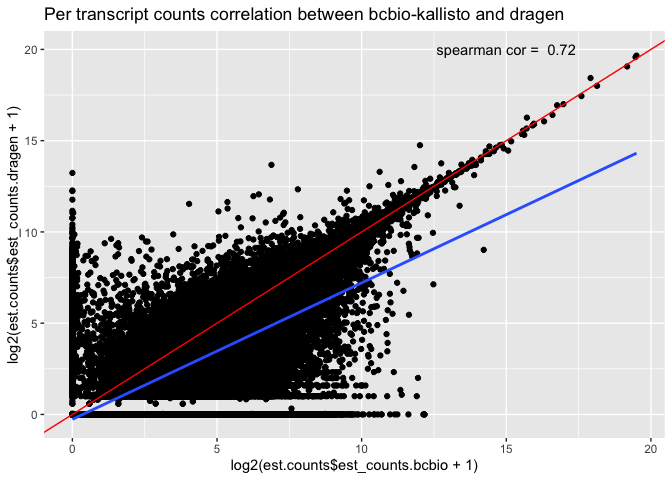

# Description

<style>
div.blue { background-color:#e6f0ff; border-radius: 5px; padding: 20px;}
</style>
<div class = "blue">

**SAMPLE: MDX190024_UR3044456_T_rna**

For each WTS workflow output type (abundance and fusions for now), the document currently reports:

- File names in the input (parms) directories
- The number and comparison of calls
- The key difference between both outputs (i.e. bcbio VS Dragen) in a tabular format

</div>


```r
### Define functions.
###list files in a directory
lf <- function(...) {
  data.frame(fname = list.files(...)) %>% 
    knitr::kable(row.names = TRUE)
}

###generate scatter and violin plot for tpm values across both runs
scatterPlot <- function(icombined_tpm, main_title, plot_mode = "static") {
  plotly::plot_ly(icombined_tpm, x = ~log2(tpm_bcbio+0.5), y = ~log2(tpm_dragen+0.5), type = 'scattergl', 
                       text = icombined_tpm$target_id, width = 00, height = 400,
                               marker = list(size = 10,
                       color = 'rgba(255, 182, 193, .5)',
                       #opacity = 0.5, https://plot.ly/~alex/455/four-ways-to-change-opacity-of-scatter-markers.embed
                       line = list(color = 'rgba(152, 0, 0, .8)',
                                   width = 2))) %>%
    plotly::layout(title = main_title)
}

###VIOLIN plot https://plot.ly/r/violin/
violinPlot <- function(icombined_tpm, main_title, plot_mode = "static") {
  #overall data distribution
  p1 <- plotly::plot_ly(icombined_tpm, type = 'violin') %>%
    add_trace(y = ~log2(tpm_bcbio+1), box = list(visible = T),  meanline = list(visible = F),
                       x = 'bcbio', legendgroup = 'run1', text = icombined_tpm$target_id, name = 'bcbio', color = 'orange') %>%
    add_trace(y = ~log2(tpm_dragen+1), box = list(visible = T),  meanline = list(visible = F),
                       x = 'dragen', legendgroup = 'run2', text = icombined_tpm$target_id, name = 'dragen', color = 'green') %>%
    layout(yaxis = list(title = "log2 tpm", zeroline = F))
  
  #zoom into data to highlight data spread
  p2 <- plotly::plot_ly(icombined_tpm, type = 'violin') %>%
    add_trace(y = c(~log2(quantile(tpm_bcbio+1)[1]), ~log2(quantile(tpm_bcbio+1)[4])), box = list(visible = T),  meanline = list(visible = F),
                       x = 'bcbio', legendgroup = 'run1', text = icombined_tpm$target_id, name = 'bcbio', color = 'orange') %>%
    add_trace(y = c(~log2(quantile(tpm_dragen+1)[1]), ~log2(quantile(tpm_dragen+1)[4])), box = list(visible = T),  meanline = list(visible = F),
              x = 'dragen', legendgroup = 'run2', text = icombined_tpm$target_id, name = 'dragen', color = 'green') %>%
    layout(yaxis = list(title = "log2 tpm", zeroline = F))
  
  #combine both box plots
  subplot(p1, p2, shareX = FALSE, shareY = FALSE, titleY = TRUE, margin = 0.06) %>%
    hide_legend()
}
```


```r
### Required packages.
library(tools)
library(here)
library(DT)
library(dplyr)
library(kableExtra)
library(ggplot2)
library(plotly)
library(gridExtra)
library(tximport)
library(package="EnsDb.Hsapiens.v75", character.only = TRUE)
```

***

# List files

This section lists the file names for outputs in the run directories being compared in this report.  


```r
###Read input. 
###The script expects two input directories, each containing 'final' results as produced by bcbio. The results in these two input directories will be compared.
run_1 <-file.path(params$run_1)
#list files in the first run directory
lf(run_1)
```

<table>
 <thead>
  <tr>
   <th style="text-align:left;">   </th>
   <th style="text-align:left;"> fname </th>
  </tr>
 </thead>
<tbody>
  <tr>
   <td style="text-align:left;"> 1 </td>
   <td style="text-align:left;"> UR3044456_WTS.fusion_candidates.filter_info </td>
  </tr>
  <tr>
   <td style="text-align:left;"> 2 </td>
   <td style="text-align:left;"> UR3044456_WTS.fusion_candidates.final </td>
  </tr>
  <tr>
   <td style="text-align:left;"> 3 </td>
   <td style="text-align:left;"> UR3044456_WTS.fusion_candidates.preliminary </td>
  </tr>
  <tr>
   <td style="text-align:left;"> 4 </td>
   <td style="text-align:left;"> UR3044456_WTS.quant.sf </td>
  </tr>
</tbody>
</table>

```r

run_2 <- file.path(params$run_2)
#list files in the second run directory
lf(run_2)
```

<table>
 <thead>
  <tr>
   <th style="text-align:left;">   </th>
   <th style="text-align:left;"> fname </th>
  </tr>
 </thead>
<tbody>
  <tr>
   <td style="text-align:left;"> 1 </td>
   <td style="text-align:left;"> abundance.tsv </td>
  </tr>
  <tr>
   <td style="text-align:left;"> 2 </td>
   <td style="text-align:left;"> fusions.discarded.tsv </td>
  </tr>
  <tr>
   <td style="text-align:left;"> 3 </td>
   <td style="text-align:left;"> fusions.tsv </td>
  </tr>
  <tr>
   <td style="text-align:left;"> 4 </td>
   <td style="text-align:left;"> UR3044456-flat.tsv </td>
  </tr>
</tbody>
</table>

***

# Counts

This section summarizes two key factors:

- a summary of the total number of counts in the compared files and 
- a table outlining difference between both runs.


```r
###Start with the simple line count in the files i.e. the number of entries in the output from both runs is same.
#compare the count files first (from both runs)
counts.dragen <- read.table(here("../../data/projects/WTS_comparison/MDX190024_UR3044456_T_rna/dragen/UR3044456_WTS.quant.sf"), sep="\t", as.is=TRUE, header=TRUE)
counts.bcbio <-  read.table(here("../../data/projects/WTS_comparison/MDX190024_UR3044456_T_rna/bcbio/abundance.tsv"), sep="\t", as.is=TRUE, header=TRUE)

#read in the tximport data
dir <- here("../..//data/projects/WTS_comparison")
tx2ensembl <- read.csv(file.path(dir, "tx2gene.ensembl.v95.csv"), header = FALSE)
colnames(tx2ensembl) <- c("tx_name", "gene_id")
```

### Total counts


```r
###calculating number of lines in count files from both runs
lines.count<- data.frame(c("dragen", "bcbio"), c(nrow(counts.dragen), nrow(counts.bcbio)))
colnames(lines.count) <- c("file", "lines_count")
datatable(lines.count, rownames = TRUE, options = list(sDom  = '<"top">lrt<"bottom">ip'))
```

<!--html_preserve--><div id="htmlwidget-8b33fd79cb27eb8890ce" style="width:100%;height:auto;" class="datatables html-widget"></div>
<script type="application/json" data-for="htmlwidget-8b33fd79cb27eb8890ce">{"x":{"filter":"none","data":[["1","2"],["dragen","bcbio"],[196501,196501]],"container":"<table class=\"display\">\n  <thead>\n    <tr>\n      <th> <\/th>\n      <th>file<\/th>\n      <th>lines_count<\/th>\n    <\/tr>\n  <\/thead>\n<\/table>","options":{"sDom":"<\"top\">lrt<\"bottom\">ip","columnDefs":[{"className":"dt-right","targets":2},{"orderable":false,"targets":0}],"order":[],"autoWidth":false,"orderClasses":false}},"evals":[],"jsHooks":[]}</script><!--/html_preserve-->

### Diff counts


```r
###find the differences between count files from both runs
#dragen names columns differently. Changing these to reflect bcbio's output format, making the comaprison's easy.
colnames(counts.dragen) <-  c("target_id", "length", "eff_length", "tpm", "est_counts")
counts.dragen <- counts.dragen[, c(1, 2, 3, 5, 4)]

#extract gene level counts using tximport
txi.bcbio <- tximport(here('../../data/projects/WTS_comparison/MDX190024_UR3044456_T_rna/bcbio/abundance.tsv'), type = "kallisto", tx2gene = tx2ensembl)
txi.dragen <- tximport(here('../../data/projects/WTS_comparison/MDX190024_UR3044456_T_rna/dragen/UR3044456_WTS.quant.sf'), type = "salmon", tx2gene = tx2ensembl)

#extract counts to prepare dataframe
bcbio.counts <- as.data.frame(txi.bcbio$counts) %>%
  tibble::rownames_to_column("gene") %>%
  dplyr::rename(count = V1)

dragen.counts <- as.data.frame(txi.dragen$counts) %>%
  tibble::rownames_to_column("gene") %>%
  dplyr::rename(count = V1)

#merge the calls from bcbio and dragen - also add a column for recording percentage difference
bcbio.dragen.counts <- inner_join(bcbio.counts, dragen.counts, by = "gene") %>%
  dplyr::mutate(percentageDiff = ifelse(count.x > count.y, (count.x - count.y)/count.x *100, (count.y - count.x)/count.y *100)) %>%
  dplyr::mutate_if(is.numeric, round,2)
colnames(bcbio.dragen.counts) <- c("gene", "bcbio", "dragen", "percentageDiff") 

#get genes annotation from ensembl IDs 
edb <- EnsDb.Hsapiens.v75
#get keytypes for gene SYMBOL
keys <- keys(edb, keytype="GENEID")
#get genes genomic coordiantes
gene_info <- ensembldb::select(edb, keys=keys, columns=c("GENEID", "GENENAME"), keytype="GENEID")
colnames(gene_info) <- c("gene", "geneName")
#remove rows with duplicated ENSEMBL IDs - if any
gene_info = gene_info[!duplicated(gene_info$gene),]
gene_info = gene_info[!duplicated(gene_info$geneName),]

#annotate the counts dataframe to include genenames
bcbio.dragen.gene.counts <- inner_join(bcbio.dragen.counts, gene_info, by = "gene") %>%
  dplyr::arrange(-percentageDiff) %>%
  dplyr::select(geneName, everything()) %>%
  #remove part of genenames after .
  dplyr::mutate(geneName=sapply(strsplit(geneName, split = '.', fixed = TRUE), function(x) (x[1])))

##merge the raw estimated calls from bcbio and dragen - also add a column for recording percentage difference
bcbio.dragen.transcript.counts <- inner_join(counts.bcbio, counts.dragen, by = "target_id") %>%
  dplyr::mutate(percentageDiff = ifelse(est_counts.x > est_counts.y, (est_counts.x - est_counts.y)/est_counts.x *100, (est_counts.y - est_counts.x)/est_counts.y *100)) %>%
  dplyr::mutate_if(is.numeric, round,2)
colnames(bcbio.dragen.transcript.counts) <- c("target_id", "length.bcbio", "eff_length.bcbio", "est_counts.bcbio", "tpm.bcbio", "length.dragen", "eff_length.dargen", "est_counts.dragen", "tpm.dragen", "percentage_counts_diff")
#subset the df to only count values and percentage difference
est.counts <- bcbio.dragen.transcript.counts[, c('target_id', 'est_counts.bcbio', 'est_counts.dragen', 'percentage_counts_diff')]

#Per transcript counts correlation between bcbio-kallisto and dragen 
ggplot(est.counts, 
       aes(x=log2(est.counts$est_counts.bcbio+1), y=log2(est.counts$est_counts.dragen+1))) +
         geom_point() +
         geom_smooth(method = "lm") +
         geom_abline(slope=1, intercept = 0, color="red") +
         annotate("text", x=15, y=20, label= "spearman cor = 0.79") +
         ggtitle("Per transcript counts correlation between bcbio-kallisto and dragen")
```

<!-- -->

```r

#Per gene counts correlation between bcbio-kallisto and dragen 
ggplot(bcbio.dragen.gene.counts, 
       aes(x=log2(bcbio.dragen.gene.counts$bcbio+1), y=log2(bcbio.dragen.gene.counts$dragen+1))) +
         geom_point() +
         geom_smooth(method = "lm") +
         geom_abline(slope=1, intercept = 0, color="red") +
         annotate("text", x=15, y=20, label= "spearman cor = 0.99") +
         ggtitle("Per gene counts correlation between bcbio-kallisto and dragen")
```

<!-- -->

```r

#summarize percentage difference between counts
transcripts.counts.summary <- summary(est.counts$percentage_counts_diff)
genes.count.summary <- summary(bcbio.dragen.gene.counts$percentageDiff)

#display results only where we have %diff above a certain threshold (using values above third qunartile) for gene level counts
bcbio.dragen.gene.counts.filtered <- bcbio.dragen.gene.counts %>%
  dplyr::filter(percentageDiff > quantile(bcbio.dragen.gene.counts$percentageDiff, na.rm = TRUE)[3])

datatable(bcbio.dragen.gene.counts.filtered, rownames = FALSE, filter="top", options = list(pageLength = 5, scrollX=T), caption = "Filtered gene counts (values above third qunartile)")
```

<!--html_preserve--><div id="htmlwidget-f69d6b4f47c31dee0d8f" style="width:100%;height:auto;" class="datatables html-widget"></div>
<script type="application/json" data-for="htmlwidget-f69d6b4f47c31dee0d8f">{"x":{"filter":"top","filterHTML":"<tr>\n  <td data-type=\"character\" style=\"vertical-align: top;\">\n    <div class=\"form-group has-feedback\" style=\"margin-bottom: auto;\">\n      <input type=\"search\" placeholder=\"All\" class=\"form-control\" style=\"width: 100%;\"/>\n      <span class=\"glyphicon glyphicon-remove-circle form-control-feedback\"><\/span>\n    <\/div>\n  <\/td>\n  <td data-type=\"character\" style=\"vertical-align: top;\">\n    <div class=\"form-group has-feedback\" style=\"margin-bottom: auto;\">\n      <input type=\"search\" placeholder=\"All\" class=\"form-control\" style=\"width: 100%;\"/>\n      <span class=\"glyphicon glyphicon-remove-circle form-control-feedback\"><\/span>\n    <\/div>\n  <\/td>\n  <td data-type=\"number\" style=\"vertical-align: top;\">\n    <div class=\"form-group has-feedback\" style=\"margin-bottom: auto;\">\n      <input type=\"search\" placeholder=\"All\" class=\"form-control\" style=\"width: 100%;\"/>\n      <span class=\"glyphicon glyphicon-remove-circle form-control-feedback\"><\/span>\n    <\/div>\n    <div style=\"display: none; position: absolute; width: 200px;\">\n      <div data-min=\"0\" data-max=\"268952.66\" data-scale=\"2\"><\/div>\n      <span style=\"float: left;\"><\/span>\n      <span style=\"float: right;\"><\/span>\n    <\/div>\n  <\/td>\n  <td data-type=\"number\" style=\"vertical-align: top;\">\n    <div class=\"form-group has-feedback\" style=\"margin-bottom: auto;\">\n      <input type=\"search\" placeholder=\"All\" class=\"form-control\" style=\"width: 100%;\"/>\n      <span class=\"glyphicon glyphicon-remove-circle form-control-feedback\"><\/span>\n    <\/div>\n    <div style=\"display: none; position: absolute; width: 200px;\">\n      <div data-min=\"0\" data-max=\"24417.08\" data-scale=\"2\"><\/div>\n      <span style=\"float: left;\"><\/span>\n      <span style=\"float: right;\"><\/span>\n    <\/div>\n  <\/td>\n  <td data-type=\"number\" style=\"vertical-align: top;\">\n    <div class=\"form-group has-feedback\" style=\"margin-bottom: auto;\">\n      <input type=\"search\" placeholder=\"All\" class=\"form-control\" style=\"width: 100%;\"/>\n      <span class=\"glyphicon glyphicon-remove-circle form-control-feedback\"><\/span>\n    <\/div>\n    <div style=\"display: none; position: absolute; width: 200px;\">\n      <div data-min=\"41.69\" data-max=\"100\" data-scale=\"2\"><\/div>\n      <span style=\"float: left;\"><\/span>\n      <span style=\"float: right;\"><\/span>\n    <\/div>\n  <\/td>\n<\/tr>","caption":"<caption>Filtered gene counts (values above third qunartile)<\/caption>","data":[["PRSS22","LGALS14","PROM1","IYD","PRSS3","GABRA3","KDM5D","SLC7A14","SYT13","SLC18A1","BEST2","BARX2","GUCA2B","RPS17P5","CREB3L3","RIMBP2","SNAP91","CTNNA2","ACSM2B","DDX3Y","ZFY","TRPC7","SCT","CNGB1","EPHA8","PRLH","CDH19","SPP2","VDAC1P1","SNCB","ATP12A","NMRK2","FKBP6","AFM","RIMS1","SCTR","CACNA1S","SLC13A1","AC000111","SLCO1A2","NME8","HSD17B2","SLC6A14","SULT2B1","TMEM40","RPH3A","SI","SLC26A3","IL5RA","APOH","MYH7","TPSD1","PGC","MLN","SEC14L3","ACR","PNPLA5","PVALB","SERPINA4","R3HDML","HNF4A","HRH3","NKAIN4","AVP","SPEF1","SEL1L2","PDYN","H2BFM","ATP1B4","UBE2NL","OPN1LW","VGLL1","RP11-723C11","ZP2","PRSS33","AQP8","TOX3","SLC6A2","GML","ANXA13","CGB2","RETN","CLEC4M","KIR3DX1","CASP14","SLC1A6","FSD1","MYH14","CEACAM5","CRX","SULT2A1","KLF1","SLC5A5","UPK1A","ATP4A","GAPDHS","MAG","HYAL4","SPAM1","PAX4","NOBOX","MYL10","MYL7","GALNTL5","LHX3","SH3GL2","RBP3","FGF8","HNF1B","MYH1","UCP1","ANXA10","P2RX3","SYT10","RERGL","SLCO1B3","AICDA","OPRM1","IL17F","BMP5","KHDRBS2","COL9A1","CCR6","UNC93A","NME5","CDH9","BTNL8","GABRG2","SLC27A6","IRX4","IL4","C9","HRG","USP9Y","HHLA2","ACADL","DNAH6","SMYD1","SLC5A7","RP11-153K16","PRAMEF1","RPE65","AMPD1","HPCAL4","CCDC181","FMO6P","CHRNB4","TNP1","ADGB","FGF23","GDA","C2orf40","TECTB","HOXB8","EQTN","INSL6","GRIA2","TTLL2","TP53AIP1","SPG20OS","LRAT","IAPP","DPPA4","MYOG","PLG","TAF1L","AKR1D1","PI3","TMEM189-UBE2V1","RBPJL","MAGEA10","IL17C","PSG8","CEACAM8","CRISP2","BTN1A1","SLC10A2","AMELX","MYH2","IL37","CSTL1","OVOL2","PCSK2","BANF2","CITED1","GDF5","C20orf173","SLURP1","HTN1","PRKCG","SSX1","ATP13A4","BEST3","OR1E2","RFPL1","CSRP3","AIPL1","AP1M2","SAG","CYP2G1P","RBBP8NL","FBP2","TXLNG2P","BPIFA3","PYY","TEX101","G6PC","CA6","RHOXF2","NR0B2","LINC00470","ENAM","RAB25","ALDH3B2","RNF17","GPR12","RXFP2","SEC14L4","LRRIQ1","DYDC2","TEX15","VRTN","ADAM30","CFHR4","USP26","FOLH1B","DSG3","DSC3","TCN1","UGT2A3","NMBR","SCEL","C7orf69","MMD2","GAD2","OR1J1","TTPA","MMP20","BCL2L10","BRDT","CYP2C9","BTBD16","MSMB","PLA2G12B","C4orf17","MTTP","TTLL8","PIK3C2G","TPH2","LGR5","ZIC5","MDGA2","RDH12","KCNH5","SLC25A47","SH3GL3","SEPT12","CDRT15P1","C17orf64","CBLN2","ZIM3","CTD-3222D19","DMRTC2","GPR32","CTD-2545M3","CELA2A","FNDC7","MAEL","LHX9","SYT14","FLG2","LEFTY2","ABCG8","TRIM43B","TRIM43","NT5DC4","CNGA3","ZNF385B","UNC80","NYAP2","GADL1","TAGLN3","ILDR1","FABP2","GLRA3","CDH18","FAM159B","HAPLN1","LIX1","MEGF10","ADAMTS19","LECT2","GABRA6","GFRA3","SLC17A4","RASGEF1C","LGSN","FERD3L","ASB10","ZNF157","CHRNA6","SNTG1","RSPO2","MAL2","IFNA5","LCN2","IDI2","ANKRD30A","RGR","SCGB1A1","SYT8","HTR3B","MS4A3","MS4A2","SCN2B","SLC22A9","ANXA8L1","FXYD4","MIA2","GPM6A","SPATA4","C11orf53","AKR1C6P","PABPC3","RP11-775A3","MCHR2","G6PC2","CNTNAP4","IFLTD1","SCN3A","GPR110","FRMD1","SPACA7","GPR15","TDH","ASZ1","TMPRSS15","CA10","SEPT14","CNTNAP5","CYLC2","ADCY8","NAT2","UGT2B4","GPR112","C1orf158","SVOPL","GRHL3","HMHB1","CPA5","PLA2G2F","VWA5B1","APOA2","WNT9B","TUBBP5","GJD2","PADI4","CCDC135","PIP","FAM115D","TFF2","CXCR5","CYP11B1","XXbac-B444P24","USP41","NPHS1","IZUMO2","C16orf11","MSLNL","TMEM82","TTLL10","CCDC27","LSP1P3","SLC9C2","MT2P1","WDR64","TEKT4","C1orf189","ALPP","PLSCR2","DNAJC5G","OTOP1","ETNPPL","PRDM9","SPZ1","GPR111","IL3","FABP7","FAM26D","IL31RA","FBXL21","INTS4L1","SLC35G3","SUN3","CSMD3","UNCX","SPAG11B","NLGN4Y","ANXA8","NGB","SSX5","SSX3","OXGR1","UCMA","SOHLH1","GFI1B","OR4K2","CYP2C19","C10orf82","PDZRN4","SLC6A5","TMCO5A","hsa-mir-7162","SVOP","C16orf78","TPTE","ASPG","MOGAT2","WDR72","FAM86GP","CLEC3A","CPLX4","CDH16","WDR16","CHP2","MIR202HG","MS4A5","C15orf43","RP11-93B14","SUN5","UGT1A6","LINC00905","ANKRD33","C19orf33","KLK2","KLK6","KLK11","AC009065","SLC22A11","C11orf85","ZNF355P","HIST3H3","PTF1A","C8orf22","TXNDC2","DYNLRB2","ADAM18","SPINT5P","VWA3B","WFDC12","FSTL5","KLK7","ZBBX","ARMC4","IL13","PDILT","MUC15","TACR3","ONECUT1","HSFY2","GYPA","ANKK1","FABP6","CST5","CTA-313A17","VSTM2A","COX7B2","DYDC1","FSHR","LILRP2","MBD3L1","LINC00208","OBP2B","HSFX1","FUT3","UGT2B7","KRTAP4-4","KSR2","DSCAM","SHANK2-AS3","PAH","C11orf40","OR52P2P","GOLGA2P3Y","EFCAB3","FUT9","HSFY1","C2orf54","AGXT","MS4A10","RP11-344H11","FADS6","OVOL1","AP002387","COX6B1P3","MRGPRD","XKR3","FRG2C","UNC93B3","RP11-683L23","LIPM","IQCF1","C2orf70","UGT2A1","SPATA3","KCNH6","MARCH10","RP11-18M17","CHRNA9","C20orf166-AS1","C20orf166","STARD6","LINGO2","KLK15","VN2R1P","CA5A","ZG16","WFDC5","ANKS4B","ISX","DPP10","GOLGA8EP","LINC00521","RBMXL3","C11orf44","FAM172BP","WBSCR28","RP11-544L8__B","TMPRSS7","MC5R","LRRTM4","CTAGE15","ACBD7","IDSP1","FOXR1","RPL37AP8","CNBD1","DMBT1P1","NANOGP1","TTTY14","MIR7-3HG","RP11-432M24","TRIM60","TRIM72","ENSAP3","OR7E125P","BEND2","RP11-56N19","AL355390","MAGEB10","TMEM78","CACYBPP2","C2orf73","PPP1R42","AMER3","SPINK6","RP4-682C21","C9orf62","SPAG11A","CALML5","NEUROG2","RPS3AP5","H3F3AP6","AL513477","ARMC10P1","DYNAP","C13orf45","CPN2","H1FOO","TPRX1","LGALS7B","C1orf173","EXD1","RP11-363G10","AC012074","C12orf42","CYP11B2","ALOXE3","AC124309","AL109806","SLC17A8","NBPF23","DGKZP1","NLRP8","SYCN","MRGPRX3","NLRP11","CTC-451A6","WFDC11","RP1-278E11","SLC9A4","PRNT","RP5-1055C14","TPRXL","DEFB119","EXOC5P1","ANKRD30B","C1orf180","GREM2","FER1L6-AS1","HECW1-IT1","OFCC1","SAGE1","AC009041","ADIG","OR6B2","ZNF716","FAM153B","GABRG3","DAOA","IFNL1","OTOL1","ABHD17AP5","LINC00334","CCNYL2","CCDC172","GALR2","RP11-114H20","PLCXD3","CCDC75P1","OTOP3","NPM1P14","IQCA1P1","SLC25A21","GATSL1","LYPD4","CALHM3","CYorf17","GABRR3","POTEC","FAM9A","C10orf107","GBP6","OVCH2","TTTY8","Z98256","BPIFA4P","GOLGA8G","TP53TG3","PSG9","ACSM2A","ANKRD45","FAM3B","UTY","C1orf64","TMPRSS2","TREML3P","DGAT2L6","AC100791","CSAG2","IQCF2","COLEC10","C21orf128","PIWIL3","PRSS55","RALYL","CLDN6","DDX53","RP11-480I12","LINC00308","TCEAL2","DMRTC1B","AL772307","MROH2A","FAM169B","AP001324","PRSS57","WASIR1","MC2R","CD24P4","SCN10A","OR7A17","KPNA7","ACTBP7","SMIM23","TTTY8B","NPAP1","RPL12P4","TMEM210","TMPRSS11B","NKAIN3","SHOX","RP11-887P2","CYP4F2","LILRP1","BPIFB4","SLC51B","FAM86MP","PABPC1L2A","GABRA5","GOLGA6L17P","TMEM212","SLC36A2","KIAA1024L","KRT26","AKAP14","MYT1L","OR9Q1","CYP4F8","ANXA8L2","C2orf27B","SELV","C14orf23","KRTAP21-1","PNLIPRP1","SAMD7","SPATA21","LINC00221","BAGE2","KRT12","NPSR1","LHFPL3","HSD3BP1","C4orf40","POTEM","COX8C","TMEM247","TMEM8C","GFRAL","C1orf168","CXXC1P1","HS6ST1P1","RP11-405L18","OR7D2","SCGB1C1","PRSS45","IGFL1","GOLGA6L3","CLEC2A","IGHV1OR15-9","INSC","C9orf171","AC010969","HMX3","IGFL3","C2orf80","VWC2","TMCO2","HMX2","DPPA3P2","RP11-159F24","RPL10AP2","AADACL3","DHFRP1","SLC15A5","LIPI","DUSP21","FAM25B","PRSS48","AC069277","AL450307","SPANXN4","RP11-113D6","S100A14","OTUD6A","Y_RNA","MIR494","AC140061","AC079610","OR6M1","ADAM5","C8orf86","CTSE","SULT1C3","LINC00615","RP13-77O11","THEM5","PRTN3","ESRRG","ARL9","LINC00238","RP3-499B10","RP11-57C13","ANKRD20A19P","UGT2B15","SLC30A10","AC087392","CTB-134H23","SPINK14","ZNF709","C5orf48","LCA10","AL353898","NPSR1-AS1","RP11-573D15","RP11-76E12","BX936347","SSXP1","ZSCAN5B","TCEA1P1","C17orf102","AC032027","CYP2B6","FABP12","GGT3P","AC005276","CSAG3","ADAM3A","RP11-170L3","LINC00477","FAM177B","PRAMENP","GPX1P1","AC107218","KLKP1","AC106870","KRTAP26-1","AL022341","LHFPL5","OR5B17","AC061975","AL358813","PRB3","HES5","DSCR8","POTEH","H2AFB1","TMPRSS11F","AL138751","MB","RP11-267J23","TUBB3","FKBP1C","ANTXRL","TMEM239","RP11-544M22","AC092291","AF241725","RP11-208N14","RP11-598D12","ZNF658B","AC004878","RP11-168J19","AC012615","C3orf27","EIF1AY","GPX6","SMOC1","SMIM11P1","RP5-857K21","EPS8L3","SYCP1","MUC2","MAGEB3","MIR30E","MIRLET7A2","MIR380","MIR345","MIR107","MIR370","MIR412","MIR377","MIR381","MIR339","MIR103A2","MIR369","MIRLET7C","MIR425","MIR103A1","MIR219-1","MIR210","MIR378A","MIR324","MIRLET7F1","MIR26A1","MIR342","MIR379","MIR326","MIR410","MIR302C","MIR346","MIR409","MIR411","MIR26B","MIR148B","MIR365A","MIRLET7D","MIR101-1","MIR302D","MIRLET7G","MIR337","MIR30D","MIR96","MIR126","MIRLET7A1","MIR374A","MIR367","MIR331","MIRLET7I","RNA5SP289","RNU6-1123P","RNU6-834P","RNA5SP46","RNU6-28P","RNU6-874P","RNA5S12","RNU6-661P","SNORA21","RNU6-858P","RNU4-82P","RNA5SP52","RN7SKP25","RNA5S11","RNU6-204P","RNA5S3","RNU6-766P","RNA5S1","RNU6-1115P","RNU6-79P","SNORD114-7","RNA5SP93","RNA5S5","RNY4P19","RNA5SP301","SNORD9","RNU6-1216P","RNU1-62P","SNORA64","SNORD115-25","RNU6-1313P","RNU1-94P","RNU6-247P","RNA5SP477","RNU6-212P","RNU6-235P","RNA5SP295","RNA5SP305","RNU6-315P","RNA5SP195","RNU6-545P","RNU6-37P","RNU6-228P","SNORA22","SNORD114-1","RNA5SP321","SNORD114-14","RNU6-1301P","RNU6-859P","RNU6-951P","RNY4P24","RNU6-1010P","RNU6-1266P","RNU4-21P","RNU6-862P","RNU6-1128P","RNU6-223P","RNU4-23P","SNORD115-2","U8","RNU6-1079P","SNORD104","RNA5SP188","RNY3P2","RNU6-836P","SNORD114-5","RNA5SP383","RNA5SP491","SNORA43","RNU6-199P","RNU1-47P","RNA5SP71","RNU1-72P","RNU5F-6P","RNU6-490P","RNU6-495P","RNU6-942P","RN7SKP131","RN7SKP149","RNU6-249P","RNU5B-2P","RNA5S10","SNORD114-16","RNA5SP405","SNORD114-19","RNU6-653P","SNORD1B","SNORD115-3","RNU6-986P","RNA5SP448","RNU6-403P","SNORD45","RN7SKP63","SNORA30","RNU4-80P","RNU6-433P","SNORD114-31","RNU6-181P","RNU6-252P","RNU6-251P","SNORA51","RNA5SP440","SNORD113","RNU6-216P","SNORD103A","RNU6-1309P","RNU1-19P","SNORD85","RNU6-238P","RNU1-22P","SNORD113-6","RNU6-745P","RNU6-626P","RNA5SP197","RN7SKP79","RNA5SP263","RNU6-254P","RNU6-1147P","RNU6-97P","RNU4-32P","SNORD114-10","SNORA36","RNU6-527P","RNU1-83P","RNA5SP483","RNU6-1255P","RNA5-8SP7","RNU6-183P","RNA5SP333","RNA5S8","RNU6-485P","RNU6-1285P","SNORA72","RNU6-833P","SNORD113-8","RNA5S17","RNU5E-10P","RNA5S4","RNU6-509P","RNU6-1099P","SNORD114-23","RNA5SP74","SNORD114-26","RNU6-1066P","RN7SKP44","RNA5SP507","SNORD114-28","RNA5SP378","RNU6-1214P","RNU6-957P","RNY4P6","RNU6-137P","RNU6-1020P","RNU6-288P","RNU6-640P","RNU6-829P","RNU6-1284P","RNA5SP514","RNU6-824P","RNU1-87P","SNORD114-11","SNORD114-25","RNA5SP349","SNORA7","RNA5S6","SNORD113-7","SNORD114-27","RNU5F-3P","RNU6-226P","RNA5SP343","RNA5SP114","SNORD116-10","RNU6-1188P","RNU6-912P","SNORD115-4","RNU6-379P","RNU6-674P","RN7SKP93","RNA5SP28","RNA5SP260","RNU1-124P","RNY4P8","RNA5SP161","RNU6-884P","RN7SKP250","RNU6-770P","RNU1-130P","SNORD115-28","RNU6-595P","RNU6-1091P","SNORD114-2","RN7SKP134","SNORD114-4","RNY4P4","RN7SKP36","RNU6-810P","SNORD14E","RNU6-681P","RNU1-146P","RNU6-854P","RNU6-553P","RNU6-960P","RNU6-501P","SNORD115-32","RNU5A-8P","RNU4-87P","RNA5SP493","SNORA58","RN7SKP224","RNU6-151P","RNU6-268P","RNU4-51P","RNU6-188P","RNU6-372P","RNU6-11P","RNU1-137P","RNA5SP245","RNU6-647P","RNU6-773P","RNU6-353P","RNU1-24P","RNU4-36P","RNU1-132P","RNU6-853P","RNU6-1322P","RNU6-115P","RNU6-879P","RNU4-40P","RNU6-1305P","RNA5-8SP3","RNU4-50P","SNORD114-9","SNORD114-13","RNU4-10P","SNORD114-6","SNORD73","RNU1-112P","RNU6-1019P","RNU6-1164P","RNU6-512P","RNU4-59P","SNORD114-30","RNA5S14","RN7SKP193","RN7SKP37","RNU6-522P","RNU6-1251P","RNY4P23","SNORA68","RNU6-1141P","RNA5SP512","RN7SKP246","RNU6-335P","RNU4-24P","RNU6-646P","SNORA55","RNU4-4P","RNY4P7","RNA5SP78","RNU6-312P","RNU6-645P","RNA5SP194","SNORA16B","RNU4-85P","RNU6-726P","SNORD114-15","RNA5SP510","SNORD114-17","RNU1-93P","RNU6-343P","RNU6-593P","RNA5S2","RNA5SP517","RNA5SP132","RNU4-28P","RNU6-200P","RNU4-19P","SNORA67","RNU6-621P","SNORD115-48","RNU6-1187P","RNU6-865P","RNU4-91P","RNU6-7","RNU12-2P","RNU6-60P","RNA5SP90","SNORD113-4","RNU6-1107P","SNORD114-29","RNA5SP334","SNORD113-3","RNU6-304P","RNA5SP160","RNU6-828P","RNU6-534P","RNU6-336P","RN7SKP226","SNORD117","RNU5E-4P","RNU4-8P","RNU6-915P","RNY4P17","SNORD114-3","RNA5SP298","snoU2-30","RN7SKP48","RNA5S15","RNA5SP363","SNORD113-9","RNU6-673P","RNY3P1","SNORD115-20","RNA5SP428","RNU6-806P","SNORD38A","RNU6-399P","RNA5SP324","SNORD114-20","RNA5SP152","RNA5SP455","RNU6-1280P","RNU6-1306P","RNU4-12P","SNORD103B","VTRNA1-2","RNU6-302P","RNY4P3","SNORD114-18","RNU6-407P","RNU6-742P","RNU6-1327P","RNU6-1283P","RNU6-497P","SNORD113-1","RNU6-1034P","RNU1-51P","RNU6-282P","RNU6-1138P","RNU6-737P","RNA5S16","RNU6-1318P","SNORD114-12","RNA5SP235","RNA5SP37","SNORD114-22","SNORD6","RNA5SP131","RNU6-359P","RNU6-8","RNA5SP277","RNU6-652P","RNU1-55P","RNU1-122P","RNU6-108P","RNU4-48P","RNA5SP88","RNY4P10","RNA5SP283","RNU6-499P","RNU6-597P","RNU6-898P","RNA5SP151","RNU6-805P","VTRNA1-3","RNA5S7","RNA5S13","MIR539","MIR421","MIR582","RP5-961K14","RP11-560A15","AL590489","AL591516","AL591516","AC015815","AC015815","AC015815","AC018696","AL162458","AC012454","RP11-370F5","AC131568","AL591516","AC009499","AP001187","RP11-571E6","AC090519","AC140061","AC140061","AC140061","AC140061","AC140061","AC140061","AC140061","AC008147","RP11-163F15","AC109925","AL512625","LINC00449","AC008555","AC092964","AC068896","RP11-814E24","AC061975","AC105036","AC061975","AC061975","AC061975","AC061975","AC100852","RP11-291L22","RP11-556O15","AC003079","AC103801","AL353662","AL353662","AL353662","RP11-697H9","Z99756","AC016712","AL353671","AL135901","RP13-259N13","AC090519","AC090519","AC090519","AC090519","AC073940","OR1F2P","IGBP1-AS1","AC116351","LINC00970","RP11-335E6","AC004832","AL512652","AC069200","RP11-84A19","AC012456","RP4-562J12","AL353671","TCP10","RAET1G","TEDDM1","GJE1","FAM24A","LINC00577","C1orf137","RIPPLY2","CHIAP2","OOEP","KHDC3L","C1orf146","CCDC160","RP11-188C12","C1orf185","LIPN","RP1-153P14","RP4-640H8","NAP1L6","GDF5OS","AC011737","LINC00587","HNRNPCP2","FLJ45079","BTNL2","CD300LD","C9orf129","C10orf126","RP11-552E4","CASP12","XXbac-BPG32J3","LY6G6F","POTEKP","AC079586","DGKK","PRAMEF17","PRAMEF19","PRAMEF14","PRAMEF16","PRAMEF5","PRAMEF3","PSORS1C3","DEFB122","CTD-2514C3","KRTAP5-11","KRTAP5-10","HLA-G","SSX4","SSX9","C5orf60","C9orf57","FAM153C","OR11A1","C9orf135","AC025278","CTC-281M20","CR769776","AC104135","RP11-160N1","FAM74A3","FAM201A","IGFL4","CXorf31","PSG5","FBXO47","BLACE","RP11-807H22","PRSS1","AARD","RP11-707M1","LGALS7","HSP90AA4P","ACCSL","FABP9","OR7E36P","RP11-1112C15","AC022596","AC005863","MT1DP","LINC00661","RP11-401P9","KRTAP10-7","AC005488","RP4-610C12","AF064858","RP11-15G8","GS1-179L18","HTN3","TECRL","ADARB2-AS1","PP13004","SLCO1B7","CTD-2302E22","GAGE1","KLRC3","TTC23L","C22orf42","NANOGNB","LRRC72","RPS3AP47","DEFB134","DEFB135","RP11-473M20","ONECUT3","OLIG2","USP17L6P","CTA-373H7","RP13-212L9","SERPINB4","FAM138D","CTD-2008L17","RNASE13","GYG2P1","AC023490","RP11-1084I9","HNRNPA1P4","CTD-2308N23","PRR23A","RNU6-354P","RNU6-132P","RNU6-25P","RNU6-431P","RNU6-425P","RNU6-946P","RNU6-338P","RNY1P5","SNORD116-14","SNORA69","RNU6-979P","RNU6-969P","RNU1-63P","RNU6-1062P","RNU6-672P","RNU6-1279P","RNU6-608P","RNU6-32P","SNORD21","RNU6-157P","RNU6-442P","RNU1-73P","RNU6-723P","RNU1-11P","RNU6-128P","RNU6-26P","RNU6-444P","RNU6-1027P","SNORD116-9","RNU6-936P","RNU6-484P","RNU6-245P","SNORD101","RNU6-418P","RNU6-10P","RNU6-435P","RNU6-44P","SNORD37","RNU6-213P","SNORA15","RNU6-701P","RNU1-129P","SNORA10","RNU6-260P","RNVU1-5","RNU6V","RNU1-74P","RNU6-413P","RNU6-890P","RNU6-571P","RNU6-767P","RNU6-207P","RNU6-398P","RNU6-761P","RNU6-1310P","RNU6-190P","RNU6-1008P","RNU6-48P","RNU6-42P","RNU6-36P","RNU6-1013P","RNY1P6","RNU6-481P","RNU6-80P","RNU6-432P","RNU6-1024P","RNU6-514P","RNU4-52P","SNORA70B","RNU4-31P","RNU6-1201P","RNVU1-16","RNU6-17P","RNU6-13P","SNORA8","RNU6-198P","SNORD63","RNU6-610P","RNU6-574P","RNU6-524P","SNORA5","RNU6-611P","SNORD116-3","RNU6-975P","RNU6-43P","SNORD59A","RNU6-339P","RNU6-196P","RNU6-1226P","RNU6-886P","RNU6-378P","RNU1-8P","RNU6-784P","SNORD116-1","RNU5A-2P","RNU6-171P","RNVU1-4","RNU6-16P","SNORD116-7","RNU6-106P","SNORD116-13","RNU6-1297P","RNU1-46P","RNU6-549P","RNU6-1215P","SNORD116-15","RNU1-44P","RNU6-1157P","RNA5SP122","SNORD116-5","RNU6-1026P","SNORD116-12","RNU6-45P","RNU6-790P","SNORA70E","RNU6-900P","RNU6-125P","RNU6-1065P","RNU6-1005P","RNU6-342P","RNU6-18P","RNU6-1081P","SNORD20","RNU6-1235P","RNU6-851P","SNORD7","RNU6-878P","RNU6-1127P","RNU6-429P","RNY1P4","RNU6-680P","RNU6-12P","RNU6-658P","RNU6-306P","RNVU1-17","RNU6-540P","RNU6-422P","RNU6-748P","RNU6-310P","RNU6-136P","RNU6-1011P","RNU6-959P","SNORA41","RNU6-455P","RNU6-768P","RNU6-95P","RNU6-906P","RNU6-541P","SNORD116-6","SNORD56B","RNU6-19P","RNU6-291P","RNU6-606P","RNU6-1104P","RNU6-331P","RNU6-476P","SNORA19","RNU6-987P","RNU6-423P","RNU6-1105P","RNU6-1237P","RNU6-59P","MIR548C","MIR25","MIR99B","MIR608","MIR647","MIR487A","MIR635","MIR23B","MIR615","MIR550A2","MIR661","MIR583","MIR30B","MIR606","MIR181D","MIR544A","MIR593","MIR215","MIR181A2","MIR124-3","MIR191","MIR554","MIR491","MIR604","MIR181C","MIR193A","MIR619","MIR194-1","MIR562","MIR581","MIR588","MIR505","MIR499A","MIR99A","MIR193B","MIR571","Z95704","MIR655","MIR570","MIR28","MIR621","MIR128-1","MIR548AA2","MIR592","MIR602","MIR659","MIR573","MIR32","MIR597","MIR548D1","MIR197","MIR627","MIR584","AC009065","MIR623","MIR186","MIR455","MIR200B","MIR218-1","MIR657","MIR181B2","MIR590","MIR382","MIR495","MIR575","MIR299","MIR553","MIR199A1","MIR487B","MIR580","MIR93","MIR181A1","MIR329-2","MIR626","MIR586","MIR568","MIR550A1","MIR551A","MIR15B","MIR648","MIR542","MIR26A2","MIR599","MIR27A","MIR605","MIR563","MIR9-3","MIR545","MIR640","MIR596","MIR33B","MIR125B2","MIR27B","MIR34A","MIR221","AL161652","MIR196A2","MIR302A","MIR603","MIR33A","MIR654","MIR511-1","MIR511-2","MIR223","MIR567","MIR574","MIR152","MIR214","MIR624","MIR579","MIR656","MIR153-2","MIR496","MIR30C1","MIR569","MIR620","MIR125B1","MIR638","MIR589","MIR557","MIR181B1","MIR154","MIR23A","MIR548B","MIR576","MIR493","MIR601","MIR134","MIR100","MIR301A","MIR644A","MIR643","MIR323B","MIR503","MIR16-1","MIR130A","MIRLET7F2","MIR645","MIR185","MIR199A2","MIR591","MIR485","MIR616","MIR548A3","MIR143","MIR106B","MIR320A","SNORD78","SNORD12C","MT-TL1","SNORD83A","SNORD105","MT-TF","MT-TV","MT-TI","MT-TM","MT-TW","MT-TY","MT-TS1","MT-TK","MT-TG","MT-TR","MT-TH","MT-TL2","MT-TE","MT-TT","MT-TP","RNU6ATAC26P","AC092574","AC018450","MIR320D1","AC093311","AC110056","MIR320E","MIR454","AC069286","AC118278","AC010525","MIR770","MIR760","MIR766","MIR758","IGKJ4","IGKJ2","IGLV10-54","IGLV5-52","IGLV1-36","IGLV3-12","IGLC7","TRGV1","TRBV4-1","TRBV5-7","TRBJ2-3","TRBJ2-6","TRBJ2-7","TRAV12-1","TRAV13-2","TRAV21","TRAV25","TRAV26-2","TRAV34","TRAV36DV7","TRAV38-1","TRAV39","TRAV41","TRAJ59","TRAJ56","TRAJ54","TRAJ53","TRAJ52","TRAJ50","TRAJ49","TRAJ48","TRAJ47","TRAJ46","TRAJ45","TRAJ42","TRAJ39","TRAJ37","TRAJ36","TRAJ34","TRAJ31","TRAJ30","TRAJ29","TRAJ28","TRAJ27","TRAJ26","TRAJ24","TRAJ23","TRAJ22","TRAJ21","TRAJ20","TRAJ19","TRAJ18","TRAJ17","TRAJ14","TRAJ12","TRAJ11","TRAJ10","TRAJ9","TRAJ7","TRAJ6","TRAJ5","TRAJ4","TRAJ3","TRAJ2","TRAJ1","IGHV3-9","IGHV4-28","IGHV3-38","IGHV1-45","IGHV1-58","IGHV3-66","IGHV3-73","AL138919","AC104802","AL117209","MIR676","AP000428","Z97352","AC009297","MIR548U","MIR374B","AP002498","AC007486","AC084262","AL592205","MIR543","AL354764","AC122136","AC016543","AC112693","AC112219","AL162511","AC121332","AL390119","AP002490","AC013268","AP000807","AC092765","AL390966","AL035467","AL080276","MIR301B","AL121584","AC093267","TSSK1B","RNA5SP372","RNU6-1319P","SNORD66","SNORD91A","RNU6-763P","RNU6-258P","SNORA26","RNU6-298P","RNY3P6","RNU6-1321P","RNU6-220P","RNU6-747P","RNA5SP18","RNU6-930P","RNA5SP219","RNU6-750P","RNU6-1176P","RNU6-308P","RNU6-724P","RNA5SP185","RNA5SP339","SNORD72","RNU6-821P","RNU6-1154P","SNORD70","RNU6-1228P","RNU6-882P","RNU6-244P","RNA5SP297","RNU6-780P","RNU6-1300P","RNU6-482P","SNORD115-45","SNORD113-2","RNU6-817P","RNU6-1055P","RNU6-1275P","RNA5SP323","snosnR66","SNORD115","RNU6-1111P","RNU11-6P","RNU6-241P","RNU11-4P","SNORD69","RNVU1-13","RNU6-644P","RNU6-695P","RNU6-460P","SNORA17","RNU6-1197P","RNA5SP465","RNA5SP300","RNU6-972P","RNU6-1250P","RNU6-918P","RNA5SP212","RNU6-466P","RNU6-808P","RNA5SP474","RNU6-510P","RNA5SP496","RNVU1-19","SNORD91B","RNA5SP467","RNA5SP53","RNU1-56P","SNORD58","RNA5SP397","RNA5SP241","KRTAP9-6","RP11-134K1","KRTAP4-9","KRTAP2-1","ST13P5","AL391152","AC117834","CGB8","NDUFA3P3","RP4-765C7","HMGB3P6","RPL31P11","AC008555","AC015815","RPL23AP60","TCL1B","YWHAZP2","YWHAZP5","AC093106","AC004386","RP5-1106E3","RPL9P18","RPL7AP34","NPM1P50","AC018696","AC068279","RP11-66N11","ANXA2P1","ATP6V0CP3","RPL18AP3","HMGB1P37","SETP8","AC005077","RP11-112J1","AC111200","RPSAP54","AL163952","CTD-2158P22","OLA1P2","EEF1A1P15","PRDX2P2","AC007679","RP11-284B18","UGT2B11","ACTBP2","HNRNPA1P32","XX-C2158C12","YBX1P10","CEACAM16","CYP2A7P1","AC011500","RP3-522P13","RPL7AP14","AC007277","AL353671","RP6-105D16","RP11-169L17","RP11-474D1","CYP4F30P","CTD-2116F7","AC008686","SNRPEP9","RP11-488L18","LINC00887","DDX6P2","UBE2V1P2","HNRNPA1P43","RP11-208P4","FAM188B2","AL591025","ANKRD36BP1","LGMNP1","RPL39P5","AP001024","AP001024","CBX1P4","OR4F13P","CTB-180A7","RP11-457K10","LINC00488","DKFZP779J2370","GNAT3","AC068831","AC091167","RPL7P1","SEC14L6","HIGD1C","AP000343","C17orf98","RP11-323J4","SLC6A10P","RP11-114H24","AC104654","NPAP1P2","C12orf71","RP11-247C2","CDIPT-AS1","RPL5P35","RP11-1036E20","CDRT15L2","RPL23AP6","SHFM1P1","TPM3P4","AC005082","OR7E5P","TMEM14D","RP11-574M7","XXyac-YM21GA2","U82695","AC104472","AC003102","CHCHD3P3","AL591516","AC129492","ACSM4","AC114730","TCP11X2","RPL13P12","DUSP8P3","TERF1P4","RP11-629N8","MUC5AC","RP11-182N22","YWHAZP6","GAGE10","C14orf164","TMCO5B","FP15737","MRPL3P1","DEFB108P2","LL22NC01-81G9","GOLGA6L6","PSMA6P1","OR7E156P","OR7E104P","KRTAP10-1","SKOR2","CES5AP1","ARL2BPP3","CNN2P7","AP003041","GAB4","BCORP1","ZNF962P","MGC39584","CELA2B","CU179654","KIR2DL2","AL645728","RFKP1","KRT18P65","BTNL10","FMO9P","SDHAP2","RP11-800A3","NBPF7","RP11-364B6","RP11-65D24","RP11-439L8","RP11-4M23","AL731568","AC092965","AC007528","BX284613","AL157788","MIR942","BX119917","AC013731","AC116038","AP000866","AC021613","AC055873","AC026700","AP002884","MIR300","AC055813","AL360176","MIR933","AC078819","AL021917","AC092756","AC017084","AC092576","AL359832","AC026320","AC068062","MIR938","AL356479","AL356693","AL135784","AC019201","AC097372","MIR875","AL158155","AC002066","MIR887","AL157830","AC105316","AC009305","AL357060","MIR889","AL713999","AC092675","AP001572","AL033403","AC017083","AC117479","AC109496","AC011407","AC025284","AC109357","AL121988","AC100832","AC098650","AL132819","MIR541","AL391056","AL137024","AC009234","AC009336","MIR941-3","AP001623","RP11-490H24","RP3-334F4","RPL12P2","RP11-244K5","CCNYL3","RP1-15D7","RP3-522P13","NUDT19P3","RP1-190J20","RP3-329A5","RP11-428J1","RP11-346C16","RP11-30P6","RP1-245M18","RP1-76C18","RP11-9G10","RP11-277I20","TXNP7","AC018865","RP11-254A17","ISCA1P1","SYCE3","RP11-157L10","HIST1H2BPS2","RP11-415D17","NUS1P4","RPS10P3","RP1-303A1","RP11-156F23","ASS1P9","RP11-191A15","FAT1P1","AC099552","RP1-232L24","HLFP1","RP11-367G18","RP11-889L3","RP11-63K6","LYPLA1P3","RP11-475C16","RPS27P15","RP1-34L19","RP3-453I5","RP3-340B19","FAM138C","CELA3B","RP11-203F10","RP11-129H15","RP11-569A2","RP11-480N24","RP1-217P22","ZNF299P","ATF1P1","RP11-524C21","RPL23P8","FTH1P8","RP3-323K23","RP11-191A15","RPL21P67","XX-C2158C6","RP11-40C6","RPL7P27","RP1-72A23","RP11-46B11","HNRNPA1P12","RP3-431A14","TUBB3P1","RP11-69L16","PGAM1P10","HTR5A-AS1","DDX18P6","RP3-391O22","RP1-32I10","RP3-322L4","RPL21P119","DNAJC19P6","LL22NC03-63E9","RP11-127B16","IGBP1-AS2","AL391384","AC009784","AC025674","AC084368","AC007611","AC011841","AC022120","AC131254","AL035697","MIR1250","AC068020","AC010930","MIR1193","AC090099","RNU6ATAC7P","MIR1286","AC079781","AC118344","AC115286","AC090666","SNORA11","MIR1296","SNORD111","MIR1280","AC078851","AL117190","AC119751","SNORA77","AP000547","AC096664","MIR1302-5","AL671972","AC092757","AL138706","AL391417","AC092865","AL590726","AP000908","AC020910","SNORD110","AC098869","AC104417","AP001482","AC008410","AL035422","AC021078","AC007551","AL356741","AL138963","AL359983","AC008397","AC091096","AL050327","AL391538","MIR1207","AB019440","AC078899","MIR1254-1","AC108211","AC012050","MIR1262","AC078794","MIR548E","RNU6ATAC27P","AL359851","AC009997","AL139815","AL139139","MIR1305","MIR548L","AC012047","AC009495","AC110813","AC106736","SNORD88A","AC116351","AC144522","AC004980","AL163952","AC002978","MIR1208","AC005159","MIR1284","MIR1255A","MIR1302-8","AC130888","AC067742","AC003658","AC005161","AC026366","AC002485","AC092289","MIR663B","AC090660","AC009987","AL021394","AC134698","MIR548T","Z83826","AC116562","AC018628","SNORA79","AC068706","AC092745","AC008967","AC010207","AC093700","AL445204","AL513487","AL441988","AC016764","AC116533","MIR1200","AL121652","AL117333","MIR548Q","MIR548K","AP000745","AL356137","AC108456","RNU6ATAC18P","AL356458","MIR548F5","AC068570","AC010739","AC010297","AC007242","RNU6ATAC23P","AC096971","AC023798","AC002979","AC093865","AC013489","Z73964","AC099506","AC011841","AL353664","MIR320B2","AC068506","AC124861","AC023593","AC118282","AL133232","MIR1287","AL031602","AL121819","AC006150","AC018635","AC079834","RNU4ATAC16P","MIR548F4","AC017083","MIR1301","AC099805","AL118509","AL589675","AC005631","AC092958","MIR1277","MIR1271","AL162502","MIR548AJ2","AC132803","AL133260","AC098847","AL138710","AC068754","MIR1827","AC145212","AC000003","AC069294","AC092017","AL162430","MIR320C1","AC098680","AL034449","SNORD100","MIR1245A","AC011456","AC092038","MIR548O","SNORD111B","RNU6ATAC16P","AL390071","MIR1285-1","AL158151","MIR1185-1","AC016597","AC005037","AC007353","AC090079","AC027319","MIR548H1","AL365361","MIR1180","AC079753","AC016405","AL359709","MIR1255B2","AL359853","AL645859","MIR1303","AC068669","AC103794","AC087069","RNU6ATAC10P","RNU6ATAC42P","AP004242","AF228730","AC093162","MIR1261","AC100817","AC009299","AC010458","BX088702","MIR1249","AL136446","AL356131","AC107890","SNORD88","AC106775","AL161452","MIR1185-2","AC140132","MIR548H4","AC138123","AC093817","AC012671","AC009835","AC090150","AC013283","AP000897","MIR1276","BX255972","MIR1268A","AL157791","MIR1267","AC013402","AC022861","MIR1290","AC095030","AL591708","AL596092","Z97351","AC087237","MIR1278","AC092902","BX276092","AC096579","AC011841","AL157884","MIR548H3","AC024610","AL592294","AC130352","AL583860","AC046143","AL590285","AL162419","AL109843","AL390240","SNORD93","AC093304","Z95152","AL512635","MIR1197","AL645730","AC118282","AL049647","AC006380","MIR1273A","MIR548J","MIR1289-1","AC107068","AC084872","MIR1205","AL353141","AC016821","AL160056","AC034236","AL590403","AL359815","MIR548F2","MIR1183","MIR1252","AC130462","RNU6ATAC34P","AC069227","MIR1256","AC074051","C7orf65","OR2A12","OR1C1","HEPN1","AC092675","AC007131","RNU6-1165P","RNU4-62P","RNU4-86P","AC010150","MIR1915","RNU2-3P","AC020636","AL356310","AC024568","RNU2-65P","AC019051","AC091705","RNA5SP317","AL512290","RNA5SP390","AL162590","RNU4-30P","RNA5SP156","MIR1910","AC121157","AL359836","RNU4-26P","RNU6-447P","AC006926","RNA5SP158","RNA5SP201","RNU6-262P","RNA5SP95","RNU6-101P","RN7SKP114","RNU6-757P","RNU6-892P","RNA5SP425","AC018690","RNU6-1043P","RNU6-1156P","AL031655","AC009142","RNY5P8","RNA5SP198","RNU6-1118P","AC008581","RNU6-1076P","AP000807","RNU6-613P","RNA5SP237","RNU6-814P","RN7SKP221","RNU2-29P","RNU6-710P","RNU6-355P","RNU4-34P","RNU6-96P","SNORD12B","SNORA36B","RNA5SP44","RNA5SP203","RNU2-28P","RNU6-791P","RNA5SP314","RNA5SP80","AC103996","RNA5SP511","RNA5SP338","RNU6-141P","RN7SKP59","RNA5SP296","AC005071","RNU6-285P","AC092069","RN7SKP200","AC060835","RNU6-705P","AC080037","AC106732","RNU6-1025P","AF216667","RNA5SP345","RNU2-47P","RNU2-66P","RN7SKP222","RNA5SP494","AC010999","AL136160","RNU6-628P","RNA5SP504","RNU6-402P","RNU6-1100P","RNU2-42P","RNU2-51P","AL603632","RNU2-16P","RNU2-70P","CU459211","RN7SKP213","RNU6-1267P","RNA5SP38","AC093004","RN7SKP119","RN7SKP38","AC016553","RNU2-7P","AC092296","AC008671","RNU4-6P","RNA5SP328","RNA5SP229","RNU6-1190P","RN7SKP166","RNU6-684P","RNU6-233P","RNA5SP144","AL645944","RNU2-38P","RNU6-860P","RNU2-62P","AC010319","RNU4-47P","MIR1537","RNA5SP100","RNU6-321P","RNA5SP21","RNA5SP59","RNU6-1086P","RNU4-78P","AC023513","AL662800","AL110292","RNU6-564P","RNA5SP104","RNU2-41P","RN7SKP205","RNU6-172P","AC079467","AC110611","MIR1913","RNU6-272P","RN7SKP8","RN7SKP228","RN7SKP94","RNU2-14P","RNU5A-5P","RNU4-22P","RNA5SP184","AL138930","RNA5SP306","RN7SKP247","AC004969","AC091697","AC024158","RNU6-130P","AC007096","AC022142","AC145212","RNU2-55P","AC121336","RNA5SP155","RNU6-602P","RNU6-981P","AC119751","RNA5SP247","AL157931","RN7SKP181","AC010546","RN7SKP263","RNA5SP304","RN7SKP207","AC010376","RNU4-88P","RNU2-18P","RNA5SP280","RNU4-61P","RNU6-1199P","RNU6-177P","RNU2-22P","AC008836","RNA5SP221","RNU6-1217P","AC091559","RNU6-607P","SNORD71","RNU6-1054P","AL035706","AP003498","RNA5SP294","AC074323","AC022872","RNU6-785P","RNU6-387P","RNA5SP498","RNU6-57P","RN7SKP85","RNU6-195P","AL121952","RNA5SP107","AC119674","RNU6-722P","RNU6-516P","AL033378","RN7SKP273","RNU6-603P","RN7SKP3","RP11-66D17","EHHADH-AS1","AC096559","FTH1P10","AC108066","RP11-224O19","RP11-374M1","RP1-65J11","RP11-38P6","RP1-191L6","AC016716","AC011243","AC011625","RP11-555J4","RP11-274J16","RP11-490O24","TRPC6P","RP3-328E19","RP11-763B22","ATP6V0E1P2","AC010723","AC079613","FAM90A17P","RP5-919F19","RP11-24F11","RP11-700P18","AP001601","TNRC18P2","USP17L15","RP11-275I14","AC011718","RP11-393K12","RP4-662A9","FNDC3CP","CTD-2296D1","SUPT20HL2","RP11-289I10","LINC00370","RP3-425P12","RP1-125I3","LINC01044","RP11-143A22","UBE2Q2P5Y","RP11-108M9","AC002463","AL133249","IGHV3-64","AC012314","RP5-890O3","RP11-86H7","RP11-311H10","AC068044","AC104395","AC027612","TRIM64EP","AC091633","RP11-71G7","RP5-1024N4","RP11-467L13","AC007879","RP1-127B20","AC008073","MED15P9","RP11-95K23","AC124944","RP11-554I8","RP11-554D15","DIS3L2P1","COX5BP8","RPS20P14","LINC00114","RP11-85L21","RP11-197K6","DIAPH3-AS2","IGKV1OR2-2","CDH23-AS1","AC092570","BANF1P4","RP1-56J10","RP11-472N13","RP11-548K12","AC007403","AC006372","AC013733","LINC01078","ABCC5-AS1","AC019048","AC008171","RP11-439L8","AC009237","RP11-33A14","AC008074","RP11-533O20","RP4-710M16","RP11-505P4","SMCR2","RPL32P35","AC022400","AC005022","RP1-231P7P","RP11-136K14","CTSLP2","AC091493","GAPDHP55","AC006509","LINC00691","UBE2FP1","CT47A10","RPS24P8","AC108051","AC064834","AC112715","AL109763","RP11-433C9","HCG14","CICP10","LINC00570","SNX18P9","RP11-442O18","AC008278","RP4-604K5","RPS23P10","PHEX-AS1","LINC00466","RP11-232D9","AC104699","RP11-262I2","RP1-15D23","AC069394","MRRFP1","MINOS1P3","AC090044","RP11-78A18","RP11-499O7","CTA-292E10","VWC2L-IT1","RP1-272L16","AP000697","ENSAP1","RP11-336K24","MRPL49P1","AC007282","RP11-144G16","RP11-302K17","RP11-327I22","RP1-13P20","ANKRD30BP2","RP11-40H20","MCCD1P2","MDC1-AS1","RP11-462G2","RP11-252P18","RP11-235G24","IGHV4-59","RP1-32B1","AC009276","RP3-417O22","RP3-395M20","GPC6-AS2","RP11-48F14","RP11-114B7","RP11-1033A18","ATP5J2LP","PIGUP1","AC068831","GUSBP6","RP11-439L18","AC009313","AL355490","RP1-81D8","RP11-13P5","AC136289","RP11-495P10","RP11-548K12","AC002117","AC010884","LINC00620","RP11-5K23","HTR2A-AS1","RP13-52K8","RP11-561I11","RP11-134G8","AP001439","AC008264","EIF4BP3","RP11-270C12","USP9YP13","AC073626","BMS1P12","AC008069","TGFA-IT1","RP11-153F1","RP11-276H7","RP5-1142J19","RP11-51O6","LL0XNC01-73E8","AC106900","AC064871","RP11-397D12","LINC00885","RP11-631F7","RP1-50J22","AC007272","EIF3EP2","RPL36AP29","UBE2D3P3","GS1-174L6","RP11-131J3","MED28P4","RP11-179K3","RP11-576D8","GUSBP10","CEP57L1P1","AC016735","EIF4A2P4","AP000704","AP003039","SRGAP3-AS1","RP11-538D16","RP4-669L17","AC114812","RP11-190J1","AC093843","AC019109","AP000469","RP11-123K19","RP1-90J20","RP4-796I17","RP5-1109J22","AC009518","AC096644","AC068279","RP11-451M19","APOC4-APOC2","RP11-144G6","LINC00320","LINC00184","AC007312","KCNC4-AS1","AC009303","RP1-35C21","RP11-54O7","RP11-114L10","PARP4P2","RP11-160H22","RP13-228J13","RP11-297K8","RP11-409K20","FAM41AY1","RP5-991C6","AC010082","RP11-483G21","LINC00328-2P","UBE2D3P1","RP4-784A16","EIF4BP7","RP11-414B7","RP11-204C23","AC068279","RP1-272E8","LL22NC03-23C6","GS1-184P14","FTH1P22","PFN1P4","DAP3P1","RP4-660H19","SETP20","RP11-479O17","AC083900","RP11-477L16","EEF1B2P5","RP4-549F15","LINC00972","RP4-614C15","PSME2P2","DYNC1I2P1","AC018643","RPS12P10","RP11-184J23","AC012354","AC005779","TXNP2","RP5-828K20","RP11-16L9","LINC00457","SSXP3","TBC1D4-AS1","AC007250","DDX26B-AS1","AC117490","RP1-127D3","LINC00378","LA16c-83F12","AC009478","ST13P6","CICP12","RP11-536C5","RP11-227D2","AC018693","RP4-612C19","LINC00113","RP11-293P20","Z84721","RP11-479J7","USP9YP19","USP17L3","AF064860","RP11-513I15","AC079630","SNX18P3","RP11-820K3","RP11-292F9","MIPEPP1","CT62","RP11-350E12","RP11-55K22","AC016700","CTD-2384B11","AC107016","RP11-168C9","AP001626","ATP13A4-AS1","AC006548","RP11-390F4","UBE2Q2P4Y","GBP1P1","RP11-180I22","MTND1P34","AC006156","XX-C2158C6","ZNF385D-AS1","KB-1027C11","RP11-545I10","RP11-328J2","AC098973","RP11-210H10__A","RP11-19J3","RP11-527D7","AP000320","AC083867","RP11-412H9","RP11-341A22","EDNRB-AS1","RP1-159M24","XXbac-BPG308K3","RP11-339D23","MTOR-AS1","AC007679","C9orf135-AS1","PGAM1P2","RP5-1022P6","AC015815","AC005487","RP11-619F23","RP11-143M1","RP5-858B6","RP5-843L14","RP4-784A16","RP11-216M21","AC005730","TSPY5P","RP1-30E17","RP4-798A17","RP11-75C9","RP11-3P22","RP4-742C19","NPM1P18","RP11-242O24","LEPREL1-AS1","RP5-850O15","RP11-127O4","CROCCP1","RP11-592B15","AL590639","CTD-2313N18","RP11-44M6","RP11-547I7","RP11-80H5","TRMT2B-AS1","AC010970","RP11-46A10","RP11-1018N14","LINC00368","AC024067","AC023590","FRG2B","RP4-758J18","RP11-57C13","AC026150","BANF1P5","RP3-441A12","RP11-395B7","SATB2-AS1","RP11-360A18","RP3-526F5","RP11-192N10","AC010746","UBXN10-AS1","RP11-460N20","RP11-464C19","CT47A6","PFN1P12","AP000705","RP11-196I18","ZNF503-AS1","RP5-1070A16","MEMO1P1","HMGB3P20","RP11-552E20","SLC39A12-AS1","EIF3LP3","RP1-300G12","AC099342","AC011475","AP001476","MTND3P1","RP4-683M8","RP3-389A20","RP11-167P22","RP4-712E4","HNRNPA1P3","RP11-328D5","RP4-760C5","RP1-104O17","RP11-99H8","AC022431","RPLP0P1","LEMD1-AS1","LINC00381","ZNF32-AS1","LINC00408","RP11-15I11","GRM7-AS3","RP11-61N20","PSPHP1","AC005682","RP1-80N2","RP1-163G9","RP11-7G12","AC007677","RP4-813D12","LINC00351","AC018359","RP11-115M14","XXyac-YX155B6","MRPS16P3","AC105402","RPS6P20","FAM41AY2","AC102948","RP13-614K11","RP3-395P12","AC093375","RP4-736H5","C12orf77","AC013480","RP11-1L9","PLCL2-AS1","ACTR3BP6","AC018641","ACTR3BP2","ADIPOQ-AS1","RP11-87M18","RBM22P3","LINC01035","RP11-406O16","AC007463","AC005588","FAM138B","AC074375","OR7E33P","AC012512","RP11-795J1","AC114814","AC016722","RP5-1092L12","AC018735","NPM1P49","CYP4F26P","FTH1P20","SPANXA2-OT1","RP11-351K23","IFNWP9","AC017060","CT47A9","RP11-239E10","RP11-276E15","LINC00343","LINC00974","RP11-21J7","ACTG1P12","RP5-1139I1","HSPA9P1","RP11-292F22","RP11-526D8","RP11-589B3","RP13-43E11","AC020595","RP3-418C23","CT47A12","AC005281","MTND4P25","SDCBPP1","RP11-719J20","RP11-87N24","RP11-142L4","RP11-493K23","RPL35AP30","CTA-384D8","AC079781","AC007966","VPS25P1","RP11-298E9","AC010145","GAPDHP54","AP001136","NAALADL2-AS2","RP11-706D8","AC015923","RP11-289F5","RP4-675G8","SLC6A6P1","RP11-356N1","SUGT1P","RP11-363D24","RP5-945F2","AC097724","AC004112","AC093901","LHFPL3-AS1","RP11-36N20","XX-2136C48","TMPRSS11BNL","AC005040","TTTY4","RP11-328M4","AC007271","CT47A11","GTF2IP2","RP11-117D22","RP11-564A8","AC062022","OR6K5P","CTD-2328D6","RAC1P6","AC078883","AC003088","RP11-547D24","AC006987","AP000235","RP11-142G7","RP11-543F8","AC012593","LINC00658","AP000477","AC105253","RP11-548K12","AC007557","AC105461","AC005077","RP11-98D18","AC009961","AP000472","AC004448","CTD-2021A8","AC084149","RP5-1028L10","PARP1P1","RP11-460N20","RP11-267C16","RP3-471C18","AC092755","RP11-570H19","AF178030","AC011290","RP11-214D15","RP11-77G23","RP1-45I4","RP11-439A17","MIR663A","SPATA13-AS1","FAM155A-IT1","RP11-330M2","SMIM2-AS1","AC116035","ACTR3BP5","RP11-656D10","AC015933","RP5-837I24","AC009229","RP4-718J7","SSXP9","RP11-95I16","RP1-228H13","RP11-309N24","AP000998","RP11-38M15","HAUS6P1","ARHGEF7-AS1","RP11-162D16","SLC9B1P4","RP11-160H22","RP6-127F18","AC012501","AMYP1","STK33P1","PCGEM1","RP1-155G6","AC069213","HNRNPA1P63","MTND4P30","RP11-300M24","RP11-158D2","RP11-397C12","AL928742","AC073415","AKR1B15","EIF2B5-IT1","RP11-196P2","DIAPH3-AS1","AC002542","RP11-809N15","RP11-444D13","RP11-406A20","RP11-266E16","RP11-262H14","CNTN4-AS2","RP5-1092A11","AC005392","RP11-864N7","AC063976","RP11-492E3","RP1-101K10","RP11-431K24","USP9YP21","AC005160","RP11-331H2","RP11-243J18","GS1-256O22","LINC01068","AC108051","RP11-307P5","RP11-445N18","CROCCP4","SRP68P2","LINC00111","RP1-266L20","RP11-15M15","RP11-275O4","MTND6P18","AP000459","AC006042","CTA-31J9","AP001271","RD3L","RP11-49L2","AC007163","CALR4P","AC114788","RP11-497D6","RP1-20B21","GUSBP8","AC072062","AC002553","ZNF965P","AC092796","AL392086","AC122136","CARM1P1","AC093166","SUCLA2-AS1","RP11-156G14","RP11-807H17","LINC00948","AC114760","LINC00352","RP1-272J12","RP11-69C17","SPTLC1P5","AC009508","RP11-103C16","PIN4P1","AC020743","RP11-393M18","RP11-166O4","RP4-663N10","KB-1125A3","RP11-255A11","AC012368","AC110620","AC016912","AC092839","ST13P19","RP11-12L8","AC073128","RP11-302F12","AL589685","RP11-244N9","RPL5P27","RP4-724E13","NLGN1-AS1","RP11-541F9","AL390877","NACAP1","AC074019","EFCAB14-AS1","RP11-85G21","AC012442","AC073218","ARMCX3-AS1","AC112518","TTTY4C","OR2S1P","SPATA2P1","AC008753","AC097495","RP11-804H8","AMD1P1","RPS26P4","RP11-148G20","AC018832","RP11-184A2","AC113617","RP11-365F18","RP11-520B13","RP11-343J18","RP11-563N6","RP1-111D6","AC024937","AC010733","RP4-735C1","LINC00687","RP5-859M6","RP11-15B24","RP11-400N13","RP5-859I17","CXorf28","RP11-176D17","U51244","TMSB10P1","AC011897","RP11-281A20","CT47A7","RP11-298C3","AC099552","RP5-1087E8","RP11-179B15","GS1-519E5","RP11-391J2","RP11-550P17","LINC01005","RP11-170M17","LL0YNC03-29C1","RP11-279N8","AC010731","AP000459","MACC1-AS1","RPL39P","HK2P1","RP13-476E20","AC092295","RP5-1051H14","PHKG1P2","AC090587","RP11-20O24","RP11-129O7","AC004692","AC008072","CES1P1","RP11-787B4","RP11-284G10","AC016909","MTND2P12","RP11-95L3","AC015815","RP11-335E6","AC008781","RP11-242F24","RP11-534L6","PABPC1P8","AC010095","RPL7L1P8","RP11-129J12","LINC00266-4P","THRB-AS1","FAM207BP","RP11-253D19","AC073641","PABPC1P11","RP11-567G24","MIR4500HG","RP11-344P13","RP11-234P3","AC005077","RP11-404F10","RP11-463P17","MYLKP1","AC012307","CTD-2021A8","GS1-122H1","RP13-210D15","AP000355","RP11-268G12","AC023137","RP11-452J6","RP11-286B14","RP11-702L6","AC025627","SEPT7P8","HNF4A-AS1","RPL30P13","RP11-265D19","AP001595","RP11-666G4","RP11-266K22","AC074338","AC034110","ANKRD20A8P","IGHV3-47","OR51AB1P","RP11-360P21","RP11-417B4","CTB-63M22","AC016710","CCDC26","RP11-348F1","KCNQ5-AS1","RP11-250H24","AC009229","RP11-84D1","RP11-247I13","AC008154","TRBV7-8","AC103564","PTGES3P3","RP11-397O4","AC073987","AC022201","HMGN1P37","LINC00710","RP11-521J24","LINC00446","HNRNPA1P8","RP11-229P13","RP11-552D8","LRRC37A12P","AC091493","RP1-40E16","RP4-580N22","RP5-905H7","AP001464","RP11-470P21","ORM1","RP5-1091N2","AC006947","GK-IT1","AP000568","AC079305","RP5-857K21","ACTG1P9","AC092635","AL162151","RP11-12M5","AC018638","KCNQ1-AS1","RPL27AP8","LINC00433","AC005162","SPINK8","RPS10P18","RP11-202D18","RP11-481A12","AC097635","RP1-64K7","KSR1P1","ALG13-AS1","RP11-342D14","AC004019","AC092155","RP4-682E18","AC018692","RP11-7G23","NKX1-2","RP11-363G2","LINC00379","AC108056","RP11-423C15","RP1-172N19","RP11-434D2","RP11-479J7","SUCLA2P3","RP11-492M23","GOLGA2P4","RP11-390F4","RP11-555F9","AC011288","AF196972","AC018742","RP11-44N12","RP11-368M16","RP11-302K17","RP4-713B5","RP11-330A16","RP11-107I14","RP1-60O19","RP11-536K7","RP11-184A2","AL121578","RP1-274L7","MIR194-2","LINC01054","RP5-1189B24","RP11-295K2","U91324","RP11-365O16","RP11-28P17","RP11-266I3","RP11-339A7","TRBV10-2","AC018866","RP11-298H24","AC118754","RP11-391M20","RP11-385E5","LINC00399","RP11-353N4","KHSRPP1","CTC-546K23","AC016831","RP11-157F20","RP11-363N22","CASC20","RP11-479G22","RP11-321E8","SEPT7P7","RPS4XP5","RP11-240M16","FAM90A26","RP11-424E7","RP11-504P24","RP13-766D20","AC104695","RP11-278H7","RP11-118H4","RP3-393P12","IQCF3","RP5-1031J8","AC073264","RP11-574K11","AC006455","NHS-AS1","RP11-505C13","AL596137","CTA-929C8","RP11-402G3","RP11-172E9","FAM197Y3","RP11-535K18","AC108025","RP11-34C15","TCERG1L-AS1","RP11-344N17","TUBB3P2","CTA-126B4","RP11-275N1","AC005086","RP11-56H7","RP11-141A19","ECEL1P3","RP5-1193P9","AF003626","AC004854","CTD-2542O7","RP5-998N21","RP11-291O7","AC118138","RP11-160E2","RP11-632C17__A","EIF2B5-AS1","FAM92A1P2","ATXN8OS","RP11-241I20","RP11-38O23","RP11-475I24","SPATA31C1","RP1-128O3","RP1-40E16","PGAM1P3","RP11-290M5","AC013472","RP11-305E17","ARMC2-AS1","RP11-244J10","NAALADL2-AS3","MTND3P4","AC004980","CTD-2192J16","ELOVL2-AS1","CTD-3105H18","RP11-159H20","RP13-455A7","CT47A8","RPL4P3","RP11-23D5","MEMO1P4","RP13-157F18","RP11-692P14","AC092651","AC026882","AC090505","LINC01066","XXbac-B33L19","RP1-43E13","ERVMER61-1","RP1-196A12","RP13-329D4","TFAMP1","RP11-423O2","AC012457","VENTXP4","RP1-28O17","ATP6V1G1P7","VAV3-AS1","RP4-753D10","RP4-564M11","RP11-360I20","SNX3P1X","AC073264","FAM133DP","AC027612","PPIAL4F","RPSAP8","CT47A4","RP11-402G3","HM13-AS1","AC080002","RP11-469A15","RP5-996D20","AC022816","RGPD4-AS1","TNPO1P2","FAM224B","SETSIP","AC067945","RP5-1114G22","RP11-62F24","AC012462","AC011753","AC097635","RP11-293P20","AC104024","CTAGE13P","AP000354","RP11-14C22","RP4-612B15","RP11-240D10","AC074011","RP11-413E1","RP11-331H2","SC22CB-1D7","RP4-553F4","RP11-343J3","RHOQP3","RP11-342C24","RP11-251P6","AC079807","RP11-318C24","AF015720","RP11-243J16","AL132709","RP4-794H19","RP4-601K24","AP001187","RP5-968J1","RP11-379C10","RP5-936J12","CTA-342B11","STMND1","RBMX2P4","RP11-417J8","RP11-486B10","LINC00692","AC023115","AC008063","RP5-947P14","RPS3P1","MIR205HG","AC002386","AP000356","AP001331","RP11-109P14","SNX18P13","AP001255","AC079250","DDX3YP2","RP11-113I24","RP11-14C22","AC092431","AC008271","AC007238","RP11-428F8","RP11-91N2","RP13-26D14","RP11-122M14","LINC00395","BX842568","RP11-342H21","RP4-760C5","AC012513","BTF3P10","HAR1B","RBM22P5","AC104843","RP11-347J14","RP11-10J18","AC002451","LINC01098","AC116609","RP11-463J7","RP11-125D12","AC013448","RP11-462B18","FARP1-AS1","MTND5P19","TRGVB","AC011752","RP4-583P15","AP001422","RP11-548K12","OR6K1P","RPS3AP3","PCED1CP","RP11-343D24","SBK3","RP4-797C5","AC107622","AC107613","RPL13AP17","AC103563","AC107072","AC017006","AC072052","RP11-461H3","RP11-466A17","RP11-95K23","RP11-375N9","CTC-490G23","RP11-80K21","RP1-45C12","RP11-343N15","WASIR2","RP11-467I20","RP11-472M19","LARP1BP1","CTB-187M2","SNRPGP13","AC141930","AP003774","RP11-542C10","RP11-327L3","RP11-244N9","RP11-187A9","HINT1P1","AC022311","LINC00278","TAB3-AS1","RSL24D1P11","RP11-495P10","RSL24D1P3","RP3-354J5","RP11-245P10","SNORD62B","RP11-344N17","RP11-277B15","RP11-522M21","GHc-210E9","RP11-372M18","DLG3-AS1","AC010731","RP11-686D16","RP11-157N3","LINC00410","AP003774","AC097713","RP1-27K12","RP1-203P18","LINC01090","LINC00574","AC020550","RP11-54O7","RP11-432J24","RP11-476H20","RP11-382E9","RP11-573D15","ARHGEF9-IT1","TSPAN19","RP11-63G10","RP11-112L6","ABCA9-AS1","AC079896","LINC00575","ITCH-IT1","PCAT7","RP3-527G5","LINC00210","NPM1P48","RP11-310E22","AC073055","AC067945","OR5K2","RP3-428L16","RP4-631H13","RP1-202O8","RP11-177F15","RP1-297M16","WDR95P","AC019185","AC012594","RP11-541M12","RP11-363E7","GAMTP2","AC007682","AL138479","PSG1","AC102953","CTA-125H2","RP4-610C12","RP11-329E24","RP11-395L14","PHKA1-AS1","RP4-706G24","RP11-493K23","AP000474","RP5-898J17","RP11-57H12","FAM27D1","HSPE1P25","AC007391","RP11-87N24","RP11-45J1","AC007392","AC005772","LINC01063","RPL31P7","LINC01104","HCFC2P1","PNLIPP1","RP11-152L7","MTCO3P2","RP11-123G9","BACH1-AS1","AP001057","AC011385","NCOA7-AS1","AC073257","RP11-307I2","USP12-AS1","MTND4P24","RP6-27P15","RP11-370K11","FTH1P7","RP11-134D3","RP1-313L4","RP1-149A16","AC008440","RP3-434O14","LINC01047","TPM4P1","RP11-573D15","RP4-705F19","BTF3L4P1","XXyac-YX155B6","RP11-240L7","RP11-80K6","DAOA-AS1","AC008440","RP11-488L18","SEMA3B-AS1","RP11-655G22","RP11-263F14","AC104777","RP11-632K21","RP11-136C24","ZDHHC20P4","AC090696","RP1-76B20","LINC00112","RP1-315G1","BPESC1","PRAMEF6","RP11-103C3","RP11-487I5","AC016768","LARS2-AS1","RP11-5P18","BMPR1APS2","CTA-125H2","RP11-313D6","RP11-224O19","7SK","RP11-29H23","AC012507","RP11-332K15","RP1-102K2","RPL36P19","RP11-458F8","AC010744","RP11-4M23","KCND3-IT1","C21orf37","RPL3P4","RP1-90K10","RP11-439L18","RP11-478H13","CTD-2201G3","RP11-344N10","RP5-834N19","LDHBP1","RP4-706L14","AC007403","XX-CR54","AC017006","RPL21P108","AP1B1P2","MROH4P","PHB2P1","AC062020","RP11-296O14","RP4-784A16","RP11-498B4","RP11-201O14","AC053503","LINC01162","RP11-204M4","RP11-73B2","RP5-896L10","SNX18P2","AL513478","TRBV29-1","SEC1P","AC046143","RP11-544M22","RP4-543J13","RP11-746P2","RP11-324O2","RP11-223P11","RP11-80H5","RP11-406O23","AC090186","AC002480","RP11-332H17","HMGN2P20","RP11-543E8","RP5-945F2","RP11-296L22","RP11-179A7","AC051649","RP11-334A14","CICP26","AF241726","TBC1D3P7","RP5-908M14","RP11-118H15","RP11-24P14","AC016700","RP3-380B8","RP1-140K8","RP5-930J4","AC005009","RP11-327I22","AL023583","XXyac-YX65C7_A","RP11-375O18","RP11-520A21","RP11-375A5","AC103563","ACTBP12","AC007317","AC104451","USP17L11","RP1-67K17","RP11-38O23","AC009492","RP11-537A6","RP11-536P6","TMEM256P1","AC108479","AP000472","RP11-89N17","AC133785","AC004987","NPIPB7","RP3-339A18","AC019181","RP11-219F10","RP11-380F14","RP11-760D2","RP11-147G16","RP11-410N8","XXYLT1-AS1","RP13-614K11","OSTN-AS1","PFN1P1","TLR8-AS1","LINC00028","RP1-209A6","RP11-202K23","RP11-318G21","RP11-100E13","AC104809","AP000688","LINC01046","RP11-567C20","LA16c-23H5","AC012065","AC002127","RP11-175I6","RP11-63N8","RP1-296G17","RP13-580B18","AC109829","CYP2AB1P","RPL35AP31","RP11-133I21","RP11-45P22","AC017074","SYNJ2-IT1","AC104794","RP11-570P14","AL022344","RP11-177F11","FAM224A","RP1-38C16","RP11-867G2","AC011294","CYCSP35","RP11-545D19","CTA-929C8","RP11-778D9","AC069155","RP4-694A7","JTBP1","DDX11L10","PGAM1P11","FAM138F","ARHGEF7-IT1","AC093388","RP11-716O23","SPIN4-AS1","AC083899","OR6L1P","RP11-123O1","AC007365","PRR23C","MTND4P28","RP11-68I18","RP4-799D16","AC007969","Z95114","ZNF90P3","RP13-314C10","UFL1-AS1","AC008394","AC017078","KCNQ5-IT1","RP11-307L3","AC104113","AC022201","AC005304","POU6F2-AS2","TTTY15","LA16c-4G1","AC009302","AC009960","EZR-AS1","RP4-650F12","RP4-684O24","XXbac-BPG181B23","LONRF2P2","RP11-315I14","RP4-617C6","CTC-575D19","RP11-715L17","RP11-154D17","RP11-404H14","LINC00265-3P","ATP8A2P3","RP4-598G3","RPSAP14","AC106706","AC013439","AP000475","GAPDHP22","AC020601","RP11-125M16","GNG10P1","RP11-310E22","AP000959","RP11-345I18","RP11-452D2","AC113612","LL0XNC01-237H1","AP001607","RP11-247A12","AJ006995","RP11-1217F2","RP11-364P22","RP11-259P20","RP13-88F20","RP11-383C5","RP11-144A16","RP4-550H1","RP11-276E17","RP11-77G23","RP11-30P6","RP11-64P14","LINC01039","RP11-257I14","RP11-182N22","RP11-118K6","AC004854","RP5-887A10","RP5-1132H15","C16orf82","AC099799","RP1-67A8","CTA-256D12","RP11-25K21","RP4-704D21","RPL7L1P1","ZFX-AS1","BOK-AS1","AL162431","RP11-799O21","RPL7P13","RP3-325F22","RP11-157E14","RPL36P20","RP11-761N21","BACH1-IT3","TCEB3CL","CLYBL-AS1","AC093381","RP11-432J24","RP4-771M4","RP11-308N19","JAZF1-AS1","AP000705","FTH1P27","RP11-315J22","SNX18P7","AC098828","MED15P7","RCC2P1","FAM74A6","CICP13","AC019118","RP11-213G2","AC008984","RP11-488L4","AC006960","AC147651","RP11-501J20","AP1B1P1","RP11-433J22","RP1-55C23","OR7E46P","HNRNPA1P51","RP11-274B18","TLR12P","AC018464","PCDH9-AS1","RP11-288G11","AC096582","RP3-448I9","PTGES3P5","AC022431","LINC00701","RP1-283K11","AC007880","CTSLP8","AC009305","AC010096","RP13-297E16","AC016894","AC003664","AC053503","RP11-503C24","AL162151","RP11-782C8","OR7E155P","LINC00440","CHL1-AS1","HMGN2P5","ACTBP13","RP11-242F11","RP11-337A23","AC110620","AC010971","LINC00444","RP11-112L6","RP11-745C15","AC009965","RP11-760D2","TMEM212-AS1","RP11-157L3","SPATA31A7","EIF5AP4","FAM90A21P","RP11-428L9","AC008132","RP11-56H2","LINC01052","C11orf94","LINC01103","LINC00458","RFTN1P1","PCMTD1P3","AC092687","XRCC6P2","RP11-526A4","RP11-399D6","AC003958","AL022344","LINC01032","HSPE1P1","RP13-130D24","SOX9-AS1","RP11-415H23","RP11-384C4","AC064834","RP11-85O21","AC012668","AC023128","RP11-508N22","RP11-124O11","RP11-328K15","RP11-356I2","LINC00700","CUBNP2","AC016745","RP11-439A17","RP4-726F1","AC097468","HMGN1P30","RP11-393I23","AC098820","TECRP1","PPIAP3","RPL7P8","AC016751","MLIP-AS1","RP5-1166F10","AC008175","AC073842","LINC00330","RP1-23E21","CHCHD2P8","RP11-9M16","BSN-AS1","DSCAM-AS1","KRT8P17","FABP7P2","HSP90AB6P","RP11-135D11","COX6CP17","RP1-60O19","AC128677","RP5-865N13","AC087430","RP5-1010E17","CTB-114C7","RPL39P3","RP5-1056L3","RP4-537K23","AC006987","RP4-763G1","CTA-150C2","RP11-145M4","LINC00401","IGKV1OR-1","AC010982","TMEM185AP1","AC074117","AL162759","AF127577","RP11-526P5","RP11-395E19","SNORD62A","XXbac-B476C20","FAUP1","RP1-79C4","RP1-203C2","AC016723","AC114765","AC005301","AF196972","AC016292","MRPS10P1","AC018696","RP11-134K1","CTD-2651B20","RP11-397C18","TTTY4B","AC005808","RP3-339A18","AC010149","RP11-667F9","ZSWIM5P1","AC064865","ESRRAP2","RP11-3L8","RP11-513D4","EIF4A1P7","RP11-363D14","DBF4P1","RP11-16L9","AC092415","RP11-498P14","AC010987","AC012506","RP11-63P12","RP5-1028L10","RP1-230L10","AC073551","RP11-1198D22","AC007562","AC008268","LINC01102","AJ239322","XXbac-B476C20","OR7E110P","AC090952","NUS1P1","RP11-457D2","RP1-69M21","RPL36P18","RP11-374M1","LINC00345","RP11-126D17","LINC00993","WI2-925H4","RP11-340I6","RP11-439H9","RP11-634B7","SNRPGP5","AC023347","LINC01073","LINC00837","HSP90AB7P","AC012363","RP11-335O4","AP001468","RP11-59O6","AC114776","AC023115","RP11-460E7","AC019055","HSPE1P12","C10orf40","RP11-123B3","AC061961","FXYD6P2","RP11-472G23","AC004448","AC023274","GPC5-AS1","GRAMD4P2","RP4-800M22","AC019117","AC104777","LL22NC03-104C7","RP11-215A21","RP11-389O22","RP5-1011O1","RP11-487E1","RP11-121P10","AC095067","RP11-217L21","ACTG1P4","RP11-148B18","RP11-62C3","AP000688","CT47A3","AC079988","AC104076","RP5-831C21","LINC00418","hsa-mir-7515","RP3-431C21","AC002429","AC104395","AC006369","VEZF1P1","LA16c-13E4","MYO16-AS1","RP4-799P18","AC104389","SLC25A3P1","RP11-368M16","SHANK2-AS2","RP3-467L1","RP11-170N11","NDP-AS1","AC013463","RP11-340I6","RP11-33G16","AC104651","AC019117","AC015987","RP11-346D19","SUCLG2P2","AC005220","AC079584","RP11-395E19","RP11-440G9","CT47A1","RP5-865N13","AC084809","RP11-394G3","RP11-114M1","AC092573","UBE2L5P","LINC00608","CT47B1","AC130689","RP11-523L1","RP11-795J1","AC002401","RP11-66A2","RP4-680D5","AC079305","RPL21P133","AC011284","RP11-707P20","KLF2P4","GPC6-AS1","NPM1P40","RP5-945F2","RPL13AP5","AC115115","RP11-443O13","AC006369","SNRPGP14","RP11-162J8","RP11-93H12","AP000343","RP11-175D17","AC005235","RP11-108L7","AP001631","RP11-69I8","HMGA1P1","AL645728","RP11-323H21","EIF1AXP1","MYB-AS1","RP11-100G15","OVAAL","RP5-1024G6","RP11-252M18","RP11-203L2","RPL31P63","RP11-370B11","RP11-411K7","RP11-168O22","RP11-157D23","AC007251","AC006004","RP11-462B18","ANKRD20A7P","RP11-978I15","AC139712","RP11-3P22","RP11-399K21","RP11-239E10","AC018892","AL121656","AC006378","AL157902","RP11-291L19","TMSB4XP1","RPS20P5","RP11-128B16","RP4-651E10","C8orf56","RP11-366M4","RP11-98G7","AC007359","RP11-451O13","C3orf84","RP11-402K9","AC142119","WASF3-AS1","HIGD1AP15","GS1-433O24","USP9YP3","TTTY12","RP11-6J21","RP5-836J3","AC007272","EHMT2-AS1","PCNPP4","AC018890","FABP5P15","CYP2F2P","Z95114","RP11-408A13","HUNK-AS1","RP11-137L10","DLEU7-AS1","RP11-353N4","AC019080","FAM27E1","RP11-13E5","RP11-12M9","AC090505","KRTAP2-5P","RP1-102G20","MTND2P8","RP4-568F9","AC233263","RP11-402P6","RP11-181F12","RP11-575C20","RP11-552J9","RP11-316I3","LA16c-60G3","HSPE1P22","RP1-136J15","RNF223","RP11-98L5","RP5-1065J22","CDC42P6","AC010907","RP13-152O15","AC007680","AC006960","CAMTA1-IT1","RP3-471C18","AP005019","RP11-183M13","RP11-321L2","RP11-465K1","RP11-305L7","ZIK1P1","RP1-159A19","RP11-312B8","CECR7","RHEBP3","AC074212","RP11-554F20","RP11-280O1","RP11-324C10","AC233263","AF241725","RP11-439K3","GS1-594A7","RP11-140C18","KCND3-AS1","AC004562","AC073284","AC079776","AC097495","RP11-174M13","RP11-324L3","RP11-66D17","RP13-143G15","RP11-343H5","RP11-203P23","AF064858","FAM138A","NIFKP9","XX-2136C48","RP11-462G2","RP5-968D22","DNAJC19P7","GRM7-AS2","AC108868","LINC01115","RPS15AP38","AC080094","TEX36-AS1","AC113612","AC006000","RP3-400B16","RP11-386O9","AP000473","RNF216-IT1","NPAP1P3","RP11-624M8","RP3-423B22","RP11-521C10","EEF1A1P30","RP11-3B12","RP1-192P9","AC009499","AC010894","LINC00211","AC015849","FAUP2","AC083873","RP5-974N19","AC092684","RP11-739N20","RP1-67K17","AC062020","RP6-24A23","LINC00322","AC097533","LINC00398","SRP68P3","AC004543","RP4-668G5","AP000770","RP11-14O19","CT47A5","RP11-151G12","TMEM161BP1","RP11-385J1","RP11-338C15","AC010096","AC114752","RP4-641G12","RP11-732M18","ARMC4P1","RP11-38O23","MTND1P30","SPATA3-AS1","NMNAT1P3","RP11-295M18","RP11-72I2","RP11-513G11","RP11-483I13","RP3-410C9","RP11-806J6","ARPC3P2","BRWD1-AS1","AC008753","USP9YP4","RP11-415D17","RP11-420L9","OR7E117P","RP11-656D10","ENOX1-AS2","CLUHP1","CTA-503F6","UBE2V2P3","AC002465","RP11-112N13","RP13-210D15","AC005863","AC093590","RP11-522M21","RP4-534P7","CCR12P","GS1-309P15","HMGN2P17","ST6GAL2-IT1","MTND5P20","LINC00317","PAGE2B","RP11-245J24","RP5-1164C1","AC027269","snoU13","SNORD121B","AL592183","RNU7-50P","RNU7-122P","SNORD11","AC027612","AC068587","AC100791","SNORD126","AL158147","RNU7-140P","RNU7-57P","RNU7-180P","RNA5SP233","AC093668","AC009009","RNA5SP311","RNU7-171P","AL589947","RNU7-63P","RNU6-437P","SNORD42B","AC190387","CR383657","RNU7-38P","RNU7-134P","AL121652","RNU7-169P","AC097361","CU442762","RNU6-498P","RNU6-1208P","RNU7-87P","AC024569","AC117401","RNU7-107P","AL355794","AC078785","AL592183","AC040163","RNVU1-1","AL591856","TRNAI2","AC073597","AL353626","AC008122","TRNAI6","RNU6-625P","AP001340","AL592183","CU442762","ACA64","RNY4P25","AL031905","RNU7-96P","MIR1972-1","RNU7-90P","RNU7-113P","AL512791","AL513185","RNU7-80P","SNORD124","AC093611","RNU7-45P","RP11-646E18","AC083875","SNORD5","AP003064","RNU7-59P","AC114491","SNORD121A","AC078917","AC068643","AC026357","AL353763","AL360178","RNU7-163P","AC099757","AC098649","RNU7-19P","SNORD112","AL354806","AL356585","AC105052","RNU7-95P","AL583842","SNORD108","RNA5SP246","AC069082","SNORD127","AC008706","RNU7-55P","RNU7-170P","RNU7-23P","RNU7-73P","CR392039","MIR1972-2","RNU7-119P","AL121761","RNU2-11P","SNORD125","RNU7-195P","RNU6-1218P","AC011363","AL591856","RN7SL499P","RP11-747D18","RN7SL563P","RP11-379K17","RN7SL546P","RN7SL95P","RN7SL589P","RN7SL271P","OR9P1P","RP11-615J4","RN7SL11P","RN7SL854P","HNRNPA1P26","RP11-492E3","RN7SL477P","RP11-634B7","RN7SL342P","CYP4F62P","RP11-508O18","RP11-561O4","RP11-163E9","AC114765","RN7SL583P","RPL9P5","RP11-2A4","CTD-2503O16","RPL30P5","RN7SL399P","RN7SL822P","RN7SL12P","RN7SL841P","RN7SL325P","OR1J4","RP11-543D10","RN7SL62P","MYADML","RP11-322E11","RPL17P46","RN7SL668P","RP11-397J20","RN7SL507P","RP11-6F2","HLTF-AS1","RN7SL825P","RP11-373E16","RN7SL790P","RN7SL795P","RP11-109G23","RN7SL255P","RN7SL513P","RPS4XP22","DEFA3","IGKV1-6","RN7SL281P","RP11-690D19","BX088702","RPL35AP19","RN7SL792P","RN7SL341P","ZNF736P9Y","RPL39P36","RP11-71N10","RN7SL864P","AP001625","RP11-246A10","TRBV8-2","RP11-34P13","RN7SL273P","IGKV1D-33","RPL31P60","RP11-889D3","TPT1P11","FCF1P3","SLC9A9-AS1","RN7SL254P","TEX35","RP11-12K11","RP11-451G4","DDX50P2","ARGFXP1","RP11-254B13","BMS1P3","RN7SL146P","RP11-628J14","RP11-58O9","RP11-16N2","RN7SL771P","RN7SL567P","RN7SL196P","HNRNPA1P23","CTD-2182N23","RP11-314M24","RN7SL541P","FAR2P3","RN7SL187P","RN7SL100P","RP11-91A15","AL162853","RN7SL35P","RP11-36C20","CYCSP20","RN7SL91P","AC007879","RN7SL331P","RN7SL346P","RP11-63E16","RPL29P2","RN7SL38P","RN7SL837P","RPL34P18","UOX","RP11-680B3","RP5-1061H20","RN7SL69P","CTD-2313F11","RN7SL492P","RP11-775D22","RP11-354H21","RN7SL445P","KCNAB1-AS2","RN7SL564P","RN7SL98P","RN7SL666P","RN7SL580P","RN7SL305P","RP11-174O3","RP11-555K12","AC016831","RP11-286H14","RP11-521D12","CU013544","RN7SL538P","KLF7P1","RP11-64C1","PLCXD2-AS1","C21orf91-OT1","RN7SL776P","RP11-359H3","RP11-170N16","RP11-58O15","CU463998","MTND2P14","RN7SL231P","RN7SL695P","RN7SL497P","IGKV1-16","RPS29P22","RP13-635I23","RN7SL798P","RN7SL856P","RN7SL415P","RN7SL283P","CU463998","RP11-119H12","RP11-689J19","RN7SL335P","RPL5P1","RN7SL110P","CTD-3141N22","RP4-714D9","RP11-488C13","RN7SL259P","CYP51A1P1","RP11-139K4","PRICKLE2-AS2","RP11-508N22","LINC00881","RN7SL728P","RPL7P41","RP11-308D16","RN7SL582P","RN7SL617P","RP11-10O22","RN7SL70P","RN7SL570P","RN7SL494P","RP11-54O7","RN7SL165P","RN7SL191P","RP11-768G7","RP11-292E2","RN7SL836P","RN7SL553P","RPL34P33","RPL29P25","RN7SL791P","PPATP1","ZBTB20-AS2","RP5-921G16","RP4-630C24","RP11-379B18","CT64","HNF1A-AS1","RN7SL234P","RN7SL205P","RN7SL515P","RN7SL441P","RPL7P19","RN7SL185P","RPL39P38","LINC00635","RP4-781K5","RP11-641D5","RP11-274B21","RP11-85G20","PSMC1P1","CA15P1","RP11-740N7","RN7SL369P","RN7SL58P","CU459202","RP11-372E1","PRICKLE2-AS1","RP11-520D19","RP11-34P13","CT867976","RN7SL618P","GOLGA2P6","RN7SL18P","UGT1A8","RP11-59H7","CADM2-AS2","RN7SL253P","RPS27P12","RN7SL129P","RN7SL265P","RN7SL10P","RPL7AP30","RN7SL788P","RPSAP52","IGKV1-9","RN7SL83P","RN7SL714P","AL161626","COX6B1P2","RN7SL504P","RN7SL817P","HMGN2P13","RN7SL651P","RP11-1000B6","RN7SL170P","RPL7P42","RN7SL194P","KALP","RN7SL401P","RN7SL363P","RP11-637O11","RP11-292E2","AC000370","RP11-755B10","RPL32P26","RPL29P23","RN7SL135P","RP11-268G12","RP11-690C23","RN7SL214P","RP11-738B7","RN7SL152P","RN7SL201P","RN7SL267P","RP11-134G8","AC000041","RN7SL361P","RN7SL745P","RN7SL428P","RP11-588L15","RN7SL215P","RN7SL97P","PSG2","RP11-237P21","RPL39P34","RP11-62J1","RP11-100N21","RP11-368I23","RN7SL159P","CT45A5","RP11-875H7","RP11-59H1","RP11-735B13","RN7SL646P","RN7SL561P","CT47A2","IGKV1-39","RP11-498P14","RN7SL261P","RP11-147N17","RN7SL274P","RP11-731J8","RN7SL789P","RP11-501O2","RP11-320N7","CTD-2161E19","RN7SL286P","RN7SL392P","RN7SL293P","RN7SL156P","KLHL6-AS1","RN7SL169P","SERPINB10","RN7SL797P","RP11-875H7","IGKV1D-43","RP11-481N16","RPS23P5","RP11-174O3","RN7SL736P","AC009228","RN7SL294P","LINC00971","RN7SL132P","RP11-271C24","RN7SL317P","RP11-232M24","RN7SL167P","RN7SL304P","RN7SL40P","RN7SL516P","RP11-20B7","RP11-716O23","RP11-180K7","RP11-47P18","RP11-651P23","RN7SL299P","GLYCTK-AS1","RN7SL846P","RN7SL575P","RP11-47P18","RPL21P13","RN7SL496P","CTC-484M2","RN7SL180P","RN7SL677P","AC006335","RP11-190P13","IGHJ3","RP11-454C18","RN7SL384P","RP11-298O21","RN7SL868P","EPS15P1","RP11-507E23","RP11-803B1","RP4-545C24","RN7SL50P","RN7SL332P","RP11-697H10","RP11-504P24","RP11-556N21","RN7SL266P","RN7SL635P","RN7SL810P","RN7SL210P","RBMY2FP","RN7SL33P","ABCC13","RN7SL842P","ARHGEF26-AS1","RP11-613M5","RN7SL519P","RP11-231E6","RN7SL539P","RN7SL22P","RP11-757G14","RP11-543A18","RPS10P28","RN7SL861P","RP11-734J24","HNRNPA1P17","PPAN-P2RY11","RP1-214M20","RP11-567P17","RP11-166N6","RN7SL571P","RP11-384F7","CTGLF8P","CTD-2185K10","RP11-362A9","RN7SL307P","RP11-458K10","RN7SL8P","RP11-667M19","RN7SL278P","RN7SL60P","RN7SL72P","AC012442","RP11-245J9","RN7SL734P","RN7SL454P","RN7SL352P","AOX2P","RP11-217E22","RN7SL337P","UBA52P5","RN7SL111P","IGLVIVOR22-2","RN7SL19P","CTB-55B8","RN7SL649P","HNRNPKP4","RN7SL705P","RP4-669B10","RN7SL282P","RPL35AP26","RP11-649A16","LINC00880","RN7SL542P","RP11-164O23","RN7SL761P","RPLP1P11","RN7SL181P","HOTTIP","RN7SL65P","RN7SL78P","RN7SL485P","RN7SL461P","RP11-390K5","RP11-678L1","RN7SL189P","RP11-372E1","RP11-307F22","RN7SL551P","RN7SL236P","RP11-278L15","BMS1P7","RN7SL320P","TUBA4B","RN7SL430P","RP11-100J16","RP11-167H9","RN7SL647P","RN7SL684P","NBPF5P","RN7SL402P","RN7SL523P","RP11-368M16","RP1-300I2","RN7SL799P","RP11-50D9","AC090939","RN7SL424P","RP11-306G20","RN7SL735P","RN7SL148P","GSTA2","RN7SL483P","RN7SL250P","RP11-85M11","RP11-99J16__A","RN7SL59P","RP11-190P13","RP11-1070A24","RP4-733B9","RP11-810P12","RN7SL766P","RP11-88I21","OR7E121P","RP11-298O21","RP11-495P10","RN7SL130P","RP11-529G21","AP000235","ECEL1P2","RN7SL740P","RN7SL465P","PEX5L-AS2","RN7SL762P","RN7SL814P","RN7SL845P","RN7SL687P","RP11-654C22","RN7SL636P","RP11-373I8","RP11-475O23","RN7SL869P","RN7SL251P","RN7SL216P","CFHR1","RPL38P3","PGBD4P7","UGT1A4","SLC9A9-AS2","GS1-124K5","RN7SL28P","RN7SL125P","RN7SL700P","AC134873","RN7SL380P","RP11-445H22","RN7SL654P","RPL30P11","RPL21P120","RN7SL334P","RP11-501O2","TRBV12-1","RN7SL706P","MTHFD2P1","RN7SL870P","RP11-373E16","RPL15P21","RP11-529F4","RP11-744N12","RP11-181C3","RP11-15B17","AC004053","LINC00461","RP11-184E9","RP5-940J5","CTB-26E19","RP11-410D17","RP11-179A16","CTC-467M3","LINC00682","RP11-1C1","RP11-10L7","RP11-461O7","RP11-386I8","RP11-363G15","CTD-2382E5","RP11-379P15","RP11-519M16","RP11-366H4","CSTF3-AS1","RP11-431M7","RP11-13G14","CTD-2235C13","CTD-2340E1","RP11-629G13","CTD-2530H12","RP3-510L9","CTD-2313F11","CTC-295J13","AC114812","CT49","AC079395","RP11-468D11","ADH1C","RP11-357F12","WI2-89927D4","RP11-499E18","RP11-294O2","AC008984","RP11-1094H24","RP11-659O3","RP11-115A14","RP11-455B3","CTC-503K11","RP11-722M1","STX18-IT1","RP11-3J1","RP11-93K22","CTB-49A3","OCIAD1-AS1","RP11-402C9","CTD-2218G20","RP11-33B1","RP11-158J3","CTD-2308B18","RP11-74M11","PRKRIRP9","RP11-366M4","RP11-432M8","RP11-472K22","RP11-717H13","RP11-556G22","RP11-1134I14","CTC-470E21","TRAJ51","RP11-556I14","RP11-313E19","CTD-2010I22","RP11-503N18","RP11-452C8","KB-1269D1","RP11-553P9","COX5BP1","RP11-324H7","RP11-553P9","CTD-2207A17","RP11-826N14","RP11-479O16","RP11-3G20","RP11-807H7","RP11-125O18","AC005351","LNX1-AS2","ASNSP1","RP11-319E12","RP11-145G20","RP11-608O21","CTC-458G6","RP11-2O17","RP11-241F15","CTD-2194L12","RP11-302F12","OTX2-AS1","RP11-287F9","RP11-390G14","CTC-512J14","CTD-2516K3","CTC-458G6","RP11-844P9","RP11-310I9","CTD-2306M5","ENPP7P3","RP11-5K16","GAPDHP40","CTC-573M9","RP11-485M7","LINC00992","OXCT1-AS1","LY75-CD302","RP11-84A1","CTD-2023M8","RP11-495K9","AC114812","CTD-2316B1","CTC-505O3","RP11-218C23","RP11-87E22","RP11-328K4","RP11-362I1","RP11-42A4","RP11-114J13","CTD-2193G5","CTD-2215E18","RP11-417J1","RP11-294O2","RP11-311D14","RP11-53O19","RP11-308B16","RP11-319G6","RP11-664D7","RP11-184M15","RP11-287J9","PCBP2P3","RP11-412P11","CTD-2613O8","RP11-100L22","RP11-138I17","RP11-344G13","CTC-366B18","CTC-537E7","RP11-463M16","AP000867","RP11-730N24","NUP210P3","CTD-2254N19","RP11-395F4","CTB-174D11","CTD-2251F13","RP11-87F15","RP11-774O3","RP11-766N7","CTD-2012I17","CLUHP4","FAM90A4P","RP11-487E13","FTH1P21","RP11-45H22","RP11-58B2","RP11-285C1","RP11-2H3","RP11-625I7","MAST4-IT1","RP11-72L22","CTC-276P9","RP11-733C7","RP1-7G5","RP11-351N6","CTD-2066L21","RP11-1026M7","RP11-43D2","CTD-2194D22","RP11-227F19","RP11-381N20","CTB-35F21","RP11-1C1","CTD-3028N15","RP11-1C1","CTB-118N6","CTC-529L17","RP11-124N3","RP11-669N7","RP11-772C9","RP11-290O12","AC022558","AC138517","SUCLG2P4","RP11-769N22","CDH12P2","AC069368","RP11-627H22","AC113167","LINC00939","RP11-364P22","CTC-436P18","CTC-575I10","RP11-241G9","RP11-153M7","APOBEC3B-AS1","CTC-493P15","CTD-2194D22","RP11-432M8","CTC-340D7","RP11-133G22","SNX18P25","LINC01016","CTC-384G19","LINC00500","RP11-340A13","RP11-1018N14","RP11-725D20","CASC9","RP11-1C1","RP11-501E14","RP11-25H12","RP11-614F17","RP11-438D8","RP11-497K21","RP11-502M1","CTD-2050E21","CTD-2224J9","HMGN1P14","RP11-1396O13","RP11-94C24","RP11-492O8","RP11-1267H10","RP11-49I4","CTD-2249K22","AC091969","NACAP5","CTD-2333M24","RP11-340B18","RP11-402J6","RP11-718M20","CTB-35F21","CTC-558O19","RP11-438N16","RP11-2N5","RP11-116O11","RP11-586E1","RP11-478P10","AC004878","CTC-218H9","CTD-2194F12","RP11-422J15","HMGN1P13","RP11-610J23","RP11-281P23","HOXC13-AS","RP11-565A3","RP11-552M14","MRPS33P2","VN1R104P","RP11-1018N14","RP11-213G21","RP11-217C7","RP11-619J20","RP11-279O9","RP11-627H22","CTC-430J12","RP11-273B19","RP11-259O2","RP1-167G20","RP11-217E13","RP11-60A8","RP11-254I22","RP11-415I12","HSPE1P10","RP11-457P14","RP11-133F8","TRMT112P2","RP11-352E6","CTD-2143L24","CTC-428G20","RP11-1072N2","CTD-3179P9","RP11-264E23","RP11-114H21","RP11-223C24","MTRNR2L5","RP11-115J23","RP11-63E5","RP11-481C4","RP11-51M24","RP11-665I14","RP11-525J21","RP11-434D9","RP11-586D19","CTD-2175A23","RP5-1029K10","RP11-122C5","CTD-2280E9","RP11-495K9","UQCRBP3","RP11-395P13","RP11-466G12","RAC1P2","RP11-454P21","AC142293","RP11-554D13","TRGV7","BFSP2-AS1","CTD-2383I20","RP11-141E13","RP11-814P5","RP11-124N2","CTC-339F2","RP11-484L7","CTC-359M8","RP11-646E20","CTD-2194L12","IGKV1D-37","RP11-180C1","RP11-17E2","RP11-91J3","RP11-148B6","RARRES2P4","RP11-576N17","RP11-541P9","RP11-576C12","RP13-401N8","RP11-556G22","RP11-314N14","RP11-380D23","CTD-3074O7","AC107982","CTD-2013M15","RP11-707A18","RP13-884E18","CTD-2117L12","RP11-380P13","RP11-553P9","CTD-2285G11","RP11-268P4","RP11-661C8","RP11-138A23","RP11-1079K10","RP11-300M6","RP11-257I8","RP11-371F15","RP11-143A12","RP13-488H8","RP11-9G1","RP11-267A15","CTC-431G16","RP11-460I19","AC007050","RP11-64D22","CTB-1I21","RP11-321E2","RP11-752D24","RP5-1029K10","RP11-5P22","RP11-4O3","RP11-395I6","RP11-731D1","RP11-503L19","RP11-159K7","LINC00617","MARK2P4","RP11-219C20","RP11-338H14","RP11-15B17","CTB-99A3","CTB-3M24","KLHL2P1","RP11-448G15","FTLP10","CLSTN2-AS1","RP11-116A1","AC128709","CTD-2081C10","RP11-19O2","CTD-2134P3","AC006552","AP000351","INTS6P1","RP11-640N11","AC007126","CTC-573N18","RP11-96P7","LDHAL6CP","RP11-756P10","DUX4L8","OR7E59P","RP11-577B7","RP11-565A3","RP11-440I14","ROPN1L-AS1","CTC-228N24","AC007078","RP11-756P10","RP11-341G5","RP11-93K22","RP11-864I4","RP11-775H9","AC004063","RP11-6L6","RP3-368B9","LINC00491","RP11-486L19","TRAJ55","CTD-2066L21","RP11-18H21","CTD-2201E18","HMGB3P3","RP11-462G22","RP11-710F7","RP11-241F15","RP11-386B13","RP1-313L4","RP11-241F15","AC004980","RP11-63A11","RP11-55L3","RP11-723O4","PRODH2","RP11-91H12","CTC-293G12","RP11-432M8","RP11-576E20","HNRNPA3P13","CTD-2141G3","CTD-2232E5","RP11-297B17","RP11-269F21","HNRNPKP1","RP11-780O17","RP11-373J21","CTC-338M12","SMAD1-AS1","RP11-707F2","RP11-703C10","AC097467","RP11-297P16","CTD-2008N3","CTB-161M19","LNX1-AS1","GAPDHP66","RP11-71E19","RP11-679C8","RP11-810P8","TRPC7-AS2","RP11-1079K10","RP11-79E3","RP11-364L4","RP11-94C24","RP11-357D18","RP11-91K8","AC005355","AC008592","CTD-2193P3","HIGD1AP13","RP11-751A18","RP11-138J23","RP11-608B3","ANKRD20A17P","RP11-100N20","RP11-789C1","BMS1P6","RP11-415C15","RP11-713M6","RP11-580J4","CTD-2335O3","RP11-734I18","CTD-2035E11","AC008565","AC006153","RP11-540O11","AC005355","UCHL1-AS1","RP11-97E7","RP11-401E5","AC091962","RP11-542G1","CTD-2187J20","RP11-168E17","RP11-1057B8","CTC-325J23","CTD-2207L17","RP13-487K5","RP11-73G16","RP11-231L11","ALG1L7P","RP11-549K20","RP11-436H11","AC006335","MAGI2-AS1","CTD-2066L21","RP11-400D2","RP11-380P13","CTC-552D5","RP11-706F1","RP11-249M12","RP11-521E5","RTN3P1","RP11-317G22","RP11-506N2","CTD-2091N23","DBIP2","LINC00499","CTD-2313F11","AC096582","LINC00958","RP11-542G1","RP11-427M20","AC008984","RP11-540E16","RP11-315A17","CTC-459I6","RP11-436H11","RP11-319E12","RP11-166D18","RP11-124N3","LINC01099","IMPA1P","RP11-51P8","CTD-2245E15","RP11-572C21","RP11-166A12","RP11-480D4","CTC-463N11","RP11-395P13","RP11-745L13","AF121898","RP11-775H9","RP11-6N13","RP11-536I6","TET2-AS1","MSNP1","RP11-789C2","CTD-2215E18","SETP12","CTC-347C20","RP11-485M7","STPG2-AS1","RP11-371M22","RP11-774D14","CTD-2201E18","CTC-369A16","RP11-700H6","RP11-466P24","RP11-669M16","RP11-752L20","RNU6-998P","RNU7-61P","RNU7-37P","RNU6-632P","RNU7-20P","AL050321","RNU7-123P","snoZ5","RNU5E-3P","RNU7-175P","RNU7-41P","AL512359","AC073215","RNU6-1053P","RNU7-124P","RNU4ATAC11P","RNU4-29P","RNU7-8P","RNA5SP217","RNU6-377P","ACA59","RNU6-404P","RNU6-1170P","U4atac","RNA5SP20","RNU6-237P","SCARNA21","SNORD119","RNU6-202P","AC024198","SNORD116-26","RNU6-322P","RNU6-583P","RNU6-319P","RN7SKP155","snoZ13_snr52","AC010887","RNA5SP96","MIR449C","MIR1343","RNU7-71P","RNU2-69P","RNU6-615P","AL035106","RNU2-45P","SNORD79","RNU7-75P","RNU6ATAC17P","RNA5SP288","RNU7-79P","RNU7-84P","SNORD116-27","SCARNA11","snR65","RNU6-51P","RNU6-240P","AL954742","RNU7-105P","SNORA14","AC099539","RNU6-189P","RNU6-1143P","RNU6-1278P","RNU6-693P","snoR442","AL591668","AC090420","RNU7-135P","AL356776","RNU6-1333P","RNU6-123P","RNU4ATAC18P","AL160011","RNA5SP180","RNU7-49P","RNA5SP227","RNU2-27P","RNU7-154P","RNU2-30P","RNU6ATAC9P","RNU6-1262P","RNU6ATAC14P","RN7SKP288","RNU6-150P","RNU6-69P","RNA5SP464","RNU6-415P","RNU6-469P","RNA5SP320","RNU7-109P","RNU6-327P","RN7SKP248","AC098830","RNU6-758P","RNU1-143P","RNA5SP220","AC002981","RNU6-523P","AL136137","SNORA76","AL031594","RNU6-1045P","AL844165","RNU6-795P","AL022314","AL390776","AC092574","RNU6-1265P","MIR2278","RNU6-479P","RNA5SP282","RNU6-720P","RNU7-18P","AC123767","AC005513","AC020703","RNU2-10P","AL590482","RNU6-1058P","RNA5SP473","RNU6-542P","RNU7-13P","AC006557","RNU4-54P","RNU6-1185P","RNU7-3P","RNU6-736P","RNA5SP262","RNA5SP61","RNU6-659P","RNU4ATAC12P","SCARNA24","SNORD116-30","RNU6-866P","RNU7-16P","snoZ247","RNU6-1089P","Vault","RNA5SP24","RNU6-589P","RNU6-875P","AC104183","RNA5SP153","AC011738","AL391416","RNA5SP281","AL163193","SNORD116-25","RNU6-1337P","RNU6-118P","AC099339","RNA5SP395","RNU6-504P","AC004851","RNU6-314P","RNU6-638P","RNU6-1004P","RNU5A-4P","RNU7-36P","RNU6-100P","RNU6-1012P","RNU7-179P","RNA5SP285","RNU7-29P","RNU6-344P","AC007535","RNA5SP168","RNU6-107P","AC015971","AC007179","RNU6-852P","RMRPP3","RNU6-539P","RNU7-162P","RNA5SP309","RNU6-719P","RNU6-126P","RNA5SP33","RNU6-1016P","RNU6-63P","AC087433","RNU6-531P","AC019330","RNA5SP206","RNU6-1171P","RNA5SP82","RNU3P3","AC092905","SNORD36C","RNA5SP466","RNU7-149P","RNU6-759P","RNU6-307P","RNU6-861P","RNU6-256P","RNU7-28P","RNU6-1153P","RNU6-135P","RNU7-117P","RNU6-1098P","RNU6-1191P","RNU6-1121P","RNU6-807P","AC079140","RNU6-881P","AL050316","RN7SKP282","RNU6-826P","RNA5SP268","RNU2-24P","RNU6-678P","RNU6-1136P","RNU7-111P","AC078993","RNU6-557P","RNU6-786P","AC099545","AC017020","snoZ185","RNA5SP421","RNU6-1234P","RNU6-579P","RNU7-101P","RNU7-110P","RNU7-158P","RNU6-352P","RNU6-1258P","AL161793","RNU7-151P","RNU6-850P","RNA5SP364","AL096869","RNU7-70P","RNU6-703P","RNU6-577P","RNU2-31P","RNU6-1092P","RNU6-856P","RNU7-4P","RNU6-182P","RNU6-341P","AC103809","RNU6-1142P","AC006487","RNU7-11P","AC067735","RNU6-958P","RN7SKP2","AL590431","RNU6-1253P","AC005215","RNU6-419P","AC090206","RNU2-46P","RNA5SP230","AC134878","RNU6-389P","RNU6-375P","RNU6-570P","RNA5SP278","RNU6-594P","RNU7-199P","RN7SKP197","RNU6-430P","RNU6-548P","RNU7-58P","AC067957","RNU6-685P","RNU6-1096P","AL669914","RNA5SP330","RNU6-1003P","RNU6-789P","RNU6-762P","AL359709","RNU1-68P","RNA5SP404","RNU6-64P","RNU6-218P","RNU6-1223P","RNU7-172P","AL357936","RNA5SP290","RNU6-897P","AL136303","RNA5SP490","RNA5SP165","RNA5SP170","RNU7-91P","AC005370","RNA5SP159","RNA5SP398","AC090644","RNU1-54P","RNU6-1231P","RNU6-667P","RNU6-1315P","AC068533","AC005725","RN7SKP283","MIR2355","AC022538","AL160037","RN7SKP40","RNU6-902P","RNU6-1238P","RNU2-12P","MIR2116","RNU6-299P","AL109947","RNA5SP47","RNU7-181P","RMRPP1","RNU6-868P","RNU7-77P","RNU7-128P","RNA5SP437","RNU7-108P","RNU6-711P","RNU4ATAC17P","RNU6-840P","RNU6-537P","RNA5SP179","RNU6-676P","RNU2-60P","RP1-117B12","RP11-946L20","KB-1448A5","RP1-84O15","RP11-6I2","RP11-648L3","RP11-238I10","CTC-436K13","LINC00967","RP11-17A4","RP11-567J20","Metazoa_SRP","CIR1P1","RP11-563N12","CTD-2309H9","CTB-118P15","CTC-209H22","RP11-360L9","RP4-701O16","RP11-726G23","TRBV6-7","RP11-706C16","CTD-3046C4","RP11-738G5","RP11-67H2","KRT18P41","HAUS1P3","RP11-383J24","IGHV3-50","CTB-11I22","MTND4P7","PCAT2","CTB-37A13","IGHV1-67","KB-1410C5","RP11-281N10","RP11-238K6","RP11-298P6","RP11-513O17","CTB-11I22","CTC-207P7","RP11-434I12","RP11-730G20","RP11-346L1","RP11-127H5","KB-1460A1","CTB-78F1","RP11-962G15","CTB-56J15","RP11-257P3","RP11-44D19","RP11-1102P16","CTD-2547L16","RP11-150O12","RANP9","RP11-15G16","RP11-337A23","RP11-109J4","ZNHIT1P1","CTB-47B8","CTC-436K13","RP11-90P5","AC133633","CTB-79E8","RP11-619L12","CTC-436K13","RP11-473J6","RP11-10H3","RP11-110G21","RP11-1C8","RP11-726G23","RP11-583M2","RP11-99I9","RP11-13N12","IGKV1-13","AF121898","ATP6V1G1P2","RP11-653B10","CTA-398F10","CTD-2501M5","RP5-991O23","RP11-6D1","RP11-417F21","HPYR1","TRBV6-8","CTB-32P11","SDR16C6P","RP11-89K10","RP11-705O24","RP11-586K2","RP11-386D6","RP11-351C8","RP11-284H18","RP11-100L22","RP11-649G15","RP11-573J24","CTD-2374C24","RP11-723D22","RP11-489E7","RP11-513O17","RP11-369K17","RP11-346I3","CTC-370J7","RP11-486M23","KB-1980E6","RP11-317N12","CTD-2270F17","RP11-798K23","KB-1568E2","RP11-1114I9","CTC-353G13","KB-1615E4","RP11-536K17","CTC-436K13","RP11-981G7","KB-1410C5","RP11-567J20","KBTBD11-OT1","RP11-567J20","RP11-758M4","CTC-264O10","RP11-706C16","RP11-579E24","RP11-115J16","KB-1460A1","RP11-90P5","KB-1083B1","AC145123","IGHGP","CTB-33O18","AC100802","RP11-350F16","RP11-404L6","RP11-44K6","CTC-436K13","RP11-1084E5","LINC01030","LINC01170","RP1-149L1","MRPS36P3","LINC01151","MTND1P7","RP11-731N10","RP11-10N23","RP11-759A9","AC133633","RP11-386G21","RP11-756K15","RP11-16P20","RP11-946L20","RP11-379I19","IGHV3-19","RP11-10A14","RP11-203E8","RP11-770E5","RP11-45K10","RP11-51M18","KB-1205A7","CTB-113P19","RP11-1023P17","RP11-26E5","RP11-382A18","RP11-44K6","CTD-2127O16","CTB-77H17","CTC-329D1","RP11-333A23","CTB-32H22","RP11-4K16","RP11-489O18","IGHVII-20-1","RP11-91P17","RP11-1D12","RP11-281H11","LINC00051","ALG1L10P","RP11-10J21","RP11-363E6","RP11-326E22","RP11-681L8","CTC-436K13","NRG1-IT3","RP11-156K13","CTD-3145H4","RP11-730G20","CTD-3025N20","CTD-2024D23","RP11-566H8","RP11-675F6","HMGN1P28","RP11-705O24","RP11-99H20","CTD-2647L4","CTB-7E3","RP11-1007J8","MTND6P3","RP11-152K4","CTD-2339F6","RP11-84E24","NIPA2P4","CTA-398F10","IGHVIII-51-1","RP11-1149M10","AB015752","RP11-68L18","CTB-78F1","RP11-585F1","RP1-273G13","AC008691","RP11-120I21","RP11-400K9","RP11-92K15","CTB-43E15","GS1-251I9","RP11-787D18","RP11-419K12","KB-1043D8","RP11-622O11","FAM90A12P","RP11-242J7","RP11-115J16","RP11-1080G15","CTB-120L21","CTD-2008O4","RP11-18A15","RP11-58O3","RP11-1198D22","RP11-1144P22","KB-1507C5","RP11-44K6","RP11-10J21","CTC-308K20","RP11-431M3","KB-1608C10","RP11-52B19","MIR151A","CTC-308K20","GS1-44D20","CTC-367J11","CDH12P1","RP11-267L5","MTND1P6","RP11-758M4","MTND6P19","RP11-179A10","RP11-109E10","RP11-430H10","RP11-33I11","PBOV1","RP11-867G23","RP11-867G23","TMX2-CTNND1","RP11-634B22","RP11-885L14","OR4A49P","CTA-797E19","RP11-65G9","KB-1073A2","RP11-958J22","RP11-347H15","CTD-2210P24","RP11-113K21","RP11-466I1","RP11-108K14","RP1-27O5","RP11-304M2","RP11-673F18","RP11-60I3","RP11-484D2","RP11-407P18","RP1-17K7","RP11-360K13","RP11-115E19","RP5-903G2","NAV2-AS4","RP11-27G22","RP11-702H23","RP11-356J5","RP11-384C21","RP11-152H18","STT3A-AS1","RP11-7I15","AF228730","RP1-276E15","RP11-396O20","RP11-675M1","CTD-2216M2","GLYATL1P2","RP11-801G16","RP11-691N7","RP11-317J19","RP11-334E6","RP11-958J22","RP11-480O10","RP11-867G23","RP13-726E6","RP11-672A2","RP11-867G23","CTD-2140G10","RP11-50B3","AC022182","RP11-142C4","CTD-2537O9","RP11-680F20","RP11-119D9","SLC25A47P1","RP11-680E19","RP11-535A19","CTD-2019O4","RP11-109E10","RP11-7I15","RP11-574M7","CTD-2523D13","RP11-945A11","RP11-159H22","RP11-831A10","RP11-91I20","CTD-3096P4","AC103828","RP11-802F5","OPCML-IT1","RP4-791M13","RP11-236J17","LINC00678","RP11-688I9","RP11-664I21","RP11-531H8","OR7E158P","RP11-179A10","INMT-FAM188B","OR4A14P","RP11-831H9","RP11-680F20","OR8B7P","ALG1L9P","RP11-573E11","RP11-469N6","RP11-108O10","RP13-631K18","RP11-347H15","CTD-2509G16","AP000442","RP11-716H6","RP11-536I6","RP11-680F20","CTD-3012A18","RP11-680G24","RP11-1167A19","RP11-677M14","RP11-661A12","AP000620","RP11-145O15","ZFP91-CNTF","RP11-140L24","CTD-2023J5","RP11-843A23","RP11-168K9","RP11-406D1","RP11-110I1","RP5-1027O15","RP11-703H8","RP11-655M14","RP11-303G3","MTND5P21","RP11-839D17","OR9L1P","RP11-63C8","RP11-646J21","CTD-2562J17","RP11-589N15","RP11-659P15","KLHL22-IT1","RP11-428C19","RP5-1047A19","RP11-375D13","RP11-514F3","GLYATL1P1","RP11-227P3","RP4-541C22","RP11-403D15","RP1-305G21","CARD17","RP11-460B17","RP11-304M2","RP11-755E23","CTD-2655K5","AP002954","RP11-164N3","CTD-2507G9","RP11-179A16","CTD-2523D13","CTD-2005H7","RP5-916O11","RP11-430H10","TMPRSS4-AS1","RP13-279N23","RRM1-AS1","RP11-72M10","RP11-91I20","RP11-148I19","RP11-428C19","RP11-1082L8","RP11-702F3","RP11-555G19","RP11-201M22","RP11-708L7","RP11-358H18","RP11-148O21","RP11-672A2","RP13-726E6","RP11-740D6","CTD-3064C13","CTD-2028E8","RP11-736I10","CTD-2562J17","HCAR3","RP11-236J17","CTD-2011F17","RP11-794P6","AP000479","Z95704","CTD-2210P24","CTD-2063L20","RP11-58K22","ZDHHC20P3","RP11-998D10","RP11-63D14","RP11-867O8","RP11-1082L8","RP11-113K21","RP11-788M5","RP11-535A19","AP005135","AC005363","RP11-780O24","RP11-627G23","RP11-810P12","AP000857","CTC-497E21","RP11-124G5","RP11-114F3","TRAV1-1","RP11-273B20","Z82188","AP000997","RP11-644L4","RP3-377H17","RP11-357K6","CT476828","RP11-313F23","RP11-196H14","AC109992","CT476828","NKG2-E","RP11-361I14","RP11-502N13","RP11-313F23","RERG-AS1","RP11-212D19","RP11-867G2","RP11-885B4","RP11-283I3","RP11-45F15","JRKL-AS1","AC084125","RP11-227B21","RP11-136I14","AC005013","RP1-127H14","RP11-766N7","CT476828","RP11-529H2","RP11-508P1","AL360078","RP11-283G6","RP11-749H20","RP11-428G5","RP13-512J5","RP3-454B23","Z83840","RP11-711K1","RP1-34M23","KRT8P11","RP5-1154L15","AL139385","AC022555","AC061975","PPIAL4B","RP11-87C12","RP11-667M19","RP11-841C19","CCND2-AS2","AC005000","RP11-456I15","RP11-286N22","RP11-351O2","RP11-855O10","PPIAL4A","RP11-1038A11","MT1JP","RP11-575F12","RP11-27M24","AL031390","RP11-526P6","CT476828","RP11-364C11","MRPL40P1","PAPPA-AS1","MTRNR2L10","RP11-366L20","RP11-134N1","RP11-90D4","LINC01152","RP11-809N8","RP11-885B4","RP11-76C10","RP11-627K11","RP11-612B6","AL732372","RP11-439H13","RP11-897M7","RP11-1018J11","RP11-1038A11","AE000661","RP11-283G6","RP11-434C1","AL589642","RP11-123O10","CT476828","RP11-443N24","CACNA1C-IT2","RP11-366L20","RP11-365O10","RP11-277P12","AC005086","RP11-474D1","AC138031","AL049542","RP11-611O2","RP11-21A7A","RP11-662M24","CT476828","AE000658","AL109922","NTAN1P3","HSPA8P5","RP11-349I1","RP11-707G14","RP11-173P15","PPIAL4D","TRAV8-5","RP11-500M8","AC092143","RP11-673D15","AC109133","OSBPL9P4","RP11-886D15","AC092989","RP11-118B22","AC008731","RP11-443N24","RP11-667M19","CT476828","SALL3","AP003026","RP11-856F16","CT476828","CTC-465D4","RP11-73M18","RP11-1060J15","RP11-977P2","RP11-807H22","CT476828","RP11-256L11","RP11-424M22","RP11-800A3","AC135776","RP11-75L1","RP11-749H20","CT476828","CT476828","RP11-76I14","RP11-180M15","RP11-338E21","LIMS3L","RP11-218M22","RP11-599J14","CCDC58P5","RP11-443N24","AC139099","AL050302","RP11-613F22","CACNA1C-AS3","RP11-680F8","AC004706","RP11-7M8","AC084125","AC138744","CACNA1C-IT1","CT476828","CT476828","AC087897","AC091320","RP13-81N3","AC093847","MTRNR2L7","A2ML1-AS2","AC090571","RP11-474D1","RP11-221N13","RP11-817J15","AC055876","RP11-6B19","RP11-613M10","SNRPEP2","RP11-320N7","LINC00508","KHDC1L","RP11-114G22","RP11-180M15","RP11-685B13","RP11-729I10","RP11-486F17","RP11-881M11","Z98941","RP11-266O8","RP4-809F18","AC011933","RP11-123O10","RP11-50I19","RP11-364C11","AE000658","RP11-259O18","AL354808","RP11-25I15","OR11H12","RP11-966I7","CLLU1","RP11-2A1","C12orf80","RP11-25I15","RP11-171L9","RP11-509E10","RP11-274M17","RP1-170O19","RP11-136F16","CTD-2252P21","RP11-413B19","RP11-554L12","RP11-630C16","RP11-611E13","RP3-405J10","RP11-946L16","RP11-767I20","RP11-776A13","RP1-74B13","RP11-164H13","RP11-434H14","RP11-316A16","RP11-263E1","RP11-650K20","RP11-571M6","CTD-2006C1","RP11-438E8","RP11-547C5","RP11-153F5","RP11-554D14","RP11-1028N23","RP11-645C24","RP11-272K23","RP11-81K13","RP11-150C16","RP11-603J24","RP1-71H24","RP11-310I24","RP11-473C19","RP11-161H23","RP11-121G22","RP5-1057I20","RP11-1016B18","RP11-231C14","RP11-609L23","RP4-601P9","RP11-116D17","RP11-562L8","RP11-843B15","RP11-797M17","RP11-129J12","RP11-167N24","RP3-473L9","OVCH1-AS1","RP11-359M6","RP11-116N8","RP1-128M12","RP11-1103G16","RP11-474B16","RP11-804F13","RP11-641A6","RP11-314D7","RP11-110L15","RP11-345J4","RP11-175P13","RP11-482D24","RP11-788H18","RP11-966I7","CTD-2314B22","RP11-650K20","RP11-1143G9","RP11-70F11","RP11-110L15","RP11-125N22","RP4-601P9","MRPS6P4","RP11-536C10","RP1-97G4","NOVA1-AS1","MED15P1","RP11-587P21","CTD-2591A6","RP11-616L12","RP3-462E2","RP11-256L6","RP11-90C1","RP11-61E11","RP11-114F10","CTD-2311B13","RP11-269C4","RP3-432I18","RP11-461F16","GLULP5","RP11-493L12","RP11-125N22","RP11-46I1","RP11-219B4","RP1-228P16","RP11-314P15","LINC00935","RP1-288H2","NF1P4","RP11-2H8","RP11-626I20","RP11-756H6","RP11-597A11","RP11-148E17","RP11-74K11","AC005086","RP11-698F20","CTD-2021H9","RP11-293I14","RP11-114H23","ARHGAP42P4","RP11-384J4","RP11-754N21","RP11-734E19","RP4-816N1","RP11-121E16","RP11-977B10","RP11-809C9","HIGD1AP9","RP11-89M22","RP11-804F13","RP11-1041F24","MKRN9P","RP11-70F11","RP11-324P9","RP11-115F18","RP11-263K4","RP11-1105G2","RP11-18J9","RP11-493L12","RP11-753N8","SLC7A5P2","NKX2-2-AS1","RP1-228P16","PRSS58","RP11-136F16","RP11-362K2","RP11-370I10","RP11-12K6","MTND2P17","RP1-46F2","CTD-2311B13","RP11-219B4","RP11-570L15","RP11-356O22","RP11-244H18","LINC00592","RP11-1028N23","RP11-386G11","POLR2KP1","RP11-314D7","NUTF2P2","RP11-690J15","CTD-2314B22","RP11-118A3","RP11-161H23","RP11-603J24","RP11-148B3","RP11-778J16","GRAMD4P4","RP11-536C10","RP11-536C10","RP11-125N22","RP11-617J18","RP11-204N11","RP11-629F19","RP11-1070N10","CTD-2307P3","RP11-516J2","RP11-1029J19","RP11-300J18","RP11-404P21","RP11-32B5","RP11-526N18","RP11-486O13","RP11-452D21","RBM8B","RP11-713N11","RP11-903H12","CTD-2292M16","RP11-831F12","RP11-7F17","RP11-662J14","RP11-398J10","RP11-368P15","RP11-857B24","RP11-796G6","RP5-892G5","RP11-185P18","RP6-91H8","CTD-2134A5","RP11-280K24","RP4-755D9","RP11-661P17","RP11-16B13","RP11-159L20","CTD-2313J17","DUX4L16","RP11-452K20","RP11-14J7","RP11-320M16","RP11-44L9","RP11-112J1","RP5-1021I20","RP11-316E14","RP11-108M12","CTD-3051D23","RP3-414A15","AL161668","LINC-ROR","RP11-725G5","RP11-369C8","RP11-90P16","OR11H5P","COX7A2P1","RP11-492D6","RP11-857B24","RP11-242P2","SYNJ2BP-COX16","CTD-2142D14","HSBP1P1","RP11-104E19","RP11-517O13","RP4-693M11","RP11-588P7","RP11-543C4","RP4-773N10","RP11-386M24","RP11-1078H9","RP11-11K13","RP11-404P21","RP11-589M4","LINC00871","RP11-1085N6","CT60","RP11-998D10","RP11-332E19","RP11-982M15","RP11-862G15","RP11-406A9","RP11-163M18","RP11-794A8","CTD-3049M7","CTD-2509G16","CTD-2320B12","RP11-692C24","RP11-804M7","RP11-140I24","RP11-813I20","RP11-944C7","RP11-404P21","RP11-895M11","RP11-589M4","RP11-624J12","RP11-322L20","CTD-2555O16","RP11-219E7","RP11-408B11","RP11-293M10","CTD-2555K7","AL133168","RP11-300J18","RP11-537P22","RP11-349A22","RP11-226P1","RP11-259K15","DUXA","CTD-3035D6","RP11-344B23","RP11-326A13","RP11-203M5","RP11-164C12","RP11-19E11","CTD-2134A5","RP11-219E7","RP11-1029J19","RP11-644F5","RP11-463J10","RP11-1084I9","CTD-3006G17","LINC00519","RP11-326A13","RP11-799P8","HIF1AP1","RP11-638I2","RP11-507K2","RP11-131H24","RP11-125H8","RP11-47I22","DUX4L19","RP11-368P15","RP11-26L16","RP11-8L8","TPRX2P","CTD-2320B12","RP11-561B11","DUX4L18","CTD-2062F14","RP11-666E17","RP11-404P21","RP11-167B3","BRD7P1","CTD-2058B24","AE000662","RP11-1140I5","RP11-488C13","DUX4L5","RP11-386M24","TRAV37","RP11-597A11","RP11-1070N10","RP11-134E15","RP11-603B24","PTCSC3","RPS3AP4","CTD-3098H1","RP11-280K24","TVP23BP1","DUX4L2","RP11-219E7","RP11-1085N6","RP11-566K19","RP11-100M12","DUX4L17","CHEK2P2","RP11-973N13","RP11-203M5","RP11-463C8","RP11-100M12","AL163636","RP11-108K3","RP11-133K1","RP11-718O11","RP11-56B16","RP13-608F4","CTD-2050N2","RP11-809H16","RP11-64K10","RP11-17L5","RP11-605F22","RP11-209E8","AC011648","RP11-60L3","RP13-126C7","SPATA8-AS1","RP11-133K1","RP11-687M24","RP11-355N15","RP11-313P18","IGHV2OR16-5","RP11-152F13","RP11-522B15","RP13-608F4","SPATA31E3P","RP11-57P19","ST20-MTHFS","RP11-566K19","RP11-798K3","RP11-15E18","LINC00927","RP11-505E24","H3F3AP1","ISCA1P4","RP11-35O15","RP11-566K19","RP11-168G16","RP11-37C7","CTD-2651B20","RP11-798K3","CTD-2650P22","RP11-403B2","RP11-462P6","RP11-321G12","RP11-227D13","RP11-321F6","RP11-650L12","RP11-50C13","RP11-753A21","RP11-39M21","RP11-930O11","CTD-2147F2","KRT8P24","CTD-2651B20","RP11-522B15","RP11-522B15","CTD-2034I4","CYCSP2","RP11-335K5","RP11-16B9","DNM1P38","RP11-521C20","RP11-552E10","RP11-566K19","RP11-429B14","RP11-390M11","RP11-654A16","RP11-138H8","RP11-925D8","RP11-557C18","AC140725","AC068831","CTD-2147F2","RP11-643A5","RP11-69G7","RP11-343B18","RP11-812E19","RP11-96O20","CTD-2315E11","RP11-139F4","CTD-3118D7","FKBP1AP2","RP11-299H22","RP11-485O10","LINC00593","CTD-3094K11","RP11-762H8","CTD-3032H12","RP11-94P14","CTD-3032H12","RP11-1069G10","CTD-2007H18","RP11-326N17","RP11-475A13","RP11-275I4","FKSG62","RP11-625H11","RP11-327J17","RP11-507J18","RP11-544D21","RP11-231E4","ATP6C","ADAMTS7P1","CTD-2118P12","RP11-1078H9","RP11-23E19","RP11-169E6","RP11-63E9","RP11-23E19","RP11-488I20","RP11-429P3","RP11-467L24","RP11-95H3","AC097374","VENTXP1","AL022344","RP11-753A21","RP11-1100L3","RP11-923I11","CTD-2540M10","RP11-1H8","RP11-343C2","PWRN1","RP11-932O9","CTA-363E6","CTA-481E9","RP11-77H9","RP11-292F22","RP11-428C6","LINC00261","AL121578","MRPS21P8","RP11-335G20","RP11-549B18","CTD-2522B17","RP11-279O17","RP11-351A20","RP13-20L14","RP11-1035H13","RP11-401P9","RP11-407G23","CTC-527H23","RP11-7O14","RP11-299H22","CTD-2313J23","NSFP1","RP11-44F14","RP11-92G12","RP11-77K12","LINC00564","LINC01070","AC005606","CTC-543D15","RP11-177B4","AGBL1-AS1","RP11-14N9","LINC00556","RP11-212I21","RP11-764E7","CTD-2258A20","RP11-407G23","RP11-748L13","RP11-863P13","RP11-863P13","RP11-2I17","RP4-536B24","RP11-109P11","RP11-432I5","CTA-331P3","RP11-424G14","RP11-108B14","RP11-325O24","UBL5P4","FRRS1L","RP11-166N6","RP11-105C20","CTA-481E9","SUB1P4","RP4-676L2","AP001063","AC004125","LINC00919","RP1-45N11","RP11-20I23","C6orf229","RP11-973H7","RP11-388M20","RP11-812E19","RP11-339A11","RP11-416I2","RP11-345J4","RP11-124K4","RP11-254F19","CTD-2288F12","RP11-256I9","AQP4-AS1","RP11-646E18","RP11-450H6","RP11-463O9","WBP11P1","RP11-575I8","RP11-71H17","RP11-420N3","RP11-438B23","RP11-231C14","AC068987","LA16c-444G7","RP5-912I13","RP11-626G11","RP11-382N13","RP11-297M9","RP11-284F21","RP11-405F3","RP11-553E24","CTB-55P19","CTD-3193O13","RP11-410C4","RP11-648F7","RP11-356C4","RP11-556H2","CTD-2576F9","CYP3A52P","LA16c-381G6","RP11-529K1","LA16c-429E7","RP11-403N16","RP11-669I1","RP11-24N18","RP11-592N21","CTA-363E6","CTD-2055G21","RP11-989E6","RP11-352B15","RP11-775C24","RP11-883G14","RP11-24D15","RP11-23E10","RP11-602M11","RP11-403P17","RP11-368L12","RP11-744D14","RP11-278A23","RP4-529N6","RP11-510D19","RP11-546O6","CTD-2076M15","AC005307","KLF8P1","RP11-18F14","LINC00554","AC026471","CTC-391G2","RP11-421N8","RP11-609N14","RP11-143N13","AC026150","CASC17","RP11-112L7","RP11-354M1","UNGP1","RP11-256I9","RP11-152F13","RP11-531A24","RP11-60H5","CTD-2009A10","RP11-558A11","CYP2C60P","RP11-626K17","RP11-459F6","CTD-2373J6","HCCAT5","RP11-10K17","RP11-314O13","RP11-95M5","RP11-105C19","RP11-93O14","RP11-243E13","RP11-343C2","RP11-538I12","RP11-65L3","RP11-483P21","RP4-575N6","RP11-463O9","RP11-916L7","RP11-299H22","RP11-350A1","RP11-142G1","GS1-120K12","RP11-315A16","RP11-854K16","RP11-423G4","RP11-116D2","RP11-744K17","AC012322","CTD-2588J6","RP11-151E14","RP1-149C7","RP11-357N13","LINC00555","RP11-545A16","RP11-483K5","RP11-554A11","RP11-481J2","RP11-1H8","RP11-345M22","RP11-379H8","RP11-20G6","RP11-734K21","RP11-496D24","RP11-1021N1","RP11-303E16","RP11-215E13","RP11-775H9","RP11-169E6","RP11-844G16","RP11-805I24","RP11-196O2","RP11-16L14","NIFKP4","RP11-443K8","RP11-510C10","RP11-960L18","RP11-510J16","RP11-318L16","RP11-19N8","LA16c-444G7","RP11-760D2","RP11-554A11","RBM22P13","RP11-481E4","RP11-170L3","RP11-299H22","RP11-309M7","CTD-2125J1","RP11-354I13","RP11-566K11","AC140542","CTD-2568A17","RP11-626G11","RP11-134D3","RP11-59E19","RP11-96B5","RP11-632K20","RP11-473I1","AC011525","RP11-578F21","RP11-114H24","RP11-23E10","RP6-24A23","RP11-268G13","RP11-529J17","RP11-57A19","AC144833","CTD-2349B8","LA16c-390E6","RP11-354I13","RP11-22C11","RP11-80F22","LINC00559","RP11-626G11","RP11-23E10","RP11-731K22","RP11-77H9","DNM1P31","LINC00566","RP11-63B13","TP53TG3B","CTD-3244O18","VN1R70P","LINC00558","RP11-626K17","RP11-665J16","RP11-467J12","CTD-2291D10","RP11-586K12","RP11-553K8","RP11-665A22","YBX3P1","CTD-2291D10","RP11-580I1","RP11-189E14","RP11-405F3","LA16c-390E6","RP11-309H21","GOLGA6L7P","RP11-899L11","RP11-21L1","LINC00560","LINC00838","LA16c-366D1","RP11-264M12","SSTR5-AS1","RP11-653G8","RP11-77K12","RP11-679B19","AC002551","RP11-305A4","RP11-244B22","RP11-10O17","RP11-358L22","RP11-43P5","RP11-44F14","RP11-430C1","RP11-863P13","RP11-502H18","RP11-351A20","CTD-2311M21","RP11-691G17","RP11-223I10","RP11-533E19","RP13-638C3","CTD-2309O5","RP11-141J13","RP11-67A1","RP11-515E23","RP11-63A1","RP11-314A20","RP11-388M20","CTC-496I23","AC009133","RP11-342L8","RP11-63A1","RP11-81K2","RP11-763E3","RP11-515O17","OR1P1","CTD-2561B21","CTC-524C5","CTC-479C5","RP11-124N19","CTD-2031P19","RP11-960B9","CTD-2318B16","U95743","RP5-1107A17","RP1-4G17","CTD-2561B21","AP005530","LA16c-380H5","RP11-670E13","RP11-498C9","RP5-1050D4","RP1-59D14","RP11-1099M24","CTD-2535P7","CTD-2522B17","RP11-156P1","CTD-2561B21","AC005356","CTD-3195I5","AC106782","AC009133","MRPS21P9","RP11-1113L8","RP11-214O1","U91319","RP13-580F15","RP11-498C9","RP11-462G12","RP11-424M24","RP11-189E14","RP11-670E13","CTB-162E12","KARSP3","RP11-294J22","RP11-708H21","ROCK1P1","RP11-473M20","RP5-1029F21","RP11-396B14","RP11-28B23","RP11-565F19","CTD-2034I21","RP11-515O17","RP11-567O16","RP11-95P2","RP11-189E14","RP11-462G12","RP11-149I9","RP11-542C16","RP11-618P13","RP11-65J21","AP005530","CTC-508F8","RP11-235E17","AL133167","RN7SL134P","MIR378H","MIR5702","RP11-640N20","RP11-68I3","AL121875","AC096534","RN7SL358P","CTC-297N7","MIR3973","AL512428","MIR3170","MIR4673","AL158154","MIR4660","RN7SL460P","AC021760","GTSCR1","AC005702","AC020892","MIR4753","AC012181","AC079117","RP11-680N20","MIR5189","MIR378I","RN7SL576P","MIR548O2","AL353805","RN7SL509P","RN7SL301P","RN7SL155P","RN7SL94P","AC004702","AL109844","AC134878","RP11-707O23","MIR4497","MIR5699","MIR548AN","AL009050","Z97054","AC016697","AC022909","MIR4526","RN7SL122P","MIR4463","RN7SL387P","AC024475","AL157407","AP002517","MIR5187","RN7SL383P","AC073320","RN7SL716P","RP11-805L22","RN7SL212P","AC074264","MIR5683","CTD-2532D12","MIR4665","AL121748","AL160291","MIR548X2","RN7SL768P","MIR4480","RN7SL296P","RP11-595B24","RN7SL136P","AL035457","MIR4804","RP11-28O3","RN7SL823P","MIR3936","RN7SL171P","RN7SL80P","RN7SL353P","RP11-1109M24","AF186192","CR786580","MIR4306","RN7SL178P","RP11-527H14","AC005701","AL392111","RP11-692N5","MIR3155A","AP005271","RN7SL374P","RP11-805F19","AC138304","MIR4777","MIR4802","AL079339","RN7SL270P","AC139451","RP11-25L3","AC105402","AL356865","RN7SL603P","AC009132","AL591856","AL161891","SNORA70D","RP3-416J7","RN7SL470P","RN7SL750P","MIR5581","AC072031","RP4-777O23","AC010884","AL391375","AL355885","AC091320","MIR3161","RN7SL224P","RP11-408H20","RP11-597M12","RP11-85B7","RP11-169F17","MIR4639","AC109994","RN7SL755P","RP11-466A19","SNORD39","RN7SL476P","MIR3664","MIR4277","OOSP1P2","AL122127","MIR3133","CR786580","RN7SL498P","XXbac-BPG181M17","AC122714","CU463998","RP11-746B8","AC083906","AC060226","RN7SL367P","AL031666","AC080008","RN7SL467P","AC005621","AL136418","MIR3182","RP11-456D7","MIR4473","MIR3115","RN7SL457P","RN7SL609P","AL121655","RN7SL816P","AL450244","MIR3679","MIR548AW","RN7SL157P","RN7SL478P","AC005702","AP005118","MIR4439","RN7SL871P","MIR378E","MIR4635","CR381653","AC011431","RN7SL44P","AC104986","AL390879","AC108057","MIR4744","AL591856","AC105081","AL121756","MIR4729","RP11-218M11","AL139319","hsa-mir-4528","RN7SL276P","RN7SL747P","MIR4436B1","RP11-51L5","RN7SL86P","AC092634","RP11-110H1","MIR4669","RN7SL437P","RP11-344B2","MIR5000","AC004812","RN7SL686P","AC067751","AC013737","AC099759","RN7SL186P","RN7SL275P","RN7SL32P","RN7SL680P","RN7SL435P","CU459202","RP11-676J15","AC007773","MIR4672","BX649553","AC092380","AC116407","RN7SL147P","RN7SL386P","AC011499","RN7SL42P","RP11-286N3","RP11-68I3","AP001631","RP11-627G18","RP11-176N18","RN7SL207P","RP11-6N17","AC027806","AL732363","AL901608","RN7SL744P","CTD-2008P7","RN7SL66P","AC010139","RN7SL198P","MIR4472-2","AC091132","RP11-29O13","RN7SL670P","AC073127","RN7SL455P","MIR4737","AP000261","MIR5685","AC013558","MIR4316","AC131012","MIR3687","RN7SL139P","RN7SL531P","RP11-73M7","AC079412","AL136985","MIR5004","MIR4666B","AP002495","RN7SL474P","AP000560","AC034187","MIR4803","MIR4689","MIR4688","MIR3688-1","MIR4712","AC063932","hsa-mir-3180-4","RN7SL572P","RN7SL599P","AC104687","RP11-354P11","RN7SL158P","RN7SL713P","AC020900","AC006953","AL121893","AC104306","MIR3689D2","AC079298","RP11-739N10","MIR3127","RN7SL866P","MIR4762","MIR3689B","RP11-640N20","RN7SL115P","MIR4305","MIR3175","MIR3189","RP1-37N7","AL713997","AC091038","RP11-45M22","RP11-13N13","AL590391","AC104448","MIR4716","RP11-94B19","RN7SL324P","MIR4442","RP11-757O6","RN7SL227P","AL161751","AL137846","AL590084","RP11-271K11","RP11-6N17","RN7SL835P","RN7SL819P","AC025166","AC024908","RP11-671P2","MIR4322","AC069303","MIR4767","RP11-15F12","CTD-2514K5","MIR4799","RN7SL287P","AC011073","MIR4786","RN7SL322P","AC025300","AL391380","AL138999","MIR2467","MIR4433","AL353803","RP11-527H14","AC011410","RN7SL99P","MIR4694","RN7SL644P","MIR548AT","HNRNPA1P11","RN7SL154P","RN7SL448P","AC024149","RN7SL781P","MIR3911","AC003035","AC111194","AC020915","RP11-231E4","MIR3660","AP000936","RP11-958F21","RN7SL24P","MIR4258","RN7SL602P","MIR3134","AC008738","MIR3122","RN7SL607P","AC093875","RP11-621L6","MIR3125","RP11-227G15","AL357115","RN7SL613P","MIR4671","AC116533","AL590113","AC007881","RN7SL421P","MIR4513","RN7SL208P","AC002477","MIR3193","RN7SL264P","MIR3180-5","RN7SL491P","RN7SL528P","MIR4470","RN7SL718P","MIR4653","MIR3183","RP11-720L2","CTD-2006O16","RN7SL560P","AL136001","AC087269","RP11-433M22","RP11-220C2","RP11-110H1","AC008938","RN7SL29P","MIR4794","MIR4714","MIR4705","MIR5008","MIR4298","AC108218","AC024590","MIR4534","MIR5692A1","RP11-556O9","CTC-525D6","RN7SL596P","RP11-158I9","AL136123","WI2-1959D15","RN7SL25P","AC093788","MIR5706","AP001282","RP11-145E5","AC099791","MIR3162","AC073973","MIR23C","AL391803","SNX19P3","MIR4296","AC104012","MIR5692B","RN7SL326P","MIR4449","RP11-784B15","RN7SL872P","RN7SL512P","RN7SL595P","MIR3159","AL158069","MIR3173","MIR4685","AP000539","MIR4755","RN7SL732P","AL139022","MIR4796","RN7SL859P","RN7SL769P","RN7SL565P","RN7SL742P","RP11-659F24","AL354928","MIR5194","RP11-381P6","AL137224","AL136090","MIR4285","RN7SL204P","MIR3140","AC092104","RN7SL534P","AP001427","AC108078","RN7SL588P","RP11-6N17","RN7SL217P","RN7SL453P","MIR4504","AC106878","AC106827","MIR3117","AC104592","MIR3129","CU442762","AC017028","RN7SL175P","RP11-498C9","AC008064","MIR4505","AC004552","AC011313","RN7SL90P","AL390036","RN7SL161P","RN7SL43P","MIR4295","AC079756","RN7SL237P","AC022819","MIR4420","AC099669","hsa-mir-4537","AL591856","RP11-26N15","MIR4637","MIR4771-1","MIR5009","AL356756","AC105381","AC009892","MIR4294","MIR5191","AC098848","AL513344","RP11-1109M24","MIR3154","RP11-627G18","MIR4260","RN7SL468P","MIR1273F","RN7SL345P","AP003305","AC018767","RP11-465I4","AC019198","AL590763","RN7SL45P","MIR3613","RP11-526H11","AL603650","Z85986","RN7SL690P","RP11-805F19","MIR1273D","MIR376A1","AL590684","AC011379","AL359091","AL590282","AL451006","AL353626","AC122720","AL139300","AC000403","RN7SL525P","AC005229","MIR4697","Z98949","AC093816","AC118463","RN7SL348P","MIR3138","MIR4265","RP11-1109M24","MIR4474","RN7SL197P","hsa-mir-3181","RN7SL412P","AC004000","AC093602","RP11-1109M24","AL109805","ALOX12P1","MIR4730","RN7SL440P","AC144573","MIR5094","RN7SL701P","AC009478","RN7SL248P","MIR4436B2","RP11-434D2","RP11-449L23","AC110280","SNORD92","RN7SL540P","RP11-453A12","RP11-53I6","RP11-661C3","RP11-454P7","AC092634","AC011450","AC073089","AL132709","AC079772","AL137800","RN7SL486P","AC026992","AC009480","AC092022","RN7SL321P","MIR548S","RN7SL245P","MIR4419B","AL133228","AC009831","MIR4692","AL591377","RP11-781P6","AC010761","RN7SL54P","RN7SL102P","MIR3691","MIR4761","MIR4655","RP11-835E18","MIR4484","RP11-178F10","C1QTNF1-AS1","RP11-344E13","MIR3942","Z93241","AL357932","MIR3153","RP11-31I22","CU013544","CTD-2370N5","RN7SL676P","AC145141","MIR5687","MIR3192","RN7SL451P","RN7SL490P","SNORD53","RN7SL669P","AF222686","MIR151B","MIR5003","MIR2681","AC034187","RN7SL667P","RN7SL699P","MIR4262","AC092685","MIR3202-1","MIR4728","RP11-672L10","AC068706","RP11-835E18","RN7SL85P","MIR4312","AC053516","AC090324","MIR4677","RP11-403A21","AC015600","AC010543","MIR3684","MIR4269","AL592310","AC012353","AL118525","MIR548AI","RN7SL112P","RN7SL407P","AC083908","AC025280","AL132709","RP11-21J18","RN7SL74P","RP11-135L13","AL356140","AP000539","RN7SL693P","AF104455","AL603650","AC104984","MIR4710","RN7SL195P","FEM1AP2","MIR548AD","CTD-2510F5","AL020993","RP11-286N3","AC103740","AL391650","MIR4263","AC005020","MIR3137","AC011477","AC092332","AP001992","MIR5188","RN7SL355P","RP11-723G8","AC020895","MIR3136","RP11-17M24","MIR4493","AC010323","AL160269","MIR4682","RP11-57J16","MIR4679-2","AC008752","RN7SL391P","AC112504","MIR4252","MIR3944","MIR3128","AC015884","AC099796","MIR4324","RP11-361L15","RN7SL729P","AC017028","MIR4779","MIR4684","MIR4652","MIR4782","MIR4308","MIR3121","RN7SL811P","AL132768","MIR3941","RP11-849N15","MIR4502","MIR3682","AC093611","RP13-20L14","AC068014","MIR3680-1","AC012391","MIR4768","AL583842","AC090559","AL034400","KRT18P55","RP11-47G4","RN7SL518P","AL359314","RP11-1090M7","RP11-806L2","AL158051","SENP3-EIF4A1","AC005549","RN7SL746P","AC004656","MIR4435-1","RP11-92G19","AL109615","CTD-3157E16","MIR548V","MIR5697","AC073647","AC134300","AL592188","MIR5690","AL031721","AL121594","AL512638","AL591042","MIR3164","RP11-60A24","RN7SL289P","RP11-293E1","AC097382","RP11-958F21","AC013275","AC098612","MIR3143","RN7SL605P","RP11-1109M24","AC011453","AC091042","AL034553","AC011994","MIR3978","AL359753","RN7SL92P","MIR3659","AL590764","AC006480","RN7SL133P","CT867976","MIR5010","hsa-mir-4539","AC143336","CTB-96E2","AC093824","MIR3139","AC093807","RN7SL723P","BNIP3P3","AC069240","AC010235","AC005702","AL034375","RP11-465I4","AC092038","AL358815","RN7SL279P","MIR3151","AL354981","AC008391","AP003550","MIR548AJ1","RN7SL708P","AL137229","AL139328","RP11-41O4","MIR548AE2","RP11-156L14","AC011841","AC027348","MIR3118-1","RP11-94B19","MIR4681","AC097470","AC099326","MIR4284","RN7SL522P","RP11-1157N2__B","RN7SL339P","MIR4427","KYNUP2","RN7SL298P","AC125387","RP11-799B12","RP11-595B24","AL662890","RN7SL660P","AC098870","RN7SL624P","RP11-449L23","RP11-384E22","AP000445","RP1-56K13","RP11-527H14","RP11-19P22","RP11-387H17","AL590703","MIR4292","AC007114","RN7SL376P","MIR1273G","MIR3177","RN7SL232P","AC087203","MIR3939","AL592188","AC015820","RN7SL360P","RP11-751H17","AL133153","AL031176","RN7SL548P","RP11-805L22","AC067805","MIR4516","RN7SL436P","RP11-76K13","MIR3174","MIR4489","AC011357","MIR4748","RN7SL537P","AC017028","AL132772","RN7SL357P","RN7SL226P","AC005288","RN7SL96P","AC090559","MIR3685","CTD-2532D12","MIR3146","LINC00668","RP11-277J6","RP11-296E23","AC092463","MIR4319","AL354720","AL365181","MIR4266","RN7SL103P","AL008721","AC017028","CTD-2515C13","MIR544B","RP11-927P21","ESRG","MIR3671","RN7SL852P","AC018506","RP11-567L7","RN7SL611P","MIR4488","CTD-2206N4","MIR4309","AC009779","MIR4477A","MIR3609","AC010092","AL353763","RN7SL770P","AL357515","AL606519","MIR4659B","MIR4469","AL139377","RP11-822E23","AC023992","AC084010","AL603650","AL355531","MIR4771-2","AL139821","MIR5693","AL138925","AC138965","AL109658","RN7SL562P","MIR5192","AL137127","RP5-906A24","MIR4326","RP11-647F2","MIR4525","MIR4440","MIR4423","AC007567","AC005375","RP11-354P11","RN7SL114P","MIR5587","RN7SL366P","AL031055","MIR4435-2","MIR2909","MIR4654","MIR5190","RN7SL550P","RP11-927P21","AC010329","RN7SL785P","AL662800","RN7SL804P","MIR5095","MIR3186","RN7SL163P","RN7SL527P","RN7SL514P","SS18L2P2","RN7SL371P","MIR3167","AL359538","AC092865","AL592188","AC010723","RP11-433M22","AL158077","MIR4323","MIR3611","AL591925","MIR3178","AC021660","MIR3176","RP11-25D3","MIR3605","MIR5091","GRAMD4P7","MIR4644","AC008752","AL031768","AC093874","MIR4428","RP11-172F10","AC002395","Z97632","AC034187","RN7SL682P","AL136380","MIR744","RP11-219A15","RP11-484N16","MIR4518","MIR5093","RN7SL510P","RP11-111H3","RP11-173M1","AC145060","RN7SL703P","MIR5692A2","MIR3909","AC117372","RP11-25O3","AC019205","AC068641","RP11-101O21","AL359771","RN7SL389P","MIR3657","AC092849","AC093165","MIR5002","AC093430","AC074389","AC027307","AC113171","AL161731","MIR3157","AL122127","AC092104","MIR4636","MIR3163","AC098784","RN7SL663P","RN7SL493P","AL359542","AC099778","AC046143","MIR3713","RN7SL590P","RN7SL765P","AC026318","AL031284","RP11-856M7","AC106753","AC084262","RN7SL616P","AC023157","AC010311","RN7SL855P","RP11-178F10","AC109335","AC092122","AC116533","RP11-17J14","RP11-995C19","AC008536","AL138498","RP11-798G7","MIR4479","AC008166","RP11-650P15","RP11-805F19","MIR4650-1","AC090720","MIR4706","RN7SL235P","MIR3619","RP11-40A13","RN7SL126P","CTD-2510F5","RN7SL772P","MIR5572","RN7SL662P","AL161645","AP002958","RN7SL857P","RN7SL356P","RP11-527H14","MIR3145","AL137251","CT867976","MIR4530","AC009994","MIR5579","RN7SL830P","RP1-71H19","MIR4254","AC027320","MIR4512","AC022537","MIR4713","MIR4766","AC011841","RP11-466A19","AL591856","LONRF2P1","AC078899","RN7SL176P","RP11-94B19","MIR4742","MIR4642","AC104841","AC084859","RN7SL202P","RN7SL137P","AC022716","AC006116","AC006432","AC096887","AC145124","AC129492","MIR4754","MIR3677","MIR4299","RP11-112H10","MIR3126","AL357519","AC107025","MIR3908","AC104066","AL583842","RP11-160E2","MIR5692C2","AC097452","RN7SL637P","AC113342","AL606923","MIR4297","AL139151","AL358354","AL356261","AC079398","MIR4274","RN7SL626P","RN7SL48P","hsa-mir-3149","AC009695","RN7SL14P","MIR5695","AC015688","RN7SL773P","AL732314","AL359922","MIR4757","AL138796","RP11-131K5","MIR3135A","RN7SL46P","MIR4645","RN7SL524P","MIR3680-2","AL033528","AC016727","AL353751","AC091738","hsa-mir-548ba","RP1-66C13","RN7SL839P","RN7SL7P","RP11-744K17","AP003356","MIR4419A","RP1-77H15","MIR3118-3","AF196779","AP000868","RP11-454P7","AL928874","RP11-599B13","AL590085","MIR3689E","RN7SL712P","RN7SL661P","RP11-1109M24","Z97055","RP11-543H23","RP11-370A5","MIR4482-1","AP003096","MIR3910-2","AP000719","AC097506","AC004595","RN7SL123P","AC116606","AL031005","RP1-41C23","RP11-744K17","RN7SL88P","MIR4634","AP000301","AC005616","CTC-548K16","RP11-434D2","AC006273","RP11-400F19","AC104532","AC005262","OR4G3P","AD000091","RP11-49K24","AC006126","RP11-973H7","AC005625","CTC-425F1","CTD-2369P2","RP11-1072C15","RP11-799D4","CTD-2329C7","AC004528","RP11-703I16","TCEB3CL2","RP11-886H22","CTD-2659N19","CTD-2081K17","AC011524","RP11-619L19","CTB-50L17","RP11-1096D5","CTB-91J4","CTD-2540B15","RP11-486P11","RP11-456O19","CTD-2659N19","AC006130","CTB-75G16","RP11-10K17","RP11-434D2","CCDC58P3","RP11-666A8","RP11-15J10","CTC-499B15","RP11-861E21","RP11-839G9","CTB-129P6","RP11-64C12","CTD-2540B15","RP11-332H18","RP11-146N18","AC005954","CTD-3162L10","RP11-383D22","CTC-548K16","CTC-550B14","AC005391","RP11-527L4","CALM2P1","RP11-397A16","CTC-512J12","RP11-756J15","RP11-382N13","CTC-512J12","MIR212","MIR132","AC011518","RP11-264B14","RP11-685A21","CTC-260E6","RP11-376M2","HNRNPA3P16","RP11-794M8","AC011524","AC005307","CTD-2085J24","RP11-118B18","CTD-2132N18","AC007204","RP11-2N1","RP11-686D22","CTC-543D15","RP5-951N9","CTB-66B24","AC004510","AC104532","AC005780","CTD-2008L17","AC002398","AC131056","LINC00906","CTC-499B15","RP11-749H17","RP11-47L3","CTD-2231E14","CTB-186G2","AF038458","CTC-459F4","AC006130","RP11-396N11","RP11-49I11","CTD-2189E23","RP11-636O21","AC005616","CTC-454I21","CTC-501O10","CTB-39G8","AC010649","OR1AB1P","RP11-120M18","RP11-866E20","AC011525","RP11-126O1","FAM215A","CTD-2587H24","CTC-250I14","RP11-622J9","AC006273","LINC00868","RP11-380M21","CTC-482H14","CTD-2528L19","CTD-2085J24","RP11-618K16","RP11-383M4","RP5-1052I5","RP11-104J23","RP11-87G24","CTC-510F12","RP11-126O1","CTD-2540B15","CTC-507E2","RP11-108P20","RP11-242D8","CTC-250I14","RP11-552F3","AC016626","RAD51L3-RFFL","RP11-1094M14","RP11-905K4","AC005758","CGB1","AC008992","RP11-546M21","RP11-258B16","RP11-358B23","RP11-64C12","RP11-136H19","RP11-824M15","RP11-813F20","RP11-1151B14","RP11-27G24","EIF5AP2","AC010525","SHC1P2","TAF9P3","RP11-1030E3","AC024592","RP11-456O19","CTD-2540B15","RP11-815J4","CTD-2540B15","AC010761","AC061992","RP11-718I15","RP11-392O1","C19orf83","CTD-2130O13","RP11-426J5","CTD-3193K9","RP11-299P2","CTC-459F4","RP11-15E18","CTC-439O9","CTB-55O6","AF038458","CTD-2526M8","AC092850","AC137056","RP11-157B13","CTD-2527I21","PRED60","CTD-2616J11","AC073333","CTD-2525I3","AC007292","AC090673","AP003041","AC005488","CTD-3187F8","CTB-189B5","AC016559","OR4G4P","AC007228","AC011516","PRED62","AP001094","AC087239","AC016885","AC051642","AP000688","AC091948","AL590483","AC005176","AL591806","AL161450","AC073342","AL645608","RP11-420K14","CTC-241F20","AC002985","AC061975","RP11-379K17","EEF1A1P7","RP11-678G14","AL590523","AC008914","RP11-98D18","CTD-2528A14","AC119673","CTD-3187F8","C15ORF31","AC019206","SIGLEC20P","RP3-477O4","AL138815","CTD-2568A17","FENDRR","CTC-518B2","AC012485","CTD-3214H19","AL031320","AC006115","CTD-2626G11","RP11-420K14","AC011530","RP11-359H18","AL160175","CTC-471J1","CTC-273B12","AL160274","AC104841","CTB-102L5","AC007421","CYP2T3P","RP11-514D23","RP11-277L2","VN1R107P","AC090427","RP11-353N4","AC005339","CTC-453G23","CTD-2207O23","AC092316","AC103809","AL121761","AC073657","AC026369","AC068499","CTB-60B18","AL596220","WBP1LP6","FAM231B","CTD-2553L13","AL049829","RP11-588H23","AC022819","RP11-1281K21","CTC-518B2","CTD-3105H18","CTD-2571L23","CTC-450M9","AL590235","CTC-429P9","AC112205","RP11-542M13","PRED57","AC007193","AL049747","CTD-2245F17","AC018867","AL162851","AP001579","CTB-167G5","CTD-3105H18","RP11-138H11","CTD-2550O8","CTD-3099C6","AC006014","CTD-3233P19","RP11-886P16","AC020952","LRLE1","ERVV-2","PIH1","AL050303","AP001362","CTC-360G5","CALR3","AL160286","CTD-2620I22","AC009977","AC010646","AC002472","RP11-15H20","AL133318","AC007216","AC007193","RP11-98F14","ZNF209P","AC006539","AC003973","CTD-2561J22","RP11-325D15","AC008498","AL136376","CTD-2245F17","AC010877","AL158147","VN1R93P","AC092071","AC138393","AC112693","MGC4771","CTC-457E21","RP11-380M21","AC020629","CTC-513N18","CTD-2542C24","ITGB1P1","CTD-2616J11","AL390778","NPCDR1","CTB-175P5","AC092384","AC002451","AC004824","RP11-98D18","AC003973","AC110792","CTB-159G17","CTD-2291D10","CTC-360G5","AC008753","AP001350","CTD-2611O12","AC005523","Z97053","CTD-3023J11","AL590560","AC015989","AC017081","BX842679","RP11-542M13","CTD-3187F8","RPL23AP51","AC006262","CTD-2521M24","AL162424","AC009060","CTD-3149D2","CTD-2245F17","EXOSC3P2","AC005399","CTD-2542C24","CTB-60E11","AC092782","CTD-2538G9","CTB-180A7","AC015660","RP11-158I3","AL669831","CTD-3032J10","CTD-3233P19","MIR519A2","RP11-3P17","RP11-816J6","AP006621","RP11-442H21","RP11-2B6","RP3-331H24","RP3-430N8","RP11-282O18","RP11-272L13","RP3-449M8","RP11-298P3","CTD-2576F9","C8orf44-SGK3","RP11-685G9","RP4-769N13","WI2-80269A6","AF131215","RP11-399K21","RP11-529E10","RP11-318K12","RP11-245P10","RP11-362K14","RP11-326C3","RP11-271F18","RP11-57A19","RP11-301J7","VTRNA2-1","MINOS1-NBL1","AP001172","RP11-264E20","RP11-494H4","MTRNR2L11","RP4-592A1","CTD-2540B15","RP11-452D24","RP11-475J5","RP11-420B22","RP11-731D1","RP11-461L13","RP11-597G23","RP11-697E2","AP000860","CTC-559E9","RP11-642D6","RP11-384L8","RP11-108K3","RP11-290D2","RP11-475J5","MTRNR2L13","RP11-1407O15","RP1-223H12","IGHV3OR16-9","RP11-57B24","RP3-399J4","RP11-230C9","CTC-523E23","RP11-592B15","RP11-127H13","RP1-85D24","RP5-1147A1","HNRNPA1P67","RP11-736N17","RP11-293G6__B","RP11-401N16","AJ271736","RP11-565F4","RP11-368M16","HSPE1-MOB4","FXYD6P1","RP13-685P2","RP11-17G11","RP11-501C14","PDLIM1P1","RP5-1173I20","CHCHD2P11","RP11-730B22","RP11-757G14","RP11-210K20","RP11-609L3","CTC-224D3","RP11-475J5","CTA-277P6","RP11-551L14","RP5-966M1","AC025811","RP11-403I13","RP11-54C4","RP11-137J7","CH17-132F21","RP11-159L8","RP11-717A5","RP11-60E8","HSPE1P19","RP11-963H1","MTRNR2L2","CTD-2342N23","RP11-792A8","RP11-607P23","RP11-465O11","NAMA","TMEM56-RWDD3","RP11-697H9","KATNBL1P5","RP11-409K15","CTB-113I20","RP11-320J16","YWHAQP7","ABC7-43041300I9","RP11-642C5","IGHV3OR16-13","RP11-180M15","RP3-523E19","RP5-894D12","RP11-286B14","RP11-558F24","RP11-465O11","CTD-2078B5","IGKV1OR2-9","AC002128","RP3-483K16","RP11-295P22","RP11-382D12","RP11-305E17","RP4-591B8","RPL17P51","RP13-238F13","RP11-290L7","RP4-560B9","RP11-841C19","RP11-475J5","RP11-384A12","RP11-60E8","RP11-603B24","RP11-382A18","RP11-307A17","RP11-426K3","RP11-51I5","RP13-444H2","RP11-130N24","RP11-175G14","LINC00904","RP11-259K5","RP11-685B14","CTB-87J17","CTC-523E23","RP11-564A8","CTC-359M8","CU442762","RP1-111B22","RP11-85G21","RP4-680D5","AC093668","MIR92B","RP11-269G24","RP11-269M20","RP11-35J10","RP11-213H15","AP002789","RP11-87N3","RP11-426L16","RP11-337N6","RP1-93I3","RP4-790G17","CTD-3113P16","SNORD11B","AC073508","OR10AE1P","CTD-2228A4","RP11-762E8","MIR4466","AC137590","RP11-44N12","RP11-354K4","RP11-302M6","RP11-617D20","AC034154","CTD-2199O4","RP11-583F2","RP11-529E15","RP11-284F21","LA16c-380H5","CTD-2260A17","CTD-2366F13","RP11-107C16","RP11-637O19","AC026703","RP11-340F16","RP11-481J13","AC079602","AC136188","CTD-2287O16","DKFZP761K2322","RP11-791G15","AL121932","RP11-386M24","RP11-19C24","IFNL4P1","RP11-239L20","AL162424","AL022345","CTD-2154B17","RP11-65L19","RP13-539J13","SNORD114-21","RP11-359I18","GS1-166A23","AL022345","IFNL4","RP1-225E12","CTD-2342N23","RP11-689C9","SNORD113-5","RP1-317E23","RP11-474O21","GS1-166A23","MIR4787","RP11-351J23","RP11-73K9","OR5BL1P","RP11-344P13","AC007308","RP11-395N3","RP11-362F19","GS1-114I9","AP000295","RP11-145M9","RP4-548D19","AC004019","RP11-216L13","AC004471","OR9I3P","RP13-270P17","RP11-290M5","RP11-534C12","CTD-2026G6","RP11-799N11","RP11-447L10","RP11-357H14","RP11-74E22","AP002884","RP11-474N24","RP11-219A15","RP11-379B18","RP11-62J1","RP11-705C15","RP11-500M8","RP11-391L3","RP11-700J17","CMP21-97G8","RP11-190C22","RBAK-RBAKDN","RP13-616I3","RP11-90B22","RP11-834C11","RP11-130C6","RP11-201K10","RP11-488L1","CMP21-97G8","RP11-25K21","LLfos-48D6","AC079610","RP11-115H18","RP11-820I16","RP11-290D2","RP11-644N4","OR2A13P","RP11-177J6","RP11-18I14","RP11-338K13","RP11-474G23","CTA-268H5","AC108004","RP11-445N20","AC000068","RP11-425A6","AC018755","RP11-141M3","RP5-899E9","CTA-268H5","KB-67B5","RP11-326I19","RP11-480C22","RP4-539M6","OR8S21P","AC006946","RP11-398A8","OR6R2P","RP4-621B10","RP11-79P5","RP11-611O2","RP5-850E9","ATP6V1G2-DDX39B","LINC00273","RP11-346D14","CTD-3126B10","RP11-20I23","GSTT2B","AC009299","RPL7AP6","RP11-466L17","RP13-996F3","AL590867","LINC00670","RP11-57H12","CTD-2311B13","AC092669","HNRNPA1P54","RP11-703G6","TNFSF12-TNFSF13","RP11-296A18","RP3-468B3","TRAPPC3L","F8A3","Z73979","C12orf50","RP11-388M20","SHISA9","MT-TC","RASEF","MT-TN","RP11-1042B17","CTC-340A15","MSANTD3-TMEFF1","ZBTB8B","C4BPB","RP11-3B12","FAM203B","PVRIG2P","LINC00652","SLC22A25","CSPG4P10","SAP25","RP11-216M21","GPRC5A","STK33","RP11-218E20","RP11-182J23","RP11-404O13","CTD-2311M21","SSX6","RPS3AP6","RPL15P3","RP11-1152H15","RP11-281P23","NEUROD1","LINC01087","AL592188","RP11-119D9","CYP4A22-AS1","AC091814","LINC00504","RPLP0P6","LINC01088","RP11-989E6","NOS1","EIF4HP1","RP11-96K19","DISC1-IT1","RPS7P1","RP11-555J4","RP4-723E3","PRRG3","TMPRSS4","AL592188","FAM47E","HHLA1","RP11-848P1","RP11-17A4","RP11-447M4","CTD-2008P7","ASB4","CEMP1","RP11-624L4","RP11-761E20","TRPM3","C11orf72","RP11-193H22","KCNV1","AC002511","RN7SL784P","RP11-1018N14","AC003102","LINC00276","AL592188","LINC01091","GLB1L3","RPL9P7","RP11-20O24","RP11-130F10","TMC3","AC007318","AL162389","RP11-556N4","C17orf105","AC007743","RP11-53O19","CSNK2A3","PHACTR3","PTPN20B","PTPN20A","CTD-2008P7","RP11-523O18","POM121L7","RP11-521O16","AC009133","RP5-1069C8","HLA-V","RP11-382A20","AL035610","MIR3180-4","TCL6","FLG-AS1","FKSG61","POTEG","RP11-12A16","AP000867","C3orf72","SNORD42A","RPL21P129","RP11-484O2","RP11-173D3","RP11-484L7","CTD-2547H18","XXbac-BPG154L12","CTCFL","RP11-131K5","RP11-445O16","EEF1A1P5","RP11-227G15","SERPINA10","CHST5","CYP1A2","MIR941-1","RP11-430N14","PRDM7","AP000476","AP000640","C9orf92","RP11-77K12","KCNJ6","RP11-417J8","RP11-373L24","ZYG11A","PKNOX2","RP11-398H6","RNU2-59P","RGSL1","RP11-425L10","THRB-IT1","RP5-1139I1","AC004967","RP4-665J23","AC016629","FAM45B","RP11-44N22","RP11-479O17","RP11-454K7","AC016907","ZPBP2","PPIAP22","RP11-10N16","RP11-74M13","C8orf34","AL365202","MFRP","RP11-521M14","CTD-2135D7","PLA2G4D","AC002472","XKR9","RN7SL409P","ATP10B","NCMAP","AC073283","GCSAML","AL592188","RP11-845C23","RP11-820I16","PRKY","TMEM213","RP11-91I20","AC010127","MOGAT3","SULT1B1","RP11-338N10","TPTE2P2","SCG3","ASB11","NEUROD2","EFCAB5","MIPOL1","PLS1","AC105053","RP11-65D17","AC073065","RP11-64D22","RN7SL312P","SCGB3A2","AC021860","RP11-669C19","AP000230","RP11-466P24","RP11-883A18","RP11-455G16","RP11-481G8","RP11-24J19","RP11-15N24","AL353997","RP11-709D24","RPL7AP66","PAPL","CLRN1","GABRP","LINC00937","AC020907","SCARNA17","AC006019","CDC20B","SNORA28","AC072062","AC004076","AC079753","MDS2","AHCTF1P1","RP11-588G21","AC005831","RP11-60I3","MIR3648","NXNL2","LINC00842","TDGF1","RPL7P9","RP11-231P20","RP11-69C13","RP11-47I22","OLA1P3","RP11-359G22","RP11-727A23","RP11-82O18","RP11-719K4","RP11-504P24","RP11-314D7","RP11-58E21","AL591069","RP11-475A13","RP11-398E10","TTC6","FAM9C","MIR1255B1","LINC00621","RP11-398G24","CTD-2357A8","CATSPERB","INGX","UGDH-AS1","LRP2","MEIG1","FAM92B","RP11-146E13","AC006262","UCA1","RP4-569D19","RP11-205M3","RP3-420J14","LINC00514","AC009299","RP11-6N17","AC131571","AC007389","RABGAP1L-IT1","EIF3FP3","RP11-569G13","CTC-441N14","RP11-760N9","PROX1-AS1","L1TD1","AC074366","LINC00964","AC107079","RP11-421L10","RP6-191P20","RP5-884M6","RP11-80H5","LINC00507","RP11-552C15","RP3-326I13","SPINK9","TTLL7-IT1","RP11-52B19","C1ORF220","LINC00298","RP11-982M15","KCNJ3","RP11-579O24","RASSF6","SULT1C2P1","RP11-401O9","RP5-1198O20","CTB-127C13","FCRL5","RP11-216M21","CDH17","LINC01141","RAD21-AS1","SLC15A1","ADAM32","RP1-241P17","RN7SL439P","AC093802","AC021224","RP11-879F14","RN7SL622P","RP5-1185I7","AC006946","RP11-550A5","DCDC1","VN1R2","RP11-711C17","CCL16","AC015969","AC138951","RP11-433J20","CCDC153","CCDC83","AP000679","RP11-20D14","ZNF812","RP11-540K16","RP5-1024G6","EPPIN","AC003005","SLC22A16","RP11-210M15","CTD-2538C1","NUGGC","RP4-673D20","RP11-415C15","FAR2P1","FAM179A","CASC6","CPEB2-AS1","ANKRD44-IT1","CTB-43E15","RP11-392E22","RNA5SP187","TLK2P1","AC007064","PPM1N","RP11-747H7","C5orf64","C4orf22","AC034187","AC073043","RP11-1096D5","YWHAEP7","PRDM14","CTD-2287O16","ST8SIA6-AS1","HNRNPA1P48","RPL14P1","RCVRN","EIF2S3L","RP11-182J1","DNM1P34","SNORD12","FAM90A24P","ANKRD34C","SOX2-OT","RP11-184I16","RP11-543P15","RAX2","TRIML2","RP11-365O16","WWTR1-AS1","GOLGA6L1","RP11-215N21","RP11-231D20","RN7SL405P","RP11-32K4","RP11-663N22","CACNG2","WARS2-IT1","ZBTB20-AS3","RP11-362F19","RP11-517O13","SLC6A21P","POU2F3","PKD1L2","TMEM105","AL354718","LIN28A","HCAR1","RP11-551L14","CCDC122","AC098823","Z95704","RP1-267L14","BNIP3P1","RP13-631K18","RN7SL121P","HPN-AS1","AC010148","RN7SL774P","CTC-454I21","RP11-416O18","DEC1","TNNT2","CNDP1","RP11-157I4","AC020956","VNN3","RP11-624C23","RP11-234B24","RP4-706A16","F10-AS1","AP000662","ACOXL","SNORA65","GRAMD4P3","ERVW-1","RP11-318K12","CYP2T2P","ENO1P4","AF131216","GRM3","RP11-353N14","IGSF5","CYP4A11","MYCNOS","RP11-630D6","KIF25","AC025287","RP11-806O11","RP11-65M17","RP11-173B14","RP11-703M24","GJD4","AP000974","GSG1","DCD","AC004941","LINC00402","AC104438","RP11-403I13","LINC00707","CTD-2154I11","CERS6-AS1","RP11-135A24","RP11-632K5","AC007773","C2orf91","KIF28P","RP11-583F2","RP11-343K8","ANK3","RP11-395B7","GS1-600G8","RP11-308B5","RP11-320G24","C10orf129","POTEI","RP11-26J3","GCM1","ADAM29","INSL4","AIRE","RN7SL284P","RP11-394B5","MOBP","B3GNT6","RP11-266K4","C10orf67","RP1-29C18","AC002472","LINC01150","RP11-431N15","AC079466","PLA2G2D","RP11-814E24","RP11-501C14","RP11-265O12","RNU5D-1","RP11-107P7","RP11-540O11","RP11-660M5","C21orf88","AP000253","EEF1A1P13","LINC00568","RP11-496B10","RP11-661D19","LINC01160","ASLP1","TNS4","MYLK3","FBXO15","AC093642","RP11-471M2","RP11-481J2","C17orf77","HNRNPA1P7","RP11-267A15","RN7SL488P","VSTM1","RP3-333A15","AC069257","RP4-781K5","RP11-115J16","NOX5","RP6-91H8","RN7SL84P","FKSG52","NBPF18P","RP5-1100I6","AC073236","AACSP1","GS1-124K5","RP11-178L8","RP11-96D1","AC002064","RP11-77M5","RP11-81H14","AL358113","ALDH1L1","AL162407","CTD-2319I12","SH2D6","RN7SL291P","FOXP1-AS1","TPI1P1","RP11-122K13","RP6-91H8","TNR","AC108676","RP11-728F11","AC007228","CATSPERD","RN7SL592P","RP11-141M1","MASP1","RP11-38L15","FAM66E","RP11-326L2","SLC5A1","ITGB6","OPN1SW","RP11-181C21","RP5-901A4","GDPD2","DMRTC1","ENPP7P8","CTD-2503I6","DLX6-AS1","UGT1A7","RP11-390D11","HEPACAM","IL12A-AS1","RPL5P34","SNORA33","RNY1P2","RP11-266A24","RP11-1376P16","AC073333","CR2","FTLP3","TNNI1","CFL1P1","RP11-431K24","RP11-701H24","DUSP5P1","C1orf186","HNRNPA3P6","RP11-456K23","PDE11A","SNORD99","AC011247","RP11-551L14","RP1-261D10","DLGAP1-AS5","SLC28A2","RP11-274H2","DNASE1L3","AC005614","RGS13","RP3-417G15","RP11-195F19","SHC4","IL12B","RP11-1M18","RP11-261C10","RP11-586L23","POU2AF1","ANKRD20A2","AC124944","RP11-139I14","MAP2K4P1","RP11-90P5","AMDHD1","AC104820","PPIEL","RP11-662I13","CTA-254O6","RP11-161D15","RP11-19N8","FRK","RP11-436K8","AL035610","KLF15","LRTM1","RP11-30K9","RP11-37N22","RP1-86C11","PCK1","CYP4F11","RP11-4E23","RP3-388N13","HSD3B2","AC003991","RN7SL707P","AL133373","RP11-326C3","RP11-442N1","RP11-881L2","NDE1P2","RPL13AP7","CTD-2062F14","CTC-499B15","RP11-434D12","BSND","C8orf31","RP11-329B9","RN7SKP71","RP11-838N2","LRRC37A5P","SLC4A10","PPEF2","TIMM9P2","RP11-78H24","CTD-2007H13","RP11-481A20","RP11-22B23","RP11-356K23","CTD-2526A2","RP11-817O13","RN7SL166P","RP1-212P9","RP11-269F21","CTD-2014B16","RP11-521M14","RP11-397A16","GRIA4","SYNPR-AS1","RP11-311F12","RP11-169D4","RP13-578N3","KLRC1","RP11-445F6","SLIT1","AC098820","ZFP42","AC019221","AL157392","CCAT1","AL139147","RP11-387H17","RSU1P2","RP11-115D19","SNRPGP18","RP11-513N24","AC139099","LINC00857","DNAH11","RP11-79H23","RN7SL243P","OSTCP1","CCR3","OR7A5","ATAD3C","CTB-161M19","RP11-463J17","SLC30A8","LINC00482","RN7SL813P","TPTE2P1","RN7SL615P","LRRC38","USH1G","C1orf141","REXO1L1P","RP11-353M9","RP11-344N10","RP11-375I20","RP11-96D1","PIGR","MIR137HG","RP11-1049A21","AC006273","CCDC38","RP5-1096D14","MLIP","AL353898","RP11-659E9","RARRES2P2","PLD5","ADH4","RN7SL597P","RN7SL131P","RP11-572M11","NPM1P27","UGT8","CLRN1-AS1","RP11-927P21","CYSLTR1","AP000708","AC104389","FAM9B","RP11-34P1","DMRT1","CREG2","RP11-382D8","RP11-445O3","CRB1","ANKRD55","SLC22A2","RNVU1-15","SNORA74","AC006042","PCCA-AS1","RP11-432J22","SENCR","CTD-2341M24","RN7SL200P","CTD-2621I17","THA1P","FANCD2OS","EIF2S2P4","AP001597","EIF5AL1","SLC14A2","RP11-138H8","RN7SL847P","LINC00485","RP11-565F19","RP11-107F6","RN7SL300P","RP1-249H1","AC015818","CTB-151G24","CYP4A22","TAT","AC009107","RP11-539G18","AC144450","RP11-429J17","RP3-495K2","GOLGA2P5","FGF14-AS1","LINC00605","RP11-286E11","UPK1A-AS1","RP11-463I20","RP11-142A12","RP11-1D12","C4orf50","GLUD2","MIR641","AP001628","LINC01007","FAM183CP","RP11-77H9","RP11-65J3","RPL6P27","RN7SL833P","MYO3B","LINC01067","LINC01122","RP11-506H20","RP11-78F17","CTRC","RP11-46H11","CAPS2","RP11-354K4","AC006538","COL13A1","LA16c-395F10","RN7SL37P","AC006116","REV3L-IT1","RP11-9L18","NUTM2HP","PTCHD4","SYN3","RPL39P29","RP4-614O4","RN7SL190P","CYP27C1","NBPF16","RP11-815I9","RP11-507M3","TSSK5P1","RP11-130C19","LINC00923","CTC-459M5","ZDHHC22","RP11-782C8","CTD-3080P12","ALG1L11P","BACE2-IT1","AC097532","AF064858","RP11-108E14","SNORD53_SNORD92","FTH1P2","CTD-2354A18","AC005740","DPP6","MT-TA","RNA5-8S5","SLC30A2","RP11-212D3","RPL7L1P10","RP11-890B15","BRD7P2","RP11-151D14","NEDD4","AL023807","NFE4","CTC-232P5","C20orf203","RPL4P4","RP11-320N21","ARMC3","RP11-143K11","AC000367","ZDHHC8P1","RP11-435B5","RP11-288L9","MROH5","RN7SL655P","RN7SL397P","CTD-2001C12","RP11-16E12","RPS3AP26","RP11-159D12","GPRIN2","CTC-210G5","RP11-299G20","CTD-3105H18","USP29","C1orf105","CYP26C1","EIF1AX-AS1","RP5-1042K10","GRK5-IT1","AC013275","RP11-316M1","RN7SL416P","RP11-1017G21","RP11-56B16","RP11-425A23","RN7SL247P","LINC01055","SERBP1P5","SPAG6","EIF4BP6","TSIX","NBPF8","HNF4G","PCYT1B","RP4-539M6","ALG1L2","MPPED2","GRM4","C14orf178","AC009502","ANKRD20A4","RIMKLA","SLC38A3","AC064874","RP11-92K15","C17orf99","RP11-225N10","ACKR2","RP11-561O23","GRK7","FAM83C","ZNF816-ZNF321P","POM121L10P","MPP4","SNX18P15","RP1-232L22__B","RP5-1103G7","RD3","HMGN2P35","RN7SL76P","CTB-27N1","HIGD1AP18","RP11-676M6","RSF1-IT1","CACNA1C-AS2","RP11-295G12","RN7SL689P","RP11-403A21","CTD-2525I3","RP11-568J23","CDHR4","SPTLC3","CTD-3088G3","AC034228","AC027601","RN7SL820P","RP11-473P24","RP11-1060J15","RP11-1C8","RP11-27G24","AC007563","RP11-263K4","RP11-861A13","RNASE10","RP11-153M7","LINC00933","RN7SL850P","DPYD-IT1","CTD-2192J16","CNGA1","RP11-809N15","TRIM58","LA16c-390H2","RN7SL406P","RP11-466F5","RP1-5O6","GGT6","SLC2A14","RP11-44N11","SMURF2P1","RP11-598F7","AC016735","RP11-460N16","YBX1P1","SNRPEP4","AANAT","RP11-252E2","COLEC11","OR8S1","RP11-403P13","CTC-265F19","CPB1","COL18A1-AS2","AC087501","ARHGAP26-AS1","PCDH9-AS2","RP3-388E23","CTB-107G13","RP11-62F24","SMAD9-AS1","RN7SL604P","AC008703","AC025016","RP11-275I4","RP11-93I21","RP11-307O13","RP11-17P16","GABBR2","C4orf32","AC110926","MIR4454","RN7SL31P","C19orf45","LCN15","MRPS17P1","HBG2","RP11-97O12","NCBP2-AS1","RP11-666F17","BPIFB1","SNTN","RP11-216N14","TSSC2","FLJ20373","AL049539","CELF5","BX255923","RASAL1","AC026271","RIMS2","LINC00161","ITCH-AS1","AP006621","RP11-753H16","RP11-691H4","RP11-446N19","SLC13A5","RP5-872K7","RP11-312J18","MIR451B","GPR83","SLC35F4","RP11-243A14","RP4-669P10","RP11-356C4","KLHL7-AS1","CDKN2B-AS1","RP11-383G6","RP11-893F2","RP11-439M11","CYP46A1","C12orf55","FAM180B","AC003051","INTU","IL9RP3","RP11-362F19","CTD-2270L9","RN7SL142P","DNAH3","RP5-837O21","FAM159A","C14orf144","COL19A1","IGSF1","RP11-274J7","RP11-247L20","SAA2","PCDP1","SPDYC","AC074391","SNORD19","RP11-508N22","AC144450","RASA3-IT1","RP11-415J8","AC026202","AC159540","RP11-299J3","RN7SL863P","CASC11","RP11-504I13","RP11-41O4","RP11-30L3","RP11-338O1","C2orf50","RP11-329J18","SPATA17","RP4-735C1","RP6-65G23","AC008982","RIC3","A2MP1","TMPRSS12","LINC00671","RP11-313I2","AC005775","TUBBP1","FCRL2","CTA-221G9","RP11-61K9","RP11-510H23","MSI1","AC187652","IDO2","RP11-157L3","RP11-693J15","MIR4426","RP11-757G1","RP11-196G11","RN7SL665P","DIP2A-IT1","RP11-458F8","RP11-332J15","RP11-10J21","RP1-68D18","RP11-744I24","RP11-804N13","MUC21","RN7SL865P","RP11-276M12","RP11-51J9","BRD2-IT1","SPCS2P4","RP5-833A20","RP11-420G6","RP11-15J10","AC004019","SNORD116-23","ZNF670","RP11-24J23","RN7SL262P","ERN2","MUSTN1","RP11-197P3","CA9","SLC4A9","TPTE2","GNAT2","MRVI1-AS1","FAR2P2","TMEM45A","RNU5F-1","SNORA73","COL5A1-AS1","RNU4-72P","AC009480","RP5-1077I2","CTB-20D2","RP11-135A24","AC005077","KRTAP5-AS1","SCARNA18","CTD-2197I11","CTC-459M5","RP11-421P23","CTD-2376I20","RP11-1129I3","DLGAP1-AS3","CTC-265F19","RP11-879F14","FMR1-AS1","RP11-479I16","HNRNPA1P10","RP11-266I3","AC026188","RP11-383C5","RP11-181K12","TREML2","RN7SL351P","LINC00571","RP13-638C3","GP2","RP11-17M16","RP11-575L7","RP5-1101C3","WDR86-AS1","RP11-977G19","AC009967","HTR3E-AS1","UGT3A1","FAM230A","RP4-568F9","AC145110","RP11-184D12","CBR3-AS1","CCDC148","RNU2-58P","POF1B","LYPD6","RP3-476K8","AC138655","VCAN-AS1","RP11-206L10","RP11-98D18","AC009227","RP11-18H21","RP11-666A8","CTB-111H14","AP005901","RP11-118B18","KLC3","RP11-54A4","AC140481","VSIG1","RP11-160E2","AC007952","RP11-862P13","RP11-4F5","RN7SL529P","RP11-89K10","ANKRD18A","RP11-466C23","CTC-548K16","AC007773","FUT5","DGKB","RP11-279F6","RP11-848P1","PRKAA2","INO80C","CTD-2031P19","RP11-386G11","RNU6-82P","RNU1-60P","RN7SKP97","RP5-884G6","LINC00032","AC003092","ZBTB40-IT1","DACT3-AS1","RP11-697H9","RP11-394B2","RN7SL192P","CTB-31O20","RP11-82L2","RP11-725P16","RP11-6N17","KCNJ16","RP11-242O24","FAM83A","ACER1","RP3-335N17","RN7SL344P","RP5-1029F21","COLCA1","RP11-325L7","CTD-2325M2","AC006129","EYA1","RP11-534L6","RP4-761J14","SLC28A1","RBP2","WASF4P","RPL21P122","BSN-AS2","RN7SL721P","ANKRD20A5P","CCL28","RP5-826L7","CNR2","RPS23P8","GJB7","AL391994","AC007099","RP3-414A15","TARM1","EGFR-AS1","RP11-83A16","RP5-1107A17","RP11-665G4","AC010504","TAC4","RP11-88I18","RP11-45A16","RP11-798M19","RP1-78O14","RP11-362L22","RP11-109D20","RP11-525K10","CTD-3064M3","RP11-202G11","RN7SL349P","AC007192","RP11-77C3","AC006115","RP11-123K3","TTC22","ADAMTSL3","KRT18P59","HRH4","NXNL1","NXPE2","BSPRY","CCDC162P","AC079807","HMGN1P12","AP000892","RP11-219O3","RP11-30J20","EEF1B2P3","AC017104","AC092159","RP11-509A17","CFTR","RP11-40C11","AP001172","RP11-514P8","RP11-395I14","CTC-559E9","SLC6A20","ENPP6","AC092839","ELF3","AC097382","MARCKSL1P2","AC007386","RP11-58E21","RP11-1149M10","RP11-296K13","RP4-740C4","OLAH","TMOD4","MKRN3","LINC01121","SLC22A20","AC007401","RP11-673E1","RP11-297C4","DCTN1-AS1","RP11-91P24","AP001652","RP11-384M15","LGALS12","C12orf36","AC096559","GCSAML-AS1","AC010974","TMPRSS11CP","RP1-85F18","RP11-154P18","RP3-348I23","RP5-1092A11","CTA-276O3","RN7SL481P","RN7SL323P","RP11-395I6","RP11-893F2","CTD-3239E11","RP11-950C14","RP11-797A18","RP11-482M8","GS1-279B7","RP11-16C1","MIR3661","AC006116","RP11-190A12","RP11-382J12","AC093668","ASPA","A1CF","HMGB1P39","RN7SL398P","ADAMTS7P3","LINC00314","AC011551","RP11-242P2","AC007036","PTGDS","RP5-1159O4","SNORD116-2","WI2-85898F10","RP5-1000K24","RP11-755B10","MIRLET7DHG","AC005532","RP11-169D4","RN7SL53P","SLC25A48","GRIA1","RP11-498D10","SCUBE1","CYP2B7P","RN7SL533P","TULP1","GLUD1P2","RP11-834C11","RP11-669E14","FAXC","CTA-360L10","SLC44A5","FBXO27","RP1-65J11","AE000661","RNF103-CHMP3","RIPPLY3","SPATA41","RNVU1-9","RP11-701P16","RP11-400N9","FAM83F","RP3-400B16","AC004257","RP5-1125A11","GNG12-AS1","KB-1047C11","RP11-384P7","RP11-822E23","C1QTNF9","RP11-72I8","CTD-2199O4","RPGRIP1","FAM163A","RP11-354E11","ASB18","AC092933","RP11-613M10","RP11-428G5","CTD-2538G9","VIPR1-AS1","RP11-169K16","BCAS1","C15orf60","RP1-290I10","AC010980","MYH16","AC090616","FAM182A","DKFZP779L1853","XAGE5","BHMT","RP11-710F7","RP11-973H7","RP11-566K11","PLEKHS1","RP11-597K23","FAM228B","LINC00511","RP3-477O4","RP11-1149O23","AC104135","ACSL6","RP11-480I12","RP11-264I13","STYK1","KCNA7","CHODL","NAA11","SLC38A11","CCDC11","SMCO1","AC112721","AC068491","RP11-326F20","AC037445","LINC00347","ZDHHC20-IT1","RP11-473O4","RP11-582E3","RP11-471B22","RP11-2E17","CTC-232P5","CTD-2265M8","RP11-479F13","SNORD14A","OSGEPL1-AS1","RP11-211C9","FAM95B1","GOLGA6L19","AC142381","RP11-552F3","CLDN11","RP11-803B1","RP11-1299A16","LPAR4","RP5-1042K10","RP11-46O21","RP11-14I17","RP11-439C15","LINC00648","MAP1LC3B2","AC114763","RP11-626H12","RP11-370I10","RP5-1021I20","RP11-480C16","CTC-244M17","RP11-65J3","LPAR3","RP11-196E1","RP11-21B21","RP11-551L14","RP11-527F13","RP5-1115A15","RN7SL587P","RP11-734K2","RP11-694I15","RP11-116D17","KIAA1210","SOAT2","PDZD7","STARD13-IT1","LINC00264","LINC00882","ABCA13","RP1-153G14","GRHL2","GOLGA8J","DUXAP7","RP3-522P13","TMEM182","AC105339","AP006216","CMA1","RP11-69L16","RP11-159F24","RP11-723D22","RP11-383I23","CTC-1337H24","RP11-90K6","CTC-487M23","CTD-2527I21","CTD-2525I3","RP5-1057J7","AC093162","RP11-504P24","RP11-98J23","AL133245","RP11-497H16","RP11-285A1","RN7SL679P","RP11-1124B17","XXbac-BPGBPG55C20","ATP1A4","ELF5","CPEB1","RP3-522J7","TCAM1P","RP11-24M17","CCDC141","EEF1A1P6","RP11-325N19","DLX6","LPO","RP11-286E11","AC011747","CTD-3105H18","RP11-368I7","FGF9","HMGN1P3","COX6A1P2","RP11-101E5","RP11-861E21","SLC26A8","CYP2E1","RP11-344F13","INCA1","UBTFL3","UBTFL5","AC092159","RP11-309N17","CTD-2503O16","SLCO4C1","OSBPL10-AS1","WWTR1-IT1","LA16c-2F2","SLC26A4-AS1","RN7SL758P","CTD-2184C24","CTD-3032J10","ROPN1","REG4","SLC26A5","RNF151","CCDC129","SNORA70G","RP3-525L6","SNORA11B","RP3-395M20","RP4-781K5","RP1-154K9","RPS6KA2-IT1","SLC6A1-AS1","AC002511","PCDH9-AS4","RP11-272P10","CTA-984G1","DGUOK-AS1","RP11-467D18","RN7SKP198","B4GALT4-AS1","RP11-241J12","CTC-349C3","RP13-884E18","CTD-2337A12","RP11-724M22","RP11-43A14","RP11-867G23","KIRREL3-AS2","CTD-2609K8","RP11-989F5","RP11-956E11","RP11-109N23","LA16c-329F2","RP11-333E1","RP11-739L10","RP11-789C17","AC005387","RP3-426I6","RP11-74E22","RP11-732A19","AC097359","C2CD4A","RP11-174G6","CTD-2284J15","RP11-523L20","RP11-304L19","AC012317","RP11-260O18","TMEM45B","BMS1P8","RP11-650J17","DNAH12","ZNF197-AS1","AC006967","AC009093","DKFZP434E1119","ACPT","AC002116","RP11-552J9","RP11-530C5","FOXD4L5","CABP1","PDE6A","AC096669","AGBL4-IT1","RN7SL5P","RP11-66B24","RP11-638I2","RP11-166O4","RP11-124B13","RP11-58K22","LINC00426","AC025442","ARR3","RP11-235C23","C12orf40","RNVU1-7","RP11-568J23","RP11-106M7","TPRG1-AS2","PDZK1P1","RP11-21M24","FAM221B","RP11-705C15","LL09NC01-251B2","RP11-764K9","PTPRZ1","RP4-613B23","LINC00518","RP11-409K20","RP11-91K9","LINC00601","RP5-1186N24","RP11-1029M24","RP4-680D5","FSIP2","HCG9","RP11-110H1","LONRF2","RP11-146F11","PDE4C","RN7SL487P","RP11-378E13","RP11-264C15","C9orf152","ANKRD18B","DAPK1-IT1","CCDC37","TMED11P","RP11-1348G14","RP11-298D21","ARHGEF38","LINC00698","LINC00371","ITIH1","AC062028","RP5-1010E17","DPF1","AC022154","NPM1P6","SLC36A3","CTD-2380F24","RP11-61A14","FAM230C","MYH4","RP11-662G23","RP11-6C14","RP11-805J14","CTB-179K24","RPL3L","FAM201B","RP11-366M4","OR7E94P","CTD-2145A24","ARGFX","TPTE2P6","RP5-1091N2","RP13-516M14","SHH","SNORA5C","LGALS17A","RP11-81H3","AP000265","NKX6-3","RP11-84A19","RP11-532F12","B3GAT1","FBXW12","TUBB2BP1","RP11-462L8","RP11-348J24","MCCC1-AS1","RP11-234B24","RP11-1084A12","RP11-521B24","RP11-379K22","AC007193","ABCC11","RP11-731F5","AC003003","RN7SL806P","SMYD3-IT1","RP11-328N19","MATN1","RP11-407B7","PDE6C","DNAI1","FAM183B","SPACA5","CCDC63","TCTE3","SNORA2B","LPP-AS1","LINC00475","AC068610","RP1-167A14","AC012370","RP11-135A1","RP11-482E14","EBAG9P1","XXbac-B476C20","LINC00427","RP11-383C6","RP11-415D17","RP11-242C19","RN7SL168P","GS1-24F4","COX6B1P5","RP11-20I20","SUMO2P19","RP11-99E15","RP11-530N7","RP4-777O23","RP11-1148O4","RP11-324O2","RP11-608O8","RP11-557L19","RP11-546K22","CHMP4C","RP11-24C3","C1orf61","TNFRSF19","RP11-375H19","RP11-570L15","AC099522","RP11-28H5","AC068039","AC122129","DEFB109P1","LINC00886","RP11-368P15","FUT6","RN7SL263P","CTD-2196E14","CTD-2332E11","RN7SL619P","ZSCAN4","CTD-2382E5","RP11-168J18","RP11-290F5","HTR7","LINC00422","AC010890","CTD-2373N4","RP11-753H16","DNAH17-AS1","RP11-170N16","RAET1E","CADM2-AS1","KLK10","KIAA1161","GSG1L","RP11-41O4","RP11-512N4","CACNA1C-AS4","RP11-108K3","RP11-318E3","AL356585","CTD-2012K14","POT1-AS1","NOS2P3","RP4-550H1","RP11-77P16","LINC00884","RN7SL173P","EIF3CL","RP11-57A19","GTSF1","ALG1L6P","AC090617","ABRA","AC015849","TPD52L1","VSX1","LINC00189","RP11-338N10","CTD-3020H12","C6orf165","LINC01136","RP11-93O17","RBMS2P1","RP11-253M7","SNORA45","RP11-655H13","AP001347","RP11-403H13","RP11-556E13","CLEC4E","FAM129C","PRRG4","RP11-671J11","NLRP2","AC009312","AMMECR1-IT1","KB-1980E6","RP11-457M11","AC018630","XXbac-B33L19","C1orf220","RN7SL206P","RP11-2I17","RP11-686D22","CYP3A5","AGAP7","AC093110","RP11-367N14","OR51E2","RP11-217O12","RP11-4C20","RP11-132M7","U82670","SRD5A3-AS1","RNU6-3P","RNU6-2","DAND5","PIH1D3","RP11-22P6","RPL36A-HNRNPH2","RPL4P5","ARHGAP8","AC004985","JHDM1D-AS1","FAM184B","RNASEH2B-AS1","CTD-2510F5","RP11-92C4","LINC00310","FAM154B","RP1-80N2","TMIGD2","RP11-218E20","RP11-400L8","AC084125","RP5-902P8","RP11-475O6","HM13-IT1","CTD-3037G24","RP11-274H24","LINC00922","LINC00907","RDH8","TMEM236","NCR1","SEC14L5","HYKK","AC013472","PLIN5","RP11-426L16","SNORD116-24","RP11-483P21","CTD-2639E6","RP11-337N6","RP11-1127D7","CTD-2192J16","RP11-464F9","AC098831","FKSG68","MTND1P23","RP11-356J5","AP000318","RP11-707P17","GCNT3","RP11-192P3","RN7SL801P","CTD-2340D6","RP11-524C21","AC091801","RP11-483H20","C3orf65","KCTD19","FAM71D","RP11-494M8","RP11-138H8","C4orf6","GCKR","ALAS2","MYRFL","RN7SKP275","RN7SKP285","RNU2-25P","UBE2E1-AS1","CITF22-49D8","RP11-157P1","AC004014","EEF1A1P39","RP11-67C2","RP5-991C6","AL133493","AC002553","AC007000","RP4-753P9","RNU6-122P","RN7SKP57","RP11-158A14","CASC19","FAR1-IT1","RP11-820L6","RP13-895J2","RP11-664H17","RP11-13A1","RP11-361H10","RP11-1079H9","RP11-857B24","RP11-654A16","RP5-991G20","CTB-113P19","RP11-744I24","RP11-269G24","RP11-513M1","AC100830","SIGLEC18P","CTC-218B8","RP1-134O19","RP11-535E8","RP11-332J15","RP11-376P6","RP11-423P10","PCSK5","RP11-350G24","FAM86B2","RP11-902B17","RP11-1348G14","RP11-505E24","RP11-162D9","RAD9B","SUMO2P17","OR13I1P","RP11-144G7","TMC5","RP11-446J8","DHRS2","AC074091","AC008073","RP11-77K12","ST8SIA6","FAM221A","RP4-686C3","RP11-26J3","NME2P1","CTD-2034I4","C1orf134","RP3-325F22","KLLN","UPB1","C1orf192","GFOD1-AS1","CTB-174O21","MFSD2B","RP11-144F15","FAM41C","RP11-221J22","BCL2L14","AC011747","AP003025","RP11-33N16","RP11-1197K16","CDH1","GOT1L1","LYST-AS1","RN7SL556P","CASQ2","B3GALT1","CDKL3","RP11-307E17","LINC00996","AC138783","RN7SL381P","NCCRP1","AC015691","DAW1","UPF3AP2","XXbac-BPG55C20","RP11-227H15","RP11-361D15","RP11-449H11","NKAPP1","RP11-395L14","RP11-486O13","TMEM95","DEFB108B","LYG2","LINC00598","FAM66C","RP11-165F24","RN7SL149P","LINC01033","RP11-613D13","NBEAP1","RP11-519C12","FAM57B","COL4A6","WHAMMP3","HTRA4","AP000525","LINC01024","GUSBP4","RP11-894P9","RP11-214O1","AC137932","OPRK1","RP11-16F15","RP11-578F21","CYP4F3","LINC00703","RN7SL623P","RN7SL118P","KM-PA-2","TEX14","RP11-107N7","ASIC4","EFHB","C1orf222","KY","RP11-685M7","RP11-649E7","RP11-736N17","DMKN","CNKSR2","CALCB","RP11-262D11","RP11-121A14","Z83001","AC006160","CTC-756D1","NDUFA3P2","GLYCAM1","RP5-1042I8","FAM32B","AC079779","PTPRVP","CTC-565M22","RP11-290F24","RP11-667K14","CTC-513N18","RP11-466F5","RPL21P135","CADM1","CTA-212D2","KIAA1257","FAM153A","FAM90A15P","KLRK1","DAB1-AS1","C1orf210","AC131097","CTD-2363C16","RP11-977G19","SNRPGP4","FBXO24","RP11-565P22","AC055764","RP11-428P16","MTND1P10","SNORD3C","CTA-246H3","ITPKB-AS1","RN7SL577P","RP11-479O9","RP11-115N4","RP11-664D1","RP11-211G23","UBE2Q2P2","AC004895","RP11-176H8","RP11-507K2","CTC-505O3","NIM1K","SCN7A","LINC00336","UBE2F-SCLY","RP11-73M18","GPR98","TRABD2A","RAET1K","AC002519","FAM135B","RP11-720L2","CYP2W1","RP11-160H12","RP5-1033H22","AC005197","RP11-480D4","RP11-382A20","RN7SL502P","RP11-44F14","GSTTP2","GLP1R","RP11-703I16","CTD-2516F10","GS1-124K5","RP11-401O9","RN7SL535P","RP11-730K11","RP11-347C18","LRRC9","ZP1","CDH22","PLAC8L1","KCNA4","FLVCR1-AS1","RP11-414H23","RP11-65N13","ATG12P2","RP3-348I23","LINC00035","RP11-223A3","AC121251","AC068580","RP1-128O3","RP11-453E2","PRKX-AS1","AP000688","ZNF630-AS1","ARHGEF3-AS1","RP11-469J4","RN7SL581P","RP5-1070G24","LINC00535","AIG1P1","RP11-206P5","RP11-317M11","RP11-1079K10","RN7SKP219","RP11-875O11","RP11-402L5","RP11-470M17","RP11-10J21","CTD-2589M5","RP11-50B3","RP11-45A12","CTD-2572N17","RP11-408I18","RP11-513G19","RP11-864I4","RP11-1060G2","RP11-644F5","RP11-818F20","RP11-536G4","RP11-27M24","AC007382","CTC-490E21","C11orf52","RN7SL71P","TTLL10-AS1","IRGM","MYH13","CTD-2651B20","LINC00501","TBX4","SH3TC2","RP4-756H11","CTD-2026K11","CTB-58E17","CTD-2246P4","RP11-38M8","RP1-86D1","RP11-410K21","TEX9","RP11-350J20","RP11-559N14","CPA4","MUC17","CTD-2339L15","CNGB3","IGDCC3","SKINTL","CTD-2619J13","MAP1LC3C","EREG","CTC-347C20","RP11-546B15","RP11-15A1","LY86-AS1","RP11-138I1","RP11-561O23","RP4-592A1","IGFL2","AKR1C5P","KB-318B8","AL109767","LACRT","AC009495","RP11-230G5","GS1-393G12","WDR11-AS1","RN7SL844P","AC004453","AKR7L","GS1-57L11","RNU6-33P","CTD-2547L16","RP3-340N1","RP11-363J20","RP11-468E2","TBC1D8B","LINC00473","RP11-331G2","CCDC30","SNORA71C","GNRHR2","FBXO16","RP1-120G22","RP11-25C19","AC003989","AC017076","MORF4L1P1","RP5-1039K5","TDGF1P3","RP11-13J8","AL590452","AC104600","RP5-1043L13","RP11-108K3","CTC-325H20","NMUR1","RP11-815M8","AL645730","ERBB3","CTB-171A8","AC139099","RP11-138E2","NFE2L3P1","GIPR","RN7SL288P","ANKRD36BP2","AC008132","LMCD1-AS1","SIX3","RP11-98O2","TF","RNU11","AGMO","CTD-3116E22","RP11-12A20","AL359091","C6orf52","TEX29","AC073343","RP11-382D8","RP11-95P13","RP11-261C10","RP4-654C18","AC139887","RP11-168K11","HMGN1P8","RN7SL164P","RN7SKP253","RP11-277P12","CACNA1C-IT3","ACTN1-AS1","RP11-68I3","RP11-20B24","ST8SIA1","TRPV3","RP11-195C7","RPS20P22","TMPRSS13","C10orf71","RP11-592P9","C2orf61","PRKAR2A-AS1","AC159540","CTD-2017C7","PRICKLE2-AS3","DICER1-AS1","U73169","ABHD12B","RP11-12A20","RN7SL418P","CTB-131B5","ANXA2P2","ANKLE1","THOC7-AS1","RP11-302F12","RP11-89K21","LDHAL6A","LINC00337","RN7SL543P","PRSS27","RP11-770J1","RN7SL230P","RDH16","SEMA3E","RP11-168O16","AKR1C4","TFAP2C","HTR5BP","AGRP","TRIM71","RP11-315I20","LINC01036","RN7SL174P","SLIT2-IT1","RN7SL73P","AC092964","SFTPB","AC079354","AC004878","RN7SL775P","RP11-481A20","RP11-20I23","RP11-478C6","LINC00674","RP11-618G20","RP11-14I17","TIGD1","RP13-650J16","LINC00965","CRHR2","RP4-778K6","RP11-374A4","RP11-474P2","AC004637","RP11-485G7","RN7SL395P","PRED58","HSD17B13","HOXA10-AS","CTC-360G5","RN7SL777P","RP11-641D5","AC137934","RN7SL408P","RP3-402G11","SYT5","RP11-338E21","FXYD3","NNT-AS1","SNORD46","SBF2-AS1","RP11-96H17","WHAMMP2","RP11-386I23","AC010976","FKBP9L","RPS7P11","AC000123","C2orf62","RP11-192H23","CTD-3093M3","NPC1L1","RP11-90E5","AC093627","RP11-423H2","CTD-3032J10","RP13-216E22","AC090044","RP11-381O7","RP11-227G15","RP1-292B18","AC006116","RP11-452H21","RP11-46A10","SRP9P1","RP13-1039J1","RP11-761N21","CTD-2555K7","RPS11P6","AC010524","RP11-443B7","RP11-806L2","PGM5","MCF2L2","TYR","RN7SL743P","RP11-888D10","C19orf71","AC005330","AC004041","RP11-319G9","RP11-277A4","LINC00672","COL28A1","DDX43","ANGPT4","TNNC2","GLRA2","GATA1","TGM5","CRYBA1","A4GNT","TNFSF11","ITIH2","CCDC67","SOX2","PGPEP1L","FAM110C","RNA5SP123","MT-TS2","RN7SKP158","RP11-445P17","AC091729","SOCS5P2","ATP6V0E1P1","RP5-1068B5","LINC00434","RP11-367B6","RP11-3L21","AC093585","PRB4","AC011747","EIF4A1P11","CTD-2104P17","RP11-573D15","RP1-102D24","RP11-414C16","RP3-460G2","LINC00624","LINC00676","RPL36AP15","AC016644","AC005682","RP3-333A15","PATE3","AC064853","AP001092","HLCS-IT1","RP11-699L21","HMGN1P7","TNFRSF13B","AC073934","RP11-65E22","CTD-2024I7","RN7SL109P","CACNA2D3-AS1","AOX3P","CTD-2227C6","CTC-498M16","CTC-441N14","RP11-327O17","SCARNA8","RMRPP4","RNU6ATAC39P","RP11-142C4","RP11-22P4","RP11-907D1","CTD-2325P2","RP11-561C5","RP11-182J1","CTB-134F13","RP11-328J14","TCF24","RP1-56K13","RP11-108P20","AC005387","MUC8","RP11-118F19","RP11-293K19","RP11-21M7","RP11-507D14","AC006077","CTD-3214K23","RP5-1186P10","PKD2L2","UBBP4","RTBDN","RP11-70C1","ZNF114","AC068831","RP11-139J15","MYCBPAP","CTD-2033A16","RP11-357N13","ZNF295-AS1","STK4-AS1","RP11-103G8","FBXO40","HIST2H2BC","RP11-545A16","C10orf131","RN7SL711P","HDAC11-AS1","IL23R","RP11-542B15","PAK3","GPR85","LSAMP-AS1","AP000487","RN7SKP95","AC090425","RP11-33B1","RP11-47J17","ANKRD20A3","WDPCP","LINC00685","LINC00960","RN7SL364P","CTD-3234P18","RP1-62O9","LANCL3","POU6F2","RP11-2E17","RNU4ATAC","LRRC10","SLC2A1-AS1","AC018816","RP11-755F10","OR7E162P","RP3-337H4","AL022476","KCNK3","RP11-505K9","AL591479","RP5-973N23","RP11-462G12","RP11-166O4","CTD-2201I18","AGAP11","ALOX12P2","RP11-64D24","MIPEPP3","RP11-133O22","FAM178B","HTR1D","CTB-131B5","RP11-453N18","CD3G","C12orf60","LINC00614","RAP2C-AS1","RP11-545G3","CTD-2349P21","KCNJ10","AC008937","RP11-586D19","RP11-142A23","CTD-2313J17","FCRL1","HAVCR1","ZNF29P","EFCAB12","AC010468","AC002456","AC073635","RP11-989F5","CTD-3252C9","RP11-210K20","CTD-2036P10","RP11-352G18","CTC-325J23","LRRC69","RP11-197P3","RP11-83M16","RP11-597D13","AP000962","AC068286","SLC5A3","UXT-AS1","RP11-973N13","RP11-553L6","AL356475","C19orf80","RP3-500L14","AP003068","SLC6A11","PGA5","RP11-567M21","RP11-59N23","PTCHD1","VIM-AS1","KCNJ2","LINC00304","AP001630","CCDC60","SGPP2","RP11-154D6","RP11-266K4","RP11-545I5","CTC-558O2","AC104667","RN7SL403P","CTD-2561J22","RP5-1172A22","RP11-325E5","GFAP","RPS2P7","DKKL1","RAB41","PRR25","C1orf100","TCEAL3-AS1","PLCB1-IT1","RP11-511I2","AC009299","RP1-39G22","AC005326","RN7SL754P","CTD-2350J17","WWC2-AS1","RP11-113C12","FDPSP3","RP11-254F19","RP11-589P10","AC007796","RP11-168F9","RP11-778D9","LINC00311","CTC-429P9","TRPM8","SPEF2","RP11-549L6","EMX2","RP11-544A12","RP11-359E19","CTD-2562J17","RORC","UPF3AP1","RP11-120K18","RP11-30L15","Z98049","CYP8B1","DNMBP-AS1","KLK4","PGM5P2","IGLON5","IGSF22","AC069513","CTD-2044J15","RNF175","CHRNA5","SNORA80","AC005841","RP11-380G5","RASA2-IT1","RP5-1085F17","RP11-327F22","RP11-70O5","RP4-678D15","AL359878","FBXL2","AF146191","RP11-121A14","NOTO","KRT15","FAM85B","RP11-119B16","AC022182","RP11-363J20","RSPO1","AC091132","RP11-138I18","RP3-365O12","RPS27P16","RP11-488P3","NRADDP","AC092661","RP11-445N18","RP11-1085N6","RP11-3D4","RN7SL463P","RP11-401F2","CTC-539A10","RP1-63M2","SLC30A3","RP11-30K9","AC006159","AC009120","RN7SL612P","FAM90A1","ZRANB2-AS1","RN7SL127P","CTD-3076O17","MPV17L","TWF1P1","RP11-465B22","AC074183","PRKG1-AS1","CTD-2184D3","HCG4","RP11-815J21","AC007405","RP11-166P13","RP11-1H15","EPHX2","RP11-72M17","AQP7P3","GTF2IRD1P1","EFCAB1","FAM217A","TRIM61","RP11-1105O14","RP11-667M19","RP11-270M14","CTD-2537I9","IGLVIVOR22-1","RPAP2","ASTN2","TTLL13","RP11-572C15","RN7SL378P","LINC01133","RP4-631H13","AF196970","SPIB","KRT8","RP11-209D14","LINC00596","RP5-1173P7","RN7SL365P","BPI","AL445665","MYOM3","GLYATL1","RP11-223P11","RP11-48B3","RP11-7K24","AC005522","C9orf173","RP11-539E19","RP11-320P7","LINC00637","RP11-138H8","TSPAN10","AC105760","RP11-575L7","RP11-474N8","RP5-956O18","RP11-655M14","ZBP1","CTA-85E5","DND1","RP11-210K20","RP11-762I7","RP11-314N13","RP11-848P1","GPR137C","RP11-67L3","RN7SL68P","CTD-2196E14","KIAA1328","RP11-480I12","CCDC125","LINC00862","RP11-509J21","SNTG2","AC074019","LYPD5","ARID4B-IT1","RP1-167G20","DCX","AC074289","AC083864","CTD-2278I10","CA14","RP11-782C8","CTD-2547L24","RP11-320P7","RFPL1S","RPS18P12","RP11-673E1","RP11-166O4","RP11-304L19","CTD-3099C6","RP5-1022P6","AC021016","RP11-351M8","RP11-554D15","WDR93","RNA5S9","CHRNA2","PCDH10","PPP1R14D","RP1-166H4","AC002310","TJP3","FOLR1","SERPINC1","SRMS","MEP1B","PFKFB1","CLEC1B","MS4A15","GRIK1","HES7","CHRM4","RP1-46F2","RNU1-91P","RNA5-8SP5","SNORA5A","SNORA66","SNORD41","MT-TQ","SNORA12","AC017028","KRT8P26","TAF9BP2","RP11-160A9","RPS24P12","RP11-52I18","RP11-285G1","RAET1E-AS1","RP4-593M8","RP11-430K21","RP11-10L12","RP11-16L21","AC013470","AC078942","TAF13P2","RP4-575N6","RP11-508N22","AC091729","AC084809","SNRPGP12","HAUS4P1","AC073326","AP000473","TMPRSS11GP","HYI-AS1","RP11-462B18","RP11-111F5","AP000302","RP11-574F11","AC092652","RP11-12D24","AC093642","RP11-367H5","CYCSP10","Z83851","RP11-288L9","LINC01135","GRIFIN","COX5BP6","CNTFR-AS1","AC066692","AC093627","RN7SL302P","RN7SL704P","RN7SL20P","RP11-662B19","RP11-4K3__A","RPL34P22","EGFLAM-AS2","RP11-158I23","RP11-1079K10","RP11-231L11","RP11-26P13","RP11-161D15","RP11-39E3","RP11-701P16","RP11-478C1","RNY5","CTC-756D1","RP11-369E15","RP11-452H21","RANP3","RP11-429J17","RP11-513D5","CTD-2530H12","AC113134","RP11-711C17","RP11-665C16","RP11-638I2","RP4-687K1","RP11-643M14","RP11-150L8","RP11-96D1","RP11-345M22","RP11-459F6","RN7SL336P","RP11-638L3","RN7SL411P","RP11-309E23","RP11-691H4","CTC-503J8","CTD-3194G12","AC130469","AC003956","CTD-3214H19","RP11-88H12","COX6CP16","GRAMD4P8","RP11-9M16","CTB-152G17","RP11-712C19","RP11-3K24","CTD-2140B24","XXbac-BPG170G13","EFCAB6-AS1","RPL35P5","AFF3","RP11-1252I4","RP11-1060G2","DEFB109","DEFB109P1B","RP1-56K13","CTB-58E17","ORC6","RP4-565E6","RP11-163N6","IZUMO1","ANKRD22","TPTEP1","FFAR4","RP11-247A12","CTB-25J19","RP3-467K16","CTD-3193K9","AC005336","CTD-2085J24","RP11-159F24","RP11-701H16","ST13P4","SNX29P2","RP11-387D10","AL353608","C2orf48","ANKRD19P","AC078899","ABHD1","RN7SL145P","RP11-102N12","SCD5","RP11-435B5","RP11-666A20","TSACC","ZC2HC1B","KCNMB1","C8orf49","LY6K","RP11-34P13","RP11-374M1","BNIPL","RP11-690G19","CTC-265F19","AC018647","PACRG","RP11-894J14","RP11-243J16","RP1-179N16","XIAP-AS1","NPM1P33","AC073254","RP11-519G16","LINC00483","RP11-689P11","AC008592","LINC00869","RN7SL442P","RP11-635L1","AC005484","RP11-187O7","RP11-182J1","RP11-798L4","EXTL3-AS1","RP11-155G14","RP11-90D11","EGFLAM-AS4","CLNK","PGBD2","AC005757","RP11-407N17","RP11-944L7","RP11-641A6","AL953854","SNORA13","AC004878","SDIM1","RP11-347C12","RP11-678G14","RP11-493E12","RP11-381O7","TMPRSS3","RP11-796E2","C12orf79","WDR17","CTD-2192J16","FAM230B","RP11-505P4","RP11-96D1","C11orf88","COX4I1P2","C6orf183","LINC00910","CTC-248O19","AC109631","AC009495","RP11-863H1","PDZD9","CTB-12O2","AL583828","RP11-147I3","CBX3P2","RP11-167N5","RP11-303E16","NOVA1","ADIPOQ","C17orf104","CTD-2337I7","LINC01057","AC123886","ARL13A","PCDH9-AS3","AP001619","RP11-490E15","RP11-535C21","RP11-550I24","CTD-2313N18","RP11-47J17","TSPAN9-IT1","DIO3OS","RN7SL532P","ANKEF1","RP5-1039K5","HIF3A","SLC24A2","RP11-458D21","INHBA-AS1","RP11-148L24","CTC-559E9","RP11-613M10","SKIDA1","HOXB-AS1","OAZ3","RP11-865I6","C9orf147","AC093391","CSMD1","RP6-206I17","RP11-557H15","AC009495","RP11-352D13","RP11-1055B8","TDRD1","APOL4","AC015849","FCRL3","PLGLA","RP11-408H1","ENTPD3-AS1","CTD-2192J16","APOF","AC008746","RP11-667K14","RP11-862L9","DUX4L4","CTD-2298J14","RP11-288I21","RP11-1379J22","COL20A1","RP11-52J3","RP3-475N16","RP11-552M11","RPL34-AS1","ENPP7P1","RP11-387D10","AC073343","ARHGAP42P5","SPINK13","U62631","ANKUB1","RP11-84A14","AL353791","RP11-245M24","C17orf61-PLSCR3","RP13-20L14","CHRDL2","UPK2","ADCY10","C12orf54","AWAT1","RP11-181K3","CFL1P3","AGBL5-IT1","RP5-971N18","AC079325","RP1-266L20","AC018878","SOD2P1","RBMS3-AS3","RP11-215P8","CTD-2263F21","HSPA8P19","CTD-2340D6","RP11-6B19","RP11-321F8","RP11-1078H9","RP11-522B15","RP11-182J1","RP13-262C2","RP11-367F23","RP11-178L8","RP11-178L8","RP11-89C3","RP11-54O7","RP11-396C23","RP11-6J24","RP11-434H6","SLC7A9","RNY4","RP11-94H18","PMS2P10","RP11-677M14","RP11-909N17","AC005795","RN7SL172P","RP11-848P1","AL773604","AC005562","RP11-420K8","CTD-3203P2","ITK","MARVELD2","RP11-592B15","KIAA1324","RP11-442N24__B","HMGA1P2","RP11-210N13","RP11-572M11","RP13-516M14","MEF2C-AS1","RP11-661A12","AC116407","PFN4","RP11-62I21","RP11-546J1","RP11-245C17","AC004158","C3orf49","PRAP1","BLOC1S6","RP11-219B17","AC074286","VSIG8","TOMM20L","RP5-1112D6","RP11-125B21","GSTO2","Z97634","PDGFA","RP11-225B17","RNVU1-20","RP11-529H20","BAAT","SNORA31","RP11-295P9","RP11-383B4","RP11-569A11","U52111","RP11-136K14","RP3-403L10","RP3-453P22","RP11-44F21","RN7SKP195","RP11-395B20","RP11-20G13","AC006116","HNRNPDLP4","PATL2","PTPN3","CTD-2525I3","RP11-656G20","RP11-138I1","CTB-50L17","C1orf106","RP11-32B11","CTD-2313J17","AC016745","DNM1P42","KB-1572G7","RP11-417O11","RP11-575L7","RP13-753N3","RP11-584P21","DIO2-AS1","XXbac-BPG308K3","CTB-186H2","AC005779","PTGES3L","TRPM6","STRC","CTD-2600O9","SCGB2B2","MORN3","GLIPR1L2","AC007386","SCARNA1","RP11-718B12","RN7SL444P","RP11-58G13","RP11-140C5","RP11-797J4","AC009951","RP11-711M9","AC007292","POU5F1","PPP2R2C","BMP3","RNF144A-AS1","RPL7P23","MROH7","RP11-1166P10","RP11-87H9","RP11-863P13","RN7SL805P","CTB-184G21","RP11-176F3","RP11-69H7","ANXA9","C4orf26","RNU5E-1","DHRSX-IT1","AC004160","DCUN1D2-AS","CTD-3001H11","AC016739","RP11-497H16","RP11-21A7A","RP11-724N1","CTD-2383M3","UTS2B","AC005943","RP11-324I22","ZNF833P","ZBTB20-AS4","IQCH-AS1","EFCAB8","HULC","MIR381HG","HERC2P5","HRK","PARP15","CTB-32O4","ZNF559-ZNF177","MAOB","AC113167","RP11-615I2","TP53TG5","COL4A2-AS2","UBQLN4P1","GPR63","GRID2IP","AC005592","RP11-158I13","RP11-362K14","AC009245","AF127936","RN7SL678P","RP11-290F5","MRAP","CTC-436P18","RP11-211N11","SEC62-AS1","RP4-545C24","C6ORF50","MIXL1","ACSBG1","WNT7A","HERC2P8","RP11-175P13","GDPD4","CTD-2545M3","PFN1P10","AC079210","AE000658","AP003068","C17orf66","RP11-267M23","RP11-542K23","RN7SL683P","CTB-25B13","C1orf229","AC144521","RN7SL269P","CABP4","RP11-282I1","CTD-2528A14","RP11-489E7","RP11-511B23","CTD-2310F14","RP11-1379J22","RP11-317N8","RN7SL347P","RP4-705D16","SMPD4P1","RP1-8B1","RNFT2","CTD-2049O4","AC008697","KNG1","CCND2-AS1","RP11-732A21","AC130709","NR2E1","LINC01004","HOGA1","CTD-2562J15","RP11-550F7","RP11-129B22","RP11-780K2","RP11-23N2","SCN1A","LINC01134","LINC00534","CRYBB3","TCL1A","CRYM","DKK4","DDC","RLBP1","DNMT3L","STRA8","FAM81B","HPD","FAM194A","GBX1","CCDC68","S100G","LGALS9B","OR52B1P","ATP4B","OVCH1","CPSF4L","ZAR1L","AC034229","Z98881","IL27","SNORA60","RN7SKP245","SNORD82","RP11-638F5","KRT40","SNORA50","RNU1-106P","EEF1A1P16","CTD-2666L21","CFL1P2","RP4-803A2","RPL35P3","RP1-90G24","RP11-351O1","AP001065","RP1-104O17","LARGE-AS1","MIR133BHG","AC025918","RP11-350G13","RP11-739N20","RP11-460I13","RP11-305O4","RP11-141M1","ORM2","TXNDC12-AS1","AC007040","RP11-526K17","AC006227","HSPE1P28","MAGEA8-AS1","RP5-855F14","AC004862","DPYD-AS1","RP11-16L9","RP11-379P1","RBPMSLP","RP4-694A7","LINC00940","AC012074","TMEM30C","SNORA71B","ZNRF3-IT1","RP11-483H20","RP11-98G13","AF064858","RP11-298E2","RP11-472N13","CELF2-AS2","RP11-241K18","RPL39P26","RN7SL277P","RP11-418B12","RP5-1073F15","RN7SL124P","RP11-71H17","RN7SL812P","RN7SL452P","RP5-837J1","AP000322","RN7SL696P","RP11-298O21","CTD-2506J14","RP11-1191J2","RP11-154F14","RP1-27K12","CTD-2116N20","HMGN1P15","RP11-119J18","RP11-80G7","RNU6ATAC24P","RN7SKP88","RNU11-2P","SCARNA4","RP11-317J10","GS1-5L10","MARK2P11","RP11-467K18","RP11-304F15","KB-1639H6","RP11-578O24","RP11-56F10","RP11-21L19","RP11-102F4","RP11-51B23","RP11-142C4","RP11-684B2","CTD-2313N18","AP000857","RP11-483L5","RP11-65M17","IFNG-AS1","RP11-1029F8","RP11-809N8","RP11-173P15","RP11-417L19","RP11-392P7","RP11-476M19","RP11-554E23","RP11-272K23","RP11-111A21","CTD-2325P2","RP11-247L20","RP3-514A23","RP11-433J8","AE000662","CTD-2632K10","ATP5J2P6","RP11-276H1","BCAR4","RP11-1055B8","TBC1D3P5","RP11-521L9","CTD-3162L10","RP11-354P11","RP11-800A18","RP11-116O18","AC131056","CYP4F23P","RP11-29B2","RP11-498E2","RP11-568G11","RP11-84C13","RP11-407N8","RP11-927P21","RP11-778D9","RP11-329B9","RP5-1121E10","HSP90AB3P","SLC19A3","RN7SKP80","RP11-838N2","TTC16","RP11-143J12","RP11-68I3","LINC00846","RN7SL506P","TMEM130","RP11-109A6","RP11-1149O23","DISC1FP1","RP11-67K19","RN7SL627P","RN7SL639P","CYP2D8P","TBC1D27","RP11-596D21","RN7SL9P","MIOX","DPPA3","AL592183","AC006995","RP3-323P13","CASP16","FAM86B3P","SAMD12","RP11-122G18","PM20D1","RP11-503N18","LA16c-306A4","RP11-219B4","C7orf63","RP11-57H14","PZP","LL22NC03-N64E9","CALN1","TCF7L1-IT1","CTC-510F12","DIAPH2-AS1","RP11-881M11","HIF1A-AS2","LINC00639","RP11-260E18","LAX1","KIAA0087","ALG1L12P","CHI3L2","DNAH7","RP11-142M10","DGCR5","RP11-53I6","RP11-326C3","RP11-1084J3","HEATR4","RP11-829H16","LRRC37A7P","LINC01140","ELMO3","CTD-2006C1","AC125634","RN7SL764P","RP11-265F19","AC114730","SOGA3","RP11-63M22","CTD-2196E14","CTB-92J24","RP11-276H1","EPHA1","C10orf53","ABCG5","LA16c-316G12","XXbac-BPG299F13","MPL","BPIFB9P","NPAS1","RN7SKP64","CTD-2521M24","RP3-467L1","RP11-152P17","C3orf83","NUDT16P1","PMCH","RP11-1B20","AL353898","RP11-548H18","RN7SL179P","C12orf65","TRIM54","RN7SL81P","RN7SL664P","RP13-991F5","CTC-1337H24","TBR1","C5orf17","RP3-511B24","AC115618","RP11-96D1","HSD17B1P1","RNVU1-14","RP11-338O1","LINC00840","RP11-23I7","RP4-535B20","MLLT10P1","RP11-742B18","RP11-834C11","AC006272","CTC-303L1","SPTY2D1-AS1","RP11-308D16","RP11-758P17","PDCD4-AS1","RP11-284F21","TESPA1","RP11-439E19","AC016586","CACNG8","METTL21A","LIPC","PLA2G10","RP11-58E21","RGS9","RP1-12G14","DCST1","DACT3","RN7SL709P","RP11-26M5","RP11-737O24","REPS2","NIPAL1","HMBOX1-IT1","RP11-252K23","RN7SL213P","AP000654","DPY19L1P2","LINC00106","AC012370","CTD-2201E18","ENTPD1-AS1","IDI2-AS1","AC007956","APOC1P1","RN7SL107P","DNM1P35","RP11-215G15","AC002310","RP11-927P21","CEACAM6","FEZF2","DGAT2L7P","ANO7P1","RP11-229P13","RP11-197K3","RP11-317N8","AC022153","RP4-604K5","RP11-840I19","LLNLF-65H9","CTA-223H9","TMSB4XP8","RP11-96K19","SNORD116-8","RP11-496H1","SLC52A1","RP11-82O19","AC005614","RP11-379F4","AP3B2","RP11-1148L6","RP11-159F24","RP11-496I2","PHEX","LAMTOR5-AS1","LY9","RP13-16H11","KB-7G2","INSL3","UNC45B","AC004951","RP11-499F3","PPP5D1","SLC9A3","RP11-667K14","RP11-248J23","RP11-574F21","RP4-799P18","AC007283","RP11-676J12","RP11-629E24","RPL13AP20","AC006116","AC069363","IL1RAPL2","RP11-171G2","RP11-10A14","PRDM5","BMPR1APS1","RP11-394O4","AC007362","RN7SL338P","SORCS1","SPDYE8P","AC013474","AL117190","PDZK1","NEK5","RP11-637O19","C2orf83","LGALS2","NUP210L","RP11-702F3","SLC6A4","RP11-480D4","RP11-268P4","RP11-583F2","RP1-140C12","AKNAD1","RP11-97O12","CTD-2547E10","MYH7B","MYO15A","RP3-510O8","RP11-399E6","LA16c-306A4","PMS2P5","HIST2H3C","RP11-398K22","ZNF676","AL592494","CLEC4C","RP11-1348G14","RP3-511B24","AKR1C2","TGIF2-C20orf24","CTC-506B8","CTC-344H19","CTB-133G6","AC006262","C16orf89","RP11-452H21","RP4-669H2","RP11-1O2","CDH10","RN7SL472P","NR2E3","GNG13","FCRLA","FMN2","KLHL10","RNU1-134P","RNU6-1209P","RNU6-1048P","TRGV9","TUBB8P2","RP11-539I5","RP11-537H15","RP11-524G24","AC000362","RP11-492I2","AC079781","RPLP1P13","RP11-307L3","AC004231","NECAP1P2","RP11-399E6","NEXN-AS1","OR2W3","COX6CP14","RN7SL653P","RN7SL390P","RN7SL330P","AC004051","RP11-539G18","RP11-452J21","MIR302B","RP11-215P8","RP11-45L9","PSMA2P2","RP11-463D19","RP11-619A14","RP11-626H12","RP11-770J1","RP11-513D5","CTA-797E19","RP11-123M21","RP11-562A8","LA16c-395F10","RP11-295M3","RP11-127I20","CTB-50L17","AC018766","CTB-60B18","CTD-2571L23","RP11-107F6","RP5-1147A1","ZNRF3-AS1","CTB-134H23","CTD-2235C13","ZNF888","RP11-350G8","RP11-12A20","RPL10AP6","RP11-762H8","RP5-1120P11","RP11-843P14","PATE4","RP11-10O17","BX255923","AL022341","RP5-1184F4","OR2A1-AS1","CTB-129O4","RP11-81N13","TEX40","GPR75-ASB3","RP11-219B4","HEMGN","NOXA1","CTD-2540F13","ANKDD1B","RP11-429G19","GATS","RPS2P46","SUMO2P8","SNRPGP3","CTD-2283N19","KHDC1","RPS10P7","RP11-18H7","RP11-769O8","CTA-228A9","PITX1","RP11-328M4","ITGB5-AS1","RP11-21A7A","RP5-823G15","AC009505","CHRM5","RPS10P2","RN7SL239P","AC138655","ABCC6","AL592284","CTB-39G8","RP1-69D17","CTD-2329K10","AC090103","ATG10-IT1","RP11-820K3","EFHC1","TCTE1","LINC00173","AC132192","AC004797","DNM3OS","RP1-130L23","RP11-983P16","SIM2","RP11-498C9","WDFY3-AS1","HSD3B1","RN7SL698P","RP11-258F1","RP1-20N2","RP4-798A10","RP11-519G16","RP11-519G16","AC092299","CTD-2325A15","RN7SL517P","CLUL1","RP11-414H17","TUBB4BP5","RP11-191G24","MARK2P9","PIGFP2","RP4-728D4","RP11-25B7","AP001619","PRR7-AS1","RP11-536G4","RP11-661G16","RP11-20G13","RP11-319G9","RP13-638C3","NDUFA3P1","CTD-2195B23","RP4-665N4","RP11-682N22","RP11-284H19","RP11-35G9","RN7SKP29","RN7SL610P","RP11-680H20","RP11-104N10","RP3-508I15","FAM71F2","RP11-258F22","MCOLN2","NRG4","AC009158","FAM185BP","PLAC4","AC096669","RP3-455J7","FAM115C","LINC00240","RPLP0P2","RP11-738E22","AC002076","IL1RL1","MRPL30","AC096669","RP11-1094M14","RP11-178L8","AC015987","RP11-659G9","PFN1P2","RP11-102M11","RP11-85B7","RP11-464D20","RP11-318C24","SSX2","RP11-277P12","CTD-2047H16","AC108142","RP11-509J21","CCDC79","METTL21EP","RP11-745O10","C14orf166B","CA1","RP3-391O22","RP11-296A18","RN7SL606P","RP11-322D14","RP11-353N14","CTD-2659N19","CTC-338M12","AC015849","RP11-475I24","RP11-588H23","UPK3B","RP11-582J16","ILDR2","RP11-92B11","RP11-301G7","RP11-728K20","DPY19L1P1","RP11-89M16","RP11-111E14","SIGLEC8","RP11-316M21","LINC01048","RP11-451H23","AL353671","MUC6","RP1-168P16","ACOT11","FAM156A","MLK7-AS1","NRG1-IT1","UBE2SP2","RP11-90P13","FFAR2","CTD-2291D10","FAM231D","RP11-767N15","RP11-540O11","RP5-1115A15","CTD-2576D5","AL360004","USP6","RN7SL431P","RHEBP1","CRLF2","RP11-638L3","RP4-799P18","MIA","RP11-445H22","KCNJ15","LINC01125","STXBP5-AS1","RN7SL752P","HAMP","LETM2","AC129778","SPATA31D4","RP11-426C22","RN7SL650P","GAPT","LINC00632","RP4-584D14","RP11-154B12","ST7-OT4","OR10V3P","ENPP5","TREH","TBX6","RP11-244H3","IGKV1OR9-2","CHRM3-AS2","AC000036","LINC01018","AC018462","MCCD1","AC005154","GAS6-AS1","CTD-2197M16","FAM222A-AS1","RP11-359N5","CDH15","CTD-2349P21","AC098820","RP11-385D13","CTC-296K1","RN7SL526P","NPAS3","SLC39A5","RP11-15I11","L34079","ARSF","LEP","LINC00989","DMC1","KLF17","FAM90A2P","RP3-477O4","AC079354","ANKRD10-IT1","ZRANB2-AS2","AC091878","STPG1","RN7SL4P","GCOM1","LILRA3","RP11-452L6","RP11-549B18","RP11-723P16","AC012358","RP11-446E9","DNAJB13","AC123023","RP11-5L12","AC092192","AC009961","HCCAT3","RP11-304L19","RND1","ALOX12","RP11-102L12","ESYT3","KB-1507C5","CNBD2","CYP3A7","AC007246","RP11-369E15","CAPN14","MYPN","RP11-887P2","PLAC8","AC007319","DNAJC27-AS1","RP11-701H24","CCDC62","RP5-837M10","RP11-298D21","GOLGA8I","AC109642","RP11-657O9","RP11-122C5","AC016629","AC008964","AC005624","RP11-350J20","TRIM73","BMS1P16","SFN","NPM1P25","RP11-981G7","CLDN10","CYP7A1","CC2D2A","RP11-480D4","CTC-480C2","CHCHD2P6","RP11-296I10","RN7SL113P","ARGFXP2","RP11-247C2","RP11-394J1","TMEM154","RP11-85G18","AC133528","CHCHD4P3","FXYD2","TLR10","RP11-360D2","GLP2R","NOL4","CABP5","IFNG","IL1A","HPCA","MYH8","VTCN1","GIF","EMX1","CHAD","TRIM29","SPACA3","ASB15","NRSN1","CLGN","ANKRD2","TBATA","TCP10L2","CA4","KRT86","RLN3","KRT20","DNAI2","WDR87","FUT1","TSGA10IP","CHDC2","RP5-1061H20","LINC00324","AL132868","PTGER4P2","LINC00313","PKD1L3","C19orf67","KRT39","FAM163B","RNU1-16P","AP003027","MYCLP1","C1orf195","C19orf69","P2RX6P","TRBV9","RPL23AP62","RP11-264F23","NEPNP","HSPD1P16","KIR2DS4","RNU2-5P","CTB-111F10","RP11-93B14","AC116609","RP11-353H3","AP001048","FCF1P7","RP11-3B12","RPL18AP2","AC002064","NPY6R","AC083822","RP11-145A3","RP11-523H24","ST7-AS2","AC019118","CTA-929C8","AC007285","RP3-466I7","RP11-136C24","RP11-18B16","RP5-1059H15","RP11-251M1","RP13-225O21","AP001065","RP4-677H15","RP13-225O21","MAST4-AS1","LINC00364","RP1-90G24","AC016738","GS1-115G20","AOAH-IT1","TMBIM7P","RP5-1073O3","AC006028","AC011742","AC090960","XX-FW83128A1","RP11-327P2","RP11-82L20","AC002511","DNAJC19P8","SNX18P16","RP11-324F21","H2AFZP6","RP4-811H24","AC006372","RPL7AP71","LINC00412","RP1-5O6","RP11-753C18","RP11-265P11","RBMS3-AS1","AC116614","RP1-102G20","RP4-580O19","AC005027","RP11-229P13","RP11-107M16","RP3-336K20__B","AC094019","AC012363","RP11-154H17","AC004461","AC069257","SNORD105B","RN7SL717P","RN7SL116P","RN7SL438P","RPL5P13","RP11-433A10","RP11-215P8","CTD-2540L5","RP11-875O11","RP11-77I22","RP11-78C3","CTD-2201E9","ARHGAP22-IT1","ACTN3","RP11-229C3","ATP6V1G1P6","RP11-503N18","RP11-89B16","RP11-346J10","HSD3BP3","RP11-480D4","RP11-22A3","GYPB","CTD-2275D10","RP11-530I17","AC008592","CTD-2215E18","RP11-434D11","HTT-AS","YBX1P5","RP11-234K19","RP11-614F17","AL159140","CTA-392E5","RP11-1149M3","RP11-10A14","RP11-675F6","CTB-147C13","RP11-363L24","RP11-386G21","KB-1458E12","TDGF1P5","RP11-56A10","CYCSP28","AF186192","RP11-655C2","H2AFZP4","OPCML-IT2","RP11-7N14","RP11-45F15","RP11-214K3","RP11-283G6","RP11-64D24","RP11-274M17","RP11-190J23","RP11-98E6","HSPA8P14","RP11-554E23","RP11-187E13","RP11-665C16","RP11-84C10","RP11-945F5","RP11-409I10","RP11-1078H9","CTD-2308G16","RP11-307C19","RP11-643G16","RP11-543G18","AP000997","RP11-556H2","RP11-165M1","RP11-554A11","RP11-574H6","RP11-120K18","RP11-44I10","RP11-616M22","RP11-455O6","LA16c-321D4","CTA-276F8","CTD-3088G3","RP11-290H9","RP11-806L2","RP11-855A2","CTB-41I6","RN7SL220P","RP11-849N15","RP11-692N5","CTC-268N12","AC005786","CTB-30L5","RP11-242D8","RP11-619L19","CTC-268N12","AC002116","CTB-187L3","RP11-742D12","RP11-15E18","CTC-523E23","RP11-461L13","CTC-336P14","RP13-582O9","RP11-365H22","RP3-508I15","RP11-525A16","RP11-353K11","RP4-671G15","LAMB4","EEF1A1P12","PHBP6","CICP27","NPHP3-AS1","RP11-142O6","RP11-290F20","KIAA0196-AS1","ZNF483","RP11-248J23","GAS6-AS2","AL513327","RP11-661A12","RP6-206I17","RP11-351A11","AC005546","NAV3","RBKS","RP11-229P13","PAX5","NBPF9","GNG3","RP11-1136G11","GBP4","PYGM","ABCA9","CTD-2139B15","RP11-119K6","CTD-2369P2","RP11-234A1","RP11-381O7","RP11-923I11","FAM151A","RP11-380O24","TMEM221","MID1IP1-AS1","RP11-687F6","TNFRSF9","AC007292","AC004017","EXPH5","LINC00954","AC009950","SUGT1P3","RP11-20I23","RP11-396C23","RP11-174G6","RP11-127I20","AC007098","CTB-22K21","ROBO2","RPL23AP2","AC007970","RP11-431I8","RP11-356M20","CDHR2","RP5-1007G16","RP11-242D8","RP11-54A9","FCRL6","ANKRD62","GOLGA8Q","CNIH3","ZNF695","RP11-714L20","RP11-568K15","CTD-2555K7","RP11-369E15","RGPD1","CTC-297N7","CRHR1","CTB-113P19","RP11-583F2","RP11-234K24","RP4-657D16","RP11-360L9","RP11-214C8","RP11-2H8","RPS9P1","RP11-618P17","PATE2","RP4-622L5","FAM86HP","AC006003","RP11-304F15","RP11-553K23","AC007038","ELMOD1","LIPG","ZNF480","KRT8P47","SRRM4","ENO1-IT1","RP11-533E19","TXK","RP11-603J24","LINC00299","C11orf49","AC127496","H1FX-AS1","RN7SL49P","CYP21A1P","RP11-298J23","RP11-46A10","CYB5RL","AC016722","WFDC3","RNPS1P1","RC3H1-IT1","RP1-69D17","PLEKHA5","RP11-138I1","AC137932","KLRD1","RN7SL748P","RP11-87H9","TMLHE-AS1","RP5-926E3","ARHGAP31-AS1","RN7SL834P","RP5-940J5","RP11-266L9","AC006272","RP11-455F5","WNT10A","RP1-59D14","EPB42","RP11-211G3","RP11-344E13","NADK2-AS1","WNT5A-AS1","RP11-114H24","LINC00265","RP11-649A18","ARHGAP15","M1AP","AC007229","PTPLA","UBOX5-AS1","BDKRB1","AC104655","RP11-480I12","RP11-354P11","RN7SKP203","AL353698","TBCAP2","RP11-64K12","RN7SL630P","AC010524","EFNA2","AC002056","RP11-59D5__B","AP000692","RP11-863P13","PINLYP","AC007875","RP11-61A14","TMEM132B","CTD-2363C16","CTB-50E14","RP5-855D21","CTD-2201E18","RP11-522I20","DPY19L2P1","RP11-373N22","RP11-419I17","RP11-190C22","PRSS16","HSH2D","KCNIP2-AS1","CTC-228N24","PTENP1","CTD-2562J15","RP1-86D1","GPR37L1","RP11-1080G15","RP11-120M18","SOHLH2","RASAL2-AS1","AC115522","CTD-2527I21","FTCD","C14orf183","AP006216","RP11-290D2","RPL21P44","HOXB-AS3","RP11-46H11","RPL13P4","CTD-2135J3","CTD-2566J3","RP11-430B1","RP11-16E12","RP11-166B2","RP11-474I11","RP11-129K12","RP13-395E19","RP11-360F5","MYOT","RP11-58K22","SYT15","RP1-92O14","RN7SL559P","RN7SL36P","RP11-331F9","RP11-589N15","AC092594","CTD-2358C21","OBP2A","PCDH15","RP11-650L12","RN7SL739P","CTD-2619J13","AP001476","RGPD4","RP11-84A19","RP4-605O3","AC100830","RN7SL809P","BCYRN1","CTD-2269F5","RP11-385D13","AC084117","RP11-727F15","RP11-293M10","ARHGEF26","TMC7","RP11-303E16","RP13-270P17","RP11-436D10","CD27","RP11-752G15","RP11-632K21","RP11-154J22","CTD-2611O12","LRRC49","RP11-616M22","RP13-188A5","ACSM3","RP1-266L20","AC022819","FOXP2","TCEB1P33","RP11-17G12","RP11-508N12","ORC4","CCDC144A","RP3-461P17","RP11-700F16","LINC00664","CATSPER2","KCNJ11","ADAMTS9-AS2","IL12RB1","OXT","ASIP","ANGPTL7","RP11-121M22","TRPC2","IBA57-AS1","MEIS1-AS3","MYCBP2-AS2","RP11-141A19","RP3-323N1","FBXO36-IT1","RP4-635A23","MTND2P29","BX470102","RN7SL672P","RP11-122C5","RP11-642D21","RP11-152H18","RP11-930O11","RP11-1006G14","RP11-66H6","RP11-524F11","AL133262","RP11-572O6","RP11-406H21","RP4-655J12","RP11-54D18","RP11-531F16","RP11-252A24","RP11-165F24","RP11-58E21","FAM122C","CTC-420A11","C12orf76","RP11-353N4","RP1-257A7","RP11-96B5","ADD2","GALNT8","WDR38","RNF212","RP11-521L9","TXNP6","PRR5-ARHGAP8","CGB","RP11-603J24","RP4-534N18","RP11-192H23","CRB3","CYP2A7","RP4-669L17","SPACA6P-AS","CC2D2B","SNX18P26","hsa-mir-6723","RP11-220I1","AC079807","RP11-99A14","CTB-175E5","GPR155","CALB1","AC006547","RP11-371E8","TRPM5","CTD-3137H5","ZNF396","AC098614","RP11-166P13","RP11-297C4","RAB6C-AS1","PAEP","PCAT1","RN7SL233P","HSPE1P2","RP11-206L10","FAM90A11P","MIR3180-2","MIR3180-3","EPN3","NPR3","RHBG","RP1-122O8","RP11-211A18","RP11-401E9","RP4-620E11","IQCJ-SCHIP1-AS1","DUTP2","RP11-748C4","RP11-454L9","RP11-158M2","RP11-662B19","TEX26-AS1","RP11-445O3","DNM1P46","HMGN2P28","ULBP1","LINC00839","AC106801","PI4K2B","GTF2IRD2P1","MCOLN3","CCDC163P","RP11-256L11","CGN","GYPE","PTPRG-AS1","CTD-2616J11","RP11-388C12","AC016910","XXbac-BPG252P9","FMR1-IT1","RP11-91I20","RP11-524F11","RP11-785H5","RP11-13K12","AMIGO3","RP11-439E19","RP11-651P23","RP11-125D12","RN7SL16P","SEC16B","RYR3","HP","LINC00471","EFCAB10","AC104134","CTB-193M12","RP11-767N6","RP11-677I18","USMG5P1","CTD-2323K18","RP11-405A12","SSX7","RP11-782C8","RP11-507B12","AC006014","CRYBA2","CCDC158","RP11-175B9","RP11-369G6","AL079342","RP11-351M8","RN7SL730P","C21orf49","PLGLB1","CD47","RP11-692D12","CYP4B1","SCAND3","RP11-97N19","HMGN2P4","MYZAP","ASMT","ATP5L2","CTD-3105H18","RP1-261G23","TTC34","RP5-1158E12","AP001056","RGS22","RP11-484D2","RP11-108K14","RN7SL47P","RP11-429B14","HMGN2P46","TCEA1P2","LA16c-385E7","CYP1B1-AS1","RP11-303E16","AL355490","AC135983","SLC3A1","RP11-109P14","C8orf46","RP11-697E2","LINC00263","THEG","EPCAM","NDP","CKMT2","ZIC3","SMCO2","LDHC","KCNH7","PLK5","RN7SKP184","RN7SKP50","C6orf99","C1orf53","RP11-295G24","AC073957","RP11-63P12","AC093382","AC016700","AF127936","KIAA0125","MTND6P5","AC016697","SRGAP3-AS2","RP4-784A16","AC004691","AC069154","RP3-406P24","TBL1XR1-AS1","AC007285","HMGN2P38","FTLP8","RP3-453C12","LATS2-AS1","RP1-149A16","AC091153","AC092580","KRTAP10-13P","RP13-565O16","AC068282","XXbac-B476C20","RP11-348H3","AC022173","RP11-522L3","RP1-128O3","RN7SL297P","CTB-2L9","RN7SL39P","RP11-543C4","IL20RB-AS1","RP11-310P5","AC008592","RP11-714G18","RP13-494C23","RP11-267M23","RP11-697B24","CTC-340I23","RP11-263C24","NAV2-AS5","LINC00944","RP11-396F22","RP11-286O18","RP11-265N7","RP11-219B17","SLC22A31","RP11-429P3","RP11-680G10","RP11-388C12","RP11-28F1","AC006129","AC027228","CTD-2619J13","CTC-453G23","RP11-646I6","CTB-152G17","LINC01050","RP11-751K21","RP11-710C12","RP11-95I16","AC024592","RP11-514P8","AC109828","LINC00623","RP11-177B4","AC005537","HPN","RP11-119F19","DUSP8P1","ZNF32-AS2","CTD-2293H3","RP1-234P15","RP11-109G23","RP11-258C19","MEIS2","HSD17B7P2","RP11-867G23","SLC16A12","RP11-874J12","SIRPB1","CTD-2006C1","CTD-2245F17","GUSBP2","RBFADN","RP11-229P13","PLA2G2C","RP11-261C10","VWA2","TM4SF20","RP5-1027G4","LPAL2","AC005540","RP3-327A19","RP11-711K1","RP11-333J10","RP13-216E22","RP11-435B5","SLC14A1","ZNF92P3","AC105020","TSPEAR-AS1","RP11-136K7","RP1-140K8","SATL1","SGCA","XXbac-B476C20","AC010886","RP11-525G13","RP11-10A14","RP11-251G23","CNTN4-AS1","RP11-145H9","RP11-182I10","RP11-410L14","RP11-1H15","RP11-620J15","RP11-511B23","RP11-1094M14","RP1-168L15","BEND6","KRT17P1","RHBDL2","RP11-206L10","RP11-434C1","RP11-77A13","RP11-430C7","NME7","SLC8A1-AS1","ARG1","AL035252","RP11-399K21","TBC1D3","AC007050","RP11-96H19","OPHN1","ZDHHC15","AL163953","LLNLR-246C6","GYLTL1B","CATSPER1","HSPE1P26","ATP5F1P1","RP11-640M9","RP3-508I15","DNAJC19P5","RP5-827C21","RP3-329E20","CTC-499B15","BMS1P11","KB-1991G8","AC016995","RP11-615I2","RP13-923O23","RP11-89K11","HPSE","SRPK3","RNU6-4P","RNU6-9","PRELID2","AC011385","CTC-297N7","RP11-477H21","C11orf35","RP11-815J4","RHPN1-AS1","CTD-2006K23","RP11-95P2","AC009784","RP11-506M13","CACNA1F","TPTE2P5","AC006486","AC010982","CTD-3216D2","AC012314","RP11-535M15","LINC00856","RP11-38L15","RP11-285F7","RP11-85K15","RP11-145M9","ADCY10P1","RP11-83M16","BBOX1","PCP2","GSDMA","SPINK1","RP11-7F17","RP11-22H5","NELL1","AC074117","RP11-798G7","AC005932","RP13-977J11","AQP7","USP50","EEF1A1P9","CORT","NTN5","ARHGAP28","TBC1D29","RP11-31F15","ALDH8A1","APOBEC3A","CTD-2248H3","RP11-530C5","MORC4","RP11-69E11","RP11-516C1","MIR940","TULP2","MYBPH","C17orf50","RN7SKP173","CHKB-AS1","MBL3P","RP1-167F1","RP11-8L18","AL590762","AC007327","ARHGAP26-IT1","HSPE1P27","RP11-6B6","RP11-309L24","RP11-95I19","RP11-357G3","RP11-94C24","RN7SKP96","CTD-2026D20","RP11-6I2","PPP1R1AP1","RP11-114F10","RP11-499F3","RP11-382A20","RP11-333O1","RP11-474B12","CTD-2529O21","RP11-321A17","AP001462","SCGB2B3P","RP11-159N11","RP11-561N12","RP11-326G21","RP11-511B23","DTWD2","RP4-593C16","CTD-2331H12","RP11-544I20","AC007566","GOLGA8T","FGF22","WISP3","AC068620","RP11-750H9","RP11-318M2","RN7SL648P","NPHP1","RP11-930P14","RP11-177G23","GS1-124K5","CTB-47B11","RN7SL308P","AC090519","RP5-884C9","AC005786","RP11-352D13","RP11-603J24","RP11-737O24","GDNF","RN7SL511P","ISM1-AS1","AC092168","EAF1-AS1","CTD-2350C19","RP11-304L19","RP1-122K4","HAAO","CA5B","FRMPD2","PFN1P8","ANXA3","LINC00610","RP11-320M2","AC093157","VSIG2","OR2A9P","ZNF471","RN7SL642P","AC009061","CTC-457E21","CTD-3220F14","OR5AH1P","RP11-213G2","SLC25A53","RP11-149I23","RP11-342M3","RP11-152P23","RP11-473M20","SCNN1A","RP11-715F3","RN7SL119P","NUTM2F","COX10-AS1","GDPD1","EFCAB2","PHKG1","RP11-1399P15","SSUH2","GNMT","KATNAL2","RPS2P55","RP11-480A16","ADAMTS16","AC007000","AC005682","C6orf123","ABO","RP11-304F15","TMEM9B-AS1","ZNF582-AS1","RDM1","CYB5R4","SIDT1-AS1","SIDT1","RP11-93O14","C11orf16","AC011893","AC140076","RP3-400N23","RP5-1185H19","AP000593","PTTG4P","CTD-2349P21","RP11-169K17","MUC20","DYX1C1","C9orf96","AC024580","RP11-432I5","FAM183A","RPL35P2","NCALD","RP11-446E9","TMEM244","RN7SKP296","RP5-857K21","RP1-102E24","CTD-2002H8","RP11-297C4","RGS6","RANBP17","AC007040","RAB43P1","RP11-178G16","LINC00520","CTB-51J22","PNPLA4","CERKL","RP11-114I8","AKT3-IT1","CYP2D6","RP11-175K6","TUBA3FP","MAGI1-AS1","RAB40A","RP5-1007M22","CTD-2517M22","RN7SL821P","E2F3-IT1","AC008267","CYP3A43","KCNE1","RN7SL737P","ENO1P1","ABCA17P","AP000688","RP13-1039J1","AC008592","NPTX1","AC084219","PABPN1L","RP11-218L14","FGF13-AS1","AC104058","RP11-312B8","RP1-308E4","RP11-70J12","RP11-17A1","RP11-90P5","PRSS51","RP11-59H7","RP13-122B23","CTC-239J10","RP11-386I14","TPK1","RP11-626G11","SAMD3","RN7SL108P","RPL24P4","PGBD4P3","ZNF487","SDCBP2","ZBTB20-AS1","GLTPD2","AC062029","LMOD3","CRYM-AS1","SEPT7P9","AC007875","CNKSR3","CCDC144NL","C10orf11","AC069282","RP4-530I15","RP11-690P14","RP11-245J9","TMEM145","CHRNA3","VWA3A","RP11-225H22","RP11-665C16","RP11-600K15","AC002306","XKR4","WDR66","CGB7","C5orf56","EDRF1-AS1","AC007347","ZNF285","RP11-355O1","RP11-229C3","RP11-887P2","RP1-28O10","AC016999","TBC1D28","EFTUD1P1","RP1-149A16","BCL11A","DEPDC4","RP11-29H23","VIL1","AC002066","MGARP","DMGDH","GP6","ARRDC5","CHCHD4P5","UNC5B-AS1","RP11-21L23","SH2D3A","RP11-167P11","KRTAP3-1","RN7SL373P","AC006014","SLC7A11-AS1","HERC2P10","CLDN19","LINC01013","RP11-164P12","FAM19A2","RP11-211N8","RP11-38J22","ARSE","TMPRSS5","MUC3A","OGFR-AS1","RPL12P29","RAI1-AS1","RASSF8-AS1","RP11-789C17","SIGLEC15","LL22NC03-2H8","LCLAT1","RP11-44N21","TPO","NCKAP5-IT1","LINC00092","CTD-2561J22","CTD-2337J16","RP11-617D20","RP11-834C11","FMO5","AC004837","AC078852","RP11-80A15","RNU6-1","RP11-44D5","SCUBE2","AL359697","RN7SL521P","CTC-260F20","RP11-42I10","RP11-286H15","RN7SKP154","AC009518","LINC00327","RP11-436I24","RP11-585P4","SPTLC1P1","AC073133","CTD-2554C21","CTSW","KBTBD12","CTC-444N24","KMT2B","SIGLEC11","ALS2CR12","CTB-178M22","RP11-390N6","RP11-368J21","RP11-1007O24","RGN","RP11-661A12","RP11-6N17","NALCN","RP11-185E12","FAM107A","RP11-10K16","INTS6-AS1","MIR4313","SYT17","RP11-307O10","RP11-39M21","RP11-329B9","CHDH","BMS1P4","EFCAB6","FANK1","GVQW1","AD001527","IMMP1L","RHCE","RP4-669L17","AP000330","BCDIN3D-AS1","CTD-2152M20","TDRD12","LINC01031","CTD-2521M24","ZFPM2","LINC00269","PRSS8","GLS2","PDZK1P2","RPS10-NUDT3","FAM87A","PLA2G4E","BCRP3","SMIM3","LMX1B","ELL2P1","RP11-1E4","ATP9B","AC005324","TMED10P1","RP11-433J8","AC011897","RP11-452K12","ATP1A2","SNORD116-16","HSPE1P3","IGLV1-51","SMIM22","RP11-342K6","HAP1","SHANK2-AS1","RP11-934B9","RFX4","AC010136","SLC27A5","CTD-2587M2","CRYBB2","RP11-594N15","RP5-977B1","RP11-457M11","AC004410","LINC00630","RP11-338E21","CTC-756D1","RP11-211G23","MACROD2","RAMP2-AS1","FER1L5","LINC00243","RP11-815J21","RP11-104L21","CLEC1A","LINC00941","ZNF563","RP11-94I2","HOPX","RP11-497H16","FRMPD1","AC012309","AP001372","RP11-831F12","UPP2","ABCC9","CTD-2630F21","NEURL3","RN7SL724P","SNX25P1","C19orf40","FAM66D","CTD-2366F13","AC068858","RP11-350G24","TMEM72-AS1","RP11-138C9","RP5-1109J22","AC114730","CTB-60B18","APOBEC3H","EIF4EBP3","RP11-580I16","RP11-31K23","CYP24A1","KCNQ2","AMBP","FGF6","ENDOU","IL5","OTOF","OTX1","KISS1R","HAO2","PDX1","CMTM2","GRB7","IL19","CPO","GRIK4","CLCA3P","SYN2","ARMC12","CPA2","IP6K3","C1orf177","ZSWIM5","AXDND1","OR51I1","PSCA","OR2W6P","OR2B2","ENHO","IL1RAPL1","ZPLD1","TTC40","GLIPR1L1","WDR49","C15orf54","PRR15","SH2D4B","C9orf50","TMEM31","MYLPF","AL035460","C3orf22","ENPP7","ZAR1","FIGLA","CTD-2372A4","C8orf12","LEMD1","FAM205CP","CLCN1","CLEC9A","LRRTM3","POU3F3","RN7SKP115","RN7SKP160","RNA5SP42","RNU4-68P","RN7SKP217","RN7SKP237","RNA5SP355","HSD3BP2","LY6G6C","AADACL4","ASPDH","C10orf113","LINC00634","TRBV19","TRAV8-2","TRAV19","PPP1R14BP5","RPS19P1","MED28P1","RP11-308K19","KRT18P35","RP3-393E18","RP11-317M22","IGSF23","VN1R14P","RP11-2J18","RP11-250B2","OSTCP6","RN7SKP110","RN7SKP151","RN7SKP56","RNU2-68P","RP5-884C9","RP1-292B18","HMGB3P10","RP11-430G17","RP11-270F18","ELMO1-AS1","AF196972","RP11-438N5","FDPSP8","OPA1-AS1","AC079790","AC019100","AC005237","RP11-71C5","NRG3-AS1","RP3-495K2","RP11-554I8","RP1-228P16","RP3-323P24","AC104809","RP11-348J12","RP4-633I8","RP11-340I6","RP11-128M1","LINC01108","RP11-569A11","ZNF877P","RP4-533D7","RP5-1104E15","AC053503","FCF1P1","RP11-301G19","RP11-418J17","CYCSP5","MACROD2-IT1","RP11-445P17","GS1-204I12","RP5-994D16","RP11-439K3","CYCSP4","RP11-101P17","RP11-782C8","RP11-90J7","RP5-1174J21","RP11-507K13","RP11-404O13","DOCK9-AS1","MYO16-AS2","RP6-74O6","RP11-481H12","RP11-174G17","FGF12-AS2","RP11-297A16","TSEN15P2","RP11-167P22","ENO1-AS1","RP11-272L13","AC093166","OR52B5P","MORF4L2-AS1","RP11-34D15","AC016700","RP11-88H9","RP11-183I6","RP11-143M1","RP4-782L23","MTND5P15","RP1-85F18","LINC00867","RP4-633H17","RP1-249I4","AP001596","RP11-403I13","AC019068","HMGA1P8","RP11-399H11","TCEB2P4","RP11-157D23","ALDH7A1P4","FYTTD1P1","RP11-285G1","CDC42P2","AP000344","MNX1-AS2","RP6-109B7","NUCB1-AS1","FAM83C-AS1","AC090627","RP4-800F24","COX5BP3","RP11-163G10","RP11-645N11","RP11-126L15","TAS2R39","RPL21P23","RP11-439H8","RP11-567C20","FTCD-AS1","AL132796","RP11-154D3","RP4-630A11","RP11-815I22","COX6CP10","RP11-253A20","RN7SL757P","RPL21P10","RN7SL658P","ST3GAL6-AS1","RP11-755B10","RN7SL851P","RP11-963H4","HOXA11-AS","RN7SL459P","AC093620","RN7SL824P","RPL7P16","RPS15AP18","RP11-1110J8","RN7SL350P","RN7SL614P","RN7SL89P","RPL35AP32","RN7SL838P","RP11-152P17","WDR52-AS1","RP11-88H10","RP11-1398P2","RP11-416A17","RP11-402J7","RP11-1094H24","RP11-266N13","DPH6-AS1","CTD-2218K11","CTB-174D11","RP11-102N12","RP11-259O2","CTD-2016O11","RP11-1334A24","AC006445","RP11-227F19","RP11-21I10","SCARNA22","CTC-329H14","RP11-855O10","CTC-422A18","RP11-780M14","CTD-2247C11","RP11-254I22","CTD-2154H6","RP11-317B7","RP11-798K23","RP11-576N17","RP11-531A21","RP11-689K5","RP11-305P14","RN7SKP23","RN7SKP258","RN7SKP92","RP11-443C10","RP11-410L14","RP11-420B22","GS1-251I9","RP11-642D21","SUMO2P16","RP11-767C6","ALG1L13P","AC083843","RP11-10A14","RP11-351I24","CTD-2005H7","CTD-2616J11","RP11-1167A19","RP4-791M13","RP11-708L7","CCDC179","AP002954","CTD-2531D15","RP11-390K5","RP11-253I19","AP000439","RP5-1154L15","RP11-778H2","TRDV3","CLEC12B","RP11-436I9","RP11-476M19","RP11-352M15","RP11-651L5","RP11-173A8","RP11-671J11","RP11-272D12","RP11-97O12","RP11-253M7","RP11-643G16","RP11-554A11","CTD-2323K18","RP11-490M8","RP11-418I22","RP11-2C24","RP11-258F22","CTD-2588J6","RP11-166B2","AC004381","RP11-556H2","RP11-2C15","CTD-2562G15","GOLGA8S","RP11-328J14","RP11-48G14","RP11-81A22","RP11-356I18","RP11-268I9","RP11-14P20","RP11-640N20","RN7SL793P","RP11-143K11","AC010761","RN7SL574P","CTC-459F4","CTD-2319I12","AC006116","CTC-510F12","AC005498","RP11-332H18","CTC-296K1","RP5-837J1","LINC01028","CTC-559E9","RP11-358B23","SIGLEC19P","AC078925","CTD-2623H2","CTD-3030D20","RP4-806M20","CTC-444N24","AC092291","CTD-3193O13","L34079","RP11-120K24","CTB-191K22","AC007292","AC007919","RP11-265B8","RP11-381K20","RP11-208G20","RP11-51F16","RP11-103J8","RP11-255E6","RP11-599B13","SUMO2P15","RP4-761I2","RP11-345E19","RP11-10C24","AP000892","RP11-132J14","RP11-408O19","KB-1410C5","RP11-63L7","RP11-589C21","RP3-337H4","CTD-3224K15","RP11-573G6","RP11-254F7","CTD-2002J20","RP11-508N22","KB-1440D3","RP11-672L10","CD200R1L","RPL29P19","RP11-77O7","MLPH","RP11-30K9","RPL13AP25","KB-1471A8","TMC2","HMGB1P5","RP1-317E23","RP11-693N9","RP11-325L7","RP11-9L18","API5P1","WFDC1","RP11-286H14","MLANA","RP11-93H12","RBPMS-AS1","RP11-1105G2","RP1-130H16","SERPINE3","RP11-181E10","HNRNPLP1","AC003973","SLC34A3","RP11-304F15","RP11-563J2","IL9R","USP30-AS1","PPP1R1C","C4orf36","AL354898","RP11-64C12","CNTNAP3","RP3-330M21","CATSPERG","BRAFP1","NEGR1","RP11-271K11","JARID2-AS1","RP11-429D19","AC104057","FAM106B","AC007161","AC114730","RAB3B","DKFZP667F0711","ABAT","AC004951","HERC5","PVRIG","AC026740","MAK","RP5-914M6","CDH26","NR4A2","AC159540","RP11-443A13","RP11-504P24","DPY19L2","RPSAP58","KCNE4","CAMK2B","ADSSL1","ZMYM4-AS1","BMS1P2","C3orf35","RP5-886K2","LINC00854","ENPP7P4","AC007041","RP11-10A14","WEE2","SLC6A16","SNORA38","RP11-252K23","AC009133","RP1-142L7","RAB3C","HLA-J","RP11-197M22","AP000266","SIAH2-AS1","RP11-415J8","CTD-2024P10","AP000347","OR2A20P","RP5-1021I20","C5orf63","WDR88","CTD-2616J11","CTA-972D3","CTD-3195I5","PLCD4","PON3","RP11-140A10","RP11-1195F20","SPATA1","FCAR","RP11-383J24","SLC12A1","RPS26","CHRNG","ALG9","PTPN5","GNG4","TMEM253","RP11-506M12","RP11-563E2","CCDC183","RP11-468E2","RP11-214K3","RP11-182L21","RP11-247I13","RP11-10C8","CCDC39","TMCC1-AS1","BLK","KRT80","DNAH14","RP11-745A24","IGFBP7-AS1","ADORA2A-AS1","RPS6KL1","SLC35G5","RN7SL767P","RP3-508I15","RP11-83A24","RP11-429E11","TAF7L","CFP","RN7SKP70","CCR4","TAS2R63P","RP11-473C18","YWHAQP5","CTB-79E8","KLK14","AC106873","RP11-139J15","RPS26P47","RP11-843P14","RP11-720N19","OTOA","RN7SL450P","RP11-517P14","RP11-76N22","GRAMD2","AKR1C1","RP11-616M22","RP11-977G19","AC006129","CTD-2270L9","DPYSL5","PRRT3-AS1","AP003419","SYBU","GOLGA6A","MUSK","NXPE1","TSPO2","MTERF","ABCA12","LINC00467","ADH6","RP5-827A12","RP3-415N12","AC112721","RP5-1100E15","RP11-543D5","UBE2Q1-AS1","RP11-445P17","RP1-137K2","RP11-259F16","RP11-395P16","RP5-890O3","PLCXD2","RMRPP2","RP11-680F20","RP1-193H18","TSGA13","ARAP1-AS1","RP11-261C10","C14orf105","RHD","AC017002","ACPL2","RAB37","IGF2BP3","SLC47A1","ZACN","AC024560","HLA-C","IGHG3","TMPRSS11D","IGHV3-53","LINC00924","AK7","STK3","C9orf84","FBXO48","RP1-225E12","AC139426","AMN1","SLC38A9","TTC36","LAP3P1","AC093732","RP4-584D14","RP11-118M9","RP4-717I23","RP11-466A19","AC034220","RP11-712L6","RP1-256G22","GEMIN2","RP11-996F15","RP11-592N21","LINC00633","SEC24B-AS1","USP17L22","L3MBTL1","ZC3H11B","ANAPC1P1","FBLN1","APOBEC2","AC012487","RP11-274H2","RP11-333E13","SH3RF3-AS1","EPHX4","AC096579","CTD-2619J13","RP11-21L23","DNAH2","YRDCP2","Z84812","GK-AS1","RP11-562A8","RP4-633I8","RP11-181G12","RP11-712B9","RP11-967K21","FRG1B","RP11-90B9","NBPF24","PIP5KL1","RP11-723O4","RBMS3-AS2","TEX11","WNT1","RN7SKP69","RP11-180O5","RP11-73B2","RP4-779E11","RP11-73M7","RP11-80H5","RP5-921G16","RP5-1096J16","CTD-3224K15","RP11-677M14","BANF1P1","CTA-339C12","LBX2","CTB-92J24","RP11-436D23","SUSD5","ALMS1P","HMGB1P24","RP11-909M7","RP11-35G22","DPY19L2P3","TRPV1","RN7SL82P","RN7SL628P","RP11-266L9","PON1","RP11-127L20","AC009133","MEFV","VWA7","RP11-840I19","EPHB1","RP11-298I3","AC063976","AC092669","ART4","CTD-2031P19","CATSPER3","ASH1L-IT1","RP11-49O14","RPL36P2","AC108488","RP11-723O4","F2RL3","RP11-166N17","TMEM184A","CTA-747E2","AC007308","NDUFAF4P3","COX20P1","AP001877","EMR1","ADAMTS7P2","ASAH2","PAX3","RP11-498P14","AC017002","PPP1R2P4","RP11-411B10","RP11-726G1","TUBA3D","SLC24A5","CTD-2127H9","CLSTN2","RP11-182I10","BACH1-IT2","RP11-553A21","PNPLA3","RP11-24B13","FGF18","RP11-730A19","MX2","TMEM229B","TCEB1","CAPN8","RP11-155G14","AC124890","RP11-540B6","KNDC1","SDR42E2","FOXI2","ZNF847P","HIST1H1PS1","RP3-520B18","MIR503HG","RP11-426L16","AC092484","HSPE1P13","SRGAP3-AS3","AC133106","CTA-407F11","RP11-46F15","RN7SL306P","ZFAT-AS1","RP11-778J15","RP11-798K23","RP11-867G23","RP13-870H17","RP11-350N15","RP5-1163L11","RP11-357N13","RP11-760L24","RP11-351O1","RP11-134K13","RP11-196G18","CTB-33G10","LINC00271","TPSG1","CAMKMT","PPEF1","DNAAF1","DZANK1","AC073130","RP11-849F2","AC026150","FAM83E","TRGV4","PYHIN1","RP4-704D23","RP11-613F22","SLC5A9","KLRG1","RP11-855C21","CTD-3110H11","CTD-2545H1","LSM12P1","AP001469","RP11-531A24","RP11-264B17","C6orf223","LINC01118","RP5-1074L1","HOXA6","RN7SL285P","RP4-539M6","NUDT13","AC093415","ST18","AQP7P1","MS4A4E","PRDM16","HLA-DRB1","GABRA2","C16orf54","RP11-203B9","BMS1P1","LINC00908","GCNT7","NCAM1","AGBL2","RP11-305E17","RP11-89N17","RP3-399L15","AC092338","RP11-401A10","RP11-736K20","DUTP7","KLRC4-KLRK1","RN7SL15P","RP11-214K3","RP11-178L8","RGMB-AS1","TEX21P","RP11-151N17","CTD-2292P10","AC093323","FAM166B","RAPGEF4-AS1","CTD-3128G10","RP1-68D18","FBXL13","SSX8","LAMTOR3P2","RP11-133N21","RP11-417E7","WNT3","FRY-AS1","RP11-81H3","RP11-267M23","SPATA32","TMEM232","NAT16","RP11-927P21","RP11-1012A1","RP11-829H16","AC083949","RP11-21M24","STAP2","NTF4","C6orf141","MTRNR2L4","CXADR","LRRC2","CTD-2575K13","AK5","CPB2","PART1","SPDYE2","LCA5L","PDXDC2P","RP5-997D16","RP11-182I10","RP11-32B5","CTC-277H1","SNAP25-AS1","CTD-2162K18","LDB3","RN7SL503P","CTD-2653D5","TEX22","CTD-2583A14","DPY19L2P4","PPP1R32","AP003774","RP5-864K19","RP11-380L11","RP6-109B7","RP11-328C8","RN7SL600P","MOCOS","P2RX5-TAX1BP3","RP11-347I19","MGAT5B","PKD2L1","CACNG1","IL23A","CPNE9","HTR6","NTF3","KEL","ADAMTSL4-AS1","RP11-54D18","KRTAP12-2","RP11-697E14","AC000067","AC009274","PTP4A1P3","AC007365","RP11-490K7","RP11-494K3","RP11-97N5","BANF1P2","ATP5G2P3","LINC00486","RP5-1071N3","AC079781","CTD-2020K17","RP11-56M3","RP11-37L2","AP003774","RP11-537E18","NTM-IT","RPS23P6","RPS26P52","RPL31P61","ATP1B3-AS1","RP11-284M14","AC078852","RP11-23F23","RP11-203M5","CTD-2381F24","RP11-377D9","RP3-405J10","RP3-521E19","RP11-187E13","RP11-545M17","RP11-545N8","RP11-702L15","RP11-517A5","AC010525","CTD-2132N18","RP11-49K24","CTD-2545M3","RP11-248J18","RP11-121A8","AP000569","POLE2","EML6","ZNF385C","LINC01155","RN7SL21P","BHLHE40-AS1","IDH1-AS1","SBSPON","PCCA","RP11-162A12","RP11-690I21","AP000487","SPDYE3","HEXIM2","RP11-531F16","RP4-724E16","CD40LG","RPS20P21","ZNF205-AS1","CALML3-AS1","PCED1B-AS1","FAM85A","SUGCT","AC105760","IPO9-AS1","RP11-324E6","DDX25","STK31","PTMAP5","FAM150B","RP11-460N11","RP11-696N14","AC007401","CTD-3131K8","SLAMF6","RNU2-6P","AC002310","TRPM1","RP11-57H14","SLC38A4","SPATA22","DENND2C","BLZF2P","RP11-173A16","SMIM17","SIMC1","ZNF527","AC068657","RP11-611D20","F11-AS1","AC004540","AC002398","TFR2","FHDC1","CTB-5E10","AC005943","CTA-407F11","FASLG","MOV10L1","MYBPC3","PCBP3","HIST2H2BD","OVOL3","C3orf20","SLC26A9","RPL12P44","METTL21AP1","AF127577","KRT18P63","RN7SKP287","RP11-110I1","RP11-563P16","ANKRD33B-AS1","DBIL5P2","AC093673","WISP2","FGF5","CCDC114","RTKN2","CTD-2017D11","RNU4-25P","GHRL","RP11-46A10","RP11-177N22","FAM66A","CTB-180A7","CTD-2611K5","RP13-735L24","NAALADL2","CYP4F12","KRT42P","RP11-445O3","C9orf66","SLC9B1","STAC3","RN7SL199P","RN7SL656P","LSR","RP11-819M15","CCNI2","PRSS37","RP11-799D4","ZNF774","BCL2L2-PABPN1","RP11-19P22","MIR1307","RP1-111C20","FUT2","RP11-539L10","CTB-25B13","TBC1D3B","BMX","MUC4","SLC23A1","TRAV2","RP11-350J20","RP13-93L13","AC003101","RP11-214N15","AC104654","AC019186","C19orf81","RP11-759F5","RN7SL505P","RP11-95I19","RPS12P31","RN7SL153P","CTC-421K24","CTC-412M14","RP11-571I18","RP5-855D21","AMER2","RP11-379B18","RN7SL753P","IL10","CTC-308K20","XXbac-BPG248L24","MED4-AS1","SULT1A4","CCDC13","RN7SL800P","RP11-255C15","RN7SL733P","RAB5CP1","HRC","BMP8B","RP5-886K2","RP11-96C23","RPS20P20","PRKRIRP7","STARD13-AS","RP11-1000B6","CTD-2206N4","RP11-795F19","COL17A1","SV2A","HSPBAP1","RP11-347C12","CTD-3065B20","RP4-591N18","AC009120","RP11-464D20","USP2-AS1","BMPR1B","SNORA6","RN7SL425P","FGFR2","MESP2","RP11-411B10","RP11-496H1","AC092299","AC000099","AC016734","RP11-793H13","CLEC12A","QRFP","ATP6V1G1P4","AC010883","HCFC1-AS1","RUVBL1-AS1","RP11-981G7","ALG9-IT1","RP11-685N10","EIF4EBP1P1","RP11-74D7","UBE2Q2L","RP11-95J11","AC006116","RP11-27I1","STK32A","RP11-834C11","RP11-286N22","RP11-403B2","CTC-559E9","STEAP1B","RP11-540A21","BEND3P3","RP11-488L18","RAPSN","SRCRB4D","IGHV4-31","SLITRK2","RP11-486A14","BACH1-IT1","CLEC18A","TSNAX-DISC1","CSRP2","SPATA31D3","CDKL1","TSPAN16","SLC22A14","SLC45A2","FAAH2","LILRA2","RP5-1163L11","RP5-991G20","RP11-1020A11","RP11-489N22","HEXA-AS1","CCDC13-AS1","CTD-2521M24","CTC-550B14","AP1S3","AC004980","AC022498","C19orf18","RP1-1J6","AC130464","TRIM36-IT1","RP11-677M14","DNAJB7","RP11-676J12","CDK15","RP5-867C24","RN7SKP163","SNORD15A","RP11-273B20","STX16-NPEPL1","RNU6-6P","ISL1","RP5-983L19","SPAG17","GRIN3B","ITGA10","AC017101","RP11-305L7","PLET1","WDR96","AP001469","RP11-715J22","ICA1L","AP001442","TMEM56","WASH5P","RP11-406H23","MYO1H","TMEM86B","RP4-791M13","RP11-554D20","MEI1","LCTL","AC073342","CTB-46B19","CT55","RP11-466H18","AC008060","LL22NC03-2H8","CTC-447K7","C1QTNF2","PGM5P1","AC005822","RUNDC3A","VHLL","RP11-96C23","KLF8","ADAMTSL5","RP11-64K12","AC140061","HLA-F-AS1","RPL21","CCDC81","TACC2","PPIL6","RNF157","AC006277","ZBTB45P2","TNIP3","LRRC34","BDNF-AS","AKR1C7P","HNRNPA3P1","GPX2","ZNF969P","RP11-115C21","CXCL14","ENTPD3","ZNF90P1","C14orf39","MRPL45P2","CTC-429L19","INMT","PTGES","IGLV1-50","FAM90A3P","RN7SKP274","GUCY2C","SMC1B","RBFOX1","WFDC2","SGCG","DAO","TSPAN1","MROH9","OCM","BAIAP2L2","C12orf39","ALDOB","CCDC33","LRRC46","HHIPL2","DLX1","SPINK7","CYP39A1","KLRF1","DCST2","MST1R","PNOC","RPL23P2","AIM1L","OR6A2","RGS7BP","GLRA4","RNU105B","NCR3","SNORA2A","SNORA14B","IGLV3-10","SNORD67","PTTG3P","yR211F11","CTC-398G3","RP11-793K1","SSXP10","RP11-277I20","RN7SKP235","RP11-397P13","RP5-1172N10","RP11-574K11","DPRXP1","THAP5P1","AL163953","AC002398","RP11-672F9","RP5-882O7","RP11-523O18","FABP7P1","RP4-782L23","RP4-714D9","AC007386","C1orf234","ITPKB-IT1","AC073133","TRGV5P","RP11-57H12","AC006483","RP11-483F11","AC147651","AC023481","RP11-4C20","IL9RP2","MRPS31P2","HMGA1P4","RP3-400B16","RP4-646N3","APOA1-AS","RP11-733O18","GCNT1P1","MED28P7","AC019118","RP11-98D18","FUCA1P1","HSPE1P16","RP11-7O11","RP11-12A2","RPL27P12","RN7SL221P","RN7SL333P","RN7SL388P","RP11-449H3","RN7SL520P","CTD-3236F5","RP11-674E16","RPL36AP43","RN7SL482P","RP11-305O4","RN7SL141P","ANTXRLP1","RN7SL419P","AL109761","RP11-331K21","CTD-2631K10","CTD-2203K17","OR52V1P","CTC-329D1","CTB-138E5","CTB-51E13","RP11-613C6","RP11-248N22","CNOT10-AS1","RP11-20I20","RP11-156K13","RP11-172E10","CKS1BP7","OMP","RP11-484D2","RP11-619A14","RP1-65P5","RAB44","RP13-672B3","RP11-498M15","CTB-193M12","RP11-115H15","RP11-76E17","CTD-2223O18","SCOCP1","RP11-349G13","RP11-49C24","LA16c-425C2","RP11-504A18","RP4-584D14","RP11-16E23","RP5-842K16","RP11-358L4","RP11-15F12","CTB-58E17","RP11-269G24","RN7SL652P","AC119403","RP11-333J10","RP11-53B2","DKFZP434A062","CTD-2607J13","LA16c-OS12","CTC-453G23","CTC-523E23","RP11-180P8","RP11-1394O16","RP11-359E10","RP11-82O2","RP11-253I19","RP11-326I11","RP11-63G10","RP11-497D6","RP11-302L19","RN7SL815P","RP11-698N11","RP11-561N12","TAS2R64P","SPATC1","CTD-3105H18","SCN1B","RP11-365F18","CSPG4P5","AC135050","SUZ12P","KDM5C-IT1","RP11-66B24","SKAP1","RP5-937E21","RN7SL558P","RPL36A","RP11-420A23","ESR2","LINC00663","RP11-446E24","RP11-760H22","HSD11B1L","CORO2A","C10ORF68","L3MBTL4","MGST1","XCL2","AC008443","RP11-483P21","MPP7","XKR5","AC124789","RP11-798M19","TPSB2","PEX7","AC073130","RP3-449O17","CTD-2017C7","MIR1539","RP3-468K18","RP11-656D10","PBLD","CCDC42B","RP11-196G11","ANKS1B","KIF6","MARVELD3","CLEC17A","CTD-2529O21","TNFRSF17","LA16c-431H6","PLEKHG6","KCNJ5","ADAM33","TMEM169","SAMD5","WNT11","LARP1P1","RP11-739P1","RP11-150O12","RP11-342M21","RP11-578F21","AC004166","NBPF2P","AC093734","BLOC1S5-TXNDC5","RP1-90L6","RP11-91P24","RP11-44M6","AC060834","PIGB","MAMSTR","PIPSL","C4orf19","UPK1B","CR1L","RP11-331F4","GPR133","AC097721","RP11-282O18","CNTN6","CCDC108","RP11-480N24","GS1-259H13","AC116366","RN7SL188P","CTD-2353F22","RP11-318K15","STH","KIF25-AS1","ATP11A-AS1","DNAH10OS","KIAA1549","CD38","RP11-863P13","CPT1C","RP11-78A19","TRPA1","RP11-255G21","SPAG1","TMEM108","RP11-303E16","RP3-467K16","ETV5-AS1","CTD-2258A20","LRP4-AS1","RN7SL426P","C1orf101","LINC00900","ZBED3-AS1","AGBL3","METTL6","RP1-212P9","AC098617","AC132186","TRPC3","LMTK3","AC087380","AC096921","WWC3-AS1","KIRREL-IT1","HMGB3P4","RP11-370B6","RP5-994D16","RN7SL328P","RP11-345M22","SULT1C2","CYP3A4","TMEM255B","RP11-270M14","RP11-37B2","RN7SL501P","NHP2P1","MYO1A","RP11-318E3","RP11-517I3","C2ORF15","STEAP3-AS1","RP11-357K9","RP11-28G8","LOXL1-AS1","HSFX2","ZNF662","RP11-339B21","C22orf23","CDNF","ACAP2-IT1","RP11-365O16","AL132709","TSKU","RNF222","CCT6P1","KIAA1377","ABLIM2","RP11-557H15","RP11-564C4","ADAM11","MIR181A2HG","RP11-968A15","LRRC36","FTH1P11","RP11-749H17","SEZ6","NMNAT2","RP11-173P15","SCHIP1","RP11-676J12","PRDX3P2","RP11-326C3","RP11-16K12","CALHM1","RPL12P38","WNK4","ULK4P3","RP11-43F13","CTD-3162L10","RP11-299J3","TNMD","CCDC65","RP11-169K16","STX19","KLHDC7A","GPR1","AC092653","IFNA20P","TMEM256P2","AC008269","AC073850","RP11-305L7","CEACAM22P","HMGB1P7","RPL18AP7","AC016831","RP11-146N23","MRPL53P1","SSR4P1","RP11-49O14","LINC00479","MYLK-AS2","COQ10BP2","RP11-1007G5","RP11-757G1","SPESP1","RP11-540O11","CTC-527H23","AP001055","SCGB1B2P","RP11-571M6","RP1-134E15","RP11-218C14","XXbac-BPG157A10","RP11-53B2","RP11-295P9","WSCD2","TMEM156","ADH1B","AC104534","CYP17A1","CCDC170","CITF22-92A6","ATP1B1","CCDC180","RP11-632K20","CTD-2547L24","RP5-827C21","AC023632","CTC-251D13","RP4-816N1","RP11-417E7","AC092162","DNAH17","RINL","RP11-715J22","TMED6","BMS1P17","ABCB5","RP13-766D20","RP11-264L1","NPIPB6","IL12RB2","ZNF80","CSPG4P8","RPS2P5","WT1-AS","C12orf56","GREB1","RP11-216L13","DMBX1","LRRC18","RP11-89H19","RPS6KA2-AS1","RN7SL414P","RP11-382A20","CTD-3064H18","RP11-298J20","SULT1E1","MIR1302-9","CTD-2540B15","FAM151B","CDHR5","AC012358","C1orf51","RP11-379H18","RP11-98D18","NUTM2A-AS1","RP11-304L19","ERP27","RP11-288H12","RP11-697E22","LEF1-AS1","RP4-564F22","RP1-20C7","CCDC155","TBPL2","RP11-43D4","RP11-354E23","CTC-428G20","SMG7-AS1","RP11-287D1","SIM1","RP11-1006G14","FAM216B","CTD-2536I1","CTA-357J21","LINC01143","RP11-473M20","LINC00205","C14orf182","RP11-1277A3","C10orf111","RP11-458D21","RP3-510D11","XXbac-BPG252P9","ESRP2","DLEU1","LILRB3","CRHR1-IT1","AC011498","RP11-131L23","RP11-707P17","AC006486","TPH1","RP11-1114A5","SPC25","FKSG63","AAMDC","MEF2B","RN7SKP271","AC010525","RPL12L3","RP11-392B6","DYNC1I1","AKR1B10","GS1-124K5","CTA-217C2","POLN","AC009095","PIWIL1","C6orf201","ZNF365","RP11-685M7","CHURC1-FNTB","RP11-336A10","CKM","TMEM5","CD70","TEX12","GAL3ST2","ATP2B2","FIGF","SLC22A13","CEACAM20","HSPE1P11","OR13D3P","KRTAP10-12","RP11-366L20","DLGAP2","RP11-33E24","RP11-491H9","OACYLP","RP11-57G10","USF1P1","BTBD9-AS1","HMGN1P24","LINC00595","RP11-301M17","DUTP1","RP5-888M10","AC005189","OR51A10P","AC008174","CTB-164L20","MRPL51P2","ST6GALNAC4P1","RP5-984P4","AC116050","RP11-613C6","GAPDHP34","AGAP1-IT1","MACROD2-AS1","RP3-470B24","AC010987","RN7SL34P","RN7SL681P","RPS26P21","RN7SL738P","RP11-454H13","RP11-379F4","RP11-357G3","RP11-376O6","RP11-659E9","RP11-181D18","RP11-261P9","CTC-378H22","RP11-687M24","RP11-91P24","SETP17","RP11-809N8","RP11-667M19","RPL21P5","LINC01146","HIGD1AP17","RP11-1042B17","CTD-2207P18","RP11-907D1","RP11-108K3","RP11-165M1","RP11-378I6","RP11-46I8","RN7SL375P","RP11-149I2","RP11-661O13","RP11-678G15","LINC00669","AC005498","AC006539","RP11-324I22","RP5-933K21","RP11-269G24","RP4-740C4","RP11-245J9","RP11-710E1","RP11-362J17","RNU6-5P","CTC-451P13","RP11-254F7","CTD-2194A8","ODF2L","STRCP1","SNX29P1","DPH3P1","PLA2G5","RP11-466P24","AC138623","TPM3P6","NANOG","PROM2","ZNF439","NOXRED1","RP5-1063M23","RP11-143J12","HECW1","TRGC1","RP11-126K1","CTC-498J12","RP11-359K18","CTC-471J1","RP11-361M10","GNLY","AL161915","GKAP1","RP3-522J7","RP11-167N4","SSBP2","AP000769","NBPF13P","RP11-807H7","LL22NC03-80A10","LAMA2","RP11-157P1","GOLGA8K","RP11-677M14","ABCA10","RP11-864J10","RN7SL832P","AC137932","SYS1-DBNDD2","RP11-266L9","RP13-895J2","ASRGL1","PTPRN","RP6-102O10","DIRC3","ZNF333","TMC4","LGALS4","CTD-2521M24","RP1-313I6","RSPH10B2","AC093642","SOCS2-AS1","BAALC","LINC00959","KMT2E-AS1","RP11-178G16","CP","AC098826","PNPLA1","FLT3LG","TTLL9","NT5C1B","RP4-639F20","CASC15","BRWD1-IT1","AC068533","IDNK","ZSCAN30","RP11-165J3","RP5-1139B12","CES3","TMEM35","GPT","ZNF727","AC004156","DOC2GP","MROH7-TTC4","SAMD14","VENTX","AC083884","RP11-3D4","RBP5","RP11-79M19","RP11-755F10","ZNF93","ANKRD53","RP11-661D19","CTD-3018O17","SERINC4","BTN3A2","RP3-510D11","ELAVL2","RP13-1039J1","CTC-559E9","SLC4A1","BIK","ROPN1B","PROZ","GJC3","C8G","SNORD8","AC005003","CTC-327F10","RP11-347C18","RP11-325E5","RP11-209M4","RP11-29H23","RP11-707M3","KB-226F1","ASCC1","NDUFAF6","KIF19","RP11-319G6","GPR141","XXyac-YX65C7_A","AC011526","SCML4","NUDT9","SH2D7","SCUBE3","MKLN1-AS","NEBL","RP11-211G3","ATP1B2","CTD-2371O3","KLHL30","CTC-232P5","STXBP6","QPRT","GNRH2","MIP","ADAMTS18","RP11-401F2","NBR2","RAB3IP","ATCAY","SPECC1L-ADORA2A","PLEKHH2","RP1-91J24","RP3-404F18","RP5-1050D4","KIAA0825","FAM110B","LRRC27","SOD2","PRR7","ANKRD61","RP11-165J3","RP11-322E11","RP11-203I2","RP11-444E17","C9orf153","RP11-80H5","AC156455","KIF12","RP11-7F17","CCT6B","RP11-112L6","PCDH11Y","NEK10","SOX5","CTC-512J12","SPAG16","SYNGR4","BARHL1","TSKS","GALNT13","LRRC71","C1orf194","CCDC154","ABCA4","RN7SKP74","AC106827","SNORA46","KRTAP10-10","RP11-161N3","TMEM233","RP4-604A21","RP11-267N12","RP13-143G15","GAPDHP59","RP11-184I16","TIMM9P1","RP11-575A19","RN7SL362P","RP11-268I9","RN7SL268P","ECSCR","RP11-1084J3","KB-1205A7","RP11-598P20","RP5-907D15","SLC22A18AS","RP11-495O11","RP11-318C2","AC093510","OR7E47P","RP11-109N23","RP11-783L4","RP11-424I19","CTD-3253I12","RP11-517C16","RP11-757F18","RP11-332H18","CTD-2623N2","DKFZP434H0512","AL807752","RP11-416A14","RP11-51J9","RP11-20I20","B3GALT5","COL4A2-AS1","RP11-680A11","CORIN","TRGV3","AC015971","SDCBP2-AS1","CLVS1","RP11-809C18","RP4-785G19","NR5A2","RP11-863K10","AC005037","ARSG","RAB11FIP4","RP11-367J11","CTC-507E2","CEACAM19","SYNE4","RP11-713P17","PYROXD2","AC007383","RHOT1P1","ETV4","AC093495","COL4A3","RP11-135J2","RP11-407P2","FAM227B","RP11-343N15","SETP14","RPL29P14","ADCY2","F11","AC092171","RP11-297D21","DLEU2","PRC1-AS1","LURAP1","AC114730","RP11-22P6","ITPKA","TTC21A","DRD4","RP11-379C10","RN7SL394P","RP11-8L2","RP11-275I14","TFCP2L1","RP11-776H12","LDHD","TEX41","RP11-400N13","RP11-501C14","RP11-64B16","RP11-769O8","KB-1836B5","RP11-215A19","CCL24","HGFAC","GAL3ST1","ACSBG2","CALY","XAF1","STAB2","SPATA9","RN7SKP269","EIF4A2P2","CTC-484P3","RP11-435O5","PRLR","XRCC2","CLU","CTD-2622I13","GRM6","KCNQ5","RP11-325K4","RP11-893F2","RP4-758J18","BTBD9","AC104532","FTCDNL1","RP11-1053O12","RP11-138P22","AC064852","OSBPL1A","AP001469","LHB","SLC4A8","RP11-55K13","SMIM6","CTD-2342J14","PPARGC1A","APOBEC3D","NLRP12","TRIM46","GSTT1","UBE2CP1","EPHA1-AS1","RN7SL566P","FTLP6","LINC00957","JAKMIP1","SERHL2","RP4-752I6","RP11-334A14","RP11-798G7","PMS2P2","AP006621","RP4-777D9","CTC-499J9","RP11-122K13","MYT1","UBE2SP1","RP11-333E1","FMO4","FLT3","TMEM241","HORMAD1","AC010243","RP11-429J17","SMTNL1","AC005102","RN7SKP16","RP11-249L21","AC004549","RP4-792G4","RP11-314C16","AC007919","HSPA8P18","RPL30P2","AC073069","RP11-271C24","RP4-728D4","AC006539","RN7SL413P","RN7SL105P","RP11-557J10","RP11-159D23","RP11-737O24","VN1R80P","RP11-326C3","RP11-646I6","RP11-679B17","RP11-299H21","AP000692","CTA-217C2","AC018755","RPS10P14","YBEY","CFLAR-AS1","RP5-827C21","DNM1P51","RP11-54F2","NPIPB9","ANKRD6","RP11-94L15","COX6B2","THBS4","AC022007","TCTEX1D2","RP11-453E17","NEB","NARF-IT1","ZNF519","ECT2L","PPP2R2B","RP11-120D5","KCP","LINC01006","PPIAL4G","RP11-213G2","FBXL22","PROSER2-AS1","RP1-90L6","PLEKHN1","ANKRD30BP3","KRR1P1","RP3-402G11","RP11-529H20","ESPN","RP11-134G8","RP3-402G11","CCDC90B","MEG8","SSXP5","RP13-77O11","RP11-309I15","LRRC37BP1","TBC1D7","RP11-305L7","RP5-1092A3","C1RL-AS1","C21orf62","EEF1A1P19","APOC4","RP11-798G7","GMPPB","WNT9A","FAM157C","HPR","MEIS3P2","WNT7B","RP11-499P20","MYLK-AS1","RP11-74E24","ATP6V1B1","RCOR2","LINC01123","RP11-467H10","RP11-565F19","AC011747","RP11-815J21","FMO3","SCRG1","RN7SL530P","SLFN12L","ALG14","RP11-152L20","RIMBP3C","GS1-259H13","C8orf74","CTC-458I2","TPRG1-AS1","ITGB3BP","RP11-473O4","TMSB4XP4","AC093818","HLA-H","RP11-3P17","SLC16A8","GLRB","CDH6","CD244","MMP21","TMEM155","C9orf24","RN7SKP76","IFIT1B","RN7SKP150","RP11-466F5","ZSCAN31","MRPS6P2","RN7SL258P","RP11-64D22","HOXC-AS1","SOD1P3","RP11-758N13","RP11-616K22","CTD-2105E13","CTB-50L17","RP11-379F4","RP11-722E23","RP11-25O10","RP11-98C1","RUNX3","CMC2","RP11-10N23","ENO3","AE000661","CTD-2126E3","TACR2","PMCHL2","RAD51-AS1","ANKRD20A18P","AC131571","RP11-440L14","MTL5","RP4-594A5","SLC26A4","LINC00167","RP11-462D18","RP11-85I21","RP11-809O17","CTA-989H11","FGD5P1","CTD-2162K18","RP11-428J1","EXOSC6","RPL23AP35","C10orf55","RP5-1160K1","ERI3-IT1","SKOR1","AL358781","ANKRD20A1","HMGA2","TVP23A","AC010226","AUH","RP11-268J15","MSANTD1","EXOC3L2","RP11-206L10","hsa-mir-335","DSCR9","CHGA","PDC","AIM2","CLIC3","RRH","RP11-366I13","CDRT15","RP11-57C19","CASC8","RP11-474I11","RP11-798G7","NDUFB8P2","RP3-437C15","RP11-713H12","RP11-242F4","RP11-647K16","RP11-165A20","RP11-131L23","A1BG","OSBPL10","TRAF3IP2-AS1","C1orf87","PRELP","RP11-298I3","SYCP2L","FRRS1","SLC47A2","RGL4","SLC22A1","LRRC43","AC093642","C15orf27","EMX2OS","LENG8-AS1","KCNQ1OT1","DUOX1","ABCA6","RPS18P9","CTC-301O7","RN7SL749P","RP3-402G11","GPR78","HES2","RP11-418J17","PTK6","CTD-3088G3","RP11-187C18","FAM227A","RP11-281O15","ANKDD1A","C3orf33","RBFOX3","ZNHIT3","AP001007","RP11-804A23","U91328","AC092641","ASGR2","CAPN9","RHEBL1","CD19","C4orf47","RP11-571F15","SLC35E1P1","RP11-49I11","EIF4E","RP1-310O13","AC018720","CTH","KIF21A","RP3-437C15","PTH2R","NAMPTL","RP11-432J9","AP001432","HHLA3","AP000695","CLIC6","RP1-92O14","TMC1","ZNF713","AC003075","RANBP3L","C11orf74","RP11-549L6","AP000347","SYNPO2L","RP11-552M11","CTB-133G6","RP5-892K4","PRNCR1","RBM26-AS1","AC109135","IGKV1-33","HERC2P7","TBC1D32","PACRGL","RP11-426C22","KLRC4","RRN3P1","SPAG4","CHD5","LINC00680","SYF2P2","LINC00607","RP11-661G16","RP11-20I23","RP11-20B24","AL355531","RP4-657E11","RP4-800G7","RP4-539M6","CTRB2","SLC29A2","PMP2","COX7BP2","LRRC39","MYO7B","RP11-811P12","RP11-705C15","RP11-214K3","VCX","RP11-413E6","RP11-194N12","CTB-178M22","FAM47E-STBD1","MTHFS","CTD-2026K11","CETP","H2AFB3","H2AFB2","RIMKLBP2","RPS20P31","RP13-46H24","VN1R81P","HIATL2","SZT2","AC092620","NUAK2","CENPK","RP11-359M6","RP11-48B14","FZD10-AS1","ZNF702P","RP11-297N6","RP11-783K16","RP11-1055B8","RP11-1L12","RP11-178C3","RP11-732M18","RP11-453F18__B","AF241726","RP11-325F22","RP13-1056D16","RP11-402L5","CTB-31N19","ZNF705A","AC008088","GLRA1","WDR78","ZCWPW1","LINC00984","RP11-876N24","SPDYE1","AP000351","RP5-1198O20","MAP3K15","AFMID","ZNF667","RP11-134O21","CTC-487M23","MAGI1-IT1","WWOX","CTD-2116N17","HMGB3P7","CTA-211A9","RP11-474P2","RP11-708J19","RP4-607J23","FSTL4","AC145212","AC002398","MLLT4-AS1","RP11-58E21","PPIL3","VTN","RP3-355L5","NIPSNAP3B","AC007551","RP11-235E17","SLC22A4","CTD-3064H18","CICP5","LSMEM1","CACYBPP1","RN7SL751P","RP11-380D23","RP11-434P11","RP11-436G20","STX18-AS1","RP11-316E14","CTC-492K19","KIF5C","SPDYE2B","RP11-818O24","RP11-77K12","ADTRP","RNF165","WBSCR27","RP5-1125A11","CTD-2555O16","CAMK2A","RP11-874J12","TGFBR3L","PODNL1","LINC01139","ANKRD30BP1","RP11-867G23","EPHA10","RP11-849F2","RP11-212P7","HNRNPA1L2","AF131215","RN7SL629P","RP11-45P15","RP5-1042K10","WFDC8","RNF150","RP1-239B22","ERVMER34-1","RN7SL608P","TBC1D30","SRP14-AS1","BTLA","MROH8","ZC3H12B","ADAP1","NT5C3AP1","AP001258","SLC4A5","CDHR3","ZNF492","RP11-307E17","GS1-124K5","RP4-559A3","ETV7","RP11-345I18","AC009303","RN7SL138P","SLC23A3","TMEM62","H2BFS","TTC39A","ADH1A","MIS18A-AS1","CTC-459F4","BMP7","CTC-280C13","RP11-484D2","LINC01138","SKA1","RP1-240K6","CXCR2","RP11-485O10","STAG3","LEFTY1","ZNF346-IT1","FTLP16","SETP5","AC092295","RP11-89N17","REEP2","FAM186A","CTD-2196E14","RP11-110J1","RP11-713M15","MAP3K9","XKR6","RP11-250B2","CTD-3065B20","ASB9","RP3-486I3","RN7SL464P","CLHC1","C22orf34","FAM111B","AC074212","HSPA4L","RP11-350E12","RP11-347C18","AL034548","ANAPC15","SLC24A4","CTB-55O6","SHCBP1L","IL21R-AS1","ARL6IP1P1","ELL3","APOD","DUSP8","PIPOX","MGAT4C","AC079922","RP11-587D21","HAUS8","RP11-359J14","LMO3","PTCH2","HSD17B7","PRAM1","RP11-83B20","LA16c-390E6","RHBDL1","SLC16A1-AS1","DENND5B-AS1","MSH4","MYRIP","RP11-122A21","AC090587","USHBP1","AC004988","RP11-313J2","AC008738","LINC00536","PRODH","POU5F2","ITIH5","CATSPER2P1","PAXBP1-AS1","SYCE2","RP11-578F21","RP5-902P8","AL353583","RP11-111G23","ZCWPW2","TTC39C","AL591516","ENPP7P5","EEF1DP2","AC092597","RP11-671J11","LINC01116","SLC39A4","GOLGA8UP","BBS5","RP11-286H14","MPP6","CLYBL","SLC25A5P1","LIPH","SC22CB-1E7","AR","UBA6-AS1","RP4-718D20","RP11-141C7","VNN1","SLC6A17","RN7SL862P","RP13-317D12","RP11-529K1","SLC25A30-AS1","LINC00478","RP11-356K23","KIAA1644","EGFEM1P","CAPN13","ARL17B","RP1L1","AC005740","RP11-333I13","ST6GALNAC1","NPIPA8","CASS4","GPR26","AC021106","RP11-216B9","RP11-324H6","C8orf17","CAGE1","MORC2-AS1","RP11-122C21","GNG5P2","AC127904","PRH2","LST1","VAX1","SNORD118","HMGN2P15","PGA3","AC010547","RXFP1","RP1-95L4","ZNF571","RP11-713H12","LARGE","CPHL1P","GUSBP3","MCFD2","RP11-276H19","TRIM50","RP11-1023L17","AC004069","GHR","RP11-384C4","VCX3A","EYS","UNC13A","HLA-DRB6","GPR157","RP11-430L17","RP11-193H5","TM6SF2","LINC00152","RP11-189B4","ANKAR","YBX1P2","UPF3AP3","PLEKHA8P1","RP11-553A10","IL15","AC020922","RPS26P15","CTD-3179P9","SLC7A13","PGK1P2","DDX11L1","RP5-1112F19","CTC-338M12","RP11-407N17","ETNK2","SPDYA","AL645728","RP11-146N23","FGF12","PPIAP19","RP11-677N16","RPL21P3","RN7SL225P","RP1-178F15","RP11-466F5","HNRNPA1P6","RPL10P3","RP11-401L13","RPL34P21","RP11-382J24","EEF1A1P22","PRIM2","SLC9C1","HNRNPA1P34","RPS12P26","NPM1P8","RPS20P24","TKTL1","PGLYRP1","ZMYND12","HAL","MYBPC2","SLC4A11","THPO","DAZL","CRTAC1","P2RX6","SLC5A4","SLC8A3","BIRC7","GPR143","MSLN","IQCH","DHDH","CNTD2","TCEB1P28","ANKRD7","RLN1","PITX3","ALDH3A1","GABRR2","AADAC","PRLHR","TAS2R9","HCRTR1","LINC00544","OPN4","TCP11","F10","NXF5","TRPV5","SYNGR3","IL17B","APOL5","CCDC136","HAPLN2","MTUS2","LECT1","SPAG8","SULT6B1","ASCL1","DHH","DUOXA2","RHCG","ASXL3","PPAP2C","PADI1","KCNH1","DQX1","SLC10A4","TIMD4","ZAN","AWAT2","TRIM55","SLC39A12","GLYAT","MMP3","SERP2","CERS3","FAM154A","MAGEA8","TMEM171","RIBC1","NPM2","SLC5A11","CRYAA","TMEM190","PTGER1","COX7A1","IL20","ANAPC10","SYTL3","TRPV6","C17orf78","WFDC13","BTNL3","KCNK9","NLGN1","FRMPD4","SERPINA9","BFSP2","CEACAM3","OR13H1","SOSTDC1","MROH2B","ECEL1","ANO5","FOXB1","OR5B12","HPSE2","MUC13","DIRC1","GRIK1-AS1","FAM182B","HIGD2B","TEX26","EIF4E1B","RP1-146I3","OR11H4","FOXE1","OR56A1","HEPHL1","RP11-123C21","OR51B4","NOG","KCNH8","A3GALT2","PMEL","HTR3E","KRT5","CROCCP5","EEF1GP1","CIDEC","IL17REL","KLRG2","GJB5","NLGN3","DTHD1","GPR123","TMEM207","RN7SKP185","RN7SKP239","RN7SKP130","RN7SKP22","RN7SKP292","BVES-AS1","LRRC73","AC021218","TMEM240","ARID3C","AC016251","HNRNPA1P20","RP11-812E19","RP11-3B12","SMIM21","DEFA1","RNU6-665P","TRGV8","TRDV2","KRTAP12-4","CCDC19","TUBB8P8","RPL36AP48","NIP7P2","RPS3P6","AKR1B1P2","KB-1683C8","AC104306","RP11-699L21","AZGP1P1","EFCAB9","SMARCE1P6","RPL6P12","RP11-229M1","HMGB3P24","RP5-1158E12","AP005482","RP11-551G24","RP1-13D10","RP1-182O16","UQCRFS1P3","RPS16P5","RP1-261G23","RPS3AP23","AP002530","RP11-12A2","RP11-249L21","RP1-137F1","RP11-420L9","EIF4EBP2P3","RP1-177A13","PSG3","TMEM257","HMSD","FXYD7","RN7SKP266","RN7SKP26","RNU2-33P","RN7SKP240","RNU2-39P","RN7SKP188","RNU4-53P","RN7SKP161","RN7SKP30","RP4-800M22","MTND6P21","RP1-171K16","RP11-15M15","TVP23CP1","AC103564","RP4-613A2","RP4-633O19__A","RP11-644K8","RP11-562M8","RP11-80I15","RP11-488L18","AC007422","LINC00403","RP11-496H15","RP11-151A6","AC011239","AC017104","RP11-365D23","AC106053","RP11-335O13","KRT18P39","LINC00853","U82695","RP11-6F6","RP11-383G10","TRAPPC12-AS1","RPL21P107","AC005105","RP11-384C4","RP11-422P22","RP11-736E3","RP11-120J1","GAPDHP16","RP11-165N19","CCT4P2","AC098826","RP11-70P17","NEK4P1","AC017002","RP11-354I10","RP1-309F20","RPS18P1","AC004383","RPL26P9","RPS12P5","RPS26P56","RP5-984P4","GAPDHP73","UBE2V1P1","RP11-212D3","AC010894","AC135178","AC010423","RP4-591B8","AL049758","FDX1P2","LINC00629","RP11-6C10","AC079145","AC005358","RP4-544H6","AC018359","GSTM3P1","RPL7P12","FAM212B-AS1","RP11-184B22","RP11-191N8","RP11-331F9","AC004014","AC108463","IFNA14","RP13-60M5","GS1-304P7","CYP4F29P","AC093159","AC096558","RP5-1119A7","RP1-223B1","MRPS18CP6","SNRPD2P1","UBE3AP2","ACTBP14","RP11-390B4","CYCSP11","RP11-47A17","RALGAPA1P","AC017048","RP1-102G20","AC079776","GAPDHP58","RP11-317F20","RP11-374M1","AC013460","AC013444","AC092431","MTND3P2","AC104389","DLEC1P1","AC000081","RP4-769N13","MTND4P19","RP11-102J14","AC093609","HMGB1P27","AC004237","RP11-37E23","PRKRIRP1","RP11-65J3","AC106870","RP11-367G18","AC015726","AC008154","RP11-495P10","ITPR1-AS1","AC006994","RPL34P6","FCF1P9","RP11-452K12","AC013264","RP4-700A9","AGBL5-AS1","PPP1R11P2","AC006033","HS1BP3-IT1","RP11-132G19","RP11-173A6","FMO11P","FTH1P1","TCEB2P3","RP4-715N11","RPL12P11","RP1-161N10","RP3-322G13","RPL12P9","AP001058","YWHAEP1","RP5-871G17","AC078883","HMGN2P27","RP4-635G19","RP4-533D7","AC009960","RP11-220I1","RP11-341B24","RP11-342D11","RP11-104L21","KRT18P67","AC010091","DLG5-AS1","MT1XP1","AC016906","TAS2R62P","AC016683","RP11-730A19","RP1-138B7","RP11-560I19","RP11-528G1","RP3-413H6","YWHAEP5","RP11-3N2","RP3-322G13","AC074389","RP11-195M16","RP4-609E1","AC068138","FNDC1-IT1","RP11-45I20","RP11-236P24","RP11-82K18","RPL29P30","AP000226","RP11-230B22","GS1-600G8","LINC00494","CYCSP52","RP11-323A7","AP001625","AC079779","RMDN2-AS1","AC007405","VN2R19P","RP11-323C15","RP11-105N14","EI24P2","OR51B8P","RP1-63P18","RP11-95P9","AC108448","RP11-363I22","AC078941","AC024560","RPL23AP23","ASS1P7","RP11-78B10","AC007679","RP11-201O14","RP11-230L22","AC012668","RP11-58A12","RP11-383J24","RP11-101E14","AKR1B1P4","AC097500","RP11-159M11","AC002480","RP11-329N22","CTA-941F9","AC114752","RP11-460I13","RP11-100G15","TMED10P2","RPL17P42","HOXB-AS2","SETP11","RP4-803A2","IMP3P2","RN7SL688P","RP11-85G20","RPL5P16","LINC00973","RP11-384C12","TRBV22-1","RPS2P39","RP11-100G15","RPL32P9","AGGF1P3","RP11-732A19","RP11-80H8","RP11-512N21","RN7SL594P","PVRL3-AS1","TFP1","POU5F1P6","RN7SL144P","CTB-46B19","RN7SL229P","LINC00870","PSG4","RP11-7F17","RP11-538P18","CTD-2110K23","TBCE-AS1","RP11-264K23","RPS12P20","RP1-93H18","RN7SL756P","RN7SL280P","CTB-73N10","PES1P1","AC006296","NPM1P41","CTD-2044J15","AC011406","RP11-377G16","MTND5P9","CTB-179I1","RP11-626H12","AC006427","RP11-241J12","RP11-731D1","KRT18P25","AC051649","CTB-36O1","GAPDHP38","RP11-650J17","RP11-834C11","GAPDHP70","RP11-332J15","ENPP7P10","CTD-2201E9","RP11-436H11","CIR1P2","CTB-114C7","RP5-875H18","CCDC34P1","CTD-2228K2","CTD-2074D8","CTD-2281M20","RP11-1365D11","RP11-588L15","RP11-632F7","RP11-402L6","RP11-483H11","RP11-168A11","RP11-893F2","FCF1P8","OR7E163P","CTD-2196P11","CTD-2003D5","NDUFB4P2","RP11-498M5","YTHDF1P1","RP11-524L6","RPL7L1P13","RP11-155G15","RNU2-35P","SCARNA3","RP11-136O12","RP11-550I15","PGAM5P1","RP11-779O18","KB-1047C11","RP11-1081M5","RP11-150O12","AC083843","NDUFA5P2","KB-1517D11","RP11-1112C15","KB-1184D12","CTA-397H3","RP11-787D18","RP11-893F2","RP11-546K22","CTB-167B5","RP11-281O15","RP11-53M11","CTB-33O18","RP11-278I4","MRPL9P1","OR5BD1P","AF131215","GNG5P3","OR8B5P","RP11-1082L8","OR5B10P","TMA16P1","RP11-757C15","RP11-94A24","DUXAP5","RP13-631K18","CTD-2530H12","RP4-607I7","AP000462","AP000439","RP11-283I3","RP11-436I9","CBX3P4","RP11-691F15","RP11-167N4","RP1-7G5","TRAV1-2","RP3-461F17","RP11-278C7","RP11-76E16","RP11-587P21","RP11-493L12","RP11-328C8","RP11-443B7","RP11-116N8","RP11-23J18","RP11-356O9","RNASE12","RP3-414A15","RP11-493G17","RP11-99E15","RP11-84C10","RP11-134E15","RP11-47I22","EIF1AXP2","RP6-65G23","RP11-158M2","RP11-62C7","NPM1P43","RP11-752G15","RP11-925D8","RP11-129I19","RP11-715J22","LA16c-312E8","RP11-69H7","RP11-467J12","CTD-2535I10","RP11-202D1","RP11-1081M5","RP11-271M24","RP11-109E24","MT1L","RP11-432I5","RP11-38G5","MUC22","RP11-343H19","AC009120","RP11-432I5","RP11-343C2","RP11-166B2","RP11-573G6","GS1-204I12","RP11-303E16","RP11-235E17","CTC-281F24","CTD-2135D7","RP11-676J12","RP11-876N24","AC144836","RP11-1260E13","RP5-1107A17","CTD-2377D24","CTD-2561B21","RP11-420A6","LINC00675","RP11-285E9","RP11-51F16","RP11-789C17","RP11-116K4","SDHCP1","RP11-861L17","RP11-466A19","RP11-28O3","RP11-403A21","UBE2CP2","RP11-674N23","CTB-41I6","RP11-118E18","RP11-474N24","RP11-180P8","RP11-6N17","CTD-2582D11","RP11-793A3","RP11-567M16","RNF157-AS1","RP11-64C12","CTC-459F4","RP11-686D22","LOC100421166","RP11-567M16","RP11-53B2","RP11-773H22","CTD-2639E6","hsa-mir-150","RP11-369G6","CLEC4GP1","AC012414","AC087477","SIGLEC31P","IGFL1P1","AP003062","CTD-3131K8","CTC-246B18","AC067969","AC010642","RP11-338N10","CTD-3185P2","RP3-462E2","RP11-463O9","RP11-214K3","IGKV1OR2-11","DUXAP4","RP11-411B10","CTC-451A6","MKI67P1","RP11-340C20","RP11-89F17","RP11-378I6","CTC-260E6","RP11-626A5","RP11-123C5","RP11-460N11","CTC-412M14","RP4-718P11","RP3-418A9","RP11-114N19","RP11-312P12","RP11-386M24","RP11-16D22","CTC-498M16","RP11-245G13","RP11-11C20","CTD-2376I4","CTD-2653M23","RP11-27N21","RP11-477N3","CTB-108O6","CTD-2517O10","RP4-680D5","CTC-527H23","RP11-219D15","RP11-12D24","RP5-943J3","RP11-118K6","RP11-314C9","AP000255","RP11-532L16","RP3-510H16","AC000068","AC002059","RP11-1263C18","RP11-22N19","RP11-757A13","RP11-54O7","MANSC1","ZSCAN10","RP3-375P9","RP11-1396O13","RPL12P33","RP11-137L10","HNRNPA1P36","MTRNR2L12","FER1L4","KCTD14","NPM1P9","RP11-637A17","DEFB109P3","STAU2-AS1","RP11-856M7","RP11-627K11","POC1B","PVRL4","RP13-383K5","RP11-712L6","TMEM150B","AC016747","PCA3","AP001626","RP11-299M14","RP1-100J12","PLEKHD1","TAS2R30","NIFKP1","RP11-473O4","RP11-124N14","MAGI2","AC009404","RPL21P11","BVES","RP11-262H14","ABHD17AP6","RP11-180P8","PRR4","RIT1","LL0XNC01-116E7","SULT1A2","CSF2RA","RP5-1112D6","TTN","UPK3BP1","LHCGR","NOSTRIN","RP1-191J18","RP11-15H20","AC093484","RASGRF1","C8orf44","ZNF665","CTD-2012J19","FLVCR1","CCBL1","HINFP","CTB-60E11","SNURF","GOLGA6L9","GOLGA6L10","RP11-367J11","APOM","RP11-669E14","HLA-DRB5","BCO2","IGHV4-34","SLC25A34","RP11-22P4","CLCNKA","SLC52A3","ATP8B3","RP11-75L1","CDC27P1","RP11-782C8","AC024937","MRPS28","CTD-2537I9","AC003002","SAMD13","RP11-235E17","NR1I3","NPIPB3","DIO2","CCDC73","RP11-627G18","DNAJC9-AS1","CTD-2529P6","RP1-140A9","KIAA0408","CTD-2054N24","TFPI2","PHC1P1","RP11-104H15","BOLA2","RP11-47J17","GGT7","RN7SL473P","IL21R","SSX2B","VWCE","RP11-603B24","FCGR2B","RP11-640M9","ST13P15","RP11-754B17","RP11-454F8","SMC5-AS1","NMNAT3","AC139100","RP1-102H19","RP11-219G17","RP11-73O6","AC006116","BCAN","ACSM5","RP11-110I1","NMNAT1","PFN1P5","LAMP3","ZSCAN1","RP11-349N19","RPS15AP10","KIAA1244","KLRAP1","C3orf52","CTD-2207P18","RP11-214K3","AC073046","EFCAB11","STMN4","RGPD3","ST20","ARIH2OS","TIMM23B","PRB1","CTD-2555O16","CD6","PGAM4","CTC-308K20","MYO16","LINC00987","TRGV5","RP11-161D15","CTD-2647E9","RP11-803D5","ULK4P2","NR2F2-AS1","RP11-344B2","CD96","RP6-99M1","ELAVL3","RP11-114H24","CCBE1","TMEM88","PCBP1-AS1","NDOR1","AGMAT","RP11-73M18","RP11-568G11","RP11-50D9","CTD-2224J9","EHHADH","RP11-452F19","RP11-277L2","AP4S1","ISPD","RP4-669L17","C2CD3","RNVU1-18","RP11-122G18","LCN12","AC010761","RP11-968O1","PRICKLE3","C1orf127","HIST1H2AD","SP140","XDH","C15orf41","HPX","RP11-222A11","SSSCA1-AS1","RP11-24B19","CTD-3092A11","AGGF1P1","RP11-715J22","CCDC104","RNU1-1","RP11-343N15","STON1-GTF2A1L","AC016831","RP11-170J3","GAPDHP2","RP4-614O4","ZNF19","RP5-1154E9","RP3-465N24","IGSF11","DLK2","ARG2","RP1-224A6","FGGY","RP11-489G11","SETMAR","CSNK1G2-AS1","FERP1","PRDX2P1","HOMER2","AVIL","GS1-259H13","RP1-232P20","LUZP2","RNU1-3","AC003973","SCN3B","AC011043","RP11-592B15","RASL10A","AC006547","AC009299","RP11-252I14","ZNF818P","RP11-797D24","MRPS18AP1","CTD-2541M15","PIWIL2","RP11-834C11","KLHL7","HNRNPA1P35","AP000640","FABP3","ADI1","C9orf169","LINC00659","ANKRD20A11P","HMGB1P8","RP11-142I20","FAM184A","GPLD1","LINC00863","PNLDC1","CEP170P1","LNX1","ZNF799","AC010327","AQP6","C20orf26","SNORA71A","YY1P1","RP11-52J3","RP11-792A8","CTD-2083E4","RP11-61L23","CTD-2319I12","TUBA3E","LINS","LRRN4CL","RP11-298I3","ITIH4","FAM65B","CTD-2210P24","CTD-3154N5","C2orf27A","RP11-133K1","CYP2A6","INTS4L2","PLEKHH1","TRIM60P18","CCL5","PLA2G4C","C22orf43","AACS","ACMSD","AC062017","RP11-567O18","RP11-307C19","RP11-66N11","RP1-168P16","RP11-214K3","GINS3","GPC2","NUDT17","CTD-2162K18","IGHV3-11","RP11-296O14","HLA-DOA","SLC2A3P1","NPIPB4","RP11-420A21","C19orf82","ATE1-AS1","CHRDL1","ACOT4","RP11-166B2","RP11-13N13","MCTP2","BMPER","CLDN18","SNRPEP6","TM4SF19-AS1","LEKR1","SCN11A","LRTOMT","AC004471","AATK-AS1","LINC01060","RP11-411G7","CACNA1D","CHAF1B","TRGV2","CHAT","CICP7","OTUD7A","LSMEM2","AC016734","RP11-33B1","CTB-131K11","CACNA2D3","AC084082","TLCD1","MMP13","NAT8","ZNF674","CTD-2012K14","RP11-342K6","LDHAP4","RP11-262H14","RN7SL787P","RN7SL544P","RN7SL763P","LINC00342","FGF14-IT1","CTD-2324F15","AC147651","SLC2A5","RP11-74E22","SLC1A2","LINC01021","PMCHL1","CTC-444N24","CLDN4","LRRC7","LYG1","UCN","RPS20P15","AC092614","RPL36AP33","RHOA-IT1","RP11-39E3","RP11-466A19","AP003733","ZNF738","AC110615","RP3-508I15","RP11-137H2","LINC00266-1","RPL23AP1","COL8A1","CTD-2517M22","MAP3K13","RNU1-27P","CCDC150","CTD-2319I12","RP11-473M20","MTO1","AL589743","RP11-678B3","TNNT1","CEP70","HSPA8P3","RP11-379F4","RP11-23P13","RP11-723O4","SLC38A6","RP11-65L3","MRPS5","TBC1D26","BET1","LA16c-361A3","IL11","FBXO36","RP11-353N4","MAMDC2-AS1","RPS26P3","ENTPD2","AURKC","LRGUK","HHIP","PRSS30P","LINC00158","AC005789","RP11-53B2","KIAA1658","RP11-315D13","RP11-777F6","NDC80","GRHL1","CTA-384D8","B9D2","SEPT7P2","CYB5R2","HOXD-AS2","AD000684","RPH3AL","RP11-469M7","CIRBP-AS1","ARL17A","IGSF9","SLC27A2","AK9","RPL7P21","FER","APLF","HMGN1P38","RP11-1094M14","MIR4519","ZNF773","SLC16A6P1","TMEFF1","RP11-158H5","SYT12","NRXN1","RP11-203J24","RP11-552J9","UGGT2","AC115115","IGFALS","RP11-797H7","ANKRD18DP","RP11-106J23","RP11-96C23","RHPN2","ACSF2","RP11-386M24","CTD-2515A14","XYLB","RP11-344B5","NNAT","RGL3","SNX32","RSPRY1","AC123768","RP11-351D16","ZDHHC1","CTD-2524L6","RP4-536B24","CTD-2301A4","RNF43","AC006460","GGACT","RPL7AP28","C6orf10","RP11-193I22","RP11-562A8","RP11-397E7","RP5-1065J22","RP11-424C20","SRMP2","CTD-2071N1","RP11-426C22","CYCSP40","RP11-556O9","AC006126","XXbac-B135H6","CSPG4P12","HSD17B1","TBC1D8","TMPRSS9","ANKRD23","RP5-849H19","ZBTB32","LINC00665","ACAT1","RP11-785H5","RP5-894D12","TLK2","DTWD1","AKR1C3","RP11-802E16","RP11-44F14","RSF1-IT2","VAC14-AS1","AC005954","RP11-7G23","TARS2","AC027612","ACRV1","FOXN4","CTD-2007L18","RP11-127B20","RP11-1057B6","ANGPTL6","RP11-378E13","FAHD2B","MPZL3","RP11-78I14","CTD-2199O4","EXOG","FNTA","LRRC48","GHc-362H12","RP11-422P24","TMBIM4","RP11-347C12","LINC00894","PPIAP29","C5orf66","DNAJC10","IGSF9B","RP11-63K6","GLB1L","PARP8","CABYR","PAQR6","BOLA3-AS1","LAT2","FAM27E2","TLCD2","ANO2","LINC01117","PAAF1","SHISA2","HIBCH","AC131097","LINC00222","NDUFB2-AS1","JMJD7","TSSK3","EEF1B2P1","ZNF470","ZNF44","AC009961","RPL26P35","CHADL","GDPD3","DLX5","HOXA5","TMEM178A","CA7","GPR88","FAM132A","RNVU1-6","RPL7P25","HSPA8P15","AC008277","AC017074","HNRNPCP7","RP4-799P18","AC087163","OR52U1P","RP5-1050D4","RSL24D1P8","RP11-293A21","RPS12P27","OR9N1P","RP11-436M15","CTD-2124B8","RP11-884K10","KB-208E9","KAAG1","BTBD19","XXbac-B444P24","RSPH10B","IMPDH1P10","FBXW10","LAT","AC012314","SFXN5","KIAA1841","TNRC6C-AS1","WDR7-OT1","RP1-122P22","SAP30L-AS1","CD300E","FAM215B","MEGF11","GRIA3","HYDIN2","AL627171","AC107983","RP11-159G9","HMGN1P10","TRIM74","SPATA24","RPL23AP82","RP11-797A18","ST3GAL6","CBX3P9","XXbac-BPGBPG55C20","RP11-187C18","CCDC64B","PDSS1","ATP5S","AC011933","CTD-2377D24","F8A2","PHTF1","MFI2-AS1","RTN4IP1","RP11-353N4","RASA4CP","ZNF728","ZNF843","RP11-111D3","RP11-218M11","B3GALNT2","NBPF10","RP11-20B24","AC099850","AC002467","RP11-631N16","RP11-156P1","IL3RA","ZNF215","MPRIP-AS1","GRTP1","AC097658","TRIL","HSCB","RP11-366L5","MAST1","CRYBB2P1","C11orf65","LL0XNC01-250H12","AGAP10","CRNDE","CCDC40","PAK6","SLC5A12","RP11-75C10","AC006449","CTC-398G3","RPL17-C18orf32","PABPC1P1","TCP10L","NPPA","ZBTB8OS","HNRNPA1P76","PHF21B","CTSG","EPX","KCNK17","GAD1","CRHBP","C4orf45","HIST3H2A","RPL27AP5","GRIN2A","TREX2","HS6ST3","TMPRSS11A","ZNF425","NIP7P3","CCNJP2","PGAM1P6","AC023271","MRPL23-AS1","AP000344","RP11-492I21","TUBB8P1","RP11-359N11","RP3-408N23","IGKV1OR2-108","DPYD-AS2","RP11-537I16","RPL21P121","RN7SL382P","RPS20P4","RP11-477G18","RPSAP51","RP11-478C6","KB-1507C5","RP11-847H18","CTC-297N7","RP11-118E18","AC003682","RP3-466P17","RP11-111M22","CTA-292E10","RP11-9N20","RP11-527J8","RP11-108L7","TEKT3","CD101","GPR113","ZNF250","CTD-2583A14","TTC21B-AS1","MRPS31P5","ACPP","ASMTL-AS1","RP11-666A1","CPB2-AS1","SLC2A4","AC093616","HTR7P1","AC009120","RP11-488C13","HSF2BP","TCEB3B","RP11-495K9","SLC35E3","GCM2","GPR160","HNRNPLP2","RP11-1094M14","AADAT","ITGB1BP2","SETD9","SNORA37","RP11-552F3","AC005264","CTB-113I20","STARD8","RP13-228J13","CTD-2050B12","RP11-392O17","CTB-181H17","MAB21L3","BMS1P5","ATP6AP1L","POMZP3","CTD-2647L4","RP11-485G4","RBM20","AP002954","SLC10A1","ZFPM1","HYDIN","C1orf110","RP11-305O6","LINC00365","CTA-363E6","LRRC37A16P","KREMEN2","PLP1","HCRT","RP11-111M22","CCSER1","FAM204CP","GCNT1P3","RP11-421L21","RP11-170L3","CTD-2033C11","RP6-109B7","HTR2B","SP100","RP11-329J18","RP11-354M20","APITD1-CORT","HMGN2P3","AC003665","PVT1","CBX3P3","CYP2F1","AP002884","AC002310","SLC13A4","AF207550","RP11-613D13","YAF2","AC002398","RP3-337H4","ERMARD","MYLK4","NSG1","CTD-2135D7","SEMA3A","HIGD1B","RP11-775D22","FPGT-TNNI3K","RP11-737O24","AIG1","BTBD11","EGLN1P1","RP11-1000B6","AF131215","DNMT3B","LRRC56","AC011558","LPP-AS2","BMS1P18","ITGA2B","RPL18P10","MT1P3","RP11-23D24","RP11-977G19","MAMDC4","FAM13A-AS1","ABHD14A-ACY1","SERAC1","HUNK","RP11-65J3","LCT","ERVK13-1","DSG2","ZNF233","Z83851","LRRC16B","MXRA5P1","EPN2-AS1","ZNF571-AS1","DUOX2","CTD-2561B21","LINC01106","AC022532","TRDC","AC087294","NOX4","FLJ20306","L2HGDH","MLLT1","RP1-29C18","AC017116","RP11-413M3","AC005086","CTD-2083E4","ASB14","RP11-395P17","TDRD10","ARHGEF28","FOXD1","RP11-968A15","AL009178","NPIPA3","ZNF225","ADAMTS7P4","PHOSPHO2","RP11-806H10","CASP8","KRT23","NXPE4","GPA33","USP43","PTCRA","TAS1R1","EPGN","EMID1","LINC00487","LINC00955","RP11-207F8","RP11-403E24","RP11-536O18","RP6-206I17","AC109826","RP11-248J23","CTD-2330K9","LINC00582","RP11-378J18","TMEM238","AC004593","AC008280","RP11-443F16","RP11-113A11","IGHJ5","IGKV2-28","FOSL1P1","NTAN1P2","RP11-21L23","RP11-37O16","RP11-512N21","RP11-263K4","RP11-981P6","RP11-554E23","LINC00622","RP11-1096G20","VN1R83P","AC061992","RP11-360I2","RP11-332H14","LL21NC02-1C16","RP11-803P9","LINC00102","IKBKGP1","KCTD18","SLA2","SEPT1","C17orf47","KANSL1-AS1","FHIT","STON2","AL357673","CTC-786C10","PEX11G","ZNF100","SLC5A2","C11orf70","SWSAP1","RP1-90J20","ACP6","LRRC19","LIPE-AS1","MIR3180-1","AC009542","FAM60A","SLX4IP","PSAPL1","MGAM","RP11-6O2","RP11-214K3","LRRC37A3","DCUN1D3","CTB-118N6","RP11-501C14","SNAPC1","PRB2","LPIN3","RP11-263C24","FAM166A","RP3-439F8","DDX11-AS1","RP11-342K6","RARS2","APOL6","RP11-212P7","ZNF383","TGM1","PDCD1","RP1-197B17","ART3","SEMA6D","RUSC1-AS1","RP11-47I22","RP11-109N23","RN7SL370P","BSN","BEAN1","PIGP","POLR3C","AL137059","RP11-686D22","RP11-313P13","NSMCE2","PRKAB1","RP11-192P3","CLCN2","GTF2IRD2B","SMARCA5-AS1","ACRBP","SPRED3","TMEM116","RP11-455F5","CTD-2530N21","CTC-523E23","NDUFA3","LIFR-AS1","RP11-695J4","COX7CP1","TNNI3K","ADAMTS9-AS1","CD5","SPTBN5","CA3","LRRC14B","MTND2P2","RP11-9E13","AC009237","CBX5P1","CTD-2015H6","SH3GL1P1","AL118506","CTD-2589H19","RP3-395M20","RP11-33O4","TMEM67","AC138783","MLXIPL","TRAF3IP3","KCNIP4","FOLH1","RP11-244H3","ZNF280D","CD300LG","SNORA71D","RP11-849H4","GATSL2","AP000487","EMR4P","TFPI","C1orf204","LIPE","VLDLR","KCTD21-AS1","ZNF337-AS1","MAGOH2","OBFC1","ALPK1","RP11-356I2","RAB39A","TIPARP-AS1","SLC2A11","RERG","ZBTB7C","IMMP2L","MSS51","HIST1H3E","DECR1","KCNB1","SGK494","RASGRP4","CHRFAM7A","GPR132","RP13-36G14","AC108004","AL356356","TUBD1","CSPG4P9","HNRNPA1P40","DLGAP3","TNNT3","CEL","NSUN7","AC009120","RP11-524D16__A","RP1-30M3","GAREML","ATP2A1","CTD-2105E13","RP11-58H15","CTD-3065J16","RP11-64K12","CBY3","RP11-217B7","RP11-313P13","RP11-686G8","CTC-297N7","SNORD3D","RP11-632K21","AC006942","TEKT2","LINC00693","ANKRD10","COMMD3-BMI1","FAM194B","RP11-301L8","TIMM50","P2RX2","RP11-1060J15","RP1-257A7","NUTM2B","C6orf25","PMS2CL","CTD-2574D22","AC068196","ALOX15B","FAM66B","RP11-1223D19","P4HA2-AS1","DGKA","AC012146","MATN3","AL626787","RP11-589M4","UBE2Q2P3","VSNL1","XPA","RP11-77H9","hsa-mir-490","POLB","KCTD16","RP11-342M1","RP11-572F4","HTATSF1P2","PRKCZ","RP11-182J1","PLD1","DNAH10","ZSCAN16-AS1","RP11-34H11","RP11-958N24","CTSC","RAD51B","RP11-96C23","EFCAB13","RP11-430C7","ZNF430","SH2B2","RP11-343H5","P2RY6","ZDHHC16","IGKV1D-39","RP5-867C24","ADPRHL1","WI2-3658N16","RP11-486A14","CTC-523E23","RP11-85F14","CTD-3222D19","TVP23C-CDRT4","CTA-292E10","NEDD4L","CHN2","FAM207A","TPRG1","RP11-307B6","ZNF252P-AS1","RNF32","CHRNB1","EIF3J-AS1","FGFR1OP","MZB1","RP11-690D19","IGF2BP2","AC016582","CARS","RP11-318K12","RP11-34P13","NOL7","RS1","TLX2","KCNK15","SHBG","SLC22A7","C11orf1","RNF113B","FBN3","COL26A1","C3orf30","NLRP7","CMTM8","RP11-89N17","LRRC63","LRRN1","BEND3","OR52D1","ZBTB8OSP1","ZNF536","COLGALT2","SNORA14A","IGHD","RP11-532L16","DUTP6","RP11-39K24","RP11-20J15","AC108059","ANKRD26P4","AP001065","AC007163","LINC00332","ZNF826P","RP11-465N4","KRT18P15","RP11-109P14","RP13-16H11","RP1-106C24","RP3-467K16","GJA6P","RP11-211A18","RPL23AP22","AC096775","AC007405","PRDX3P4","RN7SL368P","RPL9P3","CTD-2325P2","GAPDHP47","RP11-1084A12","RP11-165P7","CTD-2015A6","HMGB1P19","RP11-557C18","CTD-2010I16","CTD-2530H12","RP11-91P24","LINC00640","RP3-449M8","RP11-327F22","RP5-1142A6","RP11-295D22","CCER2","CTD-3010D24","AC015849","AC004221","RP3-426I6","RP11-307C12","RP11-297J22","CTC-350I8","KB-1836B5","RP11-523H20","RP11-157J24","RP11-415F23","XXbac-B444P24","RP11-440D17","AC004067","TLR3","AC113189","CCDC91","KIF9","PRR16","CLEC2B","NBPF14","DENND5B","RN7SL315P","RP11-367E12","NAA60","EXOC3L4","IGKV3D-20","AL603926","AC009948","RP11-564D11","NT5DC3","RP11-705O1","AC007228","CA13","AC005517","CD55","FAM83H-AS1","RP11-419C5","RP5-1065J22","ERVH48-1","RPGRIP1L","IL2RA","RP11-298J20","RP11-347P5","RP11-552J9","RPS2P45","RP3-508I15","RP11-1006G14","DDX60L","AC012360","RP11-346I3","ECHDC2","ASAP3","ZNF730","MCC","RP11-383F6","DSTNP1","VRK3","SPATA6L","HLF","FAM72A","RP11-982M15","HOXC12","PAM16","NBPF3","UBE2L4","RP11-23P13","FBXO6","RPSAP6","AC005757","C9orf3","CTD-2303H24","ADAM28","NAPG","DRAXIN","AL138847","TP53TG1","RNU1-28P","ZNF625-ZNF20","RP11-421M1","DLEC1","SFTPA1","AMZ1","KCNIP2","BOP1","RP11-61L19","RP11-117D22","RP11-506O24","CASC2","PGBD4","RP11-394A14","RP11-112H10","CLEC18B","RP11-175I17","RP4-714D9","RP11-495P10","RP11-493E12","CDO1","DIO1","ZNF726","RPS2P41","RP11-270M14","RP5-1021I20","RP11-649A18","ACSF3","RP11-423O2","RP11-420L9","CALM2P2","HMGN5","RP11-933H2","TMEM191A","KCNK6","CCDC147-AS1","PIGL","ZDHHC11","ACTR6","RP11-110I1","CYP19A1","CTD-3220F14","CTD-2207O23","SFTPD","SLCO1C1","TCTEX1D1","AKR1CL1","FTOP1","DNAJC19P1","RP11-509J21","RP11-17M16","AC024257","RP11-66E20","RP11-397O8","KLHDC9","LINC00562","RP3-522D1","AC026904","CASC14","NICN1-AS1","IQCK","TTC3-AS1","ANGPTL3","MFSD7","RP11-983P16","SLC25A33","ARHGEF39","FANCL","BBS1","CLDN24","TNFRSF6B","STRA6","PPP1R14BP3","KB-1592A4","FCHSD1","ZNF595","CLEC2D","SLC44A3","ABI3BP","PRKG2","TLL2","RP11-2C24","LACE1","FSD2","CTD-2213F21","RP11-709A23","DENND2A","ZNF98","RP11-260M19","DLEU2L","GS1-124K5","RP11-161H23","AC009403","CTA-992D9","RP11-1348G14","GS1-393G12","SNAPC4","SOX11","CPNE7","APPL2","NPIPA1","ZFR2","ENOX1","RP11-111F5","GNL3LP1","LAMC2","CENPW","CTB-25B13","FUT8","ZC3H8","SFXN2","SNORA59B","RP11-451M19","RPL23AP3"],["ENSG00000005001","ENSG00000006659","ENSG00000007062","ENSG00000009765","ENSG00000010438","ENSG00000011677","ENSG00000012817","ENSG00000013293","ENSG00000019505","ENSG00000036565","ENSG00000039987","ENSG00000043039","ENSG00000044012","ENSG00000060303","ENSG00000060566","ENSG00000060709","ENSG00000065609","ENSG00000066032","ENSG00000066813","ENSG00000067048","ENSG00000067646","ENSG00000069018","ENSG00000070031","ENSG00000070729","ENSG00000070886","ENSG00000071677","ENSG00000071991","ENSG00000072080","ENSG00000073905","ENSG00000074317","ENSG00000075673","ENSG00000077009","ENSG00000077800","ENSG00000079557","ENSG00000079841","ENSG00000080293","ENSG00000081248","ENSG00000081800","ENSG00000083622","ENSG00000084453","ENSG00000086288","ENSG00000086696","ENSG00000087916","ENSG00000088002","ENSG00000088726","ENSG00000089169","ENSG00000090402","ENSG00000091138","ENSG00000091181","ENSG00000091583","ENSG00000092054","ENSG00000095917","ENSG00000096088","ENSG00000096395","ENSG00000100012","ENSG00000100312","ENSG00000100341","ENSG00000100362","ENSG00000100665","ENSG00000101074","ENSG00000101076","ENSG00000101180","ENSG00000101198","ENSG00000101200","ENSG00000101222","ENSG00000101251","ENSG00000101327","ENSG00000101812","ENSG00000101892","ENSG00000102069","ENSG00000102076","ENSG00000102243","ENSG00000103200","ENSG00000103310","ENSG00000103355","ENSG00000103375","ENSG00000103460","ENSG00000103546","ENSG00000104499","ENSG00000104537","ENSG00000104818","ENSG00000104918","ENSG00000104938","ENSG00000104970","ENSG00000105141","ENSG00000105143","ENSG00000105255","ENSG00000105357","ENSG00000105388","ENSG00000105392","ENSG00000105398","ENSG00000105610","ENSG00000105641","ENSG00000105668","ENSG00000105675","ENSG00000105679","ENSG00000105695","ENSG00000106302","ENSG00000106304","ENSG00000106331","ENSG00000106410","ENSG00000106436","ENSG00000106631","ENSG00000106648","ENSG00000107187","ENSG00000107295","ENSG00000107618","ENSG00000107831","ENSG00000108753","ENSG00000109061","ENSG00000109424","ENSG00000109511","ENSG00000109991","ENSG00000110975","ENSG00000111404","ENSG00000111700","ENSG00000111732","ENSG00000112038","ENSG00000112116","ENSG00000112175","ENSG00000112232","ENSG00000112280","ENSG00000112486","ENSG00000112494","ENSG00000112981","ENSG00000113100","ENSG00000113303","ENSG00000113327","ENSG00000113396","ENSG00000113430","ENSG00000113520","ENSG00000113600","ENSG00000113905","ENSG00000114374","ENSG00000114455","ENSG00000115361","ENSG00000115423","ENSG00000115593","ENSG00000115665","ENSG00000115934","ENSG00000116721","ENSG00000116745","ENSG00000116748","ENSG00000116983","ENSG00000117477","ENSG00000117507","ENSG00000117971","ENSG00000118245","ENSG00000118492","ENSG00000118972","ENSG00000119125","ENSG00000119147","ENSG00000119913","ENSG00000120068","ENSG00000120160","ENSG00000120210","ENSG00000120251","ENSG00000120440","ENSG00000120471","ENSG00000120664","ENSG00000121207","ENSG00000121351","ENSG00000121570","ENSG00000122180","ENSG00000122194","ENSG00000122728","ENSG00000122787","ENSG00000124102","ENSG00000124208","ENSG00000124232","ENSG00000124260","ENSG00000124391","ENSG00000124467","ENSG00000124469","ENSG00000124490","ENSG00000124557","ENSG00000125255","ENSG00000125363","ENSG00000125414","ENSG00000125571","ENSG00000125823","ENSG00000125850","ENSG00000125851","ENSG00000125888","ENSG00000125931","ENSG00000125965","ENSG00000125975","ENSG00000126233","ENSG00000126550","ENSG00000126583","ENSG00000126752","ENSG00000127249","ENSG00000127325","ENSG00000127780","ENSG00000128250","ENSG00000129170","ENSG00000129221","ENSG00000129354","ENSG00000130561","ENSG00000130612","ENSG00000130701","ENSG00000130957","ENSG00000131002","ENSG00000131059","ENSG00000131096","ENSG00000131126","ENSG00000131482","ENSG00000131686","ENSG00000131721","ENSG00000131910","ENSG00000132204","ENSG00000132464","ENSG00000132698","ENSG00000132746","ENSG00000132972","ENSG00000132975","ENSG00000133105","ENSG00000133488","ENSG00000133640","ENSG00000133665","ENSG00000133863","ENSG00000133980","ENSG00000134249","ENSG00000134365","ENSG00000134588","ENSG00000134612","ENSG00000134757","ENSG00000134762","ENSG00000134827","ENSG00000135220","ENSG00000135577","ENSG00000136155","ENSG00000136275","ENSG00000136297","ENSG00000136750","ENSG00000136834","ENSG00000137561","ENSG00000137674","ENSG00000137875","ENSG00000137948","ENSG00000138109","ENSG00000138152","ENSG00000138294","ENSG00000138308","ENSG00000138813","ENSG00000138823","ENSG00000138892","ENSG00000139144","ENSG00000139287","ENSG00000139292","ENSG00000139800","ENSG00000139915","ENSG00000139988","ENSG00000140015","ENSG00000140107","ENSG00000140600","ENSG00000140623","ENSG00000141028","ENSG00000141371","ENSG00000141668","ENSG00000141946","ENSG00000141979","ENSG00000142025","ENSG00000142511","ENSG00000142539","ENSG00000142615","ENSG00000143107","ENSG00000143194","ENSG00000143355","ENSG00000143469","ENSG00000143520","ENSG00000143768","ENSG00000143921","ENSG00000144010","ENSG00000144015","ENSG00000144130","ENSG00000144191","ENSG00000144331","ENSG00000144406","ENSG00000144460","ENSG00000144644","ENSG00000144834","ENSG00000145103","ENSG00000145384","ENSG00000145451","ENSG00000145526","ENSG00000145642","ENSG00000145681","ENSG00000145721","ENSG00000145794","ENSG00000145808","ENSG00000145826","ENSG00000145863","ENSG00000146013","ENSG00000146039","ENSG00000146090","ENSG00000146166","ENSG00000146618","ENSG00000146926","ENSG00000147117","ENSG00000147434","ENSG00000147481","ENSG00000147655","ENSG00000147676","ENSG00000147873","ENSG00000148346","ENSG00000148377","ENSG00000148513","ENSG00000148604","ENSG00000149021","ENSG00000149043","ENSG00000149305","ENSG00000149516","ENSG00000149534","ENSG00000149575","ENSG00000149742","ENSG00000150165","ENSG00000150201","ENSG00000150526","ENSG00000150625","ENSG00000150628","ENSG00000150750","ENSG00000151631","ENSG00000151846","ENSG00000151963","ENSG00000152034","ENSG00000152254","ENSG00000152910","ENSG00000152936","ENSG00000153253","ENSG00000153292","ENSG00000153303","ENSG00000153498","ENSG00000154165","ENSG00000154316","ENSG00000154438","ENSG00000154646","ENSG00000154975","ENSG00000154997","ENSG00000155052","ENSG00000155833","ENSG00000155897","ENSG00000156006","ENSG00000156096","ENSG00000156920","ENSG00000157330","ENSG00000157703","ENSG00000158055","ENSG00000158497","ENSG00000158525","ENSG00000158786","ENSG00000158816","ENSG00000158874","ENSG00000158955","ENSG00000159247","ENSG00000159248","ENSG00000159339","ENSG00000159625","ENSG00000159763","ENSG00000159860","ENSG00000160181","ENSG00000160683","ENSG00000160882","ENSG00000161132","ENSG00000161133","ENSG00000161270","ENSG00000161652","ENSG00000161992","ENSG00000162006","ENSG00000162460","ENSG00000162571","ENSG00000162592","ENSG00000162685","ENSG00000162753","ENSG00000162840","ENSG00000162843","ENSG00000163060","ENSG00000163263","ENSG00000163283","ENSG00000163746","ENSG00000163793","ENSG00000163982","ENSG00000164089","ENSG00000164256","ENSG00000164299","ENSG00000164393","ENSG00000164399","ENSG00000164434","ENSG00000164451","ENSG00000164509","ENSG00000164616","ENSG00000164669","ENSG00000164729","ENSG00000164744","ENSG00000164796","ENSG00000164853","ENSG00000164871","ENSG00000165246","ENSG00000165390","ENSG00000165553","ENSG00000165583","ENSG00000165584","ENSG00000165621","ENSG00000165623","ENSG00000165643","ENSG00000165702","ENSG00000165762","ENSG00000165841","ENSG00000165863","ENSG00000165966","ENSG00000165970","ENSG00000166069","ENSG00000166104","ENSG00000166111","ENSG00000166152","ENSG00000166157","ENSG00000166183","ENSG00000166391","ENSG00000166415","ENSG00000166492","ENSG00000166509","ENSG00000166569","ENSG00000166589","ENSG00000166596","ENSG00000166869","ENSG00000166917","ENSG00000166930","ENSG00000167014","ENSG00000167046","ENSG00000167098","ENSG00000167165","ENSG00000167459","ENSG00000167612","ENSG00000167644","ENSG00000167751","ENSG00000167755","ENSG00000167757","ENSG00000167970","ENSG00000168065","ENSG00000168070","ENSG00000168122","ENSG00000168148","ENSG00000168267","ENSG00000168333","ENSG00000168454","ENSG00000168589","ENSG00000168619","ENSG00000168630","ENSG00000168658","ENSG00000168703","ENSG00000168843","ENSG00000169035","ENSG00000169064","ENSG00000169126","ENSG00000169194","ENSG00000169340","ENSG00000169550","ENSG00000169836","ENSG00000169856","ENSG00000169953","ENSG00000170180","ENSG00000170209","ENSG00000170231","ENSG00000170367","ENSG00000170409","ENSG00000170419","ENSG00000170516","ENSG00000170788","ENSG00000170820","ENSG00000170858","ENSG00000170948","ENSG00000170983","ENSG00000171102","ENSG00000171116","ENSG00000171124","ENSG00000171234","ENSG00000171396","ENSG00000171435","ENSG00000171587","ENSG00000171671","ENSG00000171759","ENSG00000171987","ENSG00000171999","ENSG00000172297","ENSG00000172421","ENSG00000172461","ENSG00000172468","ENSG00000172478","ENSG00000172482","ENSG00000172689","ENSG00000172746","ENSG00000172782","ENSG00000172818","ENSG00000172900","ENSG00000172912","ENSG00000172938","ENSG00000172967","ENSG00000172969","ENSG00000172971","ENSG00000173213","ENSG00000173239","ENSG00000173389","ENSG00000173557","ENSG00000173610","ENSG00000173699","ENSG00000173826","ENSG00000173838","ENSG00000173966","ENSG00000174343","ENSG00000174403","ENSG00000174407","ENSG00000174448","ENSG00000174482","ENSG00000174562","ENSG00000174930","ENSG00000174990","ENSG00000174992","ENSG00000175121","ENSG00000175311","ENSG00000175329","ENSG00000175497","ENSG00000175676","ENSG00000175699","ENSG00000175718","ENSG00000175728","ENSG00000175841","ENSG00000175877","ENSG00000175967","ENSG00000176040","ENSG00000176136","ENSG00000176204","ENSG00000176227","ENSG00000176244","ENSG00000176289","ENSG00000176302","ENSG00000176343","ENSG00000176571","ENSG00000176584","ENSG00000176654","ENSG00000176728","ENSG00000176840","ENSG00000176882","ENSG00000176979","ENSG00000177238","ENSG00000177261","ENSG00000177306","ENSG00000177324","ENSG00000177553","ENSG00000177596","ENSG00000177689","ENSG00000177800","ENSG00000177855","ENSG00000177994","ENSG00000178125","ENSG00000178171","ENSG00000178172","ENSG00000178193","ENSG00000178243","ENSG00000178287","ENSG00000178372","ENSG00000178403","ENSG00000178429","ENSG00000178458","ENSG00000178642","ENSG00000178660","ENSG00000178690","ENSG00000178734","ENSG00000178772","ENSG00000178804","ENSG00000178928","ENSG00000178934","ENSG00000178965","ENSG00000178997","ENSG00000179028","ENSG00000179061","ENSG00000179088","ENSG00000179142","ENSG00000179148","ENSG00000179449","ENSG00000179467","ENSG00000179520","ENSG00000179571","ENSG00000179611","ENSG00000179709","ENSG00000179751","ENSG00000179826","ENSG00000179873","ENSG00000180081","ENSG00000180083","ENSG00000180211","ENSG00000180251","ENSG00000180259","ENSG00000180284","ENSG00000180438","ENSG00000180483","ENSG00000180673","ENSG00000180777","ENSG00000180869","ENSG00000180875","ENSG00000181171","ENSG00000181211","ENSG00000181355","ENSG00000181433","ENSG00000181791","ENSG00000182035","ENSG00000182083","ENSG00000182111","ENSG00000182230","ENSG00000182256","ENSG00000182346","ENSG00000182393","ENSG00000182447","ENSG00000182502","ENSG00000182586","ENSG00000182632","ENSG00000182645","ENSG00000182687","ENSG00000182776","ENSG00000182836","ENSG00000182921","ENSG00000182938","ENSG00000182965","ENSG00000183016","ENSG00000183032","ENSG00000183086","ENSG00000183103","ENSG00000183128","ENSG00000183146","ENSG00000183185","ENSG00000183206","ENSG00000183304","ENSG00000183346","ENSG00000183347","ENSG00000183378","ENSG00000183385","ENSG00000183531","ENSG00000183566","ENSG00000183629","ENSG00000183632","ENSG00000183668","ENSG00000183747","ENSG00000183831","ENSG00000183844","ENSG00000183878","ENSG00000183888","ENSG00000184012","ENSG00000184106","ENSG00000184210","ENSG00000184247","ENSG00000184324","ENSG00000184345","ENSG00000184374","ENSG00000184385","ENSG00000184571","ENSG00000184647","ENSG00000184672","ENSG00000184697","ENSG00000184735","ENSG00000184774","ENSG00000184856","ENSG00000184905","ENSG00000184911","ENSG00000184961","ENSG00000185038","ENSG00000185087","ENSG00000185162","ENSG00000185198","ENSG00000185203","ENSG00000185231","ENSG00000185275","ENSG00000185313","ENSG00000185385","ENSG00000185467","ENSG00000185607","ENSG00000185662","ENSG00000185700","ENSG00000185823","ENSG00000185834","ENSG00000185863","ENSG00000185873","ENSG00000185942","ENSG00000185960","ENSG00000186076","ENSG00000186115","ENSG00000186152","ENSG00000186191","ENSG00000186198","ENSG00000186234","ENSG00000186288","ENSG00000186297","ENSG00000186322","ENSG00000186329","ENSG00000186335","ENSG00000186367","ENSG00000186393","ENSG00000186471","ENSG00000186487","ENSG00000186509","ENSG00000186526","ENSG00000186807","ENSG00000186825","ENSG00000186838","ENSG00000186960","ENSG00000187005","ENSG00000187021","ENSG00000187033","ENSG00000187144","ENSG00000187156","ENSG00000187172","ENSG00000187242","ENSG00000187258","ENSG00000187416","ENSG00000187481","ENSG00000187533","ENSG00000187537","ENSG00000187581","ENSG00000187600","ENSG00000187616","ENSG00000187871","ENSG00000187889","ENSG00000187893","ENSG00000187952","ENSG00000187988","ENSG00000188000","ENSG00000188076","ENSG00000188086","ENSG00000188293","ENSG00000188388","ENSG00000188393","ENSG00000188403","ENSG00000188487","ENSG00000188523","ENSG00000188525","ENSG00000188620","ENSG00000188624","ENSG00000188674","ENSG00000188730","ENSG00000188800","ENSG00000188816","ENSG00000188831","ENSG00000188850","ENSG00000188873","ENSG00000188984","ENSG00000188985","ENSG00000188991","ENSG00000188992","ENSG00000189037","ENSG00000189090","ENSG00000189099","ENSG00000189229","ENSG00000189275","ENSG00000189326","ENSG00000189332","ENSG00000189334","ENSG00000189401","ENSG00000194270","ENSG00000194717","ENSG00000196082","ENSG00000196096","ENSG00000196099","ENSG00000196115","ENSG00000196166","ENSG00000196188","ENSG00000196228","ENSG00000196243","ENSG00000196395","ENSG00000196407","ENSG00000196415","ENSG00000196482","ENSG00000196503","ENSG00000196553","ENSG00000196564","ENSG00000196566","ENSG00000196593","ENSG00000196620","ENSG00000196660","ENSG00000196737","ENSG00000196796","ENSG00000196800","ENSG00000196826","ENSG00000196900","ENSG00000196987","ENSG00000197015","ENSG00000197085","ENSG00000197099","ENSG00000197176","ENSG00000197180","ENSG00000197185","ENSG00000197213","ENSG00000197214","ENSG00000197322","ENSG00000197334","ENSG00000197408","ENSG00000197416","ENSG00000197421","ENSG00000197462","ENSG00000197463","ENSG00000197475","ENSG00000197476","ENSG00000197503","ENSG00000197520","ENSG00000197549","ENSG00000197582","ENSG00000197585","ENSG00000197588","ENSG00000197644","ENSG00000197683","ENSG00000197727","ENSG00000197753","ENSG00000197786","ENSG00000197825","ENSG00000197844","ENSG00000197870","ENSG00000197921","ENSG00000198054","ENSG00000198062","ENSG00000198082","ENSG00000198092","ENSG00000198100","ENSG00000198125","ENSG00000198134","ENSG00000198211","ENSG00000198225","ENSG00000198250","ENSG00000198326","ENSG00000198358","ENSG00000198388","ENSG00000198434","ENSG00000198491","ENSG00000198555","ENSG00000198566","ENSG00000198632","ENSG00000198671","ENSG00000198683","ENSG00000198685","ENSG00000198692","ENSG00000198704","ENSG00000198732","ENSG00000198738","ENSG00000198744","ENSG00000198758","ENSG00000198765","ENSG00000198788","ENSG00000198798","ENSG00000198974","ENSG00000198975","ENSG00000198982","ENSG00000198984","ENSG00000198997","ENSG00000199005","ENSG00000199012","ENSG00000199015","ENSG00000199020","ENSG00000199023","ENSG00000199024","ENSG00000199025","ENSG00000199030","ENSG00000199032","ENSG00000199035","ENSG00000199036","ENSG00000199038","ENSG00000199047","ENSG00000199053","ENSG00000199072","ENSG00000199075","ENSG00000199082","ENSG00000199088","ENSG00000199090","ENSG00000199092","ENSG00000199102","ENSG00000199104","ENSG00000199107","ENSG00000199109","ENSG00000199121","ENSG00000199122","ENSG00000199130","ENSG00000199133","ENSG00000199135","ENSG00000199145","ENSG00000199150","ENSG00000199151","ENSG00000199153","ENSG00000199158","ENSG00000199161","ENSG00000199165","ENSG00000199168","ENSG00000199169","ENSG00000199172","ENSG00000199179","ENSG00000199202","ENSG00000199217","ENSG00000199237","ENSG00000199240","ENSG00000199248","ENSG00000199260","ENSG00000199270","ENSG00000199279","ENSG00000199293","ENSG00000199306","ENSG00000199313","ENSG00000199318","ENSG00000199319","ENSG00000199334","ENSG00000199335","ENSG00000199337","ENSG00000199348","ENSG00000199352","ENSG00000199360","ENSG00000199381","ENSG00000199390","ENSG00000199395","ENSG00000199396","ENSG00000199400","ENSG00000199407","ENSG00000199436","ENSG00000199460","ENSG00000199469","ENSG00000199470","ENSG00000199489","ENSG00000199492","ENSG00000199497","ENSG00000199506","ENSG00000199509","ENSG00000199512","ENSG00000199514","ENSG00000199525","ENSG00000199535","ENSG00000199536","ENSG00000199545","ENSG00000199551","ENSG00000199562","ENSG00000199570","ENSG00000199571","ENSG00000199575","ENSG00000199592","ENSG00000199593","ENSG00000199594","ENSG00000199598","ENSG00000199603","ENSG00000199605","ENSG00000199627","ENSG00000199664","ENSG00000199672","ENSG00000199674","ENSG00000199695","ENSG00000199700","ENSG00000199709","ENSG00000199712","ENSG00000199713","ENSG00000199731","ENSG00000199753","ENSG00000199786","ENSG00000199788","ENSG00000199790","ENSG00000199798","ENSG00000199804","ENSG00000199806","ENSG00000199815","ENSG00000199824","ENSG00000199836","ENSG00000199837","ENSG00000199846","ENSG00000199849","ENSG00000199855","ENSG00000199865","ENSG00000199872","ENSG00000199876","ENSG00000199878","ENSG00000199886","ENSG00000199906","ENSG00000199910","ENSG00000199914","ENSG00000199929","ENSG00000199942","ENSG00000199944","ENSG00000199961","ENSG00000199970","ENSG00000200003","ENSG00000200021","ENSG00000200033","ENSG00000200051","ENSG00000200057","ENSG00000200063","ENSG00000200070","ENSG00000200086","ENSG00000200089","ENSG00000200095","ENSG00000200102","ENSG00000200105","ENSG00000200113","ENSG00000200115","ENSG00000200150","ENSG00000200152","ENSG00000200154","ENSG00000200175","ENSG00000200176","ENSG00000200181","ENSG00000200183","ENSG00000200204","ENSG00000200215","ENSG00000200216","ENSG00000200224","ENSG00000200227","ENSG00000200243","ENSG00000200246","ENSG00000200247","ENSG00000200250","ENSG00000200257","ENSG00000200274","ENSG00000200279","ENSG00000200294","ENSG00000200295","ENSG00000200296","ENSG00000200301","ENSG00000200304","ENSG00000200313","ENSG00000200331","ENSG00000200336","ENSG00000200343","ENSG00000200345","ENSG00000200350","ENSG00000200355","ENSG00000200356","ENSG00000200367","ENSG00000200370","ENSG00000200376","ENSG00000200381","ENSG00000200389","ENSG00000200403","ENSG00000200406","ENSG00000200408","ENSG00000200413","ENSG00000200443","ENSG00000200472","ENSG00000200473","ENSG00000200480","ENSG00000200516","ENSG00000200520","ENSG00000200522","ENSG00000200537","ENSG00000200550","ENSG00000200554","ENSG00000200560","ENSG00000200563","ENSG00000200570","ENSG00000200571","ENSG00000200587","ENSG00000200594","ENSG00000200597","ENSG00000200608","ENSG00000200612","ENSG00000200613","ENSG00000200620","ENSG00000200624","ENSG00000200632","ENSG00000200636","ENSG00000200637","ENSG00000200648","ENSG00000200649","ENSG00000200650","ENSG00000200661","ENSG00000200665","ENSG00000200670","ENSG00000200680","ENSG00000200683","ENSG00000200701","ENSG00000200708","ENSG00000200711","ENSG00000200719","ENSG00000200731","ENSG00000200735","ENSG00000200741","ENSG00000200759","ENSG00000200794","ENSG00000200799","ENSG00000200800","ENSG00000200801","ENSG00000200814","ENSG00000200815","ENSG00000200823","ENSG00000200830","ENSG00000200832","ENSG00000200843","ENSG00000200867","ENSG00000200871","ENSG00000200879","ENSG00000200882","ENSG00000200885","ENSG00000200906","ENSG00000200917","ENSG00000200926","ENSG00000200942","ENSG00000200949","ENSG00000200972","ENSG00000200974","ENSG00000200985","ENSG00000201003","ENSG00000201010","ENSG00000201028","ENSG00000201044","ENSG00000201076","ENSG00000201077","ENSG00000201080","ENSG00000201104","ENSG00000201105","ENSG00000201109","ENSG00000201113","ENSG00000201126","ENSG00000201136","ENSG00000201155","ENSG00000201164","ENSG00000201170","ENSG00000201176","ENSG00000201179","ENSG00000201180","ENSG00000201198","ENSG00000201221","ENSG00000201223","ENSG00000201227","ENSG00000201231","ENSG00000201240","ENSG00000201247","ENSG00000201253","ENSG00000201263","ENSG00000201264","ENSG00000201271","ENSG00000201294","ENSG00000201298","ENSG00000201308","ENSG00000201317","ENSG00000201318","ENSG00000201355","ENSG00000201358","ENSG00000201364","ENSG00000201367","ENSG00000201372","ENSG00000201377","ENSG00000201388","ENSG00000201390","ENSG00000201420","ENSG00000201423","ENSG00000201433","ENSG00000201435","ENSG00000201441","ENSG00000201457","ENSG00000201458","ENSG00000201470","ENSG00000201492","ENSG00000201499","ENSG00000201519","ENSG00000201532","ENSG00000201544","ENSG00000201545","ENSG00000201550","ENSG00000201557","ENSG00000201567","ENSG00000201569","ENSG00000201574","ENSG00000201579","ENSG00000201586","ENSG00000201588","ENSG00000201594","ENSG00000201595","ENSG00000201609","ENSG00000201613","ENSG00000201614","ENSG00000201619","ENSG00000201622","ENSG00000201634","ENSG00000201641","ENSG00000201642","ENSG00000201648","ENSG00000201654","ENSG00000201659","ENSG00000201662","ENSG00000201671","ENSG00000201672","ENSG00000201687","ENSG00000201689","ENSG00000201695","ENSG00000201700","ENSG00000201725","ENSG00000201736","ENSG00000201746","ENSG00000201747","ENSG00000201761","ENSG00000201782","ENSG00000201785","ENSG00000201801","ENSG00000201806","ENSG00000201813","ENSG00000201818","ENSG00000201839","ENSG00000201861","ENSG00000201882","ENSG00000201901","ENSG00000201925","ENSG00000201942","ENSG00000201950","ENSG00000201954","ENSG00000201955","ENSG00000201969","ENSG00000201999","ENSG00000202017","ENSG00000202031","ENSG00000202034","ENSG00000202047","ENSG00000202048","ENSG00000202054","ENSG00000202060","ENSG00000202081","ENSG00000202089","ENSG00000202103","ENSG00000202107","ENSG00000202111","ENSG00000202119","ENSG00000202124","ENSG00000202142","ENSG00000202150","ENSG00000202159","ENSG00000202172","ENSG00000202184","ENSG00000202186","ENSG00000202191","ENSG00000202205","ENSG00000202215","ENSG00000202227","ENSG00000202229","ENSG00000202240","ENSG00000202257","ENSG00000202259","ENSG00000202270","ENSG00000202281","ENSG00000202290","ENSG00000202293","ENSG00000202314","ENSG00000202322","ENSG00000202336","ENSG00000202337","ENSG00000202356","ENSG00000202358","ENSG00000202380","ENSG00000202408","ENSG00000202428","ENSG00000202429","ENSG00000202430","ENSG00000202441","ENSG00000202474","ENSG00000202485","ENSG00000202490","ENSG00000202497","ENSG00000202502","ENSG00000202513","ENSG00000202515","ENSG00000202521","ENSG00000202526","ENSG00000202560","ENSG00000202566","ENSG00000202601","ENSG00000203262","ENSG00000203266","ENSG00000203281","ENSG00000203284","ENSG00000203285","ENSG00000203314","ENSG00000203315","ENSG00000203318","ENSG00000203344","ENSG00000203346","ENSG00000203363","ENSG00000203364","ENSG00000203377","ENSG00000203384","ENSG00000203386","ENSG00000203400","ENSG00000203402","ENSG00000203411","ENSG00000203421","ENSG00000203422","ENSG00000203423","ENSG00000203426","ENSG00000203427","ENSG00000203428","ENSG00000203431","ENSG00000203432","ENSG00000203434","ENSG00000203436","ENSG00000203438","ENSG00000203441","ENSG00000203442","ENSG00000203443","ENSG00000203457","ENSG00000203462","ENSG00000203465","ENSG00000203473","ENSG00000203477","ENSG00000203478","ENSG00000203479","ENSG00000203482","ENSG00000203483","ENSG00000203496","ENSG00000203498","ENSG00000203505","ENSG00000203507","ENSG00000203511","ENSG00000203512","ENSG00000203513","ENSG00000203520","ENSG00000203527","ENSG00000203531","ENSG00000203542","ENSG00000203547","ENSG00000203565","ENSG00000203572","ENSG00000203573","ENSG00000203575","ENSG00000203576","ENSG00000203578","ENSG00000203581","ENSG00000203588","ENSG00000203594","ENSG00000203601","ENSG00000203605","ENSG00000203606","ENSG00000203614","ENSG00000203615","ENSG00000203620","ENSG00000203643","ENSG00000203650","ENSG00000203659","ENSG00000203690","ENSG00000203722","ENSG00000203730","ENSG00000203733","ENSG00000203795","ENSG00000203809","ENSG00000203864","ENSG00000203877","ENSG00000203878","ENSG00000203907","ENSG00000203908","ENSG00000203910","ENSG00000203952","ENSG00000203987","ENSG00000204006","ENSG00000204020","ENSG00000204110","ENSG00000204117","ENSG00000204118","ENSG00000204183","ENSG00000204196","ENSG00000204250","ENSG00000204253","ENSG00000204283","ENSG00000204290","ENSG00000204345","ENSG00000204352","ENSG00000204365","ENSG00000204368","ENSG00000204403","ENSG00000204422","ENSG00000204424","ENSG00000204434","ENSG00000204460","ENSG00000204466","ENSG00000204479","ENSG00000204480","ENSG00000204481","ENSG00000204488","ENSG00000204502","ENSG00000204503","ENSG00000204528","ENSG00000204547","ENSG00000204556","ENSG00000204571","ENSG00000204572","ENSG00000204632","ENSG00000204645","ENSG00000204648","ENSG00000204661","ENSG00000204669","ENSG00000204677","ENSG00000204694","ENSG00000204711","ENSG00000204752","ENSG00000204754","ENSG00000204788","ENSG00000204792","ENSG00000204814","ENSG00000204844","ENSG00000204860","ENSG00000204869","ENSG00000204904","ENSG00000204941","ENSG00000204952","ENSG00000204960","ENSG00000204971","ENSG00000204983","ENSG00000205002","ENSG00000205035","ENSG00000205076","ENSG00000205100","ENSG00000205126","ENSG00000205186","ENSG00000205240","ENSG00000205293","ENSG00000205312","ENSG00000205325","ENSG00000205361","ENSG00000205396","ENSG00000205414","ENSG00000205441","ENSG00000205584","ENSG00000205611","ENSG00000205622","ENSG00000205625","ENSG00000205628","ENSG00000205649","ENSG00000205678","ENSG00000205696","ENSG00000205745","ENSG00000205754","ENSG00000205767","ENSG00000205777","ENSG00000205810","ENSG00000205838","ENSG00000205856","ENSG00000205857","ENSG00000205858","ENSG00000205871","ENSG00000205882","ENSG00000205883","ENSG00000205890","ENSG00000205922","ENSG00000205927","ENSG00000205946","ENSG00000206028","ENSG00000206062","ENSG00000206073","ENSG00000206114","ENSG00000206129","ENSG00000206150","ENSG00000206159","ENSG00000206176","ENSG00000206187","ENSG00000206228","ENSG00000206249","ENSG00000206260","ENSG00000206589","ENSG00000206590","ENSG00000206600","ENSG00000206601","ENSG00000206604","ENSG00000206605","ENSG00000206615","ENSG00000206617","ENSG00000206621","ENSG00000206622","ENSG00000206623","ENSG00000206627","ENSG00000206629","ENSG00000206635","ENSG00000206638","ENSG00000206644","ENSG00000206654","ENSG00000206675","ENSG00000206680","ENSG00000206684","ENSG00000206695","ENSG00000206698","ENSG00000206700","ENSG00000206702","ENSG00000206703","ENSG00000206712","ENSG00000206715","ENSG00000206725","ENSG00000206727","ENSG00000206732","ENSG00000206743","ENSG00000206747","ENSG00000206754","ENSG00000206762","ENSG00000206763","ENSG00000206766","ENSG00000206772","ENSG00000206775","ENSG00000206778","ENSG00000206785","ENSG00000206786","ENSG00000206791","ENSG00000206811","ENSG00000206819","ENSG00000206828","ENSG00000206832","ENSG00000206835","ENSG00000206842","ENSG00000206848","ENSG00000206855","ENSG00000206859","ENSG00000206864","ENSG00000206870","ENSG00000206875","ENSG00000206880","ENSG00000206881","ENSG00000206887","ENSG00000206888","ENSG00000206892","ENSG00000206899","ENSG00000206907","ENSG00000206920","ENSG00000206921","ENSG00000206922","ENSG00000206923","ENSG00000206926","ENSG00000206935","ENSG00000206936","ENSG00000206937","ENSG00000206938","ENSG00000206954","ENSG00000206968","ENSG00000206972","ENSG00000206975","ENSG00000206977","ENSG00000206985","ENSG00000206989","ENSG00000206991","ENSG00000206992","ENSG00000206997","ENSG00000207002","ENSG00000207003","ENSG00000207014","ENSG00000207023","ENSG00000207029","ENSG00000207031","ENSG00000207037","ENSG00000207042","ENSG00000207044","ENSG00000207046","ENSG00000207052","ENSG00000207056","ENSG00000207058","ENSG00000207063","ENSG00000207065","ENSG00000207082","ENSG00000207106","ENSG00000207113","ENSG00000207133","ENSG00000207134","ENSG00000207137","ENSG00000207144","ENSG00000207154","ENSG00000207162","ENSG00000207170","ENSG00000207174","ENSG00000207182","ENSG00000207185","ENSG00000207186","ENSG00000207191","ENSG00000207194","ENSG00000207197","ENSG00000207200","ENSG00000207208","ENSG00000207221","ENSG00000207227","ENSG00000207234","ENSG00000207242","ENSG00000207248","ENSG00000207251","ENSG00000207257","ENSG00000207267","ENSG00000207280","ENSG00000207289","ENSG00000207295","ENSG00000207297","ENSG00000207308","ENSG00000207310","ENSG00000207312","ENSG00000207325","ENSG00000207333","ENSG00000207334","ENSG00000207336","ENSG00000207347","ENSG00000207349","ENSG00000207352","ENSG00000207362","ENSG00000207378","ENSG00000207385","ENSG00000207393","ENSG00000207399","ENSG00000207402","ENSG00000207406","ENSG00000207412","ENSG00000207414","ENSG00000207428","ENSG00000207431","ENSG00000207440","ENSG00000207442","ENSG00000207444","ENSG00000207449","ENSG00000207451","ENSG00000207452","ENSG00000207454","ENSG00000207455","ENSG00000207457","ENSG00000207468","ENSG00000207490","ENSG00000207491","ENSG00000207505","ENSG00000207508","ENSG00000207518","ENSG00000207546","ENSG00000207547","ENSG00000207550","ENSG00000207551","ENSG00000207554","ENSG00000207558","ENSG00000207561","ENSG00000207563","ENSG00000207571","ENSG00000207573","ENSG00000207574","ENSG00000207578","ENSG00000207582","ENSG00000207583","ENSG00000207585","ENSG00000207587","ENSG00000207588","ENSG00000207590","ENSG00000207595","ENSG00000207598","ENSG00000207605","ENSG00000207606","ENSG00000207609","ENSG00000207612","ENSG00000207613","ENSG00000207614","ENSG00000207622","ENSG00000207624","ENSG00000207626","ENSG00000207627","ENSG00000207632","ENSG00000207633","ENSG00000207635","ENSG00000207638","ENSG00000207639","ENSG00000207642","ENSG00000207643","ENSG00000207646","ENSG00000207650","ENSG00000207651","ENSG00000207652","ENSG00000207654","ENSG00000207688","ENSG00000207692","ENSG00000207693","ENSG00000207696","ENSG00000207697","ENSG00000207698","ENSG00000207701","ENSG00000207704","ENSG00000207709","ENSG00000207712","ENSG00000207714","ENSG00000207715","ENSG00000207719","ENSG00000207721","ENSG00000207726","ENSG00000207730","ENSG00000207732","ENSG00000207736","ENSG00000207737","ENSG00000207741","ENSG00000207742","ENSG00000207743","ENSG00000207746","ENSG00000207749","ENSG00000207750","ENSG00000207752","ENSG00000207754","ENSG00000207756","ENSG00000207757","ENSG00000207759","ENSG00000207762","ENSG00000207766","ENSG00000207769","ENSG00000207770","ENSG00000207771","ENSG00000207776","ENSG00000207779","ENSG00000207780","ENSG00000207784","ENSG00000207789","ENSG00000207804","ENSG00000207808","ENSG00000207813","ENSG00000207815","ENSG00000207819","ENSG00000207820","ENSG00000207821","ENSG00000207826","ENSG00000207839","ENSG00000207863","ENSG00000207864","ENSG00000207865","ENSG00000207870","ENSG00000207895","ENSG00000207924","ENSG00000207927","ENSG00000207930","ENSG00000207932","ENSG00000207934","ENSG00000207937","ENSG00000207938","ENSG00000207939","ENSG00000207940","ENSG00000207944","ENSG00000207947","ENSG00000207949","ENSG00000207952","ENSG00000207956","ENSG00000207959","ENSG00000207960","ENSG00000207961","ENSG00000207962","ENSG00000207963","ENSG00000207967","ENSG00000207971","ENSG00000207972","ENSG00000207973","ENSG00000207974","ENSG00000207975","ENSG00000207978","ENSG00000207980","ENSG00000207982","ENSG00000207988","ENSG00000207989","ENSG00000207991","ENSG00000207993","ENSG00000207994","ENSG00000207996","ENSG00000207997","ENSG00000208002","ENSG00000208004","ENSG00000208005","ENSG00000208006","ENSG00000208009","ENSG00000208012","ENSG00000208018","ENSG00000208023","ENSG00000208024","ENSG00000208025","ENSG00000208027","ENSG00000208028","ENSG00000208032","ENSG00000208035","ENSG00000208036","ENSG00000208037","ENSG00000208317","ENSG00000209042","ENSG00000209082","ENSG00000209482","ENSG00000209645","ENSG00000210049","ENSG00000210077","ENSG00000210100","ENSG00000210112","ENSG00000210117","ENSG00000210144","ENSG00000210151","ENSG00000210156","ENSG00000210164","ENSG00000210174","ENSG00000210176","ENSG00000210191","ENSG00000210194","ENSG00000210195","ENSG00000210196","ENSG00000210841","ENSG00000211482","ENSG00000211483","ENSG00000211491","ENSG00000211498","ENSG00000211499","ENSG00000211513","ENSG00000211514","ENSG00000211544","ENSG00000211553","ENSG00000211571","ENSG00000211574","ENSG00000211575","ENSG00000211578","ENSG00000211582","ENSG00000211594","ENSG00000211596","ENSG00000211642","ENSG00000211643","ENSG00000211655","ENSG00000211667","ENSG00000211685","ENSG00000211701","ENSG00000211710","ENSG00000211731","ENSG00000211767","ENSG00000211770","ENSG00000211771","ENSG00000211785","ENSG00000211791","ENSG00000211801","ENSG00000211806","ENSG00000211812","ENSG00000211813","ENSG00000211815","ENSG00000211816","ENSG00000211818","ENSG00000211820","ENSG00000211832","ENSG00000211835","ENSG00000211836","ENSG00000211837","ENSG00000211838","ENSG00000211839","ENSG00000211840","ENSG00000211841","ENSG00000211842","ENSG00000211843","ENSG00000211844","ENSG00000211847","ENSG00000211850","ENSG00000211852","ENSG00000211853","ENSG00000211855","ENSG00000211858","ENSG00000211859","ENSG00000211860","ENSG00000211861","ENSG00000211862","ENSG00000211863","ENSG00000211865","ENSG00000211866","ENSG00000211867","ENSG00000211868","ENSG00000211869","ENSG00000211870","ENSG00000211871","ENSG00000211872","ENSG00000211875","ENSG00000211877","ENSG00000211878","ENSG00000211879","ENSG00000211880","ENSG00000211882","ENSG00000211883","ENSG00000211884","ENSG00000211885","ENSG00000211886","ENSG00000211887","ENSG00000211888","ENSG00000211940","ENSG00000211952","ENSG00000211958","ENSG00000211961","ENSG00000211968","ENSG00000211972","ENSG00000211976","ENSG00000211983","ENSG00000211987","ENSG00000211990","ENSG00000211991","ENSG00000211995","ENSG00000211996","ENSG00000212001","ENSG00000212017","ENSG00000212027","ENSG00000212030","ENSG00000212032","ENSG00000212034","ENSG00000212039","ENSG00000212040","ENSG00000212054","ENSG00000212055","ENSG00000212061","ENSG00000212063","ENSG00000212070","ENSG00000212071","ENSG00000212073","ENSG00000212086","ENSG00000212089","ENSG00000212091","ENSG00000212093","ENSG00000212094","ENSG00000212098","ENSG00000212099","ENSG00000212101","ENSG00000212102","ENSG00000212111","ENSG00000212114","ENSG00000212122","ENSG00000212138","ENSG00000212157","ENSG00000212158","ENSG00000212163","ENSG00000212167","ENSG00000212186","ENSG00000212187","ENSG00000212190","ENSG00000212197","ENSG00000212207","ENSG00000212221","ENSG00000212230","ENSG00000212237","ENSG00000212240","ENSG00000212242","ENSG00000212248","ENSG00000212257","ENSG00000212259","ENSG00000212260","ENSG00000212265","ENSG00000212289","ENSG00000212296","ENSG00000212297","ENSG00000212303","ENSG00000212309","ENSG00000212316","ENSG00000212327","ENSG00000212330","ENSG00000212331","ENSG00000212332","ENSG00000212348","ENSG00000212370","ENSG00000212380","ENSG00000212384","ENSG00000212385","ENSG00000212387","ENSG00000212389","ENSG00000212396","ENSG00000212397","ENSG00000212411","ENSG00000212420","ENSG00000212429","ENSG00000212450","ENSG00000212451","ENSG00000212452","ENSG00000212456","ENSG00000212457","ENSG00000212459","ENSG00000212460","ENSG00000212461","ENSG00000212485","ENSG00000212497","ENSG00000212499","ENSG00000212510","ENSG00000212520","ENSG00000212521","ENSG00000212525","ENSG00000212526","ENSG00000212535","ENSG00000212536","ENSG00000212541","ENSG00000212542","ENSG00000212544","ENSG00000212552","ENSG00000212576","ENSG00000212601","ENSG00000212605","ENSG00000212615","ENSG00000212625","ENSG00000212628","ENSG00000212659","ENSG00000212695","ENSG00000212722","ENSG00000212725","ENSG00000212789","ENSG00000212928","ENSG00000212999","ENSG00000213030","ENSG00000213032","ENSG00000213058","ENSG00000213070","ENSG00000213075","ENSG00000213084","ENSG00000213135","ENSG00000213147","ENSG00000213231","ENSG00000213236","ENSG00000213260","ENSG00000213261","ENSG00000213269","ENSG00000213296","ENSG00000213309","ENSG00000213312","ENSG00000213333","ENSG00000213356","ENSG00000213375","ENSG00000213391","ENSG00000213406","ENSG00000213435","ENSG00000213442","ENSG00000213467","ENSG00000213526","ENSG00000213549","ENSG00000213598","ENSG00000213605","ENSG00000213621","ENSG00000213622","ENSG00000213663","ENSG00000213671","ENSG00000213704","ENSG00000213724","ENSG00000213739","ENSG00000213754","ENSG00000213759","ENSG00000213763","ENSG00000213778","ENSG00000213863","ENSG00000213866","ENSG00000213892","ENSG00000213908","ENSG00000213922","ENSG00000213972","ENSG00000213979","ENSG00000213981","ENSG00000214006","ENSG00000214016","ENSG00000214031","ENSG00000214039","ENSG00000214081","ENSG00000214105","ENSG00000214109","ENSG00000214124","ENSG00000214144","ENSG00000214145","ENSG00000214181","ENSG00000214192","ENSG00000214204","ENSG00000214210","ENSG00000214237","ENSG00000214239","ENSG00000214262","ENSG00000214269","ENSG00000214289","ENSG00000214305","ENSG00000214306","ENSG00000214321","ENSG00000214344","ENSG00000214347","ENSG00000214380","ENSG00000214381","ENSG00000214397","ENSG00000214415","ENSG00000214432","ENSG00000214433","ENSG00000214485","ENSG00000214491","ENSG00000214511","ENSG00000214526","ENSG00000214556","ENSG00000214559","ENSG00000214617","ENSG00000214646","ENSG00000214691","ENSG00000214695","ENSG00000214700","ENSG00000214702","ENSG00000214725","ENSG00000214727","ENSG00000214797","ENSG00000214819","ENSG00000214835","ENSG00000214857","ENSG00000214869","ENSG00000214871","ENSG00000214880","ENSG00000214881","ENSG00000214883","ENSG00000214888","ENSG00000214897","ENSG00000214919","ENSG00000214921","ENSG00000214973","ENSG00000214985","ENSG00000214999","ENSG00000215009","ENSG00000215023","ENSG00000215029","ENSG00000215030","ENSG00000215097","ENSG00000215102","ENSG00000215159","ENSG00000215182","ENSG00000215198","ENSG00000215199","ENSG00000215274","ENSG00000215277","ENSG00000215296","ENSG00000215298","ENSG00000215349","ENSG00000215371","ENSG00000215403","ENSG00000215405","ENSG00000215414","ENSG00000215430","ENSG00000215432","ENSG00000215455","ENSG00000215474","ENSG00000215478","ENSG00000215486","ENSG00000215562","ENSG00000215565","ENSG00000215568","ENSG00000215580","ENSG00000215604","ENSG00000215689","ENSG00000215704","ENSG00000215713","ENSG00000215764","ENSG00000215791","ENSG00000215802","ENSG00000215807","ENSG00000215811","ENSG00000215834","ENSG00000215837","ENSG00000215841","ENSG00000215864","ENSG00000215869","ENSG00000215881","ENSG00000215899","ENSG00000215905","ENSG00000215921","ENSG00000215922","ENSG00000215923","ENSG00000215924","ENSG00000215925","ENSG00000215930","ENSG00000215933","ENSG00000215934","ENSG00000215941","ENSG00000215942","ENSG00000215945","ENSG00000215948","ENSG00000215953","ENSG00000215954","ENSG00000215957","ENSG00000215964","ENSG00000215972","ENSG00000215973","ENSG00000215976","ENSG00000215979","ENSG00000215983","ENSG00000215996","ENSG00000216002","ENSG00000216004","ENSG00000216020","ENSG00000216022","ENSG00000216035","ENSG00000216037","ENSG00000216045","ENSG00000216047","ENSG00000216054","ENSG00000216055","ENSG00000216069","ENSG00000216070","ENSG00000216076","ENSG00000216077","ENSG00000216088","ENSG00000216089","ENSG00000216093","ENSG00000216097","ENSG00000216099","ENSG00000216109","ENSG00000216112","ENSG00000216113","ENSG00000216114","ENSG00000216115","ENSG00000216116","ENSG00000216125","ENSG00000216127","ENSG00000216131","ENSG00000216154","ENSG00000216162","ENSG00000216168","ENSG00000216169","ENSG00000216173","ENSG00000216179","ENSG00000216181","ENSG00000216182","ENSG00000216191","ENSG00000216193","ENSG00000216195","ENSG00000216197","ENSG00000216285","ENSG00000216347","ENSG00000216412","ENSG00000216621","ENSG00000216671","ENSG00000216676","ENSG00000216718","ENSG00000216723","ENSG00000216754","ENSG00000217004","ENSG00000217030","ENSG00000217041","ENSG00000217060","ENSG00000217083","ENSG00000217120","ENSG00000217178","ENSG00000217195","ENSG00000217268","ENSG00000217289","ENSG00000217379","ENSG00000217416","ENSG00000217442","ENSG00000217557","ENSG00000217646","ENSG00000217680","ENSG00000217686","ENSG00000217716","ENSG00000217746","ENSG00000217776","ENSG00000217791","ENSG00000217805","ENSG00000217809","ENSG00000217825","ENSG00000218029","ENSG00000218194","ENSG00000218208","ENSG00000218227","ENSG00000218300","ENSG00000218350","ENSG00000218426","ENSG00000218459","ENSG00000218713","ENSG00000218730","ENSG00000218749","ENSG00000218839","ENSG00000219073","ENSG00000219133","ENSG00000219135","ENSG00000219150","ENSG00000219222","ENSG00000219273","ENSG00000219368","ENSG00000219387","ENSG00000219404","ENSG00000219451","ENSG00000219507","ENSG00000219532","ENSG00000219681","ENSG00000219776","ENSG00000219814","ENSG00000219928","ENSG00000220069","ENSG00000220130","ENSG00000220154","ENSG00000220157","ENSG00000220349","ENSG00000220418","ENSG00000220472","ENSG00000220515","ENSG00000220575","ENSG00000220585","ENSG00000220643","ENSG00000220702","ENSG00000220771","ENSG00000220793","ENSG00000220871","ENSG00000220891","ENSG00000220908","ENSG00000220925","ENSG00000220981","ENSG00000220982","ENSG00000220984","ENSG00000220987","ENSG00000220993","ENSG00000220994","ENSG00000221002","ENSG00000221003","ENSG00000221021","ENSG00000221025","ENSG00000221027","ENSG00000221030","ENSG00000221036","ENSG00000221037","ENSG00000221038","ENSG00000221039","ENSG00000221048","ENSG00000221051","ENSG00000221053","ENSG00000221058","ENSG00000221060","ENSG00000221063","ENSG00000221066","ENSG00000221067","ENSG00000221074","ENSG00000221077","ENSG00000221082","ENSG00000221083","ENSG00000221084","ENSG00000221085","ENSG00000221091","ENSG00000221094","ENSG00000221096","ENSG00000221100","ENSG00000221101","ENSG00000221104","ENSG00000221111","ENSG00000221112","ENSG00000221115","ENSG00000221116","ENSG00000221122","ENSG00000221123","ENSG00000221130","ENSG00000221131","ENSG00000221132","ENSG00000221135","ENSG00000221156","ENSG00000221159","ENSG00000221163","ENSG00000221165","ENSG00000221167","ENSG00000221172","ENSG00000221174","ENSG00000221175","ENSG00000221176","ENSG00000221180","ENSG00000221181","ENSG00000221184","ENSG00000221189","ENSG00000221202","ENSG00000221203","ENSG00000221211","ENSG00000221214","ENSG00000221216","ENSG00000221217","ENSG00000221218","ENSG00000221221","ENSG00000221222","ENSG00000221227","ENSG00000221230","ENSG00000221232","ENSG00000221234","ENSG00000221235","ENSG00000221237","ENSG00000221241","ENSG00000221244","ENSG00000221246","ENSG00000221249","ENSG00000221254","ENSG00000221259","ENSG00000221261","ENSG00000221262","ENSG00000221264","ENSG00000221265","ENSG00000221269","ENSG00000221270","ENSG00000221272","ENSG00000221278","ENSG00000221279","ENSG00000221280","ENSG00000221281","ENSG00000221286","ENSG00000221288","ENSG00000221291","ENSG00000221293","ENSG00000221294","ENSG00000221295","ENSG00000221296","ENSG00000221299","ENSG00000221301","ENSG00000221302","ENSG00000221303","ENSG00000221304","ENSG00000221307","ENSG00000221310","ENSG00000221313","ENSG00000221314","ENSG00000221316","ENSG00000221317","ENSG00000221319","ENSG00000221321","ENSG00000221322","ENSG00000221325","ENSG00000221326","ENSG00000221328","ENSG00000221331","ENSG00000221333","ENSG00000221335","ENSG00000221336","ENSG00000221338","ENSG00000221340","ENSG00000221346","ENSG00000221348","ENSG00000221351","ENSG00000221372","ENSG00000221373","ENSG00000221374","ENSG00000221375","ENSG00000221382","ENSG00000221384","ENSG00000221386","ENSG00000221388","ENSG00000221391","ENSG00000221392","ENSG00000221395","ENSG00000221397","ENSG00000221402","ENSG00000221406","ENSG00000221409","ENSG00000221412","ENSG00000221413","ENSG00000221415","ENSG00000221416","ENSG00000221419","ENSG00000221423","ENSG00000221427","ENSG00000221428","ENSG00000221429","ENSG00000221432","ENSG00000221439","ENSG00000221442","ENSG00000221443","ENSG00000221445","ENSG00000221446","ENSG00000221448","ENSG00000221450","ENSG00000221454","ENSG00000221457","ENSG00000221463","ENSG00000221464","ENSG00000221465","ENSG00000221466","ENSG00000221467","ENSG00000221469","ENSG00000221471","ENSG00000221473","ENSG00000221474","ENSG00000221476","ENSG00000221485","ENSG00000221486","ENSG00000221487","ENSG00000221488","ENSG00000221492","ENSG00000221493","ENSG00000221495","ENSG00000221497","ENSG00000221500","ENSG00000221502","ENSG00000221504","ENSG00000221506","ENSG00000221510","ENSG00000221514","ENSG00000221518","ENSG00000221519","ENSG00000221520","ENSG00000221521","ENSG00000221525","ENSG00000221528","ENSG00000221530","ENSG00000221532","ENSG00000221534","ENSG00000221535","ENSG00000221537","ENSG00000221538","ENSG00000221540","ENSG00000221541","ENSG00000221542","ENSG00000221544","ENSG00000221545","ENSG00000221547","ENSG00000221550","ENSG00000221552","ENSG00000221555","ENSG00000221556","ENSG00000221561","ENSG00000221562","ENSG00000221564","ENSG00000221565","ENSG00000221567","ENSG00000221579","ENSG00000221586","ENSG00000221589","ENSG00000221590","ENSG00000221595","ENSG00000221597","ENSG00000221598","ENSG00000221599","ENSG00000221606","ENSG00000221610","ENSG00000221611","ENSG00000221612","ENSG00000221613","ENSG00000221614","ENSG00000221615","ENSG00000221616","ENSG00000221617","ENSG00000221618","ENSG00000221619","ENSG00000221621","ENSG00000221623","ENSG00000221625","ENSG00000221631","ENSG00000221634","ENSG00000221635","ENSG00000221641","ENSG00000221645","ENSG00000221650","ENSG00000221654","ENSG00000221660","ENSG00000221662","ENSG00000221664","ENSG00000221665","ENSG00000221670","ENSG00000221672","ENSG00000221679","ENSG00000221680","ENSG00000221681","ENSG00000221684","ENSG00000221686","ENSG00000221692","ENSG00000221696","ENSG00000221698","ENSG00000221699","ENSG00000221707","ENSG00000221714","ENSG00000221717","ENSG00000221718","ENSG00000221729","ENSG00000221730","ENSG00000221733","ENSG00000221734","ENSG00000221740","ENSG00000221741","ENSG00000221743","ENSG00000221744","ENSG00000221745","ENSG00000221746","ENSG00000221747","ENSG00000221748","ENSG00000221751","ENSG00000221753","ENSG00000221760","ENSG00000221763","ENSG00000221764","ENSG00000221766","ENSG00000221771","ENSG00000221772","ENSG00000221774","ENSG00000221777","ENSG00000221778","ENSG00000221779","ENSG00000221781","ENSG00000221782","ENSG00000221783","ENSG00000221788","ENSG00000221789","ENSG00000221806","ENSG00000221807","ENSG00000221808","ENSG00000221809","ENSG00000221845","ENSG00000221858","ENSG00000221888","ENSG00000221932","ENSG00000222000","ENSG00000222030","ENSG00000222051","ENSG00000222057","ENSG00000222067","ENSG00000222070","ENSG00000222071","ENSG00000222076","ENSG00000222079","ENSG00000222080","ENSG00000222085","ENSG00000222094","ENSG00000222096","ENSG00000222101","ENSG00000222108","ENSG00000222121","ENSG00000222123","ENSG00000222169","ENSG00000222177","ENSG00000222182","ENSG00000222190","ENSG00000222196","ENSG00000222197","ENSG00000222202","ENSG00000222225","ENSG00000222226","ENSG00000222230","ENSG00000222248","ENSG00000222249","ENSG00000222251","ENSG00000222255","ENSG00000222259","ENSG00000222266","ENSG00000222267","ENSG00000222268","ENSG00000222274","ENSG00000222287","ENSG00000222297","ENSG00000222298","ENSG00000222299","ENSG00000222301","ENSG00000222308","ENSG00000222314","ENSG00000222316","ENSG00000222329","ENSG00000222339","ENSG00000222344","ENSG00000222346","ENSG00000222348","ENSG00000222352","ENSG00000222355","ENSG00000222356","ENSG00000222359","ENSG00000222363","ENSG00000222364","ENSG00000222365","ENSG00000222370","ENSG00000222378","ENSG00000222383","ENSG00000222389","ENSG00000222399","ENSG00000222406","ENSG00000222407","ENSG00000222409","ENSG00000222419","ENSG00000222427","ENSG00000222431","ENSG00000222452","ENSG00000222455","ENSG00000222482","ENSG00000222488","ENSG00000222492","ENSG00000222496","ENSG00000222526","ENSG00000222533","ENSG00000222545","ENSG00000222551","ENSG00000222561","ENSG00000222570","ENSG00000222578","ENSG00000222581","ENSG00000222582","ENSG00000222583","ENSG00000222585","ENSG00000222586","ENSG00000222602","ENSG00000222607","ENSG00000222608","ENSG00000222610","ENSG00000222623","ENSG00000222629","ENSG00000222640","ENSG00000222643","ENSG00000222644","ENSG00000222650","ENSG00000222670","ENSG00000222678","ENSG00000222679","ENSG00000222682","ENSG00000222683","ENSG00000222685","ENSG00000222714","ENSG00000222717","ENSG00000222726","ENSG00000222730","ENSG00000222732","ENSG00000222736","ENSG00000222740","ENSG00000222741","ENSG00000222743","ENSG00000222744","ENSG00000222761","ENSG00000222777","ENSG00000222778","ENSG00000222787","ENSG00000222788","ENSG00000222792","ENSG00000222800","ENSG00000222805","ENSG00000222808","ENSG00000222831","ENSG00000222835","ENSG00000222844","ENSG00000222849","ENSG00000222854","ENSG00000222862","ENSG00000222872","ENSG00000222884","ENSG00000222894","ENSG00000222899","ENSG00000222915","ENSG00000222921","ENSG00000222923","ENSG00000222931","ENSG00000222932","ENSG00000222939","ENSG00000222954","ENSG00000222958","ENSG00000222960","ENSG00000222969","ENSG00000222974","ENSG00000222976","ENSG00000222985","ENSG00000222986","ENSG00000222990","ENSG00000223003","ENSG00000223009","ENSG00000223019","ENSG00000223026","ENSG00000223029","ENSG00000223030","ENSG00000223036","ENSG00000223044","ENSG00000223052","ENSG00000223053","ENSG00000223061","ENSG00000223078","ENSG00000223082","ENSG00000223086","ENSG00000223087","ENSG00000223091","ENSG00000223099","ENSG00000223113","ENSG00000223116","ENSG00000223120","ENSG00000223123","ENSG00000223126","ENSG00000223131","ENSG00000223136","ENSG00000223149","ENSG00000223152","ENSG00000223156","ENSG00000223162","ENSG00000223175","ENSG00000223181","ENSG00000223189","ENSG00000223198","ENSG00000223200","ENSG00000223203","ENSG00000223208","ENSG00000223214","ENSG00000223215","ENSG00000223224","ENSG00000223225","ENSG00000223231","ENSG00000223235","ENSG00000223238","ENSG00000223243","ENSG00000223253","ENSG00000223256","ENSG00000223263","ENSG00000223274","ENSG00000223280","ENSG00000223281","ENSG00000223284","ENSG00000223286","ENSG00000223290","ENSG00000223307","ENSG00000223309","ENSG00000223313","ENSG00000223322","ENSG00000223324","ENSG00000223335","ENSG00000223341","ENSG00000223356","ENSG00000223358","ENSG00000223360","ENSG00000223361","ENSG00000223373","ENSG00000223375","ENSG00000223379","ENSG00000223382","ENSG00000223408","ENSG00000223410","ENSG00000223427","ENSG00000223430","ENSG00000223436","ENSG00000223440","ENSG00000223446","ENSG00000223470","ENSG00000223484","ENSG00000223491","ENSG00000223495","ENSG00000223513","ENSG00000223517","ENSG00000223523","ENSG00000223535","ENSG00000223537","ENSG00000223552","ENSG00000223559","ENSG00000223563","ENSG00000223566","ENSG00000223569","ENSG00000223570","ENSG00000223579","ENSG00000223581","ENSG00000223586","ENSG00000223592","ENSG00000223597","ENSG00000223611","ENSG00000223612","ENSG00000223617","ENSG00000223623","ENSG00000223624","ENSG00000223626","ENSG00000223633","ENSG00000223636","ENSG00000223643","ENSG00000223646","ENSG00000223647","ENSG00000223648","ENSG00000223660","ENSG00000223663","ENSG00000223675","ENSG00000223678","ENSG00000223691","ENSG00000223700","ENSG00000223703","ENSG00000223709","ENSG00000223711","ENSG00000223715","ENSG00000223720","ENSG00000223722","ENSG00000223725","ENSG00000223730","ENSG00000223754","ENSG00000223760","ENSG00000223781","ENSG00000223783","ENSG00000223784","ENSG00000223786","ENSG00000223788","ENSG00000223794","ENSG00000223803","ENSG00000223806","ENSG00000223809","ENSG00000223812","ENSG00000223815","ENSG00000223816","ENSG00000223817","ENSG00000223826","ENSG00000223828","ENSG00000223831","ENSG00000223834","ENSG00000223836","ENSG00000223859","ENSG00000223872","ENSG00000223873","ENSG00000223880","ENSG00000223882","ENSG00000223884","ENSG00000223890","ENSG00000223907","ENSG00000223917","ENSG00000223930","ENSG00000223935","ENSG00000223946","ENSG00000223956","ENSG00000223967","ENSG00000223979","ENSG00000223995","ENSG00000224005","ENSG00000224017","ENSG00000224027","ENSG00000224029","ENSG00000224036","ENSG00000224039","ENSG00000224055","ENSG00000224058","ENSG00000224074","ENSG00000224080","ENSG00000224089","ENSG00000224094","ENSG00000224095","ENSG00000224099","ENSG00000224132","ENSG00000224141","ENSG00000224153","ENSG00000224157","ENSG00000224160","ENSG00000224177","ENSG00000224185","ENSG00000224190","ENSG00000224194","ENSG00000224198","ENSG00000224203","ENSG00000224204","ENSG00000224209","ENSG00000224217","ENSG00000224220","ENSG00000224222","ENSG00000224228","ENSG00000224231","ENSG00000224236","ENSG00000224237","ENSG00000224239","ENSG00000224250","ENSG00000224251","ENSG00000224256","ENSG00000224257","ENSG00000224260","ENSG00000224269","ENSG00000224274","ENSG00000224276","ENSG00000224296","ENSG00000224299","ENSG00000224301","ENSG00000224302","ENSG00000224303","ENSG00000224308","ENSG00000224309","ENSG00000224311","ENSG00000224312","ENSG00000224328","ENSG00000224349","ENSG00000224365","ENSG00000224371","ENSG00000224373","ENSG00000224374","ENSG00000224375","ENSG00000224384","ENSG00000224387","ENSG00000224394","ENSG00000224406","ENSG00000224409","ENSG00000224411","ENSG00000224421","ENSG00000224437","ENSG00000224441","ENSG00000224458","ENSG00000224460","ENSG00000224467","ENSG00000224474","ENSG00000224477","ENSG00000224478","ENSG00000224479","ENSG00000224481","ENSG00000224484","ENSG00000224505","ENSG00000224509","ENSG00000224514","ENSG00000224515","ENSG00000224517","ENSG00000224523","ENSG00000224525","ENSG00000224536","ENSG00000224541","ENSG00000224545","ENSG00000224546","ENSG00000224550","ENSG00000224571","ENSG00000224595","ENSG00000224599","ENSG00000224604","ENSG00000224606","ENSG00000224613","ENSG00000224621","ENSG00000224629","ENSG00000224631","ENSG00000224632","ENSG00000224638","ENSG00000224643","ENSG00000224648","ENSG00000224652","ENSG00000224658","ENSG00000224666","ENSG00000224672","ENSG00000224674","ENSG00000224683","ENSG00000224690","ENSG00000224691","ENSG00000224698","ENSG00000224701","ENSG00000224714","ENSG00000224717","ENSG00000224723","ENSG00000224725","ENSG00000224739","ENSG00000224781","ENSG00000224790","ENSG00000224795","ENSG00000224808","ENSG00000224810","ENSG00000224813","ENSG00000224814","ENSG00000224817","ENSG00000224819","ENSG00000224826","ENSG00000224832","ENSG00000224842","ENSG00000224846","ENSG00000224856","ENSG00000224863","ENSG00000224865","ENSG00000224867","ENSG00000224881","ENSG00000224907","ENSG00000224916","ENSG00000224919","ENSG00000224924","ENSG00000224939","ENSG00000224946","ENSG00000224965","ENSG00000224967","ENSG00000224968","ENSG00000224969","ENSG00000224970","ENSG00000224976","ENSG00000224977","ENSG00000224978","ENSG00000224985","ENSG00000224988","ENSG00000224989","ENSG00000224995","ENSG00000225000","ENSG00000225005","ENSG00000225016","ENSG00000225022","ENSG00000225030","ENSG00000225031","ENSG00000225036","ENSG00000225044","ENSG00000225049","ENSG00000225066","ENSG00000225070","ENSG00000225071","ENSG00000225079","ENSG00000225080","ENSG00000225082","ENSG00000225087","ENSG00000225094","ENSG00000225100","ENSG00000225111","ENSG00000225118","ENSG00000225121","ENSG00000225126","ENSG00000225128","ENSG00000225129","ENSG00000225131","ENSG00000225137","ENSG00000225144","ENSG00000225147","ENSG00000225154","ENSG00000225156","ENSG00000225157","ENSG00000225167","ENSG00000225170","ENSG00000225172","ENSG00000225179","ENSG00000225198","ENSG00000225203","ENSG00000225226","ENSG00000225235","ENSG00000225240","ENSG00000225243","ENSG00000225249","ENSG00000225255","ENSG00000225258","ENSG00000225259","ENSG00000225270","ENSG00000225279","ENSG00000225280","ENSG00000225284","ENSG00000225297","ENSG00000225298","ENSG00000225315","ENSG00000225323","ENSG00000225325","ENSG00000225326","ENSG00000225327","ENSG00000225330","ENSG00000225339","ENSG00000225342","ENSG00000225345","ENSG00000225349","ENSG00000225353","ENSG00000225358","ENSG00000225362","ENSG00000225385","ENSG00000225391","ENSG00000225392","ENSG00000225407","ENSG00000225410","ENSG00000225424","ENSG00000225431","ENSG00000225473","ENSG00000225480","ENSG00000225489","ENSG00000225491","ENSG00000225492","ENSG00000225497","ENSG00000225514","ENSG00000225516","ENSG00000225532","ENSG00000225542","ENSG00000225544","ENSG00000225545","ENSG00000225546","ENSG00000225548","ENSG00000225549","ENSG00000225551","ENSG00000225554","ENSG00000225555","ENSG00000225559","ENSG00000225561","ENSG00000225564","ENSG00000225579","ENSG00000225580","ENSG00000225595","ENSG00000225598","ENSG00000225602","ENSG00000225610","ENSG00000225626","ENSG00000225639","ENSG00000225640","ENSG00000225646","ENSG00000225647","ENSG00000225652","ENSG00000225655","ENSG00000225656","ENSG00000225657","ENSG00000225675","ENSG00000225679","ENSG00000225681","ENSG00000225685","ENSG00000225689","ENSG00000225704","ENSG00000225706","ENSG00000225718","ENSG00000225720","ENSG00000225739","ENSG00000225750","ENSG00000225764","ENSG00000225767","ENSG00000225768","ENSG00000225769","ENSG00000225784","ENSG00000225786","ENSG00000225805","ENSG00000225807","ENSG00000225811","ENSG00000225836","ENSG00000225839","ENSG00000225840","ENSG00000225857","ENSG00000225860","ENSG00000225870","ENSG00000225876","ENSG00000225885","ENSG00000225899","ENSG00000225905","ENSG00000225913","ENSG00000225930","ENSG00000225935","ENSG00000225945","ENSG00000225946","ENSG00000225953","ENSG00000225960","ENSG00000225970","ENSG00000225976","ENSG00000225979","ENSG00000225986","ENSG00000226002","ENSG00000226005","ENSG00000226023","ENSG00000226028","ENSG00000226043","ENSG00000226047","ENSG00000226051","ENSG00000226053","ENSG00000226054","ENSG00000226059","ENSG00000226070","ENSG00000226083","ENSG00000226086","ENSG00000226089","ENSG00000226097","ENSG00000226104","ENSG00000226115","ENSG00000226118","ENSG00000226133","ENSG00000226153","ENSG00000226163","ENSG00000226172","ENSG00000226188","ENSG00000226202","ENSG00000226203","ENSG00000226207","ENSG00000226208","ENSG00000226221","ENSG00000226229","ENSG00000226235","ENSG00000226240","ENSG00000226245","ENSG00000226250","ENSG00000226251","ENSG00000226258","ENSG00000226268","ENSG00000226278","ENSG00000226279","ENSG00000226281","ENSG00000226286","ENSG00000226292","ENSG00000226297","ENSG00000226308","ENSG00000226317","ENSG00000226320","ENSG00000226324","ENSG00000226335","ENSG00000226336","ENSG00000226340","ENSG00000226356","ENSG00000226362","ENSG00000226364","ENSG00000226374","ENSG00000226375","ENSG00000226383","ENSG00000226392","ENSG00000226397","ENSG00000226398","ENSG00000226434","ENSG00000226441","ENSG00000226444","ENSG00000226468","ENSG00000226481","ENSG00000226482","ENSG00000226484","ENSG00000226485","ENSG00000226486","ENSG00000226497","ENSG00000226506","ENSG00000226509","ENSG00000226516","ENSG00000226523","ENSG00000226537","ENSG00000226539","ENSG00000226541","ENSG00000226542","ENSG00000226548","ENSG00000226552","ENSG00000226553","ENSG00000226556","ENSG00000226562","ENSG00000226564","ENSG00000226574","ENSG00000226579","ENSG00000226597","ENSG00000226598","ENSG00000226600","ENSG00000226601","ENSG00000226609","ENSG00000226620","ENSG00000226629","ENSG00000226640","ENSG00000226642","ENSG00000226661","ENSG00000226666","ENSG00000226667","ENSG00000226668","ENSG00000226676","ENSG00000226679","ENSG00000226681","ENSG00000226684","ENSG00000226685","ENSG00000226690","ENSG00000226700","ENSG00000226705","ENSG00000226707","ENSG00000226717","ENSG00000226723","ENSG00000226725","ENSG00000226729","ENSG00000226738","ENSG00000226744","ENSG00000226747","ENSG00000226755","ENSG00000226762","ENSG00000226764","ENSG00000226769","ENSG00000226771","ENSG00000226779","ENSG00000226782","ENSG00000226797","ENSG00000226798","ENSG00000226804","ENSG00000226818","ENSG00000226822","ENSG00000226823","ENSG00000226825","ENSG00000226829","ENSG00000226833","ENSG00000226851","ENSG00000226856","ENSG00000226869","ENSG00000226876","ENSG00000226880","ENSG00000226894","ENSG00000226905","ENSG00000226906","ENSG00000226917","ENSG00000226925","ENSG00000226929","ENSG00000226930","ENSG00000226938","ENSG00000226945","ENSG00000226946","ENSG00000226949","ENSG00000226958","ENSG00000226962","ENSG00000226963","ENSG00000226965","ENSG00000226969","ENSG00000226975","ENSG00000226983","ENSG00000226985","ENSG00000226990","ENSG00000226994","ENSG00000226995","ENSG00000226996","ENSG00000227007","ENSG00000227015","ENSG00000227021","ENSG00000227033","ENSG00000227038","ENSG00000227045","ENSG00000227055","ENSG00000227075","ENSG00000227078","ENSG00000227080","ENSG00000227088","ENSG00000227091","ENSG00000227105","ENSG00000227113","ENSG00000227115","ENSG00000227116","ENSG00000227161","ENSG00000227167","ENSG00000227170","ENSG00000227172","ENSG00000227175","ENSG00000227186","ENSG00000227192","ENSG00000227193","ENSG00000227195","ENSG00000227213","ENSG00000227248","ENSG00000227257","ENSG00000227258","ENSG00000227260","ENSG00000227264","ENSG00000227278","ENSG00000227279","ENSG00000227288","ENSG00000227292","ENSG00000227297","ENSG00000227302","ENSG00000227307","ENSG00000227311","ENSG00000227313","ENSG00000227330","ENSG00000227332","ENSG00000227344","ENSG00000227352","ENSG00000227355","ENSG00000227367","ENSG00000227373","ENSG00000227393","ENSG00000227400","ENSG00000227408","ENSG00000227412","ENSG00000227418","ENSG00000227431","ENSG00000227433","ENSG00000227453","ENSG00000227454","ENSG00000227455","ENSG00000227463","ENSG00000227466","ENSG00000227468","ENSG00000227470","ENSG00000227471","ENSG00000227509","ENSG00000227510","ENSG00000227528","ENSG00000227532","ENSG00000227535","ENSG00000227554","ENSG00000227555","ENSG00000227569","ENSG00000227582","ENSG00000227588","ENSG00000227589","ENSG00000227606","ENSG00000227615","ENSG00000227616","ENSG00000227619","ENSG00000227627","ENSG00000227634","ENSG00000227635","ENSG00000227658","ENSG00000227667","ENSG00000227673","ENSG00000227675","ENSG00000227676","ENSG00000227680","ENSG00000227681","ENSG00000227683","ENSG00000227684","ENSG00000227689","ENSG00000227702","ENSG00000227704","ENSG00000227705","ENSG00000227711","ENSG00000227714","ENSG00000227716","ENSG00000227719","ENSG00000227723","ENSG00000227726","ENSG00000227729","ENSG00000227734","ENSG00000227736","ENSG00000227742","ENSG00000227744","ENSG00000227748","ENSG00000227751","ENSG00000227762","ENSG00000227769","ENSG00000227782","ENSG00000227784","ENSG00000227795","ENSG00000227821","ENSG00000227824","ENSG00000227835","ENSG00000227842","ENSG00000227848","ENSG00000227852","ENSG00000227869","ENSG00000227877","ENSG00000227878","ENSG00000227893","ENSG00000227895","ENSG00000227912","ENSG00000227922","ENSG00000227930","ENSG00000227945","ENSG00000227973","ENSG00000228005","ENSG00000228012","ENSG00000228019","ENSG00000228035","ENSG00000228039","ENSG00000228072","ENSG00000228079","ENSG00000228098","ENSG00000228100","ENSG00000228108","ENSG00000228110","ENSG00000228127","ENSG00000228135","ENSG00000228154","ENSG00000228155","ENSG00000228174","ENSG00000228195","ENSG00000228204","ENSG00000228213","ENSG00000228215","ENSG00000228217","ENSG00000228224","ENSG00000228226","ENSG00000228237","ENSG00000228239","ENSG00000228251","ENSG00000228262","ENSG00000228275","ENSG00000228277","ENSG00000228296","ENSG00000228307","ENSG00000228319","ENSG00000228323","ENSG00000228329","ENSG00000228337","ENSG00000228339","ENSG00000228349","ENSG00000228350","ENSG00000228351","ENSG00000228353","ENSG00000228358","ENSG00000228360","ENSG00000228376","ENSG00000228392","ENSG00000228403","ENSG00000228408","ENSG00000228413","ENSG00000228414","ENSG00000228420","ENSG00000228422","ENSG00000228429","ENSG00000228430","ENSG00000228437","ENSG00000228438","ENSG00000228459","ENSG00000228470","ENSG00000228481","ENSG00000228499","ENSG00000228505","ENSG00000228512","ENSG00000228517","ENSG00000228519","ENSG00000228521","ENSG00000228525","ENSG00000228527","ENSG00000228543","ENSG00000228553","ENSG00000228560","ENSG00000228564","ENSG00000228566","ENSG00000228572","ENSG00000228573","ENSG00000228577","ENSG00000228592","ENSG00000228598","ENSG00000228601","ENSG00000228612","ENSG00000228614","ENSG00000228629","ENSG00000228636","ENSG00000228645","ENSG00000228661","ENSG00000228665","ENSG00000228667","ENSG00000228680","ENSG00000228681","ENSG00000228695","ENSG00000228707","ENSG00000228714","ENSG00000228721","ENSG00000228725","ENSG00000228730","ENSG00000228733","ENSG00000228734","ENSG00000228737","ENSG00000228750","ENSG00000228754","ENSG00000228755","ENSG00000228763","ENSG00000228766","ENSG00000228778","ENSG00000228786","ENSG00000228791","ENSG00000228797","ENSG00000228800","ENSG00000228802","ENSG00000228810","ENSG00000228818","ENSG00000228824","ENSG00000228826","ENSG00000228827","ENSG00000228829","ENSG00000228863","ENSG00000228865","ENSG00000228868","ENSG00000228873","ENSG00000228897","ENSG00000228918","ENSG00000228922","ENSG00000228923","ENSG00000228933","ENSG00000228950","ENSG00000228955","ENSG00000228971","ENSG00000228980","ENSG00000228983","ENSG00000229000","ENSG00000229005","ENSG00000229014","ENSG00000229015","ENSG00000229025","ENSG00000229031","ENSG00000229044","ENSG00000229054","ENSG00000229055","ENSG00000229089","ENSG00000229092","ENSG00000229093","ENSG00000229102","ENSG00000229115","ENSG00000229119","ENSG00000229131","ENSG00000229140","ENSG00000229151","ENSG00000229154","ENSG00000229156","ENSG00000229160","ENSG00000229162","ENSG00000229169","ENSG00000229177","ENSG00000229200","ENSG00000229203","ENSG00000229204","ENSG00000229206","ENSG00000229209","ENSG00000229229","ENSG00000229237","ENSG00000229240","ENSG00000229246","ENSG00000229249","ENSG00000229251","ENSG00000229257","ENSG00000229258","ENSG00000229259","ENSG00000229271","ENSG00000229282","ENSG00000229291","ENSG00000229301","ENSG00000229306","ENSG00000229312","ENSG00000229314","ENSG00000229324","ENSG00000229330","ENSG00000229331","ENSG00000229336","ENSG00000229337","ENSG00000229344","ENSG00000229349","ENSG00000229370","ENSG00000229402","ENSG00000229407","ENSG00000229413","ENSG00000229414","ENSG00000229423","ENSG00000229443","ENSG00000229452","ENSG00000229453","ENSG00000229455","ENSG00000229458","ENSG00000229464","ENSG00000229468","ENSG00000229472","ENSG00000229485","ENSG00000229487","ENSG00000229491","ENSG00000229492","ENSG00000229503","ENSG00000229505","ENSG00000229510","ENSG00000229523","ENSG00000229544","ENSG00000229556","ENSG00000229557","ENSG00000229565","ENSG00000229582","ENSG00000229583","ENSG00000229586","ENSG00000229588","ENSG00000229593","ENSG00000229605","ENSG00000229608","ENSG00000229611","ENSG00000229613","ENSG00000229618","ENSG00000229620","ENSG00000229621","ENSG00000229625","ENSG00000229627","ENSG00000229629","ENSG00000229635","ENSG00000229646","ENSG00000229649","ENSG00000229654","ENSG00000229664","ENSG00000229672","ENSG00000229674","ENSG00000229702","ENSG00000229719","ENSG00000229723","ENSG00000229733","ENSG00000229739","ENSG00000229740","ENSG00000229742","ENSG00000229753","ENSG00000229760","ENSG00000229765","ENSG00000229769","ENSG00000229774","ENSG00000229775","ENSG00000229782","ENSG00000229789","ENSG00000229791","ENSG00000229792","ENSG00000229801","ENSG00000229835","ENSG00000229855","ENSG00000229858","ENSG00000229863","ENSG00000229869","ENSG00000229876","ENSG00000229878","ENSG00000229881","ENSG00000229897","ENSG00000229920","ENSG00000229922","ENSG00000229924","ENSG00000229926","ENSG00000229930","ENSG00000229947","ENSG00000229951","ENSG00000229960","ENSG00000229965","ENSG00000229968","ENSG00000229972","ENSG00000229976","ENSG00000229977","ENSG00000229990","ENSG00000230000","ENSG00000230020","ENSG00000230030","ENSG00000230036","ENSG00000230051","ENSG00000230054","ENSG00000230058","ENSG00000230066","ENSG00000230079","ENSG00000230090","ENSG00000230096","ENSG00000230098","ENSG00000230100","ENSG00000230101","ENSG00000230107","ENSG00000230109","ENSG00000230110","ENSG00000230112","ENSG00000230114","ENSG00000230122","ENSG00000230132","ENSG00000230153","ENSG00000230160","ENSG00000230180","ENSG00000230186","ENSG00000230187","ENSG00000230195","ENSG00000230197","ENSG00000230202","ENSG00000230215","ENSG00000230219","ENSG00000230223","ENSG00000230240","ENSG00000230241","ENSG00000230245","ENSG00000230246","ENSG00000230248","ENSG00000230269","ENSG00000230274","ENSG00000230285","ENSG00000230286","ENSG00000230287","ENSG00000230290","ENSG00000230291","ENSG00000230292","ENSG00000230302","ENSG00000230305","ENSG00000230310","ENSG00000230314","ENSG00000230321","ENSG00000230335","ENSG00000230345","ENSG00000230347","ENSG00000230364","ENSG00000230365","ENSG00000230376","ENSG00000230386","ENSG00000230394","ENSG00000230395","ENSG00000230398","ENSG00000230401","ENSG00000230403","ENSG00000230410","ENSG00000230424","ENSG00000230426","ENSG00000230428","ENSG00000230440","ENSG00000230444","ENSG00000230446","ENSG00000230452","ENSG00000230465","ENSG00000230472","ENSG00000230474","ENSG00000230489","ENSG00000230492","ENSG00000230498","ENSG00000230500","ENSG00000230543","ENSG00000230556","ENSG00000230562","ENSG00000230572","ENSG00000230582","ENSG00000230592","ENSG00000230594","ENSG00000230601","ENSG00000230613","ENSG00000230621","ENSG00000230623","ENSG00000230634","ENSG00000230647","ENSG00000230651","ENSG00000230662","ENSG00000230663","ENSG00000230667","ENSG00000230686","ENSG00000230687","ENSG00000230694","ENSG00000230695","ENSG00000230696","ENSG00000230697","ENSG00000230703","ENSG00000230709","ENSG00000230711","ENSG00000230712","ENSG00000230720","ENSG00000230721","ENSG00000230728","ENSG00000230730","ENSG00000230735","ENSG00000230739","ENSG00000230741","ENSG00000230753","ENSG00000230755","ENSG00000230756","ENSG00000230761","ENSG00000230768","ENSG00000230773","ENSG00000230777","ENSG00000230794","ENSG00000230801","ENSG00000230805","ENSG00000230812","ENSG00000230817","ENSG00000230835","ENSG00000230839","ENSG00000230848","ENSG00000230864","ENSG00000230866","ENSG00000230873","ENSG00000230879","ENSG00000230880","ENSG00000230881","ENSG00000230891","ENSG00000230906","ENSG00000230918","ENSG00000230932","ENSG00000230935","ENSG00000230937","ENSG00000230941","ENSG00000230947","ENSG00000230948","ENSG00000230955","ENSG00000230965","ENSG00000230972","ENSG00000230979","ENSG00000230986","ENSG00000230987","ENSG00000230998","ENSG00000231024","ENSG00000231031","ENSG00000231043","ENSG00000231046","ENSG00000231052","ENSG00000231053","ENSG00000231057","ENSG00000231061","ENSG00000231069","ENSG00000231080","ENSG00000231081","ENSG00000231092","ENSG00000231120","ENSG00000231133","ENSG00000231137","ENSG00000231139","ENSG00000231140","ENSG00000231149","ENSG00000231170","ENSG00000231171","ENSG00000231173","ENSG00000231175","ENSG00000231178","ENSG00000231189","ENSG00000231193","ENSG00000231194","ENSG00000231199","ENSG00000231202","ENSG00000231204","ENSG00000231208","ENSG00000231231","ENSG00000231232","ENSG00000231237","ENSG00000231241","ENSG00000231254","ENSG00000231273","ENSG00000231274","ENSG00000231295","ENSG00000231304","ENSG00000231315","ENSG00000231322","ENSG00000231331","ENSG00000231335","ENSG00000231336","ENSG00000231359","ENSG00000231368","ENSG00000231373","ENSG00000231391","ENSG00000231398","ENSG00000231412","ENSG00000231422","ENSG00000231424","ENSG00000231429","ENSG00000231439","ENSG00000231440","ENSG00000231441","ENSG00000231442","ENSG00000231477","ENSG00000231480","ENSG00000231482","ENSG00000231492","ENSG00000231510","ENSG00000231518","ENSG00000231521","ENSG00000231530","ENSG00000231531","ENSG00000231532","ENSG00000231535","ENSG00000231542","ENSG00000231544","ENSG00000231551","ENSG00000231556","ENSG00000231559","ENSG00000231563","ENSG00000231587","ENSG00000231603","ENSG00000231605","ENSG00000231612","ENSG00000231643","ENSG00000231648","ENSG00000231651","ENSG00000231653","ENSG00000231662","ENSG00000231671","ENSG00000231674","ENSG00000231680","ENSG00000231682","ENSG00000231683","ENSG00000231686","ENSG00000231689","ENSG00000231690","ENSG00000231699","ENSG00000231702","ENSG00000231705","ENSG00000231714","ENSG00000231718","ENSG00000231724","ENSG00000231729","ENSG00000231738","ENSG00000231740","ENSG00000231742","ENSG00000231749","ENSG00000231781","ENSG00000231782","ENSG00000231795","ENSG00000231806","ENSG00000231811","ENSG00000231814","ENSG00000231821","ENSG00000231829","ENSG00000231839","ENSG00000231858","ENSG00000231861","ENSG00000231863","ENSG00000231866","ENSG00000231868","ENSG00000231877","ENSG00000231883","ENSG00000231894","ENSG00000231896","ENSG00000231898","ENSG00000231906","ENSG00000231909","ENSG00000231910","ENSG00000231918","ENSG00000231922","ENSG00000231924","ENSG00000231927","ENSG00000231933","ENSG00000231934","ENSG00000231937","ENSG00000231943","ENSG00000231944","ENSG00000231953","ENSG00000231963","ENSG00000231986","ENSG00000231987","ENSG00000231992","ENSG00000231997","ENSG00000232015","ENSG00000232028","ENSG00000232035","ENSG00000232042","ENSG00000232046","ENSG00000232058","ENSG00000232065","ENSG00000232083","ENSG00000232084","ENSG00000232087","ENSG00000232091","ENSG00000232100","ENSG00000232102","ENSG00000232115","ENSG00000232118","ENSG00000232124","ENSG00000232129","ENSG00000232131","ENSG00000232140","ENSG00000232145","ENSG00000232162","ENSG00000232177","ENSG00000232183","ENSG00000232184","ENSG00000232187","ENSG00000232190","ENSG00000232194","ENSG00000232218","ENSG00000232220","ENSG00000232222","ENSG00000232225","ENSG00000232230","ENSG00000232233","ENSG00000232245","ENSG00000232260","ENSG00000232265","ENSG00000232283","ENSG00000232286","ENSG00000232307","ENSG00000232324","ENSG00000232347","ENSG00000232352","ENSG00000232353","ENSG00000232355","ENSG00000232359","ENSG00000232361","ENSG00000232375","ENSG00000232380","ENSG00000232394","ENSG00000232396","ENSG00000232401","ENSG00000232412","ENSG00000232416","ENSG00000232423","ENSG00000232436","ENSG00000232437","ENSG00000232451","ENSG00000232455","ENSG00000232456","ENSG00000232460","ENSG00000232464","ENSG00000232470","ENSG00000232480","ENSG00000232512","ENSG00000232519","ENSG00000232520","ENSG00000232524","ENSG00000232530","ENSG00000232540","ENSG00000232546","ENSG00000232548","ENSG00000232557","ENSG00000232558","ENSG00000232560","ENSG00000232573","ENSG00000232598","ENSG00000232618","ENSG00000232624","ENSG00000232633","ENSG00000232646","ENSG00000232650","ENSG00000232662","ENSG00000232672","ENSG00000232688","ENSG00000232694","ENSG00000232696","ENSG00000232701","ENSG00000232707","ENSG00000232722","ENSG00000232728","ENSG00000232740","ENSG00000232751","ENSG00000232762","ENSG00000232767","ENSG00000232768","ENSG00000232789","ENSG00000232790","ENSG00000232798","ENSG00000232817","ENSG00000232825","ENSG00000232843","ENSG00000232866","ENSG00000232869","ENSG00000232871","ENSG00000232873","ENSG00000232879","ENSG00000232895","ENSG00000232906","ENSG00000232934","ENSG00000232935","ENSG00000232936","ENSG00000232939","ENSG00000232941","ENSG00000232949","ENSG00000232959","ENSG00000232963","ENSG00000232964","ENSG00000232975","ENSG00000232983","ENSG00000232986","ENSG00000232987","ENSG00000232993","ENSG00000233003","ENSG00000233007","ENSG00000233014","ENSG00000233017","ENSG00000233022","ENSG00000233047","ENSG00000233060","ENSG00000233064","ENSG00000233068","ENSG00000233069","ENSG00000233073","ENSG00000233074","ENSG00000233075","ENSG00000233085","ENSG00000233086","ENSG00000233096","ENSG00000233099","ENSG00000233105","ENSG00000233125","ENSG00000233128","ENSG00000233133","ENSG00000233136","ENSG00000233138","ENSG00000233139","ENSG00000233143","ENSG00000233144","ENSG00000233179","ENSG00000233197","ENSG00000233205","ENSG00000233215","ENSG00000233219","ENSG00000233221","ENSG00000233225","ENSG00000233232","ENSG00000233250","ENSG00000233255","ENSG00000233258","ENSG00000233262","ENSG00000233288","ENSG00000233290","ENSG00000233293","ENSG00000233303","ENSG00000233304","ENSG00000233308","ENSG00000233328","ENSG00000233338","ENSG00000233354","ENSG00000233358","ENSG00000233359","ENSG00000233379","ENSG00000233384","ENSG00000233392","ENSG00000233393","ENSG00000233405","ENSG00000233407","ENSG00000233408","ENSG00000233416","ENSG00000233420","ENSG00000233424","ENSG00000233431","ENSG00000233433","ENSG00000233437","ENSG00000233438","ENSG00000233441","ENSG00000233460","ENSG00000233464","ENSG00000233477","ENSG00000233479","ENSG00000233496","ENSG00000233502","ENSG00000233514","ENSG00000233515","ENSG00000233519","ENSG00000233522","ENSG00000233534","ENSG00000233536","ENSG00000233539","ENSG00000233549","ENSG00000233571","ENSG00000233574","ENSG00000233576","ENSG00000233581","ENSG00000233589","ENSG00000233603","ENSG00000233614","ENSG00000233623","ENSG00000233630","ENSG00000233644","ENSG00000233654","ENSG00000233656","ENSG00000233661","ENSG00000233671","ENSG00000233685","ENSG00000233689","ENSG00000233694","ENSG00000233701","ENSG00000233709","ENSG00000233717","ENSG00000233755","ENSG00000233762","ENSG00000233764","ENSG00000233782","ENSG00000233785","ENSG00000233797","ENSG00000233828","ENSG00000233829","ENSG00000233844","ENSG00000233846","ENSG00000233847","ENSG00000233849","ENSG00000233852","ENSG00000233854","ENSG00000233864","ENSG00000233866","ENSG00000233868","ENSG00000233888","ENSG00000233893","ENSG00000233894","ENSG00000233896","ENSG00000233902","ENSG00000233905","ENSG00000233906","ENSG00000233907","ENSG00000233913","ENSG00000233918","ENSG00000233926","ENSG00000233941","ENSG00000233944","ENSG00000233963","ENSG00000233973","ENSG00000233984","ENSG00000233987","ENSG00000233996","ENSG00000233997","ENSG00000234005","ENSG00000234007","ENSG00000234015","ENSG00000234016","ENSG00000234026","ENSG00000234034","ENSG00000234041","ENSG00000234042","ENSG00000234047","ENSG00000234050","ENSG00000234052","ENSG00000234055","ENSG00000234083","ENSG00000234089","ENSG00000234111","ENSG00000234117","ENSG00000234130","ENSG00000234134","ENSG00000234138","ENSG00000234139","ENSG00000234142","ENSG00000234149","ENSG00000234155","ENSG00000234156","ENSG00000234168","ENSG00000234173","ENSG00000234181","ENSG00000234182","ENSG00000234183","ENSG00000234184","ENSG00000234185","ENSG00000234186","ENSG00000234189","ENSG00000234206","ENSG00000234208","ENSG00000234211","ENSG00000234225","ENSG00000234227","ENSG00000234230","ENSG00000234235","ENSG00000234237","ENSG00000234248","ENSG00000234253","ENSG00000234263","ENSG00000234265","ENSG00000234270","ENSG00000234287","ENSG00000234293","ENSG00000234298","ENSG00000234303","ENSG00000234308","ENSG00000234311","ENSG00000234318","ENSG00000234323","ENSG00000234336","ENSG00000234340","ENSG00000234355","ENSG00000234371","ENSG00000234373","ENSG00000234378","ENSG00000234381","ENSG00000234385","ENSG00000234407","ENSG00000234419","ENSG00000234423","ENSG00000234424","ENSG00000234436","ENSG00000234453","ENSG00000234457","ENSG00000234471","ENSG00000234474","ENSG00000234479","ENSG00000234482","ENSG00000234484","ENSG00000234485","ENSG00000234491","ENSG00000234506","ENSG00000234512","ENSG00000234520","ENSG00000234527","ENSG00000234531","ENSG00000234536","ENSG00000234540","ENSG00000234544","ENSG00000234553","ENSG00000234556","ENSG00000234567","ENSG00000234572","ENSG00000234575","ENSG00000234579","ENSG00000234597","ENSG00000234622","ENSG00000234624","ENSG00000234634","ENSG00000234638","ENSG00000234647","ENSG00000234648","ENSG00000234654","ENSG00000234655","ENSG00000234660","ENSG00000234661","ENSG00000234664","ENSG00000234667","ENSG00000234675","ENSG00000234676","ENSG00000234682","ENSG00000234686","ENSG00000234689","ENSG00000234698","ENSG00000234707","ENSG00000234714","ENSG00000234716","ENSG00000234717","ENSG00000234725","ENSG00000234734","ENSG00000234743","ENSG00000234749","ENSG00000234752","ENSG00000234764","ENSG00000234766","ENSG00000234767","ENSG00000234776","ENSG00000234781","ENSG00000234787","ENSG00000234795","ENSG00000234800","ENSG00000234818","ENSG00000234825","ENSG00000234828","ENSG00000234840","ENSG00000234859","ENSG00000234864","ENSG00000234871","ENSG00000234878","ENSG00000234889","ENSG00000234899","ENSG00000234907","ENSG00000234915","ENSG00000234919","ENSG00000234921","ENSG00000234938","ENSG00000234940","ENSG00000234941","ENSG00000234944","ENSG00000234952","ENSG00000234956","ENSG00000234962","ENSG00000234993","ENSG00000234997","ENSG00000234998","ENSG00000235011","ENSG00000235024","ENSG00000235028","ENSG00000235038","ENSG00000235042","ENSG00000235043","ENSG00000235044","ENSG00000235045","ENSG00000235047","ENSG00000235050","ENSG00000235054","ENSG00000235059","ENSG00000235077","ENSG00000235097","ENSG00000235099","ENSG00000235115","ENSG00000235119","ENSG00000235120","ENSG00000235123","ENSG00000235124","ENSG00000235129","ENSG00000235137","ENSG00000235140","ENSG00000235141","ENSG00000235142","ENSG00000235147","ENSG00000235152","ENSG00000235158","ENSG00000235166","ENSG00000235172","ENSG00000235174","ENSG00000235185","ENSG00000235189","ENSG00000235193","ENSG00000235200","ENSG00000235209","ENSG00000235215","ENSG00000235221","ENSG00000235235","ENSG00000235242","ENSG00000235254","ENSG00000235267","ENSG00000235269","ENSG00000235277","ENSG00000235281","ENSG00000235283","ENSG00000235284","ENSG00000235295","ENSG00000235297","ENSG00000235303","ENSG00000235334","ENSG00000235335","ENSG00000235337","ENSG00000235343","ENSG00000235350","ENSG00000235361","ENSG00000235378","ENSG00000235388","ENSG00000235389","ENSG00000235390","ENSG00000235410","ENSG00000235412","ENSG00000235415","ENSG00000235416","ENSG00000235419","ENSG00000235421","ENSG00000235430","ENSG00000235435","ENSG00000235438","ENSG00000235448","ENSG00000235467","ENSG00000235472","ENSG00000235480","ENSG00000235489","ENSG00000235492","ENSG00000235493","ENSG00000235494","ENSG00000235495","ENSG00000235497","ENSG00000235523","ENSG00000235526","ENSG00000235538","ENSG00000235548","ENSG00000235558","ENSG00000235583","ENSG00000235584","ENSG00000235597","ENSG00000235615","ENSG00000235617","ENSG00000235623","ENSG00000235629","ENSG00000235636","ENSG00000235637","ENSG00000235643","ENSG00000235656","ENSG00000235659","ENSG00000235660","ENSG00000235685","ENSG00000235687","ENSG00000235702","ENSG00000235720","ENSG00000235743","ENSG00000235749","ENSG00000235763","ENSG00000235774","ENSG00000235822","ENSG00000235824","ENSG00000235838","ENSG00000235840","ENSG00000235872","ENSG00000235878","ENSG00000235880","ENSG00000235881","ENSG00000235885","ENSG00000235893","ENSG00000235911","ENSG00000235930","ENSG00000235931","ENSG00000235939","ENSG00000235949","ENSG00000235964","ENSG00000235972","ENSG00000235979","ENSG00000235981","ENSG00000235984","ENSG00000235992","ENSG00000236004","ENSG00000236039","ENSG00000236049","ENSG00000236054","ENSG00000236058","ENSG00000236066","ENSG00000236069","ENSG00000236073","ENSG00000236075","ENSG00000236078","ENSG00000236082","ENSG00000236085","ENSG00000236098","ENSG00000236115","ENSG00000236119","ENSG00000236126","ENSG00000236145","ENSG00000236153","ENSG00000236168","ENSG00000236169","ENSG00000236172","ENSG00000236190","ENSG00000236197","ENSG00000236198","ENSG00000236213","ENSG00000236229","ENSG00000236235","ENSG00000236242","ENSG00000236244","ENSG00000236248","ENSG00000236253","ENSG00000236261","ENSG00000236262","ENSG00000236266","ENSG00000236268","ENSG00000236276","ENSG00000236283","ENSG00000236299","ENSG00000236306","ENSG00000236307","ENSG00000236318","ENSG00000236338","ENSG00000236347","ENSG00000236349","ENSG00000236352","ENSG00000236356","ENSG00000236361","ENSG00000236366","ENSG00000236371","ENSG00000236372","ENSG00000236377","ENSG00000236378","ENSG00000236385","ENSG00000236391","ENSG00000236444","ENSG00000236445","ENSG00000236446","ENSG00000236457","ENSG00000236461","ENSG00000236466","ENSG00000236472","ENSG00000236497","ENSG00000236500","ENSG00000236501","ENSG00000236509","ENSG00000236510","ENSG00000236513","ENSG00000236516","ENSG00000236520","ENSG00000236523","ENSG00000236531","ENSG00000236552","ENSG00000236555","ENSG00000236556","ENSG00000236572","ENSG00000236577","ENSG00000236591","ENSG00000236606","ENSG00000236611","ENSG00000236643","ENSG00000236653","ENSG00000236662","ENSG00000236663","ENSG00000236673","ENSG00000236683","ENSG00000236684","ENSG00000236687","ENSG00000236698","ENSG00000236703","ENSG00000236717","ENSG00000236719","ENSG00000236723","ENSG00000236724","ENSG00000236733","ENSG00000236735","ENSG00000236739","ENSG00000236740","ENSG00000236744","ENSG00000236747","ENSG00000236757","ENSG00000236795","ENSG00000236796","ENSG00000236816","ENSG00000236817","ENSG00000236837","ENSG00000236839","ENSG00000236842","ENSG00000236846","ENSG00000236847","ENSG00000236854","ENSG00000236861","ENSG00000236866","ENSG00000236872","ENSG00000236876","ENSG00000236888","ENSG00000236894","ENSG00000236915","ENSG00000236939","ENSG00000236941","ENSG00000236947","ENSG00000236951","ENSG00000236957","ENSG00000236980","ENSG00000236988","ENSG00000236989","ENSG00000237001","ENSG00000237005","ENSG00000237019","ENSG00000237023","ENSG00000237048","ENSG00000237074","ENSG00000237076","ENSG00000237078","ENSG00000237080","ENSG00000237089","ENSG00000237104","ENSG00000237106","ENSG00000237118","ENSG00000237129","ENSG00000237137","ENSG00000237138","ENSG00000237139","ENSG00000237152","ENSG00000237168","ENSG00000237178","ENSG00000237198","ENSG00000237208","ENSG00000237214","ENSG00000237222","ENSG00000237230","ENSG00000237249","ENSG00000237257","ENSG00000237259","ENSG00000237261","ENSG00000237265","ENSG00000237267","ENSG00000237274","ENSG00000237275","ENSG00000237283","ENSG00000237299","ENSG00000237306","ENSG00000237319","ENSG00000237330","ENSG00000237339","ENSG00000237349","ENSG00000237350","ENSG00000237370","ENSG00000237371","ENSG00000237374","ENSG00000237400","ENSG00000237402","ENSG00000237404","ENSG00000237408","ENSG00000237413","ENSG00000237414","ENSG00000237416","ENSG00000237422","ENSG00000237426","ENSG00000237429","ENSG00000237436","ENSG00000237438","ENSG00000237446","ENSG00000237452","ENSG00000237461","ENSG00000237463","ENSG00000237473","ENSG00000237474","ENSG00000237527","ENSG00000237529","ENSG00000237539","ENSG00000237553","ENSG00000237556","ENSG00000237560","ENSG00000237571","ENSG00000237574","ENSG00000237576","ENSG00000237578","ENSG00000237579","ENSG00000237588","ENSG00000237596","ENSG00000237605","ENSG00000237606","ENSG00000237609","ENSG00000237613","ENSG00000237630","ENSG00000237635","ENSG00000237643","ENSG00000237658","ENSG00000237663","ENSG00000237665","ENSG00000237666","ENSG00000237667","ENSG00000237668","ENSG00000237670","ENSG00000237675","ENSG00000237677","ENSG00000237713","ENSG00000237716","ENSG00000237726","ENSG00000237735","ENSG00000237738","ENSG00000237740","ENSG00000237742","ENSG00000237749","ENSG00000237754","ENSG00000237757","ENSG00000237764","ENSG00000237782","ENSG00000237790","ENSG00000237798","ENSG00000237803","ENSG00000237805","ENSG00000237806","ENSG00000237821","ENSG00000237832","ENSG00000237844","ENSG00000237848","ENSG00000237851","ENSG00000237856","ENSG00000237863","ENSG00000237864","ENSG00000237868","ENSG00000237879","ENSG00000237911","ENSG00000237921","ENSG00000237928","ENSG00000237937","ENSG00000237954","ENSG00000237957","ENSG00000237963","ENSG00000237970","ENSG00000237978","ENSG00000237980","ENSG00000237992","ENSG00000238012","ENSG00000238015","ENSG00000238019","ENSG00000238021","ENSG00000238032","ENSG00000238047","ENSG00000238062","ENSG00000238077","ENSG00000238078","ENSG00000238079","ENSG00000238097","ENSG00000238122","ENSG00000238129","ENSG00000238131","ENSG00000238137","ENSG00000238141","ENSG00000238150","ENSG00000238154","ENSG00000238156","ENSG00000238158","ENSG00000238161","ENSG00000238186","ENSG00000238189","ENSG00000238191","ENSG00000238195","ENSG00000238199","ENSG00000238202","ENSG00000238208","ENSG00000238210","ENSG00000238212","ENSG00000238217","ENSG00000238224","ENSG00000238236","ENSG00000238241","ENSG00000238247","ENSG00000238249","ENSG00000238250","ENSG00000238256","ENSG00000238265","ENSG00000238269","ENSG00000238276","ENSG00000238282","ENSG00000238284","ENSG00000238294","ENSG00000238300","ENSG00000238303","ENSG00000238304","ENSG00000238310","ENSG00000238317","ENSG00000238320","ENSG00000238323","ENSG00000238331","ENSG00000238344","ENSG00000238362","ENSG00000238364","ENSG00000238365","ENSG00000238374","ENSG00000238391","ENSG00000238392","ENSG00000238393","ENSG00000238405","ENSG00000238406","ENSG00000238412","ENSG00000238417","ENSG00000238420","ENSG00000238423","ENSG00000238424","ENSG00000238442","ENSG00000238446","ENSG00000238447","ENSG00000238448","ENSG00000238457","ENSG00000238470","ENSG00000238477","ENSG00000238478","ENSG00000238482","ENSG00000238500","ENSG00000238508","ENSG00000238512","ENSG00000238523","ENSG00000238532","ENSG00000238593","ENSG00000238600","ENSG00000238601","ENSG00000238603","ENSG00000238617","ENSG00000238621","ENSG00000238623","ENSG00000238638","ENSG00000238641","ENSG00000238648","ENSG00000238658","ENSG00000238660","ENSG00000238664","ENSG00000238667","ENSG00000238685","ENSG00000238711","ENSG00000238716","ENSG00000238719","ENSG00000238728","ENSG00000238731","ENSG00000238735","ENSG00000238758","ENSG00000238766","ENSG00000238778","ENSG00000238793","ENSG00000238827","ENSG00000238829","ENSG00000238837","ENSG00000238844","ENSG00000238854","ENSG00000238861","ENSG00000238880","ENSG00000238883","ENSG00000238886","ENSG00000238890","ENSG00000238909","ENSG00000238911","ENSG00000238919","ENSG00000238921","ENSG00000238924","ENSG00000238952","ENSG00000238958","ENSG00000238959","ENSG00000238966","ENSG00000238980","ENSG00000238993","ENSG00000238997","ENSG00000239007","ENSG00000239012","ENSG00000239014","ENSG00000239021","ENSG00000239022","ENSG00000239043","ENSG00000239048","ENSG00000239078","ENSG00000239082","ENSG00000239099","ENSG00000239105","ENSG00000239107","ENSG00000239118","ENSG00000239119","ENSG00000239120","ENSG00000239122","ENSG00000239127","ENSG00000239151","ENSG00000239175","ENSG00000239192","ENSG00000239196","ENSG00000239202","ENSG00000239205","ENSG00000239211","ENSG00000239219","ENSG00000239224","ENSG00000239230","ENSG00000239247","ENSG00000239250","ENSG00000239293","ENSG00000239311","ENSG00000239316","ENSG00000239319","ENSG00000239345","ENSG00000239353","ENSG00000239367","ENSG00000239395","ENSG00000239398","ENSG00000239402","ENSG00000239454","ENSG00000239455","ENSG00000239486","ENSG00000239498","ENSG00000239504","ENSG00000239510","ENSG00000239513","ENSG00000239517","ENSG00000239525","ENSG00000239542","ENSG00000239545","ENSG00000239553","ENSG00000239555","ENSG00000239579","ENSG00000239590","ENSG00000239628","ENSG00000239640","ENSG00000239649","ENSG00000239683","ENSG00000239689","ENSG00000239690","ENSG00000239696","ENSG00000239702","ENSG00000239706","ENSG00000239718","ENSG00000239731","ENSG00000239739","ENSG00000239745","ENSG00000239748","ENSG00000239793","ENSG00000239808","ENSG00000239821","ENSG00000239830","ENSG00000239839","ENSG00000239855","ENSG00000239859","ENSG00000239861","ENSG00000239867","ENSG00000239872","ENSG00000239888","ENSG00000239891","ENSG00000239893","ENSG00000239912","ENSG00000239922","ENSG00000239923","ENSG00000239930","ENSG00000239941","ENSG00000239944","ENSG00000239945","ENSG00000239953","ENSG00000239975","ENSG00000239988","ENSG00000239991","ENSG00000239995","ENSG00000239997","ENSG00000240012","ENSG00000240014","ENSG00000240021","ENSG00000240033","ENSG00000240045","ENSG00000240048","ENSG00000240058","ENSG00000240087","ENSG00000240089","ENSG00000240106","ENSG00000240107","ENSG00000240125","ENSG00000240152","ENSG00000240173","ENSG00000240203","ENSG00000240221","ENSG00000240236","ENSG00000240237","ENSG00000240241","ENSG00000240250","ENSG00000240253","ENSG00000240299","ENSG00000240306","ENSG00000240309","ENSG00000240341","ENSG00000240347","ENSG00000240376","ENSG00000240416","ENSG00000240439","ENSG00000240440","ENSG00000240466","ENSG00000240470","ENSG00000240477","ENSG00000240480","ENSG00000240481","ENSG00000240502","ENSG00000240509","ENSG00000240520","ENSG00000240521","ENSG00000240524","ENSG00000240533","ENSG00000240535","ENSG00000240545","ENSG00000240571","ENSG00000240573","ENSG00000240577","ENSG00000240596","ENSG00000240606","ENSG00000240613","ENSG00000240639","ENSG00000240641","ENSG00000240647","ENSG00000240661","ENSG00000240669","ENSG00000240680","ENSG00000240685","ENSG00000240687","ENSG00000240688","ENSG00000240692","ENSG00000240704","ENSG00000240708","ENSG00000240766","ENSG00000240770","ENSG00000240772","ENSG00000240774","ENSG00000240775","ENSG00000240777","ENSG00000240779","ENSG00000240796","ENSG00000240803","ENSG00000240820","ENSG00000240847","ENSG00000240864","ENSG00000240873","ENSG00000240888","ENSG00000240905","ENSG00000240913","ENSG00000240961","ENSG00000240977","ENSG00000241000","ENSG00000241002","ENSG00000241035","ENSG00000241037","ENSG00000241061","ENSG00000241064","ENSG00000241069","ENSG00000241073","ENSG00000241081","ENSG00000241082","ENSG00000241095","ENSG00000241098","ENSG00000241101","ENSG00000241125","ENSG00000241135","ENSG00000241144","ENSG00000241146","ENSG00000241150","ENSG00000241156","ENSG00000241162","ENSG00000241168","ENSG00000241172","ENSG00000241174","ENSG00000241175","ENSG00000241180","ENSG00000241188","ENSG00000241198","ENSG00000241213","ENSG00000241220","ENSG00000241226","ENSG00000241227","ENSG00000241282","ENSG00000241286","ENSG00000241291","ENSG00000241293","ENSG00000241295","ENSG00000241324","ENSG00000241345","ENSG00000241346","ENSG00000241369","ENSG00000241388","ENSG00000241391","ENSG00000241392","ENSG00000241406","ENSG00000241413","ENSG00000241458","ENSG00000241459","ENSG00000241464","ENSG00000241469","ENSG00000241475","ENSG00000241479","ENSG00000241493","ENSG00000241499","ENSG00000241506","ENSG00000241527","ENSG00000241539","ENSG00000241542","ENSG00000241552","ENSG00000241559","ENSG00000241570","ENSG00000241572","ENSG00000241593","ENSG00000241599","ENSG00000241601","ENSG00000241613","ENSG00000241621","ENSG00000241625","ENSG00000241635","ENSG00000241640","ENSG00000241648","ENSG00000241652","ENSG00000241673","ENSG00000241708","ENSG00000241709","ENSG00000241710","ENSG00000241741","ENSG00000241745","ENSG00000241749","ENSG00000241755","ENSG00000241756","ENSG00000241757","ENSG00000241781","ENSG00000241788","ENSG00000241789","ENSG00000241791","ENSG00000241810","ENSG00000241811","ENSG00000241818","ENSG00000241821","ENSG00000241825","ENSG00000241840","ENSG00000241859","ENSG00000241866","ENSG00000241869","ENSG00000241882","ENSG00000241912","ENSG00000241921","ENSG00000241933","ENSG00000241941","ENSG00000241950","ENSG00000241964","ENSG00000242021","ENSG00000242042","ENSG00000242066","ENSG00000242078","ENSG00000242102","ENSG00000242118","ENSG00000242121","ENSG00000242150","ENSG00000242156","ENSG00000242158","ENSG00000242182","ENSG00000242188","ENSG00000242197","ENSG00000242201","ENSG00000242216","ENSG00000242221","ENSG00000242222","ENSG00000242255","ENSG00000242261","ENSG00000242262","ENSG00000242268","ENSG00000242281","ENSG00000242284","ENSG00000242317","ENSG00000242329","ENSG00000242339","ENSG00000242341","ENSG00000242348","ENSG00000242362","ENSG00000242371","ENSG00000242375","ENSG00000242379","ENSG00000242428","ENSG00000242430","ENSG00000242431","ENSG00000242436","ENSG00000242440","ENSG00000242444","ENSG00000242477","ENSG00000242480","ENSG00000242482","ENSG00000242483","ENSG00000242509","ENSG00000242522","ENSG00000242547","ENSG00000242550","ENSG00000242560","ENSG00000242568","ENSG00000242580","ENSG00000242586","ENSG00000242608","ENSG00000242613","ENSG00000242620","ENSG00000242628","ENSG00000242638","ENSG00000242641","ENSG00000242653","ENSG00000242659","ENSG00000242668","ENSG00000242671","ENSG00000242673","ENSG00000242688","ENSG00000242696","ENSG00000242699","ENSG00000242741","ENSG00000242753","ENSG00000242770","ENSG00000242781","ENSG00000242791","ENSG00000242794","ENSG00000242797","ENSG00000242818","ENSG00000242822","ENSG00000242828","ENSG00000242837","ENSG00000242855","ENSG00000242858","ENSG00000242860","ENSG00000242863","ENSG00000242879","ENSG00000242880","ENSG00000242887","ENSG00000242908","ENSG00000242912","ENSG00000242924","ENSG00000242928","ENSG00000242948","ENSG00000242951","ENSG00000242953","ENSG00000242978","ENSG00000242985","ENSG00000242989","ENSG00000242993","ENSG00000243000","ENSG00000243008","ENSG00000243011","ENSG00000243029","ENSG00000243035","ENSG00000243039","ENSG00000243040","ENSG00000243049","ENSG00000243064","ENSG00000243066","ENSG00000243069","ENSG00000243071","ENSG00000243075","ENSG00000243081","ENSG00000243088","ENSG00000243136","ENSG00000243141","ENSG00000243149","ENSG00000243167","ENSG00000243173","ENSG00000243181","ENSG00000243188","ENSG00000243207","ENSG00000243236","ENSG00000243257","ENSG00000243273","ENSG00000243274","ENSG00000243276","ENSG00000243289","ENSG00000243295","ENSG00000243305","ENSG00000243338","ENSG00000243345","ENSG00000243352","ENSG00000243353","ENSG00000243365","ENSG00000243366","ENSG00000243374","ENSG00000243389","ENSG00000243410","ENSG00000243420","ENSG00000243426","ENSG00000243439","ENSG00000243478","ENSG00000243486","ENSG00000243488","ENSG00000243498","ENSG00000243510","ENSG00000243519","ENSG00000243532","ENSG00000243538","ENSG00000243539","ENSG00000243547","ENSG00000243549","ENSG00000243583","ENSG00000243591","ENSG00000243607","ENSG00000243620","ENSG00000243629","ENSG00000243633","ENSG00000243636","ENSG00000243671","ENSG00000243686","ENSG00000243738","ENSG00000243766","ENSG00000243770","ENSG00000243782","ENSG00000243790","ENSG00000243801","ENSG00000243802","ENSG00000243813","ENSG00000243817","ENSG00000243818","ENSG00000243828","ENSG00000243856","ENSG00000243870","ENSG00000243885","ENSG00000243899","ENSG00000243900","ENSG00000243910","ENSG00000243911","ENSG00000243935","ENSG00000243944","ENSG00000243957","ENSG00000243959","ENSG00000243967","ENSG00000243968","ENSG00000243976","ENSG00000243981","ENSG00000243995","ENSG00000244006","ENSG00000244021","ENSG00000244030","ENSG00000244034","ENSG00000244036","ENSG00000244044","ENSG00000244066","ENSG00000244067","ENSG00000244091","ENSG00000244107","ENSG00000244128","ENSG00000244137","ENSG00000244152","ENSG00000244157","ENSG00000244159","ENSG00000244167","ENSG00000244176","ENSG00000244197","ENSG00000244215","ENSG00000244222","ENSG00000244227","ENSG00000244252","ENSG00000244256","ENSG00000244268","ENSG00000244278","ENSG00000244280","ENSG00000244294","ENSG00000244297","ENSG00000244302","ENSG00000244308","ENSG00000244326","ENSG00000244328","ENSG00000244335","ENSG00000244345","ENSG00000244376","ENSG00000244382","ENSG00000244383","ENSG00000244392","ENSG00000244399","ENSG00000244404","ENSG00000244414","ENSG00000244422","ENSG00000244433","ENSG00000244474","ENSG00000244493","ENSG00000244510","ENSG00000244512","ENSG00000244514","ENSG00000244521","ENSG00000244528","ENSG00000244532","ENSG00000244558","ENSG00000244568","ENSG00000244573","ENSG00000244582","ENSG00000244618","ENSG00000244650","ENSG00000244661","ENSG00000244677","ENSG00000244681","ENSG00000244732","ENSG00000244738","ENSG00000244753","ENSG00000244932","ENSG00000245008","ENSG00000245017","ENSG00000245322","ENSG00000245384","ENSG00000245526","ENSG00000245662","ENSG00000245667","ENSG00000245688","ENSG00000245768","ENSG00000245832","ENSG00000245864","ENSG00000245870","ENSG00000246016","ENSG00000246375","ENSG00000246379","ENSG00000246394","ENSG00000246541","ENSG00000246740","ENSG00000246820","ENSG00000246876","ENSG00000247130","ENSG00000247151","ENSG00000247193","ENSG00000247213","ENSG00000247372","ENSG00000247402","ENSG00000247416","ENSG00000247867","ENSG00000247925","ENSG00000248029","ENSG00000248109","ENSG00000248114","ENSG00000248131","ENSG00000248134","ENSG00000248137","ENSG00000248144","ENSG00000248148","ENSG00000248155","ENSG00000248161","ENSG00000248162","ENSG00000248166","ENSG00000248172","ENSG00000248173","ENSG00000248200","ENSG00000248202","ENSG00000248203","ENSG00000248215","ENSG00000248221","ENSG00000248238","ENSG00000248243","ENSG00000248245","ENSG00000248256","ENSG00000248266","ENSG00000248279","ENSG00000248280","ENSG00000248285","ENSG00000248296","ENSG00000248300","ENSG00000248320","ENSG00000248329","ENSG00000248337","ENSG00000248338","ENSG00000248339","ENSG00000248343","ENSG00000248347","ENSG00000248350","ENSG00000248366","ENSG00000248373","ENSG00000248388","ENSG00000248391","ENSG00000248399","ENSG00000248408","ENSG00000248409","ENSG00000248434","ENSG00000248448","ENSG00000248452","ENSG00000248456","ENSG00000248461","ENSG00000248469","ENSG00000248475","ENSG00000248478","ENSG00000248479","ENSG00000248491","ENSG00000248493","ENSG00000248494","ENSG00000248498","ENSG00000248505","ENSG00000248510","ENSG00000248515","ENSG00000248528","ENSG00000248529","ENSG00000248532","ENSG00000248539","ENSG00000248545","ENSG00000248550","ENSG00000248551","ENSG00000248557","ENSG00000248569","ENSG00000248586","ENSG00000248588","ENSG00000248596","ENSG00000248601","ENSG00000248605","ENSG00000248618","ENSG00000248621","ENSG00000248626","ENSG00000248634","ENSG00000248648","ENSG00000248663","ENSG00000248668","ENSG00000248672","ENSG00000248692","ENSG00000248693","ENSG00000248703","ENSG00000248705","ENSG00000248708","ENSG00000248709","ENSG00000248725","ENSG00000248738","ENSG00000248740","ENSG00000248744","ENSG00000248749","ENSG00000248752","ENSG00000248757","ENSG00000248758","ENSG00000248765","ENSG00000248771","ENSG00000248778","ENSG00000248779","ENSG00000248783","ENSG00000248790","ENSG00000248801","ENSG00000248802","ENSG00000248803","ENSG00000248826","ENSG00000248837","ENSG00000248853","ENSG00000248858","ENSG00000248869","ENSG00000248872","ENSG00000248881","ENSG00000248884","ENSG00000248895","ENSG00000248903","ENSG00000248908","ENSG00000248916","ENSG00000248935","ENSG00000248939","ENSG00000248965","ENSG00000248975","ENSG00000248980","ENSG00000248986","ENSG00000248995","ENSG00000249000","ENSG00000249003","ENSG00000249005","ENSG00000249008","ENSG00000249013","ENSG00000249016","ENSG00000249017","ENSG00000249022","ENSG00000249025","ENSG00000249036","ENSG00000249057","ENSG00000249061","ENSG00000249082","ENSG00000249091","ENSG00000249094","ENSG00000249099","ENSG00000249102","ENSG00000249109","ENSG00000249112","ENSG00000249116","ENSG00000249122","ENSG00000249125","ENSG00000249131","ENSG00000249160","ENSG00000249163","ENSG00000249166","ENSG00000249167","ENSG00000249169","ENSG00000249174","ENSG00000249196","ENSG00000249198","ENSG00000249200","ENSG00000249214","ENSG00000249215","ENSG00000249226","ENSG00000249228","ENSG00000249230","ENSG00000249240","ENSG00000249247","ENSG00000249265","ENSG00000249267","ENSG00000249275","ENSG00000249279","ENSG00000249293","ENSG00000249295","ENSG00000249309","ENSG00000249310","ENSG00000249316","ENSG00000249326","ENSG00000249329","ENSG00000249335","ENSG00000249336","ENSG00000249337","ENSG00000249346","ENSG00000249349","ENSG00000249381","ENSG00000249382","ENSG00000249383","ENSG00000249392","ENSG00000249395","ENSG00000249396","ENSG00000249409","ENSG00000249413","ENSG00000249416","ENSG00000249417","ENSG00000249419","ENSG00000249425","ENSG00000249429","ENSG00000249435","ENSG00000249439","ENSG00000249443","ENSG00000249451","ENSG00000249467","ENSG00000249472","ENSG00000249474","ENSG00000249483","ENSG00000249484","ENSG00000249488","ENSG00000249490","ENSG00000249500","ENSG00000249509","ENSG00000249522","ENSG00000249526","ENSG00000249545","ENSG00000249550","ENSG00000249551","ENSG00000249562","ENSG00000249579","ENSG00000249584","ENSG00000249595","ENSG00000249605","ENSG00000249616","ENSG00000249618","ENSG00000249619","ENSG00000249623","ENSG00000249631","ENSG00000249641","ENSG00000249642","ENSG00000249645","ENSG00000249649","ENSG00000249654","ENSG00000249658","ENSG00000249667","ENSG00000249675","ENSG00000249678","ENSG00000249679","ENSG00000249698","ENSG00000249722","ENSG00000249727","ENSG00000249731","ENSG00000249737","ENSG00000249742","ENSG00000249743","ENSG00000249746","ENSG00000249753","ENSG00000249768","ENSG00000249771","ENSG00000249776","ENSG00000249778","ENSG00000249780","ENSG00000249781","ENSG00000249791","ENSG00000249792","ENSG00000249797","ENSG00000249799","ENSG00000249803","ENSG00000249806","ENSG00000249860","ENSG00000249867","ENSG00000249868","ENSG00000249870","ENSG00000249875","ENSG00000249882","ENSG00000249892","ENSG00000249894","ENSG00000249896","ENSG00000249899","ENSG00000249906","ENSG00000249911","ENSG00000249916","ENSG00000249926","ENSG00000249928","ENSG00000249932","ENSG00000249934","ENSG00000249936","ENSG00000249937","ENSG00000249942","ENSG00000249951","ENSG00000249978","ENSG00000249993","ENSG00000249994","ENSG00000249998","ENSG00000250007","ENSG00000250012","ENSG00000250015","ENSG00000250017","ENSG00000250025","ENSG00000250026","ENSG00000250032","ENSG00000250036","ENSG00000250038","ENSG00000250039","ENSG00000250042","ENSG00000250046","ENSG00000250053","ENSG00000250057","ENSG00000250061","ENSG00000250068","ENSG00000250090","ENSG00000250092","ENSG00000250102","ENSG00000250103","ENSG00000250105","ENSG00000250111","ENSG00000250122","ENSG00000250125","ENSG00000250126","ENSG00000250127","ENSG00000250137","ENSG00000250144","ENSG00000250145","ENSG00000250166","ENSG00000250173","ENSG00000250180","ENSG00000250186","ENSG00000250192","ENSG00000250194","ENSG00000250195","ENSG00000250198","ENSG00000250214","ENSG00000250241","ENSG00000250256","ENSG00000250258","ENSG00000250259","ENSG00000250261","ENSG00000250271","ENSG00000250284","ENSG00000250296","ENSG00000250302","ENSG00000250310","ENSG00000250313","ENSG00000250333","ENSG00000250338","ENSG00000250350","ENSG00000250357","ENSG00000250358","ENSG00000250366","ENSG00000250372","ENSG00000250374","ENSG00000250390","ENSG00000250403","ENSG00000250407","ENSG00000250409","ENSG00000250412","ENSG00000250413","ENSG00000250426","ENSG00000250433","ENSG00000250437","ENSG00000250443","ENSG00000250447","ENSG00000250448","ENSG00000250453","ENSG00000250456","ENSG00000250470","ENSG00000250492","ENSG00000250493","ENSG00000250497","ENSG00000250509","ENSG00000250514","ENSG00000250517","ENSG00000250523","ENSG00000250537","ENSG00000250561","ENSG00000250577","ENSG00000250590","ENSG00000250596","ENSG00000250600","ENSG00000250603","ENSG00000250614","ENSG00000250626","ENSG00000250634","ENSG00000250643","ENSG00000250659","ENSG00000250665","ENSG00000250670","ENSG00000250673","ENSG00000250681","ENSG00000250682","ENSG00000250685","ENSG00000250688","ENSG00000250697","ENSG00000250706","ENSG00000250711","ENSG00000250730","ENSG00000250739","ENSG00000250740","ENSG00000250753","ENSG00000250754","ENSG00000250762","ENSG00000250769","ENSG00000250778","ENSG00000250781","ENSG00000250791","ENSG00000250796","ENSG00000250799","ENSG00000250801","ENSG00000250806","ENSG00000250807","ENSG00000250819","ENSG00000250826","ENSG00000250827","ENSG00000250831","ENSG00000250850","ENSG00000250855","ENSG00000250859","ENSG00000250865","ENSG00000250877","ENSG00000250900","ENSG00000250902","ENSG00000250905","ENSG00000250908","ENSG00000250910","ENSG00000250920","ENSG00000250921","ENSG00000250928","ENSG00000250930","ENSG00000250933","ENSG00000250934","ENSG00000250938","ENSG00000250945","ENSG00000250947","ENSG00000250948","ENSG00000250954","ENSG00000250969","ENSG00000250976","ENSG00000250978","ENSG00000250983","ENSG00000250994","ENSG00000251000","ENSG00000251001","ENSG00000251019","ENSG00000251025","ENSG00000251026","ENSG00000251048","ENSG00000251056","ENSG00000251059","ENSG00000251061","ENSG00000251070","ENSG00000251080","ENSG00000251081","ENSG00000251123","ENSG00000251125","ENSG00000251129","ENSG00000251131","ENSG00000251135","ENSG00000251154","ENSG00000251161","ENSG00000251169","ENSG00000251173","ENSG00000251176","ENSG00000251177","ENSG00000251183","ENSG00000251185","ENSG00000251206","ENSG00000251210","ENSG00000251218","ENSG00000251221","ENSG00000251237","ENSG00000251244","ENSG00000251249","ENSG00000251270","ENSG00000251271","ENSG00000251273","ENSG00000251274","ENSG00000251275","ENSG00000251276","ENSG00000251281","ENSG00000251291","ENSG00000251292","ENSG00000251293","ENSG00000251310","ENSG00000251311","ENSG00000251326","ENSG00000251333","ENSG00000251334","ENSG00000251339","ENSG00000251361","ENSG00000251366","ENSG00000251372","ENSG00000251376","ENSG00000251378","ENSG00000251381","ENSG00000251383","ENSG00000251388","ENSG00000251431","ENSG00000251433","ENSG00000251434","ENSG00000251450","ENSG00000251456","ENSG00000251459","ENSG00000251471","ENSG00000251487","ENSG00000251504","ENSG00000251521","ENSG00000251527","ENSG00000251532","ENSG00000251536","ENSG00000251538","ENSG00000251549","ENSG00000251553","ENSG00000251554","ENSG00000251555","ENSG00000251563","ENSG00000251567","ENSG00000251574","ENSG00000251576","ENSG00000251586","ENSG00000251593","ENSG00000251598","ENSG00000251606","ENSG00000251609","ENSG00000251613","ENSG00000251616","ENSG00000251620","ENSG00000251628","ENSG00000251629","ENSG00000251656","ENSG00000251662","ENSG00000251665","ENSG00000251668","ENSG00000251679","ENSG00000251688","ENSG00000251703","ENSG00000251706","ENSG00000251707","ENSG00000251711","ENSG00000251712","ENSG00000251713","ENSG00000251720","ENSG00000251721","ENSG00000251722","ENSG00000251724","ENSG00000251726","ENSG00000251731","ENSG00000251738","ENSG00000251739","ENSG00000251745","ENSG00000251748","ENSG00000251752","ENSG00000251767","ENSG00000251768","ENSG00000251774","ENSG00000251775","ENSG00000251777","ENSG00000251783","ENSG00000251784","ENSG00000251785","ENSG00000251794","ENSG00000251805","ENSG00000251806","ENSG00000251807","ENSG00000251808","ENSG00000251815","ENSG00000251819","ENSG00000251821","ENSG00000251834","ENSG00000251840","ENSG00000251847","ENSG00000251849","ENSG00000251850","ENSG00000251856","ENSG00000251862","ENSG00000251868","ENSG00000251870","ENSG00000251874","ENSG00000251876","ENSG00000251877","ENSG00000251878","ENSG00000251880","ENSG00000251883","ENSG00000251884","ENSG00000251891","ENSG00000251892","ENSG00000251896","ENSG00000251898","ENSG00000251901","ENSG00000251902","ENSG00000251907","ENSG00000251912","ENSG00000251919","ENSG00000251922","ENSG00000251927","ENSG00000251929","ENSG00000251934","ENSG00000251939","ENSG00000251943","ENSG00000251959","ENSG00000251962","ENSG00000251963","ENSG00000251964","ENSG00000251969","ENSG00000251971","ENSG00000251972","ENSG00000251988","ENSG00000251989","ENSG00000251990","ENSG00000251991","ENSG00000251993","ENSG00000251994","ENSG00000252003","ENSG00000252018","ENSG00000252019","ENSG00000252026","ENSG00000252027","ENSG00000252036","ENSG00000252046","ENSG00000252055","ENSG00000252060","ENSG00000252061","ENSG00000252062","ENSG00000252072","ENSG00000252075","ENSG00000252079","ENSG00000252087","ENSG00000252092","ENSG00000252101","ENSG00000252105","ENSG00000252107","ENSG00000252111","ENSG00000252113","ENSG00000252120","ENSG00000252122","ENSG00000252124","ENSG00000252130","ENSG00000252131","ENSG00000252132","ENSG00000252142","ENSG00000252146","ENSG00000252150","ENSG00000252151","ENSG00000252153","ENSG00000252157","ENSG00000252164","ENSG00000252172","ENSG00000252174","ENSG00000252176","ENSG00000252177","ENSG00000252181","ENSG00000252184","ENSG00000252196","ENSG00000252201","ENSG00000252211","ENSG00000252214","ENSG00000252222","ENSG00000252234","ENSG00000252237","ENSG00000252239","ENSG00000252244","ENSG00000252245","ENSG00000252261","ENSG00000252262","ENSG00000252263","ENSG00000252269","ENSG00000252274","ENSG00000252277","ENSG00000252278","ENSG00000252280","ENSG00000252281","ENSG00000252282","ENSG00000252283","ENSG00000252287","ENSG00000252294","ENSG00000252297","ENSG00000252306","ENSG00000252307","ENSG00000252308","ENSG00000252309","ENSG00000252313","ENSG00000252324","ENSG00000252326","ENSG00000252334","ENSG00000252361","ENSG00000252375","ENSG00000252376","ENSG00000252377","ENSG00000252378","ENSG00000252383","ENSG00000252391","ENSG00000252393","ENSG00000252397","ENSG00000252406","ENSG00000252414","ENSG00000252415","ENSG00000252417","ENSG00000252428","ENSG00000252429","ENSG00000252444","ENSG00000252445","ENSG00000252451","ENSG00000252452","ENSG00000252453","ENSG00000252455","ENSG00000252463","ENSG00000252465","ENSG00000252474","ENSG00000252478","ENSG00000252479","ENSG00000252480","ENSG00000252494","ENSG00000252496","ENSG00000252498","ENSG00000252499","ENSG00000252500","ENSG00000252503","ENSG00000252511","ENSG00000252512","ENSG00000252515","ENSG00000252516","ENSG00000252529","ENSG00000252541","ENSG00000252542","ENSG00000252546","ENSG00000252548","ENSG00000252549","ENSG00000252552","ENSG00000252554","ENSG00000252556","ENSG00000252568","ENSG00000252569","ENSG00000252578","ENSG00000252579","ENSG00000252581","ENSG00000252608","ENSG00000252611","ENSG00000252614","ENSG00000252616","ENSG00000252622","ENSG00000252629","ENSG00000252633","ENSG00000252636","ENSG00000252637","ENSG00000252639","ENSG00000252641","ENSG00000252643","ENSG00000252645","ENSG00000252648","ENSG00000252651","ENSG00000252658","ENSG00000252662","ENSG00000252664","ENSG00000252672","ENSG00000252673","ENSG00000252686","ENSG00000252688","ENSG00000252698","ENSG00000252700","ENSG00000252702","ENSG00000252717","ENSG00000252720","ENSG00000252731","ENSG00000252739","ENSG00000252743","ENSG00000252747","ENSG00000252748","ENSG00000252750","ENSG00000252755","ENSG00000252756","ENSG00000252763","ENSG00000252764","ENSG00000252768","ENSG00000252770","ENSG00000252779","ENSG00000252782","ENSG00000252785","ENSG00000252786","ENSG00000252789","ENSG00000252796","ENSG00000252801","ENSG00000252804","ENSG00000252812","ENSG00000252817","ENSG00000252825","ENSG00000252831","ENSG00000252839","ENSG00000252846","ENSG00000252847","ENSG00000252848","ENSG00000252855","ENSG00000252857","ENSG00000252859","ENSG00000252860","ENSG00000252864","ENSG00000252865","ENSG00000252876","ENSG00000252886","ENSG00000252887","ENSG00000252892","ENSG00000252893","ENSG00000252896","ENSG00000252897","ENSG00000252898","ENSG00000252901","ENSG00000252905","ENSG00000252908","ENSG00000252914","ENSG00000252916","ENSG00000252918","ENSG00000252925","ENSG00000252927","ENSG00000252928","ENSG00000252929","ENSG00000252933","ENSG00000252934","ENSG00000252940","ENSG00000252942","ENSG00000252944","ENSG00000252949","ENSG00000252950","ENSG00000252951","ENSG00000252959","ENSG00000252966","ENSG00000252968","ENSG00000252970","ENSG00000252972","ENSG00000252976","ENSG00000252990","ENSG00000252994","ENSG00000252995","ENSG00000252996","ENSG00000252997","ENSG00000253002","ENSG00000253006","ENSG00000253008","ENSG00000253012","ENSG00000253017","ENSG00000253020","ENSG00000253021","ENSG00000253024","ENSG00000253025","ENSG00000253030","ENSG00000253032","ENSG00000253037","ENSG00000253039","ENSG00000253043","ENSG00000253045","ENSG00000253050","ENSG00000253054","ENSG00000253056","ENSG00000253058","ENSG00000253062","ENSG00000253064","ENSG00000253081","ENSG00000253084","ENSG00000253086","ENSG00000253093","ENSG00000253095","ENSG00000253099","ENSG00000253102","ENSG00000253103","ENSG00000253105","ENSG00000253108","ENSG00000253115","ENSG00000253116","ENSG00000253122","ENSG00000253134","ENSG00000253138","ENSG00000253139","ENSG00000253140","ENSG00000253143","ENSG00000253146","ENSG00000253164","ENSG00000253165","ENSG00000253171","ENSG00000253172","ENSG00000253174","ENSG00000253183","ENSG00000253186","ENSG00000253188","ENSG00000253196","ENSG00000253205","ENSG00000253206","ENSG00000253207","ENSG00000253219","ENSG00000253226","ENSG00000253227","ENSG00000253241","ENSG00000253256","ENSG00000253257","ENSG00000253264","ENSG00000253269","ENSG00000253274","ENSG00000253282","ENSG00000253287","ENSG00000253288","ENSG00000253292","ENSG00000253301","ENSG00000253315","ENSG00000253331","ENSG00000253339","ENSG00000253341","ENSG00000253344","ENSG00000253350","ENSG00000253355","ENSG00000253357","ENSG00000253363","ENSG00000253370","ENSG00000253374","ENSG00000253376","ENSG00000253379","ENSG00000253384","ENSG00000253388","ENSG00000253393","ENSG00000253396","ENSG00000253400","ENSG00000253417","ENSG00000253421","ENSG00000253422","ENSG00000253424","ENSG00000253437","ENSG00000253444","ENSG00000253445","ENSG00000253447","ENSG00000253449","ENSG00000253452","ENSG00000253474","ENSG00000253475","ENSG00000253477","ENSG00000253486","ENSG00000253488","ENSG00000253495","ENSG00000253496","ENSG00000253497","ENSG00000253500","ENSG00000253502","ENSG00000253503","ENSG00000253505","ENSG00000253507","ENSG00000253510","ENSG00000253513","ENSG00000253515","ENSG00000253521","ENSG00000253534","ENSG00000253538","ENSG00000253542","ENSG00000253543","ENSG00000253544","ENSG00000253553","ENSG00000253568","ENSG00000253573","ENSG00000253574","ENSG00000253577","ENSG00000253582","ENSG00000253583","ENSG00000253584","ENSG00000253586","ENSG00000253604","ENSG00000253614","ENSG00000253619","ENSG00000253623","ENSG00000253630","ENSG00000253632","ENSG00000253633","ENSG00000253642","ENSG00000253647","ENSG00000253652","ENSG00000253656","ENSG00000253659","ENSG00000253660","ENSG00000253666","ENSG00000253672","ENSG00000253673","ENSG00000253678","ENSG00000253679","ENSG00000253688","ENSG00000253696","ENSG00000253702","ENSG00000253706","ENSG00000253713","ENSG00000253715","ENSG00000253734","ENSG00000253735","ENSG00000253737","ENSG00000253739","ENSG00000253740","ENSG00000253753","ENSG00000253755","ENSG00000253768","ENSG00000253775","ENSG00000253782","ENSG00000253787","ENSG00000253790","ENSG00000253792","ENSG00000253796","ENSG00000253799","ENSG00000253807","ENSG00000253809","ENSG00000253814","ENSG00000253819","ENSG00000253828","ENSG00000253836","ENSG00000253848","ENSG00000253849","ENSG00000253855","ENSG00000253857","ENSG00000253871","ENSG00000253875","ENSG00000253877","ENSG00000253879","ENSG00000253883","ENSG00000253887","ENSG00000253891","ENSG00000253892","ENSG00000253894","ENSG00000253898","ENSG00000253911","ENSG00000253921","ENSG00000253924","ENSG00000253926","ENSG00000253929","ENSG00000253939","ENSG00000253940","ENSG00000253947","ENSG00000253965","ENSG00000253967","ENSG00000253968","ENSG00000253972","ENSG00000253988","ENSG00000253996","ENSG00000254001","ENSG00000254006","ENSG00000254007","ENSG00000254008","ENSG00000254016","ENSG00000254019","ENSG00000254027","ENSG00000254031","ENSG00000254044","ENSG00000254047","ENSG00000254049","ENSG00000254054","ENSG00000254076","ENSG00000254080","ENSG00000254081","ENSG00000254082","ENSG00000254095","ENSG00000254100","ENSG00000254114","ENSG00000254119","ENSG00000254123","ENSG00000254129","ENSG00000254130","ENSG00000254131","ENSG00000254132","ENSG00000254138","ENSG00000254139","ENSG00000254148","ENSG00000254151","ENSG00000254153","ENSG00000254167","ENSG00000254177","ENSG00000254180","ENSG00000254182","ENSG00000254187","ENSG00000254193","ENSG00000254194","ENSG00000254199","ENSG00000254202","ENSG00000254204","ENSG00000254205","ENSG00000254211","ENSG00000254219","ENSG00000254222","ENSG00000254223","ENSG00000254224","ENSG00000254227","ENSG00000254229","ENSG00000254233","ENSG00000254237","ENSG00000254242","ENSG00000254246","ENSG00000254255","ENSG00000254261","ENSG00000254262","ENSG00000254276","ENSG00000254277","ENSG00000254281","ENSG00000254287","ENSG00000254291","ENSG00000254295","ENSG00000254302","ENSG00000254307","ENSG00000254311","ENSG00000254324","ENSG00000254328","ENSG00000254332","ENSG00000254333","ENSG00000254335","ENSG00000254339","ENSG00000254346","ENSG00000254349","ENSG00000254384","ENSG00000254401","ENSG00000254407","ENSG00000254427","ENSG00000254432","ENSG00000254440","ENSG00000254452","ENSG00000254458","ENSG00000254462","ENSG00000254467","ENSG00000254471","ENSG00000254472","ENSG00000254484","ENSG00000254488","ENSG00000254492","ENSG00000254514","ENSG00000254518","ENSG00000254519","ENSG00000254522","ENSG00000254526","ENSG00000254536","ENSG00000254553","ENSG00000254559","ENSG00000254563","ENSG00000254571","ENSG00000254577","ENSG00000254579","ENSG00000254584","ENSG00000254587","ENSG00000254599","ENSG00000254610","ENSG00000254622","ENSG00000254626","ENSG00000254631","ENSG00000254638","ENSG00000254640","ENSG00000254665","ENSG00000254671","ENSG00000254675","ENSG00000254683","ENSG00000254686","ENSG00000254695","ENSG00000254705","ENSG00000254710","ENSG00000254717","ENSG00000254730","ENSG00000254732","ENSG00000254733","ENSG00000254740","ENSG00000254746","ENSG00000254753","ENSG00000254756","ENSG00000254757","ENSG00000254761","ENSG00000254762","ENSG00000254768","ENSG00000254771","ENSG00000254777","ENSG00000254786","ENSG00000254787","ENSG00000254790","ENSG00000254792","ENSG00000254799","ENSG00000254811","ENSG00000254814","ENSG00000254820","ENSG00000254823","ENSG00000254829","ENSG00000254840","ENSG00000254854","ENSG00000254861","ENSG00000254862","ENSG00000254863","ENSG00000254869","ENSG00000254878","ENSG00000254879","ENSG00000254885","ENSG00000254896","ENSG00000254913","ENSG00000254921","ENSG00000254934","ENSG00000254938","ENSG00000254943","ENSG00000254946","ENSG00000254948","ENSG00000254957","ENSG00000254959","ENSG00000254962","ENSG00000254964","ENSG00000254967","ENSG00000254976","ENSG00000254978","ENSG00000254983","ENSG00000254989","ENSG00000254990","ENSG00000254991","ENSG00000255001","ENSG00000255002","ENSG00000255008","ENSG00000255015","ENSG00000255021","ENSG00000255027","ENSG00000255029","ENSG00000255037","ENSG00000255038","ENSG00000255045","ENSG00000255050","ENSG00000255059","ENSG00000255069","ENSG00000255073","ENSG00000255074","ENSG00000255076","ENSG00000255084","ENSG00000255087","ENSG00000255094","ENSG00000255114","ENSG00000255117","ENSG00000255118","ENSG00000255119","ENSG00000255122","ENSG00000255123","ENSG00000255129","ENSG00000255131","ENSG00000255132","ENSG00000255133","ENSG00000255136","ENSG00000255144","ENSG00000255146","ENSG00000255156","ENSG00000255160","ENSG00000255164","ENSG00000255171","ENSG00000255186","ENSG00000255189","ENSG00000255199","ENSG00000255202","ENSG00000255206","ENSG00000255207","ENSG00000255221","ENSG00000255227","ENSG00000255229","ENSG00000255233","ENSG00000255236","ENSG00000255239","ENSG00000255241","ENSG00000255243","ENSG00000255246","ENSG00000255247","ENSG00000255250","ENSG00000255256","ENSG00000255267","ENSG00000255274","ENSG00000255275","ENSG00000255276","ENSG00000255283","ENSG00000255289","ENSG00000255300","ENSG00000255308","ENSG00000255313","ENSG00000255314","ENSG00000255327","ENSG00000255332","ENSG00000255334","ENSG00000255335","ENSG00000255354","ENSG00000255363","ENSG00000255367","ENSG00000255369","ENSG00000255372","ENSG00000255391","ENSG00000255393","ENSG00000255395","ENSG00000255398","ENSG00000255420","ENSG00000255421","ENSG00000255428","ENSG00000255433","ENSG00000255436","ENSG00000255447","ENSG00000255450","ENSG00000255451","ENSG00000255460","ENSG00000255472","ENSG00000255477","ENSG00000255478","ENSG00000255491","ENSG00000255503","ENSG00000255504","ENSG00000255507","ENSG00000255512","ENSG00000255513","ENSG00000255523","ENSG00000255545","ENSG00000255553","ENSG00000255555","ENSG00000255558","ENSG00000255563","ENSG00000255566","ENSG00000255569","ENSG00000255572","ENSG00000255594","ENSG00000255599","ENSG00000255605","ENSG00000255608","ENSG00000255618","ENSG00000255619","ENSG00000255628","ENSG00000255629","ENSG00000255637","ENSG00000255638","ENSG00000255641","ENSG00000255648","ENSG00000255649","ENSG00000255652","ENSG00000255660","ENSG00000255663","ENSG00000255666","ENSG00000255669","ENSG00000255671","ENSG00000255672","ENSG00000255679","ENSG00000255681","ENSG00000255686","ENSG00000255689","ENSG00000255690","ENSG00000255692","ENSG00000255693","ENSG00000255707","ENSG00000255723","ENSG00000255727","ENSG00000255743","ENSG00000255750","ENSG00000255757","ENSG00000255760","ENSG00000255767","ENSG00000255775","ENSG00000255782","ENSG00000255790","ENSG00000255811","ENSG00000255815","ENSG00000255825","ENSG00000255831","ENSG00000255840","ENSG00000255851","ENSG00000255854","ENSG00000255856","ENSG00000255870","ENSG00000255909","ENSG00000255920","ENSG00000255927","ENSG00000255928","ENSG00000255931","ENSG00000255945","ENSG00000255947","ENSG00000255963","ENSG00000255983","ENSG00000255986","ENSG00000256001","ENSG00000256013","ENSG00000256014","ENSG00000256022","ENSG00000256024","ENSG00000256031","ENSG00000256037","ENSG00000256040","ENSG00000256045","ENSG00000256083","ENSG00000256084","ENSG00000256101","ENSG00000256124","ENSG00000256148","ENSG00000256150","ENSG00000256151","ENSG00000256176","ENSG00000256185","ENSG00000256186","ENSG00000256199","ENSG00000256209","ENSG00000256211","ENSG00000256218","ENSG00000256221","ENSG00000256234","ENSG00000256237","ENSG00000256239","ENSG00000256248","ENSG00000256252","ENSG00000256256","ENSG00000256257","ENSG00000256259","ENSG00000256283","ENSG00000256288","ENSG00000256295","ENSG00000256298","ENSG00000256301","ENSG00000256323","ENSG00000256325","ENSG00000256341","ENSG00000256343","ENSG00000256344","ENSG00000256350","ENSG00000256352","ENSG00000256355","ENSG00000256356","ENSG00000256357","ENSG00000256360","ENSG00000256364","ENSG00000256374","ENSG00000256379","ENSG00000256381","ENSG00000256390","ENSG00000256400","ENSG00000256404","ENSG00000256420","ENSG00000256422","ENSG00000256425","ENSG00000256427","ENSG00000256439","ENSG00000256440","ENSG00000256452","ENSG00000256456","ENSG00000256463","ENSG00000256466","ENSG00000256469","ENSG00000256490","ENSG00000256499","ENSG00000256500","ENSG00000256504","ENSG00000256513","ENSG00000256518","ENSG00000256521","ENSG00000256560","ENSG00000256564","ENSG00000256568","ENSG00000256579","ENSG00000256582","ENSG00000256597","ENSG00000256619","ENSG00000256631","ENSG00000256637","ENSG00000256658","ENSG00000256670","ENSG00000256671","ENSG00000256672","ENSG00000256673","ENSG00000256681","ENSG00000256686","ENSG00000256692","ENSG00000256715","ENSG00000256734","ENSG00000256769","ENSG00000256802","ENSG00000256806","ENSG00000256811","ENSG00000256822","ENSG00000256826","ENSG00000256837","ENSG00000256840","ENSG00000256868","ENSG00000256878","ENSG00000256882","ENSG00000256888","ENSG00000256889","ENSG00000256892","ENSG00000256904","ENSG00000256905","ENSG00000256906","ENSG00000256915","ENSG00000256916","ENSG00000256951","ENSG00000256953","ENSG00000256966","ENSG00000256968","ENSG00000256969","ENSG00000256971","ENSG00000256980","ENSG00000256995","ENSG00000257004","ENSG00000257009","ENSG00000257022","ENSG00000257045","ENSG00000257052","ENSG00000257053","ENSG00000257060","ENSG00000257061","ENSG00000257073","ENSG00000257083","ENSG00000257094","ENSG00000257095","ENSG00000257096","ENSG00000257105","ENSG00000257110","ENSG00000257114","ENSG00000257115","ENSG00000257126","ENSG00000257127","ENSG00000257128","ENSG00000257137","ENSG00000257164","ENSG00000257165","ENSG00000257180","ENSG00000257183","ENSG00000257184","ENSG00000257220","ENSG00000257226","ENSG00000257228","ENSG00000257237","ENSG00000257239","ENSG00000257241","ENSG00000257256","ENSG00000257258","ENSG00000257259","ENSG00000257262","ENSG00000257268","ENSG00000257275","ENSG00000257277","ENSG00000257294","ENSG00000257325","ENSG00000257327","ENSG00000257342","ENSG00000257355","ENSG00000257368","ENSG00000257373","ENSG00000257389","ENSG00000257398","ENSG00000257407","ENSG00000257408","ENSG00000257429","ENSG00000257434","ENSG00000257443","ENSG00000257449","ENSG00000257452","ENSG00000257456","ENSG00000257458","ENSG00000257464","ENSG00000257467","ENSG00000257488","ENSG00000257501","ENSG00000257506","ENSG00000257510","ENSG00000257517","ENSG00000257519","ENSG00000257522","ENSG00000257530","ENSG00000257548","ENSG00000257582","ENSG00000257583","ENSG00000257595","ENSG00000257599","ENSG00000257604","ENSG00000257614","ENSG00000257624","ENSG00000257636","ENSG00000257642","ENSG00000257645","ENSG00000257675","ENSG00000257682","ENSG00000257683","ENSG00000257691","ENSG00000257696","ENSG00000257711","ENSG00000257729","ENSG00000257748","ENSG00000257749","ENSG00000257754","ENSG00000257764","ENSG00000257771","ENSG00000257781","ENSG00000257794","ENSG00000257817","ENSG00000257820","ENSG00000257825","ENSG00000257835","ENSG00000257842","ENSG00000257853","ENSG00000257863","ENSG00000257869","ENSG00000257870","ENSG00000257877","ENSG00000257878","ENSG00000257879","ENSG00000257886","ENSG00000257890","ENSG00000257891","ENSG00000257904","ENSG00000257905","ENSG00000257910","ENSG00000257915","ENSG00000257924","ENSG00000257933","ENSG00000257947","ENSG00000257962","ENSG00000257985","ENSG00000257986","ENSG00000257987","ENSG00000257989","ENSG00000257990","ENSG00000257991","ENSG00000257994","ENSG00000258001","ENSG00000258027","ENSG00000258028","ENSG00000258035","ENSG00000258040","ENSG00000258050","ENSG00000258053","ENSG00000258064","ENSG00000258077","ENSG00000258080","ENSG00000258081","ENSG00000258084","ENSG00000258090","ENSG00000258092","ENSG00000258100","ENSG00000258101","ENSG00000258102","ENSG00000258104","ENSG00000258115","ENSG00000258119","ENSG00000258125","ENSG00000258128","ENSG00000258135","ENSG00000258140","ENSG00000258167","ENSG00000258170","ENSG00000258172","ENSG00000258178","ENSG00000258181","ENSG00000258183","ENSG00000258186","ENSG00000258197","ENSG00000258203","ENSG00000258223","ENSG00000258225","ENSG00000258231","ENSG00000258234","ENSG00000258235","ENSG00000258239","ENSG00000258240","ENSG00000258252","ENSG00000258256","ENSG00000258268","ENSG00000258271","ENSG00000258276","ENSG00000258279","ENSG00000258280","ENSG00000258283","ENSG00000258284","ENSG00000258294","ENSG00000258300","ENSG00000258312","ENSG00000258314","ENSG00000258331","ENSG00000258334","ENSG00000258345","ENSG00000258346","ENSG00000258357","ENSG00000258363","ENSG00000258364","ENSG00000258367","ENSG00000258368","ENSG00000258375","ENSG00000258379","ENSG00000258385","ENSG00000258390","ENSG00000258394","ENSG00000258402","ENSG00000258404","ENSG00000258407","ENSG00000258412","ENSG00000258415","ENSG00000258416","ENSG00000258422","ENSG00000258426","ENSG00000258427","ENSG00000258449","ENSG00000258451","ENSG00000258459","ENSG00000258462","ENSG00000258473","ENSG00000258480","ENSG00000258489","ENSG00000258503","ENSG00000258509","ENSG00000258512","ENSG00000258513","ENSG00000258516","ENSG00000258517","ENSG00000258534","ENSG00000258535","ENSG00000258545","ENSG00000258551","ENSG00000258553","ENSG00000258558","ENSG00000258562","ENSG00000258567","ENSG00000258570","ENSG00000258573","ENSG00000258580","ENSG00000258582","ENSG00000258583","ENSG00000258586","ENSG00000258587","ENSG00000258592","ENSG00000258593","ENSG00000258603","ENSG00000258604","ENSG00000258609","ENSG00000258615","ENSG00000258616","ENSG00000258622","ENSG00000258625","ENSG00000258626","ENSG00000258628","ENSG00000258633","ENSG00000258637","ENSG00000258644","ENSG00000258649","ENSG00000258650","ENSG00000258657","ENSG00000258658","ENSG00000258660","ENSG00000258662","ENSG00000258672","ENSG00000258673","ENSG00000258676","ENSG00000258678","ENSG00000258683","ENSG00000258691","ENSG00000258698","ENSG00000258700","ENSG00000258703","ENSG00000258710","ENSG00000258714","ENSG00000258723","ENSG00000258736","ENSG00000258742","ENSG00000258743","ENSG00000258747","ENSG00000258753","ENSG00000258754","ENSG00000258760","ENSG00000258762","ENSG00000258765","ENSG00000258778","ENSG00000258779","ENSG00000258784","ENSG00000258792","ENSG00000258793","ENSG00000258798","ENSG00000258802","ENSG00000258803","ENSG00000258804","ENSG00000258809","ENSG00000258810","ENSG00000258815","ENSG00000258820","ENSG00000258823","ENSG00000258825","ENSG00000258826","ENSG00000258827","ENSG00000258836","ENSG00000258841","ENSG00000258844","ENSG00000258873","ENSG00000258884","ENSG00000258885","ENSG00000258888","ENSG00000258908","ENSG00000258909","ENSG00000258910","ENSG00000258914","ENSG00000258918","ENSG00000258919","ENSG00000258921","ENSG00000258928","ENSG00000258931","ENSG00000258932","ENSG00000258955","ENSG00000258971","ENSG00000258977","ENSG00000258978","ENSG00000258982","ENSG00000258983","ENSG00000258987","ENSG00000258988","ENSG00000258989","ENSG00000258991","ENSG00000258993","ENSG00000258994","ENSG00000259004","ENSG00000259009","ENSG00000259012","ENSG00000259017","ENSG00000259029","ENSG00000259031","ENSG00000259035","ENSG00000259036","ENSG00000259041","ENSG00000259043","ENSG00000259048","ENSG00000259054","ENSG00000259055","ENSG00000259058","ENSG00000259063","ENSG00000259064","ENSG00000259068","ENSG00000259069","ENSG00000259084","ENSG00000259086","ENSG00000259098","ENSG00000259104","ENSG00000259105","ENSG00000259108","ENSG00000259111","ENSG00000259122","ENSG00000259128","ENSG00000259130","ENSG00000259133","ENSG00000259145","ENSG00000259152","ENSG00000259154","ENSG00000259156","ENSG00000259160","ENSG00000259162","ENSG00000259164","ENSG00000259168","ENSG00000259171","ENSG00000259194","ENSG00000259198","ENSG00000259200","ENSG00000259201","ENSG00000259206","ENSG00000259221","ENSG00000259222","ENSG00000259227","ENSG00000259234","ENSG00000259235","ENSG00000259237","ENSG00000259252","ENSG00000259264","ENSG00000259277","ENSG00000259282","ENSG00000259288","ENSG00000259290","ENSG00000259293","ENSG00000259296","ENSG00000259303","ENSG00000259310","ENSG00000259312","ENSG00000259323","ENSG00000259325","ENSG00000259331","ENSG00000259332","ENSG00000259344","ENSG00000259347","ENSG00000259349","ENSG00000259361","ENSG00000259376","ENSG00000259389","ENSG00000259405","ENSG00000259424","ENSG00000259425","ENSG00000259430","ENSG00000259432","ENSG00000259433","ENSG00000259437","ENSG00000259438","ENSG00000259443","ENSG00000259447","ENSG00000259459","ENSG00000259469","ENSG00000259471","ENSG00000259474","ENSG00000259476","ENSG00000259478","ENSG00000259481","ENSG00000259483","ENSG00000259485","ENSG00000259500","ENSG00000259520","ENSG00000259534","ENSG00000259542","ENSG00000259543","ENSG00000259547","ENSG00000259555","ENSG00000259564","ENSG00000259567","ENSG00000259584","ENSG00000259588","ENSG00000259596","ENSG00000259615","ENSG00000259619","ENSG00000259621","ENSG00000259624","ENSG00000259626","ENSG00000259631","ENSG00000259646","ENSG00000259661","ENSG00000259664","ENSG00000259669","ENSG00000259672","ENSG00000259676","ENSG00000259680","ENSG00000259681","ENSG00000259685","ENSG00000259688","ENSG00000259690","ENSG00000259691","ENSG00000259697","ENSG00000259700","ENSG00000259703","ENSG00000259704","ENSG00000259708","ENSG00000259711","ENSG00000259722","ENSG00000259725","ENSG00000259727","ENSG00000259730","ENSG00000259731","ENSG00000259737","ENSG00000259747","ENSG00000259752","ENSG00000259756","ENSG00000259763","ENSG00000259773","ENSG00000259776","ENSG00000259779","ENSG00000259784","ENSG00000259785","ENSG00000259786","ENSG00000259789","ENSG00000259798","ENSG00000259821","ENSG00000259828","ENSG00000259833","ENSG00000259841","ENSG00000259843","ENSG00000259846","ENSG00000259847","ENSG00000259848","ENSG00000259849","ENSG00000259869","ENSG00000259870","ENSG00000259884","ENSG00000259887","ENSG00000259888","ENSG00000259892","ENSG00000259900","ENSG00000259905","ENSG00000259906","ENSG00000259925","ENSG00000259929","ENSG00000259939","ENSG00000259942","ENSG00000259968","ENSG00000259974","ENSG00000259977","ENSG00000259978","ENSG00000259984","ENSG00000259985","ENSG00000259987","ENSG00000260003","ENSG00000260004","ENSG00000260011","ENSG00000260017","ENSG00000260029","ENSG00000260038","ENSG00000260052","ENSG00000260057","ENSG00000260062","ENSG00000260072","ENSG00000260075","ENSG00000260078","ENSG00000260088","ENSG00000260092","ENSG00000260094","ENSG00000260102","ENSG00000260107","ENSG00000260112","ENSG00000260120","ENSG00000260125","ENSG00000260126","ENSG00000260131","ENSG00000260135","ENSG00000260142","ENSG00000260146","ENSG00000260148","ENSG00000260151","ENSG00000260162","ENSG00000260166","ENSG00000260173","ENSG00000260177","ENSG00000260183","ENSG00000260185","ENSG00000260188","ENSG00000260197","ENSG00000260205","ENSG00000260212","ENSG00000260224","ENSG00000260230","ENSG00000260234","ENSG00000260240","ENSG00000260242","ENSG00000260247","ENSG00000260253","ENSG00000260256","ENSG00000260264","ENSG00000260268","ENSG00000260271","ENSG00000260272","ENSG00000260286","ENSG00000260302","ENSG00000260304","ENSG00000260312","ENSG00000260322","ENSG00000260328","ENSG00000260335","ENSG00000260338","ENSG00000260340","ENSG00000260352","ENSG00000260364","ENSG00000260372","ENSG00000260377","ENSG00000260385","ENSG00000260387","ENSG00000260389","ENSG00000260390","ENSG00000260391","ENSG00000260411","ENSG00000260412","ENSG00000260413","ENSG00000260415","ENSG00000260420","ENSG00000260426","ENSG00000260430","ENSG00000260431","ENSG00000260432","ENSG00000260460","ENSG00000260467","ENSG00000260477","ENSG00000260497","ENSG00000260500","ENSG00000260505","ENSG00000260506","ENSG00000260507","ENSG00000260511","ENSG00000260521","ENSG00000260524","ENSG00000260532","ENSG00000260537","ENSG00000260541","ENSG00000260564","ENSG00000260569","ENSG00000260570","ENSG00000260586","ENSG00000260592","ENSG00000260594","ENSG00000260610","ENSG00000260611","ENSG00000260619","ENSG00000260620","ENSG00000260624","ENSG00000260626","ENSG00000260639","ENSG00000260650","ENSG00000260658","ENSG00000260668","ENSG00000260671","ENSG00000260673","ENSG00000260676","ENSG00000260677","ENSG00000260683","ENSG00000260725","ENSG00000260726","ENSG00000260737","ENSG00000260738","ENSG00000260740","ENSG00000260741","ENSG00000260747","ENSG00000260756","ENSG00000260762","ENSG00000260784","ENSG00000260785","ENSG00000260786","ENSG00000260798","ENSG00000260818","ENSG00000260834","ENSG00000260836","ENSG00000260838","ENSG00000260840","ENSG00000260848","ENSG00000260858","ENSG00000260863","ENSG00000260866","ENSG00000260867","ENSG00000260871","ENSG00000260880","ENSG00000260882","ENSG00000260896","ENSG00000260902","ENSG00000260905","ENSG00000260909","ENSG00000260913","ENSG00000260914","ENSG00000260922","ENSG00000260931","ENSG00000260932","ENSG00000260940","ENSG00000260944","ENSG00000260945","ENSG00000260957","ENSG00000260959","ENSG00000260975","ENSG00000260976","ENSG00000260981","ENSG00000260986","ENSG00000260987","ENSG00000261012","ENSG00000261020","ENSG00000261028","ENSG00000261029","ENSG00000261035","ENSG00000261038","ENSG00000261049","ENSG00000261057","ENSG00000261060","ENSG00000261066","ENSG00000261070","ENSG00000261078","ENSG00000261081","ENSG00000261082","ENSG00000261086","ENSG00000261090","ENSG00000261104","ENSG00000261121","ENSG00000261130","ENSG00000261141","ENSG00000261156","ENSG00000261166","ENSG00000261173","ENSG00000261174","ENSG00000261177","ENSG00000261184","ENSG00000261191","ENSG00000261205","ENSG00000261209","ENSG00000261213","ENSG00000261218","ENSG00000261235","ENSG00000261252","ENSG00000261259","ENSG00000261273","ENSG00000261275","ENSG00000261276","ENSG00000261284","ENSG00000261285","ENSG00000261289","ENSG00000261296","ENSG00000261298","ENSG00000261304","ENSG00000261310","ENSG00000261317","ENSG00000261325","ENSG00000261341","ENSG00000261357","ENSG00000261363","ENSG00000261364","ENSG00000261368","ENSG00000261375","ENSG00000261392","ENSG00000261400","ENSG00000261401","ENSG00000261403","ENSG00000261405","ENSG00000261409","ENSG00000261411","ENSG00000261418","ENSG00000261419","ENSG00000261426","ENSG00000261427","ENSG00000261430","ENSG00000261436","ENSG00000261437","ENSG00000261445","ENSG00000261446","ENSG00000261465","ENSG00000261466","ENSG00000261467","ENSG00000261481","ENSG00000261491","ENSG00000261498","ENSG00000261501","ENSG00000261509","ENSG00000261511","ENSG00000261515","ENSG00000261517","ENSG00000261541","ENSG00000261543","ENSG00000261550","ENSG00000261558","ENSG00000261569","ENSG00000261573","ENSG00000261581","ENSG00000261614","ENSG00000261615","ENSG00000261621","ENSG00000261623","ENSG00000261633","ENSG00000261641","ENSG00000261642","ENSG00000261649","ENSG00000261651","ENSG00000261653","ENSG00000261666","ENSG00000261683","ENSG00000261691","ENSG00000261707","ENSG00000261713","ENSG00000261715","ENSG00000261717","ENSG00000261722","ENSG00000261736","ENSG00000261751","ENSG00000261752","ENSG00000261775","ENSG00000261776","ENSG00000261782","ENSG00000261804","ENSG00000261807","ENSG00000261816","ENSG00000261817","ENSG00000261818","ENSG00000261821","ENSG00000261826","ENSG00000261829","ENSG00000261831","ENSG00000261845","ENSG00000261848","ENSG00000261863","ENSG00000261864","ENSG00000261873","ENSG00000261886","ENSG00000261898","ENSG00000261925","ENSG00000261939","ENSG00000261962","ENSG00000261970","ENSG00000262031","ENSG00000262039","ENSG00000262052","ENSG00000262079","ENSG00000262085","ENSG00000262098","ENSG00000262099","ENSG00000262141","ENSG00000262198","ENSG00000262211","ENSG00000262231","ENSG00000262259","ENSG00000262267","ENSG00000262298","ENSG00000262302","ENSG00000262313","ENSG00000262352","ENSG00000262362","ENSG00000262408","ENSG00000262413","ENSG00000262429","ENSG00000262456","ENSG00000262492","ENSG00000262518","ENSG00000262561","ENSG00000262633","ENSG00000262662","ENSG00000262686","ENSG00000262692","ENSG00000262721","ENSG00000262756","ENSG00000262759","ENSG00000262769","ENSG00000262786","ENSG00000262801","ENSG00000262823","ENSG00000262831","ENSG00000262888","ENSG00000262890","ENSG00000262950","ENSG00000262951","ENSG00000262961","ENSG00000262962","ENSG00000262967","ENSG00000262973","ENSG00000263006","ENSG00000263011","ENSG00000263015","ENSG00000263033","ENSG00000263045","ENSG00000263051","ENSG00000263082","ENSG00000263096","ENSG00000263098","ENSG00000263105","ENSG00000263110","ENSG00000263159","ENSG00000263167","ENSG00000263171","ENSG00000263189","ENSG00000263257","ENSG00000263305","ENSG00000263331","ENSG00000263338","ENSG00000263357","ENSG00000263360","ENSG00000263361","ENSG00000263363","ENSG00000263369","ENSG00000263370","ENSG00000263377","ENSG00000263380","ENSG00000263386","ENSG00000263388","ENSG00000263389","ENSG00000263391","ENSG00000263399","ENSG00000263403","ENSG00000263404","ENSG00000263407","ENSG00000263410","ENSG00000263415","ENSG00000263417","ENSG00000263422","ENSG00000263437","ENSG00000263439","ENSG00000263441","ENSG00000263447","ENSG00000263450","ENSG00000263456","ENSG00000263463","ENSG00000263472","ENSG00000263473","ENSG00000263475","ENSG00000263479","ENSG00000263488","ENSG00000263490","ENSG00000263493","ENSG00000263494","ENSG00000263497","ENSG00000263502","ENSG00000263503","ENSG00000263510","ENSG00000263511","ENSG00000263515","ENSG00000263518","ENSG00000263522","ENSG00000263524","ENSG00000263525","ENSG00000263527","ENSG00000263529","ENSG00000263533","ENSG00000263537","ENSG00000263539","ENSG00000263542","ENSG00000263546","ENSG00000263548","ENSG00000263556","ENSG00000263557","ENSG00000263558","ENSG00000263567","ENSG00000263569","ENSG00000263570","ENSG00000263572","ENSG00000263574","ENSG00000263575","ENSG00000263576","ENSG00000263577","ENSG00000263581","ENSG00000263582","ENSG00000263584","ENSG00000263587","ENSG00000263588","ENSG00000263591","ENSG00000263592","ENSG00000263593","ENSG00000263594","ENSG00000263595","ENSG00000263597","ENSG00000263599","ENSG00000263607","ENSG00000263608","ENSG00000263609","ENSG00000263612","ENSG00000263614","ENSG00000263615","ENSG00000263616","ENSG00000263618","ENSG00000263623","ENSG00000263626","ENSG00000263627","ENSG00000263628","ENSG00000263630","ENSG00000263633","ENSG00000263635","ENSG00000263636","ENSG00000263641","ENSG00000263642","ENSG00000263645","ENSG00000263650","ENSG00000263651","ENSG00000263655","ENSG00000263656","ENSG00000263658","ENSG00000263659","ENSG00000263661","ENSG00000263662","ENSG00000263663","ENSG00000263666","ENSG00000263667","ENSG00000263669","ENSG00000263672","ENSG00000263675","ENSG00000263678","ENSG00000263683","ENSG00000263685","ENSG00000263686","ENSG00000263691","ENSG00000263692","ENSG00000263693","ENSG00000263694","ENSG00000263698","ENSG00000263707","ENSG00000263708","ENSG00000263711","ENSG00000263712","ENSG00000263713","ENSG00000263714","ENSG00000263717","ENSG00000263723","ENSG00000263737","ENSG00000263744","ENSG00000263746","ENSG00000263749","ENSG00000263751","ENSG00000263752","ENSG00000263754","ENSG00000263755","ENSG00000263756","ENSG00000263759","ENSG00000263760","ENSG00000263765","ENSG00000263767","ENSG00000263768","ENSG00000263769","ENSG00000263770","ENSG00000263775","ENSG00000263779","ENSG00000263780","ENSG00000263784","ENSG00000263785","ENSG00000263787","ENSG00000263790","ENSG00000263793","ENSG00000263794","ENSG00000263796","ENSG00000263802","ENSG00000263803","ENSG00000263805","ENSG00000263813","ENSG00000263816","ENSG00000263817","ENSG00000263819","ENSG00000263820","ENSG00000263827","ENSG00000263828","ENSG00000263830","ENSG00000263831","ENSG00000263834","ENSG00000263839","ENSG00000263840","ENSG00000263841","ENSG00000263842","ENSG00000263845","ENSG00000263848","ENSG00000263849","ENSG00000263854","ENSG00000263855","ENSG00000263856","ENSG00000263857","ENSG00000263860","ENSG00000263868","ENSG00000263872","ENSG00000263877","ENSG00000263880","ENSG00000263881","ENSG00000263887","ENSG00000263889","ENSG00000263891","ENSG00000263895","ENSG00000263897","ENSG00000263902","ENSG00000263904","ENSG00000263909","ENSG00000263913","ENSG00000263919","ENSG00000263920","ENSG00000263921","ENSG00000263927","ENSG00000263929","ENSG00000263940","ENSG00000263941","ENSG00000263943","ENSG00000263944","ENSG00000263953","ENSG00000263958","ENSG00000263960","ENSG00000263979","ENSG00000263980","ENSG00000263984","ENSG00000263985","ENSG00000263988","ENSG00000263991","ENSG00000263995","ENSG00000263999","ENSG00000264000","ENSG00000264007","ENSG00000264009","ENSG00000264012","ENSG00000264015","ENSG00000264018","ENSG00000264019","ENSG00000264020","ENSG00000264022","ENSG00000264024","ENSG00000264028","ENSG00000264029","ENSG00000264030","ENSG00000264034","ENSG00000264036","ENSG00000264037","ENSG00000264038","ENSG00000264040","ENSG00000264041","ENSG00000264045","ENSG00000264047","ENSG00000264049","ENSG00000264055","ENSG00000264056","ENSG00000264059","ENSG00000264060","ENSG00000264062","ENSG00000264063","ENSG00000264065","ENSG00000264071","ENSG00000264078","ENSG00000264079","ENSG00000264081","ENSG00000264085","ENSG00000264090","ENSG00000264091","ENSG00000264092","ENSG00000264095","ENSG00000264097","ENSG00000264099","ENSG00000264101","ENSG00000264102","ENSG00000264105","ENSG00000264109","ENSG00000264114","ENSG00000264115","ENSG00000264118","ENSG00000264123","ENSG00000264124","ENSG00000264125","ENSG00000264126","ENSG00000264128","ENSG00000264129","ENSG00000264133","ENSG00000264134","ENSG00000264135","ENSG00000264136","ENSG00000264137","ENSG00000264151","ENSG00000264157","ENSG00000264159","ENSG00000264160","ENSG00000264163","ENSG00000264164","ENSG00000264166","ENSG00000264171","ENSG00000264173","ENSG00000264175","ENSG00000264177","ENSG00000264181","ENSG00000264183","ENSG00000264187","ENSG00000264188","ENSG00000264206","ENSG00000264209","ENSG00000264210","ENSG00000264212","ENSG00000264213","ENSG00000264219","ENSG00000264222","ENSG00000264227","ENSG00000264234","ENSG00000264237","ENSG00000264238","ENSG00000264242","ENSG00000264243","ENSG00000264250","ENSG00000264251","ENSG00000264256","ENSG00000264261","ENSG00000264263","ENSG00000264266","ENSG00000264267","ENSG00000264268","ENSG00000264269","ENSG00000264272","ENSG00000264274","ENSG00000264276","ENSG00000264277","ENSG00000264279","ENSG00000264280","ENSG00000264283","ENSG00000264284","ENSG00000264288","ENSG00000264292","ENSG00000264297","ENSG00000264298","ENSG00000264301","ENSG00000264303","ENSG00000264305","ENSG00000264309","ENSG00000264313","ENSG00000264314","ENSG00000264315","ENSG00000264317","ENSG00000264322","ENSG00000264327","ENSG00000264328","ENSG00000264329","ENSG00000264331","ENSG00000264332","ENSG00000264333","ENSG00000264340","ENSG00000264342","ENSG00000264344","ENSG00000264345","ENSG00000264347","ENSG00000264349","ENSG00000264352","ENSG00000264354","ENSG00000264355","ENSG00000264358","ENSG00000264361","ENSG00000264362","ENSG00000264365","ENSG00000264370","ENSG00000264373","ENSG00000264374","ENSG00000264376","ENSG00000264377","ENSG00000264378","ENSG00000264380","ENSG00000264382","ENSG00000264385","ENSG00000264386","ENSG00000264391","ENSG00000264392","ENSG00000264395","ENSG00000264396","ENSG00000264397","ENSG00000264400","ENSG00000264407","ENSG00000264408","ENSG00000264423","ENSG00000264425","ENSG00000264429","ENSG00000264433","ENSG00000264434","ENSG00000264438","ENSG00000264439","ENSG00000264445","ENSG00000264451","ENSG00000264458","ENSG00000264464","ENSG00000264465","ENSG00000264467","ENSG00000264470","ENSG00000264480","ENSG00000264482","ENSG00000264483","ENSG00000264493","ENSG00000264496","ENSG00000264502","ENSG00000264505","ENSG00000264512","ENSG00000264513","ENSG00000264515","ENSG00000264519","ENSG00000264523","ENSG00000264526","ENSG00000264527","ENSG00000264530","ENSG00000264535","ENSG00000264536","ENSG00000264542","ENSG00000264545","ENSG00000264551","ENSG00000264559","ENSG00000264560","ENSG00000264566","ENSG00000264567","ENSG00000264570","ENSG00000264572","ENSG00000264576","ENSG00000264580","ENSG00000264582","ENSG00000264585","ENSG00000264587","ENSG00000264588","ENSG00000264590","ENSG00000264600","ENSG00000264603","ENSG00000264604","ENSG00000264607","ENSG00000264610","ENSG00000264612","ENSG00000264616","ENSG00000264618","ENSG00000264620","ENSG00000264623","ENSG00000264625","ENSG00000264626","ENSG00000264628","ENSG00000264631","ENSG00000264634","ENSG00000264641","ENSG00000264653","ENSG00000264660","ENSG00000264667","ENSG00000264669","ENSG00000264675","ENSG00000264676","ENSG00000264678","ENSG00000264679","ENSG00000264690","ENSG00000264691","ENSG00000264696","ENSG00000264700","ENSG00000264701","ENSG00000264706","ENSG00000264710","ENSG00000264712","ENSG00000264713","ENSG00000264716","ENSG00000264720","ENSG00000264721","ENSG00000264725","ENSG00000264728","ENSG00000264730","ENSG00000264731","ENSG00000264735","ENSG00000264740","ENSG00000264741","ENSG00000264746","ENSG00000264749","ENSG00000264752","ENSG00000264753","ENSG00000264758","ENSG00000264761","ENSG00000264763","ENSG00000264766","ENSG00000264767","ENSG00000264771","ENSG00000264773","ENSG00000264774","ENSG00000264781","ENSG00000264787","ENSG00000264790","ENSG00000264792","ENSG00000264793","ENSG00000264796","ENSG00000264797","ENSG00000264798","ENSG00000264799","ENSG00000264800","ENSG00000264802","ENSG00000264804","ENSG00000264809","ENSG00000264811","ENSG00000264823","ENSG00000264825","ENSG00000264831","ENSG00000264833","ENSG00000264834","ENSG00000264835","ENSG00000264838","ENSG00000264844","ENSG00000264845","ENSG00000264849","ENSG00000264855","ENSG00000264862","ENSG00000264864","ENSG00000264869","ENSG00000264877","ENSG00000264878","ENSG00000264879","ENSG00000264880","ENSG00000264881","ENSG00000264882","ENSG00000264884","ENSG00000264890","ENSG00000264891","ENSG00000264894","ENSG00000264896","ENSG00000264898","ENSG00000264903","ENSG00000264904","ENSG00000264908","ENSG00000264910","ENSG00000264918","ENSG00000264919","ENSG00000264925","ENSG00000264927","ENSG00000264928","ENSG00000264929","ENSG00000264931","ENSG00000264934","ENSG00000264939","ENSG00000264941","ENSG00000264946","ENSG00000264947","ENSG00000264949","ENSG00000264952","ENSG00000264953","ENSG00000264956","ENSG00000264957","ENSG00000264958","ENSG00000264961","ENSG00000264963","ENSG00000264965","ENSG00000264966","ENSG00000264973","ENSG00000264976","ENSG00000264977","ENSG00000264979","ENSG00000264981","ENSG00000264985","ENSG00000264987","ENSG00000264994","ENSG00000264995","ENSG00000265000","ENSG00000265008","ENSG00000265010","ENSG00000265015","ENSG00000265017","ENSG00000265023","ENSG00000265024","ENSG00000265032","ENSG00000265035","ENSG00000265042","ENSG00000265045","ENSG00000265047","ENSG00000265049","ENSG00000265050","ENSG00000265053","ENSG00000265056","ENSG00000265058","ENSG00000265061","ENSG00000265062","ENSG00000265063","ENSG00000265064","ENSG00000265068","ENSG00000265069","ENSG00000265073","ENSG00000265077","ENSG00000265081","ENSG00000265083","ENSG00000265087","ENSG00000265089","ENSG00000265091","ENSG00000265092","ENSG00000265094","ENSG00000265096","ENSG00000265099","ENSG00000265102","ENSG00000265106","ENSG00000265108","ENSG00000265112","ENSG00000265115","ENSG00000265117","ENSG00000265118","ENSG00000265119","ENSG00000265132","ENSG00000265135","ENSG00000265137","ENSG00000265141","ENSG00000265143","ENSG00000265145","ENSG00000265149","ENSG00000265152","ENSG00000265154","ENSG00000265160","ENSG00000265164","ENSG00000265169","ENSG00000265170","ENSG00000265171","ENSG00000265172","ENSG00000265175","ENSG00000265176","ENSG00000265178","ENSG00000265179","ENSG00000265186","ENSG00000265188","ENSG00000265192","ENSG00000265195","ENSG00000265197","ENSG00000265200","ENSG00000265201","ENSG00000265204","ENSG00000265208","ENSG00000265209","ENSG00000265213","ENSG00000265215","ENSG00000265216","ENSG00000265224","ENSG00000265225","ENSG00000265226","ENSG00000265229","ENSG00000265230","ENSG00000265235","ENSG00000265249","ENSG00000265250","ENSG00000265257","ENSG00000265260","ENSG00000265263","ENSG00000265268","ENSG00000265270","ENSG00000265272","ENSG00000265275","ENSG00000265286","ENSG00000265289","ENSG00000265291","ENSG00000265292","ENSG00000265296","ENSG00000265301","ENSG00000265303","ENSG00000265311","ENSG00000265316","ENSG00000265317","ENSG00000265320","ENSG00000265321","ENSG00000265324","ENSG00000265333","ENSG00000265339","ENSG00000265341","ENSG00000265344","ENSG00000265345","ENSG00000265350","ENSG00000265352","ENSG00000265353","ENSG00000265355","ENSG00000265356","ENSG00000265357","ENSG00000265364","ENSG00000265367","ENSG00000265370","ENSG00000265374","ENSG00000265375","ENSG00000265379","ENSG00000265388","ENSG00000265391","ENSG00000265392","ENSG00000265395","ENSG00000265396","ENSG00000265403","ENSG00000265404","ENSG00000265407","ENSG00000265408","ENSG00000265414","ENSG00000265416","ENSG00000265420","ENSG00000265422","ENSG00000265423","ENSG00000265429","ENSG00000265432","ENSG00000265435","ENSG00000265439","ENSG00000265441","ENSG00000265442","ENSG00000265445","ENSG00000265450","ENSG00000265452","ENSG00000265457","ENSG00000265458","ENSG00000265461","ENSG00000265462","ENSG00000265463","ENSG00000265465","ENSG00000265466","ENSG00000265467","ENSG00000265471","ENSG00000265480","ENSG00000265484","ENSG00000265486","ENSG00000265488","ENSG00000265489","ENSG00000265490","ENSG00000265498","ENSG00000265500","ENSG00000265501","ENSG00000265502","ENSG00000265506","ENSG00000265507","ENSG00000265514","ENSG00000265518","ENSG00000265519","ENSG00000265520","ENSG00000265521","ENSG00000265523","ENSG00000265524","ENSG00000265525","ENSG00000265527","ENSG00000265529","ENSG00000265530","ENSG00000265534","ENSG00000265536","ENSG00000265539","ENSG00000265542","ENSG00000265546","ENSG00000265547","ENSG00000265550","ENSG00000265552","ENSG00000265553","ENSG00000265560","ENSG00000265565","ENSG00000265566","ENSG00000265567","ENSG00000265569","ENSG00000265580","ENSG00000265582","ENSG00000265583","ENSG00000265584","ENSG00000265589","ENSG00000265592","ENSG00000265596","ENSG00000265597","ENSG00000265600","ENSG00000265603","ENSG00000265604","ENSG00000265611","ENSG00000265612","ENSG00000265613","ENSG00000265618","ENSG00000265619","ENSG00000265623","ENSG00000265627","ENSG00000265628","ENSG00000265631","ENSG00000265632","ENSG00000265637","ENSG00000265638","ENSG00000265642","ENSG00000265643","ENSG00000265645","ENSG00000265647","ENSG00000265648","ENSG00000265657","ENSG00000265662","ENSG00000265665","ENSG00000265667","ENSG00000265669","ENSG00000265675","ENSG00000265677","ENSG00000265679","ENSG00000265698","ENSG00000265699","ENSG00000265702","ENSG00000265703","ENSG00000265708","ENSG00000265715","ENSG00000265717","ENSG00000265719","ENSG00000265720","ENSG00000265722","ENSG00000265724","ENSG00000265731","ENSG00000265737","ENSG00000265740","ENSG00000265744","ENSG00000265746","ENSG00000265747","ENSG00000265748","ENSG00000265750","ENSG00000265758","ENSG00000265764","ENSG00000265770","ENSG00000265774","ENSG00000265777","ENSG00000265780","ENSG00000265781","ENSG00000265783","ENSG00000265784","ENSG00000265786","ENSG00000265788","ENSG00000265799","ENSG00000265803","ENSG00000265806","ENSG00000265809","ENSG00000265814","ENSG00000265815","ENSG00000265820","ENSG00000265824","ENSG00000265826","ENSG00000265828","ENSG00000265830","ENSG00000265837","ENSG00000265839","ENSG00000265844","ENSG00000265856","ENSG00000265858","ENSG00000265860","ENSG00000265863","ENSG00000265866","ENSG00000265867","ENSG00000265868","ENSG00000265869","ENSG00000265871","ENSG00000265874","ENSG00000265875","ENSG00000265879","ENSG00000265890","ENSG00000265891","ENSG00000265893","ENSG00000265894","ENSG00000265900","ENSG00000265904","ENSG00000265905","ENSG00000265910","ENSG00000265917","ENSG00000265927","ENSG00000265932","ENSG00000265933","ENSG00000265935","ENSG00000265948","ENSG00000265953","ENSG00000265957","ENSG00000265959","ENSG00000265960","ENSG00000265965","ENSG00000265968","ENSG00000265978","ENSG00000265979","ENSG00000265980","ENSG00000265981","ENSG00000265982","ENSG00000265992","ENSG00000265996","ENSG00000265997","ENSG00000266001","ENSG00000266002","ENSG00000266005","ENSG00000266006","ENSG00000266013","ENSG00000266015","ENSG00000266016","ENSG00000266017","ENSG00000266019","ENSG00000266020","ENSG00000266021","ENSG00000266023","ENSG00000266032","ENSG00000266033","ENSG00000266038","ENSG00000266044","ENSG00000266047","ENSG00000266050","ENSG00000266051","ENSG00000266058","ENSG00000266060","ENSG00000266061","ENSG00000266063","ENSG00000266069","ENSG00000266072","ENSG00000266082","ENSG00000266083","ENSG00000266085","ENSG00000266089","ENSG00000266097","ENSG00000266098","ENSG00000266101","ENSG00000266104","ENSG00000266106","ENSG00000266107","ENSG00000266109","ENSG00000266110","ENSG00000266112","ENSG00000266115","ENSG00000266120","ENSG00000266123","ENSG00000266124","ENSG00000266128","ENSG00000266136","ENSG00000266139","ENSG00000266141","ENSG00000266144","ENSG00000266146","ENSG00000266152","ENSG00000266155","ENSG00000266156","ENSG00000266158","ENSG00000266183","ENSG00000266185","ENSG00000266188","ENSG00000266189","ENSG00000266195","ENSG00000266197","ENSG00000266199","ENSG00000266201","ENSG00000266210","ENSG00000266215","ENSG00000266216","ENSG00000266218","ENSG00000266219","ENSG00000266220","ENSG00000266222","ENSG00000266224","ENSG00000266226","ENSG00000266228","ENSG00000266230","ENSG00000266232","ENSG00000266233","ENSG00000266235","ENSG00000266237","ENSG00000266239","ENSG00000266240","ENSG00000266242","ENSG00000266245","ENSG00000266247","ENSG00000266252","ENSG00000266254","ENSG00000266262","ENSG00000266268","ENSG00000266269","ENSG00000266272","ENSG00000266275","ENSG00000266285","ENSG00000266294","ENSG00000266297","ENSG00000266302","ENSG00000266304","ENSG00000266305","ENSG00000266307","ENSG00000266308","ENSG00000266312","ENSG00000266313","ENSG00000266316","ENSG00000266317","ENSG00000266318","ENSG00000266320","ENSG00000266333","ENSG00000266335","ENSG00000266346","ENSG00000266347","ENSG00000266357","ENSG00000266358","ENSG00000266366","ENSG00000266370","ENSG00000266372","ENSG00000266376","ENSG00000266383","ENSG00000266388","ENSG00000266391","ENSG00000266399","ENSG00000266400","ENSG00000266403","ENSG00000266407","ENSG00000266408","ENSG00000266409","ENSG00000266415","ENSG00000266423","ENSG00000266427","ENSG00000266428","ENSG00000266439","ENSG00000266440","ENSG00000266443","ENSG00000266447","ENSG00000266449","ENSG00000266452","ENSG00000266455","ENSG00000266457","ENSG00000266468","ENSG00000266470","ENSG00000266475","ENSG00000266476","ENSG00000266477","ENSG00000266482","ENSG00000266483","ENSG00000266487","ENSG00000266489","ENSG00000266491","ENSG00000266492","ENSG00000266493","ENSG00000266495","ENSG00000266497","ENSG00000266499","ENSG00000266500","ENSG00000266504","ENSG00000266507","ENSG00000266512","ENSG00000266521","ENSG00000266522","ENSG00000266525","ENSG00000266526","ENSG00000266531","ENSG00000266532","ENSG00000266533","ENSG00000266535","ENSG00000266536","ENSG00000266537","ENSG00000266540","ENSG00000266542","ENSG00000266544","ENSG00000266547","ENSG00000266550","ENSG00000266551","ENSG00000266553","ENSG00000266554","ENSG00000266555","ENSG00000266556","ENSG00000266558","ENSG00000266559","ENSG00000266566","ENSG00000266570","ENSG00000266577","ENSG00000266579","ENSG00000266580","ENSG00000266587","ENSG00000266589","ENSG00000266591","ENSG00000266593","ENSG00000266594","ENSG00000266596","ENSG00000266599","ENSG00000266603","ENSG00000266605","ENSG00000266609","ENSG00000266610","ENSG00000266614","ENSG00000266618","ENSG00000266619","ENSG00000266621","ENSG00000266625","ENSG00000266627","ENSG00000266628","ENSG00000266630","ENSG00000266631","ENSG00000266633","ENSG00000266635","ENSG00000266637","ENSG00000266638","ENSG00000266640","ENSG00000266643","ENSG00000266645","ENSG00000266648","ENSG00000266649","ENSG00000266650","ENSG00000266652","ENSG00000266655","ENSG00000266656","ENSG00000266657","ENSG00000266664","ENSG00000266668","ENSG00000266669","ENSG00000266670","ENSG00000266671","ENSG00000266675","ENSG00000266676","ENSG00000266678","ENSG00000266683","ENSG00000266687","ENSG00000266688","ENSG00000266690","ENSG00000266694","ENSG00000266710","ENSG00000266712","ENSG00000266713","ENSG00000266720","ENSG00000266721","ENSG00000266728","ENSG00000266730","ENSG00000266731","ENSG00000266732","ENSG00000266738","ENSG00000266739","ENSG00000266744","ENSG00000266745","ENSG00000266749","ENSG00000266750","ENSG00000266754","ENSG00000266758","ENSG00000266763","ENSG00000266768","ENSG00000266769","ENSG00000266772","ENSG00000266778","ENSG00000266786","ENSG00000266792","ENSG00000266794","ENSG00000266795","ENSG00000266799","ENSG00000266802","ENSG00000266803","ENSG00000266811","ENSG00000266813","ENSG00000266814","ENSG00000266818","ENSG00000266822","ENSG00000266824","ENSG00000266825","ENSG00000266827","ENSG00000266828","ENSG00000266829","ENSG00000266836","ENSG00000266837","ENSG00000266840","ENSG00000266850","ENSG00000266852","ENSG00000266854","ENSG00000266855","ENSG00000266859","ENSG00000266861","ENSG00000266862","ENSG00000266863","ENSG00000266864","ENSG00000266867","ENSG00000266877","ENSG00000266885","ENSG00000266889","ENSG00000266890","ENSG00000266892","ENSG00000266893","ENSG00000266913","ENSG00000266925","ENSG00000266927","ENSG00000266929","ENSG00000266941","ENSG00000266944","ENSG00000266945","ENSG00000266951","ENSG00000266957","ENSG00000266958","ENSG00000266961","ENSG00000266963","ENSG00000266975","ENSG00000266978","ENSG00000266979","ENSG00000266981","ENSG00000266985","ENSG00000266990","ENSG00000266995","ENSG00000266996","ENSG00000266997","ENSG00000267004","ENSG00000267014","ENSG00000267027","ENSG00000267028","ENSG00000267030","ENSG00000267038","ENSG00000267043","ENSG00000267054","ENSG00000267055","ENSG00000267057","ENSG00000267062","ENSG00000267063","ENSG00000267067","ENSG00000267070","ENSG00000267075","ENSG00000267076","ENSG00000267078","ENSG00000267085","ENSG00000267089","ENSG00000267108","ENSG00000267112","ENSG00000267114","ENSG00000267116","ENSG00000267130","ENSG00000267131","ENSG00000267134","ENSG00000267138","ENSG00000267142","ENSG00000267146","ENSG00000267147","ENSG00000267149","ENSG00000267159","ENSG00000267166","ENSG00000267170","ENSG00000267172","ENSG00000267173","ENSG00000267177","ENSG00000267182","ENSG00000267188","ENSG00000267195","ENSG00000267200","ENSG00000267204","ENSG00000267207","ENSG00000267215","ENSG00000267220","ENSG00000267230","ENSG00000267233","ENSG00000267239","ENSG00000267240","ENSG00000267243","ENSG00000267245","ENSG00000267250","ENSG00000267261","ENSG00000267268","ENSG00000267269","ENSG00000267271","ENSG00000267273","ENSG00000267285","ENSG00000267299","ENSG00000267308","ENSG00000267314","ENSG00000267320","ENSG00000267327","ENSG00000267328","ENSG00000267330","ENSG00000267339","ENSG00000267343","ENSG00000267354","ENSG00000267364","ENSG00000267373","ENSG00000267375","ENSG00000267388","ENSG00000267389","ENSG00000267398","ENSG00000267401","ENSG00000267404","ENSG00000267406","ENSG00000267413","ENSG00000267423","ENSG00000267437","ENSG00000267440","ENSG00000267446","ENSG00000267448","ENSG00000267450","ENSG00000267461","ENSG00000267462","ENSG00000267465","ENSG00000267476","ENSG00000267496","ENSG00000267507","ENSG00000267512","ENSG00000267513","ENSG00000267530","ENSG00000267535","ENSG00000267541","ENSG00000267550","ENSG00000267552","ENSG00000267555","ENSG00000267558","ENSG00000267559","ENSG00000267561","ENSG00000267566","ENSG00000267568","ENSG00000267576","ENSG00000267579","ENSG00000267580","ENSG00000267592","ENSG00000267593","ENSG00000267595","ENSG00000267598","ENSG00000267615","ENSG00000267616","ENSG00000267618","ENSG00000267625","ENSG00000267627","ENSG00000267630","ENSG00000267631","ENSG00000267636","ENSG00000267638","ENSG00000267642","ENSG00000267658","ENSG00000267663","ENSG00000267667","ENSG00000267669","ENSG00000267674","ENSG00000267675","ENSG00000267677","ENSG00000267679","ENSG00000267689","ENSG00000267691","ENSG00000267692","ENSG00000267695","ENSG00000267709","ENSG00000267712","ENSG00000267714","ENSG00000267722","ENSG00000267727","ENSG00000267729","ENSG00000267737","ENSG00000267743","ENSG00000267747","ENSG00000267757","ENSG00000267761","ENSG00000267762","ENSG00000267765","ENSG00000267766","ENSG00000267768","ENSG00000267772","ENSG00000267777","ENSG00000267783","ENSG00000267786","ENSG00000267789","ENSG00000267819","ENSG00000267824","ENSG00000267872","ENSG00000267874","ENSG00000267883","ENSG00000267905","ENSG00000267906","ENSG00000267927","ENSG00000267938","ENSG00000267942","ENSG00000267981","ENSG00000267985","ENSG00000267990","ENSG00000267992","ENSG00000268012","ENSG00000268020","ENSG00000268036","ENSG00000268038","ENSG00000268040","ENSG00000268046","ENSG00000268076","ENSG00000268080","ENSG00000268085","ENSG00000268098","ENSG00000268126","ENSG00000268146","ENSG00000268153","ENSG00000268154","ENSG00000268155","ENSG00000268170","ENSG00000268179","ENSG00000268184","ENSG00000268186","ENSG00000268193","ENSG00000268206","ENSG00000268220","ENSG00000268222","ENSG00000268240","ENSG00000268276","ENSG00000268280","ENSG00000268288","ENSG00000268289","ENSG00000268313","ENSG00000268318","ENSG00000268327","ENSG00000268328","ENSG00000268336","ENSG00000268340","ENSG00000268344","ENSG00000268375","ENSG00000268388","ENSG00000268390","ENSG00000268396","ENSG00000268400","ENSG00000268402","ENSG00000268407","ENSG00000268416","ENSG00000268433","ENSG00000268434","ENSG00000268455","ENSG00000268457","ENSG00000268458","ENSG00000268465","ENSG00000268482","ENSG00000268485","ENSG00000268499","ENSG00000268503","ENSG00000268529","ENSG00000268532","ENSG00000268544","ENSG00000268545","ENSG00000268550","ENSG00000268554","ENSG00000268565","ENSG00000268583","ENSG00000268614","ENSG00000268618","ENSG00000268626","ENSG00000268628","ENSG00000268632","ENSG00000268640","ENSG00000268650","ENSG00000268655","ENSG00000268662","ENSG00000268663","ENSG00000268674","ENSG00000268683","ENSG00000268702","ENSG00000268721","ENSG00000268730","ENSG00000268736","ENSG00000268739","ENSG00000268744","ENSG00000268746","ENSG00000268764","ENSG00000268781","ENSG00000268790","ENSG00000268800","ENSG00000268804","ENSG00000268805","ENSG00000268810","ENSG00000268818","ENSG00000268842","ENSG00000268846","ENSG00000268851","ENSG00000268856","ENSG00000268864","ENSG00000268870","ENSG00000268873","ENSG00000268884","ENSG00000268886","ENSG00000268891","ENSG00000268892","ENSG00000268931","ENSG00000268953","ENSG00000268955","ENSG00000268964","ENSG00000268977","ENSG00000269011","ENSG00000269018","ENSG00000269050","ENSG00000269058","ENSG00000269064","ENSG00000269082","ENSG00000269084","ENSG00000269095","ENSG00000269103","ENSG00000269107","ENSG00000269120","ENSG00000269121","ENSG00000269124","ENSG00000269125","ENSG00000269138","ENSG00000269154","ENSG00000269199","ENSG00000269237","ENSG00000269256","ENSG00000269267","ENSG00000269279","ENSG00000269288","ENSG00000269291","ENSG00000269305","ENSG00000269320","ENSG00000269353","ENSG00000269358","ENSG00000269360","ENSG00000269363","ENSG00000269364","ENSG00000269365","ENSG00000269367","ENSG00000269372","ENSG00000269373","ENSG00000269378","ENSG00000269403","ENSG00000269408","ENSG00000269415","ENSG00000269416","ENSG00000269422","ENSG00000269449","ENSG00000269468","ENSG00000269489","ENSG00000269504","ENSG00000269506","ENSG00000269509","ENSG00000269543","ENSG00000269547","ENSG00000269564","ENSG00000269570","ENSG00000269574","ENSG00000269604","ENSG00000269605","ENSG00000269619","ENSG00000269620","ENSG00000269630","ENSG00000269633","ENSG00000269647","ENSG00000269667","ENSG00000269681","ENSG00000269721","ENSG00000269729","ENSG00000269736","ENSG00000269738","ENSG00000269746","ENSG00000269752","ENSG00000269758","ENSG00000269763","ENSG00000269774","ENSG00000269779","ENSG00000269792","ENSG00000269795","ENSG00000269799","ENSG00000269802","ENSG00000269810","ENSG00000269826","ENSG00000269831","ENSG00000269836","ENSG00000269839","ENSG00000269842","ENSG00000269888","ENSG00000269889","ENSG00000269915","ENSG00000269926","ENSG00000269946","ENSG00000269966","ENSG00000269972","ENSG00000269980","ENSG00000269998","ENSG00000270000","ENSG00000270008","ENSG00000270017","ENSG00000270024","ENSG00000270036","ENSG00000270050","ENSG00000270052","ENSG00000270076","ENSG00000270087","ENSG00000270090","ENSG00000270092","ENSG00000270094","ENSG00000270096","ENSG00000270105","ENSG00000270111","ENSG00000270118","ENSG00000270119","ENSG00000270123","ENSG00000270136","ENSG00000270139","ENSG00000270160","ENSG00000270178","ENSG00000270188","ENSG00000270209","ENSG00000270212","ENSG00000270213","ENSG00000270225","ENSG00000270255","ENSG00000270265","ENSG00000270302","ENSG00000270304","ENSG00000270322","ENSG00000270323","ENSG00000270325","ENSG00000270335","ENSG00000270377","ENSG00000270378","ENSG00000270381","ENSG00000270388","ENSG00000270394","ENSG00000270399","ENSG00000270443","ENSG00000270472","ENSG00000270480","ENSG00000270484","ENSG00000270487","ENSG00000270544","ENSG00000270568","ENSG00000270569","ENSG00000270570","ENSG00000270577","ENSG00000270665","ENSG00000270705","ENSG00000270710","ENSG00000270723","ENSG00000270726","ENSG00000270741","ENSG00000270749","ENSG00000270757","ENSG00000270762","ENSG00000270773","ENSG00000270776","ENSG00000270781","ENSG00000270788","ENSG00000270797","ENSG00000270809","ENSG00000270822","ENSG00000270857","ENSG00000270879","ENSG00000270889","ENSG00000270904","ENSG00000270906","ENSG00000270920","ENSG00000270926","ENSG00000270941","ENSG00000270947","ENSG00000270962","ENSG00000270978","ENSG00000270983","ENSG00000270999","ENSG00000271005","ENSG00000271014","ENSG00000271018","ENSG00000271024","ENSG00000271034","ENSG00000271043","ENSG00000271048","ENSG00000271064","ENSG00000271065","ENSG00000271070","ENSG00000271086","ENSG00000271092","ENSG00000271100","ENSG00000271108","ENSG00000271111","ENSG00000271128","ENSG00000271136","ENSG00000271142","ENSG00000271153","ENSG00000271156","ENSG00000271178","ENSG00000271215","ENSG00000271218","ENSG00000271234","ENSG00000271252","ENSG00000271264","ENSG00000271284","ENSG00000271334","ENSG00000271351","ENSG00000271366","ENSG00000271367","ENSG00000271375","ENSG00000271387","ENSG00000271415","ENSG00000271419","ENSG00000271429","ENSG00000271434","ENSG00000271454","ENSG00000271459","ENSG00000271462","ENSG00000271480","ENSG00000271483","ENSG00000271490","ENSG00000271507","ENSG00000271509","ENSG00000271519","ENSG00000271532","ENSG00000271536","ENSG00000271564","ENSG00000271589","ENSG00000271618","ENSG00000271649","ENSG00000271653","ENSG00000271654","ENSG00000271661","ENSG00000271666","ENSG00000271680","ENSG00000271724","ENSG00000271726","ENSG00000271734","ENSG00000271736","ENSG00000271742","ENSG00000271745","ENSG00000271748","ENSG00000271749","ENSG00000271752","ENSG00000271758","ENSG00000271762","ENSG00000271767","ENSG00000271779","ENSG00000271810","ENSG00000271825","ENSG00000271826","ENSG00000271845","ENSG00000271846","ENSG00000271852","ENSG00000271876","ENSG00000271890","ENSG00000271892","ENSG00000271893","ENSG00000271899","ENSG00000271905","ENSG00000271930","ENSG00000271945","ENSG00000271949","ENSG00000271958","ENSG00000271995","ENSG00000271998","ENSG00000272006","ENSG00000272027","ENSG00000272068","ENSG00000272079","ENSG00000272109","ENSG00000272123","ENSG00000272135","ENSG00000272162","ENSG00000272174","ENSG00000272177","ENSG00000272180","ENSG00000272214","ENSG00000272231","ENSG00000272265","ENSG00000272268","ENSG00000272275","ENSG00000272278","ENSG00000272298","ENSG00000272304","ENSG00000272311","ENSG00000272312","ENSG00000272317","ENSG00000272319","ENSG00000272324","ENSG00000272329","ENSG00000272342","ENSG00000272344","ENSG00000272360","ENSG00000272361","ENSG00000272387","ENSG00000272395","ENSG00000272446","ENSG00000272456","ENSG00000272461","ENSG00000272474","ENSG00000272478","ENSG00000272482","ENSG00000272537","ENSG00000272543","ENSG00000272549","ENSG00000272567","ENSG00000272569","ENSG00000272583","ENSG00000272600","ENSG00000272622","ENSG00000272632","ENSG00000272638","ENSG00000272659","ENSG00000272660","ENSG00000272661","ENSG00000272675","ENSG00000272679","ENSG00000272682","ENSG00000272685","ENSG00000272688","ENSG00000272691","ENSG00000272707","ENSG00000272710","ENSG00000272736","ENSG00000272741","ENSG00000272763","ENSG00000272770","ENSG00000272790","ENSG00000272799","ENSG00000272815","ENSG00000272840","ENSG00000272915","ENSG00000272917","ENSG00000272921","ENSG00000272923","ENSG00000272936","ENSG00000272958","ENSG00000272967","ENSG00000272968","ENSG00000272989","ENSG00000273012","ENSG00000273049","ENSG00000273077","ENSG00000273088","ENSG00000273098","ENSG00000273104","ENSG00000273112","ENSG00000273116","ENSG00000273118","ENSG00000273125","ENSG00000273141","ENSG00000273149","ENSG00000273219","ENSG00000273234","ENSG00000273257","ENSG00000273262","ENSG00000273267","ENSG00000273275","ENSG00000273287","ENSG00000273288","ENSG00000273293","ENSG00000273300","ENSG00000273312","ENSG00000273318","ENSG00000273328","ENSG00000273341","ENSG00000273353","ENSG00000273362","ENSG00000273396","ENSG00000273409","ENSG00000273428","ENSG00000273434","ENSG00000273442","ENSG00000273461","ENSG00000273484","ENSG00000273487","ENSG00000247993","ENSG00000257181","ENSG00000270299","ENSG00000254870","ENSG00000256642","ENSG00000259380","ENSG00000260176","ENSG00000261288","ENSG00000133433","ENSG00000225813","ENSG00000242071","ENSG00000234810","ENSG00000259472","ENSG00000213121","ENSG00000179136","ENSG00000226026","ENSG00000257931","ENSG00000232164","ENSG00000236539","ENSG00000249614","ENSG00000248871","ENSG00000203356","ENSG00000233183","ENSG00000173626","ENSG00000185990","ENSG00000197047","ENSG00000165805","ENSG00000261385","ENSG00000237515","ENSG00000210140","ENSG00000165105","ENSG00000210135","ENSG00000258670","ENSG00000241956","ENSG00000251349","ENSG00000273274","ENSG00000123843","ENSG00000219445","ENSG00000230567","ENSG00000235333","ENSG00000179935","ENSG00000196600","ENSG00000205271","ENSG00000205307","ENSG00000233207","ENSG00000013588","ENSG00000130413","ENSG00000258711","ENSG00000260070","ENSG00000176320","ENSG00000260266","ENSG00000171483","ENSG00000234797","ENSG00000212802","ENSG00000258807","ENSG00000251152","ENSG00000162992","ENSG00000224559","ENSG00000244180","ENSG00000251637","ENSG00000225506","ENSG00000231560","ENSG00000248360","ENSG00000213553","ENSG00000249307","ENSG00000261200","ENSG00000089250","ENSG00000233830","ENSG00000261654","ENSG00000226758","ENSG00000183405","ENSG00000230516","ENSG00000234948","ENSG00000130032","ENSG00000137648","ENSG00000265807","ENSG00000189157","ENSG00000132297","ENSG00000266340","ENSG00000254254","ENSG00000260670","ENSG00000260777","ENSG00000005981","ENSG00000205923","ENSG00000259345","ENSG00000235244","ENSG00000083067","ENSG00000184224","ENSG00000219448","ENSG00000164794","ENSG00000205786","ENSG00000264113","ENSG00000267452","ENSG00000267750","ENSG00000230448","ENSG00000264827","ENSG00000249464","ENSG00000166105","ENSG00000238103","ENSG00000244716","ENSG00000250131","ENSG00000188869","ENSG00000172974","ENSG00000214645","ENSG00000229717","ENSG00000231256","ENSG00000233251","ENSG00000251141","ENSG00000254598","ENSG00000087495","ENSG00000183675","ENSG00000204179","ENSG00000267259","ENSG00000233665","ENSG00000239511","ENSG00000260163","ENSG00000260719","ENSG00000233048","ENSG00000181126","ENSG00000259805","ENSG00000236532","ENSG00000257391","ENSG00000187621","ENSG00000237975","ENSG00000268156","ENSG00000222036","ENSG00000227068","ENSG00000187811","ENSG00000206262","ENSG00000238649","ENSG00000242636","ENSG00000251379","ENSG00000258410","ENSG00000250422","ENSG00000254988","ENSG00000225914","ENSG00000124092","ENSG00000265494","ENSG00000224799","ENSG00000196205","ENSG00000264083","ENSG00000140093","ENSG00000135702","ENSG00000140505","ENSG00000215946","ENSG00000271875","ENSG00000126856","ENSG00000237484","ENSG00000255355","ENSG00000205549","ENSG00000262583","ENSG00000157542","ENSG00000203849","ENSG00000267520","ENSG00000203995","ENSG00000165495","ENSG00000254258","ENSG00000222414","ENSG00000121446","ENSG00000244313","ENSG00000224822","ENSG00000230392","ENSG00000243554","ENSG00000272094","ENSG00000269600","ENSG00000221930","ENSG00000272702","ENSG00000273372","ENSG00000257900","ENSG00000233862","ENSG00000186075","ENSG00000198618","ENSG00000230023","ENSG00000258679","ENSG00000165084","ENSG00000203286","ENSG00000235718","ENSG00000253903","ENSG00000261856","ENSG00000159337","ENSG00000187905","ENSG00000221947","ENSG00000263804","ENSG00000118322","ENSG00000184454","ENSG00000234690","ENSG00000169224","ENSG00000243151","ENSG00000267504","ENSG00000266955","ENSG00000099725","ENSG00000214128","ENSG00000228862","ENSG00000236107","ENSG00000106384","ENSG00000173597","ENSG00000270035","ENSG00000272281","ENSG00000104112","ENSG00000165192","ENSG00000171532","ENSG00000176927","ENSG00000151338","ENSG00000120756","ENSG00000229498","ENSG00000244791","ENSG00000229172","ENSG00000242097","ENSG00000264046","ENSG00000164265","ENSG00000196355","ENSG00000261734","ENSG00000273492","ENSG00000250348","ENSG00000265728","ENSG00000178636","ENSG00000229569","ENSG00000258761","ENSG00000261533","ENSG00000205266","ENSG00000261789","ENSG00000175886","ENSG00000183760","ENSG00000163646","ENSG00000094755","ENSG00000226091","ENSG00000203403","ENSG00000251992","ENSG00000203335","ENSG00000164287","ENSG00000272533","ENSG00000229267","ENSG00000268533","ENSG00000180152","ENSG00000197880","ENSG00000226121","ENSG00000247131","ENSG00000196138","ENSG00000255145","ENSG00000264462","ENSG00000130045","ENSG00000223477","ENSG00000241186","ENSG00000137970","ENSG00000236155","ENSG00000255871","ENSG00000232774","ENSG00000257966","ENSG00000230400","ENSG00000255234","ENSG00000261523","ENSG00000261695","ENSG00000263182","ENSG00000258123","ENSG00000243038","ENSG00000256731","ENSG00000259395","ENSG00000258998","ENSG00000139865","ENSG00000187268","ENSG00000223770","ENSG00000262619","ENSG00000254303","ENSG00000267123","ENSG00000133962","ENSG00000243468","ENSG00000249348","ENSG00000081479","ENSG00000197889","ENSG00000153789","ENSG00000258188","ENSG00000268621","ENSG00000214049","ENSG00000233388","ENSG00000248319","ENSG00000215124","ENSG00000262152","ENSG00000232320","ENSG00000266821","ENSG00000203418","ENSG00000235725","ENSG00000223525","ENSG00000233426","ENSG00000237212","ENSG00000247311","ENSG00000264707","ENSG00000230461","ENSG00000240563","ENSG00000232518","ENSG00000249816","ENSG00000224844","ENSG00000234754","ENSG00000236064","ENSG00000228742","ENSG00000235100","ENSG00000256193","ENSG00000260601","ENSG00000224294","ENSG00000204909","ENSG00000233061","ENSG00000255459","ENSG00000184909","ENSG00000235665","ENSG00000260792","ENSG00000162989","ENSG00000263938","ENSG00000169435","ENSG00000237223","ENSG00000264067","ENSG00000227163","ENSG00000247699","ENSG00000143297","ENSG00000237846","ENSG00000079112","ENSG00000236963","ENSG00000253327","ENSG00000088386","ENSG00000197140","ENSG00000228532","ENSG00000263478","ENSG00000220256","ENSG00000262477","ENSG00000267175","ENSG00000265052","ENSG00000232756","ENSG00000273203","ENSG00000254431","ENSG00000170959","ENSG00000196131","ENSG00000258332","ENSG00000161573","ENSG00000203395","ENSG00000203563","ENSG00000236990","ENSG00000248712","ENSG00000150676","ENSG00000176984","ENSG00000249790","ENSG00000224689","ENSG00000237292","ENSG00000259818","ENSG00000101448","ENSG00000268266","ENSG00000004809","ENSG00000258010","ENSG00000267567","ENSG00000189233","ENSG00000232528","ENSG00000249699","ENSG00000180178","ENSG00000189350","ENSG00000224944","ENSG00000247624","ENSG00000236977","ENSG00000253686","ENSG00000272904","ENSG00000207129","ENSG00000226049","ENSG00000237689","ENSG00000213889","ENSG00000260711","ENSG00000178722","ENSG00000197826","ENSG00000224884","ENSG00000232732","ENSG00000260440","ENSG00000267671","ENSG00000147596","ENSG00000185641","ENSG00000204832","ENSG00000224578","ENSG00000139239","ENSG00000109047","ENSG00000180574","ENSG00000259774","ENSG00000260357","ENSG00000212304","ENSG00000215354","ENSG00000235711","ENSG00000242808","ENSG00000229444","ENSG00000227081","ENSG00000173976","ENSG00000179046","ENSG00000232628","ENSG00000241313","ENSG00000197414","ENSG00000229981","ENSG00000253408","ENSG00000264540","ENSG00000253554","ENSG00000265246","ENSG00000166862","ENSG00000224238","ENSG00000239946","ENSG00000248810","ENSG00000258378","ENSG00000269009","ENSG00000137709","ENSG00000166473","ENSG00000185332","ENSG00000268578","ENSG00000131914","ENSG00000196917","ENSG00000226472","ENSG00000151773","ENSG00000226125","ENSG00000256143","ENSG00000258323","ENSG00000197358","ENSG00000254486","ENSG00000263974","ENSG00000227392","ENSG00000235726","ENSG00000263882","ENSG00000267360","ENSG00000242512","ENSG00000173077","ENSG00000118194","ENSG00000150656","ENSG00000253859","ENSG00000267839","ENSG00000093134","ENSG00000253535","ENSG00000255639","ENSG00000226084","ENSG00000231882","ENSG00000254602","ENSG00000153093","ENSG00000201302","ENSG00000257608","ENSG00000242950","ENSG00000230857","ENSG00000233622","ENSG00000241790","ENSG00000255020","ENSG00000198822","ENSG00000262188","ENSG00000183067","ENSG00000187048","ENSG00000233718","ENSG00000245928","ENSG00000125337","ENSG00000214325","ENSG00000253671","ENSG00000254968","ENSG00000261105","ENSG00000266049","ENSG00000177291","ENSG00000215504","ENSG00000111305","ENSG00000161634","ENSG00000228151","ENSG00000235532","ENSG00000224503","ENSG00000223779","ENSG00000238266","ENSG00000250240","ENSG00000227617","ENSG00000233825","ENSG00000246211","ENSG00000267213","ENSG00000205086","ENSG00000223519","ENSG00000264057","ENSG00000264914","ENSG00000151150","ENSG00000227053","ENSG00000235385","ENSG00000235813","ENSG00000236393","ENSG00000173124","ENSG00000196834","ENSG00000249328","ENSG00000137270","ENSG00000168594","ENSG00000120211","ENSG00000160224","ENSG00000243446","ENSG00000259204","ENSG00000168314","ENSG00000198488","ENSG00000244050","ENSG00000179133","ENSG00000213279","ENSG00000226872","ENSG00000229671","ENSG00000230105","ENSG00000266976","ENSG00000117215","ENSG00000224370","ENSG00000251461","ENSG00000248516","ENSG00000200169","ENSG00000254567","ENSG00000259521","ENSG00000271172","ENSG00000184809","ENSG00000234509","ENSG00000250182","ENSG00000228126","ENSG00000239774","ENSG00000259508","ENSG00000231346","ENSG00000244723","ENSG00000131746","ENSG00000140795","ENSG00000141665","ENSG00000226423","ENSG00000272046","ENSG00000260186","ENSG00000182352","ENSG00000215492","ENSG00000249306","ENSG00000264271","ENSG00000189068","ENSG00000269933","ENSG00000228028","ENSG00000230628","ENSG00000254235","ENSG00000255346","ENSG00000269927","ENSG00000266223","ENSG00000224838","ENSG00000229021","ENSG00000230133","ENSG00000234722","ENSG00000250420","ENSG00000234500","ENSG00000261592","ENSG00000262160","ENSG00000234459","ENSG00000237756","ENSG00000251301","ENSG00000269295","ENSG00000144908","ENSG00000234631","ENSG00000267416","ENSG00000152292","ENSG00000242065","ENSG00000244203","ENSG00000226415","ENSG00000226699","ENSG00000269945","ENSG00000116147","ENSG00000244675","ENSG00000254528","ENSG00000268352","ENSG00000174898","ENSG00000264615","ENSG00000230490","ENSG00000127241","ENSG00000229227","ENSG00000225725","ENSG00000253168","ENSG00000100170","ENSG00000115221","ENSG00000128617","ENSG00000219201","ENSG00000255306","ENSG00000130055","ENSG00000159123","ENSG00000255319","ENSG00000257120","ENSG00000231764","ENSG00000244122","ENSG00000261632","ENSG00000165478","ENSG00000244040","ENSG00000234009","ENSG00000200534","ENSG00000201690","ENSG00000255418","ENSG00000266654","ENSG00000235837","ENSG00000117322","ENSG00000226608","ENSG00000159173","ENSG00000223820","ENSG00000238290","ENSG00000271347","ENSG00000183929","ENSG00000196533","ENSG00000213300","ENSG00000267414","ENSG00000128655","ENSG00000221539","ENSG00000235586","ENSG00000256984","ENSG00000259146","ENSG00000261520","ENSG00000137860","ENSG00000243415","ENSG00000163687","ENSG00000269296","ENSG00000127074","ENSG00000227008","ENSG00000230074","ENSG00000185634","ENSG00000113302","ENSG00000231217","ENSG00000231512","ENSG00000248747","ENSG00000110777","ENSG00000183148","ENSG00000226155","ENSG00000237390","ENSG00000269904","ENSG00000240015","ENSG00000139344","ENSG00000234663","ENSG00000243970","ENSG00000255921","ENSG00000261462","ENSG00000250708","ENSG00000260141","ENSG00000111816","ENSG00000231252","ENSG00000232079","ENSG00000163884","ENSG00000144771","ENSG00000245975","ENSG00000214803","ENSG00000272468","ENSG00000124253","ENSG00000171903","ENSG00000227071","ENSG00000254057","ENSG00000203859","ENSG00000228113","ENSG00000265067","ENSG00000268657","ENSG00000255328","ENSG00000261763","ENSG00000266541","ENSG00000271337","ENSG00000213885","ENSG00000258500","ENSG00000266922","ENSG00000268279","ENSG00000162399","ENSG00000177335","ENSG00000229433","ENSG00000201428","ENSG00000266835","ENSG00000204173","ENSG00000144290","ENSG00000156194","ENSG00000232608","ENSG00000234548","ENSG00000248489","ENSG00000254507","ENSG00000255753","ENSG00000258699","ENSG00000260369","ENSG00000260591","ENSG00000265624","ENSG00000226852","ENSG00000249815","ENSG00000258847","ENSG00000253888","ENSG00000267284","ENSG00000152578","ENSG00000241359","ENSG00000262681","ENSG00000227467","ENSG00000246448","ENSG00000134545","ENSG00000226571","ENSG00000187122","ENSG00000232485","ENSG00000179059","ENSG00000243637","ENSG00000222235","ENSG00000247844","ENSG00000248458","ENSG00000264968","ENSG00000232554","ENSG00000251095","ENSG00000257979","ENSG00000260695","ENSG00000262898","ENSG00000237523","ENSG00000105877","ENSG00000261618","ENSG00000265532","ENSG00000243775","ENSG00000183625","ENSG00000188269","ENSG00000215915","ENSG00000249494","ENSG00000250666","ENSG00000164756","ENSG00000185168","ENSG00000241074","ENSG00000253771","ENSG00000263989","ENSG00000162494","ENSG00000182040","ENSG00000203963","ENSG00000205176","ENSG00000234091","ENSG00000237768","ENSG00000260633","ENSG00000260891","ENSG00000162896","ENSG00000225206","ENSG00000257824","ENSG00000272473","ENSG00000165972","ENSG00000203593","ENSG00000146147","ENSG00000237611","ENSG00000240915","ENSG00000213543","ENSG00000180287","ENSG00000198099","ENSG00000244264","ENSG00000264592","ENSG00000241219","ENSG00000249353","ENSG00000174607","ENSG00000239265","ENSG00000271974","ENSG00000173198","ENSG00000255537","ENSG00000167355","ENSG00000177138","ENSG00000253772","ENSG00000137090","ENSG00000175874","ENSG00000230026","ENSG00000248973","ENSG00000134376","ENSG00000164512","ENSG00000112499","ENSG00000207205","ENSG00000223111","ENSG00000233108","ENSG00000234650","ENSG00000238058","ENSG00000254703","ENSG00000258733","ENSG00000265123","ENSG00000267522","ENSG00000267676","ENSG00000163705","ENSG00000128692","ENSG00000197934","ENSG00000253626","ENSG00000132874","ENSG00000259744","ENSG00000265319","ENSG00000258169","ENSG00000262815","ENSG00000260814","ENSG00000265813","ENSG00000227502","ENSG00000205215","ENSG00000267696","ENSG00000162365","ENSG00000198650","ENSG00000203343","ENSG00000255458","ENSG00000203635","ENSG00000254973","ENSG00000229720","ENSG00000238105","ENSG00000234445","ENSG00000251533","ENSG00000245293","ENSG00000226510","ENSG00000259181","ENSG00000260580","ENSG00000254330","ENSG00000181215","ENSG00000182890","ENSG00000207631","ENSG00000225218","ENSG00000233123","ENSG00000253279","ENSG00000260979","ENSG00000268615","ENSG00000235552","ENSG00000244080","ENSG00000071909","ENSG00000236053","ENSG00000233723","ENSG00000251307","ENSG00000263551","ENSG00000162438","ENSG00000250790","ENSG00000180881","ENSG00000231762","ENSG00000261342","ENSG00000197467","ENSG00000226890","ENSG00000242493","ENSG00000267192","ENSG00000229276","ENSG00000230898","ENSG00000232706","ENSG00000244694","ENSG00000185666","ENSG00000236860","ENSG00000261582","ENSG00000264933","ENSG00000186684","ENSG00000203827","ENSG00000265693","ENSG00000266118","ENSG00000227473","ENSG00000227914","ENSG00000251209","ENSG00000251187","ENSG00000177108","ENSG00000237291","ENSG00000249201","ENSG00000249889","ENSG00000224388","ENSG00000230803","ENSG00000235888","ENSG00000253300","ENSG00000265706","ENSG00000234975","ENSG00000261780","ENSG00000254099","ENSG00000130226","ENSG00000210127","ENSG00000241335","ENSG00000158014","ENSG00000226854","ENSG00000237322","ENSG00000254842","ENSG00000184100","ENSG00000236849","ENSG00000069869","ENSG00000203518","ENSG00000230257","ENSG00000266983","ENSG00000198547","ENSG00000229638","ENSG00000254248","ENSG00000165309","ENSG00000260248","ENSG00000224981","ENSG00000133519","ENSG00000185044","ENSG00000225886","ENSG00000226807","ENSG00000241963","ENSG00000244139","ENSG00000247877","ENSG00000259448","ENSG00000214389","ENSG00000266290","ENSG00000204175","ENSG00000250328","ENSG00000259764","ENSG00000269755","ENSG00000131864","ENSG00000180999","ENSG00000187553","ENSG00000225037","ENSG00000227413","ENSG00000228485","ENSG00000231013","ENSG00000231073","ENSG00000242101","ENSG00000259013","ENSG00000259556","ENSG00000251298","ENSG00000265259","ENSG00000235366","ENSG00000249565","ENSG00000077327","ENSG00000197258","ENSG00000270641","ENSG00000162825","ENSG00000164749","ENSG00000102230","ENSG00000249590","ENSG00000251287","ENSG00000066382","ENSG00000124493","ENSG00000197734","ENSG00000227308","ENSG00000172014","ENSG00000177181","ENSG00000188338","ENSG00000222007","ENSG00000272264","ENSG00000187997","ENSG00000240063","ENSG00000144648","ENSG00000234394","ENSG00000114124","ENSG00000125998","ENSG00000213801","ENSG00000224124","ENSG00000082126","ENSG00000225015","ENSG00000178146","ENSG00000272874","ENSG00000198570","ENSG00000232875","ENSG00000241959","ENSG00000249601","ENSG00000253952","ENSG00000254612","ENSG00000255409","ENSG00000256271","ENSG00000257750","ENSG00000263432","ENSG00000264745","ENSG00000269102","ENSG00000270159","ENSG00000187492","ENSG00000172296","ENSG00000262999","ENSG00000239642","ENSG00000260005","ENSG00000264627","ENSG00000243977","ENSG00000256377","ENSG00000261670","ENSG00000267000","ENSG00000236886","ENSG00000257431","ENSG00000271856","ENSG00000182545","ENSG00000250771","ENSG00000259728","ENSG00000263955","ENSG00000232542","ENSG00000269242","ENSG00000198515","ENSG00000271099","ENSG00000162722","ENSG00000262312","ENSG00000265741","ENSG00000273365","ENSG00000229955","ENSG00000167741","ENSG00000173262","ENSG00000253372","ENSG00000248121","ENSG00000249695","ENSG00000231826","ENSG00000240405","ENSG00000224861","ENSG00000233270","ENSG00000129673","ENSG00000261058","ENSG00000118004","ENSG00000197376","ENSG00000240590","ENSG00000267412","ENSG00000153002","ENSG00000224574","ENSG00000225751","ENSG00000226272","ENSG00000228842","ENSG00000234084","ENSG00000234715","ENSG00000234779","ENSG00000236711","ENSG00000244236","ENSG00000253298","ENSG00000255257","ENSG00000259598","ENSG00000261083","ENSG00000261728","ENSG00000270257","ENSG00000136928","ENSG00000174749","ENSG00000226789","ENSG00000253348","ENSG00000263911","ENSG00000198723","ENSG00000177984","ENSG00000268949","ENSG00000196565","ENSG00000249487","ENSG00000225578","ENSG00000234428","ENSG00000125999","ENSG00000188817","ENSG00000231827","ENSG00000223756","ENSG00000233404","ENSG00000265736","ENSG00000161082","ENSG00000240907","ENSG00000111344","ENSG00000174977","ENSG00000176406","ENSG00000226935","ENSG00000236388","ENSG00000255142","ENSG00000258137","ENSG00000267694","ENSG00000272369","ENSG00000141485","ENSG00000228604","ENSG00000213080","ENSG00000264066","ENSG00000123901","ENSG00000151812","ENSG00000261617","ENSG00000232710","ENSG00000261172","ENSG00000230658","ENSG00000240498","ENSG00000244327","ENSG00000249406","ENSG00000271947","ENSG00000036530","ENSG00000188596","ENSG00000196666","ENSG00000227517","ENSG00000164066","ENSG00000226942","ENSG00000250189","ENSG00000259782","ENSG00000266453","ENSG00000158486","ENSG00000232752","ENSG00000182183","ENSG00000228032","ENSG00000082293","ENSG00000147255","ENSG00000256571","ENSG00000259071","ENSG00000134339","ENSG00000163075","ENSG00000204710","ENSG00000204929","ENSG00000212493","ENSG00000224761","ENSG00000228613","ENSG00000232487","ENSG00000233246","ENSG00000233912","ENSG00000241481","ENSG00000242531","ENSG00000244632","ENSG00000249375","ENSG00000263982","ENSG00000266278","ENSG00000266696","ENSG00000270902","ENSG00000150873","ENSG00000260281","ENSG00000162814","ENSG00000241720","ENSG00000258689","ENSG00000269688","ENSG00000166405","ENSG00000256069","ENSG00000186452","ENSG00000213373","ENSG00000254971","ENSG00000266933","ENSG00000127589","ENSG00000132704","ENSG00000203280","ENSG00000223576","ENSG00000236548","ENSG00000135097","ENSG00000269396","ENSG00000188676","ENSG00000227490","ENSG00000205056","ENSG00000231767","ENSG00000250508","ENSG00000260911","ENSG00000264169","ENSG00000223692","ENSG00000230295","ENSG00000251365","ENSG00000253307","ENSG00000255443","ENSG00000261570","ENSG00000253766","ENSG00000204544","ENSG00000240205","ENSG00000259445","ENSG00000253708","ENSG00000223837","ENSG00000228589","ENSG00000237853","ENSG00000230438","ENSG00000236252","ENSG00000236754","ENSG00000207375","ENSG00000135747","ENSG00000223949","ENSG00000265033","ENSG00000134398","ENSG00000272573","ENSG00000203321","ENSG00000107159","ENSG00000113073","ENSG00000132958","ENSG00000134183","ENSG00000177112","ENSG00000178162","ENSG00000181458","ENSG00000199377","ENSG00000199977","ENSG00000204011","ENSG00000222686","ENSG00000223911","ENSG00000225956","ENSG00000228341","ENSG00000229327","ENSG00000230882","ENSG00000233930","ENSG00000238835","ENSG00000250383","ENSG00000250882","ENSG00000254040","ENSG00000258560","ENSG00000260392","ENSG00000263724","ENSG00000267214","ENSG00000267316","ENSG00000268066","ENSG00000271052","ENSG00000214223","ENSG00000234466","ENSG00000223727","ENSG00000228021","ENSG00000251687","ENSG00000112195","ENSG00000240098","ENSG00000223685","ENSG00000262147","ENSG00000169347","ENSG00000220032","ENSG00000226877","ENSG00000240499","ENSG00000243836","ENSG00000257303","ENSG00000214369","ENSG00000238020","ENSG00000145626","ENSG00000188280","ENSG00000230010","ENSG00000253490","ENSG00000259639","ENSG00000236830","ENSG00000153237","ENSG00000252212","ENSG00000124429","ENSG00000187123","ENSG00000225891","ENSG00000235760","ENSG00000249835","ENSG00000229905","ENSG00000203288","ENSG00000224675","ENSG00000245954","ENSG00000267543","ENSG00000243797","ENSG00000215512","ENSG00000267659","ENSG00000104892","ENSG00000237781","ENSG00000183292","ENSG00000101842","ENSG00000236022","ENSG00000266311","ENSG00000258490","ENSG00000260359","ENSG00000242712","ENSG00000254286","ENSG00000180071","ENSG00000255651","ENSG00000267474","ENSG00000269093","ENSG00000130383","ENSG00000136267","ENSG00000259641","ENSG00000264107","ENSG00000162409","ENSG00000153391","ENSG00000227908","ENSG00000258017","ENSG00000200840","ENSG00000202077","ENSG00000222898","ENSG00000228084","ENSG00000231459","ENSG00000236453","ENSG00000237200","ENSG00000245598","ENSG00000256789","ENSG00000260156","ENSG00000266352","ENSG00000267141","ENSG00000270332","ENSG00000272769","ENSG00000264920","ENSG00000153822","ENSG00000227637","ENSG00000147689","ENSG00000167769","ENSG00000228689","ENSG00000241395","ENSG00000263300","ENSG00000196167","ENSG00000250260","ENSG00000267939","ENSG00000270164","ENSG00000104313","ENSG00000251413","ENSG00000269892","ENSG00000156222","ENSG00000114113","ENSG00000188459","ENSG00000241185","ENSG00000226913","ENSG00000265945","ENSG00000186481","ENSG00000151882","ENSG00000228692","ENSG00000188822","ENSG00000230629","ENSG00000164411","ENSG00000234086","ENSG00000231172","ENSG00000258695","ENSG00000248385","ENSG00000224057","ENSG00000235096","ENSG00000263120","ENSG00000249252","ENSG00000267219","ENSG00000176358","ENSG00000233178","ENSG00000244757","ENSG00000248774","ENSG00000257894","ENSG00000258620","ENSG00000259418","ENSG00000259867","ENSG00000244998","ENSG00000257746","ENSG00000266345","ENSG00000269145","ENSG00000237914","ENSG00000269793","ENSG00000258830","ENSG00000006555","ENSG00000156218","ENSG00000187686","ENSG00000134489","ENSG00000171773","ENSG00000204361","ENSG00000119411","ENSG00000203799","ENSG00000233230","ENSG00000247911","ENSG00000250699","ENSG00000255060","ENSG00000254101","ENSG00000232472","ENSG00000233538","ENSG00000233970","ENSG00000258654","ENSG00000001626","ENSG00000231132","ENSG00000270071","ENSG00000205236","ENSG00000253476","ENSG00000267565","ENSG00000163817","ENSG00000164303","ENSG00000234943","ENSG00000163435","ENSG00000187904","ENSG00000215878","ENSG00000237638","ENSG00000258946","ENSG00000253214","ENSG00000266111","ENSG00000272420","ENSG00000152463","ENSG00000163157","ENSG00000179455","ENSG00000205054","ENSG00000197847","ENSG00000217075","ENSG00000251600","ENSG00000260487","ENSG00000237737","ENSG00000254691","ENSG00000224130","ENSG00000260252","ENSG00000133317","ENSG00000180861","ENSG00000224184","ENSG00000227135","ENSG00000230065","ENSG00000232398","ENSG00000232754","ENSG00000233765","ENSG00000233848","ENSG00000235131","ENSG00000235354","ENSG00000240322","ENSG00000241997","ENSG00000248977","ENSG00000251179","ENSG00000253197","ENSG00000259138","ENSG00000259652","ENSG00000260750","ENSG00000261024","ENSG00000265342","ENSG00000266751","ENSG00000267606","ENSG00000256029","ENSG00000246366","ENSG00000256604","ENSG00000108381","ENSG00000148584","ENSG00000203489","ENSG00000244356","ENSG00000261143","ENSG00000178457","ENSG00000268423","ENSG00000259106","ENSG00000230751","ENSG00000107317","ENSG00000272894","ENSG00000207001","ENSG00000235091","ENSG00000248503","ENSG00000272146","ENSG00000230262","ENSG00000230825","ENSG00000256633","ENSG00000265842","ENSG00000145832","ENSG00000155511","ENSG00000261765","ENSG00000159307","ENSG00000256612","ENSG00000263555","ENSG00000112041","ENSG00000227781","ENSG00000248576","ENSG00000262372","ENSG00000146267","ENSG00000243193","ENSG00000137968","ENSG00000161243","ENSG00000235143","ENSG00000259042","ENSG00000249884","ENSG00000183145","ENSG00000189419","ENSG00000206585","ENSG00000251230","ENSG00000259793","ENSG00000133477","ENSG00000254821","ENSG00000269635","ENSG00000228386","ENSG00000232284","ENSG00000253773","ENSG00000260947","ENSG00000272780","ENSG00000240654","ENSG00000260735","ENSG00000249807","ENSG00000092200","ENSG00000143340","ENSG00000233968","ENSG00000182177","ENSG00000213358","ENSG00000255872","ENSG00000256987","ENSG00000268743","ENSG00000232354","ENSG00000233954","ENSG00000064787","ENSG00000183324","ENSG00000229401","ENSG00000237732","ENSG00000002079","ENSG00000214708","ENSG00000125804","ENSG00000269514","ENSG00000171405","ENSG00000145692","ENSG00000249635","ENSG00000267249","ENSG00000267048","ENSG00000148735","ENSG00000259518","ENSG00000219626","ENSG00000227036","ENSG00000230155","ENSG00000253930","ENSG00000236209","ENSG00000164398","ENSG00000214796","ENSG00000236199","ENSG00000060140","ENSG00000104848","ENSG00000154645","ENSG00000156269","ENSG00000169507","ENSG00000172361","ENSG00000214097","ENSG00000222022","ENSG00000229118","ENSG00000233554","ENSG00000233635","ENSG00000236678","ENSG00000236953","ENSG00000253720","ENSG00000256226","ENSG00000258424","ENSG00000259967","ENSG00000267262","ENSG00000269420","ENSG00000271146","ENSG00000272034","ENSG00000253559","ENSG00000254367","ENSG00000223839","ENSG00000259243","ENSG00000223931","ENSG00000267426","ENSG00000013297","ENSG00000272690","ENSG00000260641","ENSG00000147145","ENSG00000229999","ENSG00000232342","ENSG00000253430","ENSG00000253764","ENSG00000259129","ENSG00000171471","ENSG00000230569","ENSG00000254605","ENSG00000257735","ENSG00000258653","ENSG00000272563","ENSG00000268051","ENSG00000226355","ENSG00000171517","ENSG00000254561","ENSG00000261744","ENSG00000177359","ENSG00000231842","ENSG00000232912","ENSG00000240233","ENSG00000270344","ENSG00000270441","ENSG00000271579","ENSG00000250423","ENSG00000167780","ENSG00000186862","ENSG00000230300","ENSG00000233261","ENSG00000242759","ENSG00000179869","ENSG00000271755","ENSG00000083307","ENSG00000179938","ENSG00000232136","ENSG00000235733","ENSG00000170417","ENSG00000228141","ENSG00000231611","ENSG00000092009","ENSG00000238221","ENSG00000248240","ENSG00000253829","ENSG00000273374","ENSG00000269913","ENSG00000239482","ENSG00000272869","ENSG00000269303","ENSG00000268015","ENSG00000271420","ENSG00000246575","ENSG00000185495","ENSG00000251158","ENSG00000272754","ENSG00000196302","ENSG00000260988","ENSG00000243905","ENSG00000264026","ENSG00000271761","ENSG00000132681","ENSG00000135374","ENSG00000214575","ENSG00000260613","ENSG00000240280","ENSG00000260288","ENSG00000163492","ENSG00000233476","ENSG00000246863","ENSG00000006377","ENSG00000167419","ENSG00000249604","ENSG00000231083","ENSG00000234848","ENSG00000260259","ENSG00000102678","ENSG00000258967","ENSG00000226976","ENSG00000203372","ENSG00000267199","ENSG00000112053","ENSG00000130649","ENSG00000231606","ENSG00000196388","ENSG00000204699","ENSG00000204705","ENSG00000233296","ENSG00000263586","ENSG00000249856","ENSG00000173930","ENSG00000232490","ENSG00000241985","ENSG00000230471","ENSG00000233705","ENSG00000266164","ENSG00000254718","ENSG00000269480","ENSG00000065371","ENSG00000134193","ENSG00000170615","ENSG00000179580","ENSG00000180347","ENSG00000206650","ENSG00000220920","ENSG00000221102","ENSG00000228037","ENSG00000228044","ENSG00000231772","ENSG00000232082","ENSG00000232287","ENSG00000233214","ENSG00000233840","ENSG00000234740","ENSG00000237015","ENSG00000237883","ENSG00000237934","ENSG00000238324","ENSG00000240254","ENSG00000244630","ENSG00000249647","ENSG00000250777","ENSG00000251314","ENSG00000251523","ENSG00000254207","ENSG00000254510","ENSG00000254960","ENSG00000255165","ENSG00000256250","ENSG00000257507","ENSG00000259015","ENSG00000261399","ENSG00000263164","ENSG00000265943","ENSG00000266149","ENSG00000268938","ENSG00000269971","ENSG00000272911","ENSG00000255410","ENSG00000176354","ENSG00000198535","ENSG00000214772","ENSG00000254231","ENSG00000261231","ENSG00000261240","ENSG00000224310","ENSG00000239440","ENSG00000151715","ENSG00000260518","ENSG00000248152","ENSG00000174844","ENSG00000233509","ENSG00000269446","ENSG00000196927","ENSG00000268635","ENSG00000142513","ENSG00000248101","ENSG00000238127","ENSG00000258048","ENSG00000204779","ENSG00000157782","ENSG00000132915","ENSG00000225588","ENSG00000225623","ENSG00000265735","ENSG00000232386","ENSG00000258904","ENSG00000235475","ENSG00000253880","ENSG00000255092","ENSG00000238121","ENSG00000253744","ENSG00000120500","ENSG00000228317","ENSG00000180116","ENSG00000207418","ENSG00000269898","ENSG00000228484","ENSG00000230115","ENSG00000215860","ENSG00000260635","ENSG00000204930","ENSG00000256442","ENSG00000273249","ENSG00000225411","ENSG00000106278","ENSG00000230084","ENSG00000183674","ENSG00000230684","ENSG00000231574","ENSG00000235180","ENSG00000246350","ENSG00000270285","ENSG00000237301","ENSG00000188738","ENSG00000204625","ENSG00000263916","ENSG00000170500","ENSG00000260167","ENSG00000105650","ENSG00000243871","ENSG00000266942","ENSG00000229105","ENSG00000188959","ENSG00000230453","ENSG00000236709","ENSG00000163885","ENSG00000215367","ENSG00000240634","ENSG00000260788","ENSG00000236699","ENSG00000244342","ENSG00000226792","ENSG00000055957","ENSG00000145063","ENSG00000224008","ENSG00000011332","ENSG00000268093","ENSG00000213881","ENSG00000186334","ENSG00000261195","ENSG00000246777","ENSG00000206142","ENSG00000264424","ENSG00000254251","ENSG00000250488","ENSG00000255143","ENSG00000267348","ENSG00000140986","ENSG00000230992","ENSG00000248632","ENSG00000249646","ENSG00000265478","ENSG00000186103","ENSG00000205822","ENSG00000228427","ENSG00000264548","ENSG00000164690","ENSG00000201772","ENSG00000226025","ENSG00000251138","ENSG00000261610","ENSG00000165066","ENSG00000254545","ENSG00000261183","ENSG00000109956","ENSG00000164049","ENSG00000216819","ENSG00000229656","ENSG00000250049","ENSG00000243368","ENSG00000255474","ENSG00000259468","ENSG00000257270","ENSG00000259175","ENSG00000267922","ENSG00000121270","ENSG00000253364","ENSG00000188477","ENSG00000242719","ENSG00000230184","ENSG00000251350","ENSG00000162510","ENSG00000230102","ENSG00000095464","ENSG00000122735","ENSG00000164556","ENSG00000171489","ENSG00000173093","ENSG00000184786","ENSG00000207313","ENSG00000224563","ENSG00000225511","ENSG00000225535","ENSG00000227598","ENSG00000232693","ENSG00000232874","ENSG00000233321","ENSG00000233690","ENSG00000235445","ENSG00000236463","ENSG00000236799","ENSG00000237174","ENSG00000241886","ENSG00000244296","ENSG00000245857","ENSG00000249047","ENSG00000251652","ENSG00000253328","ENSG00000258569","ENSG00000263316","ENSG00000264520","ENSG00000265394","ENSG00000270599","ENSG00000270739","ENSG00000272002","ENSG00000272024","ENSG00000164695","ENSG00000244380","ENSG00000125462","ENSG00000127863","ENSG00000203307","ENSG00000257640","ENSG00000183900","ENSG00000271983","ENSG00000228389","ENSG00000197815","ENSG00000242296","ENSG00000240875","ENSG00000258985","ENSG00000156413","ENSG00000240160","ENSG00000261723","ENSG00000268560","ENSG00000266770","ENSG00000180532","ENSG00000259883","ENSG00000239557","ENSG00000249096","ENSG00000148680","ENSG00000224429","ENSG00000226953","ENSG00000253112","ENSG00000258086","ENSG00000268470","ENSG00000273007","ENSG00000164520","ENSG00000239519","ENSG00000129451","ENSG00000164976","ENSG00000169181","ENSG00000266258","ENSG00000225303","ENSG00000256025","ENSG00000259701","ENSG00000272764","ENSG00000215608","ENSG00000261396","ENSG00000224897","ENSG00000230528","ENSG00000237063","ENSG00000249846","ENSG00000233058","ENSG00000243373","ENSG00000205609","ENSG00000246465","ENSG00000170627","ENSG00000238278","ENSG00000236838","ENSG00000174429","ENSG00000266999","ENSG00000111907","ENSG00000100987","ENSG00000215533","ENSG00000270171","ENSG00000271717","ENSG00000213204","ENSG00000233791","ENSG00000206356","ENSG00000213250","ENSG00000259215","ENSG00000212607","ENSG00000223381","ENSG00000224905","ENSG00000224972","ENSG00000228651","ENSG00000166523","ENSG00000167483","ENSG00000135378","ENSG00000259002","ENSG00000022556","ENSG00000238207","ENSG00000224142","ENSG00000253923","ENSG00000233631","ENSG00000268301","ENSG00000188424","ENSG00000213057","ENSG00000264856","ENSG00000243568","ENSG00000267711","ENSG00000106258","ENSG00000204169","ENSG00000238018","ENSG00000232648","ENSG00000167332","ENSG00000203396","ENSG00000227076","ENSG00000228290","ENSG00000229979","ENSG00000249700","ENSG00000207041","ENSG00000207357","ENSG00000179284","ENSG00000080572","ENSG00000261766","ENSG00000257529","ENSG00000230207","ENSG00000241484","ENSG00000241057","ENSG00000260231","ENSG00000047662","ENSG00000233672","ENSG00000265415","ENSG00000267026","ENSG00000227456","ENSG00000188659","ENSG00000261211","ENSG00000167664","ENSG00000258745","ENSG00000239300","ENSG00000232600","ENSG00000260179","ENSG00000233008","ENSG00000235313","ENSG00000259876","ENSG00000260239","ENSG00000261742","ENSG00000267586","ENSG00000080511","ENSG00000148483","ENSG00000189430","ENSG00000103184","ENSG00000188266","ENSG00000205500","ENSG00000214456","ENSG00000215866","ENSG00000207279","ENSG00000260228","ENSG00000260366","ENSG00000271996","ENSG00000259119","ENSG00000269560","ENSG00000271848","ENSG00000240761","ENSG00000267812","ENSG00000225972","ENSG00000250303","ENSG00000214955","ENSG00000259678","ENSG00000140297","ENSG00000272381","ENSG00000241230","ENSG00000253532","ENSG00000261568","ENSG00000217455","ENSG00000234789","ENSG00000163915","ENSG00000168676","ENSG00000172717","ENSG00000254951","ENSG00000267539","ENSG00000082929","ENSG00000084734","ENSG00000158578","ENSG00000166268","ENSG00000201496","ENSG00000222069","ENSG00000222973","ENSG00000223791","ENSG00000224715","ENSG00000228812","ENSG00000229603","ENSG00000230125","ENSG00000231964","ENSG00000232031","ENSG00000233922","ENSG00000233979","ENSG00000237815","ENSG00000240143","ENSG00000252627","ENSG00000253057","ENSG00000253189","ENSG00000254166","ENSG00000254791","ENSG00000255090","ENSG00000255916","ENSG00000256287","ENSG00000257156","ENSG00000258454","ENSG00000258912","ENSG00000258949","ENSG00000259475","ENSG00000259768","ENSG00000260581","ENSG00000261797","ENSG00000263501","ENSG00000263952","ENSG00000264937","ENSG00000268581","ENSG00000269172","ENSG00000270620","ENSG00000270694","ENSG00000272071","ENSG00000273368","ENSG00000272054","ENSG00000099139","ENSG00000258007","ENSG00000145002","ENSG00000247287","ENSG00000260796","ENSG00000259755","ENSG00000254687","ENSG00000151164","ENSG00000248278","ENSG00000273423","ENSG00000255467","ENSG00000103534","ENSG00000248138","ENSG00000100867","ENSG00000205334","ENSG00000232642","ENSG00000203472","ENSG00000148488","ENSG00000188732","ENSG00000228293","ENSG00000272518","ENSG00000123009","ENSG00000259594","ENSG00000204377","ENSG00000272189","ENSG00000227268","ENSG00000100024","ENSG00000188931","ENSG00000237786","ENSG00000269487","ENSG00000205639","ENSG00000257545","ENSG00000230368","ENSG00000241280","ENSG00000121380","ENSG00000236008","ENSG00000237654","ENSG00000258380","ENSG00000262339","ENSG00000039068","ENSG00000169154","ENSG00000229463","ENSG00000265040","ENSG00000118729","ENSG00000172318","ENSG00000006837","ENSG00000232063","ENSG00000242258","ENSG00000205509","ENSG00000263968","ENSG00000188505","ENSG00000239920","ENSG00000123977","ENSG00000214832","ENSG00000225096","ENSG00000229261","ENSG00000259238","ENSG00000260448","ENSG00000233382","ENSG00000234148","ENSG00000257759","ENSG00000182896","ENSG00000184276","ENSG00000185674","ENSG00000215483","ENSG00000226711","ENSG00000228115","ENSG00000241834","ENSG00000249069","ENSG00000254409","ENSG00000258590","ENSG00000259935","ENSG00000149926","ENSG00000197565","ENSG00000187667","ENSG00000169495","ENSG00000232775","ENSG00000245146","ENSG00000239650","ENSG00000258851","ENSG00000266378","ENSG00000260279","ENSG00000082556","ENSG00000239470","ENSG00000261480","ENSG00000186529","ENSG00000224382","ENSG00000244501","ENSG00000266420","ENSG00000204775","ENSG00000121101","ENSG00000253572","ENSG00000072182","ENSG00000163576","ENSG00000142609","ENSG00000174611","ENSG00000246308","ENSG00000258450","ENSG00000259374","ENSG00000161249","ENSG00000149970","ENSG00000175868","ENSG00000225471","ENSG00000227200","ENSG00000228061","ENSG00000249502","ENSG00000253390","ENSG00000254856","ENSG00000257780","ENSG00000261662","ENSG00000203416","ENSG00000228643","ENSG00000243323","ENSG00000267760","ENSG00000254444","ENSG00000262810","ENSG00000269110","ENSG00000215838","ENSG00000235482","ENSG00000182985","ENSG00000232876","ENSG00000114656","ENSG00000170074","ENSG00000230045","ENSG00000213809","ENSG00000226759","ENSG00000253313","ENSG00000216921","ENSG00000253456","ENSG00000258199","ENSG00000267203","ENSG00000106336","ENSG00000227094","ENSG00000234136","ENSG00000213514","ENSG00000229088","ENSG00000264940","ENSG00000230637","ENSG00000228548","ENSG00000265942","ENSG00000224316","ENSG00000243144","ENSG00000256862","ENSG00000259854","ENSG00000225273","ENSG00000231704","ENSG00000203546","ENSG00000258789","ENSG00000249021","ENSG00000177453","ENSG00000136546","ENSG00000197251","ENSG00000258984","ENSG00000270591","ENSG00000164199","ENSG00000186854","ENSG00000218358","ENSG00000259810","ENSG00000147724","ENSG00000264514","ENSG00000073067","ENSG00000255311","ENSG00000224093","ENSG00000269694","ENSG00000272049","ENSG00000259986","ENSG00000240733","ENSG00000262714","ENSG00000239334","ENSG00000112164","ENSG00000267480","ENSG00000251364","ENSG00000251451","ENSG00000273388","ENSG00000239419","ENSG00000246790","ENSG00000243979","ENSG00000131951","ENSG00000149506","ENSG00000149654","ENSG00000173261","ENSG00000182255","ENSG00000198468","ENSG00000212930","ENSG00000214593","ENSG00000224121","ENSG00000225832","ENSG00000225969","ENSG00000227527","ENSG00000228171","ENSG00000229512","ENSG00000233511","ENSG00000234855","ENSG00000236188","ENSG00000236677","ENSG00000238068","ENSG00000240198","ENSG00000242578","ENSG00000242657","ENSG00000243018","ENSG00000246662","ENSG00000249089","ENSG00000249320","ENSG00000249341","ENSG00000249497","ENSG00000252634","ENSG00000253616","ENSG00000253912","ENSG00000254143","ENSG00000254197","ENSG00000254639","ENSG00000254694","ENSG00000255032","ENSG00000255109","ENSG00000255965","ENSG00000255968","ENSG00000257058","ENSG00000257283","ENSG00000257384","ENSG00000257732","ENSG00000258292","ENSG00000260310","ENSG00000268688","ENSG00000269843","ENSG00000149300","ENSG00000264205","ENSG00000205231","ENSG00000237693","ENSG00000006788","ENSG00000259539","ENSG00000203645","ENSG00000121075","ENSG00000169247","ENSG00000226824","ENSG00000260206","ENSG00000266040","ENSG00000267065","ENSG00000273297","ENSG00000227112","ENSG00000232896","ENSG00000151575","ENSG00000231760","ENSG00000267432","ENSG00000128510","ENSG00000169876","ENSG00000259254","ENSG00000170289","ENSG00000174498","ENSG00000242267","ENSG00000269473","ENSG00000197769","ENSG00000124882","ENSG00000248371","ENSG00000261002","ENSG00000267191","ENSG00000216863","ENSG00000266651","ENSG00000226904","ENSG00000185839","ENSG00000204866","ENSG00000225418","ENSG00000232545","ENSG00000235785","ENSG00000135413","ENSG00000229195","ENSG00000250748","ENSG00000254690","ENSG00000227165","ENSG00000243745","ENSG00000146677","ENSG00000211454","ENSG00000253853","ENSG00000207524","ENSG00000245281","ENSG00000227066","ENSG00000258520","ENSG00000259371","ENSG00000133138","ENSG00000223414","ENSG00000270367","ENSG00000186409","ENSG00000201512","ENSG00000211451","ENSG00000214050","ENSG00000226944","ENSG00000233340","ENSG00000243621","ENSG00000225964","ENSG00000218283","ENSG00000222044","ENSG00000225366","ENSG00000232719","ENSG00000268172","ENSG00000203435","ENSG00000228340","ENSG00000259240","ENSG00000267510","ENSG00000171596","ENSG00000238042","ENSG00000227839","ENSG00000065361","ENSG00000266903","ENSG00000262094","ENSG00000270755","ENSG00000267497","ENSG00000010310","ENSG00000240767","ENSG00000230006","ENSG00000161103","ENSG00000227110","ENSG00000138083","ENSG00000250501","ENSG00000091513","ENSG00000270103","ENSG00000187546","ENSG00000267612","ENSG00000236233","ENSG00000268211","ENSG00000137434","ENSG00000153495","ENSG00000198580","ENSG00000227962","ENSG00000230024","ENSG00000232085","ENSG00000232482","ENSG00000233799","ENSG00000237073","ENSG00000241120","ENSG00000242614","ENSG00000252233","ENSG00000256155","ENSG00000256721","ENSG00000259062","ENSG00000264647","ENSG00000265845","ENSG00000111728","ENSG00000167723","ENSG00000236021","ENSG00000239218","ENSG00000137747","ENSG00000177354","ENSG00000270901","ENSG00000239605","ENSG00000224424","ENSG00000235833","ENSG00000256705","ENSG00000226017","ENSG00000235706","ENSG00000213600","ENSG00000131969","ENSG00000170217","ENSG00000241665","ENSG00000254363","ENSG00000231991","ENSG00000160117","ENSG00000240549","ENSG00000250541","ENSG00000259439","ENSG00000166800","ENSG00000225077","ENSG00000265918","ENSG00000172382","ENSG00000255384","ENSG00000264916","ENSG00000139547","ENSG00000170381","ENSG00000229191","ENSG00000198610","ENSG00000087510","ENSG00000125631","ENSG00000159723","ENSG00000206557","ENSG00000234222","ENSG00000236030","ENSG00000243333","ENSG00000248228","ENSG00000265882","ENSG00000267979","ENSG00000168878","ENSG00000182329","ENSG00000224804","ENSG00000243370","ENSG00000255098","ENSG00000261140","ENSG00000248564","ENSG00000237854","ENSG00000258964","ENSG00000254362","ENSG00000221944","ENSG00000264569","ENSG00000270074","ENSG00000106113","ENSG00000242154","ENSG00000249359","ENSG00000258096","ENSG00000267304","ENSG00000263080","ENSG00000244307","ENSG00000267857","ENSG00000170509","ENSG00000253187","ENSG00000269486","ENSG00000263888","ENSG00000213178","ENSG00000260923","ENSG00000266875","ENSG00000273137","ENSG00000129990","ENSG00000256314","ENSG00000089356","ENSG00000248092","ENSG00000200913","ENSG00000246273","ENSG00000261502","ENSG00000248334","ENSG00000229052","ENSG00000231731","ENSG00000176826","ENSG00000213326","ENSG00000224138","ENSG00000158428","ENSG00000258472","ENSG00000268816","ENSG00000015520","ENSG00000259356","ENSG00000242474","ENSG00000249684","ENSG00000268056","ENSG00000271199","ENSG00000224957","ENSG00000235355","ENSG00000266385","ENSG00000232290","ENSG00000267429","ENSG00000251323","ENSG00000251520","ENSG00000180581","ENSG00000184115","ENSG00000231873","ENSG00000258458","ENSG00000243024","ENSG00000268686","ENSG00000238005","ENSG00000266456","ENSG00000154330","ENSG00000053524","ENSG00000077498","ENSG00000243954","ENSG00000264964","ENSG00000183397","ENSG00000267372","ENSG00000223442","ENSG00000260816","ENSG00000203325","ENSG00000263874","ENSG00000215018","ENSG00000080007","ENSG00000101280","ENSG00000101470","ENSG00000101958","ENSG00000102145","ENSG00000104055","ENSG00000108255","ENSG00000118017","ENSG00000120659","ENSG00000151655","ENSG00000165325","ENSG00000181449","ENSG00000183571","ENSG00000184731","ENSG00000200114","ENSG00000210184","ENSG00000222385","ENSG00000224034","ENSG00000224079","ENSG00000224682","ENSG00000225364","ENSG00000226920","ENSG00000227336","ENSG00000228280","ENSG00000229400","ENSG00000229996","ENSG00000230657","ENSG00000231435","ENSG00000231564","ENSG00000231625","ENSG00000231982","ENSG00000232363","ENSG00000233216","ENSG00000234147","ENSG00000234610","ENSG00000234854","ENSG00000235369","ENSG00000235635","ENSG00000235664","ENSG00000235782","ENSG00000236027","ENSG00000236116","ENSG00000237410","ENSG00000237646","ENSG00000238043","ENSG00000239614","ENSG00000240505","ENSG00000240790","ENSG00000240890","ENSG00000240974","ENSG00000242871","ENSG00000243715","ENSG00000244301","ENSG00000249857","ENSG00000250306","ENSG00000250803","ENSG00000251171","ENSG00000251733","ENSG00000251950","ENSG00000252118","ENSG00000255240","ENSG00000255322","ENSG00000258393","ENSG00000259038","ENSG00000259317","ENSG00000259683","ENSG00000260545","ENSG00000261673","ENSG00000261787","ENSG00000266588","ENSG00000267501","ENSG00000269191","ENSG00000269676","ENSG00000270124","ENSG00000270549","ENSG00000270575","ENSG00000270688","ENSG00000270892","ENSG00000271555","ENSG00000273069","ENSG00000078795","ENSG00000263563","ENSG00000132026","ENSG00000225611","ENSG00000178150","ENSG00000258384","ENSG00000271786","ENSG00000136449","ENSG00000260290","ENSG00000261630","ENSG00000237232","ENSG00000227477","ENSG00000240137","ENSG00000163833","ENSG00000203819","ENSG00000261250","ENSG00000173088","ENSG00000263654","ENSG00000244502","ENSG00000162594","ENSG00000203585","ENSG00000077264","ENSG00000164604","ENSG00000240922","ENSG00000254495","ENSG00000199730","ENSG00000213165","ENSG00000250950","ENSG00000255067","ENSG00000132498","ENSG00000143951","ENSG00000226179","ENSG00000242516","ENSG00000243560","ENSG00000266935","ENSG00000177369","ENSG00000147036","ENSG00000106536","ENSG00000259417","ENSG00000264229","ENSG00000198812","ENSG00000227533","ENSG00000235978","ENSG00000255320","ENSG00000234386","ENSG00000203362","ENSG00000230319","ENSG00000171303","ENSG00000260300","ENSG00000269337","ENSG00000227516","ENSG00000262185","ENSG00000273448","ENSG00000249825","ENSG00000151303","ENSG00000262943","ENSG00000256195","ENSG00000233325","ENSG00000235481","ENSG00000168754","ENSG00000179546","ENSG00000250069","ENSG00000250869","ENSG00000160654","ENSG00000182993","ENSG00000236983","ENSG00000232160","ENSG00000241449","ENSG00000265443","ENSG00000177807","ENSG00000237705","ENSG00000251408","ENSG00000253317","ENSG00000258922","ENSG00000163534","ENSG00000113249","ENSG00000108452","ENSG00000172771","ENSG00000214784","ENSG00000223969","ENSG00000250990","ENSG00000256299","ENSG00000267582","ENSG00000263924","ENSG00000246283","ENSG00000260773","ENSG00000249655","ENSG00000214954","ENSG00000229587","ENSG00000249736","ENSG00000251429","ENSG00000269950","ENSG00000235127","ENSG00000198743","ENSG00000267064","ENSG00000259116","ENSG00000241490","ENSG00000203260","ENSG00000130173","ENSG00000272209","ENSG00000255200","ENSG00000132164","ENSG00000256713","ENSG00000255057","ENSG00000256615","ENSG00000165186","ENSG00000229124","ENSG00000123700","ENSG00000180422","ENSG00000224100","ENSG00000183273","ENSG00000163082","ENSG00000232295","ENSG00000215241","ENSG00000235652","ENSG00000254042","ENSG00000234949","ENSG00000240625","ENSG00000268119","ENSG00000233521","ENSG00000259656","ENSG00000131095","ENSG00000235508","ENSG00000104901","ENSG00000147127","ENSG00000167945","ENSG00000173728","ENSG00000224031","ENSG00000225479","ENSG00000225762","ENSG00000227403","ENSG00000231296","ENSG00000231812","ENSG00000239822","ENSG00000250250","ENSG00000251128","ENSG00000256552","ENSG00000258872","ENSG00000260859","ENSG00000262089","ENSG00000267662","ENSG00000272088","ENSG00000272721","ENSG00000179219","ENSG00000269427","ENSG00000144481","ENSG00000152582","ENSG00000228417","ENSG00000170370","ENSG00000236986","ENSG00000253665","ENSG00000254429","ENSG00000143365","ENSG00000226478","ENSG00000260757","ENSG00000260955","ENSG00000269048","ENSG00000180432","ENSG00000227695","ENSG00000167749","ENSG00000227558","ENSG00000142549","ENSG00000179057","ENSG00000229178","ENSG00000272520","ENSG00000145428","ENSG00000169684","ENSG00000200792","ENSG00000206044","ENSG00000224745","ENSG00000250170","ENSG00000260536","ENSG00000260929","ENSG00000265113","ENSG00000271774","ENSG00000205740","ENSG00000153558","ENSG00000245685","ENSG00000235204","ENSG00000214513","ENSG00000171346","ENSG00000253893","ENSG00000229539","ENSG00000254802","ENSG00000258957","ENSG00000169218","ENSG00000236234","ENSG00000271046","ENSG00000225730","ENSG00000225907","ENSG00000230439","ENSG00000236409","ENSG00000236922","ENSG00000243349","ENSG00000258428","ENSG00000259287","ENSG00000264255","ENSG00000264421","ENSG00000271010","ENSG00000271803","ENSG00000115194","ENSG00000259402","ENSG00000235427","ENSG00000261248","ENSG00000266160","ENSG00000171847","ENSG00000235079","ENSG00000242175","ENSG00000259219","ENSG00000156968","ENSG00000178082","ENSG00000217801","ENSG00000232019","ENSG00000236671","ENSG00000259327","ENSG00000176998","ENSG00000259276","ENSG00000234350","ENSG00000263004","ENSG00000254765","ENSG00000120915","ENSG00000258561","ENSG00000156750","ENSG00000230583","ENSG00000034239","ENSG00000145975","ENSG00000183439","ENSG00000253270","ENSG00000256603","ENSG00000259103","ENSG00000267730","ENSG00000271138","ENSG00000122484","ENSG00000148219","ENSG00000213471","ENSG00000240893","ENSG00000265684","ENSG00000224259","ENSG00000230953","ENSG00000232828","ENSG00000269404","ENSG00000170421","ENSG00000266126","ENSG00000259334","ENSG00000261778","ENSG00000265382","ENSG00000101425","ENSG00000176134","ENSG00000142661","ENSG00000166840","ENSG00000223528","ENSG00000254162","ENSG00000261068","ENSG00000225703","ENSG00000197768","ENSG00000235279","ENSG00000257613","ENSG00000258735","ENSG00000259532","ENSG00000182612","ENSG00000227252","ENSG00000235298","ENSG00000258442","ENSG00000227006","ENSG00000255318","ENSG00000124256","ENSG00000227117","ENSG00000256453","ENSG00000270518","ENSG00000257390","ENSG00000229728","ENSG00000266865","ENSG00000180998","ENSG00000242396","ENSG00000242020","ENSG00000261266","ENSG00000150477","ENSG00000235449","ENSG00000183323","ENSG00000203721","ENSG00000232104","ENSG00000172554","ENSG00000203387","ENSG00000159871","ENSG00000232686","ENSG00000248150","ENSG00000077279","ENSG00000225889","ENSG00000232930","ENSG00000269815","ENSG00000118298","ENSG00000225278","ENSG00000260810","ENSG00000257139","ENSG00000225465","ENSG00000230897","ENSG00000248828","ENSG00000230358","ENSG00000261663","ENSG00000268970","ENSG00000235820","ENSG00000237281","ENSG00000259649","ENSG00000272243","ENSG00000140527","ENSG00000201321","ENSG00000120903","ENSG00000138650","ENSG00000166143","ENSG00000261080","ENSG00000261588","ENSG00000105289","ENSG00000110195","ENSG00000117601","ENSG00000125508","ENSG00000141434","ENSG00000158571","ENSG00000165682","ENSG00000166961","ENSG00000171189","ENSG00000179111","ENSG00000180720","ENSG00000185847","ENSG00000201616","ENSG00000202174","ENSG00000206838","ENSG00000207523","ENSG00000209702","ENSG00000210107","ENSG00000212175","ENSG00000213828","ENSG00000214659","ENSG00000215760","ENSG00000217767","ENSG00000220237","ENSG00000223450","ENSG00000223462","ENSG00000223701","ENSG00000223787","ENSG00000224067","ENSG00000224207","ENSG00000224644","ENSG00000224667","ENSG00000225365","ENSG00000225658","ENSG00000225938","ENSG00000225965","ENSG00000226291","ENSG00000226377","ENSG00000226734","ENSG00000226967","ENSG00000228540","ENSG00000228798","ENSG00000229009","ENSG00000229348","ENSG00000230867","ENSG00000231212","ENSG00000231355","ENSG00000231509","ENSG00000231758","ENSG00000231967","ENSG00000232002","ENSG00000232142","ENSG00000232901","ENSG00000233903","ENSG00000233975","ENSG00000234807","ENSG00000236734","ENSG00000237082","ENSG00000237159","ENSG00000238111","ENSG00000240093","ENSG00000241246","ENSG00000241693","ENSG00000242251","ENSG00000242958","ENSG00000243659","ENSG00000244267","ENSG00000248572","ENSG00000248607","ENSG00000248714","ENSG00000248773","ENSG00000249304","ENSG00000250043","ENSG00000250592","ENSG00000251139","ENSG00000251148","ENSG00000252310","ENSG00000253986","ENSG00000254260","ENSG00000254420","ENSG00000254500","ENSG00000254548","ENSG00000254898","ENSG00000255326","ENSG00000255915","ENSG00000257587","ENSG00000258455","ENSG00000258521","ENSG00000259109","ENSG00000259251","ENSG00000259710","ENSG00000260441","ENSG00000260876","ENSG00000260927","ENSG00000264017","ENSG00000264104","ENSG00000265327","ENSG00000267097","ENSG00000267393","ENSG00000267563","ENSG00000267785","ENSG00000267986","ENSG00000268564","ENSG00000269228","ENSG00000270059","ENSG00000270313","ENSG00000270930","ENSG00000271214","ENSG00000271482","ENSG00000271511","ENSG00000271626","ENSG00000271963","ENSG00000272236","ENSG00000223843","ENSG00000225573","ENSG00000144218","ENSG00000250101","ENSG00000271382","ENSG00000205989","ENSG00000206034","ENSG00000263466","ENSG00000263975","ENSG00000091651","ENSG00000227733","ENSG00000251396","ENSG00000182264","ENSG00000152766","ENSG00000100181","ENSG00000186188","ENSG00000204055","ENSG00000269163","ENSG00000228140","ENSG00000267042","ENSG00000267218","ENSG00000266930","ENSG00000248554","ENSG00000266954","ENSG00000232150","ENSG00000198106","ENSG00000245479","ENSG00000228537","ENSG00000163009","ENSG00000187984","ENSG00000213985","ENSG00000143994","ENSG00000244357","ENSG00000273472","ENSG00000145284","ENSG00000242569","ENSG00000248787","ENSG00000163467","ENSG00000118491","ENSG00000145936","ENSG00000255394","ENSG00000160886","ENSG00000238009","ENSG00000231527","ENSG00000163141","ENSG00000265460","ENSG00000267749","ENSG00000227544","ENSG00000112530","ENSG00000272305","ENSG00000236559","ENSG00000246982","ENSG00000237331","ENSG00000213925","ENSG00000237126","ENSG00000259354","ENSG00000167117","ENSG00000251186","ENSG00000251409","ENSG00000226067","ENSG00000239221","ENSG00000249609","ENSG00000259114","ENSG00000259124","ENSG00000256278","ENSG00000205682","ENSG00000246339","ENSG00000272601","ENSG00000253872","ENSG00000248730","ENSG00000109684","ENSG00000185220","ENSG00000267044","ENSG00000259083","ENSG00000236869","ENSG00000257495","ENSG00000236029","ENSG00000238363","ENSG00000254977","ENSG00000256391","ENSG00000260219","ENSG00000268081","ENSG00000271889","ENSG00000182021","ENSG00000160183","ENSG00000245904","ENSG00000257242","ENSG00000150627","ENSG00000178464","ENSG00000215498","ENSG00000229862","ENSG00000259797","ENSG00000183644","ENSG00000228869","ENSG00000243587","ENSG00000188825","ENSG00000253653","ENSG00000259192","ENSG00000235192","ENSG00000257568","ENSG00000155714","ENSG00000254226","ENSG00000187461","ENSG00000241170","ENSG00000266405","ENSG00000267834","ENSG00000260213","ENSG00000139910","ENSG00000181092","ENSG00000180336","ENSG00000255345","ENSG00000224081","ENSG00000231536","ENSG00000174225","ENSG00000225263","ENSG00000227698","ENSG00000233021","ENSG00000236896","ENSG00000243176","ENSG00000248671","ENSG00000254688","ENSG00000256197","ENSG00000258498","ENSG00000244609","ENSG00000132623","ENSG00000272582","ENSG00000124440","ENSG00000155886","ENSG00000272709","ENSG00000224116","ENSG00000248174","ENSG00000267581","ENSG00000234160","ENSG00000180592","ENSG00000230148","ENSG00000143450","ENSG00000254337","ENSG00000230185","ENSG00000231890","ENSG00000183117","ENSG00000223804","ENSG00000231971","ENSG00000232411","ENSG00000259504","ENSG00000263154","ENSG00000095627","ENSG00000100336","ENSG00000267347","ENSG00000160856","ENSG00000240935","ENSG00000223387","ENSG00000223797","ENSG00000268945","ENSG00000175336","ENSG00000235681","ENSG00000263050","ENSG00000266844","ENSG00000258834","ENSG00000258636","ENSG00000237938","ENSG00000244945","ENSG00000101203","ENSG00000229502","ENSG00000231113","ENSG00000260948","ENSG00000234492","ENSG00000249188","ENSG00000259736","ENSG00000228010","ENSG00000258233","ENSG00000214510","ENSG00000269553","ENSG00000206199","ENSG00000228150","ENSG00000227921","ENSG00000229563","ENSG00000262481","ENSG00000264812","ENSG00000054938","ENSG00000110375","ENSG00000143199","ENSG00000177627","ENSG00000204195","ENSG00000224468","ENSG00000228056","ENSG00000229122","ENSG00000229766","ENSG00000231027","ENSG00000232640","ENSG00000233339","ENSG00000234257","ENSG00000235904","ENSG00000248559","ENSG00000251257","ENSG00000251614","ENSG00000253562","ENSG00000255565","ENSG00000257543","ENSG00000258935","ENSG00000259275","ENSG00000259551","ENSG00000259694","ENSG00000260454","ENSG00000261697","ENSG00000270006","ENSG00000271584","ENSG00000272438","ENSG00000272562","ENSG00000273061","ENSG00000273174","ENSG00000021488","ENSG00000252316","ENSG00000248964","ENSG00000188073","ENSG00000245498","ENSG00000253931","ENSG00000268034","ENSG00000243544","ENSG00000265743","ENSG00000236519","ENSG00000214719","ENSG00000226438","ENSG00000245888","ENSG00000113263","ENSG00000152939","ENSG00000244393","ENSG00000116299","ENSG00000229388","ENSG00000248641","ENSG00000257896","ENSG00000240057","ENSG00000265692","ENSG00000248309","ENSG00000254812","ENSG00000269402","ENSG00000176732","ENSG00000232192","ENSG00000270557","ENSG00000259654","ENSG00000261008","ENSG00000163632","ENSG00000165828","ENSG00000104164","ENSG00000245534","ENSG00000213963","ENSG00000243284","ENSG00000196860","ENSG00000230177","ENSG00000236404","ENSG00000065621","ENSG00000236829","ENSG00000197461","ENSG00000273014","ENSG00000202496","ENSG00000259634","ENSG00000136881","ENSG00000199477","ENSG00000225112","ENSG00000225527","ENSG00000225620","ENSG00000232725","ENSG00000232891","ENSG00000236324","ENSG00000237728","ENSG00000248165","ENSG00000252396","ENSG00000258638","ENSG00000259590","ENSG00000267710","ENSG00000270837","ENSG00000229474","ENSG00000070159","ENSG00000269535","ENSG00000250979","ENSG00000264739","ENSG00000267385","ENSG00000163362","ENSG00000230940","ENSG00000260361","ENSG00000238091","ENSG00000259637","ENSG00000211683","ENSG00000225761","ENSG00000231616","ENSG00000263531","ENSG00000250075","ENSG00000258766","ENSG00000225173","ENSG00000266956","ENSG00000267545","ENSG00000267060","ENSG00000119121","ENSG00000242866","ENSG00000187185","ENSG00000205209","ENSG00000139714","ENSG00000180481","ENSG00000232613","ENSG00000252947","ENSG00000254441","ENSG00000265753","ENSG00000267039","ENSG00000271237","ENSG00000271332","ENSG00000213410","ENSG00000255989","ENSG00000269807","ENSG00000204531","ENSG00000074211","ENSG00000152785","ENSG00000228203","ENSG00000244363","ENSG00000184313","ENSG00000260628","ENSG00000231242","ENSG00000205037","ENSG00000264756","ENSG00000267234","ENSG00000230925","ENSG00000260660","ENSG00000143412","ENSG00000174792","ENSG00000199347","ENSG00000223571","ENSG00000230435","ENSG00000233613","ENSG00000269806","ENSG00000218175","ENSG00000250687","ENSG00000256824","ENSG00000272912","ENSG00000248027","ENSG00000188958","ENSG00000267161","ENSG00000271335","ENSG00000197332","ENSG00000242767","ENSG00000259673","ENSG00000215529","ENSG00000251164","ENSG00000258861","ENSG00000260644","ENSG00000135116","ENSG00000173200","ENSG00000267498","ENSG00000270011","ENSG00000069535","ENSG00000214942","ENSG00000260084","ENSG00000124251","ENSG00000224821","ENSG00000241627","ENSG00000112218","ENSG00000215045","ENSG00000231185","ENSG00000259080","ENSG00000270135","ENSG00000230383","ENSG00000232884","ENSG00000263969","ENSG00000180712","ENSG00000170262","ENSG00000251279","ENSG00000234393","ENSG00000240373","ENSG00000244198","ENSG00000145965","ENSG00000185155","ENSG00000103740","ENSG00000154764","ENSG00000261599","ENSG00000257489","ENSG00000178795","ENSG00000268854","ENSG00000176378","ENSG00000269657","ENSG00000248358","ENSG00000254501","ENSG00000172653","ENSG00000253704","ENSG00000229245","ENSG00000242330","ENSG00000267759","ENSG00000221953","ENSG00000228956","ENSG00000243051","ENSG00000175544","ENSG00000230131","ENSG00000269066","ENSG00000272256","ENSG00000257345","ENSG00000271828","ENSG00000250999","ENSG00000258938","ENSG00000265191","ENSG00000228809","ENSG00000223553","ENSG00000231769","ENSG00000135119","ENSG00000261329","ENSG00000249738","ENSG00000113889","ENSG00000256164","ENSG00000260008","ENSG00000214525","ENSG00000112333","ENSG00000228393","ENSG00000241935","ENSG00000267275","ENSG00000240809","ENSG00000241111","ENSG00000257359","ENSG00000260618","ENSG00000144285","ENSG00000236423","ENSG00000253394","ENSG00000100053","ENSG00000100721","ENSG00000103316","ENSG00000104371","ENSG00000132437","ENSG00000140522","ENSG00000142182","ENSG00000146857","ENSG00000153347","ENSG00000158104","ENSG00000163645","ENSG00000164900","ENSG00000166510","ENSG00000169906","ENSG00000170298","ENSG00000180909","ENSG00000186009","ENSG00000187950","ENSG00000187959","ENSG00000189167","ENSG00000196193","ENSG00000196674","ENSG00000197272","ENSG00000199266","ENSG00000200895","ENSG00000202400","ENSG00000204603","ENSG00000204889","ENSG00000206952","ENSG00000207110","ENSG00000213235","ENSG00000213293","ENSG00000213478","ENSG00000217644","ENSG00000219902","ENSG00000224050","ENSG00000224412","ENSG00000224747","ENSG00000224849","ENSG00000224973","ENSG00000225613","ENSG00000225798","ENSG00000226327","ENSG00000226330","ENSG00000227050","ENSG00000227267","ENSG00000227911","ENSG00000228278","ENSG00000228369","ENSG00000228384","ENSG00000228539","ENSG00000229457","ENSG00000230081","ENSG00000230899","ENSG00000231768","ENSG00000232667","ENSG00000232878","ENSG00000233410","ENSG00000233713","ENSG00000234159","ENSG00000234264","ENSG00000235049","ENSG00000235072","ENSG00000235156","ENSG00000235408","ENSG00000235786","ENSG00000236024","ENSG00000237011","ENSG00000237721","ENSG00000237734","ENSG00000237797","ENSG00000237986","ENSG00000238267","ENSG00000240454","ENSG00000240490","ENSG00000240792","ENSG00000241913","ENSG00000242113","ENSG00000242199","ENSG00000242876","ENSG00000243103","ENSG00000243423","ENSG00000243627","ENSG00000243714","ENSG00000244706","ENSG00000246084","ENSG00000248416","ENSG00000248629","ENSG00000249379","ENSG00000250081","ENSG00000250197","ENSG00000250378","ENSG00000251018","ENSG00000252620","ENSG00000252656","ENSG00000252707","ENSG00000252808","ENSG00000253549","ENSG00000253576","ENSG00000253743","ENSG00000253973","ENSG00000254039","ENSG00000254236","ENSG00000254352","ENSG00000254396","ENSG00000254418","ENSG00000254557","ENSG00000254847","ENSG00000254877","ENSG00000254924","ENSG00000255157","ENSG00000255396","ENSG00000255462","ENSG00000255484","ENSG00000255733","ENSG00000255780","ENSG00000255786","ENSG00000255946","ENSG00000255992","ENSG00000256011","ENSG00000256691","ENSG00000257222","ENSG00000257786","ENSG00000258526","ENSG00000258623","ENSG00000258857","ENSG00000258871","ENSG00000258979","ENSG00000259003","ENSG00000259281","ENSG00000261102","ENSG00000261293","ENSG00000262117","ENSG00000262223","ENSG00000266433","ENSG00000266801","ENSG00000266973","ENSG00000266987","ENSG00000267015","ENSG00000267193","ENSG00000267488","ENSG00000269516","ENSG00000269942","ENSG00000269970","ENSG00000270708","ENSG00000270720","ENSG00000271596","ENSG00000272346","ENSG00000273181","ENSG00000273403","ENSG00000238358","ENSG00000183199","ENSG00000135917","ENSG00000202058","ENSG00000266578","ENSG00000167094","ENSG00000263847","ENSG00000264290","ENSG00000186842","ENSG00000266343","ENSG00000166448","ENSG00000227374","ENSG00000246582","ENSG00000261645","ENSG00000230894","ENSG00000264485","ENSG00000264948","ENSG00000226450","ENSG00000128438","ENSG00000257831","ENSG00000265577","ENSG00000100253","ENSG00000187569","ENSG00000239150","ENSG00000205580","ENSG00000227954","ENSG00000228146","ENSG00000173295","ENSG00000177570","ENSG00000273075","ENSG00000162877","ENSG00000251229","ENSG00000260316","ENSG00000260493","ENSG00000105792","ENSG00000225292","ENSG00000126838","ENSG00000271127","ENSG00000183166","ENSG00000231134","ENSG00000267082","ENSG00000236256","ENSG00000256196","ENSG00000258667","ENSG00000259070","ENSG00000246214","ENSG00000122188","ENSG00000122548","ENSG00000250794","ENSG00000064886","ENSG00000118997","ENSG00000229751","ENSG00000237517","ENSG00000263917","ENSG00000251661","ENSG00000273294","ENSG00000187105","ENSG00000258968","ENSG00000265158","ENSG00000267272","ENSG00000102890","ENSG00000219665","ENSG00000223602","ENSG00000240317","ENSG00000250129","ENSG00000224272","ENSG00000214338","ENSG00000260558","ENSG00000259806","ENSG00000269289","ENSG00000175604","ENSG00000146904","ENSG00000178645","ENSG00000138075","ENSG00000260425","ENSG00000272501","ENSG00000117400","ENSG00000125997","ENSG00000130751","ENSG00000253015","ENSG00000254503","ENSG00000269925","ENSG00000251003","ENSG00000225526","ENSG00000246082","ENSG00000183395","ENSG00000228625","ENSG00000203276","ENSG00000249244","ENSG00000264461","ENSG00000130921","ENSG00000138100","ENSG00000244218","ENSG00000265078","ENSG00000266445","ENSG00000270169","ENSG00000136535","ENSG00000248874","ENSG00000272029","ENSG00000204620","ENSG00000263276","ENSG00000108785","ENSG00000207501","ENSG00000225152","ENSG00000226808","ENSG00000228153","ENSG00000231485","ENSG00000238151","ENSG00000249001","ENSG00000250654","ENSG00000268316","ENSG00000270133","ENSG00000247595","ENSG00000234062","ENSG00000241357","ENSG00000203497","ENSG00000272405","ENSG00000135426","ENSG00000225300","ENSG00000205147","ENSG00000142408","ENSG00000144401","ENSG00000166035","ENSG00000069764","ENSG00000273307","ENSG00000108370","ENSG00000233330","ENSG00000163357","ENSG00000197380","ENSG00000241032","ENSG00000254314","ENSG00000266397","ENSG00000169891","ENSG00000163293","ENSG00000259196","ENSG00000261783","ENSG00000239820","ENSG00000269895","ENSG00000231952","ENSG00000236871","ENSG00000234255","ENSG00000271788","ENSG00000226688","ENSG00000232656","ENSG00000214670","ENSG00000214855","ENSG00000243424","ENSG00000246877","ENSG00000251548","ENSG00000260869","ENSG00000266644","ENSG00000086548","ENSG00000153266","ENSG00000205267","ENSG00000237276","ENSG00000238268","ENSG00000242290","ENSG00000257272","ENSG00000267623","ENSG00000267734","ENSG00000272158","ENSG00000272635","ENSG00000273424","ENSG00000187653","ENSG00000232811","ENSG00000207093","ENSG00000273308","ENSG00000132517","ENSG00000263657","ENSG00000269749","ENSG00000272440","ENSG00000103723","ENSG00000228343","ENSG00000249492","ENSG00000257310","ENSG00000102174","ENSG00000224699","ENSG00000122224","ENSG00000227932","ENSG00000267338","ENSG00000248099","ENSG00000141161","ENSG00000228434","ENSG00000259692","ENSG00000230510","ENSG00000066230","ENSG00000262533","ENSG00000270099","ENSG00000228606","ENSG00000233332","ENSG00000235579","ENSG00000262434","ENSG00000266505","ENSG00000234498","ENSG00000267549","ENSG00000224298","ENSG00000189108","ENSG00000264196","ENSG00000248538","ENSG00000138738","ENSG00000219642","ENSG00000253865","ENSG00000225216","ENSG00000241568","ENSG00000108018","ENSG00000198305","ENSG00000235128","ENSG00000267918","ENSG00000174827","ENSG00000197168","ENSG00000235051","ENSG00000042304","ENSG00000100079","ENSG00000143552","ENSG00000254653","ENSG00000108576","ENSG00000249159","ENSG00000257023","ENSG00000265912","ENSG00000261003","ENSG00000162641","ENSG00000173867","ENSG00000257403","ENSG00000078814","ENSG00000091536","ENSG00000232909","ENSG00000229901","ENSG00000260022","ENSG00000123965","ENSG00000203811","ENSG00000229852","ENSG00000196109","ENSG00000227082","ENSG00000198178","ENSG00000251417","ENSG00000272407","ENSG00000151632","ENSG00000259399","ENSG00000249180","ENSG00000268401","ENSG00000267852","ENSG00000268460","ENSG00000153446","ENSG00000254649","ENSG00000231703","ENSG00000263547","ENSG00000040731","ENSG00000240457","ENSG00000031544","ENSG00000127588","ENSG00000132185","ENSG00000155816","ENSG00000161594","ENSG00000199805","ENSG00000200525","ENSG00000200924","ENSG00000211695","ENSG00000218896","ENSG00000225302","ENSG00000228352","ENSG00000229854","ENSG00000230820","ENSG00000230828","ENSG00000232032","ENSG00000232163","ENSG00000233367","ENSG00000234477","ENSG00000234632","ENSG00000235358","ENSG00000235927","ENSG00000238243","ENSG00000239576","ENSG00000239794","ENSG00000241785","ENSG00000244391","ENSG00000246774","ENSG00000249019","ENSG00000249234","ENSG00000249532","ENSG00000250564","ENSG00000251175","ENSG00000251234","ENSG00000254538","ENSG00000254933","ENSG00000255191","ENSG00000255435","ENSG00000255487","ENSG00000255539","ENSG00000257948","ENSG00000259618","ENSG00000260989","ENSG00000261291","ENSG00000266994","ENSG00000267011","ENSG00000268047","ENSG00000268287","ENSG00000269656","ENSG00000270702","ENSG00000273444","ENSG00000177993","ENSG00000260908","ENSG00000271815","ENSG00000213793","ENSG00000228013","ENSG00000223983","ENSG00000226360","ENSG00000259562","ENSG00000237686","ENSG00000251414","ENSG00000237353","ENSG00000260103","ENSG00000196400","ENSG00000228201","ENSG00000236772","ENSG00000244479","ENSG00000248367","ENSG00000241316","ENSG00000219435","ENSG00000115239","ENSG00000254208","ENSG00000136929","ENSG00000188747","ENSG00000267892","ENSG00000189045","ENSG00000240527","ENSG00000160844","ENSG00000189343","ENSG00000228976","ENSG00000239919","ENSG00000251330","ENSG00000135314","ENSG00000223396","ENSG00000242622","ENSG00000266171","ENSG00000272720","ENSG00000069011","ENSG00000234753","ENSG00000244286","ENSG00000256481","ENSG00000259723","ENSG00000235522","ENSG00000184984","ENSG00000213950","ENSG00000242999","ENSG00000269563","ENSG00000091262","ENSG00000231360","ENSG00000267344","ENSG00000226149","ENSG00000259563","ENSG00000248731","ENSG00000236447","ENSG00000203437","ENSG00000096093","ENSG00000146221","ENSG00000196668","ENSG00000268403","ENSG00000229944","ENSG00000230630","ENSG00000254537","ENSG00000257475","ENSG00000159263","ENSG00000264769","ENSG00000251260","ENSG00000203857","ENSG00000244232","ENSG00000266677","ENSG00000229036","ENSG00000261135","ENSG00000259342","ENSG00000259519","ENSG00000267029","ENSG00000272234","ENSG00000241939","ENSG00000079101","ENSG00000213994","ENSG00000224062","ENSG00000227070","ENSG00000232709","ENSG00000234881","ENSG00000236274","ENSG00000236390","ENSG00000236545","ENSG00000246334","ENSG00000258343","ENSG00000258437","ENSG00000259760","ENSG00000261537","ENSG00000265136","ENSG00000267590","ENSG00000269652","ENSG00000271554","ENSG00000272377","ENSG00000256879","ENSG00000267787","ENSG00000222889","ENSG00000243847","ENSG00000256745","ENSG00000261118","ENSG00000230912","ENSG00000205085","ENSG00000226578","ENSG00000153898","ENSG00000169752","ENSG00000231876","ENSG00000214439","ENSG00000225745","ENSG00000237880","ENSG00000241666","ENSG00000170379","ENSG00000224843","ENSG00000243742","ENSG00000269949","ENSG00000234695","ENSG00000115602","ENSG00000185414","ENSG00000224568","ENSG00000267359","ENSG00000269901","ENSG00000224746","ENSG00000254698","ENSG00000203843","ENSG00000261758","ENSG00000262966","ENSG00000264546","ENSG00000227740","ENSG00000241476","ENSG00000245648","ENSG00000262979","ENSG00000177822","ENSG00000235326","ENSG00000249961","ENSG00000250878","ENSG00000239335","ENSG00000100565","ENSG00000133742","ENSG00000196114","ENSG00000236434","ENSG00000239932","ENSG00000260145","ENSG00000262585","ENSG00000267212","ENSG00000250222","ENSG00000267025","ENSG00000229311","ENSG00000258168","ENSG00000243566","ENSG00000254230","ENSG00000143195","ENSG00000264673","ENSG00000272479","ENSG00000273011","ENSG00000229358","ENSG00000254275","ENSG00000259351","ENSG00000105366","ENSG00000227492","ENSG00000230390","ENSG00000250749","ENSG00000203543","ENSG00000184956","ENSG00000261574","ENSG00000162390","ENSG00000182646","ENSG00000238133","ENSG00000253974","ENSG00000224126","ENSG00000261795","ENSG00000126262","ENSG00000267886","ENSG00000203815","ENSG00000249171","ENSG00000259617","ENSG00000270282","ENSG00000261448","ENSG00000196979","ENSG00000129204","ENSG00000264384","ENSG00000229927","ENSG00000205755","ENSG00000265555","ENSG00000231272","ENSG00000261857","ENSG00000132832","ENSG00000157551","ENSG00000228486","ENSG00000233452","ENSG00000239437","ENSG00000105697","ENSG00000165046","ENSG00000184906","ENSG00000189357","ENSG00000260517","ENSG00000263621","ENSG00000175857","ENSG00000203930","ENSG00000239377","ENSG00000259177","ENSG00000214188","ENSG00000254743","ENSG00000112796","ENSG00000118094","ENSG00000149922","ENSG00000271741","ENSG00000225380","ENSG00000233355","ENSG00000225929","ENSG00000250056","ENSG00000229839","ENSG00000204511","ENSG00000226874","ENSG00000233695","ENSG00000251591","ENSG00000255650","ENSG00000259110","ENSG00000129910","ENSG00000263603","ENSG00000241520","ENSG00000266538","ENSG00000267505","ENSG00000243642","ENSG00000151322","ENSG00000139540","ENSG00000229983","ENSG00000269583","ENSG00000062096","ENSG00000174697","ENSG00000250334","ENSG00000100206","ENSG00000171872","ENSG00000205879","ENSG00000242507","ENSG00000222035","ENSG00000229152","ENSG00000229956","ENSG00000215196","ENSG00000001460","ENSG00000263740","ENSG00000137878","ENSG00000170866","ENSG00000261474","ENSG00000263772","ENSG00000270975","ENSG00000203327","ENSG00000236814","ENSG00000187726","ENSG00000236452","ENSG00000255097","ENSG00000267290","ENSG00000226266","ENSG00000269235","ENSG00000260447","ENSG00000172602","ENSG00000108839","ENSG00000259326","ENSG00000158220","ENSG00000253320","ENSG00000149646","ENSG00000160870","ENSG00000231312","ENSG00000253147","ENSG00000214711","ENSG00000138347","ENSG00000258274","ENSG00000145287","ENSG00000224063","ENSG00000224165","ENSG00000257647","ENSG00000130783","ENSG00000228086","ENSG00000261103","ENSG00000153666","ENSG00000235997","ENSG00000240086","ENSG00000248577","ENSG00000267858","ENSG00000269215","ENSG00000267201","ENSG00000273132","ENSG00000178809","ENSG00000258684","ENSG00000175793","ENSG00000229417","ENSG00000261451","ENSG00000134873","ENSG00000167910","ENSG00000048342","ENSG00000245729","ENSG00000250874","ENSG00000235084","ENSG00000261556","ENSG00000242095","ENSG00000265293","ENSG00000248540","ENSG00000258177","ENSG00000170006","ENSG00000262412","ENSG00000228989","ENSG00000236156","ENSG00000137731","ENSG00000174123","ENSG00000225591","ENSG00000065325","ENSG00000101746","ENSG00000105507","ENSG00000111537","ENSG00000115008","ENSG00000121905","ENSG00000133020","ENSG00000134258","ENSG00000134812","ENSG00000135638","ENSG00000136457","ENSG00000137699","ENSG00000141316","ENSG00000146809","ENSG00000152954","ENSG00000153132","ENSG00000165887","ENSG00000166220","ENSG00000166984","ENSG00000167434","ENSG00000170442","ENSG00000171136","ENSG00000171431","ENSG00000171595","ENSG00000171804","ENSG00000174951","ENSG00000175513","ENSG00000176034","ENSG00000177788","ENSG00000178977","ENSG00000183504","ENSG00000184523","ENSG00000185186","ENSG00000187008","ENSG00000188032","ENSG00000196859","ENSG00000196990","ENSG00000202347","ENSG00000203334","ENSG00000204053","ENSG00000204464","ENSG00000204978","ENSG00000206145","ENSG00000211716","ENSG00000213233","ENSG00000213970","ENSG00000218233","ENSG00000218792","ENSG00000221957","ENSG00000222465","ENSG00000223665","ENSG00000223669","ENSG00000223751","ENSG00000223916","ENSG00000223975","ENSG00000224727","ENSG00000224899","ENSG00000225043","ENSG00000225498","ENSG00000226306","ENSG00000226345","ENSG00000226349","ENSG00000226352","ENSG00000226367","ENSG00000226649","ENSG00000226741","ENSG00000227014","ENSG00000227072","ENSG00000227245","ENSG00000227482","ENSG00000227722","ENSG00000228401","ENSG00000228487","ENSG00000228709","ENSG00000228988","ENSG00000229369","ENSG00000229666","ENSG00000230040","ENSG00000230120","ENSG00000230140","ENSG00000230470","ENSG00000230539","ENSG00000230927","ENSG00000231128","ENSG00000231357","ENSG00000231655","ENSG00000231780","ENSG00000231830","ENSG00000231856","ENSG00000231985","ENSG00000232680","ENSG00000232793","ENSG00000233218","ENSG00000233383","ENSG00000233733","ENSG00000233775","ENSG00000234210","ENSG00000234566","ENSG00000234772","ENSG00000235246","ENSG00000235266","ENSG00000235304","ENSG00000235593","ENSG00000235688","ENSG00000235869","ENSG00000235907","ENSG00000236310","ENSG00000236394","ENSG00000236427","ENSG00000236512","ENSG00000236732","ENSG00000236878","ENSG00000236948","ENSG00000237347","ENSG00000237418","ENSG00000238531","ENSG00000240302","ENSG00000240474","ENSG00000241774","ENSG00000242134","ENSG00000242618","ENSG00000243648","ENSG00000245466","ENSG00000246130","ENSG00000246331","ENSG00000248112","ENSG00000248537","ENSG00000248682","ENSG00000248746","ENSG00000249157","ENSG00000249372","ENSG00000249428","ENSG00000249706","ENSG00000249787","ENSG00000249798","ENSG00000250037","ENSG00000250098","ENSG00000250361","ENSG00000250574","ENSG00000250646","ENSG00000250955","ENSG00000251054","ENSG00000251072","ENSG00000251075","ENSG00000251108","ENSG00000251399","ENSG00000251676","ENSG00000252869","ENSG00000253154","ENSG00000253176","ENSG00000253252","ENSG00000253361","ENSG00000253858","ENSG00000253961","ENSG00000253976","ENSG00000254267","ENSG00000254274","ENSG00000254608","ENSG00000255003","ENSG00000255085","ENSG00000255299","ENSG00000255329","ENSG00000255371","ENSG00000256403","ENSG00000256739","ENSG00000256827","ENSG00000256894","ENSG00000256947","ENSG00000257113","ENSG00000257284","ENSG00000257287","ENSG00000257539","ENSG00000258288","ENSG00000258386","ENSG00000258413","ENSG00000258772","ENSG00000258845","ENSG00000259039","ENSG00000259163","ENSG00000259377","ENSG00000259420","ENSG00000259502","ENSG00000259503","ENSG00000260254","ENSG00000260479","ENSG00000260723","ENSG00000260895","ENSG00000261036","ENSG00000261245","ENSG00000261267","ENSG00000261294","ENSG00000262115","ENSG00000262482","ENSG00000262529","ENSG00000262636","ENSG00000263293","ENSG00000263727","ENSG00000266176","ENSG00000266389","ENSG00000266467","ENSG00000266667","ENSG00000266891","ENSG00000266895","ENSG00000266959","ENSG00000267052","ENSG00000267340","ENSG00000267402","ENSG00000267479","ENSG00000267698","ENSG00000269765","ENSG00000270112","ENSG00000270553","ENSG00000270876","ENSG00000270883","ENSG00000271228","ENSG00000272172","ENSG00000272576","ENSG00000273096","ENSG00000273143","ENSG00000273265","ENSG00000273483","ENSG00000091128","ENSG00000214199","ENSG00000223981","ENSG00000233750","ENSG00000248724","ENSG00000266371","ENSG00000203999","ENSG00000253167","ENSG00000173258","ENSG00000269948","ENSG00000272695","ENSG00000256142","ENSG00000254859","ENSG00000231734","ENSG00000253194","ENSG00000266897","ENSG00000067798","ENSG00000171174","ENSG00000213590","ENSG00000196092","ENSG00000168614","ENSG00000162188","ENSG00000257808","ENSG00000162654","ENSG00000068976","ENSG00000154258","ENSG00000248223","ENSG00000244332","ENSG00000167807","ENSG00000242299","ENSG00000234320","ENSG00000260473","ENSG00000162391","ENSG00000254485","ENSG00000188051","ENSG00000238123","ENSG00000267587","ENSG00000049249","ENSG00000267980","ENSG00000268948","ENSG00000110723","ENSG00000228784","ENSG00000225963","ENSG00000239827","ENSG00000260436","ENSG00000225518","ENSG00000261324","ENSG00000267077","ENSG00000226605","ENSG00000251239","ENSG00000185008","ENSG00000225067","ENSG00000234281","ENSG00000244078","ENSG00000259735","ENSG00000074276","ENSG00000231163","ENSG00000267002","ENSG00000257219","ENSG00000181036","ENSG00000181626","ENSG00000178115","ENSG00000143786","ENSG00000197472","ENSG00000251632","ENSG00000242193","ENSG00000228313","ENSG00000254026","ENSG00000187627","ENSG00000263400","ENSG00000120088","ENSG00000249035","ENSG00000266598","ENSG00000232406","ENSG00000272175","ENSG00000253133","ENSG00000264954","ENSG00000257410","ENSG00000214889","ENSG00000266953","ENSG00000196844","ENSG00000224066","ENSG00000253540","ENSG00000231515","ENSG00000248954","ENSG00000214280","ENSG00000229127","ENSG00000110675","ENSG00000101670","ENSG00000198464","ENSG00000271647","ENSG00000139767","ENSG00000236269","ENSG00000260360","ENSG00000074966","ENSG00000257809","ENSG00000236790","ENSG00000149179","ENSG00000175911","ENSG00000206417","ENSG00000265802","ENSG00000204338","ENSG00000231102","ENSG00000270711","ENSG00000215883","ENSG00000228925","ENSG00000124116","ENSG00000250896","ENSG00000236535","ENSG00000233351","ENSG00000052126","ENSG00000265401","ENSG00000268218","ENSG00000134539","ENSG00000239964","ENSG00000233961","ENSG00000224533","ENSG00000237478","ENSG00000241155","ENSG00000243650","ENSG00000255966","ENSG00000263326","ENSG00000269483","ENSG00000261367","ENSG00000135925","ENSG00000263345","ENSG00000166947","ENSG00000228804","ENSG00000233098","ENSG00000245711","ENSG00000244586","ENSG00000259792","ENSG00000188185","ENSG00000265800","ENSG00000075884","ENSG00000159374","ENSG00000267544","ENSG00000165996","ENSG00000235958","ENSG00000100739","ENSG00000231851","ENSG00000234996","ENSG00000265739","ENSG00000200488","ENSG00000233889","ENSG00000235829","ENSG00000259364","ENSG00000264978","ENSG00000268157","ENSG00000099617","ENSG00000213683","ENSG00000236345","ENSG00000228107","ENSG00000261327","ENSG00000234465","ENSG00000235982","ENSG00000261705","ENSG00000139364","ENSG00000253811","ENSG00000269374","ENSG00000272240","ENSG00000177738","ENSG00000254473","ENSG00000189212","ENSG00000247199","ENSG00000270154","ENSG00000272662","ENSG00000112812","ENSG00000196684","ENSG00000226009","ENSG00000230561","ENSG00000237984","ENSG00000267033","ENSG00000224733","ENSG00000170075","ENSG00000253557","ENSG00000267009","ENSG00000120669","ENSG00000224687","ENSG00000268601","ENSG00000271032","ENSG00000160282","ENSG00000168260","ENSG00000226645","ENSG00000228886","ENSG00000229585","ENSG00000233101","ENSG00000236617","ENSG00000241890","ENSG00000248896","ENSG00000258837","ENSG00000259398","ENSG00000259772","ENSG00000263307","ENSG00000264270","ENSG00000271835","ENSG00000215304","ENSG00000249207","ENSG00000120729","ENSG00000254693","ENSG00000204176","ENSG00000229431","ENSG00000240750","ENSG00000244314","ENSG00000231393","ENSG00000269899","ENSG00000236204","ENSG00000261731","ENSG00000122136","ENSG00000150275","ENSG00000261762","ENSG00000265821","ENSG00000268543","ENSG00000224413","ENSG00000196862","ENSG00000269967","ENSG00000272368","ENSG00000259635","ENSG00000241217","ENSG00000236824","ENSG00000250320","ENSG00000251537","ENSG00000256006","ENSG00000256690","ENSG00000259687","ENSG00000114790","ENSG00000170537","ENSG00000260643","ENSG00000265399","ENSG00000238280","ENSG00000139193","ENSG00000259315","ENSG00000270990","ENSG00000259488","ENSG00000268593","ENSG00000137821","ENSG00000260403","ENSG00000227486","ENSG00000005187","ENSG00000266896","ENSG00000259921","ENSG00000128573","ENSG00000271278","ENSG00000256746","ENSG00000242631","ENSG00000115947","ENSG00000170160","ENSG00000234011","ENSG00000255348","ENSG00000268658","ENSG00000166762","ENSG00000187486","ENSG00000241684","ENSG00000096996","ENSG00000101405","ENSG00000101440","ENSG00000171819","ENSG00000175773","ENSG00000182048","ENSG00000203684","ENSG00000226819","ENSG00000229521","ENSG00000229846","ENSG00000230322","ENSG00000231534","ENSG00000233583","ENSG00000233595","ENSG00000238279","ENSG00000239742","ENSG00000250629","ENSG00000254141","ENSG00000254900","ENSG00000259719","ENSG00000260672","ENSG00000262020","ENSG00000265511","ENSG00000267849","ENSG00000271973","ENSG00000273153","ENSG00000233154","ENSG00000232000","ENSG00000244346","ENSG00000261170","ENSG00000227155","ENSG00000258929","ENSG00000156500","ENSG00000260115","ENSG00000174456","ENSG00000234232","ENSG00000215022","ENSG00000223502","ENSG00000075340","ENSG00000130035","ENSG00000136918","ENSG00000178222","ENSG00000260999","ENSG00000234036","ENSG00000248405","ENSG00000104827","ENSG00000237493","ENSG00000228634","ENSG00000264608","ENSG00000130545","ENSG00000198077","ENSG00000236679","ENSG00000269959","ENSG00000188649","ENSG00000227568","ENSG00000237973","ENSG00000228292","ENSG00000236549","ENSG00000253273","ENSG00000267394","ENSG00000163328","ENSG00000104327","ENSG00000236540","ENSG00000259066","ENSG00000070985","ENSG00000268199","ENSG00000186496","ENSG00000213846","ENSG00000263089","ENSG00000261346","ENSG00000225449","ENSG00000122133","ENSG00000253438","ENSG00000242971","ENSG00000258645","ENSG00000230092","ENSG00000233115","ENSG00000257366","ENSG00000257563","ENSG00000049283","ENSG00000113389","ENSG00000132677","ENSG00000228124","ENSG00000228729","ENSG00000233990","ENSG00000235088","ENSG00000241211","ENSG00000254388","ENSG00000254865","ENSG00000259318","ENSG00000259762","ENSG00000254034","ENSG00000224743","ENSG00000231291","ENSG00000182397","ENSG00000236086","ENSG00000111981","ENSG00000185904","ENSG00000253519","ENSG00000038210","ENSG00000214544","ENSG00000055732","ENSG00000236624","ENSG00000255655","ENSG00000143375","ENSG00000197465","ENSG00000241472","ENSG00000268520","ENSG00000262410","ENSG00000232377","ENSG00000272273","ENSG00000236337","ENSG00000255321","ENSG00000264666","ENSG00000256712","ENSG00000267665","ENSG00000176020","ENSG00000260698","ENSG00000224831","ENSG00000234777","ENSG00000243005","ENSG00000120341","ENSG00000198838","ENSG00000257017","ENSG00000181798","ENSG00000185055","ENSG00000225420","ENSG00000262380","ENSG00000230896","ENSG00000254433","ENSG00000231549","ENSG00000260269","ENSG00000255910","ENSG00000187754","ENSG00000232274","ENSG00000259616","ENSG00000205505","ENSG00000163499","ENSG00000163749","ENSG00000236439","ENSG00000270479","ENSG00000203863","ENSG00000259546","ENSG00000264225","ENSG00000205930","ENSG00000183281","ENSG00000196776","ENSG00000250220","ENSG00000142973","ENSG00000232040","ENSG00000235996","ENSG00000249014","ENSG00000263155","ENSG00000196433","ENSG00000249222","ENSG00000261280","ENSG00000272114","ENSG00000215912","ENSG00000231566","ENSG00000237604","ENSG00000132554","ENSG00000254907","ENSG00000214279","ENSG00000244710","ENSG00000259713","ENSG00000179362","ENSG00000230409","ENSG00000260646","ENSG00000232973","ENSG00000245059","ENSG00000264677","ENSG00000268759","ENSG00000138079","ENSG00000233728","ENSG00000169085","ENSG00000259894","ENSG00000235823","ENSG00000105549","ENSG00000119888","ENSG00000124479","ENSG00000131730","ENSG00000156925","ENSG00000165935","ENSG00000166796","ENSG00000184611","ENSG00000185988","ENSG00000199218","ENSG00000201564","ENSG00000203711","ENSG00000203724","ENSG00000224992","ENSG00000225146","ENSG00000225434","ENSG00000226276","ENSG00000226505","ENSG00000226751","ENSG00000226777","ENSG00000227730","ENSG00000228380","ENSG00000228723","ENSG00000228838","ENSG00000229263","ENSG00000229326","ENSG00000230648","ENSG00000231310","ENSG00000231519","ENSG00000231726","ENSG00000232217","ENSG00000232880","ENSG00000233851","ENSG00000234626","ENSG00000235085","ENSG00000235576","ENSG00000236382","ENSG00000236491","ENSG00000236682","ENSG00000236890","ENSG00000236905","ENSG00000237243","ENSG00000237300","ENSG00000238055","ENSG00000240183","ENSG00000241179","ENSG00000241223","ENSG00000247970","ENSG00000249407","ENSG00000249650","ENSG00000250362","ENSG00000250410","ENSG00000251009","ENSG00000253175","ENSG00000253470","ENSG00000254163","ENSG00000254915","ENSG00000255043","ENSG00000256128","ENSG00000257718","ENSG00000258843","ENSG00000259423","ENSG00000259482","ENSG00000259803","ENSG00000260381","ENSG00000261567","ENSG00000263063","ENSG00000267701","ENSG00000268355","ENSG00000268838","ENSG00000269054","ENSG00000269321","ENSG00000269921","ENSG00000270764","ENSG00000271216","ENSG00000271414","ENSG00000271474","ENSG00000271670","ENSG00000267740","ENSG00000239480","ENSG00000234945","ENSG00000235398","ENSG00000248375","ENSG00000232006","ENSG00000105707","ENSG00000226381","ENSG00000213686","ENSG00000230565","ENSG00000267345","ENSG00000225793","ENSG00000260278","ENSG00000227329","ENSG00000134138","ENSG00000099251","ENSG00000245156","ENSG00000152779","ENSG00000266513","ENSG00000101307","ENSG00000267274","ENSG00000269051","ENSG00000241549","ENSG00000261126","ENSG00000235117","ENSG00000187980","ENSG00000214837","ENSG00000165816","ENSG00000168955","ENSG00000179447","ENSG00000213071","ENSG00000235852","ENSG00000227285","ENSG00000256373","ENSG00000267798","ENSG00000228906","ENSG00000238261","ENSG00000141469","ENSG00000269421","ENSG00000203392","ENSG00000235890","ENSG00000253985","ENSG00000260604","ENSG00000184788","ENSG00000108823","ENSG00000234913","ENSG00000224414","ENSG00000236364","ENSG00000254340","ENSG00000272604","ENSG00000237990","ENSG00000228718","ENSG00000234784","ENSG00000253948","ENSG00000255476","ENSG00000257953","ENSG00000258171","ENSG00000267035","ENSG00000261420","ENSG00000151917","ENSG00000131885","ENSG00000158315","ENSG00000237491","ENSG00000247157","ENSG00000259094","ENSG00000240710","ENSG00000143156","ENSG00000227028","ENSG00000118520","ENSG00000268302","ENSG00000272692","ENSG00000197681","ENSG00000236003","ENSG00000257261","ENSG00000079482","ENSG00000102383","ENSG00000237356","ENSG00000273218","ENSG00000165905","ENSG00000175294","ENSG00000220867","ENSG00000224451","ENSG00000225241","ENSG00000225450","ENSG00000225808","ENSG00000236358","ENSG00000236936","ENSG00000267646","ENSG00000225883","ENSG00000253217","ENSG00000231367","ENSG00000260577","ENSG00000253334","ENSG00000259658","ENSG00000173083","ENSG00000184343","ENSG00000206932","ENSG00000207507","ENSG00000186314","ENSG00000197830","ENSG00000264016","ENSG00000269887","ENSG00000185522","ENSG00000256616","ENSG00000254389","ENSG00000261222","ENSG00000262468","ENSG00000232053","ENSG00000244733","ENSG00000102001","ENSG00000168852","ENSG00000268643","ENSG00000234199","ENSG00000272945","ENSG00000224579","ENSG00000224848","ENSG00000230417","ENSG00000231187","ENSG00000242861","ENSG00000258704","ENSG00000272699","ENSG00000161912","ENSG00000250421","ENSG00000129151","ENSG00000174788","ENSG00000167914","ENSG00000164266","ENSG00000246548","ENSG00000260862","ENSG00000165973","ENSG00000234072","ENSG00000267198","ENSG00000269019","ENSG00000256312","ENSG00000165269","ENSG00000170236","ENSG00000249264","ENSG00000241563","ENSG00000142233","ENSG00000088756","ENSG00000266733","ENSG00000238198","ENSG00000118514","ENSG00000128383","ENSG00000248794","ENSG00000258044","ENSG00000133131","ENSG00000228060","ENSG00000259595","ENSG00000260778","ENSG00000104804","ENSG00000133055","ENSG00000154768","ENSG00000199691","ENSG00000205559","ENSG00000219430","ENSG00000226786","ENSG00000229235","ENSG00000229601","ENSG00000229679","ENSG00000230789","ENSG00000235112","ENSG00000236942","ENSG00000239815","ENSG00000240436","ENSG00000248840","ENSG00000250286","ENSG00000252757","ENSG00000253347","ENSG00000254288","ENSG00000255255","ENSG00000257438","ENSG00000259610","ENSG00000260579","ENSG00000261117","ENSG00000261369","ENSG00000261978","ENSG00000263709","ENSG00000269038","ENSG00000269811","ENSG00000270179","ENSG00000271550","ENSG00000272755","ENSG00000257322","ENSG00000169570","ENSG00000260938","ENSG00000269646","ENSG00000214770","ENSG00000244055","ENSG00000261247","ENSG00000070388","ENSG00000112761","ENSG00000268171","ENSG00000270072","ENSG00000247081","ENSG00000265727","ENSG00000144061","ENSG00000253389","ENSG00000272137","ENSG00000230189","ENSG00000248544","ENSG00000243951","ENSG00000196274","ENSG00000224592","ENSG00000267231","ENSG00000261634","ENSG00000258317","ENSG00000265907","ENSG00000168621","ENSG00000264923","ENSG00000226263","ENSG00000232034","ENSG00000249786","ENSG00000264098","ENSG00000259933","ENSG00000212663","ENSG00000162882","ENSG00000169239","ENSG00000170324","ENSG00000244371","ENSG00000138772","ENSG00000196559","ENSG00000257135","ENSG00000269175","ENSG00000019102","ENSG00000228960","ENSG00000196263","ENSG00000264312","ENSG00000203401","ENSG00000260599","ENSG00000267682","ENSG00000268067","ENSG00000230303","ENSG00000176274","ENSG00000232110","ENSG00000235426","ENSG00000260350","ENSG00000261889","ENSG00000111319","ENSG00000266783","ENSG00000264442","ENSG00000130950","ENSG00000236088","ENSG00000153982","ENSG00000203666","ENSG00000164776","ENSG00000273445","ENSG00000125046","ENSG00000124713","ENSG00000167216","ENSG00000216866","ENSG00000260261","ENSG00000145536","ENSG00000225726","ENSG00000226329","ENSG00000146521","ENSG00000175164","ENSG00000249176","ENSG00000254860","ENSG00000267454","ENSG00000187456","ENSG00000065615","ENSG00000239453","ENSG00000072858","ENSG00000261131","ENSG00000176029","ENSG00000226806","ENSG00000227309","ENSG00000228839","ENSG00000235933","ENSG00000255843","ENSG00000258571","ENSG00000265334","ENSG00000270531","ENSG00000176945","ENSG00000256061","ENSG00000198870","ENSG00000204533","ENSG00000260612","ENSG00000186973","ENSG00000220583","ENSG00000104490","ENSG00000271722","ENSG00000203756","ENSG00000223117","ENSG00000230021","ENSG00000256433","ENSG00000258682","ENSG00000261332","ENSG00000182732","ENSG00000204764","ENSG00000258881","ENSG00000259856","ENSG00000269772","ENSG00000258791","ENSG00000232415","ENSG00000006757","ENSG00000188452","ENSG00000273488","ENSG00000228939","ENSG00000100197","ENSG00000245812","ENSG00000161149","ENSG00000240175","ENSG00000172476","ENSG00000231999","ENSG00000255456","ENSG00000263406","ENSG00000224707","ENSG00000267941","ENSG00000021461","ENSG00000180509","ENSG00000243015","ENSG00000244457","ENSG00000238098","ENSG00000230212","ENSG00000273471","ENSG00000272021","ENSG00000171246","ENSG00000186019","ENSG00000205022","ENSG00000225393","ENSG00000226031","ENSG00000226410","ENSG00000227950","ENSG00000229820","ENSG00000230001","ENSG00000246225","ENSG00000248585","ENSG00000253649","ENSG00000259732","ENSG00000260996","ENSG00000267417","ENSG00000273338","ENSG00000196511","ENSG00000261759","ENSG00000164483","ENSG00000243546","ENSG00000181524","ENSG00000249834","ENSG00000243660","ENSG00000125775","ENSG00000241560","ENSG00000182327","ENSG00000234028","ENSG00000163380","ENSG00000189149","ENSG00000120555","ENSG00000231859","ENSG00000153721","ENSG00000205212","ENSG00000148655","ENSG00000225507","ENSG00000234693","ENSG00000269920","ENSG00000271843","ENSG00000167619","ENSG00000080644","ENSG00000175267","ENSG00000234699","ENSG00000239686","ENSG00000253658","ENSG00000259242","ENSG00000206579","ENSG00000158023","ENSG00000196337","ENSG00000197536","ENSG00000236991","ENSG00000214696","ENSG00000267508","ENSG00000213216","ENSG00000250889","ENSG00000258303","ENSG00000227591","ENSG00000229915","ENSG00000189375","ENSG00000259404","ENSG00000241954","ENSG00000119866","ENSG00000166153","ENSG00000246203","ENSG00000127831","ENSG00000237813","ENSG00000137463","ENSG00000132837","ENSG00000088053","ENSG00000205784","ENSG00000225222","ENSG00000237512","ENSG00000255100","ENSG00000125731","ENSG00000270165","ENSG00000212901","ENSG00000266122","ENSG00000146722","ENSG00000250033","ENSG00000259845","ENSG00000164007","ENSG00000228495","ENSG00000251455","ENSG00000198673","ENSG00000212951","ENSG00000240754","ENSG00000157399","ENSG00000166682","ENSG00000169894","ENSG00000229873","ENSG00000233189","ENSG00000237328","ENSG00000246695","ENSG00000265413","ENSG00000197046","ENSG00000272216","ENSG00000172954","ENSG00000257556","ENSG00000115705","ENSG00000232474","ENSG00000225194","ENSG00000268731","ENSG00000268164","ENSG00000231160","ENSG00000250432","ENSG00000131781","ENSG00000228554","ENSG00000254094","ENSG00000258744","ENSG00000206625","ENSG00000270409","ENSG00000175356","ENSG00000203471","ENSG00000240877","ENSG00000258674","ENSG00000260086","ENSG00000272789","ENSG00000222068","ENSG00000227197","ENSG00000232977","ENSG00000235740","ENSG00000257497","ENSG00000230397","ENSG00000233878","ENSG00000267640","ENSG00000172543","ENSG00000187715","ENSG00000267871","ENSG00000105663","ENSG00000161640","ENSG00000155749","ENSG00000253978","ENSG00000257191","ENSG00000257838","ENSG00000261187","ENSG00000130988","ENSG00000254741","ENSG00000263798","ENSG00000102452","ENSG00000272406","ENSG00000168309","ENSG00000245213","ENSG00000236778","ENSG00000261043","ENSG00000103528","ENSG00000236387","ENSG00000259575","ENSG00000272970","ENSG00000016391","ENSG00000242338","ENSG00000186976","ENSG00000203780","ENSG00000241043","ENSG00000270760","ENSG00000148950","ENSG00000188672","ENSG00000237094","ENSG00000234380","ENSG00000258057","ENSG00000250764","ENSG00000173809","ENSG00000232077","ENSG00000269640","ENSG00000169946","ENSG00000215162","ENSG00000052344","ENSG00000135423","ENSG00000244211","ENSG00000270800","ENSG00000182366","ENSG00000188089","ENSG00000215481","ENSG00000256235","ENSG00000136944","ENSG00000227295","ENSG00000260093","ENSG00000166377","ENSG00000233002","ENSG00000254618","ENSG00000258702","ENSG00000265629","ENSG00000231970","ENSG00000018625","ENSG00000207263","ENSG00000259746","ENSG00000211644","ENSG00000267795","ENSG00000270996","ENSG00000173805","ENSG00000226627","ENSG00000258973","ENSG00000111783","ENSG00000223923","ENSG00000083807","ENSG00000249476","ENSG00000244752","ENSG00000254266","ENSG00000232907","ENSG00000261584","ENSG00000273309","ENSG00000223546","ENSG00000225195","ENSG00000253483","ENSG00000260877","ENSG00000172264","ENSG00000197291","ENSG00000249715","ENSG00000214894","ENSG00000259367","ENSG00000273160","ENSG00000150048","ENSG00000235884","ENSG00000188868","ENSG00000229828","ENSG00000171476","ENSG00000253333","ENSG00000070601","ENSG00000226686","ENSG00000254837","ENSG00000258400","ENSG00000007001","ENSG00000069431","ENSG00000267309","ENSG00000163121","ENSG00000244692","ENSG00000236809","ENSG00000131944","ENSG00000255052","ENSG00000247796","ENSG00000254654","ENSG00000258033","ENSG00000224812","ENSG00000264558","ENSG00000232022","ENSG00000235151","ENSG00000267335","ENSG00000100298","ENSG00000243056","ENSG00000263766","ENSG00000248762","ENSG00000019186","ENSG00000075043","ENSG00000106927","ENSG00000111241","ENSG00000111405","ENSG00000113525","ENSG00000115155","ENSG00000115507","ENSG00000116014","ENSG00000116882","ENSG00000139515","ENSG00000140932","ENSG00000141738","ENSG00000142224","ENSG00000144410","ENSG00000149403","ENSG00000153923","ENSG00000157152","ENSG00000157343","ENSG00000158516","ENSG00000161896","ENSG00000162398","ENSG00000162415","ENSG00000162779","ENSG00000167359","ENSG00000167653","ENSG00000168126","ENSG00000168131","ENSG00000168913","ENSG00000169306","ENSG00000170044","ENSG00000171811","ENSG00000173401","ENSG00000174776","ENSG00000175746","ENSG00000176532","ENSG00000178217","ENSG00000179058","ENSG00000179363","ENSG00000180209","ENSG00000180344","ENSG00000180697","ENSG00000182156","ENSG00000182223","ENSG00000183733","ENSG00000184084","ENSG00000184608","ENSG00000186007","ENSG00000187791","ENSG00000188037","ENSG00000197992","ENSG00000198739","ENSG00000198914","ENSG00000200047","ENSG00000200674","ENSG00000201148","ENSG00000201184","ENSG00000201510","ENSG00000201533","ENSG00000202187","ENSG00000203858","ENSG00000204421","ENSG00000204518","ENSG00000204653","ENSG00000204683","ENSG00000205704","ENSG00000211746","ENSG00000211786","ENSG00000211799","ENSG00000213133","ENSG00000214612","ENSG00000214875","ENSG00000215227","ENSG00000215606","ENSG00000216480","ENSG00000216516","ENSG00000216588","ENSG00000218346","ENSG00000218596","ENSG00000219361","ENSG00000219790","ENSG00000222078","ENSG00000222162","ENSG00000222445","ENSG00000222810","ENSG00000223589","ENSG00000223598","ENSG00000223656","ENSG00000223920","ENSG00000224001","ENSG00000224101","ENSG00000224292","ENSG00000224555","ENSG00000224763","ENSG00000224855","ENSG00000225214","ENSG00000225328","ENSG00000225521","ENSG00000225727","ENSG00000225738","ENSG00000225879","ENSG00000225948","ENSG00000226138","ENSG00000226310","ENSG00000226321","ENSG00000226425","ENSG00000226545","ENSG00000226581","ENSG00000226644","ENSG00000226673","ENSG00000226862","ENSG00000226875","ENSG00000226957","ENSG00000227188","ENSG00000227432","ENSG00000227436","ENSG00000227706","ENSG00000227712","ENSG00000227735","ENSG00000227927","ENSG00000228291","ENSG00000228309","ENSG00000228452","ENSG00000229109","ENSG00000229120","ENSG00000229137","ENSG00000229420","ENSG00000229543","ENSG00000229822","ENSG00000229870","ENSG00000229914","ENSG00000229918","ENSG00000229938","ENSG00000229952","ENSG00000230018","ENSG00000230035","ENSG00000230126","ENSG00000230534","ENSG00000230604","ENSG00000230609","ENSG00000230679","ENSG00000230718","ENSG00000230958","ENSG00000231049","ENSG00000231154","ENSG00000231188","ENSG00000231327","ENSG00000231437","ENSG00000231756","ENSG00000231808","ENSG00000231816","ENSG00000231888","ENSG00000231993","ENSG00000232139","ENSG00000232198","ENSG00000232311","ENSG00000232692","ENSG00000232721","ENSG00000232893","ENSG00000233155","ENSG00000233936","ENSG00000234167","ENSG00000234191","ENSG00000234489","ENSG00000234502","ENSG00000234504","ENSG00000234844","ENSG00000234928","ENSG00000235029","ENSG00000235159","ENSG00000235191","ENSG00000235214","ENSG00000235300","ENSG00000235575","ENSG00000235967","ENSG00000236180","ENSG00000236226","ENSG00000236305","ENSG00000236398","ENSG00000236776","ENSG00000237324","ENSG00000237337","ENSG00000237338","ENSG00000237342","ENSG00000237456","ENSG00000237852","ENSG00000237982","ENSG00000238008","ENSG00000238140","ENSG00000239249","ENSG00000239272","ENSG00000239333","ENSG00000239445","ENSG00000239801","ENSG00000240718","ENSG00000240813","ENSG00000240990","ENSG00000240993","ENSG00000241269","ENSG00000242764","ENSG00000242899","ENSG00000242979","ENSG00000242986","ENSG00000243254","ENSG00000243267","ENSG00000243383","ENSG00000243404","ENSG00000243562","ENSG00000243601","ENSG00000243849","ENSG00000244358","ENSG00000244459","ENSG00000244540","ENSG00000244720","ENSG00000246640","ENSG00000247345","ENSG00000248079","ENSG00000248105","ENSG00000248222","ENSG00000248335","ENSG00000248597","ENSG00000248846","ENSG00000248996","ENSG00000249148","ENSG00000249216","ENSG00000249356","ENSG00000249784","ENSG00000249921","ENSG00000250230","ENSG00000250330","ENSG00000250345","ENSG00000250529","ENSG00000250551","ENSG00000250567","ENSG00000250623","ENSG00000250674","ENSG00000250677","ENSG00000250808","ENSG00000251331","ENSG00000251391","ENSG00000252838","ENSG00000252960","ENSG00000253075","ENSG00000253163","ENSG00000253180","ENSG00000253335","ENSG00000253358","ENSG00000253420","ENSG00000253579","ENSG00000253840","ENSG00000253981","ENSG00000254028","ENSG00000254091","ENSG00000254554","ENSG00000254731","ENSG00000254760","ENSG00000254867","ENSG00000255148","ENSG00000255286","ENSG00000255359","ENSG00000255422","ENSG00000255446","ENSG00000255520","ENSG00000255670","ENSG00000255980","ENSG00000256020","ENSG00000256120","ENSG00000256590","ENSG00000256660","ENSG00000256720","ENSG00000257048","ENSG00000257657","ENSG00000258355","ENSG00000258439","ENSG00000258612","ENSG00000259528","ENSG00000259569","ENSG00000259645","ENSG00000259648","ENSG00000259799","ENSG00000259931","ENSG00000260025","ENSG00000260071","ENSG00000260082","ENSG00000260137","ENSG00000260161","ENSG00000260488","ENSG00000260510","ENSG00000260694","ENSG00000261313","ENSG00000261714","ENSG00000261739","ENSG00000261774","ENSG00000261823","ENSG00000262165","ENSG00000263017","ENSG00000264149","ENSG00000264265","ENSG00000264300","ENSG00000264554","ENSG00000264860","ENSG00000265205","ENSG00000266075","ENSG00000266977","ENSG00000267095","ENSG00000267145","ENSG00000267174","ENSG00000267224","ENSG00000267280","ENSG00000267405","ENSG00000267457","ENSG00000267603","ENSG00000267693","ENSG00000267758","ENSG00000267895","ENSG00000268091","ENSG00000268293","ENSG00000268322","ENSG00000268333","ENSG00000268723","ENSG00000269049","ENSG00000269139","ENSG00000269177","ENSG00000269376","ENSG00000269392","ENSG00000269425","ENSG00000269496","ENSG00000270236","ENSG00000270237","ENSG00000270405","ENSG00000270587","ENSG00000270792","ENSG00000270880","ENSG00000271002","ENSG00000271236","ENSG00000271245","ENSG00000271290","ENSG00000271324","ENSG00000271412","ENSG00000271484","ENSG00000271631","ENSG00000271882","ENSG00000271931","ENSG00000271938","ENSG00000271970","ENSG00000272255","ENSG00000272366","ENSG00000272524","ENSG00000273013","ENSG00000273019","ENSG00000273342","ENSG00000273355","ENSG00000206531","ENSG00000224594","ENSG00000232228","ENSG00000115648","ENSG00000242747","ENSG00000136149","ENSG00000245330","ENSG00000149488","ENSG00000132967","ENSG00000228172","ENSG00000235505","ENSG00000246323","ENSG00000215835","ENSG00000234558","ENSG00000103175","ENSG00000230626","ENSG00000120215","ENSG00000270002","ENSG00000254109","ENSG00000258365","ENSG00000248751","ENSG00000253309","ENSG00000271590","ENSG00000233503","ENSG00000271095","ENSG00000198569","ENSG00000262837","ENSG00000215244","ENSG00000124334","ENSG00000256262","ENSG00000150722","ENSG00000163633","ENSG00000215428","ENSG00000267733","ENSG00000106714","ENSG00000245261","ENSG00000099338","ENSG00000224775","ENSG00000172260","ENSG00000265798","ENSG00000235488","ENSG00000259771","ENSG00000269558","ENSG00000205217","ENSG00000234718","ENSG00000234793","ENSG00000169213","ENSG00000212743","ENSG00000183044","ENSG00000239556","ENSG00000138646","ENSG00000213413","ENSG00000268885","ENSG00000111837","ENSG00000261624","ENSG00000124215","ENSG00000153234","ENSG00000230606","ENSG00000236467","ENSG00000272645","ENSG00000177990","ENSG00000205246","ENSG00000152049","ENSG00000058404","ENSG00000185100","ENSG00000227409","ENSG00000251079","ENSG00000198590","ENSG00000203589","ENSG00000236383","ENSG00000241278","ENSG00000235411","ENSG00000253426","ENSG00000214102","ENSG00000063127","ENSG00000200816","ENSG00000259999","ENSG00000259952","ENSG00000237234","ENSG00000152932","ENSG00000204622","ENSG00000225213","ENSG00000232623","ENSG00000244265","ENSG00000270115","ENSG00000250234","ENSG00000272578","ENSG00000170356","ENSG00000258891","ENSG00000164241","ENSG00000166359","ENSG00000255441","ENSG00000262171","ENSG00000262194","ENSG00000115556","ENSG00000105852","ENSG00000235010","ENSG00000255211","ENSG00000122432","ENSG00000186431","ENSG00000271975","ENSG00000074803","ENSG00000197728","ENSG00000196811","ENSG00000086848","ENSG00000110786","ENSG00000168243","ENSG00000232070","ENSG00000242798","ENSG00000250027","ENSG00000213213","ENSG00000225766","ENSG00000269923","ENSG00000272489","ENSG00000240591","ENSG00000253932","ENSG00000145075","ENSG00000271270","ENSG00000136573","ENSG00000167767","ENSG00000185842","ENSG00000240163","ENSG00000245067","ENSG00000178803","ENSG00000198208","ENSG00000177710","ENSG00000241529","ENSG00000273076","ENSG00000273247","ENSG00000179253","ENSG00000102387","ENSG00000126759","ENSG00000252464","ENSG00000183813","ENSG00000256019","ENSG00000261687","ENSG00000236564","ENSG00000253683","ENSG00000129437","ENSG00000228368","ENSG00000234244","ENSG00000234354","ENSG00000250909","ENSG00000265801","ENSG00000155719","ENSG00000263706","ENSG00000230555","ENSG00000237505","ENSG00000175318","ENSG00000187134","ENSG00000259910","ENSG00000257740","ENSG00000268027","ENSG00000260136","ENSG00000157851","ENSG00000230082","ENSG00000256514","ENSG00000147642","ENSG00000159289","ENSG00000030304","ENSG00000095110","ENSG00000112212","ENSG00000127989","ENSG00000144452","ENSG00000153363","ENSG00000172955","ENSG00000215444","ENSG00000220506","ENSG00000222032","ENSG00000227211","ENSG00000227947","ENSG00000229780","ENSG00000231039","ENSG00000233044","ENSG00000233163","ENSG00000235695","ENSG00000240731","ENSG00000240891","ENSG00000252419","ENSG00000260209","ENSG00000267653","ENSG00000213265","ENSG00000256007","ENSG00000253326","ENSG00000100557","ENSG00000187010","ENSG00000224959","ENSG00000155893","ENSG00000172794","ENSG00000136231","ENSG00000142494","ENSG00000186919","ENSG00000214135","ENSG00000204525","ENSG00000211897","ENSG00000153802","ENSG00000211967","ENSG00000259134","ENSG00000140057","ENSG00000104375","ENSG00000165181","ENSG00000204923","ENSG00000231329","ENSG00000233812","ENSG00000151743","ENSG00000177058","ENSG00000172425","ENSG00000220091","ENSG00000233845","ENSG00000240449","ENSG00000251556","ENSG00000223745","ENSG00000266718","ENSG00000233006","ENSG00000255062","ENSG00000270174","ENSG00000092208","ENSG00000257176","ENSG00000212664","ENSG00000224107","ENSG00000247950","ENSG00000248933","ENSG00000185513","ENSG00000215817","ENSG00000233673","ENSG00000077942","ENSG00000124701","ENSG00000214184","ENSG00000240032","ENSG00000205794","ENSG00000259863","ENSG00000172031","ENSG00000231486","ENSG00000232098","ENSG00000261578","ENSG00000183914","ENSG00000236745","ENSG00000260803","ENSG00000243055","ENSG00000259298","ENSG00000228423","ENSG00000243558","ENSG00000245552","ENSG00000247934","ENSG00000149531","ENSG00000259767","ENSG00000203836","ENSG00000167103","ENSG00000187695","ENSG00000203506","ENSG00000120498","ENSG00000125084","ENSG00000202260","ENSG00000226088","ENSG00000227910","ENSG00000230176","ENSG00000235790","ENSG00000240996","ENSG00000242593","ENSG00000243810","ENSG00000250635","ENSG00000254941","ENSG00000258531","ENSG00000259294","ENSG00000179528","ENSG00000269397","ENSG00000271860","ENSG00000173705","ENSG00000163016","ENSG00000254982","ENSG00000271417","ENSG00000253754","ENSG00000227855","ENSG00000196689","ENSG00000241266","ENSG00000243928","ENSG00000262155","ENSG00000005421","ENSG00000228261","ENSG00000261690","ENSG00000103313","ENSG00000204396","ENSG00000259118","ENSG00000154928","ENSG00000257285","ENSG00000224431","ENSG00000244522","ENSG00000111339","ENSG00000264281","ENSG00000152705","ENSG00000227773","ENSG00000230815","ENSG00000231302","ENSG00000242282","ENSG00000261159","ENSG00000127533","ENSG00000226842","ENSG00000164855","ENSG00000226772","ENSG00000234252","ENSG00000236411","ENSG00000213025","ENSG00000256885","ENSG00000174837","ENSG00000259387","ENSG00000188611","ENSG00000135903","ENSG00000203279","ENSG00000240350","ENSG00000241353","ENSG00000267356","ENSG00000214776","ENSG00000075886","ENSG00000188467","ENSG00000249740","ENSG00000158258","ENSG00000226891","ENSG00000228817","ENSG00000231652","ENSG00000100344","ENSG00000270909","ENSG00000156427","ENSG00000228330","ENSG00000183486","ENSG00000198133","ENSG00000154582","ENSG00000203697","ENSG00000240758","ENSG00000251695","ENSG00000261628","ENSG00000171798","ENSG00000183921","ENSG00000186766","ENSG00000215812","ENSG00000216331","ENSG00000220446","ENSG00000223749","ENSG00000225075","ENSG00000225107","ENSG00000225900","ENSG00000227929","ENSG00000228073","ENSG00000234884","ENSG00000238260","ENSG00000242241","ENSG00000248492","ENSG00000250062","ENSG00000253520","ENSG00000254855","ENSG00000254872","ENSG00000255201","ENSG00000258966","ENSG00000260194","ENSG00000267061","ENSG00000270421","ENSG00000271967","ENSG00000272993","ENSG00000243829","ENSG00000231028","ENSG00000116176","ENSG00000143919","ENSG00000086717","ENSG00000154099","ENSG00000089091","ENSG00000237870","ENSG00000265749","ENSG00000260693","ENSG00000105523","ENSG00000211698","ENSG00000163564","ENSG00000234593","ENSG00000256588","ENSG00000117834","ENSG00000139187","ENSG00000253104","ENSG00000259715","ENSG00000262869","ENSG00000232024","ENSG00000239415","ENSG00000253636","ENSG00000260853","ENSG00000181577","ENSG00000222005","ENSG00000227963","ENSG00000106006","ENSG00000243313","ENSG00000273350","ENSG00000166321","ENSG00000235257","ENSG00000147488","ENSG00000186466","ENSG00000214787","ENSG00000142611","ENSG00000196126","ENSG00000151834","ENSG00000185905","ENSG00000226803","ENSG00000204177","ENSG00000263812","ENSG00000124091","ENSG00000149294","ENSG00000165923","ENSG00000224616","ENSG00000227481","ENSG00000228624","ENSG00000230872","ENSG00000232824","ENSG00000246523","ENSG00000250473","ENSG00000255819","ENSG00000264573","ENSG00000270048","ENSG00000131152","ENSG00000246763","ENSG00000234911","ENSG00000259659","ENSG00000253741","ENSG00000268791","ENSG00000215187","ENSG00000228016","ENSG00000269680","ENSG00000251194","ENSG00000161040","ENSG00000157965","ENSG00000248979","ENSG00000257964","ENSG00000261039","ENSG00000108379","ENSG00000237637","ENSG00000257364","ENSG00000254315","ENSG00000184361","ENSG00000186952","ENSG00000167011","ENSG00000265218","ENSG00000258466","ENSG00000258525","ENSG00000224875","ENSG00000260790","ENSG00000178078","ENSG00000225950","ENSG00000197261","ENSG00000232196","ENSG00000154639","ENSG00000163827","ENSG00000268041","ENSG00000154027","ENSG00000080618","ENSG00000152931","ENSG00000205238","ENSG00000157578","ENSG00000196696","ENSG00000230163","ENSG00000233877","ENSG00000247765","ENSG00000262691","ENSG00000227906","ENSG00000267353","ENSG00000122367","ENSG00000240374","ENSG00000255438","ENSG00000226174","ENSG00000268750","ENSG00000235436","ENSG00000162148","ENSG00000181908","ENSG00000228436","ENSG00000270028","ENSG00000241990","ENSG00000257376","ENSG00000264584","ENSG00000075643","ENSG00000257950","ENSG00000272849","ENSG00000167889","ENSG00000107593","ENSG00000108878","ENSG00000110944","ENSG00000144550","ENSG00000158748","ENSG00000185652","ENSG00000197993","ENSG00000203804","ENSG00000215237","ENSG00000221864","ENSG00000224700","ENSG00000225007","ENSG00000226045","ENSG00000226254","ENSG00000226756","ENSG00000229447","ENSG00000229657","ENSG00000230162","ENSG00000230306","ENSG00000230482","ENSG00000230876","ENSG00000231105","ENSG00000232097","ENSG00000233483","ENSG00000234043","ENSG00000234535","ENSG00000236935","ENSG00000237916","ENSG00000238262","ENSG00000241641","ENSG00000242307","ENSG00000243297","ENSG00000244124","ENSG00000250326","ENSG00000253399","ENSG00000254480","ENSG00000254846","ENSG00000255492","ENSG00000255621","ENSG00000257531","ENSG00000257658","ENSG00000258474","ENSG00000259121","ENSG00000259125","ENSG00000259682","ENSG00000262848","ENSG00000267183","ENSG00000267221","ENSG00000267800","ENSG00000268518","ENSG00000270062","ENSG00000272908","ENSG00000273102","ENSG00000100479","ENSG00000214595","ENSG00000187595","ENSG00000232593","ENSG00000242311","ENSG00000235831","ENSG00000231908","ENSG00000164764","ENSG00000175198","ENSG00000264278","ENSG00000237641","ENSG00000254604","ENSG00000214300","ENSG00000168517","ENSG00000273261","ENSG00000197670","ENSG00000102245","ENSG00000244295","ENSG00000263214","ENSG00000205488","ENSG00000247774","ENSG00000255495","ENSG00000175600","ENSG00000124835","ENSG00000231871","ENSG00000256249","ENSG00000109832","ENSG00000196335","ENSG00000214182","ENSG00000189292","ENSG00000197550","ENSG00000246090","ENSG00000256845","ENSG00000269439","ENSG00000162739","ENSG00000223336","ENSG00000235560","ENSG00000134160","ENSG00000233547","ENSG00000139209","ENSG00000141255","ENSG00000175984","ENSG00000258565","ENSG00000267560","ENSG00000268182","ENSG00000170085","ENSG00000189164","ENSG00000223908","ENSG00000237886","ENSG00000251165","ENSG00000214870","ENSG00000267049","ENSG00000106327","ENSG00000137460","ENSG00000267633","ENSG00000266926","ENSG00000237387","ENSG00000117560","ENSG00000073146","ENSG00000134571","ENSG00000183570","ENSG00000220323","ENSG00000105261","ENSG00000131379","ENSG00000174502","ENSG00000227123","ENSG00000229623","ENSG00000231201","ENSG00000235413","ENSG00000252355","ENSG00000254909","ENSG00000254987","ENSG00000250106","ENSG00000242412","ENSG00000232533","ENSG00000064205","ENSG00000138675","ENSG00000105479","ENSG00000182010","ENSG00000268362","ENSG00000222501","ENSG00000157017","ENSG00000232586","ENSG00000262038","ENSG00000227888","ENSG00000269444","ENSG00000259236","ENSG00000260423","ENSG00000177694","ENSG00000186204","ENSG00000214514","ENSG00000260763","ENSG00000183784","ENSG00000164037","ENSG00000185482","ENSG00000265315","ENSG00000265411","ENSG00000105699","ENSG00000213252","ENSG00000205089","ENSG00000165076","ENSG00000266947","ENSG00000196391","ENSG00000258643","ENSG00000266872","ENSG00000221767","ENSG00000271913","ENSG00000176920","ENSG00000246526","ENSG00000267715","ENSG00000224226","ENSG00000102010","ENSG00000145113","ENSG00000170482","ENSG00000211776","ENSG00000219433","ENSG00000225460","ENSG00000228768","ENSG00000234017","ENSG00000234362","ENSG00000234584","ENSG00000235034","ENSG00000236327","ENSG00000241420","ENSG00000241991","ENSG00000242325","ENSG00000244748","ENSG00000267562","ENSG00000270402","ENSG00000272650","ENSG00000273402","ENSG00000165566","ENSG00000241288","ENSG00000264275","ENSG00000136634","ENSG00000204758","ENSG00000271581","ENSG00000229111","ENSG00000213648","ENSG00000244607","ENSG00000242398","ENSG00000260743","ENSG00000266323","ENSG00000213731","ENSG00000130528","ENSG00000116985","ENSG00000236810","ENSG00000237280","ENSG00000241942","ENSG00000253919","ENSG00000236581","ENSG00000244952","ENSG00000263818","ENSG00000267127","ENSG00000065618","ENSG00000159164","ENSG00000169087","ENSG00000258130","ENSG00000259212","ENSG00000232564","ENSG00000259972","ENSG00000239246","ENSG00000245248","ENSG00000138696","ENSG00000206760","ENSG00000239373","ENSG00000066468","ENSG00000188095","ENSG00000267756","ENSG00000249626","ENSG00000272098","ENSG00000236340","ENSG00000203415","ENSG00000267281","ENSG00000172322","ENSG00000188710","ENSG00000233343","ENSG00000234936","ENSG00000235802","ENSG00000239608","ENSG00000253641","ENSG00000254450","ENSG00000255893","ENSG00000258870","ENSG00000259505","ENSG00000259511","ENSG00000262516","ENSG00000267298","ENSG00000270917","ENSG00000169302","ENSG00000248265","ENSG00000256591","ENSG00000260409","ENSG00000267419","ENSG00000105889","ENSG00000245522","ENSG00000224886","ENSG00000259865","ENSG00000165917","ENSG00000146700","ENSG00000231475","ENSG00000185985","ENSG00000257512","ENSG00000248476","ENSG00000157322","ENSG00000270106","ENSG00000175183","ENSG00000186788","ENSG00000100490","ENSG00000130167","ENSG00000144671","ENSG00000164175","ENSG00000165591","ENSG00000239998","ENSG00000258930","ENSG00000259209","ENSG00000269894","ENSG00000269909","ENSG00000260339","ENSG00000173811","ENSG00000269053","ENSG00000267265","ENSG00000152056","ENSG00000185040","ENSG00000213132","ENSG00000177025","ENSG00000226648","ENSG00000228480","ENSG00000250472","ENSG00000254509","ENSG00000172404","ENSG00000262003","ENSG00000138395","ENSG00000261872","ENSG00000200091","ENSG00000206941","ENSG00000256967","ENSG00000254995","ENSG00000272055","ENSG00000016082","ENSG00000226954","ENSG00000155761","ENSG00000116032","ENSG00000143127","ENSG00000227227","ENSG00000273381","ENSG00000188771","ENSG00000197748","ENSG00000223901","ENSG00000260874","ENSG00000163596","ENSG00000233783","ENSG00000152078","ENSG00000225373","ENSG00000259113","ENSG00000174527","ENSG00000180089","ENSG00000254539","ENSG00000259591","ENSG00000167077","ENSG00000188501","ENSG00000231840","ENSG00000249593","ENSG00000169551","ENSG00000244398","ENSG00000218672","ENSG00000234630","ENSG00000271477","ENSG00000145861","ENSG00000204794","ENSG00000235554","ENSG00000108309","ENSG00000189030","ENSG00000271880","ENSG00000102349","ENSG00000185761","ENSG00000261374","ENSG00000269529","ENSG00000214922","ENSG00000122026","ENSG00000149201","ENSG00000138162","ENSG00000185250","ENSG00000141576","ENSG00000253392","ENSG00000226065","ENSG00000050730","ENSG00000171757","ENSG00000245573","ENSG00000215267","ENSG00000226790","ENSG00000176153","ENSG00000251046","ENSG00000246089","ENSG00000145824","ENSG00000168032","ENSG00000241738","ENSG00000179008","ENSG00000228782","ENSG00000267197","ENSG00000241644","ENSG00000148344","ENSG00000211645","ENSG00000233132","ENSG00000223255","ENSG00000070019","ENSG00000077935","ENSG00000078328","ENSG00000101443","ENSG00000102683","ENSG00000110887","ENSG00000117472","ENSG00000117501","ENSG00000122543","ENSG00000128298","ENSG00000134548","ENSG00000136872","ENSG00000140481","ENSG00000141294","ENSG00000143512","ENSG00000144355","ENSG00000145879","ENSG00000146233","ENSG00000150045","ENSG00000163354","ENSG00000164078","ENSG00000168081","ENSG00000176054","ENSG00000176092","ENSG00000184933","ENSG00000186479","ENSG00000188828","ENSG00000201348","ENSG00000204475","ENSG00000206612","ENSG00000207181","ENSG00000211669","ENSG00000212135","ENSG00000213005","ENSG00000213076","ENSG00000213304","ENSG00000214641","ENSG00000217330","ENSG00000220739","ENSG00000222594","ENSG00000223505","ENSG00000223714","ENSG00000224195","ENSG00000224323","ENSG00000224324","ENSG00000225680","ENSG00000225872","ENSG00000226113","ENSG00000226499","ENSG00000226576","ENSG00000226766","ENSG00000226883","ENSG00000226952","ENSG00000227394","ENSG00000227868","ENSG00000228382","ENSG00000228569","ENSG00000228668","ENSG00000228852","ENSG00000228974","ENSG00000229278","ENSG00000229380","ENSG00000231401","ENSG00000232259","ENSG00000232420","ENSG00000232894","ENSG00000234705","ENSG00000234817","ENSG00000235806","ENSG00000235910","ENSG00000236120","ENSG00000236474","ENSG00000236542","ENSG00000236760","ENSG00000236940","ENSG00000237053","ENSG00000237140","ENSG00000237950","ENSG00000238099","ENSG00000239215","ENSG00000239472","ENSG00000239494","ENSG00000239577","ENSG00000239602","ENSG00000240199","ENSG00000240808","ENSG00000241307","ENSG00000241362","ENSG00000241587","ENSG00000241905","ENSG00000243398","ENSG00000243536","ENSG00000243883","ENSG00000244676","ENSG00000248647","ENSG00000249085","ENSG00000249572","ENSG00000249633","ENSG00000249637","ENSG00000249639","ENSG00000250322","ENSG00000250751","ENSG00000250957","ENSG00000251224","ENSG00000251639","ENSG00000253944","ENSG00000254060","ENSG00000254331","ENSG00000254550","ENSG00000255340","ENSG00000255362","ENSG00000255375","ENSG00000255587","ENSG00000256108","ENSG00000257515","ENSG00000257769","ENSG00000258337","ENSG00000258476","ENSG00000258748","ENSG00000258896","ENSG00000259232","ENSG00000260023","ENSG00000260954","ENSG00000260971","ENSG00000261305","ENSG00000261544","ENSG00000261629","ENSG00000261712","ENSG00000265128","ENSG00000265130","ENSG00000265282","ENSG00000265559","ENSG00000266938","ENSG00000267306","ENSG00000267366","ENSG00000267845","ENSG00000268438","ENSG00000268836","ENSG00000269534","ENSG00000270281","ENSG00000270324","ENSG00000270555","ENSG00000270607","ENSG00000271277","ENSG00000271370","ENSG00000271538","ENSG00000272226","ENSG00000272397","ENSG00000273100","ENSG00000243359","ENSG00000261355","ENSG00000223974","ENSG00000256274","ENSG00000186583","ENSG00000248406","ENSG00000105711","ENSG00000239254","ENSG00000272887","ENSG00000261124","ENSG00000264538","ENSG00000235262","ENSG00000272808","ENSG00000141293","ENSG00000225261","ENSG00000243260","ENSG00000241343","ENSG00000251432","ENSG00000140009","ENSG00000266904","ENSG00000256407","ENSG00000254343","ENSG00000167733","ENSG00000106789","ENSG00000150076","ENSG00000154655","ENSG00000008394","ENSG00000143185","ENSG00000268397","ENSG00000260523","ENSG00000150054","ENSG00000186530","ENSG00000260833","ENSG00000272870","ENSG00000197253","ENSG00000112357","ENSG00000243243","ENSG00000244627","ENSG00000259088","ENSG00000265496","ENSG00000257065","ENSG00000238287","ENSG00000108187","ENSG00000186710","ENSG00000262766","ENSG00000185046","ENSG00000164627","ENSG00000140832","ENSG00000187912","ENSG00000262172","ENSG00000048462","ENSG00000261732","ENSG00000008323","ENSG00000120457","ENSG00000149451","ENSG00000163449","ENSG00000203727","ENSG00000085741","ENSG00000217159","ENSG00000248206","ENSG00000253161","ENSG00000259202","ENSG00000232431","ENSG00000184616","ENSG00000227001","ENSG00000256005","ENSG00000259040","ENSG00000223704","ENSG00000254459","ENSG00000184414","ENSG00000197320","ENSG00000069943","ENSG00000176909","ENSG00000180764","ENSG00000154274","ENSG00000114638","ENSG00000197721","ENSG00000240338","ENSG00000111452","ENSG00000228043","ENSG00000235423","ENSG00000134115","ENSG00000181378","ENSG00000220614","ENSG00000224448","ENSG00000238160","ENSG00000241943","ENSG00000250155","ENSG00000254325","ENSG00000256762","ENSG00000229921","ENSG00000232684","ENSG00000250091","ENSG00000122778","ENSG00000004468","ENSG00000261193","ENSG00000169169","ENSG00000267165","ENSG00000104321","ENSG00000228308","ENSG00000104450","ENSG00000144868","ENSG00000261061","ENSG00000233485","ENSG00000234197","ENSG00000261656","ENSG00000247675","ENSG00000263815","ENSG00000179397","ENSG00000246100","ENSG00000250802","ENSG00000146856","ENSG00000206562","ENSG00000233427","ENSG00000233766","ENSG00000247270","ENSG00000138741","ENSG00000142235","ENSG00000224295","ENSG00000224618","ENSG00000225076","ENSG00000226520","ENSG00000228808","ENSG00000231787","ENSG00000234917","ENSG00000240853","ENSG00000261390","ENSG00000198203","ENSG00000160868","ENSG00000184497","ENSG00000242488","ENSG00000251136","ENSG00000266138","ENSG00000105988","ENSG00000166866","ENSG00000240180","ENSG00000250602","ENSG00000273045","ENSG00000229867","ENSG00000241607","ENSG00000262833","ENSG00000261801","ENSG00000171129","ENSG00000182983","ENSG00000272960","ENSG00000128346","ENSG00000185267","ENSG00000229325","ENSG00000237101","ENSG00000225746","ENSG00000182704","ENSG00000189051","ENSG00000228409","ENSG00000110318","ENSG00000163995","ENSG00000232310","ENSG00000231345","ENSG00000073670","ENSG00000224020","ENSG00000257596","ENSG00000159708","ENSG00000237264","ENSG00000266988","ENSG00000063015","ENSG00000157064","ENSG00000256569","ENSG00000151967","ENSG00000262228","ENSG00000231468","ENSG00000254910","ENSG00000177699","ENSG00000185933","ENSG00000213228","ENSG00000126562","ENSG00000178081","ENSG00000215246","ENSG00000267053","ENSG00000272758","ENSG00000000005","ENSG00000139537","ENSG00000178715","ENSG00000178750","ENSG00000179023","ENSG00000183671","ENSG00000204872","ENSG00000226393","ENSG00000226726","ENSG00000229321","ENSG00000229436","ENSG00000229694","ENSG00000230666","ENSG00000231148","ENSG00000232439","ENSG00000232716","ENSG00000232978","ENSG00000235299","ENSG00000235374","ENSG00000236095","ENSG00000236384","ENSG00000250174","ENSG00000251552","ENSG00000254588","ENSG00000255741","ENSG00000258484","ENSG00000259463","ENSG00000260033","ENSG00000267913","ENSG00000268751","ENSG00000269903","ENSG00000269919","ENSG00000270001","ENSG00000272217","ENSG00000272746","ENSG00000273474","ENSG00000075035","ENSG00000121895","ENSG00000196616","ENSG00000268756","ENSG00000148795","ENSG00000120262","ENSG00000273145","ENSG00000143153","ENSG00000197816","ENSG00000254912","ENSG00000258875","ENSG00000235605","ENSG00000212997","ENSG00000271795","ENSG00000258325","ENSG00000223485","ENSG00000230552","ENSG00000187775","ENSG00000187994","ENSG00000259895","ENSG00000157315","ENSG00000228294","ENSG00000004846","ENSG00000229848","ENSG00000260733","ENSG00000198156","ENSG00000081985","ENSG00000174255","ENSG00000188384","ENSG00000240342","ENSG00000183242","ENSG00000185306","ENSG00000196208","ENSG00000272896","ENSG00000197587","ENSG00000165383","ENSG00000205537","ENSG00000231654","ENSG00000239396","ENSG00000260608","ENSG00000266916","ENSG00000226899","ENSG00000109193","ENSG00000227518","ENSG00000273420","ENSG00000152380","ENSG00000099834","ENSG00000240401","ENSG00000159208","ENSG00000271122","ENSG00000269621","ENSG00000223482","ENSG00000261123","ENSG00000139055","ENSG00000270949","ENSG00000267542","ENSG00000232021","ENSG00000224635","ENSG00000272223","ENSG00000161609","ENSG00000182521","ENSG00000258111","ENSG00000272627","ENSG00000271797","ENSG00000232860","ENSG00000264324","ENSG00000112246","ENSG00000259783","ENSG00000179813","ENSG00000248441","ENSG00000272544","ENSG00000237751","ENSG00000262370","ENSG00000223768","ENSG00000214900","ENSG00000247679","ENSG00000176236","ENSG00000233396","ENSG00000234546","ENSG00000272540","ENSG00000103067","ENSG00000176124","ENSG00000204577","ENSG00000204650","ENSG00000220693","ENSG00000223653","ENSG00000259668","ENSG00000204957","ENSG00000129167","ENSG00000232611","ENSG00000152253","ENSG00000269866","ENSG00000087884","ENSG00000213999","ENSG00000222460","ENSG00000267117","ENSG00000236992","ENSG00000250698","ENSG00000158560","ENSG00000198074","ENSG00000223473","ENSG00000226328","ENSG00000130997","ENSG00000237718","ENSG00000125207","ENSG00000185689","ENSG00000138311","ENSG00000255125","ENSG00000125954","ENSG00000226647","ENSG00000104879","ENSG00000118600","ENSG00000125726","ENSG00000150783","ENSG00000154252","ENSG00000157087","ENSG00000165197","ENSG00000172940","ENSG00000176395","ENSG00000187762","ENSG00000188712","ENSG00000189169","ENSG00000197301","ENSG00000198010","ENSG00000217334","ENSG00000219384","ENSG00000224367","ENSG00000225922","ENSG00000226501","ENSG00000226533","ENSG00000226977","ENSG00000227136","ENSG00000227700","ENSG00000229048","ENSG00000229484","ENSG00000229497","ENSG00000230484","ENSG00000231646","ENSG00000232174","ENSG00000232777","ENSG00000233469","ENSG00000233492","ENSG00000233991","ENSG00000235183","ENSG00000235306","ENSG00000235529","ENSG00000235914","ENSG00000235994","ENSG00000237013","ENSG00000239868","ENSG00000240966","ENSG00000242829","ENSG00000243339","ENSG00000243396","ENSG00000243675","ENSG00000248843","ENSG00000249084","ENSG00000253121","ENSG00000254273","ENSG00000254419","ENSG00000254887","ENSG00000254932","ENSG00000255115","ENSG00000255222","ENSG00000256448","ENSG00000257070","ENSG00000258640","ENSG00000258867","ENSG00000258886","ENSG00000258952","ENSG00000258976","ENSG00000259026","ENSG00000259306","ENSG00000261394","ENSG00000261402","ENSG00000262693","ENSG00000265745","ENSG00000266446","ENSG00000266708","ENSG00000266767","ENSG00000267374","ENSG00000267421","ENSG00000268070","ENSG00000269952","ENSG00000271040","ENSG00000271919","ENSG00000271921","ENSG00000272181","ENSG00000272856","ENSG00000272995","ENSG00000206965","ENSG00000213757","ENSG00000260077","ENSG00000262995","ENSG00000122417","ENSG00000166763","ENSG00000158482","ENSG00000233838","ENSG00000127472","ENSG00000254893","ENSG00000223977","ENSG00000250731","ENSG00000111704","ENSG00000155066","ENSG00000171291","ENSG00000165555","ENSG00000250770","ENSG00000266053","ENSG00000002746","ENSG00000211689","ENSG00000232671","ENSG00000248664","ENSG00000272574","ENSG00000260160","ENSG00000260144","ENSG00000115523","ENSG00000212670","ENSG00000165113","ENSG00000236867","ENSG00000255847","ENSG00000145687","ENSG00000173727","ENSG00000227242","ENSG00000250846","ENSG00000272779","ENSG00000196569","ENSG00000226332","ENSG00000249931","ENSG00000250073","ENSG00000154263","ENSG00000258136","ENSG00000243819","ENSG00000261253","ENSG00000254806","ENSG00000260714","ENSG00000256943","ENSG00000162174","ENSG00000054356","ENSG00000227935","ENSG00000231672","ENSG00000160961","ENSG00000167608","ENSG00000171747","ENSG00000269720","ENSG00000272009","ENSG00000169402","ENSG00000237940","ENSG00000246985","ENSG00000164929","ENSG00000237489","ENSG00000239569","ENSG00000267957","ENSG00000047457","ENSG00000227745","ENSG00000180316","ENSG00000090554","ENSG00000131044","ENSG00000185013","ENSG00000235501","ENSG00000272168","ENSG00000237373","ENSG00000249319","ENSG00000148057","ENSG00000186814","ENSG00000227603","ENSG00000270110","ENSG00000172828","ENSG00000126950","ENSG00000167701","ENSG00000257482","ENSG00000267666","ENSG00000231793","ENSG00000271723","ENSG00000167100","ENSG00000151650","ENSG00000232729","ENSG00000259408","ENSG00000139194","ENSG00000236426","ENSG00000254461","ENSG00000184635","ENSG00000144031","ENSG00000230988","ENSG00000269834","ENSG00000184716","ENSG00000186470","ENSG00000228526","ENSG00000107105","ENSG00000227574","ENSG00000270270","ENSG00000004939","ENSG00000100290","ENSG00000114547","ENSG00000126231","ENSG00000176402","ENSG00000176919","ENSG00000200785","ENSG00000213888","ENSG00000248362","ENSG00000253528","ENSG00000259545","ENSG00000267253","ENSG00000271267","ENSG00000272155","ENSG00000272787","ENSG00000138303","ENSG00000156170","ENSG00000196169","ENSG00000248932","ENSG00000187037","ENSG00000226445","ENSG00000267107","ENSG00000146285","ENSG00000170502","ENSG00000183476","ENSG00000146197","ENSG00000236753","ENSG00000078114","ENSG00000223401","ENSG00000129244","ENSG00000254397","ENSG00000168427","ENSG00000267589","ENSG00000168952","ENSG00000103485","ENSG00000125787","ENSG00000135517","ENSG00000140873","ENSG00000266473","ENSG00000198496","ENSG00000127328","ENSG00000167654","ENSG00000258555","ENSG00000152527","ENSG00000225311","ENSG00000237903","ENSG00000262678","ENSG00000185261","ENSG00000169122","ENSG00000148814","ENSG00000112096","ENSG00000131188","ENSG00000157999","ENSG00000237385","ENSG00000267583","ENSG00000237792","ENSG00000272442","ENSG00000187753","ENSG00000249962","ENSG00000256546","ENSG00000136883","ENSG00000258819","ENSG00000132141","ENSG00000237595","ENSG00000099715","ENSG00000163491","ENSG00000134532","ENSG00000270679","ENSG00000144451","ENSG00000105467","ENSG00000125492","ENSG00000126467","ENSG00000144278","ENSG00000160838","ENSG00000179902","ENSG00000197599","ENSG00000198691","ENSG00000199719","ENSG00000203647","ENSG00000207493","ENSG00000221859","ENSG00000224949","ENSG00000224982","ENSG00000225616","ENSG00000225755","ENSG00000227844","ENSG00000231739","ENSG00000233674","ENSG00000236900","ENSG00000238246","ENSG00000242707","ENSG00000243303","ENSG00000244425","ENSG00000249751","ENSG00000250914","ENSG00000254112","ENSG00000254198","ENSG00000254620","ENSG00000254827","ENSG00000255091","ENSG00000255159","ENSG00000255647","ENSG00000257542","ENSG00000258448","ENSG00000258502","ENSG00000259182","ENSG00000260832","ENSG00000261243","ENSG00000261488","ENSG00000266934","ENSG00000267289","ENSG00000268926","ENSG00000268996","ENSG00000270040","ENSG00000272375","ENSG00000273179","ENSG00000183778","ENSG00000232814","ENSG00000257605","ENSG00000145244","ENSG00000211699","ENSG00000228363","ENSG00000234684","ENSG00000177182","ENSG00000242357","ENSG00000250917","ENSG00000116833","ENSG00000183154","ENSG00000183308","ENSG00000141337","ENSG00000131242","ENSG00000245468","ENSG00000267003","ENSG00000186567","ENSG00000181392","ENSG00000254648","ENSG00000119943","ENSG00000227946","ENSG00000266145","ENSG00000175832","ENSG00000228242","ENSG00000169031","ENSG00000223842","ENSG00000239374","ENSG00000166262","ENSG00000230806","ENSG00000240489","ENSG00000241112","ENSG00000078295","ENSG00000088926","ENSG00000188365","ENSG00000270049","ENSG00000231607","ENSG00000258725","ENSG00000171357","ENSG00000235351","ENSG00000260442","ENSG00000137825","ENSG00000168026","ENSG00000069696","ENSG00000230536","ENSG00000239942","ENSG00000250546","ENSG00000234478","ENSG00000115112","ENSG00000226476","ENSG00000166816","ENSG00000226674","ENSG00000232679","ENSG00000250838","ENSG00000213144","ENSG00000264635","ENSG00000260949","ENSG00000272297","ENSG00000106178","ENSG00000109758","ENSG00000128242","ENSG00000130377","ENSG00000130643","ENSG00000132530","ENSG00000136011","ENSG00000145757","ENSG00000202415","ENSG00000227382","ENSG00000249175","ENSG00000271314","ENSG00000113494","ENSG00000196584","ENSG00000120885","ENSG00000268670","ENSG00000113262","ENSG00000185760","ENSG00000261270","ENSG00000263176","ENSG00000272455","ENSG00000183826","ENSG00000267571","ENSG00000226124","ENSG00000258536","ENSG00000266527","ENSG00000241409","ENSG00000141447","ENSG00000228137","ENSG00000104826","ENSG00000050438","ENSG00000260495","ENSG00000259120","ENSG00000267277","ENSG00000109819","ENSG00000243811","ENSG00000142405","ENSG00000163462","ENSG00000184674","ENSG00000258648","ENSG00000229153","ENSG00000241983","ENSG00000254984","ENSG00000235314","ENSG00000152969","ENSG00000183569","ENSG00000241169","ENSG00000236360","ENSG00000267246","ENSG00000174368","ENSG00000177236","ENSG00000232712","ENSG00000248268","ENSG00000235245","ENSG00000196132","ENSG00000233966","ENSG00000261879","ENSG00000076258","ENSG00000122025","ENSG00000134490","ENSG00000143452","ENSG00000197071","ENSG00000214733","ENSG00000214872","ENSG00000219039","ENSG00000222112","ENSG00000228834","ENSG00000229893","ENSG00000230798","ENSG00000230939","ENSG00000231384","ENSG00000232953","ENSG00000234272","ENSG00000237260","ENSG00000239280","ENSG00000239636","ENSG00000240673","ENSG00000242893","ENSG00000243704","ENSG00000248356","ENSG00000257472","ENSG00000264186","ENSG00000268598","ENSG00000270030","ENSG00000270147","ENSG00000271897","ENSG00000272902","ENSG00000273199","ENSG00000273243","ENSG00000267808","ENSG00000213744","ENSG00000182362","ENSG00000226312","ENSG00000231663","ENSG00000235370","ENSG00000251196","ENSG00000196993","ENSG00000135299","ENSG00000264198","ENSG00000160471","ENSG00000113296","ENSG00000206567","ENSG00000213123","ENSG00000270228","ENSG00000183091","ENSG00000266236","ENSG00000175322","ENSG00000203734","ENSG00000156475","ENSG00000234129","ENSG00000135253","ENSG00000182648","ENSG00000236334","ENSG00000165121","ENSG00000197361","ENSG00000225778","ENSG00000235271","ENSG00000187583","ENSG00000230501","ENSG00000237672","ENSG00000273188","ENSG00000261372","ENSG00000187017","ENSG00000224818","ENSG00000273253","ENSG00000137500","ENSG00000258399","ENSG00000225508","ENSG00000226867","ENSG00000228741","ENSG00000250462","ENSG00000145979","ENSG00000230537","ENSG00000270605","ENSG00000205885","ENSG00000205929","ENSG00000249855","ENSG00000267467","ENSG00000131484","ENSG00000173540","ENSG00000143816","ENSG00000260528","ENSG00000261701","ENSG00000188013","ENSG00000188064","ENSG00000240291","ENSG00000239523","ENSG00000214558","ENSG00000116039","ENSG00000167771","ENSG00000204588","ENSG00000259628","ENSG00000271851","ENSG00000235092","ENSG00000259453","ENSG00000007933","ENSG00000164106","ENSG00000239910","ENSG00000205045","ENSG00000172339","ENSG00000260661","ENSG00000183246","ENSG00000272647","ENSG00000171060","ENSG00000251675","ENSG00000234076","ENSG00000142856","ENSG00000254263","ENSG00000223551","ENSG00000225205","ENSG00000206341","ENSG00000240567","ENSG00000100156","ENSG00000109738","ENSG00000113361","ENSG00000122223","ENSG00000154485","ENSG00000164112","ENSG00000164972","ENSG00000201289","ENSG00000204010","ENSG00000222448","ENSG00000230175","ENSG00000235109","ENSG00000237130","ENSG00000240589","ENSG00000240602","ENSG00000250451","ENSG00000253651","ENSG00000259392","ENSG00000259499","ENSG00000267093","ENSG00000267255","ENSG00000271778","ENSG00000272338","ENSG00000272371","ENSG00000273185","ENSG00000020633","ENSG00000103121","ENSG00000253854","ENSG00000108515","ENSG00000251002","ENSG00000269091","ENSG00000075073","ENSG00000169040","ENSG00000245849","ENSG00000249493","ENSG00000203504","ENSG00000249592","ENSG00000132749","ENSG00000272328","ENSG00000091137","ENSG00000233220","ENSG00000230495","ENSG00000241884","ENSG00000253210","ENSG00000273366","ENSG00000250439","ENSG00000267254","ENSG00000271978","ENSG00000223496","ENSG00000232568","ENSG00000222047","ENSG00000225113","ENSG00000233602","ENSG00000188779","ENSG00000176868","ENSG00000196774","ENSG00000149948","ENSG00000166676","ENSG00000249249","ENSG00000148090","ENSG00000116883","ENSG00000188981","ENSG00000130201","ENSG00000235373","ENSG00000270823","ENSG00000230366","ENSG00000100604","ENSG00000116703","ENSG00000163568","ENSG00000169583","ENSG00000180245","ENSG00000184111","ENSG00000223510","ENSG00000224797","ENSG00000246228","ENSG00000264829","ENSG00000266918","ENSG00000270264","ENSG00000270306","ENSG00000270606","ENSG00000271948","ENSG00000272979","ENSG00000273107","ENSG00000273264","ENSG00000121410","ENSG00000144645","ENSG00000231889","ENSG00000162598","ENSG00000188783","ENSG00000259132","ENSG00000153157","ENSG00000156869","ENSG00000180638","ENSG00000159496","ENSG00000175003","ENSG00000158113","ENSG00000220804","ENSG00000169758","ENSG00000229847","ENSG00000226696","ENSG00000269821","ENSG00000137857","ENSG00000154262","ENSG00000220848","ENSG00000197813","ENSG00000242853","ENSG00000272836","ENSG00000155269","ENSG00000069812","ENSG00000231365","ENSG00000101213","ENSG00000188897","ENSG00000232116","ENSG00000184949","ENSG00000272431","ENSG00000166839","ENSG00000174928","ENSG00000167281","ENSG00000108278","ENSG00000203306","ENSG00000255959","ENSG00000272462","ENSG00000227176","ENSG00000161944","ENSG00000135773","ENSG00000167550","ENSG00000177455","ENSG00000205129","ENSG00000233668","ENSG00000238286","ENSG00000260552","ENSG00000151247","ENSG00000226239","ENSG00000170092","ENSG00000116761","ENSG00000139116","ENSG00000232702","ENSG00000144407","ENSG00000229644","ENSG00000237998","ENSG00000242553","ENSG00000197568","ENSG00000267976","ENSG00000159212","ENSG00000234694","ENSG00000165091","ENSG00000178665","ENSG00000237773","ENSG00000164188","ENSG00000166352","ENSG00000214067","ENSG00000234353","ENSG00000166317","ENSG00000243960","ENSG00000263264","ENSG00000271806","ENSG00000224722","ENSG00000227354","ENSG00000234295","ENSG00000242076","ENSG00000259414","ENSG00000146350","ENSG00000163138","ENSG00000259807","ENSG00000183542","ENSG00000248124","ENSG00000061656","ENSG00000116254","ENSG00000215190","ENSG00000233148","ENSG00000235770","ENSG00000258716","ENSG00000261613","ENSG00000265908","ENSG00000268421","ENSG00000270728","ENSG00000271664","ENSG00000272689","ENSG00000168928","ENSG00000174669","ENSG00000147588","ENSG00000234274","ENSG00000122477","ENSG00000169994","ENSG00000270581","ENSG00000256594","ENSG00000270061","ENSG00000182583","ENSG00000236138","ENSG00000267222","ENSG00000253925","ENSG00000118804","ENSG00000136371","ENSG00000260235","ENSG00000087237","ENSG00000185978","ENSG00000198307","ENSG00000225920","ENSG00000240925","ENSG00000254739","ENSG00000268357","ENSG00000196312","ENSG00000198198","ENSG00000241772","ENSG00000163545","ENSG00000123219","ENSG00000257474","ENSG00000240898","ENSG00000250208","ENSG00000242779","ENSG00000255046","ENSG00000257086","ENSG00000263053","ENSG00000254560","ENSG00000267302","ENSG00000236537","ENSG00000213468","ENSG00000232370","ENSG00000237513","ENSG00000244730","ENSG00000253539","ENSG00000261596","ENSG00000196946","ENSG00000260907","ENSG00000145888","ENSG00000152763","ENSG00000078487","ENSG00000259330","ENSG00000262222","ENSG00000136206","ENSG00000235231","ENSG00000230615","ENSG00000180815","ENSG00000183077","ENSG00000198046","ENSG00000254319","ENSG00000270067","ENSG00000272610","ENSG00000186153","ENSG00000259316","ENSG00000215399","ENSG00000244625","ENSG00000257496","ENSG00000271161","ENSG00000272782","ENSG00000053108","ENSG00000215750","ENSG00000267439","ENSG00000198221","ENSG00000273065","ENSG00000240344","ENSG00000109072","ENSG00000231628","ENSG00000165028","ENSG00000228878","ENSG00000262248","ENSG00000197208","ENSG00000180458","ENSG00000233771","ENSG00000181016","ENSG00000225928","ENSG00000240964","ENSG00000250511","ENSG00000273245","ENSG00000228243","ENSG00000247708","ENSG00000259606","ENSG00000268366","ENSG00000168280","ENSG00000173678","ENSG00000262777","ENSG00000261476","ENSG00000111863","ENSG00000141622","ENSG00000165171","ENSG00000228265","ENSG00000272828","ENSG00000070808","ENSG00000266401","ENSG00000260001","ENSG00000132000","ENSG00000215808","ENSG00000175302","ENSG00000255468","ENSG00000183317","ENSG00000269928","ENSG00000273184","ENSG00000139675","ENSG00000215346","ENSG00000241243","ENSG00000259775","ENSG00000272834","ENSG00000158901","ENSG00000170153","ENSG00000260196","ENSG00000226887","ENSG00000239884","ENSG00000111490","ENSG00000248508","ENSG00000186265","ENSG00000101353","ENSG00000102053","ENSG00000105963","ENSG00000213492","ENSG00000245571","ENSG00000188687","ENSG00000128536","ENSG00000229676","ENSG00000224815","ENSG00000237310","ENSG00000255835","ENSG00000010030","ENSG00000225711","ENSG00000235066","ENSG00000266274","ENSG00000213901","ENSG00000137842","ENSG00000234289","ENSG00000085831","ENSG00000187758","ENSG00000227256","ENSG00000261770","ENSG00000101144","ENSG00000253261","ENSG00000254463","ENSG00000215863","ENSG00000154839","ENSG00000251393","ENSG00000180871","ENSG00000259670","ENSG00000066923","ENSG00000243709","ENSG00000251666","ENSG00000229735","ENSG00000233998","ENSG00000233527","ENSG00000236494","ENSG00000132563","ENSG00000185958","ENSG00000260751","ENSG00000237842","ENSG00000248318","ENSG00000006432","ENSG00000171044","ENSG00000233967","ENSG00000259314","ENSG00000102048","ENSG00000237021","ENSG00000243872","ENSG00000162994","ENSG00000188511","ENSG00000189057","ENSG00000267395","ENSG00000164070","ENSG00000238110","ENSG00000253878","ENSG00000247315","ENSG00000110200","ENSG00000140090","ENSG00000267169","ENSG00000157060","ENSG00000259954","ENSG00000255664","ENSG00000128886","ENSG00000189058","ENSG00000184545","ENSG00000179761","ENSG00000182050","ENSG00000237753","ENSG00000240036","ENSG00000131351","ENSG00000256973","ENSG00000048540","ENSG00000117425","ENSG00000132196","ENSG00000133246","ENSG00000214650","ENSG00000260051","ENSG00000103269","ENSG00000226419","ENSG00000255867","ENSG00000057468","ENSG00000170011","ENSG00000250267","ENSG00000250404","ENSG00000130307","ENSG00000203446","ENSG00000215146","ENSG00000230259","ENSG00000249917","ENSG00000100033","ENSG00000248483","ENSG00000123243","ENSG00000205771","ENSG00000238197","ENSG00000161860","ENSG00000254398","ENSG00000230415","ENSG00000269879","ENSG00000185020","ENSG00000206559","ENSG00000168234","ENSG00000213167","ENSG00000256589","ENSG00000226721","ENSG00000248254","ENSG00000259135","ENSG00000163364","ENSG00000147804","ENSG00000103832","ENSG00000163093","ENSG00000243230","ENSG00000105926","ENSG00000125246","ENSG00000215347","ENSG00000163898","ENSG00000232346","ENSG00000169083","ENSG00000248049","ENSG00000232675","ENSG00000271662","ENSG00000112299","ENSG00000197106","ENSG00000242651","ENSG00000255237","ENSG00000261777","ENSG00000251015","ENSG00000215386","ENSG00000258752","ENSG00000138944","ENSG00000206120","ENSG00000162949","ENSG00000228696","ENSG00000183638","ENSG00000250347","ENSG00000260977","ENSG00000070526","ENSG00000214940","ENSG00000087589","ENSG00000154478","ENSG00000227325","ENSG00000228395","ENSG00000235618","ENSG00000250733","ENSG00000164304","ENSG00000235989","ENSG00000253901","ENSG00000133136","ENSG00000230732","ENSG00000134551","ENSG00000204482","ENSG00000148704","ENSG00000200463","ENSG00000214578","ENSG00000229859","ENSG00000261611","ENSG00000171509","ENSG00000217648","ENSG00000180479","ENSG00000244604","ENSG00000133424","ENSG00000240216","ENSG00000253203","ENSG00000180398","ENSG00000226237","ENSG00000146755","ENSG00000215158","ENSG00000251259","ENSG00000112964","ENSG00000229832","ENSG00000169059","ENSG00000188107","ENSG00000130477","ENSG00000229391","ENSG00000180758","ENSG00000226457","ENSG00000237250","ENSG00000213996","ENSG00000222041","ENSG00000231817","ENSG00000151687","ENSG00000231167","ENSG00000234709","ENSG00000134297","ENSG00000206532","ENSG00000164136","ENSG00000267531","ENSG00000223416","ENSG00000250427","ENSG00000164893","ENSG00000213290","ENSG00000223972","ENSG00000227964","ENSG00000247049","ENSG00000270503","ENSG00000143845","ENSG00000163806","ENSG00000215014","ENSG00000232176","ENSG00000114279","ENSG00000228169","ENSG00000255040","ENSG00000225419","ENSG00000239856","ENSG00000272030","ENSG00000224358","ENSG00000229887","ENSG00000230734","ENSG00000236848","ENSG00000244451","ENSG00000254272","ENSG00000259612","ENSG00000146143","ENSG00000172139","ENSG00000213049","ENSG00000225193","ENSG00000236285","ENSG00000236862","ENSG00000007350","ENSG00000008438","ENSG00000066185","ENSG00000084110","ENSG00000086967","ENSG00000088836","ENSG00000090534","ENSG00000092345","ENSG00000095713","ENSG00000099957","ENSG00000100191","ENSG00000100678","ENSG00000101197","ENSG00000101850","ENSG00000102854","ENSG00000103599","ENSG00000104808","ENSG00000105219","ENSG00000105694","ENSG00000106013","ENSG00000107018","ENSG00000107859","ENSG00000108602","ENSG00000111886","ENSG00000114771","ENSG00000119973","ENSG00000121381","ENSG00000121764","ENSG00000122043","ENSG00000122375","ENSG00000124678","ENSG00000126218","ENSG00000126952","ENSG00000127412","ENSG00000127561","ENSG00000127743","ENSG00000128313","ENSG00000128596","ENSG00000132702","ENSG00000132938","ENSG00000136110","ENSG00000137098","ENSG00000138068","ENSG00000139352","ENSG00000139549","ENSG00000140274","ENSG00000140519","ENSG00000141431","ENSG00000141934","ENSG00000142623","ENSG00000143473","ENSG00000144045","ENSG00000145248","ENSG00000145850","ENSG00000146839","ENSG00000147160","ENSG00000147573","ENSG00000148482","ENSG00000149124","ENSG00000149968","ENSG00000151778","ENSG00000154227","ENSG00000155875","ENSG00000156009","ENSG00000157111","ENSG00000158423","ENSG00000158806","ENSG00000158865","ENSG00000160202","ENSG00000160472","ENSG00000160951","ENSG00000161281","ENSG00000162891","ENSG00000164162","ENSG00000164674","ENSG00000165125","ENSG00000167230","ENSG00000168634","ENSG00000168903","ENSG00000169427","ENSG00000169760","ENSG00000169933","ENSG00000170054","ENSG00000170819","ENSG00000170956","ENSG00000171054","ENSG00000171243","ENSG00000171495","ENSG00000171551","ENSG00000171714","ENSG00000171956","ENSG00000172362","ENSG00000172987","ENSG00000173702","ENSG00000174325","ENSG00000174680","ENSG00000175170","ENSG00000175202","ENSG00000175664","ENSG00000175766","ENSG00000176043","ENSG00000176198","ENSG00000178919","ENSG00000180934","ENSG00000181333","ENSG00000182625","ENSG00000183251","ENSG00000183691","ENSG00000183960","ENSG00000184389","ENSG00000185664","ENSG00000186038","ENSG00000186081","ENSG00000186543","ENSG00000186676","ENSG00000187288","ENSG00000188263","ENSG00000188883","ENSG00000189280","ENSG00000196338","ENSG00000197057","ENSG00000197177","ENSG00000198398","ENSG00000199683","ENSG00000201684","ENSG00000201794","ENSG00000201967","ENSG00000202392","ENSG00000203808","ENSG00000204052","ENSG00000204876","ENSG00000205090","ENSG00000205143","ENSG00000205148","ENSG00000205412","ENSG00000205452","ENSG00000205898","ENSG00000206026","ENSG00000206047","ENSG00000207369","ENSG00000211696","ENSG00000211821","ENSG00000212933","ENSG00000213085","ENSG00000213113","ENSG00000213180","ENSG00000213264","ENSG00000213363","ENSG00000213452","ENSG00000213750","ENSG00000213849","ENSG00000214146","ENSG00000214313","ENSG00000214360","ENSG00000214465","ENSG00000214671","ENSG00000214908","ENSG00000215283","ENSG00000215286","ENSG00000215527","ENSG00000215796","ENSG00000217078","ENSG00000217239","ENSG00000217314","ENSG00000217527","ENSG00000218107","ENSG00000218351","ENSG00000218536","ENSG00000218565","ENSG00000218872","ENSG00000218986","ENSG00000219992","ENSG00000220505","ENSG00000220522","ENSG00000221826","ENSG00000221870","ENSG00000221887","ENSG00000221946","ENSG00000222164","ENSG00000222179","ENSG00000222276","ENSG00000222515","ENSG00000222536","ENSG00000222721","ENSG00000222760","ENSG00000223042","ENSG00000223305","ENSG00000223429","ENSG00000223431","ENSG00000223438","ENSG00000223492","ENSG00000223584","ENSG00000223588","ENSG00000223635","ENSG00000223695","ENSG00000223734","ENSG00000223807","ENSG00000223849","ENSG00000224014","ENSG00000224173","ENSG00000224243","ENSG00000224340","ENSG00000224356","ENSG00000224361","ENSG00000224376","ENSG00000224584","ENSG00000224626","ENSG00000224671","ENSG00000224791","ENSG00000224805","ENSG00000224963","ENSG00000225002","ENSG00000225063","ENSG00000225234","ENSG00000225239","ENSG00000225286","ENSG00000225338","ENSG00000225387","ENSG00000225457","ENSG00000225472","ENSG00000225502","ENSG00000225513","ENSG00000225569","ENSG00000225594","ENSG00000225643","ENSG00000225735","ENSG00000225744","ENSG00000225775","ENSG00000225806","ENSG00000225831","ENSG00000226107","ENSG00000226128","ENSG00000226216","ENSG00000226339","ENSG00000226405","ENSG00000226540","ENSG00000226632","ENSG00000226753","ENSG00000226853","ENSG00000226871","ENSG00000226926","ENSG00000226984","ENSG00000226989","ENSG00000227054","ENSG00000227060","ENSG00000227187","ENSG00000227210","ENSG00000227274","ENSG00000227290","ENSG00000227498","ENSG00000227693","ENSG00000227770","ENSG00000227811","ENSG00000227845","ENSG00000227925","ENSG00000227933","ENSG00000227968","ENSG00000227992","ENSG00000228083","ENSG00000228189","ENSG00000228238","ENSG00000228314","ENSG00000228541","ENSG00000228655","ENSG00000228719","ENSG00000228793","ENSG00000228807","ENSG00000228938","ENSG00000228941","ENSG00000229001","ENSG00000229190","ENSG00000229217","ENSG00000229220","ENSG00000229419","ENSG00000229434","ENSG00000229531","ENSG00000229536","ENSG00000229570","ENSG00000229668","ENSG00000229697","ENSG00000229727","ENSG00000229781","ENSG00000229948","ENSG00000230052","ENSG00000230087","ENSG00000230123","ENSG00000230194","ENSG00000230320","ENSG00000230338","ENSG00000230437","ENSG00000230587","ENSG00000230611","ENSG00000230612","ENSG00000230633","ENSG00000230665","ENSG00000230676","ENSG00000230737","ENSG00000230943","ENSG00000231096","ENSG00000231098","ENSG00000231196","ENSG00000231249","ENSG00000231294","ENSG00000231333","ENSG00000231478","ENSG00000231508","ENSG00000231621","ENSG00000231622","ENSG00000231636","ENSG00000231765","ENSG00000231916","ENSG00000231948","ENSG00000231978","ENSG00000232059","ENSG00000232148","ENSG00000232273","ENSG00000232285","ENSG00000232294","ENSG00000232493","ENSG00000232599","ENSG00000232645","ENSG00000232687","ENSG00000232698","ENSG00000232727","ENSG00000232780","ENSG00000232788","ENSG00000232916","ENSG00000233071","ENSG00000233114","ENSG00000233134","ENSG00000233242","ENSG00000233292","ENSG00000233387","ENSG00000233411","ENSG00000233425","ENSG00000233491","ENSG00000233871","ENSG00000233929","ENSG00000234060","ENSG00000234066","ENSG00000234174","ENSG00000234175","ENSG00000234271","ENSG00000234418","ENSG00000234425","ENSG00000234427","ENSG00000234645","ENSG00000234700","ENSG00000234832","ENSG00000234977","ENSG00000235005","ENSG00000235055","ENSG00000235070","ENSG00000235086","ENSG00000235149","ENSG00000235224","ENSG00000235308","ENSG00000235420","ENSG00000235514","ENSG00000235545","ENSG00000235592","ENSG00000235621","ENSG00000235700","ENSG00000235707","ENSG00000235772","ENSG00000235779","ENSG00000235848","ENSG00000235934","ENSG00000235974","ENSG00000236028","ENSG00000236193","ENSG00000236257","ENSG00000236359","ENSG00000236505","ENSG00000236580","ENSG00000236710","ENSG00000236713","ENSG00000236780","ENSG00000236833","ENSG00000236863","ENSG00000236893","ENSG00000236911","ENSG00000237041","ENSG00000237329","ENSG00000237336","ENSG00000237525","ENSG00000237543","ENSG00000237586","ENSG00000237767","ENSG00000237876","ENSG00000237877","ENSG00000237993","ENSG00000238033","ENSG00000238063","ENSG00000238120","ENSG00000238201","ENSG00000238231","ENSG00000238288","ENSG00000239405","ENSG00000239520","ENSG00000239552","ENSG00000239570","ENSG00000239670","ENSG00000239722","ENSG00000239726","ENSG00000240096","ENSG00000240411","ENSG00000240476","ENSG00000240519","ENSG00000240578","ENSG00000240698","ENSG00000240791","ENSG00000241143","ENSG00000241532","ENSG00000241678","ENSG00000241679","ENSG00000241917","ENSG00000242236","ENSG00000242242","ENSG00000242337","ENSG00000242551","ENSG00000242559","ENSG00000242683","ENSG00000242811","ENSG00000243083","ENSG00000243137","ENSG00000243225","ENSG00000243314","ENSG00000243385","ENSG00000243533","ENSG00000243574","ENSG00000244134","ENSG00000244158","ENSG00000244610","ENSG00000244671","ENSG00000248125","ENSG00000248191","ENSG00000248425","ENSG00000248543","ENSG00000248677","ENSG00000248696","ENSG00000248719","ENSG00000248748","ENSG00000248831","ENSG00000248844","ENSG00000248851","ENSG00000248967","ENSG00000249012","ENSG00000249064","ENSG00000249086","ENSG00000249192","ENSG00000249210","ENSG00000249373","ENSG00000249388","ENSG00000249489","ENSG00000249734","ENSG00000249767","ENSG00000250001","ENSG00000250206","ENSG00000250215","ENSG00000250274","ENSG00000250282","ENSG00000250556","ENSG00000250645","ENSG00000250694","ENSG00000250891","ENSG00000250892","ENSG00000250893","ENSG00000250906","ENSG00000251011","ENSG00000251032","ENSG00000251050","ENSG00000251085","ENSG00000251111","ENSG00000251166","ENSG00000251189","ENSG00000251303","ENSG00000251306","ENSG00000251309","ENSG00000251389","ENSG00000251419","ENSG00000251464","ENSG00000251513","ENSG00000252255","ENSG00000252906","ENSG00000253111","ENSG00000253114","ENSG00000253224","ENSG00000253295","ENSG00000253351","ENSG00000253369","ENSG00000253414","ENSG00000253433","ENSG00000253454","ENSG00000253468","ENSG00000253523","ENSG00000253585","ENSG00000253603","ENSG00000253711","ENSG00000253730","ENSG00000253844","ENSG00000254003","ENSG00000254035","ENSG00000254142","ENSG00000254164","ENSG00000254278","ENSG00000254305","ENSG00000254749","ENSG00000254839","ENSG00000254949","ENSG00000255030","ENSG00000255080","ENSG00000255096","ENSG00000255265","ENSG00000255296","ENSG00000255364","ENSG00000255377","ENSG00000255400","ENSG00000255434","ENSG00000255521","ENSG00000255580","ENSG00000255606","ENSG00000255746","ENSG00000255776","ENSG00000256030","ENSG00000256098","ENSG00000256189","ENSG00000256351","ENSG00000256553","ENSG00000257078","ENSG00000257643","ENSG00000257674","ENSG00000257893","ENSG00000257925","ENSG00000258068","ENSG00000258082","ENSG00000258342","ENSG00000258352","ENSG00000258414","ENSG00000258436","ENSG00000258443","ENSG00000258510","ENSG00000258566","ENSG00000258599","ENSG00000258619","ENSG00000258926","ENSG00000258980","ENSG00000259153","ENSG00000259195","ENSG00000259278","ENSG00000259440","ENSG00000259462","ENSG00000259671","ENSG00000259757","ENSG00000260095","ENSG00000260132","ENSG00000260152","ENSG00000260258","ENSG00000260289","ENSG00000260433","ENSG00000260484","ENSG00000260509","ENSG00000260519","ENSG00000260549","ENSG00000260593","ENSG00000261229","ENSG00000261272","ENSG00000261302","ENSG00000261404","ENSG00000261513","ENSG00000261527","ENSG00000261560","ENSG00000261671","ENSG00000261729","ENSG00000261838","ENSG00000261916","ENSG00000261996","ENSG00000262097","ENSG00000262133","ENSG00000262151","ENSG00000262213","ENSG00000262294","ENSG00000262623","ENSG00000262745","ENSG00000262873","ENSG00000263220","ENSG00000263429","ENSG00000263718","ENSG00000263883","ENSG00000263970","ENSG00000264296","ENSG00000264444","ENSG00000264472","ENSG00000265222","ENSG00000265472","ENSG00000265752","ENSG00000265939","ENSG00000265962","ENSG00000265975","ENSG00000266100","ENSG00000266127","ENSG00000266411","ENSG00000266601","ENSG00000266765","ENSG00000266846","ENSG00000266901","ENSG00000267128","ENSG00000267247","ENSG00000267264","ENSG00000267315","ENSG00000267361","ENSG00000267409","ENSG00000267503","ENSG00000267570","ENSG00000267898","ENSG00000268000","ENSG00000268105","ENSG00000268297","ENSG00000268343","ENSG00000268484","ENSG00000268847","ENSG00000268879","ENSG00000268936","ENSG00000269161","ENSG00000269246","ENSG00000269445","ENSG00000269794","ENSG00000269978","ENSG00000269999","ENSG00000270018","ENSG00000270020","ENSG00000270095","ENSG00000270187","ENSG00000270258","ENSG00000270469","ENSG00000270475","ENSG00000270499","ENSG00000270632","ENSG00000270692","ENSG00000270712","ENSG00000270716","ENSG00000270980","ENSG00000271129","ENSG00000271225","ENSG00000271283","ENSG00000271426","ENSG00000271607","ENSG00000271656","ENSG00000271710","ENSG00000271763","ENSG00000271850","ENSG00000271904","ENSG00000271952","ENSG00000272076","ENSG00000272081","ENSG00000272103","ENSG00000272138","ENSG00000272156","ENSG00000272239","ENSG00000272323","ENSG00000272510","ENSG00000272545","ENSG00000272656","ENSG00000272866","ENSG00000272931","ENSG00000273001","ENSG00000273006","ENSG00000273091","ENSG00000273093","ENSG00000273176","ENSG00000273212","ENSG00000273216","ENSG00000273238","ENSG00000273320","ENSG00000273407","ENSG00000273443","ENSG00000111261","ENSG00000130182","ENSG00000217130","ENSG00000244004","ENSG00000244585","ENSG00000221817","ENSG00000231942","ENSG00000269028","ENSG00000088340","ENSG00000151364","ENSG00000231066","ENSG00000247363","ENSG00000254866","ENSG00000253302","ENSG00000266604","ENSG00000243517","ENSG00000139323","ENSG00000143217","ENSG00000213569","ENSG00000254905","ENSG00000180061","ENSG00000212978","ENSG00000225937","ENSG00000235023","ENSG00000255343","ENSG00000273254","ENSG00000175985","ENSG00000256188","ENSG00000214434","ENSG00000254317","ENSG00000234961","ENSG00000187391","ENSG00000236255","ENSG00000242571","ENSG00000112276","ENSG00000229422","ENSG00000226981","ENSG00000263931","ENSG00000111215","ENSG00000143622","ENSG00000231728","ENSG00000197165","ENSG00000198223","ENSG00000272356","ENSG00000155657","ENSG00000242435","ENSG00000138039","ENSG00000163072","ENSG00000272476","ENSG00000213971","ENSG00000239203","ENSG00000058335","ENSG00000213865","ENSG00000197497","ENSG00000271119","ENSG00000162769","ENSG00000171097","ENSG00000172273","ENSG00000269410","ENSG00000214265","ENSG00000197978","ENSG00000205281","ENSG00000245748","ENSG00000204444","ENSG00000262881","ENSG00000198502","ENSG00000197580","ENSG00000211956","ENSG00000162461","ENSG00000254606","ENSG00000186510","ENSG00000101276","ENSG00000130270","ENSG00000213443","ENSG00000233786","ENSG00000232336","ENSG00000231464","ENSG00000147586","ENSG00000267096","ENSG00000269533","ENSG00000203943","ENSG00000262903","ENSG00000143257","ENSG00000169246","ENSG00000211448","ENSG00000186714","ENSG00000266283","ENSG00000236756","ENSG00000269300","ENSG00000231050","ENSG00000189367","ENSG00000259363","ENSG00000105825","ENSG00000179899","ENSG00000262880","ENSG00000183336","ENSG00000203258","ENSG00000131067","ENSG00000264508","ENSG00000103522","ENSG00000157950","ENSG00000167992","ENSG00000258732","ENSG00000072694","ENSG00000236943","ENSG00000243759","ENSG00000255158","ENSG00000261056","ENSG00000268364","ENSG00000163864","ENSG00000267251","ENSG00000226524","ENSG00000204277","ENSG00000227678","ENSG00000267459","ENSG00000132692","ENSG00000183549","ENSG00000255121","ENSG00000173614","ENSG00000227216","ENSG00000078081","ENSG00000152467","ENSG00000179101","ENSG00000225447","ENSG00000112379","ENSG00000256667","ENSG00000114529","ENSG00000258425","ENSG00000269997","ENSG00000235499","ENSG00000140025","ENSG00000015592","ENSG00000153165","ENSG00000180953","ENSG00000221883","ENSG00000204152","ENSG00000251655","ENSG00000258824","ENSG00000013725","ENSG00000226784","ENSG00000253785","ENSG00000041515","ENSG00000237248","ENSG00000211697","ENSG00000251216","ENSG00000259388","ENSG00000270190","ENSG00000260128","ENSG00000247809","ENSG00000264982","ENSG00000153283","ENSG00000269902","ENSG00000196361","ENSG00000260776","ENSG00000183287","ENSG00000167874","ENSG00000179818","ENSG00000188566","ENSG00000116771","ENSG00000269910","ENSG00000270585","ENSG00000261668","ENSG00000213777","ENSG00000113790","ENSG00000228106","ENSG00000269614","ENSG00000100478","ENSG00000214960","ENSG00000250575","ENSG00000168014","ENSG00000206737","ENSG00000235477","ENSG00000184925","ENSG00000265474","ENSG00000256139","ENSG00000012211","ENSG00000175262","ENSG00000196866","ENSG00000079263","ENSG00000158125","ENSG00000186073","ENSG00000110169","ENSG00000228065","ENSG00000260233","ENSG00000269965","ENSG00000270055","ENSG00000214273","ENSG00000260293","ENSG00000163001","ENSG00000206652","ENSG00000269996","ENSG00000068781","ENSG00000233559","ENSG00000228657","ENSG00000236811","ENSG00000269202","ENSG00000157429","ENSG00000241926","ENSG00000261349","ENSG00000144847","ENSG00000171462","ENSG00000081181","ENSG00000271840","ENSG00000172456","ENSG00000261646","ENSG00000170364","ENSG00000180846","ENSG00000232149","ENSG00000215049","ENSG00000103942","ENSG00000135407","ENSG00000244219","ENSG00000269985","ENSG00000187398","ENSG00000207513","ENSG00000269615","ENSG00000166257","ENSG00000215781","ENSG00000236787","ENSG00000100276","ENSG00000234409","ENSG00000235724","ENSG00000253908","ENSG00000269001","ENSG00000273454","ENSG00000229759","ENSG00000249898","ENSG00000197181","ENSG00000257534","ENSG00000122550","ENSG00000225695","ENSG00000254477","ENSG00000121769","ENSG00000182551","ENSG00000197191","ENSG00000228705","ENSG00000215559","ENSG00000259699","ENSG00000267313","ENSG00000111879","ENSG00000112293","ENSG00000224914","ENSG00000146453","ENSG00000154608","ENSG00000072201","ENSG00000196466","ENSG00000269808","ENSG00000086159","ENSG00000089101","ENSG00000225091","ENSG00000230661","ENSG00000234361","ENSG00000236928","ENSG00000248925","ENSG00000253882","ENSG00000267248","ENSG00000152086","ENSG00000140471","ENSG00000177363","ENSG00000258457","ENSG00000055955","ENSG00000111913","ENSG00000255226","ENSG00000260919","ENSG00000197927","ENSG00000260648","ENSG00000255974","ENSG00000232270","ENSG00000054690","ENSG00000227986","ENSG00000161570","ENSG00000105499","ENSG00000189269","ENSG00000081760","ENSG00000153086","ENSG00000222020","ENSG00000255358","ENSG00000259666","ENSG00000260081","ENSG00000261692","ENSG00000270130","ENSG00000181938","ENSG00000213420","ENSG00000186364","ENSG00000267260","ENSG00000211941","ENSG00000203739","ENSG00000204252","ENSG00000253861","ENSG00000185864","ENSG00000218521","ENSG00000267106","ENSG00000226864","ENSG00000101938","ENSG00000177465","ENSG00000261216","ENSG00000265656","ENSG00000140563","ENSG00000164619","ENSG00000066405","ENSG00000217824","ENSG00000235897","ENSG00000197980","ENSG00000168356","ENSG00000184154","ENSG00000223461","ENSG00000225180","ENSG00000249378","ENSG00000262708","ENSG00000157388","ENSG00000159259","ENSG00000233306","ENSG00000070748","ENSG00000233653","ENSG00000169918","ENSG00000179564","ENSG00000228305","ENSG00000245958","ENSG00000266469","ENSG00000157445","ENSG00000253190","ENSG00000160606","ENSG00000137745","ENSG00000144035","ENSG00000251192","ENSG00000261386","ENSG00000270462","ENSG00000214110","ENSG00000238113","ENSG00000240165","ENSG00000263901","ENSG00000264356","ENSG00000232931","ENSG00000243319","ENSG00000250490","ENSG00000223855","ENSG00000142583","ENSG00000262050","ENSG00000110436","ENSG00000250337","ENSG00000168967","ENSG00000268678","ENSG00000189143","ENSG00000033122","ENSG00000144214","ENSG00000163794","ENSG00000227523","ENSG00000227542","ENSG00000235619","ENSG00000235908","ENSG00000249098","ENSG00000265337","ENSG00000269089","ENSG00000172687","ENSG00000268788","ENSG00000230149","ENSG00000226659","ENSG00000149656","ENSG00000239257","ENSG00000144810","ENSG00000265393","ENSG00000073803","ENSG00000206596","ENSG00000144395","ENSG00000261040","ENSG00000263072","ENSG00000135297","ENSG00000225210","ENSG00000235454","ENSG00000105048","ENSG00000114107","ENSG00000234788","ENSG00000272087","ENSG00000174171","ENSG00000231305","ENSG00000139974","ENSG00000270956","ENSG00000144029","ENSG00000214946","ENSG00000105829","ENSG00000261207","ENSG00000095752","ENSG00000153832","ENSG00000269501","ENSG00000204706","ENSG00000212829","ENSG00000054179","ENSG00000105146","ENSG00000155530","ENSG00000164161","ENSG00000172460","ENSG00000185433","ENSG00000267473","ENSG00000267529","ENSG00000268538","ENSG00000270387","ENSG00000270510","ENSG00000080986","ENSG00000134317","ENSG00000273272","ENSG00000123810","ENSG00000214765","ENSG00000166394","ENSG00000237380","ENSG00000268947","ENSG00000181031","ENSG00000260006","ENSG00000267493","ENSG00000185829","ENSG00000085552","ENSG00000140284","ENSG00000155085","ENSG00000231579","ENSG00000151422","ENSG00000169621","ENSG00000253954","ENSG00000255987","ENSG00000260083","ENSG00000152439","ENSG00000232457","ENSG00000241697","ENSG00000268573","ENSG00000173227","ENSG00000179915","ENSG00000227218","ENSG00000228354","ENSG00000102595","ENSG00000235258","ENSG00000099769","ENSG00000189316","ENSG00000226435","ENSG00000241183","ENSG00000273413","ENSG00000131941","ENSG00000167107","ENSG00000258741","ENSG00000261669","ENSG00000093217","ENSG00000224307","ENSG00000053438","ENSG00000205517","ENSG00000172803","ENSG00000159579","ENSG00000180987","ENSG00000273008","ENSG00000159714","ENSG00000260037","ENSG00000260466","ENSG00000240729","ENSG00000108375","ENSG00000228509","ENSG00000134864","ENSG00000184139","ENSG00000204296","ENSG00000229339","ENSG00000242737","ENSG00000251411","ENSG00000251484","ENSG00000256663","ENSG00000258485","ENSG00000259213","ENSG00000260953","ENSG00000262870","ENSG00000264529","ENSG00000267045","ENSG00000272829","ENSG00000259295","ENSG00000108786","ENSG00000204634","ENSG00000178297","ENSG00000163126","ENSG00000213703","ENSG00000011590","ENSG00000232677","ENSG00000075239","ENSG00000256537","ENSG00000271820","ENSG00000146872","ENSG00000104047","ENSG00000196139","ENSG00000255031","ENSG00000259926","ENSG00000254985","ENSG00000214353","ENSG00000267205","ENSG00000231517","ENSG00000143374","ENSG00000143429","ENSG00000134940","ENSG00000139445","ENSG00000260808","ENSG00000273156","ENSG00000273165","ENSG00000130812","ENSG00000267613","ENSG00000144199","ENSG00000160588","ENSG00000273090","ENSG00000260515","ENSG00000157036","ENSG00000168522","ENSG00000171962","ENSG00000260831","ENSG00000273026","ENSG00000155957","ENSG00000198064","ENSG00000235703","ENSG00000214975","ENSG00000224186","ENSG00000077232","ENSG00000080854","ENSG00000217653","ENSG00000163521","ENSG00000151883","ENSG00000154040","ENSG00000160781","ENSG00000225439","ENSG00000086730","ENSG00000204807","ENSG00000185561","ENSG00000047617","ENSG00000224577","ENSG00000175575","ENSG00000180730","ENSG00000198130","ENSG00000233806","ENSG00000203801","ENSG00000240889","ENSG00000243789","ENSG00000162526","ENSG00000231169","ENSG00000197016","ENSG00000197857","ENSG00000230783","ENSG00000244229","ENSG00000100399","ENSG00000102886","ENSG00000105880","ENSG00000106004","ENSG00000152154","ENSG00000168748","ENSG00000181656","ENSG00000184163","ENSG00000201558","ENSG00000216636","ENSG00000219395","ENSG00000223642","ENSG00000227359","ENSG00000228653","ENSG00000232166","ENSG00000232344","ENSG00000232381","ENSG00000234203","ENSG00000237273","ENSG00000240005","ENSG00000240435","ENSG00000244292","ENSG00000258693","ENSG00000270558","ENSG00000271976","ENSG00000272733","ENSG00000146049","ENSG00000222009","ENSG00000249923","ENSG00000155026","ENSG00000232133","ENSG00000171931","ENSG00000213658","ENSG00000237017","ENSG00000144040","ENSG00000162929","ENSG00000204282","ENSG00000267225","ENSG00000233895","ENSG00000245275","ENSG00000186407","ENSG00000232300","ENSG00000157890","ENSG00000125675","ENSG00000239475","ENSG00000269832","ENSG00000227077","ENSG00000229729","ENSG00000244101","ENSG00000155428","ENSG00000170469","ENSG00000184319","ENSG00000269951","ENSG00000064225","ENSG00000217241","ENSG00000272316","ENSG00000187060","ENSG00000162069","ENSG00000148459","ENSG00000125375","ENSG00000228007","ENSG00000242407","ENSG00000198444","ENSG00000116793","ENSG00000228109","ENSG00000130347","ENSG00000239903","ENSG00000228903","ENSG00000269067","ENSG00000176723","ENSG00000236920","ENSG00000259928","ENSG00000162885","ENSG00000163386","ENSG00000264304","ENSG00000224738","ENSG00000241764","ENSG00000257354","ENSG00000262879","ENSG00000185291","ENSG00000149054","ENSG00000225442","ENSG00000139835","ENSG00000178972","ENSG00000176734","ENSG00000100209","ENSG00000260742","ENSG00000105613","ENSG00000100058","ENSG00000166323","ENSG00000234405","ENSG00000204172","ENSG00000245694","ENSG00000141519","ENSG00000137843","ENSG00000148942","ENSG00000267263","ENSG00000269094","ENSG00000213303","ENSG00000215472","ENSG00000231707","ENSG00000242220","ENSG00000175206","ENSG00000176261","ENSG00000255141","ENSG00000056487","ENSG00000100448","ENSG00000121053","ENSG00000124780","ENSG00000128683","ENSG00000145708","ENSG00000164123","ENSG00000181218","ENSG00000182383","ENSG00000183454","ENSG00000183479","ENSG00000185352","ENSG00000187054","ENSG00000204947","ENSG00000218428","ENSG00000223896","ENSG00000224464","ENSG00000225124","ENSG00000226416","ENSG00000227755","ENSG00000228686","ENSG00000229298","ENSG00000230631","ENSG00000230769","ENSG00000231292","ENSG00000235777","ENSG00000236489","ENSG00000237382","ENSG00000240723","ENSG00000241907","ENSG00000243280","ENSG00000244131","ENSG00000251689","ENSG00000253263","ENSG00000256538","ENSG00000261433","ENSG00000263499","ENSG00000268392","ENSG00000270638","ENSG00000272301","ENSG00000272858","ENSG00000273123","ENSG00000273306","ENSG00000273476","ENSG00000125409","ENSG00000134256","ENSG00000173567","ENSG00000196150","ENSG00000269867","ENSG00000224490","ENSG00000243406","ENSG00000014257","ENSG00000236017","ENSG00000226675","ENSG00000235903","ENSG00000181856","ENSG00000234231","ENSG00000183935","ENSG00000260884","ENSG00000259081","ENSG00000160207","ENSG00000206181","ENSG00000255933","ENSG00000175782","ENSG00000124827","ENSG00000173890","ENSG00000259917","ENSG00000267321","ENSG00000109576","ENSG00000147166","ENSG00000155542","ENSG00000207233","ENSG00000267342","ENSG00000267551","ENSG00000271737","ENSG00000130052","ENSG00000230578","ENSG00000261439","ENSG00000228536","ENSG00000272219","ENSG00000173212","ENSG00000204164","ENSG00000205464","ENSG00000146707","ENSG00000259366","ENSG00000272565","ENSG00000203867","ENSG00000255176","ENSG00000100652","ENSG00000179588","ENSG00000157423","ENSG00000185860","ENSG00000250280","ENSG00000224511","ENSG00000259871","ENSG00000267023","ENSG00000131650","ENSG00000123560","ENSG00000161610","ENSG00000179240","ENSG00000184305","ENSG00000230902","ENSG00000231047","ENSG00000235795","ENSG00000259950","ENSG00000269961","ENSG00000273289","ENSG00000135914","ENSG00000067066","ENSG00000260744","ENSG00000231104","ENSG00000251503","ENSG00000230330","ENSG00000234494","ENSG00000249859","ENSG00000250045","ENSG00000197446","ENSG00000268472","ENSG00000239791","ENSG00000164707","ENSG00000184596","ENSG00000246250","ENSG00000015153","ENSG00000188223","ENSG00000271754","ENSG00000130023","ENSG00000145949","ENSG00000168824","ENSG00000262732","ENSG00000075213","ENSG00000131097","ENSG00000229196","ENSG00000259030","ENSG00000272625","ENSG00000146416","ENSG00000151136","ENSG00000254779","ENSG00000261064","ENSG00000269918","ENSG00000088305","ENSG00000161328","ENSG00000267020","ENSG00000270959","ENSG00000215394","ENSG00000005961","ENSG00000214359","ENSG00000229230","ENSG00000238755","ENSG00000258260","ENSG00000177943","ENSG00000248019","ENSG00000114786","ENSG00000122335","ENSG00000142149","ENSG00000233901","ENSG00000115850","ENSG00000260565","ENSG00000046604","ENSG00000159915","ENSG00000182057","ENSG00000186648","ENSG00000235649","ENSG00000235397","ENSG00000267470","ENSG00000140279","ENSG00000261924","ENSG00000175772","ENSG00000197604","ENSG00000211829","ENSG00000235530","ENSG00000086991","ENSG00000269781","ENSG00000087299","ENSG00000130382","ENSG00000212939","ENSG00000239775","ENSG00000227512","ENSG00000258093","ENSG00000260774","ENSG00000239388","ENSG00000234771","ENSG00000163239","ENSG00000214944","ENSG00000251493","ENSG00000258344","ENSG00000269155","ENSG00000224712","ENSG00000256294","ENSG00000218052","ENSG00000144362","ENSG00000266970","ENSG00000064012","ENSG00000108244","ENSG00000137634","ENSG00000143167","ENSG00000154914","ENSG00000171611","ENSG00000173662","ENSG00000182585","ENSG00000186998","ENSG00000205837","ENSG00000216560","ENSG00000218766","ENSG00000226010","ENSG00000226197","ENSG00000226637","ENSG00000226791","ENSG00000227805","ENSG00000228008","ENSG00000229228","ENSG00000229399","ENSG00000233493","ENSG00000235669","ENSG00000235937","ENSG00000237162","ENSG00000241723","ENSG00000242472","ENSG00000244116","ENSG00000248394","ENSG00000250569","ENSG00000254632","ENSG00000254931","ENSG00000257202","ENSG00000257875","ENSG00000258302","ENSG00000258308","ENSG00000260941","ENSG00000266368","ENSG00000268521","ENSG00000268965","ENSG00000272130","ENSG00000272861","ENSG00000273027","ENSG00000273375","ENSG00000230542","ENSG00000224882","ENSG00000155729","ENSG00000101082","ENSG00000180096","ENSG00000181013","ENSG00000214401","ENSG00000189283","ENSG00000140022","ENSG00000248835","ENSG00000262601","ENSG00000104883","ENSG00000197020","ENSG00000140675","ENSG00000137691","ENSG00000173928","ENSG00000270346","ENSG00000162836","ENSG00000184434","ENSG00000213904","ENSG00000258354","ENSG00000231794","ENSG00000139146","ENSG00000149346","ENSG00000178597","ENSG00000257335","ENSG00000261616","ENSG00000269938","ENSG00000176809","ENSG00000188215","ENSG00000248445","ENSG00000251550","ENSG00000023608","ENSG00000121335","ENSG00000132793","ENSG00000255081","ENSG00000188163","ENSG00000234869","ENSG00000245614","ENSG00000271452","ENSG00000146282","ENSG00000221963","ENSG00000273270","ENSG00000188283","ENSG00000092295","ENSG00000188389","ENSG00000257433","ENSG00000156219","ENSG00000137872","ENSG00000225855","ENSG00000250548","ENSG00000258813","ENSG00000243437","ENSG00000164061","ENSG00000166546","ENSG00000185808","ENSG00000186141","ENSG00000203602","ENSG00000267547","ENSG00000174384","ENSG00000156831","ENSG00000111725","ENSG00000196960","ENSG00000114859","ENSG00000174428","ENSG00000245112","ENSG00000111644","ENSG00000188766","ENSG00000198270","ENSG00000250616","ENSG00000254064","ENSG00000271109","ENSG00000170906","ENSG00000244968","ENSG00000256751","ENSG00000235957","ENSG00000116783","ENSG00000241158","ENSG00000110448","ENSG00000137877","ENSG00000164879","ENSG00000185028","ENSG00000229954","ENSG00000234806","ENSG00000236431","ENSG00000241535","ENSG00000242706","ENSG00000266777","ENSG00000267848","ENSG00000271781","ENSG00000272449","ENSG00000272644","ENSG00000164953","ENSG00000189011","ENSG00000009950","ENSG00000009790","ENSG00000185774","ENSG00000086205","ENSG00000241014","ENSG00000137871","ENSG00000161649","ENSG00000200354","ENSG00000254469","ENSG00000198750","ENSG00000246889","ENSG00000268758","ENSG00000003436","ENSG00000188004","ENSG00000079435","ENSG00000147852","ENSG00000246174","ENSG00000213742","ENSG00000264176","ENSG00000107960","ENSG00000073331","ENSG00000237499","ENSG00000179331","ENSG00000243926","ENSG00000133460","ENSG00000134533","ENSG00000184828","ENSG00000184903","ENSG00000166343","ENSG00000196966","ENSG00000104325","ENSG00000158445","ENSG00000167524","ENSG00000171777","ENSG00000166664","ENSG00000183484","ENSG00000270223","ENSG00000241525","ENSG00000225996","ENSG00000108423","ENSG00000205275","ENSG00000212961","ENSG00000116544","ENSG00000130595","ENSG00000170835","ENSG00000179299","ENSG00000239763","ENSG00000261295","ENSG00000272402","ENSG00000157833","ENSG00000196296","ENSG00000267706","ENSG00000243175","ENSG00000204791","ENSG00000259211","ENSG00000204659","ENSG00000226334","ENSG00000229018","ENSG00000238168","ENSG00000214970","ENSG00000262202","ENSG00000271568","ENSG00000269194","ENSG00000092850","ENSG00000228214","ENSG00000088448","ENSG00000269897","ENSG00000165837","ENSG00000233110","ENSG00000105197","ENSG00000187848","ENSG00000256557","ENSG00000272379","ENSG00000188199","ENSG00000204420","ENSG00000187953","ENSG00000247735","ENSG00000238171","ENSG00000179593","ENSG00000215374","ENSG00000261760","ENSG00000237714","ENSG00000065357","ENSG00000234327","ENSG00000132031","ENSG00000267884","ENSG00000259049","ENSG00000259429","ENSG00000163032","ENSG00000136936","ENSG00000260276","ENSG00000234352","ENSG00000070501","ENSG00000183775","ENSG00000228192","ENSG00000240861","ENSG00000271361","ENSG00000067606","ENSG00000259244","ENSG00000075651","ENSG00000197653","ENSG00000269293","ENSG00000226546","ENSG00000227827","ENSG00000109861","ENSG00000182185","ENSG00000272508","ENSG00000178852","ENSG00000240219","ENSG00000118620","ENSG00000160999","ENSG00000224114","ENSG00000171631","ENSG00000171307","ENSG00000251546","ENSG00000262265","ENSG00000153531","ENSG00000232637","ENSG00000257252","ENSG00000269086","ENSG00000239213","ENSG00000269399","ENSG00000259024","ENSG00000226471","ENSG00000049759","ENSG00000106069","ENSG00000160256","ENSG00000188001","ENSG00000223774","ENSG00000255559","ENSG00000105982","ENSG00000170175","ENSG00000179523","ENSG00000213066","ENSG00000170476","ENSG00000260966","ENSG00000073792","ENSG00000225868","ENSG00000110619","ENSG00000228991","ENSG00000241860","ENSG00000225921","ENSG00000102104","ENSG00000115297","ENSG00000124249","ENSG00000129214","ENSG00000137204","ENSG00000137720","ENSG00000139797","ENSG00000142449","ENSG00000160963","ENSG00000163424","ENSG00000167634","ENSG00000170293","ENSG00000173862","ENSG00000173988","ENSG00000175928","ENSG00000178409","ENSG00000181609","ENSG00000183432","ENSG00000198597","ENSG00000198756","ENSG00000201643","ENSG00000211898","ENSG00000213045","ENSG00000225171","ENSG00000228097","ENSG00000229116","ENSG00000229173","ENSG00000229427","ENSG00000230061","ENSG00000230408","ENSG00000230710","ENSG00000231205","ENSG00000234678","ENSG00000234737","ENSG00000235673","ENSG00000235843","ENSG00000235975","ENSG00000236045","ENSG00000236187","ENSG00000236636","ENSG00000237213","ENSG00000237551","ENSG00000239467","ENSG00000239926","ENSG00000239948","ENSG00000240392","ENSG00000242941","ENSG00000243033","ENSG00000243094","ENSG00000245311","ENSG00000248393","ENSG00000253463","ENSG00000253607","ENSG00000254595","ENSG00000254826","ENSG00000255449","ENSG00000258479","ENSG00000259005","ENSG00000260616","ENSG00000260617","ENSG00000260970","ENSG00000262484","ENSG00000263893","ENSG00000267326","ENSG00000267778","ENSG00000270031","ENSG00000270361","ENSG00000271709","ENSG00000272023","ENSG00000272128","ENSG00000272183","ENSG00000272279","ENSG00000272529","ENSG00000273139","ENSG00000273305","ENSG00000273447","ENSG00000164342","ENSG00000233223","ENSG00000123106","ENSG00000088727","ENSG00000184838","ENSG00000110852","ENSG00000122497","ENSG00000170456","ENSG00000265011","ENSG00000253833","ENSG00000122390","ENSG00000205436","ENSG00000211625","ENSG00000229631","ENSG00000238082","ENSG00000255624","ENSG00000111696","ENSG00000263884","ENSG00000269696","ENSG00000185015","ENSG00000223878","ENSG00000196352","ENSG00000203499","ENSG00000226232","ENSG00000273382","ENSG00000233056","ENSG00000103494","ENSG00000134460","ENSG00000249456","ENSG00000272211","ENSG00000223958","ENSG00000244378","ENSG00000228274","ENSG00000260534","ENSG00000181381","ENSG00000238273","ENSG00000246145","ENSG00000121310","ENSG00000088280","ENSG00000183850","ENSG00000171444","ENSG00000229677","ENSG00000230982","ENSG00000105053","ENSG00000106686","ENSG00000108924","ENSG00000196550","ENSG00000258858","ENSG00000123407","ENSG00000217930","ENSG00000142794","ENSG00000267741","ENSG00000272003","ENSG00000116663","ENSG00000214629","ENSG00000267037","ENSG00000148120","ENSG00000273018","ENSG00000042980","ENSG00000134265","ENSG00000162490","ENSG00000269624","ENSG00000182165","ENSG00000206588","ENSG00000213297","ENSG00000272097","ENSG00000008226","ENSG00000122852","ENSG00000174945","ENSG00000120049","ENSG00000170727","ENSG00000266805","ENSG00000230138","ENSG00000233693","ENSG00000177640","ENSG00000182405","ENSG00000219926","ENSG00000264672","ENSG00000140839","ENSG00000239883","ENSG00000261254","ENSG00000225871","ENSG00000273302","ENSG00000129596","ENSG00000211452","ENSG00000213967","ENSG00000244060","ENSG00000258876","ENSG00000259065","ENSG00000263786","ENSG00000176715","ENSG00000234978","ENSG00000270504","ENSG00000229097","ENSG00000198157","ENSG00000250608","ENSG00000226287","ENSG00000099337","ENSG00000231233","ENSG00000108474","ENSG00000188818","ENSG00000075089","ENSG00000254428","ENSG00000137869","ENSG00000267605","ENSG00000268861","ENSG00000133661","ENSG00000139155","ENSG00000152760","ENSG00000196326","ENSG00000226491","ENSG00000237141","ENSG00000237359","ENSG00000265778","ENSG00000269282","ENSG00000271642","ENSG00000272349","ENSG00000162755","ENSG00000260388","ENSG00000224167","ENSG00000233858","ENSG00000260455","ENSG00000235261","ENSG00000174628","ENSG00000228677","ENSG00000132855","ENSG00000169026","ENSG00000257337","ENSG00000171612","ENSG00000137135","ENSG00000115392","ENSG00000174483","ENSG00000185758","ENSG00000243509","ENSG00000137868","ENSG00000179967","ENSG00000197210","ENSG00000197948","ENSG00000197701","ENSG00000069493","ENSG00000143036","ENSG00000154175","ENSG00000138669","ENSG00000095587","ENSG00000260899","ENSG00000135537","ENSG00000186628","ENSG00000250365","ENSG00000256056","ENSG00000146966","ENSG00000197360","ENSG00000258913","ENSG00000116652","ENSG00000232559","ENSG00000258232","ENSG00000216895","ENSG00000236858","ENSG00000270424","ENSG00000272115","ENSG00000165684","ENSG00000176887","ENSG00000178773","ENSG00000136044","ENSG00000183426","ENSG00000105278","ENSG00000120658","ENSG00000233651","ENSG00000215032","ENSG00000058085","ENSG00000203760","ENSG00000267317","ENSG00000033170","ENSG00000144161","ENSG00000156398","ENSG00000266079","ENSG00000203876","ENSG00000214914"],[2,18.21,6.02,120.77,3,9.38,30.11,122.34,5.14,11.31,21.89,28.65,2,1,3,2,2,40.87,184.55,34.24,2,6.08,11,58,2,1,31.06,156.24,0,1,1,1,8.76,4,15.25,8,2,2.02,1,26.75,3,4,19.12,18.54,37.25,56.52,1,8,16,1.18,1,2,1,1,33.97,3,61,1,1,5,5,1,4,1,4,1,1,59,17.46,1,1,1,1,61.14,1,2,22.49,3,1,106.32,2.58,6,10.94,107.86,45.12,295.33,20.27,21.05,10.26,72.26,21.14,1,52.34,3.12,5,3,1,31.85,2,10,2,26.81,1,9.35,1,2,1,7,15,1.1,1,7,7.34,7.5,1,1,44.54,78.05,1,3,2.14,13.65,2.57,0,8,7.13,4,21,1,16,3,12,31.95,10.12,9.04,21.97,35,1,4.01,1.04,6.94,1,1,1,10,9.21,54.3,1,344.88,17266,45.88,2,1,1,1,65.82,2,1,10.88,2,30.08,4.33,55.73,6.02,79.89,3.1,11.75,1,88.12,1,54.65,1,2,22.98,2,1,14,5,5.02,1,7.59,1,35.7,1.01,1,2.18,1.77,2,281.69,3,4.56,1,259.1,1,0,2.08,17.32,3,218.85,1,1,1,13.14,13,5,1,30.96,38.51,1,1,17.44,12.94,6,1,1,11.64,1,26.2,4.42,27.17,3.02,10.81,1,1,22.01,0,2.16,8.86,1,1,2,1,5.34,1,14,10.61,30.8,2,3,14.73,44,3,35.64,3,103,1,2,51,367.09,1,2,26.79,2,3.02,1,1.41,1.03,4,1,25,11.54,23.79,3,3,1.58,10.79,1,6.72,4,2.02,9.15,2,1,0,2,2.25,1,15,980.11,18.72,389.3,1,18.38,54.76,28.54,16.38,1,6,17.74,1,4,160.36,5.26,4,2.08,3,62.11,1,1,16.53,3,9.2,3,1,1,2,48.34,2.33,114.36,3,6.43,93.7,4,2.39,36.61,14.1,0.49,2,28.18,1563.15,18.75,2,10,0,4,9.13,8.14,1,38.27,1,4987.45,13.64,11.96,1,2,29.21,18.12,2,137.34,17,9.81,1,2,2.22,224,56.3,3,3,1,1,1,40.53,55.06,25.15,3.08,2.01,7.1,6,5,6.32,9,0,1,6,4.81,5.38,13.54,1,1,1,3.11,2,45.53,2,0,10,61.73,3,4.21,8,2,4,5.5,194,1,21.28,5,21.9,1,7,1,62.89,8.27,1.03,129.9,2,6.87,52.64,2.26,1,7.27,27.56,2,1,1,8.52,1,1,51.31,1,1,30,4.01,16.04,1,5,1,1,39.57,1,26.31,6.18,2,9.73,187.09,50.38,4.43,18.06,4,1,3,1,1,5,29.27,1,46.93,0,11.78,1,1,2,1,9,3,1,2,1,10.09,24.03,2,28.73,1,31.39,1,1.02,35.57,1,3,0,21.24,7.08,1,12,2.43,8.07,6.68,6.64,2,1.01,2,1,2.27,48.43,13.54,11,1,66.16,1,73.74,8,1,2,5.02,2,14.11,4.03,7.96,7.62,38.17,0,85.25,1,61.16,8,1,1,0.02,1.01,2,3,39,1,10.03,6,15.09,1,1,1,24.27,12,7.16,1,1,1,7,4.04,2,97.76,1,22,1,3,1,6.1,25.34,2,2,1.01,10.13,38.11,20.02,137.87,5.83,2,2,3,14.1,44.25,36.18,15.37,1,3.07,5.22,2,12.55,36.99,29.46,44,46.51,48.74,0,1,11,55.55,2,126.44,2,1.13,1,0,0,0,0,0,139.29,1,94.69,2,3.07,6,1,12.09,11.55,1,1,1,1,0,9.95,3,0,0,5.07,1,5.14,24.18,49.64,79.88,0,73.1,1,1.05,119.63,2,0,24.22,27.18,38.38,2,1,7.23,1,0,6,1,39.99,99.31,1,2,1,4,0,3,109,18,1,11.55,61.34,1,1,12.12,1,77.64,0,4.03,1,7.33,34,315.52,3,1,74.01,20,0.53,0,2,2.02,0,2,221.63,57.16,43.15,15.46,37.78,27.97,1,5,6.21,2,4,12,2,6.05,5.06,18,2,1,42.53,2,2,0,3.76,6,50,16.72,1,7.29,46.94,2,1,5.1,2,3,1,0.53,194.73,0,3.36,60.78,1,58.17,0,7,0,2,11,55,5.57,1,1.87,951.52,43.93,67.89,39,1,6.81,8.28,73.36,0.26,1.25,10.08,32.62,2,31.51,2,78.85,208.9,23.47,2,1,1,1,21.88,88.58,2,1,4,5.21,3643,3,0,0,98.96,1,1,1,1.66,4,0,6,2,4.06,1,30,14.07,8.03,5.53,1,10.05,48,0,6,0,2,2,1,1,3,33.76,16,1,230.66,1,25.74,5,2,10.71,552.04,3,3.18,26.96,4.03,3,13,1,3,1,104.05,25,11,13.29,64.74,211.39,11.77,19,16.24,0,3,97.3,1,71.7,1.64,62,28.15,1,18,1,3,1,5.38,9.03,14.19,4,8,31.75,2,17.9,12.56,22.53,1,4,0,19.44,17.06,4.07,1,1,419.74,1,5.39,81.44,9,1,11,30.6,1.5,1,5.82,0,2.01,0,0,1,19.88,244.71,24.3,4,13,16,0,2.11,8.19,12.52,11.39,31.37,1.01,4.47,2,0,7,59.79,2,1,3,6,5,6,3,12,3,5,1,11,8,4,4,7,1,15,12,1,2,28,1,2,11,7,6,1,1,6,7,6,3,1,28,4,1,12,3,3,1,9,5,2,1,2,7,2,1,9,2,4.03,1,29.8,2,1.12,6,2,6,5,29.8,1,29.8,2,29.8,1,1,17,1,29.8,1,6,6,1,1,5,1,13,1,5,1,5,1,8.01,2,3,15,1,0.6,2,2,24,2,4,1,9,1,1,1,2,2,3,2,3,2,3,1,4,108,5,2,1,4,1,4,8,8,1,11.69,3,6,9,1,5,0.15,18,5,2,29.8,2,2,3,1,8,1,4,3,5,2,0.15,2,3,2,8,1,1,4.23,1,2,7,10.32,14.5,1,2,6,2,4,3,1,2,3,25.89,3.22,7,1,36,4,14,5,3,1,3,9,1,2,0.5,29.8,1,6,3,1,5,29.8,3,29.8,3,13,6.15,2.01,5,5,2,1,12,1.04,4,4,4.85,3,1,3,4,6,6,4.02,6,5,11,1.02,1,2,29.8,2,4,2,1,1,3,4,9,2.23,1,1,9,5,2,9,9,1,1.03,1,2,1,4,1,6,3,11,1,13,1.13,8,2,41,12,2,3,1,1,3.95,2,1,4,8,1,3.63,9,2,1,2,1,0.6,1,3,5,1,1,10,6,1,9,2,2,14,10,20,1,1,6,5,1,6,5,1,5,2,1,3,5,29.8,20.15,3,22,4,1.14,2,18,3,2.04,4,23,2,13,1,10,5,2,9,3,14,3,1.32,5,1,6,1,11,3,29.8,2,1,1,2,1,3,3,1,1,2,1,18.33,2,1,1,24,1,2,0.5,36,1,4,1,2,2,2,19,3,1,3,13,2,27.53,5,1,29.8,3,3,1,0,3,20.03,1,3,1,3,34.83,3,3,6,3,2,14.5,2,3,2,6,3,1,3,9,1,23,3,8,1,10,12.27,29.8,3,3,1,22.74,1,25,1,1,18.33,1,12,0,1,1,3,6,14.57,23,6.33,4,1,5.22,2,25,29.8,29.8,3,76,2,26.31,14.48,18.02,32.22,32.6,6.11,3,4.12,6.16,1.66,8.15,3.5,3.85,37.15,29.79,61.17,4.18,5.78,4,2.08,8.36,2.19,11.44,11.1,21.72,1.32,6.46,6.27,35,4.58,8.47,16.95,13.29,5.92,2,28.32,2.48,5.94,13.92,18.04,12.75,2.08,2.85,17.64,240.96,18.45,19.51,16.07,5.37,12.78,41.56,14.32,18.04,19.47,1.12,12.9,6.31,2.33,21.85,1,65.9,1.94,76.92,96.97,1,14.15,22.61,34.02,2.08,12.45,0,8,7,8.37,2,2,3,1,1,5.44,1,1,11.1,16.25,58.33,2,2,1,38.29,6.31,20.4,0,14,0,6.02,11,32.01,0,43.16,2.1,1,5.79,2.62,1.41,2,1,2,0,0.06,7,1,1,2,22,5,0,3,0,2.14,23,13.46,38,47.66,85.48,1,18.03,13,59.53,1,4.85,4.48,75.07,348.2,2.04,17.58,1,46.39,47.73,1,10.53,2,0,1,2,10,1,18.98,1,37.82,1,2,8.37,0,0,5.11,16,59.74,45,88.44,148.47,3,1,8,2,22.81,0,2,7,1.01,1,0,2,3,18.03,94.78,1.01,0,57.62,83,0.34,7.33,97.09,1.3,122.39,0,10,0,6.74,17.86,1,4,1.1,6.87,3,2,3.34,4,1.02,3,1,3,2,1,2,4,4,0.36,0.21,2,1,7,3,2,2.73,5,32,1,16.5,3,11,1,51,1,1.01,1,1.04,3,1,7,12,1,25.73,8,0.66,11,1,1,9,9,1,1,0,5.03,5,7,2,9.26,1.22,0,2,4,1,1,2,3,2,2,3,7,7,0,0.54,0.36,1,6,16,1,2,2,8,5,16.5,1,1,19,1,3,6,1,6.04,1,1,12,1,25,0.66,0,8.35,2,39,5,1,1,1,3.17,2,4,6,8.35,1,4,1,4,2,4,8,3,9,1,0.54,2,18,0.5,1,10,3,6,3.43,17,1,0.36,2.01,7,1,4,4,1,3,1,6,1,2.4,1,1,1,4,5,29.23,2,1,1,17.89,0,3.51,4,11,3,3,1,6,1,1.02,36,3,2,18,6,7,4,5,0.5,29,1,1,1,7,7,11,8,5,1,3,1,27,6,3,4,15.05,6,3,4,1,12,4,1,2,5,203,3,33,5,23,5,6.11,3,2,1,13,9,15,11.41,10,1,1,1,5,24,3,2,4,5,11,35,5,1,3,4,6,1,3,8,17,7,2,1,1,12,0.5,6,2,6,1,4,2,4,15,3,1,6,4,1,2,1,23,2,3,3.15,1,2,11,1,5,0.5,0.5,4,1,6,3,11,4,3,4,6,5,1,1,1,3,1,8,2,26,6,16,1,10,9,9,11,1,1,19,2,8,1,1,3,4,23,4,2,4,4,7,5,13,19,11,31,29,15,34,8,3,1,1,4,1,158,13,7,3,3,5,14,60,1,524,1,2,2,5,2,1,1,7,1,22,4,37,1,2,6,3,1,1,17.02,1,1.02,3,2.12,1,1,2,2,3,1,1,1,1,0,1,1,2,1,3,1,3,4,1,3,2,2,1,2,1,4,1,2,1,3,3,2,2,5,1,1,2,2,1,4,2,2,6,3,3,3,2,4,2,2,1,1,4,1,1,1,1,4.21,0,0,3,1,0,0,6.06,0.46,11.06,1,1.24,3.01,11,5,70,2.08,8.44,4,1,4,1,3,4,6.74,3.49,1,32.45,3,2,0.98,12.77,2.38,1.19,1.17,1,1,43.73,2.11,0,2,0.49,5,1,2,3,2,2.05,4.04,2,1,0.49,5,9,3,1,2,4,1,4,1,11,10,6,3,3,4,0.93,7,10,2,4,4,38,1,3,4,3,1,2,6,12,0.49,1,7,9,4,1,1,11,1,6,5,2,9,2,6,2,2,1,15,2,0,7,1,12,5,11,6,3,5.03,1,0,2,0,23.01,0,6.12,1,3,1,1,9.62,13.38,8.66,9.75,0,0,0,15.24,1,1,1,1,15.12,11.34,1,0,1,0,0,2,14,0,14.66,0,220.35,1,27.87,0,16.7,3,1,2,0,0,2.52,0,2,2.21,3,1,1,30.15,5.9,0,190.19,10.25,1.29,121.7,43.56,1,1,19.63,1,0,1,6.05,5.88,2,0,1,3,5.53,46.02,1,3.07,11,1,39.11,0,1,56.91,12,0,87.16,8,1,1,23.24,6.02,1,1,21.14,18,1,1,2,47.01,2,1.14,2,1,41.28,21.04,0,6.04,47.42,1,23.72,34.39,0,1.05,1.18,7,22.27,1,0,0,0,8.68,4,0,1,1.31,9,6.32,0,0,3,14.12,16.19,0,11,0,0,1,3,4,0,5.16,1,17.99,10.11,7,6,0,2,129.75,1,1,1,11.21,0,2.33,29.04,2.11,13.12,1,2,1.92,2.94,2,26.08,1,2,21.91,3.66,3.3,18.31,26.47,11.85,13.58,2.3,10,10,12.11,8,6.01,2.51,20.14,6.53,1,28.39,16.58,7,3,1,1.49,1,2.77,1,1,1,16.87,2,51.29,54.39,17.29,7.79,2,12,2,7.03,1,74.2,1.43,2,76.22,10.53,9.46,5,1,2,8.87,6,32.56,8.23,9.82,40.57,31.25,6,0,2,4,1.36,16,0,0,1,2,2,1,3,0,1,137.3,2,3,3,1.05,0,0,1,1,4,2,1,0,3.06,1,0,1,1,1,1,1,0,0,2,1.51,0,7,10.37,1,1,31.22,13.36,0,2,3,2,31.7,1,3,1,0,0,6.5,1,8,0,1.01,1,1,2,0,2,1,0,1.31,33.83,0.21,6,10,3,0,3,63.27,96.28,5,3,3.79,60.16,1,20.71,19.55,3,2.33,2,9,6.5,3,8,2.83,1,3,5,39.87,2.04,2,1,8,5,7,1,5,22.63,8,18.5,5,9,3,31.18,11,2,1,3,20.91,3,0,2.41,6,9.39,21,35.94,6,14,14.1,3,2,16,2,3,2.23,18,30,7,10,4,29.7,3,47.44,9,1,8.17,2,12.78,1,3,7,1,1,25.28,9,15,8.1,4,1,1.02,5,3,1.93,6,1,3,0.5,3.2,1,10.85,106.56,1.03,9,8590.28,6.05,4.05,14.93,6,1,2,1,2.06,3,1,0.5,3.07,1,2,18,1,6,8,5.13,1,4,1.12,7,5,2,5.28,4.5,1,7,2,1.48,1.05,8,11.01,7,2.19,8,9.48,3.65,2,5,19.61,3.39,1.52,7,4,17,1,1.28,15.72,2,6,9.2,6.51,40.11,15.95,7,4,1,12,4,12.76,2,8.4,18,1,10,8.53,15.88,48.27,4.7,13.73,2,5,8,21.17,2.37,5,5.83,3,7,32,1.05,41,13,17.21,15,2,2,15,2.64,5.13,16.96,4,4,26.23,1,23.71,1,1,9.56,9,1,6.92,14.35,28,4.29,2,1,15.92,1,4.79,3,1,5.28,4,5.82,1,5,5,1.02,1.59,3,17.8,6.27,3,4,2,1,5,1,6.32,3,4.1,17.13,1.06,15,5.56,4,1,4,3,33.2,19.59,13.77,1.92,18,27.95,18.51,3,37.98,7,2,6,9.61,15,38.07,1.16,10.16,1,4.22,6.5,18,1,1.04,13,5,21.18,25,20.69,62,27.89,4,9,22.63,69,5.33,43.53,1,1,5,12,10,4,24.35,2.61,4,47.98,2,4.21,2,2,1.46,1,3,4,1,6.12,1,1.05,0,2,18.41,6,4,22.16,2,1,3,1,1,6,10.68,1.02,10.71,1.33,1,1,1.35,3,4,1,4.09,2,2,0.85,4,1,6,2,2,4,4,1,5,1,4,7,1,4.66,3.21,1,2,0.85,3,0.85,4,7,4,1,0.15,2,1,0.85,1,3,62,3,21,5,2.86,0.85,1.33,1,1,1,3,6,2,3,1,1,2.07,1,2,3.4,2,13,5,6.73,4,2,9,10,3,27.44,1.03,2,14,1,0.85,1,11,2.86,84.02,1,1,8.1,1,7,4.2,1,1,4,8,6,19,1,2,1,12,4,8.44,8.87,1,5.84,4.1,0.85,1,2,3,4,1,2,2,1,1,4,1.06,125,6.28,5,1,10,1,4,2,3.25,1,17,1,1,1,4,1,3,1,1,1,30.36,3,3,1.01,28,3,33,59.21,17,2,8,1,3,1.17,1,4,107.34,16.27,1,1,0,4,1,6,1,2,3.5,10.25,4.73,22.88,7,0.85,2,1,6,1.51,29.7,2,4,1.42,2,0.85,11,1,7,1,2,6,2,1.17,1,3,5,1,2,3.02,8,3,2,0,5,4,6,1.79,0.85,1,0,15,2,0,2,4.1,0,0,10.81,2,2,1.01,0,5,7.01,0,5,5.01,0,1,4.1,2,20,2,13.04,0,0,3,55,5,2.37,2,0.34,6.31,1,4,3.04,4.07,4,5,2,3.01,5,2,5.23,1,2,7,2,3,2,9,4.14,1,3,1,2,1,1,0,44.63,0.18,19,14,0.01,9,1,1,4.37,1,8,29.14,3,1,2,10,7,3,162.99,13.36,57,11.77,16,10,1,10,1,27,18.15,2,22,1,14.32,1,4420.18,51.32,8,0.09,1.01,2,2.33,1,37.65,1,11,2,3,0,1,3.1,13.93,5,2,9.07,0,2,3,1,1,1,4,21,2,10,1,3,8.03,1,1,1,5,2,6,3,6,5,97.1,2.1,13,2.33,2,1,14,0,17.27,1,1,1,3,6,12.07,0,2,0,1.13,9,7,5,14.8,20,3,27.42,2,6,30.45,2,58.5,14,1,1,5.03,14.77,2,3,0,4.04,5,2,3.68,1,1,4,4,19,0,4,2.14,1,1,1,4,4,2.16,26.26,1,9,25.33,9.03,1,14.48,57.8,1,0,15,0,6.01,1,3,900.25,0,19.21,1,1,5.98,1,3.6,7.07,4,3,23.02,19.54,366,2,7.63,1.25,34,7,4,1,13,1,26,1,0,3,1,2.45,1,0.5,2,6.06,23.19,15,0,4,0,199.43,8,2,8,8,0,1,0,5,2.15,2,7,12,6,1,4,2,6.62,0,0,1,2,0,3.06,58.7,1,1.01,5.07,1,46.03,1,37.43,2,1,24.81,2,4,3.14,0,1.05,23,2,2,2,53,42,1,21,0,0,1,0,30.58,129.63,9.33,0,1,3,2,71.13,1,3,3.61,1,97,3.01,2,98.94,0.34,12.19,1,2,2,14,2,0,1,18.57,8.72,6,2,2,2,2,2,66.26,2,0,55.38,6.04,27.39,17.16,2.14,6.69,7,1.6,4,6,33.83,4,24,23,1.02,1,2,2,2,15.99,4,2,1,7,69.8,27,1,0,0,4.71,11,32.24,1,2,9.04,2,2,12.59,36.38,10,8.49,6.87,1,4,9.46,3,10,6,3.69,2,1,0,1,1,17.59,9,0.09,1,8.23,1,4.26,354.88,0,1,17,300.19,2,1,1,5,1,4,2,2,8,1,26.25,5,58.19,7,18.6,0,2,32.52,38.2,33.16,2,4,1,0,1,2,4,2,1,3,4.07,4,17,2,1.02,1,1.01,5.56,0.5,6.25,2,83.25,32,2,78.93,1,2,6,1,2,3,76.8,41.34,4,9.22,3.65,1,4,0,6,1,2,2,6,50.74,1,1,1,3,0,1.07,1,0,2,0.09,12,1,13,6,3,6,36.74,0,3,10.47,9.28,9.07,4,2,0,4,3,1.01,15,20.48,0,1,1,3,7,1,1,10,7.11,2,1,2,2,9,46.82,2.09,1,7,6,1,6.1,38.53,10,2,14,35,17.64,19.02,1,1,3,1,0.09,1,1,1,2,1,0,1,1.07,6,1,18,3,1,14.46,9.31,11,29.72,17.9,3.82,1,6,166.68,1,1,4.7,1,2.71,2.38,0,1,45,98.78,2,5,1,10,2,1.1,16.35,1,1.33,268952.66,1,2,1.7,4,3.08,1,1.15,1,0,2,1,1.22,1,0,4.5,6,1,0,2,2,1.02,51.87,5,5,1,34.77,5.03,5.03,6,0,12.99,146.95,206.16,1,0.22,7,347.74,1,8,22,4,4.75,2,31,0,39.34,6,15,6,0,2,27.89,28,1,5.55,3,4,5,317.88,1,1,5,4,11,5,2,15,8,2,1,151.78,2,1,1,1,7,1,5,25.2,4,0,3.16,1,10,1,4,8,4,1.27,2,18,1,1.07,16.63,1,34.45,213.72,10.25,4.18,1,7,1,23.67,3,11,3.01,1,8.31,1,2,1,9.51,0,9,58.06,1,1.14,1,1,1,1,161,0,20.5,6,10,53,7,10.88,3.24,1,1,0,28.54,10.86,2,1,1,2,5,2.08,2,63,3,1,9.29,6,2,5,37.73,2,6.14,20.49,18,78.44,1,7,3,6,1.02,1,2,0.09,0,1,2,1,25.34,21.38,19.14,1,3,3,58.28,3,197.26,1,1,0,4,5,7,5,5,3,9,2,216.42,4.13,1,11,4,14.46,1,1.36,8.05,11.62,36.84,2,5,13.71,0,2,41.57,6,0,2,3.29,51.1,0,9.28,2,4,3,1,1,1,2,22.29,66.98,1.52,1,11.34,3,6,13.49,81.03,1,0,21,3,9,53.41,17.41,9,5,31.33,170.91,1.02,2,5.15,1,0,2,14.11,1,3,1.77,6.6,1,5,1,1,14,0,5,8.07,51,0,1,66.67,4,0,6.25,2,1,1,3.17,2,8.12,23.09,3,1,6,17.62,7.32,1,1,0,50.02,8.46,6,3,7,1,4,6,9,4,9,1,0,1,39,2,38.8,23.55,28,0,1,1,4,1,129.37,17.18,3,28.45,2.66,0.79,2,2,0,4,2,2,31.13,3,3,11.31,6,2,2,1,15.32,2,5,2.26,2,66.93,100.78,158.25,1,10,11,2,1,1,1,2,8,38.56,3,24.58,31.62,10,22.34,0,1,1,7,1,16.48,1,0,0,180.72,1,2.39,2,0,5,35.65,6,0,6.11,70.2,2,0,19,3,1,14,55,1,11,1,8.04,2.01,2,4,4,22.47,1,2,9.49,29.81,1,4,1,6,3,3,3,2.67,2,0,0,0,21.7,7.22,78,2,9,2.98,32.21,30,10,1,5,3,5,12,0,2,1,13.3,2,5,1,2,1.13,0.09,0,8,1,3.1,5,0,2,5.66,1,2,36.35,147,3,0.96,1,2,8.79,27.45,1,3.7,4,21.2,1,30.63,1,1,0,15.2,7.02,0,0.09,3,15.33,1,2,1,2.81,456.97,0.21,8.02,0,2.4,1,5,2,23.72,1,14.63,17.53,1.01,1,23,0,4.19,28,12,7,2,0,1,0,21.74,2.81,88.37,2,7,5,3,4,142,1,1,12.33,1,18.18,62.89,2,118.56,1,11.17,26.79,1,1,2,34.96,1,17.05,2,7.2,1.37,1,1.11,2,1926.28,2,24.4,11,0,3.29,1,4,228.89,5,1,2,25,19.71,2,9,1,1,9,1,85.91,5.03,1,10.99,2,136.66,1,1,2,2,1,22.79,6,56.57,2.06,2,2,7.44,3,1,19.78,1.01,1,0,1.14,12.19,1,1,6,1.01,8,1.33,3.07,14,4.14,7.29,27.23,17,1,1,1,1,1,7.56,48,20,25.85,1,17.05,4,21.34,2,34.04,2,3,37,14,3,35.42,5,1,1,4,5,2,39,43.73,33.19,1,363.34,0,2.52,5.26,5,2,7,19.55,39.43,3.46,5,113.38,1,6.68,1.02,3.51,45,12,19.97,2,5,2.14,7,56,2,2,1,1,18.67,16.39,1,1,5.36,111.54,6,5,1,22.63,31.44,7,8,45,35,11.28,13.22,9,8,1,6,35.04,9,59.42,3,2,1234.6,1,9.44,1,5,1,53.92,1,3.09,54.05,1,1,15,31.18,2.84,8,92.4,5,16,4,3,9,0,16.54,8.41,4,0,7.96,10.8,19.11,229.5,2,2.01,45.69,1,2,5,10.25,1.03,8,33.02,1,33,1,1,0,2,1,6,11,7,1,310.77,7,5,11,1,0,42.91,4,9,1,3,47,1,8.14,4,11,5,3,1,45.15,0,1,3,33.11,43,22,3.01,17.66,1,1,9,9.96,1,1,6,1,1,0,21,3.75,11,1,3,0,8.12,4,13,6.72,1,1,1,1,1,1,4,0,5,6.09,0,2,12,3,46,1,1,9,1,0,0,19.9,1,2.51,0.15,15,3,7,4.44,1,1,9,22.47,1,8.43,1,1,7,4.08,4.16,6.13,9.14,1.76,15.6,8,7.09,4.75,2,0,91.03,3,2,0,3.41,12.53,3,15,1,67.63,1.11,8,8,5,48.25,0,1,1,16,22,22.93,1,8,381.56,21,2,1,1,19,14.93,7,18.25,2.14,2,2.01,1,1,1,1,23.47,1,0,3,4.29,14.52,2,6,252.45,2,16.84,1,1,3,2.21,16,3.98,12,0,1,16,9,1,49.41,5.24,5,2,37.16,1,1,12,0,1,18.24,11.46,3.02,1503.86,1,1,0,12,1.17,1,1.52,147.48,28.68,0,1,7,2,1,2,1,4,756.6,0,1,11.71,10.88,6,9,7.02,1.33,1,12,11,3,26,6.29,1,2,11.12,7,455.52,15.12,10.44,1,1,8.21,3,87,1.23,0,14,1,1,1,8,8,2.01,1,3,1,2.03,34.68,2.25,31,3,1,7,2.35,1.31,1.24,1,8,18.13,21.46,1,1,8,6,1,0,10,0,4,6.53,1,13.6,8.71,20.24,13.35,1,2,0,78.17,1,5,15.64,0,35,1.06,1,301.7,11,15,29.11,13,0,1.12,4.02,0,1,1,85.09,1,1.86,5.05,8,2,6.5,56.28,7,4,2,5,7.25,4,3,7.88,6.04,26.53,0,7,1,15.85,2,0,13.28,1,2,1,5.64,6,23,2,5.4,18,6,0,9.52,0,13.42,3,0,1.01,1,8,3,116.9,10.72,0,20.22,0,142.74,134.69,2.17,230.68,2,1,16.19,133.14,1,2,65.48,7,2.09,2,2,4,1,1,12.11,2.02,21.66,2.13,15,5.93,0,7,1.8,0,2,2,7,8.12,6,0.5,6.41,18.48,11.16,1,3,16.4,25.97,2,1,6.19,2.53,7,9,1,7,28.93,2,8,0,3,9,30,13.32,1,1,4.6,1.19,1,0,1,1,19.48,1,1.01,14,16.2,1.01,93.3,1,1,2,6,8.08,5,4,8.02,1,27.68,1,1,1,1,5,0,1,1,9.22,4,1,0,2,0,1,137.44,1,3,8.38,9.98,2.1,1,1.08,0,2,1,66.83,20.35,0,3.07,3,0,2,76.88,1,3.53,5.42,3,8,2,0,1,5.2,6,1.13,5,11,25.46,4.24,20.17,32.49,7,37.06,6.65,14,1,2,40.67,10,1,3,1.64,28,0,3,0,2,1,4,6,0,8,29.25,2,1,66.04,1,0,18.67,5,8,0.09,17.25,1,0.86,33,2.04,1,95.19,23.99,58.69,0,5.98,2,34,3,1,3.19,7,9.42,22.63,2,3,22.94,1,3,2,0,4.02,0,0,1,3.48,9.08,0.09,3.57,1,2,23.1,1,1.02,36.42,1,6,1,1,17.17,13.37,1,14,9.99,1,16,16.29,8,92.19,11.48,0,1,3,8,8,1,1,8,2,112.51,11.13,3,519.67,14.41,16.12,16.82,0,1,1.67,14.18,0.14,1,3,0,0,9.43,10.64,1,2,11.97,8,1.04,8,37.83,24,2,1,6.64,2,22.17,1,0,2.03,1,15,22,2,9.53,1,0.5,6,5,35.14,11.84,37.55,2,1,4.91,3,1,7.16,1.18,3,2,26,1,9,2,3,1,4,16.63,18,2,1.47,2.44,0,3,2,5,1,0,44,1,12.1,1,14,22,1,2,2,20,7.27,2,0,23.03,13,2,19,7,4,2,143.68,98.14,2.93,1,46.1,11,13,480.28,1,4,2,4,60.94,15.12,2.03,33.04,8,1,1,6,5.16,40.75,1,1,1.03,49.91,27.49,1,1,2,44.99,4,1.67,3,70.25,2,7,1.08,2,1,9,1,2.11,153.29,1,3,4.51,15,12.46,3.09,0,8,2,4,1,27,6,19.65,14,1,0,3,26.86,5,35.11,4,1,1,0,1,9,28,11,1,21.93,0.09,1,0,30.39,4,2,1,1,5,1,1,1,3,0,3,4,3.1,9.03,13,18.45,1,7,0,1.48,3,6.92,9,12.15,5,1,1,1,1,1429.35,1.35,1,29,2,3.31,1,0,4.03,6,2,3,1,23,2,63.54,2,4,80.06,2,2,23,1.33,0,4.57,3,2.92,2,9.75,2,8,13.26,12,1.33,1,8,2,3,2,11,5.83,3,1,1,1,12.99,19.44,0.5,5,1,5.34,4,1,1.33,13,4,54.03,0,5.23,7.91,6,41.08,3,4.09,5,6,17,21.17,7,16,2,2,1.5,1,3,2,22.15,3.26,4,43.81,3,1.03,2,2,1,2,65,4,7,12,1,11.26,6.88,10,4,1,1,14,7,1.33,13.26,1,20.42,59,2,9,5,3,1,1,3,2.2,56.91,1.5,4,4,1,7,1,2,16,109.3,1.58,11.35,8.19,11.32,17,3.03,12.72,11,1,20,1.27,15,4.01,7,28.01,0.52,17.39,3.73,84.78,0,57.57,1,1.08,1,1,2,1,7.58,7.15,6,18,2,3,7.75,1,1,1,2,7,18,11.89,1,3.17,17.34,8,5.88,3.68,1,11.48,3.15,1,1,0,81.93,1,24,0,4,6.14,8.22,8,7.05,4,2,33.74,1,0,3.73,0,2,1,2,1,5,3.9,181.26,14,14.35,1,9.09,0,1.44,11,11.2,1,29.24,2.12,3,0,0,0,40.33,19.19,2,9.67,22,1,1.81,2,0,1,19.69,2,0,4,1,5,10.54,1,3,4,48.39,0,1,50.61,10.17,17,6.07,5.41,4,20,16.77,12,3.05,1,1,1,1,1.3,12.53,75.8,7.58,5,7,2,6,9.04,1,3,9.07,22.63,1,19.34,36.34,1.03,0,23,2,6,4.34,4,3.31,2.06,12.93,7,2,0,11.06,0,6.02,1,6,0,1,4,25,27,7.33,7.48,43.12,14.01,8.75,241.84,5.14,12.38,2.02,43.2,17,5.15,2.03,3,2,8.35,0,12.89,12,0,3.89,1,2,5,36.51,30.63,16.03,4.29,34.78,17.16,1,0,1,111.53,43.11,4,24,5,0,7,1,3,17.58,2.06,100.08,0,17.21,76.63,75.8,3.87,1.24,13.5,260.86,1,10,1.29,1,10.64,3.48,1.03,0,2,3,0,1,8.37,1,1,3,9.88,1,35.76,2,11.62,2,0,4,7.11,15.45,11.26,2.1,1,47.94,3,0,4,3.09,52,0,10.16,3.15,2.21,5,0,17.93,9.2,6,0,1,7.23,14,10.33,3,0,0,0,4,1,0,1,1,57.38,14,21.29,0.09,0,0,13.43,2,25.43,2,9.45,18.97,2,0,0,28,8,19.98,114.3,3,24.14,7.12,1,0,0,1,3,2.02,7,12,5.14,33.55,20.59,45.77,4,3,20,3.7,2.03,3,1.29,1,2,30.15,0,17.04,4,17.92,4,0,12,1,26.61,8.33,4.02,5,4,4.85,1,9.01,1.22,34,3,0.47,4,9.9,3.47,1,19.6,5.33,5.16,12.11,8.04,21.82,15.06,35.04,78.26,9.69,349.36,0,25.15,120.31,0,7.99,1426.47,2,0,8,0,1,69.2,1,1,3,10,1,0,13.05,4.86,5,16.49,5.13,4,4.34,8,22,6,8.53,16,4.04,2,27.63,4,4.31,2,3,3,5,0,1,0,4.15,39.43,7,4,1.05,28.23,5.79,0,1,0,18.55,1,3,5,1,17.51,0,20,1,5.01,15,2.11,5.6,52.71,0,2.03,1,1.16,1.01,1,14.51,3,20,19.78,12.61,11,9,2.38,0,1.02,9.84,7,4.65,8,1,19.95,4.88,32.74,17,19.27,2,4,2,1,6.94,16.13,1.93,5,1.71,5.11,1.05,55,7,13.98,61.79,1,5,12.01,3,3.9,10,2.28,1,4.02,2,3,4.19,4.8,2,1,1,3,7,4.01,4.31,3,0,9,3.64,2,1.66,0,1,13,1,6,75.78,2,59,1,28,86.22,6.11,5,75.73,5.25,1,40.2,1,27.21,28.81,8.1,15.9,23.33,6,50.63,4.23,1,7.13,1,29.23,28.3,38.61,27.11,26,2.03,3.99,11.46,12.08,12,3.27,1,51.39,7.65,1,1,1.02,13.41,10,17.59,31.38,19.87,24.8,1,1,12.17,2,13.99,12,3,5,4.23,14.64,3,2,1.01,6,1,4.19,18.2,35.32,1,13,14.17,1,7.65,2,2,3,5,37,2,74.14,1,34.31,1,16,3.21,16,10.41,1.3,14.15,1,2,1.01,124.57,1,2,33.58,4.04,6.28,2,5,9.56,1,215.72,19.17,1,0,1,12.9,38.15,5,30.64,1,1,2,3.23,2,2,2.56,0,3,9,0,9.61,1,8,3,51.56,3,11.35,1,2,3,8,1,52.9,0,13.56,11.55,6,166.16,13.75,1,1,36.64,1,2,1,79,18.91,1,1,1,4,1,2,16.13,1,313.55,1.4,1.04,2,9,5,0,7,0,1,10.45,1,1,25,1.11,5.1,2,2,21.82,1.01,2,4.59,1,1,1,6.89,1,1,1,0.85,9.66,7,6.41,5.02,21.73,5,50.11,1.03,78.8,211.66,269.52,35.66,1,1,452.8,70.18,161.76,9.04,2,1,171.6,123,3.3,1.5,4.26,1.34,12.54,122.53,36.42,5,8,39.62,9.56,57.39,1.15,152.11,5.62,2,1,11.2,1,26.56,0,13,1,1,1,1,2.65,2,17,1,2,25.96,5,8,6.22,1,61.5,25.91,1,5,121.39,12.83,1,26.76,21.29,1,1,3,1,4,9,1,1,1,3.2,1.06,14,1,2,1,2,786.41,1,2,2,12,21.89,2.55,1,3.65,1,3,61,1,14.58,1,8,4.54,2,15.03,152.21,0,7,1,1,20.48,8.43,15.5,33.35,2,1,13.07,0.77,1,72.02,1,0,40.87,3.14,1.33,1,36,395.85,18.66,11.83,7.65,9,373.35,1.02,24.15,29,1.02,23,44,1,13.05,0,25.97,27.39,47,0,1,5.24,20,1,0,15.31,7.05,8,90.12,22.89,0,0,19.7,8,1,0,1,1.01,3,107.96,1,18.46,5,6,1,17,5,4.6,0,3,3,1,29.3,23,2,1,9,39.24,6,1,2.25,1,92.31,2,3.45,3,8.31,10,4,0,1,22.34,6,47.01,1,0,48.25,515.57,191.19,11.12,121.69,3,23.34,4,23.65,11,2,4,1,0,20.94,13,6,16.77,6,11.23,1,4,3.18,27.92,1,19.82,23.34,1,6,6,1,16,22.81,1,30,5,5.17,45,4,1,15,11.44,1.5,5,1,18.8,4.6,11.74,56.93,0,10.11,1,7.33,10.99,1,1,84.96,1.01,1,2,1,1,1,96.32,113,2,2,5.24,1.01,70,1,0,3,8.06,1,1,12.66,5.27,187.07,1.12,1,4.51,0,11,4,1,1,33.73,19.48,36.48,2,8,21.49,9,11.25,4.11,3,13.09,1,6.01,6,4,2,16,67.97,3,1,6.01,1,1,1,9,2,55.58,93,8.06,5.81,2,0,1,102.19,24,1,14.15,65.79,11,39.93,6,2,7,4,24.65,5,2,10.55,112.88,16.78,28.35,3,8.02,12,92.56,3,4,6.79,10.01,7.27,33.26,27.47,1,60.83,51.89,0,11.02,7.38,2,4,1,1,2,12.07,1,24,8.09,0,4,5.44,3,1.09,1,1,4,37.62,3,13,4,5,2,21,4.99,4,3,14,2,1.09,1,15,6,8,9,6,9,10,1,5,7,1.92,10,1,3,2,1,1,13,1,1,5,2,12,1,3,5.23,4,9,1,1,6,1,5,1,1,4,2,33.55,2,2,17,3,3,1,1,11,66.16,1,4,27,6,3,14,14,1,5,1,13,1,11.26,2,8,1,1,3,5,3,25,6,1,3,2,1,8.15,4,3.5,3,1.49,4,7.49,2,4,4,3,10,2,3,21,7,13,3,7,5,3.25,44.45,48.62,79.3,4,2,1,13.71,1,1.4,5,2,1,14,6,8,1,8,6,6,4,3,7.69,2,1,9,2,6,2,5.58,2,4.93,5.29,20,80.67,10,1,8,2.14,4,8,7,3,38,1,1,1.21,1,2,2.3,1,2,4,2.7,8,8,23.51,2.13,3,7.03,7,1,1,1.11,5,3,38,2,10.22,10,68.61,2,6,2,23,43.25,3,2,1,17,2,8,1,5.46,6,3,2,1,1,1,3,4,4,5.54,2,46,7,11.05,4,7,6,34.73,1,4,2,5.87,50,1,4,2,2,2,2,1,1,7,2,5,1,25.09,4,5,2,6,1,13.56,1,2,18,9,4,22.87,5.6,1,3,2,27,2,3,2,13.59,9,1,13.78,1,2,1,3,1,1,3,4,1,1,12.72,1,7,3,2,10,4,4,8.2,3.5,1,8,1,1,2,63.95,5,3,30.76,2,6,1,8,3,1,1,11,4,2,1,3,20.37,46,1,5,3.47,8,1,1,1,6.28,4,1,28,3,3,0.01,1,3,1,4,4,1,1,9.44,2.68,11,10,7,0,1213.92,2,1,2,24.79,2,1,103.92,8,1,4,4,3,16,1,1,17.29,70.56,11,1,1,1,7.35,1,3,2,5.02,1,1,1,11,1,0,23.11,17,8.12,1,30.06,5,3.34,1,0,23,34.35,1,2,10.05,1,1,99.28,3.04,6.91,1,1,4,1,34,1,1,49.98,4,2,7.08,1,24.6,12.05,7.01,15.77,8.21,3,1359.01,1,11,0,79.32,2,38,480.69,41.71,7,2,5,1,1,1,3.08,10,2,25.14,1,6,7,39,22.32,11,15,3,144.58,18.72,10,41.5,3,1,8.18,102.88,12.87,1,4,6.05,4,1,2,6,5,11.81,9.45,3,2,39.29,4,10.27,14.91,6,6.12,1,1,4,1,1,39,1,3,1,1,20.36,1.09,2,1,1,1,1,1.09,2.41,9.36,6,3,1.03,25.22,1.32,32,1.03,1,1,1,4.08,21.85,11.29,7,2,1,8,38.77,1,3,3,117.13,4,1,54.18,24.31,21.91,4.15,32,46.45,1,1,9,1,14.52,1,4,1,8,15,67.45,14,8,4,2,2,3,4,1,9,1,4,19,12.15,1,200.44,1,6,5.01,1,5.31,4.65,7.88,1,37.84,2.68,5,59.7,1,8.04,2.89,4,39.32,29.46,10,37,2.65,2,1,59.87,4,0,5.37,9,18.98,1.01,1,45,4.72,1,9,7,0,3,105.21,3.15,2,24.57,1,1,1,3,2,5.44,0,4,6.36,69.5,13,11,15,39.48,1,2,13.22,5,1,1.06,53.03,64.49,0,1,1,37.5,24.46,868.93,2.24,2.09,17,1,1,3,3,20.67,0,22,22.53,3,1,18,1,67,4,18,37.19,4.43,2,47.42,1,7.28,44.79,1,3.28,18.73,6,6.36,3,1,14.29,1,1,13.62,5.24,12,6.05,0,21,2,1,17.44,44,1,7,10.04,1.07,7,6,1,22.12,1,2.58,14.52,0,12,6.86,40.71,1,3,7,1.07,67.17,33,139.99,78.42,4,115.83,8.62,15.02,11.06,1,1,0,8.06,13,18.93,2,73.38,95.75,1,5,47,60,23,0,5,10.1,2,6,1,2,1,30,2,2,1,92.51,5,1,4.63,20.65,49,1,11.4,24,2,1,1,1.01,13.73,1,6,2,1,14.99,7.38,5,1,49.44,27.69,7,1.98,3.03,10,34,1,1,2,5.18,2,48,4,3,1,1,111.52,1,52.9,1,1,7.64,9.05,1,20.06,12.11,5,0,2,0,2,1,2.7,4.12,13.47,6,2.19,24.41,1.29,39,5.15,5,115.03,7,1,3,2,11,1,3,0,1.02,1,6,4,0.45,1,1.26,0.14,0.45,3.8,3,4,14.54,2,3.88,1,11,1,4,12.21,6.61,0,46.21,94.53,3,4,0.45,5.04,25.68,0.14,3.95,201.87,18.27,0,3.24,0,30,5,0,3,0,0.14,0.13,7.02,6.71,0.71,1.09,4,0,6.99,7,6.57,1.06,7.02,41,4.02,2,9.28,4.5,1,0.45,16.87,1,0,2.2,1,13,131.17,3.67,4,3,1,4,11,0.17,2,1,1,67.82,5,2,2,3.1,7,0.45,10,1,1,0,15.32,7.13,5.71,0.17,31,12.02,3,7.02,0.45,4,0.14,1,1,2,4.11,0,7.02,33.42,69.27,0,9,4.5,1,22.11,0.14,3,93.5,12,18.54,0.45,1,4.52,11.62,0.45,20,39.72,41,1,1,0.45,6.85,4,5,122,7,1,0.45,0.45,32.13,2,1,5.6,19,5.18,1,7.01,0.17,0.96,1,5,7,33.66,1,7,12,2,0.45,0.45,0.14,0.14,3,20.79,2,6.42,19,16.5,1,23,0,1.01,1.66,1.05,1,1,1,94.2,1,5,5.6,1,5.2,5,73.83,1,0,21.9,1,0,0,2,5.68,36.87,0,8,54.62,2,5,10.89,12.6,104.99,17,1,1,8,1.05,1,34.41,2,4,5,44.28,9.22,28.83,79.92,326.49,6.46,5,1,0,5.91,1,18.78,1,150.79,34.93,2,5,13.9,1,1,27.88,12,2,12,40,1,12.29,2.31,7,108.6,67,18.23,24.47,1,2,18.44,22,1,1,23.84,3,63.74,20.83,2.09,2,1,18.55,2,10.91,4.65,1,15.38,23.47,4,0,9.53,37.32,1.08,13.23,2,2,5,1,1,3.07,5.92,54.53,2.14,7.78,1,2,24,11,7,1,2,3,3,2,29.21,1,14.67,6,1,19.43,8,3,1,1.7,0,3.09,1,13.5,13.77,19.74,5.84,2,11.83,4.24,1.02,2.01,0,4.12,4,7,1,6.03,6.65,2.03,7.16,9,1,2,14.4,6,23,63.7,37.14,0,0,1,1,7.56,50.78,17.01,3,2,18.98,0.8,15.4,9,2,0.2,2,100.93,10.82,16,6,0,26,3,1,2.04,0,1,0,94.21,0,264.3,3,27.21,27,12.01,13,5,27.65,3,1,7,0,2,121.04,7,0,4,9.31,3.41,2,1,3.36,2,1,1,1,2,8,24,50.18,275.85,113.28,41.96,4,3,1,1,4,43,2.45,44.35,4,65,2,30.47,24.51,2,11.3,32.31,20,5,1,1,10,8.01,7,2,11.16,9.27,1,18,5,0,5,1,2,2,2,8,12.86,12.46,57.16,1,2,0,1,64.54,95,3,8.44,11,386.41,1,2,105.49,6.53,56.23,1,13.57,1,1,3,74,50.54,13.32,5,4.76,71.76,4,14.88,5,7,1,1,13.97,10.34,10.29,3,11.64,1.73,152.43,4,7,1,1,20.26,5,0,13.12,90.31,6,19,2,2,4,1,0,13.09,2.23,8,17,4,1,1,70.04,1,2.41,3,2,6,5,55.75,1,8.07,1,5.19,1,1,0,3.8,0,41,491.39,1,1,4,4,5.12,3.16,12.15,0,9.08,1,10.23,1,4,0,5,3.23,12,24.95,27.01,20.27,2.1,66.9,15.99,0,1,12.04,4,1,7.37,8,3,4.54,2,3.05,1,2.24,2.1,3,0,2,3.73,4.38,5.15,4,19.05,7.17,4,2,1,3,1,2,2,13.13,3,7.07,1,9,8,9.03,6,8.13,3,15.22,41,9,21.76,4,52.64,1,12.47,38,4,23.11,2,2.71,6.12,1,1.04,48.6,17.98,10,1,1,3,1,0,7,3.02,2.07,3,0,24,57.46,4,13.21,2,20.06,6,19.93,1,18.33,4,1,3,1,5,2,76.32,13,309.98,13.8,4.08,3.56,34.64,46.95,10.85,0,9.45,11,2.31,22.28,16,8,10,7.07,6,3,1035.73,2,20,2,4.94,3,2,0,5.82,67.18,19,6,109.94,0,5.02,59.08,28.27,2,1,19.93,5,5.49,2,1,25.41,4.84,1,37.9,47,26,1,181.9,0,90.36,12.79,0,4,1,15,3.47,10,33.85,316.36,41.86,1,2,2,2,9,8.37,7,1,4.99,1,4.62,40,15,60.3,8.4,1,99.51,2.12,2.1,5.06,4,1,1,2,3,6.29,0,1,6,0,1,62.8,18.22,0,2,3.49,24.38,2.17,8.44,9.3,5,1,1,4,0,38.86,5.08,2.12,81.65,2,1,1.27,1,10,26.12,1,2,1,2.77,305,3.07,23.6,5,0,1,2,4.81,9.83,17,26.51,0,4,6.42,4,11,6,8.37,220.31,2,68.19,3,1,1,0,9,4.06,61.87,115.95,27.29,22.11,1,3,8.22,1,6,0,80.37,1,0,9,78.93,14.85,8.07,81.24,0,32.27,18,1,21,1,1.01,3,1,1,2,41.16,2,14.03,4,51.29,7.82,5,3.03,5,43.76,1,9.41,5.02,6,355.32,1.03,8.12,239,17.82,8,76,12.01,1,62,19.38,15,1,49,9.71,4,24,5,3.1,5,37.53,40.61,124.07,14.45,6.51,3,7.19,57,34,39.9,2,2,7.02,1,17.88,3,1,1,11.05,4,11,1.35,2,29,0,97,10.13,1.29,16.21,5.27,1,44.4,13.54,2,17.85,1,10,28.34,45.91,0,39.68,2.03,8.13,3.25,0,7.97,62.49,5.39,3,42,4.41,4,11.06,2.99,7.98,143.5,1,3,12.06,853.37,0,1,6,20,91.47,1,47.07,8,3,14,10.9,0,36.16,1,17.5,4.3,0,83.2,12.49,4,18.11,8,20.56,0,0,33,4,5.2,1,50.78,36.34,13,17,41.91,33,187.94,85.92,23,1,1,9.88,1059.21,4.35,14,0,6.09,14,1.87,37.27,6,3.32,11.97,1,6.55,1,35.91,1.17,1,10.45,1,4,1,2,7.25,0,7.92,2,10,84.96,1.78,9,16,13.57,3,0,0,0.19,0,1,2,11.4,5,16,18.57,0,20.08,2,2,4.04,21,9.5,0,14.65,6,1,1,1,3.07,0,75.25,35.06,13.01,1,3,4,2.66,3,22.14,3,6,22,1.1,18,1.32,11.02,4,12,1,10.27,37.05,8.63,28,1,1,7,8.58,2,6.58,10.63,1,29.53,2,6,7,3,8.05,4.75,1,15,4.86,3,14.68,1,1,6,2,21.39,1.03,2,5,33.53,24.34,24.34,1.51,3.44,4.04,1.11,1,20,2,1,5,2,21.98,3,1.61,4,10.33,15,1.24,6,2,1,1.03,16.16,8.95,7.84,1,1,1,5,16.17,2.6,16,1.85,16,8.32,17.96,12.29,1,1,2,13.63,23,3.57,8.82,4.95,12,7,47.5,1,5,17,1,18.69,3,11,22.6,9.31,1,17.75,1,2,25.59,5.03,37.51,2,6.19,61.28,10.79,4.21,30.85,12.66,3,9,5.99,2.79,6,4,4.78,250.62,2.25,8.58,11.24,4,1.24,5,0,2,83.38,1,1,7,9,39,60.79,1,1,1,2,1,47.28,24.58,0,4.18,199.54,24,1.58,3,34.13,1,28.84,3.93,2,1,1,48.56,8,2,11.24,12.33,1.36,3.16,1.01,5,1,6.4,1.51,2.34,3,1,30.98,4,21,10.75,10,11,10,3.43,4,2,269.64,1.26,4.47,8,2,10.76,4,47.07,4.66,1,3.81,18.62,2,49,12,4.08,7.16,2,66.87,15.76,0.65,0.79,16.54,5.01,52.97,48.78,25.21,4,19.37,22,3.93,1,1,6.35,0.39,56.7,5.01,26.84,2,1,3,27.12,3,2.45,57.99,9.01,16.26,0.5,1,18.4,1,7.72,10.04,40.8,20,10.22,6.64,15.98,42.47,18.78,2,2,2,12.01,2,3.19,9813.22,9.94,9.66,4.4,25.26,6,1,1,1,53.17,8,3,2,1,1,1,23,2,2,2.49,9.65,1.15,67.55,15.56,7,2.59,3,5,5.87,1,1,80,1,2.83,4,5,5,25.37,2,11,1,35.41,24.2,3.28,76.62,31.43,6,8.08,1,1,3.71,22,1,19.77,1,28.98,1,2,33.43,18.06,14.76,13.22,1,23,4,3.38,2,8,10.07,1,11.43,14.29,3,6,2.82,42.99,13,13,1,8.62,1,5,33.25,1,25.08,3,1,3.2,16.06,3,11.28,1,19.82,40.84,1.04,4,2,3.24,1,2.89,10,15.53,1,3.72,1,2,7,14.81,12,1,3,9.35,1,1,4,7,23.25,6,1,3.41,1,18.38,2,24.07,5.78,3,144.15,7,8,19.94,3,6.62,1.16,3,13.12,20,21.66,22.17,10.52,3,3,40,2,1,4.16,9.72,2,6,20,96.53,20.49,70.97,15.36,1,7.97,2.04,8,1,0,0.91,1,5,41,5.4,3.01,6,21.83,1,6,10,10.18,2.28,42.52,36.36,2.77,1,9,2,13,9,3,61.26,2,12.81,7.76,1.9,27.58,1,52.94,9,2.16,9,27.74,4,43.03,8,0.89,13.79,1.37,52.13,16.13,18.2,2,0.98,2,7,10.84,1,1.6,1,34.57,9,5.19,14.5,7,9,11.64,2,5.34,7.35,13.96,6.15,3,2,12.12,3,4,10.86,5,1,5.24,4,2,3,1.02,1,2,1,1,19.8,49.88,1.13,1,3.68,1,14,1.13,31.22,1,5,3,11.52,3.02,33.2,4,3,7,13,30.12,15,5,2,5.04,7.19,5.44,5.94,1.02,36.99,6,29.66,0.81,40.81,2.39,2,4.97,1,0.79,10.15,9,8,6.91,5,1.05,1,12.93,0.79,3,156.15,3.51,13,9,29.19,21.67,1,1.88,2.19,0.98,1,10,34.11,1.6,3,13.28,11.02,6.03,31,5,3,4,2.7,3,3.15,32,26.21,98.77,4,4.33,38,1,23.75,1,31.58,1,1,0.39,3.43,1.57,4.88,9.64,6,2,1,1.12,11,8.56,1,1,4,0.39,3,4,1.02,5.78,25.05,13.7,7.07,13,9,1.06,8.82,10,11.88,1,5,6,26,1,47.48,15.03,1,1,1,4,14,10.14,0,12.56,15,45.58,1,6,3,1,1,4,11,2,9,12.74,1.5,3,54.72,3.07,73.33,6,10.47,4,0,14.15,13,27.64,14,1,4,5,19.75,1,4,6.57,5.39,8,5,23.12,1,8,2,3,4.4,16.81,1,28.96,1,2,1,47.37,13,4.68,5.65,4,7,4,2,8.92,9.76,1,3,3,2,6.12,3,14.03,53.26,3,1,1,52,3,2,1,4.2,1.52,3,4,23,7,24,51.1,4,4,12.89,1,6.5,8.48,56.53,2,15.05,1,8,27.17,12.36,7,23.87,0.79,36.67,28.56,10.5,21.99,8.73,4,1,3,4,10.86,93.89,5,3,2.03,6.94,1,14,3,11.01,3,5.59,1,5,2.02,5,11.08,21.25,14.34,2.5,6.77,26.2,1,2,15.49,9,2,31.72,22.05,15.79,3,1,11.76,60.7,9.82,4,8.87,14.79,1,9,10.06,4.66,5.05,14.02,2,31.84,15.29,1,4.24,15.91,17.94,1,3.21,4.8,16.38,1,2,6.16,12.03,28.2,3,6,10,2,0.52,2,5.01,4.04,42.15,1,0,1.39,40.38,3.44,6,4,9.84,8,15.44,16.55,2,13,0,2,21.24,16.15,78.88,33,2,21.32,3.86,6,3.39,0.5,2,0,6.05,32.29,17.3,9,6.12,30.11,11.62,0.79,50,22.48,5,16,3,2,2,34.2,3,9.11,10.72,7.14,1,24.77,11.41,6,1,4,71,6,50.87,4.96,1,122.14,45.32,1,4.54,7.37,1,8.07,8,1,887.07,11,23.13,3.87,5,14.3,2,1,1,2.16,10,5,3.48,12.21,22.42,17.62,38.19,2,4,1.5,744.02,19.49,7.73,2,7.23,2,52.56,5,1,72,1.52,28.48,15,9.3,1.1,5,1,7,2,2,16.34,3.23,2,13.64,18,1,6,10.5,7,2,10,28.11,1,6,107.35,6.49,11.09,6.24,21,20.02,0.98,5.32,2,6.68,1,0.52,1.58,93.89,1.26,1,27.98,1,6,9.17,2,1,36,35.41,3,2,3.02,11,3.58,19.05,1,1,14.11,12.89,20.52,22,20.14,19.7,8,144.28,4,1,1,5,7,31.93,5,6.04,6,6,0.54,1,16.5,6.9,8,4.49,13.19,2,1,2.04,3,2,11.53,0.79,9.7,1.16,1,4,0.11,1,1,3.03,1,1.28,13.78,4.22,19.93,2,20.85,4.12,60.76,13.19,1,34.31,4,1,16.44,1,3.16,21.1,5.88,3,2,5.5,10.42,4.86,3,10.42,8,1.94,7,0,4,11,3,44.2,39,12.17,20.43,3,9.77,3,2.16,1.24,5.14,37.09,9.1,40.6,2,1,5.78,2,4,7,15.7,11,1,25.69,3,9,2,7,53.06,9,7.81,0,1,0,1,1,2,26.34,0.79,25.37,2.76,20,0.52,2,14.63,0.5,22.28,3,19,1,0,2,20.91,2,4,1,42.19,7,13,8.36,25.46,37.87,6,4,8,88.98,2.48,43.56,1,3.55,100.86,2,35.04,1,2,0,9.25,16.74,5,1,0.5,6,5,23.1,1,4.19,4,1,3.08,2,2.7,4.54,0,29.83,12.57,63.03,6,1,6.07,3,52.92,6.05,1,12.56,7,8.77,1,15.75,1.6,1,3.99,2,33,4,30.82,1,15.83,1.01,47.14,28.44,28.36,2,9.26,15,3.39,1,1.53,3,17,5.03,7.95,3.25,7,1,12,14.47,2,9,7,1,9,2.14,16.16,0.65,128.4,13.39,1,0,2.25,9.4,12.09,12,4,0,1,5.98,3.56,4,17,0,3.82,1,9,16.57,4.36,2,2,9,5,2,22.47,1,31,5,11.19,11,2,3,13.59,31.31,3,12.08,2,8,15.91,25.43,1,9.56,3,4,9.74,3,1,4,61.34,1,130.72,7,10.17,3,47.9,14.3,7,31.67,1,27,8.69,10,4.73,2.49,7,6.24,2.15,4.5,6,4.87,3,17,19.02,16,7,27,1,59.71,1,7,16.34,16.87,1.05,30.8,2,4,2.77,7,153.6,5.91,12.45,14,2,4.54,1,1.04,26,0,8.03,7.16,44.73,2,64.6,29.14,32,1,0,3,0,3,1,6,0,2.16,8,11.05,39.23,6.26,5,4.48,1,16.4,20.57,16,1,16.02,1,1,1,4,2.59,3,3.1,5,1,32.09,1,2,1,0,8.82,4.06,2,3,0,39,14,4.84,2,7,2,2,2,6,2,2.23,17.12,12.59,2.4,6,7.3,263.91,18.77,2,12.23,36.33,2,3,15.37,2,12,5,2,11,23.1,4,2,4,1,20,18.17,8.86,20.04,2,0,6,26,27.61,19.54,5.33,0,0,14.73,10.13,86.16,0,12.9,0,4,2,5,1,18.48,33,12.12,29.42,21,3,4.27,2,2,1441.13,6,0,0,15,2.03,11.66,7,0,16.31,3,11,1,4,2,3,2.05,0,10.31,0,49.27,0,7.03,31.58,67.3,22.42,3.99,20.86,4,1,19.6,0,1,10,1.08,6.78,17.18,26.05,16,1.92,9.33,0.84,26.15,68,0,7.51,2,6,5,16,27.75,2.49,2,1,0,2,2.33,2.39,2,0,3.04,4,5,0,16.16,4,47.03,22.53,1.46,6.21,22.25,10.39,7,1.02,1,1,1,5,1,10.42,0,5,0,8.1,5.85,5,2,7.96,10.39,38.11,12,1,9,46.31,6.43,11.68,0,6.59,1,1,164.41,2,15.89,23.75,5,19.35,3,1,7,15.64,8,2,1,0,12.84,12,2,0,107.38,10.3,29.98,2,0,59,1,10,228.8,28.19,3.17,1,15.64,21.95,1.56,5,15.69,3,4,10,21.11,24,1,738.21,0,1.22,2,0,29,2.95,0,1,1,3,3.25,2,43.4,1,9.25,1,1,10,19.81,3.11,5.77,0,98,5,57.93,6,2,68.16,8,1,1,3,1,8.87,2,1,5,21,1,17.46,3,1,1,1,1,3,1,1,2,1,4.89,0,2,18,6,4,1,1,1,1,0,2,1,3,0,1,1,26.57,1,9,2,3,1,10.73,4,5,4,12.25,1,1,6,5,28.98,4,4,0,1,1.01,0,1,1,1,3,0,2,1,33,8,1,2,1.65,11,2,5,1,1,1,8.66,1,0.5,8,1.21,1,76,6,3,1,0.5,1,1,2.04,1,1,1,1,1,8.17,1,3,1,12,2,2,1,159.74,4,1,108.56,2,2,3.15,23,1,3,2,2,2.12,20.42,5,2,3,2.43,1,4,25.33,2.71,2.08,2.92,1,10.53,29.26,45.88,12.79,14,6,13.49,9,5.09,4.65,2,11,1,17.52,1.4,1.64,13.29,0,1,3.42,18.98,6.02,4,2,1,2.61,13,4,11.48,23.72,4,2,11.38,1,1,1,1,1,15,28.75,17,9,5.32,75,10,5,4,5,1,5.9,11,29.47,6,1.72,1,3,2,1,3,1,1,25.66,9,1,0,90.27,8.38,0,40.42,2.33,14.13,2,0,2,5,3.24,1.06,1.9,8.02,0,4.72,47.19,3.79,38.4,2.57,3.01,11.61,0,0,8.34,3,6.81,22.03,1,17.33,1,0,1,7.78,4.53,10.34,2,4.02,4.42,0,0,1,1,0,3,0,90,21.17,2,0.05,15.26,0,49.36,7.84,13,8.25,1,9.35,0,1,1,3,11.52,28.47,0,0,11.83,67.38,6238,5407.74,0,0,12.51,26346,1.4,2160.36,33.3,1586.2,736.07,690.64,695.16,2054.32,2643.48,1299.26,0,573.8,581.8,457,110.56,5326.25,1698.45,1.65,1200.19,373,362.62,323,317.58,308.31,28.28,315.38,298.97,296.32,0.56,64,286.77,274.89,164.19,22.31,254.75,5776.15,751.87,250.81,246.83,231.86,231.99,226,5.85,1.42,197.45,384.39,181.06,180.49,2646.58,344.58,332,333.04,3653.44,5.64,163.79,161.07,158.31,1.51,2211.35,307.03,1.35,304.79,150.59,2342.65,144.58,1579.18,287.2,283.42,699.22,551.33,135.37,270.25,132.78,1.02,931.89,526,129.57,510.52,1917.35,254.04,126.77,126.68,252.03,252.43,499.35,1579.18,122.18,242.02,3.86,2.86,121.07,118.76,3.51,473.21,118.16,117.34,1297.48,233.71,1.82,230,57.33,57.33,113.69,698.43,250.28,110.93,221.81,765.54,217.34,108.12,537.62,138.78,418.94,210.8,104.42,308.1,102.61,119.36,100.55,0.01,0.01,1005.13,101,100.26,100,1785.06,196.8,587.48,97.48,254.76,96.21,286.44,448.78,93.05,93.75,235.81,91.77,639.8,275.55,181,38.98,358.09,646.67,1292.39,88.01,3897.13,173.76,86,84.48,19.64,83.11,166.43,83,83.48,179.36,2.09,246.63,658.13,162.94,404.31,80,5.17,79.2,79.65,156.96,78.37,1,77,77,76.31,155.21,76.05,38.14,227.47,75.48,223.7,148.27,2646.58,74.06,73.5,74.02,145.06,72.6,152.36,71.93,864.38,72,71.44,70.75,71.13,142.15,141.34,2680.05,69.81,69.8,69.8,69.67,14.52,138.69,276.39,144.31,69,69.01,68.43,68.35,134.76,67.73,0.03,812.18,17.03,66.37,1.06,65.18,65.1,450.54,598.26,63.76,253,189.08,124.73,62,432.68,145.32,122.3,60.82,1.48,61,660.89,60,8577.65,416.36,59.66,59.46,29.19,58.87,58.81,702.7,408.79,58,490.91,29.07,29.07,134.18,231.82,57.03,57,57.19,56.66,56.53,56.33,619.67,56.13,55.46,55.67,55.1,5.03,3242.78,55.02,55,54,54,53.55,53.27,52.77,105.82,52.56,52.77,1.78,157.3,9.79,52.3,362.92,5.07,155.42,155.11,930.87,206.11,309.62,51.34,102.66,50.71,152.17,50.66,100.29,151,200.68,50.24,50,99.26,395.57,49.46,66.84,49,194.56,96.56,48.23,48,192.5,47.77,95.11,47.53,852.56,1087.96,47.1,46.98,377.18,46.54,2599.79,2.52,46.16,45.86,7.76,91.73,45.58,45.48,136,316,44.55,44.64,44.74,44.43,44.54,222.08,44.4,44.36,44.05,44.08,570.93,43.73,86.85,392.11,172.51,43.01,43,43,43,128.39,42.79,42.67,42.62,467.7,42.48,85.19,168.64,42.16,42.27,42,1.21,84,334.51,125.69,83.24,41.71,50.3,207.19,83.04,41.55,41.32,1.66,40.85,33.91,13.96,40.19,2.24,40.09,40.15,80,93.54,40,120.17,39.79,4.92,39.46,39.56,79.17,39.48,39.36,39.31,39.39,39.32,117.47,39.26,39,860.51,39,78.12,39,78,38.84,193.47,38.77,550.76,114.46,79.03,113.96,1097.71,37.89,847.62,37.95,243.11,75.51,37.79,37.63,112.67,37.62,44.19,37.38,260.37,37.04,74.04,74,37.01,110.58,36.77,2.8,11.61,36.2,396.41,35.95,36,124.58,1785.13,35.54,142,0.3,35.47,35.16,35.27,35.14,70.25,140.18,35.08,35,35,35,35,35,69.81,34.9,403.21,69.34,104,69.55,34.65,69.05,41.18,413,139.22,34.28,47,34.14,63.92,170.33,34,34.07,34,778.57,100.96,33.62,33.55,66.89,33.35,33.39,33.29,33.17,33.26,33,32.98,33,33,65.87,32.92,129.45,98.41,392.99,32.82,32.67,32.56,97.78,32.36,32.27,193.59,32.13,32,32,32,32,63.67,63.67,3.03,31.79,31.78,31.77,190.1,65.88,63.03,473.26,2084.56,63,63.06,31.46,62.71,37.34,31.36,31.28,31.03,62.18,31,31,278.36,278.24,216.86,30.9,552.85,92.07,61.33,153,61.09,61,60.98,2.03,30,30,89.78,0.27,59.63,41.3,79.82,89.1,29.55,29.56,1.02,59,324.64,117.52,131.03,58.74,58.74,29.36,29.32,29.23,58.27,184.5,113.55,58.08,29,29,58,6,29,28.9,18.45,77.24,28.65,85,28.32,28.34,28.25,28.29,1.01,84,28,28,56,28.23,27.82,3.02,27.62,163.85,191.31,82,734,108.67,4.94,81.32,81.13,27,27,27,27.05,27,26.99,86.09,106.93,80.15,53.33,2.12,26.65,159.48,26.55,53,34.66,26.53,395.34,13.48,26.24,26.23,26.19,52.24,78.19,26.03,83.03,26.37,26.04,26,78,2841.27,25.85,103.33,412,25.71,102.85,25.66,25.57,25.51,25.54,51,25.49,25.45,32.48,25.47,25.46,76.24,101.61,50.62,25.29,2.16,25.26,50.56,60.29,50.33,50.38,25.2,21.53,251.55,50.13,25,49.94,25,25,25,25,25.02,25,25,25,24.8,24.77,24.77,24.74,296,49.12,49,49,49,244.63,48.94,48.78,24.4,56.01,97,72.65,74.08,24.15,241.57,361.79,24.06,24,48,24,24,24,71.8,193.98,143,23.75,47.1,47,47,71.04,47,94,23.37,23.37,46.35,23.06,46.13,23,23,23,95.8,23,23,23,23,68.71,45.65,127.21,45.59,68.2,45.32,22.61,22.62,22.57,26.92,44.99,89.79,22.45,22.5,89.75,52.38,156.63,22.31,22.3,578.5,199.07,44.37,66.31,22.12,22.06,154.43,22.05,22.08,22.04,22,22,11,11,22,22,88,22,22,22,44,22,21.86,5.76,414.56,119.67,239.62,43.53,21.78,43.45,21.76,43.43,21.65,151.28,15.97,150.48,64.44,42.79,19.13,106.77,106.56,42.68,21.29,618.45,297,21.23,280.55,42.26,21.13,63.36,21.04,21,5.63,21,21,21,21,21,21,17.67,20.93,41.72,20.89,20.82,41.57,124.73,41.53,269.77,372.96,20.69,103.45,1776,37.09,20.65,61.94,82.41,41.28,21.38,41.08,82,41,30.73,40.79,101.76,10,3.26,38.77,61,20.34,60.91,20.25,40.36,161,20.12,20.12,20,20,20,20,20,1.08,119.77,19.85,79.27,99,5590.5,59.06,157.47,39.34,78.69,2.32,98.1,4442.4,19.52,39,39,97.26,5.23,19.46,97,194.19,271.47,19.34,572.88,58,58,38.69,19.33,58,154.66,4.87,76.97,19.09,19.1,19.08,56.92,19.01,19,19,19,19,76,19,19,38,19,57,18.99,18.97,18.94,1.13,18.88,4.42,3954.62,2820.09,18.72,18.71,42.35,56,93.13,18.64,35.86,129.99,113.89,36.95,18.48,37,37,18.44,36.89,146.91,52.68,18.31,18.32,122.47,397.86,145.36,54.46,1.77,36.17,36,18,36,18,18,3.98,35.97,36,18,18,18,18,18,17.93,1285.67,53.59,40.69,1481.22,17.82,17.78,49.21,88.34,17.67,26.97,17.62,70.53,70.4,176.16,65,17.62,35.09,27.7,17.47,17.45,34.83,17.43,17.43,34.77,17.38,34.69,35.57,208.04,38.18,17.26,17.22,17.2,6.52,1.53,17.15,17.16,51.29,17.09,17.03,51.08,17,51,17,17,17,34,17,17,17,17,17,17,17,17,153,17,16.99,3737.58,16.97,33.87,16.96,33.73,151.14,67.26,21.82,67.06,34.86,150.24,16.67,16.66,50,216.49,31.58,16.64,33.24,49.7,33.08,4.05,33.03,33,33.01,66,16.49,33,33,65.9,32.87,1.06,32.86,65.6,82,147.03,89.79,48.44,487.83,130.18,81.15,16.22,32.42,744.11,775.16,32.29,96.95,3159.01,18.37,16.13,129.13,16.13,64.41,16.09,128.53,64.31,80.16,16.03,32.03,26.26,15.99,95.96,16,16,16,16,16,16,32,16,183.89,16,16,16,16,48.01,16,16,47.91,16.16,270.28,17.46,31.79,47.71,95.2,32.21,31.7,31.68,15.83,24.53,1.05,94.45,78.67,15.72,181.83,47.08,47,46.91,31.3,38.17,2.01,139.73,46.56,15.52,31,31,30.99,31,155,31,61.94,15.37,15.38,30.77,30.7,46,6.82,46,366.72,81.2,106.66,15.23,479.45,651.94,15.15,90.7,11.17,45.09,15,30,15,105,15,44.98,3210.01,15,15,30,15,15,15,15,90,15,45,15,15,15,15,15,15,15,15,15,60,15,4.33,14.92,29.82,119.98,14.84,44.42,44.22,29.46,16.59,44.08,44,30,44,44,19.96,29.22,14.62,102.03,43.71,262.21,72.73,14.56,276.05,58.08,14.52,58,29,29,29,58,43.37,21.6,57.64,72,72.04,28.76,231.6,57.39,114.6,43,14.31,28.58,1.5,1.5,14.27,114.02,28.46,42.66,24.18,31.81,184.64,2.12,9.91,42.35,14.13,28.66,14.11,873.27,56.21,14,14,28,14,14,14,14,14,28,14,14,14,28,770.62,14,671.39,27.88,27.9,41.77,13.92,235.63,13.86,41.59,27.69,13.83,27.66,83,82.84,13.81,110.41,27.54,55,1.03,13.74,68.61,13.73,68.54,109.4,13.66,109.17,5.33,27.24,68.11,122.48,13.6,13.58,95,27.12,27.14,108.39,54.08,270.1,566.99,27,38.38,337.33,27,27,13.49,67.36,13.49,26.96,1.09,13.44,443.41,33.09,53.65,1271.3,26.78,40.11,13.36,40.13,40,40,40,40,40,40,13.32,13.36,79.63,13.27,13.26,79.52,53,13.25,597.19,119.07,79.39,158.42,92.47,13.2,52.8,26.39,26.4,52.74,237.46,26.31,52.65,26.31,13.14,17.71,31.5,13.11,171.38,13.09,39.28,52.35,65.24,78.36,8.5,18.99,13,13,13,13,13,26,13,13,13,26,13.01,26,13,13,13,13.01,13,13,13,39.01,13,13,39,2,261.28,92.59,569.64,38.84,12.96,90.66,13.71,38.8,12.92,12.91,77.19,294.65,51.14,12.77,25.53,127.76,12.78,140.78,51,13.34,12.76,38.19,25.48,38.22,88.92,25.41,12.71,25.38,114.35,38,38,50.61,63.27,50.59,101.04,25.27,7,50.56,25.15,100.5,197.27,37.7,150.72,175.64,15.07,12.52,25,50,25,74.95,72.39,26.25,1210.58,24.95,99.52,12.44,12.43,124.1,12.41,42.93,37.23,37.21,20.06,6.08,24.65,37,12.32,73.85,123,13.92,61.26,73.34,12.22,12.2,61,60.81,25.22,36.33,12.09,2118.42,205.11,76.01,24.11,12.04,68.73,24.04,60.08,24,83.99,24,24,24,12,12,24,96,12,12,12,12,24,12,72,36.01,24,12,12,24,35.94,59.9,119.52,0.69,11.91,138.54,106.76,261,70.99,342.8,59.13,127.07,70.87,11.8,23.58,1.71,47.07,35.28,28.27,204.49,152.79,35.19,35.17,35.12,58.55,82,154.33,35,70,11.66,35,35,11.67,23.3,337,220.89,151,23.24,58.03,57.92,208.55,34.67,57.18,34.69,23.05,403.13,23.04,92.04,23,23,23,11.49,356.31,22.95,34.34,21.43,22.83,68.42,136.76,45.54,9.53,27.18,79.53,193.08,34.06,11.34,34,34,22.66,11.33,141.81,33.95,22.59,11.3,417.53,171.15,33.85,11.28,56.33,45.02,22.49,45,45,33.7,1.65,1.3,11.21,662.17,33.6,112,56,67.12,5.76,5.76,204.68,33.46,89,100,22.21,22.19,22.16,22.13,33.17,33.14,33.27,11,11,11,11,33,22,11,11,11,11,44,11,11,22,11,11,22.01,11,11,11,11,11,11,11,33.02,11,11,11,11,55,11,11,11,22,11,11,11,11,22,22,11.11,159.04,43.72,21.85,164,54.64,270.85,32.73,10.9,108.98,21.8,43.5,54.34,21.73,32.59,75.68,44.05,54,0.74,1.5,22.65,29.6,43.04,182.84,43,43,176.78,37.21,161.12,21.46,21.4,32.08,138.86,17.59,32,32,42.6,197.27,10.63,42.34,25.1,48.06,10.56,10.55,10.54,24.75,65.01,52.57,73.59,21,21,21,21,47,21,31.46,1757.87,20.91,10.46,31.28,10.42,114.62,10.42,52.08,52,51.91,31.09,20.7,31,31,41.32,31,62.04,10.32,10.31,10.3,10.3,10.3,72.03,83.43,1.01,10.26,10.23,71.51,20.14,10.2,10.17,61,20.33,24.73,91.33,334.95,86.76,20.3,132,10.14,20.29,20.28,20.28,10.13,81,10.11,321.81,40.44,20.2,20.2,10.11,111,201.88,10.59,10.09,10.09,131.01,50.39,10.34,127.01,30.18,10.06,20.92,20.09,120.48,20.09,40.12,20.06,22.77,20.02,100,10,10,40,10,30,10,20,60,10,10,10,10,10,10,10,20,10,10,10,20,10,10,20,10,10,10,20,20,20,10,20,10,19.94,29.91,49.78,259,19.9,9.95,5.03,19.8,276.85,49.43,13.37,59.22,266.09,9.81,19.63,19.62,49,19.58,19.58,58.64,1.03,78.04,78,39,39,39,39,9.74,77.84,38.79,77.63,19.38,1325.81,29.03,48.41,29,29,29,29,1.07,21,405.33,38.51,19.25,307.31,48,19.19,177.87,143.81,28.73,19.61,21.83,19.12,124.24,286.48,19.07,38.11,38.13,28.59,177.7,38.11,95.14,4.23,28.52,19,19,77.19,19,19,85.42,312.44,132.41,56.75,75.65,9.44,9.43,37.61,98,47,9.38,1.24,28.14,65.59,75,1292.36,2.73,24.36,9.35,28.02,9.34,28,46.68,28,232.35,10.18,10.18,27.95,18.63,28.44,3.36,1.01,83.52,38.98,639.2,71.88,37,18.49,9.25,147.88,36.88,27.65,9.21,9.21,46,27.57,91.87,18.35,36.7,27.51,9.17,18.33,201.66,9.15,86.7,9.15,127.93,137.13,36.58,100.56,29.69,18.27,27.39,18.26,9.12,9.11,54.69,18.23,9.11,9.1,10.88,1918.18,18.17,18.59,9.06,45.34,18.12,27.14,9.05,18.07,101.44,36.04,45.06,18.02,18.03,18.02,18,27,9,9,9,9,9,9,27,9,9,9,27,9,9,9,9,9,9,9,9,9,9,72.02,9,45,9,18,9,9,9,36,18,27,9,9,18,9,9,9,9,36,9,1126.34,2196.3,35.82,12.63,151.7,35.61,24.37,8.88,63.61,9.1,17.75,11.2,26.56,26.74,70.76,26.49,15.79,44.09,17.57,210.97,8.78,236.85,1.03,35,17.45,43.62,305.24,71.96,174,32.97,36.91,43.44,9.39,49.7,26.03,60.72,633.4,52.03,26,26,121.07,294,43.25,8.63,34.49,43.12,342.42,267.1,43.07,9.58,25.74,25.73,14.56,17.11,1.49,8.56,17.11,15.7,51.13,170.36,1.12,51.05,51,34,17,17,243.71,17,17,34,17,17,17,67.9,59.44,462.27,237.02,139.75,152,190.77,25.29,92.69,101,8.41,1.08,8.41,58.8,42,8.4,25.18,22.9,94.57,8.38,33.49,25.13,150.69,142.25,58.58,16.72,8.35,25.03,25,25,25,75,25,25,24.99,25,25,191.73,41.62,16.63,116.37,8.31,16.59,41.52,32.55,8.3,24.9,696.72,8.29,134.54,41.4,91.71,144.9,33.05,16.53,33,33,33,33,107.2,16.49,17.16,3.06,8.24,11.51,8.23,16.44,8.21,16.41,16.4,41,16.4,27.91,8.19,84.93,8.18,32.66,48.96,32.58,24.43,80.16,8.14,56.98,219.61,16.26,105.61,48.58,16.2,8.09,155.7,56.61,24.24,24.26,8.07,16.13,8.06,8.05,8.04,8.04,104.32,24.07,8.03,40.08,16.02,8,8,8,24,40,8,95.99,8,8,8,8,16,8,8,88,8,8,8,8,16,8,8,8,16,8,8,8,16,8,8,8,8,8,8,8,8,8,8,16,8,16,8,8,8,16,8,8,8,15,15.92,7.95,15.89,23.82,13.25,15.85,15.82,79.09,197.73,26.09,42.72,55.32,23.71,15.79,7.89,740.81,133.97,15.75,23.58,15.72,15.72,55,31.41,62.85,164.99,7.82,78.05,15.61,39,39,31.18,46.72,23.34,4.17,46.66,101.13,101,202,31,8.17,7.75,65.75,54.22,30.95,8.03,121.47,15.45,16.83,23.15,69.42,8.48,8.1,1677.26,38.46,7.67,805.42,69,99.72,23,23,46,46,7.66,21.53,38.26,30.59,68.74,91.63,7.61,38.09,38.08,48.44,76.1,30.44,403,98.81,22.8,8.4,15.18,15.16,83.33,30.3,559.91,44.92,309.42,15.08,22.63,67.8,113,22.59,7.52,199.74,52.54,15,30,30,15,15,15,15,45,15,15,15,15,15,15,15,15,51.19,277.43,67.45,22.48,44.99,22.45,7.48,22.45,44.86,144.62,179,52.22,67.41,580.43,52,81.59,8.5,22.24,118.61,14.45,473.65,37,22.19,44.35,70.54,36.89,7.38,73.56,36.8,29.44,301.27,7.35,14.7,22.02,22,22,44,22,74.43,7.33,22,22,7.33,22,51.27,146.46,87.65,29.19,29.16,43.74,131.02,87.26,28.2,58.12,2614.39,7.26,1038.13,58,29,29,29,29,14.49,21.72,94,50.59,7.23,678.77,7.21,188.53,289.93,7.21,64.57,79.15,14.38,14.35,1508.19,43,720.98,7.17,120.98,107.22,50.74,46.04,4.56,50,79.15,570.84,35.66,7.13,14.26,64,71.52,7.1,35.52,35.45,35.43,28.35,7.08,21.25,99,28.29,23.03,17.66,7.07,56.51,14.12,56.44,7.05,133.91,215.13,498.44,7.04,7.03,7.03,113.53,7.03,35.39,196.62,63.17,91.23,105.18,7,14,7,7,7,7,21,7,7,14,7,14,7,14,14,7,14,34.98,14,7,28,7,7,7,7,7,7,7,7,7,7,7,7,14,7,7,21,7,7,14,7,7,7,14,7,14,7,7,7,7,14,14,28,7,7,7,14,7,7,14,7,7,7,14,7,7,14,14,7,7,7,14,14,35,7,7,7,7,7,7,55.49,1,20.92,13.94,41.82,125.47,33.26,174.11,1.02,62.69,55.67,27.82,27.79,41.65,63.79,20.82,28.62,13.87,11.56,6.92,20.74,76.05,629.09,131.11,27.61,20.69,123.78,234.54,34.49,16.76,1451.9,117.03,234,13.76,41.3,20.62,123.63,27.44,48.02,48,41.12,54.68,41,41,13.66,115.83,31.04,74.86,13.62,2565.24,13.58,13.58,108.65,88.09,295.25,67.7,67.68,27,27,6.75,13.48,141.49,363.56,87.5,181.22,75.59,87.14,40.22,67,33.44,7.88,26.73,280.5,13.36,60.07,13.34,20,206.65,6.26,80,20,20,20,6.66,7.84,26.62,46.56,106.31,59.78,13.28,46.58,33.21,26.54,129.99,76.82,53,22.4,46.23,33,33,105.57,6.59,3.77,6.58,6.57,137.8,80,1034,26.21,6.55,13.09,39.23,32.69,154.83,1047.94,45.71,13.05,32.62,848.24,19.56,13.04,32.58,2.02,13,26,26,13,13,52,13,13,13,13,13,13,13,13,13,13,13,13,13,13,71.47,112.05,45.39,155.59,21.44,116.56,157.01,12.95,123,51.75,2.91,58.09,12.91,51.62,25.75,102.25,38.55,173.26,25.66,45.19,51.26,704.64,32,41.69,5,32,64,12.8,32,19.21,12.79,15.05,57.49,1843.05,185,70,44.5,19.04,63.5,38.06,31.7,19.02,19.01,31.68,19.01,19,19,38.01,19,19,33.34,19,19,44.34,19,19,19,94.93,56.97,196,18.95,6.32,38.82,42.82,31.5,88.11,1182.2,2.61,56.6,26.1,62.88,12.04,44,44,69.07,18.83,2.49,87.7,9.68,21.74,49.88,50,25,52.85,25,25,25,25,25,5423.98,1664.66,30.57,37.42,12.46,49.81,6.22,15.22,130.55,152.25,24.82,18.6,31,49.61,18.55,43.28,123.52,14.5,109.13,160.54,24.7,37,74,37,37,55.5,12.33,147.82,199.31,170.88,7.61,43,36.83,147.28,24.53,2.34,6.14,17.59,49,48.95,269.16,6.74,30.55,12.23,3753.02,6.1,2098.99,66.74,91.03,36.4,6.06,109.03,18.17,12.11,6.05,284.34,66.56,48.38,60.42,137.35,6.04,1.5,78.67,1,6.03,44.82,96.44,60.23,24.08,6.02,41.38,6.02,72.11,6.01,66.07,30.01,6,18.01,12.01,12,6,6,6,12,12,18,6,60,6,6,6,6,6,30,18,6,6,12,6,6,12,6,6,30,18,6,6,18,6,6,6,6,6,24,12,6,6,24,6,24,6,6,6,6,12,6,24,6,6,6,18,18,24,6,6,6,6,6,6,18,6,6,6,6,6,6,6,12,24,6,12,24,12,18,18,6,6,6,6,12,6,24,6,6,6,12,18,6,12,6,6,12,12,24,6,18,6,24,18,18,6,6,6,6,6,6,6,6,6,6,6,6,23.96,1,125.52,11.95,143.41,8.11,8.11,41.81,6.84,888.79,131.21,23.82,77.36,29.69,688.37,47.47,38.91,58.22,106.78,6.08,1.01,88.91,35.51,6.41,2.06,3227.87,41.35,37.56,53.06,31.29,1.02,53,41.22,17.67,588.36,29.75,94.13,17.63,47,234.99,47.01,46.85,88.99,2,52.74,11.71,58.56,17.56,35.03,63.82,35,93.32,34.98,17.46,46.51,116.3,29.01,29.02,11.61,29,29,29,13.68,46.37,34.74,28.9,98.28,0.51,11.54,17.32,11.53,420.95,17.3,23.06,17.28,18.2,45.05,23,23,23,23,92,23,70.95,17.24,46.73,17.23,40.16,10.8,11.63,11.46,11.47,11.46,22.92,51.57,663.36,9.37,57.17,16.83,40,62.78,57.05,35.45,114.02,17.1,45.61,45.56,56.83,51.15,129.96,28.39,51.09,17.03,17,17,17,17,17,17,185.5,17,17,17,22.63,62.23,28.28,192.17,107.23,11.28,50.66,84.44,33.08,45,118.03,18.12,52.66,16.84,199.55,309.4,89.75,33.78,28,28,56,11.2,22.37,782.6,50.29,94.93,98.02,106,78.07,16.73,33.43,39,39,11.14,11.13,155.51,50.91,98.41,11.09,50.24,127.48,177.43,49.85,60.91,49.82,33.2,5.52,11.04,11.04,77.13,16.53,22.6,33.04,34.97,22.02,11,11,22,22,11,11,11,22,22,11,11,11,11,11,22,11,11,11,33,11,11,22,5.5,5.5,11,11,22,11,33,33,22,22,76.95,11,5.49,17.41,287.13,219,2.02,16.42,54.73,93,301.27,5.47,142.18,420.44,70.64,125.96,65.19,16.3,21.73,38,41.87,48.78,32.5,16.23,70.31,27,27,81,48.57,329.01,32.33,188.43,5090.9,65.67,247.1,26,16.05,80.21,27.21,726.86,160.34,4608.59,74.76,10.67,5.79,16,16,16,32,16,16,16,16,16,48,16,16,32,176,16,111.89,202.36,74.45,451.08,50,21.23,47.76,10.85,37.07,37.56,5.29,22.17,31.69,196.34,52.82,42.24,26.4,5.28,22.43,5.27,78.98,47.38,44.52,36.79,99.83,21,125.96,21,21,21,21,21,21,21,36.7,89,10.47,118.38,15.69,5.23,99.35,2.05,153.17,10.95,161.83,146,15.63,36.46,57.27,5.2,52,31.21,5,10.4,41.59,26,26,1,252.47,18.25,51.94,5.57,192,20.75,264.55,213.17,31.06,201.62,31,31,31,153.82,36.11,366.08,20.61,252.2,36,46.28,5.14,106.97,77,3.27,71.81,41,82,10.87,1.24,1.05,10.24,5.12,15.35,13.45,18.63,46,15.33,168.46,224.3,15.29,193.58,5.09,138.31,20.33,5.08,22.8,5.01,324.95,35.51,6.5,79.54,35.45,5.06,20.24,55.67,10.11,10.11,10.1,33.64,111,45.38,29.52,11.09,131.02,47.42,57.7,5.04,20.14,10.06,5.03,216.04,11.52,5.02,5.02,5.03,30.12,21.21,15.05,175.55,70.22,20.06,20.03,85.97,5.12,31.36,10,30.02,5,10,10,5,5,5,15,5,5,10,5,10,5,10,5,5,5,5,10,10,5,5,15,5,20,5,5,5,10,15,25,1,10,5,5,10,5,5,5,5,35,5,10,5,5,5,5,70,10,10,15,30,15,5,5,5,5,10,5,10,20,5,5,5,5,60,10,10,5,5,5,5,5,5,5,10,5,10,5,15,15,5,5,5,5,5,10,25,5,15,5,10,5,10,5,5,10,15,5,5,5,5,5,5,10,10,10,240,5,5,5,10,5,5,5,20,5,5,10,5,5,5,5,5,15,15,5,5,5,5,20,5,5,5,20,5,60,15,25,10,10,40,5,20,5,5,5,5,5,5,15,36.59,3.02,164.64,37.37,29.93,79.78,54.83,9.96,44.8,19.89,89.45,169,44.74,24.83,421.77,4.96,4.96,90.77,19.83,11.03,24.76,19.8,4.95,9.89,280.01,19.76,59.26,187.6,54.3,24.64,64,78.73,186.93,19.68,1085.51,24.54,103.04,18.04,48.98,49,34.29,102.77,15.37,88,88,9.78,102.61,14.63,4.88,48.76,92.66,39,408.93,20.57,315.31,240.76,155.41,34,10.41,121.31,194,1333.36,42.37,9.68,14.51,29,2.96,48.25,110.85,44.47,77.02,115.48,43.29,28.82,20.84,230.58,24,24,24,24,52.8,24,14.39,81.51,115,16.66,19.15,148.36,19.72,14.36,1515.86,19.12,33.45,1.05,42.96,19.07,19.05,393.87,12.12,123.77,159.6,19,19,19,19,19,19,19,19,19,19,19,88.9,502.64,5.54,85.32,18.96,184.76,184.66,179.83,236.37,1269.73,14.18,18.89,4.72,23.59,23.6,17.12,216.88,33,66,33,320.26,75.33,14.11,51.73,4.7,113.05,14.84,126.73,18.75,18.76,732.28,55.74,5.51,9.36,4.68,52,1.1,0.7,55.97,14,14,28,14,14,14,14,14,55.99,14,14,14,12.66,56.3,9.3,93,46.45,27.85,16.97,13.93,111.36,116,55.67,51,92.63,111.32,83.24,518,4.62,9.24,18.47,1160.66,92.2,165.92,259.73,9,14.56,23,23,23,23,23,2.03,59.75,19.67,78,78,36.69,316.39,3.58,9.17,29.18,55,32,317.07,18.28,3.91,77.54,31.94,22.8,4.56,41,82,41.01,40.96,8.02,9.11,22.76,9.1,22.73,59.14,9.09,272.59,168.07,9.08,18.15,59,489.83,508.91,453.51,68,31.73,18.13,116.09,5.54,131.79,125.44,9.04,13.55,13.55,144.48,36.1,9.02,162.15,4.5,9.01,9.01,9,9,27,18,9,9,9,9,9,9,9,36,9,9,18,9,9,27,18,9,9,59.77,9,9,18,9,18,9,36,9,9,9,9,9,27,18,9,9,9,9,9,9,9,36,9,9,36,9,27,9,9,53.88,58.37,49.32,24.26,31.3,3,4.03,102.77,35.7,58,124.88,359.07,140.55,49,76.38,82.46,49,31.17,9.32,1226.07,40,31.08,222,57.74,71,18.57,38.41,899.73,31,4.43,35.39,176.78,172.83,216.55,116.98,70.71,66.24,53,53,53,26.5,41.55,88.14,4.41,39.66,39.64,77.85,47.86,22,316.2,13.18,52.68,30.71,13.14,792.77,27.87,13.12,35,45.1,118,30.59,52.42,117.88,22.7,11.31,30.55,17.45,62.55,159.11,109,8.71,4.35,25.76,30.66,21.73,25.99,13,13,13,13,13,26,26,13,91.01,13,13,13,13,13,26,13,26,39,18.31,115.68,134,17.29,2.2,43.18,17.25,284.37,249.91,154.96,180.63,51.62,71.31,43,43,17.18,404.41,81.42,256.98,17.13,47.09,42.77,44.86,307.83,5.85,42.76,47,8.55,23.07,34.16,51.25,106.76,17.07,137.23,40.15,8.52,76.59,63.83,25.53,72.33,12.76,17,17,17,4.25,8.5,17,17,17,47.14,127.33,41.24,17.24,75.84,23.52,76.15,17.78,55,55,124.17,21.15,148,105.67,38.94,38,38,8.44,156,59,558.77,713.95,32.36,80,4.73,21.03,54.65,49.88,21,21,21,21,32.1,54.54,133.6,41.92,9.04,4.19,20.92,46,42,8.36,238.15,167.18,161.77,22.09,58.41,120.94,6.91,1.15,61.34,20.84,50,20.84,25,25,234,4.16,4.16,102.34,54.03,121.33,4.16,29.06,8.3,12.45,29.04,29,29,29,29,12.43,29,20.71,49.66,8.27,99.24,8.27,16.53,45.43,16.51,4.13,5.07,4.12,16.5,53.59,16.47,16.48,148.31,8.23,65.78,111,74,94.51,180.65,2848.19,18.57,41,41,0.21,4.09,102.35,4.26,35,8.18,36.83,45,184.06,134.97,67.34,61.23,82.32,102,24.44,141.39,12.2,101.6,81.31,12.19,36.56,8.12,215.07,117.66,162.32,160.18,73,48.65,4.49,4.05,228.62,56.65,8.1,4.04,166,7.96,20.18,4.44,186.79,17.16,20.15,28.21,100.78,7.67,4.03,527.25,4.98,4.02,4.02,354.84,20.09,92.38,27.72,67.76,260.65,15.09,64.1,1.91,12.01,32.04,8,4,4,4,4,12,4,4,4,4,4,16,4,12,4,24,4,4,4,4,4,4,4,4,4,4,143.99,8,4,4,156,8,4,28,68,20,8,4,4,4,4,32,8,4,1,4,8,4,4,4,4,4,4,4,4,4,28,8,8,4,32.01,20,4,16,68,16,4,16,8,4,4,4,4,4,4,16,8,4,8,4,4,4,4,4,4,12,8,4,4,16,8,4,4,20,12,4,8,4,4,8,4,4,8,8,4,4,1,4,4,4,4,4,8,4,12,4,8,4,88,4,4,4,4,4,8,4,4,4,12,8,8,4,4,4,12,12,8,8,8,4,4,4,4,4,4,4,4,8,4,4,4,4,4,4,28,4,4,20,4,4,8,8,20,8,4,8,12,8,20,4,4,12,12,4,4,16,4,4,16,40,8,4,4,8,4,4,4,12,4,32,20,16,12,8,4,8,8,4,4,4,52,4,4,8,4,4,4,4,4,12,4,24,12,4,4,12,4,4,4,4,4,4,35.98,2.01,87.28,631.31,22.24,199.65,18.38,17.86,171.47,114.58,7.97,6.62,52.63,46.44,15.88,27.79,460.35,123,83.31,39.64,1952.63,32,4.26,629.7,39.57,344.09,1,38.33,61.67,28.16,71.08,39.48,9.35,11.84,15.78,55.23,55.23,94.64,55.18,35.47,106.31,78.68,119.11,47.22,19.66,39.3,340.18,3.93,4.2,6.12,47.12,1.15,43.19,1.48,19.63,51,51,199.97,15.67,47,35.25,6.15,383.32,87.86,7.82,286.68,35.16,7.81,16.17,82.89,19.51,242.22,39,38.98,15.59,11.67,48.55,27.23,0.75,26.59,46.63,37.7,15.53,66,19.41,4.09,290.75,7.75,147.09,735.57,7.99,81.25,50.29,19.34,57.95,7.73,54.06,976.34,123.51,72.96,19.29,31,27,27,706.86,121.06,38.54,1.09,42.3,46.1,1397.62,5.1,461.06,149.61,11.51,23.01,100.22,23,46,23,23,23,23,15.32,22.98,48.69,99.49,12.37,122.47,111,153,10.09,295,26.75,366.49,30.53,1.06,41.95,47.08,49.44,21.57,15.22,49.42,59.12,38,19,19,19,19,15.19,1.07,22.78,39.27,91.1,113.83,94.83,144.16,125.13,15.16,4.67,125,181.71,52.99,214.93,108.67,107,11.34,34,64.17,36.08,15.09,11.12,22.59,18.82,105.52,15.03,26.8,51.62,56.28,7.5,37.51,30,30,15,30,15,15,15,15,45,15,15,15,30,30,15,10.62,8.22,4.61,8.19,273.02,30.16,22.44,7.48,71,71,59.7,23.59,3.73,41,13,8.25,41,26.08,5.64,33.5,70.72,44.61,26,783.54,41.89,62.27,14.85,36.1,25.98,233.8,89.02,45.05,54.79,27.49,50.69,70.38,3.7,26.14,11.09,70.21,85,84.89,210.5,110.68,70.05,88.48,22.1,81,19.09,1609.87,585.28,5.32,7.35,69.82,186.75,14.7,77.04,128.35,11,22,44,11,11,11,11,11,22,22,11,11,11,11,11,11,11,33,11,55,11,11,22,11,11,25.65,43.89,10.96,87.72,54.81,29.8,167.99,40.18,575.63,10.95,91.13,21.87,98.39,30.33,51,94.61,5.57,29.1,3.64,5.48,16.67,43.59,21.79,21.78,10.89,4.82,198.21,48.47,3.63,57.12,29,29,65.24,29,394.93,155.68,86.89,19.41,11.64,6.8,75.9,20.11,83.13,3.61,18.05,7.22,122.59,7.21,7.25,45.21,144.58,9.62,9.62,36,36,68.4,18,18,18,18,18,36,72,18,18,25.19,53.96,43.17,98.91,25.13,43,93.16,32.24,2566.31,5.17,153.84,67.98,3.58,7.15,28.6,27.57,28.59,50.02,25,19.11,14.27,32.09,11.65,57,121.1,113.85,24.9,23.16,32,32,81.82,96,113.76,81.73,81.74,13.5,10.66,28.38,25.06,7.16,64.8,63.8,99.23,590.21,3.54,8.05,46,42.45,12.51,28.28,21.2,14.78,1.77,84.67,202.58,2066.78,67,14.09,1,115.39,7.04,1.33,7.04,31.67,45.76,26.42,481.88,182.91,17.59,21.1,63.52,249.49,21.08,24.6,66.74,48.66,21.07,84.2,21.05,3.51,17.54,89.79,3.51,7.01,14.01,406.23,7,7,14,224,7,7,28,7,7,7,7,7,7,7,7,21,7,7,7,7,7,7,14,14,7,7,7,21,7,14,7,7,7,7,7,7,4,7,56,7,7,14,7,7,7,7,7,35,7,35,7,49,14,7,7,14,7,7,7,14,7,7,7,7,7,21,7,7,7,7,28,7,7,14,7,21,7,46.15,11.44,31.43,74.7,92.69,67.81,205.69,10.45,97.56,2,78.42,43.26,17.37,45.17,6.95,347.08,106.53,215.19,24.27,52,100.72,45,44.97,561.45,355.94,76,24.17,316.12,24.16,34.51,359,41.43,72.92,24.15,3.45,31,89.52,100.65,117.02,20.66,96.35,34.42,70.74,85.97,55,13.74,24.05,44.64,20.6,74.33,278,5.83,24,72,24,24,48,24,24,68.53,215.76,37.33,58.13,873.94,92.44,68.47,65,540.73,25.26,41,11.52,27.32,6.24,40.94,58,1589.62,504.83,149.76,81.69,17,17,17,17,1143.91,17,17,34,17,34,15.85,3.4,16.99,27.18,6.79,26.74,224.06,83.15,10.18,10.18,33.92,94.95,33.11,156,260.22,14.89,115.15,20.32,108.38,23.68,167.26,40.54,20.25,48.78,13.51,27.01,27,27,27,27,27,54,27,705.24,37.07,219,37.37,47.15,33.67,102.76,37,6.72,752.45,93.67,8.19,47,30.2,20.56,3,14.74,10.04,407.86,33.43,110.29,36.73,16.7,30.04,50.07,2413.8,30.58,17.56,40.02,20,10,10,10,20,10,10,10,10,10,20,10,10,20,10,10,10,10,10,10,10,30,10,10,10,50,10,10,20,10,10,10,10,69.3,406.17,13.32,3.33,177.27,47.66,8.14,13.28,26.94,13.28,23.24,53.1,239,119.43,15.43,6.63,232.12,33.15,66.28,3.31,185.39,6.62,95.92,39.22,76.14,56.18,3.3,33,33,40.5,158.36,45.89,6.59,243.89,817.49,13.19,113.77,42.84,49.42,39.54,107.2,66.7,225.96,2175.11,9.87,98.65,23,46,9.86,10.16,180.57,16.41,28.89,16.05,131.34,26.25,39.37,19.67,307.58,422.82,45.88,309.58,108.1,131,167.01,36,458.18,1.03,768.7,193,49,49,24.41,47.23,45.68,91.33,212,35.83,1539.15,3.25,104.08,3.25,26,13,13,13,13,13,13,27.3,13,454.6,81.2,181.79,120,35.68,107,4.01,414.56,25.9,110,55,75.89,55,61.48,6.47,42,287.58,182.16,15.76,42,25.83,11.49,358.21,257.81,29,16.11,496.58,35.41,98.91,74,88.73,19.29,16.08,12.86,45,70.7,64.24,118.81,54.59,0.83,48.11,21.75,2.33,16.02,16.01,321.97,16,96,28.8,16,16,16,16,32,16,16,16,16,16,16,191.88,80.02,131.02,6.39,7.22,7.23,127.7,83,83,67,82.97,22.33,114.76,16.14,35,584.96,26.23,98.44,54,108,18.61,69.77,88.79,19,19,19,19,19,34.82,148.73,739.94,25.31,383.84,90.98,111.09,656.13,41.03,811,9.47,41,41,3.38,3.15,1.72,75.59,37.8,30.1,55.73,307.38,4.44,31.45,81.72,22,22,22,22,371.6,21.99,9.42,3.14,30.1,69.04,76.11,9.41,28.17,57.95,87.59,134.63,3.13,25,100,25,25,25,25,146.89,18.74,181.09,459,1541.36,156,65.51,53,40.5,3.11,18.68,74.54,16.31,279.67,28,28,28,10.18,62.19,136.7,3.11,18.63,31.37,3.1,27.91,31,31,6.2,31,18.6,1.34,37.19,102.23,46.43,46.43,65,878.11,80.68,55.63,34,34,35.94,55.63,18.54,19.77,3.99,54.59,37,135.59,126.33,252.64,30.8,58.47,40,40,40,77.07,146.86,254.97,101.36,184.09,43,131.98,24.56,790.58,55.19,193.49,49,64.28,24.47,113.17,247.67,45.85,61.11,217,13.9,203.87,70.8,6.1,6.4,17.73,40.56,3.05,33.54,2526.66,9.14,2.06,30.47,10.22,19.84,12.18,3.05,9.55,21.3,21.3,9.13,133.8,69.93,5.87,53.29,3.04,640.97,258.08,3.03,3.04,120.59,230.61,9.1,384.83,3.03,6.06,330,115.01,154.61,399.37,81.64,78.72,3.02,57.42,63.42,169.09,1.01,129.72,7.5,51.26,187.34,133.18,21.1,12.05,1496.89,57.05,3.01,3.01,3.03,144.37,118.78,147.31,3,12.02,135.18,12.01,6.01,33.03,4.48,12.01,84.58,36.24,6,9,3,18,3,15,3,3,3,3,3,3,3,3,6,18,6,3,6,3,3,6,6,39,3,6,3,3,3,6,3,6,15,6,6,12,3,9,18,3,3,3,3,3,3,3,3,3,3,3,3,3,3,3,6,9,3,3,3,3,3,3,3,12,12,3,6,3,1,3,6,3,9,3,3,1,3,3,3,39,12,3,3,3,3,3,30,3,1,3,3,9,6,3,3,9,3,3,3,6,3,3,3,3,12,3,6,30,6,3,45,6,3,3,3,3,3,3,3,3,3,3,3,36,3,3,3,6,3,3,6,1,3,3,6,3,9,3,6,15,3,3,3,3,6,21,9,24,12,6,3,3,12,18,3,3,3,6,3,3,3,12,3,6,12,3,24,3,30,6,111,6,3,6,3,15,3,3,24,9,3,3,12,3,3,3,3,6,6,15,6,9,3,3,9,9,3,12,6,96,6,3,3,6,6,18,3,6,3,3,9,3,6,3,3,3,3,18,3,24,6,3,3,24,3,3,3,36,3,3,3,6,3,3,3,3,9,3,3,6,3,6,3,3,3,21,3,3,6,6,3,6,6,3,6,3,3,3,12,3,3,3,3,3,9,3,3,3,3,3,6,3,6,3,21,3,6,3,27,6,9,3,6,3,3,57,6,9,3,6,6,12,67.41,3,6,6,9,3,3,9,3,3,33,3,9,3,3,3,3,51,15,15,3,6,27,3,3,3,15,6,3,6,3,3,3,6,6,3,9,6,3,3,3,3,3,3,6,6,3,6,3,6,3,6,3,12,9,9,9,6,12,3,3,6.02,9,2,86.96,1,2.24,29.04,74.92,58.28,3.09,92.79,9.22,2.01,1.02,83.62,3.02,116.34,3.04,17,17.89,7.41,122,154.69,1.01,59.47,107,50.52,50.49,23.75,6.12,14.83,486.44,4.84,8.89,23.91,4.86,195.36,56.27,1251.77,24.28,71,8.87,14.79,4.29,18.01,12.19,301.56,41.35,339.57,28.57,121,106.02,121,369.35,59,32.42,109.1,1326.25,67.81,513.75,298.95,471.76,544.46,1067,58.78,26.73,480.01,91.05,85.12,176,131.9,1.03,38.05,33.26,280.85,38,11.69,110.84,35.15,26.26,86.26,35,35,35,35,6.92,1550.18,26.25,253.77,64.05,64,3.21,32,32,144.75,46.51,6.35,13.74,111.67,29.04,194.52,17.4,145.29,200,1274.93,23.18,72.42,19.2,28.96,55,97.3,42.7,81,196.48,10.23,28.9,193.59,679.08,26,26,92.42,26,26.01,77.16,288.54,37.49,4.51,17.31,720.97,28.82,17.29,181.5,40.43,103.64,31.67,6.7,83.48,2.08,11.5,23,46,3.48,23,23,47.06,2.87,66.1,20.11,17.23,205.26,43,14.33,25.78,45.69,40.06,111.91,38.57,57.18,7.13,40,20,20,259.99,20,20,20,20,20,60,20,20,20,20,20,20,20,60,20,20,80,20,11.43,9.68,25.77,45.65,196.87,214,134.06,17.11,48.97,133.89,89.08,1075.98,1520.37,56.28,37,11.24,25.59,85.26,838.35,287,159.13,105.52,39.74,304.81,1301.58,34,17,17,17,34,959.16,70.72,226.26,15.89,82,245.82,17.1,2.5,5.65,79.06,6.96,174.98,8.95,1.12,975.77,31,62,62,33.81,64.8,28.17,205.13,562.85,75.94,154.65,45,8.14,14.05,47.98,22.47,10.81,36.48,11.22,333.3,19.64,564.2,95.28,57.42,70.02,14,14,14,14,14,14,28,14,14,14,14,14,14,28,14.98,75.55,11.18,44.72,53.09,14.03,243,39.1,50.77,225.61,2.1,2.1,178.5,5.57,39,83.56,136.46,30.64,101.22,128.05,66.81,75.14,8.74,22.25,7.65,33.56,11.11,25,25,61,25,269.35,9.18,93.76,19.43,124.88,5.55,1.12,83.17,41.57,16.41,125,36,16.61,155,5.28,3.5,281.32,51.65,19.33,93.89,110.42,234.61,69,12.99,30.35,11.03,22.04,68.85,682.74,107.37,1175.25,19.26,19.84,19.26,5.5,11,11,11,11,11,11,154,11,11,33,11,11,11,11,11,5.12,11,11,33,11,11,11,44,11,22,22,5.35,4,123.7,44.18,151.04,38.45,50.3,200.21,614.39,79.26,89.38,46.6,41.1,71.22,63,13.7,158.02,87.52,31.26,65.65,3.35,44.54,248.29,221.44,41,11,27.32,30.02,13.64,30,30,405.27,314.25,190.74,15.06,35.4,29.95,1024.68,24.47,154.99,191.59,596.48,86.89,76,19,46.14,19,19,95,19,19,19,19,10.29,19,19,36.91,30.39,21.68,32.52,8.18,27.06,46,46,32.64,27.04,224.33,35.11,10.81,54,27,32.39,25.31,5.88,24.29,18.86,118.51,24.23,76.1,17.97,18.32,24.56,18.82,206.96,8.06,64.46,26.86,93.99,80.55,51,120.76,110,69.76,761.06,73.92,1113.78,59,142,10.72,50.91,40.18,33.47,74.96,18.73,35,183.32,101.5,516.8,115.53,10.69,16.09,8.01,147.32,16.02,21.36,157.47,291.26,76.29,16,24,8,16,16,8,8,64,24,8,8,32,8,8,64,8,24,8,16,8,8,8,24,3,24,8,24,8,24,8,8,8,8,16,16,16,8,8,8,8,8,8,8,8,40.06,24,40,40,16,24,16,16,16,8,269.28,218.61,74.64,241.38,26.64,69.24,5.32,114.43,396.49,37.24,25.69,39.88,333.07,228.83,7.98,127.51,58.41,3.56,37.84,13.26,185.59,400,71.47,37.04,32.48,3.77,18.51,174.54,6.06,37,8.54,146.69,47.54,89.92,60.7,21.11,108.38,13.19,48.54,58,2.64,174.02,29,29,29,231.51,561.18,10.54,187,234.16,47.39,8.02,86.83,86.79,40.69,26.3,18.4,21.03,39.39,21,94.51,10.21,21,21,21,21,21,21,21,21,21,21,23.61,10.49,97,99.61,76,26.2,395.36,233.98,34.01,172.62,36.62,5.23,27.78,13.07,6.53,31.37,117.51,26.11,28.72,86.17,86.72,151.36,156.55,9.78,9.78,227,3.57,41.87,133,114.72,127.74,113.88,23.94,7.51,238.36,85.94,18.23,20.82,2.45,13,39,65,13,13,13,13,13,13,13,39,13,13,13,13,13,13,13,13,13,101.26,630.99,10.39,33.75,62.29,7.44,14.2,57.34,47.45,10.37,103.72,23.33,57,31.08,218.73,78.42,44,44,6.4,1190.13,24.82,206.55,39.69,93,43.92,322.93,68.6,31,116.23,87.77,7.07,46.46,41.28,1.62,49,48.98,15.46,36.08,63.62,1202.02,36.06,18.02,231.83,36,18,18,18,18,18,18,18,18,18,18,18,18,36,18,23.13,122.75,59.84,2.57,67.13,321.47,25.68,13,172,154,189.85,4,117.94,15.39,46.14,504.33,88.48,286.84,1.85,342.09,23,23,46,23,46,23,23,23,1.84,52.23,12,7.42,61.72,140.27,5.29,165.76,51,59.82,51,5.1,51,68.44,30.59,28.03,51.87,28,14.98,28,337.19,10.18,5.09,22.89,18.05,61,132.13,33.4,195.52,11.57,33,33,28.24,170.01,53.28,25.36,5239.96,15.2,35.42,204.68,33.45,43,113.79,45.35,11.33,166.86,12.64,1834.55,5.05,17.69,192,40.42,109.74,7.32,22.72,20.2,36.69,403.68,118.56,17.66,10.09,57.29,954.71,108.2,362.15,116.81,57.83,15,222.9,80.38,108.69,46.27,45.19,5.02,143.04,117.92,248.16,102.76,20.05,55.13,2,196.73,15.03,205.26,77.57,5,1.33,5,5,35,5,5,10,5,10,5,5,50,5,15,5,20,5,5,15,5,10,10,15,5,10,5,5,5,10,5,10,10,5,5,10,5,5,10,15,10,10,15,15,5,5,10,5,15,5,5,5,5,5,5,5,10,10,20,5,5,20,5,5,5,15,35,10,5,10,15,5,20,20,10,15,10,5,5,45,15,15,5,5,15,10,15,20,15,5,10,10,5,10,5,5,10,5,5,10,10,30,5,5,5,5,5,5,10,5,5,5,10,5,10,5,10,5,5,20,5,5,10,10,45,5,5,5,15,30,15,5,5,10,5,5,10,35,5,15,5,20,20,5,5,5,5,5,5,5,5,5,32.49,244.86,29.97,182.32,52.65,7.21,89.81,47.35,29.92,12.45,713.14,22.4,19.71,32.35,26.05,27.35,7595.22,159,130.79,322.97,12.12,37.2,121.5,118.99,175.59,104.09,356.8,1,33.69,19.82,108.96,113.89,39.62,56.94,18.73,131.01,235.62,194.53,42,42,7.21,32.08,404.66,6.12,37,96.18,337.4,123.12,22.16,32,9.84,161.17,78.69,204,120.35,34.37,61.38,27,27,27,54,27,1.03,328.91,93.27,108.73,462.19,374.98,9.8,14.7,2.3,187.05,49,14.73,17.14,36.72,5.1,24.47,403.62,56.26,100.38,22,22,22,22,22,22,22,22,88,53.76,51.32,106.63,263.86,124.53,4.88,173.25,9.22,503.99,9.76,46.32,31.69,56.07,15.63,78,10.83,20.01,12.17,129,73.02,492.6,106.98,323.33,2.43,234.47,48.59,34,17,17,17,17,51,17,17,17,17,17,162.67,89.79,114,24.26,351.54,19.39,2.06,46,5.15,46,33.9,35.31,3.93,91.97,53.23,23.57,249.06,41.09,145,58,29,10.68,437.34,1156.92,65.22,216.47,115.91,227,123.1,279,41,41,41,28.94,2.05,19.27,118,50.54,12.36,236.9,38.48,12.02,43.68,12.02,43.26,9.64,38.87,8.45,494.85,500.18,191.03,12,72,12,24,12,50.39,5,12,24,12,24,12,74.39,12,12,24,12,24,72,12,12,24,12,12,12,24,12,12,12,12,36,12,12,12,24,12,35.98,33.57,31.17,28.78,57.24,69.46,43.1,399.29,493.15,33.5,14.36,20.01,86.11,166.67,20.89,43,43,174.35,126.59,155.22,42.97,91.97,93.02,31,31,8.31,69.05,15.75,44.46,648.24,38.05,59.45,130.7,6.71,14.25,19,19,19,19,19,38,73.61,23.74,904.63,23.29,249.17,185,139.42,94.84,355.7,7.76,1427.25,73.75,47.35,407.22,7.97,23.66,170.27,23.98,99.27,5.78,26,26,12.79,44.88,102.12,51.96,7.09,30.68,44.82,33.03,7.08,58.95,165,143.65,55.68,16.48,20.67,28.25,209.89,99.73,280.04,279.92,390.32,51.72,134,73.18,54.06,68.12,437.15,124.47,11.74,254.98,86.93,61,18.77,7.41,68,84.28,18.73,238.71,128.71,308.12,25.73,7.02,62.71,140.24,7.69,15.7,143.28,7,401.31,21,7,7,14,7,56,7,21,7,7,72.33,7,7,7,28,7,14,28,7,7,14,14,7,7,7,7,14,7,21,7,28,7,7,91,7,14,7,7,7,49,7,7,7,7,7,7,14,14,7,7,21,7,7,7,7,7,7,7,7,21,35,7,14,7,14,7,14,7,7,7,7,14,7,7,7,7,7,7,10.18,6.06,32.64,3.39,1968.82,8.26,21.14,12.89,30.23,63.55,5,18.25,57.28,167.15,264.68,53.39,53.39,65,39.45,7.2,3.84,17.96,85.84,32.48,27.83,64.92,81.14,153,51,3.35,1283.06,44,28.21,3.48,198.44,1388.9,60.51,7.66,69.36,205.74,88.47,23.11,67,11.22,11.55,11.55,115.43,9.23,30,60,1037.28,193.82,27.68,13.84,18.45,20.66,2005.18,256.37,53,129.04,127.95,78.3,59.81,98.98,20.71,144.25,23,23,23,242.62,20.69,55.46,78.07,1502.19,61.99,101,325.92,9.18,555,88.12,48.18,39,15.96,894.5,93.97,583.4,20.63,55,55,43.53,465.09,71,71,643.61,1.98,1471.04,29.75,29.74,2.29,16.01,9.14,16,16,32,16,32,16,153.13,16,16,16,18.28,16,16,32,866.76,463.6,50.06,157.52,9.13,105,100.44,38.78,449.33,1,759.31,155.05,59.23,41,97.92,13.66,40.96,9.1,25.02,331.96,25,25,25,50,193.87,602,124.94,155.64,215.41,11.33,13.6,9.96,668.37,110.98,887.77,10225.73,43,86,43,47.52,2.34,76.29,52,15.61,72.34,61,91.4,60.99,9.03,17.09,220.99,74.4,17.88,117.13,18,9,9,36,9,9,54,9,18,36,18,9,9,18,9,9,9,9,9,18,9,9,9,9,135,9,9,99,9,9,9,27,9,9,9,9,9,9,9,9,27,9,9,27,9,9,36,53.99,18.01,50.21,341.87,13.49,119.26,490.27,11.29,43.48,9.16,103.34,74.1,3.35,298.66,134.6,91.97,161.51,172.84,17.94,53.81,773,81.55,2.3,49.26,36.88,47,47,1,210.47,43.17,4.04,55.9,777.6,96.23,67,158.54,439.81,47.72,91.5,44.43,6.7,29,118.5,69.14,29,29,165.08,30.4,136,11.15,49,207.12,49,49,3.22,53.42,40.06,3.61,20,20,20,40,20,1911.09,20,54.64,20,40,20,20,33.33,964.23,210.97,151,122.03,11.09,29.66,2.22,281.63,1465.69,12.34,31,31,44.12,23.58,358.51,26.55,15.49,278.45,50.86,42,46.15,15.47,142.15,103.82,57.43,139.15,53,55.2,9.39,28.7,188.83,39.72,189.22,24.26,3.2,34.42,93.87,97,125.63,4.41,132.14,77.06,8.64,187.84,44,11,330.06,11,11,11,33,11,44,11,11,11,11,11,11,11,11,66,33,11,11,22,22,11,22,11,11,11,11,11,22,22,4.4,6.59,134,187.38,33.2,249.66,101,8.61,340.33,206.22,101.15,670.91,83.32,72.33,39.1,646.51,48.21,303.95,40.14,179.64,46,245.91,56.95,10.95,106.2,67.83,80.97,24.07,35,1.25,35,32.81,54.68,22.79,24.05,22.83,1954.99,568,93.88,93.88,18.22,713.52,375.27,10.91,163.65,304.49,80.71,61.35,3.93,65.22,798.83,37.06,284.96,17.44,18.65,17.44,206.37,72.46,8.85,135,37,484.62,19.59,50.04,87,76.11,45.66,421.83,2.17,789.72,364.94,30.4,19.85,48.64,21.7,122.76,16.39,430.81,30.36,13.03,59.11,261.95,13.01,39,13,587.27,13,26,13,13,26,13,13,13,177.67,13,13,13,52,13,13,13,13,13,13,26,13,13,439.81,315.22,127.64,166.57,22.59,2.16,397.76,255.02,304.65,2.16,57.89,289.34,64.72,71.19,32.34,23.71,28,28,28,28,17.22,159.29,127,970.56,19.37,133.21,32.25,43,33.89,1.89,6.24,180.39,112.01,70.77,431.51,128.23,105.1,132.96,910.08,65.54,48,15,15,15,15,15,15,15,15,15,15,297.81,15,15,15,15,15,15,15,373.5,518.39,357.74,2.14,209.61,82.24,147.57,83.39,32.07,215.52,79,32.02,81.67,130.06,40.51,234.77,14959.3,224.42,360.12,49.01,68.17,27.69,49,1.51,46.85,626.1,38.33,189.47,127.73,493.73,21.28,157.44,59.58,38.28,753.2,421.2,9,323.22,7.06,17,17,17,51,17,34,17,17,1562.63,34.24,238.63,74.29,157,26.11,10.6,63.03,46.65,14,69.96,38.16,69.91,44.49,36.01,328.01,19.98,36,234.25,36,51.1,131.28,40.51,58.99,129.06,11.31,75.5,35.8,5,40.69,1092.55,467.05,139.76,3.56,253.56,38,19,481.75,19,69.66,19,112.22,38,38,19,95,19,5.21,352.94,103.37,2.11,37.78,59,219.04,218.99,40,33.49,10.52,18.93,2.1,56.08,107.2,2.21,42,5.25,5.25,84,21,21,21,301.44,4950.89,21.29,73.36,326.93,6.28,8,29.33,130.17,63.12,22.58,142.04,190.51,96.62,90,46,46,23,23,23,23,6.53,16.79,50.12,204.7,108.33,119,102.64,214.82,43.83,29.08,157.24,365.14,911.76,29.2,39.63,243.2,339.73,74.29,50,262.86,25,25,43.74,16.66,228.01,44.32,4.16,1.76,276.83,52,52,131,29.11,8.32,133,160.91,2.35,47.77,27,2.08,27,27,17.89,83,131.83,28.05,35.24,39.46,33.16,58.02,66.29,134.65,174,29,4.14,41.4,296,66.23,138.64,60,6.21,75.99,35.16,43.42,8.84,156.35,31,31,31,31,2.07,126,26.85,12.39,17.74,80.5,111.46,20.64,86.76,84.56,165,4.13,66,274,839.08,89.14,10.3,68,18.58,35,35,35,35,94.58,252.41,3.27,115.18,15.4,4.11,160.35,8.22,37,37,1.35,236.25,21.88,14.38,2.05,781.22,5.62,43.11,39,39,158.67,36.94,116.94,164.13,67.71,2.07,80,55.35,41,82,41,24.58,84,2.05,313.4,186.41,491.6,97.03,213.27,2.05,43,29.33,333.28,24.55,574.13,4.09,20.99,90,43.49,47.02,186,98.08,2.04,47,2.08,161.28,49,101.92,118.52,308.37,112.06,95.76,35.83,55,138.53,24.42,57,57,57,174.41,172.98,50.88,75.27,48.59,4.07,139.82,816.99,217.55,94.23,188.87,19.21,12.11,109.72,254,5.91,67,365.38,8.12,6.09,9.71,17.06,8.11,102.33,383.24,10.13,413.98,6.08,192.38,62.75,41.21,76.87,1,125.41,420.96,126.43,4.19,101,42.49,8.08,26.26,34.61,10.1,135.27,40.38,113.02,2.02,30.27,275.86,94.81,4.03,40.34,8.07,103.16,96.76,2.02,2.02,46.36,56.18,58.43,8.11,46.35,2.01,2.01,60.42,80.63,247.7,6.04,3.65,6.04,19.34,15.93,2.01,2.01,479.49,2.03,404.19,2.01,2224.16,3277.96,196.99,2.11,2622.76,4.2,202.88,10.04,44.58,319.25,58.22,8.08,246.74,20.06,2.01,15.41,727.15,28.7,417,1.01,30.07,71.51,8.02,94.19,21.56,2.21,2,2,2,25.82,28.05,7.2,2.05,58.08,79.42,18.02,2,28.02,4,8.01,12.01,8.01,25.16,208.09,4,1,4,6,18.01,4,526.06,16,6,8,2,2,6,4,4,24,4,36,4,4,8,10,34,2,4,10,6,34,12,2,2,54,2,2,2,60,2,4,2,22,2,2,6,22,2,6,6,10,4,64,4,2,8,12,2,2,6,4,2,4,2,2,2,8,6,2,2,6,2,4,2,1,2,2,12,6,2,34,6,16,2,2,4,106,4,212.11,80,8,48,2,2,2,2,2,2,2,6,2,2,4,10,16,2,2,2,2,2,4,8,4,2,2,2,4,4,16,4,2,6,4,4,2,16,2,2,2,22,2,18,2,2,82,20,16,2,2,12,2,2,6,4,14,6,54,6,10,1,2,4,2,2,2,2,2,6,20,2,4,2,2,2,2,2,4,2,2,2,3,1,2,2,2,2,2,2,4,14,2,2,4,2,6,6,2,10,2,2,4,4,6,2,2,2,2,2,1,2,2,14,4,2,2,12,180,4,2,4,2,4,6,4,2,4,2,40,2,12,6,2,2,2,2,20,2,2,50,2,2,10,6,2,4,2,16,12,2,2,2,2,2,10,16,6,8,10,2,6,2,20,2,2,4,2,16,10,2,2,4,2,2,4,2,346,1,2,4,4,6,2,16,2,4,2,2,2,8,2,2,2,2,2,4,32,4,2,343.1,2,6,6,2,4,2,4,2,22,2,2,2,2,8,2,2,2,4,6,12,2,4,8,2,2,2,2,6,2,6,2,4,6,4,8,2,2,4,4,10,2,18,2,2,16,4,12,8,2,2,2,8,4,2,2,2,2,2,4,2,2,2,4,1,8,2,2,10,2,2,8,4,2,2,16,2,8,2,6,10,2,4,8,2,6,48,2,6,6,2,4,2,10,2,8,4,2,2,2,2,2,2,2,2,8,14,2,4,2,16,12,4,2,10,2,2,62,4,4,2,26,2,4,6,4,4,12,2,2,4,2,14,4,2,2,2,6,2,2,2,2,2,4,6,6,8,18,14,28,2,10,2,2,6,2,2,2,14,2,2,2,8,2,2,2,16,12,4,2,2,4,14,12,4,2,4,4,1,2,2,1,2,60,6,2,2,6,4,2,8,2,2,26,6,2,4,2,8,6,2,1,2,2,2,2,4,2,2,2,2,4,2,1,2,2,2,2,12,2,6,2,2,4,2,2,8,2,24,26,6,4,2,2,2,4,4,6,2,2,2,6,2,4,6,2,2,2,4,2,4,14,2,2,4,276,2,10,2,2,4,4,2,4,12,2,2,20,20,10,2,2,8,4,2,2,2,2,2,6,2,20,6,4,2,2,4,2,2,2,12,2,16,2,22,10,16,8,92,2,2,4,16,18,2,6,4,2,2,4,4,4,12,14,6,26,2,6,2,26,16,2,2,4,4,2,4,18,26,6,2,2,6,2,2,30,2,4,4,32,2,28,8,8,4,2,2,2,4,8,2,8,2,14,2,14,44,4,10,0.5,4,2,2,4,2,14,2,2,2,2,2,2,8,2,2,8,2,2,2,12,16,14,4,2,10,2,2,4,2,6,2,2,2,4,2,2,8,6,2,38,12,16,4,63.99,10,1,6,1,178.43,1,1,117.93,9,3,31.98,13.37,35.96,0.5,1,883.5,67.89,2.01,6.49,89.8,335.26,17.96,47.9,2.02,8.18,41.89,245.31,1,22.35,92.99,149.37,141.39,1,151.3,201.05,2.1,65.65,529.4,1026.22,36.48,22.04,256.46,327.39,3761.19,3.15,27.9,194.64,58.74,353.25,4.11,27.77,351.13,273.71,119,418.27,448,856.29,132.63,26.77,0.69,0.69,75.79,103.34,105,150.25,81.43,5.94,120.69,17.81,9.29,43.51,154.23,55,2.19,14.9,1.24,367.54,25.69,17.82,41.81,79,34.26,1633.72,59.24,18.54,8.52,50.89,17.85,75,24.82,73.26,144,141.54,52.46,103.58,2.03,212.97,25.64,100.01,11.49,37.45,2.1,301.31,84.21,3.08,80.79,175.31,65,53.16,62.01,207.16,139.74,27.84,27.09,12.23,28.61,74.74,357.93,22.63,84.5,167,1.1,55,43.21,151.18,53,38.31,53,104,237.4,151,37.83,88.04,70.69,260.93,5.88,63,150.89,6.67,4.11,31.34,54.79,7.83,47,1.04,47,23.63,180,1.89,70.4,43,19.54,3.07,160.12,41,745.47,679,60.46,90.68,39,48.43,13.05,194.78,37,37,332.88,35.03,23.66,1163.32,4742.64,157.53,165.25,26.2,307,216.15,31.07,410.33,114.46,438.81,203.83,33,1030.73,33,33,219.31,137.8,64,727.01,4742.64,285,78.49,434.16,62.01,31,36.81,183.06,30.99,57.12,54.21,145.21,111.83,60,208.92,96.73,526.14,52.23,39.14,29,191.27,538.15,128.76,85,71.46,4742.64,6.91,115.81,330,7,54,27,27,27,27,54,16.96,69.07,21.2,79,853.41,9.11,17.34,104,1053.31,23.11,52,26.96,19.26,234.87,48.12,595.94,799.76,179,32.21,59.15,172.89,109.48,23.08,25,100,25,50,25,25,101.25,25,6.35,648.25,63.43,98,74.4,211.35,219,13.58,126.75,48,11.52,6.37,92.05,71,237.87,375.9,36.44,933.42,46,23,23,46,23,23,23,275.98,141.82,100.94,98.63,4.18,67,214.4,131.94,1122.78,44,302.28,46.61,66.94,36.34,9.56,17.21,65,128.07,122.29,1.05,105.76,43.93,40.09,252.38,21,21,84,21,72.43,320.7,11.45,597,13.41,76.7,36.81,1.08,674.97,143,122,122,120.03,11.43,40,212.09,40,40,13.01,467.99,1.27,1.27,1.27,874.87,896.21,41.86,68.48,524.95,8.65,66.55,555.28,62.73,21.84,68.43,57,38,19,19,19,19,19,19,19,70.3,248.81,3.46,19.58,4.56,2.54,7.18,1872.98,23.32,411.37,4742.64,146.19,10.1,271.16,1232.05,5605.28,4.57,15.16,51.16,36,36,60.08,29.76,755.71,20.14,1199.59,16.45,681.1,70,41.61,102.13,264.9,56.63,1.11,17,17,68,60.45,17,34,56.67,51,17,17,34,285.16,67.99,4.34,105.73,338.15,100.04,108.26,58.51,307.47,116.94,149,1123.86,35.81,16.97,324.1,13.89,1456.01,194,5.6,81,73.8,556.65,2,21.72,233.53,150.64,39.54,35.16,229.71,568.54,32,32,63.03,160,14.07,1.11,75.2,157.93,1.07,33.84,137.22,39.47,124,41.33,204.55,1316.33,1.88,90.15,276,9.39,5.3,20.63,18.75,54.34,30,15,15,15,15,15,15,92.28,45,15,15,15,15,30,15,593.11,250.12,683.86,213.97,167.46,20,73,1069.84,911.29,30.94,1.07,1123.96,618.87,372.66,100.37,14.95,16.82,158.8,8.36,7.47,423.84,692.86,28,28,41.98,28,28,21.18,7.47,266.53,61.58,15.4,61.13,238.77,2731,204.2,80.19,18.65,1122.51,137.34,452.42,2.08,252.39,2937.72,87.59,41,128.54,404.19,29.8,54,54,335.09,4.38,67,80,8.45,373.82,65.09,740.07,695.06,78.04,101.6,171.28,75.62,13,481.06,687.22,13,26,13,130,13,13,13,13,13,13,13,26,39,26,13,13,26,13,13,13,13,13,13,13,13,26,104,13,10.98,616.46,74.27,25.67,43.54,33.44,216.66,194.33,667.62,415,266.72,2.5,88.97,66.73,170.48,310.58,150,55.53,3.32,87,7.09,124,11.11,29.68,37,732.92,74,271.85,1.09,690.54,43.6,29.57,295.83,407.24,9.38,24,110.56,437.22,190,143.86,3.15,189.46,59,51.61,94,33.17,611.66,2480.93,25.79,54.98,35,16.58,323.11,197,64.42,51.53,161.29,72.01,105.47,154.49,31.26,139.71,630.35,68,5.04,1042.79,384,194.7,87.71,214.78,21.15,13.45,11.01,29.77,22.01,15.59,13.42,275.01,11,11,11,11,22,11,11,11,11,11,11,11,11,22,141.17,22,22,11,11,22,11,11,55,11,22,1.09,11,11,11,11,22,11,11,11,11,11,11,11,11,11,11,11,11,33,11,18.33,39.41,50.91,666.44,36.25,92.02,185.08,49.39,304.23,3,104.24,60.34,246.49,53,53,53.13,42,84,42,525.7,73,126.95,8.36,94.87,56.55,62,31,31,31,20.06,31,431.96,7.15,9.11,23.69,83.82,1617.68,321.69,322.47,258.01,102,400.7,121.99,81.92,162,391.3,173.56,182,98.27,20.02,3.64,402,167.4,60,20,339.98,80,20,100,20,20,20,40,75,1013.75,25.43,188.32,7.62,11.64,101.63,1208.67,49,29.03,4.43,36.05,1143.16,78,54,340.93,81.18,26.76,602,101.55,77.97,54.02,29,29,29,132.06,29,188.48,38.06,24.3,85.14,25.37,250,226.46,149.06,48.18,57.16,72.44,67,3.62,14.48,2.66,1214.2,200.18,9.04,361.71,198.95,211.62,47,1020.59,50.6,504.2,56,121,85.32,81.26,293.78,32.5,101.1,2126.84,23.34,5.41,68.55,155.13,112.33,393.16,678,23.44,27.35,137,3.61,217.06,128.16,153.17,391,207.2,3.97,43.24,36.98,51.65,340.48,163.72,97.25,23.41,545.41,9,9,9,9,9,9,9,27,9,18,9,9,9,9,18,9,9,9,9,18,18,9,9,9,27,5,18,81,9,9,18,9,27,9,117,9,54,9,9,9,9,9,41.39,115.88,660.18,87.23,277.47,33.89,49.01,174.44,107.85,129.42,133,115,425.9,82.52,16.17,79.25,289.22,450.56,148.95,30.71,9.62,52,278.64,190,12.55,181.39,45.7,43,448.83,740.04,46.97,120,442.76,16.12,340.2,7.16,34.12,34,68,28.63,856.83,2321.41,558.01,316.3,59,59,40.52,252.05,64.32,299.31,41.09,26.75,16.07,657.11,25,485.75,689.34,25,149.98,78.63,378.22,579.45,169.08,123,769.24,63.19,57,57,268.98,57,57,37.41,425.37,183.25,9.38,7.11,10.97,73.12,64,220.92,16,16,16,16,16,16,16,191.87,64,16,16,16,612.99,66.85,111.92,232.64,103,181,143.83,2209.95,28.4,71,237.84,350.24,140.06,53.24,5959.94,39.36,145.48,404.28,99.49,487.86,51.43,305,1374.16,62.06,62.04,39,370.27,51.4,184.34,592,623.69,101,937.04,72.63,299.19,161.17,12.51,180.64,85,10.91,95.56,143.34,52.08,17.69,23,23,69,23,46,46,23,210.52,28.3,5.1,22.99,286.01,14.84,62.74,53,176.25,53,1.77,113.08,5.3,23.45,104.19,83,2171.72,89.59,12.52,7.06,947.52,30,30,30,289.84,54.68,569.7,69.5,5.29,19.39,706.63,6.92,4.14,650.22,37,14.09,12.52,16.5,11.28,35.2,535,305.42,1472.81,369.43,14.07,28.15,95.93,102,467.44,51.3,293.53,122.02,169.22,2.15,86.67,1876.34,513,3.2,237.09,184.41,570.63,240.57,31.03,128.15,1055,25.55,24.57,93,689.61,54.38,145.58,65.67,115.75,5.56,36.81,345.32,290.95,368,347.21,3.16,124.44,232.57,140.21,266.89,1308.99,50.81,415.17,378.26,49.04,1071.52,10.94,964.38,675.12,7,7,7,7,21,372.79,21,7,14,14,7,14,14,7,21,245,7,7,7,28,7,7,7,14,7,7,7,7,7,4,7,388.52,14,4,7,7,28,7,7,7,7,7,14,21,7,7,7,7,7,7,7,7,21,70,7,35,7,28,7,7,7,14,14,7,7,7,7,7,7,7,7,35,21,28,7,14,73.49,84.09,437.27,101.64,110.17,129.37,904.45,206.24,3.5,7.07,745.72,29.69,1.2,50.88,12.22,38.55,497.3,71.54,82,139.54,75,572,211.02,14.28,42.76,122,689.98,99.31,95.57,97.58,1.5,50.53,192.42,268.25,992.67,57.47,41.8,461.4,576.29,68.12,1162.79,47,94,656.34,1777.02,57.43,118.03,87,10.5,257.48,967.14,4.02,38.27,233.05,40,10.94,1354.11,1207.14,199.88,980.1,272.85,64.29,66,4742.64,78.62,66,69.36,20.84,272.6,170.92,1126.54,76.39,131.93,92,170.61,118,240.52,53.25,396.19,108.88,137.04,4.07,78.01,26,26,251.17,26,26,26,26,1704.29,79.4,82.49,110.2,45,45,24.19,470.47,64,332.27,62.01,283.59,60.51,470,255.21,38.54,19,19,19,266,19,19,19,19,19,19,19,19,39.72,8.21,12.08,23.28,123.59,196.63,88.08,69,372.9,246.05,171.12,297.65,148.7,848.15,9.31,29.23,118.91,7.74,2.46,437.26,1924.31,186.63,31,3039.91,44.77,375.12,23.06,318.2,164.83,86,43,266.54,15.06,3.44,17.19,295.73,99.91,171.91,208,3.75,25.78,1105,182.17,1117,1070.38,3139.68,140.88,362.49,58.89,28.67,32.63,91,50.51,307.3,540.79,1305.76,19.53,32.59,3.43],[0,0,0,0,0,0,0,0,0,0,0,0,0,0,0,0,0,0,0,0,0,0,0,0,0,0,0,0,6.02,0,0,0,0,0,0,0,0,0,0,0,0,0,0,0,0,0,0,0,0,0,0,0,0,0,0,0,0,0,0,0,0,0,0,0,0,0,0,0,0,0,0,0,0,0,0,0,0,0,0,0,0,0,0,0,0,0,0,0,0,0,0,0,0,0,0,0,0,0,0,0,0,0,0,0,0,0,0,0,0,0,0,0,0,0,0,0,0,0,0,0,0,0,0,1,0,0,0,0,0,0,0,0,0,0,0,0,0,0,0,0,0,0,0,0,0,0,0,0,0,0,0,0,0,0,0,0,0,0,0,0,0,0,0,0,0,0,0,0,0,0,0,0,0,0,0,0,0,0,0,0,0,0,0,0,0,0,0,0,0,0,0,0,0,0,5.96,0,0,0,0,0,0,0,0,0,0,0,0,0,0,0,0,0,0,0,0,0,0,0,0,0,0,0,0,0,0,1.06,0,0,0,0,0,0,0,0,0,0,0,0,0,0,0,0,0,0,0,0,0,0,0,0,0,0,0,0,0,0,0,0,0,0,0,0,0,0,0,0,0,0,0,0,0,0,0,1,0,0,0,0,0,0,0,0,0,0,0,0,0,0,0,0,0,0,0,0,0,0,0,0,0,0,0,0,0,0,0,0,0,0,0,0,0,0,0,0,0,0,0,0,0,0,0,0,0,2,0,0,0,0,0,0,0,0,0,0,0,0,0,0,0,0,0,0,0,0,0,0,0,0,0,0,0,0,0,0,0,0,0,0,0,0,0,0,0,0,0,0,0,0,0,0,0,0,0,0,9,0,0,0,0,0,0,0,0,0,0,0,0,0,0,0,0,0,0,0,0,0,0,0,0,0,0,0,0,0,0,0,0,0,0,0,0,0,0,0,0,0,0,0,0,0,0,0,0,0,0,0,0,0,0,0,0,0,0,0,0,0,0,4.4,0,0,0,0,0,0,0,0,0,0,0,0,0,0,0,0,0,0,0,0,0,0,0,0,0,0,0,0,0,0,0,0,0,0,0,0,0,0,0,0,0,0,0,0,0,0,0,0,0,0,0,0,1,0,0,0,0,0,0,0,0,0,0,0,0,0,0,0,0,0,0,0,0,0,0,0,0,0,0,0,0,0,0,0,0,0,0,0,0,0,0,0,0,0,0,0,0,0,0,0,0,0,0,0,0,0,0,0,0,0,0,0,0,1.06,0,0,0,0,0,0,0,0,1,2.18,1.33,11.86,3.17,0,0,0,0,0,0,0,0,0,0,0,0,0,15.4,0,0,1,90.49,0,0,0,0,0,0,2.01,0,0,0,0,0,8.04,0,0,0,0,0,0,0,1,0,0,0,0,0,0,0,0,1.29,0,0,0,0,0,0,0,0,0,0,0,33.38,0,0,0,0,0,0,0,0,0,0,1.62,0,0,0.67,0,0,0,0,0,0,0,0,0,0,0,0,0,0,0,0,0,0,0,0,0,0,2.36,0,0,0,0,0,0,0,0,0,0,0,0,0,0,0,21.43,0,0,0,0,486.72,0,1.02,0,0,0,0,0,0,0,0,0,0,0,0,0,0,0,0,0,0,0,0,0,0,0,0,0,0,0,0,0,0,0,0,0,0,0,0,53.71,2,0,0,0,0,0,0,1,0,0,0,0,0,0,0,0,0,0,0,1,0,114.52,0,0,0,0,0,0,0,0,0,0,0,0,0,0,0,0,0,0,0,0,0,0,0,0,0,0,0,0,0,0,0,0,0,3.49,0,0,0,0,0,0,0,0,0,0,0,0,0,0,0,0,0,0,0,0,0,0,0,0,3.11,0,0,0,0,0,0,0,0,0,0,0,0,0,0,0,0,0,0,0,17.81,0,0,0,0,0,0,0,0.14,0,0,0,0,0,0,0,0,1,0,0,0,0,0,0,0,0,0,0,0,0,0,0,0,0,0,0,0,0,0,0,0,0,0,0,0,0,0,0,0,0,0,0,0,0,0,0,0,0,0,0,0,0,0,0,0,0,0,0,0,0,0,0,0,0,0,0,0,0,0,0,0,0,0,0,0,0,0,0,0,0,0,0,0,0,0,0,0,0,0,0,0,0,0,0,0,0,0,0,0,0,0,0,0,0,0,0,0,0,0,0,0,0,0,0,0,0,0,0,0,0,0,0,0,0,0,0,0,0,0,0,0,0,0,0,0,0,0,0,0,0,0,0,0,0,0,0,0,0,0,0,0,0,0,0,0,0,0,0,0,0,0,0,0,0,0,0,0,0,0,0,0,0,0,0,0,0,0,0,0,0,0,0,0,0,0,0,0,0,0,0,0,0,0,0,0,0,0,0,0,0,0,0,0,0,0,0,0,0,0,0,0,0,0,0,0,0,0,0,0,0,0,0,0,0,0,0,0,0,0,0,0,0,0,0,0,0,0,0,0,0,0,0,0,0,0,0,0,0,0,0,0,0,0,0,0,0,0,0,0,0,0,0,0,0,0,0,0,0,0,0,0,0,0,0,0,0,0,0,0,0,0,0,0,0,0,0,0,0,0,0,0,0,0,0,0,0,0,0,0,0,0,0,0,0,0,0,0,0,0,0,0,0,0,0,0,0,0,0,0,0,0,0,0,0,0,0,0,0,0,0,0,0,0,0,0,0,0,0,0,0,0,0,0,0,0,0,0,0,0,0,0,0,0,0,0,0,0,0,0,0,0,0,0,0,0,0,0,0,1.41,0,0,0,0,0,0,0,0,0,0,0,0,0,0,0,0,0,0,0,0,0,0,0,0,0,0,0,0,0,0,0,0,0,0,0,0,0,0,0,0,1,0,0,0,0,0,0,0,0,0,0,0,0,0,0,0,0,0,0,0,0,0,0,0,0,0,0,0,0,0,0,0,0,0,0,0,0,0,0,0,0,0,0,0,0,0,0,0,0,0,0,0,0,0,0,0,0,0,0,0,0,0,0,0,0,0,0,0,0,0,0,0,0,0,0,0,0,0,0,0,0,0,0,0,0,0,0,0,1.17,0,0,0,0,0,0,0,0,0,0,0,0,0,0,0,0,0,0,0,0,228.98,0,16.5,0,0,0,2.89,0,0,0,0,0,0,0,0,0,0,0,0,0,0,0,0,0,3.84,0,1,0,0,0,0,0,0,0,0,0,0,0,0,0,0,0,0,0,0,0,0,0,0,0,2,0,0,0,0,0,0,0,0,0,0,2.69,0.52,0,0,0,0,0,0,0,0,0,0,0,1,0,0,0,0,2.01,0,0,0,0,0,1.38,0,0,0,0,0,0,0,3.91,0,3.06,0,0,0,0,0,0,0,0,0,0,0,0,0,0,0,0,0,0,0,0,0,0,0,0,0,0,0,0,0,0,0,0,0,0,0,0,0,0,0,0,0,0,0,0,0,0,0,0,0,0,0,0,0,0,0.49,0,0,0,0,0,0,2,0,0,0,0,0,0,0,0,0,0,0,0.5,0,0,0,0,0,0,0,0,0,0,0,0,0,0,0,0,0,0,0,0,0,0,0,0,0,0,0,0,0,0,0,0,0,0,0,0,0,0,0,0,0,0,0,0,0,0,0,0,0,0,0,0,0,0,0,0,0,0,0,0,0,0,0,0,0,0,0,0,0,0,0,0,0,0,0,0,0,0,0,0,0,0,0,0,0,0,0,0,0,0,0,0,0,0,0,0,0,0,0,0,0,0,0,0,0,0,0,0,0,0,0,0,0,0,0,0,0,0,0,0,0,0,0,0,0,0,0,0,0,0,0,0,0,0,0,0,0,0,0,0,0,0,0,0,0,0,0,0,0,0,0,0,0,0,0,0,0,0,0,0,0,0,0,0,0,0,0,0,0,0,0,0,0,0,0,0,0,0,0,0,0,0,0,0,0,0,0,0,0,0,0,0,0,0,0,0,0,0,0,0,0,0,0,0,0,0,0,0,0,0,0,0,0,0,0,0,0,0,0,0,0,0,0,0,0,0,0,0,0,0,0,0,0,0,0,0,0,0,0,0,0,0,0,0,0,0,0,0,0,0,0,0,0,0,0,0,0,0,0,0,0,0,0,0,0,0,0,0,0,0,0,0,0,0,0,0,0,0,0,0,0,0,0,0,0,0,0,0,0,1,0,0,0,0,0,0,0,0,0,0,0,0,0,0,0,0,0,0,0,0,0,0,0,0,0,0,0,0,0,0,0,0,0,0,0,0,0,0,0,0,0,0,0,0,0,0,0,0,1,1,0,0,3.44,1,0,0,0,0,0,0,0,0,0,0,0,0,0,0,0,0,0,0,0,0,0,0,0,0,0,0,0,0,0,0,0,0,2,0,0,0,0,0,0,0,0,0,0,0,0,0,0,0,0,0,0,0,0,0,0,0,0,0,0,0,0,0,0,0,0,0,0,0,0,0,0,0,0,0,0,0,0,0,0,0,0,0,0,0,0,0,0,0,0,0,0,0,0,0,0,2,0,0,0,0,0,0,0,0,0,2,0,1,0,33.94,0,0,0,0,0,0,0,0,0,1,2.01,13.53,0,0,0,0,0,0,0,0,1,0,1341.8,1,0,0,3.05,0,3.5,0,0,0,1,0,0,0,0,1,1,0,17.41,0,0,0,0,0,0,0,1.01,0,0,0,0,0,0,0,0,0,13.56,0,0,0,0,48.09,0,0,0,0,0,0,0,0,0,8.67,0,0,0,742.59,0,0,0,0,0,0,0,0,0,0,0,0,0,0,0,0,0,0,0,0,1,0,0,0,0,0,3.02,0,0,0,0,0,65.26,0.74,1,0,0,1,0,0,0,0,94.69,1,0,0,0,5.61,0,9,2,0,0,0,1,0,0,0,0,0,0,0,0,0,0,0,0,0,6.34,0,0,0,0,0,0,0,0,0,0,0,0,0,0,0,0,0,0,0,0,0,0,0,0,0,0,0,0,0,0,0,0,0,0,0,0,0,0,0,0,0,0,0,0,0,0,0,0,0,0,0,0,0,0,0,0,0,0,0,0,0,0,0,0,0,0,0,0,97.31,0,0,0,0,1,1,0,0,0,0,0,1,0,0,0,0,0,0,6,59.45,0,0,0,0,0,1.06,0,0,1,0,0,0,0,0,1,3,0,0,401.4,0,0,0,0,0,0,7.12,0,0,0,0,0,0,0,2.01,11.28,0,0,0,23.53,0,0,0,0,1,0,0,9.27,0,0,0,0,0,0,19.64,0,0,0,0,0,0,0,0,0,0,0,0,0,0,0,0,0,0,0,0,0,0,0,0,0,0,0,0,0,0,0,0,0,0,0,0,0,0,0,0,0,0,0,0.66,0,0,0,0,0,0,0,0,0,0,0,0,0,0,0,0,0,0,0,0,0,0,0,0,0,0,0,0,0,0,0,0,0,0,0,0,0,0,0,0,0,0,0,0,0,0,0,0,0,0,0,0,0,0,0,0,0,0,0,0,0,0,0,0,0,0,0,0,0,0,0,0,0,0,0,0,0,0,0,0,0,0,0,0,0,0,0,0,0,0,0,0,0,0,0,0,0,0,0,0,0,0,0,0,0,0,0,0,0,0,0,0,0,0,0,0,0,0,0,0,0,0,0,0,0,0,0,0,0,0,0,0,0,0,0,0,0,0,0,0,0,0,0,0,0,0,0,0,0,0,0,0,0,0,0,0,0,0,0,0,0,0,0,0,0,0,0,0,0,0,0,0,0,0,0,0,0,0,0,0,0,0,0,0,0,0,0,0,0,0,0,0,0,0,0,0,0,0,0,0,0,0,0,0,0,0,0,0,0,0,0,0,0,0,0,0,0,0,0,0,0,0,0,0,0,0,0,0,0,0,0,0,0,0,0,0,0,0,0,0,0,0,0,0,0,0,0,0,0,0,0,0,0,1,0,0,0,0,0,0,0,0,0,0,0,0,0,0,0,0,0,0,0,0,0,0,0,0,0,0,0,0,0,0,0,0,0,0,0,0,0,0,0,0,0,0,0,0,0,0,0,0,0,0,0,0,0,0,0,0,0,0,0,0,0,0,0,0,0,0,0,0,0,0,0,0,0,0,0,0,0,0,0,0,0,0,0,0,0,0,0,0,0,0,0,0,0,0,0,0,0,0,0,0,0,0,0,0,0,0,0,0,0,0,0,0,0,0,0,0,0,0,0,0,0,0,0,0,0,0,0,0,0,0,0,0,0,0,0,0,0,0,0,0,0,0,0,0,0,0,0,0,0,0,0,0,0,0,0,0,0,0,0,0,0,0,0,0,0,0,0,0,1,0,0,0,0,0,0,0,0,0,0,0,0,0,0,0,0,0,0,0,0,0,0,0,0,0,0,0,0,0,0,0,0,0,0,0,0,0,0,3.75,0,0,0,0,0,0,1,0,0,1,0,0,1,0.36,0,0,0,0,17.7,0,0,2,0,0,5.03,0,0,0,0,0,0,1,43.95,0,0,0,0,0,0,0,0,0,0,0,0,0,0,0,0,0,0,0,0,0,0,0,0,0,0,0,0,0,0,0,0,10.49,0,0,0,0,0,0,0,0,0,0,0,0,0,0,0,0,0,0,0,0,0,0,0,0,0,0,0,0,0,0,0,0,0,0,0,0,0,0,0,0,0,0,0,0,0,0,0,2,0,0,0,0,0,0,1.03,0,0,0,0,0,0,0,0,0,0,0,0,0,0,0,0,0,0,0,0,0,0,0,0,0,0,0,0,7.97,0,0,0,0,0,0,0,2,0,1.04,0,0,0,0,0,0,0,0,0,0,0,0,0,0,0,0,0,0,0,0,9.87,0,0,0,0,0,0,0,0,0,23.12,0,0,0,0,0,0,0,0,0,0,0,0,0,0,0,0,0,1,0,2,0,0,0,0,2.19,0,0,0,0,0,0,0,0,0,0,0,0,0,0,0,0,0,0,0,0,0,0,0,1.01,0,0,0,0,0,0,0,0,0,1,0,17.31,0,0,0,0,0,1.38,0,9.46,0,0,0,0,0,0,0,0,0,0,2,36.74,0,0,0,0,0,0,0,0,0,0,0,0,0,0,0,0,0,0,296.19,0,0,0,0,0,0,0,0,0,0,2.65,0,104.05,0,0,0,0.66,0,0,0,0,0,0,0,0,0,0,0,0,0,0,0,0,0,0,0,2.81,0,0,0,0,0,0,0,0,0,0,0,2,0,0,0,0,0,0,0,0,0,0,0,0,0,0,0,0,0,0,0,0,0,0,0,0,0,0,0,1,5.13,0,0,0,0,0,0,0,0,0,0,0,0,0,0,0,0,0,0,0,0,0,0,9.38,0,0,0,0,0,0,0,0,0,0,120.92,0,0,0,0,0,0,0,0,0,0,0,0,0,0,0,0,0,0,160.97,0,0,0,0,0,0,0,9.78,0,0,0,0,0,0,0,0,0,0,0,0,0,0,0,0,0,0,0,0,0,0,0,0,0,0,0,0,0,0,0,0,0,0,4.61,0,0,0,0,0,0,0,0,0,0,6.47,0,0,1,0,0,0,0,0,0,0,0,0,1,0,0,0,0,0,0,0,0,0,0,0,0,3.19,0,0,0,0,0,0,0,0,0,0,0,0,0,0,0,0,0,0,0,0,0,0,0,0,0,0,0,0,0,0,0,0,0,0,0,0,0,1,0,0,0,0,0,0,0,0,0,0,0,0,0,0,0,0,0,0,0,0,0,0,0.97,0,0,0,0,0,0,0,0,0,0,0,0,0,0,0,0,0,0,0,0,0,1.09,0,0,0,0,1,0,0,0,9.74,0,0,0,0,0,0,0,0,0,0,0,1,0,0,0,0,0,0,0,0,0,0,0,0,0,0,0.66,0,0,0,0,79.63,0,0,0,0,0,0,0,0,0,0,0,0,0,0,0,0,0,0,0,0,0,0,0,0,0,0,0,0,0,0,9.02,0,0,0,0,0,0,0,0,0,0,0,0,0,0,0,0,0,0,0,0,0,0,0,0,0,0,0,0,0,0,0,22.56,0,0,0,0,0,0,0,0,0,1.09,0,0,0,0,0,0,0,0,0,1,0,0,0,0,0,0,0,0,0,0,0,0,0,0,0,0,0,0,0,0,0,0,0,0,0,0,0,0,0,0,5.4,0,0,0,0,0,0,0,0,0,0,0,0,0,0,2.01,0,0,0,0,0,0,0,0,0,0,0,0,0,0,0,0,0,0,0,0,0,0,11.1,0,0,0,2.04,0,0,0,1,0,0,0,0,0,0,0,0,0,0,0,0,0,0,0,0,0,0,1,0,0,0,0,0,0,0,0,0,0,0,0,0,349.39,0,0,0,0,0,0,0,0,0,0,0,2,0,0,0,2,0,0,0,4.01,0,0,0,0,0,0,0,0,0,0,0,0,0,0,0,1.17,0,0,0,0,0,0,0,0,0,0,0,0,4.37,0,0,0,0,0,0,1.16,0,0,0,0,0,0,0,0,0,0,0,0,4.36,0,0,0,0,0,0,0,0,0,0,0,0,0,0,0,0,0,0,0,0,0,0,0,0,0,0,0,0,0,0,0,0,0,0,1,0,0,0,0,0,0,0.42,2,0,0,0,0,1.05,0,0,0,1,0,0,0,3,0,0,0,0,0,0,0,0,0,0,0,0,0,0,0,0,0,0,0,0,0,0,0,0,0,0,0,4.17,1.79,401.43,0,0,0,0,0,0,0,0,0,0,0,0,0,0,1,0,0,0,0,0,0,0,0,0,1.01,0,0,0,0,1.11,0,0,0,0,0,0,0,0,0,0,0,0,0,0,0,0,0,0,0,0,24.43,0,0,1,0,0,0,0,0,0,0,0,0,0,1,0,0,0,0,0,0,0,0,0,0,0,1,0,0,0,0,0,1.66,0,13.33,0,0,0,0,0,0,0,0,0,0,0,0,0,0,0,0,0,0,0,0,0,0,0,0,0,0,0,0,0,0,0,0,0,0,0,0,14.95,0,0,0,0,0,0,0,0,0,0,0,0,0,0,0,0,0,0,0,0,0,0,0,0,0,0,0,0,0,0,0,0,0,0,0,0,0,0,18,0,0,0,0,0,0,0,0,0,0,0,0,0,0,0,0,0,0,0,0,0,0,0,0,0,0,0,0,0,0,0,0,0,0,0,0,0,0,0,0,0,0,0,0,0,0,7.49,0,0,0,0,0,0,0,0,0,0,0,0,0,0,0,0,0,0,0,0,0,0,0,0,0,0,0,0,0,0,0,0,0,0,0,0,0,0,0,0,0,0,0,0,0,0,0,0,0,0,0,0,0,0,0,0,0,0,0,0,0,0,0,0,0,0,0,0,0,0,0,0,0,0,3.92,0,0,0,1.69,0,0,0,0,0,0,0,0,0,0,0,0,0,0,0,0,0,0,1,0,0,0,0,0,0,0,0,0,0,0,18.2,0,0,0,0,0,0,0,0,0,0,0,0,0,0,3204.77,0,0,0,0,0,0,0,0,0,0,0,0,0,0,0,0,1,0,0,0,0,0,0.66,0,0,0,0,0,0,0,0,0,0,0,6.32,0,0,50.96,0,0,0,0,0,0,0,0,0.66,1.37,0,0,0,0,0,0,0,0,0,0,0,0,0,0,0,0,0,0,0,0,0,0,0,0,0,0,0,1.01,0,0,0,23.16,0,0,0,0,0,0,0,0,0,0,0,1,0,0,0,0,0,0,0,0,0,0,0,0,0,0,0,0,0,0,0,0,0,0,0,0,0,1,0,0,0,0,0,0,0,0,0,0,0,0,0,0,0,0.39,0,0,0,0,0,0,0,0,0,0,0,0,16.45,0,0,0,0,0,0,0,3,0,0,0,0,0,0,4,0,0,0,0,0,0,0,0,332.78,0,0,0,0,0,0,0,0,0,0,0,0,0,0,0,0,0,0,0,0,0,0,0,0,0,0,3,0,0,0,0,0,0,0,0,0,0,0,0,0,0,0,0,0,0,0,0,0,0,0,0,0,0,0,0,0,120.82,0,16.06,0,0,0,0,0,0,0,0,0,3,0,0,0,0,2.44,0,0,0,0,0,0,0,0,2.54,0,0,1,0,0,0,0,0,0,0,0,0,0,0,0,0,0,0,0,0,0,0,0,13.46,0,0,0,0,160.79,0,0,0,0,0,0,0,0,0,0,0,0.78,0,0.55,0,0,16.93,0,0,0,0,0,0,1,0,1,0,0,0,0,0,0,0,0,0,0,0,0,0,0,0,0,0,0,0,0,0,0,0,0,1,0,0,166.42,0,0,0,0,0,0,0,0,0,0,0,0,0,0,0,0,0,0,0,0,0,0,0,0,107.57,0,0,0,0,0,0,0,0,0,1.19,0,0,0,0,0,0,0,0,0,0,0,0,0,0,0,0,0,0,0,0,0,0,0,0,4.1,0,0,0,0,0,1,0,7.3,0,0,0,0,0,0,0,0,0,0,0,0,0,0,0.31,0,0,34.24,0,0,0,0,0,0,0,0,38.69,0,0,0,0,0,0,0,0,0,0,0,0,0,0,0,0,0,0,0,0,0,0,0,0,2.52,0,0,0,0,2.09,0,0,0,0,0,0,10.09,0,0,0,0,0,0,0,0,0,0,0,0,0,1,0,0,0,0,0,0,0,0,0,0,0,0,0,0,0,135.87,0,3.06,1,0,0,0,0,0,0,0,0,0,0,0,0,0,0,0,0,0,0,0,0,0,0,0,0,0,0,3561.82,0,0,0,0,0,0,0,0,0,0,0,0,0,0,0,40.36,0,0,0,0,0,0,6,34.7,0,0,0,0,0,0,0,0,0,0,0,0,0,0,0,0,1,0,0,0,0,0,0,0,0,0,0,0,0,0,0,0,0,0,0,0,0,0,0,0,0,0,0,0,0,0,0,0,0,0,0,1,0,0,0,0,1.61,0,0,0,0,0,0,0,0,0,0,0,0,33.79,0,0,0,0,0,0,0,0,0,0,0,0,0,0,0,0,0,0,0,0,0,0,0,0,0,0,0,0,0,0,0,0,0,0,0,0,0,0,0,0,0,0,0,0,0,0,0,0,0,0,0,0,0,0,0,0,0,3,0,0,0,0,0,0,0,0,0,3.04,0,0,0,0,0,0,0,1.06,0,0,0,0,0,0,0,0,1,0,0,0,0,0,0,0,0,0,0,1,0,0,0,0,0,0,0,0,2,0,0,0,0,0,0,0,0,0,0,0,0,0,0,0,0,0,1,0,0,0,0,0,0,0,0,0,0,0,0,0,0,0,0,0,0,0,0,0,0,0,0,0,0,0,0,0,0,0,0,0,0,0,0,0,0,0,0,0,0,0,0,0,0,0,0,0,1,0,0,0,0,0,0,0,0,0,0,0,0,0,0,0,0,0,0,0,0,0,0,0,0,0,0,0,0,0,0,0,0,0,0,0,0,0,0,0,0,0,0,0,0,0,0,0,0,0,0,0,0,0,0,0,0,0,0,0,0,0,0,0,0,0,0,0,0,0,0,0,0,0,0,0,0,0,0,0,0,0,0,0,1,0,0,0,0,0,0,0,0,0,0,0,0,0,0,0,0,0,0,0,0,0,0,0,0,0,0,0,0,0,0,0,0,4.24,0,0,0,1,0,0,0,0,0,0,0,0,0,6.98,0,4.43,0,0,0,0,0,0,0,0,0,0,0,26.28,0,0,0,0,0,0,0,0.5,1,2,0,0,0,0,0,0,0,0,3.53,0,0,0,0.2,0,0,0,0,0,0,0,0,3.33,0,0,0,0,0,0,0,0,0,0,0,0,0,0,0,0,0,0,0,0,0,0,0,0,0,0,0,0,0,0,0,0,1.27,0,0,0,0,0,0,0,0,0,0,1,0,0.08,0,0,0,3.01,0,0,0,0,0,0,0,0,0,0,0,0,0,0,0,0,0,0,0,0,1,0,0,1,0,0,0,0,0,0,0,0,0,0,0,0.04,0,0,0,0,0,0,285.4,0,0,0,0,0,0,0.36,0,0,0,0,0,0,0,0,0,0,0,0,0,0,24.2,0,0,4,0,0,0,0,0,0,0,0,0,0,0,1,0,0,0,0,0,0,0,0,1,0,0,0,1,0,0,0,0,12.29,0,0,0,0.2,0,0,0,0,0,0.16,24.3,1.06,0,0,2,0,0,0,0,0,0,25.44,1.26,0,0,0,0,0,0,0,1,0.5,0,0,0,0,0,0,0,0,1,0.05,0,0,0,0,0,0,0,0,0,0,0,0,0,0,0,0,0,0,0,1,0,0,0,0,1,0,0,0,0,0,0,0,0,0,0,0,0,0,0,0,0,0,0,0,0,0,0,0,0,0,0,0,0,0,4.7,0,0,0.5,0,0,0,1,0,3,0,0,0,0,0,0,0,3.82,0,0,0,0,0,0,0,0,0,0,0,0,0,0,0,0,0,0,0,0,0,5,0,3,0,0,0,0,0,0,0,0.21,0,10.67,0,0,0,0,0,0,3.01,0,0,0,0,0,0,0,0.48,0,0,0,0,0,0,0,0,0,0,0,0,0,5.57,0,0,0,0,0,0,0,0,0,0,0,0,0,0,0,0,0,0,0,0,0,0,0,0,0,0,0,0,0,0,0,0,0,0,0,0,0,0,0,0,0,0,0,0,0,0,0,0.52,0,0,0,0,1.33,0,0,0,0,0,0,0,0,0,0,0,0,0,0,0,0,0,0,0,0,0,0,0,0,0,0,0,0,0,0,0,0,0,0,0,0,0,0,0,0,0,0,0,0,0,0,0,0,0,0,0,0,0,0,0,0,0,0,0,0,0,0,0,0,0,0,0,0,0,0,0,0,0,0,0,0,0,0,0,0,0,0,0,0,0,0,0,0,0,0,0,0,0,0,0,0,0,0,0,0,0,0,0,0,0,0,6.19,0,0,0,0,0,0,0,0,0,0,0,0,0,0,0,1,0,0,0,0,0,0,0,0,0,0,0,0,0,0.1,0,0,0,0,0,0,0,0,0,0,0,0,0,0,0,0,0,0,0,0,0,0,0,0,0,0,0,0.53,0,1,0,0,0,0,0,0,0,0,0,0,0,0,0,0,0,0,0,0,0,0,0,0,0,0,0,0,0,0,0,0,0,0,0,0,0,0,0,0,0,0,0,0,0,0,0,0,0,0,0,0,0,0,0,0,0,0,0,0,0,0,0,0,0,6.12,0,0,0,0,0,0,0,0,0,0,0,0,0,0,0,0,0,0,0,0,0,0,0,0,0,0,0,0,0,0,0,0,0,0,0,0,0,0,0,0,0,0,0,0,0,0,0,0,0,0,0,0,0,0,0,0,0,0,0,0,10.87,0,0,0,0,0,0,0,0,0,0,0,0,0,0,225.4,0,0,0,0,0,0,0,0,0,0,0,0,0,0,0,0,0,0,0,15.81,0,0,0,1,0,0,0,0,10.25,0,0,0,0,0,3,2,0,0,0,4.56,0,0,0,0,0,0,0,0,0,0,0,0,2,0,0,0,0,0,0,0,0,0,0,0,0,0,0,0,0,0,0,0,0,1,0,0,0,0,0,3.02,0,0,0,0,0,0,0,0,0,0,0,0,0,6,0,0,0,0,0,0,0,0,0,0,0,0,0,0,0,0,0,0,0,0,0,0,0,0,0,0,0,0,0,0,0,0,0,0,0,2,0,0,0,0,0,0,0,0,0,0,0,0,0,0,0,0,0,0,0,0,0,1,0,0,0,0,0,0,0,0,0,0,4.39,0,0,0,0,0,0,0,0,0,0,0,0,0,0,0,0,0,0,0,0,0,0,0,0,0,0,0,0,0,0,0,0,0,0,0,1.01,0,0,0,0,0,0,0,0,0,0,0,0,0,0,0,0,0,0,0,0,0,0,0,0,0,0,0,0,0,0,0,0,0,2,0,0,0,0,0,0,0,0,0,0,0,1.18,0,0,0,0,0,0,0,0,0,0,0,0,0,0,0,0,0,0,0,0,0,0,0,0,0,0,0,0,0,0,0,0,0,0,0,0,0,0,0,0,0,0,0,0,0,0,0,0,0,0,0,0,0,0,0,0,0,0,0,0,0,0,0,0,0,0,0,0,0,0,0,0,0,0,0,0,0,0,0,0,0,0,0,0,0,0,0,0,0,0,0,0,0,0,0,0,0,0,0,0,0,0,0,0,0,0,0,0,0,0,0,0,0,0,0,0,0,0,0,0,0,0,0,0,0,0,0,0,0,0,0,0,0,0,0,0,0,0,0,0,0,0,0,0,0,0,0,0,0,0,0,0,0,0,0,0,0,0,0,0,0,0,0,0,0,0,0,0,0,0,0,0,0,0,0,0,0,0,0,0,0,0,0,0,0,0,0,0,0,0,0,0,0,0,0,0,0,0,0,0,0,0,0,0,0,0,0,0,0,0,0,0,0,0,0,0,0,0,0,0,0,0,0,0,0,0,0,0,0,0,0,0,0,0,0,0,0,0,0,0,0,0,0,0,0,0,0,0,0,0,0,0,0,0,0,0,0,0,0,0,0,0,0,0,0,0,0,0,0,0,0,0,0,0,0,0,0,0,0,0,0,0,0,0,0,0,0,0,0,0,0,0,0,0,0,0,0,0,0,0,0,0,0,0,0,0,0,0,0,0,0,0,0,0,0,0,0,0,0,0,0,0,0,0,0,0,0,7.23,0,0,0,0,0,0,0,0,0,0,0,0,0,0,0,0,0,0,0,0,0,0,0,0,0,0,0,0,0,0,0,0,3,0,0,0,0,0,0,0,0,26.09,0,0,0,0,0,0,0,0,0,0,0,0,0,0,0,0,0,0,0,0,0,0,0,0,0,0,0,0,0,0,0,4,0,0,0,0,0,0,0,0,0,0,0,0,0,0,0,0,0,0,0,0,0,0,0,0,0,0,0,0,0,0,0,0,0,0,0,0,0,0,0,0,0,0,0,0,0,0,0,0,0,0,0,0,0,0,0,0,0,0,0,0,0,0,0,0,0,0,0,0,0,0,0,0,0,0,0,0,0,0,0,0,0,0,0,0,0,0,0,0,0,0,0,0,0,0,0,0,0,0,0,0,0,0,0,0,0,0,0,0,0,0,0,0,0,0,0,0,0,0,0,0,0,0,0,0,0,0,0,0,0,0,0,0,0,0,0,0,0,0,0,0,0,0,0,0,0,0,0,0,0,0,0,0,0,0,0,0,0,0,0,0,0,0,23.05,0,0,0,0,0,0,0,0,0,0,0,3.05,0,0,0,0,0,0,0,0,0,0,0,0,0,0,0,2.83,0,0,0,0,0,0,0,0,0,0,0,0,0,0.03,0,0,0,0,0,0,0,0,0,0,0,0,0,0,0,0,0,0,0,0,0,0,0,0,0,0,0,0,0,0,0.5,0,0,0,0,0,0,0,0,0,0,0,0,0,0,0,0,1,0,0,0,0,0,0,0,0,0,0,0,0,0,0,0,0,0,0,1,0,0,0,0,0,0,0,0,0,0,0,2.44,0,0,0,0,0,0,0,0,0,0,0,0,0,0,0,0,0,0,0,0,0,0,0,0,0,0,0,0,0,0,0,0,0,0,0,0,0,0,0,0,0,0,0,0,0,0,0,0,0,0,0,0,0,0,0,0,0,0,0,0,0,6.02,0,1,0,0,0,0,0,0,0,0,0,0,0,0,0,0,0,0,0,0,0,0,8.73,0,0,0,0,0,0,0,0,0,0,0,0,0,0,0,0,0,0,0,0,0,1,0,0,0,0,0,0,0,0,0,0,0,11.04,0,7.19,0,0,1,0,23.01,0,0,0,0,0,0,0,1.5,0,0,0,0,0,0,0,0,0,0,0,0,0,0,7.39,0,0,0,0,0,0,0,0,0,0,0,0,0,0,0,0,0,0,0,0,0,0,0,0,1,0,0,0,0,0,0,0,0,0,0,0,0,0,0,0,18.73,0,0,0,0,0,0,0,0,0,0,0,0,0,0,0,0,0,0,0,0,0,0,0,0,0,0,0,0,0,0,0,0,0,0,0,0,0,0,0,0,0,0,0,0,0,0,0,0,0,0,0,0,0,0,0,0,0,0,0,0,0,0,0.6,0,0,0,0,0,0,0,0,0,0,0,0,0,0,0,0,0,0,1,1.66,0,0,0,1,0,0,0,0,0,0,0,0,0,0,0,0,0,0,0,0,0,0,0,0,0,0,0,0,0,6.99,0,0,0,0,0,0,0,0,0,0,0,0,0,0,0,0,0,0,0,0,0,0,0,0,0,0,0,0,0,0,0,0,0,0,0,0,0,0,0,0,0,0,0,0,0,2.17,0,0,0,0,0,0,0,0,0,0,0,0,0,0,0,0,0,0,0,0,0,0,0,0,0,0,0,0,0,0,0,0,0,0,1,0,0,0,0,0,0,0,0,0,0,0,2.61,0,0,0,0,0,0,0,0,0,0,0,0,0,0,0,0,53,11.14,0,0,0,0,0,0,0,0,0,0,0,0,0,0,0,0,0,0,0.1,0,0,0,0,3,0,1,0,0.04,0,0,0,0,0,0,0,0,0,0,0,0,0,0,0,2,0,0,0,0,0,0,0,0,0,0,0,0,0,0,0,0,0,0,0,0,0,0,0,0,0,0,0,0,0,0,0,0,0,0,0,0,0,0,0,0,0,0,0,0,0,0,0.73,0,0,0,0,0,0,0,0,0,0,0,6.21,0,0,0,0,0,0,0,0,0,0,0,0,0,0,0,0,0,0,0,0,0,0,0,0,0,0,0,0,0,0,0,0,0,0,0,0,0,0,0,0,0,0,2,0,0,0,0,0,0,0,0,3,0,0,0,0,0,0,0,0,0,0,0,0,0,0,0,0,0,0,0,0,0,0.96,0,13.78,0,0,0,0,0,0,0,0,0,1,0,0,0,0,0,0.28,0,0,0,0,0,0,0,0,0,1,0,0,0,0,0,0,0,0,0,0,0,0,0,0,0.27,0,0,0,0,0,0,0,0,0,0,0,0,0,0,0,0,0,0,0,0,0,0,0,0,0,0,0,0,0,0,0,0,0,0,0,0,0,0,0,0,0,0,0,0,0,0,0,5.13,0,0,0,0,1,0,0,0,0,0,0,0,0,0,0,0,0,0,0,0,0,0,0,0,0,0,0,0,0,0,2.31,0,0,0,0,0,0,0,0,0,0,0,0,0,0,0,0,0,4,0,0,0,0,0,10.15,0,0,0,0,0,0,0,0,0,0,0,0,0,0,0,0,0,0,24.3,0,0,2.28,0,0,0,0,0,0,0,0,0,0,0,0,0,0,0,0,0,0,0,0,0,0,0,0,0,0,0,0,0,0,0,0,0,0,14.69,0,0,12.3,0,0,0,1.81,0,0,0,0,0,0,0,0,0,0,5.82,0,0,0,0,0,0,0,0,0,0,0,0,0,0,0,0,0,0,3,0,0,0,0,0,0,16.77,0,0,0,0,0,0,0,0,0,0,0,0,1,0,0,0,0,0,0,0,0,0,0,0,5.16,0,0,2,0,0,0,0,0,0.46,0,0,0,0,0,0,0,0,0,0,0,0,0,0,0,0,0,0,0,0,0,0,0,0,0,0,0,0,0,0,0,0,0,0,0,0,0,0,0,0,0,0,0,0,0,0,0,0,0,0,0,0,0,0,0,0,0,0,0,0,0,0,0,0,0,0,0,0,1,0,0,0,0,0,0,0,0,0,0,0,0,0,0,3.06,0,0,0,0,4.68,0,0,0,0,0,0,0,0,0,0,0,0,0,0,0,0.67,0,0,0,0,0,0,0,0,0,0,2,0,0,0,0,49.01,0,0,0,0,0,0,1.62,1.78,0,0,0,0,0,0,0,0,0,0,0,0,0,0,0,0,0,0,0,2.65,0,0,0,0,0,0,0,0,0,0,0,0,0,0,0,0,0,0,0,6.67,0,0,0,0,0,0,0,0,0,11.73,2.21,0,2,0,0,0,0,0,0,5.16,0,0,0,0,0,0,4.13,0,0,0,0,0,0,9.44,0,0,0,0,0,0,0,0,0,0,0,0,0,0,0,0,0,0,0,0,0,0,0,0,0,0,0,0,0,0,0,0,0,0,0,0,0,0,0,0,0,0,0,0,0,0,0,0,0,0,0,0,0,0,0,0,0,0,0,0,0,0,0,0,0,0,0,0,0,0,0,0,0,0,0,0,0,0,0,0,0,0,0,0,0,0,0,0,0,0,0,0,0,0,0,0,0,0,0,0,0,0,0,0,0,0,0,0,0,0,0,0,0,0,0,0,0,0,0,0,0,0,0,0,0,0,0,0,0,0,0,0,0,0,0,0,0,0,0.43,0,0,0,0,0,0,0,0,0,0,0,0,0,0,0,6.83,0,0,0,0,0,0,0,0,0,0,0,0,0,0,0,0,0,0,0,0,0,0,0,0,0,0,0,0,0,0,0,0,0,0,0,0,0,0,0,0,0,0,0,0,0,0,0,0,0,0,0,0,0,0,0,0,0,0,0,0,0,0,0,0,0,0,0,0,0,0,0,0,0,0,0,0,0,0,0,0,0,0,0,0,0,0,0,0,0,0,0,0,0,0,0,0,0,0,0,0,0,0,0,0,0,0,0,0,0,0,0,0,0,0,0,0,0,0,0,0,0,0,0,0,0,0,0,0,0,0,0,0,0,0,0,0,0,0,0,0,0,0,0,0,0,0,0,0,0,0,0,0,0,0,0,0,0,0,0,0,0,0,0,0,0,0,0,0,0,0,0,0,0,0,0,0,0,0,0,0,0,0,0,0,0,0,0,0,0,0,0,0,0,0,0,0,0,0,0,0,0,0,0,0,0,0,0,0,0,0,0,0,0,0,0,0,0,0,0,0,0,0,0,0,0,0,0,0,0,0,0,0,0,0,0,0,0,0,0,0,0,0,0,0,0,0,0,0,0,0,0,0,0,0,0,0,0,0,0,0,0,5.59,0,0,0,0,0,0,0,0,0,0,0,0,0,0,0,0,0,0,0,0,0,0,0,0,0,0,0,0,0,0,0,0,0,0,0,0,0,0,0,0,0,0,0,0,0,0,0,0,0,0,0,0,0,0,0,0,0,0,0,0,0,0,0,0,0,0,0,0,0,0,0,0,0,0,0,0,0,0,0,0,0,0,0,0,0,0,0,0,0,0,0,0,0,0,0,0,0,0,0,0,0,0,0,0,0,0,0,0,0,0,0,0,0,0,0,0,0,0,0,0,0,0,0,0,0,0,0,0,0,0,0,0,0,0,0,0,0,0,0,0,0,0,0,0,0,0,0,0,0,0,0,0,0,0,0,0,0,0,0,0,0,0,0,0,0,0,0,0,0,0,0,0,0,0,0,0,0,0,0,0,0,0,0,0,0,0,0,0,0,0,0,0,0,0,0,0,0,0,0,0,0,0,0,0,0,0,6.8,0,0,0,0,0,0,0,0,0,0,0,0,0,0,0,0,0,0,0,0,0,7.3,0,0,0,0,0,0,0,0,0,0,0,0,0,0,0,0,0,0,0,0,0,0,0,0,0,0,0,0,0,0,0,0,0,0,0,0,0,0,0,0,0,0,0,0,0,0,0,0,0,0,0,0,0,0,0,0,0,0,0,0,0,0,0,0,0,0,0,0,0,0,0,0,0,0,0,0,0,0,0,0,0,0,0,0,0,0,0,0,0,0,0,0,0,0,0,0,0,0,0,0,0,0,0,0,0,0,0,0,0,0,0,0,0,0,0,0,0,0,0,0,0,0,0,0,0,0,0,0,0,0,0,0,0,0,0,0,0,0,0,0,0,0,0,0,0,0,0,0,0,0,0,0,0,0,2,0,0,0,0,0,0,0,0,0,0,0,2.83,0,0,0,0,0,0,0,0,0,0,0,0,11.03,0,0,0,0,0,0,0,0,0,0,0,0,0,0,0,0,0,0,0,0,0,0,0,0,0,0,0,0,0,0,0,0,0,0,0,0,0,0,0,0,0,0,0,0,0,0,0,0,0,0,0,0,0,0,0,0,0,0,0,0,0,0,0,0,0,0,0,0,0,0,0,0,0,0,0,0,0,0,0,0,0,0,0,0,0,0,0,0,0,0,0,0,0,0,0,0,0,0,0,0,0,0,0,0,0,0,0,0,0,0,0,0,0,0,0,0,0,0,0,0,0,0,0,0,0,0,0,0,0,0,0,0,0,0,0,0,0,0,0,0,0,0,0,0,0,0,0,0,0,0,0,0,0,0,0,0,0,0,0,0,0,0,0,0,0,0,0,0,0,0,0,0,0,0,0,0,0,0,0,0,0,0,0,0,0,0,0,0,0,0,0,0,0,0,0,1,0,0,0,0,0,0,0,0,0,0,0,0,0,0,0,0,0,0,0,0,0,0,0,0,0,0,0,0,0,0,0,0,0,1,0,0.95,0,0,0,0,0,0,0,0,0,0,0,0,0,0,0,0,1,0,0,0,0,0,0,0,0,0,0,0,0,0,0,0,0,0,0,0,0,0,0,0,0,5.48,0,0,0,0,0,0,0,0,0,0,0,0,0,0,0,0,2.08,0,0,0,0,0,0,0,0,0,0,0,0,0,0,0,0,0,0,0,0,0,0,0,0,0,0,0,0,0,0,0,0,0,0,0,0,0,0,0,0,0,0,0,0,0,0,0,0,0,0,0,0,0,0,7.15,0,0,0,0,0,1.82,0,0,0,0,0,1.55,0,0,0,0,0,0,0,0,0,0,0,0,0,0,0,0,0,0,0,0,0,0,0,0,0,0,0,0,0,0,0,0,0,0,0,0,0,0,0,0,0,0,0,0,0,0,0,0,0,0,0,0,0,0,0,0,0,0,0,0,0,0,0,0,0,0,0,0,0,0,0,0,0,0,0,0,0,0,0,0,0,0,0,0.83,0,0,0,0,0,0,0,0,32.03,0,4.06,0,0,0,4.1,0,0,0,0,0,0,0,0,0,0,0,0,0,0,0,0,0,0,0,0,0,0,0,0,0,0,5.79,0,0,0,0,1.9,0,0,0,0,0,0,0,0,0,0,0,0,0,0,0,0,0,0,0,0,0,0,0,0,0,0,0,0,0,0,0,0,0,0,0,0,0,0,0,0.32,0,0,0,0,0,12.59,2,0,0,0,0.68,0,57.79,0,0,0,0,0,0,0,0,0,0,0,0,0,0,0,3.76,1,0,0,0,0,5.39,0,0,0,0,0,0,0,0,2.08,0,7.78,0,0.08,0,0,0,0,0,0,0,0,0,6.68,0,0,0,0,0,0,0,0,0,0,0,0,2.59,0,0,0,0,0,0,0,0,0,2.3,0,0,0,0,0.7,0,0,0,2.82,0,0,0,0,0,0,0,0,0,0,0,0,0,0,0,0,0.02,0,9.64,0,0,0,0,0,0,0,0,0,0,0,0,0,688.34,0,0,0,0,0,0,0,0,0,0,0,0,0,0,0,0,52.45,0,0,0,0.71,0,0,0,0,2.91,0,0,0,0,0,0,0,0,0,0,0,0,0,0,0,0,0,0,0,1.14,0,0,39.18,0,0,2.83,0,0,0,0,0,0,0,0,0,0,0,0,0,0,12.38,0,0,0,0,0,0,0,0,0,0,0,0,0,0,0,0,0,0,0,0,0,0,0,0,0,0,0,0,0,1,0,0,0,0,0,0,0,0,3,0,0,0,1.3,0,0,0,0,0,0,0,0,0,0,0,0,0,0,0,0,0,0,0,0,7,0,0,1,0,0,0,0,2,0,0,0,0,0,0,0,0,0,0,0,0,0,0,0,0,0,0,0,0,0,0,0,0,0,0,0,0,0,0,0,0,0,0,0,0,0,0,0,0,0,0,0,0,0,0,0,0,0,0,0,0,0,0,0,0,0,0,0,0,0,0,0,0,0,0,0,0,0,0,0,0,0,0,0,0,0,0,0,0,0,0,0.23,0,0,0,0,0,0,0,0,0,0,0,0,0,0,0,0,0,0,0,0,0,0,0,0,0,0,0,0,0,0,0,0,0,0,0,0,0,0,0,0,0,0,0,0,0,0,21.4,0,0,0,0,0,0,0,5.22,0,0,0,0,0,0,5.6,0,0,0,0,0,0,0,0.6,4.73,0,0,0,0,0,0,0,3.04,0,0,0,0,0,0,0,7.68,0.8,0,0,7.21,0,8.06,0,0,0,0,0,0,0,0,0,0,0,0,0,0,0,0,0,0,0.34,5.99,0,0.01,1,1,0.94,0.91,0,12,2545.17,2,0.04,2,1,1,1,3,4,2,0,1,1,1,0.26,12,4,0,3,1,1,1,1,1,0.09,1,1,1,164.82,0.22,1,1,0.63,0.08,1,23,3,1,1,1,1,1,1251.75,281.09,1,2,1,1,15.3,2,2,2,22,919.37,1,1,1,238.09,14,2,204.18,2,1,16,1,10.91,2,2,5,4,1,2,1,135.32,7,4,1,4,15,2,1,1,2,2,4,12.68,1,2,466.94,343,1,1,413.99,4,1,1,11.21,2,210.98,2,0.5,0.5,1,6.19,2.26,1,2,7,2,1,5,1.3,4,2,1,3,1,1.16,1,0.76,1,10,1,1,1,18,2,6,1,24417.08,1,3,4.74,1,1,2.52,1,7,3,2,0.43,4,7.25,14.5,1,45,2,1,1,1669.25,1,2,1,1,2.17,171.17,3,8,2,5,1,412.26,1,1,2,1,0.01,1,1,1,2.03,1,0.5,3,1,3,2,35.7,1,1,1.01,2,1,2.1,1,12,1,1,1,1,2,2,38,1,1,1,1,0.21,2,4,2.1,1,1,1,1,2,1,2.13,12,0.26,1,69.9,1,1,7,9.31,1,4,3,2,1,7,2.36,2,1,90.21,1,11,1,143.41,7,1,1,1717.8,1,1,12,7,1,8.45,0.5,0.5,2.31,4,1,1,1,1,1,1,11,1,1,1,1,0.09,58.84,1,1,1,1,1,1,1,2,1,1,93.28,3,0.19,1,7,263.48,3,3,18,4,6,1,2,1,3,1,2,3,4,1,1,2,8,1,1.36,1,4,2,1,1,4,1,2,1,18,23,1,1,8.07,1,56,116.09,1,1,356.64,2,1,1,3,7,1,1,1,1,1,5,1,1,1,1,13,1,2,9,4,1,1,1,1,3,1,1,1,11,1,2,4,1,1,1,51.06,2,8,3,2,1,1.21,5,2,1,1,68.32,1,1375.42,562.59,1,89.88,1,1,2,2.34,1,3,1,195.71,1,1,2,1,1,1,1,1,3,1,1,22,1,2,1,2,1,5,1,14.22,3,2.08,3,29,1,22.4,1,6.43,2,1,1,3,1,1.18,1,7,1,2,2,1,3,1,0.08,421.1,1,11,1,1,3.48,50,1,4,10.79,1,1,1,1,2,4,1,1,1,1,1,1,2,1,11.57,2,3,2,1,2,1.2,12,4.05,1,1.37,1,1.87,5,1,1,1,23,3,1,1,2,1,1,1,1,1,1,1,1,1,2,1,3.93,3,12,1,1,1,3,1,1,6,1,1,1,1,1,2,2,96.51,1,1,1,6,2.08,2,15,66,2,2,1,2,1169.24,1,1,1,2,1,1,9,9,7,1,18,3,2,5,2,2,2,61.68,1,1,3,8.05,2,1.38,2.67,3,1,1,30.14,2,11,4,4.46,2,2,1,1,1,2,6.32,3.91,2,1,1,2,173.66,1,1,0.64,2.68,1,3,1,1,1,1,28.37,3,1,1,2,1.01,1,84.14,1,6,7,3,27,4,134.5,3,3,1,1,1,1,1,1,3.2,4,3,2,56.47,1,6,1,2,1.31,1,15,0.51,1,1,1,2,3,1,3.19,1.01,1,1,3,110,1,4,16,1,4,1,1,1,1,2,1,1,1.27,1,1,3,4,2,1,54.63,1,2,2.38,2,2,1,540.53,10,2,1,2,1,1,1,1,1,1,1,1,1,1,1,1,12,2,2,2,2,10,2,2,1,2.3,4,3,3.06,1,10,15,1,1,2,1,1,1,3,8.12,6,1,2,2,2,3.03,2,4,1,1,2,1,2,1,1,1,4.17,1,1,1,1,3,2,5.58,2,3,2,1,1,1,1.19,2,4,1,1,4,1174.37,7,1,1,26,8.95,2,3,1,1,7,1,1,1,1,1,0.5,0.5,1,1,4,1,1,1,2,1,1,125.67,19,5.49,11,2,1,2,1,2,1,7,0.74,7,3,2,0.9,5,5,2,1,29.05,14,1,13.24,2,1,3,1,1,118.15,1,1,1,1,1,1,370.74,1,2,1,1,2,6,2,13,18,1,5,86,1.79,1,3,4,2,1.04,2,4,2,1.51,2,5,203.79,0.16,1.9,3,1,3,1,2,8,1,1,1,1,1,1,1,21.51,6,1,4,5,283.08,3,8,2,4,45.61,5,227,1,2,2,5,101.77,1,5,10,14,1,29.63,3,3,2,1,3,8,93.78,4,1,1,1,2.98,1,1,1,1,1,4,1,1,2,1,3,1,1,1,21.46,1,83.39,210.16,150.51,1,1,2.26,3,5,1,1.93,7,6.14,2,1,2,2,1,2,8,2.87,1,1,6.7,21.83,8,3,32.09,2,2,1,2,1,1,71.49,2,2,1,1,1,1,1,1,72,3,2.28,83.11,1,1,2.78,5,1,1.53,1,4,4,10,3.69,1,2,485.42,1,1,2,1,1,2,1,2,2.05,12,2.21,1,1,1,111.92,26.24,1,1,3,1,1,3,1,3,1,1,1,2,1,1,1,1,1,1,1,1,9,1,1,220,1,2,1,2,9,4,1.3,4,2.09,9,1,1,3,13,1.9,1,2,3,2,66.93,2,2,2,4,1,2,2,4,2,17.4,2,4,5,9,5.5,2.97,30,8.03,5,1,2,46,48,2,6,196,1.14,1,8,1,4,1,8,4,5,1,2,1.64,1,6,1,1,1,1,1,1,2,1,11.48,1,1,1,1,3,1,1,3,1.01,17,1.1,2,3,6,2.03,2,2,1,1.55,16.61,6,5,1,11.57,3,3,3,2,2.44,31.2,9,3,1,2,2,2,2,10,2,4,1,1,2,2,3,104.59,3,24,5.32,7,1,31.52,43,1,6,0.74,3,1,2,1,7,1,3,214,1,1,2,1,1,1,1,6,1,3,1,1,1,1,1,1,1,1,1,4,1,64.87,1,2,8.04,1,3,3,2,1.13,3,3,2.04,3,3,1.36,2,1,7,3,18,5,1,19,4,1,4,2,2,2,4,3,1.5,4,5,5,2,16.11,4,8,3,1,2,0.1,0.1,1,8,2,3,1.7,2.24,13,30.13,0.7,3,1,2.03,1,62,4,196.38,1,2,1,1,1,1,1,2,1,1,1,2,55,1,48,2,2,3,1,17,1,3,2,1,2,6,6,1,8,2,4,14.08,1,5,1,5,8,1,8,72.76,2,5,9,1,1,7,2,2,8,4,20.02,42,2,2.84,25,2,2,1,5,1,2,14.72,1,33,2.46,4,95,2,3,1,3,3,3,3,3,3,3,1,177.32,6,1,1,6,4,1,45.15,9,6,12,7,1,4,2,2,4,18,2,4,2,1,1.35,2.4,1,13.1,1,3,4,5,6,0.65,1.46,1,1,1,1,1,2,1,1,1,2,1,2,1,1,1,1,1,1,1,3,1,1,3,0.15,20.13,7.14,44,3,1,7,1.06,3,1,1,6,23,4,1,2,10,1,11.04,4,1.04,1,3,2,3,7,2,1,2,9.01,3,3,4,5,4,8,2,0.56,4.02,2,8,2479.59,3,12,14,1.2,1,2,4,2,6,5.79,2.1,97,2,8,1,1,10,1,3.46,3,3,1.62,75.17,2,3,1,6,10,1.13,5,6,1,1,5,5,2.08,3,1,175.5,17,6.31,2,1,5.72,2,5,2,7,2,2,2,1,1,2,8,1,1,1,1,2,1,6,3,2,1,1,2,3,5,10,8.19,1,11.64,9,22,6,29,5,10.76,6,1,2,20.17,4,3,2.4,17.4,13,3,3,3,5,7,13.2,3,6,1,3,3,1,2,29,19.03,13,2,5,5,18,3,4.95,3,2,35,2,8,2,2,2,1,31,2,3,1.88,2,6,12,4,108.37,308.86,7,17.01,3,1,3,3,2,1,12.54,3,2,1,37,1932.05,3,1,5,4,2,4,4,3,18.49,14.54,1,59.09,3,10,5,6,0.52,0.52,18.36,3,8,9,2,2,2,2,3,3,3.01,1,1,1,1,3,2,1,1,1,1,4,1,1,2,1,1,2,1,1,1,1,1,1,1,3,1,1,1,1,5,1,1,1,2,1,1,1,1,2,2,1.01,14.56,4,2,15,5,24.78,3,1,10,2,4,5,2,3,7,4.07,5,8.01,0.14,2.1,2.75,4,17,4,4,1900.72,3.46,15,2,2,3,13,1.65,3,3,4,2097.75,1,4,2.37,4.55,1,1,1,2.35,6.17,5,7,2,2,2,2,4.48,2,3,168,2,1,3,1,11,1,5,5,5,3,2,3,3,4,3,6.01,1,1,1,1,1,7,8.12,10.32,1,1,7,1.97,1,1,6,2,2.43,9,33,8.54,2,13,1,2,2,2,1,8,1,31.82,4,2,2,1,11,20,1.05,1,1,13,5,1.02,12.61,3,1,2.08,2,12,2,4,2,2.27,2,10,1,1,4,1,3,1,2,6,1,1,1,1,1,1,1,2,1,1,1,2,1,1,2,1,1,1,2,2,2,1,2,1,2,3,5,26,2,1,0.51,2,28,5,1.35,6,27,1,2,2,5,2,2,6,10.09,8,8,4,4,4,4,1,8,4,8,2,137,3,5,3,3,3,3,10.34,2.17,42,4,2,32,5,2,1705.01,15,3,2.05,2.28,2,13,30,2,4,4,3,18.65,4,10,40.23,3,2,2,8.13,2,2,9,33,14,6,8,1,1,4,10.43,5,1,11.64,3,7,8,138,25.58,2.6,1,3,1,3,5,3,24.88,1.09,1.09,3,2,3.06,31.21,9.37,9,4.21,69,7.76,4,2,1,16,4,3,1,1,5,3,10,2,4,3,1,2,22,1,9.47,1,14,15,4,11,3.25,2,3,2,1,1,6,2,1,1,1.2,211,2,2.05,1,5,2,3,1,2,11.23,4,5,2,2,2,2,3,1,1,1,1,1,1,3,1,1,1,3,1,1,1,1,1,1,1,1,1,1,8,1,5,1,2,1,1,1,4,2,3,1,1,2,1,1,1,1,4,1,125.35,245,4,1.42,17,4,2.74,1,7.17,1.02,2,1.26,3,3.02,8,3,1.79,5,2,24,1,27,9,4,2,5,35.02,8.26,20,3.79,4.24,5,1.08,5.73,3,7,73,6,3,3,14,34,5,1,4,5,39.74,31,5,1.12,3,3,1.7,2,12.76,1,2,1.84,6,20,0.13,6,6,4,2,2,28.65,2,2,4,2,2,2,8,7,54.53,28,16.5,18,22.62,3,11,12,1,9.05,1,7,5,1,3,192.12,11.29,1,4,3,18,17,7,2,1,3,3,3,3,9,3,3,3,3,3,23,5,2,14,1,2,5,3.92,1,3,84,1,16.25,5,11.08,17.52,4,2,4,4,4,4,13,2,2.08,25.19,1,94.77,1,2,1,2,2,5,2,3.41,1,10.38,1,4,6,4,3,9.85,1,7,27,2,13,6,2,1,19.25,7,3,3,1,2,1,1,1,1,13,3,1,5,2,1,1,1,3,5,1,12,1,1,1,1,2,1,1,11,1,1,1,1,2,1,1,1,2,1,1,1,2,1,1,1,1,1,1,1,1,1,1,2,1,2,1,1,1,2,1,1,1,1.88,2,1,2,3,1.67,2,2,10,25,3.3,5.4,7,3,2,1,94,17,2,3,2,2,7,4,8,21,1,10,2,5,5,4,6,3,32.43,6,13,13,26,4,1.05,1,8.48,7,4,62.09,15.73,2,2.18,3,9,1.1,1.05,218,5,1,105,9,13,3,3,6,6,1,164.69,5,4,9,12,1,5,5,6.36,10,4,53,13,3,1.11,2,2,11,4,74,5.95,41,2,3,9,15,3,1,26.59,7,2,4,4,2,2,2,2,6,2,2,2,2,2,2,2,2,6.83,37,9,3,6,3,1,3,6,19.37,24,7,9.05,78,7,11,1.15,3,16,107.02,64,5,3,6,9.55,5,1,10,5,4,41,1,2,3,3,3,6,3,10.15,1,3,3,1,3,7,20,12,4,4,6,18,12,3.88,8,359.94,1,143,8,4,4,4,4,2,3,13,7,1,94,1,1359.5,40.21,1,8.95,11,2,2,210.21,6,100.6,1,16.89,15,7.1,6.45,32.61,7,11.09,79.98,5,1,2,9,10.06,1,5,5,5,4,1,3,14,4,162.75,2.5,1,8,2,8,1,19,30.56,70.84,1,1,1,16.16,1,5.04,28,9,13,15,1,2,1,1,1,1,3,1,1,2,1,2,1,2,2,1,2,5,2,1,4,1,1,1,1,1,1,1,1,1,1,1,1,2,1,1,3,1,1,2,1,1,1,2,1,2,1,1,1,1,2,2,4,1,1,1,2,1,1,2,1,1,1,2,1,1,2,2,1,1,1,2,2,5,1,1,1,1,1,1,7.95,7.01,3,2,6,18,4.77,25,7.12,9,8,4,4,6,9.19,3,4.13,2,1.67,1,3,11,91,19,4,3,17.95,34,5,2.44,211,17,34,2,6,3,18,4,7,7,6,8,6,6,2,17,4.56,11,2,376.77,2,2,16,13,43.59,10,10,4,4,1,2,21,54,13,27,11.26,13,6,10,5,1.18,4,42,2,9,2,3,31,41.75,12,3,3,3,1,1.18,4,7,16,9,2,7.02,5,4,861.8,11.58,8,3.39,7,5,5,16,1,0.57,1,1,21,524.76,157.78,4,1,2,6,5,23.71,160.41,7,2,5,130,3,2,5,13.16,2,4,4,2,2,8,2,2,2,2,2,2,2,2,2,2,2,2,2,2,11,17.27,7,24,3.31,18,24.25,2,19,8,18.83,9,2,8,4,15.9,6,26.98,4,7.05,8,110,5,6.51,32,5,10,2,5,3,2,2.36,9,289,29,11,7,3,10,6,5,3,3,5,3,3,3,6,3,3,5.26,3,3,7,3,3,3,15,9,31,3,1,6.15,6.78,5,14,188,16.44,9,4.15,10,1.91,7,7,11,3,15.64,14,1.55,3.47,7.97,8,4,8.46,4,4,4,4,4,870,267,4.9,6,2,8,1,2.45,21,24.52,4,3,5,8,3,7,20,2.35,17.68,26,4,6,12,6,6,9,2,24,32.38,27.79,1.24,7,6,24,4,14.34,1,2.87,8,8,44,1.1,5,2,615,1,344.73,11,15,6,1,18,3,2,1,47,11,8,10,22.75,1,9.06,13.04,6.03,1,7.44,16,10,4,1,6.87,1,12,1,11,5,1,3,2,2,1,1,1,2,2,3,1,10,1,1,1,1,1,5,3,1,1,2,1,1,2,1,1,5,3,1,1,3,1,1,1,1,1,4,2,1,1,4,1,4,1,1,1,1,2,1,4,1,1,1,3,3,4,1,1,1,1,1,1,3,1,1,1,1,1,1,1,2,4,1,2,4,2,3,3,1,1,1,1,2,1,4,1,1,1,2,3,1,2,1,1,2,2,4,1,3,1,4,3,3,1,1,1,1,1,1,1,1,1,1,1,1,4,6,21,2,24,1.36,1.36,7,1.15,149,22,4,13,5,116,8,6.56,9.81,18,1.03,6,15,6,1.08,12.17,546.21,7,6.36,9,5.31,6.01,9,7,3,100,5.06,16,3,8,40,8,7.98,15.17,0.34,9,2,10,3,6,10.93,6,16,6,3,8,20,5,5,2,5,5,5,2.36,8,6,5,17,2.98,2,3,2,73,3,4,3,3.16,7.83,4,4,4,4,16,4,12.34,3,8.14,3,7,61.97,2.03,2,2,2,4,9,116,1.64,10,2.95,7,11,10,6.22,20,3,8,8,10,9,22.88,5,9,3,3,3,3,3,3,3,32.74,3,3,3,4,11,5,34,19,2,9,15,5.88,8,21,3.22,9.37,3,35.56,55.13,16,6.04,5,5,10,2,4,140,9,17,17.55,19,14,3,6,7,7,2,2,28,9.18,17.74,2,9.06,23,32,9,11,9,6,1,2,2,14,3,4.1,6,6.35,4,2,2,4,4,2,2,2,4,4,2,2,2,2,2,4,2,2,2,6,2,2,4,1,1,2,2,4,2,6,6,4,4,14,2,1,3.17,52.41,40,11.06,3,10,17,55.1,1,26,77,13,23.17,12,3,4,7,7.72,9,6,3,13,5,5,15,9,61,6,35,946,12.22,46,4.85,3,15,5.09,136,30,863,14,2,30.9,3,3,3,6,3,3,3,3,3,9,3,3,6,33,3,21,38,14,84.95,9.42,4,9,2.04,7,7.09,1,4.2,6,37.17,10,8,5,1,4.25,1,15,9,8.46,7,19,4,24,4,4,4,4,4,4,4,7,17,2,22.63,3,1,19,10.7,29.31,2.1,31,28,3,7,11,1,10,6,26,2,8,5,5,5.22,48.61,3.51,10,1.07,37,4,51,41.16,6,39,6,6,6,29.79,7,71,4,49,7,9,1,20.82,15,16.8,14,8,16,2.12,6.35,5.38,2,1,3,2.63,3.64,9,3,33.03,44,3,38.05,1,27.2,4,1,4.49,0.99,64,7,32.99,15.7,7,1,4,11,2,2,2,6.67,22,9,5.85,2.2,26,9.41,11.45,1,4,2,1,43,2.29,1,1,1,6,4.23,3,35,14,4,4,17.18,1.02,6.26,2,6,1,2,2,1,1,1,3,1,1,2,1,2,1,2,1,1,1,1,2,2,1,1,3,1,4,1,1,1,2,3,5,5,2,1,1,2,1,1,1,1,7,1,2,1,1,1,1,14,2,2,3,6,3,1,1,1,1,2,1,2,4,1,1,1,1,12,2,2,1,1,1,1,1,1,1,2,1,2,1,3,3,1,1,1,1,1,2,5,1,3,1,2,1,2,1,1,2,3,1,1,1,1,1,1,2,2,2,48,1,1,1,2,1,1,1,4,1,1,2,1,1,1,1,1,3,3,1,1,1,1,4,1,1,1,4,1,12,3,5,2,2,8,1,4,1,1,1,1,1,1,3,7.32,15.07,33,186.41,6,16,11,2,9,4,18,34,9,5,85,1,1,18.3,4,2.23,5,4,1,2,56.67,4,12,38,11,5,13,16,38,4,221,5,21.01,88.41,10,10,7,21,3.14,18,18,2,21,3,1,10,19,8,84,4.22,64.84,49.49,32,7,2.14,25,40,274.98,8.75,2,3,6,14.3,10,23,9.22,16,24,9,6,4.34,48,5,5,5,5,11,5,3,17,24,3.48,4,31,4.12,3,317,4,7,5,9,4,4,82.66,2.55,26,33.53,4,4,4,4,4,4,4,4,4,4,4,18.72,106,1.17,18,4,39,39,38,50,268.61,3,4,1,5,5,3.63,46,7,14,7,68,16,3,11,1,24.04,3.16,27,4,4,156.29,11.9,1.18,2,1,11.12,5.16,3.28,11.99,3,3,6,3,3,3,3,3,12,3,3,3,58.97,12.09,2,20,10,6,3.65,3,24,25,12,11,20,24.05,18,112,1,2,4,251.74,20,36,56.38,41.47,3.16,5,5,5,5,5,9.32,13,4.28,17,17,8,69,16.44,2,6.37,12,7,69.39,4,17.86,16.99,7,5,1,9,18,9,9,1.76,2,5,2,5,13,2,60,37,2,4,13,107.96,112.16,100,15,7,4,25.63,1.23,29.13,27.75,2,3,3,32,8,2,36,1,2,2,2,2,6,4,2,2,2,2,2,2,2,8,2,2,4,2,2,6,4,2,2,13.28,2,2,4,2,4,2,8,2,2,2,2,2,6,4,2,2,2,2,2,2,2,8,2,2,8,2,6,2,2,12,13,11,5.42,7,0.67,18.02,23,8,13,28,80.49,31.55,11,17.14,18.52,11,7,2.1,275.93,9,7,50,13,16,4.19,8.66,203.11,7,1,8,40,39.12,49,26.48,16,15,12,12,12,6,9.42,20,1,9,9,17.68,10.88,5,72,3,12,7,3,181,6.37,3,8,197.12,27,7,12,27,5.2,2.59,7,4,14.33,36.5,25,2,1,112.17,7.05,5,6,3,3,3,3,3,6,6,3,21,3,3,3,3,3,6,3,6,9,4.23,26.73,31,4,9.48,10,4,66,58,36,42,12,16.58,10,10,4,94.35,19,60,4,11,10,10.49,72,1.37,10,11,2,5.4,8,12,25,4,32.17,9.43,2,18,15,6,17,3,4,4,4,1,2,4,4,4,11.1,30,9.72,4.06,17.92,5.55,18,4.2,13,13,29.36,5,35,25,9.22,9,9,2,37,14,132.63,169.47,7.69,19,1.12,5,13,11.87,5,5,5,5,7.65,13,31.87,10,37.87,1,5,11,10.05,2,57,40,38.76,5.29,14,29,1.66,0.28,14.71,5,12,5,6,6,56.2,1,1,24.62,13,29.2,1,7,2,3,7,7,7,7,7,3,7,5,12,2,24,2,4,11,4,1,1.23,1,4,13,4,4,36.06,2,16,27,18,23,44,11686.7,4.53,10,10,0.86,1,25,17.44,8.55,2,9,11,45,33,16.48,15,20.17,25,6,34.74,3,25,20,3,9,2,53,29,40.02,39.51,18,12,1.11,1,56.5,14,2,1,41.11,32.13,5,1.1,46.3,4.25,5,7,25,1.9,1,131,1.24,1,1,88.29,5,23,6.91,16.88,65,3.76,16,7.66,3,8,2,1,1,1,1,3,1,1,1,1,1,4,1,3,1,6,1,1,1,1,1,1,1,1,1,1,36,2,1,1,39,2,1,7,17,5,2,1,1,1,1,8,2,1,4,1,2,1,1,1,1,1,1,1,1,1,7,2,2,1,8,5,1,4,17,4,1,4,2,1,1,1,1,1,1,4,2,1,2,1,1,1,1,1,1,3,2,1,1,4,2,1,1,5,3,1,2,1,1,2,1,1,2,2,1,1,4,1,1,1,1,1,2,1,3,1,2,1,22,1,1,1,1,1,2,1,1,1,3,2,2,1,1,1,3,3,2,2,2,1,1,1,1,1,1,1,1,2,1,1,1,1,1,1,7,1,1,5,1,1,2,2,5,2,1,2,3,2,5,1,1,3,3,1,1,4,1,1,4,10,2,1,1,2,1,1,1,3,1,8,5,4,3,2,1,2,2,1,1,1,13,1,1,2,1,1,1,1,1,3,1,6,3,1,1,3,1,1,1,1,1,1,9,8.01,21.84,158,5.57,50,4.6,4.48,43,28.77,2,26.32,13.24,11.69,4,7,116,31,21,10,492.71,8.08,1.08,159,10,87,3.97,9.7,15.61,111.26,18,10,2.37,3,4,14,14,24,14,9,27,20,30.29,12.01,5,10,86.59,1,1.07,1.56,12,4.53,11,0.38,5,13,13,51,4,12,9,24.06,98,22.48,2,73.37,9,2,4.14,21.24,5,62.07,10,10,4,3,12.47,7,2.93,6.84,12,9.71,4,17,5,1.05,75,2,38,190,2.06,21,13,5,15,2,14,253,32,18.9,5,8.04,7,7,183.38,31.4,10,4.19,11,12,364,19.59,120.16,39,3,6,26.15,6,12,6,6,6,6,4,6,12.71,26,3.23,32,29,40,2.64,77.16,7,96,8,4.06,11,12.37,13,5.67,4,13,224.6,10,5,5,5,5,4,4.05,6,10.35,24,30,25,38,33,4,17.7,33,48,14,56.83,28.74,28.3,3,9,17,9.56,4,41.95,5.99,5,28.08,4,7.14,13.76,15,2,10,8,8,4,8,4,4,4,4,12,4,4,4,8,8,4,2.84,2.19,1.23,2.19,73,8.06,6,2,19,19,16,6.32,1,11,3.49,2.21,11,7,1.52,9,19,12,7,211,11.28,16.77,4,9.72,7,63,24,12.14,14.78,7.42,13.68,19,1,7.07,3,19,23,23,57.07,30,19,24,6,22,5.19,437.53,159.15,1.45,2,19,50.83,4,21,35,3,6,12,3,3,3,3,3,6,6,3,3,3,3,3,3,3,9,3,15,3,3,6,3,3,7,12,3,24,15,8.16,46,11,157.74,3,25,6,27,8.32,14,26,1.53,8,1,1.51,60.61,12,6,6,3,17.47,54.63,13.36,1,207.16,8,8,18,8,109,43,24,5.36,3.22,1.88,21,72.67,23,1,5,2,34,2,2.01,12.55,40.14,2.67,2.67,10,10,19,5,5,5,5,5,10,20,5,5,7,15,12,27.52,7,12,26,9,717,1.45,43,19,1,2,8,7.71,8,14,7,5.35,4,9,3.27,16,34,405.1,7,82.36,9,9,23.01,27,32,23,23,3.8,3,8,7.06,2.02,18.28,18,28,166.57,1,28.49,13,12,44.22,8,6,4.18,0.5,24,57.44,586,19,4,3.52,32.76,2,4.68,2,9,13,7.5,137,52,5,6,18.07,71,6,7,19,170.89,6,24,6,1,5,25.59,1,2,4,116,2,2,4,64,2,2,8,2,2,2,2,2,2,2,2,6,2,2,2,2,2,2,4,4,2,2,2,6,2,4,2,2,2,2,2,2,14,2,16,2,2,4,2,2,2,2,2,10,2,10,2,14,4,2,2,4,2,2,2,4,2,2,2,2,2,6,2,2,2,2,8,2,2,4,2,6,2,13.19,3.27,9,21.4,26.55,19.44,59,3,28,0.57,22.55,12.45,5,13,2,100,30.72,62.04,7,15,29.09,13,13,162.38,102.97,22,7,91.54,7,10,104,12,21.13,7,1,9,26,29.23,34,6,28,10,20.57,25,16,4,7,13,6,21.65,81,1.7,7,21,7,7,14,7,7,20,63,10.9,16.98,255.25,27,20,19,158.12,7.38,12,3.37,8,21.29,12,17,466,148,44,24,5,5,5,5,336.46,5,5,10,5,10,4.66,1,5,8,2,7.87,66,24.51,3,3,10,28,9.76,46,76.75,4.39,34,6,32,7,49.48,12,5.99,14.44,4,8,8,8,8,8,8,16,8,209,11,65,11.09,14,10,30.55,11,2,223.95,27.88,2.44,14,9,6.13,10.07,4.4,3,122,10,33,11,5,9,15,724,9.17,5.27,12,6,3,3,3,6,3,3,3,3,3,6,3,3,6,3,3,3,3,3,3,3,9,3,3,3,15,3,3,6,3,3,3,3,20.8,122,4,1,53.34,14.34,27.06,4,8.11,4,7,16,72,36,4.65,2,70,10,20,1,56,2,29,11.86,23.02,17,1,10,10,12.27,48,13.91,2,74,247.99,4,34.52,13,15,12,32.56,20.26,68.64,661,3,30,7,14,3,3.09,55,5,8.8,4.89,40,8,12,6,93.85,129,14,94.48,33,40,51,11,140,3.36,234.88,59,15,15,7.47,14.48,14,28,65,11,473,1,32,1,8,4,4,4,4,4,4,8.4,4,139.92,25,56,37,11,33,13.01,128,8,34,17,23.46,17,19,2,13,89,56.37,50.93,13,8,3.56,111,80,9,5,154.17,11,30.74,23,27.59,6,5,4,14,22,20,37,17,2.67,15,6.78,7.46,5,5,100.62,5,30,9,5,5,5,5,10,5,5,5,5,5,5,60,25.02,41,2,23.07,2.26,40,26,26,21,26,7,36,5.07,11,184,8.25,30.98,17,34,5.86,22,28,6,6,6,6,6,11,47,233.86,8,121.4,28.79,35.17,207.79,13,257,3,13,13,1.07,1,0.55,24,12,9.56,17.71,97.7,1.41,10,26,7,7,7,7,118.28,7,3,1,9.59,22,24.25,3,9,18.52,28,43.04,1,8,32,8,8,8,8,47,6,58,147,494,50,21,17,13,1,6,23.95,5.24,89.87,9,9,9,3.27,20,44,1,6,10.1,1,9,10,10,2,10,6,4.16,12,33,15,15,21,283.88,26.09,18,11,11,11.63,18,6,6.41,1.29,17.7,12,44,41,82,10,19,13,13,13,25.06,47.79,83,33,59.94,14,43,8,257.71,18,63.12,16,21,8,37,81,15,20,71,4.55,66.75,23.18,2,2.1,5.81,13.3,1,11,829,3,6.26,10,3.35,6.51,4,1,3.14,7,7,3,44,23,1.93,17.53,1,211.17,85,1,1,39.74,76.02,3,127,1,2,109,38,51.11,132,27,26.04,1,19,21,56,3.04,43,22.64,17,62.15,44.18,7,4,497,18.94,1,1,1.01,48,39.5,49,1,4,45,36.07,2,11,1.49,4,28.17,12.07,2,3,1,6,1,5,1,1,1,1,1,1,1,1,2,6,2,1,2,1,1,2,2,13,1,2,1,1,1,2,1,2,5,2,2,4,1,3,6,1,1,1,1,1,1,1,1,1,1,1,1,1,1,1,2,3,1,1,1,1,1,1,1,4,4,1,2,1,3,1,2,1,3,1,1,3,1,1,1,13,4,1,1,1,1,1,10,1,3,1,1,3,2,1,1,3,1,1,1,2,1,1,1,1,4,1,2,10,2,1,15,2,1,1,1,1,1,1,1,1,1,1,1,12,1,1,1,2,1,1,2,3,1,1,2,1,3,1,2,5,1,1,1,1,2,7,3,8,4,2,1,1,4,6,1,1,1,2,1,1,1,4,1,2,4,1,8,1,10,2,37,2,1,2,1,5,1,1,8,3,1,1,4,1,1,1,1,2,2,5,2,3,1,1,3,3,1,4,2,32,2,1,1,2,2,6,1,2,1,1,3,1,2,1,1,1,1,6,1,8,2,1,1,8,1,1,1,12,1,1,1,2,1,1,1,1,3,1,1,2,1,2,1,1,1,7,1,1,2,2,1,2,2,1,2,1,1,1,4,1,1,1,1,1,3,1,1,1,1,1,2,1,2,1,7,1,2,1,9,2,3,1,2,1,1,19,2,3,1,2,2,4,22.46,1,2,2,3,1,1,3,1,1,11,1,3,1,1,1,1,17,5,5,1,2,9,1,1,1,5,2,1,2,1,1,1,2,2,1,3,2,1,1,1,1,1,1,2,2,1,2,1,2,1,2,1,4,3,3,3,2,4,1,1,2.01,3,6,29,3,6.71,9.69,25,174.6,1.03,31,3.08,6.02,3.04,28,9.02,39,1.02,5.7,6,2.49,41,52,3,20,36,17,17,8,2.06,5,164,1.63,3,8.07,14.39,66,19.01,423,8.21,24,3,5,1.45,6.09,4.12,102,14,115,9.68,41,35.92,41,125.21,20,11,37,449.9,23,174.36,101.54,1388.86,185,363,20,9.09,163.34,31,29,60,45,3.02,13,11.37,96,13,4,323.74,12.04,9,29.57,12,12,12,12,2.37,532,76.46,87.11,22,22,1.1,11,11,49.77,16,2.18,4.73,38.46,10,67,6,421.3,69,440,8,25,6.63,10,19,33.64,14.76,28,67.93,3.54,10,67,235,9,9,32,9,9,26.74,100,13,13,6,249.97,10,6,63,14.03,36,11,2.33,29,6,4,8,16,1.21,8,8,16.37,1,23,7,6,71.56,15,5,9,15.96,14,39.11,13.48,20,2.5,14,7,7,91,7,7,7,7,7,21,7,7,7,7,7,7,7,21,7,7,28,7,4,27.64,9.03,16,69,75,47,6,17.19,47,253.7,377.79,4328.94,160.28,13,31.97,9,30,295,101,56,37.15,14.01,107.48,459,12,6,6,6,12,339,25,80,5.62,29,87,6.05,7.06,2,28,2.47,62,25.25,3.15,346,11,22,22,12,23,10,72.83,200,27,55,16,2.89,5,17.07,8,3.85,13,4,118.81,7,201.24,34,20.5,25,5,5,5,5,5,5,10,5,5,5,5,5,5,10,5.35,27,4,16,19,5.02,87,14,18.2,80.89,0.75,0.75,64,2,14,30,49,11,36.35,46,24,27,3.14,8,21.27,12.08,4,9,9,21.96,9,97,3.31,33.77,7,45,2,3.11,30,15,5.92,45.12,13,6,56,1.91,1.27,101.8,18.7,7,34,40,85,25,4.71,11,4,8,25,248,39,427,7,7.21,7,2,4,4,4,4,4,4,56,4,4,12,4,4,4,4,4,1.86,4,4,12,4,4,4,16,4,8,8,14.72,11,45,16.08,55,14,18.33,73,224,28.9,32.6,17,15,26,23,5,57.71,32,11.43,24,1.23,121.78,90.82,81,15,4.03,10,11,5,11,11,148.7,115.31,70,5.53,13,11,2786.41,9,57,70.47,219.7,32,28,7,17,7,7,35,7,7,7,7,3.79,7,7,13.61,11.2,8,12,3.02,10,17,17,12.06,10,83,13,4,20,10,12,9.38,2.18,9,7,44,9,28.29,6.68,6.81,9.13,7,77,3,24,10,35,30,19,45,41,26,283.66,27.56,415.2,22,53,4,19,15,12.5,28,7,13.08,68.53,37.95,193.3,43.23,4,6.02,3,55.18,6,8,59,109.16,28.6,6,9,3,6,6,3,3,24,9,3,3,12,3,3,24,3,9,3,6,3,3,3,9,8,9,3,9,3,9,3,3,3,3,6,6,6,3,3,3,3,3,3,3,3,15.02,9,15,15,6,9,6,6,6,3,101,82,28,90.56,10,26,2,43,149,14,9.66,15,125.31,86.11,3,48,22,1.34,14.27,5,70,151,27,14,12.28,9.97,7,66,16.02,14,3.23,55.51,18,34.05,23,8,41.06,5,18.41,22,1,66,11,11,11,87.87,213,4,71,88.91,18,3.05,33,33,15.47,10,7,8,15,8,36,26.81,8,8,8,8,8,8,8,8,8,8,9,4,37,38,29,10,151,89.38,13,66,14,2,10.62,5,2.5,12,45,10,11,33,33.22,58,60,3.75,3.75,87,9.32,16.06,51,44,49,43.68,9.18,2.88,91.47,33,7,8,6.37,5,15,25,5,5,5,5,5,5,5,15,5,5,5,5,5,5,5,5,5,39,243,4,13,24,19.31,5.47,148.75,18.3,4,40,9,22,12,84.47,30.3,17,17,16.55,460.14,9.6,79.89,15.35,36,17,125,26.55,12,45,33.98,18.25,18,16,4.18,19,19,6,14,24.69,466.54,14,7,90.11,14,7,7,7,7,7,7,7,7,7,7,7,7,14,7,9,47.76,23.29,1,26.13,125.13,10,33.38,67,60,74.01,10.26,46,6,18,196.83,34.55,112,0.72,133.86,9,9,18,9,18,9,9,9,4.7,20.45,4.7,2.91,24.19,55,2.07,65,20,23.46,20,2,20,26.85,12,11,20.35,11,5.89,11,132.51,4,2,9,7.1,24,52,13.15,77,4.56,13,13,11.12,67,21,10,2066.12,6,14,80.9,13.22,17,45,17.94,4.48,66,5,4636.67,2,7,76,16,43.46,18.48,9,8,14.54,160,47,7,4,22.74,2404.5,43,144,46.45,23,5.96,88.7,32,43.27,18.42,18,2,57,47,99,41,8,22,5.01,78.52,6,82,31,2,0.53,2,2,14,2,2,4,2,4,2,2,20,2,6,2,8,2,2,6,2,4,4,6,2,4,2,2,2,4,2,4,4,2,2,4,2,2,4,6,4,4,6,6,2,2,4,2,6,2,2,2,2,2,2,2,4,4,8,2,2,8,2,2,2,6,14,4,2,4,6,2,8,8,4,6,4,2,2,18,6,6,2,2,6,4,6,8,6,2,4,4,2,4,2,2,4,2,2,4,4,12,2,2,2,2,2,2,4,2,2,2,4,2,4,2,4,2,2,8,2,2,4,4,18,2,2,2,6,12,6,2,2,4,2,2,4,14,2,6,2,8,8,2,2,2,2,2,2,2,2,2,13,98,12,73,21.09,18,36,19,74.57,5,286.39,9,7.92,13,10.47,11,3056.74,64,52.66,130.12,4.88,15,49,48,70.85,42,144,2.48,83.46,8,44,46,16,23,7.57,53,95.3,78.75,17,17,2.92,13,164,2.48,15,39,137,50,9,13,4,65.53,32,83,49,14,25,11,11,11,22,11,2.52,134.18,38.04,44.36,188.51,153,4,6,5.64,76.36,20,6.01,7,15,2.08,10,165,23,41.05,9,9,9,9,9,9,9,9,36,22,21,43.64,108,51,2,71,22.51,206.57,4,19,13,23,6.41,32,4.44,8.22,5,53,30,202.42,44,133,1,96.51,20,14,7,7,7,7,21,7,7,7,7,7,67,37,47,10,145,8,5,19,12.48,19,14,14.59,9.51,38,22,57,103,17,60,24,12,4.42,181,479,27,89.62,48,94,51,115.62,17,17,17,12,4.95,8,49,21,5.14,98.48,16,5,18.16,5,18,4.01,16.19,3.52,206,208.28,79.59,5,30,5,10,5,21,12,5,10,5,10,5,31,5,5,10,5,10,30,5,5,10,5,5,5,10,5,5,5,5,15,5,5,5,10,5,15,14,13,12,23.88,29,18,166.88,206.11,14,6,8.36,36,69.69,8.74,18,18,73,53,65,18,38.55,39,13,13,19.8,29,6.61,105.8,1542.44,16,25,55,2.82,6,8,8,8,8,8,16,31,10,381.08,55.28,105,78,58.78,40,150,3.27,602.67,31.14,20,172,3.37,10,72,10.14,42,2.44,11,11,5.41,19,43.23,22,3,13,19,14,3,25,70,61,23.64,7,8.78,12,494.11,42.38,119,118.96,166,22,57,31.13,23,29,186.1,53,5,108.65,37.04,26,8,3.16,29,36,8,102,55,131.74,11,3,26.81,60,3.29,6.72,61.3,3,172,9,3,3,6,3,24,3,9,3,3,31,3,3,3,12,3,6,12,3,3,6,6,3,3,3,3,6,3,9,3,12,3,3,39,3,6,3,3,3,21,3,3,3,3,3,3,6,6,3,3,9,3,3,3,3,3,3,3,3,9,15,3,6,3,6,3,6,3,3,3,3,6,3,3,3,3,3,3,4.36,14.14,14,1.45,845,3.54,9.07,30,13,147.76,2.15,7.86,24.66,72,114,23,23,28,17,3.1,1.66,7.74,37,14,12,28,35,66,22,1.45,554,19,12.18,1.5,85.71,600,26.15,3.31,30,89,38.27,10,29,4.86,5,5,50,4,13,26,449.56,84,12,6,8,8.96,870,111.23,23,56,55.53,34,25.98,43,9,62.7,10,10,10,105.52,9,24.15,34,654.19,27,44,142,4,241.86,38.41,21,17,6.96,390.09,41,254.53,9,24,24,19,203,31,31,281,4.52,642.74,13,13,1,7,4,7,7,14,7,14,7,67,7,7,7,8,7,7,14,379.58,203,21.93,69,4,46,44,17,197,2.28,333,68,26,18,43,6,18,4,11,146,11,11,11,22,85.32,265,55,68.56,95,5,6,4.39,295,49,392,4518.58,19,38,19,21,5.3,33.72,23,6.9,32,27,40.45,27,4,7.58,98,33,7.93,52,8,4,4,16,4,4,24,4,8,16,8,4,4,8,4,4,4,4,4,8,4,4,4,4,60,4,4,44,4,4,4,12,4,4,4,4,4,4,4,4,12,4,4,12,4,4,16,24,8.01,22.32,152,6,53.04,218,5.02,19.34,4.08,46,33,7.52,133.07,60,41,72,77.07,8,24,345,36.41,5.15,22,16.48,21,21,2.24,94.11,19.31,9.04,25,348,43.06,30,71,197,21.37,40.99,19.9,3,13,53.12,31,13,13,74,13.63,61,5,22,93,22,22,7.17,24,18,8.03,9,9,9,18,9,860,9,24.58,9,18,9,9,15,434,95,68,55,5,13.37,1,127,661,5.57,14,14,19.92,10.65,162,12,7,125.9,23,19,20.88,7,64.34,47,26,63,24,25,4.25,13,85.56,18,85.78,11,7.06,15.61,42.58,44,57,2,60,35,19.01,85.31,20,5,150,5,5,5,15,5,20,5,5,5,5,5,5,5,5,30,15,5,5,10,10,5,10,5,5,5,5,5,10,10,2,3,61,85.29,15.11,113.65,46,18.89,155.1,94,46.12,306,38,33,17.84,295,22,138.73,18.32,82,21,112.27,26,5,48.53,31,37,11,16,2.74,16,15,25,10.42,11,10.45,894.56,260,43,43,8.34,326.92,172,5,75,139.57,37,133.85,8.57,29.91,366.33,17,130.71,8,8.56,8,94.69,33.25,19.26,62,17,1054.56,9,23,40,35,21,194,1,363.31,168,14,9.15,22.41,10,56.57,7.56,198.65,14,6.01,27.26,120.83,6,18,6,271,6,12,6,6,12,6,6,6,82,6,6,6,24,6,6,6,6,6,6,12,6,6,203,145.64,59,77.01,10.45,1,184,118,141,1,26.81,134,30,33.01,15,11,13,13,13,13,8,74,59,451,9,61.93,15,20,15.77,4.06,2.91,84,52.16,32.96,201,59.78,49,62,424.32,30.57,22.4,7,7,7,7,7,7,7,7,7,7,139,7,7,7,7,7,7,7,174.34,242,167,1,98,38.45,69,39,15,100.82,37,15,38.26,61,19,110.13,7017.79,105.33,169,23,32,13,23,0.71,22,294,18,89,60,232,10,74,28,18,354.19,198.07,4.23,152,15,8,8,8,24,8,16,8,8,735.47,16.13,112.4,35,74,55.39,5,133.67,22,6.6,33,18,33,21,17,154.85,9.43,17,110.61,17,24.13,62,19.14,27.88,61,23.91,35.7,16.93,10.57,19.25,517,221,66.18,1.68,120.08,18,9,228.22,9,33,9,53.15,18,18,9,45,9,2.47,167.26,49,1,17.93,28,104,104,19,15.91,5,9,1,117.92,51,1.05,20,2.5,2.5,40,10,10,10,143.64,2360.32,10.15,35,156,3,16.76,14,62.16,30.14,10.78,67.84,91,46.15,43,22,22,11,11,11,11,3.12,8.03,24,98,51.88,57,49.16,102.91,21,13.94,75.37,175,437,14,19,116.59,163,35.65,24,126.19,12,12,21,8,109.49,21.28,2,0.84,133,25,25,63,14,4,64,77.44,4.87,23,13,1,13,13,37.13,40,63.54,13.53,17,81.8,16,28,32,65,84,14,2,20,143,32,67,29,3,36.74,17,21,4.28,323.17,15,15,15,15,1,61,13,6,8.6,39,54,10,42.05,41,80,2,32,132.85,407,43.24,5,33,9.02,17,17,17,17,45.94,122.67,6.73,56,7.49,2,78,4,18,18,2.78,115,10.65,7,1,380.53,2.74,21,19,19,77.32,18,57,80,33,1.01,39,27,20,40,20,12,41,1,153,91,240,47.37,104.16,1,21,14.33,162.86,12,280.55,2,10.26,44,21.27,23,91,48,1,23,1.02,79,24,50,58.15,151.28,55,47,17.59,27,68,11.99,28,28,28,85.69,85,25,37,23.89,2,68.74,401.68,107,46.35,92.89,9.45,5.96,54,125,12,33,180,4,3,19.69,8.41,4,50.46,189,5,204.27,3,95,31,20.37,38,2.03,62,208.16,62.57,2.07,50,21.03,4,13,17.13,5,67,20,56,1,15,136.71,47,2,20,4,51.17,48,1,1,23,27.88,29,4.02,23.01,1,1,30,40.04,123,3,1.81,3,9.61,7.91,1,1,238.37,1.01,201,1,1106.39,1630.7,98,1.05,1305.4,2.09,101,5,22.19,159,29,4.03,123,10,1,7.68,362.58,14.31,208,2.02,15,35.68,4,47,10.76,1.1,1,1,1,12.89,14,14.41,1.02,29,39.66,9,4,14,2,4,6,4,12.57,104,2,2,2,3,9,2,263,8,3,4,1,1,3,2,2,12,2,18,2,2,4,5,17,1,2,5,3,17,6,1,1,27,1,1,1,30,1,2,1,11,1,1,3,11,1,3,3,5,2,32,2,1,4,6,1,1,3,2,1,2,1,1,1,4,3,1,1,3,1,2,1,2,1,1,6,3,1,17,3,8,1,1,2,53,2,106.05,40,4,24,1,1,1,1,1,1,1,3,1,1,2,5,8,1,1,1,1,1,2,4,2,1,1,1,2,2,8,2,1,3,2,2,1,8,1,1,1,11,1,9,1,1,41,10,8,1,1,6,1,1,3,2,7,3,27,3,5,2,1,2,1,1,1,1,1,3,10,1,2,1,1,1,1,1,2,1,1,1,6,2,1,1,1,1,1,1,2,7,1,1,2,1,3,3,1,5,1,1,2,2,3,1,1,1,1,1,2,1,1,7,2,1,1,6,90,2,1,2,1,2,3,2,1,2,1,20,1,6,3,1,1,1,1,10,1,1,25,1,1,5,3,1,2,1,8,6,1,1,1,1,1,5,8,3,4,5,1,3,1,10,1,1,2,1,8,5,1,1,2,1,1,2,1,173,2,1,2,2,3,1,8,1,2,1,1,1,4,1,1,1,1,1,2,16,2,1,686.22,1,3,3,1,2,1,2,1,11,1,1,1,1,4,1,1,1,2,3,6,1,2,4,1,1,1,1,3,1,3,1,2,3,2,4,1,1,2,2,5,1,9,1,1,8,2,6,4,1,1,1,4,2,1,1,1,1,1,2,1,1,1,2,2,4,1,1,5,1,1,4,2,1,1,8,1,4,1,3,5,1,2,4,1,3,24,1,3,3,1,2,1,5,1,4,2,1,1,1,1,1,1,1,1,4,7,1,2,1,8,6,2,1,5,1,1,31,2,2,1,13,1,2,3,2,2,6,1,1,2,1,7,2,1,1,1,3,1,1,1,1,1,2,3,3,4,9,7,14,1,5,1,1,3,1,1,1,7,1,1,1,4,1,1,1,8,6,2,1,1,2,7,6,2,1,2,2,2,1,1,2,1,30,3,1,1,3,2,1,4,1,1,13,3,1,2,1,4,3,1,2,1,1,1,1,2,1,1,1,1,2,1,2,1,1,1,1,6,1,3,1,1,2,1,1,4,1,12,13,3,2,1,1,1,2,2,3,1,1,1,3,1,2,3,1,1,1,2,1,2,7,1,1,2,138,1,5,1,1,2,2,1,2,6,1,1,10,10,5,1,1,4,2,1,1,1,1,1,3,1,10,3,2,1,1,2,1,1,1,6,1,8,1,11,5,8,4,46,1,1,2,8,9,1,3,2,1,1,2,2,2,6,7,3,13,1,3,1,13,8,1,1,2,2,1,2,9,13,3,1,1,3,1,1,15,1,2,2,16,1,14,4,4,2,1,1,1,2,4,1,4,1,7,1,7,22,2,5,1,2,1,1,2,1,7,1,1,1,1,1,1,4,1,1,4,1,1,1,6,8,7,2,1,5,1,1,2,1,3,1,1,1,2,1,1,4,3,1,19,6,8,2,32,5,2,3,2,89.25,2,2,59,4.5,6,16,6.69,18,1,2,442.46,34,1.01,3.25,45,168,9,24,1.01,4.1,21,123,2,11.21,185.23,75,71,2,76,101,1.05,33,266.18,516,18.34,11.08,129,164.71,1892.68,1.58,14.04,98,29.6,178,2.07,14,177,138,60,211,226,432,66.91,13.51,1.36,1.36,38.25,52.16,53,297.55,41.13,3,61,9,4.69,22,78,108.75,1.11,7.54,2.44,186,13,9.02,21.17,40,17.35,827.3,30,9.39,4.32,25.78,9.04,38,12.58,37.13,73,279.21,26.59,52.51,4,108,13,50.74,5.83,19,1.06,152.9,42.73,6.07,41,89,33,27,31.49,105.23,71,14.15,53.31,6.22,14.55,38,182,11.51,43,85,2.17,28,22,77,27,19.51,27,53,121,77,19.29,44.89,36.05,133.09,3,32.15,77,3.41,8.05,16,27.97,4,24,2.04,24,12.07,92,3.7,36,22,10,6,82,21,382,348,31,46.5,20,24.84,6.7,100,19,19,171,18,46.04,598,2438.19,81,85,13.48,158,111.29,16,211.26,58.94,226,105,17,531,17,17,113,71.04,33,375,2446.36,147,40.5,224,32,16,19,94.5,16,29.5,28,75,57.77,31,108,50,272,27,20.23,15,99,278.52,66.65,44,37,2455.88,3.58,60,171,3.63,28,14,14,14,14,28,8.8,35.82,11,41,443,17.55,9,54,546.91,12,27,14,10,122,25,309.61,415.45,93,16.74,30.75,89.87,210.62,12,13,52,13,26,13,13,52.65,13,3.3,337.3,33,51,38.72,110,114,7.07,66,25,6,12.23,47.97,37,124,196,19,487,24,12,12,24,12,12,12,144,74,52.7,51.5,8,35,112,68.92,586.61,23,158,24.37,35,19,5,9,34,67,64,2,55.37,23,21,132.2,11,11,44,11,37.94,168,6,313,25.58,40.23,19.31,2.06,354,75,64,64,63,6,21,111.34,21,21,24.78,245.83,0.67,0.67,0.67,459.62,471,22,36,276,4.55,35,292,33,11.49,36,30,20,10,10,10,10,10,10,10,37,131,6.58,10.31,2.4,1.34,13.62,987,12.29,216.82,2500.73,77.1,5.33,143,650,2957.32,2.41,8,27,19,19,31.73,15.72,399.26,10.64,634,8.69,360,37,22,54,140.13,29.96,2.09,9,9,36,32,9,18,30,27,9,9,18,151,36,2.3,56,179.12,53,57.37,31,163,62,79,595.96,19,9,172,26.17,773,103,10.54,43,39.18,295.59,1.06,40.91,124,80,21,18.67,122,302,17,17,33.49,85,7.48,2.08,40,84,2.01,18,73,21,66,22,108.91,701,1,48,147,5,2.82,11,10,28.98,16,8,8,8,8,8,8,173.03,24,8,8,8,8,16,8,316.34,133.48,365,114.22,89.42,10.68,39,571.49,486.99,16.54,2,600.98,330.94,199.31,53.7,8,9,85,4.47,4,227,371.08,15,15,22.49,15,15,11.35,4,142.82,33,8.25,32.77,128,1464,109.48,43,10,601.96,73.66,242.64,1.11,135.37,1576,47,22,69,217,16,29,29,180,2.36,36,43,4.54,201,35,398,374,42,54.68,92.18,40.7,7,259,370,7,14,7,70,7,7,7,7,7,7,7,14,21,14,7,7,14,7,7,7,7,7,7,7,7,14,56,7,5.91,332,40,13.83,80.82,18.02,116.76,104.72,360,223.75,143.82,1.35,48,36,92,167.58,81,30,1.79,47,13.13,67,6,16.04,20,396.17,40,147,2.01,373.46,23.59,16,160.13,220.48,5.08,13,203.98,237,103,78,5.81,102.75,32,28,51,18,332,1346.75,14,29.85,19,9,175.44,107,35,28,87.64,39.13,194,84.01,17,76,343,37,2.74,567.47,209,106,47.78,117,11.52,24.7,6,54.6,12,8.5,7.32,150,6,6,6,6,12,6,6,6,6,6,6,6,6,12,77,12,12,6,6,12,6,6,30,6,12,2,6,6,6,6,12,6,6,6,6,6,6,6,6,6,6,6,6,18,6,10,21.51,27.81,364.01,19.8,50.29,101.15,27,166.31,1.64,57,33,134.84,29,29,29.09,23,46,23,288,40,69.57,15.25,52,31,34,17,17,17,11,17,237,3.92,5,13,46,888,176.57,177,141.66,56,220,67,45,89,215,95.37,100,54,11,2,221,92.06,33,11,187,44,11,55,11,11,11,22,41.26,557.96,14,103.7,4.2,6.42,56,666,27,16,2.44,19.87,630.2,43,29.77,188,44.76,14.75,332,56,43,29.79,16,16,16,72.86,16,104,21,13.41,46.98,14,138,125,82.28,26.6,31.55,40,37,2,8,1.47,671.22,110.67,5,200,110,117,26,564.6,28,279,31,67,154.09,45,162.7,18,56,1178.26,12.93,3,38,86,62.27,218.02,376,13,15.17,76,2,120.41,71.1,85,217,115,7.16,24,20.53,93.06,189,90.9,54,13,303,5,5,5,5,5,5,5,15,5,10,5,5,5,5,10,5,5,5,5,10,10,5,5,5,15,9,10,45,5,5,10,5,15,5,65,5,30,5,5,5,5,5,23,64.41,367,48.5,154.28,18.84,27.24,97,60,72,74,64,237,45.94,9,44.12,161,251,83,17.11,5.36,29,155.44,106,7,101.22,25.5,24,250.53,413.12,26.22,67,247.23,9,189.99,4,19.06,19,38,16,479,1298,312,176.86,33,33,22.66,141,36,167.53,23,14.97,9,368,14,272,386,14,84,140.32,212,324.86,94.82,69,431.7,35.47,32,32,151,32,32,21,238.86,102.95,5.27,4,6.17,41.12,36,124.27,9,9,9,9,9,9,9,107.92,36,9,9,9,345,118.78,63,131,58,101.94,81,1245,16,40,134,197.38,78.92,30,3358.99,22.18,82,227.91,56.08,275.07,29,172,775,35,35,22,208.92,29,104,334,352,57,529,41,168.88,91,7.07,102,48,6.16,53.99,81,92.16,10,13,13,39,13,26,26,13,119,16,2.88,13,161.78,8.39,35.5,30,99.76,30,1,199.76,3,13.28,59,47,1230,50.74,7.09,4,537,17,17,17,164.32,31,323,39.41,3,11,400.89,3.93,2.35,369.04,21,8,7.11,29.05,6.41,20,304,173.53,837,210,8,16,54.52,58,265.82,29.17,167,69.42,96.27,1.22,49.33,1068,292,5.62,135,105,325,137,17.67,73,601,14.56,14,53,393.13,31,83,37.45,66,3.17,21,197,166,209.96,198.07,1.8,71,132.7,80,152.3,746.98,29,237,216,28,612,6.25,550.82,385.69,4,4,4,4,12,213,12,4,8,8,4,8,8,4,12,140,4,4,4,16,4,4,4,8,4,4,4,4,4,7,4,222,8,7,4,4,16,4,4,4,4,4,8,12,4,4,4,4,4,4,4,4,12,40,4,20,4,16,4,4,4,8,8,4,4,4,4,4,4,4,4,20,12,16,4,8,42,48.06,250,58.12,63,74,517.32,118,2,4.04,426.85,17,2.09,29.13,7,22.09,285,41,47,80,43,328,121,24.89,24.52,70,396,57,54.84,56,0.86,29,110.47,154,570,33,24,265,331,39.13,668,27,54,377.14,1021,33,67.82,50,18.27,148,555.97,7,22,134,23,6.29,779,694.42,115,564,157,37,38,8236.84,45.27,38,39.95,12,157,98.44,648.88,44,76,53,98.33,68,138.61,30.69,228.4,62.77,79,2.35,45,15,15,144.89,15,15,15,15,983.48,45.84,47.63,63.64,26,26,13.98,272,37,192.13,35.85,164,35,272,147.72,22.31,11,11,11,154,11,11,11,11,11,11,11,11,23,4.75,7,13.48,71.61,113.96,51.05,40,216.17,142.64,99.22,172.63,86.27,492.08,5.4,16.96,69,13.33,4.24,253.77,1116.98,108.35,18,1765,26,218,13.4,185,95.83,50,25,155,8.76,2,10,172,171.79,100,121,2.18,15,643,106,650,623,1827.31,82,211,34.28,49.24,19,53,29.41,179,315,761,11.38,19,2],[100,100,100,100,100,100,100,100,100,100,100,100,100,100,100,100,100,100,100,100,100,100,100,100,100,100,100,100,100,100,100,100,100,100,100,100,100,100,100,100,100,100,100,100,100,100,100,100,100,100,100,100,100,100,100,100,100,100,100,100,100,100,100,100,100,100,100,100,100,100,100,100,100,100,100,100,100,100,100,100,100,100,100,100,100,100,100,100,100,100,100,100,100,100,100,100,100,100,100,100,100,100,100,100,100,100,100,100,100,100,100,100,100,100,100,100,100,100,100,100,100,100,100,100,100,100,100,100,100,100,100,100,100,100,100,100,100,100,100,100,100,100,100,100,100,100,100,100,100,100,100,100,100,100,100,100,100,100,100,100,100,100,100,100,100,100,100,100,100,100,100,100,100,100,100,100,100,100,100,100,100,100,100,100,100,100,100,100,100,100,100,100,100,100,100,100,100,100,100,100,100,100,100,100,100,100,100,100,100,100,100,100,100,100,100,100,100,100,100,100,100,100,100,100,100,100,100,100,100,100,100,100,100,100,100,100,100,100,100,100,100,100,100,100,100,100,100,100,100,100,100,100,100,100,100,100,100,100,100,100,100,100,100,100,100,100,100,100,100,100,100,100,100,100,100,100,100,100,100,100,100,100,100,100,100,100,100,100,100,100,100,100,100,100,100,100,100,100,100,100,100,100,100,100,100,100,100,100,100,100,100,100,100,100,100,100,100,100,100,100,100,100,100,100,100,100,100,100,100,100,100,100,100,100,100,100,100,100,100,100,100,100,100,100,100,100,100,100,100,100,100,100,100,100,100,100,100,100,100,100,100,100,100,100,100,100,100,100,100,100,100,100,100,100,100,100,100,100,100,100,100,100,100,100,100,100,100,100,100,100,100,100,100,100,100,100,100,100,100,100,100,100,100,100,100,100,100,100,100,100,100,100,100,100,100,100,100,100,100,100,100,100,100,100,100,100,100,100,100,100,100,100,100,100,100,100,100,100,100,100,100,100,100,100,100,100,100,100,100,100,100,100,100,100,100,100,100,100,100,100,100,100,100,100,100,100,100,100,100,100,100,100,100,100,100,100,100,100,100,100,100,100,100,100,100,100,100,100,100,100,100,100,100,100,100,100,100,100,100,100,100,100,100,100,100,100,100,100,100,100,100,100,100,100,100,100,100,100,100,100,100,100,100,100,100,100,100,100,100,100,100,100,100,100,100,100,100,100,100,100,100,100,100,100,100,100,100,100,100,100,100,100,100,100,100,100,100,100,100,100,100,100,100,100,100,100,100,100,100,100,100,100,100,100,100,100,100,100,100,100,100,100,100,100,100,100,100,100,100,100,100,100,100,100,100,100,100,100,100,100,100,100,100,100,100,100,100,100,100,100,100,100,100,100,100,100,100,100,100,100,100,100,100,100,100,100,100,100,100,100,100,100,100,100,100,100,100,100,100,100,100,100,100,100,100,100,100,100,100,100,100,100,100,100,100,100,100,100,100,100,100,100,100,100,100,100,100,100,100,100,100,100,100,100,100,100,100,100,100,100,100,100,100,100,100,100,100,100,100,100,100,100,100,100,100,100,100,100,100,100,100,100,100,100,100,100,100,100,100,100,100,100,100,100,100,100,100,100,100,100,100,100,100,100,100,100,100,100,100,100,100,100,100,100,100,100,100,100,100,100,100,100,100,100,100,100,100,100,100,100,100,100,100,100,100,100,100,100,100,100,100,100,100,100,100,100,100,100,100,100,100,100,100,100,100,100,100,100,100,100,100,100,100,100,100,100,100,100,100,100,100,100,100,100,100,100,100,100,100,100,100,100,100,100,100,100,100,100,100,100,100,100,100,100,100,100,100,100,100,100,100,100,100,100,100,100,100,100,100,100,100,100,100,100,100,100,100,100,100,100,100,100,100,100,100,100,100,100,100,100,100,100,100,100,100,100,100,100,100,100,100,100,100,100,100,100,100,100,100,100,100,100,100,100,100,100,100,100,100,100,100,100,100,100,100,100,100,100,100,100,100,100,100,100,100,100,100,100,100,100,100,100,100,100,100,100,100,100,100,100,100,100,100,100,100,100,100,100,100,100,100,100,100,100,100,100,100,100,100,100,100,100,100,100,100,100,100,100,100,100,100,100,100,100,100,100,100,100,100,100,100,100,100,100,100,100,100,100,100,100,100,100,100,100,100,100,100,100,100,100,100,100,100,100,100,100,100,100,100,100,100,100,100,100,100,100,100,100,100,100,100,100,100,100,100,100,100,100,100,100,100,100,100,100,100,100,100,100,100,100,100,100,100,100,100,100,100,100,100,100,100,100,100,100,100,100,100,100,100,100,100,100,100,100,100,100,100,100,100,100,100,100,100,100,100,100,100,100,100,100,100,100,100,100,100,100,100,100,100,100,100,100,100,100,100,100,100,100,100,100,100,100,100,100,100,100,100,100,100,100,100,100,100,100,100,100,100,100,100,100,100,100,100,100,100,100,100,100,100,100,100,100,100,100,100,100,100,100,100,100,100,100,100,100,100,100,100,100,100,100,100,100,100,100,100,100,100,100,100,100,100,100,100,100,100,100,100,100,100,100,100,100,100,100,100,100,100,100,100,100,100,100,100,100,100,100,100,100,100,100,100,100,100,100,100,100,100,100,100,100,100,100,100,100,100,100,100,100,100,100,100,100,100,100,100,100,100,100,100,100,100,100,100,100,100,100,100,100,100,100,100,100,100,100,100,100,100,100,100,100,100,100,100,100,100,100,100,100,100,100,100,100,100,100,100,100,100,100,100,100,100,100,100,100,100,100,100,100,100,100,100,100,100,100,100,100,100,100,100,100,100,100,100,100,100,100,100,100,100,100,100,100,100,100,100,100,100,100,100,100,100,100,100,100,100,100,100,100,100,100,100,100,100,100,100,100,100,100,100,100,100,100,100,100,100,100,100,100,100,100,100,100,100,100,100,100,100,100,100,100,100,100,100,100,100,100,100,100,100,100,100,100,100,100,100,100,100,100,100,100,100,100,100,100,100,100,100,100,100,100,100,100,100,100,100,100,100,100,100,100,100,100,100,100,100,100,100,100,100,100,100,100,100,100,100,100,100,100,100,100,100,100,100,100,100,100,100,100,100,100,100,100,100,100,100,100,100,100,100,100,100,100,100,100,100,100,100,100,100,100,100,100,100,100,100,100,100,100,100,100,100,100,100,100,100,100,100,100,100,100,100,100,100,100,100,100,100,100,100,100,100,100,100,100,100,100,100,100,100,100,100,100,100,100,100,100,100,100,100,100,100,100,100,100,100,100,100,100,100,100,100,100,100,100,100,100,100,100,100,100,100,100,100,100,100,100,100,100,100,100,100,100,100,100,100,100,100,100,100,100,100,100,100,100,100,100,100,100,100,100,100,100,100,100,100,100,100,100,100,100,100,100,100,100,100,100,100,100,100,100,100,100,100,100,100,100,100,100,100,100,100,100,100,100,100,100,100,100,100,100,100,100,100,100,100,100,100,100,100,100,100,100,100,100,100,100,100,100,100,100,100,100,100,100,100,100,100,100,100,100,100,100,100,100,100,100,100,100,100,100,100,100,100,100,100,100,100,100,100,100,100,100,100,100,100,100,100,100,100,100,100,100,100,100,100,100,100,100,100,100,100,100,100,100,100,100,100,100,100,100,100,100,100,100,100,100,100,100,100,100,100,100,100,100,100,100,100,100,100,100,100,100,100,100,100,100,100,100,100,100,100,100,100,100,100,100,100,100,100,100,100,100,100,100,100,100,100,100,100,100,100,100,100,100,100,100,100,100,100,100,100,100,100,100,100,100,100,100,100,100,100,100,100,100,100,100,100,100,100,100,100,100,100,100,100,100,100,100,100,100,100,100,100,100,100,100,100,100,100,100,100,100,100,100,100,100,100,100,100,100,100,100,100,100,100,100,100,100,100,100,100,100,100,100,100,100,100,100,100,100,100,100,100,100,100,100,100,100,100,100,100,100,100,100,100,100,100,100,100,100,100,100,100,100,100,100,100,100,100,100,100,100,100,100,100,100,100,100,100,100,100,100,100,100,100,100,100,100,100,100,100,100,100,100,100,100,100,100,100,100,100,100,100,100,100,100,100,100,100,100,100,100,100,100,100,100,100,100,100,100,100,100,100,100,100,100,100,100,100,100,100,100,100,100,100,100,100,100,100,100,100,100,100,100,100,100,100,100,100,100,100,100,100,100,100,100,100,100,100,100,100,100,100,100,100,100,100,100,100,100,100,100,100,100,100,100,100,100,100,100,100,100,100,100,100,100,100,100,100,100,100,100,100,100,100,100,100,100,100,100,100,100,100,100,100,100,100,100,100,100,100,100,100,100,100,100,100,100,100,100,100,100,100,100,100,100,100,100,100,100,100,100,100,100,100,100,100,100,100,100,100,100,100,100,100,100,100,100,100,100,100,100,100,100,100,100,100,100,100,100,100,100,100,100,100,100,100,100,100,100,100,100,100,100,100,100,100,100,100,100,100,100,100,100,100,100,100,100,100,100,100,100,100,100,100,100,100,100,100,100,100,100,100,100,100,100,100,100,100,100,100,100,100,100,100,100,100,100,100,100,100,100,100,100,100,100,100,100,100,100,100,100,100,100,100,100,100,100,100,100,100,100,100,100,100,100,100,100,100,100,100,100,100,100,100,100,100,100,100,100,100,100,100,100,100,100,100,100,100,100,100,100,100,100,100,100,100,100,100,100,100,100,100,100,100,100,100,100,100,100,100,100,100,100,100,100,100,100,100,100,100,100,100,100,100,100,100,100,100,100,100,100,100,100,100,100,100,100,100,100,100,100,100,100,100,100,100,100,100,100,100,100,100,100,100,100,100,100,100,100,100,100,100,100,100,100,100,100,100,100,100,100,100,100,100,100,100,100,100,100,100,100,100,100,100,100,100,100,100,100,100,100,100,100,100,100,100,100,100,100,100,100,100,100,100,100,100,100,100,100,100,100,100,100,100,100,100,100,100,100,100,100,100,100,100,100,100,100,100,100,100,100,100,100,100,100,100,100,100,100,100,100,100,100,100,100,100,100,100,100,100,100,100,100,100,100,100,100,100,100,100,100,100,100,100,100,100,100,100,100,100,100,100,100,100,100,100,100,100,100,100,100,100,100,100,100,100,100,100,100,100,100,100,100,100,100,100,100,100,100,100,100,100,100,100,100,100,100,100,100,100,100,100,100,100,100,100,100,100,100,100,100,100,100,100,100,100,100,100,100,100,100,100,100,100,100,100,100,100,100,100,100,100,100,100,100,100,100,100,100,100,100,100,100,100,100,100,100,100,100,100,100,100,100,100,100,100,100,100,100,100,100,100,100,100,100,100,100,100,100,100,100,100,100,100,100,100,100,100,100,100,100,100,100,100,100,100,100,100,100,100,100,100,100,100,100,100,100,100,100,100,100,100,100,100,100,100,100,100,100,100,100,100,100,100,100,100,100,100,100,100,100,100,100,100,100,100,100,100,100,100,100,100,100,100,100,100,100,100,100,100,100,100,100,100,100,100,100,100,100,100,100,100,100,100,100,100,100,100,100,100,100,100,100,100,100,100,100,100,100,100,100,100,100,100,100,100,100,100,100,100,100,100,100,100,100,100,100,100,100,100,100,100,100,100,100,100,100,100,100,100,100,100,100,100,100,100,100,100,100,100,100,100,100,100,100,100,100,100,100,100,100,100,100,100,100,100,100,100,100,100,100,100,100,100,100,100,100,100,100,100,100,100,100,100,100,100,100,100,100,100,100,100,100,100,100,100,100,100,100,100,100,100,100,100,100,100,100,100,100,100,100,100,100,100,100,100,100,100,100,100,100,100,100,100,100,100,100,100,100,100,100,100,100,100,100,100,100,100,100,100,100,100,100,100,100,100,100,100,100,100,100,100,100,100,100,100,100,100,100,100,100,100,100,100,100,100,100,100,100,100,100,100,100,100,100,100,100,100,100,100,100,100,100,100,100,100,100,100,100,100,100,100,100,100,100,100,100,100,100,100,100,100,100,100,100,100,100,100,100,100,100,100,100,100,100,100,100,100,100,100,100,100,100,100,100,100,100,100,100,100,100,100,100,100,100,100,100,100,100,100,100,100,100,100,100,100,100,100,100,100,100,100,100,100,100,100,100,100,100,100,100,100,100,100,100,100,100,100,100,100,100,100,100,100,100,100,100,100,100,100,100,100,100,100,100,100,100,100,100,100,100,100,100,100,100,100,100,100,100,100,100,100,100,100,100,100,100,100,100,100,100,100,100,100,100,100,100,100,100,100,100,100,100,100,100,100,100,100,100,100,100,100,100,100,100,100,100,100,100,100,100,100,100,100,100,100,100,100,100,100,100,100,100,100,100,100,100,100,100,100,100,100,100,100,100,100,100,100,100,100,100,100,100,100,100,100,100,100,100,100,100,100,100,100,100,100,100,100,100,100,100,100,100,100,100,100,100,100,100,100,100,100,100,100,100,100,100,100,100,100,100,100,100,100,100,100,100,100,100,100,100,100,100,100,100,100,100,100,100,100,100,100,100,100,100,100,100,100,100,100,100,100,100,100,100,100,100,100,100,100,100,100,100,100,100,100,100,100,100,100,100,100,100,100,100,100,100,100,100,100,100,100,100,100,100,100,100,100,100,100,100,100,100,100,100,100,100,100,100,100,100,100,100,100,100,100,100,100,100,100,100,100,100,100,100,100,100,100,100,100,100,100,100,100,100,100,100,100,100,100,100,100,100,100,100,100,100,100,100,100,100,100,100,100,100,100,100,100,100,100,100,100,100,100,100,100,100,100,100,100,100,100,100,100,100,100,100,100,100,100,100,100,100,100,100,100,100,100,100,100,100,100,100,100,100,100,100,100,100,100,100,100,100,100,100,100,100,100,100,100,100,100,100,100,100,100,100,100,100,100,100,100,100,100,100,100,100,100,100,100,100,100,100,100,100,100,100,100,100,100,100,100,100,100,100,100,100,100,100,100,100,100,100,100,100,100,100,100,100,100,100,100,100,100,100,100,100,100,100,100,100,100,100,100,100,100,100,100,100,100,100,100,100,100,100,100,100,100,100,100,100,100,100,100,100,100,100,100,100,100,100,100,100,100,100,100,100,100,100,100,100,100,100,100,100,100,100,100,100,100,100,100,100,100,100,100,100,100,100,100,100,100,100,100,100,100,100,100,100,100,100,100,100,100,100,100,100,100,100,100,100,100,100,100,100,100,100,100,100,100,100,100,100,100,100,100,100,100,100,100,100,100,100,100,100,100,100,100,100,100,100,100,100,100,100,100,100,100,100,100,100,100,100,100,100,100,100,100,100,100,100,100,100,100,100,100,100,100,100,100,100,100,100,100,100,100,100,100,100,100,100,100,100,100,100,100,100,100,100,100,100,100,100,100,100,100,100,100,100,100,100,100,100,100,100,100,100,100,100,100,100,100,100,100,100,100,100,100,100,100,100,100,100,100,100,100,100,100,100,100,100,100,100,100,100,100,100,100,100,100,100,100,100,100,100,100,100,100,100,100,100,100,100,100,100,100,100,100,100,100,100,100,100,100,100,100,100,100,100,100,100,100,100,100,100,100,100,100,100,100,100,100,100,100,100,100,100,100,100,100,100,100,100,100,100,100,100,100,100,100,100,100,100,100,100,100,100,100,100,100,100,100,100,100,100,100,100,100,100,100,100,100,100,100,100,100,100,100,100,100,100,100,100,100,100,100,100,100,100,100,100,100,100,100,100,100,100,100,100,100,100,100,100,100,100,100,100,100,100,100,100,100,100,100,100,100,100,100,100,100,100,100,100,100,100,100,100,100,100,100,100,100,100,100,100,100,100,100,100,100,100,100,100,100,100,100,100,100,100,100,100,100,100,100,100,100,100,100,100,100,100,100,100,100,100,100,100,100,100,100,100,100,100,100,100,100,100,100,100,100,100,100,100,100,100,100,100,100,100,100,100,100,100,100,100,100,100,100,100,100,100,100,100,100,100,100,100,100,100,100,100,100,100,100,100,100,100,100,100,100,100,100,100,100,100,100,100,100,100,100,100,100,100,100,100,100,100,100,100,100,100,100,100,100,100,100,100,100,100,100,100,100,100,100,100,100,100,100,100,100,100,100,100,100,100,100,100,100,100,100,100,100,100,100,100,100,100,100,100,100,100,100,100,100,100,100,100,100,100,100,100,100,100,100,100,100,100,100,100,100,100,100,100,100,100,100,100,100,100,100,100,100,100,100,100,100,100,100,100,100,100,100,100,100,100,100,100,100,100,100,100,100,100,100,100,100,100,100,100,100,100,100,100,100,100,100,100,100,100,100,100,100,100,100,100,100,100,100,100,100,100,100,100,100,100,100,100,100,100,100,100,100,100,100,100,100,100,100,100,100,100,100,100,100,100,100,100,100,100,100,100,100,100,100,100,100,100,100,100,100,100,100,100,100,100,100,100,100,100,100,100,100,100,100,100,100,100,100,100,100,100,100,100,100,100,100,100,100,100,100,100,100,100,100,100,100,100,100,100,100,100,100,100,100,100,100,100,100,100,100,100,100,100,100,100,100,100,100,100,100,100,100,100,100,100,100,100,100,100,100,100,100,100,100,100,100,100,100,100,100,100,100,100,100,100,100,100,100,100,100,100,100,100,100,100,100,100,100,100,100,100,100,100,100,100,100,100,100,100,100,100,100,100,100,100,100,100,100,100,100,100,100,100,100,100,100,100,100,100,100,100,100,100,100,100,100,100,100,100,100,100,100,100,100,100,100,100,100,100,100,100,100,100,100,100,100,100,100,100,100,100,100,100,100,100,100,100,100,100,100,100,100,100,100,100,100,100,100,100,100,100,100,100,100,100,100,100,100,100,100,100,100,100,100,100,100,100,100,100,100,100,100,100,100,100,100,100,100,100,100,100,100,100,100,100,100,100,100,100,100,100,100,100,100,100,100,100,100,100,100,100,100,100,100,100,100,100,100,100,100,100,100,100,100,100,100,100,100,100,100,100,100,100,100,100,100,100,100,100,100,100,100,100,100,100,100,100,100,100,100,100,100,100,100,100,100,100,100,100,100,100,100,100,100,100,100,100,100,100,100,100,100,100,100,100,100,100,100,100,100,100,100,100,100,100,100,100,100,100,100,100,100,100,100,100,100,100,100,100,100,100,100,100,100,100,100,100,100,100,100,100,100,100,100,100,100,100,100,100,100,100,100,100,100,100,100,100,100,100,100,100,100,100,100,100,100,100,100,100,100,100,100,100,100,100,100,100,100,100,100,100,100,100,100,100,100,100,100,100,100,100,100,100,100,100,100,100,100,100,100,100,100,100,100,100,100,100,100,100,100,100,100,100,100,100,100,100,100,100,100,100,100,100,100,100,100,100,100,100,100,100,100,100,100,100,100,100,100,100,100,100,100,100,100,100,100,100,100,100,100,100,100,100,100,100,100,100,100,100,100,100,100,100,100,100,100,100,100,100,100,100,100,100,100,100,100,100,100,100,100,100,100,100,100,100,100,100,100,100,100,100,100,100,100,100,100,100,100,100,100,100,100,100,100,100,100,100,100,100,100,100,100,100,100,100,100,100,100,100,100,100,100,100,100,100,100,100,100,100,100,100,100,100,100,100,100,100,100,100,100,100,100,100,100,100,100,100,100,100,100,100,100,100,100,100,100,100,100,100,100,100,100,100,100,100,100,100,100,100,100,100,100,100,100,100,100,100,100,100,100,100,100,100,100,100,100,100,100,100,100,100,100,100,100,100,100,100,100,100,100,100,100,100,100,100,100,100,100,100,100,100,100,100,100,100,100,100,100,100,100,100,100,100,100,100,100,100,100,100,100,100,100,100,100,100,100,100,100,100,100,100,100,100,100,100,100,100,100,100,100,100,100,100,100,100,100,100,100,100,100,100,100,100,100,100,100,100,100,100,100,100,100,100,100,100,100,100,100,100,100,100,100,100,100,100,100,100,100,100,100,100,100,100,100,100,100,100,100,100,100,100,100,100,100,100,100,100,100,100,100,100,100,100,100,100,100,100,100,100,100,100,100,100,100,100,100,100,100,100,100,100,100,100,100,100,100,100,100,100,100,100,100,100,100,100,100,100,100,100,100,100,100,100,100,100,100,100,100,100,100,100,100,100,100,100,100,100,100,100,100,100,100,100,100,100,100,100,100,100,100,100,100,100,100,100,100,100,100,100,100,100,100,100,100,100,100,100,100,100,100,100,100,100,100,100,100,100,100,100,100,100,100,100,100,100,100,100,100,100,100,100,100,100,100,100,100,100,100,100,100,100,100,100,100,100,100,100,100,100,100,100,100,100,100,100,100,100,100,100,100,100,100,100,100,100,100,100,100,100,100,100,100,100,100,100,100,100,100,100,100,100,100,100,100,100,100,100,100,100,100,100,100,100,100,100,100,100,100,100,100,100,100,100,100,100,100,100,100,100,100,100,100,100,100,100,100,100,100,100,100,100,100,100,100,100,100,100,100,100,100,100,100,100,100,100,100,100,100,100,100,100,100,100,100,100,100,100,100,100,100,100,100,100,100,100,100,100,100,100,100,100,100,100,100,100,100,100,100,100,100,100,100,100,100,100,100,100,100,100,100,100,100,100,100,100,100,100,100,100,100,100,100,100,100,100,100,100,100,100,100,100,100,100,100,100,100,100,100,100,100,100,100,100,100,100,100,100,100,100,100,100,100,100,100,100,100,100,100,100,100,100,100,100,100,100,100,100,100,100,100,100,100,100,100,100,100,100,100,100,100,100,100,100,100,100,100,100,100,100,100,100,100,100,100,100,100,100,100,100,100,100,100,100,100,100,100,100,100,100,100,100,100,100,100,100,100,100,100,100,100,100,100,100,100,100,100,100,100,100,100,100,100,100,100,100,100,100,100,100,100,100,100,100,100,100,100,100,100,100,100,100,100,100,100,100,100,100,100,100,100,100,100,100,100,100,100,100,100,100,100,100,100,100,100,100,100,100,100,100,100,100,100,100,100,100,100,100,100,100,100,100,100,100,100,100,100,100,100,100,100,100,100,100,100,100,100,100,100,100,100,100,100,100,100,100,100,100,100,100,100,100,100,100,100,100,100,100,100,100,100,100,100,100,100,100,100,100,100,100,100,100,100,100,100,100,100,100,100,100,100,100,100,100,100,100,100,100,100,100,100,100,100,100,100,100,100,100,100,100,100,100,100,100,100,100,100,100,100,100,100,100,100,100,100,100,100,100,100,100,100,100,100,100,100,100,100,100,100,100,100,100,100,100,100,100,100,100,100,100,100,100,100,100,100,100,100,100,100,100,100,100,100,100,100,100,100,100,100,100,100,100,100,100,100,100,100,100,100,100,100,100,100,100,100,100,100,100,100,100,100,100,100,100,100,100,100,100,100,100,100,100,100,100,100,100,100,100,100,100,100,100,100,100,100,100,100,100,100,100,100,100,100,100,100,100,100,100,100,100,100,100,100,100,100,100,100,100,100,100,100,100,100,100,100,100,100,100,100,100,100,100,100,100,100,100,100,100,100,100,100,100,100,100,100,100,100,100,100,100,100,100,100,100,100,100,100,100,100,100,100,100,100,100,100,100,100,100,100,100,100,100,100,100,100,100,100,100,100,100,100,100,100,100,100,100,100,100,100,100,100,100,100,100,100,100,100,100,100,100,100,100,100,100,100,100,100,100,100,100,100,100,100,100,100,100,100,100,100,100,100,100,100,100,100,100,100,100,100,100,100,100,100,100,100,100,100,100,100,100,100,100,100,100,100,100,100,100,100,100,100,100,100,100,100,100,100,100,100,100,100,100,100,100,100,100,100,100,100,100,100,100,100,100,100,100,100,100,100,100,100,100,100,100,100,100,100,100,100,100,100,100,100,100,100,100,100,100,100,100,100,100,100,100,100,100,100,100,100,100,100,100,100,100,100,100,100,100,100,100,100,100,100,100,100,100,100,100,100,100,100,100,100,100,100,100,100,100,100,100,100,100,100,100,100,100,100,100,100,100,100,100,100,100,100,100,100,100,100,100,100,100,100,100,100,100,100,100,100,100,100,100,100,100,100,100,100,100,100,100,100,100,100,100,100,100,100,100,100,100,100,100,100,100,100,100,100,100,100,100,100,100,100,100,100,100,100,100,100,100,100,100,100,100,100,100,100,100,100,100,100,100,100,100,100,100,100,100,100,100,100,100,100,100,100,100,100,100,100,100,100,100,100,100,100,100,100,100,100,100,100,100,100,100,100,100,100,100,100,100,100,100,100,100,100,100,100,100,100,100,100,100,100,100,100,100,100,100,100,100,100,100,100,100,100,100,100,100,100,100,100,100,100,100,100,100,100,100,100,100,100,100,100,100,100,100,100,100,100,100,100,100,100,100,100,100,100,100,100,100,100,100,100,100,100,100,100,100,100,100,100,100,100,100,100,100,100,100,100,100,100,100,100,100,100,100,100,100,100,100,100,100,100,100,100,100,100,100,100,100,100,100,100,100,100,100,100,100,100,100,100,100,100,100,100,100,100,100,100,100,100,100,100,100,100,100,100,100,100,100,100,100,100,100,100,100,100,100,100,100,100,100,100,100,100,100,100,100,100,100,100,100,100,100,100,100,100,100,100,100,100,100,100,100,100,100,100,100,100,100,100,100,100,100,100,100,100,100,100,100,100,100,100,100,100,100,100,100,100,100,100,100,100,100,100,100,100,100,100,100,100,100,100,100,100,100,100,100,100,100,100,100,100,100,100,100,100,100,100,100,100,100,100,100,100,100,100,100,100,100,100,100,100,100,100,100,100,100,100,100,100,100,100,100,100,100,100,100,100,100,100,100,100,100,100,100,100,100,100,100,100,100,100,100,100,100,100,100,100,100,100,100,100,100,100,100,100,100,100,100,100,100,100,100,100,100,100,100,100,100,100,100,100,100,100,100,100,100,100,100,100,100,100,100,100,100,100,100,100,100,100,100,100,100,100,100,100,100,100,100,100,100,100,100,100,100,100,100,100,100,100,100,100,100,100,100,100,100,100,100,100,100,100,100,100,100,100,100,100,100,100,100,100,100,100,100,100,100,100,100,100,100,100,100,100,100,100,100,100,100,100,100,100,100,100,100,100,100,100,100,100,100,100,100,100,100,100,100,100,100,100,100,100,100,100,100,100,100,100,100,100,100,100,100,100,100,100,100,100,100,100,100,100,100,100,100,100,100,100,100,100,100,100,100,100,100,100,100,100,100,100,100,100,100,100,100,100,100,100,100,100,100,100,100,100,100,100,100,100,100,100,100,100,100,100,100,100,100,100,100,100,100,100,100,100,100,100,100,100,100,100,100,100,100,100,100,100,100,100,100,100,100,100,100,100,100,100,100,100,100,100,100,100,100,100,100,100,100,100,100,100,100,100,100,100,100,100,100,100,100,100,100,100,100,100,100,100,100,100,100,100,100,100,100,100,100,100,100,100,100,100,100,100,100,100,100,100,100,100,100,100,100,100,100,100,100,100,100,100,100,100,100,100,100,100,100,100,100,100,100,100,100,100,100,100,100,100,100,100,100,100,100,100,100,100,100,100,100,100,100,100,100,100,100,100,100,100,100,100,100,100,100,100,100,100,100,100,100,100,100,100,100,100,100,100,100,100,100,100,100,100,100,100,100,100,100,100,100,100,100,100,100,100,100,100,100,100,100,100,100,100,100,100,100,100,100,100,100,100,100,100,100,100,100,100,100,100,100,100,100,100,100,100,100,100,100,100,100,100,100,100,100,100,100,100,100,100,100,100,100,100,100,100,100,100,100,100,100,100,100,100,100,100,100,100,100,100,100,100,100,100,100,100,100,100,100,100,100,100,100,100,100,100,100,100,100,100,100,100,100,100,100,100,100,100,100,100,100,100,100,100,100,100,100,100,100,100,100,100,100,100,100,100,100,100,100,100,100,100,100,100,100,100,100,100,100,100,100,100,100,100,100,100,100,100,100,100,100,100,100,100,100,100,100,100,100,100,100,100,100,100,100,100,100,100,100,100,100,100,100,100,100,100,100,100,100,100,100,100,100,100,100,100,100,100,100,100,100,100,100,100,100,100,100,100,100,100,100,100,100,100,100,100,100,100,100,100,100,100,100,100,100,100,100,100,100,100,100,100,100,100,100,100,100,100,100,100,100,100,100,100,100,100,100,100,100,100,100,100,100,100,100,100,100,100,100,100,100,100,100,100,100,100,100,100,100,100,100,100,100,100,100,100,100,100,100,100,100,100,100,100,100,100,100,100,100,100,100,100,100,100,100,100,100,100,100,100,100,100,100,100,100,100,100,100,100,100,100,100,100,100,100,100,100,100,100,100,100,100,100,100,100,100,100,100,100,100,100,100,100,100,100,100,100,100,100,100,100,100,100,100,100,100,100,100,100,100,100,100,100,100,100,100,100,100,100,100,100,100,100,100,100,100,100,100,100,100,100,100,100,100,100,100,100,100,100,100,100,100,100,100,100,100,100,100,100,100,100,100,100,100,100,100,100,100,100,100,100,100,100,100,100,100,100,100,100,100,100,100,100,100,100,100,100,100,100,100,100,100,100,100,100,100,100,100,100,100,100,100,100,100,100,100,100,100,100,100,100,100,100,100,100,100,100,100,100,100,100,100,100,100,100,100,100,100,100,100,100,100,100,100,100,100,100,100,100,100,100,100,100,100,100,100,100,100,100,100,100,100,100,100,100,100,100,100,100,100,100,100,100,100,100,100,100,100,100,100,100,100,100,100,100,100,100,100,100,100,100,100,100,100,100,100,100,100,100,100,100,100,100,100,100,100,100,100,100,100,100,100,100,100,100,100,100,100,100,100,100,100,100,100,100,100,100,100,100,100,100,100,100,100,100,100,100,100,100,100,100,100,100,100,100,100,100,100,100,100,100,100,100,100,100,100,100,100,100,100,100,100,100,100,100,100,100,100,100,100,100,100,100,100,100,100,100,100,100,100,100,100,100,100,100,100,100,100,100,100,100,100,100,100,100,100,100,100,100,100,100,100,100,100,100,100,100,100,100,100,100,100,100,100,100,100,100,100,100,100,100,100,100,100,100,100,100,100,100,100,100,100,100,100,100,100,100,100,100,100,100,100,100,100,100,100,100,100,100,100,100,100,100,100,100,100,100,100,100,100,100,100,100,100,100,100,100,100,100,100,100,100,100,100,100,100,100,100,100,100,100,100,100,100,100,100,100,100,100,100,100,100,100,100,100,100,100,100,100,100,100,100,100,100,100,100,100,100,100,100,100,100,100,100,100,100,100,100,100,100,100,100,100,100,100,100,100,100,100,100,100,100,100,100,100,100,100,100,100,100,100,100,100,100,100,100,100,100,100,100,100,100,100,100,100,100,100,100,100,100,100,100,100,100,100,100,100,100,100,100,100,100,100,100,100,100,100,100,100,100,100,100,100,100,100,100,100,100,100,100,100,100,100,100,100,100,100,100,100,100,100,100,100,100,100,100,100,100,100,100,100,100,100,100,100,100,100,100,100,100,100,100,100,100,100,100,100,100,100,100,100,100,100,100,100,100,100,100,100,100,100,100,100,100,100,100,100,100,100,100,100,100,100,100,100,100,100,100,100,100,100,100,100,100,100,100,100,100,100,100,100,100,100,100,100,100,100,100,100,100,100,100,100,100,100,100,100,100,100,100,100,100,100,100,100,100,100,100,100,100,100,100,100,100,100,100,100,100,100,100,100,100,100,100,100,100,100,100,100,100,100,100,100,100,100,100,100,100,100,100,100,100,100,100,100,100,100,100,100,100,100,100,100,100,100,100,100,100,100,100,100,100,100,100,100,100,100,100,100,100,100,100,100,100,100,100,100,100,100,100,100,100,100,100,100,100,100,100,100,100,100,100,100,100,100,100,100,100,100,100,100,100,100,100,100,100,100,100,100,100,100,100,100,100,100,100,100,100,100,100,100,100,100,100,100,100,100,100,100,100,100,100,100,100,100,100,100,100,100,100,100,100,100,100,100,100,100,100,100,100,100,100,100,100,100,100,100,100,100,100,100,100,100,100,100,100,100,100,100,100,100,100,100,100,100,100,100,100,100,100,100,100,100,100,100,100,100,100,100,100,100,100,100,100,100,100,100,100,100,100,100,100,100,100,100,100,100,100,100,100,100,100,100,100,100,100,100,100,100,100,100,100,100,100,100,100,100,100,100,100,100,100,100,100,100,100,100,100,100,100,100,100,100,100,100,100,100,100,100,100,100,100,100,100,100,100,100,100,100,100,100,100,100,100,100,100,100,100,100,100,100,100,100,100,100,100,100,100,100,100,100,100,100,100,100,100,100,100,100,100,100,100,100,100,100,100,100,100,100,100,100,100,100,100,100,100,100,100,100,100,100,100,100,100,100,100,100,100,100,100,100,100,100,100,100,100,100,100,100,100,100,100,100,100,100,100,100,100,100,100,100,100,100,100,100,100,100,100,100,100,100,100,100,100,100,100,100,100,100,100,100,100,100,100,100,100,100,100,100,100,100,100,100,100,100,100,100,100,100,100,100,100,100,100,100,100,100,100,100,100,100,100,100,100,100,100,100,100,100,100,100,100,100,100,100,100,100,100,100,100,100,100,100,100,100,100,100,100,100,100,100,100,100,100,100,100,100,100,100,100,100,100,100,100,100,100,100,100,100,100,100,100,100,100,100,100,100,100,100,100,100,100,100,100,100,100,100,100,100,100,100,100,100,100,100,100,100,100,100,100,100,100,100,100,100,100,100,100,100,100,100,100,100,100,100,100,100,100,100,100,100,100,100,100,100,100,100,100,100,100,100,100,100,100,100,100,100,100,100,100,100,100,100,100,100,100,100,100,100,100,100,100,100,100,100,100,100,100,100,100,100,100,100,100,100,100,100,100,100,100,100,100,100,100,100,100,100,100,100,100,100,100,100,100,100,100,100,100,100,100,100,100,100,100,100,100,100,100,100,100,100,100,100,100,100,100,100,100,100,100,100,100,100,100,100,100,100,100,100,100,100,100,100,100,100,100,100,100,100,100,100,100,100,100,100,100,100,100,100,100,100,100,100,100,100,100,100,100,100,100,100,100,100,100,100,100,100,100,100,100,100,100,100,100,100,100,100,100,100,100,100,100,100,100,100,100,100,100,100,100,100,100,100,100,100,100,100,100,100,100,100,100,100,100,100,100,100,100,100,100,100,100,100,100,100,100,100,100,100,100,100,100,100,100,100,100,100,100,100,100,100,100,100,100,100,100,100,100,100,100,100,100,100,100,100,100,100,100,100,100,100,100,100,100,100,100,100,100,100,100,100,100,100,100,100,100,100,100,100,100,100,100,100,100,100,100,100,100,100,100,100,100,100,100,100,100,100,100,100,100,100,100,100,100,100,100,100,100,100,100,100,100,100,100,100,100,100,100,100,100,100,100,100,100,100,100,100,100,100,100,100,100,100,100,100,100,100,100,100,100,100,100,100,100,100,100,100,100,100,100,100,100,100,100,100,100,100,100,100,100,100,100,100,100,100,100,100,100,100,100,100,100,100,100,100,100,100,100,100,100,100,100,100,100,100,100,100,100,100,100,100,100,100,100,100,100,100,100,100,100,100,100,100,100,100,100,100,100,100,100,100,100,100,100,100,100,100,100,100,100,100,100,100,100,100,100,100,100,100,100,100,100,100,100,100,100,100,100,100,100,100,100,100,100,100,100,100,100,100,100,100,100,100,100,100,100,100,100,100,100,100,100,100,100,100,100,100,100,100,100,100,100,100,100,100,100,100,100,100,100,100,100,100,100,100,100,100,100,100,100,100,100,100,100,100,100,100,100,100,100,100,100,100,100,100,100,100,100,100,100,100,100,100,100,100,100,100,100,100,100,100,100,100,100,100,100,100,100,100,100,100,100,100,100,100,100,100,100,100,100,100,100,100,100,100,100,100,100,100,100,100,100,100,100,100,100,100,100,100,100,100,100,100,100,100,100,100,100,100,100,100,100,100,100,100,100,100,100,100,100,100,100,100,100,100,100,100,100,100,100,100,100,100,100,100,100,100,100,100,100,100,100,100,100,100,100,100,100,100,100,100,100,100,100,100,100,100,100,100,100,100,100,100,100,100,100,100,100,100,100,100,100,100,100,100,100,100,100,100,100,100,100,100,100,100,100,100,100,100,100,100,100,100,100,100,100,100,100,100,100,100,100,100,100,100,100,100,100,100,100,100,100,100,100,100,100,100,100,100,100,100,100,100,100,100,100,100,100,100,100,100,100,100,100,100,100,100,100,100,100,100,100,100,100,100,100,100,100,100,100,100,100,100,100,100,100,100,100,100,100,100,100,100,100,100,100,100,100,100,100,100,100,100,100,100,100,100,100,100,100,100,100,100,100,100,100,100,100,100,100,100,100,100,100,100,100,100,100,100,100,100,100,100,100,100,100,100,100,100,100,100,100,100,100,100,100,100,100,100,100,100,100,100,100,100,100,100,100,100,100,100,100,100,100,100,100,100,100,100,100,100,100,100,100,100,100,100,100,100,100,100,100,100,100,100,100,100,100,100,100,100,100,100,100,100,100,100,100,100,100,100,100,100,100,100,100,100,100,100,100,100,100,100,100,100,100,100,100,100,100,100,100,100,100,100,100,100,100,100,100,100,100,100,100,100,100,100,100,100,100,100,100,100,100,100,100,100,100,100,100,100,100,100,100,100,100,100,100,100,100,100,100,100,100,100,100,100,100,100,100,100,100,100,100,100,100,100,100,100,100,100,100,100,100,100,100,100,100,100,100,100,100,100,100,100,100,100,100,100,100,100,100,100,100,100,100,100,100,100,100,100,100,100,100,100,100,100,100,100,100,100,100,100,100,100,100,100,100,100,100,100,100,100,100,100,100,100,100,100,100,100,100,100,100,100,100,100,100,100,100,100,100,100,100,100,100,100,100,100,100,100,100,100,100,100,100,100,100,100,100,100,100,100,100,100,100,100,100,100,100,100,100,100,100,100,100,100,100,100,100,100,100,100,100,100,100,100,100,100,100,100,100,100,100,100,100,100,100,100,100,100,100,100,100,100,100,100,100,100,100,100,100,100,100,100,100,100,100,100,100,100,100,100,100,100,100,100,100,100,100,100,100,100,100,100,100,100,100,100,100,100,100,100,100,100,100,100,100,100,100,100,100,100,100,100,100,100,100,100,100,100,100,100,100,100,100,100,100,100,100,100,100,100,100,100,100,100,100,100,100,100,100,100,100,100,100,100,100,100,100,100,100,100,100,100,100,100,100,100,100,100,100,100,100,100,100,100,100,100,100,100,100,100,100,100,100,100,100,100,100,100,100,100,100,100,100,100,100,100,100,100,100,100,100,100,100,100,100,100,100,100,100,100,100,100,100,100,100,100,100,100,100,100,100,100,100,100,100,100,100,100,100,100,100,100,100,100,100,100,100,100,100,100,100,100,100,100,100,100,100,100,100,100,100,100,100,100,100,100,100,100,100,100,100,100,100,100,100,100,100,100,100,100,100,100,100,100,100,100,100,100,100,100,100,100,100,100,100,100,100,100,100,100,100,100,100,100,100,100,100,100,100,100,100,100,100,100,100,100,100,100,100,100,100,100,100,100,100,100,100,100,100,100,100,100,100,100,100,100,100,100,100,100,100,100,100,100,100,100,100,100,100,100,100,100,100,100,100,100,100,100,100,100,100,100,100,100,100,100,100,100,100,100,100,100,100,100,100,100,100,100,100,100,100,100,100,100,100,100,100,100,100,100,100,100,100,100,100,100,100,100,100,100,100,100,100,100,100,100,100,100,100,100,100,100,100,100,100,100,100,100,100,100,100,100,100,100,100,100,100,100,100,100,100,100,100,100,100,100,100,100,100,100,100,100,100,100,100,100,100,100,100,100,100,100,100,100,100,100,100,100,100,100,100,100,100,100,100,100,100,100,100,100,100,100,100,100,100,100,100,100,100,100,100,100,100,100,100,100,100,100,100,100,100,100,100,100,100,100,100,100,100,100,100,100,100,100,100,100,100,100,100,100,100,100,100,100,100,100,100,100,100,100,100,100,100,100,100,100,100,100,100,100,100,100,100,100,100,100,100,100,100,100,100,100,100,100,100,100,100,100,100,100,100,100,100,100,100,100,100,100,100,100,100,100,100,100,100,100,100,100,100,100,100,100,100,100,100,100,100,100,100,100,100,100,100,100,100,100,100,100,100,100,100,100,100,100,100,100,100,100,100,100,100,100,100,100,100,100,100,100,100,100,100,100,100,100,100,100,100,100,100,100,100,100,100,100,100,100,100,100,100,100,100,100,100,100,100,100,100,100,100,100,100,100,100,100,100,100,100,100,100,100,100,100,100,100,100,100,100,100,100,100,100,100,100,100,100,100,100,100,100,100,100,100,100,100,100,100,100,100,100,100,100,100,100,100,100,100,100,100,100,100,100,100,100,100,100,100,100,100,100,100,100,100,100,100,100,100,100,100,100,100,100,100,100,100,100,100,100,100,100,100,100,100,100,100,100,100,100,100,100,100,100,100,100,100,100,100,100,100,100,100,100,100,100,100,100,100,100,100,100,100,100,100,100,100,100,100,100,100,100,100,100,100,100,100,100,100,100,100,100,100,100,100,100,100,100,100,100,100,100,100,100,100,100,100,100,100,100,100,100,100,100,100,100,100,100,100,100,100,100,100,100,100,100,100,100,100,100,100,100,100,100,100,100,100,100,100,100,100,100,100,100,100,100,100,100,100,100,100,100,100,100,100,100,100,100,100,100,100,100,100,100,100,100,100,100,100,100,100,100,100,100,100,100,100,100,100,100,100,100,100,100,100,100,100,100,100,100,100,100,100,100,100,100,100,100,100,100,100,100,100,100,100,100,100,100,100,100,100,100,100,100,100,100,100,100,100,100,100,100,100,100,100,100,100,100,100,100,100,100,100,100,100,100,100,100,100,100,100,100,100,100,100,100,100,100,100,100,100,100,100,100,100,100,100,100,100,100,100,100,100,100,100,100,100,100,100,100,100,100,100,100,100,100,100,100,100,100,100,100,100,100,100,100,100,100,100,100,100,100,100,100,100,100,100,100,100,100,100,100,100,100,100,100,100,100,100,100,100,100,100,100,100,100,100,100,100,100,100,100,100,100,100,100,100,100,100,100,100,100,100,100,100,100,100,100,100,100,100,100,100,100,100,100,100,100,100,100,100,100,100,100,100,100,100,100,100,100,100,100,100,100,100,100,100,100,100,100,100,100,100,100,100,100,100,100,100,100,100,100,100,100,100,100,100,100,100,100,100,100,100,100,100,100,100,100,100,100,100,100,100,100,100,100,100,100,100,100,100,100,100,100,100,100,100,100,100,100,100,100,100,100,100,100,100,100,100,100,100,100,100,100,100,100,100,100,100,100,100,100,100,100,100,100,100,100,100,100,100,100,100,100,100,100,100,100,100,100,100,100,100,100,100,100,100,100,100,100,100,100,100,100,100,100,100,100,100,100,100,100,100,100,100,100,100,100,100,100,100,100,100,100,100,100,100,100,100,100,100,100,100,100,100,100,100,100,100,100,100,100,100,100,100,100,100,100,100,100,100,100,100,100,100,100,100,100,100,100,100,100,100,100,100,99.99,99.99,99.99,99.98,99.98,99.98,99.97,99.97,99.96,99.95,99.94,99.91,99.88,99.87,99.86,99.86,99.86,99.85,99.85,99.85,99.84,99.83,99.83,99.78,99.77,99.77,99.76,99.76,99.75,99.73,99.72,99.69,99.69,99.68,99.68,99.68,99.67,99.66,99.66,99.66,99.65,99.64,99.62,99.62,99.61,99.6,99.6,99.6,99.59,99.57,99.57,99.56,99.53,99.49,99.49,99.48,99.45,99.45,99.42,99.42,99.4,99.4,99.4,99.39,99.39,99.38,99.37,99.37,99.37,99.35,99.34,99.34,99.34,99.32,99.31,99.31,99.3,99.29,99.28,99.27,99.26,99.26,99.25,99.25,99.25,99.24,99.23,99.22,99.22,99.21,99.21,99.21,99.21,99.21,99.2,99.2,99.18,99.17,99.17,99.17,99.17,99.16,99.15,99.15,99.15,99.15,99.14,99.14,99.14,99.13,99.13,99.13,99.12,99.11,99.1,99.1,99.1,99.09,99.08,99.08,99.07,99.07,99.05,99.05,99.04,99.03,99.03,99.02,99.01,99.01,99.01,99.01,99.01,99,99,98.99,98.98,98.98,98.97,98.96,98.96,98.95,98.94,98.93,98.93,98.93,98.91,98.91,98.91,98.9,98.89,98.88,98.88,98.88,98.86,98.85,98.85,98.84,98.82,98.82,98.8,98.8,98.8,98.8,98.79,98.78,98.78,98.78,98.77,98.76,98.75,98.75,98.74,98.74,98.73,98.72,98.7,98.7,98.7,98.69,98.69,98.69,98.69,98.68,98.68,98.66,98.65,98.65,98.65,98.64,98.63,98.62,98.62,98.62,98.61,98.61,98.61,98.6,98.59,98.59,98.59,98.59,98.58,98.57,98.57,98.57,98.56,98.56,98.56,98.55,98.55,98.55,98.55,98.54,98.54,98.52,98.52,98.52,98.52,98.49,98.49,98.48,98.47,98.46,98.45,98.44,98.43,98.42,98.41,98.4,98.39,98.38,98.37,98.36,98.36,98.36,98.36,98.34,98.33,98.33,98.32,98.32,98.32,98.3,98.3,98.3,98.29,98.29,98.28,98.28,98.28,98.28,98.28,98.27,98.25,98.25,98.25,98.24,98.23,98.22,98.22,98.22,98.2,98.2,98.19,98.19,98.19,98.18,98.18,98.15,98.15,98.13,98.12,98.11,98.11,98.1,98.1,98.09,98.09,98.08,98.08,98.07,98.07,98.07,98.07,98.07,98.06,98.06,98.05,98.05,98.03,98.03,98.03,98.01,98.01,98.01,98.01,98,97.99,97.98,97.98,97.96,97.96,97.94,97.93,97.93,97.92,97.92,97.91,97.9,97.9,97.89,97.89,97.88,97.87,97.86,97.85,97.85,97.83,97.83,97.82,97.82,97.82,97.81,97.8,97.79,97.78,97.76,97.76,97.76,97.75,97.75,97.75,97.75,97.75,97.73,97.73,97.72,97.71,97.7,97.7,97.68,97.68,97.67,97.67,97.67,97.66,97.66,97.66,97.65,97.65,97.65,97.65,97.63,97.63,97.63,97.62,97.62,97.62,97.61,97.61,97.6,97.6,97.6,97.59,97.59,97.59,97.58,97.57,97.55,97.53,97.52,97.51,97.51,97.51,97.51,97.5,97.5,97.5,97.5,97.49,97.48,97.47,97.47,97.47,97.47,97.46,97.46,97.46,97.46,97.45,97.45,97.44,97.44,97.44,97.44,97.44,97.44,97.43,97.42,97.42,97.42,97.38,97.37,97.37,97.36,97.36,97.36,97.36,97.35,97.35,97.35,97.34,97.34,97.34,97.33,97.32,97.31,97.3,97.3,97.3,97.3,97.29,97.28,97.28,97.24,97.24,97.23,97.22,97.22,97.21,97.2,97.19,97.18,97.18,97.18,97.16,97.16,97.15,97.15,97.15,97.15,97.14,97.14,97.14,97.14,97.14,97.14,97.13,97.13,97.12,97.12,97.12,97.11,97.1,97.09,97.09,97.09,97.08,97.08,97.07,97.07,97.06,97.06,97.06,97.06,97.05,97.03,97.03,97.02,97.01,97,97,97,96.99,96.99,96.97,96.97,96.97,96.97,96.96,96.96,96.96,96.95,96.95,96.95,96.94,96.93,96.93,96.91,96.9,96.9,96.89,96.88,96.88,96.88,96.88,96.86,96.86,96.86,96.85,96.85,96.85,96.84,96.84,96.83,96.83,96.83,96.83,96.83,96.82,96.81,96.81,96.81,96.8,96.78,96.78,96.77,96.77,96.77,96.77,96.77,96.76,96.74,96.74,96.74,96.73,96.73,96.72,96.72,96.7,96.67,96.67,96.66,96.66,96.65,96.65,96.65,96.63,96.62,96.62,96.61,96.61,96.61,96.6,96.6,96.6,96.6,96.59,96.59,96.58,96.57,96.57,96.56,96.56,96.55,96.55,96.55,96.55,96.55,96.54,96.53,96.52,96.51,96.47,96.47,96.47,96.46,96.46,96.45,96.43,96.43,96.43,96.43,96.42,96.41,96.41,96.38,96.34,96.34,96.34,96.32,96.32,96.32,96.31,96.3,96.3,96.3,96.3,96.3,96.3,96.29,96.28,96.26,96.26,96.25,96.25,96.25,96.24,96.23,96.23,96.23,96.23,96.21,96.19,96.19,96.19,96.18,96.17,96.16,96.16,96.16,96.16,96.16,96.15,96.15,96.13,96.13,96.13,96.12,96.11,96.11,96.1,96.09,96.08,96.08,96.08,96.08,96.07,96.07,96.07,96.07,96.06,96.06,96.05,96.05,96.04,96.04,96.04,96.04,96.03,96.03,96.03,96.02,96.02,96.01,96,96,96,96,96,96,96,96,96,96,95.97,95.96,95.96,95.96,95.95,95.93,95.92,95.92,95.92,95.91,95.91,95.9,95.9,95.89,95.88,95.87,95.87,95.86,95.86,95.85,95.84,95.83,95.83,95.83,95.83,95.83,95.82,95.81,95.8,95.79,95.75,95.74,95.74,95.74,95.74,95.74,95.72,95.72,95.68,95.66,95.66,95.65,95.65,95.65,95.65,95.65,95.65,95.65,95.65,95.63,95.62,95.61,95.61,95.6,95.59,95.58,95.58,95.57,95.56,95.55,95.55,95.55,95.55,95.54,95.54,95.53,95.52,95.52,95.51,95.5,95.49,95.48,95.48,95.47,95.47,95.47,95.47,95.46,95.46,95.45,95.45,95.45,95.45,95.45,95.45,95.45,95.45,95.45,95.45,95.45,95.43,95.42,95.42,95.42,95.41,95.41,95.41,95.4,95.4,95.39,95.38,95.37,95.35,95.35,95.34,95.33,95.32,95.32,95.31,95.31,95.3,95.3,95.29,95.29,95.28,95.27,95.27,95.27,95.25,95.24,95.24,95.24,95.24,95.24,95.24,95.24,95.24,95.23,95.22,95.21,95.21,95.2,95.19,95.19,95.18,95.18,95.17,95.17,95.17,95.16,95.16,95.16,95.16,95.15,95.15,95.14,95.13,95.12,95.12,95.1,95.1,95.09,95.09,95.09,95.09,95.08,95.08,95.07,95.06,95.05,95.03,95.03,95.03,95,95,95,95,95,94.99,94.99,94.96,94.95,94.95,94.94,94.92,94.92,94.92,94.92,94.91,94.9,94.89,94.88,94.87,94.87,94.86,94.86,94.86,94.85,94.85,94.84,94.83,94.83,94.83,94.83,94.83,94.83,94.83,94.83,94.81,94.8,94.76,94.76,94.76,94.76,94.74,94.74,94.74,94.74,94.74,94.74,94.74,94.74,94.74,94.74,94.74,94.73,94.73,94.72,94.72,94.7,94.7,94.69,94.66,94.66,94.65,94.65,94.64,94.63,94.63,94.63,94.62,94.6,94.59,94.59,94.59,94.59,94.58,94.58,94.55,94.55,94.54,94.54,94.53,94.51,94.5,94.49,94.47,94.47,94.44,94.44,94.44,94.44,94.44,94.44,94.44,94.44,94.44,94.44,94.44,94.44,94.44,94.42,94.4,94.4,94.39,94.39,94.39,94.38,94.36,94.34,94.34,94.33,94.33,94.33,94.32,94.32,94.32,94.32,94.3,94.29,94.28,94.27,94.26,94.26,94.26,94.25,94.24,94.23,94.23,94.23,94.21,94.21,94.19,94.19,94.18,94.18,94.17,94.17,94.15,94.15,94.13,94.13,94.12,94.12,94.12,94.12,94.12,94.12,94.12,94.12,94.12,94.12,94.12,94.12,94.12,94.12,94.12,94.12,94.11,94.11,94.11,94.1,94.1,94.07,94.05,94.05,94.04,94.04,94.01,94.01,94,94,94,93.99,93.99,93.99,93.98,93.96,93.95,93.95,93.94,93.94,93.94,93.94,93.94,93.94,93.94,93.93,93.92,93.91,93.91,93.9,93.9,93.88,93.87,93.86,93.85,93.84,93.84,93.84,93.83,93.82,93.81,93.81,93.81,93.8,93.8,93.8,93.8,93.8,93.79,93.79,93.78,93.78,93.76,93.76,93.76,93.76,93.75,93.75,93.75,93.75,93.75,93.75,93.75,93.75,93.75,93.75,93.75,93.75,93.75,93.75,93.75,93.75,93.75,93.75,93.74,93.73,93.71,93.71,93.71,93.71,93.7,93.7,93.69,93.69,93.68,93.68,93.67,93.65,93.64,93.64,93.64,93.63,93.62,93.61,93.61,93.6,93.56,93.56,93.56,93.56,93.55,93.55,93.55,93.55,93.55,93.55,93.54,93.5,93.5,93.5,93.49,93.48,93.48,93.48,93.46,93.45,93.44,93.43,93.42,93.4,93.4,93.38,93.37,93.35,93.33,93.33,93.33,93.33,93.33,93.33,93.33,93.33,93.33,93.33,93.33,93.33,93.33,93.33,93.33,93.33,93.33,93.33,93.33,93.33,93.33,93.33,93.33,93.33,93.33,93.33,93.33,93.33,93.32,93.3,93.29,93.29,93.26,93.25,93.22,93.21,93.2,93.19,93.18,93.18,93.18,93.18,93.18,93.16,93.16,93.14,93.14,93.14,93.13,93.13,93.12,93.11,93.11,93.1,93.1,93.1,93.1,93.1,93.08,93.07,93.06,93.06,93.06,93.05,93.04,93.03,93.02,93.02,93.01,93,93,93,92.99,92.98,92.97,92.97,92.96,92.96,92.96,92.95,92.92,92.92,92.92,92.92,92.91,92.9,92.88,92.87,92.86,92.86,92.86,92.86,92.86,92.86,92.86,92.86,92.86,92.86,92.86,92.86,92.86,92.86,92.85,92.83,92.83,92.82,92.82,92.79,92.79,92.79,92.78,92.77,92.77,92.77,92.76,92.76,92.75,92.74,92.73,92.72,92.72,92.71,92.71,92.7,92.69,92.68,92.67,92.67,92.66,92.66,92.65,92.65,92.64,92.63,92.63,92.63,92.62,92.6,92.59,92.59,92.59,92.59,92.59,92.59,92.59,92.59,92.58,92.58,92.58,92.57,92.56,92.56,92.55,92.54,92.53,92.53,92.52,92.52,92.52,92.5,92.5,92.5,92.5,92.5,92.5,92.49,92.47,92.46,92.46,92.46,92.45,92.45,92.45,92.44,92.44,92.44,92.43,92.43,92.43,92.42,92.42,92.42,92.42,92.42,92.4,92.4,92.4,92.39,92.39,92.39,92.37,92.36,92.36,92.36,92.36,92.34,92.34,92.33,92.32,92.31,92.31,92.31,92.31,92.31,92.31,92.31,92.31,92.31,92.31,92.31,92.31,92.31,92.31,92.31,92.31,92.31,92.31,92.31,92.31,92.31,92.31,92.31,92.3,92.29,92.29,92.28,92.28,92.28,92.28,92.28,92.27,92.26,92.25,92.23,92.19,92.18,92.17,92.17,92.17,92.17,92.16,92.16,92.16,92.16,92.15,92.15,92.15,92.13,92.13,92.13,92.12,92.12,92.11,92.11,92.1,92.1,92.09,92.08,92.08,92.07,92.06,92.05,92.04,92.04,92.04,92.04,92.03,92.03,92.01,92,92,92,92,92,91.99,91.99,91.98,91.96,91.96,91.96,91.94,91.94,91.94,91.94,91.94,91.91,91.91,91.89,91.89,91.88,91.88,91.87,91.87,91.84,91.82,91.81,91.8,91.8,91.78,91.76,91.74,91.73,91.72,91.71,91.7,91.7,91.69,91.68,91.68,91.68,91.67,91.67,91.67,91.67,91.67,91.67,91.67,91.67,91.67,91.67,91.67,91.67,91.67,91.67,91.67,91.67,91.67,91.67,91.67,91.67,91.67,91.65,91.65,91.63,91.63,91.6,91.6,91.57,91.57,91.55,91.54,91.54,91.53,91.53,91.52,91.52,91.5,91.5,91.5,91.5,91.49,91.49,91.48,91.47,91.46,91.46,91.46,91.45,91.43,91.43,91.43,91.43,91.43,91.43,91.42,91.39,91.39,91.39,91.39,91.38,91.37,91.37,91.35,91.35,91.35,91.33,91.32,91.32,91.31,91.3,91.3,91.3,91.3,91.3,91.28,91.26,91.25,91.24,91.23,91.23,91.22,91.2,91.2,91.2,91.19,91.19,91.18,91.18,91.18,91.17,91.17,91.16,91.16,91.15,91.15,91.14,91.14,91.14,91.13,91.12,91.12,91.11,91.11,91.11,91.1,91.1,91.09,91.08,91.08,91.07,91.07,91.07,91.06,91.04,91.04,91.03,91.03,91.01,91,91,90.99,90.98,90.96,90.96,90.95,90.95,90.91,90.91,90.91,90.91,90.91,90.91,90.91,90.91,90.91,90.91,90.91,90.91,90.91,90.91,90.91,90.91,90.91,90.91,90.91,90.91,90.91,90.91,90.91,90.91,90.91,90.91,90.91,90.91,90.91,90.91,90.91,90.91,90.91,90.91,90.91,90.91,90.91,90.91,90.91,90.91,90.87,90.85,90.85,90.85,90.85,90.85,90.85,90.84,90.83,90.82,90.82,90.81,90.8,90.79,90.79,90.75,90.75,90.74,90.74,90.73,90.73,90.72,90.71,90.7,90.7,90.7,90.7,90.69,90.69,90.68,90.65,90.65,90.64,90.63,90.62,90.62,90.61,90.6,90.6,90.55,90.55,90.53,90.53,90.52,90.52,90.52,90.51,90.49,90.49,90.48,90.48,90.48,90.48,90.48,90.48,90.47,90.44,90.44,90.44,90.41,90.41,90.4,90.4,90.4,90.38,90.37,90.35,90.34,90.32,90.32,90.32,90.32,90.31,90.31,90.3,90.29,90.29,90.29,90.28,90.27,90.26,90.25,90.22,90.21,90.2,90.2,90.17,90.16,90.16,90.16,90.15,90.15,90.15,90.15,90.15,90.14,90.14,90.14,90.14,90.13,90.12,90.11,90.11,90.11,90.1,90.1,90.1,90.09,90.09,90.09,90.09,90.09,90.08,90.08,90.08,90.07,90.06,90.06,90.05,90.05,90.04,90.04,90.03,90.03,90.02,90.01,90,90,90,90,90,90,90,90,90,90,90,90,90,90,90,90,90,90,90,90,90,90,90,90,90,90,90,90,90,90,90,90,90,89.97,89.97,89.96,89.96,89.95,89.95,89.94,89.9,89.89,89.88,89.88,89.87,89.85,89.81,89.81,89.81,89.8,89.79,89.78,89.77,89.75,89.75,89.74,89.74,89.74,89.74,89.74,89.74,89.72,89.69,89.69,89.68,89.67,89.67,89.67,89.66,89.66,89.66,89.66,89.65,89.65,89.64,89.61,89.61,89.59,89.58,89.58,89.57,89.57,89.56,89.56,89.55,89.54,89.54,89.53,89.51,89.51,89.51,89.51,89.5,89.5,89.49,89.48,89.48,89.47,89.47,89.47,89.47,89.47,89.46,89.44,89.43,89.43,89.42,89.41,89.4,89.37,89.36,89.36,89.34,89.34,89.34,89.33,89.33,89.32,89.32,89.32,89.31,89.29,89.29,89.29,89.29,89.29,89.29,89.28,89.28,89.27,89.26,89.26,89.24,89.23,89.22,89.21,89.21,89.2,89.19,89.19,89.19,89.18,89.16,89.15,89.14,89.14,89.13,89.12,89.11,89.1,89.1,89.1,89.09,89.09,89.09,89.07,89.07,89.07,89.06,89.06,89.06,89.06,89.06,89.05,89.05,89.05,89.04,89.03,89.03,89.03,89.02,89.02,89.01,89,88.99,88.99,88.97,88.97,88.96,88.95,88.94,88.93,88.93,88.9,88.9,88.9,88.9,88.9,88.89,88.89,88.89,88.89,88.89,88.89,88.89,88.89,88.89,88.89,88.89,88.89,88.89,88.89,88.89,88.89,88.89,88.89,88.89,88.89,88.89,88.89,88.89,88.89,88.89,88.89,88.89,88.89,88.89,88.89,88.89,88.89,88.89,88.89,88.89,88.89,88.89,88.89,88.89,88.89,88.89,88.89,88.89,88.87,88.84,88.83,88.8,88.79,88.77,88.75,88.74,88.73,88.73,88.73,88.71,88.7,88.7,88.69,88.68,88.68,88.66,88.62,88.62,88.61,88.6,88.59,88.57,88.54,88.54,88.53,88.52,88.51,88.51,88.51,88.49,88.49,88.48,88.48,88.47,88.47,88.47,88.46,88.46,88.44,88.44,88.44,88.42,88.4,88.4,88.39,88.39,88.39,88.35,88.35,88.34,88.33,88.31,88.31,88.31,88.31,88.31,88.27,88.26,88.26,88.25,88.24,88.24,88.24,88.24,88.24,88.24,88.24,88.24,88.24,88.24,88.24,88.22,88.22,88.2,88.19,88.19,88.16,88.14,88.14,88.13,88.12,88.11,88.11,88.11,88.1,88.1,88.1,88.09,88.08,88.07,88.07,88.06,88.06,88.05,88.05,88.05,88.04,88.03,88.01,88,88,88,88,88,88,88,88,88,88,87.99,87.98,87.97,87.97,87.96,87.96,87.96,87.95,87.95,87.94,87.94,87.92,87.92,87.92,87.91,87.9,87.9,87.88,87.88,87.88,87.88,87.87,87.87,87.87,87.86,87.86,87.85,87.84,87.83,87.82,87.81,87.81,87.8,87.8,87.79,87.79,87.78,87.77,87.75,87.74,87.72,87.72,87.72,87.72,87.71,87.71,87.7,87.69,87.65,87.65,87.64,87.64,87.63,87.63,87.63,87.61,87.6,87.6,87.58,87.56,87.56,87.54,87.54,87.54,87.53,87.52,87.51,87.5,87.5,87.5,87.5,87.5,87.5,87.5,87.5,87.5,87.5,87.5,87.5,87.5,87.5,87.5,87.5,87.5,87.5,87.5,87.5,87.5,87.5,87.5,87.5,87.5,87.5,87.5,87.5,87.5,87.5,87.5,87.5,87.5,87.5,87.5,87.5,87.5,87.5,87.5,87.5,87.5,87.5,87.5,87.5,87.5,87.5,87.5,87.48,87.43,87.42,87.42,87.41,87.4,87.38,87.36,87.36,87.36,87.35,87.35,87.35,87.35,87.34,87.32,87.31,87.31,87.3,87.28,87.28,87.28,87.27,87.27,87.27,87.27,87.22,87.19,87.19,87.18,87.18,87.17,87.16,87.15,87.14,87.14,87.14,87.13,87.13,87.1,87.1,87.1,87.1,87.09,87.08,87.07,87.05,87.05,87.04,87.04,87.03,87.02,87.01,87,87,86.97,86.96,86.96,86.96,86.96,86.96,86.96,86.96,86.95,86.93,86.93,86.93,86.91,86.9,86.87,86.87,86.87,86.87,86.86,86.86,86.85,86.84,86.84,86.82,86.82,86.81,86.8,86.8,86.78,86.75,86.75,86.74,86.74,86.73,86.73,86.72,86.7,86.69,86.68,86.67,86.67,86.67,86.67,86.67,86.67,86.67,86.67,86.67,86.67,86.67,86.67,86.67,86.67,86.67,86.67,86.67,86.66,86.66,86.66,86.66,86.64,86.64,86.64,86.62,86.6,86.59,86.59,86.57,86.56,86.54,86.52,86.51,86.51,86.51,86.5,86.49,86.49,86.48,86.47,86.46,86.45,86.45,86.41,86.41,86.41,86.39,86.39,86.39,86.38,86.36,86.36,86.36,86.36,86.36,86.36,86.36,86.36,86.36,86.36,86.35,86.34,86.31,86.3,86.28,86.28,86.26,86.25,86.25,86.24,86.23,86.23,86.23,86.21,86.21,86.21,86.21,86.21,86.2,86.19,86.17,86.16,86.16,86.15,86.14,86.13,86.13,86.13,86.13,86.1,86.09,86.06,86.06,86.05,86.05,86.05,86.04,86.01,86.01,86,86,86,85.99,85.99,85.98,85.97,85.97,85.94,85.93,85.92,85.92,85.89,85.89,85.89,85.88,85.88,85.86,85.86,85.85,85.85,85.85,85.84,85.83,85.83,85.82,85.81,85.8,85.79,85.79,85.78,85.78,85.77,85.77,85.76,85.76,85.75,85.75,85.74,85.71,85.71,85.71,85.71,85.71,85.71,85.71,85.71,85.71,85.71,85.71,85.71,85.71,85.71,85.71,85.71,85.71,85.71,85.71,85.71,85.71,85.71,85.71,85.71,85.71,85.71,85.71,85.71,85.71,85.71,85.71,85.71,85.71,85.71,85.71,85.71,85.71,85.71,85.71,85.71,85.71,85.71,85.71,85.71,85.71,85.71,85.71,85.71,85.71,85.71,85.71,85.71,85.71,85.71,85.71,85.71,85.71,85.71,85.71,85.71,85.71,85.71,85.71,85.71,85.71,85.71,85.71,85.71,85.71,85.71,85.71,85.71,85.71,85.71,85.71,85.71,85.71,85.71,85.71,85.71,85.68,85.67,85.66,85.66,85.65,85.65,85.65,85.64,85.64,85.64,85.63,85.62,85.6,85.59,85.59,85.59,85.58,85.58,85.56,85.55,85.54,85.53,85.53,85.51,85.51,85.5,85.5,85.5,85.5,85.47,85.47,85.47,85.47,85.47,85.47,85.45,85.44,85.42,85.42,85.42,85.41,85.37,85.37,85.37,85.36,85.32,85.32,85.31,85.31,85.31,85.28,85.27,85.27,85.24,85.23,85.23,85.22,85.19,85.19,85.18,85.16,85.16,85.15,85.14,85.1,85.1,85.08,85.08,85.07,85.05,85.04,85.03,85.03,85.03,85.02,85.01,85,85,85,85,85,85,85,84.99,84.98,84.98,84.96,84.95,84.94,84.94,84.94,84.94,84.93,84.92,84.92,84.91,84.88,84.86,84.85,84.85,84.84,84.82,84.81,84.8,84.79,84.76,84.75,84.74,84.74,84.74,84.72,84.7,84.7,84.69,84.69,84.69,84.68,84.67,84.67,84.66,84.66,84.65,84.65,84.62,84.62,84.62,84.62,84.62,84.62,84.62,84.62,84.62,84.62,84.62,84.62,84.62,84.62,84.62,84.62,84.62,84.62,84.62,84.62,84.61,84.59,84.58,84.58,84.57,84.56,84.56,84.55,84.55,84.54,84.53,84.51,84.51,84.5,84.47,84.45,84.44,84.43,84.41,84.4,84.39,84.39,84.38,84.38,84.38,84.38,84.38,84.38,84.38,84.38,84.36,84.36,84.34,84.32,84.32,84.29,84.27,84.25,84.25,84.23,84.23,84.23,84.22,84.22,84.22,84.21,84.21,84.21,84.21,84.21,84.21,84.21,84.21,84.21,84.21,84.21,84.21,84.2,84.2,84.18,84.17,84.17,84.16,84.16,84.13,84.11,84.1,84.1,84.1,84.1,84.1,84.1,84.09,84.09,84.07,84.07,84.05,84.04,84.04,84.03,84.02,84,84,84,84,84,84,84,84,83.96,83.96,83.96,83.96,83.95,83.94,83.93,83.92,83.92,83.9,83.88,83.87,83.87,83.87,83.83,83.83,83.81,83.8,83.8,83.8,83.8,83.79,83.78,83.78,83.78,83.78,83.78,83.76,83.76,83.74,83.73,83.72,83.71,83.7,83.7,83.7,83.7,83.68,83.67,83.66,83.65,83.65,83.64,83.64,83.61,83.61,83.58,83.52,83.52,83.51,83.5,83.49,83.49,83.49,83.48,83.47,83.47,83.46,83.45,83.44,83.44,83.43,83.42,83.42,83.42,83.41,83.41,83.4,83.39,83.39,83.39,83.38,83.36,83.36,83.35,83.34,83.34,83.34,83.34,83.33,83.33,83.33,83.33,83.33,83.33,83.33,83.33,83.33,83.33,83.33,83.33,83.33,83.33,83.33,83.33,83.33,83.33,83.33,83.33,83.33,83.33,83.33,83.33,83.33,83.33,83.33,83.33,83.33,83.33,83.33,83.33,83.33,83.33,83.33,83.33,83.33,83.33,83.33,83.33,83.33,83.33,83.33,83.33,83.33,83.33,83.33,83.33,83.33,83.33,83.33,83.33,83.33,83.33,83.33,83.33,83.33,83.33,83.33,83.33,83.33,83.33,83.33,83.33,83.33,83.33,83.33,83.33,83.33,83.33,83.33,83.33,83.33,83.33,83.33,83.33,83.33,83.33,83.33,83.33,83.33,83.33,83.33,83.33,83.33,83.33,83.33,83.33,83.33,83.33,83.33,83.33,83.33,83.33,83.33,83.33,83.33,83.33,83.33,83.33,83.33,83.33,83.33,83.33,83.33,83.33,83.33,83.33,83.33,83.33,83.33,83.33,83.33,83.31,83.28,83.27,83.27,83.27,83.26,83.26,83.26,83.25,83.24,83.23,83.21,83.2,83.16,83.15,83.15,83.15,83.15,83.14,83.14,83.14,83.13,83.1,83.1,83.09,83.08,83.07,83.06,83.04,83.04,83.03,83.02,83.02,83.02,83,83,83,82.99,82.98,82.98,82.98,82.97,82.96,82.95,82.94,82.92,82.92,82.91,82.88,82.88,82.86,82.86,82.85,82.82,82.8,82.8,82.77,82.77,82.77,82.76,82.76,82.76,82.75,82.75,82.73,82.7,82.7,82.69,82.68,82.67,82.66,82.66,82.66,82.65,82.64,82.64,82.62,82.61,82.61,82.61,82.61,82.61,82.61,82.6,82.59,82.58,82.58,82.57,82.57,82.57,82.56,82.56,82.55,82.55,82.55,82.51,82.51,82.51,82.5,82.5,82.48,82.47,82.46,82.46,82.46,82.46,82.44,82.41,82.41,82.4,82.39,82.38,82.38,82.35,82.35,82.35,82.35,82.35,82.35,82.35,82.35,82.35,82.35,82.33,82.32,82.32,82.31,82.28,82.28,82.24,82.24,82.23,82.22,82.21,82.21,82.2,82.19,82.18,82.18,82.17,82.14,82.14,82.14,82.14,82.14,82.12,82.11,82.1,82.09,82.09,82.08,82.07,82.06,82.05,82.05,82.05,82.05,82.03,81.99,81.98,81.98,81.96,81.96,81.96,81.96,81.95,81.94,81.94,81.93,81.9,81.89,81.88,81.85,81.85,81.84,81.84,81.84,81.84,81.82,81.82,81.82,81.82,81.82,81.82,81.82,81.82,81.82,81.82,81.82,81.82,81.82,81.82,81.82,81.82,81.82,81.82,81.82,81.82,81.82,81.82,81.82,81.82,81.82,81.82,81.82,81.82,81.82,81.82,81.82,81.82,81.81,81.81,81.79,81.77,81.75,81.74,81.74,81.73,81.73,81.72,81.71,81.71,81.71,81.69,81.6,81.6,81.59,81.59,81.59,81.58,81.57,81.55,81.54,81.52,81.51,81.48,81.48,81.48,81.47,81.46,81.44,81.43,81.42,81.39,81.38,81.36,81.31,81.3,81.3,81.29,81.29,81.27,81.27,81.26,81.26,81.25,81.25,81.25,81.25,81.25,81.25,81.25,81.25,81.25,81.25,81.25,81.25,81.25,81.25,81.25,81.23,81.22,81.19,81.17,81.16,81.16,81.15,81.15,81.12,81.11,81.11,81.08,81.07,81.07,81.07,81.06,81.06,81.05,81.04,81.03,81.01,81,81,80.97,80.97,80.95,80.95,80.95,80.95,80.95,80.95,80.95,80.95,80.95,80.93,80.9,80.9,80.89,80.88,80.88,80.88,80.88,80.87,80.85,80.84,80.82,80.81,80.8,80.79,80.78,80.77,80.77,80.77,80.77,80.77,80.77,80.77,80.75,80.75,80.75,80.75,80.74,80.73,80.73,80.72,80.69,80.68,80.66,80.65,80.65,80.65,80.63,80.61,80.61,80.59,80.57,80.56,80.55,80.55,80.54,80.52,80.52,80.5,80.49,80.49,80.49,80.49,80.47,80.47,80.46,80.45,80.44,80.44,80.43,80.42,80.39,80.38,80.37,80.35,80.35,80.33,80.32,80.31,80.31,80.3,80.3,80.29,80.29,80.26,80.26,80.24,80.24,80.24,80.23,80.21,80.19,80.18,80.18,80.17,80.17,80.16,80.16,80.15,80.15,80.15,80.13,80.12,80.11,80.1,80.1,80.09,80.08,80.08,80.08,80.07,80.06,80.06,80.06,80.06,80.03,80.02,80.02,80.02,80.01,80.01,80.01,80,80,80,80,80,80,80,80,80,80,80,80,80,80,80,80,80,80,80,80,80,80,80,80,80,80,80,80,80,80,80,80,80,80,80,80,80,80,80,80,80,80,80,80,80,80,80,80,80,80,80,80,80,80,80,80,80,80,80,80,80,80,80,80,80,80,80,80,80,80,80,80,80,80,80,80,80,80,80,80,80,80,80,80,80,80,80,80,80,80,80,80,80,80,80,80,80,80,80,80,80,80,80,80,80,80,80,80,80,80,80,80,80,80,80,80,80,80,80,80,80,80,80,80,80,80,80,80,80,80,80,80,80,80,80,80,80,80,80,80,80,80,80,80,80,80,80,80,80,80,79.99,79.97,79.96,79.95,79.95,79.94,79.94,79.92,79.91,79.89,79.88,79.88,79.88,79.87,79.85,79.85,79.85,79.84,79.83,79.82,79.81,79.8,79.78,79.78,79.76,79.76,79.75,79.74,79.74,79.71,79.69,79.68,79.67,79.67,79.64,79.63,79.61,79.6,79.59,79.59,79.59,79.57,79.57,79.55,79.55,79.54,79.53,79.5,79.5,79.49,79.49,79.49,79.46,79.46,79.44,79.44,79.41,79.41,79.41,79.39,79.38,79.38,79.34,79.34,79.33,79.31,79.29,79.28,79.25,79.25,79.23,79.22,79.21,79.18,79.18,79.18,79.17,79.17,79.17,79.17,79.17,79.17,79.15,79.14,79.13,79.11,79.11,79.1,79.1,79.1,79.09,79.08,79.07,79.07,79.05,79.03,79.01,79.01,79,78.99,78.99,78.95,78.95,78.95,78.95,78.95,78.95,78.95,78.95,78.95,78.95,78.95,78.94,78.91,78.91,78.9,78.9,78.89,78.88,78.87,78.85,78.84,78.84,78.82,78.82,78.81,78.81,78.8,78.79,78.79,78.79,78.79,78.77,78.76,78.74,78.74,78.73,78.73,78.72,78.69,78.67,78.67,78.66,78.66,78.64,78.64,78.64,78.62,78.61,78.6,78.58,78.57,78.57,78.57,78.57,78.57,78.57,78.57,78.57,78.57,78.57,78.57,78.57,78.54,78.53,78.49,78.49,78.47,78.46,78.46,78.46,78.45,78.45,78.45,78.43,78.41,78.39,78.38,78.38,78.37,78.36,78.35,78.31,78.31,78.3,78.29,78.29,78.28,78.26,78.26,78.26,78.26,78.26,78.25,78.24,78.22,78.21,78.21,78.2,78.19,78.19,78.19,78.18,78.18,78.12,78.12,78.11,78.11,78.08,78.08,78.07,78.06,78.05,78.05,78.05,78.03,78.03,78.03,78.03,78.02,78.01,78.01,78,77.99,77.99,77.98,77.97,77.97,77.96,77.96,77.95,77.94,77.94,77.93,77.92,77.9,77.89,77.88,77.87,77.87,77.86,77.85,77.84,77.82,77.8,77.8,77.79,77.79,77.78,77.78,77.78,77.78,77.78,77.78,77.78,77.78,77.78,77.78,77.78,77.78,77.78,77.78,77.78,77.78,77.78,77.78,77.78,77.78,77.78,77.78,77.78,77.78,77.78,77.78,77.78,77.78,77.78,77.78,77.78,77.78,77.78,77.78,77.78,77.78,77.78,77.78,77.78,77.78,77.78,77.78,77.78,77.78,77.78,77.78,77.78,77.78,77.78,77.78,77.78,77.73,77.73,77.7,77.68,77.64,77.63,77.63,77.62,77.59,77.59,77.58,77.58,77.56,77.55,77.55,77.55,77.55,77.54,77.52,77.5,77.5,77.48,77.48,77.48,77.46,77.46,77.44,77.43,77.42,77.41,77.39,77.37,77.37,77.37,77.37,77.37,77.36,77.36,77.36,77.36,77.36,77.34,77.31,77.31,77.31,77.29,77.28,77.27,77.27,77.23,77.23,77.22,77.2,77.18,77.17,77.14,77.14,77.14,77.12,77.12,77.12,77.11,77.1,77.1,77.09,77.08,77.08,77.08,77.06,77.06,77.03,77.03,77.03,77,76.99,76.92,76.92,76.92,76.92,76.92,76.92,76.92,76.92,76.92,76.92,76.92,76.92,76.92,76.92,76.92,76.92,76.92,76.92,76.92,76.91,76.89,76.87,76.86,76.84,76.84,76.82,76.79,76.79,76.77,76.75,76.75,76.74,76.74,76.74,76.72,76.67,76.67,76.65,76.65,76.64,76.62,76.61,76.61,76.61,76.61,76.6,76.6,76.59,76.58,76.58,76.58,76.57,76.55,76.52,76.51,76.5,76.5,76.5,76.5,76.49,76.47,76.47,76.47,76.47,76.47,76.47,76.47,76.47,76.45,76.44,76.42,76.42,76.38,76.38,76.36,76.36,76.36,76.36,76.35,76.35,76.35,76.34,76.33,76.32,76.32,76.31,76.28,76.27,76.26,76.26,76.25,76.25,76.24,76.22,76.21,76.2,76.19,76.19,76.19,76.19,76.18,76.16,76.15,76.15,76.14,76.13,76.1,76.09,76.08,76.07,76.07,76.07,76.04,76.04,76.03,76.02,76.02,76.02,76.02,76.01,76,76,76,76,75.98,75.97,75.95,75.94,75.94,75.94,75.93,75.91,75.9,75.9,75.89,75.86,75.86,75.86,75.86,75.86,75.86,75.85,75.83,75.82,75.82,75.82,75.8,75.79,75.77,75.77,75.76,75.75,75.75,75.74,75.72,75.72,75.69,75.69,75.68,75.68,75.68,75.66,75.64,75.63,75.61,75.61,75.61,75.6,75.58,75.57,75.57,75.56,75.56,75.56,75.56,75.55,75.55,75.52,75.5,75.49,75.49,75.45,75.43,75.4,75.4,75.4,75.39,75.38,75.36,75.36,75.35,75.35,75.34,75.34,75.33,75.31,75.3,75.29,75.29,75.29,75.27,75.24,75.24,75.22,75.22,75.21,75.21,75.19,75.19,75.19,75.17,75.17,75.15,75.15,75.14,75.12,75.12,75.11,75.1,75.09,75.08,75.06,75.05,75.04,75.04,75.03,75.03,75.01,75,75,75,75,75,75,75,75,75,75,75,75,75,75,75,75,75,75,75,75,75,75,75,75,75,75,75,75,75,75,75,75,75,75,75,75,75,75,75,75,75,75,75,75,75,75,75,75,75,75,75,75,75,75,75,75,75,75,75,75,75,75,75,75,75,75,75,75,75,75,75,75,75,75,75,75,75,75,75,75,75,75,75,75,75,75,75,75,75,75,75,75,75,75,75,75,75,75,75,75,75,75,75,75,75,75,75,75,75,75,75,75,75,75,75,75,75,75,75,75,75,75,75,75,75,75,75,75,75,75,75,75,75,75,75,75,75,75,75,75,75,75,75,75,75,75,75,75,75,75,75,75,75,75,75,75,75,75,75,75,75,75,75,75,75,75,75,75,75,75,75,75,75,75,75,75,75,75,75,75,75,75,75,75,75,75,75,75,75,75,75,75,75,75,75,75,75,75,75,75,75,75,75,75,75,75,75,75,75,75,75,75,75,75,75,75,75,75,75,75,75,74.99,74.97,74.97,74.97,74.97,74.96,74.95,74.94,74.92,74.89,74.89,74.86,74.84,74.82,74.81,74.81,74.8,74.8,74.79,74.78,74.77,74.76,74.76,74.75,74.73,74.72,74.71,74.7,74.69,74.69,74.68,74.67,74.66,74.66,74.65,74.65,74.65,74.64,74.63,74.63,74.6,74.58,74.57,74.57,74.56,74.55,74.55,74.55,74.54,74.54,74.53,74.53,74.53,74.53,74.53,74.51,74.51,74.5,74.48,74.47,74.47,74.45,74.43,74.42,74.42,74.41,74.4,74.4,74.38,74.38,74.37,74.37,74.36,74.34,74.34,74.3,74.3,74.29,74.28,74.27,74.26,74.25,74.25,74.24,74.24,74.23,74.2,74.19,74.17,74.17,74.17,74.15,74.15,74.15,74.11,74.11,74.1,74.09,74.09,74.09,74.09,74.07,74.07,74.07,74.06,74.06,74.05,74.05,74,73.97,73.96,73.95,73.94,73.93,73.93,73.92,73.91,73.91,73.91,73.91,73.91,73.91,73.91,73.9,73.89,73.89,73.87,73.87,73.87,73.87,73.86,73.85,73.84,73.83,73.81,73.8,73.8,73.78,73.73,73.71,73.71,73.71,73.7,73.68,73.68,73.68,73.68,73.68,73.68,73.66,73.66,73.66,73.65,73.65,73.64,73.64,73.64,73.63,73.61,73.6,73.6,73.58,73.58,73.56,73.56,73.56,73.54,73.53,73.51,73.51,73.5,73.48,73.47,73.43,73.39,73.38,73.37,73.35,73.35,73.35,73.34,73.33,73.33,73.33,73.33,73.33,73.33,73.33,73.33,73.33,73.33,73.33,73.33,73.33,73.33,73.33,73.32,73.32,73.31,73.28,73.26,73.26,73.26,73.25,73.24,73.24,73.2,73.19,73.18,73.17,73.17,73.17,73.17,73.15,73.14,73.13,73.13,73.1,73.08,73.07,73.07,73.07,73.06,73.06,73.06,73.05,73.04,73.04,73.03,73.02,73.01,73,72.98,72.95,72.95,72.94,72.94,72.91,72.89,72.89,72.88,72.87,72.86,72.84,72.83,72.82,72.81,72.8,72.79,72.79,72.78,72.78,72.74,72.73,72.73,72.73,72.73,72.73,72.73,72.73,72.73,72.73,72.73,72.73,72.73,72.73,72.73,72.73,72.73,72.73,72.73,72.73,72.73,72.73,72.73,72.73,72.73,72.73,72.73,72.71,72.66,72.64,72.64,72.63,72.63,72.62,72.62,72.6,72.6,72.57,72.57,72.56,72.55,72.55,72.52,72.52,72.51,72.51,72.49,72.49,72.47,72.46,72.45,72.44,72.44,72.44,72.43,72.43,72.43,72.41,72.41,72.41,72.41,72.4,72.38,72.38,72.37,72.35,72.35,72.33,72.33,72.33,72.31,72.3,72.29,72.27,72.25,72.25,72.24,72.24,72.23,72.23,72.22,72.22,72.22,72.22,72.22,72.22,72.22,72.22,72.22,72.22,72.22,72.22,72.21,72.2,72.2,72.17,72.14,72.09,72.09,72.08,72.06,72.06,72.05,72.05,72.05,72.03,72.03,72.03,72.02,72.01,72,72,71.97,71.95,71.95,71.93,71.93,71.9,71.89,71.88,71.88,71.88,71.87,71.87,71.87,71.86,71.86,71.85,71.85,71.82,71.82,71.81,71.8,71.79,71.78,71.78,71.78,71.75,71.74,71.73,71.71,71.71,71.7,71.7,71.69,71.66,71.65,71.65,71.64,71.62,71.62,71.61,71.6,71.6,71.59,71.59,71.59,71.59,71.57,71.57,71.57,71.56,71.55,71.54,71.54,71.54,71.53,71.53,71.52,71.5,71.5,71.5,71.5,71.49,71.46,71.45,71.45,71.44,71.43,71.43,71.43,71.43,71.43,71.43,71.43,71.43,71.43,71.43,71.43,71.43,71.43,71.43,71.43,71.43,71.43,71.43,71.43,71.43,71.43,71.43,71.43,71.43,71.43,71.43,71.43,71.43,71.43,71.43,71.43,71.43,71.43,71.43,71.43,71.43,71.43,71.43,71.43,71.43,71.43,71.43,71.43,71.43,71.43,71.43,71.43,71.43,71.43,71.43,71.43,71.43,71.43,71.43,71.43,71.43,71.43,71.43,71.43,71.43,71.43,71.43,71.43,71.43,71.43,71.43,71.43,71.43,71.43,71.43,71.43,71.43,71.43,71.43,71.43,71.43,71.43,71.42,71.4,71.36,71.35,71.35,71.33,71.32,71.3,71.3,71.25,71.24,71.23,71.22,71.22,71.21,71.19,71.17,71.17,71.15,71.15,71.12,71.11,71.09,71.08,71.07,71.05,71.04,71.04,71.03,71.03,71.03,71.03,71.02,71.01,71,70.97,70.96,70.96,70.95,70.95,70.94,70.94,70.92,70.92,70.91,70.9,70.89,70.88,70.87,70.87,70.86,70.84,70.83,70.83,70.83,70.83,70.83,70.83,70.83,70.81,70.8,70.79,70.79,70.79,70.79,70.79,70.77,70.76,70.76,70.73,70.73,70.71,70.69,70.69,70.69,70.68,70.68,70.62,70.62,70.59,70.59,70.59,70.59,70.59,70.59,70.59,70.59,70.59,70.59,70.58,70.58,70.57,70.57,70.56,70.56,70.54,70.53,70.53,70.53,70.51,70.51,70.51,70.51,70.5,70.48,70.47,70.47,70.47,70.43,70.42,70.4,70.4,70.4,70.39,70.38,70.37,70.37,70.37,70.37,70.37,70.37,70.37,70.36,70.33,70.32,70.32,70.31,70.3,70.27,70.27,70.26,70.24,70.23,70.22,70.21,70.2,70.2,70.17,70.12,70.11,70.09,70.09,70.08,70.05,70.05,70.04,70.04,70.01,70.01,70.01,70.01,70,70,70,70,70,70,70,70,70,70,70,70,70,70,70,70,70,70,70,70,70,70,70,70,70,70,70,70,70,70,70,70,70,69.99,69.96,69.96,69.94,69.91,69.9,69.9,69.88,69.88,69.88,69.88,69.87,69.87,69.86,69.85,69.85,69.84,69.84,69.83,69.81,69.79,69.78,69.77,69.76,69.76,69.74,69.72,69.7,69.7,69.7,69.69,69.68,69.67,69.66,69.66,69.66,69.66,69.65,69.65,69.65,69.63,69.62,69.62,69.61,69.6,69.59,69.57,69.57,69.57,69.55,69.54,69.54,69.54,69.54,69.54,69.53,69.52,69.5,69.49,69.49,69.48,69.48,69.47,69.47,69.46,69.44,69.44,69.44,69.44,69.43,69.39,69.39,69.38,69.35,69.35,69.34,69.34,69.3,69.27,69.26,69.25,69.24,69.23,69.23,69.23,69.23,69.23,69.23,69.23,69.23,69.23,69.22,69.21,69.2,69.17,69.17,69.16,69.15,69.12,69.12,69.09,69.09,69.09,69.09,69.09,69.07,69.05,69.05,69.05,69.05,69.05,69.03,69.02,69.01,68.97,68.97,68.96,68.95,68.94,68.92,68.92,68.91,68.91,68.91,68.9,68.89,68.88,68.87,68.86,68.86,68.85,68.82,68.81,68.8,68.79,68.77,68.75,68.75,68.75,68.75,68.75,68.75,68.75,68.75,68.75,68.75,68.75,68.75,68.75,68.75,68.75,68.73,68.73,68.71,68.7,68.69,68.69,68.68,68.67,68.67,68.66,68.66,68.65,68.63,68.58,68.57,68.54,68.54,68.53,68.52,68.52,68.5,68.47,68.46,68.42,68.42,68.42,68.42,68.42,68.41,68.4,68.39,68.39,68.37,68.35,68.34,68.33,68.31,68.31,68.31,68.29,68.29,68.27,68.27,68.26,68.25,68.25,68.25,68.23,68.22,68.21,68.2,68.18,68.18,68.18,68.18,68.18,68.17,68.17,68.16,68.15,68.14,68.14,68.14,68.1,68.05,68.04,68.03,68.03,68.01,68,68,68,68,68,68,68,67.99,67.97,67.97,67.95,67.95,67.94,67.92,67.9,67.89,67.88,67.87,67.87,67.86,67.86,67.86,67.86,67.85,67.84,67.81,67.81,67.8,67.79,67.76,67.75,67.74,67.74,67.74,67.74,67.74,67.73,67.73,67.72,67.69,67.69,67.69,67.67,67.66,67.65,67.65,67.65,67.65,67.65,67.63,67.59,67.58,67.57,67.57,67.55,67.55,67.54,67.53,67.5,67.5,67.5,67.5,67.49,67.46,67.45,67.44,67.44,67.44,67.42,67.42,67.4,67.39,67.38,67.35,67.33,67.3,67.3,67.29,67.29,67.28,67.28,67.28,67.26,67.25,67.21,67.21,67.21,67.2,67.2,67.2,67.19,67.19,67.19,67.19,67.19,67.17,67.16,67.16,67.16,67.14,67.14,67.14,67.11,67.11,67.11,67.1,67.07,67.06,67.06,67.05,67.05,67.04,67.03,67.03,67,66.97,66.97,66.97,66.96,66.95,66.95,66.93,66.92,66.92,66.91,66.89,66.88,66.86,66.85,66.85,66.84,66.83,66.83,66.82,66.8,66.8,66.8,66.79,66.79,66.76,66.75,66.75,66.74,66.72,66.72,66.71,66.71,66.7,66.7,66.7,66.69,66.69,66.69,66.68,66.67,66.67,66.67,66.67,66.67,66.67,66.67,66.67,66.67,66.67,66.67,66.67,66.67,66.67,66.67,66.67,66.67,66.67,66.67,66.67,66.67,66.67,66.67,66.67,66.67,66.67,66.67,66.67,66.67,66.67,66.67,66.67,66.67,66.67,66.67,66.67,66.67,66.67,66.67,66.67,66.67,66.67,66.67,66.67,66.67,66.67,66.67,66.67,66.67,66.67,66.67,66.67,66.67,66.67,66.67,66.67,66.67,66.67,66.67,66.67,66.67,66.67,66.67,66.67,66.67,66.67,66.67,66.67,66.67,66.67,66.67,66.67,66.67,66.67,66.67,66.67,66.67,66.67,66.67,66.67,66.67,66.67,66.67,66.67,66.67,66.67,66.67,66.67,66.67,66.67,66.67,66.67,66.67,66.67,66.67,66.67,66.67,66.67,66.67,66.67,66.67,66.67,66.67,66.67,66.67,66.67,66.67,66.67,66.67,66.67,66.67,66.67,66.67,66.67,66.67,66.67,66.67,66.67,66.67,66.67,66.67,66.67,66.67,66.67,66.67,66.67,66.67,66.67,66.67,66.67,66.67,66.67,66.67,66.67,66.67,66.67,66.67,66.67,66.67,66.67,66.67,66.67,66.67,66.67,66.67,66.67,66.67,66.67,66.67,66.67,66.67,66.67,66.67,66.67,66.67,66.67,66.67,66.67,66.67,66.67,66.67,66.67,66.67,66.67,66.67,66.67,66.67,66.67,66.67,66.67,66.67,66.67,66.67,66.67,66.67,66.67,66.67,66.67,66.67,66.67,66.67,66.67,66.67,66.67,66.67,66.67,66.67,66.67,66.67,66.67,66.67,66.67,66.67,66.67,66.67,66.67,66.67,66.67,66.67,66.67,66.67,66.67,66.67,66.67,66.67,66.67,66.67,66.67,66.67,66.67,66.67,66.67,66.67,66.67,66.67,66.67,66.67,66.67,66.67,66.67,66.67,66.67,66.67,66.67,66.67,66.67,66.67,66.67,66.67,66.67,66.67,66.67,66.67,66.67,66.67,66.67,66.67,66.67,66.67,66.67,66.67,66.67,66.67,66.67,66.67,66.67,66.67,66.67,66.67,66.67,66.67,66.67,66.67,66.67,66.67,66.67,66.67,66.67,66.67,66.67,66.67,66.67,66.67,66.67,66.67,66.67,66.67,66.67,66.67,66.67,66.67,66.67,66.67,66.67,66.67,66.67,66.67,66.67,66.67,66.67,66.67,66.67,66.67,66.67,66.67,66.67,66.67,66.67,66.67,66.67,66.67,66.67,66.67,66.67,66.67,66.67,66.67,66.67,66.67,66.67,66.67,66.67,66.67,66.67,66.67,66.67,66.67,66.67,66.67,66.67,66.67,66.67,66.67,66.67,66.67,66.67,66.67,66.67,66.67,66.67,66.67,66.67,66.67,66.67,66.67,66.67,66.67,66.67,66.67,66.67,66.67,66.67,66.67,66.67,66.67,66.67,66.67,66.67,66.67,66.67,66.67,66.67,66.67,66.67,66.67,66.67,66.67,66.67,66.67,66.67,66.67,66.67,66.66,66.66,66.66,66.65,66.65,66.64,66.64,66.63,66.62,66.6,66.59,66.59,66.54,66.54,66.51,66.51,66.48,66.48,66.45,66.45,66.41,66.39,66.38,66.37,66.37,66.36,66.35,66.33,66.31,66.3,66.29,66.29,66.26,66.24,66.23,66.23,66.22,66.22,66.21,66.21,66.2,66.2,66.2,66.19,66.19,66.19,66.18,66.14,66.13,66.13,66.12,66.12,66.12,66.1,66.1,66.08,66.08,66.08,66.08,66.06,66.03,66.03,66.02,65.98,65.98,65.98,65.97,65.95,65.93,65.91,65.88,65.84,65.84,65.83,65.82,65.79,65.78,65.76,65.74,65.72,65.72,65.71,65.71,65.71,65.71,65.68,65.68,65.67,65.67,65.65,65.62,65.62,65.62,65.62,65.61,65.6,65.6,65.6,65.56,65.56,65.56,65.52,65.51,65.5,65.49,65.49,65.48,65.47,65.47,65.45,65.43,65.43,65.43,65.42,65.41,65.4,65.39,65.39,65.38,65.38,65.38,65.38,65.38,65.35,65.34,65.33,65.33,65.33,65.33,65.31,65.3,65.29,65.29,65.27,65.27,65.27,65.26,65.25,65.22,65.22,65.22,65.22,65.22,65.22,65.21,65.21,65.2,65.19,65.18,65.14,65.12,65.1,65.09,65.07,65.05,65.05,65.04,65.02,65.01,65,65,65,65,65,65,65,65,65,65,65,65,65,65,65,65,65,65,65,65,65,65,64.99,64.99,64.97,64.95,64.95,64.95,64.94,64.94,64.9,64.9,64.89,64.89,64.88,64.88,64.86,64.84,64.83,64.82,64.81,64.81,64.81,64.79,64.75,64.74,64.74,64.71,64.71,64.71,64.71,64.71,64.66,64.65,64.64,64.64,64.63,64.61,64.61,64.59,64.59,64.58,64.58,64.57,64.55,64.55,64.54,64.52,64.52,64.52,64.51,64.51,64.5,64.5,64.47,64.45,64.44,64.44,64.44,64.42,64.42,64.39,64.39,64.36,64.36,64.35,64.35,64.33,64.32,64.3,64.3,64.29,64.29,64.29,64.29,64.29,64.29,64.29,64.29,64.29,64.29,64.29,64.29,64.29,64.29,64.26,64.26,64.23,64.22,64.21,64.21,64.2,64.19,64.16,64.14,64.14,64.14,64.14,64.11,64.1,64.1,64.09,64.09,64.09,64.08,64.08,64.07,64.07,64.04,64.02,64,64,64,64,64,64,63.99,63.99,63.98,63.98,63.97,63.97,63.95,63.93,63.92,63.92,63.9,63.89,63.88,63.87,63.85,63.84,63.81,63.8,63.79,63.79,63.78,63.77,63.77,63.77,63.75,63.75,63.7,63.69,63.68,63.68,63.67,63.65,63.65,63.65,63.65,63.64,63.64,63.64,63.64,63.64,63.64,63.64,63.64,63.64,63.64,63.64,63.64,63.64,63.64,63.64,63.64,63.64,63.64,63.64,63.64,63.64,63.64,63.64,63.64,63.64,63.64,63.64,63.63,63.62,63.6,63.59,63.58,63.57,63.54,63.54,63.54,63.53,63.52,63.5,63.49,63.49,63.49,63.48,63.44,63.44,63.44,63.43,63.42,63.42,63.42,63.41,63.39,63.39,63.36,63.33,63.33,63.33,63.31,63.31,63.3,63.28,63.28,63.27,63.23,63.22,63.22,63.21,63.17,63.17,63.16,63.16,63.16,63.16,63.16,63.16,63.16,63.16,63.16,63.16,63.16,63.16,63.16,63.14,63.14,63.09,63.09,63.05,63.05,63.04,63.04,63.04,63.02,63,62.98,62.98,62.96,62.96,62.95,62.95,62.95,62.94,62.87,62.87,62.86,62.82,62.81,62.81,62.8,62.8,62.79,62.79,62.77,62.77,62.76,62.76,62.75,62.74,62.73,62.73,62.73,62.72,62.72,62.71,62.68,62.68,62.68,62.66,62.66,62.65,62.64,62.63,62.62,62.61,62.6,62.58,62.58,62.57,62.56,62.55,62.55,62.55,62.53,62.52,62.52,62.51,62.5,62.5,62.5,62.5,62.5,62.5,62.5,62.5,62.5,62.5,62.5,62.5,62.5,62.5,62.5,62.5,62.5,62.5,62.5,62.5,62.5,62.5,62.5,62.5,62.5,62.5,62.5,62.5,62.5,62.5,62.5,62.5,62.5,62.5,62.5,62.5,62.5,62.5,62.5,62.5,62.5,62.5,62.5,62.5,62.5,62.5,62.5,62.5,62.5,62.5,62.5,62.5,62.5,62.49,62.49,62.48,62.48,62.47,62.45,62.43,62.42,62.42,62.4,62.39,62.39,62.38,62.37,62.37,62.36,62.33,62.33,62.3,62.29,62.28,62.25,62.22,62.2,62.2,62.2,62.19,62.19,62.18,62.16,62.16,62.16,62.14,62.14,62.11,62.11,62.11,62.09,62.08,62.07,62.07,62.07,62.07,62.07,62.07,62.04,62.04,62.04,62.03,62.03,62.02,62.02,61.99,61.98,61.98,61.97,61.96,61.95,61.92,61.91,61.91,61.91,61.9,61.9,61.9,61.9,61.9,61.9,61.9,61.9,61.9,61.9,61.88,61.87,61.86,61.85,61.84,61.83,61.81,61.8,61.78,61.77,61.77,61.77,61.76,61.75,61.74,61.74,61.71,61.7,61.7,61.7,61.69,61.68,61.68,61.68,61.68,61.67,61.67,61.66,61.65,61.65,61.64,61.64,61.64,61.63,61.62,61.6,61.59,61.58,61.57,61.54,61.54,61.54,61.54,61.54,61.54,61.54,61.54,61.54,61.54,61.54,61.54,61.54,61.54,61.54,61.54,61.54,61.54,61.54,61.54,61.49,61.49,61.49,61.48,61.47,61.47,61.46,61.45,61.44,61.43,61.43,61.43,61.4,61.39,61.38,61.36,61.36,61.36,61.36,61.34,61.32,61.32,61.32,61.29,61.29,61.29,61.29,61.29,61.28,61.28,61.26,61.26,61.24,61.23,61.22,61.21,61.2,61.2,61.19,61.19,61.18,61.16,61.13,61.11,61.11,61.11,61.11,61.11,61.11,61.11,61.11,61.11,61.11,61.11,61.11,61.11,61.11,61.11,61.09,61.09,61.08,61.08,61.08,61.07,61.06,61.05,61.05,61.04,61.02,61.01,61,61,60.99,60.97,60.96,60.95,60.88,60.87,60.87,60.87,60.87,60.87,60.87,60.87,60.87,60.87,60.87,60.84,60.83,60.83,60.8,60.79,60.79,60.79,60.78,60.78,60.78,60.78,60.78,60.77,60.77,60.76,60.76,60.71,60.71,60.71,60.7,60.7,60.69,60.68,60.67,60.66,60.65,60.63,60.62,60.61,60.61,60.61,60.6,60.59,60.59,60.57,60.57,60.53,60.48,60.47,60.47,60.47,60.45,60.45,60.45,60.45,60.43,60.43,60.42,60.42,60.42,60.41,60.4,60.4,60.39,60.39,60.37,60.36,60.36,60.35,60.35,60.31,60.29,60.26,60.24,60.24,60.23,60.23,60.21,60.19,60.19,60.18,60.17,60.16,60.15,60.14,60.11,60.1,60.1,60.1,60.09,60.09,60.09,60.05,60.04,60.04,60.04,60.01,60,60,60,60,60,60,60,60,60,60,60,60,60,60,60,60,60,60,60,60,60,60,60,60,60,60,60,60,60,60,60,60,60,60,60,60,60,60,60,60,60,60,60,60,60,60,60,60,60,60,60,60,60,60,60,60,60,60,60,60,60,60,60,60,60,60,60,60,60,60,60,60,60,60,60,60,60,60,60,60,60,60,60,60,60,60,60,60,60,60,60,60,60,60,60,60,60,60,60,60,60,60,60,60,60,60,60,60,60,60,60,60,60,60,60,60,60,60,60,60,60,60,60,60,60,60,60,60,60,60,60,60,60,60,60,60,60,60,60,60,60,60,60,60,60,60,60,60,60,59.99,59.98,59.96,59.96,59.95,59.93,59.92,59.88,59.88,59.85,59.84,59.83,59.82,59.81,59.81,59.77,59.75,59.75,59.74,59.71,59.7,59.68,59.67,59.66,59.65,59.65,59.64,59.64,59.64,59.63,59.62,59.61,59.61,59.61,59.58,59.55,59.55,59.52,59.52,59.52,59.5,59.48,59.47,59.47,59.46,59.45,59.4,59.39,59.39,59.38,59.37,59.34,59.33,59.31,59.29,59.27,59.27,59.26,59.26,59.26,59.26,59.26,59.24,59.21,59.21,59.21,59.21,59.2,59.2,59.19,59.19,59.18,59.18,59.18,59.16,59.15,59.15,59.13,59.12,59.12,59.11,59.09,59.09,59.09,59.09,59.09,59.09,59.09,59.09,59.09,59.08,59.08,59.08,59.07,59.05,59.05,59.02,59.02,59.01,59,58.98,58.98,58.98,58.97,58.97,58.97,58.93,58.92,58.91,58.91,58.91,58.87,58.87,58.84,58.84,58.84,58.82,58.82,58.82,58.82,58.82,58.82,58.82,58.82,58.82,58.82,58.82,58.81,58.79,58.77,58.77,58.75,58.74,58.71,58.7,58.7,58.7,58.7,58.69,58.68,58.68,58.67,58.65,58.64,58.63,58.62,58.62,58.62,58.62,58.61,58.6,58.6,58.6,58.59,58.59,58.57,58.56,58.54,58.54,58.54,58.53,58.51,58.48,58.47,58.45,58.45,58.43,58.42,58.41,58.41,58.4,58.39,58.38,58.37,58.37,58.37,58.36,58.34,58.33,58.33,58.33,58.33,58.33,58.33,58.33,58.33,58.33,58.33,58.33,58.33,58.33,58.33,58.33,58.33,58.33,58.33,58.33,58.33,58.33,58.33,58.33,58.33,58.33,58.33,58.33,58.33,58.33,58.33,58.33,58.33,58.33,58.33,58.33,58.33,58.31,58.3,58.3,58.3,58.28,58.25,58.24,58.21,58.21,58.21,58.21,58.2,58.19,58.19,58.17,58.14,58.14,58.13,58.13,58.12,58.11,58.08,58.07,58.06,58.06,58.03,58,58,57.98,57.97,57.95,57.95,57.92,57.92,57.9,57.89,57.89,57.89,57.89,57.89,57.89,57.88,57.87,57.87,57.87,57.86,57.84,57.84,57.83,57.83,57.82,57.77,57.77,57.76,57.76,57.75,57.73,57.71,57.7,57.69,57.69,57.69,57.69,57.68,57.67,57.67,57.66,57.66,57.63,57.61,57.61,57.6,57.59,57.58,57.54,57.54,57.52,57.52,57.52,57.52,57.51,57.51,57.5,57.47,57.46,57.46,57.46,57.45,57.43,57.43,57.42,57.41,57.39,57.38,57.38,57.37,57.35,57.35,57.28,57.28,57.27,57.27,57.25,57.25,57.24,57.24,57.22,57.22,57.21,57.21,57.14,57.14,57.14,57.14,57.14,57.14,57.14,57.14,57.14,57.14,57.14,57.14,57.14,57.14,57.14,57.14,57.14,57.14,57.14,57.14,57.14,57.14,57.14,57.14,57.14,57.14,57.14,57.14,57.14,57.14,57.14,57.14,57.14,57.14,57.14,57.14,57.14,57.14,57.14,57.14,57.14,57.14,57.14,57.14,57.14,57.14,57.14,57.14,57.14,57.14,57.14,57.14,57.14,57.14,57.14,57.14,57.14,57.14,57.14,57.14,57.14,57.14,57.14,57.14,57.14,57.14,57.14,57.14,57.14,57.14,57.14,57.14,57.14,57.14,57.14,57.14,57.14,57.14,57.14,57.14,57.13,57.13,57.1,57.1,57.08,57.08,57.07,57.03,56.99,56.99,56.96,56.96,56.94,56.93,56.93,56.92,56.92,56.92,56.91,56.91,56.91,56.9,56.9,56.89,56.88,56.87,56.87,56.86,56.86,56.83,56.82,56.82,56.81,56.81,56.81,56.8,56.78,56.78,56.75,56.74,56.74,56.73,56.72,56.71,56.71,56.7,56.68,56.67,56.67,56.67,56.66,56.66,56.65,56.65,56.65,56.63,56.61,56.61,56.6,56.6,56.6,56.58,56.56,56.56,56.55,56.54,56.52,56.52,56.52,56.51,56.49,56.46,56.45,56.45,56.45,56.44,56.43,56.42,56.42,56.42,56.42,56.41,56.41,56.39,56.37,56.37,56.37,56.36,56.36,56.36,56.35,56.34,56.34,56.34,56.31,56.31,56.3,56.29,56.27,56.27,56.25,56.25,56.25,56.25,56.25,56.25,56.25,56.25,56.25,56.25,56.25,56.25,56.25,56.25,56.25,56.21,56.21,56.21,56.2,56.19,56.19,56.19,56.16,56.16,56.16,56.14,56.14,56.1,56.1,56.09,56.07,56.06,56.06,56.03,56.02,56,56,56,56,55.99,55.98,55.98,55.95,55.9,55.88,55.87,55.87,55.86,55.85,55.84,55.81,55.81,55.81,55.81,55.81,55.8,55.79,55.77,55.77,55.77,55.74,55.74,55.73,55.7,55.65,55.65,55.64,55.64,55.61,55.56,55.56,55.56,55.56,55.56,55.56,55.56,55.56,55.56,55.56,55.56,55.56,55.56,55.56,55.56,55.56,55.56,55.56,55.56,55.56,55.56,55.56,55.56,55.56,55.56,55.56,55.56,55.56,55.56,55.56,55.56,55.56,55.56,55.56,55.56,55.56,55.56,55.56,55.56,55.56,55.56,55.56,55.56,55.56,55.56,55.56,55.56,55.55,55.55,55.55,55.54,55.53,55.53,55.53,55.52,55.52,55.51,55.49,55.47,55.45,55.44,55.42,55.42,55.42,55.41,55.4,55.4,55.37,55.35,55.34,55.33,55.33,55.32,55.32,55.31,55.28,55.28,55.28,55.28,55.25,55.25,55.22,55.22,55.21,55.21,55.2,55.2,55.19,55.18,55.18,55.17,55.17,55.17,55.17,55.16,55.15,55.14,55.1,55.1,55.1,55.1,55.09,55.08,55.07,55.03,55,55,55,55,55,55,55,55,55,55,55,55,54.99,54.99,54.97,54.97,54.93,54.93,54.93,54.92,54.91,54.9,54.88,54.84,54.84,54.84,54.82,54.81,54.81,54.8,54.79,54.78,54.76,54.75,54.74,54.74,54.73,54.73,54.72,54.72,54.71,54.71,54.7,54.69,54.68,54.66,54.66,54.65,54.65,54.64,54.64,54.63,54.63,54.59,54.58,54.58,54.58,54.55,54.55,54.55,54.55,54.55,54.55,54.55,54.55,54.55,54.55,54.55,54.55,54.55,54.55,54.55,54.55,54.55,54.55,54.55,54.55,54.55,54.55,54.55,54.55,54.55,54.55,54.55,54.55,54.55,54.55,54.55,54.55,54.53,54.5,54.48,54.48,54.48,54.48,54.46,54.45,54.43,54.42,54.41,54.39,54.39,54.38,54.38,54.37,54.37,54.36,54.36,54.35,54.35,54.34,54.34,54.31,54.3,54.3,54.3,54.3,54.29,54.29,54.29,54.29,54.28,54.27,54.26,54.25,54.24,54.23,54.2,54.2,54.2,54.18,54.17,54.17,54.17,54.16,54.16,54.16,54.15,54.14,54.14,54.13,54.13,54.13,54.12,54.12,54.12,54.11,54.08,54.07,54.05,54.05,54.05,54.03,54.02,54.02,54.01,54.01,54.01,54,53.97,53.95,53.94,53.94,53.92,53.92,53.9,53.89,53.89,53.88,53.88,53.87,53.87,53.85,53.85,53.85,53.85,53.85,53.85,53.85,53.85,53.85,53.85,53.85,53.85,53.85,53.85,53.85,53.85,53.85,53.85,53.85,53.85,53.85,53.85,53.85,53.85,53.85,53.84,53.8,53.78,53.77,53.76,53.76,53.74,53.73,53.72,53.71,53.69,53.69,53.65,53.63,53.61,53.6,53.57,53.57,53.57,53.57,53.54,53.54,53.54,53.53,53.53,53.51,53.49,53.49,53.48,53.46,53.45,53.44,53.43,53.43,53.42,53.38,53.38,53.37,53.37,53.35,53.34,53.33,53.33,53.33,53.33,53.33,53.33,53.33,53.33,53.33,53.33,53.33,53.33,53.33,53.33,53.33,53.33,53.33,53.33,53.32,53.32,53.32,53.26,53.25,53.25,53.24,53.23,53.23,53.22,53.16,53.15,53.15,53.1,53.1,53.09,53.09,53.07,53.07,53.07,53.06,53.06,53.06,53.05,53.04,53.04,53.03,53.03,53.03,53.01,53.01,53,53,52.98,52.97,52.97,52.97,52.97,52.96,52.95,52.94,52.94,52.94,52.94,52.94,52.94,52.94,52.93,52.91,52.9,52.89,52.87,52.87,52.85,52.84,52.84,52.84,52.83,52.83,52.8,52.8,52.79,52.79,52.79,52.78,52.78,52.78,52.78,52.77,52.76,52.73,52.73,52.72,52.72,52.72,52.7,52.69,52.68,52.68,52.65,52.64,52.64,52.63,52.63,52.63,52.63,52.63,52.63,52.63,52.63,52.63,52.63,52.63,52.63,52.61,52.61,52.6,52.55,52.54,52.54,52.52,52.51,52.5,52.49,52.46,52.46,52.45,52.44,52.42,52.41,52.38,52.38,52.38,52.38,52.38,52.38,52.38,52.35,52.33,52.3,52.29,52.28,52.27,52.26,52.26,52.25,52.25,52.25,52.24,52.23,52.23,52.22,52.17,52.17,52.17,52.17,52.17,52.17,52.16,52.16,52.12,52.12,52.11,52.1,52.1,52.09,52.09,52.08,52.07,52.07,52.07,52.06,52.06,52.06,52.02,52.01,52,52,52,52,51.99,51.98,51.98,51.98,51.97,51.97,51.96,51.92,51.92,51.91,51.91,51.9,51.88,51.87,51.86,51.85,51.85,51.85,51.85,51.85,51.82,51.81,51.8,51.77,51.76,51.76,51.75,51.74,51.73,51.73,51.72,51.72,51.71,51.7,51.69,51.68,51.67,51.67,51.66,51.66,51.65,51.63,51.63,51.62,51.61,51.61,51.61,51.61,51.59,51.59,51.59,51.58,51.56,51.55,51.55,51.54,51.53,51.52,51.52,51.52,51.52,51.51,51.49,51.49,51.47,51.47,51.46,51.43,51.43,51.43,51.43,51.42,51.4,51.39,51.38,51.37,51.36,51.36,51.35,51.35,51.35,51.33,51.32,51.32,51.31,51.3,51.29,51.29,51.29,51.28,51.28,51.27,51.27,51.26,51.26,51.26,51.25,51.25,51.22,51.22,51.22,51.22,51.19,51.19,51.19,51.18,51.18,51.18,51.18,51.16,51.16,51.16,51.15,51.13,51.13,51.13,51.12,51.12,51.11,51.09,51.09,51.08,51.06,51.06,51.06,51.06,51.02,51.02,50.94,50.94,50.94,50.92,50.92,50.92,50.91,50.91,50.9,50.88,50.88,50.88,50.87,50.86,50.86,50.85,50.84,50.84,50.83,50.83,50.82,50.82,50.82,50.81,50.81,50.79,50.79,50.76,50.75,50.74,50.74,50.74,50.72,50.71,50.7,50.69,50.68,50.66,50.66,50.64,50.62,50.59,50.58,50.57,50.57,50.56,50.55,50.51,50.51,50.5,50.5,50.5,50.5,50.5,50.48,50.47,50.47,50.45,50.45,50.44,50.44,50.43,50.43,50.43,50.41,50.4,50.39,50.39,50.38,50.38,50.38,50.37,50.36,50.36,50.36,50.35,50.35,50.34,50.34,50.33,50.33,50.33,50.33,50.33,50.32,50.3,50.29,50.29,50.27,50.26,50.26,50.25,50.25,50.24,50.23,50.23,50.22,50.22,50.21,50.2,50.19,50.17,50.15,50.15,50.15,50.14,50.14,50.14,50.12,50.12,50.12,50.11,50.11,50.1,50.1,50.09,50.09,50.08,50.08,50.08,50.08,50.07,50.07,50.06,50.06,50.05,50.05,50.04,50.04,50.04,50.03,50.03,50.03,50.02,50.02,50.02,50.02,50.02,50.02,50.02,50.01,50.01,50.01,50.01,50.01,50.01,50,50,50,50,50,50,50,50,50,50,50,50,50,50,50,50,50,50,50,50,50,50,50,50,50,50,50,50,50,50,50,50,50,50,50,50,50,50,50,50,50,50,50,50,50,50,50,50,50,50,50,50,50,50,50,50,50,50,50,50,50,50,50,50,50,50,50,50,50,50,50,50,50,50,50,50,50,50,50,50,50,50,50,50,50,50,50,50,50,50,50,50,50,50,50,50,50,50,50,50,50,50,50,50,50,50,50,50,50,50,50,50,50,50,50,50,50,50,50,50,50,50,50,50,50,50,50,50,50,50,50,50,50,50,50,50,50,50,50,50,50,50,50,50,50,50,50,50,50,50,50,50,50,50,50,50,50,50,50,50,50,50,50,50,50,50,50,50,50,50,50,50,50,50,50,50,50,50,50,50,50,50,50,50,50,50,50,50,50,50,50,50,50,50,50,50,50,50,50,50,50,50,50,50,50,50,50,50,50,50,50,50,50,50,50,50,50,50,50,50,50,50,50,50,50,50,50,50,50,50,50,50,50,50,50,50,50,50,50,50,50,50,50,50,50,50,50,50,50,50,50,50,50,50,50,50,50,50,50,50,50,50,50,50,50,50,50,50,50,50,50,50,50,50,50,50,50,50,50,50,50,50,50,50,50,50,50,50,50,50,50,50,50,50,50,50,50,50,50,50,50,50,50,50,50,50,50,50,50,50,50,50,50,50,50,50,50,50,50,50,50,50,50,50,50,50,50,50,50,50,50,50,50,50,50,50,50,50,50,50,50,50,50,50,50,50,50,50,50,50,50,50,50,50,50,50,50,50,50,50,50,50,50,50,50,50,50,50,50,50,50,50,50,50,50,50,50,50,50,50,50,50,50,50,50,50,50,50,50,50,50,50,50,50,50,50,50,50,50,50,50,50,50,50,50,50,50,50,50,50,50,50,50,50,50,50,50,50,50,50,50,50,50,50,50,50,50,50,50,50,50,50,50,50,50,50,50,50,50,50,50,50,50,50,50,50,50,50,50,50,50,50,50,50,50,50,50,50,50,50,50,50,50,50,50,50,50,50,50,50,50,50,50,50,50,50,50,50,50,50,50,50,50,50,50,50,50,50,50,50,50,50,50,50,50,50,50,50,50,50,50,50,50,50,50,50,50,50,50,50,50,50,50,50,50,50,50,50,50,50,50,50,50,50,50,50,50,50,50,50,50,50,50,50,50,50,50,50,50,50,50,50,50,50,50,50,50,50,50,50,50,50,50,50,50,50,50,50,50,50,50,50,50,50,50,50,50,50,50,50,50,50,50,50,50,50,50,50,50,50,50,50,50,50,50,50,50,50,50,50,50,50,50,50,50,50,50,50,50,50,50,50,50,50,50,50,50,50,50,50,50,50,50,50,50,50,50,50,50,50,50,50,50,50,50,50,50,50,50,50,50,50,50,50,50,50,50,50,50,50,50,50,50,50,50,50,50,50,50,50,50,50,50,50,50,50,50,50,50,50,50,50,50,50,50,50,50,50,50,50,50,50,50,50,50,50,49.99,49.99,49.99,49.99,49.99,49.98,49.98,49.98,49.97,49.97,49.97,49.97,49.97,49.95,49.95,49.93,49.92,49.92,49.92,49.9,49.89,49.89,49.89,49.89,49.88,49.88,49.87,49.86,49.84,49.82,49.8,49.79,49.79,49.79,49.77,49.76,49.74,49.74,49.72,49.72,49.72,49.71,49.7,49.69,49.68,49.67,49.66,49.65,49.62,49.61,49.61,49.59,49.59,49.58,49.58,49.55,49.55,49.55,49.55,49.54,49.53,49.53,49.53,49.52,49.52,49.51,49.49,49.48,49.46,49.46,49.45,49.44,49.43,49.43,49.42,49.41,49.4,49.39,49.39,49.39,49.37,49.37,49.36,49.36,49.36,49.35,49.35,49.34,49.34,49.33,49.32,49.32,49.31,49.31,49.31,49.3,49.3,49.29,49.29,49.27,49.27,49.27,49.27,49.26,49.26,49.25,49.25,49.23,49.23,49.21,49.21,49.2,49.19,49.19,49.18,49.17,49.16,49.16,49.15,49.13,49.11,49.1,49.1,49.09,49.08,49.07,49.06,49.06,49.06,49.04,49.03,49.01,49.01,49.01,49,48.99,48.99,48.98,48.97,48.97,48.97,48.95,48.95,48.94,48.94,48.94,48.94,48.92,48.89,48.87,48.86,48.84,48.83,48.82,48.79,48.78,48.76,48.75,48.73,48.72,48.72,48.71,48.69,48.66,48.65,48.65,48.63,48.61,48.61,48.6,48.59,48.58,48.56,48.54,48.53,48.51,48.51,48.51,48.5,48.5,48.49,48.48,48.48,48.48,48.48,48.47,48.45,48.44,48.42,48.42,48.42,48.41,48.41,48.4,48.39,48.39,48.38,48.36,48.36,48.35,48.35,48.34,48.33,48.31,48.31,48.3,48.3,48.3,48.28,48.24,48.24,48.24,48.24,48.22,48.22,48.2,48.19,48.18,48.16,48.15,48.15,48.15,48.15,48.15,48.15,48.14,48.14,48.12,48.1,48.09,48.09,48.09,48.08,48.08,48.08,48.08,48.07,48.07,48.06,48.05,48.05,48.05,48.04,48.03,48.02,48.02,48.02,48,48,48,48,48,48,48,48,48,47.99,47.97,47.97,47.96,47.95,47.95,47.95,47.94,47.93,47.92,47.91,47.9,47.89,47.89,47.87,47.86,47.86,47.83,47.83,47.83,47.83,47.83,47.83,47.83,47.83,47.82,47.82,47.78,47.78,47.77,47.76,47.76,47.76,47.75,47.73,47.73,47.72,47.71,47.71,47.71,47.7,47.69,47.69,47.67,47.66,47.65,47.64,47.62,47.62,47.62,47.62,47.62,47.62,47.61,47.61,47.61,47.57,47.57,47.55,47.55,47.55,47.55,47.55,47.54,47.54,47.52,47.51,47.5,47.5,47.5,47.5,47.49,47.47,47.47,47.47,47.47,47.46,47.45,47.44,47.43,47.42,47.42,47.41,47.41,47.4,47.4,47.39,47.37,47.37,47.37,47.37,47.37,47.37,47.37,47.37,47.37,47.37,47.35,47.35,47.34,47.33,47.31,47.31,47.3,47.3,47.29,47.27,47.26,47.26,47.26,47.24,47.24,47.24,47.23,47.22,47.22,47.22,47.2,47.19,47.17,47.16,47.15,47.15,47.14,47.14,47.13,47.13,47.1,47.09,47.08,47.06,47.06,47.06,47.06,47.06,47.06,47.06,47.06,47.06,47.06,47.06,47.05,47.05,47.04,47.03,47.03,47.02,47.01,47.01,46.99,46.98,46.98,46.97,46.94,46.93,46.93,46.93,46.91,46.91,46.91,46.91,46.91,46.9,46.9,46.9,46.9,46.89,46.89,46.89,46.89,46.88,46.88,46.87,46.87,46.87,46.86,46.85,46.81,46.81,46.81,46.81,46.8,46.8,46.77,46.77,46.76,46.75,46.75,46.75,46.74,46.74,46.71,46.69,46.68,46.68,46.67,46.67,46.67,46.67,46.67,46.67,46.67,46.67,46.67,46.67,46.67,46.67,46.67,46.67,46.67,46.66,46.64,46.63,46.62,46.6,46.6,46.58,46.58,46.56,46.55,46.54,46.53,46.52,46.52,46.5,46.5,46.48,46.47,46.47,46.45,46.44,46.44,46.43,46.43,46.43,46.43,46.43,46.42,46.42,46.41,46.41,46.41,46.4,46.39,46.39,46.39,46.38,46.38,46.37,46.37,46.37,46.36,46.36,46.35,46.34,46.34,46.32,46.31,46.3,46.3,46.3,46.28,46.28,46.27,46.25,46.25,46.23,46.23,46.22,46.19,46.18,46.18,46.18,46.17,46.17,46.16,46.16,46.16,46.16,46.15,46.15,46.15,46.15,46.15,46.15,46.15,46.15,46.15,46.15,46.15,46.15,46.15,46.15,46.15,46.15,46.15,46.15,46.15,46.15,46.15,46.15,46.15,46.15,46.15,46.15,46.14,46.14,46.14,46.13,46.13,46.12,46.11,46.11,46.08,46.08,46.08,46.06,46.05,46.05,46.04,46.04,46,45.98,45.98,45.98,45.97,45.97,45.97,45.95,45.95,45.95,45.95,45.93,45.93,45.92,45.9,45.88,45.87,45.86,45.86,45.83,45.8,45.79,45.79,45.78,45.78,45.77,45.76,45.74,45.74,45.74,45.72,45.72,45.72,45.71,45.71,45.71,45.7,45.69,45.67,45.67,45.66,45.65,45.63,45.62,45.62,45.6,45.59,45.59,45.59,45.58,45.57,45.56,45.53,45.53,45.53,45.53,45.5,45.48,45.48,45.48,45.46,45.46,45.46,45.45,45.45,45.45,45.45,45.45,45.45,45.45,45.45,45.45,45.45,45.45,45.45,45.45,45.45,45.45,45.45,45.45,45.45,45.45,45.45,45.45,45.45,45.45,45.45,45.45,45.45,45.45,45.45,45.45,45.45,45.45,45.45,45.45,45.45,45.45,45.45,45.45,45.45,45.45,45.45,45.45,45.45,45.45,45.45,45.44,45.42,45.38,45.38,45.38,45.35,45.35,45.34,45.34,45.33,45.32,45.31,45.3,45.28,45.28,45.26,45.24,45.24,45.24,45.22,45.21,45.2,45.19,45.19,45.18,45.16,45.16,45.16,45.16,45.16,45.16,45.13,45.13,45.13,45.12,45.12,45.11,45.11,45.11,45.1,45.1,45.1,45.08,45.07,45.06,45.06,45.05,45.05,45.05,45.04,45.02,45.02,45.01,45,45,45,45,45,45,45,45,45,45,44.99,44.96,44.94,44.93,44.91,44.9,44.9,44.9,44.9,44.89,44.89,44.88,44.87,44.87,44.87,44.86,44.86,44.86,44.85,44.85,44.85,44.84,44.83,44.83,44.83,44.83,44.83,44.82,44.82,44.82,44.82,44.81,44.8,44.8,44.8,44.8,44.79,44.78,44.78,44.75,44.75,44.75,44.72,44.72,44.71,44.71,44.71,44.71,44.68,44.68,44.66,44.66,44.64,44.63,44.63,44.62,44.62,44.61,44.61,44.6,44.59,44.58,44.57,44.56,44.56,44.55,44.54,44.54,44.54,44.53,44.53,44.53,44.52,44.51,44.5,44.5,44.5,44.5,44.5,44.49,44.49,44.48,44.47,44.46,44.45,44.44,44.44,44.44,44.44,44.44,44.44,44.44,44.44,44.44,44.44,44.44,44.44,44.44,44.44,44.44,44.44,44.44,44.44,44.44,44.44,44.44,44.44,44.44,44.44,44.44,44.44,44.44,44.44,44.44,44.44,44.44,44.44,44.44,44.44,44.44,44.44,44.44,44.44,44.44,44.44,44.44,44.44,44.43,44.42,44.41,44.4,44.4,44.4,44.4,44.39,44.37,44.37,44.36,44.35,44.35,44.34,44.33,44.33,44.33,44.29,44.28,44.27,44.26,44.23,44.22,44.21,44.2,44.2,44.2,44.19,44.18,44.18,44.18,44.17,44.16,44.16,44.16,44.14,44.13,44.12,44.12,44.11,44.1,44.09,44.09,44.08,44.07,44.07,44.07,44.06,44.03,44.03,44.03,44.03,44.01,44,44,44,44,44,43.99,43.96,43.95,43.94,43.92,43.9,43.88,43.87,43.86,43.86,43.86,43.86,43.86,43.86,43.85,43.82,43.78,43.77,43.76,43.76,43.75,43.75,43.75,43.75,43.75,43.75,43.75,43.75,43.75,43.75,43.75,43.75,43.75,43.75,43.72,43.72,43.71,43.69,43.69,43.68,43.68,43.66,43.66,43.66,43.66,43.65,43.65,43.65,43.64,43.64,43.63,43.63,43.63,43.62,43.62,43.61,43.6,43.6,43.59,43.59,43.58,43.58,43.58,43.58,43.56,43.56,43.55,43.55,43.55,43.54,43.53,43.53,43.53,43.52,43.5,43.49,43.49,43.49,43.48,43.48,43.48,43.48,43.48,43.48,43.48,43.47,43.47,43.47,43.46,43.43,43.43,43.41,43.4,43.4,43.4,43.39,43.39,43.39,43.38,43.37,43.37,43.36,43.36,43.35,43.35,43.33,43.33,43.33,43.33,43.31,43.31,43.3,43.29,43.28,43.27,43.27,43.27,43.25,43.24,43.24,43.21,43.21,43.2,43.2,43.19,43.18,43.18,43.17,43.16,43.16,43.16,43.16,43.14,43.13,43.13,43.11,43.11,43.11,43.09,43.09,43.08,43.08,43.08,43.06,43.06,43.05,43.05,43.05,43.04,43.03,43.02,43.02,43.01,42.99,42.99,42.99,42.98,42.98,42.97,42.96,42.95,42.95,42.95,42.95,42.95,42.95,42.94,42.94,42.94,42.93,42.92,42.91,42.9,42.9,42.88,42.88,42.88,42.87,42.86,42.86,42.86,42.86,42.86,42.86,42.86,42.86,42.86,42.86,42.86,42.86,42.86,42.86,42.86,42.86,42.86,42.86,42.86,42.86,42.86,42.86,42.86,42.86,42.86,42.86,42.86,42.86,42.86,42.86,42.86,42.86,42.86,42.86,42.86,42.86,42.86,42.86,42.86,42.86,42.86,42.86,42.86,42.86,42.86,42.86,42.86,42.86,42.86,42.86,42.86,42.86,42.86,42.86,42.86,42.86,42.86,42.86,42.86,42.86,42.86,42.86,42.86,42.86,42.86,42.86,42.86,42.86,42.86,42.86,42.86,42.86,42.86,42.86,42.86,42.86,42.85,42.85,42.83,42.82,42.81,42.8,42.8,42.79,42.79,42.77,42.76,42.75,42.75,42.74,42.72,42.7,42.69,42.69,42.68,42.67,42.67,42.66,42.66,42.65,42.65,42.62,42.61,42.61,42.61,42.61,42.6,42.6,42.59,42.59,42.58,42.58,42.58,42.57,42.56,42.56,42.55,42.55,42.55,42.54,42.54,42.54,42.54,42.53,42.52,42.52,42.51,42.51,42.51,42.5,42.5,42.5,42.47,42.47,42.46,42.46,42.46,42.45,42.42,42.42,42.42,42.42,42.41,42.41,42.41,42.4,42.4,42.4,42.39,42.39,42.37,42.37,42.37,42.37,42.35,42.35,42.35,42.33,42.32,42.31,42.31,42.31,42.31,42.31,42.31,42.31,42.29,42.27,42.26,42.25,42.22,42.22,42.2,42.19,42.19,42.18,42.18,42.17,42.16,42.13,42.12,42.12,42.11,42.11,42.11,42.11,42.11,42.11,42.11,42.11,42.11,42.11,42.11,42.1,42.1,42.09,42.07,42.07,42.06,42.04,42.04,42.03,42.03,42.03,42.02,42,41.98,41.98,41.98,41.98,41.97,41.96,41.96,41.96,41.95,41.94,41.94,41.94,41.93,41.89,41.89,41.86,41.86,41.86,41.86,41.85,41.85,41.85,41.84,41.84,41.84,41.83,41.83,41.82,41.82,41.81,41.81,41.81,41.8,41.8,41.79,41.79,41.79,41.78,41.76,41.76,41.76,41.75,41.75,41.72,41.71,41.7,41.69]],"container":"<table class=\"display\">\n  <thead>\n    <tr>\n      <th>geneName<\/th>\n      <th>gene<\/th>\n      <th>bcbio<\/th>\n      <th>dragen<\/th>\n      <th>percentageDiff<\/th>\n    <\/tr>\n  <\/thead>\n<\/table>","options":{"pageLength":5,"scrollX":true,"columnDefs":[{"className":"dt-right","targets":[2,3,4]}],"order":[],"autoWidth":false,"orderClasses":false,"orderCellsTop":true,"lengthMenu":[5,10,25,50,100]}},"evals":[],"jsHooks":[]}</script><!--/html_preserve-->

```r

#generate interactive density plot
plotly::plot_ly(bcbio.dragen.gene.counts.filtered, x = ~log2(bcbio+1), y = ~log2(dragen+1), type = 'scatter', color = ~percentageDiff,
                mode= 'markers',
                text = ~paste('geneName:', geneName, 
                              '<br /> bcbioCounts: ', bcbio, 
                              '<br /> dragenCounts: ', dragen),
                hoverinfo = 'text') %>% 
  layout(title="Density plot for filtered counts - %age difference above third quantile")
```

<!--html_preserve--><div id="htmlwidget-47776358e66de86e7ba7" style="width:672px;height:480px;" class="plotly html-widget"></div>
<script type="application/json" data-for="htmlwidget-47776358e66de86e7ba7">{"x":{"visdat":{"655c1c7009ee":["function () ","plotlyVisDat"]},"cur_data":"655c1c7009ee","attrs":{"655c1c7009ee":{"x":{},"y":{},"mode":"markers","text":{},"hoverinfo":"text","color":{},"alpha_stroke":1,"sizes":[10,100],"spans":[1,20],"type":"scatter"}},"layout":{"margin":{"b":40,"l":60,"t":25,"r":10},"title":"Density plot for filtered counts - %age difference above third quantile","xaxis":{"domain":[0,1],"automargin":true,"title":"log2(bcbio + 1)"},"yaxis":{"domain":[0,1],"automargin":true,"title":"log2(dragen + 1)"},"hovermode":"closest","showlegend":false,"legend":{"yanchor":"top","y":0.5}},"source":"A","config":{"showSendToCloud":false},"data":[{"x":[1.58496250072116,4.2637856138908,2.81147103052984,6.92801493564412,2,3.37573453858316,4.95930648975966,6.94649694120329,2.61823865559545,3.62175885670973,4.51664555778096,4.88996019965864,1.58496250072116,1,2,1.58496250072116,1.58496250072116,5.38784501296558,7.53566419081016,5.13914201914569,1.58496250072116,2.82374936030827,3.58496250072116,5.88264304936184,1.58496250072116,1,5.00270252037982,7.29682445864937,0,1,1,1,3.28688114778816,2.32192809488736,4.02236781302845,3.16992500144231,1.58496250072116,1.59454854955035,1,4.79441586635011,2,2.32192809488736,4.3305584000308,4.28835856219366,5.25738784269265,5.84599177066457,1,3.16992500144231,4.08746284125034,1.1243281350022,1,1.58496250072116,1,1,5.12804589092299,2,5.95419631038687,1,1,2.58496250072116,2.58496250072116,1,2.32192809488736,1,2.32192809488736,1,1,5.90689059560852,4.20633064787105,1,1,1,1,5.95745033634712,1,1.58496250072116,4.55397480823747,2,1,6.7457751494858,1.83995958748953,2.8073549220576,3.57773093149008,6.76633013095037,5.52732060787705,8.21106087972667,4.41074812818595,4.46270675067016,3.4931349223055,6.19495379593384,4.46858331700683,1,5.7371459197762,2.04264433740849,2.58496250072116,2,1,5.03782146543497,1.58496250072116,3.4594316186373,1.58496250072116,4.79753183957196,1,3.37155886261196,1,1.58496250072116,1,3,4,1.0703893278914,1,3,3.06004738366994,3.08746284125034,1,1,5.5090623863619,6.30469355747101,1,2,1.6507645591169,3.87282875953489,1.83592407425437,0,3.16992500144231,3.0232553523003,2.32192809488736,4.4594316186373,1,4.08746284125034,2,3.70043971814109,5.04220656012069,3.47508488294878,3.32768736417605,4.5216789516032,5.16992500144231,1,2.32481060342048,1.02856915219677,2.98913900736823,1,1,1,3.4594316186373,3.35191096110308,5.78920757534734,1,8.43412778418803,14.0757298277269,5.55090066464752,1.58496250072116,1,1,1,6.06220807756025,1.58496250072116,1,3.57046293102604,1.58496250072116,4.95791459863299,2.41413553298445,5.82603995889619,2.81147103052984,6.33788945585985,2.03562390973072,3.6724253419715,1,6.47767732756531,1,5.7983097824546,1,1.58496250072116,4.5837597536395,1.58496250072116,1,3.90689059560852,2.58496250072116,2.58976348698498,1,3.10265813136374,1,5.19770815795585,1.0071955014042,1,1.66902676550963,1.46988597627446,1.58496250072116,8.14307703931955,2,2.47508488294878,1,8.02292258905563,1,0,1.62293035092018,4.19534759832222,2,7.78037572232529,1,1,1,3.82171021503467,3.8073549220576,2.58496250072116,1,4.99819550315325,5.30414594120295,1,1,4.20476675065461,3.8011586560937,2.8073549220576,1,1,3.65992455840238,1,4.76553474636298,2.43829285157915,4.81608765860021,2.0071955014042,3.56193705962243,1,1,4.52418907844937,0,1.65992455840238,3.30158764660319,1,1,1.58496250072116,1,2.66448284036468,1,3.90689059560852,3.53729606709084,4.99095486039699,1.58496250072116,2,3.97544676564096,5.49185309632967,2,5.19534759832222,2,6.70043971814109,1,1.58496250072116,5.70043971814109,8.52391474594501,1,1.58496250072116,4.79649392942584,1.58496250072116,2.0071955014042,1,1.26903314645524,1.02147972741045,2.32192809488736,1,4.70043971814109,3.64846544302731,4.631686366312,2,2,1.36737106564853,3.55949181320504,1,2.94860084749336,2.32192809488736,1.59454854955035,3.34340782229781,1.58496250072116,1,0,1.58496250072116,1.70043971814109,1,4,9.93827108723637,4.30158764660319,8.60843965255159,1,4.27649666564036,5.8011586560937,4.88459792099006,4.11935617703968,1,2.8073549220576,4.22804904788446,1,2.32192809488736,7.33413917883824,2.64616265715789,2.32192809488736,1.62293035092018,2,5.9797967182782,1,1,4.13175409098481,2,3.35049724708413,2,1,1,1.58496250072116,5.6246858105254,1.73552217729654,6.8499992594661,2,2.89336221076387,6.56529252058102,2.32192809488736,1.76128527336162,5.23304440126558,3.91647664443772,0.575312330687437,1.58496250072116,4.86690797814317,10.6111631565653,4.3037807481771,1.58496250072116,3.4594316186373,0,2.32192809488736,3.34056226902641,3.19219416528334,1,5.29535569289167,1,12.2843758988845,3.87184364850932,3.6959938131099,1,1.58496250072116,4.91695427895322,4.25701061820602,1.58496250072116,7.11207455130967,4.16992500144231,3.43429461795993,1,1.58496250072116,1.68706068833989,7.81378119121704,5.84046323386954,2,2,1,1,1,5.37608196665007,5.80889983925777,4.70873904135958,2.02856915219677,1.58976348698498,3.01792190799726,2.8073549220576,2.58496250072116,2.87184364850932,3.32192809488736,0,1,2.8073549220576,2.5385381636298,2.67355642399014,3.86195536414487,1,1,1,2.03913839390696,1.58496250072116,5.54008928198252,1.58496250072116,0,3.4594316186373,5.97108365753601,2,2.38128337250378,3.16992500144231,1.58496250072116,2.32192809488736,2.70043971814109,7.60733031374961,1,4.47767732756531,2.58496250072116,4.51727569320958,1,3,1,5.99751823451979,3.21256933885081,1.02147972741045,7.03232128705788,1.58496250072116,2.97636363573276,5.74523733212975,1.70487196445635,1,3.04788732939655,4.83592407425437,1.58496250072116,1,1,3.25096157353322,1,1,5.70901486490327,1,1,4.95419631038687,2.32481060342048,4.09085343045111,1,2.58496250072116,1,1,5.34234139743155,1,4.77135740899056,2.84398384404833,1.58496250072116,3.4235781709818,7.55527933829605,5.68313498512609,2.44095219802964,4.25247621413522,2.32192809488736,1,2,1,1,2.58496250072116,4.91981677005279,1,5.58285703484424,0,3.67581593117227,1,1,1.58496250072116,1,3.32192809488736,2,1,1.58496250072116,1,3.47118746038699,4.64558638591361,1.58496250072116,4.89384755813292,1,5.01747656302046,1,1.01435529297707,5.19258872156664,1,2,0,4.47508488294878,3.01435529297707,1,3.70043971814109,1.77820857639809,3.1811025507538,2.94110631094643,2.93357263826102,1.58496250072116,1.0071955014042,1.58496250072116,1,1.70929063572336,5.62731500136505,3.86195536414487,3.58496250072116,1,6.06953032516231,1,6.22380865860602,3.16992500144231,1,1.58496250072116,2.58976348698498,1.58496250072116,3.9174317553901,2.3305584000308,3.16349873228288,3.10768786931437,5.29167722317602,0,6.43045255166553,1,5.95791459863299,3.16992500144231,1,1,0.0285691521967709,1.0071955014042,1.58496250072116,2,5.32192809488736,1,3.46336088581666,2.8073549220576,4.00809242094872,1,1,1,4.65935375917005,3.70043971814109,3.02856915219677,1,1,1,3,2.33342373372519,1.58496250072116,6.62585493136806,1,4.52356195605701,1,2,1,2.82781902461732,4.71918344048179,1.58496250072116,1.58496250072116,1.0071955014042,3.47638168756724,5.28946563095822,4.39369076418745,7.11759115823832,2.77188557851537,1.58496250072116,1.58496250072116,2,3.91647664443772,5.49984588708321,5.21645486514476,4.03298241669943,1,2.02502879449152,2.63691458035588,1.58496250072116,3.76022094646651,5.2475478068903,4.92884403671257,5.49185309632967,5.57015930163612,5.63633460244218,0,1,3.58496250072116,5.82145511910246,1.58496250072116,6.99367436175059,1.58496250072116,1.09085343045111,1,0,0,0,0,0,7.13226836577046,1,6.58029625988894,1.58496250072116,2.02502879449152,2.8073549220576,1,3.71039319217052,3.64961545906341,1,1,1,1,0,3.45285896471381,2,0,0,2.60169651648096,1,2.61823865559545,4.65420637794429,5.66220549965362,6.33771109212829,0,6.21140163741847,1,1.03562390973072,6.91444493174679,1.58496250072116,0,4.6564963705535,4.81659970653491,5.29939120612683,1.58496250072116,1,3.0408924306469,1,0,2.8073549220576,1,5.35720008486005,6.64832162654502,1,1.58496250072116,1,2.32192809488736,0,2,6.78135971352466,4.24792751344359,1,3.64961545906341,5.96208624985064,1,1,3.71369581484336,1,6.29719141656586,0,2.3305584000308,1,3.05831649559082,5.12928301694497,8.30615285211144,2,1,6.22901103701185,4.39231742277876,0.613531652917927,0,1.58496250072116,1.59454854955035,0,1.58496250072116,7.79850420264772,5.86195536414487,5.4643415327611,4.0408924306469,5.27724089833207,4.85648777949568,1,2.58496250072116,2.8499992594661,1.58496250072116,2.32192809488736,3.70043971814109,1.58496250072116,2.81762325751143,2.59931779369823,4.24792751344359,1.58496250072116,1,5.44393811501318,1.58496250072116,1.58496250072116,0,2.25096157353322,2.8073549220576,5.6724253419715,4.14730669878029,1,3.05137210172103,5.58315800387441,1.58496250072116,1,2.60880924267552,1.58496250072116,2,1,0.613531652917927,7.61272108796825,0,2.1243281350022,5.94906796585291,1,5.88679398997529,0,3,0,1.58496250072116,3.58496250072116,5.8073549220576,2.7158933705476,1,1.52105073690096,9.89560557487191,5.48960715674871,6.10622267291912,5.32192809488736,1,2.96532254836725,3.21412480535285,6.21645486514476,0.333423733725192,1.16992500144231,3.46988597627446,5.07124781946144,1.58496250072116,5.02281165091563,1.58496250072116,6.31922050252387,7.71355835640479,4.61294219630467,1.58496250072116,1,1,1,4.51601514700366,6.48510476108097,1.58496250072116,1,2.32192809488736,2.63459326844576,11.8313072438021,2,0,0,6.64327899631198,1,1,1,1.41142624572647,2.32192809488736,0,2.8073549220576,1.58496250072116,2.33913738491959,1,4.95419631038687,3.9136075118231,3.17472598770613,2.70708299177171,1,3.46597446450407,5.61470984411521,0,2.8073549220576,0,1.58496250072116,1.58496250072116,1,1,2,5.11935617703968,4.08746284125034,1,7.85586514988829,1,4.74092756031863,2.58496250072116,1.58496250072116,3.54966917072649,9.11124002053245,2,2.06350294230616,4.80529245560071,2.3305584000308,2,3.8073549220576,1,2,1,6.71493235178568,4.70043971814109,3.58496250072116,3.83693401132109,6.03869955130559,7.73057203082246,3.674686619928,4.32192809488736,4.10768786931437,0,2,6.61911951145322,1,6.18388345903223,1.40053792958373,5.97727992349992,4.86542397831313,1,4.24792751344359,1,2,1,2.67355642399014,3.32624970083746,3.92504996472736,2.32192809488736,3.16992500144231,5.03342300153745,1.58496250072116,4.24031432933371,3.76128527336162,4.55642941544957,1,2.32192809488736,0,4.3533232911629,4.17472598770613,2.34198574722862,1,1,8.71678517227028,1,2.67581593117227,6.36527259976453,3.32192809488736,1,3.58496250072116,4.98185265328974,1.32192809488736,1,2.76977173924945,0,1.58976348698498,0,0,1,4.38404980679516,7.94081276402681,4.66106547980695,2.32192809488736,3.8073549220576,4.08746284125034,0,1.63691458035588,3.20006486151431,3.75702324650746,3.63110428236588,5.01658546043445,1.0071955014042,2.45154083301783,1.58496250072116,0,3,5.92576211367192,1.58496250072116,1,2,2.8073549220576,2.58496250072116,2.8073549220576,2,3.70043971814109,2,2.58496250072116,1,3.58496250072116,3.16992500144231,2.32192809488736,2.32192809488736,3,1,4,3.70043971814109,1,1.58496250072116,4.85798099512757,1,1.58496250072116,3.58496250072116,3,2.8073549220576,1,1,2.8073549220576,3,2.8073549220576,2,1,4.85798099512757,2.32192809488736,1,3.70043971814109,2,2,1,3.32192809488736,2.58496250072116,1.58496250072116,1,1.58496250072116,3,1.58496250072116,1,3.32192809488736,1.58496250072116,2.3305584000308,1,4.94485844580754,1.58496250072116,1.08406426478847,2.8073549220576,1.58496250072116,2.8073549220576,2.58496250072116,4.94485844580754,1,4.94485844580754,1.58496250072116,4.94485844580754,1,1,4.16992500144231,1,4.94485844580754,1,2.8073549220576,2.8073549220576,1,1,2.58496250072116,1,3.8073549220576,1,2.58496250072116,1,2.58496250072116,1,3.17152710603881,1.58496250072116,2,4,1,0.678071905112638,1.58496250072116,1.58496250072116,4.64385618977472,1.58496250072116,2.32192809488736,1,3.32192809488736,1,1,1,1.58496250072116,1.58496250072116,2,1.58496250072116,2,1.58496250072116,2,1,2.32192809488736,6.76818432477693,2.58496250072116,1.58496250072116,1,2.32192809488736,1,2.32192809488736,3.16992500144231,3.16992500144231,1,3.66562016406638,2,2.8073549220576,3.32192809488736,1,2.58496250072116,0.20163386116965,4.24792751344359,2.58496250072116,1.58496250072116,4.94485844580754,1.58496250072116,1.58496250072116,2,1,3.16992500144231,1,2.32192809488736,2,2.58496250072116,1.58496250072116,0.20163386116965,1.58496250072116,2,1.58496250072116,3.16992500144231,1,1,2.38681094647222,1,1.58496250072116,3,3.50080205305716,3.95419631038688,1,1.58496250072116,2.8073549220576,1.58496250072116,2.32192809488736,2,1,1.58496250072116,2,4.74899785009815,2.07724299893246,3,1,5.20945336562895,2.32192809488736,3.90689059560852,2.58496250072116,2,1,2,3.32192809488736,1,1.58496250072116,0.584962500721156,4.94485844580754,1,2.8073549220576,2,1,2.58496250072116,4.94485844580754,2,4.94485844580754,2,3.8073549220576,2.83794324189103,1.58976348698498,2.58496250072116,2.58496250072116,1.58496250072116,1,3.70043971814109,1.02856915219677,2.32192809488736,2.32192809488736,2.54843662469604,2,1,2,2.32192809488736,2.8073549220576,2.8073549220576,2.32768736417605,2.8073549220576,2.58496250072116,3.58496250072116,1.01435529297707,1,1.58496250072116,4.94485844580754,1.58496250072116,2.32192809488736,1.58496250072116,1,1,2,2.32192809488736,3.32192809488736,1.6915341649192,1,1,3.32192809488736,2.58496250072116,1.58496250072116,3.32192809488736,3.32192809488736,1,1.02147972741045,1,1.58496250072116,1,2.32192809488736,1,2.8073549220576,2,3.58496250072116,1,3.8073549220576,1.09085343045111,3.16992500144231,1.58496250072116,5.39231742277876,3.70043971814109,1.58496250072116,2,1,1,2.30742852519225,1.58496250072116,1,2.32192809488736,3.16992500144231,1,2.21101219348551,3.32192809488736,1.58496250072116,1,1.58496250072116,1,0.678071905112638,1,2,2.58496250072116,1,1,3.4594316186373,2.8073549220576,1,3.32192809488736,1.58496250072116,1.58496250072116,3.90689059560852,3.4594316186373,4.39231742277876,1,1,2.8073549220576,2.58496250072116,1,2.8073549220576,2.58496250072116,1,2.58496250072116,1.58496250072116,1,2,2.58496250072116,4.94485844580754,4.40258575823259,2,4.52356195605701,2.32192809488736,1.09761079662642,1.58496250072116,4.24792751344359,2,1.60407132366886,2.32192809488736,4.58496250072116,1.58496250072116,3.8073549220576,1,3.4594316186373,2.58496250072116,1.58496250072116,3.32192809488736,2,3.90689059560852,2,1.21412480535285,2.58496250072116,1,2.8073549220576,1,3.58496250072116,2,4.94485844580754,1.58496250072116,1,1,1.58496250072116,1,2,2,1,1,1.58496250072116,1,4.27276973243651,1.58496250072116,1,1,4.64385618977472,1,1.58496250072116,0.584962500721156,5.20945336562895,1,2.32192809488736,1,1.58496250072116,1.58496250072116,1.58496250072116,4.32192809488736,2,1,2,3.8073549220576,1.58496250072116,4.834407841807,2.58496250072116,1,4.94485844580754,2,2,1,0,2,4.39437694495706,1,2,1,2,5.16309613843601,2,2,2.8073549220576,2,1.58496250072116,3.95419631038688,1.58496250072116,2,1.58496250072116,2.8073549220576,2,1,2,3.32192809488736,1,4.58496250072116,2,3.16992500144231,1,3.4594316186373,3.73009646559547,4.94485844580754,2,2,1,4.56924802986718,1,4.70043971814109,1,1,4.27276973243651,1,3.70043971814109,0,1,1,2,2.8073549220576,3.96069703930431,4.58496250072116,2.87381319835909,2.32192809488736,1,2.63691458035588,1.58496250072116,4.70043971814109,4.94485844580754,4.94485844580754,2,6.2667865406949,1.58496250072116,4.77135740899056,3.95233356636969,4.24944534108584,5.05398016818765,5.0703893278914,2.82984955984469,2,2.35614381022528,2.83995958748953,1.41142624572647,3.19377174339668,2.16992500144231,2.27798474729977,5.25361115194717,4.94438996227009,5.95814667376272,2.37295209791183,2.76128527336162,2.32192809488736,1.62293035092018,3.22650852980868,1.67355642399014,3.63691458035588,3.59693514238723,4.50589092972996,1.21412480535285,2.89917563048051,2.86195536414487,5.16992500144231,2.48026512205446,3.24336442569366,4.16591193893569,3.83693401132109,2.790772037862,1.58496250072116,4.87381319835909,1.799087306074,2.79493566280354,3.89917563048051,4.25096157353322,3.78135971352466,1.62293035092018,1.94485844580754,4.22032995487956,7.91862475557459,4.28169825009883,4.35825558670513,4.09339115325301,2.67129337248158,3.78450398292957,5.41142624572646,3.93734439215023,4.25096157353322,4.35543919724869,1.08406426478847,3.79701297783614,2.86987140617771,1.73552217729654,4.51412226017071,1,6.0639343057541,1.55581615506164,6.28392177230762,6.6142681351642,1,3.92124588858559,4.56132613645392,5.13010717865883,1.62293035092018,3.74953426766926,0,3.16992500144231,3,3.22804904788446,1.58496250072116,1.58496250072116,2,1,1,2.68706068833989,1,1,3.59693514238723,4.10852445677817,5.89068987768527,1.58496250072116,1.58496250072116,1,5.29609026268396,2.86987140617771,4.41953889151378,0,3.90689059560852,0,2.81147103052984,3.58496250072116,5.04483123344781,0,5.46466826700344,1.63226821549951,1,2.76341157447001,1.85598969730848,1.26903314645524,1.58496250072116,1,1.58496250072116,0,0.0840642647884746,3,1,1,1.58496250072116,4.52356195605701,2.58496250072116,0,2,0,1.6507645591169,4.58496250072116,3.85399564717639,5.28540221886225,5.6046644151637,6.43429461795993,1,4.2502036564993,3.8073549220576,5.91957844593547,1,2.54843662469604,2.4541758931858,6.24925569993658,8.44790974874208,1.60407132366886,4.21567859660793,1,5.56651075585788,5.60673831741759,1,3.52732060787705,1.58496250072116,0,1,1.58496250072116,3.4594316186373,1,4.32048467801769,1,5.27872821293894,1,1.58496250072116,3.22804904788446,0,0,2.611172380044,4.08746284125034,5.92457500339273,5.52356195605701,6.48284828306847,7.22371214112541,2,1,3.16992500144231,1.58496250072116,4.57349571549561,0,1.58496250072116,3,1.0071955014042,1,0,1.58496250072116,2,4.2502036564993,6.58165253046128,1.0071955014042,0,5.87332106291482,6.39231742277876,0.422233000683048,3.05831649559082,6.6160341601211,1.20163386116965,6.94708166744681,0,3.4594316186373,0,2.95233356636969,4.23725777090037,1,2.32192809488736,1.0703893278914,2.97636363573276,2,1.58496250072116,2.11769504266975,2.32192809488736,1.01435529297707,2,1,2,1.58496250072116,1,1.58496250072116,2.32192809488736,2.32192809488736,0.443606651475615,0.27500704749987,1.58496250072116,1,3,2,1.58496250072116,1.89917563048051,2.58496250072116,5.04439411935845,1,4.12928301694497,2,3.58496250072116,1,5.70043971814109,1,1.0071955014042,1,1.02856915219677,2,1,3,3.70043971814109,1,4.74038793246835,3.16992500144231,0.7311832415722,3.58496250072116,1,1,3.32192809488736,3.32192809488736,1,1,0,2.59215800212536,2.58496250072116,3,1.58496250072116,3.35895882583233,1.15055967657538,0,1.58496250072116,2.32192809488736,1,1,1.58496250072116,2,1.58496250072116,1.58496250072116,2,3,3,0,0.622930350920177,0.443606651475615,1,2.8073549220576,4.08746284125034,1,1.58496250072116,1.58496250072116,3.16992500144231,2.58496250072116,4.12928301694497,1,1,4.32192809488736,1,2,2.8073549220576,1,2.81557542886257,1,1,3.70043971814109,1,4.70043971814109,0.7311832415722,0,3.22496636500027,1.58496250072116,5.32192809488736,2.58496250072116,1,1,1,2.06004738366994,1.58496250072116,2.32192809488736,2.8073549220576,3.22496636500027,1,2.32192809488736,1,2.32192809488736,1.58496250072116,2.32192809488736,3.16992500144231,2,3.32192809488736,1,0.622930350920177,1.58496250072116,4.24792751344359,0.584962500721156,1,3.4594316186373,2,2.8073549220576,2.14730669878029,4.16992500144231,1,0.443606651475615,1.58976348698498,3,1,2.32192809488736,2.32192809488736,1,2,1,2.8073549220576,1,1.76553474636298,1,1,1,2.32192809488736,2.58496250072116,4.91790907385298,1.58496250072116,1,1,4.23955079661364,0,2.17312743348066,2.32192809488736,3.58496250072116,2,2,1,2.8073549220576,1,1.01435529297707,5.20945336562895,2,1.58496250072116,4.24792751344359,2.8073549220576,3,2.32192809488736,2.58496250072116,0.584962500721156,4.90689059560852,1,1,1,3,3,3.58496250072116,3.16992500144231,2.58496250072116,1,2,1,4.8073549220576,2.8073549220576,2,2.32192809488736,4.00450139223494,2.8073549220576,2,2.32192809488736,1,3.70043971814109,2.32192809488736,1,1.58496250072116,2.58496250072116,7.6724253419715,2,5.08746284125034,2.58496250072116,4.58496250072116,2.58496250072116,2.82984955984469,2,1.58496250072116,1,3.8073549220576,3.32192809488736,4,3.63343121035563,3.4594316186373,1,1,1,2.58496250072116,4.64385618977472,2,1.58496250072116,2.32192809488736,2.58496250072116,3.58496250072116,5.16992500144231,2.58496250072116,1,2,2.32192809488736,2.8073549220576,1,2,3.16992500144231,4.16992500144231,3,1.58496250072116,1,1,3.70043971814109,0.584962500721156,2.8073549220576,1.58496250072116,2.8073549220576,1,2.32192809488736,1.58496250072116,2.32192809488736,4,2,1,2.8073549220576,2.32192809488736,1,1.58496250072116,1,4.58496250072116,1.58496250072116,2,2.05311133645956,1,1.58496250072116,3.58496250072116,1,2.58496250072116,0.584962500721156,0.584962500721156,2.32192809488736,1,2.8073549220576,2,3.58496250072116,2.32192809488736,2,2.32192809488736,2.8073549220576,2.58496250072116,1,1,1,2,1,3.16992500144231,1.58496250072116,4.75488750216347,2.8073549220576,4.08746284125034,1,3.4594316186373,3.32192809488736,3.32192809488736,3.58496250072116,1,1,4.32192809488736,1.58496250072116,3.16992500144231,1,1,2,2.32192809488736,4.58496250072116,2.32192809488736,1.58496250072116,2.32192809488736,2.32192809488736,3,2.58496250072116,3.8073549220576,4.32192809488736,3.58496250072116,5,4.90689059560852,4,5.12928301694497,3.16992500144231,2,1,1,2.32192809488736,1,7.31288295528436,3.8073549220576,3,2,2,2.58496250072116,3.90689059560852,5.93073733756289,1,9.03617361255349,1,1.58496250072116,1.58496250072116,2.58496250072116,1.58496250072116,1,1,3,1,4.52356195605701,2.32192809488736,5.24792751344359,1,1.58496250072116,2.8073549220576,2,1,1,4.17152710603881,1,1.01435529297707,2,1.64154602908752,1,1,1.58496250072116,1.58496250072116,2,1,1,1,1,0,1,1,1.58496250072116,1,2,1,2,2.32192809488736,1,2,1.58496250072116,1.58496250072116,1,1.58496250072116,1,2.32192809488736,1,1.58496250072116,1,2,2,1.58496250072116,1.58496250072116,2.58496250072116,1,1,1.58496250072116,1.58496250072116,1,2.32192809488736,1.58496250072116,1.58496250072116,2.8073549220576,2,2,2,1.58496250072116,2.32192809488736,1.58496250072116,1.58496250072116,1,1,2.32192809488736,1,1,1,1,2.38128337250378,0,0,2,1,0,0,2.81966818349646,0.545968369105292,3.59215800212536,1,1.16349873228288,2.0036022366802,3.58496250072116,2.58496250072116,6.14974711950468,1.62293035092018,3.23878685958712,2.32192809488736,1,2.32192809488736,1,2,2.32192809488736,2.95233356636969,2.16671544496642,1,5.0639343057541,2,1.58496250072116,0.985500430304885,3.78345665436024,1.75702324650746,1.13093086982645,1.11769504266975,1,1,5.48317085322987,1.63691458035588,0,1.58496250072116,0.575312330687437,2.58496250072116,1,1.58496250072116,2,1.58496250072116,1.60880924267552,2.33342373372519,1.58496250072116,1,0.575312330687437,2.58496250072116,3.32192809488736,2,1,1.58496250072116,2.32192809488736,1,2.32192809488736,1,3.58496250072116,3.4594316186373,2.8073549220576,2,2,2.32192809488736,0.948600847493356,3,3.4594316186373,1.58496250072116,2.32192809488736,2.32192809488736,5.28540221886225,1,2,2.32192809488736,2,1,1.58496250072116,2.8073549220576,3.70043971814109,0.575312330687437,1,3,3.32192809488736,2.32192809488736,1,1,3.58496250072116,1,2.8073549220576,2.58496250072116,1.58496250072116,3.32192809488736,1.58496250072116,2.8073549220576,1.58496250072116,1.58496250072116,1,4,1.58496250072116,0,3,1,3.70043971814109,2.58496250072116,3.58496250072116,2.8073549220576,2,2.59215800212536,1,0,1.58496250072116,0,4.58556349845569,0,2.83187724119167,1,2,1,1,3.40871186102943,3.84599177066457,3.27202318906105,3.4262647547021,0,0,0,4.02147972741045,1,1,1,1,4.01077983875324,3.62527048937469,1,0,1,0,0,1.58496250072116,3.90689059560852,0,3.96901230751632,0,7.7901855632105,1,4.85149920246126,0,4.14567745519564,2,1,1.58496250072116,0,0,1.81557542886257,0,1.58496250072116,1.68257329734758,2,1,1,4.96116025813664,2.78659636189081,0,7.57886325635858,3.49185309632967,1.19534759832222,6.93899143877554,5.47767732756531,1,1,4.36667191611176,1,0,1,2.81762325751143,2.78240856492737,1.58496250072116,0,1,2,2.70708299177171,5.5552026338783,1,2.02502879449152,3.58496250072116,1,5.32589006103978,0,1,5.85574059171503,3.70043971814109,0,6.46205231879643,3.16992500144231,1,1,4.59931779369823,2.81147103052984,1,1,4.46858331700683,4.24792751344359,1,1,1.58496250072116,5.58526303088387,1.58496250072116,1.09761079662642,1.58496250072116,1,5.40190347160796,4.46205231879643,0,2.81557542886257,5.59753117422421,1,4.62760683812965,5.14526985665051,0,1.03562390973072,1.1243281350022,3,4.54039930563062,1,0,0,0,3.27500704749987,2.32192809488736,0,1,1.20789285164133,3.32192809488736,2.87184364850932,0,0,2,3.91838623444635,4.10349763970334,0,3.58496250072116,0,0,1,2,2.32192809488736,0,2.62293035092018,1,4.24716800037477,3.47378691161437,3,2.8073549220576,0,1.58496250072116,7.03066713624694,1,1,1,3.60999129521268,0,1.73552217729654,4.90881290773955,1.63691458035588,3.81966818349646,1,1.58496250072116,1.54596836910529,1.97819562968165,1.58496250072116,4.75915583380027,1,1.58496250072116,4.51790555352995,2.22032995487956,2.10433665981474,4.27127625917593,4.77978500530113,3.68369645430652,3.86591881455221,1.72246602447109,3.4594316186373,3.4594316186373,3.71259578044703,3.16992500144231,2.8094144442359,1.81147103052984,4.40190347160796,2.9126498648972,1,4.87725345387661,4.13586316536868,3,2,1,1.31614574229336,1,1.91456452349394,1,1,1,4.15946772926677,1.58496250072116,5.70846316507212,5.7915536333886,4.19298316997399,3.13586316536868,1.58496250072116,3.70043971814109,1.58496250072116,3.00539998774259,1,6.23266075679027,1.28095631383106,1.58496250072116,6.27090264916713,3.52732060787705,3.38681094647222,2.58496250072116,1,1.58496250072116,3.30305008468167,2.8073549220576,5.0686708106651,3.20633064787105,3.43562859405209,5.37747084284965,5.01122725542325,2.8073549220576,0,1.58496250072116,2.32192809488736,1.23878685958712,4.08746284125034,0,0,1,1.58496250072116,1.58496250072116,1,2,0,1,7.11165734626313,1.58496250072116,2,2,1.03562390973072,0,0,1,1,2.32192809488736,1.58496250072116,1,0,2.02147972741045,1,0,1,1,1,1,1,0,0,1.58496250072116,1.32768736417605,0,3,3.50716034911752,1,1,5.00988458893184,3.84398384404833,0,1.58496250072116,2,1.58496250072116,5.03121873061072,1,2,1,0,0,2.90689059560852,1,3.16992500144231,0,1.0071955014042,1,1,1.58496250072116,0,1.58496250072116,1,0,1.20789285164133,5.122258567812,0.27500704749987,2.8073549220576,3.4594316186373,2,0,2,6.00607356726189,6.60407132366886,2.58496250072116,2,2.26002565596146,5.93451650158608,1,4.44028782084042,4.36106648879432,2,1.73552217729654,1.58496250072116,3.32192809488736,2.90689059560852,2,3.16992500144231,1.93734439215023,1,2,2.58496250072116,5.35297033824593,1.60407132366886,1.58496250072116,1,3.16992500144231,2.58496250072116,3,1,2.58496250072116,4.56254772419912,3.16992500144231,4.28540221886225,2.58496250072116,3.32192809488736,2,5.00809242094872,3.58496250072116,1.58496250072116,1,2,4.4535175792155,2,0,1.76977173924945,2.8073549220576,3.37712374912949,4.4594316186373,5.20711196120771,2.8073549220576,3.90689059560852,3.91647664443772,2,1.58496250072116,4.08746284125034,1.58496250072116,2,1.6915341649192,4.24792751344359,4.95419631038687,3,3.4594316186373,2.32192809488736,4.94016675048282,2,5.5981269599196,3.32192809488736,1,3.19692173382033,1.58496250072116,3.78450398292957,1,2,3,1,1,4.71589337054761,3.32192809488736,4,3.18586654531133,2.32192809488736,1,1.01435529297707,2.58496250072116,2,1.55090066464752,2.8073549220576,1,2,0.584962500721156,2.0703893278914,1,3.5668151540109,6.74899785009815,1.02147972741045,3.32192809488736,13.0686573766872,2.81762325751143,2.33628338786443,3.99367436175058,2.8073549220576,1,1.58496250072116,1,1.61353165291793,2,1,0.584962500721156,2.02502879449152,1,1.58496250072116,4.24792751344359,1,2.8073549220576,3.16992500144231,2.61588707391606,1,2.32192809488736,1.08406426478847,3,2.58496250072116,1.58496250072116,2.6507645591169,2.4594316186373,1,3,1.58496250072116,1.31034012061215,1.03562390973072,3.16992500144231,3.58616424593091,3,1.67355642399014,3.16992500144231,3.38956681176273,2.21723071622067,1.58496250072116,2.58496250072116,4.36527259976453,2.13422093976063,1.33342373372519,3,2.32192809488736,4.16992500144231,1,1.18903382439002,4.06350294230616,1.58496250072116,2.8073549220576,3.35049724708413,2.90881290773955,5.36141746678921,4.08321336824898,3,2.32192809488736,1,3.70043971814109,2.32192809488736,3.78240856492737,1.58496250072116,3.23266075679027,4.24792751344359,1,3.4594316186373,3.25247621413522,4.07724299893246,5.62263756653746,2.51096191927738,3.88068552526112,1.58496250072116,2.58496250072116,3.16992500144231,4.47053686509258,1.75274859140713,2.58496250072116,2.77188557851537,2,3,5.04439411935845,1.03562390973072,5.39231742277876,3.8073549220576,4.18665901720211,4,1.58496250072116,1.58496250072116,4,1.86393845042397,2.61588707391606,4.16671544496642,2.32192809488736,2.32192809488736,4.76712507726907,1,4.62702310555406,1,1,3.40053792958373,3.32192809488736,1,2.98550043030489,3.94016675048282,4.85798099512757,2.4032677223393,1.58496250072116,1,4.08065766334523,1,2.53356334821451,2,1,2.6507645591169,2.32192809488736,2.76977173924945,1,2.58496250072116,2.58496250072116,1.01435529297707,1.37295209791183,2,4.23266075679027,2.86195536414487,2,2.32192809488736,1.58496250072116,1,2.58496250072116,1,2.87184364850932,2,2.35049724708413,4.18030701996943,1.04264433740849,4,2.71369581484336,2.32192809488736,1,2.32192809488736,2,5.09592441999854,4.36387192485753,3.88459792099006,1.54596836910529,4.24792751344359,4.85549144310187,4.2861418728343,2,5.28466218548316,3,1.58496250072116,2.8073549220576,3.40735275114004,4,5.28798935040895,1.11103131238874,3.48026512205446,1,2.38404980679516,2.90689059560852,4.24792751344359,1,1.02856915219677,3.8073549220576,2.58496250072116,4.47118746038699,4.70043971814109,4.43895814789755,5.97727992349992,4.85249829878989,2.32192809488736,3.32192809488736,4.56254772419912,6.12928301694497,2.66220549965362,5.47670570666818,1,1,2.58496250072116,3.70043971814109,3.4594316186373,2.32192809488736,4.66391384211598,1.85199883711245,2.32192809488736,5.61412086878925,1.58496250072116,2.38128337250378,1.58496250072116,1.58496250072116,1.29865831556452,1,2,2.32192809488736,1,2.83187724119167,1,1.03562390973072,0,1.58496250072116,4.27872821293894,2.8073549220576,2.32192809488736,4.53356334821451,1.58496250072116,1,2,1,1,2.8073549220576,3.54596836910529,1.01435529297707,3.54966917072649,1.22032995487956,1,1,1.23266075679027,2,2.32192809488736,1,2.34766565630097,1.58496250072116,1.58496250072116,0.887525270741587,2.32192809488736,1,2.8073549220576,1.58496250072116,1.58496250072116,2.32192809488736,2.32192809488736,1,2.58496250072116,1,2.32192809488736,3,1,2.50080205305716,2.07382023329167,1,1.58496250072116,0.887525270741587,2,0.887525270741587,2.32192809488736,3,2.32192809488736,1,0.20163386116965,1.58496250072116,1,0.887525270741587,1,2,5.97727992349992,2,4.4594316186373,2.58496250072116,1.94860084749336,0.887525270741587,1.22032995487956,1,1,1,2,2.8073549220576,1.58496250072116,2,1,1,1.61823865559545,1,1.58496250072116,2.13750352374994,1.58496250072116,3.8073549220576,2.58496250072116,2.95046841415012,2.32192809488736,1.58496250072116,3.32192809488736,3.4594316186373,2,4.82984955984469,1.02147972741045,1.58496250072116,3.90689059560852,1,0.887525270741587,1,3.58496250072116,1.94860084749336,6.40973035386445,1,1,3.18586654531133,1,3,2.37851162325373,1,1,2.32192809488736,3.16992500144231,2.8073549220576,4.32192809488736,1,1.58496250072116,1,3.70043971814109,2.32192809488736,3.23878685958712,3.30305008468167,1,2.77399632511117,2.35049724708413,0.887525270741587,1,1.58496250072116,2,2.32192809488736,1,1.58496250072116,1.58496250072116,1,1,2.32192809488736,1.04264433740849,6.97727992349992,2.86393845042397,2.58496250072116,1,3.4594316186373,1,2.32192809488736,1.58496250072116,2.08746284125034,1,4.16992500144231,1,1,1,2.32192809488736,1,2,1,1,1,4.97085365434048,2,2,1.0071955014042,4.85798099512757,2,5.08746284125034,5.91193121230905,4.16992500144231,1.58496250072116,3.16992500144231,1,2,1.11769504266975,1,2.32192809488736,6.75942218569633,4.1101961777542,1,1,0,2.32192809488736,1,2.8073549220576,1,1.58496250072116,2.16992500144231,3.49185309632967,2.51853513898218,4.57773093149008,3,0.887525270741587,1.58496250072116,1,2.8073549220576,1.32768736417605,4.94016675048282,1.58496250072116,2.32192809488736,1.27500704749987,1.58496250072116,0.887525270741587,3.58496250072116,1,3,1,1.58496250072116,2.8073549220576,1.58496250072116,1.11769504266975,1,2,2.58496250072116,1,1.58496250072116,2.0071955014042,3.16992500144231,2,1.58496250072116,0,2.58496250072116,2.32192809488736,2.8073549220576,1.48026512205446,0.887525270741587,1,0,4,1.58496250072116,0,1.58496250072116,2.35049724708413,0,0,3.56193705962243,1.58496250072116,1.58496250072116,1.0071955014042,0,2.58496250072116,3.00180224263399,0,2.58496250072116,2.58736499093646,0,1,2.35049724708413,1.58496250072116,4.39231742277876,1.58496250072116,3.81147103052984,0,0,2,5.8073549220576,2.58496250072116,1.75274859140713,1.58496250072116,0.422233000683048,2.86987140617771,1,2.32192809488736,2.01435529297707,2.34198574722862,2.32192809488736,2.58496250072116,1.58496250072116,2.0036022366802,2.58496250072116,1.58496250072116,2.63923216324928,1,1.58496250072116,3,1.58496250072116,2,1.58496250072116,3.32192809488736,2.36176835941915,1,2,1,1.58496250072116,1,1,0,5.51191074867093,0.238786859587116,4.32192809488736,3.90689059560852,0.0143552929770701,3.32192809488736,1,1,2.42492208821069,1,3.16992500144231,4.9136075118231,2,1,1.58496250072116,3.4594316186373,3,2,7.35746403272618,3.84398384404833,5.85798099512757,3.674686619928,4.08746284125034,3.4594316186373,1,3.4594316186373,1,4.8073549220576,4.25927248703759,1.58496250072116,4.52356195605701,1,3.93734439215023,1,12.1102157567557,5.70929063572336,3.16992500144231,0.124328135002202,1.0071955014042,1.58496250072116,1.73552217729654,1,5.27239650903748,1,3.58496250072116,1.58496250072116,2,0,1,2.03562390973072,3.90014226035982,2.58496250072116,1.58496250072116,3.33199177823206,0,1.58496250072116,2,1,1,1,2.32192809488736,4.4594316186373,1.58496250072116,3.4594316186373,1,2,3.17472598770613,1,1,1,2.58496250072116,1.58496250072116,2.8073549220576,2,2.8073549220576,2.58496250072116,6.61618123133188,1.63226821549951,3.8073549220576,1.73552217729654,1.58496250072116,1,3.90689059560852,0,4.19140472885276,1,1,1,2,2.8073549220576,3.70818723602071,0,1.58496250072116,0,1.09085343045111,3.32192809488736,3,2.58496250072116,3.98185265328974,4.39231742277876,2,4.82883464946806,1.58496250072116,2.8073549220576,4.97498811199193,1.58496250072116,5.89481776330794,3.90689059560852,1,1,2.59215800212536,3.97911075501579,1.58496250072116,2,0,2.33342373372519,2.58496250072116,1.58496250072116,2.22650852980868,1,1,2.32192809488736,2.32192809488736,4.32192809488736,0,2.32192809488736,1.6507645591169,1,1,1,2.32192809488736,2.32192809488736,1.65992455840238,4.76871365703049,1,3.32192809488736,4.71863561627134,3.32624970083746,1,3.95233356636969,5.877744249949,1,0,4,0,2.8094144442359,1,2,9.81578354412818,0,4.33699741660501,1,1,2.80322703643493,1,2.20163386116965,3.01256867350306,2.32192809488736,2,4.58616424593091,4.36036427654347,8.51963625284321,1.58496250072116,3.10936055940423,1.16992500144231,5.12928301694497,3,2.32192809488736,1,3.8073549220576,1,4.75488750216347,1,0,2,1,1.78659636189081,1,0.584962500721156,1.58496250072116,2.81966818349646,4.5963388642052,4,0,2.32192809488736,0,7.64695465445538,3.16992500144231,1.58496250072116,3.16992500144231,3.16992500144231,0,1,0,2.58496250072116,1.65535182861255,1.58496250072116,3,3.70043971814109,2.8073549220576,1,2.32192809488736,1.58496250072116,2.9297909977186,0,0,1,1.58496250072116,0,2.02147972741045,5.89965902637744,1,1.0071955014042,2.60169651648096,1,5.55550942708326,1,5.26416107128808,1.58496250072116,1,4.68985823631925,1.58496250072116,2.32192809488736,2.0496307677246,0,1.03562390973072,4.58496250072116,1.58496250072116,1.58496250072116,1.58496250072116,5.75488750216347,5.4262647547021,1,4.4594316186373,0,0,1,0,4.98093926608551,7.02934244868806,3.36876834909033,0,1,2,1.58496250072116,6.1725275187,1,2,2.20476675065461,1,6.61470984411521,2.0036022366802,1.58496250072116,6.64299031296116,0.422233000683048,3.72137265947682,1,1.58496250072116,1.58496250072116,3.90689059560852,1.58496250072116,0,1,4.29057185085208,3.28095631383106,2.8073549220576,1.58496250072116,1.58496250072116,1.58496250072116,1.58496250072116,1.58496250072116,6.07167687375186,1.58496250072116,0,5.8171115727957,2.81557542886257,4.82731094394967,4.18269229751619,1.6507645591169,2.9429835981871,3,1.37851162325373,2.32192809488736,2.8073549220576,5.122258567812,2.32192809488736,4.64385618977472,4.58496250072116,1.01435529297707,1,1.58496250072116,1.58496250072116,1.58496250072116,4.0866139474095,2.32192809488736,1.58496250072116,1,3,6.14567745519564,4.8073549220576,1,0,0,2.51349074558812,3.58496250072116,5.05484847699562,1,1.58496250072116,3.32768736417605,1.58496250072116,1.58496250072116,3.76447355099267,5.22419466397043,3.4594316186373,3.24640808724638,2.97636363573276,1,2.32192809488736,3.38681094647222,2,3.4594316186373,2.8073549220576,2.22958792274065,1.58496250072116,1,0,1,1,4.21645486514476,3.32192809488736,0.124328135002202,1,3.20633064787105,1,2.39506279951758,8.47524704728784,0,1,4.16992500144231,8.2345300607477,1.58496250072116,1,1,2.58496250072116,1,2.32192809488736,1.58496250072116,1.58496250072116,3.16992500144231,1,4.76818432477693,2.58496250072116,5.88728155166999,3,4.29278174922785,0,1.58496250072116,5.06695024392463,5.29278174922785,5.09423606984577,1.58496250072116,2.32192809488736,1,0,1,1.58496250072116,2.32192809488736,1.58496250072116,1,2,2.34198574722862,2.32192809488736,4.16992500144231,1.58496250072116,1.01435529297707,1,1.0071955014042,2.71369581484336,0.584962500721156,2.85798099512757,1.58496250072116,6.39660478118186,5.04439411935845,1.58496250072116,6.32066518412251,1,1.58496250072116,2.8073549220576,1,1.58496250072116,2,6.28169825009883,5.40394936423287,2.32192809488736,3.3533232911629,2.21723071622067,1,2.32192809488736,0,2.8073549220576,1,1.58496250072116,1.58496250072116,2.8073549220576,5.69320814891002,1,1,1,2,0,1.0496307677246,1,0,1.58496250072116,0.124328135002202,3.70043971814109,1,3.8073549220576,2.8073549220576,2,2.8073549220576,5.23802251782572,0,2,3.5197934862411,3.36176835941915,3.33199177823206,2.32192809488736,1.58496250072116,0,2.32192809488736,2,1.0071955014042,4,4.42492208821069,0,1,1,2,3,1,1,3.4594316186373,3.01970191444255,1.58496250072116,1,1.58496250072116,1.58496250072116,3.32192809488736,5.5795422249369,1.62760683812965,1,3,2.8073549220576,1,2.82781902461732,5.30487605004489,3.4594316186373,1.58496250072116,3.90689059560852,5.16992500144231,4.22032995487956,4.32337006906127,1,1,2,1,0.124328135002202,1,1,1,1.58496250072116,1,0,1,1.0496307677246,2.8073549220576,1,4.24792751344359,2,1,3.95046841415012,3.36597242759338,3.58496250072116,4.94110631094643,4.24031432933371,2.26903314645524,1,2.8073549220576,7.38956681176273,1,1,2.51096191927738,1,1.89141918684608,1.75702324650746,0,1,5.52356195605701,6.6406787642337,1.58496250072116,2.58496250072116,1,3.4594316186373,1.58496250072116,1.0703893278914,4.1168637576909,1,1.22032995487956,18.0369980961135,1,1.58496250072116,1.43295940727611,2.32192809488736,2.02856915219677,1,1.10433665981474,1,0,1.58496250072116,1,1.15055967657538,1,0,2.4594316186373,2.8073549220576,1,0,1.58496250072116,1.58496250072116,1.01435529297707,5.72437742160622,2.58496250072116,2.58496250072116,1,5.1606782132205,2.59215800212536,2.59215800212536,2.8073549220576,0,3.80632405739003,7.20896588630656,7.69460165335612,1,0.286881147788162,3,8.44600803852372,1,3.16992500144231,4.52356195605701,2.32192809488736,2.52356195605701,1.58496250072116,5,0,5.33413917883824,2.8073549220576,4,2.8073549220576,0,1.58496250072116,4.85249829878989,4.85798099512757,1,2.71149490665009,2,2.32192809488736,2.58496250072116,8.31686980506433,1,1,2.58496250072116,2.32192809488736,3.58496250072116,2.58496250072116,1.58496250072116,4,3.16992500144231,1.58496250072116,1,7.2553118863596,1.58496250072116,1,1,1,3,1,2.58496250072116,4.71149490665009,2.32192809488736,0,2.05658352836637,1,3.4594316186373,1,2.32192809488736,3.16992500144231,2.32192809488736,1.18269229751619,1.58496250072116,4.24792751344359,1,1.0496307677246,4.13996056954546,1,5.14771372235215,7.74631276642546,3.49185309632967,2.37295209791183,1,3,1,4.6246858105254,2,3.58496250072116,2.0036022366802,1,3.21878116778407,1,1.58496250072116,1,3.39369076418745,0,3.32192809488736,5.88410945135923,1,1.09761079662642,1,1,1,1,7.33985000288462,0,4.4262647547021,2.8073549220576,3.4594316186373,5.75488750216347,3,3.57046293102604,2.08406426478847,1,1,0,4.88459792099006,3.56803210477128,1.58496250072116,1,1,1.58496250072116,2.58496250072116,1.62293035092018,1.58496250072116,6,2,1,3.36317107711924,2.8073549220576,1.58496250072116,2.58496250072116,5.27537959625362,1.58496250072116,2.83592407425437,4.42559357765306,4.24792751344359,6.31179371775365,1,3,2,2.8073549220576,1.01435529297707,1,1.58496250072116,0.124328135002202,0,1,1.58496250072116,1,4.71918344048179,4.48413813120167,4.33199177823206,1,2,2,5.88947354253111,2,7.63124982537139,1,1,0,2.32192809488736,2.58496250072116,3,2.58496250072116,2.58496250072116,2,3.32192809488736,1.58496250072116,7.76434084667018,2.35895882583233,1,3.58496250072116,2.32192809488736,3.95046841415012,1,1.23878685958712,3.17791779219584,3.65764000520782,5.24184018356467,1.58496250072116,2.58496250072116,3.87872534148011,0,1.58496250072116,5.41176518500698,2.8073549220576,0,1.58496250072116,2.10097764772482,5.70321146739115,0,3.36176835941915,1.58496250072116,2.32192809488736,2,1,1,1,1.58496250072116,4.54163873443614,6.08703845676695,1.33342373372519,1,3.62527048937469,2,2.8073549220576,3.8569856897822,6.35807972334892,1,0,4.4594316186373,2,3.32192809488736,5.76579992328513,4.20241772157518,3.32192809488736,2.58496250072116,5.01480160235136,7.42550965856273,1.01435529297707,1.58496250072116,2.62058641045188,1,0,1.58496250072116,3.9174317553901,1,2,1.46988597627446,2.92599941855622,1,2.58496250072116,1,1,3.90689059560852,0,2.58496250072116,3.1811025507538,5.70043971814109,0,1,6.08044448343484,2.32192809488736,0,2.85798099512757,1.58496250072116,1,1,2.06004738366994,1.58496250072116,3.18903382439002,4.59036248846375,2,1,2.8073549220576,4.21878116778407,3.05658352836637,1,1,0,5.67299099382775,3.24184018356467,2.8073549220576,2,3,1,2.32192809488736,2.8073549220576,3.32192809488736,2.32192809488736,3.32192809488736,1,0,1,5.32192809488736,1.58496250072116,5.31469652565629,4.61765111942733,4.85798099512757,0,1,1,2.32192809488736,1,7.02646811278991,4.18428029441938,2,4.8801957289431,1.87184364850932,0.839959587489532,1.58496250072116,1.58496250072116,0,2.32192809488736,1.58496250072116,1.58496250072116,5.00584907569669,2,2,3.62175885670973,2.8073549220576,1.58496250072116,1.58496250072116,1,4.02856915219677,1.58496250072116,2.58496250072116,1.70487196445635,1.58496250072116,6.08597694907364,6.66931028620247,7.3151495622563,1,3.4594316186373,3.58496250072116,1.58496250072116,1,1,1,1.58496250072116,3.16992500144231,5.30597052098439,2,4.67694435910691,5.02768487693716,3.4594316186373,4.54473265593262,0,1,1,3,1,4.12763327972587,1,0,0,7.50557340028202,1,1.76128527336162,1.58496250072116,0,2.58496250072116,5.19574129324645,2.8073549220576,0,2.82984955984469,6.15380533607904,1.58496250072116,0,4.32192809488736,2,1,3.90689059560852,5.8073549220576,1,3.58496250072116,1,3.17632277264046,1.58976348698498,1.58496250072116,2.32192809488736,2.32192809488736,4.55274593674845,1,1.58496250072116,3.39094277280254,4.94532677726463,1,2.32192809488736,1,2.8073549220576,2,2,2,1.87578006306849,1.58496250072116,0,0,0,4.50462039240355,3.03913839390696,6.3037807481771,1.58496250072116,3.32192809488736,1.99276843076892,5.05354581772798,4.95419631038687,3.4594316186373,1,2.58496250072116,2,2.58496250072116,3.70043971814109,0,1.58496250072116,1,3.83794324189103,1.58496250072116,2.58496250072116,1,1.58496250072116,1.09085343045111,0.124328135002202,0,3.16992500144231,1,2.03562390973072,2.58496250072116,0,1.58496250072116,2.73552217729654,1,1.58496250072116,5.22303633790187,7.20945336562895,2,0.970853654340484,1,1.58496250072116,3.29130885982897,4.83035674741922,1,2.23266075679027,2.32192809488736,4.47248777146274,1,4.98322165074267,1,1,0,4.01792190799726,3.0036022366802,0,0.124328135002202,2,4.02945288578697,1,1.58496250072116,1,1.9297909977186,8.83910928532667,0.27500704749987,3.17312743348066,0,1.76553474636298,1,2.58496250072116,1.58496250072116,4.62760683812965,1,3.96624587322494,4.21179097625254,1.0071955014042,1,4.58496250072116,0,2.37573453858316,4.85798099512757,3.70043971814109,3,1.58496250072116,0,1,0,4.50716034911752,1.9297909977186,6.48171871919596,1.58496250072116,3,2.58496250072116,2,2.32192809488736,7.15987133677839,1,1,3.73660487531425,1,4.26153081524341,5.99751823451979,1.58496250072116,6.90159099190337,1,3.605257262939,4.79649392942584,1,1,1.58496250072116,5.16832111573972,1,4.17392693199981,1.58496250072116,3.03562390973072,1.24488705912353,1,1.07724299893246,1.58496250072116,10.9123504698226,1.58496250072116,4.6667565918848,3.58496250072116,0,2.10097764772482,1,2.32192809488736,7.84479990131066,2.58496250072116,1,1.58496250072116,4.70043971814109,4.37225564844579,1.58496250072116,3.32192809488736,1,1,3.32192809488736,1,6.44145028021684,2.59215800212536,1,3.5837597536395,1.58496250072116,7.10496560483998,1,1,1.58496250072116,1.58496250072116,1,4.57228336665041,2.8073549220576,5.84724530714181,1.61353165291793,1.58496250072116,1.58496250072116,3.07724299893246,2,1,4.37712374912949,1.0071955014042,1,0,1.09761079662642,3.72137265947682,1,1,2.8073549220576,1.0071955014042,3.16992500144231,1.22032995487956,2.02502879449152,3.90689059560852,2.36176835941915,3.05137210172103,4.81915722367497,4.16992500144231,1,1,1,1,1,3.09761079662642,5.61470984411521,4.39231742277876,4.74685018309805,1,4.17392693199981,2.32192809488736,4.48155728070859,1.58496250072116,5.13093086982645,1.58496250072116,2,5.24792751344359,3.90689059560852,2,5.18665901720211,2.58496250072116,1,1,2.32192809488736,2.58496250072116,1.58496250072116,5.32192809488736,5.48317085322987,5.09550251765867,1,8.50914158352059,0,1.81557542886257,2.64616265715789,2.58496250072116,1.58496250072116,3,4.36106648879432,5.33735429849697,2.15704371014558,2.58496250072116,6.83769100042856,1,2.94110631094643,1.01435529297707,2.17312743348066,5.52356195605701,3.70043971814109,4.39025495632187,1.58496250072116,2.58496250072116,1.6507645591169,3,5.83289001416474,1.58496250072116,1.58496250072116,1,1,4.29792505250381,4.12018602753186,1,1,2.66902676550963,6.81429405828283,2.8073549220576,2.58496250072116,1,4.56254772419912,5.01970191444255,3,3.16992500144231,5.52356195605701,5.16992500144231,3.61823865559545,3.82984955984469,3.32192809488736,3.16992500144231,1,2.8073549220576,5.17152710603881,3.32192809488736,5.91695427895322,2,1.58496250072116,10.2709960607403,1,3.38404980679516,1,2.58496250072116,1,5.77925972037238,1,2.03210084316702,5.78267065867701,1,1,4,5.00809242094872,1.94110631094643,3.16992500144231,6.5453506448223,2.58496250072116,4.08746284125034,2.32192809488736,2,3.32192809488736,0,4.13257684267001,3.23419472295381,2.32192809488736,0,3.16349873228288,3.56071495447448,4.32984117653063,7.84862294042934,1.58496250072116,1.58976348698498,5.54504168346746,1,1.58496250072116,2.58496250072116,3.49185309632967,1.02147972741045,3.16992500144231,5.08831123588866,1,5.08746284125034,1,1,0,1.58496250072116,1,2.8073549220576,3.58496250072116,3,1,8.28433830147461,3,2.58496250072116,3.58496250072116,1,0,5.45647762935182,2.32192809488736,3.32192809488736,1,2,5.58496250072116,1,3.19219416528334,2.32192809488736,3.58496250072116,2.58496250072116,2,1,5.52825874275841,0,1,2,5.09212284983868,5.4594316186373,4.52356195605701,2.0036022366802,4.22187708107703,1,1,3.32192809488736,3.4541758931858,1,1,2.8073549220576,1,1,0,4.4594316186373,2.24792751344359,3.58496250072116,1,2,0,3.18903382439002,2.32192809488736,3.8073549220576,2.94860084749336,1,1,1,1,1,1,2.32192809488736,0,2.58496250072116,2.82578562746479,0,1.58496250072116,3.70043971814109,2,5.55458885167764,1,1,3.32192809488736,1,0,0,4.38543103719352,1,1.81147103052984,0.20163386116965,4,2,3,2.44360665147561,1,1,3.32192809488736,4.55274593674845,1,3.23725777090037,1,1,3,2.34482849699744,2.36737106564853,2.83390207666916,3.34198574722862,1.46466826700344,4.05311133645956,3.16992500144231,3.01613970265525,2.52356195605701,1.58496250072116,0,6.52403232340592,2,1.58496250072116,0,2.1407786557828,3.75808993420181,2,4,1,6.10076744956886,1.07724299893246,3.16992500144231,3.16992500144231,2.58496250072116,5.62205181945638,0,1,1,4.08746284125034,4.52356195605701,4.58074849176377,1,3.16992500144231,8.5795422249369,4.4594316186373,1.58496250072116,1,1,4.32192809488736,3.99367436175058,3,4.2667865406949,1.6507645591169,1.58496250072116,1.58976348698498,1,1,1,1,4.61294219630467,1,0,2,2.4032677223393,3.9560566524124,1.58496250072116,2.8073549220576,7.98555735370211,1.58496250072116,4.15704371014558,1,1,2,1.68257329734758,4.08746284125034,2.31614574229336,3.70043971814109,0,1,4.08746284125034,3.32192809488736,1,5.65563804923464,2.64154602908752,2.58496250072116,1.58496250072116,5.25398926623079,1,1,3.70043971814109,0,1,4.26603689399532,3.63923216324928,2.0071955014042,10.5554135612148,1,1,0,3.70043971814109,1.11769504266975,1,1.33342373372519,7.21412480535285,4.89141918684608,0,1,3,1.58496250072116,1,1.58496250072116,1,2.32192809488736,9.56529252058102,0,1,3.66789212523023,3.57046293102604,2.8073549220576,3.32192809488736,3.0036022366802,1.22032995487956,1,3.70043971814109,3.58496250072116,2,4.75488750216347,2.86591881455221,1,1.58496250072116,3.59931779369823,3,8.83453425539226,4.01077983875324,3.51601514700366,1,1,3.20320115631661,2,6.4594316186373,1.15704371014558,0,3.90689059560852,1,1,1,3.16992500144231,3.16992500144231,1.58976348698498,1,2,1,1.59931779369823,5.15704371014558,1.70043971814109,5,2,1,3,1.74416109557041,1.20789285164133,1.16349873228288,1,3.16992500144231,4.25776496857139,4.48928602262588,1,1,3.16992500144231,2.8073549220576,1,0,3.4594316186373,0,2.32192809488736,2.9126498648972,1,3.86789646399265,3.27947129564447,4.40871186102943,3.84297883178833,1,1.58496250072116,0,6.3068819462727,1,2.58496250072116,4.05658352836637,0,5.16992500144231,1.04264433740849,1,8.24174486494015,3.58496250072116,4,4.91217080294995,3.8073549220576,0,1.08406426478847,2.32768736417605,0,1,1,6.42777376237852,1,1.51601514700366,2.59693514238723,3.16992500144231,1.58496250072116,2.90689059560852,5.83995958748953,3,2.32192809488736,1.58496250072116,2.58496250072116,3.04439411935845,2.32192809488736,2,3.15055967657538,2.81557542886257,4.78293270482084,0,3,1,4.0746766862945,1.58496250072116,0,3.83592407425437,1,1.58496250072116,1,2.7311832415722,2.8073549220576,4.58496250072116,1.58496250072116,2.67807190511264,4.24792751344359,2.8073549220576,0,3.39506279951758,0,3.8499992594661,2,0,1.0071955014042,1,3.16992500144231,2,6.8814199080924,3.55090066464752,0,4.40735275114004,0,7.1673177809466,7.08417059157784,1.66448284036468,7.85598969730848,1.58496250072116,1,4.10349763970334,7.06759569694004,1,1.58496250072116,6.05484847699562,3,1.62760683812965,1.58496250072116,1.58496250072116,2.32192809488736,1,1,3.71259578044703,1.59454854955035,4.50207595604579,1.64616265715789,4,2.79285535236249,0,3,1.48542682717024,0,1.58496250072116,1.58496250072116,3,3.18903382439002,2.8073549220576,0.584962500721156,2.88947354253111,4.28392177230762,3.60407132366886,1,2,4.12101540096137,4.75328361646088,1.58496250072116,1,2.84599177066457,1.81966818349646,3,3.32192809488736,1,3,4.90352037372338,1.58496250072116,3.16992500144231,0,2,3.32192809488736,4.95419631038687,3.83995958748953,1,1,2.48542682717024,1.13093086982645,1,0,1,1,4.35614381022528,1,1.0071955014042,3.90689059560852,4.10433665981474,1.0071955014042,6.55918586578773,1,1,1.58496250072116,2.8073549220576,3.18269229751619,2.58496250072116,2.32192809488736,3.17312743348066,1,4.84197311892718,1,1,1,1,2.58496250072116,0,1,1,3.3533232911629,2.32192809488736,1,0,1.58496250072116,0,1,7.11311703639072,1,2,3.22958792274065,3.45680614923047,1.63226821549951,1,1.05658352836637,0,1.58496250072116,1,6.08385158769796,4.41616416473313,0,2.02502879449152,2,0,1.58496250072116,6.28318097894557,1,2.17951105027151,2.68257329734758,2,3.16992500144231,1.58496250072116,0,1,2.63226821549951,2.8073549220576,1.09085343045111,2.58496250072116,3.58496250072116,4.72574115650395,2.38956681176273,4.40394936423287,5.06565847093199,3,5.2502036564993,2.93545974780529,3.90689059560852,1,1.58496250072116,5.38093719492782,3.4594316186373,1,2,1.40053792958373,4.85798099512757,0,2,0,1.58496250072116,1,2.32192809488736,2.8073549220576,0,3.16992500144231,4.91886323727459,1.58496250072116,1,6.06695024392463,1,0,4.29792505250381,2.58496250072116,3.16992500144231,0.124328135002202,4.18982455888002,1,0.895302621333307,5.08746284125034,1.60407132366886,1,6.58781501278806,4.64327899631198,5.89941734867508,0,2.80322703643493,1.58496250072116,5.12928301694497,2,1,2.06695024392463,3,3.38128337250378,4.56254772419912,1.58496250072116,2,4.58135124716878,1,2,1.58496250072116,0,2.32768736417605,0,0,1,2.16349873228288,3.33342373372519,0.124328135002202,2.19219416528334,1,1.58496250072116,4.5909612413426,1,1.01435529297707,5.22573765346606,1,2.8073549220576,1,1,4.18348651445939,3.84498815668261,1,3.90689059560852,3.45811948117451,1,4.08746284125034,4.11186596386756,3.16992500144231,6.54210324585659,3.64154602908752,0,1,2,3.16992500144231,3.16992500144231,1,1,3.16992500144231,1.58496250072116,6.82667559138693,3.60050764534579,2,9.0242254735951,3.94579495674006,4.09761079662642,4.1554254317472,0,1,1.41683974191283,3.92409988564074,0.189033824390017,1,2,0,0,3.38266725274504,3.54101915313356,1,1.58496250072116,3.69710657447697,3.16992500144231,1.02856915219677,3.16992500144231,5.27909980213375,4.64385618977472,1.58496250072116,1,2.93357263826102,1.58496250072116,4.5341861390901,1,0,1.59931779369823,1,4,4.52356195605701,1.58496250072116,3.39643353125099,1,0.584962500721156,2.8073549220576,2.58496250072116,5.17552460108987,3.68257329734758,5.26865895502767,1.58496250072116,1,2.56315813040281,2,1,3.02856915219677,1.1243281350022,2,1.58496250072116,4.75488750216347,1,3.32192809488736,1.58496250072116,2,1,2.32192809488736,4.13996056954546,4.24792751344359,1.58496250072116,1.30451104180995,1.78240856492737,0,2,1.58496250072116,2.58496250072116,1,0,5.49185309632967,1,3.71149490665009,1,3.90689059560852,4.52356195605701,1,1.58496250072116,1.58496250072116,4.39231742277876,3.04788732939655,1.58496250072116,0,4.58676474335514,3.8073549220576,1.58496250072116,4.32192809488736,3,2.32192809488736,1.58496250072116,7.17672169288105,6.6313953536956,1.97452931248388,1,5.55765515472542,3.58496250072116,3.8073549220576,8.91073266190291,1,2.32192809488736,1.58496250072116,2.32192809488736,5.95279947789994,4.01077983875324,1.59931779369823,5.08915913191124,3.16992500144231,1,1,2.8073549220576,2.62293035092018,5.38370429247405,1,1,1.02147972741045,5.66987716048909,4.83238371654913,1,1,1.58496250072116,5.52324829260521,2.32192809488736,1.41683974191283,2,6.1548181090521,1.58496250072116,3,1.05658352836637,1.58496250072116,1,3.32192809488736,1,1.63691458035588,7.26950074929889,1,2,2.46205231879643,4,3.75060650483559,2.03210084316702,0,3.16992500144231,1.58496250072116,2.32192809488736,1,4.8073549220576,2.8073549220576,4.36806987653208,3.90689059560852,1,0,2,4.80012335282653,2.58496250072116,5.17432651517391,2.32192809488736,1,1,0,1,3.32192809488736,4.85798099512757,3.58496250072116,1,4.51916444980607,0.124328135002202,1,0,4.97223312380739,2.32192809488736,1.58496250072116,1,1,2.58496250072116,1,1,1,2,0,2,2.32192809488736,2.03562390973072,3.32624970083746,3.8073549220576,4.28169825009883,1,3,0,1.31034012061215,2,2.98550043030489,3.32192809488736,3.71699089440494,2.58496250072116,1,1,1,1,10.4821524956382,1.23266075679027,1,4.90689059560852,1.58496250072116,2.10768786931437,1,0,2.3305584000308,2.8073549220576,1.58496250072116,2,1,4.58496250072116,1.58496250072116,6.01212167271222,1.58496250072116,2.32192809488736,6.34091827027212,1.58496250072116,1.58496250072116,4.58496250072116,1.22032995487956,0,2.47767732756531,2,1.97085365434048,1.58496250072116,3.4262647547021,1.58496250072116,3.16992500144231,3.83390207666916,3.70043971814109,1.22032995487956,1,3.16992500144231,1.58496250072116,2,1.58496250072116,3.58496250072116,2.77188557851537,2,1,1,1,3.80632405739003,4.3533232911629,0.584962500721156,2.58496250072116,1,2.66448284036468,2.32192809488736,1,1.22032995487956,3.8073549220576,2.32192809488736,5.78214642355464,0,2.63923216324928,3.1554254317472,2.8073549220576,5.39506279951758,2,2.34766565630097,2.58496250072116,2.8073549220576,4.16992500144231,4.47053686509258,3,4.08746284125034,1.58496250072116,1.58496250072116,1.32192809488736,1,2,1.58496250072116,4.53294028837287,2.09085343045111,2.32192809488736,5.48574882137778,2,1.02147972741045,1.58496250072116,1.58496250072116,1,1.58496250072116,6.04439411935845,2.32192809488736,3,3.70043971814109,1,3.61588707391606,2.97819562968165,3.4594316186373,2.32192809488736,1,1,3.90689059560852,3,1.22032995487956,3.83390207666916,1,4.42088657497553,5.90689059560852,1.58496250072116,3.32192809488736,2.58496250072116,2,1,1,2,1.67807190511264,5.85574059171503,1.32192809488736,2.32192809488736,2.32192809488736,1,3,1,1.58496250072116,4.08746284125034,6.78528898070402,1.36737106564853,3.62643913669732,3.20006486151431,3.62293035092018,4.16992500144231,2.01077983875324,3.77820857639809,3.58496250072116,1,4.39231742277876,1.18269229751619,4,2.32481060342048,3,4.85847839042327,0.604071323668861,4.20084957463721,2.24184018356467,6.42256941086083,0,5.87208998933479,1,1.05658352836637,1,1,1.58496250072116,1,3.10097764772482,3.02680005934372,2.8073549220576,4.24792751344359,1.58496250072116,2,3.12928301694497,1,1,1,1.58496250072116,3,4.24792751344359,3.68818035858693,1,2.06004738366994,4.19692173382033,3.16992500144231,2.78240856492737,2.22650852980868,1,3.64154602908752,2.05311133645956,1,1,0,6.37382218722165,1,4.64385618977472,0,2.32192809488736,2.83592407425437,3.20476675065461,3.16992500144231,3.00898878322725,2.32192809488736,1.58496250072116,5.11852584893567,1,0,2.24184018356467,0,1.58496250072116,1,1.58496250072116,1,2.58496250072116,2.29278174922785,7.50985416237699,3.90689059560852,3.94016675048282,1,3.33485426933163,0,1.28688114778816,3.58496250072116,3.60880924267552,1,4.91838623444635,1.64154602908752,2,0,0,0,5.36911745859982,4.33556900555675,1.58496250072116,3.4154882710497,4.52356195605701,1,1.4905701304462,1.58496250072116,0,1,4.37086174008529,1.58496250072116,0,2.32192809488736,1,2.58496250072116,3.52857131887076,1,2,2.32192809488736,5.62614706360372,0,1,5.68957872550933,3.48155728070859,4.16992500144231,2.82171021503467,2.68032435684402,2.32192809488736,4.39231742277876,4.15137177625395,3.70043971814109,2.01792190799726,1,1,1,1,1.20163386116965,3.75808993420181,6.26303440583379,3.10097764772482,2.58496250072116,3,1.58496250072116,2.8073549220576,3.32768736417605,1,2,3.33199177823206,4.56254772419912,1,4.34624777408278,5.22265002245148,1.02147972741045,0,4.58496250072116,1.58496250072116,2.8073549220576,2.41683974191283,2.32192809488736,2.10768786931437,1.61353165291793,3.80012335282653,3,1.58496250072116,0,3.59215800212536,0,2.81147103052984,1,2.8073549220576,0,1,2.32192809488736,4.70043971814109,4.8073549220576,3.05831649559082,3.08406426478847,5.46336088581666,3.90785207184596,3.28540221886225,7.92386226807603,2.61823865559545,3.74200621086674,1.59454854955035,5.46597446450407,4.16992500144231,2.62058641045188,1.59931779369823,2,1.58496250072116,3.22496636500027,0,3.79597469420667,3.70043971814109,0,2.28983446517751,1,1.58496250072116,2.58496250072116,5.22920335788675,4.98322165074267,4.09000652990382,2.4032677223393,5.16108148227718,4.18269229751619,1,0,1,6.8141658586079,5.46303385531749,2.32192809488736,4.64385618977472,2.58496250072116,0,3,1,2,4.21567859660793,1.61353165291793,6.65935375917005,0,4.18665901720211,6.27854238244459,6.26303440583379,2.28392177230762,1.16349873228288,3.85798099512757,8.03265188974982,1,3.4594316186373,1.19534759832222,1,3.54101915313356,2.16349873228288,1.02147972741045,0,1.58496250072116,2,0,1,3.22804904788446,1,1,2,3.44360665147561,1,5.20006486151431,1.58496250072116,3.65764000520782,1.58496250072116,0,2.32192809488736,3.01970191444255,4.04001567884788,3.61588707391606,1.63226821549951,1,5.61294219630467,2,0,2.32192809488736,2.03210084316702,5.7279204545632,0,3.48026512205446,2.05311133645956,1.68257329734758,2.58496250072116,0,4.24260250592898,3.35049724708413,2.8073549220576,0,1,3.0408924306469,3.90689059560852,3.50207595604579,2,0,0,0,2.32192809488736,1,0,1,1,5.86740230572754,3.90689059560852,4.47832471148503,0.124328135002202,0,0,3.85099939471647,1.58496250072116,4.72410451986685,1.58496250072116,3.38543103719352,4.31976242766925,1.58496250072116,0,0,4.85798099512757,3.16992500144231,4.39094277280254,6.84924870276441,2,4.65191274464578,3.02147972741045,1,0,0,1,2,1.59454854955035,3,3.70043971814109,2.61823865559545,5.1106138055009,4.43229133824778,5.54751152364422,2.32192809488736,2,4.39231742277876,2.23266075679027,1.59931779369823,2,1.19534759832222,1,1.58496250072116,4.96116025813664,0,4.17312743348066,2.32192809488736,4.24184018356467,2.32192809488736,0,3.70043971814109,1,4.78711898281334,3.22187708107703,2.32768736417605,2.58496250072116,2.32192809488736,2.54843662469604,1,3.32337006906127,1.15055967657538,5.12928301694497,2,0.55581615506164,2.32192809488736,3.44625622988956,2.16027483140859,1,4.36457243229586,2.66220549965362,2.62293035092018,3.71259578044703,3.17632277264046,4.51222688651396,4.00539998774259,5.17152710603881,6.30852106219326,3.41818994794577,8.4526942640982,0,4.70873904135958,6.92255467144305,0,3.16832111573972,10.4792447105962,1.58496250072116,0,3.16992500144231,0,1,6.1333991254172,1,1,2,3.4594316186373,1,0,3.81249822533356,2.55090066464752,2.58496250072116,4.12845838414693,2.61588707391606,2.32192809488736,2.41683974191283,3.16992500144231,4.52356195605701,2.8073549220576,3.25247621413522,4.08746284125034,2.33342373372519,1.58496250072116,4.83945576522463,2.32192809488736,2.40871186102943,1.58496250072116,2,2,2.58496250072116,0,1,0,2.36457243229586,5.33735429849697,3,2.32192809488736,1.03562390973072,4.86937792403133,2.76341157447001,0,1,0,4.28909670241999,1,2,2.58496250072116,1,4.21023299009585,0,4.39231742277876,1,2.58736499093646,4,1.63691458035588,2.72246602447109,5.74711881638081,0,1.59931779369823,1,1.11103131238874,1.0071955014042,1,3.95512678126137,2,4.39231742277876,4.37712374912949,3.76659516172927,3.58496250072116,3.32192809488736,1.75702324650746,0,1.01435529297707,3.43829285157915,3,2.49825086752783,3.16992500144231,1,4.38887833881199,2.55581615506164,5.07638806851284,4.16992500144231,4.34127418369217,1.58496250072116,2.32192809488736,1.58496250072116,1,2.98913900736823,4.09845324630927,1.55090066464752,2.58496250072116,1.43829285157915,2.611172380044,1.03562390973072,5.8073549220576,3,3.90496571868403,5.97246290720214,1,2.58496250072116,3.70154905694307,2,2.29278174922785,3.4594316186373,1.71369581484336,1,2.32768736417605,1.58496250072116,2,2.37573453858316,2.53605290024021,1.58496250072116,1,1,2,3,2.32481060342048,2.40871186102943,2,0,3.32192809488736,2.21412480535285,1.58496250072116,1.41142624572647,0,1,3.8073549220576,1,2.8073549220576,6.26265865507222,1.58496250072116,5.90689059560852,1,4.85798099512757,6.44658708530688,2.82984955984469,2.58496250072116,6.26171884978794,2.64385618977472,1,5.36457243229586,1,4.81813476081085,4.89772447021644,3.18586654531133,4.07895134139482,4.6046644151637,2.8073549220576,5.69013769298664,2.38681094647222,1,3.0232553523003,1,4.91790907385298,4.87282875953489,5.30779279612989,4.81301154860562,4.75488750216347,1.59931779369823,2.31903981556254,3.63923216324928,3.70929063572336,3.70043971814109,2.09423606984577,1,5.71121955689433,3.11270013274936,1,1,1.01435529297707,3.84899843040002,3.4594316186373,4.21645486514476,5.01703108052784,4.38335869538511,4.68929916053589,1,1,3.71918344048179,1.58496250072116,3.90592847817313,3.70043971814109,2,2.58496250072116,2.38681094647222,3.96716860753263,2,1.58496250072116,1.0071955014042,2.8073549220576,1,2.37573453858316,4.26303440583379,5.18269229751619,1,3.8073549220576,3.92314918047231,1,3.11270013274936,1.58496250072116,1.58496250072116,2,2.58496250072116,5.24792751344359,1.58496250072116,6.23150921086705,1,5.14200491598488,1,4.08746284125034,2.07382023329167,4.08746284125034,3.51222688651396,1.20163386116965,3.92124588858559,1,1.58496250072116,1.0071955014042,6.97234802007957,1,1.58496250072116,5.11186596386756,2.33342373372519,2.86393845042397,1.58496250072116,2.58496250072116,3.40053792958373,1,7.75968848842729,4.33413917883824,1,0,1,3.79701297783614,5.29094040240368,2.58496250072116,4.98367769469807,1,1,1.58496250072116,2.08065766334523,1.58496250072116,1.58496250072116,1.83187724119167,0,2,3.32192809488736,0,3.40735275114004,1,3.16992500144231,2,5.71589337054761,2,3.62643913669732,1,1.58496250072116,2,3.16992500144231,1,5.75221336786514,0,3.86393845042397,3.64961545906341,2.8073549220576,7.38508585354768,3.88264304936184,1,1,5.23419472295381,1,1.58496250072116,1,6.32192809488736,4.31542131594578,1,1,1,2.32192809488736,1,1.58496250072116,4.09845324630927,1,8.29714555193039,1.26303440583379,1.02856915219677,1.58496250072116,3.32192809488736,2.58496250072116,0,3,0,1,3.51727569320958,1,1,4.70043971814109,1.07724299893246,2.60880924267552,1.58496250072116,1.58496250072116,4.51222688651396,1.0071955014042,1.58496250072116,2.48284828306847,1,1,1,2.98002530023873,1,1,1,0.887525270741587,3.41413553298445,3,2.88947354253111,2.58976348698498,4.50652577904312,2.58496250072116,5.67553368622549,1.02147972741045,6.31831684133498,7.73240488678496,8.07959144864819,5.19613488076516,1,1,8.82591279878497,6.15340002773506,7.34660237529899,3.32768736417605,1.58496250072116,1,7.43128865429159,6.95419631038687,2.10433665981474,1.32192809488736,2.39506279951758,1.22650852980868,3.75915583380027,6.94871764126317,5.22573765346606,2.58496250072116,3.16992500144231,5.34411833452143,3.40053792958373,5.86764940601776,1.10433665981474,7.25842470173893,2.72683121703249,1.58496250072116,1,3.60880924267552,1,4.78450398292957,0,3.8073549220576,1,1,1,1,1.86789646399265,1.58496250072116,4.16992500144231,1,1.58496250072116,4.75274859140713,2.58496250072116,3.16992500144231,2.85199883711245,1,5.96578428466209,4.75007048586569,1,2.58496250072116,6.93534187574829,3.78972925137577,1,4.79493566280354,4.47832471148503,1,1,2,1,2.32192809488736,3.32192809488736,1,1,1,2.0703893278914,1.04264433740849,3.90689059560852,1,1.58496250072116,1,1.58496250072116,9.620971224419,1,1.58496250072116,1.58496250072116,3.70043971814109,4.51664555778096,1.82781902461732,1,2.21723071622067,1,2,5.95419631038687,1,3.96162332828694,1,3.16992500144231,2.46988597627446,1.58496250072116,4.00270252037982,7.25936665465885,0,3,1,1,4.42492208821069,3.23725777090037,4.04439411935845,5.10223819393074,1.58496250072116,1,3.81455042346181,0.823749360308273,1,6.19021976366016,1,0,5.38784501296558,2.0496307677246,1.22032995487956,1,5.20945336562895,8.63244999525669,4.29719141656586,3.68144926531496,3.11270013274936,3.32192809488736,8.54824394422285,1.01435529297707,4.65248649491816,4.90689059560852,1.01435529297707,4.58496250072116,5.49185309632967,1,3.81249822533356,0,4.75328361646088,4.82731094394967,5.58496250072116,0,1,2.64154602908752,4.39231742277876,1,0,4.02768487693716,3.00898878322725,3.16992500144231,6.50969584193339,4.57833494868161,0,0,4.37155886261196,3.16992500144231,1,0,1,1.0071955014042,2,6.76765479823735,1,4.28243980500639,2.58496250072116,2.8073549220576,1,4.16992500144231,2.58496250072116,2.48542682717024,0,2,2,1,4.92124588858559,4.58496250072116,1.58496250072116,1,3.32192809488736,5.3305584000308,2.8073549220576,1,1.70043971814109,1,6.54395979737185,1.58496250072116,2.15380533607904,2,3.21878116778407,3.4594316186373,2.32192809488736,0,1,4.54473265593262,2.8073549220576,5.58526303088387,1,0,5.62205181945638,9.01282005059808,7.58638946175666,3.59931779369823,6.93887385492602,2,4.605257262939,2.32192809488736,4.62351574149055,3.58496250072116,1.58496250072116,2.32192809488736,1,0,4.45549162062847,3.8073549220576,2.8073549220576,4.15137177625395,2.8073549220576,3.61235249875266,1,2.32192809488736,2.06350294230616,4.85399564717639,1,4.37989816352469,4.605257262939,1,2.8073549220576,2.8073549220576,1,4.08746284125034,4.57349571549561,1,4.95419631038687,2.58496250072116,2.62527048937469,5.52356195605701,2.32192809488736,1,4,3.63691458035588,1.32192809488736,2.58496250072116,1,4.30742852519225,2.48542682717024,3.67129337248158,5.85623875989708,0,3.47378691161437,1,3.05831649559082,3.5837597536395,1,1,6.42559357765306,1.0071955014042,1,1.58496250072116,1,1,1,6.6046644151637,6.83289001416474,1.58496250072116,1.58496250072116,2.64154602908752,1.0071955014042,6.14974711950468,1,0,2,3.17951105027151,1,1,3.77188557851537,2.64846544302731,7.55512592538215,1.08406426478847,1,2.46205231879643,0,3.58496250072116,2.32192809488736,1,1,5.11811050560737,4.35614381022528,5.22804904788446,1.58496250072116,3.16992500144231,4.49121175600309,3.32192809488736,3.61470984411521,2.3533232911629,2,3.81659970653491,1,2.8094144442359,2.8073549220576,2.32192809488736,1.58496250072116,4.08746284125034,6.10789706166461,2,1,2.8094144442359,1,1,1,3.32192809488736,1.58496250072116,5.82222027162153,6.55458885167764,3.17951105027151,2.76765479823735,1.58496250072116,0,1,6.6891593577313,4.64385618977472,1,3.92124588858559,6.06156020910797,3.58496250072116,5.35508676166836,2.8073549220576,1.58496250072116,3,2.32192809488736,4.68088692071969,2.58496250072116,1.58496250072116,3.5298209465287,6.83137058796754,4.15218341905505,4.87528859822269,2,3.17312743348066,3.70043971814109,6.5478199565777,2,2.32192809488736,2.96162332828694,3.46074256378964,3.04788732939655,5.09845324630927,4.83137058796754,1,5.95023510048569,5.72492307026661,0,3.58736499093646,3.06695024392463,1.58496250072116,2.32192809488736,1,1,1.58496250072116,3.70818723602071,1,4.64385618977472,3.18428029441938,0,2.32192809488736,2.68706068833989,2,1.06350294230616,1,1,2.32192809488736,5.27127625917593,2,3.8073549220576,2.32192809488736,2.58496250072116,1.58496250072116,4.4594316186373,2.58255600301406,2.32192809488736,2,3.90689059560852,1.58496250072116,1.06350294230616,1,4,2.8073549220576,3.16992500144231,3.32192809488736,2.8073549220576,3.32192809488736,3.4594316186373,1,2.58496250072116,3,1.54596836910529,3.4594316186373,1,2,1.58496250072116,1,1,3.8073549220576,1,1,2.58496250072116,1.58496250072116,3.70043971814109,1,2,2.63923216324928,2.32192809488736,3.32192809488736,1,1,2.8073549220576,1,2.58496250072116,1,1,2.32192809488736,1.58496250072116,5.1106138055009,1.58496250072116,1.58496250072116,4.16992500144231,2,2,1,1,3.58496250072116,6.06953032516231,1,2.32192809488736,4.8073549220576,2.8073549220576,2,3.90689059560852,3.90689059560852,1,2.58496250072116,1,3.8073549220576,1,3.61588707391606,1.58496250072116,3.16992500144231,1,1,2,2.58496250072116,2,4.70043971814109,2.8073549220576,1,2,1.58496250072116,1,3.19377174339668,2.32192809488736,2.16992500144231,2,1.31614574229336,2.32192809488736,3.08576455377831,1.58496250072116,2.32192809488736,2.32192809488736,2,3.4594316186373,1.58496250072116,2,4.4594316186373,3,3.8073549220576,2,3,2.58496250072116,2.08746284125034,5.50620838930675,5.63284983011771,6.32732808262995,2.32192809488736,1.58496250072116,1,3.87872534148011,1,1.26303440583379,2.58496250072116,1.58496250072116,1,3.90689059560852,2.8073549220576,3.16992500144231,1,3.16992500144231,2.8073549220576,2.8073549220576,2.32192809488736,2,3.11935617703968,1.58496250072116,1,3.32192809488736,1.58496250072116,2.8073549220576,1.58496250072116,2.71808758396052,1.58496250072116,2.56803210477128,2.65306001710456,4.39231742277876,6.35173432259158,3.4594316186373,1,3.16992500144231,1.6507645591169,2.32192809488736,3.16992500144231,3,2,5.28540221886225,1,1,1.14404636961671,1,1.58496250072116,1.72246602447109,1,1.58496250072116,2.32192809488736,1.88752527074159,3.16992500144231,3.16992500144231,4.61529857909211,1.64616265715789,2,3.00539998774259,3,1,1,1.07724299893246,2.58496250072116,2,5.28540221886225,1.58496250072116,3.48800077083407,3.4594316186373,6.12122266984196,1.58496250072116,2.8073549220576,1.58496250072116,4.58496250072116,5.467605550083,2,1.58496250072116,1,4.16992500144231,1.58496250072116,3.16992500144231,1,2.6915341649192,2.8073549220576,2,1.58496250072116,1,1,1,2,2.32192809488736,2.32192809488736,2.70929063572336,1.58496250072116,5.55458885167764,3,3.5909612413426,2.32192809488736,3,2.8073549220576,5.15906400881055,1,2.32192809488736,1.58496250072116,2.78031009904338,5.6724253419715,1,2.32192809488736,1.58496250072116,1.58496250072116,1.58496250072116,1.58496250072116,1,1,3,1.58496250072116,2.58496250072116,1,4.70542503904273,2.32192809488736,2.58496250072116,1.58496250072116,2.8073549220576,1,3.86393845042397,1,1.58496250072116,4.24792751344359,3.32192809488736,2.32192809488736,4.57712666130705,2.72246602447109,1,2,1.58496250072116,4.8073549220576,1.58496250072116,2,1.58496250072116,3.86690797814317,3.32192809488736,1,3.88557436437143,1,1.58496250072116,1,2,1,1,2,2.32192809488736,1,1,3.77820857639809,1,3,2,1.58496250072116,3.4594316186373,2.32192809488736,2.32192809488736,3.20163386116965,2.16992500144231,1,3.16992500144231,1,1,1.58496250072116,6.02125762056052,2.58496250072116,2,4.98913900736823,1.58496250072116,2.8073549220576,1,3.16992500144231,2,1,1,3.58496250072116,2.32192809488736,1.58496250072116,1,2,4.41751500288509,5.55458885167764,1,2.58496250072116,2.16027483140859,3.16992500144231,1,1,1,2.86393845042397,2.32192809488736,1,4.85798099512757,2,2,0.0143552929770701,1,2,1,2.32192809488736,2.32192809488736,1,1,3.38404980679516,1.87970576628229,3.58496250072116,3.4594316186373,3,0,10.2466456030996,1.58496250072116,1,1.58496250072116,4.68873986801449,1.58496250072116,1,6.71314590249026,3.16992500144231,1,2.32192809488736,2.32192809488736,2,4.08746284125034,1,1,4.19298316997399,6.16108148227718,3.58496250072116,1,1,1,3.06177619758669,1,2,1.58496250072116,2.58976348698498,1,1,1,3.58496250072116,1,0,4.5915597458278,4.16992500144231,3.18903382439002,1,4.95698592461258,2.58496250072116,2.11769504266975,1,0,4.58496250072116,5.14363830992204,1,1.58496250072116,3.46597446450407,1,1,6.64789009105921,2.01435529297707,2.98367769469807,1,1,2.32192809488736,1,5.12928301694497,1,1,5.67185946824748,2.32192809488736,1.58496250072116,3.01435529297707,1,4.67807190511264,3.70597790168252,3.00180224263399,4.06781078378962,3.20320115631661,2,10.4094015441505,1,3.58496250072116,0,6.32768736417605,1.58496250072116,5.28540221886225,8.91196116331522,5.41650199286742,3,1.58496250072116,2.58496250072116,1,1,1,2.02856915219677,3.4594316186373,1.58496250072116,4.70818723602071,1,2.8073549220576,3,5.32192809488736,4.54349588342577,3.58496250072116,4,2,7.18566835930362,4.30158764660319,3.4594316186373,5.4093909361377,2,1,3.19849415363908,6.69877410890368,3.79389588254888,1,2.32192809488736,2.81762325751143,2.32192809488736,1,1.58496250072116,2.8073549220576,2.58496250072116,3.67919857056692,3.38543103719352,2,1.58496250072116,5.33234990037387,2.32192809488736,3.4944156103975,3.99186193055632,2.8073549220576,2.83187724119167,1,1,2.32192809488736,1,1,5.32192809488736,1,2,1,1,4.41683974191283,1.06350294230616,1.58496250072116,1,1,1,1,1.06350294230616,1.76977173924945,3.37295209791183,2.8073549220576,2,1.02147972741045,4.71259578044703,1.21412480535285,5.04439411935845,1.02147972741045,1,1,1,2.34482849699744,4.51412226017071,3.61941301059794,3,1.58496250072116,1,3.16992500144231,5.31360865703049,1,2,2,6.88423158427282,2.32192809488736,1,5.78607355157855,4.66163560233596,4.51790555352995,2.36457243229586,5.04439411935845,5.56833618213375,1,1,3.32192809488736,1,3.9560566524124,1,2.32192809488736,1,3.16992500144231,4,6.09697863637054,3.90689059560852,3.16992500144231,2.32192809488736,1.58496250072116,1.58496250072116,2,2.32192809488736,1,3.32192809488736,1,2.32192809488736,4.32192809488736,3.71699089440494,1,7.65420637794429,1,2.8073549220576,2.58736499093646,1,2.65764000520782,2.49825086752783,3.15055967657538,1,5.27947129564447,1.87970576628229,2.58496250072116,5.92362461136832,1,3.17632277264046,1.95977015521147,2.32192809488736,5.33342373372519,4.92884403671257,3.4594316186373,5.24792751344359,1.86789646399265,1.58496250072116,1,5.92765946070309,2.32192809488736,0,2.67129337248158,3.32192809488736,4.32048467801769,1.0071955014042,1,5.52356195605701,2.51601514700366,1,3.32192809488736,3,0,2,6.73077579651205,2.05311133645956,1.58496250072116,4.67638025546692,1,1,1,2,1.58496250072116,2.68706068833989,0,2.32192809488736,2.87970576628229,6.13955135239879,3.8073549220576,3.58496250072116,4,5.33913738491959,1,1.58496250072116,3.82984955984469,2.58496250072116,1,1.04264433740849,5.75568877685271,6.03320272593722,0,1,1,5.2667865406949,4.67016051412663,9.76475550715466,1.6959938131099,1.62760683812965,4.16992500144231,1,1,2,2,4.43762724831895,0,4.52356195605701,4.55642941544957,2,1,4.24792751344359,1,6.08746284125034,2.32192809488736,4.24792751344359,5.25512301484779,2.44095219802964,1.58496250072116,5.59753117422421,1,3.0496307677246,5.51696065989882,1,2.09761079662642,4.30231905094883,2.8073549220576,2.87970576628229,2,1,3.93451650158608,1,1,3.86987140617771,2.64154602908752,3.70043971814109,2.81762325751143,0,4.4594316186373,1.58496250072116,1,4.20476675065461,5.49185309632967,1,3,3.46466826700344,1.0496307677246,3,2.8073549220576,1,4.53106949272595,1,1.83995958748953,3.9560566524124,0,3.70043971814109,2.97452931248388,5.3823214071145,1,2,3,1.0496307677246,6.09106507793054,5.08746284125034,7.13944902997307,6.31143045574974,2.32192809488736,6.86826697164548,3.26603689399532,4.00180224263399,3.59215800212536,1,1,0,3.17951105027151,3.8073549220576,4.31686980506433,1.58496250072116,6.21684284283726,6.59618975614441,1,2.58496250072116,5.58496250072116,5.93073733756289,4.58496250072116,0,2.58496250072116,3.47248777146274,1.58496250072116,2.8073549220576,1,1.58496250072116,1,4.95419631038687,1.58496250072116,1.58496250072116,1,6.5470487505718,2.58496250072116,1,2.4931349223055,4.43629511983936,5.64385618977472,1,3.63226821549951,4.64385618977472,1.58496250072116,1,1,1.0071955014042,3.88068552526112,1,2.8073549220576,1.58496250072116,1,3.99909803370561,3.06695024392463,2.58496250072116,1,5.6564963705535,4.84247606299394,3,1.57531233068744,2.01077983875324,3.4594316186373,5.12928301694497,1,1,1.58496250072116,2.62760683812965,1.58496250072116,5.61470984411521,2.32192809488736,2,1,1,6.81403764753998,1,5.75221336786514,1,1,3.11103131238874,3.32912359629157,1,4.39643353125099,3.71259578044703,2.58496250072116,0,1.58496250072116,0,1.58496250072116,1,1.88752527074159,2.35614381022528,3.854993016757,2.8073549220576,1.67355642399014,4.66732447027863,1.19534759832222,5.32192809488736,2.62058641045188,2.58496250072116,6.85835405767524,3,1,2,1.58496250072116,3.58496250072116,1,2,0,1.01435529297707,1,2.8073549220576,2.32192809488736,0.53605290024021,1,1.17632277264046,0.189033824390017,0.53605290024021,2.26303440583379,2,2.32192809488736,3.95791459863299,1.58496250072116,2.28688114778816,1,3.58496250072116,1,2.32192809488736,3.7235585614721,2.92789645372882,0,5.56102057782927,6.57788195949764,2,2.32192809488736,0.53605290024021,2.59454854955035,4.73768676140986,0.189033824390017,2.30742852519225,7.66441172785495,4.268284666521,0,2.08406426478847,0,4.95419631038687,2.58496250072116,0,2,0,0.189033824390017,0.176322772640463,3.0036022366802,2.94673086014031,0.773996325111173,1.06350294230616,2.32192809488736,0,2.99819550315325,3,2.92029330021101,1.04264433740849,3.0036022366802,5.39231742277876,2.32768736417605,1.58496250072116,3.36176835941915,2.4594316186373,1,0.53605290024021,4.15946772926677,1,0,1.67807190511264,1,3.8073549220576,7.04625094027534,2.22342254993494,2.32192809488736,2,1,2.32192809488736,3.58496250072116,0.22650852980868,1.58496250072116,1,1,6.10475598696226,2.58496250072116,1.58496250072116,1.58496250072116,2.03562390973072,3,0.53605290024021,3.4594316186373,1,1,0,4.02856915219677,3.0232553523003,2.74631276642546,0.22650852980868,5,3.70265754339091,2,3.0036022366802,0.53605290024021,2.32192809488736,0.189033824390017,1,1,1.58496250072116,2.3533232911629,0,3.0036022366802,5.10517519226548,6.13483699344912,0,3.32192809488736,2.4594316186373,1,4.53044535469291,0.189033824390017,2,6.56224242422107,3.70043971814109,4.28835856219366,0.53605290024021,1,2.46466826700344,3.65764000520782,0.53605290024021,4.39231742277876,5.34766565630097,5.39231742277876,1,1,0.53605290024021,2.97269265400426,2.32192809488736,2.58496250072116,6.94251450533924,3,1,0.53605290024021,0.53605290024021,5.05006629830629,1.58496250072116,1,2.72246602447109,4.32192809488736,2.62760683812965,1,3.00180224263399,0.22650852980868,0.970853654340484,1,2.58496250072116,3,5.11519974938544,1,3,3.70043971814109,1.58496250072116,0.53605290024021,0.53605290024021,0.189033824390017,0.189033824390017,2,4.44559429134118,1.58496250072116,2.89141918684608,4.32192809488736,4.12928301694497,1,4.58496250072116,0,1.0071955014042,1.41142624572647,1.03562390973072,1,1,1,6.57288966842058,1,2.58496250072116,2.72246602447109,1,2.63226821549951,2.58496250072116,6.22554487000337,1,0,4.51727569320958,1,0,0,1.58496250072116,2.73984810269933,5.24298351610969,0,3.16992500144231,5.79753183957196,1.58496250072116,2.58496250072116,3.57167680997093,3.76553474636298,6.72778434483708,4.16992500144231,1,1,3.16992500144231,1.03562390973072,1,5.14608493861619,1.58496250072116,2.32192809488736,2.58496250072116,5.50080205305716,3.3533232911629,4.89869207256049,6.33842441478356,8.35530704399528,2.89917563048051,2.58496250072116,1,0,2.78868571061353,1,4.30597052098439,1,7.24593293819855,5.16711703022744,1.58496250072116,2.58496250072116,3.8972404255748,1,1,4.85199883711245,3.70043971814109,1.58496250072116,3.70043971814109,5.35755200461808,1,3.73226919950145,1.72683121703249,3,6.77610398807316,6.08746284125034,4.26528685756517,4.67072705449947,1,1.58496250072116,4.28095631383106,4.52356195605701,1,1,4.63459326844576,2,6.01658546043445,4.44824022521607,1.62760683812965,1.58496250072116,1,4.28909670241999,1.58496250072116,3.57410150808939,2.49825086752783,1,4.03386345186628,4.61294219630467,2.32192809488736,0,3.39643353125099,5.26002565596146,1.05658352836637,3.83086375675176,1.58496250072116,1.58496250072116,2.58496250072116,1,1,2.02502879449152,2.790772037862,5.79519549081701,1.6507645591169,3.13422093976063,1,1.58496250072116,4.64385618977472,3.58496250072116,3,1,1.58496250072116,2,2,1.58496250072116,4.91695427895322,1,3.96993327469786,2.8073549220576,1,4.3526172989585,3.16992500144231,2,1,1.43295940727611,0,2.03210084316702,1,3.85798099512757,3.88459792099006,4.3743439890385,2.77399632511117,1.58496250072116,3.68144926531496,2.38956681176273,1.01435529297707,1.58976348698498,0,2.35614381022528,2.32192809488736,3,1,2.81352468929781,2.93545974780529,1.59931779369823,3.02856915219677,3.32192809488736,1,1.58496250072116,3.94485844580754,2.8073549220576,4.58496250072116,6.01569380710515,5.25323293853803,0,0,1,1,3.09761079662642,5.69432306012539,4.17072627613155,2,1.58496250072116,4.32048467801769,0.84799690655495,4.03562390973072,3.32192809488736,1.58496250072116,0.263034405833794,1.58496250072116,6.67143491724901,3.56315813040281,4.08746284125034,2.8073549220576,0,4.75488750216347,2,1,1.60407132366886,0,1,0,6.57304120405865,0,8.05148086534133,2,4.81813476081085,4.8073549220576,3.70154905694307,3.8073549220576,2.58496250072116,4.84046323386954,2,1,3,0,1.58496250072116,6.93121027480393,3,0,2.32192809488736,3.36597242759338,2.1407786557828,1.58496250072116,1,2.1243281350022,1.58496250072116,1,1,1,1.58496250072116,3.16992500144231,4.64385618977472,5.67750824226472,8.11296071164303,6.83642913116165,5.42492208821069,2.32192809488736,2,1,1,2.32192809488736,5.4594316186373,1.78659636189081,5.50303064564116,2.32192809488736,6.04439411935845,1.58496250072116,4.9759052735237,4.67299099382775,1.58496250072116,3.62058641045188,5.05788344889963,4.39231742277876,2.58496250072116,1,1,3.4594316186373,3.17152710603881,3,1.58496250072116,3.60407132366886,3.36036427654347,1,4.24792751344359,2.58496250072116,0,2.58496250072116,1,1.58496250072116,1.58496250072116,1.58496250072116,3.16992500144231,3.79285535236249,3.75060650483559,5.86195536414487,1,1.58496250072116,0,1,6.03430376776804,6.58496250072116,2,3.23878685958712,3.58496250072116,8.59771738368546,1,1.58496250072116,6.73457414954252,2.9126498648972,5.83869970177424,1,3.86492897228979,1,1,2,6.22881869049588,5.6876206320849,3.83995958748953,2.58496250072116,2.52606881166759,6.18507363787676,2.32192809488736,3.98913900736823,2.58496250072116,3,1,1,3.90400231628369,3.5033487351675,3.49697358099828,2,3.65992455840238,1.44890095114513,7.26143678877999,2.32192809488736,3,1,1,4.41006969175638,2.58496250072116,0,3.81966818349646,6.51270096342525,2.8073549220576,4.32192809488736,1.58496250072116,1.58496250072116,2.32192809488736,1,0,3.81659970653491,1.6915341649192,3.16992500144231,4.16992500144231,2.32192809488736,1,1,6.15055967657538,1,1.76977173924945,2,1.58496250072116,2.8073549220576,2.58496250072116,5.82654848729092,1,3.1811025507538,1,2.62993940943954,1,1,0,2.26303440583379,0,5.39231742277876,8.94365765205017,1,1,2.32192809488736,2.32192809488736,2.61353165291793,2.05658352836637,3.71699089440494,0,3.33342373372519,1,3.48928602262588,1,2.32192809488736,0,2.58496250072116,2.08065766334523,3.70043971814109,4.69766263347052,4.80787007829978,4.41074812818595,1.63226821549951,6.08533966935737,4.0866139474095,0,1,3.70487196445635,2.32192809488736,1,3.06522762277562,3.16992500144231,2,2.46988597627446,1.58496250072116,2.01792190799726,1,1.6959938131099,1.63226821549951,2,0,1.58496250072116,2.24184018356467,2.4276061727819,2.62058641045188,2.32192809488736,4.32553033156756,3.03033607837096,2.32192809488736,1.58496250072116,1,2,1,1.58496250072116,1.58496250072116,3.82068956055921,2,3.01256867350306,1,3.32192809488736,3.16992500144231,3.32624970083746,2.8073549220576,3.1906148602095,2,4.01970191444255,5.39231742277876,3.32192809488736,4.50842865253186,2.32192809488736,5.74523733212975,1,3.75167794568758,5.28540221886225,2.32192809488736,4.5915597458278,1.58496250072116,1.89141918684608,2.83187724119167,1,1.02856915219677,5.63226821549951,4.24640808724638,3.4594316186373,1,1,2,1,0,3,2.0071955014042,1.61823865559545,2,0,4.64385618977472,5.86937792403133,2.32192809488736,3.82883464946806,1.58496250072116,4.39643353125099,2.8073549220576,4.38750040648098,1,4.27276973243651,2.32192809488736,1,2,1,2.58496250072116,1.58496250072116,6.27276973243651,3.8073549220576,8.28067798933113,3.88752527074159,2.34482849699744,2.18903382439002,5.1554254317472,5.58345891013077,3.5668151540109,0,3.38543103719352,3.58496250072116,1.72683121703249,4.54101915313356,4.08746284125034,3.16992500144231,3.4594316186373,3.01256867350306,2.8073549220576,2,10.0178245005299,1.58496250072116,4.39231742277876,1.58496250072116,2.57046293102604,2,1.58496250072116,0,2.76977173924945,6.09127669436522,4.32192809488736,2.8073549220576,6.79363582035063,0,2.58976348698498,5.90881290773955,4.87135084063403,1.58496250072116,1,4.38750040648098,2.58496250072116,2.69821847822441,1.58496250072116,1,4.72301239639237,2.54596836910529,1,5.28169825009883,5.58496250072116,4.75488750216347,1,7.51491126486135,0,6.51349074558812,3.78555055173926,0,2.32192809488736,1,4,2.16027483140859,3.4594316186373,5.12308675098106,8.30997649237056,5.42155994490182,1,1.58496250072116,1.58496250072116,1.58496250072116,3.32192809488736,3.22804904788446,3,1,2.58255600301406,1,2.4905701304462,5.35755200461808,4,5.93781516880342,3.23266075679027,1,6.65119523578289,1.64154602908752,1.63226821549951,2.59931779369823,2.32192809488736,1,1,1.58496250072116,2,2.86591881455221,0,1,2.8073549220576,0,1,5.99548451887751,4.26453643099903,0,1.58496250072116,2.16671544496642,4.66562016406638,1.66448284036468,3.23878685958712,3.36457243229586,2.58496250072116,1,1,2.32192809488736,0,5.31686980506433,2.60407132366886,1.64154602908752,6.36894291440495,1.58496250072116,1,1.18269229751619,1,3.4594316186373,4.76128527336162,1,1.58496250072116,1,1.91456452349394,8.25738784269265,2.02502879449152,4.62058641045188,2.58496250072116,0,1,1.58496250072116,2.5385381636298,3.4369613378336,4.16992500144231,4.78188423454149,0,2.32192809488736,2.89141918684608,2.32192809488736,3.58496250072116,2.8073549220576,3.22804904788446,7.78992483126367,1.58496250072116,6.11249163574186,2,1,1,0,3.32192809488736,2.33913738491959,5.97429985800373,6.86974805146507,4.82222027162153,4.53044535469291,1,2,3.20476675065461,1,2.8073549220576,0,6.3464250855856,1,0,3.32192809488736,6.32066518412251,3.98641093525204,3.1811025507538,6.36176835941915,0,5.05614996110814,4.24792751344359,1,4.4594316186373,1,1.0071955014042,2,1,1,1.58496250072116,5.39780296186249,1.58496250072116,3.90977310414164,2.32192809488736,5.70846316507212,3.1407786557828,2.58496250072116,2.01077983875324,2.58496250072116,5.48413813120167,1,3.37989816352469,2.58976348698498,2.8073549220576,8.47702965301307,1.02147972741045,3.18903382439002,7.90689059560852,4.23419472295381,3.16992500144231,6.2667865406949,3.70154905694307,1,5.97727992349992,4.34908214639109,4,1,5.64385618977472,3.42088657497553,2.32192809488736,4.64385618977472,2.58496250072116,2.03562390973072,2.58496250072116,5.26791028088483,5.37885838327003,6.96659196775482,3.94953493301701,2.90881290773955,2,3.03386345186628,5.85798099512757,5.12928301694497,5.35402893805439,1.58496250072116,1.58496250072116,3.0036022366802,1,4.23878685958712,2,1,1,3.5909612413426,2.32192809488736,3.58496250072116,1.23266075679027,1.58496250072116,4.90689059560852,0,6.61470984411521,3.47638168756724,1.19534759832222,4.10517519226548,2.64846544302731,1,5.50462039240355,3.86195536414487,1.58496250072116,4.2364926183813,1,3.4594316186373,4.87479696589866,5.55182359572126,0,5.34624777408278,1.59931779369823,3.1906148602095,2.08746284125034,0,3.16510798514454,5.9884574728114,2.67581593117227,2,5.4262647547021,2.43562859405209,2.32192809488736,3.59215800212536,1.99638874644762,3.16671544496642,7.17492568250068,1,2,3.70708299177171,9.73871717948384,0,1,2.8073549220576,4.39231742277876,6.53091348352971,1,5.58706489836317,3.16992500144231,2,3.90689059560852,3.57288966842058,0,5.21567859660793,1,4.20945336562895,2.40599235967584,0,6.39574832817903,3.75381844317354,2.32192809488736,4.25625587320273,3.16992500144231,4.43028527297778,0,0,5.08746284125034,2.32192809488736,2.63226821549951,1,5.69432306012539,5.22265002245148,3.8073549220576,4.16992500144231,5.42324199597366,5.08746284125034,7.56178435308184,6.44161626940656,4.58496250072116,1,1,3.44360665147561,10.0501343380843,2.41953889151378,3.90689059560852,0,2.82578562746479,3.90689059560852,1.52105073690096,5.25814199589377,2.8073549220576,2.11103131238874,3.69710657447697,1,2.91647664443772,1,5.20593983247088,1.11769504266975,1,3.51727569320958,1,2.32192809488736,1,1.58496250072116,3.04439411935845,0,3.15704371014558,1.58496250072116,3.4594316186373,6.42559357765306,1.47508488294878,3.32192809488736,4.08746284125034,3.86492897228979,2,0,0,0.250961573533219,0,1,1.58496250072116,3.63226821549951,2.58496250072116,4.08746284125034,4.29057185085208,0,4.39780296186249,1.58496250072116,1.58496250072116,2.33342373372519,4.4594316186373,3.39231742277876,0,3.96809075204526,2.8073549220576,1,1,1,2.02502879449152,0,6.25266543245025,5.17232749165762,3.80838505065609,1,2,2.32192809488736,1.87184364850932,2,4.53231695933277,2,2.8073549220576,4.52356195605701,1.0703893278914,4.24792751344359,1.21412480535285,3.58736499093646,2.32192809488736,3.70043971814109,1,3.4944156103975,5.24982454861618,3.26753579806873,4.85798099512757,1,1,3,3.26002565596146,1.58496250072116,2.92219784839637,3.53977919169849,1,4.93215568443206,1.58496250072116,2.8073549220576,3,2,3.17791779219584,2.52356195605701,1,4,2.55090066464752,2,3.97085365434048,1,1,2.8073549220576,1.58496250072116,4.48478262307787,1.02147972741045,1.58496250072116,2.58496250072116,5.10977842907866,4.66334461936609,4.66334461936609,1.32768736417605,2.15055967657538,2.33342373372519,1.07724299893246,1,4.39231742277876,1.58496250072116,1,2.58496250072116,1.58496250072116,4.52230689287139,2,1.38404980679516,2.32192809488736,3.50207595604579,4,1.16349873228288,2.8073549220576,1.58496250072116,1,1.02147972741045,4.10097764772482,3.31469652565629,3.14404636961671,1,1,1,2.58496250072116,4.10181813422741,1.84799690655495,4.08746284125034,1.51096191927738,4.08746284125034,3.22032995487956,4.24488705912353,3.73226919950145,1,1,1.58496250072116,3.87085786436376,4.58496250072116,2.19219416528334,3.29572302453997,2.57288966842058,3.70043971814109,3,5.59991284218713,1,2.58496250072116,4.16992500144231,1,4.29939120612683,2,3.58496250072116,4.56071495447448,3.36597242759338,1,4.22881869049588,1,1.58496250072116,4.73281187208294,2.59215800212536,5.26716121802226,1.58496250072116,2.84599177066457,5.96069703930431,3.55949181320504,2.38128337250378,4.99322146736894,3.77188557851537,2,3.32192809488736,2.80529245560071,1.92219784839637,2.8073549220576,2.32192809488736,2.53106949272595,7.97510278907485,1.70043971814109,3.26002565596146,3.61353165291793,2.32192809488736,1.16349873228288,2.58496250072116,0,1.58496250072116,6.39882918244463,1,1,3,3.32192809488736,5.32192809488736,5.94930146832828,1,1,1,1.58496250072116,1,5.5933537709803,4.67694435910691,0,2.37295209791183,7.6477462172081,4.64385618977472,1.36737106564853,2,5.13463167144765,1,4.89917563048051,2.30158764660319,1.58496250072116,1,1,5.63110428236588,3.16992500144231,1.58496250072116,3.61353165291793,3.73660487531425,1.23878685958712,2.05658352836637,1.0071955014042,2.58496250072116,1,2.88752527074159,1.32768736417605,1.73984810269933,2,1,4.99909803370561,2.32192809488736,4.4594316186373,3.55458885167764,3.4594316186373,3.58496250072116,3.4594316186373,2.14730669878029,2.32192809488736,1.58496250072116,8.08023127201926,1.17632277264046,2.45154083301783,3.16992500144231,1.58496250072116,3.55581615506164,2.32192809488736,5.58706489836317,2.50080205305716,1,2.26603689399532,4.29425313644451,1.58496250072116,5.64385618977472,3.70043971814109,2.34482849699744,3.02856915219677,1.58496250072116,6.08470210801199,4.06695024392463,0.722466024471091,0.839959587489532,4.13257684267001,2.58736499093646,5.75408578219791,5.63749432520631,4.71204544855369,2.32192809488736,4.34837407519116,4.52356195605701,2.30158764660319,1,1,2.877744249949,0.475084882948783,5.85049941375812,2.58736499093646,4.799087306074,1.58496250072116,1,2,4.81352468929781,2,1.78659636189081,5.88239850405388,3.32337006906127,4.10936055940423,0.584962500721156,1,4.27798474729977,1,3.1243281350022,3.46466826700344,5.38543103719352,4.39231742277876,3.48800077083407,2.93357263826102,4.08576455377831,5.44194819050336,4.30597052098439,1.58496250072116,1.58496250072116,1.58496250072116,3.70154905694307,1.58496250072116,2.06695024392463,13.2606578965361,3.45154083301783,3.41413553298445,2.43295940727611,4.71479501111816,2.8073549220576,1,1,1,5.75942218569633,3.16992500144231,2,1.58496250072116,1,1,1,4.58496250072116,1.58496250072116,1.58496250072116,1.80322703643493,3.41278152533848,1.10433665981474,6.09908476089186,4.0496307677246,3,1.84398384404833,2,2.58496250072116,2.78031009904338,1,1,6.33985000288462,1,1.93734439215023,2.32192809488736,2.58496250072116,2.58496250072116,4.72082566608984,1.58496250072116,3.58496250072116,1,5.18626283566979,4.65535182861255,2.09761079662642,6.27835652801072,5.01925711868108,2.8073549220576,3.18269229751619,1,1,2.23572705983806,4.52356195605701,1,4.37642931106992,1,4.90592847817314,1,1.58496250072116,5.10559427579519,4.25247621413522,3.97819562968165,3.82984955984469,1,4.58496250072116,2.32192809488736,2.13093086982645,1.58496250072116,3.16992500144231,3.46858331700683,1,3.63575439127776,3.93451650158608,2,2.8073549220576,1.93357263826102,5.4591036961354,3.8073549220576,3.8073549220576,1,3.26603689399532,1,2.58496250072116,5.09803208296053,1,4.70487196445635,2,1,2.0703893278914,4.09254574154357,2,3.61823865559545,1,4.37989816352469,5.38681094647222,1.02856915219677,2.32192809488736,1.58496250072116,2.08406426478847,1,1.95977015521147,3.4594316186373,4.04701481951759,1,2.23878685958712,1,1.58496250072116,3,3.98276546258365,3.70043971814109,1,2,3.37155886261196,1,1,2.32192809488736,3,4.59991284218713,2.8073549220576,1,2.1407786557828,1,4.27649666564036,1.58496250072116,4.64789009105921,2.76128527336162,2,7.1814007617393,3,3.16992500144231,4.38818953715608,2,2.9297909977186,1.11103131238874,2,3.81966818349646,4.39231742277876,4.50207595604579,4.5341861390901,3.52606881166759,2,2,5.35755200461808,1.58496250072116,1,2.36737106564853,3.42223300068305,1.58496250072116,2.8073549220576,4.39231742277876,6.60777415163679,4.42559357765306,6.16932375323987,4.03210084316702,1,3.16510798514454,1.60407132366886,3.16992500144231,1,0,0.933572638261024,1,2.58496250072116,5.39231742277876,2.67807190511264,2.0036022366802,2.8073549220576,4.51285895444998,1,2.8073549220576,3.4594316186373,3.48284828306847,1.71369581484336,5.44360665147561,5.22342254993494,1.91456452349394,1,3.32192809488736,1.58496250072116,3.8073549220576,3.32192809488736,2,5.96023367169445,1.58496250072116,3.78764141448333,3.13093086982645,1.53605290024021,4.83693401132109,1,5.75328361646088,3.32192809488736,1.65992455840238,3.32192809488736,4.84498815668261,2.32192809488736,5.46041493916217,3.16992500144231,0.918386234446348,3.88655014732434,1.24488705912353,5.73145480769835,4.09845324630927,4.26303440583379,1.58496250072116,0.985500430304885,1.58496250072116,3,3.56559717585422,1,1.37851162325373,1,5.15258906928713,3.32192809488736,2.62993940943954,3.95419631038688,3,3.32192809488736,3.65992455840238,1.58496250072116,2.66448284036468,3.06177619758669,3.90303827011291,2.83794324189103,2,1.58496250072116,3.71369581484336,2,2.32192809488736,3.56803210477128,2.58496250072116,1,2.64154602908752,2.32192809488736,1.58496250072116,2,1.01435529297707,1,1.58496250072116,1,1,4.37851162325373,5.66902676550963,1.09085343045111,1,2.22650852980868,1,3.90689059560852,1.09085343045111,5.00988458893184,1,2.58496250072116,2,3.64616265715789,2.0071955014042,5.09592441999854,2.32192809488736,2,3,3.8073549220576,4.95977015521147,4,2.58496250072116,1.58496250072116,2.59454854955035,3.03386345186628,2.68706068833989,2.79493566280354,1.01435529297707,5.2475478068903,2.8073549220576,4.93828579188405,0.855989697308481,5.38577613826941,1.76128527336162,1.58496250072116,2.57773093149008,1,0.839959587489532,3.47897180503294,3.32192809488736,3.16992500144231,2.98367769469807,2.58496250072116,1.03562390973072,1,3.80012335282653,0.839959587489532,2,7.29599846191139,2.17312743348066,3.8073549220576,3.32192809488736,4.9159988517389,4.50271248596606,1,1.52606881166759,1.67355642399014,0.985500430304885,1,3.4594316186373,5.13381009110603,1.37851162325373,2,3.83592407425437,3.58736499093646,2.81352468929781,5,2.58496250072116,2,2.32192809488736,1.88752527074159,2,2.05311133645956,5.04439411935845,4.76606505147495,6.64053416939109,2.32192809488736,2.41413553298445,5.28540221886225,1,4.62935662007961,1,5.02591469875079,1,1,0.475084882948783,2.14730669878029,1.36176835941915,2.55581615506164,3.41142624572647,2.8073549220576,1.58496250072116,1,1.08406426478847,3.58496250072116,3.25701061820602,1,1,2.32192809488736,0.475084882948783,2,2.32192809488736,1.01435529297707,2.76128527336162,4.70321146739115,3.877744249949,3.01256867350306,3.8073549220576,3.32192809488736,1.04264433740849,3.29572302453997,3.4594316186373,3.68706068833989,1,2.58496250072116,2.8073549220576,4.75488750216347,1,5.59931779369823,4.00270252037982,1,1,1,2.32192809488736,3.90689059560852,3.47767732756531,0,3.76128527336162,4,5.54163873443614,1,2.8073549220576,2,1,1,2.32192809488736,3.58496250072116,1.58496250072116,3.32192809488736,3.78031009904338,1.32192809488736,2,5.80012335282653,2.02502879449152,6.21587270290367,2.8073549220576,3.5197934862411,2.32192809488736,0,3.92124588858559,3.8073549220576,4.83995958748953,3.90689059560852,1,2.32192809488736,2.58496250072116,4.37503943134692,1,2.32192809488736,2.92029330021101,2.67581593117227,3.16992500144231,2.58496250072116,4.59215800212536,1,3.16992500144231,1.58496250072116,2,2.43295940727611,4.15461561132689,1,4.90496571868403,1,1.58496250072116,1,5.59604063267114,3.8073549220576,2.50589092972996,2.73335434061383,2.32192809488736,3,2.32192809488736,1.58496250072116,3.31034012061215,3.4276061727819,1,2,2,1.58496250072116,2.83187724119167,2,3.90977310414164,5.76181714250714,2,1,1,5.7279204545632,2,1.58496250072116,1,2.37851162325373,1.33342373372519,2,2.32192809488736,4.58496250072116,3,4.64385618977472,5.70321146739115,2.32192809488736,2.32192809488736,3.79597469420667,1,2.90689059560852,3.24488705912353,5.84624256510951,1.58496250072116,4.00450139223494,1,3.16992500144231,4.81608765860021,3.73984810269933,3,4.63633460244218,0.839959587489532,5.23534412817267,4.88557436437143,3.52356195605701,4.52293456094346,3.28243980500639,2.32192809488736,1,2,2.32192809488736,3.56803210477128,6.56818415146383,2.58496250072116,2,1.59931779369823,2.98913900736823,1,3.90689059560852,2,3.58616424593091,2,2.72027846523333,1,2.58496250072116,1.59454854955035,2.58496250072116,3.59454854955035,4.4757334309664,3.93922657772821,1.8073549220576,2.95791459863299,4.76553474636298,1,1.58496250072116,4.04351949366274,3.32192809488736,1.58496250072116,5.03210084316702,4.52669484554198,4.06953032516231,2,1,3.67355642399014,5.94719858426206,3.43562859405209,2.32192809488736,3.30305008468167,3.98093926608551,1,3.32192809488736,3.46727948045998,2.50080205305716,2.59693514238723,3.90881290773955,1.58496250072116,5.03738222200308,4.02591469875079,1,2.38956681176273,4.07980475463526,4.24336442569366,1,2.07382023329167,2.53605290024021,4.11935617703968,1,1.58496250072116,2.83995958748953,3.70376517879341,4.86789646399265,2,2.8073549220576,3.4594316186373,1.58496250072116,0.604071323668861,1.58496250072116,2.58736499093646,2.33342373372519,5.43128865429159,1,0,1.25701061820602,5.37086174008529,2.15055967657538,2.8073549220576,2.32192809488736,3.43829285157915,3.16992500144231,4.03913839390696,4.1333991254172,1.58496250072116,3.8073549220576,0,1.58496250072116,4.47508488294878,4.10013667128545,6.31976242766925,5.08746284125034,1.58496250072116,4.48026512205446,2.28095631383106,2.8073549220576,2.13422093976063,0.584962500721156,1.58496250072116,0,2.81762325751143,5.05701696536554,4.19377174339668,3.32192809488736,2.83187724119167,4.95930648975966,3.65764000520782,0.839959587489532,5.6724253419715,4.55336050333533,2.58496250072116,4.08746284125034,2,1.58496250072116,1.58496250072116,5.13750352374993,2,3.33771109212829,3.55090066464752,3.02502879449152,1,4.6876206320849,3.63343121035563,2.8073549220576,1,2.32192809488736,6.16992500144231,2.8073549220576,5.69682846458871,2.57531233068744,1,6.94415566344036,5.53356334821451,1,2.46988597627446,3.06522762277562,1,3.1811025507538,3.16992500144231,1,9.79452958782833,3.58496250072116,4.59275601044103,2.28392177230762,2.58496250072116,3.93545974780529,1.58496250072116,1,1,1.65992455840238,3.4594316186373,2.58496250072116,2.16349873228288,3.7235585614721,4.54966917072649,4.21878116778407,5.29241366782748,1.58496250072116,2.32192809488736,1.32192809488736,9.54113534489788,4.35684807923652,3.12598165385472,1.58496250072116,3.0408924306469,1.58496250072116,5.74308405554959,2.58496250072116,1,6.18982455888002,1.33342373372519,4.88166461932035,4,3.36457243229586,1.0703893278914,2.58496250072116,1,3,1.58496250072116,1.58496250072116,4.11603199344711,2.08065766334523,1.58496250072116,3.87184364850932,4.24792751344359,1,2.8073549220576,3.52356195605701,3,1.58496250072116,3.4594316186373,4.86344293434804,1,2.8073549220576,6.75955534320631,2.90496571868403,3.5957423394744,2.85598969730848,4.4594316186373,4.39369076418745,0.985500430304885,2.65992455840238,1.58496250072116,2.94110631094643,1,0.604071323668861,1.36737106564853,6.56818415146383,1.17632277264046,1,4.8569856897822,1,2.8073549220576,3.34624777408278,1.58496250072116,1,5.20945336562895,5.18626283566979,2,1.58496250072116,2.0071955014042,3.58496250072116,2.19534759832222,4.32553033156756,1,1,3.9174317553901,3.79597469420667,4.4276061727819,4.52356195605701,4.40190347160796,4.37155886261196,3.16992500144231,7.18269229751619,2.32192809488736,1,1,2.58496250072116,3,5.04133060682062,2.58496250072116,2.81557542886257,2.8073549220576,2.8073549220576,0.622930350920177,1,4.12928301694497,2.98185265328974,3.16992500144231,2.45680614923047,3.82680268428583,1.58496250072116,1,1.60407132366886,2,1.58496250072116,3.64731450954714,0.839959587489532,3.41953889151378,1.11103131238874,1,2.32192809488736,0.150559676575381,1,1,2.01077983875324,1,1.18903382439002,3.88557436437143,2.38404980679516,4.38750040648098,1.58496250072116,4.44956137461324,2.35614381022528,5.94860084749336,3.82680268428583,1,5.14200491598488,2.32192809488736,1,4.1243281350022,1,2.05658352836637,4.46597446450407,2.78240856492737,2,1.58496250072116,2.70043971814109,3.51349074558812,2.55090066464752,2,3.51349074558812,3.16992500144231,1.55581615506164,3,0,2.32192809488736,3.58496250072116,2,5.49825086752783,5.32192809488736,3.71918344048179,4.42155994490182,2,3.42894634476948,2,1.65992455840238,1.16349873228288,2.61823865559545,5.25134038278862,3.33628338786443,5.37851162325373,1.58496250072116,1,2.76128527336162,1.58496250072116,2.32192809488736,3,4.06177619758669,3.58496250072116,1,4.73822740036724,2,3.32192809488736,1.58496250072116,3,5.75648960675997,3.32192809488736,3.13914201914569,0,1,0,1,1,1.58496250072116,4.77294133783134,0.839959587489532,4.72082566608984,1.91073266190291,4.39231742277876,0.604071323668861,1.58496250072116,3.96624587322494,0.584962500721156,4.54101915313356,2,4.32192809488736,1,0,1.58496250072116,4.4535175792155,1.58496250072116,2.32192809488736,1,5.4326254114323,3,3.8073549220576,3.22650852980868,4.72574115650395,5.28058520256447,2.8073549220576,2.32192809488736,3.16992500144231,6.49153246180432,1.799087306074,5.47767732756531,1,2.18586654531133,6.67044381212281,1.58496250072116,5.17152710603881,1,1.58496250072116,0,3.35755200461808,4.14893410452634,2.58496250072116,1,0.584962500721156,2.8073549220576,2.58496250072116,4.5909612413426,1,2.37573453858316,2.32192809488736,1,2.02856915219677,1.58496250072116,1.88752527074159,2.46988597627446,0,4.94626298433245,3.76234881564413,6.00067610485072,2.8073549220576,1,2.82171021503467,2,5.75274859140713,2.81762325751143,1,3.76128527336162,3,3.28835856219366,1,4.06608919045777,1.37851162325373,1,2.31903981556254,1.58496250072116,5.08746284125034,2.32192809488736,4.99186193055632,1,4.07296327155522,1.0071955014042,5.58916423669977,4.87970576628229,4.87578006306849,1.58496250072116,3.35895882583233,4,2.13422093976063,1,1.33913738491959,2,4.16992500144231,2.59215800212536,3.16188768237689,2.08746284125034,3,1,3.70043971814109,3.95140129167431,1.58496250072116,3.32192809488736,3,1,3.32192809488736,1.6507645591169,4.10097764772482,0.722466024471091,7.01569380710515,3.84699468696557,1,0,1.70043971814109,3.37851162325373,3.71039319217052,3.70043971814109,2.32192809488736,0,1,2.80322703643493,2.18903382439002,2.32192809488736,4.16992500144231,0,2.26903314645524,1,3.32192809488736,4.13504228623365,2.42223300068305,1.58496250072116,1.58496250072116,3.32192809488736,2.58496250072116,1.58496250072116,4.55274593674845,1,5,2.58496250072116,3.60762622084549,3.58496250072116,1.58496250072116,2,3.86690797814317,5.01390884549064,2,3.70929063572336,1.58496250072116,3.16992500144231,4.07980475463526,4.72410451986685,1,3.40053792958373,2,2.32192809488736,3.42492208821069,2,1,2.32192809488736,5.96208624985064,1,7.04133060682062,3,3.48155728070859,2,5.61176256006487,3.93545974780529,3,5.02989454966334,1,4.8073549220576,3.27649666564036,3.4594316186373,2.51853513898218,1.80322703643493,3,2.85598969730848,1.65535182861255,2.4594316186373,2.8073549220576,2.55336050333533,2,4.16992500144231,4.32337006906127,4.08746284125034,3,4.8073549220576,1,5.92386226807603,1,3,4.11603199344711,4.15946772926677,1.03562390973072,4.99095486039699,1.58496250072116,2.32192809488736,1.91456452349394,3,7.27239650903748,2.78868571061353,3.74953426766926,3.90689059560852,1.58496250072116,2.46988597627446,1,1.02856915219677,4.75488750216347,0,3.17472598770613,3.02856915219677,5.51506901403224,1.58496250072116,6.03562390973072,4.9136075118231,5.04439411935845,1,0,2,0,2,1,2.8073549220576,0,1.65992455840238,3.16992500144231,3.5909612413426,5.33019983285091,2.85996954822103,2.58496250072116,2.4541758931858,1,4.12101540096137,4.43095427138573,4.08746284125034,1,4.08915913191124,1,1,1,2.32192809488736,1.84398384404833,2,2.03562390973072,2.58496250072116,1,5.04832338653781,1,1.58496250072116,1,0,3.29572302453997,2.33913738491959,1.58496250072116,2,0,5.32192809488736,3.90689059560852,2.54596836910529,1.58496250072116,3,1.58496250072116,1.58496250072116,1.58496250072116,2.8073549220576,1.58496250072116,1.6915341649192,4.17951105027151,3.76447355099267,1.76553474636298,2.8073549220576,3.05311133645956,8.04935849432826,4.30524096595448,1.58496250072116,3.72574115650395,5.22226360352835,1.58496250072116,2,4.03298241669943,1.58496250072116,3.70043971814109,2.58496250072116,1.58496250072116,3.58496250072116,4.5909612413426,2.32192809488736,1.58496250072116,2.32192809488736,1,4.39231742277876,4.26077843189343,3.30158764660319,4.39506279951758,1.58496250072116,0,2.8073549220576,4.75488750216347,4.83844759254846,4.36036427654347,2.66220549965362,0,0,3.97544676564096,3.47638168756724,6.44559429134118,0,3.79701297783614,0,2.32192809488736,1.58496250072116,2.58496250072116,1,4.28392177230762,5.08746284125034,3.71369581484336,4.92694824794977,4.4594316186373,2,2.39780296186249,1.58496250072116,1.58496250072116,10.4939855060382,2.8073549220576,0,0,4,1.59931779369823,3.66220549965362,3,0,4.11353381959191,2,3.58496250072116,1,2.32192809488736,1.58496250072116,2,1.60880924267552,0,3.4995270242151,0,5.65162578392064,0,3.00539998774259,5.02591469875079,6.09381367340273,4.54966917072649,2.31903981556254,4.45022149589718,2.32192809488736,1,4.36457243229586,0,1,3.4594316186373,1.05658352836637,2.95977015521147,4.18428029441938,4.75755668893945,4.08746284125034,1.54596836910529,3.36876834909033,0.879705766282288,4.762880292917,6.10852445677817,0,3.08915913191124,1.58496250072116,2.8073549220576,2.58496250072116,4.08746284125034,4.84549005094437,1.80322703643493,1.58496250072116,1,0,1.58496250072116,1.73552217729654,1.76128527336162,1.58496250072116,0,2.01435529297707,2.32192809488736,2.58496250072116,0,4.10097764772482,2.32192809488736,5.58586390346269,4.55642941544957,1.29865831556452,2.8499992594661,4.53915881110803,3.50969584193339,3,1.01435529297707,1,1,1,2.58496250072116,1,3.51349074558812,0,2.58496250072116,0,3.18586654531133,2.77610398807316,2.58496250072116,1.58496250072116,3.16349873228288,3.50969584193339,5.28946563095822,3.70043971814109,1,3.32192809488736,5.56407325573694,2.89336221076387,3.66448284036468,0,2.92409988564074,1,1,7.36990264625673,1.58496250072116,4.07809742302666,4.62935662007961,2.58496250072116,4.34695688937888,2,1,3,4.05658352836637,3.16992500144231,1.58496250072116,1,0,3.790772037862,3.70043971814109,1.58496250072116,0,6.7599547420113,3.49825086752783,4.95326523901484,1.58496250072116,0,5.90689059560852,1,3.4594316186373,7.84423498775875,4.86740230572754,2.06004738366994,1,4.05658352836637,4.52042224852645,1.35614381022528,2.58496250072116,4.06091204958787,2,2.32192809488736,3.4594316186373,4.4666271200415,4.64385618977472,1,9.52984046337505,0,1.15055967657538,1.58496250072116,0,4.90689059560852,1.98185265328974,0,1,1,2,2.08746284125034,1.58496250072116,5.47248777146274,1,3.35755200461808,1,1,3.4594316186373,4.37920505996061,2.03913839390696,2.75915583380027,0,6.62935662007961,2.58496250072116,5.88093036107688,2.8073549220576,1.58496250072116,6.11186596386756,3.16992500144231,1,1,2,1,3.30305008468167,1.58496250072116,1,2.58496250072116,4.4594316186373,1,4.20633064787105,2,1,1,1,1,2,1,1,1.58496250072116,1,2.55826763405574,0,1.58496250072116,4.24792751344359,2.8073549220576,2.32192809488736,1,1,1,1,0,1.58496250072116,1,2,0,1,1,4.78502736223547,1,3.32192809488736,1.58496250072116,2,1,3.55213110825378,2.32192809488736,2.58496250072116,2.32192809488736,3.7279204545632,1,1,2.8073549220576,2.58496250072116,4.90592847817314,2.32192809488736,2.32192809488736,0,1,1.0071955014042,0,1,1,1,2,0,1.58496250072116,1,5.08746284125034,3.16992500144231,1,1.58496250072116,1.40599235967584,3.58496250072116,1.58496250072116,2.58496250072116,1,1,1,3.27202318906105,1,0.584962500721156,3.16992500144231,1.14404636961671,1,6.2667865406949,2.8073549220576,2,1,0.584962500721156,1,1,1.60407132366886,1,1,1,1,1,3.19692173382033,1,2,1,3.70043971814109,1.58496250072116,1.58496250072116,1,7.32858517678881,2.32192809488736,1,6.77557736093065,1.58496250072116,1.58496250072116,2.05311133645956,4.58496250072116,1,2,1.58496250072116,1.58496250072116,1.64154602908752,4.42088657497553,2.58496250072116,1.58496250072116,2,1.77820857639809,1,2.32192809488736,4.71863561627134,1.89141918684608,1.62293035092018,1.97085365434048,1,3.52732060787705,4.91934008244201,5.55090066464752,3.78555055173926,3.90689059560852,2.8073549220576,3.8569856897822,3.32192809488736,2.60644222813161,2.49825086752783,1.58496250072116,3.58496250072116,1,4.21101219348551,1.26303440583379,1.40053792958373,3.83693401132109,0,1,2.14404636961671,4.32048467801769,2.81147103052984,2.32192809488736,1.58496250072116,1,1.85199883711245,3.8073549220576,2.32192809488736,3.64154602908752,4.62760683812965,2.32192809488736,1.58496250072116,3.62993940943954,1,1,1,1,1,4,4.89481776330794,4.16992500144231,3.32192809488736,2.65992455840238,6.24792751344359,3.4594316186373,2.58496250072116,2.32192809488736,2.58496250072116,1,2.78659636189081,3.58496250072116,4.92931759491176,2.8073549220576,1.44360665147561,1,2,1.58496250072116,1,2,1,1,4.73660487531425,3.32192809488736,1,0,6.51206882625186,3.22958792274065,0,5.37225564844579,1.73552217729654,3.91934008244201,1.58496250072116,0,1.58496250072116,2.58496250072116,2.08406426478847,1.04264433740849,1.53605290024021,3.17312743348066,0,2.51601514700366,5.59066189596526,2.26002565596146,5.30012372456901,1.83592407425437,2.0036022366802,3.6564963705535,0,0,3.22342254993494,2,2.96532254836725,4.52544250601812,1,4.19613488076516,1,0,1,3.13422093976063,2.46727948045998,3.5033487351675,1.58496250072116,2.32768736417605,2.43829285157915,0,0,1,1,0,2,0,6.5077946401987,4.47053686509258,1.58496250072116,0.070389327891398,4.0232553523003,0,5.65420637794429,3.14404636961671,3.8073549220576,3.20945336562895,1,3.37155886261196,0,1,1,2,3.64616265715789,4.88117515534928,0,0,3.68144926531496,6.09550251765867,12.6070990940936,12.4010768329714,0,0,3.75595576955096,14.6853510783561,1.26303440583379,11.0777236747488,5.10013667128545,10.6322682154995,9.52565782925414,9.43387749735076,9.44327511176581,11.005147314322,11.3687683490903,10.3445844180739,0,9.16691625156997,9.18685706717715,8.83920378809694,6.80167602925359,12.3791752707042,10.7308522012265,1.40599235967584,10.2302486541716,8.54689445988764,8.50628774328718,8.33985000288462,8.3155118891348,8.27290966632248,4.87184364850932,8.30551459232626,8.22867441377784,8.21587270290367,0.641546029087524,6.02236781302845,8.16877238884682,8.10794935501296,7.36798254368052,4.54287709935414,7.99859042974533,12.4961422384792,9.55625696231232,7.97619176696962,7.953207027098,7.86331902873188,7.86412422508343,7.82654848729092,2.77610398807316,1.27500704749987,7.63263175211247,8.5901753272164,7.5082701755678,7.50374624847586,11.3704585624055,8.43287591556389,8.37937836707126,8.38387705997811,11.8354346317096,2.7311832415722,7.36448488746492,7.34047325498715,7.31569301845593,1.32768736417605,11.1113639267087,8.26692705609597,1.23266075679027,8.25639741797016,7.24403077556438,11.1945414188563,7.18566835930362,10.6258731913659,8.17092652528738,8.15187910651233,9.45166445903721,9.1093866798051,7.09138249094364,8.08347932733184,7.06371864015225,1.01435529297707,9.86556316816116,9.04165915163721,7.02867964850448,8.9986468390058,10.9056502465189,7.99457972421575,6.99740532549677,6.99638874644762,7.9831646351108,7.98544350466158,8.96679381789529,10.6258731913659,6.94462422305503,7.9249312390522,2.28095631383106,1.94860084749336,6.93156487602014,6.90400231628369,2.17312743348066,8.88938227604107,6.89675621847481,6.88679398997529,10.3426080775594,7.87473550007666,1.49569516262407,7.85174904141606,5.86616616903904,5.86616616903904,6.84159579578108,9.45003586731309,7.97315203787724,6.80645295576321,7.7996701739188,9.58221726710684,7.7704326467881,6.76977173924945,9.07312399065982,7.12701414158281,8.71403940365179,7.72655877910497,6.72000478695481,8.27192984397086,6.69501944235684,6.91121220155861,6.66604642940879,0.0143552929770701,0.0143552929770701,9.9746010095255,6.6724253419715,6.66192057913509,6.65821148275179,10.8025648311058,7.62789861587175,9.20084957463721,6.62175885670973,7.9986468390058,6.60303282649962,8.16711703022744,8.81307570117431,6.55535603863583,6.56605403817109,7.88758619407687,6.53558643635484,9.32373033752135,8.11139653182856,7.5077946401987,5.3212065669699,8.4882016669174,9.33911510993536,10.3369416458338,6.4758955224267,11.9285664889644,7.44923120066949,6.44294349584873,6.41751500288509,4.36737106564853,6.39420543035888,7.38741424199678,6.39231742277876,6.40053792958373,7.4947356048628,1.62760683812965,7.95204229523731,9.36441922535532,7.35702409278409,8.66288196045292,6.33985000288462,2.62527048937469,6.32553033156756,6.33360262826828,7.30341546268562,6.31052190036932,1,6.28540221886225,6.28540221886225,6.27258313280605,7.28734300233668,6.26772305162742,5.29057185085208,7.83586092970722,6.25701061820602,7.81185631429254,7.22178043428143,11.3704585624055,6.22997238511225,6.21916852046216,6.22920335788675,7.19041732545997,6.20163386116965,7.26077843189343,6.18844048897516,9.7571899684566,6.18982455888002,6.17871464117544,6.16490692667569,6.1725275187,7.16138386011199,7.15319733085508,11.3885824096444,6.14588121129242,6.14567745519564,6.14567745519564,6.14302600388997,3.9560566524124,7.12608493588511,8.11577196874679,7.1829901801094,6.12928301694497,6.12948910151655,6.11748726632592,6.11582397743624,7.08491465976794,6.10286805425111,0.0426443374084937,9.66743092259677,4.17232749165762,6.07403439421256,1.04264433740849,6.04832338653781,6.04657836662033,8.81870998533361,9.22703826845937,6.01703108052784,7.98868468677217,7.57046293102604,6.97418511707705,5.97727992349992,8.76048710181103,7.19298316997399,6.94602898951548,5.9500017490835,1.31034012061215,5.95419631038687,9.37044766414754,5.93073733756289,13.0665349170554,8.70514852825302,5.92267359284945,5.91790907385298,4.9159988517389,5.90376136512808,5.90231481249263,9.45881670279043,8.67874096883732,5.88264304936184,8.94225057356897,4.91025296279928,4.91025296279928,7.07873790918186,7.86307118557015,5.85872702377863,5.85798099512757,5.8626993409766,5.84949893172018,5.84624256510951,5.84121837392389,9.2776826049105,5.83617662480922,5.81915722367497,5.8245132973348,5.80992886572143,2.59215800212536,11.6634602609152,5.80787007829978,5.8073549220576,5.78135971352466,5.78135971352466,5.76950729143624,5.76208300356767,5.74872956650074,6.73903797911741,5.74308405554959,5.74872956650074,1.47508488294878,7.30651744524982,3.43162295971329,5.73606362787181,8.50747752951693,2.60169651648096,7.28928117848199,7.28641914533733,9.86398489633158,7.69425340341094,8.27900691380736,5.70984201927331,6.69571548860997,5.69237139970866,7.25898994728915,5.69097573834328,6.6623479388146,7.24792751344359,7.65592421308382,5.67919857056692,5.6724253419715,6.64760232900762,8.63143173348305,5.65706830120158,6.08406426478847,5.64385618977472,7.61146750023341,6.60821785302146,5.62146583446014,5.61470984411521,7.59618975614441,5.60792206726114,6.58661464242998,5.60080495498947,9.7373487591496,10.0887352461903,5.58796498888268,5.58436125251871,8.56292925834063,5.57106999816771,11.3447341986721,1.81557542886257,5.55949181320504,5.55028504908841,3.13093086982645,6.53496424980465,5.54163873443614,5.5385381636298,7.09803208296053,8.30833903013941,5.50937914891469,5.51222688651396,5.51538446063695,5.50557340028202,5.5090623863619,7.80141736586591,5.50462039240355,5.5033487351675,5.49345520092618,5.4944156103975,9.15969477238548,5.48317085322987,6.45697038112101,8.61878925352887,7.43887500263395,5.45975946661982,5.4594316186373,5.4594316186373,5.4594316186373,7.01558231168093,5.45252954467793,5.44857062600553,5.44691786486603,8.87252098459166,5.44228003525258,6.42944858847896,7.40633257782171,5.43162295971329,5.43529521564717,5.4262647547021,1.14404636961671,6.4093909361377,8.39021195690184,6.98515884274773,6.39643353125099,5.41650199286742,5.68088692071969,7.70175696303795,6.39300425689832,5.4110872267986,5.4032677223393,1.41142624572647,5.38715571766298,5.12556845177803,3.90303827011291,5.36422222109353,1.6959938131099,5.36071542539293,5.36282052553426,6.33985000288462,6.56285295958392,5.35755200461808,6.92088874164952,5.3501436020178,2.56559717585422,5.33842441478356,5.34198574722862,6.32499056912157,5.33913738491959,5.33485426933163,5.33306587807636,5.33592624092836,5.33342373372519,6.88837796340678,5.33127526714661,5.32192809488736,9.7507237324428,5.32192809488736,6.30597052098439,5.32192809488736,6.3037807481771,5.31614574229336,7.60340380416653,5.31360865703049,9.10789706166461,6.85124932023306,6.32246900411355,6.84498815668261,10.1015949277536,5.28132732965948,9.72897486977128,5.28355142317431,7.93138758630675,6.25757641795478,5.27761287075669,5.27164977245721,6.82870773545514,5.27127625917593,5.49793165189628,5.26228280642066,8.02994974814214,5.24944534108584,6.22958792274065,6.22881869049588,5.24830712008724,6.80193464627335,5.23916887866545,1.92599941855622,3.6564963705535,5.21723071622067,8.63448436525334,5.20750245925879,5.20945336562895,6.97246290720214,10.8026213726968,5.19140472885276,7.15987133677839,0.37851162325373,5.18863829456139,5.17632277264046,5.18070484019556,5.17552460108987,6.1548181090521,7.14139191617073,5.17312743348066,5.16992500144231,5.16992500144231,5.16992500144231,5.16992500144231,5.16992500144231,6.14588121129242,5.16591193893569,8.65896120365454,6.13627342985058,6.71424551766612,6.1405741777099,5.15583017155653,6.13031314554346,5.39848719001897,8.69348695749933,7.13154832972926,5.1407786557828,5.58496250072116,5.13504228623365,6.02059109477325,7.42063398020278,5.12928301694497,5.13216552547809,5.12928301694497,9.6065347625614,6.67185946824748,5.11353381959191,5.1106138055009,6.08512718021332,5.10223819393074,5.10391721075207,5.09971599916091,5.09465834265454,5.09845324630927,5.08746284125034,5.0866139474095,5.08746284125034,5.08746284125034,6.06328721220618,5.08406426478847,7.02735313393009,6.63531907972076,8.62201520236629,5.07980475463526,5.07339181605292,5.0686708106651,6.62614706360372,5.06004738366994,5.05614996110814,7.60429376155303,5.05006629830629,5.04439411935845,5.04439411935845,5.04439411935845,5.04439411935845,6.01502470527315,6.01502470527315,2.01077983875324,5.03518399661834,5.03474394932473,5.03430376776804,7.57818396809009,6.06350294230616,6.00067610485072,8.8895343836504,11.0262191027426,6,6.00135189299996,5.02059109477325,5.99344793233148,5.26077843189343,5.01613970265525,5.01256867350306,5.00135189299996,5.98139603197215,5,5,8.12598165385472,8.12536180635178,7.76725752574664,4.99548451887751,9.11335149175672,6.54024430213427,5.96185480763616,7.2667865406949,5.95628902658394,5.95419631038687,5.95373084981149,1.59931779369823,4.95419631038687,4.95419631038687,6.50430258316317,0.344828496997441,5.92195991732617,5.40258575823259,6.33664044640873,6.49345520092618,4.93310047493137,4.93357263826102,1.01435529297707,5.90689059560852,8.3471341137561,6.88898672118656,7.04472196734098,5.90062533253607,5.90062533253607,4.92409988564074,4.92219784839637,4.91790907385298,5.88923015239289,7.5352753766208,6.83983364841731,5.88459792099006,4.90689059560852,4.90689059560852,5.88264304936184,2.8073549220576,4.90689059560852,4.90207357931074,4.28169825009883,6.28983446517751,4.88996019965864,6.4262647547021,4.87381319835909,4.87479696589866,4.8703647195834,4.87233628810464,1.0071955014042,6.4093909361377,4.85798099512757,4.85798099512757,5.83289001416474,4.86937792403133,4.84899843040002,2.0071955014042,4.83895176695194,7.36501007678303,7.58728997364497,6.37503943134692,9.52160043972373,6.77702512326077,2.57046293102604,6.36317107711924,6.35983739296312,4.8073549220576,4.8073549220576,4.8073549220576,4.80992886572143,4.8073549220576,4.80683958179819,6.44443516757309,6.75395211887815,6.34251918966061,5.7636771418966,1.64154602908752,4.78920757534734,7.32624970083746,4.7839804136838,5.75488750216347,5.15623479785027,4.78293270482084,8.63059476618863,3.85598969730848,4.76765479823735,4.76712507726907,4.76500424625004,5.73443866613717,6.30724635522662,4.75648960675997,6.39283257902094,4.77452352959023,4.75702324650746,4.75488750216347,6.3037807481771,11.4728278938378,4.74685018309805,6.70501025298183,8.68999797141945,4.73930807086039,6.69835740595729,4.73660487531425,4.73172632271578,4.72846476509253,4.73009646559547,5.70043971814109,4.7273759385949,4.72519581722666,5.06522762277562,4.72628628972067,4.72574115650395,6.27127625917593,6.68102752741937,5.68985823631925,4.71644223684332,1.65992455840238,4.71479501111816,5.68818035858693,5.93757979967966,5.68173035543585,5.68313498512609,4.71149490665009,4.4937754084607,7.98042523154384,5.67609812091222,4.70043971814109,5.67072705449947,4.70043971814109,4.70043971814109,4.70043971814109,4.70043971814109,4.70154905694307,4.70043971814109,4.70043971814109,4.70043971814109,4.68929916053589,4.6876206320849,4.6876206320849,4.68594014844598,8.21431912080077,5.64731450954714,5.64385618977472,5.64385618977472,5.64385618977472,7.94034296468505,5.64212391615349,5.63749432520631,4.6667565918848,5.83314309635834,6.61470984411521,6.20261362014849,6.23035674505615,4.65248649491816,7.92225732503319,8.50299087951867,4.64731450954714,4.64385618977472,5.61470984411521,4.64385618977472,4.64385618977472,4.64385618977472,6.18586654531133,7.60718233743881,7.16992500144231,4.62935662007961,5.58796498888268,5.58496250072116,5.58496250072116,6.17072627613155,5.58496250072116,6.56985560833095,4.60703434594862,4.60703434594862,5.56529252058102,4.58856473740135,5.55857377624063,4.58496250072116,4.58496250072116,4.58496250072116,6.59693514238723,4.58496250072116,4.58496250072116,4.58496250072116,4.58496250072116,6.12329372251013,5.5438051759644,7.00236498205715,5.54194842533373,6.11270013274936,5.53356334821451,4.56132613645392,4.56193705962243,4.55887985347544,4.80322703643493,5.52324829260521,6.50446149653458,4.55151601762801,4.55458885167764,6.50382573799575,5.73822740036724,7.30039832312472,4.54287709935414,4.54225804976692,9.17866485100647,7.64436104469458,5.50366675457602,6.07274895156064,4.53106949272595,4.52732060787705,7.28012117919651,4.52669484554198,4.52857131887076,4.52606881166759,4.52356195605701,4.52356195605701,3.58496250072116,3.58496250072116,4.52356195605701,4.52356195605701,6.4757334309664,4.52356195605701,4.52356195605701,4.52356195605701,5.49185309632967,4.52356195605701,4.51475349843975,2.75702324650746,8.69891298314366,6.91492323926577,7.91061275207939,5.47670570666818,4.50969584193339,5.47411151394241,4.50842865253186,5.47346223623528,4.50143914515887,7.25058266478754,4.08491465976794,7.24298351610969,6.03210084316702,5.45252954467793,4.33127526714661,6.75181181986212,6.74899785009815,5.44890095114513,4.47832471148503,9.27484402716367,8.21916852046216,4.47443604325227,8.13724734066467,5.43496176018725,4.46793154602629,6.00809242094872,4.46205231879643,4.4594316186373,2.72900887033786,4.4594316186373,4.4594316186373,4.4594316186373,4.4594316186373,4.4594316186373,4.4594316186373,4.22265002245148,4.45483390689887,5.41683974191283,4.45220004940622,4.44757919654888,5.41176518500698,6.97418511707705,5.41040894985104,8.0809240939432,8.54674015270091,4.43895814789755,6.70666868217975,10.7952279660287,5.25134038278862,4.43629511983936,5.9759052735237,6.38214845320422,5.40190347160796,4.48413813120167,5.39506279951758,6.37503943134692,5.39231742277876,4.98777561614291,5.38508585354768,6.68313498512609,3.4594316186373,2.09085343045111,5.31360865703049,5.95419631038687,4.4154882710497,5.95210055416844,4.4093909361377,5.37016428054021,7.33985000288462,4.40053792958373,4.40053792958373,4.39231742277876,4.39231742277876,4.39231742277876,4.39231742277876,4.39231742277876,1.05658352836637,6.91611831474902,4.3819754785573,6.32678899249194,6.64385618977472,12.4490196432704,5.90833256978243,7.30806593898658,5.33413917883824,6.31632679205715,1.7311832415722,6.63081315229913,12.1174483049299,4.35895882583233,5.32192809488736,5.32192809488736,6.61853233397629,2.63923216324928,4.3547342399706,6.61470984411521,7.60873533222489,8.08995358210894,4.34624777408278,9.1646052864249,5.88264304936184,5.88264304936184,5.31070365722511,4.34553831007001,5.88264304936184,7.28225445201058,2.55336050333533,6.28484722941863,4.32840565895857,4.32912359629157,4.32768736417605,5.85598969730848,4.32264926213102,4.32192809488736,4.32192809488736,4.32192809488736,4.32192809488736,6.2667865406949,4.32192809488736,4.32192809488736,5.28540221886225,4.32192809488736,5.85798099512757,4.3212065669699,4.31976242766925,4.31759350462347,1.09085343045111,4.31324585178756,2.43829285157915,11.9496881236895,11.4620369769884,4.30158764660319,4.30085587126876,5.43796008833447,5.83289001416474,6.55658268982325,4.29572302453997,5.20398416585599,7.03331286794139,6.84410942136841,5.2460279805281,4.28392177230762,5.24792751344359,5.24792751344359,4.28095631383106,5.24374523473398,7.20857578421782,5.74631276642546,4.27127625917593,4.27202318906105,6.94801673677608,8.63973863860673,7.19337751056436,5.79337571126475,1.46988597627446,5.21606678308703,5.20945336562895,4.24792751344359,5.20945336562895,4.24792751344359,4.24792751344359,2.31614574229336,5.20828313841252,5.20945336562895,4.24792751344359,4.24792751344359,4.24792751344359,4.24792751344359,4.24792751344359,4.24260250592898,10.3294263689814,5.77056479197169,5.38162946703366,10.5335438816669,4.23419472295381,4.23112515787905,5.64990281989314,6.48123434952853,4.22265002245148,4.80580834870147,4.21878116778407,6.16047653641289,6.15785216914174,7.46890909211059,6.04439411935845,4.21878116778407,5.17352723812251,4.84297883178833,4.20711196120771,4.20554891117303,5.16309613843601,4.20398416585599,4.20398416585599,5.1606782132205,4.20006486151431,5.1574479962743,5.19258872156664,7.7076352195453,5.29204549249286,4.1906148602095,4.18745105402733,4.18586654531133,2.91073266190291,1.33913738491959,4.18189764310839,4.18269229751619,5.70846316507212,4.17712050284652,4.17232749165762,5.70265754339091,4.16992500144231,5.70043971814109,4.16992500144231,4.16992500144231,4.16992500144231,5.12928301694497,4.16992500144231,4.16992500144231,4.16992500144231,4.16992500144231,4.16992500144231,4.16992500144231,4.16992500144231,4.16992500144231,7.2667865406949,4.16992500144231,4.16912328147676,11.8682746895432,4.16751850373522,5.12391445900198,4.16671544496642,5.11811050560737,7.24925569993658,6.09296850932414,4.51222688651396,6.08873524619028,5.16430358309365,7.24069594421251,4.14323013477689,4.14241343787374,5.6724253419715,7.76480525840472,5.02591469875079,4.1407786557828,5.09761079662642,5.66391384211598,5.09085343045111,2.33628338786443,5.08873524619028,5.08746284125034,5.08788710093312,6.06608919045777,4.12845838414693,5.08746284125034,5.08746284125034,6.0639343057541,5.08193608171943,1.04264433740849,5.08151006812092,6.0574502721839,6.37503943134692,7.20974577417791,6.50446149653458,5.62760683812965,8.93318901732724,7.03540396994207,6.36018867006271,4.10601323762212,5.06263982828646,9.54130961500027,9.60021027442009,5.05701696536554,6.61397358738023,11.6257134085479,4.27575204882853,4.09845324630927,7.02380978720236,4.09845324630927,6.03143930931934,4.09508049190141,7.01714246404775,6.02923200313464,6.34269695998193,4.09000652990382,5.0457050645108,4.76871365703049,4.0866139474095,6.59931779369823,4.08746284125034,4.08746284125034,4.08746284125034,4.08746284125034,4.08746284125034,4.08746284125034,5.04439411935845,4.08746284125034,7.53052338671504,4.08746284125034,4.08746284125034,4.08746284125034,4.08746284125034,5.61500424163503,4.08746284125034,4.08746284125034,5.61205755956307,4.10097764772482,8.08363887925071,4.20633064787105,5.03518399661834,5.60614607806572,6.58796498888268,5.05354581772798,5.03121873061072,5.03033607837096,4.07296327155522,4.67412163263239,1.03562390973072,6.57667329251657,6.31596466980603,4.06350294230616,7.51435900688911,5.58736499093646,5.58496250072116,5.58225490835766,5.01346225980656,5.29167722317602,1.58976348698498,7.13678609644241,5.57167680997093,4.04614178164472,5,5,4.99954908734095,5,7.28540221886225,5,5.9759052735237,4.03298241669943,4.03386345186628,4.98959318493877,4.98641093525204,5.55458885167764,2.96716860753263,5.55458885167764,8.52246383549226,6.36106648879432,6.75033852024471,4.02059109477325,8.90824248860848,9.35080661542163,4.01346225980656,6.51884982870769,3.605257262939,5.52638186256192,4,4.95419631038687,4,6.7279204545632,4,5.52293456094346,11.6488114426962,4,4,4.95419631038687,4,4,4,4,6.5077946401987,4,5.52356195605701,4,4,4,4,4,4,4,4,4,5.93073733756289,4,2.41413553298445,3.99276843076892,4.94579495674006,6.91862475557459,3.98550043030489,5.50525580093216,5.4988890869768,4.92884403671257,4.13668357769724,5.4944156103975,5.49185309632967,4.95419631038687,5.49185309632967,5.49185309632967,4.38956681176273,4.9174317553901,3.96532254836725,6.68692066843966,5.48252564076792,8.04007049144798,6.20417985185709,3.95977015521147,8.11400255681623,5.88459792099006,3.9560566524124,5.88264304936184,4.90689059560852,4.90689059560852,4.90689059560852,5.88264304936184,5.4715126480455,4.49825086752783,5.87381319835909,6.18982455888002,6.1906148602095,4.89530262133331,7.86170728658586,5.86764940601776,6.85299758761332,5.4594316186373,3.93640237772506,4.88655014732434,1.32192809488736,1.32192809488736,3.93262815702213,6.84574093261458,4.88068552526112,5.44824022521607,4.65420637794429,5.0360636887437,7.53636379239547,1.64154602908752,3.44757919654888,5.43796008833447,3.91934008244201,4.89044669267991,3.9174317553901,9.77193508449615,5.83819543925919,3.90689059560852,3.90689059560852,4.85798099512757,3.90689059560852,3.90689059560852,3.90689059560852,3.90689059560852,3.90689059560852,4.85798099512757,3.90689059560852,3.90689059560852,3.90689059560852,4.85798099512757,9.5917467275719,3.90689059560852,9.39315445828442,4.85199883711245,4.85299758761332,5.41852730210161,3.89917563048051,7.88648918022137,3.89336221076387,5.41244282477561,4.84247606299394,3.89044669267991,4.84096670448742,6.39231742277876,6.38956681176273,3.88849973551412,6.79973492247887,4.83491342970104,5.8073549220576,1.02147972741045,3.88166461932035,6.12122266984196,3.88068552526112,6.1197711619529,6.78659636189081,3.87381319835909,6.78358761201847,2.66220549965362,4.81966818349646,6.1108225740478,6.9481335778404,3.86789646399265,3.86591881455221,6.58496250072116,4.81352468929781,4.81455042346181,6.7733370484736,5.78345665436024,8.08268130295035,9.14972171972051,4.8073549220576,5.29939120612683,8.40228729753712,4.8073549220576,4.8073549220576,3.8569856897822,6.09508049190141,3.8569856897822,4.80529245560071,1.06350294230616,3.85199883711245,8.79574747002129,5.09127669436522,5.77214959078454,10.3132231734302,4.79597469420667,5.36141746678921,3.84398384404833,5.36211916672566,5.35755200461808,5.35755200461808,5.35755200461808,5.35755200461808,5.35755200461808,5.35755200461808,3.83995958748953,3.84398384404833,6.33324481699638,3.83491342970104,3.83390207666916,6.33127526714661,5.75488750216347,3.83289001416474,9.22445998276125,6.90773192235259,6.32894414544975,7.31668882343694,6.54643148880567,3.82781902461732,5.74953426766926,4.77557736093065,4.77610398807316,5.74792441623844,7.89760347428054,4.77135740899056,5.74550626586916,4.77135740899056,3.82171021503467,4.22573765346606,5.02236781302845,3.81864608282254,7.42944858847896,3.81659970653491,5.33199177823206,5.73741636593706,6.0496307677246,6.31034012061215,3.24792751344359,4.3212065669699,3.8073549220576,3.8073549220576,3.8073549220576,3.8073549220576,3.8073549220576,4.75488750216347,3.8073549220576,3.8073549220576,3.8073549220576,4.75488750216347,3.80838505065609,4.75488750216347,3.8073549220576,3.8073549220576,3.8073549220576,3.80838505065609,3.8073549220576,3.8073549220576,3.8073549220576,5.32228872357088,3.8073549220576,3.8073549220576,5.32192809488736,1.58496250072116,8.0349639897493,6.54828248237623,9.15643706844869,5.31614574229336,3.80322703643493,6.51822038059959,3.87872534148011,5.31469652565629,3.799087306074,3.79805051476751,6.28891220276619,8.20774646687728,5.70431867776083,3.78345665436024,4.72955277045397,7.00854067170295,3.78450398292957,7.14751022492028,5.70043971814109,3.84197311892718,3.78240856492737,5.29241366782748,4.72683121703249,5.29351763041742,6.4905701304462,4.72301239639237,3.7771566660045,4.72137265947682,6.84987419379562,5.28540221886225,5.28540221886225,5.68957872550933,6.00607356726189,5.68901954137795,6.67299099382775,4.71534429535891,3,5.68818035858693,4.70873904135958,6.66533591718518,7.63132259136847,5.27426166125705,7.24526746651951,7.46466826700344,4.00629802390037,3.75702324650746,4.70043971814109,5.6724253419715,4.70043971814109,6.24697805961472,6.19751159210762,4.76818432477693,10.242673953003,4.69766263347052,6.65133876610593,3.74846123300404,3.74738739965272,6.96693797927846,3.74523733212975,5.45713459431804,5.25663329505992,5.25587835258279,4.39643353125099,2.82374936030827,4.68088692071969,5.24792751344359,3.73552217729654,6.22593041117105,6.95419631038687,3.89917563048051,5.96023367169445,6.21606678308703,3.72465027173297,3.72246602447109,5.95419631038687,5.94976835993135,4.71259578044703,5.22226360352835,3.71039319217052,11.0494537958621,7.68727069271313,6.26697389152185,4.65019012349677,3.70487196445635,6.12370757651207,4.64616265715789,5.93262815702213,4.64385618977472,6.40922119732453,4.64385618977472,4.64385618977472,4.64385618977472,3.70043971814109,3.70043971814109,4.64385618977472,6.59991284218713,3.70043971814109,3.70043971814109,3.70043971814109,3.70043971814109,4.64385618977472,3.70043971814109,6.18982455888002,5.2098432305255,4.64385618977472,3.70043971814109,3.70043971814109,4.64385618977472,5.20711196120771,5.92837032301897,6.91312876781974,0.75702324650746,3.69041709553247,7.12453492852952,6.75167794568758,8.03342300153745,6.16972461321491,8.4254257345907,5.91001305342134,7.00078875819407,6.1673177809466,3.67807190511264,4.61941301059794,1.43829285157915,5.58706489836317,5.1811025507538,4.87135084063403,7.68292437783525,7.26481788670616,5.17751920259781,5.17672169288105,5.17472598770613,5.89602960297675,6.37503943134692,7.27919268447989,5.16992500144231,6.14974711950468,3.66220549965362,5.16992500144231,5.16992500144231,3.66334461936608,4.60288440871842,8.40087943628218,7.79370084029524,7.24792751344359,4.59931779369823,5.88337643667284,5.88068552526112,7.71115071124326,5.15663931069209,5.86245139132558,5.1574479962743,4.58796498888268,8.65867564162953,4.58736499093646,6.53977919169849,4.58496250072116,4.58496250072116,4.58496250072116,3.64270157183323,8.48103248082784,4.58195375084882,5.14323013477689,4.48735771531155,4.57470704641555,6.11727946005392,7.10601323762212,5.54039930563062,3.39643353125099,4.81659970653491,6.33145442828201,7.60050764534579,5.13175409098481,3.62527048937469,5.12928301694497,5.12928301694497,4.56437816856506,3.62410089462811,7.15795319466896,5.12722055048807,4.56010351346474,3.62058641045188,8.70918722784309,7.42752237068255,5.12308675098106,3.61823865559545,5.84121837392389,5.52418907844937,4.55397480823747,5.52356195605701,5.52356195605701,5.1168637576909,1.40599235967584,1.20163386116965,3.60999129521268,9.37323493450018,5.11270013274936,6.82017896241519,5.83289001416474,6.09000652990382,2.75702324650746,2.75702324650746,7.68425770505893,5.10685079645022,6.49185309632967,6.65821148275179,4.53667461756976,4.53543091487128,4.53356334821451,4.53169336086147,5.09465834265454,5.09339115325301,5.09887428674445,3.58496250072116,3.58496250072116,3.58496250072116,3.58496250072116,5.08746284125034,4.52356195605701,3.58496250072116,3.58496250072116,3.58496250072116,3.58496250072116,5.49185309632967,3.58496250072116,3.58496250072116,4.52356195605701,3.58496250072116,3.58496250072116,4.52418907844937,3.58496250072116,3.58496250072116,3.58496250072116,3.58496250072116,3.58496250072116,3.58496250072116,3.58496250072116,5.08831123588866,3.58496250072116,3.58496250072116,3.58496250072116,3.58496250072116,5.8073549220576,3.58496250072116,3.58496250072116,3.58496250072116,4.52356195605701,3.58496250072116,3.58496250072116,3.58496250072116,3.58496250072116,4.52356195605701,4.52356195605701,3.5981269599196,7.32228872357088,5.48284828306847,4.51412226017071,7.36632221424582,5.79805051476751,8.08666701791074,5.0759604132434,3.57288966842058,6.78109738148632,4.51096191927738,5.4757334309664,5.79025073883523,4.50652577904312,5.06995989045977,6.26077843189343,5.49345520092618,5.78135971352466,0.799087306074004,1.32192809488736,4.56376827845203,4.93545974780529,5.46074256378964,7.52230689287139,5.4594316186373,5.4594316186373,7.47394922190771,5.25587835258279,7.34091827027212,4.48928602262588,4.48542682717024,5.04788732939655,7.1278396000753,4.21645486514476,5.04439411935845,5.04439411935845,5.44625622988956,7.63132259136847,3.53977919169849,5.43762724831895,4.70597790168252,5.61647532878288,3.53106949272595,3.5298209465287,3.52857131887076,4.68650052718322,6.04461269295798,5.74335339094491,6.22091032164872,4.4594316186373,4.4594316186373,4.4594316186373,4.4594316186373,5.58496250072116,4.4594316186373,5.02059109477325,10.7804331402484,4.4535175792155,3.51853513898218,5.01256867350306,3.51349074558812,6.85324716724215,3.51349074558812,5.73009646559547,5.7279204545632,5.72546851263261,5.00405188450708,4.43962313755712,5,5,5.4032677223393,5,5.97819562968165,3.50080205305716,3.4995270242151,3.49825086752783,3.49825086752783,3.49825086752783,6.19041732545997,6.39968380899701,1.0071955014042,3.4931349223055,3.48928602262588,6.18010806871201,4.40190347160796,3.48542682717024,3.48155728070859,5.95419631038687,4.41481206056585,4.68537955195908,6.52872758153442,8.39210272004142,6.45549162062847,4.41278152533848,7.05528243550119,3.47767732756531,4.41210404467757,4.41142624572646,4.41142624572646,3.47638168756724,6.35755200461808,3.47378691161437,8.33454146085308,5.37295209791183,4.40599235967584,4.40599235967584,3.47378691161437,6.8073549220576,7.66448284036468,3.53480866123175,3.47118746038699,3.47118746038699,7.04450341029755,5.68341574703043,3.5033487351675,7.00011270614754,4.96254902292306,3.46727948045998,4.4541758931858,4.39848719001897,6.92457500339273,4.39848719001897,5.36176835941915,4.39643353125099,4.57106999816771,4.39369076418745,6.65821148275179,3.4594316186373,3.4594316186373,5.35755200461808,3.4594316186373,4.95419631038687,3.4594316186373,4.39231742277876,5.93073733756289,3.4594316186373,3.4594316186373,3.4594316186373,3.4594316186373,3.4594316186373,3.4594316186373,3.4594316186373,4.39231742277876,3.4594316186373,3.4594316186373,3.4594316186373,4.39231742277876,3.4594316186373,3.4594316186373,4.39231742277876,3.4594316186373,3.4594316186373,3.4594316186373,4.39231742277876,4.39231742277876,4.39231742277876,3.4594316186373,4.39231742277876,3.4594316186373,4.38818953715608,4.9500017490835,5.66618848987278,8.02236781302845,4.38543103719352,3.45285896471381,2.59215800212536,4.37851162325373,8.11816243006313,5.6562103201826,3.84498815668261,5.91217080294995,8.06118215144418,3.43429461795993,4.36667191611176,4.36597242759338,5.64385618977472,4.36317107711924,4.36317107711924,5.89820835250872,1.02147972741045,6.30451104180995,6.3037807481771,5.32192809488736,5.32192809488736,5.32192809488736,5.32192809488736,3.42492208821069,6.30085587126876,5.31433399391901,6.29700794927485,4.34908214639109,10.3737460753526,4.90833256978243,5.62673115067279,4.90689059560852,4.90689059560852,4.90689059560852,4.90689059560852,1.0496307677246,4.4594316186373,8.66650807478045,5.30414594120295,4.33985000288462,8.26823787362928,5.61470984411521,4.33556900555675,7.48276762925763,7.17801742239103,4.89384755813292,4.36527259976453,4.51285895444998,4.3305584000308,6.96855160336395,8.1673177809466,4.32696871158789,5.28946563095822,5.29020320512607,4.8870377914192,7.48139582415413,5.28946563095822,6.58706489836317,2.38681094647222,4.88362081628567,4.32192809488736,4.32192809488736,6.28891220276619,4.32192809488736,4.32192809488736,6.43329332581501,8.29204549249286,7.05972300029794,5.85174904141606,6.26021388677142,3.38404980679516,3.38266725274504,5.27090264916713,6.62935662007961,5.58496250072116,3.37573453858316,1.16349873228288,4.86492897228979,6.05723363504243,6.24792751344359,10.3369081823362,1.89917563048051,4.66448284036468,3.37155886261196,4.85897561429202,3.37016428054021,4.85798099512757,5.57531233068744,4.85798099512757,7.86635165707678,3.48284828306847,3.48284828306847,4.85549144310187,4.29498826769145,4.87970576628229,2.1243281350022,1.0071955014042,6.40122086216022,5.3212065669699,9.32237886665822,6.18745105402733,5.24792751344359,4.28466218548316,3.35755200461808,7.21800615028443,5.24336442569366,4.84046323386954,3.35191096110308,3.35191096110308,5.55458885167764,4.83642913116165,6.537140729805,4.27426166125705,5.2364926183813,4.83339613416323,3.34624777408278,4.27276973243651,7.66291755486816,3.34340782229781,6.45450493755737,3.34340782229781,7.01044418516899,7.10988287758846,5.23189316164533,6.66618848987278,4.93969674069176,4.268284666521,4.82731094394967,4.26753579806874,3.33913738491959,3.33771109212829,5.79934638752229,4.26528685756517,3.33771109212829,3.33628338786443,3.57046293102604,10.9062743129901,4.26077843189343,4.29204549249286,3.3305584000308,5.5341861390901,4.25701061820602,4.81455042346181,3.32912359629157,4.25323293853803,6.67863534782274,5.21101219348551,5.52544250601812,4.24944534108584,4.2502036564993,4.24944534108584,4.24792751344359,4.8073549220576,3.32192809488736,3.32192809488736,3.32192809488736,3.32192809488736,3.32192809488736,3.32192809488736,4.8073549220576,3.32192809488736,3.32192809488736,3.32192809488736,4.8073549220576,3.32192809488736,3.32192809488736,3.32192809488736,3.32192809488736,3.32192809488736,3.32192809488736,3.32192809488736,3.32192809488736,3.32192809488736,3.32192809488736,6.19021976366016,3.32192809488736,5.52356195605701,3.32192809488736,4.24792751344359,3.32192809488736,3.32192809488736,3.32192809488736,5.20945336562895,4.24792751344359,4.8073549220576,3.32192809488736,3.32192809488736,4.24792751344359,3.32192809488736,3.32192809488736,3.32192809488736,3.32192809488736,5.20945336562895,3.32192809488736,10.1387069752724,11.1015161407524,5.20241772157518,3.76871365703048,7.25455625190949,5.19416586852982,4.66505161428921,3.30451104180995,6.01368556992865,3.33628338786443,4.22881869049588,3.60880924267552,4.78450398292957,4.79389588254888,6.16510798514454,4.78083500173823,4.06953032516231,5.4947356048628,4.2149019101607,7.72771628515829,3.28983446517751,7.89390821507509,1.02147972741045,5.16992500144231,4.20554891117303,5.47961860846942,8.2585189247113,6.18903382439002,7.45121111183233,5.08618931310448,5.24450655139592,5.47378691161437,3.37712374912949,5.66391384211598,4.75648960675997,5.94766615679601,9.30924896081662,5.72873684336602,4.75488750216347,4.75488750216347,6.93156487602014,8.2045711442492,5.467605550083,3.26753579806873,5.14934066928622,5.46336088581666,8.42383025084048,8.0666274090952,5.46172499150271,3.4032677223393,4.74092756031863,4.74038793246835,3.95977015521147,4.17871464117544,1.31614574229336,3.25701061820602,4.17871464117544,4.06177619758669,5.70404195482129,7.42088657497553,1.08406426478847,5.70182625841205,5.70043971814109,5.12928301694497,4.16992500144231,4.16992500144231,7.93492924769235,4.16992500144231,4.16992500144231,5.12928301694497,4.16992500144231,4.16992500144231,4.16992500144231,6.10643207781693,5.9174317553901,8.85570945049133,7.89493899309171,7.13699111208023,7.25738784269265,7.58323323632252,4.71644223684332,6.549823164967,6.6724253419715,3.23419472295381,1.05658352836637,3.23419472295381,5.90207357931074,5.4262647547021,3.23266075679027,4.71039319217052,4.57893871309339,6.57848591347439,3.22958792274065,5.10810622368613,4.7076352195453,7.24498217037655,7.1623913287569,5.89675621847481,4.14730669878029,3.22496636500027,4.70210340662939,4.70043971814109,4.70043971814109,4.70043971814109,6.24792751344359,4.70043971814109,4.70043971814109,4.69988472869748,4.70043971814109,4.70043971814109,7.59043734616468,5.41345868800798,4.13996056954546,6.874919889687,3.21878116778407,4.13668357769724,5.41006969175638,5.06824086131282,3.21723071622067,4.69488019279919,9.44650437856562,3.21567859660793,7.08257486633952,5.40599235967584,6.53465305587746,7.18883607303053,5.08958289312471,4.13175409098481,5.08746284125034,5.08746284125034,5.08746284125034,5.08746284125034,6.75755668893945,4.12845838414693,4.18269229751619,2.02147972741045,3.20789285164133,3.64500988439109,3.20633064787105,4.1243281350022,3.20320115631661,4.12184429787638,4.12101540096137,5.39231742277876,4.12101540096137,4.85349670370232,3.20006486151431,6.42508998987406,3.19849415363908,5.07296327155522,5.64270157183323,5.06953032516231,4.66845955691538,6.34269695998193,3.19219416528334,5.85748342828667,7.78535437790903,4.10936055940423,6.73619895877017,5.631686366312,4.10433665981474,3.18428029441938,7.29186136958522,5.84824735270451,4.65764000520782,4.65878273401283,3.1811025507538,4.09845324630927,3.17951105027151,3.17791779219584,3.17632277264046,3.17632277264046,6.71863561627134,4.64789009105921,3.17472598770613,5.36036427654347,4.08915913191124,3.16992500144231,3.16992500144231,3.16992500144231,4.64385618977472,5.35755200461808,3.16992500144231,6.59976410307252,3.16992500144231,3.16992500144231,3.16992500144231,3.16992500144231,4.08746284125034,3.16992500144231,3.16992500144231,6.4757334309664,3.16992500144231,3.16992500144231,3.16992500144231,3.16992500144231,4.08746284125034,3.16992500144231,3.16992500144231,3.16992500144231,4.08746284125034,3.16992500144231,3.16992500144231,3.16992500144231,4.08746284125034,3.16992500144231,3.16992500144231,3.16992500144231,3.16992500144231,3.16992500144231,3.16992500144231,3.16992500144231,3.16992500144231,3.16992500144231,3.16992500144231,4.08746284125034,3.16992500144231,4.08746284125034,3.16992500144231,3.16992500144231,3.16992500144231,4.08746284125034,3.16992500144231,3.16992500144231,3.16992500144231,4,4.08065766334523,3.16188768237689,4.07809742302666,4.63343121035563,3.83289001416474,4.0746766862945,4.07210580048042,6.32355021453705,7.63466586600727,4.75968848842729,5.45022149589718,5.81557542886257,4.62702310555406,4.06953032516231,3.15218341905505,9.53490590605615,7.07649496252548,4.06608919045777,4.61941301059794,4.06350294230616,4.06350294230616,5.8073549220576,5.01836711554312,5.99661471481536,7.37495251938926,3.1407786557828,6.30469355747101,4.05398016818765,5.32192809488736,5.32192809488736,5.00809242094872,5.5765221379205,4.605257262939,2.37016428054021,5.57470704641555,6.67426290020077,6.6724253419715,7.66533591718518,5,3.19692173382033,3.12928301694497,6.06069593168755,5.78711898281334,4.99774402605963,3.17472598770613,6.93628458266144,4.04001567884788,4.15623479785027,4.59395128394841,6.13791332208841,3.24488705912353,3.18586654531133,10.7127505234752,5.30231905094883,3.11603199344711,9.65538760929585,6.12928301694497,6.65420637794429,4.58496250072116,4.58496250072116,5.55458885167764,5.55458885167764,3.114367024952,4.4937754084607,5.29498826769145,4.98139603197215,6.12391445900198,6.53340760847874,3.10601323762212,5.28872767951457,5.28835856219366,5.62760683812965,6.26865895502767,4.97452931248388,8.6582114827518,6.6411124618293,4.57288966842058,3.23266075679027,4.01613970265525,4.01435529297707,6.39797404932677,4.96809075204526,9.13162549363915,5.52105073690096,8.27807770145984,4.0071955014042,4.56254772419912,6.10433665981474,6.83289001416474,4.56010351346474,3.09085343045111,7.64918431047001,5.74254523386605,4,4.95419631038687,4.95419631038687,4,4,4,4,5.52356195605701,4,4,4,4,4,4,4,4,5.70570149684579,8.12117085541342,6.09697863637054,4.55336050333533,5.52324829260521,4.55151601762801,3.08406426478847,4.55151601762801,5.51916444980607,7.18606470409757,7.49185309632967,5.7338966052475,6.0961353249095,9.18346170179691,5.7279204545632,6.36789520554199,3.24792751344359,4.5385381636298,6.90219420094376,3.94953493301701,8.89072027292889,5.24792751344359,4.53543091487128,5.50303064564116,6.1606782132205,5.24374523473398,3.06695024392463,6.22032995487956,5.24031432933371,4.92789645372882,8.23969398978253,3.06177619758669,3.97269265400426,4.52481592835751,4.52356195605701,4.52356195605701,5.49185309632967,4.52356195605701,6.23706652081182,3.05831649559082,4.52356195605701,4.52356195605701,3.05831649559082,4.52356195605701,5.70791125418517,7.20417985185709,6.47004872601133,4.9159988517389,4.91456452349394,5.48349335128439,7.04461269295798,6.46368784220126,4.86789646399265,5.88557436437143,11.3528103780228,3.04614178164472,10.0211604380602,5.88264304936184,4.90689059560852,4.90689059560852,4.90689059560852,4.90689059560852,3.95326523901484,4.50589092972996,6.56985560833095,5.68901954137795,3.0408924306469,9.40890288321321,3.03738222200308,7.56628241508752,8.18452826111718,3.03738222200308,6.0349639897493,6.32463061526719,3.9429835981871,3.94016675048282,10.5595587305547,5.4594316186373,9.4958150624821,3.03033607837096,6.93050081079116,6.75782333620773,5.69320814891002,5.55581615506164,2.47508488294878,5.6724253419715,6.32463061526719,9.15946772926677,5.19613488076516,3.0232553523003,3.93168305705981,6.02236781302845,6.18030701996943,3.01792190799726,5.1906148602095,5.18784690943957,5.18705508996806,4.87528859822269,3.01435529297707,4.4757334309664,6.64385618977472,4.87233628810464,4.58676474335514,4.22187708107703,3.01256867350306,5.84574093261458,3.91838623444635,5.84398384404833,3.00898878322725,7.07585347961545,7.7557555296597,8.96416756068177,3.0071955014042,3.00539998774259,3.00539998774259,6.83958173728678,3.00539998774259,5.18547014606694,7.62658515107332,6.00382707811148,6.52716419273721,6.73036823634901,3,3.90689059560852,3,3,3,3,4.4594316186373,3,3,3.90689059560852,3,3.90689059560852,3,3.90689059560852,3.90689059560852,3,3.90689059560852,5.16912328147676,3.90689059560852,3,4.85798099512757,3,3,3,3,3,3,3,3,3,3,3,3,3.90689059560852,3,3,4.4594316186373,3,3,3.90689059560852,3,3,3,3.90689059560852,3,3.90689059560852,3,3,3,3,3.90689059560852,3.90689059560852,4.85798099512757,3,3,3,3.90689059560852,3,3,3.90689059560852,3,3,3,3.90689059560852,3,3,3.90689059560852,3.90689059560852,3,3,3,3.90689059560852,3.90689059560852,5.16992500144231,3,3,3,3,3,3,5.81992359556066,1,4.4541758931858,3.90110824301451,5.42021289061078,6.98265139300139,5.09845324630927,7.45211766382867,1.01435529297707,5.99299496685181,5.8245132973348,4.84899843040002,4.84749588378871,5.41447383643093,6.01769925269303,4.44757919654888,4.88849973551412,3.89433274227769,3.6507645591169,2.98550043030489,4.44228003525258,6.26772305162742,9.29941410295886,7.04559586456821,4.83844759254846,4.43895814789755,6.96324290431883,7.87982827254831,5.14934066928622,4.15055967657538,10.5047196934354,6.88300978961909,7.876516946565,3.88362081628567,5.40258575823259,4.43429461795993,6.96150757468309,4.82984955984469,5.61529857909211,5.61470984411521,5.39643353125099,5.799087306074,5.39231742277876,5.39231742277876,3.87381319835909,6.86826697164548,5.00180224263399,6.24526746651951,3.86987140617771,11.3254403851826,3.86591881455221,3.86591881455221,6.77676200178623,6.4771915989122,8.21067134378562,6.10223819393074,6.10181813422741,4.8073549220576,4.8073549220576,2.95419631038688,3.85598969730848,7.15471686374234,8.51001246544851,6.467605550083,7.50953750411389,6.25908413335355,6.46172499150271,5.36527259976453,6.08746284125034,5.10601323762212,3.15055967657538,4.79337571126475,8.13699111208023,3.84398384404833,5.93239194006853,3.84197311892718,4.39231742277876,7.69801006153743,2.85996954822103,6.33985000288462,4.39231742277876,4.39231742277876,4.39231742277876,2.93734439215023,3.14404636961671,4.78764141448333,5.57167680997093,6.74564071394166,5.92552476974757,3.83592407425437,5.57228336665041,5.09634619899318,4.78345665436024,7.03331286794139,6.28206907519813,5.75488750216347,4.54843662469604,5.56163163037584,5.08746284125034,5.08746284125034,6.7356575589924,2.92409988564074,2.25398926623079,2.92219784839637,2.92029330021101,7.1168637576909,6.33985000288462,10.0154150523867,4.76606505147495,2.91647664443772,3.81659970653491,5.33019983285091,5.07424852334703,7.28382919393682,10.0347164419118,5.54565954002547,3.81249822533356,5.07124781946144,9.73002851490705,4.36176835941915,3.81147103052984,5.06953032516231,1.59454854955035,3.8073549220576,4.75488750216347,4.75488750216347,3.8073549220576,3.8073549220576,5.7279204545632,3.8073549220576,3.8073549220576,3.8073549220576,3.8073549220576,3.8073549220576,3.8073549220576,3.8073549220576,3.8073549220576,3.8073549220576,3.8073549220576,3.8073549220576,3.8073549220576,3.8073549220576,3.8073549220576,6.17931198921002,6.82081718186417,5.53574194107511,7.290848273342,4.48800077083407,6.87725345387661,7.30387205510039,3.80219321694183,6.95419631038687,5.72109918870718,1.96716860753263,5.88484209379946,3.79805051476751,5.71753934339116,4.74146698640115,6.68999797141945,5.30560578958543,7.44509763804318,4.73660487531425,5.52950864107431,5.7076352195453,9.46278853378522,5.04439411935845,5.41582625747291,2.58496250072116,5.04439411935845,6.02236781302845,3.78659636189081,5.04439411935845,4.33699741660501,3.78555055173926,4.00450139223494,5.87011808396593,10.8486620585281,7.53915881110803,6.14974711950468,5.5077946401987,4.32481060342048,6.01122725542325,5.28762004411207,5.03121873061072,4.32337006906127,4.32264926213102,5.03033607837096,4.32264926213102,4.32192809488736,4.32192809488736,5.28577209324984,4.32192809488736,4.32192809488736,5.10181813422741,4.32192809488736,4.32192809488736,5.50271248596606,4.32192809488736,4.32192809488736,4.32192809488736,6.58391015187168,5.85723458049979,7.62205181945638,4.31831684133498,2.87184364850932,5.31542131594578,5.4535175792155,5.02236781302845,6.47751543618424,10.2084782422117,1.85199883711245,5.84799690655495,4.76022094646651,5.99729240763651,3.70487196445635,5.49185309632967,5.49185309632967,6.13072499111887,4.30961277245412,1.80322703643493,6.4708621994137,3.41683974191283,4.50716034911752,5.66902676550963,5.6724253419715,4.70043971814109,5.75087443965685,4.70043971814109,4.70043971814109,4.70043971814109,4.70043971814109,4.70043971814109,12.405402103518,10.7018782277585,4.98048235553826,5.2637856138908,3.75060650483559,5.66704055902299,2.85199883711245,4.01970191444255,7.03946743827853,7.25974326369078,4.69041709553247,4.29278174922785,5,5.661350569234,4.28909670241999,5.46858331700683,6.96023367169445,3.95419631038688,6.78306371004598,7.33574763429973,4.68369645430652,5.24792751344359,6.22881869049588,5.24792751344359,5.24792751344359,5.82017896241519,3.73660487531425,7.21742461381398,7.64609063583941,7.42525787199921,3.10601323762212,5.4594316186373,5.24145887127465,7.21218021004443,4.67412163263239,1.73984810269933,2.83592407425437,4.21645486514476,5.64385618977472,5.64241277290506,8.07767027423275,2.95233356636969,4.97956810009519,3.72574115650395,11.8742206209854,2.82781902461732,11.0361667425607,6.08193608171943,6.52403232340592,5.22496636500027,2.81966818349646,6.78175312216434,4.26077843189343,3.71259578044703,2.81762325751143,8.15653819311427,6.07809742302666,5.62585493136806,5.94063660720115,7.11217883372259,2.81557542886257,1.32192809488736,6.31596466980603,1,2.81352468929781,5.51790555352995,6.60644222813161,5.93616677797915,4.64846544302731,2.81147103052984,5.40531168259745,2.81147103052984,6.19199684666977,2.8094144442359,6.06759569694004,4.9546616208379,2.8073549220576,4.24868662687383,3.70154905694307,3.70043971814109,2.8073549220576,2.8073549220576,2.8073549220576,3.70043971814109,3.70043971814109,4.24792751344359,2.8073549220576,5.93073733756289,2.8073549220576,2.8073549220576,2.8073549220576,2.8073549220576,2.8073549220576,4.95419631038687,4.24792751344359,2.8073549220576,2.8073549220576,3.70043971814109,2.8073549220576,2.8073549220576,3.70043971814109,2.8073549220576,2.8073549220576,4.95419631038687,4.24792751344359,2.8073549220576,2.8073549220576,4.24792751344359,2.8073549220576,2.8073549220576,2.8073549220576,2.8073549220576,2.8073549220576,4.64385618977472,3.70043971814109,2.8073549220576,2.8073549220576,4.64385618977472,2.8073549220576,4.64385618977472,2.8073549220576,2.8073549220576,2.8073549220576,2.8073549220576,3.70043971814109,2.8073549220576,4.64385618977472,2.8073549220576,2.8073549220576,2.8073549220576,4.24792751344359,4.24792751344359,4.64385618977472,2.8073549220576,2.8073549220576,2.8073549220576,2.8073549220576,2.8073549220576,2.8073549220576,4.24792751344359,2.8073549220576,2.8073549220576,2.8073549220576,2.8073549220576,2.8073549220576,2.8073549220576,2.8073549220576,3.70043971814109,4.64385618977472,2.8073549220576,3.70043971814109,4.64385618977472,3.70043971814109,4.24792751344359,4.24792751344359,2.8073549220576,2.8073549220576,2.8073549220576,2.8073549220576,3.70043971814109,2.8073549220576,4.64385618977472,2.8073549220576,2.8073549220576,2.8073549220576,3.70043971814109,4.24792751344359,2.8073549220576,3.70043971814109,2.8073549220576,2.8073549220576,3.70043971814109,3.70043971814109,4.64385618977472,2.8073549220576,4.24792751344359,2.8073549220576,4.64385618977472,4.24792751344359,4.24792751344359,2.8073549220576,2.8073549220576,2.8073549220576,2.8073549220576,2.8073549220576,2.8073549220576,2.8073549220576,2.8073549220576,2.8073549220576,2.8073549220576,2.8073549220576,2.8073549220576,4.64154602908752,1,6.98322165074267,3.69488019279919,7.17402683816936,3.18745105402733,3.18745105402733,5.41987593042219,2.97085365434048,9.79732107449715,7.04668749222387,4.63343121035563,6.29204549249286,4.93969674069176,9.42913470665084,5.59902017739168,5.31867837373655,5.88801258540283,6.75194568161502,2.82374936030827,1.0071955014042,6.49040967946001,5.19021976366016,2.88947354253111,1.61353165291793,11.6568136413369,5.40429006444484,5.26903314645524,5.75648960675997,5.01301553583926,1.01435529297707,5.75488750216347,5.39985467357243,4.22265002245148,9.20300533751198,4.94251450533924,6.57182847305027,4.21955576916691,5.58496250072116,7.88258191692085,5.58526303088387,5.58044701959866,6.4916927879745,1.58496250072116,5.74792441623844,3.66789212523023,5.89627184880738,4.21412480535285,5.17112674665207,6.01836711554312,5.16992500144231,6.55949181320504,5.16912328147676,4.20633064787105,5.57015930163612,6.87405920314115,4.90737141382356,4.90785207184596,3.6564963705535,4.90689059560852,4.90689059560852,4.90689059560852,3.87578006306849,5.56590176680667,5.15946772926677,4.90207357931074,6.63343121035563,0.594548549550354,3.64846544302731,4.19534759832222,3.64731450954714,8.72092824314849,4.19377174339668,4.58856473740135,4.19219416528334,4.26303440583379,5.52512925120397,4.58496250072116,4.58496250072116,4.58496250072116,4.58496250072116,6.53915881110803,4.58496250072116,6.16892278185294,4.18903382439002,5.57682443127748,4.18824265626441,5.36317107711924,3.56071495447448,3.65878273401283,3.63923216324928,3.64038956005495,3.63923216324928,4.58014548442338,5.71616782979715,9.375821403444,3.3743439890385,5.86220339905322,4.15623479785027,5.35755200461808,5.99503219247754,5.8592241619782,5.18784690943957,6.84574093261458,4.17791779219584,5.54256760776422,5.54101915313356,5.85374619700876,5.7045953476324,7.03298241669943,4.87725345387661,5.70293453197598,4.17232749165762,4.16992500144231,4.16992500144231,4.16992500144231,4.16992500144231,4.16992500144231,4.16992500144231,7.54303182025524,4.16992500144231,4.16992500144231,4.16992500144231,4.56254772419912,5.98253731439927,4.87184364850932,7.5937272455846,6.75795664136291,3.61823865559545,5.69097573834328,6.41683974191283,5.09085343045111,5.52356195605701,6.89518142210268,4.25701061820602,5.7457751494858,4.15704371014558,7.64781815592715,8.27798474729977,6.50382573799575,5.12018602753186,4.85798099512757,4.85798099512757,5.83289001416474,3.60880924267552,4.5465858290081,9.61397358738022,5.68060566620259,6.58391015187168,6.62964804418744,6.74146698640115,6.30505851953743,4.14812063112396,5.10559427579519,5.32192809488736,5.32192809488736,3.60169651648096,3.60050764534579,7.29011102897417,5.6979405826171,6.63531907972076,3.5957423394744,5.67919857056692,7.00539998774259,7.47921439030508,5.66817586897014,5.95210055416844,5.66732447027863,5.09592441999854,2.70487196445635,3.58976348698498,3.58976348698498,6.28780470907755,4.13175409098481,4.56071495447448,5.08915913191124,5.16872225436066,4.52481592835751,3.58496250072116,3.58496250072116,4.52356195605701,4.52356195605701,3.58496250072116,3.58496250072116,3.58496250072116,4.52356195605701,4.52356195605701,3.58496250072116,3.58496250072116,3.58496250072116,3.58496250072116,3.58496250072116,4.52356195605701,3.58496250072116,3.58496250072116,3.58496250072116,5.08746284125034,3.58496250072116,3.58496250072116,4.52356195605701,2.70043971814109,2.70043971814109,3.58496250072116,3.58496250072116,4.52356195605701,3.58496250072116,5.08746284125034,5.08746284125034,4.52356195605701,4.52356195605701,6.28447711781042,3.58496250072116,2.69821847822441,4.20241772157518,8.17057607102209,7.78135971352466,1.59454854955035,4.12267271882414,5.80038224830338,6.55458885167764,8.23969398978253,2.69376571221778,7.161686174584,8.71918344048179,6.16269343221124,6.98823022306046,6.04854136569376,4.11270013274936,4.50652577904312,5.28540221886225,5.42189651204225,5.63749432520631,5.06608919045777,4.10685079645022,6.15603249888887,4.8073549220576,4.8073549220576,6.35755200461808,5.6313953536956,8.36636593161498,5.05874941233552,7.56552101806706,12.3139883710418,6.0589658220023,7.95477792500507,4.75488750216347,4.09169983413681,6.3435854831614,4.81813476081085,9.5075171721642,7.3339603508193,12.1704227205072,6.24336442569366,3.54473265593262,2.76341157447001,4.08746284125034,4.08746284125034,4.08746284125034,5.04439411935845,4.08746284125034,4.08746284125034,4.08746284125034,4.08746284125034,4.08746284125034,5.61470984411521,4.08746284125034,4.08746284125034,5.04439411935845,7.467605550083,4.08746284125034,6.81877388501431,7.66789212523023,6.23744899563932,8.82043428407604,5.6724253419715,4.47443604325227,5.60762622084549,3.5668151540109,5.25058266478754,5.26903314645524,2.65306001710456,4.5341861390901,5.03077747199254,7.62453960378183,5.75007048586569,5.43429461795993,4.77610398807316,2.6507645591169,4.55028504908841,2.64846544302731,6.3215673760354,5.5963388642052,5.50842865253186,5.23993261348524,6.65578113825443,4.4594316186373,6.98823022306046,4.4594316186373,4.4594316186373,4.4594316186373,4.4594316186373,4.4594316186373,4.4594316186373,4.4594316186373,5.2364926183813,6.49185309632967,3.5197934862411,6.89941734867508,4.06091204958787,2.63923216324928,6.64889680647525,1.60880924267552,7.26837824775159,3.57893871309339,7.34722271778136,7.19967234483636,4.05571626351254,5.22727899446832,5.8646814055726,2.63226821549951,5.7279204545632,5.00943675560809,2.58496250072116,3.51096191927738,5.41244282477561,4.75488750216347,4.75488750216347,1,7.98567119375906,4.2667865406949,5.72628628972067,2.7158933705476,7.59245703726808,4.44294349584873,8.05283971920546,7.74261259758287,5.00270252037982,7.66263277495391,5,5,5,7.27444804392521,5.2137360959228,8.51995070250463,4.43362716708478,7.98413359454098,5.20945336562895,5.56315813040281,2.61823865559545,6.75448669787116,6.28540221886225,2.09423606984577,6.18606470409757,5.39231742277876,6.37503943134692,3.56924802986718,1.16349873228288,1.03562390973072,3.4905701304462,2.61353165291793,4.03121873061072,3.85299758761332,4.29498826769145,5.55458885167764,4.02945288578697,7.40480096395117,7.81570350334807,4.02591469875079,7.60421961940224,2.60644222813161,7.12215501147984,4.41481206056585,2.60407132366886,4.57288966842058,2.58736499093646,8.34850686501508,5.19021976366016,2.90689059560852,6.33163356717103,5.18784690943957,2.59931779369823,4.40871186102943,5.8245132973348,3.47378691161437,3.47378691161437,3.47248777146274,5.114367024952,6.8073549220576,5.53543091487128,4.93168305705981,3.5957423394744,7.04461269295798,5.59753117422421,5.87528859822269,2.59454854955035,4.40190347160796,3.46727948045998,2.59215800212536,7.76181714250714,3.64616265715789,2.58976348698498,2.58976348698498,2.59215800212536,4.95977015521147,4.47313748777226,4.00450139223494,7.46393301087224,6.15421053058834,4.39643353125099,4.39437694495706,6.44244592900783,2.61353165291793,5.01613970265525,3.4594316186373,4.95512678126137,2.58496250072116,3.4594316186373,3.4594316186373,2.58496250072116,2.58496250072116,2.58496250072116,4,2.58496250072116,2.58496250072116,3.4594316186373,2.58496250072116,3.4594316186373,2.58496250072116,3.4594316186373,2.58496250072116,2.58496250072116,2.58496250072116,2.58496250072116,3.4594316186373,3.4594316186373,2.58496250072116,2.58496250072116,4,2.58496250072116,4.39231742277876,2.58496250072116,2.58496250072116,2.58496250072116,3.4594316186373,4,4.70043971814109,1,3.4594316186373,2.58496250072116,2.58496250072116,3.4594316186373,2.58496250072116,2.58496250072116,2.58496250072116,2.58496250072116,5.16992500144231,2.58496250072116,3.4594316186373,2.58496250072116,2.58496250072116,2.58496250072116,2.58496250072116,6.14974711950468,3.4594316186373,3.4594316186373,4,4.95419631038687,4,2.58496250072116,2.58496250072116,2.58496250072116,2.58496250072116,3.4594316186373,2.58496250072116,3.4594316186373,4.39231742277876,2.58496250072116,2.58496250072116,2.58496250072116,2.58496250072116,5.93073733756289,3.4594316186373,3.4594316186373,2.58496250072116,2.58496250072116,2.58496250072116,2.58496250072116,2.58496250072116,2.58496250072116,2.58496250072116,3.4594316186373,2.58496250072116,3.4594316186373,2.58496250072116,4,4,2.58496250072116,2.58496250072116,2.58496250072116,2.58496250072116,2.58496250072116,3.4594316186373,4.70043971814109,2.58496250072116,4,2.58496250072116,3.4594316186373,2.58496250072116,3.4594316186373,2.58496250072116,2.58496250072116,3.4594316186373,4,2.58496250072116,2.58496250072116,2.58496250072116,2.58496250072116,2.58496250072116,2.58496250072116,3.4594316186373,3.4594316186373,3.4594316186373,7.91288933622996,2.58496250072116,2.58496250072116,2.58496250072116,3.4594316186373,2.58496250072116,2.58496250072116,2.58496250072116,4.39231742277876,2.58496250072116,2.58496250072116,3.4594316186373,2.58496250072116,2.58496250072116,2.58496250072116,2.58496250072116,2.58496250072116,4,4,2.58496250072116,2.58496250072116,2.58496250072116,2.58496250072116,4.39231742277876,2.58496250072116,2.58496250072116,2.58496250072116,4.39231742277876,2.58496250072116,5.93073733756289,4,4.70043971814109,3.4594316186373,3.4594316186373,5.35755200461808,2.58496250072116,4.39231742277876,2.58496250072116,2.58496250072116,2.58496250072116,2.58496250072116,2.58496250072116,2.58496250072116,4,5.23227701026829,2.0071955014042,7.37190729759515,5.26190685982807,4.95093492831454,6.33592624092836,5.80296865100558,3.4541758931858,5.51727569320958,4.38474058729238,6.49904859773388,7.4093909361377,5.51538446063695,4.69097573834328,8.7237291956656,2.57531233068744,2.57531233068744,6.51995070250463,4.38059093426592,3.58856473740135,4.68706068833989,4.37851162325373,2.57288966842058,3.44493204894218,8.13447766076793,4.37573453858316,5.91312876781974,7.55918586578773,5.78920757534734,4.68032435684402,6.02236781302845,6.31705076399099,7.55405157796163,4.37016428054021,10.0854857374915,4.674686619928,6.70099449416827,4.25096157353322,5.64327899631198,5.64385618977472,5.141187525005,6.69724560931936,4.03298241669943,6.4757334309664,6.4757334309664,3.43028527297778,6.69501944235684,3.96624587322494,2.55581615506164,5.63691458035588,6.54936113292434,5.32192809488736,8.6792337646888,4.43095427138573,8.30519535651323,7.9174317553901,7.28918894339959,5.12928301694497,3.51222688651396,6.93439855243498,7.60733031374961,10.3819322316549,5.43862553808838,3.41683974191283,3.95512678126137,4.90689059560852,1.98550043030488,5.62205181945638,6.80542144617176,5.50684309896982,6.28577209324984,6.86393845042397,5.46890909211059,4.89820835250872,4.44890095114513,7.85536685265826,4.64385618977472,4.64385618977472,4.64385618977472,4.64385618977472,5.74953426766926,4.64385618977472,3.94392132655349,6.36649707577453,6.85798099512757,4.14241343787374,4.3327079336406,7.22265002245148,4.37295209791183,3.94110631094643,10.5668722215151,4.3305584000308,5.10643207781693,1.03562390973072,5.45811948117451,4.32696871158789,4.32553033156756,8.62523395388774,3.71369581484336,6.96312728059279,7.32732808262995,4.32192809488736,4.32192809488736,4.32192809488736,4.32192809488736,4.32192809488736,4.32192809488736,4.32192809488736,4.32192809488736,4.32192809488736,4.32192809488736,4.32192809488736,6.49024921062709,8.97624905883234,2.70929063572336,6.43162295971329,4.31903981556254,7.53729606709084,7.53651921335343,7.49849023290861,7.89099380130831,10.311441809072,3.92409988564074,4.31397137105902,2.51601514700366,4.61999982982136,4.62058641045188,4.17951105027151,7.76738996206572,5.08746284125034,6.06608919045777,5.08746284125034,8.32759755217733,6.25417828621676,3.9174317553901,5.72055209160511,2.51096191927738,6.83352263642478,3.98550043030489,6.99695360101844,4.3037807481771,4.30451104180995,9.51822038059959,5.82629424549963,2.70265754339091,3.37295209791183,2.50589092972996,5.7279204545632,1.0703893278914,0.765534746362977,5.83213050109593,3.90689059560852,3.90689059560852,4.85798099512757,3.90689059560852,3.90689059560852,3.90689059560852,3.90689059560852,3.90689059560852,5.83263688756687,3.90689059560852,3.90689059560852,3.90689059560852,3.77188557851537,5.84046323386954,3.36457243229586,6.55458885167764,5.56833618213375,4.85049941375812,4.16751850373522,3.90014226035982,6.81198471935167,6.8703647195834,5.8245132973348,5.70043971814109,6.54889895286564,6.81147103052984,6.39643353125099,9.01959072835788,2.4905701304462,3.35614381022528,4.28318097894557,10.1819721605558,6.54225804976692,7.38301301548867,8.02641278093799,3.32192809488736,3.95977015521147,4.58496250072116,4.58496250072116,4.58496250072116,4.58496250072116,4.58496250072116,1.59931779369823,5.92481250360578,4.36946648365072,6.3037807481771,6.3037807481771,5.23610988988963,8.31011286370182,2.19534759832222,3.34624777408278,4.91552090075196,5.8073549220576,5.04439411935845,8.3132004947164,4.26903314645524,2.29572302453997,6.29535569289167,5.04176864995163,4.57288966842058,2.47508488294878,5.39231742277876,6.37503943134692,5.39266088071179,5.39094277280254,3.17312743348066,3.33771109212829,4.57046293102604,3.33628338786443,4.56864019541922,5.91025296279928,3.33485426933163,8.09587168895297,7.40147687855334,3.33342373372519,4.25927248703759,5.90689059560852,8.93907962037399,8.9940988211496,8.82816822631006,6.10852445677817,5.03254169727004,4.25776496857139,6.87147405838538,2.70929063572336,7.05300269569435,6.98230913012977,3.32768736417605,3.86294724802092,3.86294724802092,7.18467702068089,5.21334728173344,3.32481060342048,7.3500551772045,2.4594316186373,3.32337006906127,3.32337006906127,3.32192809488736,3.32192809488736,4.8073549220576,4.24792751344359,3.32192809488736,3.32192809488736,3.32192809488736,3.32192809488736,3.32192809488736,3.32192809488736,3.32192809488736,5.20945336562895,3.32192809488736,3.32192809488736,4.24792751344359,3.32192809488736,3.32192809488736,4.8073549220576,4.24792751344359,3.32192809488736,3.32192809488736,5.92528738677033,3.32192809488736,3.32192809488736,4.24792751344359,3.32192809488736,4.24792751344359,3.32192809488736,5.20945336562895,3.32192809488736,3.32192809488736,3.32192809488736,3.32192809488736,3.32192809488736,4.8073549220576,4.24792751344359,3.32192809488736,3.32192809488736,3.32192809488736,3.32192809488736,3.32192809488736,3.32192809488736,3.32192809488736,5.20945336562895,3.32192809488736,3.32192809488736,5.20945336562895,3.32192809488736,4.8073549220576,3.32192809488736,3.32192809488736,5.77820857639809,5.89166220799394,5.65306001710456,4.65878273401283,5.01346225980656,2,2.3305584000308,6.69724560931936,5.19770815795585,5.88264304936184,6.9759052735237,8.49213359309577,7.14516793901838,5.64385618977472,6.27388882366849,6.38301301548867,5.64385618977472,5.00764403087801,3.36737106564853,10.2610018366558,5.35755200461808,5.0036022366802,7.8008998999203,5.87627136055013,6.16992500144231,4.29057185085208,5.30048984436311,9.81495090287569,5,2.44095219802964,5.18547014606694,7.47394922190771,7.44153327719893,7.76520320665317,6.88239850405388,6.16410241248175,6.07124781946144,5.75488750216347,5.75488750216347,5.75488750216347,4.78135971352466,5.4110872267986,6.47800105583793,2.43562859405209,5.34553831007001,5.34482849699744,6.30103884990315,5.61058195849253,4.52356195605701,8.30924896081662,3.82578562746479,5.74631276642546,4.98686597232911,3.82171021503467,9.63257722746004,4.85149920246126,3.81966818349646,5.16992500144231,5.52669484554198,6.89481776330794,4.98139603197215,5.73930807086039,6.89336221076387,4.5668151540109,3.62175885670973,4.97956810009519,4.20554891117303,5.9898202201176,7.32291960693475,6.78135971352466,3.27947129564447,2.41953889151378,4.74200621086674,4.98458935036246,4.50652577904312,4.75435307169213,3.8073549220576,3.8073549220576,3.8073549220576,3.8073549220576,3.8073549220576,4.75488750216347,4.75488750216347,3.8073549220576,6.52371876221345,3.8073549220576,3.8073549220576,3.8073549220576,3.8073549220576,3.8073549220576,4.75488750216347,3.8073549220576,4.75488750216347,5.32192809488736,4.27127625917593,6.86641348112345,7.07681559705083,4.19298316997399,1.67807190511264,5.46532151358055,4.18982455888002,8.15668986682339,7.97102616017471,7.28503224962291,7.50485870339838,5.71753934339116,6.17612327114794,5.4594316186373,5.4594316186373,4.18428029441938,8.6632378650928,6.36492255850577,8.01111541426339,4.18030701996943,5.58766502110098,5.45187047886432,5.51916444980607,8.27066909376993,2.77610398807316,5.45154083301783,5.58496250072116,3.25550073314839,4.58916423669977,5.13586316536868,5.70735913208088,6.75167794568758,4.17552460108987,7.11092694699347,5.36282052553426,3.25096157353322,6.27779882101033,6.01858966780594,4.72955277045397,6.19633163426576,3.78240856492737,4.16992500144231,4.16992500144231,4.16992500144231,2.39231742277876,3.24792751344359,4.16992500144231,4.16992500144231,4.16992500144231,5.58916423669977,7.00371466177598,5.40053792958373,4.18903382439002,6.2637856138908,4.61588707391606,6.26959425168337,4.23112515787905,5.8073549220576,5.8073549220576,6.96774501692177,4.46923479366766,7.21916852046216,6.73701067768181,5.31976242766925,5.28540221886225,5.28540221886225,3.23878685958712,7.29462074889163,5.90689059560852,9.12869035976703,9.48169854037295,5.06004738366994,6.33985000288462,2.51853513898218,4.46139758992616,5.7983097824546,5.66902676550963,4.4594316186373,4.4594316186373,4.4594316186373,4.4594316186373,5.04875931191986,5.79545527204412,7.07253459972295,5.4235781709818,3.32768736417605,2.37573453858316,4.4541758931858,5.55458885167764,5.4262647547021,3.22650852980868,7.90177198109894,7.39386233997893,7.34669101198632,4.52919626799939,5.89263388342444,6.93002764088174,2.98367769469807,1.10433665981474,5.96208624985064,4.44890095114513,5.6724253419715,4.44890095114513,4.70043971814109,4.70043971814109,7.876516946565,2.36737106564853,2.36737106564853,6.69125497865014,5.78214642355464,6.9346344410949,2.36737106564853,4.90977310414164,3.21723071622067,3.74953426766926,4.90881290773955,4.90689059560852,4.90689059560852,4.90689059560852,4.90689059560852,3.74738739965272,4.90689059560852,4.44028782084042,5.66277517193778,3.21256933885081,6.64731450954714,3.21256933885081,4.13175409098481,5.53698537579194,4.13010717865883,2.35895882583233,2.60169651648096,2.35614381022528,4.12928301694497,5.77056479197169,4.12680770314203,4.12763327972587,7.22216698262345,3.20633064787105,6.06134418828839,6.8073549220576,6.22881869049588,6.57757988767055,7.50501755552812,11.4763361165442,4.29057185085208,5.39231742277876,5.39231742277876,0.27500704749987,2.34766565630097,6.69139457853808,2.39506279951758,5.16992500144231,3.19849415363908,5.24145887127465,5.52356195605701,7.5318492857512,7.08714456459187,6.09465834265454,5.95953834111265,6.38059093426592,6.68650052718322,4.66902676550963,7.15370401966754,3.72246602447109,6.68088692071969,6.36299581197405,3.72137265947682,5.23112515787905,3.18903382439002,7.75535496648057,6.89068987768527,7.35155766245043,7.33252892811387,6.20945336562895,5.63372181264101,2.45680614923047,2.33628338786443,7.84310449661493,5.84924870276441,3.18586654531133,2.33342373372519,7.38370429247405,3.16349873228288,4.40463068421761,2.44360665147561,7.55297642989886,4.18269229751619,4.40258575823259,4.86839045305445,6.66931028620247,3.11603199344711,2.3305584000308,9.04507705193494,2.58014548442338,2.32768736417605,2.32768736417605,8.47508488294878,4.39848719001897,6.54504168346746,4.84398384404833,6.10349763970334,8.03149444872735,4.00809242094872,6.02458563827827,1.54101915313356,3.70154905694307,5.04614178164472,3.16992500144231,2.32192809488736,2.32192809488736,2.32192809488736,2.32192809488736,3.70043971814109,2.32192809488736,2.32192809488736,2.32192809488736,2.32192809488736,2.32192809488736,4.08746284125034,2.32192809488736,3.70043971814109,2.32192809488736,4.64385618977472,2.32192809488736,2.32192809488736,2.32192809488736,2.32192809488736,2.32192809488736,2.32192809488736,2.32192809488736,2.32192809488736,2.32192809488736,2.32192809488736,7.17980959037416,3.16992500144231,2.32192809488736,2.32192809488736,7.29462074889163,3.16992500144231,2.32192809488736,4.85798099512757,6.10852445677817,4.39231742277876,3.16992500144231,2.32192809488736,2.32192809488736,2.32192809488736,2.32192809488736,5.04439411935845,3.16992500144231,2.32192809488736,1,2.32192809488736,3.16992500144231,2.32192809488736,2.32192809488736,2.32192809488736,2.32192809488736,2.32192809488736,2.32192809488736,2.32192809488736,2.32192809488736,2.32192809488736,4.85798099512757,3.16992500144231,3.16992500144231,2.32192809488736,5.04483123344781,4.39231742277876,2.32192809488736,4.08746284125034,6.10852445677817,4.08746284125034,2.32192809488736,4.08746284125034,3.16992500144231,2.32192809488736,2.32192809488736,2.32192809488736,2.32192809488736,2.32192809488736,2.32192809488736,4.08746284125034,3.16992500144231,2.32192809488736,3.16992500144231,2.32192809488736,2.32192809488736,2.32192809488736,2.32192809488736,2.32192809488736,2.32192809488736,3.70043971814109,3.16992500144231,2.32192809488736,2.32192809488736,4.08746284125034,3.16992500144231,2.32192809488736,2.32192809488736,4.39231742277876,3.70043971814109,2.32192809488736,3.16992500144231,2.32192809488736,2.32192809488736,3.16992500144231,2.32192809488736,2.32192809488736,3.16992500144231,3.16992500144231,2.32192809488736,2.32192809488736,1,2.32192809488736,2.32192809488736,2.32192809488736,2.32192809488736,2.32192809488736,3.16992500144231,2.32192809488736,3.70043971814109,2.32192809488736,3.16992500144231,2.32192809488736,6.4757334309664,2.32192809488736,2.32192809488736,2.32192809488736,2.32192809488736,2.32192809488736,3.16992500144231,2.32192809488736,2.32192809488736,2.32192809488736,3.70043971814109,3.16992500144231,3.16992500144231,2.32192809488736,2.32192809488736,2.32192809488736,3.70043971814109,3.70043971814109,3.16992500144231,3.16992500144231,3.16992500144231,2.32192809488736,2.32192809488736,2.32192809488736,2.32192809488736,2.32192809488736,2.32192809488736,2.32192809488736,2.32192809488736,3.16992500144231,2.32192809488736,2.32192809488736,2.32192809488736,2.32192809488736,2.32192809488736,2.32192809488736,4.85798099512757,2.32192809488736,2.32192809488736,4.39231742277876,2.32192809488736,2.32192809488736,3.16992500144231,3.16992500144231,4.39231742277876,3.16992500144231,2.32192809488736,3.16992500144231,3.70043971814109,3.16992500144231,4.39231742277876,2.32192809488736,2.32192809488736,3.70043971814109,3.70043971814109,2.32192809488736,2.32192809488736,4.08746284125034,2.32192809488736,2.32192809488736,4.08746284125034,5.35755200461808,3.16992500144231,2.32192809488736,2.32192809488736,3.16992500144231,2.32192809488736,2.32192809488736,2.32192809488736,3.70043971814109,2.32192809488736,5.04439411935845,4.39231742277876,4.08746284125034,3.70043971814109,3.16992500144231,2.32192809488736,3.16992500144231,3.16992500144231,2.32192809488736,2.32192809488736,2.32192809488736,5.7279204545632,2.32192809488736,2.32192809488736,3.16992500144231,2.32192809488736,2.32192809488736,2.32192809488736,2.32192809488736,2.32192809488736,3.70043971814109,2.32192809488736,4.64385618977472,3.70043971814109,2.32192809488736,2.32192809488736,3.70043971814109,2.32192809488736,2.32192809488736,2.32192809488736,2.32192809488736,2.32192809488736,2.32192809488736,5.20867331962947,1.58976348698498,6.46401472450489,9.30448822572871,4.5385381636298,7.64853734589263,4.27649666564036,4.23725777090037,7.43020162635993,6.85274796480088,3.16510798514454,2.9297909977186,5.74496834824888,5.56803210477128,4.07724299893246,4.84749588378871,8.84971784645969,6.95419631038687,6.39763185410674,5.34482849699744,10.9319415443378,5.04439411935845,2.39506279951758,9.30081012298378,5.34234139743155,8.43082885781231,1,5.29755828116819,5.96970308801354,4.86591881455221,6.17152710603881,5.33913738491959,3.37155886261196,3.68257329734758,4.0686708106651,5.81326814176608,5.81326814176608,6.5795422249369,5.81198471935167,5.18863829456139,6.74564071394166,6.31614574229336,6.90821246030054,5.5915597458278,4.36876834909033,5.3327079336406,8.41438926800622,2.30158764660319,2.37851162325373,2.83187724119167,5.58856473740135,1.10433665981474,5.46564802598228,1.31034012061215,4.36667191611176,5.70043971814109,5.70043971814109,7.65083634749006,4.05918219921169,5.58496250072116,5.17990909001493,2.83794324189103,8.58616424593091,6.47346223623528,3.1407786557828,8.16832111573972,5.17632277264046,3.13914201914569,4.10181813422741,6.39042694118717,4.35825558670513,7.92611805636237,5.32192809488736,5.3212065669699,4.05224198118114,3.66334461936608,5.63081315229913,4.81915722367497,0.807354922057604,4.78607355157855,5.5737986435893,5.27426166125705,4.04701481951759,6.06608919045777,4.35120427725799,2.34766565630097,8.18858884570735,3.12928301694497,7.21033041353789,9.52467882821165,3.16832111573972,6.36194377373524,5.68060566620259,4.34624777408278,5.8814199080924,3.12598165385472,5.78293270482084,9.93271672840938,6.9601178065343,6.20867331962947,4.34269695998193,5,4.8073549220576,4.8073549220576,9.46732024319336,6.93144668529867,5.30524096595448,1.06350294230616,5.43629511983936,5.55765515472542,10.4497883253749,2.60880924267552,8.85193639224301,7.23467375308767,3.64500988439109,4.58556349845569,6.661350569234,4.58496250072116,5.55458885167764,4.58496250072116,4.58496250072116,4.58496250072116,4.58496250072116,4.02856915219677,4.5837597536395,5.63488363677538,6.65090813229121,3.74092756031863,6.94801673677608,6.8073549220576,7.2667865406949,3.47118746038699,8.20945336562895,4.79441586635011,8.52156118218169,4.97865326490861,1.04264433740849,5.4245862262511,5.58736499093646,5.6564963705535,4.49633451341711,4.01970191444255,5.65592421308382,5.90977310414164,5.28540221886225,4.32192809488736,4.32192809488736,4.32192809488736,4.32192809488736,4.01703108052784,1.0496307677246,4.57167680997093,5.33163356717103,6.52512925120397,6.84335579343509,6.58240546354078,7.18150015170461,6.97876765103679,4.01435529297707,2.5033487351675,6.97727992349992,7.51341178682495,5.75462031167453,7.75441988632874,6.77702512326077,6.75488750216347,3.62527048937469,5.12928301694497,6.02613608984167,5.21256933885081,4.00809242094872,3.59931779369823,4.56010351346474,4.30888505741176,6.73498052343589,4.00270252037982,4.79701297783614,5.71753934339116,5.83995958748953,3.08746284125034,5.26716121802226,4.95419631038687,4.95419631038687,4,4.95419631038687,4,4,4,4,5.52356195605701,4,4,4,4.95419631038687,4.95419631038687,4,3.5385381636298,3.20476675065461,2.48800077083407,3.20006486151431,8.09813738532478,4.96162332828694,4.55090066464752,3.08406426478847,6.16992500144231,6.16992500144231,5.92362461136832,4.61999982982136,2.24184018356467,5.39231742277876,3.8073549220576,3.20945336562895,5.39231742277876,4.75915583380027,2.7311832415722,5.10852445677817,6.16430358309365,5.51127826508303,4.75488750216347,9.61570319506942,5.42256941086083,5.98344969074012,3.98641093525204,5.21334728173344,4.75381844317354,7.87528859822269,6.49217365961083,5.52512925120397,5.80193464627335,4.83238371654913,5.69181329717138,6.1574479962743,2.23266075679027,4.76234881564413,3.5957423394744,6.15400794755902,6.4262647547021,6.42441826594578,7.72451385311995,6.80322703643493,6.15076274435542,6.48349335128439,4.5298209465287,6.35755200461808,4.32840565895857,10.6536243554149,9.19544603212575,2.65992455840238,3.06177619758669,6.14608493861619,7.55266909751427,3.97269265400426,6.2861418728343,7.01513624379738,3.58496250072116,4.52356195605701,5.49185309632967,3.58496250072116,3.58496250072116,3.58496250072116,3.58496250072116,3.58496250072116,4.52356195605701,4.52356195605701,3.58496250072116,3.58496250072116,3.58496250072116,3.58496250072116,3.58496250072116,3.58496250072116,3.58496250072116,5.08746284125034,3.58496250072116,5.8073549220576,3.58496250072116,3.58496250072116,4.52356195605701,3.58496250072116,3.58496250072116,4.73606362787181,5.48832219114082,3.58014548442338,6.47118746038699,5.80245174127562,4.94485844580754,7.40079406718598,5.36387192485753,9.17150208683185,3.57893871309339,6.52559910792231,4.51538446063695,6.63502879902745,4.96947286459633,5.70043971814109,6.57908961472428,2.7158933705476,4.91169158187234,2.21412480535285,2.6959938131099,4.14323013477689,5.47864829453918,4.51032901949057,4.50969584193339,3.57167680997093,2.54101915313356,7.63814625981274,5.6284819943839,2.21101219348551,5.86096279785812,4.90689059560852,4.90689059560852,6.0496307677246,4.90689059560852,8.62910157568648,7.29167722317602,6.45762712179055,4.35120427725799,3.65992455840238,2.96347412397489,6.26491169307446,4.39985467357243,6.39454843916717,2.20476675065461,4.25171909260596,3.03913839390696,6.94941820539521,3.03738222200308,3.04439411935845,5.53013318439181,7.18566835930362,3.40871186102943,3.40871186102943,5.20945336562895,5.20945336562895,6.1168637576909,4.24792751344359,4.24792751344359,4.24792751344359,4.24792751344359,4.24792751344359,5.20945336562895,6.18982455888002,4.24792751344359,4.24792751344359,4.71094415457587,5.78031009904338,5.46499492726543,6.64255717959562,4.7076352195453,5.4594316186373,6.55704241526372,5.05484847699562,11.3260417950125,2.62527048937469,7.27463440251759,6.10810622368613,2.19534759832222,3.02680005934372,4.88752527074159,4.83642913116165,4.8870377914192,5.67299099382775,4.70043971814109,4.32984117653063,3.93262815702213,5.04832338653781,3.66106547980695,5.85798099512757,6.93191939010004,6.84360704649056,4.69488019279919,4.59454854955035,5.04439411935845,5.04439411935845,6.37190729759515,6.59991284218713,6.84247606299394,6.37033867703977,6.37051305246041,3.85798099512757,3.54349588342577,4.87676249078156,4.70376517879341,3.02856915219677,6.04001567884788,6.01792190799726,6.6471705782814,9.20752686187786,2.18269229751619,3.17791779219584,5.55458885167764,5.44128427192704,3.75595576955096,4.87184364850932,4.47248777146274,3.98002530023873,1.46988597627446,6.42071818337442,7.66945202565741,11.0138669839548,6.08746284125034,3.91552090075196,1,6.86282329982368,3.0071955014042,1.22032995487956,3.0071955014042,5.02989454966334,5.54720302475693,4.7771566660045,8.91552090075196,7.52285611736673,4.21645486514476,4.46597446450407,6.01167453338092,7.96860919942922,4.46466826700344,4.67807190511264,6.08193608171943,5.63401235640212,4.46401472450489,6.41278152533848,4.46270675067016,2.17312743348066,4.21256933885081,6.50446149653458,2.17312743348066,3.00180224263399,3.90785207184596,8.66970003620054,3,3,3.90689059560852,7.81378119121704,3,3,4.85798099512757,3,3,3,3,3,3,3,3,4.4594316186373,3,3,3,3,3,3,3.90689059560852,3.90689059560852,3,3,3,4.4594316186373,3,3.90689059560852,3,3,3,3,3,3,2.32192809488736,3,5.83289001416474,3,3,3.90689059560852,3,3,3,3,3,5.16992500144231,3,5.16992500144231,3,5.64385618977472,3.90689059560852,3,3,3.90689059560852,3,3,3,3.90689059560852,3,3,3,3,3,4.4594316186373,3,3,3,3,4.85798099512757,3,3,3.90689059560852,3,4.4594316186373,3,5.55918586578773,3.63691458035588,5.01925711868108,6.24222139509837,6.549823164967,6.10454633862346,7.69132478028263,3.51727569320958,6.62293035092018,1.58496250072116,6.31143045574974,5.46793154602629,4.19927972133662,5.52888382727464,2.99095486039699,8.44327511176581,6.74859540599096,7.75615598165364,4.65935375917005,5.7279204545632,6.66845955691538,5.52356195605701,5.52262076104208,9.13558104084534,8.47953777389644,6.2667865406949,4.65363331138625,8.30888505741176,4.65306001710456,5.15015345524625,8.49185309632967,5.40701277351601,6.20789285164133,4.65248649491816,2.15380533607904,5,6.50016467949217,6.66746640495737,6.88288755322496,4.4369613378336,6.60510907383293,5.14649230697719,6.1647058401828,6.44244592900783,5.8073549220576,3.88166461932035,4.64673869830785,5.51222688651396,4.43295940727611,6.23515262421793,8.12412131182919,2.77188557851537,4.64385618977472,6.18982455888002,4.64385618977472,4.64385618977472,5.61470984411521,4.64385618977472,4.64385618977472,6.11956368441736,7.7599547420113,5.26040209302579,5.88581837198992,9.77304027566778,6.54596836910529,6.11831819221838,6.04439411935845,9.08143017656449,4.71479501111816,5.39231742277876,3.64616265715789,4.82374936030827,2.85598969730848,5.39025495632187,5.88264304936184,10.6353735008491,8.98250879333922,7.23610988988963,6.36964096451698,4.16992500144231,4.16992500144231,4.16992500144231,4.16992500144231,10.1610184789171,4.16992500144231,4.16992500144231,5.12928301694497,4.16992500144231,5.12928301694497,4.0746766862945,2.13750352374994,4.16912328147676,4.81659970653491,2.96162332828694,4.79389588254888,7.8141658586079,6.39489136644259,3.48284828306847,3.48284828306847,5.12598165385472,6.58421090130802,5.09212284983868,7.29462074889163,8.0291215491254,3.99004721957379,6.85984534392145,4.41413553298445,6.77320515698557,4.62527048937469,7.39454843916717,5.37642931106992,4.4093909361377,5.63749432520631,3.85897561429202,4.80787007829978,4.8073549220576,4.8073549220576,4.8073549220576,4.8073549220576,4.8073549220576,5.78135971352466,4.8073549220576,9.46401472450489,5.25058266478754,7.78135971352466,5.26190685982807,5.5894638929561,5.11561593142811,6.69710657447698,5.24792751344359,2.94860084749336,9.55736796550562,6.56483541701035,3.20006486151431,5.58496250072116,4.96347412397489,4.43028527297778,2,3.97636363573276,3.46466826700344,8.67546311636019,5.10559427579519,6.7981801544352,5.23764019503539,4.14567745519564,4.9560566524124,5.67440415393769,11.2376879909254,4.98093926608551,4.21412480535285,5.35825558670513,4.39231742277876,3.4594316186373,3.4594316186373,3.4594316186373,4.39231742277876,3.4594316186373,3.4594316186373,3.4594316186373,3.4594316186373,3.4594316186373,4.39231742277876,3.4594316186373,3.4594316186373,4.39231742277876,3.4594316186373,3.4594316186373,3.4594316186373,3.4594316186373,3.4594316186373,3.4594316186373,3.4594316186373,4.95419631038687,3.4594316186373,3.4594316186373,3.4594316186373,5.6724253419715,3.4594316186373,3.4594316186373,4.39231742277876,3.4594316186373,3.4594316186373,3.4594316186373,3.4594316186373,6.13545278418517,8.66948745834541,3.83995958748953,2.114367024952,7.47792013057969,5.6046644151637,3.19219416528334,3.83592407425437,4.80426011563474,3.83592407425437,4.59931779369823,5.75755668893945,7.90689059560852,6.91205101260315,4.03826057517535,2.93168305705981,7.86492897228979,5.09381367340273,6.07210580048042,2.10768786931437,7.5421806498881,2.9297909977186,6.59872249967662,5.32984117653063,6.26940724085404,5.83743871485637,2.10433665981474,5.08746284125034,5.08746284125034,5.37503943134692,7.31614574229336,5.5512083739461,2.92409988564074,7.93599005291727,9.67682098028168,3.82680268428583,6.84260177161955,5.4541758931858,5.65592421308382,5.34127418369217,6.75755668893945,6.08108392868763,7.82629424549963,11.087535769763,3.44228003525258,6.6387978999517,4.58496250072116,5.55458885167764,3.44095219802964,3.48026512205446,7.50438204203692,4.12184429787638,4.90159099190337,4.09169983413681,7.04810537444206,4.76818432477693,5.33521168170579,4.36946648365072,8.26950074929889,8.72730785964621,5.55090066464752,8.27882111921072,6.76950729143624,7.04439411935845,7.39240329492788,5.20945336562895,8.84291599527006,1.02147972741045,9.58815243707899,7.59991284218713,5.64385618977472,5.64385618977472,4.66732447027863,5.59185890498717,5.54473265593262,6.52872758153442,7.73470962022584,5.20280949212501,10.5888551509833,2.08746284125034,6.71534429535891,2.08746284125034,4.75488750216347,3.8073549220576,3.8073549220576,3.8073549220576,3.8073549220576,3.8073549220576,3.8073549220576,4.82273014794452,3.8073549220576,8.83162393682075,6.36106648879432,7.51404333596374,6.91886323727459,5.19692173382033,6.75488750216347,2.32481060342048,8.69891298314366,4.74953426766926,6.79441586635011,5.8073549220576,6.26472407423801,5.8073549220576,5.96532254836725,2.90110824301451,5.4262647547021,8.17282750727309,7.51696065989882,4.06695024392463,5.4262647547021,4.7457751494858,3.64270157183323,8.48868370341055,8.01574955158617,4.90689059560852,4.09676785471469,8.95878468794281,5.18626283566979,6.64255717959562,6.22881869049588,6.48751850606578,4.34269695998193,4.09423606984577,3.79285535236249,5.52356195605701,6.16390121381454,6.02768487693716,6.90460451817117,5.7967534769737,0.871843648509318,5.61794491742059,4.5077946401987,1.73552217729654,4.08915913191124,4.08831123588866,8.33525635202737,4.08746284125034,6.59991284218713,4.8972404255748,4.08746284125034,4.08746284125034,4.08746284125034,4.08746284125034,5.04439411935845,4.08746284125034,4.08746284125034,4.08746284125034,4.08746284125034,4.08746284125034,4.08746284125034,7.5915597458278,6.34020617991171,7.04461269295798,2.88557436437143,3.03913839390696,3.0408924306469,7.00786824333334,6.39231742277876,6.39231742277876,6.08746284125034,6.39180208251935,4.54411440220947,6.854993016757,4.09929520433777,5.16992500144231,9.19465837358389,4.76712507726907,6.63575439127776,5.78135971352466,6.76818432477693,4.29351763041742,6.14506601418589,6.48848287444453,4.32192809488736,4.32192809488736,4.32192809488736,4.32192809488736,4.32192809488736,5.16269343221124,7.22621949944792,9.53321291016391,4.71753934339116,8.58811494938808,6.52324829260521,6.80851376502839,9.36003499685589,5.39334755137725,9.66533591718518,3.38818953715608,5.39231742277876,5.39231742277876,2.13093086982645,2.05311133645956,1.44360665147561,6.25908413335355,5.27798474729977,4.95884267524324,5.82603995889619,8.26856539200414,2.44360665147561,5.02014657311178,6.37016428054021,4.52356195605701,4.52356195605701,4.52356195605701,4.52356195605701,8.54148386405427,4.52293456094346,3.38128337250378,2.0496307677246,4.95884267524324,6.13010717865883,6.2688460628732,3.37989816352469,4.86641348112345,5.8814199080924,6.46907195208039,7.08353251326541,2.04614178164472,4.70043971814109,6.65821148275179,4.70043971814109,4.70043971814109,4.70043971814109,4.70043971814109,7.20838069361024,4.30305008468167,7.50850788448623,8.84549005094438,10.590923826567,7.29462074889163,6.05549936581374,5.75488750216347,5.37503943134692,2.03913839390696,4.29865831556452,6.23916887866545,4.11353381959191,8.13273105638887,4.85798099512757,4.85798099512757,4.85798099512757,3.48284828306847,5.98162436069636,7.1053847492476,2.03913839390696,4.29498826769145,5.01658546043445,2.03562390973072,4.85349670370232,5,5,2.84799690655495,5,4.29278174922785,1.22650852980868,5.25512301484779,6.68971848768341,5.5677279633048,5.5677279633048,6.04439411935845,9.77989988588915,6.35191096110308,5.82349462471286,5.12928301694497,5.12928301694497,5.20711196120771,5.82349462471286,4.28835856219366,4.37642931106992,2.31903981556254,5.7967534769737,5.24792751344359,7.09370805496563,6.99242855993437,7.98663847173085,4.99095486039699,5.89409017060148,5.35755200461808,5.35755200461808,5.35755200461808,6.28669636456141,7.20808800822477,7.99983092426792,6.67750824226472,7.5320831414925,5.4594316186373,7.05506547256509,4.67581593117227,9.62859135159759,5.81224149518948,7.6035521685271,5.64385618977472,6.02856915219677,4.67072705449947,6.83503979899476,7.95808865848008,5.54997714277182,5.95675366267198,7.76818432477693,3.8972404255748,7.67856492951689,6.16591193893569,2.82781902461732,2.88752527074159,4.22727899446832,5.37712374912949,2.01792190799726,5.1101961777542,11.3035867017758,3.34198574722862,1.61353165291793,4.9759052735237,3.48800077083407,4.38128337250378,3.72027846523333,2.01792190799726,3.39917109381982,4.47897180503294,4.47897180503294,3.34056226902641,7.0746766862945,6.14832404248008,2.78031009904338,5.76261457875456,2.01435529297707,9.32636206989101,8.01725383896894,2.01077983875324,2.01435529297707,6.92588077099327,7.85555373428907,3.33628338786443,8.59182151348456,2.01077983875324,2.81966818349646,8.37068740680722,6.85810536002924,7.28179096530987,8.64519006586492,6.36876834909033,6.31686980506433,2.0071955014042,5.86839045305445,6.00943675560809,7.41015451375957,1.0071955014042,7.03033607837096,3.08746284125034,5.7076352195453,7.55719562452855,7.06802583857736,4.46597446450407,3.70597790168252,10.5487159656808,5.8592241619782,2.0036022366802,2.0036022366802,2.01077983875324,7.18358576084205,6.90424322720366,7.21247206648851,2,3.70265754339091,7.08937102807684,3.70154905694307,2.8094144442359,5.08873524619028,2.4541758931858,3.70154905694307,6.41920177384876,5.21878116778407,2.8073549220576,3.32192809488736,2,4.24792751344359,2,4,2,2,2,2,2,2,2,2,2.8073549220576,4.24792751344359,2.8073549220576,2,2.8073549220576,2,2,2.8073549220576,2.8073549220576,5.32192809488736,2,2.8073549220576,2,2,2,2.8073549220576,2,2.8073549220576,4,2.8073549220576,2.8073549220576,3.70043971814109,2,3.32192809488736,4.24792751344359,2,2,2,2,2,2,2,2,2,2,2,2,2,2,2,2.8073549220576,3.32192809488736,2,2,2,2,2,2,2,3.70043971814109,3.70043971814109,2,2.8073549220576,2,1,2,2.8073549220576,2,3.32192809488736,2,2,1,2,2,2,5.32192809488736,3.70043971814109,2,2,2,2,2,4.95419631038687,2,1,2,2,3.32192809488736,2.8073549220576,2,2,3.32192809488736,2,2,2,2.8073549220576,2,2,2,2,3.70043971814109,2,2.8073549220576,4.95419631038687,2.8073549220576,2,5.52356195605701,2.8073549220576,2,2,2,2,2,2,2,2,2,2,2,5.20945336562895,2,2,2,2.8073549220576,2,2,2.8073549220576,1,2,2,2.8073549220576,2,3.32192809488736,2,2.8073549220576,4,2,2,2,2,2.8073549220576,4.4594316186373,3.32192809488736,4.64385618977472,3.70043971814109,2.8073549220576,2,2,3.70043971814109,4.24792751344359,2,2,2,2.8073549220576,2,2,2,3.70043971814109,2,2.8073549220576,3.70043971814109,2,4.64385618977472,2,4.95419631038687,2.8073549220576,6.8073549220576,2.8073549220576,2,2.8073549220576,2,4,2,2,4.64385618977472,3.32192809488736,2,2,3.70043971814109,2,2,2,2,2.8073549220576,2.8073549220576,4,2.8073549220576,3.32192809488736,2,2,3.32192809488736,3.32192809488736,2,3.70043971814109,2.8073549220576,6.59991284218713,2.8073549220576,2,2,2.8073549220576,2.8073549220576,4.24792751344359,2,2.8073549220576,2,2,3.32192809488736,2,2.8073549220576,2,2,2,2,4.24792751344359,2,4.64385618977472,2.8073549220576,2,2,4.64385618977472,2,2,2,5.20945336562895,2,2,2,2.8073549220576,2,2,2,2,3.32192809488736,2,2,2.8073549220576,2,2.8073549220576,2,2,2,4.4594316186373,2,2,2.8073549220576,2.8073549220576,2,2.8073549220576,2.8073549220576,2,2.8073549220576,2,2,2,3.70043971814109,2,2,2,2,2,3.32192809488736,2,2,2,2,2,2.8073549220576,2,2.8073549220576,2,4.4594316186373,2,2.8073549220576,2,4.8073549220576,2.8073549220576,3.32192809488736,2,2.8073549220576,2,2,5.85798099512757,2.8073549220576,3.32192809488736,2,2.8073549220576,2.8073549220576,3.70043971814109,6.0961353249095,2,2.8073549220576,2.8073549220576,3.32192809488736,2,2,3.32192809488736,2,2,5.08746284125034,2,3.32192809488736,2,2,2,2,5.70043971814109,4,4,2,2.8073549220576,4.8073549220576,2,2,2,4,2.8073549220576,2,2.8073549220576,2,2,2,2.8073549220576,2.8073549220576,2,3.32192809488736,2.8073549220576,2,2,2,2,2,2,2.8073549220576,2.8073549220576,2,2.8073549220576,2,2.8073549220576,2,2.8073549220576,2,3.70043971814109,3.32192809488736,3.32192809488736,3.32192809488736,2.8073549220576,3.70043971814109,2,2,2.81147103052984,3.32192809488736,1.58496250072116,6.45877569908024,1,1.6959938131099,4.90881290773955,6.24640808724638,5.88947354253111,2.03210084316702,6.55136220398739,3.3533232911629,1.58976348698498,1.01435529297707,6.40292678058163,2.0071955014042,6.87455108689664,2.01435529297707,4.16992500144231,4.23955079661364,3.07210580048042,6.94251450533924,7.28253247257496,1.0071955014042,5.91814767387683,6.75488750216347,5.68706068833989,5.68622036502273,4.62935662007961,2.83187724119167,3.98458935036246,8.92908083524259,2.54596836910529,3.30597052098439,4.63865311646611,2.55090066464752,7.61735726159132,5.83970769835037,10.290905854695,4.65992455840238,6.16992500144231,3.30305008468167,3.98093926608551,2.4032677223393,4.24868662687383,3.72137265947682,8.24107745817504,5.40429006444484,8.41180754681871,4.8860623383456,6.93073733756289,6.74173662382664,6.93073733756289,8.53274552697658,5.90689059560852,5.06263982828646,6.78267065867701,10.3742244261237,6.10454633862346,9.00772811463225,8.22857822128274,8.88496416470878,9.09132959362422,10.0606959316876,5.90159099190337,4.79337571126475,8.90992307711816,6.52434581646254,6.42827641439251,7.467605550083,7.05419729438881,1.02147972741045,5.28725064325462,5.09845324630927,8.13878375725385,5.28540221886225,3.66562016406638,6.80529245560071,5.17592374206376,4.76871365703049,6.44724856860178,5.16992500144231,5.16992500144231,5.16992500144231,5.16992500144231,2.98550043030489,10.5991503920804,4.76818432477693,7.99305159531495,6.02347715183043,6.02236781302845,2.07382023329167,5.04439411935845,5.04439411935845,7.1873520732005,5.57015930163612,2.877744249949,3.88166461932035,6.81595961821486,4.90881290773955,7.611172380044,4.20163386116965,7.19268734377955,7.65105169117893,10.3173334668816,4.5957423394744,6.19810120932482,4.33628338786443,4.90496571868403,5.8073549220576,6.61911951145322,5.44956137461324,6.35755200461808,7.62556273996637,3.48928602262588,4.90207357931074,7.60429376155303,9.40956065498278,4.75488750216347,4.75488750216347,6.54565954002547,4.75488750216347,4.75542173473424,6.28835856219366,8.17761886032181,5.26641176603611,2.46205231879643,4.19455988602261,9.4957950798644,4.89820835250872,4.19298316997399,7.51175265376738,5.37260391520448,6.70929063572336,5.02989454966334,2.94485844580754,6.40053792958373,1.62293035092018,3.64385618977472,4.58496250072116,5.55458885167764,2.16349873228288,4.58496250072116,4.58496250072116,5.58676474335514,1.95233356636969,6.06824086131282,4.39985467357243,4.18824265626441,7.68832025628797,5.4594316186373,3.93828579188405,4.74308405554959,5.54504168346746,5.35966172233388,6.81902945543852,5.30633516019798,5.86245139132558,3.0232553523003,5.35755200461808,4.39231742277876,4.39231742277876,8.02785071983887,4.39231742277876,4.39231742277876,4.39231742277876,4.39231742277876,4.39231742277876,5.93073733756289,4.39231742277876,4.39231742277876,4.39231742277876,4.39231742277876,4.39231742277876,4.39231742277876,4.39231742277876,5.93073733756289,4.39231742277876,4.39231742277876,6.33985000288462,4.39231742277876,3.63575439127776,3.41683974191283,4.74254523386605,5.5438051759644,7.62840908496931,7.74819284958946,7.07745665240059,4.17871464117544,5.64299031296116,7.0756395885786,6.49313492230551,10.0727757433012,10.5711553465014,5.83995958748953,5.24792751344359,3.61353165291793,4.73281187208294,6.43061981095978,9.71312871435126,8.16992500144231,7.3230998086638,6.73498052343589,5.34837407519116,8.25649177343396,10.3471562652726,5.12928301694497,4.16992500144231,4.16992500144231,4.16992500144231,5.12928301694497,9.90713102474679,6.16430358309365,7.82819996772763,4.07809742302666,6.37503943134692,7.94731549160306,4.17791779219584,1.8073549220576,2.73335434061383,6.32300971061281,2.99276843076892,7.45926766670339,3.31469652565629,1.08406426478847,9.93187508060386,5,5.97727992349992,5.97727992349992,5.12142990894896,6.04001567884788,4.86641348112345,7.68741067864774,9.13916760587681,6.26566192452189,7.28216176658182,5.52356195605701,3.19219416528334,3.91169158187234,5.61412086878925,4.55274593674845,3.56193705962243,5.22804904788446,3.611172380044,8.38499954473004,4.36737106564853,9.14261765544658,6.58916423669977,5.86839045305445,6.15015345524625,3.90689059560852,3.90689059560852,3.90689059560852,3.90689059560852,3.90689059560852,3.90689059560852,4.85798099512757,3.90689059560852,3.90689059560852,3.90689059560852,3.90689059560852,3.90689059560852,3.90689059560852,4.85798099512757,3.99819550315325,6.25833047261243,3.60644222813161,5.51475349843975,5.75728999237877,3.90977310414164,7.93073733756289,5.32553033156756,5.6940444130862,7.82406771656459,1.63226821549951,1.63226821549951,7.48784003382305,2.7158933705476,5.32192809488736,6.40190347160796,7.10286805425111,4.98367769469807,6.67553368622549,7.01178633120661,6.08342613943746,6.25058266478754,3.28392177230762,4.53915881110803,3.11270013274936,5.11103131238874,3.5981269599196,4.70043971814109,4.70043971814109,5.95419631038687,4.70043971814109,8.07868454619464,3.34766565630097,6.56620629346551,4.3526172989585,6.9759052735237,2.71149490665009,1.08406426478847,6.39523421222388,5.41176518500698,4.12184429787638,6.97727992349992,5.20945336562895,4.13832300405648,7.28540221886225,2.6507645591169,2.16992500144231,8.141187525005,5.71836162613835,4.34553831007001,6.56818415146383,6.79986441088185,7.88025696257741,6.12928301694497,3.80632405739003,4.97039353791468,3.58856473740135,4.52606881166759,6.1261882105221,9.41730401778097,6.75982162136153,10.1999790076159,4.34056226902641,4.38128337250378,4.34056226902641,2.70043971814109,3.58496250072116,3.58496250072116,3.58496250072116,3.58496250072116,3.58496250072116,3.58496250072116,7.27612440527424,3.58496250072116,3.58496250072116,5.08746284125034,3.58496250072116,3.58496250072116,3.58496250072116,3.58496250072116,3.58496250072116,2.61353165291793,3.58496250072116,3.58496250072116,5.08746284125034,3.58496250072116,3.58496250072116,3.58496250072116,5.49185309632967,3.58496250072116,4.52356195605701,4.52356195605701,2.6667565918848,2.32192809488736,6.96231765494231,5.49761236561836,7.24830712008724,5.3019533951261,5.68088692071969,7.6525581976612,9.26535719004738,6.32660925100527,6.49793165189628,5.57288966842058,5.39574832817903,6.17432651517391,6,3.877744249949,7.31306441494636,6.46793154602629,5.01167453338092,6.05853297020161,2.12101540096137,5.5090623863619,7.96168120160628,7.79727243202997,5.39231742277876,3.58496250072116,4.82374936030827,4.95512678126137,3.87184364850932,4.95419631038687,4.95419631038687,8.66629502604156,8.30035256032822,7.58300752720769,4.00539998774259,5.18586654531133,4.9518675043269,10.0023649820572,4.67072705449947,7.28530973544667,7.58938898472685,9.22274661101248,6.45762712179055,6.2667865406949,4.32192809488736,5.55887985347544,4.32192809488736,4.32192809488736,6.58496250072116,4.32192809488736,4.32192809488736,4.32192809488736,4.32192809488736,3.49697358099828,4.32192809488736,4.32192809488736,5.24450655139592,4.97223312380739,4.5033487351675,5.06695024392463,3.19849415363908,4.81044310384517,5.55458885167764,5.55458885167764,5.07210580048042,4.8094144442359,7.81589559376056,5.17432651517391,3.56193705962243,5.78135971352466,4.8073549220576,5.06134418828839,4.71753934339116,2.78240856492737,4.66049513188851,4.31179371775365,6.90098753054815,4.65706830120158,6.26865895502767,4.24564777363675,4.27202318906105,4.67581593117227,4.30888505741176,7.7001622501066,3.17951105027151,6.03254169727004,4.80012335282653,6.56970373770173,6.34961297182452,5.70043971814109,6.92789645372882,6.79441586635011,6.14486214291573,9.57376078105591,6.22727899446832,10.1225433094037,5.90689059560852,7.15987133677839,3.55090066464752,5.6979405826171,5.36387192485753,5.10726939359254,6.24716800037477,4.30231905094883,5.16992500144231,7.52606881166759,6.67948009950545,9.01625115501275,6.86455760628125,3.54720302475693,4.09508049190141,3.17152710603881,7.21256933885081,4.08915913191124,4.48284828306847,7.30806593898658,8.19110857878688,6.27220986112457,4.08746284125034,4.64385618977472,3.16992500144231,4.08746284125034,4.08746284125034,3.16992500144231,3.16992500144231,6.02236781302845,4.64385618977472,3.16992500144231,3.16992500144231,5.04439411935845,3.16992500144231,3.16992500144231,6.02236781302845,3.16992500144231,4.64385618977472,3.16992500144231,4.08746284125034,3.16992500144231,3.16992500144231,3.16992500144231,4.64385618977472,2,4.64385618977472,3.16992500144231,4.64385618977472,3.16992500144231,4.64385618977472,3.16992500144231,3.16992500144231,3.16992500144231,3.16992500144231,4.08746284125034,4.08746284125034,4.08746284125034,3.16992500144231,3.16992500144231,3.16992500144231,3.16992500144231,3.16992500144231,3.16992500144231,3.16992500144231,3.16992500144231,5.35966172233388,4.64385618977472,5.35755200461808,5.35755200461808,4.08746284125034,4.64385618977472,4.08746284125034,4.08746284125034,4.08746284125034,3.16992500144231,8.07831095000713,7.77879993911755,6.24107745817504,7.92112684943037,4.78868571061353,6.13422093976063,2.65992455840238,6.85087441572035,8.63477475550031,5.25701061820602,4.73822740036724,5.3533232911629,8.38400662203003,7.84442331685515,3.16671544496642,7.00573681681316,5.89263388342444,2.18903382439002,5.27947129564447,3.83390207666916,7.54372785904587,8.64745842645492,6.17931198921002,5.24944534108584,5.06522762277562,2.25398926623079,4.2861418728343,7.4556560022205,2.81966818349646,5.24792751344359,3.25398926623079,7.2064283351813,5.60110220337641,6.50652577904312,5.94719858426206,4.4666271200415,6.77320515698557,3.82680268428583,5.63052196347164,5.88264304936184,1.86393845042397,7.45137598184461,4.90689059560852,4.90689059560852,4.90689059560852,7.8611489560606,9.13488831938401,3.52857131887076,7.55458885167764,7.87749887278353,5.59663703410207,3.17312743348066,6.45664189864216,6.455984709226,5.38162946703366,4.77082904603249,4.27798474729977,4.46139758992616,5.33592624092836,4.4594316186373,6.57757988767055,3.4867143730307,4.4594316186373,4.4594316186373,4.4594316186373,4.4594316186373,4.4594316186373,4.4594316186373,4.4594316186373,4.4594316186373,4.4594316186373,4.4594316186373,4.62117275268344,3.52230689287139,6.61470984411521,6.65262989684074,6.2667865406949,4.76553474636298,8.63066756523196,7.87639415878324,5.12969515665378,7.43978933708969,5.23342794374847,2.63923216324928,4.84699468696557,3.81455042346181,2.9126498648972,5.01658546043445,6.88886499017852,4.76075320806299,4.89336221076387,6.44575980445338,6.45483390689887,7.25134038278862,7.29966594413018,3.43028527297778,3.43028527297778,7.83289001416474,2.19219416528334,5.42189651204225,7.06608919045777,6.85449441815488,7.00831656373499,6.84398384404833,4.64038956005495,3.08915913191124,7.90303827011291,6.44194819050336,4.26528685756517,4.44757919654888,1.78659636189081,3.8073549220576,5.32192809488736,6.04439411935845,3.8073549220576,3.8073549220576,3.8073549220576,3.8073549220576,3.8073549220576,3.8073549220576,3.8073549220576,5.32192809488736,3.8073549220576,3.8073549220576,3.8073549220576,3.8073549220576,3.8073549220576,3.8073549220576,3.8073549220576,3.8073549220576,3.8073549220576,6.67609812091222,9.30375792054333,3.50969584193339,5.11894107272351,5.98390566262789,3.07724299893246,3.92599941855622,5.86641348112345,5.59842476052772,3.50716034911752,6.71039319217052,4.6046644151637,5.85798099512757,5.0036022366802,7.77958804586499,6.31143045574974,5.49185309632967,5.49185309632967,2.88752527074159,10.2181151622808,4.69041709553247,7.69731512171625,5.34660237529899,6.55458885167764,5.48928602262588,8.33953827583616,6.12101540096137,5,6.87319800281828,6.47200029214035,3.01256867350306,5.56864019541922,5.40190347160796,1.38956681176273,5.64385618977472,5.64327899631198,4.0408924306469,5.21256933885081,6.01390884549064,10.2324449119317,5.21179097625254,4.24944534108584,7.86313315035233,5.20945336562895,4.24792751344359,4.24792751344359,4.24792751344359,4.24792751344359,4.24792751344359,4.24792751344359,4.24792751344359,4.24792751344359,4.24792751344359,4.24792751344359,4.24792751344359,4.24792751344359,5.20945336562895,4.24792751344359,4.59275601044103,6.95128471496697,5.92694824794977,1.83592407425437,6.09021830165332,8.33302113987832,4.73768676140986,3.8073549220576,7.43462822763672,7.27612440527424,7.5762953763282,2.32192809488736,6.89409017060148,4.03474394932473,5.55887985347544,8.98108202096049,6.48349335128439,8.16912328147676,1.51096191927738,8.42244326623672,4.58496250072116,4.58496250072116,5.55458885167764,4.58496250072116,5.55458885167764,4.58496250072116,4.58496250072116,4.58496250072116,1.50589092972996,5.73416766115076,3.70043971814109,3.07382023329167,5.97085365434048,7.14231131824596,2.65306001710456,7.38162946703366,5.70043971814109,5.92647391125607,5.70043971814109,2.60880924267552,5.70043971814109,6.11769504266975,4.98139603197215,4.85947266685194,5.72437742160622,4.85798099512757,3.99819550315325,4.85798099512757,8.40169019084816,3.48284828306847,2.60644222813161,4.57833494868161,4.25171909260596,5.95419631038687,7.05669189982489,5.10433665981474,7.61853233397629,3.65191274464578,5.08746284125034,5.08746284125034,4.86987140617771,7.41793688055014,5.76234881564413,4.72027846523333,12.355615382758,4.01792190799726,5.18665901720211,7.68425770505893,5.10643207781693,5.4594316186373,6.84285315601483,5.53449743373817,3.62410089462811,7.3911146756971,3.76977173924945,10.8419966983475,2.59693514238723,4.22419466397043,7.59245703726808,5.37225564844579,6.79103261675567,3.05658352836637,4.56803210477128,4.40599235967584,5.23610988988963,8.66063774000813,6.90159099190337,4.22187708107703,3.47118746038699,5.86517649653178,9.90042910397223,6.77082904603249,8.50442176983273,6.88031819361283,5.87848013113858,4,7.80671071796524,6.34660237529899,6.77728819675546,5.56285295958392,5.52950864107431,2.58976348698498,7.17032569441556,6.89384755813292,7.9609286673117,6.69710657447698,4.39574832817903,5.81070015418722,1.58496250072116,7.62738796609086,4.00270252037982,7.68832025628797,6.29590665529703,2.58496250072116,1.22032995487956,2.58496250072116,2.58496250072116,5.16992500144231,2.58496250072116,2.58496250072116,3.4594316186373,2.58496250072116,3.4594316186373,2.58496250072116,2.58496250072116,5.6724253419715,2.58496250072116,4,2.58496250072116,4.39231742277876,2.58496250072116,2.58496250072116,4,2.58496250072116,3.4594316186373,3.4594316186373,4,2.58496250072116,3.4594316186373,2.58496250072116,2.58496250072116,2.58496250072116,3.4594316186373,2.58496250072116,3.4594316186373,3.4594316186373,2.58496250072116,2.58496250072116,3.4594316186373,2.58496250072116,2.58496250072116,3.4594316186373,4,3.4594316186373,3.4594316186373,4,4,2.58496250072116,2.58496250072116,3.4594316186373,2.58496250072116,4,2.58496250072116,2.58496250072116,2.58496250072116,2.58496250072116,2.58496250072116,2.58496250072116,2.58496250072116,3.4594316186373,3.4594316186373,4.39231742277876,2.58496250072116,2.58496250072116,4.39231742277876,2.58496250072116,2.58496250072116,2.58496250072116,4,5.16992500144231,3.4594316186373,2.58496250072116,3.4594316186373,4,2.58496250072116,4.39231742277876,4.39231742277876,3.4594316186373,4,3.4594316186373,2.58496250072116,2.58496250072116,5.52356195605701,4,4,2.58496250072116,2.58496250072116,4,3.4594316186373,4,4.39231742277876,4,2.58496250072116,3.4594316186373,3.4594316186373,2.58496250072116,3.4594316186373,2.58496250072116,2.58496250072116,3.4594316186373,2.58496250072116,2.58496250072116,3.4594316186373,3.4594316186373,4.95419631038687,2.58496250072116,2.58496250072116,2.58496250072116,2.58496250072116,2.58496250072116,2.58496250072116,3.4594316186373,2.58496250072116,2.58496250072116,2.58496250072116,3.4594316186373,2.58496250072116,3.4594316186373,2.58496250072116,3.4594316186373,2.58496250072116,2.58496250072116,4.39231742277876,2.58496250072116,2.58496250072116,3.4594316186373,3.4594316186373,5.52356195605701,2.58496250072116,2.58496250072116,2.58496250072116,4,4.95419631038687,4,2.58496250072116,2.58496250072116,3.4594316186373,2.58496250072116,2.58496250072116,3.4594316186373,5.16992500144231,2.58496250072116,4,2.58496250072116,4.39231742277876,4.39231742277876,2.58496250072116,2.58496250072116,2.58496250072116,2.58496250072116,2.58496250072116,2.58496250072116,2.58496250072116,2.58496250072116,2.58496250072116,5.06565847093199,7.94169322566137,4.95279947789994,7.51822038059959,5.74550626586916,3.03738222200308,6.50477927077394,5.59544398458948,4.95046841415012,3.74953426766926,9.48006311767982,4.54843662469604,4.37225564844579,5.05961485629722,4.75755668893945,4.82527683005487,12.891065973761,7.32192809488736,7.04209709503919,8.33971641382569,3.71369581484336,5.25550073314839,6.93663793900257,6.90677036601214,7.46425983763716,6.71548158374849,8.48300957716455,1,5.11644793551166,4.37989816352469,6.78083500173823,6.84410942136841,5.34411833452143,5.85648777949568,4.30231905094883,7.04450341029755,7.88642821054188,7.61124616575126,5.4262647547021,5.4262647547021,3.03738222200308,5.04788732939655,8.66412724275846,2.83187724119167,5.24792751344359,6.60258752734256,8.40258575823259,6.95559179175399,4.53356334821451,5.04439411935845,3.43829285157915,7.34136314832951,6.31632679205715,7.67948009950545,6.92303029826377,5.14445431392619,5.96301164759943,4.8073549220576,4.8073549220576,4.8073549220576,5.78135971352466,4.8073549220576,1.02147972741045,8.36592869829823,6.55872682297507,6.77781419987527,8.85546029649967,8.55451211053871,3.43295940727611,3.97269265400426,1.72246602447109,7.55497249615294,5.64385618977472,3.97544676564096,4.1811025507538,5.23725777090037,2.60880924267552,4.67072705449947,8.66042382254214,5.83945576522463,6.66362925881475,4.52356195605701,4.52356195605701,4.52356195605701,4.52356195605701,4.52356195605701,4.52356195605701,4.52356195605701,4.52356195605701,6.4757334309664,5.77505054148317,5.70929063572336,6.74993644999986,8.04908616953728,6.97188838007859,2.55581615506164,7.44501484586842,3.3533232911629,8.98011100913767,3.4276061727819,5.56437816856506,5.03077747199254,5.83466065790173,4.05571626351254,6.3037807481771,3.56437816856506,4.39300425689832,3.71918344048179,7.02236781302845,6.2098432305255,8.94719858426206,6.75462031167453,8.3413186666966,1.77820857639809,7.87939945509812,5.63197732023875,5.12928301694497,4.16992500144231,4.16992500144231,4.16992500144231,4.16992500144231,5.70043971814109,4.16992500144231,4.16992500144231,4.16992500144231,4.16992500144231,4.16992500144231,7.35464609608538,6.50446149653458,6.84549005094437,4.65878273401283,8.46164314807391,4.34978987024187,1.61353165291793,5.55458885167764,2.62058641045188,5.55458885167764,5.12515513132229,5.18229502502548,2.30158764660319,6.53869335053265,5.76101926524048,4.61882595258744,7.96613048992893,5.39540560456633,7.18982455888002,5.88264304936184,4.90689059560852,3.54596836910529,8.77590652542155,10.1773198664951,6.04919510562227,7.76467258459178,6.86925452711547,7.83289001416474,6.95535930524299,8.12928301694497,5.39231742277876,5.39231742277876,5.39231742277876,4.90400231628369,1.60880924267552,4.34127418369217,6.89481776330794,5.6876206320849,3.73984810269933,7.89421146153777,5.30305008468167,3.70265754339091,5.48155728070859,3.70265754339091,5.46793154602629,3.41142624572647,5.31723170022261,3.24031432933371,8.95375994549746,8.96918503365132,7.58518790421211,3.70043971814109,6.18982455888002,3.70043971814109,4.64385618977472,3.70043971814109,5.68341574703043,2.58496250072116,3.70043971814109,4.64385618977472,3.70043971814109,4.64385618977472,3.70043971814109,6.23630126682709,3.70043971814109,3.70043971814109,4.64385618977472,3.70043971814109,4.64385618977472,6.18982455888002,3.70043971814109,3.70043971814109,4.64385618977472,3.70043971814109,3.70043971814109,3.70043971814109,4.64385618977472,3.70043971814109,3.70043971814109,3.70043971814109,3.70043971814109,5.20945336562895,3.70043971814109,3.70043971814109,3.70043971814109,4.64385618977472,3.70043971814109,5.20867331962947,5.11144869848767,5.00764403087801,4.89627184880738,5.86393845042397,6.13873256972024,5.46270675067016,8.64490176470424,8.94880523038607,5.10852445677817,3.94110631094643,4.39300425689832,6.44476644083308,7.38948077060923,4.45220004940622,5.4594316186373,5.4594316186373,7.45409362036545,6.9953714505722,7.28743535550644,5.45844762743792,6.53869335053265,6.55489577541901,5,5,3.21878116778407,6.13031314554346,4.06608919045777,5.50652577904312,9.3426080775594,5.28725064325462,5.91767043436176,7.04111153536915,2.94673086014031,3.93073733756289,4.32192809488736,4.32192809488736,4.32192809488736,4.32192809488736,4.32192809488736,5.28540221886225,6.22129710316334,4.62877359520165,9.82277793961232,4.60229058486114,7.96676498388993,7.53915881110803,7.13360462289506,6.58255600301406,8.47856740557945,3.13093086982645,10.4800328145839,6.2240016741981,5.59544398458948,8.67320305610906,3.16510798514454,4.62410089462811,7.42012865794161,4.64270157183323,6.6477462172081,2.76128527336162,4.75488750216347,4.75488750216347,3.78555055173926,5.5197934862411,6.68818035858693,5.72683121703249,3.01613970265525,4.98550043030489,5.51790555352995,5.08873524619028,3.01435529297707,5.90568784852686,7.37503943134692,7.17642251304224,5.82476785314329,4.12763327972587,4.43762724831895,4.8703647195834,7.72034687669176,6.65434960902318,8.13463167144765,8.13401553005844,8.6122050366949,5.72027846523333,7.07681559705083,6.21295836272829,5.78293270482084,6.11103131238874,8.77528104866297,6.97119864538455,3.67129337248158,7.99988728504695,6.45828356363597,5.95419631038687,4.30524096595448,3.07210580048042,6.10852445677817,6.41413553298445,4.30231905094883,7.90514628503411,7.01914589831015,8.27202318906105,4.74038793246835,3.0036022366802,5.99344793233148,7.14200491598488,3.11935617703968,4.06177619758669,7.17272751801285,3,8.65216378846684,4.4594316186373,3,3,3.90689059560852,3,5.83289001416474,3,4.4594316186373,3,3,6.19633163426576,3,3,3,4.85798099512757,3,3.90689059560852,4.85798099512757,3,3,3.90689059560852,3.90689059560852,3,3,3,3,3.90689059560852,3,4.4594316186373,3,4.85798099512757,3,3,6.52356195605701,3,3.90689059560852,3,3,3,5.64385618977472,3,3,3,3,3,3,3.90689059560852,3.90689059560852,3,3,4.4594316186373,3,3,3,3,3,3,3,3,4.4594316186373,5.16992500144231,3,3.90689059560852,3,3.90689059560852,3,3.90689059560852,3,3,3,3,3.90689059560852,3,3,3,3,3,3,3.48284828306847,2.81966818349646,5.07210580048042,2.13422093976063,10.9438480884697,3.21101219348551,4.46858331700683,3.79597469420667,4.96486066424585,6.01234519041983,2.58496250072116,4.2667865406949,5.86492897228979,7.39360496863922,8.05354581772798,5.76526952069059,5.76526952069059,6.04439411935845,5.33806779754262,3.03562390973072,2.27500704749987,4.24488705912353,6.44028782084042,5.06522762277562,4.84949893172018,6.04264433740849,6.36001304220433,7.2667865406949,5.70043971814109,2.12101540096137,10.3264969012033,5.49185309632967,4.86839045305445,2.16349873228288,7.63981097771678,10.4407653728671,5.94274907082889,3.114367024952,6.13668357769724,7.69167373779609,6.48333211126848,4.5915597458278,6.08746284125034,3.611172380044,3.64961545906341,3.64961545906341,6.86331902873188,3.3547342399706,4.95419631038687,5.93073733756289,10.0199798421709,7.60599798023252,4.84197311892718,3.89141918684608,4.28169825009883,4.4369613378336,10.9702353389956,8.00770008725868,5.75488750216347,7.02281165091563,7.01066796290185,6.30924896081662,5.92623668441333,6.6435676219088,4.44028782084042,7.18239435340453,4.58496250072116,4.58496250072116,4.58496250072116,7.92848876602555,4.43895814789755,5.81915722367497,6.30505851953743,10.5538116590085,5.97705090611061,6.6724253419715,8.35279382940117,3.34766565630097,9.11894107272351,6.47767732756531,5.61999982982136,5.32192809488736,4.08406426478847,9.80654962198596,6.56939994847322,9.19081236791614,4.43496176018725,5.8073549220576,5.8073549220576,5.47670570666818,8.86446474984065,6.16992500144231,6.16992500144231,9.3322827592434,1.57531233068744,10.523601159194,4.94251450533924,4.94204525991605,1.71808758396052,4.08831123588866,3.34198574722862,4.08746284125034,4.08746284125034,5.04439411935845,4.08746284125034,5.04439411935845,4.08746284125034,7.26800388640252,4.08746284125034,4.08746284125034,4.08746284125034,4.26903314645524,4.08746284125034,4.08746284125034,5.04439411935845,9.76115227543197,8.85984534392145,5.67412163263239,7.30852106219326,3.34056226902641,6.7279204545632,6.66448284036468,5.31397137105902,8.81483877984524,1,9.57044395606118,7.28586454703185,5.91241035380827,5.39231742277876,6.62819033461521,3.87381319835909,5.39094277280254,3.33628338786443,4.70154905694307,8.37920505996061,4.70043971814109,4.70043971814109,4.70043971814109,5.6724253419715,7.60636819631423,9.23601419190008,6.97659276223859,7.29130885982897,7.75762335537697,3.62410089462811,3.86789646399265,3.4541758931858,9.38666008316383,6.80709727493827,9.79566630985267,13.3200572961936,5.4594316186373,6.44294349584873,5.4594316186373,5.60050764534579,1.73984810269933,6.27220986112457,5.7279204545632,4.05398016818765,6.19652836093694,5.95419631038687,6.5298209465287,5.95396359887078,3.32624970083746,4.17712050284652,7.7943508786233,6.2364926183813,4.23878685958712,6.88423158427282,4.24792751344359,3.32192809488736,3.32192809488736,5.20945336562895,3.32192809488736,3.32192809488736,5.78135971352466,3.32192809488736,4.24792751344359,5.20945336562895,4.24792751344359,3.32192809488736,3.32192809488736,4.24792751344359,3.32192809488736,3.32192809488736,3.32192809488736,3.32192809488736,3.32192809488736,4.24792751344359,3.32192809488736,3.32192809488736,3.32192809488736,3.32192809488736,7.08746284125034,3.32192809488736,3.32192809488736,6.64385618977472,3.32192809488736,3.32192809488736,3.32192809488736,4.8073549220576,3.32192809488736,3.32192809488736,3.32192809488736,3.32192809488736,3.32192809488736,3.32192809488736,3.32192809488736,3.32192809488736,4.8073549220576,3.32192809488736,3.32192809488736,4.8073549220576,3.32192809488736,3.32192809488736,5.20945336562895,5.78109738148632,4.24868662687383,5.67835365397417,8.42151786848794,3.8569856897822,6.91001305342134,8.94037233162633,3.61941301059794,5.47508488294878,3.34482849699744,6.70514852825302,6.23074100262691,2.12101540096137,8.22718270888475,7.08321336824898,6.53869335053265,7.34438468641748,7.44161626940656,4.24336442569366,5.77636722957392,9.59618975614441,6.3671963100259,1.72246602447109,5.65133876610593,5.24336442569366,5.58496250072116,5.58496250072116,1,7.72430920101082,5.46499492726543,2.33342373372519,5.83035674741922,9.60473853445992,6.60332961626427,6.08746284125034,7.3177743728041,8.78401314232891,5.60644222813161,6.53138146051631,5.50557340028202,2.94485844580754,4.90689059560852,6.90086680798075,6.13216552547809,4.90689059560852,4.90689059560852,7.37573453858316,4.97269265400426,7.09803208296053,3.60288440871842,5.64385618977472,7.70127180220197,5.64385618977472,5.64385618977472,2.07724299893246,5.76606505147495,5.35966172233388,2.20476675065461,4.39231742277876,4.39231742277876,4.39231742277876,5.35755200461808,4.39231742277876,10.9009347156679,4.39231742277876,5.79805051476751,4.39231742277876,5.35755200461808,4.39231742277876,4.39231742277876,5.10139795218253,9.91472894596103,7.72771628515829,7.24792751344359,6.94286633927365,3.5957423394744,4.93828579188405,1.68706068833989,8.14277079965784,10.5183482594749,3.73768676140986,5,5,5.49569516262407,4.61941301059794,8.48988809048035,4.7839804136838,4.04351949366274,8.12644636477543,5.69655030107857,5.4262647547021,5.55918586578773,4.04176864995163,7.16138386011199,6.71177020386319,5.86863738417031,7.13082793414513,5.75488750216347,5.81249822533356,3.37712374912949,4.8923910259134,7.5685641981036,5.34766565630097,7.57152513094636,4.65878273401283,2.0703893278914,5.14649230697719,6.56788004205273,6.61470984411521,6.98447542490412,2.43562859405209,7.05680026314344,6.28651155766423,3.26903314645524,7.56102057782927,5.49185309632967,3.58496250072116,8.37094889882513,3.58496250072116,3.58496250072116,3.58496250072116,5.08746284125034,3.58496250072116,5.49185309632967,3.58496250072116,3.58496250072116,3.58496250072116,3.58496250072116,3.58496250072116,3.58496250072116,3.58496250072116,3.58496250072116,6.06608919045777,5.08746284125034,3.58496250072116,3.58496250072116,4.52356195605701,4.52356195605701,3.58496250072116,4.52356195605701,3.58496250072116,3.58496250072116,3.58496250072116,3.58496250072116,3.58496250072116,4.52356195605701,4.52356195605701,2.43295940727611,2.92409988564074,7.07681559705083,7.55750199425594,5.09592441999854,7.96958798089728,6.6724253419715,3.26453643099903,8.41502341039129,7.69501944235684,6.67454539384587,9.39212419175306,6.39780296186249,6.19633163426576,5.32553033156756,9.33875866340636,5.62087961135541,8.25242890567853,5.36246988875021,7.49697358099828,5.55458885167764,7.94784145743507,5.85673675611911,3.57893871309339,6.74416109557041,6.10496560483998,6.35702409278409,4.64789009105921,5.16992500144231,1.16992500144231,5.16992500144231,5.07937811111865,5.799087306074,4.57228336665041,4.64673869830785,4.57470704641555,10.9336832791919,9.15228484230658,6.56803210477128,6.56803210477128,4.26453643099903,9.48083058387677,8.5556244577174,3.57410150808939,7.36325870170799,8.25498134498556,6.35244074691265,5.96231765494231,2.30158764660319,6.04919510562227,9.64354958450057,5.2502036564993,8.1596695471367,4.20476675065461,4.29645740737124,4.20476675065461,7.69606338584595,6.19888699095693,3.30012372456901,7.08746284125034,5.24792751344359,8.92368402921561,4.36387192485753,5.67355642399014,6.4594316186373,6.2688460628732,5.54411440220947,8.72393393006153,1.66448284036468,9.62702310555406,8.51546331151232,4.97269265400426,4.3819754785573,5.63343121035563,4.50462039240355,6.95140129167431,4.12018602753186,8.75425284393495,4.97085365434048,3.81044310384517,5.90953311494689,8.03864468659333,3.80838505065609,5.32192809488736,3.8073549220576,9.20033465479561,3.8073549220576,4.75488750216347,3.8073549220576,3.8073549220576,4.75488750216347,3.8073549220576,3.8073549220576,3.8073549220576,7.48115360543779,3.8073549220576,3.8073549220576,3.8073549220576,5.7279204545632,3.8073549220576,3.8073549220576,3.8073549220576,3.8073549220576,3.8073549220576,3.8073549220576,4.75488750216347,3.8073549220576,3.8073549220576,8.78401314232891,8.30478480664348,7.0071955014042,7.38862007672802,4.56010351346474,1.65992455840238,8.63937688863846,8.00011270614754,8.25573675687748,1.65992455840238,5.8799507684126,8.18159953482323,6.03826057517535,6.17372709890289,5.05918219921169,4.62702310555406,4.85798099512757,4.85798099512757,4.85798099512757,4.85798099512757,4.18745105402733,7.32454061276921,7,9.92415928391734,4.34837407519116,7.06834836066393,5.05528243550119,5.4594316186373,5.12474169241965,1.53106949272595,2.85598969730848,7.50295111230004,6.82030662889382,6.16530901559716,8.75658967924923,7.01379721202899,6.7292808460274,7.06565847093199,9.83143392935191,6.05614996110814,5.61470984411521,4,4,4,4,4,4,4,4,4,4,8.22308462006051,4,4,4,4,4,4,4,8.54882190845875,9.02067442733881,8.48679480650665,1.6507645591169,7.71843012855003,6.37920505996061,7.21499901883646,6.39900014826113,5.04745114041639,7.75835648293992,6.32192809488736,5.04526821513853,6.36929198168004,7.03408362661542,5.37538702682888,7.88123634742788,13.8688514855352,7.8164717115882,8.49633451341711,5.64414469993285,6.11207455130967,4.84247606299394,5.64385618977472,1.32768736417605,5.58044701959866,9.29255170935797,5.29755828116819,7.57341997353256,7.00820449669482,8.95049757570535,4.47767732756531,7.30779279612989,5.92076967302065,5.29572302453997,9.5588033402543,8.72178276845979,3.32192809488736,8.34082927819604,3.01077983875324,4.16992500144231,4.16992500144231,4.16992500144231,5.70043971814109,4.16992500144231,5.12928301694497,4.16992500144231,4.16992500144231,10.6106834543943,5.13914201914569,7.904664724537,6.23438635409455,7.3037807481771,4.76075320806299,3.53605290024021,6.00067610485072,5.57440430902258,3.90689059560852,6.14893410452634,5.29130885982897,6.14791719108402,5.50747752951693,5.2098432305255,8.36198762398192,4.39094277280254,5.20945336562895,7.87805091272854,5.20945336562895,5.70321146739115,7.04745114041639,5.37538702682888,5.90665012639538,7.02303351866553,3.62175885670973,6.25738784269265,5.20163386116965,2.58496250072116,5.38162946703366,10.0948034703914,8.8705188454359,7.13709360897494,2.18903382439002,7.99186193055632,5.28540221886225,4.32192809488736,8.91513244895065,4.32192809488736,6.14282184411593,4.32192809488736,6.82298501854688,5.28540221886225,5.28540221886225,4.32192809488736,6.58496250072116,4.32192809488736,2.63459326844576,8.46736100477503,6.70556327456632,1.63691458035588,5.27724089833207,5.90689059560852,7.7816219978706,7.78129413498691,5.35755200461808,5.10810622368613,3.52606881166759,4.31686980506433,1.63226821549951,5.83491342970104,6.75755668893945,1.68257329734758,5.4262647547021,2.64385618977472,2.64385618977472,6.4093909361377,4.4594316186373,4.4594316186373,4.4594316186373,8.24050514939098,12.2737635519168,4.47832471148503,6.21645486514476,8.35724407952472,2.86393845042397,3.16992500144231,4.92267359284945,7.03529398747272,6.00270252037982,4.55949181320504,7.16027483140859,7.58127591651367,6.60910484661896,6.5077946401987,5.55458885167764,5.55458885167764,4.58496250072116,4.58496250072116,4.58496250072116,4.58496250072116,2.9126498648972,4.15299460549244,5.67581593117227,7.68439798363757,6.77254551862151,6.90689059560852,6.69543711040537,7.75368475508181,5.48639259427596,4.91073266190291,7.30597052098439,8.51625158332785,9.83409175937449,4.91647664443772,5.34447345945636,7.93191939010004,8.41248516669478,6.23438635409455,5.6724253419715,8.04362885087643,4.70043971814109,4.70043971814109,5.48349335128439,4.14241343787374,7.83926678650489,5.50207595604579,2.36737106564853,1.46466826700344,8.11805857928271,5.7279204545632,5.7279204545632,7.04439411935845,4.91217080294995,3.22032995487956,7.06608919045777,7.33904828291907,1.74416109557041,5.60792206726114,4.8073549220576,1.62293035092018,4.8073549220576,4.8073549220576,4.23955079661364,6.39231742277876,7.05343720967728,4.86046625851717,5.17951105027151,5.33842441478356,5.09423606984577,5.88313201565728,6.0723202160327,7.0837452373945,7.45121111183233,4.90689059560852,2.36176835941915,5.40599235967584,8.21431912080077,6.07103324445682,7.12556845177803,5.93073733756289,2.8499992594661,6.2665991655351,5.17632277264046,5.47313748777226,3.29865831556452,7.29783336841106,5,5,5,5,1.61823865559545,6.98868468677217,4.79960542245267,3.74308405554959,4.22804904788446,6.34872815423108,6.81326814176608,4.43562859405209,6.45549162062847,6.41886457739032,7.37503943134692,2.35895882583233,6.06608919045777,8.10328780841202,9.71438291065141,6.49409554494063,3.49825086752783,6.10852445677817,4.29130885982897,5.16992500144231,5.16992500144231,5.16992500144231,5.16992500144231,6.57863686247174,7.98532964663604,2.09423606984577,6.86021792474585,4.03562390973072,2.3533232911629,7.33404976759958,3.20476675065461,5.24792751344359,5.24792751344359,1.23266075679027,7.89026427702111,4.51601514700366,3.9429835981871,1.60880924267552,9.61143061351107,2.72683121703249,5.46303385531749,5.32192809488736,5.32192809488736,7.31894946359502,5.24564777363675,6.88190928904719,7.36745843552234,6.10244817792658,1.61823865559545,6.33985000288462,5.81634370528486,5.39231742277876,6.37503943134692,5.39231742277876,4.67694435910691,6.4093909361377,1.60880924267552,8.29645740737124,7.55005412551195,8.9442728176116,6.61515141786988,7.74328606180987,1.60880924267552,5.4594316186373,4.92267359284945,8.38491323074869,4.67525138605026,9.16774428349637,2.34766565630097,4.45877569908024,6.5077946401987,5.47540919340106,5.58556349845569,7.54689445988764,6.63052196347164,1.60407132366886,5.58496250072116,1.62293035092018,7.34234139743155,5.64385618977472,6.68537955195908,6.90110824301451,8.27318949338243,6.82094479188069,6.5963388642052,5.20280949212501,5.8073549220576,7.12443153547104,4.66789212523023,5.85798099512757,5.85798099512757,5.85798099512757,7.45458718692548,7.44277765930152,5.69710657447698,6.25304379464515,5.63197732023875,2.34198574722862,7.1377084374696,9.67593939597525,7.77181956789831,6.57334422759282,7.56886816334905,4.33699741660501,3.71259578044703,6.790772037862,7.99435343685886,2.78868571061353,6.08746284125034,8.51719694133091,3.18903382439002,2.82578562746479,3.42088657497553,4.17472598770613,3.18745105402733,6.69111536525274,8.58586390346269,3.47638168756724,8.69689799708702,2.82374936030827,7.59529478400598,5.99435343685886,5.39951292418296,6.28299572115515,1,6.98196678604095,8.7209624338807,6.99356115148326,2.37573453858316,6.6724253419715,5.44261180368934,3.18269229751619,4.76871365703049,5.15421053058834,3.47248777146274,7.09032417587205,5.37086174008529,6.83314309635834,1.59454854955035,4.96670731415032,8.11301282177437,6.58210433746144,2.3305584000308,5.36946648365072,3.1811025507538,6.70265754339091,6.611172380044,1.59454854955035,1.59454854955035,5.56559717585422,5.83743871485637,5.89311947583592,3.18745105402733,5.56529252058102,1.58976348698498,1.58976348698498,5.94063660720115,6.35102755219611,7.95826269732954,2.81557542886257,2.21723071622067,2.81557542886257,4.34624777408278,4.08151006812092,1.58976348698498,1.58976348698498,8.90836259559053,1.59931779369823,8.66245475895713,1.58976348698498,11.1196933613737,11.6790225870781,7.62928375485366,1.63691458035588,11.3574200447685,2.37851162325373,7.67157644813065,3.46466826700344,5.51032901949057,8.32305476034165,5.88801258540283,3.18269229751619,7.95268301412261,4.39643353125099,1.58976348698498,4.03650333373899,9.50809186817232,4.8923910259134,8.70735913208088,1.0071955014042,4.95745033634712,6.18010806871201,3.17312743348066,6.57273811686407,4.49569516262407,1.68257329734758,1.58496250072116,1.58496250072116,1.58496250072116,4.74523733212975,4.86046625851717,3.03562390973072,1.60880924267552,5.88459792099006,6.32948243102564,4.24944534108584,1.58496250072116,4.85897561429202,2.32192809488736,3.17152710603881,3.70154905694307,3.17152710603881,4.70929063572336,7.70798025459367,2.32192809488736,1,2.32192809488736,2.8073549220576,4.24868662687383,2.32192809488736,9.04182339599246,4.08746284125034,2.8073549220576,3.16992500144231,1.58496250072116,1.58496250072116,2.8073549220576,2.32192809488736,2.32192809488736,4.64385618977472,2.32192809488736,5.20945336562895,2.32192809488736,2.32192809488736,3.16992500144231,3.4594316186373,5.12928301694497,1.58496250072116,2.32192809488736,3.4594316186373,2.8073549220576,5.12928301694497,3.70043971814109,1.58496250072116,1.58496250072116,5.78135971352466,1.58496250072116,1.58496250072116,1.58496250072116,5.93073733756289,1.58496250072116,2.32192809488736,1.58496250072116,4.52356195605701,1.58496250072116,1.58496250072116,2.8073549220576,4.52356195605701,1.58496250072116,2.8073549220576,2.8073549220576,3.4594316186373,2.32192809488736,6.02236781302845,2.32192809488736,1.58496250072116,3.16992500144231,3.70043971814109,1.58496250072116,1.58496250072116,2.8073549220576,2.32192809488736,1.58496250072116,2.32192809488736,1.58496250072116,1.58496250072116,1.58496250072116,3.16992500144231,2.8073549220576,1.58496250072116,1.58496250072116,2.8073549220576,1.58496250072116,2.32192809488736,1.58496250072116,1,1.58496250072116,1.58496250072116,3.70043971814109,2.8073549220576,1.58496250072116,5.12928301694497,2.8073549220576,4.08746284125034,1.58496250072116,1.58496250072116,2.32192809488736,6.74146698640115,2.32192809488736,7.73545448168425,6.33985000288462,3.16992500144231,5.61470984411521,1.58496250072116,1.58496250072116,1.58496250072116,1.58496250072116,1.58496250072116,1.58496250072116,1.58496250072116,2.8073549220576,1.58496250072116,1.58496250072116,2.32192809488736,3.4594316186373,4.08746284125034,1.58496250072116,1.58496250072116,1.58496250072116,1.58496250072116,1.58496250072116,2.32192809488736,3.16992500144231,2.32192809488736,1.58496250072116,1.58496250072116,1.58496250072116,2.32192809488736,2.32192809488736,4.08746284125034,2.32192809488736,1.58496250072116,2.8073549220576,2.32192809488736,2.32192809488736,1.58496250072116,4.08746284125034,1.58496250072116,1.58496250072116,1.58496250072116,4.52356195605701,1.58496250072116,4.24792751344359,1.58496250072116,1.58496250072116,6.37503943134692,4.39231742277876,4.08746284125034,1.58496250072116,1.58496250072116,3.70043971814109,1.58496250072116,1.58496250072116,2.8073549220576,2.32192809488736,3.90689059560852,2.8073549220576,5.78135971352466,2.8073549220576,3.4594316186373,1,1.58496250072116,2.32192809488736,1.58496250072116,1.58496250072116,1.58496250072116,1.58496250072116,1.58496250072116,2.8073549220576,4.39231742277876,1.58496250072116,2.32192809488736,1.58496250072116,1.58496250072116,1.58496250072116,1.58496250072116,1.58496250072116,2.32192809488736,1.58496250072116,1.58496250072116,1.58496250072116,2,1,1.58496250072116,1.58496250072116,1.58496250072116,1.58496250072116,1.58496250072116,1.58496250072116,2.32192809488736,3.90689059560852,1.58496250072116,1.58496250072116,2.32192809488736,1.58496250072116,2.8073549220576,2.8073549220576,1.58496250072116,3.4594316186373,1.58496250072116,1.58496250072116,2.32192809488736,2.32192809488736,2.8073549220576,1.58496250072116,1.58496250072116,1.58496250072116,1.58496250072116,1.58496250072116,1,1.58496250072116,1.58496250072116,3.90689059560852,2.32192809488736,1.58496250072116,1.58496250072116,3.70043971814109,7.49984588708321,2.32192809488736,1.58496250072116,2.32192809488736,1.58496250072116,2.32192809488736,2.8073549220576,2.32192809488736,1.58496250072116,2.32192809488736,1.58496250072116,5.35755200461808,1.58496250072116,3.70043971814109,2.8073549220576,1.58496250072116,1.58496250072116,1.58496250072116,1.58496250072116,4.39231742277876,1.58496250072116,1.58496250072116,5.6724253419715,1.58496250072116,1.58496250072116,3.4594316186373,2.8073549220576,1.58496250072116,2.32192809488736,1.58496250072116,4.08746284125034,3.70043971814109,1.58496250072116,1.58496250072116,1.58496250072116,1.58496250072116,1.58496250072116,3.4594316186373,4.08746284125034,2.8073549220576,3.16992500144231,3.4594316186373,1.58496250072116,2.8073549220576,1.58496250072116,4.39231742277876,1.58496250072116,1.58496250072116,2.32192809488736,1.58496250072116,4.08746284125034,3.4594316186373,1.58496250072116,1.58496250072116,2.32192809488736,1.58496250072116,1.58496250072116,2.32192809488736,1.58496250072116,8.43879185257826,1,1.58496250072116,2.32192809488736,2.32192809488736,2.8073549220576,1.58496250072116,4.08746284125034,1.58496250072116,2.32192809488736,1.58496250072116,1.58496250072116,1.58496250072116,3.16992500144231,1.58496250072116,1.58496250072116,1.58496250072116,1.58496250072116,1.58496250072116,2.32192809488736,5.04439411935845,2.32192809488736,1.58496250072116,8.42668408184962,1.58496250072116,2.8073549220576,2.8073549220576,1.58496250072116,2.32192809488736,1.58496250072116,2.32192809488736,1.58496250072116,4.52356195605701,1.58496250072116,1.58496250072116,1.58496250072116,1.58496250072116,3.16992500144231,1.58496250072116,1.58496250072116,1.58496250072116,2.32192809488736,2.8073549220576,3.70043971814109,1.58496250072116,2.32192809488736,3.16992500144231,1.58496250072116,1.58496250072116,1.58496250072116,1.58496250072116,2.8073549220576,1.58496250072116,2.8073549220576,1.58496250072116,2.32192809488736,2.8073549220576,2.32192809488736,3.16992500144231,1.58496250072116,1.58496250072116,2.32192809488736,2.32192809488736,3.4594316186373,1.58496250072116,4.24792751344359,1.58496250072116,1.58496250072116,4.08746284125034,2.32192809488736,3.70043971814109,3.16992500144231,1.58496250072116,1.58496250072116,1.58496250072116,3.16992500144231,2.32192809488736,1.58496250072116,1.58496250072116,1.58496250072116,1.58496250072116,1.58496250072116,2.32192809488736,1.58496250072116,1.58496250072116,1.58496250072116,2.32192809488736,1,3.16992500144231,1.58496250072116,1.58496250072116,3.4594316186373,1.58496250072116,1.58496250072116,3.16992500144231,2.32192809488736,1.58496250072116,1.58496250072116,4.08746284125034,1.58496250072116,3.16992500144231,1.58496250072116,2.8073549220576,3.4594316186373,1.58496250072116,2.32192809488736,3.16992500144231,1.58496250072116,2.8073549220576,5.61470984411521,1.58496250072116,2.8073549220576,2.8073549220576,1.58496250072116,2.32192809488736,1.58496250072116,3.4594316186373,1.58496250072116,3.16992500144231,2.32192809488736,1.58496250072116,1.58496250072116,1.58496250072116,1.58496250072116,1.58496250072116,1.58496250072116,1.58496250072116,1.58496250072116,3.16992500144231,3.90689059560852,1.58496250072116,2.32192809488736,1.58496250072116,4.08746284125034,3.70043971814109,2.32192809488736,1.58496250072116,3.4594316186373,1.58496250072116,1.58496250072116,5.97727992349992,2.32192809488736,2.32192809488736,1.58496250072116,4.75488750216347,1.58496250072116,2.32192809488736,2.8073549220576,2.32192809488736,2.32192809488736,3.70043971814109,1.58496250072116,1.58496250072116,2.32192809488736,1.58496250072116,3.90689059560852,2.32192809488736,1.58496250072116,1.58496250072116,1.58496250072116,2.8073549220576,1.58496250072116,1.58496250072116,1.58496250072116,1.58496250072116,1.58496250072116,2.32192809488736,2.8073549220576,2.8073549220576,3.16992500144231,4.24792751344359,3.90689059560852,4.85798099512757,1.58496250072116,3.4594316186373,1.58496250072116,1.58496250072116,2.8073549220576,1.58496250072116,1.58496250072116,1.58496250072116,3.90689059560852,1.58496250072116,1.58496250072116,1.58496250072116,3.16992500144231,1.58496250072116,1.58496250072116,1.58496250072116,4.08746284125034,3.70043971814109,2.32192809488736,1.58496250072116,1.58496250072116,2.32192809488736,3.90689059560852,3.70043971814109,2.32192809488736,1.58496250072116,2.32192809488736,2.32192809488736,1,1.58496250072116,1.58496250072116,1,1.58496250072116,5.93073733756289,2.8073549220576,1.58496250072116,1.58496250072116,2.8073549220576,2.32192809488736,1.58496250072116,3.16992500144231,1.58496250072116,1.58496250072116,4.75488750216347,2.8073549220576,1.58496250072116,2.32192809488736,1.58496250072116,3.16992500144231,2.8073549220576,1.58496250072116,1,1.58496250072116,1.58496250072116,1.58496250072116,1.58496250072116,2.32192809488736,1.58496250072116,1.58496250072116,1.58496250072116,1.58496250072116,2.32192809488736,1.58496250072116,1,1.58496250072116,1.58496250072116,1.58496250072116,1.58496250072116,3.70043971814109,1.58496250072116,2.8073549220576,1.58496250072116,1.58496250072116,2.32192809488736,1.58496250072116,1.58496250072116,3.16992500144231,1.58496250072116,4.64385618977472,4.75488750216347,2.8073549220576,2.32192809488736,1.58496250072116,1.58496250072116,1.58496250072116,2.32192809488736,2.32192809488736,2.8073549220576,1.58496250072116,1.58496250072116,1.58496250072116,2.8073549220576,1.58496250072116,2.32192809488736,2.8073549220576,1.58496250072116,1.58496250072116,1.58496250072116,2.32192809488736,1.58496250072116,2.32192809488736,3.90689059560852,1.58496250072116,1.58496250072116,2.32192809488736,8.11374216604919,1.58496250072116,3.4594316186373,1.58496250072116,1.58496250072116,2.32192809488736,2.32192809488736,1.58496250072116,2.32192809488736,3.70043971814109,1.58496250072116,1.58496250072116,4.39231742277876,4.39231742277876,3.4594316186373,1.58496250072116,1.58496250072116,3.16992500144231,2.32192809488736,1.58496250072116,1.58496250072116,1.58496250072116,1.58496250072116,1.58496250072116,2.8073549220576,1.58496250072116,4.39231742277876,2.8073549220576,2.32192809488736,1.58496250072116,1.58496250072116,2.32192809488736,1.58496250072116,1.58496250072116,1.58496250072116,3.70043971814109,1.58496250072116,4.08746284125034,1.58496250072116,4.52356195605701,3.4594316186373,4.08746284125034,3.16992500144231,6.53915881110803,1.58496250072116,1.58496250072116,2.32192809488736,4.08746284125034,4.24792751344359,1.58496250072116,2.8073549220576,2.32192809488736,1.58496250072116,1.58496250072116,2.32192809488736,2.32192809488736,2.32192809488736,3.70043971814109,3.90689059560852,2.8073549220576,4.75488750216347,1.58496250072116,2.8073549220576,1.58496250072116,4.75488750216347,4.08746284125034,1.58496250072116,1.58496250072116,2.32192809488736,2.32192809488736,1.58496250072116,2.32192809488736,4.24792751344359,4.75488750216347,2.8073549220576,1.58496250072116,1.58496250072116,2.8073549220576,1.58496250072116,1.58496250072116,4.95419631038687,1.58496250072116,2.32192809488736,2.32192809488736,5.04439411935845,1.58496250072116,4.85798099512757,3.16992500144231,3.16992500144231,2.32192809488736,1.58496250072116,1.58496250072116,1.58496250072116,2.32192809488736,3.16992500144231,1.58496250072116,3.16992500144231,1.58496250072116,3.90689059560852,1.58496250072116,3.90689059560852,5.49185309632967,2.32192809488736,3.4594316186373,0.584962500721156,2.32192809488736,1.58496250072116,1.58496250072116,2.32192809488736,1.58496250072116,3.90689059560852,1.58496250072116,1.58496250072116,1.58496250072116,1.58496250072116,1.58496250072116,1.58496250072116,3.16992500144231,1.58496250072116,1.58496250072116,3.16992500144231,1.58496250072116,1.58496250072116,1.58496250072116,3.70043971814109,4.08746284125034,3.90689059560852,2.32192809488736,1.58496250072116,3.4594316186373,1.58496250072116,1.58496250072116,2.32192809488736,1.58496250072116,2.8073549220576,1.58496250072116,1.58496250072116,1.58496250072116,2.32192809488736,1.58496250072116,1.58496250072116,3.16992500144231,2.8073549220576,1.58496250072116,5.28540221886225,3.70043971814109,4.08746284125034,2.32192809488736,6.02214584287018,3.4594316186373,1,2.8073549220576,1,7.48727731321378,1,1,6.8939688694671,3.32192809488736,2,5.04351949366274,3.84498815668261,5.20789285164133,0.584962500721156,1,9.78871833269046,6.10622267291912,1.58976348698498,2.90496571868403,6.50462039240355,8.39343336223473,4.24488705912353,5.61176256006487,1.59454854955035,3.19849415363908,5.42256941086083,7.94433139112984,1,4.5453506448223,6.55443536531749,7.23237295646863,7.15370401966754,1,7.25077213159993,7.6585685412961,1.63226821549951,6.05853297020161,9.05093696522523,10.0045294818182,5.22804904788446,4.52606881166759,8.00820449669482,8.35926638519109,11.8773569950692,2.05311133645956,4.85299758761332,7.61205755956307,5.90062533253607,8.46862404291802,2.3533232911629,4.84649331596456,8.45996433378208,8.10176561816381,6.90689059560852,8.71173579458429,8.81057163474115,9.74363950471905,7.06210011968682,4.79545527204412,0.75702324650746,0.75702324650746,6.26284654268607,6.70514852825302,6.7279204545632,7.24079133216196,6.36509758975147,2.79493566280354,6.92706680775926,4.23342794374847,3.36317107711924,5.47605759567754,7.27826359181454,5.8073549220576,1.67355642399014,3.99095486039699,1.16349873228288,8.52567740250029,4.73822740036724,4.23419472295381,5.41987593042219,6.32192809488736,5.13996056954546,10.6748278321868,5.9126498648972,4.28835856219366,3.25096157353322,5.69738463076402,4.2364926183813,6.24792751344359,4.69041709553247,6.21451341008002,7.17990909001493,7.15522301925428,5.74038793246835,6.70846316507212,1.59931779369823,7.74126472525528,4.73552217729654,6.65835431677408,3.64270157183323,5.26491169307446,1.63226821549951,8.23988489190209,6.41295084580588,2.02856915219677,6.35385255868613,7.46197049393517,6.04439411935845,5.75915583380027,5.97750890454014,7.70154905694307,7.13688860790307,4.8499992594661,4.81198471935167,3.72574115650395,4.88801258540283,6.24298351610969,8.48755870095444,4.56254772419912,6.4178525148859,7.39231742277876,1.0703893278914,5.8073549220576,5.46630082917934,7.24963495731019,5.75488750216347,5.29682445864937,5.75488750216347,6.71424551766612,7.8972404255748,7.24792751344359,5.27909980213375,6.47638168756724,6.16369998708419,8.03303749716296,2.78240856492737,6,7.24688307985624,2.93922657772821,2.3533232911629,5.01524777369894,5.80193464627335,3.14241343787374,5.58496250072116,1.02856915219677,5.58496250072116,4.62234472272424,7.49984588708321,1.53106949272595,6.15785216914174,5.4594316186373,4.36036427654347,2.02502879449152,7.33199177823206,5.39231742277876,9.54394047060216,9.4093909361377,5.94157586181824,6.51853513898218,5.32192809488736,5.62731500136505,3.81249822533356,7.6130895830383,5.24792751344359,5.24792751344359,8.38318586579031,5.17112674665207,4.62410089462811,10.1852719055938,12.2117788110043,7.30861206960795,7.37721053038855,4.76553474636298,8.2667865406949,7.76254814256653,5.00315244866692,8.6841524871731,6.85124932023306,8.78073659702898,7.67828322191709,5.08746284125034,10.0108497567551,5.08746284125034,5.08746284125034,7.78339117107308,7.1168637576909,6.02236781302845,9.50781445730216,12.2117788110043,8.15987133677839,6.3127014727958,8.76540213962168,5.97750890454014,5,5.24069594421251,7.52403232340592,4.99954908734095,5.86096279785812,5.78685769601721,7.19189817724178,6.81800690198674,5.93073733756289,7.71369581484336,6.61072958653471,9.04204235938365,5.73416766115076,5.32696871158789,4.90689059560852,7.58698986546544,9.07454289902302,7.01970191444255,6.4262647547021,6.17911290067856,12.2117788110043,2.98367769469807,6.86801997711639,8.37068740680722,3,5.78135971352466,4.8073549220576,4.8073549220576,4.8073549220576,4.8073549220576,5.78135971352466,4.16671544496642,6.13072499111887,4.47248777146274,6.32192809488736,9.73878472217704,3.33771109212829,4.19692173382033,6.71424551766612,10.04208341132,4.5915597458278,5.7279204545632,4.80529245560071,4.34056226902641,7.88184812550544,5.61823865559545,9.22144211950169,9.64522609945945,7.49185309632967,5.05354581772798,5.91049283228871,7.44203115884688,6.78764141448333,4.58976348698498,4.70043971814109,6.65821148275179,4.70043971814109,5.6724253419715,4.70043971814109,4.70043971814109,6.67595703294175,4.70043971814109,2.877744249949,9.34263029867841,6.00966068964671,6.62935662007961,6.2364926183813,7.73030029846004,7.78135971352466,3.86591881455221,6.99717948093762,5.61470984411521,3.64616265715789,2.88166461932035,6.53993424517179,6.16992500144231,7.90008186496302,8.55803798477699,5.22650852980868,9.86792734326494,5.55458885167764,4.58496250072116,4.58496250072116,5.55458885167764,4.58496250072116,4.58496250072116,4.58496250072116,8.11363799658159,7.15805421312231,6.67157644813065,6.63850831844914,2.37295209791183,6.08746284125034,7.75087443965685,7.05463144878297,10.1341439145495,5.49185309632967,8.24450655139592,5.57319272378161,6.08618931310448,5.22265002245148,3.40053792958373,4.18665901720211,6.04439411935845,7.01200990087091,6.94591197787334,1.03562390973072,6.73822740036724,5.48960715674871,5.36071542539293,7.98515884274773,4.4594316186373,4.4594316186373,6.4093909361377,4.4594316186373,6.19829769486015,8.32957212576538,3.63807383718072,9.2240016741981,3.84899843040002,6.27984269352035,5.24069594421251,1.05658352836637,9.40081540993362,7.16992500144231,6.94251450533924,6.94251450533924,6.91922088592516,3.63575439127776,5.35755200461808,7.7353190809295,5.35755200461808,5.35755200461808,3.80838505065609,8.87341335109914,1.18269229751619,1.18269229751619,1.18269229751619,9.77457294513416,9.80930189008077,5.42155994490182,6.11852584893567,9.03878184446204,3.27052894238072,6.07788386443832,9.11966742691487,5.99390075563742,4.51349074558812,6.11748726632592,5.85798099512757,5.28540221886225,4.32192809488736,4.32192809488736,4.32192809488736,4.32192809488736,4.32192809488736,4.32192809488736,4.32192809488736,6.15583017155653,7.96468741956946,2.15704371014558,4.36317107711924,2.47508488294878,1.82374936030827,3.03210084316702,10.8718898406182,4.60407132366886,8.6877955699455,12.2117788110043,7.20153584866641,3.47248777146274,8.08831123588866,10.2680155866652,12.4528280847806,2.47767732756531,4.01435529297707,5.70487196445635,5.20945336562895,5.20945336562895,5.93262815702213,4.9429835981871,9.5635967003933,4.40190347160796,10.229527841239,4.12515513132229,9.41383945237927,6.14974711950468,5.41312014640349,6.68832025628797,8.0547399669703,5.84874811461196,1.07724299893246,4.16992500144231,4.16992500144231,6.10852445677817,5.9413411054853,4.16992500144231,5.12928301694497,5.8497491172824,5.70043971814109,4.16992500144231,4.16992500144231,5.12928301694497,8.1606782132205,6.10831535538772,2.41683974191283,6.73782194014417,8.40577968258532,6.65878273401283,6.77162151792327,5.89506021268939,8.26898637783408,6.88190928904719,7.22881869049588,10.1355297395495,5.20202584460934,4.16751850373522,8.34473974580299,3.89627184880738,10.5087950638496,7.60733031374961,2.72246602447109,6.35755200461808,6.22496636500027,9.12321611166628,1.58496250072116,4.50589092972996,7.87362866724017,7.24450655139592,5.34127418369217,5.17632277264046,7.84993672798609,9.15365335879348,5.04439411935845,5.04439411935845,6.00067610485072,7.33091687811462,3.9136075118231,1.07724299893246,6.25171909260596,7.31224766667055,1.0496307677246,5.12267271882414,7.1108225740478,5.3387809438947,6.96578428466209,5.4036085835437,7.68334556167658,10.3634010803148,1.52606881166759,6.51017075115177,8.11374216604919,3.37712374912949,2.65535182861255,4.43496176018725,4.3037807481771,5.79025073883523,4.95419631038687,4,4,4,4,4,4,6.54349588342577,5.52356195605701,4,4,4,4,4.95419631038687,4,9.21458626181456,7.97223312380739,9.41966529033175,7.74799152925875,7.39626226099011,4.39231742277876,6.20945336562895,10.0645272199785,9.83334869295527,4.99729240763651,1.0496307677246,10.1356579893688,9.27582187298295,8.54558232242485,6.66348694611023,3.99548451887751,4.1554254317472,7.32012359804061,3.22650852980868,3.08236196955747,8.73077579651205,9.4385007896376,4.85798099512757,4.85798099512757,5.42559357765306,4.85798099512757,4.85798099512757,4.47118746038699,3.08236196955747,8.06355686979111,5.9676297534662,4.03562390973072,5.95721814916694,7.90550734994987,11.4157417682901,7.68088692071969,6.34323013955347,4.29645740737124,10.1337972502001,7.11207455130967,8.82470421840183,1.62293035092018,7.98521577962407,11.5209721908255,6.46907195208039,5.39231742277876,7.01725383896894,8.66245475895713,4.94485844580754,5.78135971352466,5.78135971352466,8.39270380720482,2.4276061727819,6.08746284125034,6.33985000288462,3.24031432933371,8.55005412551195,6.04636009064731,9.53346601284985,9.44306786075039,6.30451104180995,6.68088692071969,7.42861141846713,6.25964912064916,3.8073549220576,8.91306891364748,9.42672600786177,3.8073549220576,4.75488750216347,3.8073549220576,7.03342300153745,3.8073549220576,3.8073549220576,3.8073549220576,3.8073549220576,3.8073549220576,3.8073549220576,3.8073549220576,4.75488750216347,5.32192809488736,4.75488750216347,3.8073549220576,3.8073549220576,4.75488750216347,3.8073549220576,3.8073549220576,3.8073549220576,3.8073549220576,3.8073549220576,3.8073549220576,3.8073549220576,3.8073549220576,4.75488750216347,6.71424551766612,3.8073549220576,3.58255600301406,9.27020186951529,6.2340030663556,4.7371459197762,5.47702965301306,5.10601323762212,7.76593249347046,7.60976973412173,9.38504269978429,8.70043971814109,8.06458110919057,1.8073549220576,6.49137211781517,6.08172309064488,7.42189651204225,8.28345882103423,7.23840473932508,5.82094479188069,2.11103131238874,6.4594316186373,3.01613970265525,6.96578428466209,3.5981269599196,4.93922657772821,5.24792751344359,9.51947900230724,6.22881869049588,8.09196423348528,1.06350294230616,9.4336688918123,5.47897180503294,4.93404464711225,8.21349309933452,8.67327373660982,3.37573453858316,4.64385618977472,6.80167602925359,8.77551151901928,7.57742882803575,7.1785154701886,2.05311133645956,7.57334422759282,5.90689059560852,5.71726514496006,6.56985560833095,5.09465834265454,9.25894285195101,11.2772467111388,4.74362267606765,5.80683958179819,5.16992500144231,4.13586316536868,8.34033972362963,7.62935662007961,6.03165985430805,5.71506967937999,7.34243029628488,6.19002217480265,6.73430317000738,7.28067798933113,5.01167453338092,7.1365810516665,9.30229620017485,6.10852445677817,2.59454854955035,10.0276157701011,8.58871463558226,7.61249994573944,6.47102483906676,7.75341734172778,4.46923479366766,3.85299758761332,3.58616424593091,4.94345253855882,4.52418907844937,4.05224198118114,3.8499992594661,8.1085767273907,3.58496250072116,3.58496250072116,3.58496250072116,3.58496250072116,4.52356195605701,3.58496250072116,3.58496250072116,3.58496250072116,3.58496250072116,3.58496250072116,3.58496250072116,3.58496250072116,3.58496250072116,4.52356195605701,7.15147325657903,4.52356195605701,4.52356195605701,3.58496250072116,3.58496250072116,4.52356195605701,3.58496250072116,3.58496250072116,5.8073549220576,3.58496250072116,4.52356195605701,1.06350294230616,3.58496250072116,3.58496250072116,3.58496250072116,3.58496250072116,4.52356195605701,3.58496250072116,3.58496250072116,3.58496250072116,3.58496250072116,3.58496250072116,3.58496250072116,3.58496250072116,3.58496250072116,3.58496250072116,3.58496250072116,3.58496250072116,3.58496250072116,5.08746284125034,3.58496250072116,4.27276973243651,5.33664044640873,5.6979405826171,9.38249434029312,5.21916852046216,6.53946903474989,7.53977919169849,5.65506555119503,8.25375295641701,2,6.71753934339116,5.9387562614923,7.95122642308063,5.75488750216347,5.75488750216347,5.75835648293992,5.4262647547021,6.4093909361377,5.4262647547021,9.04083764926659,6.20945336562895,6.99943633715208,3.22650852980868,6.58300752720769,5.84674402324487,5.97727992349992,5,5,5,4.39643353125099,5,8.75808993420181,3.02680005934372,3.33771109212829,4.62585493136806,6.40633257782171,10.6606020892998,8.33400505990219,8.33748810644941,8.01686398912248,6.68650052718322,8.6499746511581,6.94239720829126,6.37364821133469,7.34872815423108,8.61581352518973,7.44757919654888,7.51569983828404,6.63328588725897,4.39369076418745,2.21412480535285,8.65463602852797,7.39574832817903,5.93073733756289,4.39231742277876,8.41354331099776,6.33985000288462,4.39231742277876,6.65821148275179,4.39231742277876,4.39231742277876,4.39231742277876,5.35755200461808,6.24792751344359,9.98690862469769,4.72410451986685,7.56468301696364,3.10768786931437,3.65992455840238,6.68130869971433,10.2403978162144,5.64385618977472,4.90833256978243,2.44095219802964,5.21140163741847,10.1600730981997,6.3037807481771,5.78135971352466,8.41755719620353,6.36071542539293,4.79493566280354,9.23601419190008,6.68018368159249,6.30323278525064,5.78188423454149,4.90689059560852,4.90689059560852,4.90689059560852,7.05593312860741,4.90689059560852,7.56590176680667,5.28762004411207,4.66106547980695,6.42861141846713,4.72082566608984,7.97154355395077,7.82946905211708,7.2293956531274,5.61999982982136,5.86195536414487,6.19849415363908,6.08746284125034,2.20789285164133,3.95233356636969,1.87184364850932,10.2469780596147,7.65234307874022,3.32768736417605,8.5026727110728,7.64349547092277,7.73213349945518,5.58496250072116,9.99660059282924,5.68929916053589,8.98071082890019,5.83289001416474,6.93073733756289,6.43162295971329,6.36211916672566,8.20349483469745,5.06608919045777,6.67383905599044,11.0551739581117,4.605257262939,2.68032435684402,6.11997860965488,7.286603964072,6.82438600258545,8.62263756653746,9.40726776424473,4.611172380044,4.82527683005487,7.10852445677817,2.20476675065461,7.76858134217361,7.01301553583926,7.26837824775159,8.61470984411521,7.70182625841205,2.31324585178756,5.46727948045998,5.24716800037477,5.71836162613835,8.415657274159,7.36387192485753,6.61838550225861,4.60940039000643,9.09384007680389,3.32192809488736,3.32192809488736,3.32192809488736,3.32192809488736,3.32192809488736,3.32192809488736,3.32192809488736,4.8073549220576,3.32192809488736,4.24792751344359,3.32192809488736,3.32192809488736,3.32192809488736,3.32192809488736,4.24792751344359,3.32192809488736,3.32192809488736,3.32192809488736,3.32192809488736,4.24792751344359,4.24792751344359,3.32192809488736,3.32192809488736,3.32192809488736,4.8073549220576,2.58496250072116,4.24792751344359,6.35755200461808,3.32192809488736,3.32192809488736,4.24792751344359,3.32192809488736,4.8073549220576,3.32192809488736,6.88264304936184,3.32192809488736,5.78135971352466,3.32192809488736,3.32192809488736,3.32192809488736,3.32192809488736,3.32192809488736,5.40565206128037,6.86888427302877,9.36889927505647,6.4631973798335,8.12137810196302,5.12474169241965,5.64414469993285,7.45483390689887,6.76619759730084,7.02702131462225,7.06608919045777,6.85798099512757,8.73775435236028,6.38404980679516,4.10181813422741,6.3264294871223,8.1810031333923,8.81877388501431,7.22833771198138,4.98686597232911,3.40871186102943,5.7279204545632,8.12742692986628,7.57742882803575,3.76022094646651,7.51088282198627,5.5453506448223,5.4594316186373,8.81323607011667,9.53340760847874,5.58406053442676,6.91886323727459,8.79363582035063,4.09761079662642,8.41447383643093,3.02856915219677,5.13422093976063,5.12928301694497,6.10852445677817,4.88898672118656,9.74454796050969,11.1814069738127,9.1267302811104,8.30970371103028,5.90689059560852,5.90689059560852,5.37573453858316,7.98327866412136,6.02945288578697,8.23030870566281,5.39540560456633,4.79441586635011,4.09339115325301,9.3621849336001,4.70043971814109,8.92703716872029,9.431163269784,4.70043971814109,7.23821364123342,6.31524015250724,8.56689124351493,9.18102798837495,7.41006969175638,6.95419631038687,9.58916423669977,6.00427665587793,5.85798099512757,5.85798099512757,8.0767087267933,5.85798099512757,5.85798099512757,5.26341005875634,8.73596212136655,7.52552080909507,3.37573453858316,3.01970191444255,3.58135124716878,6.21179097625254,6.02236781302845,7.79389588254888,4.08746284125034,4.08746284125034,4.08746284125034,4.08746284125034,4.08746284125034,4.08746284125034,4.08746284125034,7.59148494634413,6.02236781302845,4.08746284125034,4.08746284125034,4.08746284125034,9.26207134851693,6.08427691053149,6.81915722367497,7.86814347966673,6.70043971814109,7.5077946401987,7.17821666214289,11.1104506840506,4.877744249949,6.16992500144231,7.89990066360117,8.45631334135518,7.14016513459945,5.76128527336162,12.5413241365586,5.33485426933163,7.19455988602261,8.66277517193778,6.65090813229121,8.93327755428935,5.71232064074163,8.25738784269265,10.4253837707739,5.97865326490861,5.97819562968165,5.32192809488736,8.53632493453967,5.71149490665009,7.53403046657407,9.211888294546,9.28699662528743,6.6724253419715,9.87350563338022,6.20222179639787,8.22973210813671,7.34136314832951,3.75595576955096,7.50493813164961,6.4262647547021,3.57410150808939,6.5933537709803,7.17332734965099,5.73009646559547,4.22419466397043,4.58496250072116,4.58496250072116,6.12928301694497,4.58496250072116,5.55458885167764,5.55458885167764,4.58496250072116,7.72465027173297,4.87282875953489,2.60880924267552,4.58436125251871,8.16495719391985,3.98550043030489,5.99412711400313,5.75488750216347,7.46964181723952,5.75488750216347,1.46988597627446,6.83390207666916,2.65535182861255,4.61176256006487,6.71685374957467,6.39231742277876,11.0852865500054,6.50127989850703,3.75702324650746,3.01077983875324,9.8895343836504,4.95419631038687,4.95419631038687,4.95419631038687,8.18408189037026,5.799087306074,9.15658875278909,6.13955135239879,2.65306001710456,4.34978987024187,9.46685140220921,2.98550043030489,2.36176835941915,9.34700119751423,5.24792751344359,3.91552090075196,3.75702324650746,4.12928301694497,3.61823865559545,5.17791779219584,9.06608919045777,8.25936665465885,10.5253348323475,8.53305713259152,3.9136075118231,4.86542397831313,6.5988713462118,6.68650052718322,8.87172046232123,5.70873904135958,8.20227078018672,6.94274907082889,7.41125674622079,1.65535182861255,6.45401134285304,10.8744742411139,9.00562454919388,2.0703893278914,7.89536321713065,7.53457524690617,9.15893782299552,7.91629749071839,5.00135189299996,7.01290383323064,10.0443941193585,4.73063995591679,4.67638025546692,6.55458885167764,9.43172741427294,5.79129314859221,7.19554445921369,6.0589658220023,6.86727873970966,2.71369581484336,5.24069594421251,8.43596189543763,8.18957750090512,8.5274770060604,8.4438138251108,2.05658352836637,6.97085365434048,7.86771117447798,7.14169844863568,8.06549691795137,10.3553400834435,5.69515867847536,8.70102916058762,8.56704341048489,5.6450098843911,10.0667888355401,3.57773093149008,9.91495312822111,9.40113551326553,3,3,3,3,4.4594316186373,8.54608416296858,4.4594316186373,3,3.90689059560852,3.90689059560852,3,3.90689059560852,3.90689059560852,3,4.4594316186373,7.94251450533924,3,3,3,4.85798099512757,3,3,3,3.90689059560852,3,3,3,3,3,2.32192809488736,3,8.6055535954944,3.90689059560852,2.32192809488736,3,3,4.85798099512757,3,3,3,3,3,3.90689059560852,4.4594316186373,3,3,3,3,3,3,3,3,4.4594316186373,6.14974711950468,3,5.16992500144231,3,4.85798099512757,3,3,3,3.90689059560852,3.90689059560852,3,3,3,3,3,3,3,3,5.16992500144231,4.4594316186373,4.85798099512757,3,3.90689059560852,6.21897485712327,6.41091768745521,8.77567611816387,6.68144926531496,6.79662370903649,7.02646811278991,9.82249116585498,7.69515867847536,2.16992500144231,3.01256867350306,9.54442356218942,4.93969674069176,1.13750352374994,5.69710657447698,3.72465027173297,5.30560578958543,8.96087076379617,6.18070484019556,6.37503943134692,7.13483699344912,6.24792751344359,9.16239132875691,7.72805655144938,3.93357263826102,5.45154083301783,6.94251450533924,9.43250014305339,6.64832162654502,6.59350317242411,6.62322307589651,1.32192809488736,5.6873406873783,7.59559316974456,8.07280253454421,9.95662299889638,5.86962468620432,5.41953889151378,8.85299758761332,9.17315242451699,6.11103131238874,10.1846150393934,5.58496250072116,6.56985560833095,9.3604959673781,10.7960558370292,5.86863738417031,6.89518142210268,6.4594316186373,3.52356195605701,8.01390884549064,9.91907187642887,2.32768736417605,5.29535569289167,7.87067295482459,5.35755200461808,3.57773093149008,10.4041942506422,10.2385719293935,7.65019012349677,9.93825638243881,8.09724207014117,6.0287901363499,6.06608919045777,12.2117788110043,6.31505896631662,6.06608919045777,6.13668357769724,4.44890095114513,8.09592441999854,7.42559357765306,10.1389628993206,6.27407525450688,7.05452292243238,6.53915881110803,7.42298981330018,6.89481776330794,7.9159988517389,5.76155123244448,8.63368549055637,6.77978500530113,7.10894256866079,2.34198574722862,6.3039633562453,4.75488750216347,4.75488750216347,7.97825284202441,4.75488750216347,4.75488750216347,4.75488750216347,4.75488750216347,10.7358013881256,6.32912359629157,6.38353150427804,6.79701297783614,5.52356195605701,5.52356195605701,4.65477921695952,8.88102216379663,6.02236781302845,8.38054764583922,5.97750890454014,8.15274115872318,5.94274907082889,8.87958324961278,8.00118297563719,5.30524096595448,4.32192809488736,4.32192809488736,4.32192809488736,8.06069593168755,4.32192809488736,4.32192809488736,4.32192809488736,4.32192809488736,4.32192809488736,4.32192809488736,4.32192809488736,4.32192809488736,5.34766565630097,3.20320115631661,3.70929063572336,4.60169651648096,6.96104446737123,7.62665815271993,6.47702965301306,6.12928301694497,8.54650866097081,7.94865924556015,7.42727093517358,8.2223119115543,7.22593041117105,9.72987561415539,3.36597242759338,4.91790907385298,6.90580816836688,3.12763327972587,1.790772037862,8.77564319983727,10.910875041875,7.55174670734536,5,11.5702874030778,5.51633038682594,8.55504921280718,4.58856473740135,8.31831684133498,7.37356121552311,6.44294349584873,5.4594316186373,8.06361079526034,4.00539998774259,2.15055967657538,4.18507363787676,8.21300698333797,6.65692533979425,7.43387749735076,7.70735913208088,2.24792751344359,4.74308405554959,10.1111356702347,7.517039424676,10.1267044728432,10.0652545545553,11.616861240727,7.14852742516046,8.50577186437666,5.90424322720366,4.89093302170554,5.07167687375186,6.52356195605701,5.68678063494857,8.26819107921981,9.08158995525347,10.351778484247,4.35966172233388,5.06995989045977,2.14730669878029],"y":[0,0,0,0,0,0,0,0,0,0,0,0,0,0,0,0,0,0,0,0,0,0,0,0,0,0,0,0,2.81147103052984,0,0,0,0,0,0,0,0,0,0,0,0,0,0,0,0,0,0,0,0,0,0,0,0,0,0,0,0,0,0,0,0,0,0,0,0,0,0,0,0,0,0,0,0,0,0,0,0,0,0,0,0,0,0,0,0,0,0,0,0,0,0,0,0,0,0,0,0,0,0,0,0,0,0,0,0,0,0,0,0,0,0,0,0,0,0,0,0,0,0,0,0,0,0,1,0,0,0,0,0,0,0,0,0,0,0,0,0,0,0,0,0,0,0,0,0,0,0,0,0,0,0,0,0,0,0,0,0,0,0,0,0,0,0,0,0,0,0,0,0,0,0,0,0,0,0,0,0,0,0,0,0,0,0,0,0,0,0,0,0,0,0,0,0,0,2.799087306074,0,0,0,0,0,0,0,0,0,0,0,0,0,0,0,0,0,0,0,0,0,0,0,0,0,0,0,0,0,0,1.04264433740849,0,0,0,0,0,0,0,0,0,0,0,0,0,0,0,0,0,0,0,0,0,0,0,0,0,0,0,0,0,0,0,0,0,0,0,0,0,0,0,0,0,0,0,0,0,0,0,1,0,0,0,0,0,0,0,0,0,0,0,0,0,0,0,0,0,0,0,0,0,0,0,0,0,0,0,0,0,0,0,0,0,0,0,0,0,0,0,0,0,0,0,0,0,0,0,0,0,1.58496250072116,0,0,0,0,0,0,0,0,0,0,0,0,0,0,0,0,0,0,0,0,0,0,0,0,0,0,0,0,0,0,0,0,0,0,0,0,0,0,0,0,0,0,0,0,0,0,0,0,0,0,3.32192809488736,0,0,0,0,0,0,0,0,0,0,0,0,0,0,0,0,0,0,0,0,0,0,0,0,0,0,0,0,0,0,0,0,0,0,0,0,0,0,0,0,0,0,0,0,0,0,0,0,0,0,0,0,0,0,0,0,0,0,0,0,0,0,2.43295940727611,0,0,0,0,0,0,0,0,0,0,0,0,0,0,0,0,0,0,0,0,0,0,0,0,0,0,0,0,0,0,0,0,0,0,0,0,0,0,0,0,0,0,0,0,0,0,0,0,0,0,0,0,1,0,0,0,0,0,0,0,0,0,0,0,0,0,0,0,0,0,0,0,0,0,0,0,0,0,0,0,0,0,0,0,0,0,0,0,0,0,0,0,0,0,0,0,0,0,0,0,0,0,0,0,0,0,0,0,0,0,0,0,0,1.04264433740849,0,0,0,0,0,0,0,0,1,1.66902676550963,1.22032995487956,3.68481873755322,2.06004738366994,0,0,0,0,0,0,0,0,0,0,0,0,0,4.03562390973072,0,0,1,6.51554215807831,0,0,0,0,0,0,1.58976348698498,0,0,0,0,0,3.17632277264046,0,0,0,0,0,0,0,1,0,0,0,0,0,0,0,0,1.19534759832222,0,0,0,0,0,0,0,0,0,0,0,5.10349763970334,0,0,0,0,0,0,0,0,0,0,1.38956681176273,0,0,0.739848102699327,0,0,0,0,0,0,0,0,0,0,0,0,0,0,0,0,0,0,0,0,0,0,1.74846123300404,0,0,0,0,0,0,0,0,0,0,0,0,0,0,0,4.48735771531155,0,0,0,0,8.9299093241522,0,1.01435529297707,0,0,0,0,0,0,0,0,0,0,0,0,0,0,0,0,0,0,0,0,0,0,0,0,0,0,0,0,0,0,0,0,0,0,0,0,5.77373265060786,1.58496250072116,0,0,0,0,0,0,1,0,0,0,0,0,0,0,0,0,0,0,1,0,6.85199883711245,0,0,0,0,0,0,0,0,0,0,0,0,0,0,0,0,0,0,0,0,0,0,0,0,0,0,0,0,0,0,0,0,0,2.16671544496642,0,0,0,0,0,0,0,0,0,0,0,0,0,0,0,0,0,0,0,0,0,0,0,0,2.03913839390696,0,0,0,0,0,0,0,0,0,0,0,0,0,0,0,0,0,0,0,4.23342794374847,0,0,0,0,0,0,0,0.189033824390017,0,0,0,0,0,0,0,0,1,0,0,0,0,0,0,0,0,0,0,0,0,0,0,0,0,0,0,0,0,0,0,0,0,0,0,0,0,0,0,0,0,0,0,0,0,0,0,0,0,0,0,0,0,0,0,0,0,0,0,0,0,0,0,0,0,0,0,0,0,0,0,0,0,0,0,0,0,0,0,0,0,0,0,0,0,0,0,0,0,0,0,0,0,0,0,0,0,0,0,0,0,0,0,0,0,0,0,0,0,0,0,0,0,0,0,0,0,0,0,0,0,0,0,0,0,0,0,0,0,0,0,0,0,0,0,0,0,0,0,0,0,0,0,0,0,0,0,0,0,0,0,0,0,0,0,0,0,0,0,0,0,0,0,0,0,0,0,0,0,0,0,0,0,0,0,0,0,0,0,0,0,0,0,0,0,0,0,0,0,0,0,0,0,0,0,0,0,0,0,0,0,0,0,0,0,0,0,0,0,0,0,0,0,0,0,0,0,0,0,0,0,0,0,0,0,0,0,0,0,0,0,0,0,0,0,0,0,0,0,0,0,0,0,0,0,0,0,0,0,0,0,0,0,0,0,0,0,0,0,0,0,0,0,0,0,0,0,0,0,0,0,0,0,0,0,0,0,0,0,0,0,0,0,0,0,0,0,0,0,0,0,0,0,0,0,0,0,0,0,0,0,0,0,0,0,0,0,0,0,0,0,0,0,0,0,0,0,0,0,0,0,0,0,0,0,0,0,0,0,0,0,0,0,0,0,0,0,0,0,0,0,0,0,0,0,0,0,0,0,0,0,0,0,0,0,0,0,0,0,0,0,0,0,0,0,0,0,0,0,1.26903314645524,0,0,0,0,0,0,0,0,0,0,0,0,0,0,0,0,0,0,0,0,0,0,0,0,0,0,0,0,0,0,0,0,0,0,0,0,0,0,0,0,1,0,0,0,0,0,0,0,0,0,0,0,0,0,0,0,0,0,0,0,0,0,0,0,0,0,0,0,0,0,0,0,0,0,0,0,0,0,0,0,0,0,0,0,0,0,0,0,0,0,0,0,0,0,0,0,0,0,0,0,0,0,0,0,0,0,0,0,0,0,0,0,0,0,0,0,0,0,0,0,0,0,0,0,0,0,0,0,1.11769504266975,0,0,0,0,0,0,0,0,0,0,0,0,0,0,0,0,0,0,0,0,7.84536459374695,0,4.12928301694497,0,0,0,1.95977015521147,0,0,0,0,0,0,0,0,0,0,0,0,0,0,0,0,0,2.27500704749987,0,1,0,0,0,0,0,0,0,0,0,0,0,0,0,0,0,0,0,0,0,0,0,0,0,1.58496250072116,0,0,0,0,0,0,0,0,0,0,1.88362081628567,0.604071323668861,0,0,0,0,0,0,0,0,0,0,0,1,0,0,0,0,1.58976348698498,0,0,0,0,0,1.25096157353322,0,0,0,0,0,0,0,2.29572302453997,0,2.02147972741045,0,0,0,0,0,0,0,0,0,0,0,0,0,0,0,0,0,0,0,0,0,0,0,0,0,0,0,0,0,0,0,0,0,0,0,0,0,0,0,0,0,0,0,0,0,0,0,0,0,0,0,0,0,0,0.575312330687437,0,0,0,0,0,0,1.58496250072116,0,0,0,0,0,0,0,0,0,0,0,0.584962500721156,0,0,0,0,0,0,0,0,0,0,0,0,0,0,0,0,0,0,0,0,0,0,0,0,0,0,0,0,0,0,0,0,0,0,0,0,0,0,0,0,0,0,0,0,0,0,0,0,0,0,0,0,0,0,0,0,0,0,0,0,0,0,0,0,0,0,0,0,0,0,0,0,0,0,0,0,0,0,0,0,0,0,0,0,0,0,0,0,0,0,0,0,0,0,0,0,0,0,0,0,0,0,0,0,0,0,0,0,0,0,0,0,0,0,0,0,0,0,0,0,0,0,0,0,0,0,0,0,0,0,0,0,0,0,0,0,0,0,0,0,0,0,0,0,0,0,0,0,0,0,0,0,0,0,0,0,0,0,0,0,0,0,0,0,0,0,0,0,0,0,0,0,0,0,0,0,0,0,0,0,0,0,0,0,0,0,0,0,0,0,0,0,0,0,0,0,0,0,0,0,0,0,0,0,0,0,0,0,0,0,0,0,0,0,0,0,0,0,0,0,0,0,0,0,0,0,0,0,0,0,0,0,0,0,0,0,0,0,0,0,0,0,0,0,0,0,0,0,0,0,0,0,0,0,0,0,0,0,0,0,0,0,0,0,0,0,0,0,0,0,0,0,0,0,0,0,0,0,0,0,0,0,0,0,0,0,0,0,0,1,0,0,0,0,0,0,0,0,0,0,0,0,0,0,0,0,0,0,0,0,0,0,0,0,0,0,0,0,0,0,0,0,0,0,0,0,0,0,0,0,0,0,0,0,0,0,0,0,1,1,0,0,2.15055967657538,1,0,0,0,0,0,0,0,0,0,0,0,0,0,0,0,0,0,0,0,0,0,0,0,0,0,0,0,0,0,0,0,0,1.58496250072116,0,0,0,0,0,0,0,0,0,0,0,0,0,0,0,0,0,0,0,0,0,0,0,0,0,0,0,0,0,0,0,0,0,0,0,0,0,0,0,0,0,0,0,0,0,0,0,0,0,0,0,0,0,0,0,0,0,0,0,0,0,0,1.58496250072116,0,0,0,0,0,0,0,0,0,1.58496250072116,0,1,0,5.12680770314203,0,0,0,0,0,0,0,0,0,1,1.58976348698498,3.86096279785812,0,0,0,0,0,0,0,0,1,0,10.3910287268102,1,0,0,2.01792190799726,0,2.16992500144231,0,0,0,1,0,0,0,0,1,1,0,4.20241772157518,0,0,0,0,0,0,0,1.0071955014042,0,0,0,0,0,0,0,0,0,3.86393845042397,0,0,0,0,5.61735726159132,0,0,0,0,0,0,0,0,0,3.27351588970212,0,0,0,9.53836355840837,0,0,0,0,0,0,0,0,0,0,0,0,0,0,0,0,0,0,0,0,1,0,0,0,0,0,2.0071955014042,0,0,0,0,0,6.05006629830629,0.799087306074004,1,0,0,1,0,0,0,0,6.58029625988894,1,0,0,0,2.72465027173297,0,3.32192809488736,1.58496250072116,0,0,0,1,0,0,0,0,0,0,0,0,0,0,0,0,0,2.87578006306849,0,0,0,0,0,0,0,0,0,0,0,0,0,0,0,0,0,0,0,0,0,0,0,0,0,0,0,0,0,0,0,0,0,0,0,0,0,0,0,0,0,0,0,0,0,0,0,0,0,0,0,0,0,0,0,0,0,0,0,0,0,0,0,0,0,0,0,0,6.61926626848919,0,0,0,0,1,1,0,0,0,0,0,1,0,0,0,0,0,0,2.8073549220576,5.91767043436176,0,0,0,0,0,1.04264433740849,0,0,1,0,0,0,0,0,1,2,0,0,8.65248649491816,0,0,0,0,0,0,3.02147972741045,0,0,0,0,0,0,0,1.58976348698498,3.61823865559545,0,0,0,4.61647532878288,0,0,0,0,1,0,0,3.36036427654347,0,0,0,0,0,0,4.36737106564853,0,0,0,0,0,0,0,0,0,0,0,0,0,0,0,0,0,0,0,0,0,0,0,0,0,0,0,0,0,0,0,0,0,0,0,0,0,0,0,0,0,0,0,0.7311832415722,0,0,0,0,0,0,0,0,0,0,0,0,0,0,0,0,0,0,0,0,0,0,0,0,0,0,0,0,0,0,0,0,0,0,0,0,0,0,0,0,0,0,0,0,0,0,0,0,0,0,0,0,0,0,0,0,0,0,0,0,0,0,0,0,0,0,0,0,0,0,0,0,0,0,0,0,0,0,0,0,0,0,0,0,0,0,0,0,0,0,0,0,0,0,0,0,0,0,0,0,0,0,0,0,0,0,0,0,0,0,0,0,0,0,0,0,0,0,0,0,0,0,0,0,0,0,0,0,0,0,0,0,0,0,0,0,0,0,0,0,0,0,0,0,0,0,0,0,0,0,0,0,0,0,0,0,0,0,0,0,0,0,0,0,0,0,0,0,0,0,0,0,0,0,0,0,0,0,0,0,0,0,0,0,0,0,0,0,0,0,0,0,0,0,0,0,0,0,0,0,0,0,0,0,0,0,0,0,0,0,0,0,0,0,0,0,0,0,0,0,0,0,0,0,0,0,0,0,0,0,0,0,0,0,0,0,0,0,0,0,0,0,0,0,0,0,0,0,0,0,0,0,0,1,0,0,0,0,0,0,0,0,0,0,0,0,0,0,0,0,0,0,0,0,0,0,0,0,0,0,0,0,0,0,0,0,0,0,0,0,0,0,0,0,0,0,0,0,0,0,0,0,0,0,0,0,0,0,0,0,0,0,0,0,0,0,0,0,0,0,0,0,0,0,0,0,0,0,0,0,0,0,0,0,0,0,0,0,0,0,0,0,0,0,0,0,0,0,0,0,0,0,0,0,0,0,0,0,0,0,0,0,0,0,0,0,0,0,0,0,0,0,0,0,0,0,0,0,0,0,0,0,0,0,0,0,0,0,0,0,0,0,0,0,0,0,0,0,0,0,0,0,0,0,0,0,0,0,0,0,0,0,0,0,0,0,0,0,0,0,0,0,1,0,0,0,0,0,0,0,0,0,0,0,0,0,0,0,0,0,0,0,0,0,0,0,0,0,0,0,0,0,0,0,0,0,0,0,0,0,0,2.24792751344359,0,0,0,0,0,0,1,0,0,1,0,0,1,0.443606651475615,0,0,0,0,4.22496636500027,0,0,1.58496250072116,0,0,2.59215800212536,0,0,0,0,0,0,1,5.49024921062709,0,0,0,0,0,0,0,0,0,0,0,0,0,0,0,0,0,0,0,0,0,0,0,0,0,0,0,0,0,0,0,0,3.52230689287139,0,0,0,0,0,0,0,0,0,0,0,0,0,0,0,0,0,0,0,0,0,0,0,0,0,0,0,0,0,0,0,0,0,0,0,0,0,0,0,0,0,0,0,0,0,0,0,1.58496250072116,0,0,0,0,0,0,1.02147972741045,0,0,0,0,0,0,0,0,0,0,0,0,0,0,0,0,0,0,0,0,0,0,0,0,0,0,0,0,3.16510798514454,0,0,0,0,0,0,0,1.58496250072116,0,1.02856915219677,0,0,0,0,0,0,0,0,0,0,0,0,0,0,0,0,0,0,0,0,3.44228003525258,0,0,0,0,0,0,0,0,0,4.59215800212536,0,0,0,0,0,0,0,0,0,0,0,0,0,0,0,0,0,1,0,1.58496250072116,0,0,0,0,1.67355642399014,0,0,0,0,0,0,0,0,0,0,0,0,0,0,0,0,0,0,0,0,0,0,0,1.0071955014042,0,0,0,0,0,0,0,0,0,1,0,4.19455988602261,0,0,0,0,0,1.25096157353322,0,3.38681094647222,0,0,0,0,0,0,0,0,0,0,1.58496250072116,5.23802251782572,0,0,0,0,0,0,0,0,0,0,0,0,0,0,0,0,0,0,8.21524176193276,0,0,0,0,0,0,0,0,0,0,1.86789646399265,0,6.71493235178568,0,0,0,0.7311832415722,0,0,0,0,0,0,0,0,0,0,0,0,0,0,0,0,0,0,0,1.9297909977186,0,0,0,0,0,0,0,0,0,0,0,1.58496250072116,0,0,0,0,0,0,0,0,0,0,0,0,0,0,0,0,0,0,0,0,0,0,0,0,0,0,0,1,2.61588707391606,0,0,0,0,0,0,0,0,0,0,0,0,0,0,0,0,0,0,0,0,0,0,3.37573453858316,0,0,0,0,0,0,0,0,0,0,6.9297909977186,0,0,0,0,0,0,0,0,0,0,0,0,0,0,0,0,0,0,7.33958281239569,0,0,0,0,0,0,0,3.43028527297778,0,0,0,0,0,0,0,0,0,0,0,0,0,0,0,0,0,0,0,0,0,0,0,0,0,0,0,0,0,0,0,0,0,0,2.48800077083407,0,0,0,0,0,0,0,0,0,0,2.90110824301451,0,0,1,0,0,0,0,0,0,0,0,0,1,0,0,0,0,0,0,0,0,0,0,0,0,2.06695024392463,0,0,0,0,0,0,0,0,0,0,0,0,0,0,0,0,0,0,0,0,0,0,0,0,0,0,0,0,0,0,0,0,0,0,0,0,0,1,0,0,0,0,0,0,0,0,0,0,0,0,0,0,0,0,0,0,0,0,0,0,0.978195629681652,0,0,0,0,0,0,0,0,0,0,0,0,0,0,0,0,0,0,0,0,0,1.06350294230616,0,0,0,0,1,0,0,0,3.42492208821069,0,0,0,0,0,0,0,0,0,0,0,1,0,0,0,0,0,0,0,0,0,0,0,0,0,0,0.7311832415722,0,0,0,0,6.33324481699638,0,0,0,0,0,0,0,0,0,0,0,0,0,0,0,0,0,0,0,0,0,0,0,0,0,0,0,0,0,0,3.32481060342048,0,0,0,0,0,0,0,0,0,0,0,0,0,0,0,0,0,0,0,0,0,0,0,0,0,0,0,0,0,0,0,4.55826763405574,0,0,0,0,0,0,0,0,0,1.06350294230616,0,0,0,0,0,0,0,0,0,1,0,0,0,0,0,0,0,0,0,0,0,0,0,0,0,0,0,0,0,0,0,0,0,0,0,0,0,0,0,0,2.67807190511264,0,0,0,0,0,0,0,0,0,0,0,0,0,0,1.58976348698498,0,0,0,0,0,0,0,0,0,0,0,0,0,0,0,0,0,0,0,0,0,0,3.59693514238723,0,0,0,1.60407132366886,0,0,0,1,0,0,0,0,0,0,0,0,0,0,0,0,0,0,0,0,0,0,1,0,0,0,0,0,0,0,0,0,0,0,0,0,8.45281779132261,0,0,0,0,0,0,0,0,0,0,0,1.58496250072116,0,0,0,1.58496250072116,0,0,0,2.32481060342048,0,0,0,0,0,0,0,0,0,0,0,0,0,0,0,1.11769504266975,0,0,0,0,0,0,0,0,0,0,0,0,2.42492208821069,0,0,0,0,0,0,1.11103131238874,0,0,0,0,0,0,0,0,0,0,0,0,2.42223300068305,0,0,0,0,0,0,0,0,0,0,0,0,0,0,0,0,0,0,0,0,0,0,0,0,0,0,0,0,0,0,0,0,0,0,1,0,0,0,0,0,0,0.505890929729957,1.58496250072116,0,0,0,0,1.03562390973072,0,0,0,1,0,0,0,2,0,0,0,0,0,0,0,0,0,0,0,0,0,0,0,0,0,0,0,0,0,0,0,0,0,0,0,2.37016428054021,1.48026512205446,8.65259404769638,0,0,0,0,0,0,0,0,0,0,0,0,0,0,1,0,0,0,0,0,0,0,0,0,1.0071955014042,0,0,0,0,1.07724299893246,0,0,0,0,0,0,0,0,0,0,0,0,0,0,0,0,0,0,0,0,4.66845955691538,0,0,1,0,0,0,0,0,0,0,0,0,0,1,0,0,0,0,0,0,0,0,0,0,0,1,0,0,0,0,0,1.41142624572647,0,3.84096670448742,0,0,0,0,0,0,0,0,0,0,0,0,0,0,0,0,0,0,0,0,0,0,0,0,0,0,0,0,0,0,0,0,0,0,0,0,3.99548451887751,0,0,0,0,0,0,0,0,0,0,0,0,0,0,0,0,0,0,0,0,0,0,0,0,0,0,0,0,0,0,0,0,0,0,0,0,0,0,4.24792751344359,0,0,0,0,0,0,0,0,0,0,0,0,0,0,0,0,0,0,0,0,0,0,0,0,0,0,0,0,0,0,0,0,0,0,0,0,0,0,0,0,0,0,0,0,0,0,3.08576455377831,0,0,0,0,0,0,0,0,0,0,0,0,0,0,0,0,0,0,0,0,0,0,0,0,0,0,0,0,0,0,0,0,0,0,0,0,0,0,0,0,0,0,0,0,0,0,0,0,0,0,0,0,0,0,0,0,0,0,0,0,0,0,0,0,0,0,0,0,0,0,0,0,0,0,2.29865831556452,0,0,0,1.4276061727819,0,0,0,0,0,0,0,0,0,0,0,0,0,0,0,0,0,0,1,0,0,0,0,0,0,0,0,0,0,0,4.26303440583379,0,0,0,0,0,0,0,0,0,0,0,0,0,0,11.6464552067976,0,0,0,0,0,0,0,0,0,0,0,0,0,0,0,0,1,0,0,0,0,0,0.7311832415722,0,0,0,0,0,0,0,0,0,0,0,2.87184364850932,0,0,5.69932952567316,0,0,0,0,0,0,0,0,0.7311832415722,1.24488705912353,0,0,0,0,0,0,0,0,0,0,0,0,0,0,0,0,0,0,0,0,0,0,0,0,0,0,0,1.0071955014042,0,0,0,4.59454854955035,0,0,0,0,0,0,0,0,0,0,0,1,0,0,0,0,0,0,0,0,0,0,0,0,0,0,0,0,0,0,0,0,0,0,0,0,0,1,0,0,0,0,0,0,0,0,0,0,0,0,0,0,0,0.475084882948783,0,0,0,0,0,0,0,0,0,0,0,0,4.12515513132229,0,0,0,0,0,0,0,2,0,0,0,0,0,0,2.32192809488736,0,0,0,0,0,0,0,0,8.38275370120004,0,0,0,0,0,0,0,0,0,0,0,0,0,0,0,0,0,0,0,0,0,0,0,0,0,0,2,0,0,0,0,0,0,0,0,0,0,0,0,0,0,0,0,0,0,0,0,0,0,0,0,0,0,0,0,0,6.92860719930895,0,4.09254574154357,0,0,0,0,0,0,0,0,0,2,0,0,0,0,1.78240856492737,0,0,0,0,0,0,0,0,1.82374936030827,0,0,1,0,0,0,0,0,0,0,0,0,0,0,0,0,0,0,0,0,0,0,0,3.85399564717639,0,0,0,0,7.33797862945699,0,0,0,0,0,0,0,0,0,0,0,0.831877241191673,0,0.632268215499513,0,0,4.16430358309365,0,0,0,0,0,0,1,0,1,0,0,0,0,0,0,0,0,0,0,0,0,0,0,0,0,0,0,0,0,0,0,0,0,1,0,0,7.38732807236612,0,0,0,0,0,0,0,0,0,0,0,0,0,0,0,0,0,0,0,0,0,0,0,0,6.76248170331897,0,0,0,0,0,0,0,0,0,1.13093086982645,0,0,0,0,0,0,0,0,0,0,0,0,0,0,0,0,0,0,0,0,0,0,0,0,2.35049724708413,0,0,0,0,0,1,0,3.05311133645956,0,0,0,0,0,0,0,0,0,0,0,0,0,0,0.389566811762726,0,0,5.13914201914569,0,0,0,0,0,0,0,0,5.31070365722511,0,0,0,0,0,0,0,0,0,0,0,0,0,0,0,0,0,0,0,0,0,0,0,0,1.81557542886257,0,0,0,0,1.62760683812965,0,0,0,0,0,0,3.47118746038699,0,0,0,0,0,0,0,0,0,0,0,0,0,1,0,0,0,0,0,0,0,0,0,0,0,0,0,0,0,7.09666245233723,0,2.02147972741045,1,0,0,0,0,0,0,0,0,0,0,0,0,0,0,0,0,0,0,0,0,0,0,0,0,0,0,11.7988038824563,0,0,0,0,0,0,0,0,0,0,0,0,0,0,0,5.37016428054021,0,0,0,0,0,0,2.8073549220576,5.15785216914174,0,0,0,0,0,0,0,0,0,0,0,0,0,0,0,0,1,0,0,0,0,0,0,0,0,0,0,0,0,0,0,0,0,0,0,0,0,0,0,0,0,0,0,0,0,0,0,0,0,0,0,1,0,0,0,0,1.38404980679516,0,0,0,0,0,0,0,0,0,0,0,0,5.12060077384517,0,0,0,0,0,0,0,0,0,0,0,0,0,0,0,0,0,0,0,0,0,0,0,0,0,0,0,0,0,0,0,0,0,0,0,0,0,0,0,0,0,0,0,0,0,0,0,0,0,0,0,0,0,0,0,0,0,2,0,0,0,0,0,0,0,0,0,2.01435529297707,0,0,0,0,0,0,0,1.04264433740849,0,0,0,0,0,0,0,0,1,0,0,0,0,0,0,0,0,0,0,1,0,0,0,0,0,0,0,0,1.58496250072116,0,0,0,0,0,0,0,0,0,0,0,0,0,0,0,0,0,1,0,0,0,0,0,0,0,0,0,0,0,0,0,0,0,0,0,0,0,0,0,0,0,0,0,0,0,0,0,0,0,0,0,0,0,0,0,0,0,0,0,0,0,0,0,0,0,0,0,1,0,0,0,0,0,0,0,0,0,0,0,0,0,0,0,0,0,0,0,0,0,0,0,0,0,0,0,0,0,0,0,0,0,0,0,0,0,0,0,0,0,0,0,0,0,0,0,0,0,0,0,0,0,0,0,0,0,0,0,0,0,0,0,0,0,0,0,0,0,0,0,0,0,0,0,0,0,0,0,0,0,0,0,1,0,0,0,0,0,0,0,0,0,0,0,0,0,0,0,0,0,0,0,0,0,0,0,0,0,0,0,0,0,0,0,0,2.38956681176273,0,0,0,1,0,0,0,0,0,0,0,0,0,2.99638874644762,0,2.44095219802964,0,0,0,0,0,0,0,0,0,0,0,4.76977173924945,0,0,0,0,0,0,0,0.584962500721156,1,1.58496250072116,0,0,0,0,0,0,0,0,2.17951105027151,0,0,0,0.263034405833794,0,0,0,0,0,0,0,0,2.114367024952,0,0,0,0,0,0,0,0,0,0,0,0,0,0,0,0,0,0,0,0,0,0,0,0,0,0,0,0,0,0,0,0,1.18269229751619,0,0,0,0,0,0,0,0,0,0,1,0,0.111031312388744,0,0,0,2.0036022366802,0,0,0,0,0,0,0,0,0,0,0,0,0,0,0,0,0,0,0,0,1,0,0,1,0,0,0,0,0,0,0,0,0,0,0,0.0565835283663675,0,0,0,0,0,0,8.16188768237689,0,0,0,0,0,0,0.443606651475615,0,0,0,0,0,0,0,0,0,0,0,0,0,0,4.65535182861255,0,0,2.32192809488736,0,0,0,0,0,0,0,0,0,0,0,1,0,0,0,0,0,0,0,0,1,0,0,0,1,0,0,0,0,3.73226919950145,0,0,0,0.263034405833794,0,0,0,0,0,0.214124805352847,4.66106547980695,1.04264433740849,0,0,1.58496250072116,0,0,0,0,0,0,4.72465027173297,1.17632277264046,0,0,0,0,0,0,0,1,0.584962500721156,0,0,0,0,0,0,0,0,1,0.070389327891398,0,0,0,0,0,0,0,0,0,0,0,0,0,0,0,0,0,0,0,1,0,0,0,0,1,0,0,0,0,0,0,0,0,0,0,0,0,0,0,0,0,0,0,0,0,0,0,0,0,0,0,0,0,0,2.51096191927738,0,0,0.584962500721156,0,0,0,1,0,2,0,0,0,0,0,0,0,2.26903314645524,0,0,0,0,0,0,0,0,0,0,0,0,0,0,0,0,0,0,0,0,0,2.58496250072116,0,2,0,0,0,0,0,0,0,0.27500704749987,0,3.54473265593262,0,0,0,0,0,0,2.0036022366802,0,0,0,0,0,0,0,0.565597175854225,0,0,0,0,0,0,0,0,0,0,0,0,0,2.7158933705476,0,0,0,0,0,0,0,0,0,0,0,0,0,0,0,0,0,0,0,0,0,0,0,0,0,0,0,0,0,0,0,0,0,0,0,0,0,0,0,0,0,0,0,0,0,0,0,0.604071323668861,0,0,0,0,1.22032995487956,0,0,0,0,0,0,0,0,0,0,0,0,0,0,0,0,0,0,0,0,0,0,0,0,0,0,0,0,0,0,0,0,0,0,0,0,0,0,0,0,0,0,0,0,0,0,0,0,0,0,0,0,0,0,0,0,0,0,0,0,0,0,0,0,0,0,0,0,0,0,0,0,0,0,0,0,0,0,0,0,0,0,0,0,0,0,0,0,0,0,0,0,0,0,0,0,0,0,0,0,0,0,0,0,0,0,2.84599177066457,0,0,0,0,0,0,0,0,0,0,0,0,0,0,0,1,0,0,0,0,0,0,0,0,0,0,0,0,0,0.137503523749935,0,0,0,0,0,0,0,0,0,0,0,0,0,0,0,0,0,0,0,0,0,0,0,0,0,0,0,0.613531652917927,0,1,0,0,0,0,0,0,0,0,0,0,0,0,0,0,0,0,0,0,0,0,0,0,0,0,0,0,0,0,0,0,0,0,0,0,0,0,0,0,0,0,0,0,0,0,0,0,0,0,0,0,0,0,0,0,0,0,0,0,0,0,0,0,0,2.83187724119167,0,0,0,0,0,0,0,0,0,0,0,0,0,0,0,0,0,0,0,0,0,0,0,0,0,0,0,0,0,0,0,0,0,0,0,0,0,0,0,0,0,0,0,0,0,0,0,0,0,0,0,0,0,0,0,0,0,0,0,0,3.56924802986718,0,0,0,0,0,0,0,0,0,0,0,0,0,0,7.82273014794452,0,0,0,0,0,0,0,0,0,0,0,0,0,0,0,0,0,0,0,4.07124781946144,0,0,0,1,0,0,0,0,3.49185309632967,0,0,0,0,0,2,1.58496250072116,0,0,0,2.47508488294878,0,0,0,0,0,0,0,0,0,0,0,0,1.58496250072116,0,0,0,0,0,0,0,0,0,0,0,0,0,0,0,0,0,0,0,0,1,0,0,0,0,0,2.0071955014042,0,0,0,0,0,0,0,0,0,0,0,0,0,2.8073549220576,0,0,0,0,0,0,0,0,0,0,0,0,0,0,0,0,0,0,0,0,0,0,0,0,0,0,0,0,0,0,0,0,0,0,0,1.58496250072116,0,0,0,0,0,0,0,0,0,0,0,0,0,0,0,0,0,0,0,0,0,1,0,0,0,0,0,0,0,0,0,0,2.43028527297778,0,0,0,0,0,0,0,0,0,0,0,0,0,0,0,0,0,0,0,0,0,0,0,0,0,0,0,0,0,0,0,0,0,0,0,1.0071955014042,0,0,0,0,0,0,0,0,0,0,0,0,0,0,0,0,0,0,0,0,0,0,0,0,0,0,0,0,0,0,0,0,0,1.58496250072116,0,0,0,0,0,0,0,0,0,0,0,1.1243281350022,0,0,0,0,0,0,0,0,0,0,0,0,0,0,0,0,0,0,0,0,0,0,0,0,0,0,0,0,0,0,0,0,0,0,0,0,0,0,0,0,0,0,0,0,0,0,0,0,0,0,0,0,0,0,0,0,0,0,0,0,0,0,0,0,0,0,0,0,0,0,0,0,0,0,0,0,0,0,0,0,0,0,0,0,0,0,0,0,0,0,0,0,0,0,0,0,0,0,0,0,0,0,0,0,0,0,0,0,0,0,0,0,0,0,0,0,0,0,0,0,0,0,0,0,0,0,0,0,0,0,0,0,0,0,0,0,0,0,0,0,0,0,0,0,0,0,0,0,0,0,0,0,0,0,0,0,0,0,0,0,0,0,0,0,0,0,0,0,0,0,0,0,0,0,0,0,0,0,0,0,0,0,0,0,0,0,0,0,0,0,0,0,0,0,0,0,0,0,0,0,0,0,0,0,0,0,0,0,0,0,0,0,0,0,0,0,0,0,0,0,0,0,0,0,0,0,0,0,0,0,0,0,0,0,0,0,0,0,0,0,0,0,0,0,0,0,0,0,0,0,0,0,0,0,0,0,0,0,0,0,0,0,0,0,0,0,0,0,0,0,0,0,0,0,0,0,0,0,0,0,0,0,0,0,0,0,0,0,0,0,0,0,0,0,0,0,0,0,0,0,0,0,0,0,0,0,0,0,0,0,0,0,0,0,0,0,0,0,0,0,0,0,0,0,0,0,0,3.0408924306469,0,0,0,0,0,0,0,0,0,0,0,0,0,0,0,0,0,0,0,0,0,0,0,0,0,0,0,0,0,0,0,0,2,0,0,0,0,0,0,0,0,4.75968848842729,0,0,0,0,0,0,0,0,0,0,0,0,0,0,0,0,0,0,0,0,0,0,0,0,0,0,0,0,0,0,0,2.32192809488736,0,0,0,0,0,0,0,0,0,0,0,0,0,0,0,0,0,0,0,0,0,0,0,0,0,0,0,0,0,0,0,0,0,0,0,0,0,0,0,0,0,0,0,0,0,0,0,0,0,0,0,0,0,0,0,0,0,0,0,0,0,0,0,0,0,0,0,0,0,0,0,0,0,0,0,0,0,0,0,0,0,0,0,0,0,0,0,0,0,0,0,0,0,0,0,0,0,0,0,0,0,0,0,0,0,0,0,0,0,0,0,0,0,0,0,0,0,0,0,0,0,0,0,0,0,0,0,0,0,0,0,0,0,0,0,0,0,0,0,0,0,0,0,0,0,0,0,0,0,0,0,0,0,0,0,0,0,0,0,0,0,0,4.58796498888268,0,0,0,0,0,0,0,0,0,0,0,2.01792190799726,0,0,0,0,0,0,0,0,0,0,0,0,0,0,0,1.93734439215023,0,0,0,0,0,0,0,0,0,0,0,0,0,0.0426443374084937,0,0,0,0,0,0,0,0,0,0,0,0,0,0,0,0,0,0,0,0,0,0,0,0,0,0,0,0,0,0,0.584962500721156,0,0,0,0,0,0,0,0,0,0,0,0,0,0,0,0,1,0,0,0,0,0,0,0,0,0,0,0,0,0,0,0,0,0,0,1,0,0,0,0,0,0,0,0,0,0,0,1.78240856492737,0,0,0,0,0,0,0,0,0,0,0,0,0,0,0,0,0,0,0,0,0,0,0,0,0,0,0,0,0,0,0,0,0,0,0,0,0,0,0,0,0,0,0,0,0,0,0,0,0,0,0,0,0,0,0,0,0,0,0,0,0,2.81147103052984,0,1,0,0,0,0,0,0,0,0,0,0,0,0,0,0,0,0,0,0,0,0,3.28243980500639,0,0,0,0,0,0,0,0,0,0,0,0,0,0,0,0,0,0,0,0,0,1,0,0,0,0,0,0,0,0,0,0,0,3.58976348698498,0,3.03386345186628,0,0,1,0,4.58556349845569,0,0,0,0,0,0,0,1.32192809488736,0,0,0,0,0,0,0,0,0,0,0,0,0,0,3.0686708106651,0,0,0,0,0,0,0,0,0,0,0,0,0,0,0,0,0,0,0,0,0,0,0,0,1,0,0,0,0,0,0,0,0,0,0,0,0,0,0,0,4.30231905094883,0,0,0,0,0,0,0,0,0,0,0,0,0,0,0,0,0,0,0,0,0,0,0,0,0,0,0,0,0,0,0,0,0,0,0,0,0,0,0,0,0,0,0,0,0,0,0,0,0,0,0,0,0,0,0,0,0,0,0,0,0,0,0.678071905112638,0,0,0,0,0,0,0,0,0,0,0,0,0,0,0,0,0,0,1,1.41142624572647,0,0,0,1,0,0,0,0,0,0,0,0,0,0,0,0,0,0,0,0,0,0,0,0,0,0,0,0,0,2.99819550315325,0,0,0,0,0,0,0,0,0,0,0,0,0,0,0,0,0,0,0,0,0,0,0,0,0,0,0,0,0,0,0,0,0,0,0,0,0,0,0,0,0,0,0,0,0,1.66448284036468,0,0,0,0,0,0,0,0,0,0,0,0,0,0,0,0,0,0,0,0,0,0,0,0,0,0,0,0,0,0,0,0,0,0,1,0,0,0,0,0,0,0,0,0,0,0,1.85199883711245,0,0,0,0,0,0,0,0,0,0,0,0,0,0,0,0,5.75488750216347,3.60169651648096,0,0,0,0,0,0,0,0,0,0,0,0,0,0,0,0,0,0,0.137503523749935,0,0,0,0,2,0,1,0,0.0565835283663675,0,0,0,0,0,0,0,0,0,0,0,0,0,0,0,1.58496250072116,0,0,0,0,0,0,0,0,0,0,0,0,0,0,0,0,0,0,0,0,0,0,0,0,0,0,0,0,0,0,0,0,0,0,0,0,0,0,0,0,0,0,0,0,0,0,0.790772037862,0,0,0,0,0,0,0,0,0,0,0,2.8499992594661,0,0,0,0,0,0,0,0,0,0,0,0,0,0,0,0,0,0,0,0,0,0,0,0,0,0,0,0,0,0,0,0,0,0,0,0,0,0,0,0,0,0,1.58496250072116,0,0,0,0,0,0,0,0,2,0,0,0,0,0,0,0,0,0,0,0,0,0,0,0,0,0,0,0,0,0,0.970853654340484,0,3.88557436437143,0,0,0,0,0,0,0,0,0,1,0,0,0,0,0,0.356143810225275,0,0,0,0,0,0,0,0,0,1,0,0,0,0,0,0,0,0,0,0,0,0,0,0,0.344828496997441,0,0,0,0,0,0,0,0,0,0,0,0,0,0,0,0,0,0,0,0,0,0,0,0,0,0,0,0,0,0,0,0,0,0,0,0,0,0,0,0,0,0,0,0,0,0,0,2.61588707391606,0,0,0,0,1,0,0,0,0,0,0,0,0,0,0,0,0,0,0,0,0,0,0,0,0,0,0,0,0,0,1.72683121703249,0,0,0,0,0,0,0,0,0,0,0,0,0,0,0,0,0,2.32192809488736,0,0,0,0,0,3.47897180503294,0,0,0,0,0,0,0,0,0,0,0,0,0,0,0,0,0,0,4.66106547980695,0,0,1.71369581484336,0,0,0,0,0,0,0,0,0,0,0,0,0,0,0,0,0,0,0,0,0,0,0,0,0,0,0,0,0,0,0,0,0,0,3.97177344719337,0,0,3.73335434061383,0,0,0,1.4905701304462,0,0,0,0,0,0,0,0,0,0,2.76977173924945,0,0,0,0,0,0,0,0,0,0,0,0,0,0,0,0,0,0,2,0,0,0,0,0,0,4.15137177625395,0,0,0,0,0,0,0,0,0,0,0,0,1,0,0,0,0,0,0,0,0,0,0,0,2.62293035092018,0,0,1.58496250072116,0,0,0,0,0,0.545968369105292,0,0,0,0,0,0,0,0,0,0,0,0,0,0,0,0,0,0,0,0,0,0,0,0,0,0,0,0,0,0,0,0,0,0,0,0,0,0,0,0,0,0,0,0,0,0,0,0,0,0,0,0,0,0,0,0,0,0,0,0,0,0,0,0,0,0,0,0,1,0,0,0,0,0,0,0,0,0,0,0,0,0,0,2.02147972741045,0,0,0,0,2.50589092972996,0,0,0,0,0,0,0,0,0,0,0,0,0,0,0,0.739848102699327,0,0,0,0,0,0,0,0,0,0,1.58496250072116,0,0,0,0,5.64414469993285,0,0,0,0,0,0,1.38956681176273,1.47508488294878,0,0,0,0,0,0,0,0,0,0,0,0,0,0,0,0,0,0,0,1.86789646399265,0,0,0,0,0,0,0,0,0,0,0,0,0,0,0,0,0,0,0,2.93922657772821,0,0,0,0,0,0,0,0,0,3.67016051412663,1.68257329734758,0,1.58496250072116,0,0,0,0,0,0,2.62293035092018,0,0,0,0,0,0,2.35895882583233,0,0,0,0,0,0,3.38404980679516,0,0,0,0,0,0,0,0,0,0,0,0,0,0,0,0,0,0,0,0,0,0,0,0,0,0,0,0,0,0,0,0,0,0,0,0,0,0,0,0,0,0,0,0,0,0,0,0,0,0,0,0,0,0,0,0,0,0,0,0,0,0,0,0,0,0,0,0,0,0,0,0,0,0,0,0,0,0,0,0,0,0,0,0,0,0,0,0,0,0,0,0,0,0,0,0,0,0,0,0,0,0,0,0,0,0,0,0,0,0,0,0,0,0,0,0,0,0,0,0,0,0,0,0,0,0,0,0,0,0,0,0,0,0,0,0,0,0,0.516015147003665,0,0,0,0,0,0,0,0,0,0,0,0,0,0,0,2.96901230751632,0,0,0,0,0,0,0,0,0,0,0,0,0,0,0,0,0,0,0,0,0,0,0,0,0,0,0,0,0,0,0,0,0,0,0,0,0,0,0,0,0,0,0,0,0,0,0,0,0,0,0,0,0,0,0,0,0,0,0,0,0,0,0,0,0,0,0,0,0,0,0,0,0,0,0,0,0,0,0,0,0,0,0,0,0,0,0,0,0,0,0,0,0,0,0,0,0,0,0,0,0,0,0,0,0,0,0,0,0,0,0,0,0,0,0,0,0,0,0,0,0,0,0,0,0,0,0,0,0,0,0,0,0,0,0,0,0,0,0,0,0,0,0,0,0,0,0,0,0,0,0,0,0,0,0,0,0,0,0,0,0,0,0,0,0,0,0,0,0,0,0,0,0,0,0,0,0,0,0,0,0,0,0,0,0,0,0,0,0,0,0,0,0,0,0,0,0,0,0,0,0,0,0,0,0,0,0,0,0,0,0,0,0,0,0,0,0,0,0,0,0,0,0,0,0,0,0,0,0,0,0,0,0,0,0,0,0,0,0,0,0,0,0,0,0,0,0,0,0,0,0,0,0,0,0,0,0,0,0,0,0,2.72027846523333,0,0,0,0,0,0,0,0,0,0,0,0,0,0,0,0,0,0,0,0,0,0,0,0,0,0,0,0,0,0,0,0,0,0,0,0,0,0,0,0,0,0,0,0,0,0,0,0,0,0,0,0,0,0,0,0,0,0,0,0,0,0,0,0,0,0,0,0,0,0,0,0,0,0,0,0,0,0,0,0,0,0,0,0,0,0,0,0,0,0,0,0,0,0,0,0,0,0,0,0,0,0,0,0,0,0,0,0,0,0,0,0,0,0,0,0,0,0,0,0,0,0,0,0,0,0,0,0,0,0,0,0,0,0,0,0,0,0,0,0,0,0,0,0,0,0,0,0,0,0,0,0,0,0,0,0,0,0,0,0,0,0,0,0,0,0,0,0,0,0,0,0,0,0,0,0,0,0,0,0,0,0,0,0,0,0,0,0,0,0,0,0,0,0,0,0,0,0,0,0,0,0,0,0,0,0,2.96347412397489,0,0,0,0,0,0,0,0,0,0,0,0,0,0,0,0,0,0,0,0,0,3.05311133645956,0,0,0,0,0,0,0,0,0,0,0,0,0,0,0,0,0,0,0,0,0,0,0,0,0,0,0,0,0,0,0,0,0,0,0,0,0,0,0,0,0,0,0,0,0,0,0,0,0,0,0,0,0,0,0,0,0,0,0,0,0,0,0,0,0,0,0,0,0,0,0,0,0,0,0,0,0,0,0,0,0,0,0,0,0,0,0,0,0,0,0,0,0,0,0,0,0,0,0,0,0,0,0,0,0,0,0,0,0,0,0,0,0,0,0,0,0,0,0,0,0,0,0,0,0,0,0,0,0,0,0,0,0,0,0,0,0,0,0,0,0,0,0,0,0,0,0,0,0,0,0,0,0,0,1.58496250072116,0,0,0,0,0,0,0,0,0,0,0,1.93734439215023,0,0,0,0,0,0,0,0,0,0,0,0,3.58856473740135,0,0,0,0,0,0,0,0,0,0,0,0,0,0,0,0,0,0,0,0,0,0,0,0,0,0,0,0,0,0,0,0,0,0,0,0,0,0,0,0,0,0,0,0,0,0,0,0,0,0,0,0,0,0,0,0,0,0,0,0,0,0,0,0,0,0,0,0,0,0,0,0,0,0,0,0,0,0,0,0,0,0,0,0,0,0,0,0,0,0,0,0,0,0,0,0,0,0,0,0,0,0,0,0,0,0,0,0,0,0,0,0,0,0,0,0,0,0,0,0,0,0,0,0,0,0,0,0,0,0,0,0,0,0,0,0,0,0,0,0,0,0,0,0,0,0,0,0,0,0,0,0,0,0,0,0,0,0,0,0,0,0,0,0,0,0,0,0,0,0,0,0,0,0,0,0,0,0,0,0,0,0,0,0,0,0,0,0,0,0,0,0,0,0,0,1,0,0,0,0,0,0,0,0,0,0,0,0,0,0,0,0,0,0,0,0,0,0,0,0,0,0,0,0,0,0,0,0,0,1,0,0.963474123974886,0,0,0,0,0,0,0,0,0,0,0,0,0,0,0,0,1,0,0,0,0,0,0,0,0,0,0,0,0,0,0,0,0,0,0,0,0,0,0,0,0,2.6959938131099,0,0,0,0,0,0,0,0,0,0,0,0,0,0,0,0,1.62293035092018,0,0,0,0,0,0,0,0,0,0,0,0,0,0,0,0,0,0,0,0,0,0,0,0,0,0,0,0,0,0,0,0,0,0,0,0,0,0,0,0,0,0,0,0,0,0,0,0,0,0,0,0,0,0,3.02680005934372,0,0,0,0,0,1.49569516262407,0,0,0,0,0,1.35049724708413,0,0,0,0,0,0,0,0,0,0,0,0,0,0,0,0,0,0,0,0,0,0,0,0,0,0,0,0,0,0,0,0,0,0,0,0,0,0,0,0,0,0,0,0,0,0,0,0,0,0,0,0,0,0,0,0,0,0,0,0,0,0,0,0,0,0,0,0,0,0,0,0,0,0,0,0,0,0,0,0,0,0,0,0.871843648509318,0,0,0,0,0,0,0,0,5.0457050645108,0,2.33913738491959,0,0,0,2.35049724708413,0,0,0,0,0,0,0,0,0,0,0,0,0,0,0,0,0,0,0,0,0,0,0,0,0,0,2.76341157447001,0,0,0,0,1.53605290024021,0,0,0,0,0,0,0,0,0,0,0,0,0,0,0,0,0,0,0,0,0,0,0,0,0,0,0,0,0,0,0,0,0,0,0,0,0,0,0,0.400537929583729,0,0,0,0,0,3.76447355099267,1.58496250072116,0,0,0,0.748461233004036,0,5.87749887278353,0,0,0,0,0,0,0,0,0,0,0,0,0,0,0,2.25096157353322,1,0,0,0,0,2.67581593117227,0,0,0,0,0,0,0,0,1.62293035092018,0,3.13422093976063,0,0.111031312388744,0,0,0,0,0,0,0,0,0,2.94110631094643,0,0,0,0,0,0,0,0,0,0,0,0,1.84398384404833,0,0,0,0,0,0,0,0,0,1.72246602447109,0,0,0,0,0.765534746362977,0,0,0,1.93357263826102,0,0,0,0,0,0,0,0,0,0,0,0,0,0,0,0,0.0285691521967709,0,3.41142624572647,0,0,0,0,0,0,0,0,0,0,0,0,0,9.42907192208957,0,0,0,0,0,0,0,0,0,0,0,0,0,0,0,0,5.74011804283313,0,0,0,0.773996325111173,0,0,0,0,1.96716860753263,0,0,0,0,0,0,0,0,0,0,0,0,0,0,0,0,0,0,0,1.09761079662642,0,0,5.32840565895857,0,0,1.93734439215023,0,0,0,0,0,0,0,0,0,0,0,0,0,0,3.74200621086674,0,0,0,0,0,0,0,0,0,0,0,0,0,0,0,0,0,0,0,0,0,0,0,0,0,0,0,0,0,1,0,0,0,0,0,0,0,0,2,0,0,0,1.20163386116965,0,0,0,0,0,0,0,0,0,0,0,0,0,0,0,0,0,0,0,0,3,0,0,1,0,0,0,0,1.58496250072116,0,0,0,0,0,0,0,0,0,0,0,0,0,0,0,0,0,0,0,0,0,0,0,0,0,0,0,0,0,0,0,0,0,0,0,0,0,0,0,0,0,0,0,0,0,0,0,0,0,0,0,0,0,0,0,0,0,0,0,0,0,0,0,0,0,0,0,0,0,0,0,0,0,0,0,0,0,0,0,0,0,0,0.298658315564515,0,0,0,0,0,0,0,0,0,0,0,0,0,0,0,0,0,0,0,0,0,0,0,0,0,0,0,0,0,0,0,0,0,0,0,0,0,0,0,0,0,0,0,0,0,0,4.48542682717024,0,0,0,0,0,0,0,2.63691458035588,0,0,0,0,0,0,2.72246602447109,0,0,0,0,0,0,0,0.678071905112638,2.51853513898218,0,0,0,0,0,0,0,2.01435529297707,0,0,0,0,0,0,0,3.11769504266975,0.84799690655495,0,0,3.03738222200308,0,3.17951105027151,0,0,0,0,0,0,0,0,0,0,0,0,0,0,0,0,0,0,0.422233000683048,2.80529245560071,0,0.0143552929770701,1,1,0.956056652412403,0.933572638261024,0,3.70043971814109,11.3141130314619,1.58496250072116,0.0565835283663675,1.58496250072116,1,1,1,2,2.32192809488736,1.58496250072116,0,1,1,1,0.333423733725192,3.70043971814109,2.32192809488736,0,2,1,1,1,1,1,0.124328135002202,1,1,1,7.37347421446529,0.286881147788162,1,1,0.704871964456353,0.111031312388744,1,4.58496250072116,2,1,1,1,1,1,10.2908828224296,8.14001171352834,1,1.58496250072116,1,1,4.02680005934372,1.58496250072116,1.58496250072116,1.58496250072116,4.52356195605701,9.84607014861204,1,1,1,7.90140997999946,3.90689059560852,1.58496250072116,7.68074630031499,1.58496250072116,1,4.08746284125034,1,3.57410150808939,1.58496250072116,1.58496250072116,2.58496250072116,2.32192809488736,1,1.58496250072116,1,7.09085343045111,3,2.32192809488736,1,2.32192809488736,4,1.58496250072116,1,1,1.58496250072116,1.58496250072116,2.32192809488736,3.77399632511117,1,1.58496250072116,8.87017974682325,8.4262647547021,1,1,8.69693276207951,2.32192809488736,1,1,3.60999129521268,1.58496250072116,7.72778434483708,1.58496250072116,0.584962500721156,0.584962500721156,1,2.84599177066457,1.70487196445635,1,1.58496250072116,3,1.58496250072116,1,2.58496250072116,1.20163386116965,2.32192809488736,1.58496250072116,1,2,1,1.11103131238874,1,0.815575428862573,1,3.4594316186373,1,1,1,4.24792751344359,1.58496250072116,2.8073549220576,1,14.575662144847,1,2,2.52105073690096,1,1,1.81557542886257,1,3,2,1.58496250072116,0.516015147003665,2.32192809488736,3.04439411935845,3.95419631038688,1,5.52356195605701,1.58496250072116,1,1,10.7058483435089,1,1.58496250072116,1,1,1.66448284036468,7.4276899700137,2,3.16992500144231,1.58496250072116,2.58496250072116,1,8.6909059198207,1,1,1.58496250072116,1,0.0143552929770701,1,1,1,1.59931779369823,1,0.584962500721156,2,1,2,1.58496250072116,5.19770815795585,1,1,1.0071955014042,1.58496250072116,1,1.63226821549951,1,3.70043971814109,1,1,1,1,1.58496250072116,1.58496250072116,5.28540221886225,1,1,1,1,0.27500704749987,1.58496250072116,2.32192809488736,1.63226821549951,1,1,1,1,1.58496250072116,1,1.64616265715789,3.70043971814109,0.333423733725192,1,6.14771372235215,1,1,3,3.36597242759338,1,2.32192809488736,2,1.58496250072116,1,3,1.74846123300404,1.58496250072116,1,6.51112010085101,1,3.58496250072116,1,7.17402683816936,3,1,1,10.7471859668866,1,1,3.70043971814109,3,1,3.24031432933371,0.584962500721156,0.584962500721156,1.72683121703249,2.32192809488736,1,1,1,1,1,1,3.58496250072116,1,1,1,1,0.124328135002202,5.90303827011291,1,1,1,1,1,1,1,1.58496250072116,1,1,6.55887985347544,2,0.250961573533219,1,3,8.04701481951759,2,2,4.24792751344359,2.32192809488736,2.8073549220576,1,1.58496250072116,1,2,1,1.58496250072116,2,2.32192809488736,1,1,1.58496250072116,3.16992500144231,1,1.23878685958712,1,2.32192809488736,1.58496250072116,1,1,2.32192809488736,1,1.58496250072116,1,4.24792751344359,4.58496250072116,1,1,3.1811025507538,1,5.83289001416474,6.87147405838538,1,1,8.48236429255538,1.58496250072116,1,1,2,3,1,1,1,1,1,2.58496250072116,1,1,1,1,3.8073549220576,1,1.58496250072116,3.32192809488736,2.32192809488736,1,1,1,1,2,1,1,1,3.58496250072116,1,1.58496250072116,2.32192809488736,1,1,1,5.70210340662939,1.58496250072116,3.16992500144231,2,1.58496250072116,1,1.14404636961671,2.58496250072116,1.58496250072116,1,1,6.11519974938544,1,10.426705045008,9.13850220334137,1,6.50589092972996,1,1,1.58496250072116,1.73984810269933,1,2,1,7.61992649047046,1,1,1.58496250072116,1,1,1,1,1,2,1,1,4.52356195605701,1,1.58496250072116,1,1.58496250072116,1,2.58496250072116,1,3.92789645372882,2,1.62293035092018,2,4.90689059560852,1,4.54843662469604,1,2.89336221076387,1.58496250072116,1,1,2,1,1.1243281350022,1,3,1,1.58496250072116,1.58496250072116,1,2,1,0.111031312388744,8.72144101907033,1,3.58496250072116,1,1,2.16349873228288,5.6724253419715,1,2.32192809488736,3.55949181320504,1,1,1,1,1.58496250072116,2.32192809488736,1,1,1,1,1,1,1.58496250072116,1,3.65191274464578,1.58496250072116,2,1.58496250072116,1,1.58496250072116,1.13750352374994,3.70043971814109,2.33628338786443,1,1.24488705912353,1,1.52105073690096,2.58496250072116,1,1,1,4.58496250072116,2,1,1,1.58496250072116,1,1,1,1,1,1,1,1,1,1.58496250072116,1,2.30158764660319,2,3.70043971814109,1,1,1,2,1,1,2.8073549220576,1,1,1,1,1,1.58496250072116,1.58496250072116,6.60747827488413,1,1,1,2.8073549220576,1.62293035092018,1.58496250072116,4,6.06608919045777,1.58496250072116,1.58496250072116,1,1.58496250072116,10.1925887215666,1,1,1,1.58496250072116,1,1,3.32192809488736,3.32192809488736,3,1,4.24792751344359,2,1.58496250072116,2.58496250072116,1.58496250072116,1.58496250072116,1.58496250072116,5.96993327469786,1,1,2,3.17791779219584,1.58496250072116,1.25096157353322,1.87578006306849,2,1,1,4.96069703930431,1.58496250072116,3.58496250072116,2.32192809488736,2.44890095114513,1.58496250072116,1.58496250072116,1,1,1,1.58496250072116,2.87184364850932,2.29572302453997,1.58496250072116,1,1,1.58496250072116,7.4484054350692,1,1,0.713695814843359,1.87970576628229,1,2,1,1,1,1,4.87627136055013,2,1,1,1.58496250072116,1.0071955014042,1,6.41176518500698,1,2.8073549220576,3,2,4.8073549220576,2.32192809488736,7.08214904135387,2,2,1,1,1,1,1,1,2.0703893278914,2.32192809488736,2,1.58496250072116,5.84473714406068,1,2.8073549220576,1,1.58496250072116,1.20789285164133,1,4,0.594548549550354,1,1,1,1.58496250072116,2,1,2.06695024392463,1.0071955014042,1,1,2,6.79441586635011,1,2.32192809488736,4.08746284125034,1,2.32192809488736,1,1,1,1,1.58496250072116,1,1,1.18269229751619,1,1,2,2.32192809488736,1.58496250072116,1,5.79779120047889,1,1.58496250072116,1.75702324650746,1.58496250072116,1.58496250072116,1,9.08089745309744,3.4594316186373,1.58496250072116,1,1.58496250072116,1,1,1,1,1,1,1,1,1,1,1,1,3.70043971814109,1.58496250072116,1.58496250072116,1.58496250072116,1.58496250072116,3.4594316186373,1.58496250072116,1.58496250072116,1,1.72246602447109,2.32192809488736,2,2.02147972741045,1,3.4594316186373,4,1,1,1.58496250072116,1,1,1,2,3.18903382439002,2.8073549220576,1,1.58496250072116,1.58496250072116,1.58496250072116,2.01077983875324,1.58496250072116,2.32192809488736,1,1,1.58496250072116,1,1.58496250072116,1,1,1,2.37016428054021,1,1,1,1,2,1.58496250072116,2.71808758396052,1.58496250072116,2,1.58496250072116,1,1,1,1.13093086982645,1.58496250072116,2.32192809488736,1,1,2.32192809488736,10.1988992653997,3,1,1,4.75488750216347,3.31469652565629,1.58496250072116,2,1,1,3,1,1,1,1,1,0.584962500721156,0.584962500721156,1,1,2.32192809488736,1,1,1,1.58496250072116,1,1,6.98493107276922,4.32192809488736,2.69821847822441,3.58496250072116,1.58496250072116,1,1.58496250072116,1,1.58496250072116,1,3,0.799087306074004,3,2,1.58496250072116,0.925999418556223,2.58496250072116,2.58496250072116,1.58496250072116,1,4.90929308582382,3.90689059560852,1,3.83187724119167,1.58496250072116,1,2,1,1,6.89663514130291,1,1,1,1,1,1,8.5381501233249,1,1.58496250072116,1,1,1.58496250072116,2.8073549220576,1.58496250072116,3.8073549220576,4.24792751344359,1,2.58496250072116,6.44294349584873,1.48026512205446,1,2,2.32192809488736,1.58496250072116,1.02856915219677,1.58496250072116,2.32192809488736,1.58496250072116,1.32768736417605,1.58496250072116,2.58496250072116,7.67800145929896,0.214124805352847,1.53605290024021,2,1,2,1,1.58496250072116,3.16992500144231,1,1,1,1,1,1,1,4.49249415167943,2.8073549220576,1,2.32192809488736,2.58496250072116,8.15015345524625,2,3.16992500144231,1.58496250072116,2.32192809488736,5.54256760776422,2.58496250072116,7.83289001416474,1,1.58496250072116,1.58496250072116,2.58496250072116,6.68327537290812,1,2.58496250072116,3.4594316186373,3.90689059560852,1,4.93687346182423,2,2,1.58496250072116,1,2,3.16992500144231,6.56651075585788,2.32192809488736,1,1,1,1.99276843076892,1,1,1,1,1,2.32192809488736,1,1,1.58496250072116,1,2,1,1,1,4.48928602262588,1,6.39900014826113,7.7221927608959,7.24326920772571,1,1,1.70487196445635,2,2.58496250072116,1,1.55090066464752,3,2.83592407425437,1.58496250072116,1,1.58496250072116,1.58496250072116,1,1.58496250072116,3.16992500144231,1.95233356636969,1,1,2.94485844580754,4.51285895444998,3.16992500144231,2,5.04832338653781,1.58496250072116,1.58496250072116,1,1.58496250072116,1,1,6.17971008387062,1.58496250072116,1.58496250072116,1,1,1,1,1,1,6.18982455888002,2,1.71369581484336,6.39420543035888,1,1,1.91838623444635,2.58496250072116,1,1.33913738491959,1,2.32192809488736,2.32192809488736,3.4594316186373,2.22958792274065,1,1.58496250072116,8.9260587386788,1,1,1.58496250072116,1,1,1.58496250072116,1,1.58496250072116,1.60880924267552,3.70043971814109,1.68257329734758,1,1,1,6.81915722367497,4.76765479823735,1,1,2,1,1,2,1,2,1,1,1,1.58496250072116,1,1,1,1,1,1,1,1,3.32192809488736,1,1,7.78790255939143,1,1.58496250072116,1,1.58496250072116,3.32192809488736,2.32192809488736,1.20163386116965,2.32192809488736,1.62760683812965,3.32192809488736,1,1,2,3.8073549220576,1.53605290024021,1,1.58496250072116,2,1.58496250072116,6.08597694907364,1.58496250072116,1.58496250072116,1.58496250072116,2.32192809488736,1,1.58496250072116,1.58496250072116,2.32192809488736,1.58496250072116,4.20163386116965,1.58496250072116,2.32192809488736,2.58496250072116,3.32192809488736,2.70043971814109,1.98913900736823,4.95419631038687,3.17472598770613,2.58496250072116,1,1.58496250072116,5.55458885167764,5.61470984411521,1.58496250072116,2.8073549220576,7.62205181945638,1.09761079662642,1,3.16992500144231,1,2.32192809488736,1,3.16992500144231,2.32192809488736,2.58496250072116,1,1.58496250072116,1.40053792958373,1,2.8073549220576,1,1,1,1,1,1,1.58496250072116,1,3.64154602908752,1,1,1,1,2,1,1,2,1.0071955014042,4.16992500144231,1.0703893278914,1.58496250072116,2,2.8073549220576,1.59931779369823,1.58496250072116,1.58496250072116,1,1.35049724708413,4.13832300405648,2.8073549220576,2.58496250072116,1,3.65191274464578,2,2,2,1.58496250072116,1.78240856492737,5.00898878322726,3.32192809488736,2,1,1.58496250072116,1.58496250072116,1.58496250072116,1.58496250072116,3.4594316186373,1.58496250072116,2.32192809488736,1,1,1.58496250072116,1.58496250072116,2,6.72232939915342,2,4.64385618977472,2.65992455840238,3,1,5.0232553523003,5.4594316186373,1,2.8073549220576,0.799087306074004,2,1,1.58496250072116,1,3,1,2,7.74819284958946,1,1,1.58496250072116,1,1,1,1,2.8073549220576,1,2,1,1,1,1,1,1,1,1,1,2.32192809488736,1,6.04154964501142,1,1.58496250072116,3.17632277264046,1,2,2,1.58496250072116,1.09085343045111,2,2,1.60407132366886,2,2,1.23878685958712,1.58496250072116,1,3,2,4.24792751344359,2.58496250072116,1,4.32192809488736,2.32192809488736,1,2.32192809488736,1.58496250072116,1.58496250072116,1.58496250072116,2.32192809488736,2,1.32192809488736,2.32192809488736,2.58496250072116,2.58496250072116,1.58496250072116,4.09676785471469,2.32192809488736,3.16992500144231,2,1,1.58496250072116,0.137503523749935,0.137503523749935,1,3.16992500144231,1.58496250072116,2,1.43295940727611,1.6959938131099,3.8073549220576,4.96023367169445,0.765534746362977,2,1,1.59931779369823,1,5.97727992349992,2.32192809488736,7.62483200245346,1,1.58496250072116,1,1,1,1,1,1.58496250072116,1,1,1,1.58496250072116,5.8073549220576,1,5.61470984411521,1.58496250072116,1.58496250072116,2,1,4.16992500144231,1,2,1.58496250072116,1,1.58496250072116,2.8073549220576,2.8073549220576,1,3.16992500144231,1.58496250072116,2.32192809488736,3.91456452349394,1,2.58496250072116,1,2.58496250072116,3.16992500144231,1,3.16992500144231,6.20476675065461,1.58496250072116,2.58496250072116,3.32192809488736,1,1,3,1.58496250072116,1.58496250072116,3.16992500144231,2.32192809488736,4.39369076418745,5.4262647547021,1.58496250072116,1.94110631094643,4.70043971814109,1.58496250072116,1.58496250072116,1,2.58496250072116,1,1.58496250072116,3.97452931248388,1,5.08746284125034,1.790772037862,2.32192809488736,6.58496250072116,1.58496250072116,2,1,2,2,2,2,2,2,2,1,7.47832471148503,2.8073549220576,1,1,2.8073549220576,2.32192809488736,1,5.52825874275841,3.32192809488736,2.8073549220576,3.70043971814109,3,1,2.32192809488736,1.58496250072116,1.58496250072116,2.32192809488736,4.24792751344359,1.58496250072116,2.32192809488736,1.58496250072116,1,1.23266075679027,1.76553474636298,1,3.81762325751143,1,2,2.32192809488736,2.58496250072116,2.8073549220576,0.722466024471091,1.29865831556452,1,1,1,1,1,1.58496250072116,1,1,1,1.58496250072116,1,1.58496250072116,1,1,1,1,1,1,1,2,1,1,2,0.20163386116965,4.40122086216022,3.02502879449152,5.49185309632967,2,1,3,1.04264433740849,2,1,1,2.8073549220576,4.58496250072116,2.32192809488736,1,1.58496250072116,3.4594316186373,1,3.58976348698498,2.32192809488736,1.02856915219677,1,2,1.58496250072116,2,3,1.58496250072116,1,1.58496250072116,3.32337006906127,2,2,2.32192809488736,2.58496250072116,2.32192809488736,3.16992500144231,1.58496250072116,0.641546029087524,2.32768736417605,1.58496250072116,3.16992500144231,11.276467586258,2,3.70043971814109,3.90689059560852,1.13750352374994,1,1.58496250072116,2.32192809488736,1.58496250072116,2.8073549220576,2.76341157447001,1.63226821549951,6.61470984411521,1.58496250072116,3.16992500144231,1,1,3.4594316186373,1,2.15704371014558,2,2,1.38956681176273,6.25115099059394,1.58496250072116,2,1,2.8073549220576,3.4594316186373,1.09085343045111,2.58496250072116,2.8073549220576,1,1,2.58496250072116,2.58496250072116,1.62293035092018,2,1,7.46352437327118,4.16992500144231,2.86987140617771,1.58496250072116,1,2.74846123300404,1.58496250072116,2.58496250072116,1.58496250072116,3,1.58496250072116,1.58496250072116,1.58496250072116,1,1,1.58496250072116,3.16992500144231,1,1,1,1,1.58496250072116,1,2.8073549220576,2,1.58496250072116,1,1,1.58496250072116,2,2.58496250072116,3.4594316186373,3.20006486151431,1,3.65992455840238,3.32192809488736,4.52356195605701,2.8073549220576,4.90689059560852,2.58496250072116,3.55581615506164,2.8073549220576,1,1.58496250072116,4.40394936423287,2.32192809488736,2,1.76553474636298,4.20163386116965,3.8073549220576,2,2,2,2.58496250072116,3,3.82781902461732,2,2.8073549220576,1,2,2,1,1.58496250072116,4.90689059560852,4.32409051603798,3.8073549220576,1.58496250072116,2.58496250072116,2.58496250072116,4.24792751344359,2,2.57288966842058,2,1.58496250072116,5.16992500144231,1.58496250072116,3.16992500144231,1.58496250072116,1.58496250072116,1.58496250072116,1,5,1.58496250072116,2,1.52606881166759,1.58496250072116,2.8073549220576,3.70043971814109,2.32192809488736,6.77307325343888,8.27547271841218,3,4.17072627613155,2,1,2,2,1.58496250072116,1,3.75915583380027,2,1.58496250072116,1,5.24792751344359,10.9166632392413,2,1,2.58496250072116,2.32192809488736,1.58496250072116,2.32192809488736,2.32192809488736,2,4.28466218548316,3.95791459863299,1,5.90905301675914,2,3.4594316186373,2.58496250072116,2.8073549220576,0.604071323668861,0.604071323668861,4.27500704749987,2,3.16992500144231,3.32192809488736,1.58496250072116,1.58496250072116,1.58496250072116,1.58496250072116,2,2,2.0036022366802,1,1,1,1,2,1.58496250072116,1,1,1,1,2.32192809488736,1,1,1.58496250072116,1,1,1.58496250072116,1,1,1,1,1,1,1,2,1,1,1,1,2.58496250072116,1,1,1,1.58496250072116,1,1,1,1,1.58496250072116,1.58496250072116,1.0071955014042,3.95977015521147,2.32192809488736,1.58496250072116,4,2.58496250072116,4.68818035858693,2,1,3.4594316186373,1.58496250072116,2.32192809488736,2.58496250072116,1.58496250072116,2,3,2.34198574722862,2.58496250072116,3.17152710603881,0.189033824390017,1.63226821549951,1.90689059560852,2.32192809488736,4.16992500144231,2.32192809488736,2.32192809488736,10.8930891310981,2.15704371014558,4,1.58496250072116,1.58496250072116,2,3.8073549220576,1.40599235967584,2,2,2.32192809488736,11.0353146098244,1,2.32192809488736,1.75274859140713,2.47248777146274,1,1,1,1.74416109557041,2.84197311892718,2.58496250072116,3,1.58496250072116,1.58496250072116,1.58496250072116,1.58496250072116,2.4541758931858,1.58496250072116,2,7.40087943628218,1.58496250072116,1,2,1,3.58496250072116,1,2.58496250072116,2.58496250072116,2.58496250072116,2,1.58496250072116,2,2,2.32192809488736,2,2.8094144442359,1,1,1,1,1,3,3.18903382439002,3.50080205305716,1,1,3,1.57046293102604,1,1,2.8073549220576,1.58496250072116,1.77820857639809,3.32192809488736,5.08746284125034,3.25398926623079,1.58496250072116,3.8073549220576,1,1.58496250072116,1.58496250072116,1.58496250072116,1,3.16992500144231,1,5.03650333373899,2.32192809488736,1.58496250072116,1.58496250072116,1,3.58496250072116,4.39231742277876,1.03562390973072,1,1,3.8073549220576,2.58496250072116,1.01435529297707,3.76659516172927,2,1,1.62293035092018,1.58496250072116,3.70043971814109,1.58496250072116,2.32192809488736,1.58496250072116,1.70929063572336,1.58496250072116,3.4594316186373,1,1,2.32192809488736,1,2,1,1.58496250072116,2.8073549220576,1,1,1,1,1,1,1,1.58496250072116,1,1,1,1.58496250072116,1,1,1.58496250072116,1,1,1,1.58496250072116,1.58496250072116,1.58496250072116,1,1.58496250072116,1,1.58496250072116,2,2.58496250072116,4.75488750216347,1.58496250072116,1,0.594548549550354,1.58496250072116,4.85798099512757,2.58496250072116,1.23266075679027,2.8073549220576,4.8073549220576,1,1.58496250072116,1.58496250072116,2.58496250072116,1.58496250072116,1.58496250072116,2.8073549220576,3.47118746038699,3.16992500144231,3.16992500144231,2.32192809488736,2.32192809488736,2.32192809488736,2.32192809488736,1,3.16992500144231,2.32192809488736,3.16992500144231,1.58496250072116,7.10852445677817,2,2.58496250072116,2,2,2,2,3.5033487351675,1.66448284036468,5.4262647547021,2.32192809488736,1.58496250072116,5.04439411935845,2.58496250072116,1.58496250072116,10.7364103878881,4,2,1.60880924267552,1.71369581484336,1.58496250072116,3.8073549220576,4.95419631038687,1.58496250072116,2.32192809488736,2.32192809488736,2,4.29645740737124,2.32192809488736,3.4594316186373,5.36562255611334,2,1.58496250072116,1.58496250072116,3.1906148602095,1.58496250072116,1.58496250072116,3.32192809488736,5.08746284125034,3.90689059560852,2.8073549220576,3.16992500144231,1,1,2.32192809488736,3.51475349843975,2.58496250072116,1,3.65992455840238,2,3,3.16992500144231,7.11894107272351,4.73226919950145,1.84799690655495,1,2,1,2,2.58496250072116,2,4.69376571221778,1.06350294230616,1.06350294230616,2,1.58496250072116,2.02147972741045,5.00943675560809,3.3743439890385,3.32192809488736,2.38128337250378,6.12928301694497,3.13093086982645,2.32192809488736,1.58496250072116,1,4.08746284125034,2.32192809488736,2,1,1,2.58496250072116,2,3.4594316186373,1.58496250072116,2.32192809488736,2,1,1.58496250072116,4.52356195605701,1,3.38818953715608,1,3.90689059560852,4,2.32192809488736,3.58496250072116,2.08746284125034,1.58496250072116,2,1.58496250072116,1,1,2.8073549220576,1.58496250072116,1,1,1.13750352374994,7.7279204545632,1.58496250072116,1.60880924267552,1,2.58496250072116,1.58496250072116,2,1,1.58496250072116,3.61235249875266,2.32192809488736,2.58496250072116,1.58496250072116,1.58496250072116,1.58496250072116,1.58496250072116,2,1,1,1,1,1,1,2,1,1,1,2,1,1,1,1,1,1,1,1,1,1,3.16992500144231,1,2.58496250072116,1,1.58496250072116,1,1,1,2.32192809488736,1.58496250072116,2,1,1,1.58496250072116,1,1,1,1,2.32192809488736,1,6.98128185405741,7.94251450533924,2.32192809488736,1.27500704749987,4.16992500144231,2.32192809488736,1.90303827011291,1,3.03033607837096,1.01435529297707,1.58496250072116,1.17632277264046,2,2.0071955014042,3.16992500144231,2,1.48026512205446,2.58496250072116,1.58496250072116,4.64385618977472,1,4.8073549220576,3.32192809488736,2.32192809488736,1.58496250072116,2.58496250072116,5.17072627613155,3.21101219348551,4.39231742277876,2.26002565596146,2.38956681176273,2.58496250072116,1.05658352836637,2.75060650483559,2,3,6.20945336562895,2.8073549220576,2,2,3.90689059560852,5.12928301694497,2.58496250072116,1,2.32192809488736,2.58496250072116,5.34837407519116,5,2.58496250072116,1.08406426478847,2,2,1.43295940727611,1.58496250072116,3.78240856492737,1,1.58496250072116,1.50589092972996,2.8073549220576,4.39231742277876,0.176322772640463,2.8073549220576,2.8073549220576,2.32192809488736,1.58496250072116,1.58496250072116,4.88996019965864,1.58496250072116,1.58496250072116,2.32192809488736,1.58496250072116,1.58496250072116,1.58496250072116,3.16992500144231,3,5.79519549081701,4.85798099512757,4.12928301694497,4.24792751344359,4.56193705962243,2,3.58496250072116,3.70043971814109,1,3.32912359629157,1,3,2.58496250072116,1,2,7.5933537709803,3.61941301059794,1,2.32192809488736,2,4.24792751344359,4.16992500144231,3,1.58496250072116,1,2,2,2,2,3.32192809488736,2,2,2,2,2,4.58496250072116,2.58496250072116,1.58496250072116,3.90689059560852,1,1.58496250072116,2.58496250072116,2.29865831556452,1,2,6.4093909361377,1,4.10852445677817,2.58496250072116,3.59454854955035,4.21101219348551,2.32192809488736,1.58496250072116,2.32192809488736,2.32192809488736,2.32192809488736,2.32192809488736,3.8073549220576,1.58496250072116,1.62293035092018,4.71094415457587,1,6.58150189667979,1,1.58496250072116,1,1.58496250072116,1.58496250072116,2.58496250072116,1.58496250072116,2.1407786557828,1,3.50842865253186,1,2.32192809488736,2.8073549220576,2.32192809488736,2,3.43962313755712,1,3,4.8073549220576,1.58496250072116,3.8073549220576,2.8073549220576,1.58496250072116,1,4.33985000288462,3,2,2,1,1.58496250072116,1,1,1,1,3.8073549220576,2,1,2.58496250072116,1.58496250072116,1,1,1,2,2.58496250072116,1,3.70043971814109,1,1,1,1,1.58496250072116,1,1,3.58496250072116,1,1,1,1,1.58496250072116,1,1,1,1.58496250072116,1,1,1,1.58496250072116,1,1,1,1,1,1,1,1,1,1,1.58496250072116,1,1.58496250072116,1,1,1,1.58496250072116,1,1,1,1.52606881166759,1.58496250072116,1,1.58496250072116,2,1.41683974191283,1.58496250072116,1.58496250072116,3.4594316186373,4.70043971814109,2.10433665981474,2.67807190511264,3,2,1.58496250072116,1,6.56985560833095,4.16992500144231,1.58496250072116,2,1.58496250072116,1.58496250072116,3,2.32192809488736,3.16992500144231,4.4594316186373,1,3.4594316186373,1.58496250072116,2.58496250072116,2.58496250072116,2.32192809488736,2.8073549220576,2,5.06307144984268,2.8073549220576,3.8073549220576,3.8073549220576,4.75488750216347,2.32192809488736,1.03562390973072,1,3.24488705912353,3,2.32192809488736,5.97933944567821,4.06436554026363,1.58496250072116,1.66902676550963,2,3.32192809488736,1.0703893278914,1.03562390973072,7.77478705960117,2.58496250072116,1,6.7279204545632,3.32192809488736,3.8073549220576,2,2,2.8073549220576,2.8073549220576,1,7.37234272301749,2.58496250072116,2.32192809488736,3.32192809488736,3.70043971814109,1,2.58496250072116,2.58496250072116,2.87970576628229,3.4594316186373,2.32192809488736,5.75488750216347,3.8073549220576,2,1.07724299893246,1.58496250072116,1.58496250072116,3.58496250072116,2.32192809488736,6.22881869049588,2.79701297783614,5.39231742277876,1.58496250072116,2,3.32192809488736,4,2,1,4.78607355157855,3,1.58496250072116,2.32192809488736,2.32192809488736,1.58496250072116,1.58496250072116,1.58496250072116,1.58496250072116,2.8073549220576,1.58496250072116,1.58496250072116,1.58496250072116,1.58496250072116,1.58496250072116,1.58496250072116,1.58496250072116,1.58496250072116,2.96901230751632,5.24792751344359,3.32192809488736,2,2.8073549220576,2,1,2,2.8073549220576,4.34837407519116,4.64385618977472,3,3.32912359629157,6.3037807481771,3,3.58496250072116,1.10433665981474,2,4.08746284125034,6.75515464317727,6.02236781302845,2.58496250072116,2,2.8073549220576,3.39917109381982,2.58496250072116,1,3.4594316186373,2.58496250072116,2.32192809488736,5.39231742277876,1,1.58496250072116,2,2,2,2.8073549220576,2,3.47897180503294,1,2,2,1,2,3,4.39231742277876,3.70043971814109,2.32192809488736,2.32192809488736,2.8073549220576,4.24792751344359,3.70043971814109,2.28688114778816,3.16992500144231,8.4956152238491,1,7.16992500144231,3.16992500144231,2.32192809488736,2.32192809488736,2.32192809488736,2.32192809488736,1.58496250072116,2,3.8073549220576,3,1,6.56985560833095,1,10.4099212412497,5.36492255850577,1,3.31469652565629,3.58496250072116,1.58496250072116,1.58496250072116,7.72253433227825,2.8073549220576,6.6667565918848,1,4.16108148227718,4,3.01792190799726,2.8972404255748,5.07081863753328,3,3.5957423394744,6.33949373790173,2.58496250072116,1,1.58496250072116,3.32192809488736,3.46727948045998,1,2.58496250072116,2.58496250072116,2.58496250072116,2.32192809488736,1,2,3.90689059560852,2.32192809488736,7.35535109642481,1.8073549220576,1,3.16992500144231,1.58496250072116,3.16992500144231,1,4.32192809488736,4.98002530023873,6.16671544496642,1,1,1,4.10097764772482,1,2.59454854955035,4.85798099512757,3.32192809488736,3.8073549220576,4,1,1.58496250072116,1,1,1,1,2,1,1,1.58496250072116,1,1.58496250072116,1,1.58496250072116,1.58496250072116,1,1.58496250072116,2.58496250072116,1.58496250072116,1,2.32192809488736,1,1,1,1,1,1,1,1,1,1,1,1,1.58496250072116,1,1,2,1,1,1.58496250072116,1,1,1,1.58496250072116,1,1.58496250072116,1,1,1,1,1.58496250072116,1.58496250072116,2.32192809488736,1,1,1,1.58496250072116,1,1,1.58496250072116,1,1,1,1.58496250072116,1,1,1.58496250072116,1.58496250072116,1,1,1,1.58496250072116,1.58496250072116,2.58496250072116,1,1,1,1,1,1,3.16188768237689,3.00180224263399,2,1.58496250072116,2.8073549220576,4.24792751344359,2.52857131887076,4.70043971814109,3.02147972741045,3.32192809488736,3.16992500144231,2.32192809488736,2.32192809488736,2.8073549220576,3.34908214639109,2,2.35895882583233,1.58496250072116,1.41683974191283,1,2,3.58496250072116,6.52356195605701,4.32192809488736,2.32192809488736,2,4.24412594328373,5.12928301694497,2.58496250072116,1.78240856492737,7.7279204545632,4.16992500144231,5.12928301694497,1.58496250072116,2.8073549220576,2,4.24792751344359,2.32192809488736,3,3,2.8073549220576,3.16992500144231,2.8073549220576,2.8073549220576,1.58496250072116,4.16992500144231,2.47508488294878,3.58496250072116,1.58496250072116,8.56136432673203,1.58496250072116,1.58496250072116,4.08746284125034,3.8073549220576,5.47864829453918,3.4594316186373,3.4594316186373,2.32192809488736,2.32192809488736,1,1.58496250072116,4.4594316186373,5.78135971352466,3.8073549220576,4.8073549220576,3.61588707391606,3.8073549220576,2.8073549220576,3.4594316186373,2.58496250072116,1.1243281350022,2.32192809488736,5.4262647547021,1.58496250072116,3.32192809488736,1.58496250072116,2,5,5.4178525148859,3.70043971814109,2,2,2,1,1.1243281350022,2.32192809488736,3,4.08746284125034,3.32192809488736,1.58496250072116,3.0036022366802,2.58496250072116,2.32192809488736,9.75288236627309,3.65306001710456,3.16992500144231,2.13422093976063,3,2.58496250072116,2.58496250072116,4.08746284125034,1,0.650764559116902,1,1,4.4594316186373,9.03826057517535,7.31088539118528,2.32192809488736,1,1.58496250072116,2.8073549220576,2.58496250072116,4.62702310555406,7.33458615193128,3,1.58496250072116,2.58496250072116,7.03342300153745,2,1.58496250072116,2.58496250072116,3.82374936030827,1.58496250072116,2.32192809488736,2.32192809488736,1.58496250072116,1.58496250072116,3.16992500144231,1.58496250072116,1.58496250072116,1.58496250072116,1.58496250072116,1.58496250072116,1.58496250072116,1.58496250072116,1.58496250072116,1.58496250072116,1.58496250072116,1.58496250072116,1.58496250072116,1.58496250072116,1.58496250072116,3.58496250072116,4.19140472885276,3,4.64385618977472,2.10768786931437,4.24792751344359,4.65821148275179,1.58496250072116,4.32192809488736,3.16992500144231,4.30961277245412,3.32192809488736,1.58496250072116,3.16992500144231,2.32192809488736,4.07895134139482,2.8073549220576,4.80632405739003,2.32192809488736,3.00898878322725,3.16992500144231,6.79441586635011,2.58496250072116,2.90881290773955,5.04439411935845,2.58496250072116,3.4594316186373,1.58496250072116,2.58496250072116,2,1.58496250072116,1.74846123300404,3.32192809488736,8.17990909001493,4.90689059560852,3.58496250072116,3,2,3.4594316186373,2.8073549220576,2.58496250072116,2,2,2.58496250072116,2,2,2,2.8073549220576,2,2,2.64616265715789,2,2,3,2,2,2,4,3.32192809488736,5,2,1,2.83794324189103,2.95977015521147,2.58496250072116,3.90689059560852,7.56224242422107,4.1243281350022,3.32192809488736,2.36457243229586,3.4594316186373,1.54101915313356,3,3,3.58496250072116,2,4.05658352836637,3.90689059560852,1.35049724708413,2.16027483140859,3.16510798514454,3.16992500144231,2.32192809488736,3.24184018356467,2.32192809488736,2.32192809488736,2.32192809488736,2.32192809488736,2.32192809488736,9.76652890859886,8.06608919045777,2.56071495447448,2.8073549220576,1.58496250072116,3.16992500144231,1,1.78659636189081,4.4594316186373,4.67355642399014,2.32192809488736,2,2.58496250072116,3.16992500144231,2,3,4.39231742277876,1.74416109557041,4.22342254993494,4.75488750216347,2.32192809488736,2.8073549220576,3.70043971814109,2.8073549220576,2.8073549220576,3.32192809488736,1.58496250072116,4.64385618977472,5.06091204958787,4.84749588378871,1.16349873228288,3,2.8073549220576,4.64385618977472,2.32192809488736,3.93922657772821,1,1.95233356636969,3.16992500144231,3.16992500144231,5.49185309632967,1.0703893278914,2.58496250072116,1.58496250072116,9.2667865406949,1,8.43350198566132,3.58496250072116,4,2.8073549220576,1,4.24792751344359,2,1.58496250072116,1,5.58496250072116,3.58496250072116,3.16992500144231,3.4594316186373,4.56985560833095,1,3.3305584000308,3.81147103052984,2.81352468929781,1,3.07724299893246,4.08746284125034,3.4594316186373,2.32192809488736,1,2.97636363573276,1,3.70043971814109,1,3.58496250072116,2.58496250072116,1,2,1.58496250072116,1.58496250072116,1,1,1,1.58496250072116,1.58496250072116,2,1,3.4594316186373,1,1,1,1,1,2.58496250072116,2,1,1,1.58496250072116,1,1,1.58496250072116,1,1,2.58496250072116,2,1,1,2,1,1,1,1,1,2.32192809488736,1.58496250072116,1,1,2.32192809488736,1,2.32192809488736,1,1,1,1,1.58496250072116,1,2.32192809488736,1,1,1,2,2,2.32192809488736,1,1,1,1,1,1,2,1,1,1,1,1,1,1,1.58496250072116,2.32192809488736,1,1.58496250072116,2.32192809488736,1.58496250072116,2,2,1,1,1,1,1.58496250072116,1,2.32192809488736,1,1,1,1.58496250072116,2,1,1.58496250072116,1,1,1.58496250072116,1.58496250072116,2.32192809488736,1,2,1,2.32192809488736,2,2,1,1,1,1,1,1,1,1,1,1,1,1,2.32192809488736,2.8073549220576,4.4594316186373,1.58496250072116,4.64385618977472,1.23878685958712,1.23878685958712,3,1.10433665981474,7.22881869049588,4.52356195605701,2.32192809488736,3.8073549220576,2.58496250072116,6.8703647195834,3.16992500144231,2.91838623444635,3.43429461795993,4.24792751344359,1.02147972741045,2.8073549220576,4,2.8073549220576,1.05658352836637,3.71918344048179,9.09595078479858,3,2.87970576628229,3.32192809488736,2.65764000520782,2.8094144442359,3.32192809488736,3,2,6.65821148275179,2.59931779369823,4.08746284125034,2,3.16992500144231,5.35755200461808,3.16992500144231,3.16671544496642,4.01524777369894,0.422233000683048,3.32192809488736,1.58496250072116,3.4594316186373,2,2.8073549220576,3.5765221379205,2.8073549220576,4.08746284125034,2.8073549220576,2,3.16992500144231,4.39231742277876,2.58496250072116,2.58496250072116,1.58496250072116,2.58496250072116,2.58496250072116,2.58496250072116,1.74846123300404,3.16992500144231,2.8073549220576,2.58496250072116,4.16992500144231,1.99276843076892,1.58496250072116,2,1.58496250072116,6.20945336562895,2,2.32192809488736,2,2.05658352836637,3.14241343787374,2.32192809488736,2.32192809488736,2.32192809488736,2.32192809488736,4.08746284125034,2.32192809488736,3.73768676140986,2,3.19219416528334,2,3,5.97659276223859,1.59931779369823,1.58496250072116,1.58496250072116,1.58496250072116,2.32192809488736,3.32192809488736,6.8703647195834,1.40053792958373,3.4594316186373,1.98185265328974,3,3.58496250072116,3.4594316186373,2.85199883711245,4.39231742277876,2,3.16992500144231,3.16992500144231,3.4594316186373,3.32192809488736,4.57773093149008,2.58496250072116,3.32192809488736,2,2,2,2,2,2,2,5.07638806851284,2,2,2,2.32192809488736,3.58496250072116,2.58496250072116,5.12928301694497,4.32192809488736,1.58496250072116,3.32192809488736,4,2.78240856492737,3.16992500144231,4.4594316186373,2.07724299893246,3.3743439890385,2,5.19219416528334,5.81070015418722,4.08746284125034,2.81557542886257,2.58496250072116,2.58496250072116,3.4594316186373,1.58496250072116,2.32192809488736,7.13955135239879,3.32192809488736,4.16992500144231,4.21334728173344,4.32192809488736,3.90689059560852,2,2.8073549220576,3,3,1.58496250072116,1.58496250072116,4.85798099512757,3.34766565630097,4.22804904788446,1.58496250072116,3.3305584000308,4.58496250072116,5.04439411935845,3.32192809488736,3.58496250072116,3.32192809488736,2.8073549220576,1,1.58496250072116,1.58496250072116,3.90689059560852,2,2.35049724708413,2.8073549220576,2.877744249949,2.32192809488736,1.58496250072116,1.58496250072116,2.32192809488736,2.32192809488736,1.58496250072116,1.58496250072116,1.58496250072116,2.32192809488736,2.32192809488736,1.58496250072116,1.58496250072116,1.58496250072116,1.58496250072116,1.58496250072116,2.32192809488736,1.58496250072116,1.58496250072116,1.58496250072116,2.8073549220576,1.58496250072116,1.58496250072116,2.32192809488736,1,1,1.58496250072116,1.58496250072116,2.32192809488736,1.58496250072116,2.8073549220576,2.8073549220576,2.32192809488736,2.32192809488736,3.90689059560852,1.58496250072116,1,2.06004738366994,5.73903797911741,5.35755200461808,3.59215800212536,2,3.4594316186373,4.16992500144231,5.80992886572143,1,4.75488750216347,6.28540221886225,3.8073549220576,4.59514556799086,3.70043971814109,2,2.32192809488736,3,3.1243281350022,3.32192809488736,2.8073549220576,2,3.8073549220576,2.58496250072116,2.58496250072116,4,3.32192809488736,5.95419631038687,2.8073549220576,5.16992500144231,9.88722061546838,3.72465027173297,5.55458885167764,2.54843662469604,2,4,2.60644222813161,7.09803208296053,4.95419631038687,9.75488750216347,3.90689059560852,1.58496250072116,4.99548451887751,2,2,2,2.8073549220576,2,2,2,2,2,3.32192809488736,2,2,2.8073549220576,5.08746284125034,2,4.4594316186373,5.28540221886225,3.90689059560852,6.4254257345907,3.38128337250378,2.32192809488736,3.32192809488736,1.60407132366886,3,3.01613970265525,1,2.37851162325373,2.8073549220576,5.25436728144083,3.4594316186373,3.16992500144231,2.58496250072116,1,2.39231742277876,1,4,3.32192809488736,3.24184018356467,3,4.32192809488736,2.32192809488736,4.64385618977472,2.32192809488736,2.32192809488736,2.32192809488736,2.32192809488736,2.32192809488736,2.32192809488736,2.32192809488736,3,4.16992500144231,1.58496250072116,4.56254772419912,2,1,4.32192809488736,3.54843662469604,4.9217219470096,1.63226821549951,5,4.85798099512757,2,3,3.58496250072116,1,3.4594316186373,2.8073549220576,4.75488750216347,1.58496250072116,3.16992500144231,2.58496250072116,2.58496250072116,2.63691458035588,5.63255905211795,2.17312743348066,3.4594316186373,1.0496307677246,5.24792751344359,2.32192809488736,5.70043971814109,5.39780296186249,2.8073549220576,5.32192809488736,2.8073549220576,2.8073549220576,2.8073549220576,4.94438996227009,3,6.16992500144231,2.32192809488736,5.64385618977472,3,3.32192809488736,1,4.44757919654888,4,4.15380533607904,3.90689059560852,3.16992500144231,4.08746284125034,1.64154602908752,2.877744249949,2.67355642399014,1.58496250072116,1,2,1.85996954822103,2.21412480535285,3.32192809488736,2,5.08873524619028,5.49185309632967,2,5.28725064325462,1,4.81762325751143,2.32192809488736,1,2.45680614923047,0.992768430768924,6.02236781302845,3,5.08703845676695,4.06177619758669,3,1,2.32192809488736,3.58496250072116,1.58496250072116,1.58496250072116,1.58496250072116,2.93922657772821,4.52356195605701,3.32192809488736,2.77610398807316,1.67807190511264,4.75488750216347,3.37989816352469,3.63807383718072,1,2.32192809488736,1.58496250072116,1,5.4594316186373,1.71808758396052,1,1,1,2.8073549220576,2.38681094647222,2,5.16992500144231,3.90689059560852,2.32192809488736,2.32192809488736,4.18428029441938,1.01435529297707,2.85996954822103,1.58496250072116,2.8073549220576,1,1.58496250072116,1.58496250072116,1,1,1,2,1,1,1.58496250072116,1,1.58496250072116,1,1.58496250072116,1,1,1,1,1.58496250072116,1.58496250072116,1,1,2,1,2.32192809488736,1,1,1,1.58496250072116,2,2.58496250072116,2.58496250072116,1.58496250072116,1,1,1.58496250072116,1,1,1,1,3,1,1.58496250072116,1,1,1,1,3.90689059560852,1.58496250072116,1.58496250072116,2,2.8073549220576,2,1,1,1,1,1.58496250072116,1,1.58496250072116,2.32192809488736,1,1,1,1,3.70043971814109,1.58496250072116,1.58496250072116,1,1,1,1,1,1,1,1.58496250072116,1,1.58496250072116,1,2,2,1,1,1,1,1,1.58496250072116,2.58496250072116,1,2,1,1.58496250072116,1,1.58496250072116,1,1,1.58496250072116,2,1,1,1,1,1,1,1.58496250072116,1.58496250072116,1.58496250072116,5.61470984411521,1,1,1,1.58496250072116,1,1,1,2.32192809488736,1,1,1.58496250072116,1,1,1,1,1,2,2,1,1,1,1,2.32192809488736,1,1,1,2.32192809488736,1,3.70043971814109,2,2.58496250072116,1.58496250072116,1.58496250072116,3.16992500144231,1,2.32192809488736,1,1,1,1,1,1,2,3.05658352836637,4.00629802390037,5.08746284125034,7.55005412551195,2.8073549220576,4.08746284125034,3.58496250072116,1.58496250072116,3.32192809488736,2.32192809488736,4.24792751344359,5.12928301694497,3.32192809488736,2.58496250072116,6.4262647547021,1,1,4.27052894238072,2.32192809488736,1.6915341649192,2.58496250072116,2.32192809488736,1,1.58496250072116,5.8497491172824,2.32192809488736,3.70043971814109,5.28540221886225,3.58496250072116,2.58496250072116,3.8073549220576,4.08746284125034,5.28540221886225,2.32192809488736,7.79441586635011,2.58496250072116,4.46008724011683,6.48236429255538,3.4594316186373,3.4594316186373,3,4.4594316186373,2.0496307677246,4.24792751344359,4.24792751344359,1.58496250072116,4.4594316186373,2,1,3.4594316186373,4.32192809488736,3.16992500144231,6.4093909361377,2.38404980679516,6.0408924306469,5.65792577227638,5.04439411935845,3,1.6507645591169,4.70043971814109,5.35755200461808,8.10841990987129,3.28540221886225,1.58496250072116,2,2.8073549220576,3.93545974780529,3.4594316186373,4.58496250072116,3.3533232911629,4.08746284125034,4.64385618977472,3.32192809488736,2.8073549220576,2.41683974191283,5.61470984411521,2.58496250072116,2.58496250072116,2.58496250072116,2.58496250072116,3.58496250072116,2.58496250072116,2,4.16992500144231,4.64385618977472,2.16349873228288,2.32192809488736,5,2.35614381022528,2,8.31288295528435,2.32192809488736,3,2.58496250072116,3.32192809488736,2.32192809488736,2.32192809488736,6.38646609286931,1.82781902461732,4.75488750216347,5.10977842907866,2.32192809488736,2.32192809488736,2.32192809488736,2.32192809488736,2.32192809488736,2.32192809488736,2.32192809488736,2.32192809488736,2.32192809488736,2.32192809488736,2.32192809488736,4.30158764660319,6.74146698640115,1.11769504266975,4.24792751344359,2.32192809488736,5.32192809488736,5.32192809488736,5.28540221886225,5.6724253419715,8.07473019772941,2,2.32192809488736,1,2.58496250072116,2.58496250072116,2.21101219348551,5.55458885167764,3,3.90689059560852,3,6.10852445677817,4.08746284125034,2,3.58496250072116,1,4.64616265715789,2.05658352836637,4.8073549220576,2.32192809488736,2.32192809488736,7.29728314146279,3.68929916053589,1.1243281350022,1.58496250072116,1,3.59931779369823,2.62293035092018,2.09761079662642,3.69932952567316,2,2,2.8073549220576,2,2,2,2,2,3.70043971814109,2,2,2,5.90616906769106,3.71039319217052,1.58496250072116,4.39231742277876,3.4594316186373,2.8073549220576,2.21723071622067,2,4.64385618977472,4.70043971814109,3.70043971814109,3.58496250072116,4.39231742277876,4.64673869830785,4.24792751344359,6.82017896241519,1,1.58496250072116,2.32192809488736,7.98151020085132,4.39231742277876,5.20945336562895,5.84247606299394,5.40837220357268,2.05658352836637,2.58496250072116,2.58496250072116,2.58496250072116,2.58496250072116,2.58496250072116,3.36737106564853,3.8073549220576,2.40053792958373,4.16992500144231,4.16992500144231,3.16992500144231,6.12928301694497,4.1243281350022,1.58496250072116,2.88166461932035,3.70043971814109,3,6.13729858092114,2.32192809488736,4.23725777090037,4.16912328147676,3,2.58496250072116,1,3.32192809488736,4.24792751344359,3.32192809488736,3.32192809488736,1.46466826700344,1.58496250072116,2.58496250072116,1.58496250072116,2.58496250072116,3.8073549220576,1.58496250072116,5.93073733756289,5.24792751344359,1.58496250072116,2.32192809488736,3.8073549220576,6.76765479823735,6.82222027162153,6.65821148275179,4,3,2.32192809488736,4.73498052343589,1.15704371014558,4.91312876781974,4.84549005094437,1.58496250072116,2,2,5.04439411935845,3.16992500144231,1.58496250072116,5.20945336562895,1,1.58496250072116,1.58496250072116,1.58496250072116,1.58496250072116,2.8073549220576,2.32192809488736,1.58496250072116,1.58496250072116,1.58496250072116,1.58496250072116,1.58496250072116,1.58496250072116,1.58496250072116,3.16992500144231,1.58496250072116,1.58496250072116,2.32192809488736,1.58496250072116,1.58496250072116,2.8073549220576,2.32192809488736,1.58496250072116,1.58496250072116,3.83592407425437,1.58496250072116,1.58496250072116,2.32192809488736,1.58496250072116,2.32192809488736,1.58496250072116,3.16992500144231,1.58496250072116,1.58496250072116,1.58496250072116,1.58496250072116,1.58496250072116,2.8073549220576,2.32192809488736,1.58496250072116,1.58496250072116,1.58496250072116,1.58496250072116,1.58496250072116,1.58496250072116,1.58496250072116,3.16992500144231,1.58496250072116,1.58496250072116,3.16992500144231,1.58496250072116,2.8073549220576,1.58496250072116,1.58496250072116,3.70043971814109,3.8073549220576,3.58496250072116,2.68257329734758,3,0.739848102699327,4.24944534108584,4.58496250072116,3.16992500144231,3.8073549220576,4.85798099512757,6.34855112557377,5.02458563827827,3.58496250072116,4.1811025507538,4.28688114778816,3.58496250072116,3,1.63226821549951,8.11337754000113,3.32192809488736,3,5.6724253419715,3.8073549220576,4.08746284125034,2.37573453858316,3.27202318906105,7.67320305610906,3,1,3.16992500144231,5.35755200461808,5.32624970083746,5.64385618977472,4.78031009904338,4.08746284125034,4,3.70043971814109,3.70043971814109,3.70043971814109,2.8073549220576,3.38128337250378,4.39231742277876,1,3.32192809488736,3.32192809488736,4.22342254993494,3.57046293102604,2.58496250072116,6.18982455888002,2,3.70043971814109,3,2,7.5077946401987,2.88166461932035,2,3.16992500144231,7.63023071585969,4.8073549220576,3,3.70043971814109,4.8073549220576,2.63226821549951,1.84398384404833,3,2.32192809488736,3.93828579188405,5.22881869049588,4.70043971814109,1.58496250072116,1,6.82234775759704,3.00898878322725,2.58496250072116,2.8073549220576,2,2,2,2,2,2.8073549220576,2.8073549220576,2,4.4594316186373,2,2,2,2,2,2.8073549220576,2,2.8073549220576,3.32192809488736,2.38681094647222,4.79337571126475,5,2.32192809488736,3.38956681176273,3.4594316186373,2.32192809488736,6.06608919045777,5.88264304936184,5.20945336562895,5.4262647547021,3.70043971814109,4.13586316536868,3.4594316186373,3.4594316186373,2.32192809488736,6.57516103342539,4.32192809488736,5.93073733756289,2.32192809488736,3.58496250072116,3.4594316186373,3.52230689287139,6.18982455888002,1.24488705912353,3.4594316186373,3.58496250072116,1.58496250072116,2.67807190511264,3.16992500144231,3.70043971814109,4.70043971814109,2.32192809488736,5.0518071070133,3.38266725274504,1.58496250072116,4.24792751344359,4,2.8073549220576,4.16992500144231,2,2.32192809488736,2.32192809488736,2.32192809488736,1,1.58496250072116,2.32192809488736,2.32192809488736,2.32192809488736,3.59693514238723,4.95419631038687,3.42223300068305,2.33913738491959,4.24184018356467,2.71149490665009,4.24792751344359,2.37851162325373,3.8073549220576,3.8073549220576,4.92409988564074,2.58496250072116,5.16992500144231,4.70043971814109,3.3533232911629,3.32192809488736,3.32192809488736,1.58496250072116,5.24792751344359,3.90689059560852,7.06210011968682,7.41337406005424,3.11935617703968,4.32192809488736,1.08406426478847,2.58496250072116,3.8073549220576,3.68594014844598,2.58496250072116,2.58496250072116,2.58496250072116,2.58496250072116,3.11270013274936,3.8073549220576,5.03869955130559,3.4594316186373,5.28058520256447,1,2.58496250072116,3.58496250072116,3.46597446450407,1.58496250072116,5.85798099512757,5.35755200461808,5.31324585178756,2.65306001710456,3.90689059560852,4.90689059560852,1.41142624572647,0.356143810225275,3.97361127551947,2.58496250072116,3.70043971814109,2.58496250072116,2.8073549220576,2.8073549220576,5.83794324189103,1,1,4.67919857056692,3.8073549220576,4.91647664443772,1,3,1.58496250072116,2,3,3,3,3,3,2,3,2.58496250072116,3.70043971814109,1.58496250072116,4.64385618977472,1.58496250072116,2.32192809488736,3.58496250072116,2.32192809488736,1,1.15704371014558,1,2.32192809488736,3.8073549220576,2.32192809488736,2.32192809488736,5.21179097625254,1.58496250072116,4.08746284125034,4.8073549220576,4.24792751344359,4.58496250072116,5.49185309632967,13.5127034321681,2.46727948045998,3.4594316186373,3.4594316186373,0.895302621333307,1,4.70043971814109,4.20476675065461,3.25550073314839,1.58496250072116,3.32192809488736,3.58496250072116,5.52356195605701,5.08746284125034,4.12763327972587,4,4.40394936423287,4.70043971814109,2.8073549220576,5.15946772926677,2,4.70043971814109,4.39231742277876,2,3.32192809488736,1.58496250072116,5.75488750216347,4.90689059560852,5.35825558670513,5.34020617991171,4.24792751344359,3.70043971814109,1.07724299893246,1,5.84549005094437,3.90689059560852,1.58496250072116,1,5.39609097039437,5.05006629830629,2.58496250072116,1.0703893278914,5.56376827845203,2.39231742277876,2.58496250072116,3,4.70043971814109,1.53605290024021,1,7.04439411935845,1.16349873228288,1,1,6.48042670519188,2.58496250072116,4.58496250072116,2.98367769469807,4.16027483140859,6.04439411935845,2.25096157353322,4.08746284125034,3.114367024952,2,3.16992500144231,1.58496250072116,1,1,1,1,2,1,1,1,1,1,2.32192809488736,1,2,1,2.8073549220576,1,1,1,1,1,1,1,1,1,1,5.20945336562895,1.58496250072116,1,1,5.32192809488736,1.58496250072116,1,3,4.16992500144231,2.58496250072116,1.58496250072116,1,1,1,1,3.16992500144231,1.58496250072116,1,2.32192809488736,1,1.58496250072116,1,1,1,1,1,1,1,1,1,3,1.58496250072116,1.58496250072116,1,3.16992500144231,2.58496250072116,1,2.32192809488736,4.16992500144231,2.32192809488736,1,2.32192809488736,1.58496250072116,1,1,1,1,1,1,2.32192809488736,1.58496250072116,1,1.58496250072116,1,1,1,1,1,1,2,1.58496250072116,1,1,2.32192809488736,1.58496250072116,1,1,2.58496250072116,2,1,1.58496250072116,1,1,1.58496250072116,1,1,1.58496250072116,1.58496250072116,1,1,2.32192809488736,1,1,1,1,1,1.58496250072116,1,2,1,1.58496250072116,1,4.52356195605701,1,1,1,1,1,1.58496250072116,1,1,1,2,1.58496250072116,1.58496250072116,1,1,1,2,2,1.58496250072116,1.58496250072116,1.58496250072116,1,1,1,1,1,1,1,1,1.58496250072116,1,1,1,1,1,1,3,1,1,2.58496250072116,1,1,1.58496250072116,1.58496250072116,2.58496250072116,1.58496250072116,1,1.58496250072116,2,1.58496250072116,2.58496250072116,1,1,2,2,1,1,2.32192809488736,1,1,2.32192809488736,3.4594316186373,1.58496250072116,1,1,1.58496250072116,1,1,1,2,1,3.16992500144231,2.58496250072116,2.32192809488736,2,1.58496250072116,1,1.58496250072116,1.58496250072116,1,1,1,3.8073549220576,1,1,1.58496250072116,1,1,1,1,1,2,1,2.8073549220576,2,1,1,2,1,1,1,1,1,1,3.32192809488736,3.17152710603881,4.51349074558812,7.31288295528436,2.7158933705476,5.6724253419715,2.48542682717024,2.4541758931858,5.4594316186373,4.89578731646331,1.58496250072116,4.77188557851537,3.83187724119167,3.66562016406638,2.32192809488736,3,6.8703647195834,5,4.4594316186373,3.4594316186373,8.94752005665706,3.18269229751619,1.05658352836637,7.32192809488736,3.4594316186373,6.4594316186373,2.31324585178756,3.41953889151378,4.05398016818765,6.81070015418722,4.24792751344359,3.4594316186373,1.75274859140713,2,2.32192809488736,3.90689059560852,3.90689059560852,4.64385618977472,3.90689059560852,3.32192809488736,4.8073549220576,4.39231742277876,4.9676297534662,3.70154905694307,2.58496250072116,3.4594316186373,6.4526942640982,1,1.0496307677246,1.35614381022528,3.70043971814109,2.46727948045998,3.58496250072116,0.464668267003444,2.58496250072116,3.8073549220576,3.8073549220576,5.70043971814109,2.32192809488736,3.70043971814109,3.32192809488736,4.64731450954714,6.62935662007961,4.55336050333533,1.58496250072116,6.21664886703315,3.32192809488736,1.58496250072116,2.36176835941915,4.47508488294878,2.58496250072116,5.97888202809642,3.4594316186373,3.4594316186373,2.32192809488736,2,3.75167794568758,3,1.97452931248388,2.97085365434048,3.70043971814109,3.42088657497553,2.32192809488736,4.16992500144231,2.58496250072116,1.03562390973072,6.24792751344359,1.58496250072116,5.28540221886225,7.57742882803575,1.61353165291793,4.4594316186373,3.8073549220576,2.58496250072116,4,1.58496250072116,3.90689059560852,7.98868468677217,5.04439411935845,4.31469652565629,2.58496250072116,3.17632277264046,3,3,7.52653836253939,5.01792190799726,3.4594316186373,2.37573453858316,3.58496250072116,3.70043971814109,8.51175265376738,4.36387192485753,6.92076967302065,5.32192809488736,2,2.8073549220576,4.762880292917,2.8073549220576,3.70043971814109,2.8073549220576,2.8073549220576,2.8073549220576,2.8073549220576,2.32192809488736,2.8073549220576,3.7771566660045,4.75488750216347,2.08065766334523,5.04439411935845,4.90689059560852,5.35755200461808,1.86393845042397,6.28835856219366,3,6.59991284218713,3.16992500144231,2.33913738491959,3.58496250072116,3.74092756031863,3.8073549220576,2.73768676140986,2.32192809488736,3.8073549220576,7.81762325751143,3.4594316186373,2.58496250072116,2.58496250072116,2.58496250072116,2.58496250072116,2.32192809488736,2.33628338786443,2.8073549220576,3.50462039240355,4.64385618977472,4.95419631038687,4.70043971814109,5.28540221886225,5.08746284125034,2.32192809488736,4.22496636500027,5.08746284125034,5.61470984411521,3.90689059560852,5.85374619700876,4.89433274227769,4.87282875953489,2,3.32192809488736,4.16992500144231,3.40053792958373,2.32192809488736,5.4245862262511,2.80529245560071,2.58496250072116,4.86195536414487,2.32192809488736,3.02502879449152,3.88362081628567,4,1.58496250072116,3.4594316186373,3.16992500144231,3.16992500144231,2.32192809488736,3.16992500144231,2.32192809488736,2.32192809488736,2.32192809488736,2.32192809488736,3.70043971814109,2.32192809488736,2.32192809488736,2.32192809488736,3.16992500144231,3.16992500144231,2.32192809488736,1.94110631094643,1.67355642399014,1.15704371014558,1.67355642399014,6.20945336562895,3.17951105027151,2.8073549220576,1.58496250072116,4.32192809488736,4.32192809488736,4.08746284125034,2.87184364850932,1,3.58496250072116,2.16671544496642,1.68257329734758,3.58496250072116,3,1.33342373372519,3.32192809488736,4.32192809488736,3.70043971814109,3,7.7279204545632,3.61823865559545,4.15137177625395,2.32192809488736,3.42223300068305,3,6,4.64385618977472,3.7158933705476,3.98002530023873,3.07382023329167,3.87578006306849,4.32192809488736,1,3.01256867350306,2,4.32192809488736,4.58496250072116,4.58496250072116,5.85972112892796,4.95419631038687,4.32192809488736,4.64385618977472,2.8073549220576,4.52356195605701,2.62993940943954,8.77653173112378,7.32327998788732,1.29278174922785,1.58496250072116,4.32192809488736,5.69571548860997,2.32192809488736,4.4594316186373,5.16992500144231,2,2.8073549220576,3.70043971814109,2,2,2,2,2,2.8073549220576,2.8073549220576,2,2,2,2,2,2,2,3.32192809488736,2,4,2,2,2.8073549220576,2,2,3,3.70043971814109,2,4.64385618977472,4,3.19534759832222,5.55458885167764,3.58496250072116,7.31052190036932,2,4.70043971814109,2.8073549220576,4.8073549220576,3.22032995487956,3.90689059560852,4.75488750216347,1.33913738491959,3.16992500144231,1,1.32768736417605,5.94509263053996,3.70043971814109,2.8073549220576,2.8073549220576,2,4.20711196120771,5.79779120047889,3.84398384404833,1,7.70154905694307,3.16992500144231,3.16992500144231,4.24792751344359,3.16992500144231,6.78135971352466,5.4594316186373,4.64385618977472,2.66902676550963,2.07724299893246,1.52606881166759,4.4594316186373,6.20300533751198,4.58496250072116,1,2.58496250072116,1.58496250072116,5.12928301694497,1.58496250072116,1.58976348698498,3.76022094646651,5.36246988875021,1.87578006306849,1.87578006306849,3.4594316186373,3.4594316186373,4.32192809488736,2.58496250072116,2.58496250072116,2.58496250072116,2.58496250072116,2.58496250072116,3.4594316186373,4.39231742277876,2.58496250072116,2.58496250072116,3,4,3.70043971814109,4.83390207666916,3,3.70043971814109,4.75488750216347,3.32192809488736,9.48784003382305,1.29278174922785,5.4594316186373,4.32192809488736,1,1.58496250072116,3.16992500144231,3.12267271882414,3.16992500144231,3.90689059560852,3,2.6667565918848,2.32192809488736,3.32192809488736,2.09423606984577,4.08746284125034,5.12928301694497,8.66569121703696,3,6.38128337250378,3.32192809488736,3.32192809488736,4.58556349845569,4.8073549220576,5.04439411935845,4.58496250072116,4.58496250072116,2.26303440583379,2,3.16992500144231,3.01077983875324,1.59454854955035,4.26903314645524,4.24792751344359,4.85798099512757,7.38862007672802,1,4.88215391728701,3.8073549220576,3.70043971814109,5.4988890869768,3.16992500144231,2.8073549220576,2.37295209791183,0.584962500721156,4.64385618977472,5.86888427302877,9.19721669311005,4.32192809488736,2.32192809488736,2.17632277264046,5.07724299893246,1.58496250072116,2.50589092972996,1.58496250072116,3.32192809488736,3.8073549220576,3.08746284125034,7.10852445677817,5.7279204545632,2.58496250072116,2.8073549220576,4.25323293853803,6.16992500144231,2.8073549220576,3,4.32192809488736,7.42534180573638,2.8073549220576,4.64385618977472,2.8073549220576,1,2.58496250072116,4.73281187208294,1,1.58496250072116,2.32192809488736,6.8703647195834,1.58496250072116,1.58496250072116,2.32192809488736,6.02236781302845,1.58496250072116,1.58496250072116,3.16992500144231,1.58496250072116,1.58496250072116,1.58496250072116,1.58496250072116,1.58496250072116,1.58496250072116,1.58496250072116,1.58496250072116,2.8073549220576,1.58496250072116,1.58496250072116,1.58496250072116,1.58496250072116,1.58496250072116,1.58496250072116,2.32192809488736,2.32192809488736,1.58496250072116,1.58496250072116,1.58496250072116,2.8073549220576,1.58496250072116,2.32192809488736,1.58496250072116,1.58496250072116,1.58496250072116,1.58496250072116,1.58496250072116,1.58496250072116,3.90689059560852,1.58496250072116,4.08746284125034,1.58496250072116,1.58496250072116,2.32192809488736,1.58496250072116,1.58496250072116,1.58496250072116,1.58496250072116,1.58496250072116,3.4594316186373,1.58496250072116,3.4594316186373,1.58496250072116,3.90689059560852,2.32192809488736,1.58496250072116,1.58496250072116,2.32192809488736,1.58496250072116,1.58496250072116,1.58496250072116,2.32192809488736,1.58496250072116,1.58496250072116,1.58496250072116,1.58496250072116,1.58496250072116,2.8073549220576,1.58496250072116,1.58496250072116,1.58496250072116,1.58496250072116,3.16992500144231,1.58496250072116,1.58496250072116,2.32192809488736,1.58496250072116,2.8073549220576,1.58496250072116,3.82680268428583,2.09423606984577,3.32192809488736,4.48542682717024,4.7839804136838,4.3533232911629,5.90689059560852,2,4.85798099512757,0.650764559116902,4.55765515472542,3.74953426766926,2.58496250072116,3.8073549220576,1.58496250072116,6.65821148275179,4.98732086592925,5.97819562968165,3,4,4.91121220155861,3.8073549220576,3.8073549220576,7.35208757799023,6.70002349607515,4.52356195605701,3,6.53200519379057,3,3.4594316186373,6.71424551766612,3.70043971814109,4.46793154602629,3,1,3.32192809488736,4.75488750216347,4.91790907385298,5.12928301694497,2.8073549220576,4.85798099512757,3.4594316186373,4.43095427138573,4.70043971814109,4.08746284125034,2.32192809488736,3,3.8073549220576,2.8073549220576,4.50143914515887,6.35755200461808,1.43295940727611,3,4.4594316186373,3,3,3.90689059560852,3,3,4.39231742277876,6,3.57288966842058,4.16832111573972,8.00140819439281,4.8073549220576,4.39231742277876,4.32192809488736,7.31397137105902,3.06695024392463,3.70043971814109,2.12763327972587,3.16992500144231,4.47832471148503,3.70043971814109,4.16992500144231,8.86727873970966,7.21916852046216,5.49185309632967,4.64385618977472,2.58496250072116,2.58496250072116,2.58496250072116,2.58496250072116,8.39857269572596,2.58496250072116,2.58496250072116,3.4594316186373,2.58496250072116,3.4594316186373,2.50080205305716,1,2.58496250072116,3.16992500144231,1.58496250072116,3.14893410452634,6.06608919045777,4.67299099382775,2,2,3.4594316186373,4.85798099512757,3.4276061727819,5.55458885167764,6.2807707701306,2.43028527297778,5.12928301694497,2.8073549220576,5.04439411935845,3,5.65764000520782,3.70043971814109,2.80529245560071,3.94860084749336,2.32192809488736,3.16992500144231,3.16992500144231,3.16992500144231,3.16992500144231,3.16992500144231,3.16992500144231,4.08746284125034,3.16992500144231,7.71424551766612,3.58496250072116,6.04439411935845,3.5957423394744,3.90689059560852,3.4594316186373,4.97956810009519,3.58496250072116,1.58496250072116,7.81346055669168,4.85199883711245,1.78240856492737,3.90689059560852,3.32192809488736,2.83390207666916,3.46858331700683,2.43295940727611,2,6.94251450533924,3.4594316186373,5.08746284125034,3.58496250072116,2.58496250072116,3.32192809488736,4,9.5018371849023,3.34624777408278,2.64846544302731,3.70043971814109,2.8073549220576,2,2,2,2.8073549220576,2,2,2,2,2,2.8073549220576,2,2,2.8073549220576,2,2,2,2,2,2,2,3.32192809488736,2,2,2,4,2,2,2.8073549220576,2,2,2,2,4.44625622988956,6.94251450533924,2.32192809488736,1,5.76394266044725,3.93922657772821,4.81044310384517,2.32192809488736,3.18745105402733,2.32192809488736,3,4.08746284125034,6.18982455888002,5.20945336562895,2.49825086752783,1.58496250072116,6.14974711950468,3.4594316186373,4.39231742277876,1,5.83289001416474,1.58496250072116,4.90689059560852,3.68481873755322,4.58616424593091,4.16992500144231,1,3.4594316186373,3.4594316186373,3.73009646559547,5.61470984411521,3.89820835250872,1.58496250072116,6.22881869049588,7.95994399134473,2.32192809488736,5.15055967657538,3.8073549220576,4,3.70043971814109,5.0686708106651,4.41006969175638,6.12184429787638,9.37068740680722,2,4.95419631038687,3,3.90689059560852,2,2.03210084316702,5.8073549220576,2.58496250072116,3.29278174922785,2.55826763405574,5.35755200461808,3.16992500144231,3.70043971814109,2.8073549220576,6.56757586852411,7.02236781302845,3.90689059560852,6.57712666130705,5.08746284125034,5.35755200461808,5.70043971814109,3.58496250072116,7.13955135239879,2.1243281350022,7.88190928904719,5.90689059560852,4,4,3.08236196955747,3.95233356636969,3.90689059560852,4.85798099512757,6.04439411935845,3.58496250072116,8.88874324889826,1,5.04439411935845,1,3.16992500144231,2.32192809488736,2.32192809488736,2.32192809488736,2.32192809488736,2.32192809488736,2.32192809488736,3.23266075679027,2.32192809488736,7.13873256972024,4.70043971814109,5.83289001416474,5.24792751344359,3.58496250072116,5.08746284125034,3.80838505065609,7.01122725542325,3.16992500144231,5.12928301694497,4.16992500144231,4.61235249875266,4.16992500144231,4.32192809488736,1.58496250072116,3.8073549220576,6.49185309632967,5.84222461287724,5.69849632031307,3.8073549220576,3.16992500144231,2.18903382439002,6.8073549220576,6.33985000288462,3.32192809488736,2.58496250072116,7.27770584887942,3.58496250072116,4.98823022306046,4.58496250072116,4.83743871485637,2.8073549220576,2.58496250072116,2.32192809488736,3.90689059560852,4.52356195605701,4.39231742277876,5.24792751344359,4.16992500144231,1.87578006306849,4,2.95977015521147,3.08065766334523,2.58496250072116,2.58496250072116,6.66704055902299,2.58496250072116,4.95419631038687,3.32192809488736,2.58496250072116,2.58496250072116,2.58496250072116,2.58496250072116,3.4594316186373,2.58496250072116,2.58496250072116,2.58496250072116,2.58496250072116,2.58496250072116,2.58496250072116,5.93073733756289,4.70154905694307,5.39231742277876,1.58496250072116,4.58916423669977,1.70487196445635,5.35755200461808,4.75488750216347,4.75488750216347,4.4594316186373,4.75488750216347,3,5.20945336562895,2.60169651648096,3.58496250072116,7.53138146051631,3.20945336562895,4.99909803370561,4.16992500144231,5.12928301694497,2.77820857639809,4.52356195605701,4.85798099512757,2.8073549220576,2.8073549220576,2.8073549220576,2.8073549220576,2.8073549220576,3.58496250072116,5.58496250072116,7.87565721255188,3.16992500144231,6.93545974780529,4.89675621847481,5.17672169288105,7.70590880543782,3.8073549220576,8.01122725542325,2,3.8073549220576,3.8073549220576,1.0496307677246,1,0.632268215499513,4.64385618977472,3.70043971814109,3.40053792958373,4.22573765346606,6.62497817956904,1.26903314645524,3.4594316186373,4.75488750216347,3,3,3,3,6.89820835250872,3,2,1,3.40463068421761,4.52356195605701,4.65821148275179,2,3.32192809488736,4.28688114778816,4.85798099512757,5.46074256378964,1,3.16992500144231,5.04439411935845,3.16992500144231,3.16992500144231,3.16992500144231,3.16992500144231,5.58496250072116,2.8073549220576,5.88264304936184,7.20945336562895,8.95128471496697,5.6724253419715,4.4594316186373,4.16992500144231,3.8073549220576,1,2.8073549220576,4.6409679104499,2.64154602908752,6.5057321737418,3.32192809488736,3.32192809488736,3.32192809488736,2.09423606984577,4.39231742277876,5.49185309632967,1,2.8073549220576,3.47248777146274,1,3.32192809488736,3.4594316186373,3.4594316186373,1.58496250072116,3.4594316186373,2.8073549220576,2.36737106564853,3.70043971814109,5.08746284125034,4,4,4.4594316186373,8.15421053058834,4.75968848842729,4.24792751344359,3.58496250072116,3.58496250072116,3.65878273401283,4.24792751344359,2.8073549220576,2.88947354253111,1.19534759832222,4.22496636500027,3.70043971814109,5.49185309632967,5.39231742277876,6.37503943134692,3.4594316186373,4.32192809488736,3.8073549220576,3.8073549220576,3.8073549220576,4.70376517879341,5.6085135781513,6.39231742277876,5.08746284125034,5.92931759491176,3.90689059560852,5.4594316186373,3.16992500144231,8.01519200982591,4.24792751344359,6.00270252037982,4.08746284125034,4.4594316186373,3.16992500144231,5.24792751344359,6.35755200461808,4,4.39231742277876,6.16992500144231,2.47248777146274,6.08214904135387,4.5957423394744,1.58496250072116,1.63226821549951,2.76765479823735,3.83794324189103,1,3.58496250072116,9.69696752623429,2,2.85996954822103,3.4594316186373,2.12101540096137,2.90881290773955,2.32192809488736,1,2.0496307677246,3,3,2,5.49185309632967,4.58496250072116,1.55090066464752,4.21179097625254,1,7.72907686906721,6.4262647547021,1,1,5.34837407519116,6.26716121802226,2,7,1,1.58496250072116,6.78135971352466,5.28540221886225,5.70348834965682,7.05528243550119,4.8073549220576,4.75702324650746,1,4.32192809488736,4.4594316186373,5.83289001416474,2.01435529297707,5.4594316186373,4.56315813040281,4.16992500144231,5.98071082890019,5.49761236561836,3,2.32192809488736,8.96000193206808,4.31759350462347,1,1,1.0071955014042,5.61470984411521,5.33985000288462,5.64385618977472,1,2.32192809488736,5.52356195605701,5.21218021004443,1.58496250072116,3.58496250072116,1.31614574229336,2.32192809488736,4.86641348112345,3.70818723602071,1.58496250072116,2,1,2.8073549220576,1,2.58496250072116,1,1,1,1,1,1,1,1,1.58496250072116,2.8073549220576,1.58496250072116,1,1.58496250072116,1,1,1.58496250072116,1.58496250072116,3.8073549220576,1,1.58496250072116,1,1,1,1.58496250072116,1,1.58496250072116,2.58496250072116,1.58496250072116,1.58496250072116,2.32192809488736,1,2,2.8073549220576,1,1,1,1,1,1,1,1,1,1,1,1,1,1,1,1.58496250072116,2,1,1,1,1,1,1,1,2.32192809488736,2.32192809488736,1,1.58496250072116,1,2,1,1.58496250072116,1,2,1,1,2,1,1,1,3.8073549220576,2.32192809488736,1,1,1,1,1,3.4594316186373,1,2,1,1,2,1.58496250072116,1,1,2,1,1,1,1.58496250072116,1,1,1,1,2.32192809488736,1,1.58496250072116,3.4594316186373,1.58496250072116,1,4,1.58496250072116,1,1,1,1,1,1,1,1,1,1,1,3.70043971814109,1,1,1,1.58496250072116,1,1,1.58496250072116,2,1,1,1.58496250072116,1,2,1,1.58496250072116,2.58496250072116,1,1,1,1,1.58496250072116,3,2,3.16992500144231,2.32192809488736,1.58496250072116,1,1,2.32192809488736,2.8073549220576,1,1,1,1.58496250072116,1,1,1,2.32192809488736,1,1.58496250072116,2.32192809488736,1,3.16992500144231,1,3.4594316186373,1.58496250072116,5.24792751344359,1.58496250072116,1,1.58496250072116,1,2.58496250072116,1,1,3.16992500144231,2,1,1,2.32192809488736,1,1,1,1,1.58496250072116,1.58496250072116,2.58496250072116,1.58496250072116,2,1,1,2,2,1,2.32192809488736,1.58496250072116,5.04439411935845,1.58496250072116,1,1,1.58496250072116,1.58496250072116,2.8073549220576,1,1.58496250072116,1,1,2,1,1.58496250072116,1,1,1,1,2.8073549220576,1,3.16992500144231,1.58496250072116,1,1,3.16992500144231,1,1,1,3.70043971814109,1,1,1,1.58496250072116,1,1,1,1,2,1,1,1.58496250072116,1,1.58496250072116,1,1,1,3,1,1,1.58496250072116,1.58496250072116,1,1.58496250072116,1.58496250072116,1,1.58496250072116,1,1,1,2.32192809488736,1,1,1,1,1,2,1,1,1,1,1,1.58496250072116,1,1.58496250072116,1,3,1,1.58496250072116,1,3.32192809488736,1.58496250072116,2,1,1.58496250072116,1,1,4.32192809488736,1.58496250072116,2,1,1.58496250072116,1.58496250072116,2.32192809488736,4.55213110825378,1,1.58496250072116,1.58496250072116,2,1,1,2,1,1,3.58496250072116,1,2,1,1,1,1,4.16992500144231,2.58496250072116,2.58496250072116,1,1.58496250072116,3.32192809488736,1,1,1,2.58496250072116,1.58496250072116,1,1.58496250072116,1,1,1,1.58496250072116,1.58496250072116,1,2,1.58496250072116,1,1,1,1,1,1,1.58496250072116,1.58496250072116,1,1.58496250072116,1,1.58496250072116,1,1.58496250072116,1,2.32192809488736,2,2,2,1.58496250072116,2.32192809488736,1,1,1.58976348698498,2,2.8073549220576,4.90689059560852,2,2.94673086014031,3.41818994794577,4.70043971814109,7.456149034648,1.02147972741045,5,2.02856915219677,2.81147103052984,2.01435529297707,4.85798099512757,3.32481060342048,5.32192809488736,1.01435529297707,2.74416109557041,2.8073549220576,1.80322703643493,5.39231742277876,5.7279204545632,2,4.39231742277876,5.20945336562895,4.16992500144231,4.16992500144231,3.16992500144231,1.61353165291793,2.58496250072116,7.36632221424582,1.39506279951758,2,3.1811025507538,3.94392132655349,6.06608919045777,4.32264926213102,8.7279204545632,3.20320115631661,4.64385618977472,2,2.58496250072116,1.29278174922785,2.82578562746479,2.35614381022528,6.68650052718322,3.90689059560852,6.85798099512757,3.41683974191283,5.39231742277876,5.20633064787105,5.39231742277876,6.97968241371522,4.39231742277876,3.58496250072116,5.24792751344359,8.81666369975016,4.58496250072116,7.4541758931858,6.68004299262257,10.4407238528785,7.53915881110803,8.5077946401987,4.39231742277876,3.33485426933163,7.36053986165181,5,4.90689059560852,5.93073733756289,5.52356195605701,2.0071955014042,3.8073549220576,3.62877359520165,6.59991284218713,3.8073549220576,2.32192809488736,8.34314128997432,3.70487196445635,3.32192809488736,4.93404464711225,3.70043971814109,3.70043971814109,3.70043971814109,3.70043971814109,1.75274859140713,9.05799172275918,6.27537959625362,6.46123386127128,4.52356195605701,4.52356195605701,1.0703893278914,3.58496250072116,3.58496250072116,5.6659043549549,4.08746284125034,1.66902676550963,2.51853513898218,5.30231905094883,3.4594316186373,6.08746284125034,2.8073549220576,8.72212443691394,6.12928301694497,8.78463484555752,3.16992500144231,4.70043971814109,2.93168305705981,3.4594316186373,4.32192809488736,5.114367024952,3.97819562968165,4.85798099512757,6.10706011020335,2.18269229751619,3.4594316186373,6.08746284125034,7.88264304936184,3.32192809488736,3.32192809488736,5.04439411935845,3.32192809488736,3.32192809488736,4.79389588254888,6.65821148275179,3.8073549220576,3.8073549220576,2.8073549220576,7.97137110997492,3.4594316186373,2.8073549220576,6,3.90977310414164,5.20945336562895,3.58496250072116,1.73552217729654,4.90689059560852,2.8073549220576,2.32192809488736,3.16992500144231,4.08746284125034,1.14404636961671,3.16992500144231,3.16992500144231,4.11852584893567,1,4.58496250072116,3,2.8073549220576,6.1811025507538,4,2.58496250072116,3.32192809488736,4.08406426478847,3.90689059560852,5.32589006103978,3.85598969730848,4.39231742277876,1.8073549220576,3.90689059560852,3,3,6.52356195605701,3,3,3,3,3,4.4594316186373,3,3,3,3,3,3,3,4.4594316186373,3,3,4.85798099512757,3,2.32192809488736,4.83995958748953,3.32624970083746,4.08746284125034,6.12928301694497,6.24792751344359,5.58496250072116,2.8073549220576,4.18507363787676,5.58496250072116,7.99265514938683,8.56525443414797,12.0801313183203,7.33342373372519,3.8073549220576,5.04308198189566,3.32192809488736,4.95419631038687,8.20945336562895,6.6724253419715,5.83289001416474,5.25361115194717,3.90785207184596,6.76128527336162,8.84549005094438,3.70043971814109,2.8073549220576,2.8073549220576,2.8073549220576,3.70043971814109,8.4093909361377,4.70043971814109,6.33985000288462,2.72683121703249,4.90689059560852,6.4594316186373,2.81762325751143,3.01077983875324,1.58496250072116,4.85798099512757,1.79493566280354,5.97727992349992,4.71424551766612,2.05311133645956,8.43879185257826,3.58496250072116,4.52356195605701,4.52356195605701,3.70043971814109,4.58496250072116,3.4594316186373,6.20613525340459,7.65105169117893,4.8073549220576,5.8073549220576,4.08746284125034,1.95977015521147,2.58496250072116,4.17552460108987,3.16992500144231,2.27798474729977,3.8073549220576,2.32192809488736,6.90460451817117,3,7.65992455840238,5.12928301694497,4.4262647547021,4.70043971814109,2.58496250072116,2.58496250072116,2.58496250072116,2.58496250072116,2.58496250072116,2.58496250072116,3.4594316186373,2.58496250072116,2.58496250072116,2.58496250072116,2.58496250072116,2.58496250072116,2.58496250072116,3.4594316186373,2.6667565918848,4.8073549220576,2.32192809488736,4.08746284125034,4.32192809488736,2.58976348698498,6.4594316186373,3.90689059560852,4.26303440583379,6.35561538275796,0.807354922057604,0.807354922057604,6.02236781302845,1.58496250072116,3.90689059560852,4.95419631038687,5.64385618977472,3.58496250072116,5.22303633790187,5.55458885167764,4.64385618977472,4.8073549220576,2.0496307677246,3.16992500144231,4.47702965301306,3.70929063572336,2.32192809488736,3.32192809488736,3.32192809488736,4.52105073690096,3.32192809488736,6.61470984411521,2.10768786931437,5.1197711619529,3,5.52356195605701,1.58496250072116,2.03913839390696,4.95419631038687,4,2.790772037862,5.52732060787705,3.8073549220576,2.8073549220576,5.83289001416474,1.54101915313356,1.18269229751619,6.68369645430652,4.30012372456901,3,5.12928301694497,5.35755200461808,6.4262647547021,4.70043971814109,2.51349074558812,3.58496250072116,2.32192809488736,3.16992500144231,4.70043971814109,7.96000193206808,5.32192809488736,8.74146698640115,3,3.03738222200308,3,1.58496250072116,2.32192809488736,2.32192809488736,2.32192809488736,2.32192809488736,2.32192809488736,2.32192809488736,5.83289001416474,2.32192809488736,2.32192809488736,3.70043971814109,2.32192809488736,2.32192809488736,2.32192809488736,2.32192809488736,2.32192809488736,1.51601514700366,2.32192809488736,2.32192809488736,3.70043971814109,2.32192809488736,2.32192809488736,2.32192809488736,4.08746284125034,2.32192809488736,3.16992500144231,3.16992500144231,3.97452931248388,3.58496250072116,5.52356195605701,4.09423606984577,5.8073549220576,3.90689059560852,4.27276973243651,6.20945336562895,7.81378119121704,4.90207357931074,5.0703893278914,4.16992500144231,4,4.75488750216347,4.58496250072116,2.58496250072116,5.87553435157324,5.04439411935845,3.63575439127776,4.64385618977472,1.15704371014558,6.93993176472761,6.52073652693764,6.35755200461808,4,2.3305584000308,3.4594316186373,3.58496250072116,2.58496250072116,3.58496250072116,3.58496250072116,7.22593041117105,6.86183133069761,6.14974711950468,2.70708299177171,3.8073549220576,3.58496250072116,11.4447095086547,3.32192809488736,5.85798099512757,6.15926588316068,7.78594281939225,5.04439411935845,4.85798099512757,3,4.16992500144231,3,3,5.16992500144231,3,3,3,3,2.26002565596146,3,3,3.86888427302877,3.60880924267552,3.16992500144231,3.70043971814109,2.0071955014042,3.4594316186373,4.16992500144231,4.16992500144231,3.70708299177171,3.4594316186373,6.39231742277876,3.8073549220576,2.32192809488736,4.39231742277876,3.4594316186373,3.70043971814109,3.37573453858316,1.66902676550963,3.32192809488736,3,5.49185309632967,3.32192809488736,4.87233628810464,2.94110631094643,2.96532254836725,3.34056226902641,3,6.28540221886225,2,4.64385618977472,3.4594316186373,5.16992500144231,4.95419631038687,4.32192809488736,5.52356195605701,5.39231742277876,4.75488750216347,8.15309597173459,4.83592407425437,8.70113315484797,4.52356195605701,5.75488750216347,2.32192809488736,4.32192809488736,4,3.75488750216347,4.85798099512757,3,3.81557542886257,6.11956368441736,5.28355142317431,7.60214209069798,5.46695333712393,2.32192809488736,2.81147103052984,2,5.81198471935167,2.8073549220576,3.16992500144231,5.90689059560852,6.78345665436024,4.88752527074159,2.8073549220576,3.32192809488736,2,2.8073549220576,2.8073549220576,2,2,4.64385618977472,3.32192809488736,2,2,3.70043971814109,2,2,4.64385618977472,2,3.32192809488736,2,2.8073549220576,2,2,2,3.32192809488736,3.16992500144231,3.32192809488736,2,3.32192809488736,2,3.32192809488736,2,2,2,2,2.8073549220576,2.8073549220576,2.8073549220576,2,2,2,2,2,2,2,2,4.00180224263399,3.32192809488736,4,4,2.8073549220576,3.32192809488736,2.8073549220576,2.8073549220576,2.8073549220576,2,6.6724253419715,6.37503943134692,4.85798099512757,6.51664555778096,3.4594316186373,4.75488750216347,1.58496250072116,5.4594316186373,7.22881869049588,3.90689059560852,3.41413553298445,4,6.98082505201421,6.44476644083308,2,5.61470984411521,4.52356195605701,1.22650852980868,3.93262815702213,2.58496250072116,6.14974711950468,7.24792751344359,4.8073549220576,3.90689059560852,3.7311832415722,3.45549162062847,3,6.06608919045777,4.08915913191124,3.90689059560852,2.08065766334523,5.82043428407604,4.24792751344359,5.13134253912326,4.58496250072116,3.16992500144231,5.39437694495706,2.58496250072116,4.27872821293894,4.52356195605701,1,6.06608919045777,3.58496250072116,3.58496250072116,3.58496250072116,6.47362458305826,7.74146698640115,2.32192809488736,6.16992500144231,6.49040967946001,4.24792751344359,2.01792190799726,5.08746284125034,5.08746284125034,4.04176864995163,3.4594316186373,3,3.16992500144231,4,3.16992500144231,5.20945336562895,4.79753183957196,3.16992500144231,3.16992500144231,3.16992500144231,3.16992500144231,3.16992500144231,3.16992500144231,3.16992500144231,3.16992500144231,3.16992500144231,3.16992500144231,3.32192809488736,2.32192809488736,5.24792751344359,5.28540221886225,4.90689059560852,3.4594316186373,7.24792751344359,6.49793165189628,3.8073549220576,6.06608919045777,3.90689059560852,1.58496250072116,3.5385381636298,2.58496250072116,1.8073549220576,3.70043971814109,5.52356195605701,3.4594316186373,3.58496250072116,5.08746284125034,5.09676785471469,5.88264304936184,5.93073733756289,2.24792751344359,2.24792751344359,6.4594316186373,3.36737106564853,4.09254574154357,5.70043971814109,5.49185309632967,5.64385618977472,5.48155728070859,3.34766565630097,1.9560566524124,6.53091348352971,5.08746284125034,3,3.16992500144231,2.88166461932035,2.58496250072116,4,4.70043971814109,2.58496250072116,2.58496250072116,2.58496250072116,2.58496250072116,2.58496250072116,2.58496250072116,2.58496250072116,4,2.58496250072116,2.58496250072116,2.58496250072116,2.58496250072116,2.58496250072116,2.58496250072116,2.58496250072116,2.58496250072116,2.58496250072116,5.32192809488736,7.93073733756289,2.32192809488736,3.8073549220576,4.64385618977472,4.34411833452143,2.69376571221778,7.22641219278879,4.27052894238072,2.32192809488736,5.35755200461808,3.32192809488736,4.52356195605701,3.70043971814109,6.41734621727028,4.96809075204526,4.16992500144231,4.16992500144231,4.1333991254172,8.8490610025615,3.40599235967584,6.33788945585985,4.03121873061072,5.20945336562895,4.16992500144231,6.97727992349992,4.7839804136838,3.70043971814109,5.52356195605701,5.12845838414693,4.2667865406949,4.24792751344359,4.08746284125034,2.37295209791183,4.32192809488736,4.32192809488736,2.8073549220576,3.90689059560852,4.68313498512609,8.86894598864236,3.90689059560852,3,6.50953750411389,3.90689059560852,3,3,3,3,3,3,3,3,3,3,3,3,3.90689059560852,3,3.32192809488736,5.60762622084549,4.60229058486114,1,4.76181714250714,6.97876765103679,3.4594316186373,5.10349763970334,6.08746284125034,5.93073733756289,6.22901103701185,3.4931349223055,5.55458885167764,2.8073549220576,4.24792751344359,7.62811741045916,5.15177765473205,6.82017896241519,0.782408564927373,7.07531869255335,3.32192809488736,3.32192809488736,4.24792751344359,3.32192809488736,4.24792751344359,3.32192809488736,3.32192809488736,3.32192809488736,2.51096191927738,4.42290574261218,2.51096191927738,1.96716860753263,4.65477921695952,5.8073549220576,1.61823865559545,6.04439411935845,4.39231742277876,4.61235249875266,4.39231742277876,1.58496250072116,4.39231742277876,4.79960542245267,3.70043971814109,3.58496250072116,4.41616416473313,3.58496250072116,2.78450398292957,3.58496250072116,7.06080399468456,2.32192809488736,1.58496250072116,3.32192809488736,3.01792190799726,4.64385618977472,5.7279204545632,3.82273014794452,6.28540221886225,2.47508488294878,3.8073549220576,3.8073549220576,3.59931779369823,6.08746284125034,4.4594316186373,3.4594316186373,11.0134064268748,2.8073549220576,3.90689059560852,6.35579154675365,3.82984955984469,4.16992500144231,5.52356195605701,4.24336442569366,2.4541758931858,6.06608919045777,2.58496250072116,12.1791844512822,1.58496250072116,3,6.2667865406949,4.08746284125034,5.47443604325227,4.28392177230762,3.32192809488736,3.16992500144231,3.95791459863299,7.33091687811462,5.58496250072116,3,2.32192809488736,4.56924802986718,11.2321210840822,5.4594316186373,7.17990909001493,5.56833618213375,4.58496250072116,2.799087306074,6.4870360800319,5.04439411935845,5.46825746832314,4.27947129564447,4.24792751344359,1.58496250072116,5.85798099512757,5.58496250072116,6.64385618977472,5.39231742277876,3.16992500144231,4.52356195605701,2.58736499093646,6.31324585178756,2.8073549220576,6.37503943134692,5,1.58496250072116,0.613531652917927,1.58496250072116,1.58496250072116,3.90689059560852,1.58496250072116,1.58496250072116,2.32192809488736,1.58496250072116,2.32192809488736,1.58496250072116,1.58496250072116,4.39231742277876,1.58496250072116,2.8073549220576,1.58496250072116,3.16992500144231,1.58496250072116,1.58496250072116,2.8073549220576,1.58496250072116,2.32192809488736,2.32192809488736,2.8073549220576,1.58496250072116,2.32192809488736,1.58496250072116,1.58496250072116,1.58496250072116,2.32192809488736,1.58496250072116,2.32192809488736,2.32192809488736,1.58496250072116,1.58496250072116,2.32192809488736,1.58496250072116,1.58496250072116,2.32192809488736,2.8073549220576,2.32192809488736,2.32192809488736,2.8073549220576,2.8073549220576,1.58496250072116,1.58496250072116,2.32192809488736,1.58496250072116,2.8073549220576,1.58496250072116,1.58496250072116,1.58496250072116,1.58496250072116,1.58496250072116,1.58496250072116,1.58496250072116,2.32192809488736,2.32192809488736,3.16992500144231,1.58496250072116,1.58496250072116,3.16992500144231,1.58496250072116,1.58496250072116,1.58496250072116,2.8073549220576,3.90689059560852,2.32192809488736,1.58496250072116,2.32192809488736,2.8073549220576,1.58496250072116,3.16992500144231,3.16992500144231,2.32192809488736,2.8073549220576,2.32192809488736,1.58496250072116,1.58496250072116,4.24792751344359,2.8073549220576,2.8073549220576,1.58496250072116,1.58496250072116,2.8073549220576,2.32192809488736,2.8073549220576,3.16992500144231,2.8073549220576,1.58496250072116,2.32192809488736,2.32192809488736,1.58496250072116,2.32192809488736,1.58496250072116,1.58496250072116,2.32192809488736,1.58496250072116,1.58496250072116,2.32192809488736,2.32192809488736,3.70043971814109,1.58496250072116,1.58496250072116,1.58496250072116,1.58496250072116,1.58496250072116,1.58496250072116,2.32192809488736,1.58496250072116,1.58496250072116,1.58496250072116,2.32192809488736,1.58496250072116,2.32192809488736,1.58496250072116,2.32192809488736,1.58496250072116,1.58496250072116,3.16992500144231,1.58496250072116,1.58496250072116,2.32192809488736,2.32192809488736,4.24792751344359,1.58496250072116,1.58496250072116,1.58496250072116,2.8073549220576,3.70043971814109,2.8073549220576,1.58496250072116,1.58496250072116,2.32192809488736,1.58496250072116,1.58496250072116,2.32192809488736,3.90689059560852,1.58496250072116,2.8073549220576,1.58496250072116,3.16992500144231,3.16992500144231,1.58496250072116,1.58496250072116,1.58496250072116,1.58496250072116,1.58496250072116,1.58496250072116,1.58496250072116,1.58496250072116,1.58496250072116,3.8073549220576,6.62935662007961,3.70043971814109,6.20945336562895,4.46532151358055,4.24792751344359,5.20945336562895,4.32192809488736,6.23974171768067,2.58496250072116,8.16686605253934,3.32192809488736,3.15704371014558,3.8073549220576,3.5197934862411,3.58496250072116,11.5782500240431,6.02236781302845,5.7457751494858,7.03474394932473,2.55581615506164,4,5.64385618977472,5.61470984411521,6.16691625156997,5.4262647547021,7.17990909001493,1.799087306074,6.40019634202658,3.16992500144231,5.49185309632967,5.55458885167764,4.08746284125034,4.58496250072116,3.09929520433778,5.75488750216347,6.5894638929561,6.31741261376487,4.16992500144231,4.16992500144231,1.97085365434048,3.8073549220576,7.36632221424582,1.799087306074,4,5.32192809488736,7.10852445677817,5.6724253419715,3.32192809488736,3.8073549220576,2.32192809488736,6.05593312860741,5.04439411935845,6.39231742277876,5.64385618977472,3.90689059560852,4.70043971814109,3.58496250072116,3.58496250072116,3.58496250072116,4.52356195605701,3.58496250072116,1.81557542886257,7.07873790918186,5.28688114778816,5.5033487351675,7.56613016782684,7.2667865406949,2.32192809488736,2.8073549220576,2.7311832415722,6.27351588970212,4.39231742277876,2.8094144442359,3,4,1.62293035092018,3.4594316186373,7.37503943134692,4.58496250072116,5.39403389536778,3.32192809488736,3.32192809488736,3.32192809488736,3.32192809488736,3.32192809488736,3.32192809488736,3.32192809488736,3.32192809488736,5.20945336562895,4.52356195605701,4.4594316186373,5.48026512205446,6.76818432477693,5.70043971814109,1.58496250072116,6.16992500144231,4.5552026338783,7.69745413646302,2.32192809488736,4.32192809488736,3.8073549220576,4.58496250072116,2.88947354253111,5.04439411935845,2.44360665147561,3.20476675065461,2.58496250072116,5.75488750216347,4.95419631038687,7.66831771991572,5.49185309632967,7.06608919045777,1,6.60747827488413,4.39231742277876,3.90689059560852,3,3,3,3,4.4594316186373,3,3,3,3,3,6.08746284125034,5.24792751344359,5.58496250072116,3.4594316186373,7.18982455888002,3.16992500144231,2.58496250072116,4.32192809488736,3.75274859140713,4.32192809488736,3.90689059560852,3.96254902292306,3.39369076418745,5.28540221886225,4.52356195605701,5.85798099512757,6.70043971814109,4.16992500144231,5.93073733756289,4.64385618977472,3.70043971814109,2.43829285157915,7.5077946401987,8.90689059560852,4.8073549220576,6.50175758573866,5.61470984411521,6.56985560833095,5.70043971814109,6.86567141764843,4.16992500144231,4.16992500144231,4.16992500144231,3.70043971814109,2.57288966842058,3.16992500144231,5.64385618977472,4.4594316186373,2.61823865559545,6.63633460244218,4.08746284125034,2.58496250072116,4.26002565596146,2.58496250072116,4.24792751344359,2.32481060342048,4.10349763970334,2.17632277264046,7.69348695749933,7.70929063572336,6.33252892811387,2.58496250072116,4.95419631038687,2.58496250072116,3.4594316186373,2.58496250072116,4.4594316186373,3.70043971814109,2.58496250072116,3.4594316186373,2.58496250072116,3.4594316186373,2.58496250072116,5,2.58496250072116,2.58496250072116,3.4594316186373,2.58496250072116,3.4594316186373,4.95419631038687,2.58496250072116,2.58496250072116,3.4594316186373,2.58496250072116,2.58496250072116,2.58496250072116,3.4594316186373,2.58496250072116,2.58496250072116,2.58496250072116,2.58496250072116,4,2.58496250072116,2.58496250072116,2.58496250072116,3.4594316186373,2.58496250072116,4,3.90689059560852,3.8073549220576,3.70043971814109,4.63691458035588,4.90689059560852,4.24792751344359,7.39128655811118,7.69425340341094,3.90689059560852,2.8073549220576,3.22650852980868,5.20945336562895,6.14343423678486,3.28392177230762,4.24792751344359,4.24792751344359,6.20945336562895,5.75488750216347,6.04439411935845,4.24792751344359,5.30560578958543,5.32192809488736,3.8073549220576,3.8073549220576,4.37851162325373,4.90689059560852,2.92789645372882,6.73876783680019,10.5919336850852,4.08746284125034,4.70043971814109,5.8073549220576,1.93357263826102,2.8073549220576,3.16992500144231,3.16992500144231,3.16992500144231,3.16992500144231,3.16992500144231,4.08746284125034,5,3.4594316186373,8.57773093149008,5.81455042346181,6.7279204545632,6.3037807481771,5.90159099190337,5.35755200461808,7.23840473932508,2.09423606984577,9.23761629649659,5.00629802390037,4.39231742277876,7.43462822763672,2.12763327972587,3.4594316186373,6.18982455888002,3.47767732756531,5.4262647547021,1.78240856492737,3.58496250072116,3.58496250072116,2.68032435684402,4.32192809488736,5.46695333712393,4.52356195605701,2,3.8073549220576,4.32192809488736,3.90689059560852,2,4.70043971814109,6.14974711950468,5.95419631038687,4.62293035092018,3,3.28983446517751,3.70043971814109,8.95160527824812,5.43895814789755,6.90689059560852,6.90640961709402,7.38370429247405,4.52356195605701,5.85798099512757,5.00584907569669,4.58496250072116,4.90689059560852,7.54766574835342,5.75488750216347,2.58496250072116,6.77676200178623,5.24944534108584,4.75488750216347,3.16992500144231,2.05658352836637,4.90689059560852,5.20945336562895,3.16992500144231,6.68650052718322,5.8073549220576,7.0524593691181,3.58496250072116,2,4.79753183957196,5.93073733756289,2.10097764772482,2.94860084749336,5.96116025813664,2,7.43462822763672,3.32192809488736,2,2,2.8073549220576,2,4.64385618977472,2,3.32192809488736,2,2,5,2,2,2,3.70043971814109,2,2.8073549220576,3.70043971814109,2,2,2.8073549220576,2.8073549220576,2,2,2,2,2.8073549220576,2,3.32192809488736,2,3.70043971814109,2,2,5.32192809488736,2,2.8073549220576,2,2,2,4.4594316186373,2,2,2,2,2,2,2.8073549220576,2.8073549220576,2,2,3.32192809488736,2,2,2,2,2,2,2,2,3.32192809488736,4,2,2.8073549220576,2,2.8073549220576,2,2.8073549220576,2,2,2,2,2.8073549220576,2,2,2,2,2,2,2.42223300068305,3.92029330021101,3.90689059560852,1.29278174922785,9.72451385311995,2.18269229751619,3.33199177823206,4.95419631038687,3.8073549220576,7.21684284283726,1.65535182861255,3.14730669878029,4.68144926531496,6.18982455888002,6.84549005094437,4.58496250072116,4.58496250072116,4.85798099512757,4.16992500144231,2.03562390973072,1.41142624572647,3.12763327972587,5.24792751344359,3.90689059560852,3.70043971814109,4.85798099512757,5.16992500144231,6.06608919045777,4.52356195605701,1.29278174922785,9.11634396123747,4.32192809488736,3.72027846523333,1.32192809488736,6.43812647955095,9.23122118071119,4.762880292917,2.10768786931437,4.95419631038687,6.49185309632967,5.29535569289167,3.4594316186373,4.90689059560852,2.55090066464752,2.58496250072116,2.58496250072116,5.6724253419715,2.32192809488736,3.8073549220576,4.75488750216347,8.81557542886257,6.4093909361377,3.70043971814109,2.8073549220576,3.16992500144231,3.31614574229336,9.76652890859886,6.81031456149726,4.58496250072116,5.83289001416474,5.82094479188069,5.12928301694497,4.75381844317354,5.4594316186373,3.32192809488736,5.99322146736894,3.4594316186373,3.4594316186373,3.4594316186373,6.73498052343589,3.32192809488736,4.65248649491816,5.12928301694497,9.35576952743053,4.8073549220576,5.49185309632967,7.15987133677839,2.32192809488736,7.92398108175045,5.30048984436311,4.4594316186373,4.16992500144231,2.99276843076892,8.61135683723691,5.39231742277876,7.99734886767138,3.32192809488736,4.64385618977472,4.64385618977472,4.32192809488736,7.6724253419715,5,5,8.13955135239879,2.46466826700344,9.33033430598713,3.8073549220576,3.8073549220576,1,3,2.32192809488736,3,3,3.90689059560852,3,3.90689059560852,3,6.08746284125034,3,3,3,3.16992500144231,3,3,3.90689059560852,8.5720559377793,7.6724253419715,4.51916444980607,6.12928301694497,2.32192809488736,5.55458885167764,5.49185309632967,4.16992500144231,7.62935662007961,1.71369581484336,8.38370429247405,6.10852445677817,4.75488750216347,4.24792751344359,5.4594316186373,2.8073549220576,4.24792751344359,2.32192809488736,3.58496250072116,7.19967234483636,3.58496250072116,3.58496250072116,3.58496250072116,4.52356195605701,6.43162295971329,8.05528243550119,5.8073549220576,6.12018602753186,6.58496250072116,2.58496250072116,2.8073549220576,2.43028527297778,8.20945336562895,5.64385618977472,8.61838550225861,12.14197299534,4.32192809488736,5.28540221886225,4.32192809488736,4.4594316186373,2.65535182861255,5.11769504266975,4.58496250072116,2.98185265328974,5.04439411935845,4.8073549220576,5.37330019660839,4.8073549220576,2.32192809488736,3.10097764772482,6.62935662007961,5.08746284125034,3.1586601753465,5.7279204545632,3.16992500144231,2.32192809488736,2.32192809488736,4.08746284125034,2.32192809488736,2.32192809488736,4.64385618977472,2.32192809488736,3.16992500144231,4.08746284125034,3.16992500144231,2.32192809488736,2.32192809488736,3.16992500144231,2.32192809488736,2.32192809488736,2.32192809488736,2.32192809488736,2.32192809488736,3.16992500144231,2.32192809488736,2.32192809488736,2.32192809488736,2.32192809488736,5.93073733756289,2.32192809488736,2.32192809488736,5.49185309632967,2.32192809488736,2.32192809488736,2.32192809488736,3.70043971814109,2.32192809488736,2.32192809488736,2.32192809488736,2.32192809488736,2.32192809488736,2.32192809488736,2.32192809488736,2.32192809488736,3.70043971814109,2.32192809488736,2.32192809488736,3.70043971814109,2.32192809488736,2.32192809488736,4.08746284125034,4.64385618977472,3.17152710603881,4.54349588342577,7.25738784269265,2.8073549220576,5.75595576955096,7.77478705960117,2.58976348698498,4.34624777408278,2.34482849699744,5.55458885167764,5.08746284125034,3.09085343045111,7.06684264034144,5.93073733756289,5.39231742277876,6.18982455888002,6.28669636456141,3.16992500144231,4.64385618977472,8.43462822763673,5.2253520607761,2.62058641045188,4.52356195605701,4.12763327972587,4.4594316186373,4.4594316186373,1.6959938131099,6.57152513094636,4.34411833452143,3.32768736417605,4.70043971814109,8.44708322620965,5.46139758992616,4.95419631038687,6.16992500144231,7.62935662007961,4.48349335128439,5.39197388306029,4.38543103719352,2,3.8073549220576,5.75808993420181,5,3.8073549220576,3.8073549220576,6.22881869049588,3.87085786436376,5.95419631038687,2.58496250072116,4.52356195605701,6.55458885167764,4.52356195605701,4.52356195605701,3.03033607837096,4.64385618977472,4.24792751344359,3.17472598770613,3.32192809488736,3.32192809488736,3.32192809488736,4.24792751344359,3.32192809488736,9.74986942739684,3.32192809488736,4.67694435910691,3.32192809488736,4.24792751344359,3.32192809488736,3.32192809488736,4,8.76487159073609,6.58496250072116,6.10852445677817,5.8073549220576,2.58496250072116,3.84498815668261,1,7,9.37068740680722,2.7158933705476,3.90689059560852,3.90689059560852,4.38681094647222,3.54225804976692,7.34872815423108,3.70043971814109,3,6.98754825895374,4.58496250072116,4.32192809488736,4.45154083301783,3,6.02989454966334,5.58496250072116,4.75488750216347,6,4.64385618977472,4.70043971814109,2.39231742277876,3.8073549220576,6.43562859405209,4.24792751344359,6.43929068104202,3.58496250072116,3.01077983875324,4.05398016818765,5.44559429134118,5.49185309632967,5.85798099512757,1.58496250072116,5.93073733756289,5.16992500144231,4.32264926213102,6.43145581668572,4.39231742277876,2.58496250072116,7.23840473932508,2.58496250072116,2.58496250072116,2.58496250072116,4,2.58496250072116,4.39231742277876,2.58496250072116,2.58496250072116,2.58496250072116,2.58496250072116,2.58496250072116,2.58496250072116,2.58496250072116,2.58496250072116,4.95419631038687,4,2.58496250072116,2.58496250072116,3.4594316186373,3.4594316186373,2.58496250072116,3.4594316186373,2.58496250072116,2.58496250072116,2.58496250072116,2.58496250072116,2.58496250072116,3.4594316186373,3.4594316186373,1.58496250072116,2,5.95419631038687,6.43112147252643,4.00988458893184,6.84109254469343,5.55458885167764,4.31397137105902,7.28632672709055,6.56985560833095,5.55826763405574,8.26209484537018,5.28540221886225,5.08746284125034,4.23572705983806,8.20945336562895,4.52356195605701,7.1264979900833,4.27202318906105,6.37503943134692,4.4594316186373,6.82362199813287,4.75488750216347,2.58496250072116,5.63023071585969,5,5.24792751344359,3.58496250072116,4.08746284125034,1.90303827011291,4.08746284125034,4,4.70043971814109,3.51349074558812,3.58496250072116,3.51727569320958,9.80664628173213,8.02790599656988,5.4594316186373,5.4594316186373,3.22342254993494,8.35720008486005,7.43462822763672,2.58496250072116,6.24792751344359,7.13514492167217,5.24792751344359,7.07521171134824,3.2585189247113,4.9500017490835,8.52093291618406,4.16992500144231,7.0412210752531,3.16992500144231,3.25701061820602,3.16992500144231,6.58029625988894,5.09803208296053,4.34056226902641,5.97727992349992,4.16992500144231,10.043792871156,3.32192809488736,4.58496250072116,5.35755200461808,5.16992500144231,4.4594316186373,7.60733031374961,1,8.50902278615216,7.40087943628218,3.90689059560852,3.34340782229781,4.54905302933729,3.4594316186373,5.84724530714181,3.09761079662642,7.64132926174569,3.90689059560852,2.8094144442359,4.82068956055921,6.92872562287076,2.8073549220576,4.24792751344359,2.8073549220576,8.08746284125034,2.8073549220576,3.70043971814109,2.8073549220576,2.8073549220576,3.70043971814109,2.8073549220576,2.8073549220576,2.8073549220576,6.37503943134692,2.8073549220576,2.8073549220576,2.8073549220576,4.64385618977472,2.8073549220576,2.8073549220576,2.8073549220576,2.8073549220576,2.8073549220576,2.8073549220576,3.70043971814109,2.8073549220576,2.8073549220576,7.6724253419715,7.19613488076516,5.90689059560852,6.28558716790947,3.51727569320958,1,7.53138146051631,6.89481776330794,7.14974711950468,1,4.79753183957196,7.07681559705083,4.95419631038687,5.08788710093312,4,3.58496250072116,3.8073549220576,3.8073549220576,3.8073549220576,3.8073549220576,3.16992500144231,6.22881869049588,5.90689059560852,8.82017896241519,3.32192809488736,5.97567603779733,4,4.39231742277876,4.06781078378962,2.33913738491959,1.96716860753263,6.4093909361377,5.73226919950145,5.08576455377831,7.65821148275179,5.92552476974757,5.64385618977472,5.97727992349992,8.73240488678496,4.98048235553826,4.54843662469604,3,3,3,3,3,3,3,3,3,3,7.12928301694497,3,3,3,3,3,3,3,7.45401134285304,7.92481250360578,7.39231742277876,1,6.62935662007961,5.3019533951261,6.12928301694497,5.32192809488736,4,6.66987716048909,5.24792751344359,4,5.29498826769145,5.95419631038687,4.32192809488736,6.79610452053215,12.7770066241005,6.73240488678496,7.4093909361377,4.58496250072116,5.04439411935845,3.8073549220576,4.58496250072116,0.773996325111173,4.52356195605701,8.2045711442492,4.24792751344359,6.49185309632967,5.93073733756289,7.86418614465428,3.4594316186373,6.22881869049588,4.85798099512757,4.24792751344359,8.47244715447655,7.63713201197683,2.38681094647222,7.25738784269265,4,3.16992500144231,3.16992500144231,3.16992500144231,4.64385618977472,3.16992500144231,4.08746284125034,3.16992500144231,3.16992500144231,9.52448294825685,4.09845324630927,6.82527683005487,5.16992500144231,6.22881869049588,5.81736743783865,2.58496250072116,7.07328469186198,4.52356195605701,2.92599941855622,5.08746284125034,4.24792751344359,5.08746284125034,4.4594316186373,4.16992500144231,7.28401434473801,3.38266725274504,4.16992500144231,6.80232248489952,4.16992500144231,4.65133876610593,5.97727992349992,4.33199177823206,4.85199883711245,5.95419631038687,4.63865311646611,5.19770815795585,4.16430358309365,3.53231695933277,4.33985000288462,9.01680828768655,7.79441586635011,6.06995989045977,1.42223300068305,6.91981677005279,4.24792751344359,3.32192809488736,7.84058911799692,3.32192809488736,5.08746284125034,3.32192809488736,5.75888943272096,4.24792751344359,4.24792751344359,3.32192809488736,5.52356195605701,3.32192809488736,1.79493566280354,7.39454843916717,5.64385618977472,1,4.24260250592898,4.85798099512757,6.71424551766612,6.71424551766612,4.32192809488736,4.07980475463526,2.58496250072116,3.32192809488736,1,6.89384755813292,5.70043971814109,1.03562390973072,4.39231742277876,1.8073549220576,1.8073549220576,5.35755200461808,3.4594316186373,3.4594316186373,3.4594316186373,7.17632277264046,11.2053778497907,3.47897180503294,5.16992500144231,7.29462074889163,2,4.15055967657538,3.90689059560852,5.98093926608551,4.96069703930431,3.55826763405574,6.10517519226548,6.52356195605701,5.55918586578773,5.4594316186373,4.52356195605701,4.52356195605701,3.58496250072116,3.58496250072116,3.58496250072116,3.58496250072116,2.04264433740849,3.17472598770613,4.64385618977472,6.62935662007961,5.72465027173297,5.85798099512757,5.64846544302731,6.69919069152582,4.4594316186373,3.90110824301451,6.25493411860649,7.4594316186373,8.77478705960117,3.90689059560852,4.32192809488736,6.87762156658306,7.35755200461808,5.19574129324645,4.64385618977472,6.990841436517,3.70043971814109,3.70043971814109,4.4594316186373,3.16992500144231,6.78777199284617,4.47767732756531,1.58496250072116,0.879705766282288,7.06608919045777,4.70043971814109,4.70043971814109,6,3.90689059560852,2.32192809488736,6.02236781302845,6.29351763041742,2.55336050333533,4.58496250072116,3.8073549220576,1,3.8073549220576,3.8073549220576,5.25285462595139,5.35755200461808,6.01212167271222,3.86096279785812,4.16992500144231,6.37155886261196,4.08746284125034,4.85798099512757,5.04439411935845,6.04439411935845,6.4093909361377,3.90689059560852,1.58496250072116,4.39231742277876,7.16992500144231,5.04439411935845,6.08746284125034,4.90689059560852,2,5.23802251782572,4.16992500144231,4.4594316186373,2.40053792958373,8.34060677398657,4,4,4,4,1,5.95419631038687,3.8073549220576,2.8073549220576,3.26303440583379,5.32192809488736,5.78135971352466,3.4594316186373,5.42794133250948,5.39231742277876,6.33985000288462,1.58496250072116,5.04439411935845,7.06447332875342,8.6724253419715,5.46727948045998,2.58496250072116,5.08746284125034,3.32481060342048,4.16992500144231,4.16992500144231,4.16992500144231,4.16992500144231,5.55274593674845,6.95035176203436,2.95046841415012,5.83289001416474,3.08576455377831,1.58496250072116,6.3037807481771,2.32192809488736,4.24792751344359,4.24792751344359,1.91838623444635,6.85798099512757,3.54225804976692,3,1,8.57565269152543,1.90303827011291,4.4594316186373,4.32192809488736,4.32192809488736,6.29130885982897,4.24792751344359,5.85798099512757,6.33985000288462,5.08746284125034,1.0071955014042,5.32192809488736,4.8073549220576,4.39231742277876,5.35755200461808,4.39231742277876,3.70043971814109,5.39231742277876,1,7.2667865406949,6.52356195605701,7.91288933622996,5.59604063267114,6.71644223684332,1,4.4594316186373,3.93828579188405,7.35631990971172,3.70043971814109,8.13724734066467,1.58496250072116,3.4931349223055,5.49185309632967,4.47702965301306,4.58496250072116,6.52356195605701,5.61470984411521,1,4.58496250072116,1.01435529297707,6.32192809488736,4.64385618977472,5.6724253419715,5.88630626345243,7.25058266478754,5.8073549220576,5.58496250072116,4.21645486514476,4.8073549220576,6.10852445677817,3.69932952567316,4.85798099512757,4.85798099512757,4.85798099512757,6.43779367792528,6.4262647547021,4.70043971814109,5.24792751344359,4.63749432520631,1.58496250072116,6.12391445900198,8.65349000917199,6.75488750216347,5.56529252058102,6.5528996029403,3.38543103719352,2.799087306074,5.78135971352466,6.97727992349992,3.70043971814109,5.08746284125034,7.49984588708321,2.32192809488736,2,4.37086174008529,3.23419472295381,2.32192809488736,5.68537955195908,7.56985560833095,2.58496250072116,7.6813789842266,2,6.58496250072116,5,4.41751500288509,5.28540221886225,1.59931779369823,5.97727992349992,7.70846316507212,5.9902741833186,1.61823865559545,5.6724253419715,4.46139758992616,2.32192809488736,3.8073549220576,4.18030701996943,2.58496250072116,6.08746284125034,4.39231742277876,5.83289001416474,1,4,7.10548951632516,5.58496250072116,1.58496250072116,4.39231742277876,2.32192809488736,5.70514852825302,5.61470984411521,1,1,4.58496250072116,4.85199883711245,4.90689059560852,2.32768736417605,4.58556349845569,1,1,4.95419631038687,5.35895882583233,6.95419631038687,2,1.4905701304462,2,3.40735275114004,3.1554254317472,1,1,7.90309854187533,1.0071955014042,7.65821148275179,1,10.1129476838161,10.6721601162991,6.62935662007961,1.03562390973072,10.3513809806743,1.62760683812965,6.6724253419715,2.58496250072116,4.53543091487128,7.32192809488736,4.90689059560852,2.3305584000308,6.95419631038687,3.4594316186373,1,3.11769504266975,8.50612903096129,3.93640237772506,7.70735913208088,1.59454854955035,4,5.19692173382033,2.32192809488736,5.58496250072116,3.55581615506164,1.0703893278914,1,1,1,3.79597469420667,3.90689059560852,3.94579495674006,1.01435529297707,4.90689059560852,5.34553831007001,3.32192809488736,2.32192809488736,3.90689059560852,1.58496250072116,2.32192809488736,2.8073549220576,2.32192809488736,3.76234881564413,6.71424551766612,1.58496250072116,1.58496250072116,1.58496250072116,2,3.32192809488736,1.58496250072116,8.04439411935845,3.16992500144231,2,2.32192809488736,1,1,2,1.58496250072116,1.58496250072116,3.70043971814109,1.58496250072116,4.24792751344359,1.58496250072116,1.58496250072116,2.32192809488736,2.58496250072116,4.16992500144231,1,1.58496250072116,2.58496250072116,2,4.16992500144231,2.8073549220576,1,1,4.8073549220576,1,1,1,4.95419631038687,1,1.58496250072116,1,3.58496250072116,1,1,2,3.58496250072116,1,2,2,2.58496250072116,1.58496250072116,5.04439411935845,1.58496250072116,1,2.32192809488736,2.8073549220576,1,1,2,1.58496250072116,1,1.58496250072116,1,1,1,2.32192809488736,2,1,1,2,1,1.58496250072116,1,1.58496250072116,1,1,2.8073549220576,2,1,4.16992500144231,2,3.16992500144231,1,1,1.58496250072116,5.75488750216347,1.58496250072116,6.74214098549815,5.35755200461808,2.32192809488736,4.64385618977472,1,1,1,1,1,1,1,2,1,1,1.58496250072116,2.58496250072116,3.16992500144231,1,1,1,1,1,1.58496250072116,2.32192809488736,1.58496250072116,1,1,1,1.58496250072116,1.58496250072116,3.16992500144231,1.58496250072116,1,2,1.58496250072116,1.58496250072116,1,3.16992500144231,1,1,1,3.58496250072116,1,3.32192809488736,1,1,5.39231742277876,3.4594316186373,3.16992500144231,1,1,2.8073549220576,1,1,2,1.58496250072116,3,2,4.8073549220576,2,2.58496250072116,1.58496250072116,1,1.58496250072116,1,1,1,1,1,2,3.4594316186373,1,1.58496250072116,1,1,1,1,1,1.58496250072116,1,1,1,2.8073549220576,1.58496250072116,1,1,1,1,1,1,1.58496250072116,3,1,1,1.58496250072116,1,2,2,1,2.58496250072116,1,1,1.58496250072116,1.58496250072116,2,1,1,1,1,1,1.58496250072116,1,1,3,1.58496250072116,1,1,2.8073549220576,6.5077946401987,1.58496250072116,1,1.58496250072116,1,1.58496250072116,2,1.58496250072116,1,1.58496250072116,1,4.39231742277876,1,2.8073549220576,2,1,1,1,1,3.4594316186373,1,1,4.70043971814109,1,1,2.58496250072116,2,1,1.58496250072116,1,3.16992500144231,2.8073549220576,1,1,1,1,1,2.58496250072116,3.16992500144231,2,2.32192809488736,2.58496250072116,1,2,1,3.4594316186373,1,1,1.58496250072116,1,3.16992500144231,2.58496250072116,1,1,1.58496250072116,1,1,1.58496250072116,1,7.44294349584873,1.58496250072116,1,1.58496250072116,1.58496250072116,2,1,3.16992500144231,1,1.58496250072116,1,1,1,2.32192809488736,1,1,1,1,1,1.58496250072116,4.08746284125034,1.58496250072116,1,9.42462821327227,1,2,2,1,1.58496250072116,1,1.58496250072116,1,3.58496250072116,1,1,1,1,2.32192809488736,1,1,1,1.58496250072116,2,2.8073549220576,1,1.58496250072116,2.32192809488736,1,1,1,1,2,1,2,1,1.58496250072116,2,1.58496250072116,2.32192809488736,1,1,1.58496250072116,1.58496250072116,2.58496250072116,1,3.32192809488736,1,1,3.16992500144231,1.58496250072116,2.8073549220576,2.32192809488736,1,1,1,2.32192809488736,1.58496250072116,1,1,1,1,1,1.58496250072116,1,1,1,1.58496250072116,1.58496250072116,2.32192809488736,1,1,2.58496250072116,1,1,2.32192809488736,1.58496250072116,1,1,3.16992500144231,1,2.32192809488736,1,2,2.58496250072116,1,1.58496250072116,2.32192809488736,1,2,4.64385618977472,1,2,2,1,1.58496250072116,1,2.58496250072116,1,2.32192809488736,1.58496250072116,1,1,1,1,1,1,1,1,2.32192809488736,3,1,1.58496250072116,1,3.16992500144231,2.8073549220576,1.58496250072116,1,2.58496250072116,1,1,5,1.58496250072116,1.58496250072116,1,3.8073549220576,1,1.58496250072116,2,1.58496250072116,1.58496250072116,2.8073549220576,1,1,1.58496250072116,1,3,1.58496250072116,1,1,1,2,1,1,1,1,1,1.58496250072116,2,2,2.32192809488736,3.32192809488736,3,3.90689059560852,1,2.58496250072116,1,1,2,1,1,1,3,1,1,1,2.32192809488736,1,1,1,3.16992500144231,2.8073549220576,1.58496250072116,1,1,1.58496250072116,3,2.8073549220576,1.58496250072116,1,1.58496250072116,1.58496250072116,1.58496250072116,1,1,1.58496250072116,1,4.95419631038687,2,1,1,2,1.58496250072116,1,2.32192809488736,1,1,3.8073549220576,2,1,1.58496250072116,1,2.32192809488736,2,1,1.58496250072116,1,1,1,1,1.58496250072116,1,1,1,1,1.58496250072116,1,1.58496250072116,1,1,1,1,2.8073549220576,1,2,1,1,1.58496250072116,1,1,2.32192809488736,1,3.70043971814109,3.8073549220576,2,1.58496250072116,1,1,1,1.58496250072116,1.58496250072116,2,1,1,1,2,1,1.58496250072116,2,1,1,1,1.58496250072116,1,1.58496250072116,3,1,1,1.58496250072116,7.11894107272351,1,2.58496250072116,1,1,1.58496250072116,1.58496250072116,1,1.58496250072116,2.8073549220576,1,1,3.4594316186373,3.4594316186373,2.58496250072116,1,1,2.32192809488736,1.58496250072116,1,1,1,1,1,2,1,3.4594316186373,2,1.58496250072116,1,1,1.58496250072116,1,1,1,2.8073549220576,1,3.16992500144231,1,3.58496250072116,2.58496250072116,3.16992500144231,2.32192809488736,5.55458885167764,1,1,1.58496250072116,3.16992500144231,3.32192809488736,1,2,1.58496250072116,1,1,1.58496250072116,1.58496250072116,1.58496250072116,2.8073549220576,3,2,3.8073549220576,1,2,1,3.8073549220576,3.16992500144231,1,1,1.58496250072116,1.58496250072116,1,1.58496250072116,3.32192809488736,3.8073549220576,2,1,1,2,1,1,4,1,1.58496250072116,1.58496250072116,4.08746284125034,1,3.90689059560852,2.32192809488736,2.32192809488736,1.58496250072116,1,1,1,1.58496250072116,2.32192809488736,1,2.32192809488736,1,3,1,3,4.52356195605701,1.58496250072116,2.58496250072116,1,1.58496250072116,1,1,1.58496250072116,1,3,1,1,1,1,1,1,2.32192809488736,1,1,2.32192809488736,1,1,1,2.8073549220576,3.16992500144231,3,1.58496250072116,1,2.58496250072116,1,1,1.58496250072116,1,2,1,1,1,1.58496250072116,1,1,2.32192809488736,2,1,4.32192809488736,2.8073549220576,3.16992500144231,1.58496250072116,5.04439411935845,2.58496250072116,1.58496250072116,2,1.58496250072116,6.49585502688717,1.58496250072116,1.58496250072116,5.90689059560852,2.4594316186373,2.8073549220576,4.08746284125034,2.9429835981871,4.24792751344359,1,1.58496250072116,8.79266016937621,5.12928301694497,1.0071955014042,2.08746284125034,5.52356195605701,7.40087943628218,3.32192809488736,4.64385618977472,1.0071955014042,2.35049724708413,4.4594316186373,6.95419631038687,1.58496250072116,3.60999129521268,7.54094168675821,6.24792751344359,6.16992500144231,1.58496250072116,6.2667865406949,6.6724253419715,1.03562390973072,5.08746284125034,8.06166820738934,9.01402047031493,4.27351588970212,3.59454854955035,7.02236781302845,7.37251685639621,10.8869768449206,1.36737106564853,3.91073266190291,6.62935662007961,4.93545974780529,7.48381577726426,1.61823865559545,3.90689059560852,7.4757334309664,7.11894107272351,5.93073733756289,7.7279204545632,7.82654848729092,8.75822321472672,6.08555212720929,3.85897561429202,1.23878685958712,1.23878685958712,5.29462074889163,5.73226919950145,5.75488750216347,8.22182875848853,5.39677601078753,2,5.95419631038687,3.32192809488736,2.50842865253186,4.52356195605701,6.3037807481771,6.77807712953536,1.07724299893246,3.09423606984577,1.78240856492737,7.54689445988764,3.8073549220576,3.32481060342048,4.47053686509258,5.35755200461808,4.19770815795585,9.69400957842186,4.95419631038687,3.37712374912949,2.41142624572647,4.74308405554959,3.32768736417605,5.28540221886225,3.76341157447001,5.25285462595139,6.20945336562895,8.13036463267042,4.78607355157855,5.74173662382664,2.32192809488736,6.76818432477693,3.8073549220576,5.69320814891002,2.77188557851537,4.32192809488736,1.04264433740849,7.26584942144085,5.45055144330648,2.82171021503467,5.39231742277876,6.49185309632967,5.08746284125034,4.8073549220576,5.02192383855476,6.73104743933735,6.16992500144231,3.92124588858559,5.76314595814948,2.85199883711245,3.95884267524324,5.28540221886225,7.51569983828404,3.64500988439109,5.4594316186373,6.4262647547021,1.66448284036468,4.85798099512757,4.52356195605701,6.28540221886225,4.8073549220576,4.35825558670513,4.8073549220576,5.75488750216347,6.93073733756289,6.28540221886225,4.34269695998193,5.52010790163755,5.21140163741847,7.06705783948278,2,5.05093696522523,6.28540221886225,2.1407786557828,3.17791779219584,4.08746284125034,4.85648777949568,2.32192809488736,4.64385618977472,1.60407132366886,4.64385618977472,3.70818723602071,6.53915881110803,2.23266075679027,5.20945336562895,4.52356195605701,3.4594316186373,2.8073549220576,6.37503943134692,4.4594316186373,8.58120058192496,8.44708322620965,5,5.56985560833095,4.39231742277876,4.6915341649192,2.94485844580754,6.65821148275179,4.32192809488736,4.32192809488736,7.4262647547021,4.24792751344359,5.55581615506164,9.22641219278879,11.2521864254864,6.35755200461808,6.4262647547021,3.85598969730848,7.31288295528436,6.81108564384639,4.08746284125034,7.72968871344968,5.90544717873885,7.82654848729092,6.7279204545632,4.16992500144231,9.05528243550119,4.16992500144231,4.16992500144231,6.83289001416474,6.17072627613155,5.08746284125034,8.55458885167764,11.257010618206,7.20945336562895,5.37503943134692,7.81378119121704,5.04439411935845,4.08746284125034,4.32192809488736,6.57742882803575,4.08746284125034,4.93073733756289,4.85798099512757,6.24792751344359,5.87700799321402,5,6.76818432477693,5.6724253419715,8.09275714091985,4.8073549220576,4.40803246613065,4,6.64385618977472,8.12680770314203,6.08001802908917,5.49185309632967,5.24792751344359,11.2626116793452,2.19534759832222,5.93073733756289,7.4262647547021,2.21101219348551,4.85798099512757,3.90689059560852,3.90689059560852,3.90689059560852,3.90689059560852,4.85798099512757,3.29278174922785,5.20241772157518,3.58496250072116,5.39231742277876,8.79441586635011,4.21334728173344,3.32192809488736,5.78135971352466,9.09779512453516,3.70043971814109,4.8073549220576,3.90689059560852,3.4594316186373,6.94251450533924,4.70043971814109,8.27896046740133,8.70199948228702,6.55458885167764,4.14893410452634,4.98868468677217,6.5057321737418,7.72533217137268,3.70043971814109,3.8073549220576,5.7279204545632,3.8073549220576,4.75488750216347,3.8073549220576,3.8073549220576,5.74550626586916,3.8073549220576,2.10433665981474,8.40215936690663,5.08746284125034,5.70043971814109,5.31179371775365,6.79441586635011,6.84549005094437,3.01256867350306,6.06608919045777,4.70043971814109,2.8073549220576,3.72574115650395,5.61382629093404,5.24792751344359,6.96578428466209,7.62205181945638,4.32192809488736,8.93073733756289,4.64385618977472,3.70043971814109,3.70043971814109,4.64385618977472,3.70043971814109,3.70043971814109,3.70043971814109,7.17990909001493,6.22881869049588,5.74685018309805,5.71424551766612,3.16992500144231,5.16992500144231,6.82017896241519,6.12763327972587,9.19871513779221,4.58496250072116,7.31288295528436,4.66505161428921,5.16992500144231,4.32192809488736,2.58496250072116,3.32192809488736,5.12928301694497,6.08746284125034,6.02236781302845,1.58496250072116,5.81685566236649,4.58496250072116,4.4594316186373,7.0574502721839,3.58496250072116,3.58496250072116,5.49185309632967,3.58496250072116,5.28318097894557,7.40087943628218,2.8073549220576,8.29462074889163,4.73226919950145,5.36562255611334,4.34411833452143,1.61353165291793,8.47167521439204,6.24792751344359,6.02236781302845,6.02236781302845,6,2.8073549220576,4.4594316186373,6.81172789780389,4.4594316186373,4.4594316186373,4.68818035858693,7.9473739417212,0.739848102699327,0.739848102699327,0.739848102699327,8.84743324370703,8.88264304936184,4.52356195605701,5.20945336562895,8.11374216604919,2.47248777146274,5.16992500144231,8.19475685442225,5.08746284125034,3.64270157183323,5.20945336562895,4.95419631038687,4.39231742277876,3.4594316186373,3.4594316186373,3.4594316186373,3.4594316186373,3.4594316186373,3.4594316186373,3.4594316186373,5.24792751344359,7.04439411935845,2.92219784839637,3.4995270242151,1.76553474636298,1.22650852980868,3.86987140617771,9.94836723158468,3.73226919950145,7.76699261663078,11.2887103792497,6.28725064325462,2.66220549965362,7.16992500144231,9.34651373316563,11.5305624011435,1.76977173924945,3.16992500144231,4.8073549220576,4.32192809488736,4.32192809488736,5.03254169727004,4.06350294230616,8.64479363691398,3.54101915313356,9.31061278165953,3.27649666564036,8.49585502688717,5.24792751344359,4.52356195605701,5.78135971352466,7.14088088395225,4.95233356636969,1.62760683812965,3.32192809488736,3.32192809488736,5.20945336562895,5.04439411935845,3.32192809488736,4.24792751344359,4.95419631038687,4.8073549220576,3.32192809488736,3.32192809488736,4.24792751344359,7.24792751344359,5.20945336562895,1.72246602447109,5.83289001416474,7.49281457256712,5.75488750216347,5.86715516310751,5,7.35755200461808,5.97727992349992,6.32192809488736,9.22149045504205,4.32192809488736,3.32192809488736,7.43462822763672,4.76394266044725,9.59618975614441,6.70043971814109,3.52857131887076,5.4594316186373,5.32840565895857,8.21232614564677,1.04264433740849,5.38922261635589,6.96578428466209,6.33985000288462,4.4594316186373,4.29792505250381,6.94251450533924,8.24317398347295,4.16992500144231,4.16992500144231,5.10810622368613,6.4262647547021,3.08406426478847,1.62293035092018,5.35755200461808,6.4093909361377,1.58976348698498,4.24792751344359,6.20945336562895,4.4594316186373,6.06608919045777,4.52356195605701,6.78017884352394,9.45532722030456,1,5.61470984411521,7.20945336562895,2.58496250072116,1.93357263826102,3.58496250072116,3.4594316186373,4.90592847817314,4.08746284125034,3.16992500144231,3.16992500144231,3.16992500144231,3.16992500144231,3.16992500144231,3.16992500144231,7.44319221493233,4.64385618977472,3.16992500144231,3.16992500144231,3.16992500144231,3.16992500144231,4.08746284125034,3.16992500144231,8.30988557098777,7.07124781946144,8.51569983828404,6.84824735270451,6.49857001254426,3.54596836910529,5.32192809488736,9.16110668285084,8.93070777383701,4.13257684267001,1.58496250072116,9.2335717458957,8.37477867976489,7.64609063583941,5.77346892790519,3.16992500144231,3.32192809488736,6.4262647547021,2.45154083301783,2.32192809488736,7.83289001416474,8.53946903474989,4,4,4.55397480823747,4,4,3.62643913669732,2.32192809488736,7.16812050459556,5.08746284125034,3.20945336562895,5.07767027423275,7.01122725542325,10.5166849493096,6.78764141448333,5.4594316186373,3.4594316186373,9.2359184875622,6.22226360352835,7.92860719930895,1.07724299893246,7.09138249094364,10.6229669447905,5.58496250072116,4.52356195605701,6.12928301694497,7.76818432477693,4.08746284125034,4.90689059560852,4.90689059560852,7.49984588708321,1.74846123300404,5.20945336562895,5.4594316186373,2.46988597627446,7.65821148275179,5.16992500144231,8.64024493622235,8.55074678538324,5.4262647547021,5.799087306074,6.54194842533373,5.3819754785573,3,8.02236781302845,8.5352753766208,3,3.90689059560852,3,6.14974711950468,3,3,3,3,3,3,3,3.90689059560852,4.4594316186373,3.90689059560852,3,3,3.90689059560852,3,3,3,3,3,3,3,3,3.90689059560852,5.83289001416474,3,2.78868571061353,8.37937836707126,5.35755200461808,3.89044669267991,6.35438163211332,4.24944534108584,6.87970576628229,6.72410451986685,8.49585502688717,7.81217730551445,7.1781170457064,1.23266075679027,5.61470984411521,5.20945336562895,6.53915881110803,7.39728957770161,6.35755200461808,4.95419631038687,1.48026512205446,5.58496250072116,3.82068956055921,6.08746284125034,2.8073549220576,4.09085343045111,4.39231742277876,8.63361284364357,5.35755200461808,7.20945336562895,1.58976348698498,8.54866780730064,4.61999982982136,4.08746284125034,7.33208131710197,7.79103261675567,2.60407132366886,3.8073549220576,7.67933934190341,7.89481776330794,6.70043971814109,6.3037807481771,2.76765479823735,6.69696752623429,5.04439411935845,4.85798099512757,5.70043971814109,4.24792751344359,8.37937836707126,10.3963371942311,3.90689059560852,4.94719858426206,4.32192809488736,3.32192809488736,7.46303385531749,6.75488750216347,5.16992500144231,4.85798099512757,6.46988597627446,5.32660925100527,7.60733031374961,6.40956065498278,4.16992500144231,6.2667865406949,8.4262647547021,5.24792751344359,1.90303827011291,9.150940405219,7.71424551766612,6.74146698640115,5.60821785302146,6.88264304936184,3.64616265715789,4.68369645430652,2.8073549220576,5.79701297783614,3.70043971814109,3.24792751344359,3.05658352836637,7.23840473932508,2.8073549220576,2.8073549220576,2.8073549220576,2.8073549220576,3.70043971814109,2.8073549220576,2.8073549220576,2.8073549220576,2.8073549220576,2.8073549220576,2.8073549220576,2.8073549220576,2.8073549220576,3.70043971814109,6.28540221886225,3.70043971814109,3.70043971814109,2.8073549220576,2.8073549220576,3.70043971814109,2.8073549220576,2.8073549220576,4.95419631038687,2.8073549220576,3.70043971814109,1.58496250072116,2.8073549220576,2.8073549220576,2.8073549220576,2.8073549220576,3.70043971814109,2.8073549220576,2.8073549220576,2.8073549220576,2.8073549220576,2.8073549220576,2.8073549220576,2.8073549220576,2.8073549220576,2.8073549220576,2.8073549220576,2.8073549220576,2.8073549220576,4.24792751344359,2.8073549220576,3.4594316186373,4.49249415167943,4.84849775538515,8.51179217911747,4.37851162325373,5.68060566620259,6.67454539384587,4.8073549220576,7.38637986658707,1.40053792958373,5.85798099512757,5.08746284125034,7.08576455377831,4.90689059560852,4.90689059560852,4.91121220155861,4.58496250072116,5.55458885167764,4.58496250072116,8.17492568250068,5.35755200461808,6.14098310487842,4.02236781302845,5.7279204545632,5,5.12928301694497,4.16992500144231,4.16992500144231,4.16992500144231,3.58496250072116,4.16992500144231,7.89481776330794,2.29865831556452,2.58496250072116,3.8073549220576,5.55458885167764,9.79603960882977,7.47224405239115,7.4757334309664,7.15643706844869,5.83289001416474,7.78790255939143,6.08746284125034,5.52356195605701,6.49185309632967,7.75488750216347,6.59051219998164,6.65821148275179,5.78135971352466,3.58496250072116,1.58496250072116,7.79441586635011,6.54008928198252,5.08746284125034,3.58496250072116,7.55458885167764,5.49185309632967,3.58496250072116,5.8073549220576,3.58496250072116,3.58496250072116,3.58496250072116,4.52356195605701,5.40122086216022,9.1266012351573,3.90689059560852,6.71011763204345,2.37851162325373,2.89141918684608,5.83289001416474,9.38154295118458,4.8073549220576,4.08746284125034,1.78240856492737,4.38335869538511,9.3019533951261,5.4594316186373,4.94345253855882,7.56224242422107,5.51601514700366,3.97727992349992,8.37937836707126,5.83289001416474,5.4594316186373,4.94438996227009,4.08746284125034,4.08746284125034,4.08746284125034,6.20672135743089,4.08746284125034,6.71424551766612,4.4594316186373,3.84899843040002,5.58436125251871,3.90689059560852,7.11894107272351,6.97727992349992,6.37989816352469,4.78659636189081,5.02458563827827,5.35755200461808,5.24792751344359,1.58496250072116,3.16992500144231,1.30451104180995,9.39278965635932,6.80309784950483,2.58496250072116,7.65105169117893,6.79441586635011,6.88264304936184,4.75488750216347,9.14363830992204,4.85798099512757,8.12928301694497,5,6.08746284125034,7.2769618560616,5.52356195605701,7.35491051158679,4.24792751344359,5.83289001416474,10.2036661194827,3.80012335282653,2,5.28540221886225,6.44294349584873,5.98344969074012,7.77491880655719,8.55842071326866,3.8073549220576,4.01524777369894,6.2667865406949,1.58496250072116,6.92374344461586,6.17192735435346,6.4262647547021,7.76818432477693,6.85798099512757,3.02856915219677,4.64385618977472,4.42827641439251,6.55550942708326,7.56985560833095,6.52199295640167,5.78135971352466,3.8073549220576,8.24792751344359,2.58496250072116,2.58496250072116,2.58496250072116,2.58496250072116,2.58496250072116,2.58496250072116,2.58496250072116,4,2.58496250072116,3.4594316186373,2.58496250072116,2.58496250072116,2.58496250072116,2.58496250072116,3.4594316186373,2.58496250072116,2.58496250072116,2.58496250072116,2.58496250072116,3.4594316186373,3.4594316186373,2.58496250072116,2.58496250072116,2.58496250072116,4,3.32192809488736,3.4594316186373,5.52356195605701,2.58496250072116,2.58496250072116,3.4594316186373,2.58496250072116,4,2.58496250072116,6.04439411935845,2.58496250072116,4.95419631038687,2.58496250072116,2.58496250072116,2.58496250072116,2.58496250072116,2.58496250072116,4.58496250072116,6.03143930931934,8.52356195605701,5.62935662007961,7.27872821293894,4.31034012061215,4.81966818349646,6.61470984411521,5.93073733756289,6.18982455888002,6.22881869049588,6.02236781302845,7.89481776330794,5.55274593674845,3.32192809488736,5.49569516262407,7.33985000288462,7.97727992349992,6.39231742277876,4.17871464117544,2.66902676550963,4.90689059560852,7.28946563095822,6.74146698640115,3,6.67553368622549,4.7279204545632,4.64385618977472,7.97458667040222,8.69390506938195,4.76659516172927,6.08746284125034,7.95553367363846,3.32192809488736,7.57735329228658,2.32192809488736,4.32624970083746,4.32192809488736,5.28540221886225,4.08746284125034,8.90689059560852,10.3431857154479,8.29001884693262,7.47459828053564,5.08746284125034,5.08746284125034,4.56437816856506,7.14974711950468,5.20945336562895,7.39686161796992,4.58496250072116,3.99729240763651,3.32192809488736,8.5274770060604,3.90689059560852,8.09275714091985,8.59618975614441,3.90689059560852,6.4093909361377,7.14282184411593,7.73470962022584,8.34810845887063,6.58225490835766,6.12928301694497,8.75722331053453,5.18863829456139,5.04439411935845,5.04439411935845,7.24792751344359,5.04439411935845,5.04439411935845,4.4594316186373,7.9060487779473,6.69974594797101,2.64846544302731,2.32192809488736,2.84197311892718,5.39643353125099,5.20945336562895,6.96889714526993,3.32192809488736,3.32192809488736,3.32192809488736,3.32192809488736,3.32192809488736,3.32192809488736,3.32192809488736,6.76712507726907,5.20945336562895,3.32192809488736,3.32192809488736,3.32192809488736,8.43462822763673,6.90424322720366,6,7.04439411935845,5.88264304936184,6.68565987743181,6.35755200461808,10.283088353024,4.08746284125034,5.35755200461808,7.07681559705083,7.6321227752009,6.32048467801769,4.95419631038687,11.7142412239245,4.53480866123175,6.37503943134692,7.83863667859791,5.83491342970104,8.1088903113017,4.90689059560852,7.43462822763672,9.59991284218713,5.16992500144231,5.16992500144231,4.52356195605701,7.71369581484336,4.90689059560852,6.71424551766612,8.38801728534514,8.46352437327118,5.85798099512757,9.04984854945056,5.39231742277876,7.40837220357268,6.52356195605701,3.01256867350306,6.68650052718322,5.61470984411521,2.83995958748953,5.78109738148632,6.35755200461808,6.54163873443614,3.4594316186373,3.8073549220576,3.8073549220576,5.32192809488736,3.8073549220576,4.75488750216347,4.75488750216347,3.8073549220576,6.90689059560852,4.08746284125034,1.9560566524124,3.8073549220576,7.3467796432283,3.23112515787905,5.18982455888002,4.95419631038687,6.65477921695952,4.95419631038687,1,7.64932804098478,2,3.83592407425437,5.90689059560852,5.58496250072116,10.2656150464845,5.69320814891002,3.01613970265525,2.32192809488736,9.07146236255662,4.16992500144231,4.16992500144231,4.16992500144231,7.36911745859982,5,8.33985000288462,5.33664044640873,2,3.58496250072116,8.65065686985888,2.30158764660319,1.74416109557041,8.53153741911772,4.4594316186373,3.16992500144231,3.01970191444255,4.90929308582382,2.88947354253111,4.39231742277876,8.25266543245025,7.44733123269238,9.71080643369935,7.72109918870718,3.16992500144231,4.08746284125034,5.79493566280354,5.88264304936184,8.05972300029794,4.91504279137198,7.39231742277876,6.13791332208841,6.60392301269048,1.15055967657538,5.65334669272218,10.0620461377205,8.19475685442225,2.72683121703249,7.08746284125034,6.7279204545632,8.34872815423108,7.10852445677817,4.22265002245148,6.20945336562895,9.2336196767597,3.95977015521147,3.90689059560852,5.75488750216347,8.62252775707331,5,6.39231742277876,5.26491169307446,6.06608919045777,2.06004738366994,4.4594316186373,7.62935662007961,7.38370429247405,7.72082566608984,7.63713201197683,1.48542682717024,6.16992500144231,7.06285565520599,6.33985000288462,7.26021388677142,9.54685588463821,4.90689059560852,7.89481776330794,7.76155123244448,4.85798099512757,9.25974326369078,2.85798099512757,9.10805393602359,8.5950336458506,2.32192809488736,2.32192809488736,2.32192809488736,2.32192809488736,3.70043971814109,7.74146698640115,3.70043971814109,2.32192809488736,3.16992500144231,3.16992500144231,2.32192809488736,3.16992500144231,3.16992500144231,2.32192809488736,3.70043971814109,7.13955135239879,2.32192809488736,2.32192809488736,2.32192809488736,4.08746284125034,2.32192809488736,2.32192809488736,2.32192809488736,3.16992500144231,2.32192809488736,2.32192809488736,2.32192809488736,2.32192809488736,2.32192809488736,3,2.32192809488736,7.8008998999203,3.16992500144231,3,2.32192809488736,2.32192809488736,4.08746284125034,2.32192809488736,2.32192809488736,2.32192809488736,2.32192809488736,2.32192809488736,3.16992500144231,3.70043971814109,2.32192809488736,2.32192809488736,2.32192809488736,2.32192809488736,2.32192809488736,2.32192809488736,2.32192809488736,2.32192809488736,3.70043971814109,5.35755200461808,2.32192809488736,4.39231742277876,2.32192809488736,4.08746284125034,2.32192809488736,2.32192809488736,2.32192809488736,3.16992500144231,3.16992500144231,2.32192809488736,2.32192809488736,2.32192809488736,2.32192809488736,2.32192809488736,2.32192809488736,2.32192809488736,2.32192809488736,4.39231742277876,3.70043971814109,4.08746284125034,2.32192809488736,3.16992500144231,5.4262647547021,5.61647532878288,7.97154355395077,5.88557436437143,6,6.22881869049588,9.01769925269303,6.89481776330794,1.58496250072116,2.33342373372519,8.74096128035838,4.16992500144231,1.62760683812965,4.91312876781974,3,4.52919626799939,8.15987133677839,5.39231742277876,5.58496250072116,6.33985000288462,5.4594316186373,8.36194377373524,6.93073733756289,4.69432306012539,4.67355642399014,6.14974711950468,8.63299519714296,5.85798099512757,5.80322703643493,5.83289001416474,0.895302621333307,4.90689059560852,6.80051167862158,7.27612440527424,9.15734693536284,5.08746284125034,4.64385618977472,8.05528243550119,8.37503943134693,5.32660925100527,9.38586240064146,4.8073549220576,5.78135971352466,8.56277665679185,9.99717948093762,5.08746284125034,6.10475598696226,5.6724253419715,4.268284666521,7.21916852046216,9.1214558117443,3,4.52356195605701,7.07681559705083,4.58496250072116,2.86591881455221,9.60733031374961,9.44174074876707,6.85798099512757,9.14210705730255,7.3037807481771,5.24792751344359,5.28540221886225,13.0080503902992,5.53200519379057,5.28540221886225,5.35579154675365,3.70043971814109,7.3037807481771,6.63575439127776,9.34402953962736,5.49185309632967,6.2667865406949,5.75488750216347,6.63415760634343,6.10852445677817,7.12525847253797,4.98595575460751,7.84172158112846,5.99480597608493,6.32192809488736,1.74416109557041,5.52356195605701,4,4,7.18873718718513,4,4,4,4,9.94321808742628,5.54966917072649,5.60377468646397,6.01435529297707,4.75488750216347,4.75488750216347,3.90496571868403,8.09275714091985,5.24792751344359,7.59342847363615,5.20359271420771,7.36632221424582,5.16992500144231,8.09275714091985,7.21645486514476,4.54287709935414,3.58496250072116,3.58496250072116,3.58496250072116,7.27612440527424,3.58496250072116,3.58496250072116,3.58496250072116,3.58496250072116,3.58496250072116,3.58496250072116,3.58496250072116,3.58496250072116,4.58496250072116,2.52356195605701,3,3.85598969730848,6.182096347749,6.84498815668261,5.70182625841205,5.35755200461808,7.76268101188334,7.16631374788993,6.64702663265485,7.43987242967666,6.44741389204674,8.94567792611409,2.67807190511264,4.16671544496642,6.12928301694497,3.84096670448742,2.38956681176273,7.99305159531495,10.1266786641143,6.77280941016073,4.24792751344359,10.7862696276485,4.75488750216347,7.77478705960117,3.84799690655495,7.53915881110803,6.59738218934868,5.6724253419715,4.70043971814109,7.28540221886225,3.28688114778816,1.58496250072116,3.4594316186373,7.43462822763672,7.43287591556389,6.65821148275179,6.93073733756289,1.66902676550963,4,9.33091687811462,6.74146698640115,9.34651373316563,9.28540221886225,10.8362949926647,6.37503943134692,7.7279204545632,5.1407786557828,5.6507645591169,4.32192809488736,5.75488750216347,4.92647391125607,7.49185309632967,8.3037807481771,9.57364718749332,3.62993940943954,4.32192809488736,1.58496250072116],"mode":"markers","text":["geneName: PRSS22 <br /> bcbioCounts:  2 <br /> dragenCounts:  0","geneName: LGALS14 <br /> bcbioCounts:  18.21 <br /> dragenCounts:  0","geneName: PROM1 <br /> bcbioCounts:  6.02 <br /> dragenCounts:  0","geneName: IYD <br /> bcbioCounts:  120.77 <br /> dragenCounts:  0","geneName: PRSS3 <br /> bcbioCounts:  3 <br /> dragenCounts:  0","geneName: GABRA3 <br /> bcbioCounts:  9.38 <br /> dragenCounts:  0","geneName: KDM5D <br /> bcbioCounts:  30.11 <br /> dragenCounts:  0","geneName: SLC7A14 <br /> bcbioCounts:  122.34 <br /> dragenCounts:  0","geneName: SYT13 <br /> bcbioCounts:  5.14 <br /> dragenCounts:  0","geneName: SLC18A1 <br /> bcbioCounts:  11.31 <br /> dragenCounts:  0","geneName: BEST2 <br /> bcbioCounts:  21.89 <br /> dragenCounts:  0","geneName: BARX2 <br /> bcbioCounts:  28.65 <br /> dragenCounts:  0","geneName: GUCA2B <br /> bcbioCounts:  2 <br /> dragenCounts:  0","geneName: RPS17P5 <br /> bcbioCounts:  1 <br /> dragenCounts:  0","geneName: CREB3L3 <br /> bcbioCounts:  3 <br /> dragenCounts:  0","geneName: RIMBP2 <br /> bcbioCounts:  2 <br /> dragenCounts:  0","geneName: SNAP91 <br /> bcbioCounts:  2 <br /> dragenCounts:  0","geneName: CTNNA2 <br /> bcbioCounts:  40.87 <br /> dragenCounts:  0","geneName: ACSM2B <br /> bcbioCounts:  184.55 <br /> dragenCounts:  0","geneName: DDX3Y <br /> bcbioCounts:  34.24 <br /> dragenCounts:  0","geneName: ZFY <br /> bcbioCounts:  2 <br /> dragenCounts:  0","geneName: TRPC7 <br /> bcbioCounts:  6.08 <br /> dragenCounts:  0","geneName: SCT <br /> bcbioCounts:  11 <br /> dragenCounts:  0","geneName: CNGB1 <br /> bcbioCounts:  58 <br /> dragenCounts:  0","geneName: EPHA8 <br /> bcbioCounts:  2 <br /> dragenCounts:  0","geneName: PRLH <br /> bcbioCounts:  1 <br /> dragenCounts:  0","geneName: CDH19 <br /> bcbioCounts:  31.06 <br /> dragenCounts:  0","geneName: SPP2 <br /> bcbioCounts:  156.24 <br /> dragenCounts:  0","geneName: VDAC1P1 <br /> bcbioCounts:  0 <br /> dragenCounts:  6.02","geneName: SNCB <br /> bcbioCounts:  1 <br /> dragenCounts:  0","geneName: ATP12A <br /> bcbioCounts:  1 <br /> dragenCounts:  0","geneName: NMRK2 <br /> bcbioCounts:  1 <br /> dragenCounts:  0","geneName: FKBP6 <br /> bcbioCounts:  8.76 <br /> dragenCounts:  0","geneName: AFM <br /> bcbioCounts:  4 <br /> dragenCounts:  0","geneName: RIMS1 <br /> bcbioCounts:  15.25 <br /> dragenCounts:  0","geneName: SCTR <br /> bcbioCounts:  8 <br /> dragenCounts:  0","geneName: CACNA1S <br /> bcbioCounts:  2 <br /> dragenCounts:  0","geneName: SLC13A1 <br /> bcbioCounts:  2.02 <br /> dragenCounts:  0","geneName: AC000111 <br /> bcbioCounts:  1 <br /> dragenCounts:  0","geneName: SLCO1A2 <br /> bcbioCounts:  26.75 <br /> dragenCounts:  0","geneName: NME8 <br /> bcbioCounts:  3 <br /> dragenCounts:  0","geneName: HSD17B2 <br /> bcbioCounts:  4 <br /> dragenCounts:  0","geneName: SLC6A14 <br /> bcbioCounts:  19.12 <br /> dragenCounts:  0","geneName: SULT2B1 <br /> bcbioCounts:  18.54 <br /> dragenCounts:  0","geneName: TMEM40 <br /> bcbioCounts:  37.25 <br /> dragenCounts:  0","geneName: RPH3A <br /> bcbioCounts:  56.52 <br /> dragenCounts:  0","geneName: SI <br /> bcbioCounts:  1 <br /> dragenCounts:  0","geneName: SLC26A3 <br /> bcbioCounts:  8 <br /> dragenCounts:  0","geneName: IL5RA <br /> bcbioCounts:  16 <br /> dragenCounts:  0","geneName: APOH <br /> bcbioCounts:  1.18 <br /> dragenCounts:  0","geneName: MYH7 <br /> bcbioCounts:  1 <br /> dragenCounts:  0","geneName: TPSD1 <br /> bcbioCounts:  2 <br /> dragenCounts:  0","geneName: PGC <br /> bcbioCounts:  1 <br /> dragenCounts:  0","geneName: MLN <br /> bcbioCounts:  1 <br /> dragenCounts:  0","geneName: SEC14L3 <br /> bcbioCounts:  33.97 <br /> dragenCounts:  0","geneName: ACR <br /> bcbioCounts:  3 <br /> dragenCounts:  0","geneName: PNPLA5 <br /> bcbioCounts:  61 <br /> dragenCounts:  0","geneName: PVALB <br /> bcbioCounts:  1 <br /> dragenCounts:  0","geneName: SERPINA4 <br /> bcbioCounts:  1 <br /> dragenCounts:  0","geneName: R3HDML <br /> bcbioCounts:  5 <br /> dragenCounts:  0","geneName: HNF4A <br /> bcbioCounts:  5 <br /> dragenCounts:  0","geneName: HRH3 <br /> bcbioCounts:  1 <br /> dragenCounts:  0","geneName: NKAIN4 <br /> bcbioCounts:  4 <br /> dragenCounts:  0","geneName: AVP <br /> bcbioCounts:  1 <br /> dragenCounts:  0","geneName: SPEF1 <br /> bcbioCounts:  4 <br /> dragenCounts:  0","geneName: SEL1L2 <br /> bcbioCounts:  1 <br /> dragenCounts:  0","geneName: PDYN <br /> bcbioCounts:  1 <br /> dragenCounts:  0","geneName: H2BFM <br /> bcbioCounts:  59 <br /> dragenCounts:  0","geneName: ATP1B4 <br /> bcbioCounts:  17.46 <br /> dragenCounts:  0","geneName: UBE2NL <br /> bcbioCounts:  1 <br /> dragenCounts:  0","geneName: OPN1LW <br /> bcbioCounts:  1 <br /> dragenCounts:  0","geneName: VGLL1 <br /> bcbioCounts:  1 <br /> dragenCounts:  0","geneName: RP11-723C11 <br /> bcbioCounts:  1 <br /> dragenCounts:  0","geneName: ZP2 <br /> bcbioCounts:  61.14 <br /> dragenCounts:  0","geneName: PRSS33 <br /> bcbioCounts:  1 <br /> dragenCounts:  0","geneName: AQP8 <br /> bcbioCounts:  2 <br /> dragenCounts:  0","geneName: TOX3 <br /> bcbioCounts:  22.49 <br /> dragenCounts:  0","geneName: SLC6A2 <br /> bcbioCounts:  3 <br /> dragenCounts:  0","geneName: GML <br /> bcbioCounts:  1 <br /> dragenCounts:  0","geneName: ANXA13 <br /> bcbioCounts:  106.32 <br /> dragenCounts:  0","geneName: CGB2 <br /> bcbioCounts:  2.58 <br /> dragenCounts:  0","geneName: RETN <br /> bcbioCounts:  6 <br /> dragenCounts:  0","geneName: CLEC4M <br /> bcbioCounts:  10.94 <br /> dragenCounts:  0","geneName: KIR3DX1 <br /> bcbioCounts:  107.86 <br /> dragenCounts:  0","geneName: CASP14 <br /> bcbioCounts:  45.12 <br /> dragenCounts:  0","geneName: SLC1A6 <br /> bcbioCounts:  295.33 <br /> dragenCounts:  0","geneName: FSD1 <br /> bcbioCounts:  20.27 <br /> dragenCounts:  0","geneName: MYH14 <br /> bcbioCounts:  21.05 <br /> dragenCounts:  0","geneName: CEACAM5 <br /> bcbioCounts:  10.26 <br /> dragenCounts:  0","geneName: CRX <br /> bcbioCounts:  72.26 <br /> dragenCounts:  0","geneName: SULT2A1 <br /> bcbioCounts:  21.14 <br /> dragenCounts:  0","geneName: KLF1 <br /> bcbioCounts:  1 <br /> dragenCounts:  0","geneName: SLC5A5 <br /> bcbioCounts:  52.34 <br /> dragenCounts:  0","geneName: UPK1A <br /> bcbioCounts:  3.12 <br /> dragenCounts:  0","geneName: ATP4A <br /> bcbioCounts:  5 <br /> dragenCounts:  0","geneName: GAPDHS <br /> bcbioCounts:  3 <br /> dragenCounts:  0","geneName: MAG <br /> bcbioCounts:  1 <br /> dragenCounts:  0","geneName: HYAL4 <br /> bcbioCounts:  31.85 <br /> dragenCounts:  0","geneName: SPAM1 <br /> bcbioCounts:  2 <br /> dragenCounts:  0","geneName: PAX4 <br /> bcbioCounts:  10 <br /> dragenCounts:  0","geneName: NOBOX <br /> bcbioCounts:  2 <br /> dragenCounts:  0","geneName: MYL10 <br /> bcbioCounts:  26.81 <br /> dragenCounts:  0","geneName: MYL7 <br /> bcbioCounts:  1 <br /> dragenCounts:  0","geneName: GALNTL5 <br /> bcbioCounts:  9.35 <br /> dragenCounts:  0","geneName: LHX3 <br /> bcbioCounts:  1 <br /> dragenCounts:  0","geneName: SH3GL2 <br /> bcbioCounts:  2 <br /> dragenCounts:  0","geneName: RBP3 <br /> bcbioCounts:  1 <br /> dragenCounts:  0","geneName: FGF8 <br /> bcbioCounts:  7 <br /> dragenCounts:  0","geneName: HNF1B <br /> bcbioCounts:  15 <br /> dragenCounts:  0","geneName: MYH1 <br /> bcbioCounts:  1.1 <br /> dragenCounts:  0","geneName: UCP1 <br /> bcbioCounts:  1 <br /> dragenCounts:  0","geneName: ANXA10 <br /> bcbioCounts:  7 <br /> dragenCounts:  0","geneName: P2RX3 <br /> bcbioCounts:  7.34 <br /> dragenCounts:  0","geneName: SYT10 <br /> bcbioCounts:  7.5 <br /> dragenCounts:  0","geneName: RERGL <br /> bcbioCounts:  1 <br /> dragenCounts:  0","geneName: SLCO1B3 <br /> bcbioCounts:  1 <br /> dragenCounts:  0","geneName: AICDA <br /> bcbioCounts:  44.54 <br /> dragenCounts:  0","geneName: OPRM1 <br /> bcbioCounts:  78.05 <br /> dragenCounts:  0","geneName: IL17F <br /> bcbioCounts:  1 <br /> dragenCounts:  0","geneName: BMP5 <br /> bcbioCounts:  3 <br /> dragenCounts:  0","geneName: KHDRBS2 <br /> bcbioCounts:  2.14 <br /> dragenCounts:  0","geneName: COL9A1 <br /> bcbioCounts:  13.65 <br /> dragenCounts:  0","geneName: CCR6 <br /> bcbioCounts:  2.57 <br /> dragenCounts:  0","geneName: UNC93A <br /> bcbioCounts:  0 <br /> dragenCounts:  1","geneName: NME5 <br /> bcbioCounts:  8 <br /> dragenCounts:  0","geneName: CDH9 <br /> bcbioCounts:  7.13 <br /> dragenCounts:  0","geneName: BTNL8 <br /> bcbioCounts:  4 <br /> dragenCounts:  0","geneName: GABRG2 <br /> bcbioCounts:  21 <br /> dragenCounts:  0","geneName: SLC27A6 <br /> bcbioCounts:  1 <br /> dragenCounts:  0","geneName: IRX4 <br /> bcbioCounts:  16 <br /> dragenCounts:  0","geneName: IL4 <br /> bcbioCounts:  3 <br /> dragenCounts:  0","geneName: C9 <br /> bcbioCounts:  12 <br /> dragenCounts:  0","geneName: HRG <br /> bcbioCounts:  31.95 <br /> dragenCounts:  0","geneName: USP9Y <br /> bcbioCounts:  10.12 <br /> dragenCounts:  0","geneName: HHLA2 <br /> bcbioCounts:  9.04 <br /> dragenCounts:  0","geneName: ACADL <br /> bcbioCounts:  21.97 <br /> dragenCounts:  0","geneName: DNAH6 <br /> bcbioCounts:  35 <br /> dragenCounts:  0","geneName: SMYD1 <br /> bcbioCounts:  1 <br /> dragenCounts:  0","geneName: SLC5A7 <br /> bcbioCounts:  4.01 <br /> dragenCounts:  0","geneName: RP11-153K16 <br /> bcbioCounts:  1.04 <br /> dragenCounts:  0","geneName: PRAMEF1 <br /> bcbioCounts:  6.94 <br /> dragenCounts:  0","geneName: RPE65 <br /> bcbioCounts:  1 <br /> dragenCounts:  0","geneName: AMPD1 <br /> bcbioCounts:  1 <br /> dragenCounts:  0","geneName: HPCAL4 <br /> bcbioCounts:  1 <br /> dragenCounts:  0","geneName: CCDC181 <br /> bcbioCounts:  10 <br /> dragenCounts:  0","geneName: FMO6P <br /> bcbioCounts:  9.21 <br /> dragenCounts:  0","geneName: CHRNB4 <br /> bcbioCounts:  54.3 <br /> dragenCounts:  0","geneName: TNP1 <br /> bcbioCounts:  1 <br /> dragenCounts:  0","geneName: ADGB <br /> bcbioCounts:  344.88 <br /> dragenCounts:  0","geneName: FGF23 <br /> bcbioCounts:  17266 <br /> dragenCounts:  0","geneName: GDA <br /> bcbioCounts:  45.88 <br /> dragenCounts:  0","geneName: C2orf40 <br /> bcbioCounts:  2 <br /> dragenCounts:  0","geneName: TECTB <br /> bcbioCounts:  1 <br /> dragenCounts:  0","geneName: HOXB8 <br /> bcbioCounts:  1 <br /> dragenCounts:  0","geneName: EQTN <br /> bcbioCounts:  1 <br /> dragenCounts:  0","geneName: INSL6 <br /> bcbioCounts:  65.82 <br /> dragenCounts:  0","geneName: GRIA2 <br /> bcbioCounts:  2 <br /> dragenCounts:  0","geneName: TTLL2 <br /> bcbioCounts:  1 <br /> dragenCounts:  0","geneName: TP53AIP1 <br /> bcbioCounts:  10.88 <br /> dragenCounts:  0","geneName: SPG20OS <br /> bcbioCounts:  2 <br /> dragenCounts:  0","geneName: LRAT <br /> bcbioCounts:  30.08 <br /> dragenCounts:  0","geneName: IAPP <br /> bcbioCounts:  4.33 <br /> dragenCounts:  0","geneName: DPPA4 <br /> bcbioCounts:  55.73 <br /> dragenCounts:  0","geneName: MYOG <br /> bcbioCounts:  6.02 <br /> dragenCounts:  0","geneName: PLG <br /> bcbioCounts:  79.89 <br /> dragenCounts:  0","geneName: TAF1L <br /> bcbioCounts:  3.1 <br /> dragenCounts:  0","geneName: AKR1D1 <br /> bcbioCounts:  11.75 <br /> dragenCounts:  0","geneName: PI3 <br /> bcbioCounts:  1 <br /> dragenCounts:  0","geneName: TMEM189-UBE2V1 <br /> bcbioCounts:  88.12 <br /> dragenCounts:  0","geneName: RBPJL <br /> bcbioCounts:  1 <br /> dragenCounts:  0","geneName: MAGEA10 <br /> bcbioCounts:  54.65 <br /> dragenCounts:  0","geneName: IL17C <br /> bcbioCounts:  1 <br /> dragenCounts:  0","geneName: PSG8 <br /> bcbioCounts:  2 <br /> dragenCounts:  0","geneName: CEACAM8 <br /> bcbioCounts:  22.98 <br /> dragenCounts:  0","geneName: CRISP2 <br /> bcbioCounts:  2 <br /> dragenCounts:  0","geneName: BTN1A1 <br /> bcbioCounts:  1 <br /> dragenCounts:  0","geneName: SLC10A2 <br /> bcbioCounts:  14 <br /> dragenCounts:  0","geneName: AMELX <br /> bcbioCounts:  5 <br /> dragenCounts:  0","geneName: MYH2 <br /> bcbioCounts:  5.02 <br /> dragenCounts:  0","geneName: IL37 <br /> bcbioCounts:  1 <br /> dragenCounts:  0","geneName: CSTL1 <br /> bcbioCounts:  7.59 <br /> dragenCounts:  0","geneName: OVOL2 <br /> bcbioCounts:  1 <br /> dragenCounts:  0","geneName: PCSK2 <br /> bcbioCounts:  35.7 <br /> dragenCounts:  0","geneName: BANF2 <br /> bcbioCounts:  1.01 <br /> dragenCounts:  0","geneName: CITED1 <br /> bcbioCounts:  1 <br /> dragenCounts:  0","geneName: GDF5 <br /> bcbioCounts:  2.18 <br /> dragenCounts:  0","geneName: C20orf173 <br /> bcbioCounts:  1.77 <br /> dragenCounts:  0","geneName: SLURP1 <br /> bcbioCounts:  2 <br /> dragenCounts:  0","geneName: HTN1 <br /> bcbioCounts:  281.69 <br /> dragenCounts:  0","geneName: PRKCG <br /> bcbioCounts:  3 <br /> dragenCounts:  0","geneName: SSX1 <br /> bcbioCounts:  4.56 <br /> dragenCounts:  0","geneName: ATP13A4 <br /> bcbioCounts:  1 <br /> dragenCounts:  0","geneName: BEST3 <br /> bcbioCounts:  259.1 <br /> dragenCounts:  0","geneName: OR1E2 <br /> bcbioCounts:  1 <br /> dragenCounts:  0","geneName: RFPL1 <br /> bcbioCounts:  0 <br /> dragenCounts:  5.96","geneName: CSRP3 <br /> bcbioCounts:  2.08 <br /> dragenCounts:  0","geneName: AIPL1 <br /> bcbioCounts:  17.32 <br /> dragenCounts:  0","geneName: AP1M2 <br /> bcbioCounts:  3 <br /> dragenCounts:  0","geneName: SAG <br /> bcbioCounts:  218.85 <br /> dragenCounts:  0","geneName: CYP2G1P <br /> bcbioCounts:  1 <br /> dragenCounts:  0","geneName: RBBP8NL <br /> bcbioCounts:  1 <br /> dragenCounts:  0","geneName: FBP2 <br /> bcbioCounts:  1 <br /> dragenCounts:  0","geneName: TXLNG2P <br /> bcbioCounts:  13.14 <br /> dragenCounts:  0","geneName: BPIFA3 <br /> bcbioCounts:  13 <br /> dragenCounts:  0","geneName: PYY <br /> bcbioCounts:  5 <br /> dragenCounts:  0","geneName: TEX101 <br /> bcbioCounts:  1 <br /> dragenCounts:  0","geneName: G6PC <br /> bcbioCounts:  30.96 <br /> dragenCounts:  0","geneName: CA6 <br /> bcbioCounts:  38.51 <br /> dragenCounts:  0","geneName: RHOXF2 <br /> bcbioCounts:  1 <br /> dragenCounts:  0","geneName: NR0B2 <br /> bcbioCounts:  1 <br /> dragenCounts:  0","geneName: LINC00470 <br /> bcbioCounts:  17.44 <br /> dragenCounts:  0","geneName: ENAM <br /> bcbioCounts:  12.94 <br /> dragenCounts:  0","geneName: RAB25 <br /> bcbioCounts:  6 <br /> dragenCounts:  0","geneName: ALDH3B2 <br /> bcbioCounts:  1 <br /> dragenCounts:  0","geneName: RNF17 <br /> bcbioCounts:  1 <br /> dragenCounts:  0","geneName: GPR12 <br /> bcbioCounts:  11.64 <br /> dragenCounts:  0","geneName: RXFP2 <br /> bcbioCounts:  1 <br /> dragenCounts:  0","geneName: SEC14L4 <br /> bcbioCounts:  26.2 <br /> dragenCounts:  0","geneName: LRRIQ1 <br /> bcbioCounts:  4.42 <br /> dragenCounts:  0","geneName: DYDC2 <br /> bcbioCounts:  27.17 <br /> dragenCounts:  0","geneName: TEX15 <br /> bcbioCounts:  3.02 <br /> dragenCounts:  0","geneName: VRTN <br /> bcbioCounts:  10.81 <br /> dragenCounts:  0","geneName: ADAM30 <br /> bcbioCounts:  1 <br /> dragenCounts:  0","geneName: CFHR4 <br /> bcbioCounts:  1 <br /> dragenCounts:  0","geneName: USP26 <br /> bcbioCounts:  22.01 <br /> dragenCounts:  0","geneName: FOLH1B <br /> bcbioCounts:  0 <br /> dragenCounts:  1.06","geneName: DSG3 <br /> bcbioCounts:  2.16 <br /> dragenCounts:  0","geneName: DSC3 <br /> bcbioCounts:  8.86 <br /> dragenCounts:  0","geneName: TCN1 <br /> bcbioCounts:  1 <br /> dragenCounts:  0","geneName: UGT2A3 <br /> bcbioCounts:  1 <br /> dragenCounts:  0","geneName: NMBR <br /> bcbioCounts:  2 <br /> dragenCounts:  0","geneName: SCEL <br /> bcbioCounts:  1 <br /> dragenCounts:  0","geneName: C7orf69 <br /> bcbioCounts:  5.34 <br /> dragenCounts:  0","geneName: MMD2 <br /> bcbioCounts:  1 <br /> dragenCounts:  0","geneName: GAD2 <br /> bcbioCounts:  14 <br /> dragenCounts:  0","geneName: OR1J1 <br /> bcbioCounts:  10.61 <br /> dragenCounts:  0","geneName: TTPA <br /> bcbioCounts:  30.8 <br /> dragenCounts:  0","geneName: MMP20 <br /> bcbioCounts:  2 <br /> dragenCounts:  0","geneName: BCL2L10 <br /> bcbioCounts:  3 <br /> dragenCounts:  0","geneName: BRDT <br /> bcbioCounts:  14.73 <br /> dragenCounts:  0","geneName: CYP2C9 <br /> bcbioCounts:  44 <br /> dragenCounts:  0","geneName: BTBD16 <br /> bcbioCounts:  3 <br /> dragenCounts:  0","geneName: MSMB <br /> bcbioCounts:  35.64 <br /> dragenCounts:  0","geneName: PLA2G12B <br /> bcbioCounts:  3 <br /> dragenCounts:  0","geneName: C4orf17 <br /> bcbioCounts:  103 <br /> dragenCounts:  0","geneName: MTTP <br /> bcbioCounts:  1 <br /> dragenCounts:  0","geneName: TTLL8 <br /> bcbioCounts:  2 <br /> dragenCounts:  0","geneName: PIK3C2G <br /> bcbioCounts:  51 <br /> dragenCounts:  0","geneName: TPH2 <br /> bcbioCounts:  367.09 <br /> dragenCounts:  0","geneName: LGR5 <br /> bcbioCounts:  1 <br /> dragenCounts:  0","geneName: ZIC5 <br /> bcbioCounts:  2 <br /> dragenCounts:  0","geneName: MDGA2 <br /> bcbioCounts:  26.79 <br /> dragenCounts:  0","geneName: RDH12 <br /> bcbioCounts:  2 <br /> dragenCounts:  0","geneName: KCNH5 <br /> bcbioCounts:  3.02 <br /> dragenCounts:  0","geneName: SLC25A47 <br /> bcbioCounts:  1 <br /> dragenCounts:  0","geneName: SH3GL3 <br /> bcbioCounts:  1.41 <br /> dragenCounts:  0","geneName: SEPT12 <br /> bcbioCounts:  1.03 <br /> dragenCounts:  0","geneName: CDRT15P1 <br /> bcbioCounts:  4 <br /> dragenCounts:  0","geneName: C17orf64 <br /> bcbioCounts:  1 <br /> dragenCounts:  0","geneName: CBLN2 <br /> bcbioCounts:  25 <br /> dragenCounts:  0","geneName: ZIM3 <br /> bcbioCounts:  11.54 <br /> dragenCounts:  0","geneName: CTD-3222D19 <br /> bcbioCounts:  23.79 <br /> dragenCounts:  0","geneName: DMRTC2 <br /> bcbioCounts:  3 <br /> dragenCounts:  0","geneName: GPR32 <br /> bcbioCounts:  3 <br /> dragenCounts:  0","geneName: CTD-2545M3 <br /> bcbioCounts:  1.58 <br /> dragenCounts:  0","geneName: CELA2A <br /> bcbioCounts:  10.79 <br /> dragenCounts:  0","geneName: FNDC7 <br /> bcbioCounts:  1 <br /> dragenCounts:  0","geneName: MAEL <br /> bcbioCounts:  6.72 <br /> dragenCounts:  0","geneName: LHX9 <br /> bcbioCounts:  4 <br /> dragenCounts:  0","geneName: SYT14 <br /> bcbioCounts:  2.02 <br /> dragenCounts:  0","geneName: FLG2 <br /> bcbioCounts:  9.15 <br /> dragenCounts:  0","geneName: LEFTY2 <br /> bcbioCounts:  2 <br /> dragenCounts:  0","geneName: ABCG8 <br /> bcbioCounts:  1 <br /> dragenCounts:  0","geneName: TRIM43B <br /> bcbioCounts:  0 <br /> dragenCounts:  1","geneName: TRIM43 <br /> bcbioCounts:  2 <br /> dragenCounts:  0","geneName: NT5DC4 <br /> bcbioCounts:  2.25 <br /> dragenCounts:  0","geneName: CNGA3 <br /> bcbioCounts:  1 <br /> dragenCounts:  0","geneName: ZNF385B <br /> bcbioCounts:  15 <br /> dragenCounts:  0","geneName: UNC80 <br /> bcbioCounts:  980.11 <br /> dragenCounts:  0","geneName: NYAP2 <br /> bcbioCounts:  18.72 <br /> dragenCounts:  0","geneName: GADL1 <br /> bcbioCounts:  389.3 <br /> dragenCounts:  0","geneName: TAGLN3 <br /> bcbioCounts:  1 <br /> dragenCounts:  0","geneName: ILDR1 <br /> bcbioCounts:  18.38 <br /> dragenCounts:  0","geneName: FABP2 <br /> bcbioCounts:  54.76 <br /> dragenCounts:  0","geneName: GLRA3 <br /> bcbioCounts:  28.54 <br /> dragenCounts:  0","geneName: CDH18 <br /> bcbioCounts:  16.38 <br /> dragenCounts:  0","geneName: FAM159B <br /> bcbioCounts:  1 <br /> dragenCounts:  0","geneName: HAPLN1 <br /> bcbioCounts:  6 <br /> dragenCounts:  0","geneName: LIX1 <br /> bcbioCounts:  17.74 <br /> dragenCounts:  0","geneName: MEGF10 <br /> bcbioCounts:  1 <br /> dragenCounts:  0","geneName: ADAMTS19 <br /> bcbioCounts:  4 <br /> dragenCounts:  0","geneName: LECT2 <br /> bcbioCounts:  160.36 <br /> dragenCounts:  0","geneName: GABRA6 <br /> bcbioCounts:  5.26 <br /> dragenCounts:  0","geneName: GFRA3 <br /> bcbioCounts:  4 <br /> dragenCounts:  0","geneName: SLC17A4 <br /> bcbioCounts:  2.08 <br /> dragenCounts:  0","geneName: RASGEF1C <br /> bcbioCounts:  3 <br /> dragenCounts:  0","geneName: LGSN <br /> bcbioCounts:  62.11 <br /> dragenCounts:  0","geneName: FERD3L <br /> bcbioCounts:  1 <br /> dragenCounts:  0","geneName: ASB10 <br /> bcbioCounts:  1 <br /> dragenCounts:  0","geneName: ZNF157 <br /> bcbioCounts:  16.53 <br /> dragenCounts:  0","geneName: CHRNA6 <br /> bcbioCounts:  3 <br /> dragenCounts:  0","geneName: SNTG1 <br /> bcbioCounts:  9.2 <br /> dragenCounts:  0","geneName: RSPO2 <br /> bcbioCounts:  3 <br /> dragenCounts:  0","geneName: MAL2 <br /> bcbioCounts:  1 <br /> dragenCounts:  0","geneName: IFNA5 <br /> bcbioCounts:  1 <br /> dragenCounts:  0","geneName: LCN2 <br /> bcbioCounts:  2 <br /> dragenCounts:  0","geneName: IDI2 <br /> bcbioCounts:  48.34 <br /> dragenCounts:  0","geneName: ANKRD30A <br /> bcbioCounts:  2.33 <br /> dragenCounts:  0","geneName: RGR <br /> bcbioCounts:  114.36 <br /> dragenCounts:  0","geneName: SCGB1A1 <br /> bcbioCounts:  3 <br /> dragenCounts:  0","geneName: SYT8 <br /> bcbioCounts:  6.43 <br /> dragenCounts:  0","geneName: HTR3B <br /> bcbioCounts:  93.7 <br /> dragenCounts:  0","geneName: MS4A3 <br /> bcbioCounts:  4 <br /> dragenCounts:  0","geneName: MS4A2 <br /> bcbioCounts:  2.39 <br /> dragenCounts:  0","geneName: SCN2B <br /> bcbioCounts:  36.61 <br /> dragenCounts:  0","geneName: SLC22A9 <br /> bcbioCounts:  14.1 <br /> dragenCounts:  0","geneName: ANXA8L1 <br /> bcbioCounts:  0.49 <br /> dragenCounts:  0","geneName: FXYD4 <br /> bcbioCounts:  2 <br /> dragenCounts:  0","geneName: MIA2 <br /> bcbioCounts:  28.18 <br /> dragenCounts:  0","geneName: GPM6A <br /> bcbioCounts:  1563.15 <br /> dragenCounts:  0","geneName: SPATA4 <br /> bcbioCounts:  18.75 <br /> dragenCounts:  0","geneName: C11orf53 <br /> bcbioCounts:  2 <br /> dragenCounts:  0","geneName: AKR1C6P <br /> bcbioCounts:  10 <br /> dragenCounts:  0","geneName: PABPC3 <br /> bcbioCounts:  0 <br /> dragenCounts:  2","geneName: RP11-775A3 <br /> bcbioCounts:  4 <br /> dragenCounts:  0","geneName: MCHR2 <br /> bcbioCounts:  9.13 <br /> dragenCounts:  0","geneName: G6PC2 <br /> bcbioCounts:  8.14 <br /> dragenCounts:  0","geneName: CNTNAP4 <br /> bcbioCounts:  1 <br /> dragenCounts:  0","geneName: IFLTD1 <br /> bcbioCounts:  38.27 <br /> dragenCounts:  0","geneName: SCN3A <br /> bcbioCounts:  1 <br /> dragenCounts:  0","geneName: GPR110 <br /> bcbioCounts:  4987.45 <br /> dragenCounts:  0","geneName: FRMD1 <br /> bcbioCounts:  13.64 <br /> dragenCounts:  0","geneName: SPACA7 <br /> bcbioCounts:  11.96 <br /> dragenCounts:  0","geneName: GPR15 <br /> bcbioCounts:  1 <br /> dragenCounts:  0","geneName: TDH <br /> bcbioCounts:  2 <br /> dragenCounts:  0","geneName: ASZ1 <br /> bcbioCounts:  29.21 <br /> dragenCounts:  0","geneName: TMPRSS15 <br /> bcbioCounts:  18.12 <br /> dragenCounts:  0","geneName: CA10 <br /> bcbioCounts:  2 <br /> dragenCounts:  0","geneName: SEPT14 <br /> bcbioCounts:  137.34 <br /> dragenCounts:  0","geneName: CNTNAP5 <br /> bcbioCounts:  17 <br /> dragenCounts:  0","geneName: CYLC2 <br /> bcbioCounts:  9.81 <br /> dragenCounts:  0","geneName: ADCY8 <br /> bcbioCounts:  1 <br /> dragenCounts:  0","geneName: NAT2 <br /> bcbioCounts:  2 <br /> dragenCounts:  0","geneName: UGT2B4 <br /> bcbioCounts:  2.22 <br /> dragenCounts:  0","geneName: GPR112 <br /> bcbioCounts:  224 <br /> dragenCounts:  0","geneName: C1orf158 <br /> bcbioCounts:  56.3 <br /> dragenCounts:  0","geneName: SVOPL <br /> bcbioCounts:  3 <br /> dragenCounts:  0","geneName: GRHL3 <br /> bcbioCounts:  3 <br /> dragenCounts:  0","geneName: HMHB1 <br /> bcbioCounts:  1 <br /> dragenCounts:  0","geneName: CPA5 <br /> bcbioCounts:  1 <br /> dragenCounts:  0","geneName: PLA2G2F <br /> bcbioCounts:  1 <br /> dragenCounts:  0","geneName: VWA5B1 <br /> bcbioCounts:  40.53 <br /> dragenCounts:  0","geneName: APOA2 <br /> bcbioCounts:  55.06 <br /> dragenCounts:  0","geneName: WNT9B <br /> bcbioCounts:  25.15 <br /> dragenCounts:  0","geneName: TUBBP5 <br /> bcbioCounts:  3.08 <br /> dragenCounts:  0","geneName: GJD2 <br /> bcbioCounts:  2.01 <br /> dragenCounts:  0","geneName: PADI4 <br /> bcbioCounts:  7.1 <br /> dragenCounts:  0","geneName: CCDC135 <br /> bcbioCounts:  6 <br /> dragenCounts:  0","geneName: PIP <br /> bcbioCounts:  5 <br /> dragenCounts:  0","geneName: FAM115D <br /> bcbioCounts:  6.32 <br /> dragenCounts:  0","geneName: TFF2 <br /> bcbioCounts:  9 <br /> dragenCounts:  0","geneName: CXCR5 <br /> bcbioCounts:  0 <br /> dragenCounts:  0","geneName: CYP11B1 <br /> bcbioCounts:  1 <br /> dragenCounts:  0","geneName: XXbac-B444P24 <br /> bcbioCounts:  6 <br /> dragenCounts:  0","geneName: USP41 <br /> bcbioCounts:  4.81 <br /> dragenCounts:  0","geneName: NPHS1 <br /> bcbioCounts:  5.38 <br /> dragenCounts:  0","geneName: IZUMO2 <br /> bcbioCounts:  13.54 <br /> dragenCounts:  0","geneName: C16orf11 <br /> bcbioCounts:  1 <br /> dragenCounts:  0","geneName: MSLNL <br /> bcbioCounts:  1 <br /> dragenCounts:  0","geneName: TMEM82 <br /> bcbioCounts:  1 <br /> dragenCounts:  0","geneName: TTLL10 <br /> bcbioCounts:  3.11 <br /> dragenCounts:  0","geneName: CCDC27 <br /> bcbioCounts:  2 <br /> dragenCounts:  0","geneName: LSP1P3 <br /> bcbioCounts:  45.53 <br /> dragenCounts:  0","geneName: SLC9C2 <br /> bcbioCounts:  2 <br /> dragenCounts:  0","geneName: MT2P1 <br /> bcbioCounts:  0 <br /> dragenCounts:  9","geneName: WDR64 <br /> bcbioCounts:  10 <br /> dragenCounts:  0","geneName: TEKT4 <br /> bcbioCounts:  61.73 <br /> dragenCounts:  0","geneName: C1orf189 <br /> bcbioCounts:  3 <br /> dragenCounts:  0","geneName: ALPP <br /> bcbioCounts:  4.21 <br /> dragenCounts:  0","geneName: PLSCR2 <br /> bcbioCounts:  8 <br /> dragenCounts:  0","geneName: DNAJC5G <br /> bcbioCounts:  2 <br /> dragenCounts:  0","geneName: OTOP1 <br /> bcbioCounts:  4 <br /> dragenCounts:  0","geneName: ETNPPL <br /> bcbioCounts:  5.5 <br /> dragenCounts:  0","geneName: PRDM9 <br /> bcbioCounts:  194 <br /> dragenCounts:  0","geneName: SPZ1 <br /> bcbioCounts:  1 <br /> dragenCounts:  0","geneName: GPR111 <br /> bcbioCounts:  21.28 <br /> dragenCounts:  0","geneName: IL3 <br /> bcbioCounts:  5 <br /> dragenCounts:  0","geneName: FABP7 <br /> bcbioCounts:  21.9 <br /> dragenCounts:  0","geneName: FAM26D <br /> bcbioCounts:  1 <br /> dragenCounts:  0","geneName: IL31RA <br /> bcbioCounts:  7 <br /> dragenCounts:  0","geneName: FBXL21 <br /> bcbioCounts:  1 <br /> dragenCounts:  0","geneName: INTS4L1 <br /> bcbioCounts:  62.89 <br /> dragenCounts:  0","geneName: SLC35G3 <br /> bcbioCounts:  8.27 <br /> dragenCounts:  0","geneName: SUN3 <br /> bcbioCounts:  1.03 <br /> dragenCounts:  0","geneName: CSMD3 <br /> bcbioCounts:  129.9 <br /> dragenCounts:  0","geneName: UNCX <br /> bcbioCounts:  2 <br /> dragenCounts:  0","geneName: SPAG11B <br /> bcbioCounts:  6.87 <br /> dragenCounts:  0","geneName: NLGN4Y <br /> bcbioCounts:  52.64 <br /> dragenCounts:  0","geneName: ANXA8 <br /> bcbioCounts:  2.26 <br /> dragenCounts:  0","geneName: NGB <br /> bcbioCounts:  1 <br /> dragenCounts:  0","geneName: SSX5 <br /> bcbioCounts:  7.27 <br /> dragenCounts:  0","geneName: SSX3 <br /> bcbioCounts:  27.56 <br /> dragenCounts:  0","geneName: OXGR1 <br /> bcbioCounts:  2 <br /> dragenCounts:  0","geneName: UCMA <br /> bcbioCounts:  1 <br /> dragenCounts:  0","geneName: SOHLH1 <br /> bcbioCounts:  1 <br /> dragenCounts:  0","geneName: GFI1B <br /> bcbioCounts:  8.52 <br /> dragenCounts:  0","geneName: OR4K2 <br /> bcbioCounts:  1 <br /> dragenCounts:  0","geneName: CYP2C19 <br /> bcbioCounts:  1 <br /> dragenCounts:  0","geneName: C10orf82 <br /> bcbioCounts:  51.31 <br /> dragenCounts:  0","geneName: PDZRN4 <br /> bcbioCounts:  1 <br /> dragenCounts:  0","geneName: SLC6A5 <br /> bcbioCounts:  1 <br /> dragenCounts:  0","geneName: TMCO5A <br /> bcbioCounts:  30 <br /> dragenCounts:  0","geneName: hsa-mir-7162 <br /> bcbioCounts:  4.01 <br /> dragenCounts:  0","geneName: SVOP <br /> bcbioCounts:  16.04 <br /> dragenCounts:  0","geneName: C16orf78 <br /> bcbioCounts:  1 <br /> dragenCounts:  0","geneName: TPTE <br /> bcbioCounts:  5 <br /> dragenCounts:  0","geneName: ASPG <br /> bcbioCounts:  1 <br /> dragenCounts:  0","geneName: MOGAT2 <br /> bcbioCounts:  1 <br /> dragenCounts:  0","geneName: WDR72 <br /> bcbioCounts:  39.57 <br /> dragenCounts:  0","geneName: FAM86GP <br /> bcbioCounts:  1 <br /> dragenCounts:  0","geneName: CLEC3A <br /> bcbioCounts:  26.31 <br /> dragenCounts:  0","geneName: CPLX4 <br /> bcbioCounts:  6.18 <br /> dragenCounts:  0","geneName: CDH16 <br /> bcbioCounts:  2 <br /> dragenCounts:  0","geneName: WDR16 <br /> bcbioCounts:  9.73 <br /> dragenCounts:  0","geneName: CHP2 <br /> bcbioCounts:  187.09 <br /> dragenCounts:  0","geneName: MIR202HG <br /> bcbioCounts:  50.38 <br /> dragenCounts:  0","geneName: MS4A5 <br /> bcbioCounts:  4.43 <br /> dragenCounts:  0","geneName: C15orf43 <br /> bcbioCounts:  18.06 <br /> dragenCounts:  0","geneName: RP11-93B14 <br /> bcbioCounts:  4 <br /> dragenCounts:  0","geneName: SUN5 <br /> bcbioCounts:  1 <br /> dragenCounts:  0","geneName: UGT1A6 <br /> bcbioCounts:  3 <br /> dragenCounts:  0","geneName: LINC00905 <br /> bcbioCounts:  1 <br /> dragenCounts:  0","geneName: ANKRD33 <br /> bcbioCounts:  1 <br /> dragenCounts:  0","geneName: C19orf33 <br /> bcbioCounts:  5 <br /> dragenCounts:  0","geneName: KLK2 <br /> bcbioCounts:  29.27 <br /> dragenCounts:  0","geneName: KLK6 <br /> bcbioCounts:  1 <br /> dragenCounts:  0","geneName: KLK11 <br /> bcbioCounts:  46.93 <br /> dragenCounts:  0","geneName: AC009065 <br /> bcbioCounts:  0 <br /> dragenCounts:  4.4","geneName: SLC22A11 <br /> bcbioCounts:  11.78 <br /> dragenCounts:  0","geneName: C11orf85 <br /> bcbioCounts:  1 <br /> dragenCounts:  0","geneName: ZNF355P <br /> bcbioCounts:  1 <br /> dragenCounts:  0","geneName: HIST3H3 <br /> bcbioCounts:  2 <br /> dragenCounts:  0","geneName: PTF1A <br /> bcbioCounts:  1 <br /> dragenCounts:  0","geneName: C8orf22 <br /> bcbioCounts:  9 <br /> dragenCounts:  0","geneName: TXNDC2 <br /> bcbioCounts:  3 <br /> dragenCounts:  0","geneName: DYNLRB2 <br /> bcbioCounts:  1 <br /> dragenCounts:  0","geneName: ADAM18 <br /> bcbioCounts:  2 <br /> dragenCounts:  0","geneName: SPINT5P <br /> bcbioCounts:  1 <br /> dragenCounts:  0","geneName: VWA3B <br /> bcbioCounts:  10.09 <br /> dragenCounts:  0","geneName: WFDC12 <br /> bcbioCounts:  24.03 <br /> dragenCounts:  0","geneName: FSTL5 <br /> bcbioCounts:  2 <br /> dragenCounts:  0","geneName: KLK7 <br /> bcbioCounts:  28.73 <br /> dragenCounts:  0","geneName: ZBBX <br /> bcbioCounts:  1 <br /> dragenCounts:  0","geneName: ARMC4 <br /> bcbioCounts:  31.39 <br /> dragenCounts:  0","geneName: IL13 <br /> bcbioCounts:  1 <br /> dragenCounts:  0","geneName: PDILT <br /> bcbioCounts:  1.02 <br /> dragenCounts:  0","geneName: MUC15 <br /> bcbioCounts:  35.57 <br /> dragenCounts:  0","geneName: TACR3 <br /> bcbioCounts:  1 <br /> dragenCounts:  0","geneName: ONECUT1 <br /> bcbioCounts:  3 <br /> dragenCounts:  0","geneName: HSFY2 <br /> bcbioCounts:  0 <br /> dragenCounts:  0","geneName: GYPA <br /> bcbioCounts:  21.24 <br /> dragenCounts:  0","geneName: ANKK1 <br /> bcbioCounts:  7.08 <br /> dragenCounts:  0","geneName: FABP6 <br /> bcbioCounts:  1 <br /> dragenCounts:  0","geneName: CST5 <br /> bcbioCounts:  12 <br /> dragenCounts:  0","geneName: CTA-313A17 <br /> bcbioCounts:  2.43 <br /> dragenCounts:  0","geneName: VSTM2A <br /> bcbioCounts:  8.07 <br /> dragenCounts:  0","geneName: COX7B2 <br /> bcbioCounts:  6.68 <br /> dragenCounts:  0","geneName: DYDC1 <br /> bcbioCounts:  6.64 <br /> dragenCounts:  0","geneName: FSHR <br /> bcbioCounts:  2 <br /> dragenCounts:  0","geneName: LILRP2 <br /> bcbioCounts:  1.01 <br /> dragenCounts:  0","geneName: MBD3L1 <br /> bcbioCounts:  2 <br /> dragenCounts:  0","geneName: LINC00208 <br /> bcbioCounts:  1 <br /> dragenCounts:  0","geneName: OBP2B <br /> bcbioCounts:  2.27 <br /> dragenCounts:  0","geneName: HSFX1 <br /> bcbioCounts:  48.43 <br /> dragenCounts:  0","geneName: FUT3 <br /> bcbioCounts:  13.54 <br /> dragenCounts:  0","geneName: UGT2B7 <br /> bcbioCounts:  11 <br /> dragenCounts:  0","geneName: KRTAP4-4 <br /> bcbioCounts:  1 <br /> dragenCounts:  0","geneName: KSR2 <br /> bcbioCounts:  66.16 <br /> dragenCounts:  0","geneName: DSCAM <br /> bcbioCounts:  1 <br /> dragenCounts:  0","geneName: SHANK2-AS3 <br /> bcbioCounts:  73.74 <br /> dragenCounts:  0","geneName: PAH <br /> bcbioCounts:  8 <br /> dragenCounts:  0","geneName: C11orf40 <br /> bcbioCounts:  1 <br /> dragenCounts:  0","geneName: OR52P2P <br /> bcbioCounts:  2 <br /> dragenCounts:  0","geneName: GOLGA2P3Y <br /> bcbioCounts:  5.02 <br /> dragenCounts:  0","geneName: EFCAB3 <br /> bcbioCounts:  2 <br /> dragenCounts:  0","geneName: FUT9 <br /> bcbioCounts:  14.11 <br /> dragenCounts:  0","geneName: HSFY1 <br /> bcbioCounts:  4.03 <br /> dragenCounts:  0","geneName: C2orf54 <br /> bcbioCounts:  7.96 <br /> dragenCounts:  0","geneName: AGXT <br /> bcbioCounts:  7.62 <br /> dragenCounts:  0","geneName: MS4A10 <br /> bcbioCounts:  38.17 <br /> dragenCounts:  0","geneName: RP11-344H11 <br /> bcbioCounts:  0 <br /> dragenCounts:  1","geneName: FADS6 <br /> bcbioCounts:  85.25 <br /> dragenCounts:  0","geneName: OVOL1 <br /> bcbioCounts:  1 <br /> dragenCounts:  0","geneName: AP002387 <br /> bcbioCounts:  61.16 <br /> dragenCounts:  0","geneName: COX6B1P3 <br /> bcbioCounts:  8 <br /> dragenCounts:  0","geneName: MRGPRD <br /> bcbioCounts:  1 <br /> dragenCounts:  0","geneName: XKR3 <br /> bcbioCounts:  1 <br /> dragenCounts:  0","geneName: FRG2C <br /> bcbioCounts:  0.02 <br /> dragenCounts:  0","geneName: UNC93B3 <br /> bcbioCounts:  1.01 <br /> dragenCounts:  0","geneName: RP11-683L23 <br /> bcbioCounts:  2 <br /> dragenCounts:  0","geneName: LIPM <br /> bcbioCounts:  3 <br /> dragenCounts:  0","geneName: IQCF1 <br /> bcbioCounts:  39 <br /> dragenCounts:  0","geneName: C2orf70 <br /> bcbioCounts:  1 <br /> dragenCounts:  0","geneName: UGT2A1 <br /> bcbioCounts:  10.03 <br /> dragenCounts:  0","geneName: SPATA3 <br /> bcbioCounts:  6 <br /> dragenCounts:  0","geneName: KCNH6 <br /> bcbioCounts:  15.09 <br /> dragenCounts:  0","geneName: MARCH10 <br /> bcbioCounts:  1 <br /> dragenCounts:  0","geneName: RP11-18M17 <br /> bcbioCounts:  1 <br /> dragenCounts:  0","geneName: CHRNA9 <br /> bcbioCounts:  1 <br /> dragenCounts:  0","geneName: C20orf166-AS1 <br /> bcbioCounts:  24.27 <br /> dragenCounts:  0","geneName: C20orf166 <br /> bcbioCounts:  12 <br /> dragenCounts:  0","geneName: STARD6 <br /> bcbioCounts:  7.16 <br /> dragenCounts:  0","geneName: LINGO2 <br /> bcbioCounts:  1 <br /> dragenCounts:  0","geneName: KLK15 <br /> bcbioCounts:  1 <br /> dragenCounts:  0","geneName: VN2R1P <br /> bcbioCounts:  1 <br /> dragenCounts:  0","geneName: CA5A <br /> bcbioCounts:  7 <br /> dragenCounts:  0","geneName: ZG16 <br /> bcbioCounts:  4.04 <br /> dragenCounts:  0","geneName: WFDC5 <br /> bcbioCounts:  2 <br /> dragenCounts:  0","geneName: ANKS4B <br /> bcbioCounts:  97.76 <br /> dragenCounts:  0","geneName: ISX <br /> bcbioCounts:  1 <br /> dragenCounts:  0","geneName: DPP10 <br /> bcbioCounts:  22 <br /> dragenCounts:  0","geneName: GOLGA8EP <br /> bcbioCounts:  1 <br /> dragenCounts:  0","geneName: LINC00521 <br /> bcbioCounts:  3 <br /> dragenCounts:  0","geneName: RBMXL3 <br /> bcbioCounts:  1 <br /> dragenCounts:  0","geneName: C11orf44 <br /> bcbioCounts:  6.1 <br /> dragenCounts:  0","geneName: FAM172BP <br /> bcbioCounts:  25.34 <br /> dragenCounts:  0","geneName: WBSCR28 <br /> bcbioCounts:  2 <br /> dragenCounts:  0","geneName: RP11-544L8__B <br /> bcbioCounts:  2 <br /> dragenCounts:  0","geneName: TMPRSS7 <br /> bcbioCounts:  1.01 <br /> dragenCounts:  0","geneName: MC5R <br /> bcbioCounts:  10.13 <br /> dragenCounts:  0","geneName: LRRTM4 <br /> bcbioCounts:  38.11 <br /> dragenCounts:  0","geneName: CTAGE15 <br /> bcbioCounts:  20.02 <br /> dragenCounts:  0","geneName: ACBD7 <br /> bcbioCounts:  137.87 <br /> dragenCounts:  0","geneName: IDSP1 <br /> bcbioCounts:  5.83 <br /> dragenCounts:  0","geneName: FOXR1 <br /> bcbioCounts:  2 <br /> dragenCounts:  0","geneName: RPL37AP8 <br /> bcbioCounts:  2 <br /> dragenCounts:  0","geneName: CNBD1 <br /> bcbioCounts:  3 <br /> dragenCounts:  0","geneName: DMBT1P1 <br /> bcbioCounts:  14.1 <br /> dragenCounts:  0","geneName: NANOGP1 <br /> bcbioCounts:  44.25 <br /> dragenCounts:  0","geneName: TTTY14 <br /> bcbioCounts:  36.18 <br /> dragenCounts:  0","geneName: MIR7-3HG <br /> bcbioCounts:  15.37 <br /> dragenCounts:  0","geneName: RP11-432M24 <br /> bcbioCounts:  1 <br /> dragenCounts:  0","geneName: TRIM60 <br /> bcbioCounts:  3.07 <br /> dragenCounts:  0","geneName: TRIM72 <br /> bcbioCounts:  5.22 <br /> dragenCounts:  0","geneName: ENSAP3 <br /> bcbioCounts:  2 <br /> dragenCounts:  0","geneName: OR7E125P <br /> bcbioCounts:  12.55 <br /> dragenCounts:  0","geneName: BEND2 <br /> bcbioCounts:  36.99 <br /> dragenCounts:  0","geneName: RP11-56N19 <br /> bcbioCounts:  29.46 <br /> dragenCounts:  0","geneName: AL355390 <br /> bcbioCounts:  44 <br /> dragenCounts:  0","geneName: MAGEB10 <br /> bcbioCounts:  46.51 <br /> dragenCounts:  0","geneName: TMEM78 <br /> bcbioCounts:  48.74 <br /> dragenCounts:  0","geneName: CACYBPP2 <br /> bcbioCounts:  0 <br /> dragenCounts:  1.06","geneName: C2orf73 <br /> bcbioCounts:  1 <br /> dragenCounts:  0","geneName: PPP1R42 <br /> bcbioCounts:  11 <br /> dragenCounts:  0","geneName: AMER3 <br /> bcbioCounts:  55.55 <br /> dragenCounts:  0","geneName: SPINK6 <br /> bcbioCounts:  2 <br /> dragenCounts:  0","geneName: RP4-682C21 <br /> bcbioCounts:  126.44 <br /> dragenCounts:  0","geneName: C9orf62 <br /> bcbioCounts:  2 <br /> dragenCounts:  0","geneName: SPAG11A <br /> bcbioCounts:  1.13 <br /> dragenCounts:  0","geneName: CALML5 <br /> bcbioCounts:  1 <br /> dragenCounts:  0","geneName: NEUROG2 <br /> bcbioCounts:  0 <br /> dragenCounts:  1","geneName: RPS3AP5 <br /> bcbioCounts:  0 <br /> dragenCounts:  2.18","geneName: H3F3AP6 <br /> bcbioCounts:  0 <br /> dragenCounts:  1.33","geneName: AL513477 <br /> bcbioCounts:  0 <br /> dragenCounts:  11.86","geneName: ARMC10P1 <br /> bcbioCounts:  0 <br /> dragenCounts:  3.17","geneName: DYNAP <br /> bcbioCounts:  139.29 <br /> dragenCounts:  0","geneName: C13orf45 <br /> bcbioCounts:  1 <br /> dragenCounts:  0","geneName: CPN2 <br /> bcbioCounts:  94.69 <br /> dragenCounts:  0","geneName: H1FOO <br /> bcbioCounts:  2 <br /> dragenCounts:  0","geneName: TPRX1 <br /> bcbioCounts:  3.07 <br /> dragenCounts:  0","geneName: LGALS7B <br /> bcbioCounts:  6 <br /> dragenCounts:  0","geneName: C1orf173 <br /> bcbioCounts:  1 <br /> dragenCounts:  0","geneName: EXD1 <br /> bcbioCounts:  12.09 <br /> dragenCounts:  0","geneName: RP11-363G10 <br /> bcbioCounts:  11.55 <br /> dragenCounts:  0","geneName: AC012074 <br /> bcbioCounts:  1 <br /> dragenCounts:  0","geneName: C12orf42 <br /> bcbioCounts:  1 <br /> dragenCounts:  0","geneName: CYP11B2 <br /> bcbioCounts:  1 <br /> dragenCounts:  0","geneName: ALOXE3 <br /> bcbioCounts:  1 <br /> dragenCounts:  0","geneName: AC124309 <br /> bcbioCounts:  0 <br /> dragenCounts:  15.4","geneName: AL109806 <br /> bcbioCounts:  9.95 <br /> dragenCounts:  0","geneName: SLC17A8 <br /> bcbioCounts:  3 <br /> dragenCounts:  0","geneName: NBPF23 <br /> bcbioCounts:  0 <br /> dragenCounts:  1","geneName: DGKZP1 <br /> bcbioCounts:  0 <br /> dragenCounts:  90.49","geneName: NLRP8 <br /> bcbioCounts:  5.07 <br /> dragenCounts:  0","geneName: SYCN <br /> bcbioCounts:  1 <br /> dragenCounts:  0","geneName: MRGPRX3 <br /> bcbioCounts:  5.14 <br /> dragenCounts:  0","geneName: NLRP11 <br /> bcbioCounts:  24.18 <br /> dragenCounts:  0","geneName: CTC-451A6 <br /> bcbioCounts:  49.64 <br /> dragenCounts:  0","geneName: WFDC11 <br /> bcbioCounts:  79.88 <br /> dragenCounts:  0","geneName: RP1-278E11 <br /> bcbioCounts:  0 <br /> dragenCounts:  2.01","geneName: SLC9A4 <br /> bcbioCounts:  73.1 <br /> dragenCounts:  0","geneName: PRNT <br /> bcbioCounts:  1 <br /> dragenCounts:  0","geneName: RP5-1055C14 <br /> bcbioCounts:  1.05 <br /> dragenCounts:  0","geneName: TPRXL <br /> bcbioCounts:  119.63 <br /> dragenCounts:  0","geneName: DEFB119 <br /> bcbioCounts:  2 <br /> dragenCounts:  0","geneName: EXOC5P1 <br /> bcbioCounts:  0 <br /> dragenCounts:  8.04","geneName: ANKRD30B <br /> bcbioCounts:  24.22 <br /> dragenCounts:  0","geneName: C1orf180 <br /> bcbioCounts:  27.18 <br /> dragenCounts:  0","geneName: GREM2 <br /> bcbioCounts:  38.38 <br /> dragenCounts:  0","geneName: FER1L6-AS1 <br /> bcbioCounts:  2 <br /> dragenCounts:  0","geneName: HECW1-IT1 <br /> bcbioCounts:  1 <br /> dragenCounts:  0","geneName: OFCC1 <br /> bcbioCounts:  7.23 <br /> dragenCounts:  0","geneName: SAGE1 <br /> bcbioCounts:  1 <br /> dragenCounts:  0","geneName: AC009041 <br /> bcbioCounts:  0 <br /> dragenCounts:  1","geneName: ADIG <br /> bcbioCounts:  6 <br /> dragenCounts:  0","geneName: OR6B2 <br /> bcbioCounts:  1 <br /> dragenCounts:  0","geneName: ZNF716 <br /> bcbioCounts:  39.99 <br /> dragenCounts:  0","geneName: FAM153B <br /> bcbioCounts:  99.31 <br /> dragenCounts:  0","geneName: GABRG3 <br /> bcbioCounts:  1 <br /> dragenCounts:  0","geneName: DAOA <br /> bcbioCounts:  2 <br /> dragenCounts:  0","geneName: IFNL1 <br /> bcbioCounts:  1 <br /> dragenCounts:  0","geneName: OTOL1 <br /> bcbioCounts:  4 <br /> dragenCounts:  0","geneName: ABHD17AP5 <br /> bcbioCounts:  0 <br /> dragenCounts:  1.29","geneName: LINC00334 <br /> bcbioCounts:  3 <br /> dragenCounts:  0","geneName: CCNYL2 <br /> bcbioCounts:  109 <br /> dragenCounts:  0","geneName: CCDC172 <br /> bcbioCounts:  18 <br /> dragenCounts:  0","geneName: GALR2 <br /> bcbioCounts:  1 <br /> dragenCounts:  0","geneName: RP11-114H20 <br /> bcbioCounts:  11.55 <br /> dragenCounts:  0","geneName: PLCXD3 <br /> bcbioCounts:  61.34 <br /> dragenCounts:  0","geneName: CCDC75P1 <br /> bcbioCounts:  1 <br /> dragenCounts:  0","geneName: OTOP3 <br /> bcbioCounts:  1 <br /> dragenCounts:  0","geneName: NPM1P14 <br /> bcbioCounts:  12.12 <br /> dragenCounts:  0","geneName: IQCA1P1 <br /> bcbioCounts:  1 <br /> dragenCounts:  0","geneName: SLC25A21 <br /> bcbioCounts:  77.64 <br /> dragenCounts:  0","geneName: GATSL1 <br /> bcbioCounts:  0 <br /> dragenCounts:  33.38","geneName: LYPD4 <br /> bcbioCounts:  4.03 <br /> dragenCounts:  0","geneName: CALHM3 <br /> bcbioCounts:  1 <br /> dragenCounts:  0","geneName: CYorf17 <br /> bcbioCounts:  7.33 <br /> dragenCounts:  0","geneName: GABRR3 <br /> bcbioCounts:  34 <br /> dragenCounts:  0","geneName: POTEC <br /> bcbioCounts:  315.52 <br /> dragenCounts:  0","geneName: FAM9A <br /> bcbioCounts:  3 <br /> dragenCounts:  0","geneName: C10orf107 <br /> bcbioCounts:  1 <br /> dragenCounts:  0","geneName: GBP6 <br /> bcbioCounts:  74.01 <br /> dragenCounts:  0","geneName: OVCH2 <br /> bcbioCounts:  20 <br /> dragenCounts:  0","geneName: TTTY8 <br /> bcbioCounts:  0.53 <br /> dragenCounts:  0","geneName: Z98256 <br /> bcbioCounts:  0 <br /> dragenCounts:  1.62","geneName: BPIFA4P <br /> bcbioCounts:  2 <br /> dragenCounts:  0","geneName: GOLGA8G <br /> bcbioCounts:  2.02 <br /> dragenCounts:  0","geneName: TP53TG3 <br /> bcbioCounts:  0 <br /> dragenCounts:  0.67","geneName: PSG9 <br /> bcbioCounts:  2 <br /> dragenCounts:  0","geneName: ACSM2A <br /> bcbioCounts:  221.63 <br /> dragenCounts:  0","geneName: ANKRD45 <br /> bcbioCounts:  57.16 <br /> dragenCounts:  0","geneName: FAM3B <br /> bcbioCounts:  43.15 <br /> dragenCounts:  0","geneName: UTY <br /> bcbioCounts:  15.46 <br /> dragenCounts:  0","geneName: C1orf64 <br /> bcbioCounts:  37.78 <br /> dragenCounts:  0","geneName: TMPRSS2 <br /> bcbioCounts:  27.97 <br /> dragenCounts:  0","geneName: TREML3P <br /> bcbioCounts:  1 <br /> dragenCounts:  0","geneName: DGAT2L6 <br /> bcbioCounts:  5 <br /> dragenCounts:  0","geneName: AC100791 <br /> bcbioCounts:  6.21 <br /> dragenCounts:  0","geneName: CSAG2 <br /> bcbioCounts:  2 <br /> dragenCounts:  0","geneName: IQCF2 <br /> bcbioCounts:  4 <br /> dragenCounts:  0","geneName: COLEC10 <br /> bcbioCounts:  12 <br /> dragenCounts:  0","geneName: C21orf128 <br /> bcbioCounts:  2 <br /> dragenCounts:  0","geneName: PIWIL3 <br /> bcbioCounts:  6.05 <br /> dragenCounts:  0","geneName: PRSS55 <br /> bcbioCounts:  5.06 <br /> dragenCounts:  0","geneName: RALYL <br /> bcbioCounts:  18 <br /> dragenCounts:  0","geneName: CLDN6 <br /> bcbioCounts:  2 <br /> dragenCounts:  0","geneName: DDX53 <br /> bcbioCounts:  1 <br /> dragenCounts:  0","geneName: RP11-480I12 <br /> bcbioCounts:  42.53 <br /> dragenCounts:  0","geneName: LINC00308 <br /> bcbioCounts:  2 <br /> dragenCounts:  0","geneName: TCEAL2 <br /> bcbioCounts:  2 <br /> dragenCounts:  0","geneName: DMRTC1B <br /> bcbioCounts:  0 <br /> dragenCounts:  2.36","geneName: AL772307 <br /> bcbioCounts:  3.76 <br /> dragenCounts:  0","geneName: MROH2A <br /> bcbioCounts:  6 <br /> dragenCounts:  0","geneName: FAM169B <br /> bcbioCounts:  50 <br /> dragenCounts:  0","geneName: AP001324 <br /> bcbioCounts:  16.72 <br /> dragenCounts:  0","geneName: PRSS57 <br /> bcbioCounts:  1 <br /> dragenCounts:  0","geneName: WASIR1 <br /> bcbioCounts:  7.29 <br /> dragenCounts:  0","geneName: MC2R <br /> bcbioCounts:  46.94 <br /> dragenCounts:  0","geneName: CD24P4 <br /> bcbioCounts:  2 <br /> dragenCounts:  0","geneName: SCN10A <br /> bcbioCounts:  1 <br /> dragenCounts:  0","geneName: OR7A17 <br /> bcbioCounts:  5.1 <br /> dragenCounts:  0","geneName: KPNA7 <br /> bcbioCounts:  2 <br /> dragenCounts:  0","geneName: ACTBP7 <br /> bcbioCounts:  3 <br /> dragenCounts:  0","geneName: SMIM23 <br /> bcbioCounts:  1 <br /> dragenCounts:  0","geneName: TTTY8B <br /> bcbioCounts:  0.53 <br /> dragenCounts:  0","geneName: NPAP1 <br /> bcbioCounts:  194.73 <br /> dragenCounts:  0","geneName: RPL12P4 <br /> bcbioCounts:  0 <br /> dragenCounts:  21.43","geneName: TMEM210 <br /> bcbioCounts:  3.36 <br /> dragenCounts:  0","geneName: TMPRSS11B <br /> bcbioCounts:  60.78 <br /> dragenCounts:  0","geneName: NKAIN3 <br /> bcbioCounts:  1 <br /> dragenCounts:  0","geneName: SHOX <br /> bcbioCounts:  58.17 <br /> dragenCounts:  0","geneName: RP11-887P2 <br /> bcbioCounts:  0 <br /> dragenCounts:  486.72","geneName: CYP4F2 <br /> bcbioCounts:  7 <br /> dragenCounts:  0","geneName: LILRP1 <br /> bcbioCounts:  0 <br /> dragenCounts:  1.02","geneName: BPIFB4 <br /> bcbioCounts:  2 <br /> dragenCounts:  0","geneName: SLC51B <br /> bcbioCounts:  11 <br /> dragenCounts:  0","geneName: FAM86MP <br /> bcbioCounts:  55 <br /> dragenCounts:  0","geneName: PABPC1L2A <br /> bcbioCounts:  5.57 <br /> dragenCounts:  0","geneName: GABRA5 <br /> bcbioCounts:  1 <br /> dragenCounts:  0","geneName: GOLGA6L17P <br /> bcbioCounts:  1.87 <br /> dragenCounts:  0","geneName: TMEM212 <br /> bcbioCounts:  951.52 <br /> dragenCounts:  0","geneName: SLC36A2 <br /> bcbioCounts:  43.93 <br /> dragenCounts:  0","geneName: KIAA1024L <br /> bcbioCounts:  67.89 <br /> dragenCounts:  0","geneName: KRT26 <br /> bcbioCounts:  39 <br /> dragenCounts:  0","geneName: AKAP14 <br /> bcbioCounts:  1 <br /> dragenCounts:  0","geneName: MYT1L <br /> bcbioCounts:  6.81 <br /> dragenCounts:  0","geneName: OR9Q1 <br /> bcbioCounts:  8.28 <br /> dragenCounts:  0","geneName: CYP4F8 <br /> bcbioCounts:  73.36 <br /> dragenCounts:  0","geneName: ANXA8L2 <br /> bcbioCounts:  0.26 <br /> dragenCounts:  0","geneName: C2orf27B <br /> bcbioCounts:  1.25 <br /> dragenCounts:  0","geneName: SELV <br /> bcbioCounts:  10.08 <br /> dragenCounts:  0","geneName: C14orf23 <br /> bcbioCounts:  32.62 <br /> dragenCounts:  0","geneName: KRTAP21-1 <br /> bcbioCounts:  2 <br /> dragenCounts:  0","geneName: PNLIPRP1 <br /> bcbioCounts:  31.51 <br /> dragenCounts:  0","geneName: SAMD7 <br /> bcbioCounts:  2 <br /> dragenCounts:  0","geneName: SPATA21 <br /> bcbioCounts:  78.85 <br /> dragenCounts:  0","geneName: LINC00221 <br /> bcbioCounts:  208.9 <br /> dragenCounts:  0","geneName: BAGE2 <br /> bcbioCounts:  23.47 <br /> dragenCounts:  0","geneName: KRT12 <br /> bcbioCounts:  2 <br /> dragenCounts:  0","geneName: NPSR1 <br /> bcbioCounts:  1 <br /> dragenCounts:  0","geneName: LHFPL3 <br /> bcbioCounts:  1 <br /> dragenCounts:  0","geneName: HSD3BP1 <br /> bcbioCounts:  1 <br /> dragenCounts:  0","geneName: C4orf40 <br /> bcbioCounts:  21.88 <br /> dragenCounts:  0","geneName: POTEM <br /> bcbioCounts:  88.58 <br /> dragenCounts:  0","geneName: COX8C <br /> bcbioCounts:  2 <br /> dragenCounts:  0","geneName: TMEM247 <br /> bcbioCounts:  1 <br /> dragenCounts:  0","geneName: TMEM8C <br /> bcbioCounts:  4 <br /> dragenCounts:  0","geneName: GFRAL <br /> bcbioCounts:  5.21 <br /> dragenCounts:  0","geneName: C1orf168 <br /> bcbioCounts:  3643 <br /> dragenCounts:  0","geneName: CXXC1P1 <br /> bcbioCounts:  3 <br /> dragenCounts:  0","geneName: HS6ST1P1 <br /> bcbioCounts:  0 <br /> dragenCounts:  53.71","geneName: RP11-405L18 <br /> bcbioCounts:  0 <br /> dragenCounts:  2","geneName: OR7D2 <br /> bcbioCounts:  98.96 <br /> dragenCounts:  0","geneName: SCGB1C1 <br /> bcbioCounts:  1 <br /> dragenCounts:  0","geneName: PRSS45 <br /> bcbioCounts:  1 <br /> dragenCounts:  0","geneName: IGFL1 <br /> bcbioCounts:  1 <br /> dragenCounts:  0","geneName: GOLGA6L3 <br /> bcbioCounts:  1.66 <br /> dragenCounts:  0","geneName: CLEC2A <br /> bcbioCounts:  4 <br /> dragenCounts:  0","geneName: IGHV1OR15-9 <br /> bcbioCounts:  0 <br /> dragenCounts:  1","geneName: INSC <br /> bcbioCounts:  6 <br /> dragenCounts:  0","geneName: C9orf171 <br /> bcbioCounts:  2 <br /> dragenCounts:  0","geneName: AC010969 <br /> bcbioCounts:  4.06 <br /> dragenCounts:  0","geneName: HMX3 <br /> bcbioCounts:  1 <br /> dragenCounts:  0","geneName: IGFL3 <br /> bcbioCounts:  30 <br /> dragenCounts:  0","geneName: C2orf80 <br /> bcbioCounts:  14.07 <br /> dragenCounts:  0","geneName: VWC2 <br /> bcbioCounts:  8.03 <br /> dragenCounts:  0","geneName: TMCO2 <br /> bcbioCounts:  5.53 <br /> dragenCounts:  0","geneName: HMX2 <br /> bcbioCounts:  1 <br /> dragenCounts:  0","geneName: DPPA3P2 <br /> bcbioCounts:  10.05 <br /> dragenCounts:  0","geneName: RP11-159F24 <br /> bcbioCounts:  48 <br /> dragenCounts:  0","geneName: RPL10AP2 <br /> bcbioCounts:  0 <br /> dragenCounts:  1","geneName: AADACL3 <br /> bcbioCounts:  6 <br /> dragenCounts:  0","geneName: DHFRP1 <br /> bcbioCounts:  0 <br /> dragenCounts:  114.52","geneName: SLC15A5 <br /> bcbioCounts:  2 <br /> dragenCounts:  0","geneName: LIPI <br /> bcbioCounts:  2 <br /> dragenCounts:  0","geneName: DUSP21 <br /> bcbioCounts:  1 <br /> dragenCounts:  0","geneName: FAM25B <br /> bcbioCounts:  1 <br /> dragenCounts:  0","geneName: PRSS48 <br /> bcbioCounts:  3 <br /> dragenCounts:  0","geneName: AC069277 <br /> bcbioCounts:  33.76 <br /> dragenCounts:  0","geneName: AL450307 <br /> bcbioCounts:  16 <br /> dragenCounts:  0","geneName: SPANXN4 <br /> bcbioCounts:  1 <br /> dragenCounts:  0","geneName: RP11-113D6 <br /> bcbioCounts:  230.66 <br /> dragenCounts:  0","geneName: S100A14 <br /> bcbioCounts:  1 <br /> dragenCounts:  0","geneName: OTUD6A <br /> bcbioCounts:  25.74 <br /> dragenCounts:  0","geneName: Y_RNA <br /> bcbioCounts:  5 <br /> dragenCounts:  0","geneName: MIR494 <br /> bcbioCounts:  2 <br /> dragenCounts:  0","geneName: AC140061 <br /> bcbioCounts:  10.71 <br /> dragenCounts:  0","geneName: AC079610 <br /> bcbioCounts:  552.04 <br /> dragenCounts:  0","geneName: OR6M1 <br /> bcbioCounts:  3 <br /> dragenCounts:  0","geneName: ADAM5 <br /> bcbioCounts:  3.18 <br /> dragenCounts:  0","geneName: C8orf86 <br /> bcbioCounts:  26.96 <br /> dragenCounts:  0","geneName: CTSE <br /> bcbioCounts:  4.03 <br /> dragenCounts:  0","geneName: SULT1C3 <br /> bcbioCounts:  3 <br /> dragenCounts:  0","geneName: LINC00615 <br /> bcbioCounts:  13 <br /> dragenCounts:  0","geneName: RP13-77O11 <br /> bcbioCounts:  1 <br /> dragenCounts:  0","geneName: THEM5 <br /> bcbioCounts:  3 <br /> dragenCounts:  0","geneName: PRTN3 <br /> bcbioCounts:  1 <br /> dragenCounts:  0","geneName: ESRRG <br /> bcbioCounts:  104.05 <br /> dragenCounts:  0","geneName: ARL9 <br /> bcbioCounts:  25 <br /> dragenCounts:  0","geneName: LINC00238 <br /> bcbioCounts:  11 <br /> dragenCounts:  0","geneName: RP3-499B10 <br /> bcbioCounts:  13.29 <br /> dragenCounts:  0","geneName: RP11-57C13 <br /> bcbioCounts:  64.74 <br /> dragenCounts:  0","geneName: ANKRD20A19P <br /> bcbioCounts:  211.39 <br /> dragenCounts:  0","geneName: UGT2B15 <br /> bcbioCounts:  11.77 <br /> dragenCounts:  0","geneName: SLC30A10 <br /> bcbioCounts:  19 <br /> dragenCounts:  0","geneName: AC087392 <br /> bcbioCounts:  16.24 <br /> dragenCounts:  0","geneName: CTB-134H23 <br /> bcbioCounts:  0 <br /> dragenCounts:  3.49","geneName: SPINK14 <br /> bcbioCounts:  3 <br /> dragenCounts:  0","geneName: ZNF709 <br /> bcbioCounts:  97.3 <br /> dragenCounts:  0","geneName: C5orf48 <br /> bcbioCounts:  1 <br /> dragenCounts:  0","geneName: LCA10 <br /> bcbioCounts:  71.7 <br /> dragenCounts:  0","geneName: AL353898 <br /> bcbioCounts:  1.64 <br /> dragenCounts:  0","geneName: NPSR1-AS1 <br /> bcbioCounts:  62 <br /> dragenCounts:  0","geneName: RP11-573D15 <br /> bcbioCounts:  28.15 <br /> dragenCounts:  0","geneName: RP11-76E12 <br /> bcbioCounts:  1 <br /> dragenCounts:  0","geneName: BX936347 <br /> bcbioCounts:  18 <br /> dragenCounts:  0","geneName: SSXP1 <br /> bcbioCounts:  1 <br /> dragenCounts:  0","geneName: ZSCAN5B <br /> bcbioCounts:  3 <br /> dragenCounts:  0","geneName: TCEA1P1 <br /> bcbioCounts:  1 <br /> dragenCounts:  0","geneName: C17orf102 <br /> bcbioCounts:  5.38 <br /> dragenCounts:  0","geneName: AC032027 <br /> bcbioCounts:  9.03 <br /> dragenCounts:  0","geneName: CYP2B6 <br /> bcbioCounts:  14.19 <br /> dragenCounts:  0","geneName: FABP12 <br /> bcbioCounts:  4 <br /> dragenCounts:  0","geneName: GGT3P <br /> bcbioCounts:  8 <br /> dragenCounts:  0","geneName: AC005276 <br /> bcbioCounts:  31.75 <br /> dragenCounts:  0","geneName: CSAG3 <br /> bcbioCounts:  2 <br /> dragenCounts:  0","geneName: ADAM3A <br /> bcbioCounts:  17.9 <br /> dragenCounts:  0","geneName: RP11-170L3 <br /> bcbioCounts:  12.56 <br /> dragenCounts:  0","geneName: LINC00477 <br /> bcbioCounts:  22.53 <br /> dragenCounts:  0","geneName: FAM177B <br /> bcbioCounts:  1 <br /> dragenCounts:  0","geneName: PRAMENP <br /> bcbioCounts:  4 <br /> dragenCounts:  0","geneName: GPX1P1 <br /> bcbioCounts:  0 <br /> dragenCounts:  3.11","geneName: AC107218 <br /> bcbioCounts:  19.44 <br /> dragenCounts:  0","geneName: KLKP1 <br /> bcbioCounts:  17.06 <br /> dragenCounts:  0","geneName: AC106870 <br /> bcbioCounts:  4.07 <br /> dragenCounts:  0","geneName: KRTAP26-1 <br /> bcbioCounts:  1 <br /> dragenCounts:  0","geneName: AL022341 <br /> bcbioCounts:  1 <br /> dragenCounts:  0","geneName: LHFPL5 <br /> bcbioCounts:  419.74 <br /> dragenCounts:  0","geneName: OR5B17 <br /> bcbioCounts:  1 <br /> dragenCounts:  0","geneName: AC061975 <br /> bcbioCounts:  5.39 <br /> dragenCounts:  0","geneName: AL358813 <br /> bcbioCounts:  81.44 <br /> dragenCounts:  0","geneName: PRB3 <br /> bcbioCounts:  9 <br /> dragenCounts:  0","geneName: HES5 <br /> bcbioCounts:  1 <br /> dragenCounts:  0","geneName: DSCR8 <br /> bcbioCounts:  11 <br /> dragenCounts:  0","geneName: POTEH <br /> bcbioCounts:  30.6 <br /> dragenCounts:  0","geneName: H2AFB1 <br /> bcbioCounts:  1.5 <br /> dragenCounts:  0","geneName: TMPRSS11F <br /> bcbioCounts:  1 <br /> dragenCounts:  0","geneName: AL138751 <br /> bcbioCounts:  5.82 <br /> dragenCounts:  0","geneName: MB <br /> bcbioCounts:  0 <br /> dragenCounts:  0","geneName: RP11-267J23 <br /> bcbioCounts:  2.01 <br /> dragenCounts:  0","geneName: TUBB3 <br /> bcbioCounts:  0 <br /> dragenCounts:  0","geneName: FKBP1C <br /> bcbioCounts:  0 <br /> dragenCounts:  17.81","geneName: ANTXRL <br /> bcbioCounts:  1 <br /> dragenCounts:  0","geneName: TMEM239 <br /> bcbioCounts:  19.88 <br /> dragenCounts:  0","geneName: RP11-544M22 <br /> bcbioCounts:  244.71 <br /> dragenCounts:  0","geneName: AC092291 <br /> bcbioCounts:  24.3 <br /> dragenCounts:  0","geneName: AF241725 <br /> bcbioCounts:  4 <br /> dragenCounts:  0","geneName: RP11-208N14 <br /> bcbioCounts:  13 <br /> dragenCounts:  0","geneName: RP11-598D12 <br /> bcbioCounts:  16 <br /> dragenCounts:  0","geneName: ZNF658B <br /> bcbioCounts:  0 <br /> dragenCounts:  0.14","geneName: AC004878 <br /> bcbioCounts:  2.11 <br /> dragenCounts:  0","geneName: RP11-168J19 <br /> bcbioCounts:  8.19 <br /> dragenCounts:  0","geneName: AC012615 <br /> bcbioCounts:  12.52 <br /> dragenCounts:  0","geneName: C3orf27 <br /> bcbioCounts:  11.39 <br /> dragenCounts:  0","geneName: EIF1AY <br /> bcbioCounts:  31.37 <br /> dragenCounts:  0","geneName: GPX6 <br /> bcbioCounts:  1.01 <br /> dragenCounts:  0","geneName: SMOC1 <br /> bcbioCounts:  4.47 <br /> dragenCounts:  0","geneName: SMIM11P1 <br /> bcbioCounts:  2 <br /> dragenCounts:  0","geneName: RP5-857K21 <br /> bcbioCounts:  0 <br /> dragenCounts:  1","geneName: EPS8L3 <br /> bcbioCounts:  7 <br /> dragenCounts:  0","geneName: SYCP1 <br /> bcbioCounts:  59.79 <br /> dragenCounts:  0","geneName: MUC2 <br /> bcbioCounts:  2 <br /> dragenCounts:  0","geneName: MAGEB3 <br /> bcbioCounts:  1 <br /> dragenCounts:  0","geneName: MIR30E <br /> bcbioCounts:  3 <br /> dragenCounts:  0","geneName: MIRLET7A2 <br /> bcbioCounts:  6 <br /> dragenCounts:  0","geneName: MIR380 <br /> bcbioCounts:  5 <br /> dragenCounts:  0","geneName: MIR345 <br /> bcbioCounts:  6 <br /> dragenCounts:  0","geneName: MIR107 <br /> bcbioCounts:  3 <br /> dragenCounts:  0","geneName: MIR370 <br /> bcbioCounts:  12 <br /> dragenCounts:  0","geneName: MIR412 <br /> bcbioCounts:  3 <br /> dragenCounts:  0","geneName: MIR377 <br /> bcbioCounts:  5 <br /> dragenCounts:  0","geneName: MIR381 <br /> bcbioCounts:  1 <br /> dragenCounts:  0","geneName: MIR339 <br /> bcbioCounts:  11 <br /> dragenCounts:  0","geneName: MIR103A2 <br /> bcbioCounts:  8 <br /> dragenCounts:  0","geneName: MIR369 <br /> bcbioCounts:  4 <br /> dragenCounts:  0","geneName: MIRLET7C <br /> bcbioCounts:  4 <br /> dragenCounts:  0","geneName: MIR425 <br /> bcbioCounts:  7 <br /> dragenCounts:  0","geneName: MIR103A1 <br /> bcbioCounts:  1 <br /> dragenCounts:  0","geneName: MIR219-1 <br /> bcbioCounts:  15 <br /> dragenCounts:  0","geneName: MIR210 <br /> bcbioCounts:  12 <br /> dragenCounts:  0","geneName: MIR378A <br /> bcbioCounts:  1 <br /> dragenCounts:  0","geneName: MIR324 <br /> bcbioCounts:  2 <br /> dragenCounts:  0","geneName: MIRLET7F1 <br /> bcbioCounts:  28 <br /> dragenCounts:  0","geneName: MIR26A1 <br /> bcbioCounts:  1 <br /> dragenCounts:  0","geneName: MIR342 <br /> bcbioCounts:  2 <br /> dragenCounts:  0","geneName: MIR379 <br /> bcbioCounts:  11 <br /> dragenCounts:  0","geneName: MIR326 <br /> bcbioCounts:  7 <br /> dragenCounts:  0","geneName: MIR410 <br /> bcbioCounts:  6 <br /> dragenCounts:  0","geneName: MIR302C <br /> bcbioCounts:  1 <br /> dragenCounts:  0","geneName: MIR346 <br /> bcbioCounts:  1 <br /> dragenCounts:  0","geneName: MIR409 <br /> bcbioCounts:  6 <br /> dragenCounts:  0","geneName: MIR411 <br /> bcbioCounts:  7 <br /> dragenCounts:  0","geneName: MIR26B <br /> bcbioCounts:  6 <br /> dragenCounts:  0","geneName: MIR148B <br /> bcbioCounts:  3 <br /> dragenCounts:  0","geneName: MIR365A <br /> bcbioCounts:  1 <br /> dragenCounts:  0","geneName: MIRLET7D <br /> bcbioCounts:  28 <br /> dragenCounts:  0","geneName: MIR101-1 <br /> bcbioCounts:  4 <br /> dragenCounts:  0","geneName: MIR302D <br /> bcbioCounts:  1 <br /> dragenCounts:  0","geneName: MIRLET7G <br /> bcbioCounts:  12 <br /> dragenCounts:  0","geneName: MIR337 <br /> bcbioCounts:  3 <br /> dragenCounts:  0","geneName: MIR30D <br /> bcbioCounts:  3 <br /> dragenCounts:  0","geneName: MIR96 <br /> bcbioCounts:  1 <br /> dragenCounts:  0","geneName: MIR126 <br /> bcbioCounts:  9 <br /> dragenCounts:  0","geneName: MIRLET7A1 <br /> bcbioCounts:  5 <br /> dragenCounts:  0","geneName: MIR374A <br /> bcbioCounts:  2 <br /> dragenCounts:  0","geneName: MIR367 <br /> bcbioCounts:  1 <br /> dragenCounts:  0","geneName: MIR331 <br /> bcbioCounts:  2 <br /> dragenCounts:  0","geneName: MIRLET7I <br /> bcbioCounts:  7 <br /> dragenCounts:  0","geneName: RNA5SP289 <br /> bcbioCounts:  2 <br /> dragenCounts:  0","geneName: RNU6-1123P <br /> bcbioCounts:  1 <br /> dragenCounts:  0","geneName: RNU6-834P <br /> bcbioCounts:  9 <br /> dragenCounts:  0","geneName: RNA5SP46 <br /> bcbioCounts:  2 <br /> dragenCounts:  0","geneName: RNU6-28P <br /> bcbioCounts:  4.03 <br /> dragenCounts:  0","geneName: RNU6-874P <br /> bcbioCounts:  1 <br /> dragenCounts:  0","geneName: RNA5S12 <br /> bcbioCounts:  29.8 <br /> dragenCounts:  0","geneName: RNU6-661P <br /> bcbioCounts:  2 <br /> dragenCounts:  0","geneName: SNORA21 <br /> bcbioCounts:  1.12 <br /> dragenCounts:  0","geneName: RNU6-858P <br /> bcbioCounts:  6 <br /> dragenCounts:  0","geneName: RNU4-82P <br /> bcbioCounts:  2 <br /> dragenCounts:  0","geneName: RNA5SP52 <br /> bcbioCounts:  6 <br /> dragenCounts:  0","geneName: RN7SKP25 <br /> bcbioCounts:  5 <br /> dragenCounts:  0","geneName: RNA5S11 <br /> bcbioCounts:  29.8 <br /> dragenCounts:  0","geneName: RNU6-204P <br /> bcbioCounts:  1 <br /> dragenCounts:  0","geneName: RNA5S3 <br /> bcbioCounts:  29.8 <br /> dragenCounts:  0","geneName: RNU6-766P <br /> bcbioCounts:  2 <br /> dragenCounts:  0","geneName: RNA5S1 <br /> bcbioCounts:  29.8 <br /> dragenCounts:  0","geneName: RNU6-1115P <br /> bcbioCounts:  1 <br /> dragenCounts:  0","geneName: RNU6-79P <br /> bcbioCounts:  1 <br /> dragenCounts:  0","geneName: SNORD114-7 <br /> bcbioCounts:  17 <br /> dragenCounts:  0","geneName: RNA5SP93 <br /> bcbioCounts:  1 <br /> dragenCounts:  0","geneName: RNA5S5 <br /> bcbioCounts:  29.8 <br /> dragenCounts:  0","geneName: RNY4P19 <br /> bcbioCounts:  1 <br /> dragenCounts:  0","geneName: RNA5SP301 <br /> bcbioCounts:  6 <br /> dragenCounts:  0","geneName: SNORD9 <br /> bcbioCounts:  6 <br /> dragenCounts:  0","geneName: RNU6-1216P <br /> bcbioCounts:  1 <br /> dragenCounts:  0","geneName: RNU1-62P <br /> bcbioCounts:  1 <br /> dragenCounts:  0","geneName: SNORA64 <br /> bcbioCounts:  5 <br /> dragenCounts:  0","geneName: SNORD115-25 <br /> bcbioCounts:  1 <br /> dragenCounts:  0","geneName: RNU6-1313P <br /> bcbioCounts:  13 <br /> dragenCounts:  0","geneName: RNU1-94P <br /> bcbioCounts:  1 <br /> dragenCounts:  0","geneName: RNU6-247P <br /> bcbioCounts:  5 <br /> dragenCounts:  0","geneName: RNA5SP477 <br /> bcbioCounts:  1 <br /> dragenCounts:  0","geneName: RNU6-212P <br /> bcbioCounts:  5 <br /> dragenCounts:  0","geneName: RNU6-235P <br /> bcbioCounts:  1 <br /> dragenCounts:  0","geneName: RNA5SP295 <br /> bcbioCounts:  8.01 <br /> dragenCounts:  0","geneName: RNA5SP305 <br /> bcbioCounts:  2 <br /> dragenCounts:  0","geneName: RNU6-315P <br /> bcbioCounts:  3 <br /> dragenCounts:  0","geneName: RNA5SP195 <br /> bcbioCounts:  15 <br /> dragenCounts:  0","geneName: RNU6-545P <br /> bcbioCounts:  1 <br /> dragenCounts:  0","geneName: RNU6-37P <br /> bcbioCounts:  0.6 <br /> dragenCounts:  0","geneName: RNU6-228P <br /> bcbioCounts:  2 <br /> dragenCounts:  0","geneName: SNORA22 <br /> bcbioCounts:  2 <br /> dragenCounts:  0","geneName: SNORD114-1 <br /> bcbioCounts:  24 <br /> dragenCounts:  0","geneName: RNA5SP321 <br /> bcbioCounts:  2 <br /> dragenCounts:  0","geneName: SNORD114-14 <br /> bcbioCounts:  4 <br /> dragenCounts:  0","geneName: RNU6-1301P <br /> bcbioCounts:  1 <br /> dragenCounts:  0","geneName: RNU6-859P <br /> bcbioCounts:  9 <br /> dragenCounts:  0","geneName: RNU6-951P <br /> bcbioCounts:  1 <br /> dragenCounts:  0","geneName: RNY4P24 <br /> bcbioCounts:  1 <br /> dragenCounts:  0","geneName: RNU6-1010P <br /> bcbioCounts:  1 <br /> dragenCounts:  0","geneName: RNU6-1266P <br /> bcbioCounts:  2 <br /> dragenCounts:  0","geneName: RNU4-21P <br /> bcbioCounts:  2 <br /> dragenCounts:  0","geneName: RNU6-862P <br /> bcbioCounts:  3 <br /> dragenCounts:  0","geneName: RNU6-1128P <br /> bcbioCounts:  2 <br /> dragenCounts:  0","geneName: RNU6-223P <br /> bcbioCounts:  3 <br /> dragenCounts:  0","geneName: RNU4-23P <br /> bcbioCounts:  2 <br /> dragenCounts:  0","geneName: SNORD115-2 <br /> bcbioCounts:  3 <br /> dragenCounts:  0","geneName: U8 <br /> bcbioCounts:  1 <br /> dragenCounts:  0","geneName: RNU6-1079P <br /> bcbioCounts:  4 <br /> dragenCounts:  0","geneName: SNORD104 <br /> bcbioCounts:  108 <br /> dragenCounts:  0","geneName: RNA5SP188 <br /> bcbioCounts:  5 <br /> dragenCounts:  0","geneName: RNY3P2 <br /> bcbioCounts:  2 <br /> dragenCounts:  0","geneName: RNU6-836P <br /> bcbioCounts:  1 <br /> dragenCounts:  0","geneName: SNORD114-5 <br /> bcbioCounts:  4 <br /> dragenCounts:  0","geneName: RNA5SP383 <br /> bcbioCounts:  1 <br /> dragenCounts:  0","geneName: RNA5SP491 <br /> bcbioCounts:  4 <br /> dragenCounts:  0","geneName: SNORA43 <br /> bcbioCounts:  8 <br /> dragenCounts:  0","geneName: RNU6-199P <br /> bcbioCounts:  8 <br /> dragenCounts:  0","geneName: RNU1-47P <br /> bcbioCounts:  1 <br /> dragenCounts:  0","geneName: RNA5SP71 <br /> bcbioCounts:  11.69 <br /> dragenCounts:  0","geneName: RNU1-72P <br /> bcbioCounts:  3 <br /> dragenCounts:  0","geneName: RNU5F-6P <br /> bcbioCounts:  6 <br /> dragenCounts:  0","geneName: RNU6-490P <br /> bcbioCounts:  9 <br /> dragenCounts:  0","geneName: RNU6-495P <br /> bcbioCounts:  1 <br /> dragenCounts:  0","geneName: RNU6-942P <br /> bcbioCounts:  5 <br /> dragenCounts:  0","geneName: RN7SKP131 <br /> bcbioCounts:  0.15 <br /> dragenCounts:  0","geneName: RN7SKP149 <br /> bcbioCounts:  18 <br /> dragenCounts:  0","geneName: RNU6-249P <br /> bcbioCounts:  5 <br /> dragenCounts:  0","geneName: RNU5B-2P <br /> bcbioCounts:  2 <br /> dragenCounts:  0","geneName: RNA5S10 <br /> bcbioCounts:  29.8 <br /> dragenCounts:  0","geneName: SNORD114-16 <br /> bcbioCounts:  2 <br /> dragenCounts:  0","geneName: RNA5SP405 <br /> bcbioCounts:  2 <br /> dragenCounts:  0","geneName: SNORD114-19 <br /> bcbioCounts:  3 <br /> dragenCounts:  0","geneName: RNU6-653P <br /> bcbioCounts:  1 <br /> dragenCounts:  0","geneName: SNORD1B <br /> bcbioCounts:  8 <br /> dragenCounts:  0","geneName: SNORD115-3 <br /> bcbioCounts:  1 <br /> dragenCounts:  0","geneName: RNU6-986P <br /> bcbioCounts:  4 <br /> dragenCounts:  0","geneName: RNA5SP448 <br /> bcbioCounts:  3 <br /> dragenCounts:  0","geneName: RNU6-403P <br /> bcbioCounts:  5 <br /> dragenCounts:  0","geneName: SNORD45 <br /> bcbioCounts:  2 <br /> dragenCounts:  0","geneName: RN7SKP63 <br /> bcbioCounts:  0.15 <br /> dragenCounts:  0","geneName: SNORA30 <br /> bcbioCounts:  2 <br /> dragenCounts:  0","geneName: RNU4-80P <br /> bcbioCounts:  3 <br /> dragenCounts:  0","geneName: RNU6-433P <br /> bcbioCounts:  2 <br /> dragenCounts:  0","geneName: SNORD114-31 <br /> bcbioCounts:  8 <br /> dragenCounts:  0","geneName: RNU6-181P <br /> bcbioCounts:  1 <br /> dragenCounts:  0","geneName: RNU6-252P <br /> bcbioCounts:  1 <br /> dragenCounts:  0","geneName: RNU6-251P <br /> bcbioCounts:  4.23 <br /> dragenCounts:  0","geneName: SNORA51 <br /> bcbioCounts:  1 <br /> dragenCounts:  0","geneName: RNA5SP440 <br /> bcbioCounts:  2 <br /> dragenCounts:  0","geneName: SNORD113 <br /> bcbioCounts:  7 <br /> dragenCounts:  0","geneName: RNU6-216P <br /> bcbioCounts:  10.32 <br /> dragenCounts:  0","geneName: SNORD103A <br /> bcbioCounts:  14.5 <br /> dragenCounts:  0","geneName: RNU6-1309P <br /> bcbioCounts:  1 <br /> dragenCounts:  0","geneName: RNU1-19P <br /> bcbioCounts:  2 <br /> dragenCounts:  0","geneName: SNORD85 <br /> bcbioCounts:  6 <br /> dragenCounts:  0","geneName: RNU6-238P <br /> bcbioCounts:  2 <br /> dragenCounts:  0","geneName: RNU1-22P <br /> bcbioCounts:  4 <br /> dragenCounts:  0","geneName: SNORD113-6 <br /> bcbioCounts:  3 <br /> dragenCounts:  0","geneName: RNU6-745P <br /> bcbioCounts:  1 <br /> dragenCounts:  0","geneName: RNU6-626P <br /> bcbioCounts:  2 <br /> dragenCounts:  0","geneName: RNA5SP197 <br /> bcbioCounts:  3 <br /> dragenCounts:  0","geneName: RN7SKP79 <br /> bcbioCounts:  25.89 <br /> dragenCounts:  0","geneName: RNA5SP263 <br /> bcbioCounts:  3.22 <br /> dragenCounts:  0","geneName: RNU6-254P <br /> bcbioCounts:  7 <br /> dragenCounts:  0","geneName: RNU6-1147P <br /> bcbioCounts:  1 <br /> dragenCounts:  0","geneName: RNU6-97P <br /> bcbioCounts:  36 <br /> dragenCounts:  0","geneName: RNU4-32P <br /> bcbioCounts:  4 <br /> dragenCounts:  0","geneName: SNORD114-10 <br /> bcbioCounts:  14 <br /> dragenCounts:  0","geneName: SNORA36 <br /> bcbioCounts:  5 <br /> dragenCounts:  0","geneName: RNU6-527P <br /> bcbioCounts:  3 <br /> dragenCounts:  0","geneName: RNU1-83P <br /> bcbioCounts:  1 <br /> dragenCounts:  0","geneName: RNA5SP483 <br /> bcbioCounts:  3 <br /> dragenCounts:  0","geneName: RNU6-1255P <br /> bcbioCounts:  9 <br /> dragenCounts:  0","geneName: RNA5-8SP7 <br /> bcbioCounts:  1 <br /> dragenCounts:  0","geneName: RNU6-183P <br /> bcbioCounts:  2 <br /> dragenCounts:  0","geneName: RNA5SP333 <br /> bcbioCounts:  0.5 <br /> dragenCounts:  0","geneName: RNA5S8 <br /> bcbioCounts:  29.8 <br /> dragenCounts:  0","geneName: RNU6-485P <br /> bcbioCounts:  1 <br /> dragenCounts:  0","geneName: RNU6-1285P <br /> bcbioCounts:  6 <br /> dragenCounts:  0","geneName: SNORA72 <br /> bcbioCounts:  3 <br /> dragenCounts:  0","geneName: RNU6-833P <br /> bcbioCounts:  1 <br /> dragenCounts:  0","geneName: SNORD113-8 <br /> bcbioCounts:  5 <br /> dragenCounts:  0","geneName: RNA5S17 <br /> bcbioCounts:  29.8 <br /> dragenCounts:  0","geneName: RNU5E-10P <br /> bcbioCounts:  3 <br /> dragenCounts:  0","geneName: RNA5S4 <br /> bcbioCounts:  29.8 <br /> dragenCounts:  0","geneName: RNU6-509P <br /> bcbioCounts:  3 <br /> dragenCounts:  0","geneName: RNU6-1099P <br /> bcbioCounts:  13 <br /> dragenCounts:  0","geneName: SNORD114-23 <br /> bcbioCounts:  6.15 <br /> dragenCounts:  0","geneName: RNA5SP74 <br /> bcbioCounts:  2.01 <br /> dragenCounts:  0","geneName: SNORD114-26 <br /> bcbioCounts:  5 <br /> dragenCounts:  0","geneName: RNU6-1066P <br /> bcbioCounts:  5 <br /> dragenCounts:  0","geneName: RN7SKP44 <br /> bcbioCounts:  2 <br /> dragenCounts:  0","geneName: RNA5SP507 <br /> bcbioCounts:  1 <br /> dragenCounts:  0","geneName: SNORD114-28 <br /> bcbioCounts:  12 <br /> dragenCounts:  0","geneName: RNA5SP378 <br /> bcbioCounts:  1.04 <br /> dragenCounts:  0","geneName: RNU6-1214P <br /> bcbioCounts:  4 <br /> dragenCounts:  0","geneName: RNU6-957P <br /> bcbioCounts:  4 <br /> dragenCounts:  0","geneName: RNY4P6 <br /> bcbioCounts:  4.85 <br /> dragenCounts:  0","geneName: RNU6-137P <br /> bcbioCounts:  3 <br /> dragenCounts:  0","geneName: RNU6-1020P <br /> bcbioCounts:  1 <br /> dragenCounts:  0","geneName: RNU6-288P <br /> bcbioCounts:  3 <br /> dragenCounts:  0","geneName: RNU6-640P <br /> bcbioCounts:  4 <br /> dragenCounts:  0","geneName: RNU6-829P <br /> bcbioCounts:  6 <br /> dragenCounts:  0","geneName: RNU6-1284P <br /> bcbioCounts:  6 <br /> dragenCounts:  0","geneName: RNA5SP514 <br /> bcbioCounts:  4.02 <br /> dragenCounts:  0","geneName: RNU6-824P <br /> bcbioCounts:  6 <br /> dragenCounts:  0","geneName: RNU1-87P <br /> bcbioCounts:  5 <br /> dragenCounts:  0","geneName: SNORD114-11 <br /> bcbioCounts:  11 <br /> dragenCounts:  0","geneName: SNORD114-25 <br /> bcbioCounts:  1.02 <br /> dragenCounts:  0","geneName: RNA5SP349 <br /> bcbioCounts:  1 <br /> dragenCounts:  0","geneName: SNORA7 <br /> bcbioCounts:  2 <br /> dragenCounts:  0","geneName: RNA5S6 <br /> bcbioCounts:  29.8 <br /> dragenCounts:  0","geneName: SNORD113-7 <br /> bcbioCounts:  2 <br /> dragenCounts:  0","geneName: SNORD114-27 <br /> bcbioCounts:  4 <br /> dragenCounts:  0","geneName: RNU5F-3P <br /> bcbioCounts:  2 <br /> dragenCounts:  0","geneName: RNU6-226P <br /> bcbioCounts:  1 <br /> dragenCounts:  0","geneName: RNA5SP343 <br /> bcbioCounts:  1 <br /> dragenCounts:  0","geneName: RNA5SP114 <br /> bcbioCounts:  3 <br /> dragenCounts:  0","geneName: SNORD116-10 <br /> bcbioCounts:  4 <br /> dragenCounts:  0","geneName: RNU6-1188P <br /> bcbioCounts:  9 <br /> dragenCounts:  0","geneName: RNU6-912P <br /> bcbioCounts:  2.23 <br /> dragenCounts:  0","geneName: SNORD115-4 <br /> bcbioCounts:  1 <br /> dragenCounts:  0","geneName: RNU6-379P <br /> bcbioCounts:  1 <br /> dragenCounts:  0","geneName: RNU6-674P <br /> bcbioCounts:  9 <br /> dragenCounts:  0","geneName: RN7SKP93 <br /> bcbioCounts:  5 <br /> dragenCounts:  0","geneName: RNA5SP28 <br /> bcbioCounts:  2 <br /> dragenCounts:  0","geneName: RNA5SP260 <br /> bcbioCounts:  9 <br /> dragenCounts:  0","geneName: RNU1-124P <br /> bcbioCounts:  9 <br /> dragenCounts:  0","geneName: RNY4P8 <br /> bcbioCounts:  1 <br /> dragenCounts:  0","geneName: RNA5SP161 <br /> bcbioCounts:  1.03 <br /> dragenCounts:  0","geneName: RNU6-884P <br /> bcbioCounts:  1 <br /> dragenCounts:  0","geneName: RN7SKP250 <br /> bcbioCounts:  2 <br /> dragenCounts:  0","geneName: RNU6-770P <br /> bcbioCounts:  1 <br /> dragenCounts:  0","geneName: RNU1-130P <br /> bcbioCounts:  4 <br /> dragenCounts:  0","geneName: SNORD115-28 <br /> bcbioCounts:  1 <br /> dragenCounts:  0","geneName: RNU6-595P <br /> bcbioCounts:  6 <br /> dragenCounts:  0","geneName: RNU6-1091P <br /> bcbioCounts:  3 <br /> dragenCounts:  0","geneName: SNORD114-2 <br /> bcbioCounts:  11 <br /> dragenCounts:  0","geneName: RN7SKP134 <br /> bcbioCounts:  1 <br /> dragenCounts:  0","geneName: SNORD114-4 <br /> bcbioCounts:  13 <br /> dragenCounts:  0","geneName: RNY4P4 <br /> bcbioCounts:  1.13 <br /> dragenCounts:  0","geneName: RN7SKP36 <br /> bcbioCounts:  8 <br /> dragenCounts:  0","geneName: RNU6-810P <br /> bcbioCounts:  2 <br /> dragenCounts:  0","geneName: SNORD14E <br /> bcbioCounts:  41 <br /> dragenCounts:  0","geneName: RNU6-681P <br /> bcbioCounts:  12 <br /> dragenCounts:  0","geneName: RNU1-146P <br /> bcbioCounts:  2 <br /> dragenCounts:  0","geneName: RNU6-854P <br /> bcbioCounts:  3 <br /> dragenCounts:  0","geneName: RNU6-553P <br /> bcbioCounts:  1 <br /> dragenCounts:  0","geneName: RNU6-960P <br /> bcbioCounts:  1 <br /> dragenCounts:  0","geneName: RNU6-501P <br /> bcbioCounts:  3.95 <br /> dragenCounts:  0","geneName: SNORD115-32 <br /> bcbioCounts:  2 <br /> dragenCounts:  0","geneName: RNU5A-8P <br /> bcbioCounts:  1 <br /> dragenCounts:  0","geneName: RNU4-87P <br /> bcbioCounts:  4 <br /> dragenCounts:  0","geneName: RNA5SP493 <br /> bcbioCounts:  8 <br /> dragenCounts:  0","geneName: SNORA58 <br /> bcbioCounts:  1 <br /> dragenCounts:  0","geneName: RN7SKP224 <br /> bcbioCounts:  3.63 <br /> dragenCounts:  0","geneName: RNU6-151P <br /> bcbioCounts:  9 <br /> dragenCounts:  0","geneName: RNU6-268P <br /> bcbioCounts:  2 <br /> dragenCounts:  0","geneName: RNU4-51P <br /> bcbioCounts:  1 <br /> dragenCounts:  0","geneName: RNU6-188P <br /> bcbioCounts:  2 <br /> dragenCounts:  0","geneName: RNU6-372P <br /> bcbioCounts:  1 <br /> dragenCounts:  0","geneName: RNU6-11P <br /> bcbioCounts:  0.6 <br /> dragenCounts:  0","geneName: RNU1-137P <br /> bcbioCounts:  1 <br /> dragenCounts:  0","geneName: RNA5SP245 <br /> bcbioCounts:  3 <br /> dragenCounts:  0","geneName: RNU6-647P <br /> bcbioCounts:  5 <br /> dragenCounts:  0","geneName: RNU6-773P <br /> bcbioCounts:  1 <br /> dragenCounts:  0","geneName: RNU6-353P <br /> bcbioCounts:  1 <br /> dragenCounts:  0","geneName: RNU1-24P <br /> bcbioCounts:  10 <br /> dragenCounts:  0","geneName: RNU4-36P <br /> bcbioCounts:  6 <br /> dragenCounts:  0","geneName: RNU1-132P <br /> bcbioCounts:  1 <br /> dragenCounts:  0","geneName: RNU6-853P <br /> bcbioCounts:  9 <br /> dragenCounts:  0","geneName: RNU6-1322P <br /> bcbioCounts:  2 <br /> dragenCounts:  0","geneName: RNU6-115P <br /> bcbioCounts:  2 <br /> dragenCounts:  0","geneName: RNU6-879P <br /> bcbioCounts:  14 <br /> dragenCounts:  0","geneName: RNU4-40P <br /> bcbioCounts:  10 <br /> dragenCounts:  0","geneName: RNU6-1305P <br /> bcbioCounts:  20 <br /> dragenCounts:  0","geneName: RNA5-8SP3 <br /> bcbioCounts:  1 <br /> dragenCounts:  0","geneName: RNU4-50P <br /> bcbioCounts:  1 <br /> dragenCounts:  0","geneName: SNORD114-9 <br /> bcbioCounts:  6 <br /> dragenCounts:  0","geneName: SNORD114-13 <br /> bcbioCounts:  5 <br /> dragenCounts:  0","geneName: RNU4-10P <br /> bcbioCounts:  1 <br /> dragenCounts:  0","geneName: SNORD114-6 <br /> bcbioCounts:  6 <br /> dragenCounts:  0","geneName: SNORD73 <br /> bcbioCounts:  5 <br /> dragenCounts:  0","geneName: RNU1-112P <br /> bcbioCounts:  1 <br /> dragenCounts:  0","geneName: RNU6-1019P <br /> bcbioCounts:  5 <br /> dragenCounts:  0","geneName: RNU6-1164P <br /> bcbioCounts:  2 <br /> dragenCounts:  0","geneName: RNU6-512P <br /> bcbioCounts:  1 <br /> dragenCounts:  0","geneName: RNU4-59P <br /> bcbioCounts:  3 <br /> dragenCounts:  0","geneName: SNORD114-30 <br /> bcbioCounts:  5 <br /> dragenCounts:  0","geneName: RNA5S14 <br /> bcbioCounts:  29.8 <br /> dragenCounts:  0","geneName: RN7SKP193 <br /> bcbioCounts:  20.15 <br /> dragenCounts:  0","geneName: RN7SKP37 <br /> bcbioCounts:  3 <br /> dragenCounts:  0","geneName: RNU6-522P <br /> bcbioCounts:  22 <br /> dragenCounts:  0","geneName: RNU6-1251P <br /> bcbioCounts:  4 <br /> dragenCounts:  0","geneName: RNY4P23 <br /> bcbioCounts:  1.14 <br /> dragenCounts:  0","geneName: SNORA68 <br /> bcbioCounts:  2 <br /> dragenCounts:  0","geneName: RNU6-1141P <br /> bcbioCounts:  18 <br /> dragenCounts:  0","geneName: RNA5SP512 <br /> bcbioCounts:  3 <br /> dragenCounts:  0","geneName: RN7SKP246 <br /> bcbioCounts:  2.04 <br /> dragenCounts:  0","geneName: RNU6-335P <br /> bcbioCounts:  4 <br /> dragenCounts:  0","geneName: RNU4-24P <br /> bcbioCounts:  23 <br /> dragenCounts:  0","geneName: RNU6-646P <br /> bcbioCounts:  2 <br /> dragenCounts:  0","geneName: SNORA55 <br /> bcbioCounts:  13 <br /> dragenCounts:  0","geneName: RNU4-4P <br /> bcbioCounts:  1 <br /> dragenCounts:  0","geneName: RNY4P7 <br /> bcbioCounts:  10 <br /> dragenCounts:  0","geneName: RNA5SP78 <br /> bcbioCounts:  5 <br /> dragenCounts:  0","geneName: RNU6-312P <br /> bcbioCounts:  2 <br /> dragenCounts:  0","geneName: RNU6-645P <br /> bcbioCounts:  9 <br /> dragenCounts:  0","geneName: RNA5SP194 <br /> bcbioCounts:  3 <br /> dragenCounts:  0","geneName: SNORA16B <br /> bcbioCounts:  14 <br /> dragenCounts:  0","geneName: RNU4-85P <br /> bcbioCounts:  3 <br /> dragenCounts:  0","geneName: RNU6-726P <br /> bcbioCounts:  1.32 <br /> dragenCounts:  0","geneName: SNORD114-15 <br /> bcbioCounts:  5 <br /> dragenCounts:  0","geneName: RNA5SP510 <br /> bcbioCounts:  1 <br /> dragenCounts:  0","geneName: SNORD114-17 <br /> bcbioCounts:  6 <br /> dragenCounts:  0","geneName: RNU1-93P <br /> bcbioCounts:  1 <br /> dragenCounts:  0","geneName: RNU6-343P <br /> bcbioCounts:  11 <br /> dragenCounts:  0","geneName: RNU6-593P <br /> bcbioCounts:  3 <br /> dragenCounts:  0","geneName: RNA5S2 <br /> bcbioCounts:  29.8 <br /> dragenCounts:  0","geneName: RNA5SP517 <br /> bcbioCounts:  2 <br /> dragenCounts:  0","geneName: RNA5SP132 <br /> bcbioCounts:  1 <br /> dragenCounts:  0","geneName: RNU4-28P <br /> bcbioCounts:  1 <br /> dragenCounts:  0","geneName: RNU6-200P <br /> bcbioCounts:  2 <br /> dragenCounts:  0","geneName: RNU4-19P <br /> bcbioCounts:  1 <br /> dragenCounts:  0","geneName: SNORA67 <br /> bcbioCounts:  3 <br /> dragenCounts:  0","geneName: RNU6-621P <br /> bcbioCounts:  3 <br /> dragenCounts:  0","geneName: SNORD115-48 <br /> bcbioCounts:  1 <br /> dragenCounts:  0","geneName: RNU6-1187P <br /> bcbioCounts:  1 <br /> dragenCounts:  0","geneName: RNU6-865P <br /> bcbioCounts:  2 <br /> dragenCounts:  0","geneName: RNU4-91P <br /> bcbioCounts:  1 <br /> dragenCounts:  0","geneName: RNU6-7 <br /> bcbioCounts:  18.33 <br /> dragenCounts:  0","geneName: RNU12-2P <br /> bcbioCounts:  2 <br /> dragenCounts:  0","geneName: RNU6-60P <br /> bcbioCounts:  1 <br /> dragenCounts:  0","geneName: RNA5SP90 <br /> bcbioCounts:  1 <br /> dragenCounts:  0","geneName: SNORD113-4 <br /> bcbioCounts:  24 <br /> dragenCounts:  0","geneName: RNU6-1107P <br /> bcbioCounts:  1 <br /> dragenCounts:  0","geneName: SNORD114-29 <br /> bcbioCounts:  2 <br /> dragenCounts:  0","geneName: RNA5SP334 <br /> bcbioCounts:  0.5 <br /> dragenCounts:  0","geneName: SNORD113-3 <br /> bcbioCounts:  36 <br /> dragenCounts:  0","geneName: RNU6-304P <br /> bcbioCounts:  1 <br /> dragenCounts:  0","geneName: RNA5SP160 <br /> bcbioCounts:  4 <br /> dragenCounts:  0","geneName: RNU6-828P <br /> bcbioCounts:  1 <br /> dragenCounts:  0","geneName: RNU6-534P <br /> bcbioCounts:  2 <br /> dragenCounts:  0","geneName: RNU6-336P <br /> bcbioCounts:  2 <br /> dragenCounts:  0","geneName: RN7SKP226 <br /> bcbioCounts:  2 <br /> dragenCounts:  0","geneName: SNORD117 <br /> bcbioCounts:  19 <br /> dragenCounts:  0","geneName: RNU5E-4P <br /> bcbioCounts:  3 <br /> dragenCounts:  0","geneName: RNU4-8P <br /> bcbioCounts:  1 <br /> dragenCounts:  0","geneName: RNU6-915P <br /> bcbioCounts:  3 <br /> dragenCounts:  0","geneName: RNY4P17 <br /> bcbioCounts:  13 <br /> dragenCounts:  0","geneName: SNORD114-3 <br /> bcbioCounts:  2 <br /> dragenCounts:  0","geneName: RNA5SP298 <br /> bcbioCounts:  27.53 <br /> dragenCounts:  0","geneName: snoU2-30 <br /> bcbioCounts:  5 <br /> dragenCounts:  0","geneName: RN7SKP48 <br /> bcbioCounts:  1 <br /> dragenCounts:  0","geneName: RNA5S15 <br /> bcbioCounts:  29.8 <br /> dragenCounts:  0","geneName: RNA5SP363 <br /> bcbioCounts:  3 <br /> dragenCounts:  0","geneName: SNORD113-9 <br /> bcbioCounts:  3 <br /> dragenCounts:  0","geneName: RNU6-673P <br /> bcbioCounts:  1 <br /> dragenCounts:  0","geneName: RNY3P1 <br /> bcbioCounts:  0 <br /> dragenCounts:  1.41","geneName: SNORD115-20 <br /> bcbioCounts:  3 <br /> dragenCounts:  0","geneName: RNA5SP428 <br /> bcbioCounts:  20.03 <br /> dragenCounts:  0","geneName: RNU6-806P <br /> bcbioCounts:  1 <br /> dragenCounts:  0","geneName: SNORD38A <br /> bcbioCounts:  3 <br /> dragenCounts:  0","geneName: RNU6-399P <br /> bcbioCounts:  1 <br /> dragenCounts:  0","geneName: RNA5SP324 <br /> bcbioCounts:  3 <br /> dragenCounts:  0","geneName: SNORD114-20 <br /> bcbioCounts:  34.83 <br /> dragenCounts:  0","geneName: RNA5SP152 <br /> bcbioCounts:  3 <br /> dragenCounts:  0","geneName: RNA5SP455 <br /> bcbioCounts:  3 <br /> dragenCounts:  0","geneName: RNU6-1280P <br /> bcbioCounts:  6 <br /> dragenCounts:  0","geneName: RNU6-1306P <br /> bcbioCounts:  3 <br /> dragenCounts:  0","geneName: RNU4-12P <br /> bcbioCounts:  2 <br /> dragenCounts:  0","geneName: SNORD103B <br /> bcbioCounts:  14.5 <br /> dragenCounts:  0","geneName: VTRNA1-2 <br /> bcbioCounts:  2 <br /> dragenCounts:  0","geneName: RNU6-302P <br /> bcbioCounts:  3 <br /> dragenCounts:  0","geneName: RNY4P3 <br /> bcbioCounts:  2 <br /> dragenCounts:  0","geneName: SNORD114-18 <br /> bcbioCounts:  6 <br /> dragenCounts:  0","geneName: RNU6-407P <br /> bcbioCounts:  3 <br /> dragenCounts:  0","geneName: RNU6-742P <br /> bcbioCounts:  1 <br /> dragenCounts:  0","geneName: RNU6-1327P <br /> bcbioCounts:  3 <br /> dragenCounts:  0","geneName: RNU6-1283P <br /> bcbioCounts:  9 <br /> dragenCounts:  0","geneName: RNU6-497P <br /> bcbioCounts:  1 <br /> dragenCounts:  0","geneName: SNORD113-1 <br /> bcbioCounts:  23 <br /> dragenCounts:  0","geneName: RNU6-1034P <br /> bcbioCounts:  3 <br /> dragenCounts:  0","geneName: RNU1-51P <br /> bcbioCounts:  8 <br /> dragenCounts:  0","geneName: RNU6-282P <br /> bcbioCounts:  1 <br /> dragenCounts:  0","geneName: RNU6-1138P <br /> bcbioCounts:  10 <br /> dragenCounts:  0","geneName: RNU6-737P <br /> bcbioCounts:  12.27 <br /> dragenCounts:  0","geneName: RNA5S16 <br /> bcbioCounts:  29.8 <br /> dragenCounts:  0","geneName: RNU6-1318P <br /> bcbioCounts:  3 <br /> dragenCounts:  0","geneName: SNORD114-12 <br /> bcbioCounts:  3 <br /> dragenCounts:  0","geneName: RNA5SP235 <br /> bcbioCounts:  1 <br /> dragenCounts:  0","geneName: RNA5SP37 <br /> bcbioCounts:  22.74 <br /> dragenCounts:  0","geneName: SNORD114-22 <br /> bcbioCounts:  1 <br /> dragenCounts:  0","geneName: SNORD6 <br /> bcbioCounts:  25 <br /> dragenCounts:  0","geneName: RNA5SP131 <br /> bcbioCounts:  1 <br /> dragenCounts:  0","geneName: RNU6-359P <br /> bcbioCounts:  1 <br /> dragenCounts:  0","geneName: RNU6-8 <br /> bcbioCounts:  18.33 <br /> dragenCounts:  0","geneName: RNA5SP277 <br /> bcbioCounts:  1 <br /> dragenCounts:  0","geneName: RNU6-652P <br /> bcbioCounts:  12 <br /> dragenCounts:  0","geneName: RNU1-55P <br /> bcbioCounts:  0 <br /> dragenCounts:  1","geneName: RNU1-122P <br /> bcbioCounts:  1 <br /> dragenCounts:  0","geneName: RNU6-108P <br /> bcbioCounts:  1 <br /> dragenCounts:  0","geneName: RNU4-48P <br /> bcbioCounts:  3 <br /> dragenCounts:  0","geneName: RNA5SP88 <br /> bcbioCounts:  6 <br /> dragenCounts:  0","geneName: RNY4P10 <br /> bcbioCounts:  14.57 <br /> dragenCounts:  0","geneName: RNA5SP283 <br /> bcbioCounts:  23 <br /> dragenCounts:  0","geneName: RNU6-499P <br /> bcbioCounts:  6.33 <br /> dragenCounts:  0","geneName: RNU6-597P <br /> bcbioCounts:  4 <br /> dragenCounts:  0","geneName: RNU6-898P <br /> bcbioCounts:  1 <br /> dragenCounts:  0","geneName: RNA5SP151 <br /> bcbioCounts:  5.22 <br /> dragenCounts:  0","geneName: RNU6-805P <br /> bcbioCounts:  2 <br /> dragenCounts:  0","geneName: VTRNA1-3 <br /> bcbioCounts:  25 <br /> dragenCounts:  0","geneName: RNA5S7 <br /> bcbioCounts:  29.8 <br /> dragenCounts:  0","geneName: RNA5S13 <br /> bcbioCounts:  29.8 <br /> dragenCounts:  0","geneName: MIR539 <br /> bcbioCounts:  3 <br /> dragenCounts:  0","geneName: MIR421 <br /> bcbioCounts:  76 <br /> dragenCounts:  0","geneName: MIR582 <br /> bcbioCounts:  2 <br /> dragenCounts:  0","geneName: RP5-961K14 <br /> bcbioCounts:  26.31 <br /> dragenCounts:  0","geneName: RP11-560A15 <br /> bcbioCounts:  14.48 <br /> dragenCounts:  0","geneName: AL590489 <br /> bcbioCounts:  18.02 <br /> dragenCounts:  0","geneName: AL591516 <br /> bcbioCounts:  32.22 <br /> dragenCounts:  0","geneName: AL591516 <br /> bcbioCounts:  32.6 <br /> dragenCounts:  0","geneName: AC015815 <br /> bcbioCounts:  6.11 <br /> dragenCounts:  0","geneName: AC015815 <br /> bcbioCounts:  3 <br /> dragenCounts:  0","geneName: AC015815 <br /> bcbioCounts:  4.12 <br /> dragenCounts:  0","geneName: AC018696 <br /> bcbioCounts:  6.16 <br /> dragenCounts:  0","geneName: AL162458 <br /> bcbioCounts:  1.66 <br /> dragenCounts:  0","geneName: AC012454 <br /> bcbioCounts:  8.15 <br /> dragenCounts:  0","geneName: RP11-370F5 <br /> bcbioCounts:  3.5 <br /> dragenCounts:  0","geneName: AC131568 <br /> bcbioCounts:  3.85 <br /> dragenCounts:  0","geneName: AL591516 <br /> bcbioCounts:  37.15 <br /> dragenCounts:  0","geneName: AC009499 <br /> bcbioCounts:  29.79 <br /> dragenCounts:  0","geneName: AP001187 <br /> bcbioCounts:  61.17 <br /> dragenCounts:  0","geneName: RP11-571E6 <br /> bcbioCounts:  4.18 <br /> dragenCounts:  0","geneName: AC090519 <br /> bcbioCounts:  5.78 <br /> dragenCounts:  0","geneName: AC140061 <br /> bcbioCounts:  4 <br /> dragenCounts:  0","geneName: AC140061 <br /> bcbioCounts:  2.08 <br /> dragenCounts:  0","geneName: AC140061 <br /> bcbioCounts:  8.36 <br /> dragenCounts:  0","geneName: AC140061 <br /> bcbioCounts:  2.19 <br /> dragenCounts:  0","geneName: AC140061 <br /> bcbioCounts:  11.44 <br /> dragenCounts:  0","geneName: AC140061 <br /> bcbioCounts:  11.1 <br /> dragenCounts:  0","geneName: AC140061 <br /> bcbioCounts:  21.72 <br /> dragenCounts:  0","geneName: AC008147 <br /> bcbioCounts:  1.32 <br /> dragenCounts:  0","geneName: RP11-163F15 <br /> bcbioCounts:  6.46 <br /> dragenCounts:  0","geneName: AC109925 <br /> bcbioCounts:  6.27 <br /> dragenCounts:  0","geneName: AL512625 <br /> bcbioCounts:  35 <br /> dragenCounts:  0","geneName: LINC00449 <br /> bcbioCounts:  4.58 <br /> dragenCounts:  0","geneName: AC008555 <br /> bcbioCounts:  8.47 <br /> dragenCounts:  0","geneName: AC092964 <br /> bcbioCounts:  16.95 <br /> dragenCounts:  0","geneName: AC068896 <br /> bcbioCounts:  13.29 <br /> dragenCounts:  0","geneName: RP11-814E24 <br /> bcbioCounts:  5.92 <br /> dragenCounts:  0","geneName: AC061975 <br /> bcbioCounts:  2 <br /> dragenCounts:  0","geneName: AC105036 <br /> bcbioCounts:  28.32 <br /> dragenCounts:  0","geneName: AC061975 <br /> bcbioCounts:  2.48 <br /> dragenCounts:  0","geneName: AC061975 <br /> bcbioCounts:  5.94 <br /> dragenCounts:  0","geneName: AC061975 <br /> bcbioCounts:  13.92 <br /> dragenCounts:  0","geneName: AC061975 <br /> bcbioCounts:  18.04 <br /> dragenCounts:  0","geneName: AC100852 <br /> bcbioCounts:  12.75 <br /> dragenCounts:  0","geneName: RP11-291L22 <br /> bcbioCounts:  2.08 <br /> dragenCounts:  0","geneName: RP11-556O15 <br /> bcbioCounts:  2.85 <br /> dragenCounts:  0","geneName: AC003079 <br /> bcbioCounts:  17.64 <br /> dragenCounts:  0","geneName: AC103801 <br /> bcbioCounts:  240.96 <br /> dragenCounts:  0","geneName: AL353662 <br /> bcbioCounts:  18.45 <br /> dragenCounts:  0","geneName: AL353662 <br /> bcbioCounts:  19.51 <br /> dragenCounts:  0","geneName: AL353662 <br /> bcbioCounts:  16.07 <br /> dragenCounts:  0","geneName: RP11-697H9 <br /> bcbioCounts:  5.37 <br /> dragenCounts:  0","geneName: Z99756 <br /> bcbioCounts:  12.78 <br /> dragenCounts:  0","geneName: AC016712 <br /> bcbioCounts:  41.56 <br /> dragenCounts:  0","geneName: AL353671 <br /> bcbioCounts:  14.32 <br /> dragenCounts:  0","geneName: AL135901 <br /> bcbioCounts:  18.04 <br /> dragenCounts:  0","geneName: RP13-259N13 <br /> bcbioCounts:  19.47 <br /> dragenCounts:  0","geneName: AC090519 <br /> bcbioCounts:  1.12 <br /> dragenCounts:  0","geneName: AC090519 <br /> bcbioCounts:  12.9 <br /> dragenCounts:  0","geneName: AC090519 <br /> bcbioCounts:  6.31 <br /> dragenCounts:  0","geneName: AC090519 <br /> bcbioCounts:  2.33 <br /> dragenCounts:  0","geneName: AC073940 <br /> bcbioCounts:  21.85 <br /> dragenCounts:  0","geneName: OR1F2P <br /> bcbioCounts:  1 <br /> dragenCounts:  0","geneName: IGBP1-AS1 <br /> bcbioCounts:  65.9 <br /> dragenCounts:  0","geneName: AC116351 <br /> bcbioCounts:  1.94 <br /> dragenCounts:  0","geneName: LINC00970 <br /> bcbioCounts:  76.92 <br /> dragenCounts:  0","geneName: RP11-335E6 <br /> bcbioCounts:  96.97 <br /> dragenCounts:  0","geneName: AC004832 <br /> bcbioCounts:  1 <br /> dragenCounts:  0","geneName: AL512652 <br /> bcbioCounts:  14.15 <br /> dragenCounts:  0","geneName: AC069200 <br /> bcbioCounts:  22.61 <br /> dragenCounts:  0","geneName: RP11-84A19 <br /> bcbioCounts:  34.02 <br /> dragenCounts:  0","geneName: AC012456 <br /> bcbioCounts:  2.08 <br /> dragenCounts:  0","geneName: RP4-562J12 <br /> bcbioCounts:  12.45 <br /> dragenCounts:  0","geneName: AL353671 <br /> bcbioCounts:  0 <br /> dragenCounts:  1.17","geneName: TCP10 <br /> bcbioCounts:  8 <br /> dragenCounts:  0","geneName: RAET1G <br /> bcbioCounts:  7 <br /> dragenCounts:  0","geneName: TEDDM1 <br /> bcbioCounts:  8.37 <br /> dragenCounts:  0","geneName: GJE1 <br /> bcbioCounts:  2 <br /> dragenCounts:  0","geneName: FAM24A <br /> bcbioCounts:  2 <br /> dragenCounts:  0","geneName: LINC00577 <br /> bcbioCounts:  3 <br /> dragenCounts:  0","geneName: C1orf137 <br /> bcbioCounts:  1 <br /> dragenCounts:  0","geneName: RIPPLY2 <br /> bcbioCounts:  1 <br /> dragenCounts:  0","geneName: CHIAP2 <br /> bcbioCounts:  5.44 <br /> dragenCounts:  0","geneName: OOEP <br /> bcbioCounts:  1 <br /> dragenCounts:  0","geneName: KHDC3L <br /> bcbioCounts:  1 <br /> dragenCounts:  0","geneName: C1orf146 <br /> bcbioCounts:  11.1 <br /> dragenCounts:  0","geneName: CCDC160 <br /> bcbioCounts:  16.25 <br /> dragenCounts:  0","geneName: RP11-188C12 <br /> bcbioCounts:  58.33 <br /> dragenCounts:  0","geneName: C1orf185 <br /> bcbioCounts:  2 <br /> dragenCounts:  0","geneName: LIPN <br /> bcbioCounts:  2 <br /> dragenCounts:  0","geneName: RP1-153P14 <br /> bcbioCounts:  1 <br /> dragenCounts:  0","geneName: RP4-640H8 <br /> bcbioCounts:  38.29 <br /> dragenCounts:  0","geneName: NAP1L6 <br /> bcbioCounts:  6.31 <br /> dragenCounts:  0","geneName: GDF5OS <br /> bcbioCounts:  20.4 <br /> dragenCounts:  0","geneName: AC011737 <br /> bcbioCounts:  0 <br /> dragenCounts:  228.98","geneName: LINC00587 <br /> bcbioCounts:  14 <br /> dragenCounts:  0","geneName: HNRNPCP2 <br /> bcbioCounts:  0 <br /> dragenCounts:  16.5","geneName: FLJ45079 <br /> bcbioCounts:  6.02 <br /> dragenCounts:  0","geneName: BTNL2 <br /> bcbioCounts:  11 <br /> dragenCounts:  0","geneName: CD300LD <br /> bcbioCounts:  32.01 <br /> dragenCounts:  0","geneName: C9orf129 <br /> bcbioCounts:  0 <br /> dragenCounts:  2.89","geneName: C10orf126 <br /> bcbioCounts:  43.16 <br /> dragenCounts:  0","geneName: RP11-552E4 <br /> bcbioCounts:  2.1 <br /> dragenCounts:  0","geneName: CASP12 <br /> bcbioCounts:  1 <br /> dragenCounts:  0","geneName: XXbac-BPG32J3 <br /> bcbioCounts:  5.79 <br /> dragenCounts:  0","geneName: LY6G6F <br /> bcbioCounts:  2.62 <br /> dragenCounts:  0","geneName: POTEKP <br /> bcbioCounts:  1.41 <br /> dragenCounts:  0","geneName: AC079586 <br /> bcbioCounts:  2 <br /> dragenCounts:  0","geneName: DGKK <br /> bcbioCounts:  1 <br /> dragenCounts:  0","geneName: PRAMEF17 <br /> bcbioCounts:  2 <br /> dragenCounts:  0","geneName: PRAMEF19 <br /> bcbioCounts:  0 <br /> dragenCounts:  0","geneName: PRAMEF14 <br /> bcbioCounts:  0.06 <br /> dragenCounts:  0","geneName: PRAMEF16 <br /> bcbioCounts:  7 <br /> dragenCounts:  0","geneName: PRAMEF5 <br /> bcbioCounts:  1 <br /> dragenCounts:  0","geneName: PRAMEF3 <br /> bcbioCounts:  1 <br /> dragenCounts:  0","geneName: PSORS1C3 <br /> bcbioCounts:  2 <br /> dragenCounts:  0","geneName: DEFB122 <br /> bcbioCounts:  22 <br /> dragenCounts:  0","geneName: CTD-2514C3 <br /> bcbioCounts:  5 <br /> dragenCounts:  0","geneName: KRTAP5-11 <br /> bcbioCounts:  0 <br /> dragenCounts:  3.84","geneName: KRTAP5-10 <br /> bcbioCounts:  3 <br /> dragenCounts:  0","geneName: HLA-G <br /> bcbioCounts:  0 <br /> dragenCounts:  1","geneName: SSX4 <br /> bcbioCounts:  2.14 <br /> dragenCounts:  0","geneName: SSX9 <br /> bcbioCounts:  23 <br /> dragenCounts:  0","geneName: C5orf60 <br /> bcbioCounts:  13.46 <br /> dragenCounts:  0","geneName: C9orf57 <br /> bcbioCounts:  38 <br /> dragenCounts:  0","geneName: FAM153C <br /> bcbioCounts:  47.66 <br /> dragenCounts:  0","geneName: OR11A1 <br /> bcbioCounts:  85.48 <br /> dragenCounts:  0","geneName: C9orf135 <br /> bcbioCounts:  1 <br /> dragenCounts:  0","geneName: AC025278 <br /> bcbioCounts:  18.03 <br /> dragenCounts:  0","geneName: CTC-281M20 <br /> bcbioCounts:  13 <br /> dragenCounts:  0","geneName: CR769776 <br /> bcbioCounts:  59.53 <br /> dragenCounts:  0","geneName: AC104135 <br /> bcbioCounts:  1 <br /> dragenCounts:  0","geneName: RP11-160N1 <br /> bcbioCounts:  4.85 <br /> dragenCounts:  0","geneName: FAM74A3 <br /> bcbioCounts:  4.48 <br /> dragenCounts:  0","geneName: FAM201A <br /> bcbioCounts:  75.07 <br /> dragenCounts:  0","geneName: IGFL4 <br /> bcbioCounts:  348.2 <br /> dragenCounts:  0","geneName: CXorf31 <br /> bcbioCounts:  2.04 <br /> dragenCounts:  0","geneName: PSG5 <br /> bcbioCounts:  17.58 <br /> dragenCounts:  0","geneName: FBXO47 <br /> bcbioCounts:  1 <br /> dragenCounts:  0","geneName: BLACE <br /> bcbioCounts:  46.39 <br /> dragenCounts:  0","geneName: RP11-807H22 <br /> bcbioCounts:  47.73 <br /> dragenCounts:  0","geneName: PRSS1 <br /> bcbioCounts:  1 <br /> dragenCounts:  0","geneName: AARD <br /> bcbioCounts:  10.53 <br /> dragenCounts:  0","geneName: RP11-707M1 <br /> bcbioCounts:  2 <br /> dragenCounts:  0","geneName: LGALS7 <br /> bcbioCounts:  0 <br /> dragenCounts:  2","geneName: HSP90AA4P <br /> bcbioCounts:  1 <br /> dragenCounts:  0","geneName: ACCSL <br /> bcbioCounts:  2 <br /> dragenCounts:  0","geneName: FABP9 <br /> bcbioCounts:  10 <br /> dragenCounts:  0","geneName: OR7E36P <br /> bcbioCounts:  1 <br /> dragenCounts:  0","geneName: RP11-1112C15 <br /> bcbioCounts:  18.98 <br /> dragenCounts:  0","geneName: AC022596 <br /> bcbioCounts:  1 <br /> dragenCounts:  0","geneName: AC005863 <br /> bcbioCounts:  37.82 <br /> dragenCounts:  0","geneName: MT1DP <br /> bcbioCounts:  1 <br /> dragenCounts:  0","geneName: LINC00661 <br /> bcbioCounts:  2 <br /> dragenCounts:  0","geneName: RP11-401P9 <br /> bcbioCounts:  8.37 <br /> dragenCounts:  0","geneName: KRTAP10-7 <br /> bcbioCounts:  0 <br /> dragenCounts:  2.69","geneName: AC005488 <br /> bcbioCounts:  0 <br /> dragenCounts:  0.52","geneName: RP4-610C12 <br /> bcbioCounts:  5.11 <br /> dragenCounts:  0","geneName: AF064858 <br /> bcbioCounts:  16 <br /> dragenCounts:  0","geneName: RP11-15G8 <br /> bcbioCounts:  59.74 <br /> dragenCounts:  0","geneName: GS1-179L18 <br /> bcbioCounts:  45 <br /> dragenCounts:  0","geneName: HTN3 <br /> bcbioCounts:  88.44 <br /> dragenCounts:  0","geneName: TECRL <br /> bcbioCounts:  148.47 <br /> dragenCounts:  0","geneName: ADARB2-AS1 <br /> bcbioCounts:  3 <br /> dragenCounts:  0","geneName: PP13004 <br /> bcbioCounts:  1 <br /> dragenCounts:  0","geneName: SLCO1B7 <br /> bcbioCounts:  8 <br /> dragenCounts:  0","geneName: CTD-2302E22 <br /> bcbioCounts:  2 <br /> dragenCounts:  0","geneName: GAGE1 <br /> bcbioCounts:  22.81 <br /> dragenCounts:  0","geneName: KLRC3 <br /> bcbioCounts:  0 <br /> dragenCounts:  1","geneName: TTC23L <br /> bcbioCounts:  2 <br /> dragenCounts:  0","geneName: C22orf42 <br /> bcbioCounts:  7 <br /> dragenCounts:  0","geneName: NANOGNB <br /> bcbioCounts:  1.01 <br /> dragenCounts:  0","geneName: LRRC72 <br /> bcbioCounts:  1 <br /> dragenCounts:  0","geneName: RPS3AP47 <br /> bcbioCounts:  0 <br /> dragenCounts:  2.01","geneName: DEFB134 <br /> bcbioCounts:  2 <br /> dragenCounts:  0","geneName: DEFB135 <br /> bcbioCounts:  3 <br /> dragenCounts:  0","geneName: RP11-473M20 <br /> bcbioCounts:  18.03 <br /> dragenCounts:  0","geneName: ONECUT3 <br /> bcbioCounts:  94.78 <br /> dragenCounts:  0","geneName: OLIG2 <br /> bcbioCounts:  1.01 <br /> dragenCounts:  0","geneName: USP17L6P <br /> bcbioCounts:  0 <br /> dragenCounts:  1.38","geneName: CTA-373H7 <br /> bcbioCounts:  57.62 <br /> dragenCounts:  0","geneName: RP13-212L9 <br /> bcbioCounts:  83 <br /> dragenCounts:  0","geneName: SERPINB4 <br /> bcbioCounts:  0.34 <br /> dragenCounts:  0","geneName: FAM138D <br /> bcbioCounts:  7.33 <br /> dragenCounts:  0","geneName: CTD-2008L17 <br /> bcbioCounts:  97.09 <br /> dragenCounts:  0","geneName: RNASE13 <br /> bcbioCounts:  1.3 <br /> dragenCounts:  0","geneName: GYG2P1 <br /> bcbioCounts:  122.39 <br /> dragenCounts:  0","geneName: AC023490 <br /> bcbioCounts:  0 <br /> dragenCounts:  3.91","geneName: RP11-1084I9 <br /> bcbioCounts:  10 <br /> dragenCounts:  0","geneName: HNRNPA1P4 <br /> bcbioCounts:  0 <br /> dragenCounts:  3.06","geneName: CTD-2308N23 <br /> bcbioCounts:  6.74 <br /> dragenCounts:  0","geneName: PRR23A <br /> bcbioCounts:  17.86 <br /> dragenCounts:  0","geneName: RNU6-354P <br /> bcbioCounts:  1 <br /> dragenCounts:  0","geneName: RNU6-132P <br /> bcbioCounts:  4 <br /> dragenCounts:  0","geneName: RNU6-25P <br /> bcbioCounts:  1.1 <br /> dragenCounts:  0","geneName: RNU6-431P <br /> bcbioCounts:  6.87 <br /> dragenCounts:  0","geneName: RNU6-425P <br /> bcbioCounts:  3 <br /> dragenCounts:  0","geneName: RNU6-946P <br /> bcbioCounts:  2 <br /> dragenCounts:  0","geneName: RNU6-338P <br /> bcbioCounts:  3.34 <br /> dragenCounts:  0","geneName: RNY1P5 <br /> bcbioCounts:  4 <br /> dragenCounts:  0","geneName: SNORD116-14 <br /> bcbioCounts:  1.02 <br /> dragenCounts:  0","geneName: SNORA69 <br /> bcbioCounts:  3 <br /> dragenCounts:  0","geneName: RNU6-979P <br /> bcbioCounts:  1 <br /> dragenCounts:  0","geneName: RNU6-969P <br /> bcbioCounts:  3 <br /> dragenCounts:  0","geneName: RNU1-63P <br /> bcbioCounts:  2 <br /> dragenCounts:  0","geneName: RNU6-1062P <br /> bcbioCounts:  1 <br /> dragenCounts:  0","geneName: RNU6-672P <br /> bcbioCounts:  2 <br /> dragenCounts:  0","geneName: RNU6-1279P <br /> bcbioCounts:  4 <br /> dragenCounts:  0","geneName: RNU6-608P <br /> bcbioCounts:  4 <br /> dragenCounts:  0","geneName: RNU6-32P <br /> bcbioCounts:  0.36 <br /> dragenCounts:  0","geneName: SNORD21 <br /> bcbioCounts:  0.21 <br /> dragenCounts:  0","geneName: RNU6-157P <br /> bcbioCounts:  2 <br /> dragenCounts:  0","geneName: RNU6-442P <br /> bcbioCounts:  1 <br /> dragenCounts:  0","geneName: RNU1-73P <br /> bcbioCounts:  7 <br /> dragenCounts:  0","geneName: RNU6-723P <br /> bcbioCounts:  3 <br /> dragenCounts:  0","geneName: RNU1-11P <br /> bcbioCounts:  2 <br /> dragenCounts:  0","geneName: RNU6-128P <br /> bcbioCounts:  2.73 <br /> dragenCounts:  0","geneName: RNU6-26P <br /> bcbioCounts:  5 <br /> dragenCounts:  0","geneName: RNU6-444P <br /> bcbioCounts:  32 <br /> dragenCounts:  0","geneName: RNU6-1027P <br /> bcbioCounts:  1 <br /> dragenCounts:  0","geneName: SNORD116-9 <br /> bcbioCounts:  16.5 <br /> dragenCounts:  0","geneName: RNU6-936P <br /> bcbioCounts:  3 <br /> dragenCounts:  0","geneName: RNU6-484P <br /> bcbioCounts:  11 <br /> dragenCounts:  0","geneName: RNU6-245P <br /> bcbioCounts:  1 <br /> dragenCounts:  0","geneName: SNORD101 <br /> bcbioCounts:  51 <br /> dragenCounts:  0","geneName: RNU6-418P <br /> bcbioCounts:  1 <br /> dragenCounts:  0","geneName: RNU6-10P <br /> bcbioCounts:  1.01 <br /> dragenCounts:  0","geneName: RNU6-435P <br /> bcbioCounts:  1 <br /> dragenCounts:  0","geneName: RNU6-44P <br /> bcbioCounts:  1.04 <br /> dragenCounts:  0","geneName: SNORD37 <br /> bcbioCounts:  3 <br /> dragenCounts:  0","geneName: RNU6-213P <br /> bcbioCounts:  1 <br /> dragenCounts:  0","geneName: SNORA15 <br /> bcbioCounts:  7 <br /> dragenCounts:  0","geneName: RNU6-701P <br /> bcbioCounts:  12 <br /> dragenCounts:  0","geneName: RNU1-129P <br /> bcbioCounts:  1 <br /> dragenCounts:  0","geneName: SNORA10 <br /> bcbioCounts:  25.73 <br /> dragenCounts:  0","geneName: RNU6-260P <br /> bcbioCounts:  8 <br /> dragenCounts:  0","geneName: RNVU1-5 <br /> bcbioCounts:  0.66 <br /> dragenCounts:  0","geneName: RNU6V <br /> bcbioCounts:  11 <br /> dragenCounts:  0","geneName: RNU1-74P <br /> bcbioCounts:  1 <br /> dragenCounts:  0","geneName: RNU6-413P <br /> bcbioCounts:  1 <br /> dragenCounts:  0","geneName: RNU6-890P <br /> bcbioCounts:  9 <br /> dragenCounts:  0","geneName: RNU6-571P <br /> bcbioCounts:  9 <br /> dragenCounts:  0","geneName: RNU6-767P <br /> bcbioCounts:  1 <br /> dragenCounts:  0","geneName: RNU6-207P <br /> bcbioCounts:  1 <br /> dragenCounts:  0","geneName: RNU6-398P <br /> bcbioCounts:  0 <br /> dragenCounts:  0.49","geneName: RNU6-761P <br /> bcbioCounts:  5.03 <br /> dragenCounts:  0","geneName: RNU6-1310P <br /> bcbioCounts:  5 <br /> dragenCounts:  0","geneName: RNU6-190P <br /> bcbioCounts:  7 <br /> dragenCounts:  0","geneName: RNU6-1008P <br /> bcbioCounts:  2 <br /> dragenCounts:  0","geneName: RNU6-48P <br /> bcbioCounts:  9.26 <br /> dragenCounts:  0","geneName: RNU6-42P <br /> bcbioCounts:  1.22 <br /> dragenCounts:  0","geneName: RNU6-36P <br /> bcbioCounts:  0 <br /> dragenCounts:  2","geneName: RNU6-1013P <br /> bcbioCounts:  2 <br /> dragenCounts:  0","geneName: RNY1P6 <br /> bcbioCounts:  4 <br /> dragenCounts:  0","geneName: RNU6-481P <br /> bcbioCounts:  1 <br /> dragenCounts:  0","geneName: RNU6-80P <br /> bcbioCounts:  1 <br /> dragenCounts:  0","geneName: RNU6-432P <br /> bcbioCounts:  2 <br /> dragenCounts:  0","geneName: RNU6-1024P <br /> bcbioCounts:  3 <br /> dragenCounts:  0","geneName: RNU6-514P <br /> bcbioCounts:  2 <br /> dragenCounts:  0","geneName: RNU4-52P <br /> bcbioCounts:  2 <br /> dragenCounts:  0","geneName: SNORA70B <br /> bcbioCounts:  3 <br /> dragenCounts:  0","geneName: RNU4-31P <br /> bcbioCounts:  7 <br /> dragenCounts:  0","geneName: RNU6-1201P <br /> bcbioCounts:  7 <br /> dragenCounts:  0","geneName: RNVU1-16 <br /> bcbioCounts:  0 <br /> dragenCounts:  0.5","geneName: RNU6-17P <br /> bcbioCounts:  0.54 <br /> dragenCounts:  0","geneName: RNU6-13P <br /> bcbioCounts:  0.36 <br /> dragenCounts:  0","geneName: SNORA8 <br /> bcbioCounts:  1 <br /> dragenCounts:  0","geneName: RNU6-198P <br /> bcbioCounts:  6 <br /> dragenCounts:  0","geneName: SNORD63 <br /> bcbioCounts:  16 <br /> dragenCounts:  0","geneName: RNU6-610P <br /> bcbioCounts:  1 <br /> dragenCounts:  0","geneName: RNU6-574P <br /> bcbioCounts:  2 <br /> dragenCounts:  0","geneName: RNU6-524P <br /> bcbioCounts:  2 <br /> dragenCounts:  0","geneName: SNORA5 <br /> bcbioCounts:  8 <br /> dragenCounts:  0","geneName: RNU6-611P <br /> bcbioCounts:  5 <br /> dragenCounts:  0","geneName: SNORD116-3 <br /> bcbioCounts:  16.5 <br /> dragenCounts:  0","geneName: RNU6-975P <br /> bcbioCounts:  1 <br /> dragenCounts:  0","geneName: RNU6-43P <br /> bcbioCounts:  1 <br /> dragenCounts:  0","geneName: SNORD59A <br /> bcbioCounts:  19 <br /> dragenCounts:  0","geneName: RNU6-339P <br /> bcbioCounts:  1 <br /> dragenCounts:  0","geneName: RNU6-196P <br /> bcbioCounts:  3 <br /> dragenCounts:  0","geneName: RNU6-1226P <br /> bcbioCounts:  6 <br /> dragenCounts:  0","geneName: RNU6-886P <br /> bcbioCounts:  1 <br /> dragenCounts:  0","geneName: RNU6-378P <br /> bcbioCounts:  6.04 <br /> dragenCounts:  0","geneName: RNU1-8P <br /> bcbioCounts:  1 <br /> dragenCounts:  0","geneName: RNU6-784P <br /> bcbioCounts:  1 <br /> dragenCounts:  0","geneName: SNORD116-1 <br /> bcbioCounts:  12 <br /> dragenCounts:  0","geneName: RNU5A-2P <br /> bcbioCounts:  1 <br /> dragenCounts:  0","geneName: RNU6-171P <br /> bcbioCounts:  25 <br /> dragenCounts:  0","geneName: RNVU1-4 <br /> bcbioCounts:  0.66 <br /> dragenCounts:  0","geneName: RNU6-16P <br /> bcbioCounts:  0 <br /> dragenCounts:  0","geneName: SNORD116-7 <br /> bcbioCounts:  8.35 <br /> dragenCounts:  0","geneName: RNU6-106P <br /> bcbioCounts:  2 <br /> dragenCounts:  0","geneName: SNORD116-13 <br /> bcbioCounts:  39 <br /> dragenCounts:  0","geneName: RNU6-1297P <br /> bcbioCounts:  5 <br /> dragenCounts:  0","geneName: RNU1-46P <br /> bcbioCounts:  1 <br /> dragenCounts:  0","geneName: RNU6-549P <br /> bcbioCounts:  1 <br /> dragenCounts:  0","geneName: RNU6-1215P <br /> bcbioCounts:  1 <br /> dragenCounts:  0","geneName: SNORD116-15 <br /> bcbioCounts:  3.17 <br /> dragenCounts:  0","geneName: RNU1-44P <br /> bcbioCounts:  2 <br /> dragenCounts:  0","geneName: RNU6-1157P <br /> bcbioCounts:  4 <br /> dragenCounts:  0","geneName: RNA5SP122 <br /> bcbioCounts:  6 <br /> dragenCounts:  0","geneName: SNORD116-5 <br /> bcbioCounts:  8.35 <br /> dragenCounts:  0","geneName: RNU6-1026P <br /> bcbioCounts:  1 <br /> dragenCounts:  0","geneName: SNORD116-12 <br /> bcbioCounts:  4 <br /> dragenCounts:  0","geneName: RNU6-45P <br /> bcbioCounts:  1 <br /> dragenCounts:  0","geneName: RNU6-790P <br /> bcbioCounts:  4 <br /> dragenCounts:  0","geneName: SNORA70E <br /> bcbioCounts:  2 <br /> dragenCounts:  0","geneName: RNU6-900P <br /> bcbioCounts:  4 <br /> dragenCounts:  0","geneName: RNU6-125P <br /> bcbioCounts:  8 <br /> dragenCounts:  0","geneName: RNU6-1065P <br /> bcbioCounts:  3 <br /> dragenCounts:  0","geneName: RNU6-1005P <br /> bcbioCounts:  9 <br /> dragenCounts:  0","geneName: RNU6-342P <br /> bcbioCounts:  1 <br /> dragenCounts:  0","geneName: RNU6-18P <br /> bcbioCounts:  0.54 <br /> dragenCounts:  0","geneName: RNU6-1081P <br /> bcbioCounts:  2 <br /> dragenCounts:  0","geneName: SNORD20 <br /> bcbioCounts:  18 <br /> dragenCounts:  0","geneName: RNU6-1235P <br /> bcbioCounts:  0.5 <br /> dragenCounts:  0","geneName: RNU6-851P <br /> bcbioCounts:  1 <br /> dragenCounts:  0","geneName: SNORD7 <br /> bcbioCounts:  10 <br /> dragenCounts:  0","geneName: RNU6-878P <br /> bcbioCounts:  3 <br /> dragenCounts:  0","geneName: RNU6-1127P <br /> bcbioCounts:  6 <br /> dragenCounts:  0","geneName: RNU6-429P <br /> bcbioCounts:  3.43 <br /> dragenCounts:  0","geneName: RNY1P4 <br /> bcbioCounts:  17 <br /> dragenCounts:  0","geneName: RNU6-680P <br /> bcbioCounts:  1 <br /> dragenCounts:  0","geneName: RNU6-12P <br /> bcbioCounts:  0.36 <br /> dragenCounts:  0","geneName: RNU6-658P <br /> bcbioCounts:  2.01 <br /> dragenCounts:  0","geneName: RNU6-306P <br /> bcbioCounts:  7 <br /> dragenCounts:  0","geneName: RNVU1-17 <br /> bcbioCounts:  1 <br /> dragenCounts:  0","geneName: RNU6-540P <br /> bcbioCounts:  4 <br /> dragenCounts:  0","geneName: RNU6-422P <br /> bcbioCounts:  4 <br /> dragenCounts:  0","geneName: RNU6-748P <br /> bcbioCounts:  1 <br /> dragenCounts:  0","geneName: RNU6-310P <br /> bcbioCounts:  3 <br /> dragenCounts:  0","geneName: RNU6-136P <br /> bcbioCounts:  1 <br /> dragenCounts:  0","geneName: RNU6-1011P <br /> bcbioCounts:  6 <br /> dragenCounts:  0","geneName: RNU6-959P <br /> bcbioCounts:  1 <br /> dragenCounts:  0","geneName: SNORA41 <br /> bcbioCounts:  2.4 <br /> dragenCounts:  0","geneName: RNU6-455P <br /> bcbioCounts:  1 <br /> dragenCounts:  0","geneName: RNU6-768P <br /> bcbioCounts:  1 <br /> dragenCounts:  0","geneName: RNU6-95P <br /> bcbioCounts:  1 <br /> dragenCounts:  0","geneName: RNU6-906P <br /> bcbioCounts:  4 <br /> dragenCounts:  0","geneName: RNU6-541P <br /> bcbioCounts:  5 <br /> dragenCounts:  0","geneName: SNORD116-6 <br /> bcbioCounts:  29.23 <br /> dragenCounts:  0","geneName: SNORD56B <br /> bcbioCounts:  2 <br /> dragenCounts:  0","geneName: RNU6-19P <br /> bcbioCounts:  1 <br /> dragenCounts:  0","geneName: RNU6-291P <br /> bcbioCounts:  1 <br /> dragenCounts:  0","geneName: RNU6-606P <br /> bcbioCounts:  17.89 <br /> dragenCounts:  0","geneName: RNU6-1104P <br /> bcbioCounts:  0 <br /> dragenCounts:  0","geneName: RNU6-331P <br /> bcbioCounts:  3.51 <br /> dragenCounts:  0","geneName: RNU6-476P <br /> bcbioCounts:  4 <br /> dragenCounts:  0","geneName: SNORA19 <br /> bcbioCounts:  11 <br /> dragenCounts:  0","geneName: RNU6-987P <br /> bcbioCounts:  3 <br /> dragenCounts:  0","geneName: RNU6-423P <br /> bcbioCounts:  3 <br /> dragenCounts:  0","geneName: RNU6-1105P <br /> bcbioCounts:  1 <br /> dragenCounts:  0","geneName: RNU6-1237P <br /> bcbioCounts:  6 <br /> dragenCounts:  0","geneName: RNU6-59P <br /> bcbioCounts:  1 <br /> dragenCounts:  0","geneName: MIR548C <br /> bcbioCounts:  1.02 <br /> dragenCounts:  0","geneName: MIR25 <br /> bcbioCounts:  36 <br /> dragenCounts:  0","geneName: MIR99B <br /> bcbioCounts:  3 <br /> dragenCounts:  0","geneName: MIR608 <br /> bcbioCounts:  2 <br /> dragenCounts:  0","geneName: MIR647 <br /> bcbioCounts:  18 <br /> dragenCounts:  0","geneName: MIR487A <br /> bcbioCounts:  6 <br /> dragenCounts:  0","geneName: MIR635 <br /> bcbioCounts:  7 <br /> dragenCounts:  0","geneName: MIR23B <br /> bcbioCounts:  4 <br /> dragenCounts:  0","geneName: MIR615 <br /> bcbioCounts:  5 <br /> dragenCounts:  0","geneName: MIR550A2 <br /> bcbioCounts:  0.5 <br /> dragenCounts:  0","geneName: MIR661 <br /> bcbioCounts:  29 <br /> dragenCounts:  0","geneName: MIR583 <br /> bcbioCounts:  1 <br /> dragenCounts:  0","geneName: MIR30B <br /> bcbioCounts:  1 <br /> dragenCounts:  0","geneName: MIR606 <br /> bcbioCounts:  1 <br /> dragenCounts:  0","geneName: MIR181D <br /> bcbioCounts:  7 <br /> dragenCounts:  0","geneName: MIR544A <br /> bcbioCounts:  7 <br /> dragenCounts:  0","geneName: MIR593 <br /> bcbioCounts:  11 <br /> dragenCounts:  0","geneName: MIR215 <br /> bcbioCounts:  8 <br /> dragenCounts:  0","geneName: MIR181A2 <br /> bcbioCounts:  5 <br /> dragenCounts:  0","geneName: MIR124-3 <br /> bcbioCounts:  1 <br /> dragenCounts:  0","geneName: MIR191 <br /> bcbioCounts:  3 <br /> dragenCounts:  0","geneName: MIR554 <br /> bcbioCounts:  1 <br /> dragenCounts:  0","geneName: MIR491 <br /> bcbioCounts:  27 <br /> dragenCounts:  0","geneName: MIR604 <br /> bcbioCounts:  6 <br /> dragenCounts:  0","geneName: MIR181C <br /> bcbioCounts:  3 <br /> dragenCounts:  0","geneName: MIR193A <br /> bcbioCounts:  4 <br /> dragenCounts:  0","geneName: MIR619 <br /> bcbioCounts:  15.05 <br /> dragenCounts:  0","geneName: MIR194-1 <br /> bcbioCounts:  6 <br /> dragenCounts:  0","geneName: MIR562 <br /> bcbioCounts:  3 <br /> dragenCounts:  0","geneName: MIR581 <br /> bcbioCounts:  4 <br /> dragenCounts:  0","geneName: MIR588 <br /> bcbioCounts:  1 <br /> dragenCounts:  0","geneName: MIR505 <br /> bcbioCounts:  12 <br /> dragenCounts:  0","geneName: MIR499A <br /> bcbioCounts:  4 <br /> dragenCounts:  0","geneName: MIR99A <br /> bcbioCounts:  1 <br /> dragenCounts:  0","geneName: MIR193B <br /> bcbioCounts:  2 <br /> dragenCounts:  0","geneName: MIR571 <br /> bcbioCounts:  5 <br /> dragenCounts:  0","geneName: Z95704 <br /> bcbioCounts:  203 <br /> dragenCounts:  0","geneName: MIR655 <br /> bcbioCounts:  3 <br /> dragenCounts:  0","geneName: MIR570 <br /> bcbioCounts:  33 <br /> dragenCounts:  0","geneName: MIR28 <br /> bcbioCounts:  5 <br /> dragenCounts:  0","geneName: MIR621 <br /> bcbioCounts:  23 <br /> dragenCounts:  0","geneName: MIR128-1 <br /> bcbioCounts:  5 <br /> dragenCounts:  0","geneName: MIR548AA2 <br /> bcbioCounts:  6.11 <br /> dragenCounts:  0","geneName: MIR592 <br /> bcbioCounts:  3 <br /> dragenCounts:  0","geneName: MIR602 <br /> bcbioCounts:  2 <br /> dragenCounts:  0","geneName: MIR659 <br /> bcbioCounts:  1 <br /> dragenCounts:  0","geneName: MIR573 <br /> bcbioCounts:  13 <br /> dragenCounts:  0","geneName: MIR32 <br /> bcbioCounts:  9 <br /> dragenCounts:  0","geneName: MIR597 <br /> bcbioCounts:  15 <br /> dragenCounts:  0","geneName: MIR548D1 <br /> bcbioCounts:  11.41 <br /> dragenCounts:  0","geneName: MIR197 <br /> bcbioCounts:  10 <br /> dragenCounts:  0","geneName: MIR627 <br /> bcbioCounts:  1 <br /> dragenCounts:  0","geneName: MIR584 <br /> bcbioCounts:  1 <br /> dragenCounts:  0","geneName: AC009065 <br /> bcbioCounts:  1 <br /> dragenCounts:  0","geneName: MIR623 <br /> bcbioCounts:  5 <br /> dragenCounts:  0","geneName: MIR186 <br /> bcbioCounts:  24 <br /> dragenCounts:  0","geneName: MIR455 <br /> bcbioCounts:  3 <br /> dragenCounts:  0","geneName: MIR200B <br /> bcbioCounts:  2 <br /> dragenCounts:  0","geneName: MIR218-1 <br /> bcbioCounts:  4 <br /> dragenCounts:  0","geneName: MIR657 <br /> bcbioCounts:  5 <br /> dragenCounts:  0","geneName: MIR181B2 <br /> bcbioCounts:  11 <br /> dragenCounts:  0","geneName: MIR590 <br /> bcbioCounts:  35 <br /> dragenCounts:  0","geneName: MIR382 <br /> bcbioCounts:  5 <br /> dragenCounts:  0","geneName: MIR495 <br /> bcbioCounts:  1 <br /> dragenCounts:  0","geneName: MIR575 <br /> bcbioCounts:  3 <br /> dragenCounts:  0","geneName: MIR299 <br /> bcbioCounts:  4 <br /> dragenCounts:  0","geneName: MIR553 <br /> bcbioCounts:  6 <br /> dragenCounts:  0","geneName: MIR199A1 <br /> bcbioCounts:  1 <br /> dragenCounts:  0","geneName: MIR487B <br /> bcbioCounts:  3 <br /> dragenCounts:  0","geneName: MIR580 <br /> bcbioCounts:  8 <br /> dragenCounts:  0","geneName: MIR93 <br /> bcbioCounts:  17 <br /> dragenCounts:  0","geneName: MIR181A1 <br /> bcbioCounts:  7 <br /> dragenCounts:  0","geneName: MIR329-2 <br /> bcbioCounts:  2 <br /> dragenCounts:  0","geneName: MIR626 <br /> bcbioCounts:  1 <br /> dragenCounts:  0","geneName: MIR586 <br /> bcbioCounts:  1 <br /> dragenCounts:  0","geneName: MIR568 <br /> bcbioCounts:  12 <br /> dragenCounts:  0","geneName: MIR550A1 <br /> bcbioCounts:  0.5 <br /> dragenCounts:  0","geneName: MIR551A <br /> bcbioCounts:  6 <br /> dragenCounts:  0","geneName: MIR15B <br /> bcbioCounts:  2 <br /> dragenCounts:  0","geneName: MIR648 <br /> bcbioCounts:  6 <br /> dragenCounts:  0","geneName: MIR542 <br /> bcbioCounts:  1 <br /> dragenCounts:  0","geneName: MIR26A2 <br /> bcbioCounts:  4 <br /> dragenCounts:  0","geneName: MIR599 <br /> bcbioCounts:  2 <br /> dragenCounts:  0","geneName: MIR27A <br /> bcbioCounts:  4 <br /> dragenCounts:  0","geneName: MIR605 <br /> bcbioCounts:  15 <br /> dragenCounts:  0","geneName: MIR563 <br /> bcbioCounts:  3 <br /> dragenCounts:  0","geneName: MIR9-3 <br /> bcbioCounts:  1 <br /> dragenCounts:  0","geneName: MIR545 <br /> bcbioCounts:  6 <br /> dragenCounts:  0","geneName: MIR640 <br /> bcbioCounts:  4 <br /> dragenCounts:  0","geneName: MIR596 <br /> bcbioCounts:  1 <br /> dragenCounts:  0","geneName: MIR33B <br /> bcbioCounts:  2 <br /> dragenCounts:  0","geneName: MIR125B2 <br /> bcbioCounts:  1 <br /> dragenCounts:  0","geneName: MIR27B <br /> bcbioCounts:  23 <br /> dragenCounts:  0","geneName: MIR34A <br /> bcbioCounts:  2 <br /> dragenCounts:  0","geneName: MIR221 <br /> bcbioCounts:  3 <br /> dragenCounts:  0","geneName: AL161652 <br /> bcbioCounts:  3.15 <br /> dragenCounts:  0","geneName: MIR196A2 <br /> bcbioCounts:  1 <br /> dragenCounts:  0","geneName: MIR302A <br /> bcbioCounts:  2 <br /> dragenCounts:  0","geneName: MIR603 <br /> bcbioCounts:  11 <br /> dragenCounts:  0","geneName: MIR33A <br /> bcbioCounts:  1 <br /> dragenCounts:  0","geneName: MIR654 <br /> bcbioCounts:  5 <br /> dragenCounts:  0","geneName: MIR511-1 <br /> bcbioCounts:  0.5 <br /> dragenCounts:  0","geneName: MIR511-2 <br /> bcbioCounts:  0.5 <br /> dragenCounts:  0","geneName: MIR223 <br /> bcbioCounts:  4 <br /> dragenCounts:  0","geneName: MIR567 <br /> bcbioCounts:  1 <br /> dragenCounts:  0","geneName: MIR574 <br /> bcbioCounts:  6 <br /> dragenCounts:  0","geneName: MIR152 <br /> bcbioCounts:  3 <br /> dragenCounts:  0","geneName: MIR214 <br /> bcbioCounts:  11 <br /> dragenCounts:  0","geneName: MIR624 <br /> bcbioCounts:  4 <br /> dragenCounts:  0","geneName: MIR579 <br /> bcbioCounts:  3 <br /> dragenCounts:  0","geneName: MIR656 <br /> bcbioCounts:  4 <br /> dragenCounts:  0","geneName: MIR153-2 <br /> bcbioCounts:  6 <br /> dragenCounts:  0","geneName: MIR496 <br /> bcbioCounts:  5 <br /> dragenCounts:  0","geneName: MIR30C1 <br /> bcbioCounts:  1 <br /> dragenCounts:  0","geneName: MIR569 <br /> bcbioCounts:  1 <br /> dragenCounts:  0","geneName: MIR620 <br /> bcbioCounts:  1 <br /> dragenCounts:  0","geneName: MIR125B1 <br /> bcbioCounts:  3 <br /> dragenCounts:  0","geneName: MIR638 <br /> bcbioCounts:  1 <br /> dragenCounts:  0","geneName: MIR589 <br /> bcbioCounts:  8 <br /> dragenCounts:  0","geneName: MIR557 <br /> bcbioCounts:  2 <br /> dragenCounts:  0","geneName: MIR181B1 <br /> bcbioCounts:  26 <br /> dragenCounts:  0","geneName: MIR154 <br /> bcbioCounts:  6 <br /> dragenCounts:  0","geneName: MIR23A <br /> bcbioCounts:  16 <br /> dragenCounts:  0","geneName: MIR548B <br /> bcbioCounts:  1 <br /> dragenCounts:  0","geneName: MIR576 <br /> bcbioCounts:  10 <br /> dragenCounts:  0","geneName: MIR493 <br /> bcbioCounts:  9 <br /> dragenCounts:  0","geneName: MIR601 <br /> bcbioCounts:  9 <br /> dragenCounts:  0","geneName: MIR134 <br /> bcbioCounts:  11 <br /> dragenCounts:  0","geneName: MIR100 <br /> bcbioCounts:  1 <br /> dragenCounts:  0","geneName: MIR301A <br /> bcbioCounts:  1 <br /> dragenCounts:  0","geneName: MIR644A <br /> bcbioCounts:  19 <br /> dragenCounts:  0","geneName: MIR643 <br /> bcbioCounts:  2 <br /> dragenCounts:  0","geneName: MIR323B <br /> bcbioCounts:  8 <br /> dragenCounts:  0","geneName: MIR503 <br /> bcbioCounts:  1 <br /> dragenCounts:  0","geneName: MIR16-1 <br /> bcbioCounts:  1 <br /> dragenCounts:  0","geneName: MIR130A <br /> bcbioCounts:  3 <br /> dragenCounts:  0","geneName: MIRLET7F2 <br /> bcbioCounts:  4 <br /> dragenCounts:  0","geneName: MIR645 <br /> bcbioCounts:  23 <br /> dragenCounts:  0","geneName: MIR185 <br /> bcbioCounts:  4 <br /> dragenCounts:  0","geneName: MIR199A2 <br /> bcbioCounts:  2 <br /> dragenCounts:  0","geneName: MIR591 <br /> bcbioCounts:  4 <br /> dragenCounts:  0","geneName: MIR485 <br /> bcbioCounts:  4 <br /> dragenCounts:  0","geneName: MIR616 <br /> bcbioCounts:  7 <br /> dragenCounts:  0","geneName: MIR548A3 <br /> bcbioCounts:  5 <br /> dragenCounts:  0","geneName: MIR143 <br /> bcbioCounts:  13 <br /> dragenCounts:  0","geneName: MIR106B <br /> bcbioCounts:  19 <br /> dragenCounts:  0","geneName: MIR320A <br /> bcbioCounts:  11 <br /> dragenCounts:  0","geneName: SNORD78 <br /> bcbioCounts:  31 <br /> dragenCounts:  0","geneName: SNORD12C <br /> bcbioCounts:  29 <br /> dragenCounts:  0","geneName: MT-TL1 <br /> bcbioCounts:  15 <br /> dragenCounts:  0","geneName: SNORD83A <br /> bcbioCounts:  34 <br /> dragenCounts:  0","geneName: SNORD105 <br /> bcbioCounts:  8 <br /> dragenCounts:  0","geneName: MT-TF <br /> bcbioCounts:  3 <br /> dragenCounts:  0","geneName: MT-TV <br /> bcbioCounts:  1 <br /> dragenCounts:  0","geneName: MT-TI <br /> bcbioCounts:  1 <br /> dragenCounts:  0","geneName: MT-TM <br /> bcbioCounts:  4 <br /> dragenCounts:  0","geneName: MT-TW <br /> bcbioCounts:  1 <br /> dragenCounts:  0","geneName: MT-TY <br /> bcbioCounts:  158 <br /> dragenCounts:  0","geneName: MT-TS1 <br /> bcbioCounts:  13 <br /> dragenCounts:  0","geneName: MT-TK <br /> bcbioCounts:  7 <br /> dragenCounts:  0","geneName: MT-TG <br /> bcbioCounts:  3 <br /> dragenCounts:  0","geneName: MT-TR <br /> bcbioCounts:  3 <br /> dragenCounts:  0","geneName: MT-TH <br /> bcbioCounts:  5 <br /> dragenCounts:  0","geneName: MT-TL2 <br /> bcbioCounts:  14 <br /> dragenCounts:  0","geneName: MT-TE <br /> bcbioCounts:  60 <br /> dragenCounts:  0","geneName: MT-TT <br /> bcbioCounts:  1 <br /> dragenCounts:  0","geneName: MT-TP <br /> bcbioCounts:  524 <br /> dragenCounts:  0","geneName: RNU6ATAC26P <br /> bcbioCounts:  1 <br /> dragenCounts:  0","geneName: AC092574 <br /> bcbioCounts:  2 <br /> dragenCounts:  0","geneName: AC018450 <br /> bcbioCounts:  2 <br /> dragenCounts:  0","geneName: MIR320D1 <br /> bcbioCounts:  5 <br /> dragenCounts:  0","geneName: AC093311 <br /> bcbioCounts:  2 <br /> dragenCounts:  0","geneName: AC110056 <br /> bcbioCounts:  1 <br /> dragenCounts:  0","geneName: MIR320E <br /> bcbioCounts:  1 <br /> dragenCounts:  0","geneName: MIR454 <br /> bcbioCounts:  7 <br /> dragenCounts:  0","geneName: AC069286 <br /> bcbioCounts:  1 <br /> dragenCounts:  0","geneName: AC118278 <br /> bcbioCounts:  22 <br /> dragenCounts:  0","geneName: AC010525 <br /> bcbioCounts:  4 <br /> dragenCounts:  0","geneName: MIR770 <br /> bcbioCounts:  37 <br /> dragenCounts:  0","geneName: MIR760 <br /> bcbioCounts:  1 <br /> dragenCounts:  0","geneName: MIR766 <br /> bcbioCounts:  2 <br /> dragenCounts:  0","geneName: MIR758 <br /> bcbioCounts:  6 <br /> dragenCounts:  0","geneName: IGKJ4 <br /> bcbioCounts:  3 <br /> dragenCounts:  0","geneName: IGKJ2 <br /> bcbioCounts:  1 <br /> dragenCounts:  0","geneName: IGLV10-54 <br /> bcbioCounts:  1 <br /> dragenCounts:  0","geneName: IGLV5-52 <br /> bcbioCounts:  17.02 <br /> dragenCounts:  0","geneName: IGLV1-36 <br /> bcbioCounts:  1 <br /> dragenCounts:  0","geneName: IGLV3-12 <br /> bcbioCounts:  1.02 <br /> dragenCounts:  0","geneName: IGLC7 <br /> bcbioCounts:  3 <br /> dragenCounts:  0","geneName: TRGV1 <br /> bcbioCounts:  2.12 <br /> dragenCounts:  0","geneName: TRBV4-1 <br /> bcbioCounts:  1 <br /> dragenCounts:  0","geneName: TRBV5-7 <br /> bcbioCounts:  1 <br /> dragenCounts:  0","geneName: TRBJ2-3 <br /> bcbioCounts:  2 <br /> dragenCounts:  0","geneName: TRBJ2-6 <br /> bcbioCounts:  2 <br /> dragenCounts:  0","geneName: TRBJ2-7 <br /> bcbioCounts:  3 <br /> dragenCounts:  0","geneName: TRAV12-1 <br /> bcbioCounts:  1 <br /> dragenCounts:  0","geneName: TRAV13-2 <br /> bcbioCounts:  1 <br /> dragenCounts:  0","geneName: TRAV21 <br /> bcbioCounts:  1 <br /> dragenCounts:  0","geneName: TRAV25 <br /> bcbioCounts:  1 <br /> dragenCounts:  0","geneName: TRAV26-2 <br /> bcbioCounts:  0 <br /> dragenCounts:  1","geneName: TRAV34 <br /> bcbioCounts:  1 <br /> dragenCounts:  0","geneName: TRAV36DV7 <br /> bcbioCounts:  1 <br /> dragenCounts:  0","geneName: TRAV38-1 <br /> bcbioCounts:  2 <br /> dragenCounts:  0","geneName: TRAV39 <br /> bcbioCounts:  1 <br /> dragenCounts:  0","geneName: TRAV41 <br /> bcbioCounts:  3 <br /> dragenCounts:  0","geneName: TRAJ59 <br /> bcbioCounts:  1 <br /> dragenCounts:  0","geneName: TRAJ56 <br /> bcbioCounts:  3 <br /> dragenCounts:  0","geneName: TRAJ54 <br /> bcbioCounts:  4 <br /> dragenCounts:  0","geneName: TRAJ53 <br /> bcbioCounts:  1 <br /> dragenCounts:  0","geneName: TRAJ52 <br /> bcbioCounts:  3 <br /> dragenCounts:  0","geneName: TRAJ50 <br /> bcbioCounts:  2 <br /> dragenCounts:  0","geneName: TRAJ49 <br /> bcbioCounts:  2 <br /> dragenCounts:  0","geneName: TRAJ48 <br /> bcbioCounts:  1 <br /> dragenCounts:  0","geneName: TRAJ47 <br /> bcbioCounts:  2 <br /> dragenCounts:  0","geneName: TRAJ46 <br /> bcbioCounts:  1 <br /> dragenCounts:  0","geneName: TRAJ45 <br /> bcbioCounts:  4 <br /> dragenCounts:  0","geneName: TRAJ42 <br /> bcbioCounts:  1 <br /> dragenCounts:  0","geneName: TRAJ39 <br /> bcbioCounts:  2 <br /> dragenCounts:  0","geneName: TRAJ37 <br /> bcbioCounts:  1 <br /> dragenCounts:  0","geneName: TRAJ36 <br /> bcbioCounts:  3 <br /> dragenCounts:  0","geneName: TRAJ34 <br /> bcbioCounts:  3 <br /> dragenCounts:  0","geneName: TRAJ31 <br /> bcbioCounts:  2 <br /> dragenCounts:  0","geneName: TRAJ30 <br /> bcbioCounts:  2 <br /> dragenCounts:  0","geneName: TRAJ29 <br /> bcbioCounts:  5 <br /> dragenCounts:  0","geneName: TRAJ28 <br /> bcbioCounts:  1 <br /> dragenCounts:  0","geneName: TRAJ27 <br /> bcbioCounts:  1 <br /> dragenCounts:  0","geneName: TRAJ26 <br /> bcbioCounts:  2 <br /> dragenCounts:  0","geneName: TRAJ24 <br /> bcbioCounts:  2 <br /> dragenCounts:  0","geneName: TRAJ23 <br /> bcbioCounts:  1 <br /> dragenCounts:  0","geneName: TRAJ22 <br /> bcbioCounts:  4 <br /> dragenCounts:  0","geneName: TRAJ21 <br /> bcbioCounts:  2 <br /> dragenCounts:  0","geneName: TRAJ20 <br /> bcbioCounts:  2 <br /> dragenCounts:  0","geneName: TRAJ19 <br /> bcbioCounts:  6 <br /> dragenCounts:  0","geneName: TRAJ18 <br /> bcbioCounts:  3 <br /> dragenCounts:  0","geneName: TRAJ17 <br /> bcbioCounts:  3 <br /> dragenCounts:  0","geneName: TRAJ14 <br /> bcbioCounts:  3 <br /> dragenCounts:  0","geneName: TRAJ12 <br /> bcbioCounts:  2 <br /> dragenCounts:  0","geneName: TRAJ11 <br /> bcbioCounts:  4 <br /> dragenCounts:  0","geneName: TRAJ10 <br /> bcbioCounts:  2 <br /> dragenCounts:  0","geneName: TRAJ9 <br /> bcbioCounts:  2 <br /> dragenCounts:  0","geneName: TRAJ7 <br /> bcbioCounts:  1 <br /> dragenCounts:  0","geneName: TRAJ6 <br /> bcbioCounts:  1 <br /> dragenCounts:  0","geneName: TRAJ5 <br /> bcbioCounts:  4 <br /> dragenCounts:  0","geneName: TRAJ4 <br /> bcbioCounts:  1 <br /> dragenCounts:  0","geneName: TRAJ3 <br /> bcbioCounts:  1 <br /> dragenCounts:  0","geneName: TRAJ2 <br /> bcbioCounts:  1 <br /> dragenCounts:  0","geneName: TRAJ1 <br /> bcbioCounts:  1 <br /> dragenCounts:  0","geneName: IGHV3-9 <br /> bcbioCounts:  4.21 <br /> dragenCounts:  0","geneName: IGHV4-28 <br /> bcbioCounts:  0 <br /> dragenCounts:  1","geneName: IGHV3-38 <br /> bcbioCounts:  0 <br /> dragenCounts:  1","geneName: IGHV1-45 <br /> bcbioCounts:  3 <br /> dragenCounts:  0","geneName: IGHV1-58 <br /> bcbioCounts:  1 <br /> dragenCounts:  0","geneName: IGHV3-66 <br /> bcbioCounts:  0 <br /> dragenCounts:  3.44","geneName: IGHV3-73 <br /> bcbioCounts:  0 <br /> dragenCounts:  1","geneName: AL138919 <br /> bcbioCounts:  6.06 <br /> dragenCounts:  0","geneName: AC104802 <br /> bcbioCounts:  0.46 <br /> dragenCounts:  0","geneName: AL117209 <br /> bcbioCounts:  11.06 <br /> dragenCounts:  0","geneName: MIR676 <br /> bcbioCounts:  1 <br /> dragenCounts:  0","geneName: AP000428 <br /> bcbioCounts:  1.24 <br /> dragenCounts:  0","geneName: Z97352 <br /> bcbioCounts:  3.01 <br /> dragenCounts:  0","geneName: AC009297 <br /> bcbioCounts:  11 <br /> dragenCounts:  0","geneName: MIR548U <br /> bcbioCounts:  5 <br /> dragenCounts:  0","geneName: MIR374B <br /> bcbioCounts:  70 <br /> dragenCounts:  0","geneName: AP002498 <br /> bcbioCounts:  2.08 <br /> dragenCounts:  0","geneName: AC007486 <br /> bcbioCounts:  8.44 <br /> dragenCounts:  0","geneName: AC084262 <br /> bcbioCounts:  4 <br /> dragenCounts:  0","geneName: AL592205 <br /> bcbioCounts:  1 <br /> dragenCounts:  0","geneName: MIR543 <br /> bcbioCounts:  4 <br /> dragenCounts:  0","geneName: AL354764 <br /> bcbioCounts:  1 <br /> dragenCounts:  0","geneName: AC122136 <br /> bcbioCounts:  3 <br /> dragenCounts:  0","geneName: AC016543 <br /> bcbioCounts:  4 <br /> dragenCounts:  0","geneName: AC112693 <br /> bcbioCounts:  6.74 <br /> dragenCounts:  0","geneName: AC112219 <br /> bcbioCounts:  3.49 <br /> dragenCounts:  0","geneName: AL162511 <br /> bcbioCounts:  1 <br /> dragenCounts:  0","geneName: AC121332 <br /> bcbioCounts:  32.45 <br /> dragenCounts:  0","geneName: AL390119 <br /> bcbioCounts:  3 <br /> dragenCounts:  0","geneName: AP002490 <br /> bcbioCounts:  2 <br /> dragenCounts:  0","geneName: AC013268 <br /> bcbioCounts:  0.98 <br /> dragenCounts:  0","geneName: AP000807 <br /> bcbioCounts:  12.77 <br /> dragenCounts:  0","geneName: AC092765 <br /> bcbioCounts:  2.38 <br /> dragenCounts:  0","geneName: AL390966 <br /> bcbioCounts:  1.19 <br /> dragenCounts:  0","geneName: AL035467 <br /> bcbioCounts:  1.17 <br /> dragenCounts:  0","geneName: AL080276 <br /> bcbioCounts:  1 <br /> dragenCounts:  0","geneName: MIR301B <br /> bcbioCounts:  1 <br /> dragenCounts:  0","geneName: AL121584 <br /> bcbioCounts:  43.73 <br /> dragenCounts:  0","geneName: AC093267 <br /> bcbioCounts:  2.11 <br /> dragenCounts:  0","geneName: TSSK1B <br /> bcbioCounts:  0 <br /> dragenCounts:  2","geneName: RNA5SP372 <br /> bcbioCounts:  2 <br /> dragenCounts:  0","geneName: RNU6-1319P <br /> bcbioCounts:  0.49 <br /> dragenCounts:  0","geneName: SNORD66 <br /> bcbioCounts:  5 <br /> dragenCounts:  0","geneName: SNORD91A <br /> bcbioCounts:  1 <br /> dragenCounts:  0","geneName: RNU6-763P <br /> bcbioCounts:  2 <br /> dragenCounts:  0","geneName: RNU6-258P <br /> bcbioCounts:  3 <br /> dragenCounts:  0","geneName: SNORA26 <br /> bcbioCounts:  2 <br /> dragenCounts:  0","geneName: RNU6-298P <br /> bcbioCounts:  2.05 <br /> dragenCounts:  0","geneName: RNY3P6 <br /> bcbioCounts:  4.04 <br /> dragenCounts:  0","geneName: RNU6-1321P <br /> bcbioCounts:  2 <br /> dragenCounts:  0","geneName: RNU6-220P <br /> bcbioCounts:  1 <br /> dragenCounts:  0","geneName: RNU6-747P <br /> bcbioCounts:  0.49 <br /> dragenCounts:  0","geneName: RNA5SP18 <br /> bcbioCounts:  5 <br /> dragenCounts:  0","geneName: RNU6-930P <br /> bcbioCounts:  9 <br /> dragenCounts:  0","geneName: RNA5SP219 <br /> bcbioCounts:  3 <br /> dragenCounts:  0","geneName: RNU6-750P <br /> bcbioCounts:  1 <br /> dragenCounts:  0","geneName: RNU6-1176P <br /> bcbioCounts:  2 <br /> dragenCounts:  0","geneName: RNU6-308P <br /> bcbioCounts:  4 <br /> dragenCounts:  0","geneName: RNU6-724P <br /> bcbioCounts:  1 <br /> dragenCounts:  0","geneName: RNA5SP185 <br /> bcbioCounts:  4 <br /> dragenCounts:  0","geneName: RNA5SP339 <br /> bcbioCounts:  1 <br /> dragenCounts:  0","geneName: SNORD72 <br /> bcbioCounts:  11 <br /> dragenCounts:  0","geneName: RNU6-821P <br /> bcbioCounts:  10 <br /> dragenCounts:  0","geneName: RNU6-1154P <br /> bcbioCounts:  6 <br /> dragenCounts:  0","geneName: SNORD70 <br /> bcbioCounts:  3 <br /> dragenCounts:  0","geneName: RNU6-1228P <br /> bcbioCounts:  3 <br /> dragenCounts:  0","geneName: RNU6-882P <br /> bcbioCounts:  4 <br /> dragenCounts:  0","geneName: RNU6-244P <br /> bcbioCounts:  0.93 <br /> dragenCounts:  0","geneName: RNA5SP297 <br /> bcbioCounts:  7 <br /> dragenCounts:  0","geneName: RNU6-780P <br /> bcbioCounts:  10 <br /> dragenCounts:  0","geneName: RNU6-1300P <br /> bcbioCounts:  2 <br /> dragenCounts:  0","geneName: RNU6-482P <br /> bcbioCounts:  4 <br /> dragenCounts:  0","geneName: SNORD115-45 <br /> bcbioCounts:  4 <br /> dragenCounts:  0","geneName: SNORD113-2 <br /> bcbioCounts:  38 <br /> dragenCounts:  0","geneName: RNU6-817P <br /> bcbioCounts:  1 <br /> dragenCounts:  0","geneName: RNU6-1055P <br /> bcbioCounts:  3 <br /> dragenCounts:  0","geneName: RNU6-1275P <br /> bcbioCounts:  4 <br /> dragenCounts:  0","geneName: RNA5SP323 <br /> bcbioCounts:  3 <br /> dragenCounts:  0","geneName: snosnR66 <br /> bcbioCounts:  1 <br /> dragenCounts:  0","geneName: SNORD115 <br /> bcbioCounts:  2 <br /> dragenCounts:  0","geneName: RNU6-1111P <br /> bcbioCounts:  6 <br /> dragenCounts:  0","geneName: RNU11-6P <br /> bcbioCounts:  12 <br /> dragenCounts:  0","geneName: RNU6-241P <br /> bcbioCounts:  0.49 <br /> dragenCounts:  0","geneName: RNU11-4P <br /> bcbioCounts:  1 <br /> dragenCounts:  0","geneName: SNORD69 <br /> bcbioCounts:  7 <br /> dragenCounts:  0","geneName: RNVU1-13 <br /> bcbioCounts:  9 <br /> dragenCounts:  0","geneName: RNU6-644P <br /> bcbioCounts:  4 <br /> dragenCounts:  0","geneName: RNU6-695P <br /> bcbioCounts:  1 <br /> dragenCounts:  0","geneName: RNU6-460P <br /> bcbioCounts:  1 <br /> dragenCounts:  0","geneName: SNORA17 <br /> bcbioCounts:  11 <br /> dragenCounts:  0","geneName: RNU6-1197P <br /> bcbioCounts:  1 <br /> dragenCounts:  0","geneName: RNA5SP465 <br /> bcbioCounts:  6 <br /> dragenCounts:  0","geneName: RNA5SP300 <br /> bcbioCounts:  5 <br /> dragenCounts:  0","geneName: RNU6-972P <br /> bcbioCounts:  2 <br /> dragenCounts:  0","geneName: RNU6-1250P <br /> bcbioCounts:  9 <br /> dragenCounts:  0","geneName: RNU6-918P <br /> bcbioCounts:  2 <br /> dragenCounts:  0","geneName: RNA5SP212 <br /> bcbioCounts:  6 <br /> dragenCounts:  0","geneName: RNU6-466P <br /> bcbioCounts:  2 <br /> dragenCounts:  0","geneName: RNU6-808P <br /> bcbioCounts:  2 <br /> dragenCounts:  0","geneName: RNA5SP474 <br /> bcbioCounts:  1 <br /> dragenCounts:  0","geneName: RNU6-510P <br /> bcbioCounts:  15 <br /> dragenCounts:  0","geneName: RNA5SP496 <br /> bcbioCounts:  2 <br /> dragenCounts:  0","geneName: RNVU1-19 <br /> bcbioCounts:  0 <br /> dragenCounts:  2","geneName: SNORD91B <br /> bcbioCounts:  7 <br /> dragenCounts:  0","geneName: RNA5SP467 <br /> bcbioCounts:  1 <br /> dragenCounts:  0","geneName: RNA5SP53 <br /> bcbioCounts:  12 <br /> dragenCounts:  0","geneName: RNU1-56P <br /> bcbioCounts:  5 <br /> dragenCounts:  0","geneName: SNORD58 <br /> bcbioCounts:  11 <br /> dragenCounts:  0","geneName: RNA5SP397 <br /> bcbioCounts:  6 <br /> dragenCounts:  0","geneName: RNA5SP241 <br /> bcbioCounts:  3 <br /> dragenCounts:  0","geneName: KRTAP9-6 <br /> bcbioCounts:  5.03 <br /> dragenCounts:  0","geneName: RP11-134K1 <br /> bcbioCounts:  1 <br /> dragenCounts:  0","geneName: KRTAP4-9 <br /> bcbioCounts:  0 <br /> dragenCounts:  2","geneName: KRTAP2-1 <br /> bcbioCounts:  2 <br /> dragenCounts:  0","geneName: ST13P5 <br /> bcbioCounts:  0 <br /> dragenCounts:  1","geneName: AL391152 <br /> bcbioCounts:  23.01 <br /> dragenCounts:  0","geneName: AC117834 <br /> bcbioCounts:  0 <br /> dragenCounts:  33.94","geneName: CGB8 <br /> bcbioCounts:  6.12 <br /> dragenCounts:  0","geneName: NDUFA3P3 <br /> bcbioCounts:  1 <br /> dragenCounts:  0","geneName: RP4-765C7 <br /> bcbioCounts:  3 <br /> dragenCounts:  0","geneName: HMGB3P6 <br /> bcbioCounts:  1 <br /> dragenCounts:  0","geneName: RPL31P11 <br /> bcbioCounts:  1 <br /> dragenCounts:  0","geneName: AC008555 <br /> bcbioCounts:  9.62 <br /> dragenCounts:  0","geneName: AC015815 <br /> bcbioCounts:  13.38 <br /> dragenCounts:  0","geneName: RPL23AP60 <br /> bcbioCounts:  8.66 <br /> dragenCounts:  0","geneName: TCL1B <br /> bcbioCounts:  9.75 <br /> dragenCounts:  0","geneName: YWHAZP2 <br /> bcbioCounts:  0 <br /> dragenCounts:  1","geneName: YWHAZP5 <br /> bcbioCounts:  0 <br /> dragenCounts:  2.01","geneName: AC093106 <br /> bcbioCounts:  0 <br /> dragenCounts:  13.53","geneName: AC004386 <br /> bcbioCounts:  15.24 <br /> dragenCounts:  0","geneName: RP5-1106E3 <br /> bcbioCounts:  1 <br /> dragenCounts:  0","geneName: RPL9P18 <br /> bcbioCounts:  1 <br /> dragenCounts:  0","geneName: RPL7AP34 <br /> bcbioCounts:  1 <br /> dragenCounts:  0","geneName: NPM1P50 <br /> bcbioCounts:  1 <br /> dragenCounts:  0","geneName: AC018696 <br /> bcbioCounts:  15.12 <br /> dragenCounts:  0","geneName: AC068279 <br /> bcbioCounts:  11.34 <br /> dragenCounts:  0","geneName: RP11-66N11 <br /> bcbioCounts:  1 <br /> dragenCounts:  0","geneName: ANXA2P1 <br /> bcbioCounts:  0 <br /> dragenCounts:  1","geneName: ATP6V0CP3 <br /> bcbioCounts:  1 <br /> dragenCounts:  0","geneName: RPL18AP3 <br /> bcbioCounts:  0 <br /> dragenCounts:  1341.8","geneName: HMGB1P37 <br /> bcbioCounts:  0 <br /> dragenCounts:  1","geneName: SETP8 <br /> bcbioCounts:  2 <br /> dragenCounts:  0","geneName: AC005077 <br /> bcbioCounts:  14 <br /> dragenCounts:  0","geneName: RP11-112J1 <br /> bcbioCounts:  0 <br /> dragenCounts:  3.05","geneName: AC111200 <br /> bcbioCounts:  14.66 <br /> dragenCounts:  0","geneName: RPSAP54 <br /> bcbioCounts:  0 <br /> dragenCounts:  3.5","geneName: AL163952 <br /> bcbioCounts:  220.35 <br /> dragenCounts:  0","geneName: CTD-2158P22 <br /> bcbioCounts:  1 <br /> dragenCounts:  0","geneName: OLA1P2 <br /> bcbioCounts:  27.87 <br /> dragenCounts:  0","geneName: EEF1A1P15 <br /> bcbioCounts:  0 <br /> dragenCounts:  1","geneName: PRDX2P2 <br /> bcbioCounts:  16.7 <br /> dragenCounts:  0","geneName: AC007679 <br /> bcbioCounts:  3 <br /> dragenCounts:  0","geneName: RP11-284B18 <br /> bcbioCounts:  1 <br /> dragenCounts:  0","geneName: UGT2B11 <br /> bcbioCounts:  2 <br /> dragenCounts:  0","geneName: ACTBP2 <br /> bcbioCounts:  0 <br /> dragenCounts:  1","geneName: HNRNPA1P32 <br /> bcbioCounts:  0 <br /> dragenCounts:  1","geneName: XX-C2158C12 <br /> bcbioCounts:  2.52 <br /> dragenCounts:  0","geneName: YBX1P10 <br /> bcbioCounts:  0 <br /> dragenCounts:  17.41","geneName: CEACAM16 <br /> bcbioCounts:  2 <br /> dragenCounts:  0","geneName: CYP2A7P1 <br /> bcbioCounts:  2.21 <br /> dragenCounts:  0","geneName: AC011500 <br /> bcbioCounts:  3 <br /> dragenCounts:  0","geneName: RP3-522P13 <br /> bcbioCounts:  1 <br /> dragenCounts:  0","geneName: RPL7AP14 <br /> bcbioCounts:  1 <br /> dragenCounts:  0","geneName: AC007277 <br /> bcbioCounts:  30.15 <br /> dragenCounts:  0","geneName: AL353671 <br /> bcbioCounts:  5.9 <br /> dragenCounts:  0","geneName: RP6-105D16 <br /> bcbioCounts:  0 <br /> dragenCounts:  1.01","geneName: RP11-169L17 <br /> bcbioCounts:  190.19 <br /> dragenCounts:  0","geneName: RP11-474D1 <br /> bcbioCounts:  10.25 <br /> dragenCounts:  0","geneName: CYP4F30P <br /> bcbioCounts:  1.29 <br /> dragenCounts:  0","geneName: CTD-2116F7 <br /> bcbioCounts:  121.7 <br /> dragenCounts:  0","geneName: AC008686 <br /> bcbioCounts:  43.56 <br /> dragenCounts:  0","geneName: SNRPEP9 <br /> bcbioCounts:  1 <br /> dragenCounts:  0","geneName: RP11-488L18 <br /> bcbioCounts:  1 <br /> dragenCounts:  0","geneName: LINC00887 <br /> bcbioCounts:  19.63 <br /> dragenCounts:  0","geneName: DDX6P2 <br /> bcbioCounts:  1 <br /> dragenCounts:  0","geneName: UBE2V1P2 <br /> bcbioCounts:  0 <br /> dragenCounts:  13.56","geneName: HNRNPA1P43 <br /> bcbioCounts:  1 <br /> dragenCounts:  0","geneName: RP11-208P4 <br /> bcbioCounts:  6.05 <br /> dragenCounts:  0","geneName: FAM188B2 <br /> bcbioCounts:  5.88 <br /> dragenCounts:  0","geneName: AL591025 <br /> bcbioCounts:  2 <br /> dragenCounts:  0","geneName: ANKRD36BP1 <br /> bcbioCounts:  0 <br /> dragenCounts:  48.09","geneName: LGMNP1 <br /> bcbioCounts:  1 <br /> dragenCounts:  0","geneName: RPL39P5 <br /> bcbioCounts:  3 <br /> dragenCounts:  0","geneName: AP001024 <br /> bcbioCounts:  5.53 <br /> dragenCounts:  0","geneName: AP001024 <br /> bcbioCounts:  46.02 <br /> dragenCounts:  0","geneName: CBX1P4 <br /> bcbioCounts:  1 <br /> dragenCounts:  0","geneName: OR4F13P <br /> bcbioCounts:  3.07 <br /> dragenCounts:  0","geneName: CTB-180A7 <br /> bcbioCounts:  11 <br /> dragenCounts:  0","geneName: RP11-457K10 <br /> bcbioCounts:  1 <br /> dragenCounts:  0","geneName: LINC00488 <br /> bcbioCounts:  39.11 <br /> dragenCounts:  0","geneName: DKFZP779J2370 <br /> bcbioCounts:  0 <br /> dragenCounts:  8.67","geneName: GNAT3 <br /> bcbioCounts:  1 <br /> dragenCounts:  0","geneName: AC068831 <br /> bcbioCounts:  56.91 <br /> dragenCounts:  0","geneName: AC091167 <br /> bcbioCounts:  12 <br /> dragenCounts:  0","geneName: RPL7P1 <br /> bcbioCounts:  0 <br /> dragenCounts:  742.59","geneName: SEC14L6 <br /> bcbioCounts:  87.16 <br /> dragenCounts:  0","geneName: HIGD1C <br /> bcbioCounts:  8 <br /> dragenCounts:  0","geneName: AP000343 <br /> bcbioCounts:  1 <br /> dragenCounts:  0","geneName: C17orf98 <br /> bcbioCounts:  1 <br /> dragenCounts:  0","geneName: RP11-323J4 <br /> bcbioCounts:  23.24 <br /> dragenCounts:  0","geneName: SLC6A10P <br /> bcbioCounts:  6.02 <br /> dragenCounts:  0","geneName: RP11-114H24 <br /> bcbioCounts:  1 <br /> dragenCounts:  0","geneName: AC104654 <br /> bcbioCounts:  1 <br /> dragenCounts:  0","geneName: NPAP1P2 <br /> bcbioCounts:  21.14 <br /> dragenCounts:  0","geneName: C12orf71 <br /> bcbioCounts:  18 <br /> dragenCounts:  0","geneName: RP11-247C2 <br /> bcbioCounts:  1 <br /> dragenCounts:  0","geneName: CDIPT-AS1 <br /> bcbioCounts:  1 <br /> dragenCounts:  0","geneName: RPL5P35 <br /> bcbioCounts:  2 <br /> dragenCounts:  0","geneName: RP11-1036E20 <br /> bcbioCounts:  47.01 <br /> dragenCounts:  0","geneName: CDRT15L2 <br /> bcbioCounts:  2 <br /> dragenCounts:  0","geneName: RPL23AP6 <br /> bcbioCounts:  1.14 <br /> dragenCounts:  0","geneName: SHFM1P1 <br /> bcbioCounts:  2 <br /> dragenCounts:  0","geneName: TPM3P4 <br /> bcbioCounts:  1 <br /> dragenCounts:  0","geneName: AC005082 <br /> bcbioCounts:  41.28 <br /> dragenCounts:  0","geneName: OR7E5P <br /> bcbioCounts:  21.04 <br /> dragenCounts:  0","geneName: TMEM14D <br /> bcbioCounts:  0 <br /> dragenCounts:  1","geneName: RP11-574M7 <br /> bcbioCounts:  6.04 <br /> dragenCounts:  0","geneName: XXyac-YM21GA2 <br /> bcbioCounts:  47.42 <br /> dragenCounts:  0","geneName: U82695 <br /> bcbioCounts:  1 <br /> dragenCounts:  0","geneName: AC104472 <br /> bcbioCounts:  23.72 <br /> dragenCounts:  0","geneName: AC003102 <br /> bcbioCounts:  34.39 <br /> dragenCounts:  0","geneName: CHCHD3P3 <br /> bcbioCounts:  0 <br /> dragenCounts:  3.02","geneName: AL591516 <br /> bcbioCounts:  1.05 <br /> dragenCounts:  0","geneName: AC129492 <br /> bcbioCounts:  1.18 <br /> dragenCounts:  0","geneName: ACSM4 <br /> bcbioCounts:  7 <br /> dragenCounts:  0","geneName: AC114730 <br /> bcbioCounts:  22.27 <br /> dragenCounts:  0","geneName: TCP11X2 <br /> bcbioCounts:  1 <br /> dragenCounts:  0","geneName: RPL13P12 <br /> bcbioCounts:  0 <br /> dragenCounts:  65.26","geneName: DUSP8P3 <br /> bcbioCounts:  0 <br /> dragenCounts:  0.74","geneName: TERF1P4 <br /> bcbioCounts:  0 <br /> dragenCounts:  1","geneName: RP11-629N8 <br /> bcbioCounts:  8.68 <br /> dragenCounts:  0","geneName: MUC5AC <br /> bcbioCounts:  4 <br /> dragenCounts:  0","geneName: RP11-182N22 <br /> bcbioCounts:  0 <br /> dragenCounts:  1","geneName: YWHAZP6 <br /> bcbioCounts:  1 <br /> dragenCounts:  0","geneName: GAGE10 <br /> bcbioCounts:  1.31 <br /> dragenCounts:  0","geneName: C14orf164 <br /> bcbioCounts:  9 <br /> dragenCounts:  0","geneName: TMCO5B <br /> bcbioCounts:  6.32 <br /> dragenCounts:  0","geneName: FP15737 <br /> bcbioCounts:  0 <br /> dragenCounts:  94.69","geneName: MRPL3P1 <br /> bcbioCounts:  0 <br /> dragenCounts:  1","geneName: DEFB108P2 <br /> bcbioCounts:  3 <br /> dragenCounts:  0","geneName: LL22NC01-81G9 <br /> bcbioCounts:  14.12 <br /> dragenCounts:  0","geneName: GOLGA6L6 <br /> bcbioCounts:  16.19 <br /> dragenCounts:  0","geneName: PSMA6P1 <br /> bcbioCounts:  0 <br /> dragenCounts:  5.61","geneName: OR7E156P <br /> bcbioCounts:  11 <br /> dragenCounts:  0","geneName: OR7E104P <br /> bcbioCounts:  0 <br /> dragenCounts:  9","geneName: KRTAP10-1 <br /> bcbioCounts:  0 <br /> dragenCounts:  2","geneName: SKOR2 <br /> bcbioCounts:  1 <br /> dragenCounts:  0","geneName: CES5AP1 <br /> bcbioCounts:  3 <br /> dragenCounts:  0","geneName: ARL2BPP3 <br /> bcbioCounts:  4 <br /> dragenCounts:  0","geneName: CNN2P7 <br /> bcbioCounts:  0 <br /> dragenCounts:  1","geneName: AP003041 <br /> bcbioCounts:  5.16 <br /> dragenCounts:  0","geneName: GAB4 <br /> bcbioCounts:  1 <br /> dragenCounts:  0","geneName: BCORP1 <br /> bcbioCounts:  17.99 <br /> dragenCounts:  0","geneName: ZNF962P <br /> bcbioCounts:  10.11 <br /> dragenCounts:  0","geneName: MGC39584 <br /> bcbioCounts:  7 <br /> dragenCounts:  0","geneName: CELA2B <br /> bcbioCounts:  6 <br /> dragenCounts:  0","geneName: CU179654 <br /> bcbioCounts:  0 <br /> dragenCounts:  0","geneName: KIR2DL2 <br /> bcbioCounts:  2 <br /> dragenCounts:  0","geneName: AL645728 <br /> bcbioCounts:  129.75 <br /> dragenCounts:  0","geneName: RFKP1 <br /> bcbioCounts:  1 <br /> dragenCounts:  0","geneName: KRT18P65 <br /> bcbioCounts:  1 <br /> dragenCounts:  0","geneName: BTNL10 <br /> bcbioCounts:  1 <br /> dragenCounts:  0","geneName: FMO9P <br /> bcbioCounts:  11.21 <br /> dragenCounts:  0","geneName: SDHAP2 <br /> bcbioCounts:  0 <br /> dragenCounts:  6.34","geneName: RP11-800A3 <br /> bcbioCounts:  2.33 <br /> dragenCounts:  0","geneName: NBPF7 <br /> bcbioCounts:  29.04 <br /> dragenCounts:  0","geneName: RP11-364B6 <br /> bcbioCounts:  2.11 <br /> dragenCounts:  0","geneName: RP11-65D24 <br /> bcbioCounts:  13.12 <br /> dragenCounts:  0","geneName: RP11-439L8 <br /> bcbioCounts:  1 <br /> dragenCounts:  0","geneName: RP11-4M23 <br /> bcbioCounts:  2 <br /> dragenCounts:  0","geneName: AL731568 <br /> bcbioCounts:  1.92 <br /> dragenCounts:  0","geneName: AC092965 <br /> bcbioCounts:  2.94 <br /> dragenCounts:  0","geneName: AC007528 <br /> bcbioCounts:  2 <br /> dragenCounts:  0","geneName: BX284613 <br /> bcbioCounts:  26.08 <br /> dragenCounts:  0","geneName: AL157788 <br /> bcbioCounts:  1 <br /> dragenCounts:  0","geneName: MIR942 <br /> bcbioCounts:  2 <br /> dragenCounts:  0","geneName: BX119917 <br /> bcbioCounts:  21.91 <br /> dragenCounts:  0","geneName: AC013731 <br /> bcbioCounts:  3.66 <br /> dragenCounts:  0","geneName: AC116038 <br /> bcbioCounts:  3.3 <br /> dragenCounts:  0","geneName: AP000866 <br /> bcbioCounts:  18.31 <br /> dragenCounts:  0","geneName: AC021613 <br /> bcbioCounts:  26.47 <br /> dragenCounts:  0","geneName: AC055873 <br /> bcbioCounts:  11.85 <br /> dragenCounts:  0","geneName: AC026700 <br /> bcbioCounts:  13.58 <br /> dragenCounts:  0","geneName: AP002884 <br /> bcbioCounts:  2.3 <br /> dragenCounts:  0","geneName: MIR300 <br /> bcbioCounts:  10 <br /> dragenCounts:  0","geneName: AC055813 <br /> bcbioCounts:  10 <br /> dragenCounts:  0","geneName: AL360176 <br /> bcbioCounts:  12.11 <br /> dragenCounts:  0","geneName: MIR933 <br /> bcbioCounts:  8 <br /> dragenCounts:  0","geneName: AC078819 <br /> bcbioCounts:  6.01 <br /> dragenCounts:  0","geneName: AL021917 <br /> bcbioCounts:  2.51 <br /> dragenCounts:  0","geneName: AC092756 <br /> bcbioCounts:  20.14 <br /> dragenCounts:  0","geneName: AC017084 <br /> bcbioCounts:  6.53 <br /> dragenCounts:  0","geneName: AC092576 <br /> bcbioCounts:  1 <br /> dragenCounts:  0","geneName: AL359832 <br /> bcbioCounts:  28.39 <br /> dragenCounts:  0","geneName: AC026320 <br /> bcbioCounts:  16.58 <br /> dragenCounts:  0","geneName: AC068062 <br /> bcbioCounts:  7 <br /> dragenCounts:  0","geneName: MIR938 <br /> bcbioCounts:  3 <br /> dragenCounts:  0","geneName: AL356479 <br /> bcbioCounts:  1 <br /> dragenCounts:  0","geneName: AL356693 <br /> bcbioCounts:  1.49 <br /> dragenCounts:  0","geneName: AL135784 <br /> bcbioCounts:  1 <br /> dragenCounts:  0","geneName: AC019201 <br /> bcbioCounts:  2.77 <br /> dragenCounts:  0","geneName: AC097372 <br /> bcbioCounts:  1 <br /> dragenCounts:  0","geneName: MIR875 <br /> bcbioCounts:  1 <br /> dragenCounts:  0","geneName: AL158155 <br /> bcbioCounts:  1 <br /> dragenCounts:  0","geneName: AC002066 <br /> bcbioCounts:  16.87 <br /> dragenCounts:  0","geneName: MIR887 <br /> bcbioCounts:  2 <br /> dragenCounts:  0","geneName: AL157830 <br /> bcbioCounts:  51.29 <br /> dragenCounts:  0","geneName: AC105316 <br /> bcbioCounts:  54.39 <br /> dragenCounts:  0","geneName: AC009305 <br /> bcbioCounts:  17.29 <br /> dragenCounts:  0","geneName: AL357060 <br /> bcbioCounts:  7.79 <br /> dragenCounts:  0","geneName: MIR889 <br /> bcbioCounts:  2 <br /> dragenCounts:  0","geneName: AL713999 <br /> bcbioCounts:  12 <br /> dragenCounts:  0","geneName: AC092675 <br /> bcbioCounts:  2 <br /> dragenCounts:  0","geneName: AP001572 <br /> bcbioCounts:  7.03 <br /> dragenCounts:  0","geneName: AL033403 <br /> bcbioCounts:  1 <br /> dragenCounts:  0","geneName: AC017083 <br /> bcbioCounts:  74.2 <br /> dragenCounts:  0","geneName: AC117479 <br /> bcbioCounts:  1.43 <br /> dragenCounts:  0","geneName: AC109496 <br /> bcbioCounts:  2 <br /> dragenCounts:  0","geneName: AC011407 <br /> bcbioCounts:  76.22 <br /> dragenCounts:  0","geneName: AC025284 <br /> bcbioCounts:  10.53 <br /> dragenCounts:  0","geneName: AC109357 <br /> bcbioCounts:  9.46 <br /> dragenCounts:  0","geneName: AL121988 <br /> bcbioCounts:  5 <br /> dragenCounts:  0","geneName: AC100832 <br /> bcbioCounts:  1 <br /> dragenCounts:  0","geneName: AC098650 <br /> bcbioCounts:  2 <br /> dragenCounts:  0","geneName: AL132819 <br /> bcbioCounts:  8.87 <br /> dragenCounts:  0","geneName: MIR541 <br /> bcbioCounts:  6 <br /> dragenCounts:  0","geneName: AL391056 <br /> bcbioCounts:  32.56 <br /> dragenCounts:  0","geneName: AL137024 <br /> bcbioCounts:  8.23 <br /> dragenCounts:  0","geneName: AC009234 <br /> bcbioCounts:  9.82 <br /> dragenCounts:  0","geneName: AC009336 <br /> bcbioCounts:  40.57 <br /> dragenCounts:  0","geneName: MIR941-3 <br /> bcbioCounts:  31.25 <br /> dragenCounts:  0","geneName: AP001623 <br /> bcbioCounts:  6 <br /> dragenCounts:  0","geneName: RP11-490H24 <br /> bcbioCounts:  0 <br /> dragenCounts:  97.31","geneName: RP3-334F4 <br /> bcbioCounts:  2 <br /> dragenCounts:  0","geneName: RPL12P2 <br /> bcbioCounts:  4 <br /> dragenCounts:  0","geneName: RP11-244K5 <br /> bcbioCounts:  1.36 <br /> dragenCounts:  0","geneName: CCNYL3 <br /> bcbioCounts:  16 <br /> dragenCounts:  0","geneName: RP1-15D7 <br /> bcbioCounts:  0 <br /> dragenCounts:  1","geneName: RP3-522P13 <br /> bcbioCounts:  0 <br /> dragenCounts:  1","geneName: NUDT19P3 <br /> bcbioCounts:  1 <br /> dragenCounts:  0","geneName: RP1-190J20 <br /> bcbioCounts:  2 <br /> dragenCounts:  0","geneName: RP3-329A5 <br /> bcbioCounts:  2 <br /> dragenCounts:  0","geneName: RP11-428J1 <br /> bcbioCounts:  1 <br /> dragenCounts:  0","geneName: RP11-346C16 <br /> bcbioCounts:  3 <br /> dragenCounts:  0","geneName: RP11-30P6 <br /> bcbioCounts:  0 <br /> dragenCounts:  1","geneName: RP1-245M18 <br /> bcbioCounts:  1 <br /> dragenCounts:  0","geneName: RP1-76C18 <br /> bcbioCounts:  137.3 <br /> dragenCounts:  0","geneName: RP11-9G10 <br /> bcbioCounts:  2 <br /> dragenCounts:  0","geneName: RP11-277I20 <br /> bcbioCounts:  3 <br /> dragenCounts:  0","geneName: TXNP7 <br /> bcbioCounts:  3 <br /> dragenCounts:  0","geneName: AC018865 <br /> bcbioCounts:  1.05 <br /> dragenCounts:  0","geneName: RP11-254A17 <br /> bcbioCounts:  0 <br /> dragenCounts:  6","geneName: ISCA1P1 <br /> bcbioCounts:  0 <br /> dragenCounts:  59.45","geneName: SYCE3 <br /> bcbioCounts:  1 <br /> dragenCounts:  0","geneName: RP11-157L10 <br /> bcbioCounts:  1 <br /> dragenCounts:  0","geneName: HIST1H2BPS2 <br /> bcbioCounts:  4 <br /> dragenCounts:  0","geneName: RP11-415D17 <br /> bcbioCounts:  2 <br /> dragenCounts:  0","geneName: NUS1P4 <br /> bcbioCounts:  1 <br /> dragenCounts:  0","geneName: RPS10P3 <br /> bcbioCounts:  0 <br /> dragenCounts:  1.06","geneName: RP1-303A1 <br /> bcbioCounts:  3.06 <br /> dragenCounts:  0","geneName: RP11-156F23 <br /> bcbioCounts:  1 <br /> dragenCounts:  0","geneName: ASS1P9 <br /> bcbioCounts:  0 <br /> dragenCounts:  1","geneName: RP11-191A15 <br /> bcbioCounts:  1 <br /> dragenCounts:  0","geneName: FAT1P1 <br /> bcbioCounts:  1 <br /> dragenCounts:  0","geneName: AC099552 <br /> bcbioCounts:  1 <br /> dragenCounts:  0","geneName: RP1-232L24 <br /> bcbioCounts:  1 <br /> dragenCounts:  0","geneName: HLFP1 <br /> bcbioCounts:  1 <br /> dragenCounts:  0","geneName: RP11-367G18 <br /> bcbioCounts:  0 <br /> dragenCounts:  1","geneName: RP11-889L3 <br /> bcbioCounts:  0 <br /> dragenCounts:  3","geneName: RP11-63K6 <br /> bcbioCounts:  2 <br /> dragenCounts:  0","geneName: LYPLA1P3 <br /> bcbioCounts:  1.51 <br /> dragenCounts:  0","geneName: RP11-475C16 <br /> bcbioCounts:  0 <br /> dragenCounts:  401.4","geneName: RPS27P15 <br /> bcbioCounts:  7 <br /> dragenCounts:  0","geneName: RP1-34L19 <br /> bcbioCounts:  10.37 <br /> dragenCounts:  0","geneName: RP3-453I5 <br /> bcbioCounts:  1 <br /> dragenCounts:  0","geneName: RP3-340B19 <br /> bcbioCounts:  1 <br /> dragenCounts:  0","geneName: FAM138C <br /> bcbioCounts:  31.22 <br /> dragenCounts:  0","geneName: CELA3B <br /> bcbioCounts:  13.36 <br /> dragenCounts:  0","geneName: RP11-203F10 <br /> bcbioCounts:  0 <br /> dragenCounts:  7.12","geneName: RP11-129H15 <br /> bcbioCounts:  2 <br /> dragenCounts:  0","geneName: RP11-569A2 <br /> bcbioCounts:  3 <br /> dragenCounts:  0","geneName: RP11-480N24 <br /> bcbioCounts:  2 <br /> dragenCounts:  0","geneName: RP1-217P22 <br /> bcbioCounts:  31.7 <br /> dragenCounts:  0","geneName: ZNF299P <br /> bcbioCounts:  1 <br /> dragenCounts:  0","geneName: ATF1P1 <br /> bcbioCounts:  3 <br /> dragenCounts:  0","geneName: RP11-524C21 <br /> bcbioCounts:  1 <br /> dragenCounts:  0","geneName: RPL23P8 <br /> bcbioCounts:  0 <br /> dragenCounts:  2.01","geneName: FTH1P8 <br /> bcbioCounts:  0 <br /> dragenCounts:  11.28","geneName: RP3-323K23 <br /> bcbioCounts:  6.5 <br /> dragenCounts:  0","geneName: RP11-191A15 <br /> bcbioCounts:  1 <br /> dragenCounts:  0","geneName: RPL21P67 <br /> bcbioCounts:  8 <br /> dragenCounts:  0","geneName: XX-C2158C6 <br /> bcbioCounts:  0 <br /> dragenCounts:  23.53","geneName: RP11-40C6 <br /> bcbioCounts:  1.01 <br /> dragenCounts:  0","geneName: RPL7P27 <br /> bcbioCounts:  1 <br /> dragenCounts:  0","geneName: RP1-72A23 <br /> bcbioCounts:  1 <br /> dragenCounts:  0","geneName: RP11-46B11 <br /> bcbioCounts:  2 <br /> dragenCounts:  0","geneName: HNRNPA1P12 <br /> bcbioCounts:  0 <br /> dragenCounts:  1","geneName: RP3-431A14 <br /> bcbioCounts:  2 <br /> dragenCounts:  0","geneName: TUBB3P1 <br /> bcbioCounts:  1 <br /> dragenCounts:  0","geneName: RP11-69L16 <br /> bcbioCounts:  0 <br /> dragenCounts:  9.27","geneName: PGAM1P10 <br /> bcbioCounts:  1.31 <br /> dragenCounts:  0","geneName: HTR5A-AS1 <br /> bcbioCounts:  33.83 <br /> dragenCounts:  0","geneName: DDX18P6 <br /> bcbioCounts:  0.21 <br /> dragenCounts:  0","geneName: RP3-391O22 <br /> bcbioCounts:  6 <br /> dragenCounts:  0","geneName: RP1-32I10 <br /> bcbioCounts:  10 <br /> dragenCounts:  0","geneName: RP3-322L4 <br /> bcbioCounts:  3 <br /> dragenCounts:  0","geneName: RPL21P119 <br /> bcbioCounts:  0 <br /> dragenCounts:  19.64","geneName: DNAJC19P6 <br /> bcbioCounts:  3 <br /> dragenCounts:  0","geneName: LL22NC03-63E9 <br /> bcbioCounts:  63.27 <br /> dragenCounts:  0","geneName: RP11-127B16 <br /> bcbioCounts:  96.28 <br /> dragenCounts:  0","geneName: IGBP1-AS2 <br /> bcbioCounts:  5 <br /> dragenCounts:  0","geneName: AL391384 <br /> bcbioCounts:  3 <br /> dragenCounts:  0","geneName: AC009784 <br /> bcbioCounts:  3.79 <br /> dragenCounts:  0","geneName: AC025674 <br /> bcbioCounts:  60.16 <br /> dragenCounts:  0","geneName: AC084368 <br /> bcbioCounts:  1 <br /> dragenCounts:  0","geneName: AC007611 <br /> bcbioCounts:  20.71 <br /> dragenCounts:  0","geneName: AC011841 <br /> bcbioCounts:  19.55 <br /> dragenCounts:  0","geneName: AC022120 <br /> bcbioCounts:  3 <br /> dragenCounts:  0","geneName: AC131254 <br /> bcbioCounts:  2.33 <br /> dragenCounts:  0","geneName: AL035697 <br /> bcbioCounts:  2 <br /> dragenCounts:  0","geneName: MIR1250 <br /> bcbioCounts:  9 <br /> dragenCounts:  0","geneName: AC068020 <br /> bcbioCounts:  6.5 <br /> dragenCounts:  0","geneName: AC010930 <br /> bcbioCounts:  3 <br /> dragenCounts:  0","geneName: MIR1193 <br /> bcbioCounts:  8 <br /> dragenCounts:  0","geneName: AC090099 <br /> bcbioCounts:  2.83 <br /> dragenCounts:  0","geneName: RNU6ATAC7P <br /> bcbioCounts:  1 <br /> dragenCounts:  0","geneName: MIR1286 <br /> bcbioCounts:  3 <br /> dragenCounts:  0","geneName: AC079781 <br /> bcbioCounts:  5 <br /> dragenCounts:  0","geneName: AC118344 <br /> bcbioCounts:  39.87 <br /> dragenCounts:  0","geneName: AC115286 <br /> bcbioCounts:  2.04 <br /> dragenCounts:  0","geneName: AC090666 <br /> bcbioCounts:  2 <br /> dragenCounts:  0","geneName: SNORA11 <br /> bcbioCounts:  1 <br /> dragenCounts:  0","geneName: MIR1296 <br /> bcbioCounts:  8 <br /> dragenCounts:  0","geneName: SNORD111 <br /> bcbioCounts:  5 <br /> dragenCounts:  0","geneName: MIR1280 <br /> bcbioCounts:  7 <br /> dragenCounts:  0","geneName: AC078851 <br /> bcbioCounts:  1 <br /> dragenCounts:  0","geneName: AL117190 <br /> bcbioCounts:  5 <br /> dragenCounts:  0","geneName: AC119751 <br /> bcbioCounts:  22.63 <br /> dragenCounts:  0","geneName: SNORA77 <br /> bcbioCounts:  8 <br /> dragenCounts:  0","geneName: AP000547 <br /> bcbioCounts:  18.5 <br /> dragenCounts:  0","geneName: AC096664 <br /> bcbioCounts:  5 <br /> dragenCounts:  0","geneName: MIR1302-5 <br /> bcbioCounts:  9 <br /> dragenCounts:  0","geneName: AL671972 <br /> bcbioCounts:  3 <br /> dragenCounts:  0","geneName: AC092757 <br /> bcbioCounts:  31.18 <br /> dragenCounts:  0","geneName: AL138706 <br /> bcbioCounts:  11 <br /> dragenCounts:  0","geneName: AL391417 <br /> bcbioCounts:  2 <br /> dragenCounts:  0","geneName: AC092865 <br /> bcbioCounts:  1 <br /> dragenCounts:  0","geneName: AL590726 <br /> bcbioCounts:  3 <br /> dragenCounts:  0","geneName: AP000908 <br /> bcbioCounts:  20.91 <br /> dragenCounts:  0","geneName: AC020910 <br /> bcbioCounts:  3 <br /> dragenCounts:  0","geneName: SNORD110 <br /> bcbioCounts:  0 <br /> dragenCounts:  0.66","geneName: AC098869 <br /> bcbioCounts:  2.41 <br /> dragenCounts:  0","geneName: AC104417 <br /> bcbioCounts:  6 <br /> dragenCounts:  0","geneName: AP001482 <br /> bcbioCounts:  9.39 <br /> dragenCounts:  0","geneName: AC008410 <br /> bcbioCounts:  21 <br /> dragenCounts:  0","geneName: AL035422 <br /> bcbioCounts:  35.94 <br /> dragenCounts:  0","geneName: AC021078 <br /> bcbioCounts:  6 <br /> dragenCounts:  0","geneName: AC007551 <br /> bcbioCounts:  14 <br /> dragenCounts:  0","geneName: AL356741 <br /> bcbioCounts:  14.1 <br /> dragenCounts:  0","geneName: AL138963 <br /> bcbioCounts:  3 <br /> dragenCounts:  0","geneName: AL359983 <br /> bcbioCounts:  2 <br /> dragenCounts:  0","geneName: AC008397 <br /> bcbioCounts:  16 <br /> dragenCounts:  0","geneName: AC091096 <br /> bcbioCounts:  2 <br /> dragenCounts:  0","geneName: AL050327 <br /> bcbioCounts:  3 <br /> dragenCounts:  0","geneName: AL391538 <br /> bcbioCounts:  2.23 <br /> dragenCounts:  0","geneName: MIR1207 <br /> bcbioCounts:  18 <br /> dragenCounts:  0","geneName: AB019440 <br /> bcbioCounts:  30 <br /> dragenCounts:  0","geneName: AC078899 <br /> bcbioCounts:  7 <br /> dragenCounts:  0","geneName: MIR1254-1 <br /> bcbioCounts:  10 <br /> dragenCounts:  0","geneName: AC108211 <br /> bcbioCounts:  4 <br /> dragenCounts:  0","geneName: AC012050 <br /> bcbioCounts:  29.7 <br /> dragenCounts:  0","geneName: MIR1262 <br /> bcbioCounts:  3 <br /> dragenCounts:  0","geneName: AC078794 <br /> bcbioCounts:  47.44 <br /> dragenCounts:  0","geneName: MIR548E <br /> bcbioCounts:  9 <br /> dragenCounts:  0","geneName: RNU6ATAC27P <br /> bcbioCounts:  1 <br /> dragenCounts:  0","geneName: AL359851 <br /> bcbioCounts:  8.17 <br /> dragenCounts:  0","geneName: AC009997 <br /> bcbioCounts:  2 <br /> dragenCounts:  0","geneName: AL139815 <br /> bcbioCounts:  12.78 <br /> dragenCounts:  0","geneName: AL139139 <br /> bcbioCounts:  1 <br /> dragenCounts:  0","geneName: MIR1305 <br /> bcbioCounts:  3 <br /> dragenCounts:  0","geneName: MIR548L <br /> bcbioCounts:  7 <br /> dragenCounts:  0","geneName: AC012047 <br /> bcbioCounts:  1 <br /> dragenCounts:  0","geneName: AC009495 <br /> bcbioCounts:  1 <br /> dragenCounts:  0","geneName: AC110813 <br /> bcbioCounts:  25.28 <br /> dragenCounts:  0","geneName: AC106736 <br /> bcbioCounts:  9 <br /> dragenCounts:  0","geneName: SNORD88A <br /> bcbioCounts:  15 <br /> dragenCounts:  0","geneName: AC116351 <br /> bcbioCounts:  8.1 <br /> dragenCounts:  0","geneName: AC144522 <br /> bcbioCounts:  4 <br /> dragenCounts:  0","geneName: AC004980 <br /> bcbioCounts:  1 <br /> dragenCounts:  0","geneName: AL163952 <br /> bcbioCounts:  1.02 <br /> dragenCounts:  0","geneName: AC002978 <br /> bcbioCounts:  5 <br /> dragenCounts:  0","geneName: MIR1208 <br /> bcbioCounts:  3 <br /> dragenCounts:  0","geneName: AC005159 <br /> bcbioCounts:  1.93 <br /> dragenCounts:  0","geneName: MIR1284 <br /> bcbioCounts:  6 <br /> dragenCounts:  0","geneName: MIR1255A <br /> bcbioCounts:  1 <br /> dragenCounts:  0","geneName: MIR1302-8 <br /> bcbioCounts:  3 <br /> dragenCounts:  0","geneName: AC130888 <br /> bcbioCounts:  0.5 <br /> dragenCounts:  0","geneName: AC067742 <br /> bcbioCounts:  3.2 <br /> dragenCounts:  0","geneName: AC003658 <br /> bcbioCounts:  1 <br /> dragenCounts:  0","geneName: AC005161 <br /> bcbioCounts:  10.85 <br /> dragenCounts:  0","geneName: AC026366 <br /> bcbioCounts:  106.56 <br /> dragenCounts:  0","geneName: AC002485 <br /> bcbioCounts:  1.03 <br /> dragenCounts:  0","geneName: AC092289 <br /> bcbioCounts:  9 <br /> dragenCounts:  0","geneName: MIR663B <br /> bcbioCounts:  8590.28 <br /> dragenCounts:  0","geneName: AC090660 <br /> bcbioCounts:  6.05 <br /> dragenCounts:  0","geneName: AC009987 <br /> bcbioCounts:  4.05 <br /> dragenCounts:  0","geneName: AL021394 <br /> bcbioCounts:  14.93 <br /> dragenCounts:  0","geneName: AC134698 <br /> bcbioCounts:  6 <br /> dragenCounts:  0","geneName: MIR548T <br /> bcbioCounts:  1 <br /> dragenCounts:  0","geneName: Z83826 <br /> bcbioCounts:  2 <br /> dragenCounts:  0","geneName: AC116562 <br /> bcbioCounts:  1 <br /> dragenCounts:  0","geneName: AC018628 <br /> bcbioCounts:  2.06 <br /> dragenCounts:  0","geneName: SNORA79 <br /> bcbioCounts:  3 <br /> dragenCounts:  0","geneName: AC068706 <br /> bcbioCounts:  1 <br /> dragenCounts:  0","geneName: AC092745 <br /> bcbioCounts:  0.5 <br /> dragenCounts:  0","geneName: AC008967 <br /> bcbioCounts:  3.07 <br /> dragenCounts:  0","geneName: AC010207 <br /> bcbioCounts:  1 <br /> dragenCounts:  0","geneName: AC093700 <br /> bcbioCounts:  2 <br /> dragenCounts:  0","geneName: AL445204 <br /> bcbioCounts:  18 <br /> dragenCounts:  0","geneName: AL513487 <br /> bcbioCounts:  1 <br /> dragenCounts:  0","geneName: AL441988 <br /> bcbioCounts:  6 <br /> dragenCounts:  0","geneName: AC016764 <br /> bcbioCounts:  8 <br /> dragenCounts:  0","geneName: AC116533 <br /> bcbioCounts:  5.13 <br /> dragenCounts:  0","geneName: MIR1200 <br /> bcbioCounts:  1 <br /> dragenCounts:  0","geneName: AL121652 <br /> bcbioCounts:  4 <br /> dragenCounts:  0","geneName: AL117333 <br /> bcbioCounts:  1.12 <br /> dragenCounts:  0","geneName: MIR548Q <br /> bcbioCounts:  7 <br /> dragenCounts:  0","geneName: MIR548K <br /> bcbioCounts:  5 <br /> dragenCounts:  0","geneName: AP000745 <br /> bcbioCounts:  2 <br /> dragenCounts:  0","geneName: AL356137 <br /> bcbioCounts:  5.28 <br /> dragenCounts:  0","geneName: AC108456 <br /> bcbioCounts:  4.5 <br /> dragenCounts:  0","geneName: RNU6ATAC18P <br /> bcbioCounts:  1 <br /> dragenCounts:  0","geneName: AL356458 <br /> bcbioCounts:  7 <br /> dragenCounts:  0","geneName: MIR548F5 <br /> bcbioCounts:  2 <br /> dragenCounts:  0","geneName: AC068570 <br /> bcbioCounts:  1.48 <br /> dragenCounts:  0","geneName: AC010739 <br /> bcbioCounts:  1.05 <br /> dragenCounts:  0","geneName: AC010297 <br /> bcbioCounts:  8 <br /> dragenCounts:  0","geneName: AC007242 <br /> bcbioCounts:  11.01 <br /> dragenCounts:  0","geneName: RNU6ATAC23P <br /> bcbioCounts:  7 <br /> dragenCounts:  0","geneName: AC096971 <br /> bcbioCounts:  2.19 <br /> dragenCounts:  0","geneName: AC023798 <br /> bcbioCounts:  8 <br /> dragenCounts:  0","geneName: AC002979 <br /> bcbioCounts:  9.48 <br /> dragenCounts:  0","geneName: AC093865 <br /> bcbioCounts:  3.65 <br /> dragenCounts:  0","geneName: AC013489 <br /> bcbioCounts:  2 <br /> dragenCounts:  0","geneName: Z73964 <br /> bcbioCounts:  5 <br /> dragenCounts:  0","geneName: AC099506 <br /> bcbioCounts:  19.61 <br /> dragenCounts:  0","geneName: AC011841 <br /> bcbioCounts:  3.39 <br /> dragenCounts:  0","geneName: AL353664 <br /> bcbioCounts:  1.52 <br /> dragenCounts:  0","geneName: MIR320B2 <br /> bcbioCounts:  7 <br /> dragenCounts:  0","geneName: AC068506 <br /> bcbioCounts:  4 <br /> dragenCounts:  0","geneName: AC124861 <br /> bcbioCounts:  17 <br /> dragenCounts:  0","geneName: AC023593 <br /> bcbioCounts:  1 <br /> dragenCounts:  0","geneName: AC118282 <br /> bcbioCounts:  1.28 <br /> dragenCounts:  0","geneName: AL133232 <br /> bcbioCounts:  15.72 <br /> dragenCounts:  0","geneName: MIR1287 <br /> bcbioCounts:  2 <br /> dragenCounts:  0","geneName: AL031602 <br /> bcbioCounts:  6 <br /> dragenCounts:  0","geneName: AL121819 <br /> bcbioCounts:  9.2 <br /> dragenCounts:  0","geneName: AC006150 <br /> bcbioCounts:  6.51 <br /> dragenCounts:  0","geneName: AC018635 <br /> bcbioCounts:  40.11 <br /> dragenCounts:  0","geneName: AC079834 <br /> bcbioCounts:  15.95 <br /> dragenCounts:  0","geneName: RNU4ATAC16P <br /> bcbioCounts:  7 <br /> dragenCounts:  0","geneName: MIR548F4 <br /> bcbioCounts:  4 <br /> dragenCounts:  0","geneName: AC017083 <br /> bcbioCounts:  1 <br /> dragenCounts:  0","geneName: MIR1301 <br /> bcbioCounts:  12 <br /> dragenCounts:  0","geneName: AC099805 <br /> bcbioCounts:  4 <br /> dragenCounts:  0","geneName: AL118509 <br /> bcbioCounts:  12.76 <br /> dragenCounts:  0","geneName: AL589675 <br /> bcbioCounts:  2 <br /> dragenCounts:  0","geneName: AC005631 <br /> bcbioCounts:  8.4 <br /> dragenCounts:  0","geneName: AC092958 <br /> bcbioCounts:  18 <br /> dragenCounts:  0","geneName: MIR1277 <br /> bcbioCounts:  1 <br /> dragenCounts:  0","geneName: MIR1271 <br /> bcbioCounts:  10 <br /> dragenCounts:  0","geneName: AL162502 <br /> bcbioCounts:  8.53 <br /> dragenCounts:  0","geneName: MIR548AJ2 <br /> bcbioCounts:  15.88 <br /> dragenCounts:  0","geneName: AC132803 <br /> bcbioCounts:  48.27 <br /> dragenCounts:  0","geneName: AL133260 <br /> bcbioCounts:  4.7 <br /> dragenCounts:  0","geneName: AC098847 <br /> bcbioCounts:  13.73 <br /> dragenCounts:  0","geneName: AL138710 <br /> bcbioCounts:  2 <br /> dragenCounts:  0","geneName: AC068754 <br /> bcbioCounts:  5 <br /> dragenCounts:  0","geneName: MIR1827 <br /> bcbioCounts:  8 <br /> dragenCounts:  0","geneName: AC145212 <br /> bcbioCounts:  21.17 <br /> dragenCounts:  0","geneName: AC000003 <br /> bcbioCounts:  2.37 <br /> dragenCounts:  0","geneName: AC069294 <br /> bcbioCounts:  5 <br /> dragenCounts:  0","geneName: AC092017 <br /> bcbioCounts:  5.83 <br /> dragenCounts:  0","geneName: AL162430 <br /> bcbioCounts:  3 <br /> dragenCounts:  0","geneName: MIR320C1 <br /> bcbioCounts:  7 <br /> dragenCounts:  0","geneName: AC098680 <br /> bcbioCounts:  32 <br /> dragenCounts:  0","geneName: AL034449 <br /> bcbioCounts:  1.05 <br /> dragenCounts:  0","geneName: SNORD100 <br /> bcbioCounts:  41 <br /> dragenCounts:  0","geneName: MIR1245A <br /> bcbioCounts:  13 <br /> dragenCounts:  0","geneName: AC011456 <br /> bcbioCounts:  17.21 <br /> dragenCounts:  0","geneName: AC092038 <br /> bcbioCounts:  15 <br /> dragenCounts:  0","geneName: MIR548O <br /> bcbioCounts:  2 <br /> dragenCounts:  0","geneName: SNORD111B <br /> bcbioCounts:  2 <br /> dragenCounts:  0","geneName: RNU6ATAC16P <br /> bcbioCounts:  15 <br /> dragenCounts:  0","geneName: AL390071 <br /> bcbioCounts:  2.64 <br /> dragenCounts:  0","geneName: MIR1285-1 <br /> bcbioCounts:  5.13 <br /> dragenCounts:  0","geneName: AL158151 <br /> bcbioCounts:  16.96 <br /> dragenCounts:  0","geneName: MIR1185-1 <br /> bcbioCounts:  4 <br /> dragenCounts:  0","geneName: AC016597 <br /> bcbioCounts:  4 <br /> dragenCounts:  0","geneName: AC005037 <br /> bcbioCounts:  26.23 <br /> dragenCounts:  0","geneName: AC007353 <br /> bcbioCounts:  1 <br /> dragenCounts:  0","geneName: AC090079 <br /> bcbioCounts:  23.71 <br /> dragenCounts:  0","geneName: AC027319 <br /> bcbioCounts:  1 <br /> dragenCounts:  0","geneName: MIR548H1 <br /> bcbioCounts:  1 <br /> dragenCounts:  0","geneName: AL365361 <br /> bcbioCounts:  9.56 <br /> dragenCounts:  0","geneName: MIR1180 <br /> bcbioCounts:  9 <br /> dragenCounts:  0","geneName: AC079753 <br /> bcbioCounts:  1 <br /> dragenCounts:  0","geneName: AC016405 <br /> bcbioCounts:  6.92 <br /> dragenCounts:  0","geneName: AL359709 <br /> bcbioCounts:  14.35 <br /> dragenCounts:  0","geneName: MIR1255B2 <br /> bcbioCounts:  28 <br /> dragenCounts:  0","geneName: AL359853 <br /> bcbioCounts:  4.29 <br /> dragenCounts:  0","geneName: AL645859 <br /> bcbioCounts:  2 <br /> dragenCounts:  0","geneName: MIR1303 <br /> bcbioCounts:  1 <br /> dragenCounts:  0","geneName: AC068669 <br /> bcbioCounts:  15.92 <br /> dragenCounts:  0","geneName: AC103794 <br /> bcbioCounts:  1 <br /> dragenCounts:  0","geneName: AC087069 <br /> bcbioCounts:  4.79 <br /> dragenCounts:  0","geneName: RNU6ATAC10P <br /> bcbioCounts:  3 <br /> dragenCounts:  0","geneName: RNU6ATAC42P <br /> bcbioCounts:  1 <br /> dragenCounts:  0","geneName: AP004242 <br /> bcbioCounts:  5.28 <br /> dragenCounts:  0","geneName: AF228730 <br /> bcbioCounts:  4 <br /> dragenCounts:  0","geneName: AC093162 <br /> bcbioCounts:  5.82 <br /> dragenCounts:  0","geneName: MIR1261 <br /> bcbioCounts:  1 <br /> dragenCounts:  0","geneName: AC100817 <br /> bcbioCounts:  5 <br /> dragenCounts:  0","geneName: AC009299 <br /> bcbioCounts:  5 <br /> dragenCounts:  0","geneName: AC010458 <br /> bcbioCounts:  1.02 <br /> dragenCounts:  0","geneName: BX088702 <br /> bcbioCounts:  1.59 <br /> dragenCounts:  0","geneName: MIR1249 <br /> bcbioCounts:  3 <br /> dragenCounts:  0","geneName: AL136446 <br /> bcbioCounts:  17.8 <br /> dragenCounts:  0","geneName: AL356131 <br /> bcbioCounts:  6.27 <br /> dragenCounts:  0","geneName: AC107890 <br /> bcbioCounts:  3 <br /> dragenCounts:  0","geneName: SNORD88 <br /> bcbioCounts:  4 <br /> dragenCounts:  0","geneName: AC106775 <br /> bcbioCounts:  2 <br /> dragenCounts:  0","geneName: AL161452 <br /> bcbioCounts:  1 <br /> dragenCounts:  0","geneName: MIR1185-2 <br /> bcbioCounts:  5 <br /> dragenCounts:  0","geneName: AC140132 <br /> bcbioCounts:  1 <br /> dragenCounts:  0","geneName: MIR548H4 <br /> bcbioCounts:  6.32 <br /> dragenCounts:  0","geneName: AC138123 <br /> bcbioCounts:  3 <br /> dragenCounts:  0","geneName: AC093817 <br /> bcbioCounts:  4.1 <br /> dragenCounts:  0","geneName: AC012671 <br /> bcbioCounts:  17.13 <br /> dragenCounts:  0","geneName: AC009835 <br /> bcbioCounts:  1.06 <br /> dragenCounts:  0","geneName: AC090150 <br /> bcbioCounts:  15 <br /> dragenCounts:  0","geneName: AC013283 <br /> bcbioCounts:  5.56 <br /> dragenCounts:  0","geneName: AP000897 <br /> bcbioCounts:  4 <br /> dragenCounts:  0","geneName: MIR1276 <br /> bcbioCounts:  1 <br /> dragenCounts:  0","geneName: BX255972 <br /> bcbioCounts:  4 <br /> dragenCounts:  0","geneName: MIR1268A <br /> bcbioCounts:  3 <br /> dragenCounts:  0","geneName: AL157791 <br /> bcbioCounts:  33.2 <br /> dragenCounts:  0","geneName: MIR1267 <br /> bcbioCounts:  19.59 <br /> dragenCounts:  0","geneName: AC013402 <br /> bcbioCounts:  13.77 <br /> dragenCounts:  0","geneName: AC022861 <br /> bcbioCounts:  1.92 <br /> dragenCounts:  0","geneName: MIR1290 <br /> bcbioCounts:  18 <br /> dragenCounts:  0","geneName: AC095030 <br /> bcbioCounts:  27.95 <br /> dragenCounts:  0","geneName: AL591708 <br /> bcbioCounts:  18.51 <br /> dragenCounts:  0","geneName: AL596092 <br /> bcbioCounts:  3 <br /> dragenCounts:  0","geneName: Z97351 <br /> bcbioCounts:  37.98 <br /> dragenCounts:  0","geneName: AC087237 <br /> bcbioCounts:  7 <br /> dragenCounts:  0","geneName: MIR1278 <br /> bcbioCounts:  2 <br /> dragenCounts:  0","geneName: AC092902 <br /> bcbioCounts:  6 <br /> dragenCounts:  0","geneName: BX276092 <br /> bcbioCounts:  9.61 <br /> dragenCounts:  0","geneName: AC096579 <br /> bcbioCounts:  15 <br /> dragenCounts:  0","geneName: AC011841 <br /> bcbioCounts:  38.07 <br /> dragenCounts:  0","geneName: AL157884 <br /> bcbioCounts:  1.16 <br /> dragenCounts:  0","geneName: MIR548H3 <br /> bcbioCounts:  10.16 <br /> dragenCounts:  0","geneName: AC024610 <br /> bcbioCounts:  1 <br /> dragenCounts:  0","geneName: AL592294 <br /> bcbioCounts:  4.22 <br /> dragenCounts:  0","geneName: AC130352 <br /> bcbioCounts:  6.5 <br /> dragenCounts:  0","geneName: AL583860 <br /> bcbioCounts:  18 <br /> dragenCounts:  0","geneName: AC046143 <br /> bcbioCounts:  1 <br /> dragenCounts:  0","geneName: AL590285 <br /> bcbioCounts:  1.04 <br /> dragenCounts:  0","geneName: AL162419 <br /> bcbioCounts:  13 <br /> dragenCounts:  0","geneName: AL109843 <br /> bcbioCounts:  5 <br /> dragenCounts:  0","geneName: AL390240 <br /> bcbioCounts:  21.18 <br /> dragenCounts:  0","geneName: SNORD93 <br /> bcbioCounts:  25 <br /> dragenCounts:  0","geneName: AC093304 <br /> bcbioCounts:  20.69 <br /> dragenCounts:  0","geneName: Z95152 <br /> bcbioCounts:  62 <br /> dragenCounts:  0","geneName: AL512635 <br /> bcbioCounts:  27.89 <br /> dragenCounts:  0","geneName: MIR1197 <br /> bcbioCounts:  4 <br /> dragenCounts:  0","geneName: AL645730 <br /> bcbioCounts:  9 <br /> dragenCounts:  0","geneName: AC118282 <br /> bcbioCounts:  22.63 <br /> dragenCounts:  0","geneName: AL049647 <br /> bcbioCounts:  69 <br /> dragenCounts:  0","geneName: AC006380 <br /> bcbioCounts:  5.33 <br /> dragenCounts:  0","geneName: MIR1273A <br /> bcbioCounts:  43.53 <br /> dragenCounts:  0","geneName: MIR548J <br /> bcbioCounts:  1 <br /> dragenCounts:  0","geneName: MIR1289-1 <br /> bcbioCounts:  1 <br /> dragenCounts:  0","geneName: AC107068 <br /> bcbioCounts:  5 <br /> dragenCounts:  0","geneName: AC084872 <br /> bcbioCounts:  12 <br /> dragenCounts:  0","geneName: MIR1205 <br /> bcbioCounts:  10 <br /> dragenCounts:  0","geneName: AL353141 <br /> bcbioCounts:  4 <br /> dragenCounts:  0","geneName: AC016821 <br /> bcbioCounts:  24.35 <br /> dragenCounts:  0","geneName: AL160056 <br /> bcbioCounts:  2.61 <br /> dragenCounts:  0","geneName: AC034236 <br /> bcbioCounts:  4 <br /> dragenCounts:  0","geneName: AL590403 <br /> bcbioCounts:  47.98 <br /> dragenCounts:  0","geneName: AL359815 <br /> bcbioCounts:  2 <br /> dragenCounts:  0","geneName: MIR548F2 <br /> bcbioCounts:  4.21 <br /> dragenCounts:  0","geneName: MIR1183 <br /> bcbioCounts:  2 <br /> dragenCounts:  0","geneName: MIR1252 <br /> bcbioCounts:  2 <br /> dragenCounts:  0","geneName: AC130462 <br /> bcbioCounts:  1.46 <br /> dragenCounts:  0","geneName: RNU6ATAC34P <br /> bcbioCounts:  1 <br /> dragenCounts:  0","geneName: AC069227 <br /> bcbioCounts:  3 <br /> dragenCounts:  0","geneName: MIR1256 <br /> bcbioCounts:  4 <br /> dragenCounts:  0","geneName: AC074051 <br /> bcbioCounts:  1 <br /> dragenCounts:  0","geneName: C7orf65 <br /> bcbioCounts:  6.12 <br /> dragenCounts:  0","geneName: OR2A12 <br /> bcbioCounts:  1 <br /> dragenCounts:  0","geneName: OR1C1 <br /> bcbioCounts:  1.05 <br /> dragenCounts:  0","geneName: HEPN1 <br /> bcbioCounts:  0 <br /> dragenCounts:  1","geneName: AC092675 <br /> bcbioCounts:  2 <br /> dragenCounts:  0","geneName: AC007131 <br /> bcbioCounts:  18.41 <br /> dragenCounts:  0","geneName: RNU6-1165P <br /> bcbioCounts:  6 <br /> dragenCounts:  0","geneName: RNU4-62P <br /> bcbioCounts:  4 <br /> dragenCounts:  0","geneName: RNU4-86P <br /> bcbioCounts:  22.16 <br /> dragenCounts:  0","geneName: AC010150 <br /> bcbioCounts:  2 <br /> dragenCounts:  0","geneName: MIR1915 <br /> bcbioCounts:  1 <br /> dragenCounts:  0","geneName: RNU2-3P <br /> bcbioCounts:  3 <br /> dragenCounts:  0","geneName: AC020636 <br /> bcbioCounts:  1 <br /> dragenCounts:  0","geneName: AL356310 <br /> bcbioCounts:  1 <br /> dragenCounts:  0","geneName: AC024568 <br /> bcbioCounts:  6 <br /> dragenCounts:  0","geneName: RNU2-65P <br /> bcbioCounts:  10.68 <br /> dragenCounts:  0","geneName: AC019051 <br /> bcbioCounts:  1.02 <br /> dragenCounts:  0","geneName: AC091705 <br /> bcbioCounts:  10.71 <br /> dragenCounts:  0","geneName: RNA5SP317 <br /> bcbioCounts:  1.33 <br /> dragenCounts:  0","geneName: AL512290 <br /> bcbioCounts:  1 <br /> dragenCounts:  0","geneName: RNA5SP390 <br /> bcbioCounts:  1 <br /> dragenCounts:  0","geneName: AL162590 <br /> bcbioCounts:  1.35 <br /> dragenCounts:  0","geneName: RNU4-30P <br /> bcbioCounts:  3 <br /> dragenCounts:  0","geneName: RNA5SP156 <br /> bcbioCounts:  4 <br /> dragenCounts:  0","geneName: MIR1910 <br /> bcbioCounts:  1 <br /> dragenCounts:  0","geneName: AC121157 <br /> bcbioCounts:  4.09 <br /> dragenCounts:  0","geneName: AL359836 <br /> bcbioCounts:  2 <br /> dragenCounts:  0","geneName: RNU4-26P <br /> bcbioCounts:  2 <br /> dragenCounts:  0","geneName: RNU6-447P <br /> bcbioCounts:  0.85 <br /> dragenCounts:  0","geneName: AC006926 <br /> bcbioCounts:  4 <br /> dragenCounts:  0","geneName: RNA5SP158 <br /> bcbioCounts:  1 <br /> dragenCounts:  0","geneName: RNA5SP201 <br /> bcbioCounts:  6 <br /> dragenCounts:  0","geneName: RNU6-262P <br /> bcbioCounts:  2 <br /> dragenCounts:  0","geneName: RNA5SP95 <br /> bcbioCounts:  2 <br /> dragenCounts:  0","geneName: RNU6-101P <br /> bcbioCounts:  4 <br /> dragenCounts:  0","geneName: RN7SKP114 <br /> bcbioCounts:  4 <br /> dragenCounts:  0","geneName: RNU6-757P <br /> bcbioCounts:  1 <br /> dragenCounts:  0","geneName: RNU6-892P <br /> bcbioCounts:  5 <br /> dragenCounts:  0","geneName: RNA5SP425 <br /> bcbioCounts:  1 <br /> dragenCounts:  0","geneName: AC018690 <br /> bcbioCounts:  4 <br /> dragenCounts:  0","geneName: RNU6-1043P <br /> bcbioCounts:  7 <br /> dragenCounts:  0","geneName: RNU6-1156P <br /> bcbioCounts:  1 <br /> dragenCounts:  0","geneName: AL031655 <br /> bcbioCounts:  4.66 <br /> dragenCounts:  0","geneName: AC009142 <br /> bcbioCounts:  3.21 <br /> dragenCounts:  0","geneName: RNY5P8 <br /> bcbioCounts:  1 <br /> dragenCounts:  0","geneName: RNA5SP198 <br /> bcbioCounts:  2 <br /> dragenCounts:  0","geneName: RNU6-1118P <br /> bcbioCounts:  0.85 <br /> dragenCounts:  0","geneName: AC008581 <br /> bcbioCounts:  3 <br /> dragenCounts:  0","geneName: RNU6-1076P <br /> bcbioCounts:  0.85 <br /> dragenCounts:  0","geneName: AP000807 <br /> bcbioCounts:  4 <br /> dragenCounts:  0","geneName: RNU6-613P <br /> bcbioCounts:  7 <br /> dragenCounts:  0","geneName: RNA5SP237 <br /> bcbioCounts:  4 <br /> dragenCounts:  0","geneName: RNU6-814P <br /> bcbioCounts:  1 <br /> dragenCounts:  0","geneName: RN7SKP221 <br /> bcbioCounts:  0.15 <br /> dragenCounts:  0","geneName: RNU2-29P <br /> bcbioCounts:  2 <br /> dragenCounts:  0","geneName: RNU6-710P <br /> bcbioCounts:  1 <br /> dragenCounts:  0","geneName: RNU6-355P <br /> bcbioCounts:  0.85 <br /> dragenCounts:  0","geneName: RNU4-34P <br /> bcbioCounts:  1 <br /> dragenCounts:  0","geneName: RNU6-96P <br /> bcbioCounts:  3 <br /> dragenCounts:  0","geneName: SNORD12B <br /> bcbioCounts:  62 <br /> dragenCounts:  0","geneName: SNORA36B <br /> bcbioCounts:  3 <br /> dragenCounts:  0","geneName: RNA5SP44 <br /> bcbioCounts:  21 <br /> dragenCounts:  0","geneName: RNA5SP203 <br /> bcbioCounts:  5 <br /> dragenCounts:  0","geneName: RNU2-28P <br /> bcbioCounts:  2.86 <br /> dragenCounts:  0","geneName: RNU6-791P <br /> bcbioCounts:  0.85 <br /> dragenCounts:  0","geneName: RNA5SP314 <br /> bcbioCounts:  1.33 <br /> dragenCounts:  0","geneName: RNA5SP80 <br /> bcbioCounts:  1 <br /> dragenCounts:  0","geneName: AC103996 <br /> bcbioCounts:  1 <br /> dragenCounts:  0","geneName: RNA5SP511 <br /> bcbioCounts:  1 <br /> dragenCounts:  0","geneName: RNA5SP338 <br /> bcbioCounts:  3 <br /> dragenCounts:  0","geneName: RNU6-141P <br /> bcbioCounts:  6 <br /> dragenCounts:  0","geneName: RN7SKP59 <br /> bcbioCounts:  2 <br /> dragenCounts:  0","geneName: RNA5SP296 <br /> bcbioCounts:  3 <br /> dragenCounts:  0","geneName: AC005071 <br /> bcbioCounts:  1 <br /> dragenCounts:  0","geneName: RNU6-285P <br /> bcbioCounts:  1 <br /> dragenCounts:  0","geneName: AC092069 <br /> bcbioCounts:  2.07 <br /> dragenCounts:  0","geneName: RN7SKP200 <br /> bcbioCounts:  1 <br /> dragenCounts:  0","geneName: AC060835 <br /> bcbioCounts:  2 <br /> dragenCounts:  0","geneName: RNU6-705P <br /> bcbioCounts:  3.4 <br /> dragenCounts:  0","geneName: AC080037 <br /> bcbioCounts:  2 <br /> dragenCounts:  0","geneName: AC106732 <br /> bcbioCounts:  13 <br /> dragenCounts:  0","geneName: RNU6-1025P <br /> bcbioCounts:  5 <br /> dragenCounts:  0","geneName: AF216667 <br /> bcbioCounts:  6.73 <br /> dragenCounts:  0","geneName: RNA5SP345 <br /> bcbioCounts:  4 <br /> dragenCounts:  0","geneName: RNU2-47P <br /> bcbioCounts:  2 <br /> dragenCounts:  0","geneName: RNU2-66P <br /> bcbioCounts:  9 <br /> dragenCounts:  0","geneName: RN7SKP222 <br /> bcbioCounts:  10 <br /> dragenCounts:  0","geneName: RNA5SP494 <br /> bcbioCounts:  3 <br /> dragenCounts:  0","geneName: AC010999 <br /> bcbioCounts:  27.44 <br /> dragenCounts:  0","geneName: AL136160 <br /> bcbioCounts:  1.03 <br /> dragenCounts:  0","geneName: RNU6-628P <br /> bcbioCounts:  2 <br /> dragenCounts:  0","geneName: RNA5SP504 <br /> bcbioCounts:  14 <br /> dragenCounts:  0","geneName: RNU6-402P <br /> bcbioCounts:  1 <br /> dragenCounts:  0","geneName: RNU6-1100P <br /> bcbioCounts:  0.85 <br /> dragenCounts:  0","geneName: RNU2-42P <br /> bcbioCounts:  1 <br /> dragenCounts:  0","geneName: RNU2-51P <br /> bcbioCounts:  11 <br /> dragenCounts:  0","geneName: AL603632 <br /> bcbioCounts:  2.86 <br /> dragenCounts:  0","geneName: RNU2-16P <br /> bcbioCounts:  84.02 <br /> dragenCounts:  0","geneName: RNU2-70P <br /> bcbioCounts:  1 <br /> dragenCounts:  0","geneName: CU459211 <br /> bcbioCounts:  1 <br /> dragenCounts:  0","geneName: RN7SKP213 <br /> bcbioCounts:  8.1 <br /> dragenCounts:  0","geneName: RNU6-1267P <br /> bcbioCounts:  1 <br /> dragenCounts:  0","geneName: RNA5SP38 <br /> bcbioCounts:  7 <br /> dragenCounts:  0","geneName: AC093004 <br /> bcbioCounts:  4.2 <br /> dragenCounts:  0","geneName: RN7SKP119 <br /> bcbioCounts:  1 <br /> dragenCounts:  0","geneName: RN7SKP38 <br /> bcbioCounts:  1 <br /> dragenCounts:  0","geneName: AC016553 <br /> bcbioCounts:  4 <br /> dragenCounts:  0","geneName: RNU2-7P <br /> bcbioCounts:  8 <br /> dragenCounts:  0","geneName: AC092296 <br /> bcbioCounts:  6 <br /> dragenCounts:  0","geneName: AC008671 <br /> bcbioCounts:  19 <br /> dragenCounts:  0","geneName: RNU4-6P <br /> bcbioCounts:  1 <br /> dragenCounts:  0","geneName: RNA5SP328 <br /> bcbioCounts:  2 <br /> dragenCounts:  0","geneName: RNA5SP229 <br /> bcbioCounts:  1 <br /> dragenCounts:  0","geneName: RNU6-1190P <br /> bcbioCounts:  12 <br /> dragenCounts:  0","geneName: RN7SKP166 <br /> bcbioCounts:  4 <br /> dragenCounts:  0","geneName: RNU6-684P <br /> bcbioCounts:  8.44 <br /> dragenCounts:  0","geneName: RNU6-233P <br /> bcbioCounts:  8.87 <br /> dragenCounts:  0","geneName: RNA5SP144 <br /> bcbioCounts:  1 <br /> dragenCounts:  0","geneName: AL645944 <br /> bcbioCounts:  5.84 <br /> dragenCounts:  0","geneName: RNU2-38P <br /> bcbioCounts:  4.1 <br /> dragenCounts:  0","geneName: RNU6-860P <br /> bcbioCounts:  0.85 <br /> dragenCounts:  0","geneName: RNU2-62P <br /> bcbioCounts:  1 <br /> dragenCounts:  0","geneName: AC010319 <br /> bcbioCounts:  2 <br /> dragenCounts:  0","geneName: RNU4-47P <br /> bcbioCounts:  3 <br /> dragenCounts:  0","geneName: MIR1537 <br /> bcbioCounts:  4 <br /> dragenCounts:  0","geneName: RNA5SP100 <br /> bcbioCounts:  1 <br /> dragenCounts:  0","geneName: RNU6-321P <br /> bcbioCounts:  2 <br /> dragenCounts:  0","geneName: RNA5SP21 <br /> bcbioCounts:  2 <br /> dragenCounts:  0","geneName: RNA5SP59 <br /> bcbioCounts:  1 <br /> dragenCounts:  0","geneName: RNU6-1086P <br /> bcbioCounts:  1 <br /> dragenCounts:  0","geneName: RNU4-78P <br /> bcbioCounts:  4 <br /> dragenCounts:  0","geneName: AC023513 <br /> bcbioCounts:  1.06 <br /> dragenCounts:  0","geneName: AL662800 <br /> bcbioCounts:  125 <br /> dragenCounts:  0","geneName: AL110292 <br /> bcbioCounts:  6.28 <br /> dragenCounts:  0","geneName: RNU6-564P <br /> bcbioCounts:  5 <br /> dragenCounts:  0","geneName: RNA5SP104 <br /> bcbioCounts:  1 <br /> dragenCounts:  0","geneName: RNU2-41P <br /> bcbioCounts:  10 <br /> dragenCounts:  0","geneName: RN7SKP205 <br /> bcbioCounts:  1 <br /> dragenCounts:  0","geneName: RNU6-172P <br /> bcbioCounts:  4 <br /> dragenCounts:  0","geneName: AC079467 <br /> bcbioCounts:  2 <br /> dragenCounts:  0","geneName: AC110611 <br /> bcbioCounts:  3.25 <br /> dragenCounts:  0","geneName: MIR1913 <br /> bcbioCounts:  1 <br /> dragenCounts:  0","geneName: RNU6-272P <br /> bcbioCounts:  17 <br /> dragenCounts:  0","geneName: RN7SKP8 <br /> bcbioCounts:  1 <br /> dragenCounts:  0","geneName: RN7SKP228 <br /> bcbioCounts:  1 <br /> dragenCounts:  0","geneName: RN7SKP94 <br /> bcbioCounts:  1 <br /> dragenCounts:  0","geneName: RNU2-14P <br /> bcbioCounts:  4 <br /> dragenCounts:  0","geneName: RNU5A-5P <br /> bcbioCounts:  1 <br /> dragenCounts:  0","geneName: RNU4-22P <br /> bcbioCounts:  3 <br /> dragenCounts:  0","geneName: RNA5SP184 <br /> bcbioCounts:  1 <br /> dragenCounts:  0","geneName: AL138930 <br /> bcbioCounts:  1 <br /> dragenCounts:  0","geneName: RNA5SP306 <br /> bcbioCounts:  1 <br /> dragenCounts:  0","geneName: RN7SKP247 <br /> bcbioCounts:  30.36 <br /> dragenCounts:  0","geneName: AC004969 <br /> bcbioCounts:  3 <br /> dragenCounts:  0","geneName: AC091697 <br /> bcbioCounts:  3 <br /> dragenCounts:  0","geneName: AC024158 <br /> bcbioCounts:  1.01 <br /> dragenCounts:  0","geneName: RNU6-130P <br /> bcbioCounts:  28 <br /> dragenCounts:  0","geneName: AC007096 <br /> bcbioCounts:  3 <br /> dragenCounts:  0","geneName: AC022142 <br /> bcbioCounts:  33 <br /> dragenCounts:  0","geneName: AC145212 <br /> bcbioCounts:  59.21 <br /> dragenCounts:  0","geneName: RNU2-55P <br /> bcbioCounts:  17 <br /> dragenCounts:  0","geneName: AC121336 <br /> bcbioCounts:  2 <br /> dragenCounts:  0","geneName: RNA5SP155 <br /> bcbioCounts:  8 <br /> dragenCounts:  0","geneName: RNU6-602P <br /> bcbioCounts:  1 <br /> dragenCounts:  0","geneName: RNU6-981P <br /> bcbioCounts:  3 <br /> dragenCounts:  0","geneName: AC119751 <br /> bcbioCounts:  1.17 <br /> dragenCounts:  0","geneName: RNA5SP247 <br /> bcbioCounts:  1 <br /> dragenCounts:  0","geneName: AL157931 <br /> bcbioCounts:  4 <br /> dragenCounts:  0","geneName: RN7SKP181 <br /> bcbioCounts:  107.34 <br /> dragenCounts:  0","geneName: AC010546 <br /> bcbioCounts:  16.27 <br /> dragenCounts:  0","geneName: RN7SKP263 <br /> bcbioCounts:  1 <br /> dragenCounts:  0","geneName: RNA5SP304 <br /> bcbioCounts:  1 <br /> dragenCounts:  0","geneName: RN7SKP207 <br /> bcbioCounts:  0 <br /> dragenCounts:  1","geneName: AC010376 <br /> bcbioCounts:  4 <br /> dragenCounts:  0","geneName: RNU4-88P <br /> bcbioCounts:  1 <br /> dragenCounts:  0","geneName: RNU2-18P <br /> bcbioCounts:  6 <br /> dragenCounts:  0","geneName: RNA5SP280 <br /> bcbioCounts:  1 <br /> dragenCounts:  0","geneName: RNU4-61P <br /> bcbioCounts:  2 <br /> dragenCounts:  0","geneName: RNU6-1199P <br /> bcbioCounts:  3.5 <br /> dragenCounts:  0","geneName: RNU6-177P <br /> bcbioCounts:  10.25 <br /> dragenCounts:  0","geneName: RNU2-22P <br /> bcbioCounts:  4.73 <br /> dragenCounts:  0","geneName: AC008836 <br /> bcbioCounts:  22.88 <br /> dragenCounts:  0","geneName: RNA5SP221 <br /> bcbioCounts:  7 <br /> dragenCounts:  0","geneName: RNU6-1217P <br /> bcbioCounts:  0.85 <br /> dragenCounts:  0","geneName: AC091559 <br /> bcbioCounts:  2 <br /> dragenCounts:  0","geneName: RNU6-607P <br /> bcbioCounts:  1 <br /> dragenCounts:  0","geneName: SNORD71 <br /> bcbioCounts:  6 <br /> dragenCounts:  0","geneName: RNU6-1054P <br /> bcbioCounts:  1.51 <br /> dragenCounts:  0","geneName: AL035706 <br /> bcbioCounts:  29.7 <br /> dragenCounts:  0","geneName: AP003498 <br /> bcbioCounts:  2 <br /> dragenCounts:  0","geneName: RNA5SP294 <br /> bcbioCounts:  4 <br /> dragenCounts:  0","geneName: AC074323 <br /> bcbioCounts:  1.42 <br /> dragenCounts:  0","geneName: AC022872 <br /> bcbioCounts:  2 <br /> dragenCounts:  0","geneName: RNU6-785P <br /> bcbioCounts:  0.85 <br /> dragenCounts:  0","geneName: RNU6-387P <br /> bcbioCounts:  11 <br /> dragenCounts:  0","geneName: RNA5SP498 <br /> bcbioCounts:  1 <br /> dragenCounts:  0","geneName: RNU6-57P <br /> bcbioCounts:  7 <br /> dragenCounts:  0","geneName: RN7SKP85 <br /> bcbioCounts:  1 <br /> dragenCounts:  0","geneName: RNU6-195P <br /> bcbioCounts:  2 <br /> dragenCounts:  0","geneName: AL121952 <br /> bcbioCounts:  6 <br /> dragenCounts:  0","geneName: RNA5SP107 <br /> bcbioCounts:  2 <br /> dragenCounts:  0","geneName: AC119674 <br /> bcbioCounts:  1.17 <br /> dragenCounts:  0","geneName: RNU6-722P <br /> bcbioCounts:  1 <br /> dragenCounts:  0","geneName: RNU6-516P <br /> bcbioCounts:  3 <br /> dragenCounts:  0","geneName: AL033378 <br /> bcbioCounts:  5 <br /> dragenCounts:  0","geneName: RN7SKP273 <br /> bcbioCounts:  1 <br /> dragenCounts:  0","geneName: RNU6-603P <br /> bcbioCounts:  2 <br /> dragenCounts:  0","geneName: RN7SKP3 <br /> bcbioCounts:  3.02 <br /> dragenCounts:  0","geneName: RP11-66D17 <br /> bcbioCounts:  8 <br /> dragenCounts:  0","geneName: EHHADH-AS1 <br /> bcbioCounts:  3 <br /> dragenCounts:  0","geneName: AC096559 <br /> bcbioCounts:  2 <br /> dragenCounts:  0","geneName: FTH1P10 <br /> bcbioCounts:  0 <br /> dragenCounts:  3.75","geneName: AC108066 <br /> bcbioCounts:  5 <br /> dragenCounts:  0","geneName: RP11-224O19 <br /> bcbioCounts:  4 <br /> dragenCounts:  0","geneName: RP11-374M1 <br /> bcbioCounts:  6 <br /> dragenCounts:  0","geneName: RP1-65J11 <br /> bcbioCounts:  1.79 <br /> dragenCounts:  0","geneName: RP11-38P6 <br /> bcbioCounts:  0.85 <br /> dragenCounts:  0","geneName: RP1-191L6 <br /> bcbioCounts:  1 <br /> dragenCounts:  0","geneName: AC016716 <br /> bcbioCounts:  0 <br /> dragenCounts:  1","geneName: AC011243 <br /> bcbioCounts:  15 <br /> dragenCounts:  0","geneName: AC011625 <br /> bcbioCounts:  2 <br /> dragenCounts:  0","geneName: RP11-555J4 <br /> bcbioCounts:  0 <br /> dragenCounts:  1","geneName: RP11-274J16 <br /> bcbioCounts:  2 <br /> dragenCounts:  0","geneName: RP11-490O24 <br /> bcbioCounts:  4.1 <br /> dragenCounts:  0","geneName: TRPC6P <br /> bcbioCounts:  0 <br /> dragenCounts:  1","geneName: RP3-328E19 <br /> bcbioCounts:  0 <br /> dragenCounts:  0.36","geneName: RP11-763B22 <br /> bcbioCounts:  10.81 <br /> dragenCounts:  0","geneName: ATP6V0E1P2 <br /> bcbioCounts:  2 <br /> dragenCounts:  0","geneName: AC010723 <br /> bcbioCounts:  2 <br /> dragenCounts:  0","geneName: AC079613 <br /> bcbioCounts:  1.01 <br /> dragenCounts:  0","geneName: FAM90A17P <br /> bcbioCounts:  0 <br /> dragenCounts:  17.7","geneName: RP5-919F19 <br /> bcbioCounts:  5 <br /> dragenCounts:  0","geneName: RP11-24F11 <br /> bcbioCounts:  7.01 <br /> dragenCounts:  0","geneName: RP11-700P18 <br /> bcbioCounts:  0 <br /> dragenCounts:  2","geneName: AP001601 <br /> bcbioCounts:  5 <br /> dragenCounts:  0","geneName: TNRC18P2 <br /> bcbioCounts:  5.01 <br /> dragenCounts:  0","geneName: USP17L15 <br /> bcbioCounts:  0 <br /> dragenCounts:  5.03","geneName: RP11-275I14 <br /> bcbioCounts:  1 <br /> dragenCounts:  0","geneName: AC011718 <br /> bcbioCounts:  4.1 <br /> dragenCounts:  0","geneName: RP11-393K12 <br /> bcbioCounts:  2 <br /> dragenCounts:  0","geneName: RP4-662A9 <br /> bcbioCounts:  20 <br /> dragenCounts:  0","geneName: FNDC3CP <br /> bcbioCounts:  2 <br /> dragenCounts:  0","geneName: CTD-2296D1 <br /> bcbioCounts:  13.04 <br /> dragenCounts:  0","geneName: SUPT20HL2 <br /> bcbioCounts:  0 <br /> dragenCounts:  1","geneName: RP11-289I10 <br /> bcbioCounts:  0 <br /> dragenCounts:  43.95","geneName: LINC00370 <br /> bcbioCounts:  3 <br /> dragenCounts:  0","geneName: RP3-425P12 <br /> bcbioCounts:  55 <br /> dragenCounts:  0","geneName: RP1-125I3 <br /> bcbioCounts:  5 <br /> dragenCounts:  0","geneName: LINC01044 <br /> bcbioCounts:  2.37 <br /> dragenCounts:  0","geneName: RP11-143A22 <br /> bcbioCounts:  2 <br /> dragenCounts:  0","geneName: UBE2Q2P5Y <br /> bcbioCounts:  0.34 <br /> dragenCounts:  0","geneName: RP11-108M9 <br /> bcbioCounts:  6.31 <br /> dragenCounts:  0","geneName: AC002463 <br /> bcbioCounts:  1 <br /> dragenCounts:  0","geneName: AL133249 <br /> bcbioCounts:  4 <br /> dragenCounts:  0","geneName: IGHV3-64 <br /> bcbioCounts:  3.04 <br /> dragenCounts:  0","geneName: AC012314 <br /> bcbioCounts:  4.07 <br /> dragenCounts:  0","geneName: RP5-890O3 <br /> bcbioCounts:  4 <br /> dragenCounts:  0","geneName: RP11-86H7 <br /> bcbioCounts:  5 <br /> dragenCounts:  0","geneName: RP11-311H10 <br /> bcbioCounts:  2 <br /> dragenCounts:  0","geneName: AC068044 <br /> bcbioCounts:  3.01 <br /> dragenCounts:  0","geneName: AC104395 <br /> bcbioCounts:  5 <br /> dragenCounts:  0","geneName: AC027612 <br /> bcbioCounts:  2 <br /> dragenCounts:  0","geneName: TRIM64EP <br /> bcbioCounts:  5.23 <br /> dragenCounts:  0","geneName: AC091633 <br /> bcbioCounts:  1 <br /> dragenCounts:  0","geneName: RP11-71G7 <br /> bcbioCounts:  2 <br /> dragenCounts:  0","geneName: RP5-1024N4 <br /> bcbioCounts:  7 <br /> dragenCounts:  0","geneName: RP11-467L13 <br /> bcbioCounts:  2 <br /> dragenCounts:  0","geneName: AC007879 <br /> bcbioCounts:  3 <br /> dragenCounts:  0","geneName: RP1-127B20 <br /> bcbioCounts:  2 <br /> dragenCounts:  0","geneName: AC008073 <br /> bcbioCounts:  9 <br /> dragenCounts:  0","geneName: MED15P9 <br /> bcbioCounts:  4.14 <br /> dragenCounts:  0","geneName: RP11-95K23 <br /> bcbioCounts:  1 <br /> dragenCounts:  0","geneName: AC124944 <br /> bcbioCounts:  3 <br /> dragenCounts:  0","geneName: RP11-554I8 <br /> bcbioCounts:  1 <br /> dragenCounts:  0","geneName: RP11-554D15 <br /> bcbioCounts:  2 <br /> dragenCounts:  0","geneName: DIS3L2P1 <br /> bcbioCounts:  1 <br /> dragenCounts:  0","geneName: COX5BP8 <br /> bcbioCounts:  1 <br /> dragenCounts:  0","geneName: RPS20P14 <br /> bcbioCounts:  0 <br /> dragenCounts:  10.49","geneName: LINC00114 <br /> bcbioCounts:  44.63 <br /> dragenCounts:  0","geneName: RP11-85L21 <br /> bcbioCounts:  0.18 <br /> dragenCounts:  0","geneName: RP11-197K6 <br /> bcbioCounts:  19 <br /> dragenCounts:  0","geneName: DIAPH3-AS2 <br /> bcbioCounts:  14 <br /> dragenCounts:  0","geneName: IGKV1OR2-2 <br /> bcbioCounts:  0.01 <br /> dragenCounts:  0","geneName: CDH23-AS1 <br /> bcbioCounts:  9 <br /> dragenCounts:  0","geneName: AC092570 <br /> bcbioCounts:  1 <br /> dragenCounts:  0","geneName: BANF1P4 <br /> bcbioCounts:  1 <br /> dragenCounts:  0","geneName: RP1-56J10 <br /> bcbioCounts:  4.37 <br /> dragenCounts:  0","geneName: RP11-472N13 <br /> bcbioCounts:  1 <br /> dragenCounts:  0","geneName: RP11-548K12 <br /> bcbioCounts:  8 <br /> dragenCounts:  0","geneName: AC007403 <br /> bcbioCounts:  29.14 <br /> dragenCounts:  0","geneName: AC006372 <br /> bcbioCounts:  3 <br /> dragenCounts:  0","geneName: AC013733 <br /> bcbioCounts:  1 <br /> dragenCounts:  0","geneName: LINC01078 <br /> bcbioCounts:  2 <br /> dragenCounts:  0","geneName: ABCC5-AS1 <br /> bcbioCounts:  10 <br /> dragenCounts:  0","geneName: AC019048 <br /> bcbioCounts:  7 <br /> dragenCounts:  0","geneName: AC008171 <br /> bcbioCounts:  3 <br /> dragenCounts:  0","geneName: RP11-439L8 <br /> bcbioCounts:  162.99 <br /> dragenCounts:  0","geneName: AC009237 <br /> bcbioCounts:  13.36 <br /> dragenCounts:  0","geneName: RP11-33A14 <br /> bcbioCounts:  57 <br /> dragenCounts:  0","geneName: AC008074 <br /> bcbioCounts:  11.77 <br /> dragenCounts:  0","geneName: RP11-533O20 <br /> bcbioCounts:  16 <br /> dragenCounts:  0","geneName: RP4-710M16 <br /> bcbioCounts:  10 <br /> dragenCounts:  0","geneName: RP11-505P4 <br /> bcbioCounts:  1 <br /> dragenCounts:  0","geneName: SMCR2 <br /> bcbioCounts:  10 <br /> dragenCounts:  0","geneName: RPL32P35 <br /> bcbioCounts:  1 <br /> dragenCounts:  0","geneName: AC022400 <br /> bcbioCounts:  27 <br /> dragenCounts:  0","geneName: AC005022 <br /> bcbioCounts:  18.15 <br /> dragenCounts:  0","geneName: RP1-231P7P <br /> bcbioCounts:  2 <br /> dragenCounts:  0","geneName: RP11-136K14 <br /> bcbioCounts:  22 <br /> dragenCounts:  0","geneName: CTSLP2 <br /> bcbioCounts:  1 <br /> dragenCounts:  0","geneName: AC091493 <br /> bcbioCounts:  14.32 <br /> dragenCounts:  0","geneName: GAPDHP55 <br /> bcbioCounts:  1 <br /> dragenCounts:  0","geneName: AC006509 <br /> bcbioCounts:  4420.18 <br /> dragenCounts:  0","geneName: LINC00691 <br /> bcbioCounts:  51.32 <br /> dragenCounts:  0","geneName: UBE2FP1 <br /> bcbioCounts:  8 <br /> dragenCounts:  0","geneName: CT47A10 <br /> bcbioCounts:  0.09 <br /> dragenCounts:  0","geneName: RPS24P8 <br /> bcbioCounts:  1.01 <br /> dragenCounts:  0","geneName: AC108051 <br /> bcbioCounts:  2 <br /> dragenCounts:  0","geneName: AC064834 <br /> bcbioCounts:  2.33 <br /> dragenCounts:  0","geneName: AC112715 <br /> bcbioCounts:  1 <br /> dragenCounts:  0","geneName: AL109763 <br /> bcbioCounts:  37.65 <br /> dragenCounts:  0","geneName: RP11-433C9 <br /> bcbioCounts:  1 <br /> dragenCounts:  0","geneName: HCG14 <br /> bcbioCounts:  11 <br /> dragenCounts:  0","geneName: CICP10 <br /> bcbioCounts:  2 <br /> dragenCounts:  0","geneName: LINC00570 <br /> bcbioCounts:  3 <br /> dragenCounts:  0","geneName: SNX18P9 <br /> bcbioCounts:  0 <br /> dragenCounts:  2","geneName: RP11-442O18 <br /> bcbioCounts:  1 <br /> dragenCounts:  0","geneName: AC008278 <br /> bcbioCounts:  3.1 <br /> dragenCounts:  0","geneName: RP4-604K5 <br /> bcbioCounts:  13.93 <br /> dragenCounts:  0","geneName: RPS23P10 <br /> bcbioCounts:  5 <br /> dragenCounts:  0","geneName: PHEX-AS1 <br /> bcbioCounts:  2 <br /> dragenCounts:  0","geneName: LINC00466 <br /> bcbioCounts:  9.07 <br /> dragenCounts:  0","geneName: RP11-232D9 <br /> bcbioCounts:  0 <br /> dragenCounts:  1.03","geneName: AC104699 <br /> bcbioCounts:  2 <br /> dragenCounts:  0","geneName: RP11-262I2 <br /> bcbioCounts:  3 <br /> dragenCounts:  0","geneName: RP1-15D23 <br /> bcbioCounts:  1 <br /> dragenCounts:  0","geneName: AC069394 <br /> bcbioCounts:  1 <br /> dragenCounts:  0","geneName: MRRFP1 <br /> bcbioCounts:  1 <br /> dragenCounts:  0","geneName: MINOS1P3 <br /> bcbioCounts:  4 <br /> dragenCounts:  0","geneName: AC090044 <br /> bcbioCounts:  21 <br /> dragenCounts:  0","geneName: RP11-78A18 <br /> bcbioCounts:  2 <br /> dragenCounts:  0","geneName: RP11-499O7 <br /> bcbioCounts:  10 <br /> dragenCounts:  0","geneName: CTA-292E10 <br /> bcbioCounts:  1 <br /> dragenCounts:  0","geneName: VWC2L-IT1 <br /> bcbioCounts:  3 <br /> dragenCounts:  0","geneName: RP1-272L16 <br /> bcbioCounts:  8.03 <br /> dragenCounts:  0","geneName: AP000697 <br /> bcbioCounts:  1 <br /> dragenCounts:  0","geneName: ENSAP1 <br /> bcbioCounts:  1 <br /> dragenCounts:  0","geneName: RP11-336K24 <br /> bcbioCounts:  1 <br /> dragenCounts:  0","geneName: MRPL49P1 <br /> bcbioCounts:  5 <br /> dragenCounts:  0","geneName: AC007282 <br /> bcbioCounts:  2 <br /> dragenCounts:  0","geneName: RP11-144G16 <br /> bcbioCounts:  6 <br /> dragenCounts:  0","geneName: RP11-302K17 <br /> bcbioCounts:  3 <br /> dragenCounts:  0","geneName: RP11-327I22 <br /> bcbioCounts:  6 <br /> dragenCounts:  0","geneName: RP1-13P20 <br /> bcbioCounts:  5 <br /> dragenCounts:  0","geneName: ANKRD30BP2 <br /> bcbioCounts:  97.1 <br /> dragenCounts:  0","geneName: RP11-40H20 <br /> bcbioCounts:  2.1 <br /> dragenCounts:  0","geneName: MCCD1P2 <br /> bcbioCounts:  13 <br /> dragenCounts:  0","geneName: MDC1-AS1 <br /> bcbioCounts:  2.33 <br /> dragenCounts:  0","geneName: RP11-462G2 <br /> bcbioCounts:  2 <br /> dragenCounts:  0","geneName: RP11-252P18 <br /> bcbioCounts:  1 <br /> dragenCounts:  0","geneName: RP11-235G24 <br /> bcbioCounts:  14 <br /> dragenCounts:  0","geneName: IGHV4-59 <br /> bcbioCounts:  0 <br /> dragenCounts:  7.97","geneName: RP1-32B1 <br /> bcbioCounts:  17.27 <br /> dragenCounts:  0","geneName: AC009276 <br /> bcbioCounts:  1 <br /> dragenCounts:  0","geneName: RP3-417O22 <br /> bcbioCounts:  1 <br /> dragenCounts:  0","geneName: RP3-395M20 <br /> bcbioCounts:  1 <br /> dragenCounts:  0","geneName: GPC6-AS2 <br /> bcbioCounts:  3 <br /> dragenCounts:  0","geneName: RP11-48F14 <br /> bcbioCounts:  6 <br /> dragenCounts:  0","geneName: RP11-114B7 <br /> bcbioCounts:  12.07 <br /> dragenCounts:  0","geneName: RP11-1033A18 <br /> bcbioCounts:  0 <br /> dragenCounts:  2","geneName: ATP5J2LP <br /> bcbioCounts:  2 <br /> dragenCounts:  0","geneName: PIGUP1 <br /> bcbioCounts:  0 <br /> dragenCounts:  1.04","geneName: AC068831 <br /> bcbioCounts:  1.13 <br /> dragenCounts:  0","geneName: GUSBP6 <br /> bcbioCounts:  9 <br /> dragenCounts:  0","geneName: RP11-439L18 <br /> bcbioCounts:  7 <br /> dragenCounts:  0","geneName: AC009313 <br /> bcbioCounts:  5 <br /> dragenCounts:  0","geneName: AL355490 <br /> bcbioCounts:  14.8 <br /> dragenCounts:  0","geneName: RP1-81D8 <br /> bcbioCounts:  20 <br /> dragenCounts:  0","geneName: RP11-13P5 <br /> bcbioCounts:  3 <br /> dragenCounts:  0","geneName: AC136289 <br /> bcbioCounts:  27.42 <br /> dragenCounts:  0","geneName: RP11-495P10 <br /> bcbioCounts:  2 <br /> dragenCounts:  0","geneName: RP11-548K12 <br /> bcbioCounts:  6 <br /> dragenCounts:  0","geneName: AC002117 <br /> bcbioCounts:  30.45 <br /> dragenCounts:  0","geneName: AC010884 <br /> bcbioCounts:  2 <br /> dragenCounts:  0","geneName: LINC00620 <br /> bcbioCounts:  58.5 <br /> dragenCounts:  0","geneName: RP11-5K23 <br /> bcbioCounts:  14 <br /> dragenCounts:  0","geneName: HTR2A-AS1 <br /> bcbioCounts:  1 <br /> dragenCounts:  0","geneName: RP13-52K8 <br /> bcbioCounts:  1 <br /> dragenCounts:  0","geneName: RP11-561I11 <br /> bcbioCounts:  5.03 <br /> dragenCounts:  0","geneName: RP11-134G8 <br /> bcbioCounts:  14.77 <br /> dragenCounts:  0","geneName: AP001439 <br /> bcbioCounts:  2 <br /> dragenCounts:  0","geneName: AC008264 <br /> bcbioCounts:  3 <br /> dragenCounts:  0","geneName: EIF4BP3 <br /> bcbioCounts:  0 <br /> dragenCounts:  9.87","geneName: RP11-270C12 <br /> bcbioCounts:  4.04 <br /> dragenCounts:  0","geneName: USP9YP13 <br /> bcbioCounts:  5 <br /> dragenCounts:  0","geneName: AC073626 <br /> bcbioCounts:  2 <br /> dragenCounts:  0","geneName: BMS1P12 <br /> bcbioCounts:  3.68 <br /> dragenCounts:  0","geneName: AC008069 <br /> bcbioCounts:  1 <br /> dragenCounts:  0","geneName: TGFA-IT1 <br /> bcbioCounts:  1 <br /> dragenCounts:  0","geneName: RP11-153F1 <br /> bcbioCounts:  4 <br /> dragenCounts:  0","geneName: RP11-276H7 <br /> bcbioCounts:  4 <br /> dragenCounts:  0","geneName: RP5-1142J19 <br /> bcbioCounts:  19 <br /> dragenCounts:  0","geneName: RP11-51O6 <br /> bcbioCounts:  0 <br /> dragenCounts:  23.12","geneName: LL0XNC01-73E8 <br /> bcbioCounts:  4 <br /> dragenCounts:  0","geneName: AC106900 <br /> bcbioCounts:  2.14 <br /> dragenCounts:  0","geneName: AC064871 <br /> bcbioCounts:  1 <br /> dragenCounts:  0","geneName: RP11-397D12 <br /> bcbioCounts:  1 <br /> dragenCounts:  0","geneName: LINC00885 <br /> bcbioCounts:  1 <br /> dragenCounts:  0","geneName: RP11-631F7 <br /> bcbioCounts:  4 <br /> dragenCounts:  0","geneName: RP1-50J22 <br /> bcbioCounts:  4 <br /> dragenCounts:  0","geneName: AC007272 <br /> bcbioCounts:  2.16 <br /> dragenCounts:  0","geneName: EIF3EP2 <br /> bcbioCounts:  26.26 <br /> dragenCounts:  0","geneName: RPL36AP29 <br /> bcbioCounts:  1 <br /> dragenCounts:  0","geneName: UBE2D3P3 <br /> bcbioCounts:  9 <br /> dragenCounts:  0","geneName: GS1-174L6 <br /> bcbioCounts:  25.33 <br /> dragenCounts:  0","geneName: RP11-131J3 <br /> bcbioCounts:  9.03 <br /> dragenCounts:  0","geneName: MED28P4 <br /> bcbioCounts:  1 <br /> dragenCounts:  0","geneName: RP11-179K3 <br /> bcbioCounts:  14.48 <br /> dragenCounts:  0","geneName: RP11-576D8 <br /> bcbioCounts:  57.8 <br /> dragenCounts:  0","geneName: GUSBP10 <br /> bcbioCounts:  1 <br /> dragenCounts:  0","geneName: CEP57L1P1 <br /> bcbioCounts:  0 <br /> dragenCounts:  1","geneName: AC016735 <br /> bcbioCounts:  15 <br /> dragenCounts:  0","geneName: EIF4A2P4 <br /> bcbioCounts:  0 <br /> dragenCounts:  2","geneName: AP000704 <br /> bcbioCounts:  6.01 <br /> dragenCounts:  0","geneName: AP003039 <br /> bcbioCounts:  1 <br /> dragenCounts:  0","geneName: SRGAP3-AS1 <br /> bcbioCounts:  3 <br /> dragenCounts:  0","geneName: RP11-538D16 <br /> bcbioCounts:  900.25 <br /> dragenCounts:  0","geneName: RP4-669L17 <br /> bcbioCounts:  0 <br /> dragenCounts:  2.19","geneName: AC114812 <br /> bcbioCounts:  19.21 <br /> dragenCounts:  0","geneName: RP11-190J1 <br /> bcbioCounts:  1 <br /> dragenCounts:  0","geneName: AC093843 <br /> bcbioCounts:  1 <br /> dragenCounts:  0","geneName: AC019109 <br /> bcbioCounts:  5.98 <br /> dragenCounts:  0","geneName: AP000469 <br /> bcbioCounts:  1 <br /> dragenCounts:  0","geneName: RP11-123K19 <br /> bcbioCounts:  3.6 <br /> dragenCounts:  0","geneName: RP1-90J20 <br /> bcbioCounts:  7.07 <br /> dragenCounts:  0","geneName: RP4-796I17 <br /> bcbioCounts:  4 <br /> dragenCounts:  0","geneName: RP5-1109J22 <br /> bcbioCounts:  3 <br /> dragenCounts:  0","geneName: AC009518 <br /> bcbioCounts:  23.02 <br /> dragenCounts:  0","geneName: AC096644 <br /> bcbioCounts:  19.54 <br /> dragenCounts:  0","geneName: AC068279 <br /> bcbioCounts:  366 <br /> dragenCounts:  0","geneName: RP11-451M19 <br /> bcbioCounts:  2 <br /> dragenCounts:  0","geneName: APOC4-APOC2 <br /> bcbioCounts:  7.63 <br /> dragenCounts:  0","geneName: RP11-144G6 <br /> bcbioCounts:  1.25 <br /> dragenCounts:  0","geneName: LINC00320 <br /> bcbioCounts:  34 <br /> dragenCounts:  0","geneName: LINC00184 <br /> bcbioCounts:  7 <br /> dragenCounts:  0","geneName: AC007312 <br /> bcbioCounts:  4 <br /> dragenCounts:  0","geneName: KCNC4-AS1 <br /> bcbioCounts:  1 <br /> dragenCounts:  0","geneName: AC009303 <br /> bcbioCounts:  13 <br /> dragenCounts:  0","geneName: RP1-35C21 <br /> bcbioCounts:  1 <br /> dragenCounts:  0","geneName: RP11-54O7 <br /> bcbioCounts:  26 <br /> dragenCounts:  0","geneName: RP11-114L10 <br /> bcbioCounts:  1 <br /> dragenCounts:  0","geneName: PARP4P2 <br /> bcbioCounts:  0 <br /> dragenCounts:  1.01","geneName: RP11-160H22 <br /> bcbioCounts:  3 <br /> dragenCounts:  0","geneName: RP13-228J13 <br /> bcbioCounts:  1 <br /> dragenCounts:  0","geneName: RP11-297K8 <br /> bcbioCounts:  2.45 <br /> dragenCounts:  0","geneName: RP11-409K20 <br /> bcbioCounts:  1 <br /> dragenCounts:  0","geneName: FAM41AY1 <br /> bcbioCounts:  0.5 <br /> dragenCounts:  0","geneName: RP5-991C6 <br /> bcbioCounts:  2 <br /> dragenCounts:  0","geneName: AC010082 <br /> bcbioCounts:  6.06 <br /> dragenCounts:  0","geneName: RP11-483G21 <br /> bcbioCounts:  23.19 <br /> dragenCounts:  0","geneName: LINC00328-2P <br /> bcbioCounts:  15 <br /> dragenCounts:  0","geneName: UBE2D3P1 <br /> bcbioCounts:  0 <br /> dragenCounts:  1","geneName: RP4-784A16 <br /> bcbioCounts:  4 <br /> dragenCounts:  0","geneName: EIF4BP7 <br /> bcbioCounts:  0 <br /> dragenCounts:  17.31","geneName: RP11-414B7 <br /> bcbioCounts:  199.43 <br /> dragenCounts:  0","geneName: RP11-204C23 <br /> bcbioCounts:  8 <br /> dragenCounts:  0","geneName: AC068279 <br /> bcbioCounts:  2 <br /> dragenCounts:  0","geneName: RP1-272E8 <br /> bcbioCounts:  8 <br /> dragenCounts:  0","geneName: LL22NC03-23C6 <br /> bcbioCounts:  8 <br /> dragenCounts:  0","geneName: GS1-184P14 <br /> bcbioCounts:  0 <br /> dragenCounts:  1.38","geneName: FTH1P22 <br /> bcbioCounts:  1 <br /> dragenCounts:  0","geneName: PFN1P4 <br /> bcbioCounts:  0 <br /> dragenCounts:  9.46","geneName: DAP3P1 <br /> bcbioCounts:  5 <br /> dragenCounts:  0","geneName: RP4-660H19 <br /> bcbioCounts:  2.15 <br /> dragenCounts:  0","geneName: SETP20 <br /> bcbioCounts:  2 <br /> dragenCounts:  0","geneName: RP11-479O17 <br /> bcbioCounts:  7 <br /> dragenCounts:  0","geneName: AC083900 <br /> bcbioCounts:  12 <br /> dragenCounts:  0","geneName: RP11-477L16 <br /> bcbioCounts:  6 <br /> dragenCounts:  0","geneName: EEF1B2P5 <br /> bcbioCounts:  1 <br /> dragenCounts:  0","geneName: RP4-549F15 <br /> bcbioCounts:  4 <br /> dragenCounts:  0","geneName: LINC00972 <br /> bcbioCounts:  2 <br /> dragenCounts:  0","geneName: RP4-614C15 <br /> bcbioCounts:  6.62 <br /> dragenCounts:  0","geneName: PSME2P2 <br /> bcbioCounts:  0 <br /> dragenCounts:  2","geneName: DYNC1I2P1 <br /> bcbioCounts:  0 <br /> dragenCounts:  36.74","geneName: AC018643 <br /> bcbioCounts:  1 <br /> dragenCounts:  0","geneName: RPS12P10 <br /> bcbioCounts:  2 <br /> dragenCounts:  0","geneName: RP11-184J23 <br /> bcbioCounts:  0 <br /> dragenCounts:  0","geneName: AC012354 <br /> bcbioCounts:  3.06 <br /> dragenCounts:  0","geneName: AC005779 <br /> bcbioCounts:  58.7 <br /> dragenCounts:  0","geneName: TXNP2 <br /> bcbioCounts:  1 <br /> dragenCounts:  0","geneName: RP5-828K20 <br /> bcbioCounts:  1.01 <br /> dragenCounts:  0","geneName: RP11-16L9 <br /> bcbioCounts:  5.07 <br /> dragenCounts:  0","geneName: LINC00457 <br /> bcbioCounts:  1 <br /> dragenCounts:  0","geneName: SSXP3 <br /> bcbioCounts:  46.03 <br /> dragenCounts:  0","geneName: TBC1D4-AS1 <br /> bcbioCounts:  1 <br /> dragenCounts:  0","geneName: AC007250 <br /> bcbioCounts:  37.43 <br /> dragenCounts:  0","geneName: DDX26B-AS1 <br /> bcbioCounts:  2 <br /> dragenCounts:  0","geneName: AC117490 <br /> bcbioCounts:  1 <br /> dragenCounts:  0","geneName: RP1-127D3 <br /> bcbioCounts:  24.81 <br /> dragenCounts:  0","geneName: LINC00378 <br /> bcbioCounts:  2 <br /> dragenCounts:  0","geneName: LA16c-83F12 <br /> bcbioCounts:  4 <br /> dragenCounts:  0","geneName: AC009478 <br /> bcbioCounts:  3.14 <br /> dragenCounts:  0","geneName: ST13P6 <br /> bcbioCounts:  0 <br /> dragenCounts:  296.19","geneName: CICP12 <br /> bcbioCounts:  1.05 <br /> dragenCounts:  0","geneName: RP11-536C5 <br /> bcbioCounts:  23 <br /> dragenCounts:  0","geneName: RP11-227D2 <br /> bcbioCounts:  2 <br /> dragenCounts:  0","geneName: AC018693 <br /> bcbioCounts:  2 <br /> dragenCounts:  0","geneName: RP4-612C19 <br /> bcbioCounts:  2 <br /> dragenCounts:  0","geneName: LINC00113 <br /> bcbioCounts:  53 <br /> dragenCounts:  0","geneName: RP11-293P20 <br /> bcbioCounts:  42 <br /> dragenCounts:  0","geneName: Z84721 <br /> bcbioCounts:  1 <br /> dragenCounts:  0","geneName: RP11-479J7 <br /> bcbioCounts:  21 <br /> dragenCounts:  0","geneName: USP9YP19 <br /> bcbioCounts:  0 <br /> dragenCounts:  0","geneName: USP17L3 <br /> bcbioCounts:  0 <br /> dragenCounts:  2.65","geneName: AF064860 <br /> bcbioCounts:  1 <br /> dragenCounts:  0","geneName: RP11-513I15 <br /> bcbioCounts:  0 <br /> dragenCounts:  104.05","geneName: AC079630 <br /> bcbioCounts:  30.58 <br /> dragenCounts:  0","geneName: SNX18P3 <br /> bcbioCounts:  129.63 <br /> dragenCounts:  0","geneName: RP11-820K3 <br /> bcbioCounts:  9.33 <br /> dragenCounts:  0","geneName: RP11-292F9 <br /> bcbioCounts:  0 <br /> dragenCounts:  0.66","geneName: MIPEPP1 <br /> bcbioCounts:  1 <br /> dragenCounts:  0","geneName: CT62 <br /> bcbioCounts:  3 <br /> dragenCounts:  0","geneName: RP11-350E12 <br /> bcbioCounts:  2 <br /> dragenCounts:  0","geneName: RP11-55K22 <br /> bcbioCounts:  71.13 <br /> dragenCounts:  0","geneName: AC016700 <br /> bcbioCounts:  1 <br /> dragenCounts:  0","geneName: CTD-2384B11 <br /> bcbioCounts:  3 <br /> dragenCounts:  0","geneName: AC107016 <br /> bcbioCounts:  3.61 <br /> dragenCounts:  0","geneName: RP11-168C9 <br /> bcbioCounts:  1 <br /> dragenCounts:  0","geneName: AP001626 <br /> bcbioCounts:  97 <br /> dragenCounts:  0","geneName: ATP13A4-AS1 <br /> bcbioCounts:  3.01 <br /> dragenCounts:  0","geneName: AC006548 <br /> bcbioCounts:  2 <br /> dragenCounts:  0","geneName: RP11-390F4 <br /> bcbioCounts:  98.94 <br /> dragenCounts:  0","geneName: UBE2Q2P4Y <br /> bcbioCounts:  0.34 <br /> dragenCounts:  0","geneName: GBP1P1 <br /> bcbioCounts:  12.19 <br /> dragenCounts:  0","geneName: RP11-180I22 <br /> bcbioCounts:  1 <br /> dragenCounts:  0","geneName: MTND1P34 <br /> bcbioCounts:  2 <br /> dragenCounts:  0","geneName: AC006156 <br /> bcbioCounts:  2 <br /> dragenCounts:  0","geneName: XX-C2158C6 <br /> bcbioCounts:  14 <br /> dragenCounts:  0","geneName: ZNF385D-AS1 <br /> bcbioCounts:  2 <br /> dragenCounts:  0","geneName: KB-1027C11 <br /> bcbioCounts:  0 <br /> dragenCounts:  2.81","geneName: RP11-545I10 <br /> bcbioCounts:  1 <br /> dragenCounts:  0","geneName: RP11-328J2 <br /> bcbioCounts:  18.57 <br /> dragenCounts:  0","geneName: AC098973 <br /> bcbioCounts:  8.72 <br /> dragenCounts:  0","geneName: RP11-210H10__A <br /> bcbioCounts:  6 <br /> dragenCounts:  0","geneName: RP11-19J3 <br /> bcbioCounts:  2 <br /> dragenCounts:  0","geneName: RP11-527D7 <br /> bcbioCounts:  2 <br /> dragenCounts:  0","geneName: AP000320 <br /> bcbioCounts:  2 <br /> dragenCounts:  0","geneName: AC083867 <br /> bcbioCounts:  2 <br /> dragenCounts:  0","geneName: RP11-412H9 <br /> bcbioCounts:  2 <br /> dragenCounts:  0","geneName: RP11-341A22 <br /> bcbioCounts:  66.26 <br /> dragenCounts:  0","geneName: EDNRB-AS1 <br /> bcbioCounts:  2 <br /> dragenCounts:  0","geneName: RP1-159M24 <br /> bcbioCounts:  0 <br /> dragenCounts:  2","geneName: XXbac-BPG308K3 <br /> bcbioCounts:  55.38 <br /> dragenCounts:  0","geneName: RP11-339D23 <br /> bcbioCounts:  6.04 <br /> dragenCounts:  0","geneName: MTOR-AS1 <br /> bcbioCounts:  27.39 <br /> dragenCounts:  0","geneName: AC007679 <br /> bcbioCounts:  17.16 <br /> dragenCounts:  0","geneName: C9orf135-AS1 <br /> bcbioCounts:  2.14 <br /> dragenCounts:  0","geneName: PGAM1P2 <br /> bcbioCounts:  6.69 <br /> dragenCounts:  0","geneName: RP5-1022P6 <br /> bcbioCounts:  7 <br /> dragenCounts:  0","geneName: AC015815 <br /> bcbioCounts:  1.6 <br /> dragenCounts:  0","geneName: AC005487 <br /> bcbioCounts:  4 <br /> dragenCounts:  0","geneName: RP11-619F23 <br /> bcbioCounts:  6 <br /> dragenCounts:  0","geneName: RP11-143M1 <br /> bcbioCounts:  33.83 <br /> dragenCounts:  0","geneName: RP5-858B6 <br /> bcbioCounts:  4 <br /> dragenCounts:  0","geneName: RP5-843L14 <br /> bcbioCounts:  24 <br /> dragenCounts:  0","geneName: RP4-784A16 <br /> bcbioCounts:  23 <br /> dragenCounts:  0","geneName: RP11-216M21 <br /> bcbioCounts:  1.02 <br /> dragenCounts:  0","geneName: AC005730 <br /> bcbioCounts:  1 <br /> dragenCounts:  0","geneName: TSPY5P <br /> bcbioCounts:  2 <br /> dragenCounts:  0","geneName: RP1-30E17 <br /> bcbioCounts:  2 <br /> dragenCounts:  0","geneName: RP4-798A17 <br /> bcbioCounts:  2 <br /> dragenCounts:  0","geneName: RP11-75C9 <br /> bcbioCounts:  15.99 <br /> dragenCounts:  0","geneName: RP11-3P22 <br /> bcbioCounts:  4 <br /> dragenCounts:  0","geneName: RP4-742C19 <br /> bcbioCounts:  2 <br /> dragenCounts:  0","geneName: NPM1P18 <br /> bcbioCounts:  1 <br /> dragenCounts:  0","geneName: RP11-242O24 <br /> bcbioCounts:  7 <br /> dragenCounts:  0","geneName: LEPREL1-AS1 <br /> bcbioCounts:  69.8 <br /> dragenCounts:  0","geneName: RP5-850O15 <br /> bcbioCounts:  27 <br /> dragenCounts:  0","geneName: RP11-127O4 <br /> bcbioCounts:  1 <br /> dragenCounts:  0","geneName: CROCCP1 <br /> bcbioCounts:  0 <br /> dragenCounts:  1","geneName: RP11-592B15 <br /> bcbioCounts:  0 <br /> dragenCounts:  5.13","geneName: AL590639 <br /> bcbioCounts:  4.71 <br /> dragenCounts:  0","geneName: CTD-2313N18 <br /> bcbioCounts:  11 <br /> dragenCounts:  0","geneName: RP11-44M6 <br /> bcbioCounts:  32.24 <br /> dragenCounts:  0","geneName: RP11-547I7 <br /> bcbioCounts:  1 <br /> dragenCounts:  0","geneName: RP11-80H5 <br /> bcbioCounts:  2 <br /> dragenCounts:  0","geneName: TRMT2B-AS1 <br /> bcbioCounts:  9.04 <br /> dragenCounts:  0","geneName: AC010970 <br /> bcbioCounts:  2 <br /> dragenCounts:  0","geneName: RP11-46A10 <br /> bcbioCounts:  2 <br /> dragenCounts:  0","geneName: RP11-1018N14 <br /> bcbioCounts:  12.59 <br /> dragenCounts:  0","geneName: LINC00368 <br /> bcbioCounts:  36.38 <br /> dragenCounts:  0","geneName: AC024067 <br /> bcbioCounts:  10 <br /> dragenCounts:  0","geneName: AC023590 <br /> bcbioCounts:  8.49 <br /> dragenCounts:  0","geneName: FRG2B <br /> bcbioCounts:  6.87 <br /> dragenCounts:  0","geneName: RP4-758J18 <br /> bcbioCounts:  1 <br /> dragenCounts:  0","geneName: RP11-57C13 <br /> bcbioCounts:  4 <br /> dragenCounts:  0","geneName: AC026150 <br /> bcbioCounts:  9.46 <br /> dragenCounts:  0","geneName: BANF1P5 <br /> bcbioCounts:  3 <br /> dragenCounts:  0","geneName: RP3-441A12 <br /> bcbioCounts:  10 <br /> dragenCounts:  0","geneName: RP11-395B7 <br /> bcbioCounts:  6 <br /> dragenCounts:  0","geneName: SATB2-AS1 <br /> bcbioCounts:  3.69 <br /> dragenCounts:  0","geneName: RP11-360A18 <br /> bcbioCounts:  2 <br /> dragenCounts:  0","geneName: RP3-526F5 <br /> bcbioCounts:  1 <br /> dragenCounts:  0","geneName: RP11-192N10 <br /> bcbioCounts:  0 <br /> dragenCounts:  9.38","geneName: AC010746 <br /> bcbioCounts:  1 <br /> dragenCounts:  0","geneName: UBXN10-AS1 <br /> bcbioCounts:  1 <br /> dragenCounts:  0","geneName: RP11-460N20 <br /> bcbioCounts:  17.59 <br /> dragenCounts:  0","geneName: RP11-464C19 <br /> bcbioCounts:  9 <br /> dragenCounts:  0","geneName: CT47A6 <br /> bcbioCounts:  0.09 <br /> dragenCounts:  0","geneName: PFN1P12 <br /> bcbioCounts:  1 <br /> dragenCounts:  0","geneName: AP000705 <br /> bcbioCounts:  8.23 <br /> dragenCounts:  0","geneName: RP11-196I18 <br /> bcbioCounts:  1 <br /> dragenCounts:  0","geneName: ZNF503-AS1 <br /> bcbioCounts:  4.26 <br /> dragenCounts:  0","geneName: RP5-1070A16 <br /> bcbioCounts:  354.88 <br /> dragenCounts:  0","geneName: MEMO1P1 <br /> bcbioCounts:  0 <br /> dragenCounts:  120.92","geneName: HMGB3P20 <br /> bcbioCounts:  1 <br /> dragenCounts:  0","geneName: RP11-552E20 <br /> bcbioCounts:  17 <br /> dragenCounts:  0","geneName: SLC39A12-AS1 <br /> bcbioCounts:  300.19 <br /> dragenCounts:  0","geneName: EIF3LP3 <br /> bcbioCounts:  2 <br /> dragenCounts:  0","geneName: RP1-300G12 <br /> bcbioCounts:  1 <br /> dragenCounts:  0","geneName: AC099342 <br /> bcbioCounts:  1 <br /> dragenCounts:  0","geneName: AC011475 <br /> bcbioCounts:  5 <br /> dragenCounts:  0","geneName: AP001476 <br /> bcbioCounts:  1 <br /> dragenCounts:  0","geneName: MTND3P1 <br /> bcbioCounts:  4 <br /> dragenCounts:  0","geneName: RP4-683M8 <br /> bcbioCounts:  2 <br /> dragenCounts:  0","geneName: RP3-389A20 <br /> bcbioCounts:  2 <br /> dragenCounts:  0","geneName: RP11-167P22 <br /> bcbioCounts:  8 <br /> dragenCounts:  0","geneName: RP4-712E4 <br /> bcbioCounts:  1 <br /> dragenCounts:  0","geneName: HNRNPA1P3 <br /> bcbioCounts:  26.25 <br /> dragenCounts:  0","geneName: RP11-328D5 <br /> bcbioCounts:  5 <br /> dragenCounts:  0","geneName: RP4-760C5 <br /> bcbioCounts:  58.19 <br /> dragenCounts:  0","geneName: RP1-104O17 <br /> bcbioCounts:  7 <br /> dragenCounts:  0","geneName: RP11-99H8 <br /> bcbioCounts:  18.6 <br /> dragenCounts:  0","geneName: AC022431 <br /> bcbioCounts:  0 <br /> dragenCounts:  160.97","geneName: RPLP0P1 <br /> bcbioCounts:  2 <br /> dragenCounts:  0","geneName: LEMD1-AS1 <br /> bcbioCounts:  32.52 <br /> dragenCounts:  0","geneName: LINC00381 <br /> bcbioCounts:  38.2 <br /> dragenCounts:  0","geneName: ZNF32-AS1 <br /> bcbioCounts:  33.16 <br /> dragenCounts:  0","geneName: LINC00408 <br /> bcbioCounts:  2 <br /> dragenCounts:  0","geneName: RP11-15I11 <br /> bcbioCounts:  4 <br /> dragenCounts:  0","geneName: GRM7-AS3 <br /> bcbioCounts:  1 <br /> dragenCounts:  0","geneName: RP11-61N20 <br /> bcbioCounts:  0 <br /> dragenCounts:  9.78","geneName: PSPHP1 <br /> bcbioCounts:  1 <br /> dragenCounts:  0","geneName: AC005682 <br /> bcbioCounts:  2 <br /> dragenCounts:  0","geneName: RP1-80N2 <br /> bcbioCounts:  4 <br /> dragenCounts:  0","geneName: RP1-163G9 <br /> bcbioCounts:  2 <br /> dragenCounts:  0","geneName: RP11-7G12 <br /> bcbioCounts:  1 <br /> dragenCounts:  0","geneName: AC007677 <br /> bcbioCounts:  3 <br /> dragenCounts:  0","geneName: RP4-813D12 <br /> bcbioCounts:  4.07 <br /> dragenCounts:  0","geneName: LINC00351 <br /> bcbioCounts:  4 <br /> dragenCounts:  0","geneName: AC018359 <br /> bcbioCounts:  17 <br /> dragenCounts:  0","geneName: RP11-115M14 <br /> bcbioCounts:  2 <br /> dragenCounts:  0","geneName: XXyac-YX155B6 <br /> bcbioCounts:  1.02 <br /> dragenCounts:  0","geneName: MRPS16P3 <br /> bcbioCounts:  1 <br /> dragenCounts:  0","geneName: AC105402 <br /> bcbioCounts:  1.01 <br /> dragenCounts:  0","geneName: RPS6P20 <br /> bcbioCounts:  5.56 <br /> dragenCounts:  0","geneName: FAM41AY2 <br /> bcbioCounts:  0.5 <br /> dragenCounts:  0","geneName: AC102948 <br /> bcbioCounts:  6.25 <br /> dragenCounts:  0","geneName: RP13-614K11 <br /> bcbioCounts:  2 <br /> dragenCounts:  0","geneName: RP3-395P12 <br /> bcbioCounts:  83.25 <br /> dragenCounts:  0","geneName: AC093375 <br /> bcbioCounts:  32 <br /> dragenCounts:  0","geneName: RP4-736H5 <br /> bcbioCounts:  2 <br /> dragenCounts:  0","geneName: C12orf77 <br /> bcbioCounts:  78.93 <br /> dragenCounts:  0","geneName: AC013480 <br /> bcbioCounts:  1 <br /> dragenCounts:  0","geneName: RP11-1L9 <br /> bcbioCounts:  2 <br /> dragenCounts:  0","geneName: PLCL2-AS1 <br /> bcbioCounts:  6 <br /> dragenCounts:  0","geneName: ACTR3BP6 <br /> bcbioCounts:  1 <br /> dragenCounts:  0","geneName: AC018641 <br /> bcbioCounts:  2 <br /> dragenCounts:  0","geneName: ACTR3BP2 <br /> bcbioCounts:  3 <br /> dragenCounts:  0","geneName: ADIPOQ-AS1 <br /> bcbioCounts:  76.8 <br /> dragenCounts:  0","geneName: RP11-87M18 <br /> bcbioCounts:  41.34 <br /> dragenCounts:  0","geneName: RBM22P3 <br /> bcbioCounts:  4 <br /> dragenCounts:  0","geneName: LINC01035 <br /> bcbioCounts:  9.22 <br /> dragenCounts:  0","geneName: RP11-406O16 <br /> bcbioCounts:  3.65 <br /> dragenCounts:  0","geneName: AC007463 <br /> bcbioCounts:  1 <br /> dragenCounts:  0","geneName: AC005588 <br /> bcbioCounts:  4 <br /> dragenCounts:  0","geneName: FAM138B <br /> bcbioCounts:  0 <br /> dragenCounts:  4.61","geneName: AC074375 <br /> bcbioCounts:  6 <br /> dragenCounts:  0","geneName: OR7E33P <br /> bcbioCounts:  1 <br /> dragenCounts:  0","geneName: AC012512 <br /> bcbioCounts:  2 <br /> dragenCounts:  0","geneName: RP11-795J1 <br /> bcbioCounts:  2 <br /> dragenCounts:  0","geneName: AC114814 <br /> bcbioCounts:  6 <br /> dragenCounts:  0","geneName: AC016722 <br /> bcbioCounts:  50.74 <br /> dragenCounts:  0","geneName: RP5-1092L12 <br /> bcbioCounts:  1 <br /> dragenCounts:  0","geneName: AC018735 <br /> bcbioCounts:  1 <br /> dragenCounts:  0","geneName: NPM1P49 <br /> bcbioCounts:  1 <br /> dragenCounts:  0","geneName: CYP4F26P <br /> bcbioCounts:  3 <br /> dragenCounts:  0","geneName: FTH1P20 <br /> bcbioCounts:  0 <br /> dragenCounts:  6.47","geneName: SPANXA2-OT1 <br /> bcbioCounts:  1.07 <br /> dragenCounts:  0","geneName: RP11-351K23 <br /> bcbioCounts:  1 <br /> dragenCounts:  0","geneName: IFNWP9 <br /> bcbioCounts:  0 <br /> dragenCounts:  1","geneName: AC017060 <br /> bcbioCounts:  2 <br /> dragenCounts:  0","geneName: CT47A9 <br /> bcbioCounts:  0.09 <br /> dragenCounts:  0","geneName: RP11-239E10 <br /> bcbioCounts:  12 <br /> dragenCounts:  0","geneName: RP11-276E15 <br /> bcbioCounts:  1 <br /> dragenCounts:  0","geneName: LINC00343 <br /> bcbioCounts:  13 <br /> dragenCounts:  0","geneName: LINC00974 <br /> bcbioCounts:  6 <br /> dragenCounts:  0","geneName: RP11-21J7 <br /> bcbioCounts:  3 <br /> dragenCounts:  0","geneName: ACTG1P12 <br /> bcbioCounts:  6 <br /> dragenCounts:  0","geneName: RP5-1139I1 <br /> bcbioCounts:  36.74 <br /> dragenCounts:  0","geneName: HSPA9P1 <br /> bcbioCounts:  0 <br /> dragenCounts:  1","geneName: RP11-292F22 <br /> bcbioCounts:  3 <br /> dragenCounts:  0","geneName: RP11-526D8 <br /> bcbioCounts:  10.47 <br /> dragenCounts:  0","geneName: RP11-589B3 <br /> bcbioCounts:  9.28 <br /> dragenCounts:  0","geneName: RP13-43E11 <br /> bcbioCounts:  9.07 <br /> dragenCounts:  0","geneName: AC020595 <br /> bcbioCounts:  4 <br /> dragenCounts:  0","geneName: RP3-418C23 <br /> bcbioCounts:  2 <br /> dragenCounts:  0","geneName: CT47A12 <br /> bcbioCounts:  0 <br /> dragenCounts:  0","geneName: AC005281 <br /> bcbioCounts:  4 <br /> dragenCounts:  0","geneName: MTND4P25 <br /> bcbioCounts:  3 <br /> dragenCounts:  0","geneName: SDCBPP1 <br /> bcbioCounts:  1.01 <br /> dragenCounts:  0","geneName: RP11-719J20 <br /> bcbioCounts:  15 <br /> dragenCounts:  0","geneName: RP11-87N24 <br /> bcbioCounts:  20.48 <br /> dragenCounts:  0","geneName: RP11-142L4 <br /> bcbioCounts:  0 <br /> dragenCounts:  3.19","geneName: RP11-493K23 <br /> bcbioCounts:  1 <br /> dragenCounts:  0","geneName: RPL35AP30 <br /> bcbioCounts:  1 <br /> dragenCounts:  0","geneName: CTA-384D8 <br /> bcbioCounts:  3 <br /> dragenCounts:  0","geneName: AC079781 <br /> bcbioCounts:  7 <br /> dragenCounts:  0","geneName: AC007966 <br /> bcbioCounts:  1 <br /> dragenCounts:  0","geneName: VPS25P1 <br /> bcbioCounts:  1 <br /> dragenCounts:  0","geneName: RP11-298E9 <br /> bcbioCounts:  10 <br /> dragenCounts:  0","geneName: AC010145 <br /> bcbioCounts:  7.11 <br /> dragenCounts:  0","geneName: GAPDHP54 <br /> bcbioCounts:  2 <br /> dragenCounts:  0","geneName: AP001136 <br /> bcbioCounts:  1 <br /> dragenCounts:  0","geneName: NAALADL2-AS2 <br /> bcbioCounts:  2 <br /> dragenCounts:  0","geneName: RP11-706D8 <br /> bcbioCounts:  2 <br /> dragenCounts:  0","geneName: AC015923 <br /> bcbioCounts:  9 <br /> dragenCounts:  0","geneName: RP11-289F5 <br /> bcbioCounts:  46.82 <br /> dragenCounts:  0","geneName: RP4-675G8 <br /> bcbioCounts:  2.09 <br /> dragenCounts:  0","geneName: SLC6A6P1 <br /> bcbioCounts:  1 <br /> dragenCounts:  0","geneName: RP11-356N1 <br /> bcbioCounts:  7 <br /> dragenCounts:  0","geneName: SUGT1P <br /> bcbioCounts:  6 <br /> dragenCounts:  0","geneName: RP11-363D24 <br /> bcbioCounts:  1 <br /> dragenCounts:  0","geneName: RP5-945F2 <br /> bcbioCounts:  6.1 <br /> dragenCounts:  0","geneName: AC097724 <br /> bcbioCounts:  38.53 <br /> dragenCounts:  0","geneName: AC004112 <br /> bcbioCounts:  10 <br /> dragenCounts:  0","geneName: AC093901 <br /> bcbioCounts:  2 <br /> dragenCounts:  0","geneName: LHFPL3-AS1 <br /> bcbioCounts:  14 <br /> dragenCounts:  0","geneName: RP11-36N20 <br /> bcbioCounts:  35 <br /> dragenCounts:  0","geneName: XX-2136C48 <br /> bcbioCounts:  17.64 <br /> dragenCounts:  0","geneName: TMPRSS11BNL <br /> bcbioCounts:  19.02 <br /> dragenCounts:  0","geneName: AC005040 <br /> bcbioCounts:  1 <br /> dragenCounts:  0","geneName: TTTY4 <br /> bcbioCounts:  1 <br /> dragenCounts:  0","geneName: RP11-328M4 <br /> bcbioCounts:  3 <br /> dragenCounts:  0","geneName: AC007271 <br /> bcbioCounts:  1 <br /> dragenCounts:  0","geneName: CT47A11 <br /> bcbioCounts:  0.09 <br /> dragenCounts:  0","geneName: GTF2IP2 <br /> bcbioCounts:  1 <br /> dragenCounts:  0","geneName: RP11-117D22 <br /> bcbioCounts:  1 <br /> dragenCounts:  0","geneName: RP11-564A8 <br /> bcbioCounts:  1 <br /> dragenCounts:  0","geneName: AC062022 <br /> bcbioCounts:  2 <br /> dragenCounts:  0","geneName: OR6K5P <br /> bcbioCounts:  1 <br /> dragenCounts:  0","geneName: CTD-2328D6 <br /> bcbioCounts:  0 <br /> dragenCounts:  1","geneName: RAC1P6 <br /> bcbioCounts:  1 <br /> dragenCounts:  0","geneName: AC078883 <br /> bcbioCounts:  1.07 <br /> dragenCounts:  0","geneName: AC003088 <br /> bcbioCounts:  6 <br /> dragenCounts:  0","geneName: RP11-547D24 <br /> bcbioCounts:  1 <br /> dragenCounts:  0","geneName: AC006987 <br /> bcbioCounts:  18 <br /> dragenCounts:  0","geneName: AP000235 <br /> bcbioCounts:  3 <br /> dragenCounts:  0","geneName: RP11-142G7 <br /> bcbioCounts:  1 <br /> dragenCounts:  0","geneName: RP11-543F8 <br /> bcbioCounts:  14.46 <br /> dragenCounts:  0","geneName: AC012593 <br /> bcbioCounts:  9.31 <br /> dragenCounts:  0","geneName: LINC00658 <br /> bcbioCounts:  11 <br /> dragenCounts:  0","geneName: AP000477 <br /> bcbioCounts:  29.72 <br /> dragenCounts:  0","geneName: AC105253 <br /> bcbioCounts:  17.9 <br /> dragenCounts:  0","geneName: RP11-548K12 <br /> bcbioCounts:  3.82 <br /> dragenCounts:  0","geneName: AC007557 <br /> bcbioCounts:  1 <br /> dragenCounts:  0","geneName: AC105461 <br /> bcbioCounts:  6 <br /> dragenCounts:  0","geneName: AC005077 <br /> bcbioCounts:  166.68 <br /> dragenCounts:  0","geneName: RP11-98D18 <br /> bcbioCounts:  1 <br /> dragenCounts:  0","geneName: AC009961 <br /> bcbioCounts:  1 <br /> dragenCounts:  0","geneName: AP000472 <br /> bcbioCounts:  4.7 <br /> dragenCounts:  0","geneName: AC004448 <br /> bcbioCounts:  1 <br /> dragenCounts:  0","geneName: CTD-2021A8 <br /> bcbioCounts:  2.71 <br /> dragenCounts:  0","geneName: AC084149 <br /> bcbioCounts:  2.38 <br /> dragenCounts:  0","geneName: RP5-1028L10 <br /> bcbioCounts:  0 <br /> dragenCounts:  0.97","geneName: PARP1P1 <br /> bcbioCounts:  1 <br /> dragenCounts:  0","geneName: RP11-460N20 <br /> bcbioCounts:  45 <br /> dragenCounts:  0","geneName: RP11-267C16 <br /> bcbioCounts:  98.78 <br /> dragenCounts:  0","geneName: RP3-471C18 <br /> bcbioCounts:  2 <br /> dragenCounts:  0","geneName: AC092755 <br /> bcbioCounts:  5 <br /> dragenCounts:  0","geneName: RP11-570H19 <br /> bcbioCounts:  1 <br /> dragenCounts:  0","geneName: AF178030 <br /> bcbioCounts:  10 <br /> dragenCounts:  0","geneName: AC011290 <br /> bcbioCounts:  2 <br /> dragenCounts:  0","geneName: RP11-214D15 <br /> bcbioCounts:  1.1 <br /> dragenCounts:  0","geneName: RP11-77G23 <br /> bcbioCounts:  16.35 <br /> dragenCounts:  0","geneName: RP1-45I4 <br /> bcbioCounts:  1 <br /> dragenCounts:  0","geneName: RP11-439A17 <br /> bcbioCounts:  1.33 <br /> dragenCounts:  0","geneName: MIR663A <br /> bcbioCounts:  268952.66 <br /> dragenCounts:  0","geneName: SPATA13-AS1 <br /> bcbioCounts:  1 <br /> dragenCounts:  0","geneName: FAM155A-IT1 <br /> bcbioCounts:  2 <br /> dragenCounts:  0","geneName: RP11-330M2 <br /> bcbioCounts:  1.7 <br /> dragenCounts:  0","geneName: SMIM2-AS1 <br /> bcbioCounts:  4 <br /> dragenCounts:  0","geneName: AC116035 <br /> bcbioCounts:  3.08 <br /> dragenCounts:  0","geneName: ACTR3BP5 <br /> bcbioCounts:  1 <br /> dragenCounts:  0","geneName: RP11-656D10 <br /> bcbioCounts:  1.15 <br /> dragenCounts:  0","geneName: AC015933 <br /> bcbioCounts:  1 <br /> dragenCounts:  0","geneName: RP5-837I24 <br /> bcbioCounts:  0 <br /> dragenCounts:  1.09","geneName: AC009229 <br /> bcbioCounts:  2 <br /> dragenCounts:  0","geneName: RP4-718J7 <br /> bcbioCounts:  1 <br /> dragenCounts:  0","geneName: SSXP9 <br /> bcbioCounts:  1.22 <br /> dragenCounts:  0","geneName: RP11-95I16 <br /> bcbioCounts:  1 <br /> dragenCounts:  0","geneName: RP1-228H13 <br /> bcbioCounts:  0 <br /> dragenCounts:  1","geneName: RP11-309N24 <br /> bcbioCounts:  4.5 <br /> dragenCounts:  0","geneName: AP000998 <br /> bcbioCounts:  6 <br /> dragenCounts:  0","geneName: RP11-38M15 <br /> bcbioCounts:  1 <br /> dragenCounts:  0","geneName: HAUS6P1 <br /> bcbioCounts:  0 <br /> dragenCounts:  9.74","geneName: ARHGEF7-AS1 <br /> bcbioCounts:  2 <br /> dragenCounts:  0","geneName: RP11-162D16 <br /> bcbioCounts:  2 <br /> dragenCounts:  0","geneName: SLC9B1P4 <br /> bcbioCounts:  1.02 <br /> dragenCounts:  0","geneName: RP11-160H22 <br /> bcbioCounts:  51.87 <br /> dragenCounts:  0","geneName: RP6-127F18 <br /> bcbioCounts:  5 <br /> dragenCounts:  0","geneName: AC012501 <br /> bcbioCounts:  5 <br /> dragenCounts:  0","geneName: AMYP1 <br /> bcbioCounts:  1 <br /> dragenCounts:  0","geneName: STK33P1 <br /> bcbioCounts:  34.77 <br /> dragenCounts:  0","geneName: PCGEM1 <br /> bcbioCounts:  5.03 <br /> dragenCounts:  0","geneName: RP1-155G6 <br /> bcbioCounts:  5.03 <br /> dragenCounts:  0","geneName: AC069213 <br /> bcbioCounts:  6 <br /> dragenCounts:  0","geneName: HNRNPA1P63 <br /> bcbioCounts:  0 <br /> dragenCounts:  1","geneName: MTND4P30 <br /> bcbioCounts:  12.99 <br /> dragenCounts:  0","geneName: RP11-300M24 <br /> bcbioCounts:  146.95 <br /> dragenCounts:  0","geneName: RP11-158D2 <br /> bcbioCounts:  206.16 <br /> dragenCounts:  0","geneName: RP11-397C12 <br /> bcbioCounts:  1 <br /> dragenCounts:  0","geneName: AL928742 <br /> bcbioCounts:  0.22 <br /> dragenCounts:  0","geneName: AC073415 <br /> bcbioCounts:  7 <br /> dragenCounts:  0","geneName: AKR1B15 <br /> bcbioCounts:  347.74 <br /> dragenCounts:  0","geneName: EIF2B5-IT1 <br /> bcbioCounts:  1 <br /> dragenCounts:  0","geneName: RP11-196P2 <br /> bcbioCounts:  8 <br /> dragenCounts:  0","geneName: DIAPH3-AS1 <br /> bcbioCounts:  22 <br /> dragenCounts:  0","geneName: AC002542 <br /> bcbioCounts:  4 <br /> dragenCounts:  0","geneName: RP11-809N15 <br /> bcbioCounts:  4.75 <br /> dragenCounts:  0","geneName: RP11-444D13 <br /> bcbioCounts:  2 <br /> dragenCounts:  0","geneName: RP11-406A20 <br /> bcbioCounts:  31 <br /> dragenCounts:  0","geneName: RP11-266E16 <br /> bcbioCounts:  0 <br /> dragenCounts:  0.66","geneName: RP11-262H14 <br /> bcbioCounts:  39.34 <br /> dragenCounts:  0","geneName: CNTN4-AS2 <br /> bcbioCounts:  6 <br /> dragenCounts:  0","geneName: RP5-1092A11 <br /> bcbioCounts:  15 <br /> dragenCounts:  0","geneName: AC005392 <br /> bcbioCounts:  6 <br /> dragenCounts:  0","geneName: RP11-864N7 <br /> bcbioCounts:  0 <br /> dragenCounts:  79.63","geneName: AC063976 <br /> bcbioCounts:  2 <br /> dragenCounts:  0","geneName: RP11-492E3 <br /> bcbioCounts:  27.89 <br /> dragenCounts:  0","geneName: RP1-101K10 <br /> bcbioCounts:  28 <br /> dragenCounts:  0","geneName: RP11-431K24 <br /> bcbioCounts:  1 <br /> dragenCounts:  0","geneName: USP9YP21 <br /> bcbioCounts:  5.55 <br /> dragenCounts:  0","geneName: AC005160 <br /> bcbioCounts:  3 <br /> dragenCounts:  0","geneName: RP11-331H2 <br /> bcbioCounts:  4 <br /> dragenCounts:  0","geneName: RP11-243J18 <br /> bcbioCounts:  5 <br /> dragenCounts:  0","geneName: GS1-256O22 <br /> bcbioCounts:  317.88 <br /> dragenCounts:  0","geneName: LINC01068 <br /> bcbioCounts:  1 <br /> dragenCounts:  0","geneName: AC108051 <br /> bcbioCounts:  1 <br /> dragenCounts:  0","geneName: RP11-307P5 <br /> bcbioCounts:  5 <br /> dragenCounts:  0","geneName: RP11-445N18 <br /> bcbioCounts:  4 <br /> dragenCounts:  0","geneName: CROCCP4 <br /> bcbioCounts:  11 <br /> dragenCounts:  0","geneName: SRP68P2 <br /> bcbioCounts:  5 <br /> dragenCounts:  0","geneName: LINC00111 <br /> bcbioCounts:  2 <br /> dragenCounts:  0","geneName: RP1-266L20 <br /> bcbioCounts:  15 <br /> dragenCounts:  0","geneName: RP11-15M15 <br /> bcbioCounts:  8 <br /> dragenCounts:  0","geneName: RP11-275O4 <br /> bcbioCounts:  2 <br /> dragenCounts:  0","geneName: MTND6P18 <br /> bcbioCounts:  1 <br /> dragenCounts:  0","geneName: AP000459 <br /> bcbioCounts:  151.78 <br /> dragenCounts:  0","geneName: AC006042 <br /> bcbioCounts:  2 <br /> dragenCounts:  0","geneName: CTA-31J9 <br /> bcbioCounts:  1 <br /> dragenCounts:  0","geneName: AP001271 <br /> bcbioCounts:  1 <br /> dragenCounts:  0","geneName: RD3L <br /> bcbioCounts:  1 <br /> dragenCounts:  0","geneName: RP11-49L2 <br /> bcbioCounts:  7 <br /> dragenCounts:  0","geneName: AC007163 <br /> bcbioCounts:  1 <br /> dragenCounts:  0","geneName: CALR4P <br /> bcbioCounts:  5 <br /> dragenCounts:  0","geneName: AC114788 <br /> bcbioCounts:  25.2 <br /> dragenCounts:  0","geneName: RP11-497D6 <br /> bcbioCounts:  4 <br /> dragenCounts:  0","geneName: RP1-20B21 <br /> bcbioCounts:  0 <br /> dragenCounts:  9.02","geneName: GUSBP8 <br /> bcbioCounts:  3.16 <br /> dragenCounts:  0","geneName: AC072062 <br /> bcbioCounts:  1 <br /> dragenCounts:  0","geneName: AC002553 <br /> bcbioCounts:  10 <br /> dragenCounts:  0","geneName: ZNF965P <br /> bcbioCounts:  1 <br /> dragenCounts:  0","geneName: AC092796 <br /> bcbioCounts:  4 <br /> dragenCounts:  0","geneName: AL392086 <br /> bcbioCounts:  8 <br /> dragenCounts:  0","geneName: AC122136 <br /> bcbioCounts:  4 <br /> dragenCounts:  0","geneName: CARM1P1 <br /> bcbioCounts:  1.27 <br /> dragenCounts:  0","geneName: AC093166 <br /> bcbioCounts:  2 <br /> dragenCounts:  0","geneName: SUCLA2-AS1 <br /> bcbioCounts:  18 <br /> dragenCounts:  0","geneName: RP11-156G14 <br /> bcbioCounts:  1 <br /> dragenCounts:  0","geneName: RP11-807H17 <br /> bcbioCounts:  1.07 <br /> dragenCounts:  0","geneName: LINC00948 <br /> bcbioCounts:  16.63 <br /> dragenCounts:  0","geneName: AC114760 <br /> bcbioCounts:  1 <br /> dragenCounts:  0","geneName: LINC00352 <br /> bcbioCounts:  34.45 <br /> dragenCounts:  0","geneName: RP1-272J12 <br /> bcbioCounts:  213.72 <br /> dragenCounts:  0","geneName: RP11-69C17 <br /> bcbioCounts:  10.25 <br /> dragenCounts:  0","geneName: SPTLC1P5 <br /> bcbioCounts:  4.18 <br /> dragenCounts:  0","geneName: AC009508 <br /> bcbioCounts:  1 <br /> dragenCounts:  0","geneName: RP11-103C16 <br /> bcbioCounts:  7 <br /> dragenCounts:  0","geneName: PIN4P1 <br /> bcbioCounts:  1 <br /> dragenCounts:  0","geneName: AC020743 <br /> bcbioCounts:  23.67 <br /> dragenCounts:  0","geneName: RP11-393M18 <br /> bcbioCounts:  3 <br /> dragenCounts:  0","geneName: RP11-166O4 <br /> bcbioCounts:  11 <br /> dragenCounts:  0","geneName: RP4-663N10 <br /> bcbioCounts:  3.01 <br /> dragenCounts:  0","geneName: KB-1125A3 <br /> bcbioCounts:  1 <br /> dragenCounts:  0","geneName: RP11-255A11 <br /> bcbioCounts:  8.31 <br /> dragenCounts:  0","geneName: AC012368 <br /> bcbioCounts:  1 <br /> dragenCounts:  0","geneName: AC110620 <br /> bcbioCounts:  2 <br /> dragenCounts:  0","geneName: AC016912 <br /> bcbioCounts:  1 <br /> dragenCounts:  0","geneName: AC092839 <br /> bcbioCounts:  9.51 <br /> dragenCounts:  0","geneName: ST13P19 <br /> bcbioCounts:  0 <br /> dragenCounts:  22.56","geneName: RP11-12L8 <br /> bcbioCounts:  9 <br /> dragenCounts:  0","geneName: AC073128 <br /> bcbioCounts:  58.06 <br /> dragenCounts:  0","geneName: RP11-302F12 <br /> bcbioCounts:  1 <br /> dragenCounts:  0","geneName: AL589685 <br /> bcbioCounts:  1.14 <br /> dragenCounts:  0","geneName: RP11-244N9 <br /> bcbioCounts:  1 <br /> dragenCounts:  0","geneName: RPL5P27 <br /> bcbioCounts:  1 <br /> dragenCounts:  0","geneName: RP4-724E13 <br /> bcbioCounts:  1 <br /> dragenCounts:  0","geneName: NLGN1-AS1 <br /> bcbioCounts:  1 <br /> dragenCounts:  0","geneName: RP11-541F9 <br /> bcbioCounts:  161 <br /> dragenCounts:  0","geneName: AL390877 <br /> bcbioCounts:  0 <br /> dragenCounts:  1.09","geneName: NACAP1 <br /> bcbioCounts:  20.5 <br /> dragenCounts:  0","geneName: AC074019 <br /> bcbioCounts:  6 <br /> dragenCounts:  0","geneName: EFCAB14-AS1 <br /> bcbioCounts:  10 <br /> dragenCounts:  0","geneName: RP11-85G21 <br /> bcbioCounts:  53 <br /> dragenCounts:  0","geneName: AC012442 <br /> bcbioCounts:  7 <br /> dragenCounts:  0","geneName: AC073218 <br /> bcbioCounts:  10.88 <br /> dragenCounts:  0","geneName: ARMCX3-AS1 <br /> bcbioCounts:  3.24 <br /> dragenCounts:  0","geneName: AC112518 <br /> bcbioCounts:  1 <br /> dragenCounts:  0","geneName: TTTY4C <br /> bcbioCounts:  1 <br /> dragenCounts:  0","geneName: OR2S1P <br /> bcbioCounts:  0 <br /> dragenCounts:  1","geneName: SPATA2P1 <br /> bcbioCounts:  28.54 <br /> dragenCounts:  0","geneName: AC008753 <br /> bcbioCounts:  10.86 <br /> dragenCounts:  0","geneName: AC097495 <br /> bcbioCounts:  2 <br /> dragenCounts:  0","geneName: RP11-804H8 <br /> bcbioCounts:  1 <br /> dragenCounts:  0","geneName: AMD1P1 <br /> bcbioCounts:  1 <br /> dragenCounts:  0","geneName: RPS26P4 <br /> bcbioCounts:  2 <br /> dragenCounts:  0","geneName: RP11-148G20 <br /> bcbioCounts:  5 <br /> dragenCounts:  0","geneName: AC018832 <br /> bcbioCounts:  2.08 <br /> dragenCounts:  0","geneName: RP11-184A2 <br /> bcbioCounts:  2 <br /> dragenCounts:  0","geneName: AC113617 <br /> bcbioCounts:  63 <br /> dragenCounts:  0","geneName: RP11-365F18 <br /> bcbioCounts:  3 <br /> dragenCounts:  0","geneName: RP11-520B13 <br /> bcbioCounts:  1 <br /> dragenCounts:  0","geneName: RP11-343J18 <br /> bcbioCounts:  9.29 <br /> dragenCounts:  0","geneName: RP11-563N6 <br /> bcbioCounts:  6 <br /> dragenCounts:  0","geneName: RP1-111D6 <br /> bcbioCounts:  2 <br /> dragenCounts:  0","geneName: AC024937 <br /> bcbioCounts:  5 <br /> dragenCounts:  0","geneName: AC010733 <br /> bcbioCounts:  37.73 <br /> dragenCounts:  0","geneName: RP4-735C1 <br /> bcbioCounts:  2 <br /> dragenCounts:  0","geneName: LINC00687 <br /> bcbioCounts:  6.14 <br /> dragenCounts:  0","geneName: RP5-859M6 <br /> bcbioCounts:  20.49 <br /> dragenCounts:  0","geneName: RP11-15B24 <br /> bcbioCounts:  18 <br /> dragenCounts:  0","geneName: RP11-400N13 <br /> bcbioCounts:  78.44 <br /> dragenCounts:  0","geneName: RP5-859I17 <br /> bcbioCounts:  1 <br /> dragenCounts:  0","geneName: CXorf28 <br /> bcbioCounts:  7 <br /> dragenCounts:  0","geneName: RP11-176D17 <br /> bcbioCounts:  3 <br /> dragenCounts:  0","geneName: U51244 <br /> bcbioCounts:  6 <br /> dragenCounts:  0","geneName: TMSB10P1 <br /> bcbioCounts:  1.02 <br /> dragenCounts:  0","geneName: AC011897 <br /> bcbioCounts:  1 <br /> dragenCounts:  0","geneName: RP11-281A20 <br /> bcbioCounts:  2 <br /> dragenCounts:  0","geneName: CT47A7 <br /> bcbioCounts:  0.09 <br /> dragenCounts:  0","geneName: RP11-298C3 <br /> bcbioCounts:  0 <br /> dragenCounts:  5.4","geneName: AC099552 <br /> bcbioCounts:  1 <br /> dragenCounts:  0","geneName: RP5-1087E8 <br /> bcbioCounts:  2 <br /> dragenCounts:  0","geneName: RP11-179B15 <br /> bcbioCounts:  1 <br /> dragenCounts:  0","geneName: GS1-519E5 <br /> bcbioCounts:  25.34 <br /> dragenCounts:  0","geneName: RP11-391J2 <br /> bcbioCounts:  21.38 <br /> dragenCounts:  0","geneName: RP11-550P17 <br /> bcbioCounts:  19.14 <br /> dragenCounts:  0","geneName: LINC01005 <br /> bcbioCounts:  1 <br /> dragenCounts:  0","geneName: RP11-170M17 <br /> bcbioCounts:  3 <br /> dragenCounts:  0","geneName: LL0YNC03-29C1 <br /> bcbioCounts:  3 <br /> dragenCounts:  0","geneName: RP11-279N8 <br /> bcbioCounts:  58.28 <br /> dragenCounts:  0","geneName: AC010731 <br /> bcbioCounts:  3 <br /> dragenCounts:  0","geneName: AP000459 <br /> bcbioCounts:  197.26 <br /> dragenCounts:  0","geneName: MACC1-AS1 <br /> bcbioCounts:  1 <br /> dragenCounts:  0","geneName: RPL39P <br /> bcbioCounts:  1 <br /> dragenCounts:  0","geneName: HK2P1 <br /> bcbioCounts:  0 <br /> dragenCounts:  2.01","geneName: RP13-476E20 <br /> bcbioCounts:  4 <br /> dragenCounts:  0","geneName: AC092295 <br /> bcbioCounts:  5 <br /> dragenCounts:  0","geneName: RP5-1051H14 <br /> bcbioCounts:  7 <br /> dragenCounts:  0","geneName: PHKG1P2 <br /> bcbioCounts:  5 <br /> dragenCounts:  0","geneName: AC090587 <br /> bcbioCounts:  5 <br /> dragenCounts:  0","geneName: RP11-20O24 <br /> bcbioCounts:  3 <br /> dragenCounts:  0","geneName: RP11-129O7 <br /> bcbioCounts:  9 <br /> dragenCounts:  0","geneName: AC004692 <br /> bcbioCounts:  2 <br /> dragenCounts:  0","geneName: AC008072 <br /> bcbioCounts:  216.42 <br /> dragenCounts:  0","geneName: CES1P1 <br /> bcbioCounts:  4.13 <br /> dragenCounts:  0","geneName: RP11-787B4 <br /> bcbioCounts:  1 <br /> dragenCounts:  0","geneName: RP11-284G10 <br /> bcbioCounts:  11 <br /> dragenCounts:  0","geneName: AC016909 <br /> bcbioCounts:  4 <br /> dragenCounts:  0","geneName: MTND2P12 <br /> bcbioCounts:  14.46 <br /> dragenCounts:  0","geneName: RP11-95L3 <br /> bcbioCounts:  1 <br /> dragenCounts:  0","geneName: AC015815 <br /> bcbioCounts:  1.36 <br /> dragenCounts:  0","geneName: RP11-335E6 <br /> bcbioCounts:  8.05 <br /> dragenCounts:  0","geneName: AC008781 <br /> bcbioCounts:  11.62 <br /> dragenCounts:  0","geneName: RP11-242F24 <br /> bcbioCounts:  36.84 <br /> dragenCounts:  0","geneName: RP11-534L6 <br /> bcbioCounts:  2 <br /> dragenCounts:  0","geneName: PABPC1P8 <br /> bcbioCounts:  5 <br /> dragenCounts:  0","geneName: AC010095 <br /> bcbioCounts:  13.71 <br /> dragenCounts:  0","geneName: RPL7L1P8 <br /> bcbioCounts:  0 <br /> dragenCounts:  11.1","geneName: RP11-129J12 <br /> bcbioCounts:  2 <br /> dragenCounts:  0","geneName: LINC00266-4P <br /> bcbioCounts:  41.57 <br /> dragenCounts:  0","geneName: THRB-AS1 <br /> bcbioCounts:  6 <br /> dragenCounts:  0","geneName: FAM207BP <br /> bcbioCounts:  0 <br /> dragenCounts:  2.04","geneName: RP11-253D19 <br /> bcbioCounts:  2 <br /> dragenCounts:  0","geneName: AC073641 <br /> bcbioCounts:  3.29 <br /> dragenCounts:  0","geneName: PABPC1P11 <br /> bcbioCounts:  51.1 <br /> dragenCounts:  0","geneName: RP11-567G24 <br /> bcbioCounts:  0 <br /> dragenCounts:  1","geneName: MIR4500HG <br /> bcbioCounts:  9.28 <br /> dragenCounts:  0","geneName: RP11-344P13 <br /> bcbioCounts:  2 <br /> dragenCounts:  0","geneName: RP11-234P3 <br /> bcbioCounts:  4 <br /> dragenCounts:  0","geneName: AC005077 <br /> bcbioCounts:  3 <br /> dragenCounts:  0","geneName: RP11-404F10 <br /> bcbioCounts:  1 <br /> dragenCounts:  0","geneName: RP11-463P17 <br /> bcbioCounts:  1 <br /> dragenCounts:  0","geneName: MYLKP1 <br /> bcbioCounts:  1 <br /> dragenCounts:  0","geneName: AC012307 <br /> bcbioCounts:  2 <br /> dragenCounts:  0","geneName: CTD-2021A8 <br /> bcbioCounts:  22.29 <br /> dragenCounts:  0","geneName: GS1-122H1 <br /> bcbioCounts:  66.98 <br /> dragenCounts:  0","geneName: RP13-210D15 <br /> bcbioCounts:  1.52 <br /> dragenCounts:  0","geneName: AP000355 <br /> bcbioCounts:  1 <br /> dragenCounts:  0","geneName: RP11-268G12 <br /> bcbioCounts:  11.34 <br /> dragenCounts:  0","geneName: AC023137 <br /> bcbioCounts:  3 <br /> dragenCounts:  0","geneName: RP11-452J6 <br /> bcbioCounts:  6 <br /> dragenCounts:  0","geneName: RP11-286B14 <br /> bcbioCounts:  13.49 <br /> dragenCounts:  0","geneName: RP11-702L6 <br /> bcbioCounts:  81.03 <br /> dragenCounts:  0","geneName: AC025627 <br /> bcbioCounts:  1 <br /> dragenCounts:  0","geneName: SEPT7P8 <br /> bcbioCounts:  0 <br /> dragenCounts:  1","geneName: HNF4A-AS1 <br /> bcbioCounts:  21 <br /> dragenCounts:  0","geneName: RPL30P13 <br /> bcbioCounts:  3 <br /> dragenCounts:  0","geneName: RP11-265D19 <br /> bcbioCounts:  9 <br /> dragenCounts:  0","geneName: AP001595 <br /> bcbioCounts:  53.41 <br /> dragenCounts:  0","geneName: RP11-666G4 <br /> bcbioCounts:  17.41 <br /> dragenCounts:  0","geneName: RP11-266K22 <br /> bcbioCounts:  9 <br /> dragenCounts:  0","geneName: AC074338 <br /> bcbioCounts:  5 <br /> dragenCounts:  0","geneName: AC034110 <br /> bcbioCounts:  31.33 <br /> dragenCounts:  0","geneName: ANKRD20A8P <br /> bcbioCounts:  170.91 <br /> dragenCounts:  0","geneName: IGHV3-47 <br /> bcbioCounts:  1.02 <br /> dragenCounts:  0","geneName: OR51AB1P <br /> bcbioCounts:  2 <br /> dragenCounts:  0","geneName: RP11-360P21 <br /> bcbioCounts:  5.15 <br /> dragenCounts:  0","geneName: RP11-417B4 <br /> bcbioCounts:  1 <br /> dragenCounts:  0","geneName: CTB-63M22 <br /> bcbioCounts:  0 <br /> dragenCounts:  349.39","geneName: AC016710 <br /> bcbioCounts:  2 <br /> dragenCounts:  0","geneName: CCDC26 <br /> bcbioCounts:  14.11 <br /> dragenCounts:  0","geneName: RP11-348F1 <br /> bcbioCounts:  1 <br /> dragenCounts:  0","geneName: KCNQ5-AS1 <br /> bcbioCounts:  3 <br /> dragenCounts:  0","geneName: RP11-250H24 <br /> bcbioCounts:  1.77 <br /> dragenCounts:  0","geneName: AC009229 <br /> bcbioCounts:  6.6 <br /> dragenCounts:  0","geneName: RP11-84D1 <br /> bcbioCounts:  1 <br /> dragenCounts:  0","geneName: RP11-247I13 <br /> bcbioCounts:  5 <br /> dragenCounts:  0","geneName: AC008154 <br /> bcbioCounts:  1 <br /> dragenCounts:  0","geneName: TRBV7-8 <br /> bcbioCounts:  1 <br /> dragenCounts:  0","geneName: AC103564 <br /> bcbioCounts:  14 <br /> dragenCounts:  0","geneName: PTGES3P3 <br /> bcbioCounts:  0 <br /> dragenCounts:  2","geneName: RP11-397O4 <br /> bcbioCounts:  5 <br /> dragenCounts:  0","geneName: AC073987 <br /> bcbioCounts:  8.07 <br /> dragenCounts:  0","geneName: AC022201 <br /> bcbioCounts:  51 <br /> dragenCounts:  0","geneName: HMGN1P37 <br /> bcbioCounts:  0 <br /> dragenCounts:  2","geneName: LINC00710 <br /> bcbioCounts:  1 <br /> dragenCounts:  0","geneName: RP11-521J24 <br /> bcbioCounts:  66.67 <br /> dragenCounts:  0","geneName: LINC00446 <br /> bcbioCounts:  4 <br /> dragenCounts:  0","geneName: HNRNPA1P8 <br /> bcbioCounts:  0 <br /> dragenCounts:  4.01","geneName: RP11-229P13 <br /> bcbioCounts:  6.25 <br /> dragenCounts:  0","geneName: RP11-552D8 <br /> bcbioCounts:  2 <br /> dragenCounts:  0","geneName: LRRC37A12P <br /> bcbioCounts:  1 <br /> dragenCounts:  0","geneName: AC091493 <br /> bcbioCounts:  1 <br /> dragenCounts:  0","geneName: RP1-40E16 <br /> bcbioCounts:  3.17 <br /> dragenCounts:  0","geneName: RP4-580N22 <br /> bcbioCounts:  2 <br /> dragenCounts:  0","geneName: RP5-905H7 <br /> bcbioCounts:  8.12 <br /> dragenCounts:  0","geneName: AP001464 <br /> bcbioCounts:  23.09 <br /> dragenCounts:  0","geneName: RP11-470P21 <br /> bcbioCounts:  3 <br /> dragenCounts:  0","geneName: ORM1 <br /> bcbioCounts:  1 <br /> dragenCounts:  0","geneName: RP5-1091N2 <br /> bcbioCounts:  6 <br /> dragenCounts:  0","geneName: AC006947 <br /> bcbioCounts:  17.62 <br /> dragenCounts:  0","geneName: GK-IT1 <br /> bcbioCounts:  7.32 <br /> dragenCounts:  0","geneName: AP000568 <br /> bcbioCounts:  1 <br /> dragenCounts:  0","geneName: AC079305 <br /> bcbioCounts:  1 <br /> dragenCounts:  0","geneName: RP5-857K21 <br /> bcbioCounts:  0 <br /> dragenCounts:  1.17","geneName: ACTG1P9 <br /> bcbioCounts:  50.02 <br /> dragenCounts:  0","geneName: AC092635 <br /> bcbioCounts:  8.46 <br /> dragenCounts:  0","geneName: AL162151 <br /> bcbioCounts:  6 <br /> dragenCounts:  0","geneName: RP11-12M5 <br /> bcbioCounts:  3 <br /> dragenCounts:  0","geneName: AC018638 <br /> bcbioCounts:  7 <br /> dragenCounts:  0","geneName: KCNQ1-AS1 <br /> bcbioCounts:  1 <br /> dragenCounts:  0","geneName: RPL27AP8 <br /> bcbioCounts:  4 <br /> dragenCounts:  0","geneName: LINC00433 <br /> bcbioCounts:  6 <br /> dragenCounts:  0","geneName: AC005162 <br /> bcbioCounts:  9 <br /> dragenCounts:  0","geneName: SPINK8 <br /> bcbioCounts:  4 <br /> dragenCounts:  0","geneName: RPS10P18 <br /> bcbioCounts:  9 <br /> dragenCounts:  0","geneName: RP11-202D18 <br /> bcbioCounts:  1 <br /> dragenCounts:  0","geneName: RP11-481A12 <br /> bcbioCounts:  0 <br /> dragenCounts:  4.37","geneName: AC097635 <br /> bcbioCounts:  1 <br /> dragenCounts:  0","geneName: RP1-64K7 <br /> bcbioCounts:  39 <br /> dragenCounts:  0","geneName: KSR1P1 <br /> bcbioCounts:  2 <br /> dragenCounts:  0","geneName: ALG13-AS1 <br /> bcbioCounts:  38.8 <br /> dragenCounts:  0","geneName: RP11-342D14 <br /> bcbioCounts:  23.55 <br /> dragenCounts:  0","geneName: AC004019 <br /> bcbioCounts:  28 <br /> dragenCounts:  0","geneName: AC092155 <br /> bcbioCounts:  0 <br /> dragenCounts:  1.16","geneName: RP4-682E18 <br /> bcbioCounts:  1 <br /> dragenCounts:  0","geneName: AC018692 <br /> bcbioCounts:  1 <br /> dragenCounts:  0","geneName: RP11-7G23 <br /> bcbioCounts:  4 <br /> dragenCounts:  0","geneName: NKX1-2 <br /> bcbioCounts:  1 <br /> dragenCounts:  0","geneName: RP11-363G2 <br /> bcbioCounts:  129.37 <br /> dragenCounts:  0","geneName: LINC00379 <br /> bcbioCounts:  17.18 <br /> dragenCounts:  0","geneName: AC108056 <br /> bcbioCounts:  3 <br /> dragenCounts:  0","geneName: RP11-423C15 <br /> bcbioCounts:  28.45 <br /> dragenCounts:  0","geneName: RP1-172N19 <br /> bcbioCounts:  2.66 <br /> dragenCounts:  0","geneName: RP11-434D2 <br /> bcbioCounts:  0.79 <br /> dragenCounts:  0","geneName: RP11-479J7 <br /> bcbioCounts:  2 <br /> dragenCounts:  0","geneName: SUCLA2P3 <br /> bcbioCounts:  2 <br /> dragenCounts:  0","geneName: RP11-492M23 <br /> bcbioCounts:  0 <br /> dragenCounts:  4.36","geneName: GOLGA2P4 <br /> bcbioCounts:  4 <br /> dragenCounts:  0","geneName: RP11-390F4 <br /> bcbioCounts:  2 <br /> dragenCounts:  0","geneName: RP11-555F9 <br /> bcbioCounts:  2 <br /> dragenCounts:  0","geneName: AC011288 <br /> bcbioCounts:  31.13 <br /> dragenCounts:  0","geneName: AF196972 <br /> bcbioCounts:  3 <br /> dragenCounts:  0","geneName: AC018742 <br /> bcbioCounts:  3 <br /> dragenCounts:  0","geneName: RP11-44N12 <br /> bcbioCounts:  11.31 <br /> dragenCounts:  0","geneName: RP11-368M16 <br /> bcbioCounts:  6 <br /> dragenCounts:  0","geneName: RP11-302K17 <br /> bcbioCounts:  2 <br /> dragenCounts:  0","geneName: RP4-713B5 <br /> bcbioCounts:  2 <br /> dragenCounts:  0","geneName: RP11-330A16 <br /> bcbioCounts:  1 <br /> dragenCounts:  0","geneName: RP11-107I14 <br /> bcbioCounts:  15.32 <br /> dragenCounts:  0","geneName: RP1-60O19 <br /> bcbioCounts:  2 <br /> dragenCounts:  0","geneName: RP11-536K7 <br /> bcbioCounts:  5 <br /> dragenCounts:  0","geneName: RP11-184A2 <br /> bcbioCounts:  2.26 <br /> dragenCounts:  0","geneName: AL121578 <br /> bcbioCounts:  2 <br /> dragenCounts:  0","geneName: RP1-274L7 <br /> bcbioCounts:  66.93 <br /> dragenCounts:  0","geneName: MIR194-2 <br /> bcbioCounts:  100.78 <br /> dragenCounts:  0","geneName: LINC01054 <br /> bcbioCounts:  158.25 <br /> dragenCounts:  0","geneName: RP5-1189B24 <br /> bcbioCounts:  1 <br /> dragenCounts:  0","geneName: RP11-295K2 <br /> bcbioCounts:  10 <br /> dragenCounts:  0","geneName: U91324 <br /> bcbioCounts:  11 <br /> dragenCounts:  0","geneName: RP11-365O16 <br /> bcbioCounts:  2 <br /> dragenCounts:  0","geneName: RP11-28P17 <br /> bcbioCounts:  1 <br /> dragenCounts:  0","geneName: RP11-266I3 <br /> bcbioCounts:  1 <br /> dragenCounts:  0","geneName: RP11-339A7 <br /> bcbioCounts:  1 <br /> dragenCounts:  0","geneName: TRBV10-2 <br /> bcbioCounts:  2 <br /> dragenCounts:  0","geneName: AC018866 <br /> bcbioCounts:  8 <br /> dragenCounts:  0","geneName: RP11-298H24 <br /> bcbioCounts:  38.56 <br /> dragenCounts:  0","geneName: AC118754 <br /> bcbioCounts:  3 <br /> dragenCounts:  0","geneName: RP11-391M20 <br /> bcbioCounts:  24.58 <br /> dragenCounts:  0","geneName: RP11-385E5 <br /> bcbioCounts:  31.62 <br /> dragenCounts:  0","geneName: LINC00399 <br /> bcbioCounts:  10 <br /> dragenCounts:  0","geneName: RP11-353N4 <br /> bcbioCounts:  22.34 <br /> dragenCounts:  0","geneName: KHSRPP1 <br /> bcbioCounts:  0 <br /> dragenCounts:  1","geneName: CTC-546K23 <br /> bcbioCounts:  1 <br /> dragenCounts:  0","geneName: AC016831 <br /> bcbioCounts:  1 <br /> dragenCounts:  0","geneName: RP11-157F20 <br /> bcbioCounts:  7 <br /> dragenCounts:  0","geneName: RP11-363N22 <br /> bcbioCounts:  1 <br /> dragenCounts:  0","geneName: CASC20 <br /> bcbioCounts:  16.48 <br /> dragenCounts:  0","geneName: RP11-479G22 <br /> bcbioCounts:  1 <br /> dragenCounts:  0","geneName: RP11-321E8 <br /> bcbioCounts:  0 <br /> dragenCounts:  0.42","geneName: SEPT7P7 <br /> bcbioCounts:  0 <br /> dragenCounts:  2","geneName: RPS4XP5 <br /> bcbioCounts:  180.72 <br /> dragenCounts:  0","geneName: RP11-240M16 <br /> bcbioCounts:  1 <br /> dragenCounts:  0","geneName: FAM90A26 <br /> bcbioCounts:  2.39 <br /> dragenCounts:  0","geneName: RP11-424E7 <br /> bcbioCounts:  2 <br /> dragenCounts:  0","geneName: RP11-504P24 <br /> bcbioCounts:  0 <br /> dragenCounts:  1.05","geneName: RP13-766D20 <br /> bcbioCounts:  5 <br /> dragenCounts:  0","geneName: AC104695 <br /> bcbioCounts:  35.65 <br /> dragenCounts:  0","geneName: RP11-278H7 <br /> bcbioCounts:  6 <br /> dragenCounts:  0","geneName: RP11-118H4 <br /> bcbioCounts:  0 <br /> dragenCounts:  1","geneName: RP3-393P12 <br /> bcbioCounts:  6.11 <br /> dragenCounts:  0","geneName: IQCF3 <br /> bcbioCounts:  70.2 <br /> dragenCounts:  0","geneName: RP5-1031J8 <br /> bcbioCounts:  2 <br /> dragenCounts:  0","geneName: AC073264 <br /> bcbioCounts:  0 <br /> dragenCounts:  3","geneName: RP11-574K11 <br /> bcbioCounts:  19 <br /> dragenCounts:  0","geneName: AC006455 <br /> bcbioCounts:  3 <br /> dragenCounts:  0","geneName: NHS-AS1 <br /> bcbioCounts:  1 <br /> dragenCounts:  0","geneName: RP11-505C13 <br /> bcbioCounts:  14 <br /> dragenCounts:  0","geneName: AL596137 <br /> bcbioCounts:  55 <br /> dragenCounts:  0","geneName: CTA-929C8 <br /> bcbioCounts:  1 <br /> dragenCounts:  0","geneName: RP11-402G3 <br /> bcbioCounts:  11 <br /> dragenCounts:  0","geneName: RP11-172E9 <br /> bcbioCounts:  1 <br /> dragenCounts:  0","geneName: FAM197Y3 <br /> bcbioCounts:  8.04 <br /> dragenCounts:  0","geneName: RP11-535K18 <br /> bcbioCounts:  2.01 <br /> dragenCounts:  0","geneName: AC108025 <br /> bcbioCounts:  2 <br /> dragenCounts:  0","geneName: RP11-34C15 <br /> bcbioCounts:  4 <br /> dragenCounts:  0","geneName: TCERG1L-AS1 <br /> bcbioCounts:  4 <br /> dragenCounts:  0","geneName: RP11-344N17 <br /> bcbioCounts:  22.47 <br /> dragenCounts:  0","geneName: TUBB3P2 <br /> bcbioCounts:  1 <br /> dragenCounts:  0","geneName: CTA-126B4 <br /> bcbioCounts:  2 <br /> dragenCounts:  0","geneName: RP11-275N1 <br /> bcbioCounts:  9.49 <br /> dragenCounts:  0","geneName: AC005086 <br /> bcbioCounts:  29.81 <br /> dragenCounts:  0","geneName: RP11-56H7 <br /> bcbioCounts:  1 <br /> dragenCounts:  0","geneName: RP11-141A19 <br /> bcbioCounts:  4 <br /> dragenCounts:  0","geneName: ECEL1P3 <br /> bcbioCounts:  1 <br /> dragenCounts:  0","geneName: RP5-1193P9 <br /> bcbioCounts:  6 <br /> dragenCounts:  0","geneName: AF003626 <br /> bcbioCounts:  3 <br /> dragenCounts:  0","geneName: AC004854 <br /> bcbioCounts:  3 <br /> dragenCounts:  0","geneName: CTD-2542O7 <br /> bcbioCounts:  3 <br /> dragenCounts:  0","geneName: RP5-998N21 <br /> bcbioCounts:  2.67 <br /> dragenCounts:  0","geneName: RP11-291O7 <br /> bcbioCounts:  2 <br /> dragenCounts:  0","geneName: AC118138 <br /> bcbioCounts:  0 <br /> dragenCounts:  4.17","geneName: RP11-160E2 <br /> bcbioCounts:  0 <br /> dragenCounts:  1.79","geneName: RP11-632C17__A <br /> bcbioCounts:  0 <br /> dragenCounts:  401.43","geneName: EIF2B5-AS1 <br /> bcbioCounts:  21.7 <br /> dragenCounts:  0","geneName: FAM92A1P2 <br /> bcbioCounts:  7.22 <br /> dragenCounts:  0","geneName: ATXN8OS <br /> bcbioCounts:  78 <br /> dragenCounts:  0","geneName: RP11-241I20 <br /> bcbioCounts:  2 <br /> dragenCounts:  0","geneName: RP11-38O23 <br /> bcbioCounts:  9 <br /> dragenCounts:  0","geneName: RP11-475I24 <br /> bcbioCounts:  2.98 <br /> dragenCounts:  0","geneName: SPATA31C1 <br /> bcbioCounts:  32.21 <br /> dragenCounts:  0","geneName: RP1-128O3 <br /> bcbioCounts:  30 <br /> dragenCounts:  0","geneName: RP1-40E16 <br /> bcbioCounts:  10 <br /> dragenCounts:  0","geneName: PGAM1P3 <br /> bcbioCounts:  1 <br /> dragenCounts:  0","geneName: RP11-290M5 <br /> bcbioCounts:  5 <br /> dragenCounts:  0","geneName: AC013472 <br /> bcbioCounts:  3 <br /> dragenCounts:  0","geneName: RP11-305E17 <br /> bcbioCounts:  5 <br /> dragenCounts:  0","geneName: ARMC2-AS1 <br /> bcbioCounts:  12 <br /> dragenCounts:  0","geneName: RP11-244J10 <br /> bcbioCounts:  0 <br /> dragenCounts:  1","geneName: NAALADL2-AS3 <br /> bcbioCounts:  2 <br /> dragenCounts:  0","geneName: MTND3P4 <br /> bcbioCounts:  1 <br /> dragenCounts:  0","geneName: AC004980 <br /> bcbioCounts:  13.3 <br /> dragenCounts:  0","geneName: CTD-2192J16 <br /> bcbioCounts:  2 <br /> dragenCounts:  0","geneName: ELOVL2-AS1 <br /> bcbioCounts:  5 <br /> dragenCounts:  0","geneName: CTD-3105H18 <br /> bcbioCounts:  1 <br /> dragenCounts:  0","geneName: RP11-159H20 <br /> bcbioCounts:  2 <br /> dragenCounts:  0","geneName: RP13-455A7 <br /> bcbioCounts:  1.13 <br /> dragenCounts:  0","geneName: CT47A8 <br /> bcbioCounts:  0.09 <br /> dragenCounts:  0","geneName: RPL4P3 <br /> bcbioCounts:  0 <br /> dragenCounts:  1.01","geneName: RP11-23D5 <br /> bcbioCounts:  8 <br /> dragenCounts:  0","geneName: MEMO1P4 <br /> bcbioCounts:  1 <br /> dragenCounts:  0","geneName: RP13-157F18 <br /> bcbioCounts:  3.1 <br /> dragenCounts:  0","geneName: RP11-692P14 <br /> bcbioCounts:  5 <br /> dragenCounts:  0","geneName: AC092651 <br /> bcbioCounts:  0 <br /> dragenCounts:  1.11","geneName: AC026882 <br /> bcbioCounts:  2 <br /> dragenCounts:  0","geneName: AC090505 <br /> bcbioCounts:  5.66 <br /> dragenCounts:  0","geneName: LINC01066 <br /> bcbioCounts:  1 <br /> dragenCounts:  0","geneName: XXbac-B33L19 <br /> bcbioCounts:  2 <br /> dragenCounts:  0","geneName: RP1-43E13 <br /> bcbioCounts:  36.35 <br /> dragenCounts:  0","geneName: ERVMER61-1 <br /> bcbioCounts:  147 <br /> dragenCounts:  0","geneName: RP1-196A12 <br /> bcbioCounts:  3 <br /> dragenCounts:  0","geneName: RP13-329D4 <br /> bcbioCounts:  0.96 <br /> dragenCounts:  0","geneName: TFAMP1 <br /> bcbioCounts:  1 <br /> dragenCounts:  0","geneName: RP11-423O2 <br /> bcbioCounts:  2 <br /> dragenCounts:  0","geneName: AC012457 <br /> bcbioCounts:  8.79 <br /> dragenCounts:  0","geneName: VENTXP4 <br /> bcbioCounts:  27.45 <br /> dragenCounts:  0","geneName: RP1-28O17 <br /> bcbioCounts:  1 <br /> dragenCounts:  0","geneName: ATP6V1G1P7 <br /> bcbioCounts:  3.7 <br /> dragenCounts:  0","geneName: VAV3-AS1 <br /> bcbioCounts:  4 <br /> dragenCounts:  0","geneName: RP4-753D10 <br /> bcbioCounts:  21.2 <br /> dragenCounts:  0","geneName: RP4-564M11 <br /> bcbioCounts:  1 <br /> dragenCounts:  0","geneName: RP11-360I20 <br /> bcbioCounts:  30.63 <br /> dragenCounts:  0","geneName: SNX3P1X <br /> bcbioCounts:  1 <br /> dragenCounts:  0","geneName: AC073264 <br /> bcbioCounts:  1 <br /> dragenCounts:  0","geneName: FAM133DP <br /> bcbioCounts:  0 <br /> dragenCounts:  24.43","geneName: AC027612 <br /> bcbioCounts:  15.2 <br /> dragenCounts:  0","geneName: PPIAL4F <br /> bcbioCounts:  7.02 <br /> dragenCounts:  0","geneName: RPSAP8 <br /> bcbioCounts:  0 <br /> dragenCounts:  1","geneName: CT47A4 <br /> bcbioCounts:  0.09 <br /> dragenCounts:  0","geneName: RP11-402G3 <br /> bcbioCounts:  3 <br /> dragenCounts:  0","geneName: HM13-AS1 <br /> bcbioCounts:  15.33 <br /> dragenCounts:  0","geneName: AC080002 <br /> bcbioCounts:  1 <br /> dragenCounts:  0","geneName: RP11-469A15 <br /> bcbioCounts:  2 <br /> dragenCounts:  0","geneName: RP5-996D20 <br /> bcbioCounts:  1 <br /> dragenCounts:  0","geneName: AC022816 <br /> bcbioCounts:  2.81 <br /> dragenCounts:  0","geneName: RGPD4-AS1 <br /> bcbioCounts:  456.97 <br /> dragenCounts:  0","geneName: TNPO1P2 <br /> bcbioCounts:  0.21 <br /> dragenCounts:  0","geneName: FAM224B <br /> bcbioCounts:  8.02 <br /> dragenCounts:  0","geneName: SETSIP <br /> bcbioCounts:  0 <br /> dragenCounts:  1","geneName: AC067945 <br /> bcbioCounts:  2.4 <br /> dragenCounts:  0","geneName: RP5-1114G22 <br /> bcbioCounts:  1 <br /> dragenCounts:  0","geneName: RP11-62F24 <br /> bcbioCounts:  5 <br /> dragenCounts:  0","geneName: AC012462 <br /> bcbioCounts:  2 <br /> dragenCounts:  0","geneName: AC011753 <br /> bcbioCounts:  23.72 <br /> dragenCounts:  0","geneName: AC097635 <br /> bcbioCounts:  1 <br /> dragenCounts:  0","geneName: RP11-293P20 <br /> bcbioCounts:  14.63 <br /> dragenCounts:  0","geneName: AC104024 <br /> bcbioCounts:  17.53 <br /> dragenCounts:  0","geneName: CTAGE13P <br /> bcbioCounts:  1.01 <br /> dragenCounts:  0","geneName: AP000354 <br /> bcbioCounts:  1 <br /> dragenCounts:  0","geneName: RP11-14C22 <br /> bcbioCounts:  23 <br /> dragenCounts:  0","geneName: RP4-612B15 <br /> bcbioCounts:  0 <br /> dragenCounts:  1","geneName: RP11-240D10 <br /> bcbioCounts:  4.19 <br /> dragenCounts:  0","geneName: AC074011 <br /> bcbioCounts:  28 <br /> dragenCounts:  0","geneName: RP11-413E1 <br /> bcbioCounts:  12 <br /> dragenCounts:  0","geneName: RP11-331H2 <br /> bcbioCounts:  7 <br /> dragenCounts:  0","geneName: SC22CB-1D7 <br /> bcbioCounts:  2 <br /> dragenCounts:  0","geneName: RP4-553F4 <br /> bcbioCounts:  0 <br /> dragenCounts:  1.66","geneName: RP11-343J3 <br /> bcbioCounts:  1 <br /> dragenCounts:  0","geneName: RHOQP3 <br /> bcbioCounts:  0 <br /> dragenCounts:  13.33","geneName: RP11-342C24 <br /> bcbioCounts:  21.74 <br /> dragenCounts:  0","geneName: RP11-251P6 <br /> bcbioCounts:  2.81 <br /> dragenCounts:  0","geneName: AC079807 <br /> bcbioCounts:  88.37 <br /> dragenCounts:  0","geneName: RP11-318C24 <br /> bcbioCounts:  2 <br /> dragenCounts:  0","geneName: AF015720 <br /> bcbioCounts:  7 <br /> dragenCounts:  0","geneName: RP11-243J16 <br /> bcbioCounts:  5 <br /> dragenCounts:  0","geneName: AL132709 <br /> bcbioCounts:  3 <br /> dragenCounts:  0","geneName: RP4-794H19 <br /> bcbioCounts:  4 <br /> dragenCounts:  0","geneName: RP4-601K24 <br /> bcbioCounts:  142 <br /> dragenCounts:  0","geneName: AP001187 <br /> bcbioCounts:  1 <br /> dragenCounts:  0","geneName: RP5-968J1 <br /> bcbioCounts:  1 <br /> dragenCounts:  0","geneName: RP11-379C10 <br /> bcbioCounts:  12.33 <br /> dragenCounts:  0","geneName: RP5-936J12 <br /> bcbioCounts:  1 <br /> dragenCounts:  0","geneName: CTA-342B11 <br /> bcbioCounts:  18.18 <br /> dragenCounts:  0","geneName: STMND1 <br /> bcbioCounts:  62.89 <br /> dragenCounts:  0","geneName: RBMX2P4 <br /> bcbioCounts:  2 <br /> dragenCounts:  0","geneName: RP11-417J8 <br /> bcbioCounts:  118.56 <br /> dragenCounts:  0","geneName: RP11-486B10 <br /> bcbioCounts:  1 <br /> dragenCounts:  0","geneName: LINC00692 <br /> bcbioCounts:  11.17 <br /> dragenCounts:  0","geneName: AC023115 <br /> bcbioCounts:  26.79 <br /> dragenCounts:  0","geneName: AC008063 <br /> bcbioCounts:  1 <br /> dragenCounts:  0","geneName: RP5-947P14 <br /> bcbioCounts:  1 <br /> dragenCounts:  0","geneName: RPS3P1 <br /> bcbioCounts:  2 <br /> dragenCounts:  0","geneName: MIR205HG <br /> bcbioCounts:  34.96 <br /> dragenCounts:  0","geneName: AC002386 <br /> bcbioCounts:  1 <br /> dragenCounts:  0","geneName: AP000356 <br /> bcbioCounts:  17.05 <br /> dragenCounts:  0","geneName: AP001331 <br /> bcbioCounts:  2 <br /> dragenCounts:  0","geneName: RP11-109P14 <br /> bcbioCounts:  7.2 <br /> dragenCounts:  0","geneName: SNX18P13 <br /> bcbioCounts:  1.37 <br /> dragenCounts:  0","geneName: AP001255 <br /> bcbioCounts:  1 <br /> dragenCounts:  0","geneName: AC079250 <br /> bcbioCounts:  1.11 <br /> dragenCounts:  0","geneName: DDX3YP2 <br /> bcbioCounts:  2 <br /> dragenCounts:  0","geneName: RP11-113I24 <br /> bcbioCounts:  1926.28 <br /> dragenCounts:  0","geneName: RP11-14C22 <br /> bcbioCounts:  2 <br /> dragenCounts:  0","geneName: AC092431 <br /> bcbioCounts:  24.4 <br /> dragenCounts:  0","geneName: AC008271 <br /> bcbioCounts:  11 <br /> dragenCounts:  0","geneName: AC007238 <br /> bcbioCounts:  0 <br /> dragenCounts:  14.95","geneName: RP11-428F8 <br /> bcbioCounts:  3.29 <br /> dragenCounts:  0","geneName: RP11-91N2 <br /> bcbioCounts:  1 <br /> dragenCounts:  0","geneName: RP13-26D14 <br /> bcbioCounts:  4 <br /> dragenCounts:  0","geneName: RP11-122M14 <br /> bcbioCounts:  228.89 <br /> dragenCounts:  0","geneName: LINC00395 <br /> bcbioCounts:  5 <br /> dragenCounts:  0","geneName: BX842568 <br /> bcbioCounts:  1 <br /> dragenCounts:  0","geneName: RP11-342H21 <br /> bcbioCounts:  2 <br /> dragenCounts:  0","geneName: RP4-760C5 <br /> bcbioCounts:  25 <br /> dragenCounts:  0","geneName: AC012513 <br /> bcbioCounts:  19.71 <br /> dragenCounts:  0","geneName: BTF3P10 <br /> bcbioCounts:  2 <br /> dragenCounts:  0","geneName: HAR1B <br /> bcbioCounts:  9 <br /> dragenCounts:  0","geneName: RBM22P5 <br /> bcbioCounts:  1 <br /> dragenCounts:  0","geneName: AC104843 <br /> bcbioCounts:  1 <br /> dragenCounts:  0","geneName: RP11-347J14 <br /> bcbioCounts:  9 <br /> dragenCounts:  0","geneName: RP11-10J18 <br /> bcbioCounts:  1 <br /> dragenCounts:  0","geneName: AC002451 <br /> bcbioCounts:  85.91 <br /> dragenCounts:  0","geneName: LINC01098 <br /> bcbioCounts:  5.03 <br /> dragenCounts:  0","geneName: AC116609 <br /> bcbioCounts:  1 <br /> dragenCounts:  0","geneName: RP11-463J7 <br /> bcbioCounts:  10.99 <br /> dragenCounts:  0","geneName: RP11-125D12 <br /> bcbioCounts:  2 <br /> dragenCounts:  0","geneName: AC013448 <br /> bcbioCounts:  136.66 <br /> dragenCounts:  0","geneName: RP11-462B18 <br /> bcbioCounts:  1 <br /> dragenCounts:  0","geneName: FARP1-AS1 <br /> bcbioCounts:  1 <br /> dragenCounts:  0","geneName: MTND5P19 <br /> bcbioCounts:  2 <br /> dragenCounts:  0","geneName: TRGVB <br /> bcbioCounts:  2 <br /> dragenCounts:  0","geneName: AC011752 <br /> bcbioCounts:  1 <br /> dragenCounts:  0","geneName: RP4-583P15 <br /> bcbioCounts:  22.79 <br /> dragenCounts:  0","geneName: AP001422 <br /> bcbioCounts:  6 <br /> dragenCounts:  0","geneName: RP11-548K12 <br /> bcbioCounts:  56.57 <br /> dragenCounts:  0","geneName: OR6K1P <br /> bcbioCounts:  2.06 <br /> dragenCounts:  0","geneName: RPS3AP3 <br /> bcbioCounts:  2 <br /> dragenCounts:  0","geneName: PCED1CP <br /> bcbioCounts:  2 <br /> dragenCounts:  0","geneName: RP11-343D24 <br /> bcbioCounts:  7.44 <br /> dragenCounts:  0","geneName: SBK3 <br /> bcbioCounts:  3 <br /> dragenCounts:  0","geneName: RP4-797C5 <br /> bcbioCounts:  1 <br /> dragenCounts:  0","geneName: AC107622 <br /> bcbioCounts:  19.78 <br /> dragenCounts:  0","geneName: AC107613 <br /> bcbioCounts:  1.01 <br /> dragenCounts:  0","geneName: RPL13AP17 <br /> bcbioCounts:  1 <br /> dragenCounts:  0","geneName: AC103563 <br /> bcbioCounts:  0 <br /> dragenCounts:  18","geneName: AC107072 <br /> bcbioCounts:  1.14 <br /> dragenCounts:  0","geneName: AC017006 <br /> bcbioCounts:  12.19 <br /> dragenCounts:  0","geneName: AC072052 <br /> bcbioCounts:  1 <br /> dragenCounts:  0","geneName: RP11-461H3 <br /> bcbioCounts:  1 <br /> dragenCounts:  0","geneName: RP11-466A17 <br /> bcbioCounts:  6 <br /> dragenCounts:  0","geneName: RP11-95K23 <br /> bcbioCounts:  1.01 <br /> dragenCounts:  0","geneName: RP11-375N9 <br /> bcbioCounts:  8 <br /> dragenCounts:  0","geneName: CTC-490G23 <br /> bcbioCounts:  1.33 <br /> dragenCounts:  0","geneName: RP11-80K21 <br /> bcbioCounts:  3.07 <br /> dragenCounts:  0","geneName: RP1-45C12 <br /> bcbioCounts:  14 <br /> dragenCounts:  0","geneName: RP11-343N15 <br /> bcbioCounts:  4.14 <br /> dragenCounts:  0","geneName: WASIR2 <br /> bcbioCounts:  7.29 <br /> dragenCounts:  0","geneName: RP11-467I20 <br /> bcbioCounts:  27.23 <br /> dragenCounts:  0","geneName: RP11-472M19 <br /> bcbioCounts:  17 <br /> dragenCounts:  0","geneName: LARP1BP1 <br /> bcbioCounts:  1 <br /> dragenCounts:  0","geneName: CTB-187M2 <br /> bcbioCounts:  1 <br /> dragenCounts:  0","geneName: SNRPGP13 <br /> bcbioCounts:  1 <br /> dragenCounts:  0","geneName: AC141930 <br /> bcbioCounts:  1 <br /> dragenCounts:  0","geneName: AP003774 <br /> bcbioCounts:  1 <br /> dragenCounts:  0","geneName: RP11-542C10 <br /> bcbioCounts:  7.56 <br /> dragenCounts:  0","geneName: RP11-327L3 <br /> bcbioCounts:  48 <br /> dragenCounts:  0","geneName: RP11-244N9 <br /> bcbioCounts:  20 <br /> dragenCounts:  0","geneName: RP11-187A9 <br /> bcbioCounts:  25.85 <br /> dragenCounts:  0","geneName: HINT1P1 <br /> bcbioCounts:  1 <br /> dragenCounts:  0","geneName: AC022311 <br /> bcbioCounts:  17.05 <br /> dragenCounts:  0","geneName: LINC00278 <br /> bcbioCounts:  4 <br /> dragenCounts:  0","geneName: TAB3-AS1 <br /> bcbioCounts:  21.34 <br /> dragenCounts:  0","geneName: RSL24D1P11 <br /> bcbioCounts:  2 <br /> dragenCounts:  0","geneName: RP11-495P10 <br /> bcbioCounts:  34.04 <br /> dragenCounts:  0","geneName: RSL24D1P3 <br /> bcbioCounts:  2 <br /> dragenCounts:  0","geneName: RP3-354J5 <br /> bcbioCounts:  3 <br /> dragenCounts:  0","geneName: RP11-245P10 <br /> bcbioCounts:  37 <br /> dragenCounts:  0","geneName: SNORD62B <br /> bcbioCounts:  14 <br /> dragenCounts:  0","geneName: RP11-344N17 <br /> bcbioCounts:  3 <br /> dragenCounts:  0","geneName: RP11-277B15 <br /> bcbioCounts:  35.42 <br /> dragenCounts:  0","geneName: RP11-522M21 <br /> bcbioCounts:  5 <br /> dragenCounts:  0","geneName: GHc-210E9 <br /> bcbioCounts:  1 <br /> dragenCounts:  0","geneName: RP11-372M18 <br /> bcbioCounts:  1 <br /> dragenCounts:  0","geneName: DLG3-AS1 <br /> bcbioCounts:  4 <br /> dragenCounts:  0","geneName: AC010731 <br /> bcbioCounts:  5 <br /> dragenCounts:  0","geneName: RP11-686D16 <br /> bcbioCounts:  2 <br /> dragenCounts:  0","geneName: RP11-157N3 <br /> bcbioCounts:  39 <br /> dragenCounts:  0","geneName: LINC00410 <br /> bcbioCounts:  43.73 <br /> dragenCounts:  0","geneName: AP003774 <br /> bcbioCounts:  33.19 <br /> dragenCounts:  0","geneName: AC097713 <br /> bcbioCounts:  1 <br /> dragenCounts:  0","geneName: RP1-27K12 <br /> bcbioCounts:  363.34 <br /> dragenCounts:  0","geneName: RP1-203P18 <br /> bcbioCounts:  0 <br /> dragenCounts:  7.49","geneName: LINC01090 <br /> bcbioCounts:  2.52 <br /> dragenCounts:  0","geneName: LINC00574 <br /> bcbioCounts:  5.26 <br /> dragenCounts:  0","geneName: AC020550 <br /> bcbioCounts:  5 <br /> dragenCounts:  0","geneName: RP11-54O7 <br /> bcbioCounts:  2 <br /> dragenCounts:  0","geneName: RP11-432J24 <br /> bcbioCounts:  7 <br /> dragenCounts:  0","geneName: RP11-476H20 <br /> bcbioCounts:  19.55 <br /> dragenCounts:  0","geneName: RP11-382E9 <br /> bcbioCounts:  39.43 <br /> dragenCounts:  0","geneName: RP11-573D15 <br /> bcbioCounts:  3.46 <br /> dragenCounts:  0","geneName: ARHGEF9-IT1 <br /> bcbioCounts:  5 <br /> dragenCounts:  0","geneName: TSPAN19 <br /> bcbioCounts:  113.38 <br /> dragenCounts:  0","geneName: RP11-63G10 <br /> bcbioCounts:  1 <br /> dragenCounts:  0","geneName: RP11-112L6 <br /> bcbioCounts:  6.68 <br /> dragenCounts:  0","geneName: ABCA9-AS1 <br /> bcbioCounts:  1.02 <br /> dragenCounts:  0","geneName: AC079896 <br /> bcbioCounts:  3.51 <br /> dragenCounts:  0","geneName: LINC00575 <br /> bcbioCounts:  45 <br /> dragenCounts:  0","geneName: ITCH-IT1 <br /> bcbioCounts:  12 <br /> dragenCounts:  0","geneName: PCAT7 <br /> bcbioCounts:  19.97 <br /> dragenCounts:  0","geneName: RP3-527G5 <br /> bcbioCounts:  2 <br /> dragenCounts:  0","geneName: LINC00210 <br /> bcbioCounts:  5 <br /> dragenCounts:  0","geneName: NPM1P48 <br /> bcbioCounts:  2.14 <br /> dragenCounts:  0","geneName: RP11-310E22 <br /> bcbioCounts:  7 <br /> dragenCounts:  0","geneName: AC073055 <br /> bcbioCounts:  56 <br /> dragenCounts:  0","geneName: AC067945 <br /> bcbioCounts:  2 <br /> dragenCounts:  0","geneName: OR5K2 <br /> bcbioCounts:  2 <br /> dragenCounts:  0","geneName: RP3-428L16 <br /> bcbioCounts:  1 <br /> dragenCounts:  0","geneName: RP4-631H13 <br /> bcbioCounts:  1 <br /> dragenCounts:  0","geneName: RP1-202O8 <br /> bcbioCounts:  18.67 <br /> dragenCounts:  0","geneName: RP11-177F15 <br /> bcbioCounts:  16.39 <br /> dragenCounts:  0","geneName: RP1-297M16 <br /> bcbioCounts:  1 <br /> dragenCounts:  0","geneName: WDR95P <br /> bcbioCounts:  1 <br /> dragenCounts:  0","geneName: AC019185 <br /> bcbioCounts:  5.36 <br /> dragenCounts:  0","geneName: AC012594 <br /> bcbioCounts:  111.54 <br /> dragenCounts:  0","geneName: RP11-541M12 <br /> bcbioCounts:  6 <br /> dragenCounts:  0","geneName: RP11-363E7 <br /> bcbioCounts:  5 <br /> dragenCounts:  0","geneName: GAMTP2 <br /> bcbioCounts:  1 <br /> dragenCounts:  0","geneName: AC007682 <br /> bcbioCounts:  22.63 <br /> dragenCounts:  0","geneName: AL138479 <br /> bcbioCounts:  31.44 <br /> dragenCounts:  0","geneName: PSG1 <br /> bcbioCounts:  7 <br /> dragenCounts:  0","geneName: AC102953 <br /> bcbioCounts:  8 <br /> dragenCounts:  0","geneName: CTA-125H2 <br /> bcbioCounts:  45 <br /> dragenCounts:  0","geneName: RP4-610C12 <br /> bcbioCounts:  35 <br /> dragenCounts:  0","geneName: RP11-329E24 <br /> bcbioCounts:  11.28 <br /> dragenCounts:  0","geneName: RP11-395L14 <br /> bcbioCounts:  13.22 <br /> dragenCounts:  0","geneName: PHKA1-AS1 <br /> bcbioCounts:  9 <br /> dragenCounts:  0","geneName: RP4-706G24 <br /> bcbioCounts:  8 <br /> dragenCounts:  0","geneName: RP11-493K23 <br /> bcbioCounts:  1 <br /> dragenCounts:  0","geneName: AP000474 <br /> bcbioCounts:  6 <br /> dragenCounts:  0","geneName: RP5-898J17 <br /> bcbioCounts:  35.04 <br /> dragenCounts:  0","geneName: RP11-57H12 <br /> bcbioCounts:  9 <br /> dragenCounts:  0","geneName: FAM27D1 <br /> bcbioCounts:  59.42 <br /> dragenCounts:  0","geneName: HSPE1P25 <br /> bcbioCounts:  3 <br /> dragenCounts:  0","geneName: AC007391 <br /> bcbioCounts:  2 <br /> dragenCounts:  0","geneName: RP11-87N24 <br /> bcbioCounts:  1234.6 <br /> dragenCounts:  0","geneName: RP11-45J1 <br /> bcbioCounts:  1 <br /> dragenCounts:  0","geneName: AC007392 <br /> bcbioCounts:  9.44 <br /> dragenCounts:  0","geneName: AC005772 <br /> bcbioCounts:  1 <br /> dragenCounts:  0","geneName: LINC01063 <br /> bcbioCounts:  5 <br /> dragenCounts:  0","geneName: RPL31P7 <br /> bcbioCounts:  1 <br /> dragenCounts:  0","geneName: LINC01104 <br /> bcbioCounts:  53.92 <br /> dragenCounts:  0","geneName: HCFC2P1 <br /> bcbioCounts:  1 <br /> dragenCounts:  0","geneName: PNLIPP1 <br /> bcbioCounts:  3.09 <br /> dragenCounts:  0","geneName: RP11-152L7 <br /> bcbioCounts:  54.05 <br /> dragenCounts:  0","geneName: MTCO3P2 <br /> bcbioCounts:  1 <br /> dragenCounts:  0","geneName: RP11-123G9 <br /> bcbioCounts:  1 <br /> dragenCounts:  0","geneName: BACH1-AS1 <br /> bcbioCounts:  15 <br /> dragenCounts:  0","geneName: AP001057 <br /> bcbioCounts:  31.18 <br /> dragenCounts:  0","geneName: AC011385 <br /> bcbioCounts:  2.84 <br /> dragenCounts:  0","geneName: NCOA7-AS1 <br /> bcbioCounts:  8 <br /> dragenCounts:  0","geneName: AC073257 <br /> bcbioCounts:  92.4 <br /> dragenCounts:  0","geneName: RP11-307I2 <br /> bcbioCounts:  5 <br /> dragenCounts:  0","geneName: USP12-AS1 <br /> bcbioCounts:  16 <br /> dragenCounts:  0","geneName: MTND4P24 <br /> bcbioCounts:  4 <br /> dragenCounts:  0","geneName: RP6-27P15 <br /> bcbioCounts:  3 <br /> dragenCounts:  0","geneName: RP11-370K11 <br /> bcbioCounts:  9 <br /> dragenCounts:  0","geneName: FTH1P7 <br /> bcbioCounts:  0 <br /> dragenCounts:  3.92","geneName: RP11-134D3 <br /> bcbioCounts:  16.54 <br /> dragenCounts:  0","geneName: RP1-313L4 <br /> bcbioCounts:  8.41 <br /> dragenCounts:  0","geneName: RP1-149A16 <br /> bcbioCounts:  4 <br /> dragenCounts:  0","geneName: AC008440 <br /> bcbioCounts:  0 <br /> dragenCounts:  1.69","geneName: RP3-434O14 <br /> bcbioCounts:  7.96 <br /> dragenCounts:  0","geneName: LINC01047 <br /> bcbioCounts:  10.8 <br /> dragenCounts:  0","geneName: TPM4P1 <br /> bcbioCounts:  19.11 <br /> dragenCounts:  0","geneName: RP11-573D15 <br /> bcbioCounts:  229.5 <br /> dragenCounts:  0","geneName: RP4-705F19 <br /> bcbioCounts:  2 <br /> dragenCounts:  0","geneName: BTF3L4P1 <br /> bcbioCounts:  2.01 <br /> dragenCounts:  0","geneName: XXyac-YX155B6 <br /> bcbioCounts:  45.69 <br /> dragenCounts:  0","geneName: RP11-240L7 <br /> bcbioCounts:  1 <br /> dragenCounts:  0","geneName: RP11-80K6 <br /> bcbioCounts:  2 <br /> dragenCounts:  0","geneName: DAOA-AS1 <br /> bcbioCounts:  5 <br /> dragenCounts:  0","geneName: AC008440 <br /> bcbioCounts:  10.25 <br /> dragenCounts:  0","geneName: RP11-488L18 <br /> bcbioCounts:  1.03 <br /> dragenCounts:  0","geneName: SEMA3B-AS1 <br /> bcbioCounts:  8 <br /> dragenCounts:  0","geneName: RP11-655G22 <br /> bcbioCounts:  33.02 <br /> dragenCounts:  0","geneName: RP11-263F14 <br /> bcbioCounts:  1 <br /> dragenCounts:  0","geneName: AC104777 <br /> bcbioCounts:  33 <br /> dragenCounts:  0","geneName: RP11-632K21 <br /> bcbioCounts:  1 <br /> dragenCounts:  0","geneName: RP11-136C24 <br /> bcbioCounts:  1 <br /> dragenCounts:  0","geneName: ZDHHC20P4 <br /> bcbioCounts:  0 <br /> dragenCounts:  1","geneName: AC090696 <br /> bcbioCounts:  2 <br /> dragenCounts:  0","geneName: RP1-76B20 <br /> bcbioCounts:  1 <br /> dragenCounts:  0","geneName: LINC00112 <br /> bcbioCounts:  6 <br /> dragenCounts:  0","geneName: RP1-315G1 <br /> bcbioCounts:  11 <br /> dragenCounts:  0","geneName: BPESC1 <br /> bcbioCounts:  7 <br /> dragenCounts:  0","geneName: PRAMEF6 <br /> bcbioCounts:  1 <br /> dragenCounts:  0","geneName: RP11-103C3 <br /> bcbioCounts:  310.77 <br /> dragenCounts:  0","geneName: RP11-487I5 <br /> bcbioCounts:  7 <br /> dragenCounts:  0","geneName: AC016768 <br /> bcbioCounts:  5 <br /> dragenCounts:  0","geneName: LARS2-AS1 <br /> bcbioCounts:  11 <br /> dragenCounts:  0","geneName: RP11-5P18 <br /> bcbioCounts:  1 <br /> dragenCounts:  0","geneName: BMPR1APS2 <br /> bcbioCounts:  0 <br /> dragenCounts:  18.2","geneName: CTA-125H2 <br /> bcbioCounts:  42.91 <br /> dragenCounts:  0","geneName: RP11-313D6 <br /> bcbioCounts:  4 <br /> dragenCounts:  0","geneName: RP11-224O19 <br /> bcbioCounts:  9 <br /> dragenCounts:  0","geneName: 7SK <br /> bcbioCounts:  1 <br /> dragenCounts:  0","geneName: RP11-29H23 <br /> bcbioCounts:  3 <br /> dragenCounts:  0","geneName: AC012507 <br /> bcbioCounts:  47 <br /> dragenCounts:  0","geneName: RP11-332K15 <br /> bcbioCounts:  1 <br /> dragenCounts:  0","geneName: RP1-102K2 <br /> bcbioCounts:  8.14 <br /> dragenCounts:  0","geneName: RPL36P19 <br /> bcbioCounts:  4 <br /> dragenCounts:  0","geneName: RP11-458F8 <br /> bcbioCounts:  11 <br /> dragenCounts:  0","geneName: AC010744 <br /> bcbioCounts:  5 <br /> dragenCounts:  0","geneName: RP11-4M23 <br /> bcbioCounts:  3 <br /> dragenCounts:  0","geneName: KCND3-IT1 <br /> bcbioCounts:  1 <br /> dragenCounts:  0","geneName: C21orf37 <br /> bcbioCounts:  45.15 <br /> dragenCounts:  0","geneName: RPL3P4 <br /> bcbioCounts:  0 <br /> dragenCounts:  3204.77","geneName: RP1-90K10 <br /> bcbioCounts:  1 <br /> dragenCounts:  0","geneName: RP11-439L18 <br /> bcbioCounts:  3 <br /> dragenCounts:  0","geneName: RP11-478H13 <br /> bcbioCounts:  33.11 <br /> dragenCounts:  0","geneName: CTD-2201G3 <br /> bcbioCounts:  43 <br /> dragenCounts:  0","geneName: RP11-344N10 <br /> bcbioCounts:  22 <br /> dragenCounts:  0","geneName: RP5-834N19 <br /> bcbioCounts:  3.01 <br /> dragenCounts:  0","geneName: LDHBP1 <br /> bcbioCounts:  17.66 <br /> dragenCounts:  0","geneName: RP4-706L14 <br /> bcbioCounts:  1 <br /> dragenCounts:  0","geneName: AC007403 <br /> bcbioCounts:  1 <br /> dragenCounts:  0","geneName: XX-CR54 <br /> bcbioCounts:  9 <br /> dragenCounts:  0","geneName: AC017006 <br /> bcbioCounts:  9.96 <br /> dragenCounts:  0","geneName: RPL21P108 <br /> bcbioCounts:  1 <br /> dragenCounts:  0","geneName: AP1B1P2 <br /> bcbioCounts:  1 <br /> dragenCounts:  0","geneName: MROH4P <br /> bcbioCounts:  6 <br /> dragenCounts:  0","geneName: PHB2P1 <br /> bcbioCounts:  1 <br /> dragenCounts:  0","geneName: AC062020 <br /> bcbioCounts:  1 <br /> dragenCounts:  0","geneName: RP11-296O14 <br /> bcbioCounts:  0 <br /> dragenCounts:  1","geneName: RP4-784A16 <br /> bcbioCounts:  21 <br /> dragenCounts:  0","geneName: RP11-498B4 <br /> bcbioCounts:  3.75 <br /> dragenCounts:  0","geneName: RP11-201O14 <br /> bcbioCounts:  11 <br /> dragenCounts:  0","geneName: AC053503 <br /> bcbioCounts:  1 <br /> dragenCounts:  0","geneName: LINC01162 <br /> bcbioCounts:  3 <br /> dragenCounts:  0","geneName: RP11-204M4 <br /> bcbioCounts:  0 <br /> dragenCounts:  0.66","geneName: RP11-73B2 <br /> bcbioCounts:  8.12 <br /> dragenCounts:  0","geneName: RP5-896L10 <br /> bcbioCounts:  4 <br /> dragenCounts:  0","geneName: SNX18P2 <br /> bcbioCounts:  13 <br /> dragenCounts:  0","geneName: AL513478 <br /> bcbioCounts:  6.72 <br /> dragenCounts:  0","geneName: TRBV29-1 <br /> bcbioCounts:  1 <br /> dragenCounts:  0","geneName: SEC1P <br /> bcbioCounts:  1 <br /> dragenCounts:  0","geneName: AC046143 <br /> bcbioCounts:  1 <br /> dragenCounts:  0","geneName: RP11-544M22 <br /> bcbioCounts:  1 <br /> dragenCounts:  0","geneName: RP4-543J13 <br /> bcbioCounts:  1 <br /> dragenCounts:  0","geneName: RP11-746P2 <br /> bcbioCounts:  1 <br /> dragenCounts:  0","geneName: RP11-324O2 <br /> bcbioCounts:  4 <br /> dragenCounts:  0","geneName: RP11-223P11 <br /> bcbioCounts:  0 <br /> dragenCounts:  6.32","geneName: RP11-80H5 <br /> bcbioCounts:  5 <br /> dragenCounts:  0","geneName: RP11-406O23 <br /> bcbioCounts:  6.09 <br /> dragenCounts:  0","geneName: AC090186 <br /> bcbioCounts:  0 <br /> dragenCounts:  50.96","geneName: AC002480 <br /> bcbioCounts:  2 <br /> dragenCounts:  0","geneName: RP11-332H17 <br /> bcbioCounts:  12 <br /> dragenCounts:  0","geneName: HMGN2P20 <br /> bcbioCounts:  3 <br /> dragenCounts:  0","geneName: RP11-543E8 <br /> bcbioCounts:  46 <br /> dragenCounts:  0","geneName: RP5-945F2 <br /> bcbioCounts:  1 <br /> dragenCounts:  0","geneName: RP11-296L22 <br /> bcbioCounts:  1 <br /> dragenCounts:  0","geneName: RP11-179A7 <br /> bcbioCounts:  9 <br /> dragenCounts:  0","geneName: AC051649 <br /> bcbioCounts:  1 <br /> dragenCounts:  0","geneName: RP11-334A14 <br /> bcbioCounts:  0 <br /> dragenCounts:  0.66","geneName: CICP26 <br /> bcbioCounts:  0 <br /> dragenCounts:  1.37","geneName: AF241726 <br /> bcbioCounts:  19.9 <br /> dragenCounts:  0","geneName: TBC1D3P7 <br /> bcbioCounts:  1 <br /> dragenCounts:  0","geneName: RP5-908M14 <br /> bcbioCounts:  2.51 <br /> dragenCounts:  0","geneName: RP11-118H15 <br /> bcbioCounts:  0.15 <br /> dragenCounts:  0","geneName: RP11-24P14 <br /> bcbioCounts:  15 <br /> dragenCounts:  0","geneName: AC016700 <br /> bcbioCounts:  3 <br /> dragenCounts:  0","geneName: RP3-380B8 <br /> bcbioCounts:  7 <br /> dragenCounts:  0","geneName: RP1-140K8 <br /> bcbioCounts:  4.44 <br /> dragenCounts:  0","geneName: RP5-930J4 <br /> bcbioCounts:  1 <br /> dragenCounts:  0","geneName: AC005009 <br /> bcbioCounts:  1 <br /> dragenCounts:  0","geneName: RP11-327I22 <br /> bcbioCounts:  9 <br /> dragenCounts:  0","geneName: AL023583 <br /> bcbioCounts:  22.47 <br /> dragenCounts:  0","geneName: XXyac-YX65C7_A <br /> bcbioCounts:  1 <br /> dragenCounts:  0","geneName: RP11-375O18 <br /> bcbioCounts:  8.43 <br /> dragenCounts:  0","geneName: RP11-520A21 <br /> bcbioCounts:  1 <br /> dragenCounts:  0","geneName: RP11-375A5 <br /> bcbioCounts:  1 <br /> dragenCounts:  0","geneName: AC103563 <br /> bcbioCounts:  7 <br /> dragenCounts:  0","geneName: ACTBP12 <br /> bcbioCounts:  4.08 <br /> dragenCounts:  0","geneName: AC007317 <br /> bcbioCounts:  4.16 <br /> dragenCounts:  0","geneName: AC104451 <br /> bcbioCounts:  6.13 <br /> dragenCounts:  0","geneName: USP17L11 <br /> bcbioCounts:  9.14 <br /> dragenCounts:  0","geneName: RP1-67K17 <br /> bcbioCounts:  1.76 <br /> dragenCounts:  0","geneName: RP11-38O23 <br /> bcbioCounts:  15.6 <br /> dragenCounts:  0","geneName: AC009492 <br /> bcbioCounts:  8 <br /> dragenCounts:  0","geneName: RP11-537A6 <br /> bcbioCounts:  7.09 <br /> dragenCounts:  0","geneName: RP11-536P6 <br /> bcbioCounts:  4.75 <br /> dragenCounts:  0","geneName: TMEM256P1 <br /> bcbioCounts:  2 <br /> dragenCounts:  0","geneName: AC108479 <br /> bcbioCounts:  0 <br /> dragenCounts:  1.01","geneName: AP000472 <br /> bcbioCounts:  91.03 <br /> dragenCounts:  0","geneName: RP11-89N17 <br /> bcbioCounts:  3 <br /> dragenCounts:  0","geneName: AC133785 <br /> bcbioCounts:  2 <br /> dragenCounts:  0","geneName: AC004987 <br /> bcbioCounts:  0 <br /> dragenCounts:  23.16","geneName: NPIPB7 <br /> bcbioCounts:  3.41 <br /> dragenCounts:  0","geneName: RP3-339A18 <br /> bcbioCounts:  12.53 <br /> dragenCounts:  0","geneName: AC019181 <br /> bcbioCounts:  3 <br /> dragenCounts:  0","geneName: RP11-219F10 <br /> bcbioCounts:  15 <br /> dragenCounts:  0","geneName: RP11-380F14 <br /> bcbioCounts:  1 <br /> dragenCounts:  0","geneName: RP11-760D2 <br /> bcbioCounts:  67.63 <br /> dragenCounts:  0","geneName: RP11-147G16 <br /> bcbioCounts:  1.11 <br /> dragenCounts:  0","geneName: RP11-410N8 <br /> bcbioCounts:  8 <br /> dragenCounts:  0","geneName: XXYLT1-AS1 <br /> bcbioCounts:  8 <br /> dragenCounts:  0","geneName: RP13-614K11 <br /> bcbioCounts:  5 <br /> dragenCounts:  0","geneName: OSTN-AS1 <br /> bcbioCounts:  48.25 <br /> dragenCounts:  0","geneName: PFN1P1 <br /> bcbioCounts:  0 <br /> dragenCounts:  1","geneName: TLR8-AS1 <br /> bcbioCounts:  1 <br /> dragenCounts:  0","geneName: LINC00028 <br /> bcbioCounts:  1 <br /> dragenCounts:  0","geneName: RP1-209A6 <br /> bcbioCounts:  16 <br /> dragenCounts:  0","geneName: RP11-202K23 <br /> bcbioCounts:  22 <br /> dragenCounts:  0","geneName: RP11-318G21 <br /> bcbioCounts:  22.93 <br /> dragenCounts:  0","geneName: RP11-100E13 <br /> bcbioCounts:  1 <br /> dragenCounts:  0","geneName: AC104809 <br /> bcbioCounts:  8 <br /> dragenCounts:  0","geneName: AP000688 <br /> bcbioCounts:  381.56 <br /> dragenCounts:  0","geneName: LINC01046 <br /> bcbioCounts:  21 <br /> dragenCounts:  0","geneName: RP11-567C20 <br /> bcbioCounts:  2 <br /> dragenCounts:  0","geneName: LA16c-23H5 <br /> bcbioCounts:  1 <br /> dragenCounts:  0","geneName: AC012065 <br /> bcbioCounts:  1 <br /> dragenCounts:  0","geneName: AC002127 <br /> bcbioCounts:  19 <br /> dragenCounts:  0","geneName: RP11-175I6 <br /> bcbioCounts:  14.93 <br /> dragenCounts:  0","geneName: RP11-63N8 <br /> bcbioCounts:  7 <br /> dragenCounts:  0","geneName: RP1-296G17 <br /> bcbioCounts:  18.25 <br /> dragenCounts:  0","geneName: RP13-580B18 <br /> bcbioCounts:  2.14 <br /> dragenCounts:  0","geneName: AC109829 <br /> bcbioCounts:  2 <br /> dragenCounts:  0","geneName: CYP2AB1P <br /> bcbioCounts:  2.01 <br /> dragenCounts:  0","geneName: RPL35AP31 <br /> bcbioCounts:  1 <br /> dragenCounts:  0","geneName: RP11-133I21 <br /> bcbioCounts:  1 <br /> dragenCounts:  0","geneName: RP11-45P22 <br /> bcbioCounts:  1 <br /> dragenCounts:  0","geneName: AC017074 <br /> bcbioCounts:  1 <br /> dragenCounts:  0","geneName: SYNJ2-IT1 <br /> bcbioCounts:  23.47 <br /> dragenCounts:  0","geneName: AC104794 <br /> bcbioCounts:  1 <br /> dragenCounts:  0","geneName: RP11-570P14 <br /> bcbioCounts:  0 <br /> dragenCounts:  1","geneName: AL022344 <br /> bcbioCounts:  3 <br /> dragenCounts:  0","geneName: RP11-177F11 <br /> bcbioCounts:  4.29 <br /> dragenCounts:  0","geneName: FAM224A <br /> bcbioCounts:  14.52 <br /> dragenCounts:  0","geneName: RP1-38C16 <br /> bcbioCounts:  2 <br /> dragenCounts:  0","geneName: RP11-867G2 <br /> bcbioCounts:  6 <br /> dragenCounts:  0","geneName: AC011294 <br /> bcbioCounts:  252.45 <br /> dragenCounts:  0","geneName: CYCSP35 <br /> bcbioCounts:  2 <br /> dragenCounts:  0","geneName: RP11-545D19 <br /> bcbioCounts:  16.84 <br /> dragenCounts:  0","geneName: CTA-929C8 <br /> bcbioCounts:  1 <br /> dragenCounts:  0","geneName: RP11-778D9 <br /> bcbioCounts:  1 <br /> dragenCounts:  0","geneName: AC069155 <br /> bcbioCounts:  3 <br /> dragenCounts:  0","geneName: RP4-694A7 <br /> bcbioCounts:  2.21 <br /> dragenCounts:  0","geneName: JTBP1 <br /> bcbioCounts:  16 <br /> dragenCounts:  0","geneName: DDX11L10 <br /> bcbioCounts:  3.98 <br /> dragenCounts:  0","geneName: PGAM1P11 <br /> bcbioCounts:  12 <br /> dragenCounts:  0","geneName: FAM138F <br /> bcbioCounts:  0 <br /> dragenCounts:  0.39","geneName: ARHGEF7-IT1 <br /> bcbioCounts:  1 <br /> dragenCounts:  0","geneName: AC093388 <br /> bcbioCounts:  16 <br /> dragenCounts:  0","geneName: RP11-716O23 <br /> bcbioCounts:  9 <br /> dragenCounts:  0","geneName: SPIN4-AS1 <br /> bcbioCounts:  1 <br /> dragenCounts:  0","geneName: AC083899 <br /> bcbioCounts:  49.41 <br /> dragenCounts:  0","geneName: OR6L1P <br /> bcbioCounts:  5.24 <br /> dragenCounts:  0","geneName: RP11-123O1 <br /> bcbioCounts:  5 <br /> dragenCounts:  0","geneName: AC007365 <br /> bcbioCounts:  2 <br /> dragenCounts:  0","geneName: PRR23C <br /> bcbioCounts:  37.16 <br /> dragenCounts:  0","geneName: MTND4P28 <br /> bcbioCounts:  1 <br /> dragenCounts:  0","geneName: RP11-68I18 <br /> bcbioCounts:  1 <br /> dragenCounts:  0","geneName: RP4-799D16 <br /> bcbioCounts:  12 <br /> dragenCounts:  0","geneName: AC007969 <br /> bcbioCounts:  0 <br /> dragenCounts:  16.45","geneName: Z95114 <br /> bcbioCounts:  1 <br /> dragenCounts:  0","geneName: ZNF90P3 <br /> bcbioCounts:  18.24 <br /> dragenCounts:  0","geneName: RP13-314C10 <br /> bcbioCounts:  11.46 <br /> dragenCounts:  0","geneName: UFL1-AS1 <br /> bcbioCounts:  3.02 <br /> dragenCounts:  0","geneName: AC008394 <br /> bcbioCounts:  1503.86 <br /> dragenCounts:  0","geneName: AC017078 <br /> bcbioCounts:  1 <br /> dragenCounts:  0","geneName: KCNQ5-IT1 <br /> bcbioCounts:  1 <br /> dragenCounts:  0","geneName: RP11-307L3 <br /> bcbioCounts:  0 <br /> dragenCounts:  3","geneName: AC104113 <br /> bcbioCounts:  12 <br /> dragenCounts:  0","geneName: AC022201 <br /> bcbioCounts:  1.17 <br /> dragenCounts:  0","geneName: AC005304 <br /> bcbioCounts:  1 <br /> dragenCounts:  0","geneName: POU6F2-AS2 <br /> bcbioCounts:  1.52 <br /> dragenCounts:  0","geneName: TTTY15 <br /> bcbioCounts:  147.48 <br /> dragenCounts:  0","geneName: LA16c-4G1 <br /> bcbioCounts:  28.68 <br /> dragenCounts:  0","geneName: AC009302 <br /> bcbioCounts:  0 <br /> dragenCounts:  4","geneName: AC009960 <br /> bcbioCounts:  1 <br /> dragenCounts:  0","geneName: EZR-AS1 <br /> bcbioCounts:  7 <br /> dragenCounts:  0","geneName: RP4-650F12 <br /> bcbioCounts:  2 <br /> dragenCounts:  0","geneName: RP4-684O24 <br /> bcbioCounts:  1 <br /> dragenCounts:  0","geneName: XXbac-BPG181B23 <br /> bcbioCounts:  2 <br /> dragenCounts:  0","geneName: LONRF2P2 <br /> bcbioCounts:  1 <br /> dragenCounts:  0","geneName: RP11-315I14 <br /> bcbioCounts:  4 <br /> dragenCounts:  0","geneName: RP4-617C6 <br /> bcbioCounts:  756.6 <br /> dragenCounts:  0","geneName: CTC-575D19 <br /> bcbioCounts:  0 <br /> dragenCounts:  332.78","geneName: RP11-715L17 <br /> bcbioCounts:  1 <br /> dragenCounts:  0","geneName: RP11-154D17 <br /> bcbioCounts:  11.71 <br /> dragenCounts:  0","geneName: RP11-404H14 <br /> bcbioCounts:  10.88 <br /> dragenCounts:  0","geneName: LINC00265-3P <br /> bcbioCounts:  6 <br /> dragenCounts:  0","geneName: ATP8A2P3 <br /> bcbioCounts:  9 <br /> dragenCounts:  0","geneName: RP4-598G3 <br /> bcbioCounts:  7.02 <br /> dragenCounts:  0","geneName: RPSAP14 <br /> bcbioCounts:  1.33 <br /> dragenCounts:  0","geneName: AC106706 <br /> bcbioCounts:  1 <br /> dragenCounts:  0","geneName: AC013439 <br /> bcbioCounts:  12 <br /> dragenCounts:  0","geneName: AP000475 <br /> bcbioCounts:  11 <br /> dragenCounts:  0","geneName: GAPDHP22 <br /> bcbioCounts:  3 <br /> dragenCounts:  0","geneName: AC020601 <br /> bcbioCounts:  26 <br /> dragenCounts:  0","geneName: RP11-125M16 <br /> bcbioCounts:  6.29 <br /> dragenCounts:  0","geneName: GNG10P1 <br /> bcbioCounts:  1 <br /> dragenCounts:  0","geneName: RP11-310E22 <br /> bcbioCounts:  2 <br /> dragenCounts:  0","geneName: AP000959 <br /> bcbioCounts:  11.12 <br /> dragenCounts:  0","geneName: RP11-345I18 <br /> bcbioCounts:  7 <br /> dragenCounts:  0","geneName: RP11-452D2 <br /> bcbioCounts:  455.52 <br /> dragenCounts:  0","geneName: AC113612 <br /> bcbioCounts:  15.12 <br /> dragenCounts:  0","geneName: LL0XNC01-237H1 <br /> bcbioCounts:  10.44 <br /> dragenCounts:  0","geneName: AP001607 <br /> bcbioCounts:  1 <br /> dragenCounts:  0","geneName: RP11-247A12 <br /> bcbioCounts:  1 <br /> dragenCounts:  0","geneName: AJ006995 <br /> bcbioCounts:  8.21 <br /> dragenCounts:  0","geneName: RP11-1217F2 <br /> bcbioCounts:  3 <br /> dragenCounts:  0","geneName: RP11-364P22 <br /> bcbioCounts:  87 <br /> dragenCounts:  0","geneName: RP11-259P20 <br /> bcbioCounts:  1.23 <br /> dragenCounts:  0","geneName: RP13-88F20 <br /> bcbioCounts:  0 <br /> dragenCounts:  3","geneName: RP11-383C5 <br /> bcbioCounts:  14 <br /> dragenCounts:  0","geneName: RP11-144A16 <br /> bcbioCounts:  1 <br /> dragenCounts:  0","geneName: RP4-550H1 <br /> bcbioCounts:  1 <br /> dragenCounts:  0","geneName: RP11-276E17 <br /> bcbioCounts:  1 <br /> dragenCounts:  0","geneName: RP11-77G23 <br /> bcbioCounts:  8 <br /> dragenCounts:  0","geneName: RP11-30P6 <br /> bcbioCounts:  8 <br /> dragenCounts:  0","geneName: RP11-64P14 <br /> bcbioCounts:  2.01 <br /> dragenCounts:  0","geneName: LINC01039 <br /> bcbioCounts:  1 <br /> dragenCounts:  0","geneName: RP11-257I14 <br /> bcbioCounts:  3 <br /> dragenCounts:  0","geneName: RP11-182N22 <br /> bcbioCounts:  1 <br /> dragenCounts:  0","geneName: RP11-118K6 <br /> bcbioCounts:  2.03 <br /> dragenCounts:  0","geneName: AC004854 <br /> bcbioCounts:  34.68 <br /> dragenCounts:  0","geneName: RP5-887A10 <br /> bcbioCounts:  2.25 <br /> dragenCounts:  0","geneName: RP5-1132H15 <br /> bcbioCounts:  31 <br /> dragenCounts:  0","geneName: C16orf82 <br /> bcbioCounts:  3 <br /> dragenCounts:  0","geneName: AC099799 <br /> bcbioCounts:  1 <br /> dragenCounts:  0","geneName: RP1-67A8 <br /> bcbioCounts:  7 <br /> dragenCounts:  0","geneName: CTA-256D12 <br /> bcbioCounts:  2.35 <br /> dragenCounts:  0","geneName: RP11-25K21 <br /> bcbioCounts:  1.31 <br /> dragenCounts:  0","geneName: RP4-704D21 <br /> bcbioCounts:  1.24 <br /> dragenCounts:  0","geneName: RPL7L1P1 <br /> bcbioCounts:  1 <br /> dragenCounts:  0","geneName: ZFX-AS1 <br /> bcbioCounts:  8 <br /> dragenCounts:  0","geneName: BOK-AS1 <br /> bcbioCounts:  18.13 <br /> dragenCounts:  0","geneName: AL162431 <br /> bcbioCounts:  21.46 <br /> dragenCounts:  0","geneName: RP11-799O21 <br /> bcbioCounts:  1 <br /> dragenCounts:  0","geneName: RPL7P13 <br /> bcbioCounts:  1 <br /> dragenCounts:  0","geneName: RP3-325F22 <br /> bcbioCounts:  8 <br /> dragenCounts:  0","geneName: RP11-157E14 <br /> bcbioCounts:  6 <br /> dragenCounts:  0","geneName: RPL36P20 <br /> bcbioCounts:  1 <br /> dragenCounts:  0","geneName: RP11-761N21 <br /> bcbioCounts:  0 <br /> dragenCounts:  120.82","geneName: BACH1-IT3 <br /> bcbioCounts:  10 <br /> dragenCounts:  0","geneName: TCEB3CL <br /> bcbioCounts:  0 <br /> dragenCounts:  16.06","geneName: CLYBL-AS1 <br /> bcbioCounts:  4 <br /> dragenCounts:  0","geneName: AC093381 <br /> bcbioCounts:  6.53 <br /> dragenCounts:  0","geneName: RP11-432J24 <br /> bcbioCounts:  1 <br /> dragenCounts:  0","geneName: RP4-771M4 <br /> bcbioCounts:  13.6 <br /> dragenCounts:  0","geneName: RP11-308N19 <br /> bcbioCounts:  8.71 <br /> dragenCounts:  0","geneName: JAZF1-AS1 <br /> bcbioCounts:  20.24 <br /> dragenCounts:  0","geneName: AP000705 <br /> bcbioCounts:  13.35 <br /> dragenCounts:  0","geneName: FTH1P27 <br /> bcbioCounts:  1 <br /> dragenCounts:  0","geneName: RP11-315J22 <br /> bcbioCounts:  2 <br /> dragenCounts:  0","geneName: SNX18P7 <br /> bcbioCounts:  0 <br /> dragenCounts:  3","geneName: AC098828 <br /> bcbioCounts:  78.17 <br /> dragenCounts:  0","geneName: MED15P7 <br /> bcbioCounts:  1 <br /> dragenCounts:  0","geneName: RCC2P1 <br /> bcbioCounts:  5 <br /> dragenCounts:  0","geneName: FAM74A6 <br /> bcbioCounts:  15.64 <br /> dragenCounts:  0","geneName: CICP13 <br /> bcbioCounts:  0 <br /> dragenCounts:  2.44","geneName: AC019118 <br /> bcbioCounts:  35 <br /> dragenCounts:  0","geneName: RP11-213G2 <br /> bcbioCounts:  1.06 <br /> dragenCounts:  0","geneName: AC008984 <br /> bcbioCounts:  1 <br /> dragenCounts:  0","geneName: RP11-488L4 <br /> bcbioCounts:  301.7 <br /> dragenCounts:  0","geneName: AC006960 <br /> bcbioCounts:  11 <br /> dragenCounts:  0","geneName: AC147651 <br /> bcbioCounts:  15 <br /> dragenCounts:  0","geneName: RP11-501J20 <br /> bcbioCounts:  29.11 <br /> dragenCounts:  0","geneName: AP1B1P1 <br /> bcbioCounts:  13 <br /> dragenCounts:  0","geneName: RP11-433J22 <br /> bcbioCounts:  0 <br /> dragenCounts:  2.54","geneName: RP1-55C23 <br /> bcbioCounts:  1.12 <br /> dragenCounts:  0","geneName: OR7E46P <br /> bcbioCounts:  4.02 <br /> dragenCounts:  0","geneName: HNRNPA1P51 <br /> bcbioCounts:  0 <br /> dragenCounts:  1","geneName: RP11-274B18 <br /> bcbioCounts:  1 <br /> dragenCounts:  0","geneName: TLR12P <br /> bcbioCounts:  1 <br /> dragenCounts:  0","geneName: AC018464 <br /> bcbioCounts:  85.09 <br /> dragenCounts:  0","geneName: PCDH9-AS1 <br /> bcbioCounts:  1 <br /> dragenCounts:  0","geneName: RP11-288G11 <br /> bcbioCounts:  1.86 <br /> dragenCounts:  0","geneName: AC096582 <br /> bcbioCounts:  5.05 <br /> dragenCounts:  0","geneName: RP3-448I9 <br /> bcbioCounts:  8 <br /> dragenCounts:  0","geneName: PTGES3P5 <br /> bcbioCounts:  2 <br /> dragenCounts:  0","geneName: AC022431 <br /> bcbioCounts:  6.5 <br /> dragenCounts:  0","geneName: LINC00701 <br /> bcbioCounts:  56.28 <br /> dragenCounts:  0","geneName: RP1-283K11 <br /> bcbioCounts:  7 <br /> dragenCounts:  0","geneName: AC007880 <br /> bcbioCounts:  4 <br /> dragenCounts:  0","geneName: CTSLP8 <br /> bcbioCounts:  2 <br /> dragenCounts:  0","geneName: AC009305 <br /> bcbioCounts:  5 <br /> dragenCounts:  0","geneName: AC010096 <br /> bcbioCounts:  7.25 <br /> dragenCounts:  0","geneName: RP13-297E16 <br /> bcbioCounts:  4 <br /> dragenCounts:  0","geneName: AC016894 <br /> bcbioCounts:  3 <br /> dragenCounts:  0","geneName: AC003664 <br /> bcbioCounts:  7.88 <br /> dragenCounts:  0","geneName: AC053503 <br /> bcbioCounts:  6.04 <br /> dragenCounts:  0","geneName: RP11-503C24 <br /> bcbioCounts:  26.53 <br /> dragenCounts:  0","geneName: AL162151 <br /> bcbioCounts:  0 <br /> dragenCounts:  13.46","geneName: RP11-782C8 <br /> bcbioCounts:  7 <br /> dragenCounts:  0","geneName: OR7E155P <br /> bcbioCounts:  1 <br /> dragenCounts:  0","geneName: LINC00440 <br /> bcbioCounts:  15.85 <br /> dragenCounts:  0","geneName: CHL1-AS1 <br /> bcbioCounts:  2 <br /> dragenCounts:  0","geneName: HMGN2P5 <br /> bcbioCounts:  0 <br /> dragenCounts:  160.79","geneName: ACTBP13 <br /> bcbioCounts:  13.28 <br /> dragenCounts:  0","geneName: RP11-242F11 <br /> bcbioCounts:  1 <br /> dragenCounts:  0","geneName: RP11-337A23 <br /> bcbioCounts:  2 <br /> dragenCounts:  0","geneName: AC110620 <br /> bcbioCounts:  1 <br /> dragenCounts:  0","geneName: AC010971 <br /> bcbioCounts:  5.64 <br /> dragenCounts:  0","geneName: LINC00444 <br /> bcbioCounts:  6 <br /> dragenCounts:  0","geneName: RP11-112L6 <br /> bcbioCounts:  23 <br /> dragenCounts:  0","geneName: RP11-745C15 <br /> bcbioCounts:  2 <br /> dragenCounts:  0","geneName: AC009965 <br /> bcbioCounts:  5.4 <br /> dragenCounts:  0","geneName: RP11-760D2 <br /> bcbioCounts:  18 <br /> dragenCounts:  0","geneName: TMEM212-AS1 <br /> bcbioCounts:  6 <br /> dragenCounts:  0","geneName: RP11-157L3 <br /> bcbioCounts:  0 <br /> dragenCounts:  0.78","geneName: SPATA31A7 <br /> bcbioCounts:  9.52 <br /> dragenCounts:  0","geneName: EIF5AP4 <br /> bcbioCounts:  0 <br /> dragenCounts:  0.55","geneName: FAM90A21P <br /> bcbioCounts:  13.42 <br /> dragenCounts:  0","geneName: RP11-428L9 <br /> bcbioCounts:  3 <br /> dragenCounts:  0","geneName: AC008132 <br /> bcbioCounts:  0 <br /> dragenCounts:  16.93","geneName: RP11-56H2 <br /> bcbioCounts:  1.01 <br /> dragenCounts:  0","geneName: LINC01052 <br /> bcbioCounts:  1 <br /> dragenCounts:  0","geneName: C11orf94 <br /> bcbioCounts:  8 <br /> dragenCounts:  0","geneName: LINC01103 <br /> bcbioCounts:  3 <br /> dragenCounts:  0","geneName: LINC00458 <br /> bcbioCounts:  116.9 <br /> dragenCounts:  0","geneName: RFTN1P1 <br /> bcbioCounts:  10.72 <br /> dragenCounts:  0","geneName: PCMTD1P3 <br /> bcbioCounts:  0 <br /> dragenCounts:  1","geneName: AC092687 <br /> bcbioCounts:  20.22 <br /> dragenCounts:  0","geneName: XRCC6P2 <br /> bcbioCounts:  0 <br /> dragenCounts:  1","geneName: RP11-526A4 <br /> bcbioCounts:  142.74 <br /> dragenCounts:  0","geneName: RP11-399D6 <br /> bcbioCounts:  134.69 <br /> dragenCounts:  0","geneName: AC003958 <br /> bcbioCounts:  2.17 <br /> dragenCounts:  0","geneName: AL022344 <br /> bcbioCounts:  230.68 <br /> dragenCounts:  0","geneName: LINC01032 <br /> bcbioCounts:  2 <br /> dragenCounts:  0","geneName: HSPE1P1 <br /> bcbioCounts:  1 <br /> dragenCounts:  0","geneName: RP13-130D24 <br /> bcbioCounts:  16.19 <br /> dragenCounts:  0","geneName: SOX9-AS1 <br /> bcbioCounts:  133.14 <br /> dragenCounts:  0","geneName: RP11-415H23 <br /> bcbioCounts:  1 <br /> dragenCounts:  0","geneName: RP11-384C4 <br /> bcbioCounts:  2 <br /> dragenCounts:  0","geneName: AC064834 <br /> bcbioCounts:  65.48 <br /> dragenCounts:  0","geneName: RP11-85O21 <br /> bcbioCounts:  7 <br /> dragenCounts:  0","geneName: AC012668 <br /> bcbioCounts:  2.09 <br /> dragenCounts:  0","geneName: AC023128 <br /> bcbioCounts:  2 <br /> dragenCounts:  0","geneName: RP11-508N22 <br /> bcbioCounts:  2 <br /> dragenCounts:  0","geneName: RP11-124O11 <br /> bcbioCounts:  4 <br /> dragenCounts:  0","geneName: RP11-328K15 <br /> bcbioCounts:  1 <br /> dragenCounts:  0","geneName: RP11-356I2 <br /> bcbioCounts:  1 <br /> dragenCounts:  0","geneName: LINC00700 <br /> bcbioCounts:  12.11 <br /> dragenCounts:  0","geneName: CUBNP2 <br /> bcbioCounts:  2.02 <br /> dragenCounts:  0","geneName: AC016745 <br /> bcbioCounts:  21.66 <br /> dragenCounts:  0","geneName: RP11-439A17 <br /> bcbioCounts:  2.13 <br /> dragenCounts:  0","geneName: RP4-726F1 <br /> bcbioCounts:  15 <br /> dragenCounts:  0","geneName: AC097468 <br /> bcbioCounts:  5.93 <br /> dragenCounts:  0","geneName: HMGN1P30 <br /> bcbioCounts:  0 <br /> dragenCounts:  1","geneName: RP11-393I23 <br /> bcbioCounts:  7 <br /> dragenCounts:  0","geneName: AC098820 <br /> bcbioCounts:  1.8 <br /> dragenCounts:  0","geneName: TECRP1 <br /> bcbioCounts:  0 <br /> dragenCounts:  166.42","geneName: PPIAP3 <br /> bcbioCounts:  2 <br /> dragenCounts:  0","geneName: RPL7P8 <br /> bcbioCounts:  2 <br /> dragenCounts:  0","geneName: AC016751 <br /> bcbioCounts:  7 <br /> dragenCounts:  0","geneName: MLIP-AS1 <br /> bcbioCounts:  8.12 <br /> dragenCounts:  0","geneName: RP5-1166F10 <br /> bcbioCounts:  6 <br /> dragenCounts:  0","geneName: AC008175 <br /> bcbioCounts:  0.5 <br /> dragenCounts:  0","geneName: AC073842 <br /> bcbioCounts:  6.41 <br /> dragenCounts:  0","geneName: LINC00330 <br /> bcbioCounts:  18.48 <br /> dragenCounts:  0","geneName: RP1-23E21 <br /> bcbioCounts:  11.16 <br /> dragenCounts:  0","geneName: CHCHD2P8 <br /> bcbioCounts:  1 <br /> dragenCounts:  0","geneName: RP11-9M16 <br /> bcbioCounts:  3 <br /> dragenCounts:  0","geneName: BSN-AS1 <br /> bcbioCounts:  16.4 <br /> dragenCounts:  0","geneName: DSCAM-AS1 <br /> bcbioCounts:  25.97 <br /> dragenCounts:  0","geneName: KRT8P17 <br /> bcbioCounts:  2 <br /> dragenCounts:  0","geneName: FABP7P2 <br /> bcbioCounts:  1 <br /> dragenCounts:  0","geneName: HSP90AB6P <br /> bcbioCounts:  6.19 <br /> dragenCounts:  0","geneName: RP11-135D11 <br /> bcbioCounts:  2.53 <br /> dragenCounts:  0","geneName: COX6CP17 <br /> bcbioCounts:  7 <br /> dragenCounts:  0","geneName: RP1-60O19 <br /> bcbioCounts:  9 <br /> dragenCounts:  0","geneName: AC128677 <br /> bcbioCounts:  1 <br /> dragenCounts:  0","geneName: RP5-865N13 <br /> bcbioCounts:  7 <br /> dragenCounts:  0","geneName: AC087430 <br /> bcbioCounts:  28.93 <br /> dragenCounts:  0","geneName: RP5-1010E17 <br /> bcbioCounts:  2 <br /> dragenCounts:  0","geneName: CTB-114C7 <br /> bcbioCounts:  8 <br /> dragenCounts:  0","geneName: RPL39P3 <br /> bcbioCounts:  0 <br /> dragenCounts:  107.57","geneName: RP5-1056L3 <br /> bcbioCounts:  3 <br /> dragenCounts:  0","geneName: RP4-537K23 <br /> bcbioCounts:  9 <br /> dragenCounts:  0","geneName: AC006987 <br /> bcbioCounts:  30 <br /> dragenCounts:  0","geneName: RP4-763G1 <br /> bcbioCounts:  13.32 <br /> dragenCounts:  0","geneName: CTA-150C2 <br /> bcbioCounts:  1 <br /> dragenCounts:  0","geneName: RP11-145M4 <br /> bcbioCounts:  1 <br /> dragenCounts:  0","geneName: LINC00401 <br /> bcbioCounts:  4.6 <br /> dragenCounts:  0","geneName: IGKV1OR-1 <br /> bcbioCounts:  1.19 <br /> dragenCounts:  0","geneName: AC010982 <br /> bcbioCounts:  1 <br /> dragenCounts:  0","geneName: TMEM185AP1 <br /> bcbioCounts:  0 <br /> dragenCounts:  1.19","geneName: AC074117 <br /> bcbioCounts:  1 <br /> dragenCounts:  0","geneName: AL162759 <br /> bcbioCounts:  1 <br /> dragenCounts:  0","geneName: AF127577 <br /> bcbioCounts:  19.48 <br /> dragenCounts:  0","geneName: RP11-526P5 <br /> bcbioCounts:  1 <br /> dragenCounts:  0","geneName: RP11-395E19 <br /> bcbioCounts:  1.01 <br /> dragenCounts:  0","geneName: SNORD62A <br /> bcbioCounts:  14 <br /> dragenCounts:  0","geneName: XXbac-B476C20 <br /> bcbioCounts:  16.2 <br /> dragenCounts:  0","geneName: FAUP1 <br /> bcbioCounts:  1.01 <br /> dragenCounts:  0","geneName: RP1-79C4 <br /> bcbioCounts:  93.3 <br /> dragenCounts:  0","geneName: RP1-203C2 <br /> bcbioCounts:  1 <br /> dragenCounts:  0","geneName: AC016723 <br /> bcbioCounts:  1 <br /> dragenCounts:  0","geneName: AC114765 <br /> bcbioCounts:  2 <br /> dragenCounts:  0","geneName: AC005301 <br /> bcbioCounts:  6 <br /> dragenCounts:  0","geneName: AF196972 <br /> bcbioCounts:  8.08 <br /> dragenCounts:  0","geneName: AC016292 <br /> bcbioCounts:  5 <br /> dragenCounts:  0","geneName: MRPS10P1 <br /> bcbioCounts:  4 <br /> dragenCounts:  0","geneName: AC018696 <br /> bcbioCounts:  8.02 <br /> dragenCounts:  0","geneName: RP11-134K1 <br /> bcbioCounts:  1 <br /> dragenCounts:  0","geneName: CTD-2651B20 <br /> bcbioCounts:  27.68 <br /> dragenCounts:  0","geneName: RP11-397C18 <br /> bcbioCounts:  1 <br /> dragenCounts:  0","geneName: TTTY4B <br /> bcbioCounts:  1 <br /> dragenCounts:  0","geneName: AC005808 <br /> bcbioCounts:  1 <br /> dragenCounts:  0","geneName: RP3-339A18 <br /> bcbioCounts:  1 <br /> dragenCounts:  0","geneName: AC010149 <br /> bcbioCounts:  5 <br /> dragenCounts:  0","geneName: RP11-667F9 <br /> bcbioCounts:  0 <br /> dragenCounts:  4.1","geneName: ZSWIM5P1 <br /> bcbioCounts:  1 <br /> dragenCounts:  0","geneName: AC064865 <br /> bcbioCounts:  1 <br /> dragenCounts:  0","geneName: ESRRAP2 <br /> bcbioCounts:  9.22 <br /> dragenCounts:  0","geneName: RP11-3L8 <br /> bcbioCounts:  4 <br /> dragenCounts:  0","geneName: RP11-513D4 <br /> bcbioCounts:  1 <br /> dragenCounts:  0","geneName: EIF4A1P7 <br /> bcbioCounts:  0 <br /> dragenCounts:  1","geneName: RP11-363D14 <br /> bcbioCounts:  2 <br /> dragenCounts:  0","geneName: DBF4P1 <br /> bcbioCounts:  0 <br /> dragenCounts:  7.3","geneName: RP11-16L9 <br /> bcbioCounts:  1 <br /> dragenCounts:  0","geneName: AC092415 <br /> bcbioCounts:  137.44 <br /> dragenCounts:  0","geneName: RP11-498P14 <br /> bcbioCounts:  1 <br /> dragenCounts:  0","geneName: AC010987 <br /> bcbioCounts:  3 <br /> dragenCounts:  0","geneName: AC012506 <br /> bcbioCounts:  8.38 <br /> dragenCounts:  0","geneName: RP11-63P12 <br /> bcbioCounts:  9.98 <br /> dragenCounts:  0","geneName: RP5-1028L10 <br /> bcbioCounts:  2.1 <br /> dragenCounts:  0","geneName: RP1-230L10 <br /> bcbioCounts:  1 <br /> dragenCounts:  0","geneName: AC073551 <br /> bcbioCounts:  1.08 <br /> dragenCounts:  0","geneName: RP11-1198D22 <br /> bcbioCounts:  0 <br /> dragenCounts:  0","geneName: AC007562 <br /> bcbioCounts:  2 <br /> dragenCounts:  0","geneName: AC008268 <br /> bcbioCounts:  1 <br /> dragenCounts:  0","geneName: LINC01102 <br /> bcbioCounts:  66.83 <br /> dragenCounts:  0","geneName: AJ239322 <br /> bcbioCounts:  20.35 <br /> dragenCounts:  0","geneName: XXbac-B476C20 <br /> bcbioCounts:  0 <br /> dragenCounts:  0.31","geneName: OR7E110P <br /> bcbioCounts:  3.07 <br /> dragenCounts:  0","geneName: AC090952 <br /> bcbioCounts:  3 <br /> dragenCounts:  0","geneName: NUS1P1 <br /> bcbioCounts:  0 <br /> dragenCounts:  34.24","geneName: RP11-457D2 <br /> bcbioCounts:  2 <br /> dragenCounts:  0","geneName: RP1-69M21 <br /> bcbioCounts:  76.88 <br /> dragenCounts:  0","geneName: RPL36P18 <br /> bcbioCounts:  1 <br /> dragenCounts:  0","geneName: RP11-374M1 <br /> bcbioCounts:  3.53 <br /> dragenCounts:  0","geneName: LINC00345 <br /> bcbioCounts:  5.42 <br /> dragenCounts:  0","geneName: RP11-126D17 <br /> bcbioCounts:  3 <br /> dragenCounts:  0","geneName: LINC00993 <br /> bcbioCounts:  8 <br /> dragenCounts:  0","geneName: WI2-925H4 <br /> bcbioCounts:  2 <br /> dragenCounts:  0","geneName: RP11-340I6 <br /> bcbioCounts:  0 <br /> dragenCounts:  38.69","geneName: RP11-439H9 <br /> bcbioCounts:  1 <br /> dragenCounts:  0","geneName: RP11-634B7 <br /> bcbioCounts:  5.2 <br /> dragenCounts:  0","geneName: SNRPGP5 <br /> bcbioCounts:  6 <br /> dragenCounts:  0","geneName: AC023347 <br /> bcbioCounts:  1.13 <br /> dragenCounts:  0","geneName: LINC01073 <br /> bcbioCounts:  5 <br /> dragenCounts:  0","geneName: LINC00837 <br /> bcbioCounts:  11 <br /> dragenCounts:  0","geneName: HSP90AB7P <br /> bcbioCounts:  25.46 <br /> dragenCounts:  0","geneName: AC012363 <br /> bcbioCounts:  4.24 <br /> dragenCounts:  0","geneName: RP11-335O4 <br /> bcbioCounts:  20.17 <br /> dragenCounts:  0","geneName: AP001468 <br /> bcbioCounts:  32.49 <br /> dragenCounts:  0","geneName: RP11-59O6 <br /> bcbioCounts:  7 <br /> dragenCounts:  0","geneName: AC114776 <br /> bcbioCounts:  37.06 <br /> dragenCounts:  0","geneName: AC023115 <br /> bcbioCounts:  6.65 <br /> dragenCounts:  0","geneName: RP11-460E7 <br /> bcbioCounts:  14 <br /> dragenCounts:  0","geneName: AC019055 <br /> bcbioCounts:  1 <br /> dragenCounts:  0","geneName: HSPE1P12 <br /> bcbioCounts:  2 <br /> dragenCounts:  0","geneName: C10orf40 <br /> bcbioCounts:  40.67 <br /> dragenCounts:  0","geneName: RP11-123B3 <br /> bcbioCounts:  10 <br /> dragenCounts:  0","geneName: AC061961 <br /> bcbioCounts:  1 <br /> dragenCounts:  0","geneName: FXYD6P2 <br /> bcbioCounts:  3 <br /> dragenCounts:  0","geneName: RP11-472G23 <br /> bcbioCounts:  1.64 <br /> dragenCounts:  0","geneName: AC004448 <br /> bcbioCounts:  28 <br /> dragenCounts:  0","geneName: AC023274 <br /> bcbioCounts:  0 <br /> dragenCounts:  0","geneName: GPC5-AS1 <br /> bcbioCounts:  3 <br /> dragenCounts:  0","geneName: GRAMD4P2 <br /> bcbioCounts:  0 <br /> dragenCounts:  2.52","geneName: RP4-800M22 <br /> bcbioCounts:  2 <br /> dragenCounts:  0","geneName: AC019117 <br /> bcbioCounts:  1 <br /> dragenCounts:  0","geneName: AC104777 <br /> bcbioCounts:  4 <br /> dragenCounts:  0","geneName: LL22NC03-104C7 <br /> bcbioCounts:  6 <br /> dragenCounts:  0","geneName: RP11-215A21 <br /> bcbioCounts:  0 <br /> dragenCounts:  2.09","geneName: RP11-389O22 <br /> bcbioCounts:  8 <br /> dragenCounts:  0","geneName: RP5-1011O1 <br /> bcbioCounts:  29.25 <br /> dragenCounts:  0","geneName: RP11-487E1 <br /> bcbioCounts:  2 <br /> dragenCounts:  0","geneName: RP11-121P10 <br /> bcbioCounts:  1 <br /> dragenCounts:  0","geneName: AC095067 <br /> bcbioCounts:  66.04 <br /> dragenCounts:  0","geneName: RP11-217L21 <br /> bcbioCounts:  1 <br /> dragenCounts:  0","geneName: ACTG1P4 <br /> bcbioCounts:  0 <br /> dragenCounts:  10.09","geneName: RP11-148B18 <br /> bcbioCounts:  18.67 <br /> dragenCounts:  0","geneName: RP11-62C3 <br /> bcbioCounts:  5 <br /> dragenCounts:  0","geneName: AP000688 <br /> bcbioCounts:  8 <br /> dragenCounts:  0","geneName: CT47A3 <br /> bcbioCounts:  0.09 <br /> dragenCounts:  0","geneName: AC079988 <br /> bcbioCounts:  17.25 <br /> dragenCounts:  0","geneName: AC104076 <br /> bcbioCounts:  1 <br /> dragenCounts:  0","geneName: RP5-831C21 <br /> bcbioCounts:  0.86 <br /> dragenCounts:  0","geneName: LINC00418 <br /> bcbioCounts:  33 <br /> dragenCounts:  0","geneName: hsa-mir-7515 <br /> bcbioCounts:  2.04 <br /> dragenCounts:  0","geneName: RP3-431C21 <br /> bcbioCounts:  1 <br /> dragenCounts:  0","geneName: AC002429 <br /> bcbioCounts:  95.19 <br /> dragenCounts:  0","geneName: AC104395 <br /> bcbioCounts:  23.99 <br /> dragenCounts:  0","geneName: AC006369 <br /> bcbioCounts:  58.69 <br /> dragenCounts:  0","geneName: VEZF1P1 <br /> bcbioCounts:  0 <br /> dragenCounts:  1","geneName: LA16c-13E4 <br /> bcbioCounts:  5.98 <br /> dragenCounts:  0","geneName: MYO16-AS1 <br /> bcbioCounts:  2 <br /> dragenCounts:  0","geneName: RP4-799P18 <br /> bcbioCounts:  34 <br /> dragenCounts:  0","geneName: AC104389 <br /> bcbioCounts:  3 <br /> dragenCounts:  0","geneName: SLC25A3P1 <br /> bcbioCounts:  1 <br /> dragenCounts:  0","geneName: RP11-368M16 <br /> bcbioCounts:  3.19 <br /> dragenCounts:  0","geneName: SHANK2-AS2 <br /> bcbioCounts:  7 <br /> dragenCounts:  0","geneName: RP3-467L1 <br /> bcbioCounts:  9.42 <br /> dragenCounts:  0","geneName: RP11-170N11 <br /> bcbioCounts:  22.63 <br /> dragenCounts:  0","geneName: NDP-AS1 <br /> bcbioCounts:  2 <br /> dragenCounts:  0","geneName: AC013463 <br /> bcbioCounts:  3 <br /> dragenCounts:  0","geneName: RP11-340I6 <br /> bcbioCounts:  22.94 <br /> dragenCounts:  0","geneName: RP11-33G16 <br /> bcbioCounts:  1 <br /> dragenCounts:  0","geneName: AC104651 <br /> bcbioCounts:  3 <br /> dragenCounts:  0","geneName: AC019117 <br /> bcbioCounts:  2 <br /> dragenCounts:  0","geneName: AC015987 <br /> bcbioCounts:  0 <br /> dragenCounts:  135.87","geneName: RP11-346D19 <br /> bcbioCounts:  4.02 <br /> dragenCounts:  0","geneName: SUCLG2P2 <br /> bcbioCounts:  0 <br /> dragenCounts:  3.06","geneName: AC005220 <br /> bcbioCounts:  0 <br /> dragenCounts:  1","geneName: AC079584 <br /> bcbioCounts:  1 <br /> dragenCounts:  0","geneName: RP11-395E19 <br /> bcbioCounts:  3.48 <br /> dragenCounts:  0","geneName: RP11-440G9 <br /> bcbioCounts:  9.08 <br /> dragenCounts:  0","geneName: CT47A1 <br /> bcbioCounts:  0.09 <br /> dragenCounts:  0","geneName: RP5-865N13 <br /> bcbioCounts:  3.57 <br /> dragenCounts:  0","geneName: AC084809 <br /> bcbioCounts:  1 <br /> dragenCounts:  0","geneName: RP11-394G3 <br /> bcbioCounts:  2 <br /> dragenCounts:  0","geneName: RP11-114M1 <br /> bcbioCounts:  23.1 <br /> dragenCounts:  0","geneName: AC092573 <br /> bcbioCounts:  1 <br /> dragenCounts:  0","geneName: UBE2L5P <br /> bcbioCounts:  1.02 <br /> dragenCounts:  0","geneName: LINC00608 <br /> bcbioCounts:  36.42 <br /> dragenCounts:  0","geneName: CT47B1 <br /> bcbioCounts:  1 <br /> dragenCounts:  0","geneName: AC130689 <br /> bcbioCounts:  6 <br /> dragenCounts:  0","geneName: RP11-523L1 <br /> bcbioCounts:  1 <br /> dragenCounts:  0","geneName: RP11-795J1 <br /> bcbioCounts:  1 <br /> dragenCounts:  0","geneName: AC002401 <br /> bcbioCounts:  17.17 <br /> dragenCounts:  0","geneName: RP11-66A2 <br /> bcbioCounts:  13.37 <br /> dragenCounts:  0","geneName: RP4-680D5 <br /> bcbioCounts:  1 <br /> dragenCounts:  0","geneName: AC079305 <br /> bcbioCounts:  14 <br /> dragenCounts:  0","geneName: RPL21P133 <br /> bcbioCounts:  9.99 <br /> dragenCounts:  0","geneName: AC011284 <br /> bcbioCounts:  1 <br /> dragenCounts:  0","geneName: RP11-707P20 <br /> bcbioCounts:  16 <br /> dragenCounts:  0","geneName: KLF2P4 <br /> bcbioCounts:  16.29 <br /> dragenCounts:  0","geneName: GPC6-AS1 <br /> bcbioCounts:  8 <br /> dragenCounts:  0","geneName: NPM1P40 <br /> bcbioCounts:  92.19 <br /> dragenCounts:  0","geneName: RP5-945F2 <br /> bcbioCounts:  11.48 <br /> dragenCounts:  0","geneName: RPL13AP5 <br /> bcbioCounts:  0 <br /> dragenCounts:  3561.82","geneName: AC115115 <br /> bcbioCounts:  1 <br /> dragenCounts:  0","geneName: RP11-443O13 <br /> bcbioCounts:  3 <br /> dragenCounts:  0","geneName: AC006369 <br /> bcbioCounts:  8 <br /> dragenCounts:  0","geneName: SNRPGP14 <br /> bcbioCounts:  8 <br /> dragenCounts:  0","geneName: RP11-162J8 <br /> bcbioCounts:  1 <br /> dragenCounts:  0","geneName: RP11-93H12 <br /> bcbioCounts:  1 <br /> dragenCounts:  0","geneName: AP000343 <br /> bcbioCounts:  8 <br /> dragenCounts:  0","geneName: RP11-175D17 <br /> bcbioCounts:  2 <br /> dragenCounts:  0","geneName: AC005235 <br /> bcbioCounts:  112.51 <br /> dragenCounts:  0","geneName: RP11-108L7 <br /> bcbioCounts:  11.13 <br /> dragenCounts:  0","geneName: AP001631 <br /> bcbioCounts:  3 <br /> dragenCounts:  0","geneName: RP11-69I8 <br /> bcbioCounts:  519.67 <br /> dragenCounts:  0","geneName: HMGA1P1 <br /> bcbioCounts:  14.41 <br /> dragenCounts:  0","geneName: AL645728 <br /> bcbioCounts:  16.12 <br /> dragenCounts:  0","geneName: RP11-323H21 <br /> bcbioCounts:  16.82 <br /> dragenCounts:  0","geneName: EIF1AXP1 <br /> bcbioCounts:  0 <br /> dragenCounts:  40.36","geneName: MYB-AS1 <br /> bcbioCounts:  1 <br /> dragenCounts:  0","geneName: RP11-100G15 <br /> bcbioCounts:  1.67 <br /> dragenCounts:  0","geneName: OVAAL <br /> bcbioCounts:  14.18 <br /> dragenCounts:  0","geneName: RP5-1024G6 <br /> bcbioCounts:  0.14 <br /> dragenCounts:  0","geneName: RP11-252M18 <br /> bcbioCounts:  1 <br /> dragenCounts:  0","geneName: RP11-203L2 <br /> bcbioCounts:  3 <br /> dragenCounts:  0","geneName: RPL31P63 <br /> bcbioCounts:  0 <br /> dragenCounts:  6","geneName: RP11-370B11 <br /> bcbioCounts:  0 <br /> dragenCounts:  34.7","geneName: RP11-411K7 <br /> bcbioCounts:  9.43 <br /> dragenCounts:  0","geneName: RP11-168O22 <br /> bcbioCounts:  10.64 <br /> dragenCounts:  0","geneName: RP11-157D23 <br /> bcbioCounts:  1 <br /> dragenCounts:  0","geneName: AC007251 <br /> bcbioCounts:  2 <br /> dragenCounts:  0","geneName: AC006004 <br /> bcbioCounts:  11.97 <br /> dragenCounts:  0","geneName: RP11-462B18 <br /> bcbioCounts:  8 <br /> dragenCounts:  0","geneName: ANKRD20A7P <br /> bcbioCounts:  1.04 <br /> dragenCounts:  0","geneName: RP11-978I15 <br /> bcbioCounts:  8 <br /> dragenCounts:  0","geneName: AC139712 <br /> bcbioCounts:  37.83 <br /> dragenCounts:  0","geneName: RP11-3P22 <br /> bcbioCounts:  24 <br /> dragenCounts:  0","geneName: RP11-399K21 <br /> bcbioCounts:  2 <br /> dragenCounts:  0","geneName: RP11-239E10 <br /> bcbioCounts:  1 <br /> dragenCounts:  0","geneName: AC018892 <br /> bcbioCounts:  6.64 <br /> dragenCounts:  0","geneName: AL121656 <br /> bcbioCounts:  2 <br /> dragenCounts:  0","geneName: AC006378 <br /> bcbioCounts:  22.17 <br /> dragenCounts:  0","geneName: AL157902 <br /> bcbioCounts:  1 <br /> dragenCounts:  0","geneName: RP11-291L19 <br /> bcbioCounts:  0 <br /> dragenCounts:  1","geneName: TMSB4XP1 <br /> bcbioCounts:  2.03 <br /> dragenCounts:  0","geneName: RPS20P5 <br /> bcbioCounts:  1 <br /> dragenCounts:  0","geneName: RP11-128B16 <br /> bcbioCounts:  15 <br /> dragenCounts:  0","geneName: RP4-651E10 <br /> bcbioCounts:  22 <br /> dragenCounts:  0","geneName: C8orf56 <br /> bcbioCounts:  2 <br /> dragenCounts:  0","geneName: RP11-366M4 <br /> bcbioCounts:  9.53 <br /> dragenCounts:  0","geneName: RP11-98G7 <br /> bcbioCounts:  1 <br /> dragenCounts:  0","geneName: AC007359 <br /> bcbioCounts:  0.5 <br /> dragenCounts:  0","geneName: RP11-451O13 <br /> bcbioCounts:  6 <br /> dragenCounts:  0","geneName: C3orf84 <br /> bcbioCounts:  5 <br /> dragenCounts:  0","geneName: RP11-402K9 <br /> bcbioCounts:  35.14 <br /> dragenCounts:  0","geneName: AC142119 <br /> bcbioCounts:  11.84 <br /> dragenCounts:  0","geneName: WASF3-AS1 <br /> bcbioCounts:  37.55 <br /> dragenCounts:  0","geneName: HIGD1AP15 <br /> bcbioCounts:  2 <br /> dragenCounts:  0","geneName: GS1-433O24 <br /> bcbioCounts:  1 <br /> dragenCounts:  0","geneName: USP9YP3 <br /> bcbioCounts:  4.91 <br /> dragenCounts:  0","geneName: TTTY12 <br /> bcbioCounts:  3 <br /> dragenCounts:  0","geneName: RP11-6J21 <br /> bcbioCounts:  1 <br /> dragenCounts:  0","geneName: RP5-836J3 <br /> bcbioCounts:  7.16 <br /> dragenCounts:  0","geneName: AC007272 <br /> bcbioCounts:  1.18 <br /> dragenCounts:  0","geneName: EHMT2-AS1 <br /> bcbioCounts:  3 <br /> dragenCounts:  0","geneName: PCNPP4 <br /> bcbioCounts:  2 <br /> dragenCounts:  0","geneName: AC018890 <br /> bcbioCounts:  26 <br /> dragenCounts:  0","geneName: FABP5P15 <br /> bcbioCounts:  1 <br /> dragenCounts:  0","geneName: CYP2F2P <br /> bcbioCounts:  9 <br /> dragenCounts:  0","geneName: Z95114 <br /> bcbioCounts:  2 <br /> dragenCounts:  0","geneName: RP11-408A13 <br /> bcbioCounts:  3 <br /> dragenCounts:  0","geneName: HUNK-AS1 <br /> bcbioCounts:  1 <br /> dragenCounts:  0","geneName: RP11-137L10 <br /> bcbioCounts:  4 <br /> dragenCounts:  0","geneName: DLEU7-AS1 <br /> bcbioCounts:  16.63 <br /> dragenCounts:  0","geneName: RP11-353N4 <br /> bcbioCounts:  18 <br /> dragenCounts:  0","geneName: AC019080 <br /> bcbioCounts:  2 <br /> dragenCounts:  0","geneName: FAM27E1 <br /> bcbioCounts:  1.47 <br /> dragenCounts:  0","geneName: RP11-13E5 <br /> bcbioCounts:  2.44 <br /> dragenCounts:  0","geneName: RP11-12M9 <br /> bcbioCounts:  0 <br /> dragenCounts:  1","geneName: AC090505 <br /> bcbioCounts:  3 <br /> dragenCounts:  0","geneName: KRTAP2-5P <br /> bcbioCounts:  2 <br /> dragenCounts:  0","geneName: RP1-102G20 <br /> bcbioCounts:  5 <br /> dragenCounts:  0","geneName: MTND2P8 <br /> bcbioCounts:  1 <br /> dragenCounts:  0","geneName: RP4-568F9 <br /> bcbioCounts:  0 <br /> dragenCounts:  1.61","geneName: AC233263 <br /> bcbioCounts:  44 <br /> dragenCounts:  0","geneName: RP11-402P6 <br /> bcbioCounts:  1 <br /> dragenCounts:  0","geneName: RP11-181F12 <br /> bcbioCounts:  12.1 <br /> dragenCounts:  0","geneName: RP11-575C20 <br /> bcbioCounts:  1 <br /> dragenCounts:  0","geneName: RP11-552J9 <br /> bcbioCounts:  14 <br /> dragenCounts:  0","geneName: RP11-316I3 <br /> bcbioCounts:  22 <br /> dragenCounts:  0","geneName: LA16c-60G3 <br /> bcbioCounts:  1 <br /> dragenCounts:  0","geneName: HSPE1P22 <br /> bcbioCounts:  2 <br /> dragenCounts:  0","geneName: RP1-136J15 <br /> bcbioCounts:  2 <br /> dragenCounts:  0","geneName: RNF223 <br /> bcbioCounts:  20 <br /> dragenCounts:  0","geneName: RP11-98L5 <br /> bcbioCounts:  7.27 <br /> dragenCounts:  0","geneName: RP5-1065J22 <br /> bcbioCounts:  2 <br /> dragenCounts:  0","geneName: CDC42P6 <br /> bcbioCounts:  0 <br /> dragenCounts:  33.79","geneName: AC010907 <br /> bcbioCounts:  23.03 <br /> dragenCounts:  0","geneName: RP13-152O15 <br /> bcbioCounts:  13 <br /> dragenCounts:  0","geneName: AC007680 <br /> bcbioCounts:  2 <br /> dragenCounts:  0","geneName: AC006960 <br /> bcbioCounts:  19 <br /> dragenCounts:  0","geneName: CAMTA1-IT1 <br /> bcbioCounts:  7 <br /> dragenCounts:  0","geneName: RP3-471C18 <br /> bcbioCounts:  4 <br /> dragenCounts:  0","geneName: AP005019 <br /> bcbioCounts:  2 <br /> dragenCounts:  0","geneName: RP11-183M13 <br /> bcbioCounts:  143.68 <br /> dragenCounts:  0","geneName: RP11-321L2 <br /> bcbioCounts:  98.14 <br /> dragenCounts:  0","geneName: RP11-465K1 <br /> bcbioCounts:  2.93 <br /> dragenCounts:  0","geneName: RP11-305L7 <br /> bcbioCounts:  1 <br /> dragenCounts:  0","geneName: ZIK1P1 <br /> bcbioCounts:  46.1 <br /> dragenCounts:  0","geneName: RP1-159A19 <br /> bcbioCounts:  11 <br /> dragenCounts:  0","geneName: RP11-312B8 <br /> bcbioCounts:  13 <br /> dragenCounts:  0","geneName: CECR7 <br /> bcbioCounts:  480.28 <br /> dragenCounts:  0","geneName: RHEBP3 <br /> bcbioCounts:  1 <br /> dragenCounts:  0","geneName: AC074212 <br /> bcbioCounts:  4 <br /> dragenCounts:  0","geneName: RP11-554F20 <br /> bcbioCounts:  2 <br /> dragenCounts:  0","geneName: RP11-280O1 <br /> bcbioCounts:  4 <br /> dragenCounts:  0","geneName: RP11-324C10 <br /> bcbioCounts:  60.94 <br /> dragenCounts:  0","geneName: AC233263 <br /> bcbioCounts:  15.12 <br /> dragenCounts:  0","geneName: AF241725 <br /> bcbioCounts:  2.03 <br /> dragenCounts:  0","geneName: RP11-439K3 <br /> bcbioCounts:  33.04 <br /> dragenCounts:  0","geneName: GS1-594A7 <br /> bcbioCounts:  8 <br /> dragenCounts:  0","geneName: RP11-140C18 <br /> bcbioCounts:  1 <br /> dragenCounts:  0","geneName: KCND3-AS1 <br /> bcbioCounts:  1 <br /> dragenCounts:  0","geneName: AC004562 <br /> bcbioCounts:  6 <br /> dragenCounts:  0","geneName: AC073284 <br /> bcbioCounts:  5.16 <br /> dragenCounts:  0","geneName: AC079776 <br /> bcbioCounts:  40.75 <br /> dragenCounts:  0","geneName: AC097495 <br /> bcbioCounts:  1 <br /> dragenCounts:  0","geneName: RP11-174M13 <br /> bcbioCounts:  1 <br /> dragenCounts:  0","geneName: RP11-324L3 <br /> bcbioCounts:  1.03 <br /> dragenCounts:  0","geneName: RP11-66D17 <br /> bcbioCounts:  49.91 <br /> dragenCounts:  0","geneName: RP13-143G15 <br /> bcbioCounts:  27.49 <br /> dragenCounts:  0","geneName: RP11-343H5 <br /> bcbioCounts:  1 <br /> dragenCounts:  0","geneName: RP11-203P23 <br /> bcbioCounts:  1 <br /> dragenCounts:  0","geneName: AF064858 <br /> bcbioCounts:  2 <br /> dragenCounts:  0","geneName: FAM138A <br /> bcbioCounts:  44.99 <br /> dragenCounts:  0","geneName: NIFKP9 <br /> bcbioCounts:  4 <br /> dragenCounts:  0","geneName: XX-2136C48 <br /> bcbioCounts:  1.67 <br /> dragenCounts:  0","geneName: RP11-462G2 <br /> bcbioCounts:  3 <br /> dragenCounts:  0","geneName: RP5-968D22 <br /> bcbioCounts:  70.25 <br /> dragenCounts:  0","geneName: DNAJC19P7 <br /> bcbioCounts:  2 <br /> dragenCounts:  0","geneName: GRM7-AS2 <br /> bcbioCounts:  7 <br /> dragenCounts:  0","geneName: AC108868 <br /> bcbioCounts:  1.08 <br /> dragenCounts:  0","geneName: LINC01115 <br /> bcbioCounts:  2 <br /> dragenCounts:  0","geneName: RPS15AP38 <br /> bcbioCounts:  1 <br /> dragenCounts:  0","geneName: AC080094 <br /> bcbioCounts:  9 <br /> dragenCounts:  0","geneName: TEX36-AS1 <br /> bcbioCounts:  1 <br /> dragenCounts:  0","geneName: AC113612 <br /> bcbioCounts:  2.11 <br /> dragenCounts:  0","geneName: AC006000 <br /> bcbioCounts:  153.29 <br /> dragenCounts:  0","geneName: RP3-400B16 <br /> bcbioCounts:  1 <br /> dragenCounts:  0","geneName: RP11-386O9 <br /> bcbioCounts:  3 <br /> dragenCounts:  0","geneName: AP000473 <br /> bcbioCounts:  4.51 <br /> dragenCounts:  0","geneName: RNF216-IT1 <br /> bcbioCounts:  15 <br /> dragenCounts:  0","geneName: NPAP1P3 <br /> bcbioCounts:  12.46 <br /> dragenCounts:  0","geneName: RP11-624M8 <br /> bcbioCounts:  3.09 <br /> dragenCounts:  0","geneName: RP3-423B22 <br /> bcbioCounts:  0 <br /> dragenCounts:  3","geneName: RP11-521C10 <br /> bcbioCounts:  8 <br /> dragenCounts:  0","geneName: EEF1A1P30 <br /> bcbioCounts:  2 <br /> dragenCounts:  0","geneName: RP11-3B12 <br /> bcbioCounts:  4 <br /> dragenCounts:  0","geneName: RP1-192P9 <br /> bcbioCounts:  1 <br /> dragenCounts:  0","geneName: AC009499 <br /> bcbioCounts:  27 <br /> dragenCounts:  0","geneName: AC010894 <br /> bcbioCounts:  6 <br /> dragenCounts:  0","geneName: LINC00211 <br /> bcbioCounts:  19.65 <br /> dragenCounts:  0","geneName: AC015849 <br /> bcbioCounts:  14 <br /> dragenCounts:  0","geneName: FAUP2 <br /> bcbioCounts:  1 <br /> dragenCounts:  0","geneName: AC083873 <br /> bcbioCounts:  0 <br /> dragenCounts:  3.04","geneName: RP5-974N19 <br /> bcbioCounts:  3 <br /> dragenCounts:  0","geneName: AC092684 <br /> bcbioCounts:  26.86 <br /> dragenCounts:  0","geneName: RP11-739N20 <br /> bcbioCounts:  5 <br /> dragenCounts:  0","geneName: RP1-67K17 <br /> bcbioCounts:  35.11 <br /> dragenCounts:  0","geneName: AC062020 <br /> bcbioCounts:  4 <br /> dragenCounts:  0","geneName: RP6-24A23 <br /> bcbioCounts:  1 <br /> dragenCounts:  0","geneName: LINC00322 <br /> bcbioCounts:  1 <br /> dragenCounts:  0","geneName: AC097533 <br /> bcbioCounts:  0 <br /> dragenCounts:  1.06","geneName: LINC00398 <br /> bcbioCounts:  1 <br /> dragenCounts:  0","geneName: SRP68P3 <br /> bcbioCounts:  9 <br /> dragenCounts:  0","geneName: AC004543 <br /> bcbioCounts:  28 <br /> dragenCounts:  0","geneName: RP4-668G5 <br /> bcbioCounts:  11 <br /> dragenCounts:  0","geneName: AP000770 <br /> bcbioCounts:  1 <br /> dragenCounts:  0","geneName: RP11-14O19 <br /> bcbioCounts:  21.93 <br /> dragenCounts:  0","geneName: CT47A5 <br /> bcbioCounts:  0.09 <br /> dragenCounts:  0","geneName: RP11-151G12 <br /> bcbioCounts:  1 <br /> dragenCounts:  0","geneName: TMEM161BP1 <br /> bcbioCounts:  0 <br /> dragenCounts:  1","geneName: RP11-385J1 <br /> bcbioCounts:  30.39 <br /> dragenCounts:  0","geneName: RP11-338C15 <br /> bcbioCounts:  4 <br /> dragenCounts:  0","geneName: AC010096 <br /> bcbioCounts:  2 <br /> dragenCounts:  0","geneName: AC114752 <br /> bcbioCounts:  1 <br /> dragenCounts:  0","geneName: RP4-641G12 <br /> bcbioCounts:  1 <br /> dragenCounts:  0","geneName: RP11-732M18 <br /> bcbioCounts:  5 <br /> dragenCounts:  0","geneName: ARMC4P1 <br /> bcbioCounts:  1 <br /> dragenCounts:  0","geneName: RP11-38O23 <br /> bcbioCounts:  1 <br /> dragenCounts:  0","geneName: MTND1P30 <br /> bcbioCounts:  1 <br /> dragenCounts:  0","geneName: SPATA3-AS1 <br /> bcbioCounts:  3 <br /> dragenCounts:  0","geneName: NMNAT1P3 <br /> bcbioCounts:  0 <br /> dragenCounts:  1","geneName: RP11-295M18 <br /> bcbioCounts:  3 <br /> dragenCounts:  0","geneName: RP11-72I2 <br /> bcbioCounts:  4 <br /> dragenCounts:  0","geneName: RP11-513G11 <br /> bcbioCounts:  3.1 <br /> dragenCounts:  0","geneName: RP11-483I13 <br /> bcbioCounts:  9.03 <br /> dragenCounts:  0","geneName: RP3-410C9 <br /> bcbioCounts:  13 <br /> dragenCounts:  0","geneName: RP11-806J6 <br /> bcbioCounts:  18.45 <br /> dragenCounts:  0","geneName: ARPC3P2 <br /> bcbioCounts:  1 <br /> dragenCounts:  0","geneName: BRWD1-AS1 <br /> bcbioCounts:  7 <br /> dragenCounts:  0","geneName: AC008753 <br /> bcbioCounts:  0 <br /> dragenCounts:  2","geneName: USP9YP4 <br /> bcbioCounts:  1.48 <br /> dragenCounts:  0","geneName: RP11-415D17 <br /> bcbioCounts:  3 <br /> dragenCounts:  0","geneName: RP11-420L9 <br /> bcbioCounts:  6.92 <br /> dragenCounts:  0","geneName: OR7E117P <br /> bcbioCounts:  9 <br /> dragenCounts:  0","geneName: RP11-656D10 <br /> bcbioCounts:  12.15 <br /> dragenCounts:  0","geneName: ENOX1-AS2 <br /> bcbioCounts:  5 <br /> dragenCounts:  0","geneName: CLUHP1 <br /> bcbioCounts:  1 <br /> dragenCounts:  0","geneName: CTA-503F6 <br /> bcbioCounts:  1 <br /> dragenCounts:  0","geneName: UBE2V2P3 <br /> bcbioCounts:  1 <br /> dragenCounts:  0","geneName: AC002465 <br /> bcbioCounts:  1 <br /> dragenCounts:  0","geneName: RP11-112N13 <br /> bcbioCounts:  1429.35 <br /> dragenCounts:  0","geneName: RP13-210D15 <br /> bcbioCounts:  1.35 <br /> dragenCounts:  0","geneName: AC005863 <br /> bcbioCounts:  1 <br /> dragenCounts:  0","geneName: AC093590 <br /> bcbioCounts:  29 <br /> dragenCounts:  0","geneName: RP11-522M21 <br /> bcbioCounts:  2 <br /> dragenCounts:  0","geneName: RP4-534P7 <br /> bcbioCounts:  3.31 <br /> dragenCounts:  0","geneName: CCR12P <br /> bcbioCounts:  1 <br /> dragenCounts:  0","geneName: GS1-309P15 <br /> bcbioCounts:  0 <br /> dragenCounts:  1","geneName: HMGN2P17 <br /> bcbioCounts:  4.03 <br /> dragenCounts:  0","geneName: ST6GAL2-IT1 <br /> bcbioCounts:  6 <br /> dragenCounts:  0","geneName: MTND5P20 <br /> bcbioCounts:  2 <br /> dragenCounts:  0","geneName: LINC00317 <br /> bcbioCounts:  3 <br /> dragenCounts:  0","geneName: PAGE2B <br /> bcbioCounts:  1 <br /> dragenCounts:  0","geneName: RP11-245J24 <br /> bcbioCounts:  23 <br /> dragenCounts:  0","geneName: RP5-1164C1 <br /> bcbioCounts:  2 <br /> dragenCounts:  0","geneName: AC027269 <br /> bcbioCounts:  63.54 <br /> dragenCounts:  0","geneName: snoU13 <br /> bcbioCounts:  2 <br /> dragenCounts:  0","geneName: SNORD121B <br /> bcbioCounts:  4 <br /> dragenCounts:  0","geneName: AL592183 <br /> bcbioCounts:  80.06 <br /> dragenCounts:  0","geneName: RNU7-50P <br /> bcbioCounts:  2 <br /> dragenCounts:  0","geneName: RNU7-122P <br /> bcbioCounts:  2 <br /> dragenCounts:  0","geneName: SNORD11 <br /> bcbioCounts:  23 <br /> dragenCounts:  0","geneName: AC027612 <br /> bcbioCounts:  1.33 <br /> dragenCounts:  0","geneName: AC068587 <br /> bcbioCounts:  0 <br /> dragenCounts:  0","geneName: AC100791 <br /> bcbioCounts:  4.57 <br /> dragenCounts:  0","geneName: SNORD126 <br /> bcbioCounts:  3 <br /> dragenCounts:  0","geneName: AL158147 <br /> bcbioCounts:  2.92 <br /> dragenCounts:  0","geneName: RNU7-140P <br /> bcbioCounts:  2 <br /> dragenCounts:  0","geneName: RNU7-57P <br /> bcbioCounts:  9.75 <br /> dragenCounts:  0","geneName: RNU7-180P <br /> bcbioCounts:  2 <br /> dragenCounts:  0","geneName: RNA5SP233 <br /> bcbioCounts:  8 <br /> dragenCounts:  0","geneName: AC093668 <br /> bcbioCounts:  13.26 <br /> dragenCounts:  0","geneName: AC009009 <br /> bcbioCounts:  12 <br /> dragenCounts:  0","geneName: RNA5SP311 <br /> bcbioCounts:  1.33 <br /> dragenCounts:  0","geneName: RNU7-171P <br /> bcbioCounts:  1 <br /> dragenCounts:  0","geneName: AL589947 <br /> bcbioCounts:  8 <br /> dragenCounts:  0","geneName: RNU7-63P <br /> bcbioCounts:  2 <br /> dragenCounts:  0","geneName: RNU6-437P <br /> bcbioCounts:  3 <br /> dragenCounts:  0","geneName: SNORD42B <br /> bcbioCounts:  2 <br /> dragenCounts:  0","geneName: AC190387 <br /> bcbioCounts:  11 <br /> dragenCounts:  0","geneName: CR383657 <br /> bcbioCounts:  5.83 <br /> dragenCounts:  0","geneName: RNU7-38P <br /> bcbioCounts:  3 <br /> dragenCounts:  0","geneName: RNU7-134P <br /> bcbioCounts:  1 <br /> dragenCounts:  0","geneName: AL121652 <br /> bcbioCounts:  1 <br /> dragenCounts:  0","geneName: RNU7-169P <br /> bcbioCounts:  1 <br /> dragenCounts:  0","geneName: AC097361 <br /> bcbioCounts:  12.99 <br /> dragenCounts:  0","geneName: CU442762 <br /> bcbioCounts:  19.44 <br /> dragenCounts:  0","geneName: RNU6-498P <br /> bcbioCounts:  0.5 <br /> dragenCounts:  0","geneName: RNU6-1208P <br /> bcbioCounts:  5 <br /> dragenCounts:  0","geneName: RNU7-87P <br /> bcbioCounts:  1 <br /> dragenCounts:  0","geneName: AC024569 <br /> bcbioCounts:  5.34 <br /> dragenCounts:  0","geneName: AC117401 <br /> bcbioCounts:  4 <br /> dragenCounts:  0","geneName: RNU7-107P <br /> bcbioCounts:  1 <br /> dragenCounts:  0","geneName: AL355794 <br /> bcbioCounts:  1.33 <br /> dragenCounts:  0","geneName: AC078785 <br /> bcbioCounts:  13 <br /> dragenCounts:  0","geneName: AL592183 <br /> bcbioCounts:  4 <br /> dragenCounts:  0","geneName: AC040163 <br /> bcbioCounts:  54.03 <br /> dragenCounts:  0","geneName: RNVU1-1 <br /> bcbioCounts:  0 <br /> dragenCounts:  1","geneName: AL591856 <br /> bcbioCounts:  5.23 <br /> dragenCounts:  0","geneName: TRNAI2 <br /> bcbioCounts:  7.91 <br /> dragenCounts:  0","geneName: AC073597 <br /> bcbioCounts:  6 <br /> dragenCounts:  0","geneName: AL353626 <br /> bcbioCounts:  41.08 <br /> dragenCounts:  0","geneName: AC008122 <br /> bcbioCounts:  3 <br /> dragenCounts:  0","geneName: TRNAI6 <br /> bcbioCounts:  4.09 <br /> dragenCounts:  0","geneName: RNU6-625P <br /> bcbioCounts:  5 <br /> dragenCounts:  0","geneName: AP001340 <br /> bcbioCounts:  6 <br /> dragenCounts:  0","geneName: AL592183 <br /> bcbioCounts:  17 <br /> dragenCounts:  0","geneName: CU442762 <br /> bcbioCounts:  21.17 <br /> dragenCounts:  0","geneName: ACA64 <br /> bcbioCounts:  7 <br /> dragenCounts:  0","geneName: RNY4P25 <br /> bcbioCounts:  16 <br /> dragenCounts:  0","geneName: AL031905 <br /> bcbioCounts:  2 <br /> dragenCounts:  0","geneName: RNU7-96P <br /> bcbioCounts:  2 <br /> dragenCounts:  0","geneName: MIR1972-1 <br /> bcbioCounts:  1.5 <br /> dragenCounts:  0","geneName: RNU7-90P <br /> bcbioCounts:  1 <br /> dragenCounts:  0","geneName: RNU7-113P <br /> bcbioCounts:  3 <br /> dragenCounts:  0","geneName: AL512791 <br /> bcbioCounts:  2 <br /> dragenCounts:  0","geneName: AL513185 <br /> bcbioCounts:  22.15 <br /> dragenCounts:  0","geneName: RNU7-80P <br /> bcbioCounts:  3.26 <br /> dragenCounts:  0","geneName: SNORD124 <br /> bcbioCounts:  4 <br /> dragenCounts:  0","geneName: AC093611 <br /> bcbioCounts:  43.81 <br /> dragenCounts:  0","geneName: RNU7-45P <br /> bcbioCounts:  3 <br /> dragenCounts:  0","geneName: RP11-646E18 <br /> bcbioCounts:  1.03 <br /> dragenCounts:  0","geneName: AC083875 <br /> bcbioCounts:  2 <br /> dragenCounts:  0","geneName: SNORD5 <br /> bcbioCounts:  2 <br /> dragenCounts:  0","geneName: AP003064 <br /> bcbioCounts:  1 <br /> dragenCounts:  0","geneName: RNU7-59P <br /> bcbioCounts:  2 <br /> dragenCounts:  0","geneName: AC114491 <br /> bcbioCounts:  65 <br /> dragenCounts:  0","geneName: SNORD121A <br /> bcbioCounts:  4 <br /> dragenCounts:  0","geneName: AC078917 <br /> bcbioCounts:  7 <br /> dragenCounts:  0","geneName: AC068643 <br /> bcbioCounts:  12 <br /> dragenCounts:  0","geneName: AC026357 <br /> bcbioCounts:  1 <br /> dragenCounts:  0","geneName: AL353763 <br /> bcbioCounts:  11.26 <br /> dragenCounts:  0","geneName: AL360178 <br /> bcbioCounts:  6.88 <br /> dragenCounts:  0","geneName: RNU7-163P <br /> bcbioCounts:  10 <br /> dragenCounts:  0","geneName: AC099757 <br /> bcbioCounts:  4 <br /> dragenCounts:  0","geneName: AC098649 <br /> bcbioCounts:  1 <br /> dragenCounts:  0","geneName: RNU7-19P <br /> bcbioCounts:  1 <br /> dragenCounts:  0","geneName: SNORD112 <br /> bcbioCounts:  14 <br /> dragenCounts:  0","geneName: AL354806 <br /> bcbioCounts:  7 <br /> dragenCounts:  0","geneName: AL356585 <br /> bcbioCounts:  1.33 <br /> dragenCounts:  0","geneName: AC105052 <br /> bcbioCounts:  13.26 <br /> dragenCounts:  0","geneName: RNU7-95P <br /> bcbioCounts:  1 <br /> dragenCounts:  0","geneName: AL583842 <br /> bcbioCounts:  20.42 <br /> dragenCounts:  0","geneName: SNORD108 <br /> bcbioCounts:  59 <br /> dragenCounts:  0","geneName: RNA5SP246 <br /> bcbioCounts:  2 <br /> dragenCounts:  0","geneName: AC069082 <br /> bcbioCounts:  9 <br /> dragenCounts:  0","geneName: SNORD127 <br /> bcbioCounts:  5 <br /> dragenCounts:  0","geneName: AC008706 <br /> bcbioCounts:  3 <br /> dragenCounts:  0","geneName: RNU7-55P <br /> bcbioCounts:  1 <br /> dragenCounts:  0","geneName: RNU7-170P <br /> bcbioCounts:  1 <br /> dragenCounts:  0","geneName: RNU7-23P <br /> bcbioCounts:  3 <br /> dragenCounts:  0","geneName: RNU7-73P <br /> bcbioCounts:  2.2 <br /> dragenCounts:  0","geneName: CR392039 <br /> bcbioCounts:  56.91 <br /> dragenCounts:  0","geneName: MIR1972-2 <br /> bcbioCounts:  1.5 <br /> dragenCounts:  0","geneName: RNU7-119P <br /> bcbioCounts:  4 <br /> dragenCounts:  0","geneName: AL121761 <br /> bcbioCounts:  4 <br /> dragenCounts:  0","geneName: RNU2-11P <br /> bcbioCounts:  1 <br /> dragenCounts:  0","geneName: SNORD125 <br /> bcbioCounts:  7 <br /> dragenCounts:  0","geneName: RNU7-195P <br /> bcbioCounts:  1 <br /> dragenCounts:  0","geneName: RNU6-1218P <br /> bcbioCounts:  2 <br /> dragenCounts:  0","geneName: AC011363 <br /> bcbioCounts:  16 <br /> dragenCounts:  0","geneName: AL591856 <br /> bcbioCounts:  109.3 <br /> dragenCounts:  0","geneName: RN7SL499P <br /> bcbioCounts:  1.58 <br /> dragenCounts:  0","geneName: RP11-747D18 <br /> bcbioCounts:  11.35 <br /> dragenCounts:  0","geneName: RN7SL563P <br /> bcbioCounts:  8.19 <br /> dragenCounts:  0","geneName: RP11-379K17 <br /> bcbioCounts:  11.32 <br /> dragenCounts:  0","geneName: RN7SL546P <br /> bcbioCounts:  17 <br /> dragenCounts:  0","geneName: RN7SL95P <br /> bcbioCounts:  3.03 <br /> dragenCounts:  0","geneName: RN7SL589P <br /> bcbioCounts:  12.72 <br /> dragenCounts:  0","geneName: RN7SL271P <br /> bcbioCounts:  11 <br /> dragenCounts:  0","geneName: OR9P1P <br /> bcbioCounts:  1 <br /> dragenCounts:  0","geneName: RP11-615J4 <br /> bcbioCounts:  20 <br /> dragenCounts:  0","geneName: RN7SL11P <br /> bcbioCounts:  1.27 <br /> dragenCounts:  0","geneName: RN7SL854P <br /> bcbioCounts:  15 <br /> dragenCounts:  0","geneName: HNRNPA1P26 <br /> bcbioCounts:  4.01 <br /> dragenCounts:  0","geneName: RP11-492E3 <br /> bcbioCounts:  7 <br /> dragenCounts:  0","geneName: RN7SL477P <br /> bcbioCounts:  28.01 <br /> dragenCounts:  0","geneName: RP11-634B7 <br /> bcbioCounts:  0.52 <br /> dragenCounts:  0","geneName: RN7SL342P <br /> bcbioCounts:  17.39 <br /> dragenCounts:  0","geneName: CYP4F62P <br /> bcbioCounts:  3.73 <br /> dragenCounts:  0","geneName: RP11-508O18 <br /> bcbioCounts:  84.78 <br /> dragenCounts:  0","geneName: RP11-561O4 <br /> bcbioCounts:  0 <br /> dragenCounts:  1","geneName: RP11-163E9 <br /> bcbioCounts:  57.57 <br /> dragenCounts:  0","geneName: AC114765 <br /> bcbioCounts:  1 <br /> dragenCounts:  0","geneName: RN7SL583P <br /> bcbioCounts:  1.08 <br /> dragenCounts:  0","geneName: RPL9P5 <br /> bcbioCounts:  1 <br /> dragenCounts:  0","geneName: RP11-2A4 <br /> bcbioCounts:  1 <br /> dragenCounts:  0","geneName: CTD-2503O16 <br /> bcbioCounts:  2 <br /> dragenCounts:  0","geneName: RPL30P5 <br /> bcbioCounts:  1 <br /> dragenCounts:  0","geneName: RN7SL399P <br /> bcbioCounts:  7.58 <br /> dragenCounts:  0","geneName: RN7SL822P <br /> bcbioCounts:  7.15 <br /> dragenCounts:  0","geneName: RN7SL12P <br /> bcbioCounts:  6 <br /> dragenCounts:  0","geneName: RN7SL841P <br /> bcbioCounts:  18 <br /> dragenCounts:  0","geneName: RN7SL325P <br /> bcbioCounts:  2 <br /> dragenCounts:  0","geneName: OR1J4 <br /> bcbioCounts:  3 <br /> dragenCounts:  0","geneName: RP11-543D10 <br /> bcbioCounts:  7.75 <br /> dragenCounts:  0","geneName: RN7SL62P <br /> bcbioCounts:  1 <br /> dragenCounts:  0","geneName: MYADML <br /> bcbioCounts:  1 <br /> dragenCounts:  0","geneName: RP11-322E11 <br /> bcbioCounts:  1 <br /> dragenCounts:  0","geneName: RPL17P46 <br /> bcbioCounts:  2 <br /> dragenCounts:  0","geneName: RN7SL668P <br /> bcbioCounts:  7 <br /> dragenCounts:  0","geneName: RP11-397J20 <br /> bcbioCounts:  18 <br /> dragenCounts:  0","geneName: RN7SL507P <br /> bcbioCounts:  11.89 <br /> dragenCounts:  0","geneName: RP11-6F2 <br /> bcbioCounts:  1 <br /> dragenCounts:  0","geneName: HLTF-AS1 <br /> bcbioCounts:  3.17 <br /> dragenCounts:  0","geneName: RN7SL825P <br /> bcbioCounts:  17.34 <br /> dragenCounts:  0","geneName: RP11-373E16 <br /> bcbioCounts:  8 <br /> dragenCounts:  0","geneName: RN7SL790P <br /> bcbioCounts:  5.88 <br /> dragenCounts:  0","geneName: RN7SL795P <br /> bcbioCounts:  3.68 <br /> dragenCounts:  0","geneName: RP11-109G23 <br /> bcbioCounts:  1 <br /> dragenCounts:  0","geneName: RN7SL255P <br /> bcbioCounts:  11.48 <br /> dragenCounts:  0","geneName: RN7SL513P <br /> bcbioCounts:  3.15 <br /> dragenCounts:  0","geneName: RPS4XP22 <br /> bcbioCounts:  1 <br /> dragenCounts:  0","geneName: DEFA3 <br /> bcbioCounts:  1 <br /> dragenCounts:  0","geneName: IGKV1-6 <br /> bcbioCounts:  0 <br /> dragenCounts:  4.24","geneName: RN7SL281P <br /> bcbioCounts:  81.93 <br /> dragenCounts:  0","geneName: RP11-690D19 <br /> bcbioCounts:  1 <br /> dragenCounts:  0","geneName: BX088702 <br /> bcbioCounts:  24 <br /> dragenCounts:  0","geneName: RPL35AP19 <br /> bcbioCounts:  0 <br /> dragenCounts:  1","geneName: RN7SL792P <br /> bcbioCounts:  4 <br /> dragenCounts:  0","geneName: RN7SL341P <br /> bcbioCounts:  6.14 <br /> dragenCounts:  0","geneName: ZNF736P9Y <br /> bcbioCounts:  8.22 <br /> dragenCounts:  0","geneName: RPL39P36 <br /> bcbioCounts:  8 <br /> dragenCounts:  0","geneName: RP11-71N10 <br /> bcbioCounts:  7.05 <br /> dragenCounts:  0","geneName: RN7SL864P <br /> bcbioCounts:  4 <br /> dragenCounts:  0","geneName: AP001625 <br /> bcbioCounts:  2 <br /> dragenCounts:  0","geneName: RP11-246A10 <br /> bcbioCounts:  33.74 <br /> dragenCounts:  0","geneName: TRBV8-2 <br /> bcbioCounts:  1 <br /> dragenCounts:  0","geneName: RP11-34P13 <br /> bcbioCounts:  0 <br /> dragenCounts:  6.98","geneName: RN7SL273P <br /> bcbioCounts:  3.73 <br /> dragenCounts:  0","geneName: IGKV1D-33 <br /> bcbioCounts:  0 <br /> dragenCounts:  4.43","geneName: RPL31P60 <br /> bcbioCounts:  2 <br /> dragenCounts:  0","geneName: RP11-889D3 <br /> bcbioCounts:  1 <br /> dragenCounts:  0","geneName: TPT1P11 <br /> bcbioCounts:  2 <br /> dragenCounts:  0","geneName: FCF1P3 <br /> bcbioCounts:  1 <br /> dragenCounts:  0","geneName: SLC9A9-AS1 <br /> bcbioCounts:  5 <br /> dragenCounts:  0","geneName: RN7SL254P <br /> bcbioCounts:  3.9 <br /> dragenCounts:  0","geneName: TEX35 <br /> bcbioCounts:  181.26 <br /> dragenCounts:  0","geneName: RP11-12K11 <br /> bcbioCounts:  14 <br /> dragenCounts:  0","geneName: RP11-451G4 <br /> bcbioCounts:  14.35 <br /> dragenCounts:  0","geneName: DDX50P2 <br /> bcbioCounts:  1 <br /> dragenCounts:  0","geneName: ARGFXP1 <br /> bcbioCounts:  9.09 <br /> dragenCounts:  0","geneName: RP11-254B13 <br /> bcbioCounts:  0 <br /> dragenCounts:  26.28","geneName: BMS1P3 <br /> bcbioCounts:  1.44 <br /> dragenCounts:  0","geneName: RN7SL146P <br /> bcbioCounts:  11 <br /> dragenCounts:  0","geneName: RP11-628J14 <br /> bcbioCounts:  11.2 <br /> dragenCounts:  0","geneName: RP11-58O9 <br /> bcbioCounts:  1 <br /> dragenCounts:  0","geneName: RP11-16N2 <br /> bcbioCounts:  29.24 <br /> dragenCounts:  0","geneName: RN7SL771P <br /> bcbioCounts:  2.12 <br /> dragenCounts:  0","geneName: RN7SL567P <br /> bcbioCounts:  3 <br /> dragenCounts:  0","geneName: RN7SL196P <br /> bcbioCounts:  0 <br /> dragenCounts:  0.5","geneName: HNRNPA1P23 <br /> bcbioCounts:  0 <br /> dragenCounts:  1","geneName: CTD-2182N23 <br /> bcbioCounts:  0 <br /> dragenCounts:  2","geneName: RP11-314M24 <br /> bcbioCounts:  40.33 <br /> dragenCounts:  0","geneName: RN7SL541P <br /> bcbioCounts:  19.19 <br /> dragenCounts:  0","geneName: FAR2P3 <br /> bcbioCounts:  2 <br /> dragenCounts:  0","geneName: RN7SL187P <br /> bcbioCounts:  9.67 <br /> dragenCounts:  0","geneName: RN7SL100P <br /> bcbioCounts:  22 <br /> dragenCounts:  0","geneName: RP11-91A15 <br /> bcbioCounts:  1 <br /> dragenCounts:  0","geneName: AL162853 <br /> bcbioCounts:  1.81 <br /> dragenCounts:  0","geneName: RN7SL35P <br /> bcbioCounts:  2 <br /> dragenCounts:  0","geneName: RP11-36C20 <br /> bcbioCounts:  0 <br /> dragenCounts:  3.53","geneName: CYCSP20 <br /> bcbioCounts:  1 <br /> dragenCounts:  0","geneName: RN7SL91P <br /> bcbioCounts:  19.69 <br /> dragenCounts:  0","geneName: AC007879 <br /> bcbioCounts:  2 <br /> dragenCounts:  0","geneName: RN7SL331P <br /> bcbioCounts:  0 <br /> dragenCounts:  0.2","geneName: RN7SL346P <br /> bcbioCounts:  4 <br /> dragenCounts:  0","geneName: RP11-63E16 <br /> bcbioCounts:  1 <br /> dragenCounts:  0","geneName: RPL29P2 <br /> bcbioCounts:  5 <br /> dragenCounts:  0","geneName: RN7SL38P <br /> bcbioCounts:  10.54 <br /> dragenCounts:  0","geneName: RN7SL837P <br /> bcbioCounts:  1 <br /> dragenCounts:  0","geneName: RPL34P18 <br /> bcbioCounts:  3 <br /> dragenCounts:  0","geneName: UOX <br /> bcbioCounts:  4 <br /> dragenCounts:  0","geneName: RP11-680B3 <br /> bcbioCounts:  48.39 <br /> dragenCounts:  0","geneName: RP5-1061H20 <br /> bcbioCounts:  0 <br /> dragenCounts:  3.33","geneName: RN7SL69P <br /> bcbioCounts:  1 <br /> dragenCounts:  0","geneName: CTD-2313F11 <br /> bcbioCounts:  50.61 <br /> dragenCounts:  0","geneName: RN7SL492P <br /> bcbioCounts:  10.17 <br /> dragenCounts:  0","geneName: RP11-775D22 <br /> bcbioCounts:  17 <br /> dragenCounts:  0","geneName: RP11-354H21 <br /> bcbioCounts:  6.07 <br /> dragenCounts:  0","geneName: RN7SL445P <br /> bcbioCounts:  5.41 <br /> dragenCounts:  0","geneName: KCNAB1-AS2 <br /> bcbioCounts:  4 <br /> dragenCounts:  0","geneName: RN7SL564P <br /> bcbioCounts:  20 <br /> dragenCounts:  0","geneName: RN7SL98P <br /> bcbioCounts:  16.77 <br /> dragenCounts:  0","geneName: RN7SL666P <br /> bcbioCounts:  12 <br /> dragenCounts:  0","geneName: RN7SL580P <br /> bcbioCounts:  3.05 <br /> dragenCounts:  0","geneName: RN7SL305P <br /> bcbioCounts:  1 <br /> dragenCounts:  0","geneName: RP11-174O3 <br /> bcbioCounts:  1 <br /> dragenCounts:  0","geneName: RP11-555K12 <br /> bcbioCounts:  1 <br /> dragenCounts:  0","geneName: AC016831 <br /> bcbioCounts:  1 <br /> dragenCounts:  0","geneName: RP11-286H14 <br /> bcbioCounts:  1.3 <br /> dragenCounts:  0","geneName: RP11-521D12 <br /> bcbioCounts:  12.53 <br /> dragenCounts:  0","geneName: CU013544 <br /> bcbioCounts:  75.8 <br /> dragenCounts:  0","geneName: RN7SL538P <br /> bcbioCounts:  7.58 <br /> dragenCounts:  0","geneName: KLF7P1 <br /> bcbioCounts:  5 <br /> dragenCounts:  0","geneName: RP11-64C1 <br /> bcbioCounts:  7 <br /> dragenCounts:  0","geneName: PLCXD2-AS1 <br /> bcbioCounts:  2 <br /> dragenCounts:  0","geneName: C21orf91-OT1 <br /> bcbioCounts:  6 <br /> dragenCounts:  0","geneName: RN7SL776P <br /> bcbioCounts:  9.04 <br /> dragenCounts:  0","geneName: RP11-359H3 <br /> bcbioCounts:  1 <br /> dragenCounts:  0","geneName: RP11-170N16 <br /> bcbioCounts:  3 <br /> dragenCounts:  0","geneName: RP11-58O15 <br /> bcbioCounts:  9.07 <br /> dragenCounts:  0","geneName: CU463998 <br /> bcbioCounts:  22.63 <br /> dragenCounts:  0","geneName: MTND2P14 <br /> bcbioCounts:  1 <br /> dragenCounts:  0","geneName: RN7SL231P <br /> bcbioCounts:  19.34 <br /> dragenCounts:  0","geneName: RN7SL695P <br /> bcbioCounts:  36.34 <br /> dragenCounts:  0","geneName: RN7SL497P <br /> bcbioCounts:  1.03 <br /> dragenCounts:  0","geneName: IGKV1-16 <br /> bcbioCounts:  0 <br /> dragenCounts:  1.27","geneName: RPS29P22 <br /> bcbioCounts:  23 <br /> dragenCounts:  0","geneName: RP13-635I23 <br /> bcbioCounts:  2 <br /> dragenCounts:  0","geneName: RN7SL798P <br /> bcbioCounts:  6 <br /> dragenCounts:  0","geneName: RN7SL856P <br /> bcbioCounts:  4.34 <br /> dragenCounts:  0","geneName: RN7SL415P <br /> bcbioCounts:  4 <br /> dragenCounts:  0","geneName: RN7SL283P <br /> bcbioCounts:  3.31 <br /> dragenCounts:  0","geneName: CU463998 <br /> bcbioCounts:  2.06 <br /> dragenCounts:  0","geneName: RP11-119H12 <br /> bcbioCounts:  12.93 <br /> dragenCounts:  0","geneName: RP11-689J19 <br /> bcbioCounts:  7 <br /> dragenCounts:  0","geneName: RN7SL335P <br /> bcbioCounts:  2 <br /> dragenCounts:  0","geneName: RPL5P1 <br /> bcbioCounts:  0 <br /> dragenCounts:  1","geneName: RN7SL110P <br /> bcbioCounts:  11.06 <br /> dragenCounts:  0","geneName: CTD-3141N22 <br /> bcbioCounts:  0 <br /> dragenCounts:  0.08","geneName: RP4-714D9 <br /> bcbioCounts:  6.02 <br /> dragenCounts:  0","geneName: RP11-488C13 <br /> bcbioCounts:  1 <br /> dragenCounts:  0","geneName: RN7SL259P <br /> bcbioCounts:  6 <br /> dragenCounts:  0","geneName: CYP51A1P1 <br /> bcbioCounts:  0 <br /> dragenCounts:  3.01","geneName: RP11-139K4 <br /> bcbioCounts:  1 <br /> dragenCounts:  0","geneName: PRICKLE2-AS2 <br /> bcbioCounts:  4 <br /> dragenCounts:  0","geneName: RP11-508N22 <br /> bcbioCounts:  25 <br /> dragenCounts:  0","geneName: LINC00881 <br /> bcbioCounts:  27 <br /> dragenCounts:  0","geneName: RN7SL728P <br /> bcbioCounts:  7.33 <br /> dragenCounts:  0","geneName: RPL7P41 <br /> bcbioCounts:  7.48 <br /> dragenCounts:  0","geneName: RP11-308D16 <br /> bcbioCounts:  43.12 <br /> dragenCounts:  0","geneName: RN7SL582P <br /> bcbioCounts:  14.01 <br /> dragenCounts:  0","geneName: RN7SL617P <br /> bcbioCounts:  8.75 <br /> dragenCounts:  0","geneName: RP11-10O22 <br /> bcbioCounts:  241.84 <br /> dragenCounts:  0","geneName: RN7SL70P <br /> bcbioCounts:  5.14 <br /> dragenCounts:  0","geneName: RN7SL570P <br /> bcbioCounts:  12.38 <br /> dragenCounts:  0","geneName: RN7SL494P <br /> bcbioCounts:  2.02 <br /> dragenCounts:  0","geneName: RP11-54O7 <br /> bcbioCounts:  43.2 <br /> dragenCounts:  0","geneName: RN7SL165P <br /> bcbioCounts:  17 <br /> dragenCounts:  0","geneName: RN7SL191P <br /> bcbioCounts:  5.15 <br /> dragenCounts:  0","geneName: RP11-768G7 <br /> bcbioCounts:  2.03 <br /> dragenCounts:  0","geneName: RP11-292E2 <br /> bcbioCounts:  3 <br /> dragenCounts:  0","geneName: RN7SL836P <br /> bcbioCounts:  2 <br /> dragenCounts:  0","geneName: RN7SL553P <br /> bcbioCounts:  8.35 <br /> dragenCounts:  0","geneName: RPL34P33 <br /> bcbioCounts:  0 <br /> dragenCounts:  1","geneName: RPL29P25 <br /> bcbioCounts:  12.89 <br /> dragenCounts:  0","geneName: RN7SL791P <br /> bcbioCounts:  12 <br /> dragenCounts:  0","geneName: PPATP1 <br /> bcbioCounts:  0 <br /> dragenCounts:  1","geneName: ZBTB20-AS2 <br /> bcbioCounts:  3.89 <br /> dragenCounts:  0","geneName: RP5-921G16 <br /> bcbioCounts:  1 <br /> dragenCounts:  0","geneName: RP4-630C24 <br /> bcbioCounts:  2 <br /> dragenCounts:  0","geneName: RP11-379B18 <br /> bcbioCounts:  5 <br /> dragenCounts:  0","geneName: CT64 <br /> bcbioCounts:  36.51 <br /> dragenCounts:  0","geneName: HNF1A-AS1 <br /> bcbioCounts:  30.63 <br /> dragenCounts:  0","geneName: RN7SL234P <br /> bcbioCounts:  16.03 <br /> dragenCounts:  0","geneName: RN7SL205P <br /> bcbioCounts:  4.29 <br /> dragenCounts:  0","geneName: RN7SL515P <br /> bcbioCounts:  34.78 <br /> dragenCounts:  0","geneName: RN7SL441P <br /> bcbioCounts:  17.16 <br /> dragenCounts:  0","geneName: RPL7P19 <br /> bcbioCounts:  1 <br /> dragenCounts:  0","geneName: RN7SL185P <br /> bcbioCounts:  0 <br /> dragenCounts:  0.04","geneName: RPL39P38 <br /> bcbioCounts:  1 <br /> dragenCounts:  0","geneName: LINC00635 <br /> bcbioCounts:  111.53 <br /> dragenCounts:  0","geneName: RP4-781K5 <br /> bcbioCounts:  43.11 <br /> dragenCounts:  0","geneName: RP11-641D5 <br /> bcbioCounts:  4 <br /> dragenCounts:  0","geneName: RP11-274B21 <br /> bcbioCounts:  24 <br /> dragenCounts:  0","geneName: RP11-85G20 <br /> bcbioCounts:  5 <br /> dragenCounts:  0","geneName: PSMC1P1 <br /> bcbioCounts:  0 <br /> dragenCounts:  285.4","geneName: CA15P1 <br /> bcbioCounts:  7 <br /> dragenCounts:  0","geneName: RP11-740N7 <br /> bcbioCounts:  1 <br /> dragenCounts:  0","geneName: RN7SL369P <br /> bcbioCounts:  3 <br /> dragenCounts:  0","geneName: RN7SL58P <br /> bcbioCounts:  17.58 <br /> dragenCounts:  0","geneName: CU459202 <br /> bcbioCounts:  2.06 <br /> dragenCounts:  0","geneName: RP11-372E1 <br /> bcbioCounts:  100.08 <br /> dragenCounts:  0","geneName: PRICKLE2-AS1 <br /> bcbioCounts:  0 <br /> dragenCounts:  0.36","geneName: RP11-520D19 <br /> bcbioCounts:  17.21 <br /> dragenCounts:  0","geneName: RP11-34P13 <br /> bcbioCounts:  76.63 <br /> dragenCounts:  0","geneName: CT867976 <br /> bcbioCounts:  75.8 <br /> dragenCounts:  0","geneName: RN7SL618P <br /> bcbioCounts:  3.87 <br /> dragenCounts:  0","geneName: GOLGA2P6 <br /> bcbioCounts:  1.24 <br /> dragenCounts:  0","geneName: RN7SL18P <br /> bcbioCounts:  13.5 <br /> dragenCounts:  0","geneName: UGT1A8 <br /> bcbioCounts:  260.86 <br /> dragenCounts:  0","geneName: RP11-59H7 <br /> bcbioCounts:  1 <br /> dragenCounts:  0","geneName: CADM2-AS2 <br /> bcbioCounts:  10 <br /> dragenCounts:  0","geneName: RN7SL253P <br /> bcbioCounts:  1.29 <br /> dragenCounts:  0","geneName: RPS27P12 <br /> bcbioCounts:  1 <br /> dragenCounts:  0","geneName: RN7SL129P <br /> bcbioCounts:  10.64 <br /> dragenCounts:  0","geneName: RN7SL265P <br /> bcbioCounts:  3.48 <br /> dragenCounts:  0","geneName: RN7SL10P <br /> bcbioCounts:  1.03 <br /> dragenCounts:  0","geneName: RPL7AP30 <br /> bcbioCounts:  0 <br /> dragenCounts:  24.2","geneName: RN7SL788P <br /> bcbioCounts:  2 <br /> dragenCounts:  0","geneName: RPSAP52 <br /> bcbioCounts:  3 <br /> dragenCounts:  0","geneName: IGKV1-9 <br /> bcbioCounts:  0 <br /> dragenCounts:  4","geneName: RN7SL83P <br /> bcbioCounts:  1 <br /> dragenCounts:  0","geneName: RN7SL714P <br /> bcbioCounts:  8.37 <br /> dragenCounts:  0","geneName: AL161626 <br /> bcbioCounts:  1 <br /> dragenCounts:  0","geneName: COX6B1P2 <br /> bcbioCounts:  1 <br /> dragenCounts:  0","geneName: RN7SL504P <br /> bcbioCounts:  3 <br /> dragenCounts:  0","geneName: RN7SL817P <br /> bcbioCounts:  9.88 <br /> dragenCounts:  0","geneName: HMGN2P13 <br /> bcbioCounts:  1 <br /> dragenCounts:  0","geneName: RN7SL651P <br /> bcbioCounts:  35.76 <br /> dragenCounts:  0","geneName: RP11-1000B6 <br /> bcbioCounts:  2 <br /> dragenCounts:  0","geneName: RN7SL170P <br /> bcbioCounts:  11.62 <br /> dragenCounts:  0","geneName: RPL7P42 <br /> bcbioCounts:  2 <br /> dragenCounts:  0","geneName: RN7SL194P <br /> bcbioCounts:  0 <br /> dragenCounts:  1","geneName: KALP <br /> bcbioCounts:  4 <br /> dragenCounts:  0","geneName: RN7SL401P <br /> bcbioCounts:  7.11 <br /> dragenCounts:  0","geneName: RN7SL363P <br /> bcbioCounts:  15.45 <br /> dragenCounts:  0","geneName: RP11-637O11 <br /> bcbioCounts:  11.26 <br /> dragenCounts:  0","geneName: RP11-292E2 <br /> bcbioCounts:  2.1 <br /> dragenCounts:  0","geneName: AC000370 <br /> bcbioCounts:  1 <br /> dragenCounts:  0","geneName: RP11-755B10 <br /> bcbioCounts:  47.94 <br /> dragenCounts:  0","geneName: RPL32P26 <br /> bcbioCounts:  3 <br /> dragenCounts:  0","geneName: RPL29P23 <br /> bcbioCounts:  0 <br /> dragenCounts:  1","geneName: RN7SL135P <br /> bcbioCounts:  4 <br /> dragenCounts:  0","geneName: RP11-268G12 <br /> bcbioCounts:  3.09 <br /> dragenCounts:  0","geneName: RP11-690C23 <br /> bcbioCounts:  52 <br /> dragenCounts:  0","geneName: RN7SL214P <br /> bcbioCounts:  0 <br /> dragenCounts:  1","geneName: RP11-738B7 <br /> bcbioCounts:  10.16 <br /> dragenCounts:  0","geneName: RN7SL152P <br /> bcbioCounts:  3.15 <br /> dragenCounts:  0","geneName: RN7SL201P <br /> bcbioCounts:  2.21 <br /> dragenCounts:  0","geneName: RN7SL267P <br /> bcbioCounts:  5 <br /> dragenCounts:  0","geneName: RP11-134G8 <br /> bcbioCounts:  0 <br /> dragenCounts:  12.29","geneName: AC000041 <br /> bcbioCounts:  17.93 <br /> dragenCounts:  0","geneName: RN7SL361P <br /> bcbioCounts:  9.2 <br /> dragenCounts:  0","geneName: RN7SL745P <br /> bcbioCounts:  6 <br /> dragenCounts:  0","geneName: RN7SL428P <br /> bcbioCounts:  0 <br /> dragenCounts:  0.2","geneName: RP11-588L15 <br /> bcbioCounts:  1 <br /> dragenCounts:  0","geneName: RN7SL215P <br /> bcbioCounts:  7.23 <br /> dragenCounts:  0","geneName: RN7SL97P <br /> bcbioCounts:  14 <br /> dragenCounts:  0","geneName: PSG2 <br /> bcbioCounts:  10.33 <br /> dragenCounts:  0","geneName: RP11-237P21 <br /> bcbioCounts:  3 <br /> dragenCounts:  0","geneName: RPL39P34 <br /> bcbioCounts:  0 <br /> dragenCounts:  0.16","geneName: RP11-62J1 <br /> bcbioCounts:  0 <br /> dragenCounts:  24.3","geneName: RP11-100N21 <br /> bcbioCounts:  0 <br /> dragenCounts:  1.06","geneName: RP11-368I23 <br /> bcbioCounts:  4 <br /> dragenCounts:  0","geneName: RN7SL159P <br /> bcbioCounts:  1 <br /> dragenCounts:  0","geneName: CT45A5 <br /> bcbioCounts:  0 <br /> dragenCounts:  2","geneName: RP11-875H7 <br /> bcbioCounts:  1 <br /> dragenCounts:  0","geneName: RP11-59H1 <br /> bcbioCounts:  1 <br /> dragenCounts:  0","geneName: RP11-735B13 <br /> bcbioCounts:  57.38 <br /> dragenCounts:  0","geneName: RN7SL646P <br /> bcbioCounts:  14 <br /> dragenCounts:  0","geneName: RN7SL561P <br /> bcbioCounts:  21.29 <br /> dragenCounts:  0","geneName: CT47A2 <br /> bcbioCounts:  0.09 <br /> dragenCounts:  0","geneName: IGKV1-39 <br /> bcbioCounts:  0 <br /> dragenCounts:  25.44","geneName: RP11-498P14 <br /> bcbioCounts:  0 <br /> dragenCounts:  1.26","geneName: RN7SL261P <br /> bcbioCounts:  13.43 <br /> dragenCounts:  0","geneName: RP11-147N17 <br /> bcbioCounts:  2 <br /> dragenCounts:  0","geneName: RN7SL274P <br /> bcbioCounts:  25.43 <br /> dragenCounts:  0","geneName: RP11-731J8 <br /> bcbioCounts:  2 <br /> dragenCounts:  0","geneName: RN7SL789P <br /> bcbioCounts:  9.45 <br /> dragenCounts:  0","geneName: RP11-501O2 <br /> bcbioCounts:  18.97 <br /> dragenCounts:  0","geneName: RP11-320N7 <br /> bcbioCounts:  2 <br /> dragenCounts:  0","geneName: CTD-2161E19 <br /> bcbioCounts:  0 <br /> dragenCounts:  1","geneName: RN7SL286P <br /> bcbioCounts:  0 <br /> dragenCounts:  0.5","geneName: RN7SL392P <br /> bcbioCounts:  28 <br /> dragenCounts:  0","geneName: RN7SL293P <br /> bcbioCounts:  8 <br /> dragenCounts:  0","geneName: RN7SL156P <br /> bcbioCounts:  19.98 <br /> dragenCounts:  0","geneName: KLHL6-AS1 <br /> bcbioCounts:  114.3 <br /> dragenCounts:  0","geneName: RN7SL169P <br /> bcbioCounts:  3 <br /> dragenCounts:  0","geneName: SERPINB10 <br /> bcbioCounts:  24.14 <br /> dragenCounts:  0","geneName: RN7SL797P <br /> bcbioCounts:  7.12 <br /> dragenCounts:  0","geneName: RP11-875H7 <br /> bcbioCounts:  1 <br /> dragenCounts:  0","geneName: IGKV1D-43 <br /> bcbioCounts:  0 <br /> dragenCounts:  1","geneName: RP11-481N16 <br /> bcbioCounts:  0 <br /> dragenCounts:  0.05","geneName: RPS23P5 <br /> bcbioCounts:  1 <br /> dragenCounts:  0","geneName: RP11-174O3 <br /> bcbioCounts:  3 <br /> dragenCounts:  0","geneName: RN7SL736P <br /> bcbioCounts:  2.02 <br /> dragenCounts:  0","geneName: AC009228 <br /> bcbioCounts:  7 <br /> dragenCounts:  0","geneName: RN7SL294P <br /> bcbioCounts:  12 <br /> dragenCounts:  0","geneName: LINC00971 <br /> bcbioCounts:  5.14 <br /> dragenCounts:  0","geneName: RN7SL132P <br /> bcbioCounts:  33.55 <br /> dragenCounts:  0","geneName: RP11-271C24 <br /> bcbioCounts:  20.59 <br /> dragenCounts:  0","geneName: RN7SL317P <br /> bcbioCounts:  45.77 <br /> dragenCounts:  0","geneName: RP11-232M24 <br /> bcbioCounts:  4 <br /> dragenCounts:  0","geneName: RN7SL167P <br /> bcbioCounts:  3 <br /> dragenCounts:  0","geneName: RN7SL304P <br /> bcbioCounts:  20 <br /> dragenCounts:  0","geneName: RN7SL40P <br /> bcbioCounts:  3.7 <br /> dragenCounts:  0","geneName: RN7SL516P <br /> bcbioCounts:  2.03 <br /> dragenCounts:  0","geneName: RP11-20B7 <br /> bcbioCounts:  3 <br /> dragenCounts:  0","geneName: RP11-716O23 <br /> bcbioCounts:  1.29 <br /> dragenCounts:  0","geneName: RP11-180K7 <br /> bcbioCounts:  1 <br /> dragenCounts:  0","geneName: RP11-47P18 <br /> bcbioCounts:  2 <br /> dragenCounts:  0","geneName: RP11-651P23 <br /> bcbioCounts:  30.15 <br /> dragenCounts:  0","geneName: RN7SL299P <br /> bcbioCounts:  0 <br /> dragenCounts:  1","geneName: GLYCTK-AS1 <br /> bcbioCounts:  17.04 <br /> dragenCounts:  0","geneName: RN7SL846P <br /> bcbioCounts:  4 <br /> dragenCounts:  0","geneName: RN7SL575P <br /> bcbioCounts:  17.92 <br /> dragenCounts:  0","geneName: RP11-47P18 <br /> bcbioCounts:  4 <br /> dragenCounts:  0","geneName: RPL21P13 <br /> bcbioCounts:  0 <br /> dragenCounts:  1","geneName: RN7SL496P <br /> bcbioCounts:  12 <br /> dragenCounts:  0","geneName: CTC-484M2 <br /> bcbioCounts:  1 <br /> dragenCounts:  0","geneName: RN7SL180P <br /> bcbioCounts:  26.61 <br /> dragenCounts:  0","geneName: RN7SL677P <br /> bcbioCounts:  8.33 <br /> dragenCounts:  0","geneName: AC006335 <br /> bcbioCounts:  4.02 <br /> dragenCounts:  0","geneName: RP11-190P13 <br /> bcbioCounts:  5 <br /> dragenCounts:  0","geneName: IGHJ3 <br /> bcbioCounts:  4 <br /> dragenCounts:  0","geneName: RP11-454C18 <br /> bcbioCounts:  4.85 <br /> dragenCounts:  0","geneName: RN7SL384P <br /> bcbioCounts:  1 <br /> dragenCounts:  0","geneName: RP11-298O21 <br /> bcbioCounts:  9.01 <br /> dragenCounts:  0","geneName: RN7SL868P <br /> bcbioCounts:  1.22 <br /> dragenCounts:  0","geneName: EPS15P1 <br /> bcbioCounts:  34 <br /> dragenCounts:  0","geneName: RP11-507E23 <br /> bcbioCounts:  3 <br /> dragenCounts:  0","geneName: RP11-803B1 <br /> bcbioCounts:  0.47 <br /> dragenCounts:  0","geneName: RP4-545C24 <br /> bcbioCounts:  4 <br /> dragenCounts:  0","geneName: RN7SL50P <br /> bcbioCounts:  9.9 <br /> dragenCounts:  0","geneName: RN7SL332P <br /> bcbioCounts:  3.47 <br /> dragenCounts:  0","geneName: RP11-697H10 <br /> bcbioCounts:  1 <br /> dragenCounts:  0","geneName: RP11-504P24 <br /> bcbioCounts:  19.6 <br /> dragenCounts:  0","geneName: RP11-556N21 <br /> bcbioCounts:  5.33 <br /> dragenCounts:  0","geneName: RN7SL266P <br /> bcbioCounts:  5.16 <br /> dragenCounts:  0","geneName: RN7SL635P <br /> bcbioCounts:  12.11 <br /> dragenCounts:  0","geneName: RN7SL810P <br /> bcbioCounts:  8.04 <br /> dragenCounts:  0","geneName: RN7SL210P <br /> bcbioCounts:  21.82 <br /> dragenCounts:  0","geneName: RBMY2FP <br /> bcbioCounts:  15.06 <br /> dragenCounts:  0","geneName: RN7SL33P <br /> bcbioCounts:  35.04 <br /> dragenCounts:  0","geneName: ABCC13 <br /> bcbioCounts:  78.26 <br /> dragenCounts:  0","geneName: RN7SL842P <br /> bcbioCounts:  9.69 <br /> dragenCounts:  0","geneName: ARHGEF26-AS1 <br /> bcbioCounts:  349.36 <br /> dragenCounts:  0","geneName: RP11-613M5 <br /> bcbioCounts:  0 <br /> dragenCounts:  4.7","geneName: RN7SL519P <br /> bcbioCounts:  25.15 <br /> dragenCounts:  0","geneName: RP11-231E6 <br /> bcbioCounts:  120.31 <br /> dragenCounts:  0","geneName: RN7SL539P <br /> bcbioCounts:  0 <br /> dragenCounts:  0.5","geneName: RN7SL22P <br /> bcbioCounts:  7.99 <br /> dragenCounts:  0","geneName: RP11-757G14 <br /> bcbioCounts:  1426.47 <br /> dragenCounts:  0","geneName: RP11-543A18 <br /> bcbioCounts:  2 <br /> dragenCounts:  0","geneName: RPS10P28 <br /> bcbioCounts:  0 <br /> dragenCounts:  1","geneName: RN7SL861P <br /> bcbioCounts:  8 <br /> dragenCounts:  0","geneName: RP11-734J24 <br /> bcbioCounts:  0 <br /> dragenCounts:  3","geneName: HNRNPA1P17 <br /> bcbioCounts:  1 <br /> dragenCounts:  0","geneName: PPAN-P2RY11 <br /> bcbioCounts:  69.2 <br /> dragenCounts:  0","geneName: RP1-214M20 <br /> bcbioCounts:  1 <br /> dragenCounts:  0","geneName: RP11-567P17 <br /> bcbioCounts:  1 <br /> dragenCounts:  0","geneName: RP11-166N6 <br /> bcbioCounts:  3 <br /> dragenCounts:  0","geneName: RN7SL571P <br /> bcbioCounts:  10 <br /> dragenCounts:  0","geneName: RP11-384F7 <br /> bcbioCounts:  1 <br /> dragenCounts:  0","geneName: CTGLF8P <br /> bcbioCounts:  0 <br /> dragenCounts:  3.82","geneName: CTD-2185K10 <br /> bcbioCounts:  13.05 <br /> dragenCounts:  0","geneName: RP11-362A9 <br /> bcbioCounts:  4.86 <br /> dragenCounts:  0","geneName: RN7SL307P <br /> bcbioCounts:  5 <br /> dragenCounts:  0","geneName: RP11-458K10 <br /> bcbioCounts:  16.49 <br /> dragenCounts:  0","geneName: RN7SL8P <br /> bcbioCounts:  5.13 <br /> dragenCounts:  0","geneName: RP11-667M19 <br /> bcbioCounts:  4 <br /> dragenCounts:  0","geneName: RN7SL278P <br /> bcbioCounts:  4.34 <br /> dragenCounts:  0","geneName: RN7SL60P <br /> bcbioCounts:  8 <br /> dragenCounts:  0","geneName: RN7SL72P <br /> bcbioCounts:  22 <br /> dragenCounts:  0","geneName: AC012442 <br /> bcbioCounts:  6 <br /> dragenCounts:  0","geneName: RP11-245J9 <br /> bcbioCounts:  8.53 <br /> dragenCounts:  0","geneName: RN7SL734P <br /> bcbioCounts:  16 <br /> dragenCounts:  0","geneName: RN7SL454P <br /> bcbioCounts:  4.04 <br /> dragenCounts:  0","geneName: RN7SL352P <br /> bcbioCounts:  2 <br /> dragenCounts:  0","geneName: AOX2P <br /> bcbioCounts:  27.63 <br /> dragenCounts:  0","geneName: RP11-217E22 <br /> bcbioCounts:  4 <br /> dragenCounts:  0","geneName: RN7SL337P <br /> bcbioCounts:  4.31 <br /> dragenCounts:  0","geneName: UBA52P5 <br /> bcbioCounts:  2 <br /> dragenCounts:  0","geneName: RN7SL111P <br /> bcbioCounts:  3 <br /> dragenCounts:  0","geneName: IGLVIVOR22-2 <br /> bcbioCounts:  3 <br /> dragenCounts:  0","geneName: RN7SL19P <br /> bcbioCounts:  5 <br /> dragenCounts:  0","geneName: CTB-55B8 <br /> bcbioCounts:  0 <br /> dragenCounts:  5","geneName: RN7SL649P <br /> bcbioCounts:  1 <br /> dragenCounts:  0","geneName: HNRNPKP4 <br /> bcbioCounts:  0 <br /> dragenCounts:  3","geneName: RN7SL705P <br /> bcbioCounts:  4.15 <br /> dragenCounts:  0","geneName: RP4-669B10 <br /> bcbioCounts:  39.43 <br /> dragenCounts:  0","geneName: RN7SL282P <br /> bcbioCounts:  7 <br /> dragenCounts:  0","geneName: RPL35AP26 <br /> bcbioCounts:  4 <br /> dragenCounts:  0","geneName: RP11-649A16 <br /> bcbioCounts:  1.05 <br /> dragenCounts:  0","geneName: LINC00880 <br /> bcbioCounts:  28.23 <br /> dragenCounts:  0","geneName: RN7SL542P <br /> bcbioCounts:  5.79 <br /> dragenCounts:  0","geneName: RP11-164O23 <br /> bcbioCounts:  0 <br /> dragenCounts:  0.21","geneName: RN7SL761P <br /> bcbioCounts:  1 <br /> dragenCounts:  0","geneName: RPLP1P11 <br /> bcbioCounts:  0 <br /> dragenCounts:  10.67","geneName: RN7SL181P <br /> bcbioCounts:  18.55 <br /> dragenCounts:  0","geneName: HOTTIP <br /> bcbioCounts:  1 <br /> dragenCounts:  0","geneName: RN7SL65P <br /> bcbioCounts:  3 <br /> dragenCounts:  0","geneName: RN7SL78P <br /> bcbioCounts:  5 <br /> dragenCounts:  0","geneName: RN7SL485P <br /> bcbioCounts:  1 <br /> dragenCounts:  0","geneName: RN7SL461P <br /> bcbioCounts:  17.51 <br /> dragenCounts:  0","geneName: RP11-390K5 <br /> bcbioCounts:  0 <br /> dragenCounts:  3.01","geneName: RP11-678L1 <br /> bcbioCounts:  20 <br /> dragenCounts:  0","geneName: RN7SL189P <br /> bcbioCounts:  1 <br /> dragenCounts:  0","geneName: RP11-372E1 <br /> bcbioCounts:  5.01 <br /> dragenCounts:  0","geneName: RP11-307F22 <br /> bcbioCounts:  15 <br /> dragenCounts:  0","geneName: RN7SL551P <br /> bcbioCounts:  2.11 <br /> dragenCounts:  0","geneName: RN7SL236P <br /> bcbioCounts:  5.6 <br /> dragenCounts:  0","geneName: RP11-278L15 <br /> bcbioCounts:  52.71 <br /> dragenCounts:  0","geneName: BMS1P7 <br /> bcbioCounts:  0 <br /> dragenCounts:  0.48","geneName: RN7SL320P <br /> bcbioCounts:  2.03 <br /> dragenCounts:  0","geneName: TUBA4B <br /> bcbioCounts:  1 <br /> dragenCounts:  0","geneName: RN7SL430P <br /> bcbioCounts:  1.16 <br /> dragenCounts:  0","geneName: RP11-100J16 <br /> bcbioCounts:  1.01 <br /> dragenCounts:  0","geneName: RP11-167H9 <br /> bcbioCounts:  1 <br /> dragenCounts:  0","geneName: RN7SL647P <br /> bcbioCounts:  14.51 <br /> dragenCounts:  0","geneName: RN7SL684P <br /> bcbioCounts:  3 <br /> dragenCounts:  0","geneName: NBPF5P <br /> bcbioCounts:  20 <br /> dragenCounts:  0","geneName: RN7SL402P <br /> bcbioCounts:  19.78 <br /> dragenCounts:  0","geneName: RN7SL523P <br /> bcbioCounts:  12.61 <br /> dragenCounts:  0","geneName: RP11-368M16 <br /> bcbioCounts:  11 <br /> dragenCounts:  0","geneName: RP1-300I2 <br /> bcbioCounts:  9 <br /> dragenCounts:  0","geneName: RN7SL799P <br /> bcbioCounts:  2.38 <br /> dragenCounts:  0","geneName: RP11-50D9 <br /> bcbioCounts:  0 <br /> dragenCounts:  5.57","geneName: AC090939 <br /> bcbioCounts:  1.02 <br /> dragenCounts:  0","geneName: RN7SL424P <br /> bcbioCounts:  9.84 <br /> dragenCounts:  0","geneName: RP11-306G20 <br /> bcbioCounts:  7 <br /> dragenCounts:  0","geneName: RN7SL735P <br /> bcbioCounts:  4.65 <br /> dragenCounts:  0","geneName: RN7SL148P <br /> bcbioCounts:  8 <br /> dragenCounts:  0","geneName: GSTA2 <br /> bcbioCounts:  1 <br /> dragenCounts:  0","geneName: RN7SL483P <br /> bcbioCounts:  19.95 <br /> dragenCounts:  0","geneName: RN7SL250P <br /> bcbioCounts:  4.88 <br /> dragenCounts:  0","geneName: RP11-85M11 <br /> bcbioCounts:  32.74 <br /> dragenCounts:  0","geneName: RP11-99J16__A <br /> bcbioCounts:  17 <br /> dragenCounts:  0","geneName: RN7SL59P <br /> bcbioCounts:  19.27 <br /> dragenCounts:  0","geneName: RP11-190P13 <br /> bcbioCounts:  2 <br /> dragenCounts:  0","geneName: RP11-1070A24 <br /> bcbioCounts:  4 <br /> dragenCounts:  0","geneName: RP4-733B9 <br /> bcbioCounts:  2 <br /> dragenCounts:  0","geneName: RP11-810P12 <br /> bcbioCounts:  1 <br /> dragenCounts:  0","geneName: RN7SL766P <br /> bcbioCounts:  6.94 <br /> dragenCounts:  0","geneName: RP11-88I21 <br /> bcbioCounts:  16.13 <br /> dragenCounts:  0","geneName: OR7E121P <br /> bcbioCounts:  1.93 <br /> dragenCounts:  0","geneName: RP11-298O21 <br /> bcbioCounts:  5 <br /> dragenCounts:  0","geneName: RP11-495P10 <br /> bcbioCounts:  1.71 <br /> dragenCounts:  0","geneName: RN7SL130P <br /> bcbioCounts:  5.11 <br /> dragenCounts:  0","geneName: RP11-529G21 <br /> bcbioCounts:  1.05 <br /> dragenCounts:  0","geneName: AP000235 <br /> bcbioCounts:  55 <br /> dragenCounts:  0","geneName: ECEL1P2 <br /> bcbioCounts:  7 <br /> dragenCounts:  0","geneName: RN7SL740P <br /> bcbioCounts:  13.98 <br /> dragenCounts:  0","geneName: RN7SL465P <br /> bcbioCounts:  61.79 <br /> dragenCounts:  0","geneName: PEX5L-AS2 <br /> bcbioCounts:  1 <br /> dragenCounts:  0","geneName: RN7SL762P <br /> bcbioCounts:  5 <br /> dragenCounts:  0","geneName: RN7SL814P <br /> bcbioCounts:  12.01 <br /> dragenCounts:  0","geneName: RN7SL845P <br /> bcbioCounts:  3 <br /> dragenCounts:  0","geneName: RN7SL687P <br /> bcbioCounts:  3.9 <br /> dragenCounts:  0","geneName: RP11-654C22 <br /> bcbioCounts:  10 <br /> dragenCounts:  0","geneName: RN7SL636P <br /> bcbioCounts:  2.28 <br /> dragenCounts:  0","geneName: RP11-373I8 <br /> bcbioCounts:  1 <br /> dragenCounts:  0","geneName: RP11-475O23 <br /> bcbioCounts:  4.02 <br /> dragenCounts:  0","geneName: RN7SL869P <br /> bcbioCounts:  2 <br /> dragenCounts:  0","geneName: RN7SL251P <br /> bcbioCounts:  3 <br /> dragenCounts:  0","geneName: RN7SL216P <br /> bcbioCounts:  4.19 <br /> dragenCounts:  0","geneName: CFHR1 <br /> bcbioCounts:  4.8 <br /> dragenCounts:  0","geneName: RPL38P3 <br /> bcbioCounts:  2 <br /> dragenCounts:  0","geneName: PGBD4P7 <br /> bcbioCounts:  1 <br /> dragenCounts:  0","geneName: UGT1A4 <br /> bcbioCounts:  1 <br /> dragenCounts:  0","geneName: SLC9A9-AS2 <br /> bcbioCounts:  3 <br /> dragenCounts:  0","geneName: GS1-124K5 <br /> bcbioCounts:  7 <br /> dragenCounts:  0","geneName: RN7SL28P <br /> bcbioCounts:  4.01 <br /> dragenCounts:  0","geneName: RN7SL125P <br /> bcbioCounts:  4.31 <br /> dragenCounts:  0","geneName: RN7SL700P <br /> bcbioCounts:  3 <br /> dragenCounts:  0","geneName: AC134873 <br /> bcbioCounts:  0 <br /> dragenCounts:  0.52","geneName: RN7SL380P <br /> bcbioCounts:  9 <br /> dragenCounts:  0","geneName: RP11-445H22 <br /> bcbioCounts:  3.64 <br /> dragenCounts:  0","geneName: RN7SL654P <br /> bcbioCounts:  2 <br /> dragenCounts:  0","geneName: RPL30P11 <br /> bcbioCounts:  1.66 <br /> dragenCounts:  0","geneName: RPL21P120 <br /> bcbioCounts:  0 <br /> dragenCounts:  1.33","geneName: RN7SL334P <br /> bcbioCounts:  1 <br /> dragenCounts:  0","geneName: RP11-501O2 <br /> bcbioCounts:  13 <br /> dragenCounts:  0","geneName: TRBV12-1 <br /> bcbioCounts:  1 <br /> dragenCounts:  0","geneName: RN7SL706P <br /> bcbioCounts:  6 <br /> dragenCounts:  0","geneName: MTHFD2P1 <br /> bcbioCounts:  75.78 <br /> dragenCounts:  0","geneName: RN7SL870P <br /> bcbioCounts:  2 <br /> dragenCounts:  0","geneName: RP11-373E16 <br /> bcbioCounts:  59 <br /> dragenCounts:  0","geneName: RPL15P21 <br /> bcbioCounts:  1 <br /> dragenCounts:  0","geneName: RP11-529F4 <br /> bcbioCounts:  28 <br /> dragenCounts:  0","geneName: RP11-744N12 <br /> bcbioCounts:  86.22 <br /> dragenCounts:  0","geneName: RP11-181C3 <br /> bcbioCounts:  6.11 <br /> dragenCounts:  0","geneName: RP11-15B17 <br /> bcbioCounts:  5 <br /> dragenCounts:  0","geneName: AC004053 <br /> bcbioCounts:  75.73 <br /> dragenCounts:  0","geneName: LINC00461 <br /> bcbioCounts:  5.25 <br /> dragenCounts:  0","geneName: RP11-184E9 <br /> bcbioCounts:  1 <br /> dragenCounts:  0","geneName: RP5-940J5 <br /> bcbioCounts:  40.2 <br /> dragenCounts:  0","geneName: CTB-26E19 <br /> bcbioCounts:  1 <br /> dragenCounts:  0","geneName: RP11-410D17 <br /> bcbioCounts:  27.21 <br /> dragenCounts:  0","geneName: RP11-179A16 <br /> bcbioCounts:  28.81 <br /> dragenCounts:  0","geneName: CTC-467M3 <br /> bcbioCounts:  8.1 <br /> dragenCounts:  0","geneName: LINC00682 <br /> bcbioCounts:  15.9 <br /> dragenCounts:  0","geneName: RP11-1C1 <br /> bcbioCounts:  23.33 <br /> dragenCounts:  0","geneName: RP11-10L7 <br /> bcbioCounts:  6 <br /> dragenCounts:  0","geneName: RP11-461O7 <br /> bcbioCounts:  50.63 <br /> dragenCounts:  0","geneName: RP11-386I8 <br /> bcbioCounts:  4.23 <br /> dragenCounts:  0","geneName: RP11-363G15 <br /> bcbioCounts:  1 <br /> dragenCounts:  0","geneName: CTD-2382E5 <br /> bcbioCounts:  7.13 <br /> dragenCounts:  0","geneName: RP11-379P15 <br /> bcbioCounts:  1 <br /> dragenCounts:  0","geneName: RP11-519M16 <br /> bcbioCounts:  29.23 <br /> dragenCounts:  0","geneName: RP11-366H4 <br /> bcbioCounts:  28.3 <br /> dragenCounts:  0","geneName: CSTF3-AS1 <br /> bcbioCounts:  38.61 <br /> dragenCounts:  0","geneName: RP11-431M7 <br /> bcbioCounts:  27.11 <br /> dragenCounts:  0","geneName: RP11-13G14 <br /> bcbioCounts:  26 <br /> dragenCounts:  0","geneName: CTD-2235C13 <br /> bcbioCounts:  2.03 <br /> dragenCounts:  0","geneName: CTD-2340E1 <br /> bcbioCounts:  3.99 <br /> dragenCounts:  0","geneName: RP11-629G13 <br /> bcbioCounts:  11.46 <br /> dragenCounts:  0","geneName: CTD-2530H12 <br /> bcbioCounts:  12.08 <br /> dragenCounts:  0","geneName: RP3-510L9 <br /> bcbioCounts:  12 <br /> dragenCounts:  0","geneName: CTD-2313F11 <br /> bcbioCounts:  3.27 <br /> dragenCounts:  0","geneName: CTC-295J13 <br /> bcbioCounts:  1 <br /> dragenCounts:  0","geneName: AC114812 <br /> bcbioCounts:  51.39 <br /> dragenCounts:  0","geneName: CT49 <br /> bcbioCounts:  7.65 <br /> dragenCounts:  0","geneName: AC079395 <br /> bcbioCounts:  1 <br /> dragenCounts:  0","geneName: RP11-468D11 <br /> bcbioCounts:  1 <br /> dragenCounts:  0","geneName: ADH1C <br /> bcbioCounts:  1.02 <br /> dragenCounts:  0","geneName: RP11-357F12 <br /> bcbioCounts:  13.41 <br /> dragenCounts:  0","geneName: WI2-89927D4 <br /> bcbioCounts:  10 <br /> dragenCounts:  0","geneName: RP11-499E18 <br /> bcbioCounts:  17.59 <br /> dragenCounts:  0","geneName: RP11-294O2 <br /> bcbioCounts:  31.38 <br /> dragenCounts:  0","geneName: AC008984 <br /> bcbioCounts:  19.87 <br /> dragenCounts:  0","geneName: RP11-1094H24 <br /> bcbioCounts:  24.8 <br /> dragenCounts:  0","geneName: RP11-659O3 <br /> bcbioCounts:  1 <br /> dragenCounts:  0","geneName: RP11-115A14 <br /> bcbioCounts:  1 <br /> dragenCounts:  0","geneName: RP11-455B3 <br /> bcbioCounts:  12.17 <br /> dragenCounts:  0","geneName: CTC-503K11 <br /> bcbioCounts:  2 <br /> dragenCounts:  0","geneName: RP11-722M1 <br /> bcbioCounts:  13.99 <br /> dragenCounts:  0","geneName: STX18-IT1 <br /> bcbioCounts:  12 <br /> dragenCounts:  0","geneName: RP11-3J1 <br /> bcbioCounts:  3 <br /> dragenCounts:  0","geneName: RP11-93K22 <br /> bcbioCounts:  5 <br /> dragenCounts:  0","geneName: CTB-49A3 <br /> bcbioCounts:  4.23 <br /> dragenCounts:  0","geneName: OCIAD1-AS1 <br /> bcbioCounts:  14.64 <br /> dragenCounts:  0","geneName: RP11-402C9 <br /> bcbioCounts:  3 <br /> dragenCounts:  0","geneName: CTD-2218G20 <br /> bcbioCounts:  2 <br /> dragenCounts:  0","geneName: RP11-33B1 <br /> bcbioCounts:  1.01 <br /> dragenCounts:  0","geneName: RP11-158J3 <br /> bcbioCounts:  6 <br /> dragenCounts:  0","geneName: CTD-2308B18 <br /> bcbioCounts:  1 <br /> dragenCounts:  0","geneName: RP11-74M11 <br /> bcbioCounts:  4.19 <br /> dragenCounts:  0","geneName: PRKRIRP9 <br /> bcbioCounts:  18.2 <br /> dragenCounts:  0","geneName: RP11-366M4 <br /> bcbioCounts:  35.32 <br /> dragenCounts:  0","geneName: RP11-432M8 <br /> bcbioCounts:  1 <br /> dragenCounts:  0","geneName: RP11-472K22 <br /> bcbioCounts:  13 <br /> dragenCounts:  0","geneName: RP11-717H13 <br /> bcbioCounts:  14.17 <br /> dragenCounts:  0","geneName: RP11-556G22 <br /> bcbioCounts:  1 <br /> dragenCounts:  0","geneName: RP11-1134I14 <br /> bcbioCounts:  7.65 <br /> dragenCounts:  0","geneName: CTC-470E21 <br /> bcbioCounts:  2 <br /> dragenCounts:  0","geneName: TRAJ51 <br /> bcbioCounts:  2 <br /> dragenCounts:  0","geneName: RP11-556I14 <br /> bcbioCounts:  3 <br /> dragenCounts:  0","geneName: RP11-313E19 <br /> bcbioCounts:  5 <br /> dragenCounts:  0","geneName: CTD-2010I22 <br /> bcbioCounts:  37 <br /> dragenCounts:  0","geneName: RP11-503N18 <br /> bcbioCounts:  2 <br /> dragenCounts:  0","geneName: RP11-452C8 <br /> bcbioCounts:  74.14 <br /> dragenCounts:  0","geneName: KB-1269D1 <br /> bcbioCounts:  1 <br /> dragenCounts:  0","geneName: RP11-553P9 <br /> bcbioCounts:  34.31 <br /> dragenCounts:  0","geneName: COX5BP1 <br /> bcbioCounts:  1 <br /> dragenCounts:  0","geneName: RP11-324H7 <br /> bcbioCounts:  16 <br /> dragenCounts:  0","geneName: RP11-553P9 <br /> bcbioCounts:  3.21 <br /> dragenCounts:  0","geneName: CTD-2207A17 <br /> bcbioCounts:  16 <br /> dragenCounts:  0","geneName: RP11-826N14 <br /> bcbioCounts:  10.41 <br /> dragenCounts:  0","geneName: RP11-479O16 <br /> bcbioCounts:  1.3 <br /> dragenCounts:  0","geneName: RP11-3G20 <br /> bcbioCounts:  14.15 <br /> dragenCounts:  0","geneName: RP11-807H7 <br /> bcbioCounts:  1 <br /> dragenCounts:  0","geneName: RP11-125O18 <br /> bcbioCounts:  2 <br /> dragenCounts:  0","geneName: AC005351 <br /> bcbioCounts:  1.01 <br /> dragenCounts:  0","geneName: LNX1-AS2 <br /> bcbioCounts:  124.57 <br /> dragenCounts:  0","geneName: ASNSP1 <br /> bcbioCounts:  1 <br /> dragenCounts:  0","geneName: RP11-319E12 <br /> bcbioCounts:  2 <br /> dragenCounts:  0","geneName: RP11-145G20 <br /> bcbioCounts:  33.58 <br /> dragenCounts:  0","geneName: RP11-608O21 <br /> bcbioCounts:  4.04 <br /> dragenCounts:  0","geneName: CTC-458G6 <br /> bcbioCounts:  6.28 <br /> dragenCounts:  0","geneName: RP11-2O17 <br /> bcbioCounts:  2 <br /> dragenCounts:  0","geneName: RP11-241F15 <br /> bcbioCounts:  5 <br /> dragenCounts:  0","geneName: CTD-2194L12 <br /> bcbioCounts:  9.56 <br /> dragenCounts:  0","geneName: RP11-302F12 <br /> bcbioCounts:  1 <br /> dragenCounts:  0","geneName: OTX2-AS1 <br /> bcbioCounts:  215.72 <br /> dragenCounts:  0","geneName: RP11-287F9 <br /> bcbioCounts:  19.17 <br /> dragenCounts:  0","geneName: RP11-390G14 <br /> bcbioCounts:  1 <br /> dragenCounts:  0","geneName: CTC-512J14 <br /> bcbioCounts:  0 <br /> dragenCounts:  6.19","geneName: CTD-2516K3 <br /> bcbioCounts:  1 <br /> dragenCounts:  0","geneName: CTC-458G6 <br /> bcbioCounts:  12.9 <br /> dragenCounts:  0","geneName: RP11-844P9 <br /> bcbioCounts:  38.15 <br /> dragenCounts:  0","geneName: RP11-310I9 <br /> bcbioCounts:  5 <br /> dragenCounts:  0","geneName: CTD-2306M5 <br /> bcbioCounts:  30.64 <br /> dragenCounts:  0","geneName: ENPP7P3 <br /> bcbioCounts:  1 <br /> dragenCounts:  0","geneName: RP11-5K16 <br /> bcbioCounts:  1 <br /> dragenCounts:  0","geneName: GAPDHP40 <br /> bcbioCounts:  2 <br /> dragenCounts:  0","geneName: CTC-573M9 <br /> bcbioCounts:  3.23 <br /> dragenCounts:  0","geneName: RP11-485M7 <br /> bcbioCounts:  2 <br /> dragenCounts:  0","geneName: LINC00992 <br /> bcbioCounts:  2 <br /> dragenCounts:  0","geneName: OXCT1-AS1 <br /> bcbioCounts:  2.56 <br /> dragenCounts:  0","geneName: LY75-CD302 <br /> bcbioCounts:  0 <br /> dragenCounts:  0","geneName: RP11-84A1 <br /> bcbioCounts:  3 <br /> dragenCounts:  0","geneName: CTD-2023M8 <br /> bcbioCounts:  9 <br /> dragenCounts:  0","geneName: RP11-495K9 <br /> bcbioCounts:  0 <br /> dragenCounts:  1","geneName: AC114812 <br /> bcbioCounts:  9.61 <br /> dragenCounts:  0","geneName: CTD-2316B1 <br /> bcbioCounts:  1 <br /> dragenCounts:  0","geneName: CTC-505O3 <br /> bcbioCounts:  8 <br /> dragenCounts:  0","geneName: RP11-218C23 <br /> bcbioCounts:  3 <br /> dragenCounts:  0","geneName: RP11-87E22 <br /> bcbioCounts:  51.56 <br /> dragenCounts:  0","geneName: RP11-328K4 <br /> bcbioCounts:  3 <br /> dragenCounts:  0","geneName: RP11-362I1 <br /> bcbioCounts:  11.35 <br /> dragenCounts:  0","geneName: RP11-42A4 <br /> bcbioCounts:  1 <br /> dragenCounts:  0","geneName: RP11-114J13 <br /> bcbioCounts:  2 <br /> dragenCounts:  0","geneName: CTD-2193G5 <br /> bcbioCounts:  3 <br /> dragenCounts:  0","geneName: CTD-2215E18 <br /> bcbioCounts:  8 <br /> dragenCounts:  0","geneName: RP11-417J1 <br /> bcbioCounts:  1 <br /> dragenCounts:  0","geneName: RP11-294O2 <br /> bcbioCounts:  52.9 <br /> dragenCounts:  0","geneName: RP11-311D14 <br /> bcbioCounts:  0 <br /> dragenCounts:  0.1","geneName: RP11-53O19 <br /> bcbioCounts:  13.56 <br /> dragenCounts:  0","geneName: RP11-308B16 <br /> bcbioCounts:  11.55 <br /> dragenCounts:  0","geneName: RP11-319G6 <br /> bcbioCounts:  6 <br /> dragenCounts:  0","geneName: RP11-664D7 <br /> bcbioCounts:  166.16 <br /> dragenCounts:  0","geneName: RP11-184M15 <br /> bcbioCounts:  13.75 <br /> dragenCounts:  0","geneName: RP11-287J9 <br /> bcbioCounts:  1 <br /> dragenCounts:  0","geneName: PCBP2P3 <br /> bcbioCounts:  1 <br /> dragenCounts:  0","geneName: RP11-412P11 <br /> bcbioCounts:  36.64 <br /> dragenCounts:  0","geneName: CTD-2613O8 <br /> bcbioCounts:  1 <br /> dragenCounts:  0","geneName: RP11-100L22 <br /> bcbioCounts:  2 <br /> dragenCounts:  0","geneName: RP11-138I17 <br /> bcbioCounts:  1 <br /> dragenCounts:  0","geneName: RP11-344G13 <br /> bcbioCounts:  79 <br /> dragenCounts:  0","geneName: CTC-366B18 <br /> bcbioCounts:  18.91 <br /> dragenCounts:  0","geneName: CTC-537E7 <br /> bcbioCounts:  1 <br /> dragenCounts:  0","geneName: RP11-463M16 <br /> bcbioCounts:  1 <br /> dragenCounts:  0","geneName: AP000867 <br /> bcbioCounts:  1 <br /> dragenCounts:  0","geneName: RP11-730N24 <br /> bcbioCounts:  4 <br /> dragenCounts:  0","geneName: NUP210P3 <br /> bcbioCounts:  1 <br /> dragenCounts:  0","geneName: CTD-2254N19 <br /> bcbioCounts:  2 <br /> dragenCounts:  0","geneName: RP11-395F4 <br /> bcbioCounts:  16.13 <br /> dragenCounts:  0","geneName: CTB-174D11 <br /> bcbioCounts:  1 <br /> dragenCounts:  0","geneName: CTD-2251F13 <br /> bcbioCounts:  313.55 <br /> dragenCounts:  0","geneName: RP11-87F15 <br /> bcbioCounts:  1.4 <br /> dragenCounts:  0","geneName: RP11-774O3 <br /> bcbioCounts:  1.04 <br /> dragenCounts:  0","geneName: RP11-766N7 <br /> bcbioCounts:  2 <br /> dragenCounts:  0","geneName: CTD-2012I17 <br /> bcbioCounts:  9 <br /> dragenCounts:  0","geneName: CLUHP4 <br /> bcbioCounts:  5 <br /> dragenCounts:  0","geneName: FAM90A4P <br /> bcbioCounts:  0 <br /> dragenCounts:  0.53","geneName: RP11-487E13 <br /> bcbioCounts:  7 <br /> dragenCounts:  0","geneName: FTH1P21 <br /> bcbioCounts:  0 <br /> dragenCounts:  1","geneName: RP11-45H22 <br /> bcbioCounts:  1 <br /> dragenCounts:  0","geneName: RP11-58B2 <br /> bcbioCounts:  10.45 <br /> dragenCounts:  0","geneName: RP11-285C1 <br /> bcbioCounts:  1 <br /> dragenCounts:  0","geneName: RP11-2H3 <br /> bcbioCounts:  1 <br /> dragenCounts:  0","geneName: RP11-625I7 <br /> bcbioCounts:  25 <br /> dragenCounts:  0","geneName: MAST4-IT1 <br /> bcbioCounts:  1.11 <br /> dragenCounts:  0","geneName: RP11-72L22 <br /> bcbioCounts:  5.1 <br /> dragenCounts:  0","geneName: CTC-276P9 <br /> bcbioCounts:  2 <br /> dragenCounts:  0","geneName: RP11-733C7 <br /> bcbioCounts:  2 <br /> dragenCounts:  0","geneName: RP1-7G5 <br /> bcbioCounts:  21.82 <br /> dragenCounts:  0","geneName: RP11-351N6 <br /> bcbioCounts:  1.01 <br /> dragenCounts:  0","geneName: CTD-2066L21 <br /> bcbioCounts:  2 <br /> dragenCounts:  0","geneName: RP11-1026M7 <br /> bcbioCounts:  4.59 <br /> dragenCounts:  0","geneName: RP11-43D2 <br /> bcbioCounts:  1 <br /> dragenCounts:  0","geneName: CTD-2194D22 <br /> bcbioCounts:  1 <br /> dragenCounts:  0","geneName: RP11-227F19 <br /> bcbioCounts:  1 <br /> dragenCounts:  0","geneName: RP11-381N20 <br /> bcbioCounts:  6.89 <br /> dragenCounts:  0","geneName: CTB-35F21 <br /> bcbioCounts:  1 <br /> dragenCounts:  0","geneName: RP11-1C1 <br /> bcbioCounts:  1 <br /> dragenCounts:  0","geneName: CTD-3028N15 <br /> bcbioCounts:  1 <br /> dragenCounts:  0","geneName: RP11-1C1 <br /> bcbioCounts:  0.85 <br /> dragenCounts:  0","geneName: CTB-118N6 <br /> bcbioCounts:  9.66 <br /> dragenCounts:  0","geneName: CTC-529L17 <br /> bcbioCounts:  7 <br /> dragenCounts:  0","geneName: RP11-124N3 <br /> bcbioCounts:  6.41 <br /> dragenCounts:  0","geneName: RP11-669N7 <br /> bcbioCounts:  5.02 <br /> dragenCounts:  0","geneName: RP11-772C9 <br /> bcbioCounts:  21.73 <br /> dragenCounts:  0","geneName: RP11-290O12 <br /> bcbioCounts:  5 <br /> dragenCounts:  0","geneName: AC022558 <br /> bcbioCounts:  50.11 <br /> dragenCounts:  0","geneName: AC138517 <br /> bcbioCounts:  1.03 <br /> dragenCounts:  0","geneName: SUCLG2P4 <br /> bcbioCounts:  78.8 <br /> dragenCounts:  0","geneName: RP11-769N22 <br /> bcbioCounts:  211.66 <br /> dragenCounts:  0","geneName: CDH12P2 <br /> bcbioCounts:  269.52 <br /> dragenCounts:  0","geneName: AC069368 <br /> bcbioCounts:  35.66 <br /> dragenCounts:  0","geneName: RP11-627H22 <br /> bcbioCounts:  1 <br /> dragenCounts:  0","geneName: AC113167 <br /> bcbioCounts:  1 <br /> dragenCounts:  0","geneName: LINC00939 <br /> bcbioCounts:  452.8 <br /> dragenCounts:  0","geneName: RP11-364P22 <br /> bcbioCounts:  70.18 <br /> dragenCounts:  0","geneName: CTC-436P18 <br /> bcbioCounts:  161.76 <br /> dragenCounts:  0","geneName: CTC-575I10 <br /> bcbioCounts:  9.04 <br /> dragenCounts:  0","geneName: RP11-241G9 <br /> bcbioCounts:  2 <br /> dragenCounts:  0","geneName: RP11-153M7 <br /> bcbioCounts:  1 <br /> dragenCounts:  0","geneName: APOBEC3B-AS1 <br /> bcbioCounts:  171.6 <br /> dragenCounts:  0","geneName: CTC-493P15 <br /> bcbioCounts:  123 <br /> dragenCounts:  0","geneName: CTD-2194D22 <br /> bcbioCounts:  3.3 <br /> dragenCounts:  0","geneName: RP11-432M8 <br /> bcbioCounts:  1.5 <br /> dragenCounts:  0","geneName: CTC-340D7 <br /> bcbioCounts:  4.26 <br /> dragenCounts:  0","geneName: RP11-133G22 <br /> bcbioCounts:  1.34 <br /> dragenCounts:  0","geneName: SNX18P25 <br /> bcbioCounts:  12.54 <br /> dragenCounts:  0","geneName: LINC01016 <br /> bcbioCounts:  122.53 <br /> dragenCounts:  0","geneName: CTC-384G19 <br /> bcbioCounts:  36.42 <br /> dragenCounts:  0","geneName: LINC00500 <br /> bcbioCounts:  5 <br /> dragenCounts:  0","geneName: RP11-340A13 <br /> bcbioCounts:  8 <br /> dragenCounts:  0","geneName: RP11-1018N14 <br /> bcbioCounts:  39.62 <br /> dragenCounts:  0","geneName: RP11-725D20 <br /> bcbioCounts:  9.56 <br /> dragenCounts:  0","geneName: CASC9 <br /> bcbioCounts:  57.39 <br /> dragenCounts:  0","geneName: RP11-1C1 <br /> bcbioCounts:  1.15 <br /> dragenCounts:  0","geneName: RP11-501E14 <br /> bcbioCounts:  152.11 <br /> dragenCounts:  0","geneName: RP11-25H12 <br /> bcbioCounts:  5.62 <br /> dragenCounts:  0","geneName: RP11-614F17 <br /> bcbioCounts:  2 <br /> dragenCounts:  0","geneName: RP11-438D8 <br /> bcbioCounts:  1 <br /> dragenCounts:  0","geneName: RP11-497K21 <br /> bcbioCounts:  11.2 <br /> dragenCounts:  0","geneName: RP11-502M1 <br /> bcbioCounts:  1 <br /> dragenCounts:  0","geneName: CTD-2050E21 <br /> bcbioCounts:  26.56 <br /> dragenCounts:  0","geneName: CTD-2224J9 <br /> bcbioCounts:  0 <br /> dragenCounts:  6.12","geneName: HMGN1P14 <br /> bcbioCounts:  13 <br /> dragenCounts:  0","geneName: RP11-1396O13 <br /> bcbioCounts:  1 <br /> dragenCounts:  0","geneName: RP11-94C24 <br /> bcbioCounts:  1 <br /> dragenCounts:  0","geneName: RP11-492O8 <br /> bcbioCounts:  1 <br /> dragenCounts:  0","geneName: RP11-1267H10 <br /> bcbioCounts:  1 <br /> dragenCounts:  0","geneName: RP11-49I4 <br /> bcbioCounts:  2.65 <br /> dragenCounts:  0","geneName: CTD-2249K22 <br /> bcbioCounts:  2 <br /> dragenCounts:  0","geneName: AC091969 <br /> bcbioCounts:  17 <br /> dragenCounts:  0","geneName: NACAP5 <br /> bcbioCounts:  1 <br /> dragenCounts:  0","geneName: CTD-2333M24 <br /> bcbioCounts:  2 <br /> dragenCounts:  0","geneName: RP11-340B18 <br /> bcbioCounts:  25.96 <br /> dragenCounts:  0","geneName: RP11-402J6 <br /> bcbioCounts:  5 <br /> dragenCounts:  0","geneName: RP11-718M20 <br /> bcbioCounts:  8 <br /> dragenCounts:  0","geneName: CTB-35F21 <br /> bcbioCounts:  6.22 <br /> dragenCounts:  0","geneName: CTC-558O19 <br /> bcbioCounts:  1 <br /> dragenCounts:  0","geneName: RP11-438N16 <br /> bcbioCounts:  61.5 <br /> dragenCounts:  0","geneName: RP11-2N5 <br /> bcbioCounts:  25.91 <br /> dragenCounts:  0","geneName: RP11-116O11 <br /> bcbioCounts:  1 <br /> dragenCounts:  0","geneName: RP11-586E1 <br /> bcbioCounts:  5 <br /> dragenCounts:  0","geneName: RP11-478P10 <br /> bcbioCounts:  121.39 <br /> dragenCounts:  0","geneName: AC004878 <br /> bcbioCounts:  12.83 <br /> dragenCounts:  0","geneName: CTC-218H9 <br /> bcbioCounts:  1 <br /> dragenCounts:  0","geneName: CTD-2194F12 <br /> bcbioCounts:  26.76 <br /> dragenCounts:  0","geneName: RP11-422J15 <br /> bcbioCounts:  21.29 <br /> dragenCounts:  0","geneName: HMGN1P13 <br /> bcbioCounts:  1 <br /> dragenCounts:  0","geneName: RP11-610J23 <br /> bcbioCounts:  1 <br /> dragenCounts:  0","geneName: RP11-281P23 <br /> bcbioCounts:  3 <br /> dragenCounts:  0","geneName: HOXC13-AS <br /> bcbioCounts:  1 <br /> dragenCounts:  0","geneName: RP11-565A3 <br /> bcbioCounts:  4 <br /> dragenCounts:  0","geneName: RP11-552M14 <br /> bcbioCounts:  9 <br /> dragenCounts:  0","geneName: MRPS33P2 <br /> bcbioCounts:  1 <br /> dragenCounts:  0","geneName: VN1R104P <br /> bcbioCounts:  1 <br /> dragenCounts:  0","geneName: RP11-1018N14 <br /> bcbioCounts:  1 <br /> dragenCounts:  0","geneName: RP11-213G21 <br /> bcbioCounts:  3.2 <br /> dragenCounts:  0","geneName: RP11-217C7 <br /> bcbioCounts:  1.06 <br /> dragenCounts:  0","geneName: RP11-619J20 <br /> bcbioCounts:  14 <br /> dragenCounts:  0","geneName: RP11-279O9 <br /> bcbioCounts:  1 <br /> dragenCounts:  0","geneName: RP11-627H22 <br /> bcbioCounts:  2 <br /> dragenCounts:  0","geneName: CTC-430J12 <br /> bcbioCounts:  1 <br /> dragenCounts:  0","geneName: RP11-273B19 <br /> bcbioCounts:  2 <br /> dragenCounts:  0","geneName: RP11-259O2 <br /> bcbioCounts:  786.41 <br /> dragenCounts:  0","geneName: RP1-167G20 <br /> bcbioCounts:  1 <br /> dragenCounts:  0","geneName: RP11-217E13 <br /> bcbioCounts:  2 <br /> dragenCounts:  0","geneName: RP11-60A8 <br /> bcbioCounts:  2 <br /> dragenCounts:  0","geneName: RP11-254I22 <br /> bcbioCounts:  12 <br /> dragenCounts:  0","geneName: RP11-415I12 <br /> bcbioCounts:  21.89 <br /> dragenCounts:  0","geneName: HSPE1P10 <br /> bcbioCounts:  2.55 <br /> dragenCounts:  0","geneName: RP11-457P14 <br /> bcbioCounts:  1 <br /> dragenCounts:  0","geneName: RP11-133F8 <br /> bcbioCounts:  3.65 <br /> dragenCounts:  0","geneName: TRMT112P2 <br /> bcbioCounts:  1 <br /> dragenCounts:  0","geneName: RP11-352E6 <br /> bcbioCounts:  3 <br /> dragenCounts:  0","geneName: CTD-2143L24 <br /> bcbioCounts:  61 <br /> dragenCounts:  0","geneName: CTC-428G20 <br /> bcbioCounts:  1 <br /> dragenCounts:  0","geneName: RP11-1072N2 <br /> bcbioCounts:  14.58 <br /> dragenCounts:  0","geneName: CTD-3179P9 <br /> bcbioCounts:  1 <br /> dragenCounts:  0","geneName: RP11-264E23 <br /> bcbioCounts:  8 <br /> dragenCounts:  0","geneName: RP11-114H21 <br /> bcbioCounts:  4.54 <br /> dragenCounts:  0","geneName: RP11-223C24 <br /> bcbioCounts:  2 <br /> dragenCounts:  0","geneName: MTRNR2L5 <br /> bcbioCounts:  15.03 <br /> dragenCounts:  0","geneName: RP11-115J23 <br /> bcbioCounts:  152.21 <br /> dragenCounts:  0","geneName: RP11-63E5 <br /> bcbioCounts:  0 <br /> dragenCounts:  10.87","geneName: RP11-481C4 <br /> bcbioCounts:  7 <br /> dragenCounts:  0","geneName: RP11-51M24 <br /> bcbioCounts:  1 <br /> dragenCounts:  0","geneName: RP11-665I14 <br /> bcbioCounts:  1 <br /> dragenCounts:  0","geneName: RP11-525J21 <br /> bcbioCounts:  20.48 <br /> dragenCounts:  0","geneName: RP11-434D9 <br /> bcbioCounts:  8.43 <br /> dragenCounts:  0","geneName: RP11-586D19 <br /> bcbioCounts:  15.5 <br /> dragenCounts:  0","geneName: CTD-2175A23 <br /> bcbioCounts:  33.35 <br /> dragenCounts:  0","geneName: RP5-1029K10 <br /> bcbioCounts:  2 <br /> dragenCounts:  0","geneName: RP11-122C5 <br /> bcbioCounts:  1 <br /> dragenCounts:  0","geneName: CTD-2280E9 <br /> bcbioCounts:  13.07 <br /> dragenCounts:  0","geneName: RP11-495K9 <br /> bcbioCounts:  0.77 <br /> dragenCounts:  0","geneName: UQCRBP3 <br /> bcbioCounts:  1 <br /> dragenCounts:  0","geneName: RP11-395P13 <br /> bcbioCounts:  72.02 <br /> dragenCounts:  0","geneName: RP11-466G12 <br /> bcbioCounts:  1 <br /> dragenCounts:  0","geneName: RAC1P2 <br /> bcbioCounts:  0 <br /> dragenCounts:  225.4","geneName: RP11-454P21 <br /> bcbioCounts:  40.87 <br /> dragenCounts:  0","geneName: AC142293 <br /> bcbioCounts:  3.14 <br /> dragenCounts:  0","geneName: RP11-554D13 <br /> bcbioCounts:  1.33 <br /> dragenCounts:  0","geneName: TRGV7 <br /> bcbioCounts:  1 <br /> dragenCounts:  0","geneName: BFSP2-AS1 <br /> bcbioCounts:  36 <br /> dragenCounts:  0","geneName: CTD-2383I20 <br /> bcbioCounts:  395.85 <br /> dragenCounts:  0","geneName: RP11-141E13 <br /> bcbioCounts:  18.66 <br /> dragenCounts:  0","geneName: RP11-814P5 <br /> bcbioCounts:  11.83 <br /> dragenCounts:  0","geneName: RP11-124N2 <br /> bcbioCounts:  7.65 <br /> dragenCounts:  0","geneName: CTC-339F2 <br /> bcbioCounts:  9 <br /> dragenCounts:  0","geneName: RP11-484L7 <br /> bcbioCounts:  373.35 <br /> dragenCounts:  0","geneName: CTC-359M8 <br /> bcbioCounts:  1.02 <br /> dragenCounts:  0","geneName: RP11-646E20 <br /> bcbioCounts:  24.15 <br /> dragenCounts:  0","geneName: CTD-2194L12 <br /> bcbioCounts:  29 <br /> dragenCounts:  0","geneName: IGKV1D-37 <br /> bcbioCounts:  1.02 <br /> dragenCounts:  0","geneName: RP11-180C1 <br /> bcbioCounts:  23 <br /> dragenCounts:  0","geneName: RP11-17E2 <br /> bcbioCounts:  44 <br /> dragenCounts:  0","geneName: RP11-91J3 <br /> bcbioCounts:  1 <br /> dragenCounts:  0","geneName: RP11-148B6 <br /> bcbioCounts:  13.05 <br /> dragenCounts:  0","geneName: RARRES2P4 <br /> bcbioCounts:  0 <br /> dragenCounts:  15.81","geneName: RP11-576N17 <br /> bcbioCounts:  25.97 <br /> dragenCounts:  0","geneName: RP11-541P9 <br /> bcbioCounts:  27.39 <br /> dragenCounts:  0","geneName: RP11-576C12 <br /> bcbioCounts:  47 <br /> dragenCounts:  0","geneName: RP13-401N8 <br /> bcbioCounts:  0 <br /> dragenCounts:  1","geneName: RP11-556G22 <br /> bcbioCounts:  1 <br /> dragenCounts:  0","geneName: RP11-314N14 <br /> bcbioCounts:  5.24 <br /> dragenCounts:  0","geneName: RP11-380D23 <br /> bcbioCounts:  20 <br /> dragenCounts:  0","geneName: CTD-3074O7 <br /> bcbioCounts:  1 <br /> dragenCounts:  0","geneName: AC107982 <br /> bcbioCounts:  0 <br /> dragenCounts:  10.25","geneName: CTD-2013M15 <br /> bcbioCounts:  15.31 <br /> dragenCounts:  0","geneName: RP11-707A18 <br /> bcbioCounts:  7.05 <br /> dragenCounts:  0","geneName: RP13-884E18 <br /> bcbioCounts:  8 <br /> dragenCounts:  0","geneName: CTD-2117L12 <br /> bcbioCounts:  90.12 <br /> dragenCounts:  0","geneName: RP11-380P13 <br /> bcbioCounts:  22.89 <br /> dragenCounts:  0","geneName: RP11-553P9 <br /> bcbioCounts:  0 <br /> dragenCounts:  3","geneName: CTD-2285G11 <br /> bcbioCounts:  0 <br /> dragenCounts:  2","geneName: RP11-268P4 <br /> bcbioCounts:  19.7 <br /> dragenCounts:  0","geneName: RP11-661C8 <br /> bcbioCounts:  8 <br /> dragenCounts:  0","geneName: RP11-138A23 <br /> bcbioCounts:  1 <br /> dragenCounts:  0","geneName: RP11-1079K10 <br /> bcbioCounts:  0 <br /> dragenCounts:  4.56","geneName: RP11-300M6 <br /> bcbioCounts:  1 <br /> dragenCounts:  0","geneName: RP11-257I8 <br /> bcbioCounts:  1.01 <br /> dragenCounts:  0","geneName: RP11-371F15 <br /> bcbioCounts:  3 <br /> dragenCounts:  0","geneName: RP11-143A12 <br /> bcbioCounts:  107.96 <br /> dragenCounts:  0","geneName: RP13-488H8 <br /> bcbioCounts:  1 <br /> dragenCounts:  0","geneName: RP11-9G1 <br /> bcbioCounts:  18.46 <br /> dragenCounts:  0","geneName: RP11-267A15 <br /> bcbioCounts:  5 <br /> dragenCounts:  0","geneName: CTC-431G16 <br /> bcbioCounts:  6 <br /> dragenCounts:  0","geneName: RP11-460I19 <br /> bcbioCounts:  1 <br /> dragenCounts:  0","geneName: AC007050 <br /> bcbioCounts:  17 <br /> dragenCounts:  0","geneName: RP11-64D22 <br /> bcbioCounts:  5 <br /> dragenCounts:  0","geneName: CTB-1I21 <br /> bcbioCounts:  4.6 <br /> dragenCounts:  0","geneName: RP11-321E2 <br /> bcbioCounts:  0 <br /> dragenCounts:  2","geneName: RP11-752D24 <br /> bcbioCounts:  3 <br /> dragenCounts:  0","geneName: RP5-1029K10 <br /> bcbioCounts:  3 <br /> dragenCounts:  0","geneName: RP11-5P22 <br /> bcbioCounts:  1 <br /> dragenCounts:  0","geneName: RP11-4O3 <br /> bcbioCounts:  29.3 <br /> dragenCounts:  0","geneName: RP11-395I6 <br /> bcbioCounts:  23 <br /> dragenCounts:  0","geneName: RP11-731D1 <br /> bcbioCounts:  2 <br /> dragenCounts:  0","geneName: RP11-503L19 <br /> bcbioCounts:  1 <br /> dragenCounts:  0","geneName: RP11-159K7 <br /> bcbioCounts:  9 <br /> dragenCounts:  0","geneName: LINC00617 <br /> bcbioCounts:  39.24 <br /> dragenCounts:  0","geneName: MARK2P4 <br /> bcbioCounts:  6 <br /> dragenCounts:  0","geneName: RP11-219C20 <br /> bcbioCounts:  1 <br /> dragenCounts:  0","geneName: RP11-338H14 <br /> bcbioCounts:  2.25 <br /> dragenCounts:  0","geneName: RP11-15B17 <br /> bcbioCounts:  1 <br /> dragenCounts:  0","geneName: CTB-99A3 <br /> bcbioCounts:  92.31 <br /> dragenCounts:  0","geneName: CTB-3M24 <br /> bcbioCounts:  2 <br /> dragenCounts:  0","geneName: KLHL2P1 <br /> bcbioCounts:  3.45 <br /> dragenCounts:  0","geneName: RP11-448G15 <br /> bcbioCounts:  3 <br /> dragenCounts:  0","geneName: FTLP10 <br /> bcbioCounts:  8.31 <br /> dragenCounts:  0","geneName: CLSTN2-AS1 <br /> bcbioCounts:  10 <br /> dragenCounts:  0","geneName: RP11-116A1 <br /> bcbioCounts:  4 <br /> dragenCounts:  0","geneName: AC128709 <br /> bcbioCounts:  0 <br /> dragenCounts:  1","geneName: CTD-2081C10 <br /> bcbioCounts:  1 <br /> dragenCounts:  0","geneName: RP11-19O2 <br /> bcbioCounts:  22.34 <br /> dragenCounts:  0","geneName: CTD-2134P3 <br /> bcbioCounts:  6 <br /> dragenCounts:  0","geneName: AC006552 <br /> bcbioCounts:  47.01 <br /> dragenCounts:  0","geneName: AP000351 <br /> bcbioCounts:  1 <br /> dragenCounts:  0","geneName: INTS6P1 <br /> bcbioCounts:  0 <br /> dragenCounts:  3.02","geneName: RP11-640N11 <br /> bcbioCounts:  48.25 <br /> dragenCounts:  0","geneName: AC007126 <br /> bcbioCounts:  515.57 <br /> dragenCounts:  0","geneName: CTC-573N18 <br /> bcbioCounts:  191.19 <br /> dragenCounts:  0","geneName: RP11-96P7 <br /> bcbioCounts:  11.12 <br /> dragenCounts:  0","geneName: LDHAL6CP <br /> bcbioCounts:  121.69 <br /> dragenCounts:  0","geneName: RP11-756P10 <br /> bcbioCounts:  3 <br /> dragenCounts:  0","geneName: DUX4L8 <br /> bcbioCounts:  23.34 <br /> dragenCounts:  0","geneName: OR7E59P <br /> bcbioCounts:  4 <br /> dragenCounts:  0","geneName: RP11-577B7 <br /> bcbioCounts:  23.65 <br /> dragenCounts:  0","geneName: RP11-565A3 <br /> bcbioCounts:  11 <br /> dragenCounts:  0","geneName: RP11-440I14 <br /> bcbioCounts:  2 <br /> dragenCounts:  0","geneName: ROPN1L-AS1 <br /> bcbioCounts:  4 <br /> dragenCounts:  0","geneName: CTC-228N24 <br /> bcbioCounts:  1 <br /> dragenCounts:  0","geneName: AC007078 <br /> bcbioCounts:  0 <br /> dragenCounts:  6","geneName: RP11-756P10 <br /> bcbioCounts:  20.94 <br /> dragenCounts:  0","geneName: RP11-341G5 <br /> bcbioCounts:  13 <br /> dragenCounts:  0","geneName: RP11-93K22 <br /> bcbioCounts:  6 <br /> dragenCounts:  0","geneName: RP11-864I4 <br /> bcbioCounts:  16.77 <br /> dragenCounts:  0","geneName: RP11-775H9 <br /> bcbioCounts:  6 <br /> dragenCounts:  0","geneName: AC004063 <br /> bcbioCounts:  11.23 <br /> dragenCounts:  0","geneName: RP11-6L6 <br /> bcbioCounts:  1 <br /> dragenCounts:  0","geneName: RP3-368B9 <br /> bcbioCounts:  4 <br /> dragenCounts:  0","geneName: LINC00491 <br /> bcbioCounts:  3.18 <br /> dragenCounts:  0","geneName: RP11-486L19 <br /> bcbioCounts:  27.92 <br /> dragenCounts:  0","geneName: TRAJ55 <br /> bcbioCounts:  1 <br /> dragenCounts:  0","geneName: CTD-2066L21 <br /> bcbioCounts:  19.82 <br /> dragenCounts:  0","geneName: RP11-18H21 <br /> bcbioCounts:  23.34 <br /> dragenCounts:  0","geneName: CTD-2201E18 <br /> bcbioCounts:  1 <br /> dragenCounts:  0","geneName: HMGB3P3 <br /> bcbioCounts:  6 <br /> dragenCounts:  0","geneName: RP11-462G22 <br /> bcbioCounts:  6 <br /> dragenCounts:  0","geneName: RP11-710F7 <br /> bcbioCounts:  1 <br /> dragenCounts:  0","geneName: RP11-241F15 <br /> bcbioCounts:  16 <br /> dragenCounts:  0","geneName: RP11-386B13 <br /> bcbioCounts:  22.81 <br /> dragenCounts:  0","geneName: RP1-313L4 <br /> bcbioCounts:  1 <br /> dragenCounts:  0","geneName: RP11-241F15 <br /> bcbioCounts:  30 <br /> dragenCounts:  0","geneName: AC004980 <br /> bcbioCounts:  5 <br /> dragenCounts:  0","geneName: RP11-63A11 <br /> bcbioCounts:  5.17 <br /> dragenCounts:  0","geneName: RP11-55L3 <br /> bcbioCounts:  45 <br /> dragenCounts:  0","geneName: RP11-723O4 <br /> bcbioCounts:  4 <br /> dragenCounts:  0","geneName: PRODH2 <br /> bcbioCounts:  1 <br /> dragenCounts:  0","geneName: RP11-91H12 <br /> bcbioCounts:  15 <br /> dragenCounts:  0","geneName: CTC-293G12 <br /> bcbioCounts:  11.44 <br /> dragenCounts:  0","geneName: RP11-432M8 <br /> bcbioCounts:  1.5 <br /> dragenCounts:  0","geneName: RP11-576E20 <br /> bcbioCounts:  5 <br /> dragenCounts:  0","geneName: HNRNPA3P13 <br /> bcbioCounts:  1 <br /> dragenCounts:  0","geneName: CTD-2141G3 <br /> bcbioCounts:  18.8 <br /> dragenCounts:  0","geneName: CTD-2232E5 <br /> bcbioCounts:  4.6 <br /> dragenCounts:  0","geneName: RP11-297B17 <br /> bcbioCounts:  11.74 <br /> dragenCounts:  0","geneName: RP11-269F21 <br /> bcbioCounts:  56.93 <br /> dragenCounts:  0","geneName: HNRNPKP1 <br /> bcbioCounts:  0 <br /> dragenCounts:  2","geneName: RP11-780O17 <br /> bcbioCounts:  10.11 <br /> dragenCounts:  0","geneName: RP11-373J21 <br /> bcbioCounts:  1 <br /> dragenCounts:  0","geneName: CTC-338M12 <br /> bcbioCounts:  7.33 <br /> dragenCounts:  0","geneName: SMAD1-AS1 <br /> bcbioCounts:  10.99 <br /> dragenCounts:  0","geneName: RP11-707F2 <br /> bcbioCounts:  1 <br /> dragenCounts:  0","geneName: RP11-703C10 <br /> bcbioCounts:  1 <br /> dragenCounts:  0","geneName: AC097467 <br /> bcbioCounts:  84.96 <br /> dragenCounts:  0","geneName: RP11-297P16 <br /> bcbioCounts:  1.01 <br /> dragenCounts:  0","geneName: CTD-2008N3 <br /> bcbioCounts:  1 <br /> dragenCounts:  0","geneName: CTB-161M19 <br /> bcbioCounts:  2 <br /> dragenCounts:  0","geneName: LNX1-AS1 <br /> bcbioCounts:  1 <br /> dragenCounts:  0","geneName: GAPDHP66 <br /> bcbioCounts:  1 <br /> dragenCounts:  0","geneName: RP11-71E19 <br /> bcbioCounts:  1 <br /> dragenCounts:  0","geneName: RP11-679C8 <br /> bcbioCounts:  96.32 <br /> dragenCounts:  0","geneName: RP11-810P8 <br /> bcbioCounts:  113 <br /> dragenCounts:  0","geneName: TRPC7-AS2 <br /> bcbioCounts:  2 <br /> dragenCounts:  0","geneName: RP11-1079K10 <br /> bcbioCounts:  2 <br /> dragenCounts:  0","geneName: RP11-79E3 <br /> bcbioCounts:  5.24 <br /> dragenCounts:  0","geneName: RP11-364L4 <br /> bcbioCounts:  1.01 <br /> dragenCounts:  0","geneName: RP11-94C24 <br /> bcbioCounts:  70 <br /> dragenCounts:  0","geneName: RP11-357D18 <br /> bcbioCounts:  1 <br /> dragenCounts:  0","geneName: RP11-91K8 <br /> bcbioCounts:  0 <br /> dragenCounts:  1","geneName: AC005355 <br /> bcbioCounts:  3 <br /> dragenCounts:  0","geneName: AC008592 <br /> bcbioCounts:  8.06 <br /> dragenCounts:  0","geneName: CTD-2193P3 <br /> bcbioCounts:  1 <br /> dragenCounts:  0","geneName: HIGD1AP13 <br /> bcbioCounts:  1 <br /> dragenCounts:  0","geneName: RP11-751A18 <br /> bcbioCounts:  12.66 <br /> dragenCounts:  0","geneName: RP11-138J23 <br /> bcbioCounts:  5.27 <br /> dragenCounts:  0","geneName: RP11-608B3 <br /> bcbioCounts:  187.07 <br /> dragenCounts:  0","geneName: ANKRD20A17P <br /> bcbioCounts:  1.12 <br /> dragenCounts:  0","geneName: RP11-100N20 <br /> bcbioCounts:  1 <br /> dragenCounts:  0","geneName: RP11-789C1 <br /> bcbioCounts:  4.51 <br /> dragenCounts:  0","geneName: BMS1P6 <br /> bcbioCounts:  0 <br /> dragenCounts:  4.39","geneName: RP11-415C15 <br /> bcbioCounts:  11 <br /> dragenCounts:  0","geneName: RP11-713M6 <br /> bcbioCounts:  4 <br /> dragenCounts:  0","geneName: RP11-580J4 <br /> bcbioCounts:  1 <br /> dragenCounts:  0","geneName: CTD-2335O3 <br /> bcbioCounts:  1 <br /> dragenCounts:  0","geneName: RP11-734I18 <br /> bcbioCounts:  33.73 <br /> dragenCounts:  0","geneName: CTD-2035E11 <br /> bcbioCounts:  19.48 <br /> dragenCounts:  0","geneName: AC008565 <br /> bcbioCounts:  36.48 <br /> dragenCounts:  0","geneName: AC006153 <br /> bcbioCounts:  2 <br /> dragenCounts:  0","geneName: RP11-540O11 <br /> bcbioCounts:  8 <br /> dragenCounts:  0","geneName: AC005355 <br /> bcbioCounts:  21.49 <br /> dragenCounts:  0","geneName: UCHL1-AS1 <br /> bcbioCounts:  9 <br /> dragenCounts:  0","geneName: RP11-97E7 <br /> bcbioCounts:  11.25 <br /> dragenCounts:  0","geneName: RP11-401E5 <br /> bcbioCounts:  4.11 <br /> dragenCounts:  0","geneName: AC091962 <br /> bcbioCounts:  3 <br /> dragenCounts:  0","geneName: RP11-542G1 <br /> bcbioCounts:  13.09 <br /> dragenCounts:  0","geneName: CTD-2187J20 <br /> bcbioCounts:  1 <br /> dragenCounts:  0","geneName: RP11-168E17 <br /> bcbioCounts:  6.01 <br /> dragenCounts:  0","geneName: RP11-1057B8 <br /> bcbioCounts:  6 <br /> dragenCounts:  0","geneName: CTC-325J23 <br /> bcbioCounts:  4 <br /> dragenCounts:  0","geneName: CTD-2207L17 <br /> bcbioCounts:  2 <br /> dragenCounts:  0","geneName: RP13-487K5 <br /> bcbioCounts:  16 <br /> dragenCounts:  0","geneName: RP11-73G16 <br /> bcbioCounts:  67.97 <br /> dragenCounts:  0","geneName: RP11-231L11 <br /> bcbioCounts:  3 <br /> dragenCounts:  0","geneName: ALG1L7P <br /> bcbioCounts:  1 <br /> dragenCounts:  0","geneName: RP11-549K20 <br /> bcbioCounts:  6.01 <br /> dragenCounts:  0","geneName: RP11-436H11 <br /> bcbioCounts:  1 <br /> dragenCounts:  0","geneName: AC006335 <br /> bcbioCounts:  1 <br /> dragenCounts:  0","geneName: MAGI2-AS1 <br /> bcbioCounts:  1 <br /> dragenCounts:  0","geneName: CTD-2066L21 <br /> bcbioCounts:  9 <br /> dragenCounts:  0","geneName: RP11-400D2 <br /> bcbioCounts:  2 <br /> dragenCounts:  0","geneName: RP11-380P13 <br /> bcbioCounts:  55.58 <br /> dragenCounts:  0","geneName: CTC-552D5 <br /> bcbioCounts:  93 <br /> dragenCounts:  0","geneName: RP11-706F1 <br /> bcbioCounts:  8.06 <br /> dragenCounts:  0","geneName: RP11-249M12 <br /> bcbioCounts:  5.81 <br /> dragenCounts:  0","geneName: RP11-521E5 <br /> bcbioCounts:  2 <br /> dragenCounts:  0","geneName: RTN3P1 <br /> bcbioCounts:  0 <br /> dragenCounts:  1.01","geneName: RP11-317G22 <br /> bcbioCounts:  1 <br /> dragenCounts:  0","geneName: RP11-506N2 <br /> bcbioCounts:  102.19 <br /> dragenCounts:  0","geneName: CTD-2091N23 <br /> bcbioCounts:  24 <br /> dragenCounts:  0","geneName: DBIP2 <br /> bcbioCounts:  1 <br /> dragenCounts:  0","geneName: LINC00499 <br /> bcbioCounts:  14.15 <br /> dragenCounts:  0","geneName: CTD-2313F11 <br /> bcbioCounts:  65.79 <br /> dragenCounts:  0","geneName: AC096582 <br /> bcbioCounts:  11 <br /> dragenCounts:  0","geneName: LINC00958 <br /> bcbioCounts:  39.93 <br /> dragenCounts:  0","geneName: RP11-542G1 <br /> bcbioCounts:  6 <br /> dragenCounts:  0","geneName: RP11-427M20 <br /> bcbioCounts:  2 <br /> dragenCounts:  0","geneName: AC008984 <br /> bcbioCounts:  7 <br /> dragenCounts:  0","geneName: RP11-540E16 <br /> bcbioCounts:  4 <br /> dragenCounts:  0","geneName: RP11-315A17 <br /> bcbioCounts:  24.65 <br /> dragenCounts:  0","geneName: CTC-459I6 <br /> bcbioCounts:  5 <br /> dragenCounts:  0","geneName: RP11-436H11 <br /> bcbioCounts:  2 <br /> dragenCounts:  0","geneName: RP11-319E12 <br /> bcbioCounts:  10.55 <br /> dragenCounts:  0","geneName: RP11-166D18 <br /> bcbioCounts:  112.88 <br /> dragenCounts:  0","geneName: RP11-124N3 <br /> bcbioCounts:  16.78 <br /> dragenCounts:  0","geneName: LINC01099 <br /> bcbioCounts:  28.35 <br /> dragenCounts:  0","geneName: IMPA1P <br /> bcbioCounts:  3 <br /> dragenCounts:  0","geneName: RP11-51P8 <br /> bcbioCounts:  8.02 <br /> dragenCounts:  0","geneName: CTD-2245E15 <br /> bcbioCounts:  12 <br /> dragenCounts:  0","geneName: RP11-572C21 <br /> bcbioCounts:  92.56 <br /> dragenCounts:  0","geneName: RP11-166A12 <br /> bcbioCounts:  3 <br /> dragenCounts:  0","geneName: RP11-480D4 <br /> bcbioCounts:  4 <br /> dragenCounts:  0","geneName: CTC-463N11 <br /> bcbioCounts:  6.79 <br /> dragenCounts:  0","geneName: RP11-395P13 <br /> bcbioCounts:  10.01 <br /> dragenCounts:  0","geneName: RP11-745L13 <br /> bcbioCounts:  7.27 <br /> dragenCounts:  0","geneName: AF121898 <br /> bcbioCounts:  33.26 <br /> dragenCounts:  0","geneName: RP11-775H9 <br /> bcbioCounts:  27.47 <br /> dragenCounts:  0","geneName: RP11-6N13 <br /> bcbioCounts:  1 <br /> dragenCounts:  0","geneName: RP11-536I6 <br /> bcbioCounts:  60.83 <br /> dragenCounts:  0","geneName: TET2-AS1 <br /> bcbioCounts:  51.89 <br /> dragenCounts:  0","geneName: MSNP1 <br /> bcbioCounts:  0 <br /> dragenCounts:  2","geneName: RP11-789C2 <br /> bcbioCounts:  11.02 <br /> dragenCounts:  0","geneName: CTD-2215E18 <br /> bcbioCounts:  7.38 <br /> dragenCounts:  0","geneName: SETP12 <br /> bcbioCounts:  2 <br /> dragenCounts:  0","geneName: CTC-347C20 <br /> bcbioCounts:  4 <br /> dragenCounts:  0","geneName: RP11-485M7 <br /> bcbioCounts:  1 <br /> dragenCounts:  0","geneName: STPG2-AS1 <br /> bcbioCounts:  1 <br /> dragenCounts:  0","geneName: RP11-371M22 <br /> bcbioCounts:  2 <br /> dragenCounts:  0","geneName: RP11-774D14 <br /> bcbioCounts:  12.07 <br /> dragenCounts:  0","geneName: CTD-2201E18 <br /> bcbioCounts:  1 <br /> dragenCounts:  0","geneName: CTC-369A16 <br /> bcbioCounts:  24 <br /> dragenCounts:  0","geneName: RP11-700H6 <br /> bcbioCounts:  8.09 <br /> dragenCounts:  0","geneName: RP11-466P24 <br /> bcbioCounts:  0 <br /> dragenCounts:  1.18","geneName: RP11-669M16 <br /> bcbioCounts:  4 <br /> dragenCounts:  0","geneName: RP11-752L20 <br /> bcbioCounts:  5.44 <br /> dragenCounts:  0","geneName: RNU6-998P <br /> bcbioCounts:  3 <br /> dragenCounts:  0","geneName: RNU7-61P <br /> bcbioCounts:  1.09 <br /> dragenCounts:  0","geneName: RNU7-37P <br /> bcbioCounts:  1 <br /> dragenCounts:  0","geneName: RNU6-632P <br /> bcbioCounts:  1 <br /> dragenCounts:  0","geneName: RNU7-20P <br /> bcbioCounts:  4 <br /> dragenCounts:  0","geneName: AL050321 <br /> bcbioCounts:  37.62 <br /> dragenCounts:  0","geneName: RNU7-123P <br /> bcbioCounts:  3 <br /> dragenCounts:  0","geneName: snoZ5 <br /> bcbioCounts:  13 <br /> dragenCounts:  0","geneName: RNU5E-3P <br /> bcbioCounts:  4 <br /> dragenCounts:  0","geneName: RNU7-175P <br /> bcbioCounts:  5 <br /> dragenCounts:  0","geneName: RNU7-41P <br /> bcbioCounts:  2 <br /> dragenCounts:  0","geneName: AL512359 <br /> bcbioCounts:  21 <br /> dragenCounts:  0","geneName: AC073215 <br /> bcbioCounts:  4.99 <br /> dragenCounts:  0","geneName: RNU6-1053P <br /> bcbioCounts:  4 <br /> dragenCounts:  0","geneName: RNU7-124P <br /> bcbioCounts:  3 <br /> dragenCounts:  0","geneName: RNU4ATAC11P <br /> bcbioCounts:  14 <br /> dragenCounts:  0","geneName: RNU4-29P <br /> bcbioCounts:  2 <br /> dragenCounts:  0","geneName: RNU7-8P <br /> bcbioCounts:  1.09 <br /> dragenCounts:  0","geneName: RNA5SP217 <br /> bcbioCounts:  1 <br /> dragenCounts:  0","geneName: RNU6-377P <br /> bcbioCounts:  15 <br /> dragenCounts:  0","geneName: ACA59 <br /> bcbioCounts:  6 <br /> dragenCounts:  0","geneName: RNU6-404P <br /> bcbioCounts:  8 <br /> dragenCounts:  0","geneName: RNU6-1170P <br /> bcbioCounts:  9 <br /> dragenCounts:  0","geneName: U4atac <br /> bcbioCounts:  6 <br /> dragenCounts:  0","geneName: RNA5SP20 <br /> bcbioCounts:  9 <br /> dragenCounts:  0","geneName: RNU6-237P <br /> bcbioCounts:  10 <br /> dragenCounts:  0","geneName: SCARNA21 <br /> bcbioCounts:  1 <br /> dragenCounts:  0","geneName: SNORD119 <br /> bcbioCounts:  5 <br /> dragenCounts:  0","geneName: RNU6-202P <br /> bcbioCounts:  7 <br /> dragenCounts:  0","geneName: AC024198 <br /> bcbioCounts:  1.92 <br /> dragenCounts:  0","geneName: SNORD116-26 <br /> bcbioCounts:  10 <br /> dragenCounts:  0","geneName: RNU6-322P <br /> bcbioCounts:  1 <br /> dragenCounts:  0","geneName: RNU6-583P <br /> bcbioCounts:  3 <br /> dragenCounts:  0","geneName: RNU6-319P <br /> bcbioCounts:  2 <br /> dragenCounts:  0","geneName: RN7SKP155 <br /> bcbioCounts:  1 <br /> dragenCounts:  0","geneName: snoZ13_snr52 <br /> bcbioCounts:  1 <br /> dragenCounts:  0","geneName: AC010887 <br /> bcbioCounts:  13 <br /> dragenCounts:  0","geneName: RNA5SP96 <br /> bcbioCounts:  1 <br /> dragenCounts:  0","geneName: MIR449C <br /> bcbioCounts:  1 <br /> dragenCounts:  0","geneName: MIR1343 <br /> bcbioCounts:  5 <br /> dragenCounts:  0","geneName: RNU7-71P <br /> bcbioCounts:  2 <br /> dragenCounts:  0","geneName: RNU2-69P <br /> bcbioCounts:  12 <br /> dragenCounts:  0","geneName: RNU6-615P <br /> bcbioCounts:  1 <br /> dragenCounts:  0","geneName: AL035106 <br /> bcbioCounts:  3 <br /> dragenCounts:  0","geneName: RNU2-45P <br /> bcbioCounts:  5.23 <br /> dragenCounts:  0","geneName: SNORD79 <br /> bcbioCounts:  4 <br /> dragenCounts:  0","geneName: RNU7-75P <br /> bcbioCounts:  9 <br /> dragenCounts:  0","geneName: RNU6ATAC17P <br /> bcbioCounts:  1 <br /> dragenCounts:  0","geneName: RNA5SP288 <br /> bcbioCounts:  1 <br /> dragenCounts:  0","geneName: RNU7-79P <br /> bcbioCounts:  6 <br /> dragenCounts:  0","geneName: RNU7-84P <br /> bcbioCounts:  1 <br /> dragenCounts:  0","geneName: SNORD116-27 <br /> bcbioCounts:  5 <br /> dragenCounts:  0","geneName: SCARNA11 <br /> bcbioCounts:  1 <br /> dragenCounts:  0","geneName: snR65 <br /> bcbioCounts:  1 <br /> dragenCounts:  0","geneName: RNU6-51P <br /> bcbioCounts:  4 <br /> dragenCounts:  0","geneName: RNU6-240P <br /> bcbioCounts:  2 <br /> dragenCounts:  0","geneName: AL954742 <br /> bcbioCounts:  33.55 <br /> dragenCounts:  0","geneName: RNU7-105P <br /> bcbioCounts:  2 <br /> dragenCounts:  0","geneName: SNORA14 <br /> bcbioCounts:  2 <br /> dragenCounts:  0","geneName: AC099539 <br /> bcbioCounts:  17 <br /> dragenCounts:  0","geneName: RNU6-189P <br /> bcbioCounts:  3 <br /> dragenCounts:  0","geneName: RNU6-1143P <br /> bcbioCounts:  3 <br /> dragenCounts:  0","geneName: RNU6-1278P <br /> bcbioCounts:  1 <br /> dragenCounts:  0","geneName: RNU6-693P <br /> bcbioCounts:  1 <br /> dragenCounts:  0","geneName: snoR442 <br /> bcbioCounts:  11 <br /> dragenCounts:  0","geneName: AL591668 <br /> bcbioCounts:  66.16 <br /> dragenCounts:  0","geneName: AC090420 <br /> bcbioCounts:  1 <br /> dragenCounts:  0","geneName: RNU7-135P <br /> bcbioCounts:  4 <br /> dragenCounts:  0","geneName: AL356776 <br /> bcbioCounts:  27 <br /> dragenCounts:  0","geneName: RNU6-1333P <br /> bcbioCounts:  6 <br /> dragenCounts:  0","geneName: RNU6-123P <br /> bcbioCounts:  3 <br /> dragenCounts:  0","geneName: RNU4ATAC18P <br /> bcbioCounts:  14 <br /> dragenCounts:  0","geneName: AL160011 <br /> bcbioCounts:  14 <br /> dragenCounts:  0","geneName: RNA5SP180 <br /> bcbioCounts:  1 <br /> dragenCounts:  0","geneName: RNU7-49P <br /> bcbioCounts:  5 <br /> dragenCounts:  0","geneName: RNA5SP227 <br /> bcbioCounts:  1 <br /> dragenCounts:  0","geneName: RNU2-27P <br /> bcbioCounts:  13 <br /> dragenCounts:  0","geneName: RNU7-154P <br /> bcbioCounts:  1 <br /> dragenCounts:  0","geneName: RNU2-30P <br /> bcbioCounts:  11.26 <br /> dragenCounts:  0","geneName: RNU6ATAC9P <br /> bcbioCounts:  2 <br /> dragenCounts:  0","geneName: RNU6-1262P <br /> bcbioCounts:  8 <br /> dragenCounts:  0","geneName: RNU6ATAC14P <br /> bcbioCounts:  1 <br /> dragenCounts:  0","geneName: RN7SKP288 <br /> bcbioCounts:  1 <br /> dragenCounts:  0","geneName: RNU6-150P <br /> bcbioCounts:  3 <br /> dragenCounts:  0","geneName: RNU6-69P <br /> bcbioCounts:  5 <br /> dragenCounts:  0","geneName: RNA5SP464 <br /> bcbioCounts:  3 <br /> dragenCounts:  0","geneName: RNU6-415P <br /> bcbioCounts:  25 <br /> dragenCounts:  0","geneName: RNU6-469P <br /> bcbioCounts:  6 <br /> dragenCounts:  0","geneName: RNA5SP320 <br /> bcbioCounts:  1 <br /> dragenCounts:  0","geneName: RNU7-109P <br /> bcbioCounts:  3 <br /> dragenCounts:  0","geneName: RNU6-327P <br /> bcbioCounts:  2 <br /> dragenCounts:  0","geneName: RN7SKP248 <br /> bcbioCounts:  1 <br /> dragenCounts:  0","geneName: AC098830 <br /> bcbioCounts:  8.15 <br /> dragenCounts:  0","geneName: RNU6-758P <br /> bcbioCounts:  4 <br /> dragenCounts:  0","geneName: RNU1-143P <br /> bcbioCounts:  3.5 <br /> dragenCounts:  0","geneName: RNA5SP220 <br /> bcbioCounts:  3 <br /> dragenCounts:  0","geneName: AC002981 <br /> bcbioCounts:  1.49 <br /> dragenCounts:  0","geneName: RNU6-523P <br /> bcbioCounts:  4 <br /> dragenCounts:  0","geneName: AL136137 <br /> bcbioCounts:  7.49 <br /> dragenCounts:  0","geneName: SNORA76 <br /> bcbioCounts:  2 <br /> dragenCounts:  0","geneName: AL031594 <br /> bcbioCounts:  4 <br /> dragenCounts:  0","geneName: RNU6-1045P <br /> bcbioCounts:  4 <br /> dragenCounts:  0","geneName: AL844165 <br /> bcbioCounts:  3 <br /> dragenCounts:  0","geneName: RNU6-795P <br /> bcbioCounts:  10 <br /> dragenCounts:  0","geneName: AL022314 <br /> bcbioCounts:  2 <br /> dragenCounts:  0","geneName: AL390776 <br /> bcbioCounts:  3 <br /> dragenCounts:  0","geneName: AC092574 <br /> bcbioCounts:  21 <br /> dragenCounts:  0","geneName: RNU6-1265P <br /> bcbioCounts:  7 <br /> dragenCounts:  0","geneName: MIR2278 <br /> bcbioCounts:  13 <br /> dragenCounts:  0","geneName: RNU6-479P <br /> bcbioCounts:  3 <br /> dragenCounts:  0","geneName: RNA5SP282 <br /> bcbioCounts:  7 <br /> dragenCounts:  0","geneName: RNU6-720P <br /> bcbioCounts:  5 <br /> dragenCounts:  0","geneName: RNU7-18P <br /> bcbioCounts:  3.25 <br /> dragenCounts:  0","geneName: AC123767 <br /> bcbioCounts:  44.45 <br /> dragenCounts:  0","geneName: AC005513 <br /> bcbioCounts:  48.62 <br /> dragenCounts:  0","geneName: AC020703 <br /> bcbioCounts:  79.3 <br /> dragenCounts:  0","geneName: RNU2-10P <br /> bcbioCounts:  4 <br /> dragenCounts:  0","geneName: AL590482 <br /> bcbioCounts:  2 <br /> dragenCounts:  0","geneName: RNU6-1058P <br /> bcbioCounts:  1 <br /> dragenCounts:  0","geneName: RNA5SP473 <br /> bcbioCounts:  13.71 <br /> dragenCounts:  0","geneName: RNU6-542P <br /> bcbioCounts:  1 <br /> dragenCounts:  0","geneName: RNU7-13P <br /> bcbioCounts:  1.4 <br /> dragenCounts:  0","geneName: AC006557 <br /> bcbioCounts:  5 <br /> dragenCounts:  0","geneName: RNU4-54P <br /> bcbioCounts:  2 <br /> dragenCounts:  0","geneName: RNU6-1185P <br /> bcbioCounts:  1 <br /> dragenCounts:  0","geneName: RNU7-3P <br /> bcbioCounts:  14 <br /> dragenCounts:  0","geneName: RNU6-736P <br /> bcbioCounts:  6 <br /> dragenCounts:  0","geneName: RNA5SP262 <br /> bcbioCounts:  8 <br /> dragenCounts:  0","geneName: RNA5SP61 <br /> bcbioCounts:  1 <br /> dragenCounts:  0","geneName: RNU6-659P <br /> bcbioCounts:  8 <br /> dragenCounts:  0","geneName: RNU4ATAC12P <br /> bcbioCounts:  6 <br /> dragenCounts:  0","geneName: SCARNA24 <br /> bcbioCounts:  6 <br /> dragenCounts:  0","geneName: SNORD116-30 <br /> bcbioCounts:  4 <br /> dragenCounts:  0","geneName: RNU6-866P <br /> bcbioCounts:  3 <br /> dragenCounts:  0","geneName: RNU7-16P <br /> bcbioCounts:  7.69 <br /> dragenCounts:  0","geneName: snoZ247 <br /> bcbioCounts:  2 <br /> dragenCounts:  0","geneName: RNU6-1089P <br /> bcbioCounts:  1 <br /> dragenCounts:  0","geneName: Vault <br /> bcbioCounts:  9 <br /> dragenCounts:  0","geneName: RNA5SP24 <br /> bcbioCounts:  2 <br /> dragenCounts:  0","geneName: RNU6-589P <br /> bcbioCounts:  6 <br /> dragenCounts:  0","geneName: RNU6-875P <br /> bcbioCounts:  2 <br /> dragenCounts:  0","geneName: AC104183 <br /> bcbioCounts:  5.58 <br /> dragenCounts:  0","geneName: RNA5SP153 <br /> bcbioCounts:  2 <br /> dragenCounts:  0","geneName: AC011738 <br /> bcbioCounts:  4.93 <br /> dragenCounts:  0","geneName: AL391416 <br /> bcbioCounts:  5.29 <br /> dragenCounts:  0","geneName: RNA5SP281 <br /> bcbioCounts:  20 <br /> dragenCounts:  0","geneName: AL163193 <br /> bcbioCounts:  80.67 <br /> dragenCounts:  0","geneName: SNORD116-25 <br /> bcbioCounts:  10 <br /> dragenCounts:  0","geneName: RNU6-1337P <br /> bcbioCounts:  1 <br /> dragenCounts:  0","geneName: RNU6-118P <br /> bcbioCounts:  8 <br /> dragenCounts:  0","geneName: AC099339 <br /> bcbioCounts:  2.14 <br /> dragenCounts:  0","geneName: RNA5SP395 <br /> bcbioCounts:  4 <br /> dragenCounts:  0","geneName: RNU6-504P <br /> bcbioCounts:  8 <br /> dragenCounts:  0","geneName: AC004851 <br /> bcbioCounts:  7 <br /> dragenCounts:  0","geneName: RNU6-314P <br /> bcbioCounts:  3 <br /> dragenCounts:  0","geneName: RNU6-638P <br /> bcbioCounts:  38 <br /> dragenCounts:  0","geneName: RNU6-1004P <br /> bcbioCounts:  1 <br /> dragenCounts:  0","geneName: RNU5A-4P <br /> bcbioCounts:  1 <br /> dragenCounts:  0","geneName: RNU7-36P <br /> bcbioCounts:  1.21 <br /> dragenCounts:  0","geneName: RNU6-100P <br /> bcbioCounts:  1 <br /> dragenCounts:  0","geneName: RNU6-1012P <br /> bcbioCounts:  2 <br /> dragenCounts:  0","geneName: RNU7-179P <br /> bcbioCounts:  2.3 <br /> dragenCounts:  0","geneName: RNA5SP285 <br /> bcbioCounts:  1 <br /> dragenCounts:  0","geneName: RNU7-29P <br /> bcbioCounts:  2 <br /> dragenCounts:  0","geneName: RNU6-344P <br /> bcbioCounts:  4 <br /> dragenCounts:  0","geneName: AC007535 <br /> bcbioCounts:  2.7 <br /> dragenCounts:  0","geneName: RNA5SP168 <br /> bcbioCounts:  8 <br /> dragenCounts:  0","geneName: RNU6-107P <br /> bcbioCounts:  8 <br /> dragenCounts:  0","geneName: AC015971 <br /> bcbioCounts:  23.51 <br /> dragenCounts:  0","geneName: AC007179 <br /> bcbioCounts:  2.13 <br /> dragenCounts:  0","geneName: RNU6-852P <br /> bcbioCounts:  3 <br /> dragenCounts:  0","geneName: RMRPP3 <br /> bcbioCounts:  7.03 <br /> dragenCounts:  0","geneName: RNU6-539P <br /> bcbioCounts:  7 <br /> dragenCounts:  0","geneName: RNU7-162P <br /> bcbioCounts:  1 <br /> dragenCounts:  0","geneName: RNA5SP309 <br /> bcbioCounts:  1 <br /> dragenCounts:  0","geneName: RNU6-719P <br /> bcbioCounts:  1.11 <br /> dragenCounts:  0","geneName: RNU6-126P <br /> bcbioCounts:  5 <br /> dragenCounts:  0","geneName: RNA5SP33 <br /> bcbioCounts:  3 <br /> dragenCounts:  0","geneName: RNU6-1016P <br /> bcbioCounts:  38 <br /> dragenCounts:  0","geneName: RNU6-63P <br /> bcbioCounts:  2 <br /> dragenCounts:  0","geneName: AC087433 <br /> bcbioCounts:  10.22 <br /> dragenCounts:  0","geneName: RNU6-531P <br /> bcbioCounts:  10 <br /> dragenCounts:  0","geneName: AC019330 <br /> bcbioCounts:  68.61 <br /> dragenCounts:  0","geneName: RNA5SP206 <br /> bcbioCounts:  2 <br /> dragenCounts:  0","geneName: RNU6-1171P <br /> bcbioCounts:  6 <br /> dragenCounts:  0","geneName: RNA5SP82 <br /> bcbioCounts:  2 <br /> dragenCounts:  0","geneName: RNU3P3 <br /> bcbioCounts:  23 <br /> dragenCounts:  0","geneName: AC092905 <br /> bcbioCounts:  43.25 <br /> dragenCounts:  0","geneName: SNORD36C <br /> bcbioCounts:  3 <br /> dragenCounts:  0","geneName: RNA5SP466 <br /> bcbioCounts:  2 <br /> dragenCounts:  0","geneName: RNU7-149P <br /> bcbioCounts:  1 <br /> dragenCounts:  0","geneName: RNU6-759P <br /> bcbioCounts:  17 <br /> dragenCounts:  0","geneName: RNU6-307P <br /> bcbioCounts:  2 <br /> dragenCounts:  0","geneName: RNU6-861P <br /> bcbioCounts:  8 <br /> dragenCounts:  0","geneName: RNU6-256P <br /> bcbioCounts:  1 <br /> dragenCounts:  0","geneName: RNU7-28P <br /> bcbioCounts:  5.46 <br /> dragenCounts:  0","geneName: RNU6-1153P <br /> bcbioCounts:  6 <br /> dragenCounts:  0","geneName: RNU6-135P <br /> bcbioCounts:  3 <br /> dragenCounts:  0","geneName: RNU7-117P <br /> bcbioCounts:  2 <br /> dragenCounts:  0","geneName: RNU6-1098P <br /> bcbioCounts:  1 <br /> dragenCounts:  0","geneName: RNU6-1191P <br /> bcbioCounts:  1 <br /> dragenCounts:  0","geneName: RNU6-1121P <br /> bcbioCounts:  1 <br /> dragenCounts:  0","geneName: RNU6-807P <br /> bcbioCounts:  3 <br /> dragenCounts:  0","geneName: AC079140 <br /> bcbioCounts:  4 <br /> dragenCounts:  0","geneName: RNU6-881P <br /> bcbioCounts:  4 <br /> dragenCounts:  0","geneName: AL050316 <br /> bcbioCounts:  5.54 <br /> dragenCounts:  0","geneName: RN7SKP282 <br /> bcbioCounts:  2 <br /> dragenCounts:  0","geneName: RNU6-826P <br /> bcbioCounts:  46 <br /> dragenCounts:  0","geneName: RNA5SP268 <br /> bcbioCounts:  7 <br /> dragenCounts:  0","geneName: RNU2-24P <br /> bcbioCounts:  11.05 <br /> dragenCounts:  0","geneName: RNU6-678P <br /> bcbioCounts:  4 <br /> dragenCounts:  0","geneName: RNU6-1136P <br /> bcbioCounts:  7 <br /> dragenCounts:  0","geneName: RNU7-111P <br /> bcbioCounts:  6 <br /> dragenCounts:  0","geneName: AC078993 <br /> bcbioCounts:  34.73 <br /> dragenCounts:  0","geneName: RNU6-557P <br /> bcbioCounts:  1 <br /> dragenCounts:  0","geneName: RNU6-786P <br /> bcbioCounts:  4 <br /> dragenCounts:  0","geneName: AC099545 <br /> bcbioCounts:  2 <br /> dragenCounts:  0","geneName: AC017020 <br /> bcbioCounts:  5.87 <br /> dragenCounts:  0","geneName: snoZ185 <br /> bcbioCounts:  50 <br /> dragenCounts:  0","geneName: RNA5SP421 <br /> bcbioCounts:  1 <br /> dragenCounts:  0","geneName: RNU6-1234P <br /> bcbioCounts:  4 <br /> dragenCounts:  0","geneName: RNU6-579P <br /> bcbioCounts:  2 <br /> dragenCounts:  0","geneName: RNU7-101P <br /> bcbioCounts:  2 <br /> dragenCounts:  0","geneName: RNU7-110P <br /> bcbioCounts:  2 <br /> dragenCounts:  0","geneName: RNU7-158P <br /> bcbioCounts:  2 <br /> dragenCounts:  0","geneName: RNU6-352P <br /> bcbioCounts:  1 <br /> dragenCounts:  0","geneName: RNU6-1258P <br /> bcbioCounts:  1 <br /> dragenCounts:  0","geneName: AL161793 <br /> bcbioCounts:  7 <br /> dragenCounts:  0","geneName: RNU7-151P <br /> bcbioCounts:  2 <br /> dragenCounts:  0","geneName: RNU6-850P <br /> bcbioCounts:  5 <br /> dragenCounts:  0","geneName: RNA5SP364 <br /> bcbioCounts:  1 <br /> dragenCounts:  0","geneName: AL096869 <br /> bcbioCounts:  25.09 <br /> dragenCounts:  0","geneName: RNU7-70P <br /> bcbioCounts:  4 <br /> dragenCounts:  0","geneName: RNU6-703P <br /> bcbioCounts:  5 <br /> dragenCounts:  0","geneName: RNU6-577P <br /> bcbioCounts:  2 <br /> dragenCounts:  0","geneName: RNU2-31P <br /> bcbioCounts:  6 <br /> dragenCounts:  0","geneName: RNU6-1092P <br /> bcbioCounts:  1 <br /> dragenCounts:  0","geneName: RNU6-856P <br /> bcbioCounts:  13.56 <br /> dragenCounts:  0","geneName: RNU7-4P <br /> bcbioCounts:  1 <br /> dragenCounts:  0","geneName: RNU6-182P <br /> bcbioCounts:  2 <br /> dragenCounts:  0","geneName: RNU6-341P <br /> bcbioCounts:  18 <br /> dragenCounts:  0","geneName: AC103809 <br /> bcbioCounts:  9 <br /> dragenCounts:  0","geneName: RNU6-1142P <br /> bcbioCounts:  4 <br /> dragenCounts:  0","geneName: AC006487 <br /> bcbioCounts:  22.87 <br /> dragenCounts:  0","geneName: RNU7-11P <br /> bcbioCounts:  5.6 <br /> dragenCounts:  0","geneName: AC067735 <br /> bcbioCounts:  1 <br /> dragenCounts:  0","geneName: RNU6-958P <br /> bcbioCounts:  3 <br /> dragenCounts:  0","geneName: RN7SKP2 <br /> bcbioCounts:  2 <br /> dragenCounts:  0","geneName: AL590431 <br /> bcbioCounts:  27 <br /> dragenCounts:  0","geneName: RNU6-1253P <br /> bcbioCounts:  2 <br /> dragenCounts:  0","geneName: AC005215 <br /> bcbioCounts:  3 <br /> dragenCounts:  0","geneName: RNU6-419P <br /> bcbioCounts:  2 <br /> dragenCounts:  0","geneName: AC090206 <br /> bcbioCounts:  13.59 <br /> dragenCounts:  0","geneName: RNU2-46P <br /> bcbioCounts:  9 <br /> dragenCounts:  0","geneName: RNA5SP230 <br /> bcbioCounts:  1 <br /> dragenCounts:  0","geneName: AC134878 <br /> bcbioCounts:  13.78 <br /> dragenCounts:  0","geneName: RNU6-389P <br /> bcbioCounts:  1 <br /> dragenCounts:  0","geneName: RNU6-375P <br /> bcbioCounts:  2 <br /> dragenCounts:  0","geneName: RNU6-570P <br /> bcbioCounts:  1 <br /> dragenCounts:  0","geneName: RNA5SP278 <br /> bcbioCounts:  3 <br /> dragenCounts:  0","geneName: RNU6-594P <br /> bcbioCounts:  1 <br /> dragenCounts:  0","geneName: RNU7-199P <br /> bcbioCounts:  1 <br /> dragenCounts:  0","geneName: RN7SKP197 <br /> bcbioCounts:  3 <br /> dragenCounts:  0","geneName: RNU6-430P <br /> bcbioCounts:  4 <br /> dragenCounts:  0","geneName: RNU6-548P <br /> bcbioCounts:  1 <br /> dragenCounts:  0","geneName: RNU7-58P <br /> bcbioCounts:  1 <br /> dragenCounts:  0","geneName: AC067957 <br /> bcbioCounts:  12.72 <br /> dragenCounts:  0","geneName: RNU6-685P <br /> bcbioCounts:  1 <br /> dragenCounts:  0","geneName: RNU6-1096P <br /> bcbioCounts:  7 <br /> dragenCounts:  0","geneName: AL669914 <br /> bcbioCounts:  3 <br /> dragenCounts:  0","geneName: RNA5SP330 <br /> bcbioCounts:  2 <br /> dragenCounts:  0","geneName: RNU6-1003P <br /> bcbioCounts:  10 <br /> dragenCounts:  0","geneName: RNU6-789P <br /> bcbioCounts:  4 <br /> dragenCounts:  0","geneName: RNU6-762P <br /> bcbioCounts:  4 <br /> dragenCounts:  0","geneName: AL359709 <br /> bcbioCounts:  8.2 <br /> dragenCounts:  0","geneName: RNU1-68P <br /> bcbioCounts:  3.5 <br /> dragenCounts:  0","geneName: RNA5SP404 <br /> bcbioCounts:  1 <br /> dragenCounts:  0","geneName: RNU6-64P <br /> bcbioCounts:  8 <br /> dragenCounts:  0","geneName: RNU6-218P <br /> bcbioCounts:  1 <br /> dragenCounts:  0","geneName: RNU6-1223P <br /> bcbioCounts:  1 <br /> dragenCounts:  0","geneName: RNU7-172P <br /> bcbioCounts:  2 <br /> dragenCounts:  0","geneName: AL357936 <br /> bcbioCounts:  63.95 <br /> dragenCounts:  0","geneName: RNA5SP290 <br /> bcbioCounts:  5 <br /> dragenCounts:  0","geneName: RNU6-897P <br /> bcbioCounts:  3 <br /> dragenCounts:  0","geneName: AL136303 <br /> bcbioCounts:  30.76 <br /> dragenCounts:  0","geneName: RNA5SP490 <br /> bcbioCounts:  2 <br /> dragenCounts:  0","geneName: RNA5SP165 <br /> bcbioCounts:  6 <br /> dragenCounts:  0","geneName: RNA5SP170 <br /> bcbioCounts:  1 <br /> dragenCounts:  0","geneName: RNU7-91P <br /> bcbioCounts:  8 <br /> dragenCounts:  0","geneName: AC005370 <br /> bcbioCounts:  3 <br /> dragenCounts:  0","geneName: RNA5SP159 <br /> bcbioCounts:  1 <br /> dragenCounts:  0","geneName: RNA5SP398 <br /> bcbioCounts:  1 <br /> dragenCounts:  0","geneName: AC090644 <br /> bcbioCounts:  11 <br /> dragenCounts:  0","geneName: RNU1-54P <br /> bcbioCounts:  4 <br /> dragenCounts:  0","geneName: RNU6-1231P <br /> bcbioCounts:  2 <br /> dragenCounts:  0","geneName: RNU6-667P <br /> bcbioCounts:  1 <br /> dragenCounts:  0","geneName: RNU6-1315P <br /> bcbioCounts:  3 <br /> dragenCounts:  0","geneName: AC068533 <br /> bcbioCounts:  20.37 <br /> dragenCounts:  0","geneName: AC005725 <br /> bcbioCounts:  46 <br /> dragenCounts:  0","geneName: RN7SKP283 <br /> bcbioCounts:  1 <br /> dragenCounts:  0","geneName: MIR2355 <br /> bcbioCounts:  5 <br /> dragenCounts:  0","geneName: AC022538 <br /> bcbioCounts:  3.47 <br /> dragenCounts:  0","geneName: AL160037 <br /> bcbioCounts:  8 <br /> dragenCounts:  0","geneName: RN7SKP40 <br /> bcbioCounts:  1 <br /> dragenCounts:  0","geneName: RNU6-902P <br /> bcbioCounts:  1 <br /> dragenCounts:  0","geneName: RNU6-1238P <br /> bcbioCounts:  1 <br /> dragenCounts:  0","geneName: RNU2-12P <br /> bcbioCounts:  6.28 <br /> dragenCounts:  0","geneName: MIR2116 <br /> bcbioCounts:  4 <br /> dragenCounts:  0","geneName: RNU6-299P <br /> bcbioCounts:  1 <br /> dragenCounts:  0","geneName: AL109947 <br /> bcbioCounts:  28 <br /> dragenCounts:  0","geneName: RNA5SP47 <br /> bcbioCounts:  3 <br /> dragenCounts:  0","geneName: RNU7-181P <br /> bcbioCounts:  3 <br /> dragenCounts:  0","geneName: RMRPP1 <br /> bcbioCounts:  0.01 <br /> dragenCounts:  0","geneName: RNU6-868P <br /> bcbioCounts:  1 <br /> dragenCounts:  0","geneName: RNU7-77P <br /> bcbioCounts:  3 <br /> dragenCounts:  0","geneName: RNU7-128P <br /> bcbioCounts:  1 <br /> dragenCounts:  0","geneName: RNA5SP437 <br /> bcbioCounts:  4 <br /> dragenCounts:  0","geneName: RNU7-108P <br /> bcbioCounts:  4 <br /> dragenCounts:  0","geneName: RNU6-711P <br /> bcbioCounts:  1 <br /> dragenCounts:  0","geneName: RNU4ATAC17P <br /> bcbioCounts:  1 <br /> dragenCounts:  0","geneName: RNU6-840P <br /> bcbioCounts:  9.44 <br /> dragenCounts:  0","geneName: RNU6-537P <br /> bcbioCounts:  2.68 <br /> dragenCounts:  0","geneName: RNA5SP179 <br /> bcbioCounts:  11 <br /> dragenCounts:  0","geneName: RNU6-676P <br /> bcbioCounts:  10 <br /> dragenCounts:  0","geneName: RNU2-60P <br /> bcbioCounts:  7 <br /> dragenCounts:  0","geneName: RP1-117B12 <br /> bcbioCounts:  0 <br /> dragenCounts:  7.23","geneName: RP11-946L20 <br /> bcbioCounts:  1213.92 <br /> dragenCounts:  0","geneName: KB-1448A5 <br /> bcbioCounts:  2 <br /> dragenCounts:  0","geneName: RP1-84O15 <br /> bcbioCounts:  1 <br /> dragenCounts:  0","geneName: RP11-6I2 <br /> bcbioCounts:  2 <br /> dragenCounts:  0","geneName: RP11-648L3 <br /> bcbioCounts:  24.79 <br /> dragenCounts:  0","geneName: RP11-238I10 <br /> bcbioCounts:  2 <br /> dragenCounts:  0","geneName: CTC-436K13 <br /> bcbioCounts:  1 <br /> dragenCounts:  0","geneName: LINC00967 <br /> bcbioCounts:  103.92 <br /> dragenCounts:  0","geneName: RP11-17A4 <br /> bcbioCounts:  8 <br /> dragenCounts:  0","geneName: RP11-567J20 <br /> bcbioCounts:  1 <br /> dragenCounts:  0","geneName: Metazoa_SRP <br /> bcbioCounts:  4 <br /> dragenCounts:  0","geneName: CIR1P1 <br /> bcbioCounts:  4 <br /> dragenCounts:  0","geneName: RP11-563N12 <br /> bcbioCounts:  3 <br /> dragenCounts:  0","geneName: CTD-2309H9 <br /> bcbioCounts:  16 <br /> dragenCounts:  0","geneName: CTB-118P15 <br /> bcbioCounts:  1 <br /> dragenCounts:  0","geneName: CTC-209H22 <br /> bcbioCounts:  1 <br /> dragenCounts:  0","geneName: RP11-360L9 <br /> bcbioCounts:  17.29 <br /> dragenCounts:  0","geneName: RP4-701O16 <br /> bcbioCounts:  70.56 <br /> dragenCounts:  0","geneName: RP11-726G23 <br /> bcbioCounts:  11 <br /> dragenCounts:  0","geneName: TRBV6-7 <br /> bcbioCounts:  1 <br /> dragenCounts:  0","geneName: RP11-706C16 <br /> bcbioCounts:  1 <br /> dragenCounts:  0","geneName: CTD-3046C4 <br /> bcbioCounts:  1 <br /> dragenCounts:  0","geneName: RP11-738G5 <br /> bcbioCounts:  7.35 <br /> dragenCounts:  0","geneName: RP11-67H2 <br /> bcbioCounts:  1 <br /> dragenCounts:  0","geneName: KRT18P41 <br /> bcbioCounts:  3 <br /> dragenCounts:  0","geneName: HAUS1P3 <br /> bcbioCounts:  2 <br /> dragenCounts:  0","geneName: RP11-383J24 <br /> bcbioCounts:  5.02 <br /> dragenCounts:  0","geneName: IGHV3-50 <br /> bcbioCounts:  1 <br /> dragenCounts:  0","geneName: CTB-11I22 <br /> bcbioCounts:  1 <br /> dragenCounts:  0","geneName: MTND4P7 <br /> bcbioCounts:  1 <br /> dragenCounts:  0","geneName: PCAT2 <br /> bcbioCounts:  11 <br /> dragenCounts:  0","geneName: CTB-37A13 <br /> bcbioCounts:  1 <br /> dragenCounts:  0","geneName: IGHV1-67 <br /> bcbioCounts:  0 <br /> dragenCounts:  3","geneName: KB-1410C5 <br /> bcbioCounts:  23.11 <br /> dragenCounts:  0","geneName: RP11-281N10 <br /> bcbioCounts:  17 <br /> dragenCounts:  0","geneName: RP11-238K6 <br /> bcbioCounts:  8.12 <br /> dragenCounts:  0","geneName: RP11-298P6 <br /> bcbioCounts:  1 <br /> dragenCounts:  0","geneName: RP11-513O17 <br /> bcbioCounts:  30.06 <br /> dragenCounts:  0","geneName: CTB-11I22 <br /> bcbioCounts:  5 <br /> dragenCounts:  0","geneName: CTC-207P7 <br /> bcbioCounts:  3.34 <br /> dragenCounts:  0","geneName: RP11-434I12 <br /> bcbioCounts:  1 <br /> dragenCounts:  0","geneName: RP11-730G20 <br /> bcbioCounts:  0 <br /> dragenCounts:  26.09","geneName: RP11-346L1 <br /> bcbioCounts:  23 <br /> dragenCounts:  0","geneName: RP11-127H5 <br /> bcbioCounts:  34.35 <br /> dragenCounts:  0","geneName: KB-1460A1 <br /> bcbioCounts:  1 <br /> dragenCounts:  0","geneName: CTB-78F1 <br /> bcbioCounts:  2 <br /> dragenCounts:  0","geneName: RP11-962G15 <br /> bcbioCounts:  10.05 <br /> dragenCounts:  0","geneName: CTB-56J15 <br /> bcbioCounts:  1 <br /> dragenCounts:  0","geneName: RP11-257P3 <br /> bcbioCounts:  1 <br /> dragenCounts:  0","geneName: RP11-44D19 <br /> bcbioCounts:  99.28 <br /> dragenCounts:  0","geneName: RP11-1102P16 <br /> bcbioCounts:  3.04 <br /> dragenCounts:  0","geneName: CTD-2547L16 <br /> bcbioCounts:  6.91 <br /> dragenCounts:  0","geneName: RP11-150O12 <br /> bcbioCounts:  1 <br /> dragenCounts:  0","geneName: RANP9 <br /> bcbioCounts:  1 <br /> dragenCounts:  0","geneName: RP11-15G16 <br /> bcbioCounts:  4 <br /> dragenCounts:  0","geneName: RP11-337A23 <br /> bcbioCounts:  1 <br /> dragenCounts:  0","geneName: RP11-109J4 <br /> bcbioCounts:  34 <br /> dragenCounts:  0","geneName: ZNHIT1P1 <br /> bcbioCounts:  1 <br /> dragenCounts:  0","geneName: CTB-47B8 <br /> bcbioCounts:  1 <br /> dragenCounts:  0","geneName: CTC-436K13 <br /> bcbioCounts:  49.98 <br /> dragenCounts:  0","geneName: RP11-90P5 <br /> bcbioCounts:  4 <br /> dragenCounts:  0","geneName: AC133633 <br /> bcbioCounts:  2 <br /> dragenCounts:  0","geneName: CTB-79E8 <br /> bcbioCounts:  7.08 <br /> dragenCounts:  0","geneName: RP11-619L12 <br /> bcbioCounts:  1 <br /> dragenCounts:  0","geneName: CTC-436K13 <br /> bcbioCounts:  24.6 <br /> dragenCounts:  0","geneName: RP11-473J6 <br /> bcbioCounts:  12.05 <br /> dragenCounts:  0","geneName: RP11-10H3 <br /> bcbioCounts:  7.01 <br /> dragenCounts:  0","geneName: RP11-110G21 <br /> bcbioCounts:  15.77 <br /> dragenCounts:  0","geneName: RP11-1C8 <br /> bcbioCounts:  8.21 <br /> dragenCounts:  0","geneName: RP11-726G23 <br /> bcbioCounts:  3 <br /> dragenCounts:  0","geneName: RP11-583M2 <br /> bcbioCounts:  1359.01 <br /> dragenCounts:  0","geneName: RP11-99I9 <br /> bcbioCounts:  1 <br /> dragenCounts:  0","geneName: RP11-13N12 <br /> bcbioCounts:  11 <br /> dragenCounts:  0","geneName: IGKV1-13 <br /> bcbioCounts:  0 <br /> dragenCounts:  4","geneName: AF121898 <br /> bcbioCounts:  79.32 <br /> dragenCounts:  0","geneName: ATP6V1G1P2 <br /> bcbioCounts:  2 <br /> dragenCounts:  0","geneName: RP11-653B10 <br /> bcbioCounts:  38 <br /> dragenCounts:  0","geneName: CTA-398F10 <br /> bcbioCounts:  480.69 <br /> dragenCounts:  0","geneName: CTD-2501M5 <br /> bcbioCounts:  41.71 <br /> dragenCounts:  0","geneName: RP5-991O23 <br /> bcbioCounts:  7 <br /> dragenCounts:  0","geneName: RP11-6D1 <br /> bcbioCounts:  2 <br /> dragenCounts:  0","geneName: RP11-417F21 <br /> bcbioCounts:  5 <br /> dragenCounts:  0","geneName: HPYR1 <br /> bcbioCounts:  1 <br /> dragenCounts:  0","geneName: TRBV6-8 <br /> bcbioCounts:  1 <br /> dragenCounts:  0","geneName: CTB-32P11 <br /> bcbioCounts:  1 <br /> dragenCounts:  0","geneName: SDR16C6P <br /> bcbioCounts:  3.08 <br /> dragenCounts:  0","geneName: RP11-89K10 <br /> bcbioCounts:  10 <br /> dragenCounts:  0","geneName: RP11-705O24 <br /> bcbioCounts:  2 <br /> dragenCounts:  0","geneName: RP11-586K2 <br /> bcbioCounts:  25.14 <br /> dragenCounts:  0","geneName: RP11-386D6 <br /> bcbioCounts:  1 <br /> dragenCounts:  0","geneName: RP11-351C8 <br /> bcbioCounts:  6 <br /> dragenCounts:  0","geneName: RP11-284H18 <br /> bcbioCounts:  7 <br /> dragenCounts:  0","geneName: RP11-100L22 <br /> bcbioCounts:  39 <br /> dragenCounts:  0","geneName: RP11-649G15 <br /> bcbioCounts:  22.32 <br /> dragenCounts:  0","geneName: RP11-573J24 <br /> bcbioCounts:  11 <br /> dragenCounts:  0","geneName: CTD-2374C24 <br /> bcbioCounts:  15 <br /> dragenCounts:  0","geneName: RP11-723D22 <br /> bcbioCounts:  3 <br /> dragenCounts:  0","geneName: RP11-489E7 <br /> bcbioCounts:  144.58 <br /> dragenCounts:  0","geneName: RP11-513O17 <br /> bcbioCounts:  18.72 <br /> dragenCounts:  0","geneName: RP11-369K17 <br /> bcbioCounts:  10 <br /> dragenCounts:  0","geneName: RP11-346I3 <br /> bcbioCounts:  41.5 <br /> dragenCounts:  0","geneName: CTC-370J7 <br /> bcbioCounts:  3 <br /> dragenCounts:  0","geneName: RP11-486M23 <br /> bcbioCounts:  1 <br /> dragenCounts:  0","geneName: KB-1980E6 <br /> bcbioCounts:  8.18 <br /> dragenCounts:  0","geneName: RP11-317N12 <br /> bcbioCounts:  102.88 <br /> dragenCounts:  0","geneName: CTD-2270F17 <br /> bcbioCounts:  12.87 <br /> dragenCounts:  0","geneName: RP11-798K23 <br /> bcbioCounts:  1 <br /> dragenCounts:  0","geneName: KB-1568E2 <br /> bcbioCounts:  4 <br /> dragenCounts:  0","geneName: RP11-1114I9 <br /> bcbioCounts:  6.05 <br /> dragenCounts:  0","geneName: CTC-353G13 <br /> bcbioCounts:  4 <br /> dragenCounts:  0","geneName: KB-1615E4 <br /> bcbioCounts:  1 <br /> dragenCounts:  0","geneName: RP11-536K17 <br /> bcbioCounts:  2 <br /> dragenCounts:  0","geneName: CTC-436K13 <br /> bcbioCounts:  6 <br /> dragenCounts:  0","geneName: RP11-981G7 <br /> bcbioCounts:  5 <br /> dragenCounts:  0","geneName: KB-1410C5 <br /> bcbioCounts:  11.81 <br /> dragenCounts:  0","geneName: RP11-567J20 <br /> bcbioCounts:  9.45 <br /> dragenCounts:  0","geneName: KBTBD11-OT1 <br /> bcbioCounts:  3 <br /> dragenCounts:  0","geneName: RP11-567J20 <br /> bcbioCounts:  2 <br /> dragenCounts:  0","geneName: RP11-758M4 <br /> bcbioCounts:  39.29 <br /> dragenCounts:  0","geneName: CTC-264O10 <br /> bcbioCounts:  4 <br /> dragenCounts:  0","geneName: RP11-706C16 <br /> bcbioCounts:  10.27 <br /> dragenCounts:  0","geneName: RP11-579E24 <br /> bcbioCounts:  14.91 <br /> dragenCounts:  0","geneName: RP11-115J16 <br /> bcbioCounts:  6 <br /> dragenCounts:  0","geneName: KB-1460A1 <br /> bcbioCounts:  6.12 <br /> dragenCounts:  0","geneName: RP11-90P5 <br /> bcbioCounts:  1 <br /> dragenCounts:  0","geneName: KB-1083B1 <br /> bcbioCounts:  1 <br /> dragenCounts:  0","geneName: AC145123 <br /> bcbioCounts:  4 <br /> dragenCounts:  0","geneName: IGHGP <br /> bcbioCounts:  1 <br /> dragenCounts:  0","geneName: CTB-33O18 <br /> bcbioCounts:  1 <br /> dragenCounts:  0","geneName: AC100802 <br /> bcbioCounts:  39 <br /> dragenCounts:  0","geneName: RP11-350F16 <br /> bcbioCounts:  1 <br /> dragenCounts:  0","geneName: RP11-404L6 <br /> bcbioCounts:  3 <br /> dragenCounts:  0","geneName: RP11-44K6 <br /> bcbioCounts:  1 <br /> dragenCounts:  0","geneName: CTC-436K13 <br /> bcbioCounts:  1 <br /> dragenCounts:  0","geneName: RP11-1084E5 <br /> bcbioCounts:  20.36 <br /> dragenCounts:  0","geneName: LINC01030 <br /> bcbioCounts:  1.09 <br /> dragenCounts:  0","geneName: LINC01170 <br /> bcbioCounts:  2 <br /> dragenCounts:  0","geneName: RP1-149L1 <br /> bcbioCounts:  1 <br /> dragenCounts:  0","geneName: MRPS36P3 <br /> bcbioCounts:  1 <br /> dragenCounts:  0","geneName: LINC01151 <br /> bcbioCounts:  1 <br /> dragenCounts:  0","geneName: MTND1P7 <br /> bcbioCounts:  1 <br /> dragenCounts:  0","geneName: RP11-731N10 <br /> bcbioCounts:  1.09 <br /> dragenCounts:  0","geneName: RP11-10N23 <br /> bcbioCounts:  2.41 <br /> dragenCounts:  0","geneName: RP11-759A9 <br /> bcbioCounts:  9.36 <br /> dragenCounts:  0","geneName: AC133633 <br /> bcbioCounts:  6 <br /> dragenCounts:  0","geneName: RP11-386G21 <br /> bcbioCounts:  3 <br /> dragenCounts:  0","geneName: RP11-756K15 <br /> bcbioCounts:  1.03 <br /> dragenCounts:  0","geneName: RP11-16P20 <br /> bcbioCounts:  25.22 <br /> dragenCounts:  0","geneName: RP11-946L20 <br /> bcbioCounts:  1.32 <br /> dragenCounts:  0","geneName: RP11-379I19 <br /> bcbioCounts:  32 <br /> dragenCounts:  0","geneName: IGHV3-19 <br /> bcbioCounts:  1.03 <br /> dragenCounts:  0","geneName: RP11-10A14 <br /> bcbioCounts:  1 <br /> dragenCounts:  0","geneName: RP11-203E8 <br /> bcbioCounts:  1 <br /> dragenCounts:  0","geneName: RP11-770E5 <br /> bcbioCounts:  1 <br /> dragenCounts:  0","geneName: RP11-45K10 <br /> bcbioCounts:  4.08 <br /> dragenCounts:  0","geneName: RP11-51M18 <br /> bcbioCounts:  21.85 <br /> dragenCounts:  0","geneName: KB-1205A7 <br /> bcbioCounts:  11.29 <br /> dragenCounts:  0","geneName: CTB-113P19 <br /> bcbioCounts:  7 <br /> dragenCounts:  0","geneName: RP11-1023P17 <br /> bcbioCounts:  2 <br /> dragenCounts:  0","geneName: RP11-26E5 <br /> bcbioCounts:  1 <br /> dragenCounts:  0","geneName: RP11-382A18 <br /> bcbioCounts:  8 <br /> dragenCounts:  0","geneName: RP11-44K6 <br /> bcbioCounts:  38.77 <br /> dragenCounts:  0","geneName: CTD-2127O16 <br /> bcbioCounts:  1 <br /> dragenCounts:  0","geneName: CTB-77H17 <br /> bcbioCounts:  3 <br /> dragenCounts:  0","geneName: CTC-329D1 <br /> bcbioCounts:  3 <br /> dragenCounts:  0","geneName: RP11-333A23 <br /> bcbioCounts:  117.13 <br /> dragenCounts:  0","geneName: CTB-32H22 <br /> bcbioCounts:  4 <br /> dragenCounts:  0","geneName: RP11-4K16 <br /> bcbioCounts:  1 <br /> dragenCounts:  0","geneName: RP11-489O18 <br /> bcbioCounts:  54.18 <br /> dragenCounts:  0","geneName: IGHVII-20-1 <br /> bcbioCounts:  24.31 <br /> dragenCounts:  0","geneName: RP11-91P17 <br /> bcbioCounts:  21.91 <br /> dragenCounts:  0","geneName: RP11-1D12 <br /> bcbioCounts:  4.15 <br /> dragenCounts:  0","geneName: RP11-281H11 <br /> bcbioCounts:  32 <br /> dragenCounts:  0","geneName: LINC00051 <br /> bcbioCounts:  46.45 <br /> dragenCounts:  0","geneName: ALG1L10P <br /> bcbioCounts:  1 <br /> dragenCounts:  0","geneName: RP11-10J21 <br /> bcbioCounts:  1 <br /> dragenCounts:  0","geneName: RP11-363E6 <br /> bcbioCounts:  9 <br /> dragenCounts:  0","geneName: RP11-326E22 <br /> bcbioCounts:  1 <br /> dragenCounts:  0","geneName: RP11-681L8 <br /> bcbioCounts:  14.52 <br /> dragenCounts:  0","geneName: CTC-436K13 <br /> bcbioCounts:  1 <br /> dragenCounts:  0","geneName: NRG1-IT3 <br /> bcbioCounts:  4 <br /> dragenCounts:  0","geneName: RP11-156K13 <br /> bcbioCounts:  1 <br /> dragenCounts:  0","geneName: CTD-3145H4 <br /> bcbioCounts:  8 <br /> dragenCounts:  0","geneName: RP11-730G20 <br /> bcbioCounts:  15 <br /> dragenCounts:  0","geneName: CTD-3025N20 <br /> bcbioCounts:  67.45 <br /> dragenCounts:  0","geneName: CTD-2024D23 <br /> bcbioCounts:  14 <br /> dragenCounts:  0","geneName: RP11-566H8 <br /> bcbioCounts:  8 <br /> dragenCounts:  0","geneName: RP11-675F6 <br /> bcbioCounts:  4 <br /> dragenCounts:  0","geneName: HMGN1P28 <br /> bcbioCounts:  2 <br /> dragenCounts:  0","geneName: RP11-705O24 <br /> bcbioCounts:  2 <br /> dragenCounts:  0","geneName: RP11-99H20 <br /> bcbioCounts:  3 <br /> dragenCounts:  0","geneName: CTD-2647L4 <br /> bcbioCounts:  4 <br /> dragenCounts:  0","geneName: CTB-7E3 <br /> bcbioCounts:  1 <br /> dragenCounts:  0","geneName: RP11-1007J8 <br /> bcbioCounts:  9 <br /> dragenCounts:  0","geneName: MTND6P3 <br /> bcbioCounts:  1 <br /> dragenCounts:  0","geneName: RP11-152K4 <br /> bcbioCounts:  4 <br /> dragenCounts:  0","geneName: CTD-2339F6 <br /> bcbioCounts:  19 <br /> dragenCounts:  0","geneName: RP11-84E24 <br /> bcbioCounts:  12.15 <br /> dragenCounts:  0","geneName: NIPA2P4 <br /> bcbioCounts:  1 <br /> dragenCounts:  0","geneName: CTA-398F10 <br /> bcbioCounts:  200.44 <br /> dragenCounts:  0","geneName: IGHVIII-51-1 <br /> bcbioCounts:  1 <br /> dragenCounts:  0","geneName: RP11-1149M10 <br /> bcbioCounts:  6 <br /> dragenCounts:  0","geneName: AB015752 <br /> bcbioCounts:  5.01 <br /> dragenCounts:  0","geneName: RP11-68L18 <br /> bcbioCounts:  1 <br /> dragenCounts:  0","geneName: CTB-78F1 <br /> bcbioCounts:  5.31 <br /> dragenCounts:  0","geneName: RP11-585F1 <br /> bcbioCounts:  4.65 <br /> dragenCounts:  0","geneName: RP1-273G13 <br /> bcbioCounts:  7.88 <br /> dragenCounts:  0","geneName: AC008691 <br /> bcbioCounts:  1 <br /> dragenCounts:  0","geneName: RP11-120I21 <br /> bcbioCounts:  37.84 <br /> dragenCounts:  0","geneName: RP11-400K9 <br /> bcbioCounts:  2.68 <br /> dragenCounts:  0","geneName: RP11-92K15 <br /> bcbioCounts:  5 <br /> dragenCounts:  0","geneName: CTB-43E15 <br /> bcbioCounts:  59.7 <br /> dragenCounts:  0","geneName: GS1-251I9 <br /> bcbioCounts:  1 <br /> dragenCounts:  0","geneName: RP11-787D18 <br /> bcbioCounts:  8.04 <br /> dragenCounts:  0","geneName: RP11-419K12 <br /> bcbioCounts:  2.89 <br /> dragenCounts:  0","geneName: KB-1043D8 <br /> bcbioCounts:  4 <br /> dragenCounts:  0","geneName: RP11-622O11 <br /> bcbioCounts:  39.32 <br /> dragenCounts:  0","geneName: FAM90A12P <br /> bcbioCounts:  29.46 <br /> dragenCounts:  0","geneName: RP11-242J7 <br /> bcbioCounts:  10 <br /> dragenCounts:  0","geneName: RP11-115J16 <br /> bcbioCounts:  37 <br /> dragenCounts:  0","geneName: RP11-1080G15 <br /> bcbioCounts:  2.65 <br /> dragenCounts:  0","geneName: CTB-120L21 <br /> bcbioCounts:  2 <br /> dragenCounts:  0","geneName: CTD-2008O4 <br /> bcbioCounts:  1 <br /> dragenCounts:  0","geneName: RP11-18A15 <br /> bcbioCounts:  59.87 <br /> dragenCounts:  0","geneName: RP11-58O3 <br /> bcbioCounts:  4 <br /> dragenCounts:  0","geneName: RP11-1198D22 <br /> bcbioCounts:  0 <br /> dragenCounts:  0","geneName: RP11-1144P22 <br /> bcbioCounts:  5.37 <br /> dragenCounts:  0","geneName: KB-1507C5 <br /> bcbioCounts:  9 <br /> dragenCounts:  0","geneName: RP11-44K6 <br /> bcbioCounts:  18.98 <br /> dragenCounts:  0","geneName: RP11-10J21 <br /> bcbioCounts:  1.01 <br /> dragenCounts:  0","geneName: CTC-308K20 <br /> bcbioCounts:  1 <br /> dragenCounts:  0","geneName: RP11-431M3 <br /> bcbioCounts:  45 <br /> dragenCounts:  0","geneName: KB-1608C10 <br /> bcbioCounts:  4.72 <br /> dragenCounts:  0","geneName: RP11-52B19 <br /> bcbioCounts:  1 <br /> dragenCounts:  0","geneName: MIR151A <br /> bcbioCounts:  9 <br /> dragenCounts:  0","geneName: CTC-308K20 <br /> bcbioCounts:  7 <br /> dragenCounts:  0","geneName: GS1-44D20 <br /> bcbioCounts:  0 <br /> dragenCounts:  23.05","geneName: CTC-367J11 <br /> bcbioCounts:  3 <br /> dragenCounts:  0","geneName: CDH12P1 <br /> bcbioCounts:  105.21 <br /> dragenCounts:  0","geneName: RP11-267L5 <br /> bcbioCounts:  3.15 <br /> dragenCounts:  0","geneName: MTND1P6 <br /> bcbioCounts:  2 <br /> dragenCounts:  0","geneName: RP11-758M4 <br /> bcbioCounts:  24.57 <br /> dragenCounts:  0","geneName: MTND6P19 <br /> bcbioCounts:  1 <br /> dragenCounts:  0","geneName: RP11-179A10 <br /> bcbioCounts:  1 <br /> dragenCounts:  0","geneName: RP11-109E10 <br /> bcbioCounts:  1 <br /> dragenCounts:  0","geneName: RP11-430H10 <br /> bcbioCounts:  3 <br /> dragenCounts:  0","geneName: RP11-33I11 <br /> bcbioCounts:  2 <br /> dragenCounts:  0","geneName: PBOV1 <br /> bcbioCounts:  5.44 <br /> dragenCounts:  0","geneName: RP11-867G23 <br /> bcbioCounts:  0 <br /> dragenCounts:  3.05","geneName: RP11-867G23 <br /> bcbioCounts:  4 <br /> dragenCounts:  0","geneName: TMX2-CTNND1 <br /> bcbioCounts:  6.36 <br /> dragenCounts:  0","geneName: RP11-634B22 <br /> bcbioCounts:  69.5 <br /> dragenCounts:  0","geneName: RP11-885L14 <br /> bcbioCounts:  13 <br /> dragenCounts:  0","geneName: OR4A49P <br /> bcbioCounts:  11 <br /> dragenCounts:  0","geneName: CTA-797E19 <br /> bcbioCounts:  15 <br /> dragenCounts:  0","geneName: RP11-65G9 <br /> bcbioCounts:  39.48 <br /> dragenCounts:  0","geneName: KB-1073A2 <br /> bcbioCounts:  1 <br /> dragenCounts:  0","geneName: RP11-958J22 <br /> bcbioCounts:  2 <br /> dragenCounts:  0","geneName: RP11-347H15 <br /> bcbioCounts:  13.22 <br /> dragenCounts:  0","geneName: CTD-2210P24 <br /> bcbioCounts:  5 <br /> dragenCounts:  0","geneName: RP11-113K21 <br /> bcbioCounts:  1 <br /> dragenCounts:  0","geneName: RP11-466I1 <br /> bcbioCounts:  1.06 <br /> dragenCounts:  0","geneName: RP11-108K14 <br /> bcbioCounts:  53.03 <br /> dragenCounts:  0","geneName: RP1-27O5 <br /> bcbioCounts:  64.49 <br /> dragenCounts:  0","geneName: RP11-304M2 <br /> bcbioCounts:  0 <br /> dragenCounts:  2.83","geneName: RP11-673F18 <br /> bcbioCounts:  1 <br /> dragenCounts:  0","geneName: RP11-60I3 <br /> bcbioCounts:  1 <br /> dragenCounts:  0","geneName: RP11-484D2 <br /> bcbioCounts:  37.5 <br /> dragenCounts:  0","geneName: RP11-407P18 <br /> bcbioCounts:  24.46 <br /> dragenCounts:  0","geneName: RP1-17K7 <br /> bcbioCounts:  868.93 <br /> dragenCounts:  0","geneName: RP11-360K13 <br /> bcbioCounts:  2.24 <br /> dragenCounts:  0","geneName: RP11-115E19 <br /> bcbioCounts:  2.09 <br /> dragenCounts:  0","geneName: RP5-903G2 <br /> bcbioCounts:  17 <br /> dragenCounts:  0","geneName: NAV2-AS4 <br /> bcbioCounts:  1 <br /> dragenCounts:  0","geneName: RP11-27G22 <br /> bcbioCounts:  1 <br /> dragenCounts:  0","geneName: RP11-702H23 <br /> bcbioCounts:  3 <br /> dragenCounts:  0","geneName: RP11-356J5 <br /> bcbioCounts:  3 <br /> dragenCounts:  0","geneName: RP11-384C21 <br /> bcbioCounts:  20.67 <br /> dragenCounts:  0","geneName: RP11-152H18 <br /> bcbioCounts:  0 <br /> dragenCounts:  0.03","geneName: STT3A-AS1 <br /> bcbioCounts:  22 <br /> dragenCounts:  0","geneName: RP11-7I15 <br /> bcbioCounts:  22.53 <br /> dragenCounts:  0","geneName: AF228730 <br /> bcbioCounts:  3 <br /> dragenCounts:  0","geneName: RP1-276E15 <br /> bcbioCounts:  1 <br /> dragenCounts:  0","geneName: RP11-396O20 <br /> bcbioCounts:  18 <br /> dragenCounts:  0","geneName: RP11-675M1 <br /> bcbioCounts:  1 <br /> dragenCounts:  0","geneName: CTD-2216M2 <br /> bcbioCounts:  67 <br /> dragenCounts:  0","geneName: GLYATL1P2 <br /> bcbioCounts:  4 <br /> dragenCounts:  0","geneName: RP11-801G16 <br /> bcbioCounts:  18 <br /> dragenCounts:  0","geneName: RP11-691N7 <br /> bcbioCounts:  37.19 <br /> dragenCounts:  0","geneName: RP11-317J19 <br /> bcbioCounts:  4.43 <br /> dragenCounts:  0","geneName: RP11-334E6 <br /> bcbioCounts:  2 <br /> dragenCounts:  0","geneName: RP11-958J22 <br /> bcbioCounts:  47.42 <br /> dragenCounts:  0","geneName: RP11-480O10 <br /> bcbioCounts:  1 <br /> dragenCounts:  0","geneName: RP11-867G23 <br /> bcbioCounts:  7.28 <br /> dragenCounts:  0","geneName: RP13-726E6 <br /> bcbioCounts:  44.79 <br /> dragenCounts:  0","geneName: RP11-672A2 <br /> bcbioCounts:  1 <br /> dragenCounts:  0","geneName: RP11-867G23 <br /> bcbioCounts:  3.28 <br /> dragenCounts:  0","geneName: CTD-2140G10 <br /> bcbioCounts:  18.73 <br /> dragenCounts:  0","geneName: RP11-50B3 <br /> bcbioCounts:  6 <br /> dragenCounts:  0","geneName: AC022182 <br /> bcbioCounts:  6.36 <br /> dragenCounts:  0","geneName: RP11-142C4 <br /> bcbioCounts:  3 <br /> dragenCounts:  0","geneName: CTD-2537O9 <br /> bcbioCounts:  1 <br /> dragenCounts:  0","geneName: RP11-680F20 <br /> bcbioCounts:  14.29 <br /> dragenCounts:  0","geneName: RP11-119D9 <br /> bcbioCounts:  1 <br /> dragenCounts:  0","geneName: SLC25A47P1 <br /> bcbioCounts:  1 <br /> dragenCounts:  0","geneName: RP11-680E19 <br /> bcbioCounts:  13.62 <br /> dragenCounts:  0","geneName: RP11-535A19 <br /> bcbioCounts:  5.24 <br /> dragenCounts:  0","geneName: CTD-2019O4 <br /> bcbioCounts:  12 <br /> dragenCounts:  0","geneName: RP11-109E10 <br /> bcbioCounts:  6.05 <br /> dragenCounts:  0","geneName: RP11-7I15 <br /> bcbioCounts:  0 <br /> dragenCounts:  0.5","geneName: RP11-574M7 <br /> bcbioCounts:  21 <br /> dragenCounts:  0","geneName: CTD-2523D13 <br /> bcbioCounts:  2 <br /> dragenCounts:  0","geneName: RP11-945A11 <br /> bcbioCounts:  1 <br /> dragenCounts:  0","geneName: RP11-159H22 <br /> bcbioCounts:  17.44 <br /> dragenCounts:  0","geneName: RP11-831A10 <br /> bcbioCounts:  44 <br /> dragenCounts:  0","geneName: RP11-91I20 <br /> bcbioCounts:  1 <br /> dragenCounts:  0","geneName: CTD-3096P4 <br /> bcbioCounts:  7 <br /> dragenCounts:  0","geneName: AC103828 <br /> bcbioCounts:  10.04 <br /> dragenCounts:  0","geneName: RP11-802F5 <br /> bcbioCounts:  1.07 <br /> dragenCounts:  0","geneName: OPCML-IT1 <br /> bcbioCounts:  7 <br /> dragenCounts:  0","geneName: RP4-791M13 <br /> bcbioCounts:  6 <br /> dragenCounts:  0","geneName: RP11-236J17 <br /> bcbioCounts:  1 <br /> dragenCounts:  0","geneName: LINC00678 <br /> bcbioCounts:  22.12 <br /> dragenCounts:  0","geneName: RP11-688I9 <br /> bcbioCounts:  1 <br /> dragenCounts:  0","geneName: RP11-664I21 <br /> bcbioCounts:  2.58 <br /> dragenCounts:  0","geneName: RP11-531H8 <br /> bcbioCounts:  14.52 <br /> dragenCounts:  0","geneName: OR7E158P <br /> bcbioCounts:  0 <br /> dragenCounts:  1","geneName: RP11-179A10 <br /> bcbioCounts:  12 <br /> dragenCounts:  0","geneName: INMT-FAM188B <br /> bcbioCounts:  6.86 <br /> dragenCounts:  0","geneName: OR4A14P <br /> bcbioCounts:  40.71 <br /> dragenCounts:  0","geneName: RP11-831H9 <br /> bcbioCounts:  1 <br /> dragenCounts:  0","geneName: RP11-680F20 <br /> bcbioCounts:  3 <br /> dragenCounts:  0","geneName: OR8B7P <br /> bcbioCounts:  7 <br /> dragenCounts:  0","geneName: ALG1L9P <br /> bcbioCounts:  1.07 <br /> dragenCounts:  0","geneName: RP11-573E11 <br /> bcbioCounts:  67.17 <br /> dragenCounts:  0","geneName: RP11-469N6 <br /> bcbioCounts:  33 <br /> dragenCounts:  0","geneName: RP11-108O10 <br /> bcbioCounts:  139.99 <br /> dragenCounts:  0","geneName: RP13-631K18 <br /> bcbioCounts:  78.42 <br /> dragenCounts:  0","geneName: RP11-347H15 <br /> bcbioCounts:  4 <br /> dragenCounts:  0","geneName: CTD-2509G16 <br /> bcbioCounts:  115.83 <br /> dragenCounts:  0","geneName: AP000442 <br /> bcbioCounts:  8.62 <br /> dragenCounts:  0","geneName: RP11-716H6 <br /> bcbioCounts:  15.02 <br /> dragenCounts:  0","geneName: RP11-536I6 <br /> bcbioCounts:  11.06 <br /> dragenCounts:  0","geneName: RP11-680F20 <br /> bcbioCounts:  1 <br /> dragenCounts:  0","geneName: CTD-3012A18 <br /> bcbioCounts:  1 <br /> dragenCounts:  0","geneName: RP11-680G24 <br /> bcbioCounts:  0 <br /> dragenCounts:  1","geneName: RP11-1167A19 <br /> bcbioCounts:  8.06 <br /> dragenCounts:  0","geneName: RP11-677M14 <br /> bcbioCounts:  13 <br /> dragenCounts:  0","geneName: RP11-661A12 <br /> bcbioCounts:  18.93 <br /> dragenCounts:  0","geneName: AP000620 <br /> bcbioCounts:  2 <br /> dragenCounts:  0","geneName: RP11-145O15 <br /> bcbioCounts:  73.38 <br /> dragenCounts:  0","geneName: ZFP91-CNTF <br /> bcbioCounts:  95.75 <br /> dragenCounts:  0","geneName: RP11-140L24 <br /> bcbioCounts:  1 <br /> dragenCounts:  0","geneName: CTD-2023J5 <br /> bcbioCounts:  5 <br /> dragenCounts:  0","geneName: RP11-843A23 <br /> bcbioCounts:  47 <br /> dragenCounts:  0","geneName: RP11-168K9 <br /> bcbioCounts:  60 <br /> dragenCounts:  0","geneName: RP11-406D1 <br /> bcbioCounts:  23 <br /> dragenCounts:  0","geneName: RP11-110I1 <br /> bcbioCounts:  0 <br /> dragenCounts:  2.44","geneName: RP5-1027O15 <br /> bcbioCounts:  5 <br /> dragenCounts:  0","geneName: RP11-703H8 <br /> bcbioCounts:  10.1 <br /> dragenCounts:  0","geneName: RP11-655M14 <br /> bcbioCounts:  2 <br /> dragenCounts:  0","geneName: RP11-303G3 <br /> bcbioCounts:  6 <br /> dragenCounts:  0","geneName: MTND5P21 <br /> bcbioCounts:  1 <br /> dragenCounts:  0","geneName: RP11-839D17 <br /> bcbioCounts:  2 <br /> dragenCounts:  0","geneName: OR9L1P <br /> bcbioCounts:  1 <br /> dragenCounts:  0","geneName: RP11-63C8 <br /> bcbioCounts:  30 <br /> dragenCounts:  0","geneName: RP11-646J21 <br /> bcbioCounts:  2 <br /> dragenCounts:  0","geneName: CTD-2562J17 <br /> bcbioCounts:  2 <br /> dragenCounts:  0","geneName: RP11-589N15 <br /> bcbioCounts:  1 <br /> dragenCounts:  0","geneName: RP11-659P15 <br /> bcbioCounts:  92.51 <br /> dragenCounts:  0","geneName: KLHL22-IT1 <br /> bcbioCounts:  5 <br /> dragenCounts:  0","geneName: RP11-428C19 <br /> bcbioCounts:  1 <br /> dragenCounts:  0","geneName: RP5-1047A19 <br /> bcbioCounts:  4.63 <br /> dragenCounts:  0","geneName: RP11-375D13 <br /> bcbioCounts:  20.65 <br /> dragenCounts:  0","geneName: RP11-514F3 <br /> bcbioCounts:  49 <br /> dragenCounts:  0","geneName: GLYATL1P1 <br /> bcbioCounts:  1 <br /> dragenCounts:  0","geneName: RP11-227P3 <br /> bcbioCounts:  11.4 <br /> dragenCounts:  0","geneName: RP4-541C22 <br /> bcbioCounts:  24 <br /> dragenCounts:  0","geneName: RP11-403D15 <br /> bcbioCounts:  2 <br /> dragenCounts:  0","geneName: RP1-305G21 <br /> bcbioCounts:  1 <br /> dragenCounts:  0","geneName: CARD17 <br /> bcbioCounts:  1 <br /> dragenCounts:  0","geneName: RP11-460B17 <br /> bcbioCounts:  1.01 <br /> dragenCounts:  0","geneName: RP11-304M2 <br /> bcbioCounts:  13.73 <br /> dragenCounts:  0","geneName: RP11-755E23 <br /> bcbioCounts:  1 <br /> dragenCounts:  0","geneName: CTD-2655K5 <br /> bcbioCounts:  6 <br /> dragenCounts:  0","geneName: AP002954 <br /> bcbioCounts:  2 <br /> dragenCounts:  0","geneName: RP11-164N3 <br /> bcbioCounts:  1 <br /> dragenCounts:  0","geneName: CTD-2507G9 <br /> bcbioCounts:  14.99 <br /> dragenCounts:  0","geneName: RP11-179A16 <br /> bcbioCounts:  7.38 <br /> dragenCounts:  0","geneName: CTD-2523D13 <br /> bcbioCounts:  5 <br /> dragenCounts:  0","geneName: CTD-2005H7 <br /> bcbioCounts:  1 <br /> dragenCounts:  0","geneName: RP5-916O11 <br /> bcbioCounts:  49.44 <br /> dragenCounts:  0","geneName: RP11-430H10 <br /> bcbioCounts:  27.69 <br /> dragenCounts:  0","geneName: TMPRSS4-AS1 <br /> bcbioCounts:  7 <br /> dragenCounts:  0","geneName: RP13-279N23 <br /> bcbioCounts:  1.98 <br /> dragenCounts:  0","geneName: RRM1-AS1 <br /> bcbioCounts:  3.03 <br /> dragenCounts:  0","geneName: RP11-72M10 <br /> bcbioCounts:  10 <br /> dragenCounts:  0","geneName: RP11-91I20 <br /> bcbioCounts:  34 <br /> dragenCounts:  0","geneName: RP11-148I19 <br /> bcbioCounts:  1 <br /> dragenCounts:  0","geneName: RP11-428C19 <br /> bcbioCounts:  1 <br /> dragenCounts:  0","geneName: RP11-1082L8 <br /> bcbioCounts:  2 <br /> dragenCounts:  0","geneName: RP11-702F3 <br /> bcbioCounts:  5.18 <br /> dragenCounts:  0","geneName: RP11-555G19 <br /> bcbioCounts:  2 <br /> dragenCounts:  0","geneName: RP11-201M22 <br /> bcbioCounts:  48 <br /> dragenCounts:  0","geneName: RP11-708L7 <br /> bcbioCounts:  4 <br /> dragenCounts:  0","geneName: RP11-358H18 <br /> bcbioCounts:  3 <br /> dragenCounts:  0","geneName: RP11-148O21 <br /> bcbioCounts:  1 <br /> dragenCounts:  0","geneName: RP11-672A2 <br /> bcbioCounts:  1 <br /> dragenCounts:  0","geneName: RP13-726E6 <br /> bcbioCounts:  111.52 <br /> dragenCounts:  0","geneName: RP11-740D6 <br /> bcbioCounts:  1 <br /> dragenCounts:  0","geneName: CTD-3064C13 <br /> bcbioCounts:  52.9 <br /> dragenCounts:  0","geneName: CTD-2028E8 <br /> bcbioCounts:  1 <br /> dragenCounts:  0","geneName: RP11-736I10 <br /> bcbioCounts:  1 <br /> dragenCounts:  0","geneName: CTD-2562J17 <br /> bcbioCounts:  7.64 <br /> dragenCounts:  0","geneName: HCAR3 <br /> bcbioCounts:  9.05 <br /> dragenCounts:  0","geneName: RP11-236J17 <br /> bcbioCounts:  1 <br /> dragenCounts:  0","geneName: CTD-2011F17 <br /> bcbioCounts:  20.06 <br /> dragenCounts:  0","geneName: RP11-794P6 <br /> bcbioCounts:  12.11 <br /> dragenCounts:  0","geneName: AP000479 <br /> bcbioCounts:  5 <br /> dragenCounts:  0","geneName: Z95704 <br /> bcbioCounts:  0 <br /> dragenCounts:  6.02","geneName: CTD-2210P24 <br /> bcbioCounts:  2 <br /> dragenCounts:  0","geneName: CTD-2063L20 <br /> bcbioCounts:  0 <br /> dragenCounts:  1","geneName: RP11-58K22 <br /> bcbioCounts:  2 <br /> dragenCounts:  0","geneName: ZDHHC20P3 <br /> bcbioCounts:  1 <br /> dragenCounts:  0","geneName: RP11-998D10 <br /> bcbioCounts:  2.7 <br /> dragenCounts:  0","geneName: RP11-63D14 <br /> bcbioCounts:  4.12 <br /> dragenCounts:  0","geneName: RP11-867O8 <br /> bcbioCounts:  13.47 <br /> dragenCounts:  0","geneName: RP11-1082L8 <br /> bcbioCounts:  6 <br /> dragenCounts:  0","geneName: RP11-113K21 <br /> bcbioCounts:  2.19 <br /> dragenCounts:  0","geneName: RP11-788M5 <br /> bcbioCounts:  24.41 <br /> dragenCounts:  0","geneName: RP11-535A19 <br /> bcbioCounts:  1.29 <br /> dragenCounts:  0","geneName: AP005135 <br /> bcbioCounts:  39 <br /> dragenCounts:  0","geneName: AC005363 <br /> bcbioCounts:  5.15 <br /> dragenCounts:  0","geneName: RP11-780O24 <br /> bcbioCounts:  5 <br /> dragenCounts:  0","geneName: RP11-627G23 <br /> bcbioCounts:  115.03 <br /> dragenCounts:  0","geneName: RP11-810P12 <br /> bcbioCounts:  7 <br /> dragenCounts:  0","geneName: AP000857 <br /> bcbioCounts:  1 <br /> dragenCounts:  0","geneName: CTC-497E21 <br /> bcbioCounts:  3 <br /> dragenCounts:  0","geneName: RP11-124G5 <br /> bcbioCounts:  2 <br /> dragenCounts:  0","geneName: RP11-114F3 <br /> bcbioCounts:  11 <br /> dragenCounts:  0","geneName: TRAV1-1 <br /> bcbioCounts:  1 <br /> dragenCounts:  0","geneName: RP11-273B20 <br /> bcbioCounts:  3 <br /> dragenCounts:  0","geneName: Z82188 <br /> bcbioCounts:  0 <br /> dragenCounts:  8.73","geneName: AP000997 <br /> bcbioCounts:  1.02 <br /> dragenCounts:  0","geneName: RP11-644L4 <br /> bcbioCounts:  1 <br /> dragenCounts:  0","geneName: RP3-377H17 <br /> bcbioCounts:  6 <br /> dragenCounts:  0","geneName: RP11-357K6 <br /> bcbioCounts:  4 <br /> dragenCounts:  0","geneName: CT476828 <br /> bcbioCounts:  0.45 <br /> dragenCounts:  0","geneName: RP11-313F23 <br /> bcbioCounts:  1 <br /> dragenCounts:  0","geneName: RP11-196H14 <br /> bcbioCounts:  1.26 <br /> dragenCounts:  0","geneName: AC109992 <br /> bcbioCounts:  0.14 <br /> dragenCounts:  0","geneName: CT476828 <br /> bcbioCounts:  0.45 <br /> dragenCounts:  0","geneName: NKG2-E <br /> bcbioCounts:  3.8 <br /> dragenCounts:  0","geneName: RP11-361I14 <br /> bcbioCounts:  3 <br /> dragenCounts:  0","geneName: RP11-502N13 <br /> bcbioCounts:  4 <br /> dragenCounts:  0","geneName: RP11-313F23 <br /> bcbioCounts:  14.54 <br /> dragenCounts:  0","geneName: RERG-AS1 <br /> bcbioCounts:  2 <br /> dragenCounts:  0","geneName: RP11-212D19 <br /> bcbioCounts:  3.88 <br /> dragenCounts:  0","geneName: RP11-867G2 <br /> bcbioCounts:  1 <br /> dragenCounts:  0","geneName: RP11-885B4 <br /> bcbioCounts:  11 <br /> dragenCounts:  0","geneName: RP11-283I3 <br /> bcbioCounts:  1 <br /> dragenCounts:  0","geneName: RP11-45F15 <br /> bcbioCounts:  4 <br /> dragenCounts:  0","geneName: JRKL-AS1 <br /> bcbioCounts:  12.21 <br /> dragenCounts:  0","geneName: AC084125 <br /> bcbioCounts:  6.61 <br /> dragenCounts:  0","geneName: RP11-227B21 <br /> bcbioCounts:  0 <br /> dragenCounts:  1","geneName: RP11-136I14 <br /> bcbioCounts:  46.21 <br /> dragenCounts:  0","geneName: AC005013 <br /> bcbioCounts:  94.53 <br /> dragenCounts:  0","geneName: RP1-127H14 <br /> bcbioCounts:  3 <br /> dragenCounts:  0","geneName: RP11-766N7 <br /> bcbioCounts:  4 <br /> dragenCounts:  0","geneName: CT476828 <br /> bcbioCounts:  0.45 <br /> dragenCounts:  0","geneName: RP11-529H2 <br /> bcbioCounts:  5.04 <br /> dragenCounts:  0","geneName: RP11-508P1 <br /> bcbioCounts:  25.68 <br /> dragenCounts:  0","geneName: AL360078 <br /> bcbioCounts:  0.14 <br /> dragenCounts:  0","geneName: RP11-283G6 <br /> bcbioCounts:  3.95 <br /> dragenCounts:  0","geneName: RP11-749H20 <br /> bcbioCounts:  201.87 <br /> dragenCounts:  0","geneName: RP11-428G5 <br /> bcbioCounts:  18.27 <br /> dragenCounts:  0","geneName: RP13-512J5 <br /> bcbioCounts:  0 <br /> dragenCounts:  11.04","geneName: RP3-454B23 <br /> bcbioCounts:  3.24 <br /> dragenCounts:  0","geneName: Z83840 <br /> bcbioCounts:  0 <br /> dragenCounts:  7.19","geneName: RP11-711K1 <br /> bcbioCounts:  30 <br /> dragenCounts:  0","geneName: RP1-34M23 <br /> bcbioCounts:  5 <br /> dragenCounts:  0","geneName: KRT8P11 <br /> bcbioCounts:  0 <br /> dragenCounts:  1","geneName: RP5-1154L15 <br /> bcbioCounts:  3 <br /> dragenCounts:  0","geneName: AL139385 <br /> bcbioCounts:  0 <br /> dragenCounts:  23.01","geneName: AC022555 <br /> bcbioCounts:  0.14 <br /> dragenCounts:  0","geneName: AC061975 <br /> bcbioCounts:  0.13 <br /> dragenCounts:  0","geneName: PPIAL4B <br /> bcbioCounts:  7.02 <br /> dragenCounts:  0","geneName: RP11-87C12 <br /> bcbioCounts:  6.71 <br /> dragenCounts:  0","geneName: RP11-667M19 <br /> bcbioCounts:  0.71 <br /> dragenCounts:  0","geneName: RP11-841C19 <br /> bcbioCounts:  1.09 <br /> dragenCounts:  0","geneName: CCND2-AS2 <br /> bcbioCounts:  4 <br /> dragenCounts:  0","geneName: AC005000 <br /> bcbioCounts:  0 <br /> dragenCounts:  1.5","geneName: RP11-456I15 <br /> bcbioCounts:  6.99 <br /> dragenCounts:  0","geneName: RP11-286N22 <br /> bcbioCounts:  7 <br /> dragenCounts:  0","geneName: RP11-351O2 <br /> bcbioCounts:  6.57 <br /> dragenCounts:  0","geneName: RP11-855O10 <br /> bcbioCounts:  1.06 <br /> dragenCounts:  0","geneName: PPIAL4A <br /> bcbioCounts:  7.02 <br /> dragenCounts:  0","geneName: RP11-1038A11 <br /> bcbioCounts:  41 <br /> dragenCounts:  0","geneName: MT1JP <br /> bcbioCounts:  4.02 <br /> dragenCounts:  0","geneName: RP11-575F12 <br /> bcbioCounts:  2 <br /> dragenCounts:  0","geneName: RP11-27M24 <br /> bcbioCounts:  9.28 <br /> dragenCounts:  0","geneName: AL031390 <br /> bcbioCounts:  4.5 <br /> dragenCounts:  0","geneName: RP11-526P6 <br /> bcbioCounts:  1 <br /> dragenCounts:  0","geneName: CT476828 <br /> bcbioCounts:  0.45 <br /> dragenCounts:  0","geneName: RP11-364C11 <br /> bcbioCounts:  16.87 <br /> dragenCounts:  0","geneName: MRPL40P1 <br /> bcbioCounts:  1 <br /> dragenCounts:  0","geneName: PAPPA-AS1 <br /> bcbioCounts:  0 <br /> dragenCounts:  7.39","geneName: MTRNR2L10 <br /> bcbioCounts:  2.2 <br /> dragenCounts:  0","geneName: RP11-366L20 <br /> bcbioCounts:  1 <br /> dragenCounts:  0","geneName: RP11-134N1 <br /> bcbioCounts:  13 <br /> dragenCounts:  0","geneName: RP11-90D4 <br /> bcbioCounts:  131.17 <br /> dragenCounts:  0","geneName: LINC01152 <br /> bcbioCounts:  3.67 <br /> dragenCounts:  0","geneName: RP11-809N8 <br /> bcbioCounts:  4 <br /> dragenCounts:  0","geneName: RP11-885B4 <br /> bcbioCounts:  3 <br /> dragenCounts:  0","geneName: RP11-76C10 <br /> bcbioCounts:  1 <br /> dragenCounts:  0","geneName: RP11-627K11 <br /> bcbioCounts:  4 <br /> dragenCounts:  0","geneName: RP11-612B6 <br /> bcbioCounts:  11 <br /> dragenCounts:  0","geneName: AL732372 <br /> bcbioCounts:  0.17 <br /> dragenCounts:  0","geneName: RP11-439H13 <br /> bcbioCounts:  2 <br /> dragenCounts:  0","geneName: RP11-897M7 <br /> bcbioCounts:  1 <br /> dragenCounts:  0","geneName: RP11-1018J11 <br /> bcbioCounts:  1 <br /> dragenCounts:  0","geneName: RP11-1038A11 <br /> bcbioCounts:  67.82 <br /> dragenCounts:  0","geneName: AE000661 <br /> bcbioCounts:  5 <br /> dragenCounts:  0","geneName: RP11-283G6 <br /> bcbioCounts:  2 <br /> dragenCounts:  0","geneName: RP11-434C1 <br /> bcbioCounts:  2 <br /> dragenCounts:  0","geneName: AL589642 <br /> bcbioCounts:  3.1 <br /> dragenCounts:  0","geneName: RP11-123O10 <br /> bcbioCounts:  7 <br /> dragenCounts:  0","geneName: CT476828 <br /> bcbioCounts:  0.45 <br /> dragenCounts:  0","geneName: RP11-443N24 <br /> bcbioCounts:  10 <br /> dragenCounts:  0","geneName: CACNA1C-IT2 <br /> bcbioCounts:  1 <br /> dragenCounts:  0","geneName: RP11-366L20 <br /> bcbioCounts:  1 <br /> dragenCounts:  0","geneName: RP11-365O10 <br /> bcbioCounts:  0 <br /> dragenCounts:  1","geneName: RP11-277P12 <br /> bcbioCounts:  15.32 <br /> dragenCounts:  0","geneName: AC005086 <br /> bcbioCounts:  7.13 <br /> dragenCounts:  0","geneName: RP11-474D1 <br /> bcbioCounts:  5.71 <br /> dragenCounts:  0","geneName: AC138031 <br /> bcbioCounts:  0.17 <br /> dragenCounts:  0","geneName: AL049542 <br /> bcbioCounts:  31 <br /> dragenCounts:  0","geneName: RP11-611O2 <br /> bcbioCounts:  12.02 <br /> dragenCounts:  0","geneName: RP11-21A7A <br /> bcbioCounts:  3 <br /> dragenCounts:  0","geneName: RP11-662M24 <br /> bcbioCounts:  7.02 <br /> dragenCounts:  0","geneName: CT476828 <br /> bcbioCounts:  0.45 <br /> dragenCounts:  0","geneName: AE000658 <br /> bcbioCounts:  4 <br /> dragenCounts:  0","geneName: AL109922 <br /> bcbioCounts:  0.14 <br /> dragenCounts:  0","geneName: NTAN1P3 <br /> bcbioCounts:  1 <br /> dragenCounts:  0","geneName: HSPA8P5 <br /> bcbioCounts:  1 <br /> dragenCounts:  0","geneName: RP11-349I1 <br /> bcbioCounts:  2 <br /> dragenCounts:  0","geneName: RP11-707G14 <br /> bcbioCounts:  4.11 <br /> dragenCounts:  0","geneName: RP11-173P15 <br /> bcbioCounts:  0 <br /> dragenCounts:  18.73","geneName: PPIAL4D <br /> bcbioCounts:  7.02 <br /> dragenCounts:  0","geneName: TRAV8-5 <br /> bcbioCounts:  33.42 <br /> dragenCounts:  0","geneName: RP11-500M8 <br /> bcbioCounts:  69.27 <br /> dragenCounts:  0","geneName: AC092143 <br /> bcbioCounts:  0 <br /> dragenCounts:  0","geneName: RP11-673D15 <br /> bcbioCounts:  9 <br /> dragenCounts:  0","geneName: AC109133 <br /> bcbioCounts:  4.5 <br /> dragenCounts:  0","geneName: OSBPL9P4 <br /> bcbioCounts:  1 <br /> dragenCounts:  0","geneName: RP11-886D15 <br /> bcbioCounts:  22.11 <br /> dragenCounts:  0","geneName: AC092989 <br /> bcbioCounts:  0.14 <br /> dragenCounts:  0","geneName: RP11-118B22 <br /> bcbioCounts:  3 <br /> dragenCounts:  0","geneName: AC008731 <br /> bcbioCounts:  93.5 <br /> dragenCounts:  0","geneName: RP11-443N24 <br /> bcbioCounts:  12 <br /> dragenCounts:  0","geneName: RP11-667M19 <br /> bcbioCounts:  18.54 <br /> dragenCounts:  0","geneName: CT476828 <br /> bcbioCounts:  0.45 <br /> dragenCounts:  0","geneName: SALL3 <br /> bcbioCounts:  1 <br /> dragenCounts:  0","geneName: AP003026 <br /> bcbioCounts:  4.52 <br /> dragenCounts:  0","geneName: RP11-856F16 <br /> bcbioCounts:  11.62 <br /> dragenCounts:  0","geneName: CT476828 <br /> bcbioCounts:  0.45 <br /> dragenCounts:  0","geneName: CTC-465D4 <br /> bcbioCounts:  20 <br /> dragenCounts:  0","geneName: RP11-73M18 <br /> bcbioCounts:  39.72 <br /> dragenCounts:  0","geneName: RP11-1060J15 <br /> bcbioCounts:  41 <br /> dragenCounts:  0","geneName: RP11-977P2 <br /> bcbioCounts:  1 <br /> dragenCounts:  0","geneName: RP11-807H22 <br /> bcbioCounts:  1 <br /> dragenCounts:  0","geneName: CT476828 <br /> bcbioCounts:  0.45 <br /> dragenCounts:  0","geneName: RP11-256L11 <br /> bcbioCounts:  6.85 <br /> dragenCounts:  0","geneName: RP11-424M22 <br /> bcbioCounts:  4 <br /> dragenCounts:  0","geneName: RP11-800A3 <br /> bcbioCounts:  5 <br /> dragenCounts:  0","geneName: AC135776 <br /> bcbioCounts:  122 <br /> dragenCounts:  0","geneName: RP11-75L1 <br /> bcbioCounts:  7 <br /> dragenCounts:  0","geneName: RP11-749H20 <br /> bcbioCounts:  1 <br /> dragenCounts:  0","geneName: CT476828 <br /> bcbioCounts:  0.45 <br /> dragenCounts:  0","geneName: CT476828 <br /> bcbioCounts:  0.45 <br /> dragenCounts:  0","geneName: RP11-76I14 <br /> bcbioCounts:  32.13 <br /> dragenCounts:  0","geneName: RP11-180M15 <br /> bcbioCounts:  2 <br /> dragenCounts:  0","geneName: RP11-338E21 <br /> bcbioCounts:  1 <br /> dragenCounts:  0","geneName: LIMS3L <br /> bcbioCounts:  5.6 <br /> dragenCounts:  0","geneName: RP11-218M22 <br /> bcbioCounts:  19 <br /> dragenCounts:  0","geneName: RP11-599J14 <br /> bcbioCounts:  5.18 <br /> dragenCounts:  0","geneName: CCDC58P5 <br /> bcbioCounts:  1 <br /> dragenCounts:  0","geneName: RP11-443N24 <br /> bcbioCounts:  7.01 <br /> dragenCounts:  0","geneName: AC139099 <br /> bcbioCounts:  0.17 <br /> dragenCounts:  0","geneName: AL050302 <br /> bcbioCounts:  0.96 <br /> dragenCounts:  0","geneName: RP11-613F22 <br /> bcbioCounts:  1 <br /> dragenCounts:  0","geneName: CACNA1C-AS3 <br /> bcbioCounts:  5 <br /> dragenCounts:  0","geneName: RP11-680F8 <br /> bcbioCounts:  7 <br /> dragenCounts:  0","geneName: AC004706 <br /> bcbioCounts:  33.66 <br /> dragenCounts:  0","geneName: RP11-7M8 <br /> bcbioCounts:  1 <br /> dragenCounts:  0","geneName: AC084125 <br /> bcbioCounts:  7 <br /> dragenCounts:  0","geneName: AC138744 <br /> bcbioCounts:  12 <br /> dragenCounts:  0","geneName: CACNA1C-IT1 <br /> bcbioCounts:  2 <br /> dragenCounts:  0","geneName: CT476828 <br /> bcbioCounts:  0.45 <br /> dragenCounts:  0","geneName: CT476828 <br /> bcbioCounts:  0.45 <br /> dragenCounts:  0","geneName: AC087897 <br /> bcbioCounts:  0.14 <br /> dragenCounts:  0","geneName: AC091320 <br /> bcbioCounts:  0.14 <br /> dragenCounts:  0","geneName: RP13-81N3 <br /> bcbioCounts:  3 <br /> dragenCounts:  0","geneName: AC093847 <br /> bcbioCounts:  20.79 <br /> dragenCounts:  0","geneName: MTRNR2L7 <br /> bcbioCounts:  2 <br /> dragenCounts:  0","geneName: A2ML1-AS2 <br /> bcbioCounts:  6.42 <br /> dragenCounts:  0","geneName: AC090571 <br /> bcbioCounts:  19 <br /> dragenCounts:  0","geneName: RP11-474D1 <br /> bcbioCounts:  16.5 <br /> dragenCounts:  0","geneName: RP11-221N13 <br /> bcbioCounts:  1 <br /> dragenCounts:  0","geneName: RP11-817J15 <br /> bcbioCounts:  23 <br /> dragenCounts:  0","geneName: AC055876 <br /> bcbioCounts:  0 <br /> dragenCounts:  0.6","geneName: RP11-6B19 <br /> bcbioCounts:  1.01 <br /> dragenCounts:  0","geneName: RP11-613M10 <br /> bcbioCounts:  1.66 <br /> dragenCounts:  0","geneName: SNRPEP2 <br /> bcbioCounts:  1.05 <br /> dragenCounts:  0","geneName: RP11-320N7 <br /> bcbioCounts:  1 <br /> dragenCounts:  0","geneName: LINC00508 <br /> bcbioCounts:  1 <br /> dragenCounts:  0","geneName: KHDC1L <br /> bcbioCounts:  1 <br /> dragenCounts:  0","geneName: RP11-114G22 <br /> bcbioCounts:  94.2 <br /> dragenCounts:  0","geneName: RP11-180M15 <br /> bcbioCounts:  1 <br /> dragenCounts:  0","geneName: RP11-685B13 <br /> bcbioCounts:  5 <br /> dragenCounts:  0","geneName: RP11-729I10 <br /> bcbioCounts:  5.6 <br /> dragenCounts:  0","geneName: RP11-486F17 <br /> bcbioCounts:  1 <br /> dragenCounts:  0","geneName: RP11-881M11 <br /> bcbioCounts:  5.2 <br /> dragenCounts:  0","geneName: Z98941 <br /> bcbioCounts:  5 <br /> dragenCounts:  0","geneName: RP11-266O8 <br /> bcbioCounts:  73.83 <br /> dragenCounts:  0","geneName: RP4-809F18 <br /> bcbioCounts:  1 <br /> dragenCounts:  0","geneName: AC011933 <br /> bcbioCounts:  0 <br /> dragenCounts:  0","geneName: RP11-123O10 <br /> bcbioCounts:  21.9 <br /> dragenCounts:  0","geneName: RP11-50I19 <br /> bcbioCounts:  1 <br /> dragenCounts:  0","geneName: RP11-364C11 <br /> bcbioCounts:  0 <br /> dragenCounts:  1","geneName: AE000658 <br /> bcbioCounts:  0 <br /> dragenCounts:  1.66","geneName: RP11-259O18 <br /> bcbioCounts:  2 <br /> dragenCounts:  0","geneName: AL354808 <br /> bcbioCounts:  5.68 <br /> dragenCounts:  0","geneName: RP11-25I15 <br /> bcbioCounts:  36.87 <br /> dragenCounts:  0","geneName: OR11H12 <br /> bcbioCounts:  0 <br /> dragenCounts:  1","geneName: RP11-966I7 <br /> bcbioCounts:  8 <br /> dragenCounts:  0","geneName: CLLU1 <br /> bcbioCounts:  54.62 <br /> dragenCounts:  0","geneName: RP11-2A1 <br /> bcbioCounts:  2 <br /> dragenCounts:  0","geneName: C12orf80 <br /> bcbioCounts:  5 <br /> dragenCounts:  0","geneName: RP11-25I15 <br /> bcbioCounts:  10.89 <br /> dragenCounts:  0","geneName: RP11-171L9 <br /> bcbioCounts:  12.6 <br /> dragenCounts:  0","geneName: RP11-509E10 <br /> bcbioCounts:  104.99 <br /> dragenCounts:  0","geneName: RP11-274M17 <br /> bcbioCounts:  17 <br /> dragenCounts:  0","geneName: RP1-170O19 <br /> bcbioCounts:  1 <br /> dragenCounts:  0","geneName: RP11-136F16 <br /> bcbioCounts:  1 <br /> dragenCounts:  0","geneName: CTD-2252P21 <br /> bcbioCounts:  8 <br /> dragenCounts:  0","geneName: RP11-413B19 <br /> bcbioCounts:  1.05 <br /> dragenCounts:  0","geneName: RP11-554L12 <br /> bcbioCounts:  1 <br /> dragenCounts:  0","geneName: RP11-630C16 <br /> bcbioCounts:  34.41 <br /> dragenCounts:  0","geneName: RP11-611E13 <br /> bcbioCounts:  2 <br /> dragenCounts:  0","geneName: RP3-405J10 <br /> bcbioCounts:  4 <br /> dragenCounts:  0","geneName: RP11-946L16 <br /> bcbioCounts:  5 <br /> dragenCounts:  0","geneName: RP11-767I20 <br /> bcbioCounts:  44.28 <br /> dragenCounts:  0","geneName: RP11-776A13 <br /> bcbioCounts:  9.22 <br /> dragenCounts:  0","geneName: RP1-74B13 <br /> bcbioCounts:  28.83 <br /> dragenCounts:  0","geneName: RP11-164H13 <br /> bcbioCounts:  79.92 <br /> dragenCounts:  0","geneName: RP11-434H14 <br /> bcbioCounts:  326.49 <br /> dragenCounts:  0","geneName: RP11-316A16 <br /> bcbioCounts:  6.46 <br /> dragenCounts:  0","geneName: RP11-263E1 <br /> bcbioCounts:  5 <br /> dragenCounts:  0","geneName: RP11-650K20 <br /> bcbioCounts:  1 <br /> dragenCounts:  0","geneName: RP11-571M6 <br /> bcbioCounts:  0 <br /> dragenCounts:  6.99","geneName: CTD-2006C1 <br /> bcbioCounts:  5.91 <br /> dragenCounts:  0","geneName: RP11-438E8 <br /> bcbioCounts:  1 <br /> dragenCounts:  0","geneName: RP11-547C5 <br /> bcbioCounts:  18.78 <br /> dragenCounts:  0","geneName: RP11-153F5 <br /> bcbioCounts:  1 <br /> dragenCounts:  0","geneName: RP11-554D14 <br /> bcbioCounts:  150.79 <br /> dragenCounts:  0","geneName: RP11-1028N23 <br /> bcbioCounts:  34.93 <br /> dragenCounts:  0","geneName: RP11-645C24 <br /> bcbioCounts:  2 <br /> dragenCounts:  0","geneName: RP11-272K23 <br /> bcbioCounts:  5 <br /> dragenCounts:  0","geneName: RP11-81K13 <br /> bcbioCounts:  13.9 <br /> dragenCounts:  0","geneName: RP11-150C16 <br /> bcbioCounts:  1 <br /> dragenCounts:  0","geneName: RP11-603J24 <br /> bcbioCounts:  1 <br /> dragenCounts:  0","geneName: RP1-71H24 <br /> bcbioCounts:  27.88 <br /> dragenCounts:  0","geneName: RP11-310I24 <br /> bcbioCounts:  12 <br /> dragenCounts:  0","geneName: RP11-473C19 <br /> bcbioCounts:  2 <br /> dragenCounts:  0","geneName: RP11-161H23 <br /> bcbioCounts:  12 <br /> dragenCounts:  0","geneName: RP11-121G22 <br /> bcbioCounts:  40 <br /> dragenCounts:  0","geneName: RP5-1057I20 <br /> bcbioCounts:  1 <br /> dragenCounts:  0","geneName: RP11-1016B18 <br /> bcbioCounts:  12.29 <br /> dragenCounts:  0","geneName: RP11-231C14 <br /> bcbioCounts:  2.31 <br /> dragenCounts:  0","geneName: RP11-609L23 <br /> bcbioCounts:  7 <br /> dragenCounts:  0","geneName: RP4-601P9 <br /> bcbioCounts:  108.6 <br /> dragenCounts:  0","geneName: RP11-116D17 <br /> bcbioCounts:  67 <br /> dragenCounts:  0","geneName: RP11-562L8 <br /> bcbioCounts:  18.23 <br /> dragenCounts:  0","geneName: RP11-843B15 <br /> bcbioCounts:  24.47 <br /> dragenCounts:  0","geneName: RP11-797M17 <br /> bcbioCounts:  1 <br /> dragenCounts:  0","geneName: RP11-129J12 <br /> bcbioCounts:  2 <br /> dragenCounts:  0","geneName: RP11-167N24 <br /> bcbioCounts:  18.44 <br /> dragenCounts:  0","geneName: RP3-473L9 <br /> bcbioCounts:  22 <br /> dragenCounts:  0","geneName: OVCH1-AS1 <br /> bcbioCounts:  1 <br /> dragenCounts:  0","geneName: RP11-359M6 <br /> bcbioCounts:  1 <br /> dragenCounts:  0","geneName: RP11-116N8 <br /> bcbioCounts:  23.84 <br /> dragenCounts:  0","geneName: RP1-128M12 <br /> bcbioCounts:  3 <br /> dragenCounts:  0","geneName: RP11-1103G16 <br /> bcbioCounts:  63.74 <br /> dragenCounts:  0","geneName: RP11-474B16 <br /> bcbioCounts:  20.83 <br /> dragenCounts:  0","geneName: RP11-804F13 <br /> bcbioCounts:  2.09 <br /> dragenCounts:  0","geneName: RP11-641A6 <br /> bcbioCounts:  2 <br /> dragenCounts:  0","geneName: RP11-314D7 <br /> bcbioCounts:  1 <br /> dragenCounts:  0","geneName: RP11-110L15 <br /> bcbioCounts:  18.55 <br /> dragenCounts:  0","geneName: RP11-345J4 <br /> bcbioCounts:  2 <br /> dragenCounts:  0","geneName: RP11-175P13 <br /> bcbioCounts:  10.91 <br /> dragenCounts:  0","geneName: RP11-482D24 <br /> bcbioCounts:  4.65 <br /> dragenCounts:  0","geneName: RP11-788H18 <br /> bcbioCounts:  1 <br /> dragenCounts:  0","geneName: RP11-966I7 <br /> bcbioCounts:  15.38 <br /> dragenCounts:  0","geneName: CTD-2314B22 <br /> bcbioCounts:  23.47 <br /> dragenCounts:  0","geneName: RP11-650K20 <br /> bcbioCounts:  4 <br /> dragenCounts:  0","geneName: RP11-1143G9 <br /> bcbioCounts:  0 <br /> dragenCounts:  2.17","geneName: RP11-70F11 <br /> bcbioCounts:  9.53 <br /> dragenCounts:  0","geneName: RP11-110L15 <br /> bcbioCounts:  37.32 <br /> dragenCounts:  0","geneName: RP11-125N22 <br /> bcbioCounts:  1.08 <br /> dragenCounts:  0","geneName: RP4-601P9 <br /> bcbioCounts:  13.23 <br /> dragenCounts:  0","geneName: MRPS6P4 <br /> bcbioCounts:  2 <br /> dragenCounts:  0","geneName: RP11-536C10 <br /> bcbioCounts:  2 <br /> dragenCounts:  0","geneName: RP1-97G4 <br /> bcbioCounts:  5 <br /> dragenCounts:  0","geneName: NOVA1-AS1 <br /> bcbioCounts:  1 <br /> dragenCounts:  0","geneName: MED15P1 <br /> bcbioCounts:  1 <br /> dragenCounts:  0","geneName: RP11-587P21 <br /> bcbioCounts:  3.07 <br /> dragenCounts:  0","geneName: CTD-2591A6 <br /> bcbioCounts:  5.92 <br /> dragenCounts:  0","geneName: RP11-616L12 <br /> bcbioCounts:  54.53 <br /> dragenCounts:  0","geneName: RP3-462E2 <br /> bcbioCounts:  2.14 <br /> dragenCounts:  0","geneName: RP11-256L6 <br /> bcbioCounts:  7.78 <br /> dragenCounts:  0","geneName: RP11-90C1 <br /> bcbioCounts:  1 <br /> dragenCounts:  0","geneName: RP11-61E11 <br /> bcbioCounts:  2 <br /> dragenCounts:  0","geneName: RP11-114F10 <br /> bcbioCounts:  24 <br /> dragenCounts:  0","geneName: CTD-2311B13 <br /> bcbioCounts:  11 <br /> dragenCounts:  0","geneName: RP11-269C4 <br /> bcbioCounts:  7 <br /> dragenCounts:  0","geneName: RP3-432I18 <br /> bcbioCounts:  1 <br /> dragenCounts:  0","geneName: RP11-461F16 <br /> bcbioCounts:  2 <br /> dragenCounts:  0","geneName: GLULP5 <br /> bcbioCounts:  3 <br /> dragenCounts:  0","geneName: RP11-493L12 <br /> bcbioCounts:  3 <br /> dragenCounts:  0","geneName: RP11-125N22 <br /> bcbioCounts:  2 <br /> dragenCounts:  0","geneName: RP11-46I1 <br /> bcbioCounts:  29.21 <br /> dragenCounts:  0","geneName: RP11-219B4 <br /> bcbioCounts:  1 <br /> dragenCounts:  0","geneName: RP1-228P16 <br /> bcbioCounts:  14.67 <br /> dragenCounts:  0","geneName: RP11-314P15 <br /> bcbioCounts:  6 <br /> dragenCounts:  0","geneName: LINC00935 <br /> bcbioCounts:  1 <br /> dragenCounts:  0","geneName: RP1-288H2 <br /> bcbioCounts:  19.43 <br /> dragenCounts:  0","geneName: NF1P4 <br /> bcbioCounts:  8 <br /> dragenCounts:  0","geneName: RP11-2H8 <br /> bcbioCounts:  3 <br /> dragenCounts:  0","geneName: RP11-626I20 <br /> bcbioCounts:  1 <br /> dragenCounts:  0","geneName: RP11-756H6 <br /> bcbioCounts:  1.7 <br /> dragenCounts:  0","geneName: RP11-597A11 <br /> bcbioCounts:  0 <br /> dragenCounts:  1","geneName: RP11-148E17 <br /> bcbioCounts:  3.09 <br /> dragenCounts:  0","geneName: RP11-74K11 <br /> bcbioCounts:  1 <br /> dragenCounts:  0","geneName: AC005086 <br /> bcbioCounts:  13.5 <br /> dragenCounts:  0","geneName: RP11-698F20 <br /> bcbioCounts:  13.77 <br /> dragenCounts:  0","geneName: CTD-2021H9 <br /> bcbioCounts:  19.74 <br /> dragenCounts:  0","geneName: RP11-293I14 <br /> bcbioCounts:  5.84 <br /> dragenCounts:  0","geneName: RP11-114H23 <br /> bcbioCounts:  2 <br /> dragenCounts:  0","geneName: ARHGAP42P4 <br /> bcbioCounts:  11.83 <br /> dragenCounts:  0","geneName: RP11-384J4 <br /> bcbioCounts:  4.24 <br /> dragenCounts:  0","geneName: RP11-754N21 <br /> bcbioCounts:  1.02 <br /> dragenCounts:  0","geneName: RP11-734E19 <br /> bcbioCounts:  2.01 <br /> dragenCounts:  0","geneName: RP4-816N1 <br /> bcbioCounts:  0 <br /> dragenCounts:  2.61","geneName: RP11-121E16 <br /> bcbioCounts:  4.12 <br /> dragenCounts:  0","geneName: RP11-977B10 <br /> bcbioCounts:  4 <br /> dragenCounts:  0","geneName: RP11-809C9 <br /> bcbioCounts:  7 <br /> dragenCounts:  0","geneName: HIGD1AP9 <br /> bcbioCounts:  1 <br /> dragenCounts:  0","geneName: RP11-89M22 <br /> bcbioCounts:  6.03 <br /> dragenCounts:  0","geneName: RP11-804F13 <br /> bcbioCounts:  6.65 <br /> dragenCounts:  0","geneName: RP11-1041F24 <br /> bcbioCounts:  2.03 <br /> dragenCounts:  0","geneName: MKRN9P <br /> bcbioCounts:  7.16 <br /> dragenCounts:  0","geneName: RP11-70F11 <br /> bcbioCounts:  9 <br /> dragenCounts:  0","geneName: RP11-324P9 <br /> bcbioCounts:  1 <br /> dragenCounts:  0","geneName: RP11-115F18 <br /> bcbioCounts:  2 <br /> dragenCounts:  0","geneName: RP11-263K4 <br /> bcbioCounts:  14.4 <br /> dragenCounts:  0","geneName: RP11-1105G2 <br /> bcbioCounts:  6 <br /> dragenCounts:  0","geneName: RP11-18J9 <br /> bcbioCounts:  23 <br /> dragenCounts:  0","geneName: RP11-493L12 <br /> bcbioCounts:  63.7 <br /> dragenCounts:  0","geneName: RP11-753N8 <br /> bcbioCounts:  37.14 <br /> dragenCounts:  0","geneName: SLC7A5P2 <br /> bcbioCounts:  0 <br /> dragenCounts:  53","geneName: NKX2-2-AS1 <br /> bcbioCounts:  0 <br /> dragenCounts:  11.14","geneName: RP1-228P16 <br /> bcbioCounts:  1 <br /> dragenCounts:  0","geneName: PRSS58 <br /> bcbioCounts:  1 <br /> dragenCounts:  0","geneName: RP11-136F16 <br /> bcbioCounts:  7.56 <br /> dragenCounts:  0","geneName: RP11-362K2 <br /> bcbioCounts:  50.78 <br /> dragenCounts:  0","geneName: RP11-370I10 <br /> bcbioCounts:  17.01 <br /> dragenCounts:  0","geneName: RP11-12K6 <br /> bcbioCounts:  3 <br /> dragenCounts:  0","geneName: MTND2P17 <br /> bcbioCounts:  2 <br /> dragenCounts:  0","geneName: RP1-46F2 <br /> bcbioCounts:  18.98 <br /> dragenCounts:  0","geneName: CTD-2311B13 <br /> bcbioCounts:  0.8 <br /> dragenCounts:  0","geneName: RP11-219B4 <br /> bcbioCounts:  15.4 <br /> dragenCounts:  0","geneName: RP11-570L15 <br /> bcbioCounts:  9 <br /> dragenCounts:  0","geneName: RP11-356O22 <br /> bcbioCounts:  2 <br /> dragenCounts:  0","geneName: RP11-244H18 <br /> bcbioCounts:  0.2 <br /> dragenCounts:  0","geneName: LINC00592 <br /> bcbioCounts:  2 <br /> dragenCounts:  0","geneName: RP11-1028N23 <br /> bcbioCounts:  100.93 <br /> dragenCounts:  0","geneName: RP11-386G11 <br /> bcbioCounts:  10.82 <br /> dragenCounts:  0","geneName: POLR2KP1 <br /> bcbioCounts:  16 <br /> dragenCounts:  0","geneName: RP11-314D7 <br /> bcbioCounts:  6 <br /> dragenCounts:  0","geneName: NUTF2P2 <br /> bcbioCounts:  0 <br /> dragenCounts:  0.1","geneName: RP11-690J15 <br /> bcbioCounts:  26 <br /> dragenCounts:  0","geneName: CTD-2314B22 <br /> bcbioCounts:  3 <br /> dragenCounts:  0","geneName: RP11-118A3 <br /> bcbioCounts:  1 <br /> dragenCounts:  0","geneName: RP11-161H23 <br /> bcbioCounts:  2.04 <br /> dragenCounts:  0","geneName: RP11-603J24 <br /> bcbioCounts:  0 <br /> dragenCounts:  3","geneName: RP11-148B3 <br /> bcbioCounts:  1 <br /> dragenCounts:  0","geneName: RP11-778J16 <br /> bcbioCounts:  0 <br /> dragenCounts:  1","geneName: GRAMD4P4 <br /> bcbioCounts:  94.21 <br /> dragenCounts:  0","geneName: RP11-536C10 <br /> bcbioCounts:  0 <br /> dragenCounts:  0.04","geneName: RP11-536C10 <br /> bcbioCounts:  264.3 <br /> dragenCounts:  0","geneName: RP11-125N22 <br /> bcbioCounts:  3 <br /> dragenCounts:  0","geneName: RP11-617J18 <br /> bcbioCounts:  27.21 <br /> dragenCounts:  0","geneName: RP11-204N11 <br /> bcbioCounts:  27 <br /> dragenCounts:  0","geneName: RP11-629F19 <br /> bcbioCounts:  12.01 <br /> dragenCounts:  0","geneName: RP11-1070N10 <br /> bcbioCounts:  13 <br /> dragenCounts:  0","geneName: CTD-2307P3 <br /> bcbioCounts:  5 <br /> dragenCounts:  0","geneName: RP11-516J2 <br /> bcbioCounts:  27.65 <br /> dragenCounts:  0","geneName: RP11-1029J19 <br /> bcbioCounts:  3 <br /> dragenCounts:  0","geneName: RP11-300J18 <br /> bcbioCounts:  1 <br /> dragenCounts:  0","geneName: RP11-404P21 <br /> bcbioCounts:  7 <br /> dragenCounts:  0","geneName: RP11-32B5 <br /> bcbioCounts:  0 <br /> dragenCounts:  0","geneName: RP11-526N18 <br /> bcbioCounts:  2 <br /> dragenCounts:  0","geneName: RP11-486O13 <br /> bcbioCounts:  121.04 <br /> dragenCounts:  0","geneName: RP11-452D21 <br /> bcbioCounts:  7 <br /> dragenCounts:  0","geneName: RBM8B <br /> bcbioCounts:  0 <br /> dragenCounts:  2","geneName: RP11-713N11 <br /> bcbioCounts:  4 <br /> dragenCounts:  0","geneName: RP11-903H12 <br /> bcbioCounts:  9.31 <br /> dragenCounts:  0","geneName: CTD-2292M16 <br /> bcbioCounts:  3.41 <br /> dragenCounts:  0","geneName: RP11-831F12 <br /> bcbioCounts:  2 <br /> dragenCounts:  0","geneName: RP11-7F17 <br /> bcbioCounts:  1 <br /> dragenCounts:  0","geneName: RP11-662J14 <br /> bcbioCounts:  3.36 <br /> dragenCounts:  0","geneName: RP11-398J10 <br /> bcbioCounts:  2 <br /> dragenCounts:  0","geneName: RP11-368P15 <br /> bcbioCounts:  1 <br /> dragenCounts:  0","geneName: RP11-857B24 <br /> bcbioCounts:  1 <br /> dragenCounts:  0","geneName: RP11-796G6 <br /> bcbioCounts:  1 <br /> dragenCounts:  0","geneName: RP5-892G5 <br /> bcbioCounts:  2 <br /> dragenCounts:  0","geneName: RP11-185P18 <br /> bcbioCounts:  8 <br /> dragenCounts:  0","geneName: RP6-91H8 <br /> bcbioCounts:  24 <br /> dragenCounts:  0","geneName: CTD-2134A5 <br /> bcbioCounts:  50.18 <br /> dragenCounts:  0","geneName: RP11-280K24 <br /> bcbioCounts:  275.85 <br /> dragenCounts:  0","geneName: RP4-755D9 <br /> bcbioCounts:  113.28 <br /> dragenCounts:  0","geneName: RP11-661P17 <br /> bcbioCounts:  41.96 <br /> dragenCounts:  0","geneName: RP11-16B13 <br /> bcbioCounts:  4 <br /> dragenCounts:  0","geneName: RP11-159L20 <br /> bcbioCounts:  3 <br /> dragenCounts:  0","geneName: CTD-2313J17 <br /> bcbioCounts:  1 <br /> dragenCounts:  0","geneName: DUX4L16 <br /> bcbioCounts:  1 <br /> dragenCounts:  0","geneName: RP11-452K20 <br /> bcbioCounts:  4 <br /> dragenCounts:  0","geneName: RP11-14J7 <br /> bcbioCounts:  43 <br /> dragenCounts:  0","geneName: RP11-320M16 <br /> bcbioCounts:  2.45 <br /> dragenCounts:  0","geneName: RP11-44L9 <br /> bcbioCounts:  44.35 <br /> dragenCounts:  0","geneName: RP11-112J1 <br /> bcbioCounts:  4 <br /> dragenCounts:  0","geneName: RP5-1021I20 <br /> bcbioCounts:  65 <br /> dragenCounts:  0","geneName: RP11-316E14 <br /> bcbioCounts:  2 <br /> dragenCounts:  0","geneName: RP11-108M12 <br /> bcbioCounts:  30.47 <br /> dragenCounts:  0","geneName: CTD-3051D23 <br /> bcbioCounts:  24.51 <br /> dragenCounts:  0","geneName: RP3-414A15 <br /> bcbioCounts:  2 <br /> dragenCounts:  0","geneName: AL161668 <br /> bcbioCounts:  11.3 <br /> dragenCounts:  0","geneName: LINC-ROR <br /> bcbioCounts:  32.31 <br /> dragenCounts:  0","geneName: RP11-725G5 <br /> bcbioCounts:  20 <br /> dragenCounts:  0","geneName: RP11-369C8 <br /> bcbioCounts:  5 <br /> dragenCounts:  0","geneName: RP11-90P16 <br /> bcbioCounts:  1 <br /> dragenCounts:  0","geneName: OR11H5P <br /> bcbioCounts:  1 <br /> dragenCounts:  0","geneName: COX7A2P1 <br /> bcbioCounts:  10 <br /> dragenCounts:  0","geneName: RP11-492D6 <br /> bcbioCounts:  8.01 <br /> dragenCounts:  0","geneName: RP11-857B24 <br /> bcbioCounts:  7 <br /> dragenCounts:  0","geneName: RP11-242P2 <br /> bcbioCounts:  2 <br /> dragenCounts:  0","geneName: SYNJ2BP-COX16 <br /> bcbioCounts:  11.16 <br /> dragenCounts:  0","geneName: CTD-2142D14 <br /> bcbioCounts:  9.27 <br /> dragenCounts:  0","geneName: HSBP1P1 <br /> bcbioCounts:  1 <br /> dragenCounts:  0","geneName: RP11-104E19 <br /> bcbioCounts:  18 <br /> dragenCounts:  0","geneName: RP11-517O13 <br /> bcbioCounts:  5 <br /> dragenCounts:  0","geneName: RP4-693M11 <br /> bcbioCounts:  0 <br /> dragenCounts:  0.73","geneName: RP11-588P7 <br /> bcbioCounts:  5 <br /> dragenCounts:  0","geneName: RP11-543C4 <br /> bcbioCounts:  1 <br /> dragenCounts:  0","geneName: RP4-773N10 <br /> bcbioCounts:  2 <br /> dragenCounts:  0","geneName: RP11-386M24 <br /> bcbioCounts:  2 <br /> dragenCounts:  0","geneName: RP11-1078H9 <br /> bcbioCounts:  2 <br /> dragenCounts:  0","geneName: RP11-11K13 <br /> bcbioCounts:  8 <br /> dragenCounts:  0","geneName: RP11-404P21 <br /> bcbioCounts:  12.86 <br /> dragenCounts:  0","geneName: RP11-589M4 <br /> bcbioCounts:  12.46 <br /> dragenCounts:  0","geneName: LINC00871 <br /> bcbioCounts:  57.16 <br /> dragenCounts:  0","geneName: RP11-1085N6 <br /> bcbioCounts:  1 <br /> dragenCounts:  0","geneName: CT60 <br /> bcbioCounts:  2 <br /> dragenCounts:  0","geneName: RP11-998D10 <br /> bcbioCounts:  0 <br /> dragenCounts:  6.21","geneName: RP11-332E19 <br /> bcbioCounts:  1 <br /> dragenCounts:  0","geneName: RP11-982M15 <br /> bcbioCounts:  64.54 <br /> dragenCounts:  0","geneName: RP11-862G15 <br /> bcbioCounts:  95 <br /> dragenCounts:  0","geneName: RP11-406A9 <br /> bcbioCounts:  3 <br /> dragenCounts:  0","geneName: RP11-163M18 <br /> bcbioCounts:  8.44 <br /> dragenCounts:  0","geneName: RP11-794A8 <br /> bcbioCounts:  11 <br /> dragenCounts:  0","geneName: CTD-3049M7 <br /> bcbioCounts:  386.41 <br /> dragenCounts:  0","geneName: CTD-2509G16 <br /> bcbioCounts:  1 <br /> dragenCounts:  0","geneName: CTD-2320B12 <br /> bcbioCounts:  2 <br /> dragenCounts:  0","geneName: RP11-692C24 <br /> bcbioCounts:  105.49 <br /> dragenCounts:  0","geneName: RP11-804M7 <br /> bcbioCounts:  6.53 <br /> dragenCounts:  0","geneName: RP11-140I24 <br /> bcbioCounts:  56.23 <br /> dragenCounts:  0","geneName: RP11-813I20 <br /> bcbioCounts:  1 <br /> dragenCounts:  0","geneName: RP11-944C7 <br /> bcbioCounts:  13.57 <br /> dragenCounts:  0","geneName: RP11-404P21 <br /> bcbioCounts:  1 <br /> dragenCounts:  0","geneName: RP11-895M11 <br /> bcbioCounts:  1 <br /> dragenCounts:  0","geneName: RP11-589M4 <br /> bcbioCounts:  3 <br /> dragenCounts:  0","geneName: RP11-624J12 <br /> bcbioCounts:  74 <br /> dragenCounts:  0","geneName: RP11-322L20 <br /> bcbioCounts:  50.54 <br /> dragenCounts:  0","geneName: CTD-2555O16 <br /> bcbioCounts:  13.32 <br /> dragenCounts:  0","geneName: RP11-219E7 <br /> bcbioCounts:  5 <br /> dragenCounts:  0","geneName: RP11-408B11 <br /> bcbioCounts:  4.76 <br /> dragenCounts:  0","geneName: RP11-293M10 <br /> bcbioCounts:  71.76 <br /> dragenCounts:  0","geneName: CTD-2555K7 <br /> bcbioCounts:  4 <br /> dragenCounts:  0","geneName: AL133168 <br /> bcbioCounts:  14.88 <br /> dragenCounts:  0","geneName: RP11-300J18 <br /> bcbioCounts:  5 <br /> dragenCounts:  0","geneName: RP11-537P22 <br /> bcbioCounts:  7 <br /> dragenCounts:  0","geneName: RP11-349A22 <br /> bcbioCounts:  1 <br /> dragenCounts:  0","geneName: RP11-226P1 <br /> bcbioCounts:  1 <br /> dragenCounts:  0","geneName: RP11-259K15 <br /> bcbioCounts:  13.97 <br /> dragenCounts:  0","geneName: DUXA <br /> bcbioCounts:  10.34 <br /> dragenCounts:  0","geneName: CTD-3035D6 <br /> bcbioCounts:  10.29 <br /> dragenCounts:  0","geneName: RP11-344B23 <br /> bcbioCounts:  3 <br /> dragenCounts:  0","geneName: RP11-326A13 <br /> bcbioCounts:  11.64 <br /> dragenCounts:  0","geneName: RP11-203M5 <br /> bcbioCounts:  1.73 <br /> dragenCounts:  0","geneName: RP11-164C12 <br /> bcbioCounts:  152.43 <br /> dragenCounts:  0","geneName: RP11-19E11 <br /> bcbioCounts:  4 <br /> dragenCounts:  0","geneName: CTD-2134A5 <br /> bcbioCounts:  7 <br /> dragenCounts:  0","geneName: RP11-219E7 <br /> bcbioCounts:  1 <br /> dragenCounts:  0","geneName: RP11-1029J19 <br /> bcbioCounts:  1 <br /> dragenCounts:  0","geneName: RP11-644F5 <br /> bcbioCounts:  20.26 <br /> dragenCounts:  0","geneName: RP11-463J10 <br /> bcbioCounts:  5 <br /> dragenCounts:  0","geneName: RP11-1084I9 <br /> bcbioCounts:  0 <br /> dragenCounts:  2","geneName: CTD-3006G17 <br /> bcbioCounts:  13.12 <br /> dragenCounts:  0","geneName: LINC00519 <br /> bcbioCounts:  90.31 <br /> dragenCounts:  0","geneName: RP11-326A13 <br /> bcbioCounts:  6 <br /> dragenCounts:  0","geneName: RP11-799P8 <br /> bcbioCounts:  19 <br /> dragenCounts:  0","geneName: HIF1AP1 <br /> bcbioCounts:  2 <br /> dragenCounts:  0","geneName: RP11-638I2 <br /> bcbioCounts:  2 <br /> dragenCounts:  0","geneName: RP11-507K2 <br /> bcbioCounts:  4 <br /> dragenCounts:  0","geneName: RP11-131H24 <br /> bcbioCounts:  1 <br /> dragenCounts:  0","geneName: RP11-125H8 <br /> bcbioCounts:  0 <br /> dragenCounts:  3","geneName: RP11-47I22 <br /> bcbioCounts:  13.09 <br /> dragenCounts:  0","geneName: DUX4L19 <br /> bcbioCounts:  2.23 <br /> dragenCounts:  0","geneName: RP11-368P15 <br /> bcbioCounts:  8 <br /> dragenCounts:  0","geneName: RP11-26L16 <br /> bcbioCounts:  17 <br /> dragenCounts:  0","geneName: RP11-8L8 <br /> bcbioCounts:  4 <br /> dragenCounts:  0","geneName: TPRX2P <br /> bcbioCounts:  1 <br /> dragenCounts:  0","geneName: CTD-2320B12 <br /> bcbioCounts:  1 <br /> dragenCounts:  0","geneName: RP11-561B11 <br /> bcbioCounts:  70.04 <br /> dragenCounts:  0","geneName: DUX4L18 <br /> bcbioCounts:  1 <br /> dragenCounts:  0","geneName: CTD-2062F14 <br /> bcbioCounts:  2.41 <br /> dragenCounts:  0","geneName: RP11-666E17 <br /> bcbioCounts:  3 <br /> dragenCounts:  0","geneName: RP11-404P21 <br /> bcbioCounts:  2 <br /> dragenCounts:  0","geneName: RP11-167B3 <br /> bcbioCounts:  6 <br /> dragenCounts:  0","geneName: BRD7P1 <br /> bcbioCounts:  5 <br /> dragenCounts:  0","geneName: CTD-2058B24 <br /> bcbioCounts:  55.75 <br /> dragenCounts:  0","geneName: AE000662 <br /> bcbioCounts:  1 <br /> dragenCounts:  0","geneName: RP11-1140I5 <br /> bcbioCounts:  8.07 <br /> dragenCounts:  0","geneName: RP11-488C13 <br /> bcbioCounts:  1 <br /> dragenCounts:  0","geneName: DUX4L5 <br /> bcbioCounts:  5.19 <br /> dragenCounts:  0","geneName: RP11-386M24 <br /> bcbioCounts:  1 <br /> dragenCounts:  0","geneName: TRAV37 <br /> bcbioCounts:  1 <br /> dragenCounts:  0","geneName: RP11-597A11 <br /> bcbioCounts:  0 <br /> dragenCounts:  0.96","geneName: RP11-1070N10 <br /> bcbioCounts:  3.8 <br /> dragenCounts:  0","geneName: RP11-134E15 <br /> bcbioCounts:  0 <br /> dragenCounts:  13.78","geneName: RP11-603B24 <br /> bcbioCounts:  41 <br /> dragenCounts:  0","geneName: PTCSC3 <br /> bcbioCounts:  491.39 <br /> dragenCounts:  0","geneName: RPS3AP4 <br /> bcbioCounts:  1 <br /> dragenCounts:  0","geneName: CTD-3098H1 <br /> bcbioCounts:  1 <br /> dragenCounts:  0","geneName: RP11-280K24 <br /> bcbioCounts:  4 <br /> dragenCounts:  0","geneName: TVP23BP1 <br /> bcbioCounts:  4 <br /> dragenCounts:  0","geneName: DUX4L2 <br /> bcbioCounts:  5.12 <br /> dragenCounts:  0","geneName: RP11-219E7 <br /> bcbioCounts:  3.16 <br /> dragenCounts:  0","geneName: RP11-1085N6 <br /> bcbioCounts:  12.15 <br /> dragenCounts:  0","geneName: RP11-566K19 <br /> bcbioCounts:  0 <br /> dragenCounts:  1","geneName: RP11-100M12 <br /> bcbioCounts:  9.08 <br /> dragenCounts:  0","geneName: DUX4L17 <br /> bcbioCounts:  1 <br /> dragenCounts:  0","geneName: CHEK2P2 <br /> bcbioCounts:  10.23 <br /> dragenCounts:  0","geneName: RP11-973N13 <br /> bcbioCounts:  1 <br /> dragenCounts:  0","geneName: RP11-203M5 <br /> bcbioCounts:  4 <br /> dragenCounts:  0","geneName: RP11-463C8 <br /> bcbioCounts:  0 <br /> dragenCounts:  0.28","geneName: RP11-100M12 <br /> bcbioCounts:  5 <br /> dragenCounts:  0","geneName: AL163636 <br /> bcbioCounts:  3.23 <br /> dragenCounts:  0","geneName: RP11-108K3 <br /> bcbioCounts:  12 <br /> dragenCounts:  0","geneName: RP11-133K1 <br /> bcbioCounts:  24.95 <br /> dragenCounts:  0","geneName: RP11-718O11 <br /> bcbioCounts:  27.01 <br /> dragenCounts:  0","geneName: RP11-56B16 <br /> bcbioCounts:  20.27 <br /> dragenCounts:  0","geneName: RP13-608F4 <br /> bcbioCounts:  2.1 <br /> dragenCounts:  0","geneName: CTD-2050N2 <br /> bcbioCounts:  66.9 <br /> dragenCounts:  0","geneName: RP11-809H16 <br /> bcbioCounts:  15.99 <br /> dragenCounts:  0","geneName: RP11-64K10 <br /> bcbioCounts:  0 <br /> dragenCounts:  1","geneName: RP11-17L5 <br /> bcbioCounts:  1 <br /> dragenCounts:  0","geneName: RP11-605F22 <br /> bcbioCounts:  12.04 <br /> dragenCounts:  0","geneName: RP11-209E8 <br /> bcbioCounts:  4 <br /> dragenCounts:  0","geneName: AC011648 <br /> bcbioCounts:  1 <br /> dragenCounts:  0","geneName: RP11-60L3 <br /> bcbioCounts:  7.37 <br /> dragenCounts:  0","geneName: RP13-126C7 <br /> bcbioCounts:  8 <br /> dragenCounts:  0","geneName: SPATA8-AS1 <br /> bcbioCounts:  3 <br /> dragenCounts:  0","geneName: RP11-133K1 <br /> bcbioCounts:  4.54 <br /> dragenCounts:  0","geneName: RP11-687M24 <br /> bcbioCounts:  2 <br /> dragenCounts:  0","geneName: RP11-355N15 <br /> bcbioCounts:  3.05 <br /> dragenCounts:  0","geneName: RP11-313P18 <br /> bcbioCounts:  1 <br /> dragenCounts:  0","geneName: IGHV2OR16-5 <br /> bcbioCounts:  2.24 <br /> dragenCounts:  0","geneName: RP11-152F13 <br /> bcbioCounts:  2.1 <br /> dragenCounts:  0","geneName: RP11-522B15 <br /> bcbioCounts:  3 <br /> dragenCounts:  0","geneName: RP13-608F4 <br /> bcbioCounts:  0 <br /> dragenCounts:  0.27","geneName: SPATA31E3P <br /> bcbioCounts:  2 <br /> dragenCounts:  0","geneName: RP11-57P19 <br /> bcbioCounts:  3.73 <br /> dragenCounts:  0","geneName: ST20-MTHFS <br /> bcbioCounts:  4.38 <br /> dragenCounts:  0","geneName: RP11-566K19 <br /> bcbioCounts:  5.15 <br /> dragenCounts:  0","geneName: RP11-798K3 <br /> bcbioCounts:  4 <br /> dragenCounts:  0","geneName: RP11-15E18 <br /> bcbioCounts:  19.05 <br /> dragenCounts:  0","geneName: LINC00927 <br /> bcbioCounts:  7.17 <br /> dragenCounts:  0","geneName: RP11-505E24 <br /> bcbioCounts:  4 <br /> dragenCounts:  0","geneName: H3F3AP1 <br /> bcbioCounts:  2 <br /> dragenCounts:  0","geneName: ISCA1P4 <br /> bcbioCounts:  1 <br /> dragenCounts:  0","geneName: RP11-35O15 <br /> bcbioCounts:  3 <br /> dragenCounts:  0","geneName: RP11-566K19 <br /> bcbioCounts:  1 <br /> dragenCounts:  0","geneName: RP11-168G16 <br /> bcbioCounts:  2 <br /> dragenCounts:  0","geneName: RP11-37C7 <br /> bcbioCounts:  2 <br /> dragenCounts:  0","geneName: CTD-2651B20 <br /> bcbioCounts:  13.13 <br /> dragenCounts:  0","geneName: RP11-798K3 <br /> bcbioCounts:  3 <br /> dragenCounts:  0","geneName: CTD-2650P22 <br /> bcbioCounts:  7.07 <br /> dragenCounts:  0","geneName: RP11-403B2 <br /> bcbioCounts:  1 <br /> dragenCounts:  0","geneName: RP11-462P6 <br /> bcbioCounts:  9 <br /> dragenCounts:  0","geneName: RP11-321G12 <br /> bcbioCounts:  8 <br /> dragenCounts:  0","geneName: RP11-227D13 <br /> bcbioCounts:  9.03 <br /> dragenCounts:  0","geneName: RP11-321F6 <br /> bcbioCounts:  6 <br /> dragenCounts:  0","geneName: RP11-650L12 <br /> bcbioCounts:  8.13 <br /> dragenCounts:  0","geneName: RP11-50C13 <br /> bcbioCounts:  3 <br /> dragenCounts:  0","geneName: RP11-753A21 <br /> bcbioCounts:  15.22 <br /> dragenCounts:  0","geneName: RP11-39M21 <br /> bcbioCounts:  41 <br /> dragenCounts:  0","geneName: RP11-930O11 <br /> bcbioCounts:  9 <br /> dragenCounts:  0","geneName: CTD-2147F2 <br /> bcbioCounts:  21.76 <br /> dragenCounts:  0","geneName: KRT8P24 <br /> bcbioCounts:  4 <br /> dragenCounts:  0","geneName: CTD-2651B20 <br /> bcbioCounts:  52.64 <br /> dragenCounts:  0","geneName: RP11-522B15 <br /> bcbioCounts:  1 <br /> dragenCounts:  0","geneName: RP11-522B15 <br /> bcbioCounts:  12.47 <br /> dragenCounts:  0","geneName: CTD-2034I4 <br /> bcbioCounts:  38 <br /> dragenCounts:  0","geneName: CYCSP2 <br /> bcbioCounts:  4 <br /> dragenCounts:  0","geneName: RP11-335K5 <br /> bcbioCounts:  23.11 <br /> dragenCounts:  0","geneName: RP11-16B9 <br /> bcbioCounts:  2 <br /> dragenCounts:  0","geneName: DNM1P38 <br /> bcbioCounts:  2.71 <br /> dragenCounts:  0","geneName: RP11-521C20 <br /> bcbioCounts:  6.12 <br /> dragenCounts:  0","geneName: RP11-552E10 <br /> bcbioCounts:  1 <br /> dragenCounts:  0","geneName: RP11-566K19 <br /> bcbioCounts:  1.04 <br /> dragenCounts:  0","geneName: RP11-429B14 <br /> bcbioCounts:  48.6 <br /> dragenCounts:  0","geneName: RP11-390M11 <br /> bcbioCounts:  17.98 <br /> dragenCounts:  0","geneName: RP11-654A16 <br /> bcbioCounts:  10 <br /> dragenCounts:  0","geneName: RP11-138H8 <br /> bcbioCounts:  1 <br /> dragenCounts:  0","geneName: RP11-925D8 <br /> bcbioCounts:  1 <br /> dragenCounts:  0","geneName: RP11-557C18 <br /> bcbioCounts:  3 <br /> dragenCounts:  0","geneName: AC140725 <br /> bcbioCounts:  1 <br /> dragenCounts:  0","geneName: AC068831 <br /> bcbioCounts:  0 <br /> dragenCounts:  5.13","geneName: CTD-2147F2 <br /> bcbioCounts:  7 <br /> dragenCounts:  0","geneName: RP11-643A5 <br /> bcbioCounts:  3.02 <br /> dragenCounts:  0","geneName: RP11-69G7 <br /> bcbioCounts:  2.07 <br /> dragenCounts:  0","geneName: RP11-343B18 <br /> bcbioCounts:  3 <br /> dragenCounts:  0","geneName: RP11-812E19 <br /> bcbioCounts:  0 <br /> dragenCounts:  1","geneName: RP11-96O20 <br /> bcbioCounts:  24 <br /> dragenCounts:  0","geneName: CTD-2315E11 <br /> bcbioCounts:  57.46 <br /> dragenCounts:  0","geneName: RP11-139F4 <br /> bcbioCounts:  4 <br /> dragenCounts:  0","geneName: CTD-3118D7 <br /> bcbioCounts:  13.21 <br /> dragenCounts:  0","geneName: FKBP1AP2 <br /> bcbioCounts:  2 <br /> dragenCounts:  0","geneName: RP11-299H22 <br /> bcbioCounts:  20.06 <br /> dragenCounts:  0","geneName: RP11-485O10 <br /> bcbioCounts:  6 <br /> dragenCounts:  0","geneName: LINC00593 <br /> bcbioCounts:  19.93 <br /> dragenCounts:  0","geneName: CTD-3094K11 <br /> bcbioCounts:  1 <br /> dragenCounts:  0","geneName: RP11-762H8 <br /> bcbioCounts:  18.33 <br /> dragenCounts:  0","geneName: CTD-3032H12 <br /> bcbioCounts:  4 <br /> dragenCounts:  0","geneName: RP11-94P14 <br /> bcbioCounts:  1 <br /> dragenCounts:  0","geneName: CTD-3032H12 <br /> bcbioCounts:  3 <br /> dragenCounts:  0","geneName: RP11-1069G10 <br /> bcbioCounts:  1 <br /> dragenCounts:  0","geneName: CTD-2007H18 <br /> bcbioCounts:  5 <br /> dragenCounts:  0","geneName: RP11-326N17 <br /> bcbioCounts:  2 <br /> dragenCounts:  0","geneName: RP11-475A13 <br /> bcbioCounts:  76.32 <br /> dragenCounts:  0","geneName: RP11-275I4 <br /> bcbioCounts:  13 <br /> dragenCounts:  0","geneName: FKSG62 <br /> bcbioCounts:  309.98 <br /> dragenCounts:  0","geneName: RP11-625H11 <br /> bcbioCounts:  13.8 <br /> dragenCounts:  0","geneName: RP11-327J17 <br /> bcbioCounts:  4.08 <br /> dragenCounts:  0","geneName: RP11-507J18 <br /> bcbioCounts:  3.56 <br /> dragenCounts:  0","geneName: RP11-544D21 <br /> bcbioCounts:  34.64 <br /> dragenCounts:  0","geneName: RP11-231E4 <br /> bcbioCounts:  46.95 <br /> dragenCounts:  0","geneName: ATP6C <br /> bcbioCounts:  10.85 <br /> dragenCounts:  0","geneName: ADAMTS7P1 <br /> bcbioCounts:  0 <br /> dragenCounts:  2.31","geneName: CTD-2118P12 <br /> bcbioCounts:  9.45 <br /> dragenCounts:  0","geneName: RP11-1078H9 <br /> bcbioCounts:  11 <br /> dragenCounts:  0","geneName: RP11-23E19 <br /> bcbioCounts:  2.31 <br /> dragenCounts:  0","geneName: RP11-169E6 <br /> bcbioCounts:  22.28 <br /> dragenCounts:  0","geneName: RP11-63E9 <br /> bcbioCounts:  16 <br /> dragenCounts:  0","geneName: RP11-23E19 <br /> bcbioCounts:  8 <br /> dragenCounts:  0","geneName: RP11-488I20 <br /> bcbioCounts:  10 <br /> dragenCounts:  0","geneName: RP11-429P3 <br /> bcbioCounts:  7.07 <br /> dragenCounts:  0","geneName: RP11-467L24 <br /> bcbioCounts:  6 <br /> dragenCounts:  0","geneName: RP11-95H3 <br /> bcbioCounts:  3 <br /> dragenCounts:  0","geneName: AC097374 <br /> bcbioCounts:  1035.73 <br /> dragenCounts:  0","geneName: VENTXP1 <br /> bcbioCounts:  2 <br /> dragenCounts:  0","geneName: AL022344 <br /> bcbioCounts:  20 <br /> dragenCounts:  0","geneName: RP11-753A21 <br /> bcbioCounts:  2 <br /> dragenCounts:  0","geneName: RP11-1100L3 <br /> bcbioCounts:  4.94 <br /> dragenCounts:  0","geneName: RP11-923I11 <br /> bcbioCounts:  3 <br /> dragenCounts:  0","geneName: CTD-2540M10 <br /> bcbioCounts:  2 <br /> dragenCounts:  0","geneName: RP11-1H8 <br /> bcbioCounts:  0 <br /> dragenCounts:  4","geneName: RP11-343C2 <br /> bcbioCounts:  5.82 <br /> dragenCounts:  0","geneName: PWRN1 <br /> bcbioCounts:  67.18 <br /> dragenCounts:  0","geneName: RP11-932O9 <br /> bcbioCounts:  19 <br /> dragenCounts:  0","geneName: CTA-363E6 <br /> bcbioCounts:  6 <br /> dragenCounts:  0","geneName: CTA-481E9 <br /> bcbioCounts:  109.94 <br /> dragenCounts:  0","geneName: RP11-77H9 <br /> bcbioCounts:  0 <br /> dragenCounts:  10.15","geneName: RP11-292F22 <br /> bcbioCounts:  5.02 <br /> dragenCounts:  0","geneName: RP11-428C6 <br /> bcbioCounts:  59.08 <br /> dragenCounts:  0","geneName: LINC00261 <br /> bcbioCounts:  28.27 <br /> dragenCounts:  0","geneName: AL121578 <br /> bcbioCounts:  2 <br /> dragenCounts:  0","geneName: MRPS21P8 <br /> bcbioCounts:  1 <br /> dragenCounts:  0","geneName: RP11-335G20 <br /> bcbioCounts:  19.93 <br /> dragenCounts:  0","geneName: RP11-549B18 <br /> bcbioCounts:  5 <br /> dragenCounts:  0","geneName: CTD-2522B17 <br /> bcbioCounts:  5.49 <br /> dragenCounts:  0","geneName: RP11-279O17 <br /> bcbioCounts:  2 <br /> dragenCounts:  0","geneName: RP11-351A20 <br /> bcbioCounts:  1 <br /> dragenCounts:  0","geneName: RP13-20L14 <br /> bcbioCounts:  25.41 <br /> dragenCounts:  0","geneName: RP11-1035H13 <br /> bcbioCounts:  4.84 <br /> dragenCounts:  0","geneName: RP11-401P9 <br /> bcbioCounts:  1 <br /> dragenCounts:  0","geneName: RP11-407G23 <br /> bcbioCounts:  37.9 <br /> dragenCounts:  0","geneName: CTC-527H23 <br /> bcbioCounts:  47 <br /> dragenCounts:  0","geneName: RP11-7O14 <br /> bcbioCounts:  26 <br /> dragenCounts:  0","geneName: RP11-299H22 <br /> bcbioCounts:  1 <br /> dragenCounts:  0","geneName: CTD-2313J23 <br /> bcbioCounts:  181.9 <br /> dragenCounts:  0","geneName: NSFP1 <br /> bcbioCounts:  0 <br /> dragenCounts:  24.3","geneName: RP11-44F14 <br /> bcbioCounts:  90.36 <br /> dragenCounts:  0","geneName: RP11-92G12 <br /> bcbioCounts:  12.79 <br /> dragenCounts:  0","geneName: RP11-77K12 <br /> bcbioCounts:  0 <br /> dragenCounts:  2.28","geneName: LINC00564 <br /> bcbioCounts:  4 <br /> dragenCounts:  0","geneName: LINC01070 <br /> bcbioCounts:  1 <br /> dragenCounts:  0","geneName: AC005606 <br /> bcbioCounts:  15 <br /> dragenCounts:  0","geneName: CTC-543D15 <br /> bcbioCounts:  3.47 <br /> dragenCounts:  0","geneName: RP11-177B4 <br /> bcbioCounts:  10 <br /> dragenCounts:  0","geneName: AGBL1-AS1 <br /> bcbioCounts:  33.85 <br /> dragenCounts:  0","geneName: RP11-14N9 <br /> bcbioCounts:  316.36 <br /> dragenCounts:  0","geneName: LINC00556 <br /> bcbioCounts:  41.86 <br /> dragenCounts:  0","geneName: RP11-212I21 <br /> bcbioCounts:  1 <br /> dragenCounts:  0","geneName: RP11-764E7 <br /> bcbioCounts:  2 <br /> dragenCounts:  0","geneName: CTD-2258A20 <br /> bcbioCounts:  2 <br /> dragenCounts:  0","geneName: RP11-407G23 <br /> bcbioCounts:  2 <br /> dragenCounts:  0","geneName: RP11-748L13 <br /> bcbioCounts:  9 <br /> dragenCounts:  0","geneName: RP11-863P13 <br /> bcbioCounts:  8.37 <br /> dragenCounts:  0","geneName: RP11-863P13 <br /> bcbioCounts:  7 <br /> dragenCounts:  0","geneName: RP11-2I17 <br /> bcbioCounts:  1 <br /> dragenCounts:  0","geneName: RP4-536B24 <br /> bcbioCounts:  4.99 <br /> dragenCounts:  0","geneName: RP11-109P11 <br /> bcbioCounts:  1 <br /> dragenCounts:  0","geneName: RP11-432I5 <br /> bcbioCounts:  4.62 <br /> dragenCounts:  0","geneName: CTA-331P3 <br /> bcbioCounts:  40 <br /> dragenCounts:  0","geneName: RP11-424G14 <br /> bcbioCounts:  15 <br /> dragenCounts:  0","geneName: RP11-108B14 <br /> bcbioCounts:  60.3 <br /> dragenCounts:  0","geneName: RP11-325O24 <br /> bcbioCounts:  8.4 <br /> dragenCounts:  0","geneName: UBL5P4 <br /> bcbioCounts:  1 <br /> dragenCounts:  0","geneName: FRRS1L <br /> bcbioCounts:  99.51 <br /> dragenCounts:  0","geneName: RP11-166N6 <br /> bcbioCounts:  2.12 <br /> dragenCounts:  0","geneName: RP11-105C20 <br /> bcbioCounts:  2.1 <br /> dragenCounts:  0","geneName: CTA-481E9 <br /> bcbioCounts:  5.06 <br /> dragenCounts:  0","geneName: SUB1P4 <br /> bcbioCounts:  4 <br /> dragenCounts:  0","geneName: RP4-676L2 <br /> bcbioCounts:  1 <br /> dragenCounts:  0","geneName: AP001063 <br /> bcbioCounts:  1 <br /> dragenCounts:  0","geneName: AC004125 <br /> bcbioCounts:  2 <br /> dragenCounts:  0","geneName: LINC00919 <br /> bcbioCounts:  3 <br /> dragenCounts:  0","geneName: RP1-45N11 <br /> bcbioCounts:  6.29 <br /> dragenCounts:  0","geneName: RP11-20I23 <br /> bcbioCounts:  0 <br /> dragenCounts:  14.69","geneName: C6orf229 <br /> bcbioCounts:  1 <br /> dragenCounts:  0","geneName: RP11-973H7 <br /> bcbioCounts:  6 <br /> dragenCounts:  0","geneName: RP11-388M20 <br /> bcbioCounts:  0 <br /> dragenCounts:  12.3","geneName: RP11-812E19 <br /> bcbioCounts:  1 <br /> dragenCounts:  0","geneName: RP11-339A11 <br /> bcbioCounts:  62.8 <br /> dragenCounts:  0","geneName: RP11-416I2 <br /> bcbioCounts:  18.22 <br /> dragenCounts:  0","geneName: RP11-345J4 <br /> bcbioCounts:  0 <br /> dragenCounts:  1.81","geneName: RP11-124K4 <br /> bcbioCounts:  2 <br /> dragenCounts:  0","geneName: RP11-254F19 <br /> bcbioCounts:  3.49 <br /> dragenCounts:  0","geneName: CTD-2288F12 <br /> bcbioCounts:  24.38 <br /> dragenCounts:  0","geneName: RP11-256I9 <br /> bcbioCounts:  2.17 <br /> dragenCounts:  0","geneName: AQP4-AS1 <br /> bcbioCounts:  8.44 <br /> dragenCounts:  0","geneName: RP11-646E18 <br /> bcbioCounts:  9.3 <br /> dragenCounts:  0","geneName: RP11-450H6 <br /> bcbioCounts:  5 <br /> dragenCounts:  0","geneName: RP11-463O9 <br /> bcbioCounts:  1 <br /> dragenCounts:  0","geneName: WBP11P1 <br /> bcbioCounts:  1 <br /> dragenCounts:  0","geneName: RP11-575I8 <br /> bcbioCounts:  4 <br /> dragenCounts:  0","geneName: RP11-71H17 <br /> bcbioCounts:  0 <br /> dragenCounts:  5.82","geneName: RP11-420N3 <br /> bcbioCounts:  38.86 <br /> dragenCounts:  0","geneName: RP11-438B23 <br /> bcbioCounts:  5.08 <br /> dragenCounts:  0","geneName: RP11-231C14 <br /> bcbioCounts:  2.12 <br /> dragenCounts:  0","geneName: AC068987 <br /> bcbioCounts:  81.65 <br /> dragenCounts:  0","geneName: LA16c-444G7 <br /> bcbioCounts:  2 <br /> dragenCounts:  0","geneName: RP5-912I13 <br /> bcbioCounts:  1 <br /> dragenCounts:  0","geneName: RP11-626G11 <br /> bcbioCounts:  1.27 <br /> dragenCounts:  0","geneName: RP11-382N13 <br /> bcbioCounts:  1 <br /> dragenCounts:  0","geneName: RP11-297M9 <br /> bcbioCounts:  10 <br /> dragenCounts:  0","geneName: RP11-284F21 <br /> bcbioCounts:  26.12 <br /> dragenCounts:  0","geneName: RP11-405F3 <br /> bcbioCounts:  1 <br /> dragenCounts:  0","geneName: RP11-553E24 <br /> bcbioCounts:  2 <br /> dragenCounts:  0","geneName: CTB-55P19 <br /> bcbioCounts:  1 <br /> dragenCounts:  0","geneName: CTD-3193O13 <br /> bcbioCounts:  2.77 <br /> dragenCounts:  0","geneName: RP11-410C4 <br /> bcbioCounts:  305 <br /> dragenCounts:  0","geneName: RP11-648F7 <br /> bcbioCounts:  3.07 <br /> dragenCounts:  0","geneName: RP11-356C4 <br /> bcbioCounts:  23.6 <br /> dragenCounts:  0","geneName: RP11-556H2 <br /> bcbioCounts:  5 <br /> dragenCounts:  0","geneName: CTD-2576F9 <br /> bcbioCounts:  0 <br /> dragenCounts:  3","geneName: CYP3A52P <br /> bcbioCounts:  1 <br /> dragenCounts:  0","geneName: LA16c-381G6 <br /> bcbioCounts:  2 <br /> dragenCounts:  0","geneName: RP11-529K1 <br /> bcbioCounts:  4.81 <br /> dragenCounts:  0","geneName: LA16c-429E7 <br /> bcbioCounts:  9.83 <br /> dragenCounts:  0","geneName: RP11-403N16 <br /> bcbioCounts:  17 <br /> dragenCounts:  0","geneName: RP11-669I1 <br /> bcbioCounts:  26.51 <br /> dragenCounts:  0","geneName: RP11-24N18 <br /> bcbioCounts:  0 <br /> dragenCounts:  16.77","geneName: RP11-592N21 <br /> bcbioCounts:  4 <br /> dragenCounts:  0","geneName: CTA-363E6 <br /> bcbioCounts:  6.42 <br /> dragenCounts:  0","geneName: CTD-2055G21 <br /> bcbioCounts:  4 <br /> dragenCounts:  0","geneName: RP11-989E6 <br /> bcbioCounts:  11 <br /> dragenCounts:  0","geneName: RP11-352B15 <br /> bcbioCounts:  6 <br /> dragenCounts:  0","geneName: RP11-775C24 <br /> bcbioCounts:  8.37 <br /> dragenCounts:  0","geneName: RP11-883G14 <br /> bcbioCounts:  220.31 <br /> dragenCounts:  0","geneName: RP11-24D15 <br /> bcbioCounts:  2 <br /> dragenCounts:  0","geneName: RP11-23E10 <br /> bcbioCounts:  68.19 <br /> dragenCounts:  0","geneName: RP11-602M11 <br /> bcbioCounts:  3 <br /> dragenCounts:  0","geneName: RP11-403P17 <br /> bcbioCounts:  1 <br /> dragenCounts:  0","geneName: RP11-368L12 <br /> bcbioCounts:  1 <br /> dragenCounts:  0","geneName: RP11-744D14 <br /> bcbioCounts:  0 <br /> dragenCounts:  1","geneName: RP11-278A23 <br /> bcbioCounts:  9 <br /> dragenCounts:  0","geneName: RP4-529N6 <br /> bcbioCounts:  4.06 <br /> dragenCounts:  0","geneName: RP11-510D19 <br /> bcbioCounts:  61.87 <br /> dragenCounts:  0","geneName: RP11-546O6 <br /> bcbioCounts:  115.95 <br /> dragenCounts:  0","geneName: CTD-2076M15 <br /> bcbioCounts:  27.29 <br /> dragenCounts:  0","geneName: AC005307 <br /> bcbioCounts:  22.11 <br /> dragenCounts:  0","geneName: KLF8P1 <br /> bcbioCounts:  1 <br /> dragenCounts:  0","geneName: RP11-18F14 <br /> bcbioCounts:  3 <br /> dragenCounts:  0","geneName: LINC00554 <br /> bcbioCounts:  8.22 <br /> dragenCounts:  0","geneName: AC026471 <br /> bcbioCounts:  1 <br /> dragenCounts:  0","geneName: CTC-391G2 <br /> bcbioCounts:  6 <br /> dragenCounts:  0","geneName: RP11-421N8 <br /> bcbioCounts:  0 <br /> dragenCounts:  5.16","geneName: RP11-609N14 <br /> bcbioCounts:  80.37 <br /> dragenCounts:  0","geneName: RP11-143N13 <br /> bcbioCounts:  1 <br /> dragenCounts:  0","geneName: AC026150 <br /> bcbioCounts:  0 <br /> dragenCounts:  2","geneName: CASC17 <br /> bcbioCounts:  9 <br /> dragenCounts:  0","geneName: RP11-112L7 <br /> bcbioCounts:  78.93 <br /> dragenCounts:  0","geneName: RP11-354M1 <br /> bcbioCounts:  14.85 <br /> dragenCounts:  0","geneName: UNGP1 <br /> bcbioCounts:  8.07 <br /> dragenCounts:  0","geneName: RP11-256I9 <br /> bcbioCounts:  81.24 <br /> dragenCounts:  0","geneName: RP11-152F13 <br /> bcbioCounts:  0 <br /> dragenCounts:  0.46","geneName: RP11-531A24 <br /> bcbioCounts:  32.27 <br /> dragenCounts:  0","geneName: RP11-60H5 <br /> bcbioCounts:  18 <br /> dragenCounts:  0","geneName: CTD-2009A10 <br /> bcbioCounts:  1 <br /> dragenCounts:  0","geneName: RP11-558A11 <br /> bcbioCounts:  21 <br /> dragenCounts:  0","geneName: CYP2C60P <br /> bcbioCounts:  1 <br /> dragenCounts:  0","geneName: RP11-626K17 <br /> bcbioCounts:  1.01 <br /> dragenCounts:  0","geneName: RP11-459F6 <br /> bcbioCounts:  3 <br /> dragenCounts:  0","geneName: CTD-2373J6 <br /> bcbioCounts:  1 <br /> dragenCounts:  0","geneName: HCCAT5 <br /> bcbioCounts:  1 <br /> dragenCounts:  0","geneName: RP11-10K17 <br /> bcbioCounts:  2 <br /> dragenCounts:  0","geneName: RP11-314O13 <br /> bcbioCounts:  41.16 <br /> dragenCounts:  0","geneName: RP11-95M5 <br /> bcbioCounts:  2 <br /> dragenCounts:  0","geneName: RP11-105C19 <br /> bcbioCounts:  14.03 <br /> dragenCounts:  0","geneName: RP11-93O14 <br /> bcbioCounts:  4 <br /> dragenCounts:  0","geneName: RP11-243E13 <br /> bcbioCounts:  51.29 <br /> dragenCounts:  0","geneName: RP11-343C2 <br /> bcbioCounts:  7.82 <br /> dragenCounts:  0","geneName: RP11-538I12 <br /> bcbioCounts:  5 <br /> dragenCounts:  0","geneName: RP11-65L3 <br /> bcbioCounts:  3.03 <br /> dragenCounts:  0","geneName: RP11-483P21 <br /> bcbioCounts:  5 <br /> dragenCounts:  0","geneName: RP4-575N6 <br /> bcbioCounts:  43.76 <br /> dragenCounts:  0","geneName: RP11-463O9 <br /> bcbioCounts:  1 <br /> dragenCounts:  0","geneName: RP11-916L7 <br /> bcbioCounts:  9.41 <br /> dragenCounts:  0","geneName: RP11-299H22 <br /> bcbioCounts:  5.02 <br /> dragenCounts:  0","geneName: RP11-350A1 <br /> bcbioCounts:  6 <br /> dragenCounts:  0","geneName: RP11-142G1 <br /> bcbioCounts:  355.32 <br /> dragenCounts:  0","geneName: GS1-120K12 <br /> bcbioCounts:  1.03 <br /> dragenCounts:  0","geneName: RP11-315A16 <br /> bcbioCounts:  8.12 <br /> dragenCounts:  0","geneName: RP11-854K16 <br /> bcbioCounts:  239 <br /> dragenCounts:  0","geneName: RP11-423G4 <br /> bcbioCounts:  17.82 <br /> dragenCounts:  0","geneName: RP11-116D2 <br /> bcbioCounts:  8 <br /> dragenCounts:  0","geneName: RP11-744K17 <br /> bcbioCounts:  76 <br /> dragenCounts:  0","geneName: AC012322 <br /> bcbioCounts:  12.01 <br /> dragenCounts:  0","geneName: CTD-2588J6 <br /> bcbioCounts:  1 <br /> dragenCounts:  0","geneName: RP11-151E14 <br /> bcbioCounts:  62 <br /> dragenCounts:  0","geneName: RP1-149C7 <br /> bcbioCounts:  19.38 <br /> dragenCounts:  0","geneName: RP11-357N13 <br /> bcbioCounts:  15 <br /> dragenCounts:  0","geneName: LINC00555 <br /> bcbioCounts:  1 <br /> dragenCounts:  0","geneName: RP11-545A16 <br /> bcbioCounts:  49 <br /> dragenCounts:  0","geneName: RP11-483K5 <br /> bcbioCounts:  9.71 <br /> dragenCounts:  0","geneName: RP11-554A11 <br /> bcbioCounts:  4 <br /> dragenCounts:  0","geneName: RP11-481J2 <br /> bcbioCounts:  24 <br /> dragenCounts:  0","geneName: RP11-1H8 <br /> bcbioCounts:  5 <br /> dragenCounts:  0","geneName: RP11-345M22 <br /> bcbioCounts:  3.1 <br /> dragenCounts:  0","geneName: RP11-379H8 <br /> bcbioCounts:  5 <br /> dragenCounts:  0","geneName: RP11-20G6 <br /> bcbioCounts:  37.53 <br /> dragenCounts:  0","geneName: RP11-734K21 <br /> bcbioCounts:  40.61 <br /> dragenCounts:  0","geneName: RP11-496D24 <br /> bcbioCounts:  124.07 <br /> dragenCounts:  0","geneName: RP11-1021N1 <br /> bcbioCounts:  14.45 <br /> dragenCounts:  0","geneName: RP11-303E16 <br /> bcbioCounts:  6.51 <br /> dragenCounts:  0","geneName: RP11-215E13 <br /> bcbioCounts:  3 <br /> dragenCounts:  0","geneName: RP11-775H9 <br /> bcbioCounts:  7.19 <br /> dragenCounts:  0","geneName: RP11-169E6 <br /> bcbioCounts:  57 <br /> dragenCounts:  0","geneName: RP11-844G16 <br /> bcbioCounts:  34 <br /> dragenCounts:  0","geneName: RP11-805I24 <br /> bcbioCounts:  39.9 <br /> dragenCounts:  0","geneName: RP11-196O2 <br /> bcbioCounts:  2 <br /> dragenCounts:  0","geneName: RP11-16L14 <br /> bcbioCounts:  2 <br /> dragenCounts:  0","geneName: NIFKP4 <br /> bcbioCounts:  7.02 <br /> dragenCounts:  0","geneName: RP11-443K8 <br /> bcbioCounts:  1 <br /> dragenCounts:  0","geneName: RP11-510C10 <br /> bcbioCounts:  17.88 <br /> dragenCounts:  0","geneName: RP11-960L18 <br /> bcbioCounts:  3 <br /> dragenCounts:  0","geneName: RP11-510J16 <br /> bcbioCounts:  1 <br /> dragenCounts:  0","geneName: RP11-318L16 <br /> bcbioCounts:  1 <br /> dragenCounts:  0","geneName: RP11-19N8 <br /> bcbioCounts:  11.05 <br /> dragenCounts:  0","geneName: LA16c-444G7 <br /> bcbioCounts:  4 <br /> dragenCounts:  0","geneName: RP11-760D2 <br /> bcbioCounts:  11 <br /> dragenCounts:  0","geneName: RP11-554A11 <br /> bcbioCounts:  1.35 <br /> dragenCounts:  0","geneName: RBM22P13 <br /> bcbioCounts:  2 <br /> dragenCounts:  0","geneName: RP11-481E4 <br /> bcbioCounts:  29 <br /> dragenCounts:  0","geneName: RP11-170L3 <br /> bcbioCounts:  0 <br /> dragenCounts:  1","geneName: RP11-299H22 <br /> bcbioCounts:  97 <br /> dragenCounts:  0","geneName: RP11-309M7 <br /> bcbioCounts:  10.13 <br /> dragenCounts:  0","geneName: CTD-2125J1 <br /> bcbioCounts:  1.29 <br /> dragenCounts:  0","geneName: RP11-354I13 <br /> bcbioCounts:  16.21 <br /> dragenCounts:  0","geneName: RP11-566K11 <br /> bcbioCounts:  5.27 <br /> dragenCounts:  0","geneName: AC140542 <br /> bcbioCounts:  1 <br /> dragenCounts:  0","geneName: CTD-2568A17 <br /> bcbioCounts:  44.4 <br /> dragenCounts:  0","geneName: RP11-626G11 <br /> bcbioCounts:  13.54 <br /> dragenCounts:  0","geneName: RP11-134D3 <br /> bcbioCounts:  2 <br /> dragenCounts:  0","geneName: RP11-59E19 <br /> bcbioCounts:  17.85 <br /> dragenCounts:  0","geneName: RP11-96B5 <br /> bcbioCounts:  1 <br /> dragenCounts:  0","geneName: RP11-632K20 <br /> bcbioCounts:  10 <br /> dragenCounts:  0","geneName: RP11-473I1 <br /> bcbioCounts:  28.34 <br /> dragenCounts:  0","geneName: AC011525 <br /> bcbioCounts:  45.91 <br /> dragenCounts:  0","geneName: RP11-578F21 <br /> bcbioCounts:  0 <br /> dragenCounts:  3.06","geneName: RP11-114H24 <br /> bcbioCounts:  39.68 <br /> dragenCounts:  0","geneName: RP11-23E10 <br /> bcbioCounts:  2.03 <br /> dragenCounts:  0","geneName: RP6-24A23 <br /> bcbioCounts:  8.13 <br /> dragenCounts:  0","geneName: RP11-268G13 <br /> bcbioCounts:  3.25 <br /> dragenCounts:  0","geneName: RP11-529J17 <br /> bcbioCounts:  0 <br /> dragenCounts:  4.68","geneName: RP11-57A19 <br /> bcbioCounts:  7.97 <br /> dragenCounts:  0","geneName: AC144833 <br /> bcbioCounts:  62.49 <br /> dragenCounts:  0","geneName: CTD-2349B8 <br /> bcbioCounts:  5.39 <br /> dragenCounts:  0","geneName: LA16c-390E6 <br /> bcbioCounts:  3 <br /> dragenCounts:  0","geneName: RP11-354I13 <br /> bcbioCounts:  42 <br /> dragenCounts:  0","geneName: RP11-22C11 <br /> bcbioCounts:  4.41 <br /> dragenCounts:  0","geneName: RP11-80F22 <br /> bcbioCounts:  4 <br /> dragenCounts:  0","geneName: LINC00559 <br /> bcbioCounts:  11.06 <br /> dragenCounts:  0","geneName: RP11-626G11 <br /> bcbioCounts:  2.99 <br /> dragenCounts:  0","geneName: RP11-23E10 <br /> bcbioCounts:  7.98 <br /> dragenCounts:  0","geneName: RP11-731K22 <br /> bcbioCounts:  143.5 <br /> dragenCounts:  0","geneName: RP11-77H9 <br /> bcbioCounts:  1 <br /> dragenCounts:  0","geneName: DNM1P31 <br /> bcbioCounts:  3 <br /> dragenCounts:  0","geneName: LINC00566 <br /> bcbioCounts:  12.06 <br /> dragenCounts:  0","geneName: RP11-63B13 <br /> bcbioCounts:  853.37 <br /> dragenCounts:  0","geneName: TP53TG3B <br /> bcbioCounts:  0 <br /> dragenCounts:  0.67","geneName: CTD-3244O18 <br /> bcbioCounts:  1 <br /> dragenCounts:  0","geneName: VN1R70P <br /> bcbioCounts:  6 <br /> dragenCounts:  0","geneName: LINC00558 <br /> bcbioCounts:  20 <br /> dragenCounts:  0","geneName: RP11-626K17 <br /> bcbioCounts:  91.47 <br /> dragenCounts:  0","geneName: RP11-665J16 <br /> bcbioCounts:  1 <br /> dragenCounts:  0","geneName: RP11-467J12 <br /> bcbioCounts:  47.07 <br /> dragenCounts:  0","geneName: CTD-2291D10 <br /> bcbioCounts:  8 <br /> dragenCounts:  0","geneName: RP11-586K12 <br /> bcbioCounts:  3 <br /> dragenCounts:  0","geneName: RP11-553K8 <br /> bcbioCounts:  14 <br /> dragenCounts:  0","geneName: RP11-665A22 <br /> bcbioCounts:  10.9 <br /> dragenCounts:  0","geneName: YBX3P1 <br /> bcbioCounts:  0 <br /> dragenCounts:  2","geneName: CTD-2291D10 <br /> bcbioCounts:  36.16 <br /> dragenCounts:  0","geneName: RP11-580I1 <br /> bcbioCounts:  1 <br /> dragenCounts:  0","geneName: RP11-189E14 <br /> bcbioCounts:  17.5 <br /> dragenCounts:  0","geneName: RP11-405F3 <br /> bcbioCounts:  4.3 <br /> dragenCounts:  0","geneName: LA16c-390E6 <br /> bcbioCounts:  0 <br /> dragenCounts:  49.01","geneName: RP11-309H21 <br /> bcbioCounts:  83.2 <br /> dragenCounts:  0","geneName: GOLGA6L7P <br /> bcbioCounts:  12.49 <br /> dragenCounts:  0","geneName: RP11-899L11 <br /> bcbioCounts:  4 <br /> dragenCounts:  0","geneName: RP11-21L1 <br /> bcbioCounts:  18.11 <br /> dragenCounts:  0","geneName: LINC00560 <br /> bcbioCounts:  8 <br /> dragenCounts:  0","geneName: LINC00838 <br /> bcbioCounts:  20.56 <br /> dragenCounts:  0","geneName: LA16c-366D1 <br /> bcbioCounts:  0 <br /> dragenCounts:  1.62","geneName: RP11-264M12 <br /> bcbioCounts:  0 <br /> dragenCounts:  1.78","geneName: SSTR5-AS1 <br /> bcbioCounts:  33 <br /> dragenCounts:  0","geneName: RP11-653G8 <br /> bcbioCounts:  4 <br /> dragenCounts:  0","geneName: RP11-77K12 <br /> bcbioCounts:  5.2 <br /> dragenCounts:  0","geneName: RP11-679B19 <br /> bcbioCounts:  1 <br /> dragenCounts:  0","geneName: AC002551 <br /> bcbioCounts:  50.78 <br /> dragenCounts:  0","geneName: RP11-305A4 <br /> bcbioCounts:  36.34 <br /> dragenCounts:  0","geneName: RP11-244B22 <br /> bcbioCounts:  13 <br /> dragenCounts:  0","geneName: RP11-10O17 <br /> bcbioCounts:  17 <br /> dragenCounts:  0","geneName: RP11-358L22 <br /> bcbioCounts:  41.91 <br /> dragenCounts:  0","geneName: RP11-43P5 <br /> bcbioCounts:  33 <br /> dragenCounts:  0","geneName: RP11-44F14 <br /> bcbioCounts:  187.94 <br /> dragenCounts:  0","geneName: RP11-430C1 <br /> bcbioCounts:  85.92 <br /> dragenCounts:  0","geneName: RP11-863P13 <br /> bcbioCounts:  23 <br /> dragenCounts:  0","geneName: RP11-502H18 <br /> bcbioCounts:  1 <br /> dragenCounts:  0","geneName: RP11-351A20 <br /> bcbioCounts:  1 <br /> dragenCounts:  0","geneName: CTD-2311M21 <br /> bcbioCounts:  9.88 <br /> dragenCounts:  0","geneName: RP11-691G17 <br /> bcbioCounts:  1059.21 <br /> dragenCounts:  0","geneName: RP11-223I10 <br /> bcbioCounts:  4.35 <br /> dragenCounts:  0","geneName: RP11-533E19 <br /> bcbioCounts:  14 <br /> dragenCounts:  0","geneName: RP13-638C3 <br /> bcbioCounts:  0 <br /> dragenCounts:  2.65","geneName: CTD-2309O5 <br /> bcbioCounts:  6.09 <br /> dragenCounts:  0","geneName: RP11-141J13 <br /> bcbioCounts:  14 <br /> dragenCounts:  0","geneName: RP11-67A1 <br /> bcbioCounts:  1.87 <br /> dragenCounts:  0","geneName: RP11-515E23 <br /> bcbioCounts:  37.27 <br /> dragenCounts:  0","geneName: RP11-63A1 <br /> bcbioCounts:  6 <br /> dragenCounts:  0","geneName: RP11-314A20 <br /> bcbioCounts:  3.32 <br /> dragenCounts:  0","geneName: RP11-388M20 <br /> bcbioCounts:  11.97 <br /> dragenCounts:  0","geneName: CTC-496I23 <br /> bcbioCounts:  1 <br /> dragenCounts:  0","geneName: AC009133 <br /> bcbioCounts:  6.55 <br /> dragenCounts:  0","geneName: RP11-342L8 <br /> bcbioCounts:  1 <br /> dragenCounts:  0","geneName: RP11-63A1 <br /> bcbioCounts:  35.91 <br /> dragenCounts:  0","geneName: RP11-81K2 <br /> bcbioCounts:  1.17 <br /> dragenCounts:  0","geneName: RP11-763E3 <br /> bcbioCounts:  1 <br /> dragenCounts:  0","geneName: RP11-515O17 <br /> bcbioCounts:  10.45 <br /> dragenCounts:  0","geneName: OR1P1 <br /> bcbioCounts:  1 <br /> dragenCounts:  0","geneName: CTD-2561B21 <br /> bcbioCounts:  4 <br /> dragenCounts:  0","geneName: CTC-524C5 <br /> bcbioCounts:  1 <br /> dragenCounts:  0","geneName: CTC-479C5 <br /> bcbioCounts:  2 <br /> dragenCounts:  0","geneName: RP11-124N19 <br /> bcbioCounts:  7.25 <br /> dragenCounts:  0","geneName: CTD-2031P19 <br /> bcbioCounts:  0 <br /> dragenCounts:  6.67","geneName: RP11-960B9 <br /> bcbioCounts:  7.92 <br /> dragenCounts:  0","geneName: CTD-2318B16 <br /> bcbioCounts:  2 <br /> dragenCounts:  0","geneName: U95743 <br /> bcbioCounts:  10 <br /> dragenCounts:  0","geneName: RP5-1107A17 <br /> bcbioCounts:  84.96 <br /> dragenCounts:  0","geneName: RP1-4G17 <br /> bcbioCounts:  1.78 <br /> dragenCounts:  0","geneName: CTD-2561B21 <br /> bcbioCounts:  9 <br /> dragenCounts:  0","geneName: AP005530 <br /> bcbioCounts:  16 <br /> dragenCounts:  0","geneName: LA16c-380H5 <br /> bcbioCounts:  13.57 <br /> dragenCounts:  0","geneName: RP11-670E13 <br /> bcbioCounts:  3 <br /> dragenCounts:  0","geneName: RP11-498C9 <br /> bcbioCounts:  0 <br /> dragenCounts:  11.73","geneName: RP5-1050D4 <br /> bcbioCounts:  0 <br /> dragenCounts:  2.21","geneName: RP1-59D14 <br /> bcbioCounts:  0.19 <br /> dragenCounts:  0","geneName: RP11-1099M24 <br /> bcbioCounts:  0 <br /> dragenCounts:  2","geneName: CTD-2535P7 <br /> bcbioCounts:  1 <br /> dragenCounts:  0","geneName: CTD-2522B17 <br /> bcbioCounts:  2 <br /> dragenCounts:  0","geneName: RP11-156P1 <br /> bcbioCounts:  11.4 <br /> dragenCounts:  0","geneName: CTD-2561B21 <br /> bcbioCounts:  5 <br /> dragenCounts:  0","geneName: AC005356 <br /> bcbioCounts:  16 <br /> dragenCounts:  0","geneName: CTD-3195I5 <br /> bcbioCounts:  18.57 <br /> dragenCounts:  0","geneName: AC106782 <br /> bcbioCounts:  0 <br /> dragenCounts:  5.16","geneName: AC009133 <br /> bcbioCounts:  20.08 <br /> dragenCounts:  0","geneName: MRPS21P9 <br /> bcbioCounts:  2 <br /> dragenCounts:  0","geneName: RP11-1113L8 <br /> bcbioCounts:  2 <br /> dragenCounts:  0","geneName: RP11-214O1 <br /> bcbioCounts:  4.04 <br /> dragenCounts:  0","geneName: U91319 <br /> bcbioCounts:  21 <br /> dragenCounts:  0","geneName: RP13-580F15 <br /> bcbioCounts:  9.5 <br /> dragenCounts:  0","geneName: RP11-498C9 <br /> bcbioCounts:  0 <br /> dragenCounts:  4.13","geneName: RP11-462G12 <br /> bcbioCounts:  14.65 <br /> dragenCounts:  0","geneName: RP11-424M24 <br /> bcbioCounts:  6 <br /> dragenCounts:  0","geneName: RP11-189E14 <br /> bcbioCounts:  1 <br /> dragenCounts:  0","geneName: RP11-670E13 <br /> bcbioCounts:  1 <br /> dragenCounts:  0","geneName: CTB-162E12 <br /> bcbioCounts:  1 <br /> dragenCounts:  0","geneName: KARSP3 <br /> bcbioCounts:  3.07 <br /> dragenCounts:  0","geneName: RP11-294J22 <br /> bcbioCounts:  0 <br /> dragenCounts:  9.44","geneName: RP11-708H21 <br /> bcbioCounts:  75.25 <br /> dragenCounts:  0","geneName: ROCK1P1 <br /> bcbioCounts:  35.06 <br /> dragenCounts:  0","geneName: RP11-473M20 <br /> bcbioCounts:  13.01 <br /> dragenCounts:  0","geneName: RP5-1029F21 <br /> bcbioCounts:  1 <br /> dragenCounts:  0","geneName: RP11-396B14 <br /> bcbioCounts:  3 <br /> dragenCounts:  0","geneName: RP11-28B23 <br /> bcbioCounts:  4 <br /> dragenCounts:  0","geneName: RP11-565F19 <br /> bcbioCounts:  2.66 <br /> dragenCounts:  0","geneName: CTD-2034I21 <br /> bcbioCounts:  3 <br /> dragenCounts:  0","geneName: RP11-515O17 <br /> bcbioCounts:  22.14 <br /> dragenCounts:  0","geneName: RP11-567O16 <br /> bcbioCounts:  3 <br /> dragenCounts:  0","geneName: RP11-95P2 <br /> bcbioCounts:  6 <br /> dragenCounts:  0","geneName: RP11-189E14 <br /> bcbioCounts:  22 <br /> dragenCounts:  0","geneName: RP11-462G12 <br /> bcbioCounts:  1.1 <br /> dragenCounts:  0","geneName: RP11-149I9 <br /> bcbioCounts:  18 <br /> dragenCounts:  0","geneName: RP11-542C16 <br /> bcbioCounts:  1.32 <br /> dragenCounts:  0","geneName: RP11-618P13 <br /> bcbioCounts:  11.02 <br /> dragenCounts:  0","geneName: RP11-65J21 <br /> bcbioCounts:  4 <br /> dragenCounts:  0","geneName: AP005530 <br /> bcbioCounts:  12 <br /> dragenCounts:  0","geneName: CTC-508F8 <br /> bcbioCounts:  1 <br /> dragenCounts:  0","geneName: RP11-235E17 <br /> bcbioCounts:  10.27 <br /> dragenCounts:  0","geneName: AL133167 <br /> bcbioCounts:  37.05 <br /> dragenCounts:  0","geneName: RN7SL134P <br /> bcbioCounts:  8.63 <br /> dragenCounts:  0","geneName: MIR378H <br /> bcbioCounts:  28 <br /> dragenCounts:  0","geneName: MIR5702 <br /> bcbioCounts:  1 <br /> dragenCounts:  0","geneName: RP11-640N20 <br /> bcbioCounts:  1 <br /> dragenCounts:  0","geneName: RP11-68I3 <br /> bcbioCounts:  7 <br /> dragenCounts:  0","geneName: AL121875 <br /> bcbioCounts:  8.58 <br /> dragenCounts:  0","geneName: AC096534 <br /> bcbioCounts:  2 <br /> dragenCounts:  0","geneName: RN7SL358P <br /> bcbioCounts:  6.58 <br /> dragenCounts:  0","geneName: CTC-297N7 <br /> bcbioCounts:  10.63 <br /> dragenCounts:  0","geneName: MIR3973 <br /> bcbioCounts:  1 <br /> dragenCounts:  0","geneName: AL512428 <br /> bcbioCounts:  29.53 <br /> dragenCounts:  0","geneName: MIR3170 <br /> bcbioCounts:  2 <br /> dragenCounts:  0","geneName: MIR4673 <br /> bcbioCounts:  6 <br /> dragenCounts:  0","geneName: AL158154 <br /> bcbioCounts:  7 <br /> dragenCounts:  0","geneName: MIR4660 <br /> bcbioCounts:  3 <br /> dragenCounts:  0","geneName: RN7SL460P <br /> bcbioCounts:  8.05 <br /> dragenCounts:  0","geneName: AC021760 <br /> bcbioCounts:  4.75 <br /> dragenCounts:  0","geneName: GTSCR1 <br /> bcbioCounts:  1 <br /> dragenCounts:  0","geneName: AC005702 <br /> bcbioCounts:  15 <br /> dragenCounts:  0","geneName: AC020892 <br /> bcbioCounts:  4.86 <br /> dragenCounts:  0","geneName: MIR4753 <br /> bcbioCounts:  3 <br /> dragenCounts:  0","geneName: AC012181 <br /> bcbioCounts:  14.68 <br /> dragenCounts:  0","geneName: AC079117 <br /> bcbioCounts:  1 <br /> dragenCounts:  0","geneName: RP11-680N20 <br /> bcbioCounts:  1 <br /> dragenCounts:  0","geneName: MIR5189 <br /> bcbioCounts:  6 <br /> dragenCounts:  0","geneName: MIR378I <br /> bcbioCounts:  2 <br /> dragenCounts:  0","geneName: RN7SL576P <br /> bcbioCounts:  21.39 <br /> dragenCounts:  0","geneName: MIR548O2 <br /> bcbioCounts:  1.03 <br /> dragenCounts:  0","geneName: AL353805 <br /> bcbioCounts:  2 <br /> dragenCounts:  0","geneName: RN7SL509P <br /> bcbioCounts:  5 <br /> dragenCounts:  0","geneName: RN7SL301P <br /> bcbioCounts:  33.53 <br /> dragenCounts:  0","geneName: RN7SL155P <br /> bcbioCounts:  24.34 <br /> dragenCounts:  0","geneName: RN7SL94P <br /> bcbioCounts:  24.34 <br /> dragenCounts:  0","geneName: AC004702 <br /> bcbioCounts:  1.51 <br /> dragenCounts:  0","geneName: AL109844 <br /> bcbioCounts:  3.44 <br /> dragenCounts:  0","geneName: AC134878 <br /> bcbioCounts:  4.04 <br /> dragenCounts:  0","geneName: RP11-707O23 <br /> bcbioCounts:  1.11 <br /> dragenCounts:  0","geneName: MIR4497 <br /> bcbioCounts:  1 <br /> dragenCounts:  0","geneName: MIR5699 <br /> bcbioCounts:  20 <br /> dragenCounts:  0","geneName: MIR548AN <br /> bcbioCounts:  2 <br /> dragenCounts:  0","geneName: AL009050 <br /> bcbioCounts:  1 <br /> dragenCounts:  0","geneName: Z97054 <br /> bcbioCounts:  5 <br /> dragenCounts:  0","geneName: AC016697 <br /> bcbioCounts:  2 <br /> dragenCounts:  0","geneName: AC022909 <br /> bcbioCounts:  21.98 <br /> dragenCounts:  0","geneName: MIR4526 <br /> bcbioCounts:  3 <br /> dragenCounts:  0","geneName: RN7SL122P <br /> bcbioCounts:  1.61 <br /> dragenCounts:  0","geneName: MIR4463 <br /> bcbioCounts:  4 <br /> dragenCounts:  0","geneName: RN7SL387P <br /> bcbioCounts:  10.33 <br /> dragenCounts:  0","geneName: AC024475 <br /> bcbioCounts:  15 <br /> dragenCounts:  0","geneName: AL157407 <br /> bcbioCounts:  1.24 <br /> dragenCounts:  0","geneName: AP002517 <br /> bcbioCounts:  6 <br /> dragenCounts:  0","geneName: MIR5187 <br /> bcbioCounts:  2 <br /> dragenCounts:  0","geneName: RN7SL383P <br /> bcbioCounts:  1 <br /> dragenCounts:  0","geneName: AC073320 <br /> bcbioCounts:  1.03 <br /> dragenCounts:  0","geneName: RN7SL716P <br /> bcbioCounts:  16.16 <br /> dragenCounts:  0","geneName: RP11-805L22 <br /> bcbioCounts:  8.95 <br /> dragenCounts:  0","geneName: RN7SL212P <br /> bcbioCounts:  7.84 <br /> dragenCounts:  0","geneName: AC074264 <br /> bcbioCounts:  1 <br /> dragenCounts:  0","geneName: MIR5683 <br /> bcbioCounts:  1 <br /> dragenCounts:  0","geneName: CTD-2532D12 <br /> bcbioCounts:  1 <br /> dragenCounts:  0","geneName: MIR4665 <br /> bcbioCounts:  5 <br /> dragenCounts:  0","geneName: AL121748 <br /> bcbioCounts:  16.17 <br /> dragenCounts:  0","geneName: AL160291 <br /> bcbioCounts:  2.6 <br /> dragenCounts:  0","geneName: MIR548X2 <br /> bcbioCounts:  16 <br /> dragenCounts:  0","geneName: RN7SL768P <br /> bcbioCounts:  1.85 <br /> dragenCounts:  0","geneName: MIR4480 <br /> bcbioCounts:  16 <br /> dragenCounts:  0","geneName: RN7SL296P <br /> bcbioCounts:  8.32 <br /> dragenCounts:  0","geneName: RP11-595B24 <br /> bcbioCounts:  17.96 <br /> dragenCounts:  0","geneName: RN7SL136P <br /> bcbioCounts:  12.29 <br /> dragenCounts:  0","geneName: AL035457 <br /> bcbioCounts:  1 <br /> dragenCounts:  0","geneName: MIR4804 <br /> bcbioCounts:  1 <br /> dragenCounts:  0","geneName: RP11-28O3 <br /> bcbioCounts:  2 <br /> dragenCounts:  0","geneName: RN7SL823P <br /> bcbioCounts:  13.63 <br /> dragenCounts:  0","geneName: MIR3936 <br /> bcbioCounts:  23 <br /> dragenCounts:  0","geneName: RN7SL171P <br /> bcbioCounts:  3.57 <br /> dragenCounts:  0","geneName: RN7SL80P <br /> bcbioCounts:  8.82 <br /> dragenCounts:  0","geneName: RN7SL353P <br /> bcbioCounts:  4.95 <br /> dragenCounts:  0","geneName: RP11-1109M24 <br /> bcbioCounts:  12 <br /> dragenCounts:  0","geneName: AF186192 <br /> bcbioCounts:  7 <br /> dragenCounts:  0","geneName: CR786580 <br /> bcbioCounts:  47.5 <br /> dragenCounts:  0","geneName: MIR4306 <br /> bcbioCounts:  1 <br /> dragenCounts:  0","geneName: RN7SL178P <br /> bcbioCounts:  5 <br /> dragenCounts:  0","geneName: RP11-527H14 <br /> bcbioCounts:  17 <br /> dragenCounts:  0","geneName: AC005701 <br /> bcbioCounts:  1 <br /> dragenCounts:  0","geneName: AL392111 <br /> bcbioCounts:  18.69 <br /> dragenCounts:  0","geneName: RP11-692N5 <br /> bcbioCounts:  3 <br /> dragenCounts:  0","geneName: MIR3155A <br /> bcbioCounts:  11 <br /> dragenCounts:  0","geneName: AP005271 <br /> bcbioCounts:  22.6 <br /> dragenCounts:  0","geneName: RN7SL374P <br /> bcbioCounts:  9.31 <br /> dragenCounts:  0","geneName: RP11-805F19 <br /> bcbioCounts:  1 <br /> dragenCounts:  0","geneName: AC138304 <br /> bcbioCounts:  17.75 <br /> dragenCounts:  0","geneName: MIR4777 <br /> bcbioCounts:  1 <br /> dragenCounts:  0","geneName: MIR4802 <br /> bcbioCounts:  2 <br /> dragenCounts:  0","geneName: AL079339 <br /> bcbioCounts:  25.59 <br /> dragenCounts:  0","geneName: RN7SL270P <br /> bcbioCounts:  5.03 <br /> dragenCounts:  0","geneName: AC139451 <br /> bcbioCounts:  37.51 <br /> dragenCounts:  0","geneName: RP11-25L3 <br /> bcbioCounts:  2 <br /> dragenCounts:  0","geneName: AC105402 <br /> bcbioCounts:  6.19 <br /> dragenCounts:  0","geneName: AL356865 <br /> bcbioCounts:  61.28 <br /> dragenCounts:  0","geneName: RN7SL603P <br /> bcbioCounts:  10.79 <br /> dragenCounts:  0","geneName: AC009132 <br /> bcbioCounts:  4.21 <br /> dragenCounts:  0","geneName: AL591856 <br /> bcbioCounts:  30.85 <br /> dragenCounts:  0","geneName: AL161891 <br /> bcbioCounts:  12.66 <br /> dragenCounts:  0","geneName: SNORA70D <br /> bcbioCounts:  3 <br /> dragenCounts:  0","geneName: RP3-416J7 <br /> bcbioCounts:  9 <br /> dragenCounts:  0","geneName: RN7SL470P <br /> bcbioCounts:  5.99 <br /> dragenCounts:  0","geneName: RN7SL750P <br /> bcbioCounts:  2.79 <br /> dragenCounts:  0","geneName: MIR5581 <br /> bcbioCounts:  6 <br /> dragenCounts:  0","geneName: AC072031 <br /> bcbioCounts:  4 <br /> dragenCounts:  0","geneName: RP4-777O23 <br /> bcbioCounts:  4.78 <br /> dragenCounts:  0","geneName: AC010884 <br /> bcbioCounts:  250.62 <br /> dragenCounts:  0","geneName: AL391375 <br /> bcbioCounts:  2.25 <br /> dragenCounts:  0","geneName: AL355885 <br /> bcbioCounts:  8.58 <br /> dragenCounts:  0","geneName: AC091320 <br /> bcbioCounts:  11.24 <br /> dragenCounts:  0","geneName: MIR3161 <br /> bcbioCounts:  4 <br /> dragenCounts:  0","geneName: RN7SL224P <br /> bcbioCounts:  1.24 <br /> dragenCounts:  0","geneName: RP11-408H20 <br /> bcbioCounts:  5 <br /> dragenCounts:  0","geneName: RP11-597M12 <br /> bcbioCounts:  0 <br /> dragenCounts:  0.43","geneName: RP11-85B7 <br /> bcbioCounts:  2 <br /> dragenCounts:  0","geneName: RP11-169F17 <br /> bcbioCounts:  83.38 <br /> dragenCounts:  0","geneName: MIR4639 <br /> bcbioCounts:  1 <br /> dragenCounts:  0","geneName: AC109994 <br /> bcbioCounts:  1 <br /> dragenCounts:  0","geneName: RN7SL755P <br /> bcbioCounts:  7 <br /> dragenCounts:  0","geneName: RP11-466A19 <br /> bcbioCounts:  9 <br /> dragenCounts:  0","geneName: SNORD39 <br /> bcbioCounts:  39 <br /> dragenCounts:  0","geneName: RN7SL476P <br /> bcbioCounts:  60.79 <br /> dragenCounts:  0","geneName: MIR3664 <br /> bcbioCounts:  1 <br /> dragenCounts:  0","geneName: MIR4277 <br /> bcbioCounts:  1 <br /> dragenCounts:  0","geneName: OOSP1P2 <br /> bcbioCounts:  1 <br /> dragenCounts:  0","geneName: AL122127 <br /> bcbioCounts:  2 <br /> dragenCounts:  0","geneName: MIR3133 <br /> bcbioCounts:  1 <br /> dragenCounts:  0","geneName: CR786580 <br /> bcbioCounts:  47.28 <br /> dragenCounts:  0","geneName: RN7SL498P <br /> bcbioCounts:  24.58 <br /> dragenCounts:  0","geneName: XXbac-BPG181M17 <br /> bcbioCounts:  0 <br /> dragenCounts:  6.83","geneName: AC122714 <br /> bcbioCounts:  4.18 <br /> dragenCounts:  0","geneName: CU463998 <br /> bcbioCounts:  199.54 <br /> dragenCounts:  0","geneName: RP11-746B8 <br /> bcbioCounts:  24 <br /> dragenCounts:  0","geneName: AC083906 <br /> bcbioCounts:  1.58 <br /> dragenCounts:  0","geneName: AC060226 <br /> bcbioCounts:  3 <br /> dragenCounts:  0","geneName: RN7SL367P <br /> bcbioCounts:  34.13 <br /> dragenCounts:  0","geneName: AL031666 <br /> bcbioCounts:  1 <br /> dragenCounts:  0","geneName: AC080008 <br /> bcbioCounts:  28.84 <br /> dragenCounts:  0","geneName: RN7SL467P <br /> bcbioCounts:  3.93 <br /> dragenCounts:  0","geneName: AC005621 <br /> bcbioCounts:  2 <br /> dragenCounts:  0","geneName: AL136418 <br /> bcbioCounts:  1 <br /> dragenCounts:  0","geneName: MIR3182 <br /> bcbioCounts:  1 <br /> dragenCounts:  0","geneName: RP11-456D7 <br /> bcbioCounts:  48.56 <br /> dragenCounts:  0","geneName: MIR4473 <br /> bcbioCounts:  8 <br /> dragenCounts:  0","geneName: MIR3115 <br /> bcbioCounts:  2 <br /> dragenCounts:  0","geneName: RN7SL457P <br /> bcbioCounts:  11.24 <br /> dragenCounts:  0","geneName: RN7SL609P <br /> bcbioCounts:  12.33 <br /> dragenCounts:  0","geneName: AL121655 <br /> bcbioCounts:  1.36 <br /> dragenCounts:  0","geneName: RN7SL816P <br /> bcbioCounts:  3.16 <br /> dragenCounts:  0","geneName: AL450244 <br /> bcbioCounts:  1.01 <br /> dragenCounts:  0","geneName: MIR3679 <br /> bcbioCounts:  5 <br /> dragenCounts:  0","geneName: MIR548AW <br /> bcbioCounts:  1 <br /> dragenCounts:  0","geneName: RN7SL157P <br /> bcbioCounts:  6.4 <br /> dragenCounts:  0","geneName: RN7SL478P <br /> bcbioCounts:  1.51 <br /> dragenCounts:  0","geneName: AC005702 <br /> bcbioCounts:  2.34 <br /> dragenCounts:  0","geneName: AP005118 <br /> bcbioCounts:  3 <br /> dragenCounts:  0","geneName: MIR4439 <br /> bcbioCounts:  1 <br /> dragenCounts:  0","geneName: RN7SL871P <br /> bcbioCounts:  30.98 <br /> dragenCounts:  0","geneName: MIR378E <br /> bcbioCounts:  4 <br /> dragenCounts:  0","geneName: MIR4635 <br /> bcbioCounts:  21 <br /> dragenCounts:  0","geneName: CR381653 <br /> bcbioCounts:  10.75 <br /> dragenCounts:  0","geneName: AC011431 <br /> bcbioCounts:  10 <br /> dragenCounts:  0","geneName: RN7SL44P <br /> bcbioCounts:  11 <br /> dragenCounts:  0","geneName: AC104986 <br /> bcbioCounts:  10 <br /> dragenCounts:  0","geneName: AL390879 <br /> bcbioCounts:  3.43 <br /> dragenCounts:  0","geneName: AC108057 <br /> bcbioCounts:  4 <br /> dragenCounts:  0","geneName: MIR4744 <br /> bcbioCounts:  2 <br /> dragenCounts:  0","geneName: AL591856 <br /> bcbioCounts:  269.64 <br /> dragenCounts:  0","geneName: AC105081 <br /> bcbioCounts:  1.26 <br /> dragenCounts:  0","geneName: AL121756 <br /> bcbioCounts:  4.47 <br /> dragenCounts:  0","geneName: MIR4729 <br /> bcbioCounts:  8 <br /> dragenCounts:  0","geneName: RP11-218M11 <br /> bcbioCounts:  2 <br /> dragenCounts:  0","geneName: AL139319 <br /> bcbioCounts:  10.76 <br /> dragenCounts:  0","geneName: hsa-mir-4528 <br /> bcbioCounts:  4 <br /> dragenCounts:  0","geneName: RN7SL276P <br /> bcbioCounts:  47.07 <br /> dragenCounts:  0","geneName: RN7SL747P <br /> bcbioCounts:  4.66 <br /> dragenCounts:  0","geneName: MIR4436B1 <br /> bcbioCounts:  1 <br /> dragenCounts:  0","geneName: RP11-51L5 <br /> bcbioCounts:  3.81 <br /> dragenCounts:  0","geneName: RN7SL86P <br /> bcbioCounts:  18.62 <br /> dragenCounts:  0","geneName: AC092634 <br /> bcbioCounts:  2 <br /> dragenCounts:  0","geneName: RP11-110H1 <br /> bcbioCounts:  49 <br /> dragenCounts:  0","geneName: MIR4669 <br /> bcbioCounts:  12 <br /> dragenCounts:  0","geneName: RN7SL437P <br /> bcbioCounts:  4.08 <br /> dragenCounts:  0","geneName: RP11-344B2 <br /> bcbioCounts:  7.16 <br /> dragenCounts:  0","geneName: MIR5000 <br /> bcbioCounts:  2 <br /> dragenCounts:  0","geneName: AC004812 <br /> bcbioCounts:  66.87 <br /> dragenCounts:  0","geneName: RN7SL686P <br /> bcbioCounts:  15.76 <br /> dragenCounts:  0","geneName: AC067751 <br /> bcbioCounts:  0.65 <br /> dragenCounts:  0","geneName: AC013737 <br /> bcbioCounts:  0.79 <br /> dragenCounts:  0","geneName: AC099759 <br /> bcbioCounts:  16.54 <br /> dragenCounts:  0","geneName: RN7SL186P <br /> bcbioCounts:  5.01 <br /> dragenCounts:  0","geneName: RN7SL275P <br /> bcbioCounts:  52.97 <br /> dragenCounts:  0","geneName: RN7SL32P <br /> bcbioCounts:  48.78 <br /> dragenCounts:  0","geneName: RN7SL680P <br /> bcbioCounts:  25.21 <br /> dragenCounts:  0","geneName: RN7SL435P <br /> bcbioCounts:  4 <br /> dragenCounts:  0","geneName: CU459202 <br /> bcbioCounts:  19.37 <br /> dragenCounts:  0","geneName: RP11-676J15 <br /> bcbioCounts:  22 <br /> dragenCounts:  0","geneName: AC007773 <br /> bcbioCounts:  3.93 <br /> dragenCounts:  0","geneName: MIR4672 <br /> bcbioCounts:  1 <br /> dragenCounts:  0","geneName: BX649553 <br /> bcbioCounts:  1 <br /> dragenCounts:  0","geneName: AC092380 <br /> bcbioCounts:  6.35 <br /> dragenCounts:  0","geneName: AC116407 <br /> bcbioCounts:  0.39 <br /> dragenCounts:  0","geneName: RN7SL147P <br /> bcbioCounts:  56.7 <br /> dragenCounts:  0","geneName: RN7SL386P <br /> bcbioCounts:  5.01 <br /> dragenCounts:  0","geneName: AC011499 <br /> bcbioCounts:  26.84 <br /> dragenCounts:  0","geneName: RN7SL42P <br /> bcbioCounts:  2 <br /> dragenCounts:  0","geneName: RP11-286N3 <br /> bcbioCounts:  1 <br /> dragenCounts:  0","geneName: RP11-68I3 <br /> bcbioCounts:  3 <br /> dragenCounts:  0","geneName: AP001631 <br /> bcbioCounts:  27.12 <br /> dragenCounts:  0","geneName: RP11-627G18 <br /> bcbioCounts:  3 <br /> dragenCounts:  0","geneName: RP11-176N18 <br /> bcbioCounts:  2.45 <br /> dragenCounts:  0","geneName: RN7SL207P <br /> bcbioCounts:  57.99 <br /> dragenCounts:  0","geneName: RP11-6N17 <br /> bcbioCounts:  9.01 <br /> dragenCounts:  0","geneName: AC027806 <br /> bcbioCounts:  16.26 <br /> dragenCounts:  0","geneName: AL732363 <br /> bcbioCounts:  0.5 <br /> dragenCounts:  0","geneName: AL901608 <br /> bcbioCounts:  1 <br /> dragenCounts:  0","geneName: RN7SL744P <br /> bcbioCounts:  18.4 <br /> dragenCounts:  0","geneName: CTD-2008P7 <br /> bcbioCounts:  1 <br /> dragenCounts:  0","geneName: RN7SL66P <br /> bcbioCounts:  7.72 <br /> dragenCounts:  0","geneName: AC010139 <br /> bcbioCounts:  10.04 <br /> dragenCounts:  0","geneName: RN7SL198P <br /> bcbioCounts:  40.8 <br /> dragenCounts:  0","geneName: MIR4472-2 <br /> bcbioCounts:  20 <br /> dragenCounts:  0","geneName: AC091132 <br /> bcbioCounts:  10.22 <br /> dragenCounts:  0","geneName: RP11-29O13 <br /> bcbioCounts:  6.64 <br /> dragenCounts:  0","geneName: RN7SL670P <br /> bcbioCounts:  15.98 <br /> dragenCounts:  0","geneName: AC073127 <br /> bcbioCounts:  42.47 <br /> dragenCounts:  0","geneName: RN7SL455P <br /> bcbioCounts:  18.78 <br /> dragenCounts:  0","geneName: MIR4737 <br /> bcbioCounts:  2 <br /> dragenCounts:  0","geneName: AP000261 <br /> bcbioCounts:  2 <br /> dragenCounts:  0","geneName: MIR5685 <br /> bcbioCounts:  2 <br /> dragenCounts:  0","geneName: AC013558 <br /> bcbioCounts:  12.01 <br /> dragenCounts:  0","geneName: MIR4316 <br /> bcbioCounts:  2 <br /> dragenCounts:  0","geneName: AC131012 <br /> bcbioCounts:  3.19 <br /> dragenCounts:  0","geneName: MIR3687 <br /> bcbioCounts:  9813.22 <br /> dragenCounts:  0","geneName: RN7SL139P <br /> bcbioCounts:  9.94 <br /> dragenCounts:  0","geneName: RN7SL531P <br /> bcbioCounts:  9.66 <br /> dragenCounts:  0","geneName: RP11-73M7 <br /> bcbioCounts:  4.4 <br /> dragenCounts:  0","geneName: AC079412 <br /> bcbioCounts:  25.26 <br /> dragenCounts:  0","geneName: AL136985 <br /> bcbioCounts:  6 <br /> dragenCounts:  0","geneName: MIR5004 <br /> bcbioCounts:  1 <br /> dragenCounts:  0","geneName: MIR4666B <br /> bcbioCounts:  1 <br /> dragenCounts:  0","geneName: AP002495 <br /> bcbioCounts:  1 <br /> dragenCounts:  0","geneName: RN7SL474P <br /> bcbioCounts:  53.17 <br /> dragenCounts:  0","geneName: AP000560 <br /> bcbioCounts:  8 <br /> dragenCounts:  0","geneName: AC034187 <br /> bcbioCounts:  3 <br /> dragenCounts:  0","geneName: MIR4803 <br /> bcbioCounts:  2 <br /> dragenCounts:  0","geneName: MIR4689 <br /> bcbioCounts:  1 <br /> dragenCounts:  0","geneName: MIR4688 <br /> bcbioCounts:  1 <br /> dragenCounts:  0","geneName: MIR3688-1 <br /> bcbioCounts:  1 <br /> dragenCounts:  0","geneName: MIR4712 <br /> bcbioCounts:  23 <br /> dragenCounts:  0","geneName: AC063932 <br /> bcbioCounts:  2 <br /> dragenCounts:  0","geneName: hsa-mir-3180-4 <br /> bcbioCounts:  2 <br /> dragenCounts:  0","geneName: RN7SL572P <br /> bcbioCounts:  2.49 <br /> dragenCounts:  0","geneName: RN7SL599P <br /> bcbioCounts:  9.65 <br /> dragenCounts:  0","geneName: AC104687 <br /> bcbioCounts:  1.15 <br /> dragenCounts:  0","geneName: RP11-354P11 <br /> bcbioCounts:  67.55 <br /> dragenCounts:  0","geneName: RN7SL158P <br /> bcbioCounts:  15.56 <br /> dragenCounts:  0","geneName: RN7SL713P <br /> bcbioCounts:  7 <br /> dragenCounts:  0","geneName: AC020900 <br /> bcbioCounts:  2.59 <br /> dragenCounts:  0","geneName: AC006953 <br /> bcbioCounts:  3 <br /> dragenCounts:  0","geneName: AL121893 <br /> bcbioCounts:  5 <br /> dragenCounts:  0","geneName: AC104306 <br /> bcbioCounts:  5.87 <br /> dragenCounts:  0","geneName: MIR3689D2 <br /> bcbioCounts:  1 <br /> dragenCounts:  0","geneName: AC079298 <br /> bcbioCounts:  1 <br /> dragenCounts:  0","geneName: RP11-739N10 <br /> bcbioCounts:  80 <br /> dragenCounts:  0","geneName: MIR3127 <br /> bcbioCounts:  1 <br /> dragenCounts:  0","geneName: RN7SL866P <br /> bcbioCounts:  2.83 <br /> dragenCounts:  0","geneName: MIR4762 <br /> bcbioCounts:  4 <br /> dragenCounts:  0","geneName: MIR3689B <br /> bcbioCounts:  5 <br /> dragenCounts:  0","geneName: RP11-640N20 <br /> bcbioCounts:  5 <br /> dragenCounts:  0","geneName: RN7SL115P <br /> bcbioCounts:  25.37 <br /> dragenCounts:  0","geneName: MIR4305 <br /> bcbioCounts:  2 <br /> dragenCounts:  0","geneName: MIR3175 <br /> bcbioCounts:  11 <br /> dragenCounts:  0","geneName: MIR3189 <br /> bcbioCounts:  1 <br /> dragenCounts:  0","geneName: RP1-37N7 <br /> bcbioCounts:  35.41 <br /> dragenCounts:  0","geneName: AL713997 <br /> bcbioCounts:  24.2 <br /> dragenCounts:  0","geneName: AC091038 <br /> bcbioCounts:  3.28 <br /> dragenCounts:  0","geneName: RP11-45M22 <br /> bcbioCounts:  76.62 <br /> dragenCounts:  0","geneName: RP11-13N13 <br /> bcbioCounts:  31.43 <br /> dragenCounts:  0","geneName: AL590391 <br /> bcbioCounts:  6 <br /> dragenCounts:  0","geneName: AC104448 <br /> bcbioCounts:  8.08 <br /> dragenCounts:  0","geneName: MIR4716 <br /> bcbioCounts:  1 <br /> dragenCounts:  0","geneName: RP11-94B19 <br /> bcbioCounts:  1 <br /> dragenCounts:  0","geneName: RN7SL324P <br /> bcbioCounts:  3.71 <br /> dragenCounts:  0","geneName: MIR4442 <br /> bcbioCounts:  22 <br /> dragenCounts:  0","geneName: RP11-757O6 <br /> bcbioCounts:  1 <br /> dragenCounts:  0","geneName: RN7SL227P <br /> bcbioCounts:  19.77 <br /> dragenCounts:  0","geneName: AL161751 <br /> bcbioCounts:  1 <br /> dragenCounts:  0","geneName: AL137846 <br /> bcbioCounts:  28.98 <br /> dragenCounts:  0","geneName: AL590084 <br /> bcbioCounts:  1 <br /> dragenCounts:  0","geneName: RP11-271K11 <br /> bcbioCounts:  2 <br /> dragenCounts:  0","geneName: RP11-6N17 <br /> bcbioCounts:  33.43 <br /> dragenCounts:  0","geneName: RN7SL835P <br /> bcbioCounts:  18.06 <br /> dragenCounts:  0","geneName: RN7SL819P <br /> bcbioCounts:  14.76 <br /> dragenCounts:  0","geneName: AC025166 <br /> bcbioCounts:  13.22 <br /> dragenCounts:  0","geneName: AC024908 <br /> bcbioCounts:  1 <br /> dragenCounts:  0","geneName: RP11-671P2 <br /> bcbioCounts:  23 <br /> dragenCounts:  0","geneName: MIR4322 <br /> bcbioCounts:  4 <br /> dragenCounts:  0","geneName: AC069303 <br /> bcbioCounts:  3.38 <br /> dragenCounts:  0","geneName: MIR4767 <br /> bcbioCounts:  2 <br /> dragenCounts:  0","geneName: RP11-15F12 <br /> bcbioCounts:  8 <br /> dragenCounts:  0","geneName: CTD-2514K5 <br /> bcbioCounts:  10.07 <br /> dragenCounts:  0","geneName: MIR4799 <br /> bcbioCounts:  1 <br /> dragenCounts:  0","geneName: RN7SL287P <br /> bcbioCounts:  11.43 <br /> dragenCounts:  0","geneName: AC011073 <br /> bcbioCounts:  14.29 <br /> dragenCounts:  0","geneName: MIR4786 <br /> bcbioCounts:  3 <br /> dragenCounts:  0","geneName: RN7SL322P <br /> bcbioCounts:  6 <br /> dragenCounts:  0","geneName: AC025300 <br /> bcbioCounts:  2.82 <br /> dragenCounts:  0","geneName: AL391380 <br /> bcbioCounts:  42.99 <br /> dragenCounts:  0","geneName: AL138999 <br /> bcbioCounts:  13 <br /> dragenCounts:  0","geneName: MIR2467 <br /> bcbioCounts:  13 <br /> dragenCounts:  0","geneName: MIR4433 <br /> bcbioCounts:  1 <br /> dragenCounts:  0","geneName: AL353803 <br /> bcbioCounts:  8.62 <br /> dragenCounts:  0","geneName: RP11-527H14 <br /> bcbioCounts:  1 <br /> dragenCounts:  0","geneName: AC011410 <br /> bcbioCounts:  5 <br /> dragenCounts:  0","geneName: RN7SL99P <br /> bcbioCounts:  33.25 <br /> dragenCounts:  0","geneName: MIR4694 <br /> bcbioCounts:  1 <br /> dragenCounts:  0","geneName: RN7SL644P <br /> bcbioCounts:  25.08 <br /> dragenCounts:  0","geneName: MIR548AT <br /> bcbioCounts:  3 <br /> dragenCounts:  0","geneName: HNRNPA1P11 <br /> bcbioCounts:  1 <br /> dragenCounts:  0","geneName: RN7SL154P <br /> bcbioCounts:  3.2 <br /> dragenCounts:  0","geneName: RN7SL448P <br /> bcbioCounts:  16.06 <br /> dragenCounts:  0","geneName: AC024149 <br /> bcbioCounts:  3 <br /> dragenCounts:  0","geneName: RN7SL781P <br /> bcbioCounts:  11.28 <br /> dragenCounts:  0","geneName: MIR3911 <br /> bcbioCounts:  1 <br /> dragenCounts:  0","geneName: AC003035 <br /> bcbioCounts:  19.82 <br /> dragenCounts:  0","geneName: AC111194 <br /> bcbioCounts:  40.84 <br /> dragenCounts:  0","geneName: AC020915 <br /> bcbioCounts:  1.04 <br /> dragenCounts:  0","geneName: RP11-231E4 <br /> bcbioCounts:  4 <br /> dragenCounts:  0","geneName: MIR3660 <br /> bcbioCounts:  2 <br /> dragenCounts:  0","geneName: AP000936 <br /> bcbioCounts:  3.24 <br /> dragenCounts:  0","geneName: RP11-958F21 <br /> bcbioCounts:  1 <br /> dragenCounts:  0","geneName: RN7SL24P <br /> bcbioCounts:  2.89 <br /> dragenCounts:  0","geneName: MIR4258 <br /> bcbioCounts:  10 <br /> dragenCounts:  0","geneName: RN7SL602P <br /> bcbioCounts:  15.53 <br /> dragenCounts:  0","geneName: MIR3134 <br /> bcbioCounts:  1 <br /> dragenCounts:  0","geneName: AC008738 <br /> bcbioCounts:  3.72 <br /> dragenCounts:  0","geneName: MIR3122 <br /> bcbioCounts:  1 <br /> dragenCounts:  0","geneName: RN7SL607P <br /> bcbioCounts:  2 <br /> dragenCounts:  0","geneName: AC093875 <br /> bcbioCounts:  7 <br /> dragenCounts:  0","geneName: RP11-621L6 <br /> bcbioCounts:  14.81 <br /> dragenCounts:  0","geneName: MIR3125 <br /> bcbioCounts:  12 <br /> dragenCounts:  0","geneName: RP11-227G15 <br /> bcbioCounts:  1 <br /> dragenCounts:  0","geneName: AL357115 <br /> bcbioCounts:  3 <br /> dragenCounts:  0","geneName: RN7SL613P <br /> bcbioCounts:  9.35 <br /> dragenCounts:  0","geneName: MIR4671 <br /> bcbioCounts:  1 <br /> dragenCounts:  0","geneName: AC116533 <br /> bcbioCounts:  1 <br /> dragenCounts:  0","geneName: AL590113 <br /> bcbioCounts:  4 <br /> dragenCounts:  0","geneName: AC007881 <br /> bcbioCounts:  7 <br /> dragenCounts:  0","geneName: RN7SL421P <br /> bcbioCounts:  23.25 <br /> dragenCounts:  0","geneName: MIR4513 <br /> bcbioCounts:  6 <br /> dragenCounts:  0","geneName: RN7SL208P <br /> bcbioCounts:  1 <br /> dragenCounts:  0","geneName: AC002477 <br /> bcbioCounts:  3.41 <br /> dragenCounts:  0","geneName: MIR3193 <br /> bcbioCounts:  1 <br /> dragenCounts:  0","geneName: RN7SL264P <br /> bcbioCounts:  18.38 <br /> dragenCounts:  0","geneName: MIR3180-5 <br /> bcbioCounts:  2 <br /> dragenCounts:  0","geneName: RN7SL491P <br /> bcbioCounts:  24.07 <br /> dragenCounts:  0","geneName: RN7SL528P <br /> bcbioCounts:  5.78 <br /> dragenCounts:  0","geneName: MIR4470 <br /> bcbioCounts:  3 <br /> dragenCounts:  0","geneName: RN7SL718P <br /> bcbioCounts:  144.15 <br /> dragenCounts:  0","geneName: MIR4653 <br /> bcbioCounts:  7 <br /> dragenCounts:  0","geneName: MIR3183 <br /> bcbioCounts:  8 <br /> dragenCounts:  0","geneName: RP11-720L2 <br /> bcbioCounts:  19.94 <br /> dragenCounts:  0","geneName: CTD-2006O16 <br /> bcbioCounts:  3 <br /> dragenCounts:  0","geneName: RN7SL560P <br /> bcbioCounts:  6.62 <br /> dragenCounts:  0","geneName: AL136001 <br /> bcbioCounts:  1.16 <br /> dragenCounts:  0","geneName: AC087269 <br /> bcbioCounts:  3 <br /> dragenCounts:  0","geneName: RP11-433M22 <br /> bcbioCounts:  13.12 <br /> dragenCounts:  0","geneName: RP11-220C2 <br /> bcbioCounts:  20 <br /> dragenCounts:  0","geneName: RP11-110H1 <br /> bcbioCounts:  21.66 <br /> dragenCounts:  0","geneName: AC008938 <br /> bcbioCounts:  22.17 <br /> dragenCounts:  0","geneName: RN7SL29P <br /> bcbioCounts:  10.52 <br /> dragenCounts:  0","geneName: MIR4794 <br /> bcbioCounts:  3 <br /> dragenCounts:  0","geneName: MIR4714 <br /> bcbioCounts:  3 <br /> dragenCounts:  0","geneName: MIR4705 <br /> bcbioCounts:  40 <br /> dragenCounts:  0","geneName: MIR5008 <br /> bcbioCounts:  2 <br /> dragenCounts:  0","geneName: MIR4298 <br /> bcbioCounts:  1 <br /> dragenCounts:  0","geneName: AC108218 <br /> bcbioCounts:  4.16 <br /> dragenCounts:  0","geneName: AC024590 <br /> bcbioCounts:  9.72 <br /> dragenCounts:  0","geneName: MIR4534 <br /> bcbioCounts:  2 <br /> dragenCounts:  0","geneName: MIR5692A1 <br /> bcbioCounts:  6 <br /> dragenCounts:  0","geneName: RP11-556O9 <br /> bcbioCounts:  20 <br /> dragenCounts:  0","geneName: CTC-525D6 <br /> bcbioCounts:  96.53 <br /> dragenCounts:  0","geneName: RN7SL596P <br /> bcbioCounts:  20.49 <br /> dragenCounts:  0","geneName: RP11-158I9 <br /> bcbioCounts:  70.97 <br /> dragenCounts:  0","geneName: AL136123 <br /> bcbioCounts:  15.36 <br /> dragenCounts:  0","geneName: WI2-1959D15 <br /> bcbioCounts:  1 <br /> dragenCounts:  0","geneName: RN7SL25P <br /> bcbioCounts:  7.97 <br /> dragenCounts:  0","geneName: AC093788 <br /> bcbioCounts:  2.04 <br /> dragenCounts:  0","geneName: MIR5706 <br /> bcbioCounts:  8 <br /> dragenCounts:  0","geneName: AP001282 <br /> bcbioCounts:  1 <br /> dragenCounts:  0","geneName: RP11-145E5 <br /> bcbioCounts:  0 <br /> dragenCounts:  5.59","geneName: AC099791 <br /> bcbioCounts:  0.91 <br /> dragenCounts:  0","geneName: MIR3162 <br /> bcbioCounts:  1 <br /> dragenCounts:  0","geneName: AC073973 <br /> bcbioCounts:  5 <br /> dragenCounts:  0","geneName: MIR23C <br /> bcbioCounts:  41 <br /> dragenCounts:  0","geneName: AL391803 <br /> bcbioCounts:  5.4 <br /> dragenCounts:  0","geneName: SNX19P3 <br /> bcbioCounts:  3.01 <br /> dragenCounts:  0","geneName: MIR4296 <br /> bcbioCounts:  6 <br /> dragenCounts:  0","geneName: AC104012 <br /> bcbioCounts:  21.83 <br /> dragenCounts:  0","geneName: MIR5692B <br /> bcbioCounts:  1 <br /> dragenCounts:  0","geneName: RN7SL326P <br /> bcbioCounts:  6 <br /> dragenCounts:  0","geneName: MIR4449 <br /> bcbioCounts:  10 <br /> dragenCounts:  0","geneName: RP11-784B15 <br /> bcbioCounts:  10.18 <br /> dragenCounts:  0","geneName: RN7SL872P <br /> bcbioCounts:  2.28 <br /> dragenCounts:  0","geneName: RN7SL512P <br /> bcbioCounts:  42.52 <br /> dragenCounts:  0","geneName: RN7SL595P <br /> bcbioCounts:  36.36 <br /> dragenCounts:  0","geneName: MIR3159 <br /> bcbioCounts:  2.77 <br /> dragenCounts:  0","geneName: AL158069 <br /> bcbioCounts:  1 <br /> dragenCounts:  0","geneName: MIR3173 <br /> bcbioCounts:  9 <br /> dragenCounts:  0","geneName: MIR4685 <br /> bcbioCounts:  2 <br /> dragenCounts:  0","geneName: AP000539 <br /> bcbioCounts:  13 <br /> dragenCounts:  0","geneName: MIR4755 <br /> bcbioCounts:  9 <br /> dragenCounts:  0","geneName: RN7SL732P <br /> bcbioCounts:  3 <br /> dragenCounts:  0","geneName: AL139022 <br /> bcbioCounts:  61.26 <br /> dragenCounts:  0","geneName: MIR4796 <br /> bcbioCounts:  2 <br /> dragenCounts:  0","geneName: RN7SL859P <br /> bcbioCounts:  12.81 <br /> dragenCounts:  0","geneName: RN7SL769P <br /> bcbioCounts:  7.76 <br /> dragenCounts:  0","geneName: RN7SL565P <br /> bcbioCounts:  1.9 <br /> dragenCounts:  0","geneName: RN7SL742P <br /> bcbioCounts:  27.58 <br /> dragenCounts:  0","geneName: RP11-659F24 <br /> bcbioCounts:  1 <br /> dragenCounts:  0","geneName: AL354928 <br /> bcbioCounts:  52.94 <br /> dragenCounts:  0","geneName: MIR5194 <br /> bcbioCounts:  9 <br /> dragenCounts:  0","geneName: RP11-381P6 <br /> bcbioCounts:  2.16 <br /> dragenCounts:  0","geneName: AL137224 <br /> bcbioCounts:  9 <br /> dragenCounts:  0","geneName: AL136090 <br /> bcbioCounts:  27.74 <br /> dragenCounts:  0","geneName: MIR4285 <br /> bcbioCounts:  4 <br /> dragenCounts:  0","geneName: RN7SL204P <br /> bcbioCounts:  43.03 <br /> dragenCounts:  0","geneName: MIR3140 <br /> bcbioCounts:  8 <br /> dragenCounts:  0","geneName: AC092104 <br /> bcbioCounts:  0.89 <br /> dragenCounts:  0","geneName: RN7SL534P <br /> bcbioCounts:  13.79 <br /> dragenCounts:  0","geneName: AP001427 <br /> bcbioCounts:  1.37 <br /> dragenCounts:  0","geneName: AC108078 <br /> bcbioCounts:  52.13 <br /> dragenCounts:  0","geneName: RN7SL588P <br /> bcbioCounts:  16.13 <br /> dragenCounts:  0","geneName: RP11-6N17 <br /> bcbioCounts:  18.2 <br /> dragenCounts:  0","geneName: RN7SL217P <br /> bcbioCounts:  2 <br /> dragenCounts:  0","geneName: RN7SL453P <br /> bcbioCounts:  0.98 <br /> dragenCounts:  0","geneName: MIR4504 <br /> bcbioCounts:  2 <br /> dragenCounts:  0","geneName: AC106878 <br /> bcbioCounts:  7 <br /> dragenCounts:  0","geneName: AC106827 <br /> bcbioCounts:  10.84 <br /> dragenCounts:  0","geneName: MIR3117 <br /> bcbioCounts:  1 <br /> dragenCounts:  0","geneName: AC104592 <br /> bcbioCounts:  1.6 <br /> dragenCounts:  0","geneName: MIR3129 <br /> bcbioCounts:  1 <br /> dragenCounts:  0","geneName: CU442762 <br /> bcbioCounts:  34.57 <br /> dragenCounts:  0","geneName: AC017028 <br /> bcbioCounts:  9 <br /> dragenCounts:  0","geneName: RN7SL175P <br /> bcbioCounts:  5.19 <br /> dragenCounts:  0","geneName: RP11-498C9 <br /> bcbioCounts:  14.5 <br /> dragenCounts:  0","geneName: AC008064 <br /> bcbioCounts:  7 <br /> dragenCounts:  0","geneName: MIR4505 <br /> bcbioCounts:  9 <br /> dragenCounts:  0","geneName: AC004552 <br /> bcbioCounts:  11.64 <br /> dragenCounts:  0","geneName: AC011313 <br /> bcbioCounts:  2 <br /> dragenCounts:  0","geneName: RN7SL90P <br /> bcbioCounts:  5.34 <br /> dragenCounts:  0","geneName: AL390036 <br /> bcbioCounts:  7.35 <br /> dragenCounts:  0","geneName: RN7SL161P <br /> bcbioCounts:  13.96 <br /> dragenCounts:  0","geneName: RN7SL43P <br /> bcbioCounts:  6.15 <br /> dragenCounts:  0","geneName: MIR4295 <br /> bcbioCounts:  3 <br /> dragenCounts:  0","geneName: AC079756 <br /> bcbioCounts:  2 <br /> dragenCounts:  0","geneName: RN7SL237P <br /> bcbioCounts:  12.12 <br /> dragenCounts:  0","geneName: AC022819 <br /> bcbioCounts:  3 <br /> dragenCounts:  0","geneName: MIR4420 <br /> bcbioCounts:  4 <br /> dragenCounts:  0","geneName: AC099669 <br /> bcbioCounts:  10.86 <br /> dragenCounts:  0","geneName: hsa-mir-4537 <br /> bcbioCounts:  5 <br /> dragenCounts:  0","geneName: AL591856 <br /> bcbioCounts:  1 <br /> dragenCounts:  0","geneName: RP11-26N15 <br /> bcbioCounts:  5.24 <br /> dragenCounts:  0","geneName: MIR4637 <br /> bcbioCounts:  4 <br /> dragenCounts:  0","geneName: MIR4771-1 <br /> bcbioCounts:  2 <br /> dragenCounts:  0","geneName: MIR5009 <br /> bcbioCounts:  3 <br /> dragenCounts:  0","geneName: AL356756 <br /> bcbioCounts:  1.02 <br /> dragenCounts:  0","geneName: AC105381 <br /> bcbioCounts:  1 <br /> dragenCounts:  0","geneName: AC009892 <br /> bcbioCounts:  2 <br /> dragenCounts:  0","geneName: MIR4294 <br /> bcbioCounts:  1 <br /> dragenCounts:  0","geneName: MIR5191 <br /> bcbioCounts:  1 <br /> dragenCounts:  0","geneName: AC098848 <br /> bcbioCounts:  19.8 <br /> dragenCounts:  0","geneName: AL513344 <br /> bcbioCounts:  49.88 <br /> dragenCounts:  0","geneName: RP11-1109M24 <br /> bcbioCounts:  1.13 <br /> dragenCounts:  0","geneName: MIR3154 <br /> bcbioCounts:  1 <br /> dragenCounts:  0","geneName: RP11-627G18 <br /> bcbioCounts:  3.68 <br /> dragenCounts:  0","geneName: MIR4260 <br /> bcbioCounts:  1 <br /> dragenCounts:  0","geneName: RN7SL468P <br /> bcbioCounts:  14 <br /> dragenCounts:  0","geneName: MIR1273F <br /> bcbioCounts:  1.13 <br /> dragenCounts:  0","geneName: RN7SL345P <br /> bcbioCounts:  31.22 <br /> dragenCounts:  0","geneName: AP003305 <br /> bcbioCounts:  1 <br /> dragenCounts:  0","geneName: AC018767 <br /> bcbioCounts:  5 <br /> dragenCounts:  0","geneName: RP11-465I4 <br /> bcbioCounts:  3 <br /> dragenCounts:  0","geneName: AC019198 <br /> bcbioCounts:  11.52 <br /> dragenCounts:  0","geneName: AL590763 <br /> bcbioCounts:  3.02 <br /> dragenCounts:  0","geneName: RN7SL45P <br /> bcbioCounts:  33.2 <br /> dragenCounts:  0","geneName: MIR3613 <br /> bcbioCounts:  4 <br /> dragenCounts:  0","geneName: RP11-526H11 <br /> bcbioCounts:  3 <br /> dragenCounts:  0","geneName: AL603650 <br /> bcbioCounts:  7 <br /> dragenCounts:  0","geneName: Z85986 <br /> bcbioCounts:  13 <br /> dragenCounts:  0","geneName: RN7SL690P <br /> bcbioCounts:  30.12 <br /> dragenCounts:  0","geneName: RP11-805F19 <br /> bcbioCounts:  15 <br /> dragenCounts:  0","geneName: MIR1273D <br /> bcbioCounts:  5 <br /> dragenCounts:  0","geneName: MIR376A1 <br /> bcbioCounts:  2 <br /> dragenCounts:  0","geneName: AL590684 <br /> bcbioCounts:  5.04 <br /> dragenCounts:  0","geneName: AC011379 <br /> bcbioCounts:  7.19 <br /> dragenCounts:  0","geneName: AL359091 <br /> bcbioCounts:  5.44 <br /> dragenCounts:  0","geneName: AL590282 <br /> bcbioCounts:  5.94 <br /> dragenCounts:  0","geneName: AL451006 <br /> bcbioCounts:  1.02 <br /> dragenCounts:  0","geneName: AL353626 <br /> bcbioCounts:  36.99 <br /> dragenCounts:  0","geneName: AC122720 <br /> bcbioCounts:  6 <br /> dragenCounts:  0","geneName: AL139300 <br /> bcbioCounts:  29.66 <br /> dragenCounts:  0","geneName: AC000403 <br /> bcbioCounts:  0.81 <br /> dragenCounts:  0","geneName: RN7SL525P <br /> bcbioCounts:  40.81 <br /> dragenCounts:  0","geneName: AC005229 <br /> bcbioCounts:  2.39 <br /> dragenCounts:  0","geneName: MIR4697 <br /> bcbioCounts:  2 <br /> dragenCounts:  0","geneName: Z98949 <br /> bcbioCounts:  4.97 <br /> dragenCounts:  0","geneName: AC093816 <br /> bcbioCounts:  1 <br /> dragenCounts:  0","geneName: AC118463 <br /> bcbioCounts:  0.79 <br /> dragenCounts:  0","geneName: RN7SL348P <br /> bcbioCounts:  10.15 <br /> dragenCounts:  0","geneName: MIR3138 <br /> bcbioCounts:  9 <br /> dragenCounts:  0","geneName: MIR4265 <br /> bcbioCounts:  8 <br /> dragenCounts:  0","geneName: RP11-1109M24 <br /> bcbioCounts:  6.91 <br /> dragenCounts:  0","geneName: MIR4474 <br /> bcbioCounts:  5 <br /> dragenCounts:  0","geneName: RN7SL197P <br /> bcbioCounts:  1.05 <br /> dragenCounts:  0","geneName: hsa-mir-3181 <br /> bcbioCounts:  1 <br /> dragenCounts:  0","geneName: RN7SL412P <br /> bcbioCounts:  12.93 <br /> dragenCounts:  0","geneName: AC004000 <br /> bcbioCounts:  0.79 <br /> dragenCounts:  0","geneName: AC093602 <br /> bcbioCounts:  3 <br /> dragenCounts:  0","geneName: RP11-1109M24 <br /> bcbioCounts:  156.15 <br /> dragenCounts:  0","geneName: AL109805 <br /> bcbioCounts:  3.51 <br /> dragenCounts:  0","geneName: ALOX12P1 <br /> bcbioCounts:  13 <br /> dragenCounts:  0","geneName: MIR4730 <br /> bcbioCounts:  9 <br /> dragenCounts:  0","geneName: RN7SL440P <br /> bcbioCounts:  29.19 <br /> dragenCounts:  0","geneName: AC144573 <br /> bcbioCounts:  21.67 <br /> dragenCounts:  0","geneName: MIR5094 <br /> bcbioCounts:  1 <br /> dragenCounts:  0","geneName: RN7SL701P <br /> bcbioCounts:  1.88 <br /> dragenCounts:  0","geneName: AC009478 <br /> bcbioCounts:  2.19 <br /> dragenCounts:  0","geneName: RN7SL248P <br /> bcbioCounts:  0.98 <br /> dragenCounts:  0","geneName: MIR4436B2 <br /> bcbioCounts:  1 <br /> dragenCounts:  0","geneName: RP11-434D2 <br /> bcbioCounts:  10 <br /> dragenCounts:  0","geneName: RP11-449L23 <br /> bcbioCounts:  34.11 <br /> dragenCounts:  0","geneName: AC110280 <br /> bcbioCounts:  1.6 <br /> dragenCounts:  0","geneName: SNORD92 <br /> bcbioCounts:  3 <br /> dragenCounts:  0","geneName: RN7SL540P <br /> bcbioCounts:  13.28 <br /> dragenCounts:  0","geneName: RP11-453A12 <br /> bcbioCounts:  11.02 <br /> dragenCounts:  0","geneName: RP11-53I6 <br /> bcbioCounts:  6.03 <br /> dragenCounts:  0","geneName: RP11-661C3 <br /> bcbioCounts:  31 <br /> dragenCounts:  0","geneName: RP11-454P7 <br /> bcbioCounts:  5 <br /> dragenCounts:  0","geneName: AC092634 <br /> bcbioCounts:  3 <br /> dragenCounts:  0","geneName: AC011450 <br /> bcbioCounts:  4 <br /> dragenCounts:  0","geneName: AC073089 <br /> bcbioCounts:  2.7 <br /> dragenCounts:  0","geneName: AL132709 <br /> bcbioCounts:  3 <br /> dragenCounts:  0","geneName: AC079772 <br /> bcbioCounts:  3.15 <br /> dragenCounts:  0","geneName: AL137800 <br /> bcbioCounts:  32 <br /> dragenCounts:  0","geneName: RN7SL486P <br /> bcbioCounts:  26.21 <br /> dragenCounts:  0","geneName: AC026992 <br /> bcbioCounts:  98.77 <br /> dragenCounts:  0","geneName: AC009480 <br /> bcbioCounts:  4 <br /> dragenCounts:  0","geneName: AC092022 <br /> bcbioCounts:  4.33 <br /> dragenCounts:  0","geneName: RN7SL321P <br /> bcbioCounts:  38 <br /> dragenCounts:  0","geneName: MIR548S <br /> bcbioCounts:  1 <br /> dragenCounts:  0","geneName: RN7SL245P <br /> bcbioCounts:  23.75 <br /> dragenCounts:  0","geneName: MIR4419B <br /> bcbioCounts:  1 <br /> dragenCounts:  0","geneName: AL133228 <br /> bcbioCounts:  31.58 <br /> dragenCounts:  0","geneName: AC009831 <br /> bcbioCounts:  1 <br /> dragenCounts:  0","geneName: MIR4692 <br /> bcbioCounts:  1 <br /> dragenCounts:  0","geneName: AL591377 <br /> bcbioCounts:  0.39 <br /> dragenCounts:  0","geneName: RP11-781P6 <br /> bcbioCounts:  3.43 <br /> dragenCounts:  0","geneName: AC010761 <br /> bcbioCounts:  1.57 <br /> dragenCounts:  0","geneName: RN7SL54P <br /> bcbioCounts:  4.88 <br /> dragenCounts:  0","geneName: RN7SL102P <br /> bcbioCounts:  9.64 <br /> dragenCounts:  0","geneName: MIR3691 <br /> bcbioCounts:  6 <br /> dragenCounts:  0","geneName: MIR4761 <br /> bcbioCounts:  2 <br /> dragenCounts:  0","geneName: MIR4655 <br /> bcbioCounts:  1 <br /> dragenCounts:  0","geneName: RP11-835E18 <br /> bcbioCounts:  1.12 <br /> dragenCounts:  0","geneName: MIR4484 <br /> bcbioCounts:  11 <br /> dragenCounts:  0","geneName: RP11-178F10 <br /> bcbioCounts:  8.56 <br /> dragenCounts:  0","geneName: C1QTNF1-AS1 <br /> bcbioCounts:  1 <br /> dragenCounts:  0","geneName: RP11-344E13 <br /> bcbioCounts:  1 <br /> dragenCounts:  0","geneName: MIR3942 <br /> bcbioCounts:  4 <br /> dragenCounts:  0","geneName: Z93241 <br /> bcbioCounts:  0.39 <br /> dragenCounts:  0","geneName: AL357932 <br /> bcbioCounts:  3 <br /> dragenCounts:  0","geneName: MIR3153 <br /> bcbioCounts:  4 <br /> dragenCounts:  0","geneName: RP11-31I22 <br /> bcbioCounts:  1.02 <br /> dragenCounts:  0","geneName: CU013544 <br /> bcbioCounts:  5.78 <br /> dragenCounts:  0","geneName: CTD-2370N5 <br /> bcbioCounts:  25.05 <br /> dragenCounts:  0","geneName: RN7SL676P <br /> bcbioCounts:  13.7 <br /> dragenCounts:  0","geneName: AC145141 <br /> bcbioCounts:  7.07 <br /> dragenCounts:  0","geneName: MIR5687 <br /> bcbioCounts:  13 <br /> dragenCounts:  0","geneName: MIR3192 <br /> bcbioCounts:  9 <br /> dragenCounts:  0","geneName: RN7SL451P <br /> bcbioCounts:  1.06 <br /> dragenCounts:  0","geneName: RN7SL490P <br /> bcbioCounts:  8.82 <br /> dragenCounts:  0","geneName: SNORD53 <br /> bcbioCounts:  10 <br /> dragenCounts:  0","geneName: RN7SL669P <br /> bcbioCounts:  11.88 <br /> dragenCounts:  0","geneName: AF222686 <br /> bcbioCounts:  1 <br /> dragenCounts:  0","geneName: MIR151B <br /> bcbioCounts:  5 <br /> dragenCounts:  0","geneName: MIR5003 <br /> bcbioCounts:  6 <br /> dragenCounts:  0","geneName: MIR2681 <br /> bcbioCounts:  26 <br /> dragenCounts:  0","geneName: AC034187 <br /> bcbioCounts:  1 <br /> dragenCounts:  0","geneName: RN7SL667P <br /> bcbioCounts:  47.48 <br /> dragenCounts:  0","geneName: RN7SL699P <br /> bcbioCounts:  15.03 <br /> dragenCounts:  0","geneName: MIR4262 <br /> bcbioCounts:  1 <br /> dragenCounts:  0","geneName: AC092685 <br /> bcbioCounts:  1 <br /> dragenCounts:  0","geneName: MIR3202-1 <br /> bcbioCounts:  1 <br /> dragenCounts:  0","geneName: MIR4728 <br /> bcbioCounts:  4 <br /> dragenCounts:  0","geneName: RP11-672L10 <br /> bcbioCounts:  14 <br /> dragenCounts:  0","geneName: AC068706 <br /> bcbioCounts:  10.14 <br /> dragenCounts:  0","geneName: RP11-835E18 <br /> bcbioCounts:  0 <br /> dragenCounts:  6.8","geneName: RN7SL85P <br /> bcbioCounts:  12.56 <br /> dragenCounts:  0","geneName: MIR4312 <br /> bcbioCounts:  15 <br /> dragenCounts:  0","geneName: AC053516 <br /> bcbioCounts:  45.58 <br /> dragenCounts:  0","geneName: AC090324 <br /> bcbioCounts:  1 <br /> dragenCounts:  0","geneName: MIR4677 <br /> bcbioCounts:  6 <br /> dragenCounts:  0","geneName: RP11-403A21 <br /> bcbioCounts:  3 <br /> dragenCounts:  0","geneName: AC015600 <br /> bcbioCounts:  1 <br /> dragenCounts:  0","geneName: AC010543 <br /> bcbioCounts:  1 <br /> dragenCounts:  0","geneName: MIR3684 <br /> bcbioCounts:  4 <br /> dragenCounts:  0","geneName: MIR4269 <br /> bcbioCounts:  11 <br /> dragenCounts:  0","geneName: AL592310 <br /> bcbioCounts:  2 <br /> dragenCounts:  0","geneName: AC012353 <br /> bcbioCounts:  9 <br /> dragenCounts:  0","geneName: AL118525 <br /> bcbioCounts:  12.74 <br /> dragenCounts:  0","geneName: MIR548AI <br /> bcbioCounts:  1.5 <br /> dragenCounts:  0","geneName: RN7SL112P <br /> bcbioCounts:  3 <br /> dragenCounts:  0","geneName: RN7SL407P <br /> bcbioCounts:  54.72 <br /> dragenCounts:  0","geneName: AC083908 <br /> bcbioCounts:  3.07 <br /> dragenCounts:  0","geneName: AC025280 <br /> bcbioCounts:  73.33 <br /> dragenCounts:  0","geneName: AL132709 <br /> bcbioCounts:  6 <br /> dragenCounts:  0","geneName: RP11-21J18 <br /> bcbioCounts:  10.47 <br /> dragenCounts:  0","geneName: RN7SL74P <br /> bcbioCounts:  4 <br /> dragenCounts:  0","geneName: RP11-135L13 <br /> bcbioCounts:  0 <br /> dragenCounts:  7.3","geneName: AL356140 <br /> bcbioCounts:  14.15 <br /> dragenCounts:  0","geneName: AP000539 <br /> bcbioCounts:  13 <br /> dragenCounts:  0","geneName: RN7SL693P <br /> bcbioCounts:  27.64 <br /> dragenCounts:  0","geneName: AF104455 <br /> bcbioCounts:  14 <br /> dragenCounts:  0","geneName: AL603650 <br /> bcbioCounts:  1 <br /> dragenCounts:  0","geneName: AC104984 <br /> bcbioCounts:  4 <br /> dragenCounts:  0","geneName: MIR4710 <br /> bcbioCounts:  5 <br /> dragenCounts:  0","geneName: RN7SL195P <br /> bcbioCounts:  19.75 <br /> dragenCounts:  0","geneName: FEM1AP2 <br /> bcbioCounts:  1 <br /> dragenCounts:  0","geneName: MIR548AD <br /> bcbioCounts:  4 <br /> dragenCounts:  0","geneName: CTD-2510F5 <br /> bcbioCounts:  6.57 <br /> dragenCounts:  0","geneName: AL020993 <br /> bcbioCounts:  5.39 <br /> dragenCounts:  0","geneName: RP11-286N3 <br /> bcbioCounts:  8 <br /> dragenCounts:  0","geneName: AC103740 <br /> bcbioCounts:  5 <br /> dragenCounts:  0","geneName: AL391650 <br /> bcbioCounts:  23.12 <br /> dragenCounts:  0","geneName: MIR4263 <br /> bcbioCounts:  1 <br /> dragenCounts:  0","geneName: AC005020 <br /> bcbioCounts:  8 <br /> dragenCounts:  0","geneName: MIR3137 <br /> bcbioCounts:  2 <br /> dragenCounts:  0","geneName: AC011477 <br /> bcbioCounts:  3 <br /> dragenCounts:  0","geneName: AC092332 <br /> bcbioCounts:  4.4 <br /> dragenCounts:  0","geneName: AP001992 <br /> bcbioCounts:  16.81 <br /> dragenCounts:  0","geneName: MIR5188 <br /> bcbioCounts:  1 <br /> dragenCounts:  0","geneName: RN7SL355P <br /> bcbioCounts:  28.96 <br /> dragenCounts:  0","geneName: RP11-723G8 <br /> bcbioCounts:  1 <br /> dragenCounts:  0","geneName: AC020895 <br /> bcbioCounts:  2 <br /> dragenCounts:  0","geneName: MIR3136 <br /> bcbioCounts:  1 <br /> dragenCounts:  0","geneName: RP11-17M24 <br /> bcbioCounts:  47.37 <br /> dragenCounts:  0","geneName: MIR4493 <br /> bcbioCounts:  13 <br /> dragenCounts:  0","geneName: AC010323 <br /> bcbioCounts:  4.68 <br /> dragenCounts:  0","geneName: AL160269 <br /> bcbioCounts:  5.65 <br /> dragenCounts:  0","geneName: MIR4682 <br /> bcbioCounts:  4 <br /> dragenCounts:  0","geneName: RP11-57J16 <br /> bcbioCounts:  7 <br /> dragenCounts:  0","geneName: MIR4679-2 <br /> bcbioCounts:  4 <br /> dragenCounts:  0","geneName: AC008752 <br /> bcbioCounts:  2 <br /> dragenCounts:  0","geneName: RN7SL391P <br /> bcbioCounts:  8.92 <br /> dragenCounts:  0","geneName: AC112504 <br /> bcbioCounts:  9.76 <br /> dragenCounts:  0","geneName: MIR4252 <br /> bcbioCounts:  1 <br /> dragenCounts:  0","geneName: MIR3944 <br /> bcbioCounts:  3 <br /> dragenCounts:  0","geneName: MIR3128 <br /> bcbioCounts:  3 <br /> dragenCounts:  0","geneName: AC015884 <br /> bcbioCounts:  2 <br /> dragenCounts:  0","geneName: AC099796 <br /> bcbioCounts:  6.12 <br /> dragenCounts:  0","geneName: MIR4324 <br /> bcbioCounts:  3 <br /> dragenCounts:  0","geneName: RP11-361L15 <br /> bcbioCounts:  14.03 <br /> dragenCounts:  0","geneName: RN7SL729P <br /> bcbioCounts:  53.26 <br /> dragenCounts:  0","geneName: AC017028 <br /> bcbioCounts:  3 <br /> dragenCounts:  0","geneName: MIR4779 <br /> bcbioCounts:  1 <br /> dragenCounts:  0","geneName: MIR4684 <br /> bcbioCounts:  1 <br /> dragenCounts:  0","geneName: MIR4652 <br /> bcbioCounts:  52 <br /> dragenCounts:  0","geneName: MIR4782 <br /> bcbioCounts:  3 <br /> dragenCounts:  0","geneName: MIR4308 <br /> bcbioCounts:  2 <br /> dragenCounts:  0","geneName: MIR3121 <br /> bcbioCounts:  1 <br /> dragenCounts:  0","geneName: RN7SL811P <br /> bcbioCounts:  4.2 <br /> dragenCounts:  0","geneName: AL132768 <br /> bcbioCounts:  1.52 <br /> dragenCounts:  0","geneName: MIR3941 <br /> bcbioCounts:  3 <br /> dragenCounts:  0","geneName: RP11-849N15 <br /> bcbioCounts:  4 <br /> dragenCounts:  0","geneName: MIR4502 <br /> bcbioCounts:  23 <br /> dragenCounts:  0","geneName: MIR3682 <br /> bcbioCounts:  7 <br /> dragenCounts:  0","geneName: AC093611 <br /> bcbioCounts:  24 <br /> dragenCounts:  0","geneName: RP13-20L14 <br /> bcbioCounts:  51.1 <br /> dragenCounts:  0","geneName: AC068014 <br /> bcbioCounts:  4 <br /> dragenCounts:  0","geneName: MIR3680-1 <br /> bcbioCounts:  4 <br /> dragenCounts:  0","geneName: AC012391 <br /> bcbioCounts:  12.89 <br /> dragenCounts:  0","geneName: MIR4768 <br /> bcbioCounts:  1 <br /> dragenCounts:  0","geneName: AL583842 <br /> bcbioCounts:  6.5 <br /> dragenCounts:  0","geneName: AC090559 <br /> bcbioCounts:  8.48 <br /> dragenCounts:  0","geneName: AL034400 <br /> bcbioCounts:  56.53 <br /> dragenCounts:  0","geneName: KRT18P55 <br /> bcbioCounts:  2 <br /> dragenCounts:  0","geneName: RP11-47G4 <br /> bcbioCounts:  15.05 <br /> dragenCounts:  0","geneName: RN7SL518P <br /> bcbioCounts:  1 <br /> dragenCounts:  0","geneName: AL359314 <br /> bcbioCounts:  8 <br /> dragenCounts:  0","geneName: RP11-1090M7 <br /> bcbioCounts:  27.17 <br /> dragenCounts:  0","geneName: RP11-806L2 <br /> bcbioCounts:  12.36 <br /> dragenCounts:  0","geneName: AL158051 <br /> bcbioCounts:  7 <br /> dragenCounts:  0","geneName: SENP3-EIF4A1 <br /> bcbioCounts:  23.87 <br /> dragenCounts:  0","geneName: AC005549 <br /> bcbioCounts:  0.79 <br /> dragenCounts:  0","geneName: RN7SL746P <br /> bcbioCounts:  36.67 <br /> dragenCounts:  0","geneName: AC004656 <br /> bcbioCounts:  28.56 <br /> dragenCounts:  0","geneName: MIR4435-1 <br /> bcbioCounts:  10.5 <br /> dragenCounts:  0","geneName: RP11-92G19 <br /> bcbioCounts:  21.99 <br /> dragenCounts:  0","geneName: AL109615 <br /> bcbioCounts:  8.73 <br /> dragenCounts:  0","geneName: CTD-3157E16 <br /> bcbioCounts:  4 <br /> dragenCounts:  0","geneName: MIR548V <br /> bcbioCounts:  1 <br /> dragenCounts:  0","geneName: MIR5697 <br /> bcbioCounts:  3 <br /> dragenCounts:  0","geneName: AC073647 <br /> bcbioCounts:  4 <br /> dragenCounts:  0","geneName: AC134300 <br /> bcbioCounts:  10.86 <br /> dragenCounts:  0","geneName: AL592188 <br /> bcbioCounts:  93.89 <br /> dragenCounts:  0","geneName: MIR5690 <br /> bcbioCounts:  5 <br /> dragenCounts:  0","geneName: AL031721 <br /> bcbioCounts:  3 <br /> dragenCounts:  0","geneName: AL121594 <br /> bcbioCounts:  2.03 <br /> dragenCounts:  0","geneName: AL512638 <br /> bcbioCounts:  6.94 <br /> dragenCounts:  0","geneName: AL591042 <br /> bcbioCounts:  1 <br /> dragenCounts:  0","geneName: MIR3164 <br /> bcbioCounts:  14 <br /> dragenCounts:  0","geneName: RP11-60A24 <br /> bcbioCounts:  3 <br /> dragenCounts:  0","geneName: RN7SL289P <br /> bcbioCounts:  11.01 <br /> dragenCounts:  0","geneName: RP11-293E1 <br /> bcbioCounts:  3 <br /> dragenCounts:  0","geneName: AC097382 <br /> bcbioCounts:  5.59 <br /> dragenCounts:  0","geneName: RP11-958F21 <br /> bcbioCounts:  1 <br /> dragenCounts:  0","geneName: AC013275 <br /> bcbioCounts:  5 <br /> dragenCounts:  0","geneName: AC098612 <br /> bcbioCounts:  2.02 <br /> dragenCounts:  0","geneName: MIR3143 <br /> bcbioCounts:  5 <br /> dragenCounts:  0","geneName: RN7SL605P <br /> bcbioCounts:  11.08 <br /> dragenCounts:  0","geneName: RP11-1109M24 <br /> bcbioCounts:  21.25 <br /> dragenCounts:  0","geneName: AC011453 <br /> bcbioCounts:  14.34 <br /> dragenCounts:  0","geneName: AC091042 <br /> bcbioCounts:  2.5 <br /> dragenCounts:  0","geneName: AL034553 <br /> bcbioCounts:  6.77 <br /> dragenCounts:  0","geneName: AC011994 <br /> bcbioCounts:  26.2 <br /> dragenCounts:  0","geneName: MIR3978 <br /> bcbioCounts:  1 <br /> dragenCounts:  0","geneName: AL359753 <br /> bcbioCounts:  2 <br /> dragenCounts:  0","geneName: RN7SL92P <br /> bcbioCounts:  15.49 <br /> dragenCounts:  0","geneName: MIR3659 <br /> bcbioCounts:  9 <br /> dragenCounts:  0","geneName: AL590764 <br /> bcbioCounts:  2 <br /> dragenCounts:  0","geneName: AC006480 <br /> bcbioCounts:  31.72 <br /> dragenCounts:  0","geneName: RN7SL133P <br /> bcbioCounts:  22.05 <br /> dragenCounts:  0","geneName: CT867976 <br /> bcbioCounts:  15.79 <br /> dragenCounts:  0","geneName: MIR5010 <br /> bcbioCounts:  3 <br /> dragenCounts:  0","geneName: hsa-mir-4539 <br /> bcbioCounts:  1 <br /> dragenCounts:  0","geneName: AC143336 <br /> bcbioCounts:  11.76 <br /> dragenCounts:  0","geneName: CTB-96E2 <br /> bcbioCounts:  60.7 <br /> dragenCounts:  0","geneName: AC093824 <br /> bcbioCounts:  9.82 <br /> dragenCounts:  0","geneName: MIR3139 <br /> bcbioCounts:  4 <br /> dragenCounts:  0","geneName: AC093807 <br /> bcbioCounts:  8.87 <br /> dragenCounts:  0","geneName: RN7SL723P <br /> bcbioCounts:  14.79 <br /> dragenCounts:  0","geneName: BNIP3P3 <br /> bcbioCounts:  1 <br /> dragenCounts:  0","geneName: AC069240 <br /> bcbioCounts:  9 <br /> dragenCounts:  0","geneName: AC010235 <br /> bcbioCounts:  10.06 <br /> dragenCounts:  0","geneName: AC005702 <br /> bcbioCounts:  4.66 <br /> dragenCounts:  0","geneName: AL034375 <br /> bcbioCounts:  5.05 <br /> dragenCounts:  0","geneName: RP11-465I4 <br /> bcbioCounts:  14.02 <br /> dragenCounts:  0","geneName: AC092038 <br /> bcbioCounts:  2 <br /> dragenCounts:  0","geneName: AL358815 <br /> bcbioCounts:  31.84 <br /> dragenCounts:  0","geneName: RN7SL279P <br /> bcbioCounts:  15.29 <br /> dragenCounts:  0","geneName: MIR3151 <br /> bcbioCounts:  1 <br /> dragenCounts:  0","geneName: AL354981 <br /> bcbioCounts:  4.24 <br /> dragenCounts:  0","geneName: AC008391 <br /> bcbioCounts:  15.91 <br /> dragenCounts:  0","geneName: AP003550 <br /> bcbioCounts:  17.94 <br /> dragenCounts:  0","geneName: MIR548AJ1 <br /> bcbioCounts:  1 <br /> dragenCounts:  0","geneName: RN7SL708P <br /> bcbioCounts:  3.21 <br /> dragenCounts:  0","geneName: AL137229 <br /> bcbioCounts:  4.8 <br /> dragenCounts:  0","geneName: AL139328 <br /> bcbioCounts:  16.38 <br /> dragenCounts:  0","geneName: RP11-41O4 <br /> bcbioCounts:  1 <br /> dragenCounts:  0","geneName: MIR548AE2 <br /> bcbioCounts:  2 <br /> dragenCounts:  0","geneName: RP11-156L14 <br /> bcbioCounts:  6.16 <br /> dragenCounts:  0","geneName: AC011841 <br /> bcbioCounts:  12.03 <br /> dragenCounts:  0","geneName: AC027348 <br /> bcbioCounts:  28.2 <br /> dragenCounts:  0","geneName: MIR3118-1 <br /> bcbioCounts:  3 <br /> dragenCounts:  0","geneName: RP11-94B19 <br /> bcbioCounts:  6 <br /> dragenCounts:  0","geneName: MIR4681 <br /> bcbioCounts:  10 <br /> dragenCounts:  0","geneName: AC097470 <br /> bcbioCounts:  2 <br /> dragenCounts:  0","geneName: AC099326 <br /> bcbioCounts:  0.52 <br /> dragenCounts:  0","geneName: MIR4284 <br /> bcbioCounts:  2 <br /> dragenCounts:  0","geneName: RN7SL522P <br /> bcbioCounts:  5.01 <br /> dragenCounts:  0","geneName: RP11-1157N2__B <br /> bcbioCounts:  4.04 <br /> dragenCounts:  0","geneName: RN7SL339P <br /> bcbioCounts:  42.15 <br /> dragenCounts:  0","geneName: MIR4427 <br /> bcbioCounts:  1 <br /> dragenCounts:  0","geneName: KYNUP2 <br /> bcbioCounts:  0 <br /> dragenCounts:  2","geneName: RN7SL298P <br /> bcbioCounts:  1.39 <br /> dragenCounts:  0","geneName: AC125387 <br /> bcbioCounts:  40.38 <br /> dragenCounts:  0","geneName: RP11-799B12 <br /> bcbioCounts:  3.44 <br /> dragenCounts:  0","geneName: RP11-595B24 <br /> bcbioCounts:  6 <br /> dragenCounts:  0","geneName: AL662890 <br /> bcbioCounts:  4 <br /> dragenCounts:  0","geneName: RN7SL660P <br /> bcbioCounts:  9.84 <br /> dragenCounts:  0","geneName: AC098870 <br /> bcbioCounts:  8 <br /> dragenCounts:  0","geneName: RN7SL624P <br /> bcbioCounts:  15.44 <br /> dragenCounts:  0","geneName: RP11-449L23 <br /> bcbioCounts:  16.55 <br /> dragenCounts:  0","geneName: RP11-384E22 <br /> bcbioCounts:  2 <br /> dragenCounts:  0","geneName: AP000445 <br /> bcbioCounts:  13 <br /> dragenCounts:  0","geneName: RP1-56K13 <br /> bcbioCounts:  0 <br /> dragenCounts:  2.83","geneName: RP11-527H14 <br /> bcbioCounts:  2 <br /> dragenCounts:  0","geneName: RP11-19P22 <br /> bcbioCounts:  21.24 <br /> dragenCounts:  0","geneName: RP11-387H17 <br /> bcbioCounts:  16.15 <br /> dragenCounts:  0","geneName: AL590703 <br /> bcbioCounts:  78.88 <br /> dragenCounts:  0","geneName: MIR4292 <br /> bcbioCounts:  33 <br /> dragenCounts:  0","geneName: AC007114 <br /> bcbioCounts:  2 <br /> dragenCounts:  0","geneName: RN7SL376P <br /> bcbioCounts:  21.32 <br /> dragenCounts:  0","geneName: MIR1273G <br /> bcbioCounts:  3.86 <br /> dragenCounts:  0","geneName: MIR3177 <br /> bcbioCounts:  6 <br /> dragenCounts:  0","geneName: RN7SL232P <br /> bcbioCounts:  3.39 <br /> dragenCounts:  0","geneName: AC087203 <br /> bcbioCounts:  0.5 <br /> dragenCounts:  0","geneName: MIR3939 <br /> bcbioCounts:  2 <br /> dragenCounts:  0","geneName: AL592188 <br /> bcbioCounts:  0 <br /> dragenCounts:  11.03","geneName: AC015820 <br /> bcbioCounts:  6.05 <br /> dragenCounts:  0","geneName: RN7SL360P <br /> bcbioCounts:  32.29 <br /> dragenCounts:  0","geneName: RP11-751H17 <br /> bcbioCounts:  17.3 <br /> dragenCounts:  0","geneName: AL133153 <br /> bcbioCounts:  9 <br /> dragenCounts:  0","geneName: AL031176 <br /> bcbioCounts:  6.12 <br /> dragenCounts:  0","geneName: RN7SL548P <br /> bcbioCounts:  30.11 <br /> dragenCounts:  0","geneName: RP11-805L22 <br /> bcbioCounts:  11.62 <br /> dragenCounts:  0","geneName: AC067805 <br /> bcbioCounts:  0.79 <br /> dragenCounts:  0","geneName: MIR4516 <br /> bcbioCounts:  50 <br /> dragenCounts:  0","geneName: RN7SL436P <br /> bcbioCounts:  22.48 <br /> dragenCounts:  0","geneName: RP11-76K13 <br /> bcbioCounts:  5 <br /> dragenCounts:  0","geneName: MIR3174 <br /> bcbioCounts:  16 <br /> dragenCounts:  0","geneName: MIR4489 <br /> bcbioCounts:  3 <br /> dragenCounts:  0","geneName: AC011357 <br /> bcbioCounts:  2 <br /> dragenCounts:  0","geneName: MIR4748 <br /> bcbioCounts:  2 <br /> dragenCounts:  0","geneName: RN7SL537P <br /> bcbioCounts:  34.2 <br /> dragenCounts:  0","geneName: AC017028 <br /> bcbioCounts:  3 <br /> dragenCounts:  0","geneName: AL132772 <br /> bcbioCounts:  9.11 <br /> dragenCounts:  0","geneName: RN7SL357P <br /> bcbioCounts:  10.72 <br /> dragenCounts:  0","geneName: RN7SL226P <br /> bcbioCounts:  7.14 <br /> dragenCounts:  0","geneName: AC005288 <br /> bcbioCounts:  1 <br /> dragenCounts:  0","geneName: RN7SL96P <br /> bcbioCounts:  24.77 <br /> dragenCounts:  0","geneName: AC090559 <br /> bcbioCounts:  11.41 <br /> dragenCounts:  0","geneName: MIR3685 <br /> bcbioCounts:  6 <br /> dragenCounts:  0","geneName: CTD-2532D12 <br /> bcbioCounts:  1 <br /> dragenCounts:  0","geneName: MIR3146 <br /> bcbioCounts:  4 <br /> dragenCounts:  0","geneName: LINC00668 <br /> bcbioCounts:  71 <br /> dragenCounts:  0","geneName: RP11-277J6 <br /> bcbioCounts:  6 <br /> dragenCounts:  0","geneName: RP11-296E23 <br /> bcbioCounts:  50.87 <br /> dragenCounts:  0","geneName: AC092463 <br /> bcbioCounts:  4.96 <br /> dragenCounts:  0","geneName: MIR4319 <br /> bcbioCounts:  1 <br /> dragenCounts:  0","geneName: AL354720 <br /> bcbioCounts:  122.14 <br /> dragenCounts:  0","geneName: AL365181 <br /> bcbioCounts:  45.32 <br /> dragenCounts:  0","geneName: MIR4266 <br /> bcbioCounts:  1 <br /> dragenCounts:  0","geneName: RN7SL103P <br /> bcbioCounts:  4.54 <br /> dragenCounts:  0","geneName: AL008721 <br /> bcbioCounts:  7.37 <br /> dragenCounts:  0","geneName: AC017028 <br /> bcbioCounts:  1 <br /> dragenCounts:  0","geneName: CTD-2515C13 <br /> bcbioCounts:  8.07 <br /> dragenCounts:  0","geneName: MIR544B <br /> bcbioCounts:  8 <br /> dragenCounts:  0","geneName: RP11-927P21 <br /> bcbioCounts:  1 <br /> dragenCounts:  0","geneName: ESRG <br /> bcbioCounts:  887.07 <br /> dragenCounts:  0","geneName: MIR3671 <br /> bcbioCounts:  11 <br /> dragenCounts:  0","geneName: RN7SL852P <br /> bcbioCounts:  23.13 <br /> dragenCounts:  0","geneName: AC018506 <br /> bcbioCounts:  3.87 <br /> dragenCounts:  0","geneName: RP11-567L7 <br /> bcbioCounts:  5 <br /> dragenCounts:  0","geneName: RN7SL611P <br /> bcbioCounts:  14.3 <br /> dragenCounts:  0","geneName: MIR4488 <br /> bcbioCounts:  2 <br /> dragenCounts:  0","geneName: CTD-2206N4 <br /> bcbioCounts:  1 <br /> dragenCounts:  0","geneName: MIR4309 <br /> bcbioCounts:  1 <br /> dragenCounts:  0","geneName: AC009779 <br /> bcbioCounts:  2.16 <br /> dragenCounts:  0","geneName: MIR4477A <br /> bcbioCounts:  10 <br /> dragenCounts:  0","geneName: MIR3609 <br /> bcbioCounts:  5 <br /> dragenCounts:  0","geneName: AC010092 <br /> bcbioCounts:  3.48 <br /> dragenCounts:  0","geneName: AL353763 <br /> bcbioCounts:  12.21 <br /> dragenCounts:  0","geneName: RN7SL770P <br /> bcbioCounts:  22.42 <br /> dragenCounts:  0","geneName: AL357515 <br /> bcbioCounts:  17.62 <br /> dragenCounts:  0","geneName: AL606519 <br /> bcbioCounts:  38.19 <br /> dragenCounts:  0","geneName: MIR4659B <br /> bcbioCounts:  2 <br /> dragenCounts:  0","geneName: MIR4469 <br /> bcbioCounts:  4 <br /> dragenCounts:  0","geneName: AL139377 <br /> bcbioCounts:  1.5 <br /> dragenCounts:  0","geneName: RP11-822E23 <br /> bcbioCounts:  744.02 <br /> dragenCounts:  0","geneName: AC023992 <br /> bcbioCounts:  19.49 <br /> dragenCounts:  0","geneName: AC084010 <br /> bcbioCounts:  7.73 <br /> dragenCounts:  0","geneName: AL603650 <br /> bcbioCounts:  2 <br /> dragenCounts:  0","geneName: AL355531 <br /> bcbioCounts:  7.23 <br /> dragenCounts:  0","geneName: MIR4771-2 <br /> bcbioCounts:  2 <br /> dragenCounts:  0","geneName: AL139821 <br /> bcbioCounts:  52.56 <br /> dragenCounts:  0","geneName: MIR5693 <br /> bcbioCounts:  5 <br /> dragenCounts:  0","geneName: AL138925 <br /> bcbioCounts:  1 <br /> dragenCounts:  0","geneName: AC138965 <br /> bcbioCounts:  72 <br /> dragenCounts:  0","geneName: AL109658 <br /> bcbioCounts:  1.52 <br /> dragenCounts:  0","geneName: RN7SL562P <br /> bcbioCounts:  28.48 <br /> dragenCounts:  0","geneName: MIR5192 <br /> bcbioCounts:  15 <br /> dragenCounts:  0","geneName: AL137127 <br /> bcbioCounts:  9.3 <br /> dragenCounts:  0","geneName: RP5-906A24 <br /> bcbioCounts:  1.1 <br /> dragenCounts:  0","geneName: MIR4326 <br /> bcbioCounts:  5 <br /> dragenCounts:  0","geneName: RP11-647F2 <br /> bcbioCounts:  1 <br /> dragenCounts:  0","geneName: MIR4525 <br /> bcbioCounts:  7 <br /> dragenCounts:  0","geneName: MIR4440 <br /> bcbioCounts:  2 <br /> dragenCounts:  0","geneName: MIR4423 <br /> bcbioCounts:  2 <br /> dragenCounts:  0","geneName: AC007567 <br /> bcbioCounts:  16.34 <br /> dragenCounts:  0","geneName: AC005375 <br /> bcbioCounts:  3.23 <br /> dragenCounts:  0","geneName: RP11-354P11 <br /> bcbioCounts:  2 <br /> dragenCounts:  0","geneName: RN7SL114P <br /> bcbioCounts:  13.64 <br /> dragenCounts:  0","geneName: MIR5587 <br /> bcbioCounts:  18 <br /> dragenCounts:  0","geneName: RN7SL366P <br /> bcbioCounts:  1 <br /> dragenCounts:  0","geneName: AL031055 <br /> bcbioCounts:  6 <br /> dragenCounts:  0","geneName: MIR4435-2 <br /> bcbioCounts:  10.5 <br /> dragenCounts:  0","geneName: MIR2909 <br /> bcbioCounts:  7 <br /> dragenCounts:  0","geneName: MIR4654 <br /> bcbioCounts:  2 <br /> dragenCounts:  0","geneName: MIR5190 <br /> bcbioCounts:  10 <br /> dragenCounts:  0","geneName: RN7SL550P <br /> bcbioCounts:  28.11 <br /> dragenCounts:  0","geneName: RP11-927P21 <br /> bcbioCounts:  1 <br /> dragenCounts:  0","geneName: AC010329 <br /> bcbioCounts:  6 <br /> dragenCounts:  0","geneName: RN7SL785P <br /> bcbioCounts:  107.35 <br /> dragenCounts:  0","geneName: AL662800 <br /> bcbioCounts:  6.49 <br /> dragenCounts:  0","geneName: RN7SL804P <br /> bcbioCounts:  11.09 <br /> dragenCounts:  0","geneName: MIR5095 <br /> bcbioCounts:  6.24 <br /> dragenCounts:  0","geneName: MIR3186 <br /> bcbioCounts:  21 <br /> dragenCounts:  0","geneName: RN7SL163P <br /> bcbioCounts:  20.02 <br /> dragenCounts:  0","geneName: RN7SL527P <br /> bcbioCounts:  0.98 <br /> dragenCounts:  0","geneName: RN7SL514P <br /> bcbioCounts:  5.32 <br /> dragenCounts:  0","geneName: SS18L2P2 <br /> bcbioCounts:  2 <br /> dragenCounts:  0","geneName: RN7SL371P <br /> bcbioCounts:  6.68 <br /> dragenCounts:  0","geneName: MIR3167 <br /> bcbioCounts:  1 <br /> dragenCounts:  0","geneName: AL359538 <br /> bcbioCounts:  0.52 <br /> dragenCounts:  0","geneName: AC092865 <br /> bcbioCounts:  1.58 <br /> dragenCounts:  0","geneName: AL592188 <br /> bcbioCounts:  93.89 <br /> dragenCounts:  0","geneName: AC010723 <br /> bcbioCounts:  1.26 <br /> dragenCounts:  0","geneName: RP11-433M22 <br /> bcbioCounts:  1 <br /> dragenCounts:  0","geneName: AL158077 <br /> bcbioCounts:  27.98 <br /> dragenCounts:  0","geneName: MIR4323 <br /> bcbioCounts:  1 <br /> dragenCounts:  0","geneName: MIR3611 <br /> bcbioCounts:  6 <br /> dragenCounts:  0","geneName: AL591925 <br /> bcbioCounts:  9.17 <br /> dragenCounts:  0","geneName: MIR3178 <br /> bcbioCounts:  2 <br /> dragenCounts:  0","geneName: AC021660 <br /> bcbioCounts:  1 <br /> dragenCounts:  0","geneName: MIR3176 <br /> bcbioCounts:  36 <br /> dragenCounts:  0","geneName: RP11-25D3 <br /> bcbioCounts:  35.41 <br /> dragenCounts:  0","geneName: MIR3605 <br /> bcbioCounts:  3 <br /> dragenCounts:  0","geneName: MIR5091 <br /> bcbioCounts:  2 <br /> dragenCounts:  0","geneName: GRAMD4P7 <br /> bcbioCounts:  3.02 <br /> dragenCounts:  0","geneName: MIR4644 <br /> bcbioCounts:  11 <br /> dragenCounts:  0","geneName: AC008752 <br /> bcbioCounts:  3.58 <br /> dragenCounts:  0","geneName: AL031768 <br /> bcbioCounts:  19.05 <br /> dragenCounts:  0","geneName: AC093874 <br /> bcbioCounts:  1 <br /> dragenCounts:  0","geneName: MIR4428 <br /> bcbioCounts:  1 <br /> dragenCounts:  0","geneName: RP11-172F10 <br /> bcbioCounts:  14.11 <br /> dragenCounts:  0","geneName: AC002395 <br /> bcbioCounts:  12.89 <br /> dragenCounts:  0","geneName: Z97632 <br /> bcbioCounts:  20.52 <br /> dragenCounts:  0","geneName: AC034187 <br /> bcbioCounts:  22 <br /> dragenCounts:  0","geneName: RN7SL682P <br /> bcbioCounts:  20.14 <br /> dragenCounts:  0","geneName: AL136380 <br /> bcbioCounts:  19.7 <br /> dragenCounts:  0","geneName: MIR744 <br /> bcbioCounts:  8 <br /> dragenCounts:  0","geneName: RP11-219A15 <br /> bcbioCounts:  144.28 <br /> dragenCounts:  0","geneName: RP11-484N16 <br /> bcbioCounts:  4 <br /> dragenCounts:  0","geneName: MIR4518 <br /> bcbioCounts:  1 <br /> dragenCounts:  0","geneName: MIR5093 <br /> bcbioCounts:  1 <br /> dragenCounts:  0","geneName: RN7SL510P <br /> bcbioCounts:  5 <br /> dragenCounts:  0","geneName: RP11-111H3 <br /> bcbioCounts:  7 <br /> dragenCounts:  0","geneName: RP11-173M1 <br /> bcbioCounts:  31.93 <br /> dragenCounts:  0","geneName: AC145060 <br /> bcbioCounts:  5 <br /> dragenCounts:  0","geneName: RN7SL703P <br /> bcbioCounts:  6.04 <br /> dragenCounts:  0","geneName: MIR5692A2 <br /> bcbioCounts:  6 <br /> dragenCounts:  0","geneName: MIR3909 <br /> bcbioCounts:  6 <br /> dragenCounts:  0","geneName: AC117372 <br /> bcbioCounts:  0.54 <br /> dragenCounts:  0","geneName: RP11-25O3 <br /> bcbioCounts:  1 <br /> dragenCounts:  0","geneName: AC019205 <br /> bcbioCounts:  16.5 <br /> dragenCounts:  0","geneName: AC068641 <br /> bcbioCounts:  6.9 <br /> dragenCounts:  0","geneName: RP11-101O21 <br /> bcbioCounts:  8 <br /> dragenCounts:  0","geneName: AL359771 <br /> bcbioCounts:  4.49 <br /> dragenCounts:  0","geneName: RN7SL389P <br /> bcbioCounts:  13.19 <br /> dragenCounts:  0","geneName: MIR3657 <br /> bcbioCounts:  2 <br /> dragenCounts:  0","geneName: AC092849 <br /> bcbioCounts:  1 <br /> dragenCounts:  0","geneName: AC093165 <br /> bcbioCounts:  2.04 <br /> dragenCounts:  0","geneName: MIR5002 <br /> bcbioCounts:  3 <br /> dragenCounts:  0","geneName: AC093430 <br /> bcbioCounts:  2 <br /> dragenCounts:  0","geneName: AC074389 <br /> bcbioCounts:  11.53 <br /> dragenCounts:  0","geneName: AC027307 <br /> bcbioCounts:  0.79 <br /> dragenCounts:  0","geneName: AC113171 <br /> bcbioCounts:  9.7 <br /> dragenCounts:  0","geneName: AL161731 <br /> bcbioCounts:  1.16 <br /> dragenCounts:  0","geneName: MIR3157 <br /> bcbioCounts:  1 <br /> dragenCounts:  0","geneName: AL122127 <br /> bcbioCounts:  4 <br /> dragenCounts:  0","geneName: AC092104 <br /> bcbioCounts:  0.11 <br /> dragenCounts:  0","geneName: MIR4636 <br /> bcbioCounts:  1 <br /> dragenCounts:  0","geneName: MIR3163 <br /> bcbioCounts:  1 <br /> dragenCounts:  0","geneName: AC098784 <br /> bcbioCounts:  3.03 <br /> dragenCounts:  0","geneName: RN7SL663P <br /> bcbioCounts:  1 <br /> dragenCounts:  0","geneName: RN7SL493P <br /> bcbioCounts:  1.28 <br /> dragenCounts:  0","geneName: AL359542 <br /> bcbioCounts:  13.78 <br /> dragenCounts:  0","geneName: AC099778 <br /> bcbioCounts:  4.22 <br /> dragenCounts:  0","geneName: AC046143 <br /> bcbioCounts:  19.93 <br /> dragenCounts:  0","geneName: MIR3713 <br /> bcbioCounts:  2 <br /> dragenCounts:  0","geneName: RN7SL590P <br /> bcbioCounts:  20.85 <br /> dragenCounts:  0","geneName: RN7SL765P <br /> bcbioCounts:  4.12 <br /> dragenCounts:  0","geneName: AC026318 <br /> bcbioCounts:  60.76 <br /> dragenCounts:  0","geneName: AL031284 <br /> bcbioCounts:  13.19 <br /> dragenCounts:  0","geneName: RP11-856M7 <br /> bcbioCounts:  1 <br /> dragenCounts:  0","geneName: AC106753 <br /> bcbioCounts:  34.31 <br /> dragenCounts:  0","geneName: AC084262 <br /> bcbioCounts:  4 <br /> dragenCounts:  0","geneName: RN7SL616P <br /> bcbioCounts:  1 <br /> dragenCounts:  0","geneName: AC023157 <br /> bcbioCounts:  16.44 <br /> dragenCounts:  0","geneName: AC010311 <br /> bcbioCounts:  1 <br /> dragenCounts:  0","geneName: RN7SL855P <br /> bcbioCounts:  3.16 <br /> dragenCounts:  0","geneName: RP11-178F10 <br /> bcbioCounts:  21.1 <br /> dragenCounts:  0","geneName: AC109335 <br /> bcbioCounts:  5.88 <br /> dragenCounts:  0","geneName: AC092122 <br /> bcbioCounts:  3 <br /> dragenCounts:  0","geneName: AC116533 <br /> bcbioCounts:  2 <br /> dragenCounts:  0","geneName: RP11-17J14 <br /> bcbioCounts:  5.5 <br /> dragenCounts:  0","geneName: RP11-995C19 <br /> bcbioCounts:  10.42 <br /> dragenCounts:  0","geneName: AC008536 <br /> bcbioCounts:  4.86 <br /> dragenCounts:  0","geneName: AL138498 <br /> bcbioCounts:  3 <br /> dragenCounts:  0","geneName: RP11-798G7 <br /> bcbioCounts:  10.42 <br /> dragenCounts:  0","geneName: MIR4479 <br /> bcbioCounts:  8 <br /> dragenCounts:  0","geneName: AC008166 <br /> bcbioCounts:  1.94 <br /> dragenCounts:  0","geneName: RP11-650P15 <br /> bcbioCounts:  7 <br /> dragenCounts:  0","geneName: RP11-805F19 <br /> bcbioCounts:  0 <br /> dragenCounts:  1","geneName: MIR4650-1 <br /> bcbioCounts:  4 <br /> dragenCounts:  0","geneName: AC090720 <br /> bcbioCounts:  11 <br /> dragenCounts:  0","geneName: MIR4706 <br /> bcbioCounts:  3 <br /> dragenCounts:  0","geneName: RN7SL235P <br /> bcbioCounts:  44.2 <br /> dragenCounts:  0","geneName: MIR3619 <br /> bcbioCounts:  39 <br /> dragenCounts:  0","geneName: RP11-40A13 <br /> bcbioCounts:  12.17 <br /> dragenCounts:  0","geneName: RN7SL126P <br /> bcbioCounts:  20.43 <br /> dragenCounts:  0","geneName: CTD-2510F5 <br /> bcbioCounts:  3 <br /> dragenCounts:  0","geneName: RN7SL772P <br /> bcbioCounts:  9.77 <br /> dragenCounts:  0","geneName: MIR5572 <br /> bcbioCounts:  3 <br /> dragenCounts:  0","geneName: RN7SL662P <br /> bcbioCounts:  2.16 <br /> dragenCounts:  0","geneName: AL161645 <br /> bcbioCounts:  1.24 <br /> dragenCounts:  0","geneName: AP002958 <br /> bcbioCounts:  5.14 <br /> dragenCounts:  0","geneName: RN7SL857P <br /> bcbioCounts:  37.09 <br /> dragenCounts:  0","geneName: RN7SL356P <br /> bcbioCounts:  9.1 <br /> dragenCounts:  0","geneName: RP11-527H14 <br /> bcbioCounts:  40.6 <br /> dragenCounts:  0","geneName: MIR3145 <br /> bcbioCounts:  2 <br /> dragenCounts:  0","geneName: AL137251 <br /> bcbioCounts:  1 <br /> dragenCounts:  0","geneName: CT867976 <br /> bcbioCounts:  5.78 <br /> dragenCounts:  0","geneName: MIR4530 <br /> bcbioCounts:  2 <br /> dragenCounts:  0","geneName: AC009994 <br /> bcbioCounts:  4 <br /> dragenCounts:  0","geneName: MIR5579 <br /> bcbioCounts:  7 <br /> dragenCounts:  0","geneName: RN7SL830P <br /> bcbioCounts:  15.7 <br /> dragenCounts:  0","geneName: RP1-71H19 <br /> bcbioCounts:  11 <br /> dragenCounts:  0","geneName: MIR4254 <br /> bcbioCounts:  1 <br /> dragenCounts:  0","geneName: AC027320 <br /> bcbioCounts:  25.69 <br /> dragenCounts:  0","geneName: MIR4512 <br /> bcbioCounts:  3 <br /> dragenCounts:  0","geneName: AC022537 <br /> bcbioCounts:  9 <br /> dragenCounts:  0","geneName: MIR4713 <br /> bcbioCounts:  2 <br /> dragenCounts:  0","geneName: MIR4766 <br /> bcbioCounts:  7 <br /> dragenCounts:  0","geneName: AC011841 <br /> bcbioCounts:  53.06 <br /> dragenCounts:  0","geneName: RP11-466A19 <br /> bcbioCounts:  9 <br /> dragenCounts:  0","geneName: AL591856 <br /> bcbioCounts:  7.81 <br /> dragenCounts:  0","geneName: LONRF2P1 <br /> bcbioCounts:  0 <br /> dragenCounts:  1","geneName: AC078899 <br /> bcbioCounts:  1 <br /> dragenCounts:  0","geneName: RN7SL176P <br /> bcbioCounts:  0 <br /> dragenCounts:  0.95","geneName: RP11-94B19 <br /> bcbioCounts:  1 <br /> dragenCounts:  0","geneName: MIR4742 <br /> bcbioCounts:  1 <br /> dragenCounts:  0","geneName: MIR4642 <br /> bcbioCounts:  2 <br /> dragenCounts:  0","geneName: AC104841 <br /> bcbioCounts:  26.34 <br /> dragenCounts:  0","geneName: AC084859 <br /> bcbioCounts:  0.79 <br /> dragenCounts:  0","geneName: RN7SL202P <br /> bcbioCounts:  25.37 <br /> dragenCounts:  0","geneName: RN7SL137P <br /> bcbioCounts:  2.76 <br /> dragenCounts:  0","geneName: AC022716 <br /> bcbioCounts:  20 <br /> dragenCounts:  0","geneName: AC006116 <br /> bcbioCounts:  0.52 <br /> dragenCounts:  0","geneName: AC006432 <br /> bcbioCounts:  2 <br /> dragenCounts:  0","geneName: AC096887 <br /> bcbioCounts:  14.63 <br /> dragenCounts:  0","geneName: AC145124 <br /> bcbioCounts:  0.5 <br /> dragenCounts:  0","geneName: AC129492 <br /> bcbioCounts:  22.28 <br /> dragenCounts:  0","geneName: MIR4754 <br /> bcbioCounts:  3 <br /> dragenCounts:  0","geneName: MIR3677 <br /> bcbioCounts:  19 <br /> dragenCounts:  0","geneName: MIR4299 <br /> bcbioCounts:  1 <br /> dragenCounts:  0","geneName: RP11-112H10 <br /> bcbioCounts:  0 <br /> dragenCounts:  1","geneName: MIR3126 <br /> bcbioCounts:  2 <br /> dragenCounts:  0","geneName: AL357519 <br /> bcbioCounts:  20.91 <br /> dragenCounts:  0","geneName: AC107025 <br /> bcbioCounts:  2 <br /> dragenCounts:  0","geneName: MIR3908 <br /> bcbioCounts:  4 <br /> dragenCounts:  0","geneName: AC104066 <br /> bcbioCounts:  1 <br /> dragenCounts:  0","geneName: AL583842 <br /> bcbioCounts:  42.19 <br /> dragenCounts:  0","geneName: RP11-160E2 <br /> bcbioCounts:  7 <br /> dragenCounts:  0","geneName: MIR5692C2 <br /> bcbioCounts:  13 <br /> dragenCounts:  0","geneName: AC097452 <br /> bcbioCounts:  8.36 <br /> dragenCounts:  0","geneName: RN7SL637P <br /> bcbioCounts:  25.46 <br /> dragenCounts:  0","geneName: AC113342 <br /> bcbioCounts:  37.87 <br /> dragenCounts:  0","geneName: AL606923 <br /> bcbioCounts:  6 <br /> dragenCounts:  0","geneName: MIR4297 <br /> bcbioCounts:  4 <br /> dragenCounts:  0","geneName: AL139151 <br /> bcbioCounts:  8 <br /> dragenCounts:  0","geneName: AL358354 <br /> bcbioCounts:  88.98 <br /> dragenCounts:  0","geneName: AL356261 <br /> bcbioCounts:  2.48 <br /> dragenCounts:  0","geneName: AC079398 <br /> bcbioCounts:  43.56 <br /> dragenCounts:  0","geneName: MIR4274 <br /> bcbioCounts:  1 <br /> dragenCounts:  0","geneName: RN7SL626P <br /> bcbioCounts:  3.55 <br /> dragenCounts:  0","geneName: RN7SL48P <br /> bcbioCounts:  100.86 <br /> dragenCounts:  0","geneName: hsa-mir-3149 <br /> bcbioCounts:  2 <br /> dragenCounts:  0","geneName: AC009695 <br /> bcbioCounts:  35.04 <br /> dragenCounts:  0","geneName: RN7SL14P <br /> bcbioCounts:  1 <br /> dragenCounts:  0","geneName: MIR5695 <br /> bcbioCounts:  2 <br /> dragenCounts:  0","geneName: AC015688 <br /> bcbioCounts:  0 <br /> dragenCounts:  5.48","geneName: RN7SL773P <br /> bcbioCounts:  9.25 <br /> dragenCounts:  0","geneName: AL732314 <br /> bcbioCounts:  16.74 <br /> dragenCounts:  0","geneName: AL359922 <br /> bcbioCounts:  5 <br /> dragenCounts:  0","geneName: MIR4757 <br /> bcbioCounts:  1 <br /> dragenCounts:  0","geneName: AL138796 <br /> bcbioCounts:  0.5 <br /> dragenCounts:  0","geneName: RP11-131K5 <br /> bcbioCounts:  6 <br /> dragenCounts:  0","geneName: MIR3135A <br /> bcbioCounts:  5 <br /> dragenCounts:  0","geneName: RN7SL46P <br /> bcbioCounts:  23.1 <br /> dragenCounts:  0","geneName: MIR4645 <br /> bcbioCounts:  1 <br /> dragenCounts:  0","geneName: RN7SL524P <br /> bcbioCounts:  4.19 <br /> dragenCounts:  0","geneName: MIR3680-2 <br /> bcbioCounts:  4 <br /> dragenCounts:  0","geneName: AL033528 <br /> bcbioCounts:  1 <br /> dragenCounts:  0","geneName: AC016727 <br /> bcbioCounts:  3.08 <br /> dragenCounts:  0","geneName: AL353751 <br /> bcbioCounts:  2 <br /> dragenCounts:  0","geneName: AC091738 <br /> bcbioCounts:  2.7 <br /> dragenCounts:  0","geneName: hsa-mir-548ba <br /> bcbioCounts:  4.54 <br /> dragenCounts:  0","geneName: RP1-66C13 <br /> bcbioCounts:  0 <br /> dragenCounts:  2.08","geneName: RN7SL839P <br /> bcbioCounts:  29.83 <br /> dragenCounts:  0","geneName: RN7SL7P <br /> bcbioCounts:  12.57 <br /> dragenCounts:  0","geneName: RP11-744K17 <br /> bcbioCounts:  63.03 <br /> dragenCounts:  0","geneName: AP003356 <br /> bcbioCounts:  6 <br /> dragenCounts:  0","geneName: MIR4419A <br /> bcbioCounts:  1 <br /> dragenCounts:  0","geneName: RP1-77H15 <br /> bcbioCounts:  6.07 <br /> dragenCounts:  0","geneName: MIR3118-3 <br /> bcbioCounts:  3 <br /> dragenCounts:  0","geneName: AF196779 <br /> bcbioCounts:  52.92 <br /> dragenCounts:  0","geneName: AP000868 <br /> bcbioCounts:  6.05 <br /> dragenCounts:  0","geneName: RP11-454P7 <br /> bcbioCounts:  1 <br /> dragenCounts:  0","geneName: AL928874 <br /> bcbioCounts:  12.56 <br /> dragenCounts:  0","geneName: RP11-599B13 <br /> bcbioCounts:  7 <br /> dragenCounts:  0","geneName: AL590085 <br /> bcbioCounts:  8.77 <br /> dragenCounts:  0","geneName: MIR3689E <br /> bcbioCounts:  1 <br /> dragenCounts:  0","geneName: RN7SL712P <br /> bcbioCounts:  15.75 <br /> dragenCounts:  0","geneName: RN7SL661P <br /> bcbioCounts:  1.6 <br /> dragenCounts:  0","geneName: RP11-1109M24 <br /> bcbioCounts:  1 <br /> dragenCounts:  0","geneName: Z97055 <br /> bcbioCounts:  3.99 <br /> dragenCounts:  0","geneName: RP11-543H23 <br /> bcbioCounts:  2 <br /> dragenCounts:  0","geneName: RP11-370A5 <br /> bcbioCounts:  33 <br /> dragenCounts:  0","geneName: MIR4482-1 <br /> bcbioCounts:  4 <br /> dragenCounts:  0","geneName: AP003096 <br /> bcbioCounts:  30.82 <br /> dragenCounts:  0","geneName: MIR3910-2 <br /> bcbioCounts:  1 <br /> dragenCounts:  0","geneName: AP000719 <br /> bcbioCounts:  15.83 <br /> dragenCounts:  0","geneName: AC097506 <br /> bcbioCounts:  1.01 <br /> dragenCounts:  0","geneName: AC004595 <br /> bcbioCounts:  47.14 <br /> dragenCounts:  0","geneName: RN7SL123P <br /> bcbioCounts:  28.44 <br /> dragenCounts:  0","geneName: AC116606 <br /> bcbioCounts:  28.36 <br /> dragenCounts:  0","geneName: AL031005 <br /> bcbioCounts:  2 <br /> dragenCounts:  0","geneName: RP1-41C23 <br /> bcbioCounts:  9.26 <br /> dragenCounts:  0","geneName: RP11-744K17 <br /> bcbioCounts:  15 <br /> dragenCounts:  0","geneName: RN7SL88P <br /> bcbioCounts:  3.39 <br /> dragenCounts:  0","geneName: MIR4634 <br /> bcbioCounts:  1 <br /> dragenCounts:  0","geneName: AP000301 <br /> bcbioCounts:  1.53 <br /> dragenCounts:  0","geneName: AC005616 <br /> bcbioCounts:  3 <br /> dragenCounts:  0","geneName: CTC-548K16 <br /> bcbioCounts:  17 <br /> dragenCounts:  0","geneName: RP11-434D2 <br /> bcbioCounts:  5.03 <br /> dragenCounts:  0","geneName: AC006273 <br /> bcbioCounts:  7.95 <br /> dragenCounts:  0","geneName: RP11-400F19 <br /> bcbioCounts:  3.25 <br /> dragenCounts:  0","geneName: AC104532 <br /> bcbioCounts:  7 <br /> dragenCounts:  0","geneName: AC005262 <br /> bcbioCounts:  1 <br /> dragenCounts:  0","geneName: OR4G3P <br /> bcbioCounts:  12 <br /> dragenCounts:  0","geneName: AD000091 <br /> bcbioCounts:  14.47 <br /> dragenCounts:  0","geneName: RP11-49K24 <br /> bcbioCounts:  2 <br /> dragenCounts:  0","geneName: AC006126 <br /> bcbioCounts:  9 <br /> dragenCounts:  0","geneName: RP11-973H7 <br /> bcbioCounts:  7 <br /> dragenCounts:  0","geneName: AC005625 <br /> bcbioCounts:  1 <br /> dragenCounts:  0","geneName: CTC-425F1 <br /> bcbioCounts:  9 <br /> dragenCounts:  0","geneName: CTD-2369P2 <br /> bcbioCounts:  2.14 <br /> dragenCounts:  0","geneName: RP11-1072C15 <br /> bcbioCounts:  16.16 <br /> dragenCounts:  0","geneName: RP11-799D4 <br /> bcbioCounts:  0.65 <br /> dragenCounts:  0","geneName: CTD-2329C7 <br /> bcbioCounts:  128.4 <br /> dragenCounts:  0","geneName: AC004528 <br /> bcbioCounts:  13.39 <br /> dragenCounts:  0","geneName: RP11-703I16 <br /> bcbioCounts:  1 <br /> dragenCounts:  0","geneName: TCEB3CL2 <br /> bcbioCounts:  0 <br /> dragenCounts:  7.15","geneName: RP11-886H22 <br /> bcbioCounts:  2.25 <br /> dragenCounts:  0","geneName: CTD-2659N19 <br /> bcbioCounts:  9.4 <br /> dragenCounts:  0","geneName: CTD-2081K17 <br /> bcbioCounts:  12.09 <br /> dragenCounts:  0","geneName: AC011524 <br /> bcbioCounts:  12 <br /> dragenCounts:  0","geneName: RP11-619L19 <br /> bcbioCounts:  4 <br /> dragenCounts:  0","geneName: CTB-50L17 <br /> bcbioCounts:  0 <br /> dragenCounts:  1.82","geneName: RP11-1096D5 <br /> bcbioCounts:  1 <br /> dragenCounts:  0","geneName: CTB-91J4 <br /> bcbioCounts:  5.98 <br /> dragenCounts:  0","geneName: CTD-2540B15 <br /> bcbioCounts:  3.56 <br /> dragenCounts:  0","geneName: RP11-486P11 <br /> bcbioCounts:  4 <br /> dragenCounts:  0","geneName: RP11-456O19 <br /> bcbioCounts:  17 <br /> dragenCounts:  0","geneName: CTD-2659N19 <br /> bcbioCounts:  0 <br /> dragenCounts:  1.55","geneName: AC006130 <br /> bcbioCounts:  3.82 <br /> dragenCounts:  0","geneName: CTB-75G16 <br /> bcbioCounts:  1 <br /> dragenCounts:  0","geneName: RP11-10K17 <br /> bcbioCounts:  9 <br /> dragenCounts:  0","geneName: RP11-434D2 <br /> bcbioCounts:  16.57 <br /> dragenCounts:  0","geneName: CCDC58P3 <br /> bcbioCounts:  4.36 <br /> dragenCounts:  0","geneName: RP11-666A8 <br /> bcbioCounts:  2 <br /> dragenCounts:  0","geneName: RP11-15J10 <br /> bcbioCounts:  2 <br /> dragenCounts:  0","geneName: CTC-499B15 <br /> bcbioCounts:  9 <br /> dragenCounts:  0","geneName: RP11-861E21 <br /> bcbioCounts:  5 <br /> dragenCounts:  0","geneName: RP11-839G9 <br /> bcbioCounts:  2 <br /> dragenCounts:  0","geneName: CTB-129P6 <br /> bcbioCounts:  22.47 <br /> dragenCounts:  0","geneName: RP11-64C12 <br /> bcbioCounts:  1 <br /> dragenCounts:  0","geneName: CTD-2540B15 <br /> bcbioCounts:  31 <br /> dragenCounts:  0","geneName: RP11-332H18 <br /> bcbioCounts:  5 <br /> dragenCounts:  0","geneName: RP11-146N18 <br /> bcbioCounts:  11.19 <br /> dragenCounts:  0","geneName: AC005954 <br /> bcbioCounts:  11 <br /> dragenCounts:  0","geneName: CTD-3162L10 <br /> bcbioCounts:  2 <br /> dragenCounts:  0","geneName: RP11-383D22 <br /> bcbioCounts:  3 <br /> dragenCounts:  0","geneName: CTC-548K16 <br /> bcbioCounts:  13.59 <br /> dragenCounts:  0","geneName: CTC-550B14 <br /> bcbioCounts:  31.31 <br /> dragenCounts:  0","geneName: AC005391 <br /> bcbioCounts:  3 <br /> dragenCounts:  0","geneName: RP11-527L4 <br /> bcbioCounts:  12.08 <br /> dragenCounts:  0","geneName: CALM2P1 <br /> bcbioCounts:  2 <br /> dragenCounts:  0","geneName: RP11-397A16 <br /> bcbioCounts:  8 <br /> dragenCounts:  0","geneName: CTC-512J12 <br /> bcbioCounts:  15.91 <br /> dragenCounts:  0","geneName: RP11-756J15 <br /> bcbioCounts:  25.43 <br /> dragenCounts:  0","geneName: RP11-382N13 <br /> bcbioCounts:  1 <br /> dragenCounts:  0","geneName: CTC-512J12 <br /> bcbioCounts:  9.56 <br /> dragenCounts:  0","geneName: MIR212 <br /> bcbioCounts:  3 <br /> dragenCounts:  0","geneName: MIR132 <br /> bcbioCounts:  4 <br /> dragenCounts:  0","geneName: AC011518 <br /> bcbioCounts:  9.74 <br /> dragenCounts:  0","geneName: RP11-264B14 <br /> bcbioCounts:  3 <br /> dragenCounts:  0","geneName: RP11-685A21 <br /> bcbioCounts:  1 <br /> dragenCounts:  0","geneName: CTC-260E6 <br /> bcbioCounts:  4 <br /> dragenCounts:  0","geneName: RP11-376M2 <br /> bcbioCounts:  61.34 <br /> dragenCounts:  0","geneName: HNRNPA3P16 <br /> bcbioCounts:  1 <br /> dragenCounts:  0","geneName: RP11-794M8 <br /> bcbioCounts:  130.72 <br /> dragenCounts:  0","geneName: AC011524 <br /> bcbioCounts:  7 <br /> dragenCounts:  0","geneName: AC005307 <br /> bcbioCounts:  10.17 <br /> dragenCounts:  0","geneName: CTD-2085J24 <br /> bcbioCounts:  3 <br /> dragenCounts:  0","geneName: RP11-118B18 <br /> bcbioCounts:  47.9 <br /> dragenCounts:  0","geneName: CTD-2132N18 <br /> bcbioCounts:  14.3 <br /> dragenCounts:  0","geneName: AC007204 <br /> bcbioCounts:  7 <br /> dragenCounts:  0","geneName: RP11-2N1 <br /> bcbioCounts:  31.67 <br /> dragenCounts:  0","geneName: RP11-686D22 <br /> bcbioCounts:  1 <br /> dragenCounts:  0","geneName: CTC-543D15 <br /> bcbioCounts:  27 <br /> dragenCounts:  0","geneName: RP5-951N9 <br /> bcbioCounts:  8.69 <br /> dragenCounts:  0","geneName: CTB-66B24 <br /> bcbioCounts:  10 <br /> dragenCounts:  0","geneName: AC004510 <br /> bcbioCounts:  4.73 <br /> dragenCounts:  0","geneName: AC104532 <br /> bcbioCounts:  2.49 <br /> dragenCounts:  0","geneName: AC005780 <br /> bcbioCounts:  7 <br /> dragenCounts:  0","geneName: CTD-2008L17 <br /> bcbioCounts:  6.24 <br /> dragenCounts:  0","geneName: AC002398 <br /> bcbioCounts:  2.15 <br /> dragenCounts:  0","geneName: AC131056 <br /> bcbioCounts:  4.5 <br /> dragenCounts:  0","geneName: LINC00906 <br /> bcbioCounts:  6 <br /> dragenCounts:  0","geneName: CTC-499B15 <br /> bcbioCounts:  4.87 <br /> dragenCounts:  0","geneName: RP11-749H17 <br /> bcbioCounts:  3 <br /> dragenCounts:  0","geneName: RP11-47L3 <br /> bcbioCounts:  17 <br /> dragenCounts:  0","geneName: CTD-2231E14 <br /> bcbioCounts:  19.02 <br /> dragenCounts:  0","geneName: CTB-186G2 <br /> bcbioCounts:  16 <br /> dragenCounts:  0","geneName: AF038458 <br /> bcbioCounts:  7 <br /> dragenCounts:  0","geneName: CTC-459F4 <br /> bcbioCounts:  27 <br /> dragenCounts:  0","geneName: AC006130 <br /> bcbioCounts:  1 <br /> dragenCounts:  0","geneName: RP11-396N11 <br /> bcbioCounts:  59.71 <br /> dragenCounts:  0","geneName: RP11-49I11 <br /> bcbioCounts:  1 <br /> dragenCounts:  0","geneName: CTD-2189E23 <br /> bcbioCounts:  7 <br /> dragenCounts:  0","geneName: RP11-636O21 <br /> bcbioCounts:  16.34 <br /> dragenCounts:  0","geneName: AC005616 <br /> bcbioCounts:  16.87 <br /> dragenCounts:  0","geneName: CTC-454I21 <br /> bcbioCounts:  1.05 <br /> dragenCounts:  0","geneName: CTC-501O10 <br /> bcbioCounts:  30.8 <br /> dragenCounts:  0","geneName: CTB-39G8 <br /> bcbioCounts:  2 <br /> dragenCounts:  0","geneName: AC010649 <br /> bcbioCounts:  4 <br /> dragenCounts:  0","geneName: OR1AB1P <br /> bcbioCounts:  2.77 <br /> dragenCounts:  0","geneName: RP11-120M18 <br /> bcbioCounts:  7 <br /> dragenCounts:  0","geneName: RP11-866E20 <br /> bcbioCounts:  153.6 <br /> dragenCounts:  0","geneName: AC011525 <br /> bcbioCounts:  5.91 <br /> dragenCounts:  0","geneName: RP11-126O1 <br /> bcbioCounts:  12.45 <br /> dragenCounts:  0","geneName: FAM215A <br /> bcbioCounts:  14 <br /> dragenCounts:  0","geneName: CTD-2587H24 <br /> bcbioCounts:  2 <br /> dragenCounts:  0","geneName: CTC-250I14 <br /> bcbioCounts:  4.54 <br /> dragenCounts:  0","geneName: RP11-622J9 <br /> bcbioCounts:  1 <br /> dragenCounts:  0","geneName: AC006273 <br /> bcbioCounts:  1.04 <br /> dragenCounts:  0","geneName: LINC00868 <br /> bcbioCounts:  26 <br /> dragenCounts:  0","geneName: RP11-380M21 <br /> bcbioCounts:  0 <br /> dragenCounts:  0.83","geneName: CTC-482H14 <br /> bcbioCounts:  8.03 <br /> dragenCounts:  0","geneName: CTD-2528L19 <br /> bcbioCounts:  7.16 <br /> dragenCounts:  0","geneName: CTD-2085J24 <br /> bcbioCounts:  44.73 <br /> dragenCounts:  0","geneName: RP11-618K16 <br /> bcbioCounts:  2 <br /> dragenCounts:  0","geneName: RP11-383M4 <br /> bcbioCounts:  64.6 <br /> dragenCounts:  0","geneName: RP5-1052I5 <br /> bcbioCounts:  29.14 <br /> dragenCounts:  0","geneName: RP11-104J23 <br /> bcbioCounts:  32 <br /> dragenCounts:  0","geneName: RP11-87G24 <br /> bcbioCounts:  1 <br /> dragenCounts:  0","geneName: CTC-510F12 <br /> bcbioCounts:  0 <br /> dragenCounts:  32.03","geneName: RP11-126O1 <br /> bcbioCounts:  3 <br /> dragenCounts:  0","geneName: CTD-2540B15 <br /> bcbioCounts:  0 <br /> dragenCounts:  4.06","geneName: CTC-507E2 <br /> bcbioCounts:  3 <br /> dragenCounts:  0","geneName: RP11-108P20 <br /> bcbioCounts:  1 <br /> dragenCounts:  0","geneName: RP11-242D8 <br /> bcbioCounts:  6 <br /> dragenCounts:  0","geneName: CTC-250I14 <br /> bcbioCounts:  0 <br /> dragenCounts:  4.1","geneName: RP11-552F3 <br /> bcbioCounts:  2.16 <br /> dragenCounts:  0","geneName: AC016626 <br /> bcbioCounts:  8 <br /> dragenCounts:  0","geneName: RAD51L3-RFFL <br /> bcbioCounts:  11.05 <br /> dragenCounts:  0","geneName: RP11-1094M14 <br /> bcbioCounts:  39.23 <br /> dragenCounts:  0","geneName: RP11-905K4 <br /> bcbioCounts:  6.26 <br /> dragenCounts:  0","geneName: AC005758 <br /> bcbioCounts:  5 <br /> dragenCounts:  0","geneName: CGB1 <br /> bcbioCounts:  4.48 <br /> dragenCounts:  0","geneName: AC008992 <br /> bcbioCounts:  1 <br /> dragenCounts:  0","geneName: RP11-546M21 <br /> bcbioCounts:  16.4 <br /> dragenCounts:  0","geneName: RP11-258B16 <br /> bcbioCounts:  20.57 <br /> dragenCounts:  0","geneName: RP11-358B23 <br /> bcbioCounts:  16 <br /> dragenCounts:  0","geneName: RP11-64C12 <br /> bcbioCounts:  1 <br /> dragenCounts:  0","geneName: RP11-136H19 <br /> bcbioCounts:  16.02 <br /> dragenCounts:  0","geneName: RP11-824M15 <br /> bcbioCounts:  1 <br /> dragenCounts:  0","geneName: RP11-813F20 <br /> bcbioCounts:  1 <br /> dragenCounts:  0","geneName: RP11-1151B14 <br /> bcbioCounts:  1 <br /> dragenCounts:  0","geneName: RP11-27G24 <br /> bcbioCounts:  4 <br /> dragenCounts:  0","geneName: EIF5AP2 <br /> bcbioCounts:  2.59 <br /> dragenCounts:  0","geneName: AC010525 <br /> bcbioCounts:  3 <br /> dragenCounts:  0","geneName: SHC1P2 <br /> bcbioCounts:  3.1 <br /> dragenCounts:  0","geneName: TAF9P3 <br /> bcbioCounts:  5 <br /> dragenCounts:  0","geneName: RP11-1030E3 <br /> bcbioCounts:  1 <br /> dragenCounts:  0","geneName: AC024592 <br /> bcbioCounts:  32.09 <br /> dragenCounts:  0","geneName: RP11-456O19 <br /> bcbioCounts:  1 <br /> dragenCounts:  0","geneName: CTD-2540B15 <br /> bcbioCounts:  2 <br /> dragenCounts:  0","geneName: RP11-815J4 <br /> bcbioCounts:  1 <br /> dragenCounts:  0","geneName: CTD-2540B15 <br /> bcbioCounts:  0 <br /> dragenCounts:  5.79","geneName: AC010761 <br /> bcbioCounts:  8.82 <br /> dragenCounts:  0","geneName: AC061992 <br /> bcbioCounts:  4.06 <br /> dragenCounts:  0","geneName: RP11-718I15 <br /> bcbioCounts:  2 <br /> dragenCounts:  0","geneName: RP11-392O1 <br /> bcbioCounts:  3 <br /> dragenCounts:  0","geneName: C19orf83 <br /> bcbioCounts:  0 <br /> dragenCounts:  1.9","geneName: CTD-2130O13 <br /> bcbioCounts:  39 <br /> dragenCounts:  0","geneName: RP11-426J5 <br /> bcbioCounts:  14 <br /> dragenCounts:  0","geneName: CTD-3193K9 <br /> bcbioCounts:  4.84 <br /> dragenCounts:  0","geneName: RP11-299P2 <br /> bcbioCounts:  2 <br /> dragenCounts:  0","geneName: CTC-459F4 <br /> bcbioCounts:  7 <br /> dragenCounts:  0","geneName: RP11-15E18 <br /> bcbioCounts:  2 <br /> dragenCounts:  0","geneName: CTC-439O9 <br /> bcbioCounts:  2 <br /> dragenCounts:  0","geneName: CTB-55O6 <br /> bcbioCounts:  2 <br /> dragenCounts:  0","geneName: AF038458 <br /> bcbioCounts:  6 <br /> dragenCounts:  0","geneName: CTD-2526M8 <br /> bcbioCounts:  2 <br /> dragenCounts:  0","geneName: AC092850 <br /> bcbioCounts:  2.23 <br /> dragenCounts:  0","geneName: AC137056 <br /> bcbioCounts:  17.12 <br /> dragenCounts:  0","geneName: RP11-157B13 <br /> bcbioCounts:  12.59 <br /> dragenCounts:  0","geneName: CTD-2527I21 <br /> bcbioCounts:  2.4 <br /> dragenCounts:  0","geneName: PRED60 <br /> bcbioCounts:  6 <br /> dragenCounts:  0","geneName: CTD-2616J11 <br /> bcbioCounts:  7.3 <br /> dragenCounts:  0","geneName: AC073333 <br /> bcbioCounts:  263.91 <br /> dragenCounts:  0","geneName: CTD-2525I3 <br /> bcbioCounts:  18.77 <br /> dragenCounts:  0","geneName: AC007292 <br /> bcbioCounts:  2 <br /> dragenCounts:  0","geneName: AC090673 <br /> bcbioCounts:  12.23 <br /> dragenCounts:  0","geneName: AP003041 <br /> bcbioCounts:  36.33 <br /> dragenCounts:  0","geneName: AC005488 <br /> bcbioCounts:  2 <br /> dragenCounts:  0","geneName: CTD-3187F8 <br /> bcbioCounts:  3 <br /> dragenCounts:  0","geneName: CTB-189B5 <br /> bcbioCounts:  15.37 <br /> dragenCounts:  0","geneName: AC016559 <br /> bcbioCounts:  2 <br /> dragenCounts:  0","geneName: OR4G4P <br /> bcbioCounts:  12 <br /> dragenCounts:  0","geneName: AC007228 <br /> bcbioCounts:  5 <br /> dragenCounts:  0","geneName: AC011516 <br /> bcbioCounts:  2 <br /> dragenCounts:  0","geneName: PRED62 <br /> bcbioCounts:  11 <br /> dragenCounts:  0","geneName: AP001094 <br /> bcbioCounts:  23.1 <br /> dragenCounts:  0","geneName: AC087239 <br /> bcbioCounts:  4 <br /> dragenCounts:  0","geneName: AC016885 <br /> bcbioCounts:  2 <br /> dragenCounts:  0","geneName: AC051642 <br /> bcbioCounts:  4 <br /> dragenCounts:  0","geneName: AP000688 <br /> bcbioCounts:  1 <br /> dragenCounts:  0","geneName: AC091948 <br /> bcbioCounts:  20 <br /> dragenCounts:  0","geneName: AL590483 <br /> bcbioCounts:  18.17 <br /> dragenCounts:  0","geneName: AC005176 <br /> bcbioCounts:  8.86 <br /> dragenCounts:  0","geneName: AL591806 <br /> bcbioCounts:  20.04 <br /> dragenCounts:  0","geneName: AL161450 <br /> bcbioCounts:  2 <br /> dragenCounts:  0","geneName: AC073342 <br /> bcbioCounts:  0 <br /> dragenCounts:  0.32","geneName: AL645608 <br /> bcbioCounts:  6 <br /> dragenCounts:  0","geneName: RP11-420K14 <br /> bcbioCounts:  26 <br /> dragenCounts:  0","geneName: CTC-241F20 <br /> bcbioCounts:  27.61 <br /> dragenCounts:  0","geneName: AC002985 <br /> bcbioCounts:  19.54 <br /> dragenCounts:  0","geneName: AC061975 <br /> bcbioCounts:  5.33 <br /> dragenCounts:  0","geneName: RP11-379K17 <br /> bcbioCounts:  0 <br /> dragenCounts:  12.59","geneName: EEF1A1P7 <br /> bcbioCounts:  0 <br /> dragenCounts:  2","geneName: RP11-678G14 <br /> bcbioCounts:  14.73 <br /> dragenCounts:  0","geneName: AL590523 <br /> bcbioCounts:  10.13 <br /> dragenCounts:  0","geneName: AC008914 <br /> bcbioCounts:  86.16 <br /> dragenCounts:  0","geneName: RP11-98D18 <br /> bcbioCounts:  0 <br /> dragenCounts:  0.68","geneName: CTD-2528A14 <br /> bcbioCounts:  12.9 <br /> dragenCounts:  0","geneName: AC119673 <br /> bcbioCounts:  0 <br /> dragenCounts:  57.79","geneName: CTD-3187F8 <br /> bcbioCounts:  4 <br /> dragenCounts:  0","geneName: C15ORF31 <br /> bcbioCounts:  2 <br /> dragenCounts:  0","geneName: AC019206 <br /> bcbioCounts:  5 <br /> dragenCounts:  0","geneName: SIGLEC20P <br /> bcbioCounts:  1 <br /> dragenCounts:  0","geneName: RP3-477O4 <br /> bcbioCounts:  18.48 <br /> dragenCounts:  0","geneName: AL138815 <br /> bcbioCounts:  33 <br /> dragenCounts:  0","geneName: CTD-2568A17 <br /> bcbioCounts:  12.12 <br /> dragenCounts:  0","geneName: FENDRR <br /> bcbioCounts:  29.42 <br /> dragenCounts:  0","geneName: CTC-518B2 <br /> bcbioCounts:  21 <br /> dragenCounts:  0","geneName: AC012485 <br /> bcbioCounts:  3 <br /> dragenCounts:  0","geneName: CTD-3214H19 <br /> bcbioCounts:  4.27 <br /> dragenCounts:  0","geneName: AL031320 <br /> bcbioCounts:  2 <br /> dragenCounts:  0","geneName: AC006115 <br /> bcbioCounts:  2 <br /> dragenCounts:  0","geneName: CTD-2626G11 <br /> bcbioCounts:  1441.13 <br /> dragenCounts:  0","geneName: RP11-420K14 <br /> bcbioCounts:  6 <br /> dragenCounts:  0","geneName: AC011530 <br /> bcbioCounts:  0 <br /> dragenCounts:  3.76","geneName: RP11-359H18 <br /> bcbioCounts:  0 <br /> dragenCounts:  1","geneName: AL160175 <br /> bcbioCounts:  15 <br /> dragenCounts:  0","geneName: CTC-471J1 <br /> bcbioCounts:  2.03 <br /> dragenCounts:  0","geneName: CTC-273B12 <br /> bcbioCounts:  11.66 <br /> dragenCounts:  0","geneName: AL160274 <br /> bcbioCounts:  7 <br /> dragenCounts:  0","geneName: AC104841 <br /> bcbioCounts:  0 <br /> dragenCounts:  5.39","geneName: CTB-102L5 <br /> bcbioCounts:  16.31 <br /> dragenCounts:  0","geneName: AC007421 <br /> bcbioCounts:  3 <br /> dragenCounts:  0","geneName: CYP2T3P <br /> bcbioCounts:  11 <br /> dragenCounts:  0","geneName: RP11-514D23 <br /> bcbioCounts:  1 <br /> dragenCounts:  0","geneName: RP11-277L2 <br /> bcbioCounts:  4 <br /> dragenCounts:  0","geneName: VN1R107P <br /> bcbioCounts:  2 <br /> dragenCounts:  0","geneName: AC090427 <br /> bcbioCounts:  3 <br /> dragenCounts:  0","geneName: RP11-353N4 <br /> bcbioCounts:  2.05 <br /> dragenCounts:  0","geneName: AC005339 <br /> bcbioCounts:  0 <br /> dragenCounts:  2.08","geneName: CTC-453G23 <br /> bcbioCounts:  10.31 <br /> dragenCounts:  0","geneName: CTD-2207O23 <br /> bcbioCounts:  0 <br /> dragenCounts:  7.78","geneName: AC092316 <br /> bcbioCounts:  49.27 <br /> dragenCounts:  0","geneName: AC103809 <br /> bcbioCounts:  0 <br /> dragenCounts:  0.08","geneName: AL121761 <br /> bcbioCounts:  7.03 <br /> dragenCounts:  0","geneName: AC073657 <br /> bcbioCounts:  31.58 <br /> dragenCounts:  0","geneName: AC026369 <br /> bcbioCounts:  67.3 <br /> dragenCounts:  0","geneName: AC068499 <br /> bcbioCounts:  22.42 <br /> dragenCounts:  0","geneName: CTB-60B18 <br /> bcbioCounts:  3.99 <br /> dragenCounts:  0","geneName: AL596220 <br /> bcbioCounts:  20.86 <br /> dragenCounts:  0","geneName: WBP1LP6 <br /> bcbioCounts:  4 <br /> dragenCounts:  0","geneName: FAM231B <br /> bcbioCounts:  1 <br /> dragenCounts:  0","geneName: CTD-2553L13 <br /> bcbioCounts:  19.6 <br /> dragenCounts:  0","geneName: AL049829 <br /> bcbioCounts:  0 <br /> dragenCounts:  6.68","geneName: RP11-588H23 <br /> bcbioCounts:  1 <br /> dragenCounts:  0","geneName: AC022819 <br /> bcbioCounts:  10 <br /> dragenCounts:  0","geneName: RP11-1281K21 <br /> bcbioCounts:  1.08 <br /> dragenCounts:  0","geneName: CTC-518B2 <br /> bcbioCounts:  6.78 <br /> dragenCounts:  0","geneName: CTD-3105H18 <br /> bcbioCounts:  17.18 <br /> dragenCounts:  0","geneName: CTD-2571L23 <br /> bcbioCounts:  26.05 <br /> dragenCounts:  0","geneName: CTC-450M9 <br /> bcbioCounts:  16 <br /> dragenCounts:  0","geneName: AL590235 <br /> bcbioCounts:  1.92 <br /> dragenCounts:  0","geneName: CTC-429P9 <br /> bcbioCounts:  9.33 <br /> dragenCounts:  0","geneName: AC112205 <br /> bcbioCounts:  0.84 <br /> dragenCounts:  0","geneName: RP11-542M13 <br /> bcbioCounts:  26.15 <br /> dragenCounts:  0","geneName: PRED57 <br /> bcbioCounts:  68 <br /> dragenCounts:  0","geneName: AC007193 <br /> bcbioCounts:  0 <br /> dragenCounts:  2.59","geneName: AL049747 <br /> bcbioCounts:  7.51 <br /> dragenCounts:  0","geneName: CTD-2245F17 <br /> bcbioCounts:  2 <br /> dragenCounts:  0","geneName: AC018867 <br /> bcbioCounts:  6 <br /> dragenCounts:  0","geneName: AL162851 <br /> bcbioCounts:  5 <br /> dragenCounts:  0","geneName: AP001579 <br /> bcbioCounts:  16 <br /> dragenCounts:  0","geneName: CTB-167G5 <br /> bcbioCounts:  27.75 <br /> dragenCounts:  0","geneName: CTD-3105H18 <br /> bcbioCounts:  2.49 <br /> dragenCounts:  0","geneName: RP11-138H11 <br /> bcbioCounts:  2 <br /> dragenCounts:  0","geneName: CTD-2550O8 <br /> bcbioCounts:  1 <br /> dragenCounts:  0","geneName: CTD-3099C6 <br /> bcbioCounts:  0 <br /> dragenCounts:  2.3","geneName: AC006014 <br /> bcbioCounts:  2 <br /> dragenCounts:  0","geneName: CTD-3233P19 <br /> bcbioCounts:  2.33 <br /> dragenCounts:  0","geneName: RP11-886P16 <br /> bcbioCounts:  2.39 <br /> dragenCounts:  0","geneName: AC020952 <br /> bcbioCounts:  2 <br /> dragenCounts:  0","geneName: LRLE1 <br /> bcbioCounts:  0 <br /> dragenCounts:  0.7","geneName: ERVV-2 <br /> bcbioCounts:  3.04 <br /> dragenCounts:  0","geneName: PIH1 <br /> bcbioCounts:  4 <br /> dragenCounts:  0","geneName: AL050303 <br /> bcbioCounts:  5 <br /> dragenCounts:  0","geneName: AP001362 <br /> bcbioCounts:  0 <br /> dragenCounts:  2.82","geneName: CTC-360G5 <br /> bcbioCounts:  16.16 <br /> dragenCounts:  0","geneName: CALR3 <br /> bcbioCounts:  4 <br /> dragenCounts:  0","geneName: AL160286 <br /> bcbioCounts:  47.03 <br /> dragenCounts:  0","geneName: CTD-2620I22 <br /> bcbioCounts:  22.53 <br /> dragenCounts:  0","geneName: AC009977 <br /> bcbioCounts:  1.46 <br /> dragenCounts:  0","geneName: AC010646 <br /> bcbioCounts:  6.21 <br /> dragenCounts:  0","geneName: AC002472 <br /> bcbioCounts:  22.25 <br /> dragenCounts:  0","geneName: RP11-15H20 <br /> bcbioCounts:  10.39 <br /> dragenCounts:  0","geneName: AL133318 <br /> bcbioCounts:  7 <br /> dragenCounts:  0","geneName: AC007216 <br /> bcbioCounts:  1.02 <br /> dragenCounts:  0","geneName: AC007193 <br /> bcbioCounts:  1 <br /> dragenCounts:  0","geneName: RP11-98F14 <br /> bcbioCounts:  1 <br /> dragenCounts:  0","geneName: ZNF209P <br /> bcbioCounts:  1 <br /> dragenCounts:  0","geneName: AC006539 <br /> bcbioCounts:  5 <br /> dragenCounts:  0","geneName: AC003973 <br /> bcbioCounts:  1 <br /> dragenCounts:  0","geneName: CTD-2561J22 <br /> bcbioCounts:  10.42 <br /> dragenCounts:  0","geneName: RP11-325D15 <br /> bcbioCounts:  0 <br /> dragenCounts:  0.02","geneName: AC008498 <br /> bcbioCounts:  5 <br /> dragenCounts:  0","geneName: AL136376 <br /> bcbioCounts:  0 <br /> dragenCounts:  9.64","geneName: CTD-2245F17 <br /> bcbioCounts:  8.1 <br /> dragenCounts:  0","geneName: AC010877 <br /> bcbioCounts:  5.85 <br /> dragenCounts:  0","geneName: AL158147 <br /> bcbioCounts:  5 <br /> dragenCounts:  0","geneName: VN1R93P <br /> bcbioCounts:  2 <br /> dragenCounts:  0","geneName: AC092071 <br /> bcbioCounts:  7.96 <br /> dragenCounts:  0","geneName: AC138393 <br /> bcbioCounts:  10.39 <br /> dragenCounts:  0","geneName: AC112693 <br /> bcbioCounts:  38.11 <br /> dragenCounts:  0","geneName: MGC4771 <br /> bcbioCounts:  12 <br /> dragenCounts:  0","geneName: CTC-457E21 <br /> bcbioCounts:  1 <br /> dragenCounts:  0","geneName: RP11-380M21 <br /> bcbioCounts:  9 <br /> dragenCounts:  0","geneName: AC020629 <br /> bcbioCounts:  46.31 <br /> dragenCounts:  0","geneName: CTC-513N18 <br /> bcbioCounts:  6.43 <br /> dragenCounts:  0","geneName: CTD-2542C24 <br /> bcbioCounts:  11.68 <br /> dragenCounts:  0","geneName: ITGB1P1 <br /> bcbioCounts:  0 <br /> dragenCounts:  688.34","geneName: CTD-2616J11 <br /> bcbioCounts:  6.59 <br /> dragenCounts:  0","geneName: AL390778 <br /> bcbioCounts:  1 <br /> dragenCounts:  0","geneName: NPCDR1 <br /> bcbioCounts:  1 <br /> dragenCounts:  0","geneName: CTB-175P5 <br /> bcbioCounts:  164.41 <br /> dragenCounts:  0","geneName: AC092384 <br /> bcbioCounts:  2 <br /> dragenCounts:  0","geneName: AC002451 <br /> bcbioCounts:  15.89 <br /> dragenCounts:  0","geneName: AC004824 <br /> bcbioCounts:  23.75 <br /> dragenCounts:  0","geneName: RP11-98D18 <br /> bcbioCounts:  5 <br /> dragenCounts:  0","geneName: AC003973 <br /> bcbioCounts:  19.35 <br /> dragenCounts:  0","geneName: AC110792 <br /> bcbioCounts:  3 <br /> dragenCounts:  0","geneName: CTB-159G17 <br /> bcbioCounts:  1 <br /> dragenCounts:  0","geneName: CTD-2291D10 <br /> bcbioCounts:  7 <br /> dragenCounts:  0","geneName: CTC-360G5 <br /> bcbioCounts:  15.64 <br /> dragenCounts:  0","geneName: AC008753 <br /> bcbioCounts:  8 <br /> dragenCounts:  0","geneName: AP001350 <br /> bcbioCounts:  2 <br /> dragenCounts:  0","geneName: CTD-2611O12 <br /> bcbioCounts:  1 <br /> dragenCounts:  0","geneName: AC005523 <br /> bcbioCounts:  0 <br /> dragenCounts:  52.45","geneName: Z97053 <br /> bcbioCounts:  12.84 <br /> dragenCounts:  0","geneName: CTD-3023J11 <br /> bcbioCounts:  12 <br /> dragenCounts:  0","geneName: AL590560 <br /> bcbioCounts:  2 <br /> dragenCounts:  0","geneName: AC015989 <br /> bcbioCounts:  0 <br /> dragenCounts:  0.71","geneName: AC017081 <br /> bcbioCounts:  107.38 <br /> dragenCounts:  0","geneName: BX842679 <br /> bcbioCounts:  10.3 <br /> dragenCounts:  0","geneName: RP11-542M13 <br /> bcbioCounts:  29.98 <br /> dragenCounts:  0","geneName: CTD-3187F8 <br /> bcbioCounts:  2 <br /> dragenCounts:  0","geneName: RPL23AP51 <br /> bcbioCounts:  0 <br /> dragenCounts:  2.91","geneName: AC006262 <br /> bcbioCounts:  59 <br /> dragenCounts:  0","geneName: CTD-2521M24 <br /> bcbioCounts:  1 <br /> dragenCounts:  0","geneName: AL162424 <br /> bcbioCounts:  10 <br /> dragenCounts:  0","geneName: AC009060 <br /> bcbioCounts:  228.8 <br /> dragenCounts:  0","geneName: CTD-3149D2 <br /> bcbioCounts:  28.19 <br /> dragenCounts:  0","geneName: CTD-2245F17 <br /> bcbioCounts:  3.17 <br /> dragenCounts:  0","geneName: EXOSC3P2 <br /> bcbioCounts:  1 <br /> dragenCounts:  0","geneName: AC005399 <br /> bcbioCounts:  15.64 <br /> dragenCounts:  0","geneName: CTD-2542C24 <br /> bcbioCounts:  21.95 <br /> dragenCounts:  0","geneName: CTB-60E11 <br /> bcbioCounts:  1.56 <br /> dragenCounts:  0","geneName: AC092782 <br /> bcbioCounts:  5 <br /> dragenCounts:  0","geneName: CTD-2538G9 <br /> bcbioCounts:  15.69 <br /> dragenCounts:  0","geneName: CTB-180A7 <br /> bcbioCounts:  3 <br /> dragenCounts:  0","geneName: AC015660 <br /> bcbioCounts:  4 <br /> dragenCounts:  0","geneName: RP11-158I3 <br /> bcbioCounts:  10 <br /> dragenCounts:  0","geneName: AL669831 <br /> bcbioCounts:  21.11 <br /> dragenCounts:  0","geneName: CTD-3032J10 <br /> bcbioCounts:  24 <br /> dragenCounts:  0","geneName: CTD-3233P19 <br /> bcbioCounts:  1 <br /> dragenCounts:  0","geneName: MIR519A2 <br /> bcbioCounts:  738.21 <br /> dragenCounts:  0","geneName: RP11-3P17 <br /> bcbioCounts:  0 <br /> dragenCounts:  1.14","geneName: RP11-816J6 <br /> bcbioCounts:  1.22 <br /> dragenCounts:  0","geneName: AP006621 <br /> bcbioCounts:  2 <br /> dragenCounts:  0","geneName: RP11-442H21 <br /> bcbioCounts:  0 <br /> dragenCounts:  39.18","geneName: RP11-2B6 <br /> bcbioCounts:  29 <br /> dragenCounts:  0","geneName: RP3-331H24 <br /> bcbioCounts:  2.95 <br /> dragenCounts:  0","geneName: RP3-430N8 <br /> bcbioCounts:  0 <br /> dragenCounts:  2.83","geneName: RP11-282O18 <br /> bcbioCounts:  1 <br /> dragenCounts:  0","geneName: RP11-272L13 <br /> bcbioCounts:  1 <br /> dragenCounts:  0","geneName: RP3-449M8 <br /> bcbioCounts:  3 <br /> dragenCounts:  0","geneName: RP11-298P3 <br /> bcbioCounts:  3.25 <br /> dragenCounts:  0","geneName: CTD-2576F9 <br /> bcbioCounts:  2 <br /> dragenCounts:  0","geneName: C8orf44-SGK3 <br /> bcbioCounts:  43.4 <br /> dragenCounts:  0","geneName: RP11-685G9 <br /> bcbioCounts:  1 <br /> dragenCounts:  0","geneName: RP4-769N13 <br /> bcbioCounts:  9.25 <br /> dragenCounts:  0","geneName: WI2-80269A6 <br /> bcbioCounts:  1 <br /> dragenCounts:  0","geneName: AF131215 <br /> bcbioCounts:  1 <br /> dragenCounts:  0","geneName: RP11-399K21 <br /> bcbioCounts:  10 <br /> dragenCounts:  0","geneName: RP11-529E10 <br /> bcbioCounts:  19.81 <br /> dragenCounts:  0","geneName: RP11-318K12 <br /> bcbioCounts:  3.11 <br /> dragenCounts:  0","geneName: RP11-245P10 <br /> bcbioCounts:  5.77 <br /> dragenCounts:  0","geneName: RP11-362K14 <br /> bcbioCounts:  0 <br /> dragenCounts:  12.38","geneName: RP11-326C3 <br /> bcbioCounts:  98 <br /> dragenCounts:  0","geneName: RP11-271F18 <br /> bcbioCounts:  5 <br /> dragenCounts:  0","geneName: RP11-57A19 <br /> bcbioCounts:  57.93 <br /> dragenCounts:  0","geneName: RP11-301J7 <br /> bcbioCounts:  6 <br /> dragenCounts:  0","geneName: VTRNA2-1 <br /> bcbioCounts:  2 <br /> dragenCounts:  0","geneName: MINOS1-NBL1 <br /> bcbioCounts:  68.16 <br /> dragenCounts:  0","geneName: AP001172 <br /> bcbioCounts:  8 <br /> dragenCounts:  0","geneName: RP11-264E20 <br /> bcbioCounts:  1 <br /> dragenCounts:  0","geneName: RP11-494H4 <br /> bcbioCounts:  1 <br /> dragenCounts:  0","geneName: MTRNR2L11 <br /> bcbioCounts:  3 <br /> dragenCounts:  0","geneName: RP4-592A1 <br /> bcbioCounts:  1 <br /> dragenCounts:  0","geneName: CTD-2540B15 <br /> bcbioCounts:  8.87 <br /> dragenCounts:  0","geneName: RP11-452D24 <br /> bcbioCounts:  2 <br /> dragenCounts:  0","geneName: RP11-475J5 <br /> bcbioCounts:  1 <br /> dragenCounts:  0","geneName: RP11-420B22 <br /> bcbioCounts:  5 <br /> dragenCounts:  0","geneName: RP11-731D1 <br /> bcbioCounts:  21 <br /> dragenCounts:  0","geneName: RP11-461L13 <br /> bcbioCounts:  1 <br /> dragenCounts:  0","geneName: RP11-597G23 <br /> bcbioCounts:  17.46 <br /> dragenCounts:  0","geneName: RP11-697E2 <br /> bcbioCounts:  3 <br /> dragenCounts:  0","geneName: AP000860 <br /> bcbioCounts:  1 <br /> dragenCounts:  0","geneName: CTC-559E9 <br /> bcbioCounts:  1 <br /> dragenCounts:  0","geneName: RP11-642D6 <br /> bcbioCounts:  1 <br /> dragenCounts:  0","geneName: RP11-384L8 <br /> bcbioCounts:  1 <br /> dragenCounts:  0","geneName: RP11-108K3 <br /> bcbioCounts:  3 <br /> dragenCounts:  0","geneName: RP11-290D2 <br /> bcbioCounts:  1 <br /> dragenCounts:  0","geneName: RP11-475J5 <br /> bcbioCounts:  1 <br /> dragenCounts:  0","geneName: MTRNR2L13 <br /> bcbioCounts:  2 <br /> dragenCounts:  0","geneName: RP11-1407O15 <br /> bcbioCounts:  1 <br /> dragenCounts:  0","geneName: RP1-223H12 <br /> bcbioCounts:  4.89 <br /> dragenCounts:  0","geneName: IGHV3OR16-9 <br /> bcbioCounts:  0 <br /> dragenCounts:  1","geneName: RP11-57B24 <br /> bcbioCounts:  2 <br /> dragenCounts:  0","geneName: RP3-399J4 <br /> bcbioCounts:  18 <br /> dragenCounts:  0","geneName: RP11-230C9 <br /> bcbioCounts:  6 <br /> dragenCounts:  0","geneName: CTC-523E23 <br /> bcbioCounts:  4 <br /> dragenCounts:  0","geneName: RP11-592B15 <br /> bcbioCounts:  1 <br /> dragenCounts:  0","geneName: RP11-127H13 <br /> bcbioCounts:  1 <br /> dragenCounts:  0","geneName: RP1-85D24 <br /> bcbioCounts:  1 <br /> dragenCounts:  0","geneName: RP5-1147A1 <br /> bcbioCounts:  1 <br /> dragenCounts:  0","geneName: HNRNPA1P67 <br /> bcbioCounts:  0 <br /> dragenCounts:  3","geneName: RP11-736N17 <br /> bcbioCounts:  2 <br /> dragenCounts:  0","geneName: RP11-293G6__B <br /> bcbioCounts:  1 <br /> dragenCounts:  0","geneName: RP11-401N16 <br /> bcbioCounts:  3 <br /> dragenCounts:  0","geneName: AJ271736 <br /> bcbioCounts:  0 <br /> dragenCounts:  1.3","geneName: RP11-565F4 <br /> bcbioCounts:  1 <br /> dragenCounts:  0","geneName: RP11-368M16 <br /> bcbioCounts:  1 <br /> dragenCounts:  0","geneName: HSPE1-MOB4 <br /> bcbioCounts:  26.57 <br /> dragenCounts:  0","geneName: FXYD6P1 <br /> bcbioCounts:  1 <br /> dragenCounts:  0","geneName: RP13-685P2 <br /> bcbioCounts:  9 <br /> dragenCounts:  0","geneName: RP11-17G11 <br /> bcbioCounts:  2 <br /> dragenCounts:  0","geneName: RP11-501C14 <br /> bcbioCounts:  3 <br /> dragenCounts:  0","geneName: PDLIM1P1 <br /> bcbioCounts:  1 <br /> dragenCounts:  0","geneName: RP5-1173I20 <br /> bcbioCounts:  10.73 <br /> dragenCounts:  0","geneName: CHCHD2P11 <br /> bcbioCounts:  4 <br /> dragenCounts:  0","geneName: RP11-730B22 <br /> bcbioCounts:  5 <br /> dragenCounts:  0","geneName: RP11-757G14 <br /> bcbioCounts:  4 <br /> dragenCounts:  0","geneName: RP11-210K20 <br /> bcbioCounts:  12.25 <br /> dragenCounts:  0","geneName: RP11-609L3 <br /> bcbioCounts:  1 <br /> dragenCounts:  0","geneName: CTC-224D3 <br /> bcbioCounts:  1 <br /> dragenCounts:  0","geneName: RP11-475J5 <br /> bcbioCounts:  6 <br /> dragenCounts:  0","geneName: CTA-277P6 <br /> bcbioCounts:  5 <br /> dragenCounts:  0","geneName: RP11-551L14 <br /> bcbioCounts:  28.98 <br /> dragenCounts:  0","geneName: RP5-966M1 <br /> bcbioCounts:  4 <br /> dragenCounts:  0","geneName: AC025811 <br /> bcbioCounts:  4 <br /> dragenCounts:  0","geneName: RP11-403I13 <br /> bcbioCounts:  0 <br /> dragenCounts:  7","geneName: RP11-54C4 <br /> bcbioCounts:  1 <br /> dragenCounts:  0","geneName: RP11-137J7 <br /> bcbioCounts:  1.01 <br /> dragenCounts:  0","geneName: CH17-132F21 <br /> bcbioCounts:  0 <br /> dragenCounts:  1","geneName: RP11-159L8 <br /> bcbioCounts:  1 <br /> dragenCounts:  0","geneName: RP11-717A5 <br /> bcbioCounts:  1 <br /> dragenCounts:  0","geneName: RP11-60E8 <br /> bcbioCounts:  1 <br /> dragenCounts:  0","geneName: HSPE1P19 <br /> bcbioCounts:  3 <br /> dragenCounts:  0","geneName: RP11-963H1 <br /> bcbioCounts:  0 <br /> dragenCounts:  2","geneName: MTRNR2L2 <br /> bcbioCounts:  2 <br /> dragenCounts:  0","geneName: CTD-2342N23 <br /> bcbioCounts:  1 <br /> dragenCounts:  0","geneName: RP11-792A8 <br /> bcbioCounts:  33 <br /> dragenCounts:  0","geneName: RP11-607P23 <br /> bcbioCounts:  8 <br /> dragenCounts:  0","geneName: RP11-465O11 <br /> bcbioCounts:  1 <br /> dragenCounts:  0","geneName: NAMA <br /> bcbioCounts:  2 <br /> dragenCounts:  0","geneName: TMEM56-RWDD3 <br /> bcbioCounts:  1.65 <br /> dragenCounts:  0","geneName: RP11-697H9 <br /> bcbioCounts:  11 <br /> dragenCounts:  0","geneName: KATNBL1P5 <br /> bcbioCounts:  2 <br /> dragenCounts:  0","geneName: RP11-409K15 <br /> bcbioCounts:  5 <br /> dragenCounts:  0","geneName: CTB-113I20 <br /> bcbioCounts:  1 <br /> dragenCounts:  0","geneName: RP11-320J16 <br /> bcbioCounts:  1 <br /> dragenCounts:  0","geneName: YWHAQP7 <br /> bcbioCounts:  1 <br /> dragenCounts:  0","geneName: ABC7-43041300I9 <br /> bcbioCounts:  8.66 <br /> dragenCounts:  0","geneName: RP11-642C5 <br /> bcbioCounts:  1 <br /> dragenCounts:  0","geneName: IGHV3OR16-13 <br /> bcbioCounts:  0.5 <br /> dragenCounts:  0","geneName: RP11-180M15 <br /> bcbioCounts:  8 <br /> dragenCounts:  0","geneName: RP3-523E19 <br /> bcbioCounts:  1.21 <br /> dragenCounts:  0","geneName: RP5-894D12 <br /> bcbioCounts:  1 <br /> dragenCounts:  0","geneName: RP11-286B14 <br /> bcbioCounts:  76 <br /> dragenCounts:  0","geneName: RP11-558F24 <br /> bcbioCounts:  6 <br /> dragenCounts:  0","geneName: RP11-465O11 <br /> bcbioCounts:  3 <br /> dragenCounts:  0","geneName: CTD-2078B5 <br /> bcbioCounts:  1 <br /> dragenCounts:  0","geneName: IGKV1OR2-9 <br /> bcbioCounts:  0.5 <br /> dragenCounts:  0","geneName: AC002128 <br /> bcbioCounts:  1 <br /> dragenCounts:  0","geneName: RP3-483K16 <br /> bcbioCounts:  1 <br /> dragenCounts:  0","geneName: RP11-295P22 <br /> bcbioCounts:  2.04 <br /> dragenCounts:  0","geneName: RP11-382D12 <br /> bcbioCounts:  1 <br /> dragenCounts:  0","geneName: RP11-305E17 <br /> bcbioCounts:  1 <br /> dragenCounts:  0","geneName: RP4-591B8 <br /> bcbioCounts:  1 <br /> dragenCounts:  0","geneName: RPL17P51 <br /> bcbioCounts:  1 <br /> dragenCounts:  0","geneName: RP13-238F13 <br /> bcbioCounts:  1 <br /> dragenCounts:  0","geneName: RP11-290L7 <br /> bcbioCounts:  8.17 <br /> dragenCounts:  0","geneName: RP4-560B9 <br /> bcbioCounts:  1 <br /> dragenCounts:  0","geneName: RP11-841C19 <br /> bcbioCounts:  3 <br /> dragenCounts:  0","geneName: RP11-475J5 <br /> bcbioCounts:  1 <br /> dragenCounts:  0","geneName: RP11-384A12 <br /> bcbioCounts:  12 <br /> dragenCounts:  0","geneName: RP11-60E8 <br /> bcbioCounts:  2 <br /> dragenCounts:  0","geneName: RP11-603B24 <br /> bcbioCounts:  2 <br /> dragenCounts:  0","geneName: RP11-382A18 <br /> bcbioCounts:  1 <br /> dragenCounts:  0","geneName: RP11-307A17 <br /> bcbioCounts:  159.74 <br /> dragenCounts:  0","geneName: RP11-426K3 <br /> bcbioCounts:  4 <br /> dragenCounts:  0","geneName: RP11-51I5 <br /> bcbioCounts:  1 <br /> dragenCounts:  0","geneName: RP13-444H2 <br /> bcbioCounts:  108.56 <br /> dragenCounts:  0","geneName: RP11-130N24 <br /> bcbioCounts:  2 <br /> dragenCounts:  0","geneName: RP11-175G14 <br /> bcbioCounts:  2 <br /> dragenCounts:  0","geneName: LINC00904 <br /> bcbioCounts:  3.15 <br /> dragenCounts:  0","geneName: RP11-259K5 <br /> bcbioCounts:  23 <br /> dragenCounts:  0","geneName: RP11-685B14 <br /> bcbioCounts:  1 <br /> dragenCounts:  0","geneName: CTB-87J17 <br /> bcbioCounts:  3 <br /> dragenCounts:  0","geneName: CTC-523E23 <br /> bcbioCounts:  2 <br /> dragenCounts:  0","geneName: RP11-564A8 <br /> bcbioCounts:  2 <br /> dragenCounts:  0","geneName: CTC-359M8 <br /> bcbioCounts:  2.12 <br /> dragenCounts:  0","geneName: CU442762 <br /> bcbioCounts:  20.42 <br /> dragenCounts:  0","geneName: RP1-111B22 <br /> bcbioCounts:  5 <br /> dragenCounts:  0","geneName: RP11-85G21 <br /> bcbioCounts:  2 <br /> dragenCounts:  0","geneName: RP4-680D5 <br /> bcbioCounts:  3 <br /> dragenCounts:  0","geneName: AC093668 <br /> bcbioCounts:  2.43 <br /> dragenCounts:  0","geneName: MIR92B <br /> bcbioCounts:  1 <br /> dragenCounts:  0","geneName: RP11-269G24 <br /> bcbioCounts:  4 <br /> dragenCounts:  0","geneName: RP11-269M20 <br /> bcbioCounts:  25.33 <br /> dragenCounts:  0","geneName: RP11-35J10 <br /> bcbioCounts:  2.71 <br /> dragenCounts:  0","geneName: RP11-213H15 <br /> bcbioCounts:  2.08 <br /> dragenCounts:  0","geneName: AP002789 <br /> bcbioCounts:  2.92 <br /> dragenCounts:  0","geneName: RP11-87N3 <br /> bcbioCounts:  1 <br /> dragenCounts:  0","geneName: RP11-426L16 <br /> bcbioCounts:  10.53 <br /> dragenCounts:  0","geneName: RP11-337N6 <br /> bcbioCounts:  29.26 <br /> dragenCounts:  0","geneName: RP1-93I3 <br /> bcbioCounts:  45.88 <br /> dragenCounts:  0","geneName: RP4-790G17 <br /> bcbioCounts:  12.79 <br /> dragenCounts:  0","geneName: CTD-3113P16 <br /> bcbioCounts:  14 <br /> dragenCounts:  0","geneName: SNORD11B <br /> bcbioCounts:  6 <br /> dragenCounts:  0","geneName: AC073508 <br /> bcbioCounts:  13.49 <br /> dragenCounts:  0","geneName: OR10AE1P <br /> bcbioCounts:  9 <br /> dragenCounts:  0","geneName: CTD-2228A4 <br /> bcbioCounts:  5.09 <br /> dragenCounts:  0","geneName: RP11-762E8 <br /> bcbioCounts:  4.65 <br /> dragenCounts:  0","geneName: MIR4466 <br /> bcbioCounts:  2 <br /> dragenCounts:  0","geneName: AC137590 <br /> bcbioCounts:  11 <br /> dragenCounts:  0","geneName: RP11-44N12 <br /> bcbioCounts:  1 <br /> dragenCounts:  0","geneName: RP11-354K4 <br /> bcbioCounts:  17.52 <br /> dragenCounts:  0","geneName: RP11-302M6 <br /> bcbioCounts:  1.4 <br /> dragenCounts:  0","geneName: RP11-617D20 <br /> bcbioCounts:  1.64 <br /> dragenCounts:  0","geneName: AC034154 <br /> bcbioCounts:  13.29 <br /> dragenCounts:  0","geneName: CTD-2199O4 <br /> bcbioCounts:  0 <br /> dragenCounts:  0.23","geneName: RP11-583F2 <br /> bcbioCounts:  1 <br /> dragenCounts:  0","geneName: RP11-529E15 <br /> bcbioCounts:  3.42 <br /> dragenCounts:  0","geneName: RP11-284F21 <br /> bcbioCounts:  18.98 <br /> dragenCounts:  0","geneName: LA16c-380H5 <br /> bcbioCounts:  6.02 <br /> dragenCounts:  0","geneName: CTD-2260A17 <br /> bcbioCounts:  4 <br /> dragenCounts:  0","geneName: CTD-2366F13 <br /> bcbioCounts:  2 <br /> dragenCounts:  0","geneName: RP11-107C16 <br /> bcbioCounts:  1 <br /> dragenCounts:  0","geneName: RP11-637O19 <br /> bcbioCounts:  2.61 <br /> dragenCounts:  0","geneName: AC026703 <br /> bcbioCounts:  13 <br /> dragenCounts:  0","geneName: RP11-340F16 <br /> bcbioCounts:  4 <br /> dragenCounts:  0","geneName: RP11-481J13 <br /> bcbioCounts:  11.48 <br /> dragenCounts:  0","geneName: AC079602 <br /> bcbioCounts:  23.72 <br /> dragenCounts:  0","geneName: AC136188 <br /> bcbioCounts:  4 <br /> dragenCounts:  0","geneName: CTD-2287O16 <br /> bcbioCounts:  2 <br /> dragenCounts:  0","geneName: DKFZP761K2322 <br /> bcbioCounts:  11.38 <br /> dragenCounts:  0","geneName: RP11-791G15 <br /> bcbioCounts:  1 <br /> dragenCounts:  0","geneName: AL121932 <br /> bcbioCounts:  1 <br /> dragenCounts:  0","geneName: RP11-386M24 <br /> bcbioCounts:  1 <br /> dragenCounts:  0","geneName: RP11-19C24 <br /> bcbioCounts:  1 <br /> dragenCounts:  0","geneName: IFNL4P1 <br /> bcbioCounts:  1 <br /> dragenCounts:  0","geneName: RP11-239L20 <br /> bcbioCounts:  15 <br /> dragenCounts:  0","geneName: AL162424 <br /> bcbioCounts:  28.75 <br /> dragenCounts:  0","geneName: AL022345 <br /> bcbioCounts:  17 <br /> dragenCounts:  0","geneName: CTD-2154B17 <br /> bcbioCounts:  9 <br /> dragenCounts:  0","geneName: RP11-65L19 <br /> bcbioCounts:  5.32 <br /> dragenCounts:  0","geneName: RP13-539J13 <br /> bcbioCounts:  75 <br /> dragenCounts:  0","geneName: SNORD114-21 <br /> bcbioCounts:  10 <br /> dragenCounts:  0","geneName: RP11-359I18 <br /> bcbioCounts:  5 <br /> dragenCounts:  0","geneName: GS1-166A23 <br /> bcbioCounts:  4 <br /> dragenCounts:  0","geneName: AL022345 <br /> bcbioCounts:  5 <br /> dragenCounts:  0","geneName: IFNL4 <br /> bcbioCounts:  1 <br /> dragenCounts:  0","geneName: RP1-225E12 <br /> bcbioCounts:  5.9 <br /> dragenCounts:  0","geneName: CTD-2342N23 <br /> bcbioCounts:  11 <br /> dragenCounts:  0","geneName: RP11-689C9 <br /> bcbioCounts:  29.47 <br /> dragenCounts:  0","geneName: SNORD113-5 <br /> bcbioCounts:  6 <br /> dragenCounts:  0","geneName: RP1-317E23 <br /> bcbioCounts:  1.72 <br /> dragenCounts:  0","geneName: RP11-474O21 <br /> bcbioCounts:  1 <br /> dragenCounts:  0","geneName: GS1-166A23 <br /> bcbioCounts:  3 <br /> dragenCounts:  0","geneName: MIR4787 <br /> bcbioCounts:  2 <br /> dragenCounts:  0","geneName: RP11-351J23 <br /> bcbioCounts:  1 <br /> dragenCounts:  0","geneName: RP11-73K9 <br /> bcbioCounts:  3 <br /> dragenCounts:  0","geneName: OR5BL1P <br /> bcbioCounts:  1 <br /> dragenCounts:  0","geneName: RP11-344P13 <br /> bcbioCounts:  1 <br /> dragenCounts:  0","geneName: AC007308 <br /> bcbioCounts:  25.66 <br /> dragenCounts:  0","geneName: RP11-395N3 <br /> bcbioCounts:  9 <br /> dragenCounts:  0","geneName: RP11-362F19 <br /> bcbioCounts:  1 <br /> dragenCounts:  0","geneName: GS1-114I9 <br /> bcbioCounts:  0 <br /> dragenCounts:  21.4","geneName: AP000295 <br /> bcbioCounts:  90.27 <br /> dragenCounts:  0","geneName: RP11-145M9 <br /> bcbioCounts:  8.38 <br /> dragenCounts:  0","geneName: RP4-548D19 <br /> bcbioCounts:  0 <br /> dragenCounts:  0","geneName: AC004019 <br /> bcbioCounts:  40.42 <br /> dragenCounts:  0","geneName: RP11-216L13 <br /> bcbioCounts:  2.33 <br /> dragenCounts:  0","geneName: AC004471 <br /> bcbioCounts:  14.13 <br /> dragenCounts:  0","geneName: OR9I3P <br /> bcbioCounts:  2 <br /> dragenCounts:  0","geneName: RP13-270P17 <br /> bcbioCounts:  0 <br /> dragenCounts:  5.22","geneName: RP11-290M5 <br /> bcbioCounts:  2 <br /> dragenCounts:  0","geneName: RP11-534C12 <br /> bcbioCounts:  5 <br /> dragenCounts:  0","geneName: CTD-2026G6 <br /> bcbioCounts:  3.24 <br /> dragenCounts:  0","geneName: RP11-799N11 <br /> bcbioCounts:  1.06 <br /> dragenCounts:  0","geneName: RP11-447L10 <br /> bcbioCounts:  1.9 <br /> dragenCounts:  0","geneName: RP11-357H14 <br /> bcbioCounts:  8.02 <br /> dragenCounts:  0","geneName: RP11-74E22 <br /> bcbioCounts:  0 <br /> dragenCounts:  5.6","geneName: AP002884 <br /> bcbioCounts:  4.72 <br /> dragenCounts:  0","geneName: RP11-474N24 <br /> bcbioCounts:  47.19 <br /> dragenCounts:  0","geneName: RP11-219A15 <br /> bcbioCounts:  3.79 <br /> dragenCounts:  0","geneName: RP11-379B18 <br /> bcbioCounts:  38.4 <br /> dragenCounts:  0","geneName: RP11-62J1 <br /> bcbioCounts:  2.57 <br /> dragenCounts:  0","geneName: RP11-705C15 <br /> bcbioCounts:  3.01 <br /> dragenCounts:  0","geneName: RP11-500M8 <br /> bcbioCounts:  11.61 <br /> dragenCounts:  0","geneName: RP11-391L3 <br /> bcbioCounts:  0 <br /> dragenCounts:  0.6","geneName: RP11-700J17 <br /> bcbioCounts:  0 <br /> dragenCounts:  4.73","geneName: CMP21-97G8 <br /> bcbioCounts:  8.34 <br /> dragenCounts:  0","geneName: RP11-190C22 <br /> bcbioCounts:  3 <br /> dragenCounts:  0","geneName: RBAK-RBAKDN <br /> bcbioCounts:  6.81 <br /> dragenCounts:  0","geneName: RP13-616I3 <br /> bcbioCounts:  22.03 <br /> dragenCounts:  0","geneName: RP11-90B22 <br /> bcbioCounts:  1 <br /> dragenCounts:  0","geneName: RP11-834C11 <br /> bcbioCounts:  17.33 <br /> dragenCounts:  0","geneName: RP11-130C6 <br /> bcbioCounts:  1 <br /> dragenCounts:  0","geneName: RP11-201K10 <br /> bcbioCounts:  0 <br /> dragenCounts:  3.04","geneName: RP11-488L1 <br /> bcbioCounts:  1 <br /> dragenCounts:  0","geneName: CMP21-97G8 <br /> bcbioCounts:  7.78 <br /> dragenCounts:  0","geneName: RP11-25K21 <br /> bcbioCounts:  4.53 <br /> dragenCounts:  0","geneName: LLfos-48D6 <br /> bcbioCounts:  10.34 <br /> dragenCounts:  0","geneName: AC079610 <br /> bcbioCounts:  2 <br /> dragenCounts:  0","geneName: RP11-115H18 <br /> bcbioCounts:  4.02 <br /> dragenCounts:  0","geneName: RP11-820I16 <br /> bcbioCounts:  4.42 <br /> dragenCounts:  0","geneName: RP11-290D2 <br /> bcbioCounts:  0 <br /> dragenCounts:  7.68","geneName: RP11-644N4 <br /> bcbioCounts:  0 <br /> dragenCounts:  0.8","geneName: OR2A13P <br /> bcbioCounts:  1 <br /> dragenCounts:  0","geneName: RP11-177J6 <br /> bcbioCounts:  1 <br /> dragenCounts:  0","geneName: RP11-18I14 <br /> bcbioCounts:  0 <br /> dragenCounts:  7.21","geneName: RP11-338K13 <br /> bcbioCounts:  3 <br /> dragenCounts:  0","geneName: RP11-474G23 <br /> bcbioCounts:  0 <br /> dragenCounts:  8.06","geneName: CTA-268H5 <br /> bcbioCounts:  90 <br /> dragenCounts:  0","geneName: AC108004 <br /> bcbioCounts:  21.17 <br /> dragenCounts:  0","geneName: RP11-445N20 <br /> bcbioCounts:  2 <br /> dragenCounts:  0","geneName: AC000068 <br /> bcbioCounts:  0.05 <br /> dragenCounts:  0","geneName: RP11-425A6 <br /> bcbioCounts:  15.26 <br /> dragenCounts:  0","geneName: AC018755 <br /> bcbioCounts:  0 <br /> dragenCounts:  0","geneName: RP11-141M3 <br /> bcbioCounts:  49.36 <br /> dragenCounts:  0","geneName: RP5-899E9 <br /> bcbioCounts:  7.84 <br /> dragenCounts:  0","geneName: CTA-268H5 <br /> bcbioCounts:  13 <br /> dragenCounts:  0","geneName: KB-67B5 <br /> bcbioCounts:  8.25 <br /> dragenCounts:  0","geneName: RP11-326I19 <br /> bcbioCounts:  1 <br /> dragenCounts:  0","geneName: RP11-480C22 <br /> bcbioCounts:  9.35 <br /> dragenCounts:  0","geneName: RP4-539M6 <br /> bcbioCounts:  0 <br /> dragenCounts:  0","geneName: OR8S21P <br /> bcbioCounts:  1 <br /> dragenCounts:  0","geneName: AC006946 <br /> bcbioCounts:  1 <br /> dragenCounts:  0","geneName: RP11-398A8 <br /> bcbioCounts:  3 <br /> dragenCounts:  0","geneName: OR6R2P <br /> bcbioCounts:  11.52 <br /> dragenCounts:  0","geneName: RP4-621B10 <br /> bcbioCounts:  28.47 <br /> dragenCounts:  0","geneName: RP11-79P5 <br /> bcbioCounts:  0 <br /> dragenCounts:  0.34","geneName: RP11-611O2 <br /> bcbioCounts:  0 <br /> dragenCounts:  5.99","geneName: RP5-850E9 <br /> bcbioCounts:  11.83 <br /> dragenCounts:  0","geneName: ATP6V1G2-DDX39B <br /> bcbioCounts:  67.38 <br /> dragenCounts:  0.01","geneName: LINC00273 <br /> bcbioCounts:  6238 <br /> dragenCounts:  1","geneName: RP11-346D14 <br /> bcbioCounts:  5407.74 <br /> dragenCounts:  1","geneName: CTD-3126B10 <br /> bcbioCounts:  0 <br /> dragenCounts:  0.94","geneName: RP11-20I23 <br /> bcbioCounts:  0 <br /> dragenCounts:  0.91","geneName: GSTT2B <br /> bcbioCounts:  12.51 <br /> dragenCounts:  0","geneName: AC009299 <br /> bcbioCounts:  26346 <br /> dragenCounts:  12","geneName: RPL7AP6 <br /> bcbioCounts:  1.4 <br /> dragenCounts:  2545.17","geneName: RP11-466L17 <br /> bcbioCounts:  2160.36 <br /> dragenCounts:  2","geneName: RP13-996F3 <br /> bcbioCounts:  33.3 <br /> dragenCounts:  0.04","geneName: AL590867 <br /> bcbioCounts:  1586.2 <br /> dragenCounts:  2","geneName: LINC00670 <br /> bcbioCounts:  736.07 <br /> dragenCounts:  1","geneName: RP11-57H12 <br /> bcbioCounts:  690.64 <br /> dragenCounts:  1","geneName: CTD-2311B13 <br /> bcbioCounts:  695.16 <br /> dragenCounts:  1","geneName: AC092669 <br /> bcbioCounts:  2054.32 <br /> dragenCounts:  3","geneName: HNRNPA1P54 <br /> bcbioCounts:  2643.48 <br /> dragenCounts:  4","geneName: RP11-703G6 <br /> bcbioCounts:  1299.26 <br /> dragenCounts:  2","geneName: TNFSF12-TNFSF13 <br /> bcbioCounts:  0 <br /> dragenCounts:  0","geneName: RP11-296A18 <br /> bcbioCounts:  573.8 <br /> dragenCounts:  1","geneName: RP3-468B3 <br /> bcbioCounts:  581.8 <br /> dragenCounts:  1","geneName: TRAPPC3L <br /> bcbioCounts:  457 <br /> dragenCounts:  1","geneName: F8A3 <br /> bcbioCounts:  110.56 <br /> dragenCounts:  0.26","geneName: Z73979 <br /> bcbioCounts:  5326.25 <br /> dragenCounts:  12","geneName: C12orf50 <br /> bcbioCounts:  1698.45 <br /> dragenCounts:  4","geneName: RP11-388M20 <br /> bcbioCounts:  1.65 <br /> dragenCounts:  0","geneName: SHISA9 <br /> bcbioCounts:  1200.19 <br /> dragenCounts:  3","geneName: MT-TC <br /> bcbioCounts:  373 <br /> dragenCounts:  1","geneName: RASEF <br /> bcbioCounts:  362.62 <br /> dragenCounts:  1","geneName: MT-TN <br /> bcbioCounts:  323 <br /> dragenCounts:  1","geneName: RP11-1042B17 <br /> bcbioCounts:  317.58 <br /> dragenCounts:  1","geneName: CTC-340A15 <br /> bcbioCounts:  308.31 <br /> dragenCounts:  1","geneName: MSANTD3-TMEFF1 <br /> bcbioCounts:  28.28 <br /> dragenCounts:  0.09","geneName: ZBTB8B <br /> bcbioCounts:  315.38 <br /> dragenCounts:  1","geneName: C4BPB <br /> bcbioCounts:  298.97 <br /> dragenCounts:  1","geneName: RP11-3B12 <br /> bcbioCounts:  296.32 <br /> dragenCounts:  1","geneName: FAM203B <br /> bcbioCounts:  0.56 <br /> dragenCounts:  164.82","geneName: PVRIG2P <br /> bcbioCounts:  64 <br /> dragenCounts:  0.22","geneName: LINC00652 <br /> bcbioCounts:  286.77 <br /> dragenCounts:  1","geneName: SLC22A25 <br /> bcbioCounts:  274.89 <br /> dragenCounts:  1","geneName: CSPG4P10 <br /> bcbioCounts:  164.19 <br /> dragenCounts:  0.63","geneName: SAP25 <br /> bcbioCounts:  22.31 <br /> dragenCounts:  0.08","geneName: RP11-216M21 <br /> bcbioCounts:  254.75 <br /> dragenCounts:  1","geneName: GPRC5A <br /> bcbioCounts:  5776.15 <br /> dragenCounts:  23","geneName: STK33 <br /> bcbioCounts:  751.87 <br /> dragenCounts:  3","geneName: RP11-218E20 <br /> bcbioCounts:  250.81 <br /> dragenCounts:  1","geneName: RP11-182J23 <br /> bcbioCounts:  246.83 <br /> dragenCounts:  1","geneName: RP11-404O13 <br /> bcbioCounts:  231.86 <br /> dragenCounts:  1","geneName: CTD-2311M21 <br /> bcbioCounts:  231.99 <br /> dragenCounts:  1","geneName: SSX6 <br /> bcbioCounts:  226 <br /> dragenCounts:  1","geneName: RPS3AP6 <br /> bcbioCounts:  5.85 <br /> dragenCounts:  1251.75","geneName: RPL15P3 <br /> bcbioCounts:  1.42 <br /> dragenCounts:  281.09","geneName: RP11-1152H15 <br /> bcbioCounts:  197.45 <br /> dragenCounts:  1","geneName: RP11-281P23 <br /> bcbioCounts:  384.39 <br /> dragenCounts:  2","geneName: NEUROD1 <br /> bcbioCounts:  181.06 <br /> dragenCounts:  1","geneName: LINC01087 <br /> bcbioCounts:  180.49 <br /> dragenCounts:  1","geneName: AL592188 <br /> bcbioCounts:  2646.58 <br /> dragenCounts:  15.3","geneName: RP11-119D9 <br /> bcbioCounts:  344.58 <br /> dragenCounts:  2","geneName: CYP4A22-AS1 <br /> bcbioCounts:  332 <br /> dragenCounts:  2","geneName: AC091814 <br /> bcbioCounts:  333.04 <br /> dragenCounts:  2","geneName: LINC00504 <br /> bcbioCounts:  3653.44 <br /> dragenCounts:  22","geneName: RPLP0P6 <br /> bcbioCounts:  5.64 <br /> dragenCounts:  919.37","geneName: LINC01088 <br /> bcbioCounts:  163.79 <br /> dragenCounts:  1","geneName: RP11-989E6 <br /> bcbioCounts:  161.07 <br /> dragenCounts:  1","geneName: NOS1 <br /> bcbioCounts:  158.31 <br /> dragenCounts:  1","geneName: EIF4HP1 <br /> bcbioCounts:  1.51 <br /> dragenCounts:  238.09","geneName: RP11-96K19 <br /> bcbioCounts:  2211.35 <br /> dragenCounts:  14","geneName: DISC1-IT1 <br /> bcbioCounts:  307.03 <br /> dragenCounts:  2","geneName: RPS7P1 <br /> bcbioCounts:  1.35 <br /> dragenCounts:  204.18","geneName: RP11-555J4 <br /> bcbioCounts:  304.79 <br /> dragenCounts:  2","geneName: RP4-723E3 <br /> bcbioCounts:  150.59 <br /> dragenCounts:  1","geneName: PRRG3 <br /> bcbioCounts:  2342.65 <br /> dragenCounts:  16","geneName: TMPRSS4 <br /> bcbioCounts:  144.58 <br /> dragenCounts:  1","geneName: AL592188 <br /> bcbioCounts:  1579.18 <br /> dragenCounts:  10.91","geneName: FAM47E <br /> bcbioCounts:  287.2 <br /> dragenCounts:  2","geneName: HHLA1 <br /> bcbioCounts:  283.42 <br /> dragenCounts:  2","geneName: RP11-848P1 <br /> bcbioCounts:  699.22 <br /> dragenCounts:  5","geneName: RP11-17A4 <br /> bcbioCounts:  551.33 <br /> dragenCounts:  4","geneName: RP11-447M4 <br /> bcbioCounts:  135.37 <br /> dragenCounts:  1","geneName: CTD-2008P7 <br /> bcbioCounts:  270.25 <br /> dragenCounts:  2","geneName: ASB4 <br /> bcbioCounts:  132.78 <br /> dragenCounts:  1","geneName: CEMP1 <br /> bcbioCounts:  1.02 <br /> dragenCounts:  135.32","geneName: RP11-624L4 <br /> bcbioCounts:  931.89 <br /> dragenCounts:  7","geneName: RP11-761E20 <br /> bcbioCounts:  526 <br /> dragenCounts:  4","geneName: TRPM3 <br /> bcbioCounts:  129.57 <br /> dragenCounts:  1","geneName: C11orf72 <br /> bcbioCounts:  510.52 <br /> dragenCounts:  4","geneName: RP11-193H22 <br /> bcbioCounts:  1917.35 <br /> dragenCounts:  15","geneName: KCNV1 <br /> bcbioCounts:  254.04 <br /> dragenCounts:  2","geneName: AC002511 <br /> bcbioCounts:  126.77 <br /> dragenCounts:  1","geneName: RN7SL784P <br /> bcbioCounts:  126.68 <br /> dragenCounts:  1","geneName: RP11-1018N14 <br /> bcbioCounts:  252.03 <br /> dragenCounts:  2","geneName: AC003102 <br /> bcbioCounts:  252.43 <br /> dragenCounts:  2","geneName: LINC00276 <br /> bcbioCounts:  499.35 <br /> dragenCounts:  4","geneName: AL592188 <br /> bcbioCounts:  1579.18 <br /> dragenCounts:  12.68","geneName: LINC01091 <br /> bcbioCounts:  122.18 <br /> dragenCounts:  1","geneName: GLB1L3 <br /> bcbioCounts:  242.02 <br /> dragenCounts:  2","geneName: RPL9P7 <br /> bcbioCounts:  3.86 <br /> dragenCounts:  466.94","geneName: RP11-20O24 <br /> bcbioCounts:  2.86 <br /> dragenCounts:  343","geneName: RP11-130F10 <br /> bcbioCounts:  121.07 <br /> dragenCounts:  1","geneName: TMC3 <br /> bcbioCounts:  118.76 <br /> dragenCounts:  1","geneName: AC007318 <br /> bcbioCounts:  3.51 <br /> dragenCounts:  413.99","geneName: AL162389 <br /> bcbioCounts:  473.21 <br /> dragenCounts:  4","geneName: RP11-556N4 <br /> bcbioCounts:  118.16 <br /> dragenCounts:  1","geneName: C17orf105 <br /> bcbioCounts:  117.34 <br /> dragenCounts:  1","geneName: AC007743 <br /> bcbioCounts:  1297.48 <br /> dragenCounts:  11.21","geneName: RP11-53O19 <br /> bcbioCounts:  233.71 <br /> dragenCounts:  2","geneName: CSNK2A3 <br /> bcbioCounts:  1.82 <br /> dragenCounts:  210.98","geneName: PHACTR3 <br /> bcbioCounts:  230 <br /> dragenCounts:  2","geneName: PTPN20B <br /> bcbioCounts:  57.33 <br /> dragenCounts:  0.5","geneName: PTPN20A <br /> bcbioCounts:  57.33 <br /> dragenCounts:  0.5","geneName: CTD-2008P7 <br /> bcbioCounts:  113.69 <br /> dragenCounts:  1","geneName: RP11-523O18 <br /> bcbioCounts:  698.43 <br /> dragenCounts:  6.19","geneName: POM121L7 <br /> bcbioCounts:  250.28 <br /> dragenCounts:  2.26","geneName: RP11-521O16 <br /> bcbioCounts:  110.93 <br /> dragenCounts:  1","geneName: AC009133 <br /> bcbioCounts:  221.81 <br /> dragenCounts:  2","geneName: RP5-1069C8 <br /> bcbioCounts:  765.54 <br /> dragenCounts:  7","geneName: HLA-V <br /> bcbioCounts:  217.34 <br /> dragenCounts:  2","geneName: RP11-382A20 <br /> bcbioCounts:  108.12 <br /> dragenCounts:  1","geneName: AL035610 <br /> bcbioCounts:  537.62 <br /> dragenCounts:  5","geneName: MIR3180-4 <br /> bcbioCounts:  138.78 <br /> dragenCounts:  1.3","geneName: TCL6 <br /> bcbioCounts:  418.94 <br /> dragenCounts:  4","geneName: FLG-AS1 <br /> bcbioCounts:  210.8 <br /> dragenCounts:  2","geneName: FKSG61 <br /> bcbioCounts:  104.42 <br /> dragenCounts:  1","geneName: POTEG <br /> bcbioCounts:  308.1 <br /> dragenCounts:  3","geneName: RP11-12A16 <br /> bcbioCounts:  102.61 <br /> dragenCounts:  1","geneName: AP000867 <br /> bcbioCounts:  119.36 <br /> dragenCounts:  1.16","geneName: C3orf72 <br /> bcbioCounts:  100.55 <br /> dragenCounts:  1","geneName: SNORD42A <br /> bcbioCounts:  0.01 <br /> dragenCounts:  0.76","geneName: RPL21P129 <br /> bcbioCounts:  0.01 <br /> dragenCounts:  1","geneName: RP11-484O2 <br /> bcbioCounts:  1005.13 <br /> dragenCounts:  10","geneName: RP11-173D3 <br /> bcbioCounts:  101 <br /> dragenCounts:  1","geneName: RP11-484L7 <br /> bcbioCounts:  100.26 <br /> dragenCounts:  1","geneName: CTD-2547H18 <br /> bcbioCounts:  100 <br /> dragenCounts:  1","geneName: XXbac-BPG154L12 <br /> bcbioCounts:  1785.06 <br /> dragenCounts:  18","geneName: CTCFL <br /> bcbioCounts:  196.8 <br /> dragenCounts:  2","geneName: RP11-131K5 <br /> bcbioCounts:  587.48 <br /> dragenCounts:  6","geneName: RP11-445O16 <br /> bcbioCounts:  97.48 <br /> dragenCounts:  1","geneName: EEF1A1P5 <br /> bcbioCounts:  254.76 <br /> dragenCounts:  24417.08","geneName: RP11-227G15 <br /> bcbioCounts:  96.21 <br /> dragenCounts:  1","geneName: SERPINA10 <br /> bcbioCounts:  286.44 <br /> dragenCounts:  3","geneName: CHST5 <br /> bcbioCounts:  448.78 <br /> dragenCounts:  4.74","geneName: CYP1A2 <br /> bcbioCounts:  93.05 <br /> dragenCounts:  1","geneName: MIR941-1 <br /> bcbioCounts:  93.75 <br /> dragenCounts:  1","geneName: RP11-430N14 <br /> bcbioCounts:  235.81 <br /> dragenCounts:  2.52","geneName: PRDM7 <br /> bcbioCounts:  91.77 <br /> dragenCounts:  1","geneName: AP000476 <br /> bcbioCounts:  639.8 <br /> dragenCounts:  7","geneName: AP000640 <br /> bcbioCounts:  275.55 <br /> dragenCounts:  3","geneName: C9orf92 <br /> bcbioCounts:  181 <br /> dragenCounts:  2","geneName: RP11-77K12 <br /> bcbioCounts:  38.98 <br /> dragenCounts:  0.43","geneName: KCNJ6 <br /> bcbioCounts:  358.09 <br /> dragenCounts:  4","geneName: RP11-417J8 <br /> bcbioCounts:  646.67 <br /> dragenCounts:  7.25","geneName: RP11-373L24 <br /> bcbioCounts:  1292.39 <br /> dragenCounts:  14.5","geneName: ZYG11A <br /> bcbioCounts:  88.01 <br /> dragenCounts:  1","geneName: PKNOX2 <br /> bcbioCounts:  3897.13 <br /> dragenCounts:  45","geneName: RP11-398H6 <br /> bcbioCounts:  173.76 <br /> dragenCounts:  2","geneName: RNU2-59P <br /> bcbioCounts:  86 <br /> dragenCounts:  1","geneName: RGSL1 <br /> bcbioCounts:  84.48 <br /> dragenCounts:  1","geneName: RP11-425L10 <br /> bcbioCounts:  19.64 <br /> dragenCounts:  1669.25","geneName: THRB-IT1 <br /> bcbioCounts:  83.11 <br /> dragenCounts:  1","geneName: RP5-1139I1 <br /> bcbioCounts:  166.43 <br /> dragenCounts:  2","geneName: AC004967 <br /> bcbioCounts:  83 <br /> dragenCounts:  1","geneName: RP4-665J23 <br /> bcbioCounts:  83.48 <br /> dragenCounts:  1","geneName: AC016629 <br /> bcbioCounts:  179.36 <br /> dragenCounts:  2.17","geneName: FAM45B <br /> bcbioCounts:  2.09 <br /> dragenCounts:  171.17","geneName: RP11-44N22 <br /> bcbioCounts:  246.63 <br /> dragenCounts:  3","geneName: RP11-479O17 <br /> bcbioCounts:  658.13 <br /> dragenCounts:  8","geneName: RP11-454K7 <br /> bcbioCounts:  162.94 <br /> dragenCounts:  2","geneName: AC016907 <br /> bcbioCounts:  404.31 <br /> dragenCounts:  5","geneName: ZPBP2 <br /> bcbioCounts:  80 <br /> dragenCounts:  1","geneName: PPIAP22 <br /> bcbioCounts:  5.17 <br /> dragenCounts:  412.26","geneName: RP11-10N16 <br /> bcbioCounts:  79.2 <br /> dragenCounts:  1","geneName: RP11-74M13 <br /> bcbioCounts:  79.65 <br /> dragenCounts:  1","geneName: C8orf34 <br /> bcbioCounts:  156.96 <br /> dragenCounts:  2","geneName: AL365202 <br /> bcbioCounts:  78.37 <br /> dragenCounts:  1","geneName: MFRP <br /> bcbioCounts:  1 <br /> dragenCounts:  0.01","geneName: RP11-521M14 <br /> bcbioCounts:  77 <br /> dragenCounts:  1","geneName: CTD-2135D7 <br /> bcbioCounts:  77 <br /> dragenCounts:  1","geneName: PLA2G4D <br /> bcbioCounts:  76.31 <br /> dragenCounts:  1","geneName: AC002472 <br /> bcbioCounts:  155.21 <br /> dragenCounts:  2.03","geneName: XKR9 <br /> bcbioCounts:  76.05 <br /> dragenCounts:  1","geneName: RN7SL409P <br /> bcbioCounts:  38.14 <br /> dragenCounts:  0.5","geneName: ATP10B <br /> bcbioCounts:  227.47 <br /> dragenCounts:  3","geneName: NCMAP <br /> bcbioCounts:  75.48 <br /> dragenCounts:  1","geneName: AC073283 <br /> bcbioCounts:  223.7 <br /> dragenCounts:  3","geneName: GCSAML <br /> bcbioCounts:  148.27 <br /> dragenCounts:  2","geneName: AL592188 <br /> bcbioCounts:  2646.58 <br /> dragenCounts:  35.7","geneName: RP11-845C23 <br /> bcbioCounts:  74.06 <br /> dragenCounts:  1","geneName: RP11-820I16 <br /> bcbioCounts:  73.5 <br /> dragenCounts:  1","geneName: PRKY <br /> bcbioCounts:  74.02 <br /> dragenCounts:  1.01","geneName: TMEM213 <br /> bcbioCounts:  145.06 <br /> dragenCounts:  2","geneName: RP11-91I20 <br /> bcbioCounts:  72.6 <br /> dragenCounts:  1","geneName: AC010127 <br /> bcbioCounts:  152.36 <br /> dragenCounts:  2.1","geneName: MOGAT3 <br /> bcbioCounts:  71.93 <br /> dragenCounts:  1","geneName: SULT1B1 <br /> bcbioCounts:  864.38 <br /> dragenCounts:  12","geneName: RP11-338N10 <br /> bcbioCounts:  72 <br /> dragenCounts:  1","geneName: TPTE2P2 <br /> bcbioCounts:  71.44 <br /> dragenCounts:  1","geneName: SCG3 <br /> bcbioCounts:  70.75 <br /> dragenCounts:  1","geneName: ASB11 <br /> bcbioCounts:  71.13 <br /> dragenCounts:  1","geneName: NEUROD2 <br /> bcbioCounts:  142.15 <br /> dragenCounts:  2","geneName: EFCAB5 <br /> bcbioCounts:  141.34 <br /> dragenCounts:  2","geneName: MIPOL1 <br /> bcbioCounts:  2680.05 <br /> dragenCounts:  38","geneName: PLS1 <br /> bcbioCounts:  69.81 <br /> dragenCounts:  1","geneName: AC105053 <br /> bcbioCounts:  69.8 <br /> dragenCounts:  1","geneName: RP11-65D17 <br /> bcbioCounts:  69.8 <br /> dragenCounts:  1","geneName: AC073065 <br /> bcbioCounts:  69.67 <br /> dragenCounts:  1","geneName: RP11-64D22 <br /> bcbioCounts:  14.52 <br /> dragenCounts:  0.21","geneName: RN7SL312P <br /> bcbioCounts:  138.69 <br /> dragenCounts:  2","geneName: SCGB3A2 <br /> bcbioCounts:  276.39 <br /> dragenCounts:  4","geneName: AC021860 <br /> bcbioCounts:  144.31 <br /> dragenCounts:  2.1","geneName: RP11-669C19 <br /> bcbioCounts:  69 <br /> dragenCounts:  1","geneName: AP000230 <br /> bcbioCounts:  69.01 <br /> dragenCounts:  1","geneName: RP11-466P24 <br /> bcbioCounts:  68.43 <br /> dragenCounts:  1","geneName: RP11-883A18 <br /> bcbioCounts:  68.35 <br /> dragenCounts:  1","geneName: RP11-455G16 <br /> bcbioCounts:  134.76 <br /> dragenCounts:  2","geneName: RP11-481G8 <br /> bcbioCounts:  67.73 <br /> dragenCounts:  1","geneName: RP11-24J19 <br /> bcbioCounts:  0.03 <br /> dragenCounts:  2.13","geneName: RP11-15N24 <br /> bcbioCounts:  812.18 <br /> dragenCounts:  12","geneName: AL353997 <br /> bcbioCounts:  17.03 <br /> dragenCounts:  0.26","geneName: RP11-709D24 <br /> bcbioCounts:  66.37 <br /> dragenCounts:  1","geneName: RPL7AP66 <br /> bcbioCounts:  1.06 <br /> dragenCounts:  69.9","geneName: PAPL <br /> bcbioCounts:  65.18 <br /> dragenCounts:  1","geneName: CLRN1 <br /> bcbioCounts:  65.1 <br /> dragenCounts:  1","geneName: GABRP <br /> bcbioCounts:  450.54 <br /> dragenCounts:  7","geneName: LINC00937 <br /> bcbioCounts:  598.26 <br /> dragenCounts:  9.31","geneName: AC020907 <br /> bcbioCounts:  63.76 <br /> dragenCounts:  1","geneName: SCARNA17 <br /> bcbioCounts:  253 <br /> dragenCounts:  4","geneName: AC006019 <br /> bcbioCounts:  189.08 <br /> dragenCounts:  3","geneName: CDC20B <br /> bcbioCounts:  124.73 <br /> dragenCounts:  2","geneName: SNORA28 <br /> bcbioCounts:  62 <br /> dragenCounts:  1","geneName: AC072062 <br /> bcbioCounts:  432.68 <br /> dragenCounts:  7","geneName: AC004076 <br /> bcbioCounts:  145.32 <br /> dragenCounts:  2.36","geneName: AC079753 <br /> bcbioCounts:  122.3 <br /> dragenCounts:  2","geneName: MDS2 <br /> bcbioCounts:  60.82 <br /> dragenCounts:  1","geneName: AHCTF1P1 <br /> bcbioCounts:  1.48 <br /> dragenCounts:  90.21","geneName: RP11-588G21 <br /> bcbioCounts:  61 <br /> dragenCounts:  1","geneName: AC005831 <br /> bcbioCounts:  660.89 <br /> dragenCounts:  11","geneName: RP11-60I3 <br /> bcbioCounts:  60 <br /> dragenCounts:  1","geneName: MIR3648 <br /> bcbioCounts:  8577.65 <br /> dragenCounts:  143.41","geneName: NXNL2 <br /> bcbioCounts:  416.36 <br /> dragenCounts:  7","geneName: LINC00842 <br /> bcbioCounts:  59.66 <br /> dragenCounts:  1","geneName: TDGF1 <br /> bcbioCounts:  59.46 <br /> dragenCounts:  1","geneName: RPL7P9 <br /> bcbioCounts:  29.19 <br /> dragenCounts:  1717.8","geneName: RP11-231P20 <br /> bcbioCounts:  58.87 <br /> dragenCounts:  1","geneName: RP11-69C13 <br /> bcbioCounts:  58.81 <br /> dragenCounts:  1","geneName: RP11-47I22 <br /> bcbioCounts:  702.7 <br /> dragenCounts:  12","geneName: OLA1P3 <br /> bcbioCounts:  408.79 <br /> dragenCounts:  7","geneName: RP11-359G22 <br /> bcbioCounts:  58 <br /> dragenCounts:  1","geneName: RP11-727A23 <br /> bcbioCounts:  490.91 <br /> dragenCounts:  8.45","geneName: RP11-82O18 <br /> bcbioCounts:  29.07 <br /> dragenCounts:  0.5","geneName: RP11-719K4 <br /> bcbioCounts:  29.07 <br /> dragenCounts:  0.5","geneName: RP11-504P24 <br /> bcbioCounts:  134.18 <br /> dragenCounts:  2.31","geneName: RP11-314D7 <br /> bcbioCounts:  231.82 <br /> dragenCounts:  4","geneName: RP11-58E21 <br /> bcbioCounts:  57.03 <br /> dragenCounts:  1","geneName: AL591069 <br /> bcbioCounts:  57 <br /> dragenCounts:  1","geneName: RP11-475A13 <br /> bcbioCounts:  57.19 <br /> dragenCounts:  1","geneName: RP11-398E10 <br /> bcbioCounts:  56.66 <br /> dragenCounts:  1","geneName: TTC6 <br /> bcbioCounts:  56.53 <br /> dragenCounts:  1","geneName: FAM9C <br /> bcbioCounts:  56.33 <br /> dragenCounts:  1","geneName: MIR1255B1 <br /> bcbioCounts:  619.67 <br /> dragenCounts:  11","geneName: LINC00621 <br /> bcbioCounts:  56.13 <br /> dragenCounts:  1","geneName: RP11-398G24 <br /> bcbioCounts:  55.46 <br /> dragenCounts:  1","geneName: CTD-2357A8 <br /> bcbioCounts:  55.67 <br /> dragenCounts:  1","geneName: CATSPERB <br /> bcbioCounts:  55.1 <br /> dragenCounts:  1","geneName: INGX <br /> bcbioCounts:  5.03 <br /> dragenCounts:  0.09","geneName: UGDH-AS1 <br /> bcbioCounts:  3242.78 <br /> dragenCounts:  58.84","geneName: LRP2 <br /> bcbioCounts:  55.02 <br /> dragenCounts:  1","geneName: MEIG1 <br /> bcbioCounts:  55 <br /> dragenCounts:  1","geneName: FAM92B <br /> bcbioCounts:  54 <br /> dragenCounts:  1","geneName: RP11-146E13 <br /> bcbioCounts:  54 <br /> dragenCounts:  1","geneName: AC006262 <br /> bcbioCounts:  53.55 <br /> dragenCounts:  1","geneName: UCA1 <br /> bcbioCounts:  53.27 <br /> dragenCounts:  1","geneName: RP4-569D19 <br /> bcbioCounts:  52.77 <br /> dragenCounts:  1","geneName: RP11-205M3 <br /> bcbioCounts:  105.82 <br /> dragenCounts:  2","geneName: RP3-420J14 <br /> bcbioCounts:  52.56 <br /> dragenCounts:  1","geneName: LINC00514 <br /> bcbioCounts:  52.77 <br /> dragenCounts:  1","geneName: AC009299 <br /> bcbioCounts:  1.78 <br /> dragenCounts:  93.28","geneName: RP11-6N17 <br /> bcbioCounts:  157.3 <br /> dragenCounts:  3","geneName: AC131571 <br /> bcbioCounts:  9.79 <br /> dragenCounts:  0.19","geneName: AC007389 <br /> bcbioCounts:  52.3 <br /> dragenCounts:  1","geneName: RABGAP1L-IT1 <br /> bcbioCounts:  362.92 <br /> dragenCounts:  7","geneName: EIF3FP3 <br /> bcbioCounts:  5.07 <br /> dragenCounts:  263.48","geneName: RP11-569G13 <br /> bcbioCounts:  155.42 <br /> dragenCounts:  3","geneName: CTC-441N14 <br /> bcbioCounts:  155.11 <br /> dragenCounts:  3","geneName: RP11-760N9 <br /> bcbioCounts:  930.87 <br /> dragenCounts:  18","geneName: PROX1-AS1 <br /> bcbioCounts:  206.11 <br /> dragenCounts:  4","geneName: L1TD1 <br /> bcbioCounts:  309.62 <br /> dragenCounts:  6","geneName: AC074366 <br /> bcbioCounts:  51.34 <br /> dragenCounts:  1","geneName: LINC00964 <br /> bcbioCounts:  102.66 <br /> dragenCounts:  2","geneName: AC107079 <br /> bcbioCounts:  50.71 <br /> dragenCounts:  1","geneName: RP11-421L10 <br /> bcbioCounts:  152.17 <br /> dragenCounts:  3","geneName: RP6-191P20 <br /> bcbioCounts:  50.66 <br /> dragenCounts:  1","geneName: RP5-884M6 <br /> bcbioCounts:  100.29 <br /> dragenCounts:  2","geneName: RP11-80H5 <br /> bcbioCounts:  151 <br /> dragenCounts:  3","geneName: LINC00507 <br /> bcbioCounts:  200.68 <br /> dragenCounts:  4","geneName: RP11-552C15 <br /> bcbioCounts:  50.24 <br /> dragenCounts:  1","geneName: RP3-326I13 <br /> bcbioCounts:  50 <br /> dragenCounts:  1","geneName: SPINK9 <br /> bcbioCounts:  99.26 <br /> dragenCounts:  2","geneName: TTLL7-IT1 <br /> bcbioCounts:  395.57 <br /> dragenCounts:  8","geneName: RP11-52B19 <br /> bcbioCounts:  49.46 <br /> dragenCounts:  1","geneName: C1ORF220 <br /> bcbioCounts:  66.84 <br /> dragenCounts:  1.36","geneName: LINC00298 <br /> bcbioCounts:  49 <br /> dragenCounts:  1","geneName: RP11-982M15 <br /> bcbioCounts:  194.56 <br /> dragenCounts:  4","geneName: KCNJ3 <br /> bcbioCounts:  96.56 <br /> dragenCounts:  2","geneName: RP11-579O24 <br /> bcbioCounts:  48.23 <br /> dragenCounts:  1","geneName: RASSF6 <br /> bcbioCounts:  48 <br /> dragenCounts:  1","geneName: SULT1C2P1 <br /> bcbioCounts:  192.5 <br /> dragenCounts:  4","geneName: RP11-401O9 <br /> bcbioCounts:  47.77 <br /> dragenCounts:  1","geneName: RP5-1198O20 <br /> bcbioCounts:  95.11 <br /> dragenCounts:  2","geneName: CTB-127C13 <br /> bcbioCounts:  47.53 <br /> dragenCounts:  1","geneName: FCRL5 <br /> bcbioCounts:  852.56 <br /> dragenCounts:  18","geneName: RP11-216M21 <br /> bcbioCounts:  1087.96 <br /> dragenCounts:  23","geneName: CDH17 <br /> bcbioCounts:  47.1 <br /> dragenCounts:  1","geneName: LINC01141 <br /> bcbioCounts:  46.98 <br /> dragenCounts:  1","geneName: RAD21-AS1 <br /> bcbioCounts:  377.18 <br /> dragenCounts:  8.07","geneName: SLC15A1 <br /> bcbioCounts:  46.54 <br /> dragenCounts:  1","geneName: ADAM32 <br /> bcbioCounts:  2599.79 <br /> dragenCounts:  56","geneName: RP1-241P17 <br /> bcbioCounts:  2.52 <br /> dragenCounts:  116.09","geneName: RN7SL439P <br /> bcbioCounts:  46.16 <br /> dragenCounts:  1","geneName: AC093802 <br /> bcbioCounts:  45.86 <br /> dragenCounts:  1","geneName: AC021224 <br /> bcbioCounts:  7.76 <br /> dragenCounts:  356.64","geneName: RP11-879F14 <br /> bcbioCounts:  91.73 <br /> dragenCounts:  2","geneName: RN7SL622P <br /> bcbioCounts:  45.58 <br /> dragenCounts:  1","geneName: RP5-1185I7 <br /> bcbioCounts:  45.48 <br /> dragenCounts:  1","geneName: AC006946 <br /> bcbioCounts:  136 <br /> dragenCounts:  3","geneName: RP11-550A5 <br /> bcbioCounts:  316 <br /> dragenCounts:  7","geneName: DCDC1 <br /> bcbioCounts:  44.55 <br /> dragenCounts:  1","geneName: VN1R2 <br /> bcbioCounts:  44.64 <br /> dragenCounts:  1","geneName: RP11-711C17 <br /> bcbioCounts:  44.74 <br /> dragenCounts:  1","geneName: CCL16 <br /> bcbioCounts:  44.43 <br /> dragenCounts:  1","geneName: AC015969 <br /> bcbioCounts:  44.54 <br /> dragenCounts:  1","geneName: AC138951 <br /> bcbioCounts:  222.08 <br /> dragenCounts:  5","geneName: RP11-433J20 <br /> bcbioCounts:  44.4 <br /> dragenCounts:  1","geneName: CCDC153 <br /> bcbioCounts:  44.36 <br /> dragenCounts:  1","geneName: CCDC83 <br /> bcbioCounts:  44.05 <br /> dragenCounts:  1","geneName: AP000679 <br /> bcbioCounts:  44.08 <br /> dragenCounts:  1","geneName: RP11-20D14 <br /> bcbioCounts:  570.93 <br /> dragenCounts:  13","geneName: ZNF812 <br /> bcbioCounts:  43.73 <br /> dragenCounts:  1","geneName: RP11-540K16 <br /> bcbioCounts:  86.85 <br /> dragenCounts:  2","geneName: RP5-1024G6 <br /> bcbioCounts:  392.11 <br /> dragenCounts:  9","geneName: EPPIN <br /> bcbioCounts:  172.51 <br /> dragenCounts:  4","geneName: AC003005 <br /> bcbioCounts:  43.01 <br /> dragenCounts:  1","geneName: SLC22A16 <br /> bcbioCounts:  43 <br /> dragenCounts:  1","geneName: RP11-210M15 <br /> bcbioCounts:  43 <br /> dragenCounts:  1","geneName: CTD-2538C1 <br /> bcbioCounts:  43 <br /> dragenCounts:  1","geneName: NUGGC <br /> bcbioCounts:  128.39 <br /> dragenCounts:  3","geneName: RP4-673D20 <br /> bcbioCounts:  42.79 <br /> dragenCounts:  1","geneName: RP11-415C15 <br /> bcbioCounts:  42.67 <br /> dragenCounts:  1","geneName: FAR2P1 <br /> bcbioCounts:  42.62 <br /> dragenCounts:  1","geneName: FAM179A <br /> bcbioCounts:  467.7 <br /> dragenCounts:  11","geneName: CASC6 <br /> bcbioCounts:  42.48 <br /> dragenCounts:  1","geneName: CPEB2-AS1 <br /> bcbioCounts:  85.19 <br /> dragenCounts:  2","geneName: ANKRD44-IT1 <br /> bcbioCounts:  168.64 <br /> dragenCounts:  4","geneName: CTB-43E15 <br /> bcbioCounts:  42.16 <br /> dragenCounts:  1","geneName: RP11-392E22 <br /> bcbioCounts:  42.27 <br /> dragenCounts:  1","geneName: RNA5SP187 <br /> bcbioCounts:  42 <br /> dragenCounts:  1","geneName: TLK2P1 <br /> bcbioCounts:  1.21 <br /> dragenCounts:  51.06","geneName: AC007064 <br /> bcbioCounts:  84 <br /> dragenCounts:  2","geneName: PPM1N <br /> bcbioCounts:  334.51 <br /> dragenCounts:  8","geneName: RP11-747H7 <br /> bcbioCounts:  125.69 <br /> dragenCounts:  3","geneName: C5orf64 <br /> bcbioCounts:  83.24 <br /> dragenCounts:  2","geneName: C4orf22 <br /> bcbioCounts:  41.71 <br /> dragenCounts:  1","geneName: AC034187 <br /> bcbioCounts:  50.3 <br /> dragenCounts:  1.21","geneName: AC073043 <br /> bcbioCounts:  207.19 <br /> dragenCounts:  5","geneName: RP11-1096D5 <br /> bcbioCounts:  83.04 <br /> dragenCounts:  2","geneName: YWHAEP7 <br /> bcbioCounts:  41.55 <br /> dragenCounts:  1","geneName: PRDM14 <br /> bcbioCounts:  41.32 <br /> dragenCounts:  1","geneName: CTD-2287O16 <br /> bcbioCounts:  1.66 <br /> dragenCounts:  68.32","geneName: ST8SIA6-AS1 <br /> bcbioCounts:  40.85 <br /> dragenCounts:  1","geneName: HNRNPA1P48 <br /> bcbioCounts:  33.91 <br /> dragenCounts:  1375.42","geneName: RPL14P1 <br /> bcbioCounts:  13.96 <br /> dragenCounts:  562.59","geneName: RCVRN <br /> bcbioCounts:  40.19 <br /> dragenCounts:  1","geneName: EIF2S3L <br /> bcbioCounts:  2.24 <br /> dragenCounts:  89.88","geneName: RP11-182J1 <br /> bcbioCounts:  40.09 <br /> dragenCounts:  1","geneName: DNM1P34 <br /> bcbioCounts:  40.15 <br /> dragenCounts:  1","geneName: SNORD12 <br /> bcbioCounts:  80 <br /> dragenCounts:  2","geneName: FAM90A24P <br /> bcbioCounts:  93.54 <br /> dragenCounts:  2.34","geneName: ANKRD34C <br /> bcbioCounts:  40 <br /> dragenCounts:  1","geneName: SOX2-OT <br /> bcbioCounts:  120.17 <br /> dragenCounts:  3","geneName: RP11-184I16 <br /> bcbioCounts:  39.79 <br /> dragenCounts:  1","geneName: RP11-543P15 <br /> bcbioCounts:  4.92 <br /> dragenCounts:  195.71","geneName: RAX2 <br /> bcbioCounts:  39.46 <br /> dragenCounts:  1","geneName: TRIML2 <br /> bcbioCounts:  39.56 <br /> dragenCounts:  1","geneName: RP11-365O16 <br /> bcbioCounts:  79.17 <br /> dragenCounts:  2","geneName: WWTR1-AS1 <br /> bcbioCounts:  39.48 <br /> dragenCounts:  1","geneName: GOLGA6L1 <br /> bcbioCounts:  39.36 <br /> dragenCounts:  1","geneName: RP11-215N21 <br /> bcbioCounts:  39.31 <br /> dragenCounts:  1","geneName: RP11-231D20 <br /> bcbioCounts:  39.39 <br /> dragenCounts:  1","geneName: RN7SL405P <br /> bcbioCounts:  39.32 <br /> dragenCounts:  1","geneName: RP11-32K4 <br /> bcbioCounts:  117.47 <br /> dragenCounts:  3","geneName: RP11-663N22 <br /> bcbioCounts:  39.26 <br /> dragenCounts:  1","geneName: CACNG2 <br /> bcbioCounts:  39 <br /> dragenCounts:  1","geneName: WARS2-IT1 <br /> bcbioCounts:  860.51 <br /> dragenCounts:  22","geneName: ZBTB20-AS3 <br /> bcbioCounts:  39 <br /> dragenCounts:  1","geneName: RP11-362F19 <br /> bcbioCounts:  78.12 <br /> dragenCounts:  2","geneName: RP11-517O13 <br /> bcbioCounts:  39 <br /> dragenCounts:  1","geneName: SLC6A21P <br /> bcbioCounts:  78 <br /> dragenCounts:  2","geneName: POU2F3 <br /> bcbioCounts:  38.84 <br /> dragenCounts:  1","geneName: PKD1L2 <br /> bcbioCounts:  193.47 <br /> dragenCounts:  5","geneName: TMEM105 <br /> bcbioCounts:  38.77 <br /> dragenCounts:  1","geneName: AL354718 <br /> bcbioCounts:  550.76 <br /> dragenCounts:  14.22","geneName: LIN28A <br /> bcbioCounts:  114.46 <br /> dragenCounts:  3","geneName: HCAR1 <br /> bcbioCounts:  79.03 <br /> dragenCounts:  2.08","geneName: RP11-551L14 <br /> bcbioCounts:  113.96 <br /> dragenCounts:  3","geneName: CCDC122 <br /> bcbioCounts:  1097.71 <br /> dragenCounts:  29","geneName: AC098823 <br /> bcbioCounts:  37.89 <br /> dragenCounts:  1","geneName: Z95704 <br /> bcbioCounts:  847.62 <br /> dragenCounts:  22.4","geneName: RP1-267L14 <br /> bcbioCounts:  37.95 <br /> dragenCounts:  1","geneName: BNIP3P1 <br /> bcbioCounts:  243.11 <br /> dragenCounts:  6.43","geneName: RP13-631K18 <br /> bcbioCounts:  75.51 <br /> dragenCounts:  2","geneName: RN7SL121P <br /> bcbioCounts:  37.79 <br /> dragenCounts:  1","geneName: HPN-AS1 <br /> bcbioCounts:  37.63 <br /> dragenCounts:  1","geneName: AC010148 <br /> bcbioCounts:  112.67 <br /> dragenCounts:  3","geneName: RN7SL774P <br /> bcbioCounts:  37.62 <br /> dragenCounts:  1","geneName: CTC-454I21 <br /> bcbioCounts:  44.19 <br /> dragenCounts:  1.18","geneName: RP11-416O18 <br /> bcbioCounts:  37.38 <br /> dragenCounts:  1","geneName: DEC1 <br /> bcbioCounts:  260.37 <br /> dragenCounts:  7","geneName: TNNT2 <br /> bcbioCounts:  37.04 <br /> dragenCounts:  1","geneName: CNDP1 <br /> bcbioCounts:  74.04 <br /> dragenCounts:  2","geneName: RP11-157I4 <br /> bcbioCounts:  74 <br /> dragenCounts:  2","geneName: AC020956 <br /> bcbioCounts:  37.01 <br /> dragenCounts:  1","geneName: VNN3 <br /> bcbioCounts:  110.58 <br /> dragenCounts:  3","geneName: RP11-624C23 <br /> bcbioCounts:  36.77 <br /> dragenCounts:  1","geneName: RP11-234B24 <br /> bcbioCounts:  2.8 <br /> dragenCounts:  0.08","geneName: RP4-706A16 <br /> bcbioCounts:  11.61 <br /> dragenCounts:  421.1","geneName: F10-AS1 <br /> bcbioCounts:  36.2 <br /> dragenCounts:  1","geneName: AP000662 <br /> bcbioCounts:  396.41 <br /> dragenCounts:  11","geneName: ACOXL <br /> bcbioCounts:  35.95 <br /> dragenCounts:  1","geneName: SNORA65 <br /> bcbioCounts:  36 <br /> dragenCounts:  1","geneName: GRAMD4P3 <br /> bcbioCounts:  124.58 <br /> dragenCounts:  3.48","geneName: ERVW-1 <br /> bcbioCounts:  1785.13 <br /> dragenCounts:  50","geneName: RP11-318K12 <br /> bcbioCounts:  35.54 <br /> dragenCounts:  1","geneName: CYP2T2P <br /> bcbioCounts:  142 <br /> dragenCounts:  4","geneName: ENO1P4 <br /> bcbioCounts:  0.3 <br /> dragenCounts:  10.79","geneName: AF131216 <br /> bcbioCounts:  35.47 <br /> dragenCounts:  1","geneName: GRM3 <br /> bcbioCounts:  35.16 <br /> dragenCounts:  1","geneName: RP11-353N14 <br /> bcbioCounts:  35.27 <br /> dragenCounts:  1","geneName: IGSF5 <br /> bcbioCounts:  35.14 <br /> dragenCounts:  1","geneName: CYP4A11 <br /> bcbioCounts:  70.25 <br /> dragenCounts:  2","geneName: MYCNOS <br /> bcbioCounts:  140.18 <br /> dragenCounts:  4","geneName: RP11-630D6 <br /> bcbioCounts:  35.08 <br /> dragenCounts:  1","geneName: KIF25 <br /> bcbioCounts:  35 <br /> dragenCounts:  1","geneName: AC025287 <br /> bcbioCounts:  35 <br /> dragenCounts:  1","geneName: RP11-806O11 <br /> bcbioCounts:  35 <br /> dragenCounts:  1","geneName: RP11-65M17 <br /> bcbioCounts:  35 <br /> dragenCounts:  1","geneName: RP11-173B14 <br /> bcbioCounts:  35 <br /> dragenCounts:  1","geneName: RP11-703M24 <br /> bcbioCounts:  69.81 <br /> dragenCounts:  2","geneName: GJD4 <br /> bcbioCounts:  34.9 <br /> dragenCounts:  1","geneName: AP000974 <br /> bcbioCounts:  403.21 <br /> dragenCounts:  11.57","geneName: GSG1 <br /> bcbioCounts:  69.34 <br /> dragenCounts:  2","geneName: DCD <br /> bcbioCounts:  104 <br /> dragenCounts:  3","geneName: AC004941 <br /> bcbioCounts:  69.55 <br /> dragenCounts:  2","geneName: LINC00402 <br /> bcbioCounts:  34.65 <br /> dragenCounts:  1","geneName: AC104438 <br /> bcbioCounts:  69.05 <br /> dragenCounts:  2","geneName: RP11-403I13 <br /> bcbioCounts:  41.18 <br /> dragenCounts:  1.2","geneName: LINC00707 <br /> bcbioCounts:  413 <br /> dragenCounts:  12","geneName: CTD-2154I11 <br /> bcbioCounts:  139.22 <br /> dragenCounts:  4.05","geneName: CERS6-AS1 <br /> bcbioCounts:  34.28 <br /> dragenCounts:  1","geneName: RP11-135A24 <br /> bcbioCounts:  47 <br /> dragenCounts:  1.37","geneName: RP11-632K5 <br /> bcbioCounts:  34.14 <br /> dragenCounts:  1","geneName: AC007773 <br /> bcbioCounts:  63.92 <br /> dragenCounts:  1.87","geneName: C2orf91 <br /> bcbioCounts:  170.33 <br /> dragenCounts:  5","geneName: KIF28P <br /> bcbioCounts:  34 <br /> dragenCounts:  1","geneName: RP11-583F2 <br /> bcbioCounts:  34.07 <br /> dragenCounts:  1","geneName: RP11-343K8 <br /> bcbioCounts:  34 <br /> dragenCounts:  1","geneName: ANK3 <br /> bcbioCounts:  778.57 <br /> dragenCounts:  23","geneName: RP11-395B7 <br /> bcbioCounts:  100.96 <br /> dragenCounts:  3","geneName: GS1-600G8 <br /> bcbioCounts:  33.62 <br /> dragenCounts:  1","geneName: RP11-308B5 <br /> bcbioCounts:  33.55 <br /> dragenCounts:  1","geneName: RP11-320G24 <br /> bcbioCounts:  66.89 <br /> dragenCounts:  2","geneName: C10orf129 <br /> bcbioCounts:  33.35 <br /> dragenCounts:  1","geneName: POTEI <br /> bcbioCounts:  33.39 <br /> dragenCounts:  1","geneName: RP11-26J3 <br /> bcbioCounts:  33.29 <br /> dragenCounts:  1","geneName: GCM1 <br /> bcbioCounts:  33.17 <br /> dragenCounts:  1","geneName: ADAM29 <br /> bcbioCounts:  33.26 <br /> dragenCounts:  1","geneName: INSL4 <br /> bcbioCounts:  33 <br /> dragenCounts:  1","geneName: AIRE <br /> bcbioCounts:  32.98 <br /> dragenCounts:  1","geneName: RN7SL284P <br /> bcbioCounts:  33 <br /> dragenCounts:  1","geneName: RP11-394B5 <br /> bcbioCounts:  33 <br /> dragenCounts:  1","geneName: MOBP <br /> bcbioCounts:  65.87 <br /> dragenCounts:  2","geneName: B3GNT6 <br /> bcbioCounts:  32.92 <br /> dragenCounts:  1","geneName: RP11-266K4 <br /> bcbioCounts:  129.45 <br /> dragenCounts:  3.93","geneName: C10orf67 <br /> bcbioCounts:  98.41 <br /> dragenCounts:  3","geneName: RP1-29C18 <br /> bcbioCounts:  392.99 <br /> dragenCounts:  12","geneName: AC002472 <br /> bcbioCounts:  32.82 <br /> dragenCounts:  1","geneName: LINC01150 <br /> bcbioCounts:  32.67 <br /> dragenCounts:  1","geneName: RP11-431N15 <br /> bcbioCounts:  32.56 <br /> dragenCounts:  1","geneName: AC079466 <br /> bcbioCounts:  97.78 <br /> dragenCounts:  3","geneName: PLA2G2D <br /> bcbioCounts:  32.36 <br /> dragenCounts:  1","geneName: RP11-814E24 <br /> bcbioCounts:  32.27 <br /> dragenCounts:  1","geneName: RP11-501C14 <br /> bcbioCounts:  193.59 <br /> dragenCounts:  6","geneName: RP11-265O12 <br /> bcbioCounts:  32.13 <br /> dragenCounts:  1","geneName: RNU5D-1 <br /> bcbioCounts:  32 <br /> dragenCounts:  1","geneName: RP11-107P7 <br /> bcbioCounts:  32 <br /> dragenCounts:  1","geneName: RP11-540O11 <br /> bcbioCounts:  32 <br /> dragenCounts:  1","geneName: RP11-660M5 <br /> bcbioCounts:  32 <br /> dragenCounts:  1","geneName: C21orf88 <br /> bcbioCounts:  63.67 <br /> dragenCounts:  2","geneName: AP000253 <br /> bcbioCounts:  63.67 <br /> dragenCounts:  2","geneName: EEF1A1P13 <br /> bcbioCounts:  3.03 <br /> dragenCounts:  96.51","geneName: LINC00568 <br /> bcbioCounts:  31.79 <br /> dragenCounts:  1","geneName: RP11-496B10 <br /> bcbioCounts:  31.78 <br /> dragenCounts:  1","geneName: RP11-661D19 <br /> bcbioCounts:  31.77 <br /> dragenCounts:  1","geneName: LINC01160 <br /> bcbioCounts:  190.1 <br /> dragenCounts:  6","geneName: ASLP1 <br /> bcbioCounts:  65.88 <br /> dragenCounts:  2.08","geneName: TNS4 <br /> bcbioCounts:  63.03 <br /> dragenCounts:  2","geneName: MYLK3 <br /> bcbioCounts:  473.26 <br /> dragenCounts:  15","geneName: FBXO15 <br /> bcbioCounts:  2084.56 <br /> dragenCounts:  66","geneName: AC093642 <br /> bcbioCounts:  63 <br /> dragenCounts:  2","geneName: RP11-471M2 <br /> bcbioCounts:  63.06 <br /> dragenCounts:  2","geneName: RP11-481J2 <br /> bcbioCounts:  31.46 <br /> dragenCounts:  1","geneName: C17orf77 <br /> bcbioCounts:  62.71 <br /> dragenCounts:  2","geneName: HNRNPA1P7 <br /> bcbioCounts:  37.34 <br /> dragenCounts:  1169.24","geneName: RP11-267A15 <br /> bcbioCounts:  31.36 <br /> dragenCounts:  1","geneName: RN7SL488P <br /> bcbioCounts:  31.28 <br /> dragenCounts:  1","geneName: VSTM1 <br /> bcbioCounts:  31.03 <br /> dragenCounts:  1","geneName: RP3-333A15 <br /> bcbioCounts:  62.18 <br /> dragenCounts:  2","geneName: AC069257 <br /> bcbioCounts:  31 <br /> dragenCounts:  1","geneName: RP4-781K5 <br /> bcbioCounts:  31 <br /> dragenCounts:  1","geneName: RP11-115J16 <br /> bcbioCounts:  278.36 <br /> dragenCounts:  9","geneName: NOX5 <br /> bcbioCounts:  278.24 <br /> dragenCounts:  9","geneName: RP6-91H8 <br /> bcbioCounts:  216.86 <br /> dragenCounts:  7","geneName: RN7SL84P <br /> bcbioCounts:  30.9 <br /> dragenCounts:  1","geneName: FKSG52 <br /> bcbioCounts:  552.85 <br /> dragenCounts:  18","geneName: NBPF18P <br /> bcbioCounts:  92.07 <br /> dragenCounts:  3","geneName: RP5-1100I6 <br /> bcbioCounts:  61.33 <br /> dragenCounts:  2","geneName: AC073236 <br /> bcbioCounts:  153 <br /> dragenCounts:  5","geneName: AACSP1 <br /> bcbioCounts:  61.09 <br /> dragenCounts:  2","geneName: GS1-124K5 <br /> bcbioCounts:  61 <br /> dragenCounts:  2","geneName: RP11-178L8 <br /> bcbioCounts:  60.98 <br /> dragenCounts:  2","geneName: RP11-96D1 <br /> bcbioCounts:  2.03 <br /> dragenCounts:  61.68","geneName: AC002064 <br /> bcbioCounts:  30 <br /> dragenCounts:  1","geneName: RP11-77M5 <br /> bcbioCounts:  30 <br /> dragenCounts:  1","geneName: RP11-81H14 <br /> bcbioCounts:  89.78 <br /> dragenCounts:  3","geneName: AL358113 <br /> bcbioCounts:  0.27 <br /> dragenCounts:  8.05","geneName: ALDH1L1 <br /> bcbioCounts:  59.63 <br /> dragenCounts:  2","geneName: AL162407 <br /> bcbioCounts:  41.3 <br /> dragenCounts:  1.38","geneName: CTD-2319I12 <br /> bcbioCounts:  79.82 <br /> dragenCounts:  2.67","geneName: SH2D6 <br /> bcbioCounts:  89.1 <br /> dragenCounts:  3","geneName: RN7SL291P <br /> bcbioCounts:  29.55 <br /> dragenCounts:  1","geneName: FOXP1-AS1 <br /> bcbioCounts:  29.56 <br /> dragenCounts:  1","geneName: TPI1P1 <br /> bcbioCounts:  1.02 <br /> dragenCounts:  30.14","geneName: RP11-122K13 <br /> bcbioCounts:  59 <br /> dragenCounts:  2","geneName: RP6-91H8 <br /> bcbioCounts:  324.64 <br /> dragenCounts:  11","geneName: TNR <br /> bcbioCounts:  117.52 <br /> dragenCounts:  4","geneName: AC108676 <br /> bcbioCounts:  131.03 <br /> dragenCounts:  4.46","geneName: RP11-728F11 <br /> bcbioCounts:  58.74 <br /> dragenCounts:  2","geneName: AC007228 <br /> bcbioCounts:  58.74 <br /> dragenCounts:  2","geneName: CATSPERD <br /> bcbioCounts:  29.36 <br /> dragenCounts:  1","geneName: RN7SL592P <br /> bcbioCounts:  29.32 <br /> dragenCounts:  1","geneName: RP11-141M1 <br /> bcbioCounts:  29.23 <br /> dragenCounts:  1","geneName: MASP1 <br /> bcbioCounts:  58.27 <br /> dragenCounts:  2","geneName: RP11-38L15 <br /> bcbioCounts:  184.5 <br /> dragenCounts:  6.32","geneName: FAM66E <br /> bcbioCounts:  113.55 <br /> dragenCounts:  3.91","geneName: RP11-326L2 <br /> bcbioCounts:  58.08 <br /> dragenCounts:  2","geneName: SLC5A1 <br /> bcbioCounts:  29 <br /> dragenCounts:  1","geneName: ITGB6 <br /> bcbioCounts:  29 <br /> dragenCounts:  1","geneName: OPN1SW <br /> bcbioCounts:  58 <br /> dragenCounts:  2","geneName: RP11-181C21 <br /> bcbioCounts:  6 <br /> dragenCounts:  173.66","geneName: RP5-901A4 <br /> bcbioCounts:  29 <br /> dragenCounts:  1","geneName: GDPD2 <br /> bcbioCounts:  28.9 <br /> dragenCounts:  1","geneName: DMRTC1 <br /> bcbioCounts:  18.45 <br /> dragenCounts:  0.64","geneName: ENPP7P8 <br /> bcbioCounts:  77.24 <br /> dragenCounts:  2.68","geneName: CTD-2503I6 <br /> bcbioCounts:  28.65 <br /> dragenCounts:  1","geneName: DLX6-AS1 <br /> bcbioCounts:  85 <br /> dragenCounts:  3","geneName: UGT1A7 <br /> bcbioCounts:  28.32 <br /> dragenCounts:  1","geneName: RP11-390D11 <br /> bcbioCounts:  28.34 <br /> dragenCounts:  1","geneName: HEPACAM <br /> bcbioCounts:  28.25 <br /> dragenCounts:  1","geneName: IL12A-AS1 <br /> bcbioCounts:  28.29 <br /> dragenCounts:  1","geneName: RPL5P34 <br /> bcbioCounts:  1.01 <br /> dragenCounts:  28.37","geneName: SNORA33 <br /> bcbioCounts:  84 <br /> dragenCounts:  3","geneName: RNY1P2 <br /> bcbioCounts:  28 <br /> dragenCounts:  1","geneName: RP11-266A24 <br /> bcbioCounts:  28 <br /> dragenCounts:  1","geneName: RP11-1376P16 <br /> bcbioCounts:  56 <br /> dragenCounts:  2","geneName: AC073333 <br /> bcbioCounts:  28.23 <br /> dragenCounts:  1.01","geneName: CR2 <br /> bcbioCounts:  27.82 <br /> dragenCounts:  1","geneName: FTLP3 <br /> bcbioCounts:  3.02 <br /> dragenCounts:  84.14","geneName: TNNI1 <br /> bcbioCounts:  27.62 <br /> dragenCounts:  1","geneName: CFL1P1 <br /> bcbioCounts:  163.85 <br /> dragenCounts:  6","geneName: RP11-431K24 <br /> bcbioCounts:  191.31 <br /> dragenCounts:  7","geneName: RP11-701H24 <br /> bcbioCounts:  82 <br /> dragenCounts:  3","geneName: DUSP5P1 <br /> bcbioCounts:  734 <br /> dragenCounts:  27","geneName: C1orf186 <br /> bcbioCounts:  108.67 <br /> dragenCounts:  4","geneName: HNRNPA3P6 <br /> bcbioCounts:  4.94 <br /> dragenCounts:  134.5","geneName: RP11-456K23 <br /> bcbioCounts:  81.32 <br /> dragenCounts:  3","geneName: PDE11A <br /> bcbioCounts:  81.13 <br /> dragenCounts:  3","geneName: SNORD99 <br /> bcbioCounts:  27 <br /> dragenCounts:  1","geneName: AC011247 <br /> bcbioCounts:  27 <br /> dragenCounts:  1","geneName: RP11-551L14 <br /> bcbioCounts:  27 <br /> dragenCounts:  1","geneName: RP1-261D10 <br /> bcbioCounts:  27.05 <br /> dragenCounts:  1","geneName: DLGAP1-AS5 <br /> bcbioCounts:  27 <br /> dragenCounts:  1","geneName: SLC28A2 <br /> bcbioCounts:  26.99 <br /> dragenCounts:  1","geneName: RP11-274H2 <br /> bcbioCounts:  86.09 <br /> dragenCounts:  3.2","geneName: DNASE1L3 <br /> bcbioCounts:  106.93 <br /> dragenCounts:  4","geneName: AC005614 <br /> bcbioCounts:  80.15 <br /> dragenCounts:  3","geneName: RGS13 <br /> bcbioCounts:  53.33 <br /> dragenCounts:  2","geneName: RP3-417G15 <br /> bcbioCounts:  2.12 <br /> dragenCounts:  56.47","geneName: RP11-195F19 <br /> bcbioCounts:  26.65 <br /> dragenCounts:  1","geneName: SHC4 <br /> bcbioCounts:  159.48 <br /> dragenCounts:  6","geneName: IL12B <br /> bcbioCounts:  26.55 <br /> dragenCounts:  1","geneName: RP11-1M18 <br /> bcbioCounts:  53 <br /> dragenCounts:  2","geneName: RP11-261C10 <br /> bcbioCounts:  34.66 <br /> dragenCounts:  1.31","geneName: RP11-586L23 <br /> bcbioCounts:  26.53 <br /> dragenCounts:  1","geneName: POU2AF1 <br /> bcbioCounts:  395.34 <br /> dragenCounts:  15","geneName: ANKRD20A2 <br /> bcbioCounts:  13.48 <br /> dragenCounts:  0.51","geneName: AC124944 <br /> bcbioCounts:  26.24 <br /> dragenCounts:  1","geneName: RP11-139I14 <br /> bcbioCounts:  26.23 <br /> dragenCounts:  1","geneName: MAP2K4P1 <br /> bcbioCounts:  26.19 <br /> dragenCounts:  1","geneName: RP11-90P5 <br /> bcbioCounts:  52.24 <br /> dragenCounts:  2","geneName: AMDHD1 <br /> bcbioCounts:  78.19 <br /> dragenCounts:  3","geneName: AC104820 <br /> bcbioCounts:  26.03 <br /> dragenCounts:  1","geneName: PPIEL <br /> bcbioCounts:  83.03 <br /> dragenCounts:  3.19","geneName: RP11-662I13 <br /> bcbioCounts:  26.37 <br /> dragenCounts:  1.01","geneName: CTA-254O6 <br /> bcbioCounts:  26.04 <br /> dragenCounts:  1","geneName: RP11-161D15 <br /> bcbioCounts:  26 <br /> dragenCounts:  1","geneName: RP11-19N8 <br /> bcbioCounts:  78 <br /> dragenCounts:  3","geneName: FRK <br /> bcbioCounts:  2841.27 <br /> dragenCounts:  110","geneName: RP11-436K8 <br /> bcbioCounts:  25.85 <br /> dragenCounts:  1","geneName: AL035610 <br /> bcbioCounts:  103.33 <br /> dragenCounts:  4","geneName: KLF15 <br /> bcbioCounts:  412 <br /> dragenCounts:  16","geneName: LRTM1 <br /> bcbioCounts:  25.71 <br /> dragenCounts:  1","geneName: RP11-30K9 <br /> bcbioCounts:  102.85 <br /> dragenCounts:  4","geneName: RP11-37N22 <br /> bcbioCounts:  25.66 <br /> dragenCounts:  1","geneName: RP1-86C11 <br /> bcbioCounts:  25.57 <br /> dragenCounts:  1","geneName: PCK1 <br /> bcbioCounts:  25.51 <br /> dragenCounts:  1","geneName: CYP4F11 <br /> bcbioCounts:  25.54 <br /> dragenCounts:  1","geneName: RP11-4E23 <br /> bcbioCounts:  51 <br /> dragenCounts:  2","geneName: RP3-388N13 <br /> bcbioCounts:  25.49 <br /> dragenCounts:  1","geneName: HSD3B2 <br /> bcbioCounts:  25.45 <br /> dragenCounts:  1","geneName: AC003991 <br /> bcbioCounts:  32.48 <br /> dragenCounts:  1.27","geneName: RN7SL707P <br /> bcbioCounts:  25.47 <br /> dragenCounts:  1","geneName: AL133373 <br /> bcbioCounts:  25.46 <br /> dragenCounts:  1","geneName: RP11-326C3 <br /> bcbioCounts:  76.24 <br /> dragenCounts:  3","geneName: RP11-442N1 <br /> bcbioCounts:  101.61 <br /> dragenCounts:  4","geneName: RP11-881L2 <br /> bcbioCounts:  50.62 <br /> dragenCounts:  2","geneName: NDE1P2 <br /> bcbioCounts:  25.29 <br /> dragenCounts:  1","geneName: RPL13AP7 <br /> bcbioCounts:  2.16 <br /> dragenCounts:  54.63","geneName: CTD-2062F14 <br /> bcbioCounts:  25.26 <br /> dragenCounts:  1","geneName: CTC-499B15 <br /> bcbioCounts:  50.56 <br /> dragenCounts:  2","geneName: RP11-434D12 <br /> bcbioCounts:  60.29 <br /> dragenCounts:  2.38","geneName: BSND <br /> bcbioCounts:  50.33 <br /> dragenCounts:  2","geneName: C8orf31 <br /> bcbioCounts:  50.38 <br /> dragenCounts:  2","geneName: RP11-329B9 <br /> bcbioCounts:  25.2 <br /> dragenCounts:  1","geneName: RN7SKP71 <br /> bcbioCounts:  21.53 <br /> dragenCounts:  540.53","geneName: RP11-838N2 <br /> bcbioCounts:  251.55 <br /> dragenCounts:  10","geneName: LRRC37A5P <br /> bcbioCounts:  50.13 <br /> dragenCounts:  2","geneName: SLC4A10 <br /> bcbioCounts:  25 <br /> dragenCounts:  1","geneName: PPEF2 <br /> bcbioCounts:  49.94 <br /> dragenCounts:  2","geneName: TIMM9P2 <br /> bcbioCounts:  25 <br /> dragenCounts:  1","geneName: RP11-78H24 <br /> bcbioCounts:  25 <br /> dragenCounts:  1","geneName: CTD-2007H13 <br /> bcbioCounts:  25 <br /> dragenCounts:  1","geneName: RP11-481A20 <br /> bcbioCounts:  25 <br /> dragenCounts:  1","geneName: RP11-22B23 <br /> bcbioCounts:  25.02 <br /> dragenCounts:  1","geneName: RP11-356K23 <br /> bcbioCounts:  25 <br /> dragenCounts:  1","geneName: CTD-2526A2 <br /> bcbioCounts:  25 <br /> dragenCounts:  1","geneName: RP11-817O13 <br /> bcbioCounts:  25 <br /> dragenCounts:  1","geneName: RN7SL166P <br /> bcbioCounts:  24.8 <br /> dragenCounts:  1","geneName: RP1-212P9 <br /> bcbioCounts:  24.77 <br /> dragenCounts:  1","geneName: RP11-269F21 <br /> bcbioCounts:  24.77 <br /> dragenCounts:  1","geneName: CTD-2014B16 <br /> bcbioCounts:  24.74 <br /> dragenCounts:  1","geneName: RP11-521M14 <br /> bcbioCounts:  296 <br /> dragenCounts:  12","geneName: RP11-397A16 <br /> bcbioCounts:  49.12 <br /> dragenCounts:  2","geneName: GRIA4 <br /> bcbioCounts:  49 <br /> dragenCounts:  2","geneName: SYNPR-AS1 <br /> bcbioCounts:  49 <br /> dragenCounts:  2","geneName: RP11-311F12 <br /> bcbioCounts:  49 <br /> dragenCounts:  2","geneName: RP11-169D4 <br /> bcbioCounts:  244.63 <br /> dragenCounts:  10","geneName: RP13-578N3 <br /> bcbioCounts:  48.94 <br /> dragenCounts:  2","geneName: KLRC1 <br /> bcbioCounts:  48.78 <br /> dragenCounts:  2","geneName: RP11-445F6 <br /> bcbioCounts:  24.4 <br /> dragenCounts:  1","geneName: SLIT1 <br /> bcbioCounts:  56.01 <br /> dragenCounts:  2.3","geneName: AC098820 <br /> bcbioCounts:  97 <br /> dragenCounts:  4","geneName: ZFP42 <br /> bcbioCounts:  72.65 <br /> dragenCounts:  3","geneName: AC019221 <br /> bcbioCounts:  74.08 <br /> dragenCounts:  3.06","geneName: AL157392 <br /> bcbioCounts:  24.15 <br /> dragenCounts:  1","geneName: CCAT1 <br /> bcbioCounts:  241.57 <br /> dragenCounts:  10","geneName: AL139147 <br /> bcbioCounts:  361.79 <br /> dragenCounts:  15","geneName: RP11-387H17 <br /> bcbioCounts:  24.06 <br /> dragenCounts:  1","geneName: RSU1P2 <br /> bcbioCounts:  24 <br /> dragenCounts:  1","geneName: RP11-115D19 <br /> bcbioCounts:  48 <br /> dragenCounts:  2","geneName: SNRPGP18 <br /> bcbioCounts:  24 <br /> dragenCounts:  1","geneName: RP11-513N24 <br /> bcbioCounts:  24 <br /> dragenCounts:  1","geneName: AC139099 <br /> bcbioCounts:  24 <br /> dragenCounts:  1","geneName: LINC00857 <br /> bcbioCounts:  71.8 <br /> dragenCounts:  3","geneName: DNAH11 <br /> bcbioCounts:  193.98 <br /> dragenCounts:  8.12","geneName: RP11-79H23 <br /> bcbioCounts:  143 <br /> dragenCounts:  6","geneName: RN7SL243P <br /> bcbioCounts:  23.75 <br /> dragenCounts:  1","geneName: OSTCP1 <br /> bcbioCounts:  47.1 <br /> dragenCounts:  2","geneName: CCR3 <br /> bcbioCounts:  47 <br /> dragenCounts:  2","geneName: OR7A5 <br /> bcbioCounts:  47 <br /> dragenCounts:  2","geneName: ATAD3C <br /> bcbioCounts:  71.04 <br /> dragenCounts:  3.03","geneName: CTB-161M19 <br /> bcbioCounts:  47 <br /> dragenCounts:  2","geneName: RP11-463J17 <br /> bcbioCounts:  94 <br /> dragenCounts:  4","geneName: SLC30A8 <br /> bcbioCounts:  23.37 <br /> dragenCounts:  1","geneName: LINC00482 <br /> bcbioCounts:  23.37 <br /> dragenCounts:  1","geneName: RN7SL813P <br /> bcbioCounts:  46.35 <br /> dragenCounts:  2","geneName: TPTE2P1 <br /> bcbioCounts:  23.06 <br /> dragenCounts:  1","geneName: RN7SL615P <br /> bcbioCounts:  46.13 <br /> dragenCounts:  2","geneName: LRRC38 <br /> bcbioCounts:  23 <br /> dragenCounts:  1","geneName: USH1G <br /> bcbioCounts:  23 <br /> dragenCounts:  1","geneName: C1orf141 <br /> bcbioCounts:  23 <br /> dragenCounts:  1","geneName: REXO1L1P <br /> bcbioCounts:  95.8 <br /> dragenCounts:  4.17","geneName: RP11-353M9 <br /> bcbioCounts:  23 <br /> dragenCounts:  1","geneName: RP11-344N10 <br /> bcbioCounts:  23 <br /> dragenCounts:  1","geneName: RP11-375I20 <br /> bcbioCounts:  23 <br /> dragenCounts:  1","geneName: RP11-96D1 <br /> bcbioCounts:  23 <br /> dragenCounts:  1","geneName: PIGR <br /> bcbioCounts:  68.71 <br /> dragenCounts:  3","geneName: MIR137HG <br /> bcbioCounts:  45.65 <br /> dragenCounts:  2","geneName: RP11-1049A21 <br /> bcbioCounts:  127.21 <br /> dragenCounts:  5.58","geneName: AC006273 <br /> bcbioCounts:  45.59 <br /> dragenCounts:  2","geneName: CCDC38 <br /> bcbioCounts:  68.2 <br /> dragenCounts:  3","geneName: RP5-1096D14 <br /> bcbioCounts:  45.32 <br /> dragenCounts:  2","geneName: MLIP <br /> bcbioCounts:  22.61 <br /> dragenCounts:  1","geneName: AL353898 <br /> bcbioCounts:  22.62 <br /> dragenCounts:  1","geneName: RP11-659E9 <br /> bcbioCounts:  22.57 <br /> dragenCounts:  1","geneName: RARRES2P2 <br /> bcbioCounts:  26.92 <br /> dragenCounts:  1.19","geneName: PLD5 <br /> bcbioCounts:  44.99 <br /> dragenCounts:  2","geneName: ADH4 <br /> bcbioCounts:  89.79 <br /> dragenCounts:  4","geneName: RN7SL597P <br /> bcbioCounts:  22.45 <br /> dragenCounts:  1","geneName: RN7SL131P <br /> bcbioCounts:  22.5 <br /> dragenCounts:  1","geneName: RP11-572M11 <br /> bcbioCounts:  89.75 <br /> dragenCounts:  4","geneName: NPM1P27 <br /> bcbioCounts:  52.38 <br /> dragenCounts:  1174.37","geneName: UGT8 <br /> bcbioCounts:  156.63 <br /> dragenCounts:  7","geneName: CLRN1-AS1 <br /> bcbioCounts:  22.31 <br /> dragenCounts:  1","geneName: RP11-927P21 <br /> bcbioCounts:  22.3 <br /> dragenCounts:  1","geneName: CYSLTR1 <br /> bcbioCounts:  578.5 <br /> dragenCounts:  26","geneName: AP000708 <br /> bcbioCounts:  199.07 <br /> dragenCounts:  8.95","geneName: AC104389 <br /> bcbioCounts:  44.37 <br /> dragenCounts:  2","geneName: FAM9B <br /> bcbioCounts:  66.31 <br /> dragenCounts:  3","geneName: RP11-34P1 <br /> bcbioCounts:  22.12 <br /> dragenCounts:  1","geneName: DMRT1 <br /> bcbioCounts:  22.06 <br /> dragenCounts:  1","geneName: CREG2 <br /> bcbioCounts:  154.43 <br /> dragenCounts:  7","geneName: RP11-382D8 <br /> bcbioCounts:  22.05 <br /> dragenCounts:  1","geneName: RP11-445O3 <br /> bcbioCounts:  22.08 <br /> dragenCounts:  1","geneName: CRB1 <br /> bcbioCounts:  22.04 <br /> dragenCounts:  1","geneName: ANKRD55 <br /> bcbioCounts:  22 <br /> dragenCounts:  1","geneName: SLC22A2 <br /> bcbioCounts:  22 <br /> dragenCounts:  1","geneName: RNVU1-15 <br /> bcbioCounts:  11 <br /> dragenCounts:  0.5","geneName: SNORA74 <br /> bcbioCounts:  11 <br /> dragenCounts:  0.5","geneName: AC006042 <br /> bcbioCounts:  22 <br /> dragenCounts:  1","geneName: PCCA-AS1 <br /> bcbioCounts:  22 <br /> dragenCounts:  1","geneName: RP11-432J22 <br /> bcbioCounts:  88 <br /> dragenCounts:  4","geneName: SENCR <br /> bcbioCounts:  22 <br /> dragenCounts:  1","geneName: CTD-2341M24 <br /> bcbioCounts:  22 <br /> dragenCounts:  1","geneName: RN7SL200P <br /> bcbioCounts:  22 <br /> dragenCounts:  1","geneName: CTD-2621I17 <br /> bcbioCounts:  44 <br /> dragenCounts:  2","geneName: THA1P <br /> bcbioCounts:  22 <br /> dragenCounts:  1","geneName: FANCD2OS <br /> bcbioCounts:  21.86 <br /> dragenCounts:  1","geneName: EIF2S2P4 <br /> bcbioCounts:  5.76 <br /> dragenCounts:  125.67","geneName: AP001597 <br /> bcbioCounts:  414.56 <br /> dragenCounts:  19","geneName: EIF5AL1 <br /> bcbioCounts:  119.67 <br /> dragenCounts:  5.49","geneName: SLC14A2 <br /> bcbioCounts:  239.62 <br /> dragenCounts:  11","geneName: RP11-138H8 <br /> bcbioCounts:  43.53 <br /> dragenCounts:  2","geneName: RN7SL847P <br /> bcbioCounts:  21.78 <br /> dragenCounts:  1","geneName: LINC00485 <br /> bcbioCounts:  43.45 <br /> dragenCounts:  2","geneName: RP11-565F19 <br /> bcbioCounts:  21.76 <br /> dragenCounts:  1","geneName: RP11-107F6 <br /> bcbioCounts:  43.43 <br /> dragenCounts:  2","geneName: RN7SL300P <br /> bcbioCounts:  21.65 <br /> dragenCounts:  1","geneName: RP1-249H1 <br /> bcbioCounts:  151.28 <br /> dragenCounts:  7","geneName: AC015818 <br /> bcbioCounts:  15.97 <br /> dragenCounts:  0.74","geneName: CTB-151G24 <br /> bcbioCounts:  150.48 <br /> dragenCounts:  7","geneName: CYP4A22 <br /> bcbioCounts:  64.44 <br /> dragenCounts:  3","geneName: TAT <br /> bcbioCounts:  42.79 <br /> dragenCounts:  2","geneName: AC009107 <br /> bcbioCounts:  19.13 <br /> dragenCounts:  0.9","geneName: RP11-539G18 <br /> bcbioCounts:  106.77 <br /> dragenCounts:  5","geneName: AC144450 <br /> bcbioCounts:  106.56 <br /> dragenCounts:  5","geneName: RP11-429J17 <br /> bcbioCounts:  42.68 <br /> dragenCounts:  2","geneName: RP3-495K2 <br /> bcbioCounts:  21.29 <br /> dragenCounts:  1","geneName: GOLGA2P5 <br /> bcbioCounts:  618.45 <br /> dragenCounts:  29.05","geneName: FGF14-AS1 <br /> bcbioCounts:  297 <br /> dragenCounts:  14","geneName: LINC00605 <br /> bcbioCounts:  21.23 <br /> dragenCounts:  1","geneName: RP11-286E11 <br /> bcbioCounts:  280.55 <br /> dragenCounts:  13.24","geneName: UPK1A-AS1 <br /> bcbioCounts:  42.26 <br /> dragenCounts:  2","geneName: RP11-463I20 <br /> bcbioCounts:  21.13 <br /> dragenCounts:  1","geneName: RP11-142A12 <br /> bcbioCounts:  63.36 <br /> dragenCounts:  3","geneName: RP11-1D12 <br /> bcbioCounts:  21.04 <br /> dragenCounts:  1","geneName: C4orf50 <br /> bcbioCounts:  21 <br /> dragenCounts:  1","geneName: GLUD2 <br /> bcbioCounts:  5.63 <br /> dragenCounts:  118.15","geneName: MIR641 <br /> bcbioCounts:  21 <br /> dragenCounts:  1","geneName: AP001628 <br /> bcbioCounts:  21 <br /> dragenCounts:  1","geneName: LINC01007 <br /> bcbioCounts:  21 <br /> dragenCounts:  1","geneName: FAM183CP <br /> bcbioCounts:  21 <br /> dragenCounts:  1","geneName: RP11-77H9 <br /> bcbioCounts:  21 <br /> dragenCounts:  1","geneName: RP11-65J3 <br /> bcbioCounts:  21 <br /> dragenCounts:  1","geneName: RPL6P27 <br /> bcbioCounts:  17.67 <br /> dragenCounts:  370.74","geneName: RN7SL833P <br /> bcbioCounts:  20.93 <br /> dragenCounts:  1","geneName: MYO3B <br /> bcbioCounts:  41.72 <br /> dragenCounts:  2","geneName: LINC01067 <br /> bcbioCounts:  20.89 <br /> dragenCounts:  1","geneName: LINC01122 <br /> bcbioCounts:  20.82 <br /> dragenCounts:  1","geneName: RP11-506H20 <br /> bcbioCounts:  41.57 <br /> dragenCounts:  2","geneName: RP11-78F17 <br /> bcbioCounts:  124.73 <br /> dragenCounts:  6","geneName: CTRC <br /> bcbioCounts:  41.53 <br /> dragenCounts:  2","geneName: RP11-46H11 <br /> bcbioCounts:  269.77 <br /> dragenCounts:  13","geneName: CAPS2 <br /> bcbioCounts:  372.96 <br /> dragenCounts:  18","geneName: RP11-354K4 <br /> bcbioCounts:  20.69 <br /> dragenCounts:  1","geneName: AC006538 <br /> bcbioCounts:  103.45 <br /> dragenCounts:  5","geneName: COL13A1 <br /> bcbioCounts:  1776 <br /> dragenCounts:  86","geneName: LA16c-395F10 <br /> bcbioCounts:  37.09 <br /> dragenCounts:  1.79","geneName: RN7SL37P <br /> bcbioCounts:  20.65 <br /> dragenCounts:  1","geneName: AC006116 <br /> bcbioCounts:  61.94 <br /> dragenCounts:  3","geneName: REV3L-IT1 <br /> bcbioCounts:  82.41 <br /> dragenCounts:  4","geneName: RP11-9L18 <br /> bcbioCounts:  41.28 <br /> dragenCounts:  2","geneName: NUTM2HP <br /> bcbioCounts:  21.38 <br /> dragenCounts:  1.04","geneName: PTCHD4 <br /> bcbioCounts:  41.08 <br /> dragenCounts:  2","geneName: SYN3 <br /> bcbioCounts:  82 <br /> dragenCounts:  4","geneName: RPL39P29 <br /> bcbioCounts:  41 <br /> dragenCounts:  2","geneName: RP4-614O4 <br /> bcbioCounts:  30.73 <br /> dragenCounts:  1.51","geneName: RN7SL190P <br /> bcbioCounts:  40.79 <br /> dragenCounts:  2","geneName: CYP27C1 <br /> bcbioCounts:  101.76 <br /> dragenCounts:  5","geneName: NBPF16 <br /> bcbioCounts:  10 <br /> dragenCounts:  203.79","geneName: RP11-815I9 <br /> bcbioCounts:  3.26 <br /> dragenCounts:  0.16","geneName: RP11-507M3 <br /> bcbioCounts:  38.77 <br /> dragenCounts:  1.9","geneName: TSSK5P1 <br /> bcbioCounts:  61 <br /> dragenCounts:  3","geneName: RP11-130C19 <br /> bcbioCounts:  20.34 <br /> dragenCounts:  1","geneName: LINC00923 <br /> bcbioCounts:  60.91 <br /> dragenCounts:  3","geneName: CTC-459M5 <br /> bcbioCounts:  20.25 <br /> dragenCounts:  1","geneName: ZDHHC22 <br /> bcbioCounts:  40.36 <br /> dragenCounts:  2","geneName: RP11-782C8 <br /> bcbioCounts:  161 <br /> dragenCounts:  8","geneName: CTD-3080P12 <br /> bcbioCounts:  20.12 <br /> dragenCounts:  1","geneName: ALG1L11P <br /> bcbioCounts:  20.12 <br /> dragenCounts:  1","geneName: BACE2-IT1 <br /> bcbioCounts:  20 <br /> dragenCounts:  1","geneName: AC097532 <br /> bcbioCounts:  20 <br /> dragenCounts:  1","geneName: AF064858 <br /> bcbioCounts:  20 <br /> dragenCounts:  1","geneName: RP11-108E14 <br /> bcbioCounts:  20 <br /> dragenCounts:  1","geneName: SNORD53_SNORD92 <br /> bcbioCounts:  20 <br /> dragenCounts:  1","geneName: FTH1P2 <br /> bcbioCounts:  1.08 <br /> dragenCounts:  21.51","geneName: CTD-2354A18 <br /> bcbioCounts:  119.77 <br /> dragenCounts:  6","geneName: AC005740 <br /> bcbioCounts:  19.85 <br /> dragenCounts:  1","geneName: DPP6 <br /> bcbioCounts:  79.27 <br /> dragenCounts:  4","geneName: MT-TA <br /> bcbioCounts:  99 <br /> dragenCounts:  5","geneName: RNA5-8S5 <br /> bcbioCounts:  5590.5 <br /> dragenCounts:  283.08","geneName: SLC30A2 <br /> bcbioCounts:  59.06 <br /> dragenCounts:  3","geneName: RP11-212D3 <br /> bcbioCounts:  157.47 <br /> dragenCounts:  8","geneName: RPL7L1P10 <br /> bcbioCounts:  39.34 <br /> dragenCounts:  2","geneName: RP11-890B15 <br /> bcbioCounts:  78.69 <br /> dragenCounts:  4","geneName: BRD7P2 <br /> bcbioCounts:  2.32 <br /> dragenCounts:  45.61","geneName: RP11-151D14 <br /> bcbioCounts:  98.1 <br /> dragenCounts:  5","geneName: NEDD4 <br /> bcbioCounts:  4442.4 <br /> dragenCounts:  227","geneName: AL023807 <br /> bcbioCounts:  19.52 <br /> dragenCounts:  1","geneName: NFE4 <br /> bcbioCounts:  39 <br /> dragenCounts:  2","geneName: CTC-232P5 <br /> bcbioCounts:  39 <br /> dragenCounts:  2","geneName: C20orf203 <br /> bcbioCounts:  97.26 <br /> dragenCounts:  5","geneName: RPL4P4 <br /> bcbioCounts:  5.23 <br /> dragenCounts:  101.77","geneName: RP11-320N21 <br /> bcbioCounts:  19.46 <br /> dragenCounts:  1","geneName: ARMC3 <br /> bcbioCounts:  97 <br /> dragenCounts:  5","geneName: RP11-143K11 <br /> bcbioCounts:  194.19 <br /> dragenCounts:  10","geneName: AC000367 <br /> bcbioCounts:  271.47 <br /> dragenCounts:  14","geneName: ZDHHC8P1 <br /> bcbioCounts:  19.34 <br /> dragenCounts:  1","geneName: RP11-435B5 <br /> bcbioCounts:  572.88 <br /> dragenCounts:  29.63","geneName: RP11-288L9 <br /> bcbioCounts:  58 <br /> dragenCounts:  3","geneName: MROH5 <br /> bcbioCounts:  58 <br /> dragenCounts:  3","geneName: RN7SL655P <br /> bcbioCounts:  38.69 <br /> dragenCounts:  2","geneName: RN7SL397P <br /> bcbioCounts:  19.33 <br /> dragenCounts:  1","geneName: CTD-2001C12 <br /> bcbioCounts:  58 <br /> dragenCounts:  3","geneName: RP11-16E12 <br /> bcbioCounts:  154.66 <br /> dragenCounts:  8","geneName: RPS3AP26 <br /> bcbioCounts:  4.87 <br /> dragenCounts:  93.78","geneName: RP11-159D12 <br /> bcbioCounts:  76.97 <br /> dragenCounts:  4","geneName: GPRIN2 <br /> bcbioCounts:  19.09 <br /> dragenCounts:  1","geneName: CTC-210G5 <br /> bcbioCounts:  19.1 <br /> dragenCounts:  1","geneName: RP11-299G20 <br /> bcbioCounts:  19.08 <br /> dragenCounts:  1","geneName: CTD-3105H18 <br /> bcbioCounts:  56.92 <br /> dragenCounts:  2.98","geneName: USP29 <br /> bcbioCounts:  19.01 <br /> dragenCounts:  1","geneName: C1orf105 <br /> bcbioCounts:  19 <br /> dragenCounts:  1","geneName: CYP26C1 <br /> bcbioCounts:  19 <br /> dragenCounts:  1","geneName: EIF1AX-AS1 <br /> bcbioCounts:  19 <br /> dragenCounts:  1","geneName: RP5-1042K10 <br /> bcbioCounts:  19 <br /> dragenCounts:  1","geneName: GRK5-IT1 <br /> bcbioCounts:  76 <br /> dragenCounts:  4","geneName: AC013275 <br /> bcbioCounts:  19 <br /> dragenCounts:  1","geneName: RP11-316M1 <br /> bcbioCounts:  19 <br /> dragenCounts:  1","geneName: RN7SL416P <br /> bcbioCounts:  38 <br /> dragenCounts:  2","geneName: RP11-1017G21 <br /> bcbioCounts:  19 <br /> dragenCounts:  1","geneName: RP11-56B16 <br /> bcbioCounts:  57 <br /> dragenCounts:  3","geneName: RP11-425A23 <br /> bcbioCounts:  18.99 <br /> dragenCounts:  1","geneName: RN7SL247P <br /> bcbioCounts:  18.97 <br /> dragenCounts:  1","geneName: LINC01055 <br /> bcbioCounts:  18.94 <br /> dragenCounts:  1","geneName: SERBP1P5 <br /> bcbioCounts:  1.13 <br /> dragenCounts:  21.46","geneName: SPAG6 <br /> bcbioCounts:  18.88 <br /> dragenCounts:  1","geneName: EIF4BP6 <br /> bcbioCounts:  4.42 <br /> dragenCounts:  83.39","geneName: TSIX <br /> bcbioCounts:  3954.62 <br /> dragenCounts:  210.16","geneName: NBPF8 <br /> bcbioCounts:  2820.09 <br /> dragenCounts:  150.51","geneName: HNF4G <br /> bcbioCounts:  18.72 <br /> dragenCounts:  1","geneName: PCYT1B <br /> bcbioCounts:  18.71 <br /> dragenCounts:  1","geneName: RP4-539M6 <br /> bcbioCounts:  42.35 <br /> dragenCounts:  2.26","geneName: ALG1L2 <br /> bcbioCounts:  56 <br /> dragenCounts:  3","geneName: MPPED2 <br /> bcbioCounts:  93.13 <br /> dragenCounts:  5","geneName: GRM4 <br /> bcbioCounts:  18.64 <br /> dragenCounts:  1","geneName: C14orf178 <br /> bcbioCounts:  35.86 <br /> dragenCounts:  1.93","geneName: AC009502 <br /> bcbioCounts:  129.99 <br /> dragenCounts:  7","geneName: ANKRD20A4 <br /> bcbioCounts:  113.89 <br /> dragenCounts:  6.14","geneName: RIMKLA <br /> bcbioCounts:  36.95 <br /> dragenCounts:  2","geneName: SLC38A3 <br /> bcbioCounts:  18.48 <br /> dragenCounts:  1","geneName: AC064874 <br /> bcbioCounts:  37 <br /> dragenCounts:  2","geneName: RP11-92K15 <br /> bcbioCounts:  37 <br /> dragenCounts:  2","geneName: C17orf99 <br /> bcbioCounts:  18.44 <br /> dragenCounts:  1","geneName: RP11-225N10 <br /> bcbioCounts:  36.89 <br /> dragenCounts:  2","geneName: ACKR2 <br /> bcbioCounts:  146.91 <br /> dragenCounts:  8","geneName: RP11-561O23 <br /> bcbioCounts:  52.68 <br /> dragenCounts:  2.87","geneName: GRK7 <br /> bcbioCounts:  18.31 <br /> dragenCounts:  1","geneName: FAM83C <br /> bcbioCounts:  18.32 <br /> dragenCounts:  1","geneName: ZNF816-ZNF321P <br /> bcbioCounts:  122.47 <br /> dragenCounts:  6.7","geneName: POM121L10P <br /> bcbioCounts:  397.86 <br /> dragenCounts:  21.83","geneName: MPP4 <br /> bcbioCounts:  145.36 <br /> dragenCounts:  8","geneName: SNX18P15 <br /> bcbioCounts:  54.46 <br /> dragenCounts:  3","geneName: RP1-232L22__B <br /> bcbioCounts:  1.77 <br /> dragenCounts:  32.09","geneName: RP5-1103G7 <br /> bcbioCounts:  36.17 <br /> dragenCounts:  2","geneName: RD3 <br /> bcbioCounts:  36 <br /> dragenCounts:  2","geneName: HMGN2P35 <br /> bcbioCounts:  18 <br /> dragenCounts:  1","geneName: RN7SL76P <br /> bcbioCounts:  36 <br /> dragenCounts:  2","geneName: CTB-27N1 <br /> bcbioCounts:  18 <br /> dragenCounts:  1","geneName: HIGD1AP18 <br /> bcbioCounts:  18 <br /> dragenCounts:  1","geneName: RP11-676M6 <br /> bcbioCounts:  3.98 <br /> dragenCounts:  71.49","geneName: RSF1-IT1 <br /> bcbioCounts:  35.97 <br /> dragenCounts:  2","geneName: CACNA1C-AS2 <br /> bcbioCounts:  36 <br /> dragenCounts:  2","geneName: RP11-295G12 <br /> bcbioCounts:  18 <br /> dragenCounts:  1","geneName: RN7SL689P <br /> bcbioCounts:  18 <br /> dragenCounts:  1","geneName: RP11-403A21 <br /> bcbioCounts:  18 <br /> dragenCounts:  1","geneName: CTD-2525I3 <br /> bcbioCounts:  18 <br /> dragenCounts:  1","geneName: RP11-568J23 <br /> bcbioCounts:  18 <br /> dragenCounts:  1","geneName: CDHR4 <br /> bcbioCounts:  17.93 <br /> dragenCounts:  1","geneName: SPTLC3 <br /> bcbioCounts:  1285.67 <br /> dragenCounts:  72","geneName: CTD-3088G3 <br /> bcbioCounts:  53.59 <br /> dragenCounts:  3","geneName: AC034228 <br /> bcbioCounts:  40.69 <br /> dragenCounts:  2.28","geneName: AC027601 <br /> bcbioCounts:  1481.22 <br /> dragenCounts:  83.11","geneName: RN7SL820P <br /> bcbioCounts:  17.82 <br /> dragenCounts:  1","geneName: RP11-473P24 <br /> bcbioCounts:  17.78 <br /> dragenCounts:  1","geneName: RP11-1060J15 <br /> bcbioCounts:  49.21 <br /> dragenCounts:  2.78","geneName: RP11-1C8 <br /> bcbioCounts:  88.34 <br /> dragenCounts:  5","geneName: RP11-27G24 <br /> bcbioCounts:  17.67 <br /> dragenCounts:  1","geneName: AC007563 <br /> bcbioCounts:  26.97 <br /> dragenCounts:  1.53","geneName: RP11-263K4 <br /> bcbioCounts:  17.62 <br /> dragenCounts:  1","geneName: RP11-861A13 <br /> bcbioCounts:  70.53 <br /> dragenCounts:  4","geneName: RNASE10 <br /> bcbioCounts:  70.4 <br /> dragenCounts:  4","geneName: RP11-153M7 <br /> bcbioCounts:  176.16 <br /> dragenCounts:  10","geneName: LINC00933 <br /> bcbioCounts:  65 <br /> dragenCounts:  3.69","geneName: RN7SL850P <br /> bcbioCounts:  17.62 <br /> dragenCounts:  1","geneName: DPYD-IT1 <br /> bcbioCounts:  35.09 <br /> dragenCounts:  2","geneName: CTD-2192J16 <br /> bcbioCounts:  27.7 <br /> dragenCounts:  485.42","geneName: CNGA1 <br /> bcbioCounts:  17.47 <br /> dragenCounts:  1","geneName: RP11-809N15 <br /> bcbioCounts:  17.45 <br /> dragenCounts:  1","geneName: TRIM58 <br /> bcbioCounts:  34.83 <br /> dragenCounts:  2","geneName: LA16c-390H2 <br /> bcbioCounts:  17.43 <br /> dragenCounts:  1","geneName: RN7SL406P <br /> bcbioCounts:  17.43 <br /> dragenCounts:  1","geneName: RP11-466F5 <br /> bcbioCounts:  34.77 <br /> dragenCounts:  2","geneName: RP1-5O6 <br /> bcbioCounts:  17.38 <br /> dragenCounts:  1","geneName: GGT6 <br /> bcbioCounts:  34.69 <br /> dragenCounts:  2","geneName: SLC2A14 <br /> bcbioCounts:  35.57 <br /> dragenCounts:  2.05","geneName: RP11-44N11 <br /> bcbioCounts:  208.04 <br /> dragenCounts:  12","geneName: SMURF2P1 <br /> bcbioCounts:  38.18 <br /> dragenCounts:  2.21","geneName: RP11-598F7 <br /> bcbioCounts:  17.26 <br /> dragenCounts:  1","geneName: AC016735 <br /> bcbioCounts:  17.22 <br /> dragenCounts:  1","geneName: RP11-460N16 <br /> bcbioCounts:  17.2 <br /> dragenCounts:  1","geneName: YBX1P1 <br /> bcbioCounts:  6.52 <br /> dragenCounts:  111.92","geneName: SNRPEP4 <br /> bcbioCounts:  1.53 <br /> dragenCounts:  26.24","geneName: AANAT <br /> bcbioCounts:  17.15 <br /> dragenCounts:  1","geneName: RP11-252E2 <br /> bcbioCounts:  17.16 <br /> dragenCounts:  1","geneName: COLEC11 <br /> bcbioCounts:  51.29 <br /> dragenCounts:  3","geneName: OR8S1 <br /> bcbioCounts:  17.09 <br /> dragenCounts:  1","geneName: RP11-403P13 <br /> bcbioCounts:  17.03 <br /> dragenCounts:  1","geneName: CTC-265F19 <br /> bcbioCounts:  51.08 <br /> dragenCounts:  3","geneName: CPB1 <br /> bcbioCounts:  17 <br /> dragenCounts:  1","geneName: COL18A1-AS2 <br /> bcbioCounts:  51 <br /> dragenCounts:  3","geneName: AC087501 <br /> bcbioCounts:  17 <br /> dragenCounts:  1","geneName: ARHGAP26-AS1 <br /> bcbioCounts:  17 <br /> dragenCounts:  1","geneName: PCDH9-AS2 <br /> bcbioCounts:  17 <br /> dragenCounts:  1","geneName: RP3-388E23 <br /> bcbioCounts:  34 <br /> dragenCounts:  2","geneName: CTB-107G13 <br /> bcbioCounts:  17 <br /> dragenCounts:  1","geneName: RP11-62F24 <br /> bcbioCounts:  17 <br /> dragenCounts:  1","geneName: SMAD9-AS1 <br /> bcbioCounts:  17 <br /> dragenCounts:  1","geneName: RN7SL604P <br /> bcbioCounts:  17 <br /> dragenCounts:  1","geneName: AC008703 <br /> bcbioCounts:  17 <br /> dragenCounts:  1","geneName: AC025016 <br /> bcbioCounts:  17 <br /> dragenCounts:  1","geneName: RP11-275I4 <br /> bcbioCounts:  17 <br /> dragenCounts:  1","geneName: RP11-93I21 <br /> bcbioCounts:  17 <br /> dragenCounts:  1","geneName: RP11-307O13 <br /> bcbioCounts:  153 <br /> dragenCounts:  9","geneName: RP11-17P16 <br /> bcbioCounts:  17 <br /> dragenCounts:  1","geneName: GABBR2 <br /> bcbioCounts:  16.99 <br /> dragenCounts:  1","geneName: C4orf32 <br /> bcbioCounts:  3737.58 <br /> dragenCounts:  220","geneName: AC110926 <br /> bcbioCounts:  16.97 <br /> dragenCounts:  1","geneName: MIR4454 <br /> bcbioCounts:  33.87 <br /> dragenCounts:  2","geneName: RN7SL31P <br /> bcbioCounts:  16.96 <br /> dragenCounts:  1","geneName: C19orf45 <br /> bcbioCounts:  33.73 <br /> dragenCounts:  2","geneName: LCN15 <br /> bcbioCounts:  151.14 <br /> dragenCounts:  9","geneName: MRPS17P1 <br /> bcbioCounts:  67.26 <br /> dragenCounts:  4","geneName: HBG2 <br /> bcbioCounts:  21.82 <br /> dragenCounts:  1.3","geneName: RP11-97O12 <br /> bcbioCounts:  67.06 <br /> dragenCounts:  4","geneName: NCBP2-AS1 <br /> bcbioCounts:  34.86 <br /> dragenCounts:  2.09","geneName: RP11-666F17 <br /> bcbioCounts:  150.24 <br /> dragenCounts:  9","geneName: BPIFB1 <br /> bcbioCounts:  16.67 <br /> dragenCounts:  1","geneName: SNTN <br /> bcbioCounts:  16.66 <br /> dragenCounts:  1","geneName: RP11-216N14 <br /> bcbioCounts:  50 <br /> dragenCounts:  3","geneName: TSSC2 <br /> bcbioCounts:  216.49 <br /> dragenCounts:  13","geneName: FLJ20373 <br /> bcbioCounts:  31.58 <br /> dragenCounts:  1.9","geneName: AL049539 <br /> bcbioCounts:  16.64 <br /> dragenCounts:  1","geneName: CELF5 <br /> bcbioCounts:  33.24 <br /> dragenCounts:  2","geneName: BX255923 <br /> bcbioCounts:  49.7 <br /> dragenCounts:  3","geneName: RASAL1 <br /> bcbioCounts:  33.08 <br /> dragenCounts:  2","geneName: AC026271 <br /> bcbioCounts:  4.05 <br /> dragenCounts:  66.93","geneName: RIMS2 <br /> bcbioCounts:  33.03 <br /> dragenCounts:  2","geneName: LINC00161 <br /> bcbioCounts:  33 <br /> dragenCounts:  2","geneName: ITCH-AS1 <br /> bcbioCounts:  33.01 <br /> dragenCounts:  2","geneName: AP006621 <br /> bcbioCounts:  66 <br /> dragenCounts:  4","geneName: RP11-753H16 <br /> bcbioCounts:  16.49 <br /> dragenCounts:  1","geneName: RP11-691H4 <br /> bcbioCounts:  33 <br /> dragenCounts:  2","geneName: RP11-446N19 <br /> bcbioCounts:  33 <br /> dragenCounts:  2","geneName: SLC13A5 <br /> bcbioCounts:  65.9 <br /> dragenCounts:  4","geneName: RP5-872K7 <br /> bcbioCounts:  32.87 <br /> dragenCounts:  2","geneName: RP11-312J18 <br /> bcbioCounts:  1.06 <br /> dragenCounts:  17.4","geneName: MIR451B <br /> bcbioCounts:  32.86 <br /> dragenCounts:  2","geneName: GPR83 <br /> bcbioCounts:  65.6 <br /> dragenCounts:  4","geneName: SLC35F4 <br /> bcbioCounts:  82 <br /> dragenCounts:  5","geneName: RP11-243A14 <br /> bcbioCounts:  147.03 <br /> dragenCounts:  9","geneName: RP4-669P10 <br /> bcbioCounts:  89.79 <br /> dragenCounts:  5.5","geneName: RP11-356C4 <br /> bcbioCounts:  48.44 <br /> dragenCounts:  2.97","geneName: KLHL7-AS1 <br /> bcbioCounts:  487.83 <br /> dragenCounts:  30","geneName: CDKN2B-AS1 <br /> bcbioCounts:  130.18 <br /> dragenCounts:  8.03","geneName: RP11-383G6 <br /> bcbioCounts:  81.15 <br /> dragenCounts:  5","geneName: RP11-893F2 <br /> bcbioCounts:  16.22 <br /> dragenCounts:  1","geneName: RP11-439M11 <br /> bcbioCounts:  32.42 <br /> dragenCounts:  2","geneName: CYP46A1 <br /> bcbioCounts:  744.11 <br /> dragenCounts:  46","geneName: C12orf55 <br /> bcbioCounts:  775.16 <br /> dragenCounts:  48","geneName: FAM180B <br /> bcbioCounts:  32.29 <br /> dragenCounts:  2","geneName: AC003051 <br /> bcbioCounts:  96.95 <br /> dragenCounts:  6","geneName: INTU <br /> bcbioCounts:  3159.01 <br /> dragenCounts:  196","geneName: IL9RP3 <br /> bcbioCounts:  18.37 <br /> dragenCounts:  1.14","geneName: RP11-362F19 <br /> bcbioCounts:  16.13 <br /> dragenCounts:  1","geneName: CTD-2270L9 <br /> bcbioCounts:  129.13 <br /> dragenCounts:  8","geneName: RN7SL142P <br /> bcbioCounts:  16.13 <br /> dragenCounts:  1","geneName: DNAH3 <br /> bcbioCounts:  64.41 <br /> dragenCounts:  4","geneName: RP5-837O21 <br /> bcbioCounts:  16.09 <br /> dragenCounts:  1","geneName: FAM159A <br /> bcbioCounts:  128.53 <br /> dragenCounts:  8","geneName: C14orf144 <br /> bcbioCounts:  64.31 <br /> dragenCounts:  4","geneName: COL19A1 <br /> bcbioCounts:  80.16 <br /> dragenCounts:  5","geneName: IGSF1 <br /> bcbioCounts:  16.03 <br /> dragenCounts:  1","geneName: RP11-274J7 <br /> bcbioCounts:  32.03 <br /> dragenCounts:  2","geneName: RP11-247L20 <br /> bcbioCounts:  26.26 <br /> dragenCounts:  1.64","geneName: SAA2 <br /> bcbioCounts:  15.99 <br /> dragenCounts:  1","geneName: PCDP1 <br /> bcbioCounts:  95.96 <br /> dragenCounts:  6","geneName: SPDYC <br /> bcbioCounts:  16 <br /> dragenCounts:  1","geneName: AC074391 <br /> bcbioCounts:  16 <br /> dragenCounts:  1","geneName: SNORD19 <br /> bcbioCounts:  16 <br /> dragenCounts:  1","geneName: RP11-508N22 <br /> bcbioCounts:  16 <br /> dragenCounts:  1","geneName: AC144450 <br /> bcbioCounts:  16 <br /> dragenCounts:  1","geneName: RASA3-IT1 <br /> bcbioCounts:  16 <br /> dragenCounts:  1","geneName: RP11-415J8 <br /> bcbioCounts:  32 <br /> dragenCounts:  2","geneName: AC026202 <br /> bcbioCounts:  16 <br /> dragenCounts:  1","geneName: AC159540 <br /> bcbioCounts:  183.89 <br /> dragenCounts:  11.48","geneName: RP11-299J3 <br /> bcbioCounts:  16 <br /> dragenCounts:  1","geneName: RN7SL863P <br /> bcbioCounts:  16 <br /> dragenCounts:  1","geneName: CASC11 <br /> bcbioCounts:  16 <br /> dragenCounts:  1","geneName: RP11-504I13 <br /> bcbioCounts:  16 <br /> dragenCounts:  1","geneName: RP11-41O4 <br /> bcbioCounts:  48.01 <br /> dragenCounts:  3","geneName: RP11-30L3 <br /> bcbioCounts:  16 <br /> dragenCounts:  1","geneName: RP11-338O1 <br /> bcbioCounts:  16 <br /> dragenCounts:  1","geneName: C2orf50 <br /> bcbioCounts:  47.91 <br /> dragenCounts:  3","geneName: RP11-329J18 <br /> bcbioCounts:  16.16 <br /> dragenCounts:  1.01","geneName: SPATA17 <br /> bcbioCounts:  270.28 <br /> dragenCounts:  17","geneName: RP4-735C1 <br /> bcbioCounts:  17.46 <br /> dragenCounts:  1.1","geneName: RP6-65G23 <br /> bcbioCounts:  31.79 <br /> dragenCounts:  2","geneName: AC008982 <br /> bcbioCounts:  47.71 <br /> dragenCounts:  3","geneName: RIC3 <br /> bcbioCounts:  95.2 <br /> dragenCounts:  6","geneName: A2MP1 <br /> bcbioCounts:  32.21 <br /> dragenCounts:  2.03","geneName: TMPRSS12 <br /> bcbioCounts:  31.7 <br /> dragenCounts:  2","geneName: LINC00671 <br /> bcbioCounts:  31.68 <br /> dragenCounts:  2","geneName: RP11-313I2 <br /> bcbioCounts:  15.83 <br /> dragenCounts:  1","geneName: AC005775 <br /> bcbioCounts:  24.53 <br /> dragenCounts:  1.55","geneName: TUBBP1 <br /> bcbioCounts:  1.05 <br /> dragenCounts:  16.61","geneName: FCRL2 <br /> bcbioCounts:  94.45 <br /> dragenCounts:  6","geneName: CTA-221G9 <br /> bcbioCounts:  78.67 <br /> dragenCounts:  5","geneName: RP11-61K9 <br /> bcbioCounts:  15.72 <br /> dragenCounts:  1","geneName: RP11-510H23 <br /> bcbioCounts:  181.83 <br /> dragenCounts:  11.57","geneName: MSI1 <br /> bcbioCounts:  47.08 <br /> dragenCounts:  3","geneName: AC187652 <br /> bcbioCounts:  47 <br /> dragenCounts:  3","geneName: IDO2 <br /> bcbioCounts:  46.91 <br /> dragenCounts:  3","geneName: RP11-157L3 <br /> bcbioCounts:  31.3 <br /> dragenCounts:  2","geneName: RP11-693J15 <br /> bcbioCounts:  38.17 <br /> dragenCounts:  2.44","geneName: MIR4426 <br /> bcbioCounts:  2.01 <br /> dragenCounts:  31.2","geneName: RP11-757G1 <br /> bcbioCounts:  139.73 <br /> dragenCounts:  9","geneName: RP11-196G11 <br /> bcbioCounts:  46.56 <br /> dragenCounts:  3","geneName: RN7SL665P <br /> bcbioCounts:  15.52 <br /> dragenCounts:  1","geneName: DIP2A-IT1 <br /> bcbioCounts:  31 <br /> dragenCounts:  2","geneName: RP11-458F8 <br /> bcbioCounts:  31 <br /> dragenCounts:  2","geneName: RP11-332J15 <br /> bcbioCounts:  30.99 <br /> dragenCounts:  2","geneName: RP11-10J21 <br /> bcbioCounts:  31 <br /> dragenCounts:  2","geneName: RP1-68D18 <br /> bcbioCounts:  155 <br /> dragenCounts:  10","geneName: RP11-744I24 <br /> bcbioCounts:  31 <br /> dragenCounts:  2","geneName: RP11-804N13 <br /> bcbioCounts:  61.94 <br /> dragenCounts:  4","geneName: MUC21 <br /> bcbioCounts:  15.37 <br /> dragenCounts:  1","geneName: RN7SL865P <br /> bcbioCounts:  15.38 <br /> dragenCounts:  1","geneName: RP11-276M12 <br /> bcbioCounts:  30.77 <br /> dragenCounts:  2","geneName: RP11-51J9 <br /> bcbioCounts:  30.7 <br /> dragenCounts:  2","geneName: BRD2-IT1 <br /> bcbioCounts:  46 <br /> dragenCounts:  3","geneName: SPCS2P4 <br /> bcbioCounts:  6.82 <br /> dragenCounts:  104.59","geneName: RP5-833A20 <br /> bcbioCounts:  46 <br /> dragenCounts:  3","geneName: RP11-420G6 <br /> bcbioCounts:  366.72 <br /> dragenCounts:  24","geneName: RP11-15J10 <br /> bcbioCounts:  81.2 <br /> dragenCounts:  5.32","geneName: AC004019 <br /> bcbioCounts:  106.66 <br /> dragenCounts:  7","geneName: SNORD116-23 <br /> bcbioCounts:  15.23 <br /> dragenCounts:  1","geneName: ZNF670 <br /> bcbioCounts:  479.45 <br /> dragenCounts:  31.52","geneName: RP11-24J23 <br /> bcbioCounts:  651.94 <br /> dragenCounts:  43","geneName: RN7SL262P <br /> bcbioCounts:  15.15 <br /> dragenCounts:  1","geneName: ERN2 <br /> bcbioCounts:  90.7 <br /> dragenCounts:  6","geneName: MUSTN1 <br /> bcbioCounts:  11.17 <br /> dragenCounts:  0.74","geneName: RP11-197P3 <br /> bcbioCounts:  45.09 <br /> dragenCounts:  3","geneName: CA9 <br /> bcbioCounts:  15 <br /> dragenCounts:  1","geneName: SLC4A9 <br /> bcbioCounts:  30 <br /> dragenCounts:  2","geneName: TPTE2 <br /> bcbioCounts:  15 <br /> dragenCounts:  1","geneName: GNAT2 <br /> bcbioCounts:  105 <br /> dragenCounts:  7","geneName: MRVI1-AS1 <br /> bcbioCounts:  15 <br /> dragenCounts:  1","geneName: FAR2P2 <br /> bcbioCounts:  44.98 <br /> dragenCounts:  3","geneName: TMEM45A <br /> bcbioCounts:  3210.01 <br /> dragenCounts:  214","geneName: RNU5F-1 <br /> bcbioCounts:  15 <br /> dragenCounts:  1","geneName: SNORA73 <br /> bcbioCounts:  15 <br /> dragenCounts:  1","geneName: COL5A1-AS1 <br /> bcbioCounts:  30 <br /> dragenCounts:  2","geneName: RNU4-72P <br /> bcbioCounts:  15 <br /> dragenCounts:  1","geneName: AC009480 <br /> bcbioCounts:  15 <br /> dragenCounts:  1","geneName: RP5-1077I2 <br /> bcbioCounts:  15 <br /> dragenCounts:  1","geneName: CTB-20D2 <br /> bcbioCounts:  15 <br /> dragenCounts:  1","geneName: RP11-135A24 <br /> bcbioCounts:  90 <br /> dragenCounts:  6","geneName: AC005077 <br /> bcbioCounts:  15 <br /> dragenCounts:  1","geneName: KRTAP5-AS1 <br /> bcbioCounts:  45 <br /> dragenCounts:  3","geneName: SCARNA18 <br /> bcbioCounts:  15 <br /> dragenCounts:  1","geneName: CTD-2197I11 <br /> bcbioCounts:  15 <br /> dragenCounts:  1","geneName: CTC-459M5 <br /> bcbioCounts:  15 <br /> dragenCounts:  1","geneName: RP11-421P23 <br /> bcbioCounts:  15 <br /> dragenCounts:  1","geneName: CTD-2376I20 <br /> bcbioCounts:  15 <br /> dragenCounts:  1","geneName: RP11-1129I3 <br /> bcbioCounts:  15 <br /> dragenCounts:  1","geneName: DLGAP1-AS3 <br /> bcbioCounts:  15 <br /> dragenCounts:  1","geneName: CTC-265F19 <br /> bcbioCounts:  15 <br /> dragenCounts:  1","geneName: RP11-879F14 <br /> bcbioCounts:  15 <br /> dragenCounts:  1","geneName: FMR1-AS1 <br /> bcbioCounts:  60 <br /> dragenCounts:  4","geneName: RP11-479I16 <br /> bcbioCounts:  15 <br /> dragenCounts:  1","geneName: HNRNPA1P10 <br /> bcbioCounts:  4.33 <br /> dragenCounts:  64.87","geneName: RP11-266I3 <br /> bcbioCounts:  14.92 <br /> dragenCounts:  1","geneName: AC026188 <br /> bcbioCounts:  29.82 <br /> dragenCounts:  2","geneName: RP11-383C5 <br /> bcbioCounts:  119.98 <br /> dragenCounts:  8.04","geneName: RP11-181K12 <br /> bcbioCounts:  14.84 <br /> dragenCounts:  1","geneName: TREML2 <br /> bcbioCounts:  44.42 <br /> dragenCounts:  3","geneName: RN7SL351P <br /> bcbioCounts:  44.22 <br /> dragenCounts:  3","geneName: LINC00571 <br /> bcbioCounts:  29.46 <br /> dragenCounts:  2","geneName: RP13-638C3 <br /> bcbioCounts:  16.59 <br /> dragenCounts:  1.13","geneName: GP2 <br /> bcbioCounts:  44.08 <br /> dragenCounts:  3","geneName: RP11-17M16 <br /> bcbioCounts:  44 <br /> dragenCounts:  3","geneName: RP11-575L7 <br /> bcbioCounts:  30 <br /> dragenCounts:  2.04","geneName: RP5-1101C3 <br /> bcbioCounts:  44 <br /> dragenCounts:  3","geneName: WDR86-AS1 <br /> bcbioCounts:  44 <br /> dragenCounts:  3","geneName: RP11-977G19 <br /> bcbioCounts:  19.96 <br /> dragenCounts:  1.36","geneName: AC009967 <br /> bcbioCounts:  29.22 <br /> dragenCounts:  2","geneName: HTR3E-AS1 <br /> bcbioCounts:  14.62 <br /> dragenCounts:  1","geneName: UGT3A1 <br /> bcbioCounts:  102.03 <br /> dragenCounts:  7","geneName: FAM230A <br /> bcbioCounts:  43.71 <br /> dragenCounts:  3","geneName: RP4-568F9 <br /> bcbioCounts:  262.21 <br /> dragenCounts:  18","geneName: AC145110 <br /> bcbioCounts:  72.73 <br /> dragenCounts:  5","geneName: RP11-184D12 <br /> bcbioCounts:  14.56 <br /> dragenCounts:  1","geneName: CBR3-AS1 <br /> bcbioCounts:  276.05 <br /> dragenCounts:  19","geneName: CCDC148 <br /> bcbioCounts:  58.08 <br /> dragenCounts:  4","geneName: RNU2-58P <br /> bcbioCounts:  14.52 <br /> dragenCounts:  1","geneName: POF1B <br /> bcbioCounts:  58 <br /> dragenCounts:  4","geneName: LYPD6 <br /> bcbioCounts:  29 <br /> dragenCounts:  2","geneName: RP3-476K8 <br /> bcbioCounts:  29 <br /> dragenCounts:  2","geneName: AC138655 <br /> bcbioCounts:  29 <br /> dragenCounts:  2","geneName: VCAN-AS1 <br /> bcbioCounts:  58 <br /> dragenCounts:  4","geneName: RP11-206L10 <br /> bcbioCounts:  43.37 <br /> dragenCounts:  3","geneName: RP11-98D18 <br /> bcbioCounts:  21.6 <br /> dragenCounts:  1.5","geneName: AC009227 <br /> bcbioCounts:  57.64 <br /> dragenCounts:  4","geneName: RP11-18H21 <br /> bcbioCounts:  72 <br /> dragenCounts:  5","geneName: RP11-666A8 <br /> bcbioCounts:  72.04 <br /> dragenCounts:  5","geneName: CTB-111H14 <br /> bcbioCounts:  28.76 <br /> dragenCounts:  2","geneName: AP005901 <br /> bcbioCounts:  231.6 <br /> dragenCounts:  16.11","geneName: RP11-118B18 <br /> bcbioCounts:  57.39 <br /> dragenCounts:  4","geneName: KLC3 <br /> bcbioCounts:  114.6 <br /> dragenCounts:  8","geneName: RP11-54A4 <br /> bcbioCounts:  43 <br /> dragenCounts:  3","geneName: AC140481 <br /> bcbioCounts:  14.31 <br /> dragenCounts:  1","geneName: VSIG1 <br /> bcbioCounts:  28.58 <br /> dragenCounts:  2","geneName: RP11-160E2 <br /> bcbioCounts:  1.5 <br /> dragenCounts:  0.1","geneName: AC007952 <br /> bcbioCounts:  1.5 <br /> dragenCounts:  0.1","geneName: RP11-862P13 <br /> bcbioCounts:  14.27 <br /> dragenCounts:  1","geneName: RP11-4F5 <br /> bcbioCounts:  114.02 <br /> dragenCounts:  8","geneName: RN7SL529P <br /> bcbioCounts:  28.46 <br /> dragenCounts:  2","geneName: RP11-89K10 <br /> bcbioCounts:  42.66 <br /> dragenCounts:  3","geneName: ANKRD18A <br /> bcbioCounts:  24.18 <br /> dragenCounts:  1.7","geneName: RP11-466C23 <br /> bcbioCounts:  31.81 <br /> dragenCounts:  2.24","geneName: CTC-548K16 <br /> bcbioCounts:  184.64 <br /> dragenCounts:  13","geneName: AC007773 <br /> bcbioCounts:  2.12 <br /> dragenCounts:  30.13","geneName: FUT5 <br /> bcbioCounts:  9.91 <br /> dragenCounts:  0.7","geneName: DGKB <br /> bcbioCounts:  42.35 <br /> dragenCounts:  3","geneName: RP11-279F6 <br /> bcbioCounts:  14.13 <br /> dragenCounts:  1","geneName: RP11-848P1 <br /> bcbioCounts:  28.66 <br /> dragenCounts:  2.03","geneName: PRKAA2 <br /> bcbioCounts:  14.11 <br /> dragenCounts:  1","geneName: INO80C <br /> bcbioCounts:  873.27 <br /> dragenCounts:  62","geneName: CTD-2031P19 <br /> bcbioCounts:  56.21 <br /> dragenCounts:  4","geneName: RP11-386G11 <br /> bcbioCounts:  14 <br /> dragenCounts:  196.38","geneName: RNU6-82P <br /> bcbioCounts:  14 <br /> dragenCounts:  1","geneName: RNU1-60P <br /> bcbioCounts:  28 <br /> dragenCounts:  2","geneName: RN7SKP97 <br /> bcbioCounts:  14 <br /> dragenCounts:  1","geneName: RP5-884G6 <br /> bcbioCounts:  14 <br /> dragenCounts:  1","geneName: LINC00032 <br /> bcbioCounts:  14 <br /> dragenCounts:  1","geneName: AC003092 <br /> bcbioCounts:  14 <br /> dragenCounts:  1","geneName: ZBTB40-IT1 <br /> bcbioCounts:  14 <br /> dragenCounts:  1","geneName: DACT3-AS1 <br /> bcbioCounts:  28 <br /> dragenCounts:  2","geneName: RP11-697H9 <br /> bcbioCounts:  14 <br /> dragenCounts:  1","geneName: RP11-394B2 <br /> bcbioCounts:  14 <br /> dragenCounts:  1","geneName: RN7SL192P <br /> bcbioCounts:  14 <br /> dragenCounts:  1","geneName: CTB-31O20 <br /> bcbioCounts:  28 <br /> dragenCounts:  2","geneName: RP11-82L2 <br /> bcbioCounts:  770.62 <br /> dragenCounts:  55","geneName: RP11-725P16 <br /> bcbioCounts:  14 <br /> dragenCounts:  1","geneName: RP11-6N17 <br /> bcbioCounts:  671.39 <br /> dragenCounts:  48","geneName: KCNJ16 <br /> bcbioCounts:  27.88 <br /> dragenCounts:  2","geneName: RP11-242O24 <br /> bcbioCounts:  27.9 <br /> dragenCounts:  2","geneName: FAM83A <br /> bcbioCounts:  41.77 <br /> dragenCounts:  3","geneName: ACER1 <br /> bcbioCounts:  13.92 <br /> dragenCounts:  1","geneName: RP3-335N17 <br /> bcbioCounts:  235.63 <br /> dragenCounts:  17","geneName: RN7SL344P <br /> bcbioCounts:  13.86 <br /> dragenCounts:  1","geneName: RP5-1029F21 <br /> bcbioCounts:  41.59 <br /> dragenCounts:  3","geneName: COLCA1 <br /> bcbioCounts:  27.69 <br /> dragenCounts:  2","geneName: RP11-325L7 <br /> bcbioCounts:  13.83 <br /> dragenCounts:  1","geneName: CTD-2325M2 <br /> bcbioCounts:  27.66 <br /> dragenCounts:  2","geneName: AC006129 <br /> bcbioCounts:  83 <br /> dragenCounts:  6","geneName: EYA1 <br /> bcbioCounts:  82.84 <br /> dragenCounts:  6","geneName: RP11-534L6 <br /> bcbioCounts:  13.81 <br /> dragenCounts:  1","geneName: RP4-761J14 <br /> bcbioCounts:  110.41 <br /> dragenCounts:  8","geneName: SLC28A1 <br /> bcbioCounts:  27.54 <br /> dragenCounts:  2","geneName: RBP2 <br /> bcbioCounts:  55 <br /> dragenCounts:  4","geneName: WASF4P <br /> bcbioCounts:  1.03 <br /> dragenCounts:  14.08","geneName: RPL21P122 <br /> bcbioCounts:  13.74 <br /> dragenCounts:  1","geneName: BSN-AS2 <br /> bcbioCounts:  68.61 <br /> dragenCounts:  5","geneName: RN7SL721P <br /> bcbioCounts:  13.73 <br /> dragenCounts:  1","geneName: ANKRD20A5P <br /> bcbioCounts:  68.54 <br /> dragenCounts:  5","geneName: CCL28 <br /> bcbioCounts:  109.4 <br /> dragenCounts:  8","geneName: RP5-826L7 <br /> bcbioCounts:  13.66 <br /> dragenCounts:  1","geneName: CNR2 <br /> bcbioCounts:  109.17 <br /> dragenCounts:  8","geneName: RPS23P8 <br /> bcbioCounts:  5.33 <br /> dragenCounts:  72.76","geneName: GJB7 <br /> bcbioCounts:  27.24 <br /> dragenCounts:  2","geneName: AL391994 <br /> bcbioCounts:  68.11 <br /> dragenCounts:  5","geneName: AC007099 <br /> bcbioCounts:  122.48 <br /> dragenCounts:  9","geneName: RP3-414A15 <br /> bcbioCounts:  13.6 <br /> dragenCounts:  1","geneName: TARM1 <br /> bcbioCounts:  13.58 <br /> dragenCounts:  1","geneName: EGFR-AS1 <br /> bcbioCounts:  95 <br /> dragenCounts:  7","geneName: RP11-83A16 <br /> bcbioCounts:  27.12 <br /> dragenCounts:  2","geneName: RP5-1107A17 <br /> bcbioCounts:  27.14 <br /> dragenCounts:  2","geneName: RP11-665G4 <br /> bcbioCounts:  108.39 <br /> dragenCounts:  8","geneName: AC010504 <br /> bcbioCounts:  54.08 <br /> dragenCounts:  4","geneName: TAC4 <br /> bcbioCounts:  270.1 <br /> dragenCounts:  20.02","geneName: RP11-88I18 <br /> bcbioCounts:  566.99 <br /> dragenCounts:  42","geneName: RP11-45A16 <br /> bcbioCounts:  27 <br /> dragenCounts:  2","geneName: RP11-798M19 <br /> bcbioCounts:  38.38 <br /> dragenCounts:  2.84","geneName: RP1-78O14 <br /> bcbioCounts:  337.33 <br /> dragenCounts:  25","geneName: RP11-362L22 <br /> bcbioCounts:  27 <br /> dragenCounts:  2","geneName: RP11-109D20 <br /> bcbioCounts:  27 <br /> dragenCounts:  2","geneName: RP11-525K10 <br /> bcbioCounts:  13.49 <br /> dragenCounts:  1","geneName: CTD-3064M3 <br /> bcbioCounts:  67.36 <br /> dragenCounts:  5","geneName: RP11-202G11 <br /> bcbioCounts:  13.49 <br /> dragenCounts:  1","geneName: RN7SL349P <br /> bcbioCounts:  26.96 <br /> dragenCounts:  2","geneName: AC007192 <br /> bcbioCounts:  1.09 <br /> dragenCounts:  14.72","geneName: RP11-77C3 <br /> bcbioCounts:  13.44 <br /> dragenCounts:  1","geneName: AC006115 <br /> bcbioCounts:  443.41 <br /> dragenCounts:  33","geneName: RP11-123K3 <br /> bcbioCounts:  33.09 <br /> dragenCounts:  2.46","geneName: TTC22 <br /> bcbioCounts:  53.65 <br /> dragenCounts:  4","geneName: ADAMTSL3 <br /> bcbioCounts:  1271.3 <br /> dragenCounts:  95","geneName: KRT18P59 <br /> bcbioCounts:  26.78 <br /> dragenCounts:  2","geneName: HRH4 <br /> bcbioCounts:  40.11 <br /> dragenCounts:  3","geneName: NXNL1 <br /> bcbioCounts:  13.36 <br /> dragenCounts:  1","geneName: NXPE2 <br /> bcbioCounts:  40.13 <br /> dragenCounts:  3","geneName: BSPRY <br /> bcbioCounts:  40 <br /> dragenCounts:  3","geneName: CCDC162P <br /> bcbioCounts:  40 <br /> dragenCounts:  3","geneName: AC079807 <br /> bcbioCounts:  40 <br /> dragenCounts:  3","geneName: HMGN1P12 <br /> bcbioCounts:  40 <br /> dragenCounts:  3","geneName: AP000892 <br /> bcbioCounts:  40 <br /> dragenCounts:  3","geneName: RP11-219O3 <br /> bcbioCounts:  40 <br /> dragenCounts:  3","geneName: RP11-30J20 <br /> bcbioCounts:  13.32 <br /> dragenCounts:  1","geneName: EEF1B2P3 <br /> bcbioCounts:  13.36 <br /> dragenCounts:  177.32","geneName: AC017104 <br /> bcbioCounts:  79.63 <br /> dragenCounts:  6","geneName: AC092159 <br /> bcbioCounts:  13.27 <br /> dragenCounts:  1","geneName: RP11-509A17 <br /> bcbioCounts:  13.26 <br /> dragenCounts:  1","geneName: CFTR <br /> bcbioCounts:  79.52 <br /> dragenCounts:  6","geneName: RP11-40C11 <br /> bcbioCounts:  53 <br /> dragenCounts:  4","geneName: AP001172 <br /> bcbioCounts:  13.25 <br /> dragenCounts:  1","geneName: RP11-514P8 <br /> bcbioCounts:  597.19 <br /> dragenCounts:  45.15","geneName: RP11-395I14 <br /> bcbioCounts:  119.07 <br /> dragenCounts:  9","geneName: CTC-559E9 <br /> bcbioCounts:  79.39 <br /> dragenCounts:  6","geneName: SLC6A20 <br /> bcbioCounts:  158.42 <br /> dragenCounts:  12","geneName: ENPP6 <br /> bcbioCounts:  92.47 <br /> dragenCounts:  7","geneName: AC092839 <br /> bcbioCounts:  13.2 <br /> dragenCounts:  1","geneName: ELF3 <br /> bcbioCounts:  52.8 <br /> dragenCounts:  4","geneName: AC097382 <br /> bcbioCounts:  26.39 <br /> dragenCounts:  2","geneName: MARCKSL1P2 <br /> bcbioCounts:  26.4 <br /> dragenCounts:  2","geneName: AC007386 <br /> bcbioCounts:  52.74 <br /> dragenCounts:  4","geneName: RP11-58E21 <br /> bcbioCounts:  237.46 <br /> dragenCounts:  18","geneName: RP11-1149M10 <br /> bcbioCounts:  26.31 <br /> dragenCounts:  2","geneName: RP11-296K13 <br /> bcbioCounts:  52.65 <br /> dragenCounts:  4","geneName: RP4-740C4 <br /> bcbioCounts:  26.31 <br /> dragenCounts:  2","geneName: OLAH <br /> bcbioCounts:  13.14 <br /> dragenCounts:  1","geneName: TMOD4 <br /> bcbioCounts:  17.71 <br /> dragenCounts:  1.35","geneName: MKRN3 <br /> bcbioCounts:  31.5 <br /> dragenCounts:  2.4","geneName: LINC01121 <br /> bcbioCounts:  13.11 <br /> dragenCounts:  1","geneName: SLC22A20 <br /> bcbioCounts:  171.38 <br /> dragenCounts:  13.1","geneName: AC007401 <br /> bcbioCounts:  13.09 <br /> dragenCounts:  1","geneName: RP11-673E1 <br /> bcbioCounts:  39.28 <br /> dragenCounts:  3","geneName: RP11-297C4 <br /> bcbioCounts:  52.35 <br /> dragenCounts:  4","geneName: DCTN1-AS1 <br /> bcbioCounts:  65.24 <br /> dragenCounts:  5","geneName: RP11-91P24 <br /> bcbioCounts:  78.36 <br /> dragenCounts:  6","geneName: AP001652 <br /> bcbioCounts:  8.5 <br /> dragenCounts:  0.65","geneName: RP11-384M15 <br /> bcbioCounts:  18.99 <br /> dragenCounts:  1.46","geneName: LGALS12 <br /> bcbioCounts:  13 <br /> dragenCounts:  1","geneName: C12orf36 <br /> bcbioCounts:  13 <br /> dragenCounts:  1","geneName: AC096559 <br /> bcbioCounts:  13 <br /> dragenCounts:  1","geneName: GCSAML-AS1 <br /> bcbioCounts:  13 <br /> dragenCounts:  1","geneName: AC010974 <br /> bcbioCounts:  13 <br /> dragenCounts:  1","geneName: TMPRSS11CP <br /> bcbioCounts:  26 <br /> dragenCounts:  2","geneName: RP1-85F18 <br /> bcbioCounts:  13 <br /> dragenCounts:  1","geneName: RP11-154P18 <br /> bcbioCounts:  13 <br /> dragenCounts:  1","geneName: RP3-348I23 <br /> bcbioCounts:  13 <br /> dragenCounts:  1","geneName: RP5-1092A11 <br /> bcbioCounts:  26 <br /> dragenCounts:  2","geneName: CTA-276O3 <br /> bcbioCounts:  13.01 <br /> dragenCounts:  1","geneName: RN7SL481P <br /> bcbioCounts:  26 <br /> dragenCounts:  2","geneName: RN7SL323P <br /> bcbioCounts:  13 <br /> dragenCounts:  1","geneName: RP11-395I6 <br /> bcbioCounts:  13 <br /> dragenCounts:  1","geneName: RP11-893F2 <br /> bcbioCounts:  13 <br /> dragenCounts:  1","geneName: CTD-3239E11 <br /> bcbioCounts:  13.01 <br /> dragenCounts:  1","geneName: RP11-950C14 <br /> bcbioCounts:  13 <br /> dragenCounts:  1","geneName: RP11-797A18 <br /> bcbioCounts:  13 <br /> dragenCounts:  1","geneName: RP11-482M8 <br /> bcbioCounts:  13 <br /> dragenCounts:  1","geneName: GS1-279B7 <br /> bcbioCounts:  39.01 <br /> dragenCounts:  3","geneName: RP11-16C1 <br /> bcbioCounts:  13 <br /> dragenCounts:  1","geneName: MIR3661 <br /> bcbioCounts:  13 <br /> dragenCounts:  1","geneName: AC006116 <br /> bcbioCounts:  39 <br /> dragenCounts:  3","geneName: RP11-190A12 <br /> bcbioCounts:  2 <br /> dragenCounts:  0.15","geneName: RP11-382J12 <br /> bcbioCounts:  261.28 <br /> dragenCounts:  20.13","geneName: AC093668 <br /> bcbioCounts:  92.59 <br /> dragenCounts:  7.14","geneName: ASPA <br /> bcbioCounts:  569.64 <br /> dragenCounts:  44","geneName: A1CF <br /> bcbioCounts:  38.84 <br /> dragenCounts:  3","geneName: HMGB1P39 <br /> bcbioCounts:  12.96 <br /> dragenCounts:  1","geneName: RN7SL398P <br /> bcbioCounts:  90.66 <br /> dragenCounts:  7","geneName: ADAMTS7P3 <br /> bcbioCounts:  13.71 <br /> dragenCounts:  1.06","geneName: LINC00314 <br /> bcbioCounts:  38.8 <br /> dragenCounts:  3","geneName: AC011551 <br /> bcbioCounts:  12.92 <br /> dragenCounts:  1","geneName: RP11-242P2 <br /> bcbioCounts:  12.91 <br /> dragenCounts:  1","geneName: AC007036 <br /> bcbioCounts:  77.19 <br /> dragenCounts:  6","geneName: PTGDS <br /> bcbioCounts:  294.65 <br /> dragenCounts:  23","geneName: RP5-1159O4 <br /> bcbioCounts:  51.14 <br /> dragenCounts:  4","geneName: SNORD116-2 <br /> bcbioCounts:  12.77 <br /> dragenCounts:  1","geneName: WI2-85898F10 <br /> bcbioCounts:  25.53 <br /> dragenCounts:  2","geneName: RP5-1000K24 <br /> bcbioCounts:  127.76 <br /> dragenCounts:  10","geneName: RP11-755B10 <br /> bcbioCounts:  12.78 <br /> dragenCounts:  1","geneName: MIRLET7DHG <br /> bcbioCounts:  140.78 <br /> dragenCounts:  11.04","geneName: AC005532 <br /> bcbioCounts:  51 <br /> dragenCounts:  4","geneName: RP11-169D4 <br /> bcbioCounts:  13.34 <br /> dragenCounts:  1.04","geneName: RN7SL53P <br /> bcbioCounts:  12.76 <br /> dragenCounts:  1","geneName: SLC25A48 <br /> bcbioCounts:  38.19 <br /> dragenCounts:  3","geneName: GRIA1 <br /> bcbioCounts:  25.48 <br /> dragenCounts:  2","geneName: RP11-498D10 <br /> bcbioCounts:  38.22 <br /> dragenCounts:  3","geneName: SCUBE1 <br /> bcbioCounts:  88.92 <br /> dragenCounts:  7","geneName: CYP2B7P <br /> bcbioCounts:  25.41 <br /> dragenCounts:  2","geneName: RN7SL533P <br /> bcbioCounts:  12.71 <br /> dragenCounts:  1","geneName: TULP1 <br /> bcbioCounts:  25.38 <br /> dragenCounts:  2","geneName: GLUD1P2 <br /> bcbioCounts:  114.35 <br /> dragenCounts:  9.01","geneName: RP11-834C11 <br /> bcbioCounts:  38 <br /> dragenCounts:  3","geneName: RP11-669E14 <br /> bcbioCounts:  38 <br /> dragenCounts:  3","geneName: FAXC <br /> bcbioCounts:  50.61 <br /> dragenCounts:  4","geneName: CTA-360L10 <br /> bcbioCounts:  63.27 <br /> dragenCounts:  5","geneName: SLC44A5 <br /> bcbioCounts:  50.59 <br /> dragenCounts:  4","geneName: FBXO27 <br /> bcbioCounts:  101.04 <br /> dragenCounts:  8","geneName: RP1-65J11 <br /> bcbioCounts:  25.27 <br /> dragenCounts:  2","geneName: AE000661 <br /> bcbioCounts:  7 <br /> dragenCounts:  0.56","geneName: RNF103-CHMP3 <br /> bcbioCounts:  50.56 <br /> dragenCounts:  4.02","geneName: RIPPLY3 <br /> bcbioCounts:  25.15 <br /> dragenCounts:  2","geneName: SPATA41 <br /> bcbioCounts:  100.5 <br /> dragenCounts:  8","geneName: RNVU1-9 <br /> bcbioCounts:  197.27 <br /> dragenCounts:  2479.59","geneName: RP11-701P16 <br /> bcbioCounts:  37.7 <br /> dragenCounts:  3","geneName: RP11-400N9 <br /> bcbioCounts:  150.72 <br /> dragenCounts:  12","geneName: FAM83F <br /> bcbioCounts:  175.64 <br /> dragenCounts:  14","geneName: RP3-400B16 <br /> bcbioCounts:  15.07 <br /> dragenCounts:  1.2","geneName: AC004257 <br /> bcbioCounts:  12.52 <br /> dragenCounts:  1","geneName: RP5-1125A11 <br /> bcbioCounts:  25 <br /> dragenCounts:  2","geneName: GNG12-AS1 <br /> bcbioCounts:  50 <br /> dragenCounts:  4","geneName: KB-1047C11 <br /> bcbioCounts:  25 <br /> dragenCounts:  2","geneName: RP11-384P7 <br /> bcbioCounts:  74.95 <br /> dragenCounts:  6","geneName: RP11-822E23 <br /> bcbioCounts:  72.39 <br /> dragenCounts:  5.79","geneName: C1QTNF9 <br /> bcbioCounts:  26.25 <br /> dragenCounts:  2.1","geneName: RP11-72I8 <br /> bcbioCounts:  1210.58 <br /> dragenCounts:  97","geneName: CTD-2199O4 <br /> bcbioCounts:  24.95 <br /> dragenCounts:  2","geneName: RPGRIP1 <br /> bcbioCounts:  99.52 <br /> dragenCounts:  8","geneName: FAM163A <br /> bcbioCounts:  12.44 <br /> dragenCounts:  1","geneName: RP11-354E11 <br /> bcbioCounts:  12.43 <br /> dragenCounts:  1","geneName: ASB18 <br /> bcbioCounts:  124.1 <br /> dragenCounts:  10","geneName: AC092933 <br /> bcbioCounts:  12.41 <br /> dragenCounts:  1","geneName: RP11-613M10 <br /> bcbioCounts:  42.93 <br /> dragenCounts:  3.46","geneName: RP11-428G5 <br /> bcbioCounts:  37.23 <br /> dragenCounts:  3","geneName: CTD-2538G9 <br /> bcbioCounts:  37.21 <br /> dragenCounts:  3","geneName: VIPR1-AS1 <br /> bcbioCounts:  20.06 <br /> dragenCounts:  1.62","geneName: RP11-169K16 <br /> bcbioCounts:  6.08 <br /> dragenCounts:  75.17","geneName: BCAS1 <br /> bcbioCounts:  24.65 <br /> dragenCounts:  2","geneName: C15orf60 <br /> bcbioCounts:  37 <br /> dragenCounts:  3","geneName: RP1-290I10 <br /> bcbioCounts:  12.32 <br /> dragenCounts:  1","geneName: AC010980 <br /> bcbioCounts:  73.85 <br /> dragenCounts:  6","geneName: MYH16 <br /> bcbioCounts:  123 <br /> dragenCounts:  10","geneName: AC090616 <br /> bcbioCounts:  13.92 <br /> dragenCounts:  1.13","geneName: FAM182A <br /> bcbioCounts:  61.26 <br /> dragenCounts:  5","geneName: DKFZP779L1853 <br /> bcbioCounts:  73.34 <br /> dragenCounts:  6","geneName: XAGE5 <br /> bcbioCounts:  12.22 <br /> dragenCounts:  1","geneName: BHMT <br /> bcbioCounts:  12.2 <br /> dragenCounts:  1","geneName: RP11-710F7 <br /> bcbioCounts:  61 <br /> dragenCounts:  5","geneName: RP11-973H7 <br /> bcbioCounts:  60.81 <br /> dragenCounts:  5","geneName: RP11-566K11 <br /> bcbioCounts:  25.22 <br /> dragenCounts:  2.08","geneName: PLEKHS1 <br /> bcbioCounts:  36.33 <br /> dragenCounts:  3","geneName: RP11-597K23 <br /> bcbioCounts:  12.09 <br /> dragenCounts:  1","geneName: FAM228B <br /> bcbioCounts:  2118.42 <br /> dragenCounts:  175.5","geneName: LINC00511 <br /> bcbioCounts:  205.11 <br /> dragenCounts:  17","geneName: RP3-477O4 <br /> bcbioCounts:  76.01 <br /> dragenCounts:  6.31","geneName: RP11-1149O23 <br /> bcbioCounts:  24.11 <br /> dragenCounts:  2","geneName: AC104135 <br /> bcbioCounts:  12.04 <br /> dragenCounts:  1","geneName: ACSL6 <br /> bcbioCounts:  68.73 <br /> dragenCounts:  5.72","geneName: RP11-480I12 <br /> bcbioCounts:  24.04 <br /> dragenCounts:  2","geneName: RP11-264I13 <br /> bcbioCounts:  60.08 <br /> dragenCounts:  5","geneName: STYK1 <br /> bcbioCounts:  24 <br /> dragenCounts:  2","geneName: KCNA7 <br /> bcbioCounts:  83.99 <br /> dragenCounts:  7","geneName: CHODL <br /> bcbioCounts:  24 <br /> dragenCounts:  2","geneName: NAA11 <br /> bcbioCounts:  24 <br /> dragenCounts:  2","geneName: SLC38A11 <br /> bcbioCounts:  24 <br /> dragenCounts:  2","geneName: CCDC11 <br /> bcbioCounts:  12 <br /> dragenCounts:  1","geneName: SMCO1 <br /> bcbioCounts:  12 <br /> dragenCounts:  1","geneName: AC112721 <br /> bcbioCounts:  24 <br /> dragenCounts:  2","geneName: AC068491 <br /> bcbioCounts:  96 <br /> dragenCounts:  8","geneName: RP11-326F20 <br /> bcbioCounts:  12 <br /> dragenCounts:  1","geneName: AC037445 <br /> bcbioCounts:  12 <br /> dragenCounts:  1","geneName: LINC00347 <br /> bcbioCounts:  12 <br /> dragenCounts:  1","geneName: ZDHHC20-IT1 <br /> bcbioCounts:  12 <br /> dragenCounts:  1","geneName: RP11-473O4 <br /> bcbioCounts:  24 <br /> dragenCounts:  2","geneName: RP11-582E3 <br /> bcbioCounts:  12 <br /> dragenCounts:  1","geneName: RP11-471B22 <br /> bcbioCounts:  72 <br /> dragenCounts:  6","geneName: RP11-2E17 <br /> bcbioCounts:  36.01 <br /> dragenCounts:  3","geneName: CTC-232P5 <br /> bcbioCounts:  24 <br /> dragenCounts:  2","geneName: CTD-2265M8 <br /> bcbioCounts:  12 <br /> dragenCounts:  1","geneName: RP11-479F13 <br /> bcbioCounts:  12 <br /> dragenCounts:  1","geneName: SNORD14A <br /> bcbioCounts:  24 <br /> dragenCounts:  2","geneName: OSGEPL1-AS1 <br /> bcbioCounts:  35.94 <br /> dragenCounts:  3","geneName: RP11-211C9 <br /> bcbioCounts:  59.9 <br /> dragenCounts:  5","geneName: FAM95B1 <br /> bcbioCounts:  119.52 <br /> dragenCounts:  10","geneName: GOLGA6L19 <br /> bcbioCounts:  0.69 <br /> dragenCounts:  8.19","geneName: AC142381 <br /> bcbioCounts:  11.91 <br /> dragenCounts:  1","geneName: RP11-552F3 <br /> bcbioCounts:  138.54 <br /> dragenCounts:  11.64","geneName: CLDN11 <br /> bcbioCounts:  106.76 <br /> dragenCounts:  9","geneName: RP11-803B1 <br /> bcbioCounts:  261 <br /> dragenCounts:  22","geneName: RP11-1299A16 <br /> bcbioCounts:  70.99 <br /> dragenCounts:  6","geneName: LPAR4 <br /> bcbioCounts:  342.8 <br /> dragenCounts:  29","geneName: RP5-1042K10 <br /> bcbioCounts:  59.13 <br /> dragenCounts:  5","geneName: RP11-46O21 <br /> bcbioCounts:  127.07 <br /> dragenCounts:  10.76","geneName: RP11-14I17 <br /> bcbioCounts:  70.87 <br /> dragenCounts:  6","geneName: RP11-439C15 <br /> bcbioCounts:  11.8 <br /> dragenCounts:  1","geneName: LINC00648 <br /> bcbioCounts:  23.58 <br /> dragenCounts:  2","geneName: MAP1LC3B2 <br /> bcbioCounts:  1.71 <br /> dragenCounts:  20.17","geneName: AC114763 <br /> bcbioCounts:  47.07 <br /> dragenCounts:  4","geneName: RP11-626H12 <br /> bcbioCounts:  35.28 <br /> dragenCounts:  3","geneName: RP11-370I10 <br /> bcbioCounts:  28.27 <br /> dragenCounts:  2.4","geneName: RP5-1021I20 <br /> bcbioCounts:  204.49 <br /> dragenCounts:  17.4","geneName: RP11-480C16 <br /> bcbioCounts:  152.79 <br /> dragenCounts:  13","geneName: CTC-244M17 <br /> bcbioCounts:  35.19 <br /> dragenCounts:  3","geneName: RP11-65J3 <br /> bcbioCounts:  35.17 <br /> dragenCounts:  3","geneName: LPAR3 <br /> bcbioCounts:  35.12 <br /> dragenCounts:  3","geneName: RP11-196E1 <br /> bcbioCounts:  58.55 <br /> dragenCounts:  5","geneName: RP11-21B21 <br /> bcbioCounts:  82 <br /> dragenCounts:  7","geneName: RP11-551L14 <br /> bcbioCounts:  154.33 <br /> dragenCounts:  13.2","geneName: RP11-527F13 <br /> bcbioCounts:  35 <br /> dragenCounts:  3","geneName: RP5-1115A15 <br /> bcbioCounts:  70 <br /> dragenCounts:  6","geneName: RN7SL587P <br /> bcbioCounts:  11.66 <br /> dragenCounts:  1","geneName: RP11-734K2 <br /> bcbioCounts:  35 <br /> dragenCounts:  3","geneName: RP11-694I15 <br /> bcbioCounts:  35 <br /> dragenCounts:  3","geneName: RP11-116D17 <br /> bcbioCounts:  11.67 <br /> dragenCounts:  1","geneName: KIAA1210 <br /> bcbioCounts:  23.3 <br /> dragenCounts:  2","geneName: SOAT2 <br /> bcbioCounts:  337 <br /> dragenCounts:  29","geneName: PDZD7 <br /> bcbioCounts:  220.89 <br /> dragenCounts:  19.03","geneName: STARD13-IT1 <br /> bcbioCounts:  151 <br /> dragenCounts:  13","geneName: LINC00264 <br /> bcbioCounts:  23.24 <br /> dragenCounts:  2","geneName: LINC00882 <br /> bcbioCounts:  58.03 <br /> dragenCounts:  5","geneName: ABCA13 <br /> bcbioCounts:  57.92 <br /> dragenCounts:  5","geneName: RP1-153G14 <br /> bcbioCounts:  208.55 <br /> dragenCounts:  18","geneName: GRHL2 <br /> bcbioCounts:  34.67 <br /> dragenCounts:  3","geneName: GOLGA8J <br /> bcbioCounts:  57.18 <br /> dragenCounts:  4.95","geneName: DUXAP7 <br /> bcbioCounts:  34.69 <br /> dragenCounts:  3","geneName: RP3-522P13 <br /> bcbioCounts:  23.05 <br /> dragenCounts:  2","geneName: TMEM182 <br /> bcbioCounts:  403.13 <br /> dragenCounts:  35","geneName: AC105339 <br /> bcbioCounts:  23.04 <br /> dragenCounts:  2","geneName: AP006216 <br /> bcbioCounts:  92.04 <br /> dragenCounts:  8","geneName: CMA1 <br /> bcbioCounts:  23 <br /> dragenCounts:  2","geneName: RP11-69L16 <br /> bcbioCounts:  23 <br /> dragenCounts:  2","geneName: RP11-159F24 <br /> bcbioCounts:  23 <br /> dragenCounts:  2","geneName: RP11-723D22 <br /> bcbioCounts:  11.49 <br /> dragenCounts:  1","geneName: RP11-383I23 <br /> bcbioCounts:  356.31 <br /> dragenCounts:  31","geneName: CTC-1337H24 <br /> bcbioCounts:  22.95 <br /> dragenCounts:  2","geneName: RP11-90K6 <br /> bcbioCounts:  34.34 <br /> dragenCounts:  3","geneName: CTC-487M23 <br /> bcbioCounts:  21.43 <br /> dragenCounts:  1.88","geneName: CTD-2527I21 <br /> bcbioCounts:  22.83 <br /> dragenCounts:  2","geneName: CTD-2525I3 <br /> bcbioCounts:  68.42 <br /> dragenCounts:  6","geneName: RP5-1057J7 <br /> bcbioCounts:  136.76 <br /> dragenCounts:  12","geneName: AC093162 <br /> bcbioCounts:  45.54 <br /> dragenCounts:  4","geneName: RP11-504P24 <br /> bcbioCounts:  9.53 <br /> dragenCounts:  108.37","geneName: RP11-98J23 <br /> bcbioCounts:  27.18 <br /> dragenCounts:  308.86","geneName: AL133245 <br /> bcbioCounts:  79.53 <br /> dragenCounts:  7","geneName: RP11-497H16 <br /> bcbioCounts:  193.08 <br /> dragenCounts:  17.01","geneName: RP11-285A1 <br /> bcbioCounts:  34.06 <br /> dragenCounts:  3","geneName: RN7SL679P <br /> bcbioCounts:  11.34 <br /> dragenCounts:  1","geneName: RP11-1124B17 <br /> bcbioCounts:  34 <br /> dragenCounts:  3","geneName: XXbac-BPGBPG55C20 <br /> bcbioCounts:  34 <br /> dragenCounts:  3","geneName: ATP1A4 <br /> bcbioCounts:  22.66 <br /> dragenCounts:  2","geneName: ELF5 <br /> bcbioCounts:  11.33 <br /> dragenCounts:  1","geneName: CPEB1 <br /> bcbioCounts:  141.81 <br /> dragenCounts:  12.54","geneName: RP3-522J7 <br /> bcbioCounts:  33.95 <br /> dragenCounts:  3","geneName: TCAM1P <br /> bcbioCounts:  22.59 <br /> dragenCounts:  2","geneName: RP11-24M17 <br /> bcbioCounts:  11.3 <br /> dragenCounts:  1","geneName: CCDC141 <br /> bcbioCounts:  417.53 <br /> dragenCounts:  37","geneName: EEF1A1P6 <br /> bcbioCounts:  171.15 <br /> dragenCounts:  1932.05","geneName: RP11-325N19 <br /> bcbioCounts:  33.85 <br /> dragenCounts:  3","geneName: DLX6 <br /> bcbioCounts:  11.28 <br /> dragenCounts:  1","geneName: LPO <br /> bcbioCounts:  56.33 <br /> dragenCounts:  5","geneName: RP11-286E11 <br /> bcbioCounts:  45.02 <br /> dragenCounts:  4","geneName: AC011747 <br /> bcbioCounts:  22.49 <br /> dragenCounts:  2","geneName: CTD-3105H18 <br /> bcbioCounts:  45 <br /> dragenCounts:  4","geneName: RP11-368I7 <br /> bcbioCounts:  45 <br /> dragenCounts:  4","geneName: FGF9 <br /> bcbioCounts:  33.7 <br /> dragenCounts:  3","geneName: HMGN1P3 <br /> bcbioCounts:  1.65 <br /> dragenCounts:  18.49","geneName: COX6A1P2 <br /> bcbioCounts:  1.3 <br /> dragenCounts:  14.54","geneName: RP11-101E5 <br /> bcbioCounts:  11.21 <br /> dragenCounts:  1","geneName: RP11-861E21 <br /> bcbioCounts:  662.17 <br /> dragenCounts:  59.09","geneName: SLC26A8 <br /> bcbioCounts:  33.6 <br /> dragenCounts:  3","geneName: CYP2E1 <br /> bcbioCounts:  112 <br /> dragenCounts:  10","geneName: RP11-344F13 <br /> bcbioCounts:  56 <br /> dragenCounts:  5","geneName: INCA1 <br /> bcbioCounts:  67.12 <br /> dragenCounts:  6","geneName: UBTFL3 <br /> bcbioCounts:  5.76 <br /> dragenCounts:  0.52","geneName: UBTFL5 <br /> bcbioCounts:  5.76 <br /> dragenCounts:  0.52","geneName: AC092159 <br /> bcbioCounts:  204.68 <br /> dragenCounts:  18.36","geneName: RP11-309N17 <br /> bcbioCounts:  33.46 <br /> dragenCounts:  3","geneName: CTD-2503O16 <br /> bcbioCounts:  89 <br /> dragenCounts:  8","geneName: SLCO4C1 <br /> bcbioCounts:  100 <br /> dragenCounts:  9","geneName: OSBPL10-AS1 <br /> bcbioCounts:  22.21 <br /> dragenCounts:  2","geneName: WWTR1-IT1 <br /> bcbioCounts:  22.19 <br /> dragenCounts:  2","geneName: LA16c-2F2 <br /> bcbioCounts:  22.16 <br /> dragenCounts:  2","geneName: SLC26A4-AS1 <br /> bcbioCounts:  22.13 <br /> dragenCounts:  2","geneName: RN7SL758P <br /> bcbioCounts:  33.17 <br /> dragenCounts:  3","geneName: CTD-2184C24 <br /> bcbioCounts:  33.14 <br /> dragenCounts:  3","geneName: CTD-3032J10 <br /> bcbioCounts:  33.27 <br /> dragenCounts:  3.01","geneName: ROPN1 <br /> bcbioCounts:  11 <br /> dragenCounts:  1","geneName: REG4 <br /> bcbioCounts:  11 <br /> dragenCounts:  1","geneName: SLC26A5 <br /> bcbioCounts:  11 <br /> dragenCounts:  1","geneName: RNF151 <br /> bcbioCounts:  11 <br /> dragenCounts:  1","geneName: CCDC129 <br /> bcbioCounts:  33 <br /> dragenCounts:  3","geneName: SNORA70G <br /> bcbioCounts:  22 <br /> dragenCounts:  2","geneName: RP3-525L6 <br /> bcbioCounts:  11 <br /> dragenCounts:  1","geneName: SNORA11B <br /> bcbioCounts:  11 <br /> dragenCounts:  1","geneName: RP3-395M20 <br /> bcbioCounts:  11 <br /> dragenCounts:  1","geneName: RP4-781K5 <br /> bcbioCounts:  11 <br /> dragenCounts:  1","geneName: RP1-154K9 <br /> bcbioCounts:  44 <br /> dragenCounts:  4","geneName: RPS6KA2-IT1 <br /> bcbioCounts:  11 <br /> dragenCounts:  1","geneName: SLC6A1-AS1 <br /> bcbioCounts:  11 <br /> dragenCounts:  1","geneName: AC002511 <br /> bcbioCounts:  22 <br /> dragenCounts:  2","geneName: PCDH9-AS4 <br /> bcbioCounts:  11 <br /> dragenCounts:  1","geneName: RP11-272P10 <br /> bcbioCounts:  11 <br /> dragenCounts:  1","geneName: CTA-984G1 <br /> bcbioCounts:  22.01 <br /> dragenCounts:  2","geneName: DGUOK-AS1 <br /> bcbioCounts:  11 <br /> dragenCounts:  1","geneName: RP11-467D18 <br /> bcbioCounts:  11 <br /> dragenCounts:  1","geneName: RN7SKP198 <br /> bcbioCounts:  11 <br /> dragenCounts:  1","geneName: B4GALT4-AS1 <br /> bcbioCounts:  11 <br /> dragenCounts:  1","geneName: RP11-241J12 <br /> bcbioCounts:  11 <br /> dragenCounts:  1","geneName: CTC-349C3 <br /> bcbioCounts:  11 <br /> dragenCounts:  1","geneName: RP13-884E18 <br /> bcbioCounts:  11 <br /> dragenCounts:  1","geneName: CTD-2337A12 <br /> bcbioCounts:  33.02 <br /> dragenCounts:  3","geneName: RP11-724M22 <br /> bcbioCounts:  11 <br /> dragenCounts:  1","geneName: RP11-43A14 <br /> bcbioCounts:  11 <br /> dragenCounts:  1","geneName: RP11-867G23 <br /> bcbioCounts:  11 <br /> dragenCounts:  1","geneName: KIRREL3-AS2 <br /> bcbioCounts:  11 <br /> dragenCounts:  1","geneName: CTD-2609K8 <br /> bcbioCounts:  55 <br /> dragenCounts:  5","geneName: RP11-989F5 <br /> bcbioCounts:  11 <br /> dragenCounts:  1","geneName: RP11-956E11 <br /> bcbioCounts:  11 <br /> dragenCounts:  1","geneName: RP11-109N23 <br /> bcbioCounts:  11 <br /> dragenCounts:  1","geneName: LA16c-329F2 <br /> bcbioCounts:  22 <br /> dragenCounts:  2","geneName: RP11-333E1 <br /> bcbioCounts:  11 <br /> dragenCounts:  1","geneName: RP11-739L10 <br /> bcbioCounts:  11 <br /> dragenCounts:  1","geneName: RP11-789C17 <br /> bcbioCounts:  11 <br /> dragenCounts:  1","geneName: AC005387 <br /> bcbioCounts:  11 <br /> dragenCounts:  1","geneName: RP3-426I6 <br /> bcbioCounts:  22 <br /> dragenCounts:  2","geneName: RP11-74E22 <br /> bcbioCounts:  22 <br /> dragenCounts:  2","geneName: RP11-732A19 <br /> bcbioCounts:  11.11 <br /> dragenCounts:  1.01","geneName: AC097359 <br /> bcbioCounts:  159.04 <br /> dragenCounts:  14.56","geneName: C2CD4A <br /> bcbioCounts:  43.72 <br /> dragenCounts:  4","geneName: RP11-174G6 <br /> bcbioCounts:  21.85 <br /> dragenCounts:  2","geneName: CTD-2284J15 <br /> bcbioCounts:  164 <br /> dragenCounts:  15","geneName: RP11-523L20 <br /> bcbioCounts:  54.64 <br /> dragenCounts:  5","geneName: RP11-304L19 <br /> bcbioCounts:  270.85 <br /> dragenCounts:  24.78","geneName: AC012317 <br /> bcbioCounts:  32.73 <br /> dragenCounts:  3","geneName: RP11-260O18 <br /> bcbioCounts:  10.9 <br /> dragenCounts:  1","geneName: TMEM45B <br /> bcbioCounts:  108.98 <br /> dragenCounts:  10","geneName: BMS1P8 <br /> bcbioCounts:  21.8 <br /> dragenCounts:  2","geneName: RP11-650J17 <br /> bcbioCounts:  43.5 <br /> dragenCounts:  4","geneName: DNAH12 <br /> bcbioCounts:  54.34 <br /> dragenCounts:  5","geneName: ZNF197-AS1 <br /> bcbioCounts:  21.73 <br /> dragenCounts:  2","geneName: AC006967 <br /> bcbioCounts:  32.59 <br /> dragenCounts:  3","geneName: AC009093 <br /> bcbioCounts:  75.68 <br /> dragenCounts:  7","geneName: DKFZP434E1119 <br /> bcbioCounts:  44.05 <br /> dragenCounts:  4.07","geneName: ACPT <br /> bcbioCounts:  54 <br /> dragenCounts:  5","geneName: AC002116 <br /> bcbioCounts:  0.74 <br /> dragenCounts:  8.01","geneName: RP11-552J9 <br /> bcbioCounts:  1.5 <br /> dragenCounts:  0.14","geneName: RP11-530C5 <br /> bcbioCounts:  22.65 <br /> dragenCounts:  2.1","geneName: FOXD4L5 <br /> bcbioCounts:  29.6 <br /> dragenCounts:  2.75","geneName: CABP1 <br /> bcbioCounts:  43.04 <br /> dragenCounts:  4","geneName: PDE6A <br /> bcbioCounts:  182.84 <br /> dragenCounts:  17","geneName: AC096669 <br /> bcbioCounts:  43 <br /> dragenCounts:  4","geneName: AGBL4-IT1 <br /> bcbioCounts:  43 <br /> dragenCounts:  4","geneName: RN7SL5P <br /> bcbioCounts:  176.78 <br /> dragenCounts:  1900.72","geneName: RP11-66B24 <br /> bcbioCounts:  37.21 <br /> dragenCounts:  3.46","geneName: RP11-638I2 <br /> bcbioCounts:  161.12 <br /> dragenCounts:  15","geneName: RP11-166O4 <br /> bcbioCounts:  21.46 <br /> dragenCounts:  2","geneName: RP11-124B13 <br /> bcbioCounts:  21.4 <br /> dragenCounts:  2","geneName: RP11-58K22 <br /> bcbioCounts:  32.08 <br /> dragenCounts:  3","geneName: LINC00426 <br /> bcbioCounts:  138.86 <br /> dragenCounts:  13","geneName: AC025442 <br /> bcbioCounts:  17.59 <br /> dragenCounts:  1.65","geneName: ARR3 <br /> bcbioCounts:  32 <br /> dragenCounts:  3","geneName: RP11-235C23 <br /> bcbioCounts:  32 <br /> dragenCounts:  3","geneName: C12orf40 <br /> bcbioCounts:  42.6 <br /> dragenCounts:  4","geneName: RNVU1-7 <br /> bcbioCounts:  197.27 <br /> dragenCounts:  2097.75","geneName: RP11-568J23 <br /> bcbioCounts:  10.63 <br /> dragenCounts:  1","geneName: RP11-106M7 <br /> bcbioCounts:  42.34 <br /> dragenCounts:  4","geneName: TPRG1-AS2 <br /> bcbioCounts:  25.1 <br /> dragenCounts:  2.37","geneName: PDZK1P1 <br /> bcbioCounts:  48.06 <br /> dragenCounts:  4.55","geneName: RP11-21M24 <br /> bcbioCounts:  10.56 <br /> dragenCounts:  1","geneName: FAM221B <br /> bcbioCounts:  10.55 <br /> dragenCounts:  1","geneName: RP11-705C15 <br /> bcbioCounts:  10.54 <br /> dragenCounts:  1","geneName: LL09NC01-251B2 <br /> bcbioCounts:  24.75 <br /> dragenCounts:  2.35","geneName: RP11-764K9 <br /> bcbioCounts:  65.01 <br /> dragenCounts:  6.17","geneName: PTPRZ1 <br /> bcbioCounts:  52.57 <br /> dragenCounts:  5","geneName: RP4-613B23 <br /> bcbioCounts:  73.59 <br /> dragenCounts:  7","geneName: LINC00518 <br /> bcbioCounts:  21 <br /> dragenCounts:  2","geneName: RP11-409K20 <br /> bcbioCounts:  21 <br /> dragenCounts:  2","geneName: RP11-91K9 <br /> bcbioCounts:  21 <br /> dragenCounts:  2","geneName: LINC00601 <br /> bcbioCounts:  21 <br /> dragenCounts:  2","geneName: RP5-1186N24 <br /> bcbioCounts:  47 <br /> dragenCounts:  4.48","geneName: RP11-1029M24 <br /> bcbioCounts:  21 <br /> dragenCounts:  2","geneName: RP4-680D5 <br /> bcbioCounts:  31.46 <br /> dragenCounts:  3","geneName: FSIP2 <br /> bcbioCounts:  1757.87 <br /> dragenCounts:  168","geneName: HCG9 <br /> bcbioCounts:  20.91 <br /> dragenCounts:  2","geneName: RP11-110H1 <br /> bcbioCounts:  10.46 <br /> dragenCounts:  1","geneName: LONRF2 <br /> bcbioCounts:  31.28 <br /> dragenCounts:  3","geneName: RP11-146F11 <br /> bcbioCounts:  10.42 <br /> dragenCounts:  1","geneName: PDE4C <br /> bcbioCounts:  114.62 <br /> dragenCounts:  11","geneName: RN7SL487P <br /> bcbioCounts:  10.42 <br /> dragenCounts:  1","geneName: RP11-378E13 <br /> bcbioCounts:  52.08 <br /> dragenCounts:  5","geneName: RP11-264C15 <br /> bcbioCounts:  52 <br /> dragenCounts:  5","geneName: C9orf152 <br /> bcbioCounts:  51.91 <br /> dragenCounts:  5","geneName: ANKRD18B <br /> bcbioCounts:  31.09 <br /> dragenCounts:  3","geneName: DAPK1-IT1 <br /> bcbioCounts:  20.7 <br /> dragenCounts:  2","geneName: CCDC37 <br /> bcbioCounts:  31 <br /> dragenCounts:  3","geneName: TMED11P <br /> bcbioCounts:  31 <br /> dragenCounts:  3","geneName: RP11-1348G14 <br /> bcbioCounts:  41.32 <br /> dragenCounts:  4","geneName: RP11-298D21 <br /> bcbioCounts:  31 <br /> dragenCounts:  3","geneName: ARHGEF38 <br /> bcbioCounts:  62.04 <br /> dragenCounts:  6.01","geneName: LINC00698 <br /> bcbioCounts:  10.32 <br /> dragenCounts:  1","geneName: LINC00371 <br /> bcbioCounts:  10.31 <br /> dragenCounts:  1","geneName: ITIH1 <br /> bcbioCounts:  10.3 <br /> dragenCounts:  1","geneName: AC062028 <br /> bcbioCounts:  10.3 <br /> dragenCounts:  1","geneName: RP5-1010E17 <br /> bcbioCounts:  10.3 <br /> dragenCounts:  1","geneName: DPF1 <br /> bcbioCounts:  72.03 <br /> dragenCounts:  7","geneName: AC022154 <br /> bcbioCounts:  83.43 <br /> dragenCounts:  8.12","geneName: NPM1P6 <br /> bcbioCounts:  1.01 <br /> dragenCounts:  10.32","geneName: SLC36A3 <br /> bcbioCounts:  10.26 <br /> dragenCounts:  1","geneName: CTD-2380F24 <br /> bcbioCounts:  10.23 <br /> dragenCounts:  1","geneName: RP11-61A14 <br /> bcbioCounts:  71.51 <br /> dragenCounts:  7","geneName: FAM230C <br /> bcbioCounts:  20.14 <br /> dragenCounts:  1.97","geneName: MYH4 <br /> bcbioCounts:  10.2 <br /> dragenCounts:  1","geneName: RP11-662G23 <br /> bcbioCounts:  10.17 <br /> dragenCounts:  1","geneName: RP11-6C14 <br /> bcbioCounts:  61 <br /> dragenCounts:  6","geneName: RP11-805J14 <br /> bcbioCounts:  20.33 <br /> dragenCounts:  2","geneName: CTB-179K24 <br /> bcbioCounts:  24.73 <br /> dragenCounts:  2.43","geneName: RPL3L <br /> bcbioCounts:  91.33 <br /> dragenCounts:  9","geneName: FAM201B <br /> bcbioCounts:  334.95 <br /> dragenCounts:  33","geneName: RP11-366M4 <br /> bcbioCounts:  86.76 <br /> dragenCounts:  8.54","geneName: OR7E94P <br /> bcbioCounts:  20.3 <br /> dragenCounts:  2","geneName: CTD-2145A24 <br /> bcbioCounts:  132 <br /> dragenCounts:  13","geneName: ARGFX <br /> bcbioCounts:  10.14 <br /> dragenCounts:  1","geneName: TPTE2P6 <br /> bcbioCounts:  20.29 <br /> dragenCounts:  2","geneName: RP5-1091N2 <br /> bcbioCounts:  20.28 <br /> dragenCounts:  2","geneName: RP13-516M14 <br /> bcbioCounts:  20.28 <br /> dragenCounts:  2","geneName: SHH <br /> bcbioCounts:  10.13 <br /> dragenCounts:  1","geneName: SNORA5C <br /> bcbioCounts:  81 <br /> dragenCounts:  8","geneName: LGALS17A <br /> bcbioCounts:  10.11 <br /> dragenCounts:  1","geneName: RP11-81H3 <br /> bcbioCounts:  321.81 <br /> dragenCounts:  31.82","geneName: AP000265 <br /> bcbioCounts:  40.44 <br /> dragenCounts:  4","geneName: NKX6-3 <br /> bcbioCounts:  20.2 <br /> dragenCounts:  2","geneName: RP11-84A19 <br /> bcbioCounts:  20.2 <br /> dragenCounts:  2","geneName: RP11-532F12 <br /> bcbioCounts:  10.11 <br /> dragenCounts:  1","geneName: B3GAT1 <br /> bcbioCounts:  111 <br /> dragenCounts:  11","geneName: FBXW12 <br /> bcbioCounts:  201.88 <br /> dragenCounts:  20","geneName: TUBB2BP1 <br /> bcbioCounts:  10.59 <br /> dragenCounts:  1.05","geneName: RP11-462L8 <br /> bcbioCounts:  10.09 <br /> dragenCounts:  1","geneName: RP11-348J24 <br /> bcbioCounts:  10.09 <br /> dragenCounts:  1","geneName: MCCC1-AS1 <br /> bcbioCounts:  131.01 <br /> dragenCounts:  13","geneName: RP11-234B24 <br /> bcbioCounts:  50.39 <br /> dragenCounts:  5","geneName: RP11-1084A12 <br /> bcbioCounts:  10.34 <br /> dragenCounts:  1.02","geneName: RP11-521B24 <br /> bcbioCounts:  127.01 <br /> dragenCounts:  12.61","geneName: RP11-379K22 <br /> bcbioCounts:  30.18 <br /> dragenCounts:  3","geneName: AC007193 <br /> bcbioCounts:  10.06 <br /> dragenCounts:  1","geneName: ABCC11 <br /> bcbioCounts:  20.92 <br /> dragenCounts:  2.08","geneName: RP11-731F5 <br /> bcbioCounts:  20.09 <br /> dragenCounts:  2","geneName: AC003003 <br /> bcbioCounts:  120.48 <br /> dragenCounts:  12","geneName: RN7SL806P <br /> bcbioCounts:  20.09 <br /> dragenCounts:  2","geneName: SMYD3-IT1 <br /> bcbioCounts:  40.12 <br /> dragenCounts:  4","geneName: RP11-328N19 <br /> bcbioCounts:  20.06 <br /> dragenCounts:  2","geneName: MATN1 <br /> bcbioCounts:  22.77 <br /> dragenCounts:  2.27","geneName: RP11-407B7 <br /> bcbioCounts:  20.02 <br /> dragenCounts:  2","geneName: PDE6C <br /> bcbioCounts:  100 <br /> dragenCounts:  10","geneName: DNAI1 <br /> bcbioCounts:  10 <br /> dragenCounts:  1","geneName: FAM183B <br /> bcbioCounts:  10 <br /> dragenCounts:  1","geneName: SPACA5 <br /> bcbioCounts:  40 <br /> dragenCounts:  4","geneName: CCDC63 <br /> bcbioCounts:  10 <br /> dragenCounts:  1","geneName: TCTE3 <br /> bcbioCounts:  30 <br /> dragenCounts:  3","geneName: SNORA2B <br /> bcbioCounts:  10 <br /> dragenCounts:  1","geneName: LPP-AS1 <br /> bcbioCounts:  20 <br /> dragenCounts:  2","geneName: LINC00475 <br /> bcbioCounts:  60 <br /> dragenCounts:  6","geneName: AC068610 <br /> bcbioCounts:  10 <br /> dragenCounts:  1","geneName: RP1-167A14 <br /> bcbioCounts:  10 <br /> dragenCounts:  1","geneName: AC012370 <br /> bcbioCounts:  10 <br /> dragenCounts:  1","geneName: RP11-135A1 <br /> bcbioCounts:  10 <br /> dragenCounts:  1","geneName: RP11-482E14 <br /> bcbioCounts:  10 <br /> dragenCounts:  1","geneName: EBAG9P1 <br /> bcbioCounts:  10 <br /> dragenCounts:  1","geneName: XXbac-B476C20 <br /> bcbioCounts:  10 <br /> dragenCounts:  1","geneName: LINC00427 <br /> bcbioCounts:  20 <br /> dragenCounts:  2","geneName: RP11-383C6 <br /> bcbioCounts:  10 <br /> dragenCounts:  1","geneName: RP11-415D17 <br /> bcbioCounts:  10 <br /> dragenCounts:  1","geneName: RP11-242C19 <br /> bcbioCounts:  10 <br /> dragenCounts:  1","geneName: RN7SL168P <br /> bcbioCounts:  20 <br /> dragenCounts:  2","geneName: GS1-24F4 <br /> bcbioCounts:  10 <br /> dragenCounts:  1","geneName: COX6B1P5 <br /> bcbioCounts:  10 <br /> dragenCounts:  1","geneName: RP11-20I20 <br /> bcbioCounts:  20 <br /> dragenCounts:  2","geneName: SUMO2P19 <br /> bcbioCounts:  10 <br /> dragenCounts:  1","geneName: RP11-99E15 <br /> bcbioCounts:  10 <br /> dragenCounts:  1","geneName: RP11-530N7 <br /> bcbioCounts:  10 <br /> dragenCounts:  1","geneName: RP4-777O23 <br /> bcbioCounts:  20 <br /> dragenCounts:  2","geneName: RP11-1148O4 <br /> bcbioCounts:  20 <br /> dragenCounts:  2","geneName: RP11-324O2 <br /> bcbioCounts:  20 <br /> dragenCounts:  2","geneName: RP11-608O8 <br /> bcbioCounts:  10 <br /> dragenCounts:  1","geneName: RP11-557L19 <br /> bcbioCounts:  20 <br /> dragenCounts:  2","geneName: RP11-546K22 <br /> bcbioCounts:  10 <br /> dragenCounts:  1","geneName: CHMP4C <br /> bcbioCounts:  19.94 <br /> dragenCounts:  2","geneName: RP11-24C3 <br /> bcbioCounts:  29.91 <br /> dragenCounts:  3","geneName: C1orf61 <br /> bcbioCounts:  49.78 <br /> dragenCounts:  5","geneName: TNFRSF19 <br /> bcbioCounts:  259 <br /> dragenCounts:  26","geneName: RP11-375H19 <br /> bcbioCounts:  19.9 <br /> dragenCounts:  2","geneName: RP11-570L15 <br /> bcbioCounts:  9.95 <br /> dragenCounts:  1","geneName: AC099522 <br /> bcbioCounts:  5.03 <br /> dragenCounts:  0.51","geneName: RP11-28H5 <br /> bcbioCounts:  19.8 <br /> dragenCounts:  2","geneName: AC068039 <br /> bcbioCounts:  276.85 <br /> dragenCounts:  28","geneName: AC122129 <br /> bcbioCounts:  49.43 <br /> dragenCounts:  5","geneName: DEFB109P1 <br /> bcbioCounts:  13.37 <br /> dragenCounts:  1.35","geneName: LINC00886 <br /> bcbioCounts:  59.22 <br /> dragenCounts:  6","geneName: RP11-368P15 <br /> bcbioCounts:  266.09 <br /> dragenCounts:  27","geneName: FUT6 <br /> bcbioCounts:  9.81 <br /> dragenCounts:  1","geneName: RN7SL263P <br /> bcbioCounts:  19.63 <br /> dragenCounts:  2","geneName: CTD-2196E14 <br /> bcbioCounts:  19.62 <br /> dragenCounts:  2","geneName: CTD-2332E11 <br /> bcbioCounts:  49 <br /> dragenCounts:  5","geneName: RN7SL619P <br /> bcbioCounts:  19.58 <br /> dragenCounts:  2","geneName: ZSCAN4 <br /> bcbioCounts:  19.58 <br /> dragenCounts:  2","geneName: CTD-2382E5 <br /> bcbioCounts:  58.64 <br /> dragenCounts:  6","geneName: RP11-168J18 <br /> bcbioCounts:  1.03 <br /> dragenCounts:  10.09","geneName: RP11-290F5 <br /> bcbioCounts:  78.04 <br /> dragenCounts:  8","geneName: HTR7 <br /> bcbioCounts:  78 <br /> dragenCounts:  8","geneName: LINC00422 <br /> bcbioCounts:  39 <br /> dragenCounts:  4","geneName: AC010890 <br /> bcbioCounts:  39 <br /> dragenCounts:  4","geneName: CTD-2373N4 <br /> bcbioCounts:  39 <br /> dragenCounts:  4","geneName: RP11-753H16 <br /> bcbioCounts:  39 <br /> dragenCounts:  4","geneName: DNAH17-AS1 <br /> bcbioCounts:  9.74 <br /> dragenCounts:  1","geneName: RP11-170N16 <br /> bcbioCounts:  77.84 <br /> dragenCounts:  8","geneName: RAET1E <br /> bcbioCounts:  38.79 <br /> dragenCounts:  4","geneName: CADM2-AS1 <br /> bcbioCounts:  77.63 <br /> dragenCounts:  8","geneName: KLK10 <br /> bcbioCounts:  19.38 <br /> dragenCounts:  2","geneName: KIAA1161 <br /> bcbioCounts:  1325.81 <br /> dragenCounts:  137","geneName: GSG1L <br /> bcbioCounts:  29.03 <br /> dragenCounts:  3","geneName: RP11-41O4 <br /> bcbioCounts:  48.41 <br /> dragenCounts:  5","geneName: RP11-512N4 <br /> bcbioCounts:  29 <br /> dragenCounts:  3","geneName: CACNA1C-AS4 <br /> bcbioCounts:  29 <br /> dragenCounts:  3","geneName: RP11-108K3 <br /> bcbioCounts:  29 <br /> dragenCounts:  3","geneName: RP11-318E3 <br /> bcbioCounts:  29 <br /> dragenCounts:  3","geneName: AL356585 <br /> bcbioCounts:  1.07 <br /> dragenCounts:  10.34","geneName: CTD-2012K14 <br /> bcbioCounts:  21 <br /> dragenCounts:  2.17","geneName: POT1-AS1 <br /> bcbioCounts:  405.33 <br /> dragenCounts:  42","geneName: NOS2P3 <br /> bcbioCounts:  38.51 <br /> dragenCounts:  4","geneName: RP4-550H1 <br /> bcbioCounts:  19.25 <br /> dragenCounts:  2","geneName: RP11-77P16 <br /> bcbioCounts:  307.31 <br /> dragenCounts:  32","geneName: LINC00884 <br /> bcbioCounts:  48 <br /> dragenCounts:  5","geneName: RN7SL173P <br /> bcbioCounts:  19.19 <br /> dragenCounts:  2","geneName: EIF3CL <br /> bcbioCounts:  177.87 <br /> dragenCounts:  1705.01","geneName: RP11-57A19 <br /> bcbioCounts:  143.81 <br /> dragenCounts:  15","geneName: GTSF1 <br /> bcbioCounts:  28.73 <br /> dragenCounts:  3","geneName: ALG1L6P <br /> bcbioCounts:  19.61 <br /> dragenCounts:  2.05","geneName: AC090617 <br /> bcbioCounts:  21.83 <br /> dragenCounts:  2.28","geneName: ABRA <br /> bcbioCounts:  19.12 <br /> dragenCounts:  2","geneName: AC015849 <br /> bcbioCounts:  124.24 <br /> dragenCounts:  13","geneName: TPD52L1 <br /> bcbioCounts:  286.48 <br /> dragenCounts:  30","geneName: VSX1 <br /> bcbioCounts:  19.07 <br /> dragenCounts:  2","geneName: LINC00189 <br /> bcbioCounts:  38.11 <br /> dragenCounts:  4","geneName: RP11-338N10 <br /> bcbioCounts:  38.13 <br /> dragenCounts:  4","geneName: CTD-3020H12 <br /> bcbioCounts:  28.59 <br /> dragenCounts:  3","geneName: C6orf165 <br /> bcbioCounts:  177.7 <br /> dragenCounts:  18.65","geneName: LINC01136 <br /> bcbioCounts:  38.11 <br /> dragenCounts:  4","geneName: RP11-93O17 <br /> bcbioCounts:  95.14 <br /> dragenCounts:  10","geneName: RBMS2P1 <br /> bcbioCounts:  4.23 <br /> dragenCounts:  40.23","geneName: RP11-253M7 <br /> bcbioCounts:  28.52 <br /> dragenCounts:  3","geneName: SNORA45 <br /> bcbioCounts:  19 <br /> dragenCounts:  2","geneName: RP11-655H13 <br /> bcbioCounts:  19 <br /> dragenCounts:  2","geneName: AP001347 <br /> bcbioCounts:  77.19 <br /> dragenCounts:  8.13","geneName: RP11-403H13 <br /> bcbioCounts:  19 <br /> dragenCounts:  2","geneName: RP11-556E13 <br /> bcbioCounts:  19 <br /> dragenCounts:  2","geneName: CLEC4E <br /> bcbioCounts:  85.42 <br /> dragenCounts:  9","geneName: FAM129C <br /> bcbioCounts:  312.44 <br /> dragenCounts:  33","geneName: PRRG4 <br /> bcbioCounts:  132.41 <br /> dragenCounts:  14","geneName: RP11-671J11 <br /> bcbioCounts:  56.75 <br /> dragenCounts:  6","geneName: NLRP2 <br /> bcbioCounts:  75.65 <br /> dragenCounts:  8","geneName: AC009312 <br /> bcbioCounts:  9.44 <br /> dragenCounts:  1","geneName: AMMECR1-IT1 <br /> bcbioCounts:  9.43 <br /> dragenCounts:  1","geneName: KB-1980E6 <br /> bcbioCounts:  37.61 <br /> dragenCounts:  4","geneName: RP11-457M11 <br /> bcbioCounts:  98 <br /> dragenCounts:  10.43","geneName: AC018630 <br /> bcbioCounts:  47 <br /> dragenCounts:  5","geneName: XXbac-B33L19 <br /> bcbioCounts:  9.38 <br /> dragenCounts:  1","geneName: C1orf220 <br /> bcbioCounts:  1.24 <br /> dragenCounts:  11.64","geneName: RN7SL206P <br /> bcbioCounts:  28.14 <br /> dragenCounts:  3","geneName: RP11-2I17 <br /> bcbioCounts:  65.59 <br /> dragenCounts:  7","geneName: RP11-686D22 <br /> bcbioCounts:  75 <br /> dragenCounts:  8","geneName: CYP3A5 <br /> bcbioCounts:  1292.36 <br /> dragenCounts:  138","geneName: AGAP7 <br /> bcbioCounts:  2.73 <br /> dragenCounts:  25.58","geneName: AC093110 <br /> bcbioCounts:  24.36 <br /> dragenCounts:  2.6","geneName: RP11-367N14 <br /> bcbioCounts:  9.35 <br /> dragenCounts:  1","geneName: OR51E2 <br /> bcbioCounts:  28.02 <br /> dragenCounts:  3","geneName: RP11-217O12 <br /> bcbioCounts:  9.34 <br /> dragenCounts:  1","geneName: RP11-4C20 <br /> bcbioCounts:  28 <br /> dragenCounts:  3","geneName: RP11-132M7 <br /> bcbioCounts:  46.68 <br /> dragenCounts:  5","geneName: U82670 <br /> bcbioCounts:  28 <br /> dragenCounts:  3","geneName: SRD5A3-AS1 <br /> bcbioCounts:  232.35 <br /> dragenCounts:  24.88","geneName: RNU6-3P <br /> bcbioCounts:  10.18 <br /> dragenCounts:  1.09","geneName: RNU6-2 <br /> bcbioCounts:  10.18 <br /> dragenCounts:  1.09","geneName: DAND5 <br /> bcbioCounts:  27.95 <br /> dragenCounts:  3","geneName: PIH1D3 <br /> bcbioCounts:  18.63 <br /> dragenCounts:  2","geneName: RP11-22P6 <br /> bcbioCounts:  28.44 <br /> dragenCounts:  3.06","geneName: RPL36A-HNRNPH2 <br /> bcbioCounts:  3.36 <br /> dragenCounts:  31.21","geneName: RPL4P5 <br /> bcbioCounts:  1.01 <br /> dragenCounts:  9.37","geneName: ARHGAP8 <br /> bcbioCounts:  83.52 <br /> dragenCounts:  9","geneName: AC004985 <br /> bcbioCounts:  38.98 <br /> dragenCounts:  4.21","geneName: JHDM1D-AS1 <br /> bcbioCounts:  639.2 <br /> dragenCounts:  69","geneName: FAM184B <br /> bcbioCounts:  71.88 <br /> dragenCounts:  7.76","geneName: RNASEH2B-AS1 <br /> bcbioCounts:  37 <br /> dragenCounts:  4","geneName: CTD-2510F5 <br /> bcbioCounts:  18.49 <br /> dragenCounts:  2","geneName: RP11-92C4 <br /> bcbioCounts:  9.25 <br /> dragenCounts:  1","geneName: LINC00310 <br /> bcbioCounts:  147.88 <br /> dragenCounts:  16","geneName: FAM154B <br /> bcbioCounts:  36.88 <br /> dragenCounts:  4","geneName: RP1-80N2 <br /> bcbioCounts:  27.65 <br /> dragenCounts:  3","geneName: TMIGD2 <br /> bcbioCounts:  9.21 <br /> dragenCounts:  1","geneName: RP11-218E20 <br /> bcbioCounts:  9.21 <br /> dragenCounts:  1","geneName: RP11-400L8 <br /> bcbioCounts:  46 <br /> dragenCounts:  5","geneName: AC084125 <br /> bcbioCounts:  27.57 <br /> dragenCounts:  3","geneName: RP5-902P8 <br /> bcbioCounts:  91.87 <br /> dragenCounts:  10","geneName: RP11-475O6 <br /> bcbioCounts:  18.35 <br /> dragenCounts:  2","geneName: HM13-IT1 <br /> bcbioCounts:  36.7 <br /> dragenCounts:  4","geneName: CTD-3037G24 <br /> bcbioCounts:  27.51 <br /> dragenCounts:  3","geneName: RP11-274H24 <br /> bcbioCounts:  9.17 <br /> dragenCounts:  1","geneName: LINC00922 <br /> bcbioCounts:  18.33 <br /> dragenCounts:  2","geneName: LINC00907 <br /> bcbioCounts:  201.66 <br /> dragenCounts:  22","geneName: RDH8 <br /> bcbioCounts:  9.15 <br /> dragenCounts:  1","geneName: TMEM236 <br /> bcbioCounts:  86.7 <br /> dragenCounts:  9.47","geneName: NCR1 <br /> bcbioCounts:  9.15 <br /> dragenCounts:  1","geneName: SEC14L5 <br /> bcbioCounts:  127.93 <br /> dragenCounts:  14","geneName: HYKK <br /> bcbioCounts:  137.13 <br /> dragenCounts:  15","geneName: AC013472 <br /> bcbioCounts:  36.58 <br /> dragenCounts:  4","geneName: PLIN5 <br /> bcbioCounts:  100.56 <br /> dragenCounts:  11","geneName: RP11-426L16 <br /> bcbioCounts:  29.69 <br /> dragenCounts:  3.25","geneName: SNORD116-24 <br /> bcbioCounts:  18.27 <br /> dragenCounts:  2","geneName: RP11-483P21 <br /> bcbioCounts:  27.39 <br /> dragenCounts:  3","geneName: CTD-2639E6 <br /> bcbioCounts:  18.26 <br /> dragenCounts:  2","geneName: RP11-337N6 <br /> bcbioCounts:  9.12 <br /> dragenCounts:  1","geneName: RP11-1127D7 <br /> bcbioCounts:  9.11 <br /> dragenCounts:  1","geneName: CTD-2192J16 <br /> bcbioCounts:  54.69 <br /> dragenCounts:  6","geneName: RP11-464F9 <br /> bcbioCounts:  18.23 <br /> dragenCounts:  2","geneName: AC098831 <br /> bcbioCounts:  9.11 <br /> dragenCounts:  1","geneName: FKSG68 <br /> bcbioCounts:  9.1 <br /> dragenCounts:  1","geneName: MTND1P23 <br /> bcbioCounts:  10.88 <br /> dragenCounts:  1.2","geneName: RP11-356J5 <br /> bcbioCounts:  1918.18 <br /> dragenCounts:  211","geneName: AP000318 <br /> bcbioCounts:  18.17 <br /> dragenCounts:  2","geneName: RP11-707P17 <br /> bcbioCounts:  18.59 <br /> dragenCounts:  2.05","geneName: GCNT3 <br /> bcbioCounts:  9.06 <br /> dragenCounts:  1","geneName: RP11-192P3 <br /> bcbioCounts:  45.34 <br /> dragenCounts:  5","geneName: RN7SL801P <br /> bcbioCounts:  18.12 <br /> dragenCounts:  2","geneName: CTD-2340D6 <br /> bcbioCounts:  27.14 <br /> dragenCounts:  3","geneName: RP11-524C21 <br /> bcbioCounts:  9.05 <br /> dragenCounts:  1","geneName: AC091801 <br /> bcbioCounts:  18.07 <br /> dragenCounts:  2","geneName: RP11-483H20 <br /> bcbioCounts:  101.44 <br /> dragenCounts:  11.23","geneName: C3orf65 <br /> bcbioCounts:  36.04 <br /> dragenCounts:  4","geneName: KCTD19 <br /> bcbioCounts:  45.06 <br /> dragenCounts:  5","geneName: FAM71D <br /> bcbioCounts:  18.02 <br /> dragenCounts:  2","geneName: RP11-494M8 <br /> bcbioCounts:  18.03 <br /> dragenCounts:  2","geneName: RP11-138H8 <br /> bcbioCounts:  18.02 <br /> dragenCounts:  2","geneName: C4orf6 <br /> bcbioCounts:  18 <br /> dragenCounts:  2","geneName: GCKR <br /> bcbioCounts:  27 <br /> dragenCounts:  3","geneName: ALAS2 <br /> bcbioCounts:  9 <br /> dragenCounts:  1","geneName: MYRFL <br /> bcbioCounts:  9 <br /> dragenCounts:  1","geneName: RN7SKP275 <br /> bcbioCounts:  9 <br /> dragenCounts:  1","geneName: RN7SKP285 <br /> bcbioCounts:  9 <br /> dragenCounts:  1","geneName: RNU2-25P <br /> bcbioCounts:  9 <br /> dragenCounts:  1","geneName: UBE2E1-AS1 <br /> bcbioCounts:  9 <br /> dragenCounts:  1","geneName: CITF22-49D8 <br /> bcbioCounts:  27 <br /> dragenCounts:  3","geneName: RP11-157P1 <br /> bcbioCounts:  9 <br /> dragenCounts:  1","geneName: AC004014 <br /> bcbioCounts:  9 <br /> dragenCounts:  1","geneName: EEF1A1P39 <br /> bcbioCounts:  9 <br /> dragenCounts:  1","geneName: RP11-67C2 <br /> bcbioCounts:  27 <br /> dragenCounts:  3","geneName: RP5-991C6 <br /> bcbioCounts:  9 <br /> dragenCounts:  1","geneName: AL133493 <br /> bcbioCounts:  9 <br /> dragenCounts:  1","geneName: AC002553 <br /> bcbioCounts:  9 <br /> dragenCounts:  1","geneName: AC007000 <br /> bcbioCounts:  9 <br /> dragenCounts:  1","geneName: RP4-753P9 <br /> bcbioCounts:  9 <br /> dragenCounts:  1","geneName: RNU6-122P <br /> bcbioCounts:  9 <br /> dragenCounts:  1","geneName: RN7SKP57 <br /> bcbioCounts:  9 <br /> dragenCounts:  1","geneName: RP11-158A14 <br /> bcbioCounts:  9 <br /> dragenCounts:  1","geneName: CASC19 <br /> bcbioCounts:  9 <br /> dragenCounts:  1","geneName: FAR1-IT1 <br /> bcbioCounts:  9 <br /> dragenCounts:  1","geneName: RP11-820L6 <br /> bcbioCounts:  72.02 <br /> dragenCounts:  8","geneName: RP13-895J2 <br /> bcbioCounts:  9 <br /> dragenCounts:  1","geneName: RP11-664H17 <br /> bcbioCounts:  45 <br /> dragenCounts:  5","geneName: RP11-13A1 <br /> bcbioCounts:  9 <br /> dragenCounts:  1","geneName: RP11-361H10 <br /> bcbioCounts:  18 <br /> dragenCounts:  2","geneName: RP11-1079H9 <br /> bcbioCounts:  9 <br /> dragenCounts:  1","geneName: RP11-857B24 <br /> bcbioCounts:  9 <br /> dragenCounts:  1","geneName: RP11-654A16 <br /> bcbioCounts:  9 <br /> dragenCounts:  1","geneName: RP5-991G20 <br /> bcbioCounts:  36 <br /> dragenCounts:  4","geneName: CTB-113P19 <br /> bcbioCounts:  18 <br /> dragenCounts:  2","geneName: RP11-744I24 <br /> bcbioCounts:  27 <br /> dragenCounts:  3","geneName: RP11-269G24 <br /> bcbioCounts:  9 <br /> dragenCounts:  1","geneName: RP11-513M1 <br /> bcbioCounts:  9 <br /> dragenCounts:  1","geneName: AC100830 <br /> bcbioCounts:  18 <br /> dragenCounts:  2","geneName: SIGLEC18P <br /> bcbioCounts:  9 <br /> dragenCounts:  1","geneName: CTC-218B8 <br /> bcbioCounts:  9 <br /> dragenCounts:  1","geneName: RP1-134O19 <br /> bcbioCounts:  9 <br /> dragenCounts:  1","geneName: RP11-535E8 <br /> bcbioCounts:  9 <br /> dragenCounts:  1","geneName: RP11-332J15 <br /> bcbioCounts:  36 <br /> dragenCounts:  4","geneName: RP11-376P6 <br /> bcbioCounts:  9 <br /> dragenCounts:  1","geneName: RP11-423P10 <br /> bcbioCounts:  1126.34 <br /> dragenCounts:  125.35","geneName: PCSK5 <br /> bcbioCounts:  2196.3 <br /> dragenCounts:  245","geneName: RP11-350G24 <br /> bcbioCounts:  35.82 <br /> dragenCounts:  4","geneName: FAM86B2 <br /> bcbioCounts:  12.63 <br /> dragenCounts:  1.42","geneName: RP11-902B17 <br /> bcbioCounts:  151.7 <br /> dragenCounts:  17","geneName: RP11-1348G14 <br /> bcbioCounts:  35.61 <br /> dragenCounts:  4","geneName: RP11-505E24 <br /> bcbioCounts:  24.37 <br /> dragenCounts:  2.74","geneName: RP11-162D9 <br /> bcbioCounts:  8.88 <br /> dragenCounts:  1","geneName: RAD9B <br /> bcbioCounts:  63.61 <br /> dragenCounts:  7.17","geneName: SUMO2P17 <br /> bcbioCounts:  9.1 <br /> dragenCounts:  1.02","geneName: OR13I1P <br /> bcbioCounts:  17.75 <br /> dragenCounts:  2","geneName: RP11-144G7 <br /> bcbioCounts:  11.2 <br /> dragenCounts:  1.26","geneName: TMC5 <br /> bcbioCounts:  26.56 <br /> dragenCounts:  3","geneName: RP11-446J8 <br /> bcbioCounts:  26.74 <br /> dragenCounts:  3.02","geneName: DHRS2 <br /> bcbioCounts:  70.76 <br /> dragenCounts:  8","geneName: AC074091 <br /> bcbioCounts:  26.49 <br /> dragenCounts:  3","geneName: AC008073 <br /> bcbioCounts:  15.79 <br /> dragenCounts:  1.79","geneName: RP11-77K12 <br /> bcbioCounts:  44.09 <br /> dragenCounts:  5","geneName: ST8SIA6 <br /> bcbioCounts:  17.57 <br /> dragenCounts:  2","geneName: FAM221A <br /> bcbioCounts:  210.97 <br /> dragenCounts:  24","geneName: RP4-686C3 <br /> bcbioCounts:  8.78 <br /> dragenCounts:  1","geneName: RP11-26J3 <br /> bcbioCounts:  236.85 <br /> dragenCounts:  27","geneName: NME2P1 <br /> bcbioCounts:  1.03 <br /> dragenCounts:  9","geneName: CTD-2034I4 <br /> bcbioCounts:  35 <br /> dragenCounts:  4","geneName: C1orf134 <br /> bcbioCounts:  17.45 <br /> dragenCounts:  2","geneName: RP3-325F22 <br /> bcbioCounts:  43.62 <br /> dragenCounts:  5","geneName: KLLN <br /> bcbioCounts:  305.24 <br /> dragenCounts:  35.02","geneName: UPB1 <br /> bcbioCounts:  71.96 <br /> dragenCounts:  8.26","geneName: C1orf192 <br /> bcbioCounts:  174 <br /> dragenCounts:  20","geneName: GFOD1-AS1 <br /> bcbioCounts:  32.97 <br /> dragenCounts:  3.79","geneName: CTB-174O21 <br /> bcbioCounts:  36.91 <br /> dragenCounts:  4.24","geneName: MFSD2B <br /> bcbioCounts:  43.44 <br /> dragenCounts:  5","geneName: RP11-144F15 <br /> bcbioCounts:  9.39 <br /> dragenCounts:  1.08","geneName: FAM41C <br /> bcbioCounts:  49.7 <br /> dragenCounts:  5.73","geneName: RP11-221J22 <br /> bcbioCounts:  26.03 <br /> dragenCounts:  3","geneName: BCL2L14 <br /> bcbioCounts:  60.72 <br /> dragenCounts:  7","geneName: AC011747 <br /> bcbioCounts:  633.4 <br /> dragenCounts:  73","geneName: AP003025 <br /> bcbioCounts:  52.03 <br /> dragenCounts:  6","geneName: RP11-33N16 <br /> bcbioCounts:  26 <br /> dragenCounts:  3","geneName: RP11-1197K16 <br /> bcbioCounts:  26 <br /> dragenCounts:  3","geneName: CDH1 <br /> bcbioCounts:  121.07 <br /> dragenCounts:  14","geneName: GOT1L1 <br /> bcbioCounts:  294 <br /> dragenCounts:  34","geneName: LYST-AS1 <br /> bcbioCounts:  43.25 <br /> dragenCounts:  5","geneName: RN7SL556P <br /> bcbioCounts:  8.63 <br /> dragenCounts:  1","geneName: CASQ2 <br /> bcbioCounts:  34.49 <br /> dragenCounts:  4","geneName: B3GALT1 <br /> bcbioCounts:  43.12 <br /> dragenCounts:  5","geneName: CDKL3 <br /> bcbioCounts:  342.42 <br /> dragenCounts:  39.74","geneName: RP11-307E17 <br /> bcbioCounts:  267.1 <br /> dragenCounts:  31","geneName: LINC00996 <br /> bcbioCounts:  43.07 <br /> dragenCounts:  5","geneName: AC138783 <br /> bcbioCounts:  9.58 <br /> dragenCounts:  1.12","geneName: RN7SL381P <br /> bcbioCounts:  25.74 <br /> dragenCounts:  3","geneName: NCCRP1 <br /> bcbioCounts:  25.73 <br /> dragenCounts:  3","geneName: AC015691 <br /> bcbioCounts:  14.56 <br /> dragenCounts:  1.7","geneName: DAW1 <br /> bcbioCounts:  17.11 <br /> dragenCounts:  2","geneName: UPF3AP2 <br /> bcbioCounts:  1.49 <br /> dragenCounts:  12.76","geneName: XXbac-BPG55C20 <br /> bcbioCounts:  8.56 <br /> dragenCounts:  1","geneName: RP11-227H15 <br /> bcbioCounts:  17.11 <br /> dragenCounts:  2","geneName: RP11-361D15 <br /> bcbioCounts:  15.7 <br /> dragenCounts:  1.84","geneName: RP11-449H11 <br /> bcbioCounts:  51.13 <br /> dragenCounts:  6","geneName: NKAPP1 <br /> bcbioCounts:  170.36 <br /> dragenCounts:  20","geneName: RP11-395L14 <br /> bcbioCounts:  1.12 <br /> dragenCounts:  0.13","geneName: RP11-486O13 <br /> bcbioCounts:  51.05 <br /> dragenCounts:  6","geneName: TMEM95 <br /> bcbioCounts:  51 <br /> dragenCounts:  6","geneName: DEFB108B <br /> bcbioCounts:  34 <br /> dragenCounts:  4","geneName: LYG2 <br /> bcbioCounts:  17 <br /> dragenCounts:  2","geneName: LINC00598 <br /> bcbioCounts:  17 <br /> dragenCounts:  2","geneName: FAM66C <br /> bcbioCounts:  243.71 <br /> dragenCounts:  28.65","geneName: RP11-165F24 <br /> bcbioCounts:  17 <br /> dragenCounts:  2","geneName: RN7SL149P <br /> bcbioCounts:  17 <br /> dragenCounts:  2","geneName: LINC01033 <br /> bcbioCounts:  34 <br /> dragenCounts:  4","geneName: RP11-613D13 <br /> bcbioCounts:  17 <br /> dragenCounts:  2","geneName: NBEAP1 <br /> bcbioCounts:  17 <br /> dragenCounts:  2","geneName: RP11-519C12 <br /> bcbioCounts:  17 <br /> dragenCounts:  2","geneName: FAM57B <br /> bcbioCounts:  67.9 <br /> dragenCounts:  8","geneName: COL4A6 <br /> bcbioCounts:  59.44 <br /> dragenCounts:  7","geneName: WHAMMP3 <br /> bcbioCounts:  462.27 <br /> dragenCounts:  54.53","geneName: HTRA4 <br /> bcbioCounts:  237.02 <br /> dragenCounts:  28","geneName: AP000525 <br /> bcbioCounts:  139.75 <br /> dragenCounts:  16.5","geneName: LINC01024 <br /> bcbioCounts:  152 <br /> dragenCounts:  18","geneName: GUSBP4 <br /> bcbioCounts:  190.77 <br /> dragenCounts:  22.62","geneName: RP11-894P9 <br /> bcbioCounts:  25.29 <br /> dragenCounts:  3","geneName: RP11-214O1 <br /> bcbioCounts:  92.69 <br /> dragenCounts:  11","geneName: AC137932 <br /> bcbioCounts:  101 <br /> dragenCounts:  12","geneName: OPRK1 <br /> bcbioCounts:  8.41 <br /> dragenCounts:  1","geneName: RP11-16F15 <br /> bcbioCounts:  1.08 <br /> dragenCounts:  9.05","geneName: RP11-578F21 <br /> bcbioCounts:  8.41 <br /> dragenCounts:  1","geneName: CYP4F3 <br /> bcbioCounts:  58.8 <br /> dragenCounts:  7","geneName: LINC00703 <br /> bcbioCounts:  42 <br /> dragenCounts:  5","geneName: RN7SL623P <br /> bcbioCounts:  8.4 <br /> dragenCounts:  1","geneName: RN7SL118P <br /> bcbioCounts:  25.18 <br /> dragenCounts:  3","geneName: KM-PA-2 <br /> bcbioCounts:  22.9 <br /> dragenCounts:  192.12","geneName: TEX14 <br /> bcbioCounts:  94.57 <br /> dragenCounts:  11.29","geneName: RP11-107N7 <br /> bcbioCounts:  8.38 <br /> dragenCounts:  1","geneName: ASIC4 <br /> bcbioCounts:  33.49 <br /> dragenCounts:  4","geneName: EFHB <br /> bcbioCounts:  25.13 <br /> dragenCounts:  3","geneName: C1orf222 <br /> bcbioCounts:  150.69 <br /> dragenCounts:  18","geneName: KY <br /> bcbioCounts:  142.25 <br /> dragenCounts:  17","geneName: RP11-685M7 <br /> bcbioCounts:  58.58 <br /> dragenCounts:  7","geneName: RP11-649E7 <br /> bcbioCounts:  16.72 <br /> dragenCounts:  2","geneName: RP11-736N17 <br /> bcbioCounts:  8.35 <br /> dragenCounts:  1","geneName: DMKN <br /> bcbioCounts:  25.03 <br /> dragenCounts:  3","geneName: CNKSR2 <br /> bcbioCounts:  25 <br /> dragenCounts:  3","geneName: CALCB <br /> bcbioCounts:  25 <br /> dragenCounts:  3","geneName: RP11-262D11 <br /> bcbioCounts:  25 <br /> dragenCounts:  3","geneName: RP11-121A14 <br /> bcbioCounts:  75 <br /> dragenCounts:  9","geneName: Z83001 <br /> bcbioCounts:  25 <br /> dragenCounts:  3","geneName: AC006160 <br /> bcbioCounts:  25 <br /> dragenCounts:  3","geneName: CTC-756D1 <br /> bcbioCounts:  24.99 <br /> dragenCounts:  3","geneName: NDUFA3P2 <br /> bcbioCounts:  25 <br /> dragenCounts:  3","geneName: GLYCAM1 <br /> bcbioCounts:  25 <br /> dragenCounts:  3","geneName: RP5-1042I8 <br /> bcbioCounts:  191.73 <br /> dragenCounts:  23","geneName: FAM32B <br /> bcbioCounts:  41.62 <br /> dragenCounts:  5","geneName: AC079779 <br /> bcbioCounts:  16.63 <br /> dragenCounts:  2","geneName: PTPRVP <br /> bcbioCounts:  116.37 <br /> dragenCounts:  14","geneName: CTC-565M22 <br /> bcbioCounts:  8.31 <br /> dragenCounts:  1","geneName: RP11-290F24 <br /> bcbioCounts:  16.59 <br /> dragenCounts:  2","geneName: RP11-667K14 <br /> bcbioCounts:  41.52 <br /> dragenCounts:  5","geneName: CTC-513N18 <br /> bcbioCounts:  32.55 <br /> dragenCounts:  3.92","geneName: RP11-466F5 <br /> bcbioCounts:  8.3 <br /> dragenCounts:  1","geneName: RPL21P135 <br /> bcbioCounts:  24.9 <br /> dragenCounts:  3","geneName: CADM1 <br /> bcbioCounts:  696.72 <br /> dragenCounts:  84","geneName: CTA-212D2 <br /> bcbioCounts:  8.29 <br /> dragenCounts:  1","geneName: KIAA1257 <br /> bcbioCounts:  134.54 <br /> dragenCounts:  16.25","geneName: FAM153A <br /> bcbioCounts:  41.4 <br /> dragenCounts:  5","geneName: FAM90A15P <br /> bcbioCounts:  91.71 <br /> dragenCounts:  11.08","geneName: KLRK1 <br /> bcbioCounts:  144.9 <br /> dragenCounts:  17.52","geneName: DAB1-AS1 <br /> bcbioCounts:  33.05 <br /> dragenCounts:  4","geneName: C1orf210 <br /> bcbioCounts:  16.53 <br /> dragenCounts:  2","geneName: AC131097 <br /> bcbioCounts:  33 <br /> dragenCounts:  4","geneName: CTD-2363C16 <br /> bcbioCounts:  33 <br /> dragenCounts:  4","geneName: RP11-977G19 <br /> bcbioCounts:  33 <br /> dragenCounts:  4","geneName: SNRPGP4 <br /> bcbioCounts:  33 <br /> dragenCounts:  4","geneName: FBXO24 <br /> bcbioCounts:  107.2 <br /> dragenCounts:  13","geneName: RP11-565P22 <br /> bcbioCounts:  16.49 <br /> dragenCounts:  2","geneName: AC055764 <br /> bcbioCounts:  17.16 <br /> dragenCounts:  2.08","geneName: RP11-428P16 <br /> bcbioCounts:  3.06 <br /> dragenCounts:  25.19","geneName: MTND1P10 <br /> bcbioCounts:  8.24 <br /> dragenCounts:  1","geneName: SNORD3C <br /> bcbioCounts:  11.51 <br /> dragenCounts:  94.77","geneName: CTA-246H3 <br /> bcbioCounts:  8.23 <br /> dragenCounts:  1","geneName: ITPKB-AS1 <br /> bcbioCounts:  16.44 <br /> dragenCounts:  2","geneName: RN7SL577P <br /> bcbioCounts:  8.21 <br /> dragenCounts:  1","geneName: RP11-479O9 <br /> bcbioCounts:  16.41 <br /> dragenCounts:  2","geneName: RP11-115N4 <br /> bcbioCounts:  16.4 <br /> dragenCounts:  2","geneName: RP11-664D1 <br /> bcbioCounts:  41 <br /> dragenCounts:  5","geneName: RP11-211G23 <br /> bcbioCounts:  16.4 <br /> dragenCounts:  2","geneName: UBE2Q2P2 <br /> bcbioCounts:  27.91 <br /> dragenCounts:  3.41","geneName: AC004895 <br /> bcbioCounts:  8.19 <br /> dragenCounts:  1","geneName: RP11-176H8 <br /> bcbioCounts:  84.93 <br /> dragenCounts:  10.38","geneName: RP11-507K2 <br /> bcbioCounts:  8.18 <br /> dragenCounts:  1","geneName: CTC-505O3 <br /> bcbioCounts:  32.66 <br /> dragenCounts:  4","geneName: NIM1K <br /> bcbioCounts:  48.96 <br /> dragenCounts:  6","geneName: SCN7A <br /> bcbioCounts:  32.58 <br /> dragenCounts:  4","geneName: LINC00336 <br /> bcbioCounts:  24.43 <br /> dragenCounts:  3","geneName: UBE2F-SCLY <br /> bcbioCounts:  80.16 <br /> dragenCounts:  9.85","geneName: RP11-73M18 <br /> bcbioCounts:  8.14 <br /> dragenCounts:  1","geneName: GPR98 <br /> bcbioCounts:  56.98 <br /> dragenCounts:  7","geneName: TRABD2A <br /> bcbioCounts:  219.61 <br /> dragenCounts:  27","geneName: RAET1K <br /> bcbioCounts:  16.26 <br /> dragenCounts:  2","geneName: AC002519 <br /> bcbioCounts:  105.61 <br /> dragenCounts:  13","geneName: FAM135B <br /> bcbioCounts:  48.58 <br /> dragenCounts:  6","geneName: RP11-720L2 <br /> bcbioCounts:  16.2 <br /> dragenCounts:  2","geneName: CYP2W1 <br /> bcbioCounts:  8.09 <br /> dragenCounts:  1","geneName: RP11-160H12 <br /> bcbioCounts:  155.7 <br /> dragenCounts:  19.25","geneName: RP5-1033H22 <br /> bcbioCounts:  56.61 <br /> dragenCounts:  7","geneName: AC005197 <br /> bcbioCounts:  24.24 <br /> dragenCounts:  3","geneName: RP11-480D4 <br /> bcbioCounts:  24.26 <br /> dragenCounts:  3","geneName: RP11-382A20 <br /> bcbioCounts:  8.07 <br /> dragenCounts:  1","geneName: RN7SL502P <br /> bcbioCounts:  16.13 <br /> dragenCounts:  2","geneName: RP11-44F14 <br /> bcbioCounts:  8.06 <br /> dragenCounts:  1","geneName: GSTTP2 <br /> bcbioCounts:  8.05 <br /> dragenCounts:  1","geneName: GLP1R <br /> bcbioCounts:  8.04 <br /> dragenCounts:  1","geneName: RP11-703I16 <br /> bcbioCounts:  8.04 <br /> dragenCounts:  1","geneName: CTD-2516F10 <br /> bcbioCounts:  104.32 <br /> dragenCounts:  13","geneName: GS1-124K5 <br /> bcbioCounts:  24.07 <br /> dragenCounts:  3","geneName: RP11-401O9 <br /> bcbioCounts:  8.03 <br /> dragenCounts:  1","geneName: RN7SL535P <br /> bcbioCounts:  40.08 <br /> dragenCounts:  5","geneName: RP11-730K11 <br /> bcbioCounts:  16.02 <br /> dragenCounts:  2","geneName: RP11-347C18 <br /> bcbioCounts:  8 <br /> dragenCounts:  1","geneName: LRRC9 <br /> bcbioCounts:  8 <br /> dragenCounts:  1","geneName: ZP1 <br /> bcbioCounts:  8 <br /> dragenCounts:  1","geneName: CDH22 <br /> bcbioCounts:  24 <br /> dragenCounts:  3","geneName: PLAC8L1 <br /> bcbioCounts:  40 <br /> dragenCounts:  5","geneName: KCNA4 <br /> bcbioCounts:  8 <br /> dragenCounts:  1","geneName: FLVCR1-AS1 <br /> bcbioCounts:  95.99 <br /> dragenCounts:  12","geneName: RP11-414H23 <br /> bcbioCounts:  8 <br /> dragenCounts:  1","geneName: RP11-65N13 <br /> bcbioCounts:  8 <br /> dragenCounts:  1","geneName: ATG12P2 <br /> bcbioCounts:  8 <br /> dragenCounts:  1","geneName: RP3-348I23 <br /> bcbioCounts:  8 <br /> dragenCounts:  1","geneName: LINC00035 <br /> bcbioCounts:  16 <br /> dragenCounts:  2","geneName: RP11-223A3 <br /> bcbioCounts:  8 <br /> dragenCounts:  1","geneName: AC121251 <br /> bcbioCounts:  8 <br /> dragenCounts:  1","geneName: AC068580 <br /> bcbioCounts:  88 <br /> dragenCounts:  11","geneName: RP1-128O3 <br /> bcbioCounts:  8 <br /> dragenCounts:  1","geneName: RP11-453E2 <br /> bcbioCounts:  8 <br /> dragenCounts:  1","geneName: PRKX-AS1 <br /> bcbioCounts:  8 <br /> dragenCounts:  1","geneName: AP000688 <br /> bcbioCounts:  8 <br /> dragenCounts:  1","geneName: ZNF630-AS1 <br /> bcbioCounts:  16 <br /> dragenCounts:  2","geneName: ARHGEF3-AS1 <br /> bcbioCounts:  8 <br /> dragenCounts:  1","geneName: RP11-469J4 <br /> bcbioCounts:  8 <br /> dragenCounts:  1","geneName: RN7SL581P <br /> bcbioCounts:  8 <br /> dragenCounts:  1","geneName: RP5-1070G24 <br /> bcbioCounts:  16 <br /> dragenCounts:  2","geneName: LINC00535 <br /> bcbioCounts:  8 <br /> dragenCounts:  1","geneName: AIG1P1 <br /> bcbioCounts:  8 <br /> dragenCounts:  1","geneName: RP11-206P5 <br /> bcbioCounts:  8 <br /> dragenCounts:  1","geneName: RP11-317M11 <br /> bcbioCounts:  16 <br /> dragenCounts:  2","geneName: RP11-1079K10 <br /> bcbioCounts:  8 <br /> dragenCounts:  1","geneName: RN7SKP219 <br /> bcbioCounts:  8 <br /> dragenCounts:  1","geneName: RP11-875O11 <br /> bcbioCounts:  8 <br /> dragenCounts:  1","geneName: RP11-402L5 <br /> bcbioCounts:  8 <br /> dragenCounts:  1","geneName: RP11-470M17 <br /> bcbioCounts:  8 <br /> dragenCounts:  1","geneName: RP11-10J21 <br /> bcbioCounts:  8 <br /> dragenCounts:  1","geneName: CTD-2589M5 <br /> bcbioCounts:  8 <br /> dragenCounts:  1","geneName: RP11-50B3 <br /> bcbioCounts:  8 <br /> dragenCounts:  1","geneName: RP11-45A12 <br /> bcbioCounts:  8 <br /> dragenCounts:  1","geneName: CTD-2572N17 <br /> bcbioCounts:  8 <br /> dragenCounts:  1","geneName: RP11-408I18 <br /> bcbioCounts:  16 <br /> dragenCounts:  2","geneName: RP11-513G19 <br /> bcbioCounts:  8 <br /> dragenCounts:  1","geneName: RP11-864I4 <br /> bcbioCounts:  16 <br /> dragenCounts:  2","geneName: RP11-1060G2 <br /> bcbioCounts:  8 <br /> dragenCounts:  1","geneName: RP11-644F5 <br /> bcbioCounts:  8 <br /> dragenCounts:  1","geneName: RP11-818F20 <br /> bcbioCounts:  8 <br /> dragenCounts:  1","geneName: RP11-536G4 <br /> bcbioCounts:  16 <br /> dragenCounts:  2","geneName: RP11-27M24 <br /> bcbioCounts:  8 <br /> dragenCounts:  1","geneName: AC007382 <br /> bcbioCounts:  8 <br /> dragenCounts:  1","geneName: CTC-490E21 <br /> bcbioCounts:  8 <br /> dragenCounts:  1","geneName: C11orf52 <br /> bcbioCounts:  15 <br /> dragenCounts:  1.88","geneName: RN7SL71P <br /> bcbioCounts:  15.92 <br /> dragenCounts:  2","geneName: TTLL10-AS1 <br /> bcbioCounts:  7.95 <br /> dragenCounts:  1","geneName: IRGM <br /> bcbioCounts:  15.89 <br /> dragenCounts:  2","geneName: MYH13 <br /> bcbioCounts:  23.82 <br /> dragenCounts:  3","geneName: CTD-2651B20 <br /> bcbioCounts:  13.25 <br /> dragenCounts:  1.67","geneName: LINC00501 <br /> bcbioCounts:  15.85 <br /> dragenCounts:  2","geneName: TBX4 <br /> bcbioCounts:  15.82 <br /> dragenCounts:  2","geneName: SH3TC2 <br /> bcbioCounts:  79.09 <br /> dragenCounts:  10","geneName: RP4-756H11 <br /> bcbioCounts:  197.73 <br /> dragenCounts:  25","geneName: CTD-2026K11 <br /> bcbioCounts:  26.09 <br /> dragenCounts:  3.3","geneName: CTB-58E17 <br /> bcbioCounts:  42.72 <br /> dragenCounts:  5.4","geneName: CTD-2246P4 <br /> bcbioCounts:  55.32 <br /> dragenCounts:  7","geneName: RP11-38M8 <br /> bcbioCounts:  23.71 <br /> dragenCounts:  3","geneName: RP1-86D1 <br /> bcbioCounts:  15.79 <br /> dragenCounts:  2","geneName: RP11-410K21 <br /> bcbioCounts:  7.89 <br /> dragenCounts:  1","geneName: TEX9 <br /> bcbioCounts:  740.81 <br /> dragenCounts:  94","geneName: RP11-350J20 <br /> bcbioCounts:  133.97 <br /> dragenCounts:  17","geneName: RP11-559N14 <br /> bcbioCounts:  15.75 <br /> dragenCounts:  2","geneName: CPA4 <br /> bcbioCounts:  23.58 <br /> dragenCounts:  3","geneName: MUC17 <br /> bcbioCounts:  15.72 <br /> dragenCounts:  2","geneName: CTD-2339L15 <br /> bcbioCounts:  15.72 <br /> dragenCounts:  2","geneName: CNGB3 <br /> bcbioCounts:  55 <br /> dragenCounts:  7","geneName: IGDCC3 <br /> bcbioCounts:  31.41 <br /> dragenCounts:  4","geneName: SKINTL <br /> bcbioCounts:  62.85 <br /> dragenCounts:  8","geneName: CTD-2619J13 <br /> bcbioCounts:  164.99 <br /> dragenCounts:  21","geneName: MAP1LC3C <br /> bcbioCounts:  7.82 <br /> dragenCounts:  1","geneName: EREG <br /> bcbioCounts:  78.05 <br /> dragenCounts:  10","geneName: CTC-347C20 <br /> bcbioCounts:  15.61 <br /> dragenCounts:  2","geneName: RP11-546B15 <br /> bcbioCounts:  39 <br /> dragenCounts:  5","geneName: RP11-15A1 <br /> bcbioCounts:  39 <br /> dragenCounts:  5","geneName: LY86-AS1 <br /> bcbioCounts:  31.18 <br /> dragenCounts:  4","geneName: RP11-138I1 <br /> bcbioCounts:  46.72 <br /> dragenCounts:  6","geneName: RP11-561O23 <br /> bcbioCounts:  23.34 <br /> dragenCounts:  3","geneName: RP4-592A1 <br /> bcbioCounts:  4.17 <br /> dragenCounts:  32.43","geneName: IGFL2 <br /> bcbioCounts:  46.66 <br /> dragenCounts:  6","geneName: AKR1C5P <br /> bcbioCounts:  101.13 <br /> dragenCounts:  13","geneName: KB-318B8 <br /> bcbioCounts:  101 <br /> dragenCounts:  13","geneName: AL109767 <br /> bcbioCounts:  202 <br /> dragenCounts:  26","geneName: LACRT <br /> bcbioCounts:  31 <br /> dragenCounts:  4","geneName: AC009495 <br /> bcbioCounts:  8.17 <br /> dragenCounts:  1.05","geneName: RP11-230G5 <br /> bcbioCounts:  7.75 <br /> dragenCounts:  1","geneName: GS1-393G12 <br /> bcbioCounts:  65.75 <br /> dragenCounts:  8.48","geneName: WDR11-AS1 <br /> bcbioCounts:  54.22 <br /> dragenCounts:  7","geneName: RN7SL844P <br /> bcbioCounts:  30.95 <br /> dragenCounts:  4","geneName: AC004453 <br /> bcbioCounts:  8.03 <br /> dragenCounts:  62.09","geneName: AKR7L <br /> bcbioCounts:  121.47 <br /> dragenCounts:  15.73","geneName: GS1-57L11 <br /> bcbioCounts:  15.45 <br /> dragenCounts:  2","geneName: RNU6-33P <br /> bcbioCounts:  16.83 <br /> dragenCounts:  2.18","geneName: CTD-2547L16 <br /> bcbioCounts:  23.15 <br /> dragenCounts:  3","geneName: RP3-340N1 <br /> bcbioCounts:  69.42 <br /> dragenCounts:  9","geneName: RP11-363J20 <br /> bcbioCounts:  8.48 <br /> dragenCounts:  1.1","geneName: RP11-468E2 <br /> bcbioCounts:  8.1 <br /> dragenCounts:  1.05","geneName: TBC1D8B <br /> bcbioCounts:  1677.26 <br /> dragenCounts:  218","geneName: LINC00473 <br /> bcbioCounts:  38.46 <br /> dragenCounts:  5","geneName: RP11-331G2 <br /> bcbioCounts:  7.67 <br /> dragenCounts:  1","geneName: CCDC30 <br /> bcbioCounts:  805.42 <br /> dragenCounts:  105","geneName: SNORA71C <br /> bcbioCounts:  69 <br /> dragenCounts:  9","geneName: GNRHR2 <br /> bcbioCounts:  99.72 <br /> dragenCounts:  13","geneName: FBXO16 <br /> bcbioCounts:  23 <br /> dragenCounts:  3","geneName: RP1-120G22 <br /> bcbioCounts:  23 <br /> dragenCounts:  3","geneName: RP11-25C19 <br /> bcbioCounts:  46 <br /> dragenCounts:  6","geneName: AC003989 <br /> bcbioCounts:  46 <br /> dragenCounts:  6","geneName: AC017076 <br /> bcbioCounts:  7.66 <br /> dragenCounts:  1","geneName: MORF4L1P1 <br /> bcbioCounts:  21.53 <br /> dragenCounts:  164.69","geneName: RP5-1039K5 <br /> bcbioCounts:  38.26 <br /> dragenCounts:  5","geneName: TDGF1P3 <br /> bcbioCounts:  30.59 <br /> dragenCounts:  4","geneName: RP11-13J8 <br /> bcbioCounts:  68.74 <br /> dragenCounts:  9","geneName: AL590452 <br /> bcbioCounts:  91.63 <br /> dragenCounts:  12","geneName: AC104600 <br /> bcbioCounts:  7.61 <br /> dragenCounts:  1","geneName: RP5-1043L13 <br /> bcbioCounts:  38.09 <br /> dragenCounts:  5","geneName: RP11-108K3 <br /> bcbioCounts:  38.08 <br /> dragenCounts:  5","geneName: CTC-325H20 <br /> bcbioCounts:  48.44 <br /> dragenCounts:  6.36","geneName: NMUR1 <br /> bcbioCounts:  76.1 <br /> dragenCounts:  10","geneName: RP11-815M8 <br /> bcbioCounts:  30.44 <br /> dragenCounts:  4","geneName: AL645730 <br /> bcbioCounts:  403 <br /> dragenCounts:  53","geneName: ERBB3 <br /> bcbioCounts:  98.81 <br /> dragenCounts:  13","geneName: CTB-171A8 <br /> bcbioCounts:  22.8 <br /> dragenCounts:  3","geneName: AC139099 <br /> bcbioCounts:  8.4 <br /> dragenCounts:  1.11","geneName: RP11-138E2 <br /> bcbioCounts:  15.18 <br /> dragenCounts:  2","geneName: NFE2L3P1 <br /> bcbioCounts:  15.16 <br /> dragenCounts:  2","geneName: GIPR <br /> bcbioCounts:  83.33 <br /> dragenCounts:  11","geneName: RN7SL288P <br /> bcbioCounts:  30.3 <br /> dragenCounts:  4","geneName: ANKRD36BP2 <br /> bcbioCounts:  559.91 <br /> dragenCounts:  74","geneName: AC008132 <br /> bcbioCounts:  44.92 <br /> dragenCounts:  5.95","geneName: LMCD1-AS1 <br /> bcbioCounts:  309.42 <br /> dragenCounts:  41","geneName: SIX3 <br /> bcbioCounts:  15.08 <br /> dragenCounts:  2","geneName: RP11-98O2 <br /> bcbioCounts:  22.63 <br /> dragenCounts:  3","geneName: TF <br /> bcbioCounts:  67.8 <br /> dragenCounts:  9","geneName: RNU11 <br /> bcbioCounts:  113 <br /> dragenCounts:  15","geneName: AGMO <br /> bcbioCounts:  22.59 <br /> dragenCounts:  3","geneName: CTD-3116E22 <br /> bcbioCounts:  7.52 <br /> dragenCounts:  1","geneName: RP11-12A20 <br /> bcbioCounts:  199.74 <br /> dragenCounts:  26.59","geneName: AL359091 <br /> bcbioCounts:  52.54 <br /> dragenCounts:  7","geneName: C6orf52 <br /> bcbioCounts:  15 <br /> dragenCounts:  2","geneName: TEX29 <br /> bcbioCounts:  30 <br /> dragenCounts:  4","geneName: AC073343 <br /> bcbioCounts:  30 <br /> dragenCounts:  4","geneName: RP11-382D8 <br /> bcbioCounts:  15 <br /> dragenCounts:  2","geneName: RP11-95P13 <br /> bcbioCounts:  15 <br /> dragenCounts:  2","geneName: RP11-261C10 <br /> bcbioCounts:  15 <br /> dragenCounts:  2","geneName: RP4-654C18 <br /> bcbioCounts:  15 <br /> dragenCounts:  2","geneName: AC139887 <br /> bcbioCounts:  45 <br /> dragenCounts:  6","geneName: RP11-168K11 <br /> bcbioCounts:  15 <br /> dragenCounts:  2","geneName: HMGN1P8 <br /> bcbioCounts:  15 <br /> dragenCounts:  2","geneName: RN7SL164P <br /> bcbioCounts:  15 <br /> dragenCounts:  2","geneName: RN7SKP253 <br /> bcbioCounts:  15 <br /> dragenCounts:  2","geneName: RP11-277P12 <br /> bcbioCounts:  15 <br /> dragenCounts:  2","geneName: CACNA1C-IT3 <br /> bcbioCounts:  15 <br /> dragenCounts:  2","geneName: ACTN1-AS1 <br /> bcbioCounts:  15 <br /> dragenCounts:  2","geneName: RP11-68I3 <br /> bcbioCounts:  15 <br /> dragenCounts:  2","geneName: RP11-20B24 <br /> bcbioCounts:  51.19 <br /> dragenCounts:  6.83","geneName: ST8SIA1 <br /> bcbioCounts:  277.43 <br /> dragenCounts:  37","geneName: TRPV3 <br /> bcbioCounts:  67.45 <br /> dragenCounts:  9","geneName: RP11-195C7 <br /> bcbioCounts:  22.48 <br /> dragenCounts:  3","geneName: RPS20P22 <br /> bcbioCounts:  44.99 <br /> dragenCounts:  6","geneName: TMPRSS13 <br /> bcbioCounts:  22.45 <br /> dragenCounts:  3","geneName: C10orf71 <br /> bcbioCounts:  7.48 <br /> dragenCounts:  1","geneName: RP11-592P9 <br /> bcbioCounts:  22.45 <br /> dragenCounts:  3","geneName: C2orf61 <br /> bcbioCounts:  44.86 <br /> dragenCounts:  6","geneName: PRKAR2A-AS1 <br /> bcbioCounts:  144.62 <br /> dragenCounts:  19.37","geneName: AC159540 <br /> bcbioCounts:  179 <br /> dragenCounts:  24","geneName: CTD-2017C7 <br /> bcbioCounts:  52.22 <br /> dragenCounts:  7","geneName: PRICKLE2-AS3 <br /> bcbioCounts:  67.41 <br /> dragenCounts:  9.05","geneName: DICER1-AS1 <br /> bcbioCounts:  580.43 <br /> dragenCounts:  78","geneName: U73169 <br /> bcbioCounts:  52 <br /> dragenCounts:  7","geneName: ABHD12B <br /> bcbioCounts:  81.59 <br /> dragenCounts:  11","geneName: RP11-12A20 <br /> bcbioCounts:  8.5 <br /> dragenCounts:  1.15","geneName: RN7SL418P <br /> bcbioCounts:  22.24 <br /> dragenCounts:  3","geneName: CTB-131B5 <br /> bcbioCounts:  118.61 <br /> dragenCounts:  16","geneName: ANXA2P2 <br /> bcbioCounts:  14.45 <br /> dragenCounts:  107.02","geneName: ANKLE1 <br /> bcbioCounts:  473.65 <br /> dragenCounts:  64","geneName: THOC7-AS1 <br /> bcbioCounts:  37 <br /> dragenCounts:  5","geneName: RP11-302F12 <br /> bcbioCounts:  22.19 <br /> dragenCounts:  3","geneName: RP11-89K21 <br /> bcbioCounts:  44.35 <br /> dragenCounts:  6","geneName: LDHAL6A <br /> bcbioCounts:  70.54 <br /> dragenCounts:  9.55","geneName: LINC00337 <br /> bcbioCounts:  36.89 <br /> dragenCounts:  5","geneName: RN7SL543P <br /> bcbioCounts:  7.38 <br /> dragenCounts:  1","geneName: PRSS27 <br /> bcbioCounts:  73.56 <br /> dragenCounts:  10","geneName: RP11-770J1 <br /> bcbioCounts:  36.8 <br /> dragenCounts:  5","geneName: RN7SL230P <br /> bcbioCounts:  29.44 <br /> dragenCounts:  4","geneName: RDH16 <br /> bcbioCounts:  301.27 <br /> dragenCounts:  41","geneName: SEMA3E <br /> bcbioCounts:  7.35 <br /> dragenCounts:  1","geneName: RP11-168O16 <br /> bcbioCounts:  14.7 <br /> dragenCounts:  2","geneName: AKR1C4 <br /> bcbioCounts:  22.02 <br /> dragenCounts:  3","geneName: TFAP2C <br /> bcbioCounts:  22 <br /> dragenCounts:  3","geneName: HTR5BP <br /> bcbioCounts:  22 <br /> dragenCounts:  3","geneName: AGRP <br /> bcbioCounts:  44 <br /> dragenCounts:  6","geneName: TRIM71 <br /> bcbioCounts:  22 <br /> dragenCounts:  3","geneName: RP11-315I20 <br /> bcbioCounts:  74.43 <br /> dragenCounts:  10.15","geneName: LINC01036 <br /> bcbioCounts:  7.33 <br /> dragenCounts:  1","geneName: RN7SL174P <br /> bcbioCounts:  22 <br /> dragenCounts:  3","geneName: SLIT2-IT1 <br /> bcbioCounts:  22 <br /> dragenCounts:  3","geneName: RN7SL73P <br /> bcbioCounts:  7.33 <br /> dragenCounts:  1","geneName: AC092964 <br /> bcbioCounts:  22 <br /> dragenCounts:  3","geneName: SFTPB <br /> bcbioCounts:  51.27 <br /> dragenCounts:  7","geneName: AC079354 <br /> bcbioCounts:  146.46 <br /> dragenCounts:  20","geneName: AC004878 <br /> bcbioCounts:  87.65 <br /> dragenCounts:  12","geneName: RN7SL775P <br /> bcbioCounts:  29.19 <br /> dragenCounts:  4","geneName: RP11-481A20 <br /> bcbioCounts:  29.16 <br /> dragenCounts:  4","geneName: RP11-20I23 <br /> bcbioCounts:  43.74 <br /> dragenCounts:  6","geneName: RP11-478C6 <br /> bcbioCounts:  131.02 <br /> dragenCounts:  18","geneName: LINC00674 <br /> bcbioCounts:  87.26 <br /> dragenCounts:  12","geneName: RP11-618G20 <br /> bcbioCounts:  28.2 <br /> dragenCounts:  3.88","geneName: RP11-14I17 <br /> bcbioCounts:  58.12 <br /> dragenCounts:  8","geneName: TIGD1 <br /> bcbioCounts:  2614.39 <br /> dragenCounts:  359.94","geneName: RP13-650J16 <br /> bcbioCounts:  7.26 <br /> dragenCounts:  1","geneName: LINC00965 <br /> bcbioCounts:  1038.13 <br /> dragenCounts:  143","geneName: CRHR2 <br /> bcbioCounts:  58 <br /> dragenCounts:  8","geneName: RP4-778K6 <br /> bcbioCounts:  29 <br /> dragenCounts:  4","geneName: RP11-374A4 <br /> bcbioCounts:  29 <br /> dragenCounts:  4","geneName: RP11-474P2 <br /> bcbioCounts:  29 <br /> dragenCounts:  4","geneName: AC004637 <br /> bcbioCounts:  29 <br /> dragenCounts:  4","geneName: RP11-485G7 <br /> bcbioCounts:  14.49 <br /> dragenCounts:  2","geneName: RN7SL395P <br /> bcbioCounts:  21.72 <br /> dragenCounts:  3","geneName: PRED58 <br /> bcbioCounts:  94 <br /> dragenCounts:  13","geneName: HSD17B13 <br /> bcbioCounts:  50.59 <br /> dragenCounts:  7","geneName: HOXA10-AS <br /> bcbioCounts:  7.23 <br /> dragenCounts:  1","geneName: CTC-360G5 <br /> bcbioCounts:  678.77 <br /> dragenCounts:  94","geneName: RN7SL777P <br /> bcbioCounts:  7.21 <br /> dragenCounts:  1","geneName: RP11-641D5 <br /> bcbioCounts:  188.53 <br /> dragenCounts:  1359.5","geneName: AC137934 <br /> bcbioCounts:  289.93 <br /> dragenCounts:  40.21","geneName: RN7SL408P <br /> bcbioCounts:  7.21 <br /> dragenCounts:  1","geneName: RP3-402G11 <br /> bcbioCounts:  64.57 <br /> dragenCounts:  8.95","geneName: SYT5 <br /> bcbioCounts:  79.15 <br /> dragenCounts:  11","geneName: RP11-338E21 <br /> bcbioCounts:  14.38 <br /> dragenCounts:  2","geneName: FXYD3 <br /> bcbioCounts:  14.35 <br /> dragenCounts:  2","geneName: NNT-AS1 <br /> bcbioCounts:  1508.19 <br /> dragenCounts:  210.21","geneName: SNORD46 <br /> bcbioCounts:  43 <br /> dragenCounts:  6","geneName: SBF2-AS1 <br /> bcbioCounts:  720.98 <br /> dragenCounts:  100.6","geneName: RP11-96H17 <br /> bcbioCounts:  7.17 <br /> dragenCounts:  1","geneName: WHAMMP2 <br /> bcbioCounts:  120.98 <br /> dragenCounts:  16.89","geneName: RP11-386I23 <br /> bcbioCounts:  107.22 <br /> dragenCounts:  15","geneName: AC010976 <br /> bcbioCounts:  50.74 <br /> dragenCounts:  7.1","geneName: FKBP9L <br /> bcbioCounts:  46.04 <br /> dragenCounts:  6.45","geneName: RPS7P11 <br /> bcbioCounts:  4.56 <br /> dragenCounts:  32.61","geneName: AC000123 <br /> bcbioCounts:  50 <br /> dragenCounts:  7","geneName: C2orf62 <br /> bcbioCounts:  79.15 <br /> dragenCounts:  11.09","geneName: RP11-192H23 <br /> bcbioCounts:  570.84 <br /> dragenCounts:  79.98","geneName: CTD-3093M3 <br /> bcbioCounts:  35.66 <br /> dragenCounts:  5","geneName: NPC1L1 <br /> bcbioCounts:  7.13 <br /> dragenCounts:  1","geneName: RP11-90E5 <br /> bcbioCounts:  14.26 <br /> dragenCounts:  2","geneName: AC093627 <br /> bcbioCounts:  64 <br /> dragenCounts:  9","geneName: RP11-423H2 <br /> bcbioCounts:  71.52 <br /> dragenCounts:  10.06","geneName: CTD-3032J10 <br /> bcbioCounts:  7.1 <br /> dragenCounts:  1","geneName: RP13-216E22 <br /> bcbioCounts:  35.52 <br /> dragenCounts:  5","geneName: AC090044 <br /> bcbioCounts:  35.45 <br /> dragenCounts:  5","geneName: RP11-381O7 <br /> bcbioCounts:  35.43 <br /> dragenCounts:  5","geneName: RP11-227G15 <br /> bcbioCounts:  28.35 <br /> dragenCounts:  4","geneName: RP1-292B18 <br /> bcbioCounts:  7.08 <br /> dragenCounts:  1","geneName: AC006116 <br /> bcbioCounts:  21.25 <br /> dragenCounts:  3","geneName: RP11-452H21 <br /> bcbioCounts:  99 <br /> dragenCounts:  14","geneName: RP11-46A10 <br /> bcbioCounts:  28.29 <br /> dragenCounts:  4","geneName: SRP9P1 <br /> bcbioCounts:  23.03 <br /> dragenCounts:  162.75","geneName: RP13-1039J1 <br /> bcbioCounts:  17.66 <br /> dragenCounts:  2.5","geneName: RP11-761N21 <br /> bcbioCounts:  7.07 <br /> dragenCounts:  1","geneName: CTD-2555K7 <br /> bcbioCounts:  56.51 <br /> dragenCounts:  8","geneName: RPS11P6 <br /> bcbioCounts:  14.12 <br /> dragenCounts:  2","geneName: AC010524 <br /> bcbioCounts:  56.44 <br /> dragenCounts:  8","geneName: RP11-443B7 <br /> bcbioCounts:  7.05 <br /> dragenCounts:  1","geneName: RP11-806L2 <br /> bcbioCounts:  133.91 <br /> dragenCounts:  19","geneName: PGM5 <br /> bcbioCounts:  215.13 <br /> dragenCounts:  30.56","geneName: MCF2L2 <br /> bcbioCounts:  498.44 <br /> dragenCounts:  70.84","geneName: TYR <br /> bcbioCounts:  7.04 <br /> dragenCounts:  1","geneName: RN7SL743P <br /> bcbioCounts:  7.03 <br /> dragenCounts:  1","geneName: RP11-888D10 <br /> bcbioCounts:  7.03 <br /> dragenCounts:  1","geneName: C19orf71 <br /> bcbioCounts:  113.53 <br /> dragenCounts:  16.16","geneName: AC005330 <br /> bcbioCounts:  7.03 <br /> dragenCounts:  1","geneName: AC004041 <br /> bcbioCounts:  35.39 <br /> dragenCounts:  5.04","geneName: RP11-319G9 <br /> bcbioCounts:  196.62 <br /> dragenCounts:  28","geneName: RP11-277A4 <br /> bcbioCounts:  63.17 <br /> dragenCounts:  9","geneName: LINC00672 <br /> bcbioCounts:  91.23 <br /> dragenCounts:  13","geneName: COL28A1 <br /> bcbioCounts:  105.18 <br /> dragenCounts:  15","geneName: DDX43 <br /> bcbioCounts:  7 <br /> dragenCounts:  1","geneName: ANGPT4 <br /> bcbioCounts:  14 <br /> dragenCounts:  2","geneName: TNNC2 <br /> bcbioCounts:  7 <br /> dragenCounts:  1","geneName: GLRA2 <br /> bcbioCounts:  7 <br /> dragenCounts:  1","geneName: GATA1 <br /> bcbioCounts:  7 <br /> dragenCounts:  1","geneName: TGM5 <br /> bcbioCounts:  7 <br /> dragenCounts:  1","geneName: CRYBA1 <br /> bcbioCounts:  21 <br /> dragenCounts:  3","geneName: A4GNT <br /> bcbioCounts:  7 <br /> dragenCounts:  1","geneName: TNFSF11 <br /> bcbioCounts:  7 <br /> dragenCounts:  1","geneName: ITIH2 <br /> bcbioCounts:  14 <br /> dragenCounts:  2","geneName: CCDC67 <br /> bcbioCounts:  7 <br /> dragenCounts:  1","geneName: SOX2 <br /> bcbioCounts:  14 <br /> dragenCounts:  2","geneName: PGPEP1L <br /> bcbioCounts:  7 <br /> dragenCounts:  1","geneName: FAM110C <br /> bcbioCounts:  14 <br /> dragenCounts:  2","geneName: RNA5SP123 <br /> bcbioCounts:  14 <br /> dragenCounts:  2","geneName: MT-TS2 <br /> bcbioCounts:  7 <br /> dragenCounts:  1","geneName: RN7SKP158 <br /> bcbioCounts:  14 <br /> dragenCounts:  2","geneName: RP11-445P17 <br /> bcbioCounts:  34.98 <br /> dragenCounts:  5","geneName: AC091729 <br /> bcbioCounts:  14 <br /> dragenCounts:  2","geneName: SOCS5P2 <br /> bcbioCounts:  7 <br /> dragenCounts:  1","geneName: ATP6V0E1P1 <br /> bcbioCounts:  28 <br /> dragenCounts:  4","geneName: RP5-1068B5 <br /> bcbioCounts:  7 <br /> dragenCounts:  1","geneName: LINC00434 <br /> bcbioCounts:  7 <br /> dragenCounts:  1","geneName: RP11-367B6 <br /> bcbioCounts:  7 <br /> dragenCounts:  1","geneName: RP11-3L21 <br /> bcbioCounts:  7 <br /> dragenCounts:  1","geneName: AC093585 <br /> bcbioCounts:  7 <br /> dragenCounts:  1","geneName: PRB4 <br /> bcbioCounts:  7 <br /> dragenCounts:  1","geneName: AC011747 <br /> bcbioCounts:  7 <br /> dragenCounts:  1","geneName: EIF4A1P11 <br /> bcbioCounts:  7 <br /> dragenCounts:  1","geneName: CTD-2104P17 <br /> bcbioCounts:  7 <br /> dragenCounts:  1","geneName: RP11-573D15 <br /> bcbioCounts:  7 <br /> dragenCounts:  1","geneName: RP1-102D24 <br /> bcbioCounts:  7 <br /> dragenCounts:  1","geneName: RP11-414C16 <br /> bcbioCounts:  7 <br /> dragenCounts:  1","geneName: RP3-460G2 <br /> bcbioCounts:  14 <br /> dragenCounts:  2","geneName: LINC00624 <br /> bcbioCounts:  7 <br /> dragenCounts:  1","geneName: LINC00676 <br /> bcbioCounts:  7 <br /> dragenCounts:  1","geneName: RPL36AP15 <br /> bcbioCounts:  21 <br /> dragenCounts:  3","geneName: AC016644 <br /> bcbioCounts:  7 <br /> dragenCounts:  1","geneName: AC005682 <br /> bcbioCounts:  7 <br /> dragenCounts:  1","geneName: RP3-333A15 <br /> bcbioCounts:  14 <br /> dragenCounts:  2","geneName: PATE3 <br /> bcbioCounts:  7 <br /> dragenCounts:  1","geneName: AC064853 <br /> bcbioCounts:  7 <br /> dragenCounts:  1","geneName: AP001092 <br /> bcbioCounts:  7 <br /> dragenCounts:  1","geneName: HLCS-IT1 <br /> bcbioCounts:  14 <br /> dragenCounts:  2","geneName: RP11-699L21 <br /> bcbioCounts:  7 <br /> dragenCounts:  1","geneName: HMGN1P7 <br /> bcbioCounts:  14 <br /> dragenCounts:  2","geneName: TNFRSF13B <br /> bcbioCounts:  7 <br /> dragenCounts:  1","geneName: AC073934 <br /> bcbioCounts:  7 <br /> dragenCounts:  1","geneName: RP11-65E22 <br /> bcbioCounts:  7 <br /> dragenCounts:  1","geneName: CTD-2024I7 <br /> bcbioCounts:  7 <br /> dragenCounts:  1","geneName: RN7SL109P <br /> bcbioCounts:  14 <br /> dragenCounts:  2","geneName: CACNA2D3-AS1 <br /> bcbioCounts:  14 <br /> dragenCounts:  2","geneName: AOX3P <br /> bcbioCounts:  28 <br /> dragenCounts:  4","geneName: CTD-2227C6 <br /> bcbioCounts:  7 <br /> dragenCounts:  1","geneName: CTC-498M16 <br /> bcbioCounts:  7 <br /> dragenCounts:  1","geneName: CTC-441N14 <br /> bcbioCounts:  7 <br /> dragenCounts:  1","geneName: RP11-327O17 <br /> bcbioCounts:  14 <br /> dragenCounts:  2","geneName: SCARNA8 <br /> bcbioCounts:  7 <br /> dragenCounts:  1","geneName: RMRPP4 <br /> bcbioCounts:  7 <br /> dragenCounts:  1","geneName: RNU6ATAC39P <br /> bcbioCounts:  14 <br /> dragenCounts:  2","geneName: RP11-142C4 <br /> bcbioCounts:  7 <br /> dragenCounts:  1","geneName: RP11-22P4 <br /> bcbioCounts:  7 <br /> dragenCounts:  1","geneName: RP11-907D1 <br /> bcbioCounts:  7 <br /> dragenCounts:  1","geneName: CTD-2325P2 <br /> bcbioCounts:  14 <br /> dragenCounts:  2","geneName: RP11-561C5 <br /> bcbioCounts:  7 <br /> dragenCounts:  1","geneName: RP11-182J1 <br /> bcbioCounts:  7 <br /> dragenCounts:  1","geneName: CTB-134F13 <br /> bcbioCounts:  14 <br /> dragenCounts:  2","geneName: RP11-328J14 <br /> bcbioCounts:  14 <br /> dragenCounts:  2","geneName: TCF24 <br /> bcbioCounts:  7 <br /> dragenCounts:  1","geneName: RP1-56K13 <br /> bcbioCounts:  7 <br /> dragenCounts:  1","geneName: RP11-108P20 <br /> bcbioCounts:  7 <br /> dragenCounts:  1","geneName: AC005387 <br /> bcbioCounts:  14 <br /> dragenCounts:  2","geneName: MUC8 <br /> bcbioCounts:  14 <br /> dragenCounts:  2","geneName: RP11-118F19 <br /> bcbioCounts:  35 <br /> dragenCounts:  5","geneName: RP11-293K19 <br /> bcbioCounts:  7 <br /> dragenCounts:  1","geneName: RP11-21M7 <br /> bcbioCounts:  7 <br /> dragenCounts:  1","geneName: RP11-507D14 <br /> bcbioCounts:  7 <br /> dragenCounts:  1","geneName: AC006077 <br /> bcbioCounts:  7 <br /> dragenCounts:  1","geneName: CTD-3214K23 <br /> bcbioCounts:  7 <br /> dragenCounts:  1","geneName: RP5-1186P10 <br /> bcbioCounts:  7 <br /> dragenCounts:  1","geneName: PKD2L2 <br /> bcbioCounts:  55.49 <br /> dragenCounts:  7.95","geneName: UBBP4 <br /> bcbioCounts:  1 <br /> dragenCounts:  7.01","geneName: RTBDN <br /> bcbioCounts:  20.92 <br /> dragenCounts:  3","geneName: RP11-70C1 <br /> bcbioCounts:  13.94 <br /> dragenCounts:  2","geneName: ZNF114 <br /> bcbioCounts:  41.82 <br /> dragenCounts:  6","geneName: AC068831 <br /> bcbioCounts:  125.47 <br /> dragenCounts:  18","geneName: RP11-139J15 <br /> bcbioCounts:  33.26 <br /> dragenCounts:  4.77","geneName: MYCBPAP <br /> bcbioCounts:  174.11 <br /> dragenCounts:  25","geneName: CTD-2033A16 <br /> bcbioCounts:  1.02 <br /> dragenCounts:  7.12","geneName: RP11-357N13 <br /> bcbioCounts:  62.69 <br /> dragenCounts:  9","geneName: ZNF295-AS1 <br /> bcbioCounts:  55.67 <br /> dragenCounts:  8","geneName: STK4-AS1 <br /> bcbioCounts:  27.82 <br /> dragenCounts:  4","geneName: RP11-103G8 <br /> bcbioCounts:  27.79 <br /> dragenCounts:  4","geneName: FBXO40 <br /> bcbioCounts:  41.65 <br /> dragenCounts:  6","geneName: HIST2H2BC <br /> bcbioCounts:  63.79 <br /> dragenCounts:  9.19","geneName: RP11-545A16 <br /> bcbioCounts:  20.82 <br /> dragenCounts:  3","geneName: C10orf131 <br /> bcbioCounts:  28.62 <br /> dragenCounts:  4.13","geneName: RN7SL711P <br /> bcbioCounts:  13.87 <br /> dragenCounts:  2","geneName: HDAC11-AS1 <br /> bcbioCounts:  11.56 <br /> dragenCounts:  1.67","geneName: IL23R <br /> bcbioCounts:  6.92 <br /> dragenCounts:  1","geneName: RP11-542B15 <br /> bcbioCounts:  20.74 <br /> dragenCounts:  3","geneName: PAK3 <br /> bcbioCounts:  76.05 <br /> dragenCounts:  11","geneName: GPR85 <br /> bcbioCounts:  629.09 <br /> dragenCounts:  91","geneName: LSAMP-AS1 <br /> bcbioCounts:  131.11 <br /> dragenCounts:  19","geneName: AP000487 <br /> bcbioCounts:  27.61 <br /> dragenCounts:  4","geneName: RN7SKP95 <br /> bcbioCounts:  20.69 <br /> dragenCounts:  3","geneName: AC090425 <br /> bcbioCounts:  123.78 <br /> dragenCounts:  17.95","geneName: RP11-33B1 <br /> bcbioCounts:  234.54 <br /> dragenCounts:  34","geneName: RP11-47J17 <br /> bcbioCounts:  34.49 <br /> dragenCounts:  5","geneName: ANKRD20A3 <br /> bcbioCounts:  16.76 <br /> dragenCounts:  2.44","geneName: WDPCP <br /> bcbioCounts:  1451.9 <br /> dragenCounts:  211","geneName: LINC00685 <br /> bcbioCounts:  117.03 <br /> dragenCounts:  17","geneName: LINC00960 <br /> bcbioCounts:  234 <br /> dragenCounts:  34","geneName: RN7SL364P <br /> bcbioCounts:  13.76 <br /> dragenCounts:  2","geneName: CTD-3234P18 <br /> bcbioCounts:  41.3 <br /> dragenCounts:  6","geneName: RP1-62O9 <br /> bcbioCounts:  20.62 <br /> dragenCounts:  3","geneName: LANCL3 <br /> bcbioCounts:  123.63 <br /> dragenCounts:  18","geneName: POU6F2 <br /> bcbioCounts:  27.44 <br /> dragenCounts:  4","geneName: RP11-2E17 <br /> bcbioCounts:  48.02 <br /> dragenCounts:  7","geneName: RNU4ATAC <br /> bcbioCounts:  48 <br /> dragenCounts:  7","geneName: LRRC10 <br /> bcbioCounts:  41.12 <br /> dragenCounts:  6","geneName: SLC2A1-AS1 <br /> bcbioCounts:  54.68 <br /> dragenCounts:  8","geneName: AC018816 <br /> bcbioCounts:  41 <br /> dragenCounts:  6","geneName: RP11-755F10 <br /> bcbioCounts:  41 <br /> dragenCounts:  6","geneName: OR7E162P <br /> bcbioCounts:  13.66 <br /> dragenCounts:  2","geneName: RP3-337H4 <br /> bcbioCounts:  115.83 <br /> dragenCounts:  17","geneName: AL022476 <br /> bcbioCounts:  31.04 <br /> dragenCounts:  4.56","geneName: KCNK3 <br /> bcbioCounts:  74.86 <br /> dragenCounts:  11","geneName: RP11-505K9 <br /> bcbioCounts:  13.62 <br /> dragenCounts:  2","geneName: AL591479 <br /> bcbioCounts:  2565.24 <br /> dragenCounts:  376.77","geneName: RP5-973N23 <br /> bcbioCounts:  13.58 <br /> dragenCounts:  2","geneName: RP11-462G12 <br /> bcbioCounts:  13.58 <br /> dragenCounts:  2","geneName: RP11-166O4 <br /> bcbioCounts:  108.65 <br /> dragenCounts:  16","geneName: CTD-2201I18 <br /> bcbioCounts:  88.09 <br /> dragenCounts:  13","geneName: AGAP11 <br /> bcbioCounts:  295.25 <br /> dragenCounts:  43.59","geneName: ALOX12P2 <br /> bcbioCounts:  67.7 <br /> dragenCounts:  10","geneName: RP11-64D24 <br /> bcbioCounts:  67.68 <br /> dragenCounts:  10","geneName: MIPEPP3 <br /> bcbioCounts:  27 <br /> dragenCounts:  4","geneName: RP11-133O22 <br /> bcbioCounts:  27 <br /> dragenCounts:  4","geneName: FAM178B <br /> bcbioCounts:  6.75 <br /> dragenCounts:  1","geneName: HTR1D <br /> bcbioCounts:  13.48 <br /> dragenCounts:  2","geneName: CTB-131B5 <br /> bcbioCounts:  141.49 <br /> dragenCounts:  21","geneName: RP11-453N18 <br /> bcbioCounts:  363.56 <br /> dragenCounts:  54","geneName: CD3G <br /> bcbioCounts:  87.5 <br /> dragenCounts:  13","geneName: C12orf60 <br /> bcbioCounts:  181.22 <br /> dragenCounts:  27","geneName: LINC00614 <br /> bcbioCounts:  75.59 <br /> dragenCounts:  11.26","geneName: RAP2C-AS1 <br /> bcbioCounts:  87.14 <br /> dragenCounts:  13","geneName: RP11-545G3 <br /> bcbioCounts:  40.22 <br /> dragenCounts:  6","geneName: CTD-2349P21 <br /> bcbioCounts:  67 <br /> dragenCounts:  10","geneName: KCNJ10 <br /> bcbioCounts:  33.44 <br /> dragenCounts:  5","geneName: AC008937 <br /> bcbioCounts:  7.88 <br /> dragenCounts:  1.18","geneName: RP11-586D19 <br /> bcbioCounts:  26.73 <br /> dragenCounts:  4","geneName: RP11-142A23 <br /> bcbioCounts:  280.5 <br /> dragenCounts:  42","geneName: CTD-2313J17 <br /> bcbioCounts:  13.36 <br /> dragenCounts:  2","geneName: FCRL1 <br /> bcbioCounts:  60.07 <br /> dragenCounts:  9","geneName: HAVCR1 <br /> bcbioCounts:  13.34 <br /> dragenCounts:  2","geneName: ZNF29P <br /> bcbioCounts:  20 <br /> dragenCounts:  3","geneName: EFCAB12 <br /> bcbioCounts:  206.65 <br /> dragenCounts:  31","geneName: AC010468 <br /> bcbioCounts:  6.26 <br /> dragenCounts:  41.75","geneName: AC002456 <br /> bcbioCounts:  80 <br /> dragenCounts:  12","geneName: AC073635 <br /> bcbioCounts:  20 <br /> dragenCounts:  3","geneName: RP11-989F5 <br /> bcbioCounts:  20 <br /> dragenCounts:  3","geneName: CTD-3252C9 <br /> bcbioCounts:  20 <br /> dragenCounts:  3","geneName: RP11-210K20 <br /> bcbioCounts:  6.66 <br /> dragenCounts:  1","geneName: CTD-2036P10 <br /> bcbioCounts:  7.84 <br /> dragenCounts:  1.18","geneName: RP11-352G18 <br /> bcbioCounts:  26.62 <br /> dragenCounts:  4","geneName: CTC-325J23 <br /> bcbioCounts:  46.56 <br /> dragenCounts:  7","geneName: LRRC69 <br /> bcbioCounts:  106.31 <br /> dragenCounts:  16","geneName: RP11-197P3 <br /> bcbioCounts:  59.78 <br /> dragenCounts:  9","geneName: RP11-83M16 <br /> bcbioCounts:  13.28 <br /> dragenCounts:  2","geneName: RP11-597D13 <br /> bcbioCounts:  46.58 <br /> dragenCounts:  7.02","geneName: AP000962 <br /> bcbioCounts:  33.21 <br /> dragenCounts:  5","geneName: AC068286 <br /> bcbioCounts:  26.54 <br /> dragenCounts:  4","geneName: SLC5A3 <br /> bcbioCounts:  129.99 <br /> dragenCounts:  861.8","geneName: UXT-AS1 <br /> bcbioCounts:  76.82 <br /> dragenCounts:  11.58","geneName: RP11-973N13 <br /> bcbioCounts:  53 <br /> dragenCounts:  8","geneName: RP11-553L6 <br /> bcbioCounts:  22.4 <br /> dragenCounts:  3.39","geneName: AL356475 <br /> bcbioCounts:  46.23 <br /> dragenCounts:  7","geneName: C19orf80 <br /> bcbioCounts:  33 <br /> dragenCounts:  5","geneName: RP3-500L14 <br /> bcbioCounts:  33 <br /> dragenCounts:  5","geneName: AP003068 <br /> bcbioCounts:  105.57 <br /> dragenCounts:  16","geneName: SLC6A11 <br /> bcbioCounts:  6.59 <br /> dragenCounts:  1","geneName: PGA5 <br /> bcbioCounts:  3.77 <br /> dragenCounts:  0.57","geneName: RP11-567M21 <br /> bcbioCounts:  6.58 <br /> dragenCounts:  1","geneName: RP11-59N23 <br /> bcbioCounts:  6.57 <br /> dragenCounts:  1","geneName: PTCHD1 <br /> bcbioCounts:  137.8 <br /> dragenCounts:  21","geneName: VIM-AS1 <br /> bcbioCounts:  80 <br /> dragenCounts:  524.76","geneName: KCNJ2 <br /> bcbioCounts:  1034 <br /> dragenCounts:  157.78","geneName: LINC00304 <br /> bcbioCounts:  26.21 <br /> dragenCounts:  4","geneName: AP001630 <br /> bcbioCounts:  6.55 <br /> dragenCounts:  1","geneName: CCDC60 <br /> bcbioCounts:  13.09 <br /> dragenCounts:  2","geneName: SGPP2 <br /> bcbioCounts:  39.23 <br /> dragenCounts:  6","geneName: RP11-154D6 <br /> bcbioCounts:  32.69 <br /> dragenCounts:  5","geneName: RP11-266K4 <br /> bcbioCounts:  154.83 <br /> dragenCounts:  23.71","geneName: RP11-545I5 <br /> bcbioCounts:  1047.94 <br /> dragenCounts:  160.41","geneName: CTC-558O2 <br /> bcbioCounts:  45.71 <br /> dragenCounts:  7","geneName: AC104667 <br /> bcbioCounts:  13.05 <br /> dragenCounts:  2","geneName: RN7SL403P <br /> bcbioCounts:  32.62 <br /> dragenCounts:  5","geneName: CTD-2561J22 <br /> bcbioCounts:  848.24 <br /> dragenCounts:  130","geneName: RP5-1172A22 <br /> bcbioCounts:  19.56 <br /> dragenCounts:  3","geneName: RP11-325E5 <br /> bcbioCounts:  13.04 <br /> dragenCounts:  2","geneName: GFAP <br /> bcbioCounts:  32.58 <br /> dragenCounts:  5","geneName: RPS2P7 <br /> bcbioCounts:  2.02 <br /> dragenCounts:  13.16","geneName: DKKL1 <br /> bcbioCounts:  13 <br /> dragenCounts:  2","geneName: RAB41 <br /> bcbioCounts:  26 <br /> dragenCounts:  4","geneName: PRR25 <br /> bcbioCounts:  26 <br /> dragenCounts:  4","geneName: C1orf100 <br /> bcbioCounts:  13 <br /> dragenCounts:  2","geneName: TCEAL3-AS1 <br /> bcbioCounts:  13 <br /> dragenCounts:  2","geneName: PLCB1-IT1 <br /> bcbioCounts:  52 <br /> dragenCounts:  8","geneName: RP11-511I2 <br /> bcbioCounts:  13 <br /> dragenCounts:  2","geneName: AC009299 <br /> bcbioCounts:  13 <br /> dragenCounts:  2","geneName: RP1-39G22 <br /> bcbioCounts:  13 <br /> dragenCounts:  2","geneName: AC005326 <br /> bcbioCounts:  13 <br /> dragenCounts:  2","geneName: RN7SL754P <br /> bcbioCounts:  13 <br /> dragenCounts:  2","geneName: CTD-2350J17 <br /> bcbioCounts:  13 <br /> dragenCounts:  2","geneName: WWC2-AS1 <br /> bcbioCounts:  13 <br /> dragenCounts:  2","geneName: RP11-113C12 <br /> bcbioCounts:  13 <br /> dragenCounts:  2","geneName: FDPSP3 <br /> bcbioCounts:  13 <br /> dragenCounts:  2","geneName: RP11-254F19 <br /> bcbioCounts:  13 <br /> dragenCounts:  2","geneName: RP11-589P10 <br /> bcbioCounts:  13 <br /> dragenCounts:  2","geneName: AC007796 <br /> bcbioCounts:  13 <br /> dragenCounts:  2","geneName: RP11-168F9 <br /> bcbioCounts:  13 <br /> dragenCounts:  2","geneName: RP11-778D9 <br /> bcbioCounts:  13 <br /> dragenCounts:  2","geneName: LINC00311 <br /> bcbioCounts:  71.47 <br /> dragenCounts:  11","geneName: CTC-429P9 <br /> bcbioCounts:  112.05 <br /> dragenCounts:  17.27","geneName: TRPM8 <br /> bcbioCounts:  45.39 <br /> dragenCounts:  7","geneName: SPEF2 <br /> bcbioCounts:  155.59 <br /> dragenCounts:  24","geneName: RP11-549L6 <br /> bcbioCounts:  21.44 <br /> dragenCounts:  3.31","geneName: EMX2 <br /> bcbioCounts:  116.56 <br /> dragenCounts:  18","geneName: RP11-544A12 <br /> bcbioCounts:  157.01 <br /> dragenCounts:  24.25","geneName: RP11-359E19 <br /> bcbioCounts:  12.95 <br /> dragenCounts:  2","geneName: CTD-2562J17 <br /> bcbioCounts:  123 <br /> dragenCounts:  19","geneName: RORC <br /> bcbioCounts:  51.75 <br /> dragenCounts:  8","geneName: UPF3AP1 <br /> bcbioCounts:  2.91 <br /> dragenCounts:  18.83","geneName: RP11-120K18 <br /> bcbioCounts:  58.09 <br /> dragenCounts:  9","geneName: RP11-30L15 <br /> bcbioCounts:  12.91 <br /> dragenCounts:  2","geneName: Z98049 <br /> bcbioCounts:  51.62 <br /> dragenCounts:  8","geneName: CYP8B1 <br /> bcbioCounts:  25.75 <br /> dragenCounts:  4","geneName: DNMBP-AS1 <br /> bcbioCounts:  102.25 <br /> dragenCounts:  15.9","geneName: KLK4 <br /> bcbioCounts:  38.55 <br /> dragenCounts:  6","geneName: PGM5P2 <br /> bcbioCounts:  173.26 <br /> dragenCounts:  26.98","geneName: IGLON5 <br /> bcbioCounts:  25.66 <br /> dragenCounts:  4","geneName: IGSF22 <br /> bcbioCounts:  45.19 <br /> dragenCounts:  7.05","geneName: AC069513 <br /> bcbioCounts:  51.26 <br /> dragenCounts:  8","geneName: CTD-2044J15 <br /> bcbioCounts:  704.64 <br /> dragenCounts:  110","geneName: RNF175 <br /> bcbioCounts:  32 <br /> dragenCounts:  5","geneName: CHRNA5 <br /> bcbioCounts:  41.69 <br /> dragenCounts:  6.51","geneName: SNORA80 <br /> bcbioCounts:  5 <br /> dragenCounts:  32","geneName: AC005841 <br /> bcbioCounts:  32 <br /> dragenCounts:  5","geneName: RP11-380G5 <br /> bcbioCounts:  64 <br /> dragenCounts:  10","geneName: RASA2-IT1 <br /> bcbioCounts:  12.8 <br /> dragenCounts:  2","geneName: RP5-1085F17 <br /> bcbioCounts:  32 <br /> dragenCounts:  5","geneName: RP11-327F22 <br /> bcbioCounts:  19.21 <br /> dragenCounts:  3","geneName: RP11-70O5 <br /> bcbioCounts:  12.79 <br /> dragenCounts:  2","geneName: RP4-678D15 <br /> bcbioCounts:  15.05 <br /> dragenCounts:  2.36","geneName: AL359878 <br /> bcbioCounts:  57.49 <br /> dragenCounts:  9","geneName: FBXL2 <br /> bcbioCounts:  1843.05 <br /> dragenCounts:  289","geneName: AF146191 <br /> bcbioCounts:  185 <br /> dragenCounts:  29","geneName: RP11-121A14 <br /> bcbioCounts:  70 <br /> dragenCounts:  11","geneName: NOTO <br /> bcbioCounts:  44.5 <br /> dragenCounts:  7","geneName: KRT15 <br /> bcbioCounts:  19.04 <br /> dragenCounts:  3","geneName: FAM85B <br /> bcbioCounts:  63.5 <br /> dragenCounts:  10","geneName: RP11-119B16 <br /> bcbioCounts:  38.06 <br /> dragenCounts:  6","geneName: AC022182 <br /> bcbioCounts:  31.7 <br /> dragenCounts:  5","geneName: RP11-363J20 <br /> bcbioCounts:  19.02 <br /> dragenCounts:  3","geneName: RSPO1 <br /> bcbioCounts:  19.01 <br /> dragenCounts:  3","geneName: AC091132 <br /> bcbioCounts:  31.68 <br /> dragenCounts:  5","geneName: RP11-138I18 <br /> bcbioCounts:  19.01 <br /> dragenCounts:  3","geneName: RP3-365O12 <br /> bcbioCounts:  19 <br /> dragenCounts:  3","geneName: RPS27P16 <br /> bcbioCounts:  19 <br /> dragenCounts:  3","geneName: RP11-488P3 <br /> bcbioCounts:  38.01 <br /> dragenCounts:  6","geneName: NRADDP <br /> bcbioCounts:  19 <br /> dragenCounts:  3","geneName: AC092661 <br /> bcbioCounts:  19 <br /> dragenCounts:  3","geneName: RP11-445N18 <br /> bcbioCounts:  33.34 <br /> dragenCounts:  5.26","geneName: RP11-1085N6 <br /> bcbioCounts:  19 <br /> dragenCounts:  3","geneName: RP11-3D4 <br /> bcbioCounts:  19 <br /> dragenCounts:  3","geneName: RN7SL463P <br /> bcbioCounts:  44.34 <br /> dragenCounts:  7","geneName: RP11-401F2 <br /> bcbioCounts:  19 <br /> dragenCounts:  3","geneName: CTC-539A10 <br /> bcbioCounts:  19 <br /> dragenCounts:  3","geneName: RP1-63M2 <br /> bcbioCounts:  19 <br /> dragenCounts:  3","geneName: SLC30A3 <br /> bcbioCounts:  94.93 <br /> dragenCounts:  15","geneName: RP11-30K9 <br /> bcbioCounts:  56.97 <br /> dragenCounts:  9","geneName: AC006159 <br /> bcbioCounts:  196 <br /> dragenCounts:  31","geneName: AC009120 <br /> bcbioCounts:  18.95 <br /> dragenCounts:  3","geneName: RN7SL612P <br /> bcbioCounts:  6.32 <br /> dragenCounts:  1","geneName: FAM90A1 <br /> bcbioCounts:  38.82 <br /> dragenCounts:  6.15","geneName: ZRANB2-AS1 <br /> bcbioCounts:  42.82 <br /> dragenCounts:  6.78","geneName: RN7SL127P <br /> bcbioCounts:  31.5 <br /> dragenCounts:  5","geneName: CTD-3076O17 <br /> bcbioCounts:  88.11 <br /> dragenCounts:  14","geneName: MPV17L <br /> bcbioCounts:  1182.2 <br /> dragenCounts:  188","geneName: TWF1P1 <br /> bcbioCounts:  2.61 <br /> dragenCounts:  16.44","geneName: RP11-465B22 <br /> bcbioCounts:  56.6 <br /> dragenCounts:  9","geneName: AC074183 <br /> bcbioCounts:  26.1 <br /> dragenCounts:  4.15","geneName: PRKG1-AS1 <br /> bcbioCounts:  62.88 <br /> dragenCounts:  10","geneName: CTD-2184D3 <br /> bcbioCounts:  12.04 <br /> dragenCounts:  1.91","geneName: HCG4 <br /> bcbioCounts:  44 <br /> dragenCounts:  7","geneName: RP11-815J21 <br /> bcbioCounts:  44 <br /> dragenCounts:  7","geneName: AC007405 <br /> bcbioCounts:  69.07 <br /> dragenCounts:  11","geneName: RP11-166P13 <br /> bcbioCounts:  18.83 <br /> dragenCounts:  3","geneName: RP11-1H15 <br /> bcbioCounts:  2.49 <br /> dragenCounts:  15.64","geneName: EPHX2 <br /> bcbioCounts:  87.7 <br /> dragenCounts:  14","geneName: RP11-72M17 <br /> bcbioCounts:  9.68 <br /> dragenCounts:  1.55","geneName: AQP7P3 <br /> bcbioCounts:  21.74 <br /> dragenCounts:  3.47","geneName: GTF2IRD1P1 <br /> bcbioCounts:  49.88 <br /> dragenCounts:  7.97","geneName: EFCAB1 <br /> bcbioCounts:  50 <br /> dragenCounts:  8","geneName: FAM217A <br /> bcbioCounts:  25 <br /> dragenCounts:  4","geneName: TRIM61 <br /> bcbioCounts:  52.85 <br /> dragenCounts:  8.46","geneName: RP11-1105O14 <br /> bcbioCounts:  25 <br /> dragenCounts:  4","geneName: RP11-667M19 <br /> bcbioCounts:  25 <br /> dragenCounts:  4","geneName: RP11-270M14 <br /> bcbioCounts:  25 <br /> dragenCounts:  4","geneName: CTD-2537I9 <br /> bcbioCounts:  25 <br /> dragenCounts:  4","geneName: IGLVIVOR22-1 <br /> bcbioCounts:  25 <br /> dragenCounts:  4","geneName: RPAP2 <br /> bcbioCounts:  5423.98 <br /> dragenCounts:  870","geneName: ASTN2 <br /> bcbioCounts:  1664.66 <br /> dragenCounts:  267","geneName: TTLL13 <br /> bcbioCounts:  30.57 <br /> dragenCounts:  4.9","geneName: RP11-572C15 <br /> bcbioCounts:  37.42 <br /> dragenCounts:  6","geneName: RN7SL378P <br /> bcbioCounts:  12.46 <br /> dragenCounts:  2","geneName: LINC01133 <br /> bcbioCounts:  49.81 <br /> dragenCounts:  8","geneName: RP4-631H13 <br /> bcbioCounts:  6.22 <br /> dragenCounts:  1","geneName: AF196970 <br /> bcbioCounts:  15.22 <br /> dragenCounts:  2.45","geneName: SPIB <br /> bcbioCounts:  130.55 <br /> dragenCounts:  21","geneName: KRT8 <br /> bcbioCounts:  152.25 <br /> dragenCounts:  24.52","geneName: RP11-209D14 <br /> bcbioCounts:  24.82 <br /> dragenCounts:  4","geneName: LINC00596 <br /> bcbioCounts:  18.6 <br /> dragenCounts:  3","geneName: RP5-1173P7 <br /> bcbioCounts:  31 <br /> dragenCounts:  5","geneName: RN7SL365P <br /> bcbioCounts:  49.61 <br /> dragenCounts:  8","geneName: BPI <br /> bcbioCounts:  18.55 <br /> dragenCounts:  3","geneName: AL445665 <br /> bcbioCounts:  43.28 <br /> dragenCounts:  7","geneName: MYOM3 <br /> bcbioCounts:  123.52 <br /> dragenCounts:  20","geneName: GLYATL1 <br /> bcbioCounts:  14.5 <br /> dragenCounts:  2.35","geneName: RP11-223P11 <br /> bcbioCounts:  109.13 <br /> dragenCounts:  17.68","geneName: RP11-48B3 <br /> bcbioCounts:  160.54 <br /> dragenCounts:  26","geneName: RP11-7K24 <br /> bcbioCounts:  24.7 <br /> dragenCounts:  4","geneName: AC005522 <br /> bcbioCounts:  37 <br /> dragenCounts:  6","geneName: C9orf173 <br /> bcbioCounts:  74 <br /> dragenCounts:  12","geneName: RP11-539E19 <br /> bcbioCounts:  37 <br /> dragenCounts:  6","geneName: RP11-320P7 <br /> bcbioCounts:  37 <br /> dragenCounts:  6","geneName: LINC00637 <br /> bcbioCounts:  55.5 <br /> dragenCounts:  9","geneName: RP11-138H8 <br /> bcbioCounts:  12.33 <br /> dragenCounts:  2","geneName: TSPAN10 <br /> bcbioCounts:  147.82 <br /> dragenCounts:  24","geneName: AC105760 <br /> bcbioCounts:  199.31 <br /> dragenCounts:  32.38","geneName: RP11-575L7 <br /> bcbioCounts:  170.88 <br /> dragenCounts:  27.79","geneName: RP11-474N8 <br /> bcbioCounts:  7.61 <br /> dragenCounts:  1.24","geneName: RP5-956O18 <br /> bcbioCounts:  43 <br /> dragenCounts:  7","geneName: RP11-655M14 <br /> bcbioCounts:  36.83 <br /> dragenCounts:  6","geneName: ZBP1 <br /> bcbioCounts:  147.28 <br /> dragenCounts:  24","geneName: CTA-85E5 <br /> bcbioCounts:  24.53 <br /> dragenCounts:  4","geneName: DND1 <br /> bcbioCounts:  2.34 <br /> dragenCounts:  14.34","geneName: RP11-210K20 <br /> bcbioCounts:  6.14 <br /> dragenCounts:  1","geneName: RP11-762I7 <br /> bcbioCounts:  17.59 <br /> dragenCounts:  2.87","geneName: RP11-314N13 <br /> bcbioCounts:  49 <br /> dragenCounts:  8","geneName: RP11-848P1 <br /> bcbioCounts:  48.95 <br /> dragenCounts:  8","geneName: GPR137C <br /> bcbioCounts:  269.16 <br /> dragenCounts:  44","geneName: RP11-67L3 <br /> bcbioCounts:  6.74 <br /> dragenCounts:  1.1","geneName: RN7SL68P <br /> bcbioCounts:  30.55 <br /> dragenCounts:  5","geneName: CTD-2196E14 <br /> bcbioCounts:  12.23 <br /> dragenCounts:  2","geneName: KIAA1328 <br /> bcbioCounts:  3753.02 <br /> dragenCounts:  615","geneName: RP11-480I12 <br /> bcbioCounts:  6.1 <br /> dragenCounts:  1","geneName: CCDC125 <br /> bcbioCounts:  2098.99 <br /> dragenCounts:  344.73","geneName: LINC00862 <br /> bcbioCounts:  66.74 <br /> dragenCounts:  11","geneName: RP11-509J21 <br /> bcbioCounts:  91.03 <br /> dragenCounts:  15","geneName: SNTG2 <br /> bcbioCounts:  36.4 <br /> dragenCounts:  6","geneName: AC074019 <br /> bcbioCounts:  6.06 <br /> dragenCounts:  1","geneName: LYPD5 <br /> bcbioCounts:  109.03 <br /> dragenCounts:  18","geneName: ARID4B-IT1 <br /> bcbioCounts:  18.17 <br /> dragenCounts:  3","geneName: RP1-167G20 <br /> bcbioCounts:  12.11 <br /> dragenCounts:  2","geneName: DCX <br /> bcbioCounts:  6.05 <br /> dragenCounts:  1","geneName: AC074289 <br /> bcbioCounts:  284.34 <br /> dragenCounts:  47","geneName: AC083864 <br /> bcbioCounts:  66.56 <br /> dragenCounts:  11","geneName: CTD-2278I10 <br /> bcbioCounts:  48.38 <br /> dragenCounts:  8","geneName: CA14 <br /> bcbioCounts:  60.42 <br /> dragenCounts:  10","geneName: RP11-782C8 <br /> bcbioCounts:  137.35 <br /> dragenCounts:  22.75","geneName: CTD-2547L24 <br /> bcbioCounts:  6.04 <br /> dragenCounts:  1","geneName: RP11-320P7 <br /> bcbioCounts:  1.5 <br /> dragenCounts:  9.06","geneName: RFPL1S <br /> bcbioCounts:  78.67 <br /> dragenCounts:  13.04","geneName: RPS18P12 <br /> bcbioCounts:  1 <br /> dragenCounts:  6.03","geneName: RP11-673E1 <br /> bcbioCounts:  6.03 <br /> dragenCounts:  1","geneName: RP11-166O4 <br /> bcbioCounts:  44.82 <br /> dragenCounts:  7.44","geneName: RP11-304L19 <br /> bcbioCounts:  96.44 <br /> dragenCounts:  16","geneName: CTD-3099C6 <br /> bcbioCounts:  60.23 <br /> dragenCounts:  10","geneName: RP5-1022P6 <br /> bcbioCounts:  24.08 <br /> dragenCounts:  4","geneName: AC021016 <br /> bcbioCounts:  6.02 <br /> dragenCounts:  1","geneName: RP11-351M8 <br /> bcbioCounts:  41.38 <br /> dragenCounts:  6.87","geneName: RP11-554D15 <br /> bcbioCounts:  6.02 <br /> dragenCounts:  1","geneName: WDR93 <br /> bcbioCounts:  72.11 <br /> dragenCounts:  12","geneName: RNA5S9 <br /> bcbioCounts:  6.01 <br /> dragenCounts:  1","geneName: CHRNA2 <br /> bcbioCounts:  66.07 <br /> dragenCounts:  11","geneName: PCDH10 <br /> bcbioCounts:  30.01 <br /> dragenCounts:  5","geneName: PPP1R14D <br /> bcbioCounts:  6 <br /> dragenCounts:  1","geneName: RP1-166H4 <br /> bcbioCounts:  18.01 <br /> dragenCounts:  3","geneName: AC002310 <br /> bcbioCounts:  12.01 <br /> dragenCounts:  2","geneName: TJP3 <br /> bcbioCounts:  12 <br /> dragenCounts:  2","geneName: FOLR1 <br /> bcbioCounts:  6 <br /> dragenCounts:  1","geneName: SERPINC1 <br /> bcbioCounts:  6 <br /> dragenCounts:  1","geneName: SRMS <br /> bcbioCounts:  6 <br /> dragenCounts:  1","geneName: MEP1B <br /> bcbioCounts:  12 <br /> dragenCounts:  2","geneName: PFKFB1 <br /> bcbioCounts:  12 <br /> dragenCounts:  2","geneName: CLEC1B <br /> bcbioCounts:  18 <br /> dragenCounts:  3","geneName: MS4A15 <br /> bcbioCounts:  6 <br /> dragenCounts:  1","geneName: GRIK1 <br /> bcbioCounts:  60 <br /> dragenCounts:  10","geneName: HES7 <br /> bcbioCounts:  6 <br /> dragenCounts:  1","geneName: CHRM4 <br /> bcbioCounts:  6 <br /> dragenCounts:  1","geneName: RP1-46F2 <br /> bcbioCounts:  6 <br /> dragenCounts:  1","geneName: RNU1-91P <br /> bcbioCounts:  6 <br /> dragenCounts:  1","geneName: RNA5-8SP5 <br /> bcbioCounts:  6 <br /> dragenCounts:  1","geneName: SNORA5A <br /> bcbioCounts:  30 <br /> dragenCounts:  5","geneName: SNORA66 <br /> bcbioCounts:  18 <br /> dragenCounts:  3","geneName: SNORD41 <br /> bcbioCounts:  6 <br /> dragenCounts:  1","geneName: MT-TQ <br /> bcbioCounts:  6 <br /> dragenCounts:  1","geneName: SNORA12 <br /> bcbioCounts:  12 <br /> dragenCounts:  2","geneName: AC017028 <br /> bcbioCounts:  6 <br /> dragenCounts:  1","geneName: KRT8P26 <br /> bcbioCounts:  6 <br /> dragenCounts:  1","geneName: TAF9BP2 <br /> bcbioCounts:  12 <br /> dragenCounts:  2","geneName: RP11-160A9 <br /> bcbioCounts:  6 <br /> dragenCounts:  1","geneName: RPS24P12 <br /> bcbioCounts:  6 <br /> dragenCounts:  1","geneName: RP11-52I18 <br /> bcbioCounts:  30 <br /> dragenCounts:  5","geneName: RP11-285G1 <br /> bcbioCounts:  18 <br /> dragenCounts:  3","geneName: RAET1E-AS1 <br /> bcbioCounts:  6 <br /> dragenCounts:  1","geneName: RP4-593M8 <br /> bcbioCounts:  6 <br /> dragenCounts:  1","geneName: RP11-430K21 <br /> bcbioCounts:  18 <br /> dragenCounts:  3","geneName: RP11-10L12 <br /> bcbioCounts:  6 <br /> dragenCounts:  1","geneName: RP11-16L21 <br /> bcbioCounts:  6 <br /> dragenCounts:  1","geneName: AC013470 <br /> bcbioCounts:  6 <br /> dragenCounts:  1","geneName: AC078942 <br /> bcbioCounts:  6 <br /> dragenCounts:  1","geneName: TAF13P2 <br /> bcbioCounts:  6 <br /> dragenCounts:  1","geneName: RP4-575N6 <br /> bcbioCounts:  24 <br /> dragenCounts:  4","geneName: RP11-508N22 <br /> bcbioCounts:  12 <br /> dragenCounts:  2","geneName: AC091729 <br /> bcbioCounts:  6 <br /> dragenCounts:  1","geneName: AC084809 <br /> bcbioCounts:  6 <br /> dragenCounts:  1","geneName: SNRPGP12 <br /> bcbioCounts:  24 <br /> dragenCounts:  4","geneName: HAUS4P1 <br /> bcbioCounts:  6 <br /> dragenCounts:  1","geneName: AC073326 <br /> bcbioCounts:  24 <br /> dragenCounts:  4","geneName: AP000473 <br /> bcbioCounts:  6 <br /> dragenCounts:  1","geneName: TMPRSS11GP <br /> bcbioCounts:  6 <br /> dragenCounts:  1","geneName: HYI-AS1 <br /> bcbioCounts:  6 <br /> dragenCounts:  1","geneName: RP11-462B18 <br /> bcbioCounts:  6 <br /> dragenCounts:  1","geneName: RP11-111F5 <br /> bcbioCounts:  12 <br /> dragenCounts:  2","geneName: AP000302 <br /> bcbioCounts:  6 <br /> dragenCounts:  1","geneName: RP11-574F11 <br /> bcbioCounts:  24 <br /> dragenCounts:  4","geneName: AC092652 <br /> bcbioCounts:  6 <br /> dragenCounts:  1","geneName: RP11-12D24 <br /> bcbioCounts:  6 <br /> dragenCounts:  1","geneName: AC093642 <br /> bcbioCounts:  6 <br /> dragenCounts:  1","geneName: RP11-367H5 <br /> bcbioCounts:  18 <br /> dragenCounts:  3","geneName: CYCSP10 <br /> bcbioCounts:  18 <br /> dragenCounts:  3","geneName: Z83851 <br /> bcbioCounts:  24 <br /> dragenCounts:  4","geneName: RP11-288L9 <br /> bcbioCounts:  6 <br /> dragenCounts:  1","geneName: LINC01135 <br /> bcbioCounts:  6 <br /> dragenCounts:  1","geneName: GRIFIN <br /> bcbioCounts:  6 <br /> dragenCounts:  1","geneName: COX5BP6 <br /> bcbioCounts:  6 <br /> dragenCounts:  1","geneName: CNTFR-AS1 <br /> bcbioCounts:  6 <br /> dragenCounts:  1","geneName: AC066692 <br /> bcbioCounts:  6 <br /> dragenCounts:  1","geneName: AC093627 <br /> bcbioCounts:  18 <br /> dragenCounts:  3","geneName: RN7SL302P <br /> bcbioCounts:  6 <br /> dragenCounts:  1","geneName: RN7SL704P <br /> bcbioCounts:  6 <br /> dragenCounts:  1","geneName: RN7SL20P <br /> bcbioCounts:  6 <br /> dragenCounts:  1","geneName: RP11-662B19 <br /> bcbioCounts:  6 <br /> dragenCounts:  1","geneName: RP11-4K3__A <br /> bcbioCounts:  6 <br /> dragenCounts:  1","geneName: RPL34P22 <br /> bcbioCounts:  6 <br /> dragenCounts:  1","geneName: EGFLAM-AS2 <br /> bcbioCounts:  6 <br /> dragenCounts:  1","geneName: RP11-158I23 <br /> bcbioCounts:  12 <br /> dragenCounts:  2","geneName: RP11-1079K10 <br /> bcbioCounts:  24 <br /> dragenCounts:  4","geneName: RP11-231L11 <br /> bcbioCounts:  6 <br /> dragenCounts:  1","geneName: RP11-26P13 <br /> bcbioCounts:  12 <br /> dragenCounts:  2","geneName: RP11-161D15 <br /> bcbioCounts:  24 <br /> dragenCounts:  4","geneName: RP11-39E3 <br /> bcbioCounts:  12 <br /> dragenCounts:  2","geneName: RP11-701P16 <br /> bcbioCounts:  18 <br /> dragenCounts:  3","geneName: RP11-478C1 <br /> bcbioCounts:  18 <br /> dragenCounts:  3","geneName: RNY5 <br /> bcbioCounts:  6 <br /> dragenCounts:  1","geneName: CTC-756D1 <br /> bcbioCounts:  6 <br /> dragenCounts:  1","geneName: RP11-369E15 <br /> bcbioCounts:  6 <br /> dragenCounts:  1","geneName: RP11-452H21 <br /> bcbioCounts:  6 <br /> dragenCounts:  1","geneName: RANP3 <br /> bcbioCounts:  12 <br /> dragenCounts:  2","geneName: RP11-429J17 <br /> bcbioCounts:  6 <br /> dragenCounts:  1","geneName: RP11-513D5 <br /> bcbioCounts:  24 <br /> dragenCounts:  4","geneName: CTD-2530H12 <br /> bcbioCounts:  6 <br /> dragenCounts:  1","geneName: AC113134 <br /> bcbioCounts:  6 <br /> dragenCounts:  1","geneName: RP11-711C17 <br /> bcbioCounts:  6 <br /> dragenCounts:  1","geneName: RP11-665C16 <br /> bcbioCounts:  12 <br /> dragenCounts:  2","geneName: RP11-638I2 <br /> bcbioCounts:  18 <br /> dragenCounts:  3","geneName: RP4-687K1 <br /> bcbioCounts:  6 <br /> dragenCounts:  1","geneName: RP11-643M14 <br /> bcbioCounts:  12 <br /> dragenCounts:  2","geneName: RP11-150L8 <br /> bcbioCounts:  6 <br /> dragenCounts:  1","geneName: RP11-96D1 <br /> bcbioCounts:  6 <br /> dragenCounts:  1","geneName: RP11-345M22 <br /> bcbioCounts:  12 <br /> dragenCounts:  2","geneName: RP11-459F6 <br /> bcbioCounts:  12 <br /> dragenCounts:  2","geneName: RN7SL336P <br /> bcbioCounts:  24 <br /> dragenCounts:  4","geneName: RP11-638L3 <br /> bcbioCounts:  6 <br /> dragenCounts:  1","geneName: RN7SL411P <br /> bcbioCounts:  18 <br /> dragenCounts:  3","geneName: RP11-309E23 <br /> bcbioCounts:  6 <br /> dragenCounts:  1","geneName: RP11-691H4 <br /> bcbioCounts:  24 <br /> dragenCounts:  4","geneName: CTC-503J8 <br /> bcbioCounts:  18 <br /> dragenCounts:  3","geneName: CTD-3194G12 <br /> bcbioCounts:  18 <br /> dragenCounts:  3","geneName: AC130469 <br /> bcbioCounts:  6 <br /> dragenCounts:  1","geneName: AC003956 <br /> bcbioCounts:  6 <br /> dragenCounts:  1","geneName: CTD-3214H19 <br /> bcbioCounts:  6 <br /> dragenCounts:  1","geneName: RP11-88H12 <br /> bcbioCounts:  6 <br /> dragenCounts:  1","geneName: COX6CP16 <br /> bcbioCounts:  6 <br /> dragenCounts:  1","geneName: GRAMD4P8 <br /> bcbioCounts:  6 <br /> dragenCounts:  1","geneName: RP11-9M16 <br /> bcbioCounts:  6 <br /> dragenCounts:  1","geneName: CTB-152G17 <br /> bcbioCounts:  6 <br /> dragenCounts:  1","geneName: RP11-712C19 <br /> bcbioCounts:  6 <br /> dragenCounts:  1","geneName: RP11-3K24 <br /> bcbioCounts:  6 <br /> dragenCounts:  1","geneName: CTD-2140B24 <br /> bcbioCounts:  6 <br /> dragenCounts:  1","geneName: XXbac-BPG170G13 <br /> bcbioCounts:  6 <br /> dragenCounts:  1","geneName: EFCAB6-AS1 <br /> bcbioCounts:  23.96 <br /> dragenCounts:  4","geneName: RPL35P5 <br /> bcbioCounts:  1 <br /> dragenCounts:  6","geneName: AFF3 <br /> bcbioCounts:  125.52 <br /> dragenCounts:  21","geneName: RP11-1252I4 <br /> bcbioCounts:  11.95 <br /> dragenCounts:  2","geneName: RP11-1060G2 <br /> bcbioCounts:  143.41 <br /> dragenCounts:  24","geneName: DEFB109 <br /> bcbioCounts:  8.11 <br /> dragenCounts:  1.36","geneName: DEFB109P1B <br /> bcbioCounts:  8.11 <br /> dragenCounts:  1.36","geneName: RP1-56K13 <br /> bcbioCounts:  41.81 <br /> dragenCounts:  7","geneName: CTB-58E17 <br /> bcbioCounts:  6.84 <br /> dragenCounts:  1.15","geneName: ORC6 <br /> bcbioCounts:  888.79 <br /> dragenCounts:  149","geneName: RP4-565E6 <br /> bcbioCounts:  131.21 <br /> dragenCounts:  22","geneName: RP11-163N6 <br /> bcbioCounts:  23.82 <br /> dragenCounts:  4","geneName: IZUMO1 <br /> bcbioCounts:  77.36 <br /> dragenCounts:  13","geneName: ANKRD22 <br /> bcbioCounts:  29.69 <br /> dragenCounts:  5","geneName: TPTEP1 <br /> bcbioCounts:  688.37 <br /> dragenCounts:  116","geneName: FFAR4 <br /> bcbioCounts:  47.47 <br /> dragenCounts:  8","geneName: RP11-247A12 <br /> bcbioCounts:  38.91 <br /> dragenCounts:  6.56","geneName: CTB-25J19 <br /> bcbioCounts:  58.22 <br /> dragenCounts:  9.81","geneName: RP3-467K16 <br /> bcbioCounts:  106.78 <br /> dragenCounts:  18","geneName: CTD-3193K9 <br /> bcbioCounts:  6.08 <br /> dragenCounts:  1.03","geneName: AC005336 <br /> bcbioCounts:  1.01 <br /> dragenCounts:  6","geneName: CTD-2085J24 <br /> bcbioCounts:  88.91 <br /> dragenCounts:  15","geneName: RP11-159F24 <br /> bcbioCounts:  35.51 <br /> dragenCounts:  6","geneName: RP11-701H16 <br /> bcbioCounts:  6.41 <br /> dragenCounts:  1.08","geneName: ST13P4 <br /> bcbioCounts:  2.06 <br /> dragenCounts:  12.17","geneName: SNX29P2 <br /> bcbioCounts:  3227.87 <br /> dragenCounts:  546.21","geneName: RP11-387D10 <br /> bcbioCounts:  41.35 <br /> dragenCounts:  7","geneName: AL353608 <br /> bcbioCounts:  37.56 <br /> dragenCounts:  6.36","geneName: C2orf48 <br /> bcbioCounts:  53.06 <br /> dragenCounts:  9","geneName: ANKRD19P <br /> bcbioCounts:  31.29 <br /> dragenCounts:  5.31","geneName: AC078899 <br /> bcbioCounts:  1.02 <br /> dragenCounts:  6.01","geneName: ABHD1 <br /> bcbioCounts:  53 <br /> dragenCounts:  9","geneName: RN7SL145P <br /> bcbioCounts:  41.22 <br /> dragenCounts:  7","geneName: RP11-102N12 <br /> bcbioCounts:  17.67 <br /> dragenCounts:  3","geneName: SCD5 <br /> bcbioCounts:  588.36 <br /> dragenCounts:  100","geneName: RP11-435B5 <br /> bcbioCounts:  29.75 <br /> dragenCounts:  5.06","geneName: RP11-666A20 <br /> bcbioCounts:  94.13 <br /> dragenCounts:  16","geneName: TSACC <br /> bcbioCounts:  17.63 <br /> dragenCounts:  3","geneName: ZC2HC1B <br /> bcbioCounts:  47 <br /> dragenCounts:  8","geneName: KCNMB1 <br /> bcbioCounts:  234.99 <br /> dragenCounts:  40","geneName: C8orf49 <br /> bcbioCounts:  47.01 <br /> dragenCounts:  8","geneName: LY6K <br /> bcbioCounts:  46.85 <br /> dragenCounts:  7.98","geneName: RP11-34P13 <br /> bcbioCounts:  88.99 <br /> dragenCounts:  15.17","geneName: RP11-374M1 <br /> bcbioCounts:  2 <br /> dragenCounts:  0.34","geneName: BNIPL <br /> bcbioCounts:  52.74 <br /> dragenCounts:  9","geneName: RP11-690G19 <br /> bcbioCounts:  11.71 <br /> dragenCounts:  2","geneName: CTC-265F19 <br /> bcbioCounts:  58.56 <br /> dragenCounts:  10","geneName: AC018647 <br /> bcbioCounts:  17.56 <br /> dragenCounts:  3","geneName: PACRG <br /> bcbioCounts:  35.03 <br /> dragenCounts:  6","geneName: RP11-894J14 <br /> bcbioCounts:  63.82 <br /> dragenCounts:  10.93","geneName: RP11-243J16 <br /> bcbioCounts:  35 <br /> dragenCounts:  6","geneName: RP1-179N16 <br /> bcbioCounts:  93.32 <br /> dragenCounts:  16","geneName: XIAP-AS1 <br /> bcbioCounts:  34.98 <br /> dragenCounts:  6","geneName: NPM1P33 <br /> bcbioCounts:  17.46 <br /> dragenCounts:  3","geneName: AC073254 <br /> bcbioCounts:  46.51 <br /> dragenCounts:  8","geneName: RP11-519G16 <br /> bcbioCounts:  116.3 <br /> dragenCounts:  20","geneName: LINC00483 <br /> bcbioCounts:  29.01 <br /> dragenCounts:  5","geneName: RP11-689P11 <br /> bcbioCounts:  29.02 <br /> dragenCounts:  5","geneName: AC008592 <br /> bcbioCounts:  11.61 <br /> dragenCounts:  2","geneName: LINC00869 <br /> bcbioCounts:  29 <br /> dragenCounts:  5","geneName: RN7SL442P <br /> bcbioCounts:  29 <br /> dragenCounts:  5","geneName: RP11-635L1 <br /> bcbioCounts:  29 <br /> dragenCounts:  5","geneName: AC005484 <br /> bcbioCounts:  13.68 <br /> dragenCounts:  2.36","geneName: RP11-187O7 <br /> bcbioCounts:  46.37 <br /> dragenCounts:  8","geneName: RP11-182J1 <br /> bcbioCounts:  34.74 <br /> dragenCounts:  6","geneName: RP11-798L4 <br /> bcbioCounts:  28.9 <br /> dragenCounts:  5","geneName: EXTL3-AS1 <br /> bcbioCounts:  98.28 <br /> dragenCounts:  17","geneName: RP11-155G14 <br /> bcbioCounts:  0.51 <br /> dragenCounts:  2.98","geneName: RP11-90D11 <br /> bcbioCounts:  11.54 <br /> dragenCounts:  2","geneName: EGFLAM-AS4 <br /> bcbioCounts:  17.32 <br /> dragenCounts:  3","geneName: CLNK <br /> bcbioCounts:  11.53 <br /> dragenCounts:  2","geneName: PGBD2 <br /> bcbioCounts:  420.95 <br /> dragenCounts:  73","geneName: AC005757 <br /> bcbioCounts:  17.3 <br /> dragenCounts:  3","geneName: RP11-407N17 <br /> bcbioCounts:  23.06 <br /> dragenCounts:  4","geneName: RP11-944L7 <br /> bcbioCounts:  17.28 <br /> dragenCounts:  3","geneName: RP11-641A6 <br /> bcbioCounts:  18.2 <br /> dragenCounts:  3.16","geneName: AL953854 <br /> bcbioCounts:  45.05 <br /> dragenCounts:  7.83","geneName: SNORA13 <br /> bcbioCounts:  23 <br /> dragenCounts:  4","geneName: AC004878 <br /> bcbioCounts:  23 <br /> dragenCounts:  4","geneName: SDIM1 <br /> bcbioCounts:  23 <br /> dragenCounts:  4","geneName: RP11-347C12 <br /> bcbioCounts:  23 <br /> dragenCounts:  4","geneName: RP11-678G14 <br /> bcbioCounts:  92 <br /> dragenCounts:  16","geneName: RP11-493E12 <br /> bcbioCounts:  23 <br /> dragenCounts:  4","geneName: RP11-381O7 <br /> bcbioCounts:  70.95 <br /> dragenCounts:  12.34","geneName: TMPRSS3 <br /> bcbioCounts:  17.24 <br /> dragenCounts:  3","geneName: RP11-796E2 <br /> bcbioCounts:  46.73 <br /> dragenCounts:  8.14","geneName: C12orf79 <br /> bcbioCounts:  17.23 <br /> dragenCounts:  3","geneName: WDR17 <br /> bcbioCounts:  40.16 <br /> dragenCounts:  7","geneName: CTD-2192J16 <br /> bcbioCounts:  10.8 <br /> dragenCounts:  61.97","geneName: FAM230B <br /> bcbioCounts:  11.63 <br /> dragenCounts:  2.03","geneName: RP11-505P4 <br /> bcbioCounts:  11.46 <br /> dragenCounts:  2","geneName: RP11-96D1 <br /> bcbioCounts:  11.47 <br /> dragenCounts:  2","geneName: C11orf88 <br /> bcbioCounts:  11.46 <br /> dragenCounts:  2","geneName: COX4I1P2 <br /> bcbioCounts:  22.92 <br /> dragenCounts:  4","geneName: C6orf183 <br /> bcbioCounts:  51.57 <br /> dragenCounts:  9","geneName: LINC00910 <br /> bcbioCounts:  663.36 <br /> dragenCounts:  116","geneName: CTC-248O19 <br /> bcbioCounts:  9.37 <br /> dragenCounts:  1.64","geneName: AC109631 <br /> bcbioCounts:  57.17 <br /> dragenCounts:  10","geneName: AC009495 <br /> bcbioCounts:  16.83 <br /> dragenCounts:  2.95","geneName: RP11-863H1 <br /> bcbioCounts:  40 <br /> dragenCounts:  7","geneName: PDZD9 <br /> bcbioCounts:  62.78 <br /> dragenCounts:  11","geneName: CTB-12O2 <br /> bcbioCounts:  57.05 <br /> dragenCounts:  10","geneName: AL583828 <br /> bcbioCounts:  35.45 <br /> dragenCounts:  6.22","geneName: RP11-147I3 <br /> bcbioCounts:  114.02 <br /> dragenCounts:  20","geneName: CBX3P2 <br /> bcbioCounts:  17.1 <br /> dragenCounts:  3","geneName: RP11-167N5 <br /> bcbioCounts:  45.61 <br /> dragenCounts:  8","geneName: RP11-303E16 <br /> bcbioCounts:  45.56 <br /> dragenCounts:  8","geneName: NOVA1 <br /> bcbioCounts:  56.83 <br /> dragenCounts:  10","geneName: ADIPOQ <br /> bcbioCounts:  51.15 <br /> dragenCounts:  9","geneName: C17orf104 <br /> bcbioCounts:  129.96 <br /> dragenCounts:  22.88","geneName: CTD-2337I7 <br /> bcbioCounts:  28.39 <br /> dragenCounts:  5","geneName: LINC01057 <br /> bcbioCounts:  51.09 <br /> dragenCounts:  9","geneName: AC123886 <br /> bcbioCounts:  17.03 <br /> dragenCounts:  3","geneName: ARL13A <br /> bcbioCounts:  17 <br /> dragenCounts:  3","geneName: PCDH9-AS3 <br /> bcbioCounts:  17 <br /> dragenCounts:  3","geneName: AP001619 <br /> bcbioCounts:  17 <br /> dragenCounts:  3","geneName: RP11-490E15 <br /> bcbioCounts:  17 <br /> dragenCounts:  3","geneName: RP11-535C21 <br /> bcbioCounts:  17 <br /> dragenCounts:  3","geneName: RP11-550I24 <br /> bcbioCounts:  17 <br /> dragenCounts:  3","geneName: CTD-2313N18 <br /> bcbioCounts:  185.5 <br /> dragenCounts:  32.74","geneName: RP11-47J17 <br /> bcbioCounts:  17 <br /> dragenCounts:  3","geneName: TSPAN9-IT1 <br /> bcbioCounts:  17 <br /> dragenCounts:  3","geneName: DIO3OS <br /> bcbioCounts:  17 <br /> dragenCounts:  3","geneName: RN7SL532P <br /> bcbioCounts:  22.63 <br /> dragenCounts:  4","geneName: ANKEF1 <br /> bcbioCounts:  62.23 <br /> dragenCounts:  11","geneName: RP5-1039K5 <br /> bcbioCounts:  28.28 <br /> dragenCounts:  5","geneName: HIF3A <br /> bcbioCounts:  192.17 <br /> dragenCounts:  34","geneName: SLC24A2 <br /> bcbioCounts:  107.23 <br /> dragenCounts:  19","geneName: RP11-458D21 <br /> bcbioCounts:  11.28 <br /> dragenCounts:  2","geneName: INHBA-AS1 <br /> bcbioCounts:  50.66 <br /> dragenCounts:  9","geneName: RP11-148L24 <br /> bcbioCounts:  84.44 <br /> dragenCounts:  15","geneName: CTC-559E9 <br /> bcbioCounts:  33.08 <br /> dragenCounts:  5.88","geneName: RP11-613M10 <br /> bcbioCounts:  45 <br /> dragenCounts:  8","geneName: SKIDA1 <br /> bcbioCounts:  118.03 <br /> dragenCounts:  21","geneName: HOXB-AS1 <br /> bcbioCounts:  18.12 <br /> dragenCounts:  3.22","geneName: OAZ3 <br /> bcbioCounts:  52.66 <br /> dragenCounts:  9.37","geneName: RP11-865I6 <br /> bcbioCounts:  16.84 <br /> dragenCounts:  3","geneName: C9orf147 <br /> bcbioCounts:  199.55 <br /> dragenCounts:  35.56","geneName: AC093391 <br /> bcbioCounts:  309.4 <br /> dragenCounts:  55.13","geneName: CSMD1 <br /> bcbioCounts:  89.75 <br /> dragenCounts:  16","geneName: RP6-206I17 <br /> bcbioCounts:  33.78 <br /> dragenCounts:  6.04","geneName: RP11-557H15 <br /> bcbioCounts:  28 <br /> dragenCounts:  5","geneName: AC009495 <br /> bcbioCounts:  28 <br /> dragenCounts:  5","geneName: RP11-352D13 <br /> bcbioCounts:  56 <br /> dragenCounts:  10","geneName: RP11-1055B8 <br /> bcbioCounts:  11.2 <br /> dragenCounts:  2","geneName: TDRD1 <br /> bcbioCounts:  22.37 <br /> dragenCounts:  4","geneName: APOL4 <br /> bcbioCounts:  782.6 <br /> dragenCounts:  140","geneName: AC015849 <br /> bcbioCounts:  50.29 <br /> dragenCounts:  9","geneName: FCRL3 <br /> bcbioCounts:  94.93 <br /> dragenCounts:  17","geneName: PLGLA <br /> bcbioCounts:  98.02 <br /> dragenCounts:  17.55","geneName: RP11-408H1 <br /> bcbioCounts:  106 <br /> dragenCounts:  19","geneName: ENTPD3-AS1 <br /> bcbioCounts:  78.07 <br /> dragenCounts:  14","geneName: CTD-2192J16 <br /> bcbioCounts:  16.73 <br /> dragenCounts:  3","geneName: APOF <br /> bcbioCounts:  33.43 <br /> dragenCounts:  6","geneName: AC008746 <br /> bcbioCounts:  39 <br /> dragenCounts:  7","geneName: RP11-667K14 <br /> bcbioCounts:  39 <br /> dragenCounts:  7","geneName: RP11-862L9 <br /> bcbioCounts:  11.14 <br /> dragenCounts:  2","geneName: DUX4L4 <br /> bcbioCounts:  11.13 <br /> dragenCounts:  2","geneName: CTD-2298J14 <br /> bcbioCounts:  155.51 <br /> dragenCounts:  28","geneName: RP11-288I21 <br /> bcbioCounts:  50.91 <br /> dragenCounts:  9.18","geneName: RP11-1379J22 <br /> bcbioCounts:  98.41 <br /> dragenCounts:  17.74","geneName: COL20A1 <br /> bcbioCounts:  11.09 <br /> dragenCounts:  2","geneName: RP11-52J3 <br /> bcbioCounts:  50.24 <br /> dragenCounts:  9.06","geneName: RP3-475N16 <br /> bcbioCounts:  127.48 <br /> dragenCounts:  23","geneName: RP11-552M11 <br /> bcbioCounts:  177.43 <br /> dragenCounts:  32","geneName: RPL34-AS1 <br /> bcbioCounts:  49.85 <br /> dragenCounts:  9","geneName: ENPP7P1 <br /> bcbioCounts:  60.91 <br /> dragenCounts:  11","geneName: RP11-387D10 <br /> bcbioCounts:  49.82 <br /> dragenCounts:  9","geneName: AC073343 <br /> bcbioCounts:  33.2 <br /> dragenCounts:  6","geneName: ARHGAP42P5 <br /> bcbioCounts:  5.52 <br /> dragenCounts:  1","geneName: SPINK13 <br /> bcbioCounts:  11.04 <br /> dragenCounts:  2","geneName: U62631 <br /> bcbioCounts:  11.04 <br /> dragenCounts:  2","geneName: ANKUB1 <br /> bcbioCounts:  77.13 <br /> dragenCounts:  14","geneName: RP11-84A14 <br /> bcbioCounts:  16.53 <br /> dragenCounts:  3","geneName: AL353791 <br /> bcbioCounts:  22.6 <br /> dragenCounts:  4.1","geneName: RP11-245M24 <br /> bcbioCounts:  33.04 <br /> dragenCounts:  6","geneName: C17orf61-PLSCR3 <br /> bcbioCounts:  34.97 <br /> dragenCounts:  6.35","geneName: RP13-20L14 <br /> bcbioCounts:  22.02 <br /> dragenCounts:  4","geneName: CHRDL2 <br /> bcbioCounts:  11 <br /> dragenCounts:  2","geneName: UPK2 <br /> bcbioCounts:  11 <br /> dragenCounts:  2","geneName: ADCY10 <br /> bcbioCounts:  22 <br /> dragenCounts:  4","geneName: C12orf54 <br /> bcbioCounts:  22 <br /> dragenCounts:  4","geneName: AWAT1 <br /> bcbioCounts:  11 <br /> dragenCounts:  2","geneName: RP11-181K3 <br /> bcbioCounts:  11 <br /> dragenCounts:  2","geneName: CFL1P3 <br /> bcbioCounts:  11 <br /> dragenCounts:  2","geneName: AGBL5-IT1 <br /> bcbioCounts:  22 <br /> dragenCounts:  4","geneName: RP5-971N18 <br /> bcbioCounts:  22 <br /> dragenCounts:  4","geneName: AC079325 <br /> bcbioCounts:  11 <br /> dragenCounts:  2","geneName: RP1-266L20 <br /> bcbioCounts:  11 <br /> dragenCounts:  2","geneName: AC018878 <br /> bcbioCounts:  11 <br /> dragenCounts:  2","geneName: SOD2P1 <br /> bcbioCounts:  11 <br /> dragenCounts:  2","geneName: RBMS3-AS3 <br /> bcbioCounts:  11 <br /> dragenCounts:  2","geneName: RP11-215P8 <br /> bcbioCounts:  22 <br /> dragenCounts:  4","geneName: CTD-2263F21 <br /> bcbioCounts:  11 <br /> dragenCounts:  2","geneName: HSPA8P19 <br /> bcbioCounts:  11 <br /> dragenCounts:  2","geneName: CTD-2340D6 <br /> bcbioCounts:  11 <br /> dragenCounts:  2","geneName: RP11-6B19 <br /> bcbioCounts:  33 <br /> dragenCounts:  6","geneName: RP11-321F8 <br /> bcbioCounts:  11 <br /> dragenCounts:  2","geneName: RP11-1078H9 <br /> bcbioCounts:  11 <br /> dragenCounts:  2","geneName: RP11-522B15 <br /> bcbioCounts:  22 <br /> dragenCounts:  4","geneName: RP11-182J1 <br /> bcbioCounts:  5.5 <br /> dragenCounts:  1","geneName: RP13-262C2 <br /> bcbioCounts:  5.5 <br /> dragenCounts:  1","geneName: RP11-367F23 <br /> bcbioCounts:  11 <br /> dragenCounts:  2","geneName: RP11-178L8 <br /> bcbioCounts:  11 <br /> dragenCounts:  2","geneName: RP11-178L8 <br /> bcbioCounts:  22 <br /> dragenCounts:  4","geneName: RP11-89C3 <br /> bcbioCounts:  11 <br /> dragenCounts:  2","geneName: RP11-54O7 <br /> bcbioCounts:  33 <br /> dragenCounts:  6","geneName: RP11-396C23 <br /> bcbioCounts:  33 <br /> dragenCounts:  6","geneName: RP11-6J24 <br /> bcbioCounts:  22 <br /> dragenCounts:  4","geneName: RP11-434H6 <br /> bcbioCounts:  22 <br /> dragenCounts:  4","geneName: SLC7A9 <br /> bcbioCounts:  76.95 <br /> dragenCounts:  14","geneName: RNY4 <br /> bcbioCounts:  11 <br /> dragenCounts:  2","geneName: RP11-94H18 <br /> bcbioCounts:  5.49 <br /> dragenCounts:  1","geneName: PMS2P10 <br /> bcbioCounts:  17.41 <br /> dragenCounts:  3.17","geneName: RP11-677M14 <br /> bcbioCounts:  287.13 <br /> dragenCounts:  52.41","geneName: RP11-909N17 <br /> bcbioCounts:  219 <br /> dragenCounts:  40","geneName: AC005795 <br /> bcbioCounts:  2.02 <br /> dragenCounts:  11.06","geneName: RN7SL172P <br /> bcbioCounts:  16.42 <br /> dragenCounts:  3","geneName: RP11-848P1 <br /> bcbioCounts:  54.73 <br /> dragenCounts:  10","geneName: AL773604 <br /> bcbioCounts:  93 <br /> dragenCounts:  17","geneName: AC005562 <br /> bcbioCounts:  301.27 <br /> dragenCounts:  55.1","geneName: RP11-420K8 <br /> bcbioCounts:  5.47 <br /> dragenCounts:  1","geneName: CTD-3203P2 <br /> bcbioCounts:  142.18 <br /> dragenCounts:  26","geneName: ITK <br /> bcbioCounts:  420.44 <br /> dragenCounts:  77","geneName: MARVELD2 <br /> bcbioCounts:  70.64 <br /> dragenCounts:  13","geneName: RP11-592B15 <br /> bcbioCounts:  125.96 <br /> dragenCounts:  23.17","geneName: KIAA1324 <br /> bcbioCounts:  65.19 <br /> dragenCounts:  12","geneName: RP11-442N24__B <br /> bcbioCounts:  16.3 <br /> dragenCounts:  3","geneName: HMGA1P2 <br /> bcbioCounts:  21.73 <br /> dragenCounts:  4","geneName: RP11-210N13 <br /> bcbioCounts:  38 <br /> dragenCounts:  7","geneName: RP11-572M11 <br /> bcbioCounts:  41.87 <br /> dragenCounts:  7.72","geneName: RP13-516M14 <br /> bcbioCounts:  48.78 <br /> dragenCounts:  9","geneName: MEF2C-AS1 <br /> bcbioCounts:  32.5 <br /> dragenCounts:  6","geneName: RP11-661A12 <br /> bcbioCounts:  16.23 <br /> dragenCounts:  3","geneName: AC116407 <br /> bcbioCounts:  70.31 <br /> dragenCounts:  13","geneName: PFN4 <br /> bcbioCounts:  27 <br /> dragenCounts:  5","geneName: RP11-62I21 <br /> bcbioCounts:  27 <br /> dragenCounts:  5","geneName: RP11-546J1 <br /> bcbioCounts:  81 <br /> dragenCounts:  15","geneName: RP11-245C17 <br /> bcbioCounts:  48.57 <br /> dragenCounts:  9","geneName: AC004158 <br /> bcbioCounts:  329.01 <br /> dragenCounts:  61","geneName: C3orf49 <br /> bcbioCounts:  32.33 <br /> dragenCounts:  6","geneName: PRAP1 <br /> bcbioCounts:  188.43 <br /> dragenCounts:  35","geneName: BLOC1S6 <br /> bcbioCounts:  5090.9 <br /> dragenCounts:  946","geneName: RP11-219B17 <br /> bcbioCounts:  65.67 <br /> dragenCounts:  12.22","geneName: AC074286 <br /> bcbioCounts:  247.1 <br /> dragenCounts:  46","geneName: VSIG8 <br /> bcbioCounts:  26 <br /> dragenCounts:  4.85","geneName: TOMM20L <br /> bcbioCounts:  16.05 <br /> dragenCounts:  3","geneName: RP5-1112D6 <br /> bcbioCounts:  80.21 <br /> dragenCounts:  15","geneName: RP11-125B21 <br /> bcbioCounts:  27.21 <br /> dragenCounts:  5.09","geneName: GSTO2 <br /> bcbioCounts:  726.86 <br /> dragenCounts:  136","geneName: Z97634 <br /> bcbioCounts:  160.34 <br /> dragenCounts:  30","geneName: PDGFA <br /> bcbioCounts:  4608.59 <br /> dragenCounts:  863","geneName: RP11-225B17 <br /> bcbioCounts:  74.76 <br /> dragenCounts:  14","geneName: RNVU1-20 <br /> bcbioCounts:  10.67 <br /> dragenCounts:  2","geneName: RP11-529H20 <br /> bcbioCounts:  5.79 <br /> dragenCounts:  30.9","geneName: BAAT <br /> bcbioCounts:  16 <br /> dragenCounts:  3","geneName: SNORA31 <br /> bcbioCounts:  16 <br /> dragenCounts:  3","geneName: RP11-295P9 <br /> bcbioCounts:  16 <br /> dragenCounts:  3","geneName: RP11-383B4 <br /> bcbioCounts:  32 <br /> dragenCounts:  6","geneName: RP11-569A11 <br /> bcbioCounts:  16 <br /> dragenCounts:  3","geneName: U52111 <br /> bcbioCounts:  16 <br /> dragenCounts:  3","geneName: RP11-136K14 <br /> bcbioCounts:  16 <br /> dragenCounts:  3","geneName: RP3-403L10 <br /> bcbioCounts:  16 <br /> dragenCounts:  3","geneName: RP3-453P22 <br /> bcbioCounts:  16 <br /> dragenCounts:  3","geneName: RP11-44F21 <br /> bcbioCounts:  48 <br /> dragenCounts:  9","geneName: RN7SKP195 <br /> bcbioCounts:  16 <br /> dragenCounts:  3","geneName: RP11-395B20 <br /> bcbioCounts:  16 <br /> dragenCounts:  3","geneName: RP11-20G13 <br /> bcbioCounts:  32 <br /> dragenCounts:  6","geneName: AC006116 <br /> bcbioCounts:  176 <br /> dragenCounts:  33","geneName: HNRNPDLP4 <br /> bcbioCounts:  16 <br /> dragenCounts:  3","geneName: PATL2 <br /> bcbioCounts:  111.89 <br /> dragenCounts:  21","geneName: PTPN3 <br /> bcbioCounts:  202.36 <br /> dragenCounts:  38","geneName: CTD-2525I3 <br /> bcbioCounts:  74.45 <br /> dragenCounts:  14","geneName: RP11-656G20 <br /> bcbioCounts:  451.08 <br /> dragenCounts:  84.95","geneName: RP11-138I1 <br /> bcbioCounts:  50 <br /> dragenCounts:  9.42","geneName: CTB-50L17 <br /> bcbioCounts:  21.23 <br /> dragenCounts:  4","geneName: C1orf106 <br /> bcbioCounts:  47.76 <br /> dragenCounts:  9","geneName: RP11-32B11 <br /> bcbioCounts:  10.85 <br /> dragenCounts:  2.04","geneName: CTD-2313J17 <br /> bcbioCounts:  37.07 <br /> dragenCounts:  7","geneName: AC016745 <br /> bcbioCounts:  37.56 <br /> dragenCounts:  7.09","geneName: DNM1P42 <br /> bcbioCounts:  5.29 <br /> dragenCounts:  1","geneName: KB-1572G7 <br /> bcbioCounts:  22.17 <br /> dragenCounts:  4.2","geneName: RP11-417O11 <br /> bcbioCounts:  31.69 <br /> dragenCounts:  6","geneName: RP11-575L7 <br /> bcbioCounts:  196.34 <br /> dragenCounts:  37.17","geneName: RP13-753N3 <br /> bcbioCounts:  52.82 <br /> dragenCounts:  10","geneName: RP11-584P21 <br /> bcbioCounts:  42.24 <br /> dragenCounts:  8","geneName: DIO2-AS1 <br /> bcbioCounts:  26.4 <br /> dragenCounts:  5","geneName: XXbac-BPG308K3 <br /> bcbioCounts:  5.28 <br /> dragenCounts:  1","geneName: CTB-186H2 <br /> bcbioCounts:  22.43 <br /> dragenCounts:  4.25","geneName: AC005779 <br /> bcbioCounts:  5.27 <br /> dragenCounts:  1","geneName: PTGES3L <br /> bcbioCounts:  78.98 <br /> dragenCounts:  15","geneName: TRPM6 <br /> bcbioCounts:  47.38 <br /> dragenCounts:  9","geneName: STRC <br /> bcbioCounts:  44.52 <br /> dragenCounts:  8.46","geneName: CTD-2600O9 <br /> bcbioCounts:  36.79 <br /> dragenCounts:  7","geneName: SCGB2B2 <br /> bcbioCounts:  99.83 <br /> dragenCounts:  19","geneName: MORN3 <br /> bcbioCounts:  21 <br /> dragenCounts:  4","geneName: GLIPR1L2 <br /> bcbioCounts:  125.96 <br /> dragenCounts:  24","geneName: AC007386 <br /> bcbioCounts:  21 <br /> dragenCounts:  4","geneName: SCARNA1 <br /> bcbioCounts:  21 <br /> dragenCounts:  4","geneName: RP11-718B12 <br /> bcbioCounts:  21 <br /> dragenCounts:  4","geneName: RN7SL444P <br /> bcbioCounts:  21 <br /> dragenCounts:  4","geneName: RP11-58G13 <br /> bcbioCounts:  21 <br /> dragenCounts:  4","geneName: RP11-140C5 <br /> bcbioCounts:  21 <br /> dragenCounts:  4","geneName: RP11-797J4 <br /> bcbioCounts:  21 <br /> dragenCounts:  4","geneName: AC009951 <br /> bcbioCounts:  36.7 <br /> dragenCounts:  7","geneName: RP11-711M9 <br /> bcbioCounts:  89 <br /> dragenCounts:  17","geneName: AC007292 <br /> bcbioCounts:  10.47 <br /> dragenCounts:  2","geneName: POU5F1 <br /> bcbioCounts:  118.38 <br /> dragenCounts:  22.63","geneName: PPP2R2C <br /> bcbioCounts:  15.69 <br /> dragenCounts:  3","geneName: BMP3 <br /> bcbioCounts:  5.23 <br /> dragenCounts:  1","geneName: RNF144A-AS1 <br /> bcbioCounts:  99.35 <br /> dragenCounts:  19","geneName: RPL7P23 <br /> bcbioCounts:  2.05 <br /> dragenCounts:  10.7","geneName: MROH7 <br /> bcbioCounts:  153.17 <br /> dragenCounts:  29.31","geneName: RP11-1166P10 <br /> bcbioCounts:  10.95 <br /> dragenCounts:  2.1","geneName: RP11-87H9 <br /> bcbioCounts:  161.83 <br /> dragenCounts:  31","geneName: RP11-863P13 <br /> bcbioCounts:  146 <br /> dragenCounts:  28","geneName: RN7SL805P <br /> bcbioCounts:  15.63 <br /> dragenCounts:  3","geneName: CTB-184G21 <br /> bcbioCounts:  36.46 <br /> dragenCounts:  7","geneName: RP11-176F3 <br /> bcbioCounts:  57.27 <br /> dragenCounts:  11","geneName: RP11-69H7 <br /> bcbioCounts:  5.2 <br /> dragenCounts:  1","geneName: ANXA9 <br /> bcbioCounts:  52 <br /> dragenCounts:  10","geneName: C4orf26 <br /> bcbioCounts:  31.21 <br /> dragenCounts:  6","geneName: RNU5E-1 <br /> bcbioCounts:  5 <br /> dragenCounts:  26","geneName: DHRSX-IT1 <br /> bcbioCounts:  10.4 <br /> dragenCounts:  2","geneName: AC004160 <br /> bcbioCounts:  41.59 <br /> dragenCounts:  8","geneName: DCUN1D2-AS <br /> bcbioCounts:  26 <br /> dragenCounts:  5","geneName: CTD-3001H11 <br /> bcbioCounts:  26 <br /> dragenCounts:  5","geneName: AC016739 <br /> bcbioCounts:  1 <br /> dragenCounts:  5.22","geneName: RP11-497H16 <br /> bcbioCounts:  252.47 <br /> dragenCounts:  48.61","geneName: RP11-21A7A <br /> bcbioCounts:  18.25 <br /> dragenCounts:  3.51","geneName: RP11-724N1 <br /> bcbioCounts:  51.94 <br /> dragenCounts:  10","geneName: CTD-2383M3 <br /> bcbioCounts:  5.57 <br /> dragenCounts:  1.07","geneName: UTS2B <br /> bcbioCounts:  192 <br /> dragenCounts:  37","geneName: AC005943 <br /> bcbioCounts:  20.75 <br /> dragenCounts:  4","geneName: RP11-324I22 <br /> bcbioCounts:  264.55 <br /> dragenCounts:  51","geneName: ZNF833P <br /> bcbioCounts:  213.17 <br /> dragenCounts:  41.16","geneName: ZBTB20-AS4 <br /> bcbioCounts:  31.06 <br /> dragenCounts:  6","geneName: IQCH-AS1 <br /> bcbioCounts:  201.62 <br /> dragenCounts:  39","geneName: EFCAB8 <br /> bcbioCounts:  31 <br /> dragenCounts:  6","geneName: HULC <br /> bcbioCounts:  31 <br /> dragenCounts:  6","geneName: MIR381HG <br /> bcbioCounts:  31 <br /> dragenCounts:  6","geneName: HERC2P5 <br /> bcbioCounts:  153.82 <br /> dragenCounts:  29.79","geneName: HRK <br /> bcbioCounts:  36.11 <br /> dragenCounts:  7","geneName: PARP15 <br /> bcbioCounts:  366.08 <br /> dragenCounts:  71","geneName: CTB-32O4 <br /> bcbioCounts:  20.61 <br /> dragenCounts:  4","geneName: ZNF559-ZNF177 <br /> bcbioCounts:  252.2 <br /> dragenCounts:  49","geneName: MAOB <br /> bcbioCounts:  36 <br /> dragenCounts:  7","geneName: AC113167 <br /> bcbioCounts:  46.28 <br /> dragenCounts:  9","geneName: RP11-615I2 <br /> bcbioCounts:  5.14 <br /> dragenCounts:  1","geneName: TP53TG5 <br /> bcbioCounts:  106.97 <br /> dragenCounts:  20.82","geneName: COL4A2-AS2 <br /> bcbioCounts:  77 <br /> dragenCounts:  15","geneName: UBQLN4P1 <br /> bcbioCounts:  3.27 <br /> dragenCounts:  16.8","geneName: GPR63 <br /> bcbioCounts:  71.81 <br /> dragenCounts:  14","geneName: GRID2IP <br /> bcbioCounts:  41 <br /> dragenCounts:  8","geneName: AC005592 <br /> bcbioCounts:  82 <br /> dragenCounts:  16","geneName: RP11-158I13 <br /> bcbioCounts:  10.87 <br /> dragenCounts:  2.12","geneName: RP11-362K14 <br /> bcbioCounts:  1.24 <br /> dragenCounts:  6.35","geneName: AC009245 <br /> bcbioCounts:  1.05 <br /> dragenCounts:  5.38","geneName: AF127936 <br /> bcbioCounts:  10.24 <br /> dragenCounts:  2","geneName: RN7SL678P <br /> bcbioCounts:  5.12 <br /> dragenCounts:  1","geneName: RP11-290F5 <br /> bcbioCounts:  15.35 <br /> dragenCounts:  3","geneName: MRAP <br /> bcbioCounts:  13.45 <br /> dragenCounts:  2.63","geneName: CTC-436P18 <br /> bcbioCounts:  18.63 <br /> dragenCounts:  3.64","geneName: RP11-211N11 <br /> bcbioCounts:  46 <br /> dragenCounts:  9","geneName: SEC62-AS1 <br /> bcbioCounts:  15.33 <br /> dragenCounts:  3","geneName: RP4-545C24 <br /> bcbioCounts:  168.46 <br /> dragenCounts:  33.03","geneName: C6ORF50 <br /> bcbioCounts:  224.3 <br /> dragenCounts:  44","geneName: MIXL1 <br /> bcbioCounts:  15.29 <br /> dragenCounts:  3","geneName: ACSBG1 <br /> bcbioCounts:  193.58 <br /> dragenCounts:  38.05","geneName: WNT7A <br /> bcbioCounts:  5.09 <br /> dragenCounts:  1","geneName: HERC2P8 <br /> bcbioCounts:  138.31 <br /> dragenCounts:  27.2","geneName: RP11-175P13 <br /> bcbioCounts:  20.33 <br /> dragenCounts:  4","geneName: GDPD4 <br /> bcbioCounts:  5.08 <br /> dragenCounts:  1","geneName: CTD-2545M3 <br /> bcbioCounts:  22.8 <br /> dragenCounts:  4.49","geneName: PFN1P10 <br /> bcbioCounts:  5.01 <br /> dragenCounts:  0.99","geneName: AC079210 <br /> bcbioCounts:  324.95 <br /> dragenCounts:  64","geneName: AE000658 <br /> bcbioCounts:  35.51 <br /> dragenCounts:  7","geneName: AP003068 <br /> bcbioCounts:  6.5 <br /> dragenCounts:  32.99","geneName: C17orf66 <br /> bcbioCounts:  79.54 <br /> dragenCounts:  15.7","geneName: RP11-267M23 <br /> bcbioCounts:  35.45 <br /> dragenCounts:  7","geneName: RP11-542K23 <br /> bcbioCounts:  5.06 <br /> dragenCounts:  1","geneName: RN7SL683P <br /> bcbioCounts:  20.24 <br /> dragenCounts:  4","geneName: CTB-25B13 <br /> bcbioCounts:  55.67 <br /> dragenCounts:  11","geneName: C1orf229 <br /> bcbioCounts:  10.11 <br /> dragenCounts:  2","geneName: AC144521 <br /> bcbioCounts:  10.11 <br /> dragenCounts:  2","geneName: RN7SL269P <br /> bcbioCounts:  10.1 <br /> dragenCounts:  2","geneName: CABP4 <br /> bcbioCounts:  33.64 <br /> dragenCounts:  6.67","geneName: RP11-282I1 <br /> bcbioCounts:  111 <br /> dragenCounts:  22","geneName: CTD-2528A14 <br /> bcbioCounts:  45.38 <br /> dragenCounts:  9","geneName: RP11-489E7 <br /> bcbioCounts:  29.52 <br /> dragenCounts:  5.85","geneName: RP11-511B23 <br /> bcbioCounts:  11.09 <br /> dragenCounts:  2.2","geneName: CTD-2310F14 <br /> bcbioCounts:  131.02 <br /> dragenCounts:  26","geneName: RP11-1379J22 <br /> bcbioCounts:  47.42 <br /> dragenCounts:  9.41","geneName: RP11-317N8 <br /> bcbioCounts:  57.7 <br /> dragenCounts:  11.45","geneName: RN7SL347P <br /> bcbioCounts:  5.04 <br /> dragenCounts:  1","geneName: RP4-705D16 <br /> bcbioCounts:  20.14 <br /> dragenCounts:  4","geneName: SMPD4P1 <br /> bcbioCounts:  10.06 <br /> dragenCounts:  2","geneName: RP1-8B1 <br /> bcbioCounts:  5.03 <br /> dragenCounts:  1","geneName: RNFT2 <br /> bcbioCounts:  216.04 <br /> dragenCounts:  43","geneName: CTD-2049O4 <br /> bcbioCounts:  11.52 <br /> dragenCounts:  2.29","geneName: AC008697 <br /> bcbioCounts:  5.02 <br /> dragenCounts:  1","geneName: KNG1 <br /> bcbioCounts:  5.02 <br /> dragenCounts:  1","geneName: CCND2-AS1 <br /> bcbioCounts:  5.03 <br /> dragenCounts:  1","geneName: RP11-732A21 <br /> bcbioCounts:  30.12 <br /> dragenCounts:  6","geneName: AC130709 <br /> bcbioCounts:  21.21 <br /> dragenCounts:  4.23","geneName: NR2E1 <br /> bcbioCounts:  15.05 <br /> dragenCounts:  3","geneName: LINC01004 <br /> bcbioCounts:  175.55 <br /> dragenCounts:  35","geneName: HOGA1 <br /> bcbioCounts:  70.22 <br /> dragenCounts:  14","geneName: CTD-2562J15 <br /> bcbioCounts:  20.06 <br /> dragenCounts:  4","geneName: RP11-550F7 <br /> bcbioCounts:  20.03 <br /> dragenCounts:  4","geneName: RP11-129B22 <br /> bcbioCounts:  85.97 <br /> dragenCounts:  17.18","geneName: RP11-780K2 <br /> bcbioCounts:  5.12 <br /> dragenCounts:  1.02","geneName: RP11-23N2 <br /> bcbioCounts:  31.36 <br /> dragenCounts:  6.26","geneName: SCN1A <br /> bcbioCounts:  10 <br /> dragenCounts:  2","geneName: LINC01134 <br /> bcbioCounts:  30.02 <br /> dragenCounts:  6","geneName: LINC00534 <br /> bcbioCounts:  5 <br /> dragenCounts:  1","geneName: CRYBB3 <br /> bcbioCounts:  10 <br /> dragenCounts:  2","geneName: TCL1A <br /> bcbioCounts:  10 <br /> dragenCounts:  2","geneName: CRYM <br /> bcbioCounts:  5 <br /> dragenCounts:  1","geneName: DKK4 <br /> bcbioCounts:  5 <br /> dragenCounts:  1","geneName: DDC <br /> bcbioCounts:  5 <br /> dragenCounts:  1","geneName: RLBP1 <br /> bcbioCounts:  15 <br /> dragenCounts:  3","geneName: DNMT3L <br /> bcbioCounts:  5 <br /> dragenCounts:  1","geneName: STRA8 <br /> bcbioCounts:  5 <br /> dragenCounts:  1","geneName: FAM81B <br /> bcbioCounts:  10 <br /> dragenCounts:  2","geneName: HPD <br /> bcbioCounts:  5 <br /> dragenCounts:  1","geneName: FAM194A <br /> bcbioCounts:  10 <br /> dragenCounts:  2","geneName: GBX1 <br /> bcbioCounts:  5 <br /> dragenCounts:  1","geneName: CCDC68 <br /> bcbioCounts:  10 <br /> dragenCounts:  2","geneName: S100G <br /> bcbioCounts:  5 <br /> dragenCounts:  1","geneName: LGALS9B <br /> bcbioCounts:  5 <br /> dragenCounts:  1","geneName: OR52B1P <br /> bcbioCounts:  5 <br /> dragenCounts:  1","geneName: ATP4B <br /> bcbioCounts:  5 <br /> dragenCounts:  1","geneName: OVCH1 <br /> bcbioCounts:  10 <br /> dragenCounts:  2","geneName: CPSF4L <br /> bcbioCounts:  10 <br /> dragenCounts:  2","geneName: ZAR1L <br /> bcbioCounts:  5 <br /> dragenCounts:  1","geneName: AC034229 <br /> bcbioCounts:  5 <br /> dragenCounts:  1","geneName: Z98881 <br /> bcbioCounts:  15 <br /> dragenCounts:  3","geneName: IL27 <br /> bcbioCounts:  5 <br /> dragenCounts:  1","geneName: SNORA60 <br /> bcbioCounts:  20 <br /> dragenCounts:  4","geneName: RN7SKP245 <br /> bcbioCounts:  5 <br /> dragenCounts:  1","geneName: SNORD82 <br /> bcbioCounts:  5 <br /> dragenCounts:  1","geneName: RP11-638F5 <br /> bcbioCounts:  5 <br /> dragenCounts:  1","geneName: KRT40 <br /> bcbioCounts:  10 <br /> dragenCounts:  2","geneName: SNORA50 <br /> bcbioCounts:  15 <br /> dragenCounts:  3","geneName: RNU1-106P <br /> bcbioCounts:  25 <br /> dragenCounts:  5","geneName: EEF1A1P16 <br /> bcbioCounts:  1 <br /> dragenCounts:  5","geneName: CTD-2666L21 <br /> bcbioCounts:  10 <br /> dragenCounts:  2","geneName: CFL1P2 <br /> bcbioCounts:  5 <br /> dragenCounts:  1","geneName: RP4-803A2 <br /> bcbioCounts:  5 <br /> dragenCounts:  1","geneName: RPL35P3 <br /> bcbioCounts:  10 <br /> dragenCounts:  2","geneName: RP1-90G24 <br /> bcbioCounts:  5 <br /> dragenCounts:  1","geneName: RP11-351O1 <br /> bcbioCounts:  5 <br /> dragenCounts:  1","geneName: AP001065 <br /> bcbioCounts:  5 <br /> dragenCounts:  1","geneName: RP1-104O17 <br /> bcbioCounts:  5 <br /> dragenCounts:  1","geneName: LARGE-AS1 <br /> bcbioCounts:  35 <br /> dragenCounts:  7","geneName: MIR133BHG <br /> bcbioCounts:  5 <br /> dragenCounts:  1","geneName: AC025918 <br /> bcbioCounts:  10 <br /> dragenCounts:  2","geneName: RP11-350G13 <br /> bcbioCounts:  5 <br /> dragenCounts:  1","geneName: RP11-739N20 <br /> bcbioCounts:  5 <br /> dragenCounts:  1","geneName: RP11-460I13 <br /> bcbioCounts:  5 <br /> dragenCounts:  1","geneName: RP11-305O4 <br /> bcbioCounts:  5 <br /> dragenCounts:  1","geneName: RP11-141M1 <br /> bcbioCounts:  70 <br /> dragenCounts:  14","geneName: ORM2 <br /> bcbioCounts:  10 <br /> dragenCounts:  2","geneName: TXNDC12-AS1 <br /> bcbioCounts:  10 <br /> dragenCounts:  2","geneName: AC007040 <br /> bcbioCounts:  15 <br /> dragenCounts:  3","geneName: RP11-526K17 <br /> bcbioCounts:  30 <br /> dragenCounts:  6","geneName: AC006227 <br /> bcbioCounts:  15 <br /> dragenCounts:  3","geneName: HSPE1P28 <br /> bcbioCounts:  5 <br /> dragenCounts:  1","geneName: MAGEA8-AS1 <br /> bcbioCounts:  5 <br /> dragenCounts:  1","geneName: RP5-855F14 <br /> bcbioCounts:  5 <br /> dragenCounts:  1","geneName: AC004862 <br /> bcbioCounts:  5 <br /> dragenCounts:  1","geneName: DPYD-AS1 <br /> bcbioCounts:  10 <br /> dragenCounts:  2","geneName: RP11-16L9 <br /> bcbioCounts:  5 <br /> dragenCounts:  1","geneName: RP11-379P1 <br /> bcbioCounts:  10 <br /> dragenCounts:  2","geneName: RBPMSLP <br /> bcbioCounts:  20 <br /> dragenCounts:  4","geneName: RP4-694A7 <br /> bcbioCounts:  5 <br /> dragenCounts:  1","geneName: LINC00940 <br /> bcbioCounts:  5 <br /> dragenCounts:  1","geneName: AC012074 <br /> bcbioCounts:  5 <br /> dragenCounts:  1","geneName: TMEM30C <br /> bcbioCounts:  5 <br /> dragenCounts:  1","geneName: SNORA71B <br /> bcbioCounts:  60 <br /> dragenCounts:  12","geneName: ZNRF3-IT1 <br /> bcbioCounts:  10 <br /> dragenCounts:  2","geneName: RP11-483H20 <br /> bcbioCounts:  10 <br /> dragenCounts:  2","geneName: RP11-98G13 <br /> bcbioCounts:  5 <br /> dragenCounts:  1","geneName: AF064858 <br /> bcbioCounts:  5 <br /> dragenCounts:  1","geneName: RP11-298E2 <br /> bcbioCounts:  5 <br /> dragenCounts:  1","geneName: RP11-472N13 <br /> bcbioCounts:  5 <br /> dragenCounts:  1","geneName: CELF2-AS2 <br /> bcbioCounts:  5 <br /> dragenCounts:  1","geneName: RP11-241K18 <br /> bcbioCounts:  5 <br /> dragenCounts:  1","geneName: RPL39P26 <br /> bcbioCounts:  5 <br /> dragenCounts:  1","geneName: RN7SL277P <br /> bcbioCounts:  10 <br /> dragenCounts:  2","geneName: RP11-418B12 <br /> bcbioCounts:  5 <br /> dragenCounts:  1","geneName: RP5-1073F15 <br /> bcbioCounts:  10 <br /> dragenCounts:  2","geneName: RN7SL124P <br /> bcbioCounts:  5 <br /> dragenCounts:  1","geneName: RP11-71H17 <br /> bcbioCounts:  15 <br /> dragenCounts:  3","geneName: RN7SL812P <br /> bcbioCounts:  15 <br /> dragenCounts:  3","geneName: RN7SL452P <br /> bcbioCounts:  5 <br /> dragenCounts:  1","geneName: RP5-837J1 <br /> bcbioCounts:  5 <br /> dragenCounts:  1","geneName: AP000322 <br /> bcbioCounts:  5 <br /> dragenCounts:  1","geneName: RN7SL696P <br /> bcbioCounts:  5 <br /> dragenCounts:  1","geneName: RP11-298O21 <br /> bcbioCounts:  5 <br /> dragenCounts:  1","geneName: CTD-2506J14 <br /> bcbioCounts:  10 <br /> dragenCounts:  2","geneName: RP11-1191J2 <br /> bcbioCounts:  25 <br /> dragenCounts:  5","geneName: RP11-154F14 <br /> bcbioCounts:  5 <br /> dragenCounts:  1","geneName: RP1-27K12 <br /> bcbioCounts:  15 <br /> dragenCounts:  3","geneName: CTD-2116N20 <br /> bcbioCounts:  5 <br /> dragenCounts:  1","geneName: HMGN1P15 <br /> bcbioCounts:  10 <br /> dragenCounts:  2","geneName: RP11-119J18 <br /> bcbioCounts:  5 <br /> dragenCounts:  1","geneName: RP11-80G7 <br /> bcbioCounts:  10 <br /> dragenCounts:  2","geneName: RNU6ATAC24P <br /> bcbioCounts:  5 <br /> dragenCounts:  1","geneName: RN7SKP88 <br /> bcbioCounts:  5 <br /> dragenCounts:  1","geneName: RNU11-2P <br /> bcbioCounts:  10 <br /> dragenCounts:  2","geneName: SCARNA4 <br /> bcbioCounts:  15 <br /> dragenCounts:  3","geneName: RP11-317J10 <br /> bcbioCounts:  5 <br /> dragenCounts:  1","geneName: GS1-5L10 <br /> bcbioCounts:  5 <br /> dragenCounts:  1","geneName: MARK2P11 <br /> bcbioCounts:  5 <br /> dragenCounts:  1","geneName: RP11-467K18 <br /> bcbioCounts:  5 <br /> dragenCounts:  1","geneName: RP11-304F15 <br /> bcbioCounts:  5 <br /> dragenCounts:  1","geneName: KB-1639H6 <br /> bcbioCounts:  5 <br /> dragenCounts:  1","geneName: RP11-578O24 <br /> bcbioCounts:  10 <br /> dragenCounts:  2","geneName: RP11-56F10 <br /> bcbioCounts:  10 <br /> dragenCounts:  2","geneName: RP11-21L19 <br /> bcbioCounts:  10 <br /> dragenCounts:  2","geneName: RP11-102F4 <br /> bcbioCounts:  240 <br /> dragenCounts:  48","geneName: RP11-51B23 <br /> bcbioCounts:  5 <br /> dragenCounts:  1","geneName: RP11-142C4 <br /> bcbioCounts:  5 <br /> dragenCounts:  1","geneName: RP11-684B2 <br /> bcbioCounts:  5 <br /> dragenCounts:  1","geneName: CTD-2313N18 <br /> bcbioCounts:  10 <br /> dragenCounts:  2","geneName: AP000857 <br /> bcbioCounts:  5 <br /> dragenCounts:  1","geneName: RP11-483L5 <br /> bcbioCounts:  5 <br /> dragenCounts:  1","geneName: RP11-65M17 <br /> bcbioCounts:  5 <br /> dragenCounts:  1","geneName: IFNG-AS1 <br /> bcbioCounts:  20 <br /> dragenCounts:  4","geneName: RP11-1029F8 <br /> bcbioCounts:  5 <br /> dragenCounts:  1","geneName: RP11-809N8 <br /> bcbioCounts:  5 <br /> dragenCounts:  1","geneName: RP11-173P15 <br /> bcbioCounts:  10 <br /> dragenCounts:  2","geneName: RP11-417L19 <br /> bcbioCounts:  5 <br /> dragenCounts:  1","geneName: RP11-392P7 <br /> bcbioCounts:  5 <br /> dragenCounts:  1","geneName: RP11-476M19 <br /> bcbioCounts:  5 <br /> dragenCounts:  1","geneName: RP11-554E23 <br /> bcbioCounts:  5 <br /> dragenCounts:  1","geneName: RP11-272K23 <br /> bcbioCounts:  5 <br /> dragenCounts:  1","geneName: RP11-111A21 <br /> bcbioCounts:  15 <br /> dragenCounts:  3","geneName: CTD-2325P2 <br /> bcbioCounts:  15 <br /> dragenCounts:  3","geneName: RP11-247L20 <br /> bcbioCounts:  5 <br /> dragenCounts:  1","geneName: RP3-514A23 <br /> bcbioCounts:  5 <br /> dragenCounts:  1","geneName: RP11-433J8 <br /> bcbioCounts:  5 <br /> dragenCounts:  1","geneName: AE000662 <br /> bcbioCounts:  5 <br /> dragenCounts:  1","geneName: CTD-2632K10 <br /> bcbioCounts:  20 <br /> dragenCounts:  4","geneName: ATP5J2P6 <br /> bcbioCounts:  5 <br /> dragenCounts:  1","geneName: RP11-276H1 <br /> bcbioCounts:  5 <br /> dragenCounts:  1","geneName: BCAR4 <br /> bcbioCounts:  5 <br /> dragenCounts:  1","geneName: RP11-1055B8 <br /> bcbioCounts:  20 <br /> dragenCounts:  4","geneName: TBC1D3P5 <br /> bcbioCounts:  5 <br /> dragenCounts:  1","geneName: RP11-521L9 <br /> bcbioCounts:  60 <br /> dragenCounts:  12","geneName: CTD-3162L10 <br /> bcbioCounts:  15 <br /> dragenCounts:  3","geneName: RP11-354P11 <br /> bcbioCounts:  25 <br /> dragenCounts:  5","geneName: RP11-800A18 <br /> bcbioCounts:  10 <br /> dragenCounts:  2","geneName: RP11-116O18 <br /> bcbioCounts:  10 <br /> dragenCounts:  2","geneName: AC131056 <br /> bcbioCounts:  40 <br /> dragenCounts:  8","geneName: CYP4F23P <br /> bcbioCounts:  5 <br /> dragenCounts:  1","geneName: RP11-29B2 <br /> bcbioCounts:  20 <br /> dragenCounts:  4","geneName: RP11-498E2 <br /> bcbioCounts:  5 <br /> dragenCounts:  1","geneName: RP11-568G11 <br /> bcbioCounts:  5 <br /> dragenCounts:  1","geneName: RP11-84C13 <br /> bcbioCounts:  5 <br /> dragenCounts:  1","geneName: RP11-407N8 <br /> bcbioCounts:  5 <br /> dragenCounts:  1","geneName: RP11-927P21 <br /> bcbioCounts:  5 <br /> dragenCounts:  1","geneName: RP11-778D9 <br /> bcbioCounts:  5 <br /> dragenCounts:  1","geneName: RP11-329B9 <br /> bcbioCounts:  15 <br /> dragenCounts:  3","geneName: RP5-1121E10 <br /> bcbioCounts:  36.59 <br /> dragenCounts:  7.32","geneName: HSP90AB3P <br /> bcbioCounts:  3.02 <br /> dragenCounts:  15.07","geneName: SLC19A3 <br /> bcbioCounts:  164.64 <br /> dragenCounts:  33","geneName: RN7SKP80 <br /> bcbioCounts:  37.37 <br /> dragenCounts:  186.41","geneName: RP11-838N2 <br /> bcbioCounts:  29.93 <br /> dragenCounts:  6","geneName: TTC16 <br /> bcbioCounts:  79.78 <br /> dragenCounts:  16","geneName: RP11-143J12 <br /> bcbioCounts:  54.83 <br /> dragenCounts:  11","geneName: RP11-68I3 <br /> bcbioCounts:  9.96 <br /> dragenCounts:  2","geneName: LINC00846 <br /> bcbioCounts:  44.8 <br /> dragenCounts:  9","geneName: RN7SL506P <br /> bcbioCounts:  19.89 <br /> dragenCounts:  4","geneName: TMEM130 <br /> bcbioCounts:  89.45 <br /> dragenCounts:  18","geneName: RP11-109A6 <br /> bcbioCounts:  169 <br /> dragenCounts:  34","geneName: RP11-1149O23 <br /> bcbioCounts:  44.74 <br /> dragenCounts:  9","geneName: DISC1FP1 <br /> bcbioCounts:  24.83 <br /> dragenCounts:  5","geneName: RP11-67K19 <br /> bcbioCounts:  421.77 <br /> dragenCounts:  85","geneName: RN7SL627P <br /> bcbioCounts:  4.96 <br /> dragenCounts:  1","geneName: RN7SL639P <br /> bcbioCounts:  4.96 <br /> dragenCounts:  1","geneName: CYP2D8P <br /> bcbioCounts:  90.77 <br /> dragenCounts:  18.3","geneName: TBC1D27 <br /> bcbioCounts:  19.83 <br /> dragenCounts:  4","geneName: RP11-596D21 <br /> bcbioCounts:  11.03 <br /> dragenCounts:  2.23","geneName: RN7SL9P <br /> bcbioCounts:  24.76 <br /> dragenCounts:  5","geneName: MIOX <br /> bcbioCounts:  19.8 <br /> dragenCounts:  4","geneName: DPPA3 <br /> bcbioCounts:  4.95 <br /> dragenCounts:  1","geneName: AL592183 <br /> bcbioCounts:  9.89 <br /> dragenCounts:  2","geneName: AC006995 <br /> bcbioCounts:  280.01 <br /> dragenCounts:  56.67","geneName: RP3-323P13 <br /> bcbioCounts:  19.76 <br /> dragenCounts:  4","geneName: CASP16 <br /> bcbioCounts:  59.26 <br /> dragenCounts:  12","geneName: FAM86B3P <br /> bcbioCounts:  187.6 <br /> dragenCounts:  38","geneName: SAMD12 <br /> bcbioCounts:  54.3 <br /> dragenCounts:  11","geneName: RP11-122G18 <br /> bcbioCounts:  24.64 <br /> dragenCounts:  5","geneName: PM20D1 <br /> bcbioCounts:  64 <br /> dragenCounts:  13","geneName: RP11-503N18 <br /> bcbioCounts:  78.73 <br /> dragenCounts:  16","geneName: LA16c-306A4 <br /> bcbioCounts:  186.93 <br /> dragenCounts:  38","geneName: RP11-219B4 <br /> bcbioCounts:  19.68 <br /> dragenCounts:  4","geneName: C7orf63 <br /> bcbioCounts:  1085.51 <br /> dragenCounts:  221","geneName: RP11-57H14 <br /> bcbioCounts:  24.54 <br /> dragenCounts:  5","geneName: PZP <br /> bcbioCounts:  103.04 <br /> dragenCounts:  21.01","geneName: LL22NC03-N64E9 <br /> bcbioCounts:  18.04 <br /> dragenCounts:  88.41","geneName: CALN1 <br /> bcbioCounts:  48.98 <br /> dragenCounts:  10","geneName: TCF7L1-IT1 <br /> bcbioCounts:  49 <br /> dragenCounts:  10","geneName: CTC-510F12 <br /> bcbioCounts:  34.29 <br /> dragenCounts:  7","geneName: DIAPH2-AS1 <br /> bcbioCounts:  102.77 <br /> dragenCounts:  21","geneName: RP11-881M11 <br /> bcbioCounts:  15.37 <br /> dragenCounts:  3.14","geneName: HIF1A-AS2 <br /> bcbioCounts:  88 <br /> dragenCounts:  18","geneName: LINC00639 <br /> bcbioCounts:  88 <br /> dragenCounts:  18","geneName: RP11-260E18 <br /> bcbioCounts:  9.78 <br /> dragenCounts:  2","geneName: LAX1 <br /> bcbioCounts:  102.61 <br /> dragenCounts:  21","geneName: KIAA0087 <br /> bcbioCounts:  14.63 <br /> dragenCounts:  3","geneName: ALG1L12P <br /> bcbioCounts:  4.88 <br /> dragenCounts:  1","geneName: CHI3L2 <br /> bcbioCounts:  48.76 <br /> dragenCounts:  10","geneName: DNAH7 <br /> bcbioCounts:  92.66 <br /> dragenCounts:  19","geneName: RP11-142M10 <br /> bcbioCounts:  39 <br /> dragenCounts:  8","geneName: DGCR5 <br /> bcbioCounts:  408.93 <br /> dragenCounts:  84","geneName: RP11-53I6 <br /> bcbioCounts:  20.57 <br /> dragenCounts:  4.22","geneName: RP11-326C3 <br /> bcbioCounts:  315.31 <br /> dragenCounts:  64.84","geneName: RP11-1084J3 <br /> bcbioCounts:  240.76 <br /> dragenCounts:  49.49","geneName: HEATR4 <br /> bcbioCounts:  155.41 <br /> dragenCounts:  32","geneName: RP11-829H16 <br /> bcbioCounts:  34 <br /> dragenCounts:  7","geneName: LRRC37A7P <br /> bcbioCounts:  10.41 <br /> dragenCounts:  2.14","geneName: LINC01140 <br /> bcbioCounts:  121.31 <br /> dragenCounts:  25","geneName: ELMO3 <br /> bcbioCounts:  194 <br /> dragenCounts:  40","geneName: CTD-2006C1 <br /> bcbioCounts:  1333.36 <br /> dragenCounts:  274.98","geneName: AC125634 <br /> bcbioCounts:  42.37 <br /> dragenCounts:  8.75","geneName: RN7SL764P <br /> bcbioCounts:  9.68 <br /> dragenCounts:  2","geneName: RP11-265F19 <br /> bcbioCounts:  14.51 <br /> dragenCounts:  3","geneName: AC114730 <br /> bcbioCounts:  29 <br /> dragenCounts:  6","geneName: SOGA3 <br /> bcbioCounts:  2.96 <br /> dragenCounts:  14.3","geneName: RP11-63M22 <br /> bcbioCounts:  48.25 <br /> dragenCounts:  10","geneName: CTD-2196E14 <br /> bcbioCounts:  110.85 <br /> dragenCounts:  23","geneName: CTB-92J24 <br /> bcbioCounts:  44.47 <br /> dragenCounts:  9.22","geneName: RP11-276H1 <br /> bcbioCounts:  77.02 <br /> dragenCounts:  16","geneName: EPHA1 <br /> bcbioCounts:  115.48 <br /> dragenCounts:  24","geneName: C10orf53 <br /> bcbioCounts:  43.29 <br /> dragenCounts:  9","geneName: ABCG5 <br /> bcbioCounts:  28.82 <br /> dragenCounts:  6","geneName: LA16c-316G12 <br /> bcbioCounts:  20.84 <br /> dragenCounts:  4.34","geneName: XXbac-BPG299F13 <br /> bcbioCounts:  230.58 <br /> dragenCounts:  48","geneName: MPL <br /> bcbioCounts:  24 <br /> dragenCounts:  5","geneName: BPIFB9P <br /> bcbioCounts:  24 <br /> dragenCounts:  5","geneName: NPAS1 <br /> bcbioCounts:  24 <br /> dragenCounts:  5","geneName: RN7SKP64 <br /> bcbioCounts:  24 <br /> dragenCounts:  5","geneName: CTD-2521M24 <br /> bcbioCounts:  52.8 <br /> dragenCounts:  11","geneName: RP3-467L1 <br /> bcbioCounts:  24 <br /> dragenCounts:  5","geneName: RP11-152P17 <br /> bcbioCounts:  14.39 <br /> dragenCounts:  3","geneName: C3orf83 <br /> bcbioCounts:  81.51 <br /> dragenCounts:  17","geneName: NUDT16P1 <br /> bcbioCounts:  115 <br /> dragenCounts:  24","geneName: PMCH <br /> bcbioCounts:  16.66 <br /> dragenCounts:  3.48","geneName: RP11-1B20 <br /> bcbioCounts:  19.15 <br /> dragenCounts:  4","geneName: AL353898 <br /> bcbioCounts:  148.36 <br /> dragenCounts:  31","geneName: RP11-548H18 <br /> bcbioCounts:  19.72 <br /> dragenCounts:  4.12","geneName: RN7SL179P <br /> bcbioCounts:  14.36 <br /> dragenCounts:  3","geneName: C12orf65 <br /> bcbioCounts:  1515.86 <br /> dragenCounts:  317","geneName: TRIM54 <br /> bcbioCounts:  19.12 <br /> dragenCounts:  4","geneName: RN7SL81P <br /> bcbioCounts:  33.45 <br /> dragenCounts:  7","geneName: RN7SL664P <br /> bcbioCounts:  1.05 <br /> dragenCounts:  5","geneName: RP13-991F5 <br /> bcbioCounts:  42.96 <br /> dragenCounts:  9","geneName: CTC-1337H24 <br /> bcbioCounts:  19.07 <br /> dragenCounts:  4","geneName: TBR1 <br /> bcbioCounts:  19.05 <br /> dragenCounts:  4","geneName: C5orf17 <br /> bcbioCounts:  393.87 <br /> dragenCounts:  82.66","geneName: RP3-511B24 <br /> bcbioCounts:  12.12 <br /> dragenCounts:  2.55","geneName: AC115618 <br /> bcbioCounts:  123.77 <br /> dragenCounts:  26","geneName: RP11-96D1 <br /> bcbioCounts:  159.6 <br /> dragenCounts:  33.53","geneName: HSD17B1P1 <br /> bcbioCounts:  19 <br /> dragenCounts:  4","geneName: RNVU1-14 <br /> bcbioCounts:  19 <br /> dragenCounts:  4","geneName: RP11-338O1 <br /> bcbioCounts:  19 <br /> dragenCounts:  4","geneName: LINC00840 <br /> bcbioCounts:  19 <br /> dragenCounts:  4","geneName: RP11-23I7 <br /> bcbioCounts:  19 <br /> dragenCounts:  4","geneName: RP4-535B20 <br /> bcbioCounts:  19 <br /> dragenCounts:  4","geneName: MLLT10P1 <br /> bcbioCounts:  19 <br /> dragenCounts:  4","geneName: RP11-742B18 <br /> bcbioCounts:  19 <br /> dragenCounts:  4","geneName: RP11-834C11 <br /> bcbioCounts:  19 <br /> dragenCounts:  4","geneName: AC006272 <br /> bcbioCounts:  19 <br /> dragenCounts:  4","geneName: CTC-303L1 <br /> bcbioCounts:  19 <br /> dragenCounts:  4","geneName: SPTY2D1-AS1 <br /> bcbioCounts:  88.9 <br /> dragenCounts:  18.72","geneName: RP11-308D16 <br /> bcbioCounts:  502.64 <br /> dragenCounts:  106","geneName: RP11-758P17 <br /> bcbioCounts:  5.54 <br /> dragenCounts:  1.17","geneName: PDCD4-AS1 <br /> bcbioCounts:  85.32 <br /> dragenCounts:  18","geneName: RP11-284F21 <br /> bcbioCounts:  18.96 <br /> dragenCounts:  4","geneName: TESPA1 <br /> bcbioCounts:  184.76 <br /> dragenCounts:  39","geneName: RP11-439E19 <br /> bcbioCounts:  184.66 <br /> dragenCounts:  39","geneName: AC016586 <br /> bcbioCounts:  179.83 <br /> dragenCounts:  38","geneName: CACNG8 <br /> bcbioCounts:  236.37 <br /> dragenCounts:  50","geneName: METTL21A <br /> bcbioCounts:  1269.73 <br /> dragenCounts:  268.61","geneName: LIPC <br /> bcbioCounts:  14.18 <br /> dragenCounts:  3","geneName: PLA2G10 <br /> bcbioCounts:  18.89 <br /> dragenCounts:  4","geneName: RP11-58E21 <br /> bcbioCounts:  4.72 <br /> dragenCounts:  1","geneName: RGS9 <br /> bcbioCounts:  23.59 <br /> dragenCounts:  5","geneName: RP1-12G14 <br /> bcbioCounts:  23.6 <br /> dragenCounts:  5","geneName: DCST1 <br /> bcbioCounts:  17.12 <br /> dragenCounts:  3.63","geneName: DACT3 <br /> bcbioCounts:  216.88 <br /> dragenCounts:  46","geneName: RN7SL709P <br /> bcbioCounts:  33 <br /> dragenCounts:  7","geneName: RP11-26M5 <br /> bcbioCounts:  66 <br /> dragenCounts:  14","geneName: RP11-737O24 <br /> bcbioCounts:  33 <br /> dragenCounts:  7","geneName: REPS2 <br /> bcbioCounts:  320.26 <br /> dragenCounts:  68","geneName: NIPAL1 <br /> bcbioCounts:  75.33 <br /> dragenCounts:  16","geneName: HMBOX1-IT1 <br /> bcbioCounts:  14.11 <br /> dragenCounts:  3","geneName: RP11-252K23 <br /> bcbioCounts:  51.73 <br /> dragenCounts:  11","geneName: RN7SL213P <br /> bcbioCounts:  4.7 <br /> dragenCounts:  1","geneName: AP000654 <br /> bcbioCounts:  113.05 <br /> dragenCounts:  24.04","geneName: DPY19L1P2 <br /> bcbioCounts:  14.84 <br /> dragenCounts:  3.16","geneName: LINC00106 <br /> bcbioCounts:  126.73 <br /> dragenCounts:  27","geneName: AC012370 <br /> bcbioCounts:  18.75 <br /> dragenCounts:  4","geneName: CTD-2201E18 <br /> bcbioCounts:  18.76 <br /> dragenCounts:  4","geneName: ENTPD1-AS1 <br /> bcbioCounts:  732.28 <br /> dragenCounts:  156.29","geneName: IDI2-AS1 <br /> bcbioCounts:  55.74 <br /> dragenCounts:  11.9","geneName: AC007956 <br /> bcbioCounts:  5.51 <br /> dragenCounts:  1.18","geneName: APOC1P1 <br /> bcbioCounts:  9.36 <br /> dragenCounts:  2","geneName: RN7SL107P <br /> bcbioCounts:  4.68 <br /> dragenCounts:  1","geneName: DNM1P35 <br /> bcbioCounts:  52 <br /> dragenCounts:  11.12","geneName: RP11-215G15 <br /> bcbioCounts:  1.1 <br /> dragenCounts:  5.16","geneName: AC002310 <br /> bcbioCounts:  0.7 <br /> dragenCounts:  3.28","geneName: RP11-927P21 <br /> bcbioCounts:  55.97 <br /> dragenCounts:  11.99","geneName: CEACAM6 <br /> bcbioCounts:  14 <br /> dragenCounts:  3","geneName: FEZF2 <br /> bcbioCounts:  14 <br /> dragenCounts:  3","geneName: DGAT2L7P <br /> bcbioCounts:  28 <br /> dragenCounts:  6","geneName: ANO7P1 <br /> bcbioCounts:  14 <br /> dragenCounts:  3","geneName: RP11-229P13 <br /> bcbioCounts:  14 <br /> dragenCounts:  3","geneName: RP11-197K3 <br /> bcbioCounts:  14 <br /> dragenCounts:  3","geneName: RP11-317N8 <br /> bcbioCounts:  14 <br /> dragenCounts:  3","geneName: AC022153 <br /> bcbioCounts:  14 <br /> dragenCounts:  3","geneName: RP4-604K5 <br /> bcbioCounts:  55.99 <br /> dragenCounts:  12","geneName: RP11-840I19 <br /> bcbioCounts:  14 <br /> dragenCounts:  3","geneName: LLNLF-65H9 <br /> bcbioCounts:  14 <br /> dragenCounts:  3","geneName: CTA-223H9 <br /> bcbioCounts:  14 <br /> dragenCounts:  3","geneName: TMSB4XP8 <br /> bcbioCounts:  12.66 <br /> dragenCounts:  58.97","geneName: RP11-96K19 <br /> bcbioCounts:  56.3 <br /> dragenCounts:  12.09","geneName: SNORD116-8 <br /> bcbioCounts:  9.3 <br /> dragenCounts:  2","geneName: RP11-496H1 <br /> bcbioCounts:  93 <br /> dragenCounts:  20","geneName: SLC52A1 <br /> bcbioCounts:  46.45 <br /> dragenCounts:  10","geneName: RP11-82O19 <br /> bcbioCounts:  27.85 <br /> dragenCounts:  6","geneName: AC005614 <br /> bcbioCounts:  16.97 <br /> dragenCounts:  3.65","geneName: RP11-379F4 <br /> bcbioCounts:  13.93 <br /> dragenCounts:  3","geneName: AP3B2 <br /> bcbioCounts:  111.36 <br /> dragenCounts:  24","geneName: RP11-1148L6 <br /> bcbioCounts:  116 <br /> dragenCounts:  25","geneName: RP11-159F24 <br /> bcbioCounts:  55.67 <br /> dragenCounts:  12","geneName: RP11-496I2 <br /> bcbioCounts:  51 <br /> dragenCounts:  11","geneName: PHEX <br /> bcbioCounts:  92.63 <br /> dragenCounts:  20","geneName: LAMTOR5-AS1 <br /> bcbioCounts:  111.32 <br /> dragenCounts:  24.05","geneName: LY9 <br /> bcbioCounts:  83.24 <br /> dragenCounts:  18","geneName: RP13-16H11 <br /> bcbioCounts:  518 <br /> dragenCounts:  112","geneName: KB-7G2 <br /> bcbioCounts:  4.62 <br /> dragenCounts:  1","geneName: INSL3 <br /> bcbioCounts:  9.24 <br /> dragenCounts:  2","geneName: UNC45B <br /> bcbioCounts:  18.47 <br /> dragenCounts:  4","geneName: AC004951 <br /> bcbioCounts:  1160.66 <br /> dragenCounts:  251.74","geneName: RP11-499F3 <br /> bcbioCounts:  92.2 <br /> dragenCounts:  20","geneName: PPP5D1 <br /> bcbioCounts:  165.92 <br /> dragenCounts:  36","geneName: SLC9A3 <br /> bcbioCounts:  259.73 <br /> dragenCounts:  56.38","geneName: RP11-667K14 <br /> bcbioCounts:  9 <br /> dragenCounts:  41.47","geneName: RP11-248J23 <br /> bcbioCounts:  14.56 <br /> dragenCounts:  3.16","geneName: RP11-574F21 <br /> bcbioCounts:  23 <br /> dragenCounts:  5","geneName: RP4-799P18 <br /> bcbioCounts:  23 <br /> dragenCounts:  5","geneName: AC007283 <br /> bcbioCounts:  23 <br /> dragenCounts:  5","geneName: RP11-676J12 <br /> bcbioCounts:  23 <br /> dragenCounts:  5","geneName: RP11-629E24 <br /> bcbioCounts:  23 <br /> dragenCounts:  5","geneName: RPL13AP20 <br /> bcbioCounts:  2.03 <br /> dragenCounts:  9.32","geneName: AC006116 <br /> bcbioCounts:  59.75 <br /> dragenCounts:  13","geneName: AC069363 <br /> bcbioCounts:  19.67 <br /> dragenCounts:  4.28","geneName: IL1RAPL2 <br /> bcbioCounts:  78 <br /> dragenCounts:  17","geneName: RP11-171G2 <br /> bcbioCounts:  78 <br /> dragenCounts:  17","geneName: RP11-10A14 <br /> bcbioCounts:  36.69 <br /> dragenCounts:  8","geneName: PRDM5 <br /> bcbioCounts:  316.39 <br /> dragenCounts:  69","geneName: BMPR1APS1 <br /> bcbioCounts:  3.58 <br /> dragenCounts:  16.44","geneName: RP11-394O4 <br /> bcbioCounts:  9.17 <br /> dragenCounts:  2","geneName: AC007362 <br /> bcbioCounts:  29.18 <br /> dragenCounts:  6.37","geneName: RN7SL338P <br /> bcbioCounts:  55 <br /> dragenCounts:  12","geneName: SORCS1 <br /> bcbioCounts:  32 <br /> dragenCounts:  7","geneName: SPDYE8P <br /> bcbioCounts:  317.07 <br /> dragenCounts:  69.39","geneName: AC013474 <br /> bcbioCounts:  18.28 <br /> dragenCounts:  4","geneName: AL117190 <br /> bcbioCounts:  3.91 <br /> dragenCounts:  17.86","geneName: PDZK1 <br /> bcbioCounts:  77.54 <br /> dragenCounts:  16.99","geneName: NEK5 <br /> bcbioCounts:  31.94 <br /> dragenCounts:  7","geneName: RP11-637O19 <br /> bcbioCounts:  22.8 <br /> dragenCounts:  5","geneName: C2orf83 <br /> bcbioCounts:  4.56 <br /> dragenCounts:  1","geneName: LGALS2 <br /> bcbioCounts:  41 <br /> dragenCounts:  9","geneName: NUP210L <br /> bcbioCounts:  82 <br /> dragenCounts:  18","geneName: RP11-702F3 <br /> bcbioCounts:  41.01 <br /> dragenCounts:  9","geneName: SLC6A4 <br /> bcbioCounts:  40.96 <br /> dragenCounts:  9","geneName: RP11-480D4 <br /> bcbioCounts:  8.02 <br /> dragenCounts:  1.76","geneName: RP11-268P4 <br /> bcbioCounts:  9.11 <br /> dragenCounts:  2","geneName: RP11-583F2 <br /> bcbioCounts:  22.76 <br /> dragenCounts:  5","geneName: RP1-140C12 <br /> bcbioCounts:  9.1 <br /> dragenCounts:  2","geneName: AKNAD1 <br /> bcbioCounts:  22.73 <br /> dragenCounts:  5","geneName: RP11-97O12 <br /> bcbioCounts:  59.14 <br /> dragenCounts:  13","geneName: CTD-2547E10 <br /> bcbioCounts:  9.09 <br /> dragenCounts:  2","geneName: MYH7B <br /> bcbioCounts:  272.59 <br /> dragenCounts:  60","geneName: MYO15A <br /> bcbioCounts:  168.07 <br /> dragenCounts:  37","geneName: RP3-510O8 <br /> bcbioCounts:  9.08 <br /> dragenCounts:  2","geneName: RP11-399E6 <br /> bcbioCounts:  18.15 <br /> dragenCounts:  4","geneName: LA16c-306A4 <br /> bcbioCounts:  59 <br /> dragenCounts:  13","geneName: PMS2P5 <br /> bcbioCounts:  489.83 <br /> dragenCounts:  107.96","geneName: HIST2H3C <br /> bcbioCounts:  508.91 <br /> dragenCounts:  112.16","geneName: RP11-398K22 <br /> bcbioCounts:  453.51 <br /> dragenCounts:  100","geneName: ZNF676 <br /> bcbioCounts:  68 <br /> dragenCounts:  15","geneName: AL592494 <br /> bcbioCounts:  31.73 <br /> dragenCounts:  7","geneName: CLEC4C <br /> bcbioCounts:  18.13 <br /> dragenCounts:  4","geneName: RP11-1348G14 <br /> bcbioCounts:  116.09 <br /> dragenCounts:  25.63","geneName: RP3-511B24 <br /> bcbioCounts:  5.54 <br /> dragenCounts:  1.23","geneName: AKR1C2 <br /> bcbioCounts:  131.79 <br /> dragenCounts:  29.13","geneName: TGIF2-C20orf24 <br /> bcbioCounts:  125.44 <br /> dragenCounts:  27.75","geneName: CTC-506B8 <br /> bcbioCounts:  9.04 <br /> dragenCounts:  2","geneName: CTC-344H19 <br /> bcbioCounts:  13.55 <br /> dragenCounts:  3","geneName: CTB-133G6 <br /> bcbioCounts:  13.55 <br /> dragenCounts:  3","geneName: AC006262 <br /> bcbioCounts:  144.48 <br /> dragenCounts:  32","geneName: C16orf89 <br /> bcbioCounts:  36.1 <br /> dragenCounts:  8","geneName: RP11-452H21 <br /> bcbioCounts:  9.02 <br /> dragenCounts:  2","geneName: RP4-669H2 <br /> bcbioCounts:  162.15 <br /> dragenCounts:  36","geneName: RP11-1O2 <br /> bcbioCounts:  4.5 <br /> dragenCounts:  1","geneName: CDH10 <br /> bcbioCounts:  9.01 <br /> dragenCounts:  2","geneName: RN7SL472P <br /> bcbioCounts:  9.01 <br /> dragenCounts:  2","geneName: NR2E3 <br /> bcbioCounts:  9 <br /> dragenCounts:  2","geneName: GNG13 <br /> bcbioCounts:  9 <br /> dragenCounts:  2","geneName: FCRLA <br /> bcbioCounts:  27 <br /> dragenCounts:  6","geneName: FMN2 <br /> bcbioCounts:  18 <br /> dragenCounts:  4","geneName: KLHL10 <br /> bcbioCounts:  9 <br /> dragenCounts:  2","geneName: RNU1-134P <br /> bcbioCounts:  9 <br /> dragenCounts:  2","geneName: RNU6-1209P <br /> bcbioCounts:  9 <br /> dragenCounts:  2","geneName: RNU6-1048P <br /> bcbioCounts:  9 <br /> dragenCounts:  2","geneName: TRGV9 <br /> bcbioCounts:  9 <br /> dragenCounts:  2","geneName: TUBB8P2 <br /> bcbioCounts:  9 <br /> dragenCounts:  2","geneName: RP11-539I5 <br /> bcbioCounts:  9 <br /> dragenCounts:  2","geneName: RP11-537H15 <br /> bcbioCounts:  36 <br /> dragenCounts:  8","geneName: RP11-524G24 <br /> bcbioCounts:  9 <br /> dragenCounts:  2","geneName: AC000362 <br /> bcbioCounts:  9 <br /> dragenCounts:  2","geneName: RP11-492I2 <br /> bcbioCounts:  18 <br /> dragenCounts:  4","geneName: AC079781 <br /> bcbioCounts:  9 <br /> dragenCounts:  2","geneName: RPLP1P13 <br /> bcbioCounts:  9 <br /> dragenCounts:  2","geneName: RP11-307L3 <br /> bcbioCounts:  27 <br /> dragenCounts:  6","geneName: AC004231 <br /> bcbioCounts:  18 <br /> dragenCounts:  4","geneName: NECAP1P2 <br /> bcbioCounts:  9 <br /> dragenCounts:  2","geneName: RP11-399E6 <br /> bcbioCounts:  9 <br /> dragenCounts:  2","geneName: NEXN-AS1 <br /> bcbioCounts:  59.77 <br /> dragenCounts:  13.28","geneName: OR2W3 <br /> bcbioCounts:  9 <br /> dragenCounts:  2","geneName: COX6CP14 <br /> bcbioCounts:  9 <br /> dragenCounts:  2","geneName: RN7SL653P <br /> bcbioCounts:  18 <br /> dragenCounts:  4","geneName: RN7SL390P <br /> bcbioCounts:  9 <br /> dragenCounts:  2","geneName: RN7SL330P <br /> bcbioCounts:  18 <br /> dragenCounts:  4","geneName: AC004051 <br /> bcbioCounts:  9 <br /> dragenCounts:  2","geneName: RP11-539G18 <br /> bcbioCounts:  36 <br /> dragenCounts:  8","geneName: RP11-452J21 <br /> bcbioCounts:  9 <br /> dragenCounts:  2","geneName: MIR302B <br /> bcbioCounts:  9 <br /> dragenCounts:  2","geneName: RP11-215P8 <br /> bcbioCounts:  9 <br /> dragenCounts:  2","geneName: RP11-45L9 <br /> bcbioCounts:  9 <br /> dragenCounts:  2","geneName: PSMA2P2 <br /> bcbioCounts:  9 <br /> dragenCounts:  2","geneName: RP11-463D19 <br /> bcbioCounts:  27 <br /> dragenCounts:  6","geneName: RP11-619A14 <br /> bcbioCounts:  18 <br /> dragenCounts:  4","geneName: RP11-626H12 <br /> bcbioCounts:  9 <br /> dragenCounts:  2","geneName: RP11-770J1 <br /> bcbioCounts:  9 <br /> dragenCounts:  2","geneName: RP11-513D5 <br /> bcbioCounts:  9 <br /> dragenCounts:  2","geneName: CTA-797E19 <br /> bcbioCounts:  9 <br /> dragenCounts:  2","geneName: RP11-123M21 <br /> bcbioCounts:  9 <br /> dragenCounts:  2","geneName: RP11-562A8 <br /> bcbioCounts:  9 <br /> dragenCounts:  2","geneName: LA16c-395F10 <br /> bcbioCounts:  9 <br /> dragenCounts:  2","geneName: RP11-295M3 <br /> bcbioCounts:  36 <br /> dragenCounts:  8","geneName: RP11-127I20 <br /> bcbioCounts:  9 <br /> dragenCounts:  2","geneName: CTB-50L17 <br /> bcbioCounts:  9 <br /> dragenCounts:  2","geneName: AC018766 <br /> bcbioCounts:  36 <br /> dragenCounts:  8","geneName: CTB-60B18 <br /> bcbioCounts:  9 <br /> dragenCounts:  2","geneName: CTD-2571L23 <br /> bcbioCounts:  27 <br /> dragenCounts:  6","geneName: RP11-107F6 <br /> bcbioCounts:  9 <br /> dragenCounts:  2","geneName: RP5-1147A1 <br /> bcbioCounts:  9 <br /> dragenCounts:  2","geneName: ZNRF3-AS1 <br /> bcbioCounts:  53.88 <br /> dragenCounts:  12","geneName: CTB-134H23 <br /> bcbioCounts:  58.37 <br /> dragenCounts:  13","geneName: CTD-2235C13 <br /> bcbioCounts:  49.32 <br /> dragenCounts:  11","geneName: ZNF888 <br /> bcbioCounts:  24.26 <br /> dragenCounts:  5.42","geneName: RP11-350G8 <br /> bcbioCounts:  31.3 <br /> dragenCounts:  7","geneName: RP11-12A20 <br /> bcbioCounts:  3 <br /> dragenCounts:  0.67","geneName: RPL10AP6 <br /> bcbioCounts:  4.03 <br /> dragenCounts:  18.02","geneName: RP11-762H8 <br /> bcbioCounts:  102.77 <br /> dragenCounts:  23","geneName: RP5-1120P11 <br /> bcbioCounts:  35.7 <br /> dragenCounts:  8","geneName: RP11-843P14 <br /> bcbioCounts:  58 <br /> dragenCounts:  13","geneName: PATE4 <br /> bcbioCounts:  124.88 <br /> dragenCounts:  28","geneName: RP11-10O17 <br /> bcbioCounts:  359.07 <br /> dragenCounts:  80.49","geneName: BX255923 <br /> bcbioCounts:  140.55 <br /> dragenCounts:  31.55","geneName: AL022341 <br /> bcbioCounts:  49 <br /> dragenCounts:  11","geneName: RP5-1184F4 <br /> bcbioCounts:  76.38 <br /> dragenCounts:  17.14","geneName: OR2A1-AS1 <br /> bcbioCounts:  82.46 <br /> dragenCounts:  18.52","geneName: CTB-129O4 <br /> bcbioCounts:  49 <br /> dragenCounts:  11","geneName: RP11-81N13 <br /> bcbioCounts:  31.17 <br /> dragenCounts:  7","geneName: TEX40 <br /> bcbioCounts:  9.32 <br /> dragenCounts:  2.1","geneName: GPR75-ASB3 <br /> bcbioCounts:  1226.07 <br /> dragenCounts:  275.93","geneName: RP11-219B4 <br /> bcbioCounts:  40 <br /> dragenCounts:  9","geneName: HEMGN <br /> bcbioCounts:  31.08 <br /> dragenCounts:  7","geneName: NOXA1 <br /> bcbioCounts:  222 <br /> dragenCounts:  50","geneName: CTD-2540F13 <br /> bcbioCounts:  57.74 <br /> dragenCounts:  13","geneName: ANKDD1B <br /> bcbioCounts:  71 <br /> dragenCounts:  16","geneName: RP11-429G19 <br /> bcbioCounts:  18.57 <br /> dragenCounts:  4.19","geneName: GATS <br /> bcbioCounts:  38.41 <br /> dragenCounts:  8.66","geneName: RPS2P46 <br /> bcbioCounts:  899.73 <br /> dragenCounts:  203.11","geneName: SUMO2P8 <br /> bcbioCounts:  31 <br /> dragenCounts:  7","geneName: SNRPGP3 <br /> bcbioCounts:  4.43 <br /> dragenCounts:  1","geneName: CTD-2283N19 <br /> bcbioCounts:  35.39 <br /> dragenCounts:  8","geneName: KHDC1 <br /> bcbioCounts:  176.78 <br /> dragenCounts:  40","geneName: RPS10P7 <br /> bcbioCounts:  172.83 <br /> dragenCounts:  39.12","geneName: RP11-18H7 <br /> bcbioCounts:  216.55 <br /> dragenCounts:  49","geneName: RP11-769O8 <br /> bcbioCounts:  116.98 <br /> dragenCounts:  26.48","geneName: CTA-228A9 <br /> bcbioCounts:  70.71 <br /> dragenCounts:  16","geneName: PITX1 <br /> bcbioCounts:  66.24 <br /> dragenCounts:  15","geneName: RP11-328M4 <br /> bcbioCounts:  53 <br /> dragenCounts:  12","geneName: ITGB5-AS1 <br /> bcbioCounts:  53 <br /> dragenCounts:  12","geneName: RP11-21A7A <br /> bcbioCounts:  53 <br /> dragenCounts:  12","geneName: RP5-823G15 <br /> bcbioCounts:  26.5 <br /> dragenCounts:  6","geneName: AC009505 <br /> bcbioCounts:  41.55 <br /> dragenCounts:  9.42","geneName: CHRM5 <br /> bcbioCounts:  88.14 <br /> dragenCounts:  20","geneName: RPS10P2 <br /> bcbioCounts:  4.41 <br /> dragenCounts:  1","geneName: RN7SL239P <br /> bcbioCounts:  39.66 <br /> dragenCounts:  9","geneName: AC138655 <br /> bcbioCounts:  39.64 <br /> dragenCounts:  9","geneName: ABCC6 <br /> bcbioCounts:  77.85 <br /> dragenCounts:  17.68","geneName: AL592284 <br /> bcbioCounts:  47.86 <br /> dragenCounts:  10.88","geneName: CTB-39G8 <br /> bcbioCounts:  22 <br /> dragenCounts:  5","geneName: RP1-69D17 <br /> bcbioCounts:  316.2 <br /> dragenCounts:  72","geneName: CTD-2329K10 <br /> bcbioCounts:  13.18 <br /> dragenCounts:  3","geneName: AC090103 <br /> bcbioCounts:  52.68 <br /> dragenCounts:  12","geneName: ATG10-IT1 <br /> bcbioCounts:  30.71 <br /> dragenCounts:  7","geneName: RP11-820K3 <br /> bcbioCounts:  13.14 <br /> dragenCounts:  3","geneName: EFHC1 <br /> bcbioCounts:  792.77 <br /> dragenCounts:  181","geneName: TCTE1 <br /> bcbioCounts:  27.87 <br /> dragenCounts:  6.37","geneName: LINC00173 <br /> bcbioCounts:  13.12 <br /> dragenCounts:  3","geneName: AC132192 <br /> bcbioCounts:  35 <br /> dragenCounts:  8","geneName: AC004797 <br /> bcbioCounts:  45.1 <br /> dragenCounts:  197.12","geneName: DNM3OS <br /> bcbioCounts:  118 <br /> dragenCounts:  27","geneName: RP1-130L23 <br /> bcbioCounts:  30.59 <br /> dragenCounts:  7","geneName: RP11-983P16 <br /> bcbioCounts:  52.42 <br /> dragenCounts:  12","geneName: SIM2 <br /> bcbioCounts:  117.88 <br /> dragenCounts:  27","geneName: RP11-498C9 <br /> bcbioCounts:  22.7 <br /> dragenCounts:  5.2","geneName: WDFY3-AS1 <br /> bcbioCounts:  11.31 <br /> dragenCounts:  2.59","geneName: HSD3B1 <br /> bcbioCounts:  30.55 <br /> dragenCounts:  7","geneName: RN7SL698P <br /> bcbioCounts:  17.45 <br /> dragenCounts:  4","geneName: RP11-258F1 <br /> bcbioCounts:  62.55 <br /> dragenCounts:  14.33","geneName: RP1-20N2 <br /> bcbioCounts:  159.11 <br /> dragenCounts:  36.5","geneName: RP4-798A10 <br /> bcbioCounts:  109 <br /> dragenCounts:  25","geneName: RP11-519G16 <br /> bcbioCounts:  8.71 <br /> dragenCounts:  2","geneName: RP11-519G16 <br /> bcbioCounts:  4.35 <br /> dragenCounts:  1","geneName: AC092299 <br /> bcbioCounts:  25.76 <br /> dragenCounts:  112.17","geneName: CTD-2325A15 <br /> bcbioCounts:  30.66 <br /> dragenCounts:  7.05","geneName: RN7SL517P <br /> bcbioCounts:  21.73 <br /> dragenCounts:  5","geneName: CLUL1 <br /> bcbioCounts:  25.99 <br /> dragenCounts:  6","geneName: RP11-414H17 <br /> bcbioCounts:  13 <br /> dragenCounts:  3","geneName: TUBB4BP5 <br /> bcbioCounts:  13 <br /> dragenCounts:  3","geneName: RP11-191G24 <br /> bcbioCounts:  13 <br /> dragenCounts:  3","geneName: MARK2P9 <br /> bcbioCounts:  13 <br /> dragenCounts:  3","geneName: PIGFP2 <br /> bcbioCounts:  13 <br /> dragenCounts:  3","geneName: RP4-728D4 <br /> bcbioCounts:  26 <br /> dragenCounts:  6","geneName: RP11-25B7 <br /> bcbioCounts:  26 <br /> dragenCounts:  6","geneName: AP001619 <br /> bcbioCounts:  13 <br /> dragenCounts:  3","geneName: PRR7-AS1 <br /> bcbioCounts:  91.01 <br /> dragenCounts:  21","geneName: RP11-536G4 <br /> bcbioCounts:  13 <br /> dragenCounts:  3","geneName: RP11-661G16 <br /> bcbioCounts:  13 <br /> dragenCounts:  3","geneName: RP11-20G13 <br /> bcbioCounts:  13 <br /> dragenCounts:  3","geneName: RP11-319G9 <br /> bcbioCounts:  13 <br /> dragenCounts:  3","geneName: RP13-638C3 <br /> bcbioCounts:  13 <br /> dragenCounts:  3","geneName: NDUFA3P1 <br /> bcbioCounts:  26 <br /> dragenCounts:  6","geneName: CTD-2195B23 <br /> bcbioCounts:  13 <br /> dragenCounts:  3","geneName: RP4-665N4 <br /> bcbioCounts:  26 <br /> dragenCounts:  6","geneName: RP11-682N22 <br /> bcbioCounts:  39 <br /> dragenCounts:  9","geneName: RP11-284H19 <br /> bcbioCounts:  18.31 <br /> dragenCounts:  4.23","geneName: RP11-35G9 <br /> bcbioCounts:  115.68 <br /> dragenCounts:  26.73","geneName: RN7SKP29 <br /> bcbioCounts:  134 <br /> dragenCounts:  31","geneName: RN7SL610P <br /> bcbioCounts:  17.29 <br /> dragenCounts:  4","geneName: RP11-680H20 <br /> bcbioCounts:  2.2 <br /> dragenCounts:  9.48","geneName: RP11-104N10 <br /> bcbioCounts:  43.18 <br /> dragenCounts:  10","geneName: RP3-508I15 <br /> bcbioCounts:  17.25 <br /> dragenCounts:  4","geneName: FAM71F2 <br /> bcbioCounts:  284.37 <br /> dragenCounts:  66","geneName: RP11-258F22 <br /> bcbioCounts:  249.91 <br /> dragenCounts:  58","geneName: MCOLN2 <br /> bcbioCounts:  154.96 <br /> dragenCounts:  36","geneName: NRG4 <br /> bcbioCounts:  180.63 <br /> dragenCounts:  42","geneName: AC009158 <br /> bcbioCounts:  51.62 <br /> dragenCounts:  12","geneName: FAM185BP <br /> bcbioCounts:  71.31 <br /> dragenCounts:  16.58","geneName: PLAC4 <br /> bcbioCounts:  43 <br /> dragenCounts:  10","geneName: AC096669 <br /> bcbioCounts:  43 <br /> dragenCounts:  10","geneName: RP3-455J7 <br /> bcbioCounts:  17.18 <br /> dragenCounts:  4","geneName: FAM115C <br /> bcbioCounts:  404.41 <br /> dragenCounts:  94.35","geneName: LINC00240 <br /> bcbioCounts:  81.42 <br /> dragenCounts:  19","geneName: RPLP0P2 <br /> bcbioCounts:  256.98 <br /> dragenCounts:  60","geneName: RP11-738E22 <br /> bcbioCounts:  17.13 <br /> dragenCounts:  4","geneName: AC002076 <br /> bcbioCounts:  47.09 <br /> dragenCounts:  11","geneName: IL1RL1 <br /> bcbioCounts:  42.77 <br /> dragenCounts:  10","geneName: MRPL30 <br /> bcbioCounts:  44.86 <br /> dragenCounts:  10.49","geneName: AC096669 <br /> bcbioCounts:  307.83 <br /> dragenCounts:  72","geneName: RP11-1094M14 <br /> bcbioCounts:  5.85 <br /> dragenCounts:  1.37","geneName: RP11-178L8 <br /> bcbioCounts:  42.76 <br /> dragenCounts:  10","geneName: AC015987 <br /> bcbioCounts:  47 <br /> dragenCounts:  11","geneName: RP11-659G9 <br /> bcbioCounts:  8.55 <br /> dragenCounts:  2","geneName: PFN1P2 <br /> bcbioCounts:  23.07 <br /> dragenCounts:  5.4","geneName: RP11-102M11 <br /> bcbioCounts:  34.16 <br /> dragenCounts:  8","geneName: RP11-85B7 <br /> bcbioCounts:  51.25 <br /> dragenCounts:  12","geneName: RP11-464D20 <br /> bcbioCounts:  106.76 <br /> dragenCounts:  25","geneName: RP11-318C24 <br /> bcbioCounts:  17.07 <br /> dragenCounts:  4","geneName: SSX2 <br /> bcbioCounts:  137.23 <br /> dragenCounts:  32.17","geneName: RP11-277P12 <br /> bcbioCounts:  40.15 <br /> dragenCounts:  9.43","geneName: CTD-2047H16 <br /> bcbioCounts:  8.52 <br /> dragenCounts:  2","geneName: AC108142 <br /> bcbioCounts:  76.59 <br /> dragenCounts:  18","geneName: RP11-509J21 <br /> bcbioCounts:  63.83 <br /> dragenCounts:  15","geneName: CCDC79 <br /> bcbioCounts:  25.53 <br /> dragenCounts:  6","geneName: METTL21EP <br /> bcbioCounts:  72.33 <br /> dragenCounts:  17","geneName: RP11-745O10 <br /> bcbioCounts:  12.76 <br /> dragenCounts:  3","geneName: C14orf166B <br /> bcbioCounts:  17 <br /> dragenCounts:  4","geneName: CA1 <br /> bcbioCounts:  17 <br /> dragenCounts:  4","geneName: RP3-391O22 <br /> bcbioCounts:  17 <br /> dragenCounts:  4","geneName: RP11-296A18 <br /> bcbioCounts:  4.25 <br /> dragenCounts:  1","geneName: RN7SL606P <br /> bcbioCounts:  8.5 <br /> dragenCounts:  2","geneName: RP11-322D14 <br /> bcbioCounts:  17 <br /> dragenCounts:  4","geneName: RP11-353N14 <br /> bcbioCounts:  17 <br /> dragenCounts:  4","geneName: CTD-2659N19 <br /> bcbioCounts:  17 <br /> dragenCounts:  4","geneName: CTC-338M12 <br /> bcbioCounts:  47.14 <br /> dragenCounts:  11.1","geneName: AC015849 <br /> bcbioCounts:  127.33 <br /> dragenCounts:  30","geneName: RP11-475I24 <br /> bcbioCounts:  41.24 <br /> dragenCounts:  9.72","geneName: RP11-588H23 <br /> bcbioCounts:  17.24 <br /> dragenCounts:  4.06","geneName: UPK3B <br /> bcbioCounts:  75.84 <br /> dragenCounts:  17.92","geneName: RP11-582J16 <br /> bcbioCounts:  23.52 <br /> dragenCounts:  5.55","geneName: ILDR2 <br /> bcbioCounts:  76.15 <br /> dragenCounts:  18","geneName: RP11-92B11 <br /> bcbioCounts:  17.78 <br /> dragenCounts:  4.2","geneName: RP11-301G7 <br /> bcbioCounts:  55 <br /> dragenCounts:  13","geneName: RP11-728K20 <br /> bcbioCounts:  55 <br /> dragenCounts:  13","geneName: DPY19L1P1 <br /> bcbioCounts:  124.17 <br /> dragenCounts:  29.36","geneName: RP11-89M16 <br /> bcbioCounts:  21.15 <br /> dragenCounts:  5","geneName: RP11-111E14 <br /> bcbioCounts:  148 <br /> dragenCounts:  35","geneName: SIGLEC8 <br /> bcbioCounts:  105.67 <br /> dragenCounts:  25","geneName: RP11-316M21 <br /> bcbioCounts:  38.94 <br /> dragenCounts:  9.22","geneName: LINC01048 <br /> bcbioCounts:  38 <br /> dragenCounts:  9","geneName: RP11-451H23 <br /> bcbioCounts:  38 <br /> dragenCounts:  9","geneName: AL353671 <br /> bcbioCounts:  8.44 <br /> dragenCounts:  2","geneName: MUC6 <br /> bcbioCounts:  156 <br /> dragenCounts:  37","geneName: RP1-168P16 <br /> bcbioCounts:  59 <br /> dragenCounts:  14","geneName: ACOT11 <br /> bcbioCounts:  558.77 <br /> dragenCounts:  132.63","geneName: FAM156A <br /> bcbioCounts:  713.95 <br /> dragenCounts:  169.47","geneName: MLK7-AS1 <br /> bcbioCounts:  32.36 <br /> dragenCounts:  7.69","geneName: NRG1-IT1 <br /> bcbioCounts:  80 <br /> dragenCounts:  19","geneName: UBE2SP2 <br /> bcbioCounts:  4.73 <br /> dragenCounts:  1.12","geneName: RP11-90P13 <br /> bcbioCounts:  21.03 <br /> dragenCounts:  5","geneName: FFAR2 <br /> bcbioCounts:  54.65 <br /> dragenCounts:  13","geneName: CTD-2291D10 <br /> bcbioCounts:  49.88 <br /> dragenCounts:  11.87","geneName: FAM231D <br /> bcbioCounts:  21 <br /> dragenCounts:  5","geneName: RP11-767N15 <br /> bcbioCounts:  21 <br /> dragenCounts:  5","geneName: RP11-540O11 <br /> bcbioCounts:  21 <br /> dragenCounts:  5","geneName: RP5-1115A15 <br /> bcbioCounts:  21 <br /> dragenCounts:  5","geneName: CTD-2576D5 <br /> bcbioCounts:  32.1 <br /> dragenCounts:  7.65","geneName: AL360004 <br /> bcbioCounts:  54.54 <br /> dragenCounts:  13","geneName: USP6 <br /> bcbioCounts:  133.6 <br /> dragenCounts:  31.87","geneName: RN7SL431P <br /> bcbioCounts:  41.92 <br /> dragenCounts:  10","geneName: RHEBP1 <br /> bcbioCounts:  9.04 <br /> dragenCounts:  37.87","geneName: CRLF2 <br /> bcbioCounts:  4.19 <br /> dragenCounts:  1","geneName: RP11-638L3 <br /> bcbioCounts:  20.92 <br /> dragenCounts:  5","geneName: RP4-799P18 <br /> bcbioCounts:  46 <br /> dragenCounts:  11","geneName: MIA <br /> bcbioCounts:  42 <br /> dragenCounts:  10.05","geneName: RP11-445H22 <br /> bcbioCounts:  8.36 <br /> dragenCounts:  2","geneName: KCNJ15 <br /> bcbioCounts:  238.15 <br /> dragenCounts:  57","geneName: LINC01125 <br /> bcbioCounts:  167.18 <br /> dragenCounts:  40","geneName: STXBP5-AS1 <br /> bcbioCounts:  161.77 <br /> dragenCounts:  38.76","geneName: RN7SL752P <br /> bcbioCounts:  22.09 <br /> dragenCounts:  5.29","geneName: HAMP <br /> bcbioCounts:  58.41 <br /> dragenCounts:  14","geneName: LETM2 <br /> bcbioCounts:  120.94 <br /> dragenCounts:  29","geneName: AC129778 <br /> bcbioCounts:  6.91 <br /> dragenCounts:  1.66","geneName: SPATA31D4 <br /> bcbioCounts:  1.15 <br /> dragenCounts:  0.28","geneName: RP11-426C22 <br /> bcbioCounts:  61.34 <br /> dragenCounts:  14.71","geneName: RN7SL650P <br /> bcbioCounts:  20.84 <br /> dragenCounts:  5","geneName: GAPT <br /> bcbioCounts:  50 <br /> dragenCounts:  12","geneName: LINC00632 <br /> bcbioCounts:  20.84 <br /> dragenCounts:  5","geneName: RP4-584D14 <br /> bcbioCounts:  25 <br /> dragenCounts:  6","geneName: RP11-154B12 <br /> bcbioCounts:  25 <br /> dragenCounts:  6","geneName: ST7-OT4 <br /> bcbioCounts:  234 <br /> dragenCounts:  56.2","geneName: OR10V3P <br /> bcbioCounts:  4.16 <br /> dragenCounts:  1","geneName: ENPP5 <br /> bcbioCounts:  4.16 <br /> dragenCounts:  1","geneName: TREH <br /> bcbioCounts:  102.34 <br /> dragenCounts:  24.62","geneName: TBX6 <br /> bcbioCounts:  54.03 <br /> dragenCounts:  13","geneName: RP11-244H3 <br /> bcbioCounts:  121.33 <br /> dragenCounts:  29.2","geneName: IGKV1OR9-2 <br /> bcbioCounts:  4.16 <br /> dragenCounts:  1","geneName: CHRM3-AS2 <br /> bcbioCounts:  29.06 <br /> dragenCounts:  7","geneName: AC000036 <br /> bcbioCounts:  8.3 <br /> dragenCounts:  2","geneName: LINC01018 <br /> bcbioCounts:  12.45 <br /> dragenCounts:  3","geneName: AC018462 <br /> bcbioCounts:  29.04 <br /> dragenCounts:  7","geneName: MCCD1 <br /> bcbioCounts:  29 <br /> dragenCounts:  7","geneName: AC005154 <br /> bcbioCounts:  29 <br /> dragenCounts:  7","geneName: GAS6-AS1 <br /> bcbioCounts:  29 <br /> dragenCounts:  7","geneName: CTD-2197M16 <br /> bcbioCounts:  29 <br /> dragenCounts:  7","geneName: FAM222A-AS1 <br /> bcbioCounts:  12.43 <br /> dragenCounts:  3","geneName: RP11-359N5 <br /> bcbioCounts:  29 <br /> dragenCounts:  7","geneName: CDH15 <br /> bcbioCounts:  20.71 <br /> dragenCounts:  5","geneName: CTD-2349P21 <br /> bcbioCounts:  49.66 <br /> dragenCounts:  12","geneName: AC098820 <br /> bcbioCounts:  8.27 <br /> dragenCounts:  2","geneName: RP11-385D13 <br /> bcbioCounts:  99.24 <br /> dragenCounts:  24","geneName: CTC-296K1 <br /> bcbioCounts:  8.27 <br /> dragenCounts:  2","geneName: RN7SL526P <br /> bcbioCounts:  16.53 <br /> dragenCounts:  4","geneName: NPAS3 <br /> bcbioCounts:  45.43 <br /> dragenCounts:  11","geneName: SLC39A5 <br /> bcbioCounts:  16.51 <br /> dragenCounts:  4","geneName: RP11-15I11 <br /> bcbioCounts:  4.13 <br /> dragenCounts:  1","geneName: L34079 <br /> bcbioCounts:  5.07 <br /> dragenCounts:  1.23","geneName: ARSF <br /> bcbioCounts:  4.12 <br /> dragenCounts:  1","geneName: LEP <br /> bcbioCounts:  16.5 <br /> dragenCounts:  4","geneName: LINC00989 <br /> bcbioCounts:  53.59 <br /> dragenCounts:  13","geneName: DMC1 <br /> bcbioCounts:  16.47 <br /> dragenCounts:  4","geneName: KLF17 <br /> bcbioCounts:  16.48 <br /> dragenCounts:  4","geneName: FAM90A2P <br /> bcbioCounts:  148.31 <br /> dragenCounts:  36.06","geneName: RP3-477O4 <br /> bcbioCounts:  8.23 <br /> dragenCounts:  2","geneName: AC079354 <br /> bcbioCounts:  65.78 <br /> dragenCounts:  16","geneName: ANKRD10-IT1 <br /> bcbioCounts:  111 <br /> dragenCounts:  27","geneName: ZRANB2-AS2 <br /> bcbioCounts:  74 <br /> dragenCounts:  18","geneName: AC091878 <br /> bcbioCounts:  94.51 <br /> dragenCounts:  23","geneName: STPG1 <br /> bcbioCounts:  180.65 <br /> dragenCounts:  44","geneName: RN7SL4P <br /> bcbioCounts:  2848.19 <br /> dragenCounts:  11686.7","geneName: GCOM1 <br /> bcbioCounts:  18.57 <br /> dragenCounts:  4.53","geneName: LILRA3 <br /> bcbioCounts:  41 <br /> dragenCounts:  10","geneName: RP11-452L6 <br /> bcbioCounts:  41 <br /> dragenCounts:  10","geneName: RP11-549B18 <br /> bcbioCounts:  0.21 <br /> dragenCounts:  0.86","geneName: RP11-723P16 <br /> bcbioCounts:  4.09 <br /> dragenCounts:  1","geneName: AC012358 <br /> bcbioCounts:  102.35 <br /> dragenCounts:  25","geneName: RP11-446E9 <br /> bcbioCounts:  4.26 <br /> dragenCounts:  17.44","geneName: DNAJB13 <br /> bcbioCounts:  35 <br /> dragenCounts:  8.55","geneName: AC123023 <br /> bcbioCounts:  8.18 <br /> dragenCounts:  2","geneName: RP11-5L12 <br /> bcbioCounts:  36.83 <br /> dragenCounts:  9","geneName: AC092192 <br /> bcbioCounts:  45 <br /> dragenCounts:  11","geneName: AC009961 <br /> bcbioCounts:  184.06 <br /> dragenCounts:  45","geneName: HCCAT3 <br /> bcbioCounts:  134.97 <br /> dragenCounts:  33","geneName: RP11-304L19 <br /> bcbioCounts:  67.34 <br /> dragenCounts:  16.48","geneName: RND1 <br /> bcbioCounts:  61.23 <br /> dragenCounts:  15","geneName: ALOX12 <br /> bcbioCounts:  82.32 <br /> dragenCounts:  20.17","geneName: RP11-102L12 <br /> bcbioCounts:  102 <br /> dragenCounts:  25","geneName: ESYT3 <br /> bcbioCounts:  24.44 <br /> dragenCounts:  6","geneName: KB-1507C5 <br /> bcbioCounts:  141.39 <br /> dragenCounts:  34.74","geneName: CNBD2 <br /> bcbioCounts:  12.2 <br /> dragenCounts:  3","geneName: CYP3A7 <br /> bcbioCounts:  101.6 <br /> dragenCounts:  25","geneName: AC007246 <br /> bcbioCounts:  81.31 <br /> dragenCounts:  20","geneName: RP11-369E15 <br /> bcbioCounts:  12.19 <br /> dragenCounts:  3","geneName: CAPN14 <br /> bcbioCounts:  36.56 <br /> dragenCounts:  9","geneName: MYPN <br /> bcbioCounts:  8.12 <br /> dragenCounts:  2","geneName: RP11-887P2 <br /> bcbioCounts:  215.07 <br /> dragenCounts:  53","geneName: PLAC8 <br /> bcbioCounts:  117.66 <br /> dragenCounts:  29","geneName: AC007319 <br /> bcbioCounts:  162.32 <br /> dragenCounts:  40.02","geneName: DNAJC27-AS1 <br /> bcbioCounts:  160.18 <br /> dragenCounts:  39.51","geneName: RP11-701H24 <br /> bcbioCounts:  73 <br /> dragenCounts:  18","geneName: CCDC62 <br /> bcbioCounts:  48.65 <br /> dragenCounts:  12","geneName: RP5-837M10 <br /> bcbioCounts:  4.49 <br /> dragenCounts:  1.11","geneName: RP11-298D21 <br /> bcbioCounts:  4.05 <br /> dragenCounts:  1","geneName: GOLGA8I <br /> bcbioCounts:  228.62 <br /> dragenCounts:  56.5","geneName: AC109642 <br /> bcbioCounts:  56.65 <br /> dragenCounts:  14","geneName: RP11-657O9 <br /> bcbioCounts:  8.1 <br /> dragenCounts:  2","geneName: RP11-122C5 <br /> bcbioCounts:  4.04 <br /> dragenCounts:  1","geneName: AC016629 <br /> bcbioCounts:  166 <br /> dragenCounts:  41.11","geneName: AC008964 <br /> bcbioCounts:  7.96 <br /> dragenCounts:  32.13","geneName: AC005624 <br /> bcbioCounts:  20.18 <br /> dragenCounts:  5","geneName: RP11-350J20 <br /> bcbioCounts:  4.44 <br /> dragenCounts:  1.1","geneName: TRIM73 <br /> bcbioCounts:  186.79 <br /> dragenCounts:  46.3","geneName: BMS1P16 <br /> bcbioCounts:  17.16 <br /> dragenCounts:  4.25","geneName: SFN <br /> bcbioCounts:  20.15 <br /> dragenCounts:  5","geneName: NPM1P25 <br /> bcbioCounts:  28.21 <br /> dragenCounts:  7","geneName: RP11-981G7 <br /> bcbioCounts:  100.78 <br /> dragenCounts:  25","geneName: CLDN10 <br /> bcbioCounts:  7.67 <br /> dragenCounts:  1.9","geneName: CYP7A1 <br /> bcbioCounts:  4.03 <br /> dragenCounts:  1","geneName: CC2D2A <br /> bcbioCounts:  527.25 <br /> dragenCounts:  131","geneName: RP11-480D4 <br /> bcbioCounts:  4.98 <br /> dragenCounts:  1.24","geneName: CTC-480C2 <br /> bcbioCounts:  4.02 <br /> dragenCounts:  1","geneName: CHCHD2P6 <br /> bcbioCounts:  4.02 <br /> dragenCounts:  1","geneName: RP11-296I10 <br /> bcbioCounts:  354.84 <br /> dragenCounts:  88.29","geneName: RN7SL113P <br /> bcbioCounts:  20.09 <br /> dragenCounts:  5","geneName: ARGFXP2 <br /> bcbioCounts:  92.38 <br /> dragenCounts:  23","geneName: RP11-247C2 <br /> bcbioCounts:  27.72 <br /> dragenCounts:  6.91","geneName: RP11-394J1 <br /> bcbioCounts:  67.76 <br /> dragenCounts:  16.88","geneName: TMEM154 <br /> bcbioCounts:  260.65 <br /> dragenCounts:  65","geneName: RP11-85G18 <br /> bcbioCounts:  15.09 <br /> dragenCounts:  3.76","geneName: AC133528 <br /> bcbioCounts:  64.1 <br /> dragenCounts:  16","geneName: CHCHD4P3 <br /> bcbioCounts:  1.91 <br /> dragenCounts:  7.66","geneName: FXYD2 <br /> bcbioCounts:  12.01 <br /> dragenCounts:  3","geneName: TLR10 <br /> bcbioCounts:  32.04 <br /> dragenCounts:  8","geneName: RP11-360D2 <br /> bcbioCounts:  8 <br /> dragenCounts:  2","geneName: GLP2R <br /> bcbioCounts:  4 <br /> dragenCounts:  1","geneName: NOL4 <br /> bcbioCounts:  4 <br /> dragenCounts:  1","geneName: CABP5 <br /> bcbioCounts:  4 <br /> dragenCounts:  1","geneName: IFNG <br /> bcbioCounts:  4 <br /> dragenCounts:  1","geneName: IL1A <br /> bcbioCounts:  12 <br /> dragenCounts:  3","geneName: HPCA <br /> bcbioCounts:  4 <br /> dragenCounts:  1","geneName: MYH8 <br /> bcbioCounts:  4 <br /> dragenCounts:  1","geneName: VTCN1 <br /> bcbioCounts:  4 <br /> dragenCounts:  1","geneName: GIF <br /> bcbioCounts:  4 <br /> dragenCounts:  1","geneName: EMX1 <br /> bcbioCounts:  4 <br /> dragenCounts:  1","geneName: CHAD <br /> bcbioCounts:  16 <br /> dragenCounts:  4","geneName: TRIM29 <br /> bcbioCounts:  4 <br /> dragenCounts:  1","geneName: SPACA3 <br /> bcbioCounts:  12 <br /> dragenCounts:  3","geneName: ASB15 <br /> bcbioCounts:  4 <br /> dragenCounts:  1","geneName: NRSN1 <br /> bcbioCounts:  24 <br /> dragenCounts:  6","geneName: CLGN <br /> bcbioCounts:  4 <br /> dragenCounts:  1","geneName: ANKRD2 <br /> bcbioCounts:  4 <br /> dragenCounts:  1","geneName: TBATA <br /> bcbioCounts:  4 <br /> dragenCounts:  1","geneName: TCP10L2 <br /> bcbioCounts:  4 <br /> dragenCounts:  1","geneName: CA4 <br /> bcbioCounts:  4 <br /> dragenCounts:  1","geneName: KRT86 <br /> bcbioCounts:  4 <br /> dragenCounts:  1","geneName: RLN3 <br /> bcbioCounts:  4 <br /> dragenCounts:  1","geneName: KRT20 <br /> bcbioCounts:  4 <br /> dragenCounts:  1","geneName: DNAI2 <br /> bcbioCounts:  4 <br /> dragenCounts:  1","geneName: WDR87 <br /> bcbioCounts:  4 <br /> dragenCounts:  1","geneName: FUT1 <br /> bcbioCounts:  143.99 <br /> dragenCounts:  36","geneName: TSGA10IP <br /> bcbioCounts:  8 <br /> dragenCounts:  2","geneName: CHDC2 <br /> bcbioCounts:  4 <br /> dragenCounts:  1","geneName: RP5-1061H20 <br /> bcbioCounts:  4 <br /> dragenCounts:  1","geneName: LINC00324 <br /> bcbioCounts:  156 <br /> dragenCounts:  39","geneName: AL132868 <br /> bcbioCounts:  8 <br /> dragenCounts:  2","geneName: PTGER4P2 <br /> bcbioCounts:  4 <br /> dragenCounts:  1","geneName: LINC00313 <br /> bcbioCounts:  28 <br /> dragenCounts:  7","geneName: PKD1L3 <br /> bcbioCounts:  68 <br /> dragenCounts:  17","geneName: C19orf67 <br /> bcbioCounts:  20 <br /> dragenCounts:  5","geneName: KRT39 <br /> bcbioCounts:  8 <br /> dragenCounts:  2","geneName: FAM163B <br /> bcbioCounts:  4 <br /> dragenCounts:  1","geneName: RNU1-16P <br /> bcbioCounts:  4 <br /> dragenCounts:  1","geneName: AP003027 <br /> bcbioCounts:  4 <br /> dragenCounts:  1","geneName: MYCLP1 <br /> bcbioCounts:  4 <br /> dragenCounts:  1","geneName: C1orf195 <br /> bcbioCounts:  32 <br /> dragenCounts:  8","geneName: C19orf69 <br /> bcbioCounts:  8 <br /> dragenCounts:  2","geneName: P2RX6P <br /> bcbioCounts:  4 <br /> dragenCounts:  1","geneName: TRBV9 <br /> bcbioCounts:  1 <br /> dragenCounts:  4","geneName: RPL23AP62 <br /> bcbioCounts:  4 <br /> dragenCounts:  1","geneName: RP11-264F23 <br /> bcbioCounts:  8 <br /> dragenCounts:  2","geneName: NEPNP <br /> bcbioCounts:  4 <br /> dragenCounts:  1","geneName: HSPD1P16 <br /> bcbioCounts:  4 <br /> dragenCounts:  1","geneName: KIR2DS4 <br /> bcbioCounts:  4 <br /> dragenCounts:  1","geneName: RNU2-5P <br /> bcbioCounts:  4 <br /> dragenCounts:  1","geneName: CTB-111F10 <br /> bcbioCounts:  4 <br /> dragenCounts:  1","geneName: RP11-93B14 <br /> bcbioCounts:  4 <br /> dragenCounts:  1","geneName: AC116609 <br /> bcbioCounts:  4 <br /> dragenCounts:  1","geneName: RP11-353H3 <br /> bcbioCounts:  4 <br /> dragenCounts:  1","geneName: AP001048 <br /> bcbioCounts:  4 <br /> dragenCounts:  1","geneName: FCF1P7 <br /> bcbioCounts:  28 <br /> dragenCounts:  7","geneName: RP11-3B12 <br /> bcbioCounts:  8 <br /> dragenCounts:  2","geneName: RPL18AP2 <br /> bcbioCounts:  8 <br /> dragenCounts:  2","geneName: AC002064 <br /> bcbioCounts:  4 <br /> dragenCounts:  1","geneName: NPY6R <br /> bcbioCounts:  32.01 <br /> dragenCounts:  8","geneName: AC083822 <br /> bcbioCounts:  20 <br /> dragenCounts:  5","geneName: RP11-145A3 <br /> bcbioCounts:  4 <br /> dragenCounts:  1","geneName: RP11-523H24 <br /> bcbioCounts:  16 <br /> dragenCounts:  4","geneName: ST7-AS2 <br /> bcbioCounts:  68 <br /> dragenCounts:  17","geneName: AC019118 <br /> bcbioCounts:  16 <br /> dragenCounts:  4","geneName: CTA-929C8 <br /> bcbioCounts:  4 <br /> dragenCounts:  1","geneName: AC007285 <br /> bcbioCounts:  16 <br /> dragenCounts:  4","geneName: RP3-466I7 <br /> bcbioCounts:  8 <br /> dragenCounts:  2","geneName: RP11-136C24 <br /> bcbioCounts:  4 <br /> dragenCounts:  1","geneName: RP11-18B16 <br /> bcbioCounts:  4 <br /> dragenCounts:  1","geneName: RP5-1059H15 <br /> bcbioCounts:  4 <br /> dragenCounts:  1","geneName: RP11-251M1 <br /> bcbioCounts:  4 <br /> dragenCounts:  1","geneName: RP13-225O21 <br /> bcbioCounts:  4 <br /> dragenCounts:  1","geneName: AP001065 <br /> bcbioCounts:  4 <br /> dragenCounts:  1","geneName: RP4-677H15 <br /> bcbioCounts:  16 <br /> dragenCounts:  4","geneName: RP13-225O21 <br /> bcbioCounts:  8 <br /> dragenCounts:  2","geneName: MAST4-AS1 <br /> bcbioCounts:  4 <br /> dragenCounts:  1","geneName: LINC00364 <br /> bcbioCounts:  8 <br /> dragenCounts:  2","geneName: RP1-90G24 <br /> bcbioCounts:  4 <br /> dragenCounts:  1","geneName: AC016738 <br /> bcbioCounts:  4 <br /> dragenCounts:  1","geneName: GS1-115G20 <br /> bcbioCounts:  4 <br /> dragenCounts:  1","geneName: AOAH-IT1 <br /> bcbioCounts:  4 <br /> dragenCounts:  1","geneName: TMBIM7P <br /> bcbioCounts:  4 <br /> dragenCounts:  1","geneName: RP5-1073O3 <br /> bcbioCounts:  4 <br /> dragenCounts:  1","geneName: AC006028 <br /> bcbioCounts:  12 <br /> dragenCounts:  3","geneName: AC011742 <br /> bcbioCounts:  8 <br /> dragenCounts:  2","geneName: AC090960 <br /> bcbioCounts:  4 <br /> dragenCounts:  1","geneName: XX-FW83128A1 <br /> bcbioCounts:  4 <br /> dragenCounts:  1","geneName: RP11-327P2 <br /> bcbioCounts:  16 <br /> dragenCounts:  4","geneName: RP11-82L20 <br /> bcbioCounts:  8 <br /> dragenCounts:  2","geneName: AC002511 <br /> bcbioCounts:  4 <br /> dragenCounts:  1","geneName: DNAJC19P8 <br /> bcbioCounts:  4 <br /> dragenCounts:  1","geneName: SNX18P16 <br /> bcbioCounts:  20 <br /> dragenCounts:  5","geneName: RP11-324F21 <br /> bcbioCounts:  12 <br /> dragenCounts:  3","geneName: H2AFZP6 <br /> bcbioCounts:  4 <br /> dragenCounts:  1","geneName: RP4-811H24 <br /> bcbioCounts:  8 <br /> dragenCounts:  2","geneName: AC006372 <br /> bcbioCounts:  4 <br /> dragenCounts:  1","geneName: RPL7AP71 <br /> bcbioCounts:  4 <br /> dragenCounts:  1","geneName: LINC00412 <br /> bcbioCounts:  8 <br /> dragenCounts:  2","geneName: RP1-5O6 <br /> bcbioCounts:  4 <br /> dragenCounts:  1","geneName: RP11-753C18 <br /> bcbioCounts:  4 <br /> dragenCounts:  1","geneName: RP11-265P11 <br /> bcbioCounts:  8 <br /> dragenCounts:  2","geneName: RBMS3-AS1 <br /> bcbioCounts:  8 <br /> dragenCounts:  2","geneName: AC116614 <br /> bcbioCounts:  4 <br /> dragenCounts:  1","geneName: RP1-102G20 <br /> bcbioCounts:  4 <br /> dragenCounts:  1","geneName: RP4-580O19 <br /> bcbioCounts:  1 <br /> dragenCounts:  4","geneName: AC005027 <br /> bcbioCounts:  4 <br /> dragenCounts:  1","geneName: RP11-229P13 <br /> bcbioCounts:  4 <br /> dragenCounts:  1","geneName: RP11-107M16 <br /> bcbioCounts:  4 <br /> dragenCounts:  1","geneName: RP3-336K20__B <br /> bcbioCounts:  4 <br /> dragenCounts:  1","geneName: AC094019 <br /> bcbioCounts:  4 <br /> dragenCounts:  1","geneName: AC012363 <br /> bcbioCounts:  8 <br /> dragenCounts:  2","geneName: RP11-154H17 <br /> bcbioCounts:  4 <br /> dragenCounts:  1","geneName: AC004461 <br /> bcbioCounts:  12 <br /> dragenCounts:  3","geneName: AC069257 <br /> bcbioCounts:  4 <br /> dragenCounts:  1","geneName: SNORD105B <br /> bcbioCounts:  8 <br /> dragenCounts:  2","geneName: RN7SL717P <br /> bcbioCounts:  4 <br /> dragenCounts:  1","geneName: RN7SL116P <br /> bcbioCounts:  88 <br /> dragenCounts:  22","geneName: RN7SL438P <br /> bcbioCounts:  4 <br /> dragenCounts:  1","geneName: RPL5P13 <br /> bcbioCounts:  4 <br /> dragenCounts:  1","geneName: RP11-433A10 <br /> bcbioCounts:  4 <br /> dragenCounts:  1","geneName: RP11-215P8 <br /> bcbioCounts:  4 <br /> dragenCounts:  1","geneName: CTD-2540L5 <br /> bcbioCounts:  4 <br /> dragenCounts:  1","geneName: RP11-875O11 <br /> bcbioCounts:  8 <br /> dragenCounts:  2","geneName: RP11-77I22 <br /> bcbioCounts:  4 <br /> dragenCounts:  1","geneName: RP11-78C3 <br /> bcbioCounts:  4 <br /> dragenCounts:  1","geneName: CTD-2201E9 <br /> bcbioCounts:  4 <br /> dragenCounts:  1","geneName: ARHGAP22-IT1 <br /> bcbioCounts:  12 <br /> dragenCounts:  3","geneName: ACTN3 <br /> bcbioCounts:  8 <br /> dragenCounts:  2","geneName: RP11-229C3 <br /> bcbioCounts:  8 <br /> dragenCounts:  2","geneName: ATP6V1G1P6 <br /> bcbioCounts:  4 <br /> dragenCounts:  1","geneName: RP11-503N18 <br /> bcbioCounts:  4 <br /> dragenCounts:  1","geneName: RP11-89B16 <br /> bcbioCounts:  4 <br /> dragenCounts:  1","geneName: RP11-346J10 <br /> bcbioCounts:  12 <br /> dragenCounts:  3","geneName: HSD3BP3 <br /> bcbioCounts:  12 <br /> dragenCounts:  3","geneName: RP11-480D4 <br /> bcbioCounts:  8 <br /> dragenCounts:  2","geneName: RP11-22A3 <br /> bcbioCounts:  8 <br /> dragenCounts:  2","geneName: GYPB <br /> bcbioCounts:  8 <br /> dragenCounts:  2","geneName: CTD-2275D10 <br /> bcbioCounts:  4 <br /> dragenCounts:  1","geneName: RP11-530I17 <br /> bcbioCounts:  4 <br /> dragenCounts:  1","geneName: AC008592 <br /> bcbioCounts:  4 <br /> dragenCounts:  1","geneName: CTD-2215E18 <br /> bcbioCounts:  4 <br /> dragenCounts:  1","geneName: RP11-434D11 <br /> bcbioCounts:  4 <br /> dragenCounts:  1","geneName: HTT-AS <br /> bcbioCounts:  4 <br /> dragenCounts:  1","geneName: YBX1P5 <br /> bcbioCounts:  4 <br /> dragenCounts:  1","geneName: RP11-234K19 <br /> bcbioCounts:  4 <br /> dragenCounts:  1","geneName: RP11-614F17 <br /> bcbioCounts:  8 <br /> dragenCounts:  2","geneName: AL159140 <br /> bcbioCounts:  4 <br /> dragenCounts:  1","geneName: CTA-392E5 <br /> bcbioCounts:  4 <br /> dragenCounts:  1","geneName: RP11-1149M3 <br /> bcbioCounts:  4 <br /> dragenCounts:  1","geneName: RP11-10A14 <br /> bcbioCounts:  4 <br /> dragenCounts:  1","geneName: RP11-675F6 <br /> bcbioCounts:  4 <br /> dragenCounts:  1","geneName: CTB-147C13 <br /> bcbioCounts:  4 <br /> dragenCounts:  1","geneName: RP11-363L24 <br /> bcbioCounts:  28 <br /> dragenCounts:  7","geneName: RP11-386G21 <br /> bcbioCounts:  4 <br /> dragenCounts:  1","geneName: KB-1458E12 <br /> bcbioCounts:  4 <br /> dragenCounts:  1","geneName: TDGF1P5 <br /> bcbioCounts:  20 <br /> dragenCounts:  5","geneName: RP11-56A10 <br /> bcbioCounts:  4 <br /> dragenCounts:  1","geneName: CYCSP28 <br /> bcbioCounts:  4 <br /> dragenCounts:  1","geneName: AF186192 <br /> bcbioCounts:  8 <br /> dragenCounts:  2","geneName: RP11-655C2 <br /> bcbioCounts:  8 <br /> dragenCounts:  2","geneName: H2AFZP4 <br /> bcbioCounts:  20 <br /> dragenCounts:  5","geneName: OPCML-IT2 <br /> bcbioCounts:  8 <br /> dragenCounts:  2","geneName: RP11-7N14 <br /> bcbioCounts:  4 <br /> dragenCounts:  1","geneName: RP11-45F15 <br /> bcbioCounts:  8 <br /> dragenCounts:  2","geneName: RP11-214K3 <br /> bcbioCounts:  12 <br /> dragenCounts:  3","geneName: RP11-283G6 <br /> bcbioCounts:  8 <br /> dragenCounts:  2","geneName: RP11-64D24 <br /> bcbioCounts:  20 <br /> dragenCounts:  5","geneName: RP11-274M17 <br /> bcbioCounts:  4 <br /> dragenCounts:  1","geneName: RP11-190J23 <br /> bcbioCounts:  4 <br /> dragenCounts:  1","geneName: RP11-98E6 <br /> bcbioCounts:  12 <br /> dragenCounts:  3","geneName: HSPA8P14 <br /> bcbioCounts:  12 <br /> dragenCounts:  3","geneName: RP11-554E23 <br /> bcbioCounts:  4 <br /> dragenCounts:  1","geneName: RP11-187E13 <br /> bcbioCounts:  4 <br /> dragenCounts:  1","geneName: RP11-665C16 <br /> bcbioCounts:  16 <br /> dragenCounts:  4","geneName: RP11-84C10 <br /> bcbioCounts:  4 <br /> dragenCounts:  1","geneName: RP11-945F5 <br /> bcbioCounts:  4 <br /> dragenCounts:  1","geneName: RP11-409I10 <br /> bcbioCounts:  16 <br /> dragenCounts:  4","geneName: RP11-1078H9 <br /> bcbioCounts:  40 <br /> dragenCounts:  10","geneName: CTD-2308G16 <br /> bcbioCounts:  8 <br /> dragenCounts:  2","geneName: RP11-307C19 <br /> bcbioCounts:  4 <br /> dragenCounts:  1","geneName: RP11-643G16 <br /> bcbioCounts:  4 <br /> dragenCounts:  1","geneName: RP11-543G18 <br /> bcbioCounts:  8 <br /> dragenCounts:  2","geneName: AP000997 <br /> bcbioCounts:  4 <br /> dragenCounts:  1","geneName: RP11-556H2 <br /> bcbioCounts:  4 <br /> dragenCounts:  1","geneName: RP11-165M1 <br /> bcbioCounts:  4 <br /> dragenCounts:  1","geneName: RP11-554A11 <br /> bcbioCounts:  12 <br /> dragenCounts:  3","geneName: RP11-574H6 <br /> bcbioCounts:  4 <br /> dragenCounts:  1","geneName: RP11-120K18 <br /> bcbioCounts:  32 <br /> dragenCounts:  8","geneName: RP11-44I10 <br /> bcbioCounts:  20 <br /> dragenCounts:  5","geneName: RP11-616M22 <br /> bcbioCounts:  16 <br /> dragenCounts:  4","geneName: RP11-455O6 <br /> bcbioCounts:  12 <br /> dragenCounts:  3","geneName: LA16c-321D4 <br /> bcbioCounts:  8 <br /> dragenCounts:  2","geneName: CTA-276F8 <br /> bcbioCounts:  4 <br /> dragenCounts:  1","geneName: CTD-3088G3 <br /> bcbioCounts:  8 <br /> dragenCounts:  2","geneName: RP11-290H9 <br /> bcbioCounts:  8 <br /> dragenCounts:  2","geneName: RP11-806L2 <br /> bcbioCounts:  4 <br /> dragenCounts:  1","geneName: RP11-855A2 <br /> bcbioCounts:  4 <br /> dragenCounts:  1","geneName: CTB-41I6 <br /> bcbioCounts:  4 <br /> dragenCounts:  1","geneName: RN7SL220P <br /> bcbioCounts:  52 <br /> dragenCounts:  13","geneName: RP11-849N15 <br /> bcbioCounts:  4 <br /> dragenCounts:  1","geneName: RP11-692N5 <br /> bcbioCounts:  4 <br /> dragenCounts:  1","geneName: CTC-268N12 <br /> bcbioCounts:  8 <br /> dragenCounts:  2","geneName: AC005786 <br /> bcbioCounts:  4 <br /> dragenCounts:  1","geneName: CTB-30L5 <br /> bcbioCounts:  4 <br /> dragenCounts:  1","geneName: RP11-242D8 <br /> bcbioCounts:  4 <br /> dragenCounts:  1","geneName: RP11-619L19 <br /> bcbioCounts:  4 <br /> dragenCounts:  1","geneName: CTC-268N12 <br /> bcbioCounts:  4 <br /> dragenCounts:  1","geneName: AC002116 <br /> bcbioCounts:  12 <br /> dragenCounts:  3","geneName: CTB-187L3 <br /> bcbioCounts:  4 <br /> dragenCounts:  1","geneName: RP11-742D12 <br /> bcbioCounts:  24 <br /> dragenCounts:  6","geneName: RP11-15E18 <br /> bcbioCounts:  12 <br /> dragenCounts:  3","geneName: CTC-523E23 <br /> bcbioCounts:  4 <br /> dragenCounts:  1","geneName: RP11-461L13 <br /> bcbioCounts:  4 <br /> dragenCounts:  1","geneName: CTC-336P14 <br /> bcbioCounts:  12 <br /> dragenCounts:  3","geneName: RP13-582O9 <br /> bcbioCounts:  4 <br /> dragenCounts:  1","geneName: RP11-365H22 <br /> bcbioCounts:  4 <br /> dragenCounts:  1","geneName: RP3-508I15 <br /> bcbioCounts:  4 <br /> dragenCounts:  1","geneName: RP11-525A16 <br /> bcbioCounts:  4 <br /> dragenCounts:  1","geneName: RP11-353K11 <br /> bcbioCounts:  4 <br /> dragenCounts:  1","geneName: RP4-671G15 <br /> bcbioCounts:  4 <br /> dragenCounts:  1","geneName: LAMB4 <br /> bcbioCounts:  35.98 <br /> dragenCounts:  9","geneName: EEF1A1P12 <br /> bcbioCounts:  2.01 <br /> dragenCounts:  8.01","geneName: PHBP6 <br /> bcbioCounts:  87.28 <br /> dragenCounts:  21.84","geneName: CICP27 <br /> bcbioCounts:  631.31 <br /> dragenCounts:  158","geneName: NPHP3-AS1 <br /> bcbioCounts:  22.24 <br /> dragenCounts:  5.57","geneName: RP11-142O6 <br /> bcbioCounts:  199.65 <br /> dragenCounts:  50","geneName: RP11-290F20 <br /> bcbioCounts:  18.38 <br /> dragenCounts:  4.6","geneName: KIAA0196-AS1 <br /> bcbioCounts:  17.86 <br /> dragenCounts:  4.48","geneName: ZNF483 <br /> bcbioCounts:  171.47 <br /> dragenCounts:  43","geneName: RP11-248J23 <br /> bcbioCounts:  114.58 <br /> dragenCounts:  28.77","geneName: GAS6-AS2 <br /> bcbioCounts:  7.97 <br /> dragenCounts:  2","geneName: AL513327 <br /> bcbioCounts:  6.62 <br /> dragenCounts:  26.32","geneName: RP11-661A12 <br /> bcbioCounts:  52.63 <br /> dragenCounts:  13.24","geneName: RP6-206I17 <br /> bcbioCounts:  46.44 <br /> dragenCounts:  11.69","geneName: RP11-351A11 <br /> bcbioCounts:  15.88 <br /> dragenCounts:  4","geneName: AC005546 <br /> bcbioCounts:  27.79 <br /> dragenCounts:  7","geneName: NAV3 <br /> bcbioCounts:  460.35 <br /> dragenCounts:  116","geneName: RBKS <br /> bcbioCounts:  123 <br /> dragenCounts:  31","geneName: RP11-229P13 <br /> bcbioCounts:  83.31 <br /> dragenCounts:  21","geneName: PAX5 <br /> bcbioCounts:  39.64 <br /> dragenCounts:  10","geneName: NBPF9 <br /> bcbioCounts:  1952.63 <br /> dragenCounts:  492.71","geneName: GNG3 <br /> bcbioCounts:  32 <br /> dragenCounts:  8.08","geneName: RP11-1136G11 <br /> bcbioCounts:  4.26 <br /> dragenCounts:  1.08","geneName: GBP4 <br /> bcbioCounts:  629.7 <br /> dragenCounts:  159","geneName: PYGM <br /> bcbioCounts:  39.57 <br /> dragenCounts:  10","geneName: ABCA9 <br /> bcbioCounts:  344.09 <br /> dragenCounts:  87","geneName: CTD-2139B15 <br /> bcbioCounts:  1 <br /> dragenCounts:  3.97","geneName: RP11-119K6 <br /> bcbioCounts:  38.33 <br /> dragenCounts:  9.7","geneName: CTD-2369P2 <br /> bcbioCounts:  61.67 <br /> dragenCounts:  15.61","geneName: RP11-234A1 <br /> bcbioCounts:  28.16 <br /> dragenCounts:  111.26","geneName: RP11-381O7 <br /> bcbioCounts:  71.08 <br /> dragenCounts:  18","geneName: RP11-923I11 <br /> bcbioCounts:  39.48 <br /> dragenCounts:  10","geneName: FAM151A <br /> bcbioCounts:  9.35 <br /> dragenCounts:  2.37","geneName: RP11-380O24 <br /> bcbioCounts:  11.84 <br /> dragenCounts:  3","geneName: TMEM221 <br /> bcbioCounts:  15.78 <br /> dragenCounts:  4","geneName: MID1IP1-AS1 <br /> bcbioCounts:  55.23 <br /> dragenCounts:  14","geneName: RP11-687F6 <br /> bcbioCounts:  55.23 <br /> dragenCounts:  14","geneName: TNFRSF9 <br /> bcbioCounts:  94.64 <br /> dragenCounts:  24","geneName: AC007292 <br /> bcbioCounts:  55.18 <br /> dragenCounts:  14","geneName: AC004017 <br /> bcbioCounts:  35.47 <br /> dragenCounts:  9","geneName: EXPH5 <br /> bcbioCounts:  106.31 <br /> dragenCounts:  27","geneName: LINC00954 <br /> bcbioCounts:  78.68 <br /> dragenCounts:  20","geneName: AC009950 <br /> bcbioCounts:  119.11 <br /> dragenCounts:  30.29","geneName: SUGT1P3 <br /> bcbioCounts:  47.22 <br /> dragenCounts:  12.01","geneName: RP11-20I23 <br /> bcbioCounts:  19.66 <br /> dragenCounts:  5","geneName: RP11-396C23 <br /> bcbioCounts:  39.3 <br /> dragenCounts:  10","geneName: RP11-174G6 <br /> bcbioCounts:  340.18 <br /> dragenCounts:  86.59","geneName: RP11-127I20 <br /> bcbioCounts:  3.93 <br /> dragenCounts:  1","geneName: AC007098 <br /> bcbioCounts:  4.2 <br /> dragenCounts:  1.07","geneName: CTB-22K21 <br /> bcbioCounts:  6.12 <br /> dragenCounts:  1.56","geneName: ROBO2 <br /> bcbioCounts:  47.12 <br /> dragenCounts:  12","geneName: RPL23AP2 <br /> bcbioCounts:  1.15 <br /> dragenCounts:  4.53","geneName: AC007970 <br /> bcbioCounts:  43.19 <br /> dragenCounts:  11","geneName: RP11-431I8 <br /> bcbioCounts:  1.48 <br /> dragenCounts:  0.38","geneName: RP11-356M20 <br /> bcbioCounts:  19.63 <br /> dragenCounts:  5","geneName: CDHR2 <br /> bcbioCounts:  51 <br /> dragenCounts:  13","geneName: RP5-1007G16 <br /> bcbioCounts:  51 <br /> dragenCounts:  13","geneName: RP11-242D8 <br /> bcbioCounts:  199.97 <br /> dragenCounts:  51","geneName: RP11-54A9 <br /> bcbioCounts:  15.67 <br /> dragenCounts:  4","geneName: FCRL6 <br /> bcbioCounts:  47 <br /> dragenCounts:  12","geneName: ANKRD62 <br /> bcbioCounts:  35.25 <br /> dragenCounts:  9","geneName: GOLGA8Q <br /> bcbioCounts:  6.15 <br /> dragenCounts:  24.06","geneName: CNIH3 <br /> bcbioCounts:  383.32 <br /> dragenCounts:  98","geneName: ZNF695 <br /> bcbioCounts:  87.86 <br /> dragenCounts:  22.48","geneName: RP11-714L20 <br /> bcbioCounts:  7.82 <br /> dragenCounts:  2","geneName: RP11-568K15 <br /> bcbioCounts:  286.68 <br /> dragenCounts:  73.37","geneName: CTD-2555K7 <br /> bcbioCounts:  35.16 <br /> dragenCounts:  9","geneName: RP11-369E15 <br /> bcbioCounts:  7.81 <br /> dragenCounts:  2","geneName: RGPD1 <br /> bcbioCounts:  16.17 <br /> dragenCounts:  4.14","geneName: CTC-297N7 <br /> bcbioCounts:  82.89 <br /> dragenCounts:  21.24","geneName: CRHR1 <br /> bcbioCounts:  19.51 <br /> dragenCounts:  5","geneName: CTB-113P19 <br /> bcbioCounts:  242.22 <br /> dragenCounts:  62.07","geneName: RP11-583F2 <br /> bcbioCounts:  39 <br /> dragenCounts:  10","geneName: RP11-234K24 <br /> bcbioCounts:  38.98 <br /> dragenCounts:  10","geneName: RP4-657D16 <br /> bcbioCounts:  15.59 <br /> dragenCounts:  4","geneName: RP11-360L9 <br /> bcbioCounts:  11.67 <br /> dragenCounts:  3","geneName: RP11-214C8 <br /> bcbioCounts:  48.55 <br /> dragenCounts:  12.47","geneName: RP11-2H8 <br /> bcbioCounts:  27.23 <br /> dragenCounts:  7","geneName: RPS9P1 <br /> bcbioCounts:  0.75 <br /> dragenCounts:  2.93","geneName: RP11-618P17 <br /> bcbioCounts:  26.59 <br /> dragenCounts:  6.84","geneName: PATE2 <br /> bcbioCounts:  46.63 <br /> dragenCounts:  12","geneName: RP4-622L5 <br /> bcbioCounts:  37.7 <br /> dragenCounts:  9.71","geneName: FAM86HP <br /> bcbioCounts:  15.53 <br /> dragenCounts:  4","geneName: AC006003 <br /> bcbioCounts:  66 <br /> dragenCounts:  17","geneName: RP11-304F15 <br /> bcbioCounts:  19.41 <br /> dragenCounts:  5","geneName: RP11-553K23 <br /> bcbioCounts:  4.09 <br /> dragenCounts:  1.05","geneName: AC007038 <br /> bcbioCounts:  290.75 <br /> dragenCounts:  75","geneName: ELMOD1 <br /> bcbioCounts:  7.75 <br /> dragenCounts:  2","geneName: LIPG <br /> bcbioCounts:  147.09 <br /> dragenCounts:  38","geneName: ZNF480 <br /> bcbioCounts:  735.57 <br /> dragenCounts:  190","geneName: KRT8P47 <br /> bcbioCounts:  7.99 <br /> dragenCounts:  2.06","geneName: SRRM4 <br /> bcbioCounts:  81.25 <br /> dragenCounts:  21","geneName: ENO1-IT1 <br /> bcbioCounts:  50.29 <br /> dragenCounts:  13","geneName: RP11-533E19 <br /> bcbioCounts:  19.34 <br /> dragenCounts:  5","geneName: TXK <br /> bcbioCounts:  57.95 <br /> dragenCounts:  15","geneName: RP11-603J24 <br /> bcbioCounts:  7.73 <br /> dragenCounts:  2","geneName: LINC00299 <br /> bcbioCounts:  54.06 <br /> dragenCounts:  14","geneName: C11orf49 <br /> bcbioCounts:  976.34 <br /> dragenCounts:  253","geneName: AC127496 <br /> bcbioCounts:  123.51 <br /> dragenCounts:  32","geneName: H1FX-AS1 <br /> bcbioCounts:  72.96 <br /> dragenCounts:  18.9","geneName: RN7SL49P <br /> bcbioCounts:  19.29 <br /> dragenCounts:  5","geneName: CYP21A1P <br /> bcbioCounts:  31 <br /> dragenCounts:  8.04","geneName: RP11-298J23 <br /> bcbioCounts:  27 <br /> dragenCounts:  7","geneName: RP11-46A10 <br /> bcbioCounts:  27 <br /> dragenCounts:  7","geneName: CYB5RL <br /> bcbioCounts:  706.86 <br /> dragenCounts:  183.38","geneName: AC016722 <br /> bcbioCounts:  121.06 <br /> dragenCounts:  31.4","geneName: WFDC3 <br /> bcbioCounts:  38.54 <br /> dragenCounts:  10","geneName: RNPS1P1 <br /> bcbioCounts:  1.09 <br /> dragenCounts:  4.19","geneName: RC3H1-IT1 <br /> bcbioCounts:  42.3 <br /> dragenCounts:  11","geneName: RP1-69D17 <br /> bcbioCounts:  46.1 <br /> dragenCounts:  12","geneName: PLEKHA5 <br /> bcbioCounts:  1397.62 <br /> dragenCounts:  364","geneName: RP11-138I1 <br /> bcbioCounts:  5.1 <br /> dragenCounts:  19.59","geneName: AC137932 <br /> bcbioCounts:  461.06 <br /> dragenCounts:  120.16","geneName: KLRD1 <br /> bcbioCounts:  149.61 <br /> dragenCounts:  39","geneName: RN7SL748P <br /> bcbioCounts:  11.51 <br /> dragenCounts:  3","geneName: RP11-87H9 <br /> bcbioCounts:  23.01 <br /> dragenCounts:  6","geneName: TMLHE-AS1 <br /> bcbioCounts:  100.22 <br /> dragenCounts:  26.15","geneName: RP5-926E3 <br /> bcbioCounts:  23 <br /> dragenCounts:  6","geneName: ARHGAP31-AS1 <br /> bcbioCounts:  46 <br /> dragenCounts:  12","geneName: RN7SL834P <br /> bcbioCounts:  23 <br /> dragenCounts:  6","geneName: RP5-940J5 <br /> bcbioCounts:  23 <br /> dragenCounts:  6","geneName: RP11-266L9 <br /> bcbioCounts:  23 <br /> dragenCounts:  6","geneName: AC006272 <br /> bcbioCounts:  23 <br /> dragenCounts:  6","geneName: RP11-455F5 <br /> bcbioCounts:  15.32 <br /> dragenCounts:  4","geneName: WNT10A <br /> bcbioCounts:  22.98 <br /> dragenCounts:  6","geneName: RP1-59D14 <br /> bcbioCounts:  48.69 <br /> dragenCounts:  12.71","geneName: EPB42 <br /> bcbioCounts:  99.49 <br /> dragenCounts:  26","geneName: RP11-211G3 <br /> bcbioCounts:  12.37 <br /> dragenCounts:  3.23","geneName: RP11-344E13 <br /> bcbioCounts:  122.47 <br /> dragenCounts:  32","geneName: NADK2-AS1 <br /> bcbioCounts:  111 <br /> dragenCounts:  29","geneName: WNT5A-AS1 <br /> bcbioCounts:  153 <br /> dragenCounts:  40","geneName: RP11-114H24 <br /> bcbioCounts:  10.09 <br /> dragenCounts:  2.64","geneName: LINC00265 <br /> bcbioCounts:  295 <br /> dragenCounts:  77.16","geneName: RP11-649A18 <br /> bcbioCounts:  26.75 <br /> dragenCounts:  7","geneName: ARHGAP15 <br /> bcbioCounts:  366.49 <br /> dragenCounts:  96","geneName: M1AP <br /> bcbioCounts:  30.53 <br /> dragenCounts:  8","geneName: AC007229 <br /> bcbioCounts:  1.06 <br /> dragenCounts:  4.06","geneName: PTPLA <br /> bcbioCounts:  41.95 <br /> dragenCounts:  11","geneName: UBOX5-AS1 <br /> bcbioCounts:  47.08 <br /> dragenCounts:  12.37","geneName: BDKRB1 <br /> bcbioCounts:  49.44 <br /> dragenCounts:  13","geneName: AC104655 <br /> bcbioCounts:  21.57 <br /> dragenCounts:  5.67","geneName: RP11-480I12 <br /> bcbioCounts:  15.22 <br /> dragenCounts:  4","geneName: RP11-354P11 <br /> bcbioCounts:  49.42 <br /> dragenCounts:  13","geneName: RN7SKP203 <br /> bcbioCounts:  59.12 <br /> dragenCounts:  224.6","geneName: AL353698 <br /> bcbioCounts:  38 <br /> dragenCounts:  10","geneName: TBCAP2 <br /> bcbioCounts:  19 <br /> dragenCounts:  5","geneName: RP11-64K12 <br /> bcbioCounts:  19 <br /> dragenCounts:  5","geneName: RN7SL630P <br /> bcbioCounts:  19 <br /> dragenCounts:  5","geneName: AC010524 <br /> bcbioCounts:  19 <br /> dragenCounts:  5","geneName: EFNA2 <br /> bcbioCounts:  15.19 <br /> dragenCounts:  4","geneName: AC002056 <br /> bcbioCounts:  1.07 <br /> dragenCounts:  4.05","geneName: RP11-59D5__B <br /> bcbioCounts:  22.78 <br /> dragenCounts:  6","geneName: AP000692 <br /> bcbioCounts:  39.27 <br /> dragenCounts:  10.35","geneName: RP11-863P13 <br /> bcbioCounts:  91.1 <br /> dragenCounts:  24","geneName: PINLYP <br /> bcbioCounts:  113.83 <br /> dragenCounts:  30","geneName: AC007875 <br /> bcbioCounts:  94.83 <br /> dragenCounts:  25","geneName: RP11-61A14 <br /> bcbioCounts:  144.16 <br /> dragenCounts:  38","geneName: TMEM132B <br /> bcbioCounts:  125.13 <br /> dragenCounts:  33","geneName: CTD-2363C16 <br /> bcbioCounts:  15.16 <br /> dragenCounts:  4","geneName: CTB-50E14 <br /> bcbioCounts:  4.67 <br /> dragenCounts:  17.7","geneName: RP5-855D21 <br /> bcbioCounts:  125 <br /> dragenCounts:  33","geneName: CTD-2201E18 <br /> bcbioCounts:  181.71 <br /> dragenCounts:  48","geneName: RP11-522I20 <br /> bcbioCounts:  52.99 <br /> dragenCounts:  14","geneName: DPY19L2P1 <br /> bcbioCounts:  214.93 <br /> dragenCounts:  56.83","geneName: RP11-373N22 <br /> bcbioCounts:  108.67 <br /> dragenCounts:  28.74","geneName: RP11-419I17 <br /> bcbioCounts:  107 <br /> dragenCounts:  28.3","geneName: RP11-190C22 <br /> bcbioCounts:  11.34 <br /> dragenCounts:  3","geneName: PRSS16 <br /> bcbioCounts:  34 <br /> dragenCounts:  9","geneName: HSH2D <br /> bcbioCounts:  64.17 <br /> dragenCounts:  17","geneName: KCNIP2-AS1 <br /> bcbioCounts:  36.08 <br /> dragenCounts:  9.56","geneName: CTC-228N24 <br /> bcbioCounts:  15.09 <br /> dragenCounts:  4","geneName: PTENP1 <br /> bcbioCounts:  11.12 <br /> dragenCounts:  41.95","geneName: CTD-2562J15 <br /> bcbioCounts:  22.59 <br /> dragenCounts:  5.99","geneName: RP1-86D1 <br /> bcbioCounts:  18.82 <br /> dragenCounts:  5","geneName: GPR37L1 <br /> bcbioCounts:  105.52 <br /> dragenCounts:  28.08","geneName: RP11-1080G15 <br /> bcbioCounts:  15.03 <br /> dragenCounts:  4","geneName: RP11-120M18 <br /> bcbioCounts:  26.8 <br /> dragenCounts:  7.14","geneName: SOHLH2 <br /> bcbioCounts:  51.62 <br /> dragenCounts:  13.76","geneName: RASAL2-AS1 <br /> bcbioCounts:  56.28 <br /> dragenCounts:  15","geneName: AC115522 <br /> bcbioCounts:  7.5 <br /> dragenCounts:  2","geneName: CTD-2527I21 <br /> bcbioCounts:  37.51 <br /> dragenCounts:  10","geneName: FTCD <br /> bcbioCounts:  30 <br /> dragenCounts:  8","geneName: C14orf183 <br /> bcbioCounts:  30 <br /> dragenCounts:  8","geneName: AP006216 <br /> bcbioCounts:  15 <br /> dragenCounts:  4","geneName: RP11-290D2 <br /> bcbioCounts:  30 <br /> dragenCounts:  8","geneName: RPL21P44 <br /> bcbioCounts:  15 <br /> dragenCounts:  4","geneName: HOXB-AS3 <br /> bcbioCounts:  15 <br /> dragenCounts:  4","geneName: RP11-46H11 <br /> bcbioCounts:  15 <br /> dragenCounts:  4","geneName: RPL13P4 <br /> bcbioCounts:  15 <br /> dragenCounts:  4","geneName: CTD-2135J3 <br /> bcbioCounts:  45 <br /> dragenCounts:  12","geneName: CTD-2566J3 <br /> bcbioCounts:  15 <br /> dragenCounts:  4","geneName: RP11-430B1 <br /> bcbioCounts:  15 <br /> dragenCounts:  4","geneName: RP11-16E12 <br /> bcbioCounts:  15 <br /> dragenCounts:  4","geneName: RP11-166B2 <br /> bcbioCounts:  30 <br /> dragenCounts:  8","geneName: RP11-474I11 <br /> bcbioCounts:  30 <br /> dragenCounts:  8","geneName: RP11-129K12 <br /> bcbioCounts:  15 <br /> dragenCounts:  4","geneName: RP13-395E19 <br /> bcbioCounts:  10.62 <br /> dragenCounts:  2.84","geneName: RP11-360F5 <br /> bcbioCounts:  8.22 <br /> dragenCounts:  2.19","geneName: MYOT <br /> bcbioCounts:  4.61 <br /> dragenCounts:  1.23","geneName: RP11-58K22 <br /> bcbioCounts:  8.19 <br /> dragenCounts:  2.19","geneName: SYT15 <br /> bcbioCounts:  273.02 <br /> dragenCounts:  73","geneName: RP1-92O14 <br /> bcbioCounts:  30.16 <br /> dragenCounts:  8.06","geneName: RN7SL559P <br /> bcbioCounts:  22.44 <br /> dragenCounts:  6","geneName: RN7SL36P <br /> bcbioCounts:  7.48 <br /> dragenCounts:  2","geneName: RP11-331F9 <br /> bcbioCounts:  71 <br /> dragenCounts:  19","geneName: RP11-589N15 <br /> bcbioCounts:  71 <br /> dragenCounts:  19","geneName: AC092594 <br /> bcbioCounts:  59.7 <br /> dragenCounts:  16","geneName: CTD-2358C21 <br /> bcbioCounts:  23.59 <br /> dragenCounts:  6.32","geneName: OBP2A <br /> bcbioCounts:  3.73 <br /> dragenCounts:  1","geneName: PCDH15 <br /> bcbioCounts:  41 <br /> dragenCounts:  11","geneName: RP11-650L12 <br /> bcbioCounts:  13 <br /> dragenCounts:  3.49","geneName: RN7SL739P <br /> bcbioCounts:  8.25 <br /> dragenCounts:  2.21","geneName: CTD-2619J13 <br /> bcbioCounts:  41 <br /> dragenCounts:  11","geneName: AP001476 <br /> bcbioCounts:  26.08 <br /> dragenCounts:  7","geneName: RGPD4 <br /> bcbioCounts:  5.64 <br /> dragenCounts:  1.52","geneName: RP11-84A19 <br /> bcbioCounts:  33.5 <br /> dragenCounts:  9","geneName: RP4-605O3 <br /> bcbioCounts:  70.72 <br /> dragenCounts:  19","geneName: AC100830 <br /> bcbioCounts:  44.61 <br /> dragenCounts:  12","geneName: RN7SL809P <br /> bcbioCounts:  26 <br /> dragenCounts:  7","geneName: BCYRN1 <br /> bcbioCounts:  783.54 <br /> dragenCounts:  211","geneName: CTD-2269F5 <br /> bcbioCounts:  41.89 <br /> dragenCounts:  11.28","geneName: RP11-385D13 <br /> bcbioCounts:  62.27 <br /> dragenCounts:  16.77","geneName: AC084117 <br /> bcbioCounts:  14.85 <br /> dragenCounts:  4","geneName: RP11-727F15 <br /> bcbioCounts:  36.1 <br /> dragenCounts:  9.72","geneName: RP11-293M10 <br /> bcbioCounts:  25.98 <br /> dragenCounts:  7","geneName: ARHGEF26 <br /> bcbioCounts:  233.8 <br /> dragenCounts:  63","geneName: TMC7 <br /> bcbioCounts:  89.02 <br /> dragenCounts:  24","geneName: RP11-303E16 <br /> bcbioCounts:  45.05 <br /> dragenCounts:  12.14","geneName: RP13-270P17 <br /> bcbioCounts:  54.79 <br /> dragenCounts:  14.78","geneName: RP11-436D10 <br /> bcbioCounts:  27.49 <br /> dragenCounts:  7.42","geneName: CD27 <br /> bcbioCounts:  50.69 <br /> dragenCounts:  13.68","geneName: RP11-752G15 <br /> bcbioCounts:  70.38 <br /> dragenCounts:  19","geneName: RP11-632K21 <br /> bcbioCounts:  3.7 <br /> dragenCounts:  1","geneName: RP11-154J22 <br /> bcbioCounts:  26.14 <br /> dragenCounts:  7.07","geneName: CTD-2611O12 <br /> bcbioCounts:  11.09 <br /> dragenCounts:  3","geneName: LRRC49 <br /> bcbioCounts:  70.21 <br /> dragenCounts:  19","geneName: RP11-616M22 <br /> bcbioCounts:  85 <br /> dragenCounts:  23","geneName: RP13-188A5 <br /> bcbioCounts:  84.89 <br /> dragenCounts:  23","geneName: ACSM3 <br /> bcbioCounts:  210.5 <br /> dragenCounts:  57.07","geneName: RP1-266L20 <br /> bcbioCounts:  110.68 <br /> dragenCounts:  30","geneName: AC022819 <br /> bcbioCounts:  70.05 <br /> dragenCounts:  19","geneName: FOXP2 <br /> bcbioCounts:  88.48 <br /> dragenCounts:  24","geneName: TCEB1P33 <br /> bcbioCounts:  22.1 <br /> dragenCounts:  6","geneName: RP11-17G12 <br /> bcbioCounts:  81 <br /> dragenCounts:  22","geneName: RP11-508N12 <br /> bcbioCounts:  19.09 <br /> dragenCounts:  5.19","geneName: ORC4 <br /> bcbioCounts:  1609.87 <br /> dragenCounts:  437.53","geneName: CCDC144A <br /> bcbioCounts:  585.28 <br /> dragenCounts:  159.15","geneName: RP3-461P17 <br /> bcbioCounts:  5.32 <br /> dragenCounts:  1.45","geneName: RP11-700F16 <br /> bcbioCounts:  7.35 <br /> dragenCounts:  2","geneName: LINC00664 <br /> bcbioCounts:  69.82 <br /> dragenCounts:  19","geneName: CATSPER2 <br /> bcbioCounts:  186.75 <br /> dragenCounts:  50.83","geneName: KCNJ11 <br /> bcbioCounts:  14.7 <br /> dragenCounts:  4","geneName: ADAMTS9-AS2 <br /> bcbioCounts:  77.04 <br /> dragenCounts:  21","geneName: IL12RB1 <br /> bcbioCounts:  128.35 <br /> dragenCounts:  35","geneName: OXT <br /> bcbioCounts:  11 <br /> dragenCounts:  3","geneName: ASIP <br /> bcbioCounts:  22 <br /> dragenCounts:  6","geneName: ANGPTL7 <br /> bcbioCounts:  44 <br /> dragenCounts:  12","geneName: RP11-121M22 <br /> bcbioCounts:  11 <br /> dragenCounts:  3","geneName: TRPC2 <br /> bcbioCounts:  11 <br /> dragenCounts:  3","geneName: IBA57-AS1 <br /> bcbioCounts:  11 <br /> dragenCounts:  3","geneName: MEIS1-AS3 <br /> bcbioCounts:  11 <br /> dragenCounts:  3","geneName: MYCBP2-AS2 <br /> bcbioCounts:  11 <br /> dragenCounts:  3","geneName: RP11-141A19 <br /> bcbioCounts:  22 <br /> dragenCounts:  6","geneName: RP3-323N1 <br /> bcbioCounts:  22 <br /> dragenCounts:  6","geneName: FBXO36-IT1 <br /> bcbioCounts:  11 <br /> dragenCounts:  3","geneName: RP4-635A23 <br /> bcbioCounts:  11 <br /> dragenCounts:  3","geneName: MTND2P29 <br /> bcbioCounts:  11 <br /> dragenCounts:  3","geneName: BX470102 <br /> bcbioCounts:  11 <br /> dragenCounts:  3","geneName: RN7SL672P <br /> bcbioCounts:  11 <br /> dragenCounts:  3","geneName: RP11-122C5 <br /> bcbioCounts:  11 <br /> dragenCounts:  3","geneName: RP11-642D21 <br /> bcbioCounts:  11 <br /> dragenCounts:  3","geneName: RP11-152H18 <br /> bcbioCounts:  33 <br /> dragenCounts:  9","geneName: RP11-930O11 <br /> bcbioCounts:  11 <br /> dragenCounts:  3","geneName: RP11-1006G14 <br /> bcbioCounts:  55 <br /> dragenCounts:  15","geneName: RP11-66H6 <br /> bcbioCounts:  11 <br /> dragenCounts:  3","geneName: RP11-524F11 <br /> bcbioCounts:  11 <br /> dragenCounts:  3","geneName: AL133262 <br /> bcbioCounts:  22 <br /> dragenCounts:  6","geneName: RP11-572O6 <br /> bcbioCounts:  11 <br /> dragenCounts:  3","geneName: RP11-406H21 <br /> bcbioCounts:  11 <br /> dragenCounts:  3","geneName: RP4-655J12 <br /> bcbioCounts:  25.65 <br /> dragenCounts:  7","geneName: RP11-54D18 <br /> bcbioCounts:  43.89 <br /> dragenCounts:  12","geneName: RP11-531F16 <br /> bcbioCounts:  10.96 <br /> dragenCounts:  3","geneName: RP11-252A24 <br /> bcbioCounts:  87.72 <br /> dragenCounts:  24","geneName: RP11-165F24 <br /> bcbioCounts:  54.81 <br /> dragenCounts:  15","geneName: RP11-58E21 <br /> bcbioCounts:  29.8 <br /> dragenCounts:  8.16","geneName: FAM122C <br /> bcbioCounts:  167.99 <br /> dragenCounts:  46","geneName: CTC-420A11 <br /> bcbioCounts:  40.18 <br /> dragenCounts:  11","geneName: C12orf76 <br /> bcbioCounts:  575.63 <br /> dragenCounts:  157.74","geneName: RP11-353N4 <br /> bcbioCounts:  10.95 <br /> dragenCounts:  3","geneName: RP1-257A7 <br /> bcbioCounts:  91.13 <br /> dragenCounts:  25","geneName: RP11-96B5 <br /> bcbioCounts:  21.87 <br /> dragenCounts:  6","geneName: ADD2 <br /> bcbioCounts:  98.39 <br /> dragenCounts:  27","geneName: GALNT8 <br /> bcbioCounts:  30.33 <br /> dragenCounts:  8.32","geneName: WDR38 <br /> bcbioCounts:  51 <br /> dragenCounts:  14","geneName: RNF212 <br /> bcbioCounts:  94.61 <br /> dragenCounts:  26","geneName: RP11-521L9 <br /> bcbioCounts:  5.57 <br /> dragenCounts:  1.53","geneName: TXNP6 <br /> bcbioCounts:  29.1 <br /> dragenCounts:  8","geneName: PRR5-ARHGAP8 <br /> bcbioCounts:  3.64 <br /> dragenCounts:  1","geneName: CGB <br /> bcbioCounts:  5.48 <br /> dragenCounts:  1.51","geneName: RP11-603J24 <br /> bcbioCounts:  16.67 <br /> dragenCounts:  60.61","geneName: RP4-534N18 <br /> bcbioCounts:  43.59 <br /> dragenCounts:  12","geneName: RP11-192H23 <br /> bcbioCounts:  21.79 <br /> dragenCounts:  6","geneName: CRB3 <br /> bcbioCounts:  21.78 <br /> dragenCounts:  6","geneName: CYP2A7 <br /> bcbioCounts:  10.89 <br /> dragenCounts:  3","geneName: RP4-669L17 <br /> bcbioCounts:  4.82 <br /> dragenCounts:  17.47","geneName: SPACA6P-AS <br /> bcbioCounts:  198.21 <br /> dragenCounts:  54.63","geneName: CC2D2B <br /> bcbioCounts:  48.47 <br /> dragenCounts:  13.36","geneName: SNX18P26 <br /> bcbioCounts:  3.63 <br /> dragenCounts:  1","geneName: hsa-mir-6723 <br /> bcbioCounts:  57.12 <br /> dragenCounts:  207.16","geneName: RP11-220I1 <br /> bcbioCounts:  29 <br /> dragenCounts:  8","geneName: AC079807 <br /> bcbioCounts:  29 <br /> dragenCounts:  8","geneName: RP11-99A14 <br /> bcbioCounts:  65.24 <br /> dragenCounts:  18","geneName: CTB-175E5 <br /> bcbioCounts:  29 <br /> dragenCounts:  8","geneName: GPR155 <br /> bcbioCounts:  394.93 <br /> dragenCounts:  109","geneName: CALB1 <br /> bcbioCounts:  155.68 <br /> dragenCounts:  43","geneName: AC006547 <br /> bcbioCounts:  86.89 <br /> dragenCounts:  24","geneName: RP11-371E8 <br /> bcbioCounts:  19.41 <br /> dragenCounts:  5.36","geneName: TRPM5 <br /> bcbioCounts:  11.64 <br /> dragenCounts:  3.22","geneName: CTD-3137H5 <br /> bcbioCounts:  6.8 <br /> dragenCounts:  1.88","geneName: ZNF396 <br /> bcbioCounts:  75.9 <br /> dragenCounts:  21","geneName: AC098614 <br /> bcbioCounts:  20.11 <br /> dragenCounts:  72.67","geneName: RP11-166P13 <br /> bcbioCounts:  83.13 <br /> dragenCounts:  23","geneName: RP11-297C4 <br /> bcbioCounts:  3.61 <br /> dragenCounts:  1","geneName: RAB6C-AS1 <br /> bcbioCounts:  18.05 <br /> dragenCounts:  5","geneName: PAEP <br /> bcbioCounts:  7.22 <br /> dragenCounts:  2","geneName: PCAT1 <br /> bcbioCounts:  122.59 <br /> dragenCounts:  34","geneName: RN7SL233P <br /> bcbioCounts:  7.21 <br /> dragenCounts:  2","geneName: HSPE1P2 <br /> bcbioCounts:  7.25 <br /> dragenCounts:  2.01","geneName: RP11-206L10 <br /> bcbioCounts:  45.21 <br /> dragenCounts:  12.55","geneName: FAM90A11P <br /> bcbioCounts:  144.58 <br /> dragenCounts:  40.14","geneName: MIR3180-2 <br /> bcbioCounts:  9.62 <br /> dragenCounts:  2.67","geneName: MIR3180-3 <br /> bcbioCounts:  9.62 <br /> dragenCounts:  2.67","geneName: EPN3 <br /> bcbioCounts:  36 <br /> dragenCounts:  10","geneName: NPR3 <br /> bcbioCounts:  36 <br /> dragenCounts:  10","geneName: RHBG <br /> bcbioCounts:  68.4 <br /> dragenCounts:  19","geneName: RP1-122O8 <br /> bcbioCounts:  18 <br /> dragenCounts:  5","geneName: RP11-211A18 <br /> bcbioCounts:  18 <br /> dragenCounts:  5","geneName: RP11-401E9 <br /> bcbioCounts:  18 <br /> dragenCounts:  5","geneName: RP4-620E11 <br /> bcbioCounts:  18 <br /> dragenCounts:  5","geneName: IQCJ-SCHIP1-AS1 <br /> bcbioCounts:  18 <br /> dragenCounts:  5","geneName: DUTP2 <br /> bcbioCounts:  36 <br /> dragenCounts:  10","geneName: RP11-748C4 <br /> bcbioCounts:  72 <br /> dragenCounts:  20","geneName: RP11-454L9 <br /> bcbioCounts:  18 <br /> dragenCounts:  5","geneName: RP11-158M2 <br /> bcbioCounts:  18 <br /> dragenCounts:  5","geneName: RP11-662B19 <br /> bcbioCounts:  25.19 <br /> dragenCounts:  7","geneName: TEX26-AS1 <br /> bcbioCounts:  53.96 <br /> dragenCounts:  15","geneName: RP11-445O3 <br /> bcbioCounts:  43.17 <br /> dragenCounts:  12","geneName: DNM1P46 <br /> bcbioCounts:  98.91 <br /> dragenCounts:  27.52","geneName: HMGN2P28 <br /> bcbioCounts:  25.13 <br /> dragenCounts:  7","geneName: ULBP1 <br /> bcbioCounts:  43 <br /> dragenCounts:  12","geneName: LINC00839 <br /> bcbioCounts:  93.16 <br /> dragenCounts:  26","geneName: AC106801 <br /> bcbioCounts:  32.24 <br /> dragenCounts:  9","geneName: PI4K2B <br /> bcbioCounts:  2566.31 <br /> dragenCounts:  717","geneName: GTF2IRD2P1 <br /> bcbioCounts:  5.17 <br /> dragenCounts:  1.45","geneName: MCOLN3 <br /> bcbioCounts:  153.84 <br /> dragenCounts:  43","geneName: CCDC163P <br /> bcbioCounts:  67.98 <br /> dragenCounts:  19","geneName: RP11-256L11 <br /> bcbioCounts:  3.58 <br /> dragenCounts:  1","geneName: CGN <br /> bcbioCounts:  7.15 <br /> dragenCounts:  2","geneName: GYPE <br /> bcbioCounts:  28.6 <br /> dragenCounts:  8","geneName: PTPRG-AS1 <br /> bcbioCounts:  27.57 <br /> dragenCounts:  7.71","geneName: CTD-2616J11 <br /> bcbioCounts:  28.59 <br /> dragenCounts:  8","geneName: RP11-388C12 <br /> bcbioCounts:  50.02 <br /> dragenCounts:  14","geneName: AC016910 <br /> bcbioCounts:  25 <br /> dragenCounts:  7","geneName: XXbac-BPG252P9 <br /> bcbioCounts:  19.11 <br /> dragenCounts:  5.35","geneName: FMR1-IT1 <br /> bcbioCounts:  14.27 <br /> dragenCounts:  4","geneName: RP11-91I20 <br /> bcbioCounts:  32.09 <br /> dragenCounts:  9","geneName: RP11-524F11 <br /> bcbioCounts:  11.65 <br /> dragenCounts:  3.27","geneName: RP11-785H5 <br /> bcbioCounts:  57 <br /> dragenCounts:  16","geneName: RP11-13K12 <br /> bcbioCounts:  121.1 <br /> dragenCounts:  34","geneName: AMIGO3 <br /> bcbioCounts:  113.85 <br /> dragenCounts:  405.1","geneName: RP11-439E19 <br /> bcbioCounts:  24.9 <br /> dragenCounts:  7","geneName: RP11-651P23 <br /> bcbioCounts:  23.16 <br /> dragenCounts:  82.36","geneName: RP11-125D12 <br /> bcbioCounts:  32 <br /> dragenCounts:  9","geneName: RN7SL16P <br /> bcbioCounts:  32 <br /> dragenCounts:  9","geneName: SEC16B <br /> bcbioCounts:  81.82 <br /> dragenCounts:  23.01","geneName: RYR3 <br /> bcbioCounts:  96 <br /> dragenCounts:  27","geneName: HP <br /> bcbioCounts:  113.76 <br /> dragenCounts:  32","geneName: LINC00471 <br /> bcbioCounts:  81.73 <br /> dragenCounts:  23","geneName: EFCAB10 <br /> bcbioCounts:  81.74 <br /> dragenCounts:  23","geneName: AC104134 <br /> bcbioCounts:  13.5 <br /> dragenCounts:  3.8","geneName: CTB-193M12 <br /> bcbioCounts:  10.66 <br /> dragenCounts:  3","geneName: RP11-767N6 <br /> bcbioCounts:  28.38 <br /> dragenCounts:  8","geneName: RP11-677I18 <br /> bcbioCounts:  25.06 <br /> dragenCounts:  7.06","geneName: USMG5P1 <br /> bcbioCounts:  7.16 <br /> dragenCounts:  2.02","geneName: CTD-2323K18 <br /> bcbioCounts:  64.8 <br /> dragenCounts:  18.28","geneName: RP11-405A12 <br /> bcbioCounts:  63.8 <br /> dragenCounts:  18","geneName: SSX7 <br /> bcbioCounts:  99.23 <br /> dragenCounts:  28","geneName: RP11-782C8 <br /> bcbioCounts:  590.21 <br /> dragenCounts:  166.57","geneName: RP11-507B12 <br /> bcbioCounts:  3.54 <br /> dragenCounts:  1","geneName: AC006014 <br /> bcbioCounts:  8.05 <br /> dragenCounts:  28.49","geneName: CRYBA2 <br /> bcbioCounts:  46 <br /> dragenCounts:  13","geneName: CCDC158 <br /> bcbioCounts:  42.45 <br /> dragenCounts:  12","geneName: RP11-175B9 <br /> bcbioCounts:  12.51 <br /> dragenCounts:  44.22","geneName: RP11-369G6 <br /> bcbioCounts:  28.28 <br /> dragenCounts:  8","geneName: AL079342 <br /> bcbioCounts:  21.2 <br /> dragenCounts:  6","geneName: RP11-351M8 <br /> bcbioCounts:  14.78 <br /> dragenCounts:  4.18","geneName: RN7SL730P <br /> bcbioCounts:  1.77 <br /> dragenCounts:  0.5","geneName: C21orf49 <br /> bcbioCounts:  84.67 <br /> dragenCounts:  24","geneName: PLGLB1 <br /> bcbioCounts:  202.58 <br /> dragenCounts:  57.44","geneName: CD47 <br /> bcbioCounts:  2066.78 <br /> dragenCounts:  586","geneName: RP11-692D12 <br /> bcbioCounts:  67 <br /> dragenCounts:  19","geneName: CYP4B1 <br /> bcbioCounts:  14.09 <br /> dragenCounts:  4","geneName: SCAND3 <br /> bcbioCounts:  1 <br /> dragenCounts:  3.52","geneName: RP11-97N19 <br /> bcbioCounts:  115.39 <br /> dragenCounts:  32.76","geneName: HMGN2P4 <br /> bcbioCounts:  7.04 <br /> dragenCounts:  2","geneName: MYZAP <br /> bcbioCounts:  1.33 <br /> dragenCounts:  4.68","geneName: ASMT <br /> bcbioCounts:  7.04 <br /> dragenCounts:  2","geneName: ATP5L2 <br /> bcbioCounts:  31.67 <br /> dragenCounts:  9","geneName: CTD-3105H18 <br /> bcbioCounts:  45.76 <br /> dragenCounts:  13","geneName: RP1-261G23 <br /> bcbioCounts:  26.42 <br /> dragenCounts:  7.5","geneName: TTC34 <br /> bcbioCounts:  481.88 <br /> dragenCounts:  137","geneName: RP5-1158E12 <br /> bcbioCounts:  182.91 <br /> dragenCounts:  52","geneName: AP001056 <br /> bcbioCounts:  17.59 <br /> dragenCounts:  5","geneName: RGS22 <br /> bcbioCounts:  21.1 <br /> dragenCounts:  6","geneName: RP11-484D2 <br /> bcbioCounts:  63.52 <br /> dragenCounts:  18.07","geneName: RP11-108K14 <br /> bcbioCounts:  249.49 <br /> dragenCounts:  71","geneName: RN7SL47P <br /> bcbioCounts:  21.08 <br /> dragenCounts:  6","geneName: RP11-429B14 <br /> bcbioCounts:  24.6 <br /> dragenCounts:  7","geneName: HMGN2P46 <br /> bcbioCounts:  66.74 <br /> dragenCounts:  19","geneName: TCEA1P2 <br /> bcbioCounts:  48.66 <br /> dragenCounts:  170.89","geneName: LA16c-385E7 <br /> bcbioCounts:  21.07 <br /> dragenCounts:  6","geneName: CYP1B1-AS1 <br /> bcbioCounts:  84.2 <br /> dragenCounts:  24","geneName: RP11-303E16 <br /> bcbioCounts:  21.05 <br /> dragenCounts:  6","geneName: AL355490 <br /> bcbioCounts:  3.51 <br /> dragenCounts:  1","geneName: AC135983 <br /> bcbioCounts:  17.54 <br /> dragenCounts:  5","geneName: SLC3A1 <br /> bcbioCounts:  89.79 <br /> dragenCounts:  25.59","geneName: RP11-109P14 <br /> bcbioCounts:  3.51 <br /> dragenCounts:  1","geneName: C8orf46 <br /> bcbioCounts:  7.01 <br /> dragenCounts:  2","geneName: RP11-697E2 <br /> bcbioCounts:  14.01 <br /> dragenCounts:  4","geneName: LINC00263 <br /> bcbioCounts:  406.23 <br /> dragenCounts:  116","geneName: THEG <br /> bcbioCounts:  7 <br /> dragenCounts:  2","geneName: EPCAM <br /> bcbioCounts:  7 <br /> dragenCounts:  2","geneName: NDP <br /> bcbioCounts:  14 <br /> dragenCounts:  4","geneName: CKMT2 <br /> bcbioCounts:  224 <br /> dragenCounts:  64","geneName: ZIC3 <br /> bcbioCounts:  7 <br /> dragenCounts:  2","geneName: SMCO2 <br /> bcbioCounts:  7 <br /> dragenCounts:  2","geneName: LDHC <br /> bcbioCounts:  28 <br /> dragenCounts:  8","geneName: KCNH7 <br /> bcbioCounts:  7 <br /> dragenCounts:  2","geneName: PLK5 <br /> bcbioCounts:  7 <br /> dragenCounts:  2","geneName: RN7SKP184 <br /> bcbioCounts:  7 <br /> dragenCounts:  2","geneName: RN7SKP50 <br /> bcbioCounts:  7 <br /> dragenCounts:  2","geneName: C6orf99 <br /> bcbioCounts:  7 <br /> dragenCounts:  2","geneName: C1orf53 <br /> bcbioCounts:  7 <br /> dragenCounts:  2","geneName: RP11-295G24 <br /> bcbioCounts:  7 <br /> dragenCounts:  2","geneName: AC073957 <br /> bcbioCounts:  7 <br /> dragenCounts:  2","geneName: RP11-63P12 <br /> bcbioCounts:  21 <br /> dragenCounts:  6","geneName: AC093382 <br /> bcbioCounts:  7 <br /> dragenCounts:  2","geneName: AC016700 <br /> bcbioCounts:  7 <br /> dragenCounts:  2","geneName: AF127936 <br /> bcbioCounts:  7 <br /> dragenCounts:  2","geneName: KIAA0125 <br /> bcbioCounts:  7 <br /> dragenCounts:  2","geneName: MTND6P5 <br /> bcbioCounts:  7 <br /> dragenCounts:  2","geneName: AC016697 <br /> bcbioCounts:  7 <br /> dragenCounts:  2","geneName: SRGAP3-AS2 <br /> bcbioCounts:  14 <br /> dragenCounts:  4","geneName: RP4-784A16 <br /> bcbioCounts:  14 <br /> dragenCounts:  4","geneName: AC004691 <br /> bcbioCounts:  7 <br /> dragenCounts:  2","geneName: AC069154 <br /> bcbioCounts:  7 <br /> dragenCounts:  2","geneName: RP3-406P24 <br /> bcbioCounts:  7 <br /> dragenCounts:  2","geneName: TBL1XR1-AS1 <br /> bcbioCounts:  21 <br /> dragenCounts:  6","geneName: AC007285 <br /> bcbioCounts:  7 <br /> dragenCounts:  2","geneName: HMGN2P38 <br /> bcbioCounts:  14 <br /> dragenCounts:  4","geneName: FTLP8 <br /> bcbioCounts:  7 <br /> dragenCounts:  2","geneName: RP3-453C12 <br /> bcbioCounts:  7 <br /> dragenCounts:  2","geneName: LATS2-AS1 <br /> bcbioCounts:  7 <br /> dragenCounts:  2","geneName: RP1-149A16 <br /> bcbioCounts:  7 <br /> dragenCounts:  2","geneName: AC091153 <br /> bcbioCounts:  7 <br /> dragenCounts:  2","geneName: AC092580 <br /> bcbioCounts:  7 <br /> dragenCounts:  2","geneName: KRTAP10-13P <br /> bcbioCounts:  4 <br /> dragenCounts:  14","geneName: RP13-565O16 <br /> bcbioCounts:  7 <br /> dragenCounts:  2","geneName: AC068282 <br /> bcbioCounts:  56 <br /> dragenCounts:  16","geneName: XXbac-B476C20 <br /> bcbioCounts:  7 <br /> dragenCounts:  2","geneName: RP11-348H3 <br /> bcbioCounts:  7 <br /> dragenCounts:  2","geneName: AC022173 <br /> bcbioCounts:  14 <br /> dragenCounts:  4","geneName: RP11-522L3 <br /> bcbioCounts:  7 <br /> dragenCounts:  2","geneName: RP1-128O3 <br /> bcbioCounts:  7 <br /> dragenCounts:  2","geneName: RN7SL297P <br /> bcbioCounts:  7 <br /> dragenCounts:  2","geneName: CTB-2L9 <br /> bcbioCounts:  7 <br /> dragenCounts:  2","geneName: RN7SL39P <br /> bcbioCounts:  7 <br /> dragenCounts:  2","geneName: RP11-543C4 <br /> bcbioCounts:  35 <br /> dragenCounts:  10","geneName: IL20RB-AS1 <br /> bcbioCounts:  7 <br /> dragenCounts:  2","geneName: RP11-310P5 <br /> bcbioCounts:  35 <br /> dragenCounts:  10","geneName: AC008592 <br /> bcbioCounts:  7 <br /> dragenCounts:  2","geneName: RP11-714G18 <br /> bcbioCounts:  49 <br /> dragenCounts:  14","geneName: RP13-494C23 <br /> bcbioCounts:  14 <br /> dragenCounts:  4","geneName: RP11-267M23 <br /> bcbioCounts:  7 <br /> dragenCounts:  2","geneName: RP11-697B24 <br /> bcbioCounts:  7 <br /> dragenCounts:  2","geneName: CTC-340I23 <br /> bcbioCounts:  14 <br /> dragenCounts:  4","geneName: RP11-263C24 <br /> bcbioCounts:  7 <br /> dragenCounts:  2","geneName: NAV2-AS5 <br /> bcbioCounts:  7 <br /> dragenCounts:  2","geneName: LINC00944 <br /> bcbioCounts:  7 <br /> dragenCounts:  2","geneName: RP11-396F22 <br /> bcbioCounts:  14 <br /> dragenCounts:  4","geneName: RP11-286O18 <br /> bcbioCounts:  7 <br /> dragenCounts:  2","geneName: RP11-265N7 <br /> bcbioCounts:  7 <br /> dragenCounts:  2","geneName: RP11-219B17 <br /> bcbioCounts:  7 <br /> dragenCounts:  2","geneName: SLC22A31 <br /> bcbioCounts:  7 <br /> dragenCounts:  2","geneName: RP11-429P3 <br /> bcbioCounts:  7 <br /> dragenCounts:  2","geneName: RP11-680G10 <br /> bcbioCounts:  21 <br /> dragenCounts:  6","geneName: RP11-388C12 <br /> bcbioCounts:  7 <br /> dragenCounts:  2","geneName: RP11-28F1 <br /> bcbioCounts:  7 <br /> dragenCounts:  2","geneName: AC006129 <br /> bcbioCounts:  7 <br /> dragenCounts:  2","geneName: AC027228 <br /> bcbioCounts:  7 <br /> dragenCounts:  2","geneName: CTD-2619J13 <br /> bcbioCounts:  28 <br /> dragenCounts:  8","geneName: CTC-453G23 <br /> bcbioCounts:  7 <br /> dragenCounts:  2","geneName: RP11-646I6 <br /> bcbioCounts:  7 <br /> dragenCounts:  2","geneName: CTB-152G17 <br /> bcbioCounts:  14 <br /> dragenCounts:  4","geneName: LINC01050 <br /> bcbioCounts:  7 <br /> dragenCounts:  2","geneName: RP11-751K21 <br /> bcbioCounts:  21 <br /> dragenCounts:  6","geneName: RP11-710C12 <br /> bcbioCounts:  7 <br /> dragenCounts:  2","geneName: RP11-95I16 <br /> bcbioCounts:  46.15 <br /> dragenCounts:  13.19","geneName: AC024592 <br /> bcbioCounts:  11.44 <br /> dragenCounts:  3.27","geneName: RP11-514P8 <br /> bcbioCounts:  31.43 <br /> dragenCounts:  9","geneName: AC109828 <br /> bcbioCounts:  74.7 <br /> dragenCounts:  21.4","geneName: LINC00623 <br /> bcbioCounts:  92.69 <br /> dragenCounts:  26.55","geneName: RP11-177B4 <br /> bcbioCounts:  67.81 <br /> dragenCounts:  19.44","geneName: AC005537 <br /> bcbioCounts:  205.69 <br /> dragenCounts:  59","geneName: HPN <br /> bcbioCounts:  10.45 <br /> dragenCounts:  3","geneName: RP11-119F19 <br /> bcbioCounts:  97.56 <br /> dragenCounts:  28","geneName: DUSP8P1 <br /> bcbioCounts:  2 <br /> dragenCounts:  0.57","geneName: ZNF32-AS2 <br /> bcbioCounts:  78.42 <br /> dragenCounts:  22.55","geneName: CTD-2293H3 <br /> bcbioCounts:  43.26 <br /> dragenCounts:  12.45","geneName: RP1-234P15 <br /> bcbioCounts:  17.37 <br /> dragenCounts:  5","geneName: RP11-109G23 <br /> bcbioCounts:  45.17 <br /> dragenCounts:  13","geneName: RP11-258C19 <br /> bcbioCounts:  6.95 <br /> dragenCounts:  2","geneName: MEIS2 <br /> bcbioCounts:  347.08 <br /> dragenCounts:  100","geneName: HSD17B7P2 <br /> bcbioCounts:  106.53 <br /> dragenCounts:  30.72","geneName: RP11-867G23 <br /> bcbioCounts:  215.19 <br /> dragenCounts:  62.04","geneName: SLC16A12 <br /> bcbioCounts:  24.27 <br /> dragenCounts:  7","geneName: RP11-874J12 <br /> bcbioCounts:  52 <br /> dragenCounts:  15","geneName: SIRPB1 <br /> bcbioCounts:  100.72 <br /> dragenCounts:  29.09","geneName: CTD-2006C1 <br /> bcbioCounts:  45 <br /> dragenCounts:  13","geneName: CTD-2245F17 <br /> bcbioCounts:  44.97 <br /> dragenCounts:  13","geneName: GUSBP2 <br /> bcbioCounts:  561.45 <br /> dragenCounts:  162.38","geneName: RBFADN <br /> bcbioCounts:  355.94 <br /> dragenCounts:  102.97","geneName: RP11-229P13 <br /> bcbioCounts:  76 <br /> dragenCounts:  22","geneName: PLA2G2C <br /> bcbioCounts:  24.17 <br /> dragenCounts:  7","geneName: RP11-261C10 <br /> bcbioCounts:  316.12 <br /> dragenCounts:  91.54","geneName: VWA2 <br /> bcbioCounts:  24.16 <br /> dragenCounts:  7","geneName: TM4SF20 <br /> bcbioCounts:  34.51 <br /> dragenCounts:  10","geneName: RP5-1027G4 <br /> bcbioCounts:  359 <br /> dragenCounts:  104","geneName: LPAL2 <br /> bcbioCounts:  41.43 <br /> dragenCounts:  12","geneName: AC005540 <br /> bcbioCounts:  72.92 <br /> dragenCounts:  21.13","geneName: RP3-327A19 <br /> bcbioCounts:  24.15 <br /> dragenCounts:  7","geneName: RP11-711K1 <br /> bcbioCounts:  3.45 <br /> dragenCounts:  1","geneName: RP11-333J10 <br /> bcbioCounts:  31 <br /> dragenCounts:  9","geneName: RP13-216E22 <br /> bcbioCounts:  89.52 <br /> dragenCounts:  26","geneName: RP11-435B5 <br /> bcbioCounts:  100.65 <br /> dragenCounts:  29.23","geneName: SLC14A1 <br /> bcbioCounts:  117.02 <br /> dragenCounts:  34","geneName: ZNF92P3 <br /> bcbioCounts:  20.66 <br /> dragenCounts:  6","geneName: AC105020 <br /> bcbioCounts:  96.35 <br /> dragenCounts:  28","geneName: TSPEAR-AS1 <br /> bcbioCounts:  34.42 <br /> dragenCounts:  10","geneName: RP11-136K7 <br /> bcbioCounts:  70.74 <br /> dragenCounts:  20.57","geneName: RP1-140K8 <br /> bcbioCounts:  85.97 <br /> dragenCounts:  25","geneName: SATL1 <br /> bcbioCounts:  55 <br /> dragenCounts:  16","geneName: SGCA <br /> bcbioCounts:  13.74 <br /> dragenCounts:  4","geneName: XXbac-B476C20 <br /> bcbioCounts:  24.05 <br /> dragenCounts:  7","geneName: AC010886 <br /> bcbioCounts:  44.64 <br /> dragenCounts:  13","geneName: RP11-525G13 <br /> bcbioCounts:  20.6 <br /> dragenCounts:  6","geneName: RP11-10A14 <br /> bcbioCounts:  74.33 <br /> dragenCounts:  21.65","geneName: RP11-251G23 <br /> bcbioCounts:  278 <br /> dragenCounts:  81","geneName: CNTN4-AS1 <br /> bcbioCounts:  5.83 <br /> dragenCounts:  1.7","geneName: RP11-145H9 <br /> bcbioCounts:  24 <br /> dragenCounts:  7","geneName: RP11-182I10 <br /> bcbioCounts:  72 <br /> dragenCounts:  21","geneName: RP11-410L14 <br /> bcbioCounts:  24 <br /> dragenCounts:  7","geneName: RP11-1H15 <br /> bcbioCounts:  24 <br /> dragenCounts:  7","geneName: RP11-620J15 <br /> bcbioCounts:  48 <br /> dragenCounts:  14","geneName: RP11-511B23 <br /> bcbioCounts:  24 <br /> dragenCounts:  7","geneName: RP11-1094M14 <br /> bcbioCounts:  24 <br /> dragenCounts:  7","geneName: RP1-168L15 <br /> bcbioCounts:  68.53 <br /> dragenCounts:  20","geneName: BEND6 <br /> bcbioCounts:  215.76 <br /> dragenCounts:  63","geneName: KRT17P1 <br /> bcbioCounts:  37.33 <br /> dragenCounts:  10.9","geneName: RHBDL2 <br /> bcbioCounts:  58.13 <br /> dragenCounts:  16.98","geneName: RP11-206L10 <br /> bcbioCounts:  873.94 <br /> dragenCounts:  255.25","geneName: RP11-434C1 <br /> bcbioCounts:  92.44 <br /> dragenCounts:  27","geneName: RP11-77A13 <br /> bcbioCounts:  68.47 <br /> dragenCounts:  20","geneName: RP11-430C7 <br /> bcbioCounts:  65 <br /> dragenCounts:  19","geneName: NME7 <br /> bcbioCounts:  540.73 <br /> dragenCounts:  158.12","geneName: SLC8A1-AS1 <br /> bcbioCounts:  25.26 <br /> dragenCounts:  7.38","geneName: ARG1 <br /> bcbioCounts:  41 <br /> dragenCounts:  12","geneName: AL035252 <br /> bcbioCounts:  11.52 <br /> dragenCounts:  3.37","geneName: RP11-399K21 <br /> bcbioCounts:  27.32 <br /> dragenCounts:  8","geneName: TBC1D3 <br /> bcbioCounts:  6.24 <br /> dragenCounts:  21.29","geneName: AC007050 <br /> bcbioCounts:  40.94 <br /> dragenCounts:  12","geneName: RP11-96H19 <br /> bcbioCounts:  58 <br /> dragenCounts:  17","geneName: OPHN1 <br /> bcbioCounts:  1589.62 <br /> dragenCounts:  466","geneName: ZDHHC15 <br /> bcbioCounts:  504.83 <br /> dragenCounts:  148","geneName: AL163953 <br /> bcbioCounts:  149.76 <br /> dragenCounts:  44","geneName: LLNLR-246C6 <br /> bcbioCounts:  81.69 <br /> dragenCounts:  24","geneName: GYLTL1B <br /> bcbioCounts:  17 <br /> dragenCounts:  5","geneName: CATSPER1 <br /> bcbioCounts:  17 <br /> dragenCounts:  5","geneName: HSPE1P26 <br /> bcbioCounts:  17 <br /> dragenCounts:  5","geneName: ATP5F1P1 <br /> bcbioCounts:  17 <br /> dragenCounts:  5","geneName: RP11-640M9 <br /> bcbioCounts:  1143.91 <br /> dragenCounts:  336.46","geneName: RP3-508I15 <br /> bcbioCounts:  17 <br /> dragenCounts:  5","geneName: DNAJC19P5 <br /> bcbioCounts:  17 <br /> dragenCounts:  5","geneName: RP5-827C21 <br /> bcbioCounts:  34 <br /> dragenCounts:  10","geneName: RP3-329E20 <br /> bcbioCounts:  17 <br /> dragenCounts:  5","geneName: CTC-499B15 <br /> bcbioCounts:  34 <br /> dragenCounts:  10","geneName: BMS1P11 <br /> bcbioCounts:  15.85 <br /> dragenCounts:  4.66","geneName: KB-1991G8 <br /> bcbioCounts:  3.4 <br /> dragenCounts:  1","geneName: AC016995 <br /> bcbioCounts:  16.99 <br /> dragenCounts:  5","geneName: RP11-615I2 <br /> bcbioCounts:  27.18 <br /> dragenCounts:  8","geneName: RP13-923O23 <br /> bcbioCounts:  6.79 <br /> dragenCounts:  2","geneName: RP11-89K11 <br /> bcbioCounts:  26.74 <br /> dragenCounts:  7.87","geneName: HPSE <br /> bcbioCounts:  224.06 <br /> dragenCounts:  66","geneName: SRPK3 <br /> bcbioCounts:  83.15 <br /> dragenCounts:  24.51","geneName: RNU6-4P <br /> bcbioCounts:  10.18 <br /> dragenCounts:  3","geneName: RNU6-9 <br /> bcbioCounts:  10.18 <br /> dragenCounts:  3","geneName: PRELID2 <br /> bcbioCounts:  33.92 <br /> dragenCounts:  10","geneName: AC011385 <br /> bcbioCounts:  94.95 <br /> dragenCounts:  28","geneName: CTC-297N7 <br /> bcbioCounts:  33.11 <br /> dragenCounts:  9.76","geneName: RP11-477H21 <br /> bcbioCounts:  156 <br /> dragenCounts:  46","geneName: C11orf35 <br /> bcbioCounts:  260.22 <br /> dragenCounts:  76.75","geneName: RP11-815J4 <br /> bcbioCounts:  14.89 <br /> dragenCounts:  4.39","geneName: RHPN1-AS1 <br /> bcbioCounts:  115.15 <br /> dragenCounts:  34","geneName: CTD-2006K23 <br /> bcbioCounts:  20.32 <br /> dragenCounts:  6","geneName: RP11-95P2 <br /> bcbioCounts:  108.38 <br /> dragenCounts:  32","geneName: AC009784 <br /> bcbioCounts:  23.68 <br /> dragenCounts:  7","geneName: RP11-506M13 <br /> bcbioCounts:  167.26 <br /> dragenCounts:  49.48","geneName: CACNA1F <br /> bcbioCounts:  40.54 <br /> dragenCounts:  12","geneName: TPTE2P5 <br /> bcbioCounts:  20.25 <br /> dragenCounts:  5.99","geneName: AC006486 <br /> bcbioCounts:  48.78 <br /> dragenCounts:  14.44","geneName: AC010982 <br /> bcbioCounts:  13.51 <br /> dragenCounts:  4","geneName: CTD-3216D2 <br /> bcbioCounts:  27.01 <br /> dragenCounts:  8","geneName: AC012314 <br /> bcbioCounts:  27 <br /> dragenCounts:  8","geneName: RP11-535M15 <br /> bcbioCounts:  27 <br /> dragenCounts:  8","geneName: LINC00856 <br /> bcbioCounts:  27 <br /> dragenCounts:  8","geneName: RP11-38L15 <br /> bcbioCounts:  27 <br /> dragenCounts:  8","geneName: RP11-285F7 <br /> bcbioCounts:  27 <br /> dragenCounts:  8","geneName: RP11-85K15 <br /> bcbioCounts:  54 <br /> dragenCounts:  16","geneName: RP11-145M9 <br /> bcbioCounts:  27 <br /> dragenCounts:  8","geneName: ADCY10P1 <br /> bcbioCounts:  705.24 <br /> dragenCounts:  209","geneName: RP11-83M16 <br /> bcbioCounts:  37.07 <br /> dragenCounts:  11","geneName: BBOX1 <br /> bcbioCounts:  219 <br /> dragenCounts:  65","geneName: PCP2 <br /> bcbioCounts:  37.37 <br /> dragenCounts:  11.09","geneName: GSDMA <br /> bcbioCounts:  47.15 <br /> dragenCounts:  14","geneName: SPINK1 <br /> bcbioCounts:  33.67 <br /> dragenCounts:  10","geneName: RP11-7F17 <br /> bcbioCounts:  102.76 <br /> dragenCounts:  30.55","geneName: RP11-22H5 <br /> bcbioCounts:  37 <br /> dragenCounts:  11","geneName: NELL1 <br /> bcbioCounts:  6.72 <br /> dragenCounts:  2","geneName: AC074117 <br /> bcbioCounts:  752.45 <br /> dragenCounts:  223.95","geneName: RP11-798G7 <br /> bcbioCounts:  93.67 <br /> dragenCounts:  27.88","geneName: AC005932 <br /> bcbioCounts:  8.19 <br /> dragenCounts:  2.44","geneName: RP13-977J11 <br /> bcbioCounts:  47 <br /> dragenCounts:  14","geneName: AQP7 <br /> bcbioCounts:  30.2 <br /> dragenCounts:  9","geneName: USP50 <br /> bcbioCounts:  20.56 <br /> dragenCounts:  6.13","geneName: EEF1A1P9 <br /> bcbioCounts:  3 <br /> dragenCounts:  10.07","geneName: CORT <br /> bcbioCounts:  14.74 <br /> dragenCounts:  4.4","geneName: NTN5 <br /> bcbioCounts:  10.04 <br /> dragenCounts:  3","geneName: ARHGAP28 <br /> bcbioCounts:  407.86 <br /> dragenCounts:  122","geneName: TBC1D29 <br /> bcbioCounts:  33.43 <br /> dragenCounts:  10","geneName: RP11-31F15 <br /> bcbioCounts:  110.29 <br /> dragenCounts:  33","geneName: ALDH8A1 <br /> bcbioCounts:  36.73 <br /> dragenCounts:  11","geneName: APOBEC3A <br /> bcbioCounts:  16.7 <br /> dragenCounts:  5","geneName: CTD-2248H3 <br /> bcbioCounts:  30.04 <br /> dragenCounts:  9","geneName: RP11-530C5 <br /> bcbioCounts:  50.07 <br /> dragenCounts:  15","geneName: MORC4 <br /> bcbioCounts:  2413.8 <br /> dragenCounts:  724","geneName: RP11-69E11 <br /> bcbioCounts:  30.58 <br /> dragenCounts:  9.17","geneName: RP11-516C1 <br /> bcbioCounts:  17.56 <br /> dragenCounts:  5.27","geneName: MIR940 <br /> bcbioCounts:  40.02 <br /> dragenCounts:  12","geneName: TULP2 <br /> bcbioCounts:  20 <br /> dragenCounts:  6","geneName: MYBPH <br /> bcbioCounts:  10 <br /> dragenCounts:  3","geneName: C17orf50 <br /> bcbioCounts:  10 <br /> dragenCounts:  3","geneName: RN7SKP173 <br /> bcbioCounts:  10 <br /> dragenCounts:  3","geneName: CHKB-AS1 <br /> bcbioCounts:  20 <br /> dragenCounts:  6","geneName: MBL3P <br /> bcbioCounts:  10 <br /> dragenCounts:  3","geneName: RP1-167F1 <br /> bcbioCounts:  10 <br /> dragenCounts:  3","geneName: RP11-8L18 <br /> bcbioCounts:  10 <br /> dragenCounts:  3","geneName: AL590762 <br /> bcbioCounts:  10 <br /> dragenCounts:  3","geneName: AC007327 <br /> bcbioCounts:  10 <br /> dragenCounts:  3","geneName: ARHGAP26-IT1 <br /> bcbioCounts:  20 <br /> dragenCounts:  6","geneName: HSPE1P27 <br /> bcbioCounts:  10 <br /> dragenCounts:  3","geneName: RP11-6B6 <br /> bcbioCounts:  10 <br /> dragenCounts:  3","geneName: RP11-309L24 <br /> bcbioCounts:  20 <br /> dragenCounts:  6","geneName: RP11-95I19 <br /> bcbioCounts:  10 <br /> dragenCounts:  3","geneName: RP11-357G3 <br /> bcbioCounts:  10 <br /> dragenCounts:  3","geneName: RP11-94C24 <br /> bcbioCounts:  10 <br /> dragenCounts:  3","geneName: RN7SKP96 <br /> bcbioCounts:  10 <br /> dragenCounts:  3","geneName: CTD-2026D20 <br /> bcbioCounts:  10 <br /> dragenCounts:  3","geneName: RP11-6I2 <br /> bcbioCounts:  10 <br /> dragenCounts:  3","geneName: PPP1R1AP1 <br /> bcbioCounts:  10 <br /> dragenCounts:  3","geneName: RP11-114F10 <br /> bcbioCounts:  30 <br /> dragenCounts:  9","geneName: RP11-499F3 <br /> bcbioCounts:  10 <br /> dragenCounts:  3","geneName: RP11-382A20 <br /> bcbioCounts:  10 <br /> dragenCounts:  3","geneName: RP11-333O1 <br /> bcbioCounts:  10 <br /> dragenCounts:  3","geneName: RP11-474B12 <br /> bcbioCounts:  50 <br /> dragenCounts:  15","geneName: CTD-2529O21 <br /> bcbioCounts:  10 <br /> dragenCounts:  3","geneName: RP11-321A17 <br /> bcbioCounts:  10 <br /> dragenCounts:  3","geneName: AP001462 <br /> bcbioCounts:  20 <br /> dragenCounts:  6","geneName: SCGB2B3P <br /> bcbioCounts:  10 <br /> dragenCounts:  3","geneName: RP11-159N11 <br /> bcbioCounts:  10 <br /> dragenCounts:  3","geneName: RP11-561N12 <br /> bcbioCounts:  10 <br /> dragenCounts:  3","geneName: RP11-326G21 <br /> bcbioCounts:  10 <br /> dragenCounts:  3","geneName: RP11-511B23 <br /> bcbioCounts:  69.3 <br /> dragenCounts:  20.8","geneName: DTWD2 <br /> bcbioCounts:  406.17 <br /> dragenCounts:  122","geneName: RP4-593C16 <br /> bcbioCounts:  13.32 <br /> dragenCounts:  4","geneName: CTD-2331H12 <br /> bcbioCounts:  3.33 <br /> dragenCounts:  1","geneName: RP11-544I20 <br /> bcbioCounts:  177.27 <br /> dragenCounts:  53.34","geneName: AC007566 <br /> bcbioCounts:  47.66 <br /> dragenCounts:  14.34","geneName: GOLGA8T <br /> bcbioCounts:  8.14 <br /> dragenCounts:  27.06","geneName: FGF22 <br /> bcbioCounts:  13.28 <br /> dragenCounts:  4","geneName: WISP3 <br /> bcbioCounts:  26.94 <br /> dragenCounts:  8.11","geneName: AC068620 <br /> bcbioCounts:  13.28 <br /> dragenCounts:  4","geneName: RP11-750H9 <br /> bcbioCounts:  23.24 <br /> dragenCounts:  7","geneName: RP11-318M2 <br /> bcbioCounts:  53.1 <br /> dragenCounts:  16","geneName: RN7SL648P <br /> bcbioCounts:  239 <br /> dragenCounts:  72","geneName: NPHP1 <br /> bcbioCounts:  119.43 <br /> dragenCounts:  36","geneName: RP11-930P14 <br /> bcbioCounts:  15.43 <br /> dragenCounts:  4.65","geneName: RP11-177G23 <br /> bcbioCounts:  6.63 <br /> dragenCounts:  2","geneName: GS1-124K5 <br /> bcbioCounts:  232.12 <br /> dragenCounts:  70","geneName: CTB-47B11 <br /> bcbioCounts:  33.15 <br /> dragenCounts:  10","geneName: RN7SL308P <br /> bcbioCounts:  66.28 <br /> dragenCounts:  20","geneName: AC090519 <br /> bcbioCounts:  3.31 <br /> dragenCounts:  1","geneName: RP5-884C9 <br /> bcbioCounts:  185.39 <br /> dragenCounts:  56","geneName: AC005786 <br /> bcbioCounts:  6.62 <br /> dragenCounts:  2","geneName: RP11-352D13 <br /> bcbioCounts:  95.92 <br /> dragenCounts:  29","geneName: RP11-603J24 <br /> bcbioCounts:  39.22 <br /> dragenCounts:  11.86","geneName: RP11-737O24 <br /> bcbioCounts:  76.14 <br /> dragenCounts:  23.02","geneName: GDNF <br /> bcbioCounts:  56.18 <br /> dragenCounts:  17","geneName: RN7SL511P <br /> bcbioCounts:  3.3 <br /> dragenCounts:  1","geneName: ISM1-AS1 <br /> bcbioCounts:  33 <br /> dragenCounts:  10","geneName: AC092168 <br /> bcbioCounts:  33 <br /> dragenCounts:  10","geneName: EAF1-AS1 <br /> bcbioCounts:  40.5 <br /> dragenCounts:  12.27","geneName: CTD-2350C19 <br /> bcbioCounts:  158.36 <br /> dragenCounts:  48","geneName: RP11-304L19 <br /> bcbioCounts:  45.89 <br /> dragenCounts:  13.91","geneName: RP1-122K4 <br /> bcbioCounts:  6.59 <br /> dragenCounts:  2","geneName: HAAO <br /> bcbioCounts:  243.89 <br /> dragenCounts:  74","geneName: CA5B <br /> bcbioCounts:  817.49 <br /> dragenCounts:  247.99","geneName: FRMPD2 <br /> bcbioCounts:  13.19 <br /> dragenCounts:  4","geneName: PFN1P8 <br /> bcbioCounts:  113.77 <br /> dragenCounts:  34.52","geneName: ANXA3 <br /> bcbioCounts:  42.84 <br /> dragenCounts:  13","geneName: LINC00610 <br /> bcbioCounts:  49.42 <br /> dragenCounts:  15","geneName: RP11-320M2 <br /> bcbioCounts:  39.54 <br /> dragenCounts:  12","geneName: AC093157 <br /> bcbioCounts:  107.2 <br /> dragenCounts:  32.56","geneName: VSIG2 <br /> bcbioCounts:  66.7 <br /> dragenCounts:  20.26","geneName: OR2A9P <br /> bcbioCounts:  225.96 <br /> dragenCounts:  68.64","geneName: ZNF471 <br /> bcbioCounts:  2175.11 <br /> dragenCounts:  661","geneName: RN7SL642P <br /> bcbioCounts:  9.87 <br /> dragenCounts:  3","geneName: AC009061 <br /> bcbioCounts:  98.65 <br /> dragenCounts:  30","geneName: CTC-457E21 <br /> bcbioCounts:  23 <br /> dragenCounts:  7","geneName: CTD-3220F14 <br /> bcbioCounts:  46 <br /> dragenCounts:  14","geneName: OR5AH1P <br /> bcbioCounts:  9.86 <br /> dragenCounts:  3","geneName: RP11-213G2 <br /> bcbioCounts:  10.16 <br /> dragenCounts:  3.09","geneName: SLC25A53 <br /> bcbioCounts:  180.57 <br /> dragenCounts:  55","geneName: RP11-149I23 <br /> bcbioCounts:  16.41 <br /> dragenCounts:  5","geneName: RP11-342M3 <br /> bcbioCounts:  28.89 <br /> dragenCounts:  8.8","geneName: RP11-152P23 <br /> bcbioCounts:  16.05 <br /> dragenCounts:  4.89","geneName: RP11-473M20 <br /> bcbioCounts:  131.34 <br /> dragenCounts:  40","geneName: SCNN1A <br /> bcbioCounts:  26.25 <br /> dragenCounts:  8","geneName: RP11-715F3 <br /> bcbioCounts:  39.37 <br /> dragenCounts:  12","geneName: RN7SL119P <br /> bcbioCounts:  19.67 <br /> dragenCounts:  6","geneName: NUTM2F <br /> bcbioCounts:  307.58 <br /> dragenCounts:  93.85","geneName: COX10-AS1 <br /> bcbioCounts:  422.82 <br /> dragenCounts:  129","geneName: GDPD1 <br /> bcbioCounts:  45.88 <br /> dragenCounts:  14","geneName: EFCAB2 <br /> bcbioCounts:  309.58 <br /> dragenCounts:  94.48","geneName: PHKG1 <br /> bcbioCounts:  108.1 <br /> dragenCounts:  33","geneName: RP11-1399P15 <br /> bcbioCounts:  131 <br /> dragenCounts:  40","geneName: SSUH2 <br /> bcbioCounts:  167.01 <br /> dragenCounts:  51","geneName: GNMT <br /> bcbioCounts:  36 <br /> dragenCounts:  11","geneName: KATNAL2 <br /> bcbioCounts:  458.18 <br /> dragenCounts:  140","geneName: RPS2P55 <br /> bcbioCounts:  1.03 <br /> dragenCounts:  3.36","geneName: RP11-480A16 <br /> bcbioCounts:  768.7 <br /> dragenCounts:  234.88","geneName: ADAMTS16 <br /> bcbioCounts:  193 <br /> dragenCounts:  59","geneName: AC007000 <br /> bcbioCounts:  49 <br /> dragenCounts:  15","geneName: AC005682 <br /> bcbioCounts:  49 <br /> dragenCounts:  15","geneName: C6orf123 <br /> bcbioCounts:  24.41 <br /> dragenCounts:  7.47","geneName: ABO <br /> bcbioCounts:  47.23 <br /> dragenCounts:  14.48","geneName: RP11-304F15 <br /> bcbioCounts:  45.68 <br /> dragenCounts:  14","geneName: TMEM9B-AS1 <br /> bcbioCounts:  91.33 <br /> dragenCounts:  28","geneName: ZNF582-AS1 <br /> bcbioCounts:  212 <br /> dragenCounts:  65","geneName: RDM1 <br /> bcbioCounts:  35.83 <br /> dragenCounts:  11","geneName: CYB5R4 <br /> bcbioCounts:  1539.15 <br /> dragenCounts:  473","geneName: SIDT1-AS1 <br /> bcbioCounts:  3.25 <br /> dragenCounts:  1","geneName: SIDT1 <br /> bcbioCounts:  104.08 <br /> dragenCounts:  32","geneName: RP11-93O14 <br /> bcbioCounts:  3.25 <br /> dragenCounts:  1","geneName: C11orf16 <br /> bcbioCounts:  26 <br /> dragenCounts:  8","geneName: AC011893 <br /> bcbioCounts:  13 <br /> dragenCounts:  4","geneName: AC140076 <br /> bcbioCounts:  13 <br /> dragenCounts:  4","geneName: RP3-400N23 <br /> bcbioCounts:  13 <br /> dragenCounts:  4","geneName: RP5-1185H19 <br /> bcbioCounts:  13 <br /> dragenCounts:  4","geneName: AP000593 <br /> bcbioCounts:  13 <br /> dragenCounts:  4","geneName: PTTG4P <br /> bcbioCounts:  13 <br /> dragenCounts:  4","geneName: CTD-2349P21 <br /> bcbioCounts:  27.3 <br /> dragenCounts:  8.4","geneName: RP11-169K17 <br /> bcbioCounts:  13 <br /> dragenCounts:  4","geneName: MUC20 <br /> bcbioCounts:  454.6 <br /> dragenCounts:  139.92","geneName: DYX1C1 <br /> bcbioCounts:  81.2 <br /> dragenCounts:  25","geneName: C9orf96 <br /> bcbioCounts:  181.79 <br /> dragenCounts:  56","geneName: AC024580 <br /> bcbioCounts:  120 <br /> dragenCounts:  37","geneName: RP11-432I5 <br /> bcbioCounts:  35.68 <br /> dragenCounts:  11","geneName: FAM183A <br /> bcbioCounts:  107 <br /> dragenCounts:  33","geneName: RPL35P2 <br /> bcbioCounts:  4.01 <br /> dragenCounts:  13.01","geneName: NCALD <br /> bcbioCounts:  414.56 <br /> dragenCounts:  128","geneName: RP11-446E9 <br /> bcbioCounts:  25.9 <br /> dragenCounts:  8","geneName: TMEM244 <br /> bcbioCounts:  110 <br /> dragenCounts:  34","geneName: RN7SKP296 <br /> bcbioCounts:  55 <br /> dragenCounts:  17","geneName: RP5-857K21 <br /> bcbioCounts:  75.89 <br /> dragenCounts:  23.46","geneName: RP1-102E24 <br /> bcbioCounts:  55 <br /> dragenCounts:  17","geneName: CTD-2002H8 <br /> bcbioCounts:  61.48 <br /> dragenCounts:  19","geneName: RP11-297C4 <br /> bcbioCounts:  6.47 <br /> dragenCounts:  2","geneName: RGS6 <br /> bcbioCounts:  42 <br /> dragenCounts:  13","geneName: RANBP17 <br /> bcbioCounts:  287.58 <br /> dragenCounts:  89","geneName: AC007040 <br /> bcbioCounts:  182.16 <br /> dragenCounts:  56.37","geneName: RAB43P1 <br /> bcbioCounts:  15.76 <br /> dragenCounts:  50.93","geneName: RP11-178G16 <br /> bcbioCounts:  42 <br /> dragenCounts:  13","geneName: LINC00520 <br /> bcbioCounts:  25.83 <br /> dragenCounts:  8","geneName: CTB-51J22 <br /> bcbioCounts:  11.49 <br /> dragenCounts:  3.56","geneName: PNPLA4 <br /> bcbioCounts:  358.21 <br /> dragenCounts:  111","geneName: CERKL <br /> bcbioCounts:  257.81 <br /> dragenCounts:  80","geneName: RP11-114I8 <br /> bcbioCounts:  29 <br /> dragenCounts:  9","geneName: AKT3-IT1 <br /> bcbioCounts:  16.11 <br /> dragenCounts:  5","geneName: CYP2D6 <br /> bcbioCounts:  496.58 <br /> dragenCounts:  154.17","geneName: RP11-175K6 <br /> bcbioCounts:  35.41 <br /> dragenCounts:  11","geneName: TUBA3FP <br /> bcbioCounts:  98.91 <br /> dragenCounts:  30.74","geneName: MAGI1-AS1 <br /> bcbioCounts:  74 <br /> dragenCounts:  23","geneName: RAB40A <br /> bcbioCounts:  88.73 <br /> dragenCounts:  27.59","geneName: RP5-1007M22 <br /> bcbioCounts:  19.29 <br /> dragenCounts:  6","geneName: CTD-2517M22 <br /> bcbioCounts:  16.08 <br /> dragenCounts:  5","geneName: RN7SL821P <br /> bcbioCounts:  12.86 <br /> dragenCounts:  4","geneName: E2F3-IT1 <br /> bcbioCounts:  45 <br /> dragenCounts:  14","geneName: AC008267 <br /> bcbioCounts:  70.7 <br /> dragenCounts:  22","geneName: CYP3A43 <br /> bcbioCounts:  64.24 <br /> dragenCounts:  20","geneName: KCNE1 <br /> bcbioCounts:  118.81 <br /> dragenCounts:  37","geneName: RN7SL737P <br /> bcbioCounts:  54.59 <br /> dragenCounts:  17","geneName: ENO1P1 <br /> bcbioCounts:  0.83 <br /> dragenCounts:  2.67","geneName: ABCA17P <br /> bcbioCounts:  48.11 <br /> dragenCounts:  15","geneName: AP000688 <br /> bcbioCounts:  21.75 <br /> dragenCounts:  6.78","geneName: RP13-1039J1 <br /> bcbioCounts:  2.33 <br /> dragenCounts:  7.46","geneName: AC008592 <br /> bcbioCounts:  16.02 <br /> dragenCounts:  5","geneName: NPTX1 <br /> bcbioCounts:  16.01 <br /> dragenCounts:  5","geneName: AC084219 <br /> bcbioCounts:  321.97 <br /> dragenCounts:  100.62","geneName: PABPN1L <br /> bcbioCounts:  16 <br /> dragenCounts:  5","geneName: RP11-218L14 <br /> bcbioCounts:  96 <br /> dragenCounts:  30","geneName: FGF13-AS1 <br /> bcbioCounts:  28.8 <br /> dragenCounts:  9","geneName: AC104058 <br /> bcbioCounts:  16 <br /> dragenCounts:  5","geneName: RP11-312B8 <br /> bcbioCounts:  16 <br /> dragenCounts:  5","geneName: RP1-308E4 <br /> bcbioCounts:  16 <br /> dragenCounts:  5","geneName: RP11-70J12 <br /> bcbioCounts:  16 <br /> dragenCounts:  5","geneName: RP11-17A1 <br /> bcbioCounts:  32 <br /> dragenCounts:  10","geneName: RP11-90P5 <br /> bcbioCounts:  16 <br /> dragenCounts:  5","geneName: PRSS51 <br /> bcbioCounts:  16 <br /> dragenCounts:  5","geneName: RP11-59H7 <br /> bcbioCounts:  16 <br /> dragenCounts:  5","geneName: RP13-122B23 <br /> bcbioCounts:  16 <br /> dragenCounts:  5","geneName: CTC-239J10 <br /> bcbioCounts:  16 <br /> dragenCounts:  5","geneName: RP11-386I14 <br /> bcbioCounts:  16 <br /> dragenCounts:  5","geneName: TPK1 <br /> bcbioCounts:  191.88 <br /> dragenCounts:  60","geneName: RP11-626G11 <br /> bcbioCounts:  80.02 <br /> dragenCounts:  25.02","geneName: SAMD3 <br /> bcbioCounts:  131.02 <br /> dragenCounts:  41","geneName: RN7SL108P <br /> bcbioCounts:  6.39 <br /> dragenCounts:  2","geneName: RPL24P4 <br /> bcbioCounts:  7.22 <br /> dragenCounts:  23.07","geneName: PGBD4P3 <br /> bcbioCounts:  7.23 <br /> dragenCounts:  2.26","geneName: ZNF487 <br /> bcbioCounts:  127.7 <br /> dragenCounts:  40","geneName: SDCBP2 <br /> bcbioCounts:  83 <br /> dragenCounts:  26","geneName: ZBTB20-AS1 <br /> bcbioCounts:  83 <br /> dragenCounts:  26","geneName: GLTPD2 <br /> bcbioCounts:  67 <br /> dragenCounts:  21","geneName: AC062029 <br /> bcbioCounts:  82.97 <br /> dragenCounts:  26","geneName: LMOD3 <br /> bcbioCounts:  22.33 <br /> dragenCounts:  7","geneName: CRYM-AS1 <br /> bcbioCounts:  114.76 <br /> dragenCounts:  36","geneName: SEPT7P9 <br /> bcbioCounts:  16.14 <br /> dragenCounts:  5.07","geneName: AC007875 <br /> bcbioCounts:  35 <br /> dragenCounts:  11","geneName: CNKSR3 <br /> bcbioCounts:  584.96 <br /> dragenCounts:  184","geneName: CCDC144NL <br /> bcbioCounts:  26.23 <br /> dragenCounts:  8.25","geneName: C10orf11 <br /> bcbioCounts:  98.44 <br /> dragenCounts:  30.98","geneName: AC069282 <br /> bcbioCounts:  54 <br /> dragenCounts:  17","geneName: RP4-530I15 <br /> bcbioCounts:  108 <br /> dragenCounts:  34","geneName: RP11-690P14 <br /> bcbioCounts:  18.61 <br /> dragenCounts:  5.86","geneName: RP11-245J9 <br /> bcbioCounts:  69.77 <br /> dragenCounts:  22","geneName: TMEM145 <br /> bcbioCounts:  88.79 <br /> dragenCounts:  28","geneName: CHRNA3 <br /> bcbioCounts:  19 <br /> dragenCounts:  6","geneName: VWA3A <br /> bcbioCounts:  19 <br /> dragenCounts:  6","geneName: RP11-225H22 <br /> bcbioCounts:  19 <br /> dragenCounts:  6","geneName: RP11-665C16 <br /> bcbioCounts:  19 <br /> dragenCounts:  6","geneName: RP11-600K15 <br /> bcbioCounts:  19 <br /> dragenCounts:  6","geneName: AC002306 <br /> bcbioCounts:  34.82 <br /> dragenCounts:  11","geneName: XKR4 <br /> bcbioCounts:  148.73 <br /> dragenCounts:  47","geneName: WDR66 <br /> bcbioCounts:  739.94 <br /> dragenCounts:  233.86","geneName: CGB7 <br /> bcbioCounts:  25.31 <br /> dragenCounts:  8","geneName: C5orf56 <br /> bcbioCounts:  383.84 <br /> dragenCounts:  121.4","geneName: EDRF1-AS1 <br /> bcbioCounts:  90.98 <br /> dragenCounts:  28.79","geneName: AC007347 <br /> bcbioCounts:  111.09 <br /> dragenCounts:  35.17","geneName: ZNF285 <br /> bcbioCounts:  656.13 <br /> dragenCounts:  207.79","geneName: RP11-355O1 <br /> bcbioCounts:  41.03 <br /> dragenCounts:  13","geneName: RP11-229C3 <br /> bcbioCounts:  811 <br /> dragenCounts:  257","geneName: RP11-887P2 <br /> bcbioCounts:  9.47 <br /> dragenCounts:  3","geneName: RP1-28O10 <br /> bcbioCounts:  41 <br /> dragenCounts:  13","geneName: AC016999 <br /> bcbioCounts:  41 <br /> dragenCounts:  13","geneName: TBC1D28 <br /> bcbioCounts:  3.38 <br /> dragenCounts:  1.07","geneName: EFTUD1P1 <br /> bcbioCounts:  3.15 <br /> dragenCounts:  1","geneName: RP1-149A16 <br /> bcbioCounts:  1.72 <br /> dragenCounts:  0.55","geneName: BCL11A <br /> bcbioCounts:  75.59 <br /> dragenCounts:  24","geneName: DEPDC4 <br /> bcbioCounts:  37.8 <br /> dragenCounts:  12","geneName: RP11-29H23 <br /> bcbioCounts:  30.1 <br /> dragenCounts:  9.56","geneName: VIL1 <br /> bcbioCounts:  55.73 <br /> dragenCounts:  17.71","geneName: AC002066 <br /> bcbioCounts:  307.38 <br /> dragenCounts:  97.7","geneName: MGARP <br /> bcbioCounts:  4.44 <br /> dragenCounts:  1.41","geneName: DMGDH <br /> bcbioCounts:  31.45 <br /> dragenCounts:  10","geneName: GP6 <br /> bcbioCounts:  81.72 <br /> dragenCounts:  26","geneName: ARRDC5 <br /> bcbioCounts:  22 <br /> dragenCounts:  7","geneName: CHCHD4P5 <br /> bcbioCounts:  22 <br /> dragenCounts:  7","geneName: UNC5B-AS1 <br /> bcbioCounts:  22 <br /> dragenCounts:  7","geneName: RP11-21L23 <br /> bcbioCounts:  22 <br /> dragenCounts:  7","geneName: SH2D3A <br /> bcbioCounts:  371.6 <br /> dragenCounts:  118.28","geneName: RP11-167P11 <br /> bcbioCounts:  21.99 <br /> dragenCounts:  7","geneName: KRTAP3-1 <br /> bcbioCounts:  9.42 <br /> dragenCounts:  3","geneName: RN7SL373P <br /> bcbioCounts:  3.14 <br /> dragenCounts:  1","geneName: AC006014 <br /> bcbioCounts:  30.1 <br /> dragenCounts:  9.59","geneName: SLC7A11-AS1 <br /> bcbioCounts:  69.04 <br /> dragenCounts:  22","geneName: HERC2P10 <br /> bcbioCounts:  76.11 <br /> dragenCounts:  24.25","geneName: CLDN19 <br /> bcbioCounts:  9.41 <br /> dragenCounts:  3","geneName: LINC01013 <br /> bcbioCounts:  28.17 <br /> dragenCounts:  9","geneName: RP11-164P12 <br /> bcbioCounts:  57.95 <br /> dragenCounts:  18.52","geneName: FAM19A2 <br /> bcbioCounts:  87.59 <br /> dragenCounts:  28","geneName: RP11-211N8 <br /> bcbioCounts:  134.63 <br /> dragenCounts:  43.04","geneName: RP11-38J22 <br /> bcbioCounts:  3.13 <br /> dragenCounts:  1","geneName: ARSE <br /> bcbioCounts:  25 <br /> dragenCounts:  8","geneName: TMPRSS5 <br /> bcbioCounts:  100 <br /> dragenCounts:  32","geneName: MUC3A <br /> bcbioCounts:  25 <br /> dragenCounts:  8","geneName: OGFR-AS1 <br /> bcbioCounts:  25 <br /> dragenCounts:  8","geneName: RPL12P29 <br /> bcbioCounts:  25 <br /> dragenCounts:  8","geneName: RAI1-AS1 <br /> bcbioCounts:  25 <br /> dragenCounts:  8","geneName: RASSF8-AS1 <br /> bcbioCounts:  146.89 <br /> dragenCounts:  47","geneName: RP11-789C17 <br /> bcbioCounts:  18.74 <br /> dragenCounts:  6","geneName: SIGLEC15 <br /> bcbioCounts:  181.09 <br /> dragenCounts:  58","geneName: LL22NC03-2H8 <br /> bcbioCounts:  459 <br /> dragenCounts:  147","geneName: LCLAT1 <br /> bcbioCounts:  1541.36 <br /> dragenCounts:  494","geneName: RP11-44N21 <br /> bcbioCounts:  156 <br /> dragenCounts:  50","geneName: TPO <br /> bcbioCounts:  65.51 <br /> dragenCounts:  21","geneName: NCKAP5-IT1 <br /> bcbioCounts:  53 <br /> dragenCounts:  17","geneName: LINC00092 <br /> bcbioCounts:  40.5 <br /> dragenCounts:  13","geneName: CTD-2561J22 <br /> bcbioCounts:  3.11 <br /> dragenCounts:  1","geneName: CTD-2337J16 <br /> bcbioCounts:  18.68 <br /> dragenCounts:  6","geneName: RP11-617D20 <br /> bcbioCounts:  74.54 <br /> dragenCounts:  23.95","geneName: RP11-834C11 <br /> bcbioCounts:  16.31 <br /> dragenCounts:  5.24","geneName: FMO5 <br /> bcbioCounts:  279.67 <br /> dragenCounts:  89.87","geneName: AC004837 <br /> bcbioCounts:  28 <br /> dragenCounts:  9","geneName: AC078852 <br /> bcbioCounts:  28 <br /> dragenCounts:  9","geneName: RP11-80A15 <br /> bcbioCounts:  28 <br /> dragenCounts:  9","geneName: RNU6-1 <br /> bcbioCounts:  10.18 <br /> dragenCounts:  3.27","geneName: RP11-44D5 <br /> bcbioCounts:  62.19 <br /> dragenCounts:  20","geneName: SCUBE2 <br /> bcbioCounts:  136.7 <br /> dragenCounts:  44","geneName: AL359697 <br /> bcbioCounts:  3.11 <br /> dragenCounts:  1","geneName: RN7SL521P <br /> bcbioCounts:  18.63 <br /> dragenCounts:  6","geneName: CTC-260F20 <br /> bcbioCounts:  31.37 <br /> dragenCounts:  10.1","geneName: RP11-42I10 <br /> bcbioCounts:  3.1 <br /> dragenCounts:  1","geneName: RP11-286H15 <br /> bcbioCounts:  27.91 <br /> dragenCounts:  9","geneName: RN7SKP154 <br /> bcbioCounts:  31 <br /> dragenCounts:  10","geneName: AC009518 <br /> bcbioCounts:  31 <br /> dragenCounts:  10","geneName: LINC00327 <br /> bcbioCounts:  6.2 <br /> dragenCounts:  2","geneName: RP11-436I24 <br /> bcbioCounts:  31 <br /> dragenCounts:  10","geneName: RP11-585P4 <br /> bcbioCounts:  18.6 <br /> dragenCounts:  6","geneName: SPTLC1P1 <br /> bcbioCounts:  1.34 <br /> dragenCounts:  4.16","geneName: AC073133 <br /> bcbioCounts:  37.19 <br /> dragenCounts:  12","geneName: CTD-2554C21 <br /> bcbioCounts:  102.23 <br /> dragenCounts:  33","geneName: CTSW <br /> bcbioCounts:  46.43 <br /> dragenCounts:  15","geneName: KBTBD12 <br /> bcbioCounts:  46.43 <br /> dragenCounts:  15","geneName: CTC-444N24 <br /> bcbioCounts:  65 <br /> dragenCounts:  21","geneName: KMT2B <br /> bcbioCounts:  878.11 <br /> dragenCounts:  283.88","geneName: SIGLEC11 <br /> bcbioCounts:  80.68 <br /> dragenCounts:  26.09","geneName: ALS2CR12 <br /> bcbioCounts:  55.63 <br /> dragenCounts:  18","geneName: CTB-178M22 <br /> bcbioCounts:  34 <br /> dragenCounts:  11","geneName: RP11-390N6 <br /> bcbioCounts:  34 <br /> dragenCounts:  11","geneName: RP11-368J21 <br /> bcbioCounts:  35.94 <br /> dragenCounts:  11.63","geneName: RP11-1007O24 <br /> bcbioCounts:  55.63 <br /> dragenCounts:  18","geneName: RGN <br /> bcbioCounts:  18.54 <br /> dragenCounts:  6","geneName: RP11-661A12 <br /> bcbioCounts:  19.77 <br /> dragenCounts:  6.41","geneName: RP11-6N17 <br /> bcbioCounts:  3.99 <br /> dragenCounts:  1.29","geneName: NALCN <br /> bcbioCounts:  54.59 <br /> dragenCounts:  17.7","geneName: RP11-185E12 <br /> bcbioCounts:  37 <br /> dragenCounts:  12","geneName: FAM107A <br /> bcbioCounts:  135.59 <br /> dragenCounts:  44","geneName: RP11-10K16 <br /> bcbioCounts:  126.33 <br /> dragenCounts:  41","geneName: INTS6-AS1 <br /> bcbioCounts:  252.64 <br /> dragenCounts:  82","geneName: MIR4313 <br /> bcbioCounts:  30.8 <br /> dragenCounts:  10","geneName: SYT17 <br /> bcbioCounts:  58.47 <br /> dragenCounts:  19","geneName: RP11-307O10 <br /> bcbioCounts:  40 <br /> dragenCounts:  13","geneName: RP11-39M21 <br /> bcbioCounts:  40 <br /> dragenCounts:  13","geneName: RP11-329B9 <br /> bcbioCounts:  40 <br /> dragenCounts:  13","geneName: CHDH <br /> bcbioCounts:  77.07 <br /> dragenCounts:  25.06","geneName: BMS1P4 <br /> bcbioCounts:  146.86 <br /> dragenCounts:  47.79","geneName: EFCAB6 <br /> bcbioCounts:  254.97 <br /> dragenCounts:  83","geneName: FANK1 <br /> bcbioCounts:  101.36 <br /> dragenCounts:  33","geneName: GVQW1 <br /> bcbioCounts:  184.09 <br /> dragenCounts:  59.94","geneName: AD001527 <br /> bcbioCounts:  43 <br /> dragenCounts:  14","geneName: IMMP1L <br /> bcbioCounts:  131.98 <br /> dragenCounts:  43","geneName: RHCE <br /> bcbioCounts:  24.56 <br /> dragenCounts:  8","geneName: RP4-669L17 <br /> bcbioCounts:  790.58 <br /> dragenCounts:  257.71","geneName: AP000330 <br /> bcbioCounts:  55.19 <br /> dragenCounts:  18","geneName: BCDIN3D-AS1 <br /> bcbioCounts:  193.49 <br /> dragenCounts:  63.12","geneName: CTD-2152M20 <br /> bcbioCounts:  49 <br /> dragenCounts:  16","geneName: TDRD12 <br /> bcbioCounts:  64.28 <br /> dragenCounts:  21","geneName: LINC01031 <br /> bcbioCounts:  24.47 <br /> dragenCounts:  8","geneName: CTD-2521M24 <br /> bcbioCounts:  113.17 <br /> dragenCounts:  37","geneName: ZFPM2 <br /> bcbioCounts:  247.67 <br /> dragenCounts:  81","geneName: LINC00269 <br /> bcbioCounts:  45.85 <br /> dragenCounts:  15","geneName: PRSS8 <br /> bcbioCounts:  61.11 <br /> dragenCounts:  20","geneName: GLS2 <br /> bcbioCounts:  217 <br /> dragenCounts:  71","geneName: PDZK1P2 <br /> bcbioCounts:  13.9 <br /> dragenCounts:  4.55","geneName: RPS10-NUDT3 <br /> bcbioCounts:  203.87 <br /> dragenCounts:  66.75","geneName: FAM87A <br /> bcbioCounts:  70.8 <br /> dragenCounts:  23.18","geneName: PLA2G4E <br /> bcbioCounts:  6.1 <br /> dragenCounts:  2","geneName: BCRP3 <br /> bcbioCounts:  6.4 <br /> dragenCounts:  2.1","geneName: SMIM3 <br /> bcbioCounts:  17.73 <br /> dragenCounts:  5.81","geneName: LMX1B <br /> bcbioCounts:  40.56 <br /> dragenCounts:  13.3","geneName: ELL2P1 <br /> bcbioCounts:  3.05 <br /> dragenCounts:  1","geneName: RP11-1E4 <br /> bcbioCounts:  33.54 <br /> dragenCounts:  11","geneName: ATP9B <br /> bcbioCounts:  2526.66 <br /> dragenCounts:  829","geneName: AC005324 <br /> bcbioCounts:  9.14 <br /> dragenCounts:  3","geneName: TMED10P1 <br /> bcbioCounts:  2.06 <br /> dragenCounts:  6.26","geneName: RP11-433J8 <br /> bcbioCounts:  30.47 <br /> dragenCounts:  10","geneName: AC011897 <br /> bcbioCounts:  10.22 <br /> dragenCounts:  3.35","geneName: RP11-452K12 <br /> bcbioCounts:  19.84 <br /> dragenCounts:  6.51","geneName: ATP1A2 <br /> bcbioCounts:  12.18 <br /> dragenCounts:  4","geneName: SNORD116-16 <br /> bcbioCounts:  3.05 <br /> dragenCounts:  1","geneName: HSPE1P3 <br /> bcbioCounts:  9.55 <br /> dragenCounts:  3.14","geneName: IGLV1-51 <br /> bcbioCounts:  21.3 <br /> dragenCounts:  7","geneName: SMIM22 <br /> bcbioCounts:  21.3 <br /> dragenCounts:  7","geneName: RP11-342K6 <br /> bcbioCounts:  9.13 <br /> dragenCounts:  3","geneName: HAP1 <br /> bcbioCounts:  133.8 <br /> dragenCounts:  44","geneName: SHANK2-AS1 <br /> bcbioCounts:  69.93 <br /> dragenCounts:  23","geneName: RP11-934B9 <br /> bcbioCounts:  5.87 <br /> dragenCounts:  1.93","geneName: RFX4 <br /> bcbioCounts:  53.29 <br /> dragenCounts:  17.53","geneName: AC010136 <br /> bcbioCounts:  3.04 <br /> dragenCounts:  1","geneName: SLC27A5 <br /> bcbioCounts:  640.97 <br /> dragenCounts:  211.17","geneName: CTD-2587M2 <br /> bcbioCounts:  258.08 <br /> dragenCounts:  85","geneName: CRYBB2 <br /> bcbioCounts:  3.03 <br /> dragenCounts:  1","geneName: RP11-594N15 <br /> bcbioCounts:  3.04 <br /> dragenCounts:  1","geneName: RP5-977B1 <br /> bcbioCounts:  120.59 <br /> dragenCounts:  39.74","geneName: RP11-457M11 <br /> bcbioCounts:  230.61 <br /> dragenCounts:  76.02","geneName: AC004410 <br /> bcbioCounts:  9.1 <br /> dragenCounts:  3","geneName: LINC00630 <br /> bcbioCounts:  384.83 <br /> dragenCounts:  127","geneName: RP11-338E21 <br /> bcbioCounts:  3.03 <br /> dragenCounts:  1","geneName: CTC-756D1 <br /> bcbioCounts:  6.06 <br /> dragenCounts:  2","geneName: RP11-211G23 <br /> bcbioCounts:  330 <br /> dragenCounts:  109","geneName: MACROD2 <br /> bcbioCounts:  115.01 <br /> dragenCounts:  38","geneName: RAMP2-AS1 <br /> bcbioCounts:  154.61 <br /> dragenCounts:  51.11","geneName: FER1L5 <br /> bcbioCounts:  399.37 <br /> dragenCounts:  132","geneName: LINC00243 <br /> bcbioCounts:  81.64 <br /> dragenCounts:  27","geneName: RP11-815J21 <br /> bcbioCounts:  78.72 <br /> dragenCounts:  26.04","geneName: RP11-104L21 <br /> bcbioCounts:  3.02 <br /> dragenCounts:  1","geneName: CLEC1A <br /> bcbioCounts:  57.42 <br /> dragenCounts:  19","geneName: LINC00941 <br /> bcbioCounts:  63.42 <br /> dragenCounts:  21","geneName: ZNF563 <br /> bcbioCounts:  169.09 <br /> dragenCounts:  56","geneName: RP11-94I2 <br /> bcbioCounts:  1.01 <br /> dragenCounts:  3.04","geneName: HOPX <br /> bcbioCounts:  129.72 <br /> dragenCounts:  43","geneName: RP11-497H16 <br /> bcbioCounts:  7.5 <br /> dragenCounts:  22.64","geneName: FRMPD1 <br /> bcbioCounts:  51.26 <br /> dragenCounts:  17","geneName: AC012309 <br /> bcbioCounts:  187.34 <br /> dragenCounts:  62.15","geneName: AP001372 <br /> bcbioCounts:  133.18 <br /> dragenCounts:  44.18","geneName: RP11-831F12 <br /> bcbioCounts:  21.1 <br /> dragenCounts:  7","geneName: UPP2 <br /> bcbioCounts:  12.05 <br /> dragenCounts:  4","geneName: ABCC9 <br /> bcbioCounts:  1496.89 <br /> dragenCounts:  497","geneName: CTD-2630F21 <br /> bcbioCounts:  57.05 <br /> dragenCounts:  18.94","geneName: NEURL3 <br /> bcbioCounts:  3.01 <br /> dragenCounts:  1","geneName: RN7SL724P <br /> bcbioCounts:  3.01 <br /> dragenCounts:  1","geneName: SNX25P1 <br /> bcbioCounts:  3.03 <br /> dragenCounts:  1.01","geneName: C19orf40 <br /> bcbioCounts:  144.37 <br /> dragenCounts:  48","geneName: FAM66D <br /> bcbioCounts:  118.78 <br /> dragenCounts:  39.5","geneName: CTD-2366F13 <br /> bcbioCounts:  147.31 <br /> dragenCounts:  49","geneName: AC068858 <br /> bcbioCounts:  3 <br /> dragenCounts:  1","geneName: RP11-350G24 <br /> bcbioCounts:  12.02 <br /> dragenCounts:  4","geneName: TMEM72-AS1 <br /> bcbioCounts:  135.18 <br /> dragenCounts:  45","geneName: RP11-138C9 <br /> bcbioCounts:  12.01 <br /> dragenCounts:  36.07","geneName: RP5-1109J22 <br /> bcbioCounts:  6.01 <br /> dragenCounts:  2","geneName: AC114730 <br /> bcbioCounts:  33.03 <br /> dragenCounts:  11","geneName: CTB-60B18 <br /> bcbioCounts:  4.48 <br /> dragenCounts:  1.49","geneName: APOBEC3H <br /> bcbioCounts:  12.01 <br /> dragenCounts:  4","geneName: EIF4EBP3 <br /> bcbioCounts:  84.58 <br /> dragenCounts:  28.17","geneName: RP11-580I16 <br /> bcbioCounts:  36.24 <br /> dragenCounts:  12.07","geneName: RP11-31K23 <br /> bcbioCounts:  6 <br /> dragenCounts:  2","geneName: CYP24A1 <br /> bcbioCounts:  9 <br /> dragenCounts:  3","geneName: KCNQ2 <br /> bcbioCounts:  3 <br /> dragenCounts:  1","geneName: AMBP <br /> bcbioCounts:  18 <br /> dragenCounts:  6","geneName: FGF6 <br /> bcbioCounts:  3 <br /> dragenCounts:  1","geneName: ENDOU <br /> bcbioCounts:  15 <br /> dragenCounts:  5","geneName: IL5 <br /> bcbioCounts:  3 <br /> dragenCounts:  1","geneName: OTOF <br /> bcbioCounts:  3 <br /> dragenCounts:  1","geneName: OTX1 <br /> bcbioCounts:  3 <br /> dragenCounts:  1","geneName: KISS1R <br /> bcbioCounts:  3 <br /> dragenCounts:  1","geneName: HAO2 <br /> bcbioCounts:  3 <br /> dragenCounts:  1","geneName: PDX1 <br /> bcbioCounts:  3 <br /> dragenCounts:  1","geneName: CMTM2 <br /> bcbioCounts:  3 <br /> dragenCounts:  1","geneName: GRB7 <br /> bcbioCounts:  3 <br /> dragenCounts:  1","geneName: IL19 <br /> bcbioCounts:  6 <br /> dragenCounts:  2","geneName: CPO <br /> bcbioCounts:  18 <br /> dragenCounts:  6","geneName: GRIK4 <br /> bcbioCounts:  6 <br /> dragenCounts:  2","geneName: CLCA3P <br /> bcbioCounts:  3 <br /> dragenCounts:  1","geneName: SYN2 <br /> bcbioCounts:  6 <br /> dragenCounts:  2","geneName: ARMC12 <br /> bcbioCounts:  3 <br /> dragenCounts:  1","geneName: CPA2 <br /> bcbioCounts:  3 <br /> dragenCounts:  1","geneName: IP6K3 <br /> bcbioCounts:  6 <br /> dragenCounts:  2","geneName: C1orf177 <br /> bcbioCounts:  6 <br /> dragenCounts:  2","geneName: ZSWIM5 <br /> bcbioCounts:  39 <br /> dragenCounts:  13","geneName: AXDND1 <br /> bcbioCounts:  3 <br /> dragenCounts:  1","geneName: OR51I1 <br /> bcbioCounts:  6 <br /> dragenCounts:  2","geneName: PSCA <br /> bcbioCounts:  3 <br /> dragenCounts:  1","geneName: OR2W6P <br /> bcbioCounts:  3 <br /> dragenCounts:  1","geneName: OR2B2 <br /> bcbioCounts:  3 <br /> dragenCounts:  1","geneName: ENHO <br /> bcbioCounts:  6 <br /> dragenCounts:  2","geneName: IL1RAPL1 <br /> bcbioCounts:  3 <br /> dragenCounts:  1","geneName: ZPLD1 <br /> bcbioCounts:  6 <br /> dragenCounts:  2","geneName: TTC40 <br /> bcbioCounts:  15 <br /> dragenCounts:  5","geneName: GLIPR1L1 <br /> bcbioCounts:  6 <br /> dragenCounts:  2","geneName: WDR49 <br /> bcbioCounts:  6 <br /> dragenCounts:  2","geneName: C15orf54 <br /> bcbioCounts:  12 <br /> dragenCounts:  4","geneName: PRR15 <br /> bcbioCounts:  3 <br /> dragenCounts:  1","geneName: SH2D4B <br /> bcbioCounts:  9 <br /> dragenCounts:  3","geneName: C9orf50 <br /> bcbioCounts:  18 <br /> dragenCounts:  6","geneName: TMEM31 <br /> bcbioCounts:  3 <br /> dragenCounts:  1","geneName: MYLPF <br /> bcbioCounts:  3 <br /> dragenCounts:  1","geneName: AL035460 <br /> bcbioCounts:  3 <br /> dragenCounts:  1","geneName: C3orf22 <br /> bcbioCounts:  3 <br /> dragenCounts:  1","geneName: ENPP7 <br /> bcbioCounts:  3 <br /> dragenCounts:  1","geneName: ZAR1 <br /> bcbioCounts:  3 <br /> dragenCounts:  1","geneName: FIGLA <br /> bcbioCounts:  3 <br /> dragenCounts:  1","geneName: CTD-2372A4 <br /> bcbioCounts:  3 <br /> dragenCounts:  1","geneName: C8orf12 <br /> bcbioCounts:  3 <br /> dragenCounts:  1","geneName: LEMD1 <br /> bcbioCounts:  3 <br /> dragenCounts:  1","geneName: FAM205CP <br /> bcbioCounts:  3 <br /> dragenCounts:  1","geneName: CLCN1 <br /> bcbioCounts:  3 <br /> dragenCounts:  1","geneName: CLEC9A <br /> bcbioCounts:  3 <br /> dragenCounts:  1","geneName: LRRTM3 <br /> bcbioCounts:  3 <br /> dragenCounts:  1","geneName: POU3F3 <br /> bcbioCounts:  3 <br /> dragenCounts:  1","geneName: RN7SKP115 <br /> bcbioCounts:  6 <br /> dragenCounts:  2","geneName: RN7SKP160 <br /> bcbioCounts:  9 <br /> dragenCounts:  3","geneName: RNA5SP42 <br /> bcbioCounts:  3 <br /> dragenCounts:  1","geneName: RNU4-68P <br /> bcbioCounts:  3 <br /> dragenCounts:  1","geneName: RN7SKP217 <br /> bcbioCounts:  3 <br /> dragenCounts:  1","geneName: RN7SKP237 <br /> bcbioCounts:  3 <br /> dragenCounts:  1","geneName: RNA5SP355 <br /> bcbioCounts:  3 <br /> dragenCounts:  1","geneName: HSD3BP2 <br /> bcbioCounts:  3 <br /> dragenCounts:  1","geneName: LY6G6C <br /> bcbioCounts:  3 <br /> dragenCounts:  1","geneName: AADACL4 <br /> bcbioCounts:  12 <br /> dragenCounts:  4","geneName: ASPDH <br /> bcbioCounts:  12 <br /> dragenCounts:  4","geneName: C10orf113 <br /> bcbioCounts:  3 <br /> dragenCounts:  1","geneName: LINC00634 <br /> bcbioCounts:  6 <br /> dragenCounts:  2","geneName: TRBV19 <br /> bcbioCounts:  3 <br /> dragenCounts:  1","geneName: TRAV8-2 <br /> bcbioCounts:  1 <br /> dragenCounts:  3","geneName: TRAV19 <br /> bcbioCounts:  3 <br /> dragenCounts:  1","geneName: PPP1R14BP5 <br /> bcbioCounts:  6 <br /> dragenCounts:  2","geneName: RPS19P1 <br /> bcbioCounts:  3 <br /> dragenCounts:  1","geneName: MED28P1 <br /> bcbioCounts:  9 <br /> dragenCounts:  3","geneName: RP11-308K19 <br /> bcbioCounts:  3 <br /> dragenCounts:  1","geneName: KRT18P35 <br /> bcbioCounts:  3 <br /> dragenCounts:  1","geneName: RP3-393E18 <br /> bcbioCounts:  1 <br /> dragenCounts:  3","geneName: RP11-317M22 <br /> bcbioCounts:  3 <br /> dragenCounts:  1","geneName: IGSF23 <br /> bcbioCounts:  3 <br /> dragenCounts:  1","geneName: VN1R14P <br /> bcbioCounts:  3 <br /> dragenCounts:  1","geneName: RP11-2J18 <br /> bcbioCounts:  39 <br /> dragenCounts:  13","geneName: RP11-250B2 <br /> bcbioCounts:  12 <br /> dragenCounts:  4","geneName: OSTCP6 <br /> bcbioCounts:  3 <br /> dragenCounts:  1","geneName: RN7SKP110 <br /> bcbioCounts:  3 <br /> dragenCounts:  1","geneName: RN7SKP151 <br /> bcbioCounts:  3 <br /> dragenCounts:  1","geneName: RN7SKP56 <br /> bcbioCounts:  3 <br /> dragenCounts:  1","geneName: RNU2-68P <br /> bcbioCounts:  3 <br /> dragenCounts:  1","geneName: RP5-884C9 <br /> bcbioCounts:  30 <br /> dragenCounts:  10","geneName: RP1-292B18 <br /> bcbioCounts:  3 <br /> dragenCounts:  1","geneName: HMGB3P10 <br /> bcbioCounts:  1 <br /> dragenCounts:  3","geneName: RP11-430G17 <br /> bcbioCounts:  3 <br /> dragenCounts:  1","geneName: RP11-270F18 <br /> bcbioCounts:  3 <br /> dragenCounts:  1","geneName: ELMO1-AS1 <br /> bcbioCounts:  9 <br /> dragenCounts:  3","geneName: AF196972 <br /> bcbioCounts:  6 <br /> dragenCounts:  2","geneName: RP11-438N5 <br /> bcbioCounts:  3 <br /> dragenCounts:  1","geneName: FDPSP8 <br /> bcbioCounts:  3 <br /> dragenCounts:  1","geneName: OPA1-AS1 <br /> bcbioCounts:  9 <br /> dragenCounts:  3","geneName: AC079790 <br /> bcbioCounts:  3 <br /> dragenCounts:  1","geneName: AC019100 <br /> bcbioCounts:  3 <br /> dragenCounts:  1","geneName: AC005237 <br /> bcbioCounts:  3 <br /> dragenCounts:  1","geneName: RP11-71C5 <br /> bcbioCounts:  6 <br /> dragenCounts:  2","geneName: NRG3-AS1 <br /> bcbioCounts:  3 <br /> dragenCounts:  1","geneName: RP3-495K2 <br /> bcbioCounts:  3 <br /> dragenCounts:  1","geneName: RP11-554I8 <br /> bcbioCounts:  3 <br /> dragenCounts:  1","geneName: RP1-228P16 <br /> bcbioCounts:  3 <br /> dragenCounts:  1","geneName: RP3-323P24 <br /> bcbioCounts:  12 <br /> dragenCounts:  4","geneName: AC104809 <br /> bcbioCounts:  3 <br /> dragenCounts:  1","geneName: RP11-348J12 <br /> bcbioCounts:  6 <br /> dragenCounts:  2","geneName: RP4-633I8 <br /> bcbioCounts:  30 <br /> dragenCounts:  10","geneName: RP11-340I6 <br /> bcbioCounts:  6 <br /> dragenCounts:  2","geneName: RP11-128M1 <br /> bcbioCounts:  3 <br /> dragenCounts:  1","geneName: LINC01108 <br /> bcbioCounts:  45 <br /> dragenCounts:  15","geneName: RP11-569A11 <br /> bcbioCounts:  6 <br /> dragenCounts:  2","geneName: ZNF877P <br /> bcbioCounts:  3 <br /> dragenCounts:  1","geneName: RP4-533D7 <br /> bcbioCounts:  3 <br /> dragenCounts:  1","geneName: RP5-1104E15 <br /> bcbioCounts:  3 <br /> dragenCounts:  1","geneName: AC053503 <br /> bcbioCounts:  3 <br /> dragenCounts:  1","geneName: FCF1P1 <br /> bcbioCounts:  3 <br /> dragenCounts:  1","geneName: RP11-301G19 <br /> bcbioCounts:  3 <br /> dragenCounts:  1","geneName: RP11-418J17 <br /> bcbioCounts:  3 <br /> dragenCounts:  1","geneName: CYCSP5 <br /> bcbioCounts:  3 <br /> dragenCounts:  1","geneName: MACROD2-IT1 <br /> bcbioCounts:  3 <br /> dragenCounts:  1","geneName: RP11-445P17 <br /> bcbioCounts:  3 <br /> dragenCounts:  1","geneName: GS1-204I12 <br /> bcbioCounts:  3 <br /> dragenCounts:  1","geneName: RP5-994D16 <br /> bcbioCounts:  36 <br /> dragenCounts:  12","geneName: RP11-439K3 <br /> bcbioCounts:  3 <br /> dragenCounts:  1","geneName: CYCSP4 <br /> bcbioCounts:  3 <br /> dragenCounts:  1","geneName: RP11-101P17 <br /> bcbioCounts:  3 <br /> dragenCounts:  1","geneName: RP11-782C8 <br /> bcbioCounts:  6 <br /> dragenCounts:  2","geneName: RP11-90J7 <br /> bcbioCounts:  3 <br /> dragenCounts:  1","geneName: RP5-1174J21 <br /> bcbioCounts:  3 <br /> dragenCounts:  1","geneName: RP11-507K13 <br /> bcbioCounts:  6 <br /> dragenCounts:  2","geneName: RP11-404O13 <br /> bcbioCounts:  1 <br /> dragenCounts:  3","geneName: DOCK9-AS1 <br /> bcbioCounts:  3 <br /> dragenCounts:  1","geneName: MYO16-AS2 <br /> bcbioCounts:  3 <br /> dragenCounts:  1","geneName: RP6-74O6 <br /> bcbioCounts:  6 <br /> dragenCounts:  2","geneName: RP11-481H12 <br /> bcbioCounts:  3 <br /> dragenCounts:  1","geneName: RP11-174G17 <br /> bcbioCounts:  9 <br /> dragenCounts:  3","geneName: FGF12-AS2 <br /> bcbioCounts:  3 <br /> dragenCounts:  1","geneName: RP11-297A16 <br /> bcbioCounts:  6 <br /> dragenCounts:  2","geneName: TSEN15P2 <br /> bcbioCounts:  15 <br /> dragenCounts:  5","geneName: RP11-167P22 <br /> bcbioCounts:  3 <br /> dragenCounts:  1","geneName: ENO1-AS1 <br /> bcbioCounts:  3 <br /> dragenCounts:  1","geneName: RP11-272L13 <br /> bcbioCounts:  3 <br /> dragenCounts:  1","geneName: AC093166 <br /> bcbioCounts:  3 <br /> dragenCounts:  1","geneName: OR52B5P <br /> bcbioCounts:  6 <br /> dragenCounts:  2","geneName: MORF4L2-AS1 <br /> bcbioCounts:  21 <br /> dragenCounts:  7","geneName: RP11-34D15 <br /> bcbioCounts:  9 <br /> dragenCounts:  3","geneName: AC016700 <br /> bcbioCounts:  24 <br /> dragenCounts:  8","geneName: RP11-88H9 <br /> bcbioCounts:  12 <br /> dragenCounts:  4","geneName: RP11-183I6 <br /> bcbioCounts:  6 <br /> dragenCounts:  2","geneName: RP11-143M1 <br /> bcbioCounts:  3 <br /> dragenCounts:  1","geneName: RP4-782L23 <br /> bcbioCounts:  3 <br /> dragenCounts:  1","geneName: MTND5P15 <br /> bcbioCounts:  12 <br /> dragenCounts:  4","geneName: RP1-85F18 <br /> bcbioCounts:  18 <br /> dragenCounts:  6","geneName: LINC00867 <br /> bcbioCounts:  3 <br /> dragenCounts:  1","geneName: RP4-633H17 <br /> bcbioCounts:  3 <br /> dragenCounts:  1","geneName: RP1-249I4 <br /> bcbioCounts:  3 <br /> dragenCounts:  1","geneName: AP001596 <br /> bcbioCounts:  6 <br /> dragenCounts:  2","geneName: RP11-403I13 <br /> bcbioCounts:  3 <br /> dragenCounts:  1","geneName: AC019068 <br /> bcbioCounts:  3 <br /> dragenCounts:  1","geneName: HMGA1P8 <br /> bcbioCounts:  3 <br /> dragenCounts:  1","geneName: RP11-399H11 <br /> bcbioCounts:  12 <br /> dragenCounts:  4","geneName: TCEB2P4 <br /> bcbioCounts:  3 <br /> dragenCounts:  1","geneName: RP11-157D23 <br /> bcbioCounts:  6 <br /> dragenCounts:  2","geneName: ALDH7A1P4 <br /> bcbioCounts:  12 <br /> dragenCounts:  4","geneName: FYTTD1P1 <br /> bcbioCounts:  3 <br /> dragenCounts:  1","geneName: RP11-285G1 <br /> bcbioCounts:  24 <br /> dragenCounts:  8","geneName: CDC42P2 <br /> bcbioCounts:  3 <br /> dragenCounts:  1","geneName: AP000344 <br /> bcbioCounts:  30 <br /> dragenCounts:  10","geneName: MNX1-AS2 <br /> bcbioCounts:  6 <br /> dragenCounts:  2","geneName: RP6-109B7 <br /> bcbioCounts:  111 <br /> dragenCounts:  37","geneName: NUCB1-AS1 <br /> bcbioCounts:  6 <br /> dragenCounts:  2","geneName: FAM83C-AS1 <br /> bcbioCounts:  3 <br /> dragenCounts:  1","geneName: AC090627 <br /> bcbioCounts:  6 <br /> dragenCounts:  2","geneName: RP4-800F24 <br /> bcbioCounts:  3 <br /> dragenCounts:  1","geneName: COX5BP3 <br /> bcbioCounts:  15 <br /> dragenCounts:  5","geneName: RP11-163G10 <br /> bcbioCounts:  3 <br /> dragenCounts:  1","geneName: RP11-645N11 <br /> bcbioCounts:  3 <br /> dragenCounts:  1","geneName: RP11-126L15 <br /> bcbioCounts:  24 <br /> dragenCounts:  8","geneName: TAS2R39 <br /> bcbioCounts:  9 <br /> dragenCounts:  3","geneName: RPL21P23 <br /> bcbioCounts:  3 <br /> dragenCounts:  1","geneName: RP11-439H8 <br /> bcbioCounts:  3 <br /> dragenCounts:  1","geneName: RP11-567C20 <br /> bcbioCounts:  12 <br /> dragenCounts:  4","geneName: FTCD-AS1 <br /> bcbioCounts:  3 <br /> dragenCounts:  1","geneName: AL132796 <br /> bcbioCounts:  3 <br /> dragenCounts:  1","geneName: RP11-154D3 <br /> bcbioCounts:  3 <br /> dragenCounts:  1","geneName: RP4-630A11 <br /> bcbioCounts:  3 <br /> dragenCounts:  1","geneName: RP11-815I22 <br /> bcbioCounts:  6 <br /> dragenCounts:  2","geneName: COX6CP10 <br /> bcbioCounts:  6 <br /> dragenCounts:  2","geneName: RP11-253A20 <br /> bcbioCounts:  15 <br /> dragenCounts:  5","geneName: RN7SL757P <br /> bcbioCounts:  6 <br /> dragenCounts:  2","geneName: RPL21P10 <br /> bcbioCounts:  9 <br /> dragenCounts:  3","geneName: RN7SL658P <br /> bcbioCounts:  3 <br /> dragenCounts:  1","geneName: ST3GAL6-AS1 <br /> bcbioCounts:  3 <br /> dragenCounts:  1","geneName: RP11-755B10 <br /> bcbioCounts:  9 <br /> dragenCounts:  3","geneName: RN7SL851P <br /> bcbioCounts:  9 <br /> dragenCounts:  3","geneName: RP11-963H4 <br /> bcbioCounts:  3 <br /> dragenCounts:  1","geneName: HOXA11-AS <br /> bcbioCounts:  12 <br /> dragenCounts:  4","geneName: RN7SL459P <br /> bcbioCounts:  6 <br /> dragenCounts:  2","geneName: AC093620 <br /> bcbioCounts:  96 <br /> dragenCounts:  32","geneName: RN7SL824P <br /> bcbioCounts:  6 <br /> dragenCounts:  2","geneName: RPL7P16 <br /> bcbioCounts:  3 <br /> dragenCounts:  1","geneName: RPS15AP18 <br /> bcbioCounts:  3 <br /> dragenCounts:  1","geneName: RP11-1110J8 <br /> bcbioCounts:  6 <br /> dragenCounts:  2","geneName: RN7SL350P <br /> bcbioCounts:  6 <br /> dragenCounts:  2","geneName: RN7SL614P <br /> bcbioCounts:  18 <br /> dragenCounts:  6","geneName: RN7SL89P <br /> bcbioCounts:  3 <br /> dragenCounts:  1","geneName: RPL35AP32 <br /> bcbioCounts:  6 <br /> dragenCounts:  2","geneName: RN7SL838P <br /> bcbioCounts:  3 <br /> dragenCounts:  1","geneName: RP11-152P17 <br /> bcbioCounts:  3 <br /> dragenCounts:  1","geneName: WDR52-AS1 <br /> bcbioCounts:  9 <br /> dragenCounts:  3","geneName: RP11-88H10 <br /> bcbioCounts:  3 <br /> dragenCounts:  1","geneName: RP11-1398P2 <br /> bcbioCounts:  6 <br /> dragenCounts:  2","geneName: RP11-416A17 <br /> bcbioCounts:  3 <br /> dragenCounts:  1","geneName: RP11-402J7 <br /> bcbioCounts:  3 <br /> dragenCounts:  1","geneName: RP11-1094H24 <br /> bcbioCounts:  3 <br /> dragenCounts:  1","geneName: RP11-266N13 <br /> bcbioCounts:  3 <br /> dragenCounts:  1","geneName: DPH6-AS1 <br /> bcbioCounts:  18 <br /> dragenCounts:  6","geneName: CTD-2218K11 <br /> bcbioCounts:  3 <br /> dragenCounts:  1","geneName: CTB-174D11 <br /> bcbioCounts:  24 <br /> dragenCounts:  8","geneName: RP11-102N12 <br /> bcbioCounts:  6 <br /> dragenCounts:  2","geneName: RP11-259O2 <br /> bcbioCounts:  3 <br /> dragenCounts:  1","geneName: CTD-2016O11 <br /> bcbioCounts:  3 <br /> dragenCounts:  1","geneName: RP11-1334A24 <br /> bcbioCounts:  24 <br /> dragenCounts:  8","geneName: AC006445 <br /> bcbioCounts:  3 <br /> dragenCounts:  1","geneName: RP11-227F19 <br /> bcbioCounts:  3 <br /> dragenCounts:  1","geneName: RP11-21I10 <br /> bcbioCounts:  3 <br /> dragenCounts:  1","geneName: SCARNA22 <br /> bcbioCounts:  36 <br /> dragenCounts:  12","geneName: CTC-329H14 <br /> bcbioCounts:  3 <br /> dragenCounts:  1","geneName: RP11-855O10 <br /> bcbioCounts:  3 <br /> dragenCounts:  1","geneName: CTC-422A18 <br /> bcbioCounts:  3 <br /> dragenCounts:  1","geneName: RP11-780M14 <br /> bcbioCounts:  6 <br /> dragenCounts:  2","geneName: CTD-2247C11 <br /> bcbioCounts:  3 <br /> dragenCounts:  1","geneName: RP11-254I22 <br /> bcbioCounts:  3 <br /> dragenCounts:  1","geneName: CTD-2154H6 <br /> bcbioCounts:  3 <br /> dragenCounts:  1","geneName: RP11-317B7 <br /> bcbioCounts:  3 <br /> dragenCounts:  1","geneName: RP11-798K23 <br /> bcbioCounts:  9 <br /> dragenCounts:  3","geneName: RP11-576N17 <br /> bcbioCounts:  3 <br /> dragenCounts:  1","geneName: RP11-531A21 <br /> bcbioCounts:  3 <br /> dragenCounts:  1","geneName: RP11-689K5 <br /> bcbioCounts:  6 <br /> dragenCounts:  2","geneName: RP11-305P14 <br /> bcbioCounts:  3 <br /> dragenCounts:  1","geneName: RN7SKP23 <br /> bcbioCounts:  6 <br /> dragenCounts:  2","geneName: RN7SKP258 <br /> bcbioCounts:  3 <br /> dragenCounts:  1","geneName: RN7SKP92 <br /> bcbioCounts:  3 <br /> dragenCounts:  1","geneName: RP11-443C10 <br /> bcbioCounts:  3 <br /> dragenCounts:  1","geneName: RP11-410L14 <br /> bcbioCounts:  21 <br /> dragenCounts:  7","geneName: RP11-420B22 <br /> bcbioCounts:  3 <br /> dragenCounts:  1","geneName: GS1-251I9 <br /> bcbioCounts:  3 <br /> dragenCounts:  1","geneName: RP11-642D21 <br /> bcbioCounts:  6 <br /> dragenCounts:  2","geneName: SUMO2P16 <br /> bcbioCounts:  6 <br /> dragenCounts:  2","geneName: RP11-767C6 <br /> bcbioCounts:  3 <br /> dragenCounts:  1","geneName: ALG1L13P <br /> bcbioCounts:  6 <br /> dragenCounts:  2","geneName: AC083843 <br /> bcbioCounts:  6 <br /> dragenCounts:  2","geneName: RP11-10A14 <br /> bcbioCounts:  3 <br /> dragenCounts:  1","geneName: RP11-351I24 <br /> bcbioCounts:  6 <br /> dragenCounts:  2","geneName: CTD-2005H7 <br /> bcbioCounts:  3 <br /> dragenCounts:  1","geneName: CTD-2616J11 <br /> bcbioCounts:  3 <br /> dragenCounts:  1","geneName: RP11-1167A19 <br /> bcbioCounts:  3 <br /> dragenCounts:  1","geneName: RP4-791M13 <br /> bcbioCounts:  12 <br /> dragenCounts:  4","geneName: RP11-708L7 <br /> bcbioCounts:  3 <br /> dragenCounts:  1","geneName: CCDC179 <br /> bcbioCounts:  3 <br /> dragenCounts:  1","geneName: AP002954 <br /> bcbioCounts:  3 <br /> dragenCounts:  1","geneName: CTD-2531D15 <br /> bcbioCounts:  3 <br /> dragenCounts:  1","geneName: RP11-390K5 <br /> bcbioCounts:  3 <br /> dragenCounts:  1","geneName: RP11-253I19 <br /> bcbioCounts:  9 <br /> dragenCounts:  3","geneName: AP000439 <br /> bcbioCounts:  3 <br /> dragenCounts:  1","geneName: RP5-1154L15 <br /> bcbioCounts:  3 <br /> dragenCounts:  1","geneName: RP11-778H2 <br /> bcbioCounts:  3 <br /> dragenCounts:  1","geneName: TRDV3 <br /> bcbioCounts:  3 <br /> dragenCounts:  1","geneName: CLEC12B <br /> bcbioCounts:  3 <br /> dragenCounts:  1","geneName: RP11-436I9 <br /> bcbioCounts:  6 <br /> dragenCounts:  2","geneName: RP11-476M19 <br /> bcbioCounts:  3 <br /> dragenCounts:  1","geneName: RP11-352M15 <br /> bcbioCounts:  6 <br /> dragenCounts:  2","geneName: RP11-651L5 <br /> bcbioCounts:  3 <br /> dragenCounts:  1","geneName: RP11-173A8 <br /> bcbioCounts:  21 <br /> dragenCounts:  7","geneName: RP11-671J11 <br /> bcbioCounts:  3 <br /> dragenCounts:  1","geneName: RP11-272D12 <br /> bcbioCounts:  6 <br /> dragenCounts:  2","geneName: RP11-97O12 <br /> bcbioCounts:  3 <br /> dragenCounts:  1","geneName: RP11-253M7 <br /> bcbioCounts:  27 <br /> dragenCounts:  9","geneName: RP11-643G16 <br /> bcbioCounts:  6 <br /> dragenCounts:  2","geneName: RP11-554A11 <br /> bcbioCounts:  9 <br /> dragenCounts:  3","geneName: CTD-2323K18 <br /> bcbioCounts:  3 <br /> dragenCounts:  1","geneName: RP11-490M8 <br /> bcbioCounts:  6 <br /> dragenCounts:  2","geneName: RP11-418I22 <br /> bcbioCounts:  3 <br /> dragenCounts:  1","geneName: RP11-2C24 <br /> bcbioCounts:  3 <br /> dragenCounts:  1","geneName: RP11-258F22 <br /> bcbioCounts:  57 <br /> dragenCounts:  19","geneName: CTD-2588J6 <br /> bcbioCounts:  6 <br /> dragenCounts:  2","geneName: RP11-166B2 <br /> bcbioCounts:  9 <br /> dragenCounts:  3","geneName: AC004381 <br /> bcbioCounts:  3 <br /> dragenCounts:  1","geneName: RP11-556H2 <br /> bcbioCounts:  6 <br /> dragenCounts:  2","geneName: RP11-2C15 <br /> bcbioCounts:  6 <br /> dragenCounts:  2","geneName: CTD-2562G15 <br /> bcbioCounts:  12 <br /> dragenCounts:  4","geneName: GOLGA8S <br /> bcbioCounts:  67.41 <br /> dragenCounts:  22.46","geneName: RP11-328J14 <br /> bcbioCounts:  3 <br /> dragenCounts:  1","geneName: RP11-48G14 <br /> bcbioCounts:  6 <br /> dragenCounts:  2","geneName: RP11-81A22 <br /> bcbioCounts:  6 <br /> dragenCounts:  2","geneName: RP11-356I18 <br /> bcbioCounts:  9 <br /> dragenCounts:  3","geneName: RP11-268I9 <br /> bcbioCounts:  3 <br /> dragenCounts:  1","geneName: RP11-14P20 <br /> bcbioCounts:  3 <br /> dragenCounts:  1","geneName: RP11-640N20 <br /> bcbioCounts:  9 <br /> dragenCounts:  3","geneName: RN7SL793P <br /> bcbioCounts:  3 <br /> dragenCounts:  1","geneName: RP11-143K11 <br /> bcbioCounts:  3 <br /> dragenCounts:  1","geneName: AC010761 <br /> bcbioCounts:  33 <br /> dragenCounts:  11","geneName: RN7SL574P <br /> bcbioCounts:  3 <br /> dragenCounts:  1","geneName: CTC-459F4 <br /> bcbioCounts:  9 <br /> dragenCounts:  3","geneName: CTD-2319I12 <br /> bcbioCounts:  3 <br /> dragenCounts:  1","geneName: AC006116 <br /> bcbioCounts:  3 <br /> dragenCounts:  1","geneName: CTC-510F12 <br /> bcbioCounts:  3 <br /> dragenCounts:  1","geneName: AC005498 <br /> bcbioCounts:  3 <br /> dragenCounts:  1","geneName: RP11-332H18 <br /> bcbioCounts:  51 <br /> dragenCounts:  17","geneName: CTC-296K1 <br /> bcbioCounts:  15 <br /> dragenCounts:  5","geneName: RP5-837J1 <br /> bcbioCounts:  15 <br /> dragenCounts:  5","geneName: LINC01028 <br /> bcbioCounts:  3 <br /> dragenCounts:  1","geneName: CTC-559E9 <br /> bcbioCounts:  6 <br /> dragenCounts:  2","geneName: RP11-358B23 <br /> bcbioCounts:  27 <br /> dragenCounts:  9","geneName: SIGLEC19P <br /> bcbioCounts:  3 <br /> dragenCounts:  1","geneName: AC078925 <br /> bcbioCounts:  3 <br /> dragenCounts:  1","geneName: CTD-2623H2 <br /> bcbioCounts:  3 <br /> dragenCounts:  1","geneName: CTD-3030D20 <br /> bcbioCounts:  15 <br /> dragenCounts:  5","geneName: RP4-806M20 <br /> bcbioCounts:  6 <br /> dragenCounts:  2","geneName: CTC-444N24 <br /> bcbioCounts:  3 <br /> dragenCounts:  1","geneName: AC092291 <br /> bcbioCounts:  6 <br /> dragenCounts:  2","geneName: CTD-3193O13 <br /> bcbioCounts:  3 <br /> dragenCounts:  1","geneName: L34079 <br /> bcbioCounts:  3 <br /> dragenCounts:  1","geneName: RP11-120K24 <br /> bcbioCounts:  3 <br /> dragenCounts:  1","geneName: CTB-191K22 <br /> bcbioCounts:  6 <br /> dragenCounts:  2","geneName: AC007292 <br /> bcbioCounts:  6 <br /> dragenCounts:  2","geneName: AC007919 <br /> bcbioCounts:  3 <br /> dragenCounts:  1","geneName: RP11-265B8 <br /> bcbioCounts:  9 <br /> dragenCounts:  3","geneName: RP11-381K20 <br /> bcbioCounts:  6 <br /> dragenCounts:  2","geneName: RP11-208G20 <br /> bcbioCounts:  3 <br /> dragenCounts:  1","geneName: RP11-51F16 <br /> bcbioCounts:  3 <br /> dragenCounts:  1","geneName: RP11-103J8 <br /> bcbioCounts:  3 <br /> dragenCounts:  1","geneName: RP11-255E6 <br /> bcbioCounts:  3 <br /> dragenCounts:  1","geneName: RP11-599B13 <br /> bcbioCounts:  3 <br /> dragenCounts:  1","geneName: SUMO2P15 <br /> bcbioCounts:  3 <br /> dragenCounts:  1","geneName: RP4-761I2 <br /> bcbioCounts:  6 <br /> dragenCounts:  2","geneName: RP11-345E19 <br /> bcbioCounts:  6 <br /> dragenCounts:  2","geneName: RP11-10C24 <br /> bcbioCounts:  3 <br /> dragenCounts:  1","geneName: AP000892 <br /> bcbioCounts:  6 <br /> dragenCounts:  2","geneName: RP11-132J14 <br /> bcbioCounts:  3 <br /> dragenCounts:  1","geneName: RP11-408O19 <br /> bcbioCounts:  6 <br /> dragenCounts:  2","geneName: KB-1410C5 <br /> bcbioCounts:  3 <br /> dragenCounts:  1","geneName: RP11-63L7 <br /> bcbioCounts:  6 <br /> dragenCounts:  2","geneName: RP11-589C21 <br /> bcbioCounts:  3 <br /> dragenCounts:  1","geneName: RP3-337H4 <br /> bcbioCounts:  12 <br /> dragenCounts:  4","geneName: CTD-3224K15 <br /> bcbioCounts:  9 <br /> dragenCounts:  3","geneName: RP11-573G6 <br /> bcbioCounts:  9 <br /> dragenCounts:  3","geneName: RP11-254F7 <br /> bcbioCounts:  9 <br /> dragenCounts:  3","geneName: CTD-2002J20 <br /> bcbioCounts:  6 <br /> dragenCounts:  2","geneName: RP11-508N22 <br /> bcbioCounts:  12 <br /> dragenCounts:  4","geneName: KB-1440D3 <br /> bcbioCounts:  3 <br /> dragenCounts:  1","geneName: RP11-672L10 <br /> bcbioCounts:  3 <br /> dragenCounts:  1","geneName: CD200R1L <br /> bcbioCounts:  6.02 <br /> dragenCounts:  2.01","geneName: RPL29P19 <br /> bcbioCounts:  9 <br /> dragenCounts:  3","geneName: RP11-77O7 <br /> bcbioCounts:  2 <br /> dragenCounts:  6","geneName: MLPH <br /> bcbioCounts:  86.96 <br /> dragenCounts:  29","geneName: RP11-30K9 <br /> bcbioCounts:  1 <br /> dragenCounts:  3","geneName: RPL13AP25 <br /> bcbioCounts:  2.24 <br /> dragenCounts:  6.71","geneName: KB-1471A8 <br /> bcbioCounts:  29.04 <br /> dragenCounts:  9.69","geneName: TMC2 <br /> bcbioCounts:  74.92 <br /> dragenCounts:  25","geneName: HMGB1P5 <br /> bcbioCounts:  58.28 <br /> dragenCounts:  174.6","geneName: RP1-317E23 <br /> bcbioCounts:  3.09 <br /> dragenCounts:  1.03","geneName: RP11-693N9 <br /> bcbioCounts:  92.79 <br /> dragenCounts:  31","geneName: RP11-325L7 <br /> bcbioCounts:  9.22 <br /> dragenCounts:  3.08","geneName: RP11-9L18 <br /> bcbioCounts:  2.01 <br /> dragenCounts:  6.02","geneName: API5P1 <br /> bcbioCounts:  1.02 <br /> dragenCounts:  3.04","geneName: WFDC1 <br /> bcbioCounts:  83.62 <br /> dragenCounts:  28","geneName: RP11-286H14 <br /> bcbioCounts:  3.02 <br /> dragenCounts:  9.02","geneName: MLANA <br /> bcbioCounts:  116.34 <br /> dragenCounts:  39","geneName: RP11-93H12 <br /> bcbioCounts:  3.04 <br /> dragenCounts:  1.02","geneName: RBPMS-AS1 <br /> bcbioCounts:  17 <br /> dragenCounts:  5.7","geneName: RP11-1105G2 <br /> bcbioCounts:  17.89 <br /> dragenCounts:  6","geneName: RP1-130H16 <br /> bcbioCounts:  7.41 <br /> dragenCounts:  2.49","geneName: SERPINE3 <br /> bcbioCounts:  122 <br /> dragenCounts:  41","geneName: RP11-181E10 <br /> bcbioCounts:  154.69 <br /> dragenCounts:  52","geneName: HNRNPLP1 <br /> bcbioCounts:  1.01 <br /> dragenCounts:  3","geneName: AC003973 <br /> bcbioCounts:  59.47 <br /> dragenCounts:  20","geneName: SLC34A3 <br /> bcbioCounts:  107 <br /> dragenCounts:  36","geneName: RP11-304F15 <br /> bcbioCounts:  50.52 <br /> dragenCounts:  17","geneName: RP11-563J2 <br /> bcbioCounts:  50.49 <br /> dragenCounts:  17","geneName: IL9R <br /> bcbioCounts:  23.75 <br /> dragenCounts:  8","geneName: USP30-AS1 <br /> bcbioCounts:  6.12 <br /> dragenCounts:  2.06","geneName: PPP1R1C <br /> bcbioCounts:  14.83 <br /> dragenCounts:  5","geneName: C4orf36 <br /> bcbioCounts:  486.44 <br /> dragenCounts:  164","geneName: AL354898 <br /> bcbioCounts:  4.84 <br /> dragenCounts:  1.63","geneName: RP11-64C12 <br /> bcbioCounts:  8.89 <br /> dragenCounts:  3","geneName: CNTNAP3 <br /> bcbioCounts:  23.91 <br /> dragenCounts:  8.07","geneName: RP3-330M21 <br /> bcbioCounts:  4.86 <br /> dragenCounts:  14.39","geneName: CATSPERG <br /> bcbioCounts:  195.36 <br /> dragenCounts:  66","geneName: BRAFP1 <br /> bcbioCounts:  56.27 <br /> dragenCounts:  19.01","geneName: NEGR1 <br /> bcbioCounts:  1251.77 <br /> dragenCounts:  423","geneName: RP11-271K11 <br /> bcbioCounts:  24.28 <br /> dragenCounts:  8.21","geneName: JARID2-AS1 <br /> bcbioCounts:  71 <br /> dragenCounts:  24","geneName: RP11-429D19 <br /> bcbioCounts:  8.87 <br /> dragenCounts:  3","geneName: AC104057 <br /> bcbioCounts:  14.79 <br /> dragenCounts:  5","geneName: FAM106B <br /> bcbioCounts:  4.29 <br /> dragenCounts:  1.45","geneName: AC007161 <br /> bcbioCounts:  18.01 <br /> dragenCounts:  6.09","geneName: AC114730 <br /> bcbioCounts:  12.19 <br /> dragenCounts:  4.12","geneName: RAB3B <br /> bcbioCounts:  301.56 <br /> dragenCounts:  102","geneName: DKFZP667F0711 <br /> bcbioCounts:  41.35 <br /> dragenCounts:  14","geneName: ABAT <br /> bcbioCounts:  339.57 <br /> dragenCounts:  115","geneName: AC004951 <br /> bcbioCounts:  28.57 <br /> dragenCounts:  9.68","geneName: HERC5 <br /> bcbioCounts:  121 <br /> dragenCounts:  41","geneName: PVRIG <br /> bcbioCounts:  106.02 <br /> dragenCounts:  35.92","geneName: AC026740 <br /> bcbioCounts:  121 <br /> dragenCounts:  41","geneName: MAK <br /> bcbioCounts:  369.35 <br /> dragenCounts:  125.21","geneName: RP5-914M6 <br /> bcbioCounts:  59 <br /> dragenCounts:  20","geneName: CDH26 <br /> bcbioCounts:  32.42 <br /> dragenCounts:  11","geneName: NR4A2 <br /> bcbioCounts:  109.1 <br /> dragenCounts:  37","geneName: AC159540 <br /> bcbioCounts:  1326.25 <br /> dragenCounts:  449.9","geneName: RP11-443A13 <br /> bcbioCounts:  67.81 <br /> dragenCounts:  23","geneName: RP11-504P24 <br /> bcbioCounts:  513.75 <br /> dragenCounts:  174.36","geneName: DPY19L2 <br /> bcbioCounts:  298.95 <br /> dragenCounts:  101.54","geneName: RPSAP58 <br /> bcbioCounts:  471.76 <br /> dragenCounts:  1388.86","geneName: KCNE4 <br /> bcbioCounts:  544.46 <br /> dragenCounts:  185","geneName: CAMK2B <br /> bcbioCounts:  1067 <br /> dragenCounts:  363","geneName: ADSSL1 <br /> bcbioCounts:  58.78 <br /> dragenCounts:  20","geneName: ZMYM4-AS1 <br /> bcbioCounts:  26.73 <br /> dragenCounts:  9.09","geneName: BMS1P2 <br /> bcbioCounts:  480.01 <br /> dragenCounts:  163.34","geneName: C3orf35 <br /> bcbioCounts:  91.05 <br /> dragenCounts:  31","geneName: RP5-886K2 <br /> bcbioCounts:  85.12 <br /> dragenCounts:  29","geneName: LINC00854 <br /> bcbioCounts:  176 <br /> dragenCounts:  60","geneName: ENPP7P4 <br /> bcbioCounts:  131.9 <br /> dragenCounts:  45","geneName: AC007041 <br /> bcbioCounts:  1.03 <br /> dragenCounts:  3.02","geneName: RP11-10A14 <br /> bcbioCounts:  38.05 <br /> dragenCounts:  13","geneName: WEE2 <br /> bcbioCounts:  33.26 <br /> dragenCounts:  11.37","geneName: SLC6A16 <br /> bcbioCounts:  280.85 <br /> dragenCounts:  96","geneName: SNORA38 <br /> bcbioCounts:  38 <br /> dragenCounts:  13","geneName: RP11-252K23 <br /> bcbioCounts:  11.69 <br /> dragenCounts:  4","geneName: AC009133 <br /> bcbioCounts:  110.84 <br /> dragenCounts:  323.74","geneName: RP1-142L7 <br /> bcbioCounts:  35.15 <br /> dragenCounts:  12.04","geneName: RAB3C <br /> bcbioCounts:  26.26 <br /> dragenCounts:  9","geneName: HLA-J <br /> bcbioCounts:  86.26 <br /> dragenCounts:  29.57","geneName: RP11-197M22 <br /> bcbioCounts:  35 <br /> dragenCounts:  12","geneName: AP000266 <br /> bcbioCounts:  35 <br /> dragenCounts:  12","geneName: SIAH2-AS1 <br /> bcbioCounts:  35 <br /> dragenCounts:  12","geneName: RP11-415J8 <br /> bcbioCounts:  35 <br /> dragenCounts:  12","geneName: CTD-2024P10 <br /> bcbioCounts:  6.92 <br /> dragenCounts:  2.37","geneName: AP000347 <br /> bcbioCounts:  1550.18 <br /> dragenCounts:  532","geneName: OR2A20P <br /> bcbioCounts:  26.25 <br /> dragenCounts:  76.46","geneName: RP5-1021I20 <br /> bcbioCounts:  253.77 <br /> dragenCounts:  87.11","geneName: C5orf63 <br /> bcbioCounts:  64.05 <br /> dragenCounts:  22","geneName: WDR88 <br /> bcbioCounts:  64 <br /> dragenCounts:  22","geneName: CTD-2616J11 <br /> bcbioCounts:  3.21 <br /> dragenCounts:  1.1","geneName: CTA-972D3 <br /> bcbioCounts:  32 <br /> dragenCounts:  11","geneName: CTD-3195I5 <br /> bcbioCounts:  32 <br /> dragenCounts:  11","geneName: PLCD4 <br /> bcbioCounts:  144.75 <br /> dragenCounts:  49.77","geneName: PON3 <br /> bcbioCounts:  46.51 <br /> dragenCounts:  16","geneName: RP11-140A10 <br /> bcbioCounts:  6.35 <br /> dragenCounts:  2.18","geneName: RP11-1195F20 <br /> bcbioCounts:  13.74 <br /> dragenCounts:  4.73","geneName: SPATA1 <br /> bcbioCounts:  111.67 <br /> dragenCounts:  38.46","geneName: FCAR <br /> bcbioCounts:  29.04 <br /> dragenCounts:  10","geneName: RP11-383J24 <br /> bcbioCounts:  194.52 <br /> dragenCounts:  67","geneName: SLC12A1 <br /> bcbioCounts:  17.4 <br /> dragenCounts:  6","geneName: RPS26 <br /> bcbioCounts:  145.29 <br /> dragenCounts:  421.3","geneName: CHRNG <br /> bcbioCounts:  200 <br /> dragenCounts:  69","geneName: ALG9 <br /> bcbioCounts:  1274.93 <br /> dragenCounts:  440","geneName: PTPN5 <br /> bcbioCounts:  23.18 <br /> dragenCounts:  8","geneName: GNG4 <br /> bcbioCounts:  72.42 <br /> dragenCounts:  25","geneName: TMEM253 <br /> bcbioCounts:  19.2 <br /> dragenCounts:  6.63","geneName: RP11-506M12 <br /> bcbioCounts:  28.96 <br /> dragenCounts:  10","geneName: RP11-563E2 <br /> bcbioCounts:  55 <br /> dragenCounts:  19","geneName: CCDC183 <br /> bcbioCounts:  97.3 <br /> dragenCounts:  33.64","geneName: RP11-468E2 <br /> bcbioCounts:  42.7 <br /> dragenCounts:  14.76","geneName: RP11-214K3 <br /> bcbioCounts:  81 <br /> dragenCounts:  28","geneName: RP11-182L21 <br /> bcbioCounts:  196.48 <br /> dragenCounts:  67.93","geneName: RP11-247I13 <br /> bcbioCounts:  10.23 <br /> dragenCounts:  3.54","geneName: RP11-10C8 <br /> bcbioCounts:  28.9 <br /> dragenCounts:  10","geneName: CCDC39 <br /> bcbioCounts:  193.59 <br /> dragenCounts:  67","geneName: TMCC1-AS1 <br /> bcbioCounts:  679.08 <br /> dragenCounts:  235","geneName: BLK <br /> bcbioCounts:  26 <br /> dragenCounts:  9","geneName: KRT80 <br /> bcbioCounts:  26 <br /> dragenCounts:  9","geneName: DNAH14 <br /> bcbioCounts:  92.42 <br /> dragenCounts:  32","geneName: RP11-745A24 <br /> bcbioCounts:  26 <br /> dragenCounts:  9","geneName: IGFBP7-AS1 <br /> bcbioCounts:  26.01 <br /> dragenCounts:  9","geneName: ADORA2A-AS1 <br /> bcbioCounts:  77.16 <br /> dragenCounts:  26.74","geneName: RPS6KL1 <br /> bcbioCounts:  288.54 <br /> dragenCounts:  100","geneName: SLC35G5 <br /> bcbioCounts:  37.49 <br /> dragenCounts:  13","geneName: RN7SL767P <br /> bcbioCounts:  4.51 <br /> dragenCounts:  13","geneName: RP3-508I15 <br /> bcbioCounts:  17.31 <br /> dragenCounts:  6","geneName: RP11-83A24 <br /> bcbioCounts:  720.97 <br /> dragenCounts:  249.97","geneName: RP11-429E11 <br /> bcbioCounts:  28.82 <br /> dragenCounts:  10","geneName: TAF7L <br /> bcbioCounts:  17.29 <br /> dragenCounts:  6","geneName: CFP <br /> bcbioCounts:  181.5 <br /> dragenCounts:  63","geneName: RN7SKP70 <br /> bcbioCounts:  40.43 <br /> dragenCounts:  14.03","geneName: CCR4 <br /> bcbioCounts:  103.64 <br /> dragenCounts:  36","geneName: TAS2R63P <br /> bcbioCounts:  31.67 <br /> dragenCounts:  11","geneName: RP11-473C18 <br /> bcbioCounts:  6.7 <br /> dragenCounts:  2.33","geneName: YWHAQP5 <br /> bcbioCounts:  83.48 <br /> dragenCounts:  29","geneName: CTB-79E8 <br /> bcbioCounts:  2.08 <br /> dragenCounts:  6","geneName: KLK14 <br /> bcbioCounts:  11.5 <br /> dragenCounts:  4","geneName: AC106873 <br /> bcbioCounts:  23 <br /> dragenCounts:  8","geneName: RP11-139J15 <br /> bcbioCounts:  46 <br /> dragenCounts:  16","geneName: RPS26P47 <br /> bcbioCounts:  3.48 <br /> dragenCounts:  1.21","geneName: RP11-843P14 <br /> bcbioCounts:  23 <br /> dragenCounts:  8","geneName: RP11-720N19 <br /> bcbioCounts:  23 <br /> dragenCounts:  8","geneName: OTOA <br /> bcbioCounts:  47.06 <br /> dragenCounts:  16.37","geneName: RN7SL450P <br /> bcbioCounts:  2.87 <br /> dragenCounts:  1","geneName: RP11-517P14 <br /> bcbioCounts:  66.1 <br /> dragenCounts:  23","geneName: RP11-76N22 <br /> bcbioCounts:  20.11 <br /> dragenCounts:  7","geneName: GRAMD2 <br /> bcbioCounts:  17.23 <br /> dragenCounts:  6","geneName: AKR1C1 <br /> bcbioCounts:  205.26 <br /> dragenCounts:  71.56","geneName: RP11-616M22 <br /> bcbioCounts:  43 <br /> dragenCounts:  15","geneName: RP11-977G19 <br /> bcbioCounts:  14.33 <br /> dragenCounts:  5","geneName: AC006129 <br /> bcbioCounts:  25.78 <br /> dragenCounts:  9","geneName: CTD-2270L9 <br /> bcbioCounts:  45.69 <br /> dragenCounts:  15.96","geneName: DPYSL5 <br /> bcbioCounts:  40.06 <br /> dragenCounts:  14","geneName: PRRT3-AS1 <br /> bcbioCounts:  111.91 <br /> dragenCounts:  39.11","geneName: AP003419 <br /> bcbioCounts:  38.57 <br /> dragenCounts:  13.48","geneName: SYBU <br /> bcbioCounts:  57.18 <br /> dragenCounts:  20","geneName: GOLGA6A <br /> bcbioCounts:  7.13 <br /> dragenCounts:  2.5","geneName: MUSK <br /> bcbioCounts:  40 <br /> dragenCounts:  14","geneName: NXPE1 <br /> bcbioCounts:  20 <br /> dragenCounts:  7","geneName: TSPO2 <br /> bcbioCounts:  20 <br /> dragenCounts:  7","geneName: MTERF <br /> bcbioCounts:  259.99 <br /> dragenCounts:  91","geneName: ABCA12 <br /> bcbioCounts:  20 <br /> dragenCounts:  7","geneName: LINC00467 <br /> bcbioCounts:  20 <br /> dragenCounts:  7","geneName: ADH6 <br /> bcbioCounts:  20 <br /> dragenCounts:  7","geneName: RP5-827A12 <br /> bcbioCounts:  20 <br /> dragenCounts:  7","geneName: RP3-415N12 <br /> bcbioCounts:  20 <br /> dragenCounts:  7","geneName: AC112721 <br /> bcbioCounts:  60 <br /> dragenCounts:  21","geneName: RP5-1100E15 <br /> bcbioCounts:  20 <br /> dragenCounts:  7","geneName: RP11-543D5 <br /> bcbioCounts:  20 <br /> dragenCounts:  7","geneName: UBE2Q1-AS1 <br /> bcbioCounts:  20 <br /> dragenCounts:  7","geneName: RP11-445P17 <br /> bcbioCounts:  20 <br /> dragenCounts:  7","geneName: RP1-137K2 <br /> bcbioCounts:  20 <br /> dragenCounts:  7","geneName: RP11-259F16 <br /> bcbioCounts:  20 <br /> dragenCounts:  7","geneName: RP11-395P16 <br /> bcbioCounts:  20 <br /> dragenCounts:  7","geneName: RP5-890O3 <br /> bcbioCounts:  60 <br /> dragenCounts:  21","geneName: PLCXD2 <br /> bcbioCounts:  20 <br /> dragenCounts:  7","geneName: RMRPP2 <br /> bcbioCounts:  20 <br /> dragenCounts:  7","geneName: RP11-680F20 <br /> bcbioCounts:  80 <br /> dragenCounts:  28","geneName: RP1-193H18 <br /> bcbioCounts:  20 <br /> dragenCounts:  7","geneName: TSGA13 <br /> bcbioCounts:  11.43 <br /> dragenCounts:  4","geneName: ARAP1-AS1 <br /> bcbioCounts:  9.68 <br /> dragenCounts:  27.64","geneName: RP11-261C10 <br /> bcbioCounts:  25.77 <br /> dragenCounts:  9.03","geneName: C14orf105 <br /> bcbioCounts:  45.65 <br /> dragenCounts:  16","geneName: RHD <br /> bcbioCounts:  196.87 <br /> dragenCounts:  69","geneName: AC017002 <br /> bcbioCounts:  214 <br /> dragenCounts:  75","geneName: ACPL2 <br /> bcbioCounts:  134.06 <br /> dragenCounts:  47","geneName: RAB37 <br /> bcbioCounts:  17.11 <br /> dragenCounts:  6","geneName: IGF2BP3 <br /> bcbioCounts:  48.97 <br /> dragenCounts:  17.19","geneName: SLC47A1 <br /> bcbioCounts:  133.89 <br /> dragenCounts:  47","geneName: ZACN <br /> bcbioCounts:  89.08 <br /> dragenCounts:  253.7","geneName: AC024560 <br /> bcbioCounts:  1075.98 <br /> dragenCounts:  377.79","geneName: HLA-C <br /> bcbioCounts:  1520.37 <br /> dragenCounts:  4328.94","geneName: IGHG3 <br /> bcbioCounts:  56.28 <br /> dragenCounts:  160.28","geneName: TMPRSS11D <br /> bcbioCounts:  37 <br /> dragenCounts:  13","geneName: IGHV3-53 <br /> bcbioCounts:  11.24 <br /> dragenCounts:  31.97","geneName: LINC00924 <br /> bcbioCounts:  25.59 <br /> dragenCounts:  9","geneName: AK7 <br /> bcbioCounts:  85.26 <br /> dragenCounts:  30","geneName: STK3 <br /> bcbioCounts:  838.35 <br /> dragenCounts:  295","geneName: C9orf84 <br /> bcbioCounts:  287 <br /> dragenCounts:  101","geneName: FBXO48 <br /> bcbioCounts:  159.13 <br /> dragenCounts:  56","geneName: RP1-225E12 <br /> bcbioCounts:  105.52 <br /> dragenCounts:  37.15","geneName: AC139426 <br /> bcbioCounts:  39.74 <br /> dragenCounts:  14.01","geneName: AMN1 <br /> bcbioCounts:  304.81 <br /> dragenCounts:  107.48","geneName: SLC38A9 <br /> bcbioCounts:  1301.58 <br /> dragenCounts:  459","geneName: TTC36 <br /> bcbioCounts:  34 <br /> dragenCounts:  12","geneName: LAP3P1 <br /> bcbioCounts:  17 <br /> dragenCounts:  6","geneName: AC093732 <br /> bcbioCounts:  17 <br /> dragenCounts:  6","geneName: RP4-584D14 <br /> bcbioCounts:  17 <br /> dragenCounts:  6","geneName: RP11-118M9 <br /> bcbioCounts:  34 <br /> dragenCounts:  12","geneName: RP4-717I23 <br /> bcbioCounts:  959.16 <br /> dragenCounts:  339","geneName: RP11-466A19 <br /> bcbioCounts:  70.72 <br /> dragenCounts:  25","geneName: AC034220 <br /> bcbioCounts:  226.26 <br /> dragenCounts:  80","geneName: RP11-712L6 <br /> bcbioCounts:  15.89 <br /> dragenCounts:  5.62","geneName: RP1-256G22 <br /> bcbioCounts:  82 <br /> dragenCounts:  29","geneName: GEMIN2 <br /> bcbioCounts:  245.82 <br /> dragenCounts:  87","geneName: RP11-996F15 <br /> bcbioCounts:  17.1 <br /> dragenCounts:  6.05","geneName: RP11-592N21 <br /> bcbioCounts:  2.5 <br /> dragenCounts:  7.06","geneName: LINC00633 <br /> bcbioCounts:  5.65 <br /> dragenCounts:  2","geneName: SEC24B-AS1 <br /> bcbioCounts:  79.06 <br /> dragenCounts:  28","geneName: USP17L22 <br /> bcbioCounts:  6.96 <br /> dragenCounts:  2.47","geneName: L3MBTL1 <br /> bcbioCounts:  174.98 <br /> dragenCounts:  62","geneName: ZC3H11B <br /> bcbioCounts:  8.95 <br /> dragenCounts:  25.25","geneName: ANAPC1P1 <br /> bcbioCounts:  1.12 <br /> dragenCounts:  3.15","geneName: FBLN1 <br /> bcbioCounts:  975.77 <br /> dragenCounts:  346","geneName: APOBEC2 <br /> bcbioCounts:  31 <br /> dragenCounts:  11","geneName: AC012487 <br /> bcbioCounts:  62 <br /> dragenCounts:  22","geneName: RP11-274H2 <br /> bcbioCounts:  62 <br /> dragenCounts:  22","geneName: RP11-333E13 <br /> bcbioCounts:  33.81 <br /> dragenCounts:  12","geneName: SH3RF3-AS1 <br /> bcbioCounts:  64.8 <br /> dragenCounts:  23","geneName: EPHX4 <br /> bcbioCounts:  28.17 <br /> dragenCounts:  10","geneName: AC096579 <br /> bcbioCounts:  205.13 <br /> dragenCounts:  72.83","geneName: CTD-2619J13 <br /> bcbioCounts:  562.85 <br /> dragenCounts:  200","geneName: RP11-21L23 <br /> bcbioCounts:  75.94 <br /> dragenCounts:  27","geneName: DNAH2 <br /> bcbioCounts:  154.65 <br /> dragenCounts:  55","geneName: YRDCP2 <br /> bcbioCounts:  45 <br /> dragenCounts:  16","geneName: Z84812 <br /> bcbioCounts:  8.14 <br /> dragenCounts:  2.89","geneName: GK-AS1 <br /> bcbioCounts:  14.05 <br /> dragenCounts:  5","geneName: RP11-562A8 <br /> bcbioCounts:  47.98 <br /> dragenCounts:  17.07","geneName: RP4-633I8 <br /> bcbioCounts:  22.47 <br /> dragenCounts:  8","geneName: RP11-181G12 <br /> bcbioCounts:  10.81 <br /> dragenCounts:  3.85","geneName: RP11-712B9 <br /> bcbioCounts:  36.48 <br /> dragenCounts:  13","geneName: RP11-967K21 <br /> bcbioCounts:  11.22 <br /> dragenCounts:  4","geneName: FRG1B <br /> bcbioCounts:  333.3 <br /> dragenCounts:  118.81","geneName: RP11-90B9 <br /> bcbioCounts:  19.64 <br /> dragenCounts:  7","geneName: NBPF24 <br /> bcbioCounts:  564.2 <br /> dragenCounts:  201.24","geneName: PIP5KL1 <br /> bcbioCounts:  95.28 <br /> dragenCounts:  34","geneName: RP11-723O4 <br /> bcbioCounts:  57.42 <br /> dragenCounts:  20.5","geneName: RBMS3-AS2 <br /> bcbioCounts:  70.02 <br /> dragenCounts:  25","geneName: TEX11 <br /> bcbioCounts:  14 <br /> dragenCounts:  5","geneName: WNT1 <br /> bcbioCounts:  14 <br /> dragenCounts:  5","geneName: RN7SKP69 <br /> bcbioCounts:  14 <br /> dragenCounts:  5","geneName: RP11-180O5 <br /> bcbioCounts:  14 <br /> dragenCounts:  5","geneName: RP11-73B2 <br /> bcbioCounts:  14 <br /> dragenCounts:  5","geneName: RP4-779E11 <br /> bcbioCounts:  14 <br /> dragenCounts:  5","geneName: RP11-73M7 <br /> bcbioCounts:  28 <br /> dragenCounts:  10","geneName: RP11-80H5 <br /> bcbioCounts:  14 <br /> dragenCounts:  5","geneName: RP5-921G16 <br /> bcbioCounts:  14 <br /> dragenCounts:  5","geneName: RP5-1096J16 <br /> bcbioCounts:  14 <br /> dragenCounts:  5","geneName: CTD-3224K15 <br /> bcbioCounts:  14 <br /> dragenCounts:  5","geneName: RP11-677M14 <br /> bcbioCounts:  14 <br /> dragenCounts:  5","geneName: BANF1P1 <br /> bcbioCounts:  14 <br /> dragenCounts:  5","geneName: CTA-339C12 <br /> bcbioCounts:  28 <br /> dragenCounts:  10","geneName: LBX2 <br /> bcbioCounts:  14.98 <br /> dragenCounts:  5.35","geneName: CTB-92J24 <br /> bcbioCounts:  75.55 <br /> dragenCounts:  27","geneName: RP11-436D23 <br /> bcbioCounts:  11.18 <br /> dragenCounts:  4","geneName: SUSD5 <br /> bcbioCounts:  44.72 <br /> dragenCounts:  16","geneName: ALMS1P <br /> bcbioCounts:  53.09 <br /> dragenCounts:  19","geneName: HMGB1P24 <br /> bcbioCounts:  14.03 <br /> dragenCounts:  5.02","geneName: RP11-909M7 <br /> bcbioCounts:  243 <br /> dragenCounts:  87","geneName: RP11-35G22 <br /> bcbioCounts:  39.1 <br /> dragenCounts:  14","geneName: DPY19L2P3 <br /> bcbioCounts:  50.77 <br /> dragenCounts:  18.2","geneName: TRPV1 <br /> bcbioCounts:  225.61 <br /> dragenCounts:  80.89","geneName: RN7SL82P <br /> bcbioCounts:  2.1 <br /> dragenCounts:  0.75","geneName: RN7SL628P <br /> bcbioCounts:  2.1 <br /> dragenCounts:  0.75","geneName: RP11-266L9 <br /> bcbioCounts:  178.5 <br /> dragenCounts:  64","geneName: PON1 <br /> bcbioCounts:  5.57 <br /> dragenCounts:  2","geneName: RP11-127L20 <br /> bcbioCounts:  39 <br /> dragenCounts:  14","geneName: AC009133 <br /> bcbioCounts:  83.56 <br /> dragenCounts:  30","geneName: MEFV <br /> bcbioCounts:  136.46 <br /> dragenCounts:  49","geneName: VWA7 <br /> bcbioCounts:  30.64 <br /> dragenCounts:  11","geneName: RP11-840I19 <br /> bcbioCounts:  101.22 <br /> dragenCounts:  36.35","geneName: EPHB1 <br /> bcbioCounts:  128.05 <br /> dragenCounts:  46","geneName: RP11-298I3 <br /> bcbioCounts:  66.81 <br /> dragenCounts:  24","geneName: AC063976 <br /> bcbioCounts:  75.14 <br /> dragenCounts:  27","geneName: AC092669 <br /> bcbioCounts:  8.74 <br /> dragenCounts:  3.14","geneName: ART4 <br /> bcbioCounts:  22.25 <br /> dragenCounts:  8","geneName: CTD-2031P19 <br /> bcbioCounts:  7.65 <br /> dragenCounts:  21.27","geneName: CATSPER3 <br /> bcbioCounts:  33.56 <br /> dragenCounts:  12.08","geneName: ASH1L-IT1 <br /> bcbioCounts:  11.11 <br /> dragenCounts:  4","geneName: RP11-49O14 <br /> bcbioCounts:  25 <br /> dragenCounts:  9","geneName: RPL36P2 <br /> bcbioCounts:  25 <br /> dragenCounts:  9","geneName: AC108488 <br /> bcbioCounts:  61 <br /> dragenCounts:  21.96","geneName: RP11-723O4 <br /> bcbioCounts:  25 <br /> dragenCounts:  9","geneName: F2RL3 <br /> bcbioCounts:  269.35 <br /> dragenCounts:  97","geneName: RP11-166N17 <br /> bcbioCounts:  9.18 <br /> dragenCounts:  3.31","geneName: TMEM184A <br /> bcbioCounts:  93.76 <br /> dragenCounts:  33.77","geneName: CTA-747E2 <br /> bcbioCounts:  19.43 <br /> dragenCounts:  7","geneName: AC007308 <br /> bcbioCounts:  124.88 <br /> dragenCounts:  45","geneName: NDUFAF4P3 <br /> bcbioCounts:  5.55 <br /> dragenCounts:  2","geneName: COX20P1 <br /> bcbioCounts:  1.12 <br /> dragenCounts:  3.11","geneName: AP001877 <br /> bcbioCounts:  83.17 <br /> dragenCounts:  30","geneName: EMR1 <br /> bcbioCounts:  41.57 <br /> dragenCounts:  15","geneName: ADAMTS7P2 <br /> bcbioCounts:  16.41 <br /> dragenCounts:  5.92","geneName: ASAH2 <br /> bcbioCounts:  125 <br /> dragenCounts:  45.12","geneName: PAX3 <br /> bcbioCounts:  36 <br /> dragenCounts:  13","geneName: RP11-498P14 <br /> bcbioCounts:  16.61 <br /> dragenCounts:  6","geneName: AC017002 <br /> bcbioCounts:  155 <br /> dragenCounts:  56","geneName: PPP1R2P4 <br /> bcbioCounts:  5.28 <br /> dragenCounts:  1.91","geneName: RP11-411B10 <br /> bcbioCounts:  3.5 <br /> dragenCounts:  1.27","geneName: RP11-726G1 <br /> bcbioCounts:  281.32 <br /> dragenCounts:  101.8","geneName: TUBA3D <br /> bcbioCounts:  51.65 <br /> dragenCounts:  18.7","geneName: SLC24A5 <br /> bcbioCounts:  19.33 <br /> dragenCounts:  7","geneName: CTD-2127H9 <br /> bcbioCounts:  93.89 <br /> dragenCounts:  34","geneName: CLSTN2 <br /> bcbioCounts:  110.42 <br /> dragenCounts:  40","geneName: RP11-182I10 <br /> bcbioCounts:  234.61 <br /> dragenCounts:  85","geneName: BACH1-IT2 <br /> bcbioCounts:  69 <br /> dragenCounts:  25","geneName: RP11-553A21 <br /> bcbioCounts:  12.99 <br /> dragenCounts:  4.71","geneName: PNPLA3 <br /> bcbioCounts:  30.35 <br /> dragenCounts:  11","geneName: RP11-24B13 <br /> bcbioCounts:  11.03 <br /> dragenCounts:  4","geneName: FGF18 <br /> bcbioCounts:  22.04 <br /> dragenCounts:  8","geneName: RP11-730A19 <br /> bcbioCounts:  68.85 <br /> dragenCounts:  25","geneName: MX2 <br /> bcbioCounts:  682.74 <br /> dragenCounts:  248","geneName: TMEM229B <br /> bcbioCounts:  107.37 <br /> dragenCounts:  39","geneName: TCEB1 <br /> bcbioCounts:  1175.25 <br /> dragenCounts:  427","geneName: CAPN8 <br /> bcbioCounts:  19.26 <br /> dragenCounts:  7","geneName: RP11-155G14 <br /> bcbioCounts:  19.84 <br /> dragenCounts:  7.21","geneName: AC124890 <br /> bcbioCounts:  19.26 <br /> dragenCounts:  7","geneName: RP11-540B6 <br /> bcbioCounts:  5.5 <br /> dragenCounts:  2","geneName: KNDC1 <br /> bcbioCounts:  11 <br /> dragenCounts:  4","geneName: SDR42E2 <br /> bcbioCounts:  11 <br /> dragenCounts:  4","geneName: FOXI2 <br /> bcbioCounts:  11 <br /> dragenCounts:  4","geneName: ZNF847P <br /> bcbioCounts:  11 <br /> dragenCounts:  4","geneName: HIST1H1PS1 <br /> bcbioCounts:  11 <br /> dragenCounts:  4","geneName: RP3-520B18 <br /> bcbioCounts:  11 <br /> dragenCounts:  4","geneName: MIR503HG <br /> bcbioCounts:  154 <br /> dragenCounts:  56","geneName: RP11-426L16 <br /> bcbioCounts:  11 <br /> dragenCounts:  4","geneName: AC092484 <br /> bcbioCounts:  11 <br /> dragenCounts:  4","geneName: HSPE1P13 <br /> bcbioCounts:  33 <br /> dragenCounts:  12","geneName: SRGAP3-AS3 <br /> bcbioCounts:  11 <br /> dragenCounts:  4","geneName: AC133106 <br /> bcbioCounts:  11 <br /> dragenCounts:  4","geneName: CTA-407F11 <br /> bcbioCounts:  11 <br /> dragenCounts:  4","geneName: RP11-46F15 <br /> bcbioCounts:  11 <br /> dragenCounts:  4","geneName: RN7SL306P <br /> bcbioCounts:  11 <br /> dragenCounts:  4","geneName: ZFAT-AS1 <br /> bcbioCounts:  5.12 <br /> dragenCounts:  1.86","geneName: RP11-778J15 <br /> bcbioCounts:  11 <br /> dragenCounts:  4","geneName: RP11-798K23 <br /> bcbioCounts:  11 <br /> dragenCounts:  4","geneName: RP11-867G23 <br /> bcbioCounts:  33 <br /> dragenCounts:  12","geneName: RP13-870H17 <br /> bcbioCounts:  11 <br /> dragenCounts:  4","geneName: RP11-350N15 <br /> bcbioCounts:  11 <br /> dragenCounts:  4","geneName: RP5-1163L11 <br /> bcbioCounts:  11 <br /> dragenCounts:  4","geneName: RP11-357N13 <br /> bcbioCounts:  44 <br /> dragenCounts:  16","geneName: RP11-760L24 <br /> bcbioCounts:  11 <br /> dragenCounts:  4","geneName: RP11-351O1 <br /> bcbioCounts:  22 <br /> dragenCounts:  8","geneName: RP11-134K13 <br /> bcbioCounts:  22 <br /> dragenCounts:  8","geneName: RP11-196G18 <br /> bcbioCounts:  5.35 <br /> dragenCounts:  14.72","geneName: CTB-33G10 <br /> bcbioCounts:  4 <br /> dragenCounts:  11","geneName: LINC00271 <br /> bcbioCounts:  123.7 <br /> dragenCounts:  45","geneName: TPSG1 <br /> bcbioCounts:  44.18 <br /> dragenCounts:  16.08","geneName: CAMKMT <br /> bcbioCounts:  151.04 <br /> dragenCounts:  55","geneName: PPEF1 <br /> bcbioCounts:  38.45 <br /> dragenCounts:  14","geneName: DNAAF1 <br /> bcbioCounts:  50.3 <br /> dragenCounts:  18.33","geneName: DZANK1 <br /> bcbioCounts:  200.21 <br /> dragenCounts:  73","geneName: AC073130 <br /> bcbioCounts:  614.39 <br /> dragenCounts:  224","geneName: RP11-849F2 <br /> bcbioCounts:  79.26 <br /> dragenCounts:  28.9","geneName: AC026150 <br /> bcbioCounts:  89.38 <br /> dragenCounts:  32.6","geneName: FAM83E <br /> bcbioCounts:  46.6 <br /> dragenCounts:  17","geneName: TRGV4 <br /> bcbioCounts:  41.1 <br /> dragenCounts:  15","geneName: PYHIN1 <br /> bcbioCounts:  71.22 <br /> dragenCounts:  26","geneName: RP4-704D23 <br /> bcbioCounts:  63 <br /> dragenCounts:  23","geneName: RP11-613F22 <br /> bcbioCounts:  13.7 <br /> dragenCounts:  5","geneName: SLC5A9 <br /> bcbioCounts:  158.02 <br /> dragenCounts:  57.71","geneName: KLRG1 <br /> bcbioCounts:  87.52 <br /> dragenCounts:  32","geneName: RP11-855C21 <br /> bcbioCounts:  31.26 <br /> dragenCounts:  11.43","geneName: CTD-3110H11 <br /> bcbioCounts:  65.65 <br /> dragenCounts:  24","geneName: CTD-2545H1 <br /> bcbioCounts:  3.35 <br /> dragenCounts:  1.23","geneName: LSM12P1 <br /> bcbioCounts:  44.54 <br /> dragenCounts:  121.78","geneName: AP001469 <br /> bcbioCounts:  248.29 <br /> dragenCounts:  90.82","geneName: RP11-531A24 <br /> bcbioCounts:  221.44 <br /> dragenCounts:  81","geneName: RP11-264B17 <br /> bcbioCounts:  41 <br /> dragenCounts:  15","geneName: C6orf223 <br /> bcbioCounts:  11 <br /> dragenCounts:  4.03","geneName: LINC01118 <br /> bcbioCounts:  27.32 <br /> dragenCounts:  10","geneName: RP5-1074L1 <br /> bcbioCounts:  30.02 <br /> dragenCounts:  11","geneName: HOXA6 <br /> bcbioCounts:  13.64 <br /> dragenCounts:  5","geneName: RN7SL285P <br /> bcbioCounts:  30 <br /> dragenCounts:  11","geneName: RP4-539M6 <br /> bcbioCounts:  30 <br /> dragenCounts:  11","geneName: NUDT13 <br /> bcbioCounts:  405.27 <br /> dragenCounts:  148.7","geneName: AC093415 <br /> bcbioCounts:  314.25 <br /> dragenCounts:  115.31","geneName: ST18 <br /> bcbioCounts:  190.74 <br /> dragenCounts:  70","geneName: AQP7P1 <br /> bcbioCounts:  15.06 <br /> dragenCounts:  5.53","geneName: MS4A4E <br /> bcbioCounts:  35.4 <br /> dragenCounts:  13","geneName: PRDM16 <br /> bcbioCounts:  29.95 <br /> dragenCounts:  11","geneName: HLA-DRB1 <br /> bcbioCounts:  1024.68 <br /> dragenCounts:  2786.41","geneName: GABRA2 <br /> bcbioCounts:  24.47 <br /> dragenCounts:  9","geneName: C16orf54 <br /> bcbioCounts:  154.99 <br /> dragenCounts:  57","geneName: RP11-203B9 <br /> bcbioCounts:  191.59 <br /> dragenCounts:  70.47","geneName: BMS1P1 <br /> bcbioCounts:  596.48 <br /> dragenCounts:  219.7","geneName: LINC00908 <br /> bcbioCounts:  86.89 <br /> dragenCounts:  32","geneName: GCNT7 <br /> bcbioCounts:  76 <br /> dragenCounts:  28","geneName: NCAM1 <br /> bcbioCounts:  19 <br /> dragenCounts:  7","geneName: AGBL2 <br /> bcbioCounts:  46.14 <br /> dragenCounts:  17","geneName: RP11-305E17 <br /> bcbioCounts:  19 <br /> dragenCounts:  7","geneName: RP11-89N17 <br /> bcbioCounts:  19 <br /> dragenCounts:  7","geneName: RP3-399L15 <br /> bcbioCounts:  95 <br /> dragenCounts:  35","geneName: AC092338 <br /> bcbioCounts:  19 <br /> dragenCounts:  7","geneName: RP11-401A10 <br /> bcbioCounts:  19 <br /> dragenCounts:  7","geneName: RP11-736K20 <br /> bcbioCounts:  19 <br /> dragenCounts:  7","geneName: DUTP7 <br /> bcbioCounts:  19 <br /> dragenCounts:  7","geneName: KLRC4-KLRK1 <br /> bcbioCounts:  10.29 <br /> dragenCounts:  3.79","geneName: RN7SL15P <br /> bcbioCounts:  19 <br /> dragenCounts:  7","geneName: RP11-214K3 <br /> bcbioCounts:  19 <br /> dragenCounts:  7","geneName: RP11-178L8 <br /> bcbioCounts:  36.91 <br /> dragenCounts:  13.61","geneName: RGMB-AS1 <br /> bcbioCounts:  30.39 <br /> dragenCounts:  11.2","geneName: TEX21P <br /> bcbioCounts:  21.68 <br /> dragenCounts:  8","geneName: RP11-151N17 <br /> bcbioCounts:  32.52 <br /> dragenCounts:  12","geneName: CTD-2292P10 <br /> bcbioCounts:  8.18 <br /> dragenCounts:  3.02","geneName: AC093323 <br /> bcbioCounts:  27.06 <br /> dragenCounts:  10","geneName: FAM166B <br /> bcbioCounts:  46 <br /> dragenCounts:  17","geneName: RAPGEF4-AS1 <br /> bcbioCounts:  46 <br /> dragenCounts:  17","geneName: CTD-3128G10 <br /> bcbioCounts:  32.64 <br /> dragenCounts:  12.06","geneName: RP1-68D18 <br /> bcbioCounts:  27.04 <br /> dragenCounts:  10","geneName: FBXL13 <br /> bcbioCounts:  224.33 <br /> dragenCounts:  83","geneName: SSX8 <br /> bcbioCounts:  35.11 <br /> dragenCounts:  13","geneName: LAMTOR3P2 <br /> bcbioCounts:  10.81 <br /> dragenCounts:  4","geneName: RP11-133N21 <br /> bcbioCounts:  54 <br /> dragenCounts:  20","geneName: RP11-417E7 <br /> bcbioCounts:  27 <br /> dragenCounts:  10","geneName: WNT3 <br /> bcbioCounts:  32.39 <br /> dragenCounts:  12","geneName: FRY-AS1 <br /> bcbioCounts:  25.31 <br /> dragenCounts:  9.38","geneName: RP11-81H3 <br /> bcbioCounts:  5.88 <br /> dragenCounts:  2.18","geneName: RP11-267M23 <br /> bcbioCounts:  24.29 <br /> dragenCounts:  9","geneName: SPATA32 <br /> bcbioCounts:  18.86 <br /> dragenCounts:  7","geneName: TMEM232 <br /> bcbioCounts:  118.51 <br /> dragenCounts:  44","geneName: NAT16 <br /> bcbioCounts:  24.23 <br /> dragenCounts:  9","geneName: RP11-927P21 <br /> bcbioCounts:  76.1 <br /> dragenCounts:  28.29","geneName: RP11-1012A1 <br /> bcbioCounts:  17.97 <br /> dragenCounts:  6.68","geneName: RP11-829H16 <br /> bcbioCounts:  18.32 <br /> dragenCounts:  6.81","geneName: AC083949 <br /> bcbioCounts:  24.56 <br /> dragenCounts:  9.13","geneName: RP11-21M24 <br /> bcbioCounts:  18.82 <br /> dragenCounts:  7","geneName: STAP2 <br /> bcbioCounts:  206.96 <br /> dragenCounts:  77","geneName: NTF4 <br /> bcbioCounts:  8.06 <br /> dragenCounts:  3","geneName: C6orf141 <br /> bcbioCounts:  64.46 <br /> dragenCounts:  24","geneName: MTRNR2L4 <br /> bcbioCounts:  26.86 <br /> dragenCounts:  10","geneName: CXADR <br /> bcbioCounts:  93.99 <br /> dragenCounts:  35","geneName: LRRC2 <br /> bcbioCounts:  80.55 <br /> dragenCounts:  30","geneName: CTD-2575K13 <br /> bcbioCounts:  51 <br /> dragenCounts:  19","geneName: AK5 <br /> bcbioCounts:  120.76 <br /> dragenCounts:  45","geneName: CPB2 <br /> bcbioCounts:  110 <br /> dragenCounts:  41","geneName: PART1 <br /> bcbioCounts:  69.76 <br /> dragenCounts:  26","geneName: SPDYE2 <br /> bcbioCounts:  761.06 <br /> dragenCounts:  283.66","geneName: LCA5L <br /> bcbioCounts:  73.92 <br /> dragenCounts:  27.56","geneName: PDXDC2P <br /> bcbioCounts:  1113.78 <br /> dragenCounts:  415.2","geneName: RP5-997D16 <br /> bcbioCounts:  59 <br /> dragenCounts:  22","geneName: RP11-182I10 <br /> bcbioCounts:  142 <br /> dragenCounts:  53","geneName: RP11-32B5 <br /> bcbioCounts:  10.72 <br /> dragenCounts:  4","geneName: CTC-277H1 <br /> bcbioCounts:  50.91 <br /> dragenCounts:  19","geneName: SNAP25-AS1 <br /> bcbioCounts:  40.18 <br /> dragenCounts:  15","geneName: CTD-2162K18 <br /> bcbioCounts:  33.47 <br /> dragenCounts:  12.5","geneName: LDB3 <br /> bcbioCounts:  74.96 <br /> dragenCounts:  28","geneName: RN7SL503P <br /> bcbioCounts:  18.73 <br /> dragenCounts:  7","geneName: CTD-2653D5 <br /> bcbioCounts:  35 <br /> dragenCounts:  13.08","geneName: TEX22 <br /> bcbioCounts:  183.32 <br /> dragenCounts:  68.53","geneName: CTD-2583A14 <br /> bcbioCounts:  101.5 <br /> dragenCounts:  37.95","geneName: DPY19L2P4 <br /> bcbioCounts:  516.8 <br /> dragenCounts:  193.3","geneName: PPP1R32 <br /> bcbioCounts:  115.53 <br /> dragenCounts:  43.23","geneName: AP003774 <br /> bcbioCounts:  10.69 <br /> dragenCounts:  4","geneName: RP5-864K19 <br /> bcbioCounts:  16.09 <br /> dragenCounts:  6.02","geneName: RP11-380L11 <br /> bcbioCounts:  8.01 <br /> dragenCounts:  3","geneName: RP6-109B7 <br /> bcbioCounts:  147.32 <br /> dragenCounts:  55.18","geneName: RP11-328C8 <br /> bcbioCounts:  16.02 <br /> dragenCounts:  6","geneName: RN7SL600P <br /> bcbioCounts:  21.36 <br /> dragenCounts:  8","geneName: MOCOS <br /> bcbioCounts:  157.47 <br /> dragenCounts:  59","geneName: P2RX5-TAX1BP3 <br /> bcbioCounts:  291.26 <br /> dragenCounts:  109.16","geneName: RP11-347I19 <br /> bcbioCounts:  76.29 <br /> dragenCounts:  28.6","geneName: MGAT5B <br /> bcbioCounts:  16 <br /> dragenCounts:  6","geneName: PKD2L1 <br /> bcbioCounts:  24 <br /> dragenCounts:  9","geneName: CACNG1 <br /> bcbioCounts:  8 <br /> dragenCounts:  3","geneName: IL23A <br /> bcbioCounts:  16 <br /> dragenCounts:  6","geneName: CPNE9 <br /> bcbioCounts:  16 <br /> dragenCounts:  6","geneName: HTR6 <br /> bcbioCounts:  8 <br /> dragenCounts:  3","geneName: NTF3 <br /> bcbioCounts:  8 <br /> dragenCounts:  3","geneName: KEL <br /> bcbioCounts:  64 <br /> dragenCounts:  24","geneName: ADAMTSL4-AS1 <br /> bcbioCounts:  24 <br /> dragenCounts:  9","geneName: RP11-54D18 <br /> bcbioCounts:  8 <br /> dragenCounts:  3","geneName: KRTAP12-2 <br /> bcbioCounts:  8 <br /> dragenCounts:  3","geneName: RP11-697E14 <br /> bcbioCounts:  32 <br /> dragenCounts:  12","geneName: AC000067 <br /> bcbioCounts:  8 <br /> dragenCounts:  3","geneName: AC009274 <br /> bcbioCounts:  8 <br /> dragenCounts:  3","geneName: PTP4A1P3 <br /> bcbioCounts:  64 <br /> dragenCounts:  24","geneName: AC007365 <br /> bcbioCounts:  8 <br /> dragenCounts:  3","geneName: RP11-490K7 <br /> bcbioCounts:  24 <br /> dragenCounts:  9","geneName: RP11-494K3 <br /> bcbioCounts:  8 <br /> dragenCounts:  3","geneName: RP11-97N5 <br /> bcbioCounts:  16 <br /> dragenCounts:  6","geneName: BANF1P2 <br /> bcbioCounts:  8 <br /> dragenCounts:  3","geneName: ATP5G2P3 <br /> bcbioCounts:  8 <br /> dragenCounts:  3","geneName: LINC00486 <br /> bcbioCounts:  8 <br /> dragenCounts:  3","geneName: RP5-1071N3 <br /> bcbioCounts:  24 <br /> dragenCounts:  9","geneName: AC079781 <br /> bcbioCounts:  3 <br /> dragenCounts:  8","geneName: CTD-2020K17 <br /> bcbioCounts:  24 <br /> dragenCounts:  9","geneName: RP11-56M3 <br /> bcbioCounts:  8 <br /> dragenCounts:  3","geneName: RP11-37L2 <br /> bcbioCounts:  24 <br /> dragenCounts:  9","geneName: AP003774 <br /> bcbioCounts:  8 <br /> dragenCounts:  3","geneName: RP11-537E18 <br /> bcbioCounts:  24 <br /> dragenCounts:  9","geneName: NTM-IT <br /> bcbioCounts:  8 <br /> dragenCounts:  3","geneName: RPS23P6 <br /> bcbioCounts:  8 <br /> dragenCounts:  3","geneName: RPS26P52 <br /> bcbioCounts:  8 <br /> dragenCounts:  3","geneName: RPL31P61 <br /> bcbioCounts:  8 <br /> dragenCounts:  3","geneName: ATP1B3-AS1 <br /> bcbioCounts:  16 <br /> dragenCounts:  6","geneName: RP11-284M14 <br /> bcbioCounts:  16 <br /> dragenCounts:  6","geneName: AC078852 <br /> bcbioCounts:  16 <br /> dragenCounts:  6","geneName: RP11-23F23 <br /> bcbioCounts:  8 <br /> dragenCounts:  3","geneName: RP11-203M5 <br /> bcbioCounts:  8 <br /> dragenCounts:  3","geneName: CTD-2381F24 <br /> bcbioCounts:  8 <br /> dragenCounts:  3","geneName: RP11-377D9 <br /> bcbioCounts:  8 <br /> dragenCounts:  3","geneName: RP3-405J10 <br /> bcbioCounts:  8 <br /> dragenCounts:  3","geneName: RP3-521E19 <br /> bcbioCounts:  8 <br /> dragenCounts:  3","geneName: RP11-187E13 <br /> bcbioCounts:  8 <br /> dragenCounts:  3","geneName: RP11-545M17 <br /> bcbioCounts:  8 <br /> dragenCounts:  3","geneName: RP11-545N8 <br /> bcbioCounts:  40.06 <br /> dragenCounts:  15.02","geneName: RP11-702L15 <br /> bcbioCounts:  24 <br /> dragenCounts:  9","geneName: RP11-517A5 <br /> bcbioCounts:  40 <br /> dragenCounts:  15","geneName: AC010525 <br /> bcbioCounts:  40 <br /> dragenCounts:  15","geneName: CTD-2132N18 <br /> bcbioCounts:  16 <br /> dragenCounts:  6","geneName: RP11-49K24 <br /> bcbioCounts:  24 <br /> dragenCounts:  9","geneName: CTD-2545M3 <br /> bcbioCounts:  16 <br /> dragenCounts:  6","geneName: RP11-248J18 <br /> bcbioCounts:  16 <br /> dragenCounts:  6","geneName: RP11-121A8 <br /> bcbioCounts:  16 <br /> dragenCounts:  6","geneName: AP000569 <br /> bcbioCounts:  8 <br /> dragenCounts:  3","geneName: POLE2 <br /> bcbioCounts:  269.28 <br /> dragenCounts:  101","geneName: EML6 <br /> bcbioCounts:  218.61 <br /> dragenCounts:  82","geneName: ZNF385C <br /> bcbioCounts:  74.64 <br /> dragenCounts:  28","geneName: LINC01155 <br /> bcbioCounts:  241.38 <br /> dragenCounts:  90.56","geneName: RN7SL21P <br /> bcbioCounts:  26.64 <br /> dragenCounts:  10","geneName: BHLHE40-AS1 <br /> bcbioCounts:  69.24 <br /> dragenCounts:  26","geneName: IDH1-AS1 <br /> bcbioCounts:  5.32 <br /> dragenCounts:  2","geneName: SBSPON <br /> bcbioCounts:  114.43 <br /> dragenCounts:  43","geneName: PCCA <br /> bcbioCounts:  396.49 <br /> dragenCounts:  149","geneName: RP11-162A12 <br /> bcbioCounts:  37.24 <br /> dragenCounts:  14","geneName: RP11-690I21 <br /> bcbioCounts:  25.69 <br /> dragenCounts:  9.66","geneName: AP000487 <br /> bcbioCounts:  39.88 <br /> dragenCounts:  15","geneName: SPDYE3 <br /> bcbioCounts:  333.07 <br /> dragenCounts:  125.31","geneName: HEXIM2 <br /> bcbioCounts:  228.83 <br /> dragenCounts:  86.11","geneName: RP11-531F16 <br /> bcbioCounts:  7.98 <br /> dragenCounts:  3","geneName: RP4-724E16 <br /> bcbioCounts:  127.51 <br /> dragenCounts:  48","geneName: CD40LG <br /> bcbioCounts:  58.41 <br /> dragenCounts:  22","geneName: RPS20P21 <br /> bcbioCounts:  3.56 <br /> dragenCounts:  1.34","geneName: ZNF205-AS1 <br /> bcbioCounts:  37.84 <br /> dragenCounts:  14.27","geneName: CALML3-AS1 <br /> bcbioCounts:  13.26 <br /> dragenCounts:  5","geneName: PCED1B-AS1 <br /> bcbioCounts:  185.59 <br /> dragenCounts:  70","geneName: FAM85A <br /> bcbioCounts:  400 <br /> dragenCounts:  151","geneName: SUGCT <br /> bcbioCounts:  71.47 <br /> dragenCounts:  27","geneName: AC105760 <br /> bcbioCounts:  37.04 <br /> dragenCounts:  14","geneName: IPO9-AS1 <br /> bcbioCounts:  32.48 <br /> dragenCounts:  12.28","geneName: RP11-324E6 <br /> bcbioCounts:  3.77 <br /> dragenCounts:  9.97","geneName: DDX25 <br /> bcbioCounts:  18.51 <br /> dragenCounts:  7","geneName: STK31 <br /> bcbioCounts:  174.54 <br /> dragenCounts:  66","geneName: PTMAP5 <br /> bcbioCounts:  6.06 <br /> dragenCounts:  16.02","geneName: FAM150B <br /> bcbioCounts:  37 <br /> dragenCounts:  14","geneName: RP11-460N11 <br /> bcbioCounts:  8.54 <br /> dragenCounts:  3.23","geneName: RP11-696N14 <br /> bcbioCounts:  146.69 <br /> dragenCounts:  55.51","geneName: AC007401 <br /> bcbioCounts:  47.54 <br /> dragenCounts:  18","geneName: CTD-3131K8 <br /> bcbioCounts:  89.92 <br /> dragenCounts:  34.05","geneName: SLAMF6 <br /> bcbioCounts:  60.7 <br /> dragenCounts:  23","geneName: RNU2-6P <br /> bcbioCounts:  21.11 <br /> dragenCounts:  8","geneName: AC002310 <br /> bcbioCounts:  108.38 <br /> dragenCounts:  41.06","geneName: TRPM1 <br /> bcbioCounts:  13.19 <br /> dragenCounts:  5","geneName: RP11-57H14 <br /> bcbioCounts:  48.54 <br /> dragenCounts:  18.41","geneName: SLC38A4 <br /> bcbioCounts:  58 <br /> dragenCounts:  22","geneName: SPATA22 <br /> bcbioCounts:  2.64 <br /> dragenCounts:  1","geneName: DENND2C <br /> bcbioCounts:  174.02 <br /> dragenCounts:  66","geneName: BLZF2P <br /> bcbioCounts:  29 <br /> dragenCounts:  11","geneName: RP11-173A16 <br /> bcbioCounts:  29 <br /> dragenCounts:  11","geneName: SMIM17 <br /> bcbioCounts:  29 <br /> dragenCounts:  11","geneName: SIMC1 <br /> bcbioCounts:  231.51 <br /> dragenCounts:  87.87","geneName: ZNF527 <br /> bcbioCounts:  561.18 <br /> dragenCounts:  213","geneName: AC068657 <br /> bcbioCounts:  10.54 <br /> dragenCounts:  4","geneName: RP11-611D20 <br /> bcbioCounts:  187 <br /> dragenCounts:  71","geneName: F11-AS1 <br /> bcbioCounts:  234.16 <br /> dragenCounts:  88.91","geneName: AC004540 <br /> bcbioCounts:  47.39 <br /> dragenCounts:  18","geneName: AC002398 <br /> bcbioCounts:  8.02 <br /> dragenCounts:  3.05","geneName: TFR2 <br /> bcbioCounts:  86.83 <br /> dragenCounts:  33","geneName: FHDC1 <br /> bcbioCounts:  86.79 <br /> dragenCounts:  33","geneName: CTB-5E10 <br /> bcbioCounts:  40.69 <br /> dragenCounts:  15.47","geneName: AC005943 <br /> bcbioCounts:  26.3 <br /> dragenCounts:  10","geneName: CTA-407F11 <br /> bcbioCounts:  18.4 <br /> dragenCounts:  7","geneName: FASLG <br /> bcbioCounts:  21.03 <br /> dragenCounts:  8","geneName: MOV10L1 <br /> bcbioCounts:  39.39 <br /> dragenCounts:  15","geneName: MYBPC3 <br /> bcbioCounts:  21 <br /> dragenCounts:  8","geneName: PCBP3 <br /> bcbioCounts:  94.51 <br /> dragenCounts:  36","geneName: HIST2H2BD <br /> bcbioCounts:  10.21 <br /> dragenCounts:  26.81","geneName: OVOL3 <br /> bcbioCounts:  21 <br /> dragenCounts:  8","geneName: C3orf20 <br /> bcbioCounts:  21 <br /> dragenCounts:  8","geneName: SLC26A9 <br /> bcbioCounts:  21 <br /> dragenCounts:  8","geneName: RPL12P44 <br /> bcbioCounts:  21 <br /> dragenCounts:  8","geneName: METTL21AP1 <br /> bcbioCounts:  21 <br /> dragenCounts:  8","geneName: AF127577 <br /> bcbioCounts:  21 <br /> dragenCounts:  8","geneName: KRT18P63 <br /> bcbioCounts:  21 <br /> dragenCounts:  8","geneName: RN7SKP287 <br /> bcbioCounts:  21 <br /> dragenCounts:  8","geneName: RP11-110I1 <br /> bcbioCounts:  21 <br /> dragenCounts:  8","geneName: RP11-563P16 <br /> bcbioCounts:  21 <br /> dragenCounts:  8","geneName: ANKRD33B-AS1 <br /> bcbioCounts:  23.61 <br /> dragenCounts:  9","geneName: DBIL5P2 <br /> bcbioCounts:  10.49 <br /> dragenCounts:  4","geneName: AC093673 <br /> bcbioCounts:  97 <br /> dragenCounts:  37","geneName: WISP2 <br /> bcbioCounts:  99.61 <br /> dragenCounts:  38","geneName: FGF5 <br /> bcbioCounts:  76 <br /> dragenCounts:  29","geneName: CCDC114 <br /> bcbioCounts:  26.2 <br /> dragenCounts:  10","geneName: RTKN2 <br /> bcbioCounts:  395.36 <br /> dragenCounts:  151","geneName: CTD-2017D11 <br /> bcbioCounts:  233.98 <br /> dragenCounts:  89.38","geneName: RNU4-25P <br /> bcbioCounts:  34.01 <br /> dragenCounts:  13","geneName: GHRL <br /> bcbioCounts:  172.62 <br /> dragenCounts:  66","geneName: RP11-46A10 <br /> bcbioCounts:  36.62 <br /> dragenCounts:  14","geneName: RP11-177N22 <br /> bcbioCounts:  5.23 <br /> dragenCounts:  2","geneName: FAM66A <br /> bcbioCounts:  27.78 <br /> dragenCounts:  10.62","geneName: CTB-180A7 <br /> bcbioCounts:  13.07 <br /> dragenCounts:  5","geneName: CTD-2611K5 <br /> bcbioCounts:  6.53 <br /> dragenCounts:  2.5","geneName: RP13-735L24 <br /> bcbioCounts:  31.37 <br /> dragenCounts:  12","geneName: NAALADL2 <br /> bcbioCounts:  117.51 <br /> dragenCounts:  45","geneName: CYP4F12 <br /> bcbioCounts:  26.11 <br /> dragenCounts:  10","geneName: KRT42P <br /> bcbioCounts:  28.72 <br /> dragenCounts:  11","geneName: RP11-445O3 <br /> bcbioCounts:  86.17 <br /> dragenCounts:  33","geneName: C9orf66 <br /> bcbioCounts:  86.72 <br /> dragenCounts:  33.22","geneName: SLC9B1 <br /> bcbioCounts:  151.36 <br /> dragenCounts:  58","geneName: STAC3 <br /> bcbioCounts:  156.55 <br /> dragenCounts:  60","geneName: RN7SL199P <br /> bcbioCounts:  9.78 <br /> dragenCounts:  3.75","geneName: RN7SL656P <br /> bcbioCounts:  9.78 <br /> dragenCounts:  3.75","geneName: LSR <br /> bcbioCounts:  227 <br /> dragenCounts:  87","geneName: RP11-819M15 <br /> bcbioCounts:  3.57 <br /> dragenCounts:  9.32","geneName: CCNI2 <br /> bcbioCounts:  41.87 <br /> dragenCounts:  16.06","geneName: PRSS37 <br /> bcbioCounts:  133 <br /> dragenCounts:  51","geneName: RP11-799D4 <br /> bcbioCounts:  114.72 <br /> dragenCounts:  44","geneName: ZNF774 <br /> bcbioCounts:  127.74 <br /> dragenCounts:  49","geneName: BCL2L2-PABPN1 <br /> bcbioCounts:  113.88 <br /> dragenCounts:  43.68","geneName: RP11-19P22 <br /> bcbioCounts:  23.94 <br /> dragenCounts:  9.18","geneName: MIR1307 <br /> bcbioCounts:  7.51 <br /> dragenCounts:  2.88","geneName: RP1-111C20 <br /> bcbioCounts:  238.36 <br /> dragenCounts:  91.47","geneName: FUT2 <br /> bcbioCounts:  85.94 <br /> dragenCounts:  33","geneName: RP11-539L10 <br /> bcbioCounts:  18.23 <br /> dragenCounts:  7","geneName: CTB-25B13 <br /> bcbioCounts:  20.82 <br /> dragenCounts:  8","geneName: TBC1D3B <br /> bcbioCounts:  2.45 <br /> dragenCounts:  6.37","geneName: BMX <br /> bcbioCounts:  13 <br /> dragenCounts:  5","geneName: MUC4 <br /> bcbioCounts:  39 <br /> dragenCounts:  15","geneName: SLC23A1 <br /> bcbioCounts:  65 <br /> dragenCounts:  25","geneName: TRAV2 <br /> bcbioCounts:  13 <br /> dragenCounts:  5","geneName: RP11-350J20 <br /> bcbioCounts:  13 <br /> dragenCounts:  5","geneName: RP13-93L13 <br /> bcbioCounts:  13 <br /> dragenCounts:  5","geneName: AC003101 <br /> bcbioCounts:  13 <br /> dragenCounts:  5","geneName: RP11-214N15 <br /> bcbioCounts:  13 <br /> dragenCounts:  5","geneName: AC104654 <br /> bcbioCounts:  13 <br /> dragenCounts:  5","geneName: AC019186 <br /> bcbioCounts:  13 <br /> dragenCounts:  5","geneName: C19orf81 <br /> bcbioCounts:  39 <br /> dragenCounts:  15","geneName: RP11-759F5 <br /> bcbioCounts:  13 <br /> dragenCounts:  5","geneName: RN7SL505P <br /> bcbioCounts:  13 <br /> dragenCounts:  5","geneName: RP11-95I19 <br /> bcbioCounts:  13 <br /> dragenCounts:  5","geneName: RPS12P31 <br /> bcbioCounts:  13 <br /> dragenCounts:  5","geneName: RN7SL153P <br /> bcbioCounts:  13 <br /> dragenCounts:  5","geneName: CTC-421K24 <br /> bcbioCounts:  13 <br /> dragenCounts:  5","geneName: CTC-412M14 <br /> bcbioCounts:  13 <br /> dragenCounts:  5","geneName: RP11-571I18 <br /> bcbioCounts:  13 <br /> dragenCounts:  5","geneName: RP5-855D21 <br /> bcbioCounts:  13 <br /> dragenCounts:  5","geneName: AMER2 <br /> bcbioCounts:  101.26 <br /> dragenCounts:  39","geneName: RP11-379B18 <br /> bcbioCounts:  630.99 <br /> dragenCounts:  243","geneName: RN7SL753P <br /> bcbioCounts:  10.39 <br /> dragenCounts:  4","geneName: IL10 <br /> bcbioCounts:  33.75 <br /> dragenCounts:  13","geneName: CTC-308K20 <br /> bcbioCounts:  62.29 <br /> dragenCounts:  24","geneName: XXbac-BPG248L24 <br /> bcbioCounts:  7.44 <br /> dragenCounts:  19.31","geneName: MED4-AS1 <br /> bcbioCounts:  14.2 <br /> dragenCounts:  5.47","geneName: SULT1A4 <br /> bcbioCounts:  57.34 <br /> dragenCounts:  148.75","geneName: CCDC13 <br /> bcbioCounts:  47.45 <br /> dragenCounts:  18.3","geneName: RN7SL800P <br /> bcbioCounts:  10.37 <br /> dragenCounts:  4","geneName: RP11-255C15 <br /> bcbioCounts:  103.72 <br /> dragenCounts:  40","geneName: RN7SL733P <br /> bcbioCounts:  23.33 <br /> dragenCounts:  9","geneName: RAB5CP1 <br /> bcbioCounts:  57 <br /> dragenCounts:  22","geneName: HRC <br /> bcbioCounts:  31.08 <br /> dragenCounts:  12","geneName: BMP8B <br /> bcbioCounts:  218.73 <br /> dragenCounts:  84.47","geneName: RP5-886K2 <br /> bcbioCounts:  78.42 <br /> dragenCounts:  30.3","geneName: RP11-96C23 <br /> bcbioCounts:  44 <br /> dragenCounts:  17","geneName: RPS20P20 <br /> bcbioCounts:  44 <br /> dragenCounts:  17","geneName: PRKRIRP7 <br /> bcbioCounts:  6.4 <br /> dragenCounts:  16.55","geneName: STARD13-AS <br /> bcbioCounts:  1190.13 <br /> dragenCounts:  460.14","geneName: RP11-1000B6 <br /> bcbioCounts:  24.82 <br /> dragenCounts:  9.6","geneName: CTD-2206N4 <br /> bcbioCounts:  206.55 <br /> dragenCounts:  79.89","geneName: RP11-795F19 <br /> bcbioCounts:  39.69 <br /> dragenCounts:  15.35","geneName: COL17A1 <br /> bcbioCounts:  93 <br /> dragenCounts:  36","geneName: SV2A <br /> bcbioCounts:  43.92 <br /> dragenCounts:  17","geneName: HSPBAP1 <br /> bcbioCounts:  322.93 <br /> dragenCounts:  125","geneName: RP11-347C12 <br /> bcbioCounts:  68.6 <br /> dragenCounts:  26.55","geneName: CTD-3065B20 <br /> bcbioCounts:  31 <br /> dragenCounts:  12","geneName: RP4-591N18 <br /> bcbioCounts:  116.23 <br /> dragenCounts:  45","geneName: AC009120 <br /> bcbioCounts:  87.77 <br /> dragenCounts:  33.98","geneName: RP11-464D20 <br /> bcbioCounts:  7.07 <br /> dragenCounts:  18.25","geneName: USP2-AS1 <br /> bcbioCounts:  46.46 <br /> dragenCounts:  18","geneName: BMPR1B <br /> bcbioCounts:  41.28 <br /> dragenCounts:  16","geneName: SNORA6 <br /> bcbioCounts:  1.62 <br /> dragenCounts:  4.18","geneName: RN7SL425P <br /> bcbioCounts:  49 <br /> dragenCounts:  19","geneName: FGFR2 <br /> bcbioCounts:  48.98 <br /> dragenCounts:  19","geneName: MESP2 <br /> bcbioCounts:  15.46 <br /> dragenCounts:  6","geneName: RP11-411B10 <br /> bcbioCounts:  36.08 <br /> dragenCounts:  14","geneName: RP11-496H1 <br /> bcbioCounts:  63.62 <br /> dragenCounts:  24.69","geneName: AC092299 <br /> bcbioCounts:  1202.02 <br /> dragenCounts:  466.54","geneName: AC000099 <br /> bcbioCounts:  36.06 <br /> dragenCounts:  14","geneName: AC016734 <br /> bcbioCounts:  18.02 <br /> dragenCounts:  7","geneName: RP11-793H13 <br /> bcbioCounts:  231.83 <br /> dragenCounts:  90.11","geneName: CLEC12A <br /> bcbioCounts:  36 <br /> dragenCounts:  14","geneName: QRFP <br /> bcbioCounts:  18 <br /> dragenCounts:  7","geneName: ATP6V1G1P4 <br /> bcbioCounts:  18 <br /> dragenCounts:  7","geneName: AC010883 <br /> bcbioCounts:  18 <br /> dragenCounts:  7","geneName: HCFC1-AS1 <br /> bcbioCounts:  18 <br /> dragenCounts:  7","geneName: RUVBL1-AS1 <br /> bcbioCounts:  18 <br /> dragenCounts:  7","geneName: RP11-981G7 <br /> bcbioCounts:  18 <br /> dragenCounts:  7","geneName: ALG9-IT1 <br /> bcbioCounts:  18 <br /> dragenCounts:  7","geneName: RP11-685N10 <br /> bcbioCounts:  18 <br /> dragenCounts:  7","geneName: EIF4EBP1P1 <br /> bcbioCounts:  18 <br /> dragenCounts:  7","geneName: RP11-74D7 <br /> bcbioCounts:  18 <br /> dragenCounts:  7","geneName: UBE2Q2L <br /> bcbioCounts:  18 <br /> dragenCounts:  7","geneName: RP11-95J11 <br /> bcbioCounts:  18 <br /> dragenCounts:  7","geneName: AC006116 <br /> bcbioCounts:  36 <br /> dragenCounts:  14","geneName: RP11-27I1 <br /> bcbioCounts:  18 <br /> dragenCounts:  7","geneName: STK32A <br /> bcbioCounts:  23.13 <br /> dragenCounts:  9","geneName: RP11-834C11 <br /> bcbioCounts:  122.75 <br /> dragenCounts:  47.76","geneName: RP11-286N22 <br /> bcbioCounts:  59.84 <br /> dragenCounts:  23.29","geneName: RP11-403B2 <br /> bcbioCounts:  2.57 <br /> dragenCounts:  1","geneName: CTC-559E9 <br /> bcbioCounts:  67.13 <br /> dragenCounts:  26.13","geneName: STEAP1B <br /> bcbioCounts:  321.47 <br /> dragenCounts:  125.13","geneName: RP11-540A21 <br /> bcbioCounts:  25.68 <br /> dragenCounts:  10","geneName: BEND3P3 <br /> bcbioCounts:  13 <br /> dragenCounts:  33.38","geneName: RP11-488L18 <br /> bcbioCounts:  172 <br /> dragenCounts:  67","geneName: RAPSN <br /> bcbioCounts:  154 <br /> dragenCounts:  60","geneName: SRCRB4D <br /> bcbioCounts:  189.85 <br /> dragenCounts:  74.01","geneName: IGHV4-31 <br /> bcbioCounts:  4 <br /> dragenCounts:  10.26","geneName: SLITRK2 <br /> bcbioCounts:  117.94 <br /> dragenCounts:  46","geneName: RP11-486A14 <br /> bcbioCounts:  15.39 <br /> dragenCounts:  6","geneName: BACH1-IT1 <br /> bcbioCounts:  46.14 <br /> dragenCounts:  18","geneName: CLEC18A <br /> bcbioCounts:  504.33 <br /> dragenCounts:  196.83","geneName: TSNAX-DISC1 <br /> bcbioCounts:  88.48 <br /> dragenCounts:  34.55","geneName: CSRP2 <br /> bcbioCounts:  286.84 <br /> dragenCounts:  112","geneName: SPATA31D3 <br /> bcbioCounts:  1.85 <br /> dragenCounts:  0.72","geneName: CDKL1 <br /> bcbioCounts:  342.09 <br /> dragenCounts:  133.86","geneName: TSPAN16 <br /> bcbioCounts:  23 <br /> dragenCounts:  9","geneName: SLC22A14 <br /> bcbioCounts:  23 <br /> dragenCounts:  9","geneName: SLC45A2 <br /> bcbioCounts:  46 <br /> dragenCounts:  18","geneName: FAAH2 <br /> bcbioCounts:  23 <br /> dragenCounts:  9","geneName: LILRA2 <br /> bcbioCounts:  46 <br /> dragenCounts:  18","geneName: RP5-1163L11 <br /> bcbioCounts:  23 <br /> dragenCounts:  9","geneName: RP5-991G20 <br /> bcbioCounts:  23 <br /> dragenCounts:  9","geneName: RP11-1020A11 <br /> bcbioCounts:  23 <br /> dragenCounts:  9","geneName: RP11-489N22 <br /> bcbioCounts:  1.84 <br /> dragenCounts:  4.7","geneName: HEXA-AS1 <br /> bcbioCounts:  52.23 <br /> dragenCounts:  20.45","geneName: CCDC13-AS1 <br /> bcbioCounts:  12 <br /> dragenCounts:  4.7","geneName: CTD-2521M24 <br /> bcbioCounts:  7.42 <br /> dragenCounts:  2.91","geneName: CTC-550B14 <br /> bcbioCounts:  61.72 <br /> dragenCounts:  24.19","geneName: AP1S3 <br /> bcbioCounts:  140.27 <br /> dragenCounts:  55","geneName: AC004980 <br /> bcbioCounts:  5.29 <br /> dragenCounts:  2.07","geneName: AC022498 <br /> bcbioCounts:  165.76 <br /> dragenCounts:  65","geneName: C19orf18 <br /> bcbioCounts:  51 <br /> dragenCounts:  20","geneName: RP1-1J6 <br /> bcbioCounts:  59.82 <br /> dragenCounts:  23.46","geneName: AC130464 <br /> bcbioCounts:  51 <br /> dragenCounts:  20","geneName: TRIM36-IT1 <br /> bcbioCounts:  5.1 <br /> dragenCounts:  2","geneName: RP11-677M14 <br /> bcbioCounts:  51 <br /> dragenCounts:  20","geneName: DNAJB7 <br /> bcbioCounts:  68.44 <br /> dragenCounts:  26.85","geneName: RP11-676J12 <br /> bcbioCounts:  30.59 <br /> dragenCounts:  12","geneName: CDK15 <br /> bcbioCounts:  28.03 <br /> dragenCounts:  11","geneName: RP5-867C24 <br /> bcbioCounts:  51.87 <br /> dragenCounts:  20.35","geneName: RN7SKP163 <br /> bcbioCounts:  28 <br /> dragenCounts:  11","geneName: SNORD15A <br /> bcbioCounts:  14.98 <br /> dragenCounts:  5.89","geneName: RP11-273B20 <br /> bcbioCounts:  28 <br /> dragenCounts:  11","geneName: STX16-NPEPL1 <br /> bcbioCounts:  337.19 <br /> dragenCounts:  132.51","geneName: RNU6-6P <br /> bcbioCounts:  10.18 <br /> dragenCounts:  4","geneName: ISL1 <br /> bcbioCounts:  5.09 <br /> dragenCounts:  2","geneName: RP5-983L19 <br /> bcbioCounts:  22.89 <br /> dragenCounts:  9","geneName: SPAG17 <br /> bcbioCounts:  18.05 <br /> dragenCounts:  7.1","geneName: GRIN3B <br /> bcbioCounts:  61 <br /> dragenCounts:  24","geneName: ITGA10 <br /> bcbioCounts:  132.13 <br /> dragenCounts:  52","geneName: AC017101 <br /> bcbioCounts:  33.4 <br /> dragenCounts:  13.15","geneName: RP11-305L7 <br /> bcbioCounts:  195.52 <br /> dragenCounts:  77","geneName: PLET1 <br /> bcbioCounts:  11.57 <br /> dragenCounts:  4.56","geneName: WDR96 <br /> bcbioCounts:  33 <br /> dragenCounts:  13","geneName: AP001469 <br /> bcbioCounts:  33 <br /> dragenCounts:  13","geneName: RP11-715J22 <br /> bcbioCounts:  28.24 <br /> dragenCounts:  11.12","geneName: ICA1L <br /> bcbioCounts:  170.01 <br /> dragenCounts:  67","geneName: AP001442 <br /> bcbioCounts:  53.28 <br /> dragenCounts:  21","geneName: TMEM56 <br /> bcbioCounts:  25.36 <br /> dragenCounts:  10","geneName: WASH5P <br /> bcbioCounts:  5239.96 <br /> dragenCounts:  2066.12","geneName: RP11-406H23 <br /> bcbioCounts:  15.2 <br /> dragenCounts:  6","geneName: MYO1H <br /> bcbioCounts:  35.42 <br /> dragenCounts:  14","geneName: TMEM86B <br /> bcbioCounts:  204.68 <br /> dragenCounts:  80.9","geneName: RP4-791M13 <br /> bcbioCounts:  33.45 <br /> dragenCounts:  13.22","geneName: RP11-554D20 <br /> bcbioCounts:  43 <br /> dragenCounts:  17","geneName: MEI1 <br /> bcbioCounts:  113.79 <br /> dragenCounts:  45","geneName: LCTL <br /> bcbioCounts:  45.35 <br /> dragenCounts:  17.94","geneName: AC073342 <br /> bcbioCounts:  11.33 <br /> dragenCounts:  4.48","geneName: CTB-46B19 <br /> bcbioCounts:  166.86 <br /> dragenCounts:  66","geneName: CT55 <br /> bcbioCounts:  12.64 <br /> dragenCounts:  5","geneName: RP11-466H18 <br /> bcbioCounts:  1834.55 <br /> dragenCounts:  4636.67","geneName: AC008060 <br /> bcbioCounts:  5.05 <br /> dragenCounts:  2","geneName: LL22NC03-2H8 <br /> bcbioCounts:  17.69 <br /> dragenCounts:  7","geneName: CTC-447K7 <br /> bcbioCounts:  192 <br /> dragenCounts:  76","geneName: C1QTNF2 <br /> bcbioCounts:  40.42 <br /> dragenCounts:  16","geneName: PGM5P1 <br /> bcbioCounts:  109.74 <br /> dragenCounts:  43.46","geneName: AC005822 <br /> bcbioCounts:  7.32 <br /> dragenCounts:  18.48","geneName: RUNDC3A <br /> bcbioCounts:  22.72 <br /> dragenCounts:  9","geneName: VHLL <br /> bcbioCounts:  20.2 <br /> dragenCounts:  8","geneName: RP11-96C23 <br /> bcbioCounts:  36.69 <br /> dragenCounts:  14.54","geneName: KLF8 <br /> bcbioCounts:  403.68 <br /> dragenCounts:  160","geneName: ADAMTSL5 <br /> bcbioCounts:  118.56 <br /> dragenCounts:  47","geneName: RP11-64K12 <br /> bcbioCounts:  17.66 <br /> dragenCounts:  7","geneName: AC140061 <br /> bcbioCounts:  10.09 <br /> dragenCounts:  4","geneName: HLA-F-AS1 <br /> bcbioCounts:  57.29 <br /> dragenCounts:  22.74","geneName: RPL21 <br /> bcbioCounts:  954.71 <br /> dragenCounts:  2404.5","geneName: CCDC81 <br /> bcbioCounts:  108.2 <br /> dragenCounts:  43","geneName: TACC2 <br /> bcbioCounts:  362.15 <br /> dragenCounts:  144","geneName: PPIL6 <br /> bcbioCounts:  116.81 <br /> dragenCounts:  46.45","geneName: RNF157 <br /> bcbioCounts:  57.83 <br /> dragenCounts:  23","geneName: AC006277 <br /> bcbioCounts:  15 <br /> dragenCounts:  5.96","geneName: ZBTB45P2 <br /> bcbioCounts:  222.9 <br /> dragenCounts:  88.7","geneName: TNIP3 <br /> bcbioCounts:  80.38 <br /> dragenCounts:  32","geneName: LRRC34 <br /> bcbioCounts:  108.69 <br /> dragenCounts:  43.27","geneName: BDNF-AS <br /> bcbioCounts:  46.27 <br /> dragenCounts:  18.42","geneName: AKR1C7P <br /> bcbioCounts:  45.19 <br /> dragenCounts:  18","geneName: HNRNPA3P1 <br /> bcbioCounts:  5.02 <br /> dragenCounts:  2","geneName: GPX2 <br /> bcbioCounts:  143.04 <br /> dragenCounts:  57","geneName: ZNF969P <br /> bcbioCounts:  117.92 <br /> dragenCounts:  47","geneName: RP11-115C21 <br /> bcbioCounts:  248.16 <br /> dragenCounts:  99","geneName: CXCL14 <br /> bcbioCounts:  102.76 <br /> dragenCounts:  41","geneName: ENTPD3 <br /> bcbioCounts:  20.05 <br /> dragenCounts:  8","geneName: ZNF90P1 <br /> bcbioCounts:  55.13 <br /> dragenCounts:  22","geneName: C14orf39 <br /> bcbioCounts:  2 <br /> dragenCounts:  5.01","geneName: MRPL45P2 <br /> bcbioCounts:  196.73 <br /> dragenCounts:  78.52","geneName: CTC-429L19 <br /> bcbioCounts:  15.03 <br /> dragenCounts:  6","geneName: INMT <br /> bcbioCounts:  205.26 <br /> dragenCounts:  82","geneName: PTGES <br /> bcbioCounts:  77.57 <br /> dragenCounts:  31","geneName: IGLV1-50 <br /> bcbioCounts:  5 <br /> dragenCounts:  2","geneName: FAM90A3P <br /> bcbioCounts:  1.33 <br /> dragenCounts:  0.53","geneName: RN7SKP274 <br /> bcbioCounts:  5 <br /> dragenCounts:  2","geneName: GUCY2C <br /> bcbioCounts:  5 <br /> dragenCounts:  2","geneName: SMC1B <br /> bcbioCounts:  35 <br /> dragenCounts:  14","geneName: RBFOX1 <br /> bcbioCounts:  5 <br /> dragenCounts:  2","geneName: WFDC2 <br /> bcbioCounts:  5 <br /> dragenCounts:  2","geneName: SGCG <br /> bcbioCounts:  10 <br /> dragenCounts:  4","geneName: DAO <br /> bcbioCounts:  5 <br /> dragenCounts:  2","geneName: TSPAN1 <br /> bcbioCounts:  10 <br /> dragenCounts:  4","geneName: MROH9 <br /> bcbioCounts:  5 <br /> dragenCounts:  2","geneName: OCM <br /> bcbioCounts:  5 <br /> dragenCounts:  2","geneName: BAIAP2L2 <br /> bcbioCounts:  50 <br /> dragenCounts:  20","geneName: C12orf39 <br /> bcbioCounts:  5 <br /> dragenCounts:  2","geneName: ALDOB <br /> bcbioCounts:  15 <br /> dragenCounts:  6","geneName: CCDC33 <br /> bcbioCounts:  5 <br /> dragenCounts:  2","geneName: LRRC46 <br /> bcbioCounts:  20 <br /> dragenCounts:  8","geneName: HHIPL2 <br /> bcbioCounts:  5 <br /> dragenCounts:  2","geneName: DLX1 <br /> bcbioCounts:  5 <br /> dragenCounts:  2","geneName: SPINK7 <br /> bcbioCounts:  15 <br /> dragenCounts:  6","geneName: CYP39A1 <br /> bcbioCounts:  5 <br /> dragenCounts:  2","geneName: KLRF1 <br /> bcbioCounts:  10 <br /> dragenCounts:  4","geneName: DCST2 <br /> bcbioCounts:  10 <br /> dragenCounts:  4","geneName: MST1R <br /> bcbioCounts:  15 <br /> dragenCounts:  6","geneName: PNOC <br /> bcbioCounts:  5 <br /> dragenCounts:  2","geneName: RPL23P2 <br /> bcbioCounts:  10 <br /> dragenCounts:  4","geneName: AIM1L <br /> bcbioCounts:  5 <br /> dragenCounts:  2","geneName: OR6A2 <br /> bcbioCounts:  5 <br /> dragenCounts:  2","geneName: RGS7BP <br /> bcbioCounts:  5 <br /> dragenCounts:  2","geneName: GLRA4 <br /> bcbioCounts:  10 <br /> dragenCounts:  4","geneName: RNU105B <br /> bcbioCounts:  5 <br /> dragenCounts:  2","geneName: NCR3 <br /> bcbioCounts:  10 <br /> dragenCounts:  4","geneName: SNORA2A <br /> bcbioCounts:  10 <br /> dragenCounts:  4","geneName: SNORA14B <br /> bcbioCounts:  5 <br /> dragenCounts:  2","geneName: IGLV3-10 <br /> bcbioCounts:  5 <br /> dragenCounts:  2","geneName: SNORD67 <br /> bcbioCounts:  10 <br /> dragenCounts:  4","geneName: PTTG3P <br /> bcbioCounts:  5 <br /> dragenCounts:  2","geneName: yR211F11 <br /> bcbioCounts:  5 <br /> dragenCounts:  2","geneName: CTC-398G3 <br /> bcbioCounts:  10 <br /> dragenCounts:  4","geneName: RP11-793K1 <br /> bcbioCounts:  15 <br /> dragenCounts:  6","geneName: SSXP10 <br /> bcbioCounts:  10 <br /> dragenCounts:  4","geneName: RP11-277I20 <br /> bcbioCounts:  10 <br /> dragenCounts:  4","geneName: RN7SKP235 <br /> bcbioCounts:  15 <br /> dragenCounts:  6","geneName: RP11-397P13 <br /> bcbioCounts:  15 <br /> dragenCounts:  6","geneName: RP5-1172N10 <br /> bcbioCounts:  5 <br /> dragenCounts:  2","geneName: RP11-574K11 <br /> bcbioCounts:  5 <br /> dragenCounts:  2","geneName: DPRXP1 <br /> bcbioCounts:  10 <br /> dragenCounts:  4","geneName: THAP5P1 <br /> bcbioCounts:  5 <br /> dragenCounts:  2","geneName: AL163953 <br /> bcbioCounts:  15 <br /> dragenCounts:  6","geneName: AC002398 <br /> bcbioCounts:  5 <br /> dragenCounts:  2","geneName: RP11-672F9 <br /> bcbioCounts:  5 <br /> dragenCounts:  2","geneName: RP5-882O7 <br /> bcbioCounts:  5 <br /> dragenCounts:  2","geneName: RP11-523O18 <br /> bcbioCounts:  5 <br /> dragenCounts:  2","geneName: FABP7P1 <br /> bcbioCounts:  5 <br /> dragenCounts:  2","geneName: RP4-782L23 <br /> bcbioCounts:  5 <br /> dragenCounts:  2","geneName: RP4-714D9 <br /> bcbioCounts:  5 <br /> dragenCounts:  2","geneName: AC007386 <br /> bcbioCounts:  10 <br /> dragenCounts:  4","geneName: C1orf234 <br /> bcbioCounts:  10 <br /> dragenCounts:  4","geneName: ITPKB-IT1 <br /> bcbioCounts:  20 <br /> dragenCounts:  8","geneName: AC073133 <br /> bcbioCounts:  5 <br /> dragenCounts:  2","geneName: TRGV5P <br /> bcbioCounts:  5 <br /> dragenCounts:  2","geneName: RP11-57H12 <br /> bcbioCounts:  20 <br /> dragenCounts:  8","geneName: AC006483 <br /> bcbioCounts:  5 <br /> dragenCounts:  2","geneName: RP11-483F11 <br /> bcbioCounts:  5 <br /> dragenCounts:  2","geneName: AC147651 <br /> bcbioCounts:  5 <br /> dragenCounts:  2","geneName: AC023481 <br /> bcbioCounts:  15 <br /> dragenCounts:  6","geneName: RP11-4C20 <br /> bcbioCounts:  35 <br /> dragenCounts:  14","geneName: IL9RP2 <br /> bcbioCounts:  10 <br /> dragenCounts:  4","geneName: MRPS31P2 <br /> bcbioCounts:  5 <br /> dragenCounts:  2","geneName: HMGA1P4 <br /> bcbioCounts:  10 <br /> dragenCounts:  4","geneName: RP3-400B16 <br /> bcbioCounts:  15 <br /> dragenCounts:  6","geneName: RP4-646N3 <br /> bcbioCounts:  5 <br /> dragenCounts:  2","geneName: APOA1-AS <br /> bcbioCounts:  20 <br /> dragenCounts:  8","geneName: RP11-733O18 <br /> bcbioCounts:  20 <br /> dragenCounts:  8","geneName: GCNT1P1 <br /> bcbioCounts:  10 <br /> dragenCounts:  4","geneName: MED28P7 <br /> bcbioCounts:  15 <br /> dragenCounts:  6","geneName: AC019118 <br /> bcbioCounts:  10 <br /> dragenCounts:  4","geneName: RP11-98D18 <br /> bcbioCounts:  5 <br /> dragenCounts:  2","geneName: FUCA1P1 <br /> bcbioCounts:  5 <br /> dragenCounts:  2","geneName: HSPE1P16 <br /> bcbioCounts:  45 <br /> dragenCounts:  18","geneName: RP11-7O11 <br /> bcbioCounts:  15 <br /> dragenCounts:  6","geneName: RP11-12A2 <br /> bcbioCounts:  15 <br /> dragenCounts:  6","geneName: RPL27P12 <br /> bcbioCounts:  5 <br /> dragenCounts:  2","geneName: RN7SL221P <br /> bcbioCounts:  5 <br /> dragenCounts:  2","geneName: RN7SL333P <br /> bcbioCounts:  15 <br /> dragenCounts:  6","geneName: RN7SL388P <br /> bcbioCounts:  10 <br /> dragenCounts:  4","geneName: RP11-449H3 <br /> bcbioCounts:  15 <br /> dragenCounts:  6","geneName: RN7SL520P <br /> bcbioCounts:  20 <br /> dragenCounts:  8","geneName: CTD-3236F5 <br /> bcbioCounts:  15 <br /> dragenCounts:  6","geneName: RP11-674E16 <br /> bcbioCounts:  5 <br /> dragenCounts:  2","geneName: RPL36AP43 <br /> bcbioCounts:  10 <br /> dragenCounts:  4","geneName: RN7SL482P <br /> bcbioCounts:  10 <br /> dragenCounts:  4","geneName: RP11-305O4 <br /> bcbioCounts:  5 <br /> dragenCounts:  2","geneName: RN7SL141P <br /> bcbioCounts:  10 <br /> dragenCounts:  4","geneName: ANTXRLP1 <br /> bcbioCounts:  5 <br /> dragenCounts:  2","geneName: RN7SL419P <br /> bcbioCounts:  5 <br /> dragenCounts:  2","geneName: AL109761 <br /> bcbioCounts:  10 <br /> dragenCounts:  4","geneName: RP11-331K21 <br /> bcbioCounts:  5 <br /> dragenCounts:  2","geneName: CTD-2631K10 <br /> bcbioCounts:  5 <br /> dragenCounts:  2","geneName: CTD-2203K17 <br /> bcbioCounts:  10 <br /> dragenCounts:  4","geneName: OR52V1P <br /> bcbioCounts:  10 <br /> dragenCounts:  4","geneName: CTC-329D1 <br /> bcbioCounts:  30 <br /> dragenCounts:  12","geneName: CTB-138E5 <br /> bcbioCounts:  5 <br /> dragenCounts:  2","geneName: CTB-51E13 <br /> bcbioCounts:  5 <br /> dragenCounts:  2","geneName: RP11-613C6 <br /> bcbioCounts:  5 <br /> dragenCounts:  2","geneName: RP11-248N22 <br /> bcbioCounts:  5 <br /> dragenCounts:  2","geneName: CNOT10-AS1 <br /> bcbioCounts:  5 <br /> dragenCounts:  2","geneName: RP11-20I20 <br /> bcbioCounts:  5 <br /> dragenCounts:  2","geneName: RP11-156K13 <br /> bcbioCounts:  10 <br /> dragenCounts:  4","geneName: RP11-172E10 <br /> bcbioCounts:  5 <br /> dragenCounts:  2","geneName: CKS1BP7 <br /> bcbioCounts:  5 <br /> dragenCounts:  2","geneName: OMP <br /> bcbioCounts:  5 <br /> dragenCounts:  2","geneName: RP11-484D2 <br /> bcbioCounts:  10 <br /> dragenCounts:  4","geneName: RP11-619A14 <br /> bcbioCounts:  5 <br /> dragenCounts:  2","geneName: RP1-65P5 <br /> bcbioCounts:  10 <br /> dragenCounts:  4","geneName: RAB44 <br /> bcbioCounts:  5 <br /> dragenCounts:  2","geneName: RP13-672B3 <br /> bcbioCounts:  10 <br /> dragenCounts:  4","geneName: RP11-498M15 <br /> bcbioCounts:  5 <br /> dragenCounts:  2","geneName: CTB-193M12 <br /> bcbioCounts:  5 <br /> dragenCounts:  2","geneName: RP11-115H15 <br /> bcbioCounts:  20 <br /> dragenCounts:  8","geneName: RP11-76E17 <br /> bcbioCounts:  5 <br /> dragenCounts:  2","geneName: CTD-2223O18 <br /> bcbioCounts:  5 <br /> dragenCounts:  2","geneName: SCOCP1 <br /> bcbioCounts:  10 <br /> dragenCounts:  4","geneName: RP11-349G13 <br /> bcbioCounts:  10 <br /> dragenCounts:  4","geneName: RP11-49C24 <br /> bcbioCounts:  45 <br /> dragenCounts:  18","geneName: LA16c-425C2 <br /> bcbioCounts:  5 <br /> dragenCounts:  2","geneName: RP11-504A18 <br /> bcbioCounts:  5 <br /> dragenCounts:  2","geneName: RP4-584D14 <br /> bcbioCounts:  5 <br /> dragenCounts:  2","geneName: RP11-16E23 <br /> bcbioCounts:  15 <br /> dragenCounts:  6","geneName: RP5-842K16 <br /> bcbioCounts:  30 <br /> dragenCounts:  12","geneName: RP11-358L4 <br /> bcbioCounts:  15 <br /> dragenCounts:  6","geneName: RP11-15F12 <br /> bcbioCounts:  5 <br /> dragenCounts:  2","geneName: CTB-58E17 <br /> bcbioCounts:  5 <br /> dragenCounts:  2","geneName: RP11-269G24 <br /> bcbioCounts:  10 <br /> dragenCounts:  4","geneName: RN7SL652P <br /> bcbioCounts:  5 <br /> dragenCounts:  2","geneName: AC119403 <br /> bcbioCounts:  5 <br /> dragenCounts:  2","geneName: RP11-333J10 <br /> bcbioCounts:  10 <br /> dragenCounts:  4","geneName: RP11-53B2 <br /> bcbioCounts:  35 <br /> dragenCounts:  14","geneName: DKFZP434A062 <br /> bcbioCounts:  5 <br /> dragenCounts:  2","geneName: CTD-2607J13 <br /> bcbioCounts:  15 <br /> dragenCounts:  6","geneName: LA16c-OS12 <br /> bcbioCounts:  5 <br /> dragenCounts:  2","geneName: CTC-453G23 <br /> bcbioCounts:  20 <br /> dragenCounts:  8","geneName: CTC-523E23 <br /> bcbioCounts:  20 <br /> dragenCounts:  8","geneName: RP11-180P8 <br /> bcbioCounts:  5 <br /> dragenCounts:  2","geneName: RP11-1394O16 <br /> bcbioCounts:  5 <br /> dragenCounts:  2","geneName: RP11-359E10 <br /> bcbioCounts:  5 <br /> dragenCounts:  2","geneName: RP11-82O2 <br /> bcbioCounts:  5 <br /> dragenCounts:  2","geneName: RP11-253I19 <br /> bcbioCounts:  5 <br /> dragenCounts:  2","geneName: RP11-326I11 <br /> bcbioCounts:  5 <br /> dragenCounts:  2","geneName: RP11-63G10 <br /> bcbioCounts:  5 <br /> dragenCounts:  2","geneName: RP11-497D6 <br /> bcbioCounts:  5 <br /> dragenCounts:  2","geneName: RP11-302L19 <br /> bcbioCounts:  5 <br /> dragenCounts:  2","geneName: RN7SL815P <br /> bcbioCounts:  32.49 <br /> dragenCounts:  13","geneName: RP11-698N11 <br /> bcbioCounts:  244.86 <br /> dragenCounts:  98","geneName: RP11-561N12 <br /> bcbioCounts:  29.97 <br /> dragenCounts:  12","geneName: TAS2R64P <br /> bcbioCounts:  182.32 <br /> dragenCounts:  73","geneName: SPATC1 <br /> bcbioCounts:  52.65 <br /> dragenCounts:  21.09","geneName: CTD-3105H18 <br /> bcbioCounts:  7.21 <br /> dragenCounts:  18","geneName: SCN1B <br /> bcbioCounts:  89.81 <br /> dragenCounts:  36","geneName: RP11-365F18 <br /> bcbioCounts:  47.35 <br /> dragenCounts:  19","geneName: CSPG4P5 <br /> bcbioCounts:  29.92 <br /> dragenCounts:  74.57","geneName: AC135050 <br /> bcbioCounts:  12.45 <br /> dragenCounts:  5","geneName: SUZ12P <br /> bcbioCounts:  713.14 <br /> dragenCounts:  286.39","geneName: KDM5C-IT1 <br /> bcbioCounts:  22.4 <br /> dragenCounts:  9","geneName: RP11-66B24 <br /> bcbioCounts:  19.71 <br /> dragenCounts:  7.92","geneName: SKAP1 <br /> bcbioCounts:  32.35 <br /> dragenCounts:  13","geneName: RP5-937E21 <br /> bcbioCounts:  26.05 <br /> dragenCounts:  10.47","geneName: RN7SL558P <br /> bcbioCounts:  27.35 <br /> dragenCounts:  11","geneName: RPL36A <br /> bcbioCounts:  7595.22 <br /> dragenCounts:  3056.74","geneName: RP11-420A23 <br /> bcbioCounts:  159 <br /> dragenCounts:  64","geneName: ESR2 <br /> bcbioCounts:  130.79 <br /> dragenCounts:  52.66","geneName: LINC00663 <br /> bcbioCounts:  322.97 <br /> dragenCounts:  130.12","geneName: RP11-446E24 <br /> bcbioCounts:  12.12 <br /> dragenCounts:  4.88","geneName: RP11-760H22 <br /> bcbioCounts:  37.2 <br /> dragenCounts:  15","geneName: HSD11B1L <br /> bcbioCounts:  121.5 <br /> dragenCounts:  49","geneName: CORO2A <br /> bcbioCounts:  118.99 <br /> dragenCounts:  48","geneName: C10ORF68 <br /> bcbioCounts:  175.59 <br /> dragenCounts:  70.85","geneName: L3MBTL4 <br /> bcbioCounts:  104.09 <br /> dragenCounts:  42","geneName: MGST1 <br /> bcbioCounts:  356.8 <br /> dragenCounts:  144","geneName: XCL2 <br /> bcbioCounts:  1 <br /> dragenCounts:  2.48","geneName: AC008443 <br /> bcbioCounts:  33.69 <br /> dragenCounts:  83.46","geneName: RP11-483P21 <br /> bcbioCounts:  19.82 <br /> dragenCounts:  8","geneName: MPP7 <br /> bcbioCounts:  108.96 <br /> dragenCounts:  44","geneName: XKR5 <br /> bcbioCounts:  113.89 <br /> dragenCounts:  46","geneName: AC124789 <br /> bcbioCounts:  39.62 <br /> dragenCounts:  16","geneName: RP11-798M19 <br /> bcbioCounts:  56.94 <br /> dragenCounts:  23","geneName: TPSB2 <br /> bcbioCounts:  18.73 <br /> dragenCounts:  7.57","geneName: PEX7 <br /> bcbioCounts:  131.01 <br /> dragenCounts:  53","geneName: AC073130 <br /> bcbioCounts:  235.62 <br /> dragenCounts:  95.3","geneName: RP3-449O17 <br /> bcbioCounts:  194.53 <br /> dragenCounts:  78.75","geneName: CTD-2017C7 <br /> bcbioCounts:  42 <br /> dragenCounts:  17","geneName: MIR1539 <br /> bcbioCounts:  42 <br /> dragenCounts:  17","geneName: RP3-468K18 <br /> bcbioCounts:  7.21 <br /> dragenCounts:  2.92","geneName: RP11-656D10 <br /> bcbioCounts:  32.08 <br /> dragenCounts:  13","geneName: PBLD <br /> bcbioCounts:  404.66 <br /> dragenCounts:  164","geneName: CCDC42B <br /> bcbioCounts:  6.12 <br /> dragenCounts:  2.48","geneName: RP11-196G11 <br /> bcbioCounts:  37 <br /> dragenCounts:  15","geneName: ANKS1B <br /> bcbioCounts:  96.18 <br /> dragenCounts:  39","geneName: KIF6 <br /> bcbioCounts:  337.4 <br /> dragenCounts:  137","geneName: MARVELD3 <br /> bcbioCounts:  123.12 <br /> dragenCounts:  50","geneName: CLEC17A <br /> bcbioCounts:  22.16 <br /> dragenCounts:  9","geneName: CTD-2529O21 <br /> bcbioCounts:  32 <br /> dragenCounts:  13","geneName: TNFRSF17 <br /> bcbioCounts:  9.84 <br /> dragenCounts:  4","geneName: LA16c-431H6 <br /> bcbioCounts:  161.17 <br /> dragenCounts:  65.53","geneName: PLEKHG6 <br /> bcbioCounts:  78.69 <br /> dragenCounts:  32","geneName: KCNJ5 <br /> bcbioCounts:  204 <br /> dragenCounts:  83","geneName: ADAM33 <br /> bcbioCounts:  120.35 <br /> dragenCounts:  49","geneName: TMEM169 <br /> bcbioCounts:  34.37 <br /> dragenCounts:  14","geneName: SAMD5 <br /> bcbioCounts:  61.38 <br /> dragenCounts:  25","geneName: WNT11 <br /> bcbioCounts:  27 <br /> dragenCounts:  11","geneName: LARP1P1 <br /> bcbioCounts:  27 <br /> dragenCounts:  11","geneName: RP11-739P1 <br /> bcbioCounts:  27 <br /> dragenCounts:  11","geneName: RP11-150O12 <br /> bcbioCounts:  54 <br /> dragenCounts:  22","geneName: RP11-342M21 <br /> bcbioCounts:  27 <br /> dragenCounts:  11","geneName: RP11-578F21 <br /> bcbioCounts:  1.03 <br /> dragenCounts:  2.52","geneName: AC004166 <br /> bcbioCounts:  328.91 <br /> dragenCounts:  134.18","geneName: NBPF2P <br /> bcbioCounts:  93.27 <br /> dragenCounts:  38.04","geneName: AC093734 <br /> bcbioCounts:  108.73 <br /> dragenCounts:  44.36","geneName: BLOC1S5-TXNDC5 <br /> bcbioCounts:  462.19 <br /> dragenCounts:  188.51","geneName: RP1-90L6 <br /> bcbioCounts:  374.98 <br /> dragenCounts:  153","geneName: RP11-91P24 <br /> bcbioCounts:  9.8 <br /> dragenCounts:  4","geneName: RP11-44M6 <br /> bcbioCounts:  14.7 <br /> dragenCounts:  6","geneName: AC060834 <br /> bcbioCounts:  2.3 <br /> dragenCounts:  5.64","geneName: PIGB <br /> bcbioCounts:  187.05 <br /> dragenCounts:  76.36","geneName: MAMSTR <br /> bcbioCounts:  49 <br /> dragenCounts:  20","geneName: PIPSL <br /> bcbioCounts:  14.73 <br /> dragenCounts:  6.01","geneName: C4orf19 <br /> bcbioCounts:  17.14 <br /> dragenCounts:  7","geneName: UPK1B <br /> bcbioCounts:  36.72 <br /> dragenCounts:  15","geneName: CR1L <br /> bcbioCounts:  5.1 <br /> dragenCounts:  2.08","geneName: RP11-331F4 <br /> bcbioCounts:  24.47 <br /> dragenCounts:  10","geneName: GPR133 <br /> bcbioCounts:  403.62 <br /> dragenCounts:  165","geneName: AC097721 <br /> bcbioCounts:  56.26 <br /> dragenCounts:  23","geneName: RP11-282O18 <br /> bcbioCounts:  100.38 <br /> dragenCounts:  41.05","geneName: CNTN6 <br /> bcbioCounts:  22 <br /> dragenCounts:  9","geneName: CCDC108 <br /> bcbioCounts:  22 <br /> dragenCounts:  9","geneName: RP11-480N24 <br /> bcbioCounts:  22 <br /> dragenCounts:  9","geneName: GS1-259H13 <br /> bcbioCounts:  22 <br /> dragenCounts:  9","geneName: AC116366 <br /> bcbioCounts:  22 <br /> dragenCounts:  9","geneName: RN7SL188P <br /> bcbioCounts:  22 <br /> dragenCounts:  9","geneName: CTD-2353F22 <br /> bcbioCounts:  22 <br /> dragenCounts:  9","geneName: RP11-318K15 <br /> bcbioCounts:  22 <br /> dragenCounts:  9","geneName: STH <br /> bcbioCounts:  88 <br /> dragenCounts:  36","geneName: KIF25-AS1 <br /> bcbioCounts:  53.76 <br /> dragenCounts:  22","geneName: ATP11A-AS1 <br /> bcbioCounts:  51.32 <br /> dragenCounts:  21","geneName: DNAH10OS <br /> bcbioCounts:  106.63 <br /> dragenCounts:  43.64","geneName: KIAA1549 <br /> bcbioCounts:  263.86 <br /> dragenCounts:  108","geneName: CD38 <br /> bcbioCounts:  124.53 <br /> dragenCounts:  51","geneName: RP11-863P13 <br /> bcbioCounts:  4.88 <br /> dragenCounts:  2","geneName: CPT1C <br /> bcbioCounts:  173.25 <br /> dragenCounts:  71","geneName: RP11-78A19 <br /> bcbioCounts:  9.22 <br /> dragenCounts:  22.51","geneName: TRPA1 <br /> bcbioCounts:  503.99 <br /> dragenCounts:  206.57","geneName: RP11-255G21 <br /> bcbioCounts:  9.76 <br /> dragenCounts:  4","geneName: SPAG1 <br /> bcbioCounts:  46.32 <br /> dragenCounts:  19","geneName: TMEM108 <br /> bcbioCounts:  31.69 <br /> dragenCounts:  13","geneName: RP11-303E16 <br /> bcbioCounts:  56.07 <br /> dragenCounts:  23","geneName: RP3-467K16 <br /> bcbioCounts:  15.63 <br /> dragenCounts:  6.41","geneName: ETV5-AS1 <br /> bcbioCounts:  78 <br /> dragenCounts:  32","geneName: CTD-2258A20 <br /> bcbioCounts:  10.83 <br /> dragenCounts:  4.44","geneName: LRP4-AS1 <br /> bcbioCounts:  20.01 <br /> dragenCounts:  8.22","geneName: RN7SL426P <br /> bcbioCounts:  12.17 <br /> dragenCounts:  5","geneName: C1orf101 <br /> bcbioCounts:  129 <br /> dragenCounts:  53","geneName: LINC00900 <br /> bcbioCounts:  73.02 <br /> dragenCounts:  30","geneName: ZBED3-AS1 <br /> bcbioCounts:  492.6 <br /> dragenCounts:  202.42","geneName: AGBL3 <br /> bcbioCounts:  106.98 <br /> dragenCounts:  44","geneName: METTL6 <br /> bcbioCounts:  323.33 <br /> dragenCounts:  133","geneName: RP1-212P9 <br /> bcbioCounts:  2.43 <br /> dragenCounts:  1","geneName: AC098617 <br /> bcbioCounts:  234.47 <br /> dragenCounts:  96.51","geneName: AC132186 <br /> bcbioCounts:  48.59 <br /> dragenCounts:  20","geneName: TRPC3 <br /> bcbioCounts:  34 <br /> dragenCounts:  14","geneName: LMTK3 <br /> bcbioCounts:  17 <br /> dragenCounts:  7","geneName: AC087380 <br /> bcbioCounts:  17 <br /> dragenCounts:  7","geneName: AC096921 <br /> bcbioCounts:  17 <br /> dragenCounts:  7","geneName: WWC3-AS1 <br /> bcbioCounts:  17 <br /> dragenCounts:  7","geneName: KIRREL-IT1 <br /> bcbioCounts:  51 <br /> dragenCounts:  21","geneName: HMGB3P4 <br /> bcbioCounts:  17 <br /> dragenCounts:  7","geneName: RP11-370B6 <br /> bcbioCounts:  17 <br /> dragenCounts:  7","geneName: RP5-994D16 <br /> bcbioCounts:  17 <br /> dragenCounts:  7","geneName: RN7SL328P <br /> bcbioCounts:  17 <br /> dragenCounts:  7","geneName: RP11-345M22 <br /> bcbioCounts:  17 <br /> dragenCounts:  7","geneName: SULT1C2 <br /> bcbioCounts:  162.67 <br /> dragenCounts:  67","geneName: CYP3A4 <br /> bcbioCounts:  89.79 <br /> dragenCounts:  37","geneName: TMEM255B <br /> bcbioCounts:  114 <br /> dragenCounts:  47","geneName: RP11-270M14 <br /> bcbioCounts:  24.26 <br /> dragenCounts:  10","geneName: RP11-37B2 <br /> bcbioCounts:  351.54 <br /> dragenCounts:  145","geneName: RN7SL501P <br /> bcbioCounts:  19.39 <br /> dragenCounts:  8","geneName: NHP2P1 <br /> bcbioCounts:  2.06 <br /> dragenCounts:  5","geneName: MYO1A <br /> bcbioCounts:  46 <br /> dragenCounts:  19","geneName: RP11-318E3 <br /> bcbioCounts:  5.15 <br /> dragenCounts:  12.48","geneName: RP11-517I3 <br /> bcbioCounts:  46 <br /> dragenCounts:  19","geneName: C2ORF15 <br /> bcbioCounts:  33.9 <br /> dragenCounts:  14","geneName: STEAP3-AS1 <br /> bcbioCounts:  35.31 <br /> dragenCounts:  14.59","geneName: RP11-357K9 <br /> bcbioCounts:  3.93 <br /> dragenCounts:  9.51","geneName: RP11-28G8 <br /> bcbioCounts:  91.97 <br /> dragenCounts:  38","geneName: LOXL1-AS1 <br /> bcbioCounts:  53.23 <br /> dragenCounts:  22","geneName: HSFX2 <br /> bcbioCounts:  23.57 <br /> dragenCounts:  57","geneName: ZNF662 <br /> bcbioCounts:  249.06 <br /> dragenCounts:  103","geneName: RP11-339B21 <br /> bcbioCounts:  41.09 <br /> dragenCounts:  17","geneName: C22orf23 <br /> bcbioCounts:  145 <br /> dragenCounts:  60","geneName: CDNF <br /> bcbioCounts:  58 <br /> dragenCounts:  24","geneName: ACAP2-IT1 <br /> bcbioCounts:  29 <br /> dragenCounts:  12","geneName: RP11-365O16 <br /> bcbioCounts:  10.68 <br /> dragenCounts:  4.42","geneName: AL132709 <br /> bcbioCounts:  437.34 <br /> dragenCounts:  181","geneName: TSKU <br /> bcbioCounts:  1156.92 <br /> dragenCounts:  479","geneName: RNF222 <br /> bcbioCounts:  65.22 <br /> dragenCounts:  27","geneName: CCT6P1 <br /> bcbioCounts:  216.47 <br /> dragenCounts:  89.62","geneName: KIAA1377 <br /> bcbioCounts:  115.91 <br /> dragenCounts:  48","geneName: ABLIM2 <br /> bcbioCounts:  227 <br /> dragenCounts:  94","geneName: RP11-557H15 <br /> bcbioCounts:  123.1 <br /> dragenCounts:  51","geneName: RP11-564C4 <br /> bcbioCounts:  279 <br /> dragenCounts:  115.62","geneName: ADAM11 <br /> bcbioCounts:  41 <br /> dragenCounts:  17","geneName: MIR181A2HG <br /> bcbioCounts:  41 <br /> dragenCounts:  17","geneName: RP11-968A15 <br /> bcbioCounts:  41 <br /> dragenCounts:  17","geneName: LRRC36 <br /> bcbioCounts:  28.94 <br /> dragenCounts:  12","geneName: FTH1P11 <br /> bcbioCounts:  2.05 <br /> dragenCounts:  4.95","geneName: RP11-749H17 <br /> bcbioCounts:  19.27 <br /> dragenCounts:  8","geneName: SEZ6 <br /> bcbioCounts:  118 <br /> dragenCounts:  49","geneName: NMNAT2 <br /> bcbioCounts:  50.54 <br /> dragenCounts:  21","geneName: RP11-173P15 <br /> bcbioCounts:  12.36 <br /> dragenCounts:  5.14","geneName: SCHIP1 <br /> bcbioCounts:  236.9 <br /> dragenCounts:  98.48","geneName: RP11-676J12 <br /> bcbioCounts:  38.48 <br /> dragenCounts:  16","geneName: PRDX3P2 <br /> bcbioCounts:  12.02 <br /> dragenCounts:  5","geneName: RP11-326C3 <br /> bcbioCounts:  43.68 <br /> dragenCounts:  18.16","geneName: RP11-16K12 <br /> bcbioCounts:  12.02 <br /> dragenCounts:  5","geneName: CALHM1 <br /> bcbioCounts:  43.26 <br /> dragenCounts:  18","geneName: RPL12P38 <br /> bcbioCounts:  9.64 <br /> dragenCounts:  4.01","geneName: WNK4 <br /> bcbioCounts:  38.87 <br /> dragenCounts:  16.19","geneName: ULK4P3 <br /> bcbioCounts:  8.45 <br /> dragenCounts:  3.52","geneName: RP11-43F13 <br /> bcbioCounts:  494.85 <br /> dragenCounts:  206","geneName: CTD-3162L10 <br /> bcbioCounts:  500.18 <br /> dragenCounts:  208.28","geneName: RP11-299J3 <br /> bcbioCounts:  191.03 <br /> dragenCounts:  79.59","geneName: TNMD <br /> bcbioCounts:  12 <br /> dragenCounts:  5","geneName: CCDC65 <br /> bcbioCounts:  72 <br /> dragenCounts:  30","geneName: RP11-169K16 <br /> bcbioCounts:  12 <br /> dragenCounts:  5","geneName: STX19 <br /> bcbioCounts:  24 <br /> dragenCounts:  10","geneName: KLHDC7A <br /> bcbioCounts:  12 <br /> dragenCounts:  5","geneName: GPR1 <br /> bcbioCounts:  50.39 <br /> dragenCounts:  21","geneName: AC092653 <br /> bcbioCounts:  5 <br /> dragenCounts:  12","geneName: IFNA20P <br /> bcbioCounts:  12 <br /> dragenCounts:  5","geneName: TMEM256P2 <br /> bcbioCounts:  24 <br /> dragenCounts:  10","geneName: AC008269 <br /> bcbioCounts:  12 <br /> dragenCounts:  5","geneName: AC073850 <br /> bcbioCounts:  24 <br /> dragenCounts:  10","geneName: RP11-305L7 <br /> bcbioCounts:  12 <br /> dragenCounts:  5","geneName: CEACAM22P <br /> bcbioCounts:  74.39 <br /> dragenCounts:  31","geneName: HMGB1P7 <br /> bcbioCounts:  12 <br /> dragenCounts:  5","geneName: RPL18AP7 <br /> bcbioCounts:  12 <br /> dragenCounts:  5","geneName: AC016831 <br /> bcbioCounts:  24 <br /> dragenCounts:  10","geneName: RP11-146N23 <br /> bcbioCounts:  12 <br /> dragenCounts:  5","geneName: MRPL53P1 <br /> bcbioCounts:  24 <br /> dragenCounts:  10","geneName: SSR4P1 <br /> bcbioCounts:  72 <br /> dragenCounts:  30","geneName: RP11-49O14 <br /> bcbioCounts:  12 <br /> dragenCounts:  5","geneName: LINC00479 <br /> bcbioCounts:  12 <br /> dragenCounts:  5","geneName: MYLK-AS2 <br /> bcbioCounts:  24 <br /> dragenCounts:  10","geneName: COQ10BP2 <br /> bcbioCounts:  12 <br /> dragenCounts:  5","geneName: RP11-1007G5 <br /> bcbioCounts:  12 <br /> dragenCounts:  5","geneName: RP11-757G1 <br /> bcbioCounts:  12 <br /> dragenCounts:  5","geneName: SPESP1 <br /> bcbioCounts:  24 <br /> dragenCounts:  10","geneName: RP11-540O11 <br /> bcbioCounts:  12 <br /> dragenCounts:  5","geneName: CTC-527H23 <br /> bcbioCounts:  12 <br /> dragenCounts:  5","geneName: AP001055 <br /> bcbioCounts:  12 <br /> dragenCounts:  5","geneName: SCGB1B2P <br /> bcbioCounts:  12 <br /> dragenCounts:  5","geneName: RP11-571M6 <br /> bcbioCounts:  36 <br /> dragenCounts:  15","geneName: RP1-134E15 <br /> bcbioCounts:  12 <br /> dragenCounts:  5","geneName: RP11-218C14 <br /> bcbioCounts:  12 <br /> dragenCounts:  5","geneName: XXbac-BPG157A10 <br /> bcbioCounts:  12 <br /> dragenCounts:  5","geneName: RP11-53B2 <br /> bcbioCounts:  24 <br /> dragenCounts:  10","geneName: RP11-295P9 <br /> bcbioCounts:  12 <br /> dragenCounts:  5","geneName: WSCD2 <br /> bcbioCounts:  35.98 <br /> dragenCounts:  15","geneName: TMEM156 <br /> bcbioCounts:  33.57 <br /> dragenCounts:  14","geneName: ADH1B <br /> bcbioCounts:  31.17 <br /> dragenCounts:  13","geneName: AC104534 <br /> bcbioCounts:  28.78 <br /> dragenCounts:  12","geneName: CYP17A1 <br /> bcbioCounts:  57.24 <br /> dragenCounts:  23.88","geneName: CCDC170 <br /> bcbioCounts:  69.46 <br /> dragenCounts:  29","geneName: CITF22-92A6 <br /> bcbioCounts:  43.1 <br /> dragenCounts:  18","geneName: ATP1B1 <br /> bcbioCounts:  399.29 <br /> dragenCounts:  166.88","geneName: CCDC180 <br /> bcbioCounts:  493.15 <br /> dragenCounts:  206.11","geneName: RP11-632K20 <br /> bcbioCounts:  33.5 <br /> dragenCounts:  14","geneName: CTD-2547L24 <br /> bcbioCounts:  14.36 <br /> dragenCounts:  6","geneName: RP5-827C21 <br /> bcbioCounts:  20.01 <br /> dragenCounts:  8.36","geneName: AC023632 <br /> bcbioCounts:  86.11 <br /> dragenCounts:  36","geneName: CTC-251D13 <br /> bcbioCounts:  166.67 <br /> dragenCounts:  69.69","geneName: RP4-816N1 <br /> bcbioCounts:  20.89 <br /> dragenCounts:  8.74","geneName: RP11-417E7 <br /> bcbioCounts:  43 <br /> dragenCounts:  18","geneName: AC092162 <br /> bcbioCounts:  43 <br /> dragenCounts:  18","geneName: DNAH17 <br /> bcbioCounts:  174.35 <br /> dragenCounts:  73","geneName: RINL <br /> bcbioCounts:  126.59 <br /> dragenCounts:  53","geneName: RP11-715J22 <br /> bcbioCounts:  155.22 <br /> dragenCounts:  65","geneName: TMED6 <br /> bcbioCounts:  42.97 <br /> dragenCounts:  18","geneName: BMS1P17 <br /> bcbioCounts:  91.97 <br /> dragenCounts:  38.55","geneName: ABCB5 <br /> bcbioCounts:  93.02 <br /> dragenCounts:  39","geneName: RP13-766D20 <br /> bcbioCounts:  31 <br /> dragenCounts:  13","geneName: RP11-264L1 <br /> bcbioCounts:  31 <br /> dragenCounts:  13","geneName: NPIPB6 <br /> bcbioCounts:  8.31 <br /> dragenCounts:  19.8","geneName: IL12RB2 <br /> bcbioCounts:  69.05 <br /> dragenCounts:  29","geneName: ZNF80 <br /> bcbioCounts:  15.75 <br /> dragenCounts:  6.61","geneName: CSPG4P8 <br /> bcbioCounts:  44.46 <br /> dragenCounts:  105.8","geneName: RPS2P5 <br /> bcbioCounts:  648.24 <br /> dragenCounts:  1542.44","geneName: WT1-AS <br /> bcbioCounts:  38.05 <br /> dragenCounts:  16","geneName: C12orf56 <br /> bcbioCounts:  59.45 <br /> dragenCounts:  25","geneName: GREB1 <br /> bcbioCounts:  130.7 <br /> dragenCounts:  55","geneName: RP11-216L13 <br /> bcbioCounts:  6.71 <br /> dragenCounts:  2.82","geneName: DMBX1 <br /> bcbioCounts:  14.25 <br /> dragenCounts:  6","geneName: LRRC18 <br /> bcbioCounts:  19 <br /> dragenCounts:  8","geneName: RP11-89H19 <br /> bcbioCounts:  19 <br /> dragenCounts:  8","geneName: RPS6KA2-AS1 <br /> bcbioCounts:  19 <br /> dragenCounts:  8","geneName: RN7SL414P <br /> bcbioCounts:  19 <br /> dragenCounts:  8","geneName: RP11-382A20 <br /> bcbioCounts:  19 <br /> dragenCounts:  8","geneName: CTD-3064H18 <br /> bcbioCounts:  38 <br /> dragenCounts:  16","geneName: RP11-298J20 <br /> bcbioCounts:  73.61 <br /> dragenCounts:  31","geneName: SULT1E1 <br /> bcbioCounts:  23.74 <br /> dragenCounts:  10","geneName: MIR1302-9 <br /> bcbioCounts:  904.63 <br /> dragenCounts:  381.08","geneName: CTD-2540B15 <br /> bcbioCounts:  23.29 <br /> dragenCounts:  55.28","geneName: FAM151B <br /> bcbioCounts:  249.17 <br /> dragenCounts:  105","geneName: CDHR5 <br /> bcbioCounts:  185 <br /> dragenCounts:  78","geneName: AC012358 <br /> bcbioCounts:  139.42 <br /> dragenCounts:  58.78","geneName: C1orf51 <br /> bcbioCounts:  94.84 <br /> dragenCounts:  40","geneName: RP11-379H18 <br /> bcbioCounts:  355.7 <br /> dragenCounts:  150","geneName: RP11-98D18 <br /> bcbioCounts:  7.76 <br /> dragenCounts:  3.27","geneName: NUTM2A-AS1 <br /> bcbioCounts:  1427.25 <br /> dragenCounts:  602.67","geneName: RP11-304L19 <br /> bcbioCounts:  73.75 <br /> dragenCounts:  31.14","geneName: ERP27 <br /> bcbioCounts:  47.35 <br /> dragenCounts:  20","geneName: RP11-288H12 <br /> bcbioCounts:  407.22 <br /> dragenCounts:  172","geneName: RP11-697E22 <br /> bcbioCounts:  7.97 <br /> dragenCounts:  3.37","geneName: LEF1-AS1 <br /> bcbioCounts:  23.66 <br /> dragenCounts:  10","geneName: RP4-564F22 <br /> bcbioCounts:  170.27 <br /> dragenCounts:  72","geneName: RP1-20C7 <br /> bcbioCounts:  23.98 <br /> dragenCounts:  10.14","geneName: CCDC155 <br /> bcbioCounts:  99.27 <br /> dragenCounts:  42","geneName: TBPL2 <br /> bcbioCounts:  5.78 <br /> dragenCounts:  2.44","geneName: RP11-43D4 <br /> bcbioCounts:  26 <br /> dragenCounts:  11","geneName: RP11-354E23 <br /> bcbioCounts:  26 <br /> dragenCounts:  11","geneName: CTC-428G20 <br /> bcbioCounts:  12.79 <br /> dragenCounts:  5.41","geneName: SMG7-AS1 <br /> bcbioCounts:  44.88 <br /> dragenCounts:  19","geneName: RP11-287D1 <br /> bcbioCounts:  102.12 <br /> dragenCounts:  43.23","geneName: SIM1 <br /> bcbioCounts:  51.96 <br /> dragenCounts:  22","geneName: RP11-1006G14 <br /> bcbioCounts:  7.09 <br /> dragenCounts:  3","geneName: FAM216B <br /> bcbioCounts:  30.68 <br /> dragenCounts:  13","geneName: CTD-2536I1 <br /> bcbioCounts:  44.82 <br /> dragenCounts:  19","geneName: CTA-357J21 <br /> bcbioCounts:  33.03 <br /> dragenCounts:  14","geneName: LINC01143 <br /> bcbioCounts:  7.08 <br /> dragenCounts:  3","geneName: RP11-473M20 <br /> bcbioCounts:  58.95 <br /> dragenCounts:  25","geneName: LINC00205 <br /> bcbioCounts:  165 <br /> dragenCounts:  70","geneName: C14orf182 <br /> bcbioCounts:  143.65 <br /> dragenCounts:  61","geneName: RP11-1277A3 <br /> bcbioCounts:  55.68 <br /> dragenCounts:  23.64","geneName: C10orf111 <br /> bcbioCounts:  16.48 <br /> dragenCounts:  7","geneName: RP11-458D21 <br /> bcbioCounts:  20.67 <br /> dragenCounts:  8.78","geneName: RP3-510D11 <br /> bcbioCounts:  28.25 <br /> dragenCounts:  12","geneName: XXbac-BPG252P9 <br /> bcbioCounts:  209.89 <br /> dragenCounts:  494.11","geneName: ESRP2 <br /> bcbioCounts:  99.73 <br /> dragenCounts:  42.38","geneName: DLEU1 <br /> bcbioCounts:  280.04 <br /> dragenCounts:  119","geneName: LILRB3 <br /> bcbioCounts:  279.92 <br /> dragenCounts:  118.96","geneName: CRHR1-IT1 <br /> bcbioCounts:  390.32 <br /> dragenCounts:  166","geneName: AC011498 <br /> bcbioCounts:  51.72 <br /> dragenCounts:  22","geneName: RP11-131L23 <br /> bcbioCounts:  134 <br /> dragenCounts:  57","geneName: RP11-707P17 <br /> bcbioCounts:  73.18 <br /> dragenCounts:  31.13","geneName: AC006486 <br /> bcbioCounts:  54.06 <br /> dragenCounts:  23","geneName: TPH1 <br /> bcbioCounts:  68.12 <br /> dragenCounts:  29","geneName: RP11-1114A5 <br /> bcbioCounts:  437.15 <br /> dragenCounts:  186.1","geneName: SPC25 <br /> bcbioCounts:  124.47 <br /> dragenCounts:  53","geneName: FKSG63 <br /> bcbioCounts:  11.74 <br /> dragenCounts:  5","geneName: AAMDC <br /> bcbioCounts:  254.98 <br /> dragenCounts:  108.65","geneName: MEF2B <br /> bcbioCounts:  86.93 <br /> dragenCounts:  37.04","geneName: RN7SKP271 <br /> bcbioCounts:  61 <br /> dragenCounts:  26","geneName: AC010525 <br /> bcbioCounts:  18.77 <br /> dragenCounts:  8","geneName: RPL12L3 <br /> bcbioCounts:  7.41 <br /> dragenCounts:  3.16","geneName: RP11-392B6 <br /> bcbioCounts:  68 <br /> dragenCounts:  29","geneName: DYNC1I1 <br /> bcbioCounts:  84.28 <br /> dragenCounts:  36","geneName: AKR1B10 <br /> bcbioCounts:  18.73 <br /> dragenCounts:  8","geneName: GS1-124K5 <br /> bcbioCounts:  238.71 <br /> dragenCounts:  102","geneName: CTA-217C2 <br /> bcbioCounts:  128.71 <br /> dragenCounts:  55","geneName: POLN <br /> bcbioCounts:  308.12 <br /> dragenCounts:  131.74","geneName: AC009095 <br /> bcbioCounts:  25.73 <br /> dragenCounts:  11","geneName: PIWIL1 <br /> bcbioCounts:  7.02 <br /> dragenCounts:  3","geneName: C6orf201 <br /> bcbioCounts:  62.71 <br /> dragenCounts:  26.81","geneName: ZNF365 <br /> bcbioCounts:  140.24 <br /> dragenCounts:  60","geneName: RP11-685M7 <br /> bcbioCounts:  7.69 <br /> dragenCounts:  3.29","geneName: CHURC1-FNTB <br /> bcbioCounts:  15.7 <br /> dragenCounts:  6.72","geneName: RP11-336A10 <br /> bcbioCounts:  143.28 <br /> dragenCounts:  61.3","geneName: CKM <br /> bcbioCounts:  7 <br /> dragenCounts:  3","geneName: TMEM5 <br /> bcbioCounts:  401.31 <br /> dragenCounts:  172","geneName: CD70 <br /> bcbioCounts:  21 <br /> dragenCounts:  9","geneName: TEX12 <br /> bcbioCounts:  7 <br /> dragenCounts:  3","geneName: GAL3ST2 <br /> bcbioCounts:  7 <br /> dragenCounts:  3","geneName: ATP2B2 <br /> bcbioCounts:  14 <br /> dragenCounts:  6","geneName: FIGF <br /> bcbioCounts:  7 <br /> dragenCounts:  3","geneName: SLC22A13 <br /> bcbioCounts:  56 <br /> dragenCounts:  24","geneName: CEACAM20 <br /> bcbioCounts:  7 <br /> dragenCounts:  3","geneName: HSPE1P11 <br /> bcbioCounts:  21 <br /> dragenCounts:  9","geneName: OR13D3P <br /> bcbioCounts:  7 <br /> dragenCounts:  3","geneName: KRTAP10-12 <br /> bcbioCounts:  7 <br /> dragenCounts:  3","geneName: RP11-366L20 <br /> bcbioCounts:  72.33 <br /> dragenCounts:  31","geneName: DLGAP2 <br /> bcbioCounts:  7 <br /> dragenCounts:  3","geneName: RP11-33E24 <br /> bcbioCounts:  7 <br /> dragenCounts:  3","geneName: RP11-491H9 <br /> bcbioCounts:  7 <br /> dragenCounts:  3","geneName: OACYLP <br /> bcbioCounts:  28 <br /> dragenCounts:  12","geneName: RP11-57G10 <br /> bcbioCounts:  7 <br /> dragenCounts:  3","geneName: USF1P1 <br /> bcbioCounts:  14 <br /> dragenCounts:  6","geneName: BTBD9-AS1 <br /> bcbioCounts:  28 <br /> dragenCounts:  12","geneName: HMGN1P24 <br /> bcbioCounts:  7 <br /> dragenCounts:  3","geneName: LINC00595 <br /> bcbioCounts:  7 <br /> dragenCounts:  3","geneName: RP11-301M17 <br /> bcbioCounts:  14 <br /> dragenCounts:  6","geneName: DUTP1 <br /> bcbioCounts:  14 <br /> dragenCounts:  6","geneName: RP5-888M10 <br /> bcbioCounts:  7 <br /> dragenCounts:  3","geneName: AC005189 <br /> bcbioCounts:  7 <br /> dragenCounts:  3","geneName: OR51A10P <br /> bcbioCounts:  7 <br /> dragenCounts:  3","geneName: AC008174 <br /> bcbioCounts:  7 <br /> dragenCounts:  3","geneName: CTB-164L20 <br /> bcbioCounts:  14 <br /> dragenCounts:  6","geneName: MRPL51P2 <br /> bcbioCounts:  7 <br /> dragenCounts:  3","geneName: ST6GALNAC4P1 <br /> bcbioCounts:  21 <br /> dragenCounts:  9","geneName: RP5-984P4 <br /> bcbioCounts:  7 <br /> dragenCounts:  3","geneName: AC116050 <br /> bcbioCounts:  28 <br /> dragenCounts:  12","geneName: RP11-613C6 <br /> bcbioCounts:  7 <br /> dragenCounts:  3","geneName: GAPDHP34 <br /> bcbioCounts:  7 <br /> dragenCounts:  3","geneName: AGAP1-IT1 <br /> bcbioCounts:  91 <br /> dragenCounts:  39","geneName: MACROD2-AS1 <br /> bcbioCounts:  7 <br /> dragenCounts:  3","geneName: RP3-470B24 <br /> bcbioCounts:  14 <br /> dragenCounts:  6","geneName: AC010987 <br /> bcbioCounts:  7 <br /> dragenCounts:  3","geneName: RN7SL34P <br /> bcbioCounts:  7 <br /> dragenCounts:  3","geneName: RN7SL681P <br /> bcbioCounts:  7 <br /> dragenCounts:  3","geneName: RPS26P21 <br /> bcbioCounts:  49 <br /> dragenCounts:  21","geneName: RN7SL738P <br /> bcbioCounts:  7 <br /> dragenCounts:  3","geneName: RP11-454H13 <br /> bcbioCounts:  7 <br /> dragenCounts:  3","geneName: RP11-379F4 <br /> bcbioCounts:  7 <br /> dragenCounts:  3","geneName: RP11-357G3 <br /> bcbioCounts:  7 <br /> dragenCounts:  3","geneName: RP11-376O6 <br /> bcbioCounts:  7 <br /> dragenCounts:  3","geneName: RP11-659E9 <br /> bcbioCounts:  7 <br /> dragenCounts:  3","geneName: RP11-181D18 <br /> bcbioCounts:  14 <br /> dragenCounts:  6","geneName: RP11-261P9 <br /> bcbioCounts:  14 <br /> dragenCounts:  6","geneName: CTC-378H22 <br /> bcbioCounts:  7 <br /> dragenCounts:  3","geneName: RP11-687M24 <br /> bcbioCounts:  7 <br /> dragenCounts:  3","geneName: RP11-91P24 <br /> bcbioCounts:  21 <br /> dragenCounts:  9","geneName: SETP17 <br /> bcbioCounts:  7 <br /> dragenCounts:  3","geneName: RP11-809N8 <br /> bcbioCounts:  7 <br /> dragenCounts:  3","geneName: RP11-667M19 <br /> bcbioCounts:  7 <br /> dragenCounts:  3","geneName: RPL21P5 <br /> bcbioCounts:  7 <br /> dragenCounts:  3","geneName: LINC01146 <br /> bcbioCounts:  7 <br /> dragenCounts:  3","geneName: HIGD1AP17 <br /> bcbioCounts:  7 <br /> dragenCounts:  3","geneName: RP11-1042B17 <br /> bcbioCounts:  7 <br /> dragenCounts:  3","geneName: CTD-2207P18 <br /> bcbioCounts:  7 <br /> dragenCounts:  3","geneName: RP11-907D1 <br /> bcbioCounts:  21 <br /> dragenCounts:  9","geneName: RP11-108K3 <br /> bcbioCounts:  35 <br /> dragenCounts:  15","geneName: RP11-165M1 <br /> bcbioCounts:  7 <br /> dragenCounts:  3","geneName: RP11-378I6 <br /> bcbioCounts:  14 <br /> dragenCounts:  6","geneName: RP11-46I8 <br /> bcbioCounts:  7 <br /> dragenCounts:  3","geneName: RN7SL375P <br /> bcbioCounts:  14 <br /> dragenCounts:  6","geneName: RP11-149I2 <br /> bcbioCounts:  7 <br /> dragenCounts:  3","geneName: RP11-661O13 <br /> bcbioCounts:  14 <br /> dragenCounts:  6","geneName: RP11-678G15 <br /> bcbioCounts:  7 <br /> dragenCounts:  3","geneName: LINC00669 <br /> bcbioCounts:  7 <br /> dragenCounts:  3","geneName: AC005498 <br /> bcbioCounts:  7 <br /> dragenCounts:  3","geneName: AC006539 <br /> bcbioCounts:  7 <br /> dragenCounts:  3","geneName: RP11-324I22 <br /> bcbioCounts:  14 <br /> dragenCounts:  6","geneName: RP5-933K21 <br /> bcbioCounts:  7 <br /> dragenCounts:  3","geneName: RP11-269G24 <br /> bcbioCounts:  7 <br /> dragenCounts:  3","geneName: RP4-740C4 <br /> bcbioCounts:  7 <br /> dragenCounts:  3","geneName: RP11-245J9 <br /> bcbioCounts:  7 <br /> dragenCounts:  3","geneName: RP11-710E1 <br /> bcbioCounts:  7 <br /> dragenCounts:  3","geneName: RP11-362J17 <br /> bcbioCounts:  7 <br /> dragenCounts:  3","geneName: RNU6-5P <br /> bcbioCounts:  10.18 <br /> dragenCounts:  4.36","geneName: CTC-451P13 <br /> bcbioCounts:  6.06 <br /> dragenCounts:  14.14","geneName: RP11-254F7 <br /> bcbioCounts:  32.64 <br /> dragenCounts:  14","geneName: CTD-2194A8 <br /> bcbioCounts:  3.39 <br /> dragenCounts:  1.45","geneName: ODF2L <br /> bcbioCounts:  1968.82 <br /> dragenCounts:  845","geneName: STRCP1 <br /> bcbioCounts:  8.26 <br /> dragenCounts:  3.54","geneName: SNX29P1 <br /> bcbioCounts:  21.14 <br /> dragenCounts:  9.07","geneName: DPH3P1 <br /> bcbioCounts:  12.89 <br /> dragenCounts:  30","geneName: PLA2G5 <br /> bcbioCounts:  30.23 <br /> dragenCounts:  13","geneName: RP11-466P24 <br /> bcbioCounts:  63.55 <br /> dragenCounts:  147.76","geneName: AC138623 <br /> bcbioCounts:  5 <br /> dragenCounts:  2.15","geneName: TPM3P6 <br /> bcbioCounts:  18.25 <br /> dragenCounts:  7.86","geneName: NANOG <br /> bcbioCounts:  57.28 <br /> dragenCounts:  24.66","geneName: PROM2 <br /> bcbioCounts:  167.15 <br /> dragenCounts:  72","geneName: ZNF439 <br /> bcbioCounts:  264.68 <br /> dragenCounts:  114","geneName: NOXRED1 <br /> bcbioCounts:  53.39 <br /> dragenCounts:  23","geneName: RP5-1063M23 <br /> bcbioCounts:  53.39 <br /> dragenCounts:  23","geneName: RP11-143J12 <br /> bcbioCounts:  65 <br /> dragenCounts:  28","geneName: HECW1 <br /> bcbioCounts:  39.45 <br /> dragenCounts:  17","geneName: TRGC1 <br /> bcbioCounts:  7.2 <br /> dragenCounts:  3.1","geneName: RP11-126K1 <br /> bcbioCounts:  3.84 <br /> dragenCounts:  1.66","geneName: CTC-498J12 <br /> bcbioCounts:  17.96 <br /> dragenCounts:  7.74","geneName: RP11-359K18 <br /> bcbioCounts:  85.84 <br /> dragenCounts:  37","geneName: CTC-471J1 <br /> bcbioCounts:  32.48 <br /> dragenCounts:  14","geneName: RP11-361M10 <br /> bcbioCounts:  27.83 <br /> dragenCounts:  12","geneName: GNLY <br /> bcbioCounts:  64.92 <br /> dragenCounts:  28","geneName: AL161915 <br /> bcbioCounts:  81.14 <br /> dragenCounts:  35","geneName: GKAP1 <br /> bcbioCounts:  153 <br /> dragenCounts:  66","geneName: RP3-522J7 <br /> bcbioCounts:  51 <br /> dragenCounts:  22","geneName: RP11-167N4 <br /> bcbioCounts:  3.35 <br /> dragenCounts:  1.45","geneName: SSBP2 <br /> bcbioCounts:  1283.06 <br /> dragenCounts:  554","geneName: AP000769 <br /> bcbioCounts:  44 <br /> dragenCounts:  19","geneName: NBPF13P <br /> bcbioCounts:  28.21 <br /> dragenCounts:  12.18","geneName: RP11-807H7 <br /> bcbioCounts:  3.48 <br /> dragenCounts:  1.5","geneName: LL22NC03-80A10 <br /> bcbioCounts:  198.44 <br /> dragenCounts:  85.71","geneName: LAMA2 <br /> bcbioCounts:  1388.9 <br /> dragenCounts:  600","geneName: RP11-157P1 <br /> bcbioCounts:  60.51 <br /> dragenCounts:  26.15","geneName: GOLGA8K <br /> bcbioCounts:  7.66 <br /> dragenCounts:  3.31","geneName: RP11-677M14 <br /> bcbioCounts:  69.36 <br /> dragenCounts:  30","geneName: ABCA10 <br /> bcbioCounts:  205.74 <br /> dragenCounts:  89","geneName: RP11-864J10 <br /> bcbioCounts:  88.47 <br /> dragenCounts:  38.27","geneName: RN7SL832P <br /> bcbioCounts:  23.11 <br /> dragenCounts:  10","geneName: AC137932 <br /> bcbioCounts:  67 <br /> dragenCounts:  29","geneName: SYS1-DBNDD2 <br /> bcbioCounts:  11.22 <br /> dragenCounts:  4.86","geneName: RP11-266L9 <br /> bcbioCounts:  11.55 <br /> dragenCounts:  5","geneName: RP13-895J2 <br /> bcbioCounts:  11.55 <br /> dragenCounts:  5","geneName: ASRGL1 <br /> bcbioCounts:  115.43 <br /> dragenCounts:  50","geneName: PTPRN <br /> bcbioCounts:  9.23 <br /> dragenCounts:  4","geneName: RP6-102O10 <br /> bcbioCounts:  30 <br /> dragenCounts:  13","geneName: DIRC3 <br /> bcbioCounts:  60 <br /> dragenCounts:  26","geneName: ZNF333 <br /> bcbioCounts:  1037.28 <br /> dragenCounts:  449.56","geneName: TMC4 <br /> bcbioCounts:  193.82 <br /> dragenCounts:  84","geneName: LGALS4 <br /> bcbioCounts:  27.68 <br /> dragenCounts:  12","geneName: CTD-2521M24 <br /> bcbioCounts:  13.84 <br /> dragenCounts:  6","geneName: RP1-313I6 <br /> bcbioCounts:  18.45 <br /> dragenCounts:  8","geneName: RSPH10B2 <br /> bcbioCounts:  20.66 <br /> dragenCounts:  8.96","geneName: AC093642 <br /> bcbioCounts:  2005.18 <br /> dragenCounts:  870","geneName: SOCS2-AS1 <br /> bcbioCounts:  256.37 <br /> dragenCounts:  111.23","geneName: BAALC <br /> bcbioCounts:  53 <br /> dragenCounts:  23","geneName: LINC00959 <br /> bcbioCounts:  129.04 <br /> dragenCounts:  56","geneName: KMT2E-AS1 <br /> bcbioCounts:  127.95 <br /> dragenCounts:  55.53","geneName: RP11-178G16 <br /> bcbioCounts:  78.3 <br /> dragenCounts:  34","geneName: CP <br /> bcbioCounts:  59.81 <br /> dragenCounts:  25.98","geneName: AC098826 <br /> bcbioCounts:  98.98 <br /> dragenCounts:  43","geneName: PNPLA1 <br /> bcbioCounts:  20.71 <br /> dragenCounts:  9","geneName: FLT3LG <br /> bcbioCounts:  144.25 <br /> dragenCounts:  62.7","geneName: TTLL9 <br /> bcbioCounts:  23 <br /> dragenCounts:  10","geneName: NT5C1B <br /> bcbioCounts:  23 <br /> dragenCounts:  10","geneName: RP4-639F20 <br /> bcbioCounts:  23 <br /> dragenCounts:  10","geneName: CASC15 <br /> bcbioCounts:  242.62 <br /> dragenCounts:  105.52","geneName: BRWD1-IT1 <br /> bcbioCounts:  20.69 <br /> dragenCounts:  9","geneName: AC068533 <br /> bcbioCounts:  55.46 <br /> dragenCounts:  24.15","geneName: IDNK <br /> bcbioCounts:  78.07 <br /> dragenCounts:  34","geneName: ZSCAN30 <br /> bcbioCounts:  1502.19 <br /> dragenCounts:  654.19","geneName: RP11-165J3 <br /> bcbioCounts:  61.99 <br /> dragenCounts:  27","geneName: RP5-1139B12 <br /> bcbioCounts:  101 <br /> dragenCounts:  44","geneName: CES3 <br /> bcbioCounts:  325.92 <br /> dragenCounts:  142","geneName: TMEM35 <br /> bcbioCounts:  9.18 <br /> dragenCounts:  4","geneName: GPT <br /> bcbioCounts:  555 <br /> dragenCounts:  241.86","geneName: ZNF727 <br /> bcbioCounts:  88.12 <br /> dragenCounts:  38.41","geneName: AC004156 <br /> bcbioCounts:  48.18 <br /> dragenCounts:  21","geneName: DOC2GP <br /> bcbioCounts:  39 <br /> dragenCounts:  17","geneName: MROH7-TTC4 <br /> bcbioCounts:  15.96 <br /> dragenCounts:  6.96","geneName: SAMD14 <br /> bcbioCounts:  894.5 <br /> dragenCounts:  390.09","geneName: VENTX <br /> bcbioCounts:  93.97 <br /> dragenCounts:  41","geneName: AC083884 <br /> bcbioCounts:  583.4 <br /> dragenCounts:  254.53","geneName: RP11-3D4 <br /> bcbioCounts:  20.63 <br /> dragenCounts:  9","geneName: RBP5 <br /> bcbioCounts:  55 <br /> dragenCounts:  24","geneName: RP11-79M19 <br /> bcbioCounts:  55 <br /> dragenCounts:  24","geneName: RP11-755F10 <br /> bcbioCounts:  43.53 <br /> dragenCounts:  19","geneName: ZNF93 <br /> bcbioCounts:  465.09 <br /> dragenCounts:  203","geneName: ANKRD53 <br /> bcbioCounts:  71 <br /> dragenCounts:  31","geneName: RP11-661D19 <br /> bcbioCounts:  71 <br /> dragenCounts:  31","geneName: CTD-3018O17 <br /> bcbioCounts:  643.61 <br /> dragenCounts:  281","geneName: SERINC4 <br /> bcbioCounts:  1.98 <br /> dragenCounts:  4.52","geneName: BTN3A2 <br /> bcbioCounts:  1471.04 <br /> dragenCounts:  642.74","geneName: RP3-510D11 <br /> bcbioCounts:  29.75 <br /> dragenCounts:  13","geneName: ELAVL2 <br /> bcbioCounts:  29.74 <br /> dragenCounts:  13","geneName: RP13-1039J1 <br /> bcbioCounts:  2.29 <br /> dragenCounts:  1","geneName: CTC-559E9 <br /> bcbioCounts:  16.01 <br /> dragenCounts:  7","geneName: SLC4A1 <br /> bcbioCounts:  9.14 <br /> dragenCounts:  4","geneName: BIK <br /> bcbioCounts:  16 <br /> dragenCounts:  7","geneName: ROPN1B <br /> bcbioCounts:  16 <br /> dragenCounts:  7","geneName: PROZ <br /> bcbioCounts:  32 <br /> dragenCounts:  14","geneName: GJC3 <br /> bcbioCounts:  16 <br /> dragenCounts:  7","geneName: C8G <br /> bcbioCounts:  32 <br /> dragenCounts:  14","geneName: SNORD8 <br /> bcbioCounts:  16 <br /> dragenCounts:  7","geneName: AC005003 <br /> bcbioCounts:  153.13 <br /> dragenCounts:  67","geneName: CTC-327F10 <br /> bcbioCounts:  16 <br /> dragenCounts:  7","geneName: RP11-347C18 <br /> bcbioCounts:  16 <br /> dragenCounts:  7","geneName: RP11-325E5 <br /> bcbioCounts:  16 <br /> dragenCounts:  7","geneName: RP11-209M4 <br /> bcbioCounts:  18.28 <br /> dragenCounts:  8","geneName: RP11-29H23 <br /> bcbioCounts:  16 <br /> dragenCounts:  7","geneName: RP11-707M3 <br /> bcbioCounts:  16 <br /> dragenCounts:  7","geneName: KB-226F1 <br /> bcbioCounts:  32 <br /> dragenCounts:  14","geneName: ASCC1 <br /> bcbioCounts:  866.76 <br /> dragenCounts:  379.58","geneName: NDUFAF6 <br /> bcbioCounts:  463.6 <br /> dragenCounts:  203","geneName: KIF19 <br /> bcbioCounts:  50.06 <br /> dragenCounts:  21.93","geneName: RP11-319G6 <br /> bcbioCounts:  157.52 <br /> dragenCounts:  69","geneName: GPR141 <br /> bcbioCounts:  9.13 <br /> dragenCounts:  4","geneName: XXyac-YX65C7_A <br /> bcbioCounts:  105 <br /> dragenCounts:  46","geneName: AC011526 <br /> bcbioCounts:  100.44 <br /> dragenCounts:  44","geneName: SCML4 <br /> bcbioCounts:  38.78 <br /> dragenCounts:  17","geneName: NUDT9 <br /> bcbioCounts:  449.33 <br /> dragenCounts:  197","geneName: SH2D7 <br /> bcbioCounts:  1 <br /> dragenCounts:  2.28","geneName: SCUBE3 <br /> bcbioCounts:  759.31 <br /> dragenCounts:  333","geneName: MKLN1-AS <br /> bcbioCounts:  155.05 <br /> dragenCounts:  68","geneName: NEBL <br /> bcbioCounts:  59.23 <br /> dragenCounts:  26","geneName: RP11-211G3 <br /> bcbioCounts:  41 <br /> dragenCounts:  18","geneName: ATP1B2 <br /> bcbioCounts:  97.92 <br /> dragenCounts:  43","geneName: CTD-2371O3 <br /> bcbioCounts:  13.66 <br /> dragenCounts:  6","geneName: KLHL30 <br /> bcbioCounts:  40.96 <br /> dragenCounts:  18","geneName: CTC-232P5 <br /> bcbioCounts:  9.1 <br /> dragenCounts:  4","geneName: STXBP6 <br /> bcbioCounts:  25.02 <br /> dragenCounts:  11","geneName: QPRT <br /> bcbioCounts:  331.96 <br /> dragenCounts:  146","geneName: GNRH2 <br /> bcbioCounts:  25 <br /> dragenCounts:  11","geneName: MIP <br /> bcbioCounts:  25 <br /> dragenCounts:  11","geneName: ADAMTS18 <br /> bcbioCounts:  25 <br /> dragenCounts:  11","geneName: RP11-401F2 <br /> bcbioCounts:  50 <br /> dragenCounts:  22","geneName: NBR2 <br /> bcbioCounts:  193.87 <br /> dragenCounts:  85.32","geneName: RAB3IP <br /> bcbioCounts:  602 <br /> dragenCounts:  265","geneName: ATCAY <br /> bcbioCounts:  124.94 <br /> dragenCounts:  55","geneName: SPECC1L-ADORA2A <br /> bcbioCounts:  155.64 <br /> dragenCounts:  68.56","geneName: PLEKHH2 <br /> bcbioCounts:  215.41 <br /> dragenCounts:  95","geneName: RP1-91J24 <br /> bcbioCounts:  11.33 <br /> dragenCounts:  5","geneName: RP3-404F18 <br /> bcbioCounts:  13.6 <br /> dragenCounts:  6","geneName: RP5-1050D4 <br /> bcbioCounts:  9.96 <br /> dragenCounts:  4.39","geneName: KIAA0825 <br /> bcbioCounts:  668.37 <br /> dragenCounts:  295","geneName: FAM110B <br /> bcbioCounts:  110.98 <br /> dragenCounts:  49","geneName: LRRC27 <br /> bcbioCounts:  887.77 <br /> dragenCounts:  392","geneName: SOD2 <br /> bcbioCounts:  10225.73 <br /> dragenCounts:  4518.58","geneName: PRR7 <br /> bcbioCounts:  43 <br /> dragenCounts:  19","geneName: ANKRD61 <br /> bcbioCounts:  86 <br /> dragenCounts:  38","geneName: RP11-165J3 <br /> bcbioCounts:  43 <br /> dragenCounts:  19","geneName: RP11-322E11 <br /> bcbioCounts:  47.52 <br /> dragenCounts:  21","geneName: RP11-203I2 <br /> bcbioCounts:  2.34 <br /> dragenCounts:  5.3","geneName: RP11-444E17 <br /> bcbioCounts:  76.29 <br /> dragenCounts:  33.72","geneName: C9orf153 <br /> bcbioCounts:  52 <br /> dragenCounts:  23","geneName: RP11-80H5 <br /> bcbioCounts:  15.61 <br /> dragenCounts:  6.9","geneName: AC156455 <br /> bcbioCounts:  72.34 <br /> dragenCounts:  32","geneName: KIF12 <br /> bcbioCounts:  61 <br /> dragenCounts:  27","geneName: RP11-7F17 <br /> bcbioCounts:  91.4 <br /> dragenCounts:  40.45","geneName: CCT6B <br /> bcbioCounts:  60.99 <br /> dragenCounts:  27","geneName: RP11-112L6 <br /> bcbioCounts:  9.03 <br /> dragenCounts:  4","geneName: PCDH11Y <br /> bcbioCounts:  17.09 <br /> dragenCounts:  7.58","geneName: NEK10 <br /> bcbioCounts:  220.99 <br /> dragenCounts:  98","geneName: SOX5 <br /> bcbioCounts:  74.4 <br /> dragenCounts:  33","geneName: CTC-512J12 <br /> bcbioCounts:  17.88 <br /> dragenCounts:  7.93","geneName: SPAG16 <br /> bcbioCounts:  117.13 <br /> dragenCounts:  52","geneName: SYNGR4 <br /> bcbioCounts:  18 <br /> dragenCounts:  8","geneName: BARHL1 <br /> bcbioCounts:  9 <br /> dragenCounts:  4","geneName: TSKS <br /> bcbioCounts:  9 <br /> dragenCounts:  4","geneName: GALNT13 <br /> bcbioCounts:  36 <br /> dragenCounts:  16","geneName: LRRC71 <br /> bcbioCounts:  9 <br /> dragenCounts:  4","geneName: C1orf194 <br /> bcbioCounts:  9 <br /> dragenCounts:  4","geneName: CCDC154 <br /> bcbioCounts:  54 <br /> dragenCounts:  24","geneName: ABCA4 <br /> bcbioCounts:  9 <br /> dragenCounts:  4","geneName: RN7SKP74 <br /> bcbioCounts:  18 <br /> dragenCounts:  8","geneName: AC106827 <br /> bcbioCounts:  36 <br /> dragenCounts:  16","geneName: SNORA46 <br /> bcbioCounts:  18 <br /> dragenCounts:  8","geneName: KRTAP10-10 <br /> bcbioCounts:  9 <br /> dragenCounts:  4","geneName: RP11-161N3 <br /> bcbioCounts:  9 <br /> dragenCounts:  4","geneName: TMEM233 <br /> bcbioCounts:  18 <br /> dragenCounts:  8","geneName: RP4-604A21 <br /> bcbioCounts:  9 <br /> dragenCounts:  4","geneName: RP11-267N12 <br /> bcbioCounts:  9 <br /> dragenCounts:  4","geneName: RP13-143G15 <br /> bcbioCounts:  9 <br /> dragenCounts:  4","geneName: GAPDHP59 <br /> bcbioCounts:  9 <br /> dragenCounts:  4","geneName: RP11-184I16 <br /> bcbioCounts:  9 <br /> dragenCounts:  4","geneName: TIMM9P1 <br /> bcbioCounts:  18 <br /> dragenCounts:  8","geneName: RP11-575A19 <br /> bcbioCounts:  9 <br /> dragenCounts:  4","geneName: RN7SL362P <br /> bcbioCounts:  9 <br /> dragenCounts:  4","geneName: RP11-268I9 <br /> bcbioCounts:  9 <br /> dragenCounts:  4","geneName: RN7SL268P <br /> bcbioCounts:  9 <br /> dragenCounts:  4","geneName: ECSCR <br /> bcbioCounts:  135 <br /> dragenCounts:  60","geneName: RP11-1084J3 <br /> bcbioCounts:  9 <br /> dragenCounts:  4","geneName: KB-1205A7 <br /> bcbioCounts:  9 <br /> dragenCounts:  4","geneName: RP11-598P20 <br /> bcbioCounts:  99 <br /> dragenCounts:  44","geneName: RP5-907D15 <br /> bcbioCounts:  9 <br /> dragenCounts:  4","geneName: SLC22A18AS <br /> bcbioCounts:  9 <br /> dragenCounts:  4","geneName: RP11-495O11 <br /> bcbioCounts:  9 <br /> dragenCounts:  4","geneName: RP11-318C2 <br /> bcbioCounts:  27 <br /> dragenCounts:  12","geneName: AC093510 <br /> bcbioCounts:  9 <br /> dragenCounts:  4","geneName: OR7E47P <br /> bcbioCounts:  9 <br /> dragenCounts:  4","geneName: RP11-109N23 <br /> bcbioCounts:  9 <br /> dragenCounts:  4","geneName: RP11-783L4 <br /> bcbioCounts:  9 <br /> dragenCounts:  4","geneName: RP11-424I19 <br /> bcbioCounts:  9 <br /> dragenCounts:  4","geneName: CTD-3253I12 <br /> bcbioCounts:  9 <br /> dragenCounts:  4","geneName: RP11-517C16 <br /> bcbioCounts:  9 <br /> dragenCounts:  4","geneName: RP11-757F18 <br /> bcbioCounts:  9 <br /> dragenCounts:  4","geneName: RP11-332H18 <br /> bcbioCounts:  27 <br /> dragenCounts:  12","geneName: CTD-2623N2 <br /> bcbioCounts:  9 <br /> dragenCounts:  4","geneName: DKFZP434H0512 <br /> bcbioCounts:  9 <br /> dragenCounts:  4","geneName: AL807752 <br /> bcbioCounts:  27 <br /> dragenCounts:  12","geneName: RP11-416A14 <br /> bcbioCounts:  9 <br /> dragenCounts:  4","geneName: RP11-51J9 <br /> bcbioCounts:  9 <br /> dragenCounts:  4","geneName: RP11-20I20 <br /> bcbioCounts:  36 <br /> dragenCounts:  16","geneName: B3GALT5 <br /> bcbioCounts:  53.99 <br /> dragenCounts:  24","geneName: COL4A2-AS1 <br /> bcbioCounts:  18.01 <br /> dragenCounts:  8.01","geneName: RP11-680A11 <br /> bcbioCounts:  50.21 <br /> dragenCounts:  22.32","geneName: CORIN <br /> bcbioCounts:  341.87 <br /> dragenCounts:  152","geneName: TRGV3 <br /> bcbioCounts:  13.49 <br /> dragenCounts:  6","geneName: AC015971 <br /> bcbioCounts:  119.26 <br /> dragenCounts:  53.04","geneName: SDCBP2-AS1 <br /> bcbioCounts:  490.27 <br /> dragenCounts:  218","geneName: CLVS1 <br /> bcbioCounts:  11.29 <br /> dragenCounts:  5.02","geneName: RP11-809C18 <br /> bcbioCounts:  43.48 <br /> dragenCounts:  19.34","geneName: RP4-785G19 <br /> bcbioCounts:  9.16 <br /> dragenCounts:  4.08","geneName: NR5A2 <br /> bcbioCounts:  103.34 <br /> dragenCounts:  46","geneName: RP11-863K10 <br /> bcbioCounts:  74.1 <br /> dragenCounts:  33","geneName: AC005037 <br /> bcbioCounts:  3.35 <br /> dragenCounts:  7.52","geneName: ARSG <br /> bcbioCounts:  298.66 <br /> dragenCounts:  133.07","geneName: RAB11FIP4 <br /> bcbioCounts:  134.6 <br /> dragenCounts:  60","geneName: RP11-367J11 <br /> bcbioCounts:  91.97 <br /> dragenCounts:  41","geneName: CTC-507E2 <br /> bcbioCounts:  161.51 <br /> dragenCounts:  72","geneName: CEACAM19 <br /> bcbioCounts:  172.84 <br /> dragenCounts:  77.07","geneName: SYNE4 <br /> bcbioCounts:  17.94 <br /> dragenCounts:  8","geneName: RP11-713P17 <br /> bcbioCounts:  53.81 <br /> dragenCounts:  24","geneName: PYROXD2 <br /> bcbioCounts:  773 <br /> dragenCounts:  345","geneName: AC007383 <br /> bcbioCounts:  81.55 <br /> dragenCounts:  36.41","geneName: RHOT1P1 <br /> bcbioCounts:  2.3 <br /> dragenCounts:  5.15","geneName: ETV4 <br /> bcbioCounts:  49.26 <br /> dragenCounts:  22","geneName: AC093495 <br /> bcbioCounts:  36.88 <br /> dragenCounts:  16.48","geneName: COL4A3 <br /> bcbioCounts:  47 <br /> dragenCounts:  21","geneName: RP11-135J2 <br /> bcbioCounts:  47 <br /> dragenCounts:  21","geneName: RP11-407P2 <br /> bcbioCounts:  1 <br /> dragenCounts:  2.24","geneName: FAM227B <br /> bcbioCounts:  210.47 <br /> dragenCounts:  94.11","geneName: RP11-343N15 <br /> bcbioCounts:  43.17 <br /> dragenCounts:  19.31","geneName: SETP14 <br /> bcbioCounts:  4.04 <br /> dragenCounts:  9.04","geneName: RPL29P14 <br /> bcbioCounts:  55.9 <br /> dragenCounts:  25","geneName: ADCY2 <br /> bcbioCounts:  777.6 <br /> dragenCounts:  348","geneName: F11 <br /> bcbioCounts:  96.23 <br /> dragenCounts:  43.06","geneName: AC092171 <br /> bcbioCounts:  67 <br /> dragenCounts:  30","geneName: RP11-297D21 <br /> bcbioCounts:  158.54 <br /> dragenCounts:  71","geneName: DLEU2 <br /> bcbioCounts:  439.81 <br /> dragenCounts:  197","geneName: PRC1-AS1 <br /> bcbioCounts:  47.72 <br /> dragenCounts:  21.37","geneName: LURAP1 <br /> bcbioCounts:  91.5 <br /> dragenCounts:  40.99","geneName: AC114730 <br /> bcbioCounts:  44.43 <br /> dragenCounts:  19.9","geneName: RP11-22P6 <br /> bcbioCounts:  6.7 <br /> dragenCounts:  3","geneName: ITPKA <br /> bcbioCounts:  29 <br /> dragenCounts:  13","geneName: TTC21A <br /> bcbioCounts:  118.5 <br /> dragenCounts:  53.12","geneName: DRD4 <br /> bcbioCounts:  69.14 <br /> dragenCounts:  31","geneName: RP11-379C10 <br /> bcbioCounts:  29 <br /> dragenCounts:  13","geneName: RN7SL394P <br /> bcbioCounts:  29 <br /> dragenCounts:  13","geneName: RP11-8L2 <br /> bcbioCounts:  165.08 <br /> dragenCounts:  74","geneName: RP11-275I14 <br /> bcbioCounts:  30.4 <br /> dragenCounts:  13.63","geneName: TFCP2L1 <br /> bcbioCounts:  136 <br /> dragenCounts:  61","geneName: RP11-776H12 <br /> bcbioCounts:  11.15 <br /> dragenCounts:  5","geneName: LDHD <br /> bcbioCounts:  49 <br /> dragenCounts:  22","geneName: TEX41 <br /> bcbioCounts:  207.12 <br /> dragenCounts:  93","geneName: RP11-400N13 <br /> bcbioCounts:  49 <br /> dragenCounts:  22","geneName: RP11-501C14 <br /> bcbioCounts:  49 <br /> dragenCounts:  22","geneName: RP11-64B16 <br /> bcbioCounts:  3.22 <br /> dragenCounts:  7.17","geneName: RP11-769O8 <br /> bcbioCounts:  53.42 <br /> dragenCounts:  24","geneName: KB-1836B5 <br /> bcbioCounts:  40.06 <br /> dragenCounts:  18","geneName: RP11-215A19 <br /> bcbioCounts:  3.61 <br /> dragenCounts:  8.03","geneName: CCL24 <br /> bcbioCounts:  20 <br /> dragenCounts:  9","geneName: HGFAC <br /> bcbioCounts:  20 <br /> dragenCounts:  9","geneName: GAL3ST1 <br /> bcbioCounts:  20 <br /> dragenCounts:  9","geneName: ACSBG2 <br /> bcbioCounts:  40 <br /> dragenCounts:  18","geneName: CALY <br /> bcbioCounts:  20 <br /> dragenCounts:  9","geneName: XAF1 <br /> bcbioCounts:  1911.09 <br /> dragenCounts:  860","geneName: STAB2 <br /> bcbioCounts:  20 <br /> dragenCounts:  9","geneName: SPATA9 <br /> bcbioCounts:  54.64 <br /> dragenCounts:  24.58","geneName: RN7SKP269 <br /> bcbioCounts:  20 <br /> dragenCounts:  9","geneName: EIF4A2P2 <br /> bcbioCounts:  40 <br /> dragenCounts:  18","geneName: CTC-484P3 <br /> bcbioCounts:  20 <br /> dragenCounts:  9","geneName: RP11-435O5 <br /> bcbioCounts:  20 <br /> dragenCounts:  9","geneName: PRLR <br /> bcbioCounts:  33.33 <br /> dragenCounts:  15","geneName: XRCC2 <br /> bcbioCounts:  964.23 <br /> dragenCounts:  434","geneName: CLU <br /> bcbioCounts:  210.97 <br /> dragenCounts:  95","geneName: CTD-2622I13 <br /> bcbioCounts:  151 <br /> dragenCounts:  68","geneName: GRM6 <br /> bcbioCounts:  122.03 <br /> dragenCounts:  55","geneName: KCNQ5 <br /> bcbioCounts:  11.09 <br /> dragenCounts:  5","geneName: RP11-325K4 <br /> bcbioCounts:  29.66 <br /> dragenCounts:  13.37","geneName: RP11-893F2 <br /> bcbioCounts:  2.22 <br /> dragenCounts:  1","geneName: RP4-758J18 <br /> bcbioCounts:  281.63 <br /> dragenCounts:  127","geneName: BTBD9 <br /> bcbioCounts:  1465.69 <br /> dragenCounts:  661","geneName: AC104532 <br /> bcbioCounts:  12.34 <br /> dragenCounts:  5.57","geneName: FTCDNL1 <br /> bcbioCounts:  31 <br /> dragenCounts:  14","geneName: RP11-1053O12 <br /> bcbioCounts:  31 <br /> dragenCounts:  14","geneName: RP11-138P22 <br /> bcbioCounts:  44.12 <br /> dragenCounts:  19.92","geneName: AC064852 <br /> bcbioCounts:  23.58 <br /> dragenCounts:  10.65","geneName: OSBPL1A <br /> bcbioCounts:  358.51 <br /> dragenCounts:  162","geneName: AP001469 <br /> bcbioCounts:  26.55 <br /> dragenCounts:  12","geneName: LHB <br /> bcbioCounts:  15.49 <br /> dragenCounts:  7","geneName: SLC4A8 <br /> bcbioCounts:  278.45 <br /> dragenCounts:  125.9","geneName: RP11-55K13 <br /> bcbioCounts:  50.86 <br /> dragenCounts:  23","geneName: SMIM6 <br /> bcbioCounts:  42 <br /> dragenCounts:  19","geneName: CTD-2342J14 <br /> bcbioCounts:  46.15 <br /> dragenCounts:  20.88","geneName: PPARGC1A <br /> bcbioCounts:  15.47 <br /> dragenCounts:  7","geneName: APOBEC3D <br /> bcbioCounts:  142.15 <br /> dragenCounts:  64.34","geneName: NLRP12 <br /> bcbioCounts:  103.82 <br /> dragenCounts:  47","geneName: TRIM46 <br /> bcbioCounts:  57.43 <br /> dragenCounts:  26","geneName: GSTT1 <br /> bcbioCounts:  139.15 <br /> dragenCounts:  63","geneName: UBE2CP1 <br /> bcbioCounts:  53 <br /> dragenCounts:  24","geneName: EPHA1-AS1 <br /> bcbioCounts:  55.2 <br /> dragenCounts:  25","geneName: RN7SL566P <br /> bcbioCounts:  9.39 <br /> dragenCounts:  4.25","geneName: FTLP6 <br /> bcbioCounts:  28.7 <br /> dragenCounts:  13","geneName: LINC00957 <br /> bcbioCounts:  188.83 <br /> dragenCounts:  85.56","geneName: JAKMIP1 <br /> bcbioCounts:  39.72 <br /> dragenCounts:  18","geneName: SERHL2 <br /> bcbioCounts:  189.22 <br /> dragenCounts:  85.78","geneName: RP4-752I6 <br /> bcbioCounts:  24.26 <br /> dragenCounts:  11","geneName: RP11-334A14 <br /> bcbioCounts:  3.2 <br /> dragenCounts:  7.06","geneName: RP11-798G7 <br /> bcbioCounts:  34.42 <br /> dragenCounts:  15.61","geneName: PMS2P2 <br /> bcbioCounts:  93.87 <br /> dragenCounts:  42.58","geneName: AP006621 <br /> bcbioCounts:  97 <br /> dragenCounts:  44","geneName: RP4-777D9 <br /> bcbioCounts:  125.63 <br /> dragenCounts:  57","geneName: CTC-499J9 <br /> bcbioCounts:  4.41 <br /> dragenCounts:  2","geneName: RP11-122K13 <br /> bcbioCounts:  132.14 <br /> dragenCounts:  60","geneName: MYT1 <br /> bcbioCounts:  77.06 <br /> dragenCounts:  35","geneName: UBE2SP1 <br /> bcbioCounts:  8.64 <br /> dragenCounts:  19.01","geneName: RP11-333E1 <br /> bcbioCounts:  187.84 <br /> dragenCounts:  85.31","geneName: FMO4 <br /> bcbioCounts:  44 <br /> dragenCounts:  20","geneName: FLT3 <br /> bcbioCounts:  11 <br /> dragenCounts:  5","geneName: TMEM241 <br /> bcbioCounts:  330.06 <br /> dragenCounts:  150","geneName: HORMAD1 <br /> bcbioCounts:  11 <br /> dragenCounts:  5","geneName: AC010243 <br /> bcbioCounts:  11 <br /> dragenCounts:  5","geneName: RP11-429J17 <br /> bcbioCounts:  11 <br /> dragenCounts:  5","geneName: SMTNL1 <br /> bcbioCounts:  33 <br /> dragenCounts:  15","geneName: AC005102 <br /> bcbioCounts:  11 <br /> dragenCounts:  5","geneName: RN7SKP16 <br /> bcbioCounts:  44 <br /> dragenCounts:  20","geneName: RP11-249L21 <br /> bcbioCounts:  11 <br /> dragenCounts:  5","geneName: AC004549 <br /> bcbioCounts:  11 <br /> dragenCounts:  5","geneName: RP4-792G4 <br /> bcbioCounts:  11 <br /> dragenCounts:  5","geneName: RP11-314C16 <br /> bcbioCounts:  11 <br /> dragenCounts:  5","geneName: AC007919 <br /> bcbioCounts:  11 <br /> dragenCounts:  5","geneName: HSPA8P18 <br /> bcbioCounts:  11 <br /> dragenCounts:  5","geneName: RPL30P2 <br /> bcbioCounts:  11 <br /> dragenCounts:  5","geneName: AC073069 <br /> bcbioCounts:  11 <br /> dragenCounts:  5","geneName: RP11-271C24 <br /> bcbioCounts:  66 <br /> dragenCounts:  30","geneName: RP4-728D4 <br /> bcbioCounts:  33 <br /> dragenCounts:  15","geneName: AC006539 <br /> bcbioCounts:  11 <br /> dragenCounts:  5","geneName: RN7SL413P <br /> bcbioCounts:  11 <br /> dragenCounts:  5","geneName: RN7SL105P <br /> bcbioCounts:  22 <br /> dragenCounts:  10","geneName: RP11-557J10 <br /> bcbioCounts:  22 <br /> dragenCounts:  10","geneName: RP11-159D23 <br /> bcbioCounts:  11 <br /> dragenCounts:  5","geneName: RP11-737O24 <br /> bcbioCounts:  22 <br /> dragenCounts:  10","geneName: VN1R80P <br /> bcbioCounts:  11 <br /> dragenCounts:  5","geneName: RP11-326C3 <br /> bcbioCounts:  11 <br /> dragenCounts:  5","geneName: RP11-646I6 <br /> bcbioCounts:  11 <br /> dragenCounts:  5","geneName: RP11-679B17 <br /> bcbioCounts:  11 <br /> dragenCounts:  5","geneName: RP11-299H21 <br /> bcbioCounts:  11 <br /> dragenCounts:  5","geneName: AP000692 <br /> bcbioCounts:  22 <br /> dragenCounts:  10","geneName: CTA-217C2 <br /> bcbioCounts:  22 <br /> dragenCounts:  10","geneName: AC018755 <br /> bcbioCounts:  4.4 <br /> dragenCounts:  2","geneName: RPS10P14 <br /> bcbioCounts:  6.59 <br /> dragenCounts:  3","geneName: YBEY <br /> bcbioCounts:  134 <br /> dragenCounts:  61","geneName: CFLAR-AS1 <br /> bcbioCounts:  187.38 <br /> dragenCounts:  85.29","geneName: RP5-827C21 <br /> bcbioCounts:  33.2 <br /> dragenCounts:  15.11","geneName: DNM1P51 <br /> bcbioCounts:  249.66 <br /> dragenCounts:  113.65","geneName: RP11-54F2 <br /> bcbioCounts:  101 <br /> dragenCounts:  46","geneName: NPIPB9 <br /> bcbioCounts:  8.61 <br /> dragenCounts:  18.89","geneName: ANKRD6 <br /> bcbioCounts:  340.33 <br /> dragenCounts:  155.1","geneName: RP11-94L15 <br /> bcbioCounts:  206.22 <br /> dragenCounts:  94","geneName: COX6B2 <br /> bcbioCounts:  101.15 <br /> dragenCounts:  46.12","geneName: THBS4 <br /> bcbioCounts:  670.91 <br /> dragenCounts:  306","geneName: AC022007 <br /> bcbioCounts:  83.32 <br /> dragenCounts:  38","geneName: TCTEX1D2 <br /> bcbioCounts:  72.33 <br /> dragenCounts:  33","geneName: RP11-453E17 <br /> bcbioCounts:  39.1 <br /> dragenCounts:  17.84","geneName: NEB <br /> bcbioCounts:  646.51 <br /> dragenCounts:  295","geneName: NARF-IT1 <br /> bcbioCounts:  48.21 <br /> dragenCounts:  22","geneName: ZNF519 <br /> bcbioCounts:  303.95 <br /> dragenCounts:  138.73","geneName: ECT2L <br /> bcbioCounts:  40.14 <br /> dragenCounts:  18.32","geneName: PPP2R2B <br /> bcbioCounts:  179.64 <br /> dragenCounts:  82","geneName: RP11-120D5 <br /> bcbioCounts:  46 <br /> dragenCounts:  21","geneName: KCP <br /> bcbioCounts:  245.91 <br /> dragenCounts:  112.27","geneName: LINC01006 <br /> bcbioCounts:  56.95 <br /> dragenCounts:  26","geneName: PPIAL4G <br /> bcbioCounts:  10.95 <br /> dragenCounts:  5","geneName: RP11-213G2 <br /> bcbioCounts:  106.2 <br /> dragenCounts:  48.53","geneName: FBXL22 <br /> bcbioCounts:  67.83 <br /> dragenCounts:  31","geneName: PROSER2-AS1 <br /> bcbioCounts:  80.97 <br /> dragenCounts:  37","geneName: RP1-90L6 <br /> bcbioCounts:  24.07 <br /> dragenCounts:  11","geneName: PLEKHN1 <br /> bcbioCounts:  35 <br /> dragenCounts:  16","geneName: ANKRD30BP3 <br /> bcbioCounts:  1.25 <br /> dragenCounts:  2.74","geneName: KRR1P1 <br /> bcbioCounts:  35 <br /> dragenCounts:  16","geneName: RP3-402G11 <br /> bcbioCounts:  32.81 <br /> dragenCounts:  15","geneName: RP11-529H20 <br /> bcbioCounts:  54.68 <br /> dragenCounts:  25","geneName: ESPN <br /> bcbioCounts:  22.79 <br /> dragenCounts:  10.42","geneName: RP11-134G8 <br /> bcbioCounts:  24.05 <br /> dragenCounts:  11","geneName: RP3-402G11 <br /> bcbioCounts:  22.83 <br /> dragenCounts:  10.45","geneName: CCDC90B <br /> bcbioCounts:  1954.99 <br /> dragenCounts:  894.56","geneName: MEG8 <br /> bcbioCounts:  568 <br /> dragenCounts:  260","geneName: SSXP5 <br /> bcbioCounts:  93.88 <br /> dragenCounts:  43","geneName: RP13-77O11 <br /> bcbioCounts:  93.88 <br /> dragenCounts:  43","geneName: RP11-309I15 <br /> bcbioCounts:  18.22 <br /> dragenCounts:  8.34","geneName: LRRC37BP1 <br /> bcbioCounts:  713.52 <br /> dragenCounts:  326.92","geneName: TBC1D7 <br /> bcbioCounts:  375.27 <br /> dragenCounts:  172","geneName: RP11-305L7 <br /> bcbioCounts:  10.91 <br /> dragenCounts:  5","geneName: RP5-1092A3 <br /> bcbioCounts:  163.65 <br /> dragenCounts:  75","geneName: C1RL-AS1 <br /> bcbioCounts:  304.49 <br /> dragenCounts:  139.57","geneName: C21orf62 <br /> bcbioCounts:  80.71 <br /> dragenCounts:  37","geneName: EEF1A1P19 <br /> bcbioCounts:  61.35 <br /> dragenCounts:  133.85","geneName: APOC4 <br /> bcbioCounts:  3.93 <br /> dragenCounts:  8.57","geneName: RP11-798G7 <br /> bcbioCounts:  65.22 <br /> dragenCounts:  29.91","geneName: GMPPB <br /> bcbioCounts:  798.83 <br /> dragenCounts:  366.33","geneName: WNT9A <br /> bcbioCounts:  37.06 <br /> dragenCounts:  17","geneName: FAM157C <br /> bcbioCounts:  284.96 <br /> dragenCounts:  130.71","geneName: HPR <br /> bcbioCounts:  17.44 <br /> dragenCounts:  8","geneName: MEIS3P2 <br /> bcbioCounts:  18.65 <br /> dragenCounts:  8.56","geneName: WNT7B <br /> bcbioCounts:  17.44 <br /> dragenCounts:  8","geneName: RP11-499P20 <br /> bcbioCounts:  206.37 <br /> dragenCounts:  94.69","geneName: MYLK-AS1 <br /> bcbioCounts:  72.46 <br /> dragenCounts:  33.25","geneName: RP11-74E24 <br /> bcbioCounts:  8.85 <br /> dragenCounts:  19.26","geneName: ATP6V1B1 <br /> bcbioCounts:  135 <br /> dragenCounts:  62","geneName: RCOR2 <br /> bcbioCounts:  37 <br /> dragenCounts:  17","geneName: LINC01123 <br /> bcbioCounts:  484.62 <br /> dragenCounts:  1054.56","geneName: RP11-467H10 <br /> bcbioCounts:  19.59 <br /> dragenCounts:  9","geneName: RP11-565F19 <br /> bcbioCounts:  50.04 <br /> dragenCounts:  23","geneName: AC011747 <br /> bcbioCounts:  87 <br /> dragenCounts:  40","geneName: RP11-815J21 <br /> bcbioCounts:  76.11 <br /> dragenCounts:  35","geneName: FMO3 <br /> bcbioCounts:  45.66 <br /> dragenCounts:  21","geneName: SCRG1 <br /> bcbioCounts:  421.83 <br /> dragenCounts:  194","geneName: RN7SL530P <br /> bcbioCounts:  2.17 <br /> dragenCounts:  1","geneName: SLFN12L <br /> bcbioCounts:  789.72 <br /> dragenCounts:  363.31","geneName: ALG14 <br /> bcbioCounts:  364.94 <br /> dragenCounts:  168","geneName: RP11-152L20 <br /> bcbioCounts:  30.4 <br /> dragenCounts:  14","geneName: RIMBP3C <br /> bcbioCounts:  19.85 <br /> dragenCounts:  9.15","geneName: GS1-259H13 <br /> bcbioCounts:  48.64 <br /> dragenCounts:  22.41","geneName: C8orf74 <br /> bcbioCounts:  21.7 <br /> dragenCounts:  10","geneName: CTC-458I2 <br /> bcbioCounts:  122.76 <br /> dragenCounts:  56.57","geneName: TPRG1-AS1 <br /> bcbioCounts:  16.39 <br /> dragenCounts:  7.56","geneName: ITGB3BP <br /> bcbioCounts:  430.81 <br /> dragenCounts:  198.65","geneName: RP11-473O4 <br /> bcbioCounts:  30.36 <br /> dragenCounts:  14","geneName: TMSB4XP4 <br /> bcbioCounts:  13.03 <br /> dragenCounts:  6.01","geneName: AC093818 <br /> bcbioCounts:  59.11 <br /> dragenCounts:  27.26","geneName: HLA-H <br /> bcbioCounts:  261.95 <br /> dragenCounts:  120.83","geneName: RP11-3P17 <br /> bcbioCounts:  13.01 <br /> dragenCounts:  6","geneName: SLC16A8 <br /> bcbioCounts:  39 <br /> dragenCounts:  18","geneName: GLRB <br /> bcbioCounts:  13 <br /> dragenCounts:  6","geneName: CDH6 <br /> bcbioCounts:  587.27 <br /> dragenCounts:  271","geneName: CD244 <br /> bcbioCounts:  13 <br /> dragenCounts:  6","geneName: MMP21 <br /> bcbioCounts:  26 <br /> dragenCounts:  12","geneName: TMEM155 <br /> bcbioCounts:  13 <br /> dragenCounts:  6","geneName: C9orf24 <br /> bcbioCounts:  13 <br /> dragenCounts:  6","geneName: RN7SKP76 <br /> bcbioCounts:  26 <br /> dragenCounts:  12","geneName: IFIT1B <br /> bcbioCounts:  13 <br /> dragenCounts:  6","geneName: RN7SKP150 <br /> bcbioCounts:  13 <br /> dragenCounts:  6","geneName: RP11-466F5 <br /> bcbioCounts:  13 <br /> dragenCounts:  6","geneName: ZSCAN31 <br /> bcbioCounts:  177.67 <br /> dragenCounts:  82","geneName: MRPS6P2 <br /> bcbioCounts:  13 <br /> dragenCounts:  6","geneName: RN7SL258P <br /> bcbioCounts:  13 <br /> dragenCounts:  6","geneName: RP11-64D22 <br /> bcbioCounts:  13 <br /> dragenCounts:  6","geneName: HOXC-AS1 <br /> bcbioCounts:  52 <br /> dragenCounts:  24","geneName: SOD1P3 <br /> bcbioCounts:  13 <br /> dragenCounts:  6","geneName: RP11-758N13 <br /> bcbioCounts:  13 <br /> dragenCounts:  6","geneName: RP11-616K22 <br /> bcbioCounts:  13 <br /> dragenCounts:  6","geneName: CTD-2105E13 <br /> bcbioCounts:  13 <br /> dragenCounts:  6","geneName: CTB-50L17 <br /> bcbioCounts:  13 <br /> dragenCounts:  6","geneName: RP11-379F4 <br /> bcbioCounts:  13 <br /> dragenCounts:  6","geneName: RP11-722E23 <br /> bcbioCounts:  26 <br /> dragenCounts:  12","geneName: RP11-25O10 <br /> bcbioCounts:  13 <br /> dragenCounts:  6","geneName: RP11-98C1 <br /> bcbioCounts:  13 <br /> dragenCounts:  6","geneName: RUNX3 <br /> bcbioCounts:  439.81 <br /> dragenCounts:  203","geneName: CMC2 <br /> bcbioCounts:  315.22 <br /> dragenCounts:  145.64","geneName: RP11-10N23 <br /> bcbioCounts:  127.64 <br /> dragenCounts:  59","geneName: ENO3 <br /> bcbioCounts:  166.57 <br /> dragenCounts:  77.01","geneName: AE000661 <br /> bcbioCounts:  22.59 <br /> dragenCounts:  10.45","geneName: CTD-2126E3 <br /> bcbioCounts:  2.16 <br /> dragenCounts:  1","geneName: TACR2 <br /> bcbioCounts:  397.76 <br /> dragenCounts:  184","geneName: PMCHL2 <br /> bcbioCounts:  255.02 <br /> dragenCounts:  118","geneName: RAD51-AS1 <br /> bcbioCounts:  304.65 <br /> dragenCounts:  141","geneName: ANKRD20A18P <br /> bcbioCounts:  2.16 <br /> dragenCounts:  1","geneName: AC131571 <br /> bcbioCounts:  57.89 <br /> dragenCounts:  26.81","geneName: RP11-440L14 <br /> bcbioCounts:  289.34 <br /> dragenCounts:  134","geneName: MTL5 <br /> bcbioCounts:  64.72 <br /> dragenCounts:  30","geneName: RP4-594A5 <br /> bcbioCounts:  71.19 <br /> dragenCounts:  33.01","geneName: SLC26A4 <br /> bcbioCounts:  32.34 <br /> dragenCounts:  15","geneName: LINC00167 <br /> bcbioCounts:  23.71 <br /> dragenCounts:  11","geneName: RP11-462D18 <br /> bcbioCounts:  28 <br /> dragenCounts:  13","geneName: RP11-85I21 <br /> bcbioCounts:  28 <br /> dragenCounts:  13","geneName: RP11-809O17 <br /> bcbioCounts:  28 <br /> dragenCounts:  13","geneName: CTA-989H11 <br /> bcbioCounts:  28 <br /> dragenCounts:  13","geneName: FGD5P1 <br /> bcbioCounts:  17.22 <br /> dragenCounts:  8","geneName: CTD-2162K18 <br /> bcbioCounts:  159.29 <br /> dragenCounts:  74","geneName: RP11-428J1 <br /> bcbioCounts:  127 <br /> dragenCounts:  59","geneName: EXOSC6 <br /> bcbioCounts:  970.56 <br /> dragenCounts:  451","geneName: RPL23AP35 <br /> bcbioCounts:  19.37 <br /> dragenCounts:  9","geneName: C10orf55 <br /> bcbioCounts:  133.21 <br /> dragenCounts:  61.93","geneName: RP5-1160K1 <br /> bcbioCounts:  32.25 <br /> dragenCounts:  15","geneName: ERI3-IT1 <br /> bcbioCounts:  43 <br /> dragenCounts:  20","geneName: SKOR1 <br /> bcbioCounts:  33.89 <br /> dragenCounts:  15.77","geneName: AL358781 <br /> bcbioCounts:  1.89 <br /> dragenCounts:  4.06","geneName: ANKRD20A1 <br /> bcbioCounts:  6.24 <br /> dragenCounts:  2.91","geneName: HMGA2 <br /> bcbioCounts:  180.39 <br /> dragenCounts:  84","geneName: TVP23A <br /> bcbioCounts:  112.01 <br /> dragenCounts:  52.16","geneName: AC010226 <br /> bcbioCounts:  70.77 <br /> dragenCounts:  32.96","geneName: AUH <br /> bcbioCounts:  431.51 <br /> dragenCounts:  201","geneName: RP11-268J15 <br /> bcbioCounts:  128.23 <br /> dragenCounts:  59.78","geneName: MSANTD1 <br /> bcbioCounts:  105.1 <br /> dragenCounts:  49","geneName: EXOC3L2 <br /> bcbioCounts:  132.96 <br /> dragenCounts:  62","geneName: RP11-206L10 <br /> bcbioCounts:  910.08 <br /> dragenCounts:  424.32","geneName: hsa-mir-335 <br /> bcbioCounts:  65.54 <br /> dragenCounts:  30.57","geneName: DSCR9 <br /> bcbioCounts:  48 <br /> dragenCounts:  22.4","geneName: CHGA <br /> bcbioCounts:  15 <br /> dragenCounts:  7","geneName: PDC <br /> bcbioCounts:  15 <br /> dragenCounts:  7","geneName: AIM2 <br /> bcbioCounts:  15 <br /> dragenCounts:  7","geneName: CLIC3 <br /> bcbioCounts:  15 <br /> dragenCounts:  7","geneName: RRH <br /> bcbioCounts:  15 <br /> dragenCounts:  7","geneName: RP11-366I13 <br /> bcbioCounts:  15 <br /> dragenCounts:  7","geneName: CDRT15 <br /> bcbioCounts:  15 <br /> dragenCounts:  7","geneName: RP11-57C19 <br /> bcbioCounts:  15 <br /> dragenCounts:  7","geneName: CASC8 <br /> bcbioCounts:  15 <br /> dragenCounts:  7","geneName: RP11-474I11 <br /> bcbioCounts:  15 <br /> dragenCounts:  7","geneName: RP11-798G7 <br /> bcbioCounts:  297.81 <br /> dragenCounts:  139","geneName: NDUFB8P2 <br /> bcbioCounts:  15 <br /> dragenCounts:  7","geneName: RP3-437C15 <br /> bcbioCounts:  15 <br /> dragenCounts:  7","geneName: RP11-713H12 <br /> bcbioCounts:  15 <br /> dragenCounts:  7","geneName: RP11-242F4 <br /> bcbioCounts:  15 <br /> dragenCounts:  7","geneName: RP11-647K16 <br /> bcbioCounts:  15 <br /> dragenCounts:  7","geneName: RP11-165A20 <br /> bcbioCounts:  15 <br /> dragenCounts:  7","geneName: RP11-131L23 <br /> bcbioCounts:  15 <br /> dragenCounts:  7","geneName: A1BG <br /> bcbioCounts:  373.5 <br /> dragenCounts:  174.34","geneName: OSBPL10 <br /> bcbioCounts:  518.39 <br /> dragenCounts:  242","geneName: TRAF3IP2-AS1 <br /> bcbioCounts:  357.74 <br /> dragenCounts:  167","geneName: C1orf87 <br /> bcbioCounts:  2.14 <br /> dragenCounts:  1","geneName: PRELP <br /> bcbioCounts:  209.61 <br /> dragenCounts:  98","geneName: RP11-298I3 <br /> bcbioCounts:  82.24 <br /> dragenCounts:  38.45","geneName: SYCP2L <br /> bcbioCounts:  147.57 <br /> dragenCounts:  69","geneName: FRRS1 <br /> bcbioCounts:  83.39 <br /> dragenCounts:  39","geneName: SLC47A2 <br /> bcbioCounts:  32.07 <br /> dragenCounts:  15","geneName: RGL4 <br /> bcbioCounts:  215.52 <br /> dragenCounts:  100.82","geneName: SLC22A1 <br /> bcbioCounts:  79 <br /> dragenCounts:  37","geneName: LRRC43 <br /> bcbioCounts:  32.02 <br /> dragenCounts:  15","geneName: AC093642 <br /> bcbioCounts:  81.67 <br /> dragenCounts:  38.26","geneName: C15orf27 <br /> bcbioCounts:  130.06 <br /> dragenCounts:  61","geneName: EMX2OS <br /> bcbioCounts:  40.51 <br /> dragenCounts:  19","geneName: LENG8-AS1 <br /> bcbioCounts:  234.77 <br /> dragenCounts:  110.13","geneName: KCNQ1OT1 <br /> bcbioCounts:  14959.3 <br /> dragenCounts:  7017.79","geneName: DUOX1 <br /> bcbioCounts:  224.42 <br /> dragenCounts:  105.33","geneName: ABCA6 <br /> bcbioCounts:  360.12 <br /> dragenCounts:  169","geneName: RPS18P9 <br /> bcbioCounts:  49.01 <br /> dragenCounts:  23","geneName: CTC-301O7 <br /> bcbioCounts:  68.17 <br /> dragenCounts:  32","geneName: RN7SL749P <br /> bcbioCounts:  27.69 <br /> dragenCounts:  13","geneName: RP3-402G11 <br /> bcbioCounts:  49 <br /> dragenCounts:  23","geneName: GPR78 <br /> bcbioCounts:  1.51 <br /> dragenCounts:  0.71","geneName: HES2 <br /> bcbioCounts:  46.85 <br /> dragenCounts:  22","geneName: RP11-418J17 <br /> bcbioCounts:  626.1 <br /> dragenCounts:  294","geneName: PTK6 <br /> bcbioCounts:  38.33 <br /> dragenCounts:  18","geneName: CTD-3088G3 <br /> bcbioCounts:  189.47 <br /> dragenCounts:  89","geneName: RP11-187C18 <br /> bcbioCounts:  127.73 <br /> dragenCounts:  60","geneName: FAM227A <br /> bcbioCounts:  493.73 <br /> dragenCounts:  232","geneName: RP11-281O15 <br /> bcbioCounts:  21.28 <br /> dragenCounts:  10","geneName: ANKDD1A <br /> bcbioCounts:  157.44 <br /> dragenCounts:  74","geneName: C3orf33 <br /> bcbioCounts:  59.58 <br /> dragenCounts:  28","geneName: RBFOX3 <br /> bcbioCounts:  38.28 <br /> dragenCounts:  18","geneName: ZNHIT3 <br /> bcbioCounts:  753.2 <br /> dragenCounts:  354.19","geneName: AP001007 <br /> bcbioCounts:  421.2 <br /> dragenCounts:  198.07","geneName: RP11-804A23 <br /> bcbioCounts:  9 <br /> dragenCounts:  4.23","geneName: U91328 <br /> bcbioCounts:  323.22 <br /> dragenCounts:  152","geneName: AC092641 <br /> bcbioCounts:  7.06 <br /> dragenCounts:  15","geneName: ASGR2 <br /> bcbioCounts:  17 <br /> dragenCounts:  8","geneName: CAPN9 <br /> bcbioCounts:  17 <br /> dragenCounts:  8","geneName: RHEBL1 <br /> bcbioCounts:  17 <br /> dragenCounts:  8","geneName: CD19 <br /> bcbioCounts:  51 <br /> dragenCounts:  24","geneName: C4orf47 <br /> bcbioCounts:  17 <br /> dragenCounts:  8","geneName: RP11-571F15 <br /> bcbioCounts:  34 <br /> dragenCounts:  16","geneName: SLC35E1P1 <br /> bcbioCounts:  17 <br /> dragenCounts:  8","geneName: RP11-49I11 <br /> bcbioCounts:  17 <br /> dragenCounts:  8","geneName: EIF4E <br /> bcbioCounts:  1562.63 <br /> dragenCounts:  735.47","geneName: RP1-310O13 <br /> bcbioCounts:  34.24 <br /> dragenCounts:  16.13","geneName: AC018720 <br /> bcbioCounts:  238.63 <br /> dragenCounts:  112.4","geneName: CTH <br /> bcbioCounts:  74.29 <br /> dragenCounts:  35","geneName: KIF21A <br /> bcbioCounts:  157 <br /> dragenCounts:  74","geneName: RP3-437C15 <br /> bcbioCounts:  26.11 <br /> dragenCounts:  55.39","geneName: PTH2R <br /> bcbioCounts:  10.6 <br /> dragenCounts:  5","geneName: NAMPTL <br /> bcbioCounts:  63.03 <br /> dragenCounts:  133.67","geneName: RP11-432J9 <br /> bcbioCounts:  46.65 <br /> dragenCounts:  22","geneName: AP001432 <br /> bcbioCounts:  14 <br /> dragenCounts:  6.6","geneName: HHLA3 <br /> bcbioCounts:  69.96 <br /> dragenCounts:  33","geneName: AP000695 <br /> bcbioCounts:  38.16 <br /> dragenCounts:  18","geneName: CLIC6 <br /> bcbioCounts:  69.91 <br /> dragenCounts:  33","geneName: RP1-92O14 <br /> bcbioCounts:  44.49 <br /> dragenCounts:  21","geneName: TMC1 <br /> bcbioCounts:  36.01 <br /> dragenCounts:  17","geneName: ZNF713 <br /> bcbioCounts:  328.01 <br /> dragenCounts:  154.85","geneName: AC003075 <br /> bcbioCounts:  19.98 <br /> dragenCounts:  9.43","geneName: RANBP3L <br /> bcbioCounts:  36 <br /> dragenCounts:  17","geneName: C11orf74 <br /> bcbioCounts:  234.25 <br /> dragenCounts:  110.61","geneName: RP11-549L6 <br /> bcbioCounts:  36 <br /> dragenCounts:  17","geneName: AP000347 <br /> bcbioCounts:  51.1 <br /> dragenCounts:  24.13","geneName: SYNPO2L <br /> bcbioCounts:  131.28 <br /> dragenCounts:  62","geneName: RP11-552M11 <br /> bcbioCounts:  40.51 <br /> dragenCounts:  19.14","geneName: CTB-133G6 <br /> bcbioCounts:  58.99 <br /> dragenCounts:  27.88","geneName: RP5-892K4 <br /> bcbioCounts:  129.06 <br /> dragenCounts:  61","geneName: PRNCR1 <br /> bcbioCounts:  11.31 <br /> dragenCounts:  23.91","geneName: RBM26-AS1 <br /> bcbioCounts:  75.5 <br /> dragenCounts:  35.7","geneName: AC109135 <br /> bcbioCounts:  35.8 <br /> dragenCounts:  16.93","geneName: IGKV1-33 <br /> bcbioCounts:  5 <br /> dragenCounts:  10.57","geneName: HERC2P7 <br /> bcbioCounts:  40.69 <br /> dragenCounts:  19.25","geneName: TBC1D32 <br /> bcbioCounts:  1092.55 <br /> dragenCounts:  517","geneName: PACRGL <br /> bcbioCounts:  467.05 <br /> dragenCounts:  221","geneName: RP11-426C22 <br /> bcbioCounts:  139.76 <br /> dragenCounts:  66.18","geneName: KLRC4 <br /> bcbioCounts:  3.56 <br /> dragenCounts:  1.68","geneName: RRN3P1 <br /> bcbioCounts:  253.56 <br /> dragenCounts:  120.08","geneName: SPAG4 <br /> bcbioCounts:  38 <br /> dragenCounts:  18","geneName: CHD5 <br /> bcbioCounts:  19 <br /> dragenCounts:  9","geneName: LINC00680 <br /> bcbioCounts:  481.75 <br /> dragenCounts:  228.22","geneName: SYF2P2 <br /> bcbioCounts:  19 <br /> dragenCounts:  9","geneName: LINC00607 <br /> bcbioCounts:  69.66 <br /> dragenCounts:  33","geneName: RP11-661G16 <br /> bcbioCounts:  19 <br /> dragenCounts:  9","geneName: RP11-20I23 <br /> bcbioCounts:  112.22 <br /> dragenCounts:  53.15","geneName: RP11-20B24 <br /> bcbioCounts:  38 <br /> dragenCounts:  18","geneName: AL355531 <br /> bcbioCounts:  38 <br /> dragenCounts:  18","geneName: RP4-657E11 <br /> bcbioCounts:  19 <br /> dragenCounts:  9","geneName: RP4-800G7 <br /> bcbioCounts:  95 <br /> dragenCounts:  45","geneName: RP4-539M6 <br /> bcbioCounts:  19 <br /> dragenCounts:  9","geneName: CTRB2 <br /> bcbioCounts:  5.21 <br /> dragenCounts:  2.47","geneName: SLC29A2 <br /> bcbioCounts:  352.94 <br /> dragenCounts:  167.26","geneName: PMP2 <br /> bcbioCounts:  103.37 <br /> dragenCounts:  49","geneName: COX7BP2 <br /> bcbioCounts:  2.11 <br /> dragenCounts:  1","geneName: LRRC39 <br /> bcbioCounts:  37.78 <br /> dragenCounts:  17.93","geneName: MYO7B <br /> bcbioCounts:  59 <br /> dragenCounts:  28","geneName: RP11-811P12 <br /> bcbioCounts:  219.04 <br /> dragenCounts:  104","geneName: RP11-705C15 <br /> bcbioCounts:  218.99 <br /> dragenCounts:  104","geneName: RP11-214K3 <br /> bcbioCounts:  40 <br /> dragenCounts:  19","geneName: VCX <br /> bcbioCounts:  33.49 <br /> dragenCounts:  15.91","geneName: RP11-413E6 <br /> bcbioCounts:  10.52 <br /> dragenCounts:  5","geneName: RP11-194N12 <br /> bcbioCounts:  18.93 <br /> dragenCounts:  9","geneName: CTB-178M22 <br /> bcbioCounts:  2.1 <br /> dragenCounts:  1","geneName: FAM47E-STBD1 <br /> bcbioCounts:  56.08 <br /> dragenCounts:  117.92","geneName: MTHFS <br /> bcbioCounts:  107.2 <br /> dragenCounts:  51","geneName: CTD-2026K11 <br /> bcbioCounts:  2.21 <br /> dragenCounts:  1.05","geneName: CETP <br /> bcbioCounts:  42 <br /> dragenCounts:  20","geneName: H2AFB3 <br /> bcbioCounts:  5.25 <br /> dragenCounts:  2.5","geneName: H2AFB2 <br /> bcbioCounts:  5.25 <br /> dragenCounts:  2.5","geneName: RIMKLBP2 <br /> bcbioCounts:  84 <br /> dragenCounts:  40","geneName: RPS20P31 <br /> bcbioCounts:  21 <br /> dragenCounts:  10","geneName: RP13-46H24 <br /> bcbioCounts:  21 <br /> dragenCounts:  10","geneName: VN1R81P <br /> bcbioCounts:  21 <br /> dragenCounts:  10","geneName: HIATL2 <br /> bcbioCounts:  301.44 <br /> dragenCounts:  143.64","geneName: SZT2 <br /> bcbioCounts:  4950.89 <br /> dragenCounts:  2360.32","geneName: AC092620 <br /> bcbioCounts:  21.29 <br /> dragenCounts:  10.15","geneName: NUAK2 <br /> bcbioCounts:  73.36 <br /> dragenCounts:  35","geneName: CENPK <br /> bcbioCounts:  326.93 <br /> dragenCounts:  156","geneName: RP11-359M6 <br /> bcbioCounts:  6.28 <br /> dragenCounts:  3","geneName: RP11-48B14 <br /> bcbioCounts:  8 <br /> dragenCounts:  16.76","geneName: FZD10-AS1 <br /> bcbioCounts:  29.33 <br /> dragenCounts:  14","geneName: ZNF702P <br /> bcbioCounts:  130.17 <br /> dragenCounts:  62.16","geneName: RP11-297N6 <br /> bcbioCounts:  63.12 <br /> dragenCounts:  30.14","geneName: RP11-783K16 <br /> bcbioCounts:  22.58 <br /> dragenCounts:  10.78","geneName: RP11-1055B8 <br /> bcbioCounts:  142.04 <br /> dragenCounts:  67.84","geneName: RP11-1L12 <br /> bcbioCounts:  190.51 <br /> dragenCounts:  91","geneName: RP11-178C3 <br /> bcbioCounts:  96.62 <br /> dragenCounts:  46.15","geneName: RP11-732M18 <br /> bcbioCounts:  90 <br /> dragenCounts:  43","geneName: RP11-453F18__B <br /> bcbioCounts:  46 <br /> dragenCounts:  22","geneName: AF241726 <br /> bcbioCounts:  46 <br /> dragenCounts:  22","geneName: RP11-325F22 <br /> bcbioCounts:  23 <br /> dragenCounts:  11","geneName: RP13-1056D16 <br /> bcbioCounts:  23 <br /> dragenCounts:  11","geneName: RP11-402L5 <br /> bcbioCounts:  23 <br /> dragenCounts:  11","geneName: CTB-31N19 <br /> bcbioCounts:  23 <br /> dragenCounts:  11","geneName: ZNF705A <br /> bcbioCounts:  6.53 <br /> dragenCounts:  3.12","geneName: AC008088 <br /> bcbioCounts:  16.79 <br /> dragenCounts:  8.03","geneName: GLRA1 <br /> bcbioCounts:  50.12 <br /> dragenCounts:  24","geneName: WDR78 <br /> bcbioCounts:  204.7 <br /> dragenCounts:  98","geneName: ZCWPW1 <br /> bcbioCounts:  108.33 <br /> dragenCounts:  51.88","geneName: LINC00984 <br /> bcbioCounts:  119 <br /> dragenCounts:  57","geneName: RP11-876N24 <br /> bcbioCounts:  102.64 <br /> dragenCounts:  49.16","geneName: SPDYE1 <br /> bcbioCounts:  214.82 <br /> dragenCounts:  102.91","geneName: AP000351 <br /> bcbioCounts:  43.83 <br /> dragenCounts:  21","geneName: RP5-1198O20 <br /> bcbioCounts:  29.08 <br /> dragenCounts:  13.94","geneName: MAP3K15 <br /> bcbioCounts:  157.24 <br /> dragenCounts:  75.37","geneName: AFMID <br /> bcbioCounts:  365.14 <br /> dragenCounts:  175","geneName: ZNF667 <br /> bcbioCounts:  911.76 <br /> dragenCounts:  437","geneName: RP11-134O21 <br /> bcbioCounts:  29.2 <br /> dragenCounts:  14","geneName: CTC-487M23 <br /> bcbioCounts:  39.63 <br /> dragenCounts:  19","geneName: MAGI1-IT1 <br /> bcbioCounts:  243.2 <br /> dragenCounts:  116.59","geneName: WWOX <br /> bcbioCounts:  339.73 <br /> dragenCounts:  163","geneName: CTD-2116N17 <br /> bcbioCounts:  74.29 <br /> dragenCounts:  35.65","geneName: HMGB3P7 <br /> bcbioCounts:  50 <br /> dragenCounts:  24","geneName: CTA-211A9 <br /> bcbioCounts:  262.86 <br /> dragenCounts:  126.19","geneName: RP11-474P2 <br /> bcbioCounts:  25 <br /> dragenCounts:  12","geneName: RP11-708J19 <br /> bcbioCounts:  25 <br /> dragenCounts:  12","geneName: RP4-607J23 <br /> bcbioCounts:  43.74 <br /> dragenCounts:  21","geneName: FSTL4 <br /> bcbioCounts:  16.66 <br /> dragenCounts:  8","geneName: AC145212 <br /> bcbioCounts:  228.01 <br /> dragenCounts:  109.49","geneName: AC002398 <br /> bcbioCounts:  44.32 <br /> dragenCounts:  21.28","geneName: MLLT4-AS1 <br /> bcbioCounts:  4.16 <br /> dragenCounts:  2","geneName: RP11-58E21 <br /> bcbioCounts:  1.76 <br /> dragenCounts:  0.84","geneName: PPIL3 <br /> bcbioCounts:  276.83 <br /> dragenCounts:  133","geneName: VTN <br /> bcbioCounts:  52 <br /> dragenCounts:  25","geneName: RP3-355L5 <br /> bcbioCounts:  52 <br /> dragenCounts:  25","geneName: NIPSNAP3B <br /> bcbioCounts:  131 <br /> dragenCounts:  63","geneName: AC007551 <br /> bcbioCounts:  29.11 <br /> dragenCounts:  14","geneName: RP11-235E17 <br /> bcbioCounts:  8.32 <br /> dragenCounts:  4","geneName: SLC22A4 <br /> bcbioCounts:  133 <br /> dragenCounts:  64","geneName: CTD-3064H18 <br /> bcbioCounts:  160.91 <br /> dragenCounts:  77.44","geneName: CICP5 <br /> bcbioCounts:  2.35 <br /> dragenCounts:  4.87","geneName: LSMEM1 <br /> bcbioCounts:  47.77 <br /> dragenCounts:  23","geneName: CACYBPP1 <br /> bcbioCounts:  27 <br /> dragenCounts:  13","geneName: RN7SL751P <br /> bcbioCounts:  2.08 <br /> dragenCounts:  1","geneName: RP11-380D23 <br /> bcbioCounts:  27 <br /> dragenCounts:  13","geneName: RP11-434P11 <br /> bcbioCounts:  27 <br /> dragenCounts:  13","geneName: RP11-436G20 <br /> bcbioCounts:  17.89 <br /> dragenCounts:  37.13","geneName: STX18-AS1 <br /> bcbioCounts:  83 <br /> dragenCounts:  40","geneName: RP11-316E14 <br /> bcbioCounts:  131.83 <br /> dragenCounts:  63.54","geneName: CTC-492K19 <br /> bcbioCounts:  28.05 <br /> dragenCounts:  13.53","geneName: KIF5C <br /> bcbioCounts:  35.24 <br /> dragenCounts:  17","geneName: SPDYE2B <br /> bcbioCounts:  39.46 <br /> dragenCounts:  81.8","geneName: RP11-818O24 <br /> bcbioCounts:  33.16 <br /> dragenCounts:  16","geneName: RP11-77K12 <br /> bcbioCounts:  58.02 <br /> dragenCounts:  28","geneName: ADTRP <br /> bcbioCounts:  66.29 <br /> dragenCounts:  32","geneName: RNF165 <br /> bcbioCounts:  134.65 <br /> dragenCounts:  65","geneName: WBSCR27 <br /> bcbioCounts:  174 <br /> dragenCounts:  84","geneName: RP5-1125A11 <br /> bcbioCounts:  29 <br /> dragenCounts:  14","geneName: CTD-2555O16 <br /> bcbioCounts:  4.14 <br /> dragenCounts:  2","geneName: CAMK2A <br /> bcbioCounts:  41.4 <br /> dragenCounts:  20","geneName: RP11-874J12 <br /> bcbioCounts:  296 <br /> dragenCounts:  143","geneName: TGFBR3L <br /> bcbioCounts:  66.23 <br /> dragenCounts:  32","geneName: PODNL1 <br /> bcbioCounts:  138.64 <br /> dragenCounts:  67","geneName: LINC01139 <br /> bcbioCounts:  60 <br /> dragenCounts:  29","geneName: ANKRD30BP1 <br /> bcbioCounts:  6.21 <br /> dragenCounts:  3","geneName: RP11-867G23 <br /> bcbioCounts:  75.99 <br /> dragenCounts:  36.74","geneName: EPHA10 <br /> bcbioCounts:  35.16 <br /> dragenCounts:  17","geneName: RP11-849F2 <br /> bcbioCounts:  43.42 <br /> dragenCounts:  21","geneName: RP11-212P7 <br /> bcbioCounts:  8.84 <br /> dragenCounts:  4.28","geneName: HNRNPA1L2 <br /> bcbioCounts:  156.35 <br /> dragenCounts:  323.17","geneName: AF131215 <br /> bcbioCounts:  31 <br /> dragenCounts:  15","geneName: RN7SL629P <br /> bcbioCounts:  31 <br /> dragenCounts:  15","geneName: RP11-45P15 <br /> bcbioCounts:  31 <br /> dragenCounts:  15","geneName: RP5-1042K10 <br /> bcbioCounts:  31 <br /> dragenCounts:  15","geneName: WFDC8 <br /> bcbioCounts:  2.07 <br /> dragenCounts:  1","geneName: RNF150 <br /> bcbioCounts:  126 <br /> dragenCounts:  61","geneName: RP1-239B22 <br /> bcbioCounts:  26.85 <br /> dragenCounts:  13","geneName: ERVMER34-1 <br /> bcbioCounts:  12.39 <br /> dragenCounts:  6","geneName: RN7SL608P <br /> bcbioCounts:  17.74 <br /> dragenCounts:  8.6","geneName: TBC1D30 <br /> bcbioCounts:  80.5 <br /> dragenCounts:  39","geneName: SRP14-AS1 <br /> bcbioCounts:  111.46 <br /> dragenCounts:  54","geneName: BTLA <br /> bcbioCounts:  20.64 <br /> dragenCounts:  10","geneName: MROH8 <br /> bcbioCounts:  86.76 <br /> dragenCounts:  42.05","geneName: ZC3H12B <br /> bcbioCounts:  84.56 <br /> dragenCounts:  41","geneName: ADAP1 <br /> bcbioCounts:  165 <br /> dragenCounts:  80","geneName: NT5C3AP1 <br /> bcbioCounts:  4.13 <br /> dragenCounts:  2","geneName: AP001258 <br /> bcbioCounts:  66 <br /> dragenCounts:  32","geneName: SLC4A5 <br /> bcbioCounts:  274 <br /> dragenCounts:  132.85","geneName: CDHR3 <br /> bcbioCounts:  839.08 <br /> dragenCounts:  407","geneName: ZNF492 <br /> bcbioCounts:  89.14 <br /> dragenCounts:  43.24","geneName: RP11-307E17 <br /> bcbioCounts:  10.3 <br /> dragenCounts:  5","geneName: GS1-124K5 <br /> bcbioCounts:  68 <br /> dragenCounts:  33","geneName: RP4-559A3 <br /> bcbioCounts:  18.58 <br /> dragenCounts:  9.02","geneName: ETV7 <br /> bcbioCounts:  35 <br /> dragenCounts:  17","geneName: RP11-345I18 <br /> bcbioCounts:  35 <br /> dragenCounts:  17","geneName: AC009303 <br /> bcbioCounts:  35 <br /> dragenCounts:  17","geneName: RN7SL138P <br /> bcbioCounts:  35 <br /> dragenCounts:  17","geneName: SLC23A3 <br /> bcbioCounts:  94.58 <br /> dragenCounts:  45.94","geneName: TMEM62 <br /> bcbioCounts:  252.41 <br /> dragenCounts:  122.67","geneName: H2BFS <br /> bcbioCounts:  3.27 <br /> dragenCounts:  6.73","geneName: TTC39A <br /> bcbioCounts:  115.18 <br /> dragenCounts:  56","geneName: ADH1A <br /> bcbioCounts:  15.4 <br /> dragenCounts:  7.49","geneName: MIS18A-AS1 <br /> bcbioCounts:  4.11 <br /> dragenCounts:  2","geneName: CTC-459F4 <br /> bcbioCounts:  160.35 <br /> dragenCounts:  78","geneName: BMP7 <br /> bcbioCounts:  8.22 <br /> dragenCounts:  4","geneName: CTC-280C13 <br /> bcbioCounts:  37 <br /> dragenCounts:  18","geneName: RP11-484D2 <br /> bcbioCounts:  37 <br /> dragenCounts:  18","geneName: LINC01138 <br /> bcbioCounts:  1.35 <br /> dragenCounts:  2.78","geneName: SKA1 <br /> bcbioCounts:  236.25 <br /> dragenCounts:  115","geneName: RP1-240K6 <br /> bcbioCounts:  21.88 <br /> dragenCounts:  10.65","geneName: CXCR2 <br /> bcbioCounts:  14.38 <br /> dragenCounts:  7","geneName: RP11-485O10 <br /> bcbioCounts:  2.05 <br /> dragenCounts:  1","geneName: STAG3 <br /> bcbioCounts:  781.22 <br /> dragenCounts:  380.53","geneName: LEFTY1 <br /> bcbioCounts:  5.62 <br /> dragenCounts:  2.74","geneName: ZNF346-IT1 <br /> bcbioCounts:  43.11 <br /> dragenCounts:  21","geneName: FTLP16 <br /> bcbioCounts:  39 <br /> dragenCounts:  19","geneName: SETP5 <br /> bcbioCounts:  39 <br /> dragenCounts:  19","geneName: AC092295 <br /> bcbioCounts:  158.67 <br /> dragenCounts:  77.32","geneName: RP11-89N17 <br /> bcbioCounts:  36.94 <br /> dragenCounts:  18","geneName: REEP2 <br /> bcbioCounts:  116.94 <br /> dragenCounts:  57","geneName: FAM186A <br /> bcbioCounts:  164.13 <br /> dragenCounts:  80","geneName: CTD-2196E14 <br /> bcbioCounts:  67.71 <br /> dragenCounts:  33","geneName: RP11-110J1 <br /> bcbioCounts:  2.07 <br /> dragenCounts:  1.01","geneName: RP11-713M15 <br /> bcbioCounts:  80 <br /> dragenCounts:  39","geneName: MAP3K9 <br /> bcbioCounts:  55.35 <br /> dragenCounts:  27","geneName: XKR6 <br /> bcbioCounts:  41 <br /> dragenCounts:  20","geneName: RP11-250B2 <br /> bcbioCounts:  82 <br /> dragenCounts:  40","geneName: CTD-3065B20 <br /> bcbioCounts:  41 <br /> dragenCounts:  20","geneName: ASB9 <br /> bcbioCounts:  24.58 <br /> dragenCounts:  12","geneName: RP3-486I3 <br /> bcbioCounts:  84 <br /> dragenCounts:  41","geneName: RN7SL464P <br /> bcbioCounts:  2.05 <br /> dragenCounts:  1","geneName: CLHC1 <br /> bcbioCounts:  313.4 <br /> dragenCounts:  153","geneName: C22orf34 <br /> bcbioCounts:  186.41 <br /> dragenCounts:  91","geneName: FAM111B <br /> bcbioCounts:  491.6 <br /> dragenCounts:  240","geneName: AC074212 <br /> bcbioCounts:  97.03 <br /> dragenCounts:  47.37","geneName: HSPA4L <br /> bcbioCounts:  213.27 <br /> dragenCounts:  104.16","geneName: RP11-350E12 <br /> bcbioCounts:  2.05 <br /> dragenCounts:  1","geneName: RP11-347C18 <br /> bcbioCounts:  43 <br /> dragenCounts:  21","geneName: AL034548 <br /> bcbioCounts:  29.33 <br /> dragenCounts:  14.33","geneName: ANAPC15 <br /> bcbioCounts:  333.28 <br /> dragenCounts:  162.86","geneName: SLC24A4 <br /> bcbioCounts:  24.55 <br /> dragenCounts:  12","geneName: CTB-55O6 <br /> bcbioCounts:  574.13 <br /> dragenCounts:  280.55","geneName: SHCBP1L <br /> bcbioCounts:  4.09 <br /> dragenCounts:  2","geneName: IL21R-AS1 <br /> bcbioCounts:  20.99 <br /> dragenCounts:  10.26","geneName: ARL6IP1P1 <br /> bcbioCounts:  90 <br /> dragenCounts:  44","geneName: ELL3 <br /> bcbioCounts:  43.49 <br /> dragenCounts:  21.27","geneName: APOD <br /> bcbioCounts:  47.02 <br /> dragenCounts:  23","geneName: DUSP8 <br /> bcbioCounts:  186 <br /> dragenCounts:  91","geneName: PIPOX <br /> bcbioCounts:  98.08 <br /> dragenCounts:  48","geneName: MGAT4C <br /> bcbioCounts:  2.04 <br /> dragenCounts:  1","geneName: AC079922 <br /> bcbioCounts:  47 <br /> dragenCounts:  23","geneName: RP11-587D21 <br /> bcbioCounts:  2.08 <br /> dragenCounts:  1.02","geneName: HAUS8 <br /> bcbioCounts:  161.28 <br /> dragenCounts:  79","geneName: RP11-359J14 <br /> bcbioCounts:  49 <br /> dragenCounts:  24","geneName: LMO3 <br /> bcbioCounts:  101.92 <br /> dragenCounts:  50","geneName: PTCH2 <br /> bcbioCounts:  118.52 <br /> dragenCounts:  58.15","geneName: HSD17B7 <br /> bcbioCounts:  308.37 <br /> dragenCounts:  151.28","geneName: PRAM1 <br /> bcbioCounts:  112.06 <br /> dragenCounts:  55","geneName: RP11-83B20 <br /> bcbioCounts:  95.76 <br /> dragenCounts:  47","geneName: LA16c-390E6 <br /> bcbioCounts:  35.83 <br /> dragenCounts:  17.59","geneName: RHBDL1 <br /> bcbioCounts:  55 <br /> dragenCounts:  27","geneName: SLC16A1-AS1 <br /> bcbioCounts:  138.53 <br /> dragenCounts:  68","geneName: DENND5B-AS1 <br /> bcbioCounts:  24.42 <br /> dragenCounts:  11.99","geneName: MSH4 <br /> bcbioCounts:  57 <br /> dragenCounts:  28","geneName: MYRIP <br /> bcbioCounts:  57 <br /> dragenCounts:  28","geneName: RP11-122A21 <br /> bcbioCounts:  57 <br /> dragenCounts:  28","geneName: AC090587 <br /> bcbioCounts:  174.41 <br /> dragenCounts:  85.69","geneName: USHBP1 <br /> bcbioCounts:  172.98 <br /> dragenCounts:  85","geneName: AC004988 <br /> bcbioCounts:  50.88 <br /> dragenCounts:  25","geneName: RP11-313J2 <br /> bcbioCounts:  75.27 <br /> dragenCounts:  37","geneName: AC008738 <br /> bcbioCounts:  48.59 <br /> dragenCounts:  23.89","geneName: LINC00536 <br /> bcbioCounts:  4.07 <br /> dragenCounts:  2","geneName: PRODH <br /> bcbioCounts:  139.82 <br /> dragenCounts:  68.74","geneName: POU5F2 <br /> bcbioCounts:  816.99 <br /> dragenCounts:  401.68","geneName: ITIH5 <br /> bcbioCounts:  217.55 <br /> dragenCounts:  107","geneName: CATSPER2P1 <br /> bcbioCounts:  94.23 <br /> dragenCounts:  46.35","geneName: PAXBP1-AS1 <br /> bcbioCounts:  188.87 <br /> dragenCounts:  92.89","geneName: SYCE2 <br /> bcbioCounts:  19.21 <br /> dragenCounts:  9.45","geneName: RP11-578F21 <br /> bcbioCounts:  12.11 <br /> dragenCounts:  5.96","geneName: RP5-902P8 <br /> bcbioCounts:  109.72 <br /> dragenCounts:  54","geneName: AL353583 <br /> bcbioCounts:  254 <br /> dragenCounts:  125","geneName: RP11-111G23 <br /> bcbioCounts:  5.91 <br /> dragenCounts:  12","geneName: ZCWPW2 <br /> bcbioCounts:  67 <br /> dragenCounts:  33","geneName: TTC39C <br /> bcbioCounts:  365.38 <br /> dragenCounts:  180","geneName: AL591516 <br /> bcbioCounts:  8.12 <br /> dragenCounts:  4","geneName: ENPP7P5 <br /> bcbioCounts:  6.09 <br /> dragenCounts:  3","geneName: EEF1DP2 <br /> bcbioCounts:  9.71 <br /> dragenCounts:  19.69","geneName: AC092597 <br /> bcbioCounts:  17.06 <br /> dragenCounts:  8.41","geneName: RP11-671J11 <br /> bcbioCounts:  8.11 <br /> dragenCounts:  4","geneName: LINC01116 <br /> bcbioCounts:  102.33 <br /> dragenCounts:  50.46","geneName: SLC39A4 <br /> bcbioCounts:  383.24 <br /> dragenCounts:  189","geneName: GOLGA8UP <br /> bcbioCounts:  10.13 <br /> dragenCounts:  5","geneName: BBS5 <br /> bcbioCounts:  413.98 <br /> dragenCounts:  204.27","geneName: RP11-286H14 <br /> bcbioCounts:  6.08 <br /> dragenCounts:  3","geneName: MPP6 <br /> bcbioCounts:  192.38 <br /> dragenCounts:  95","geneName: CLYBL <br /> bcbioCounts:  62.75 <br /> dragenCounts:  31","geneName: SLC25A5P1 <br /> bcbioCounts:  41.21 <br /> dragenCounts:  20.37","geneName: LIPH <br /> bcbioCounts:  76.87 <br /> dragenCounts:  38","geneName: SC22CB-1E7 <br /> bcbioCounts:  1 <br /> dragenCounts:  2.03","geneName: AR <br /> bcbioCounts:  125.41 <br /> dragenCounts:  62","geneName: UBA6-AS1 <br /> bcbioCounts:  420.96 <br /> dragenCounts:  208.16","geneName: RP4-718D20 <br /> bcbioCounts:  126.43 <br /> dragenCounts:  62.57","geneName: RP11-141C7 <br /> bcbioCounts:  4.19 <br /> dragenCounts:  2.07","geneName: VNN1 <br /> bcbioCounts:  101 <br /> dragenCounts:  50","geneName: SLC6A17 <br /> bcbioCounts:  42.49 <br /> dragenCounts:  21.03","geneName: RN7SL862P <br /> bcbioCounts:  8.08 <br /> dragenCounts:  4","geneName: RP13-317D12 <br /> bcbioCounts:  26.26 <br /> dragenCounts:  13","geneName: RP11-529K1 <br /> bcbioCounts:  34.61 <br /> dragenCounts:  17.13","geneName: SLC25A30-AS1 <br /> bcbioCounts:  10.1 <br /> dragenCounts:  5","geneName: LINC00478 <br /> bcbioCounts:  135.27 <br /> dragenCounts:  67","geneName: RP11-356K23 <br /> bcbioCounts:  40.38 <br /> dragenCounts:  20","geneName: KIAA1644 <br /> bcbioCounts:  113.02 <br /> dragenCounts:  56","geneName: EGFEM1P <br /> bcbioCounts:  2.02 <br /> dragenCounts:  1","geneName: CAPN13 <br /> bcbioCounts:  30.27 <br /> dragenCounts:  15","geneName: ARL17B <br /> bcbioCounts:  275.86 <br /> dragenCounts:  136.71","geneName: RP1L1 <br /> bcbioCounts:  94.81 <br /> dragenCounts:  47","geneName: AC005740 <br /> bcbioCounts:  4.03 <br /> dragenCounts:  2","geneName: RP11-333I13 <br /> bcbioCounts:  40.34 <br /> dragenCounts:  20","geneName: ST6GALNAC1 <br /> bcbioCounts:  8.07 <br /> dragenCounts:  4","geneName: NPIPA8 <br /> bcbioCounts:  103.16 <br /> dragenCounts:  51.17","geneName: CASS4 <br /> bcbioCounts:  96.76 <br /> dragenCounts:  48","geneName: GPR26 <br /> bcbioCounts:  2.02 <br /> dragenCounts:  1","geneName: AC021106 <br /> bcbioCounts:  2.02 <br /> dragenCounts:  1","geneName: RP11-216B9 <br /> bcbioCounts:  46.36 <br /> dragenCounts:  23","geneName: RP11-324H6 <br /> bcbioCounts:  56.18 <br /> dragenCounts:  27.88","geneName: C8orf17 <br /> bcbioCounts:  58.43 <br /> dragenCounts:  29","geneName: CAGE1 <br /> bcbioCounts:  8.11 <br /> dragenCounts:  4.02","geneName: MORC2-AS1 <br /> bcbioCounts:  46.35 <br /> dragenCounts:  23.01","geneName: RP11-122C21 <br /> bcbioCounts:  2.01 <br /> dragenCounts:  1","geneName: GNG5P2 <br /> bcbioCounts:  2.01 <br /> dragenCounts:  1","geneName: AC127904 <br /> bcbioCounts:  60.42 <br /> dragenCounts:  30","geneName: PRH2 <br /> bcbioCounts:  80.63 <br /> dragenCounts:  40.04","geneName: LST1 <br /> bcbioCounts:  247.7 <br /> dragenCounts:  123","geneName: VAX1 <br /> bcbioCounts:  6.04 <br /> dragenCounts:  3","geneName: SNORD118 <br /> bcbioCounts:  3.65 <br /> dragenCounts:  1.81","geneName: HMGN2P15 <br /> bcbioCounts:  6.04 <br /> dragenCounts:  3","geneName: PGA3 <br /> bcbioCounts:  19.34 <br /> dragenCounts:  9.61","geneName: AC010547 <br /> bcbioCounts:  15.93 <br /> dragenCounts:  7.91","geneName: RXFP1 <br /> bcbioCounts:  2.01 <br /> dragenCounts:  1","geneName: RP1-95L4 <br /> bcbioCounts:  2.01 <br /> dragenCounts:  1","geneName: ZNF571 <br /> bcbioCounts:  479.49 <br /> dragenCounts:  238.37","geneName: RP11-713H12 <br /> bcbioCounts:  2.03 <br /> dragenCounts:  1.01","geneName: LARGE <br /> bcbioCounts:  404.19 <br /> dragenCounts:  201","geneName: CPHL1P <br /> bcbioCounts:  2.01 <br /> dragenCounts:  1","geneName: GUSBP3 <br /> bcbioCounts:  2224.16 <br /> dragenCounts:  1106.39","geneName: MCFD2 <br /> bcbioCounts:  3277.96 <br /> dragenCounts:  1630.7","geneName: RP11-276H19 <br /> bcbioCounts:  196.99 <br /> dragenCounts:  98","geneName: TRIM50 <br /> bcbioCounts:  2.11 <br /> dragenCounts:  1.05","geneName: RP11-1023L17 <br /> bcbioCounts:  2622.76 <br /> dragenCounts:  1305.4","geneName: AC004069 <br /> bcbioCounts:  4.2 <br /> dragenCounts:  2.09","geneName: GHR <br /> bcbioCounts:  202.88 <br /> dragenCounts:  101","geneName: RP11-384C4 <br /> bcbioCounts:  10.04 <br /> dragenCounts:  5","geneName: VCX3A <br /> bcbioCounts:  44.58 <br /> dragenCounts:  22.19","geneName: EYS <br /> bcbioCounts:  319.25 <br /> dragenCounts:  159","geneName: UNC13A <br /> bcbioCounts:  58.22 <br /> dragenCounts:  29","geneName: HLA-DRB6 <br /> bcbioCounts:  8.08 <br /> dragenCounts:  4.03","geneName: GPR157 <br /> bcbioCounts:  246.74 <br /> dragenCounts:  123","geneName: RP11-430L17 <br /> bcbioCounts:  20.06 <br /> dragenCounts:  10","geneName: RP11-193H5 <br /> bcbioCounts:  2.01 <br /> dragenCounts:  1","geneName: TM6SF2 <br /> bcbioCounts:  15.41 <br /> dragenCounts:  7.68","geneName: LINC00152 <br /> bcbioCounts:  727.15 <br /> dragenCounts:  362.58","geneName: RP11-189B4 <br /> bcbioCounts:  28.7 <br /> dragenCounts:  14.31","geneName: ANKAR <br /> bcbioCounts:  417 <br /> dragenCounts:  208","geneName: YBX1P2 <br /> bcbioCounts:  1.01 <br /> dragenCounts:  2.02","geneName: UPF3AP3 <br /> bcbioCounts:  30.07 <br /> dragenCounts:  15","geneName: PLEKHA8P1 <br /> bcbioCounts:  71.51 <br /> dragenCounts:  35.68","geneName: RP11-553A10 <br /> bcbioCounts:  8.02 <br /> dragenCounts:  4","geneName: IL15 <br /> bcbioCounts:  94.19 <br /> dragenCounts:  47","geneName: AC020922 <br /> bcbioCounts:  21.56 <br /> dragenCounts:  10.76","geneName: RPS26P15 <br /> bcbioCounts:  2.21 <br /> dragenCounts:  1.1","geneName: CTD-3179P9 <br /> bcbioCounts:  2 <br /> dragenCounts:  1","geneName: SLC7A13 <br /> bcbioCounts:  2 <br /> dragenCounts:  1","geneName: PGK1P2 <br /> bcbioCounts:  2 <br /> dragenCounts:  1","geneName: DDX11L1 <br /> bcbioCounts:  25.82 <br /> dragenCounts:  12.89","geneName: RP5-1112F19 <br /> bcbioCounts:  28.05 <br /> dragenCounts:  14","geneName: CTC-338M12 <br /> bcbioCounts:  7.2 <br /> dragenCounts:  14.41","geneName: RP11-407N17 <br /> bcbioCounts:  2.05 <br /> dragenCounts:  1.02","geneName: ETNK2 <br /> bcbioCounts:  58.08 <br /> dragenCounts:  29","geneName: SPDYA <br /> bcbioCounts:  79.42 <br /> dragenCounts:  39.66","geneName: AL645728 <br /> bcbioCounts:  18.02 <br /> dragenCounts:  9","geneName: RP11-146N23 <br /> bcbioCounts:  2 <br /> dragenCounts:  4","geneName: FGF12 <br /> bcbioCounts:  28.02 <br /> dragenCounts:  14","geneName: PPIAP19 <br /> bcbioCounts:  4 <br /> dragenCounts:  2","geneName: RP11-677N16 <br /> bcbioCounts:  8.01 <br /> dragenCounts:  4","geneName: RPL21P3 <br /> bcbioCounts:  12.01 <br /> dragenCounts:  6","geneName: RN7SL225P <br /> bcbioCounts:  8.01 <br /> dragenCounts:  4","geneName: RP1-178F15 <br /> bcbioCounts:  25.16 <br /> dragenCounts:  12.57","geneName: RP11-466F5 <br /> bcbioCounts:  208.09 <br /> dragenCounts:  104","geneName: HNRNPA1P6 <br /> bcbioCounts:  4 <br /> dragenCounts:  2","geneName: RPL10P3 <br /> bcbioCounts:  1 <br /> dragenCounts:  2","geneName: RP11-401L13 <br /> bcbioCounts:  4 <br /> dragenCounts:  2","geneName: RPL34P21 <br /> bcbioCounts:  6 <br /> dragenCounts:  3","geneName: RP11-382J24 <br /> bcbioCounts:  18.01 <br /> dragenCounts:  9","geneName: EEF1A1P22 <br /> bcbioCounts:  4 <br /> dragenCounts:  2","geneName: PRIM2 <br /> bcbioCounts:  526.06 <br /> dragenCounts:  263","geneName: SLC9C1 <br /> bcbioCounts:  16 <br /> dragenCounts:  8","geneName: HNRNPA1P34 <br /> bcbioCounts:  6 <br /> dragenCounts:  3","geneName: RPS12P26 <br /> bcbioCounts:  8 <br /> dragenCounts:  4","geneName: NPM1P8 <br /> bcbioCounts:  2 <br /> dragenCounts:  1","geneName: RPS20P24 <br /> bcbioCounts:  2 <br /> dragenCounts:  1","geneName: TKTL1 <br /> bcbioCounts:  6 <br /> dragenCounts:  3","geneName: PGLYRP1 <br /> bcbioCounts:  4 <br /> dragenCounts:  2","geneName: ZMYND12 <br /> bcbioCounts:  4 <br /> dragenCounts:  2","geneName: HAL <br /> bcbioCounts:  24 <br /> dragenCounts:  12","geneName: MYBPC2 <br /> bcbioCounts:  4 <br /> dragenCounts:  2","geneName: SLC4A11 <br /> bcbioCounts:  36 <br /> dragenCounts:  18","geneName: THPO <br /> bcbioCounts:  4 <br /> dragenCounts:  2","geneName: DAZL <br /> bcbioCounts:  4 <br /> dragenCounts:  2","geneName: CRTAC1 <br /> bcbioCounts:  8 <br /> dragenCounts:  4","geneName: P2RX6 <br /> bcbioCounts:  10 <br /> dragenCounts:  5","geneName: SLC5A4 <br /> bcbioCounts:  34 <br /> dragenCounts:  17","geneName: SLC8A3 <br /> bcbioCounts:  2 <br /> dragenCounts:  1","geneName: BIRC7 <br /> bcbioCounts:  4 <br /> dragenCounts:  2","geneName: GPR143 <br /> bcbioCounts:  10 <br /> dragenCounts:  5","geneName: MSLN <br /> bcbioCounts:  6 <br /> dragenCounts:  3","geneName: IQCH <br /> bcbioCounts:  34 <br /> dragenCounts:  17","geneName: DHDH <br /> bcbioCounts:  12 <br /> dragenCounts:  6","geneName: CNTD2 <br /> bcbioCounts:  2 <br /> dragenCounts:  1","geneName: TCEB1P28 <br /> bcbioCounts:  2 <br /> dragenCounts:  1","geneName: ANKRD7 <br /> bcbioCounts:  54 <br /> dragenCounts:  27","geneName: RLN1 <br /> bcbioCounts:  2 <br /> dragenCounts:  1","geneName: PITX3 <br /> bcbioCounts:  2 <br /> dragenCounts:  1","geneName: ALDH3A1 <br /> bcbioCounts:  2 <br /> dragenCounts:  1","geneName: GABRR2 <br /> bcbioCounts:  60 <br /> dragenCounts:  30","geneName: AADAC <br /> bcbioCounts:  2 <br /> dragenCounts:  1","geneName: PRLHR <br /> bcbioCounts:  4 <br /> dragenCounts:  2","geneName: TAS2R9 <br /> bcbioCounts:  2 <br /> dragenCounts:  1","geneName: HCRTR1 <br /> bcbioCounts:  22 <br /> dragenCounts:  11","geneName: LINC00544 <br /> bcbioCounts:  2 <br /> dragenCounts:  1","geneName: OPN4 <br /> bcbioCounts:  2 <br /> dragenCounts:  1","geneName: TCP11 <br /> bcbioCounts:  6 <br /> dragenCounts:  3","geneName: F10 <br /> bcbioCounts:  22 <br /> dragenCounts:  11","geneName: NXF5 <br /> bcbioCounts:  2 <br /> dragenCounts:  1","geneName: TRPV5 <br /> bcbioCounts:  6 <br /> dragenCounts:  3","geneName: SYNGR3 <br /> bcbioCounts:  6 <br /> dragenCounts:  3","geneName: IL17B <br /> bcbioCounts:  10 <br /> dragenCounts:  5","geneName: APOL5 <br /> bcbioCounts:  4 <br /> dragenCounts:  2","geneName: CCDC136 <br /> bcbioCounts:  64 <br /> dragenCounts:  32","geneName: HAPLN2 <br /> bcbioCounts:  4 <br /> dragenCounts:  2","geneName: MTUS2 <br /> bcbioCounts:  2 <br /> dragenCounts:  1","geneName: LECT1 <br /> bcbioCounts:  8 <br /> dragenCounts:  4","geneName: SPAG8 <br /> bcbioCounts:  12 <br /> dragenCounts:  6","geneName: SULT6B1 <br /> bcbioCounts:  2 <br /> dragenCounts:  1","geneName: ASCL1 <br /> bcbioCounts:  2 <br /> dragenCounts:  1","geneName: DHH <br /> bcbioCounts:  6 <br /> dragenCounts:  3","geneName: DUOXA2 <br /> bcbioCounts:  4 <br /> dragenCounts:  2","geneName: RHCG <br /> bcbioCounts:  2 <br /> dragenCounts:  1","geneName: ASXL3 <br /> bcbioCounts:  4 <br /> dragenCounts:  2","geneName: PPAP2C <br /> bcbioCounts:  2 <br /> dragenCounts:  1","geneName: PADI1 <br /> bcbioCounts:  2 <br /> dragenCounts:  1","geneName: KCNH1 <br /> bcbioCounts:  2 <br /> dragenCounts:  1","geneName: DQX1 <br /> bcbioCounts:  8 <br /> dragenCounts:  4","geneName: SLC10A4 <br /> bcbioCounts:  6 <br /> dragenCounts:  3","geneName: TIMD4 <br /> bcbioCounts:  2 <br /> dragenCounts:  1","geneName: ZAN <br /> bcbioCounts:  2 <br /> dragenCounts:  1","geneName: AWAT2 <br /> bcbioCounts:  6 <br /> dragenCounts:  3","geneName: TRIM55 <br /> bcbioCounts:  2 <br /> dragenCounts:  1","geneName: SLC39A12 <br /> bcbioCounts:  4 <br /> dragenCounts:  2","geneName: GLYAT <br /> bcbioCounts:  2 <br /> dragenCounts:  1","geneName: MMP3 <br /> bcbioCounts:  1 <br /> dragenCounts:  2","geneName: SERP2 <br /> bcbioCounts:  2 <br /> dragenCounts:  1","geneName: CERS3 <br /> bcbioCounts:  2 <br /> dragenCounts:  1","geneName: FAM154A <br /> bcbioCounts:  12 <br /> dragenCounts:  6","geneName: MAGEA8 <br /> bcbioCounts:  6 <br /> dragenCounts:  3","geneName: TMEM171 <br /> bcbioCounts:  2 <br /> dragenCounts:  1","geneName: RIBC1 <br /> bcbioCounts:  34 <br /> dragenCounts:  17","geneName: NPM2 <br /> bcbioCounts:  6 <br /> dragenCounts:  3","geneName: SLC5A11 <br /> bcbioCounts:  16 <br /> dragenCounts:  8","geneName: CRYAA <br /> bcbioCounts:  2 <br /> dragenCounts:  1","geneName: TMEM190 <br /> bcbioCounts:  2 <br /> dragenCounts:  1","geneName: PTGER1 <br /> bcbioCounts:  4 <br /> dragenCounts:  2","geneName: COX7A1 <br /> bcbioCounts:  106 <br /> dragenCounts:  53","geneName: IL20 <br /> bcbioCounts:  4 <br /> dragenCounts:  2","geneName: ANAPC10 <br /> bcbioCounts:  212.11 <br /> dragenCounts:  106.05","geneName: SYTL3 <br /> bcbioCounts:  80 <br /> dragenCounts:  40","geneName: TRPV6 <br /> bcbioCounts:  8 <br /> dragenCounts:  4","geneName: C17orf78 <br /> bcbioCounts:  48 <br /> dragenCounts:  24","geneName: WFDC13 <br /> bcbioCounts:  2 <br /> dragenCounts:  1","geneName: BTNL3 <br /> bcbioCounts:  2 <br /> dragenCounts:  1","geneName: KCNK9 <br /> bcbioCounts:  2 <br /> dragenCounts:  1","geneName: NLGN1 <br /> bcbioCounts:  2 <br /> dragenCounts:  1","geneName: FRMPD4 <br /> bcbioCounts:  2 <br /> dragenCounts:  1","geneName: SERPINA9 <br /> bcbioCounts:  2 <br /> dragenCounts:  1","geneName: BFSP2 <br /> bcbioCounts:  2 <br /> dragenCounts:  1","geneName: CEACAM3 <br /> bcbioCounts:  6 <br /> dragenCounts:  3","geneName: OR13H1 <br /> bcbioCounts:  2 <br /> dragenCounts:  1","geneName: SOSTDC1 <br /> bcbioCounts:  2 <br /> dragenCounts:  1","geneName: MROH2B <br /> bcbioCounts:  4 <br /> dragenCounts:  2","geneName: ECEL1 <br /> bcbioCounts:  10 <br /> dragenCounts:  5","geneName: ANO5 <br /> bcbioCounts:  16 <br /> dragenCounts:  8","geneName: FOXB1 <br /> bcbioCounts:  2 <br /> dragenCounts:  1","geneName: OR5B12 <br /> bcbioCounts:  2 <br /> dragenCounts:  1","geneName: HPSE2 <br /> bcbioCounts:  2 <br /> dragenCounts:  1","geneName: MUC13 <br /> bcbioCounts:  2 <br /> dragenCounts:  1","geneName: DIRC1 <br /> bcbioCounts:  2 <br /> dragenCounts:  1","geneName: GRIK1-AS1 <br /> bcbioCounts:  4 <br /> dragenCounts:  2","geneName: FAM182B <br /> bcbioCounts:  8 <br /> dragenCounts:  4","geneName: HIGD2B <br /> bcbioCounts:  4 <br /> dragenCounts:  2","geneName: TEX26 <br /> bcbioCounts:  2 <br /> dragenCounts:  1","geneName: EIF4E1B <br /> bcbioCounts:  2 <br /> dragenCounts:  1","geneName: RP1-146I3 <br /> bcbioCounts:  2 <br /> dragenCounts:  1","geneName: OR11H4 <br /> bcbioCounts:  4 <br /> dragenCounts:  2","geneName: FOXE1 <br /> bcbioCounts:  4 <br /> dragenCounts:  2","geneName: OR56A1 <br /> bcbioCounts:  16 <br /> dragenCounts:  8","geneName: HEPHL1 <br /> bcbioCounts:  4 <br /> dragenCounts:  2","geneName: RP11-123C21 <br /> bcbioCounts:  2 <br /> dragenCounts:  1","geneName: OR51B4 <br /> bcbioCounts:  6 <br /> dragenCounts:  3","geneName: NOG <br /> bcbioCounts:  4 <br /> dragenCounts:  2","geneName: KCNH8 <br /> bcbioCounts:  4 <br /> dragenCounts:  2","geneName: A3GALT2 <br /> bcbioCounts:  2 <br /> dragenCounts:  1","geneName: PMEL <br /> bcbioCounts:  16 <br /> dragenCounts:  8","geneName: HTR3E <br /> bcbioCounts:  2 <br /> dragenCounts:  1","geneName: KRT5 <br /> bcbioCounts:  2 <br /> dragenCounts:  1","geneName: CROCCP5 <br /> bcbioCounts:  2 <br /> dragenCounts:  1","geneName: EEF1GP1 <br /> bcbioCounts:  22 <br /> dragenCounts:  11","geneName: CIDEC <br /> bcbioCounts:  2 <br /> dragenCounts:  1","geneName: IL17REL <br /> bcbioCounts:  18 <br /> dragenCounts:  9","geneName: KLRG2 <br /> bcbioCounts:  2 <br /> dragenCounts:  1","geneName: GJB5 <br /> bcbioCounts:  2 <br /> dragenCounts:  1","geneName: NLGN3 <br /> bcbioCounts:  82 <br /> dragenCounts:  41","geneName: DTHD1 <br /> bcbioCounts:  20 <br /> dragenCounts:  10","geneName: GPR123 <br /> bcbioCounts:  16 <br /> dragenCounts:  8","geneName: TMEM207 <br /> bcbioCounts:  2 <br /> dragenCounts:  1","geneName: RN7SKP185 <br /> bcbioCounts:  2 <br /> dragenCounts:  1","geneName: RN7SKP239 <br /> bcbioCounts:  12 <br /> dragenCounts:  6","geneName: RN7SKP130 <br /> bcbioCounts:  2 <br /> dragenCounts:  1","geneName: RN7SKP22 <br /> bcbioCounts:  2 <br /> dragenCounts:  1","geneName: RN7SKP292 <br /> bcbioCounts:  6 <br /> dragenCounts:  3","geneName: BVES-AS1 <br /> bcbioCounts:  4 <br /> dragenCounts:  2","geneName: LRRC73 <br /> bcbioCounts:  14 <br /> dragenCounts:  7","geneName: AC021218 <br /> bcbioCounts:  6 <br /> dragenCounts:  3","geneName: TMEM240 <br /> bcbioCounts:  54 <br /> dragenCounts:  27","geneName: ARID3C <br /> bcbioCounts:  6 <br /> dragenCounts:  3","geneName: AC016251 <br /> bcbioCounts:  10 <br /> dragenCounts:  5","geneName: HNRNPA1P20 <br /> bcbioCounts:  1 <br /> dragenCounts:  2","geneName: RP11-812E19 <br /> bcbioCounts:  2 <br /> dragenCounts:  1","geneName: RP11-3B12 <br /> bcbioCounts:  4 <br /> dragenCounts:  2","geneName: SMIM21 <br /> bcbioCounts:  2 <br /> dragenCounts:  1","geneName: DEFA1 <br /> bcbioCounts:  2 <br /> dragenCounts:  1","geneName: RNU6-665P <br /> bcbioCounts:  2 <br /> dragenCounts:  1","geneName: TRGV8 <br /> bcbioCounts:  2 <br /> dragenCounts:  1","geneName: TRDV2 <br /> bcbioCounts:  2 <br /> dragenCounts:  1","geneName: KRTAP12-4 <br /> bcbioCounts:  6 <br /> dragenCounts:  3","geneName: CCDC19 <br /> bcbioCounts:  20 <br /> dragenCounts:  10","geneName: TUBB8P8 <br /> bcbioCounts:  2 <br /> dragenCounts:  1","geneName: RPL36AP48 <br /> bcbioCounts:  4 <br /> dragenCounts:  2","geneName: NIP7P2 <br /> bcbioCounts:  2 <br /> dragenCounts:  1","geneName: RPS3P6 <br /> bcbioCounts:  2 <br /> dragenCounts:  1","geneName: AKR1B1P2 <br /> bcbioCounts:  2 <br /> dragenCounts:  1","geneName: KB-1683C8 <br /> bcbioCounts:  2 <br /> dragenCounts:  1","geneName: AC104306 <br /> bcbioCounts:  2 <br /> dragenCounts:  1","geneName: RP11-699L21 <br /> bcbioCounts:  4 <br /> dragenCounts:  2","geneName: AZGP1P1 <br /> bcbioCounts:  2 <br /> dragenCounts:  1","geneName: EFCAB9 <br /> bcbioCounts:  2 <br /> dragenCounts:  1","geneName: SMARCE1P6 <br /> bcbioCounts:  2 <br /> dragenCounts:  1","geneName: RPL6P12 <br /> bcbioCounts:  3 <br /> dragenCounts:  6","geneName: RP11-229M1 <br /> bcbioCounts:  1 <br /> dragenCounts:  2","geneName: HMGB3P24 <br /> bcbioCounts:  2 <br /> dragenCounts:  1","geneName: RP5-1158E12 <br /> bcbioCounts:  2 <br /> dragenCounts:  1","geneName: AP005482 <br /> bcbioCounts:  2 <br /> dragenCounts:  1","geneName: RP11-551G24 <br /> bcbioCounts:  2 <br /> dragenCounts:  1","geneName: RP1-13D10 <br /> bcbioCounts:  2 <br /> dragenCounts:  1","geneName: RP1-182O16 <br /> bcbioCounts:  2 <br /> dragenCounts:  1","geneName: UQCRFS1P3 <br /> bcbioCounts:  4 <br /> dragenCounts:  2","geneName: RPS16P5 <br /> bcbioCounts:  14 <br /> dragenCounts:  7","geneName: RP1-261G23 <br /> bcbioCounts:  2 <br /> dragenCounts:  1","geneName: RPS3AP23 <br /> bcbioCounts:  2 <br /> dragenCounts:  1","geneName: AP002530 <br /> bcbioCounts:  4 <br /> dragenCounts:  2","geneName: RP11-12A2 <br /> bcbioCounts:  2 <br /> dragenCounts:  1","geneName: RP11-249L21 <br /> bcbioCounts:  6 <br /> dragenCounts:  3","geneName: RP1-137F1 <br /> bcbioCounts:  6 <br /> dragenCounts:  3","geneName: RP11-420L9 <br /> bcbioCounts:  2 <br /> dragenCounts:  1","geneName: EIF4EBP2P3 <br /> bcbioCounts:  10 <br /> dragenCounts:  5","geneName: RP1-177A13 <br /> bcbioCounts:  2 <br /> dragenCounts:  1","geneName: PSG3 <br /> bcbioCounts:  2 <br /> dragenCounts:  1","geneName: TMEM257 <br /> bcbioCounts:  4 <br /> dragenCounts:  2","geneName: HMSD <br /> bcbioCounts:  4 <br /> dragenCounts:  2","geneName: FXYD7 <br /> bcbioCounts:  6 <br /> dragenCounts:  3","geneName: RN7SKP266 <br /> bcbioCounts:  2 <br /> dragenCounts:  1","geneName: RN7SKP26 <br /> bcbioCounts:  2 <br /> dragenCounts:  1","geneName: RNU2-33P <br /> bcbioCounts:  2 <br /> dragenCounts:  1","geneName: RN7SKP240 <br /> bcbioCounts:  2 <br /> dragenCounts:  1","geneName: RNU2-39P <br /> bcbioCounts:  2 <br /> dragenCounts:  1","geneName: RN7SKP188 <br /> bcbioCounts:  1 <br /> dragenCounts:  2","geneName: RNU4-53P <br /> bcbioCounts:  2 <br /> dragenCounts:  1","geneName: RN7SKP161 <br /> bcbioCounts:  2 <br /> dragenCounts:  1","geneName: RN7SKP30 <br /> bcbioCounts:  14 <br /> dragenCounts:  7","geneName: RP4-800M22 <br /> bcbioCounts:  4 <br /> dragenCounts:  2","geneName: MTND6P21 <br /> bcbioCounts:  2 <br /> dragenCounts:  1","geneName: RP1-171K16 <br /> bcbioCounts:  2 <br /> dragenCounts:  1","geneName: RP11-15M15 <br /> bcbioCounts:  12 <br /> dragenCounts:  6","geneName: TVP23CP1 <br /> bcbioCounts:  180 <br /> dragenCounts:  90","geneName: AC103564 <br /> bcbioCounts:  4 <br /> dragenCounts:  2","geneName: RP4-613A2 <br /> bcbioCounts:  2 <br /> dragenCounts:  1","geneName: RP4-633O19__A <br /> bcbioCounts:  4 <br /> dragenCounts:  2","geneName: RP11-644K8 <br /> bcbioCounts:  2 <br /> dragenCounts:  1","geneName: RP11-562M8 <br /> bcbioCounts:  4 <br /> dragenCounts:  2","geneName: RP11-80I15 <br /> bcbioCounts:  6 <br /> dragenCounts:  3","geneName: RP11-488L18 <br /> bcbioCounts:  4 <br /> dragenCounts:  2","geneName: AC007422 <br /> bcbioCounts:  2 <br /> dragenCounts:  1","geneName: LINC00403 <br /> bcbioCounts:  4 <br /> dragenCounts:  2","geneName: RP11-496H15 <br /> bcbioCounts:  2 <br /> dragenCounts:  1","geneName: RP11-151A6 <br /> bcbioCounts:  40 <br /> dragenCounts:  20","geneName: AC011239 <br /> bcbioCounts:  2 <br /> dragenCounts:  1","geneName: AC017104 <br /> bcbioCounts:  12 <br /> dragenCounts:  6","geneName: RP11-365D23 <br /> bcbioCounts:  6 <br /> dragenCounts:  3","geneName: AC106053 <br /> bcbioCounts:  2 <br /> dragenCounts:  1","geneName: RP11-335O13 <br /> bcbioCounts:  2 <br /> dragenCounts:  1","geneName: KRT18P39 <br /> bcbioCounts:  2 <br /> dragenCounts:  1","geneName: LINC00853 <br /> bcbioCounts:  2 <br /> dragenCounts:  1","geneName: U82695 <br /> bcbioCounts:  20 <br /> dragenCounts:  10","geneName: RP11-6F6 <br /> bcbioCounts:  2 <br /> dragenCounts:  1","geneName: RP11-383G10 <br /> bcbioCounts:  2 <br /> dragenCounts:  1","geneName: TRAPPC12-AS1 <br /> bcbioCounts:  50 <br /> dragenCounts:  25","geneName: RPL21P107 <br /> bcbioCounts:  2 <br /> dragenCounts:  1","geneName: AC005105 <br /> bcbioCounts:  2 <br /> dragenCounts:  1","geneName: RP11-384C4 <br /> bcbioCounts:  10 <br /> dragenCounts:  5","geneName: RP11-422P22 <br /> bcbioCounts:  6 <br /> dragenCounts:  3","geneName: RP11-736E3 <br /> bcbioCounts:  2 <br /> dragenCounts:  1","geneName: RP11-120J1 <br /> bcbioCounts:  4 <br /> dragenCounts:  2","geneName: GAPDHP16 <br /> bcbioCounts:  2 <br /> dragenCounts:  1","geneName: RP11-165N19 <br /> bcbioCounts:  16 <br /> dragenCounts:  8","geneName: CCT4P2 <br /> bcbioCounts:  12 <br /> dragenCounts:  6","geneName: AC098826 <br /> bcbioCounts:  2 <br /> dragenCounts:  1","geneName: RP11-70P17 <br /> bcbioCounts:  2 <br /> dragenCounts:  1","geneName: NEK4P1 <br /> bcbioCounts:  2 <br /> dragenCounts:  1","geneName: AC017002 <br /> bcbioCounts:  2 <br /> dragenCounts:  1","geneName: RP11-354I10 <br /> bcbioCounts:  2 <br /> dragenCounts:  1","geneName: RP1-309F20 <br /> bcbioCounts:  10 <br /> dragenCounts:  5","geneName: RPS18P1 <br /> bcbioCounts:  16 <br /> dragenCounts:  8","geneName: AC004383 <br /> bcbioCounts:  6 <br /> dragenCounts:  3","geneName: RPL26P9 <br /> bcbioCounts:  8 <br /> dragenCounts:  4","geneName: RPS12P5 <br /> bcbioCounts:  10 <br /> dragenCounts:  5","geneName: RPS26P56 <br /> bcbioCounts:  2 <br /> dragenCounts:  1","geneName: RP5-984P4 <br /> bcbioCounts:  6 <br /> dragenCounts:  3","geneName: GAPDHP73 <br /> bcbioCounts:  2 <br /> dragenCounts:  1","geneName: UBE2V1P1 <br /> bcbioCounts:  20 <br /> dragenCounts:  10","geneName: RP11-212D3 <br /> bcbioCounts:  2 <br /> dragenCounts:  1","geneName: AC010894 <br /> bcbioCounts:  2 <br /> dragenCounts:  1","geneName: AC135178 <br /> bcbioCounts:  4 <br /> dragenCounts:  2","geneName: AC010423 <br /> bcbioCounts:  2 <br /> dragenCounts:  1","geneName: RP4-591B8 <br /> bcbioCounts:  16 <br /> dragenCounts:  8","geneName: AL049758 <br /> bcbioCounts:  10 <br /> dragenCounts:  5","geneName: FDX1P2 <br /> bcbioCounts:  2 <br /> dragenCounts:  1","geneName: LINC00629 <br /> bcbioCounts:  2 <br /> dragenCounts:  1","geneName: RP11-6C10 <br /> bcbioCounts:  4 <br /> dragenCounts:  2","geneName: AC079145 <br /> bcbioCounts:  2 <br /> dragenCounts:  1","geneName: AC005358 <br /> bcbioCounts:  2 <br /> dragenCounts:  1","geneName: RP4-544H6 <br /> bcbioCounts:  4 <br /> dragenCounts:  2","geneName: AC018359 <br /> bcbioCounts:  2 <br /> dragenCounts:  1","geneName: GSTM3P1 <br /> bcbioCounts:  346 <br /> dragenCounts:  173","geneName: RPL7P12 <br /> bcbioCounts:  1 <br /> dragenCounts:  2","geneName: FAM212B-AS1 <br /> bcbioCounts:  2 <br /> dragenCounts:  1","geneName: RP11-184B22 <br /> bcbioCounts:  4 <br /> dragenCounts:  2","geneName: RP11-191N8 <br /> bcbioCounts:  4 <br /> dragenCounts:  2","geneName: RP11-331F9 <br /> bcbioCounts:  6 <br /> dragenCounts:  3","geneName: AC004014 <br /> bcbioCounts:  2 <br /> dragenCounts:  1","geneName: AC108463 <br /> bcbioCounts:  16 <br /> dragenCounts:  8","geneName: IFNA14 <br /> bcbioCounts:  2 <br /> dragenCounts:  1","geneName: RP13-60M5 <br /> bcbioCounts:  4 <br /> dragenCounts:  2","geneName: GS1-304P7 <br /> bcbioCounts:  2 <br /> dragenCounts:  1","geneName: CYP4F29P <br /> bcbioCounts:  2 <br /> dragenCounts:  1","geneName: AC093159 <br /> bcbioCounts:  2 <br /> dragenCounts:  1","geneName: AC096558 <br /> bcbioCounts:  8 <br /> dragenCounts:  4","geneName: RP5-1119A7 <br /> bcbioCounts:  2 <br /> dragenCounts:  1","geneName: RP1-223B1 <br /> bcbioCounts:  2 <br /> dragenCounts:  1","geneName: MRPS18CP6 <br /> bcbioCounts:  2 <br /> dragenCounts:  1","geneName: SNRPD2P1 <br /> bcbioCounts:  2 <br /> dragenCounts:  1","geneName: UBE3AP2 <br /> bcbioCounts:  2 <br /> dragenCounts:  1","geneName: ACTBP14 <br /> bcbioCounts:  4 <br /> dragenCounts:  2","geneName: RP11-390B4 <br /> bcbioCounts:  32 <br /> dragenCounts:  16","geneName: CYCSP11 <br /> bcbioCounts:  4 <br /> dragenCounts:  2","geneName: RP11-47A17 <br /> bcbioCounts:  2 <br /> dragenCounts:  1","geneName: RALGAPA1P <br /> bcbioCounts:  343.1 <br /> dragenCounts:  686.22","geneName: AC017048 <br /> bcbioCounts:  2 <br /> dragenCounts:  1","geneName: RP1-102G20 <br /> bcbioCounts:  6 <br /> dragenCounts:  3","geneName: AC079776 <br /> bcbioCounts:  6 <br /> dragenCounts:  3","geneName: GAPDHP58 <br /> bcbioCounts:  2 <br /> dragenCounts:  1","geneName: RP11-317F20 <br /> bcbioCounts:  4 <br /> dragenCounts:  2","geneName: RP11-374M1 <br /> bcbioCounts:  2 <br /> dragenCounts:  1","geneName: AC013460 <br /> bcbioCounts:  4 <br /> dragenCounts:  2","geneName: AC013444 <br /> bcbioCounts:  2 <br /> dragenCounts:  1","geneName: AC092431 <br /> bcbioCounts:  22 <br /> dragenCounts:  11","geneName: MTND3P2 <br /> bcbioCounts:  2 <br /> dragenCounts:  1","geneName: AC104389 <br /> bcbioCounts:  2 <br /> dragenCounts:  1","geneName: DLEC1P1 <br /> bcbioCounts:  2 <br /> dragenCounts:  1","geneName: AC000081 <br /> bcbioCounts:  2 <br /> dragenCounts:  1","geneName: RP4-769N13 <br /> bcbioCounts:  8 <br /> dragenCounts:  4","geneName: MTND4P19 <br /> bcbioCounts:  2 <br /> dragenCounts:  1","geneName: RP11-102J14 <br /> bcbioCounts:  2 <br /> dragenCounts:  1","geneName: AC093609 <br /> bcbioCounts:  2 <br /> dragenCounts:  1","geneName: HMGB1P27 <br /> bcbioCounts:  4 <br /> dragenCounts:  2","geneName: AC004237 <br /> bcbioCounts:  6 <br /> dragenCounts:  3","geneName: RP11-37E23 <br /> bcbioCounts:  12 <br /> dragenCounts:  6","geneName: PRKRIRP1 <br /> bcbioCounts:  2 <br /> dragenCounts:  1","geneName: RP11-65J3 <br /> bcbioCounts:  4 <br /> dragenCounts:  2","geneName: AC106870 <br /> bcbioCounts:  8 <br /> dragenCounts:  4","geneName: RP11-367G18 <br /> bcbioCounts:  2 <br /> dragenCounts:  1","geneName: AC015726 <br /> bcbioCounts:  2 <br /> dragenCounts:  1","geneName: AC008154 <br /> bcbioCounts:  2 <br /> dragenCounts:  1","geneName: RP11-495P10 <br /> bcbioCounts:  2 <br /> dragenCounts:  1","geneName: ITPR1-AS1 <br /> bcbioCounts:  6 <br /> dragenCounts:  3","geneName: AC006994 <br /> bcbioCounts:  2 <br /> dragenCounts:  1","geneName: RPL34P6 <br /> bcbioCounts:  6 <br /> dragenCounts:  3","geneName: FCF1P9 <br /> bcbioCounts:  2 <br /> dragenCounts:  1","geneName: RP11-452K12 <br /> bcbioCounts:  4 <br /> dragenCounts:  2","geneName: AC013264 <br /> bcbioCounts:  6 <br /> dragenCounts:  3","geneName: RP4-700A9 <br /> bcbioCounts:  4 <br /> dragenCounts:  2","geneName: AGBL5-AS1 <br /> bcbioCounts:  8 <br /> dragenCounts:  4","geneName: PPP1R11P2 <br /> bcbioCounts:  2 <br /> dragenCounts:  1","geneName: AC006033 <br /> bcbioCounts:  2 <br /> dragenCounts:  1","geneName: HS1BP3-IT1 <br /> bcbioCounts:  4 <br /> dragenCounts:  2","geneName: RP11-132G19 <br /> bcbioCounts:  4 <br /> dragenCounts:  2","geneName: RP11-173A6 <br /> bcbioCounts:  10 <br /> dragenCounts:  5","geneName: FMO11P <br /> bcbioCounts:  2 <br /> dragenCounts:  1","geneName: FTH1P1 <br /> bcbioCounts:  18 <br /> dragenCounts:  9","geneName: TCEB2P3 <br /> bcbioCounts:  2 <br /> dragenCounts:  1","geneName: RP4-715N11 <br /> bcbioCounts:  2 <br /> dragenCounts:  1","geneName: RPL12P11 <br /> bcbioCounts:  16 <br /> dragenCounts:  8","geneName: RP1-161N10 <br /> bcbioCounts:  4 <br /> dragenCounts:  2","geneName: RP3-322G13 <br /> bcbioCounts:  12 <br /> dragenCounts:  6","geneName: RPL12P9 <br /> bcbioCounts:  8 <br /> dragenCounts:  4","geneName: AP001058 <br /> bcbioCounts:  2 <br /> dragenCounts:  1","geneName: YWHAEP1 <br /> bcbioCounts:  2 <br /> dragenCounts:  1","geneName: RP5-871G17 <br /> bcbioCounts:  2 <br /> dragenCounts:  1","geneName: AC078883 <br /> bcbioCounts:  8 <br /> dragenCounts:  4","geneName: HMGN2P27 <br /> bcbioCounts:  4 <br /> dragenCounts:  2","geneName: RP4-635G19 <br /> bcbioCounts:  2 <br /> dragenCounts:  1","geneName: RP4-533D7 <br /> bcbioCounts:  2 <br /> dragenCounts:  1","geneName: AC009960 <br /> bcbioCounts:  2 <br /> dragenCounts:  1","geneName: RP11-220I1 <br /> bcbioCounts:  2 <br /> dragenCounts:  1","geneName: RP11-341B24 <br /> bcbioCounts:  2 <br /> dragenCounts:  1","geneName: RP11-342D11 <br /> bcbioCounts:  4 <br /> dragenCounts:  2","geneName: RP11-104L21 <br /> bcbioCounts:  2 <br /> dragenCounts:  1","geneName: KRT18P67 <br /> bcbioCounts:  2 <br /> dragenCounts:  1","geneName: AC010091 <br /> bcbioCounts:  2 <br /> dragenCounts:  1","geneName: DLG5-AS1 <br /> bcbioCounts:  4 <br /> dragenCounts:  2","geneName: MT1XP1 <br /> bcbioCounts:  1 <br /> dragenCounts:  2","geneName: AC016906 <br /> bcbioCounts:  8 <br /> dragenCounts:  4","geneName: TAS2R62P <br /> bcbioCounts:  2 <br /> dragenCounts:  1","geneName: AC016683 <br /> bcbioCounts:  2 <br /> dragenCounts:  1","geneName: RP11-730A19 <br /> bcbioCounts:  10 <br /> dragenCounts:  5","geneName: RP1-138B7 <br /> bcbioCounts:  2 <br /> dragenCounts:  1","geneName: RP11-560I19 <br /> bcbioCounts:  2 <br /> dragenCounts:  1","geneName: RP11-528G1 <br /> bcbioCounts:  8 <br /> dragenCounts:  4","geneName: RP3-413H6 <br /> bcbioCounts:  4 <br /> dragenCounts:  2","geneName: YWHAEP5 <br /> bcbioCounts:  2 <br /> dragenCounts:  1","geneName: RP11-3N2 <br /> bcbioCounts:  2 <br /> dragenCounts:  1","geneName: RP3-322G13 <br /> bcbioCounts:  16 <br /> dragenCounts:  8","geneName: AC074389 <br /> bcbioCounts:  2 <br /> dragenCounts:  1","geneName: RP11-195M16 <br /> bcbioCounts:  8 <br /> dragenCounts:  4","geneName: RP4-609E1 <br /> bcbioCounts:  2 <br /> dragenCounts:  1","geneName: AC068138 <br /> bcbioCounts:  6 <br /> dragenCounts:  3","geneName: FNDC1-IT1 <br /> bcbioCounts:  10 <br /> dragenCounts:  5","geneName: RP11-45I20 <br /> bcbioCounts:  2 <br /> dragenCounts:  1","geneName: RP11-236P24 <br /> bcbioCounts:  4 <br /> dragenCounts:  2","geneName: RP11-82K18 <br /> bcbioCounts:  8 <br /> dragenCounts:  4","geneName: RPL29P30 <br /> bcbioCounts:  2 <br /> dragenCounts:  1","geneName: AP000226 <br /> bcbioCounts:  6 <br /> dragenCounts:  3","geneName: RP11-230B22 <br /> bcbioCounts:  48 <br /> dragenCounts:  24","geneName: GS1-600G8 <br /> bcbioCounts:  2 <br /> dragenCounts:  1","geneName: LINC00494 <br /> bcbioCounts:  6 <br /> dragenCounts:  3","geneName: CYCSP52 <br /> bcbioCounts:  6 <br /> dragenCounts:  3","geneName: RP11-323A7 <br /> bcbioCounts:  2 <br /> dragenCounts:  1","geneName: AP001625 <br /> bcbioCounts:  4 <br /> dragenCounts:  2","geneName: AC079779 <br /> bcbioCounts:  2 <br /> dragenCounts:  1","geneName: RMDN2-AS1 <br /> bcbioCounts:  10 <br /> dragenCounts:  5","geneName: AC007405 <br /> bcbioCounts:  2 <br /> dragenCounts:  1","geneName: VN2R19P <br /> bcbioCounts:  8 <br /> dragenCounts:  4","geneName: RP11-323C15 <br /> bcbioCounts:  4 <br /> dragenCounts:  2","geneName: RP11-105N14 <br /> bcbioCounts:  2 <br /> dragenCounts:  1","geneName: EI24P2 <br /> bcbioCounts:  2 <br /> dragenCounts:  1","geneName: OR51B8P <br /> bcbioCounts:  2 <br /> dragenCounts:  1","geneName: RP1-63P18 <br /> bcbioCounts:  2 <br /> dragenCounts:  1","geneName: RP11-95P9 <br /> bcbioCounts:  2 <br /> dragenCounts:  1","geneName: AC108448 <br /> bcbioCounts:  2 <br /> dragenCounts:  1","geneName: RP11-363I22 <br /> bcbioCounts:  2 <br /> dragenCounts:  1","geneName: AC078941 <br /> bcbioCounts:  2 <br /> dragenCounts:  1","geneName: AC024560 <br /> bcbioCounts:  8 <br /> dragenCounts:  4","geneName: RPL23AP23 <br /> bcbioCounts:  14 <br /> dragenCounts:  7","geneName: ASS1P7 <br /> bcbioCounts:  2 <br /> dragenCounts:  1","geneName: RP11-78B10 <br /> bcbioCounts:  4 <br /> dragenCounts:  2","geneName: AC007679 <br /> bcbioCounts:  2 <br /> dragenCounts:  1","geneName: RP11-201O14 <br /> bcbioCounts:  16 <br /> dragenCounts:  8","geneName: RP11-230L22 <br /> bcbioCounts:  12 <br /> dragenCounts:  6","geneName: AC012668 <br /> bcbioCounts:  4 <br /> dragenCounts:  2","geneName: RP11-58A12 <br /> bcbioCounts:  2 <br /> dragenCounts:  1","geneName: RP11-383J24 <br /> bcbioCounts:  10 <br /> dragenCounts:  5","geneName: RP11-101E14 <br /> bcbioCounts:  2 <br /> dragenCounts:  1","geneName: AKR1B1P4 <br /> bcbioCounts:  2 <br /> dragenCounts:  1","geneName: AC097500 <br /> bcbioCounts:  62 <br /> dragenCounts:  31","geneName: RP11-159M11 <br /> bcbioCounts:  4 <br /> dragenCounts:  2","geneName: AC002480 <br /> bcbioCounts:  4 <br /> dragenCounts:  2","geneName: RP11-329N22 <br /> bcbioCounts:  2 <br /> dragenCounts:  1","geneName: CTA-941F9 <br /> bcbioCounts:  26 <br /> dragenCounts:  13","geneName: AC114752 <br /> bcbioCounts:  2 <br /> dragenCounts:  1","geneName: RP11-460I13 <br /> bcbioCounts:  4 <br /> dragenCounts:  2","geneName: RP11-100G15 <br /> bcbioCounts:  6 <br /> dragenCounts:  3","geneName: TMED10P2 <br /> bcbioCounts:  4 <br /> dragenCounts:  2","geneName: RPL17P42 <br /> bcbioCounts:  4 <br /> dragenCounts:  2","geneName: HOXB-AS2 <br /> bcbioCounts:  12 <br /> dragenCounts:  6","geneName: SETP11 <br /> bcbioCounts:  2 <br /> dragenCounts:  1","geneName: RP4-803A2 <br /> bcbioCounts:  2 <br /> dragenCounts:  1","geneName: IMP3P2 <br /> bcbioCounts:  4 <br /> dragenCounts:  2","geneName: RN7SL688P <br /> bcbioCounts:  2 <br /> dragenCounts:  1","geneName: RP11-85G20 <br /> bcbioCounts:  14 <br /> dragenCounts:  7","geneName: RPL5P16 <br /> bcbioCounts:  4 <br /> dragenCounts:  2","geneName: LINC00973 <br /> bcbioCounts:  2 <br /> dragenCounts:  1","geneName: RP11-384C12 <br /> bcbioCounts:  2 <br /> dragenCounts:  1","geneName: TRBV22-1 <br /> bcbioCounts:  2 <br /> dragenCounts:  1","geneName: RPS2P39 <br /> bcbioCounts:  6 <br /> dragenCounts:  3","geneName: RP11-100G15 <br /> bcbioCounts:  2 <br /> dragenCounts:  1","geneName: RPL32P9 <br /> bcbioCounts:  2 <br /> dragenCounts:  1","geneName: AGGF1P3 <br /> bcbioCounts:  2 <br /> dragenCounts:  1","geneName: RP11-732A19 <br /> bcbioCounts:  2 <br /> dragenCounts:  1","geneName: RP11-80H8 <br /> bcbioCounts:  2 <br /> dragenCounts:  1","geneName: RP11-512N21 <br /> bcbioCounts:  4 <br /> dragenCounts:  2","geneName: RN7SL594P <br /> bcbioCounts:  6 <br /> dragenCounts:  3","geneName: PVRL3-AS1 <br /> bcbioCounts:  6 <br /> dragenCounts:  3","geneName: TFP1 <br /> bcbioCounts:  8 <br /> dragenCounts:  4","geneName: POU5F1P6 <br /> bcbioCounts:  18 <br /> dragenCounts:  9","geneName: RN7SL144P <br /> bcbioCounts:  14 <br /> dragenCounts:  7","geneName: CTB-46B19 <br /> bcbioCounts:  28 <br /> dragenCounts:  14","geneName: RN7SL229P <br /> bcbioCounts:  2 <br /> dragenCounts:  1","geneName: LINC00870 <br /> bcbioCounts:  10 <br /> dragenCounts:  5","geneName: PSG4 <br /> bcbioCounts:  2 <br /> dragenCounts:  1","geneName: RP11-7F17 <br /> bcbioCounts:  2 <br /> dragenCounts:  1","geneName: RP11-538P18 <br /> bcbioCounts:  6 <br /> dragenCounts:  3","geneName: CTD-2110K23 <br /> bcbioCounts:  2 <br /> dragenCounts:  1","geneName: TBCE-AS1 <br /> bcbioCounts:  2 <br /> dragenCounts:  1","geneName: RP11-264K23 <br /> bcbioCounts:  2 <br /> dragenCounts:  1","geneName: RPS12P20 <br /> bcbioCounts:  14 <br /> dragenCounts:  7","geneName: RP1-93H18 <br /> bcbioCounts:  2 <br /> dragenCounts:  1","geneName: RN7SL756P <br /> bcbioCounts:  2 <br /> dragenCounts:  1","geneName: RN7SL280P <br /> bcbioCounts:  2 <br /> dragenCounts:  1","geneName: CTB-73N10 <br /> bcbioCounts:  8 <br /> dragenCounts:  4","geneName: PES1P1 <br /> bcbioCounts:  2 <br /> dragenCounts:  1","geneName: AC006296 <br /> bcbioCounts:  2 <br /> dragenCounts:  1","geneName: NPM1P41 <br /> bcbioCounts:  2 <br /> dragenCounts:  1","geneName: CTD-2044J15 <br /> bcbioCounts:  16 <br /> dragenCounts:  8","geneName: AC011406 <br /> bcbioCounts:  12 <br /> dragenCounts:  6","geneName: RP11-377G16 <br /> bcbioCounts:  4 <br /> dragenCounts:  2","geneName: MTND5P9 <br /> bcbioCounts:  2 <br /> dragenCounts:  1","geneName: CTB-179I1 <br /> bcbioCounts:  2 <br /> dragenCounts:  1","geneName: RP11-626H12 <br /> bcbioCounts:  4 <br /> dragenCounts:  2","geneName: AC006427 <br /> bcbioCounts:  14 <br /> dragenCounts:  7","geneName: RP11-241J12 <br /> bcbioCounts:  12 <br /> dragenCounts:  6","geneName: RP11-731D1 <br /> bcbioCounts:  4 <br /> dragenCounts:  2","geneName: KRT18P25 <br /> bcbioCounts:  2 <br /> dragenCounts:  1","geneName: AC051649 <br /> bcbioCounts:  4 <br /> dragenCounts:  2","geneName: CTB-36O1 <br /> bcbioCounts:  4 <br /> dragenCounts:  2","geneName: GAPDHP38 <br /> bcbioCounts:  1 <br /> dragenCounts:  2","geneName: RP11-650J17 <br /> bcbioCounts:  2 <br /> dragenCounts:  1","geneName: RP11-834C11 <br /> bcbioCounts:  2 <br /> dragenCounts:  1","geneName: GAPDHP70 <br /> bcbioCounts:  1 <br /> dragenCounts:  2","geneName: RP11-332J15 <br /> bcbioCounts:  2 <br /> dragenCounts:  1","geneName: ENPP7P10 <br /> bcbioCounts:  60 <br /> dragenCounts:  30","geneName: CTD-2201E9 <br /> bcbioCounts:  6 <br /> dragenCounts:  3","geneName: RP11-436H11 <br /> bcbioCounts:  2 <br /> dragenCounts:  1","geneName: CIR1P2 <br /> bcbioCounts:  2 <br /> dragenCounts:  1","geneName: CTB-114C7 <br /> bcbioCounts:  6 <br /> dragenCounts:  3","geneName: RP5-875H18 <br /> bcbioCounts:  4 <br /> dragenCounts:  2","geneName: CCDC34P1 <br /> bcbioCounts:  2 <br /> dragenCounts:  1","geneName: CTD-2228K2 <br /> bcbioCounts:  8 <br /> dragenCounts:  4","geneName: CTD-2074D8 <br /> bcbioCounts:  2 <br /> dragenCounts:  1","geneName: CTD-2281M20 <br /> bcbioCounts:  2 <br /> dragenCounts:  1","geneName: RP11-1365D11 <br /> bcbioCounts:  26 <br /> dragenCounts:  13","geneName: RP11-588L15 <br /> bcbioCounts:  6 <br /> dragenCounts:  3","geneName: RP11-632F7 <br /> bcbioCounts:  2 <br /> dragenCounts:  1","geneName: RP11-402L6 <br /> bcbioCounts:  4 <br /> dragenCounts:  2","geneName: RP11-483H11 <br /> bcbioCounts:  2 <br /> dragenCounts:  1","geneName: RP11-168A11 <br /> bcbioCounts:  8 <br /> dragenCounts:  4","geneName: RP11-893F2 <br /> bcbioCounts:  6 <br /> dragenCounts:  3","geneName: FCF1P8 <br /> bcbioCounts:  2 <br /> dragenCounts:  1","geneName: OR7E163P <br /> bcbioCounts:  1 <br /> dragenCounts:  2","geneName: CTD-2196P11 <br /> bcbioCounts:  2 <br /> dragenCounts:  1","geneName: CTD-2003D5 <br /> bcbioCounts:  2 <br /> dragenCounts:  1","geneName: NDUFB4P2 <br /> bcbioCounts:  2 <br /> dragenCounts:  1","geneName: RP11-498M5 <br /> bcbioCounts:  2 <br /> dragenCounts:  1","geneName: YTHDF1P1 <br /> bcbioCounts:  4 <br /> dragenCounts:  2","geneName: RP11-524L6 <br /> bcbioCounts:  2 <br /> dragenCounts:  1","geneName: RPL7L1P13 <br /> bcbioCounts:  2 <br /> dragenCounts:  1","geneName: RP11-155G15 <br /> bcbioCounts:  2 <br /> dragenCounts:  1","geneName: RNU2-35P <br /> bcbioCounts:  2 <br /> dragenCounts:  1","geneName: SCARNA3 <br /> bcbioCounts:  4 <br /> dragenCounts:  2","geneName: RP11-136O12 <br /> bcbioCounts:  2 <br /> dragenCounts:  1","geneName: RP11-550I15 <br /> bcbioCounts:  1 <br /> dragenCounts:  2","geneName: PGAM5P1 <br /> bcbioCounts:  2 <br /> dragenCounts:  1","geneName: RP11-779O18 <br /> bcbioCounts:  2 <br /> dragenCounts:  1","geneName: KB-1047C11 <br /> bcbioCounts:  2 <br /> dragenCounts:  1","geneName: RP11-1081M5 <br /> bcbioCounts:  2 <br /> dragenCounts:  1","geneName: RP11-150O12 <br /> bcbioCounts:  12 <br /> dragenCounts:  6","geneName: AC083843 <br /> bcbioCounts:  2 <br /> dragenCounts:  1","geneName: NDUFA5P2 <br /> bcbioCounts:  6 <br /> dragenCounts:  3","geneName: KB-1517D11 <br /> bcbioCounts:  2 <br /> dragenCounts:  1","geneName: RP11-1112C15 <br /> bcbioCounts:  2 <br /> dragenCounts:  1","geneName: KB-1184D12 <br /> bcbioCounts:  4 <br /> dragenCounts:  2","geneName: CTA-397H3 <br /> bcbioCounts:  2 <br /> dragenCounts:  1","geneName: RP11-787D18 <br /> bcbioCounts:  2 <br /> dragenCounts:  1","geneName: RP11-893F2 <br /> bcbioCounts:  8 <br /> dragenCounts:  4","geneName: RP11-546K22 <br /> bcbioCounts:  2 <br /> dragenCounts:  1","geneName: CTB-167B5 <br /> bcbioCounts:  24 <br /> dragenCounts:  12","geneName: RP11-281O15 <br /> bcbioCounts:  26 <br /> dragenCounts:  13","geneName: RP11-53M11 <br /> bcbioCounts:  6 <br /> dragenCounts:  3","geneName: CTB-33O18 <br /> bcbioCounts:  4 <br /> dragenCounts:  2","geneName: RP11-278I4 <br /> bcbioCounts:  2 <br /> dragenCounts:  1","geneName: MRPL9P1 <br /> bcbioCounts:  2 <br /> dragenCounts:  1","geneName: OR5BD1P <br /> bcbioCounts:  2 <br /> dragenCounts:  1","geneName: AF131215 <br /> bcbioCounts:  4 <br /> dragenCounts:  2","geneName: GNG5P3 <br /> bcbioCounts:  4 <br /> dragenCounts:  2","geneName: OR8B5P <br /> bcbioCounts:  6 <br /> dragenCounts:  3","geneName: RP11-1082L8 <br /> bcbioCounts:  2 <br /> dragenCounts:  1","geneName: OR5B10P <br /> bcbioCounts:  2 <br /> dragenCounts:  1","geneName: TMA16P1 <br /> bcbioCounts:  2 <br /> dragenCounts:  1","geneName: RP11-757C15 <br /> bcbioCounts:  6 <br /> dragenCounts:  3","geneName: RP11-94A24 <br /> bcbioCounts:  2 <br /> dragenCounts:  1","geneName: DUXAP5 <br /> bcbioCounts:  4 <br /> dragenCounts:  2","geneName: RP13-631K18 <br /> bcbioCounts:  6 <br /> dragenCounts:  3","geneName: CTD-2530H12 <br /> bcbioCounts:  2 <br /> dragenCounts:  1","geneName: RP4-607I7 <br /> bcbioCounts:  2 <br /> dragenCounts:  1","geneName: AP000462 <br /> bcbioCounts:  2 <br /> dragenCounts:  1","geneName: AP000439 <br /> bcbioCounts:  4 <br /> dragenCounts:  2","geneName: RP11-283I3 <br /> bcbioCounts:  2 <br /> dragenCounts:  1","geneName: RP11-436I9 <br /> bcbioCounts:  4 <br /> dragenCounts:  2","geneName: CBX3P4 <br /> bcbioCounts:  14 <br /> dragenCounts:  7","geneName: RP11-691F15 <br /> bcbioCounts:  2 <br /> dragenCounts:  1","geneName: RP11-167N4 <br /> bcbioCounts:  2 <br /> dragenCounts:  1","geneName: RP1-7G5 <br /> bcbioCounts:  4 <br /> dragenCounts:  2","geneName: TRAV1-2 <br /> bcbioCounts:  276 <br /> dragenCounts:  138","geneName: RP3-461F17 <br /> bcbioCounts:  2 <br /> dragenCounts:  1","geneName: RP11-278C7 <br /> bcbioCounts:  10 <br /> dragenCounts:  5","geneName: RP11-76E16 <br /> bcbioCounts:  2 <br /> dragenCounts:  1","geneName: RP11-587P21 <br /> bcbioCounts:  2 <br /> dragenCounts:  1","geneName: RP11-493L12 <br /> bcbioCounts:  4 <br /> dragenCounts:  2","geneName: RP11-328C8 <br /> bcbioCounts:  4 <br /> dragenCounts:  2","geneName: RP11-443B7 <br /> bcbioCounts:  2 <br /> dragenCounts:  1","geneName: RP11-116N8 <br /> bcbioCounts:  4 <br /> dragenCounts:  2","geneName: RP11-23J18 <br /> bcbioCounts:  12 <br /> dragenCounts:  6","geneName: RP11-356O9 <br /> bcbioCounts:  2 <br /> dragenCounts:  1","geneName: RNASE12 <br /> bcbioCounts:  2 <br /> dragenCounts:  1","geneName: RP3-414A15 <br /> bcbioCounts:  20 <br /> dragenCounts:  10","geneName: RP11-493G17 <br /> bcbioCounts:  20 <br /> dragenCounts:  10","geneName: RP11-99E15 <br /> bcbioCounts:  10 <br /> dragenCounts:  5","geneName: RP11-84C10 <br /> bcbioCounts:  2 <br /> dragenCounts:  1","geneName: RP11-134E15 <br /> bcbioCounts:  2 <br /> dragenCounts:  1","geneName: RP11-47I22 <br /> bcbioCounts:  8 <br /> dragenCounts:  4","geneName: EIF1AXP2 <br /> bcbioCounts:  4 <br /> dragenCounts:  2","geneName: RP6-65G23 <br /> bcbioCounts:  2 <br /> dragenCounts:  1","geneName: RP11-158M2 <br /> bcbioCounts:  2 <br /> dragenCounts:  1","geneName: RP11-62C7 <br /> bcbioCounts:  2 <br /> dragenCounts:  1","geneName: NPM1P43 <br /> bcbioCounts:  2 <br /> dragenCounts:  1","geneName: RP11-752G15 <br /> bcbioCounts:  2 <br /> dragenCounts:  1","geneName: RP11-925D8 <br /> bcbioCounts:  6 <br /> dragenCounts:  3","geneName: RP11-129I19 <br /> bcbioCounts:  2 <br /> dragenCounts:  1","geneName: RP11-715J22 <br /> bcbioCounts:  20 <br /> dragenCounts:  10","geneName: LA16c-312E8 <br /> bcbioCounts:  6 <br /> dragenCounts:  3","geneName: RP11-69H7 <br /> bcbioCounts:  4 <br /> dragenCounts:  2","geneName: RP11-467J12 <br /> bcbioCounts:  2 <br /> dragenCounts:  1","geneName: CTD-2535I10 <br /> bcbioCounts:  2 <br /> dragenCounts:  1","geneName: RP11-202D1 <br /> bcbioCounts:  4 <br /> dragenCounts:  2","geneName: RP11-1081M5 <br /> bcbioCounts:  2 <br /> dragenCounts:  1","geneName: RP11-271M24 <br /> bcbioCounts:  2 <br /> dragenCounts:  1","geneName: RP11-109E24 <br /> bcbioCounts:  2 <br /> dragenCounts:  1","geneName: MT1L <br /> bcbioCounts:  12 <br /> dragenCounts:  6","geneName: RP11-432I5 <br /> bcbioCounts:  2 <br /> dragenCounts:  1","geneName: RP11-38G5 <br /> bcbioCounts:  16 <br /> dragenCounts:  8","geneName: MUC22 <br /> bcbioCounts:  2 <br /> dragenCounts:  1","geneName: RP11-343H19 <br /> bcbioCounts:  22 <br /> dragenCounts:  11","geneName: AC009120 <br /> bcbioCounts:  10 <br /> dragenCounts:  5","geneName: RP11-432I5 <br /> bcbioCounts:  16 <br /> dragenCounts:  8","geneName: RP11-343C2 <br /> bcbioCounts:  8 <br /> dragenCounts:  4","geneName: RP11-166B2 <br /> bcbioCounts:  92 <br /> dragenCounts:  46","geneName: RP11-573G6 <br /> bcbioCounts:  2 <br /> dragenCounts:  1","geneName: GS1-204I12 <br /> bcbioCounts:  2 <br /> dragenCounts:  1","geneName: RP11-303E16 <br /> bcbioCounts:  4 <br /> dragenCounts:  2","geneName: RP11-235E17 <br /> bcbioCounts:  16 <br /> dragenCounts:  8","geneName: CTC-281F24 <br /> bcbioCounts:  18 <br /> dragenCounts:  9","geneName: CTD-2135D7 <br /> bcbioCounts:  2 <br /> dragenCounts:  1","geneName: RP11-676J12 <br /> bcbioCounts:  6 <br /> dragenCounts:  3","geneName: RP11-876N24 <br /> bcbioCounts:  4 <br /> dragenCounts:  2","geneName: AC144836 <br /> bcbioCounts:  2 <br /> dragenCounts:  1","geneName: RP11-1260E13 <br /> bcbioCounts:  2 <br /> dragenCounts:  1","geneName: RP5-1107A17 <br /> bcbioCounts:  4 <br /> dragenCounts:  2","geneName: CTD-2377D24 <br /> bcbioCounts:  4 <br /> dragenCounts:  2","geneName: CTD-2561B21 <br /> bcbioCounts:  4 <br /> dragenCounts:  2","geneName: RP11-420A6 <br /> bcbioCounts:  12 <br /> dragenCounts:  6","geneName: LINC00675 <br /> bcbioCounts:  14 <br /> dragenCounts:  7","geneName: RP11-285E9 <br /> bcbioCounts:  6 <br /> dragenCounts:  3","geneName: RP11-51F16 <br /> bcbioCounts:  26 <br /> dragenCounts:  13","geneName: RP11-789C17 <br /> bcbioCounts:  2 <br /> dragenCounts:  1","geneName: RP11-116K4 <br /> bcbioCounts:  6 <br /> dragenCounts:  3","geneName: SDHCP1 <br /> bcbioCounts:  2 <br /> dragenCounts:  1","geneName: RP11-861L17 <br /> bcbioCounts:  26 <br /> dragenCounts:  13","geneName: RP11-466A19 <br /> bcbioCounts:  16 <br /> dragenCounts:  8","geneName: RP11-28O3 <br /> bcbioCounts:  2 <br /> dragenCounts:  1","geneName: RP11-403A21 <br /> bcbioCounts:  2 <br /> dragenCounts:  1","geneName: UBE2CP2 <br /> bcbioCounts:  4 <br /> dragenCounts:  2","geneName: RP11-674N23 <br /> bcbioCounts:  4 <br /> dragenCounts:  2","geneName: CTB-41I6 <br /> bcbioCounts:  2 <br /> dragenCounts:  1","geneName: RP11-118E18 <br /> bcbioCounts:  4 <br /> dragenCounts:  2","geneName: RP11-474N24 <br /> bcbioCounts:  18 <br /> dragenCounts:  9","geneName: RP11-180P8 <br /> bcbioCounts:  26 <br /> dragenCounts:  13","geneName: RP11-6N17 <br /> bcbioCounts:  6 <br /> dragenCounts:  3","geneName: CTD-2582D11 <br /> bcbioCounts:  2 <br /> dragenCounts:  1","geneName: RP11-793A3 <br /> bcbioCounts:  2 <br /> dragenCounts:  1","geneName: RP11-567M16 <br /> bcbioCounts:  6 <br /> dragenCounts:  3","geneName: RNF157-AS1 <br /> bcbioCounts:  2 <br /> dragenCounts:  1","geneName: RP11-64C12 <br /> bcbioCounts:  2 <br /> dragenCounts:  1","geneName: CTC-459F4 <br /> bcbioCounts:  30 <br /> dragenCounts:  15","geneName: RP11-686D22 <br /> bcbioCounts:  2 <br /> dragenCounts:  1","geneName: LOC100421166 <br /> bcbioCounts:  4 <br /> dragenCounts:  2","geneName: RP11-567M16 <br /> bcbioCounts:  4 <br /> dragenCounts:  2","geneName: RP11-53B2 <br /> bcbioCounts:  32 <br /> dragenCounts:  16","geneName: RP11-773H22 <br /> bcbioCounts:  2 <br /> dragenCounts:  1","geneName: CTD-2639E6 <br /> bcbioCounts:  28 <br /> dragenCounts:  14","geneName: hsa-mir-150 <br /> bcbioCounts:  8 <br /> dragenCounts:  4","geneName: RP11-369G6 <br /> bcbioCounts:  8 <br /> dragenCounts:  4","geneName: CLEC4GP1 <br /> bcbioCounts:  4 <br /> dragenCounts:  2","geneName: AC012414 <br /> bcbioCounts:  2 <br /> dragenCounts:  1","geneName: AC087477 <br /> bcbioCounts:  2 <br /> dragenCounts:  1","geneName: SIGLEC31P <br /> bcbioCounts:  2 <br /> dragenCounts:  1","geneName: IGFL1P1 <br /> bcbioCounts:  4 <br /> dragenCounts:  2","geneName: AP003062 <br /> bcbioCounts:  8 <br /> dragenCounts:  4","geneName: CTD-3131K8 <br /> bcbioCounts:  2 <br /> dragenCounts:  1","geneName: CTC-246B18 <br /> bcbioCounts:  8 <br /> dragenCounts:  4","geneName: AC067969 <br /> bcbioCounts:  2 <br /> dragenCounts:  1","geneName: AC010642 <br /> bcbioCounts:  14 <br /> dragenCounts:  7","geneName: RP11-338N10 <br /> bcbioCounts:  2 <br /> dragenCounts:  1","geneName: CTD-3185P2 <br /> bcbioCounts:  14 <br /> dragenCounts:  7","geneName: RP3-462E2 <br /> bcbioCounts:  44 <br /> dragenCounts:  22","geneName: RP11-463O9 <br /> bcbioCounts:  4 <br /> dragenCounts:  2","geneName: RP11-214K3 <br /> bcbioCounts:  10 <br /> dragenCounts:  5","geneName: IGKV1OR2-11 <br /> bcbioCounts:  0.5 <br /> dragenCounts:  1","geneName: DUXAP4 <br /> bcbioCounts:  4 <br /> dragenCounts:  2","geneName: RP11-411B10 <br /> bcbioCounts:  2 <br /> dragenCounts:  1","geneName: CTC-451A6 <br /> bcbioCounts:  2 <br /> dragenCounts:  1","geneName: MKI67P1 <br /> bcbioCounts:  4 <br /> dragenCounts:  2","geneName: RP11-340C20 <br /> bcbioCounts:  2 <br /> dragenCounts:  1","geneName: RP11-89F17 <br /> bcbioCounts:  14 <br /> dragenCounts:  7","geneName: RP11-378I6 <br /> bcbioCounts:  2 <br /> dragenCounts:  1","geneName: CTC-260E6 <br /> bcbioCounts:  2 <br /> dragenCounts:  1","geneName: RP11-626A5 <br /> bcbioCounts:  2 <br /> dragenCounts:  1","geneName: RP11-123C5 <br /> bcbioCounts:  2 <br /> dragenCounts:  1","geneName: RP11-460N11 <br /> bcbioCounts:  2 <br /> dragenCounts:  1","geneName: CTC-412M14 <br /> bcbioCounts:  2 <br /> dragenCounts:  1","geneName: RP4-718P11 <br /> bcbioCounts:  8 <br /> dragenCounts:  4","geneName: RP3-418A9 <br /> bcbioCounts:  2 <br /> dragenCounts:  1","geneName: RP11-114N19 <br /> bcbioCounts:  2 <br /> dragenCounts:  1","geneName: RP11-312P12 <br /> bcbioCounts:  8 <br /> dragenCounts:  4","geneName: RP11-386M24 <br /> bcbioCounts:  2 <br /> dragenCounts:  1","geneName: RP11-16D22 <br /> bcbioCounts:  2 <br /> dragenCounts:  1","geneName: CTC-498M16 <br /> bcbioCounts:  2 <br /> dragenCounts:  1","geneName: RP11-245G13 <br /> bcbioCounts:  12 <br /> dragenCounts:  6","geneName: RP11-11C20 <br /> bcbioCounts:  16 <br /> dragenCounts:  8","geneName: CTD-2376I4 <br /> bcbioCounts:  14 <br /> dragenCounts:  7","geneName: CTD-2653M23 <br /> bcbioCounts:  4 <br /> dragenCounts:  2","geneName: RP11-27N21 <br /> bcbioCounts:  2 <br /> dragenCounts:  1","geneName: RP11-477N3 <br /> bcbioCounts:  10 <br /> dragenCounts:  5","geneName: CTB-108O6 <br /> bcbioCounts:  2 <br /> dragenCounts:  1","geneName: CTD-2517O10 <br /> bcbioCounts:  2 <br /> dragenCounts:  1","geneName: RP4-680D5 <br /> bcbioCounts:  4 <br /> dragenCounts:  2","geneName: CTC-527H23 <br /> bcbioCounts:  2 <br /> dragenCounts:  1","geneName: RP11-219D15 <br /> bcbioCounts:  6 <br /> dragenCounts:  3","geneName: RP11-12D24 <br /> bcbioCounts:  2 <br /> dragenCounts:  1","geneName: RP5-943J3 <br /> bcbioCounts:  2 <br /> dragenCounts:  1","geneName: RP11-118K6 <br /> bcbioCounts:  2 <br /> dragenCounts:  1","geneName: RP11-314C9 <br /> bcbioCounts:  4 <br /> dragenCounts:  2","geneName: AP000255 <br /> bcbioCounts:  2 <br /> dragenCounts:  1","geneName: RP11-532L16 <br /> bcbioCounts:  2 <br /> dragenCounts:  1","geneName: RP3-510H16 <br /> bcbioCounts:  8 <br /> dragenCounts:  4","geneName: AC000068 <br /> bcbioCounts:  6 <br /> dragenCounts:  3","geneName: AC002059 <br /> bcbioCounts:  2 <br /> dragenCounts:  1","geneName: RP11-1263C18 <br /> bcbioCounts:  38 <br /> dragenCounts:  19","geneName: RP11-22N19 <br /> bcbioCounts:  12 <br /> dragenCounts:  6","geneName: RP11-757A13 <br /> bcbioCounts:  16 <br /> dragenCounts:  8","geneName: RP11-54O7 <br /> bcbioCounts:  4 <br /> dragenCounts:  2","geneName: MANSC1 <br /> bcbioCounts:  63.99 <br /> dragenCounts:  32","geneName: ZSCAN10 <br /> bcbioCounts:  10 <br /> dragenCounts:  5","geneName: RP3-375P9 <br /> bcbioCounts:  1 <br /> dragenCounts:  2","geneName: RP11-1396O13 <br /> bcbioCounts:  6 <br /> dragenCounts:  3","geneName: RPL12P33 <br /> bcbioCounts:  1 <br /> dragenCounts:  2","geneName: RP11-137L10 <br /> bcbioCounts:  178.43 <br /> dragenCounts:  89.25","geneName: HNRNPA1P36 <br /> bcbioCounts:  1 <br /> dragenCounts:  2","geneName: MTRNR2L12 <br /> bcbioCounts:  1 <br /> dragenCounts:  2","geneName: FER1L4 <br /> bcbioCounts:  117.93 <br /> dragenCounts:  59","geneName: KCTD14 <br /> bcbioCounts:  9 <br /> dragenCounts:  4.5","geneName: NPM1P9 <br /> bcbioCounts:  3 <br /> dragenCounts:  6","geneName: RP11-637A17 <br /> bcbioCounts:  31.98 <br /> dragenCounts:  16","geneName: DEFB109P3 <br /> bcbioCounts:  13.37 <br /> dragenCounts:  6.69","geneName: STAU2-AS1 <br /> bcbioCounts:  35.96 <br /> dragenCounts:  18","geneName: RP11-856M7 <br /> bcbioCounts:  0.5 <br /> dragenCounts:  1","geneName: RP11-627K11 <br /> bcbioCounts:  1 <br /> dragenCounts:  2","geneName: POC1B <br /> bcbioCounts:  883.5 <br /> dragenCounts:  442.46","geneName: PVRL4 <br /> bcbioCounts:  67.89 <br /> dragenCounts:  34","geneName: RP13-383K5 <br /> bcbioCounts:  2.01 <br /> dragenCounts:  1.01","geneName: RP11-712L6 <br /> bcbioCounts:  6.49 <br /> dragenCounts:  3.25","geneName: TMEM150B <br /> bcbioCounts:  89.8 <br /> dragenCounts:  45","geneName: AC016747 <br /> bcbioCounts:  335.26 <br /> dragenCounts:  168","geneName: PCA3 <br /> bcbioCounts:  17.96 <br /> dragenCounts:  9","geneName: AP001626 <br /> bcbioCounts:  47.9 <br /> dragenCounts:  24","geneName: RP11-299M14 <br /> bcbioCounts:  2.02 <br /> dragenCounts:  1.01","geneName: RP1-100J12 <br /> bcbioCounts:  8.18 <br /> dragenCounts:  4.1","geneName: PLEKHD1 <br /> bcbioCounts:  41.89 <br /> dragenCounts:  21","geneName: TAS2R30 <br /> bcbioCounts:  245.31 <br /> dragenCounts:  123","geneName: NIFKP1 <br /> bcbioCounts:  1 <br /> dragenCounts:  2","geneName: RP11-473O4 <br /> bcbioCounts:  22.35 <br /> dragenCounts:  11.21","geneName: RP11-124N14 <br /> bcbioCounts:  92.99 <br /> dragenCounts:  185.23","geneName: MAGI2 <br /> bcbioCounts:  149.37 <br /> dragenCounts:  75","geneName: AC009404 <br /> bcbioCounts:  141.39 <br /> dragenCounts:  71","geneName: RPL21P11 <br /> bcbioCounts:  1 <br /> dragenCounts:  2","geneName: BVES <br /> bcbioCounts:  151.3 <br /> dragenCounts:  76","geneName: RP11-262H14 <br /> bcbioCounts:  201.05 <br /> dragenCounts:  101","geneName: ABHD17AP6 <br /> bcbioCounts:  2.1 <br /> dragenCounts:  1.05","geneName: RP11-180P8 <br /> bcbioCounts:  65.65 <br /> dragenCounts:  33","geneName: PRR4 <br /> bcbioCounts:  529.4 <br /> dragenCounts:  266.18","geneName: RIT1 <br /> bcbioCounts:  1026.22 <br /> dragenCounts:  516","geneName: LL0XNC01-116E7 <br /> bcbioCounts:  36.48 <br /> dragenCounts:  18.34","geneName: SULT1A2 <br /> bcbioCounts:  22.04 <br /> dragenCounts:  11.08","geneName: CSF2RA <br /> bcbioCounts:  256.46 <br /> dragenCounts:  129","geneName: RP5-1112D6 <br /> bcbioCounts:  327.39 <br /> dragenCounts:  164.71","geneName: TTN <br /> bcbioCounts:  3761.19 <br /> dragenCounts:  1892.68","geneName: UPK3BP1 <br /> bcbioCounts:  3.15 <br /> dragenCounts:  1.58","geneName: LHCGR <br /> bcbioCounts:  27.9 <br /> dragenCounts:  14.04","geneName: NOSTRIN <br /> bcbioCounts:  194.64 <br /> dragenCounts:  98","geneName: RP1-191J18 <br /> bcbioCounts:  58.74 <br /> dragenCounts:  29.6","geneName: RP11-15H20 <br /> bcbioCounts:  353.25 <br /> dragenCounts:  178","geneName: AC093484 <br /> bcbioCounts:  4.11 <br /> dragenCounts:  2.07","geneName: RASGRF1 <br /> bcbioCounts:  27.77 <br /> dragenCounts:  14","geneName: C8orf44 <br /> bcbioCounts:  351.13 <br /> dragenCounts:  177","geneName: ZNF665 <br /> bcbioCounts:  273.71 <br /> dragenCounts:  138","geneName: CTD-2012J19 <br /> bcbioCounts:  119 <br /> dragenCounts:  60","geneName: FLVCR1 <br /> bcbioCounts:  418.27 <br /> dragenCounts:  211","geneName: CCBL1 <br /> bcbioCounts:  448 <br /> dragenCounts:  226","geneName: HINFP <br /> bcbioCounts:  856.29 <br /> dragenCounts:  432","geneName: CTB-60E11 <br /> bcbioCounts:  132.63 <br /> dragenCounts:  66.91","geneName: SNURF <br /> bcbioCounts:  26.77 <br /> dragenCounts:  13.51","geneName: GOLGA6L9 <br /> bcbioCounts:  0.69 <br /> dragenCounts:  1.36","geneName: GOLGA6L10 <br /> bcbioCounts:  0.69 <br /> dragenCounts:  1.36","geneName: RP11-367J11 <br /> bcbioCounts:  75.79 <br /> dragenCounts:  38.25","geneName: APOM <br /> bcbioCounts:  103.34 <br /> dragenCounts:  52.16","geneName: RP11-669E14 <br /> bcbioCounts:  105 <br /> dragenCounts:  53","geneName: HLA-DRB5 <br /> bcbioCounts:  150.25 <br /> dragenCounts:  297.55","geneName: BCO2 <br /> bcbioCounts:  81.43 <br /> dragenCounts:  41.13","geneName: IGHV4-34 <br /> bcbioCounts:  5.94 <br /> dragenCounts:  3","geneName: SLC25A34 <br /> bcbioCounts:  120.69 <br /> dragenCounts:  61","geneName: RP11-22P4 <br /> bcbioCounts:  17.81 <br /> dragenCounts:  9","geneName: CLCNKA <br /> bcbioCounts:  9.29 <br /> dragenCounts:  4.69","geneName: SLC52A3 <br /> bcbioCounts:  43.51 <br /> dragenCounts:  22","geneName: ATP8B3 <br /> bcbioCounts:  154.23 <br /> dragenCounts:  78","geneName: RP11-75L1 <br /> bcbioCounts:  55 <br /> dragenCounts:  108.75","geneName: CDC27P1 <br /> bcbioCounts:  2.19 <br /> dragenCounts:  1.11","geneName: RP11-782C8 <br /> bcbioCounts:  14.9 <br /> dragenCounts:  7.54","geneName: AC024937 <br /> bcbioCounts:  1.24 <br /> dragenCounts:  2.44","geneName: MRPS28 <br /> bcbioCounts:  367.54 <br /> dragenCounts:  186","geneName: CTD-2537I9 <br /> bcbioCounts:  25.69 <br /> dragenCounts:  13","geneName: AC003002 <br /> bcbioCounts:  17.82 <br /> dragenCounts:  9.02","geneName: SAMD13 <br /> bcbioCounts:  41.81 <br /> dragenCounts:  21.17","geneName: RP11-235E17 <br /> bcbioCounts:  79 <br /> dragenCounts:  40","geneName: NR1I3 <br /> bcbioCounts:  34.26 <br /> dragenCounts:  17.35","geneName: NPIPB3 <br /> bcbioCounts:  1633.72 <br /> dragenCounts:  827.3","geneName: DIO2 <br /> bcbioCounts:  59.24 <br /> dragenCounts:  30","geneName: CCDC73 <br /> bcbioCounts:  18.54 <br /> dragenCounts:  9.39","geneName: RP11-627G18 <br /> bcbioCounts:  8.52 <br /> dragenCounts:  4.32","geneName: DNAJC9-AS1 <br /> bcbioCounts:  50.89 <br /> dragenCounts:  25.78","geneName: CTD-2529P6 <br /> bcbioCounts:  17.85 <br /> dragenCounts:  9.04","geneName: RP1-140A9 <br /> bcbioCounts:  75 <br /> dragenCounts:  38","geneName: KIAA0408 <br /> bcbioCounts:  24.82 <br /> dragenCounts:  12.58","geneName: CTD-2054N24 <br /> bcbioCounts:  73.26 <br /> dragenCounts:  37.13","geneName: TFPI2 <br /> bcbioCounts:  144 <br /> dragenCounts:  73","geneName: PHC1P1 <br /> bcbioCounts:  141.54 <br /> dragenCounts:  279.21","geneName: RP11-104H15 <br /> bcbioCounts:  52.46 <br /> dragenCounts:  26.59","geneName: BOLA2 <br /> bcbioCounts:  103.58 <br /> dragenCounts:  52.51","geneName: RP11-47J17 <br /> bcbioCounts:  2.03 <br /> dragenCounts:  4","geneName: GGT7 <br /> bcbioCounts:  212.97 <br /> dragenCounts:  108","geneName: RN7SL473P <br /> bcbioCounts:  25.64 <br /> dragenCounts:  13","geneName: IL21R <br /> bcbioCounts:  100.01 <br /> dragenCounts:  50.74","geneName: SSX2B <br /> bcbioCounts:  11.49 <br /> dragenCounts:  5.83","geneName: VWCE <br /> bcbioCounts:  37.45 <br /> dragenCounts:  19","geneName: RP11-603B24 <br /> bcbioCounts:  2.1 <br /> dragenCounts:  1.06","geneName: FCGR2B <br /> bcbioCounts:  301.31 <br /> dragenCounts:  152.9","geneName: RP11-640M9 <br /> bcbioCounts:  84.21 <br /> dragenCounts:  42.73","geneName: ST13P15 <br /> bcbioCounts:  3.08 <br /> dragenCounts:  6.07","geneName: RP11-754B17 <br /> bcbioCounts:  80.79 <br /> dragenCounts:  41","geneName: RP11-454F8 <br /> bcbioCounts:  175.31 <br /> dragenCounts:  89","geneName: SMC5-AS1 <br /> bcbioCounts:  65 <br /> dragenCounts:  33","geneName: NMNAT3 <br /> bcbioCounts:  53.16 <br /> dragenCounts:  27","geneName: AC139100 <br /> bcbioCounts:  62.01 <br /> dragenCounts:  31.49","geneName: RP1-102H19 <br /> bcbioCounts:  207.16 <br /> dragenCounts:  105.23","geneName: RP11-219G17 <br /> bcbioCounts:  139.74 <br /> dragenCounts:  71","geneName: RP11-73O6 <br /> bcbioCounts:  27.84 <br /> dragenCounts:  14.15","geneName: AC006116 <br /> bcbioCounts:  27.09 <br /> dragenCounts:  53.31","geneName: BCAN <br /> bcbioCounts:  12.23 <br /> dragenCounts:  6.22","geneName: ACSM5 <br /> bcbioCounts:  28.61 <br /> dragenCounts:  14.55","geneName: RP11-110I1 <br /> bcbioCounts:  74.74 <br /> dragenCounts:  38","geneName: NMNAT1 <br /> bcbioCounts:  357.93 <br /> dragenCounts:  182","geneName: PFN1P5 <br /> bcbioCounts:  22.63 <br /> dragenCounts:  11.51","geneName: LAMP3 <br /> bcbioCounts:  84.5 <br /> dragenCounts:  43","geneName: ZSCAN1 <br /> bcbioCounts:  167 <br /> dragenCounts:  85","geneName: RP11-349N19 <br /> bcbioCounts:  1.1 <br /> dragenCounts:  2.17","geneName: RPS15AP10 <br /> bcbioCounts:  55 <br /> dragenCounts:  28","geneName: KIAA1244 <br /> bcbioCounts:  43.21 <br /> dragenCounts:  22","geneName: KLRAP1 <br /> bcbioCounts:  151.18 <br /> dragenCounts:  77","geneName: C3orf52 <br /> bcbioCounts:  53 <br /> dragenCounts:  27","geneName: CTD-2207P18 <br /> bcbioCounts:  38.31 <br /> dragenCounts:  19.51","geneName: RP11-214K3 <br /> bcbioCounts:  53 <br /> dragenCounts:  27","geneName: AC073046 <br /> bcbioCounts:  104 <br /> dragenCounts:  53","geneName: EFCAB11 <br /> bcbioCounts:  237.4 <br /> dragenCounts:  121","geneName: STMN4 <br /> bcbioCounts:  151 <br /> dragenCounts:  77","geneName: RGPD3 <br /> bcbioCounts:  37.83 <br /> dragenCounts:  19.29","geneName: ST20 <br /> bcbioCounts:  88.04 <br /> dragenCounts:  44.89","geneName: ARIH2OS <br /> bcbioCounts:  70.69 <br /> dragenCounts:  36.05","geneName: TIMM23B <br /> bcbioCounts:  260.93 <br /> dragenCounts:  133.09","geneName: PRB1 <br /> bcbioCounts:  5.88 <br /> dragenCounts:  3","geneName: CTD-2555O16 <br /> bcbioCounts:  63 <br /> dragenCounts:  32.15","geneName: CD6 <br /> bcbioCounts:  150.89 <br /> dragenCounts:  77","geneName: PGAM4 <br /> bcbioCounts:  6.67 <br /> dragenCounts:  3.41","geneName: CTC-308K20 <br /> bcbioCounts:  4.11 <br /> dragenCounts:  8.05","geneName: MYO16 <br /> bcbioCounts:  31.34 <br /> dragenCounts:  16","geneName: LINC00987 <br /> bcbioCounts:  54.79 <br /> dragenCounts:  27.97","geneName: TRGV5 <br /> bcbioCounts:  7.83 <br /> dragenCounts:  4","geneName: RP11-161D15 <br /> bcbioCounts:  47 <br /> dragenCounts:  24","geneName: CTD-2647E9 <br /> bcbioCounts:  1.04 <br /> dragenCounts:  2.04","geneName: RP11-803D5 <br /> bcbioCounts:  47 <br /> dragenCounts:  24","geneName: ULK4P2 <br /> bcbioCounts:  23.63 <br /> dragenCounts:  12.07","geneName: NR2F2-AS1 <br /> bcbioCounts:  180 <br /> dragenCounts:  92","geneName: RP11-344B2 <br /> bcbioCounts:  1.89 <br /> dragenCounts:  3.7","geneName: CD96 <br /> bcbioCounts:  70.4 <br /> dragenCounts:  36","geneName: RP6-99M1 <br /> bcbioCounts:  43 <br /> dragenCounts:  22","geneName: ELAVL3 <br /> bcbioCounts:  19.54 <br /> dragenCounts:  10","geneName: RP11-114H24 <br /> bcbioCounts:  3.07 <br /> dragenCounts:  6","geneName: CCBE1 <br /> bcbioCounts:  160.12 <br /> dragenCounts:  82","geneName: TMEM88 <br /> bcbioCounts:  41 <br /> dragenCounts:  21","geneName: PCBP1-AS1 <br /> bcbioCounts:  745.47 <br /> dragenCounts:  382","geneName: NDOR1 <br /> bcbioCounts:  679 <br /> dragenCounts:  348","geneName: AGMAT <br /> bcbioCounts:  60.46 <br /> dragenCounts:  31","geneName: RP11-73M18 <br /> bcbioCounts:  90.68 <br /> dragenCounts:  46.5","geneName: RP11-568G11 <br /> bcbioCounts:  39 <br /> dragenCounts:  20","geneName: RP11-50D9 <br /> bcbioCounts:  48.43 <br /> dragenCounts:  24.84","geneName: CTD-2224J9 <br /> bcbioCounts:  13.05 <br /> dragenCounts:  6.7","geneName: EHHADH <br /> bcbioCounts:  194.78 <br /> dragenCounts:  100","geneName: RP11-452F19 <br /> bcbioCounts:  37 <br /> dragenCounts:  19","geneName: RP11-277L2 <br /> bcbioCounts:  37 <br /> dragenCounts:  19","geneName: AP4S1 <br /> bcbioCounts:  332.88 <br /> dragenCounts:  171","geneName: ISPD <br /> bcbioCounts:  35.03 <br /> dragenCounts:  18","geneName: RP4-669L17 <br /> bcbioCounts:  23.66 <br /> dragenCounts:  46.04","geneName: C2CD3 <br /> bcbioCounts:  1163.32 <br /> dragenCounts:  598","geneName: RNVU1-18 <br /> bcbioCounts:  4742.64 <br /> dragenCounts:  2438.19","geneName: RP11-122G18 <br /> bcbioCounts:  157.53 <br /> dragenCounts:  81","geneName: LCN12 <br /> bcbioCounts:  165.25 <br /> dragenCounts:  85","geneName: AC010761 <br /> bcbioCounts:  26.2 <br /> dragenCounts:  13.48","geneName: RP11-968O1 <br /> bcbioCounts:  307 <br /> dragenCounts:  158","geneName: PRICKLE3 <br /> bcbioCounts:  216.15 <br /> dragenCounts:  111.29","geneName: C1orf127 <br /> bcbioCounts:  31.07 <br /> dragenCounts:  16","geneName: HIST1H2AD <br /> bcbioCounts:  410.33 <br /> dragenCounts:  211.26","geneName: SP140 <br /> bcbioCounts:  114.46 <br /> dragenCounts:  58.94","geneName: XDH <br /> bcbioCounts:  438.81 <br /> dragenCounts:  226","geneName: C15orf41 <br /> bcbioCounts:  203.83 <br /> dragenCounts:  105","geneName: HPX <br /> bcbioCounts:  33 <br /> dragenCounts:  17","geneName: RP11-222A11 <br /> bcbioCounts:  1030.73 <br /> dragenCounts:  531","geneName: SSSCA1-AS1 <br /> bcbioCounts:  33 <br /> dragenCounts:  17","geneName: RP11-24B19 <br /> bcbioCounts:  33 <br /> dragenCounts:  17","geneName: CTD-3092A11 <br /> bcbioCounts:  219.31 <br /> dragenCounts:  113","geneName: AGGF1P1 <br /> bcbioCounts:  137.8 <br /> dragenCounts:  71.04","geneName: RP11-715J22 <br /> bcbioCounts:  64 <br /> dragenCounts:  33","geneName: CCDC104 <br /> bcbioCounts:  727.01 <br /> dragenCounts:  375","geneName: RNU1-1 <br /> bcbioCounts:  4742.64 <br /> dragenCounts:  2446.36","geneName: RP11-343N15 <br /> bcbioCounts:  285 <br /> dragenCounts:  147","geneName: STON1-GTF2A1L <br /> bcbioCounts:  78.49 <br /> dragenCounts:  40.5","geneName: AC016831 <br /> bcbioCounts:  434.16 <br /> dragenCounts:  224","geneName: RP11-170J3 <br /> bcbioCounts:  62.01 <br /> dragenCounts:  32","geneName: GAPDHP2 <br /> bcbioCounts:  31 <br /> dragenCounts:  16","geneName: RP4-614O4 <br /> bcbioCounts:  36.81 <br /> dragenCounts:  19","geneName: ZNF19 <br /> bcbioCounts:  183.06 <br /> dragenCounts:  94.5","geneName: RP5-1154E9 <br /> bcbioCounts:  30.99 <br /> dragenCounts:  16","geneName: RP3-465N24 <br /> bcbioCounts:  57.12 <br /> dragenCounts:  29.5","geneName: IGSF11 <br /> bcbioCounts:  54.21 <br /> dragenCounts:  28","geneName: DLK2 <br /> bcbioCounts:  145.21 <br /> dragenCounts:  75","geneName: ARG2 <br /> bcbioCounts:  111.83 <br /> dragenCounts:  57.77","geneName: RP1-224A6 <br /> bcbioCounts:  60 <br /> dragenCounts:  31","geneName: FGGY <br /> bcbioCounts:  208.92 <br /> dragenCounts:  108","geneName: RP11-489G11 <br /> bcbioCounts:  96.73 <br /> dragenCounts:  50","geneName: SETMAR <br /> bcbioCounts:  526.14 <br /> dragenCounts:  272","geneName: CSNK1G2-AS1 <br /> bcbioCounts:  52.23 <br /> dragenCounts:  27","geneName: FERP1 <br /> bcbioCounts:  39.14 <br /> dragenCounts:  20.23","geneName: PRDX2P1 <br /> bcbioCounts:  29 <br /> dragenCounts:  15","geneName: HOMER2 <br /> bcbioCounts:  191.27 <br /> dragenCounts:  99","geneName: AVIL <br /> bcbioCounts:  538.15 <br /> dragenCounts:  278.52","geneName: GS1-259H13 <br /> bcbioCounts:  128.76 <br /> dragenCounts:  66.65","geneName: RP1-232P20 <br /> bcbioCounts:  85 <br /> dragenCounts:  44","geneName: LUZP2 <br /> bcbioCounts:  71.46 <br /> dragenCounts:  37","geneName: RNU1-3 <br /> bcbioCounts:  4742.64 <br /> dragenCounts:  2455.88","geneName: AC003973 <br /> bcbioCounts:  6.91 <br /> dragenCounts:  3.58","geneName: SCN3B <br /> bcbioCounts:  115.81 <br /> dragenCounts:  60","geneName: AC011043 <br /> bcbioCounts:  330 <br /> dragenCounts:  171","geneName: RP11-592B15 <br /> bcbioCounts:  7 <br /> dragenCounts:  3.63","geneName: RASL10A <br /> bcbioCounts:  54 <br /> dragenCounts:  28","geneName: AC006547 <br /> bcbioCounts:  27 <br /> dragenCounts:  14","geneName: AC009299 <br /> bcbioCounts:  27 <br /> dragenCounts:  14","geneName: RP11-252I14 <br /> bcbioCounts:  27 <br /> dragenCounts:  14","geneName: ZNF818P <br /> bcbioCounts:  27 <br /> dragenCounts:  14","geneName: RP11-797D24 <br /> bcbioCounts:  54 <br /> dragenCounts:  28","geneName: MRPS18AP1 <br /> bcbioCounts:  16.96 <br /> dragenCounts:  8.8","geneName: CTD-2541M15 <br /> bcbioCounts:  69.07 <br /> dragenCounts:  35.82","geneName: PIWIL2 <br /> bcbioCounts:  21.2 <br /> dragenCounts:  11","geneName: RP11-834C11 <br /> bcbioCounts:  79 <br /> dragenCounts:  41","geneName: KLHL7 <br /> bcbioCounts:  853.41 <br /> dragenCounts:  443","geneName: HNRNPA1P35 <br /> bcbioCounts:  9.11 <br /> dragenCounts:  17.55","geneName: AP000640 <br /> bcbioCounts:  17.34 <br /> dragenCounts:  9","geneName: FABP3 <br /> bcbioCounts:  104 <br /> dragenCounts:  54","geneName: ADI1 <br /> bcbioCounts:  1053.31 <br /> dragenCounts:  546.91","geneName: C9orf169 <br /> bcbioCounts:  23.11 <br /> dragenCounts:  12","geneName: LINC00659 <br /> bcbioCounts:  52 <br /> dragenCounts:  27","geneName: ANKRD20A11P <br /> bcbioCounts:  26.96 <br /> dragenCounts:  14","geneName: HMGB1P8 <br /> bcbioCounts:  19.26 <br /> dragenCounts:  10","geneName: RP11-142I20 <br /> bcbioCounts:  234.87 <br /> dragenCounts:  122","geneName: FAM184A <br /> bcbioCounts:  48.12 <br /> dragenCounts:  25","geneName: GPLD1 <br /> bcbioCounts:  595.94 <br /> dragenCounts:  309.61","geneName: LINC00863 <br /> bcbioCounts:  799.76 <br /> dragenCounts:  415.45","geneName: PNLDC1 <br /> bcbioCounts:  179 <br /> dragenCounts:  93","geneName: CEP170P1 <br /> bcbioCounts:  32.21 <br /> dragenCounts:  16.74","geneName: LNX1 <br /> bcbioCounts:  59.15 <br /> dragenCounts:  30.75","geneName: ZNF799 <br /> bcbioCounts:  172.89 <br /> dragenCounts:  89.87","geneName: AC010327 <br /> bcbioCounts:  109.48 <br /> dragenCounts:  210.62","geneName: AQP6 <br /> bcbioCounts:  23.08 <br /> dragenCounts:  12","geneName: C20orf26 <br /> bcbioCounts:  25 <br /> dragenCounts:  13","geneName: SNORA71A <br /> bcbioCounts:  100 <br /> dragenCounts:  52","geneName: YY1P1 <br /> bcbioCounts:  25 <br /> dragenCounts:  13","geneName: RP11-52J3 <br /> bcbioCounts:  50 <br /> dragenCounts:  26","geneName: RP11-792A8 <br /> bcbioCounts:  25 <br /> dragenCounts:  13","geneName: CTD-2083E4 <br /> bcbioCounts:  25 <br /> dragenCounts:  13","geneName: RP11-61L23 <br /> bcbioCounts:  101.25 <br /> dragenCounts:  52.65","geneName: CTD-2319I12 <br /> bcbioCounts:  25 <br /> dragenCounts:  13","geneName: TUBA3E <br /> bcbioCounts:  6.35 <br /> dragenCounts:  3.3","geneName: LINS <br /> bcbioCounts:  648.25 <br /> dragenCounts:  337.3","geneName: LRRN4CL <br /> bcbioCounts:  63.43 <br /> dragenCounts:  33","geneName: RP11-298I3 <br /> bcbioCounts:  98 <br /> dragenCounts:  51","geneName: ITIH4 <br /> bcbioCounts:  74.4 <br /> dragenCounts:  38.72","geneName: FAM65B <br /> bcbioCounts:  211.35 <br /> dragenCounts:  110","geneName: CTD-2210P24 <br /> bcbioCounts:  219 <br /> dragenCounts:  114","geneName: CTD-3154N5 <br /> bcbioCounts:  13.58 <br /> dragenCounts:  7.07","geneName: C2orf27A <br /> bcbioCounts:  126.75 <br /> dragenCounts:  66","geneName: RP11-133K1 <br /> bcbioCounts:  48 <br /> dragenCounts:  25","geneName: CYP2A6 <br /> bcbioCounts:  11.52 <br /> dragenCounts:  6","geneName: INTS4L2 <br /> bcbioCounts:  6.37 <br /> dragenCounts:  12.23","geneName: PLEKHH1 <br /> bcbioCounts:  92.05 <br /> dragenCounts:  47.97","geneName: TRIM60P18 <br /> bcbioCounts:  71 <br /> dragenCounts:  37","geneName: CCL5 <br /> bcbioCounts:  237.87 <br /> dragenCounts:  124","geneName: PLA2G4C <br /> bcbioCounts:  375.9 <br /> dragenCounts:  196","geneName: C22orf43 <br /> bcbioCounts:  36.44 <br /> dragenCounts:  19","geneName: AACS <br /> bcbioCounts:  933.42 <br /> dragenCounts:  487","geneName: ACMSD <br /> bcbioCounts:  46 <br /> dragenCounts:  24","geneName: AC062017 <br /> bcbioCounts:  23 <br /> dragenCounts:  12","geneName: RP11-567O18 <br /> bcbioCounts:  23 <br /> dragenCounts:  12","geneName: RP11-307C19 <br /> bcbioCounts:  46 <br /> dragenCounts:  24","geneName: RP11-66N11 <br /> bcbioCounts:  23 <br /> dragenCounts:  12","geneName: RP1-168P16 <br /> bcbioCounts:  23 <br /> dragenCounts:  12","geneName: RP11-214K3 <br /> bcbioCounts:  23 <br /> dragenCounts:  12","geneName: GINS3 <br /> bcbioCounts:  275.98 <br /> dragenCounts:  144","geneName: GPC2 <br /> bcbioCounts:  141.82 <br /> dragenCounts:  74","geneName: NUDT17 <br /> bcbioCounts:  100.94 <br /> dragenCounts:  52.7","geneName: CTD-2162K18 <br /> bcbioCounts:  98.63 <br /> dragenCounts:  51.5","geneName: IGHV3-11 <br /> bcbioCounts:  4.18 <br /> dragenCounts:  8","geneName: RP11-296O14 <br /> bcbioCounts:  67 <br /> dragenCounts:  35","geneName: HLA-DOA <br /> bcbioCounts:  214.4 <br /> dragenCounts:  112","geneName: SLC2A3P1 <br /> bcbioCounts:  131.94 <br /> dragenCounts:  68.92","geneName: NPIPB4 <br /> bcbioCounts:  1122.78 <br /> dragenCounts:  586.61","geneName: RP11-420A21 <br /> bcbioCounts:  44 <br /> dragenCounts:  23","geneName: C19orf82 <br /> bcbioCounts:  302.28 <br /> dragenCounts:  158","geneName: ATE1-AS1 <br /> bcbioCounts:  46.61 <br /> dragenCounts:  24.37","geneName: CHRDL1 <br /> bcbioCounts:  66.94 <br /> dragenCounts:  35","geneName: ACOT4 <br /> bcbioCounts:  36.34 <br /> dragenCounts:  19","geneName: RP11-166B2 <br /> bcbioCounts:  9.56 <br /> dragenCounts:  5","geneName: RP11-13N13 <br /> bcbioCounts:  17.21 <br /> dragenCounts:  9","geneName: MCTP2 <br /> bcbioCounts:  65 <br /> dragenCounts:  34","geneName: BMPER <br /> bcbioCounts:  128.07 <br /> dragenCounts:  67","geneName: CLDN18 <br /> bcbioCounts:  122.29 <br /> dragenCounts:  64","geneName: SNRPEP6 <br /> bcbioCounts:  1.05 <br /> dragenCounts:  2","geneName: TM4SF19-AS1 <br /> bcbioCounts:  105.76 <br /> dragenCounts:  55.37","geneName: LEKR1 <br /> bcbioCounts:  43.93 <br /> dragenCounts:  23","geneName: SCN11A <br /> bcbioCounts:  40.09 <br /> dragenCounts:  21","geneName: LRTOMT <br /> bcbioCounts:  252.38 <br /> dragenCounts:  132.2","geneName: AC004471 <br /> bcbioCounts:  21 <br /> dragenCounts:  11","geneName: AATK-AS1 <br /> bcbioCounts:  21 <br /> dragenCounts:  11","geneName: LINC01060 <br /> bcbioCounts:  84 <br /> dragenCounts:  44","geneName: RP11-411G7 <br /> bcbioCounts:  21 <br /> dragenCounts:  11","geneName: CACNA1D <br /> bcbioCounts:  72.43 <br /> dragenCounts:  37.94","geneName: CHAF1B <br /> bcbioCounts:  320.7 <br /> dragenCounts:  168","geneName: TRGV2 <br /> bcbioCounts:  11.45 <br /> dragenCounts:  6","geneName: CHAT <br /> bcbioCounts:  597 <br /> dragenCounts:  313","geneName: CICP7 <br /> bcbioCounts:  13.41 <br /> dragenCounts:  25.58","geneName: OTUD7A <br /> bcbioCounts:  76.7 <br /> dragenCounts:  40.23","geneName: LSMEM2 <br /> bcbioCounts:  36.81 <br /> dragenCounts:  19.31","geneName: AC016734 <br /> bcbioCounts:  1.08 <br /> dragenCounts:  2.06","geneName: RP11-33B1 <br /> bcbioCounts:  674.97 <br /> dragenCounts:  354","geneName: CTB-131K11 <br /> bcbioCounts:  143 <br /> dragenCounts:  75","geneName: CACNA2D3 <br /> bcbioCounts:  122 <br /> dragenCounts:  64","geneName: AC084082 <br /> bcbioCounts:  122 <br /> dragenCounts:  64","geneName: TLCD1 <br /> bcbioCounts:  120.03 <br /> dragenCounts:  63","geneName: MMP13 <br /> bcbioCounts:  11.43 <br /> dragenCounts:  6","geneName: NAT8 <br /> bcbioCounts:  40 <br /> dragenCounts:  21","geneName: ZNF674 <br /> bcbioCounts:  212.09 <br /> dragenCounts:  111.34","geneName: CTD-2012K14 <br /> bcbioCounts:  40 <br /> dragenCounts:  21","geneName: RP11-342K6 <br /> bcbioCounts:  40 <br /> dragenCounts:  21","geneName: LDHAP4 <br /> bcbioCounts:  13.01 <br /> dragenCounts:  24.78","geneName: RP11-262H14 <br /> bcbioCounts:  467.99 <br /> dragenCounts:  245.83","geneName: RN7SL787P <br /> bcbioCounts:  1.27 <br /> dragenCounts:  0.67","geneName: RN7SL544P <br /> bcbioCounts:  1.27 <br /> dragenCounts:  0.67","geneName: RN7SL763P <br /> bcbioCounts:  1.27 <br /> dragenCounts:  0.67","geneName: LINC00342 <br /> bcbioCounts:  874.87 <br /> dragenCounts:  459.62","geneName: FGF14-IT1 <br /> bcbioCounts:  896.21 <br /> dragenCounts:  471","geneName: CTD-2324F15 <br /> bcbioCounts:  41.86 <br /> dragenCounts:  22","geneName: AC147651 <br /> bcbioCounts:  68.48 <br /> dragenCounts:  36","geneName: SLC2A5 <br /> bcbioCounts:  524.95 <br /> dragenCounts:  276","geneName: RP11-74E22 <br /> bcbioCounts:  8.65 <br /> dragenCounts:  4.55","geneName: SLC1A2 <br /> bcbioCounts:  66.55 <br /> dragenCounts:  35","geneName: LINC01021 <br /> bcbioCounts:  555.28 <br /> dragenCounts:  292","geneName: PMCHL1 <br /> bcbioCounts:  62.73 <br /> dragenCounts:  33","geneName: CTC-444N24 <br /> bcbioCounts:  21.84 <br /> dragenCounts:  11.49","geneName: CLDN4 <br /> bcbioCounts:  68.43 <br /> dragenCounts:  36","geneName: LRRC7 <br /> bcbioCounts:  57 <br /> dragenCounts:  30","geneName: LYG1 <br /> bcbioCounts:  38 <br /> dragenCounts:  20","geneName: UCN <br /> bcbioCounts:  19 <br /> dragenCounts:  10","geneName: RPS20P15 <br /> bcbioCounts:  19 <br /> dragenCounts:  10","geneName: AC092614 <br /> bcbioCounts:  19 <br /> dragenCounts:  10","geneName: RPL36AP33 <br /> bcbioCounts:  19 <br /> dragenCounts:  10","geneName: RHOA-IT1 <br /> bcbioCounts:  19 <br /> dragenCounts:  10","geneName: RP11-39E3 <br /> bcbioCounts:  19 <br /> dragenCounts:  10","geneName: RP11-466A19 <br /> bcbioCounts:  19 <br /> dragenCounts:  10","geneName: AP003733 <br /> bcbioCounts:  70.3 <br /> dragenCounts:  37","geneName: ZNF738 <br /> bcbioCounts:  248.81 <br /> dragenCounts:  131","geneName: AC110615 <br /> bcbioCounts:  3.46 <br /> dragenCounts:  6.58","geneName: RP3-508I15 <br /> bcbioCounts:  19.58 <br /> dragenCounts:  10.31","geneName: RP11-137H2 <br /> bcbioCounts:  4.56 <br /> dragenCounts:  2.4","geneName: LINC00266-1 <br /> bcbioCounts:  2.54 <br /> dragenCounts:  1.34","geneName: RPL23AP1 <br /> bcbioCounts:  7.18 <br /> dragenCounts:  13.62","geneName: COL8A1 <br /> bcbioCounts:  1872.98 <br /> dragenCounts:  987","geneName: CTD-2517M22 <br /> bcbioCounts:  23.32 <br /> dragenCounts:  12.29","geneName: MAP3K13 <br /> bcbioCounts:  411.37 <br /> dragenCounts:  216.82","geneName: RNU1-27P <br /> bcbioCounts:  4742.64 <br /> dragenCounts:  2500.73","geneName: CCDC150 <br /> bcbioCounts:  146.19 <br /> dragenCounts:  77.1","geneName: CTD-2319I12 <br /> bcbioCounts:  10.1 <br /> dragenCounts:  5.33","geneName: RP11-473M20 <br /> bcbioCounts:  271.16 <br /> dragenCounts:  143","geneName: MTO1 <br /> bcbioCounts:  1232.05 <br /> dragenCounts:  650","geneName: AL589743 <br /> bcbioCounts:  5605.28 <br /> dragenCounts:  2957.32","geneName: RP11-678B3 <br /> bcbioCounts:  4.57 <br /> dragenCounts:  2.41","geneName: TNNT1 <br /> bcbioCounts:  15.16 <br /> dragenCounts:  8","geneName: CEP70 <br /> bcbioCounts:  51.16 <br /> dragenCounts:  27","geneName: HSPA8P3 <br /> bcbioCounts:  36 <br /> dragenCounts:  19","geneName: RP11-379F4 <br /> bcbioCounts:  36 <br /> dragenCounts:  19","geneName: RP11-23P13 <br /> bcbioCounts:  60.08 <br /> dragenCounts:  31.73","geneName: RP11-723O4 <br /> bcbioCounts:  29.76 <br /> dragenCounts:  15.72","geneName: SLC38A6 <br /> bcbioCounts:  755.71 <br /> dragenCounts:  399.26","geneName: RP11-65L3 <br /> bcbioCounts:  20.14 <br /> dragenCounts:  10.64","geneName: MRPS5 <br /> bcbioCounts:  1199.59 <br /> dragenCounts:  634","geneName: TBC1D26 <br /> bcbioCounts:  16.45 <br /> dragenCounts:  8.69","geneName: BET1 <br /> bcbioCounts:  681.1 <br /> dragenCounts:  360","geneName: LA16c-361A3 <br /> bcbioCounts:  70 <br /> dragenCounts:  37","geneName: IL11 <br /> bcbioCounts:  41.61 <br /> dragenCounts:  22","geneName: FBXO36 <br /> bcbioCounts:  102.13 <br /> dragenCounts:  54","geneName: RP11-353N4 <br /> bcbioCounts:  264.9 <br /> dragenCounts:  140.13","geneName: MAMDC2-AS1 <br /> bcbioCounts:  56.63 <br /> dragenCounts:  29.96","geneName: RPS26P3 <br /> bcbioCounts:  1.11 <br /> dragenCounts:  2.09","geneName: ENTPD2 <br /> bcbioCounts:  17 <br /> dragenCounts:  9","geneName: AURKC <br /> bcbioCounts:  17 <br /> dragenCounts:  9","geneName: LRGUK <br /> bcbioCounts:  68 <br /> dragenCounts:  36","geneName: HHIP <br /> bcbioCounts:  60.45 <br /> dragenCounts:  32","geneName: PRSS30P <br /> bcbioCounts:  17 <br /> dragenCounts:  9","geneName: LINC00158 <br /> bcbioCounts:  34 <br /> dragenCounts:  18","geneName: AC005789 <br /> bcbioCounts:  56.67 <br /> dragenCounts:  30","geneName: RP11-53B2 <br /> bcbioCounts:  51 <br /> dragenCounts:  27","geneName: KIAA1658 <br /> bcbioCounts:  17 <br /> dragenCounts:  9","geneName: RP11-315D13 <br /> bcbioCounts:  17 <br /> dragenCounts:  9","geneName: RP11-777F6 <br /> bcbioCounts:  34 <br /> dragenCounts:  18","geneName: NDC80 <br /> bcbioCounts:  285.16 <br /> dragenCounts:  151","geneName: GRHL1 <br /> bcbioCounts:  67.99 <br /> dragenCounts:  36","geneName: CTA-384D8 <br /> bcbioCounts:  4.34 <br /> dragenCounts:  2.3","geneName: B9D2 <br /> bcbioCounts:  105.73 <br /> dragenCounts:  56","geneName: SEPT7P2 <br /> bcbioCounts:  338.15 <br /> dragenCounts:  179.12","geneName: CYB5R2 <br /> bcbioCounts:  100.04 <br /> dragenCounts:  53","geneName: HOXD-AS2 <br /> bcbioCounts:  108.26 <br /> dragenCounts:  57.37","geneName: AD000684 <br /> bcbioCounts:  58.51 <br /> dragenCounts:  31","geneName: RPH3AL <br /> bcbioCounts:  307.47 <br /> dragenCounts:  163","geneName: RP11-469M7 <br /> bcbioCounts:  116.94 <br /> dragenCounts:  62","geneName: CIRBP-AS1 <br /> bcbioCounts:  149 <br /> dragenCounts:  79","geneName: ARL17A <br /> bcbioCounts:  1123.86 <br /> dragenCounts:  595.96","geneName: IGSF9 <br /> bcbioCounts:  35.81 <br /> dragenCounts:  19","geneName: SLC27A2 <br /> bcbioCounts:  16.97 <br /> dragenCounts:  9","geneName: AK9 <br /> bcbioCounts:  324.1 <br /> dragenCounts:  172","geneName: RPL7P21 <br /> bcbioCounts:  13.89 <br /> dragenCounts:  26.17","geneName: FER <br /> bcbioCounts:  1456.01 <br /> dragenCounts:  773","geneName: APLF <br /> bcbioCounts:  194 <br /> dragenCounts:  103","geneName: HMGN1P38 <br /> bcbioCounts:  5.6 <br /> dragenCounts:  10.54","geneName: RP11-1094M14 <br /> bcbioCounts:  81 <br /> dragenCounts:  43","geneName: MIR4519 <br /> bcbioCounts:  73.8 <br /> dragenCounts:  39.18","geneName: ZNF773 <br /> bcbioCounts:  556.65 <br /> dragenCounts:  295.59","geneName: SLC16A6P1 <br /> bcbioCounts:  2 <br /> dragenCounts:  1.06","geneName: TMEFF1 <br /> bcbioCounts:  21.72 <br /> dragenCounts:  40.91","geneName: RP11-158H5 <br /> bcbioCounts:  233.53 <br /> dragenCounts:  124","geneName: SYT12 <br /> bcbioCounts:  150.64 <br /> dragenCounts:  80","geneName: NRXN1 <br /> bcbioCounts:  39.54 <br /> dragenCounts:  21","geneName: RP11-203J24 <br /> bcbioCounts:  35.16 <br /> dragenCounts:  18.67","geneName: RP11-552J9 <br /> bcbioCounts:  229.71 <br /> dragenCounts:  122","geneName: UGGT2 <br /> bcbioCounts:  568.54 <br /> dragenCounts:  302","geneName: AC115115 <br /> bcbioCounts:  32 <br /> dragenCounts:  17","geneName: IGFALS <br /> bcbioCounts:  32 <br /> dragenCounts:  17","geneName: RP11-797H7 <br /> bcbioCounts:  63.03 <br /> dragenCounts:  33.49","geneName: ANKRD18DP <br /> bcbioCounts:  160 <br /> dragenCounts:  85","geneName: RP11-106J23 <br /> bcbioCounts:  14.07 <br /> dragenCounts:  7.48","geneName: RP11-96C23 <br /> bcbioCounts:  1.11 <br /> dragenCounts:  2.08","geneName: RHPN2 <br /> bcbioCounts:  75.2 <br /> dragenCounts:  40","geneName: ACSF2 <br /> bcbioCounts:  157.93 <br /> dragenCounts:  84","geneName: RP11-386M24 <br /> bcbioCounts:  1.07 <br /> dragenCounts:  2.01","geneName: CTD-2515A14 <br /> bcbioCounts:  33.84 <br /> dragenCounts:  18","geneName: XYLB <br /> bcbioCounts:  137.22 <br /> dragenCounts:  73","geneName: RP11-344B5 <br /> bcbioCounts:  39.47 <br /> dragenCounts:  21","geneName: NNAT <br /> bcbioCounts:  124 <br /> dragenCounts:  66","geneName: RGL3 <br /> bcbioCounts:  41.33 <br /> dragenCounts:  22","geneName: SNX32 <br /> bcbioCounts:  204.55 <br /> dragenCounts:  108.91","geneName: RSPRY1 <br /> bcbioCounts:  1316.33 <br /> dragenCounts:  701","geneName: AC123768 <br /> bcbioCounts:  1.88 <br /> dragenCounts:  1","geneName: RP11-351D16 <br /> bcbioCounts:  90.15 <br /> dragenCounts:  48","geneName: ZDHHC1 <br /> bcbioCounts:  276 <br /> dragenCounts:  147","geneName: CTD-2524L6 <br /> bcbioCounts:  9.39 <br /> dragenCounts:  5","geneName: RP4-536B24 <br /> bcbioCounts:  5.3 <br /> dragenCounts:  2.82","geneName: CTD-2301A4 <br /> bcbioCounts:  20.63 <br /> dragenCounts:  11","geneName: RNF43 <br /> bcbioCounts:  18.75 <br /> dragenCounts:  10","geneName: AC006460 <br /> bcbioCounts:  54.34 <br /> dragenCounts:  28.98","geneName: GGACT <br /> bcbioCounts:  30 <br /> dragenCounts:  16","geneName: RPL7AP28 <br /> bcbioCounts:  15 <br /> dragenCounts:  8","geneName: C6orf10 <br /> bcbioCounts:  15 <br /> dragenCounts:  8","geneName: RP11-193I22 <br /> bcbioCounts:  15 <br /> dragenCounts:  8","geneName: RP11-562A8 <br /> bcbioCounts:  15 <br /> dragenCounts:  8","geneName: RP11-397E7 <br /> bcbioCounts:  15 <br /> dragenCounts:  8","geneName: RP5-1065J22 <br /> bcbioCounts:  15 <br /> dragenCounts:  8","geneName: RP11-424C20 <br /> bcbioCounts:  92.28 <br /> dragenCounts:  173.03","geneName: SRMP2 <br /> bcbioCounts:  45 <br /> dragenCounts:  24","geneName: CTD-2071N1 <br /> bcbioCounts:  15 <br /> dragenCounts:  8","geneName: RP11-426C22 <br /> bcbioCounts:  15 <br /> dragenCounts:  8","geneName: CYCSP40 <br /> bcbioCounts:  15 <br /> dragenCounts:  8","geneName: RP11-556O9 <br /> bcbioCounts:  15 <br /> dragenCounts:  8","geneName: AC006126 <br /> bcbioCounts:  30 <br /> dragenCounts:  16","geneName: XXbac-B135H6 <br /> bcbioCounts:  15 <br /> dragenCounts:  8","geneName: CSPG4P12 <br /> bcbioCounts:  593.11 <br /> dragenCounts:  316.34","geneName: HSD17B1 <br /> bcbioCounts:  250.12 <br /> dragenCounts:  133.48","geneName: TBC1D8 <br /> bcbioCounts:  683.86 <br /> dragenCounts:  365","geneName: TMPRSS9 <br /> bcbioCounts:  213.97 <br /> dragenCounts:  114.22","geneName: ANKRD23 <br /> bcbioCounts:  167.46 <br /> dragenCounts:  89.42","geneName: RP5-849H19 <br /> bcbioCounts:  20 <br /> dragenCounts:  10.68","geneName: ZBTB32 <br /> bcbioCounts:  73 <br /> dragenCounts:  39","geneName: LINC00665 <br /> bcbioCounts:  1069.84 <br /> dragenCounts:  571.49","geneName: ACAT1 <br /> bcbioCounts:  911.29 <br /> dragenCounts:  486.99","geneName: RP11-785H5 <br /> bcbioCounts:  30.94 <br /> dragenCounts:  16.54","geneName: RP5-894D12 <br /> bcbioCounts:  1.07 <br /> dragenCounts:  2","geneName: TLK2 <br /> bcbioCounts:  1123.96 <br /> dragenCounts:  600.98","geneName: DTWD1 <br /> bcbioCounts:  618.87 <br /> dragenCounts:  330.94","geneName: AKR1C3 <br /> bcbioCounts:  372.66 <br /> dragenCounts:  199.31","geneName: RP11-802E16 <br /> bcbioCounts:  100.37 <br /> dragenCounts:  53.7","geneName: RP11-44F14 <br /> bcbioCounts:  14.95 <br /> dragenCounts:  8","geneName: RSF1-IT2 <br /> bcbioCounts:  16.82 <br /> dragenCounts:  9","geneName: VAC14-AS1 <br /> bcbioCounts:  158.8 <br /> dragenCounts:  85","geneName: AC005954 <br /> bcbioCounts:  8.36 <br /> dragenCounts:  4.47","geneName: RP11-7G23 <br /> bcbioCounts:  7.47 <br /> dragenCounts:  4","geneName: TARS2 <br /> bcbioCounts:  423.84 <br /> dragenCounts:  227","geneName: AC027612 <br /> bcbioCounts:  692.86 <br /> dragenCounts:  371.08","geneName: ACRV1 <br /> bcbioCounts:  28 <br /> dragenCounts:  15","geneName: FOXN4 <br /> bcbioCounts:  28 <br /> dragenCounts:  15","geneName: CTD-2007L18 <br /> bcbioCounts:  41.98 <br /> dragenCounts:  22.49","geneName: RP11-127B20 <br /> bcbioCounts:  28 <br /> dragenCounts:  15","geneName: RP11-1057B6 <br /> bcbioCounts:  28 <br /> dragenCounts:  15","geneName: ANGPTL6 <br /> bcbioCounts:  21.18 <br /> dragenCounts:  11.35","geneName: RP11-378E13 <br /> bcbioCounts:  7.47 <br /> dragenCounts:  4","geneName: FAHD2B <br /> bcbioCounts:  266.53 <br /> dragenCounts:  142.82","geneName: MPZL3 <br /> bcbioCounts:  61.58 <br /> dragenCounts:  33","geneName: RP11-78I14 <br /> bcbioCounts:  15.4 <br /> dragenCounts:  8.25","geneName: CTD-2199O4 <br /> bcbioCounts:  61.13 <br /> dragenCounts:  32.77","geneName: EXOG <br /> bcbioCounts:  238.77 <br /> dragenCounts:  128","geneName: FNTA <br /> bcbioCounts:  2731 <br /> dragenCounts:  1464","geneName: LRRC48 <br /> bcbioCounts:  204.2 <br /> dragenCounts:  109.48","geneName: GHc-362H12 <br /> bcbioCounts:  80.19 <br /> dragenCounts:  43","geneName: RP11-422P24 <br /> bcbioCounts:  18.65 <br /> dragenCounts:  10","geneName: TMBIM4 <br /> bcbioCounts:  1122.51 <br /> dragenCounts:  601.96","geneName: RP11-347C12 <br /> bcbioCounts:  137.34 <br /> dragenCounts:  73.66","geneName: LINC00894 <br /> bcbioCounts:  452.42 <br /> dragenCounts:  242.64","geneName: PPIAP29 <br /> bcbioCounts:  2.08 <br /> dragenCounts:  1.11","geneName: C5orf66 <br /> bcbioCounts:  252.39 <br /> dragenCounts:  135.37","geneName: DNAJC10 <br /> bcbioCounts:  2937.72 <br /> dragenCounts:  1576","geneName: IGSF9B <br /> bcbioCounts:  87.59 <br /> dragenCounts:  47","geneName: RP11-63K6 <br /> bcbioCounts:  41 <br /> dragenCounts:  22","geneName: GLB1L <br /> bcbioCounts:  128.54 <br /> dragenCounts:  69","geneName: PARP8 <br /> bcbioCounts:  404.19 <br /> dragenCounts:  217","geneName: CABYR <br /> bcbioCounts:  29.8 <br /> dragenCounts:  16","geneName: PAQR6 <br /> bcbioCounts:  54 <br /> dragenCounts:  29","geneName: BOLA3-AS1 <br /> bcbioCounts:  54 <br /> dragenCounts:  29","geneName: LAT2 <br /> bcbioCounts:  335.09 <br /> dragenCounts:  180","geneName: FAM27E2 <br /> bcbioCounts:  4.38 <br /> dragenCounts:  2.36","geneName: TLCD2 <br /> bcbioCounts:  67 <br /> dragenCounts:  36","geneName: ANO2 <br /> bcbioCounts:  80 <br /> dragenCounts:  43","geneName: LINC01117 <br /> bcbioCounts:  8.45 <br /> dragenCounts:  4.54","geneName: PAAF1 <br /> bcbioCounts:  373.82 <br /> dragenCounts:  201","geneName: SHISA2 <br /> bcbioCounts:  65.09 <br /> dragenCounts:  35","geneName: HIBCH <br /> bcbioCounts:  740.07 <br /> dragenCounts:  398","geneName: AC131097 <br /> bcbioCounts:  695.06 <br /> dragenCounts:  374","geneName: LINC00222 <br /> bcbioCounts:  78.04 <br /> dragenCounts:  42","geneName: NDUFB2-AS1 <br /> bcbioCounts:  101.6 <br /> dragenCounts:  54.68","geneName: JMJD7 <br /> bcbioCounts:  171.28 <br /> dragenCounts:  92.18","geneName: TSSK3 <br /> bcbioCounts:  75.62 <br /> dragenCounts:  40.7","geneName: EEF1B2P1 <br /> bcbioCounts:  13 <br /> dragenCounts:  7","geneName: ZNF470 <br /> bcbioCounts:  481.06 <br /> dragenCounts:  259","geneName: ZNF44 <br /> bcbioCounts:  687.22 <br /> dragenCounts:  370","geneName: AC009961 <br /> bcbioCounts:  13 <br /> dragenCounts:  7","geneName: RPL26P35 <br /> bcbioCounts:  26 <br /> dragenCounts:  14","geneName: CHADL <br /> bcbioCounts:  13 <br /> dragenCounts:  7","geneName: GDPD3 <br /> bcbioCounts:  130 <br /> dragenCounts:  70","geneName: DLX5 <br /> bcbioCounts:  13 <br /> dragenCounts:  7","geneName: HOXA5 <br /> bcbioCounts:  13 <br /> dragenCounts:  7","geneName: TMEM178A <br /> bcbioCounts:  13 <br /> dragenCounts:  7","geneName: CA7 <br /> bcbioCounts:  13 <br /> dragenCounts:  7","geneName: GPR88 <br /> bcbioCounts:  13 <br /> dragenCounts:  7","geneName: FAM132A <br /> bcbioCounts:  13 <br /> dragenCounts:  7","geneName: RNVU1-6 <br /> bcbioCounts:  13 <br /> dragenCounts:  7","geneName: RPL7P25 <br /> bcbioCounts:  26 <br /> dragenCounts:  14","geneName: HSPA8P15 <br /> bcbioCounts:  39 <br /> dragenCounts:  21","geneName: AC008277 <br /> bcbioCounts:  26 <br /> dragenCounts:  14","geneName: AC017074 <br /> bcbioCounts:  13 <br /> dragenCounts:  7","geneName: HNRNPCP7 <br /> bcbioCounts:  13 <br /> dragenCounts:  7","geneName: RP4-799P18 <br /> bcbioCounts:  26 <br /> dragenCounts:  14","geneName: AC087163 <br /> bcbioCounts:  13 <br /> dragenCounts:  7","geneName: OR52U1P <br /> bcbioCounts:  13 <br /> dragenCounts:  7","geneName: RP5-1050D4 <br /> bcbioCounts:  13 <br /> dragenCounts:  7","geneName: RSL24D1P8 <br /> bcbioCounts:  13 <br /> dragenCounts:  7","geneName: RP11-293A21 <br /> bcbioCounts:  13 <br /> dragenCounts:  7","geneName: RPS12P27 <br /> bcbioCounts:  13 <br /> dragenCounts:  7","geneName: OR9N1P <br /> bcbioCounts:  13 <br /> dragenCounts:  7","geneName: RP11-436M15 <br /> bcbioCounts:  13 <br /> dragenCounts:  7","geneName: CTD-2124B8 <br /> bcbioCounts:  26 <br /> dragenCounts:  14","geneName: RP11-884K10 <br /> bcbioCounts:  104 <br /> dragenCounts:  56","geneName: KB-208E9 <br /> bcbioCounts:  13 <br /> dragenCounts:  7","geneName: KAAG1 <br /> bcbioCounts:  10.98 <br /> dragenCounts:  5.91","geneName: BTBD19 <br /> bcbioCounts:  616.46 <br /> dragenCounts:  332","geneName: XXbac-B444P24 <br /> bcbioCounts:  74.27 <br /> dragenCounts:  40","geneName: RSPH10B <br /> bcbioCounts:  25.67 <br /> dragenCounts:  13.83","geneName: IMPDH1P10 <br /> bcbioCounts:  43.54 <br /> dragenCounts:  80.82","geneName: FBXW10 <br /> bcbioCounts:  33.44 <br /> dragenCounts:  18.02","geneName: LAT <br /> bcbioCounts:  216.66 <br /> dragenCounts:  116.76","geneName: AC012314 <br /> bcbioCounts:  194.33 <br /> dragenCounts:  104.72","geneName: SFXN5 <br /> bcbioCounts:  667.62 <br /> dragenCounts:  360","geneName: KIAA1841 <br /> bcbioCounts:  415 <br /> dragenCounts:  223.75","geneName: TNRC6C-AS1 <br /> bcbioCounts:  266.72 <br /> dragenCounts:  143.82","geneName: WDR7-OT1 <br /> bcbioCounts:  2.5 <br /> dragenCounts:  1.35","geneName: RP1-122P22 <br /> bcbioCounts:  88.97 <br /> dragenCounts:  48","geneName: SAP30L-AS1 <br /> bcbioCounts:  66.73 <br /> dragenCounts:  36","geneName: CD300E <br /> bcbioCounts:  170.48 <br /> dragenCounts:  92","geneName: FAM215B <br /> bcbioCounts:  310.58 <br /> dragenCounts:  167.58","geneName: MEGF11 <br /> bcbioCounts:  150 <br /> dragenCounts:  81","geneName: GRIA3 <br /> bcbioCounts:  55.53 <br /> dragenCounts:  30","geneName: HYDIN2 <br /> bcbioCounts:  3.32 <br /> dragenCounts:  1.79","geneName: AL627171 <br /> bcbioCounts:  87 <br /> dragenCounts:  47","geneName: AC107983 <br /> bcbioCounts:  7.09 <br /> dragenCounts:  13.13","geneName: RP11-159G9 <br /> bcbioCounts:  124 <br /> dragenCounts:  67","geneName: HMGN1P10 <br /> bcbioCounts:  11.11 <br /> dragenCounts:  6","geneName: TRIM74 <br /> bcbioCounts:  29.68 <br /> dragenCounts:  16.04","geneName: SPATA24 <br /> bcbioCounts:  37 <br /> dragenCounts:  20","geneName: RPL23AP82 <br /> bcbioCounts:  732.92 <br /> dragenCounts:  396.17","geneName: RP11-797A18 <br /> bcbioCounts:  74 <br /> dragenCounts:  40","geneName: ST3GAL6 <br /> bcbioCounts:  271.85 <br /> dragenCounts:  147","geneName: CBX3P9 <br /> bcbioCounts:  1.09 <br /> dragenCounts:  2.01","geneName: XXbac-BPGBPG55C20 <br /> bcbioCounts:  690.54 <br /> dragenCounts:  373.46","geneName: RP11-187C18 <br /> bcbioCounts:  43.6 <br /> dragenCounts:  23.59","geneName: CCDC64B <br /> bcbioCounts:  29.57 <br /> dragenCounts:  16","geneName: PDSS1 <br /> bcbioCounts:  295.83 <br /> dragenCounts:  160.13","geneName: ATP5S <br /> bcbioCounts:  407.24 <br /> dragenCounts:  220.48","geneName: AC011933 <br /> bcbioCounts:  9.38 <br /> dragenCounts:  5.08","geneName: CTD-2377D24 <br /> bcbioCounts:  24 <br /> dragenCounts:  13","geneName: F8A2 <br /> bcbioCounts:  110.56 <br /> dragenCounts:  203.98","geneName: PHTF1 <br /> bcbioCounts:  437.22 <br /> dragenCounts:  237","geneName: MFI2-AS1 <br /> bcbioCounts:  190 <br /> dragenCounts:  103","geneName: RTN4IP1 <br /> bcbioCounts:  143.86 <br /> dragenCounts:  78","geneName: RP11-353N4 <br /> bcbioCounts:  3.15 <br /> dragenCounts:  5.81","geneName: RASA4CP <br /> bcbioCounts:  189.46 <br /> dragenCounts:  102.75","geneName: ZNF728 <br /> bcbioCounts:  59 <br /> dragenCounts:  32","geneName: ZNF843 <br /> bcbioCounts:  51.61 <br /> dragenCounts:  28","geneName: RP11-111D3 <br /> bcbioCounts:  94 <br /> dragenCounts:  51","geneName: RP11-218M11 <br /> bcbioCounts:  33.17 <br /> dragenCounts:  18","geneName: B3GALNT2 <br /> bcbioCounts:  611.66 <br /> dragenCounts:  332","geneName: NBPF10 <br /> bcbioCounts:  2480.93 <br /> dragenCounts:  1346.75","geneName: RP11-20B24 <br /> bcbioCounts:  25.79 <br /> dragenCounts:  14","geneName: AC099850 <br /> bcbioCounts:  54.98 <br /> dragenCounts:  29.85","geneName: AC002467 <br /> bcbioCounts:  35 <br /> dragenCounts:  19","geneName: RP11-631N16 <br /> bcbioCounts:  16.58 <br /> dragenCounts:  9","geneName: RP11-156P1 <br /> bcbioCounts:  323.11 <br /> dragenCounts:  175.44","geneName: IL3RA <br /> bcbioCounts:  197 <br /> dragenCounts:  107","geneName: ZNF215 <br /> bcbioCounts:  64.42 <br /> dragenCounts:  35","geneName: MPRIP-AS1 <br /> bcbioCounts:  51.53 <br /> dragenCounts:  28","geneName: GRTP1 <br /> bcbioCounts:  161.29 <br /> dragenCounts:  87.64","geneName: AC097658 <br /> bcbioCounts:  72.01 <br /> dragenCounts:  39.13","geneName: TRIL <br /> bcbioCounts:  105.47 <br /> dragenCounts:  194","geneName: HSCB <br /> bcbioCounts:  154.49 <br /> dragenCounts:  84.01","geneName: RP11-366L5 <br /> bcbioCounts:  31.26 <br /> dragenCounts:  17","geneName: MAST1 <br /> bcbioCounts:  139.71 <br /> dragenCounts:  76","geneName: CRYBB2P1 <br /> bcbioCounts:  630.35 <br /> dragenCounts:  343","geneName: C11orf65 <br /> bcbioCounts:  68 <br /> dragenCounts:  37","geneName: LL0XNC01-250H12 <br /> bcbioCounts:  5.04 <br /> dragenCounts:  2.74","geneName: AGAP10 <br /> bcbioCounts:  1042.79 <br /> dragenCounts:  567.47","geneName: CRNDE <br /> bcbioCounts:  384 <br /> dragenCounts:  209","geneName: CCDC40 <br /> bcbioCounts:  194.7 <br /> dragenCounts:  106","geneName: PAK6 <br /> bcbioCounts:  87.71 <br /> dragenCounts:  47.78","geneName: SLC5A12 <br /> bcbioCounts:  214.78 <br /> dragenCounts:  117","geneName: RP11-75C10 <br /> bcbioCounts:  21.15 <br /> dragenCounts:  11.52","geneName: AC006449 <br /> bcbioCounts:  13.45 <br /> dragenCounts:  24.7","geneName: CTC-398G3 <br /> bcbioCounts:  11.01 <br /> dragenCounts:  6","geneName: RPL17-C18orf32 <br /> bcbioCounts:  29.77 <br /> dragenCounts:  54.6","geneName: PABPC1P1 <br /> bcbioCounts:  22.01 <br /> dragenCounts:  12","geneName: TCP10L <br /> bcbioCounts:  15.59 <br /> dragenCounts:  8.5","geneName: NPPA <br /> bcbioCounts:  13.42 <br /> dragenCounts:  7.32","geneName: ZBTB8OS <br /> bcbioCounts:  275.01 <br /> dragenCounts:  150","geneName: HNRNPA1P76 <br /> bcbioCounts:  11 <br /> dragenCounts:  6","geneName: PHF21B <br /> bcbioCounts:  11 <br /> dragenCounts:  6","geneName: CTSG <br /> bcbioCounts:  11 <br /> dragenCounts:  6","geneName: EPX <br /> bcbioCounts:  11 <br /> dragenCounts:  6","geneName: KCNK17 <br /> bcbioCounts:  22 <br /> dragenCounts:  12","geneName: GAD1 <br /> bcbioCounts:  11 <br /> dragenCounts:  6","geneName: CRHBP <br /> bcbioCounts:  11 <br /> dragenCounts:  6","geneName: C4orf45 <br /> bcbioCounts:  11 <br /> dragenCounts:  6","geneName: HIST3H2A <br /> bcbioCounts:  11 <br /> dragenCounts:  6","geneName: RPL27AP5 <br /> bcbioCounts:  11 <br /> dragenCounts:  6","geneName: GRIN2A <br /> bcbioCounts:  11 <br /> dragenCounts:  6","geneName: TREX2 <br /> bcbioCounts:  11 <br /> dragenCounts:  6","geneName: HS6ST3 <br /> bcbioCounts:  11 <br /> dragenCounts:  6","geneName: TMPRSS11A <br /> bcbioCounts:  22 <br /> dragenCounts:  12","geneName: ZNF425 <br /> bcbioCounts:  141.17 <br /> dragenCounts:  77","geneName: NIP7P3 <br /> bcbioCounts:  22 <br /> dragenCounts:  12","geneName: CCNJP2 <br /> bcbioCounts:  22 <br /> dragenCounts:  12","geneName: PGAM1P6 <br /> bcbioCounts:  11 <br /> dragenCounts:  6","geneName: AC023271 <br /> bcbioCounts:  11 <br /> dragenCounts:  6","geneName: MRPL23-AS1 <br /> bcbioCounts:  22 <br /> dragenCounts:  12","geneName: AP000344 <br /> bcbioCounts:  11 <br /> dragenCounts:  6","geneName: RP11-492I21 <br /> bcbioCounts:  11 <br /> dragenCounts:  6","geneName: TUBB8P1 <br /> bcbioCounts:  55 <br /> dragenCounts:  30","geneName: RP11-359N11 <br /> bcbioCounts:  11 <br /> dragenCounts:  6","geneName: RP3-408N23 <br /> bcbioCounts:  22 <br /> dragenCounts:  12","geneName: IGKV1OR2-108 <br /> bcbioCounts:  1.09 <br /> dragenCounts:  2","geneName: DPYD-AS2 <br /> bcbioCounts:  11 <br /> dragenCounts:  6","geneName: RP11-537I16 <br /> bcbioCounts:  11 <br /> dragenCounts:  6","geneName: RPL21P121 <br /> bcbioCounts:  11 <br /> dragenCounts:  6","geneName: RN7SL382P <br /> bcbioCounts:  11 <br /> dragenCounts:  6","geneName: RPS20P4 <br /> bcbioCounts:  22 <br /> dragenCounts:  12","geneName: RP11-477G18 <br /> bcbioCounts:  11 <br /> dragenCounts:  6","geneName: RPSAP51 <br /> bcbioCounts:  11 <br /> dragenCounts:  6","geneName: RP11-478C6 <br /> bcbioCounts:  11 <br /> dragenCounts:  6","geneName: KB-1507C5 <br /> bcbioCounts:  11 <br /> dragenCounts:  6","geneName: RP11-847H18 <br /> bcbioCounts:  11 <br /> dragenCounts:  6","geneName: CTC-297N7 <br /> bcbioCounts:  11 <br /> dragenCounts:  6","geneName: RP11-118E18 <br /> bcbioCounts:  11 <br /> dragenCounts:  6","geneName: AC003682 <br /> bcbioCounts:  11 <br /> dragenCounts:  6","geneName: RP3-466P17 <br /> bcbioCounts:  11 <br /> dragenCounts:  6","geneName: RP11-111M22 <br /> bcbioCounts:  11 <br /> dragenCounts:  6","geneName: CTA-292E10 <br /> bcbioCounts:  11 <br /> dragenCounts:  6","geneName: RP11-9N20 <br /> bcbioCounts:  11 <br /> dragenCounts:  6","geneName: RP11-527J8 <br /> bcbioCounts:  33 <br /> dragenCounts:  18","geneName: RP11-108L7 <br /> bcbioCounts:  11 <br /> dragenCounts:  6","geneName: TEKT3 <br /> bcbioCounts:  18.33 <br /> dragenCounts:  10","geneName: CD101 <br /> bcbioCounts:  39.41 <br /> dragenCounts:  21.51","geneName: GPR113 <br /> bcbioCounts:  50.91 <br /> dragenCounts:  27.81","geneName: ZNF250 <br /> bcbioCounts:  666.44 <br /> dragenCounts:  364.01","geneName: CTD-2583A14 <br /> bcbioCounts:  36.25 <br /> dragenCounts:  19.8","geneName: TTC21B-AS1 <br /> bcbioCounts:  92.02 <br /> dragenCounts:  50.29","geneName: MRPS31P5 <br /> bcbioCounts:  185.08 <br /> dragenCounts:  101.15","geneName: ACPP <br /> bcbioCounts:  49.39 <br /> dragenCounts:  27","geneName: ASMTL-AS1 <br /> bcbioCounts:  304.23 <br /> dragenCounts:  166.31","geneName: RP11-666A1 <br /> bcbioCounts:  3 <br /> dragenCounts:  1.64","geneName: CPB2-AS1 <br /> bcbioCounts:  104.24 <br /> dragenCounts:  57","geneName: SLC2A4 <br /> bcbioCounts:  60.34 <br /> dragenCounts:  33","geneName: AC093616 <br /> bcbioCounts:  246.49 <br /> dragenCounts:  134.84","geneName: HTR7P1 <br /> bcbioCounts:  53 <br /> dragenCounts:  29","geneName: AC009120 <br /> bcbioCounts:  53 <br /> dragenCounts:  29","geneName: RP11-488C13 <br /> bcbioCounts:  53.13 <br /> dragenCounts:  29.09","geneName: HSF2BP <br /> bcbioCounts:  42 <br /> dragenCounts:  23","geneName: TCEB3B <br /> bcbioCounts:  84 <br /> dragenCounts:  46","geneName: RP11-495K9 <br /> bcbioCounts:  42 <br /> dragenCounts:  23","geneName: SLC35E3 <br /> bcbioCounts:  525.7 <br /> dragenCounts:  288","geneName: GCM2 <br /> bcbioCounts:  73 <br /> dragenCounts:  40","geneName: GPR160 <br /> bcbioCounts:  126.95 <br /> dragenCounts:  69.57","geneName: HNRNPLP2 <br /> bcbioCounts:  8.36 <br /> dragenCounts:  15.25","geneName: RP11-1094M14 <br /> bcbioCounts:  94.87 <br /> dragenCounts:  52","geneName: AADAT <br /> bcbioCounts:  56.55 <br /> dragenCounts:  31","geneName: ITGB1BP2 <br /> bcbioCounts:  62 <br /> dragenCounts:  34","geneName: SETD9 <br /> bcbioCounts:  31 <br /> dragenCounts:  17","geneName: SNORA37 <br /> bcbioCounts:  31 <br /> dragenCounts:  17","geneName: RP11-552F3 <br /> bcbioCounts:  31 <br /> dragenCounts:  17","geneName: AC005264 <br /> bcbioCounts:  20.06 <br /> dragenCounts:  11","geneName: CTB-113I20 <br /> bcbioCounts:  31 <br /> dragenCounts:  17","geneName: STARD8 <br /> bcbioCounts:  431.96 <br /> dragenCounts:  237","geneName: RP13-228J13 <br /> bcbioCounts:  7.15 <br /> dragenCounts:  3.92","geneName: CTD-2050B12 <br /> bcbioCounts:  9.11 <br /> dragenCounts:  5","geneName: RP11-392O17 <br /> bcbioCounts:  23.69 <br /> dragenCounts:  13","geneName: CTB-181H17 <br /> bcbioCounts:  83.82 <br /> dragenCounts:  46","geneName: MAB21L3 <br /> bcbioCounts:  1617.68 <br /> dragenCounts:  888","geneName: BMS1P5 <br /> bcbioCounts:  321.69 <br /> dragenCounts:  176.57","geneName: ATP6AP1L <br /> bcbioCounts:  322.47 <br /> dragenCounts:  177","geneName: POMZP3 <br /> bcbioCounts:  258.01 <br /> dragenCounts:  141.66","geneName: CTD-2647L4 <br /> bcbioCounts:  102 <br /> dragenCounts:  56","geneName: RP11-485G4 <br /> bcbioCounts:  400.7 <br /> dragenCounts:  220","geneName: RBM20 <br /> bcbioCounts:  121.99 <br /> dragenCounts:  67","geneName: AP002954 <br /> bcbioCounts:  81.92 <br /> dragenCounts:  45","geneName: SLC10A1 <br /> bcbioCounts:  162 <br /> dragenCounts:  89","geneName: ZFPM1 <br /> bcbioCounts:  391.3 <br /> dragenCounts:  215","geneName: HYDIN <br /> bcbioCounts:  173.56 <br /> dragenCounts:  95.37","geneName: C1orf110 <br /> bcbioCounts:  182 <br /> dragenCounts:  100","geneName: RP11-305O6 <br /> bcbioCounts:  98.27 <br /> dragenCounts:  54","geneName: LINC00365 <br /> bcbioCounts:  20.02 <br /> dragenCounts:  11","geneName: CTA-363E6 <br /> bcbioCounts:  3.64 <br /> dragenCounts:  2","geneName: LRRC37A16P <br /> bcbioCounts:  402 <br /> dragenCounts:  221","geneName: KREMEN2 <br /> bcbioCounts:  167.4 <br /> dragenCounts:  92.06","geneName: PLP1 <br /> bcbioCounts:  60 <br /> dragenCounts:  33","geneName: HCRT <br /> bcbioCounts:  20 <br /> dragenCounts:  11","geneName: RP11-111M22 <br /> bcbioCounts:  339.98 <br /> dragenCounts:  187","geneName: CCSER1 <br /> bcbioCounts:  80 <br /> dragenCounts:  44","geneName: FAM204CP <br /> bcbioCounts:  20 <br /> dragenCounts:  11","geneName: GCNT1P3 <br /> bcbioCounts:  100 <br /> dragenCounts:  55","geneName: RP11-421L21 <br /> bcbioCounts:  20 <br /> dragenCounts:  11","geneName: RP11-170L3 <br /> bcbioCounts:  20 <br /> dragenCounts:  11","geneName: CTD-2033C11 <br /> bcbioCounts:  20 <br /> dragenCounts:  11","geneName: RP6-109B7 <br /> bcbioCounts:  40 <br /> dragenCounts:  22","geneName: HTR2B <br /> bcbioCounts:  75 <br /> dragenCounts:  41.26","geneName: SP100 <br /> bcbioCounts:  1013.75 <br /> dragenCounts:  557.96","geneName: RP11-329J18 <br /> bcbioCounts:  25.43 <br /> dragenCounts:  14","geneName: RP11-354M20 <br /> bcbioCounts:  188.32 <br /> dragenCounts:  103.7","geneName: APITD1-CORT <br /> bcbioCounts:  7.62 <br /> dragenCounts:  4.2","geneName: HMGN2P3 <br /> bcbioCounts:  11.64 <br /> dragenCounts:  6.42","geneName: AC003665 <br /> bcbioCounts:  101.63 <br /> dragenCounts:  56","geneName: PVT1 <br /> bcbioCounts:  1208.67 <br /> dragenCounts:  666","geneName: CBX3P3 <br /> bcbioCounts:  49 <br /> dragenCounts:  27","geneName: CYP2F1 <br /> bcbioCounts:  29.03 <br /> dragenCounts:  16","geneName: AP002884 <br /> bcbioCounts:  4.43 <br /> dragenCounts:  2.44","geneName: AC002310 <br /> bcbioCounts:  36.05 <br /> dragenCounts:  19.87","geneName: SLC13A4 <br /> bcbioCounts:  1143.16 <br /> dragenCounts:  630.2","geneName: AF207550 <br /> bcbioCounts:  78 <br /> dragenCounts:  43","geneName: RP11-613D13 <br /> bcbioCounts:  54 <br /> dragenCounts:  29.77","geneName: YAF2 <br /> bcbioCounts:  340.93 <br /> dragenCounts:  188","geneName: AC002398 <br /> bcbioCounts:  81.18 <br /> dragenCounts:  44.76","geneName: RP3-337H4 <br /> bcbioCounts:  26.76 <br /> dragenCounts:  14.75","geneName: ERMARD <br /> bcbioCounts:  602 <br /> dragenCounts:  332","geneName: MYLK4 <br /> bcbioCounts:  101.55 <br /> dragenCounts:  56","geneName: NSG1 <br /> bcbioCounts:  77.97 <br /> dragenCounts:  43","geneName: CTD-2135D7 <br /> bcbioCounts:  54.02 <br /> dragenCounts:  29.79","geneName: SEMA3A <br /> bcbioCounts:  29 <br /> dragenCounts:  16","geneName: HIGD1B <br /> bcbioCounts:  29 <br /> dragenCounts:  16","geneName: RP11-775D22 <br /> bcbioCounts:  29 <br /> dragenCounts:  16","geneName: FPGT-TNNI3K <br /> bcbioCounts:  132.06 <br /> dragenCounts:  72.86","geneName: RP11-737O24 <br /> bcbioCounts:  29 <br /> dragenCounts:  16","geneName: AIG1 <br /> bcbioCounts:  188.48 <br /> dragenCounts:  104","geneName: BTBD11 <br /> bcbioCounts:  38.06 <br /> dragenCounts:  21","geneName: EGLN1P1 <br /> bcbioCounts:  24.3 <br /> dragenCounts:  13.41","geneName: RP11-1000B6 <br /> bcbioCounts:  85.14 <br /> dragenCounts:  46.98","geneName: AF131215 <br /> bcbioCounts:  25.37 <br /> dragenCounts:  14","geneName: DNMT3B <br /> bcbioCounts:  250 <br /> dragenCounts:  138","geneName: LRRC56 <br /> bcbioCounts:  226.46 <br /> dragenCounts:  125","geneName: AC011558 <br /> bcbioCounts:  149.06 <br /> dragenCounts:  82.28","geneName: LPP-AS2 <br /> bcbioCounts:  48.18 <br /> dragenCounts:  26.6","geneName: BMS1P18 <br /> bcbioCounts:  57.16 <br /> dragenCounts:  31.55","geneName: ITGA2B <br /> bcbioCounts:  72.44 <br /> dragenCounts:  40","geneName: RPL18P10 <br /> bcbioCounts:  67 <br /> dragenCounts:  37","geneName: MT1P3 <br /> bcbioCounts:  3.62 <br /> dragenCounts:  2","geneName: RP11-23D24 <br /> bcbioCounts:  14.48 <br /> dragenCounts:  8","geneName: RP11-977G19 <br /> bcbioCounts:  2.66 <br /> dragenCounts:  1.47","geneName: MAMDC4 <br /> bcbioCounts:  1214.2 <br /> dragenCounts:  671.22","geneName: FAM13A-AS1 <br /> bcbioCounts:  200.18 <br /> dragenCounts:  110.67","geneName: ABHD14A-ACY1 <br /> bcbioCounts:  9.04 <br /> dragenCounts:  5","geneName: SERAC1 <br /> bcbioCounts:  361.71 <br /> dragenCounts:  200","geneName: HUNK <br /> bcbioCounts:  198.95 <br /> dragenCounts:  110","geneName: RP11-65J3 <br /> bcbioCounts:  211.62 <br /> dragenCounts:  117","geneName: LCT <br /> bcbioCounts:  47 <br /> dragenCounts:  26","geneName: ERVK13-1 <br /> bcbioCounts:  1020.59 <br /> dragenCounts:  564.6","geneName: DSG2 <br /> bcbioCounts:  50.6 <br /> dragenCounts:  28","geneName: ZNF233 <br /> bcbioCounts:  504.2 <br /> dragenCounts:  279","geneName: Z83851 <br /> bcbioCounts:  56 <br /> dragenCounts:  31","geneName: LRRC16B <br /> bcbioCounts:  121 <br /> dragenCounts:  67","geneName: MXRA5P1 <br /> bcbioCounts:  85.32 <br /> dragenCounts:  154.09","geneName: EPN2-AS1 <br /> bcbioCounts:  81.26 <br /> dragenCounts:  45","geneName: ZNF571-AS1 <br /> bcbioCounts:  293.78 <br /> dragenCounts:  162.7","geneName: DUOX2 <br /> bcbioCounts:  32.5 <br /> dragenCounts:  18","geneName: CTD-2561B21 <br /> bcbioCounts:  101.1 <br /> dragenCounts:  56","geneName: LINC01106 <br /> bcbioCounts:  2126.84 <br /> dragenCounts:  1178.26","geneName: AC022532 <br /> bcbioCounts:  23.34 <br /> dragenCounts:  12.93","geneName: TRDC <br /> bcbioCounts:  5.41 <br /> dragenCounts:  3","geneName: AC087294 <br /> bcbioCounts:  68.55 <br /> dragenCounts:  38","geneName: NOX4 <br /> bcbioCounts:  155.13 <br /> dragenCounts:  86","geneName: FLJ20306 <br /> bcbioCounts:  112.33 <br /> dragenCounts:  62.27","geneName: L2HGDH <br /> bcbioCounts:  393.16 <br /> dragenCounts:  218.02","geneName: MLLT1 <br /> bcbioCounts:  678 <br /> dragenCounts:  376","geneName: RP1-29C18 <br /> bcbioCounts:  23.44 <br /> dragenCounts:  13","geneName: AC017116 <br /> bcbioCounts:  27.35 <br /> dragenCounts:  15.17","geneName: RP11-413M3 <br /> bcbioCounts:  137 <br /> dragenCounts:  76","geneName: AC005086 <br /> bcbioCounts:  3.61 <br /> dragenCounts:  2","geneName: CTD-2083E4 <br /> bcbioCounts:  217.06 <br /> dragenCounts:  120.41","geneName: ASB14 <br /> bcbioCounts:  128.16 <br /> dragenCounts:  71.1","geneName: RP11-395P17 <br /> bcbioCounts:  153.17 <br /> dragenCounts:  85","geneName: TDRD10 <br /> bcbioCounts:  391 <br /> dragenCounts:  217","geneName: ARHGEF28 <br /> bcbioCounts:  207.2 <br /> dragenCounts:  115","geneName: FOXD1 <br /> bcbioCounts:  3.97 <br /> dragenCounts:  7.16","geneName: RP11-968A15 <br /> bcbioCounts:  43.24 <br /> dragenCounts:  24","geneName: AL009178 <br /> bcbioCounts:  36.98 <br /> dragenCounts:  20.53","geneName: NPIPA3 <br /> bcbioCounts:  51.65 <br /> dragenCounts:  93.06","geneName: ZNF225 <br /> bcbioCounts:  340.48 <br /> dragenCounts:  189","geneName: ADAMTS7P4 <br /> bcbioCounts:  163.72 <br /> dragenCounts:  90.9","geneName: PHOSPHO2 <br /> bcbioCounts:  97.25 <br /> dragenCounts:  54","geneName: RP11-806H10 <br /> bcbioCounts:  23.41 <br /> dragenCounts:  13","geneName: CASP8 <br /> bcbioCounts:  545.41 <br /> dragenCounts:  303","geneName: KRT23 <br /> bcbioCounts:  9 <br /> dragenCounts:  5","geneName: NXPE4 <br /> bcbioCounts:  9 <br /> dragenCounts:  5","geneName: GPA33 <br /> bcbioCounts:  9 <br /> dragenCounts:  5","geneName: USP43 <br /> bcbioCounts:  9 <br /> dragenCounts:  5","geneName: PTCRA <br /> bcbioCounts:  9 <br /> dragenCounts:  5","geneName: TAS1R1 <br /> bcbioCounts:  9 <br /> dragenCounts:  5","geneName: EPGN <br /> bcbioCounts:  9 <br /> dragenCounts:  5","geneName: EMID1 <br /> bcbioCounts:  27 <br /> dragenCounts:  15","geneName: LINC00487 <br /> bcbioCounts:  9 <br /> dragenCounts:  5","geneName: LINC00955 <br /> bcbioCounts:  18 <br /> dragenCounts:  10","geneName: RP11-207F8 <br /> bcbioCounts:  9 <br /> dragenCounts:  5","geneName: RP11-403E24 <br /> bcbioCounts:  9 <br /> dragenCounts:  5","geneName: RP11-536O18 <br /> bcbioCounts:  9 <br /> dragenCounts:  5","geneName: RP6-206I17 <br /> bcbioCounts:  9 <br /> dragenCounts:  5","geneName: AC109826 <br /> bcbioCounts:  18 <br /> dragenCounts:  10","geneName: RP11-248J23 <br /> bcbioCounts:  9 <br /> dragenCounts:  5","geneName: CTD-2330K9 <br /> bcbioCounts:  9 <br /> dragenCounts:  5","geneName: LINC00582 <br /> bcbioCounts:  9 <br /> dragenCounts:  5","geneName: RP11-378J18 <br /> bcbioCounts:  9 <br /> dragenCounts:  5","geneName: TMEM238 <br /> bcbioCounts:  18 <br /> dragenCounts:  10","geneName: AC004593 <br /> bcbioCounts:  18 <br /> dragenCounts:  10","geneName: AC008280 <br /> bcbioCounts:  9 <br /> dragenCounts:  5","geneName: RP11-443F16 <br /> bcbioCounts:  9 <br /> dragenCounts:  5","geneName: RP11-113A11 <br /> bcbioCounts:  9 <br /> dragenCounts:  5","geneName: IGHJ5 <br /> bcbioCounts:  27 <br /> dragenCounts:  15","geneName: IGKV2-28 <br /> bcbioCounts:  5 <br /> dragenCounts:  9","geneName: FOSL1P1 <br /> bcbioCounts:  18 <br /> dragenCounts:  10","geneName: NTAN1P2 <br /> bcbioCounts:  81 <br /> dragenCounts:  45","geneName: RP11-21L23 <br /> bcbioCounts:  9 <br /> dragenCounts:  5","geneName: RP11-37O16 <br /> bcbioCounts:  9 <br /> dragenCounts:  5","geneName: RP11-512N21 <br /> bcbioCounts:  18 <br /> dragenCounts:  10","geneName: RP11-263K4 <br /> bcbioCounts:  9 <br /> dragenCounts:  5","geneName: RP11-981P6 <br /> bcbioCounts:  27 <br /> dragenCounts:  15","geneName: RP11-554E23 <br /> bcbioCounts:  9 <br /> dragenCounts:  5","geneName: LINC00622 <br /> bcbioCounts:  117 <br /> dragenCounts:  65","geneName: RP11-1096G20 <br /> bcbioCounts:  9 <br /> dragenCounts:  5","geneName: VN1R83P <br /> bcbioCounts:  54 <br /> dragenCounts:  30","geneName: AC061992 <br /> bcbioCounts:  9 <br /> dragenCounts:  5","geneName: RP11-360I2 <br /> bcbioCounts:  9 <br /> dragenCounts:  5","geneName: RP11-332H14 <br /> bcbioCounts:  9 <br /> dragenCounts:  5","geneName: LL21NC02-1C16 <br /> bcbioCounts:  9 <br /> dragenCounts:  5","geneName: RP11-803P9 <br /> bcbioCounts:  9 <br /> dragenCounts:  5","geneName: LINC00102 <br /> bcbioCounts:  41.39 <br /> dragenCounts:  23","geneName: IKBKGP1 <br /> bcbioCounts:  115.88 <br /> dragenCounts:  64.41","geneName: KCTD18 <br /> bcbioCounts:  660.18 <br /> dragenCounts:  367","geneName: SLA2 <br /> bcbioCounts:  87.23 <br /> dragenCounts:  48.5","geneName: SEPT1 <br /> bcbioCounts:  277.47 <br /> dragenCounts:  154.28","geneName: C17orf47 <br /> bcbioCounts:  33.89 <br /> dragenCounts:  18.84","geneName: KANSL1-AS1 <br /> bcbioCounts:  49.01 <br /> dragenCounts:  27.24","geneName: FHIT <br /> bcbioCounts:  174.44 <br /> dragenCounts:  97","geneName: STON2 <br /> bcbioCounts:  107.85 <br /> dragenCounts:  60","geneName: AL357673 <br /> bcbioCounts:  129.42 <br /> dragenCounts:  72","geneName: CTC-786C10 <br /> bcbioCounts:  133 <br /> dragenCounts:  74","geneName: PEX11G <br /> bcbioCounts:  115 <br /> dragenCounts:  64","geneName: ZNF100 <br /> bcbioCounts:  425.9 <br /> dragenCounts:  237","geneName: SLC5A2 <br /> bcbioCounts:  82.52 <br /> dragenCounts:  45.94","geneName: C11orf70 <br /> bcbioCounts:  16.17 <br /> dragenCounts:  9","geneName: SWSAP1 <br /> bcbioCounts:  79.25 <br /> dragenCounts:  44.12","geneName: RP1-90J20 <br /> bcbioCounts:  289.22 <br /> dragenCounts:  161","geneName: ACP6 <br /> bcbioCounts:  450.56 <br /> dragenCounts:  251","geneName: LRRC19 <br /> bcbioCounts:  148.95 <br /> dragenCounts:  83","geneName: LIPE-AS1 <br /> bcbioCounts:  30.71 <br /> dragenCounts:  17.11","geneName: MIR3180-1 <br /> bcbioCounts:  9.62 <br /> dragenCounts:  5.36","geneName: AC009542 <br /> bcbioCounts:  52 <br /> dragenCounts:  29","geneName: FAM60A <br /> bcbioCounts:  278.64 <br /> dragenCounts:  155.44","geneName: SLX4IP <br /> bcbioCounts:  190 <br /> dragenCounts:  106","geneName: PSAPL1 <br /> bcbioCounts:  12.55 <br /> dragenCounts:  7","geneName: MGAM <br /> bcbioCounts:  181.39 <br /> dragenCounts:  101.22","geneName: RP11-6O2 <br /> bcbioCounts:  45.7 <br /> dragenCounts:  25.5","geneName: RP11-214K3 <br /> bcbioCounts:  43 <br /> dragenCounts:  24","geneName: LRRC37A3 <br /> bcbioCounts:  448.83 <br /> dragenCounts:  250.53","geneName: DCUN1D3 <br /> bcbioCounts:  740.04 <br /> dragenCounts:  413.12","geneName: CTB-118N6 <br /> bcbioCounts:  46.97 <br /> dragenCounts:  26.22","geneName: RP11-501C14 <br /> bcbioCounts:  120 <br /> dragenCounts:  67","geneName: SNAPC1 <br /> bcbioCounts:  442.76 <br /> dragenCounts:  247.23","geneName: PRB2 <br /> bcbioCounts:  16.12 <br /> dragenCounts:  9","geneName: LPIN3 <br /> bcbioCounts:  340.2 <br /> dragenCounts:  189.99","geneName: RP11-263C24 <br /> bcbioCounts:  7.16 <br /> dragenCounts:  4","geneName: FAM166A <br /> bcbioCounts:  34.12 <br /> dragenCounts:  19.06","geneName: RP3-439F8 <br /> bcbioCounts:  34 <br /> dragenCounts:  19","geneName: DDX11-AS1 <br /> bcbioCounts:  68 <br /> dragenCounts:  38","geneName: RP11-342K6 <br /> bcbioCounts:  28.63 <br /> dragenCounts:  16","geneName: RARS2 <br /> bcbioCounts:  856.83 <br /> dragenCounts:  479","geneName: APOL6 <br /> bcbioCounts:  2321.41 <br /> dragenCounts:  1298","geneName: RP11-212P7 <br /> bcbioCounts:  558.01 <br /> dragenCounts:  312","geneName: ZNF383 <br /> bcbioCounts:  316.3 <br /> dragenCounts:  176.86","geneName: TGM1 <br /> bcbioCounts:  59 <br /> dragenCounts:  33","geneName: PDCD1 <br /> bcbioCounts:  59 <br /> dragenCounts:  33","geneName: RP1-197B17 <br /> bcbioCounts:  40.52 <br /> dragenCounts:  22.66","geneName: ART3 <br /> bcbioCounts:  252.05 <br /> dragenCounts:  141","geneName: SEMA6D <br /> bcbioCounts:  64.32 <br /> dragenCounts:  36","geneName: RUSC1-AS1 <br /> bcbioCounts:  299.31 <br /> dragenCounts:  167.53","geneName: RP11-47I22 <br /> bcbioCounts:  41.09 <br /> dragenCounts:  23","geneName: RP11-109N23 <br /> bcbioCounts:  26.75 <br /> dragenCounts:  14.97","geneName: RN7SL370P <br /> bcbioCounts:  16.07 <br /> dragenCounts:  9","geneName: BSN <br /> bcbioCounts:  657.11 <br /> dragenCounts:  368","geneName: BEAN1 <br /> bcbioCounts:  25 <br /> dragenCounts:  14","geneName: PIGP <br /> bcbioCounts:  485.75 <br /> dragenCounts:  272","geneName: POLR3C <br /> bcbioCounts:  689.34 <br /> dragenCounts:  386","geneName: AL137059 <br /> bcbioCounts:  25 <br /> dragenCounts:  14","geneName: RP11-686D22 <br /> bcbioCounts:  149.98 <br /> dragenCounts:  84","geneName: RP11-313P13 <br /> bcbioCounts:  78.63 <br /> dragenCounts:  140.32","geneName: NSMCE2 <br /> bcbioCounts:  378.22 <br /> dragenCounts:  212","geneName: PRKAB1 <br /> bcbioCounts:  579.45 <br /> dragenCounts:  324.86","geneName: RP11-192P3 <br /> bcbioCounts:  169.08 <br /> dragenCounts:  94.82","geneName: CLCN2 <br /> bcbioCounts:  123 <br /> dragenCounts:  69","geneName: GTF2IRD2B <br /> bcbioCounts:  769.24 <br /> dragenCounts:  431.7","geneName: SMARCA5-AS1 <br /> bcbioCounts:  63.19 <br /> dragenCounts:  35.47","geneName: ACRBP <br /> bcbioCounts:  57 <br /> dragenCounts:  32","geneName: SPRED3 <br /> bcbioCounts:  57 <br /> dragenCounts:  32","geneName: TMEM116 <br /> bcbioCounts:  268.98 <br /> dragenCounts:  151","geneName: RP11-455F5 <br /> bcbioCounts:  57 <br /> dragenCounts:  32","geneName: CTD-2530N21 <br /> bcbioCounts:  57 <br /> dragenCounts:  32","geneName: CTC-523E23 <br /> bcbioCounts:  37.41 <br /> dragenCounts:  21","geneName: NDUFA3 <br /> bcbioCounts:  425.37 <br /> dragenCounts:  238.86","geneName: LIFR-AS1 <br /> bcbioCounts:  183.25 <br /> dragenCounts:  102.95","geneName: RP11-695J4 <br /> bcbioCounts:  9.38 <br /> dragenCounts:  5.27","geneName: COX7CP1 <br /> bcbioCounts:  7.11 <br /> dragenCounts:  4","geneName: TNNI3K <br /> bcbioCounts:  10.97 <br /> dragenCounts:  6.17","geneName: ADAMTS9-AS1 <br /> bcbioCounts:  73.12 <br /> dragenCounts:  41.12","geneName: CD5 <br /> bcbioCounts:  64 <br /> dragenCounts:  36","geneName: SPTBN5 <br /> bcbioCounts:  220.92 <br /> dragenCounts:  124.27","geneName: CA3 <br /> bcbioCounts:  16 <br /> dragenCounts:  9","geneName: LRRC14B <br /> bcbioCounts:  16 <br /> dragenCounts:  9","geneName: MTND2P2 <br /> bcbioCounts:  16 <br /> dragenCounts:  9","geneName: RP11-9E13 <br /> bcbioCounts:  16 <br /> dragenCounts:  9","geneName: AC009237 <br /> bcbioCounts:  16 <br /> dragenCounts:  9","geneName: CBX5P1 <br /> bcbioCounts:  16 <br /> dragenCounts:  9","geneName: CTD-2015H6 <br /> bcbioCounts:  16 <br /> dragenCounts:  9","geneName: SH3GL1P1 <br /> bcbioCounts:  191.87 <br /> dragenCounts:  107.92","geneName: AL118506 <br /> bcbioCounts:  64 <br /> dragenCounts:  36","geneName: CTD-2589H19 <br /> bcbioCounts:  16 <br /> dragenCounts:  9","geneName: RP3-395M20 <br /> bcbioCounts:  16 <br /> dragenCounts:  9","geneName: RP11-33O4 <br /> bcbioCounts:  16 <br /> dragenCounts:  9","geneName: TMEM67 <br /> bcbioCounts:  612.99 <br /> dragenCounts:  345","geneName: AC138783 <br /> bcbioCounts:  66.85 <br /> dragenCounts:  118.78","geneName: MLXIPL <br /> bcbioCounts:  111.92 <br /> dragenCounts:  63","geneName: TRAF3IP3 <br /> bcbioCounts:  232.64 <br /> dragenCounts:  131","geneName: KCNIP4 <br /> bcbioCounts:  103 <br /> dragenCounts:  58","geneName: FOLH1 <br /> bcbioCounts:  181 <br /> dragenCounts:  101.94","geneName: RP11-244H3 <br /> bcbioCounts:  143.83 <br /> dragenCounts:  81","geneName: ZNF280D <br /> bcbioCounts:  2209.95 <br /> dragenCounts:  1245","geneName: CD300LG <br /> bcbioCounts:  28.4 <br /> dragenCounts:  16","geneName: SNORA71D <br /> bcbioCounts:  71 <br /> dragenCounts:  40","geneName: RP11-849H4 <br /> bcbioCounts:  237.84 <br /> dragenCounts:  134","geneName: GATSL2 <br /> bcbioCounts:  350.24 <br /> dragenCounts:  197.38","geneName: AP000487 <br /> bcbioCounts:  140.06 <br /> dragenCounts:  78.92","geneName: EMR4P <br /> bcbioCounts:  53.24 <br /> dragenCounts:  30","geneName: TFPI <br /> bcbioCounts:  5959.94 <br /> dragenCounts:  3358.99","geneName: C1orf204 <br /> bcbioCounts:  39.36 <br /> dragenCounts:  22.18","geneName: LIPE <br /> bcbioCounts:  145.48 <br /> dragenCounts:  82","geneName: VLDLR <br /> bcbioCounts:  404.28 <br /> dragenCounts:  227.91","geneName: KCTD21-AS1 <br /> bcbioCounts:  99.49 <br /> dragenCounts:  56.08","geneName: ZNF337-AS1 <br /> bcbioCounts:  487.86 <br /> dragenCounts:  275.07","geneName: MAGOH2 <br /> bcbioCounts:  51.43 <br /> dragenCounts:  29","geneName: OBFC1 <br /> bcbioCounts:  305 <br /> dragenCounts:  172","geneName: ALPK1 <br /> bcbioCounts:  1374.16 <br /> dragenCounts:  775","geneName: RP11-356I2 <br /> bcbioCounts:  62.06 <br /> dragenCounts:  35","geneName: RAB39A <br /> bcbioCounts:  62.04 <br /> dragenCounts:  35","geneName: TIPARP-AS1 <br /> bcbioCounts:  39 <br /> dragenCounts:  22","geneName: SLC2A11 <br /> bcbioCounts:  370.27 <br /> dragenCounts:  208.92","geneName: RERG <br /> bcbioCounts:  51.4 <br /> dragenCounts:  29","geneName: ZBTB7C <br /> bcbioCounts:  184.34 <br /> dragenCounts:  104","geneName: IMMP2L <br /> bcbioCounts:  592 <br /> dragenCounts:  334","geneName: MSS51 <br /> bcbioCounts:  623.69 <br /> dragenCounts:  352","geneName: HIST1H3E <br /> bcbioCounts:  101 <br /> dragenCounts:  57","geneName: DECR1 <br /> bcbioCounts:  937.04 <br /> dragenCounts:  529","geneName: KCNB1 <br /> bcbioCounts:  72.63 <br /> dragenCounts:  41","geneName: SGK494 <br /> bcbioCounts:  299.19 <br /> dragenCounts:  168.88","geneName: RASGRP4 <br /> bcbioCounts:  161.17 <br /> dragenCounts:  91","geneName: CHRFAM7A <br /> bcbioCounts:  12.51 <br /> dragenCounts:  7.07","geneName: GPR132 <br /> bcbioCounts:  180.64 <br /> dragenCounts:  102","geneName: RP13-36G14 <br /> bcbioCounts:  85 <br /> dragenCounts:  48","geneName: AC108004 <br /> bcbioCounts:  10.91 <br /> dragenCounts:  6.16","geneName: AL356356 <br /> bcbioCounts:  95.56 <br /> dragenCounts:  53.99","geneName: TUBD1 <br /> bcbioCounts:  143.34 <br /> dragenCounts:  81","geneName: CSPG4P9 <br /> bcbioCounts:  52.08 <br /> dragenCounts:  92.16","geneName: HNRNPA1P40 <br /> bcbioCounts:  17.69 <br /> dragenCounts:  10","geneName: DLGAP3 <br /> bcbioCounts:  23 <br /> dragenCounts:  13","geneName: TNNT3 <br /> bcbioCounts:  23 <br /> dragenCounts:  13","geneName: CEL <br /> bcbioCounts:  69 <br /> dragenCounts:  39","geneName: NSUN7 <br /> bcbioCounts:  23 <br /> dragenCounts:  13","geneName: AC009120 <br /> bcbioCounts:  46 <br /> dragenCounts:  26","geneName: RP11-524D16__A <br /> bcbioCounts:  46 <br /> dragenCounts:  26","geneName: RP1-30M3 <br /> bcbioCounts:  23 <br /> dragenCounts:  13","geneName: GAREML <br /> bcbioCounts:  210.52 <br /> dragenCounts:  119","geneName: ATP2A1 <br /> bcbioCounts:  28.3 <br /> dragenCounts:  16","geneName: CTD-2105E13 <br /> bcbioCounts:  5.1 <br /> dragenCounts:  2.88","geneName: RP11-58H15 <br /> bcbioCounts:  22.99 <br /> dragenCounts:  13","geneName: CTD-3065J16 <br /> bcbioCounts:  286.01 <br /> dragenCounts:  161.78","geneName: RP11-64K12 <br /> bcbioCounts:  14.84 <br /> dragenCounts:  8.39","geneName: CBY3 <br /> bcbioCounts:  62.74 <br /> dragenCounts:  35.5","geneName: RP11-217B7 <br /> bcbioCounts:  53 <br /> dragenCounts:  30","geneName: RP11-313P13 <br /> bcbioCounts:  176.25 <br /> dragenCounts:  99.76","geneName: RP11-686G8 <br /> bcbioCounts:  53 <br /> dragenCounts:  30","geneName: CTC-297N7 <br /> bcbioCounts:  1.77 <br /> dragenCounts:  1","geneName: SNORD3D <br /> bcbioCounts:  113.08 <br /> dragenCounts:  199.76","geneName: RP11-632K21 <br /> bcbioCounts:  5.3 <br /> dragenCounts:  3","geneName: AC006942 <br /> bcbioCounts:  23.45 <br /> dragenCounts:  13.28","geneName: TEKT2 <br /> bcbioCounts:  104.19 <br /> dragenCounts:  59","geneName: LINC00693 <br /> bcbioCounts:  83 <br /> dragenCounts:  47","geneName: ANKRD10 <br /> bcbioCounts:  2171.72 <br /> dragenCounts:  1230","geneName: COMMD3-BMI1 <br /> bcbioCounts:  89.59 <br /> dragenCounts:  50.74","geneName: FAM194B <br /> bcbioCounts:  12.52 <br /> dragenCounts:  7.09","geneName: RP11-301L8 <br /> bcbioCounts:  7.06 <br /> dragenCounts:  4","geneName: TIMM50 <br /> bcbioCounts:  947.52 <br /> dragenCounts:  537","geneName: P2RX2 <br /> bcbioCounts:  30 <br /> dragenCounts:  17","geneName: RP11-1060J15 <br /> bcbioCounts:  30 <br /> dragenCounts:  17","geneName: RP1-257A7 <br /> bcbioCounts:  30 <br /> dragenCounts:  17","geneName: NUTM2B <br /> bcbioCounts:  289.84 <br /> dragenCounts:  164.32","geneName: C6orf25 <br /> bcbioCounts:  54.68 <br /> dragenCounts:  31","geneName: PMS2CL <br /> bcbioCounts:  569.7 <br /> dragenCounts:  323","geneName: CTD-2574D22 <br /> bcbioCounts:  69.5 <br /> dragenCounts:  39.41","geneName: AC068196 <br /> bcbioCounts:  5.29 <br /> dragenCounts:  3","geneName: ALOX15B <br /> bcbioCounts:  19.39 <br /> dragenCounts:  11","geneName: FAM66B <br /> bcbioCounts:  706.63 <br /> dragenCounts:  400.89","geneName: RP11-1223D19 <br /> bcbioCounts:  6.92 <br /> dragenCounts:  3.93","geneName: P4HA2-AS1 <br /> bcbioCounts:  4.14 <br /> dragenCounts:  2.35","geneName: DGKA <br /> bcbioCounts:  650.22 <br /> dragenCounts:  369.04","geneName: AC012146 <br /> bcbioCounts:  37 <br /> dragenCounts:  21","geneName: MATN3 <br /> bcbioCounts:  14.09 <br /> dragenCounts:  8","geneName: AL626787 <br /> bcbioCounts:  12.52 <br /> dragenCounts:  7.11","geneName: RP11-589M4 <br /> bcbioCounts:  16.5 <br /> dragenCounts:  29.05","geneName: UBE2Q2P3 <br /> bcbioCounts:  11.28 <br /> dragenCounts:  6.41","geneName: VSNL1 <br /> bcbioCounts:  35.2 <br /> dragenCounts:  20","geneName: XPA <br /> bcbioCounts:  535 <br /> dragenCounts:  304","geneName: RP11-77H9 <br /> bcbioCounts:  305.42 <br /> dragenCounts:  173.53","geneName: hsa-mir-490 <br /> bcbioCounts:  1472.81 <br /> dragenCounts:  837","geneName: POLB <br /> bcbioCounts:  369.43 <br /> dragenCounts:  210","geneName: KCTD16 <br /> bcbioCounts:  14.07 <br /> dragenCounts:  8","geneName: RP11-342M1 <br /> bcbioCounts:  28.15 <br /> dragenCounts:  16","geneName: RP11-572F4 <br /> bcbioCounts:  95.93 <br /> dragenCounts:  54.52","geneName: HTATSF1P2 <br /> bcbioCounts:  102 <br /> dragenCounts:  58","geneName: PRKCZ <br /> bcbioCounts:  467.44 <br /> dragenCounts:  265.82","geneName: RP11-182J1 <br /> bcbioCounts:  51.3 <br /> dragenCounts:  29.17","geneName: PLD1 <br /> bcbioCounts:  293.53 <br /> dragenCounts:  167","geneName: DNAH10 <br /> bcbioCounts:  122.02 <br /> dragenCounts:  69.42","geneName: ZSCAN16-AS1 <br /> bcbioCounts:  169.22 <br /> dragenCounts:  96.27","geneName: RP11-34H11 <br /> bcbioCounts:  2.15 <br /> dragenCounts:  1.22","geneName: RP11-958N24 <br /> bcbioCounts:  86.67 <br /> dragenCounts:  49.33","geneName: CTSC <br /> bcbioCounts:  1876.34 <br /> dragenCounts:  1068","geneName: RAD51B <br /> bcbioCounts:  513 <br /> dragenCounts:  292","geneName: RP11-96C23 <br /> bcbioCounts:  3.2 <br /> dragenCounts:  5.62","geneName: EFCAB13 <br /> bcbioCounts:  237.09 <br /> dragenCounts:  135","geneName: RP11-430C7 <br /> bcbioCounts:  184.41 <br /> dragenCounts:  105","geneName: ZNF430 <br /> bcbioCounts:  570.63 <br /> dragenCounts:  325","geneName: SH2B2 <br /> bcbioCounts:  240.57 <br /> dragenCounts:  137","geneName: RP11-343H5 <br /> bcbioCounts:  31.03 <br /> dragenCounts:  17.67","geneName: P2RY6 <br /> bcbioCounts:  128.15 <br /> dragenCounts:  73","geneName: ZDHHC16 <br /> bcbioCounts:  1055 <br /> dragenCounts:  601","geneName: IGKV1D-39 <br /> bcbioCounts:  25.55 <br /> dragenCounts:  14.56","geneName: RP5-867C24 <br /> bcbioCounts:  24.57 <br /> dragenCounts:  14","geneName: ADPRHL1 <br /> bcbioCounts:  93 <br /> dragenCounts:  53","geneName: WI2-3658N16 <br /> bcbioCounts:  689.61 <br /> dragenCounts:  393.13","geneName: RP11-486A14 <br /> bcbioCounts:  54.38 <br /> dragenCounts:  31","geneName: CTC-523E23 <br /> bcbioCounts:  145.58 <br /> dragenCounts:  83","geneName: RP11-85F14 <br /> bcbioCounts:  65.67 <br /> dragenCounts:  37.45","geneName: CTD-3222D19 <br /> bcbioCounts:  115.75 <br /> dragenCounts:  66","geneName: TVP23C-CDRT4 <br /> bcbioCounts:  5.56 <br /> dragenCounts:  3.17","geneName: CTA-292E10 <br /> bcbioCounts:  36.81 <br /> dragenCounts:  21","geneName: NEDD4L <br /> bcbioCounts:  345.32 <br /> dragenCounts:  197","geneName: CHN2 <br /> bcbioCounts:  290.95 <br /> dragenCounts:  166","geneName: FAM207A <br /> bcbioCounts:  368 <br /> dragenCounts:  209.96","geneName: TPRG1 <br /> bcbioCounts:  347.21 <br /> dragenCounts:  198.07","geneName: RP11-307B6 <br /> bcbioCounts:  3.16 <br /> dragenCounts:  1.8","geneName: ZNF252P-AS1 <br /> bcbioCounts:  124.44 <br /> dragenCounts:  71","geneName: RNF32 <br /> bcbioCounts:  232.57 <br /> dragenCounts:  132.7","geneName: CHRNB1 <br /> bcbioCounts:  140.21 <br /> dragenCounts:  80","geneName: EIF3J-AS1 <br /> bcbioCounts:  266.89 <br /> dragenCounts:  152.3","geneName: FGFR1OP <br /> bcbioCounts:  1308.99 <br /> dragenCounts:  746.98","geneName: MZB1 <br /> bcbioCounts:  50.81 <br /> dragenCounts:  29","geneName: RP11-690D19 <br /> bcbioCounts:  415.17 <br /> dragenCounts:  237","geneName: IGF2BP2 <br /> bcbioCounts:  378.26 <br /> dragenCounts:  216","geneName: AC016582 <br /> bcbioCounts:  49.04 <br /> dragenCounts:  28","geneName: CARS <br /> bcbioCounts:  1071.52 <br /> dragenCounts:  612","geneName: RP11-318K12 <br /> bcbioCounts:  10.94 <br /> dragenCounts:  6.25","geneName: RP11-34P13 <br /> bcbioCounts:  964.38 <br /> dragenCounts:  550.82","geneName: NOL7 <br /> bcbioCounts:  675.12 <br /> dragenCounts:  385.69","geneName: RS1 <br /> bcbioCounts:  7 <br /> dragenCounts:  4","geneName: TLX2 <br /> bcbioCounts:  7 <br /> dragenCounts:  4","geneName: KCNK15 <br /> bcbioCounts:  7 <br /> dragenCounts:  4","geneName: SHBG <br /> bcbioCounts:  7 <br /> dragenCounts:  4","geneName: SLC22A7 <br /> bcbioCounts:  21 <br /> dragenCounts:  12","geneName: C11orf1 <br /> bcbioCounts:  372.79 <br /> dragenCounts:  213","geneName: RNF113B <br /> bcbioCounts:  21 <br /> dragenCounts:  12","geneName: FBN3 <br /> bcbioCounts:  7 <br /> dragenCounts:  4","geneName: COL26A1 <br /> bcbioCounts:  14 <br /> dragenCounts:  8","geneName: C3orf30 <br /> bcbioCounts:  14 <br /> dragenCounts:  8","geneName: NLRP7 <br /> bcbioCounts:  7 <br /> dragenCounts:  4","geneName: CMTM8 <br /> bcbioCounts:  14 <br /> dragenCounts:  8","geneName: RP11-89N17 <br /> bcbioCounts:  14 <br /> dragenCounts:  8","geneName: LRRC63 <br /> bcbioCounts:  7 <br /> dragenCounts:  4","geneName: LRRN1 <br /> bcbioCounts:  21 <br /> dragenCounts:  12","geneName: BEND3 <br /> bcbioCounts:  245 <br /> dragenCounts:  140","geneName: OR52D1 <br /> bcbioCounts:  7 <br /> dragenCounts:  4","geneName: ZBTB8OSP1 <br /> bcbioCounts:  7 <br /> dragenCounts:  4","geneName: ZNF536 <br /> bcbioCounts:  7 <br /> dragenCounts:  4","geneName: COLGALT2 <br /> bcbioCounts:  28 <br /> dragenCounts:  16","geneName: SNORA14A <br /> bcbioCounts:  7 <br /> dragenCounts:  4","geneName: IGHD <br /> bcbioCounts:  7 <br /> dragenCounts:  4","geneName: RP11-532L16 <br /> bcbioCounts:  7 <br /> dragenCounts:  4","geneName: DUTP6 <br /> bcbioCounts:  14 <br /> dragenCounts:  8","geneName: RP11-39K24 <br /> bcbioCounts:  7 <br /> dragenCounts:  4","geneName: RP11-20J15 <br /> bcbioCounts:  7 <br /> dragenCounts:  4","geneName: AC108059 <br /> bcbioCounts:  7 <br /> dragenCounts:  4","geneName: ANKRD26P4 <br /> bcbioCounts:  7 <br /> dragenCounts:  4","geneName: AP001065 <br /> bcbioCounts:  7 <br /> dragenCounts:  4","geneName: AC007163 <br /> bcbioCounts:  4 <br /> dragenCounts:  7","geneName: LINC00332 <br /> bcbioCounts:  7 <br /> dragenCounts:  4","geneName: ZNF826P <br /> bcbioCounts:  388.52 <br /> dragenCounts:  222","geneName: RP11-465N4 <br /> bcbioCounts:  14 <br /> dragenCounts:  8","geneName: KRT18P15 <br /> bcbioCounts:  4 <br /> dragenCounts:  7","geneName: RP11-109P14 <br /> bcbioCounts:  7 <br /> dragenCounts:  4","geneName: RP13-16H11 <br /> bcbioCounts:  7 <br /> dragenCounts:  4","geneName: RP1-106C24 <br /> bcbioCounts:  28 <br /> dragenCounts:  16","geneName: RP3-467K16 <br /> bcbioCounts:  7 <br /> dragenCounts:  4","geneName: GJA6P <br /> bcbioCounts:  7 <br /> dragenCounts:  4","geneName: RP11-211A18 <br /> bcbioCounts:  7 <br /> dragenCounts:  4","geneName: RPL23AP22 <br /> bcbioCounts:  7 <br /> dragenCounts:  4","geneName: AC096775 <br /> bcbioCounts:  7 <br /> dragenCounts:  4","geneName: AC007405 <br /> bcbioCounts:  14 <br /> dragenCounts:  8","geneName: PRDX3P4 <br /> bcbioCounts:  21 <br /> dragenCounts:  12","geneName: RN7SL368P <br /> bcbioCounts:  7 <br /> dragenCounts:  4","geneName: RPL9P3 <br /> bcbioCounts:  7 <br /> dragenCounts:  4","geneName: CTD-2325P2 <br /> bcbioCounts:  7 <br /> dragenCounts:  4","geneName: GAPDHP47 <br /> bcbioCounts:  7 <br /> dragenCounts:  4","geneName: RP11-1084A12 <br /> bcbioCounts:  7 <br /> dragenCounts:  4","geneName: RP11-165P7 <br /> bcbioCounts:  7 <br /> dragenCounts:  4","geneName: CTD-2015A6 <br /> bcbioCounts:  7 <br /> dragenCounts:  4","geneName: HMGB1P19 <br /> bcbioCounts:  7 <br /> dragenCounts:  4","geneName: RP11-557C18 <br /> bcbioCounts:  21 <br /> dragenCounts:  12","geneName: CTD-2010I16 <br /> bcbioCounts:  70 <br /> dragenCounts:  40","geneName: CTD-2530H12 <br /> bcbioCounts:  7 <br /> dragenCounts:  4","geneName: RP11-91P24 <br /> bcbioCounts:  35 <br /> dragenCounts:  20","geneName: LINC00640 <br /> bcbioCounts:  7 <br /> dragenCounts:  4","geneName: RP3-449M8 <br /> bcbioCounts:  28 <br /> dragenCounts:  16","geneName: RP11-327F22 <br /> bcbioCounts:  7 <br /> dragenCounts:  4","geneName: RP5-1142A6 <br /> bcbioCounts:  7 <br /> dragenCounts:  4","geneName: RP11-295D22 <br /> bcbioCounts:  7 <br /> dragenCounts:  4","geneName: CCER2 <br /> bcbioCounts:  14 <br /> dragenCounts:  8","geneName: CTD-3010D24 <br /> bcbioCounts:  14 <br /> dragenCounts:  8","geneName: AC015849 <br /> bcbioCounts:  7 <br /> dragenCounts:  4","geneName: AC004221 <br /> bcbioCounts:  7 <br /> dragenCounts:  4","geneName: RP3-426I6 <br /> bcbioCounts:  7 <br /> dragenCounts:  4","geneName: RP11-307C12 <br /> bcbioCounts:  7 <br /> dragenCounts:  4","geneName: RP11-297J22 <br /> bcbioCounts:  7 <br /> dragenCounts:  4","geneName: CTC-350I8 <br /> bcbioCounts:  7 <br /> dragenCounts:  4","geneName: KB-1836B5 <br /> bcbioCounts:  7 <br /> dragenCounts:  4","geneName: RP11-523H20 <br /> bcbioCounts:  7 <br /> dragenCounts:  4","geneName: RP11-157J24 <br /> bcbioCounts:  35 <br /> dragenCounts:  20","geneName: RP11-415F23 <br /> bcbioCounts:  21 <br /> dragenCounts:  12","geneName: XXbac-B444P24 <br /> bcbioCounts:  28 <br /> dragenCounts:  16","geneName: RP11-440D17 <br /> bcbioCounts:  7 <br /> dragenCounts:  4","geneName: AC004067 <br /> bcbioCounts:  14 <br /> dragenCounts:  8","geneName: TLR3 <br /> bcbioCounts:  73.49 <br /> dragenCounts:  42","geneName: AC113189 <br /> bcbioCounts:  84.09 <br /> dragenCounts:  48.06","geneName: CCDC91 <br /> bcbioCounts:  437.27 <br /> dragenCounts:  250","geneName: KIF9 <br /> bcbioCounts:  101.64 <br /> dragenCounts:  58.12","geneName: PRR16 <br /> bcbioCounts:  110.17 <br /> dragenCounts:  63","geneName: CLEC2B <br /> bcbioCounts:  129.37 <br /> dragenCounts:  74","geneName: NBPF14 <br /> bcbioCounts:  904.45 <br /> dragenCounts:  517.32","geneName: DENND5B <br /> bcbioCounts:  206.24 <br /> dragenCounts:  118","geneName: RN7SL315P <br /> bcbioCounts:  3.5 <br /> dragenCounts:  2","geneName: RP11-367E12 <br /> bcbioCounts:  7.07 <br /> dragenCounts:  4.04","geneName: NAA60 <br /> bcbioCounts:  745.72 <br /> dragenCounts:  426.85","geneName: EXOC3L4 <br /> bcbioCounts:  29.69 <br /> dragenCounts:  17","geneName: IGKV3D-20 <br /> bcbioCounts:  1.2 <br /> dragenCounts:  2.09","geneName: AL603926 <br /> bcbioCounts:  50.88 <br /> dragenCounts:  29.13","geneName: AC009948 <br /> bcbioCounts:  12.22 <br /> dragenCounts:  7","geneName: RP11-564D11 <br /> bcbioCounts:  38.55 <br /> dragenCounts:  22.09","geneName: NT5DC3 <br /> bcbioCounts:  497.3 <br /> dragenCounts:  285","geneName: RP11-705O1 <br /> bcbioCounts:  71.54 <br /> dragenCounts:  41","geneName: AC007228 <br /> bcbioCounts:  82 <br /> dragenCounts:  47","geneName: CA13 <br /> bcbioCounts:  139.54 <br /> dragenCounts:  80","geneName: AC005517 <br /> bcbioCounts:  75 <br /> dragenCounts:  43","geneName: CD55 <br /> bcbioCounts:  572 <br /> dragenCounts:  328","geneName: FAM83H-AS1 <br /> bcbioCounts:  211.02 <br /> dragenCounts:  121","geneName: RP11-419C5 <br /> bcbioCounts:  14.28 <br /> dragenCounts:  24.89","geneName: RP5-1065J22 <br /> bcbioCounts:  42.76 <br /> dragenCounts:  24.52","geneName: ERVH48-1 <br /> bcbioCounts:  122 <br /> dragenCounts:  70","geneName: RPGRIP1L <br /> bcbioCounts:  689.98 <br /> dragenCounts:  396","geneName: IL2RA <br /> bcbioCounts:  99.31 <br /> dragenCounts:  57","geneName: RP11-298J20 <br /> bcbioCounts:  95.57 <br /> dragenCounts:  54.84","geneName: RP11-347P5 <br /> bcbioCounts:  97.58 <br /> dragenCounts:  56","geneName: RP11-552J9 <br /> bcbioCounts:  1.5 <br /> dragenCounts:  0.86","geneName: RPS2P45 <br /> bcbioCounts:  50.53 <br /> dragenCounts:  29","geneName: RP3-508I15 <br /> bcbioCounts:  192.42 <br /> dragenCounts:  110.47","geneName: RP11-1006G14 <br /> bcbioCounts:  268.25 <br /> dragenCounts:  154","geneName: DDX60L <br /> bcbioCounts:  992.67 <br /> dragenCounts:  570","geneName: AC012360 <br /> bcbioCounts:  57.47 <br /> dragenCounts:  33","geneName: RP11-346I3 <br /> bcbioCounts:  41.8 <br /> dragenCounts:  24","geneName: ECHDC2 <br /> bcbioCounts:  461.4 <br /> dragenCounts:  265","geneName: ASAP3 <br /> bcbioCounts:  576.29 <br /> dragenCounts:  331","geneName: ZNF730 <br /> bcbioCounts:  68.12 <br /> dragenCounts:  39.13","geneName: MCC <br /> bcbioCounts:  1162.79 <br /> dragenCounts:  668","geneName: RP11-383F6 <br /> bcbioCounts:  47 <br /> dragenCounts:  27","geneName: DSTNP1 <br /> bcbioCounts:  94 <br /> dragenCounts:  54","geneName: VRK3 <br /> bcbioCounts:  656.34 <br /> dragenCounts:  377.14","geneName: SPATA6L <br /> bcbioCounts:  1777.02 <br /> dragenCounts:  1021","geneName: HLF <br /> bcbioCounts:  57.43 <br /> dragenCounts:  33","geneName: FAM72A <br /> bcbioCounts:  118.03 <br /> dragenCounts:  67.82","geneName: RP11-982M15 <br /> bcbioCounts:  87 <br /> dragenCounts:  50","geneName: HOXC12 <br /> bcbioCounts:  10.5 <br /> dragenCounts:  18.27","geneName: PAM16 <br /> bcbioCounts:  257.48 <br /> dragenCounts:  148","geneName: NBPF3 <br /> bcbioCounts:  967.14 <br /> dragenCounts:  555.97","geneName: UBE2L4 <br /> bcbioCounts:  4.02 <br /> dragenCounts:  7","geneName: RP11-23P13 <br /> bcbioCounts:  38.27 <br /> dragenCounts:  22","geneName: FBXO6 <br /> bcbioCounts:  233.05 <br /> dragenCounts:  134","geneName: RPSAP6 <br /> bcbioCounts:  40 <br /> dragenCounts:  23","geneName: AC005757 <br /> bcbioCounts:  10.94 <br /> dragenCounts:  6.29","geneName: C9orf3 <br /> bcbioCounts:  1354.11 <br /> dragenCounts:  779","geneName: CTD-2303H24 <br /> bcbioCounts:  1207.14 <br /> dragenCounts:  694.42","geneName: ADAM28 <br /> bcbioCounts:  199.88 <br /> dragenCounts:  115","geneName: NAPG <br /> bcbioCounts:  980.1 <br /> dragenCounts:  564","geneName: DRAXIN <br /> bcbioCounts:  272.85 <br /> dragenCounts:  157","geneName: AL138847 <br /> bcbioCounts:  64.29 <br /> dragenCounts:  37","geneName: TP53TG1 <br /> bcbioCounts:  66 <br /> dragenCounts:  38","geneName: RNU1-28P <br /> bcbioCounts:  4742.64 <br /> dragenCounts:  8236.84","geneName: ZNF625-ZNF20 <br /> bcbioCounts:  78.62 <br /> dragenCounts:  45.27","geneName: RP11-421M1 <br /> bcbioCounts:  66 <br /> dragenCounts:  38","geneName: DLEC1 <br /> bcbioCounts:  69.36 <br /> dragenCounts:  39.95","geneName: SFTPA1 <br /> bcbioCounts:  20.84 <br /> dragenCounts:  12","geneName: AMZ1 <br /> bcbioCounts:  272.6 <br /> dragenCounts:  157","geneName: KCNIP2 <br /> bcbioCounts:  170.92 <br /> dragenCounts:  98.44","geneName: BOP1 <br /> bcbioCounts:  1126.54 <br /> dragenCounts:  648.88","geneName: RP11-61L19 <br /> bcbioCounts:  76.39 <br /> dragenCounts:  44","geneName: RP11-117D22 <br /> bcbioCounts:  131.93 <br /> dragenCounts:  76","geneName: RP11-506O24 <br /> bcbioCounts:  92 <br /> dragenCounts:  53","geneName: CASC2 <br /> bcbioCounts:  170.61 <br /> dragenCounts:  98.33","geneName: PGBD4 <br /> bcbioCounts:  118 <br /> dragenCounts:  68","geneName: RP11-394A14 <br /> bcbioCounts:  240.52 <br /> dragenCounts:  138.61","geneName: RP11-112H10 <br /> bcbioCounts:  53.25 <br /> dragenCounts:  30.69","geneName: CLEC18B <br /> bcbioCounts:  396.19 <br /> dragenCounts:  228.4","geneName: RP11-175I17 <br /> bcbioCounts:  108.88 <br /> dragenCounts:  62.77","geneName: RP4-714D9 <br /> bcbioCounts:  137.04 <br /> dragenCounts:  79","geneName: RP11-495P10 <br /> bcbioCounts:  4.07 <br /> dragenCounts:  2.35","geneName: RP11-493E12 <br /> bcbioCounts:  78.01 <br /> dragenCounts:  45","geneName: CDO1 <br /> bcbioCounts:  26 <br /> dragenCounts:  15","geneName: DIO1 <br /> bcbioCounts:  26 <br /> dragenCounts:  15","geneName: ZNF726 <br /> bcbioCounts:  251.17 <br /> dragenCounts:  144.89","geneName: RPS2P41 <br /> bcbioCounts:  26 <br /> dragenCounts:  15","geneName: RP11-270M14 <br /> bcbioCounts:  26 <br /> dragenCounts:  15","geneName: RP5-1021I20 <br /> bcbioCounts:  26 <br /> dragenCounts:  15","geneName: RP11-649A18 <br /> bcbioCounts:  26 <br /> dragenCounts:  15","geneName: ACSF3 <br /> bcbioCounts:  1704.29 <br /> dragenCounts:  983.48","geneName: RP11-423O2 <br /> bcbioCounts:  79.4 <br /> dragenCounts:  45.84","geneName: RP11-420L9 <br /> bcbioCounts:  82.49 <br /> dragenCounts:  47.63","geneName: CALM2P2 <br /> bcbioCounts:  110.2 <br /> dragenCounts:  63.64","geneName: HMGN5 <br /> bcbioCounts:  45 <br /> dragenCounts:  26","geneName: RP11-933H2 <br /> bcbioCounts:  45 <br /> dragenCounts:  26","geneName: TMEM191A <br /> bcbioCounts:  24.19 <br /> dragenCounts:  13.98","geneName: KCNK6 <br /> bcbioCounts:  470.47 <br /> dragenCounts:  272","geneName: CCDC147-AS1 <br /> bcbioCounts:  64 <br /> dragenCounts:  37","geneName: PIGL <br /> bcbioCounts:  332.27 <br /> dragenCounts:  192.13","geneName: ZDHHC11 <br /> bcbioCounts:  62.01 <br /> dragenCounts:  35.85","geneName: ACTR6 <br /> bcbioCounts:  283.59 <br /> dragenCounts:  164","geneName: RP11-110I1 <br /> bcbioCounts:  60.51 <br /> dragenCounts:  35","geneName: CYP19A1 <br /> bcbioCounts:  470 <br /> dragenCounts:  272","geneName: CTD-3220F14 <br /> bcbioCounts:  255.21 <br /> dragenCounts:  147.72","geneName: CTD-2207O23 <br /> bcbioCounts:  38.54 <br /> dragenCounts:  22.31","geneName: SFTPD <br /> bcbioCounts:  19 <br /> dragenCounts:  11","geneName: SLCO1C1 <br /> bcbioCounts:  19 <br /> dragenCounts:  11","geneName: TCTEX1D1 <br /> bcbioCounts:  19 <br /> dragenCounts:  11","geneName: AKR1CL1 <br /> bcbioCounts:  266 <br /> dragenCounts:  154","geneName: FTOP1 <br /> bcbioCounts:  19 <br /> dragenCounts:  11","geneName: DNAJC19P1 <br /> bcbioCounts:  19 <br /> dragenCounts:  11","geneName: RP11-509J21 <br /> bcbioCounts:  19 <br /> dragenCounts:  11","geneName: RP11-17M16 <br /> bcbioCounts:  19 <br /> dragenCounts:  11","geneName: AC024257 <br /> bcbioCounts:  19 <br /> dragenCounts:  11","geneName: RP11-66E20 <br /> bcbioCounts:  19 <br /> dragenCounts:  11","geneName: RP11-397O8 <br /> bcbioCounts:  19 <br /> dragenCounts:  11","geneName: KLHDC9 <br /> bcbioCounts:  19 <br /> dragenCounts:  11","geneName: LINC00562 <br /> bcbioCounts:  39.72 <br /> dragenCounts:  23","geneName: RP3-522D1 <br /> bcbioCounts:  8.21 <br /> dragenCounts:  4.75","geneName: AC026904 <br /> bcbioCounts:  12.08 <br /> dragenCounts:  7","geneName: CASC14 <br /> bcbioCounts:  23.28 <br /> dragenCounts:  13.48","geneName: NICN1-AS1 <br /> bcbioCounts:  123.59 <br /> dragenCounts:  71.61","geneName: IQCK <br /> bcbioCounts:  196.63 <br /> dragenCounts:  113.96","geneName: TTC3-AS1 <br /> bcbioCounts:  88.08 <br /> dragenCounts:  51.05","geneName: ANGPTL3 <br /> bcbioCounts:  69 <br /> dragenCounts:  40","geneName: MFSD7 <br /> bcbioCounts:  372.9 <br /> dragenCounts:  216.17","geneName: RP11-983P16 <br /> bcbioCounts:  246.05 <br /> dragenCounts:  142.64","geneName: SLC25A33 <br /> bcbioCounts:  171.12 <br /> dragenCounts:  99.22","geneName: ARHGEF39 <br /> bcbioCounts:  297.65 <br /> dragenCounts:  172.63","geneName: FANCL <br /> bcbioCounts:  148.7 <br /> dragenCounts:  86.27","geneName: BBS1 <br /> bcbioCounts:  848.15 <br /> dragenCounts:  492.08","geneName: CLDN24 <br /> bcbioCounts:  9.31 <br /> dragenCounts:  5.4","geneName: TNFRSF6B <br /> bcbioCounts:  29.23 <br /> dragenCounts:  16.96","geneName: STRA6 <br /> bcbioCounts:  118.91 <br /> dragenCounts:  69","geneName: PPP1R14BP3 <br /> bcbioCounts:  7.74 <br /> dragenCounts:  13.33","geneName: KB-1592A4 <br /> bcbioCounts:  2.46 <br /> dragenCounts:  4.24","geneName: FCHSD1 <br /> bcbioCounts:  437.26 <br /> dragenCounts:  253.77","geneName: ZNF595 <br /> bcbioCounts:  1924.31 <br /> dragenCounts:  1116.98","geneName: CLEC2D <br /> bcbioCounts:  186.63 <br /> dragenCounts:  108.35","geneName: SLC44A3 <br /> bcbioCounts:  31 <br /> dragenCounts:  18","geneName: ABI3BP <br /> bcbioCounts:  3039.91 <br /> dragenCounts:  1765","geneName: PRKG2 <br /> bcbioCounts:  44.77 <br /> dragenCounts:  26","geneName: TLL2 <br /> bcbioCounts:  375.12 <br /> dragenCounts:  218","geneName: RP11-2C24 <br /> bcbioCounts:  23.06 <br /> dragenCounts:  13.4","geneName: LACE1 <br /> bcbioCounts:  318.2 <br /> dragenCounts:  185","geneName: FSD2 <br /> bcbioCounts:  164.83 <br /> dragenCounts:  95.83","geneName: CTD-2213F21 <br /> bcbioCounts:  86 <br /> dragenCounts:  50","geneName: RP11-709A23 <br /> bcbioCounts:  43 <br /> dragenCounts:  25","geneName: DENND2A <br /> bcbioCounts:  266.54 <br /> dragenCounts:  155","geneName: ZNF98 <br /> bcbioCounts:  15.06 <br /> dragenCounts:  8.76","geneName: RP11-260M19 <br /> bcbioCounts:  3.44 <br /> dragenCounts:  2","geneName: DLEU2L <br /> bcbioCounts:  17.19 <br /> dragenCounts:  10","geneName: GS1-124K5 <br /> bcbioCounts:  295.73 <br /> dragenCounts:  172","geneName: RP11-161H23 <br /> bcbioCounts:  99.91 <br /> dragenCounts:  171.79","geneName: AC009403 <br /> bcbioCounts:  171.91 <br /> dragenCounts:  100","geneName: CTA-992D9 <br /> bcbioCounts:  208 <br /> dragenCounts:  121","geneName: RP11-1348G14 <br /> bcbioCounts:  3.75 <br /> dragenCounts:  2.18","geneName: GS1-393G12 <br /> bcbioCounts:  25.78 <br /> dragenCounts:  15","geneName: SNAPC4 <br /> bcbioCounts:  1105 <br /> dragenCounts:  643","geneName: SOX11 <br /> bcbioCounts:  182.17 <br /> dragenCounts:  106","geneName: CPNE7 <br /> bcbioCounts:  1117 <br /> dragenCounts:  650","geneName: APPL2 <br /> bcbioCounts:  1070.38 <br /> dragenCounts:  623","geneName: NPIPA1 <br /> bcbioCounts:  3139.68 <br /> dragenCounts:  1827.31","geneName: ZFR2 <br /> bcbioCounts:  140.88 <br /> dragenCounts:  82","geneName: ENOX1 <br /> bcbioCounts:  362.49 <br /> dragenCounts:  211","geneName: RP11-111F5 <br /> bcbioCounts:  58.89 <br /> dragenCounts:  34.28","geneName: GNL3LP1 <br /> bcbioCounts:  28.67 <br /> dragenCounts:  49.24","geneName: LAMC2 <br /> bcbioCounts:  32.63 <br /> dragenCounts:  19","geneName: CENPW <br /> bcbioCounts:  91 <br /> dragenCounts:  53","geneName: CTB-25B13 <br /> bcbioCounts:  50.51 <br /> dragenCounts:  29.41","geneName: FUT8 <br /> bcbioCounts:  307.3 <br /> dragenCounts:  179","geneName: ZC3H8 <br /> bcbioCounts:  540.79 <br /> dragenCounts:  315","geneName: SFXN2 <br /> bcbioCounts:  1305.76 <br /> dragenCounts:  761","geneName: SNORA59B <br /> bcbioCounts:  19.53 <br /> dragenCounts:  11.38","geneName: RP11-451M19 <br /> bcbioCounts:  32.59 <br /> dragenCounts:  19","geneName: RPL23AP3 <br /> bcbioCounts:  3.43 <br /> dragenCounts:  2"],"hoverinfo":["text","text","text","text","text","text","text","text","text","text","text","text","text","text","text","text","text","text","text","text","text","text","text","text","text","text","text","text","text","text","text","text","text","text","text","text","text","text","text","text","text","text","text","text","text","text","text","text","text","text","text","text","text","text","text","text","text","text","text","text","text","text","text","text","text","text","text","text","text","text","text","text","text","text","text","text","text","text","text","text","text","text","text","text","text","text","text","text","text","text","text","text","text","text","text","text","text","text","text","text","text","text","text","text","text","text","text","text","text","text","text","text","text","text","text","text","text","text","text","text","text","text","text","text","text","text","text","text","text","text","text","text","text","text","text","text","text","text","text","text","text","text","text","text","text","text","text","text","text","text","text","text","text","text","text","text","text","text","text","text","text","text","text","text","text","text","text","text","text","text","text","text","text","text","text","text","text","text","text","text","text","text","text","text","text","text","text","text","text","text","text","text","text","text","text","text","text","text","text","text","text","text","text","text","text","text","text","text","text","text","text","text","text","text","text","text","text","text","text","text","text","text","text","text","text","text","text","text","text","text","text","text","text","text","text","text","text","text","text","text","text","text","text","text","text","text","text","text","text","text","text","text","text","text","text","text","text","text","text","text","text","text","text","text","text","text","text","text","text","text","text","text","text","text","text","text","text","text","text","text","text","text","text","text","text","text","text","text","text","text","text","text","text","text","text","text","text","text","text","text","text","text","text","text","text","text","text","text","text","text","text","text","text","text","text","text","text","text","text","text","text","text","text","text","text","text","text","text","text","text","text","text","text","text","text","text","text","text","text","text","text","text","text","text","text","text","text","text","text","text","text","text","text","text","text","text","text","text","text","text","text","text","text","text","text","text","text","text","text","text","text","text","text","text","text","text","text","text","text","text","text","text","text","text","text","text","text","text","text","text","text","text","text","text","text","text","text","text","text","text","text","text","text","text","text","text","text","text","text","text","text","text","text","text","text","text","text","text","text","text","text","text","text","text","text","text","text","text","text","text","text","text","text","text","text","text","text","text","text","text","text","text","text","text","text","text","text","text","text","text","text","text","text","text","text","text","text","text","text","text","text","text","text","text","text","text","text","text","text","text","text","text","text","text","text","text","text","text","text","text","text","text","text","text","text","text","text","text","text","text","text","text","text","text","text","text","text","text","text","text","text","text","text","text","text","text","text","text","text","text","text","text","text","text","text","text","text","text","text","text","text","text","text","text","text","text","text","text","text","text","text","text","text","text","text","text","text","text","text","text","text","text","text","text","text","text","text","text","text","text","text","text","text","text","text","text","text","text","text","text","text","text","text","text","text","text","text","text","text","text","text","text","text","text","text","text","text","text","text","text","text","text","text","text","text","text","text","text","text","text","text","text","text","text","text","text","text","text","text","text","text","text","text","text","text","text","text","text","text","text","text","text","text","text","text","text","text","text","text","text","text","text","text","text","text","text","text","text","text","text","text","text","text","text","text","text","text","text","text","text","text","text","text","text","text","text","text","text","text","text","text","text","text","text","text","text","text","text","text","text","text","text","text","text","text","text","text","text","text","text","text","text","text","text","text","text","text","text","text","text","text","text","text","text","text","text","text","text","text","text","text","text","text","text","text","text","text","text","text","text","text","text","text","text","text","text","text","text","text","text","text","text","text","text","text","text","text","text","text","text","text","text","text","text","text","text","text","text","text","text","text","text","text","text","text","text","text","text","text","text","text","text","text","text","text","text","text","text","text","text","text","text","text","text","text","text","text","text","text","text","text","text","text","text","text","text","text","text","text","text","text","text","text","text","text","text","text","text","text","text","text","text","text","text","text","text","text","text","text","text","text","text","text","text","text","text","text","text","text","text","text","text","text","text","text","text","text","text","text","text","text","text","text","text","text","text","text","text","text","text","text","text","text","text","text","text","text","text","text","text","text","text","text","text","text","text","text","text","text","text","text","text","text","text","text","text","text","text","text","text","text","text","text","text","text","text","text","text","text","text","text","text","text","text","text","text","text","text","text","text","text","text","text","text","text","text","text","text","text","text","text","text","text","text","text","text","text","text","text","text","text","text","text","text","text","text","text","text","text","text","text","text","text","text","text","text","text","text","text","text","text","text","text","text","text","text","text","text","text","text","text","text","text","text","text","text","text","text","text","text","text","text","text","text","text","text","text","text","text","text","text","text","text","text","text","text","text","text","text","text","text","text","text","text","text","text","text","text","text","text","text","text","text","text","text","text","text","text","text","text","text","text","text","text","text","text","text","text","text","text","text","text","text","text","text","text","text","text","text","text","text","text","text","text","text","text","text","text","text","text","text","text","text","text","text","text","text","text","text","text","text","text","text","text","text","text","text","text","text","text","text","text","text","text","text","text","text","text","text","text","text","text","text","text","text","text","text","text","text","text","text","text","text","text","text","text","text","text","text","text","text","text","text","text","text","text","text","text","text","text","text","text","text","text","text","text","text","text","text","text","text","text","text","text","text","text","text","text","text","text","text","text","text","text","text","text","text","text","text","text","text","text","text","text","text","text","text","text","text","text","text","text","text","text","text","text","text","text","text","text","text","text","text","text","text","text","text","text","text","text","text","text","text","text","text","text","text","text","text","text","text","text","text","text","text","text","text","text","text","text","text","text","text","text","text","text","text","text","text","text","text","text","text","text","text","text","text","text","text","text","text","text","text","text","text","text","text","text","text","text","text","text","text","text","text","text","text","text","text","text","text","text","text","text","text","text","text","text","text","text","text","text","text","text","text","text","text","text","text","text","text","text","text","text","text","text","text","text","text","text","text","text","text","text","text","text","text","text","text","text","text","text","text","text","text","text","text","text","text","text","text","text","text","text","text","text","text","text","text","text","text","text","text","text","text","text","text","text","text","text","text","text","text","text","text","text","text","text","text","text","text","text","text","text","text","text","text","text","text","text","text","text","text","text","text","text","text","text","text","text","text","text","text","text","text","text","text","text","text","text","text","text","text","text","text","text","text","text","text","text","text","text","text","text","text","text","text","text","text","text","text","text","text","text","text","text","text","text","text","text","text","text","text","text","text","text","text","text","text","text","text","text","text","text","text","text","text","text","text","text","text","text","text","text","text","text","text","text","text","text","text","text","text","text","text","text","text","text","text","text","text","text","text","text","text","text","text","text","text","text","text","text","text","text","text","text","text","text","text","text","text","text","text","text","text","text","text","text","text","text","text","text","text","text","text","text","text","text","text","text","text","text","text","text","text","text","text","text","text","text","text","text","text","text","text","text","text","text","text","text","text","text","text","text","text","text","text","text","text","text","text","text","text","text","text","text","text","text","text","text","text","text","text","text","text","text","text","text","text","text","text","text","text","text","text","text","text","text","text","text","text","text","text","text","text","text","text","text","text","text","text","text","text","text","text","text","text","text","text","text","text","text","text","text","text","text","text","text","text","text","text","text","text","text","text","text","text","text","text","text","text","text","text","text","text","text","text","text","text","text","text","text","text","text","text","text","text","text","text","text","text","text","text","text","text","text","text","text","text","text","text","text","text","text","text","text","text","text","text","text","text","text","text","text","text","text","text","text","text","text","text","text","text","text","text","text","text","text","text","text","text","text","text","text","text","text","text","text","text","text","text","text","text","text","text","text","text","text","text","text","text","text","text","text","text","text","text","text","text","text","text","text","text","text","text","text","text","text","text","text","text","text","text","text","text","text","text","text","text","text","text","text","text","text","text","text","text","text","text","text","text","text","text","text","text","text","text","text","text","text","text","text","text","text","text","text","text","text","text","text","text","text","text","text","text","text","text","text","text","text","text","text","text","text","text","text","text","text","text","text","text","text","text","text","text","text","text","text","text","text","text","text","text","text","text","text","text","text","text","text","text","text","text","text","text","text","text","text","text","text","text","text","text","text","text","text","text","text","text","text","text","text","text","text","text","text","text","text","text","text","text","text","text","text","text","text","text","text","text","text","text","text","text","text","text","text","text","text","text","text","text","text","text","text","text","text","text","text","text","text","text","text","text","text","text","text","text","text","text","text","text","text","text","text","text","text","text","text","text","text","text","text","text","text","text","text","text","text","text","text","text","text","text","text","text","text","text","text","text","text","text","text","text","text","text","text","text","text","text","text","text","text","text","text","text","text","text","text","text","text","text","text","text","text","text","text","text","text","text","text","text","text","text","text","text","text","text","text","text","text","text","text","text","text","text","text","text","text","text","text","text","text","text","text","text","text","text","text","text","text","text","text","text","text","text","text","text","text","text","text","text","text","text","text","text","text","text","text","text","text","text","text","text","text","text","text","text","text","text","text","text","text","text","text","text","text","text","text","text","text","text","text","text","text","text","text","text","text","text","text","text","text","text","text","text","text","text","text","text","text","text","text","text","text","text","text","text","text","text","text","text","text","text","text","text","text","text","text","text","text","text","text","text","text","text","text","text","text","text","text","text","text","text","text","text","text","text","text","text","text","text","text","text","text","text","text","text","text","text","text","text","text","text","text","text","text","text","text","text","text","text","text","text","text","text","text","text","text","text","text","text","text","text","text","text","text","text","text","text","text","text","text","text","text","text","text","text","text","text","text","text","text","text","text","text","text","text","text","text","text","text","text","text","text","text","text","text","text","text","text","text","text","text","text","text","text","text","text","text","text","text","text","text","text","text","text","text","text","text","text","text","text","text","text","text","text","text","text","text","text","text","text","text","text","text","text","text","text","text","text","text","text","text","text","text","text","text","text","text","text","text","text","text","text","text","text","text","text","text","text","text","text","text","text","text","text","text","text","text","text","text","text","text","text","text","text","text","text","text","text","text","text","text","text","text","text","text","text","text","text","text","text","text","text","text","text","text","text","text","text","text","text","text","text","text","text","text","text","text","text","text","text","text","text","text","text","text","text","text","text","text","text","text","text","text","text","text","text","text","text","text","text","text","text","text","text","text","text","text","text","text","text","text","text","text","text","text","text","text","text","text","text","text","text","text","text","text","text","text","text","text","text","text","text","text","text","text","text","text","text","text","text","text","text","text","text","text","text","text","text","text","text","text","text","text","text","text","text","text","text","text","text","text","text","text","text","text","text","text","text","text","text","text","text","text","text","text","text","text","text","text","text","text","text","text","text","text","text","text","text","text","text","text","text","text","text","text","text","text","text","text","text","text","text","text","text","text","text","text","text","text","text","text","text","text","text","text","text","text","text","text","text","text","text","text","text","text","text","text","text","text","text","text","text","text","text","text","text","text","text","text","text","text","text","text","text","text","text","text","text","text","text","text","text","text","text","text","text","text","text","text","text","text","text","text","text","text","text","text","text","text","text","text","text","text","text","text","text","text","text","text","text","text","text","text","text","text","text","text","text","text","text","text","text","text","text","text","text","text","text","text","text","text","text","text","text","text","text","text","text","text","text","text","text","text","text","text","text","text","text","text","text","text","text","text","text","text","text","text","text","text","text","text","text","text","text","text","text","text","text","text","text","text","text","text","text","text","text","text","text","text","text","text","text","text","text","text","text","text","text","text","text","text","text","text","text","text","text","text","text","text","text","text","text","text","text","text","text","text","text","text","text","text","text","text","text","text","text","text","text","text","text","text","text","text","text","text","text","text","text","text","text","text","text","text","text","text","text","text","text","text","text","text","text","text","text","text","text","text","text","text","text","text","text","text","text","text","text","text","text","text","text","text","text","text","text","text","text","text","text","text","text","text","text","text","text","text","text","text","text","text","text","text","text","text","text","text","text","text","text","text","text","text","text","text","text","text","text","text","text","text","text","text","text","text","text","text","text","text","text","text","text","text","text","text","text","text","text","text","text","text","text","text","text","text","text","text","text","text","text","text","text","text","text","text","text","text","text","text","text","text","text","text","text","text","text","text","text","text","text","text","text","text","text","text","text","text","text","text","text","text","text","text","text","text","text","text","text","text","text","text","text","text","text","text","text","text","text","text","text","text","text","text","text","text","text","text","text","text","text","text","text","text","text","text","text","text","text","text","text","text","text","text","text","text","text","text","text","text","text","text","text","text","text","text","text","text","text","text","text","text","text","text","text","text","text","text","text","text","text","text","text","text","text","text","text","text","text","text","text","text","text","text","text","text","text","text","text","text","text","text","text","text","text","text","text","text","text","text","text","text","text","text","text","text","text","text","text","text","text","text","text","text","text","text","text","text","text","text","text","text","text","text","text","text","text","text","text","text","text","text","text","text","text","text","text","text","text","text","text","text","text","text","text","text","text","text","text","text","text","text","text","text","text","text","text","text","text","text","text","text","text","text","text","text","text","text","text","text","text","text","text","text","text","text","text","text","text","text","text","text","text","text","text","text","text","text","text","text","text","text","text","text","text","text","text","text","text","text","text","text","text","text","text","text","text","text","text","text","text","text","text","text","text","text","text","text","text","text","text","text","text","text","text","text","text","text","text","text","text","text","text","text","text","text","text","text","text","text","text","text","text","text","text","text","text","text","text","text","text","text","text","text","text","text","text","text","text","text","text","text","text","text","text","text","text","text","text","text","text","text","text","text","text","text","text","text","text","text","text","text","text","text","text","text","text","text","text","text","text","text","text","text","text","text","text","text","text","text","text","text","text","text","text","text","text","text","text","text","text","text","text","text","text","text","text","text","text","text","text","text","text","text","text","text","text","text","text","text","text","text","text","text","text","text","text","text","text","text","text","text","text","text","text","text","text","text","text","text","text","text","text","text","text","text","text","text","text","text","text","text","text","text","text","text","text","text","text","text","text","text","text","text","text","text","text","text","text","text","text","text","text","text","text","text","text","text","text","text","text","text","text","text","text","text","text","text","text","text","text","text","text","text","text","text","text","text","text","text","text","text","text","text","text","text","text","text","text","text","text","text","text","text","text","text","text","text","text","text","text","text","text","text","text","text","text","text","text","text","text","text","text","text","text","text","text","text","text","text","text","text","text","text","text","text","text","text","text","text","text","text","text","text","text","text","text","text","text","text","text","text","text","text","text","text","text","text","text","text","text","text","text","text","text","text","text","text","text","text","text","text","text","text","text","text","text","text","text","text","text","text","text","text","text","text","text","text","text","text","text","text","text","text","text","text","text","text","text","text","text","text","text","text","text","text","text","text","text","text","text","text","text","text","text","text","text","text","text","text","text","text","text","text","text","text","text","text","text","text","text","text","text","text","text","text","text","text","text","text","text","text","text","text","text","text","text","text","text","text","text","text","text","text","text","text","text","text","text","text","text","text","text","text","text","text","text","text","text","text","text","text","text","text","text","text","text","text","text","text","text","text","text","text","text","text","text","text","text","text","text","text","text","text","text","text","text","text","text","text","text","text","text","text","text","text","text","text","text","text","text","text","text","text","text","text","text","text","text","text","text","text","text","text","text","text","text","text","text","text","text","text","text","text","text","text","text","text","text","text","text","text","text","text","text","text","text","text","text","text","text","text","text","text","text","text","text","text","text","text","text","text","text","text","text","text","text","text","text","text","text","text","text","text","text","text","text","text","text","text","text","text","text","text","text","text","text","text","text","text","text","text","text","text","text","text","text","text","text","text","text","text","text","text","text","text","text","text","text","text","text","text","text","text","text","text","text","text","text","text","text","text","text","text","text","text","text","text","text","text","text","text","text","text","text","text","text","text","text","text","text","text","text","text","text","text","text","text","text","text","text","text","text","text","text","text","text","text","text","text","text","text","text","text","text","text","text","text","text","text","text","text","text","text","text","text","text","text","text","text","text","text","text","text","text","text","text","text","text","text","text","text","text","text","text","text","text","text","text","text","text","text","text","text","text","text","text","text","text","text","text","text","text","text","text","text","text","text","text","text","text","text","text","text","text","text","text","text","text","text","text","text","text","text","text","text","text","text","text","text","text","text","text","text","text","text","text","text","text","text","text","text","text","text","text","text","text","text","text","text","text","text","text","text","text","text","text","text","text","text","text","text","text","text","text","text","text","text","text","text","text","text","text","text","text","text","text","text","text","text","text","text","text","text","text","text","text","text","text","text","text","text","text","text","text","text","text","text","text","text","text","text","text","text","text","text","text","text","text","text","text","text","text","text","text","text","text","text","text","text","text","text","text","text","text","text","text","text","text","text","text","text","text","text","text","text","text","text","text","text","text","text","text","text","text","text","text","text","text","text","text","text","text","text","text","text","text","text","text","text","text","text","text","text","text","text","text","text","text","text","text","text","text","text","text","text","text","text","text","text","text","text","text","text","text","text","text","text","text","text","text","text","text","text","text","text","text","text","text","text","text","text","text","text","text","text","text","text","text","text","text","text","text","text","text","text","text","text","text","text","text","text","text","text","text","text","text","text","text","text","text","text","text","text","text","text","text","text","text","text","text","text","text","text","text","text","text","text","text","text","text","text","text","text","text","text","text","text","text","text","text","text","text","text","text","text","text","text","text","text","text","text","text","text","text","text","text","text","text","text","text","text","text","text","text","text","text","text","text","text","text","text","text","text","text","text","text","text","text","text","text","text","text","text","text","text","text","text","text","text","text","text","text","text","text","text","text","text","text","text","text","text","text","text","text","text","text","text","text","text","text","text","text","text","text","text","text","text","text","text","text","text","text","text","text","text","text","text","text","text","text","text","text","text","text","text","text","text","text","text","text","text","text","text","text","text","text","text","text","text","text","text","text","text","text","text","text","text","text","text","text","text","text","text","text","text","text","text","text","text","text","text","text","text","text","text","text","text","text","text","text","text","text","text","text","text","text","text","text","text","text","text","text","text","text","text","text","text","text","text","text","text","text","text","text","text","text","text","text","text","text","text","text","text","text","text","text","text","text","text","text","text","text","text","text","text","text","text","text","text","text","text","text","text","text","text","text","text","text","text","text","text","text","text","text","text","text","text","text","text","text","text","text","text","text","text","text","text","text","text","text","text","text","text","text","text","text","text","text","text","text","text","text","text","text","text","text","text","text","text","text","text","text","text","text","text","text","text","text","text","text","text","text","text","text","text","text","text","text","text","text","text","text","text","text","text","text","text","text","text","text","text","text","text","text","text","text","text","text","text","text","text","text","text","text","text","text","text","text","text","text","text","text","text","text","text","text","text","text","text","text","text","text","text","text","text","text","text","text","text","text","text","text","text","text","text","text","text","text","text","text","text","text","text","text","text","text","text","text","text","text","text","text","text","text","text","text","text","text","text","text","text","text","text","text","text","text","text","text","text","text","text","text","text","text","text","text","text","text","text","text","text","text","text","text","text","text","text","text","text","text","text","text","text","text","text","text","text","text","text","text","text","text","text","text","text","text","text","text","text","text","text","text","text","text","text","text","text","text","text","text","text","text","text","text","text","text","text","text","text","text","text","text","text","text","text","text","text","text","text","text","text","text","text","text","text","text","text","text","text","text","text","text","text","text","text","text","text","text","text","text","text","text","text","text","text","text","text","text","text","text","text","text","text","text","text","text","text","text","text","text","text","text","text","text","text","text","text","text","text","text","text","text","text","text","text","text","text","text","text","text","text","text","text","text","text","text","text","text","text","text","text","text","text","text","text","text","text","text","text","text","text","text","text","text","text","text","text","text","text","text","text","text","text","text","text","text","text","text","text","text","text","text","text","text","text","text","text","text","text","text","text","text","text","text","text","text","text","text","text","text","text","text","text","text","text","text","text","text","text","text","text","text","text","text","text","text","text","text","text","text","text","text","text","text","text","text","text","text","text","text","text","text","text","text","text","text","text","text","text","text","text","text","text","text","text","text","text","text","text","text","text","text","text","text","text","text","text","text","text","text","text","text","text","text","text","text","text","text","text","text","text","text","text","text","text","text","text","text","text","text","text","text","text","text","text","text","text","text","text","text","text","text","text","text","text","text","text","text","text","text","text","text","text","text","text","text","text","text","text","text","text","text","text","text","text","text","text","text","text","text","text","text","text","text","text","text","text","text","text","text","text","text","text","text","text","text","text","text","text","text","text","text","text","text","text","text","text","text","text","text","text","text","text","text","text","text","text","text","text","text","text","text","text","text","text","text","text","text","text","text","text","text","text","text","text","text","text","text","text","text","text","text","text","text","text","text","text","text","text","text","text","text","text","text","text","text","text","text","text","text","text","text","text","text","text","text","text","text","text","text","text","text","text","text","text","text","text","text","text","text","text","text","text","text","text","text","text","text","text","text","text","text","text","text","text","text","text","text","text","text","text","text","text","text","text","text","text","text","text","text","text","text","text","text","text","text","text","text","text","text","text","text","text","text","text","text","text","text","text","text","text","text","text","text","text","text","text","text","text","text","text","text","text","text","text","text","text","text","text","text","text","text","text","text","text","text","text","text","text","text","text","text","text","text","text","text","text","text","text","text","text","text","text","text","text","text","text","text","text","text","text","text","text","text","text","text","text","text","text","text","text","text","text","text","text","text","text","text","text","text","text","text","text","text","text","text","text","text","text","text","text","text","text","text","text","text","text","text","text","text","text","text","text","text","text","text","text","text","text","text","text","text","text","text","text","text","text","text","text","text","text","text","text","text","text","text","text","text","text","text","text","text","text","text","text","text","text","text","text","text","text","text","text","text","text","text","text","text","text","text","text","text","text","text","text","text","text","text","text","text","text","text","text","text","text","text","text","text","text","text","text","text","text","text","text","text","text","text","text","text","text","text","text","text","text","text","text","text","text","text","text","text","text","text","text","text","text","text","text","text","text","text","text","text","text","text","text","text","text","text","text","text","text","text","text","text","text","text","text","text","text","text","text","text","text","text","text","text","text","text","text","text","text","text","text","text","text","text","text","text","text","text","text","text","text","text","text","text","text","text","text","text","text","text","text","text","text","text","text","text","text","text","text","text","text","text","text","text","text","text","text","text","text","text","text","text","text","text","text","text","text","text","text","text","text","text","text","text","text","text","text","text","text","text","text","text","text","text","text","text","text","text","text","text","text","text","text","text","text","text","text","text","text","text","text","text","text","text","text","text","text","text","text","text","text","text","text","text","text","text","text","text","text","text","text","text","text","text","text","text","text","text","text","text","text","text","text","text","text","text","text","text","text","text","text","text","text","text","text","text","text","text","text","text","text","text","text","text","text","text","text","text","text","text","text","text","text","text","text","text","text","text","text","text","text","text","text","text","text","text","text","text","text","text","text","text","text","text","text","text","text","text","text","text","text","text","text","text","text","text","text","text","text","text","text","text","text","text","text","text","text","text","text","text","text","text","text","text","text","text","text","text","text","text","text","text","text","text","text","text","text","text","text","text","text","text","text","text","text","text","text","text","text","text","text","text","text","text","text","text","text","text","text","text","text","text","text","text","text","text","text","text","text","text","text","text","text","text","text","text","text","text","text","text","text","text","text","text","text","text","text","text","text","text","text","text","text","text","text","text","text","text","text","text","text","text","text","text","text","text","text","text","text","text","text","text","text","text","text","text","text","text","text","text","text","text","text","text","text","text","text","text","text","text","text","text","text","text","text","text","text","text","text","text","text","text","text","text","text","text","text","text","text","text","text","text","text","text","text","text","text","text","text","text","text","text","text","text","text","text","text","text","text","text","text","text","text","text","text","text","text","text","text","text","text","text","text","text","text","text","text","text","text","text","text","text","text","text","text","text","text","text","text","text","text","text","text","text","text","text","text","text","text","text","text","text","text","text","text","text","text","text","text","text","text","text","text","text","text","text","text","text","text","text","text","text","text","text","text","text","text","text","text","text","text","text","text","text","text","text","text","text","text","text","text","text","text","text","text","text","text","text","text","text","text","text","text","text","text","text","text","text","text","text","text","text","text","text","text","text","text","text","text","text","text","text","text","text","text","text","text","text","text","text","text","text","text","text","text","text","text","text","text","text","text","text","text","text","text","text","text","text","text","text","text","text","text","text","text","text","text","text","text","text","text","text","text","text","text","text","text","text","text","text","text","text","text","text","text","text","text","text","text","text","text","text","text","text","text","text","text","text","text","text","text","text","text","text","text","text","text","text","text","text","text","text","text","text","text","text","text","text","text","text","text","text","text","text","text","text","text","text","text","text","text","text","text","text","text","text","text","text","text","text","text","text","text","text","text","text","text","text","text","text","text","text","text","text","text","text","text","text","text","text","text","text","text","text","text","text","text","text","text","text","text","text","text","text","text","text","text","text","text","text","text","text","text","text","text","text","text","text","text","text","text","text","text","text","text","text","text","text","text","text","text","text","text","text","text","text","text","text","text","text","text","text","text","text","text","text","text","text","text","text","text","text","text","text","text","text","text","text","text","text","text","text","text","text","text","text","text","text","text","text","text","text","text","text","text","text","text","text","text","text","text","text","text","text","text","text","text","text","text","text","text","text","text","text","text","text","text","text","text","text","text","text","text","text","text","text","text","text","text","text","text","text","text","text","text","text","text","text","text","text","text","text","text","text","text","text","text","text","text","text","text","text","text","text","text","text","text","text","text","text","text","text","text","text","text","text","text","text","text","text","text","text","text","text","text","text","text","text","text","text","text","text","text","text","text","text","text","text","text","text","text","text","text","text","text","text","text","text","text","text","text","text","text","text","text","text","text","text","text","text","text","text","text","text","text","text","text","text","text","text","text","text","text","text","text","text","text","text","text","text","text","text","text","text","text","text","text","text","text","text","text","text","text","text","text","text","text","text","text","text","text","text","text","text","text","text","text","text","text","text","text","text","text","text","text","text","text","text","text","text","text","text","text","text","text","text","text","text","text","text","text","text","text","text","text","text","text","text","text","text","text","text","text","text","text","text","text","text","text","text","text","text","text","text","text","text","text","text","text","text","text","text","text","text","text","text","text","text","text","text","text","text","text","text","text","text","text","text","text","text","text","text","text","text","text","text","text","text","text","text","text","text","text","text","text","text","text","text","text","text","text","text","text","text","text","text","text","text","text","text","text","text","text","text","text","text","text","text","text","text","text","text","text","text","text","text","text","text","text","text","text","text","text","text","text","text","text","text","text","text","text","text","text","text","text","text","text","text","text","text","text","text","text","text","text","text","text","text","text","text","text","text","text","text","text","text","text","text","text","text","text","text","text","text","text","text","text","text","text","text","text","text","text","text","text","text","text","text","text","text","text","text","text","text","text","text","text","text","text","text","text","text","text","text","text","text","text","text","text","text","text","text","text","text","text","text","text","text","text","text","text","text","text","text","text","text","text","text","text","text","text","text","text","text","text","text","text","text","text","text","text","text","text","text","text","text","text","text","text","text","text","text","text","text","text","text","text","text","text","text","text","text","text","text","text","text","text","text","text","text","text","text","text","text","text","text","text","text","text","text","text","text","text","text","text","text","text","text","text","text","text","text","text","text","text","text","text","text","text","text","text","text","text","text","text","text","text","text","text","text","text","text","text","text","text","text","text","text","text","text","text","text","text","text","text","text","text","text","text","text","text","text","text","text","text","text","text","text","text","text","text","text","text","text","text","text","text","text","text","text","text","text","text","text","text","text","text","text","text","text","text","text","text","text","text","text","text","text","text","text","text","text","text","text","text","text","text","text","text","text","text","text","text","text","text","text","text","text","text","text","text","text","text","text","text","text","text","text","text","text","text","text","text","text","text","text","text","text","text","text","text","text","text","text","text","text","text","text","text","text","text","text","text","text","text","text","text","text","text","text","text","text","text","text","text","text","text","text","text","text","text","text","text","text","text","text","text","text","text","text","text","text","text","text","text","text","text","text","text","text","text","text","text","text","text","text","text","text","text","text","text","text","text","text","text","text","text","text","text","text","text","text","text","text","text","text","text","text","text","text","text","text","text","text","text","text","text","text","text","text","text","text","text","text","text","text","text","text","text","text","text","text","text","text","text","text","text","text","text","text","text","text","text","text","text","text","text","text","text","text","text","text","text","text","text","text","text","text","text","text","text","text","text","text","text","text","text","text","text","text","text","text","text","text","text","text","text","text","text","text","text","text","text","text","text","text","text","text","text","text","text","text","text","text","text","text","text","text","text","text","text","text","text","text","text","text","text","text","text","text","text","text","text","text","text","text","text","text","text","text","text","text","text","text","text","text","text","text","text","text","text","text","text","text","text","text","text","text","text","text","text","text","text","text","text","text","text","text","text","text","text","text","text","text","text","text","text","text","text","text","text","text","text","text","text","text","text","text","text","text","text","text","text","text","text","text","text","text","text","text","text","text","text","text","text","text","text","text","text","text","text","text","text","text","text","text","text","text","text","text","text","text","text","text","text","text","text","text","text","text","text","text","text","text","text","text","text","text","text","text","text","text","text","text","text","text","text","text","text","text","text","text","text","text","text","text","text","text","text","text","text","text","text","text","text","text","text","text","text","text","text","text","text","text","text","text","text","text","text","text","text","text","text","text","text","text","text","text","text","text","text","text","text","text","text","text","text","text","text","text","text","text","text","text","text","text","text","text","text","text","text","text","text","text","text","text","text","text","text","text","text","text","text","text","text","text","text","text","text","text","text","text","text","text","text","text","text","text","text","text","text","text","text","text","text","text","text","text","text","text","text","text","text","text","text","text","text","text","text","text","text","text","text","text","text","text","text","text","text","text","text","text","text","text","text","text","text","text","text","text","text","text","text","text","text","text","text","text","text","text","text","text","text","text","text","text","text","text","text","text","text","text","text","text","text","text","text","text","text","text","text","text","text","text","text","text","text","text","text","text","text","text","text","text","text","text","text","text","text","text","text","text","text","text","text","text","text","text","text","text","text","text","text","text","text","text","text","text","text","text","text","text","text","text","text","text","text","text","text","text","text","text","text","text","text","text","text","text","text","text","text","text","text","text","text","text","text","text","text","text","text","text","text","text","text","text","text","text","text","text","text","text","text","text","text","text","text","text","text","text","text","text","text","text","text","text","text","text","text","text","text","text","text","text","text","text","text","text","text","text","text","text","text","text","text","text","text","text","text","text","text","text","text","text","text","text","text","text","text","text","text","text","text","text","text","text","text","text","text","text","text","text","text","text","text","text","text","text","text","text","text","text","text","text","text","text","text","text","text","text","text","text","text","text","text","text","text","text","text","text","text","text","text","text","text","text","text","text","text","text","text","text","text","text","text","text","text","text","text","text","text","text","text","text","text","text","text","text","text","text","text","text","text","text","text","text","text","text","text","text","text","text","text","text","text","text","text","text","text","text","text","text","text","text","text","text","text","text","text","text","text","text","text","text","text","text","text","text","text","text","text","text","text","text","text","text","text","text","text","text","text","text","text","text","text","text","text","text","text","text","text","text","text","text","text","text","text","text","text","text","text","text","text","text","text","text","text","text","text","text","text","text","text","text","text","text","text","text","text","text","text","text","text","text","text","text","text","text","text","text","text","text","text","text","text","text","text","text","text","text","text","text","text","text","text","text","text","text","text","text","text","text","text","text","text","text","text","text","text","text","text","text","text","text","text","text","text","text","text","text","text","text","text","text","text","text","text","text","text","text","text","text","text","text","text","text","text","text","text","text","text","text","text","text","text","text","text","text","text","text","text","text","text","text","text","text","text","text","text","text","text","text","text","text","text","text","text","text","text","text","text","text","text","text","text","text","text","text","text","text","text","text","text","text","text","text","text","text","text","text","text","text","text","text","text","text","text","text","text","text","text","text","text","text","text","text","text","text","text","text","text","text","text","text","text","text","text","text","text","text","text","text","text","text","text","text","text","text","text","text","text","text","text","text","text","text","text","text","text","text","text","text","text","text","text","text","text","text","text","text","text","text","text","text","text","text","text","text","text","text","text","text","text","text","text","text","text","text","text","text","text","text","text","text","text","text","text","text","text","text","text","text","text","text","text","text","text","text","text","text","text","text","text","text","text","text","text","text","text","text","text","text","text","text","text","text","text","text","text","text","text","text","text","text","text","text","text","text","text","text","text","text","text","text","text","text","text","text","text","text","text","text","text","text","text","text","text","text","text","text","text","text","text","text","text","text","text","text","text","text","text","text","text","text","text","text","text","text","text","text","text","text","text","text","text","text","text","text","text","text","text","text","text","text","text","text","text","text","text","text","text","text","text","text","text","text","text","text","text","text","text","text","text","text","text","text","text","text","text","text","text","text","text","text","text","text","text","text","text","text","text","text","text","text","text","text","text","text","text","text","text","text","text","text","text","text","text","text","text","text","text","text","text","text","text","text","text","text","text","text","text","text","text","text","text","text","text","text","text","text","text","text","text","text","text","text","text","text","text","text","text","text","text","text","text","text","text","text","text","text","text","text","text","text","text","text","text","text","text","text","text","text","text","text","text","text","text","text","text","text","text","text","text","text","text","text","text","text","text","text","text","text","text","text","text","text","text","text","text","text","text","text","text","text","text","text","text","text","text","text","text","text","text","text","text","text","text","text","text","text","text","text","text","text","text","text","text","text","text","text","text","text","text","text","text","text","text","text","text","text","text","text","text","text","text","text","text","text","text","text","text","text","text","text","text","text","text","text","text","text","text","text","text","text","text","text","text","text","text","text","text","text","text","text","text","text","text","text","text","text","text","text","text","text","text","text","text","text","text","text","text","text","text","text","text","text","text","text","text","text","text","text","text","text","text","text","text","text","text","text","text","text","text","text","text","text","text","text","text","text","text","text","text","text","text","text","text","text","text","text","text","text","text","text","text","text","text","text","text","text","text","text","text","text","text","text","text","text","text","text","text","text","text","text","text","text","text","text","text","text","text","text","text","text","text","text","text","text","text","text","text","text","text","text","text","text","text","text","text","text","text","text","text","text","text","text","text","text","text","text","text","text","text","text","text","text","text","text","text","text","text","text","text","text","text","text","text","text","text","text","text","text","text","text","text","text","text","text","text","text","text","text","text","text","text","text","text","text","text","text","text","text","text","text","text","text","text","text","text","text","text","text","text","text","text","text","text","text","text","text","text","text","text","text","text","text","text","text","text","text","text","text","text","text","text","text","text","text","text","text","text","text","text","text","text","text","text","text","text","text","text","text","text","text","text","text","text","text","text","text","text","text","text","text","text","text","text","text","text","text","text","text","text","text","text","text","text","text","text","text","text","text","text","text","text","text","text","text","text","text","text","text","text","text","text","text","text","text","text","text","text","text","text","text","text","text","text","text","text","text","text","text","text","text","text","text","text","text","text","text","text","text","text","text","text","text","text","text","text","text","text","text","text","text","text","text","text","text","text","text","text","text","text","text","text","text","text","text","text","text","text","text","text","text","text","text","text","text","text","text","text","text","text","text","text","text","text","text","text","text","text","text","text","text","text","text","text","text","text","text","text","text","text","text","text","text","text","text","text","text","text","text","text","text","text","text","text","text","text","text","text","text","text","text","text","text","text","text","text","text","text","text","text","text","text","text","text","text","text","text","text","text","text","text","text","text","text","text","text","text","text","text","text","text","text","text","text","text","text","text","text","text","text","text","text","text","text","text","text","text","text","text","text","text","text","text","text","text","text","text","text","text","text","text","text","text","text","text","text","text","text","text","text","text","text","text","text","text","text","text","text","text","text","text","text","text","text","text","text","text","text","text","text","text","text","text","text","text","text","text","text","text","text","text","text","text","text","text","text","text","text","text","text","text","text","text","text","text","text","text","text","text","text","text","text","text","text","text","text","text","text","text","text","text","text","text","text","text","text","text","text","text","text","text","text","text","text","text","text","text","text","text","text","text","text","text","text","text","text","text","text","text","text","text","text","text","text","text","text","text","text","text","text","text","text","text","text","text","text","text","text","text","text","text","text","text","text","text","text","text","text","text","text","text","text","text","text","text","text","text","text","text","text","text","text","text","text","text","text","text","text","text","text","text","text","text","text","text","text","text","text","text","text","text","text","text","text","text","text","text","text","text","text","text","text","text","text","text","text","text","text","text","text","text","text","text","text","text","text","text","text","text","text","text","text","text","text","text","text","text","text","text","text","text","text","text","text","text","text","text","text","text","text","text","text","text","text","text","text","text","text","text","text","text","text","text","text","text","text","text","text","text","text","text","text","text","text","text","text","text","text","text","text","text","text","text","text","text","text","text","text","text","text","text","text","text","text","text","text","text","text","text","text","text","text","text","text","text","text","text","text","text","text","text","text","text","text","text","text","text","text","text","text","text","text","text","text","text","text","text","text","text","text","text","text","text","text","text","text","text","text","text","text","text","text","text","text","text","text","text","text","text","text","text","text","text","text","text","text","text","text","text","text","text","text","text","text","text","text","text","text","text","text","text","text","text","text","text","text","text","text","text","text","text","text","text","text","text","text","text","text","text","text","text","text","text","text","text","text","text","text","text","text","text","text","text","text","text","text","text","text","text","text","text","text","text","text","text","text","text","text","text","text","text","text","text","text","text","text","text","text","text","text","text","text","text","text","text","text","text","text","text","text","text","text","text","text","text","text","text","text","text","text","text","text","text","text","text","text","text","text","text","text","text","text","text","text","text","text","text","text","text","text","text","text","text","text","text","text","text","text","text","text","text","text","text","text","text","text","text","text","text","text","text","text","text","text","text","text","text","text","text","text","text","text","text","text","text","text","text","text","text","text","text","text","text","text","text","text","text","text","text","text","text","text","text","text","text","text","text","text","text","text","text","text","text","text","text","text","text","text","text","text","text","text","text","text","text","text","text","text","text","text","text","text","text","text","text","text","text","text","text","text","text","text","text","text","text","text","text","text","text","text","text","text","text","text","text","text","text","text","text","text","text","text","text","text","text","text","text","text","text","text","text","text","text","text","text","text","text","text","text","text","text","text","text","text","text","text","text","text","text","text","text","text","text","text","text","text","text","text","text","text","text","text","text","text","text","text","text","text","text","text","text","text","text","text","text","text","text","text","text","text","text","text","text","text","text","text","text","text","text","text","text","text","text","text","text","text","text","text","text","text","text","text","text","text","text","text","text","text","text","text","text","text","text","text","text","text","text","text","text","text","text","text","text","text","text","text","text","text","text","text","text","text","text","text","text","text","text","text","text","text","text","text","text","text","text","text","text","text","text","text","text","text","text","text","text","text","text","text","text","text","text","text","text","text","text","text","text","text","text","text","text","text","text","text","text","text","text","text","text","text","text","text","text","text","text","text","text","text","text","text","text","text","text","text","text","text","text","text","text","text","text","text","text","text","text","text","text","text","text","text","text","text","text","text","text","text","text","text","text","text","text","text","text","text","text","text","text","text","text","text","text","text","text","text","text","text","text","text","text","text","text","text","text","text","text","text","text","text","text","text","text","text","text","text","text","text","text","text","text","text","text","text","text","text","text","text","text","text","text","text","text","text","text","text","text","text","text","text","text","text","text","text","text","text","text","text","text","text","text","text","text","text","text","text","text","text","text","text","text","text","text","text","text","text","text","text","text","text","text","text","text","text","text","text","text","text","text","text","text","text","text","text","text","text","text","text","text","text","text","text","text","text","text","text","text","text","text","text","text","text","text","text","text","text","text","text","text","text","text","text","text","text","text","text","text","text","text","text","text","text","text","text","text","text","text","text","text","text","text","text","text","text","text","text","text","text","text","text","text","text","text","text","text","text","text","text","text","text","text","text","text","text","text","text","text","text","text","text","text","text","text","text","text","text","text","text","text","text","text","text","text","text","text","text","text","text","text","text","text","text","text","text","text","text","text","text","text","text","text","text","text","text","text","text","text","text","text","text","text","text","text","text","text","text","text","text","text","text","text","text","text","text","text","text","text","text","text","text","text","text","text","text","text","text","text","text","text","text","text","text","text","text","text","text","text","text","text","text","text","text","text","text","text","text","text","text","text","text","text","text","text","text","text","text","text","text","text","text","text","text","text","text","text","text","text","text","text","text","text","text","text","text","text","text","text","text","text","text","text","text","text","text","text","text","text","text","text","text","text","text","text","text","text","text","text","text","text","text","text","text","text","text","text","text","text","text","text","text","text","text","text","text","text","text","text","text","text","text","text","text","text","text","text","text","text","text","text","text","text","text","text","text","text","text","text","text","text","text","text","text","text","text","text","text","text","text","text","text","text","text","text","text","text","text","text","text","text","text","text","text","text","text","text","text","text","text","text","text","text","text","text","text","text","text","text","text","text","text","text","text","text","text","text","text","text","text","text","text","text","text","text","text","text","text","text","text","text","text","text","text","text","text","text","text","text","text","text","text","text","text","text","text","text","text","text","text","text","text","text","text","text","text","text","text","text","text","text","text","text","text","text","text","text","text","text","text","text","text","text","text","text","text","text","text","text","text","text","text","text","text","text","text","text","text","text","text","text","text","text","text","text","text","text","text","text","text","text","text","text","text","text","text","text","text","text","text","text","text","text","text","text","text","text","text","text","text","text","text","text","text","text","text","text","text","text","text","text","text","text","text","text","text","text","text","text","text","text","text","text","text","text","text","text","text","text","text","text","text","text","text","text","text","text","text","text","text","text","text","text","text","text","text","text","text","text","text","text","text","text","text","text","text","text","text","text","text","text","text","text","text","text","text","text","text","text","text","text","text","text","text","text","text","text","text","text","text","text","text","text","text","text","text","text","text","text","text","text","text","text","text","text","text","text","text","text","text","text","text","text","text","text","text","text","text","text","text","text","text","text","text","text","text","text","text","text","text","text","text","text","text","text","text","text","text","text","text","text","text","text","text","text","text","text","text","text","text","text","text","text","text","text","text","text","text","text","text","text","text","text","text","text","text","text","text","text","text","text","text","text","text","text","text","text","text","text","text","text","text","text","text","text","text","text","text","text","text","text","text","text","text","text","text","text","text","text","text","text","text","text","text","text","text","text","text","text","text","text","text","text","text","text","text","text","text","text","text","text","text","text","text","text","text","text","text","text","text","text","text","text","text","text","text","text","text","text","text","text","text","text","text","text","text","text","text","text","text","text","text","text","text","text","text","text","text","text","text","text","text","text","text","text","text","text","text","text","text","text","text","text","text","text","text","text","text","text","text","text","text","text","text","text","text","text","text","text","text","text","text","text","text","text","text","text","text","text","text","text","text","text","text","text","text","text","text","text","text","text","text","text","text","text","text","text","text","text","text","text","text","text","text","text","text","text","text","text","text","text","text","text","text","text","text","text","text","text","text","text","text","text","text","text","text","text","text","text","text","text","text","text","text","text","text","text","text","text","text","text","text","text","text","text","text","text","text","text","text","text","text","text","text","text","text","text","text","text","text","text","text","text","text","text","text","text","text","text","text","text","text","text","text","text","text","text","text","text","text","text","text","text","text","text","text","text","text","text","text","text","text","text","text","text","text","text","text","text","text","text","text","text","text","text","text","text","text","text","text","text","text","text","text","text","text","text","text","text","text","text","text","text","text","text","text","text","text","text","text","text","text","text","text","text","text","text","text","text","text","text","text","text","text","text","text","text","text","text","text","text","text","text","text","text","text","text","text","text","text","text","text","text","text","text","text","text","text","text","text","text","text","text","text","text","text","text","text","text","text","text","text","text","text","text","text","text","text","text","text","text","text","text","text","text","text","text","text","text","text","text","text","text","text","text","text","text","text","text","text","text","text","text","text","text","text","text","text","text","text","text","text","text","text","text","text","text","text","text","text","text","text","text","text","text","text","text","text","text","text","text","text","text","text","text","text","text","text","text","text","text","text","text","text","text","text","text","text","text","text","text","text","text","text","text","text","text","text","text","text","text","text","text","text","text","text","text","text","text","text","text","text","text","text","text","text","text","text","text","text","text","text","text","text","text","text","text","text","text","text","text","text","text","text","text","text","text","text","text","text","text","text","text","text","text","text","text","text","text","text","text","text","text","text","text","text","text","text","text","text","text","text","text","text","text","text","text","text","text","text","text","text","text","text","text","text","text","text","text","text","text","text","text","text","text","text","text","text","text","text","text","text","text","text","text","text","text","text","text","text","text","text","text","text","text","text","text","text","text","text","text","text","text","text","text","text","text","text","text","text","text","text","text","text","text","text","text","text","text","text","text","text","text","text","text","text","text","text","text","text","text","text","text","text","text","text","text","text","text","text","text","text","text","text","text","text","text","text","text","text","text","text","text","text","text","text","text","text","text","text","text","text","text","text","text","text","text","text","text","text","text","text","text","text","text","text","text","text","text","text","text","text","text","text","text","text","text","text","text","text","text","text","text","text","text","text","text","text","text","text","text","text","text","text","text","text","text","text","text","text","text","text","text","text","text","text","text","text","text","text","text","text","text","text","text","text","text","text","text","text","text","text","text","text","text","text","text","text","text","text","text","text","text","text","text","text","text","text","text","text","text","text","text","text","text","text","text","text","text","text","text","text","text","text","text","text","text","text","text","text","text","text","text","text","text","text","text","text","text","text","text","text","text","text","text","text","text","text","text","text","text","text","text","text","text","text","text","text","text","text","text","text","text","text","text","text","text","text","text","text","text","text","text","text","text","text","text","text","text","text","text","text","text","text","text","text","text","text","text","text","text","text","text","text","text","text","text","text","text","text","text","text","text","text","text","text","text","text","text","text","text","text","text","text","text","text","text","text","text","text","text","text","text","text","text","text","text","text","text","text","text","text","text","text","text","text","text","text","text","text","text","text","text","text","text","text","text","text","text","text","text","text","text","text","text","text","text","text","text","text","text","text","text","text","text","text","text","text","text","text","text","text","text","text","text","text","text","text","text","text","text","text","text","text","text","text","text","text","text","text","text","text","text","text","text","text","text","text","text","text","text","text","text","text","text","text","text","text","text","text","text","text","text","text","text","text","text","text","text","text","text","text","text","text","text","text","text","text","text","text","text","text","text","text","text","text","text","text","text","text","text","text","text","text","text","text","text","text","text","text","text","text","text","text","text","text","text","text","text","text","text","text","text","text","text","text","text","text","text","text","text","text","text","text","text","text","text","text","text","text","text","text","text","text","text","text","text","text","text","text","text","text","text","text","text","text","text","text","text","text","text","text","text","text","text","text","text","text","text","text","text","text","text","text","text","text","text","text","text","text","text","text","text","text","text","text","text","text","text","text","text","text","text","text","text","text","text","text","text","text","text","text","text","text","text","text","text","text","text","text","text","text","text","text","text","text","text","text","text","text","text","text","text","text","text","text","text","text","text","text","text","text","text","text","text","text","text","text","text","text","text","text","text","text","text","text","text","text","text","text","text","text","text","text","text","text","text","text","text","text","text","text","text","text","text","text","text","text","text","text","text","text","text","text","text","text","text","text","text","text","text","text","text","text","text","text","text","text","text","text","text","text","text","text","text","text","text","text","text","text","text","text","text","text","text","text","text","text","text","text","text","text","text","text","text","text","text","text","text","text","text","text","text","text","text","text","text","text","text","text","text","text","text","text","text","text","text","text","text","text","text","text","text","text","text","text","text","text","text","text","text","text","text","text","text","text","text","text","text","text","text","text","text","text","text","text","text","text","text","text","text","text","text","text","text","text","text","text","text","text","text","text","text","text","text","text","text","text","text","text","text","text","text","text","text","text","text","text","text","text","text","text","text","text","text","text","text","text","text","text","text","text","text","text","text","text","text","text","text","text","text","text","text","text","text","text","text","text","text","text","text","text","text","text","text","text","text","text","text","text","text","text","text","text","text","text","text","text","text","text","text","text","text","text","text","text","text","text","text","text","text","text","text","text","text","text","text","text","text","text","text","text","text","text","text","text","text","text","text","text","text","text","text","text","text","text","text","text","text","text","text","text","text","text","text","text","text","text","text","text","text","text","text","text","text","text","text","text","text","text","text","text","text","text","text","text","text","text","text","text","text","text","text","text","text","text","text","text","text","text","text","text","text","text","text","text","text","text","text","text","text","text","text","text","text","text","text","text","text","text","text","text","text","text","text","text","text","text","text","text","text","text","text","text","text","text","text","text","text","text","text","text","text","text","text","text","text","text","text","text","text","text","text","text","text","text","text","text","text","text","text","text","text","text","text","text","text","text","text","text","text","text","text","text","text","text","text","text","text","text","text","text","text","text","text","text","text","text","text","text","text","text","text","text","text","text","text","text","text","text","text","text","text","text","text","text","text","text","text","text","text","text","text","text","text","text","text","text","text","text","text","text","text","text","text","text","text","text","text","text","text","text","text","text","text","text","text","text","text","text","text","text","text","text","text","text","text","text","text","text","text","text","text","text","text","text","text","text","text","text","text","text","text","text","text","text","text","text","text","text","text","text","text","text","text","text","text","text","text","text","text","text","text","text","text","text","text","text","text","text","text","text","text","text","text","text","text","text","text","text","text","text","text","text","text","text","text","text","text","text","text","text","text","text","text","text","text","text","text","text","text","text","text","text","text","text","text","text","text","text","text","text","text","text","text","text","text","text","text","text","text","text","text","text","text","text","text","text","text","text","text","text","text","text","text","text","text","text","text","text","text","text","text","text","text","text","text","text","text","text","text","text","text","text","text","text","text","text","text","text","text","text","text","text","text","text","text","text","text","text","text","text","text","text","text","text","text","text","text","text","text","text","text","text","text","text","text","text","text","text","text","text","text","text","text","text","text","text","text","text","text","text","text","text","text","text","text","text","text","text","text","text","text","text","text","text","text","text","text","text","text","text","text","text","text","text","text","text","text","text","text","text","text","text","text","text","text","text","text","text","text","text","text","text","text","text","text","text","text","text","text","text","text","text","text","text","text","text","text","text","text","text","text","text","text","text","text","text","text","text","text","text","text","text","text","text","text","text","text","text","text","text","text","text","text","text","text","text","text","text","text","text","text","text","text","text","text","text","text","text","text","text","text","text","text","text","text","text","text","text","text","text","text","text","text","text","text","text","text","text","text","text","text","text","text","text","text","text","text","text","text","text","text","text","text","text","text","text","text","text","text","text","text","text","text","text","text","text","text","text","text","text","text","text","text","text","text","text","text","text","text","text","text","text","text","text","text","text","text","text","text","text","text","text","text","text","text","text","text","text","text","text","text","text","text","text","text","text","text","text","text","text","text","text","text","text","text","text","text","text","text","text","text","text","text","text","text","text","text","text","text","text","text","text","text","text","text","text","text","text","text","text","text","text","text","text","text","text","text","text","text","text","text","text","text","text","text","text","text","text","text","text","text","text","text","text","text","text","text","text","text","text","text","text","text","text","text","text","text","text","text","text","text","text","text","text","text","text","text","text","text","text","text","text","text","text","text","text","text","text","text","text","text","text","text","text","text","text","text","text","text","text","text","text","text","text","text","text","text","text","text","text","text","text","text","text","text","text","text","text","text","text","text","text","text","text","text","text","text","text","text","text","text","text","text","text","text","text","text","text","text","text","text","text","text","text","text","text","text","text","text","text","text","text","text","text","text","text","text","text","text","text","text","text","text","text","text","text","text","text","text","text","text","text","text","text","text","text","text","text","text","text","text","text","text","text","text","text","text","text","text","text","text","text","text","text","text","text","text","text","text","text","text","text","text","text","text","text","text","text","text","text","text","text","text","text","text","text","text","text","text","text","text","text","text","text","text","text","text","text","text","text","text","text","text","text","text","text","text","text","text","text","text","text","text","text","text","text","text","text","text","text","text","text","text","text","text","text","text","text","text","text","text","text","text","text","text","text","text","text","text","text","text","text","text","text","text","text","text","text","text","text","text","text","text","text","text","text","text","text","text","text","text","text","text","text","text","text","text","text","text","text","text","text","text","text","text","text","text","text","text","text","text","text","text","text","text","text","text","text","text","text","text","text","text","text","text","text","text","text","text","text","text","text","text","text","text","text","text","text","text","text","text","text","text","text","text","text","text","text","text","text","text","text","text","text","text","text","text","text","text","text","text","text","text","text","text","text","text","text","text","text","text","text","text","text","text","text","text","text","text","text","text","text","text","text","text","text","text","text","text","text","text","text","text","text","text","text","text","text","text","text","text","text","text","text","text","text","text","text","text","text","text","text","text","text","text","text","text","text","text","text","text","text","text","text","text","text","text","text","text","text","text","text","text","text","text","text","text","text","text","text","text","text","text","text","text","text","text","text","text","text","text","text","text","text","text","text","text","text","text","text","text","text","text","text","text","text","text","text","text","text","text","text","text","text","text","text","text","text","text","text","text","text","text","text","text","text","text","text","text","text","text","text","text","text","text","text","text","text","text","text","text","text","text","text","text","text","text","text","text","text","text","text","text","text","text","text","text","text","text","text","text","text","text","text","text","text","text","text","text","text","text","text","text","text","text","text","text","text","text","text","text","text","text","text","text","text","text","text","text","text","text","text","text","text","text","text","text","text","text","text","text","text","text","text","text","text","text","text","text","text","text","text","text","text","text","text","text","text","text","text","text","text","text","text","text","text","text","text","text","text","text","text","text","text","text","text","text","text","text","text","text","text","text","text","text","text","text","text","text","text","text","text","text","text","text","text","text","text","text","text","text","text","text","text","text","text","text","text","text","text","text","text","text","text","text","text","text","text","text","text","text","text","text","text","text","text","text","text","text","text","text","text","text","text","text","text","text","text","text","text","text","text","text","text","text","text","text","text","text","text","text","text","text","text","text","text","text","text","text","text","text","text","text","text","text","text","text","text","text","text","text","text","text","text","text","text","text","text","text","text","text","text","text","text","text","text","text","text","text","text","text","text","text","text","text","text","text","text","text","text","text","text","text","text","text","text","text","text","text","text","text","text","text","text","text","text","text","text","text","text","text","text","text","text","text","text","text","text","text","text","text","text","text","text","text","text","text","text","text","text","text","text","text","text","text","text","text","text","text","text","text","text","text","text","text","text","text","text","text","text","text","text","text","text","text","text","text","text","text","text","text","text","text","text","text","text","text","text","text","text","text","text","text","text","text","text","text","text","text","text","text","text","text","text","text","text","text","text","text","text","text","text","text","text","text","text","text","text","text","text","text","text","text","text","text","text","text","text","text","text","text","text","text","text","text","text","text","text","text","text","text","text","text","text","text","text","text","text","text","text","text","text","text","text","text","text","text","text","text","text","text","text","text","text","text","text","text","text","text","text","text","text","text","text","text","text","text","text","text","text","text","text","text","text","text","text","text","text","text","text","text","text","text","text","text","text","text","text","text","text","text","text","text","text","text","text","text","text","text","text","text","text","text","text","text","text","text","text","text","text","text","text","text","text","text","text","text","text","text","text","text","text","text","text","text","text","text","text","text","text","text","text","text","text","text","text","text","text","text","text","text","text","text","text","text","text","text","text","text","text","text","text","text","text","text","text","text","text","text","text","text","text","text","text","text","text","text","text","text","text","text","text","text","text","text","text","text","text","text","text","text","text","text","text","text","text","text","text","text","text","text","text","text","text","text","text","text","text","text","text","text","text","text","text","text","text","text","text","text","text","text","text","text","text","text","text","text","text","text","text","text","text","text","text","text","text","text","text","text","text","text","text","text","text","text","text","text","text","text","text","text","text","text","text","text","text","text","text","text","text","text","text","text","text","text","text","text","text","text","text","text","text","text","text","text","text","text","text","text","text","text","text","text","text","text","text","text","text","text","text","text","text","text","text","text","text","text","text","text","text","text","text","text","text","text","text","text","text","text","text","text","text","text","text","text","text","text","text","text","text","text","text","text","text","text","text","text","text","text","text","text","text","text","text","text","text","text","text","text","text","text","text","text","text","text","text","text","text","text","text","text","text","text","text","text","text","text","text","text","text","text","text","text","text","text","text","text","text","text","text","text","text","text","text","text","text","text","text","text","text","text","text","text","text","text","text","text","text","text","text","text","text","text","text","text","text","text","text","text","text","text","text","text","text","text","text","text","text","text","text","text","text","text","text","text","text","text","text","text","text","text","text","text","text","text","text","text","text","text","text","text","text","text","text","text","text","text","text","text","text","text","text","text","text","text","text","text","text","text","text","text","text","text","text","text","text","text","text","text","text","text","text","text","text","text","text","text","text","text","text","text","text","text","text","text","text","text","text","text","text","text","text","text","text","text","text","text","text","text","text","text","text","text","text","text","text","text","text","text","text","text","text","text","text","text","text","text","text","text","text","text","text","text","text","text","text","text","text","text","text","text","text","text","text","text","text","text","text","text","text","text","text","text","text","text","text","text","text","text","text","text","text","text","text","text","text","text","text","text","text","text","text","text","text","text","text","text","text","text","text","text","text","text","text","text","text","text","text","text","text","text","text","text","text","text","text","text","text","text","text","text","text","text","text","text","text","text","text","text","text","text","text","text","text","text","text","text","text","text","text","text","text","text","text","text","text","text","text","text","text","text","text","text","text","text","text","text","text","text","text","text","text","text","text","text","text","text","text","text","text","text","text","text","text","text","text","text","text","text","text","text","text","text","text","text","text","text","text","text","text","text","text","text","text","text","text","text","text","text","text","text","text","text","text","text","text","text","text","text","text","text","text","text","text","text","text","text","text","text","text","text","text","text","text","text","text","text","text","text","text","text","text","text","text","text","text","text","text","text","text","text","text","text","text","text","text","text","text","text","text","text","text","text","text","text","text","text","text","text","text","text","text","text","text","text","text","text","text","text","text","text","text","text","text","text","text","text","text","text","text","text","text","text","text","text","text","text","text","text","text","text","text","text","text","text","text","text","text","text","text","text","text","text","text","text","text","text","text","text","text","text","text","text","text","text","text","text","text","text","text","text","text","text","text","text","text","text","text","text","text","text","text","text","text","text","text","text","text","text","text","text","text","text","text","text","text","text","text","text","text","text","text","text","text","text","text","text","text","text","text","text","text","text","text","text","text","text","text","text","text","text","text","text","text","text","text","text","text","text","text","text","text","text","text","text","text","text","text","text","text","text","text","text","text","text","text","text","text","text","text","text","text","text","text","text","text","text","text","text","text","text","text","text","text","text","text","text","text","text","text","text","text","text","text","text","text","text","text","text","text","text","text","text","text","text","text","text","text","text","text","text","text","text","text","text","text","text","text","text","text","text","text","text","text","text","text","text","text","text","text","text","text","text","text","text","text","text","text","text","text","text","text","text","text","text","text","text","text","text","text","text","text","text","text","text","text","text","text","text","text","text","text","text","text","text","text","text","text","text","text","text","text","text","text","text","text","text","text","text","text","text","text","text","text","text","text","text","text","text","text","text","text","text","text","text","text","text","text","text","text","text","text","text","text","text","text","text","text","text","text","text","text","text","text","text","text","text","text","text","text","text","text","text","text","text","text","text","text","text","text","text","text","text","text","text","text","text","text","text","text","text","text","text","text","text","text","text","text","text","text","text","text","text","text","text","text","text","text","text","text","text","text","text","text","text","text","text","text","text","text","text","text","text","text","text","text","text","text","text","text","text","text","text","text","text","text","text","text","text","text","text","text","text","text","text","text","text","text","text","text","text","text","text","text","text","text","text","text","text","text","text","text","text","text","text","text","text","text","text","text","text","text","text","text","text","text","text","text","text","text","text","text","text","text","text","text","text","text","text","text","text","text","text","text","text","text","text","text","text","text","text","text","text","text","text","text","text","text","text","text","text","text","text","text","text","text","text","text","text","text","text","text","text","text","text","text","text","text","text","text","text","text","text","text","text","text","text","text","text","text","text","text","text","text","text","text","text","text","text","text","text","text","text","text","text","text","text","text","text","text","text","text","text","text","text","text","text","text","text","text","text","text","text","text","text","text","text","text","text","text","text","text","text","text","text","text","text","text","text","text","text","text","text","text","text","text","text","text","text","text","text","text","text","text","text","text","text","text","text","text","text","text","text","text","text","text","text","text","text","text","text","text","text","text","text","text","text","text","text","text","text","text","text","text","text","text","text","text","text","text","text","text","text","text","text","text","text","text","text","text","text","text","text","text","text","text","text","text","text","text","text","text","text","text","text","text","text","text","text","text","text","text","text","text","text","text","text","text","text","text","text","text","text","text","text","text","text","text","text","text","text","text","text","text","text","text","text","text","text","text","text","text","text","text","text","text","text","text","text","text","text","text","text","text","text","text","text","text","text","text","text","text","text","text","text","text","text","text","text","text","text","text","text","text","text","text","text","text","text","text","text","text","text","text","text","text","text","text","text","text","text","text","text","text","text","text","text","text","text","text","text","text","text","text","text","text","text","text","text","text","text","text","text","text","text","text","text","text","text","text","text","text","text","text","text","text","text","text","text","text","text","text","text","text","text","text","text","text","text","text","text","text","text","text","text","text","text","text","text","text","text","text","text","text","text","text","text","text","text","text","text","text","text","text","text","text","text","text","text","text","text","text","text","text","text","text","text","text","text","text","text","text","text","text","text","text","text","text","text","text","text","text","text","text","text","text","text","text","text","text","text","text","text","text","text","text","text","text","text","text","text","text","text","text","text","text","text","text","text","text","text","text","text","text","text","text","text","text","text","text","text","text","text","text","text","text","text","text","text","text","text","text","text","text","text","text","text","text","text","text","text","text","text","text","text","text","text","text","text","text","text","text","text","text","text","text","text","text","text","text","text","text","text","text","text","text","text","text","text","text","text","text","text","text","text","text","text","text","text","text","text","text","text","text","text","text","text","text","text","text","text","text","text","text","text","text","text","text","text","text","text","text","text","text","text","text","text","text","text","text","text","text","text","text","text","text","text","text","text","text","text","text","text","text","text","text","text","text","text","text","text","text","text","text","text","text","text","text","text","text","text","text","text","text","text","text","text","text","text","text","text","text","text","text","text","text","text","text","text","text","text","text","text","text","text","text","text","text","text","text","text","text","text","text","text","text","text","text","text","text","text","text","text","text","text","text","text","text","text","text","text","text","text","text","text","text","text","text","text","text","text","text","text","text","text","text","text","text","text","text","text","text","text","text","text","text","text","text","text","text","text","text","text","text","text","text","text","text","text","text","text","text","text","text","text","text","text","text","text","text","text","text","text","text","text","text","text","text","text","text","text","text","text","text","text","text","text","text","text","text","text","text","text","text","text","text","text","text","text","text","text","text","text","text","text","text","text","text","text","text","text","text","text","text","text","text","text","text","text","text","text","text","text","text","text","text","text","text","text","text","text","text","text","text","text","text","text","text","text","text","text","text","text","text","text","text","text","text","text","text","text","text","text","text","text","text","text","text","text","text","text","text","text","text","text","text","text","text","text","text","text","text","text","text","text","text","text","text","text","text","text","text","text","text","text","text","text","text","text","text","text","text","text","text","text","text","text","text","text","text","text","text","text","text","text","text","text","text","text","text","text","text","text","text","text","text","text","text","text","text","text","text","text","text","text","text","text","text","text","text","text","text","text","text","text","text","text","text","text","text","text","text","text","text","text","text","text","text","text","text","text","text","text","text","text","text","text","text","text","text","text","text","text","text","text","text","text","text","text","text","text","text","text","text","text","text","text","text","text","text","text","text","text","text","text","text","text","text","text","text","text","text","text","text","text","text","text","text","text","text","text","text","text","text","text","text","text","text","text","text","text","text","text","text","text","text","text","text","text","text","text","text","text","text","text","text","text","text","text","text","text","text","text","text","text","text","text","text","text","text","text","text","text","text","text","text","text","text","text","text","text","text","text","text","text","text","text","text","text","text","text","text","text","text","text","text","text","text","text","text","text","text","text","text","text","text","text","text","text","text","text","text","text","text","text","text","text","text","text","text","text","text","text","text","text","text","text","text","text","text","text","text","text","text","text","text","text","text","text","text","text","text","text","text","text","text","text","text","text","text","text","text","text","text","text","text","text","text","text","text","text","text","text","text","text","text","text","text","text","text","text","text","text","text","text","text","text","text","text","text","text","text","text","text","text","text","text","text","text","text","text","text","text","text","text","text","text","text","text","text","text","text","text","text","text","text","text","text","text","text","text","text","text","text","text","text","text","text","text","text","text","text","text","text","text","text","text","text","text","text","text","text","text","text","text","text","text","text","text","text","text","text","text","text","text","text","text","text","text","text","text","text","text","text","text","text","text","text","text","text","text","text","text","text","text","text","text","text","text","text","text","text","text","text","text","text","text","text","text","text","text","text","text","text","text","text","text","text","text","text","text","text","text","text","text","text","text","text","text","text","text","text","text","text","text","text","text","text","text","text","text","text","text","text","text","text","text","text","text","text","text","text","text","text","text","text","text","text","text","text","text","text","text","text","text","text","text","text","text","text","text","text","text","text","text","text","text","text","text","text","text","text","text","text","text","text","text","text","text","text","text","text","text","text","text","text","text","text","text","text","text","text","text","text","text","text","text","text","text","text","text","text","text","text","text","text","text","text","text","text","text","text","text","text","text","text","text","text","text","text","text","text","text","text","text","text","text","text","text","text","text","text","text","text","text","text","text","text","text","text","text","text","text","text","text","text","text","text","text","text","text","text","text","text","text","text","text","text","text","text","text","text","text","text","text","text","text","text","text","text","text","text","text","text","text","text","text","text","text","text","text","text","text","text","text","text","text","text","text","text","text","text","text","text","text","text","text","text","text","text","text","text","text","text","text","text","text","text","text","text","text","text","text","text","text","text","text","text","text","text","text","text","text","text","text","text","text","text","text","text","text","text","text","text","text","text","text","text","text","text","text","text","text","text","text","text","text","text","text","text","text","text","text","text","text","text","text","text","text","text","text","text","text","text","text","text","text","text","text","text","text","text","text","text","text","text","text","text","text","text","text","text","text","text","text","text","text","text","text","text","text","text","text","text","text","text","text","text","text","text","text","text","text","text","text","text","text","text","text","text","text","text","text","text","text","text","text","text","text","text","text","text","text","text","text","text","text","text","text","text","text","text","text","text","text","text","text","text","text","text","text","text","text","text","text","text","text","text","text","text","text","text","text","text","text","text","text","text","text","text","text","text","text","text","text","text","text","text","text","text","text","text","text","text","text","text","text","text","text","text","text","text","text","text","text","text","text","text","text","text","text","text","text","text","text","text","text","text","text","text","text","text","text","text","text","text","text","text","text","text","text","text","text","text","text","text","text","text","text","text","text","text","text","text","text","text","text","text","text","text","text","text","text","text","text","text","text","text","text","text","text","text","text","text","text","text","text","text","text","text","text","text","text","text","text","text","text","text","text","text","text","text","text","text","text","text","text","text","text","text","text","text","text","text","text","text","text","text","text","text","text","text","text","text","text","text","text","text","text","text","text","text","text","text","text","text","text","text","text","text","text","text","text","text","text","text","text","text","text","text","text","text","text","text","text","text","text","text","text","text","text","text","text","text","text","text","text","text","text","text","text","text","text","text","text","text","text","text","text","text","text","text","text","text","text","text","text","text","text","text","text","text","text","text","text","text","text","text","text","text","text","text","text","text","text","text","text","text","text","text","text","text","text","text","text","text","text","text","text","text","text","text","text","text","text","text","text","text","text","text","text","text","text","text","text","text","text","text","text","text","text","text","text","text","text","text","text","text","text","text","text","text","text","text","text","text","text","text","text","text","text","text","text","text","text","text","text","text","text","text","text","text","text","text","text","text","text","text","text","text","text","text","text","text","text","text","text","text","text","text","text","text","text","text","text","text","text","text","text","text","text","text","text","text","text","text","text","text","text","text","text","text","text","text","text","text","text","text","text","text","text","text","text","text","text","text","text","text","text","text","text","text","text","text","text","text","text","text","text","text","text","text","text","text","text","text","text","text","text","text","text","text","text","text","text","text","text","text","text","text","text","text","text","text","text","text","text","text","text","text","text","text","text","text","text","text","text","text","text","text","text","text","text","text","text","text","text","text","text","text","text","text","text","text","text","text","text","text","text","text","text","text","text","text","text","text","text","text","text","text","text","text","text","text","text","text","text","text","text","text","text","text","text","text","text","text","text","text","text","text","text","text","text","text","text","text","text","text","text","text","text","text","text","text","text","text","text","text","text","text","text","text","text","text","text","text","text","text","text","text","text","text","text","text","text","text","text","text","text","text","text","text","text","text","text","text","text","text","text","text","text","text","text","text","text","text","text","text","text","text","text","text","text","text","text","text","text","text","text","text","text","text","text","text","text","text","text","text","text","text","text","text","text","text","text","text","text","text","text","text","text","text","text","text","text","text","text","text","text","text","text","text","text","text","text","text","text","text","text","text","text","text","text","text","text","text","text","text","text","text","text","text","text","text","text","text","text","text","text","text","text","text","text","text","text","text","text","text","text","text","text","text","text","text","text","text","text","text","text","text","text","text","text","text","text","text","text","text","text","text","text","text","text","text","text","text","text","text","text","text","text","text","text","text","text","text","text","text","text","text","text","text","text","text","text","text","text","text","text","text","text","text","text","text","text","text","text","text","text","text","text","text","text","text","text","text","text","text","text","text","text","text","text","text","text","text","text","text","text","text","text","text","text","text","text","text","text","text","text","text","text","text","text","text","text","text","text","text","text","text","text","text","text","text","text","text","text","text","text","text","text","text","text","text","text","text","text","text","text","text","text","text","text","text","text","text","text","text","text","text","text","text","text","text","text","text","text","text","text","text","text","text","text","text","text","text","text","text","text","text","text","text","text","text","text","text","text","text","text","text","text","text","text","text","text","text","text","text","text","text","text","text","text","text","text","text","text","text","text","text","text","text","text","text","text","text","text","text","text","text","text","text","text","text","text","text","text","text","text","text","text","text","text","text","text","text","text","text","text","text","text","text","text","text","text","text","text","text","text","text","text","text","text","text","text","text","text","text","text","text","text","text","text","text","text","text","text","text","text","text","text","text","text","text","text","text","text","text","text","text","text","text","text","text","text","text","text","text","text","text","text","text","text","text","text","text","text","text","text","text","text","text","text","text","text","text","text","text","text","text","text","text","text","text","text","text","text","text","text","text","text","text","text","text","text","text","text","text","text","text","text","text","text","text","text","text","text","text","text","text","text","text","text","text","text","text","text","text","text","text","text","text","text","text","text","text","text","text","text","text","text","text","text","text","text","text","text","text","text","text","text","text","text","text","text","text","text","text","text","text","text","text","text","text","text","text","text","text","text","text","text","text","text","text","text","text","text","text","text","text","text","text","text","text","text","text","text","text","text","text","text","text","text","text","text","text","text","text","text","text","text","text","text","text","text","text","text","text","text","text","text","text","text","text","text","text","text","text","text","text","text","text","text","text","text","text","text","text","text","text","text","text","text","text","text","text","text","text","text","text","text","text","text","text","text","text","text","text","text","text","text","text","text","text","text","text","text","text","text","text","text","text","text","text","text","text","text","text","text","text","text","text","text","text","text","text","text","text","text","text","text","text","text","text","text","text","text","text","text","text","text","text","text","text","text","text","text","text","text","text","text","text","text","text","text","text","text","text","text","text","text","text","text","text","text","text","text","text","text","text","text","text","text","text","text","text","text","text","text","text","text","text","text","text","text","text","text","text","text","text","text","text","text","text","text","text","text","text","text","text","text","text","text","text","text","text","text","text","text","text","text","text","text","text","text","text","text","text","text","text","text","text","text","text","text","text","text","text","text","text","text","text","text","text","text","text","text","text","text","text","text","text","text","text","text","text","text","text","text","text","text","text","text","text","text","text","text","text","text","text","text","text","text","text","text","text","text","text","text","text","text","text","text","text","text","text","text","text","text","text","text","text","text","text","text","text","text","text","text","text","text","text","text","text","text","text","text","text","text","text","text","text","text","text","text","text","text","text","text","text","text","text","text","text","text","text","text","text","text","text","text","text","text","text","text","text","text","text","text","text","text","text","text","text","text","text","text","text","text","text","text","text","text","text","text","text","text","text","text","text","text","text","text","text","text","text","text","text","text","text","text","text","text","text","text","text","text","text","text","text","text","text","text","text","text","text","text","text","text","text","text","text","text","text","text","text","text","text","text","text","text","text","text","text","text","text","text","text","text","text","text","text","text","text","text","text","text","text","text","text","text","text","text","text","text","text","text","text","text","text","text","text","text","text","text","text","text","text","text","text","text","text","text","text","text","text","text","text","text","text","text","text","text","text","text","text","text","text","text","text","text","text","text","text","text","text","text","text","text","text","text","text","text","text","text","text","text","text","text","text","text","text","text","text","text","text","text","text","text","text","text","text","text","text","text","text","text","text","text","text","text","text","text","text","text","text","text","text","text","text","text","text","text","text","text","text","text","text","text","text","text","text","text","text","text","text","text","text","text","text","text","text","text","text","text","text","text","text","text","text","text","text","text","text","text","text","text","text","text","text","text","text","text","text","text","text","text","text","text","text","text","text","text","text","text","text","text","text","text","text","text","text","text","text","text","text","text","text","text","text","text","text","text","text","text","text","text","text","text","text","text","text","text","text","text","text","text","text","text","text","text","text","text","text","text","text","text","text","text","text","text","text","text","text","text","text","text","text","text","text","text","text","text","text","text","text","text","text","text","text","text","text","text","text","text","text","text","text","text","text","text","text","text","text","text","text","text","text","text","text","text","text","text","text","text","text","text","text","text","text","text","text","text","text","text","text","text","text","text","text","text","text","text","text","text","text","text","text","text","text","text","text","text","text","text","text","text","text","text","text","text","text","text","text","text","text","text","text","text","text","text","text","text","text","text","text","text","text","text","text","text","text","text","text","text","text","text","text","text","text","text","text","text","text","text","text","text","text","text","text","text","text","text","text","text","text","text","text","text","text","text","text","text","text","text","text","text","text","text","text","text","text","text","text","text","text","text","text","text","text","text","text","text","text","text","text","text","text","text","text","text","text","text","text","text","text","text","text","text","text","text","text","text","text","text","text","text","text","text","text","text","text","text","text","text","text","text","text","text","text","text","text","text","text","text","text","text","text","text","text","text","text","text","text","text","text","text","text","text","text","text","text","text","text","text","text","text","text","text","text","text","text","text","text","text","text","text","text","text","text","text","text","text","text","text","text","text","text","text","text","text","text","text","text","text","text","text","text","text","text","text","text","text","text","text","text","text","text","text","text","text","text","text","text","text","text","text","text","text","text","text","text","text","text","text","text","text","text","text","text","text","text","text","text","text","text","text","text","text","text","text","text","text","text","text","text","text","text","text","text","text","text","text","text","text","text","text","text","text","text","text","text","text","text","text","text","text","text","text","text","text","text","text","text","text","text","text","text","text","text","text","text","text","text","text","text","text","text","text","text","text","text","text","text","text","text","text","text","text","text","text","text","text","text","text","text","text","text","text","text","text","text","text","text","text","text","text","text","text","text","text","text","text","text","text","text","text","text","text","text","text","text","text","text","text","text","text","text","text","text","text","text","text","text","text","text","text","text","text","text","text","text","text","text","text","text","text","text","text","text","text","text","text","text","text","text","text","text","text","text","text","text","text","text","text","text","text","text","text","text","text","text","text","text","text","text","text","text","text","text","text","text","text","text","text","text","text","text","text","text","text","text","text","text","text","text","text","text","text","text","text","text","text","text","text","text","text","text","text","text","text","text","text","text","text","text","text","text","text","text","text","text","text","text","text","text","text","text","text","text","text","text","text","text","text","text","text","text","text","text","text","text","text","text","text","text","text","text","text","text","text","text","text","text","text","text","text","text","text","text","text","text","text","text","text","text","text","text","text","text","text","text","text","text","text","text","text","text","text","text","text","text","text","text","text","text","text","text","text","text","text","text","text","text","text","text","text","text","text","text","text","text","text","text","text","text","text","text","text","text","text","text","text","text","text","text","text","text","text","text","text","text","text","text","text","text","text","text","text","text","text","text","text","text","text","text","text","text","text","text","text","text","text","text","text","text","text","text","text","text","text","text","text","text","text","text","text","text","text","text","text","text","text","text","text","text","text","text","text","text","text","text","text","text","text","text","text","text","text","text","text","text","text","text","text","text","text","text","text","text","text","text","text","text","text","text","text","text","text","text","text","text","text","text","text","text","text","text","text","text","text","text","text","text","text","text","text","text","text","text","text","text","text","text","text","text","text","text","text","text","text","text","text","text","text","text","text","text","text","text","text","text","text","text","text","text","text","text","text","text","text","text","text","text","text","text","text","text","text","text","text","text","text","text","text","text","text","text","text","text","text","text","text","text","text","text","text","text","text","text","text","text","text","text","text","text","text","text","text","text","text","text","text","text","text","text","text","text","text","text","text","text","text","text","text","text","text","text","text","text","text","text","text","text","text","text","text","text","text","text","text","text","text","text","text","text","text","text","text","text","text","text","text","text","text","text","text","text","text","text","text","text","text","text","text","text","text","text","text","text","text","text","text","text","text","text","text","text","text","text","text","text","text","text","text","text","text","text","text","text","text","text","text","text","text","text","text","text","text","text","text","text","text","text","text","text","text","text","text","text","text","text","text","text","text","text","text","text","text","text","text","text","text","text","text","text","text","text","text","text","text","text","text","text","text","text","text","text","text","text","text","text","text","text","text","text","text","text","text","text","text","text","text","text","text","text","text","text","text","text","text","text","text","text","text","text","text","text","text","text","text","text","text","text","text","text","text","text","text","text","text","text","text","text","text","text","text","text","text","text","text","text","text","text","text","text","text","text","text","text","text","text","text","text","text","text","text","text","text","text","text","text","text","text","text","text","text","text","text","text","text","text","text","text","text","text","text","text","text","text","text","text","text","text","text","text","text","text","text","text","text","text","text","text","text","text","text","text","text","text","text","text","text","text","text","text","text","text","text","text","text","text","text","text","text","text","text","text","text","text","text","text","text","text","text","text","text","text","text","text","text","text","text","text","text","text","text","text","text","text","text","text","text","text","text","text","text","text","text","text","text","text","text","text","text","text","text","text","text","text","text","text","text","text","text","text","text","text","text","text","text","text","text","text","text","text","text","text","text","text","text","text","text","text","text","text","text","text","text","text","text","text","text","text","text","text","text","text","text","text","text","text","text","text","text","text","text","text","text","text","text","text","text","text","text","text","text","text","text","text","text","text","text","text","text","text","text","text","text","text","text","text","text","text","text","text","text","text","text","text","text","text","text","text","text","text","text","text","text","text","text","text","text","text","text","text","text","text","text","text","text","text","text","text","text","text","text","text","text","text","text","text","text","text","text","text","text","text","text","text","text","text","text","text","text","text","text","text","text","text","text","text","text","text","text","text","text","text","text","text","text","text","text","text","text","text","text","text","text","text","text","text","text","text","text","text","text","text","text","text","text","text","text","text","text","text","text","text","text","text","text","text","text","text","text","text","text","text","text","text","text","text","text","text","text","text","text","text","text","text","text","text","text","text","text","text","text","text","text","text","text","text","text","text","text","text","text","text","text","text","text","text","text","text","text","text","text","text","text","text","text","text","text","text","text","text","text","text","text","text","text","text","text","text","text","text","text","text","text","text","text","text","text","text","text","text","text","text","text","text","text","text","text","text","text","text","text","text","text","text","text","text","text","text","text","text","text","text","text","text","text","text","text","text","text","text","text","text","text","text","text","text","text","text","text","text","text","text","text","text","text","text","text","text","text","text","text","text","text","text","text","text","text","text","text","text","text","text","text","text","text","text","text","text","text","text","text","text","text","text","text","text","text","text","text","text","text","text","text","text","text","text","text","text","text","text","text","text","text","text","text","text","text","text","text","text","text","text","text","text","text","text","text","text","text","text","text","text","text","text","text","text","text","text","text","text","text","text","text","text","text","text","text","text","text","text","text","text","text","text","text","text","text","text","text","text","text","text","text","text","text","text","text","text","text","text","text","text","text","text","text","text","text","text","text","text","text","text","text","text","text","text","text","text","text","text","text","text","text","text","text","text","text","text","text","text","text","text","text","text","text","text","text","text","text","text","text","text","text","text","text","text","text","text","text","text","text","text","text","text","text","text","text","text","text","text","text","text","text","text","text","text","text","text","text","text","text","text","text","text","text","text","text","text","text","text","text","text","text","text","text","text","text","text","text","text","text","text","text","text","text","text","text","text","text","text","text","text","text","text","text","text","text","text","text","text","text","text","text","text","text","text","text","text","text","text","text","text","text","text","text","text","text","text","text","text","text","text","text","text","text","text","text","text","text","text","text","text","text","text","text","text","text","text","text","text","text","text","text","text","text","text","text","text","text","text","text","text","text","text","text","text","text","text","text","text","text","text","text","text","text","text","text","text","text","text","text","text","text","text","text","text","text","text","text","text","text","text","text","text","text","text","text","text","text","text","text","text","text","text","text","text","text","text","text","text","text","text","text","text","text","text","text","text","text","text","text","text","text","text","text","text","text","text","text","text","text","text","text","text","text","text","text","text","text","text","text","text","text","text","text","text","text","text","text","text","text","text","text","text","text","text","text","text","text","text","text","text","text","text","text","text","text","text","text","text","text","text","text","text","text","text","text","text","text","text","text","text","text","text","text","text","text","text","text","text","text","text","text","text","text","text","text","text","text","text","text","text","text","text","text","text","text","text","text","text","text","text","text","text","text","text","text","text","text","text","text","text","text","text","text","text","text","text","text","text","text","text","text","text","text","text","text","text","text","text","text","text","text","text","text","text","text","text","text","text","text","text","text","text","text","text","text","text","text","text","text","text","text","text","text","text","text","text","text","text","text","text","text","text","text","text","text","text","text","text","text","text","text","text","text","text","text","text","text","text","text","text","text","text","text","text","text","text","text","text","text","text","text","text","text","text","text","text","text","text","text","text","text","text","text","text","text","text","text","text","text","text","text","text","text","text","text","text","text","text","text","text","text","text","text","text","text","text","text","text","text","text","text","text","text","text","text","text","text","text","text","text","text","text","text","text","text","text","text","text","text","text","text","text","text","text","text","text","text","text","text","text","text","text","text","text","text","text","text","text","text","text","text","text","text","text","text","text","text","text","text","text","text","text","text","text","text","text","text","text","text","text","text","text","text","text","text","text","text","text","text","text","text","text","text","text","text","text","text","text","text","text","text","text","text","text","text","text","text","text","text","text","text","text","text","text","text","text","text","text","text","text","text","text","text","text","text","text","text","text","text","text","text","text","text","text","text","text","text","text","text","text","text","text","text","text","text","text","text","text","text","text","text","text","text","text","text","text","text","text","text","text","text","text","text","text","text","text","text","text","text","text","text","text","text","text","text","text","text","text","text","text","text","text","text","text","text","text","text","text","text","text","text","text","text","text","text","text","text","text","text","text","text","text","text","text","text","text","text","text","text","text","text","text","text","text","text","text","text","text","text","text","text","text","text","text","text","text","text","text","text","text","text","text","text","text","text","text","text","text","text","text","text","text","text","text","text","text","text","text","text","text","text","text","text","text","text","text","text","text","text","text","text","text","text","text","text","text","text","text","text","text","text","text","text","text","text","text","text","text","text","text","text","text","text","text","text","text","text","text","text","text","text","text","text","text","text","text","text","text","text","text","text","text","text","text","text","text","text","text","text","text","text","text","text","text","text","text","text","text","text","text","text","text","text","text","text","text","text","text","text","text","text","text","text","text","text","text","text","text","text","text","text","text","text","text","text","text","text","text","text","text","text","text","text","text","text","text","text","text","text","text","text","text","text","text","text","text","text","text","text","text","text","text","text","text","text","text","text","text","text","text","text","text","text","text","text","text","text","text","text","text","text","text","text","text","text","text","text","text","text","text","text","text","text","text","text","text","text","text","text","text","text","text","text","text","text","text","text","text","text","text","text","text","text","text","text","text","text","text","text","text","text","text","text","text","text","text","text","text","text","text","text","text","text","text","text","text","text","text","text","text","text","text","text","text","text","text","text","text","text","text","text","text","text","text","text","text","text","text","text","text","text","text","text","text","text","text","text","text","text","text","text","text","text","text","text","text","text","text","text","text","text","text","text","text","text","text","text","text","text","text","text","text","text","text","text","text","text","text","text","text","text","text","text","text","text","text","text","text","text","text","text","text","text","text","text","text","text","text","text","text","text","text","text","text","text","text","text","text","text","text","text","text","text","text","text","text","text","text","text","text","text","text","text","text","text","text","text","text","text","text","text","text","text","text","text","text","text","text","text","text","text","text","text","text","text","text","text","text","text","text","text","text","text","text","text","text","text","text","text","text","text","text","text","text","text","text","text","text","text","text","text","text","text","text","text","text","text","text","text","text","text","text","text","text","text","text","text","text","text","text","text","text","text","text","text","text","text","text","text","text","text","text","text","text","text","text","text","text","text","text","text","text","text","text","text","text","text","text","text","text","text","text","text","text","text","text","text","text","text","text","text","text","text","text","text","text","text","text","text","text","text","text","text","text","text","text","text","text","text","text","text","text","text","text","text","text","text","text","text","text","text","text","text","text","text","text","text","text","text","text","text","text","text","text","text","text","text","text","text","text","text","text","text","text","text","text","text","text","text","text","text","text","text","text","text","text","text","text","text","text","text","text","text","text","text","text","text","text","text","text","text","text","text","text","text","text","text","text","text","text","text","text","text","text","text","text","text","text","text","text","text","text","text","text","text","text","text","text","text","text","text","text","text","text","text","text","text","text","text","text","text","text","text","text","text","text","text","text","text","text","text","text","text","text","text","text","text","text","text","text","text","text","text","text","text","text","text","text","text","text","text","text","text","text","text","text","text","text","text","text","text","text","text","text","text","text","text","text","text","text","text","text","text","text","text","text","text","text","text","text","text","text","text","text","text","text","text","text","text","text","text","text","text","text","text","text","text","text","text","text","text","text","text","text","text","text","text","text","text","text","text","text","text","text","text","text","text","text","text","text","text","text","text","text","text","text","text","text","text","text","text","text","text","text","text","text","text","text","text","text","text","text","text","text","text","text","text","text","text","text","text","text","text","text","text","text","text","text","text","text","text","text","text","text","text","text","text","text","text","text","text","text","text","text","text","text","text","text","text","text","text","text","text","text","text","text","text","text","text","text","text","text","text","text","text","text","text","text","text","text","text","text","text","text","text","text","text","text","text","text","text","text","text","text","text","text","text","text","text","text","text","text","text","text","text","text","text","text","text","text","text","text","text","text","text","text","text","text","text","text","text","text","text","text","text","text","text","text","text","text","text","text","text","text","text","text","text","text","text","text","text","text","text","text","text","text","text","text","text","text","text","text","text","text","text","text","text","text","text","text","text","text","text","text","text","text","text","text","text","text","text","text","text","text","text","text","text","text","text","text","text","text","text","text","text","text","text","text","text","text","text","text","text","text","text","text","text","text","text","text","text","text","text","text","text","text","text","text","text","text","text","text","text","text","text","text","text","text","text","text","text","text","text","text","text","text","text","text","text","text","text","text","text","text","text","text","text","text","text","text","text","text","text","text","text","text","text","text","text","text","text","text","text","text","text","text","text","text","text","text","text","text","text","text","text","text","text","text","text","text","text","text","text","text","text","text","text","text","text","text","text","text","text","text","text","text","text","text","text","text","text","text","text","text","text","text","text","text","text","text","text","text","text","text","text","text","text","text","text","text","text","text","text","text","text","text","text","text","text","text","text","text","text","text","text","text","text","text","text","text","text","text","text","text","text","text","text","text","text","text","text","text","text","text","text","text","text","text","text","text","text","text","text","text","text","text","text","text","text","text","text","text","text","text","text","text","text","text","text","text","text","text","text","text","text","text","text","text","text","text","text","text","text","text","text","text","text","text","text","text","text","text","text","text","text","text","text","text","text","text","text","text","text","text","text","text","text","text","text","text","text","text","text","text","text","text","text","text","text","text","text","text","text","text","text","text","text","text","text","text","text","text","text","text","text","text","text","text","text","text","text","text","text","text","text","text","text","text","text","text","text","text","text","text","text","text","text","text","text","text","text","text","text","text","text","text","text","text","text","text","text","text","text","text","text","text","text","text","text","text","text","text","text","text","text","text","text","text","text","text","text","text","text","text","text","text","text","text","text","text","text","text","text","text","text","text","text","text","text","text","text","text","text","text","text","text","text","text","text","text","text","text","text","text","text","text","text","text","text","text","text","text","text","text","text","text","text","text","text","text","text","text","text","text","text","text","text","text","text","text","text","text","text","text","text","text","text","text","text","text","text","text","text","text","text","text","text","text","text","text","text","text","text","text","text","text","text","text","text","text","text","text","text","text","text","text","text","text","text","text","text","text","text","text","text","text","text","text","text","text","text","text","text","text","text","text","text","text","text","text","text","text","text","text","text","text","text","text","text","text","text","text","text","text","text","text","text","text","text","text","text","text","text","text","text","text","text","text","text","text","text","text","text","text","text","text","text","text","text","text","text","text","text","text","text","text","text","text","text","text","text","text","text","text","text","text","text","text","text","text","text","text","text","text","text","text","text","text","text","text","text","text","text","text","text","text","text","text","text","text","text","text","text","text","text","text","text","text","text","text","text","text","text","text","text","text","text","text","text","text","text","text","text","text","text","text","text","text","text","text","text","text","text","text","text","text","text","text","text","text","text","text","text","text","text","text","text","text","text","text","text","text","text","text","text","text","text","text","text","text","text","text","text","text","text","text","text","text","text","text","text","text","text","text","text","text","text","text","text","text","text","text","text","text","text","text","text","text","text","text","text","text","text","text","text","text","text","text","text","text","text","text","text","text","text","text","text","text","text","text","text","text","text","text","text","text","text","text","text","text","text","text","text","text","text","text","text","text","text","text","text","text","text","text","text","text","text","text","text","text","text","text","text","text","text","text","text","text","text","text","text","text","text","text","text","text","text","text","text","text","text","text","text","text","text","text","text","text","text","text","text","text","text","text","text","text","text","text","text","text","text","text","text","text","text","text","text","text","text","text","text","text","text","text","text","text","text","text","text","text","text","text","text","text","text","text","text","text","text","text","text","text","text","text","text","text","text","text","text","text","text","text","text","text","text","text","text","text","text","text","text","text","text","text","text","text","text","text","text","text","text","text","text","text","text","text","text","text","text","text","text","text","text","text","text","text","text","text","text","text","text","text","text","text","text","text","text","text","text","text","text","text","text","text","text","text","text","text","text","text","text","text","text","text","text","text","text","text","text","text","text","text","text","text","text","text","text","text","text","text","text","text","text","text","text","text","text","text","text","text","text","text","text","text","text","text","text","text","text","text","text","text","text","text","text","text","text","text","text","text","text","text","text","text","text","text","text","text","text","text","text","text","text","text","text","text","text","text","text","text","text","text","text","text","text","text","text","text","text","text","text","text","text","text","text","text","text","text","text","text","text","text","text","text","text","text","text","text","text","text","text","text","text","text","text","text","text","text","text","text","text","text","text","text","text","text","text","text","text","text","text","text","text","text","text","text","text","text","text","text","text","text","text","text","text","text","text","text","text","text","text","text","text","text","text","text","text","text","text","text"],"type":"scatter","marker":{"colorbar":{"title":"percentageDiff","ticklen":2},"cmin":41.69,"cmax":100,"colorscale":[["0","rgba(68,1,84,1)"],["0.0416666666666667","rgba(70,19,97,1)"],["0.0833333333333333","rgba(72,32,111,1)"],["0.125","rgba(71,45,122,1)"],["0.166666666666667","rgba(68,58,128,1)"],["0.208333333333333","rgba(64,70,135,1)"],["0.25","rgba(60,82,138,1)"],["0.291666666666667","rgba(56,93,140,1)"],["0.333333333333333","rgba(49,104,142,1)"],["0.375","rgba(46,114,142,1)"],["0.416666666666667","rgba(42,123,142,1)"],["0.458333333333333","rgba(38,133,141,1)"],["0.5","rgba(37,144,140,1)"],["0.541666666666667","rgba(33,154,138,1)"],["0.583333333333333","rgba(39,164,133,1)"],["0.625","rgba(47,174,127,1)"],["0.666666666666667","rgba(53,183,121,1)"],["0.708333333333333","rgba(79,191,110,1)"],["0.75","rgba(98,199,98,1)"],["0.791666666666667","rgba(119,207,85,1)"],["0.833333333333333","rgba(147,214,70,1)"],["0.875","rgba(172,220,52,1)"],["0.916666666666667","rgba(199,225,42,1)"],["0.958333333333333","rgba(226,228,40,1)"],["1","rgba(253,231,37,1)"]],"showscale":false,"color":[100,100,100,100,100,100,100,100,100,100,100,100,100,100,100,100,100,100,100,100,100,100,100,100,100,100,100,100,100,100,100,100,100,100,100,100,100,100,100,100,100,100,100,100,100,100,100,100,100,100,100,100,100,100,100,100,100,100,100,100,100,100,100,100,100,100,100,100,100,100,100,100,100,100,100,100,100,100,100,100,100,100,100,100,100,100,100,100,100,100,100,100,100,100,100,100,100,100,100,100,100,100,100,100,100,100,100,100,100,100,100,100,100,100,100,100,100,100,100,100,100,100,100,100,100,100,100,100,100,100,100,100,100,100,100,100,100,100,100,100,100,100,100,100,100,100,100,100,100,100,100,100,100,100,100,100,100,100,100,100,100,100,100,100,100,100,100,100,100,100,100,100,100,100,100,100,100,100,100,100,100,100,100,100,100,100,100,100,100,100,100,100,100,100,100,100,100,100,100,100,100,100,100,100,100,100,100,100,100,100,100,100,100,100,100,100,100,100,100,100,100,100,100,100,100,100,100,100,100,100,100,100,100,100,100,100,100,100,100,100,100,100,100,100,100,100,100,100,100,100,100,100,100,100,100,100,100,100,100,100,100,100,100,100,100,100,100,100,100,100,100,100,100,100,100,100,100,100,100,100,100,100,100,100,100,100,100,100,100,100,100,100,100,100,100,100,100,100,100,100,100,100,100,100,100,100,100,100,100,100,100,100,100,100,100,100,100,100,100,100,100,100,100,100,100,100,100,100,100,100,100,100,100,100,100,100,100,100,100,100,100,100,100,100,100,100,100,100,100,100,100,100,100,100,100,100,100,100,100,100,100,100,100,100,100,100,100,100,100,100,100,100,100,100,100,100,100,100,100,100,100,100,100,100,100,100,100,100,100,100,100,100,100,100,100,100,100,100,100,100,100,100,100,100,100,100,100,100,100,100,100,100,100,100,100,100,100,100,100,100,100,100,100,100,100,100,100,100,100,100,100,100,100,100,100,100,100,100,100,100,100,100,100,100,100,100,100,100,100,100,100,100,100,100,100,100,100,100,100,100,100,100,100,100,100,100,100,100,100,100,100,100,100,100,100,100,100,100,100,100,100,100,100,100,100,100,100,100,100,100,100,100,100,100,100,100,100,100,100,100,100,100,100,100,100,100,100,100,100,100,100,100,100,100,100,100,100,100,100,100,100,100,100,100,100,100,100,100,100,100,100,100,100,100,100,100,100,100,100,100,100,100,100,100,100,100,100,100,100,100,100,100,100,100,100,100,100,100,100,100,100,100,100,100,100,100,100,100,100,100,100,100,100,100,100,100,100,100,100,100,100,100,100,100,100,100,100,100,100,100,100,100,100,100,100,100,100,100,100,100,100,100,100,100,100,100,100,100,100,100,100,100,100,100,100,100,100,100,100,100,100,100,100,100,100,100,100,100,100,100,100,100,100,100,100,100,100,100,100,100,100,100,100,100,100,100,100,100,100,100,100,100,100,100,100,100,100,100,100,100,100,100,100,100,100,100,100,100,100,100,100,100,100,100,100,100,100,100,100,100,100,100,100,100,100,100,100,100,100,100,100,100,100,100,100,100,100,100,100,100,100,100,100,100,100,100,100,100,100,100,100,100,100,100,100,100,100,100,100,100,100,100,100,100,100,100,100,100,100,100,100,100,100,100,100,100,100,100,100,100,100,100,100,100,100,100,100,100,100,100,100,100,100,100,100,100,100,100,100,100,100,100,100,100,100,100,100,100,100,100,100,100,100,100,100,100,100,100,100,100,100,100,100,100,100,100,100,100,100,100,100,100,100,100,100,100,100,100,100,100,100,100,100,100,100,100,100,100,100,100,100,100,100,100,100,100,100,100,100,100,100,100,100,100,100,100,100,100,100,100,100,100,100,100,100,100,100,100,100,100,100,100,100,100,100,100,100,100,100,100,100,100,100,100,100,100,100,100,100,100,100,100,100,100,100,100,100,100,100,100,100,100,100,100,100,100,100,100,100,100,100,100,100,100,100,100,100,100,100,100,100,100,100,100,100,100,100,100,100,100,100,100,100,100,100,100,100,100,100,100,100,100,100,100,100,100,100,100,100,100,100,100,100,100,100,100,100,100,100,100,100,100,100,100,100,100,100,100,100,100,100,100,100,100,100,100,100,100,100,100,100,100,100,100,100,100,100,100,100,100,100,100,100,100,100,100,100,100,100,100,100,100,100,100,100,100,100,100,100,100,100,100,100,100,100,100,100,100,100,100,100,100,100,100,100,100,100,100,100,100,100,100,100,100,100,100,100,100,100,100,100,100,100,100,100,100,100,100,100,100,100,100,100,100,100,100,100,100,100,100,100,100,100,100,100,100,100,100,100,100,100,100,100,100,100,100,100,100,100,100,100,100,100,100,100,100,100,100,100,100,100,100,100,100,100,100,100,100,100,100,100,100,100,100,100,100,100,100,100,100,100,100,100,100,100,100,100,100,100,100,100,100,100,100,100,100,100,100,100,100,100,100,100,100,100,100,100,100,100,100,100,100,100,100,100,100,100,100,100,100,100,100,100,100,100,100,100,100,100,100,100,100,100,100,100,100,100,100,100,100,100,100,100,100,100,100,100,100,100,100,100,100,100,100,100,100,100,100,100,100,100,100,100,100,100,100,100,100,100,100,100,100,100,100,100,100,100,100,100,100,100,100,100,100,100,100,100,100,100,100,100,100,100,100,100,100,100,100,100,100,100,100,100,100,100,100,100,100,100,100,100,100,100,100,100,100,100,100,100,100,100,100,100,100,100,100,100,100,100,100,100,100,100,100,100,100,100,100,100,100,100,100,100,100,100,100,100,100,100,100,100,100,100,100,100,100,100,100,100,100,100,100,100,100,100,100,100,100,100,100,100,100,100,100,100,100,100,100,100,100,100,100,100,100,100,100,100,100,100,100,100,100,100,100,100,100,100,100,100,100,100,100,100,100,100,100,100,100,100,100,100,100,100,100,100,100,100,100,100,100,100,100,100,100,100,100,100,100,100,100,100,100,100,100,100,100,100,100,100,100,100,100,100,100,100,100,100,100,100,100,100,100,100,100,100,100,100,100,100,100,100,100,100,100,100,100,100,100,100,100,100,100,100,100,100,100,100,100,100,100,100,100,100,100,100,100,100,100,100,100,100,100,100,100,100,100,100,100,100,100,100,100,100,100,100,100,100,100,100,100,100,100,100,100,100,100,100,100,100,100,100,100,100,100,100,100,100,100,100,100,100,100,100,100,100,100,100,100,100,100,100,100,100,100,100,100,100,100,100,100,100,100,100,100,100,100,100,100,100,100,100,100,100,100,100,100,100,100,100,100,100,100,100,100,100,100,100,100,100,100,100,100,100,100,100,100,100,100,100,100,100,100,100,100,100,100,100,100,100,100,100,100,100,100,100,100,100,100,100,100,100,100,100,100,100,100,100,100,100,100,100,100,100,100,100,100,100,100,100,100,100,100,100,100,100,100,100,100,100,100,100,100,100,100,100,100,100,100,100,100,100,100,100,100,100,100,100,100,100,100,100,100,100,100,100,100,100,100,100,100,100,100,100,100,100,100,100,100,100,100,100,100,100,100,100,100,100,100,100,100,100,100,100,100,100,100,100,100,100,100,100,100,100,100,100,100,100,100,100,100,100,100,100,100,100,100,100,100,100,100,100,100,100,100,100,100,100,100,100,100,100,100,100,100,100,100,100,100,100,100,100,100,100,100,100,100,100,100,100,100,100,100,100,100,100,100,100,100,100,100,100,100,100,100,100,100,100,100,100,100,100,100,100,100,100,100,100,100,100,100,100,100,100,100,100,100,100,100,100,100,100,100,100,100,100,100,100,100,100,100,100,100,100,100,100,100,100,100,100,100,100,100,100,100,100,100,100,100,100,100,100,100,100,100,100,100,100,100,100,100,100,100,100,100,100,100,100,100,100,100,100,100,100,100,100,100,100,100,100,100,100,100,100,100,100,100,100,100,100,100,100,100,100,100,100,100,100,100,100,100,100,100,100,100,100,100,100,100,100,100,100,100,100,100,100,100,100,100,100,100,100,100,100,100,100,100,100,100,100,100,100,100,100,100,100,100,100,100,100,100,100,100,100,100,100,100,100,100,100,100,100,100,100,100,100,100,100,100,100,100,100,100,100,100,100,100,100,100,100,100,100,100,100,100,100,100,100,100,100,100,100,100,100,100,100,100,100,100,100,100,100,100,100,100,100,100,100,100,100,100,100,100,100,100,100,100,100,100,100,100,100,100,100,100,100,100,100,100,100,100,100,100,100,100,100,100,100,100,100,100,100,100,100,100,100,100,100,100,100,100,100,100,100,100,100,100,100,100,100,100,100,100,100,100,100,100,100,100,100,100,100,100,100,100,100,100,100,100,100,100,100,100,100,100,100,100,100,100,100,100,100,100,100,100,100,100,100,100,100,100,100,100,100,100,100,100,100,100,100,100,100,100,100,100,100,100,100,100,100,100,100,100,100,100,100,100,100,100,100,100,100,100,100,100,100,100,100,100,100,100,100,100,100,100,100,100,100,100,100,100,100,100,100,100,100,100,100,100,100,100,100,100,100,100,100,100,100,100,100,100,100,100,100,100,100,100,100,100,100,100,100,100,100,100,100,100,100,100,100,100,100,100,100,100,100,100,100,100,100,100,100,100,100,100,100,100,100,100,100,100,100,100,100,100,100,100,100,100,100,100,100,100,100,100,100,100,100,100,100,100,100,100,100,100,100,100,100,100,100,100,100,100,100,100,100,100,100,100,100,100,100,100,100,100,100,100,100,100,100,100,100,100,100,100,100,100,100,100,100,100,100,100,100,100,100,100,100,100,100,100,100,100,100,100,100,100,100,100,100,100,100,100,100,100,100,100,100,100,100,100,100,100,100,100,100,100,100,100,100,100,100,100,100,100,100,100,100,100,100,100,100,100,100,100,100,100,100,100,100,100,100,100,100,100,100,100,100,100,100,100,100,100,100,100,100,100,100,100,100,100,100,100,100,100,100,100,100,100,100,100,100,100,100,100,100,100,100,100,100,100,100,100,100,100,100,100,100,100,100,100,100,100,100,100,100,100,100,100,100,100,100,100,100,100,100,100,100,100,100,100,100,100,100,100,100,100,100,100,100,100,100,100,100,100,100,100,100,100,100,100,100,100,100,100,100,100,100,100,100,100,100,100,100,100,100,100,100,100,100,100,100,100,100,100,100,100,100,100,100,100,100,100,100,100,100,100,100,100,100,100,100,100,100,100,100,100,100,100,100,100,100,100,100,100,100,100,100,100,100,100,100,100,100,100,100,100,100,100,100,100,100,100,100,100,100,100,100,100,100,100,100,100,100,100,100,100,100,100,100,100,100,100,100,100,100,100,100,100,100,100,100,100,100,100,100,100,100,100,100,100,100,100,100,100,100,100,100,100,100,100,100,100,100,100,100,100,100,100,100,100,100,100,100,100,100,100,100,100,100,100,100,100,100,100,100,100,100,100,100,100,100,100,100,100,100,100,100,100,100,100,100,100,100,100,100,100,100,100,100,100,100,100,100,100,100,100,100,100,100,100,100,100,100,100,100,100,100,100,100,100,100,100,100,100,100,100,100,100,100,100,100,100,100,100,100,100,100,100,100,100,100,100,100,100,100,100,100,100,100,100,100,100,100,100,100,100,100,100,100,100,100,100,100,100,100,100,100,100,100,100,100,100,100,100,100,100,100,100,100,100,100,100,100,100,100,100,100,100,100,100,100,100,100,100,100,100,100,100,100,100,100,100,100,100,100,100,100,100,100,100,100,100,100,100,100,100,100,100,100,100,100,100,100,100,100,100,100,100,100,100,100,100,100,100,100,100,100,100,100,100,100,100,100,100,100,100,100,100,100,100,100,100,100,100,100,100,100,100,100,100,100,100,100,100,100,100,100,100,100,100,100,100,100,100,100,100,100,100,100,100,100,100,100,100,100,100,100,100,100,100,100,100,100,100,100,100,100,100,100,100,100,100,100,100,100,100,100,100,100,100,100,100,100,100,100,100,100,100,100,100,100,100,100,100,100,100,100,100,100,100,100,100,100,100,100,100,100,100,100,100,100,100,100,100,100,100,100,100,100,100,100,100,100,100,100,100,100,100,100,100,100,100,100,100,100,100,100,100,100,100,100,100,100,100,100,100,100,100,100,100,100,100,100,100,100,100,100,100,100,100,100,100,100,100,100,100,100,100,100,100,100,100,100,100,100,100,100,100,100,100,100,100,100,100,100,100,100,100,100,100,100,100,100,100,100,100,100,100,100,100,100,100,100,100,100,100,100,100,100,100,100,100,100,100,100,100,100,100,100,100,100,100,100,100,100,100,100,100,100,100,100,100,100,100,100,100,100,100,100,100,100,100,100,100,100,100,100,100,100,100,100,100,100,100,100,100,100,100,100,100,100,100,100,100,100,100,100,100,100,100,100,100,100,100,100,100,100,100,100,100,100,100,100,100,100,100,100,100,100,100,100,100,100,100,100,100,100,100,100,100,100,100,100,100,100,100,100,100,100,100,100,100,100,100,100,100,100,100,100,100,100,100,100,100,100,100,100,100,100,100,100,100,100,100,100,100,100,100,100,100,100,100,100,100,100,100,100,100,100,100,100,100,100,100,100,100,100,100,100,100,100,100,100,100,100,100,100,100,100,100,100,100,100,100,100,100,100,100,100,100,100,100,100,100,100,100,100,100,100,100,100,100,100,100,100,100,100,100,100,100,100,100,100,100,100,100,100,100,100,100,100,100,100,100,100,100,100,100,100,100,100,100,100,100,100,100,100,100,100,100,100,100,100,100,100,100,100,100,100,100,100,100,100,100,100,100,100,100,100,100,100,100,100,100,100,100,100,100,100,100,100,100,100,100,100,100,100,100,100,100,100,100,100,100,100,100,100,100,100,100,100,100,100,100,100,100,100,100,100,100,100,100,100,100,100,100,100,100,100,100,100,100,100,100,100,100,100,100,100,100,100,100,100,100,100,100,100,100,100,100,100,100,100,100,100,100,100,100,100,100,100,100,100,100,100,100,100,100,100,100,100,100,100,100,100,100,100,100,100,100,100,100,100,100,100,100,100,100,100,100,100,100,100,100,100,100,100,100,100,100,100,100,100,100,100,100,100,100,100,100,100,100,100,100,100,100,100,100,100,100,100,100,100,100,100,100,100,100,100,100,100,100,100,100,100,100,100,100,100,100,100,100,100,100,100,100,100,100,100,100,100,100,100,100,100,100,100,100,100,100,100,100,100,100,100,100,100,100,100,100,100,100,100,100,100,100,100,100,100,100,100,100,100,100,100,100,100,100,100,100,100,100,100,100,100,100,100,100,100,100,100,100,100,100,100,100,100,100,100,100,100,100,100,100,100,100,100,100,100,100,100,100,100,100,100,100,100,100,100,100,100,100,100,100,100,100,100,100,100,100,100,100,100,100,100,100,100,100,100,100,100,100,100,100,100,100,100,100,100,100,100,100,100,100,100,100,100,100,100,100,100,100,100,100,100,100,100,100,100,100,100,100,100,100,100,100,100,100,100,100,100,100,100,100,100,100,100,100,100,100,100,100,100,100,100,100,100,100,100,100,100,100,100,100,100,100,100,100,100,100,100,100,100,100,100,100,100,100,100,100,100,100,100,100,100,100,100,100,100,100,100,100,100,100,100,100,100,100,100,100,100,100,100,100,100,100,100,100,100,100,100,100,100,100,100,100,100,100,100,100,100,100,100,100,100,100,100,100,100,100,100,100,100,100,100,100,100,100,100,100,100,100,100,100,100,100,100,100,100,100,100,100,100,100,100,100,100,100,100,100,100,100,100,100,100,100,100,100,100,100,100,100,100,100,100,100,100,100,100,100,100,100,100,100,100,100,100,100,100,100,100,100,100,100,100,100,100,100,100,100,100,100,100,100,100,100,100,100,100,100,100,100,100,100,100,100,100,100,100,100,100,100,100,100,100,100,100,100,100,100,100,100,100,100,100,100,100,100,100,100,100,100,100,100,100,100,100,100,100,100,100,100,100,100,100,100,100,100,100,100,100,100,100,100,100,100,100,100,100,100,100,100,100,100,100,100,100,100,100,100,100,100,100,100,100,100,100,100,100,100,100,100,100,100,100,100,100,100,100,100,100,100,100,100,100,100,100,100,100,100,100,100,100,100,100,100,100,100,100,100,100,100,100,100,100,100,100,100,100,100,100,100,100,100,100,100,100,100,100,100,100,100,100,100,100,100,100,100,100,100,100,100,100,100,100,100,100,100,100,100,100,100,100,100,100,100,100,100,100,100,100,100,100,100,100,100,100,100,100,100,100,100,100,100,100,100,100,100,100,100,100,100,100,100,100,100,100,100,100,100,100,100,100,100,100,100,100,100,100,100,100,100,100,100,100,100,100,100,100,100,100,100,100,100,100,100,100,100,100,100,100,100,100,100,100,100,100,100,100,100,100,100,100,100,100,100,100,100,100,100,100,100,100,100,100,100,100,100,100,100,100,100,100,100,100,100,100,100,100,100,100,100,100,100,100,100,100,100,100,100,100,100,100,100,100,100,100,100,100,100,100,100,100,100,100,100,100,100,100,100,100,100,100,100,100,100,100,100,100,100,100,100,100,100,100,100,100,100,100,100,100,100,100,100,100,100,100,100,100,100,100,100,100,100,100,100,100,100,100,100,100,100,100,100,100,100,100,100,100,100,100,100,100,100,100,100,100,100,100,100,100,100,100,100,100,100,100,100,100,100,100,100,100,100,100,100,100,100,100,100,100,100,100,100,100,100,100,100,100,100,100,100,100,100,100,100,100,100,100,100,100,100,100,100,100,100,100,100,100,100,100,100,100,100,100,100,100,100,100,100,100,100,100,100,100,100,100,100,100,100,100,100,100,100,100,100,100,100,100,100,100,100,100,100,100,100,100,100,100,100,100,100,100,100,100,100,100,100,100,100,100,100,100,100,100,100,100,100,100,100,100,100,100,100,100,100,100,100,100,100,100,100,100,100,100,100,100,100,100,100,100,100,100,100,100,100,100,100,100,100,100,100,100,100,100,100,100,100,100,100,100,100,100,100,100,100,100,100,100,100,100,100,100,100,100,100,100,100,100,100,100,100,100,100,100,100,100,100,100,100,100,100,100,100,100,100,100,100,100,100,100,100,100,100,100,100,100,100,100,100,100,100,100,100,100,100,100,100,100,100,100,100,100,100,100,100,100,100,100,100,100,100,100,100,100,100,100,100,100,100,100,100,100,100,100,100,100,100,100,100,100,100,100,100,100,100,100,100,100,100,100,100,100,100,100,100,100,100,100,100,100,100,100,100,100,100,100,100,100,100,100,100,100,100,100,100,100,100,100,100,100,100,100,100,100,100,100,100,100,100,100,100,100,100,100,100,100,100,100,100,100,100,100,100,100,100,100,100,100,100,100,100,100,100,100,100,100,100,100,100,100,100,100,100,100,100,100,100,100,100,100,100,100,100,100,100,100,100,100,100,100,100,100,100,100,100,100,100,100,100,100,100,100,100,100,100,100,100,100,100,100,100,100,100,100,100,100,100,100,100,100,100,100,100,100,100,100,100,100,100,100,100,100,100,100,100,100,100,100,100,100,100,100,100,100,100,100,100,100,100,100,100,100,100,100,100,100,100,100,100,100,100,100,100,100,100,100,100,100,100,100,100,100,100,100,100,100,100,100,100,100,100,100,100,100,100,100,100,100,100,100,100,100,100,100,100,100,100,100,100,100,100,100,100,100,100,100,100,100,100,100,100,100,100,100,100,100,100,100,100,100,100,100,100,100,100,100,100,100,100,100,100,100,100,100,100,100,100,100,100,100,100,100,100,100,100,100,100,100,100,100,100,100,100,100,100,100,100,100,100,100,100,100,100,100,100,100,100,100,100,100,100,100,100,100,100,100,100,100,100,100,100,100,100,100,100,100,100,100,100,100,100,100,100,100,100,100,100,100,100,100,100,100,100,100,100,100,100,100,100,100,100,100,100,100,100,100,100,100,100,100,100,100,100,100,100,100,100,100,100,100,100,100,100,100,100,100,100,100,100,100,100,100,100,100,100,100,100,100,100,100,100,100,100,100,100,100,100,100,100,100,100,100,100,100,100,100,100,100,100,100,100,100,100,100,100,100,100,100,100,100,100,100,100,100,100,100,100,100,100,100,100,100,100,100,100,100,100,100,100,100,100,100,100,100,100,100,100,100,100,100,100,100,100,100,100,100,100,100,100,100,100,100,100,100,100,100,100,100,100,100,100,100,100,100,100,100,100,100,100,100,100,100,100,100,100,100,100,100,100,100,100,100,100,100,100,100,100,100,100,100,100,100,100,100,100,100,100,100,100,100,100,100,100,100,100,100,100,100,100,100,100,100,100,100,100,100,100,100,100,100,100,100,100,100,100,100,100,100,100,100,100,100,100,100,100,100,100,100,100,100,100,100,100,100,100,100,100,100,100,100,100,100,100,100,100,100,100,100,100,100,100,100,100,100,100,100,100,100,100,100,100,100,100,100,100,100,100,100,100,100,100,100,100,100,100,100,100,100,100,100,100,100,100,100,100,100,100,100,100,100,100,100,100,100,100,100,100,100,100,100,100,100,100,100,100,100,100,100,100,100,100,100,100,100,100,100,100,100,100,100,100,100,100,100,100,100,100,100,100,100,100,100,100,100,100,100,100,100,100,100,100,100,100,100,100,100,100,100,100,100,100,100,100,100,100,100,100,100,100,100,100,100,100,100,100,100,100,100,100,100,100,100,100,100,100,100,100,100,100,100,100,100,100,100,100,100,100,100,100,100,100,100,100,100,100,100,100,100,100,100,100,100,100,100,100,100,100,100,100,100,100,100,100,100,100,100,100,100,100,100,100,100,100,100,100,100,100,100,100,100,100,100,100,100,100,100,100,100,100,100,100,100,100,100,100,100,100,100,100,100,100,100,100,100,100,100,100,100,100,100,100,100,100,100,100,100,100,100,100,100,100,100,100,100,100,100,100,100,100,100,100,100,100,100,100,100,100,100,100,100,100,100,100,100,100,100,100,100,100,100,100,100,100,100,100,100,100,100,100,100,100,100,100,100,100,100,100,100,100,100,100,100,100,100,100,100,100,100,100,100,100,100,100,100,100,100,100,100,100,100,100,100,100,100,100,100,100,100,100,100,100,100,100,100,100,100,100,100,100,100,100,100,100,100,100,100,100,100,100,100,100,100,100,100,100,100,100,100,100,100,100,100,100,100,100,100,100,100,100,100,100,100,100,100,100,100,100,100,100,100,100,100,100,100,100,100,100,100,100,100,100,100,100,100,100,100,100,100,100,100,100,100,100,100,100,100,100,100,100,100,100,100,100,100,100,100,100,100,100,100,100,100,100,100,100,100,100,100,100,100,100,100,100,100,100,100,100,100,100,100,100,100,100,100,100,100,100,100,100,100,100,100,100,100,100,100,100,100,100,100,100,100,100,100,100,100,100,100,100,100,100,100,100,100,100,100,100,100,100,100,100,100,100,100,100,100,100,100,100,100,100,100,100,100,100,100,100,100,100,100,100,100,100,100,100,100,100,100,100,100,100,100,100,100,100,100,100,100,100,100,100,100,100,100,100,100,100,100,100,100,100,100,100,100,100,100,100,100,100,100,100,100,100,100,100,100,100,100,100,100,100,100,100,100,100,100,100,100,100,100,100,100,100,100,100,100,100,100,100,100,100,100,100,100,100,100,100,100,100,100,100,100,100,100,100,100,100,100,100,100,100,100,100,100,100,100,100,100,100,100,100,100,100,100,100,100,100,100,100,100,100,100,100,100,100,100,100,100,100,100,100,100,100,100,100,100,100,100,100,100,100,100,100,100,100,100,100,100,100,100,100,100,100,100,100,100,100,100,100,100,100,100,100,100,100,100,100,100,100,100,100,100,100,100,100,100,100,100,100,100,100,100,100,100,100,100,100,100,100,100,100,100,100,100,100,100,100,100,100,100,100,100,100,100,100,100,100,100,100,100,100,100,100,100,100,100,100,100,100,100,100,100,100,100,100,100,100,100,100,100,100,100,100,100,100,100,100,100,100,100,100,100,100,100,100,100,100,100,100,100,100,100,100,100,100,100,100,100,100,100,100,100,100,100,100,100,100,100,100,100,100,100,100,100,100,100,100,100,100,100,100,100,100,100,100,100,100,100,100,100,100,100,100,100,100,100,100,100,100,100,100,100,100,100,100,100,100,100,100,100,100,100,100,100,100,100,100,100,100,100,100,100,100,100,100,100,100,100,100,100,100,100,100,100,100,100,100,100,100,100,100,100,100,100,100,100,100,100,100,100,100,100,100,100,100,100,100,100,100,100,100,100,100,100,100,100,100,100,100,100,100,100,100,100,100,100,100,100,100,100,100,100,100,100,100,100,100,100,100,100,100,100,100,100,100,100,100,100,100,100,100,100,100,100,100,100,100,100,100,100,100,100,100,100,100,100,100,100,100,100,100,100,100,100,100,100,100,100,100,100,100,100,100,100,100,100,100,100,100,100,100,100,100,100,100,100,100,100,100,100,100,100,100,100,100,100,100,100,100,100,100,100,100,100,100,100,100,100,100,100,100,100,100,100,100,100,100,100,100,100,100,100,100,100,100,100,100,100,100,100,100,100,100,100,100,100,100,100,100,100,100,100,100,100,100,100,100,100,100,100,100,100,100,100,100,100,100,100,100,100,100,100,100,100,100,100,100,100,100,100,100,100,100,100,100,100,100,100,100,100,100,100,100,100,100,100,100,100,100,100,100,100,100,100,100,100,100,100,100,100,100,100,100,100,100,100,100,100,100,100,100,100,100,100,100,100,100,100,100,100,100,100,100,100,100,100,100,100,100,100,100,100,100,100,100,100,100,100,100,100,100,100,100,100,100,100,100,100,100,100,100,100,100,100,100,100,100,100,100,100,100,100,100,100,100,100,100,100,100,100,100,100,100,100,100,100,100,100,100,100,100,100,100,100,100,100,100,100,100,100,100,100,100,100,100,100,100,100,100,100,100,100,100,100,100,100,100,100,100,100,100,100,100,100,100,100,100,100,100,100,100,100,100,100,100,100,100,100,100,100,100,100,100,100,100,100,100,100,100,100,100,100,100,100,100,100,100,100,100,100,100,100,100,100,100,100,100,100,100,100,100,100,100,100,100,100,100,100,100,100,100,100,100,100,100,100,100,100,100,100,100,100,100,100,100,100,100,100,100,100,100,100,100,100,100,100,100,100,100,100,100,100,100,100,100,100,100,100,100,100,100,100,100,100,100,100,100,100,100,100,100,100,100,100,100,100,100,100,100,100,100,100,100,100,100,100,100,100,100,100,100,100,100,100,100,100,100,100,100,100,100,100,100,100,100,100,100,100,100,100,100,100,100,100,100,100,100,100,100,100,100,100,100,100,100,100,100,100,100,100,100,100,100,100,100,100,100,100,100,100,100,100,100,100,100,100,100,100,100,100,100,100,100,100,100,100,100,100,100,100,100,100,100,100,100,100,100,100,100,100,100,100,100,100,100,100,100,100,100,100,100,100,100,100,100,100,100,100,100,100,100,100,100,100,100,100,100,100,100,100,100,100,100,100,100,100,100,100,100,100,100,100,100,100,100,100,100,100,100,100,100,100,100,100,100,100,100,100,100,100,100,100,100,100,100,100,100,100,100,100,100,100,100,100,100,100,100,100,100,100,100,100,100,100,100,100,100,100,100,100,100,100,100,100,100,100,100,100,100,100,100,100,100,100,100,100,100,100,100,100,100,100,100,100,100,100,100,100,100,100,100,100,100,100,100,100,100,100,100,100,100,100,100,100,100,100,100,100,100,100,100,100,100,100,100,100,100,100,100,100,100,100,100,100,100,100,100,100,100,100,100,100,100,100,100,100,100,100,100,100,100,100,100,100,100,100,100,100,100,100,100,100,100,100,100,100,100,100,100,100,100,100,100,100,100,100,100,100,100,100,100,100,100,100,100,100,100,100,100,100,100,100,100,100,100,100,100,100,100,100,100,100,100,100,100,100,100,100,100,100,100,100,100,100,100,100,100,100,100,100,100,100,100,100,100,100,100,100,100,100,100,100,100,100,100,100,100,100,100,100,100,100,100,100,100,100,100,100,100,100,100,100,100,100,100,100,100,100,100,100,100,100,100,100,100,100,100,100,100,100,100,100,100,100,100,100,100,100,100,100,100,100,100,100,100,100,100,100,100,100,100,100,100,100,100,100,100,100,100,100,100,100,100,100,100,100,100,100,100,100,100,100,100,100,100,100,100,100,100,100,100,100,100,100,100,100,100,100,100,100,100,100,100,100,100,100,100,100,100,100,100,100,100,100,100,100,100,100,100,100,100,100,100,100,100,100,100,100,100,100,100,100,100,100,100,100,100,100,100,100,100,100,100,100,100,100,100,100,100,100,100,100,100,100,100,100,100,100,100,100,100,100,100,100,100,100,100,100,100,100,100,100,100,100,100,100,100,100,100,100,100,100,100,100,100,100,100,100,100,100,100,100,100,100,100,100,100,100,100,100,100,100,100,100,100,100,100,100,100,100,100,100,100,100,100,100,100,100,100,100,100,100,100,100,100,100,100,100,100,100,100,100,100,100,100,100,100,100,100,100,100,100,100,100,100,100,100,100,100,100,100,100,100,100,100,100,100,100,100,100,100,100,100,100,100,100,100,100,100,100,100,100,100,100,100,100,100,100,100,100,100,100,100,100,100,100,100,100,100,100,100,100,100,100,100,100,100,100,100,100,100,100,100,100,100,100,100,100,100,100,100,100,100,100,100,100,100,100,100,100,100,100,100,100,100,100,100,100,100,100,100,100,100,100,100,100,100,100,100,100,100,100,100,100,100,100,100,100,100,100,100,100,100,100,100,100,100,100,100,100,100,100,100,100,100,100,100,100,100,100,100,100,100,100,100,100,100,100,100,100,100,100,100,100,100,100,100,100,100,100,100,100,100,100,100,100,100,100,100,100,100,100,100,100,100,100,100,100,100,100,100,100,100,100,100,100,100,100,100,100,100,100,100,100,100,100,100,100,100,100,100,100,100,100,100,100,100,100,100,100,100,100,100,100,100,100,100,100,100,100,100,100,100,100,100,100,100,100,100,100,100,100,100,100,100,100,100,100,100,100,100,100,100,100,100,100,100,100,100,100,100,100,100,100,100,100,100,100,100,100,100,100,100,100,100,100,100,100,100,100,100,100,100,100,100,100,100,100,100,100,100,100,100,100,100,100,100,100,100,100,100,100,100,100,100,100,100,100,100,100,100,100,100,100,100,100,100,100,100,100,100,100,100,100,100,100,100,100,100,100,100,100,100,100,100,100,100,100,100,100,100,100,100,100,100,100,100,100,100,100,100,100,100,100,100,100,100,100,100,100,100,100,100,100,100,100,100,100,100,100,100,100,100,100,100,100,100,100,100,100,100,100,100,100,100,100,100,100,100,100,100,100,100,100,100,100,100,100,100,100,100,100,100,100,100,100,100,100,100,100,100,100,100,100,100,100,100,100,100,100,100,100,100,100,100,100,100,100,100,100,100,100,100,100,100,100,100,100,100,100,100,100,100,100,100,100,100,100,100,100,100,100,100,100,100,100,100,100,100,100,100,100,100,100,100,100,100,100,100,100,100,100,100,100,100,100,100,100,100,100,100,100,100,100,100,100,100,100,100,100,100,100,100,100,100,100,100,100,100,100,100,100,100,100,100,100,100,100,100,100,100,100,100,100,100,100,100,100,100,100,100,100,100,100,100,100,100,100,100,100,100,100,100,100,100,100,100,100,100,100,100,100,100,100,100,100,100,100,100,100,100,100,100,100,100,100,100,100,100,100,100,100,100,100,100,100,100,100,100,100,100,100,100,100,100,100,100,100,100,100,100,100,100,100,100,100,100,100,100,100,100,100,100,100,100,100,100,100,100,100,100,100,100,100,100,100,100,100,100,100,100,100,100,100,100,100,100,100,100,100,100,100,100,100,100,100,100,100,100,100,100,100,100,100,100,100,100,100,100,100,100,100,100,100,100,100,100,100,100,100,100,100,100,100,100,100,100,100,100,100,100,100,100,100,100,100,100,100,100,100,100,100,100,100,100,100,100,100,100,100,100,100,100,100,100,100,100,100,100,100,100,100,100,100,100,100,100,100,100,100,100,100,100,100,100,100,100,100,100,100,100,100,100,100,100,100,100,100,100,100,100,100,100,100,100,100,100,100,100,100,100,100,100,100,100,100,100,100,100,100,100,100,100,100,100,100,100,100,100,100,100,100,100,100,100,100,100,100,100,100,100,100,100,100,100,100,100,100,100,100,100,100,100,100,100,100,100,100,100,100,100,100,100,100,100,100,100,100,100,100,100,100,100,100,100,100,100,100,100,100,100,100,100,100,100,100,100,100,100,100,100,100,100,100,100,100,100,100,100,100,100,100,100,100,100,100,100,100,100,100,100,100,100,100,100,100,100,100,100,100,100,100,100,100,100,100,100,100,100,100,100,100,100,100,100,100,100,100,100,100,100,100,100,100,100,100,100,100,100,100,100,100,100,100,100,100,100,100,100,100,100,100,100,100,100,100,100,100,100,100,100,100,100,100,100,100,100,100,100,100,100,100,100,100,100,100,100,100,100,100,100,100,100,100,100,100,100,100,100,100,100,100,100,100,100,100,100,100,100,100,100,100,100,100,100,100,100,100,100,100,100,100,100,100,100,100,100,100,100,100,100,100,100,100,100,100,100,100,100,100,100,100,100,100,100,100,100,100,100,100,100,100,100,100,100,100,100,100,100,100,100,100,100,100,100,100,100,100,100,100,100,100,100,100,100,100,100,100,100,100,100,100,100,100,100,100,100,100,100,100,100,100,100,100,100,100,100,100,100,100,100,100,100,100,100,100,100,100,100,100,100,100,100,100,100,100,100,100,100,100,100,100,100,100,100,100,100,100,100,100,100,100,100,100,100,100,100,100,100,100,100,100,100,100,100,100,100,100,100,100,100,100,100,100,100,100,100,100,100,100,100,100,100,100,100,100,100,100,100,100,100,100,100,100,100,100,100,100,100,100,100,100,100,100,100,100,100,100,100,100,100,100,100,100,100,100,100,100,100,100,100,100,100,100,100,100,100,100,100,100,100,100,100,100,100,100,100,100,100,100,100,100,100,100,100,100,100,100,100,100,100,100,100,100,100,100,100,100,100,100,100,100,100,100,100,100,100,100,100,100,100,100,100,100,100,100,100,100,100,100,100,100,100,100,100,100,100,100,100,100,100,100,100,100,100,100,100,100,100,100,100,100,100,100,100,100,100,100,100,100,100,100,100,100,100,100,100,100,100,100,100,100,100,100,100,100,100,100,100,100,100,100,100,100,100,100,100,100,100,100,100,100,100,100,100,100,100,100,100,100,100,100,100,100,100,100,100,100,100,100,100,100,100,100,100,100,100,100,100,100,100,100,100,100,100,100,100,100,100,100,100,100,100,100,100,100,100,100,100,100,100,100,100,100,100,100,100,100,100,100,100,100,100,100,100,100,100,100,100,100,100,100,100,100,100,100,100,100,100,100,100,100,100,100,100,100,100,100,100,100,100,100,100,100,100,100,100,100,100,100,100,100,100,100,100,100,100,100,100,100,100,100,100,100,100,100,100,100,100,100,100,100,100,100,100,100,100,100,100,100,100,100,100,100,100,100,100,100,100,100,100,100,100,100,100,100,100,100,100,100,100,100,100,100,100,100,100,100,100,100,100,100,100,100,100,100,100,100,100,100,100,100,100,100,100,100,100,100,100,100,100,100,100,100,100,100,100,100,100,100,100,100,100,100,100,100,100,100,100,100,100,100,100,100,100,100,100,100,100,100,100,100,100,100,100,100,100,100,100,100,100,100,100,100,100,100,100,100,100,100,100,100,100,100,100,100,100,100,100,100,100,100,100,100,100,100,100,100,100,100,100,100,100,100,100,100,100,100,100,100,100,100,100,100,100,100,100,100,100,100,100,100,100,100,100,100,100,100,100,100,100,100,100,100,100,100,100,100,100,100,100,100,100,100,100,100,100,100,100,100,100,100,100,100,100,100,100,100,100,100,100,100,100,100,100,100,100,100,100,100,100,100,100,100,100,100,100,100,100,100,100,100,100,100,100,100,100,100,100,100,100,100,100,100,100,100,100,100,100,100,100,100,100,100,100,100,100,100,100,100,100,100,100,100,100,100,100,100,100,100,100,100,100,100,100,100,100,100,100,100,100,100,100,100,100,100,100,100,100,100,100,100,100,100,100,100,100,100,100,100,100,100,100,100,100,100,100,100,100,100,100,100,100,100,100,100,100,100,100,100,100,100,100,100,100,100,100,100,100,100,100,100,100,100,100,100,100,100,100,100,100,100,100,100,100,100,100,100,100,100,100,100,100,100,100,100,100,100,100,100,100,100,100,100,100,100,100,100,100,100,100,100,100,100,100,100,100,100,100,100,100,100,100,100,100,100,100,100,100,100,100,100,100,100,100,100,100,100,100,100,100,100,100,100,100,100,100,100,100,100,100,100,100,100,100,100,100,100,100,100,100,100,100,100,100,100,100,100,100,100,100,100,100,100,100,100,100,100,100,100,100,100,100,100,100,100,100,100,100,100,100,100,100,100,100,100,100,100,100,100,100,100,100,100,100,100,100,100,100,100,100,100,100,100,100,100,100,100,100,100,100,100,100,100,100,100,100,100,100,100,100,100,100,100,100,100,100,100,100,100,100,100,100,100,100,100,100,100,100,100,100,100,100,100,100,100,100,100,100,100,100,100,100,100,100,100,100,100,100,100,100,100,100,100,100,100,100,100,100,100,100,100,100,100,100,100,100,100,100,100,100,100,100,100,100,100,100,100,100,100,100,100,100,100,100,100,100,100,100,100,100,100,100,100,100,100,100,100,100,100,100,100,100,100,100,100,100,100,100,100,100,100,100,100,100,100,100,100,100,100,100,100,100,100,100,100,100,100,100,100,100,100,100,100,100,100,100,100,100,100,100,100,100,100,100,100,100,100,100,100,100,100,100,100,100,100,100,100,100,100,100,100,100,100,100,100,100,100,100,100,100,100,100,100,100,100,100,100,100,100,100,100,100,100,100,100,100,100,100,100,100,100,100,100,100,100,100,100,100,100,100,100,100,100,100,100,100,100,100,100,100,100,100,100,100,100,100,100,100,100,100,100,100,100,100,100,100,100,100,100,100,100,100,100,100,100,100,100,100,100,100,100,100,100,100,100,100,100,100,100,100,100,100,100,100,100,100,100,100,100,100,100,100,100,100,100,100,100,100,100,100,100,100,100,100,100,100,100,100,100,100,100,100,100,100,100,100,100,100,100,100,100,100,100,100,100,100,100,100,100,100,100,100,100,100,100,100,100,100,100,100,100,100,100,100,100,100,100,100,100,100,100,100,100,100,100,100,100,100,100,100,100,100,100,100,100,100,100,100,100,100,100,100,100,100,100,100,100,100,100,100,100,100,100,100,100,100,100,100,100,100,100,100,100,100,100,100,100,100,100,100,100,100,100,100,100,100,100,100,100,100,100,100,100,100,100,100,100,100,100,100,100,100,100,100,100,100,100,100,100,100,100,100,100,100,100,100,100,100,100,100,100,100,100,100,100,100,100,100,100,100,100,100,100,100,100,100,100,100,100,100,100,100,100,100,100,100,100,100,100,100,100,100,100,100,100,100,100,100,100,100,100,100,100,100,100,100,100,100,100,100,100,100,100,100,100,100,100,100,100,100,100,100,100,100,100,100,100,100,100,100,100,100,100,100,100,100,100,100,100,100,100,100,100,100,100,100,100,100,100,100,100,100,100,100,100,100,100,100,100,100,100,100,100,100,100,100,100,100,100,100,100,100,100,100,100,100,100,100,100,100,100,100,100,100,100,100,100,100,100,100,100,100,100,100,100,100,100,100,100,100,100,100,100,100,100,100,100,100,100,100,100,100,100,100,100,100,100,100,100,100,100,100,100,100,100,100,100,100,100,100,100,100,100,100,100,100,100,100,100,100,100,100,100,100,100,100,100,100,100,100,100,100,100,100,100,100,100,100,100,100,100,100,100,100,100,100,100,100,100,100,100,100,100,100,100,100,100,100,100,100,100,100,100,100,100,100,100,100,100,100,100,100,100,100,100,100,100,100,100,100,100,100,100,100,100,100,100,100,100,100,100,100,100,100,100,100,100,100,100,100,100,100,100,100,100,100,100,100,100,100,100,100,100,100,100,100,100,100,100,100,100,100,100,100,100,100,100,100,100,100,100,100,100,100,100,100,100,100,100,100,100,100,100,100,100,100,100,100,100,100,100,100,100,100,100,100,100,100,100,100,100,100,100,100,100,100,100,100,100,100,100,100,100,100,100,100,100,100,100,100,100,100,100,100,100,100,100,100,100,100,100,100,100,100,100,100,100,100,100,100,100,100,100,100,100,100,100,100,100,100,100,100,100,100,100,100,100,100,100,100,100,100,100,100,100,100,100,100,100,100,100,100,100,100,100,100,100,100,100,100,100,100,100,100,100,100,100,100,100,100,100,100,100,100,100,100,100,100,100,100,100,100,100,100,100,100,100,100,100,100,100,100,100,100,100,100,100,100,100,100,100,100,100,100,100,100,100,100,100,100,100,100,100,100,100,100,100,100,100,100,100,100,100,100,100,100,100,100,100,100,100,100,100,100,100,100,100,100,100,100,100,100,100,100,100,100,100,100,100,100,100,100,100,100,100,100,100,100,100,100,100,100,100,100,100,100,100,100,100,100,100,100,100,100,100,100,100,100,100,100,100,100,100,100,100,100,100,100,100,100,100,100,100,100,100,100,100,100,100,100,100,100,100,100,100,100,100,100,100,100,100,100,100,100,100,100,100,100,100,100,100,100,100,100,100,100,100,100,100,100,100,100,100,100,100,100,100,100,100,100,100,100,100,100,100,100,100,100,100,100,100,100,100,100,100,100,100,100,100,100,100,100,100,100,100,100,100,100,100,100,100,100,100,100,100,100,100,100,100,100,100,100,100,100,100,100,100,100,100,100,100,100,100,100,100,100,100,100,100,100,100,100,100,100,100,100,100,100,100,100,100,100,100,100,100,100,100,100,100,100,100,100,100,100,100,100,100,100,100,100,100,100,100,100,100,100,100,100,100,100,100,100,100,100,100,100,100,100,100,100,100,100,100,100,100,100,100,100,100,100,100,100,100,100,100,100,100,100,100,100,100,100,100,100,100,100,100,100,100,100,100,100,100,100,100,100,100,100,100,100,100,100,100,100,100,100,100,100,100,100,100,100,100,100,100,100,100,100,100,100,100,100,100,100,100,100,100,100,100,100,100,100,100,100,100,100,100,100,100,100,100,100,100,100,100,100,100,100,100,100,100,100,100,100,100,100,100,100,100,100,100,100,100,100,100,100,100,100,100,100,100,100,100,100,100,100,100,100,100,100,100,100,100,100,100,100,100,100,100,100,100,100,100,100,100,100,100,100,100,100,100,100,100,100,100,100,100,100,100,100,100,100,100,100,100,100,100,100,100,100,100,100,100,100,100,100,100,100,100,100,100,100,100,100,100,100,100,100,100,100,99.99,99.99,99.99,99.98,99.98,99.98,99.97,99.97,99.96,99.95,99.94,99.91,99.88,99.87,99.86,99.86,99.86,99.85,99.85,99.85,99.84,99.83,99.83,99.78,99.77,99.77,99.76,99.76,99.75,99.73,99.72,99.69,99.69,99.68,99.68,99.68,99.67,99.66,99.66,99.66,99.65,99.64,99.62,99.62,99.61,99.6,99.6,99.6,99.59,99.57,99.57,99.56,99.53,99.49,99.49,99.48,99.45,99.45,99.42,99.42,99.4,99.4,99.4,99.39,99.39,99.38,99.37,99.37,99.37,99.35,99.34,99.34,99.34,99.32,99.31,99.31,99.3,99.29,99.28,99.27,99.26,99.26,99.25,99.25,99.25,99.24,99.23,99.22,99.22,99.21,99.21,99.21,99.21,99.21,99.2,99.2,99.18,99.17,99.17,99.17,99.17,99.16,99.15,99.15,99.15,99.15,99.14,99.14,99.14,99.13,99.13,99.13,99.12,99.11,99.1,99.1,99.1,99.09,99.08,99.08,99.07,99.07,99.05,99.05,99.04,99.03,99.03,99.02,99.01,99.01,99.01,99.01,99.01,99,99,98.99,98.98,98.98,98.97,98.96,98.96,98.95,98.94,98.93,98.93,98.93,98.91,98.91,98.91,98.9,98.89,98.88,98.88,98.88,98.86,98.85,98.85,98.84,98.82,98.82,98.8,98.8,98.8,98.8,98.79,98.78,98.78,98.78,98.77,98.76,98.75,98.75,98.74,98.74,98.73,98.72,98.7,98.7,98.7,98.69,98.69,98.69,98.69,98.68,98.68,98.66,98.65,98.65,98.65,98.64,98.63,98.62,98.62,98.62,98.61,98.61,98.61,98.6,98.59,98.59,98.59,98.59,98.58,98.57,98.57,98.57,98.56,98.56,98.56,98.55,98.55,98.55,98.55,98.54,98.54,98.52,98.52,98.52,98.52,98.49,98.49,98.48,98.47,98.46,98.45,98.44,98.43,98.42,98.41,98.4,98.39,98.38,98.37,98.36,98.36,98.36,98.36,98.34,98.33,98.33,98.32,98.32,98.32,98.3,98.3,98.3,98.29,98.29,98.28,98.28,98.28,98.28,98.28,98.27,98.25,98.25,98.25,98.24,98.23,98.22,98.22,98.22,98.2,98.2,98.19,98.19,98.19,98.18,98.18,98.15,98.15,98.13,98.12,98.11,98.11,98.1,98.1,98.09,98.09,98.08,98.08,98.07,98.07,98.07,98.07,98.07,98.06,98.06,98.05,98.05,98.03,98.03,98.03,98.01,98.01,98.01,98.01,98,97.99,97.98,97.98,97.96,97.96,97.94,97.93,97.93,97.92,97.92,97.91,97.9,97.9,97.89,97.89,97.88,97.87,97.86,97.85,97.85,97.83,97.83,97.82,97.82,97.82,97.81,97.8,97.79,97.78,97.76,97.76,97.76,97.75,97.75,97.75,97.75,97.75,97.73,97.73,97.72,97.71,97.7,97.7,97.68,97.68,97.67,97.67,97.67,97.66,97.66,97.66,97.65,97.65,97.65,97.65,97.63,97.63,97.63,97.62,97.62,97.62,97.61,97.61,97.6,97.6,97.6,97.59,97.59,97.59,97.58,97.57,97.55,97.53,97.52,97.51,97.51,97.51,97.51,97.5,97.5,97.5,97.5,97.49,97.48,97.47,97.47,97.47,97.47,97.46,97.46,97.46,97.46,97.45,97.45,97.44,97.44,97.44,97.44,97.44,97.44,97.43,97.42,97.42,97.42,97.38,97.37,97.37,97.36,97.36,97.36,97.36,97.35,97.35,97.35,97.34,97.34,97.34,97.33,97.32,97.31,97.3,97.3,97.3,97.3,97.29,97.28,97.28,97.24,97.24,97.23,97.22,97.22,97.21,97.2,97.19,97.18,97.18,97.18,97.16,97.16,97.15,97.15,97.15,97.15,97.14,97.14,97.14,97.14,97.14,97.14,97.13,97.13,97.12,97.12,97.12,97.11,97.1,97.09,97.09,97.09,97.08,97.08,97.07,97.07,97.06,97.06,97.06,97.06,97.05,97.03,97.03,97.02,97.01,97,97,97,96.99,96.99,96.97,96.97,96.97,96.97,96.96,96.96,96.96,96.95,96.95,96.95,96.94,96.93,96.93,96.91,96.9,96.9,96.89,96.88,96.88,96.88,96.88,96.86,96.86,96.86,96.85,96.85,96.85,96.84,96.84,96.83,96.83,96.83,96.83,96.83,96.82,96.81,96.81,96.81,96.8,96.78,96.78,96.77,96.77,96.77,96.77,96.77,96.76,96.74,96.74,96.74,96.73,96.73,96.72,96.72,96.7,96.67,96.67,96.66,96.66,96.65,96.65,96.65,96.63,96.62,96.62,96.61,96.61,96.61,96.6,96.6,96.6,96.6,96.59,96.59,96.58,96.57,96.57,96.56,96.56,96.55,96.55,96.55,96.55,96.55,96.54,96.53,96.52,96.51,96.47,96.47,96.47,96.46,96.46,96.45,96.43,96.43,96.43,96.43,96.42,96.41,96.41,96.38,96.34,96.34,96.34,96.32,96.32,96.32,96.31,96.3,96.3,96.3,96.3,96.3,96.3,96.29,96.28,96.26,96.26,96.25,96.25,96.25,96.24,96.23,96.23,96.23,96.23,96.21,96.19,96.19,96.19,96.18,96.17,96.16,96.16,96.16,96.16,96.16,96.15,96.15,96.13,96.13,96.13,96.12,96.11,96.11,96.1,96.09,96.08,96.08,96.08,96.08,96.07,96.07,96.07,96.07,96.06,96.06,96.05,96.05,96.04,96.04,96.04,96.04,96.03,96.03,96.03,96.02,96.02,96.01,96,96,96,96,96,96,96,96,96,96,95.97,95.96,95.96,95.96,95.95,95.93,95.92,95.92,95.92,95.91,95.91,95.9,95.9,95.89,95.88,95.87,95.87,95.86,95.86,95.85,95.84,95.83,95.83,95.83,95.83,95.83,95.82,95.81,95.8,95.79,95.75,95.74,95.74,95.74,95.74,95.74,95.72,95.72,95.68,95.66,95.66,95.65,95.65,95.65,95.65,95.65,95.65,95.65,95.65,95.63,95.62,95.61,95.61,95.6,95.59,95.58,95.58,95.57,95.56,95.55,95.55,95.55,95.55,95.54,95.54,95.53,95.52,95.52,95.51,95.5,95.49,95.48,95.48,95.47,95.47,95.47,95.47,95.46,95.46,95.45,95.45,95.45,95.45,95.45,95.45,95.45,95.45,95.45,95.45,95.45,95.43,95.42,95.42,95.42,95.41,95.41,95.41,95.4,95.4,95.39,95.38,95.37,95.35,95.35,95.34,95.33,95.32,95.32,95.31,95.31,95.3,95.3,95.29,95.29,95.28,95.27,95.27,95.27,95.25,95.24,95.24,95.24,95.24,95.24,95.24,95.24,95.24,95.23,95.22,95.21,95.21,95.2,95.19,95.19,95.18,95.18,95.17,95.17,95.17,95.16,95.16,95.16,95.16,95.15,95.15,95.14,95.13,95.12,95.12,95.1,95.1,95.09,95.09,95.09,95.09,95.08,95.08,95.07,95.06,95.05,95.03,95.03,95.03,95,95,95,95,95,94.99,94.99,94.96,94.95,94.95,94.94,94.92,94.92,94.92,94.92,94.91,94.9,94.89,94.88,94.87,94.87,94.86,94.86,94.86,94.85,94.85,94.84,94.83,94.83,94.83,94.83,94.83,94.83,94.83,94.83,94.81,94.8,94.76,94.76,94.76,94.76,94.74,94.74,94.74,94.74,94.74,94.74,94.74,94.74,94.74,94.74,94.74,94.73,94.73,94.72,94.72,94.7,94.7,94.69,94.66,94.66,94.65,94.65,94.64,94.63,94.63,94.63,94.62,94.6,94.59,94.59,94.59,94.59,94.58,94.58,94.55,94.55,94.54,94.54,94.53,94.51,94.5,94.49,94.47,94.47,94.44,94.44,94.44,94.44,94.44,94.44,94.44,94.44,94.44,94.44,94.44,94.44,94.44,94.42,94.4,94.4,94.39,94.39,94.39,94.38,94.36,94.34,94.34,94.33,94.33,94.33,94.32,94.32,94.32,94.32,94.3,94.29,94.28,94.27,94.26,94.26,94.26,94.25,94.24,94.23,94.23,94.23,94.21,94.21,94.19,94.19,94.18,94.18,94.17,94.17,94.15,94.15,94.13,94.13,94.12,94.12,94.12,94.12,94.12,94.12,94.12,94.12,94.12,94.12,94.12,94.12,94.12,94.12,94.12,94.12,94.11,94.11,94.11,94.1,94.1,94.07,94.05,94.05,94.04,94.04,94.01,94.01,94,94,94,93.99,93.99,93.99,93.98,93.96,93.95,93.95,93.94,93.94,93.94,93.94,93.94,93.94,93.94,93.93,93.92,93.91,93.91,93.9,93.9,93.88,93.87,93.86,93.85,93.84,93.84,93.84,93.83,93.82,93.81,93.81,93.81,93.8,93.8,93.8,93.8,93.8,93.79,93.79,93.78,93.78,93.76,93.76,93.76,93.76,93.75,93.75,93.75,93.75,93.75,93.75,93.75,93.75,93.75,93.75,93.75,93.75,93.75,93.75,93.75,93.75,93.75,93.75,93.74,93.73,93.71,93.71,93.71,93.71,93.7,93.7,93.69,93.69,93.68,93.68,93.67,93.65,93.64,93.64,93.64,93.63,93.62,93.61,93.61,93.6,93.56,93.56,93.56,93.56,93.55,93.55,93.55,93.55,93.55,93.55,93.54,93.5,93.5,93.5,93.49,93.48,93.48,93.48,93.46,93.45,93.44,93.43,93.42,93.4,93.4,93.38,93.37,93.35,93.33,93.33,93.33,93.33,93.33,93.33,93.33,93.33,93.33,93.33,93.33,93.33,93.33,93.33,93.33,93.33,93.33,93.33,93.33,93.33,93.33,93.33,93.33,93.33,93.33,93.33,93.33,93.33,93.32,93.3,93.29,93.29,93.26,93.25,93.22,93.21,93.2,93.19,93.18,93.18,93.18,93.18,93.18,93.16,93.16,93.14,93.14,93.14,93.13,93.13,93.12,93.11,93.11,93.1,93.1,93.1,93.1,93.1,93.08,93.07,93.06,93.06,93.06,93.05,93.04,93.03,93.02,93.02,93.01,93,93,93,92.99,92.98,92.97,92.97,92.96,92.96,92.96,92.95,92.92,92.92,92.92,92.92,92.91,92.9,92.88,92.87,92.86,92.86,92.86,92.86,92.86,92.86,92.86,92.86,92.86,92.86,92.86,92.86,92.86,92.86,92.85,92.83,92.83,92.82,92.82,92.79,92.79,92.79,92.78,92.77,92.77,92.77,92.76,92.76,92.75,92.74,92.73,92.72,92.72,92.71,92.71,92.7,92.69,92.68,92.67,92.67,92.66,92.66,92.65,92.65,92.64,92.63,92.63,92.63,92.62,92.6,92.59,92.59,92.59,92.59,92.59,92.59,92.59,92.59,92.58,92.58,92.58,92.57,92.56,92.56,92.55,92.54,92.53,92.53,92.52,92.52,92.52,92.5,92.5,92.5,92.5,92.5,92.5,92.49,92.47,92.46,92.46,92.46,92.45,92.45,92.45,92.44,92.44,92.44,92.43,92.43,92.43,92.42,92.42,92.42,92.42,92.42,92.4,92.4,92.4,92.39,92.39,92.39,92.37,92.36,92.36,92.36,92.36,92.34,92.34,92.33,92.32,92.31,92.31,92.31,92.31,92.31,92.31,92.31,92.31,92.31,92.31,92.31,92.31,92.31,92.31,92.31,92.31,92.31,92.31,92.31,92.31,92.31,92.31,92.31,92.3,92.29,92.29,92.28,92.28,92.28,92.28,92.28,92.27,92.26,92.25,92.23,92.19,92.18,92.17,92.17,92.17,92.17,92.16,92.16,92.16,92.16,92.15,92.15,92.15,92.13,92.13,92.13,92.12,92.12,92.11,92.11,92.1,92.1,92.09,92.08,92.08,92.07,92.06,92.05,92.04,92.04,92.04,92.04,92.03,92.03,92.01,92,92,92,92,92,91.99,91.99,91.98,91.96,91.96,91.96,91.94,91.94,91.94,91.94,91.94,91.91,91.91,91.89,91.89,91.88,91.88,91.87,91.87,91.84,91.82,91.81,91.8,91.8,91.78,91.76,91.74,91.73,91.72,91.71,91.7,91.7,91.69,91.68,91.68,91.68,91.67,91.67,91.67,91.67,91.67,91.67,91.67,91.67,91.67,91.67,91.67,91.67,91.67,91.67,91.67,91.67,91.67,91.67,91.67,91.67,91.67,91.65,91.65,91.63,91.63,91.6,91.6,91.57,91.57,91.55,91.54,91.54,91.53,91.53,91.52,91.52,91.5,91.5,91.5,91.5,91.49,91.49,91.48,91.47,91.46,91.46,91.46,91.45,91.43,91.43,91.43,91.43,91.43,91.43,91.42,91.39,91.39,91.39,91.39,91.38,91.37,91.37,91.35,91.35,91.35,91.33,91.32,91.32,91.31,91.3,91.3,91.3,91.3,91.3,91.28,91.26,91.25,91.24,91.23,91.23,91.22,91.2,91.2,91.2,91.19,91.19,91.18,91.18,91.18,91.17,91.17,91.16,91.16,91.15,91.15,91.14,91.14,91.14,91.13,91.12,91.12,91.11,91.11,91.11,91.1,91.1,91.09,91.08,91.08,91.07,91.07,91.07,91.06,91.04,91.04,91.03,91.03,91.01,91,91,90.99,90.98,90.96,90.96,90.95,90.95,90.91,90.91,90.91,90.91,90.91,90.91,90.91,90.91,90.91,90.91,90.91,90.91,90.91,90.91,90.91,90.91,90.91,90.91,90.91,90.91,90.91,90.91,90.91,90.91,90.91,90.91,90.91,90.91,90.91,90.91,90.91,90.91,90.91,90.91,90.91,90.91,90.91,90.91,90.91,90.91,90.87,90.85,90.85,90.85,90.85,90.85,90.85,90.84,90.83,90.82,90.82,90.81,90.8,90.79,90.79,90.75,90.75,90.74,90.74,90.73,90.73,90.72,90.71,90.7,90.7,90.7,90.7,90.69,90.69,90.68,90.65,90.65,90.64,90.63,90.62,90.62,90.61,90.6,90.6,90.55,90.55,90.53,90.53,90.52,90.52,90.52,90.51,90.49,90.49,90.48,90.48,90.48,90.48,90.48,90.48,90.47,90.44,90.44,90.44,90.41,90.41,90.4,90.4,90.4,90.38,90.37,90.35,90.34,90.32,90.32,90.32,90.32,90.31,90.31,90.3,90.29,90.29,90.29,90.28,90.27,90.26,90.25,90.22,90.21,90.2,90.2,90.17,90.16,90.16,90.16,90.15,90.15,90.15,90.15,90.15,90.14,90.14,90.14,90.14,90.13,90.12,90.11,90.11,90.11,90.1,90.1,90.1,90.09,90.09,90.09,90.09,90.09,90.08,90.08,90.08,90.07,90.06,90.06,90.05,90.05,90.04,90.04,90.03,90.03,90.02,90.01,90,90,90,90,90,90,90,90,90,90,90,90,90,90,90,90,90,90,90,90,90,90,90,90,90,90,90,90,90,90,90,90,90,89.97,89.97,89.96,89.96,89.95,89.95,89.94,89.9,89.89,89.88,89.88,89.87,89.85,89.81,89.81,89.81,89.8,89.79,89.78,89.77,89.75,89.75,89.74,89.74,89.74,89.74,89.74,89.74,89.72,89.69,89.69,89.68,89.67,89.67,89.67,89.66,89.66,89.66,89.66,89.65,89.65,89.64,89.61,89.61,89.59,89.58,89.58,89.57,89.57,89.56,89.56,89.55,89.54,89.54,89.53,89.51,89.51,89.51,89.51,89.5,89.5,89.49,89.48,89.48,89.47,89.47,89.47,89.47,89.47,89.46,89.44,89.43,89.43,89.42,89.41,89.4,89.37,89.36,89.36,89.34,89.34,89.34,89.33,89.33,89.32,89.32,89.32,89.31,89.29,89.29,89.29,89.29,89.29,89.29,89.28,89.28,89.27,89.26,89.26,89.24,89.23,89.22,89.21,89.21,89.2,89.19,89.19,89.19,89.18,89.16,89.15,89.14,89.14,89.13,89.12,89.11,89.1,89.1,89.1,89.09,89.09,89.09,89.07,89.07,89.07,89.06,89.06,89.06,89.06,89.06,89.05,89.05,89.05,89.04,89.03,89.03,89.03,89.02,89.02,89.01,89,88.99,88.99,88.97,88.97,88.96,88.95,88.94,88.93,88.93,88.9,88.9,88.9,88.9,88.9,88.89,88.89,88.89,88.89,88.89,88.89,88.89,88.89,88.89,88.89,88.89,88.89,88.89,88.89,88.89,88.89,88.89,88.89,88.89,88.89,88.89,88.89,88.89,88.89,88.89,88.89,88.89,88.89,88.89,88.89,88.89,88.89,88.89,88.89,88.89,88.89,88.89,88.89,88.89,88.89,88.89,88.89,88.89,88.87,88.84,88.83,88.8,88.79,88.77,88.75,88.74,88.73,88.73,88.73,88.71,88.7,88.7,88.69,88.68,88.68,88.66,88.62,88.62,88.61,88.6,88.59,88.57,88.54,88.54,88.53,88.52,88.51,88.51,88.51,88.49,88.49,88.48,88.48,88.47,88.47,88.47,88.46,88.46,88.44,88.44,88.44,88.42,88.4,88.4,88.39,88.39,88.39,88.35,88.35,88.34,88.33,88.31,88.31,88.31,88.31,88.31,88.27,88.26,88.26,88.25,88.24,88.24,88.24,88.24,88.24,88.24,88.24,88.24,88.24,88.24,88.24,88.22,88.22,88.2,88.19,88.19,88.16,88.14,88.14,88.13,88.12,88.11,88.11,88.11,88.1,88.1,88.1,88.09,88.08,88.07,88.07,88.06,88.06,88.05,88.05,88.05,88.04,88.03,88.01,88,88,88,88,88,88,88,88,88,88,87.99,87.98,87.97,87.97,87.96,87.96,87.96,87.95,87.95,87.94,87.94,87.92,87.92,87.92,87.91,87.9,87.9,87.88,87.88,87.88,87.88,87.87,87.87,87.87,87.86,87.86,87.85,87.84,87.83,87.82,87.81,87.81,87.8,87.8,87.79,87.79,87.78,87.77,87.75,87.74,87.72,87.72,87.72,87.72,87.71,87.71,87.7,87.69,87.65,87.65,87.64,87.64,87.63,87.63,87.63,87.61,87.6,87.6,87.58,87.56,87.56,87.54,87.54,87.54,87.53,87.52,87.51,87.5,87.5,87.5,87.5,87.5,87.5,87.5,87.5,87.5,87.5,87.5,87.5,87.5,87.5,87.5,87.5,87.5,87.5,87.5,87.5,87.5,87.5,87.5,87.5,87.5,87.5,87.5,87.5,87.5,87.5,87.5,87.5,87.5,87.5,87.5,87.5,87.5,87.5,87.5,87.5,87.5,87.5,87.5,87.5,87.5,87.5,87.5,87.48,87.43,87.42,87.42,87.41,87.4,87.38,87.36,87.36,87.36,87.35,87.35,87.35,87.35,87.34,87.32,87.31,87.31,87.3,87.28,87.28,87.28,87.27,87.27,87.27,87.27,87.22,87.19,87.19,87.18,87.18,87.17,87.16,87.15,87.14,87.14,87.14,87.13,87.13,87.1,87.1,87.1,87.1,87.09,87.08,87.07,87.05,87.05,87.04,87.04,87.03,87.02,87.01,87,87,86.97,86.96,86.96,86.96,86.96,86.96,86.96,86.96,86.95,86.93,86.93,86.93,86.91,86.9,86.87,86.87,86.87,86.87,86.86,86.86,86.85,86.84,86.84,86.82,86.82,86.81,86.8,86.8,86.78,86.75,86.75,86.74,86.74,86.73,86.73,86.72,86.7,86.69,86.68,86.67,86.67,86.67,86.67,86.67,86.67,86.67,86.67,86.67,86.67,86.67,86.67,86.67,86.67,86.67,86.67,86.67,86.66,86.66,86.66,86.66,86.64,86.64,86.64,86.62,86.6,86.59,86.59,86.57,86.56,86.54,86.52,86.51,86.51,86.51,86.5,86.49,86.49,86.48,86.47,86.46,86.45,86.45,86.41,86.41,86.41,86.39,86.39,86.39,86.38,86.36,86.36,86.36,86.36,86.36,86.36,86.36,86.36,86.36,86.36,86.35,86.34,86.31,86.3,86.28,86.28,86.26,86.25,86.25,86.24,86.23,86.23,86.23,86.21,86.21,86.21,86.21,86.21,86.2,86.19,86.17,86.16,86.16,86.15,86.14,86.13,86.13,86.13,86.13,86.1,86.09,86.06,86.06,86.05,86.05,86.05,86.04,86.01,86.01,86,86,86,85.99,85.99,85.98,85.97,85.97,85.94,85.93,85.92,85.92,85.89,85.89,85.89,85.88,85.88,85.86,85.86,85.85,85.85,85.85,85.84,85.83,85.83,85.82,85.81,85.8,85.79,85.79,85.78,85.78,85.77,85.77,85.76,85.76,85.75,85.75,85.74,85.71,85.71,85.71,85.71,85.71,85.71,85.71,85.71,85.71,85.71,85.71,85.71,85.71,85.71,85.71,85.71,85.71,85.71,85.71,85.71,85.71,85.71,85.71,85.71,85.71,85.71,85.71,85.71,85.71,85.71,85.71,85.71,85.71,85.71,85.71,85.71,85.71,85.71,85.71,85.71,85.71,85.71,85.71,85.71,85.71,85.71,85.71,85.71,85.71,85.71,85.71,85.71,85.71,85.71,85.71,85.71,85.71,85.71,85.71,85.71,85.71,85.71,85.71,85.71,85.71,85.71,85.71,85.71,85.71,85.71,85.71,85.71,85.71,85.71,85.71,85.71,85.71,85.71,85.71,85.71,85.68,85.67,85.66,85.66,85.65,85.65,85.65,85.64,85.64,85.64,85.63,85.62,85.6,85.59,85.59,85.59,85.58,85.58,85.56,85.55,85.54,85.53,85.53,85.51,85.51,85.5,85.5,85.5,85.5,85.47,85.47,85.47,85.47,85.47,85.47,85.45,85.44,85.42,85.42,85.42,85.41,85.37,85.37,85.37,85.36,85.32,85.32,85.31,85.31,85.31,85.28,85.27,85.27,85.24,85.23,85.23,85.22,85.19,85.19,85.18,85.16,85.16,85.15,85.14,85.1,85.1,85.08,85.08,85.07,85.05,85.04,85.03,85.03,85.03,85.02,85.01,85,85,85,85,85,85,85,84.99,84.98,84.98,84.96,84.95,84.94,84.94,84.94,84.94,84.93,84.92,84.92,84.91,84.88,84.86,84.85,84.85,84.84,84.82,84.81,84.8,84.79,84.76,84.75,84.74,84.74,84.74,84.72,84.7,84.7,84.69,84.69,84.69,84.68,84.67,84.67,84.66,84.66,84.65,84.65,84.62,84.62,84.62,84.62,84.62,84.62,84.62,84.62,84.62,84.62,84.62,84.62,84.62,84.62,84.62,84.62,84.62,84.62,84.62,84.62,84.61,84.59,84.58,84.58,84.57,84.56,84.56,84.55,84.55,84.54,84.53,84.51,84.51,84.5,84.47,84.45,84.44,84.43,84.41,84.4,84.39,84.39,84.38,84.38,84.38,84.38,84.38,84.38,84.38,84.38,84.36,84.36,84.34,84.32,84.32,84.29,84.27,84.25,84.25,84.23,84.23,84.23,84.22,84.22,84.22,84.21,84.21,84.21,84.21,84.21,84.21,84.21,84.21,84.21,84.21,84.21,84.21,84.2,84.2,84.18,84.17,84.17,84.16,84.16,84.13,84.11,84.1,84.1,84.1,84.1,84.1,84.1,84.09,84.09,84.07,84.07,84.05,84.04,84.04,84.03,84.02,84,84,84,84,84,84,84,84,83.96,83.96,83.96,83.96,83.95,83.94,83.93,83.92,83.92,83.9,83.88,83.87,83.87,83.87,83.83,83.83,83.81,83.8,83.8,83.8,83.8,83.79,83.78,83.78,83.78,83.78,83.78,83.76,83.76,83.74,83.73,83.72,83.71,83.7,83.7,83.7,83.7,83.68,83.67,83.66,83.65,83.65,83.64,83.64,83.61,83.61,83.58,83.52,83.52,83.51,83.5,83.49,83.49,83.49,83.48,83.47,83.47,83.46,83.45,83.44,83.44,83.43,83.42,83.42,83.42,83.41,83.41,83.4,83.39,83.39,83.39,83.38,83.36,83.36,83.35,83.34,83.34,83.34,83.34,83.33,83.33,83.33,83.33,83.33,83.33,83.33,83.33,83.33,83.33,83.33,83.33,83.33,83.33,83.33,83.33,83.33,83.33,83.33,83.33,83.33,83.33,83.33,83.33,83.33,83.33,83.33,83.33,83.33,83.33,83.33,83.33,83.33,83.33,83.33,83.33,83.33,83.33,83.33,83.33,83.33,83.33,83.33,83.33,83.33,83.33,83.33,83.33,83.33,83.33,83.33,83.33,83.33,83.33,83.33,83.33,83.33,83.33,83.33,83.33,83.33,83.33,83.33,83.33,83.33,83.33,83.33,83.33,83.33,83.33,83.33,83.33,83.33,83.33,83.33,83.33,83.33,83.33,83.33,83.33,83.33,83.33,83.33,83.33,83.33,83.33,83.33,83.33,83.33,83.33,83.33,83.33,83.33,83.33,83.33,83.33,83.33,83.33,83.33,83.33,83.33,83.33,83.33,83.33,83.33,83.33,83.33,83.33,83.33,83.33,83.33,83.33,83.33,83.31,83.28,83.27,83.27,83.27,83.26,83.26,83.26,83.25,83.24,83.23,83.21,83.2,83.16,83.15,83.15,83.15,83.15,83.14,83.14,83.14,83.13,83.1,83.1,83.09,83.08,83.07,83.06,83.04,83.04,83.03,83.02,83.02,83.02,83,83,83,82.99,82.98,82.98,82.98,82.97,82.96,82.95,82.94,82.92,82.92,82.91,82.88,82.88,82.86,82.86,82.85,82.82,82.8,82.8,82.77,82.77,82.77,82.76,82.76,82.76,82.75,82.75,82.73,82.7,82.7,82.69,82.68,82.67,82.66,82.66,82.66,82.65,82.64,82.64,82.62,82.61,82.61,82.61,82.61,82.61,82.61,82.6,82.59,82.58,82.58,82.57,82.57,82.57,82.56,82.56,82.55,82.55,82.55,82.51,82.51,82.51,82.5,82.5,82.48,82.47,82.46,82.46,82.46,82.46,82.44,82.41,82.41,82.4,82.39,82.38,82.38,82.35,82.35,82.35,82.35,82.35,82.35,82.35,82.35,82.35,82.35,82.33,82.32,82.32,82.31,82.28,82.28,82.24,82.24,82.23,82.22,82.21,82.21,82.2,82.19,82.18,82.18,82.17,82.14,82.14,82.14,82.14,82.14,82.12,82.11,82.1,82.09,82.09,82.08,82.07,82.06,82.05,82.05,82.05,82.05,82.03,81.99,81.98,81.98,81.96,81.96,81.96,81.96,81.95,81.94,81.94,81.93,81.9,81.89,81.88,81.85,81.85,81.84,81.84,81.84,81.84,81.82,81.82,81.82,81.82,81.82,81.82,81.82,81.82,81.82,81.82,81.82,81.82,81.82,81.82,81.82,81.82,81.82,81.82,81.82,81.82,81.82,81.82,81.82,81.82,81.82,81.82,81.82,81.82,81.82,81.82,81.82,81.82,81.81,81.81,81.79,81.77,81.75,81.74,81.74,81.73,81.73,81.72,81.71,81.71,81.71,81.69,81.6,81.6,81.59,81.59,81.59,81.58,81.57,81.55,81.54,81.52,81.51,81.48,81.48,81.48,81.47,81.46,81.44,81.43,81.42,81.39,81.38,81.36,81.31,81.3,81.3,81.29,81.29,81.27,81.27,81.26,81.26,81.25,81.25,81.25,81.25,81.25,81.25,81.25,81.25,81.25,81.25,81.25,81.25,81.25,81.25,81.25,81.23,81.22,81.19,81.17,81.16,81.16,81.15,81.15,81.12,81.11,81.11,81.08,81.07,81.07,81.07,81.06,81.06,81.05,81.04,81.03,81.01,81,81,80.97,80.97,80.95,80.95,80.95,80.95,80.95,80.95,80.95,80.95,80.95,80.93,80.9,80.9,80.89,80.88,80.88,80.88,80.88,80.87,80.85,80.84,80.82,80.81,80.8,80.79,80.78,80.77,80.77,80.77,80.77,80.77,80.77,80.77,80.75,80.75,80.75,80.75,80.74,80.73,80.73,80.72,80.69,80.68,80.66,80.65,80.65,80.65,80.63,80.61,80.61,80.59,80.57,80.56,80.55,80.55,80.54,80.52,80.52,80.5,80.49,80.49,80.49,80.49,80.47,80.47,80.46,80.45,80.44,80.44,80.43,80.42,80.39,80.38,80.37,80.35,80.35,80.33,80.32,80.31,80.31,80.3,80.3,80.29,80.29,80.26,80.26,80.24,80.24,80.24,80.23,80.21,80.19,80.18,80.18,80.17,80.17,80.16,80.16,80.15,80.15,80.15,80.13,80.12,80.11,80.1,80.1,80.09,80.08,80.08,80.08,80.07,80.06,80.06,80.06,80.06,80.03,80.02,80.02,80.02,80.01,80.01,80.01,80,80,80,80,80,80,80,80,80,80,80,80,80,80,80,80,80,80,80,80,80,80,80,80,80,80,80,80,80,80,80,80,80,80,80,80,80,80,80,80,80,80,80,80,80,80,80,80,80,80,80,80,80,80,80,80,80,80,80,80,80,80,80,80,80,80,80,80,80,80,80,80,80,80,80,80,80,80,80,80,80,80,80,80,80,80,80,80,80,80,80,80,80,80,80,80,80,80,80,80,80,80,80,80,80,80,80,80,80,80,80,80,80,80,80,80,80,80,80,80,80,80,80,80,80,80,80,80,80,80,80,80,80,80,80,80,80,80,80,80,80,80,80,80,80,80,80,80,80,80,79.99,79.97,79.96,79.95,79.95,79.94,79.94,79.92,79.91,79.89,79.88,79.88,79.88,79.87,79.85,79.85,79.85,79.84,79.83,79.82,79.81,79.8,79.78,79.78,79.76,79.76,79.75,79.74,79.74,79.71,79.69,79.68,79.67,79.67,79.64,79.63,79.61,79.6,79.59,79.59,79.59,79.57,79.57,79.55,79.55,79.54,79.53,79.5,79.5,79.49,79.49,79.49,79.46,79.46,79.44,79.44,79.41,79.41,79.41,79.39,79.38,79.38,79.34,79.34,79.33,79.31,79.29,79.28,79.25,79.25,79.23,79.22,79.21,79.18,79.18,79.18,79.17,79.17,79.17,79.17,79.17,79.17,79.15,79.14,79.13,79.11,79.11,79.1,79.1,79.1,79.09,79.08,79.07,79.07,79.05,79.03,79.01,79.01,79,78.99,78.99,78.95,78.95,78.95,78.95,78.95,78.95,78.95,78.95,78.95,78.95,78.95,78.94,78.91,78.91,78.9,78.9,78.89,78.88,78.87,78.85,78.84,78.84,78.82,78.82,78.81,78.81,78.8,78.79,78.79,78.79,78.79,78.77,78.76,78.74,78.74,78.73,78.73,78.72,78.69,78.67,78.67,78.66,78.66,78.64,78.64,78.64,78.62,78.61,78.6,78.58,78.57,78.57,78.57,78.57,78.57,78.57,78.57,78.57,78.57,78.57,78.57,78.57,78.54,78.53,78.49,78.49,78.47,78.46,78.46,78.46,78.45,78.45,78.45,78.43,78.41,78.39,78.38,78.38,78.37,78.36,78.35,78.31,78.31,78.3,78.29,78.29,78.28,78.26,78.26,78.26,78.26,78.26,78.25,78.24,78.22,78.21,78.21,78.2,78.19,78.19,78.19,78.18,78.18,78.12,78.12,78.11,78.11,78.08,78.08,78.07,78.06,78.05,78.05,78.05,78.03,78.03,78.03,78.03,78.02,78.01,78.01,78,77.99,77.99,77.98,77.97,77.97,77.96,77.96,77.95,77.94,77.94,77.93,77.92,77.9,77.89,77.88,77.87,77.87,77.86,77.85,77.84,77.82,77.8,77.8,77.79,77.79,77.78,77.78,77.78,77.78,77.78,77.78,77.78,77.78,77.78,77.78,77.78,77.78,77.78,77.78,77.78,77.78,77.78,77.78,77.78,77.78,77.78,77.78,77.78,77.78,77.78,77.78,77.78,77.78,77.78,77.78,77.78,77.78,77.78,77.78,77.78,77.78,77.78,77.78,77.78,77.78,77.78,77.78,77.78,77.78,77.78,77.78,77.78,77.78,77.78,77.78,77.78,77.73,77.73,77.7,77.68,77.64,77.63,77.63,77.62,77.59,77.59,77.58,77.58,77.56,77.55,77.55,77.55,77.55,77.54,77.52,77.5,77.5,77.48,77.48,77.48,77.46,77.46,77.44,77.43,77.42,77.41,77.39,77.37,77.37,77.37,77.37,77.37,77.36,77.36,77.36,77.36,77.36,77.34,77.31,77.31,77.31,77.29,77.28,77.27,77.27,77.23,77.23,77.22,77.2,77.18,77.17,77.14,77.14,77.14,77.12,77.12,77.12,77.11,77.1,77.1,77.09,77.08,77.08,77.08,77.06,77.06,77.03,77.03,77.03,77,76.99,76.92,76.92,76.92,76.92,76.92,76.92,76.92,76.92,76.92,76.92,76.92,76.92,76.92,76.92,76.92,76.92,76.92,76.92,76.92,76.91,76.89,76.87,76.86,76.84,76.84,76.82,76.79,76.79,76.77,76.75,76.75,76.74,76.74,76.74,76.72,76.67,76.67,76.65,76.65,76.64,76.62,76.61,76.61,76.61,76.61,76.6,76.6,76.59,76.58,76.58,76.58,76.57,76.55,76.52,76.51,76.5,76.5,76.5,76.5,76.49,76.47,76.47,76.47,76.47,76.47,76.47,76.47,76.47,76.45,76.44,76.42,76.42,76.38,76.38,76.36,76.36,76.36,76.36,76.35,76.35,76.35,76.34,76.33,76.32,76.32,76.31,76.28,76.27,76.26,76.26,76.25,76.25,76.24,76.22,76.21,76.2,76.19,76.19,76.19,76.19,76.18,76.16,76.15,76.15,76.14,76.13,76.1,76.09,76.08,76.07,76.07,76.07,76.04,76.04,76.03,76.02,76.02,76.02,76.02,76.01,76,76,76,76,75.98,75.97,75.95,75.94,75.94,75.94,75.93,75.91,75.9,75.9,75.89,75.86,75.86,75.86,75.86,75.86,75.86,75.85,75.83,75.82,75.82,75.82,75.8,75.79,75.77,75.77,75.76,75.75,75.75,75.74,75.72,75.72,75.69,75.69,75.68,75.68,75.68,75.66,75.64,75.63,75.61,75.61,75.61,75.6,75.58,75.57,75.57,75.56,75.56,75.56,75.56,75.55,75.55,75.52,75.5,75.49,75.49,75.45,75.43,75.4,75.4,75.4,75.39,75.38,75.36,75.36,75.35,75.35,75.34,75.34,75.33,75.31,75.3,75.29,75.29,75.29,75.27,75.24,75.24,75.22,75.22,75.21,75.21,75.19,75.19,75.19,75.17,75.17,75.15,75.15,75.14,75.12,75.12,75.11,75.1,75.09,75.08,75.06,75.05,75.04,75.04,75.03,75.03,75.01,75,75,75,75,75,75,75,75,75,75,75,75,75,75,75,75,75,75,75,75,75,75,75,75,75,75,75,75,75,75,75,75,75,75,75,75,75,75,75,75,75,75,75,75,75,75,75,75,75,75,75,75,75,75,75,75,75,75,75,75,75,75,75,75,75,75,75,75,75,75,75,75,75,75,75,75,75,75,75,75,75,75,75,75,75,75,75,75,75,75,75,75,75,75,75,75,75,75,75,75,75,75,75,75,75,75,75,75,75,75,75,75,75,75,75,75,75,75,75,75,75,75,75,75,75,75,75,75,75,75,75,75,75,75,75,75,75,75,75,75,75,75,75,75,75,75,75,75,75,75,75,75,75,75,75,75,75,75,75,75,75,75,75,75,75,75,75,75,75,75,75,75,75,75,75,75,75,75,75,75,75,75,75,75,75,75,75,75,75,75,75,75,75,75,75,75,75,75,75,75,75,75,75,75,75,75,75,75,75,75,75,75,75,75,75,75,75,75,75,75,75,74.99,74.97,74.97,74.97,74.97,74.96,74.95,74.94,74.92,74.89,74.89,74.86,74.84,74.82,74.81,74.81,74.8,74.8,74.79,74.78,74.77,74.76,74.76,74.75,74.73,74.72,74.71,74.7,74.69,74.69,74.68,74.67,74.66,74.66,74.65,74.65,74.65,74.64,74.63,74.63,74.6,74.58,74.57,74.57,74.56,74.55,74.55,74.55,74.54,74.54,74.53,74.53,74.53,74.53,74.53,74.51,74.51,74.5,74.48,74.47,74.47,74.45,74.43,74.42,74.42,74.41,74.4,74.4,74.38,74.38,74.37,74.37,74.36,74.34,74.34,74.3,74.3,74.29,74.28,74.27,74.26,74.25,74.25,74.24,74.24,74.23,74.2,74.19,74.17,74.17,74.17,74.15,74.15,74.15,74.11,74.11,74.1,74.09,74.09,74.09,74.09,74.07,74.07,74.07,74.06,74.06,74.05,74.05,74,73.97,73.96,73.95,73.94,73.93,73.93,73.92,73.91,73.91,73.91,73.91,73.91,73.91,73.91,73.9,73.89,73.89,73.87,73.87,73.87,73.87,73.86,73.85,73.84,73.83,73.81,73.8,73.8,73.78,73.73,73.71,73.71,73.71,73.7,73.68,73.68,73.68,73.68,73.68,73.68,73.66,73.66,73.66,73.65,73.65,73.64,73.64,73.64,73.63,73.61,73.6,73.6,73.58,73.58,73.56,73.56,73.56,73.54,73.53,73.51,73.51,73.5,73.48,73.47,73.43,73.39,73.38,73.37,73.35,73.35,73.35,73.34,73.33,73.33,73.33,73.33,73.33,73.33,73.33,73.33,73.33,73.33,73.33,73.33,73.33,73.33,73.33,73.32,73.32,73.31,73.28,73.26,73.26,73.26,73.25,73.24,73.24,73.2,73.19,73.18,73.17,73.17,73.17,73.17,73.15,73.14,73.13,73.13,73.1,73.08,73.07,73.07,73.07,73.06,73.06,73.06,73.05,73.04,73.04,73.03,73.02,73.01,73,72.98,72.95,72.95,72.94,72.94,72.91,72.89,72.89,72.88,72.87,72.86,72.84,72.83,72.82,72.81,72.8,72.79,72.79,72.78,72.78,72.74,72.73,72.73,72.73,72.73,72.73,72.73,72.73,72.73,72.73,72.73,72.73,72.73,72.73,72.73,72.73,72.73,72.73,72.73,72.73,72.73,72.73,72.73,72.73,72.73,72.73,72.73,72.71,72.66,72.64,72.64,72.63,72.63,72.62,72.62,72.6,72.6,72.57,72.57,72.56,72.55,72.55,72.52,72.52,72.51,72.51,72.49,72.49,72.47,72.46,72.45,72.44,72.44,72.44,72.43,72.43,72.43,72.41,72.41,72.41,72.41,72.4,72.38,72.38,72.37,72.35,72.35,72.33,72.33,72.33,72.31,72.3,72.29,72.27,72.25,72.25,72.24,72.24,72.23,72.23,72.22,72.22,72.22,72.22,72.22,72.22,72.22,72.22,72.22,72.22,72.22,72.22,72.21,72.2,72.2,72.17,72.14,72.09,72.09,72.08,72.06,72.06,72.05,72.05,72.05,72.03,72.03,72.03,72.02,72.01,72,72,71.97,71.95,71.95,71.93,71.93,71.9,71.89,71.88,71.88,71.88,71.87,71.87,71.87,71.86,71.86,71.85,71.85,71.82,71.82,71.81,71.8,71.79,71.78,71.78,71.78,71.75,71.74,71.73,71.71,71.71,71.7,71.7,71.69,71.66,71.65,71.65,71.64,71.62,71.62,71.61,71.6,71.6,71.59,71.59,71.59,71.59,71.57,71.57,71.57,71.56,71.55,71.54,71.54,71.54,71.53,71.53,71.52,71.5,71.5,71.5,71.5,71.49,71.46,71.45,71.45,71.44,71.43,71.43,71.43,71.43,71.43,71.43,71.43,71.43,71.43,71.43,71.43,71.43,71.43,71.43,71.43,71.43,71.43,71.43,71.43,71.43,71.43,71.43,71.43,71.43,71.43,71.43,71.43,71.43,71.43,71.43,71.43,71.43,71.43,71.43,71.43,71.43,71.43,71.43,71.43,71.43,71.43,71.43,71.43,71.43,71.43,71.43,71.43,71.43,71.43,71.43,71.43,71.43,71.43,71.43,71.43,71.43,71.43,71.43,71.43,71.43,71.43,71.43,71.43,71.43,71.43,71.43,71.43,71.43,71.43,71.43,71.43,71.43,71.43,71.43,71.43,71.43,71.43,71.42,71.4,71.36,71.35,71.35,71.33,71.32,71.3,71.3,71.25,71.24,71.23,71.22,71.22,71.21,71.19,71.17,71.17,71.15,71.15,71.12,71.11,71.09,71.08,71.07,71.05,71.04,71.04,71.03,71.03,71.03,71.03,71.02,71.01,71,70.97,70.96,70.96,70.95,70.95,70.94,70.94,70.92,70.92,70.91,70.9,70.89,70.88,70.87,70.87,70.86,70.84,70.83,70.83,70.83,70.83,70.83,70.83,70.83,70.81,70.8,70.79,70.79,70.79,70.79,70.79,70.77,70.76,70.76,70.73,70.73,70.71,70.69,70.69,70.69,70.68,70.68,70.62,70.62,70.59,70.59,70.59,70.59,70.59,70.59,70.59,70.59,70.59,70.59,70.58,70.58,70.57,70.57,70.56,70.56,70.54,70.53,70.53,70.53,70.51,70.51,70.51,70.51,70.5,70.48,70.47,70.47,70.47,70.43,70.42,70.4,70.4,70.4,70.39,70.38,70.37,70.37,70.37,70.37,70.37,70.37,70.37,70.36,70.33,70.32,70.32,70.31,70.3,70.27,70.27,70.26,70.24,70.23,70.22,70.21,70.2,70.2,70.17,70.12,70.11,70.09,70.09,70.08,70.05,70.05,70.04,70.04,70.01,70.01,70.01,70.01,70,70,70,70,70,70,70,70,70,70,70,70,70,70,70,70,70,70,70,70,70,70,70,70,70,70,70,70,70,70,70,70,70,69.99,69.96,69.96,69.94,69.91,69.9,69.9,69.88,69.88,69.88,69.88,69.87,69.87,69.86,69.85,69.85,69.84,69.84,69.83,69.81,69.79,69.78,69.77,69.76,69.76,69.74,69.72,69.7,69.7,69.7,69.69,69.68,69.67,69.66,69.66,69.66,69.66,69.65,69.65,69.65,69.63,69.62,69.62,69.61,69.6,69.59,69.57,69.57,69.57,69.55,69.54,69.54,69.54,69.54,69.54,69.53,69.52,69.5,69.49,69.49,69.48,69.48,69.47,69.47,69.46,69.44,69.44,69.44,69.44,69.43,69.39,69.39,69.38,69.35,69.35,69.34,69.34,69.3,69.27,69.26,69.25,69.24,69.23,69.23,69.23,69.23,69.23,69.23,69.23,69.23,69.23,69.22,69.21,69.2,69.17,69.17,69.16,69.15,69.12,69.12,69.09,69.09,69.09,69.09,69.09,69.07,69.05,69.05,69.05,69.05,69.05,69.03,69.02,69.01,68.97,68.97,68.96,68.95,68.94,68.92,68.92,68.91,68.91,68.91,68.9,68.89,68.88,68.87,68.86,68.86,68.85,68.82,68.81,68.8,68.79,68.77,68.75,68.75,68.75,68.75,68.75,68.75,68.75,68.75,68.75,68.75,68.75,68.75,68.75,68.75,68.75,68.73,68.73,68.71,68.7,68.69,68.69,68.68,68.67,68.67,68.66,68.66,68.65,68.63,68.58,68.57,68.54,68.54,68.53,68.52,68.52,68.5,68.47,68.46,68.42,68.42,68.42,68.42,68.42,68.41,68.4,68.39,68.39,68.37,68.35,68.34,68.33,68.31,68.31,68.31,68.29,68.29,68.27,68.27,68.26,68.25,68.25,68.25,68.23,68.22,68.21,68.2,68.18,68.18,68.18,68.18,68.18,68.17,68.17,68.16,68.15,68.14,68.14,68.14,68.1,68.05,68.04,68.03,68.03,68.01,68,68,68,68,68,68,68,67.99,67.97,67.97,67.95,67.95,67.94,67.92,67.9,67.89,67.88,67.87,67.87,67.86,67.86,67.86,67.86,67.85,67.84,67.81,67.81,67.8,67.79,67.76,67.75,67.74,67.74,67.74,67.74,67.74,67.73,67.73,67.72,67.69,67.69,67.69,67.67,67.66,67.65,67.65,67.65,67.65,67.65,67.63,67.59,67.58,67.57,67.57,67.55,67.55,67.54,67.53,67.5,67.5,67.5,67.5,67.49,67.46,67.45,67.44,67.44,67.44,67.42,67.42,67.4,67.39,67.38,67.35,67.33,67.3,67.3,67.29,67.29,67.28,67.28,67.28,67.26,67.25,67.21,67.21,67.21,67.2,67.2,67.2,67.19,67.19,67.19,67.19,67.19,67.17,67.16,67.16,67.16,67.14,67.14,67.14,67.11,67.11,67.11,67.1,67.07,67.06,67.06,67.05,67.05,67.04,67.03,67.03,67,66.97,66.97,66.97,66.96,66.95,66.95,66.93,66.92,66.92,66.91,66.89,66.88,66.86,66.85,66.85,66.84,66.83,66.83,66.82,66.8,66.8,66.8,66.79,66.79,66.76,66.75,66.75,66.74,66.72,66.72,66.71,66.71,66.7,66.7,66.7,66.69,66.69,66.69,66.68,66.67,66.67,66.67,66.67,66.67,66.67,66.67,66.67,66.67,66.67,66.67,66.67,66.67,66.67,66.67,66.67,66.67,66.67,66.67,66.67,66.67,66.67,66.67,66.67,66.67,66.67,66.67,66.67,66.67,66.67,66.67,66.67,66.67,66.67,66.67,66.67,66.67,66.67,66.67,66.67,66.67,66.67,66.67,66.67,66.67,66.67,66.67,66.67,66.67,66.67,66.67,66.67,66.67,66.67,66.67,66.67,66.67,66.67,66.67,66.67,66.67,66.67,66.67,66.67,66.67,66.67,66.67,66.67,66.67,66.67,66.67,66.67,66.67,66.67,66.67,66.67,66.67,66.67,66.67,66.67,66.67,66.67,66.67,66.67,66.67,66.67,66.67,66.67,66.67,66.67,66.67,66.67,66.67,66.67,66.67,66.67,66.67,66.67,66.67,66.67,66.67,66.67,66.67,66.67,66.67,66.67,66.67,66.67,66.67,66.67,66.67,66.67,66.67,66.67,66.67,66.67,66.67,66.67,66.67,66.67,66.67,66.67,66.67,66.67,66.67,66.67,66.67,66.67,66.67,66.67,66.67,66.67,66.67,66.67,66.67,66.67,66.67,66.67,66.67,66.67,66.67,66.67,66.67,66.67,66.67,66.67,66.67,66.67,66.67,66.67,66.67,66.67,66.67,66.67,66.67,66.67,66.67,66.67,66.67,66.67,66.67,66.67,66.67,66.67,66.67,66.67,66.67,66.67,66.67,66.67,66.67,66.67,66.67,66.67,66.67,66.67,66.67,66.67,66.67,66.67,66.67,66.67,66.67,66.67,66.67,66.67,66.67,66.67,66.67,66.67,66.67,66.67,66.67,66.67,66.67,66.67,66.67,66.67,66.67,66.67,66.67,66.67,66.67,66.67,66.67,66.67,66.67,66.67,66.67,66.67,66.67,66.67,66.67,66.67,66.67,66.67,66.67,66.67,66.67,66.67,66.67,66.67,66.67,66.67,66.67,66.67,66.67,66.67,66.67,66.67,66.67,66.67,66.67,66.67,66.67,66.67,66.67,66.67,66.67,66.67,66.67,66.67,66.67,66.67,66.67,66.67,66.67,66.67,66.67,66.67,66.67,66.67,66.67,66.67,66.67,66.67,66.67,66.67,66.67,66.67,66.67,66.67,66.67,66.67,66.67,66.67,66.67,66.67,66.67,66.67,66.67,66.67,66.67,66.67,66.67,66.67,66.67,66.67,66.67,66.67,66.67,66.67,66.67,66.67,66.67,66.67,66.67,66.67,66.67,66.67,66.67,66.67,66.67,66.67,66.67,66.67,66.67,66.67,66.67,66.67,66.67,66.67,66.67,66.67,66.67,66.67,66.67,66.67,66.67,66.67,66.67,66.67,66.67,66.67,66.67,66.67,66.67,66.67,66.67,66.67,66.67,66.67,66.67,66.67,66.67,66.67,66.67,66.67,66.67,66.67,66.67,66.67,66.67,66.67,66.67,66.67,66.67,66.67,66.67,66.67,66.67,66.67,66.67,66.67,66.67,66.67,66.67,66.67,66.67,66.67,66.67,66.67,66.66,66.66,66.66,66.65,66.65,66.64,66.64,66.63,66.62,66.6,66.59,66.59,66.54,66.54,66.51,66.51,66.48,66.48,66.45,66.45,66.41,66.39,66.38,66.37,66.37,66.36,66.35,66.33,66.31,66.3,66.29,66.29,66.26,66.24,66.23,66.23,66.22,66.22,66.21,66.21,66.2,66.2,66.2,66.19,66.19,66.19,66.18,66.14,66.13,66.13,66.12,66.12,66.12,66.1,66.1,66.08,66.08,66.08,66.08,66.06,66.03,66.03,66.02,65.98,65.98,65.98,65.97,65.95,65.93,65.91,65.88,65.84,65.84,65.83,65.82,65.79,65.78,65.76,65.74,65.72,65.72,65.71,65.71,65.71,65.71,65.68,65.68,65.67,65.67,65.65,65.62,65.62,65.62,65.62,65.61,65.6,65.6,65.6,65.56,65.56,65.56,65.52,65.51,65.5,65.49,65.49,65.48,65.47,65.47,65.45,65.43,65.43,65.43,65.42,65.41,65.4,65.39,65.39,65.38,65.38,65.38,65.38,65.38,65.35,65.34,65.33,65.33,65.33,65.33,65.31,65.3,65.29,65.29,65.27,65.27,65.27,65.26,65.25,65.22,65.22,65.22,65.22,65.22,65.22,65.21,65.21,65.2,65.19,65.18,65.14,65.12,65.1,65.09,65.07,65.05,65.05,65.04,65.02,65.01,65,65,65,65,65,65,65,65,65,65,65,65,65,65,65,65,65,65,65,65,65,65,64.99,64.99,64.97,64.95,64.95,64.95,64.94,64.94,64.9,64.9,64.89,64.89,64.88,64.88,64.86,64.84,64.83,64.82,64.81,64.81,64.81,64.79,64.75,64.74,64.74,64.71,64.71,64.71,64.71,64.71,64.66,64.65,64.64,64.64,64.63,64.61,64.61,64.59,64.59,64.58,64.58,64.57,64.55,64.55,64.54,64.52,64.52,64.52,64.51,64.51,64.5,64.5,64.47,64.45,64.44,64.44,64.44,64.42,64.42,64.39,64.39,64.36,64.36,64.35,64.35,64.33,64.32,64.3,64.3,64.29,64.29,64.29,64.29,64.29,64.29,64.29,64.29,64.29,64.29,64.29,64.29,64.29,64.29,64.26,64.26,64.23,64.22,64.21,64.21,64.2,64.19,64.16,64.14,64.14,64.14,64.14,64.11,64.1,64.1,64.09,64.09,64.09,64.08,64.08,64.07,64.07,64.04,64.02,64,64,64,64,64,64,63.99,63.99,63.98,63.98,63.97,63.97,63.95,63.93,63.92,63.92,63.9,63.89,63.88,63.87,63.85,63.84,63.81,63.8,63.79,63.79,63.78,63.77,63.77,63.77,63.75,63.75,63.7,63.69,63.68,63.68,63.67,63.65,63.65,63.65,63.65,63.64,63.64,63.64,63.64,63.64,63.64,63.64,63.64,63.64,63.64,63.64,63.64,63.64,63.64,63.64,63.64,63.64,63.64,63.64,63.64,63.64,63.64,63.64,63.64,63.64,63.64,63.64,63.63,63.62,63.6,63.59,63.58,63.57,63.54,63.54,63.54,63.53,63.52,63.5,63.49,63.49,63.49,63.48,63.44,63.44,63.44,63.43,63.42,63.42,63.42,63.41,63.39,63.39,63.36,63.33,63.33,63.33,63.31,63.31,63.3,63.28,63.28,63.27,63.23,63.22,63.22,63.21,63.17,63.17,63.16,63.16,63.16,63.16,63.16,63.16,63.16,63.16,63.16,63.16,63.16,63.16,63.16,63.14,63.14,63.09,63.09,63.05,63.05,63.04,63.04,63.04,63.02,63,62.98,62.98,62.96,62.96,62.95,62.95,62.95,62.94,62.87,62.87,62.86,62.82,62.81,62.81,62.8,62.8,62.79,62.79,62.77,62.77,62.76,62.76,62.75,62.74,62.73,62.73,62.73,62.72,62.72,62.71,62.68,62.68,62.68,62.66,62.66,62.65,62.64,62.63,62.62,62.61,62.6,62.58,62.58,62.57,62.56,62.55,62.55,62.55,62.53,62.52,62.52,62.51,62.5,62.5,62.5,62.5,62.5,62.5,62.5,62.5,62.5,62.5,62.5,62.5,62.5,62.5,62.5,62.5,62.5,62.5,62.5,62.5,62.5,62.5,62.5,62.5,62.5,62.5,62.5,62.5,62.5,62.5,62.5,62.5,62.5,62.5,62.5,62.5,62.5,62.5,62.5,62.5,62.5,62.5,62.5,62.5,62.5,62.5,62.5,62.5,62.5,62.5,62.5,62.5,62.5,62.49,62.49,62.48,62.48,62.47,62.45,62.43,62.42,62.42,62.4,62.39,62.39,62.38,62.37,62.37,62.36,62.33,62.33,62.3,62.29,62.28,62.25,62.22,62.2,62.2,62.2,62.19,62.19,62.18,62.16,62.16,62.16,62.14,62.14,62.11,62.11,62.11,62.09,62.08,62.07,62.07,62.07,62.07,62.07,62.07,62.04,62.04,62.04,62.03,62.03,62.02,62.02,61.99,61.98,61.98,61.97,61.96,61.95,61.92,61.91,61.91,61.91,61.9,61.9,61.9,61.9,61.9,61.9,61.9,61.9,61.9,61.9,61.88,61.87,61.86,61.85,61.84,61.83,61.81,61.8,61.78,61.77,61.77,61.77,61.76,61.75,61.74,61.74,61.71,61.7,61.7,61.7,61.69,61.68,61.68,61.68,61.68,61.67,61.67,61.66,61.65,61.65,61.64,61.64,61.64,61.63,61.62,61.6,61.59,61.58,61.57,61.54,61.54,61.54,61.54,61.54,61.54,61.54,61.54,61.54,61.54,61.54,61.54,61.54,61.54,61.54,61.54,61.54,61.54,61.54,61.54,61.49,61.49,61.49,61.48,61.47,61.47,61.46,61.45,61.44,61.43,61.43,61.43,61.4,61.39,61.38,61.36,61.36,61.36,61.36,61.34,61.32,61.32,61.32,61.29,61.29,61.29,61.29,61.29,61.28,61.28,61.26,61.26,61.24,61.23,61.22,61.21,61.2,61.2,61.19,61.19,61.18,61.16,61.13,61.11,61.11,61.11,61.11,61.11,61.11,61.11,61.11,61.11,61.11,61.11,61.11,61.11,61.11,61.11,61.09,61.09,61.08,61.08,61.08,61.07,61.06,61.05,61.05,61.04,61.02,61.01,61,61,60.99,60.97,60.96,60.95,60.88,60.87,60.87,60.87,60.87,60.87,60.87,60.87,60.87,60.87,60.87,60.84,60.83,60.83,60.8,60.79,60.79,60.79,60.78,60.78,60.78,60.78,60.78,60.77,60.77,60.76,60.76,60.71,60.71,60.71,60.7,60.7,60.69,60.68,60.67,60.66,60.65,60.63,60.62,60.61,60.61,60.61,60.6,60.59,60.59,60.57,60.57,60.53,60.48,60.47,60.47,60.47,60.45,60.45,60.45,60.45,60.43,60.43,60.42,60.42,60.42,60.41,60.4,60.4,60.39,60.39,60.37,60.36,60.36,60.35,60.35,60.31,60.29,60.26,60.24,60.24,60.23,60.23,60.21,60.19,60.19,60.18,60.17,60.16,60.15,60.14,60.11,60.1,60.1,60.1,60.09,60.09,60.09,60.05,60.04,60.04,60.04,60.01,60,60,60,60,60,60,60,60,60,60,60,60,60,60,60,60,60,60,60,60,60,60,60,60,60,60,60,60,60,60,60,60,60,60,60,60,60,60,60,60,60,60,60,60,60,60,60,60,60,60,60,60,60,60,60,60,60,60,60,60,60,60,60,60,60,60,60,60,60,60,60,60,60,60,60,60,60,60,60,60,60,60,60,60,60,60,60,60,60,60,60,60,60,60,60,60,60,60,60,60,60,60,60,60,60,60,60,60,60,60,60,60,60,60,60,60,60,60,60,60,60,60,60,60,60,60,60,60,60,60,60,60,60,60,60,60,60,60,60,60,60,60,60,60,60,60,60,60,60,59.99,59.98,59.96,59.96,59.95,59.93,59.92,59.88,59.88,59.85,59.84,59.83,59.82,59.81,59.81,59.77,59.75,59.75,59.74,59.71,59.7,59.68,59.67,59.66,59.65,59.65,59.64,59.64,59.64,59.63,59.62,59.61,59.61,59.61,59.58,59.55,59.55,59.52,59.52,59.52,59.5,59.48,59.47,59.47,59.46,59.45,59.4,59.39,59.39,59.38,59.37,59.34,59.33,59.31,59.29,59.27,59.27,59.26,59.26,59.26,59.26,59.26,59.24,59.21,59.21,59.21,59.21,59.2,59.2,59.19,59.19,59.18,59.18,59.18,59.16,59.15,59.15,59.13,59.12,59.12,59.11,59.09,59.09,59.09,59.09,59.09,59.09,59.09,59.09,59.09,59.08,59.08,59.08,59.07,59.05,59.05,59.02,59.02,59.01,59,58.98,58.98,58.98,58.97,58.97,58.97,58.93,58.92,58.91,58.91,58.91,58.87,58.87,58.84,58.84,58.84,58.82,58.82,58.82,58.82,58.82,58.82,58.82,58.82,58.82,58.82,58.82,58.81,58.79,58.77,58.77,58.75,58.74,58.71,58.7,58.7,58.7,58.7,58.69,58.68,58.68,58.67,58.65,58.64,58.63,58.62,58.62,58.62,58.62,58.61,58.6,58.6,58.6,58.59,58.59,58.57,58.56,58.54,58.54,58.54,58.53,58.51,58.48,58.47,58.45,58.45,58.43,58.42,58.41,58.41,58.4,58.39,58.38,58.37,58.37,58.37,58.36,58.34,58.33,58.33,58.33,58.33,58.33,58.33,58.33,58.33,58.33,58.33,58.33,58.33,58.33,58.33,58.33,58.33,58.33,58.33,58.33,58.33,58.33,58.33,58.33,58.33,58.33,58.33,58.33,58.33,58.33,58.33,58.33,58.33,58.33,58.33,58.33,58.33,58.31,58.3,58.3,58.3,58.28,58.25,58.24,58.21,58.21,58.21,58.21,58.2,58.19,58.19,58.17,58.14,58.14,58.13,58.13,58.12,58.11,58.08,58.07,58.06,58.06,58.03,58,58,57.98,57.97,57.95,57.95,57.92,57.92,57.9,57.89,57.89,57.89,57.89,57.89,57.89,57.88,57.87,57.87,57.87,57.86,57.84,57.84,57.83,57.83,57.82,57.77,57.77,57.76,57.76,57.75,57.73,57.71,57.7,57.69,57.69,57.69,57.69,57.68,57.67,57.67,57.66,57.66,57.63,57.61,57.61,57.6,57.59,57.58,57.54,57.54,57.52,57.52,57.52,57.52,57.51,57.51,57.5,57.47,57.46,57.46,57.46,57.45,57.43,57.43,57.42,57.41,57.39,57.38,57.38,57.37,57.35,57.35,57.28,57.28,57.27,57.27,57.25,57.25,57.24,57.24,57.22,57.22,57.21,57.21,57.14,57.14,57.14,57.14,57.14,57.14,57.14,57.14,57.14,57.14,57.14,57.14,57.14,57.14,57.14,57.14,57.14,57.14,57.14,57.14,57.14,57.14,57.14,57.14,57.14,57.14,57.14,57.14,57.14,57.14,57.14,57.14,57.14,57.14,57.14,57.14,57.14,57.14,57.14,57.14,57.14,57.14,57.14,57.14,57.14,57.14,57.14,57.14,57.14,57.14,57.14,57.14,57.14,57.14,57.14,57.14,57.14,57.14,57.14,57.14,57.14,57.14,57.14,57.14,57.14,57.14,57.14,57.14,57.14,57.14,57.14,57.14,57.14,57.14,57.14,57.14,57.14,57.14,57.14,57.14,57.13,57.13,57.1,57.1,57.08,57.08,57.07,57.03,56.99,56.99,56.96,56.96,56.94,56.93,56.93,56.92,56.92,56.92,56.91,56.91,56.91,56.9,56.9,56.89,56.88,56.87,56.87,56.86,56.86,56.83,56.82,56.82,56.81,56.81,56.81,56.8,56.78,56.78,56.75,56.74,56.74,56.73,56.72,56.71,56.71,56.7,56.68,56.67,56.67,56.67,56.66,56.66,56.65,56.65,56.65,56.63,56.61,56.61,56.6,56.6,56.6,56.58,56.56,56.56,56.55,56.54,56.52,56.52,56.52,56.51,56.49,56.46,56.45,56.45,56.45,56.44,56.43,56.42,56.42,56.42,56.42,56.41,56.41,56.39,56.37,56.37,56.37,56.36,56.36,56.36,56.35,56.34,56.34,56.34,56.31,56.31,56.3,56.29,56.27,56.27,56.25,56.25,56.25,56.25,56.25,56.25,56.25,56.25,56.25,56.25,56.25,56.25,56.25,56.25,56.25,56.21,56.21,56.21,56.2,56.19,56.19,56.19,56.16,56.16,56.16,56.14,56.14,56.1,56.1,56.09,56.07,56.06,56.06,56.03,56.02,56,56,56,56,55.99,55.98,55.98,55.95,55.9,55.88,55.87,55.87,55.86,55.85,55.84,55.81,55.81,55.81,55.81,55.81,55.8,55.79,55.77,55.77,55.77,55.74,55.74,55.73,55.7,55.65,55.65,55.64,55.64,55.61,55.56,55.56,55.56,55.56,55.56,55.56,55.56,55.56,55.56,55.56,55.56,55.56,55.56,55.56,55.56,55.56,55.56,55.56,55.56,55.56,55.56,55.56,55.56,55.56,55.56,55.56,55.56,55.56,55.56,55.56,55.56,55.56,55.56,55.56,55.56,55.56,55.56,55.56,55.56,55.56,55.56,55.56,55.56,55.56,55.56,55.56,55.56,55.55,55.55,55.55,55.54,55.53,55.53,55.53,55.52,55.52,55.51,55.49,55.47,55.45,55.44,55.42,55.42,55.42,55.41,55.4,55.4,55.37,55.35,55.34,55.33,55.33,55.32,55.32,55.31,55.28,55.28,55.28,55.28,55.25,55.25,55.22,55.22,55.21,55.21,55.2,55.2,55.19,55.18,55.18,55.17,55.17,55.17,55.17,55.16,55.15,55.14,55.1,55.1,55.1,55.1,55.09,55.08,55.07,55.03,55,55,55,55,55,55,55,55,55,55,55,55,54.99,54.99,54.97,54.97,54.93,54.93,54.93,54.92,54.91,54.9,54.88,54.84,54.84,54.84,54.82,54.81,54.81,54.8,54.79,54.78,54.76,54.75,54.74,54.74,54.73,54.73,54.72,54.72,54.71,54.71,54.7,54.69,54.68,54.66,54.66,54.65,54.65,54.64,54.64,54.63,54.63,54.59,54.58,54.58,54.58,54.55,54.55,54.55,54.55,54.55,54.55,54.55,54.55,54.55,54.55,54.55,54.55,54.55,54.55,54.55,54.55,54.55,54.55,54.55,54.55,54.55,54.55,54.55,54.55,54.55,54.55,54.55,54.55,54.55,54.55,54.55,54.55,54.53,54.5,54.48,54.48,54.48,54.48,54.46,54.45,54.43,54.42,54.41,54.39,54.39,54.38,54.38,54.37,54.37,54.36,54.36,54.35,54.35,54.34,54.34,54.31,54.3,54.3,54.3,54.3,54.29,54.29,54.29,54.29,54.28,54.27,54.26,54.25,54.24,54.23,54.2,54.2,54.2,54.18,54.17,54.17,54.17,54.16,54.16,54.16,54.15,54.14,54.14,54.13,54.13,54.13,54.12,54.12,54.12,54.11,54.08,54.07,54.05,54.05,54.05,54.03,54.02,54.02,54.01,54.01,54.01,54,53.97,53.95,53.94,53.94,53.92,53.92,53.9,53.89,53.89,53.88,53.88,53.87,53.87,53.85,53.85,53.85,53.85,53.85,53.85,53.85,53.85,53.85,53.85,53.85,53.85,53.85,53.85,53.85,53.85,53.85,53.85,53.85,53.85,53.85,53.85,53.85,53.85,53.85,53.84,53.8,53.78,53.77,53.76,53.76,53.74,53.73,53.72,53.71,53.69,53.69,53.65,53.63,53.61,53.6,53.57,53.57,53.57,53.57,53.54,53.54,53.54,53.53,53.53,53.51,53.49,53.49,53.48,53.46,53.45,53.44,53.43,53.43,53.42,53.38,53.38,53.37,53.37,53.35,53.34,53.33,53.33,53.33,53.33,53.33,53.33,53.33,53.33,53.33,53.33,53.33,53.33,53.33,53.33,53.33,53.33,53.33,53.33,53.32,53.32,53.32,53.26,53.25,53.25,53.24,53.23,53.23,53.22,53.16,53.15,53.15,53.1,53.1,53.09,53.09,53.07,53.07,53.07,53.06,53.06,53.06,53.05,53.04,53.04,53.03,53.03,53.03,53.01,53.01,53,53,52.98,52.97,52.97,52.97,52.97,52.96,52.95,52.94,52.94,52.94,52.94,52.94,52.94,52.94,52.93,52.91,52.9,52.89,52.87,52.87,52.85,52.84,52.84,52.84,52.83,52.83,52.8,52.8,52.79,52.79,52.79,52.78,52.78,52.78,52.78,52.77,52.76,52.73,52.73,52.72,52.72,52.72,52.7,52.69,52.68,52.68,52.65,52.64,52.64,52.63,52.63,52.63,52.63,52.63,52.63,52.63,52.63,52.63,52.63,52.63,52.63,52.61,52.61,52.6,52.55,52.54,52.54,52.52,52.51,52.5,52.49,52.46,52.46,52.45,52.44,52.42,52.41,52.38,52.38,52.38,52.38,52.38,52.38,52.38,52.35,52.33,52.3,52.29,52.28,52.27,52.26,52.26,52.25,52.25,52.25,52.24,52.23,52.23,52.22,52.17,52.17,52.17,52.17,52.17,52.17,52.16,52.16,52.12,52.12,52.11,52.1,52.1,52.09,52.09,52.08,52.07,52.07,52.07,52.06,52.06,52.06,52.02,52.01,52,52,52,52,51.99,51.98,51.98,51.98,51.97,51.97,51.96,51.92,51.92,51.91,51.91,51.9,51.88,51.87,51.86,51.85,51.85,51.85,51.85,51.85,51.82,51.81,51.8,51.77,51.76,51.76,51.75,51.74,51.73,51.73,51.72,51.72,51.71,51.7,51.69,51.68,51.67,51.67,51.66,51.66,51.65,51.63,51.63,51.62,51.61,51.61,51.61,51.61,51.59,51.59,51.59,51.58,51.56,51.55,51.55,51.54,51.53,51.52,51.52,51.52,51.52,51.51,51.49,51.49,51.47,51.47,51.46,51.43,51.43,51.43,51.43,51.42,51.4,51.39,51.38,51.37,51.36,51.36,51.35,51.35,51.35,51.33,51.32,51.32,51.31,51.3,51.29,51.29,51.29,51.28,51.28,51.27,51.27,51.26,51.26,51.26,51.25,51.25,51.22,51.22,51.22,51.22,51.19,51.19,51.19,51.18,51.18,51.18,51.18,51.16,51.16,51.16,51.15,51.13,51.13,51.13,51.12,51.12,51.11,51.09,51.09,51.08,51.06,51.06,51.06,51.06,51.02,51.02,50.94,50.94,50.94,50.92,50.92,50.92,50.91,50.91,50.9,50.88,50.88,50.88,50.87,50.86,50.86,50.85,50.84,50.84,50.83,50.83,50.82,50.82,50.82,50.81,50.81,50.79,50.79,50.76,50.75,50.74,50.74,50.74,50.72,50.71,50.7,50.69,50.68,50.66,50.66,50.64,50.62,50.59,50.58,50.57,50.57,50.56,50.55,50.51,50.51,50.5,50.5,50.5,50.5,50.5,50.48,50.47,50.47,50.45,50.45,50.44,50.44,50.43,50.43,50.43,50.41,50.4,50.39,50.39,50.38,50.38,50.38,50.37,50.36,50.36,50.36,50.35,50.35,50.34,50.34,50.33,50.33,50.33,50.33,50.33,50.32,50.3,50.29,50.29,50.27,50.26,50.26,50.25,50.25,50.24,50.23,50.23,50.22,50.22,50.21,50.2,50.19,50.17,50.15,50.15,50.15,50.14,50.14,50.14,50.12,50.12,50.12,50.11,50.11,50.1,50.1,50.09,50.09,50.08,50.08,50.08,50.08,50.07,50.07,50.06,50.06,50.05,50.05,50.04,50.04,50.04,50.03,50.03,50.03,50.02,50.02,50.02,50.02,50.02,50.02,50.02,50.01,50.01,50.01,50.01,50.01,50.01,50,50,50,50,50,50,50,50,50,50,50,50,50,50,50,50,50,50,50,50,50,50,50,50,50,50,50,50,50,50,50,50,50,50,50,50,50,50,50,50,50,50,50,50,50,50,50,50,50,50,50,50,50,50,50,50,50,50,50,50,50,50,50,50,50,50,50,50,50,50,50,50,50,50,50,50,50,50,50,50,50,50,50,50,50,50,50,50,50,50,50,50,50,50,50,50,50,50,50,50,50,50,50,50,50,50,50,50,50,50,50,50,50,50,50,50,50,50,50,50,50,50,50,50,50,50,50,50,50,50,50,50,50,50,50,50,50,50,50,50,50,50,50,50,50,50,50,50,50,50,50,50,50,50,50,50,50,50,50,50,50,50,50,50,50,50,50,50,50,50,50,50,50,50,50,50,50,50,50,50,50,50,50,50,50,50,50,50,50,50,50,50,50,50,50,50,50,50,50,50,50,50,50,50,50,50,50,50,50,50,50,50,50,50,50,50,50,50,50,50,50,50,50,50,50,50,50,50,50,50,50,50,50,50,50,50,50,50,50,50,50,50,50,50,50,50,50,50,50,50,50,50,50,50,50,50,50,50,50,50,50,50,50,50,50,50,50,50,50,50,50,50,50,50,50,50,50,50,50,50,50,50,50,50,50,50,50,50,50,50,50,50,50,50,50,50,50,50,50,50,50,50,50,50,50,50,50,50,50,50,50,50,50,50,50,50,50,50,50,50,50,50,50,50,50,50,50,50,50,50,50,50,50,50,50,50,50,50,50,50,50,50,50,50,50,50,50,50,50,50,50,50,50,50,50,50,50,50,50,50,50,50,50,50,50,50,50,50,50,50,50,50,50,50,50,50,50,50,50,50,50,50,50,50,50,50,50,50,50,50,50,50,50,50,50,50,50,50,50,50,50,50,50,50,50,50,50,50,50,50,50,50,50,50,50,50,50,50,50,50,50,50,50,50,50,50,50,50,50,50,50,50,50,50,50,50,50,50,50,50,50,50,50,50,50,50,50,50,50,50,50,50,50,50,50,50,50,50,50,50,50,50,50,50,50,50,50,50,50,50,50,50,50,50,50,50,50,50,50,50,50,50,50,50,50,50,50,50,50,50,50,50,50,50,50,50,50,50,50,50,50,50,50,50,50,50,50,50,50,50,50,50,50,50,50,50,50,50,50,50,50,50,50,50,50,50,50,50,50,50,50,50,50,50,50,50,50,50,50,50,50,50,50,50,50,50,50,50,50,50,50,50,50,50,50,50,50,50,50,50,50,50,50,50,50,50,50,50,50,50,50,50,50,50,50,50,50,50,50,50,50,50,50,50,50,50,50,50,50,50,50,50,50,50,50,50,50,50,50,50,50,50,50,50,50,50,50,50,50,50,50,50,50,50,50,50,50,50,50,50,50,50,50,50,50,50,50,50,50,50,50,50,50,50,50,50,50,50,50,50,50,50,50,50,50,50,50,50,50,50,50,50,50,50,50,50,50,50,50,50,50,50,50,50,50,50,50,50,50,50,50,50,50,50,50,50,49.99,49.99,49.99,49.99,49.99,49.98,49.98,49.98,49.97,49.97,49.97,49.97,49.97,49.95,49.95,49.93,49.92,49.92,49.92,49.9,49.89,49.89,49.89,49.89,49.88,49.88,49.87,49.86,49.84,49.82,49.8,49.79,49.79,49.79,49.77,49.76,49.74,49.74,49.72,49.72,49.72,49.71,49.7,49.69,49.68,49.67,49.66,49.65,49.62,49.61,49.61,49.59,49.59,49.58,49.58,49.55,49.55,49.55,49.55,49.54,49.53,49.53,49.53,49.52,49.52,49.51,49.49,49.48,49.46,49.46,49.45,49.44,49.43,49.43,49.42,49.41,49.4,49.39,49.39,49.39,49.37,49.37,49.36,49.36,49.36,49.35,49.35,49.34,49.34,49.33,49.32,49.32,49.31,49.31,49.31,49.3,49.3,49.29,49.29,49.27,49.27,49.27,49.27,49.26,49.26,49.25,49.25,49.23,49.23,49.21,49.21,49.2,49.19,49.19,49.18,49.17,49.16,49.16,49.15,49.13,49.11,49.1,49.1,49.09,49.08,49.07,49.06,49.06,49.06,49.04,49.03,49.01,49.01,49.01,49,48.99,48.99,48.98,48.97,48.97,48.97,48.95,48.95,48.94,48.94,48.94,48.94,48.92,48.89,48.87,48.86,48.84,48.83,48.82,48.79,48.78,48.76,48.75,48.73,48.72,48.72,48.71,48.69,48.66,48.65,48.65,48.63,48.61,48.61,48.6,48.59,48.58,48.56,48.54,48.53,48.51,48.51,48.51,48.5,48.5,48.49,48.48,48.48,48.48,48.48,48.47,48.45,48.44,48.42,48.42,48.42,48.41,48.41,48.4,48.39,48.39,48.38,48.36,48.36,48.35,48.35,48.34,48.33,48.31,48.31,48.3,48.3,48.3,48.28,48.24,48.24,48.24,48.24,48.22,48.22,48.2,48.19,48.18,48.16,48.15,48.15,48.15,48.15,48.15,48.15,48.14,48.14,48.12,48.1,48.09,48.09,48.09,48.08,48.08,48.08,48.08,48.07,48.07,48.06,48.05,48.05,48.05,48.04,48.03,48.02,48.02,48.02,48,48,48,48,48,48,48,48,48,47.99,47.97,47.97,47.96,47.95,47.95,47.95,47.94,47.93,47.92,47.91,47.9,47.89,47.89,47.87,47.86,47.86,47.83,47.83,47.83,47.83,47.83,47.83,47.83,47.83,47.82,47.82,47.78,47.78,47.77,47.76,47.76,47.76,47.75,47.73,47.73,47.72,47.71,47.71,47.71,47.7,47.69,47.69,47.67,47.66,47.65,47.64,47.62,47.62,47.62,47.62,47.62,47.62,47.61,47.61,47.61,47.57,47.57,47.55,47.55,47.55,47.55,47.55,47.54,47.54,47.52,47.51,47.5,47.5,47.5,47.5,47.49,47.47,47.47,47.47,47.47,47.46,47.45,47.44,47.43,47.42,47.42,47.41,47.41,47.4,47.4,47.39,47.37,47.37,47.37,47.37,47.37,47.37,47.37,47.37,47.37,47.37,47.35,47.35,47.34,47.33,47.31,47.31,47.3,47.3,47.29,47.27,47.26,47.26,47.26,47.24,47.24,47.24,47.23,47.22,47.22,47.22,47.2,47.19,47.17,47.16,47.15,47.15,47.14,47.14,47.13,47.13,47.1,47.09,47.08,47.06,47.06,47.06,47.06,47.06,47.06,47.06,47.06,47.06,47.06,47.06,47.05,47.05,47.04,47.03,47.03,47.02,47.01,47.01,46.99,46.98,46.98,46.97,46.94,46.93,46.93,46.93,46.91,46.91,46.91,46.91,46.91,46.9,46.9,46.9,46.9,46.89,46.89,46.89,46.89,46.88,46.88,46.87,46.87,46.87,46.86,46.85,46.81,46.81,46.81,46.81,46.8,46.8,46.77,46.77,46.76,46.75,46.75,46.75,46.74,46.74,46.71,46.69,46.68,46.68,46.67,46.67,46.67,46.67,46.67,46.67,46.67,46.67,46.67,46.67,46.67,46.67,46.67,46.67,46.67,46.66,46.64,46.63,46.62,46.6,46.6,46.58,46.58,46.56,46.55,46.54,46.53,46.52,46.52,46.5,46.5,46.48,46.47,46.47,46.45,46.44,46.44,46.43,46.43,46.43,46.43,46.43,46.42,46.42,46.41,46.41,46.41,46.4,46.39,46.39,46.39,46.38,46.38,46.37,46.37,46.37,46.36,46.36,46.35,46.34,46.34,46.32,46.31,46.3,46.3,46.3,46.28,46.28,46.27,46.25,46.25,46.23,46.23,46.22,46.19,46.18,46.18,46.18,46.17,46.17,46.16,46.16,46.16,46.16,46.15,46.15,46.15,46.15,46.15,46.15,46.15,46.15,46.15,46.15,46.15,46.15,46.15,46.15,46.15,46.15,46.15,46.15,46.15,46.15,46.15,46.15,46.15,46.15,46.15,46.15,46.14,46.14,46.14,46.13,46.13,46.12,46.11,46.11,46.08,46.08,46.08,46.06,46.05,46.05,46.04,46.04,46,45.98,45.98,45.98,45.97,45.97,45.97,45.95,45.95,45.95,45.95,45.93,45.93,45.92,45.9,45.88,45.87,45.86,45.86,45.83,45.8,45.79,45.79,45.78,45.78,45.77,45.76,45.74,45.74,45.74,45.72,45.72,45.72,45.71,45.71,45.71,45.7,45.69,45.67,45.67,45.66,45.65,45.63,45.62,45.62,45.6,45.59,45.59,45.59,45.58,45.57,45.56,45.53,45.53,45.53,45.53,45.5,45.48,45.48,45.48,45.46,45.46,45.46,45.45,45.45,45.45,45.45,45.45,45.45,45.45,45.45,45.45,45.45,45.45,45.45,45.45,45.45,45.45,45.45,45.45,45.45,45.45,45.45,45.45,45.45,45.45,45.45,45.45,45.45,45.45,45.45,45.45,45.45,45.45,45.45,45.45,45.45,45.45,45.45,45.45,45.45,45.45,45.45,45.45,45.45,45.45,45.45,45.44,45.42,45.38,45.38,45.38,45.35,45.35,45.34,45.34,45.33,45.32,45.31,45.3,45.28,45.28,45.26,45.24,45.24,45.24,45.22,45.21,45.2,45.19,45.19,45.18,45.16,45.16,45.16,45.16,45.16,45.16,45.13,45.13,45.13,45.12,45.12,45.11,45.11,45.11,45.1,45.1,45.1,45.08,45.07,45.06,45.06,45.05,45.05,45.05,45.04,45.02,45.02,45.01,45,45,45,45,45,45,45,45,45,45,44.99,44.96,44.94,44.93,44.91,44.9,44.9,44.9,44.9,44.89,44.89,44.88,44.87,44.87,44.87,44.86,44.86,44.86,44.85,44.85,44.85,44.84,44.83,44.83,44.83,44.83,44.83,44.82,44.82,44.82,44.82,44.81,44.8,44.8,44.8,44.8,44.79,44.78,44.78,44.75,44.75,44.75,44.72,44.72,44.71,44.71,44.71,44.71,44.68,44.68,44.66,44.66,44.64,44.63,44.63,44.62,44.62,44.61,44.61,44.6,44.59,44.58,44.57,44.56,44.56,44.55,44.54,44.54,44.54,44.53,44.53,44.53,44.52,44.51,44.5,44.5,44.5,44.5,44.5,44.49,44.49,44.48,44.47,44.46,44.45,44.44,44.44,44.44,44.44,44.44,44.44,44.44,44.44,44.44,44.44,44.44,44.44,44.44,44.44,44.44,44.44,44.44,44.44,44.44,44.44,44.44,44.44,44.44,44.44,44.44,44.44,44.44,44.44,44.44,44.44,44.44,44.44,44.44,44.44,44.44,44.44,44.44,44.44,44.44,44.44,44.44,44.44,44.43,44.42,44.41,44.4,44.4,44.4,44.4,44.39,44.37,44.37,44.36,44.35,44.35,44.34,44.33,44.33,44.33,44.29,44.28,44.27,44.26,44.23,44.22,44.21,44.2,44.2,44.2,44.19,44.18,44.18,44.18,44.17,44.16,44.16,44.16,44.14,44.13,44.12,44.12,44.11,44.1,44.09,44.09,44.08,44.07,44.07,44.07,44.06,44.03,44.03,44.03,44.03,44.01,44,44,44,44,44,43.99,43.96,43.95,43.94,43.92,43.9,43.88,43.87,43.86,43.86,43.86,43.86,43.86,43.86,43.85,43.82,43.78,43.77,43.76,43.76,43.75,43.75,43.75,43.75,43.75,43.75,43.75,43.75,43.75,43.75,43.75,43.75,43.75,43.75,43.72,43.72,43.71,43.69,43.69,43.68,43.68,43.66,43.66,43.66,43.66,43.65,43.65,43.65,43.64,43.64,43.63,43.63,43.63,43.62,43.62,43.61,43.6,43.6,43.59,43.59,43.58,43.58,43.58,43.58,43.56,43.56,43.55,43.55,43.55,43.54,43.53,43.53,43.53,43.52,43.5,43.49,43.49,43.49,43.48,43.48,43.48,43.48,43.48,43.48,43.48,43.47,43.47,43.47,43.46,43.43,43.43,43.41,43.4,43.4,43.4,43.39,43.39,43.39,43.38,43.37,43.37,43.36,43.36,43.35,43.35,43.33,43.33,43.33,43.33,43.31,43.31,43.3,43.29,43.28,43.27,43.27,43.27,43.25,43.24,43.24,43.21,43.21,43.2,43.2,43.19,43.18,43.18,43.17,43.16,43.16,43.16,43.16,43.14,43.13,43.13,43.11,43.11,43.11,43.09,43.09,43.08,43.08,43.08,43.06,43.06,43.05,43.05,43.05,43.04,43.03,43.02,43.02,43.01,42.99,42.99,42.99,42.98,42.98,42.97,42.96,42.95,42.95,42.95,42.95,42.95,42.95,42.94,42.94,42.94,42.93,42.92,42.91,42.9,42.9,42.88,42.88,42.88,42.87,42.86,42.86,42.86,42.86,42.86,42.86,42.86,42.86,42.86,42.86,42.86,42.86,42.86,42.86,42.86,42.86,42.86,42.86,42.86,42.86,42.86,42.86,42.86,42.86,42.86,42.86,42.86,42.86,42.86,42.86,42.86,42.86,42.86,42.86,42.86,42.86,42.86,42.86,42.86,42.86,42.86,42.86,42.86,42.86,42.86,42.86,42.86,42.86,42.86,42.86,42.86,42.86,42.86,42.86,42.86,42.86,42.86,42.86,42.86,42.86,42.86,42.86,42.86,42.86,42.86,42.86,42.86,42.86,42.86,42.86,42.86,42.86,42.86,42.86,42.86,42.86,42.85,42.85,42.83,42.82,42.81,42.8,42.8,42.79,42.79,42.77,42.76,42.75,42.75,42.74,42.72,42.7,42.69,42.69,42.68,42.67,42.67,42.66,42.66,42.65,42.65,42.62,42.61,42.61,42.61,42.61,42.6,42.6,42.59,42.59,42.58,42.58,42.58,42.57,42.56,42.56,42.55,42.55,42.55,42.54,42.54,42.54,42.54,42.53,42.52,42.52,42.51,42.51,42.51,42.5,42.5,42.5,42.47,42.47,42.46,42.46,42.46,42.45,42.42,42.42,42.42,42.42,42.41,42.41,42.41,42.4,42.4,42.4,42.39,42.39,42.37,42.37,42.37,42.37,42.35,42.35,42.35,42.33,42.32,42.31,42.31,42.31,42.31,42.31,42.31,42.31,42.29,42.27,42.26,42.25,42.22,42.22,42.2,42.19,42.19,42.18,42.18,42.17,42.16,42.13,42.12,42.12,42.11,42.11,42.11,42.11,42.11,42.11,42.11,42.11,42.11,42.11,42.11,42.1,42.1,42.09,42.07,42.07,42.06,42.04,42.04,42.03,42.03,42.03,42.02,42,41.98,41.98,41.98,41.98,41.97,41.96,41.96,41.96,41.95,41.94,41.94,41.94,41.93,41.89,41.89,41.86,41.86,41.86,41.86,41.85,41.85,41.85,41.84,41.84,41.84,41.83,41.83,41.82,41.82,41.81,41.81,41.81,41.8,41.8,41.79,41.79,41.79,41.78,41.76,41.76,41.76,41.75,41.75,41.72,41.71,41.7,41.69],"line":{"colorbar":{"title":"","ticklen":2},"cmin":41.69,"cmax":100,"colorscale":[["0","rgba(68,1,84,1)"],["0.0416666666666667","rgba(70,19,97,1)"],["0.0833333333333333","rgba(72,32,111,1)"],["0.125","rgba(71,45,122,1)"],["0.166666666666667","rgba(68,58,128,1)"],["0.208333333333333","rgba(64,70,135,1)"],["0.25","rgba(60,82,138,1)"],["0.291666666666667","rgba(56,93,140,1)"],["0.333333333333333","rgba(49,104,142,1)"],["0.375","rgba(46,114,142,1)"],["0.416666666666667","rgba(42,123,142,1)"],["0.458333333333333","rgba(38,133,141,1)"],["0.5","rgba(37,144,140,1)"],["0.541666666666667","rgba(33,154,138,1)"],["0.583333333333333","rgba(39,164,133,1)"],["0.625","rgba(47,174,127,1)"],["0.666666666666667","rgba(53,183,121,1)"],["0.708333333333333","rgba(79,191,110,1)"],["0.75","rgba(98,199,98,1)"],["0.791666666666667","rgba(119,207,85,1)"],["0.833333333333333","rgba(147,214,70,1)"],["0.875","rgba(172,220,52,1)"],["0.916666666666667","rgba(199,225,42,1)"],["0.958333333333333","rgba(226,228,40,1)"],["1","rgba(253,231,37,1)"]],"showscale":false,"color":[100,100,100,100,100,100,100,100,100,100,100,100,100,100,100,100,100,100,100,100,100,100,100,100,100,100,100,100,100,100,100,100,100,100,100,100,100,100,100,100,100,100,100,100,100,100,100,100,100,100,100,100,100,100,100,100,100,100,100,100,100,100,100,100,100,100,100,100,100,100,100,100,100,100,100,100,100,100,100,100,100,100,100,100,100,100,100,100,100,100,100,100,100,100,100,100,100,100,100,100,100,100,100,100,100,100,100,100,100,100,100,100,100,100,100,100,100,100,100,100,100,100,100,100,100,100,100,100,100,100,100,100,100,100,100,100,100,100,100,100,100,100,100,100,100,100,100,100,100,100,100,100,100,100,100,100,100,100,100,100,100,100,100,100,100,100,100,100,100,100,100,100,100,100,100,100,100,100,100,100,100,100,100,100,100,100,100,100,100,100,100,100,100,100,100,100,100,100,100,100,100,100,100,100,100,100,100,100,100,100,100,100,100,100,100,100,100,100,100,100,100,100,100,100,100,100,100,100,100,100,100,100,100,100,100,100,100,100,100,100,100,100,100,100,100,100,100,100,100,100,100,100,100,100,100,100,100,100,100,100,100,100,100,100,100,100,100,100,100,100,100,100,100,100,100,100,100,100,100,100,100,100,100,100,100,100,100,100,100,100,100,100,100,100,100,100,100,100,100,100,100,100,100,100,100,100,100,100,100,100,100,100,100,100,100,100,100,100,100,100,100,100,100,100,100,100,100,100,100,100,100,100,100,100,100,100,100,100,100,100,100,100,100,100,100,100,100,100,100,100,100,100,100,100,100,100,100,100,100,100,100,100,100,100,100,100,100,100,100,100,100,100,100,100,100,100,100,100,100,100,100,100,100,100,100,100,100,100,100,100,100,100,100,100,100,100,100,100,100,100,100,100,100,100,100,100,100,100,100,100,100,100,100,100,100,100,100,100,100,100,100,100,100,100,100,100,100,100,100,100,100,100,100,100,100,100,100,100,100,100,100,100,100,100,100,100,100,100,100,100,100,100,100,100,100,100,100,100,100,100,100,100,100,100,100,100,100,100,100,100,100,100,100,100,100,100,100,100,100,100,100,100,100,100,100,100,100,100,100,100,100,100,100,100,100,100,100,100,100,100,100,100,100,100,100,100,100,100,100,100,100,100,100,100,100,100,100,100,100,100,100,100,100,100,100,100,100,100,100,100,100,100,100,100,100,100,100,100,100,100,100,100,100,100,100,100,100,100,100,100,100,100,100,100,100,100,100,100,100,100,100,100,100,100,100,100,100,100,100,100,100,100,100,100,100,100,100,100,100,100,100,100,100,100,100,100,100,100,100,100,100,100,100,100,100,100,100,100,100,100,100,100,100,100,100,100,100,100,100,100,100,100,100,100,100,100,100,100,100,100,100,100,100,100,100,100,100,100,100,100,100,100,100,100,100,100,100,100,100,100,100,100,100,100,100,100,100,100,100,100,100,100,100,100,100,100,100,100,100,100,100,100,100,100,100,100,100,100,100,100,100,100,100,100,100,100,100,100,100,100,100,100,100,100,100,100,100,100,100,100,100,100,100,100,100,100,100,100,100,100,100,100,100,100,100,100,100,100,100,100,100,100,100,100,100,100,100,100,100,100,100,100,100,100,100,100,100,100,100,100,100,100,100,100,100,100,100,100,100,100,100,100,100,100,100,100,100,100,100,100,100,100,100,100,100,100,100,100,100,100,100,100,100,100,100,100,100,100,100,100,100,100,100,100,100,100,100,100,100,100,100,100,100,100,100,100,100,100,100,100,100,100,100,100,100,100,100,100,100,100,100,100,100,100,100,100,100,100,100,100,100,100,100,100,100,100,100,100,100,100,100,100,100,100,100,100,100,100,100,100,100,100,100,100,100,100,100,100,100,100,100,100,100,100,100,100,100,100,100,100,100,100,100,100,100,100,100,100,100,100,100,100,100,100,100,100,100,100,100,100,100,100,100,100,100,100,100,100,100,100,100,100,100,100,100,100,100,100,100,100,100,100,100,100,100,100,100,100,100,100,100,100,100,100,100,100,100,100,100,100,100,100,100,100,100,100,100,100,100,100,100,100,100,100,100,100,100,100,100,100,100,100,100,100,100,100,100,100,100,100,100,100,100,100,100,100,100,100,100,100,100,100,100,100,100,100,100,100,100,100,100,100,100,100,100,100,100,100,100,100,100,100,100,100,100,100,100,100,100,100,100,100,100,100,100,100,100,100,100,100,100,100,100,100,100,100,100,100,100,100,100,100,100,100,100,100,100,100,100,100,100,100,100,100,100,100,100,100,100,100,100,100,100,100,100,100,100,100,100,100,100,100,100,100,100,100,100,100,100,100,100,100,100,100,100,100,100,100,100,100,100,100,100,100,100,100,100,100,100,100,100,100,100,100,100,100,100,100,100,100,100,100,100,100,100,100,100,100,100,100,100,100,100,100,100,100,100,100,100,100,100,100,100,100,100,100,100,100,100,100,100,100,100,100,100,100,100,100,100,100,100,100,100,100,100,100,100,100,100,100,100,100,100,100,100,100,100,100,100,100,100,100,100,100,100,100,100,100,100,100,100,100,100,100,100,100,100,100,100,100,100,100,100,100,100,100,100,100,100,100,100,100,100,100,100,100,100,100,100,100,100,100,100,100,100,100,100,100,100,100,100,100,100,100,100,100,100,100,100,100,100,100,100,100,100,100,100,100,100,100,100,100,100,100,100,100,100,100,100,100,100,100,100,100,100,100,100,100,100,100,100,100,100,100,100,100,100,100,100,100,100,100,100,100,100,100,100,100,100,100,100,100,100,100,100,100,100,100,100,100,100,100,100,100,100,100,100,100,100,100,100,100,100,100,100,100,100,100,100,100,100,100,100,100,100,100,100,100,100,100,100,100,100,100,100,100,100,100,100,100,100,100,100,100,100,100,100,100,100,100,100,100,100,100,100,100,100,100,100,100,100,100,100,100,100,100,100,100,100,100,100,100,100,100,100,100,100,100,100,100,100,100,100,100,100,100,100,100,100,100,100,100,100,100,100,100,100,100,100,100,100,100,100,100,100,100,100,100,100,100,100,100,100,100,100,100,100,100,100,100,100,100,100,100,100,100,100,100,100,100,100,100,100,100,100,100,100,100,100,100,100,100,100,100,100,100,100,100,100,100,100,100,100,100,100,100,100,100,100,100,100,100,100,100,100,100,100,100,100,100,100,100,100,100,100,100,100,100,100,100,100,100,100,100,100,100,100,100,100,100,100,100,100,100,100,100,100,100,100,100,100,100,100,100,100,100,100,100,100,100,100,100,100,100,100,100,100,100,100,100,100,100,100,100,100,100,100,100,100,100,100,100,100,100,100,100,100,100,100,100,100,100,100,100,100,100,100,100,100,100,100,100,100,100,100,100,100,100,100,100,100,100,100,100,100,100,100,100,100,100,100,100,100,100,100,100,100,100,100,100,100,100,100,100,100,100,100,100,100,100,100,100,100,100,100,100,100,100,100,100,100,100,100,100,100,100,100,100,100,100,100,100,100,100,100,100,100,100,100,100,100,100,100,100,100,100,100,100,100,100,100,100,100,100,100,100,100,100,100,100,100,100,100,100,100,100,100,100,100,100,100,100,100,100,100,100,100,100,100,100,100,100,100,100,100,100,100,100,100,100,100,100,100,100,100,100,100,100,100,100,100,100,100,100,100,100,100,100,100,100,100,100,100,100,100,100,100,100,100,100,100,100,100,100,100,100,100,100,100,100,100,100,100,100,100,100,100,100,100,100,100,100,100,100,100,100,100,100,100,100,100,100,100,100,100,100,100,100,100,100,100,100,100,100,100,100,100,100,100,100,100,100,100,100,100,100,100,100,100,100,100,100,100,100,100,100,100,100,100,100,100,100,100,100,100,100,100,100,100,100,100,100,100,100,100,100,100,100,100,100,100,100,100,100,100,100,100,100,100,100,100,100,100,100,100,100,100,100,100,100,100,100,100,100,100,100,100,100,100,100,100,100,100,100,100,100,100,100,100,100,100,100,100,100,100,100,100,100,100,100,100,100,100,100,100,100,100,100,100,100,100,100,100,100,100,100,100,100,100,100,100,100,100,100,100,100,100,100,100,100,100,100,100,100,100,100,100,100,100,100,100,100,100,100,100,100,100,100,100,100,100,100,100,100,100,100,100,100,100,100,100,100,100,100,100,100,100,100,100,100,100,100,100,100,100,100,100,100,100,100,100,100,100,100,100,100,100,100,100,100,100,100,100,100,100,100,100,100,100,100,100,100,100,100,100,100,100,100,100,100,100,100,100,100,100,100,100,100,100,100,100,100,100,100,100,100,100,100,100,100,100,100,100,100,100,100,100,100,100,100,100,100,100,100,100,100,100,100,100,100,100,100,100,100,100,100,100,100,100,100,100,100,100,100,100,100,100,100,100,100,100,100,100,100,100,100,100,100,100,100,100,100,100,100,100,100,100,100,100,100,100,100,100,100,100,100,100,100,100,100,100,100,100,100,100,100,100,100,100,100,100,100,100,100,100,100,100,100,100,100,100,100,100,100,100,100,100,100,100,100,100,100,100,100,100,100,100,100,100,100,100,100,100,100,100,100,100,100,100,100,100,100,100,100,100,100,100,100,100,100,100,100,100,100,100,100,100,100,100,100,100,100,100,100,100,100,100,100,100,100,100,100,100,100,100,100,100,100,100,100,100,100,100,100,100,100,100,100,100,100,100,100,100,100,100,100,100,100,100,100,100,100,100,100,100,100,100,100,100,100,100,100,100,100,100,100,100,100,100,100,100,100,100,100,100,100,100,100,100,100,100,100,100,100,100,100,100,100,100,100,100,100,100,100,100,100,100,100,100,100,100,100,100,100,100,100,100,100,100,100,100,100,100,100,100,100,100,100,100,100,100,100,100,100,100,100,100,100,100,100,100,100,100,100,100,100,100,100,100,100,100,100,100,100,100,100,100,100,100,100,100,100,100,100,100,100,100,100,100,100,100,100,100,100,100,100,100,100,100,100,100,100,100,100,100,100,100,100,100,100,100,100,100,100,100,100,100,100,100,100,100,100,100,100,100,100,100,100,100,100,100,100,100,100,100,100,100,100,100,100,100,100,100,100,100,100,100,100,100,100,100,100,100,100,100,100,100,100,100,100,100,100,100,100,100,100,100,100,100,100,100,100,100,100,100,100,100,100,100,100,100,100,100,100,100,100,100,100,100,100,100,100,100,100,100,100,100,100,100,100,100,100,100,100,100,100,100,100,100,100,100,100,100,100,100,100,100,100,100,100,100,100,100,100,100,100,100,100,100,100,100,100,100,100,100,100,100,100,100,100,100,100,100,100,100,100,100,100,100,100,100,100,100,100,100,100,100,100,100,100,100,100,100,100,100,100,100,100,100,100,100,100,100,100,100,100,100,100,100,100,100,100,100,100,100,100,100,100,100,100,100,100,100,100,100,100,100,100,100,100,100,100,100,100,100,100,100,100,100,100,100,100,100,100,100,100,100,100,100,100,100,100,100,100,100,100,100,100,100,100,100,100,100,100,100,100,100,100,100,100,100,100,100,100,100,100,100,100,100,100,100,100,100,100,100,100,100,100,100,100,100,100,100,100,100,100,100,100,100,100,100,100,100,100,100,100,100,100,100,100,100,100,100,100,100,100,100,100,100,100,100,100,100,100,100,100,100,100,100,100,100,100,100,100,100,100,100,100,100,100,100,100,100,100,100,100,100,100,100,100,100,100,100,100,100,100,100,100,100,100,100,100,100,100,100,100,100,100,100,100,100,100,100,100,100,100,100,100,100,100,100,100,100,100,100,100,100,100,100,100,100,100,100,100,100,100,100,100,100,100,100,100,100,100,100,100,100,100,100,100,100,100,100,100,100,100,100,100,100,100,100,100,100,100,100,100,100,100,100,100,100,100,100,100,100,100,100,100,100,100,100,100,100,100,100,100,100,100,100,100,100,100,100,100,100,100,100,100,100,100,100,100,100,100,100,100,100,100,100,100,100,100,100,100,100,100,100,100,100,100,100,100,100,100,100,100,100,100,100,100,100,100,100,100,100,100,100,100,100,100,100,100,100,100,100,100,100,100,100,100,100,100,100,100,100,100,100,100,100,100,100,100,100,100,100,100,100,100,100,100,100,100,100,100,100,100,100,100,100,100,100,100,100,100,100,100,100,100,100,100,100,100,100,100,100,100,100,100,100,100,100,100,100,100,100,100,100,100,100,100,100,100,100,100,100,100,100,100,100,100,100,100,100,100,100,100,100,100,100,100,100,100,100,100,100,100,100,100,100,100,100,100,100,100,100,100,100,100,100,100,100,100,100,100,100,100,100,100,100,100,100,100,100,100,100,100,100,100,100,100,100,100,100,100,100,100,100,100,100,100,100,100,100,100,100,100,100,100,100,100,100,100,100,100,100,100,100,100,100,100,100,100,100,100,100,100,100,100,100,100,100,100,100,100,100,100,100,100,100,100,100,100,100,100,100,100,100,100,100,100,100,100,100,100,100,100,100,100,100,100,100,100,100,100,100,100,100,100,100,100,100,100,100,100,100,100,100,100,100,100,100,100,100,100,100,100,100,100,100,100,100,100,100,100,100,100,100,100,100,100,100,100,100,100,100,100,100,100,100,100,100,100,100,100,100,100,100,100,100,100,100,100,100,100,100,100,100,100,100,100,100,100,100,100,100,100,100,100,100,100,100,100,100,100,100,100,100,100,100,100,100,100,100,100,100,100,100,100,100,100,100,100,100,100,100,100,100,100,100,100,100,100,100,100,100,100,100,100,100,100,100,100,100,100,100,100,100,100,100,100,100,100,100,100,100,100,100,100,100,100,100,100,100,100,100,100,100,100,100,100,100,100,100,100,100,100,100,100,100,100,100,100,100,100,100,100,100,100,100,100,100,100,100,100,100,100,100,100,100,100,100,100,100,100,100,100,100,100,100,100,100,100,100,100,100,100,100,100,100,100,100,100,100,100,100,100,100,100,100,100,100,100,100,100,100,100,100,100,100,100,100,100,100,100,100,100,100,100,100,100,100,100,100,100,100,100,100,100,100,100,100,100,100,100,100,100,100,100,100,100,100,100,100,100,100,100,100,100,100,100,100,100,100,100,100,100,100,100,100,100,100,100,100,100,100,100,100,100,100,100,100,100,100,100,100,100,100,100,100,100,100,100,100,100,100,100,100,100,100,100,100,100,100,100,100,100,100,100,100,100,100,100,100,100,100,100,100,100,100,100,100,100,100,100,100,100,100,100,100,100,100,100,100,100,100,100,100,100,100,100,100,100,100,100,100,100,100,100,100,100,100,100,100,100,100,100,100,100,100,100,100,100,100,100,100,100,100,100,100,100,100,100,100,100,100,100,100,100,100,100,100,100,100,100,100,100,100,100,100,100,100,100,100,100,100,100,100,100,100,100,100,100,100,100,100,100,100,100,100,100,100,100,100,100,100,100,100,100,100,100,100,100,100,100,100,100,100,100,100,100,100,100,100,100,100,100,100,100,100,100,100,100,100,100,100,100,100,100,100,100,100,100,100,100,100,100,100,100,100,100,100,100,100,100,100,100,100,100,100,100,100,100,100,100,100,100,100,100,100,100,100,100,100,100,100,100,100,100,100,100,100,100,100,100,100,100,100,100,100,100,100,100,100,100,100,100,100,100,100,100,100,100,100,100,100,100,100,100,100,100,100,100,100,100,100,100,100,100,100,100,100,100,100,100,100,100,100,100,100,100,100,100,100,100,100,100,100,100,100,100,100,100,100,100,100,100,100,100,100,100,100,100,100,100,100,100,100,100,100,100,100,100,100,100,100,100,100,100,100,100,100,100,100,100,100,100,100,100,100,100,100,100,100,100,100,100,100,100,100,100,100,100,100,100,100,100,100,100,100,100,100,100,100,100,100,100,100,100,100,100,100,100,100,100,100,100,100,100,100,100,100,100,100,100,100,100,100,100,100,100,100,100,100,100,100,100,100,100,100,100,100,100,100,100,100,100,100,100,100,100,100,100,100,100,100,100,100,100,100,100,100,100,100,100,100,100,100,100,100,100,100,100,100,100,100,100,100,100,100,100,100,100,100,100,100,100,100,100,100,100,100,100,100,100,100,100,100,100,100,100,100,100,100,100,100,100,100,100,100,100,100,100,100,100,100,100,100,100,100,100,100,100,100,100,100,100,100,100,100,100,100,100,100,100,100,100,100,100,100,100,100,100,100,100,100,100,100,100,100,100,100,100,100,100,100,100,100,100,100,100,100,100,100,100,100,100,100,100,100,100,100,100,100,100,100,100,100,100,100,100,100,100,100,100,100,100,100,100,100,100,100,100,100,100,100,100,100,100,100,100,100,100,100,100,100,100,100,100,100,100,100,100,100,100,100,100,100,100,100,100,100,100,100,100,100,100,100,100,100,100,100,100,100,100,100,100,100,100,100,100,100,100,100,100,100,100,100,100,100,100,100,100,100,100,100,100,100,100,100,100,100,100,100,100,100,100,100,100,100,100,100,100,100,100,100,100,100,100,100,100,100,100,100,100,100,100,100,100,100,100,100,100,100,100,100,100,100,100,100,100,100,100,100,100,100,100,100,100,100,100,100,100,100,100,100,100,100,100,100,100,100,100,100,100,100,100,100,100,100,100,100,100,100,100,100,100,100,100,100,100,100,100,100,100,100,100,100,100,100,100,100,100,100,100,100,100,100,100,100,100,100,100,100,100,100,100,100,100,100,100,100,100,100,100,100,100,100,100,100,100,100,100,100,100,100,100,100,100,100,100,100,100,100,100,100,100,100,100,100,100,100,100,100,100,100,100,100,100,100,100,100,100,100,100,100,100,100,100,100,100,100,100,100,100,100,100,100,100,100,100,100,100,100,100,100,100,100,100,100,100,100,100,100,100,100,100,100,100,100,100,100,100,100,100,100,100,100,100,100,100,100,100,100,100,100,100,100,100,100,100,100,100,100,100,100,100,100,100,100,100,100,100,100,100,100,100,100,100,100,100,100,100,100,100,100,100,100,100,100,100,100,100,100,100,100,100,100,100,100,100,100,100,100,100,100,100,100,100,100,100,100,100,100,100,100,100,100,100,100,100,100,100,100,100,100,100,100,100,100,100,100,100,100,100,100,100,100,100,100,100,100,100,100,100,100,100,100,100,100,100,100,100,100,100,100,100,100,100,100,100,100,100,100,100,100,100,100,100,100,100,100,100,100,100,100,100,100,100,100,100,100,100,100,100,100,100,100,100,100,100,100,100,100,100,100,100,100,100,100,100,100,100,100,100,100,100,100,100,100,100,100,100,100,100,100,100,100,100,100,100,100,100,100,100,100,100,100,100,100,100,100,100,100,100,100,100,100,100,100,100,100,100,100,100,100,100,100,100,100,100,100,100,100,100,100,100,100,100,100,100,100,100,100,100,100,100,100,100,100,100,100,100,100,100,100,100,100,100,100,100,100,100,100,100,100,100,100,100,100,100,100,100,100,100,100,100,100,100,100,100,100,100,100,100,100,100,100,100,100,100,100,100,100,100,100,100,100,100,100,100,100,100,100,100,100,100,100,100,100,100,100,100,100,100,100,100,100,100,100,100,100,100,100,100,100,100,100,100,100,100,100,100,100,100,100,100,100,100,100,100,100,100,100,100,100,100,100,100,100,100,100,100,100,100,100,100,100,100,100,100,100,100,100,100,100,100,100,100,100,100,100,100,100,100,100,100,100,100,100,100,100,100,100,100,100,100,100,100,100,100,100,100,100,100,100,100,100,100,100,100,100,100,100,100,100,100,100,100,100,100,100,100,100,100,100,100,100,100,100,100,100,100,100,100,100,100,100,100,100,100,100,100,100,100,100,100,100,100,100,100,100,100,100,100,100,100,100,100,100,100,100,100,100,100,100,100,100,100,100,100,100,100,100,100,100,100,100,100,100,100,100,100,100,100,100,100,100,100,100,100,100,100,100,100,100,100,100,100,100,100,100,100,100,100,100,100,100,100,100,100,100,100,100,100,100,100,100,100,100,100,100,100,100,100,100,100,100,100,100,100,100,100,100,100,100,100,100,100,100,100,100,100,100,100,100,100,100,100,100,100,100,100,100,100,100,100,100,100,100,100,100,100,100,100,100,100,100,100,100,100,100,100,100,100,100,100,100,100,100,100,100,100,100,100,100,100,100,100,100,100,100,100,100,100,100,100,100,100,100,100,100,100,100,100,100,100,100,100,100,100,100,100,100,100,100,100,100,100,100,100,100,100,100,100,100,100,100,100,100,100,100,100,100,100,100,100,100,100,100,100,100,100,100,100,100,100,100,100,100,100,100,100,100,100,100,100,100,100,100,100,100,100,100,100,100,100,100,100,100,100,100,100,100,100,100,100,100,100,100,100,100,100,100,100,100,100,100,100,100,100,100,100,100,100,100,100,100,100,100,100,100,100,100,100,100,100,100,100,100,100,100,100,100,100,100,100,100,100,100,100,100,100,100,100,100,100,100,100,100,100,100,100,100,100,100,100,100,100,100,100,100,100,100,100,100,100,100,100,100,100,100,100,100,100,100,100,100,100,100,100,100,100,100,100,100,100,100,100,100,100,100,100,100,100,100,100,100,100,100,100,100,100,100,100,100,100,100,100,100,100,100,100,100,100,100,100,100,100,100,100,100,100,100,100,100,100,100,100,100,100,100,100,100,100,100,100,100,100,100,100,100,100,100,100,100,100,100,100,100,100,100,100,100,100,100,100,100,100,100,100,100,100,100,100,100,100,100,100,100,100,100,100,100,100,100,100,100,100,100,100,100,100,100,100,100,100,100,100,100,100,100,100,100,100,100,100,100,100,100,100,100,100,100,100,100,100,100,100,100,100,100,100,100,100,100,100,100,100,100,100,100,100,100,100,100,100,100,100,100,100,100,100,100,100,100,100,100,100,100,100,100,100,100,100,100,100,100,100,100,100,100,100,100,100,100,100,100,100,100,100,100,100,100,100,100,100,100,100,100,100,100,100,100,100,100,100,100,100,100,100,100,100,100,100,100,100,100,100,100,100,100,100,100,100,100,100,100,100,100,100,100,100,100,100,100,100,100,100,100,100,100,100,100,100,100,100,100,100,100,100,100,100,100,100,100,100,100,100,100,100,100,100,100,100,100,100,100,100,100,100,100,100,100,100,100,100,100,100,100,100,100,100,100,100,100,100,100,100,100,100,100,100,100,100,100,100,100,100,100,100,100,100,100,100,100,100,100,100,100,100,100,100,100,100,100,100,100,100,100,100,100,100,100,100,100,100,100,100,100,100,100,100,100,100,100,100,100,100,100,100,100,100,100,100,100,100,100,100,100,100,100,100,100,100,100,100,100,100,100,100,100,100,100,100,100,100,100,100,100,100,100,100,100,100,100,100,100,100,100,100,100,100,100,100,100,100,100,100,100,100,100,100,100,100,100,100,100,100,100,100,100,100,100,100,100,100,100,100,100,100,100,100,100,100,100,100,100,100,100,100,100,100,100,100,100,100,100,100,100,100,100,100,100,100,100,100,100,100,100,100,100,100,100,100,100,100,100,100,100,100,100,100,100,100,100,100,100,100,100,100,100,100,100,100,100,100,100,100,100,100,100,100,100,100,100,100,100,100,100,100,100,100,100,100,100,100,100,100,100,100,100,100,100,100,100,100,100,100,100,100,100,100,100,100,100,100,100,100,100,100,100,100,100,100,100,100,100,100,100,100,100,100,100,100,100,100,100,100,100,100,100,100,100,100,100,100,100,100,100,100,100,100,100,100,100,100,100,100,100,100,100,100,100,100,100,100,100,100,100,100,100,100,100,100,100,100,100,100,100,100,100,100,100,100,100,100,100,100,100,100,100,100,100,100,100,100,100,100,100,100,100,100,100,100,100,100,100,100,100,100,100,100,100,100,100,100,100,100,100,100,100,100,100,100,100,100,100,100,100,100,100,100,100,100,100,100,100,100,100,100,100,100,100,100,100,100,100,100,100,100,100,100,100,100,100,100,100,100,100,100,100,100,100,100,100,100,100,100,100,100,100,100,100,100,100,100,100,100,100,100,100,100,100,100,100,100,100,100,100,100,100,100,100,100,100,100,100,100,100,100,100,100,100,100,100,100,100,100,100,100,100,100,100,100,100,100,100,100,100,100,100,100,100,100,100,100,100,100,100,100,100,100,100,100,100,100,100,100,100,100,100,100,100,100,100,100,100,100,100,100,100,100,100,100,100,100,100,100,100,100,100,100,100,100,100,100,100,100,100,100,100,100,100,100,100,100,100,100,100,100,100,100,100,100,100,100,100,100,100,100,100,100,100,100,100,100,100,100,100,100,100,100,100,100,100,100,100,100,100,100,100,100,100,100,100,100,100,100,100,100,100,100,100,100,100,100,100,100,100,100,100,100,100,100,100,100,100,100,100,100,100,100,100,100,100,100,100,100,100,100,100,100,100,100,100,100,100,100,100,100,100,100,100,100,100,100,100,100,100,100,100,100,100,100,100,100,100,100,100,100,100,100,100,100,100,100,100,100,100,100,100,100,100,100,100,100,100,100,100,100,100,100,100,100,100,100,100,100,100,100,100,100,100,100,100,100,100,100,100,100,100,100,100,100,100,100,100,100,100,100,100,100,100,100,100,100,100,100,100,100,100,100,100,100,100,100,100,100,100,100,100,100,100,100,100,100,100,100,100,100,100,100,100,100,100,100,100,100,100,100,100,100,100,100,100,100,100,100,100,100,100,100,100,100,100,100,100,100,100,100,100,100,100,100,100,100,100,100,100,100,100,100,100,100,100,100,100,100,100,100,100,100,100,100,100,100,100,100,100,100,100,100,100,100,100,100,100,100,100,100,100,100,100,100,100,100,100,100,100,100,100,100,100,100,100,100,100,100,100,100,100,100,100,100,100,100,100,100,100,100,100,100,100,100,100,100,100,100,100,100,100,100,100,100,100,100,100,100,100,100,100,100,100,100,100,100,100,100,100,100,100,100,100,100,100,100,100,100,100,100,100,100,100,100,100,100,100,100,100,100,100,100,100,100,100,100,100,100,100,100,100,100,100,100,100,100,100,100,100,100,100,100,100,100,100,100,100,100,100,100,100,100,100,100,100,100,100,100,100,100,100,100,100,100,100,100,100,100,100,100,100,100,100,100,100,100,100,100,100,100,100,100,100,100,100,100,100,100,100,100,100,100,100,100,100,100,100,100,100,100,100,100,100,100,100,100,100,100,100,100,100,100,100,100,100,100,100,100,100,100,100,100,100,100,100,100,100,100,100,100,100,100,100,100,100,100,100,100,100,100,100,100,100,100,100,100,100,100,100,100,100,100,100,100,100,100,100,100,100,100,100,100,100,100,100,100,100,100,100,100,100,100,100,100,100,100,100,100,100,100,100,100,100,100,100,100,100,100,100,100,100,100,100,100,100,100,100,100,100,100,100,100,100,100,100,100,100,100,100,100,100,100,100,100,100,100,100,100,100,100,100,100,100,100,100,100,100,100,100,100,100,100,100,100,100,100,100,100,100,100,100,100,100,100,100,100,100,100,100,100,100,100,100,100,100,100,100,100,100,100,100,100,100,100,100,100,100,100,100,100,100,100,100,100,100,100,100,100,100,100,100,100,100,100,100,100,100,100,100,100,100,100,100,100,100,100,100,100,100,100,100,100,100,100,100,100,100,100,100,100,100,100,100,100,100,100,100,100,100,100,100,100,100,100,100,100,100,100,100,100,100,100,100,100,100,100,100,100,100,100,100,100,100,100,100,100,100,100,100,100,100,100,100,100,100,100,100,100,100,100,100,100,100,100,100,100,100,100,100,100,100,100,100,100,100,100,100,100,100,100,100,100,100,100,100,100,100,100,100,100,100,100,100,100,100,100,100,100,100,100,100,100,100,100,100,100,100,100,100,100,100,100,100,100,100,100,100,100,100,100,100,100,100,100,100,100,100,100,100,100,100,100,100,100,100,100,100,100,100,100,100,100,100,100,100,100,100,100,100,100,100,100,100,100,100,100,100,100,100,100,100,100,100,100,100,100,100,100,100,100,100,100,100,100,100,100,100,100,100,100,100,100,100,100,100,100,100,100,100,100,100,100,100,100,100,100,100,100,100,100,100,100,100,100,100,100,100,100,100,100,100,100,100,100,100,100,100,100,100,100,100,100,100,100,100,100,100,100,100,100,100,100,100,100,100,100,100,100,100,100,100,100,100,100,100,100,100,100,100,100,100,100,100,100,100,100,100,100,100,100,100,100,100,100,100,100,100,100,100,100,100,100,100,100,100,100,100,100,100,100,100,100,100,100,100,100,100,100,100,100,100,100,100,100,100,100,100,100,100,100,100,100,100,100,100,100,100,100,100,100,100,100,100,100,100,100,100,100,100,100,100,100,100,100,100,100,100,100,100,100,100,100,100,100,100,100,100,100,100,100,100,100,100,100,100,100,100,100,100,100,100,100,100,100,100,100,100,100,100,100,100,100,100,100,100,100,100,100,100,100,100,100,100,100,100,100,100,100,100,100,100,100,100,100,100,100,100,100,100,100,100,100,100,100,100,100,100,100,100,100,100,100,100,100,100,100,100,100,100,100,100,100,100,100,100,100,100,100,100,100,100,100,100,100,100,100,100,100,100,100,100,100,100,100,100,100,100,100,100,100,100,100,100,100,100,100,100,100,100,100,100,100,100,100,100,100,100,100,100,100,100,100,100,100,100,100,100,100,100,100,100,100,100,100,100,100,100,100,100,100,100,100,100,100,100,100,100,100,100,100,100,100,100,100,100,100,100,100,100,100,100,100,100,100,100,100,100,100,100,100,100,100,100,100,100,100,100,100,100,100,100,100,100,100,100,100,100,100,100,100,100,100,100,100,100,100,100,100,100,100,100,100,100,100,100,100,100,100,100,100,100,100,100,100,100,100,100,100,100,100,100,100,100,100,100,100,100,100,100,100,100,100,100,100,100,100,100,100,100,100,100,100,100,100,100,100,100,100,100,100,100,100,100,100,100,100,100,100,100,100,100,100,100,100,100,100,100,100,100,100,100,100,100,100,100,100,100,100,100,100,100,100,100,100,100,100,100,100,100,100,100,100,100,100,100,100,100,100,100,100,100,100,100,100,100,100,100,100,100,100,100,100,100,100,100,100,100,100,100,100,100,100,100,100,100,100,100,100,100,100,100,100,100,100,100,100,100,100,100,100,100,100,100,100,100,100,100,100,100,100,100,100,100,100,100,100,100,100,100,100,100,100,100,100,100,100,100,100,100,100,100,100,100,100,100,100,100,100,100,100,100,100,100,100,100,100,100,100,100,100,100,100,100,100,100,100,100,100,100,100,100,100,100,100,100,100,100,100,100,100,100,100,100,100,100,100,100,100,100,100,100,100,100,100,100,100,100,100,100,100,100,100,100,100,100,100,100,100,100,100,100,100,100,100,100,100,100,100,100,100,100,100,100,100,100,100,100,100,100,100,100,100,100,100,100,100,100,100,100,100,100,100,100,100,100,100,100,100,100,100,100,100,100,100,100,100,100,100,100,100,100,100,100,100,100,100,100,100,100,100,100,100,100,100,100,100,100,100,100,100,100,100,100,100,100,100,100,100,100,100,100,100,100,100,100,100,100,100,100,100,100,100,100,100,100,100,100,100,100,100,100,100,100,100,100,100,100,100,100,100,100,100,100,100,100,100,100,100,100,100,100,100,100,100,100,100,100,100,100,100,100,100,100,100,100,100,100,100,100,100,100,100,100,100,100,100,100,100,100,100,100,100,100,100,100,100,100,100,100,100,100,100,100,100,100,100,100,100,100,100,100,100,100,100,100,100,100,100,100,100,100,100,100,100,100,100,100,100,100,100,100,100,100,100,100,100,100,100,100,100,100,100,100,100,100,100,100,100,100,100,100,100,100,100,100,100,100,100,100,100,100,100,100,100,100,100,100,100,100,100,100,100,100,100,100,100,100,100,100,100,100,100,100,100,100,100,100,100,100,100,100,100,100,100,100,100,100,100,100,100,100,100,100,100,100,100,100,100,100,100,100,100,100,100,100,100,100,100,100,100,100,100,100,100,100,100,100,100,100,100,100,100,100,100,100,100,100,100,100,100,100,100,100,100,100,100,100,100,100,100,100,100,100,100,100,100,100,100,100,100,100,100,100,100,100,100,100,100,100,100,100,100,100,100,100,100,100,100,100,100,100,100,100,100,100,100,100,100,100,100,100,100,100,100,100,100,100,100,100,100,100,100,100,100,100,100,100,100,100,100,100,100,100,100,100,100,100,100,100,100,100,100,100,100,100,100,100,100,100,100,100,100,100,100,100,100,100,100,100,100,100,100,100,100,100,100,100,100,100,100,100,100,100,100,100,100,100,100,100,100,100,100,100,100,100,100,100,100,100,100,100,100,100,100,100,100,100,100,100,100,100,100,100,100,100,100,100,100,100,100,100,100,100,100,100,100,100,100,100,100,100,100,100,100,100,100,100,100,100,100,100,100,100,100,100,100,100,100,100,100,100,100,100,100,100,100,100,100,100,100,100,100,100,100,100,100,100,100,100,100,100,100,100,100,100,100,100,100,100,100,100,100,100,100,100,100,100,100,100,100,100,100,100,100,100,100,100,100,100,100,100,100,100,100,100,100,100,100,100,100,100,100,100,100,100,100,100,100,100,100,100,100,100,100,100,100,100,100,100,100,100,100,100,100,100,100,100,100,100,100,100,100,100,100,100,100,100,100,100,100,100,100,100,100,100,100,100,100,100,100,100,100,100,100,100,100,100,100,100,100,100,100,100,100,100,100,100,100,100,100,100,100,100,100,100,100,100,100,100,100,100,100,100,100,100,100,100,100,100,100,100,100,100,100,100,100,100,100,100,100,100,100,100,100,100,100,100,100,100,100,100,100,100,100,100,100,100,100,100,100,100,100,100,100,100,100,100,100,100,100,100,100,100,100,100,100,100,100,100,100,100,100,100,100,100,100,100,100,100,100,100,100,100,100,100,100,100,100,100,100,100,100,100,100,100,100,100,100,100,100,100,100,100,100,100,100,100,100,100,100,100,100,100,100,100,100,100,100,100,100,100,100,100,100,100,100,100,100,100,100,100,100,100,100,100,100,100,100,100,100,100,100,100,100,100,100,100,100,100,100,100,100,100,100,100,100,100,100,100,100,100,100,100,100,100,100,100,100,100,100,100,100,100,100,100,100,100,100,100,100,100,100,100,100,100,100,100,100,100,100,100,100,100,100,100,100,100,100,100,100,100,100,100,100,100,100,100,100,100,100,100,100,100,100,100,100,100,100,100,100,100,100,100,100,100,100,100,100,100,100,100,100,100,100,100,100,100,100,100,100,100,100,100,100,100,100,100,100,100,100,100,100,100,100,100,100,100,100,100,100,100,100,100,100,100,100,100,100,100,100,100,100,100,100,100,100,100,100,100,100,100,100,100,100,100,100,100,100,100,100,100,100,100,100,100,100,100,100,100,100,100,100,100,100,100,100,100,100,100,100,100,100,100,100,100,100,100,100,100,100,100,100,100,100,100,100,100,100,100,100,100,100,100,100,100,100,100,100,100,100,100,100,100,100,100,100,100,100,100,100,100,100,100,100,100,100,100,100,100,100,100,100,100,100,100,100,100,100,100,100,100,100,100,100,100,100,100,100,100,100,100,100,100,100,100,100,100,100,100,100,100,100,100,100,100,100,100,100,100,100,100,100,100,100,100,100,100,100,100,100,100,100,100,100,100,100,100,100,100,100,100,100,100,100,100,100,100,100,100,100,100,100,100,100,100,100,100,100,100,100,100,100,100,100,100,100,100,100,100,100,100,100,100,100,100,100,100,100,100,100,100,100,100,100,100,100,100,100,100,100,100,100,100,100,100,100,100,100,100,100,100,100,100,100,100,100,100,100,100,100,100,100,100,100,100,100,100,100,100,100,100,100,100,100,100,100,100,100,100,100,100,100,100,100,100,100,100,100,100,100,100,100,100,100,100,100,100,100,100,100,100,100,100,100,100,100,100,100,100,100,100,100,100,100,100,100,100,100,100,100,100,100,100,100,100,100,100,100,100,100,100,100,100,100,100,100,100,100,100,100,100,100,100,100,100,100,100,100,100,100,100,100,100,100,100,100,100,100,100,100,100,100,100,100,100,100,100,100,100,100,100,100,100,100,100,100,100,100,100,100,100,100,100,100,100,100,100,100,100,100,100,100,100,100,100,100,100,100,100,100,100,100,100,100,100,100,100,100,100,100,100,100,100,100,100,100,100,100,100,100,100,100,100,100,100,100,100,100,100,100,100,100,100,100,100,100,100,100,100,100,100,100,100,100,100,100,100,100,100,100,100,100,100,100,100,100,100,100,100,100,100,100,100,100,100,100,100,100,100,100,100,100,100,100,100,100,100,100,100,100,100,100,100,100,100,100,100,100,100,100,100,100,100,100,100,100,100,100,100,100,100,100,100,100,100,100,100,100,100,100,100,100,100,100,100,100,100,100,100,100,100,100,100,100,100,100,100,100,100,100,100,100,100,100,100,100,100,100,100,100,100,100,100,100,100,100,100,100,100,100,100,100,100,100,100,100,100,100,100,100,100,100,100,100,100,100,100,100,100,100,100,100,100,100,100,100,100,100,100,100,100,100,100,100,100,100,100,100,100,100,100,100,100,100,100,100,100,100,100,100,100,100,100,100,100,100,100,100,100,100,100,100,100,100,100,100,100,100,100,100,100,100,100,100,100,100,100,100,100,100,100,100,100,100,100,100,100,100,100,100,100,100,100,100,100,100,100,100,100,100,100,100,100,100,100,100,100,100,100,100,100,100,100,100,100,100,100,100,100,100,100,100,100,100,100,100,100,100,100,100,100,100,100,100,100,100,100,100,100,100,100,100,100,100,100,100,100,100,100,100,100,100,100,100,100,100,100,100,100,100,100,100,100,100,100,100,100,100,100,100,100,100,100,100,100,100,100,100,100,100,100,100,100,100,100,100,100,100,100,100,100,100,100,100,100,100,100,100,100,100,100,100,100,100,100,100,100,100,100,100,100,100,100,100,100,100,100,100,100,100,100,100,100,100,100,100,100,100,100,100,100,100,100,100,100,100,100,100,100,100,100,100,100,100,100,100,100,100,100,100,100,100,100,100,100,100,100,100,100,100,100,100,100,100,100,100,100,100,100,100,100,100,100,100,100,100,100,100,100,100,100,100,100,100,100,100,100,100,100,100,100,100,100,100,100,100,100,100,100,100,100,100,100,100,100,100,100,100,100,100,100,100,100,100,100,100,100,100,100,100,100,100,100,100,100,100,100,100,100,100,100,100,100,100,100,100,100,100,100,100,100,100,100,100,100,100,100,100,100,100,100,100,100,100,100,100,100,100,100,100,100,100,100,100,100,100,100,100,100,100,100,100,100,100,100,100,100,100,100,100,100,100,100,100,100,100,100,100,100,100,100,100,100,100,100,100,100,100,100,100,100,100,100,100,100,100,100,100,100,100,100,100,100,100,100,100,100,100,100,100,100,100,100,100,100,100,100,100,100,100,100,100,100,100,100,100,100,100,100,100,100,100,100,100,100,100,100,100,100,100,100,100,100,100,100,100,100,100,100,100,100,100,100,100,100,100,100,100,100,100,100,100,100,100,100,100,100,100,100,100,100,100,100,100,100,100,100,100,100,100,100,100,100,100,100,100,100,100,100,100,100,100,100,100,100,100,100,100,100,100,100,100,100,100,100,100,100,100,100,100,100,100,100,100,100,100,100,100,100,100,100,100,100,100,100,100,100,100,100,100,100,100,100,100,100,100,100,100,100,100,100,100,100,100,100,100,100,100,100,100,100,100,100,100,100,100,100,100,100,100,100,100,100,100,100,100,100,100,100,100,100,100,100,100,100,100,100,100,100,100,100,100,100,100,100,100,100,100,100,100,100,100,100,100,100,100,100,100,100,100,100,100,100,100,100,100,100,100,100,100,100,100,100,100,100,100,100,100,100,100,100,100,100,100,100,100,100,100,100,100,100,100,100,100,100,100,100,100,100,100,100,100,100,100,100,100,100,100,100,100,100,100,100,100,100,100,100,100,100,100,100,100,100,100,100,100,100,100,100,100,100,100,100,100,100,100,100,100,100,100,100,100,100,100,100,100,100,100,100,100,100,100,100,100,100,100,100,100,100,100,100,100,100,100,100,100,100,100,100,100,100,100,100,100,100,100,100,100,100,100,100,100,100,100,100,100,100,100,100,100,100,100,100,100,100,100,100,100,100,100,100,100,100,100,100,100,100,100,100,100,100,100,100,100,100,100,100,100,100,100,100,100,100,100,100,100,100,100,100,100,100,100,100,100,100,100,100,100,100,100,100,100,100,100,100,100,100,100,100,100,100,100,100,100,100,100,100,100,100,100,100,100,100,100,100,100,100,100,100,100,100,100,100,100,100,100,100,100,100,100,100,100,100,100,100,100,100,100,100,100,100,100,100,100,100,100,100,100,100,100,100,100,100,100,100,100,100,100,100,100,100,100,100,100,100,100,100,100,100,100,100,100,100,100,100,100,100,100,100,100,100,100,100,100,100,100,100,100,100,100,100,100,100,100,100,100,100,100,100,100,100,100,100,100,100,100,100,100,100,100,100,100,100,100,100,100,100,100,100,100,100,100,100,100,100,100,100,100,100,100,100,100,100,100,100,100,100,100,100,100,100,100,100,100,100,100,100,100,100,100,100,100,100,100,100,100,100,100,100,100,100,100,100,100,100,100,100,100,100,100,100,100,100,100,100,100,100,100,100,100,100,100,100,100,100,100,100,100,100,100,100,100,100,100,100,100,100,100,100,100,100,100,100,100,100,100,100,100,100,100,100,100,100,100,100,100,100,100,100,100,100,100,100,100,100,100,100,100,100,100,100,100,100,100,100,100,100,100,100,100,100,100,100,100,100,100,100,100,100,100,100,100,100,100,100,100,100,100,100,100,100,100,100,100,100,100,100,100,100,100,100,100,100,100,100,100,100,100,100,100,100,100,100,100,100,100,100,100,100,100,100,100,100,100,100,100,100,100,100,100,100,100,100,100,100,100,100,100,100,100,100,100,100,100,100,100,100,100,100,100,100,100,100,100,100,100,100,100,100,100,100,100,100,100,100,100,100,100,100,100,100,100,100,100,100,100,100,100,100,100,100,100,100,100,100,100,100,100,100,100,100,100,100,100,100,100,100,100,100,100,100,100,100,100,100,100,100,100,100,100,100,100,100,100,100,100,100,100,100,100,100,100,100,100,100,100,100,100,100,100,100,100,100,100,100,100,100,100,100,100,100,100,100,100,100,100,100,100,100,100,100,100,100,100,100,100,100,100,100,100,100,100,100,100,100,100,100,100,100,100,100,100,100,100,100,100,100,100,100,100,100,100,100,100,100,100,100,100,100,100,100,100,100,100,100,100,100,100,100,100,100,100,100,100,100,100,100,100,100,100,100,100,100,100,100,100,100,100,100,100,100,100,100,100,100,100,100,100,100,100,100,100,100,100,100,100,100,100,100,100,100,100,100,100,100,100,100,100,100,100,100,100,100,100,100,100,100,100,100,100,100,100,99.99,99.99,99.99,99.98,99.98,99.98,99.97,99.97,99.96,99.95,99.94,99.91,99.88,99.87,99.86,99.86,99.86,99.85,99.85,99.85,99.84,99.83,99.83,99.78,99.77,99.77,99.76,99.76,99.75,99.73,99.72,99.69,99.69,99.68,99.68,99.68,99.67,99.66,99.66,99.66,99.65,99.64,99.62,99.62,99.61,99.6,99.6,99.6,99.59,99.57,99.57,99.56,99.53,99.49,99.49,99.48,99.45,99.45,99.42,99.42,99.4,99.4,99.4,99.39,99.39,99.38,99.37,99.37,99.37,99.35,99.34,99.34,99.34,99.32,99.31,99.31,99.3,99.29,99.28,99.27,99.26,99.26,99.25,99.25,99.25,99.24,99.23,99.22,99.22,99.21,99.21,99.21,99.21,99.21,99.2,99.2,99.18,99.17,99.17,99.17,99.17,99.16,99.15,99.15,99.15,99.15,99.14,99.14,99.14,99.13,99.13,99.13,99.12,99.11,99.1,99.1,99.1,99.09,99.08,99.08,99.07,99.07,99.05,99.05,99.04,99.03,99.03,99.02,99.01,99.01,99.01,99.01,99.01,99,99,98.99,98.98,98.98,98.97,98.96,98.96,98.95,98.94,98.93,98.93,98.93,98.91,98.91,98.91,98.9,98.89,98.88,98.88,98.88,98.86,98.85,98.85,98.84,98.82,98.82,98.8,98.8,98.8,98.8,98.79,98.78,98.78,98.78,98.77,98.76,98.75,98.75,98.74,98.74,98.73,98.72,98.7,98.7,98.7,98.69,98.69,98.69,98.69,98.68,98.68,98.66,98.65,98.65,98.65,98.64,98.63,98.62,98.62,98.62,98.61,98.61,98.61,98.6,98.59,98.59,98.59,98.59,98.58,98.57,98.57,98.57,98.56,98.56,98.56,98.55,98.55,98.55,98.55,98.54,98.54,98.52,98.52,98.52,98.52,98.49,98.49,98.48,98.47,98.46,98.45,98.44,98.43,98.42,98.41,98.4,98.39,98.38,98.37,98.36,98.36,98.36,98.36,98.34,98.33,98.33,98.32,98.32,98.32,98.3,98.3,98.3,98.29,98.29,98.28,98.28,98.28,98.28,98.28,98.27,98.25,98.25,98.25,98.24,98.23,98.22,98.22,98.22,98.2,98.2,98.19,98.19,98.19,98.18,98.18,98.15,98.15,98.13,98.12,98.11,98.11,98.1,98.1,98.09,98.09,98.08,98.08,98.07,98.07,98.07,98.07,98.07,98.06,98.06,98.05,98.05,98.03,98.03,98.03,98.01,98.01,98.01,98.01,98,97.99,97.98,97.98,97.96,97.96,97.94,97.93,97.93,97.92,97.92,97.91,97.9,97.9,97.89,97.89,97.88,97.87,97.86,97.85,97.85,97.83,97.83,97.82,97.82,97.82,97.81,97.8,97.79,97.78,97.76,97.76,97.76,97.75,97.75,97.75,97.75,97.75,97.73,97.73,97.72,97.71,97.7,97.7,97.68,97.68,97.67,97.67,97.67,97.66,97.66,97.66,97.65,97.65,97.65,97.65,97.63,97.63,97.63,97.62,97.62,97.62,97.61,97.61,97.6,97.6,97.6,97.59,97.59,97.59,97.58,97.57,97.55,97.53,97.52,97.51,97.51,97.51,97.51,97.5,97.5,97.5,97.5,97.49,97.48,97.47,97.47,97.47,97.47,97.46,97.46,97.46,97.46,97.45,97.45,97.44,97.44,97.44,97.44,97.44,97.44,97.43,97.42,97.42,97.42,97.38,97.37,97.37,97.36,97.36,97.36,97.36,97.35,97.35,97.35,97.34,97.34,97.34,97.33,97.32,97.31,97.3,97.3,97.3,97.3,97.29,97.28,97.28,97.24,97.24,97.23,97.22,97.22,97.21,97.2,97.19,97.18,97.18,97.18,97.16,97.16,97.15,97.15,97.15,97.15,97.14,97.14,97.14,97.14,97.14,97.14,97.13,97.13,97.12,97.12,97.12,97.11,97.1,97.09,97.09,97.09,97.08,97.08,97.07,97.07,97.06,97.06,97.06,97.06,97.05,97.03,97.03,97.02,97.01,97,97,97,96.99,96.99,96.97,96.97,96.97,96.97,96.96,96.96,96.96,96.95,96.95,96.95,96.94,96.93,96.93,96.91,96.9,96.9,96.89,96.88,96.88,96.88,96.88,96.86,96.86,96.86,96.85,96.85,96.85,96.84,96.84,96.83,96.83,96.83,96.83,96.83,96.82,96.81,96.81,96.81,96.8,96.78,96.78,96.77,96.77,96.77,96.77,96.77,96.76,96.74,96.74,96.74,96.73,96.73,96.72,96.72,96.7,96.67,96.67,96.66,96.66,96.65,96.65,96.65,96.63,96.62,96.62,96.61,96.61,96.61,96.6,96.6,96.6,96.6,96.59,96.59,96.58,96.57,96.57,96.56,96.56,96.55,96.55,96.55,96.55,96.55,96.54,96.53,96.52,96.51,96.47,96.47,96.47,96.46,96.46,96.45,96.43,96.43,96.43,96.43,96.42,96.41,96.41,96.38,96.34,96.34,96.34,96.32,96.32,96.32,96.31,96.3,96.3,96.3,96.3,96.3,96.3,96.29,96.28,96.26,96.26,96.25,96.25,96.25,96.24,96.23,96.23,96.23,96.23,96.21,96.19,96.19,96.19,96.18,96.17,96.16,96.16,96.16,96.16,96.16,96.15,96.15,96.13,96.13,96.13,96.12,96.11,96.11,96.1,96.09,96.08,96.08,96.08,96.08,96.07,96.07,96.07,96.07,96.06,96.06,96.05,96.05,96.04,96.04,96.04,96.04,96.03,96.03,96.03,96.02,96.02,96.01,96,96,96,96,96,96,96,96,96,96,95.97,95.96,95.96,95.96,95.95,95.93,95.92,95.92,95.92,95.91,95.91,95.9,95.9,95.89,95.88,95.87,95.87,95.86,95.86,95.85,95.84,95.83,95.83,95.83,95.83,95.83,95.82,95.81,95.8,95.79,95.75,95.74,95.74,95.74,95.74,95.74,95.72,95.72,95.68,95.66,95.66,95.65,95.65,95.65,95.65,95.65,95.65,95.65,95.65,95.63,95.62,95.61,95.61,95.6,95.59,95.58,95.58,95.57,95.56,95.55,95.55,95.55,95.55,95.54,95.54,95.53,95.52,95.52,95.51,95.5,95.49,95.48,95.48,95.47,95.47,95.47,95.47,95.46,95.46,95.45,95.45,95.45,95.45,95.45,95.45,95.45,95.45,95.45,95.45,95.45,95.43,95.42,95.42,95.42,95.41,95.41,95.41,95.4,95.4,95.39,95.38,95.37,95.35,95.35,95.34,95.33,95.32,95.32,95.31,95.31,95.3,95.3,95.29,95.29,95.28,95.27,95.27,95.27,95.25,95.24,95.24,95.24,95.24,95.24,95.24,95.24,95.24,95.23,95.22,95.21,95.21,95.2,95.19,95.19,95.18,95.18,95.17,95.17,95.17,95.16,95.16,95.16,95.16,95.15,95.15,95.14,95.13,95.12,95.12,95.1,95.1,95.09,95.09,95.09,95.09,95.08,95.08,95.07,95.06,95.05,95.03,95.03,95.03,95,95,95,95,95,94.99,94.99,94.96,94.95,94.95,94.94,94.92,94.92,94.92,94.92,94.91,94.9,94.89,94.88,94.87,94.87,94.86,94.86,94.86,94.85,94.85,94.84,94.83,94.83,94.83,94.83,94.83,94.83,94.83,94.83,94.81,94.8,94.76,94.76,94.76,94.76,94.74,94.74,94.74,94.74,94.74,94.74,94.74,94.74,94.74,94.74,94.74,94.73,94.73,94.72,94.72,94.7,94.7,94.69,94.66,94.66,94.65,94.65,94.64,94.63,94.63,94.63,94.62,94.6,94.59,94.59,94.59,94.59,94.58,94.58,94.55,94.55,94.54,94.54,94.53,94.51,94.5,94.49,94.47,94.47,94.44,94.44,94.44,94.44,94.44,94.44,94.44,94.44,94.44,94.44,94.44,94.44,94.44,94.42,94.4,94.4,94.39,94.39,94.39,94.38,94.36,94.34,94.34,94.33,94.33,94.33,94.32,94.32,94.32,94.32,94.3,94.29,94.28,94.27,94.26,94.26,94.26,94.25,94.24,94.23,94.23,94.23,94.21,94.21,94.19,94.19,94.18,94.18,94.17,94.17,94.15,94.15,94.13,94.13,94.12,94.12,94.12,94.12,94.12,94.12,94.12,94.12,94.12,94.12,94.12,94.12,94.12,94.12,94.12,94.12,94.11,94.11,94.11,94.1,94.1,94.07,94.05,94.05,94.04,94.04,94.01,94.01,94,94,94,93.99,93.99,93.99,93.98,93.96,93.95,93.95,93.94,93.94,93.94,93.94,93.94,93.94,93.94,93.93,93.92,93.91,93.91,93.9,93.9,93.88,93.87,93.86,93.85,93.84,93.84,93.84,93.83,93.82,93.81,93.81,93.81,93.8,93.8,93.8,93.8,93.8,93.79,93.79,93.78,93.78,93.76,93.76,93.76,93.76,93.75,93.75,93.75,93.75,93.75,93.75,93.75,93.75,93.75,93.75,93.75,93.75,93.75,93.75,93.75,93.75,93.75,93.75,93.74,93.73,93.71,93.71,93.71,93.71,93.7,93.7,93.69,93.69,93.68,93.68,93.67,93.65,93.64,93.64,93.64,93.63,93.62,93.61,93.61,93.6,93.56,93.56,93.56,93.56,93.55,93.55,93.55,93.55,93.55,93.55,93.54,93.5,93.5,93.5,93.49,93.48,93.48,93.48,93.46,93.45,93.44,93.43,93.42,93.4,93.4,93.38,93.37,93.35,93.33,93.33,93.33,93.33,93.33,93.33,93.33,93.33,93.33,93.33,93.33,93.33,93.33,93.33,93.33,93.33,93.33,93.33,93.33,93.33,93.33,93.33,93.33,93.33,93.33,93.33,93.33,93.33,93.32,93.3,93.29,93.29,93.26,93.25,93.22,93.21,93.2,93.19,93.18,93.18,93.18,93.18,93.18,93.16,93.16,93.14,93.14,93.14,93.13,93.13,93.12,93.11,93.11,93.1,93.1,93.1,93.1,93.1,93.08,93.07,93.06,93.06,93.06,93.05,93.04,93.03,93.02,93.02,93.01,93,93,93,92.99,92.98,92.97,92.97,92.96,92.96,92.96,92.95,92.92,92.92,92.92,92.92,92.91,92.9,92.88,92.87,92.86,92.86,92.86,92.86,92.86,92.86,92.86,92.86,92.86,92.86,92.86,92.86,92.86,92.86,92.85,92.83,92.83,92.82,92.82,92.79,92.79,92.79,92.78,92.77,92.77,92.77,92.76,92.76,92.75,92.74,92.73,92.72,92.72,92.71,92.71,92.7,92.69,92.68,92.67,92.67,92.66,92.66,92.65,92.65,92.64,92.63,92.63,92.63,92.62,92.6,92.59,92.59,92.59,92.59,92.59,92.59,92.59,92.59,92.58,92.58,92.58,92.57,92.56,92.56,92.55,92.54,92.53,92.53,92.52,92.52,92.52,92.5,92.5,92.5,92.5,92.5,92.5,92.49,92.47,92.46,92.46,92.46,92.45,92.45,92.45,92.44,92.44,92.44,92.43,92.43,92.43,92.42,92.42,92.42,92.42,92.42,92.4,92.4,92.4,92.39,92.39,92.39,92.37,92.36,92.36,92.36,92.36,92.34,92.34,92.33,92.32,92.31,92.31,92.31,92.31,92.31,92.31,92.31,92.31,92.31,92.31,92.31,92.31,92.31,92.31,92.31,92.31,92.31,92.31,92.31,92.31,92.31,92.31,92.31,92.3,92.29,92.29,92.28,92.28,92.28,92.28,92.28,92.27,92.26,92.25,92.23,92.19,92.18,92.17,92.17,92.17,92.17,92.16,92.16,92.16,92.16,92.15,92.15,92.15,92.13,92.13,92.13,92.12,92.12,92.11,92.11,92.1,92.1,92.09,92.08,92.08,92.07,92.06,92.05,92.04,92.04,92.04,92.04,92.03,92.03,92.01,92,92,92,92,92,91.99,91.99,91.98,91.96,91.96,91.96,91.94,91.94,91.94,91.94,91.94,91.91,91.91,91.89,91.89,91.88,91.88,91.87,91.87,91.84,91.82,91.81,91.8,91.8,91.78,91.76,91.74,91.73,91.72,91.71,91.7,91.7,91.69,91.68,91.68,91.68,91.67,91.67,91.67,91.67,91.67,91.67,91.67,91.67,91.67,91.67,91.67,91.67,91.67,91.67,91.67,91.67,91.67,91.67,91.67,91.67,91.67,91.65,91.65,91.63,91.63,91.6,91.6,91.57,91.57,91.55,91.54,91.54,91.53,91.53,91.52,91.52,91.5,91.5,91.5,91.5,91.49,91.49,91.48,91.47,91.46,91.46,91.46,91.45,91.43,91.43,91.43,91.43,91.43,91.43,91.42,91.39,91.39,91.39,91.39,91.38,91.37,91.37,91.35,91.35,91.35,91.33,91.32,91.32,91.31,91.3,91.3,91.3,91.3,91.3,91.28,91.26,91.25,91.24,91.23,91.23,91.22,91.2,91.2,91.2,91.19,91.19,91.18,91.18,91.18,91.17,91.17,91.16,91.16,91.15,91.15,91.14,91.14,91.14,91.13,91.12,91.12,91.11,91.11,91.11,91.1,91.1,91.09,91.08,91.08,91.07,91.07,91.07,91.06,91.04,91.04,91.03,91.03,91.01,91,91,90.99,90.98,90.96,90.96,90.95,90.95,90.91,90.91,90.91,90.91,90.91,90.91,90.91,90.91,90.91,90.91,90.91,90.91,90.91,90.91,90.91,90.91,90.91,90.91,90.91,90.91,90.91,90.91,90.91,90.91,90.91,90.91,90.91,90.91,90.91,90.91,90.91,90.91,90.91,90.91,90.91,90.91,90.91,90.91,90.91,90.91,90.87,90.85,90.85,90.85,90.85,90.85,90.85,90.84,90.83,90.82,90.82,90.81,90.8,90.79,90.79,90.75,90.75,90.74,90.74,90.73,90.73,90.72,90.71,90.7,90.7,90.7,90.7,90.69,90.69,90.68,90.65,90.65,90.64,90.63,90.62,90.62,90.61,90.6,90.6,90.55,90.55,90.53,90.53,90.52,90.52,90.52,90.51,90.49,90.49,90.48,90.48,90.48,90.48,90.48,90.48,90.47,90.44,90.44,90.44,90.41,90.41,90.4,90.4,90.4,90.38,90.37,90.35,90.34,90.32,90.32,90.32,90.32,90.31,90.31,90.3,90.29,90.29,90.29,90.28,90.27,90.26,90.25,90.22,90.21,90.2,90.2,90.17,90.16,90.16,90.16,90.15,90.15,90.15,90.15,90.15,90.14,90.14,90.14,90.14,90.13,90.12,90.11,90.11,90.11,90.1,90.1,90.1,90.09,90.09,90.09,90.09,90.09,90.08,90.08,90.08,90.07,90.06,90.06,90.05,90.05,90.04,90.04,90.03,90.03,90.02,90.01,90,90,90,90,90,90,90,90,90,90,90,90,90,90,90,90,90,90,90,90,90,90,90,90,90,90,90,90,90,90,90,90,90,89.97,89.97,89.96,89.96,89.95,89.95,89.94,89.9,89.89,89.88,89.88,89.87,89.85,89.81,89.81,89.81,89.8,89.79,89.78,89.77,89.75,89.75,89.74,89.74,89.74,89.74,89.74,89.74,89.72,89.69,89.69,89.68,89.67,89.67,89.67,89.66,89.66,89.66,89.66,89.65,89.65,89.64,89.61,89.61,89.59,89.58,89.58,89.57,89.57,89.56,89.56,89.55,89.54,89.54,89.53,89.51,89.51,89.51,89.51,89.5,89.5,89.49,89.48,89.48,89.47,89.47,89.47,89.47,89.47,89.46,89.44,89.43,89.43,89.42,89.41,89.4,89.37,89.36,89.36,89.34,89.34,89.34,89.33,89.33,89.32,89.32,89.32,89.31,89.29,89.29,89.29,89.29,89.29,89.29,89.28,89.28,89.27,89.26,89.26,89.24,89.23,89.22,89.21,89.21,89.2,89.19,89.19,89.19,89.18,89.16,89.15,89.14,89.14,89.13,89.12,89.11,89.1,89.1,89.1,89.09,89.09,89.09,89.07,89.07,89.07,89.06,89.06,89.06,89.06,89.06,89.05,89.05,89.05,89.04,89.03,89.03,89.03,89.02,89.02,89.01,89,88.99,88.99,88.97,88.97,88.96,88.95,88.94,88.93,88.93,88.9,88.9,88.9,88.9,88.9,88.89,88.89,88.89,88.89,88.89,88.89,88.89,88.89,88.89,88.89,88.89,88.89,88.89,88.89,88.89,88.89,88.89,88.89,88.89,88.89,88.89,88.89,88.89,88.89,88.89,88.89,88.89,88.89,88.89,88.89,88.89,88.89,88.89,88.89,88.89,88.89,88.89,88.89,88.89,88.89,88.89,88.89,88.89,88.87,88.84,88.83,88.8,88.79,88.77,88.75,88.74,88.73,88.73,88.73,88.71,88.7,88.7,88.69,88.68,88.68,88.66,88.62,88.62,88.61,88.6,88.59,88.57,88.54,88.54,88.53,88.52,88.51,88.51,88.51,88.49,88.49,88.48,88.48,88.47,88.47,88.47,88.46,88.46,88.44,88.44,88.44,88.42,88.4,88.4,88.39,88.39,88.39,88.35,88.35,88.34,88.33,88.31,88.31,88.31,88.31,88.31,88.27,88.26,88.26,88.25,88.24,88.24,88.24,88.24,88.24,88.24,88.24,88.24,88.24,88.24,88.24,88.22,88.22,88.2,88.19,88.19,88.16,88.14,88.14,88.13,88.12,88.11,88.11,88.11,88.1,88.1,88.1,88.09,88.08,88.07,88.07,88.06,88.06,88.05,88.05,88.05,88.04,88.03,88.01,88,88,88,88,88,88,88,88,88,88,87.99,87.98,87.97,87.97,87.96,87.96,87.96,87.95,87.95,87.94,87.94,87.92,87.92,87.92,87.91,87.9,87.9,87.88,87.88,87.88,87.88,87.87,87.87,87.87,87.86,87.86,87.85,87.84,87.83,87.82,87.81,87.81,87.8,87.8,87.79,87.79,87.78,87.77,87.75,87.74,87.72,87.72,87.72,87.72,87.71,87.71,87.7,87.69,87.65,87.65,87.64,87.64,87.63,87.63,87.63,87.61,87.6,87.6,87.58,87.56,87.56,87.54,87.54,87.54,87.53,87.52,87.51,87.5,87.5,87.5,87.5,87.5,87.5,87.5,87.5,87.5,87.5,87.5,87.5,87.5,87.5,87.5,87.5,87.5,87.5,87.5,87.5,87.5,87.5,87.5,87.5,87.5,87.5,87.5,87.5,87.5,87.5,87.5,87.5,87.5,87.5,87.5,87.5,87.5,87.5,87.5,87.5,87.5,87.5,87.5,87.5,87.5,87.5,87.5,87.48,87.43,87.42,87.42,87.41,87.4,87.38,87.36,87.36,87.36,87.35,87.35,87.35,87.35,87.34,87.32,87.31,87.31,87.3,87.28,87.28,87.28,87.27,87.27,87.27,87.27,87.22,87.19,87.19,87.18,87.18,87.17,87.16,87.15,87.14,87.14,87.14,87.13,87.13,87.1,87.1,87.1,87.1,87.09,87.08,87.07,87.05,87.05,87.04,87.04,87.03,87.02,87.01,87,87,86.97,86.96,86.96,86.96,86.96,86.96,86.96,86.96,86.95,86.93,86.93,86.93,86.91,86.9,86.87,86.87,86.87,86.87,86.86,86.86,86.85,86.84,86.84,86.82,86.82,86.81,86.8,86.8,86.78,86.75,86.75,86.74,86.74,86.73,86.73,86.72,86.7,86.69,86.68,86.67,86.67,86.67,86.67,86.67,86.67,86.67,86.67,86.67,86.67,86.67,86.67,86.67,86.67,86.67,86.67,86.67,86.66,86.66,86.66,86.66,86.64,86.64,86.64,86.62,86.6,86.59,86.59,86.57,86.56,86.54,86.52,86.51,86.51,86.51,86.5,86.49,86.49,86.48,86.47,86.46,86.45,86.45,86.41,86.41,86.41,86.39,86.39,86.39,86.38,86.36,86.36,86.36,86.36,86.36,86.36,86.36,86.36,86.36,86.36,86.35,86.34,86.31,86.3,86.28,86.28,86.26,86.25,86.25,86.24,86.23,86.23,86.23,86.21,86.21,86.21,86.21,86.21,86.2,86.19,86.17,86.16,86.16,86.15,86.14,86.13,86.13,86.13,86.13,86.1,86.09,86.06,86.06,86.05,86.05,86.05,86.04,86.01,86.01,86,86,86,85.99,85.99,85.98,85.97,85.97,85.94,85.93,85.92,85.92,85.89,85.89,85.89,85.88,85.88,85.86,85.86,85.85,85.85,85.85,85.84,85.83,85.83,85.82,85.81,85.8,85.79,85.79,85.78,85.78,85.77,85.77,85.76,85.76,85.75,85.75,85.74,85.71,85.71,85.71,85.71,85.71,85.71,85.71,85.71,85.71,85.71,85.71,85.71,85.71,85.71,85.71,85.71,85.71,85.71,85.71,85.71,85.71,85.71,85.71,85.71,85.71,85.71,85.71,85.71,85.71,85.71,85.71,85.71,85.71,85.71,85.71,85.71,85.71,85.71,85.71,85.71,85.71,85.71,85.71,85.71,85.71,85.71,85.71,85.71,85.71,85.71,85.71,85.71,85.71,85.71,85.71,85.71,85.71,85.71,85.71,85.71,85.71,85.71,85.71,85.71,85.71,85.71,85.71,85.71,85.71,85.71,85.71,85.71,85.71,85.71,85.71,85.71,85.71,85.71,85.71,85.71,85.68,85.67,85.66,85.66,85.65,85.65,85.65,85.64,85.64,85.64,85.63,85.62,85.6,85.59,85.59,85.59,85.58,85.58,85.56,85.55,85.54,85.53,85.53,85.51,85.51,85.5,85.5,85.5,85.5,85.47,85.47,85.47,85.47,85.47,85.47,85.45,85.44,85.42,85.42,85.42,85.41,85.37,85.37,85.37,85.36,85.32,85.32,85.31,85.31,85.31,85.28,85.27,85.27,85.24,85.23,85.23,85.22,85.19,85.19,85.18,85.16,85.16,85.15,85.14,85.1,85.1,85.08,85.08,85.07,85.05,85.04,85.03,85.03,85.03,85.02,85.01,85,85,85,85,85,85,85,84.99,84.98,84.98,84.96,84.95,84.94,84.94,84.94,84.94,84.93,84.92,84.92,84.91,84.88,84.86,84.85,84.85,84.84,84.82,84.81,84.8,84.79,84.76,84.75,84.74,84.74,84.74,84.72,84.7,84.7,84.69,84.69,84.69,84.68,84.67,84.67,84.66,84.66,84.65,84.65,84.62,84.62,84.62,84.62,84.62,84.62,84.62,84.62,84.62,84.62,84.62,84.62,84.62,84.62,84.62,84.62,84.62,84.62,84.62,84.62,84.61,84.59,84.58,84.58,84.57,84.56,84.56,84.55,84.55,84.54,84.53,84.51,84.51,84.5,84.47,84.45,84.44,84.43,84.41,84.4,84.39,84.39,84.38,84.38,84.38,84.38,84.38,84.38,84.38,84.38,84.36,84.36,84.34,84.32,84.32,84.29,84.27,84.25,84.25,84.23,84.23,84.23,84.22,84.22,84.22,84.21,84.21,84.21,84.21,84.21,84.21,84.21,84.21,84.21,84.21,84.21,84.21,84.2,84.2,84.18,84.17,84.17,84.16,84.16,84.13,84.11,84.1,84.1,84.1,84.1,84.1,84.1,84.09,84.09,84.07,84.07,84.05,84.04,84.04,84.03,84.02,84,84,84,84,84,84,84,84,83.96,83.96,83.96,83.96,83.95,83.94,83.93,83.92,83.92,83.9,83.88,83.87,83.87,83.87,83.83,83.83,83.81,83.8,83.8,83.8,83.8,83.79,83.78,83.78,83.78,83.78,83.78,83.76,83.76,83.74,83.73,83.72,83.71,83.7,83.7,83.7,83.7,83.68,83.67,83.66,83.65,83.65,83.64,83.64,83.61,83.61,83.58,83.52,83.52,83.51,83.5,83.49,83.49,83.49,83.48,83.47,83.47,83.46,83.45,83.44,83.44,83.43,83.42,83.42,83.42,83.41,83.41,83.4,83.39,83.39,83.39,83.38,83.36,83.36,83.35,83.34,83.34,83.34,83.34,83.33,83.33,83.33,83.33,83.33,83.33,83.33,83.33,83.33,83.33,83.33,83.33,83.33,83.33,83.33,83.33,83.33,83.33,83.33,83.33,83.33,83.33,83.33,83.33,83.33,83.33,83.33,83.33,83.33,83.33,83.33,83.33,83.33,83.33,83.33,83.33,83.33,83.33,83.33,83.33,83.33,83.33,83.33,83.33,83.33,83.33,83.33,83.33,83.33,83.33,83.33,83.33,83.33,83.33,83.33,83.33,83.33,83.33,83.33,83.33,83.33,83.33,83.33,83.33,83.33,83.33,83.33,83.33,83.33,83.33,83.33,83.33,83.33,83.33,83.33,83.33,83.33,83.33,83.33,83.33,83.33,83.33,83.33,83.33,83.33,83.33,83.33,83.33,83.33,83.33,83.33,83.33,83.33,83.33,83.33,83.33,83.33,83.33,83.33,83.33,83.33,83.33,83.33,83.33,83.33,83.33,83.33,83.33,83.33,83.33,83.33,83.33,83.33,83.31,83.28,83.27,83.27,83.27,83.26,83.26,83.26,83.25,83.24,83.23,83.21,83.2,83.16,83.15,83.15,83.15,83.15,83.14,83.14,83.14,83.13,83.1,83.1,83.09,83.08,83.07,83.06,83.04,83.04,83.03,83.02,83.02,83.02,83,83,83,82.99,82.98,82.98,82.98,82.97,82.96,82.95,82.94,82.92,82.92,82.91,82.88,82.88,82.86,82.86,82.85,82.82,82.8,82.8,82.77,82.77,82.77,82.76,82.76,82.76,82.75,82.75,82.73,82.7,82.7,82.69,82.68,82.67,82.66,82.66,82.66,82.65,82.64,82.64,82.62,82.61,82.61,82.61,82.61,82.61,82.61,82.6,82.59,82.58,82.58,82.57,82.57,82.57,82.56,82.56,82.55,82.55,82.55,82.51,82.51,82.51,82.5,82.5,82.48,82.47,82.46,82.46,82.46,82.46,82.44,82.41,82.41,82.4,82.39,82.38,82.38,82.35,82.35,82.35,82.35,82.35,82.35,82.35,82.35,82.35,82.35,82.33,82.32,82.32,82.31,82.28,82.28,82.24,82.24,82.23,82.22,82.21,82.21,82.2,82.19,82.18,82.18,82.17,82.14,82.14,82.14,82.14,82.14,82.12,82.11,82.1,82.09,82.09,82.08,82.07,82.06,82.05,82.05,82.05,82.05,82.03,81.99,81.98,81.98,81.96,81.96,81.96,81.96,81.95,81.94,81.94,81.93,81.9,81.89,81.88,81.85,81.85,81.84,81.84,81.84,81.84,81.82,81.82,81.82,81.82,81.82,81.82,81.82,81.82,81.82,81.82,81.82,81.82,81.82,81.82,81.82,81.82,81.82,81.82,81.82,81.82,81.82,81.82,81.82,81.82,81.82,81.82,81.82,81.82,81.82,81.82,81.82,81.82,81.81,81.81,81.79,81.77,81.75,81.74,81.74,81.73,81.73,81.72,81.71,81.71,81.71,81.69,81.6,81.6,81.59,81.59,81.59,81.58,81.57,81.55,81.54,81.52,81.51,81.48,81.48,81.48,81.47,81.46,81.44,81.43,81.42,81.39,81.38,81.36,81.31,81.3,81.3,81.29,81.29,81.27,81.27,81.26,81.26,81.25,81.25,81.25,81.25,81.25,81.25,81.25,81.25,81.25,81.25,81.25,81.25,81.25,81.25,81.25,81.23,81.22,81.19,81.17,81.16,81.16,81.15,81.15,81.12,81.11,81.11,81.08,81.07,81.07,81.07,81.06,81.06,81.05,81.04,81.03,81.01,81,81,80.97,80.97,80.95,80.95,80.95,80.95,80.95,80.95,80.95,80.95,80.95,80.93,80.9,80.9,80.89,80.88,80.88,80.88,80.88,80.87,80.85,80.84,80.82,80.81,80.8,80.79,80.78,80.77,80.77,80.77,80.77,80.77,80.77,80.77,80.75,80.75,80.75,80.75,80.74,80.73,80.73,80.72,80.69,80.68,80.66,80.65,80.65,80.65,80.63,80.61,80.61,80.59,80.57,80.56,80.55,80.55,80.54,80.52,80.52,80.5,80.49,80.49,80.49,80.49,80.47,80.47,80.46,80.45,80.44,80.44,80.43,80.42,80.39,80.38,80.37,80.35,80.35,80.33,80.32,80.31,80.31,80.3,80.3,80.29,80.29,80.26,80.26,80.24,80.24,80.24,80.23,80.21,80.19,80.18,80.18,80.17,80.17,80.16,80.16,80.15,80.15,80.15,80.13,80.12,80.11,80.1,80.1,80.09,80.08,80.08,80.08,80.07,80.06,80.06,80.06,80.06,80.03,80.02,80.02,80.02,80.01,80.01,80.01,80,80,80,80,80,80,80,80,80,80,80,80,80,80,80,80,80,80,80,80,80,80,80,80,80,80,80,80,80,80,80,80,80,80,80,80,80,80,80,80,80,80,80,80,80,80,80,80,80,80,80,80,80,80,80,80,80,80,80,80,80,80,80,80,80,80,80,80,80,80,80,80,80,80,80,80,80,80,80,80,80,80,80,80,80,80,80,80,80,80,80,80,80,80,80,80,80,80,80,80,80,80,80,80,80,80,80,80,80,80,80,80,80,80,80,80,80,80,80,80,80,80,80,80,80,80,80,80,80,80,80,80,80,80,80,80,80,80,80,80,80,80,80,80,80,80,80,80,80,80,79.99,79.97,79.96,79.95,79.95,79.94,79.94,79.92,79.91,79.89,79.88,79.88,79.88,79.87,79.85,79.85,79.85,79.84,79.83,79.82,79.81,79.8,79.78,79.78,79.76,79.76,79.75,79.74,79.74,79.71,79.69,79.68,79.67,79.67,79.64,79.63,79.61,79.6,79.59,79.59,79.59,79.57,79.57,79.55,79.55,79.54,79.53,79.5,79.5,79.49,79.49,79.49,79.46,79.46,79.44,79.44,79.41,79.41,79.41,79.39,79.38,79.38,79.34,79.34,79.33,79.31,79.29,79.28,79.25,79.25,79.23,79.22,79.21,79.18,79.18,79.18,79.17,79.17,79.17,79.17,79.17,79.17,79.15,79.14,79.13,79.11,79.11,79.1,79.1,79.1,79.09,79.08,79.07,79.07,79.05,79.03,79.01,79.01,79,78.99,78.99,78.95,78.95,78.95,78.95,78.95,78.95,78.95,78.95,78.95,78.95,78.95,78.94,78.91,78.91,78.9,78.9,78.89,78.88,78.87,78.85,78.84,78.84,78.82,78.82,78.81,78.81,78.8,78.79,78.79,78.79,78.79,78.77,78.76,78.74,78.74,78.73,78.73,78.72,78.69,78.67,78.67,78.66,78.66,78.64,78.64,78.64,78.62,78.61,78.6,78.58,78.57,78.57,78.57,78.57,78.57,78.57,78.57,78.57,78.57,78.57,78.57,78.57,78.54,78.53,78.49,78.49,78.47,78.46,78.46,78.46,78.45,78.45,78.45,78.43,78.41,78.39,78.38,78.38,78.37,78.36,78.35,78.31,78.31,78.3,78.29,78.29,78.28,78.26,78.26,78.26,78.26,78.26,78.25,78.24,78.22,78.21,78.21,78.2,78.19,78.19,78.19,78.18,78.18,78.12,78.12,78.11,78.11,78.08,78.08,78.07,78.06,78.05,78.05,78.05,78.03,78.03,78.03,78.03,78.02,78.01,78.01,78,77.99,77.99,77.98,77.97,77.97,77.96,77.96,77.95,77.94,77.94,77.93,77.92,77.9,77.89,77.88,77.87,77.87,77.86,77.85,77.84,77.82,77.8,77.8,77.79,77.79,77.78,77.78,77.78,77.78,77.78,77.78,77.78,77.78,77.78,77.78,77.78,77.78,77.78,77.78,77.78,77.78,77.78,77.78,77.78,77.78,77.78,77.78,77.78,77.78,77.78,77.78,77.78,77.78,77.78,77.78,77.78,77.78,77.78,77.78,77.78,77.78,77.78,77.78,77.78,77.78,77.78,77.78,77.78,77.78,77.78,77.78,77.78,77.78,77.78,77.78,77.78,77.73,77.73,77.7,77.68,77.64,77.63,77.63,77.62,77.59,77.59,77.58,77.58,77.56,77.55,77.55,77.55,77.55,77.54,77.52,77.5,77.5,77.48,77.48,77.48,77.46,77.46,77.44,77.43,77.42,77.41,77.39,77.37,77.37,77.37,77.37,77.37,77.36,77.36,77.36,77.36,77.36,77.34,77.31,77.31,77.31,77.29,77.28,77.27,77.27,77.23,77.23,77.22,77.2,77.18,77.17,77.14,77.14,77.14,77.12,77.12,77.12,77.11,77.1,77.1,77.09,77.08,77.08,77.08,77.06,77.06,77.03,77.03,77.03,77,76.99,76.92,76.92,76.92,76.92,76.92,76.92,76.92,76.92,76.92,76.92,76.92,76.92,76.92,76.92,76.92,76.92,76.92,76.92,76.92,76.91,76.89,76.87,76.86,76.84,76.84,76.82,76.79,76.79,76.77,76.75,76.75,76.74,76.74,76.74,76.72,76.67,76.67,76.65,76.65,76.64,76.62,76.61,76.61,76.61,76.61,76.6,76.6,76.59,76.58,76.58,76.58,76.57,76.55,76.52,76.51,76.5,76.5,76.5,76.5,76.49,76.47,76.47,76.47,76.47,76.47,76.47,76.47,76.47,76.45,76.44,76.42,76.42,76.38,76.38,76.36,76.36,76.36,76.36,76.35,76.35,76.35,76.34,76.33,76.32,76.32,76.31,76.28,76.27,76.26,76.26,76.25,76.25,76.24,76.22,76.21,76.2,76.19,76.19,76.19,76.19,76.18,76.16,76.15,76.15,76.14,76.13,76.1,76.09,76.08,76.07,76.07,76.07,76.04,76.04,76.03,76.02,76.02,76.02,76.02,76.01,76,76,76,76,75.98,75.97,75.95,75.94,75.94,75.94,75.93,75.91,75.9,75.9,75.89,75.86,75.86,75.86,75.86,75.86,75.86,75.85,75.83,75.82,75.82,75.82,75.8,75.79,75.77,75.77,75.76,75.75,75.75,75.74,75.72,75.72,75.69,75.69,75.68,75.68,75.68,75.66,75.64,75.63,75.61,75.61,75.61,75.6,75.58,75.57,75.57,75.56,75.56,75.56,75.56,75.55,75.55,75.52,75.5,75.49,75.49,75.45,75.43,75.4,75.4,75.4,75.39,75.38,75.36,75.36,75.35,75.35,75.34,75.34,75.33,75.31,75.3,75.29,75.29,75.29,75.27,75.24,75.24,75.22,75.22,75.21,75.21,75.19,75.19,75.19,75.17,75.17,75.15,75.15,75.14,75.12,75.12,75.11,75.1,75.09,75.08,75.06,75.05,75.04,75.04,75.03,75.03,75.01,75,75,75,75,75,75,75,75,75,75,75,75,75,75,75,75,75,75,75,75,75,75,75,75,75,75,75,75,75,75,75,75,75,75,75,75,75,75,75,75,75,75,75,75,75,75,75,75,75,75,75,75,75,75,75,75,75,75,75,75,75,75,75,75,75,75,75,75,75,75,75,75,75,75,75,75,75,75,75,75,75,75,75,75,75,75,75,75,75,75,75,75,75,75,75,75,75,75,75,75,75,75,75,75,75,75,75,75,75,75,75,75,75,75,75,75,75,75,75,75,75,75,75,75,75,75,75,75,75,75,75,75,75,75,75,75,75,75,75,75,75,75,75,75,75,75,75,75,75,75,75,75,75,75,75,75,75,75,75,75,75,75,75,75,75,75,75,75,75,75,75,75,75,75,75,75,75,75,75,75,75,75,75,75,75,75,75,75,75,75,75,75,75,75,75,75,75,75,75,75,75,75,75,75,75,75,75,75,75,75,75,75,75,75,75,75,75,75,75,75,75,74.99,74.97,74.97,74.97,74.97,74.96,74.95,74.94,74.92,74.89,74.89,74.86,74.84,74.82,74.81,74.81,74.8,74.8,74.79,74.78,74.77,74.76,74.76,74.75,74.73,74.72,74.71,74.7,74.69,74.69,74.68,74.67,74.66,74.66,74.65,74.65,74.65,74.64,74.63,74.63,74.6,74.58,74.57,74.57,74.56,74.55,74.55,74.55,74.54,74.54,74.53,74.53,74.53,74.53,74.53,74.51,74.51,74.5,74.48,74.47,74.47,74.45,74.43,74.42,74.42,74.41,74.4,74.4,74.38,74.38,74.37,74.37,74.36,74.34,74.34,74.3,74.3,74.29,74.28,74.27,74.26,74.25,74.25,74.24,74.24,74.23,74.2,74.19,74.17,74.17,74.17,74.15,74.15,74.15,74.11,74.11,74.1,74.09,74.09,74.09,74.09,74.07,74.07,74.07,74.06,74.06,74.05,74.05,74,73.97,73.96,73.95,73.94,73.93,73.93,73.92,73.91,73.91,73.91,73.91,73.91,73.91,73.91,73.9,73.89,73.89,73.87,73.87,73.87,73.87,73.86,73.85,73.84,73.83,73.81,73.8,73.8,73.78,73.73,73.71,73.71,73.71,73.7,73.68,73.68,73.68,73.68,73.68,73.68,73.66,73.66,73.66,73.65,73.65,73.64,73.64,73.64,73.63,73.61,73.6,73.6,73.58,73.58,73.56,73.56,73.56,73.54,73.53,73.51,73.51,73.5,73.48,73.47,73.43,73.39,73.38,73.37,73.35,73.35,73.35,73.34,73.33,73.33,73.33,73.33,73.33,73.33,73.33,73.33,73.33,73.33,73.33,73.33,73.33,73.33,73.33,73.32,73.32,73.31,73.28,73.26,73.26,73.26,73.25,73.24,73.24,73.2,73.19,73.18,73.17,73.17,73.17,73.17,73.15,73.14,73.13,73.13,73.1,73.08,73.07,73.07,73.07,73.06,73.06,73.06,73.05,73.04,73.04,73.03,73.02,73.01,73,72.98,72.95,72.95,72.94,72.94,72.91,72.89,72.89,72.88,72.87,72.86,72.84,72.83,72.82,72.81,72.8,72.79,72.79,72.78,72.78,72.74,72.73,72.73,72.73,72.73,72.73,72.73,72.73,72.73,72.73,72.73,72.73,72.73,72.73,72.73,72.73,72.73,72.73,72.73,72.73,72.73,72.73,72.73,72.73,72.73,72.73,72.73,72.71,72.66,72.64,72.64,72.63,72.63,72.62,72.62,72.6,72.6,72.57,72.57,72.56,72.55,72.55,72.52,72.52,72.51,72.51,72.49,72.49,72.47,72.46,72.45,72.44,72.44,72.44,72.43,72.43,72.43,72.41,72.41,72.41,72.41,72.4,72.38,72.38,72.37,72.35,72.35,72.33,72.33,72.33,72.31,72.3,72.29,72.27,72.25,72.25,72.24,72.24,72.23,72.23,72.22,72.22,72.22,72.22,72.22,72.22,72.22,72.22,72.22,72.22,72.22,72.22,72.21,72.2,72.2,72.17,72.14,72.09,72.09,72.08,72.06,72.06,72.05,72.05,72.05,72.03,72.03,72.03,72.02,72.01,72,72,71.97,71.95,71.95,71.93,71.93,71.9,71.89,71.88,71.88,71.88,71.87,71.87,71.87,71.86,71.86,71.85,71.85,71.82,71.82,71.81,71.8,71.79,71.78,71.78,71.78,71.75,71.74,71.73,71.71,71.71,71.7,71.7,71.69,71.66,71.65,71.65,71.64,71.62,71.62,71.61,71.6,71.6,71.59,71.59,71.59,71.59,71.57,71.57,71.57,71.56,71.55,71.54,71.54,71.54,71.53,71.53,71.52,71.5,71.5,71.5,71.5,71.49,71.46,71.45,71.45,71.44,71.43,71.43,71.43,71.43,71.43,71.43,71.43,71.43,71.43,71.43,71.43,71.43,71.43,71.43,71.43,71.43,71.43,71.43,71.43,71.43,71.43,71.43,71.43,71.43,71.43,71.43,71.43,71.43,71.43,71.43,71.43,71.43,71.43,71.43,71.43,71.43,71.43,71.43,71.43,71.43,71.43,71.43,71.43,71.43,71.43,71.43,71.43,71.43,71.43,71.43,71.43,71.43,71.43,71.43,71.43,71.43,71.43,71.43,71.43,71.43,71.43,71.43,71.43,71.43,71.43,71.43,71.43,71.43,71.43,71.43,71.43,71.43,71.43,71.43,71.43,71.43,71.43,71.42,71.4,71.36,71.35,71.35,71.33,71.32,71.3,71.3,71.25,71.24,71.23,71.22,71.22,71.21,71.19,71.17,71.17,71.15,71.15,71.12,71.11,71.09,71.08,71.07,71.05,71.04,71.04,71.03,71.03,71.03,71.03,71.02,71.01,71,70.97,70.96,70.96,70.95,70.95,70.94,70.94,70.92,70.92,70.91,70.9,70.89,70.88,70.87,70.87,70.86,70.84,70.83,70.83,70.83,70.83,70.83,70.83,70.83,70.81,70.8,70.79,70.79,70.79,70.79,70.79,70.77,70.76,70.76,70.73,70.73,70.71,70.69,70.69,70.69,70.68,70.68,70.62,70.62,70.59,70.59,70.59,70.59,70.59,70.59,70.59,70.59,70.59,70.59,70.58,70.58,70.57,70.57,70.56,70.56,70.54,70.53,70.53,70.53,70.51,70.51,70.51,70.51,70.5,70.48,70.47,70.47,70.47,70.43,70.42,70.4,70.4,70.4,70.39,70.38,70.37,70.37,70.37,70.37,70.37,70.37,70.37,70.36,70.33,70.32,70.32,70.31,70.3,70.27,70.27,70.26,70.24,70.23,70.22,70.21,70.2,70.2,70.17,70.12,70.11,70.09,70.09,70.08,70.05,70.05,70.04,70.04,70.01,70.01,70.01,70.01,70,70,70,70,70,70,70,70,70,70,70,70,70,70,70,70,70,70,70,70,70,70,70,70,70,70,70,70,70,70,70,70,70,69.99,69.96,69.96,69.94,69.91,69.9,69.9,69.88,69.88,69.88,69.88,69.87,69.87,69.86,69.85,69.85,69.84,69.84,69.83,69.81,69.79,69.78,69.77,69.76,69.76,69.74,69.72,69.7,69.7,69.7,69.69,69.68,69.67,69.66,69.66,69.66,69.66,69.65,69.65,69.65,69.63,69.62,69.62,69.61,69.6,69.59,69.57,69.57,69.57,69.55,69.54,69.54,69.54,69.54,69.54,69.53,69.52,69.5,69.49,69.49,69.48,69.48,69.47,69.47,69.46,69.44,69.44,69.44,69.44,69.43,69.39,69.39,69.38,69.35,69.35,69.34,69.34,69.3,69.27,69.26,69.25,69.24,69.23,69.23,69.23,69.23,69.23,69.23,69.23,69.23,69.23,69.22,69.21,69.2,69.17,69.17,69.16,69.15,69.12,69.12,69.09,69.09,69.09,69.09,69.09,69.07,69.05,69.05,69.05,69.05,69.05,69.03,69.02,69.01,68.97,68.97,68.96,68.95,68.94,68.92,68.92,68.91,68.91,68.91,68.9,68.89,68.88,68.87,68.86,68.86,68.85,68.82,68.81,68.8,68.79,68.77,68.75,68.75,68.75,68.75,68.75,68.75,68.75,68.75,68.75,68.75,68.75,68.75,68.75,68.75,68.75,68.73,68.73,68.71,68.7,68.69,68.69,68.68,68.67,68.67,68.66,68.66,68.65,68.63,68.58,68.57,68.54,68.54,68.53,68.52,68.52,68.5,68.47,68.46,68.42,68.42,68.42,68.42,68.42,68.41,68.4,68.39,68.39,68.37,68.35,68.34,68.33,68.31,68.31,68.31,68.29,68.29,68.27,68.27,68.26,68.25,68.25,68.25,68.23,68.22,68.21,68.2,68.18,68.18,68.18,68.18,68.18,68.17,68.17,68.16,68.15,68.14,68.14,68.14,68.1,68.05,68.04,68.03,68.03,68.01,68,68,68,68,68,68,68,67.99,67.97,67.97,67.95,67.95,67.94,67.92,67.9,67.89,67.88,67.87,67.87,67.86,67.86,67.86,67.86,67.85,67.84,67.81,67.81,67.8,67.79,67.76,67.75,67.74,67.74,67.74,67.74,67.74,67.73,67.73,67.72,67.69,67.69,67.69,67.67,67.66,67.65,67.65,67.65,67.65,67.65,67.63,67.59,67.58,67.57,67.57,67.55,67.55,67.54,67.53,67.5,67.5,67.5,67.5,67.49,67.46,67.45,67.44,67.44,67.44,67.42,67.42,67.4,67.39,67.38,67.35,67.33,67.3,67.3,67.29,67.29,67.28,67.28,67.28,67.26,67.25,67.21,67.21,67.21,67.2,67.2,67.2,67.19,67.19,67.19,67.19,67.19,67.17,67.16,67.16,67.16,67.14,67.14,67.14,67.11,67.11,67.11,67.1,67.07,67.06,67.06,67.05,67.05,67.04,67.03,67.03,67,66.97,66.97,66.97,66.96,66.95,66.95,66.93,66.92,66.92,66.91,66.89,66.88,66.86,66.85,66.85,66.84,66.83,66.83,66.82,66.8,66.8,66.8,66.79,66.79,66.76,66.75,66.75,66.74,66.72,66.72,66.71,66.71,66.7,66.7,66.7,66.69,66.69,66.69,66.68,66.67,66.67,66.67,66.67,66.67,66.67,66.67,66.67,66.67,66.67,66.67,66.67,66.67,66.67,66.67,66.67,66.67,66.67,66.67,66.67,66.67,66.67,66.67,66.67,66.67,66.67,66.67,66.67,66.67,66.67,66.67,66.67,66.67,66.67,66.67,66.67,66.67,66.67,66.67,66.67,66.67,66.67,66.67,66.67,66.67,66.67,66.67,66.67,66.67,66.67,66.67,66.67,66.67,66.67,66.67,66.67,66.67,66.67,66.67,66.67,66.67,66.67,66.67,66.67,66.67,66.67,66.67,66.67,66.67,66.67,66.67,66.67,66.67,66.67,66.67,66.67,66.67,66.67,66.67,66.67,66.67,66.67,66.67,66.67,66.67,66.67,66.67,66.67,66.67,66.67,66.67,66.67,66.67,66.67,66.67,66.67,66.67,66.67,66.67,66.67,66.67,66.67,66.67,66.67,66.67,66.67,66.67,66.67,66.67,66.67,66.67,66.67,66.67,66.67,66.67,66.67,66.67,66.67,66.67,66.67,66.67,66.67,66.67,66.67,66.67,66.67,66.67,66.67,66.67,66.67,66.67,66.67,66.67,66.67,66.67,66.67,66.67,66.67,66.67,66.67,66.67,66.67,66.67,66.67,66.67,66.67,66.67,66.67,66.67,66.67,66.67,66.67,66.67,66.67,66.67,66.67,66.67,66.67,66.67,66.67,66.67,66.67,66.67,66.67,66.67,66.67,66.67,66.67,66.67,66.67,66.67,66.67,66.67,66.67,66.67,66.67,66.67,66.67,66.67,66.67,66.67,66.67,66.67,66.67,66.67,66.67,66.67,66.67,66.67,66.67,66.67,66.67,66.67,66.67,66.67,66.67,66.67,66.67,66.67,66.67,66.67,66.67,66.67,66.67,66.67,66.67,66.67,66.67,66.67,66.67,66.67,66.67,66.67,66.67,66.67,66.67,66.67,66.67,66.67,66.67,66.67,66.67,66.67,66.67,66.67,66.67,66.67,66.67,66.67,66.67,66.67,66.67,66.67,66.67,66.67,66.67,66.67,66.67,66.67,66.67,66.67,66.67,66.67,66.67,66.67,66.67,66.67,66.67,66.67,66.67,66.67,66.67,66.67,66.67,66.67,66.67,66.67,66.67,66.67,66.67,66.67,66.67,66.67,66.67,66.67,66.67,66.67,66.67,66.67,66.67,66.67,66.67,66.67,66.67,66.67,66.67,66.67,66.67,66.67,66.67,66.67,66.67,66.67,66.67,66.67,66.67,66.67,66.67,66.67,66.67,66.67,66.67,66.67,66.67,66.67,66.67,66.67,66.67,66.67,66.67,66.67,66.67,66.67,66.67,66.67,66.67,66.67,66.67,66.67,66.67,66.67,66.67,66.67,66.67,66.67,66.67,66.67,66.67,66.67,66.67,66.67,66.67,66.67,66.67,66.67,66.67,66.67,66.67,66.67,66.67,66.67,66.67,66.67,66.67,66.67,66.67,66.67,66.67,66.67,66.67,66.67,66.67,66.67,66.67,66.67,66.67,66.67,66.67,66.67,66.67,66.67,66.67,66.66,66.66,66.66,66.65,66.65,66.64,66.64,66.63,66.62,66.6,66.59,66.59,66.54,66.54,66.51,66.51,66.48,66.48,66.45,66.45,66.41,66.39,66.38,66.37,66.37,66.36,66.35,66.33,66.31,66.3,66.29,66.29,66.26,66.24,66.23,66.23,66.22,66.22,66.21,66.21,66.2,66.2,66.2,66.19,66.19,66.19,66.18,66.14,66.13,66.13,66.12,66.12,66.12,66.1,66.1,66.08,66.08,66.08,66.08,66.06,66.03,66.03,66.02,65.98,65.98,65.98,65.97,65.95,65.93,65.91,65.88,65.84,65.84,65.83,65.82,65.79,65.78,65.76,65.74,65.72,65.72,65.71,65.71,65.71,65.71,65.68,65.68,65.67,65.67,65.65,65.62,65.62,65.62,65.62,65.61,65.6,65.6,65.6,65.56,65.56,65.56,65.52,65.51,65.5,65.49,65.49,65.48,65.47,65.47,65.45,65.43,65.43,65.43,65.42,65.41,65.4,65.39,65.39,65.38,65.38,65.38,65.38,65.38,65.35,65.34,65.33,65.33,65.33,65.33,65.31,65.3,65.29,65.29,65.27,65.27,65.27,65.26,65.25,65.22,65.22,65.22,65.22,65.22,65.22,65.21,65.21,65.2,65.19,65.18,65.14,65.12,65.1,65.09,65.07,65.05,65.05,65.04,65.02,65.01,65,65,65,65,65,65,65,65,65,65,65,65,65,65,65,65,65,65,65,65,65,65,64.99,64.99,64.97,64.95,64.95,64.95,64.94,64.94,64.9,64.9,64.89,64.89,64.88,64.88,64.86,64.84,64.83,64.82,64.81,64.81,64.81,64.79,64.75,64.74,64.74,64.71,64.71,64.71,64.71,64.71,64.66,64.65,64.64,64.64,64.63,64.61,64.61,64.59,64.59,64.58,64.58,64.57,64.55,64.55,64.54,64.52,64.52,64.52,64.51,64.51,64.5,64.5,64.47,64.45,64.44,64.44,64.44,64.42,64.42,64.39,64.39,64.36,64.36,64.35,64.35,64.33,64.32,64.3,64.3,64.29,64.29,64.29,64.29,64.29,64.29,64.29,64.29,64.29,64.29,64.29,64.29,64.29,64.29,64.26,64.26,64.23,64.22,64.21,64.21,64.2,64.19,64.16,64.14,64.14,64.14,64.14,64.11,64.1,64.1,64.09,64.09,64.09,64.08,64.08,64.07,64.07,64.04,64.02,64,64,64,64,64,64,63.99,63.99,63.98,63.98,63.97,63.97,63.95,63.93,63.92,63.92,63.9,63.89,63.88,63.87,63.85,63.84,63.81,63.8,63.79,63.79,63.78,63.77,63.77,63.77,63.75,63.75,63.7,63.69,63.68,63.68,63.67,63.65,63.65,63.65,63.65,63.64,63.64,63.64,63.64,63.64,63.64,63.64,63.64,63.64,63.64,63.64,63.64,63.64,63.64,63.64,63.64,63.64,63.64,63.64,63.64,63.64,63.64,63.64,63.64,63.64,63.64,63.64,63.63,63.62,63.6,63.59,63.58,63.57,63.54,63.54,63.54,63.53,63.52,63.5,63.49,63.49,63.49,63.48,63.44,63.44,63.44,63.43,63.42,63.42,63.42,63.41,63.39,63.39,63.36,63.33,63.33,63.33,63.31,63.31,63.3,63.28,63.28,63.27,63.23,63.22,63.22,63.21,63.17,63.17,63.16,63.16,63.16,63.16,63.16,63.16,63.16,63.16,63.16,63.16,63.16,63.16,63.16,63.14,63.14,63.09,63.09,63.05,63.05,63.04,63.04,63.04,63.02,63,62.98,62.98,62.96,62.96,62.95,62.95,62.95,62.94,62.87,62.87,62.86,62.82,62.81,62.81,62.8,62.8,62.79,62.79,62.77,62.77,62.76,62.76,62.75,62.74,62.73,62.73,62.73,62.72,62.72,62.71,62.68,62.68,62.68,62.66,62.66,62.65,62.64,62.63,62.62,62.61,62.6,62.58,62.58,62.57,62.56,62.55,62.55,62.55,62.53,62.52,62.52,62.51,62.5,62.5,62.5,62.5,62.5,62.5,62.5,62.5,62.5,62.5,62.5,62.5,62.5,62.5,62.5,62.5,62.5,62.5,62.5,62.5,62.5,62.5,62.5,62.5,62.5,62.5,62.5,62.5,62.5,62.5,62.5,62.5,62.5,62.5,62.5,62.5,62.5,62.5,62.5,62.5,62.5,62.5,62.5,62.5,62.5,62.5,62.5,62.5,62.5,62.5,62.5,62.5,62.5,62.49,62.49,62.48,62.48,62.47,62.45,62.43,62.42,62.42,62.4,62.39,62.39,62.38,62.37,62.37,62.36,62.33,62.33,62.3,62.29,62.28,62.25,62.22,62.2,62.2,62.2,62.19,62.19,62.18,62.16,62.16,62.16,62.14,62.14,62.11,62.11,62.11,62.09,62.08,62.07,62.07,62.07,62.07,62.07,62.07,62.04,62.04,62.04,62.03,62.03,62.02,62.02,61.99,61.98,61.98,61.97,61.96,61.95,61.92,61.91,61.91,61.91,61.9,61.9,61.9,61.9,61.9,61.9,61.9,61.9,61.9,61.9,61.88,61.87,61.86,61.85,61.84,61.83,61.81,61.8,61.78,61.77,61.77,61.77,61.76,61.75,61.74,61.74,61.71,61.7,61.7,61.7,61.69,61.68,61.68,61.68,61.68,61.67,61.67,61.66,61.65,61.65,61.64,61.64,61.64,61.63,61.62,61.6,61.59,61.58,61.57,61.54,61.54,61.54,61.54,61.54,61.54,61.54,61.54,61.54,61.54,61.54,61.54,61.54,61.54,61.54,61.54,61.54,61.54,61.54,61.54,61.49,61.49,61.49,61.48,61.47,61.47,61.46,61.45,61.44,61.43,61.43,61.43,61.4,61.39,61.38,61.36,61.36,61.36,61.36,61.34,61.32,61.32,61.32,61.29,61.29,61.29,61.29,61.29,61.28,61.28,61.26,61.26,61.24,61.23,61.22,61.21,61.2,61.2,61.19,61.19,61.18,61.16,61.13,61.11,61.11,61.11,61.11,61.11,61.11,61.11,61.11,61.11,61.11,61.11,61.11,61.11,61.11,61.11,61.09,61.09,61.08,61.08,61.08,61.07,61.06,61.05,61.05,61.04,61.02,61.01,61,61,60.99,60.97,60.96,60.95,60.88,60.87,60.87,60.87,60.87,60.87,60.87,60.87,60.87,60.87,60.87,60.84,60.83,60.83,60.8,60.79,60.79,60.79,60.78,60.78,60.78,60.78,60.78,60.77,60.77,60.76,60.76,60.71,60.71,60.71,60.7,60.7,60.69,60.68,60.67,60.66,60.65,60.63,60.62,60.61,60.61,60.61,60.6,60.59,60.59,60.57,60.57,60.53,60.48,60.47,60.47,60.47,60.45,60.45,60.45,60.45,60.43,60.43,60.42,60.42,60.42,60.41,60.4,60.4,60.39,60.39,60.37,60.36,60.36,60.35,60.35,60.31,60.29,60.26,60.24,60.24,60.23,60.23,60.21,60.19,60.19,60.18,60.17,60.16,60.15,60.14,60.11,60.1,60.1,60.1,60.09,60.09,60.09,60.05,60.04,60.04,60.04,60.01,60,60,60,60,60,60,60,60,60,60,60,60,60,60,60,60,60,60,60,60,60,60,60,60,60,60,60,60,60,60,60,60,60,60,60,60,60,60,60,60,60,60,60,60,60,60,60,60,60,60,60,60,60,60,60,60,60,60,60,60,60,60,60,60,60,60,60,60,60,60,60,60,60,60,60,60,60,60,60,60,60,60,60,60,60,60,60,60,60,60,60,60,60,60,60,60,60,60,60,60,60,60,60,60,60,60,60,60,60,60,60,60,60,60,60,60,60,60,60,60,60,60,60,60,60,60,60,60,60,60,60,60,60,60,60,60,60,60,60,60,60,60,60,60,60,60,60,60,60,59.99,59.98,59.96,59.96,59.95,59.93,59.92,59.88,59.88,59.85,59.84,59.83,59.82,59.81,59.81,59.77,59.75,59.75,59.74,59.71,59.7,59.68,59.67,59.66,59.65,59.65,59.64,59.64,59.64,59.63,59.62,59.61,59.61,59.61,59.58,59.55,59.55,59.52,59.52,59.52,59.5,59.48,59.47,59.47,59.46,59.45,59.4,59.39,59.39,59.38,59.37,59.34,59.33,59.31,59.29,59.27,59.27,59.26,59.26,59.26,59.26,59.26,59.24,59.21,59.21,59.21,59.21,59.2,59.2,59.19,59.19,59.18,59.18,59.18,59.16,59.15,59.15,59.13,59.12,59.12,59.11,59.09,59.09,59.09,59.09,59.09,59.09,59.09,59.09,59.09,59.08,59.08,59.08,59.07,59.05,59.05,59.02,59.02,59.01,59,58.98,58.98,58.98,58.97,58.97,58.97,58.93,58.92,58.91,58.91,58.91,58.87,58.87,58.84,58.84,58.84,58.82,58.82,58.82,58.82,58.82,58.82,58.82,58.82,58.82,58.82,58.82,58.81,58.79,58.77,58.77,58.75,58.74,58.71,58.7,58.7,58.7,58.7,58.69,58.68,58.68,58.67,58.65,58.64,58.63,58.62,58.62,58.62,58.62,58.61,58.6,58.6,58.6,58.59,58.59,58.57,58.56,58.54,58.54,58.54,58.53,58.51,58.48,58.47,58.45,58.45,58.43,58.42,58.41,58.41,58.4,58.39,58.38,58.37,58.37,58.37,58.36,58.34,58.33,58.33,58.33,58.33,58.33,58.33,58.33,58.33,58.33,58.33,58.33,58.33,58.33,58.33,58.33,58.33,58.33,58.33,58.33,58.33,58.33,58.33,58.33,58.33,58.33,58.33,58.33,58.33,58.33,58.33,58.33,58.33,58.33,58.33,58.33,58.33,58.31,58.3,58.3,58.3,58.28,58.25,58.24,58.21,58.21,58.21,58.21,58.2,58.19,58.19,58.17,58.14,58.14,58.13,58.13,58.12,58.11,58.08,58.07,58.06,58.06,58.03,58,58,57.98,57.97,57.95,57.95,57.92,57.92,57.9,57.89,57.89,57.89,57.89,57.89,57.89,57.88,57.87,57.87,57.87,57.86,57.84,57.84,57.83,57.83,57.82,57.77,57.77,57.76,57.76,57.75,57.73,57.71,57.7,57.69,57.69,57.69,57.69,57.68,57.67,57.67,57.66,57.66,57.63,57.61,57.61,57.6,57.59,57.58,57.54,57.54,57.52,57.52,57.52,57.52,57.51,57.51,57.5,57.47,57.46,57.46,57.46,57.45,57.43,57.43,57.42,57.41,57.39,57.38,57.38,57.37,57.35,57.35,57.28,57.28,57.27,57.27,57.25,57.25,57.24,57.24,57.22,57.22,57.21,57.21,57.14,57.14,57.14,57.14,57.14,57.14,57.14,57.14,57.14,57.14,57.14,57.14,57.14,57.14,57.14,57.14,57.14,57.14,57.14,57.14,57.14,57.14,57.14,57.14,57.14,57.14,57.14,57.14,57.14,57.14,57.14,57.14,57.14,57.14,57.14,57.14,57.14,57.14,57.14,57.14,57.14,57.14,57.14,57.14,57.14,57.14,57.14,57.14,57.14,57.14,57.14,57.14,57.14,57.14,57.14,57.14,57.14,57.14,57.14,57.14,57.14,57.14,57.14,57.14,57.14,57.14,57.14,57.14,57.14,57.14,57.14,57.14,57.14,57.14,57.14,57.14,57.14,57.14,57.14,57.14,57.13,57.13,57.1,57.1,57.08,57.08,57.07,57.03,56.99,56.99,56.96,56.96,56.94,56.93,56.93,56.92,56.92,56.92,56.91,56.91,56.91,56.9,56.9,56.89,56.88,56.87,56.87,56.86,56.86,56.83,56.82,56.82,56.81,56.81,56.81,56.8,56.78,56.78,56.75,56.74,56.74,56.73,56.72,56.71,56.71,56.7,56.68,56.67,56.67,56.67,56.66,56.66,56.65,56.65,56.65,56.63,56.61,56.61,56.6,56.6,56.6,56.58,56.56,56.56,56.55,56.54,56.52,56.52,56.52,56.51,56.49,56.46,56.45,56.45,56.45,56.44,56.43,56.42,56.42,56.42,56.42,56.41,56.41,56.39,56.37,56.37,56.37,56.36,56.36,56.36,56.35,56.34,56.34,56.34,56.31,56.31,56.3,56.29,56.27,56.27,56.25,56.25,56.25,56.25,56.25,56.25,56.25,56.25,56.25,56.25,56.25,56.25,56.25,56.25,56.25,56.21,56.21,56.21,56.2,56.19,56.19,56.19,56.16,56.16,56.16,56.14,56.14,56.1,56.1,56.09,56.07,56.06,56.06,56.03,56.02,56,56,56,56,55.99,55.98,55.98,55.95,55.9,55.88,55.87,55.87,55.86,55.85,55.84,55.81,55.81,55.81,55.81,55.81,55.8,55.79,55.77,55.77,55.77,55.74,55.74,55.73,55.7,55.65,55.65,55.64,55.64,55.61,55.56,55.56,55.56,55.56,55.56,55.56,55.56,55.56,55.56,55.56,55.56,55.56,55.56,55.56,55.56,55.56,55.56,55.56,55.56,55.56,55.56,55.56,55.56,55.56,55.56,55.56,55.56,55.56,55.56,55.56,55.56,55.56,55.56,55.56,55.56,55.56,55.56,55.56,55.56,55.56,55.56,55.56,55.56,55.56,55.56,55.56,55.56,55.55,55.55,55.55,55.54,55.53,55.53,55.53,55.52,55.52,55.51,55.49,55.47,55.45,55.44,55.42,55.42,55.42,55.41,55.4,55.4,55.37,55.35,55.34,55.33,55.33,55.32,55.32,55.31,55.28,55.28,55.28,55.28,55.25,55.25,55.22,55.22,55.21,55.21,55.2,55.2,55.19,55.18,55.18,55.17,55.17,55.17,55.17,55.16,55.15,55.14,55.1,55.1,55.1,55.1,55.09,55.08,55.07,55.03,55,55,55,55,55,55,55,55,55,55,55,55,54.99,54.99,54.97,54.97,54.93,54.93,54.93,54.92,54.91,54.9,54.88,54.84,54.84,54.84,54.82,54.81,54.81,54.8,54.79,54.78,54.76,54.75,54.74,54.74,54.73,54.73,54.72,54.72,54.71,54.71,54.7,54.69,54.68,54.66,54.66,54.65,54.65,54.64,54.64,54.63,54.63,54.59,54.58,54.58,54.58,54.55,54.55,54.55,54.55,54.55,54.55,54.55,54.55,54.55,54.55,54.55,54.55,54.55,54.55,54.55,54.55,54.55,54.55,54.55,54.55,54.55,54.55,54.55,54.55,54.55,54.55,54.55,54.55,54.55,54.55,54.55,54.55,54.53,54.5,54.48,54.48,54.48,54.48,54.46,54.45,54.43,54.42,54.41,54.39,54.39,54.38,54.38,54.37,54.37,54.36,54.36,54.35,54.35,54.34,54.34,54.31,54.3,54.3,54.3,54.3,54.29,54.29,54.29,54.29,54.28,54.27,54.26,54.25,54.24,54.23,54.2,54.2,54.2,54.18,54.17,54.17,54.17,54.16,54.16,54.16,54.15,54.14,54.14,54.13,54.13,54.13,54.12,54.12,54.12,54.11,54.08,54.07,54.05,54.05,54.05,54.03,54.02,54.02,54.01,54.01,54.01,54,53.97,53.95,53.94,53.94,53.92,53.92,53.9,53.89,53.89,53.88,53.88,53.87,53.87,53.85,53.85,53.85,53.85,53.85,53.85,53.85,53.85,53.85,53.85,53.85,53.85,53.85,53.85,53.85,53.85,53.85,53.85,53.85,53.85,53.85,53.85,53.85,53.85,53.85,53.84,53.8,53.78,53.77,53.76,53.76,53.74,53.73,53.72,53.71,53.69,53.69,53.65,53.63,53.61,53.6,53.57,53.57,53.57,53.57,53.54,53.54,53.54,53.53,53.53,53.51,53.49,53.49,53.48,53.46,53.45,53.44,53.43,53.43,53.42,53.38,53.38,53.37,53.37,53.35,53.34,53.33,53.33,53.33,53.33,53.33,53.33,53.33,53.33,53.33,53.33,53.33,53.33,53.33,53.33,53.33,53.33,53.33,53.33,53.32,53.32,53.32,53.26,53.25,53.25,53.24,53.23,53.23,53.22,53.16,53.15,53.15,53.1,53.1,53.09,53.09,53.07,53.07,53.07,53.06,53.06,53.06,53.05,53.04,53.04,53.03,53.03,53.03,53.01,53.01,53,53,52.98,52.97,52.97,52.97,52.97,52.96,52.95,52.94,52.94,52.94,52.94,52.94,52.94,52.94,52.93,52.91,52.9,52.89,52.87,52.87,52.85,52.84,52.84,52.84,52.83,52.83,52.8,52.8,52.79,52.79,52.79,52.78,52.78,52.78,52.78,52.77,52.76,52.73,52.73,52.72,52.72,52.72,52.7,52.69,52.68,52.68,52.65,52.64,52.64,52.63,52.63,52.63,52.63,52.63,52.63,52.63,52.63,52.63,52.63,52.63,52.63,52.61,52.61,52.6,52.55,52.54,52.54,52.52,52.51,52.5,52.49,52.46,52.46,52.45,52.44,52.42,52.41,52.38,52.38,52.38,52.38,52.38,52.38,52.38,52.35,52.33,52.3,52.29,52.28,52.27,52.26,52.26,52.25,52.25,52.25,52.24,52.23,52.23,52.22,52.17,52.17,52.17,52.17,52.17,52.17,52.16,52.16,52.12,52.12,52.11,52.1,52.1,52.09,52.09,52.08,52.07,52.07,52.07,52.06,52.06,52.06,52.02,52.01,52,52,52,52,51.99,51.98,51.98,51.98,51.97,51.97,51.96,51.92,51.92,51.91,51.91,51.9,51.88,51.87,51.86,51.85,51.85,51.85,51.85,51.85,51.82,51.81,51.8,51.77,51.76,51.76,51.75,51.74,51.73,51.73,51.72,51.72,51.71,51.7,51.69,51.68,51.67,51.67,51.66,51.66,51.65,51.63,51.63,51.62,51.61,51.61,51.61,51.61,51.59,51.59,51.59,51.58,51.56,51.55,51.55,51.54,51.53,51.52,51.52,51.52,51.52,51.51,51.49,51.49,51.47,51.47,51.46,51.43,51.43,51.43,51.43,51.42,51.4,51.39,51.38,51.37,51.36,51.36,51.35,51.35,51.35,51.33,51.32,51.32,51.31,51.3,51.29,51.29,51.29,51.28,51.28,51.27,51.27,51.26,51.26,51.26,51.25,51.25,51.22,51.22,51.22,51.22,51.19,51.19,51.19,51.18,51.18,51.18,51.18,51.16,51.16,51.16,51.15,51.13,51.13,51.13,51.12,51.12,51.11,51.09,51.09,51.08,51.06,51.06,51.06,51.06,51.02,51.02,50.94,50.94,50.94,50.92,50.92,50.92,50.91,50.91,50.9,50.88,50.88,50.88,50.87,50.86,50.86,50.85,50.84,50.84,50.83,50.83,50.82,50.82,50.82,50.81,50.81,50.79,50.79,50.76,50.75,50.74,50.74,50.74,50.72,50.71,50.7,50.69,50.68,50.66,50.66,50.64,50.62,50.59,50.58,50.57,50.57,50.56,50.55,50.51,50.51,50.5,50.5,50.5,50.5,50.5,50.48,50.47,50.47,50.45,50.45,50.44,50.44,50.43,50.43,50.43,50.41,50.4,50.39,50.39,50.38,50.38,50.38,50.37,50.36,50.36,50.36,50.35,50.35,50.34,50.34,50.33,50.33,50.33,50.33,50.33,50.32,50.3,50.29,50.29,50.27,50.26,50.26,50.25,50.25,50.24,50.23,50.23,50.22,50.22,50.21,50.2,50.19,50.17,50.15,50.15,50.15,50.14,50.14,50.14,50.12,50.12,50.12,50.11,50.11,50.1,50.1,50.09,50.09,50.08,50.08,50.08,50.08,50.07,50.07,50.06,50.06,50.05,50.05,50.04,50.04,50.04,50.03,50.03,50.03,50.02,50.02,50.02,50.02,50.02,50.02,50.02,50.01,50.01,50.01,50.01,50.01,50.01,50,50,50,50,50,50,50,50,50,50,50,50,50,50,50,50,50,50,50,50,50,50,50,50,50,50,50,50,50,50,50,50,50,50,50,50,50,50,50,50,50,50,50,50,50,50,50,50,50,50,50,50,50,50,50,50,50,50,50,50,50,50,50,50,50,50,50,50,50,50,50,50,50,50,50,50,50,50,50,50,50,50,50,50,50,50,50,50,50,50,50,50,50,50,50,50,50,50,50,50,50,50,50,50,50,50,50,50,50,50,50,50,50,50,50,50,50,50,50,50,50,50,50,50,50,50,50,50,50,50,50,50,50,50,50,50,50,50,50,50,50,50,50,50,50,50,50,50,50,50,50,50,50,50,50,50,50,50,50,50,50,50,50,50,50,50,50,50,50,50,50,50,50,50,50,50,50,50,50,50,50,50,50,50,50,50,50,50,50,50,50,50,50,50,50,50,50,50,50,50,50,50,50,50,50,50,50,50,50,50,50,50,50,50,50,50,50,50,50,50,50,50,50,50,50,50,50,50,50,50,50,50,50,50,50,50,50,50,50,50,50,50,50,50,50,50,50,50,50,50,50,50,50,50,50,50,50,50,50,50,50,50,50,50,50,50,50,50,50,50,50,50,50,50,50,50,50,50,50,50,50,50,50,50,50,50,50,50,50,50,50,50,50,50,50,50,50,50,50,50,50,50,50,50,50,50,50,50,50,50,50,50,50,50,50,50,50,50,50,50,50,50,50,50,50,50,50,50,50,50,50,50,50,50,50,50,50,50,50,50,50,50,50,50,50,50,50,50,50,50,50,50,50,50,50,50,50,50,50,50,50,50,50,50,50,50,50,50,50,50,50,50,50,50,50,50,50,50,50,50,50,50,50,50,50,50,50,50,50,50,50,50,50,50,50,50,50,50,50,50,50,50,50,50,50,50,50,50,50,50,50,50,50,50,50,50,50,50,50,50,50,50,50,50,50,50,50,50,50,50,50,50,50,50,50,50,50,50,50,50,50,50,50,50,50,50,50,50,50,50,50,50,50,50,50,50,50,50,50,50,50,50,50,50,50,50,50,50,50,50,50,50,50,50,50,50,50,50,50,50,50,50,50,50,50,50,50,50,50,50,50,50,50,50,50,50,50,50,50,50,50,50,50,50,50,50,50,50,50,50,50,50,50,50,50,50,50,50,50,50,50,50,50,50,50,50,50,50,50,50,50,50,50,50,50,50,50,50,50,50,50,50,50,50,50,50,50,50,50,50,50,50,50,50,50,50,50,50,50,50,50,50,50,50,50,50,50,50,50,50,50,50,50,50,50,50,50,50,50,50,50,50,50,50,50,50,50,50,50,50,50,50,50,50,50,50,50,50,50,50,50,50,50,50,50,50,50,50,50,50,50,50,50,50,50,50,50,50,50,50,50,50,50,50,50,50,50,50,50,50,50,50,50,50,50,50,50,50,50,50,50,50,50,50,50,50,50,50,50,50,50,50,50,50,50,50,50,50,50,50,50,50,50,50,50,50,50,50,50,50,50,50,50,50,50,50,49.99,49.99,49.99,49.99,49.99,49.98,49.98,49.98,49.97,49.97,49.97,49.97,49.97,49.95,49.95,49.93,49.92,49.92,49.92,49.9,49.89,49.89,49.89,49.89,49.88,49.88,49.87,49.86,49.84,49.82,49.8,49.79,49.79,49.79,49.77,49.76,49.74,49.74,49.72,49.72,49.72,49.71,49.7,49.69,49.68,49.67,49.66,49.65,49.62,49.61,49.61,49.59,49.59,49.58,49.58,49.55,49.55,49.55,49.55,49.54,49.53,49.53,49.53,49.52,49.52,49.51,49.49,49.48,49.46,49.46,49.45,49.44,49.43,49.43,49.42,49.41,49.4,49.39,49.39,49.39,49.37,49.37,49.36,49.36,49.36,49.35,49.35,49.34,49.34,49.33,49.32,49.32,49.31,49.31,49.31,49.3,49.3,49.29,49.29,49.27,49.27,49.27,49.27,49.26,49.26,49.25,49.25,49.23,49.23,49.21,49.21,49.2,49.19,49.19,49.18,49.17,49.16,49.16,49.15,49.13,49.11,49.1,49.1,49.09,49.08,49.07,49.06,49.06,49.06,49.04,49.03,49.01,49.01,49.01,49,48.99,48.99,48.98,48.97,48.97,48.97,48.95,48.95,48.94,48.94,48.94,48.94,48.92,48.89,48.87,48.86,48.84,48.83,48.82,48.79,48.78,48.76,48.75,48.73,48.72,48.72,48.71,48.69,48.66,48.65,48.65,48.63,48.61,48.61,48.6,48.59,48.58,48.56,48.54,48.53,48.51,48.51,48.51,48.5,48.5,48.49,48.48,48.48,48.48,48.48,48.47,48.45,48.44,48.42,48.42,48.42,48.41,48.41,48.4,48.39,48.39,48.38,48.36,48.36,48.35,48.35,48.34,48.33,48.31,48.31,48.3,48.3,48.3,48.28,48.24,48.24,48.24,48.24,48.22,48.22,48.2,48.19,48.18,48.16,48.15,48.15,48.15,48.15,48.15,48.15,48.14,48.14,48.12,48.1,48.09,48.09,48.09,48.08,48.08,48.08,48.08,48.07,48.07,48.06,48.05,48.05,48.05,48.04,48.03,48.02,48.02,48.02,48,48,48,48,48,48,48,48,48,47.99,47.97,47.97,47.96,47.95,47.95,47.95,47.94,47.93,47.92,47.91,47.9,47.89,47.89,47.87,47.86,47.86,47.83,47.83,47.83,47.83,47.83,47.83,47.83,47.83,47.82,47.82,47.78,47.78,47.77,47.76,47.76,47.76,47.75,47.73,47.73,47.72,47.71,47.71,47.71,47.7,47.69,47.69,47.67,47.66,47.65,47.64,47.62,47.62,47.62,47.62,47.62,47.62,47.61,47.61,47.61,47.57,47.57,47.55,47.55,47.55,47.55,47.55,47.54,47.54,47.52,47.51,47.5,47.5,47.5,47.5,47.49,47.47,47.47,47.47,47.47,47.46,47.45,47.44,47.43,47.42,47.42,47.41,47.41,47.4,47.4,47.39,47.37,47.37,47.37,47.37,47.37,47.37,47.37,47.37,47.37,47.37,47.35,47.35,47.34,47.33,47.31,47.31,47.3,47.3,47.29,47.27,47.26,47.26,47.26,47.24,47.24,47.24,47.23,47.22,47.22,47.22,47.2,47.19,47.17,47.16,47.15,47.15,47.14,47.14,47.13,47.13,47.1,47.09,47.08,47.06,47.06,47.06,47.06,47.06,47.06,47.06,47.06,47.06,47.06,47.06,47.05,47.05,47.04,47.03,47.03,47.02,47.01,47.01,46.99,46.98,46.98,46.97,46.94,46.93,46.93,46.93,46.91,46.91,46.91,46.91,46.91,46.9,46.9,46.9,46.9,46.89,46.89,46.89,46.89,46.88,46.88,46.87,46.87,46.87,46.86,46.85,46.81,46.81,46.81,46.81,46.8,46.8,46.77,46.77,46.76,46.75,46.75,46.75,46.74,46.74,46.71,46.69,46.68,46.68,46.67,46.67,46.67,46.67,46.67,46.67,46.67,46.67,46.67,46.67,46.67,46.67,46.67,46.67,46.67,46.66,46.64,46.63,46.62,46.6,46.6,46.58,46.58,46.56,46.55,46.54,46.53,46.52,46.52,46.5,46.5,46.48,46.47,46.47,46.45,46.44,46.44,46.43,46.43,46.43,46.43,46.43,46.42,46.42,46.41,46.41,46.41,46.4,46.39,46.39,46.39,46.38,46.38,46.37,46.37,46.37,46.36,46.36,46.35,46.34,46.34,46.32,46.31,46.3,46.3,46.3,46.28,46.28,46.27,46.25,46.25,46.23,46.23,46.22,46.19,46.18,46.18,46.18,46.17,46.17,46.16,46.16,46.16,46.16,46.15,46.15,46.15,46.15,46.15,46.15,46.15,46.15,46.15,46.15,46.15,46.15,46.15,46.15,46.15,46.15,46.15,46.15,46.15,46.15,46.15,46.15,46.15,46.15,46.15,46.15,46.14,46.14,46.14,46.13,46.13,46.12,46.11,46.11,46.08,46.08,46.08,46.06,46.05,46.05,46.04,46.04,46,45.98,45.98,45.98,45.97,45.97,45.97,45.95,45.95,45.95,45.95,45.93,45.93,45.92,45.9,45.88,45.87,45.86,45.86,45.83,45.8,45.79,45.79,45.78,45.78,45.77,45.76,45.74,45.74,45.74,45.72,45.72,45.72,45.71,45.71,45.71,45.7,45.69,45.67,45.67,45.66,45.65,45.63,45.62,45.62,45.6,45.59,45.59,45.59,45.58,45.57,45.56,45.53,45.53,45.53,45.53,45.5,45.48,45.48,45.48,45.46,45.46,45.46,45.45,45.45,45.45,45.45,45.45,45.45,45.45,45.45,45.45,45.45,45.45,45.45,45.45,45.45,45.45,45.45,45.45,45.45,45.45,45.45,45.45,45.45,45.45,45.45,45.45,45.45,45.45,45.45,45.45,45.45,45.45,45.45,45.45,45.45,45.45,45.45,45.45,45.45,45.45,45.45,45.45,45.45,45.45,45.45,45.44,45.42,45.38,45.38,45.38,45.35,45.35,45.34,45.34,45.33,45.32,45.31,45.3,45.28,45.28,45.26,45.24,45.24,45.24,45.22,45.21,45.2,45.19,45.19,45.18,45.16,45.16,45.16,45.16,45.16,45.16,45.13,45.13,45.13,45.12,45.12,45.11,45.11,45.11,45.1,45.1,45.1,45.08,45.07,45.06,45.06,45.05,45.05,45.05,45.04,45.02,45.02,45.01,45,45,45,45,45,45,45,45,45,45,44.99,44.96,44.94,44.93,44.91,44.9,44.9,44.9,44.9,44.89,44.89,44.88,44.87,44.87,44.87,44.86,44.86,44.86,44.85,44.85,44.85,44.84,44.83,44.83,44.83,44.83,44.83,44.82,44.82,44.82,44.82,44.81,44.8,44.8,44.8,44.8,44.79,44.78,44.78,44.75,44.75,44.75,44.72,44.72,44.71,44.71,44.71,44.71,44.68,44.68,44.66,44.66,44.64,44.63,44.63,44.62,44.62,44.61,44.61,44.6,44.59,44.58,44.57,44.56,44.56,44.55,44.54,44.54,44.54,44.53,44.53,44.53,44.52,44.51,44.5,44.5,44.5,44.5,44.5,44.49,44.49,44.48,44.47,44.46,44.45,44.44,44.44,44.44,44.44,44.44,44.44,44.44,44.44,44.44,44.44,44.44,44.44,44.44,44.44,44.44,44.44,44.44,44.44,44.44,44.44,44.44,44.44,44.44,44.44,44.44,44.44,44.44,44.44,44.44,44.44,44.44,44.44,44.44,44.44,44.44,44.44,44.44,44.44,44.44,44.44,44.44,44.44,44.43,44.42,44.41,44.4,44.4,44.4,44.4,44.39,44.37,44.37,44.36,44.35,44.35,44.34,44.33,44.33,44.33,44.29,44.28,44.27,44.26,44.23,44.22,44.21,44.2,44.2,44.2,44.19,44.18,44.18,44.18,44.17,44.16,44.16,44.16,44.14,44.13,44.12,44.12,44.11,44.1,44.09,44.09,44.08,44.07,44.07,44.07,44.06,44.03,44.03,44.03,44.03,44.01,44,44,44,44,44,43.99,43.96,43.95,43.94,43.92,43.9,43.88,43.87,43.86,43.86,43.86,43.86,43.86,43.86,43.85,43.82,43.78,43.77,43.76,43.76,43.75,43.75,43.75,43.75,43.75,43.75,43.75,43.75,43.75,43.75,43.75,43.75,43.75,43.75,43.72,43.72,43.71,43.69,43.69,43.68,43.68,43.66,43.66,43.66,43.66,43.65,43.65,43.65,43.64,43.64,43.63,43.63,43.63,43.62,43.62,43.61,43.6,43.6,43.59,43.59,43.58,43.58,43.58,43.58,43.56,43.56,43.55,43.55,43.55,43.54,43.53,43.53,43.53,43.52,43.5,43.49,43.49,43.49,43.48,43.48,43.48,43.48,43.48,43.48,43.48,43.47,43.47,43.47,43.46,43.43,43.43,43.41,43.4,43.4,43.4,43.39,43.39,43.39,43.38,43.37,43.37,43.36,43.36,43.35,43.35,43.33,43.33,43.33,43.33,43.31,43.31,43.3,43.29,43.28,43.27,43.27,43.27,43.25,43.24,43.24,43.21,43.21,43.2,43.2,43.19,43.18,43.18,43.17,43.16,43.16,43.16,43.16,43.14,43.13,43.13,43.11,43.11,43.11,43.09,43.09,43.08,43.08,43.08,43.06,43.06,43.05,43.05,43.05,43.04,43.03,43.02,43.02,43.01,42.99,42.99,42.99,42.98,42.98,42.97,42.96,42.95,42.95,42.95,42.95,42.95,42.95,42.94,42.94,42.94,42.93,42.92,42.91,42.9,42.9,42.88,42.88,42.88,42.87,42.86,42.86,42.86,42.86,42.86,42.86,42.86,42.86,42.86,42.86,42.86,42.86,42.86,42.86,42.86,42.86,42.86,42.86,42.86,42.86,42.86,42.86,42.86,42.86,42.86,42.86,42.86,42.86,42.86,42.86,42.86,42.86,42.86,42.86,42.86,42.86,42.86,42.86,42.86,42.86,42.86,42.86,42.86,42.86,42.86,42.86,42.86,42.86,42.86,42.86,42.86,42.86,42.86,42.86,42.86,42.86,42.86,42.86,42.86,42.86,42.86,42.86,42.86,42.86,42.86,42.86,42.86,42.86,42.86,42.86,42.86,42.86,42.86,42.86,42.86,42.86,42.85,42.85,42.83,42.82,42.81,42.8,42.8,42.79,42.79,42.77,42.76,42.75,42.75,42.74,42.72,42.7,42.69,42.69,42.68,42.67,42.67,42.66,42.66,42.65,42.65,42.62,42.61,42.61,42.61,42.61,42.6,42.6,42.59,42.59,42.58,42.58,42.58,42.57,42.56,42.56,42.55,42.55,42.55,42.54,42.54,42.54,42.54,42.53,42.52,42.52,42.51,42.51,42.51,42.5,42.5,42.5,42.47,42.47,42.46,42.46,42.46,42.45,42.42,42.42,42.42,42.42,42.41,42.41,42.41,42.4,42.4,42.4,42.39,42.39,42.37,42.37,42.37,42.37,42.35,42.35,42.35,42.33,42.32,42.31,42.31,42.31,42.31,42.31,42.31,42.31,42.29,42.27,42.26,42.25,42.22,42.22,42.2,42.19,42.19,42.18,42.18,42.17,42.16,42.13,42.12,42.12,42.11,42.11,42.11,42.11,42.11,42.11,42.11,42.11,42.11,42.11,42.11,42.1,42.1,42.09,42.07,42.07,42.06,42.04,42.04,42.03,42.03,42.03,42.02,42,41.98,41.98,41.98,41.98,41.97,41.96,41.96,41.96,41.95,41.94,41.94,41.94,41.93,41.89,41.89,41.86,41.86,41.86,41.86,41.85,41.85,41.85,41.84,41.84,41.84,41.83,41.83,41.82,41.82,41.81,41.81,41.81,41.8,41.8,41.79,41.79,41.79,41.78,41.76,41.76,41.76,41.75,41.75,41.72,41.71,41.7,41.69]}},"xaxis":"x","yaxis":"y","frame":null},{"x":[0,18.0369980961135],"y":[0,14.575662144847],"type":"scatter","mode":"markers","opacity":0,"hoverinfo":"none","showlegend":false,"marker":{"colorbar":{"title":"percentageDiff","ticklen":2,"len":0.5,"lenmode":"fraction","y":1,"yanchor":"top"},"cmin":41.69,"cmax":100,"colorscale":[["0","rgba(68,1,84,1)"],["0.0416666666666667","rgba(70,19,97,1)"],["0.0833333333333333","rgba(72,32,111,1)"],["0.125","rgba(71,45,122,1)"],["0.166666666666667","rgba(68,58,128,1)"],["0.208333333333333","rgba(64,70,135,1)"],["0.25","rgba(60,82,138,1)"],["0.291666666666667","rgba(56,93,140,1)"],["0.333333333333333","rgba(49,104,142,1)"],["0.375","rgba(46,114,142,1)"],["0.416666666666667","rgba(42,123,142,1)"],["0.458333333333333","rgba(38,133,141,1)"],["0.5","rgba(37,144,140,1)"],["0.541666666666667","rgba(33,154,138,1)"],["0.583333333333333","rgba(39,164,133,1)"],["0.625","rgba(47,174,127,1)"],["0.666666666666667","rgba(53,183,121,1)"],["0.708333333333333","rgba(79,191,110,1)"],["0.75","rgba(98,199,98,1)"],["0.791666666666667","rgba(119,207,85,1)"],["0.833333333333333","rgba(147,214,70,1)"],["0.875","rgba(172,220,52,1)"],["0.916666666666667","rgba(199,225,42,1)"],["0.958333333333333","rgba(226,228,40,1)"],["1","rgba(253,231,37,1)"]],"showscale":true,"color":[41.69,100],"line":{"color":"rgba(255,127,14,1)"}},"xaxis":"x","yaxis":"y","frame":null}],"highlight":{"on":"plotly_click","persistent":false,"dynamic":false,"selectize":false,"opacityDim":0.2,"selected":{"opacity":1},"debounce":0},"shinyEvents":["plotly_hover","plotly_click","plotly_selected","plotly_relayout","plotly_brushed","plotly_brushing","plotly_clickannotation","plotly_doubleclick","plotly_deselect","plotly_afterplot","plotly_sunburstclick"],"base_url":"https://plot.ly"},"evals":[],"jsHooks":[]}</script><!--/html_preserve-->

### TPMs

Not showing scatter or violin plots for tpms atm - The initial analysis show the values are failrly comparable.
Also, in the report, we calculate TPMs from gene level count estimates. So the above data should suffice.


```r
###merge both input dataframes on target_id but only keep tpm from second dataframe and target_id and tpms from first dataframe
icombined_tpm <- merge(x = counts.bcbio[,c('target_id', 'tpm')], y = counts.dragen[,c('target_id','tpm')], by = "target_id", all.x = TRUE)
colnames(icombined_tpm) <- c('target_id', 'tpm_bcbio', 'tpm_dragen')
###function calls
scatterPlot(icombined_tpm, main_title = "Trascripts per million (tpm) values across bcbio and dragen")
violinPlot(icombined_tpm, main_title = "Trascripts per million (tpm) values across bcbio and dragen runs")
```

***

# Fusions Analysis

This section includes a summary of:

- the total number of fusions in the compared files and 
- a table outlining difference between both runs.
  - The fields checked are fusion gene names.
  

```r
###compare the fusion calls (from both runs)
fusions.bcbio <-  read.table(here("../../data/projects/WTS_comparison/MDX190024_UR3044456_T_rna/bcbio/UR3044456-flat.tsv"), sep="\t", as.is=TRUE, header=TRUE)
fusions.arriba <- read.table(here("../../data/projects/WTS_comparison/MDX190024_UR3044456_T_rna/bcbio/fusions.tsv"), sep="\t", as.is=TRUE, header=TRUE)
fusions.dragen <- read.table(here("../../data/projects/WTS_comparison/MDX190024_UR3044456_T_rna/dragen/UR3044456_WTS.fusion_candidates.final"), sep="\t", as.is=TRUE, header=FALSE)
colnames(fusions.dragen) <- c("FusionGene", "Score", "LeftBreakpoint", "RightBreakpoint", "ReadNames")
```


```r
fusions.bcbio.filtered <- fusions.bcbio %>%
  dplyr::filter(splitcount>1) 

fusions.dragen.processed <- fusions.dragen %>%
  tidyr::separate(col = FusionGene, into = c("gene1", "gene2"), sep = "--")
  
```


```r
###find common fusion gene pairs between both arriba and dragen. Return all rows from x where there are matching values in y, and all columns from x and y. If there are multiple matches between x and y, all combination of the matches are returned.
fusions.common <- inner_join(fusions.arriba, fusions.dragen.processed)

###find different fusion gene pairs between both arriba and dragen. Return all rows from x where there are not matching values in y, keeping just columns from x.
fusions.diff.arriba <- anti_join(fusions.arriba, fusions.dragen.processed, by = c("gene1", "gene2"))
fusions.diff.dragen <- anti_join(fusions.dragen.processed, fusions.arriba, by = c("gene1", "gene2"))

datatable(fusions.common, rownames = FALSE, filter="top", options = list(pageLength = 5, scrollX=T), caption = "Fusion gene pairs detected by both Arriba and Dragen's fusion caller")
```

<!--html_preserve--><div id="htmlwidget-f02b94ed6f31070f7994" style="width:100%;height:auto;" class="datatables html-widget"></div>
<script type="application/json" data-for="htmlwidget-f02b94ed6f31070f7994">{"x":{"filter":"top","filterHTML":"<tr>\n  <td data-type=\"character\" style=\"vertical-align: top;\">\n    <div class=\"form-group has-feedback\" style=\"margin-bottom: auto;\">\n      <input type=\"search\" placeholder=\"All\" class=\"form-control\" style=\"width: 100%;\"/>\n      <span class=\"glyphicon glyphicon-remove-circle form-control-feedback\"><\/span>\n    <\/div>\n  <\/td>\n  <td data-type=\"character\" style=\"vertical-align: top;\">\n    <div class=\"form-group has-feedback\" style=\"margin-bottom: auto;\">\n      <input type=\"search\" placeholder=\"All\" class=\"form-control\" style=\"width: 100%;\"/>\n      <span class=\"glyphicon glyphicon-remove-circle form-control-feedback\"><\/span>\n    <\/div>\n  <\/td>\n  <td data-type=\"character\" style=\"vertical-align: top;\">\n    <div class=\"form-group has-feedback\" style=\"margin-bottom: auto;\">\n      <input type=\"search\" placeholder=\"All\" class=\"form-control\" style=\"width: 100%;\"/>\n      <span class=\"glyphicon glyphicon-remove-circle form-control-feedback\"><\/span>\n    <\/div>\n  <\/td>\n  <td data-type=\"disabled\" style=\"vertical-align: top;\">\n    <div class=\"form-group has-feedback\" style=\"margin-bottom: auto;\">\n      <input type=\"search\" placeholder=\"All\" class=\"form-control\" style=\"width: 100%;\"/>\n      <span class=\"glyphicon glyphicon-remove-circle form-control-feedback\"><\/span>\n    <\/div>\n  <\/td>\n  <td data-type=\"character\" style=\"vertical-align: top;\">\n    <div class=\"form-group has-feedback\" style=\"margin-bottom: auto;\">\n      <input type=\"search\" placeholder=\"All\" class=\"form-control\" style=\"width: 100%;\"/>\n      <span class=\"glyphicon glyphicon-remove-circle form-control-feedback\"><\/span>\n    <\/div>\n  <\/td>\n  <td data-type=\"character\" style=\"vertical-align: top;\">\n    <div class=\"form-group has-feedback\" style=\"margin-bottom: auto;\">\n      <input type=\"search\" placeholder=\"All\" class=\"form-control\" style=\"width: 100%;\"/>\n      <span class=\"glyphicon glyphicon-remove-circle form-control-feedback\"><\/span>\n    <\/div>\n  <\/td>\n  <td data-type=\"disabled\" style=\"vertical-align: top;\">\n    <div class=\"form-group has-feedback\" style=\"margin-bottom: auto;\">\n      <input type=\"search\" placeholder=\"All\" class=\"form-control\" style=\"width: 100%;\"/>\n      <span class=\"glyphicon glyphicon-remove-circle form-control-feedback\"><\/span>\n    <\/div>\n  <\/td>\n  <td data-type=\"disabled\" style=\"vertical-align: top;\">\n    <div class=\"form-group has-feedback\" style=\"margin-bottom: auto;\">\n      <input type=\"search\" placeholder=\"All\" class=\"form-control\" style=\"width: 100%;\"/>\n      <span class=\"glyphicon glyphicon-remove-circle form-control-feedback\"><\/span>\n    <\/div>\n  <\/td>\n  <td data-type=\"character\" style=\"vertical-align: top;\">\n    <div class=\"form-group has-feedback\" style=\"margin-bottom: auto;\">\n      <input type=\"search\" placeholder=\"All\" class=\"form-control\" style=\"width: 100%;\"/>\n      <span class=\"glyphicon glyphicon-remove-circle form-control-feedback\"><\/span>\n    <\/div>\n  <\/td>\n  <td data-type=\"character\" style=\"vertical-align: top;\">\n    <div class=\"form-group has-feedback\" style=\"margin-bottom: auto;\">\n      <input type=\"search\" placeholder=\"All\" class=\"form-control\" style=\"width: 100%;\"/>\n      <span class=\"glyphicon glyphicon-remove-circle form-control-feedback\"><\/span>\n    <\/div>\n  <\/td>\n  <td data-type=\"disabled\" style=\"vertical-align: top;\">\n    <div class=\"form-group has-feedback\" style=\"margin-bottom: auto;\">\n      <input type=\"search\" placeholder=\"All\" class=\"form-control\" style=\"width: 100%;\"/>\n      <span class=\"glyphicon glyphicon-remove-circle form-control-feedback\"><\/span>\n    <\/div>\n  <\/td>\n  <td data-type=\"disabled\" style=\"vertical-align: top;\">\n    <div class=\"form-group has-feedback\" style=\"margin-bottom: auto;\">\n      <input type=\"search\" placeholder=\"All\" class=\"form-control\" style=\"width: 100%;\"/>\n      <span class=\"glyphicon glyphicon-remove-circle form-control-feedback\"><\/span>\n    <\/div>\n  <\/td>\n  <td data-type=\"disabled\" style=\"vertical-align: top;\">\n    <div class=\"form-group has-feedback\" style=\"margin-bottom: auto;\">\n      <input type=\"search\" placeholder=\"All\" class=\"form-control\" style=\"width: 100%;\"/>\n      <span class=\"glyphicon glyphicon-remove-circle form-control-feedback\"><\/span>\n    <\/div>\n  <\/td>\n  <td data-type=\"disabled\" style=\"vertical-align: top;\">\n    <div class=\"form-group has-feedback\" style=\"margin-bottom: auto;\">\n      <input type=\"search\" placeholder=\"All\" class=\"form-control\" style=\"width: 100%;\"/>\n      <span class=\"glyphicon glyphicon-remove-circle form-control-feedback\"><\/span>\n    <\/div>\n  <\/td>\n  <td data-type=\"integer\" style=\"vertical-align: top;\">\n    <div class=\"form-group has-feedback\" style=\"margin-bottom: auto;\">\n      <input type=\"search\" placeholder=\"All\" class=\"form-control\" style=\"width: 100%;\"/>\n      <span class=\"glyphicon glyphicon-remove-circle form-control-feedback\"><\/span>\n    <\/div>\n    <div style=\"display: none; position: absolute; width: 200px;\">\n      <div data-min=\"37\" data-max=\"42\"><\/div>\n      <span style=\"float: left;\"><\/span>\n      <span style=\"float: right;\"><\/span>\n    <\/div>\n  <\/td>\n  <td data-type=\"integer\" style=\"vertical-align: top;\">\n    <div class=\"form-group has-feedback\" style=\"margin-bottom: auto;\">\n      <input type=\"search\" placeholder=\"All\" class=\"form-control\" style=\"width: 100%;\"/>\n      <span class=\"glyphicon glyphicon-remove-circle form-control-feedback\"><\/span>\n    <\/div>\n    <div style=\"display: none; position: absolute; width: 200px;\">\n      <div data-min=\"71\" data-max=\"84\"><\/div>\n      <span style=\"float: left;\"><\/span>\n      <span style=\"float: right;\"><\/span>\n    <\/div>\n  <\/td>\n  <td data-type=\"character\" style=\"vertical-align: top;\">\n    <div class=\"form-group has-feedback\" style=\"margin-bottom: auto;\">\n      <input type=\"search\" placeholder=\"All\" class=\"form-control\" style=\"width: 100%;\"/>\n      <span class=\"glyphicon glyphicon-remove-circle form-control-feedback\"><\/span>\n    <\/div>\n  <\/td>\n  <td data-type=\"disabled\" style=\"vertical-align: top;\">\n    <div class=\"form-group has-feedback\" style=\"margin-bottom: auto;\">\n      <input type=\"search\" placeholder=\"All\" class=\"form-control\" style=\"width: 100%;\"/>\n      <span class=\"glyphicon glyphicon-remove-circle form-control-feedback\"><\/span>\n    <\/div>\n  <\/td>\n  <td data-type=\"disabled\" style=\"vertical-align: top;\">\n    <div class=\"form-group has-feedback\" style=\"margin-bottom: auto;\">\n      <input type=\"search\" placeholder=\"All\" class=\"form-control\" style=\"width: 100%;\"/>\n      <span class=\"glyphicon glyphicon-remove-circle form-control-feedback\"><\/span>\n    <\/div>\n  <\/td>\n  <td data-type=\"disabled\" style=\"vertical-align: top;\">\n    <div class=\"form-group has-feedback\" style=\"margin-bottom: auto;\">\n      <input type=\"search\" placeholder=\"All\" class=\"form-control\" style=\"width: 100%;\"/>\n      <span class=\"glyphicon glyphicon-remove-circle form-control-feedback\"><\/span>\n    <\/div>\n  <\/td>\n  <td data-type=\"disabled\" style=\"vertical-align: top;\">\n    <div class=\"form-group has-feedback\" style=\"margin-bottom: auto;\">\n      <input type=\"search\" placeholder=\"All\" class=\"form-control\" style=\"width: 100%;\"/>\n      <span class=\"glyphicon glyphicon-remove-circle form-control-feedback\"><\/span>\n    <\/div>\n  <\/td>\n  <td data-type=\"disabled\" style=\"vertical-align: top;\">\n    <div class=\"form-group has-feedback\" style=\"margin-bottom: auto;\">\n      <input type=\"search\" placeholder=\"All\" class=\"form-control\" style=\"width: 100%;\"/>\n      <span class=\"glyphicon glyphicon-remove-circle form-control-feedback\"><\/span>\n    <\/div>\n  <\/td>\n  <td data-type=\"disabled\" style=\"vertical-align: top;\">\n    <div class=\"form-group has-feedback\" style=\"margin-bottom: auto;\">\n      <input type=\"search\" placeholder=\"All\" class=\"form-control\" style=\"width: 100%;\"/>\n      <span class=\"glyphicon glyphicon-remove-circle form-control-feedback\"><\/span>\n    <\/div>\n  <\/td>\n  <td data-type=\"disabled\" style=\"vertical-align: top;\">\n    <div class=\"form-group has-feedback\" style=\"margin-bottom: auto;\">\n      <input type=\"search\" placeholder=\"All\" class=\"form-control\" style=\"width: 100%;\"/>\n      <span class=\"glyphicon glyphicon-remove-circle form-control-feedback\"><\/span>\n    <\/div>\n  <\/td>\n  <td data-type=\"integer\" style=\"vertical-align: top;\">\n    <div class=\"form-group has-feedback\" style=\"margin-bottom: auto;\">\n      <input type=\"search\" placeholder=\"All\" class=\"form-control\" style=\"width: 100%;\"/>\n      <span class=\"glyphicon glyphicon-remove-circle form-control-feedback\"><\/span>\n    <\/div>\n    <div style=\"display: none; position: absolute; width: 200px;\">\n      <div data-min=\"2\" data-max=\"7\"><\/div>\n      <span style=\"float: left;\"><\/span>\n      <span style=\"float: right;\"><\/span>\n    <\/div>\n  <\/td>\n  <td data-type=\"character\" style=\"vertical-align: top;\">\n    <div class=\"form-group has-feedback\" style=\"margin-bottom: auto;\">\n      <input type=\"search\" placeholder=\"All\" class=\"form-control\" style=\"width: 100%;\"/>\n      <span class=\"glyphicon glyphicon-remove-circle form-control-feedback\"><\/span>\n    <\/div>\n  <\/td>\n  <td data-type=\"character\" style=\"vertical-align: top;\">\n    <div class=\"form-group has-feedback\" style=\"margin-bottom: auto;\">\n      <input type=\"search\" placeholder=\"All\" class=\"form-control\" style=\"width: 100%;\"/>\n      <span class=\"glyphicon glyphicon-remove-circle form-control-feedback\"><\/span>\n    <\/div>\n  <\/td>\n  <td data-type=\"character\" style=\"vertical-align: top;\">\n    <div class=\"form-group has-feedback\" style=\"margin-bottom: auto;\">\n      <input type=\"search\" placeholder=\"All\" class=\"form-control\" style=\"width: 100%;\"/>\n      <span class=\"glyphicon glyphicon-remove-circle form-control-feedback\"><\/span>\n    <\/div>\n  <\/td>\n<\/tr>","caption":"<caption>Fusion gene pairs detected by both Arriba and Dragen's fusion caller<\/caption>","data":[["PARG","RNF138"],["BMS1","FOCAD"],["-/-","+/+"],["+/+","+/+"],["10:51093249","18:29672849"],["10:43287075","9:20715321"],["splice-site","splice-site"],["splice-site","splice-site"],["inversion","translocation"],["upstream","downstream"],["upstream","upstream"],[2,2],[0,0],[0,0],[42,37],[84,71],["medium","low"],[".","."],[".","."],[".","."],[".","."],[".","."],[".","."],[".","."],[7,2],["10:51093249:-","18:29672849:+"],["10:43287075:+","9:20715321:+"],["A00130:102:HJHHKDMXX:1:1402:11207:21308;A00130:102:HJHHKDMXX:1:2143:24822:13385;A00130:102:HJHHKDMXX:1:2364:32009:28275;A00130:102:HJHHKDMXX:2:1419:14498:14074;A00130:102:HJHHKDMXX:2:1472:21838:23688;A00130:102:HJHHKDMXX:2:2114:11559:5353;A00130:102:HJHHKDMXX:2:2379:10303:21245;","A00130:102:HJHHKDMXX:1:1486:3830:19993;A00130:102:HJHHKDMXX:2:2433:10086:32393;"]],"container":"<table class=\"display\">\n  <thead>\n    <tr>\n      <th>gene1<\/th>\n      <th>gene2<\/th>\n      <th>strand1.gene.fusion.<\/th>\n      <th>strand2.gene.fusion.<\/th>\n      <th>breakpoint1<\/th>\n      <th>breakpoint2<\/th>\n      <th>site1<\/th>\n      <th>site2<\/th>\n      <th>type<\/th>\n      <th>direction1<\/th>\n      <th>direction2<\/th>\n      <th>split_reads1<\/th>\n      <th>split_reads2<\/th>\n      <th>discordant_mates<\/th>\n      <th>coverage1<\/th>\n      <th>coverage2<\/th>\n      <th>confidence<\/th>\n      <th>closest_genomic_breakpoint1<\/th>\n      <th>closest_genomic_breakpoint2<\/th>\n      <th>filters<\/th>\n      <th>fusion_transcript<\/th>\n      <th>reading_frame<\/th>\n      <th>peptide_sequence<\/th>\n      <th>read_identifiers<\/th>\n      <th>Score<\/th>\n      <th>LeftBreakpoint<\/th>\n      <th>RightBreakpoint<\/th>\n      <th>ReadNames<\/th>\n    <\/tr>\n  <\/thead>\n<\/table>","options":{"pageLength":5,"scrollX":true,"columnDefs":[{"className":"dt-right","targets":[11,12,13,14,15,24]}],"order":[],"autoWidth":false,"orderClasses":false,"orderCellsTop":true,"lengthMenu":[5,10,25,50,100]}},"evals":[],"jsHooks":[]}</script><!--/html_preserve-->

```r
datatable(fusions.diff.arriba, rownames = FALSE, filter="top", options = list(pageLength = 5, scrollX=T), caption = "Fusions only detected by Arriba")
```

<!--html_preserve--><div id="htmlwidget-7a809c230d88005a671e" style="width:100%;height:auto;" class="datatables html-widget"></div>
<script type="application/json" data-for="htmlwidget-7a809c230d88005a671e">{"x":{"filter":"top","filterHTML":"<tr>\n  <td data-type=\"character\" style=\"vertical-align: top;\">\n    <div class=\"form-group has-feedback\" style=\"margin-bottom: auto;\">\n      <input type=\"search\" placeholder=\"All\" class=\"form-control\" style=\"width: 100%;\"/>\n      <span class=\"glyphicon glyphicon-remove-circle form-control-feedback\"><\/span>\n    <\/div>\n  <\/td>\n  <td data-type=\"character\" style=\"vertical-align: top;\">\n    <div class=\"form-group has-feedback\" style=\"margin-bottom: auto;\">\n      <input type=\"search\" placeholder=\"All\" class=\"form-control\" style=\"width: 100%;\"/>\n      <span class=\"glyphicon glyphicon-remove-circle form-control-feedback\"><\/span>\n    <\/div>\n  <\/td>\n  <td data-type=\"character\" style=\"vertical-align: top;\">\n    <div class=\"form-group has-feedback\" style=\"margin-bottom: auto;\">\n      <input type=\"search\" placeholder=\"All\" class=\"form-control\" style=\"width: 100%;\"/>\n      <span class=\"glyphicon glyphicon-remove-circle form-control-feedback\"><\/span>\n    <\/div>\n  <\/td>\n  <td data-type=\"character\" style=\"vertical-align: top;\">\n    <div class=\"form-group has-feedback\" style=\"margin-bottom: auto;\">\n      <input type=\"search\" placeholder=\"All\" class=\"form-control\" style=\"width: 100%;\"/>\n      <span class=\"glyphicon glyphicon-remove-circle form-control-feedback\"><\/span>\n    <\/div>\n  <\/td>\n  <td data-type=\"character\" style=\"vertical-align: top;\">\n    <div class=\"form-group has-feedback\" style=\"margin-bottom: auto;\">\n      <input type=\"search\" placeholder=\"All\" class=\"form-control\" style=\"width: 100%;\"/>\n      <span class=\"glyphicon glyphicon-remove-circle form-control-feedback\"><\/span>\n    <\/div>\n  <\/td>\n  <td data-type=\"character\" style=\"vertical-align: top;\">\n    <div class=\"form-group has-feedback\" style=\"margin-bottom: auto;\">\n      <input type=\"search\" placeholder=\"All\" class=\"form-control\" style=\"width: 100%;\"/>\n      <span class=\"glyphicon glyphicon-remove-circle form-control-feedback\"><\/span>\n    <\/div>\n  <\/td>\n  <td data-type=\"character\" style=\"vertical-align: top;\">\n    <div class=\"form-group has-feedback\" style=\"margin-bottom: auto;\">\n      <input type=\"search\" placeholder=\"All\" class=\"form-control\" style=\"width: 100%;\"/>\n      <span class=\"glyphicon glyphicon-remove-circle form-control-feedback\"><\/span>\n    <\/div>\n  <\/td>\n  <td data-type=\"character\" style=\"vertical-align: top;\">\n    <div class=\"form-group has-feedback\" style=\"margin-bottom: auto;\">\n      <input type=\"search\" placeholder=\"All\" class=\"form-control\" style=\"width: 100%;\"/>\n      <span class=\"glyphicon glyphicon-remove-circle form-control-feedback\"><\/span>\n    <\/div>\n  <\/td>\n  <td data-type=\"character\" style=\"vertical-align: top;\">\n    <div class=\"form-group has-feedback\" style=\"margin-bottom: auto;\">\n      <input type=\"search\" placeholder=\"All\" class=\"form-control\" style=\"width: 100%;\"/>\n      <span class=\"glyphicon glyphicon-remove-circle form-control-feedback\"><\/span>\n    <\/div>\n  <\/td>\n  <td data-type=\"character\" style=\"vertical-align: top;\">\n    <div class=\"form-group has-feedback\" style=\"margin-bottom: auto;\">\n      <input type=\"search\" placeholder=\"All\" class=\"form-control\" style=\"width: 100%;\"/>\n      <span class=\"glyphicon glyphicon-remove-circle form-control-feedback\"><\/span>\n    <\/div>\n  <\/td>\n  <td data-type=\"character\" style=\"vertical-align: top;\">\n    <div class=\"form-group has-feedback\" style=\"margin-bottom: auto;\">\n      <input type=\"search\" placeholder=\"All\" class=\"form-control\" style=\"width: 100%;\"/>\n      <span class=\"glyphicon glyphicon-remove-circle form-control-feedback\"><\/span>\n    <\/div>\n  <\/td>\n  <td data-type=\"integer\" style=\"vertical-align: top;\">\n    <div class=\"form-group has-feedback\" style=\"margin-bottom: auto;\">\n      <input type=\"search\" placeholder=\"All\" class=\"form-control\" style=\"width: 100%;\"/>\n      <span class=\"glyphicon glyphicon-remove-circle form-control-feedback\"><\/span>\n    <\/div>\n    <div style=\"display: none; position: absolute; width: 200px;\">\n      <div data-min=\"0\" data-max=\"4\"><\/div>\n      <span style=\"float: left;\"><\/span>\n      <span style=\"float: right;\"><\/span>\n    <\/div>\n  <\/td>\n  <td data-type=\"integer\" style=\"vertical-align: top;\">\n    <div class=\"form-group has-feedback\" style=\"margin-bottom: auto;\">\n      <input type=\"search\" placeholder=\"All\" class=\"form-control\" style=\"width: 100%;\"/>\n      <span class=\"glyphicon glyphicon-remove-circle form-control-feedback\"><\/span>\n    <\/div>\n    <div style=\"display: none; position: absolute; width: 200px;\">\n      <div data-min=\"0\" data-max=\"7\"><\/div>\n      <span style=\"float: left;\"><\/span>\n      <span style=\"float: right;\"><\/span>\n    <\/div>\n  <\/td>\n  <td data-type=\"disabled\" style=\"vertical-align: top;\">\n    <div class=\"form-group has-feedback\" style=\"margin-bottom: auto;\">\n      <input type=\"search\" placeholder=\"All\" class=\"form-control\" style=\"width: 100%;\"/>\n      <span class=\"glyphicon glyphicon-remove-circle form-control-feedback\"><\/span>\n    <\/div>\n  <\/td>\n  <td data-type=\"integer\" style=\"vertical-align: top;\">\n    <div class=\"form-group has-feedback\" style=\"margin-bottom: auto;\">\n      <input type=\"search\" placeholder=\"All\" class=\"form-control\" style=\"width: 100%;\"/>\n      <span class=\"glyphicon glyphicon-remove-circle form-control-feedback\"><\/span>\n    <\/div>\n    <div style=\"display: none; position: absolute; width: 200px;\">\n      <div data-min=\"12\" data-max=\"414\"><\/div>\n      <span style=\"float: left;\"><\/span>\n      <span style=\"float: right;\"><\/span>\n    <\/div>\n  <\/td>\n  <td data-type=\"integer\" style=\"vertical-align: top;\">\n    <div class=\"form-group has-feedback\" style=\"margin-bottom: auto;\">\n      <input type=\"search\" placeholder=\"All\" class=\"form-control\" style=\"width: 100%;\"/>\n      <span class=\"glyphicon glyphicon-remove-circle form-control-feedback\"><\/span>\n    <\/div>\n    <div style=\"display: none; position: absolute; width: 200px;\">\n      <div data-min=\"44\" data-max=\"125\"><\/div>\n      <span style=\"float: left;\"><\/span>\n      <span style=\"float: right;\"><\/span>\n    <\/div>\n  <\/td>\n  <td data-type=\"disabled\" style=\"vertical-align: top;\">\n    <div class=\"form-group has-feedback\" style=\"margin-bottom: auto;\">\n      <input type=\"search\" placeholder=\"All\" class=\"form-control\" style=\"width: 100%;\"/>\n      <span class=\"glyphicon glyphicon-remove-circle form-control-feedback\"><\/span>\n    <\/div>\n  <\/td>\n  <td data-type=\"disabled\" style=\"vertical-align: top;\">\n    <div class=\"form-group has-feedback\" style=\"margin-bottom: auto;\">\n      <input type=\"search\" placeholder=\"All\" class=\"form-control\" style=\"width: 100%;\"/>\n      <span class=\"glyphicon glyphicon-remove-circle form-control-feedback\"><\/span>\n    <\/div>\n  <\/td>\n  <td data-type=\"disabled\" style=\"vertical-align: top;\">\n    <div class=\"form-group has-feedback\" style=\"margin-bottom: auto;\">\n      <input type=\"search\" placeholder=\"All\" class=\"form-control\" style=\"width: 100%;\"/>\n      <span class=\"glyphicon glyphicon-remove-circle form-control-feedback\"><\/span>\n    <\/div>\n  <\/td>\n  <td data-type=\"character\" style=\"vertical-align: top;\">\n    <div class=\"form-group has-feedback\" style=\"margin-bottom: auto;\">\n      <input type=\"search\" placeholder=\"All\" class=\"form-control\" style=\"width: 100%;\"/>\n      <span class=\"glyphicon glyphicon-remove-circle form-control-feedback\"><\/span>\n    <\/div>\n  <\/td>\n  <td data-type=\"disabled\" style=\"vertical-align: top;\">\n    <div class=\"form-group has-feedback\" style=\"margin-bottom: auto;\">\n      <input type=\"search\" placeholder=\"All\" class=\"form-control\" style=\"width: 100%;\"/>\n      <span class=\"glyphicon glyphicon-remove-circle form-control-feedback\"><\/span>\n    <\/div>\n  <\/td>\n  <td data-type=\"disabled\" style=\"vertical-align: top;\">\n    <div class=\"form-group has-feedback\" style=\"margin-bottom: auto;\">\n      <input type=\"search\" placeholder=\"All\" class=\"form-control\" style=\"width: 100%;\"/>\n      <span class=\"glyphicon glyphicon-remove-circle form-control-feedback\"><\/span>\n    <\/div>\n  <\/td>\n  <td data-type=\"disabled\" style=\"vertical-align: top;\">\n    <div class=\"form-group has-feedback\" style=\"margin-bottom: auto;\">\n      <input type=\"search\" placeholder=\"All\" class=\"form-control\" style=\"width: 100%;\"/>\n      <span class=\"glyphicon glyphicon-remove-circle form-control-feedback\"><\/span>\n    <\/div>\n  <\/td>\n  <td data-type=\"disabled\" style=\"vertical-align: top;\">\n    <div class=\"form-group has-feedback\" style=\"margin-bottom: auto;\">\n      <input type=\"search\" placeholder=\"All\" class=\"form-control\" style=\"width: 100%;\"/>\n      <span class=\"glyphicon glyphicon-remove-circle form-control-feedback\"><\/span>\n    <\/div>\n  <\/td>\n<\/tr>","caption":"<caption>Fusions only detected by Arriba<\/caption>","data":[["RP11-521M14.1","RP11-98J23.2(448),CDH12P2(6147)","SERF1B","SERF1B","AGO2(10949),PTK2(11332)","ATE1"],["RP11-521M14.2","SERF1B","SMN2","SMN2","AGO2","WDR11"],["+/-","./+","+/+","+/+","./-","-/-"],["+/-","+/+","+/+","+/+","-/-","+/+"],["8:27046675","5:69274884","5:69322342","5:69337458","8:141656667","10:123658356"],["8:26944761","5:69322234","5:69359242","5:69359242","8:141595410","10:122618155"],["intron","intergenic","splice-site","splice-site","intergenic","splice-site"],["CDS","splice-site","splice-site","splice-site","splice-site","splice-site"],["deletion/read-through","deletion/read-through","deletion/read-through","deletion/read-through","deletion/read-through","inversion"],["upstream","downstream","downstream","downstream","upstream","upstream"],["downstream","upstream","upstream","upstream","downstream","upstream"],[3,1,4,0,1,0],[7,4,0,0,3,1],[0,0,0,0,0,0],[414,184,94,12,19,50],[44,70,117,117,68,125],["low","low","low","low","low","low"],[".",".",".",".",".","."],[".",".",".",".",".","."],["duplicates(3)",".",".","read_through(5)","mismappers(1)","."],[".",".",".",".",".","."],[".",".",".",".",".","."],[".",".",".",".",".","."],[".",".",".",".",".","."]],"container":"<table class=\"display\">\n  <thead>\n    <tr>\n      <th>gene1<\/th>\n      <th>gene2<\/th>\n      <th>strand1.gene.fusion.<\/th>\n      <th>strand2.gene.fusion.<\/th>\n      <th>breakpoint1<\/th>\n      <th>breakpoint2<\/th>\n      <th>site1<\/th>\n      <th>site2<\/th>\n      <th>type<\/th>\n      <th>direction1<\/th>\n      <th>direction2<\/th>\n      <th>split_reads1<\/th>\n      <th>split_reads2<\/th>\n      <th>discordant_mates<\/th>\n      <th>coverage1<\/th>\n      <th>coverage2<\/th>\n      <th>confidence<\/th>\n      <th>closest_genomic_breakpoint1<\/th>\n      <th>closest_genomic_breakpoint2<\/th>\n      <th>filters<\/th>\n      <th>fusion_transcript<\/th>\n      <th>reading_frame<\/th>\n      <th>peptide_sequence<\/th>\n      <th>read_identifiers<\/th>\n    <\/tr>\n  <\/thead>\n<\/table>","options":{"pageLength":5,"scrollX":true,"columnDefs":[{"className":"dt-right","targets":[11,12,13,14,15]}],"order":[],"autoWidth":false,"orderClasses":false,"orderCellsTop":true,"lengthMenu":[5,10,25,50,100]}},"evals":[],"jsHooks":[]}</script><!--/html_preserve-->

```r
datatable(fusions.diff.dragen, rownames = FALSE, filter="top", options = list(pageLength = 5, scrollX=T), caption = "Fusions only detected by Dragen's fusion caller")
```

<!--html_preserve--><div id="htmlwidget-0068632d51a02a3b6e24" style="width:100%;height:auto;" class="datatables html-widget"></div>
<script type="application/json" data-for="htmlwidget-0068632d51a02a3b6e24">{"x":{"filter":"top","filterHTML":"<tr>\n  <td data-type=\"character\" style=\"vertical-align: top;\">\n    <div class=\"form-group has-feedback\" style=\"margin-bottom: auto;\">\n      <input type=\"search\" placeholder=\"All\" class=\"form-control\" style=\"width: 100%;\"/>\n      <span class=\"glyphicon glyphicon-remove-circle form-control-feedback\"><\/span>\n    <\/div>\n  <\/td>\n  <td data-type=\"character\" style=\"vertical-align: top;\">\n    <div class=\"form-group has-feedback\" style=\"margin-bottom: auto;\">\n      <input type=\"search\" placeholder=\"All\" class=\"form-control\" style=\"width: 100%;\"/>\n      <span class=\"glyphicon glyphicon-remove-circle form-control-feedback\"><\/span>\n    <\/div>\n  <\/td>\n  <td data-type=\"integer\" style=\"vertical-align: top;\">\n    <div class=\"form-group has-feedback\" style=\"margin-bottom: auto;\">\n      <input type=\"search\" placeholder=\"All\" class=\"form-control\" style=\"width: 100%;\"/>\n      <span class=\"glyphicon glyphicon-remove-circle form-control-feedback\"><\/span>\n    <\/div>\n    <div style=\"display: none; position: absolute; width: 200px;\">\n      <div data-min=\"2\" data-max=\"16\"><\/div>\n      <span style=\"float: left;\"><\/span>\n      <span style=\"float: right;\"><\/span>\n    <\/div>\n  <\/td>\n  <td data-type=\"character\" style=\"vertical-align: top;\">\n    <div class=\"form-group has-feedback\" style=\"margin-bottom: auto;\">\n      <input type=\"search\" placeholder=\"All\" class=\"form-control\" style=\"width: 100%;\"/>\n      <span class=\"glyphicon glyphicon-remove-circle form-control-feedback\"><\/span>\n    <\/div>\n  <\/td>\n  <td data-type=\"character\" style=\"vertical-align: top;\">\n    <div class=\"form-group has-feedback\" style=\"margin-bottom: auto;\">\n      <input type=\"search\" placeholder=\"All\" class=\"form-control\" style=\"width: 100%;\"/>\n      <span class=\"glyphicon glyphicon-remove-circle form-control-feedback\"><\/span>\n    <\/div>\n  <\/td>\n  <td data-type=\"character\" style=\"vertical-align: top;\">\n    <div class=\"form-group has-feedback\" style=\"margin-bottom: auto;\">\n      <input type=\"search\" placeholder=\"All\" class=\"form-control\" style=\"width: 100%;\"/>\n      <span class=\"glyphicon glyphicon-remove-circle form-control-feedback\"><\/span>\n    <\/div>\n  <\/td>\n<\/tr>","caption":"<caption>Fusions only detected by Dragen's fusion caller<\/caption>","data":[["SNORD3A","FUS","SGSM2","TULP4","ERG","SNORD3C","ANKRD36","SNORD3A","FUS","SNORD3D","SNORD3A","ANKRD36","ANKRD36C","C10ORF68","IVNS1ABP","LINC00843","RANBP2","RP11-706O15.1","RPS4X","TIMM23B"],["SNORD3C","ERG","DPH1","RP11-732M18.3","FUS","SNORD3B-1","ANKRD36C","SNORD3C","ERG","SNORD3B-2","SNORD3C","ANKRD36C","ANKRD36","CCDC7","COL1A1","TIMM23","RGPD8","LINC00621","COL3A1","TIMM23"],[16,14,14,10,8,6,5,5,4,4,3,2,2,2,2,2,2,2,2,2],["17:19091494:+","16:31198157:+","17:2246914:+","6:158735300:+","21:39755848:-","17:19093343:-","2:97877311:+","17:19091544:+","16:31196500:+","17:19015734:-","17:19091546:+","2:97877311:+","2:96578155:-","10:32873232:+","1:185269569:-","10:51732902:+","2:109370019:+","X:3746547:-","X:71493082:-","10:51387768:+"],["17:19093558:-","21:39755845:-","17:1936799:+","6:158733083:+","16:31198123:+","17:18965410:+","2:96578183:-","17:19093558:-","21:39755845:-","17:18967233:-","17:19093558:-","2:96581919:-","2:97877283:+","10:32832228:+","17:48269247:-","10:51620382:-","2:113157771:-","13:23470641:-","2:189858087:+","10:51613311:-"],["A00130:102:HJHHKDMXX:1:1111:21757:25551;A00130:102:HJHHKDMXX:1:1125:14226:17550;A00130:102:HJHHKDMXX:1:1143:32027:20290;A00130:102:HJHHKDMXX:1:1152:1931:28635;A00130:102:HJHHKDMXX:1:1474:18945:25410;A00130:102:HJHHKDMXX:1:1476:23809:10848;A00130:102:HJHHKDMXX:1:2106:27715:36652;A00130:102:HJHHKDMXX:1:2309:4752:1204;A00130:102:HJHHKDMXX:1:2358:20003:26835;A00130:102:HJHHKDMXX:2:1128:4381:16626;A00130:102:HJHHKDMXX:2:1139:9670:19523;A00130:102:HJHHKDMXX:2:1351:13630:7968;A00130:102:HJHHKDMXX:2:1453:23800:21574;A00130:102:HJHHKDMXX:2:2137:20799:7827;A00130:102:HJHHKDMXX:2:2238:4887:33912;A00130:102:HJHHKDMXX:2:2268:8513:22874;","A00130:102:HJHHKDMXX:1:1345:10221:11334;A00130:102:HJHHKDMXX:1:1375:26838:2253;A00130:102:HJHHKDMXX:1:2127:28845:31469;A00130:102:HJHHKDMXX:1:2216:26594:6402;A00130:102:HJHHKDMXX:1:2234:15257:26569;A00130:102:HJHHKDMXX:1:2245:25807:20134;A00130:102:HJHHKDMXX:1:2245:9372:5478;A00130:102:HJHHKDMXX:1:2335:28673:31172;A00130:102:HJHHKDMXX:2:1278:6940:22435;A00130:102:HJHHKDMXX:2:1352:27416:20635;A00130:102:HJHHKDMXX:2:2150:8287:32283;A00130:102:HJHHKDMXX:2:2169:31937:31031;A00130:102:HJHHKDMXX:2:2170:3450:3677;A00130:102:HJHHKDMXX:2:2272:18891:25723;","A00130:102:HJHHKDMXX:1:1102:14407:32894;A00130:102:HJHHKDMXX:1:1240:8043:8688;A00130:102:HJHHKDMXX:1:1366:24532:27821;A00130:102:HJHHKDMXX:1:2171:11333:7905;A00130:102:HJHHKDMXX:1:2220:25581:4773;A00130:102:HJHHKDMXX:1:2226:17228:2801;A00130:102:HJHHKDMXX:1:2252:16947:5666;A00130:102:HJHHKDMXX:2:1158:21025:3615;A00130:102:HJHHKDMXX:2:1238:6271:16673;A00130:102:HJHHKDMXX:2:1381:28221:11851;A00130:102:HJHHKDMXX:2:1482:9426:14309;A00130:102:HJHHKDMXX:2:2160:5484:7795;A00130:102:HJHHKDMXX:2:2218:26648:19241;A00130:102:HJHHKDMXX:2:2269:4661:20243;","A00130:102:HJHHKDMXX:1:1120:19018:14888;A00130:102:HJHHKDMXX:1:1148:17128:20322;A00130:102:HJHHKDMXX:1:1153:3513:9142;A00130:102:HJHHKDMXX:1:1212:4987:17895;A00130:102:HJHHKDMXX:1:1282:25500:2691;A00130:102:HJHHKDMXX:1:1437:21667:34319;A00130:102:HJHHKDMXX:1:2135:25346:17895;A00130:102:HJHHKDMXX:1:2305:30327:14090;A00130:102:HJHHKDMXX:1:2319:23547:22200;A00130:102:HJHHKDMXX:2:2137:8612:1752;","A00130:102:HJHHKDMXX:1:1345:10221:11334;A00130:102:HJHHKDMXX:1:1375:26838:2253;A00130:102:HJHHKDMXX:1:2216:26594:6402;A00130:102:HJHHKDMXX:1:2234:15257:26569;A00130:102:HJHHKDMXX:1:2245:25807:20134;A00130:102:HJHHKDMXX:1:2335:28673:31172;A00130:102:HJHHKDMXX:2:1352:27416:20635;A00130:102:HJHHKDMXX:2:2170:3450:3677;","A00130:102:HJHHKDMXX:1:1128:14479:5181;A00130:102:HJHHKDMXX:1:1174:28610:1251;A00130:102:HJHHKDMXX:1:1459:7129:31782;A00130:102:HJHHKDMXX:1:2216:1868:9486;A00130:102:HJHHKDMXX:1:2263:11478:15890;A00130:102:HJHHKDMXX:2:2106:16514:13369;","A00130:102:HJHHKDMXX:2:1425:6470:23782;A00130:102:HJHHKDMXX:2:1447:20862:12978;A00130:102:HJHHKDMXX:2:1476:24505:14998;A00130:102:HJHHKDMXX:2:2128:17716:6277;A00130:102:HJHHKDMXX:2:2453:1190:19742;","A00130:102:HJHHKDMXX:1:1120:7229:32393;A00130:102:HJHHKDMXX:1:1281:11098:8375;A00130:102:HJHHKDMXX:1:2109:18394:16063;A00130:102:HJHHKDMXX:1:2202:19533:13150;A00130:102:HJHHKDMXX:2:2441:29351:10739;","A00130:102:HJHHKDMXX:1:1349:21215:36855;A00130:102:HJHHKDMXX:2:1449:10845:17832;A00130:102:HJHHKDMXX:2:2135:32145:29481;A00130:102:HJHHKDMXX:2:2161:16315:2033;","A00130:102:HJHHKDMXX:1:1179:32108:8312;A00130:102:HJHHKDMXX:2:2236:30346:15593;A00130:102:HJHHKDMXX:2:2319:14714:15076;A00130:102:HJHHKDMXX:2:2402:12029:12305;","A00130:102:HJHHKDMXX:1:2145:19379:6558;A00130:102:HJHHKDMXX:2:1258:18701:2253;A00130:102:HJHHKDMXX:2:1404:14217:35258;","A00130:102:HJHHKDMXX:1:1320:21712:1955;A00130:102:HJHHKDMXX:1:2214:11288:27774;","A00130:102:HJHHKDMXX:1:2188:17987:22529;A00130:102:HJHHKDMXX:2:1478:31801:36839;","A00130:102:HJHHKDMXX:1:1364:7618:6042;A00130:102:HJHHKDMXX:2:2110:14877:25723;","A00130:102:HJHHKDMXX:2:1474:24216:24674;A00130:102:HJHHKDMXX:2:2220:4408:10191;","A00130:102:HJHHKDMXX:1:1474:16550:8046;A00130:102:HJHHKDMXX:2:2311:22688:2300;","A00130:102:HJHHKDMXX:1:2454:12427:20729;A00130:102:HJHHKDMXX:1:2454:12436:21151;","A00130:102:HJHHKDMXX:1:2409:4417:6324;A00130:102:HJHHKDMXX:2:2432:16966:23359;","A00130:102:HJHHKDMXX:1:2341:4490:3756;A00130:102:HJHHKDMXX:2:1425:8730:27884;","A00130:102:HJHHKDMXX:1:2450:28447:22639;A00130:102:HJHHKDMXX:2:1453:24921:2472;"]],"container":"<table class=\"display\">\n  <thead>\n    <tr>\n      <th>gene1<\/th>\n      <th>gene2<\/th>\n      <th>Score<\/th>\n      <th>LeftBreakpoint<\/th>\n      <th>RightBreakpoint<\/th>\n      <th>ReadNames<\/th>\n    <\/tr>\n  <\/thead>\n<\/table>","options":{"pageLength":5,"scrollX":true,"columnDefs":[{"className":"dt-right","targets":2}],"order":[],"autoWidth":false,"orderClasses":false,"orderCellsTop":true,"lengthMenu":[5,10,25,50,100]}},"evals":[],"jsHooks":[]}</script><!--/html_preserve-->


### Fusions Summary


```r
fusions.total <- data.frame(c("Arriba", "Dragen"), c(nrow(fusions.arriba), nrow(fusions.dragen.processed)))
colnames(fusions.total) <- c("file", "total_fusions")
datatable(fusions.total, rownames = TRUE, options = list(sDom  = '<"top">lrt<"bottom">ip'))
```

<!--html_preserve--><div id="htmlwidget-609def95d21c6ac77063" style="width:100%;height:auto;" class="datatables html-widget"></div>
<script type="application/json" data-for="htmlwidget-609def95d21c6ac77063">{"x":{"filter":"none","data":[["1","2"],["Arriba","Dragen"],[8,22]],"container":"<table class=\"display\">\n  <thead>\n    <tr>\n      <th> <\/th>\n      <th>file<\/th>\n      <th>total_fusions<\/th>\n    <\/tr>\n  <\/thead>\n<\/table>","options":{"sDom":"<\"top\">lrt<\"bottom\">ip","columnDefs":[{"className":"dt-right","targets":2},{"orderable":false,"targets":0}],"order":[],"autoWidth":false,"orderClasses":false}},"evals":[],"jsHooks":[]}</script><!--/html_preserve-->

```r

fusions.summary <- data.frame(c("Number of common fusion calls", "Number of calls only called by Arriba", "Number of calls only called by Dragen's fusion caller"),
                              c(nrow(fusions.common), nrow(fusions.diff.arriba), nrow(fusions.diff.dragen)))
colnames(fusions.summary) <- c("metrics", "value")
datatable(fusions.summary, rownames = TRUE, options = list(sDom  = '<"top">lrt<"bottom">ip'))
```

<!--html_preserve--><div id="htmlwidget-f17875a8cbbb97e65c27" style="width:100%;height:auto;" class="datatables html-widget"></div>
<script type="application/json" data-for="htmlwidget-f17875a8cbbb97e65c27">{"x":{"filter":"none","data":[["1","2","3"],["Number of common fusion calls","Number of calls only called by Arriba","Number of calls only called by Dragen's fusion caller"],[2,6,20]],"container":"<table class=\"display\">\n  <thead>\n    <tr>\n      <th> <\/th>\n      <th>metrics<\/th>\n      <th>value<\/th>\n    <\/tr>\n  <\/thead>\n<\/table>","options":{"sDom":"<\"top\">lrt<\"bottom\">ip","columnDefs":[{"className":"dt-right","targets":2},{"orderable":false,"targets":0}],"order":[],"autoWidth":false,"orderClasses":false}},"evals":[],"jsHooks":[]}</script><!--/html_preserve-->


